# 2016年国家公务员录用考试《行测》题（副省级）

> 国考 · 2016 年 · 5 个模块 · 共 135 题

- [常识判断](#%E5%B8%B8%E8%AF%86%E5%88%A4%E6%96%AD) · 20 题
- [言语理解与表达](#%E8%A8%80%E8%AF%AD%E7%90%86%E8%A7%A3%E4%B8%8E%E8%A1%A8%E8%BE%BE) · 40 题
- [数量关系](#%E6%95%B0%E9%87%8F%E5%85%B3%E7%B3%BB) · 15 题
- [判断推理](#%E5%88%A4%E6%96%AD%E6%8E%A8%E7%90%86) · 40 题
- [资料分析](#%E8%B5%84%E6%96%99%E5%88%86%E6%9E%90) · 20 题

---

## 常识判断

### 第 1 题　qid 1746630 · 人文常识

“四个全面”是新一届党的领导集体治国理政的战略布局。下列与“四个全面”有关的说法正确的是：

- **A**. 党的十八大通过了《中共中央关于全面深化改革若干重大问题的决定》
- **B**. 十八届三中全会通过了《中共中央关于全面推进依法治国若干重大问题的决定》
- **C**. 十八届四中全会提出了“全面建成小康社会”的战略目标
- **D**. 习近平总书记在江苏调研时将“从严治党”首次提升到“全面从严”的高度　✅

**答案**：D

**官方解析**

《中共中央关于全面深化改革若干重大问题的决定》是十八届三中全会通过的，故A项错误。《中共中央关于全面推进依法治国若干重大问题的决定》是十八届四中全会通过的，故B项错误。“全面建成小康社会”的战略目标是十八大提出的，故C项错误。2014年12月，习近平总书记在江苏调研时将“三个全面”上升到了“四个全面”，要“协调推进全面建成小康社会、全面深化改革、全面推进依法治国、全面从严治党，推动改革开放和社会主义现代化建设迈上新台阶”，新增了“全面从严治党”。首次将“从严治党” 提升到“全面从严治党”的高度。 
故正确答案为D。
备注：2020年党的十九届五中全会在北京胜利召开，会议审议通过了《中共中央关于制定国民经济和社会发展第十四个五年规划和二〇三五年远景目标的建议》。明确提出要“协调推进全面建设社会主义现代化国家、全面深化改革、全面依法治国、全面从严治党的战略布局”。

---

### 第 2 题　qid 1746694 · 人文常识

关于我国农业国情，下列说法错误的是：

- **A**. 五大牧区的简称为新、藏、青、蒙和陇
- **B**. 南北方最主要的糖料作物分别是甘蔗和甜菜
- **C**. “湖广熟，天下足”，江汉平原是最大的商品粮产区　✅
- **D**. 红壤是一种粘性酸壤，主要分布于长江以南的低山丘陵区

**答案**：C

**官方解析**

新疆、西藏、青海、内蒙古、甘肃是我国的五大牧区，A项中的简称“新、藏、青、蒙、陇”是正确的，故A项正确。我国的糖料作物主要包括甘蔗和甜菜，甘蔗主要分布在南方沿海的各省区，甜菜主要分布在北方各省区，被称为“南蔗北菜”，故B项正确。我国最大的商品粮产区是松嫩平原，故C项错误。红壤在中国主要分布于长江以南的低山丘陵区，故D项正确。
本题为选非题，故正确答案为C。

---

### 第 3 题　qid 1746718 · 人文常识

下列历史人物与其擅长领域对应错误的是：

- **A**. 军事：白起、李靖
- **B**. 经济：桑弘羊、郦道元　✅
- **C**. 天文：张衡、郭守敬
- **D**. 艺术：吴道子、顾恺之

**答案**：B

**官方解析**

郦道元是南北朝时期北魏地理学家，撰有《水经注》四十卷，B项将其对应“经济”是错误的。A项，白起是秦国名将，李靖是唐朝名将，对应“军事”是正确的。C项，张衡改进了浑天仪，郭守敬制定了《授时历》，对应“天文”是正确的。D项，吴道子和顾恺之都是画家，对应“艺术”是正确的。
本题为选非题，故正确答案为B。

---

### 第 4 题　qid 1756302 · 人文常识

下列文字中画横线部分存在错误的是：
古代的东西方商路主要有三条：一条是从中亚由陆路沿里海、波罗的海（A）到小亚细亚；一条是先由海路至波斯湾，然后经两河流域到地中海东岸（B）的叙利亚一带；第三条是先由海路至红海，然后再由陆路到埃及（C）的亚历山大港。在这几条商路中，红海以东由阿拉伯商人（D）掌握；地中海一带则为意大利的威尼斯和热那亚所垄断。

- **A**. （A）　✅
- **B**. （B）
- **C**. （C）
- **D**. （D）

**答案**：A

**官方解析**

A项，波罗的海位于北欧，周边的国家是瑞典、爱沙尼亚、拉脱维亚、立陶宛等；里海位于中亚，周边的国家有俄罗斯、伊朗等；小亚细亚位于西亚，是土耳其领土的亚洲部分，所以这三地不可能连成一线，错误。B项，经两河流域可以到达地中海东岸，正确。C项，红海周边的国家有以色列、约旦、埃及、苏丹、厄立特里亚、吉布提、索马里、沙特以及也门，正确。D项，红海东部是阿拉伯地区，正确。
本题为选非题，故正确答案为A。

---

### 第 5 题　qid 1746644 · 法律常识

“行政机关不得法外设定权力，没有法律法规依据不得作出减损公民、法人和其他组织合法权益或者增加其义务的决定”，这体现了法治政府建设中哪项要求？

- **A**. 职能科学
- **B**. 守法诚信
- **C**. 执法严明
- **D**. 权责法定　✅

**答案**：D

**官方解析**

“权责法定”是指权力机关的权力和责任都由法律规定，即对权力机关而言，“法不授权不可为之”。题干中“行政机关不得法外设定权力，没有法律法规依据不得······”正是体现了“法不授权不可为之”。
故正确答案为D。

---

### 第 6 题　qid 1746706 · 人文常识

下列俗语描述的现象与经济学名词对应错误的是：

- **A**. 覆水难收——机会成本　✅
- **B**. 一山不容二虎——完全垄断
- **C**. 入芝兰之室，久而不闻其香——边际效用递减
- **D**. 城门失火，殃及池鱼——负外部效应

**答案**：A

**官方解析**

A项错误，机会成本是指为了得到某种东西而所要放弃另一些东西的最大价值，而“覆水难收”体现的是“沉没成本”，即无法收回的成本，二者没有对应关系。
B项正确，完全垄断是指整个行业中只有一个生产者的市场结构，符合“一山不容二虎”的描述。
C项正确，边际效用是指每消费一个单位的物品所带来的效用的增加量，而边际效用递减是指在一定时间内，当一个人连续消费某种物品时，随着所消费的该物品的数量增加，物品的边际效用有递减的趋势，“久而不闻其香”正合此意。
D项正确，负外部效应是指某些企业或个人因其它企业和个人的经济活动而受到不利影响，又不能从造成这些影响的企业和个人那里得到补偿的经济现象，“城门失火，殃及池鱼”与之吻合。
本题为选非题，故正确答案为A。

---

### 第 7 题　qid 1756304 · 人文常识

下列与对联有关的说法错误的是（    ）。

- **A**. “不夜灯光，便是玲珑世界；通宵月色，无非圆满乾坤”写的是元宵佳节
- **B**. “暮鼓晨钟，惊醒世间名利客；经声佛号，唤回苦海梦迷人”是西汉人写的　✅
- **C**. “新年纳余庆，嘉节号长春”符合对联“仄起平落”的书写习惯
- **D**. “入门尽是弹冠客，去后应无搔首人”适合作为理发店的对联

**答案**：B

**官方解析**

A选项是一副对联，描写的是元宵佳节，正确。B选项出自济南千佛山兴国禅寺门两侧石刻上的经典对联，而这个寺庙兴建于隋唐，所以对联不可能是西汉人写的，故此项表述错误。C项，传统习惯是“仄起平落”，即上联末句尾字用仄声，下联末句尾字用平声。在现代汉语四声中，分为阴平、阳平、上声及去声。对联的上联，必须是仄声结尾，即上联的最后一个字必须是现代汉语中的三、四声字，下联最后一个字必须是一、二声字。“庆”是仄声，“春”是平声，所以C项正确。D选项“弹冠”是进门时弹去帽子上的灰尘，“搔首”是以手挠头，所以这副对联适合于理发店，正确。
本题为选非题，故正确答案为B。

---

### 第 8 题　qid 1746622 · 人文常识

下列作品与第二次世界大战有关的是：

- **A**. 《辛德勒名单》　✅
- **B**. 《静静的顿河》
- **C**. 《智取威虎山》
- **D**. 《战争与和平》

**答案**：A

**官方解析**

A项《辛德勒名单》是澳大利亚小说家托马斯·肯尼利的作品，记录了德国企业家辛德勒“二战”期间倾家荡产保护了1200余名犹太人的故事，后由犹太人导演斯皮尔伯格拍成电影，当选。
B项《静静的顿河》是俄国天才作家肖洛霍夫的作品，记录的是1912—1922年俄国特色群体——顿河地区哥萨克人的生活，时间在“二战”之前，排除。
C项《智取威虎山》是记录解放战争时期解放军在东北剿匪的故事，时间在“二战”之后，排除。
D项《战争与和平》是一部描写19世纪初俄国人民反对拿破仑入侵的卫国战争的小说，是俄国作家列夫·尼古拉耶维奇·托尔斯泰的代表作品，时间在“二战”之前，排除。
故正确答案为A。

---

### 第 9 题　qid 1756306 · 人文常识

下列哪项不属于非战争军事行动？

- **A**. 反恐维稳
- **B**. 安保警戒
- **C**. 国际援助
- **D**. 防空反导　✅

**答案**：D

**官方解析**

“非战争军事行动”是指在新国际环境下，和平与战争的界限已变得模糊不清，军事力量在技术上的灵活性与多样性以及国际关系的革命性变化，已使得一个国家可以运用军事手段去实现许多政治目的而无需进行战争。主要包括：国家援助、安全援助、人道主义援助、抢险救灾、反恐怖、缉毒、武装护送、情报的收集与分享、联合演习、显示武力、攻击与突袭、撤离非战斗人员、强制实现和平、支持或镇压暴乱以及支援国内地方政府等。D项防空反导是利用导弹等军事武器，属于战争军事行动。
本题为选非题，故正确答案为D。

---

### 第 10 题　qid 1746618 · 人文常识

下列历史人物与其著名言论对应错误的是：

- **A**. 孟子——穷则独善其身，达则兼济天下
- **B**. 林则徐——苟利国家生死以，岂因祸福避趋之
- **C**. 梁启超——国家之主人为谁？即一国之民是也
- **D**. 曾国藩——天变不足畏，祖宗不足法，人言不足恤　✅

**答案**：D

**官方解析**

A项语出《孟子》，后亦被改为“达则兼济天下，穷则独善其身”。该句是中国文化精髓的“儒道互补”的体现：前半句表达了儒家的理想主义和入世精神，而后半句显示出道家的豁达态度与出世境界，对应正确。
B项出自林则徐的《赴戍登程口占示家人》一诗，作于1842年8月，当时林则徐被充军去伊犁途经西安，口占留别家人。诗中表明了林则徐在禁烟抗英问题上不顾个人安危的态度，虽遭革职充军也无悔意，对应正确。
C项出自梁启超的《中国积弱溯源论》。梁启超的政治主张是推行宪政。在宪政国家，人民不仅是国家的主体，也是国家的所有者，这就是国家的人民主体性。获得了主体性，人民才真正成为了国家的主人。这类强调民主同时带一点古文的，通常情况下，出自两个人之口，一个是孙中山，一个是梁启超。孙的言论往往激励，梁的比较温和，这句话比较温和，是梁的可能性更大，对应正确。
D项出自《宋史·王安石列传》。北宋的王安石是我国历史上著名的改革家。为了推行自己的改革主张，他强调要在思想上破除当时人的守旧心理。不是曾国藩所讲，故D项对应错误。
本题为选非题，故正确答案为D。

---

### 第 11 题　qid 1746620 · 法律常识

“乐以天下，忧以天下，然而不王者，未之有也”与下列哪一观点属于同一学派？

- **A**. 刑过不避大臣，赏善不遗匹夫
- **B**. 天之道，损有余而补不足；人之道，则不然，损不足以奉有余
- **C**. 域民不以封疆之界，固国不以山溪之险，威天下不以兵革之利　✅
- **D**. 其用战也胜，久则钝兵挫锐，攻城则力屈，久暴师则国用不足

**答案**：C

**官方解析**

“乐以天下，忧以天下，然而不王者，未之有也”出自《孟子·梁惠王章句下》，是典型的儒家王道乐土的政治理想，倾向强调施行仁政，为政以德，以道德教化治天下。
A项“刑过不避大臣，赏善不遗匹夫”出自《韩非子》，意在强调赏罚有度，法律面前人人平等，没有地位高低之分，是法家思想，排除。
B项是道家思想，出自《老子》七十七章。老子认为，人道是逆天而行，天道才是好的，要道法自然，无为而治，排除。
C项“域民不以封疆之界，固国不以山溪之险……”出自《孟子·公孙丑下》，强调强国的关键在于民心，是典型的儒家的思想，当选。
D项“其用战也胜，久则钝兵挫锐……”是典型的兵家理论，出自《孙子兵法》，排除。
故正确答案为C。

---

### 第 12 题　qid 1746632 · 科技常识

下列哪种情形可能发生？

- **A**. 辛亥革命发生时，希腊人在体育场观看世界杯足球赛
- **B**. 五四运动发生时，中国大学生利用半导体收音机收听广播
- **C**. 冷战时期，苏联某地电影院放映彩色电影　✅
- **D**. 越战期间，美国人在家里用计算机访问互联网

**答案**：C

**官方解析**

辛亥革命爆发于1911年10月10日；第一届世界杯是1930年乌拉圭世界杯，故A项不可能发生。
“五四”运动发生在1919年5月4日；半导体收音机是一种由二极管、三极管等电子器件组成的可接收电信号并转成声音信号播出的一种电子设备，最早出现在1946年，故B项不可能发生。
冷战（1947—1991年）简单来说就是以美国为首的西方集团（即北大西洋公约组织的成员国）和以苏联为首的东欧集团（即华沙条约组织的成员国）之间在政治和外交上的对抗。第一部自然色彩的彩色影片在1906年就诞生了，因此冷战期间苏联有彩色电影放映，故C项可能发生。
越战时间为1955—1975年；第一台计算机出现在1946年，互联网的诞生最早可以追溯到20世纪60年代后期到70年代初期，但是互联网的真正发展开始于1985年，故D项不可能发生。 
故正确答案为C。

---

### 第 13 题　qid 1746634 · 科技常识

下列关于恐龙的说法正确的是：

- **A**. 主要活跃在中生代时期　✅
- **B**. 霸王龙和剑龙都是肉食性动物
- **C**. 属于脊椎亚门类动物中的哺乳纲
- **D**. 可通过某个DNA片段克隆出恐龙

**答案**：A

**官方解析**

恐龙的祖先属于古生代，到了中生代开始发展壮大。恐龙生活在距今约24500万年至6500万年。因此中生代被誉为“恐龙的时代”，故A项正确。暴龙又名霸王龙，属暴龙科中体型最大的一种，名字的意思是残暴的蜥蜴王，是史上最庞大的陆地肉食性动物之一和最著名的食肉恐龙；剑龙为一种巨大的草食性恐龙，是一种生存在侏罗纪晚期的食草性动物，故B项错误。恐龙属于爬行纲，故C项错误。克隆需要完整的DNA序列，只有某个DNA片段没办法克隆完整的恐龙，故D项错误。
故正确答案为A。

---

### 第 14 题　qid 1746624 · 人文常识

某城市空气质量较差，检测结果显示，在主要污染物中，颗粒浓度严重超标，颗粒浓度及有害气体浓度尚在正常范围。如果你是城市决策者，采取以下哪些措施能在影响最小的情况下，最有效地改善空气质量？

  ①整改郊区水泥厂        ②整改郊区造纸厂  

  ③市区车辆限号行驶    ④改善郊区植被环境

- **A**. ①②
- **B**. ①④　✅
- **C**. ③④
- **D**. ②③

**答案**：B

**官方解析**

PM2.5是指环境空气中直径小于等于2.5微米的颗粒物，主要来源为汽车尾气、工业生产等；PM10是指环境空气中直径小于等于10微米的颗粒物，主要来自于产生大量烟尘的工业生产，比如燃煤、冶金、大型炼油化工等，二者相比，PM10的颗粒物更大一些。
②中造纸厂造成的污染为草类制浆和漂白工程排放的废液对水体造成的污染，整改造纸厂对大气污染的效果十分有限，故排除，答案在B项和C项之间。
题干中指出PM2.5在正常范围，所以汽车尾气排放不是题干所表述的主要污染源，排除③。据此可知正确做法为①④，B项符合。
故正确答案为B。

---

### 第 15 题　qid 1746626 · 人文常识

根据合理的城市规划，图中①处最适合建：

 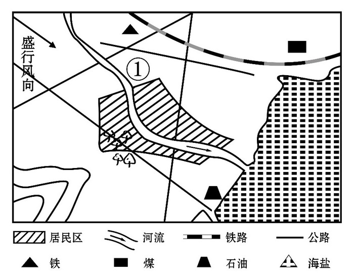

- **A**. 化工厂
- **B**. 钢铁厂
- **C**. 造纸厂
- **D**. 自来水厂　✅

**答案**：D

**官方解析**

①处于上风口，风从这里经过会进入市区，化工厂、钢铁厂都会大量排放废气，不适合建在此处，排除A、B两项。①同时处于河流的上游，造纸厂会带来大量的水污染，不适合建在此处，排除C项。故最适合建的是自来水厂。
故正确答案为D。

---

### 第 16 题　qid 1746628 · 人文常识

京沪铁路没有经过下列哪一名胜所在的省份？

- **A**. 景德镇古窑民俗博览区　✅
- **B**. 蓬莱阁风景区
- **C**. 承德避暑山庄
- **D**. 黄山风景区

**答案**：A

**官方解析**

景德镇古窑民俗博览区位于江西省；蓬莱阁风景区位于山东省；承德避暑山庄位于河北省；黄山风景区位于安徽省。京沪铁路自北向南经过的省级行政区有：北京市、天津市、河北省、山东省、安徽省、江苏省、上海市。所以没有经过的省份是江西省。
本题为选非题，故正确答案为A。

---

### 第 17 题　qid 1756308 · 人文常识

下列哪项不属于古人的林业思想？

- **A**. 孟春之月，禁止伐木
- **B**. 斧斤以时入山林，林木不可胜用
- **C**. 凡有地牧民者，务在四时，守在仓廪　✅
- **D**. 春三月，山林不登斧，以成草木之长

**答案**：C

**官方解析**

A选项“孟春之月，禁止伐木”出自《礼记·月令》，孟春，指的是春季的首月正月，应该是植树的季节，不能伐木，所以A选项反映的是古人的林业思想，排除；
B选项“斧斤以时入山林，林木不可胜用”出自《孟子·梁惠王上》，意思是砍木伐林是讲究时间和规律的，不能乱砍乱伐，不能随便破坏，符合古人的林业思想，排除；
C选项“凡有地牧民者，务在四时，守在仓廪”出自《管子·牧民》，意思是凡是拥有国土治理百姓的君主，务必要重视四时农事，确保粮食储备，所以C选项反映的不是林业思想，当选；
D选项“春三月，山林不登斧，以成草木之长”出自《逸周书·大聚篇》，意思是阳春三月，不去拿斧头进山林砍伐，让草木自然生长，体现了良好的生态保护意识，属于古人的林业思想，排除；
本题为选非题，故正确答案为C。

---

### 第 18 题　qid 1756310 · 人文常识

下列与雪有关的说法正确的是：

- **A**. 大气中有足够的凝结核是形成降雪的必要条件　✅
- **B**. 食盐可作为融雪物质，是因为盐水的凝固点比纯水高
- **C**. “下雪不冷化雪冷”是因为凝固吸热，有降温制冷作用
- **D**. “六月飞雪”是文学作品杜撰的场景，不可能在我国境内出现

**答案**：A

**官方解析**

降雪的形成条件有两个：一是大气中含有足够的凝结核，二是要有充分的水汽，故A项正确；
食盐融雪的原理是盐水的凝固点比纯水的低，故B项错误；
“下雪不冷化雪冷”是因为融化吸热，温度降低，故C项错误；
夏季高空有较强的冷气流是有可能导致六月飞雪的，我国有部分地区处于寒温带，六月温度也较低，故D项错误。
故正确答案为A。

---

### 第 19 题　qid 1746640 · 科技常识

图中a表示地壳中含量最多的三种元素氧、硅、铝，b表示人体内含量最多的三种元素。关于阴影部分代表的元素，下列说法<b>错误</b>的是：

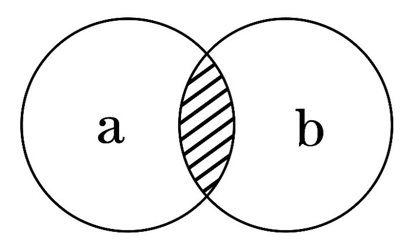

- **A**. 在冶金工业中有广泛用途
- **B**. 其单质可以燃烧　✅
- **C**. 是碱类物质必不可少的元素
- **D**. 是大气中的一种重要元素

**答案**：B

**官方解析**

由人体中元素含量较多的前五位元素分别是氧、碳、氢、氮、钙可知，含量占前三位的元素依次是氧、碳、氢。所以阴影部分是氧。
A项氧不但是动物维持生命过程和燃烧过程中不可缺少的物质，而且在现代工业生产中也十分重要，说法正确。
B项氧气在常温常压下，为无色、无味的气体，支持燃烧，但单质不可燃烧，说法错误。
C项碱是指电离时生成的阴离子全部是氢氧根离子的化合物，碱溶液中的阴离子都是氢氧根离子。所以碱的组成中一定含有氢、氧两种元素，说法正确。
D项地球上的大气有氮、氧、氩等气体成分，所以氧是大气中重要的元素之一，说法正确。
本题为选非题，故正确答案为B。

---

### 第 20 题　qid 1746642 · 科技常识

关于导体及其导电原理，下列说法错误的是：

- **A**. 金属导电，是因为金属中有可以自由移动的电子
- **B**. 人体导电，是因为人体内含有大量水分和矿物质
- **C**. 石墨导电，是因为石墨中含有碳元素　✅
- **D**. 酸碱溶液导电，是因为溶液内含有自由离子

**答案**：C

**官方解析**

A项，关于金属导体导电，经典导电理论认为，是由于金属导体内部存在大量的可以自由移动的自由电子，这些自由电子在电场力的作用下定向移动而形成电流，说法正确。
B项，人体中的每个细胞全充满着水，溶解着各类电解质，像钠、钾、钙等。矿物质是人体内无机物的总称，其中包含钙、镁、钾、钠、磷、硫、氯等电解质元素。电解质溶解于人的体液中，便形成了带电的离子，这些离子在外电场的作用下，于体液内作定向移动，便形成了电流，人体同样就有了导电性，说法正确。
C项，石墨中有大量的可流动的电子，电子的定向移动就是电流。石墨的原子结构中，每个碳原子用3个电子与周围的碳形成3个共价键，所以每个碳原子都剩余1个电子，这些电子能够自由移动，因此石墨能导电不是含有碳元素，而是因为有可以自由移动的电子，说法错误。
D项，酸碱溶液导电是因为溶液内含有自由离子，说法正确。
本题为选非题，故正确答案为C。

---

## 言语理解与表达

### 第 1 题　qid 1746638 · 逻辑填空

执行力的强弱已经成为影响企业成败的关键因素，世界级优秀企业总是能够让那些令人振奋的战略规划      地得到落实，达到甚至超出预期目标。
填入画横线部分最恰当的一项是：

- **A**. 一丝不苟
- **B**. 不遗余力
- **C**. 分毫不差　✅
- **D**. 滴水不漏

**答案**：C

**官方解析**

文段指出执行力强弱是关键，执行力强弱的表现决定战略规划能否得到严格的落实，“达到甚至超出预期目标”强调优秀企业能让战略规划完全按计划进行。对应选项，C项“分毫不差”意为一点差错也没有，即可表达此意，当选。A项“一丝不苟”形容办事认真，强调的是重视细节的态度，B项“不遗余力”指把力量全使出来，毫无保留，主语常搭配人，而非“规划”，D项“滴水不漏”形容说话办事细致周密，无懈可击，强调周密。三个词均不能体现完全按计划执行，故排除A、B、D三项。
故正确答案为C。
【文段出处】《赢在执行》

---

### 第 2 题　qid 1746646 · 逻辑填空

世界上没有完美无缺的医疗体系，无论是免费医疗还是市场化的医疗体系，都各有弊端，但从生存权和人的尊严角度看，对个人免费或少量收费的医疗实乃       。
填入画横线部分最恰当的一项是：

- **A**. 大势所趋　✅
- **B**. 当务之急
- **C**. 未雨绸缪
- **D**. 万全之策

**答案**：A

**官方解析**

文段首先说免费医疗体系和市场化医疗体系各有弊端，随后以“但”引导转折，由“从生存权和人的尊严角度看”可知，作者对免费医疗体系持肯定态度。A项“大势所趋”指整个局势发展的趋向，符合作者对免费医疗所持的态度观点，当选；B项“当务之急”指当前任务中最急切要办的事，“急切”在文中无从体现，排除；C项“未雨绸缪”指事先做好准备工作，文中并无此意，排除；D项“万全之策”指极其周到的办法，与文段中两种体系各有弊端这一表述相矛盾，排除。
故正确答案为A。
【文段出处】《免费医疗的国际实践》

---

### 第 3 题　qid 1746660 · 逻辑填空

在某种程度上，各地博物馆收藏化石，是对我国化石资源最大程度的保护，但      的是，这种方式的收藏也不能被      ，因为这就像吃鱼翅的人越多，遭到杀戮的鲨鱼就越多一样。
依次填入画横线部分最恰当的一项是：

- **A**. 遗憾         复制
- **B**. 矛盾         鼓励　✅
- **C**. 不幸         推广
- **D**. 尴尬         宣传

**答案**：B

**官方解析**

第一空，转折前强调收藏化石是一种保护，转折后语义相反，C项“不幸”填入此空程度过重，且“不幸”多形容已经发生的事情，而文段主要讨论的是“化石收藏”这种方式的好坏，不表示已经发生，排除。D项“尴尬”指行为、身态不正常，侧重于强调难为情，与文意不符，排除。
第二空，根据“这就像吃鱼翅的人越多，遭到杀戮的鲨鱼就越多一样”可知，并非强调这种方式不可“复制”，排除A项。B项“鼓励”一词可表达这种方式固然好，亦有弊端，符合文意。
故正确答案为B。
【文段出处】《古生物化石的隐秘流通》

---

### 第 4 题　qid 1746668 · 逻辑填空

中国教育，向来不缺批评声，这其中不乏      ，也难免过激之言。问题当然要直面，难题一定要破解。需要      的是，当批评蜂拥而至，不要无视那些被掩盖的优点和进步。唯有如此，才能在改革的道路上不彷徨、不摇摆，找到真正适合自己的发展道路。
依次填入画横线部分最恰当的一项是：

- **A**. 真知灼见   警惕　✅
- **B**. 远见卓识   担心
- **C**. 深谋远虑   注意
- **D**. 肺腑之言   反思

**答案**：A

**官方解析**

第一空，根据“不乏……也难免……”可知，前后内容形成反义并列，故横线处所填成语与“过激之言”语义相反，强调对中国教育正确的“批评和看法”。A项“真知灼见”指正确而透彻的见解，符合文意，保留。B项“远见卓识”中的“远见”意为远大的眼光，C项“深谋远虑”中的“远虑”意为考虑得很长远，二者均强调目光或考虑长远，其反义词为“鼠目寸光”“目光短浅”，无法与“过激之言”构成反义并列，排除。D项“肺腑之言”指出于内心的真诚的话，强调真诚，与“虚情假意”语义相反，不符合语境，排除。
第二空，代入验证，填入“警惕”可与后文“不要无视······”形成对应，符合文意。
故正确答案为A。
【文段出处】人民日报：《中科大37年培养出了2910名少年大学生》
【友情提示】
本题考查重点词句的对应，这就要求考生准确把握成语的含义，只有这样才能准确对应文段语境，锁定正确答案。语境分析是逻辑填空一大考点，考生在做题时切忌盲目相信语感，一定要整体把握文段语境，寻找解题突破口，无论是微观的关联词提示，还是宏观的重点词句对应，都可以帮助考生选出正确答案。
【拓展】
真知灼见：指正确而深刻的认识和高明的见解。
远见卓识：有远大的眼光和卓越的见解。

---

### 第 5 题　qid 1746652 · 逻辑填空

实际上雾霾形成的原因是多方面的，识别污染源是有效治理大气污染至关重要的环节。对京津冀区域而言，认清区域内污染源的共性及差别，有助于区域内地区________地对污染源进行综合治理。
填入画横线部分最恰当的一项是：

- **A**. 因地制宜
- **B**. 正本清源
- **C**. 齐心协力
- **D**. 有的放矢　✅

**答案**：D

**官方解析**

根据文段“认清区域内污染源的共性及差别”可知，横线处表达要抓住区域内的共性问题集中治理，对于有差别的问题要分别处理，即强调要有针对性地解决问题，D项“有的放矢”比喻说话做事有针对性，符合文意，当选。
A项“因地制宜”指根据各地具体情况制定适宜的办法，仅对应文段提到的“差别”，故表述片面，且文段仅提到京津冀地区这一整体，并无与其他地区的对比，故与文意不符，排除；B项“正本清源”指从根源上加以整顿清理，填入文段与后文“污染源”语义重复，排除；C项“齐心协力”指认识一致，共同努力，仅能表达对于“共性”问题的态度，故表述片面，排除。
故正确答案为D。
【文段出处】《京津冀大气一体化，该如何联动》

---

### 第 6 题　qid 1746654 · 逻辑填空

作为一种现代产权制度，知识产权制度的本质是通过保护产权形成      ，“给天才之火添加利益之油”，使全社会创新活力      ，创新成果涌流。
依次填入画横线部分最恰当的一项是：

- **A**. 吸引   释放
- **B**. 刺激   膨胀
- **C**. 激励   迸发　✅
- **D**. 促进    凸显

**答案**：C

**官方解析**

第一空，搭配“形成”，且对应“‘给天才之火添加利益之油’”，故横线处要表达出鼓励、加油之意，B项“刺激”指由于外界事物的作用使事物引起变化，C项“激励”指激发鼓励，均搭配得当，且符合文意，保留。A项“吸引”指把别的物体、力量或别人的注意力引到自己这方面来，可阐述为“形成吸引力”，与“形成”搭配不当，排除；D项“促进”指促使前进，推动使发展，可搭配“关系”“发展”，与“形成”搭配不当，排除。
第二空，搭配“活力”，且横线前后通过“创新活力······创新成果······”构成相同句式的并列关系，横线处与“涌流”语义相近，“涌流”指急速地流淌，C项“迸发”指由内而外地突然发出，搭配得当，且符合文意，当选。B项“膨胀”指某些事物扩大或增长，可搭配“欲望”“思想”，与“活力”搭配不当，排除。
故正确答案为C。
【文段出处】《论观念形态的知识产权文化建设策略》

---

### 第 7 题　qid 1746678 · 逻辑填空

筹算应用了大约两千年，对中国古代数学的发展功不可没。但筹算有个严重缺点，就是运算过程不保留。元朝数学家朱世杰能用筹算解四元高次方程，其数学水平居世界领先地位，但是他的方法难懂，运算过程又不能保留，因而      。中国古代数学不能发展为现代数学，筹算方法的      是个重要原因。
依次填入画横线部分最恰当的一项是：

- **A**. 形同虚设   束缚
- **B**. 销声匿迹    片面
- **C**. 后继无人   限制　✅
- **D**. 难以为继    约束

**答案**：C

**官方解析**

第一空，文段开篇指出筹算应用时间久，对中国古代数学的发展功不可没，接下来通过转折词“但”指出筹算有“运算过程不保留”这一严重缺点，“因而”为结论词，表示运算过程不能保留产生的结果，即筹算没有传承下来。A项“形同虚设”指形式上虽有，却不起作用，而由“运算过程又不能保留”可知，筹算在形式上也不存在，排除。D项“难以为继”表示很难再继续下去，强调“难”，体现不出失传的含义，排除。B项“销声匿迹”指隐藏起来、不公开露面，C项“后继无人”表示无人传承，强调“无”，二者均符合文意。
第二空，由前文“不能发展为现代数学”可知，横线处应填写一个语义消极的词语，C项“限制”指约束，符合文意。B项“片面”指不全面，偏于一方面，文段中并未体现出“片面”之意，排除。
故正确答案为C。
【文段出处】《中国古代的算筹和筹算》

---

### 第 8 题　qid 1746692 · 逻辑填空

在量子理论产生之前，人类在宏观世界里从未观测到任何负能量的物质。把真空的能量定为零的经典物理学，无法________一种比真空具有更少能量的物质。而在量子理论中，真空不再是________，每时每刻都有大量的虚粒子对（一种永远不能直接检测到，但其存在确实具有可测量效应的粒子）产生和湮灭。
依次填入画横线部分最恰当的一项是：

- **A**. 理解  高高在上
- **B**. 相信  空空如也
- **C**. 认可  一尘不染
- **D**. 接受  一无所有　✅

**答案**：D

**官方解析**

本题可从第二空入手，根据文段“每时每刻都有”可知，横线处表达真空中不是什么都没有，B项“空空如也”、D项“一无所有”均符合文意，保留。A项“高高在上”指地位高，脱离实际，C项“一尘不染”指不受坏习惯、坏风气的影响，也形容非常清洁干净，二者均与文意不符，排除A、C两项。
对比第一空，搭配“物质”，D项“接受”搭配恰当，当选。B项“相信”指信赖、不怀疑，与“物质”搭配不当，通常用法为相信某种物质的存在，排除。
故正确答案为D。
【文段出处】《虫洞：旅行家的天堂还是探险者的地狱？》

---

### 第 9 题　qid 1746728 · 逻辑填空

改进作风涉及习俗、文化、制度、利益等方方面面，本身就是一场攻坚战。无论是克服            的形式主义、官僚主义，还是打破思维定势、疗治沉疴顽疾，都需要有坚韧不拔的毅力。只有这样，才能            ，积小胜为大胜，取得让广大干部群众满意的成效。
依次填入画横线部分最恰当的一项是：

- **A**. 固步自封   渐入佳境
- **B**. 老调重弹    稳操胜券
- **C**. 抱残守缺    循序渐进
- **D**. 根深蒂固    稳扎稳打　✅

**答案**：D

**官方解析**

第一空，根据“改进作风······是一场攻坚战”“都需要有坚韧不拔的毅力”可知，形式主义、官僚主义是难以动摇的，对应选项即为D项“根深蒂固”，比喻基础牢固，不可动摇。A项“固步自封”意为只在自己划定的范围内走老步子，比喻安于现状，不求创新进取，C项“抱残守缺”意为抱着残缺破旧的东西不放，形容思想保守，不肯接受新事物。A、C两项均侧重保守，排除。B项“老调重弹”意为把陈旧的话或重复多次、令人生厌的言论又重新搬出来，侧重重复，与文意无关，且这一成语常作动词而非形容词，排除。
第二空验证，每一步的“稳扎稳打”，才可以“积小胜为大胜”，语义正确。
故正确答案为D。
【文段出处】《关键在“常”“长”二字》
【友情提示】
本题重点考查高频词汇“根深蒂固”，考生一定要准确把握它的含义，比喻基础牢固，不可动摇，文段经常会出现“长期”“长时间”“攻坚”“顽固”“已经”等提示词。经常与“根深蒂固”一起考查的成语还有“积重难返”“坚不可摧/坚如磐石”，需要考生进一步地辨析及积累。
近义成语辨析：
【根深蒂固&积重难返&坚不可摧/坚如磐石】
根深蒂固：比喻基础牢固，不可动摇。基础往往是指不太好的事。
积重难返：长期积累，情况严重，难以改变。形容长期形成的恶习或弊端不易改变。
坚不可摧/坚如磐石：非常坚固，难以摧毁；像大石头一样坚固，不可摧毁。
【区别】：
根深蒂固：形容基础牢固不易动摇，能够体现观念、印象、性格、影响在脑海里扎下了根。
积重难返：强调问题的累积。
坚不可摧/坚如磐石：经常强调意志、信念坚定。

---

### 第 10 题　qid 1746734 · 逻辑填空

1772年，在西方世界，狄德罗       长达21年编纂的《百科全书》11卷全部出齐，大功告成；而在东方世界，乾隆皇帝正式下诏编纂《四库全书》。作为主编这两部巨著的领袖人物狄德罗和纪晓岚，他们曲折的命运，无疑最集中地       了中西方知识分子的心路沧桑。
依次填入画横线部分最恰当的一项是：

- **A**. 废寝忘食   显露
- **B**. 呕心沥血   展示　✅
- **C**. 苦心孤诣   反映
- **D**. 精益求精   表现

**答案**：B

**官方解析**

根据文段语境，第一空描述狄德罗历时21年之久的艰辛编纂之路，B项“呕心沥血”，比喻用尽心思，多形容为事业、工作、文艺创作等用心的艰苦，用于此处最为恰当。A项“废寝忘食”指顾不得睡觉，忘记了吃饭；C项“苦心孤诣”指费尽心思钻研或经营，达到别人达不到的境地，这两者都更侧重于描述某阶段的专心与努力，体现不出为达成目标而长期所经受的艰辛，排除A、C两项。D项“精益求精”指好了还求更好，文意无从体现，排除D项。
以第二空验证，曲折命运“展示”出心路沧桑，符合语义语境。
故正确答案为B。
【文段出处】《&lt;四库全书&gt;与法国&lt;大百科全书&gt;的编纂出版之比较》

---

### 第 11 题　qid 1746714 · 逻辑填空

关于枕头，现代人比前人的认识和经验都要多得多，但是人们记得最      的话，却是古人说的“高枕无忧”，现在被      最多的，恰恰也是这句话，“高枕”被认为是颈椎问题的诱因之一。
依次填入画横线部分最恰当的一项是：

- **A**. 深刻    指责
- **B**. 清楚    批评　✅
- **C**. 牢固    谴责
- **D**. 广泛    批判

**答案**：B

**官方解析**

第一空，首先排除D项“广泛”，该词与“记得”搭配不当。
第二空，所填词语搭配“高枕无忧”这句话，这仅仅是古代民间流传的一个说法，用“指责”和“谴责”去对待这句话，未免程度过重，二者搭配对象一般是重大过失。排除A、C两项。B项“批评”程度合适，当选。
故正确答案为B。
【文段出处】中国教育和科研计算机网《高枕无忧这句话到底对吗？》

---

### 第 12 题　qid 1746702 · 逻辑填空

资源为国家所有，资源开发不应成为暴利行业，可以大幅提高修复基金、生态补偿基金额度，作为      ，让有能力、有资质、负责任的企业成为开发主体，使其成为未来矿产开发的方向。与此同时，建立矿山生态终身追责机制，严厉打击私挖滥采，让      者得不偿失，这样才能保障矿山资源的有序开发。
依次填入画横线部分最恰当的一项是：

- **A**. 门槛   杀鸡取卵　✅
- **B**. 标杆   寅吃卯粮
- **C**. 壁垒   唯利是图
- **D**. 标准   暴殄天物

**答案**：A

**官方解析**

第一空，“大幅提高修复基金、生态补偿基金额度”是为了让那些有能力、有资质、负责任的企业成为开发资源的主体，去带动未来矿业发展，即为那些企业提供一个成为开发主体的条件、机会，满足额度才可以成为主体，因此这可以作为一个“门槛”“标准”。B项“标杆”意为榜样，与文意不符，排除。C项“壁垒”多用来比喻对立的事物和界限，为贬义词，与文段中的积极语义相悖，排除。
第二空，所填词对应前面“私挖滥采”，并由“保障矿山资源的有序开发”可知，空格处应填入表示只贪图眼前采矿的巨大经济效益而不顾长远的生态利益的成语，对应A项“杀鸡取卵”。D项“暴殄天物”意为任意残害各种生物，也指不爱惜物品，任意挥霍浪费，该词并无不顾长远发展之意，不符合语境，排除。
故正确答案为A。
【文段出处】人民网《〈人民日报〉漫笔：让杀鸡取卵者得不偿失》
【友情提示】
本题重点考查成语“杀鸡取卵”的含义，比喻不惜牺牲长远利益来获取眼前的好处，和成语“竭泽而渔”意思相近，侧重于强调眼前利益和长远利益之间的取舍，这一点考生一定要准确把握，这两个成语的考查一般都会结合重点词句对应或者解释类对应的考点，只有准确掌握成语的含义，才能锁定正确答案。经常与“杀鸡取卵”一起考查的成语还有“寅吃卯粮”“饮鸩止渴”，需要考生进一步地辨析及积累。
近义成语辨析：
【杀鸡取卵&竭泽而渔&寅吃卯粮&饮鸩止渴】
杀鸡取卵：为得到蛋而把鸡杀了。比喻不惜牺牲长远利益来获取眼前的好处。
竭泽而渔：排干池塘或湖泊的水捕鱼。比喻只图眼前利益，不作长远打算。
寅吃卯粮：寅年吃了卯年的粮食。形容入不敷出，预先借支。
饮鸩止渴：喝毒酒解渴（鸩：指用鸩的羽毛泡过的毒酒）。比喻用有害的办法解决眼前困难，不顾严重的后果。
【区别】：
杀鸡取卵和竭泽而渔：这一组词为同义词，都表示只顾眼前利益不顾长远发展，都是一种不可持续的错误做法。
寅吃卯粮：强调预先透支和负债。
饮鸩止渴：强调眼前有困难，并且这个困境有些难以解决，选择了极端的错误方法，导致的后果更加严重。
【拓展】
暴殄天物：指任意残害各种生物，也指不爱惜物品，任意挥霍浪费，浪费程度重。
唯利是图：指一心贪图钱财，不顾一切。唯利是图没有今天与明天，得与失的对比，全在得和利。
刻舟求剑：是指思想僵化，用死板的眼光看发展。
升山采珠：是指方法和方向错误。

---

### 第 13 题　qid 1746764 · 逻辑填空

“心理弹性”的动力可能来自大脑激素反应、基因以及行为方式的共同作用，以保证一种情绪上的       状态。它不仅帮助我们在人生变故、创伤面前不至于崩溃，也让我们在好的经验上不至于沉溺，比如享受美餐、赢得球赛、受到表扬，都不会持续太久，这可能因为人是天生的       动物，在愉快的经验中沉浸太久，会       识别新危险的能力。
依次填入画横线部分最恰当的―项是：

- **A**. 平衡   忧患   钝化　✅
- **B**. 应激   危险   弱化
- **C**. 积极   健忘   异化
- **D**. 稳定   懒散   退化

**答案**：A

**官方解析**

第一空，根据文段“它不仅帮助我们在人生变故、创伤面前不至于崩溃，也让我们在好的经验上不至于沉溺”可知，“心理弹性”具备两方面的作用，故横线处所填词语应该体现下文所述的两个方面，B项“应激”仅对应第一方面，故表述片面，排除。C项“积极”仅侧重好的方面，与之相对的“消极”强调坏的方面，故“积极”表述片面，排除。A项“平衡”、D项“稳定”填入文段均可，保留。
第二空，根据后文“这可能因为”可知，横线处是对前文的原因解释，A项“忧患”表达人会考虑到可能遇到的祸患，所以不在好的经验中沉溺，符合文意。D项“懒散”指懒惰散漫，与文意相悖，排除。
第三空，代入“钝化”验证，“钝化能力”搭配恰当，且语义合适。
故正确答案为A。
【文段出处】陈赛《心理弹性：我们如何应对人生变故？》

---

### 第 14 题　qid 1746758 · 逻辑填空

物品的预设用途为用户提供了该如何操作的线索，比如平板是用来推的，旋钮是用来转的。如果物品的预设用途在设计中得到       体现，用户一看便知如何操作，无须借助任何的图解、标志和说明。如果简单物品也需要用图解、标志和说明书来       操作方法，这个设计就是       的。
依次填入画横线部分最恰当的一项是：

- **A**. 全面    呈现    粗糙
- **B**. 有效    指导    落伍
- **C**. 充分    解释    失败　✅
- **D**. 合理    演示    笨拙

**答案**：C

**官方解析**

第一空，根据横线后的表述“用户一看便知如何操作，无需借助任何图解”，横线处所填词语应体现出物品的预设用途在设计中得到足够的体现。B项“有效”指有效果、能达到目的，C项“充分”指足够，D项“合理”指合乎道理或事理，均符合文意，保留。A项“全面”侧重各个方面都顾及到，文段并非强调设计面面俱到，而是强调操作意图清晰易懂，与文意不符，排除。
第二空，搭配“操作方法”，且根据前文的对应信息，“图解、标志和说明书”这些都起解释说明的作用。C项“解释”指说明含义、原因、理由等，符合文意，保留。B项“指导”的主语往往是人而非说明书，排除。D项“演示”指利用实验或实物、图表把事物的过程显示出来，让人认识或理解，其表示的是一个动态的过程，无法与“标志”形成搭配，排除。
第三空，代入验证。C项“失败”指没有达到预期的目的，置于此处可体现出简单物品仍需借助图解等说明操作，说明该设计未达到直观易用的目标，符合文意，当选。
故正确答案为C。
【文段出处】《设计心理学》

---

### 第 15 题　qid 1746742 · 逻辑填空

海军舰艇中的军辅船是大洋上的“粮草官”，虽不具备强大作战能力，却直接关系着远洋保障。但是，目前中国仅有四艘综合补给舰在海军服役，维持日益       的远洋训练、护航和演习，显得有些       。
依次填入画横线部分最恰当的一项是：

- **A**. 漫长    顾此失彼
- **B**. 复杂    无能为力
- **C**. 繁重    捉襟见肘　✅
- **D**. 艰苦    苦不堪言

**答案**：C

**官方解析**

第一空，搭配“远洋训练、护航和演习”三项任务，A项“漫长”与“远洋训练、护航和演习”搭配不当，且通常不与“日益”连用，排除。
第二空，B项“无能为力”用在此处形容补给舰的情况程度过重，排除；D项“苦不堪言”意为苦得难以用言语表达，一般搭配“生活”等，用在此处语义不当且程度过重，排除；C项“捉襟见肘”意为拉一下衣襟就看见了胳膊肘儿，形容衣服破烂、生活贫困，后多比喻顾此失彼、穷于应付，与前文“仅有”一词对应准确，当选。
故正确答案为C。
【文段出处】《海军装备：比肩世界一流海军，中国还有多远？》

---

### 第 16 题　qid 1746750 · 逻辑填空

没有互联网的时候，商家跟消费者之间的交易以信息不对称为基础，       地讲，就是“买的不如卖的精”。但有了互联网，消费者掌握的信息越来越多，于是变得越来越精明，越来越具有       。如果你的产品或服务做得好，好得超出他们的预期，即使一分钱广告不投，消费者也愿意在网上分享，       为你树口碑。 
依次填入画横线部分最恰当的一项是：

- **A**. 简单   知情权   主动
- **B**. 通俗   话语权   免费　✅
- **C**. 确切   主动权   自愿
- **D**. 坦白   选择权   义务

**答案**：B

**官方解析**

第一空，文段首先用专业性的语言“商家”、“消费者”、“信息不对称”讲述，转而变成一句市井相传的常见道理“买的不如卖的精”，因此第一空处使用“简单”或者“通俗”均可。而前句相较后句并没有“确切”、“坦白”之意，排除C、D两项。
第二空，消费者一直都具有“知情权”，只是没有渠道得知而已，排除A项；随着掌握的信息增多，应该越来越具有“话语权”，对应B项。
第三空验证，“免费”可以更好地对应文中“即使一分钱广告不投”。
故正确答案为B。
【文段出处】《怎样不被互联网打败》

---

### 第 17 题　qid 1746782 · 逻辑填空

图书出版人首先应是一个文化人，然后才是一个生意人。只有在这两者之间求得一种       的平衡，才能在这个日益萎缩的图书市场中生存下去。用这个标准来衡量，有些出版人就不太合格：要么过于看重文化的附加值，对市场化的道路       ；要么把图书看作一单单生意，只顾着炮制各种       的畅销书。  
依次填入画横线部分最恰当的一项是：

- **A**. 微妙   不屑一顾    粗制滥造　✅
- **B**. 精妙    置若罔闻    差强人意
- **C**. 精确    嗤之以鼻    眼花缭乱
- **D**. 巧妙    退避三舍    名不副实

**答案**：A

**官方解析**

文段为“观点+解释说明”类文段，解释说明部分为反例论证，分两个角度来解释说明。
首先看第二空，前半句对于文化附加值“过于看重”，那么应填入表述对“对市场化的道路”轻视的成语。A项“不屑一顾”形容极端轻视，与前半句“过于”形成对应；B项“置若罔闻”形容不重视、不关心；C项“嗤之以鼻”表示瞧不起，三项均符合文意，保留。而D项“退避三舍”比喻退让和回避，避免冲突，与文意不符，排除。
再看第三空，填入的词与前句“看作一单单生意”、只注重成为“畅销书”而并非与畅销书的质量相对应。A项“粗制滥造”指只求数量，不顾质量，符合文意，当选；B项“差强人意”指勉强使人满意，文段并未体现，排除；C项“眼花缭乱”形容眼前事物纷繁复杂,难以辨认清楚,亦无法搭配“畅销书”，排除。 
最后看第一空，代入验证，“微妙的平衡”搭配合理。
故正确答案为A。
【文段出处】大庆晚报  《在纸质没落的时代延续一脉书香》

---

### 第 18 题　qid 1746774 · 逻辑填空

普及历史知识，形式多种多样，可以是专业的史学论著，可以是各种形式的历史讲座，也可以是影视剧。但在多种多样的形式中，有一点应是     的，即在处理历史题材、普及历史知识的时候需要尊重历史真实、需要对历史发展的大势抱有     之心，而不能      地凭自己的喜好去“创造”。
依次填入画横线部分最恰当的一项是：

- **A**. 基础    畏忌    捕风捉影
- **B**. 普遍    敬重    自以为是
- **C**. 共同    畏惧    空穴来风
- **D**. 共通    敬畏    随心所欲　✅

**答案**：D

**官方解析**

本题可从第二空入手，填入的词与前句“尊重”相对应，且搭配“历史”，D项“敬畏历史”为固定搭配，当选。A项“畏忌”、C项“畏惧”均表示害怕的意思，与“历史”搭配不当，排除。B项“敬重”通常形容下级对上级或晚辈对长辈的恭敬和尊重，与“历史”搭配不当，排除。
第一、三空代入验证，均符合文意。
故正确答案为D。
【成语拓展】
捕风捉影：风和影子都是抓不住的，比喻说话做事丝毫没有事实根据。
自以为是：认为自己的看法和做法都正确，不接受别人的意见，形容骄傲自大。
空穴来风：比喻消息和传说不是完全没有原因的，现多用来指消息和传说毫无根据。
【文段出处】人民日报  《普及历史知识首先应尊重历史真实》

---

### 第 19 题　qid 1746790 · 逻辑填空

数据新闻是个强大的工具，       了电脑科学、统计学以及社会科学在大数据研究方面的成果。数据记者可以通过编写算法寻找       ，勾勒出影响力、权力或消息源之间的关系图。在这种背景下，传统纸媒       自不待言。
依次填入画横线部分最恰当的一项是：

- **A**. 汇合    线索    偃旗息鼓
- **B**. 结合    话题    危在旦夕
- **C**. 综合    方向    望尘莫及
- **D**. 融合    趋势    日渐式微　✅

**答案**：D

**官方解析**

本题可从第三空入手，由前文“数据新闻是个强大的工具”可知，横线处所填词语要体现传统纸媒发展不好的意思。A项“偃旗息鼓”比喻事情终止或声势减弱；B项“危在旦夕”形容危险就在眼前，二者均语义过重，排除。D项“日渐式微”指事物逐渐地由兴盛而衰落；C项“望尘莫及”比喻远远落在后面，二者放入文段均可，保留。
第二空，根据文意可知，“勾勒出……关系图”是对横线处的解释说明，“勾勒”指用线条画出轮廓或用简单的笔墨描写事物的大致情况，“趋势”更符合文意，且搭配后文的“影响力、权力或消息源之间的关系图”，“趋势”比“方向”更恰当，排除C项。
第一空代入验证，符合文段语义，D项当选。
故正确答案为D。
【文段出处】郭恩强《数据新闻何以重要？——数据新闻的发展、挑战及其前景》

---

### 第 20 题　qid 1746770 · 逻辑填空

建筑设计，是一个科学问题，也是一个民主决策问题，规划设计要       专业人士的意见，       艺术创新。但是，城市公共建筑的设计规划，又是重要的公共事务，需要遵循民主决策、公开决策的原则，通过制度化的渠道，       公众尤其是当地民众的意见。
依次填入画横线部分最恰当的一项是：

- **A**. 重视   保障    征集
- **B**. 听取   保护    吸纳　✅
- **C**. 采纳   支持    吸收
- **D**. 采用   维持    征求

**答案**：B

**官方解析**

文段首先提出“建筑设计，是一个科学问题，也是一个民主决策问题”这一观点，接下来通过“但是”进行转折，由后文“遵循民主决策、公开决策的原则”可知，文段重在强调“民主决策问题”，而“专业人士的意见”代表科学，故第一空，应填入体现“民主决策”的词语，因此不能选择单方面直接“采纳”或“采用”专业人士意见，排除C、D两项。
第二空，搭配“艺术创新”，A项“保障”、B项“保护”用在此处均可。
第三空，“吸纳意见”为固定搭配，通过一系列的渠道将公众诉求体现在“建筑设计”中而非仅仅停留于“征集”的表面工作上，故“吸纳”更符合文意，排除A项。
故正确答案为B。
【文段出处】人民日报  《尊重规划权威才能告别奇怪建筑》

---

### 第 21 题　qid 1746648 · 片段阅读

跟石头和金属相比，木质砧板从表面上看也是硬邦邦一块，可“内心”柔软，内部的植物纤维虽紧密排列，但仍有很多细微的空隙。这使它在受到剧烈冲击时，内部结构发生弹性微调，既能避免与刀刃硬碰硬伤及刃口，又能吸收一部分冲击力，不会让刀刃在接触板面的一刹那，由于反弹力过大而“剑走偏锋”发生侧滑，这在连续切割，比如剁馅、切丝时尤为明显。
画线句子中的“这”指的是木质砧板的：

- **A**. 外观形态
- **B**. 材料来源
- **C**. 制作工艺
- **D**. 结构特点　✅

**答案**：D

**官方解析**

“这”指代的是“这”之前的内容，那么阅读前文可知文段通过一个对比，引出了木质砧板表面上是硬邦邦的，内部的植物纤维紧密排列，但仍有很多细微的空隙，外部加内部充分体现了砧板的结构特征，对应D项。A项表述不准确，不是代词所指，排除；前文并未提到“材料来源”和“制作工艺”的问题，排除B、C两项。
故正确答案为D。
【文段出处】《砧板-拖起食材，引刀一快》

---

### 第 22 题　qid 1746666 · 片段阅读

研究人员长期以来都设想干细胞能够用来修复或替换受损组织，该研究领域被冠名为再生医学。“多能的”胚胎干细胞被再生医学家们寄予厚望，所谓“多能”就意味着这些干细胞可以分化出多种其他类型的细胞。现在的技术已经可以在非胚胎细胞中诱导细胞的多能性，这样就可以绕过直接使用胚胎细胞时所引发的伦理争议。
作者接下来最不可能讲述的是：

- **A**. 细胞多能性研究的意义
- **B**. 再生医学的得名由来　✅
- **C**. 细胞多能性研究的新成果
- **D**. 再生医学领域的伦理争议

**答案**：B

**官方解析**

文段首先介绍了“再生医学”的来由，之后介绍了“‘多能的‘胚胎干细胞被再生医学家们寄予厚望”，题目要求选择“接下来最不可能讲述的”，可以发现B项的“再生医学的得名由来”在文段第一句就点出了，故下文不会再讲，即可确定答案为B项。
文段接下来主要围绕细胞的多能性进行阐述，故A、C两项与之话题一致，后文可能会详细阐述；D项与文段最后一句话话题一致，后文也有可能对此进行论述。
本题为选非题，故正确答案为B。
【文段出处】《中文网—[2013.07.06]干细胞治疗》

---

### 第 23 题　qid 1746672 · 片段阅读

自从1958年第一个永久起搏器被植入人体后，可植入医疗设备的制造商就在不断研究为其产品提供电能的各种方法。不可充电的锂电池目前较为普遍，在心脏病和神经源性疾病的移植设备中，不可充电的锂电池一般能够使用7年到10年，已经属于比较“长寿”的了，研究者认为，除非在生物电池领域取得突破性的进展，否则植入式设备始终无法真正永久、可靠地工作。
这段文字意在说明：

- **A**. 可植入设备目前主要用于医疗领域
- **B**. 神经源性疾病的治疗需引入新技术
- **C**. 供电能力目前是可植入设备的瓶颈　✅
- **D**. 可植入医疗设备的发展前景较广阔

**答案**：C

**官方解析**

文段首先介绍自1958年以后，制造商就在不断研究为可植入设备提供电能的方法，之后提到了不可充电的锂电池比较“长寿”，寿命也只有7～10年，最后用“除非”强调了供电问题无法解决，可植入设备就无法真正永久、可靠地工作。文段的中心即强调供电能力一直以来都是可植入设备需要解决的问题，对应C项的“瓶颈”，当选。
A项：文段并未提到可植入设备应用的领域，故无法知道其是否主要应用于医疗领域，排除。
B项：文段并未提到新技术，而且该项也未出现“可植入设备”和“供电能力”两个主题词，排除。
D项：表述的感情色彩过于乐观，文段说的是还有问题没有解决，故无法知道前景是否广阔，排除。
故正确答案为C。
【来源】《经济学人:医用植入设备一个甜美的想法》

---

### 第 24 题　qid 1746720 · 语句表达

以李鸿章为领袖的洋务运动曾给中国带来富国强兵的希望，而经其手签订的各种丧权辱国条约却让中国陷入半封建半殖民地社会。正因如此，一百多年来，李鸿章头顶变换着救国、误国、卖国三顶帽子。对这样一个复杂的历史人物，只有给其一个更为精准的定位，才能更清晰地解读他的所作所为。而在如何定位上，诸多史学著作或抓小放大，或以偏概全，或就事论事，隔靴搔痒，雾里看花，      。
填入画横线部分最恰当的一句是：

- **A**. 读者难有尽兴之感
- **B**. 有失公允之处颇多　✅
- **C**. 真正的佳作甚为罕见
- **D**. 难以摘掉这三顶帽子

**答案**：B

**官方解析**

横线出现在尾句，一方面承接前文，另一方面起到概括总结的作用。文段首句阐述了李鸿章既给中国带来了好的作用，又给中国带来了不好的影响，接着指出李鸿章顶着救国、误国、卖国的帽子，随后通过“只有······才······”重在强调要给李鸿章一个更为精准的定位，尾句“而在如何定位上······”依然围绕对李鸿章的“定位”展开，由“或抓小放大，或以偏概全，或就事论事，隔靴搔痒，雾里看花”可知，诸多史学著作对李鸿章的定位是不太客观和公正的，B项“有失公允”中“公”即“公平”，“允”即“恰当”，“有失公允”即评价、定位不当，“颇多”是对史学家们共性问题的概括性表述，当选。
A项，文段强调的是史学著作对李鸿章的定位，与“读者”无关，排除；
C项，由文段可知“诸多史学著作”对李鸿章的评判均较为片面，故难以称得上佳作，“真正的佳作”与尾句的话题不一致，排除；
D项中的“摘掉这三顶帽子”并非作者强调的目的所在，作者希望给予精准定位而非简单地“摘掉帽子”，排除。
故正确答案为B。
【文段出处】《刀锋下的外交，刀刃上的舞者》

---

### 第 25 题　qid 1746726 · 语句表达

相关研究表明，_______：由于气候变暖，中国冬小麦的安全种植北界已由长城沿线向北扩展了1至2个纬度；华北地区冬小麦正由冬性向半冬性过渡，东北地区粮食产量显著提高，水稻面积和总产量迅速增加；喜温作物玉米目前已经成为中国第一大作物。除了利好消息，气候变化也有不利影响：各种极端天气事件增多，各种病虫害危害加重，都会导致农业减产。
填入画横线部分最恰当的一句是：

- **A**. 气候变暖对农业的影响并不像想象的那么悲观
- **B**. 各种气象灾害对农业生产的影响日益突出
- **C**. 中国主要农作物的种植面积正在日益扩大
- **D**. 气候变化给中国农业带来的影响以好处居多　✅

**答案**：D

**官方解析**

横线出现在文段首句，且由横线后冒号可知，后文对横线处进行解释说明，需结合后文对横线内容做出判断。后文通过分号连接并列结构介绍了气候变暖给我国农业带来许多方面的积极影响，接着指出气候变化“除了利好消息，也有不利影响”，第二个冒号之后是对不利影响的解释。横线处应重点概括气候变化的积极影响，对应D项。
A项“农业”概念扩大，文段重在阐述“中国农业”，且“想象的那么悲观”也与文段逻辑不符，排除；B项“气象灾害”偷换概念，文段强调的是“气候变化”，且“农业”也为概念扩大，排除；C项“种植面积正在日益扩大”仅为积极影响中的一部分内容，表述片面，排除。 

故正确答案为D。

【文段出处】《“超级厄尔尼诺”将频繁发生 高温提高事故发生率》

---

### 第 26 题　qid 1746684 · 片段阅读

以往关于网络提速与降价的讨论中，舆论多从运营商和消费者博弈的角度切入，聚焦低网速、高收费对于公众生活的影响，使用的是服务者义务和消费者权利的说理逻辑。此次却提供了一个新的观察视角，即低质量、高成本的宽带服务潜在地阻止了社会信息化的进程。在现代信息社会的运行中，宽带建设具有基础设施的意义，是知识型经济、网络化社会、数字化生活、服务型政府最起码的物理支撑。没有一个高速度、高水平的宽带环境，信息交流的效率会滞后，科技创新的成本会增加，信息化社会的发育和创新型社会的成长自然会受到束缚。
这段文字意在说明：

- **A**. 宽带建设应该成为信息化社会的基石　✅
- **B**. 以往关于网络提速与降价的讨论存在误区
- **C**. 网络运营商的服务质量应走在服务业的前列
- **D**. 信息交流效率的提高有赖于宽带环境的改善

**答案**：A

**官方解析**

文段首先指出以往网络提速与降价讨论的视角，接着通过转折关联词“却”引出了新的视角，即“宽带服务潜在地阻止了社会信息化的进程”，强调宽带建设对于社会信息化很重要，后文进行正面论证。尾句通过反面论证再次强调宽带建设对于社会信息化很重要，对应A项。
B项：“以往”的观点非重点，文段重在强调此次新的视角，排除。
C项：“网络运营商”为以往视角中的内容，非重点，排除。
D项：“信息交流效率”对应文段反面论证中不好的结果，非重点，且为不好结果中的一个方面，表述片面，排除。
故正确答案为A。
【文段出处】《总理都看不下去，网费阻挡社会信息化》

---

### 第 27 题　qid 1746690 · 片段阅读

长期以来，政府对公共事务的处理处于相对垄断状态，随着社会转型加剧，社会治理遇到的挑战越来越多，政府已无力也没有必要去处理诸多繁杂的社会性事务。这一局面的出现，迫切要求厘清政府与社会的关系，社会能处理的交给社会，政府只是进行宏观调控和监督等必须由政府自身完成的事务，也就是从全能型政府转变为服务型政府。政府购买公共服务，有助于剥离政府的一部分职能，扩大社会自我服务的空间，使社会有能力进行自我管理和自我服务，最终促进社会整体效率的提高。
这段文字意在强调：

- **A**. 政府对公共事务的垄断阻碍了社会效率的提高
- **B**. 社会转型弱化了政府在处理公共事务中的作用
- **C**. 政府职能向服务型转变是社会转型的内在要求　✅
- **D**. 购买公共服务是今后政府提高效率的首要方式

**答案**：C

**官方解析**

文段首先提出了政府垄断公共事务这种情况，随后提到现今政府已经无力也没必要去做这类事情，接着引出这种局面迫切要求政府进行职能转变，即由全能型政府向服务型政府转变，之后详细阐述了这样做的好处，可知文段是围绕“政府职能转变”这个中心展开的，对应C项，其中的“内在要求”对应文段的“迫切要求”。
A、B、D三项都未出现“政府职能转变”这一主题词，并且D项的“首要方式”文段并未提到，排除。
故正确答案为C。
【文段出处】《光明日报：政府购买公共服务的价值追求》

---

### 第 28 题　qid 1746700 · 片段阅读

无论导演还是监制，都是非常复杂的工种，经验的积累非常重要。没有经历过片场的摸爬滚打，在现场的执行能力就会有问题。因此，在一些电影产业成熟的国家，新人从学校毕业之后，要先在制片厂当学徒，从写剧本开始，再经过副导演、执行导演等环节，在各方面技能掌握齐全之后，最终成长为一名合格的导演，此后再“导而优则监”。
下列哪句话最能概括这段文字所包含的道理？

- **A**. 
纸上得来终觉浅，绝知此事要躬行
　✅
- **B**. 
书山有路勤为径，学海无涯苦作舟

- **C**. 
天才是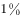的天赋加的努力

- **D**. 
不想当将军的士兵不是好士兵

**答案**：A

**官方解析**

文段为因果结构，作者首先强调经验积累对于导演、监制的重要性，接着以“因此”点出结论，即在电影业成熟的国家，要成为导演和监制需要在校园学习完理论后，积累一系列在基层锻炼和实践的经验。A项“纸上得来终觉浅，绝知此事要躬行”意为从书本上得到的知识毕竟比较肤浅，要透彻地认识事物还必须亲自实践，符合文意，当选。
B、C两项：均强调刻苦学习，与文段无关，排除。
D项：强调树立远大志向的意义，与文段无关，排除。
故正确答案为A。

---

### 第 29 题　qid 1746708 · 片段阅读

在讨论科学与宗教作为认知方式的差异和优劣时，常常有人提出“科学不是万能的，科学也会出错”的观点。这显然很正确，但在那种讨论中，在没有人声称“科学永远正确”的情况下，主动插入这种观点，却明显是在用“所有认知方式都非完美无缺”这一事实，来故意混淆不同的认知方式。这是极具误导性的。
根据这段文字可以知道，作者想说的是：

- **A**. 在关于认知方式的讨论中不应偏离议题
- **B**. 任何一种认知方式都不会是完美无缺的
- **C**. 生搬“科学会出错”的观点有时会混淆视听　✅
- **D**. 科学和宗教这两种认知方式并没有优劣之分

**答案**：C

**官方解析**

作者首先提出在讨论科学和宗教作为认知方式的区别时，有人提出“科学不是万能的，科学也会出错”的观点是正确的。接着进行转折，强调在没有人声称“科学永远正确”的情况下，主动插入这种观点，是故意混淆不同的认知方式，具有误导性，对应C项，且C项中的“有时”表达较温和。
A项：为干扰项，“认知方式”过于宽泛，扩大了论述范围，且“偏离议题”为无中生有，排除。
B项：为文中用于论证的次要信息，排除。
D项：作者并未谈及科学与宗教孰优孰劣，排除。
故正确答案为C。
【文段出处】《科学哲学讨论中的“大规模杀伤武器”》

---

### 第 30 题　qid 1746748 · 语句表达

①我国的GDP总量早已位居世界前列，我国既是最大的石油进口国，也是最大的货物贸易国
②它绝对是国家的核心武器，而且是不可或缺的战略武器
③具有中远海作战能力和标志意义的航空母舰、两栖攻击舰等大型战舰的建造与运用，对于发展我国海上力量已刻不容缓
④对于一个大国，特别是一个正从大国迈向强国的国家来说，航空母舰绝非可有可无的作战平台或大型武器
⑤我国的海洋利益仍在不断地拓展，越来越多的海外利益需要保护，越来越多的海上运输安全亟待维护
⑥无论是历史还是现实，众多大国（例如美国、俄罗斯、英国等）的实例，都已充分证明了这一点
将以上6个句子重新排列，语序正确的是：

- **A**. ④②⑥①⑤③　✅
- **B**. ⑤①④⑥③②
- **C**. ①⑤⑥③④②
- **D**. ③④⑥②①⑤

**答案**：A

**官方解析**

本题考查语句排序。根据选项，先对比①③④⑤确定首句，⑤“我国的海洋利益仍在不断地拓展”，“仍”说明前面应有内容，且“亟待维护”为对策表述，故⑤不适合做首句，排除B项。⑤提到“亟待维护”，后文应具体论述如何保护海上运输安全，③提出了具体的对策，是对⑤句的回答，故⑤在③前，排除D项。
对比A、C两项，③“对于发展我国海上力量已刻不容缓”为表对策的结论性的语句；②阐述了航空母舰的重要性，对比②③，③更适合做尾句，排除C项。对A项进行验证，逻辑通顺，语义连贯，当选。
故正确答案为A。
【文段出处】《3艘航母或是中国未来标配》

---

### 第 31 题　qid 1746756 · 语句表达

①影响生物寿命最关键的因素是基因
②同种生物的自然寿命是类似的
③从进化的角度看，这是生物在长期适应环境的过程中逐渐积累，通过自然选择而形成的
④环境可以决定相关基因是否表达，而这些基因的表达与否，又会影响相应蛋白质的表达水平，由此控制生物的寿命
⑤在这个前提下，个体的寿命则由环境决定
⑥生物的寿命由遗传物质和环境因素共同决定，遗传物质是基础
将以上6个句子重新排列，语序正确的是：

- **A**. ②④①⑥③⑤
- **B**. ④⑤③②⑥①
- **C**. ①③④⑥⑤②
- **D**. ⑥①③②⑤④　✅

**答案**：D

**官方解析**

本题为语句排序题，从选项入手分析。①句的核心内容为基因，②句提及生物寿命，④句强调环境的重要作用，而⑥句将①句中的基因即遗传物质和④句中的环境概括提出，往往位于①④两句之前先总起再分述，并且在分述中一般按照先“遗传物质”再“环境”的先后顺序展开。据此可知，D项中⑥句开头①③②句讲“遗传物质”，⑤④句讲“环境”，完全符合正确且常考的行文逻辑。
故正确答案为D。
【文段出处】无

---

### 第 32 题　qid 1746732 · 片段阅读

随着债务置换计划的实施，地方债到期不能偿付的风险基本消弭，刚性兑付再一次得到确保。但地方债管理要真正走向规范化，还有许多技术问题有待解决，其中最为突出的就是地方政府的信用评级问题。信用评级是债券定价的基础，直接关乎发行方的融资成本，但由于信用评级标准不明确，东部发达地区和西部欠发达地区的政府信用评级―样，地方政府信用和国家信用评级一样，甚至还出现地方债利率低于国债利率的情形，这在理论上显然是说不通的，也完全不能反映“市场在资源配置中起决定性作用”的要求。
这段文字意在强调：

- **A**. 地方债务管理风险仍需引起重视
- **B**. 地方政府信用评级制度亟待完善　✅
- **C**. 债务利率的确定应当符合市场规律
- **D**. 解决地方债务问题应考虑地域差异

**答案**：B

**官方解析**

文段首先说明债务置换计划起到的作用，接着通过转折词“但”指出地方债管理要想实现规范化，还有很多问题要解决，其中最突出的即是信用评级问题，后文进一步介绍了信用评级的一系列情况，对前文进行了详细解释说明。故转折词“但”之后引导的内容为重点，B项符合文意，当选。
A项，未提及“信用评级”这一重点概念，排除。
C项，“债务利率”属于解释说明部分的内容，故非文段表述重点，排除。
D项，“考虑地域差异”无中生有，排除。
故正确答案为B。
【友情提示】在国考的中心理解题型中，转折关联词引导重点句为每年必考的考点，考生们需对文段中出现的转折关联词予以重视。

---

### 第 33 题　qid 1746738 · 语句表达

①当地球撞进尘埃带时，从地球上看，是短时间内无数尘埃以极高的速度划破大气层下落
②因此，流星雨实际上是彗星留下的无数尘埃形成的
③进入大气层的尘埃被大气加热，发出明亮的光
④彗星释放出的尘埃，并非顷刻扩散到宇宙空间，消失得无影无踪，而是留在彗星的轨道上继续公转
⑤这样看上去就有许多流星，也就是流星雨
⑥这样形成的“尘埃带”，有些和地球的公转轨道交叉
将以上6个句子重新排列，语序正确的是：

- **A**. ④②⑥③⑤①
- **B**. ①④③⑥⑤②
- **C**. ④⑥①③⑤②　✅
- **D**. ①③⑤②④⑥

**答案**：C

**官方解析**

本题考查语句排序，首先对比选项，判断首句。①谈论的是“尘埃带”，④谈论的是“尘埃”，按照日常逻辑，应先有尘埃的扩散，然后才形成尘埃带，故④更适合做首句，排除B、D两项。接下来可判断尾句，②由“因此”引导结论，更适合做尾句，排除A项。
故正确答案为C。
【文段出处】无

---

### 第 34 题　qid 1746762 · 片段阅读

我们已经目睹，那些科幻小说中原本只存在于想象之中的未来科技逐一实现，并且改变了真实的世界。也许有一天，科幻小说不再思索和模拟技术的实际作用，而把全部注意力放在叙事者的主题，人类宿命甚至宇宙命运之上，我们仍要感谢它们帮助我们幻想过未来世界。只是，但愿永远可以有人像儒勒•凡尔纳在一百多年前那样由衷地发问：难道人们真的不可能用更短的时间环游地球吗？
根据这段文字可以知道，作者希望科幻作品：

- **A**. 尽可能想象科技发展对人类的影响
- **B**. 更加关注科幻故事情节本身的发展
- **C**. 能够继续激励和启发未来科技的创新　✅
- **D**. 应努力探讨未来科技应用的具体表现

**答案**：C

**官方解析**

本题为中心理解题。文段首先肯定了科幻小说中想象科技的实现及其对真实世界的改变。然后假设科技小说有一天即使注意力从思索变成了叙事，我们还是要感谢它们帮助我们幻想过未来。最后一个“只是”表转折，后边是文段的重点，“由衷地发问”五个字表达了作者期望科幻小说始终能够引导人们去思考和创新，对应C项。
A项，文段的意思不是想象，而是科技实际对我们的影响，排除。B项与文段中心相悖，文段突出强调的是科幻作品对现实世界的影响，排除。D项表述的是科幻作品的内容，不是文段重点意思，排除。
故正确答案为C。
【文段出处】无

---

### 第 35 题　qid 1746766 · 片段阅读

文学走进互联网，获得了―个崭新的平民化开放视野；网络上自由、兼容和共享的虚拟空间，打破了精英写作对文学话语权的垄断，为愿意上网创作的网民提供了“人人都能当作家”的机会。这种“新民间文学”，标志着文学话语权向民间回归。尽管如此，网络写作仍然不能与“人民写作”相提并论，因为文学的“人民写作”并不取决于传媒的公共性和参与的广泛性，而取决于这种文学的人民性价值取向和为广大民众喜闻乐见的审美品格。
这段文字主要说的是：

- **A**. 大众化是未来文学发展的趋势
- **B**. 文学创作应坚持人民性的价值取向
- **C**. 网络写作为普通人提供了平等的话语权
- **D**. 平民化的网络文学不能等同于“人民写作”　✅

**答案**：D

**官方解析**

文段首先介绍现象，即文学走进互联网，标志着文学话语权向民间回归；接着以“尽管如此”引出文段中心意思，网络写作不能与“人民写作”等同；随后详细阐述了原因。对应选项，D项准确地把握了文段的中心意思，当选。A项为无中生有，排除；B项为文段引申出来的价值取向，不是本段文字的重点内容，排除；C项为文段开篇介绍的现象，不是重点，排除。
故正确答案为D。
【文段来源】《网络时代仍需倡导人民写作》

---

### 第 36 题　qid 1746760 · 片段阅读

在现代军事中，战略威慑的地位越来越重要。战略威慑的实力，由常备军和后备力量两个部分组成，要确保这两支力量正常运转和发展，除了国民经济动员外，还需要一种无形力量的支持。这正是信息化战争中，新闻舆论战所承担的战略任务。因为没有媒体的宣传，别人就不可能全面感受到你的“强大”，其威慑作用也会大打折扣。从海湾战争到伊拉克战争，美国都是借助媒体挥舞“威慑大棒”，战前就发动大规模的舆论攻势，使对方先失一局。可见，通过舆论战抢占话语权，先发制敌，形成对己有利的战争环境，有助于实现战略目标。
这段文字意在说明：

- **A**. 新闻舆论战对战略威慑至关重要　✅
- **B**. 舆论战成为打赢信息化战争的重要手段
- **C**. 大规模舆论攻势成为现代战争的前哨战
- **D**. 媒体宣传是联结常备军与后备力量的纽带

**答案**：A

**官方解析**

文段首先指出战略威慑的地位很重要，接着指出新闻舆论战对于战略威慑实力是一种无形的支持，后文分析了原因，并通过美国的例子进行论证。尾句通过“可见”总结上文，指出舆论战对于实现战略目标很重要，舆论战即“新闻舆论战”，战略目标即“战略威慑”，故可知文段重在强调新闻舆论战对于战略威慑的重要作用，对应A项。
B项：“打赢”二字程度过重，文段中只是说对战争有利，且并未提及“战略威慑”这一主题词，排除。
C项：“大规模舆论攻势”对应例子中的内容，非重点，且仅提到“舆论攻势”，缺少“战略威慑”这一主题词，排除。
D项：“媒体宣传”为文段中原因解释的内容，非重点，排除。
故正确答案为A。

---

### 第 37 题　qid 1746772 · 片段阅读

判断一个环形坑或环形构造的形成是否与陨石撞击作用有关，关键是要查明该坑岩石是否受过陨石强烈撞击伴随的冲击波作用。在强烈冲击波作用下，靶岩将发生冲击变质。关于陨石撞击坑的判别，国际科学界明确了三项冲击变质诊断性指标：矿物击变面状页理、矿物击变玻璃、击变矿物高压多形转变。在自然界中，除了地外天体超速撞击引起的冲击波作用外，任何其他天然过程或地质作用均不能在地质体中引发这类矿物物理变化。如能在地表环状地质构造中发现上述三项指标之一，即可确定该地区发生过陨石撞击事件。
根据这段文字，对某处环形坑或环形构造来说：

- **A**. 发现矿物击变玻璃即可断定为陨石撞击形成　✅
- **B**. 其形成往往能证明该处受过强烈冲击波作用
- **C**. 三项冲击变质诊断性指标通常不会同时出现
- **D**. 强烈地震有可能引发击变矿物高压多形转变

**答案**：A

**官方解析**

根据原文最后一句话，“如能在地表环状地质构造中发现上述三项指标之一，即可确定该地区发生过陨石撞击事件”，可知A项正确。B项，文段讨论的问题是判断环形坑或环形构造是否为受到陨石的强烈撞击所形成，此项偏离文段意思，错误。C、D两项为无中生有，文段并没有提及此意，错误。
故正确答案为A。
【文段来源】《“中国首坑”背后暗藏利益之争》

---

### 第 38 题　qid 1746776 · 片段阅读

纵观世界，新的垃圾处理时代正在到来。前不久，俄罗斯科学家已经可以利用等离子技术来处理垃圾焚烧过程中产生的有害气体，并对城市生活制造的“污泥浊水”进行无害化处理，使其转为腐殖酸肥料。德国科学家造出“风拣技术”，令世界看到了垃圾处理的广阔未来。该技术终结了垃圾的人工分拣，让风代替人去对垃圾中的塑料、玻璃、纸张等进行分拣，从而将垃圾处理工艺提高到了一个前所未有的新阶段。
最适合做这段文字标题的是：

- **A**. 垃圾：放错地方的资源
- **B**. 科技：垃圾处理的关键　✅
- **C**. 风力：新时代的“机器人”
- **D**. 无害化：垃圾处理的未来

**答案**：B

**官方解析**

文段通过俄罗斯科学家以及德国科学家的两种处理垃圾的方式表明，运用科技是处理垃圾的有效手段。对应选项可知，B项准确的把握了文段的中心意思，当选；A项没有提及科技这一概念，且意思仅为文段的一部分内容，排除；C项，风力仅为处理垃圾的其中一种科技手段，表述不全面，排除；D项为俄国科学家处理垃圾的方式，片面，排除。
故正确答案为B。
【文段来源】《垃圾即资源》

---

### 第 39 题　qid 1746768 · 片段阅读

近代以来，史学界发展出几种“专门之学”，即简帛学、敦煌学、徽学、黑城学等，这些学问研究的主要对象是出土或传世的文书，包括简帛文书、敦煌吐鲁番文书、徽州文书、黑城文书，时间跨度从战国秦汉直至明清。虽然这些研究的对象多是文书，中国却并没有自己的“古文书学”，原因当然是多方面的，其中一个重要原因，就是这些研究是随着出土或传世文书的不断发现而逐步扩大兴盛，却又各自为界。所以，只有在文书数量足够多、研究足够丰富、积累足够厚重、交流足够频繁的情况下，才有可能建立“中国古文书学”。这段文字主要反映了史学界怎样的研究状况？

- **A**. 重考据轻分析
- **B**. 重发展轻交流　✅
- **C**. 重理论轻实践
- **D**. 重传统轻创新

**答案**：B

**官方解析**

根据文段中提到的史学界发展出“专门之学”，却没有自己的“古文书学”，这些研究不断发现而逐步扩大，却各自为界，以及交流需逐步频繁，才能建立“中国古文书学”等信息可知，文段强调的史学界的研究情况为重发展而轻交流。
A、C、D三项中的考据分析、理论实践、传统创新在文段中并无体现。
故正确答案为B。
【文段来源】《“中国古文书学”：超越断代文书研究》

---

### 第 40 题　qid 1746778 · 片段阅读

心理学家发现，人们对世界的认识受到两种基本需求的驱动：第一，我们对世界的认识有种“一致性需求”，希望世界的运动符合我们的信仰、理念、态度、经验和预期，即使现实与我们自身的预期不一致，我们也要改变外在的证据来使它符合我们内在的期望；第二，人类需要对外在环境产生一种控制感，我们不希望自己在现实面前无能为力、无所适从，我们需要找到某种自己能够理解、控制、描述、解释和预测的可能性。
文中的心理学发现可以解释下列哪一行为？

- **A**. 在集体中容易产生从众心理
- **B**. 在明知自己错误的情况下仍固执己见
- **C**. 喜欢用“阴谋论”解释超越自己经验之外的事物　✅
- **D**. 在过于熟悉的环境中容易产生厌倦心理并试图改变

**答案**：C

**官方解析**

文段阐述了人认识世界的两种需求，“一致性需求”与“控制需求”，根据“我们需要找到某种自己能够理解、控制、描述、解释和预测的可能性”一句可知，人们喜欢用属于自己能够理解的理论，用自己能够理解的东西来认识世界，C项符合文意，当选。A、B、D三项既不属于“一致性需求”也不属于“控制需求”的范畴，故排除。
故正确答案为C。
【文段来源】《心理学专家：为什么阴谋如此盛行？》

---

## 数量关系

### 第 1 题　qid 1746712 · 数学运算

某单位组建兴趣小组，每人选择一项参加。羽毛球组人数是乒乓球组人数的2倍，足球组人数是篮球组人数的3倍，乒乓球组人数的4倍与其他3个组人数的和相等。则羽毛球组人数等于：

- **A**. 足球组人数与篮球组人数之和　✅
- **B**. 乒乓球组人数与足球组人数之和
- **C**. 足球组人数的1.5倍
- **D**. 篮球组人数的3倍

**答案**：A

**官方解析**

题干给出三组等式：

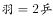······①；

······②；

······③；

要求出羽毛球组的人数，可先从有羽毛球的①式和③式着手考虑：

与联立可得：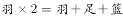，化简后得：。

故正确答案为A。

---

### 第 2 题　qid 1746724 · 数学运算

某新建小区计划在小区主干道两侧种植银杏树和梧桐树绿化环境，一侧每隔3棵银杏树种1棵梧桐树，另一侧每隔4棵梧桐树种1棵银杏树，最终两侧各种植了35棵树，问最多栽种了多少棵银杏树？

- **A**. 33
- **B**. 34　✅
- **C**. 36
- **D**. 37

**答案**：B

**官方解析**

在满足两侧栽种要求的情况下，要使银杏树栽种的最多，应把银杏树尽量栽在前面，其中一侧按照“银、银、银、梧······”循环，周期为4，，共有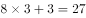棵银杏树。另一侧按照“银、梧、梧、梧、梧······”循环，周期为5，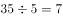，共有7棵银杏树。因此两侧最多栽种了棵银杏树。

故正确答案为B。

---

### 第 3 题　qid 1756314 · 数学运算

20人乘飞机从甲市前往乙市，总费用为27000元。每张机票的全价票单价为2000元，除全价票之外，该班飞机还有九折票和五折票两种选择。每位旅客的机票总费用除机票价格之外，还包括170元的税费。则购买九折票的乘客与购买全价票的乘客人数相比为（  ）。

- **A**. 两者一样多　✅
- **B**. 买九折票的多1人
- **C**. 买全价票的多2人
- **D**. 买九折票的多4人

**答案**：A

**官方解析**

假设购买全价票、九折票、五折票的人数分别为、、，根据题意可得：，化简得。又已知，联立方程组可得：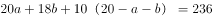，即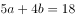。

根据奇偶特性，为偶数，又，故只有，满足，所以购买全价票与九折票的人数一样多。

故正确答案为A。

---

### 第 4 题　qid 1746704 · 数学运算

某电器工作功耗为370瓦，待机状态下功耗为37瓦，该电器周一从9：30到17：00处于工作状态，其余时间断电。周二从9：00到24：00处于待机状态，其余时间断电。问其周一的耗电量是周二的多少倍？

- **A**. 10
- **B**. 6
- **C**. 8
- **D**. 5　✅

**答案**：D

**官方解析**

周一耗电量：从9：30到17：00时长是7.5小时，为工作状态，瓦；

周二耗电量：从9：00到24：00时长是15小时，为待机状态，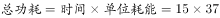瓦；

则周一的耗电量是周二的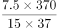倍。

故正确答案为D。

---

### 第 5 题　qid 1756312 · 数学运算

某浇水装置可根据天气阴晴调节浇水量，晴天浇水量为阴雨天的2.5倍。灌满该装置的水箱后，在连续晴天的情况下可为植物自动浇水18天。小李6月1日0：00灌满水箱后，7月1日0：00正好用完。问6月有多少个阴雨天？

- **A**. 10
- **B**. 16
- **C**. 18
- **D**. 20　✅

**答案**：D

**官方解析**

由题目所给出的晴天浇水量与阴雨天浇水量之比，可假设晴天浇水量为5，阴雨天浇水量为2，则可得水箱总容量为。已知6月整月共有30天，设阴雨天数为，晴天数为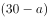，则，解得天。

故正确答案为D。

---

### 第 6 题　qid 1746716 · 数学运算

某政府机关内甲、乙两部门通过门户网站定期向社会发布消息，甲部门每隔两天、乙部门每隔3天有一个发布日，节假日无休。问甲、乙两部门在一个自然月内最多有几天同时为发布日？

- **A**. 5
- **B**. 2
- **C**. 6
- **D**. 3　✅

**答案**：D

**官方解析**

甲部门每隔2天相当于每3天发布一次，乙部门每隔3天相当于每4天发布一次，3和4的最小公倍数是12，则甲、乙每天就会同时发布一次。一个自然月最多有31天，假设甲、乙两部门1号同时发布一次，该自然月最多还有30天，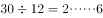，还可以同时发布两次。那么一个自然月最多共有3天是同时发布的。

故正确答案为D。

---

### 第 7 题　qid 1746746 · 数学运算

A地到B地的道路是下坡路。小周早上6：00从A地出发匀速骑车前往B地，7：00时到达两地正中间的C地。到达B地后，小周立即匀速骑车返回，在10：00时又途经C地。此后小周的速度在此前速度的基础上增加1米/秒。最后在11：30回到A地。问A、B两地间的距离在以下哪个范围内？

- **A**. 40～50公里　✅
- **B**. 大于50公里
- **C**. 小于30公里
- **D**. 30～40公里

**答案**：A

**官方解析**

设小周下坡速度为，上坡速度为。根据条件分析可列下表：

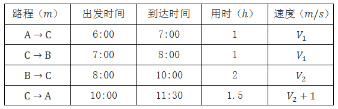

在上坡阶段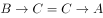，可得，解得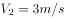，根据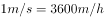，因此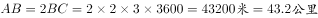。

故正确答案为A。

---

### 第 8 题　qid 1746736 · 数学运算

某集团三个分公司共同举行技能大赛，其中成绩靠前的X人获奖。如获奖人数最多的分公司获奖的人数为Y，问以下哪个图形能反映Y的上、下限分别与X的关系？

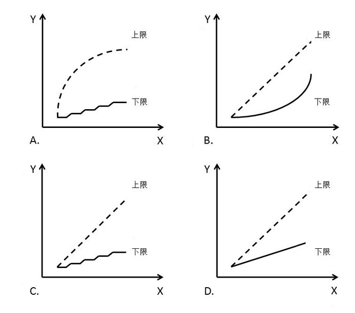

- **A**. A
- **B**. B
- **C**. C　✅
- **D**. D

**答案**：C

**官方解析**

获奖人数最多的分公司获奖人数Y的上、下限即Y的最大值、最小值。

三个分公司获奖总人数为X人，如果Y取最大值，其他两个公司获奖人数都为0，此时Y=X，排除A项；如果Y取最小值，考虑极端情况三个分公司获奖人数均相等，此时Y最小，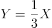。因Y须为正整数，由此可得，当1X3时，，4X6时，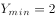，观察发现C项图形最符合Y与X的变化趋势。

故正确答案为C。

---

### 第 9 题　qid 1746744 · 数学运算

为加强机关文化建设，某市直属机关在系统内举办演讲比赛，3个部门分别派出3、2、4名选手参加比赛，要求每个部门的参赛选手比赛顺序必须相连，问不同参赛顺序的种数在以下哪个范围之内？

- **A**. 小于1000
- **B**. 1000～5000　✅
- **C**. 5001～20000
- **D**. 大于20000

**答案**：B

**官方解析**

3个部门分别派出3、2、4名选手参加比赛，要求每个部门的参赛选手比赛顺序必须相连。可先对每个部门内部的选手进行全排列，然后将3个部门的顺序进行全排列。则总共的排列顺序一共有：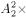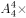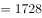种，属于1000-5000的范围。

故正确答案为B。

---

### 第 10 题　qid 1746740 · 数学运算

李主任在早上8点30分上班之后参加了一个会议，会议开始时发现其手表的时针和分针呈120度角，而上午会议结束时发现手表的时针和分针呈180度角。问在该会议举行的过程中，李主任的手表时针与分针呈90度角的情况最多可能出现几次？

- **A**. 4　✅
- **B**. 5
- **C**. 6
- **D**. 7

**答案**：A

**官方解析**

由题意可得，此次开会时间是在8：30到12：00之间（八点半上班且会议时间为上午）。要使得呈的次数尽可能多，则会议时间应尽可能长。会议开始时，时针和分针成，最早时间应为9点5分左右；而会议结束时成，最晚时间则为11点27分左右。根据常识，结合画图确定这期间时针和分针成的次数为：9点5分至10点期间1次，10点至11点期间为2次，11点至11点27分为1次，总次数共为4次。

故正确答案为A。

---

### 第 11 题　qid 1756316 · 数学运算

有一位百岁老人出生于二十世纪，2015年他的年龄各数字之和正好是他在2012年的年龄的各数字之和的三分之一，问该老人出生的年份各数字之和是多少（出生当年算作0岁）？

- **A**. 14　✅
- **B**. 15
- **C**. 16
- **D**. 17

**答案**：A

**官方解析**

方法一：由题意“2015年他的年龄各数字之和正好是他在2012年的年龄的各数字之和的三分之一”，则该老人2012年年龄的各数字之和为3的倍数，根据被3整除的特点“一个数字能被3整除，当且仅当其各位数字之和能被3整除”，则该老人2012年的年龄为3的倍数。又已知老人出生于二十世纪，则老人在2012年年龄最大为岁，不满足3的倍数。

2012年，小于112岁且为3的倍数的最大为111岁，则其2015年年龄为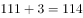岁，2015年他的年龄各数字之和为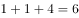，2012年他的年龄各数字之和为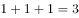，并不满足“2015年他的年龄各数字之和正好是他在2012年的年龄的各数字之和的三分之一”；

继续分析，2012年，小于111岁且为3的倍数的为108岁，则其2015年年龄为岁，2015年他的年龄各数字之和为，2012年他的年龄各数字之和为，满足“2015年他的年龄各数字之和正好是他在2012年的年龄的各数字之和的三分之一”，正确。

即该老人出生于年，则该老人出生的年份各数字之和为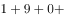。

方法二：本题也可以代入排除来做，假设A选项14为正确答案，因百岁老人出生于二十世纪即19xx年，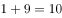，后两位相加为，因其是百岁老人，则只有04和13两种可能，假设出生于1904年，则2012年其年龄为岁，各位数字之和为；2015年其年龄为岁，各位数字之和为，满足“2015年他的年龄各数字之和正好是他在2012年的年龄的各数字之和的三分之一”，后面选项无需代入。

故正确答案为A。

---

### 第 12 题　qid 1746752 · 数学运算

某集团有A和B两个公司，A公司全年的销售任务是B公司的1.2倍。前三季度B公司的销售业绩是A公司的1.2倍，如果照前三季度的平均销售业绩，B公司到年底正好能完成销售任务。问如果A公司希望完成全年的销售任务，第四季度的销售业绩需要达到前三季度平均销售业绩的多少倍？

- **A**. 1.44
- **B**. 2.4
- **C**. 2.76　✅
- **D**. 3.88

**答案**：C

**官方解析**

观察题干，仅给出A、B两公司销售任务和销售业绩的比例关系，故可进行赋值。赋值A公司前三季度平均销售业绩为1，B公司前三季度平均销售业绩为1.2，如果照前三季度的平均销售业绩，B公司第四季度销售业绩也为1.2，故B公司全年销售业绩=B公司全年销售任务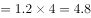，A公司全年销售任务， A公司要完成全年销售任务，则A公司第四季度销售业绩为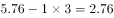，则题目所求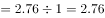倍。

故正确答案为C。

---

### 第 13 题　qid 1756318 · 数学运算

某出版社新招了10名英文、法文和日文方向的外文编辑，其中既会英文又会日文的小李是唯一掌握一种以上外语的人。在这10人中，会法文的比会英文的多4人，是会日文人数的两倍。问只会英文的有几人？

- **A**. 2
- **B**. 0
- **C**. 3
- **D**. 1　✅

**答案**：D

**官方解析**

由题意可知会法文是会日文人数的2倍，可知会法文的人数是偶数，且会法文比会英文多4人，则会英文的人数为偶数，已知小李是唯一掌握一种以上外语的人且小李会英语，则只会英文的人数为奇数，排除A项与B项。代入C项，若只会英文的有3人，则会英文的人数为人（1人指小李），会法文的有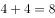人，会日文的有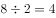人，根据三集合标准型公式：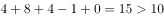人，排除C项。

故正确答案为D。

---

### 第 14 题　qid 1746754 · 数学运算

某单位原有几十名职员，其中有14名女性。当两名女职员调出该单位后，女职员比重下降了3个百分点。现在该单位需要随机选派两名职员参加培训，问选派的两人都是女职员的概率在以下哪个范围内？

- **A**. 
小于

- **B**. 

- **C**. 

　✅
- **D**. 

**答案**：C

**官方解析**

方法一：假设单位原有人，则根据题目条件得到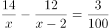，去分母可得，化简得，因此或，则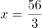或。只能为整数，所以，题目所求概率为。

方法二：假设单位原有人，则根据题目条件得到，直接求解比较复杂，题干中表述“某单位原有几十名职员”，一般在数学上“几十”的描述为整十的数，又“其中有14名女性”，则单位原有人数至少为20人，代入发现不满足方程；同理排除30和40；代入50时，左边为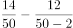，正好等于右边，则单位原有人数为50人。题目所求概率为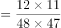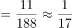。

故正确答案为C。

---

### 第 15 题　qid 1756320 · 数学运算

将一个8厘米×8厘米×1厘米的白色长方体木块的外表面涂上黑色颜料，然后将其切成64个棱长1厘米的小正方体，再用这些小正方体堆成棱长4厘米的大正方体，且使黑色的面向外露的面积要尽量大，问大正方体的表面上有多少平方厘米是黑色的?

- **A**. 84
- **B**. 88　✅
- **C**. 92
- **D**. 96

**答案**：B

**官方解析**

如上图所示，堆成的棱长4厘米的大正方体表面外露的小正方体分为三种情况：①顶点正方体，即位于大正方体顶点位置，每个小正方体表面外露的有三个面，每个顶点各对应一个，一共有8个；②棱正方体，即位于大正方体棱上，每个小正方体表面外露的有两个面，每条棱上2个，12条棱一共有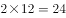个；③面正方体，即位于大正方体每个面的面上，每个小正方体表面外露的只有一个面，大正方体每个面上有4个面正方体，六个面一共有个。

如上图所示，原来的长方体木块只有一层，即可以提供的顶点正方体一共有4个；可以提供的棱正方体一共有个；可以提供的面正方体一共有个。要使小正方体堆成棱长4厘米的大正方体，且使黑色的面向外露的面积要尽量大，则应该用小正方体的黑色的面尽可能补上大正方体外露的地方。大正方体所需的8个顶点正方体，原来的长方体只能提供4个，欠缺4个；而大正方体外露的24个棱正方体和24个面正方体，原来的长方体均可以提供。则欠缺的顶点正方体需由多余的面正方体进行补充，顶点正方体是3个面外露，而面正方体只有1个面外露，则1个面正方体替换1个顶点正方体，外露的黑色面积会减少2个面即2平方厘米，替换欠缺的4个顶点正方体，黑色面积一共减少平方厘米，而整个大正方体外表面面积为平方厘米，则大正方体的表面外露的黑色面积最多为平方厘米。

故正确答案为B。

---

## 判断推理

### 第 1 题　qid 1746882 · 图形推理

从所给四个选项中，选择最合适的一个填入问号处，使之呈现一定规律性：

- **A**. A
- **B**. B　✅
- **C**. C
- **D**. D

**答案**：B

**官方解析**

元素组成凌乱，观察图形发现每个图形均由多种元素组成，考虑元素的种类和个数。观察发现，题干中每幅图均由三种元素构成，B、C两项均满足；继续观察，可发现题干中每幅图中每种元素的个数分别为1、1、3，1、2、2，1、1、3，1、2、2，1、1、3，因此问号处三种元素的个数应分别为1、2、2。B项为1、2、2，C项为1、1、3。
故正确答案为B。

---

### 第 2 题　qid 1746878 · 图形推理

左图是给定的立体图形，将其从任一面剖开，下面哪一项可能是该立体图形的截面？

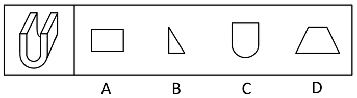

- **A**. A　✅
- **B**. B
- **C**. C
- **D**. D

**答案**：A

**官方解析**

观察发现，题干图形无论从右侧还是左侧沿竖直方向剖开，均可得到A项中的矩形，而无论从任一面剖开，都得不到B、C、D三项中的图形。
故正确答案为A。

---

### 第 3 题　qid 1746880 · 图形推理

下边给定的是纸盒的外表面，下列哪一项能由它折叠而成？

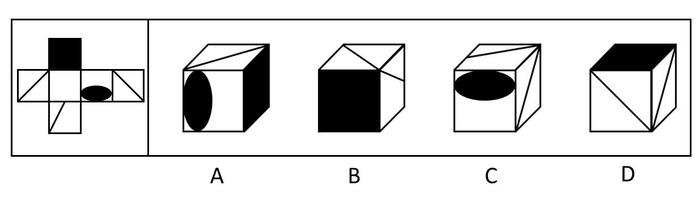

- **A**. A
- **B**. B
- **C**. C
- **D**. D　✅

**答案**：D

**官方解析**

本题为空间重构题，首先对展开图进行编号，如下图所示：

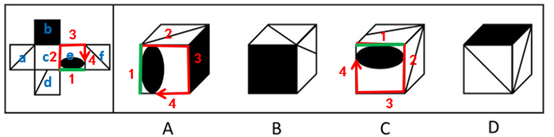

A项：展开图和选项中均有面e，而面e是可以确定唯一边的（如图中绿线所示）。在展开图和选项的面e上，以唯一边为起始边，沿顺时针同时进行画边，展开图中边2所对的面为面c，选项中边2所对的面不是面c，展开图与选项不一致，排除；

B项：选项中包括面b和面d，而面b和面d为相对面，不能同时出现，展开图与选项不一致，排除；

C项：展开图和选项中均有面e，同样，在展开图和选项的面e上，以唯一边为起始边，沿顺时针同时进行画边，展开图中边2所对的面为面c，选项中边2所对的面不是面c，展开图与选项不一致，排除；

D项：展开图与选项一致，当选。

故正确答案为D。

---

### 第 4 题　qid 1746874 · 图形推理

从所给四个选项中，选择最合适的一个填入问号处，使之呈现一定的规律性：

- **A**. A
- **B**. B　✅
- **C**. C
- **D**. D

**答案**：B

**官方解析**

元素组成凌乱，考虑属性变化。九宫格题先横向找规律，很显然九宫格中第一个图形为轴对称图形，因此先考虑对称性。第一行图形对称轴数量均为一条，方向分别为横、斜、竖，第二行图形对称轴数量也均为一条，方向分别为横、斜、竖，因此第三行图形也应满足此规律。第三行图形对称轴方向分别为竖、斜、？，因此“？”处应选一个对称轴方向为横向的图形。A项为中心对称图形，排除；B项为对称轴方向为横向的轴对称图形，保留；C项为中心对称图形，排除；D项为对称轴方向为竖向的轴对称图形，排除。
故正确答案为B。

---

### 第 5 题　qid 1746876 · 图形推理

①、②、③、④为四个多面体零件，问A、B、C、D四个多面体零件中的哪一个与①、②、③、④中的任一个都不能组成长方体？

- **A**. A
- **B**. B
- **C**. C
- **D**. D　✅

**答案**：D

**官方解析**

此题为立体图形拼接问题，做题原则为凹凸一致。首先多面体①在底面两端的中间上方有两个凸起的正方体，按照原则可知①与C项可以组合成长方体，排除C项；多面体②在右上角有两个凸起的正方体，按照原则查看选项，发现没有能够与多面体②拼合成长方体的选项；多面体③在对角线两端有两个凸起的正方体，按照原则可知多面体③与B项可以组合成长方体，排除B项；多面体④在左下角以及对边中间有两个凸起的正方体，按照原则可知多面体④与A项可以组合成长方体，排除A项。
本题为选非题，故正确答案为D。

---

### 第 6 题　qid 1746844 · 图形推理

把下面的六个图形分为两类，使每一类图形都有各自的共同特征或规律，分类正确的一项是：

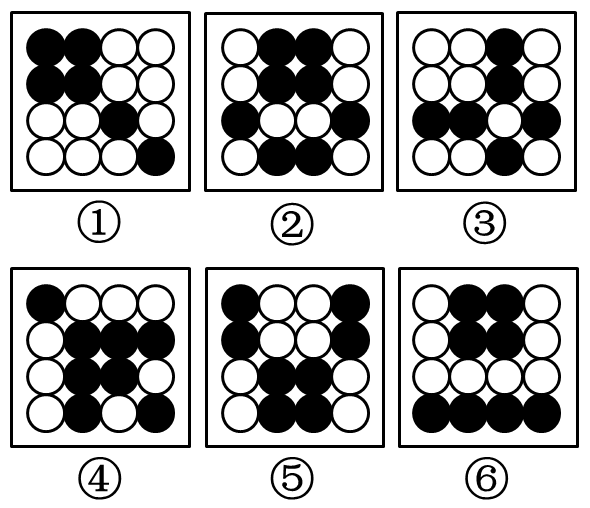

- **A**. ①③④，②⑤⑥　✅
- **B**. ①④⑥，②③⑤
- **C**. ①②④，③⑤⑥
- **D**. ①③⑥，②④⑤

**答案**：A

**官方解析**

本题为分组分类题目。在16宫格内，每个图形均由空白圆和黑色圆构成，且发现②⑤⑥图形均为对称图形，且对称轴方向均为竖向，再观察发现①③④图形均关于16宫格的左斜对称轴对称。即①③④一组，②⑤⑥一组。
故正确答案为A。

---

### 第 7 题　qid 1746872 · 图形推理

把下面的六个图形分为两类，使每一类图形都有各自的共同特征或规律，分类正确的一项是：

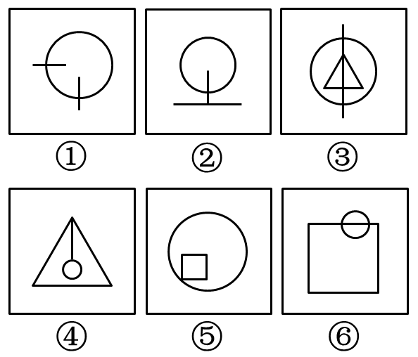

- **A**. ①②④，③⑤⑥
- **B**. ①②⑤，③④⑥
- **C**. ①③④，②⑤⑥
- **D**. ①③⑥，②④⑤　✅

**答案**：D

**官方解析**

解法一：本题考查数数中的主体元素与其它元素的交点数，逐一分析选项。
观察发现，题干中每幅图中都由一个圆形（可看成主体元素）以及其它元素构成，且主体元素与其它元素之间都存在交点，根据交点的个数可将图形分成两组。其中图①③⑥中交点数均为2，图②④⑤中交点数均为1。
故正确答案为D。
解法二：每幅图均由曲线和直线构成，曲线即圆与直线的交点分别是2、1、2、1、1、2。
故正确答案为D。

---

### 第 8 题　qid 1746858 · 图形推理

把下面的六个图形分为两类，使每一类图形都有各自的共同特征或规律，分类正确的一项是：

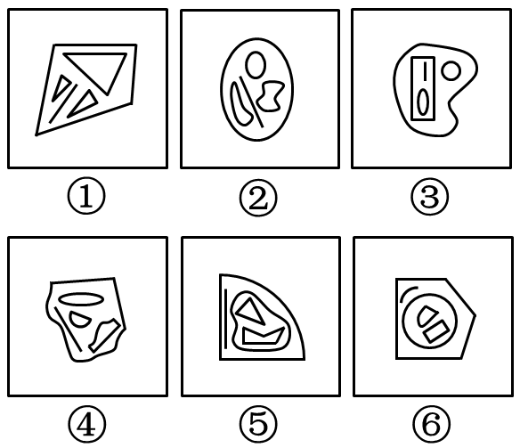

- **A**. ①②④，③⑤⑥　✅
- **B**. ①③⑥，②④⑤
- **C**. ①③⑤，②④⑥
- **D**. ①⑤⑥，②③④

**答案**：A

**官方解析**

本题为分组分类题目。
题干中每个图形均由5个元素组成，考虑图形构成关系。
观察发现，①②④图形均有一个外框图形，内部包含4个独立元素，且独立元素间不存在包含等关系，而③⑤⑥图形中外框图形内部包含4个元素，且内部的两个元素又被其中一个元素包含，图形分为内中外三层，存在包含关系。
故正确答案为A。

---

### 第 9 题　qid 1746870 · 图形推理

把下面的六个图形分为两类，使每一类图形都有各自的共同特征或规律，分类正确的一项是：

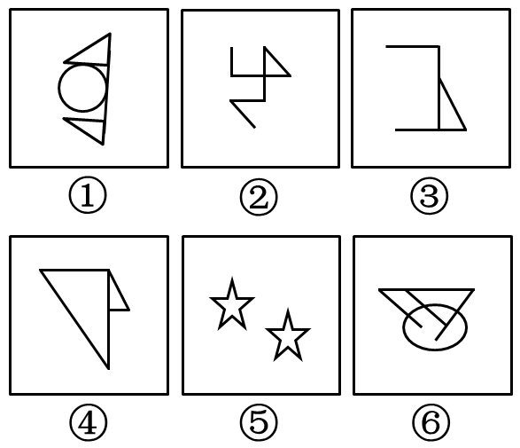

- **A**. ①④⑥，②③⑤
- **B**. ①③⑤，②④⑥
- **C**. ①②⑤，③④⑥
- **D**. ①②④，③⑤⑥　✅

**答案**：D

**官方解析**

本题为分组分类题目。
元素组成凌乱，且出现了②的单线条直线图形和⑤的典型一笔画图形五角星☆，考虑笔画数。
观察发现，图①②④的奇数点均为2，即①②④图形均为一笔画图形，图③和图⑥的奇数点为4，图⑤为两个一笔画图形，即③⑤⑥图形均为两笔画图形，对应D项。
故正确答案为D。
【易错原因】一看到图形元素组成比较凌乱，做题时就有点懵没有思路，记住凌乱优先看属性类规律，其次数量类，尤其是数量类要尽量找特征图形去看才能快速找到解题突破口。

---

### 第 10 题　qid 1746832 · 图形推理

把下面的六个图形分为两类，使每一类图形都有各自的共同特征或规律，分类正确的一项是：

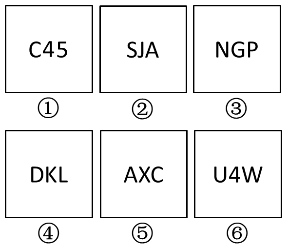

- **A**. ①④⑥，②③⑤
- **B**. ①③⑤，②④⑥
- **C**. ①②④，③⑤⑥
- **D**. ①②③，④⑤⑥　✅

**答案**：D

**官方解析**

元素组成不同，且无明显属性规律，考虑数量规律。每幅图均由3个元素构成，元素中有直有曲。其中图①②③每个图形都包含2条曲线；图④⑤⑥每个图形都包含1条曲线。
故正确答案为D。
【易错原因】看到字母题，很多同学会去想字母构成单词的意思，其实在国考的图形题当中，我们应当忽略字母的实际意义，把字母当成由线条组成的图形来找规律。

---

### 第 11 题　qid 1746824 · 定义判断

土壤是岩石在风化作用下破碎，物理化学性质改变后形成结构疏松的风化壳，风化壳在气候与生物的作用下，经历很长时间形成的地表物质。与土壤自然形成过程无关的外来物质被称为土壤侵入体。
根据上述定义，下列属于土壤侵入体的是：

- **A**. 戈壁滩中大量的沙砾
- **B**. 河床上存在的大量鹅卵石
- **C**. 考古发掘中挖出的砖瓦　✅
- **D**. 岩缝中生长的野草

**答案**：C

**官方解析**

第一步：找到定义关键词。
“岩石在风化作用下破碎”、“气候与生物的作用下”、“与土壤自然形成过程无关的外来物质”。
第二步：逐一分析选项。
A项：戈壁滩中的沙砾满足“岩石在风化作用下破碎”，是自然过程，不符合定义，排除；
B项：鹅卵石本身是岩石的一种，属于土壤形成过程中的一部分，不符合定义，排除；

C项：考古发掘出的砖瓦显然属于人造物，并非土壤自然形成过程，符合定义，当选；
D项：岩缝中生长的野草满足关键词“气候与生物的作用下”，不符合土壤侵入体定义，排除。
故正确答案为C。

---

### 第 12 题　qid 1746848 · 定义判断

党政机关公文是党政机关实施领导、履行职能、处理公务的具有特定效力和规范体式的文书。其中命令（令）适用于公布行政法规和规章、宣布施行重大强制性措施、批准授予和晋升衔级、嘉奖有关单位和人员。意见适用于对重要问题提出见解和处理办法。批复适用于答复下级机关请示事项。函适用于不相隶属机关之间商洽工作、询问和答复问题、请求批准和答复审批事项。
根据上述定义，下列选项中应添加批复的是：

- **A**. 《国务院办公厅关于进一步加强资本市场中小投资者合法权益保护工作的——》
- **B**. 《国务院办公厅关于黑龙江双鸭山经济开发区升级为国家级经济技术开发区的——》
- **C**. 《国务院关于在我国统―实行法定计量单位的——》
- **D**. 《国务院关于同意设立陕西西咸新区的——》　✅

**答案**：D

**官方解析**

第一步：找到定义关键词。
“答复下级机关请示。”
第二步：逐一分析选项。
A项： 只涉及一个主体国务院办公厅，并没有出现下级，不符合定义，排除；
B项：涉及两个主体，国务院办公厅和黑龙江双鸭山经济开发区，二者不是上下级关系，不符合定义，排除；
C项：只涉及一个主体国务院，并没有出现下级，不符合定义，排除；
D项：涉及两个主体，国务院和陕西西咸新区，二者属于上下级关系，且“同意”二字可以体现出答复下级机关的请示，符合定义，当选。
故正确答案为D。

---

### 第 13 题　qid 1746828 · 定义判断

合成字是合体字中一个比较特殊的门类，它原本是汉语中一个常用的词语、词组，但由于这些词语、词组在方言中使用的频率很高，就把这些词语在讲究字形美观的前提下原封不动地组合成了一个独有的汉字。
根据上述定义，下列汉字根据其意思不属于合成字的是：

- **A**. 氼，读作nì，古同“溺”，沉没，沉溺　✅
- **B**. 嘦，读作jiào，方言，“只要”的意思
- **C**. 覅，读作fiào，表示否定，相当于“不要”
- **D**. 尠，读作xiǎn，意思是稀有的、罕见的

**答案**：A

**官方解析**

第一步：找到定义关键词。
“原本是汉语中一个常用词语、词组”，“在方言中使用的频率很高”、“原封不动地组合成了一个独有的汉字”。
第二步：逐一分析选项。
A项：“氼”在古语中同“溺”，是一个字而不是词语，不满足“原本是汉语中一个常用词语、词组”，不符合定义，当选；
B项：“嘦”原本是“只要”这一常用词语，用于方言，且原封不动地组合起来，满足题干中三个关键词，符合定义，排除；
C项：“覅”相当于“不要”，是一个词语，且分拆后是“勿要”，符合定义，排除；
D项：“尠”分拆后是“甚少”，原本是一个词语，符合定义，排除。
本题为非选题，故正确答案为A。

---

### 第 14 题　qid 1746836 · 定义判断

真理是指客观事物及其规律在人的意识中的正确反映。真理可以分为理性真理和事实真理两种。理性真理指的是具有普遍性和必然性的真理，其反面是不可能的；事实真理指的是具有偶然性的真理，其反面是可能的。
根据上述定义，下列属于理性真理的是：

- **A**. 月晕而风，础润而雨
- **B**. 如果a大于b且b大于c，那么a大于c　✅
- **C**. 恩惠要一点点地施舍才具有最大效益
- **D**. 一个人如果违反了法律，就一定会受到法律的制裁

**答案**：B

**官方解析**

第一步：找到“理性真理”定义的关键词。
“具有普遍性和必然性的真理”、“其反面是不可能的”。
第二步：逐一分析选项。
A项：“月晕而风，础润而雨”意为“月晕出现，将要刮风；础石湿润，就要下雨”，不具有普遍性和必然性，有时候月晕没风，也有时础润无雨，其反面是可能的，不符合定义，排除；
B项：用符号表示为a&gt;b&gt;c，显然a&gt;c，具有普遍性和必然性，反面不可能为真，符合定义，当选；
C项：其反面为“恩惠不一点点施舍也能具有最大效益”，也可以为真，不符合“其反面是不可能的”，排除；
D项：其反面为“一个人如果违反了法律，可能不会受到法律制裁”，也可以为真，不符合定义，排除。
故正确答案为B。

---

### 第 15 题　qid 1746856 · 定义判断

直观教学是指利用教具作为感官传递物，向学生展示相关内容，以达到提高学习效率或效果的一种教学方式。直观教学包括实物直观、模象直观和言语直观。实物直观通过直接感知实际事物而进行；模象直观通过对实物的模拟性形象来直接感知；言语直观是在形象化的语言作用下，通过学生对语言的物质形式（语音、字形）的感知及对语义的理解而进行的一种直观形式。
根据上述定义,下列不属于上述三种直观教学的是：

- **A**. 请学生在课后阅读整篇小说内容并撰写读后感　✅
- **B**. 暑期带着学生去工厂和农村进行实地参观访问
- **C**. 请学生分角色朗读戏剧作品，或通过上台表演来体会人物性格
- **D**. 在艺术鉴赏课上，使用幻灯片给学生展示西方油画的经典之作

**答案**：A

**官方解析**

第一步：找出定义关键词。
实物直观：“直接感知实际事物。”
模象直观：“对实物的模拟性形象来直接感知。”
言语直观：“形象化的语言作用下，通过学生对语言的物质形式（语音、字形）的感知及对语义的理解。”
第二步：逐一分析选项。
A项：课后阅读整篇小说并撰写读后感并未涉及到上述三者，阅读小说写读后感不属于直接感知实际事物，且不属于模拟性形象和学生接收言语直观的理解，不符合定义，当选。
B项：去工厂和农村实地参观访问属于直接感知实际事物，属于实物直观，符合定义，排除。
C项：分角色朗读戏剧作品，通过上台表演体会人物性格属于对语言物质形式的感知，属于言语直观，符合定义，排除。
D项：用幻灯片展示西方油画，属于通过对油画的幻灯片形式而不是直接感知油画本身，即对实物的模拟性形象来直接感知，属于模象直观，符合定义，排除。
本题为选非题，故正确答案为A。

---

### 第 16 题　qid 1746852 · 定义判断

负启动效应是指人们由于之前受到某一刺激的影响而使之后对同一类型刺激的知觉加工过程变得困难的心理现象。其中知觉加工过程是指外界事物作用于人的感官后，头脑中产生的对事物的认识和理解的过程。
根据上述定义,下列属于负启动效应的是：

- **A**. 先给被试人员呈现一组汉字，里面有“海”这个字，随后让他们写出部首是“氵”的字时，这些人写出“海”的几率并未增大
- **B**. 先在黑板上给一组被试人员呈现词语“桌子”，后播放语音“椅子”，一段时间后，请被试人员分别说出看到和听到的词语，发现很多人答错了
- **C**. 请被试人员回答屏幕中显示的词语的颜色，先向其呈现词语“绿色”（字体为红色），再呈现词语“蓝色”（字体为绿色），发现被试人员辨识颜色变得困难　✅
- **D**. 给被试人员呈现一张未完成的画，随着画越来越完整，被试人员逐渐辨认出画的内容，过一段时间后再给他们呈现这个未完成的画，他们会更早辨认出画的内容

**答案**：C

**官方解析**

第一步：找到定义关键词。
关键词为“由于之前受到某一刺激的影响而使之后对同一类型刺激的知觉加工过程变得困难的心理现象”。
第二步：逐一分析选项。
A项：先给被试者呈现“海”字，随后让他们写部首是“氵”的字，一个是呈现，一个是写字，不属于同一类型的刺激，不符合定义，排除；
B项：先给被试人员呈现词语“桌子”、后播放语音“椅子”，一个是视觉刺激，一个是听觉刺激，这属于两种刺激，而定义强调了之后是同一类型的刺激，不符合定义，排除；
C项：先向被试者呈现词语“绿色”（字体为红色），后向其呈现词语“蓝色”（字体为绿色），二者属于同一类型的刺激，且出现的结果是辨识颜色变得困难，符合知觉加工过程变得困难这一结果，符合定义，当选；
D项：前后刺激虽属于同一刺激，但是结果是能够更早辨认出画的内容，没有使过程变得困难，不符合定义，排除。
故正确答案为C。

---

### 第 17 题　qid 1746840 · 定义判断

数字鸿沟指的是由于信息化和互联网的影响，人们的信息获取、信息处理和信息传播都是通过数字化技术来实现的，由此造成了不同个体、群体或者国家在思想意识、经济、文化和政治等方面的差距越来越大。
根据上述定义，下列不涉及数字鸿沟的是：

- **A**. 放假回家的小宋和同学用手机聊天，满口网络新词，一旁的奶奶―句也听不懂
- **B**. 小赵整天痴迷于网络游戏，父母多次苦口婆心地劝说，均没有效果，为此小赵和父母发生了多次争执　✅
- **C**. 东部某镇种植的水果尚未成熟就已经通过网络平台被订购一空，而西部某乡质优价廉的水果由于无人知晓只能烂在树上
- **D**. 一些西方国家利用其技术积累，在大数据处理方面取得了绝对的优势，他们进一步实行技术封锁，使得某些国家在大数据分享方面一筹莫展

**答案**：B

**官方解析**

第一步：找到定义关键词。
关键词为“由于信息化和互联网的影响，信息的获取、处理和传播通过数字化技术实现，导致差距变大。”
第二步：逐一分析选项。
A项：小宋和同学通过手机聊天、运用网络新词是一种受互联网影响的表现，且同学之间的信息传播是通过数字化技术实现的，奶奶没有接触互联网，听不懂正是表现了不同个体之间思想意识的差距，符合定义，排除；
B项：小赵痴迷于网络游戏，虽与互联网有关但是并没有涉及到信息的获取、处理和传播，且其父母与其争执是出于关心孩子的成长，并不能表明二者之间的差距越来越大，不符合定义，当选；
C项：东部和西部水果销售的现象反映了二者在经济上差距，且造成此现象的原因正是由于东部使用了网络平台，实现了信息的有效获取，符合定义，排除；
D项：西方国家利用大数据方面的优势实行技术封锁，使某些国家在此方面一筹莫展，体现了国家之间差距，而造成此差距是由于大数据这种信息数字化技术导致的，符合定义，排除。
本题为选非题，故正确答案为B。

---

### 第 18 题　qid 1746862 · 定义判断

叶龄指数指的是禾谷类作物主茎已出叶数与最终总叶数的比值，是衡量作物生长进程的重要指标之一。
根据上述定义，下列关于叶龄指数的说法一定正确的是：

- **A**. 稻谷的叶龄指数与其生长进程成正比
- **B**. 荞麦的叶龄指数越大则其产量也越高
- **C**. 小麦的叶龄指数最大值为100%　✅
- **D**. 玉米的平均叶龄指数大于高粱

**答案**：C

**官方解析**

第一步，提取定义关键词。
关键词为“禾谷类作物”、“主茎已出叶数与最终总叶数的比值”。
第二步，逐一分析选项。
A项：稻谷的生长进程和稻谷的叶龄指数成正比，还会受到其他因素的影响，但从文中的定义无法进行判断，排除；
B项：叶龄指数与产量的关系在题干中并未提及，为无中生有，排除；
C项：小麦属于“禾谷类”，根据定义“主茎已出叶数与最终总叶数的比值”，小麦最终会长出所有叶子，最终比值为1，故其叶龄指数最大为100%，当选；
D项：题干信息有限，并未告知玉米和高粱的叶龄指数之间的大小关系，为不明确选项，排除。
故正确答案为C。

---

### 第 19 题　qid 1746864 · 定义判断

图灵测试是测试者在与被测试者（一个人和―台机器）隔开的情况下，通过一些装置（如键盘）向被测试者随意提问。问过一些问题后，如果被测试者有超过30%的答复不能使测试者确认出哪个是人、哪个是机器，那么这台机器就通过了测试，并被认为具有人类智能。
据上述定义，以下哪项中的测试一定通过了图灵测试？

- **A**. 
对机器甲的答复所有人都确认其为机器

- **B**. 
对机器乙的答复测试者能确认其为机器或人
　✅
- **C**. 
对机器丙的答复有90%的某小区居民确认其为机器

- **D**. 
对机器丁的答复只有10%的某校大学生不能确认其为机器

**答案**：B

**官方解析**

第一步：找到题干关键词。

关键词为“被测试者有超过的答复不能使测试者确认出哪个是人、哪个是机器，那么这台机器就通过了测试”。

第二步：逐个分析选项。

A项：的答复可以确定为机器，剩下的的答复不知道是能确定为人的还是不能确定其为机器或人的，因此不一定能够通过测试，排除；

B项：的答复可以确定其为机器或人，那么的答复是不能够确定其为机器或人的，因此一定可以通过图灵测试，当选；

C项：的答复可以确定为机器，剩下的的答复不知道是能确定为人的还是不能确定其为机器或人的，因此不一定能够通过测试，排除；

D项：的答复只有的某校大学生不能确定为机器，即的答复有的某校大学生能确定为机器，与C项表达很类似，那么剩下的的答复不知道是能确定为人的还是不能确定其为机器或人的，因此不一定能够通过测试，排除。

故正确答案为B。

---

### 第 20 题　qid 1746868 · 定义判断

产品责任是指产品有缺陷，存在可能危及人身、财产安全的危险，造成产品的消费者、使用者或者其他第三者人身或其他直接财产损失后，缺陷产品的生产者、销售者应当承担的特殊的侵权法律责任。
根据上述定义，下列受害人可因产品责任要求侵权损害赔偿的是：

- **A**. 甲购买了一辆新车，一次与朋友王某驾车外出时，汽车因电路质量问题发生自燃，致使王某被烧伤　✅
- **B**. 乙购买了一件大衣，大衣上没有洗涤标志和成分说明，营业员也未告知应如何洗涤，大衣水洗后严重缩水
- **C**. 丙购买了一部新手机，一次因质量问题自动关机，无法开启，致使丙漏接了客户的电话，损失了一笔大额订单
- **D**. 丁的电视机使用了20年，图像不清晰时拍几下就好了，一次丁在拍打电视机时，电视机发生爆炸，将丁炸伤，后经检验发现是显像管老化造成的

**答案**：A

**官方解析**

第一步：找到定义关键词。
主体：有缺陷的产品。
原因：存在危及人身、财产安全的危险。
结果：产品的消费者、使用者或其他第三者人身或其他直接财产损失。
第二步：逐一分析选项。
A项，新车且电路质量问题，说明产品有缺陷，王某被烧伤属于第三者人身损失，因此完全符合题干关键词，可以要求赔偿，当选；
B项，这个大衣没有成分标志和洗涤说明，那么确实是有缺陷的产品，但洗后严重缩水，并不代表是其他直接的财产损失，不符合定义，排除；
C项，新手机质量问题自动关机，说明产品质量有问题，但是漏接电话造成订单损失，这不属于直接的财产损失，而是间接的，排除；
D项，使用20年，显像管老化，这不属于产品有缺陷，排除。
故正确答案为A。

---

### 第 21 题　qid 1746670 · 类比推理

佩刀：刀鞘

- **A**. 墨：墨盒
- **B**. 火箭：发射架
- **C**. 毛笔：笔帽　✅
- **D**. 旅游鞋：旅行包

**答案**：C

**官方解析**

第一步：判断题干词语间的逻辑关系。
“佩刀”和“刀鞘”是对应关系，“刀鞘”套着“佩刀”的一部分，“佩刀”与“刀鞘”配套存在。
第二步：判断选项词语间逻辑关系。
A项：“墨”用来写字，“墨盒”是装墨水或墨粉的盒子，二者需要配套使用，但是“刀鞘”只是套着“佩刀”的一部分，而“墨”是完全装在打印机的“墨盒”里的，与题干逻辑关系不一致，排除；
B项：“火箭”与“发射架”虽然配套存在，但是“发射架”是支撑“火箭”，而非套着“火箭”，与题干逻辑关系不一致，排除；
C项：“毛笔”和“笔帽”配套存在，且“笔帽”套着“毛笔”的一部分，与题干逻辑关系一致，当选；
D项：“旅游鞋”和“旅行包”不能配套，与题干逻辑关系不一致，排除。
故正确答案为C。

---

### 第 22 题　qid 1746676 · 类比推理

琴棋书画：经史子集

- **A**. 兵强马壮：闭关自守
- **B**. 悲欢离合：漂泊流浪
- **C**. 衣帽鞋袜：冰清玉洁
- **D**. 鸟兽虫鱼：江河湖海　✅

**答案**：D

**官方解析**

第一步：分析题干词语间的逻辑关系。
“琴棋书画”和“经史子集”都是名词，且每个词都可拆分为四个并列关系的名词。
第二步：分析选项词语间的逻辑关系。
A选项：“兵强马壮”中的“强”、“壮”都是形容词，“闭关自守”中的“闭”、“守”都是动词，与题干逻辑关系不符合，排除；
B选项：“悲欢离合”中的“离合”是动词，且“漂泊流浪”是动词，与题干逻辑关系不符，排除；
C选项：“衣帽鞋袜”可拆分为四个名词，但“冰清玉洁”是形容词，与题干逻辑关系不符，排除；
D选项：“鸟兽虫鱼”和“江河湖海”都是名词，且四个字之间是并列关系的名词，当选。
故正确答案为D。

---

### 第 23 题　qid 1746662 · 类比推理

森林：郁郁葱葱

- **A**. 法庭：庄严肃穆　✅
- **B**. 校园：勤奋好学
- **C**. 餐桌：饕餮大餐
- **D**. 公园：嬉戏玩闹

**答案**：A

**官方解析**

第一步：分析题干词语间的逻辑关系。
“郁郁葱葱”形容草木苍翠茂盛，生机勃勃的样子，可以用来形容森林；逻辑关系即后者可以形容前者，第一个词是名词，第二个词是形容词。
第二步：逐一分析选项。
A项：“庄严肃穆”可以用来形容“法庭”，与题干逻辑关系相符，当选；
B项：“勤奋好学”形容的是学生而不是“校园”，与题干逻辑关系不符，排除；
C项：“饕餮大餐”是名词非形容词，自然无法形容“餐桌”，排除；
D项：“嬉戏玩闹”是动词，且应该是游人嬉戏玩闹，无法形容“公园”，排除。
故正确答案为A。

---

### 第 24 题　qid 1746658 · 类比推理

白驹过隙：秒表

- **A**. 恩重如山：天平
- **B**. 一线希望：皮尺
- **C**. 一言九鼎：弹簧秤
- **D**. 风驰电掣：测速仪　✅

**答案**：D

**官方解析**

第一步：分析题干词语间的逻辑关系。
“白驹过隙”形容时间过得很快，而秒表可以测量时间，逻辑关系即后者可以测量前者用来形容的主体。
第二步：逐一分析分析选项词语间的逻辑关系。
A项：“恩重如山”形容恩德重大，而“天平”不能称量恩德，与题干逻辑关系不一致，排除；
B项：“一线希望”形容还有一点微弱的希望，“皮尺”不能测量希望，与题干逻辑关系不一致，排除；
C项：“一言九鼎”形容言语极有分量，能起决定性作用，“弹簧秤”不能测量言语的分量，与题干逻辑关系不一致，排除；
D项：“风驰电掣”形容速度非常快，像风吹电闪一样，“测速仪”可以测量速度，二者逻辑关系与题干一致，当选。
故正确答案为D。

---

### 第 25 题　qid 1746698 · 类比推理

素描：单色：绘画

- **A**. 色素：食品：添加剂
- **B**. 书签：阅读：工具
- **C**. 变脸：表演：艺术
- **D**. 新闻：纪实：文体　✅

**答案**：D

**官方解析**

第一步：分析题干词语间的逻辑关系。
素描的属性是单色，而且素描是一种绘画，即前两词为属性关系，一词与三词为种属关系。
第二步：逐一分析选项。
A项，色素的属性不是食品，但它是一种食品添加剂，与题干逻辑关系不一致，排除；
B项，书签的属性不是阅读，但它是一种阅读工具，与题干逻辑关系不一致，排除；
C项，变脸是一种表演也是一种艺术，不能说表演是变脸的属性，与题干逻辑关系不一致，排除；
D项，新闻的属性就是纪实，而且新闻也是一种文体，为种属关系，与题干切合，当选。
故正确答案为D。

---

### 第 26 题　qid 1746696 · 类比推理

前瞻：预见：回溯

- **A**. 深谋远虑：未雨绸缪：鼠目寸光
- **B**. 标新立异：特立独行：循规蹈矩　✅
- **C**. 犬牙交错：参差不齐：顺理成章
- **D**. 墨守成规：井然有序：纷乱如麻

**答案**：B

**官方解析**

第一步：判断题干词语间逻辑关系。
“前瞻”与“预见”都是指根据自身经验和知识积累，对未来做出的一定预判，二者为近义词；“回溯”是指回忆过去，与前两词为反义词。
第二步：判断选项词语间逻辑关系。
A项：“深谋远虑”形容计划周密、考虑长远；“未雨绸缪”形容提前做好准备工作，也有为将来打算的含义。二者为近义词。“鼠目寸光”形容一个人眼光短、见识浅，只看眼前，不管将来，与前两词为反义词。与题干逻辑关系一致，保留。
B项：“标新立异”指提出新的主张、见解或创造出新奇的样式，也指为显示自己，表现与众不同；“特立独行”指有操守、有见识，不随波逐流。二者为近义词。“循规蹈矩”原指遵守规矩，不敢违反，现也指拘守旧准则，不敢稍做变动，与前两词为反义词。与题干逻辑关系一致，保留。
C项：“犬牙交错”形容交界处参差不齐，像狗牙一样，也形容局面错综复杂；“参差不齐”形容很不整齐，高低不一。二者为近义词。“顺理成章”指写文章或做事情顺着条理就能做好，也指某种情况合乎情理，自然产生某种结果，与前两词不是反义词。与题干逻辑关系不一致，排除。
D项：“墨守成规”形容因循守旧，不肯改进；“井然有序”形容做事有序，有条不紊。二者不是近义词。“纷乱如麻”指交错杂乱，像一团乱麻，一般形容心情，与前两词不是反义词。与题干逻辑关系不一致，排除。
比较A、B两项，A项前两个词语为中性词，但“鼠目寸光”明显是贬义词，B项三个词语都是中性词，而题干三个词语也都是中性词，B项感情色彩与题干更一致，当选。
故正确答案为B。

---

### 第 27 题　qid 1746686 · 类比推理

教：学：教学

- **A**. 买：卖：买卖　✅
- **B**. 好：坏：好坏
- **C**. 正：大：正大
- **D**. 阴：暗：阴暗

**答案**：A

**官方解析**

第一步：分析题干词语间的逻辑关系。
“教”和“学”都是动词，且二者是一种反对关系，主体不同，一教一学，二者组合而成的“教学”既能做动词，又能做名词。
第二步：逐一分析选项词语间的逻辑关系。
A项：“买”“卖”都是动词，且二者是一种反对关系，主体不同，一买一卖，“买卖”既能做动词，如“买卖股票”，又能做名词，如“一笔买卖”，与题干逻辑关系相符，当选；
B项：“好”“坏”都是形容词，与题干逻辑关系不符，排除；
C项：“正”“大”都是形容词，但“正大”一般不单独成词，与题干逻辑关系不符，排除；
D项：“阴”“暗”都是形容词，且是近义词，不符合题干逻辑关系，排除。
故正确答案为A。

---

### 第 28 题　qid 1746710 · 类比推理

自然科学：化学：化学元素

- **A**. 人文科学：历史学：历史人物　✅
- **B**. 物理学：生物物理学：光合作用
- **C**. 语言学：汉语言：文学
- **D**. 社会学：社会科学：社区

**答案**：A

**官方解析**

第一步：分析题干词语的逻辑关系。
化学是一种自然科学，自然科学与化学是种属关系；化学元素是化学研究的对象。
第二步：分析选项词语间的逻辑关系。
A项，历史学是一种人文科学，历史人物是历史学研究的基本对象，与题干逻辑关系一致，当选；
B项，生物物理学是物理学和生物学的交叉学科，与物理学不构成种属关系，同时光合作用也不是生物物理学研究的对象，与题干逻辑关系不符，排除；
C项：汉语言是一种语言学，为种属关系，文学与语言学是并列关系，不是汉语言研究的对象，与题干逻辑关系不符，排除；
D项：社会学是社会科学的一种，二者是种属关系，与题干的顺序相反，与题干逻辑关系不符，排除；
故正确答案为A。

---

### 第 29 题　qid 1746730 · 类比推理

历练 对于 （    ） 相当于 磨砺 对于 （    ）

- **A**. 栉风沐雨；千锤百炼　✅
- **B**. 波澜不惊；一鸣惊人
- **C**. 处心积虑；百折不回
- **D**. 千辛万苦；九死一生

**答案**：A

**官方解析**

逐一代入验证选项。
A项：“栉风沐雨”形容人经常在外面不顾风雨地辛苦奔波，象征对一个人的“历练”。“千锤百炼”比喻经历多次艰苦斗争的锻炼和考验，象征对一个人的“磨砺”，与题干词语逻辑关系一致，当选；
B项：“波澜不惊”比喻局面平静，形势平稳，与“历练”无关系，且“一鸣惊人”与“磨砺”更是无任何逻辑关系，排除；
C项：“处心积虑”形容一个人蓄谋很久，思考时间长，与“历练”无逻辑关系。“百折不回”指无论受多少挫折都不退缩，形容意志坚强，与“磨砺”无逻辑关系，排除；
D项：“千辛万苦”形容非常不容易，很辛苦，可以看作是一种“历练”。“九死一生”形容情况很危险，与“磨砺”无逻辑关系，排除。
故正确答案为A。

---

### 第 30 题　qid 1746722 · 类比推理

重力  对于  （  ）  相当于  （  ）  对于  昼夜交替

- **A**. 物体质量；月圆月缺
- **B**. 潮汐；地球公转
- **C**. 地球；月球
- **D**. 自由落体；地球自转　✅

**答案**：D

**官方解析**

逐一代入选项。
A项：“物体质量”是产生“重力”的必要条件，“昼夜交替”不是“月圆月缺”的必要条件，“昼夜交替”是地球自转导致的，前后逻辑关系不一致，排除；
B项：“潮汐”是由于太阳和月球共同作用导致的，“昼夜交替”是地球自转导致的，前后逻辑关系不一致，排除；
C项：“重力”产生是由于“地球”的吸引作用，两者具有因果关系，昼夜交替一般指的是地球上的现象，而非月球，前后逻辑关系不一致，排除；
D项：“重力”是引起物体“自由落体”的原因，“地球自转”也是引起“昼夜交替”的原因，前后逻辑关系一致，当选。
故正确答案为D。

---

### 第 31 题　qid 1746826 · 逻辑判断

人类与疟疾已经进行了几个世纪的斗争，但一直是“治标不治本”——无法阻断疟疾传染源。日前研究者培育出一种经过基因改造的蚊子，它具备了不再感染疟疾的能力，并且能妨碍野生蚊子繁衍，从而有效切断人与蚊子的疟疾传播途径，假以时日，就能根绝疟疾这个顽症。
以下哪项如果为真，最能支持上述结论？

- **A**. 转基因蚊子的体质比野生蚊子差，一旦被放到野外很容易死亡
- **B**. 转基因蚊子只在疟疾存在时才有生存优势，当生存环境中没有疟疾时，它们和野生蚊子的存活率是相同的
- **C**. 转基因蚊子的生殖能力在繁衍了9代后显著增加，可能带来野生蚊子种群的灭亡　✅
- **D**. 转基因蚊子与野生蚊子交配产下的后代并不都具有抗疟疾基因，但在基因层面上都会产生突变，形成新型蚊子

**答案**：C

**官方解析**

本题属于加强题型。
第一步：找到论点论据。
论点：转基因蚊子的出现，最终可以终结疟疾。
论据：这种蚊子不感染疟疾，并且妨碍野生蚊子繁衍。
A选项：说转基因蚊子不好存活，说明根绝疟疾这件事情是不现实的，有削弱的意思，排除；
B选项：说转基因蚊子存活有条件，同样是在为根绝疟疾设置障碍，有削弱的意思，排除；
C选项：说转基因蚊子9代后带来野生蚊子灭亡，支持结论，当选； 
D选项：说后代不都能抗疟疾的基因，依然是为根绝设置障碍，有削弱的意思，排除。
故正确答案为C。

---

### 第 32 题　qid 1746838 · 逻辑判断

格陵兰岛是地球上最大的岛屿，形成于38亿年前，大部分地区被冰雪覆盖。有大量远古的岩石化石埋藏在格陵兰岛地下，它们的排列就像是一个整齐的堤坝，也被称为蛇纹石。通过这些蛇纹石，人们可以断定格陵兰岛在远古时可能是一块海底大陆。
补充以下哪项作为前提可以得出上述结论？

- **A**. 蛇纹石是两个大陆板块在运动中相互碰撞时挤压海底大陆而形成的一种岩石　✅
- **B**. 这些蛇纹石化石的年代和特征与伊苏亚地区发现的一致，而后者曾是一片海底大陆
- **C**. 蛇纹石中碳的形状呈现出生物组织特有的管状和洋葱型结构，类似于早期的海洋微生物
- **D**. 由于大陆板块的运动才创造出了许多新的大陆，在板块运动发生之前，地球上绝大部分地区是一片汪洋大海

**答案**：A

**官方解析**

本题属于加强题型。
第一步：找到论点论据。
论点：格陵兰岛在远古时可能是一块海底大陆。
论据：大量远古的岩石化石埋藏在格陵兰岛地下，被称为蛇纹石。
第二步：逐个分析选项。
A项，蛇纹石是两个大陆板块挤压海底大陆所形成的一种岩石，在蛇纹石和海底大陆之间建立了联系，说明这原来就是海底大陆，当选；
B项，年代和特征一致，但后者是海底大陆但是不代表前者的蛇纹石一定是海底大陆，排除；
C项，蛇纹石中的生物组织类似于早期海洋微生物不能证明一定就是海洋微生物，排除；
D项，没有提到蛇纹石的事，更不能证明这就是一个海底大陆，排除。
故正确答案为A。

---

### 第 33 题　qid 1746834 · 逻辑判断

近来，国外一些学者和媒体对西方民主体制较为集中地进行了反思和批评，指出西方民主正在衰败。对此，有学者认为，西方民主衰败的原因之一是其存在基因缺陷。西方民主是建立在一个假设前提的基础上的，即权利是绝对的。也就是说，权利与义务本应是相对的，但在西方民主模式中，权利绝对化已成为主流，各种权利绝对化，个人主义至上，社会责任缺乏。
以下哪项如果为真，最能支持学者的观点？

- **A**. 西方民主制对权利绝对化的偏好，导致对他人权利与生存环境的忽视　✅
- **B**. 权利是有限度的，超越了权利的限度，就可能走向权利滥用
- **C**. 美国两党常把自己的权利放在国家利益之上，互相否决，危害国家和公民的利益
- **D**. “程序万能”理论导致了西方民主制度的游戏化，民主被简化为竞选程序

**答案**：A

**官方解析**

第一步：找到论点和论据。
论点：西方民主衰败的原因之一是其存在基因缺陷，即权利是绝对的。
论据：权利与义务本应是相对的，但在西方民主模式中，权利绝对化已成为主流，各种权利绝对化，个人主义至上，社会责任缺乏。
题干整个讨论的都是“西方民主衰败的原因”，论据和论点话题一致，所以优先考虑补充论据加强。
第二步：逐一分析选项。
A项：指出西方的权利绝对化会导致对他人权利和生存环境的忽视，说明是西方民主制度的基因缺陷（即权利绝对化）导致了个人主义至上、社会责任缺乏，进而导致了西方民主的衰败，解释了原因，补充论据加强，保留；
B项：权利是有限度的，权利存在界限，但并未说明权利滥用是否会导致西方民主衰败，无关选项，排除；
C项：美国两党把自己的权利放在国家利益之上，体现了个人主义至上，危害国家和公民的利益，体现了社会责任缺乏，通过列举美国两党的例子，说明是西方民主制度的基因缺陷（即权利绝对化）导致了西方民主的衰败，补充论据加强，保留；
D项：“程序万能”理论导致的最终结果是民主被简化为竞选程序，但并未言明是否导致西方民主衰败，无关选项，排除。
比较A、C两项，解释的力度强于举例，所以排除C项。
故正确答案为A。

---

### 第 34 题　qid 1746830 · 逻辑判断

研究人员在观察开普勒太空望远镜发现的数千颗太阳系外行星后，发现银河系内拥有大量的行星，几乎每一颗恒星周围都存在行星，许多恒星系统内存在两至六颗行星，其中约三分之一的行星处于宜居带上，行星表面的温度适合液态水存在，这可能意味着银河系内几乎处处有宜居的星球。
以下哪项如果为真，最能支持上述结论？

- **A**. 只要存在水资源，就有生命存在的可能性，但不一定能完成进化
- **B**. 许多宜居带行星与恒星之间的距离小于地球和太阳的间距，恒星释放的耀斑可能扼杀生命
- **C**. “恒星系统内存在两至六颗行星”这一结论是根据200多年前的提丢斯—波得定则推算而出，非实测结果
- **D**. 银河系内2000～4000亿颗恒星中80％是红矮星，超过一半的红矮星周围环绕的行星与地球类似，并存在水和大气层　✅

**答案**：D

**官方解析**

第一步：找到论据和论点。
论点：这可能意味着银河系内几乎处处有宜居的星球。
论据：许多恒星系统内存在两至六颗行星，其中约三分之一的行星处于宜居带上，行星表面的温度适合液态水存在。
第二步：逐一分析选项。

A项：选项论述生命存在，题干论述宜居星球存在，二者论述对象不一致，排除；
B项：说明宜居带存在可能扼杀生命的因素存在——恒星释放的耀斑，即宜居带存在宜居星球的可能性降低，削弱了题干论点，排除；
C项：质疑了题干论据的真实性，即“恒星系统内存在两至六颗行星”为推算结果，需要实际测量的考证，在推算结果的基础上进一步推断的论点（银河系内几乎处处有宜居的星球）缺乏真实性的支撑，削弱了题干论点，排除；
D项：银河系内存在大量的红矮星，且红矮星的存在环境和地球类似，并存在水和大气层，类比论证说明银河系可能存在宜居的星球，可以加强，当选。
故正确答案为D。

---

### 第 35 题　qid 1746842 · 逻辑判断

记者采访时的提问要具体、简洁明了，切忌空泛、笼统、不着边际。《采访技巧》一书中尖锐地剖析了“您感觉如何”等问题的弊端，认为这些提问实际上在信息获取上等于原地踏步，它使采访对象没法回答，除非用含混不清或枯燥无味的话来应付。
由此可以推出：

- **A**. 记者采访时的提问如果具体、简洁明了，就不会给采访对象带来回答的困难
- **B**. 采访对象如果没法回答提问，说明他没有用含混不清或枯燥无味的话来应付
- **C**. 采访对象只有用含混不清或枯燥无味的话来应付，才能回答“您感觉如何”等问题的提问　✅
- **D**. 诸如“您感觉如何”这样的问题，只能使采访对象抓不住问题的要点而作泛泛的或言不由衷的回答

**答案**：C

**官方解析**

本题属于关联词推导题型。

第一步：翻译题干。

除非这个关联词可翻译为否11的方式，题干最后一句话翻译为：

没法回答含混不清或枯燥无味的话来应付，即：回答含混不清或枯燥无味

第二步：逐一分析选项。

A项：记者采访时的提问如果具体、简洁明了是否能给采访对象带来回答的困难，原文当中完全没有提到过，属于无中生有的选项，排除；

B项：可翻译为：没法回答没有（含混不清或枯燥无味），否前否后，与题干的翻译形式不一致，排除；

C项：可翻译为：回答含糊不清或枯燥无味，与题干翻译形式一致，当选；

D项：选项中说因为采访对象抓不住问题的要点而作泛泛的或言不由衷的回答，题干说的含混不清或枯燥无味不等同于泛泛或言不由衷，属于概念的偷换，并且这么回答的原因是什么题干也没有提到，排除。

故正确答案为C。

---

### 第 36 题　qid 1746850 · 逻辑判断

某大型晚会的导演组在对节目进行终审时，有六个节目尚未确定是否通过，这六个节目分别是歌曲A、歌曲B、相声C、相声D、舞蹈E和魔术F。综合考虑各种因素，导演组确定了如下方案：
（1）歌曲A和歌曲B至少要上一个；
（2）如果相声C不能通过或相声D不能通过，则歌曲A也不能通过； 
（3）如果相声C不能通过，那么魔术F也不能通过；
（4）只有舞蹈E通过，歌曲B才能通过。
导演组最终确定舞蹈E不能通过。
由此可以推出：

- **A**. 无法确定魔术F是否能通过　✅
- **B**. 歌曲A不能通过
- **C**. 无法确定两个相声节目是否能通过
- **D**. 歌曲B能通过

**答案**：A

**官方解析**

本题属于关联词推导题型。

第一步翻译题干。

（1）A或者B；

（2）非C或者非D非A；

（3）非C非F；

（4）BE。

第二步找突破口，进行解题。

题干最后说，导演组确定舞蹈E不能通过，从这个条件进行入手，找到与之相关条件：

由条件（4）逆否可得：E推出B，即B不能上；

由条件（1）“A、B至少有一个要上”可知：B不能上，那么A一定能上；

对条件（2）逆否可知：AC且D，即：A、C、D都上；

C能上对于条件（3）来说是否前，因此，无法确定F是否能上；综上可知：A、C、D都能上，但B、E不能上，F能不能上不知道。

第三步看选项。

A项：无法确定F能否通过，对应上面推出结论，为正确答案；

B、C、D三项均与上述推出的结论不一致，排除。

故正确答案为A。

---

### 第 37 题　qid 1746846 · 逻辑判断

9月初大学入学报到时，有多家手机运营商到某大学校园进行产品销售宣传。有好几家运营商推出了免费套餐服务。但是其中一家运营商推出了价格优惠的套餐，同时其业务员向学生宣传说：其他运营商所谓的“免费”套餐是通过出售消费者的身份信息来获得运营费用的。
以下哪项如果为真，最能质疑该业务员的宣传？

- **A**. 免费套餐运营商所提供的手机信号质量很差
- **B**. 免费套餐运营商是通过广告来获得运营费用的　✅
- **C**. 有法律明确规定，手机运营商不得出售消费者的身份信息
- **D**. 很难保证价格优惠的运营商不会同样出售消费者的身份信息

**答案**：B

**官方解析**

第一步：找到论点和论据。
论点：其他运营商所谓的“免费”套餐是通过出售消费者的身份信息来获得运营费用的。
论据：无。
第二步：逐一分析选项。
A项：信号差不差跟题干的论点没关系，论点说的是运营费用的来源问题，排除；
B项：直接说明运营费用来自广告的收入，而不是通过出售消费者身份信息获取的，当选；
C项：虽然有法律规定不允许出售消费者的身份信息，但是不能够保证这些运营商不触犯法律，排除；
D项：论点说的是“免费”套餐的运营商的运营费用来源问题，而D选项说的是其他收费套餐运营商的运营费用来源问题，排除。
故正确答案为B。

---

### 第 38 题　qid 1746860 · 逻辑判断

有研究者认为，有些人罹患哮喘病是由于情绪问题。焦虑、抑郁和愤怒等消极情绪，可促使机体释放组织胺等物质，从而引发哮喘病。但是，反对者认为，迷走神经兴奋性的提高和交感神经反应性的降低才是引发哮喘病的原因，与患者的情绪问题无关。
以下哪项如果为真，最能削弱反对者的观点？

- **A**. 现代医学已经证实，消极情绪也可诱发身体疾病
- **B**. 哮喘病发作会造成患者情绪焦虑、抑郁和愤怒等
- **C**. 焦虑、抑郁和愤怒等消极情绪是现代人的普遍问题
- **D**. 消极情绪会提高患者迷走神经的兴奋性并降低交感神经的反应性　✅

**答案**：D

**官方解析**

本题属于削弱题型。
第一步：找到论点和论据。
本题要求削弱反对者的观点，先找到反对者的观点，即：哮喘的原因是迷走神经兴奋性的提高和交感神经反应性的降低，与消极情绪无关。
第二步：逐一分析选项。
A选项：消极情绪可诱发疾病，但没有明确指出是哮喘病，范围过大，与题干主体不一致，排除；
B选项：题干的主题讨论的是哮喘病的发病原因，而不是哮喘病引起的后果，主体不一致，排除；
C选项：只说情绪，没有提及与哮喘病的关系，为无关选项，排除；
D选项：说明消极情绪是迷走神经兴奋性的提高和交感神经反应性的降低的原因，正好说明消极情绪会引起哮喘，能削弱，当选。
故正确答案为D。

---

### 第 39 题　qid 1746854 · 逻辑判断

甲、乙、丙、丁四人商量周末出游。甲说：乙去，我就肯定去；乙说：丙去我就不去；丙说：无论丁去不去，我都去；丁说：甲乙中至少有一人去，我就去。
以下哪项推论可能是正确的？

- **A**. 乙、丙两个人去了
- **B**. 甲一个人去了
- **C**. 甲、丙、丁三个人去了　✅
- **D**. 四个人都去了

**答案**：C

**官方解析**

本题属于关联词推导题型。

第一步：翻译题干。

甲：乙→甲①；

乙：丙→乙②；

丙：丙去③；

丁：甲或者乙→丁④；

第二步：逐一分析选项。

A：由条件②③可知，丙去→乙不去，排除；

B：由条件③可知，丙无论如何都是要去的，甲不可能一个人去，排除；

C：甲、丙、丁三个人去了，甲去了，根据条件④可知，丁会去，丙去了，根据条件②可知，乙没去，当选；

D：根据条件②③可知，丙去了且乙一定不去，所以不可能四个人都去了，排除。

故正确答案为C。

---

### 第 40 题　qid 1746866 · 逻辑判断

某国的科研机构跟踪研究了出生于上世纪50至70年代的1万多人的精神健康状况，其间测试了他们在13岁至18岁时的语言能力、空间感知能力和归纳能力。结果发现，在此期间语言能力远低于同龄人水平的青少年，成年后患精神分裂症等精神疾病的风险较高。研究人员认为，青少年期语言能力的高低将是预测成年后精神疾病的重要指标。
以下哪项如果为真，能够质疑上述观点？

- **A**. 青少年期激素分泌水平异常，影响大脑发育，导致语言能力发展迟缓
- **B**. 患精神分裂症的青少年，其归纳能力相比语言能力的发展更加缓慢
- **C**. 许多精神健康的脑肿瘤患者在青少年时期也经常出现语言能力发展迟缓的问题　✅
- **D**. 适当的教育可显著提高青少年的语言能力，但对中老年人影响不大

**答案**：C

**官方解析**

本题属于削弱题型。
第一步：找到论点和论据。
论点：青少年时期语言能力的高低将是预测成年后精神疾病的重要指标。
论据：跟踪研究结果发现，在13岁至18岁时的语言能力远低于同龄人水平的青少年，成年后患精神分裂症等精神疾病的风险较高。
论点和论据均强调了青少年时期语言能力水平和成年后患精神疾病之间的关系。
第二步：逐一分析选项。
A项：强调的是青少年时期语言能力发展迟缓的原因，与成年后是否患精神疾病无关，属无关选项，排除；
B项：归纳能力如何不在本题论述范围之内，属无关选项，排除；
C项：通过举反例说明许多精神健康的脑肿瘤患者青少年时期语言能力水平也低，即青少年时期的语言能力并不能正确预测成年后是否患精神疾病，削弱了论点，当选；
D项：论述的是如何提高青少年的语言能力，与是否患精神疾病完全无关，属无关选项，排除。
故正确答案为C。

---

## 资料分析

### 材料 1

下表是某旅游网站上推荐的从M地到N地的机票价格（5月30日）及在线支付的优惠活动。

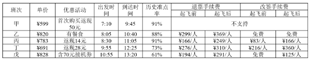

注：如果发生退票，取消相应的优惠活动。

#### 第 1 题　qid 1756322 · 综合

5月30日早晨，王先生由于记错了时间，10：30到达机场时，所购班次的飞机已经起飞。幸运的是隔天同一班次的机票还有售，且价钱不变，于是在窗口办理了改签，加上之前网上订票的费用，王先生一共花费了900多元，他所购买的最可能是哪个班次的机票?

- **A**. 戊班次
- **B**. 丁班次
- **C**. 丙班次　✅
- **D**. 乙班次

**答案**：C

**官方解析**

由题干“10：30到达机场时，所购班次的飞机已经起飞”和表格中各个班次飞机出发时间可以判断A项错误；由表格可得订票费（有返现需减去返现）+改签费：B项丁班次，错误；C项丙班次，正确；D项乙班次，错误。

故正确答案为C。

---

#### 第 2 题　qid 1756324 · 综合

由上述资料可知，以下哪个班次起飞前退票手续费率最高?

- **A**. 乙班次
- **B**. 丙班次
- **C**. 丁班次　✅
- **D**. 戊班次

**答案**：C

**官方解析**

由表格可得单价及起飞前退票手续费，，A项乙班次=，B项丙班次=，C项丁班次=，D项戊班次=，可以看出C项分子部分大于B、D两项，分母部分小于B、D两项，故C项&gt;B、D两项。比较A、C两项分子部分非常接近，而A项分母明显大于C项，故丁班次起飞前退票手续费率最高。

故正确答案为C。

---

### 材料 2

某影院有6个影厅，最近一周的排片情况和昨天的票房收入见下表：

#### 第 3 题　qid 1756326 · 综合

影院一天总共放映x场电影，其中某部电影放y场，排片率就是，那么四部影片中排片率最高的影片是哪部?

- **A**. 甲影片　✅
- **B**. 乙影片
- **C**. 丙影片
- **D**. 丁影片

**答案**：A

**官方解析**

已知一天放映总数都为x不变，要是排片率最高，即放映场数y最大，由表格数据可得甲影片=9场、乙影片=8场、丙影片=6场、丁影片=7场，甲最大。

故正确答案为A。

---

#### 第 4 题　qid 1756328 · 综合

如果某天一部影片的总观影人次是a，该影片所有放映场次包含的总座位数是b，那么当天上座率就是，那么在昨天的四部影片里，上座率由高到低排列正确的是（  ）。

- **A**. 
乙&gt;丁&gt;甲&gt;丙

- **B**. 
乙&gt;丙&gt;甲&gt;丁
　✅
- **C**. 
乙&gt;丙&gt;丁&gt;甲

- **D**. 
乙&gt;丁&gt;丙&gt;甲

**答案**：B

**官方解析**

根据票房总收入和平均票价可以确定观影人次a分别为：甲=9600÷30=320人次，乙=18000÷30=600人次，丙=9000÷30=300人次，丁=16800÷40=420人次；根据排片次数和座位数可以确定总座位数b分别为：甲=100×7+100=800个，乙=100×6+200×2=1000个，丙=100×6=600个，丁=200×7=1400个。故上座率分别为：甲，乙，丙，丁。

故正确答案为B。

---

#### 第 5 题　qid 1756330 · 综合

小张的单位离该电影院半小时路程，他每晚6：30下班，吃晚饭需要半小时，电影院要求至少提前10分钟入场。按照该影院的排片表，时间上最适合他的影片是哪部？

- **A**. 甲影片
- **B**. 乙影片　✅
- **C**. 丙影片
- **D**. 丁影片

**答案**：B

**官方解析**

根据题意小张6：30下班，吃晚饭需半小时，到达电影院需要半小时，并且电影院需要至少提前10分钟入场，则到达电影院的时间，故最适合观看的影片为19:50的乙影片。

故正确答案为B。

---

### 材料 3

        2014年末全国共有公共图书馆3117个，比上年末增加5个。年末全国公共图书馆从业人员56071人。

 

        2014年末全国公共图书馆实际使用房屋建筑面积1231.60万平方米，比上年末增长6.3%；图书总藏量79092万册，比上年末增长5.6％；电子图书50674万册，比上年末增长34.2%；阅览室座席数85.55万个，比上年末增长5.7%。

#### 第 6 题　qid 1746814 · 平均数

2014年，全国平均每个公共图书馆月均流通人次约为：

- **A**. 1万多　✅
- **B**. 不到1万
- **C**. 2万多
- **D**. 3万多

**答案**：A

**官方解析**

由题干“2014年······平均······月均”，且材料中时间为2014年，可判定此题为现期平均数问题。定位图形材料，2014年，总流通人次5.3亿人次；定位文字材料第一段，2014年末全国共有公共图书馆3117个。则2014年平均每个公共图书馆。

故正确答案为A。

---

#### 第 7 题　qid 1746816 · 增长

2014年，公共图书馆电子图书藏量增长册数约是图书总藏量增长册数的多少倍？

- **A**. 3　✅
- **B**. 2
- **C**. 8
- **D**. 5

**答案**：A

**官方解析**

由题干“2014年······是······多少倍”，且材料时间为2014年，可判定此题为现期倍数问题。定位文字材料第二段，图书总藏量79092万册，比上年末增长5.6％；电子图书50674万册，比上年末增长34.2%。代入增长量计算公式：增长量=。

2014年公共图书电子图书藏量增长册数=；

图书总藏量增长册数=。

则电子图书藏量增长册数是图书总藏量增长册数的倍。

故正确答案为A。

---

#### 第 8 题　qid 1746818 · 平均数

2012～2014年，平均每流通人次约产生多少册次的书刊文献外借？

- **A**. 1.0
- **B**. 0.8　✅
- **C**. 0.6
- **D**. 0.4

**答案**：B

**官方解析**

由题干“2012～2014年，平均每······”，可判定此题为现期平均数问题。定位图形材料，2012-2014年平均每流通人次产生的书刊文献外借册次=。

故正确答案为B。

---

#### 第 9 题　qid 1746820 · 增长

2008～2014年，人均公共图书藏量同比增速快于上年的年份有几个？

- **A**. 2
- **B**. 4
- **C**. 3　✅
- **D**. 5

**答案**：C

**官方解析**

由题干“同比增速快于上年的年份有几个”，判断本题为增长率比较问题。定位图形材料，代入增长率计算公式：。

2007年，人均公共图书藏量增速==；

2008年，人均公共图书藏量增速==；

2009年，人均公共图书藏量增速==；

2010年，人均公共图书藏量增速==；

2011年，人均公共图书藏量增速==；

2012年，人均公共图书藏量增速==；

2013年，人均公共图书藏量增速==；

2014年，人均公共图书藏量增速==；

经两两比较，2008年〉2007年，2009年〉2008年，2012年〉2011年，共3年。

故正确答案为C。

---

#### 第 10 题　qid 1746822 · 综合

能够从上述资料中推出的是：

- **A**. “十一五”期间全国公共图书馆总流通人次超过15亿
- **B**. 2014年，平均每个公共图书馆拥有二十多个阅览室座席
- **C**. 2008~2014年间，每年平均每万人公共图书馆建筑面积同比增速均低于12%　✅
- **D**. 2008年，平均每万人公共图书馆建筑面积增量和人均公共图书藏量增量均低于2011年

**答案**：C

**官方解析**

A项：“十一五”期间，即2006年~2010年，定位图形材料，，错误。

B项：定位文字材料一、二段可知，2014年平均每个公共图书馆拥有阅览室坐席=个，错误。

C项：定位图形材料，2008年~2014年平均每万人公共图书馆建筑面积同比增速分别为：

2008年:；2009年:；2010年：；2011年：；2012年：；2013年：；2014年：；正确。

D项：定位图形材料，2008年平均每万人公共图书馆建筑面积增量=58.7-56.1=2.6平方米，2011年平均每万人公共图书馆建筑面积增量=73.8-67.1=6.7平方米，2008年低于2011年。

2008年人均公共图书藏量增量=0.41-0.39=0.02册，2011年人均公共图书藏量增量=0.47-0.46=0.01册，2008年高于2011年，错误。

故正确答案为C。

---

### 材料 4

        截至2014年12月底，全国实有各类市场主体6932.22万户，比上年末增长，增速较上年同期增加4.02个百分点；注册资本（金）129.23万亿元，比上年末增长。其中，企业1819.28万户，个体工商户4984.06万户，农民专业合作社128.88万户。

        2014年，全国新登记注册市场主体1292.5万户，比上年同期增加160.97万户；注册资本（金）20.66万亿元，比上年同期增加9.66万亿元。其中，企业365.1万户，个体工商户896.45万户，农民专业合作社30.95万户。

        2014年，新登记注册现代服务业企业114.10万户，同比增长。其中，信息传输、软件和信息技术服务业14.67万户，同比增长；科学研究和技术服务业26.26万户，同比增长；文化、体育和娱乐业6.59万户，同比增长；教育业0.68万户，同比增长。

        2014年，新登记注册外商投资企业3.84万户，同比增长。投资总额2763.31亿美元，同比增长；注册资本1796.39亿美元，同比增长。

#### 第 11 题　qid 1746780 · 综合

截至2012年12月底，全国实有各类市场主体户数最接近以下哪个数字？

- **A**. 6100万
- **B**. 5500万　✅
- **C**. 5100万
- **D**. 4500万

**答案**：B

**官方解析**

由材料“截至2014年12月底，全国实有各类市场主体6932.22万户，比上年末增长，增速较上年同期增加4.02个百分点”得，。根据间隔增长率计算公式，2014年比2012年的增长率。则2012年全国实有各类市场主体万，与B项最接近。

故正确答案为B。

---

#### 第 12 题　qid 1746784 · 比重

2014年，全国新登记注册市场主体中个体工商户所占比重约为：

- **A**. 

- **B**. 

　✅
- **C**. 

- **D**. 

**答案**：B

**官方解析**

由题干“2014年······所占比重”且材料时间为2014年，可判定此题为现期比重问题。定位文字材料第二段，“2014年，全国新登记注册市场主体1292.5万户”，其中，“个体工商户896.45万户”。可计算出2014年，全国新登记注册市场主体中个体工商户所占比重为，与B项最接近。

故正确答案为B。

---

#### 第 13 题　qid 1746786 · 增长

2014年，以下哪个现代服务业新登记注册企业的户数同比增速最快？

- **A**. 科学研究和技术服务业
- **B**. 教育业
- **C**. 文化、体育和娱乐业
- **D**. 信息传输、软件和信息技术服务业　✅

**答案**：D

**官方解析**

定位文字材料第三段，现代服务业新登记注册企业的户数中，科学研究和技术服务业同比增长，教育业同比增长，文化、体育和娱乐业同比增长，信息传输、软件和信息技术服务业同比增长，因此，同比增速最快的是信息传输、软件和信息技术服务业。

故正确答案为D。

---

#### 第 14 题　qid 1746788 · 平均数

2014年，新登记注册外商投资企业户均注册资本约比上年同期增长：

- **A**. 

　✅
- **B**. 

- **C**. 

- **D**. 

**答案**：A

**官方解析**

由题干“······户均······增长”，选项为百分数，可判定此题为平均数增长率计算问题。定位文字材料第四段，“2014年，新登记注册外商投资企业3.84万户，同比增长”，“注册资本1796.39亿美元，同比增长”。记2014年新登记注册外商投资企业注册资本为A，增速为a，外商投资企业户数为B，增速为b。代入平均数增长率公式，与A项最接近。

故正确答案为A。

---

#### 第 15 题　qid 1746794 · 综合

能够从上述资料中推出的是：

- **A**. 2014年新登记注册现代服务业企业大部分属于教育行业
- **B**. 2014年末超过三分之一的农民专业合作社成立不满一年
- **C**. 2013年全国实有各类市场主体注册资本（金）不足100万亿元
- **D**. 2013年新登记注册科学研究和技术服务业企业不到20万户　✅

**答案**：D

**官方解析**

A项：2014年，新登记注册现代服务业企业114.10万户，教育业0.68万户，教育业占比较小，教育不占主要地位，错误。

B项：2014年12月底，农民专业合作社128.88万户，新登记注册农民专业合作社30.95万户，则成立不满一年的农民专业合作社比例，错误。

C项：2014年12月底，全国实有各类市场主体注册资本（金）129.23万亿元，比上年末增长，则2013年全国实有各类市场主体注册资本（金）万亿元，错误。

D项：2014年科学研究和技术服务业26.26万户，同比增长，则2013年科学研究和技术服务业万户，首位只能商1，因此不到20万户，正确。

故正确答案为D。

---

### 材料 5

        2014年全国社会物流总额213.5万亿元，同比增长，比上年回落1.6个百分点。

        2014年全国社会物流总费用10.6万亿元，同比增长。其中，运输费用5.6万亿元，同比增长；保管费用3.7万亿元，同比增长；管理费用1.3万亿元，同比增长。

#### 第 16 题　qid 1746798 · 平均数

2014年每实现100万元的社会物流额，其运输费用平均约为多少万元？

- **A**. 5.6
- **B**. 10.6
- **C**. 2.6　✅
- **D**. 5.0

**答案**：C

**官方解析**

由题干“2014年每······平均”，且材料时间为2014年，判断题型为现期平均数问题。定位文字材料第一段可得2014年全国社会物流总额为213.5万亿元，定位文字材料第二段可得物流总费用中运输费用为5.6万亿元，则平均每元社会物流额的运输费元，故每实现100万元的社会物流额，其运输费用为2.6万元。

故正确答案为C。

---

#### 第 17 题　qid 1746802 · 比重

2013、2014年占全国社会物流总额比重均高于上一年水平的分类包括：

- **A**. 再生资源物流、单位与居民物品物流、农产品物流
- **B**. 工业品物流、再生资源物流、单位与居民物品物流　✅
- **C**. 进口货物物流、农产品物流、单位与居民物品物流
- **D**. 工业品物流、进口货物物流、农产品物流

**答案**：B

**官方解析**

由题干“2013、2014年占······比重均高于上一年”，可判定此题为两期比重比较问题。根据两期比重比较公式：，可得，比重高于上一年。定位材料图形部分可得2014年全国社会物流总额增长率为，2013年为，定位表格部分可得2014年增速：工业品物流、再生资源物流、单位与居民物品物流，均大于；2013年增速：工业品物流、再生资源物流、单位与居民物品物流，均大于。

故正确答案为B。

---

#### 第 18 题　qid 1746804 · 综合

2014年全国社会物流总额最高的季度是：

- **A**. 第一季度
- **B**. 第二季度
- **C**. 第三季度　✅
- **D**. 第四季度

**答案**：C

**官方解析**

定位材料图形部分：2014年第一季度全国社会物流总额47.8万亿元；万亿元；万亿元；万亿元，可得第三季度最高。

故正确答案为C。

---

#### 第 19 题　qid 1746808 · 综合

2012年上半年全国社会物流总额约为多少万亿元？

- **A**. 75
- **B**. 86　✅
- **C**. 93
- **D**. 102

**答案**：B

**官方解析**

由题干所求“2012年上半年”，结合材料2014年，可判定此题为间隔基期计算问题。定位图形材料可得，2014年上半年（第二季度累计）全国物流总额为101.5万亿元、2014年上半年增长率为、2013年上半年增长率为，则由间隔增长率公式可得2014年上半年比2012年上半年的。则2012年上半年全国物流总额为万亿元，与B项最接近。

故正确答案为B。

---

#### 第 20 题　qid 1746810 · 综合

能够从上述资料中推出的是：

- **A**. 2013年第三季度社会物流总额同比增速高于第四季度　✅
- **B**. 2014年每万元社会物流总额的平均管理费用低于上年水平
- **C**. 2014年农产品物流额在社会物流总额中的比重高于一成
- **D**. 2014年单位与居民物品物流额超过2012年的两倍

**答案**：A

**官方解析**

A项：观察图形，根据混合增长率居中的原则，2013年前三季度增长率为，前二季度为，故第三季度增长率大于；前四季度增长率为，前三季度为，故第四季度增长率为；所以第三季度增长率高于第四季度增长率，正确。

B项：计算每万元社会物流总额的平均管理费用，定位材料文字部分可得：2014年管理费用（分子）和社会物流总额（分母）增长率都为，根据两期平均数比较定性分析，，两期平均数不变，可得2014年应等于2013年，错误。

C项：定位材料表格部分可得2014年农产品物流额占社会物流总额的比重即低于一成，错误。

D项：定位材料表格部分，根据间隔增长率公式可得2014年单位与居民物流对2012年增长率为，间隔倍数倍，故单位与居民物品物流额2014年小于2012年的2倍，错误。

故正确答案为A。

---
