# 2017年国家公务员录用考试《行测》题（副省级）

> 国考 · 2017 年 · 5 个模块 · 共 135 题

- [常识判断](#%E5%B8%B8%E8%AF%86%E5%88%A4%E6%96%AD) · 20 题
- [言语理解与表达](#%E8%A8%80%E8%AF%AD%E7%90%86%E8%A7%A3%E4%B8%8E%E8%A1%A8%E8%BE%BE) · 40 题
- [数量关系](#%E6%95%B0%E9%87%8F%E5%85%B3%E7%B3%BB) · 15 题
- [判断推理](#%E5%88%A4%E6%96%AD%E6%8E%A8%E7%90%86) · 40 题
- [资料分析](#%E8%B5%84%E6%96%99%E5%88%86%E6%9E%90) · 20 题

---

## 常识判断

### 第 1 题　qid 2028256 · 法律常识

根据我国《宪法》，下列表述错误的是：

- **A**. 我国形成了人民代表大会制度、中国共产党领导的多党合作和政治协商制度以及基层群众自治制度等民主形式
- **B**. 为追查刑事犯罪，公安机关、检察机关、审判机关可依法对公民的通信进行检查　✅
- **C**. 我国在普通地方、民族自治地方和特别行政区建立了相应的地方制度
- **D**. 一切组织和个人都负有实施宪法和保证宪法实施的职责

**答案**：B

**官方解析**

B项符合题意：我国《宪法》第四十条规定：“中华人民共和国公民的通信自由和通信秘密受法律的保护。除因国家安全或者追查刑事犯罪的需要，由公安机关或者检察机关依照法律规定的程序对通信进行检查外，任何组织或者个人不得以任何理由侵犯公民的通信自由和通信秘密。”由此可知，审判机关无权对公民的通信进行检查，当选。
A、C、D项说法均符合我国现行《宪法》的规定，排除。
本题为选非题，故正确答案为B。

---

### 第 2 题　qid 2028258 · 法律常识

依据《刑法修正案（九）》的规定，下列说法错误的是：

- **A**. 对伪造货币罪不再处以死刑
- **B**. 对代替他人参加高考的行为应作出行政处罚　✅
- **C**. 组织群众在医院闹事、造成严重损失的行为是犯罪行为
- **D**. 编造虚假险情在微信中传播、严重扰乱社会秩序的行为是犯罪行为

**答案**：B

**官方解析**

B项错误：依据《刑法修正案（九）》第二十五条第一款 “在法律规定的国家考试中，组织作弊的，处三年以下有期徒刑或者拘役，并处或者单处罚金；情节严重的，处三年以上七年以下有期徒刑，并处罚金。”和第四款“代替他人或者让他人代替自己参加第一款规定的考试的，处拘役或者管制，并处或者单处罚金。”可知，代替他人参加高考的行为属于犯罪行为，应处于刑事处罚而非行政处罚，当选；
A项正确：《刑法修正案（九）》取消了包括伪造货币罪在内的9个适用死刑的罪名，对伪造货币罪不再处以死刑，排除；
C项正确：依据《刑法修正案（九）》第三十一条：“聚众扰乱社会秩序，情节严重，致使工作、生产、营业和教学、科研、医疗无法进行，造成严重损失的，对首要分子，处三年以上七年以下有期徒刑；对其他积极参加的，处三年以下有期徒刑、拘役、管制或者剥夺政治权利。”可知，组织群众在医院闹事、造成严重损失的行为属于犯罪行为，排除；
D项正确：《刑法修正案（九）》第三十二条规定：“编造虚假的险情、疫情、灾情、警情，在信息网络或者其他媒体上传播，或者明知是上述虚假信息，故意在信息网络或者其他媒体上传播，严重扰乱社会秩序的，处三年以下有期徒刑、拘役或者管制；造成严重后果的，处三年以上七年以下有期徒刑。”因此编造虚假险情在微信中传播，严重扰乱社会秩序的行为属于犯罪行为，排除。
本题为选非题，故正确答案为B。

---

### 第 3 题　qid 2028260 · 人文常识

关于中国外交，下列说法错误的是：

- **A**. 二十世纪八九十年代，邓小平提出“韬光养晦、有所作为”的外交战略
- **B**. “另起炉灶”是毛泽东在新中国成立前夕提出的外交方针
- **C**. 周恩来和陈毅都曾担任过外交部长
- **D**. 委内瑞拉是第一个同新中国建交的拉丁美洲国家　✅

**答案**：D

**官方解析**

本题考查毛中特。
D项错误：第一个和新中国建交的拉丁美洲国家是古巴，两国于1960年建立外交关系；中国与委内瑞拉建立外交关系是在1974年，当选；
A项正确：“韬光养晦、有所作为”是邓小平在20世纪八十年代末九十年代初面对国际国内局势急剧变化时提出的外交战略方针，排除；
B项正确：“另起炉灶”是毛泽东在中共七届二中全会前后提出的三大外交政策之一，七届二中全会于1949年3月召开，正处新中国成立前夕，排除；
C项正确：在中华人民共和国成立后，周恩来于1949年-1958年担任第一任外交部长，陈毅于1958年-1972年担任第二任外交部长，排除。
本题为选非题，故正确答案为D。

---

### 第 4 题　qid 2028262 · 人文常识

在银行的资产负债表中，客户存款属于：

- **A**. 资产
- **B**. 权益
- **C**. 资金
- **D**. 负债　✅

**答案**：D

**官方解析**

D项正确：银行的资产负债表是综合反映其资产负债科目及数量的会计报表，主要包括资产项目和负债项目。资产主要包括现金资产、贷款证券投资、固定资产等，负债主要由存款和其他负债构成，存款包括短期存款和长期存款等；其他负债指存款之外的其他借入款，如向中央银行借款。因此，客户存款在银行的资产负债表中属于负债，D项当选。
故正确答案为D。

---

### 第 5 题　qid 2028266 · 人文常识

关于我国著名园林，下列说法正确的是：

- **A**. 《枫桥夜泊》涉及的城市是留园所在地　✅
- **B**. 十二兽首曾是颐和园的镇园之宝
- **C**. 承德避暑山庄始建于明代崇祯年间
- **D**. 苏州拙政园整体呈现均衡对称的格局

**答案**：A

**官方解析**

A项正确，《枫桥夜泊》是唐朝诗人张继在安史之乱后，途经苏州寒山寺时有感而发抒写的一首羁旅诗，“枫桥”位于今苏州市阊门外；留园是我国大型古典私家园林，位于苏州阊门外留园路。该选项说法正确，当选；
B项错误，十二生肖兽首原位于圆明园海晏堂外的喷泉处，是清乾隆年间的红铜铸像，与颐和园无关，排除；
C项错误，承德避暑山庄始建清代康熙四十二年（1703年），排除；
D项错误，苏州拙政园是苏州现存最大的古典园林，全园以水为中心，分为东、中、西三部分，没有明显的中轴线，大都是因地制宜，错落有致，疏朗开阔，近乎自然，整体没有呈现均衡对称的格局，排除。
故正确答案为A。

---

### 第 6 题　qid 2028292 · 人文常识

我国古代用“金”“石”“丝”“竹”指代不同材质、类别的乐器。下列诗词涉及“竹”的是：

- **A**. 珠帘夕殿闻钟磬，白日秋天忆鼓鼙
- **B**. 主人有酒欢今夕，请奏鸣琴广陵客
- **C**. 深秋帘幕千家雨，落日楼台一笛风　✅
- **D**. 哀筝一弄湘江曲，声声写尽湘波绿

**答案**：C

**官方解析**

本题考查人文历史。
我国古代按照乐器的材质将其分为“金、石、丝、竹、匏、土、革、木”八音。
A项错误，诗句中提到的“磬”是古代的一种石制打击乐器，属于八音之“石”，“鼓”是用皮革制成的，属于八音之“革”。
B项错误，诗句中提到的“琴”是指古琴，即汉族的一种传统弦类乐器，属于八音之“丝”。
C项正确，“竹”是指竹制吹奏乐器，主要包括萧、笛等，诗句中提到的“笛”即属于竹制乐器。
D项错误，诗句中提到的“筝”是指古筝，即中国古老的拨弦类乐器，属于八音之“丝”。
故正确答案为C。

---

### 第 7 题　qid 2028294 · 人文常识

柏拉图认为处于变化之中的事物不是真正的存在，持这种理念的人会认为以下哪项最真实？

- **A**. 一棵树
- **B**. 勾股定理　✅
- **C**. 人的照片
- **D**. 关于马的概念

**答案**：B

**官方解析**

B项正确：勾股定理是一个基本的几何定理，是人类早期发现并证明的重要数学定理之一。这条定理是既定的、不变的，按照题干中柏拉图的观点，勾股定理是真正存在的，当选；
A项错误：一棵树从生根到发芽再到枝繁叶茂，是处在不断生长、不断变化的状态之中的，排除；
C项错误：人的照片虽然定格了人一瞬间的样子，但照片会随着时间变得陈旧褪色，即不断发生变化，排除；
D项错误：语言文字会随着社会发展而不断发生变化，关于“马”的概念也是这样，随着人们对事物的认识不断更新，“马”的概念也在不断变化，排除。
故正确答案为B。
本题为争议题，争议答案为D项。根据柏拉图本人的观点，马的概念是永恒不变的。但本题问的是持柏拉图的理念的一类人的看法，本题中，柏拉图认为处于变化之中的事物不是真正的存在，也就是说，真正的存在是静止不变的。四个选项中，只有B项更符合上述题干给出的论断，故粉笔题库倾向于答案为B。

---

### 第 8 题　qid 2028302 · 人文常识

司马谈《论六家要旨》：“ ① 博而寡要，劳而少功，是以其事难尽从；然其序君臣父子之礼，列夫妇长幼之别，不可易也。 ② 俭而难遵，是以其事不可遍循；然其强本节用，不可废也。 ③ 严而少恩；然其正君臣上下之分，不可改矣。 ④ 使人俭而善失真；然其正名实，不可不察也。”
①②③④处应分别填入：

- **A**. 儒家、墨家、道家、法家
- **B**. 道家、名家、墨家、儒家
- **C**. 儒家、墨家、法家、名家　✅
- **D**. 儒家、法家、兵家、名家

**答案**：C

**官方解析**

C项正确：《论六家要旨》是诸子百家争鸣后一篇重要的学术思想史典籍，作者司马谈不仅系统地对先秦诸子作了总结性的批判，还将诸子分为六家并给予客观公正的评价，奠定了之后学术批评和分类的基础。全文共四段，题干节选自第一段。
题干中①后面的“序君臣父子之礼，列夫妇长幼之别”可以联想到儒家的“三纲五常”，儒家是先秦诸子百家之一，其创始人是孔子，儒家注重个人修养，思想的核心是“仁”和“礼”；
②后面的“俭”、“节用”等关键字可以联想到墨家反对铺张浪费的观点；墨家是中国先秦诸子百家之一，创始人为墨子，墨家的主要思想主张是兼爱、非攻、节用等。
③后面的“严而少恩”是法家学派的特点；法家是先秦诸子百家之一，是中国历史上提倡以法制为核心思想的重要学派，代表人物有管仲、李悝、商鞅、韩非子等。
④后面的“正名实”直接提到了名家的关键字。名家是以辩论名实问题为中心，并且以善辩成名的一个学派，“名”就是指称事物的名称，就是“概念”；“实”就是“名”所指称的事物。代表人物有邓析、公孙龙等。
考生可能对名家不够熟悉，但①的儒家及③的法家很容易判断，通过排除法也可得出答案。
故正确答案为C。

---

### 第 9 题　qid 2028298 · 人文常识

下列艺术领域与专业术语对应有误的是：

- **A**. 摄影：噪点、景深
- **B**. 绘画：散点透视、写意
- **C**. 音乐：调式、声部
- **D**. 舞蹈：变位跳、变奏　✅

**答案**：D

**官方解析**

D项错误：“变位跳”是舞蹈领域的专业术语，芭蕾舞、现代舞等舞蹈中均有变位跳。而“变奏”是音乐领域的专业术语，是指在原旋律的基础上加上一些修饰或者围绕原旋律进行一些变形，使乐曲具有更丰富的表现形式，当选；
A项正确：“噪点”主要是指相机的感光元件将光线作为接收信号并输出的过程中所产生的图像中的粗糙部分，也指图像中不该出现的外来像素，通常由电子干扰产生。“景深”是指在摄影机镜头或其他成像器前沿能够取得清晰图像的成像所测定的被摄物体前后距离范围。二者都是摄影领域的专业术语，排除；
B项正确：“散点透视”是中国画中使用较多的一种透视方法，即画家观察点不是固定在一个地方，也不受下定视域的限制，而是根据需要，移动着立足点进行观察，凡各个不同立足点上所看到的东西都可组织进自己的画面上来。“写意”是国画的一种画法，用笔不苛求工细，注重神态的表现和抒发作者的情趣。二者都是绘画领域的专业术语，排除；
C项正确：“调式”指若干高低不同的乐音，围绕某一有稳定感的中心音，按一定的音程关系组织在一起，成为一个有机的体系。四部和声的每一部叫做一个声部。器乐声部分高音、中音、次中音、低音；声乐声部分女高音、女低音、男高音、男低音。二者都是音乐领域的专业术语，排除。
本题为选非题，故正确答案为D。

---

### 第 10 题　qid 2028306 · 人文常识

与              共同构成中国诗歌传统源头的《楚辞》，主要作者是因谗去国、被流放到蛮荒之地的屈原，他用“                      ”这一著名诗句，表现了岁月蹉跎、时不我待的恐惧。
文中画横线部分应依次填入：

- **A**. 《庄子》长太息以掩涕兮，哀民生之多艰
- **B**. 《庄子》日月忽其不淹兮，春与秋其代序
- **C**. 《诗经》惟草木之零落兮，恐美人之迟暮　✅
- **D**. 《诗经》路漫漫其修远兮，吾将上下而求索

**答案**：C

**官方解析**

C项符合题意：《诗经》是中国古代诗歌开端，是中国最早的一部诗歌总集，收集了西周初年至春秋中叶的300多首诗歌；楚辞是屈原创作的一种新诗体，同时《楚辞》是中国文学史上第一部浪漫主义诗歌总集，包括《离骚》《九歌》《天问》等。《诗经》和《楚辞》共同构成了中国诗歌的源头。《离骚》中的名句“惟草木之零落兮，恐美人之迟暮”表现了岁月蹉跎、时不我待的恐惧，当选。
A、B两项中的《庄子》不符合题意，D项中的“路漫漫其修远兮，吾将上下而求索”表达的是诗人面对困难积极进取的心态，均排除。
故正确答案为C。

---

### 第 11 题　qid 2028234 · 人文常识

掩星是一种天文现象，指一个天体在另一个天体与观测者之间通过而产生的遮蔽现象。科学家经常借助观察这一现象来判断星体是否有大气层。当行星掩过遥远恒星，如果恒星变得模糊之后才消失，那么可以认为：

- **A**. 该行星有稠密的大气层　✅
- **B**. 该恒星有稠密的大气层
- **C**. 该行星无大气层或大气层稀薄
- **D**. 该恒星无大气层或大气层稀薄

**答案**：A

**官方解析**

A项正确：被遮蔽恒星变模糊之后才消失，是由于遮掩行星存在有稠密的大气层。在掩星过程中先是由这层大气层对恒星进行遮掩，由于大气层可以透光，但会对光线进行散射和反射，因此在观测者看来恒星变得暗淡模糊。而当行星完全遮掩恒星后，恒星的光线无法透过行星本体，因此观测者看到恒星消失，当选；
C项错误：若行星无大气层或大气层稀薄，在掩星过程中，将不存在恒星变得模糊的过程，排除；
B、D项错误：恒星本身具有大气层，若其自身的大气层会导致模糊，则不会仅在掩星现象中模糊。因此掩星现象的发生与被掩蔽恒星是否有大气层无关，排除。
故正确答案为A。

---

### 第 12 题　qid 2028240 · 地理国情

关于图中所标示的海峡，下列说法错误的是：

- **A**. ①是世界上最繁忙的石油运输航道　✅
- **B**. ②是世界上最宽的海峡
- **C**. ③的海峡中心线是国际日期变更线的一部分
- **D**. ④的附近地区夏季炎热干燥，冬季温和多雨

**答案**：A

**官方解析**

A项错误：①是位于非洲大陆与马达加斯加岛之间的莫桑比克海峡，是世界上最长的海峡。世界主要石油输出国集中于中东，如伊朗、沙特阿拉伯、阿联酋等，而石油的主要输入国则主要是工业和经济相对发达的国家，如美国、西欧、日本、中国；途经莫桑比克海峡的航道不符合两者的任一特征。世界上最繁忙的石油运输航道应该是中东地区连接波斯湾和阿曼湾的霍尔木兹海峡，该项当选；
B项正确：②是位于南美洲南端与南极洲之间的德雷克海峡，是世界上最宽的海峡，排除；
C项正确：③是位于亚欧大陆与美洲大陆之间的白令海峡。国际日期变更线是国际经度会议为了避免日期上的混乱规定的一条用于区分地球“昨天”与“今天”的分界线。国际日期变更线通过白令海峡的中心线。该项排除；
D项正确：④是沟通地中海与大西洋的直布罗陀海峡，直布罗陀海峡和附近地区属地中海气候，夏季炎热干燥，冬季温和多雨，排除。
本题为选非题，故正确答案为A。

---

### 第 13 题　qid 2028242 · 科技常识

2016年3月，阿尔法围棋程序（AlphaGo）对战世界围棋冠军、职业九段选手李世石，以4:1的总比分获胜。阿尔法围棋程序的工作原理基于下列哪项技术？

- **A**. 量子计算
- **B**. 深度学习　✅
- **C**. 纳米技术
- **D**. 基因编辑

**答案**：B

**官方解析**

B项正确： “深度学习”是机器学习研究的一个新领域。其动机在于建立、模拟人脑进行分析学习的神经网络，让机器模仿人脑机制来解释数据甚至进行“思考”，例如图像、声音和文本。阿尔法围棋程序正是运用了这样的技术，当选；
A项错误：量子计算是一种依照量子力学理论进行的新型计算。同普通计算机相比，量子计算机的寄存器可同时存储四个二进制数，因此具有更强的计算能力。应用此技术可以大幅提高计算机运算能力，但此技术与阿尔法围棋程序无关，排除；
C项错误：纳米技术是用单个原子、分子制造物质的科学技术，研究结构尺寸在1-100纳米范围内材料的性质和应用。在计算机方面更多地应用于将硬件零件缩小化，用以提高计算机性能，但与阿尔法围棋程序无关，排除；
D项错误：基因编辑是指生物学中能够让人类对目标基因进行“编辑”，实现对特定DNA片段的敲除、加入等的技术，属于生物范畴的技术。阿尔法围棋程序属于计算机范畴应用，两者无关，排除。
故正确答案为B。

---

### 第 14 题　qid 2028246 · 人文常识

下列矿物与其用途对应错误的是：

- **A**. 燧石—取火
- **B**. 石灰岩—生产水泥
- **C**. 石棉—促进燃烧　✅
- **D**. 石英—制作半导体

**答案**：C

**官方解析**

C项错误：石棉指具有高抗张强度、高挠性、耐化学和热侵蚀、电绝缘和具有可纺性的硅酸盐类矿物产品。石棉是重要的防火、绝缘和保温材料。因此石棉不仅不会促进燃烧，反而会遏制燃烧，当选；
A项正确：燧石俗称“火石”，是常见的硅质岩石。燧石和铁器击打会产生火花，因此在古代常被用作取火工具，排除；
B项正确：石灰岩简称灰岩，是以方解石为主要成分的碳酸盐岩。石灰岩是生产水泥的主要材料，排除；
D项正确：石英主要成分为二氧化硅，是制造半导体单晶硅的原料，因此石英可以用于制作半导体，排除。
本题为选非题，故正确答案为C。

---

### 第 15 题　qid 2028248 · 人文常识

下列与汽车有关的说法错误的是：

- **A**. 手动挡和自动挡汽车的主要区别在于是否人为控制离合装置
- **B**. 冬天路面结冰时在车轮上挂铁链是为了增大摩擦
- **C**. 遥控钥匙通过发射无线电波控制车门的开关
- **D**. 手刹的制动原理是切断汽车的动力系统　✅

**答案**：D

**官方解析**

D项错误：手刹属于辅助制动系统，主要借助人力，是为了防止停车时车辆自行溜车而设立的。手刹是用来锁死传动轴从而使驱动轮锁死的；而能够切断汽车动力系统的是离合器。本题也可借助常识来判断，如影视作品中经常出现在斜坡上停放的车辆由于忘记拉手刹而下滑的桥段，说明切断动力并不是手刹的制动原理。该项当选；
A项正确：手动挡的车有离合踏板，而自动挡的车没有离合踏板。在开车时，自动挡车换挡时不需要踩离合器，而手动挡需要踩下离合器才能换挡，排除；
B项正确：冬天路面结冰打滑，挂铁链可以增大摩擦力，防止汽车打滑，排除；
C项正确：遥控钥匙的工作原理为：先从钥匙发出微弱的无线电波，由汽车天线接收该电波信号，经电子控制单元识别信号代码，再由该系统的执行器执行开锁或闭锁的动作，排除。
本题为选非题，故正确答案为D。

---

### 第 16 题　qid 2028230 · 科技常识

下列关于航天器的说法正确的是：

- **A**. “风云”系列气象卫星通过光纤实现与地面的数据传输
- **B**. “玉兔”号月球车在月球上行走的动力驱动是电动车　✅
- **C**. “长征一号”属于二级运载火箭
- **D**. “北斗二号”属于通信广播卫星

**答案**：B

**官方解析**

B项正确：由于月球表面没有空气，常规动力（风力、内燃机动力等）不具备供给条件，而月球光照充足，太阳能电池功能是目前的最优解决方案，所以在月球上可以用太阳能电池提供电能，因此“玉兔”号月球车在月球上行走的动力驱动是电动车，当选；
A项错误：“风云”系列气象卫星的数据传输是通过几个不同的波段实时数据传输信号的方式进行传输。题干中的光纤是有线的，不可能从卫星上连接到地球，排除；
C项错误：“长征一号”是为发射我国第一颗人造地球卫星东方红一号而研制的三级运载火箭，排除；
D项错误，“北斗二号”卫星导航系统是中国独立开发的全球卫星导航系统，并不是通信卫星，排除。
故正确答案为B。

---

### 第 17 题　qid 2028232 · 人文常识

关于垃圾分类处理，下列说法错误的是：

- **A**. 速冻饺子的包装袋属于厨余垃圾　✅
- **B**. 塑料制品不可采用深度填埋的处理方法
- **C**. 果皮等食品类废物可进行堆肥处理
- **D**. 红色的收集容器用于收集有害垃圾

**答案**：A

**官方解析**

A项说法错误：厨余垃圾是指居民日常生活及食品加工、饮食服务、单位供餐等活动中产生的垃圾，包括丢弃不用的菜叶、剩菜、剩饭、果皮、蛋壳、茶渣、骨头等，其主要来源为家庭厨房、餐厅、饭店、食堂、市场及其他与食品加工有关的行业。一次性餐具、食品包装袋都归类为“其他垃圾”。因此速冻水饺的包装袋不属于厨余垃圾。
B项说法正确：塑料制品自然分解速度缓慢，会占用大量土地资源，造成土地资源的浪费。
C项说法正确：堆肥指利用自然界广泛存在的微生物，有控制地促进固体废物中可降解有机物转化为稳定的腐殖质的生物化学过程。果皮等食品类废物中有机物含量较高，可以进行堆肥处理。
D项说法正确：垃圾箱颜色包括四种，其中红色代表有害垃圾；绿色代表厨余垃圾；蓝色代表可回收再利用垃圾；灰色代表除了有害物质与可回收物质以外的垃圾。
本题为选非题，故正确答案为A。

---

### 第 18 题　qid 2028236 · 人文常识

氢气是重要的工业燃料，下列关于氢气的说法正确的是：

- **A**. 氢气在氧气中燃烧发出明亮的红色火焰
- **B**. 电解水生成氢气的过程是一个吸热过程　✅
- **C**. 人工降雨过程中通常使用氢气作催化剂
- **D**. 氢气在自然界中含量很少，故为稀有气体

**答案**：B

**官方解析**

B项正确：水被直流电电解生成氢气和氧气的过程被称为电解水。电解水生成氢气的过程是吸热的，但在实验过程中，水温会升高，其原因在于水充当了导体，电流做功发热。当选；
A项错误：氢气在氧气中燃烧产生淡蓝色火焰，排除；
C项错误：人工降雨过程中使用的催化剂通常分为三类，第一类是可以大量产生凝结核或凝华核的碘化银等成核剂；第二类是可以使云中的水分形成大量冰晶的干冰等制冷剂；第三类是可以吸附云中水分变成较大水滴的盐粒等吸湿剂。氢气并不用作人工降雨的催化剂，排除；
D项错误：稀有气体不是指自然界中含量很少的气体，而是指元素周期表上的0族元素。在常温常压下，它们是无色无味的单原子气体，很难进行化学反应。天然存在的稀有气体有六种，即氦（He）、氖（Ne）、氩（Ar）、氪（Kr）、氙（Xe）和具放射性的氡（Rn）。氢气不属于稀有气体，排除。
故正确答案为B。

---

### 第 19 题　qid 2028238 · 人文常识

小王冬季从北京首都国际机场乘坐航班去某个机场，到达后发现手表显示的时间为18点30分，而机场所在地时间为22点30分，他去的可能是以下哪个城市？

- **A**. 华盛顿
- **B**. 马尼拉
- **C**. 曼彻斯特
- **D**. 惠灵顿　✅

**答案**：D

**官方解析**

D项正确：从题干中可以看到，北京时间与所处的机场时间相差四个小时，北京所处的时区是东八区，惠灵顿处于东十二区，与北京相差四个时区，根据时区的计算方法“东加西减”，应加四个小时，当选；
A项错误：华盛顿处于西五区，与北京相差13个小时，此时应为5点30分，排除；
B项错误： 马尼拉处于东八区，和北京属于同一个时区，所以时间是一致的，排除；
C项错误：曼彻斯特属于零时区，与北京相差8个时区，此时应为10点30分，排除。
故正确答案为D。

---

### 第 20 题　qid 2028244 · 人文常识

关于农业生产中使用的草木灰，下列说法错误的是：

- **A**. 在种有大白菜的地里撒上草木灰可防病虫害
- **B**. 花卉移栽时，可以用草木灰做底料增加养分
- **C**. 育苗时，草木灰和氮肥同时施用效果更好　✅
- **D**. 往鱼塘撒草木灰能够降低鱼类的发病率

**答案**：C

**官方解析**

A项正确，草木灰是一种碱性肥料，富含钾，并含有大量的磷、钙、镁、硫及各种微量元素，不仅是一种很好的农家肥料，而且是一种治病虫的良药。施用草木灰，可防止锈病、白粉病等病虫害的发生，排除。 

B项正确，草木灰在花卉上一般使用撒、埋、叶面施肥或溶水进行浇施，可以促进花卉生长，排除。

C项错误，草木灰是植物（草本和木本植物）燃烧后的残余物，呈碱性，含有植物所需的大部分矿质元素，主要成分是碳酸钾（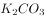），是很好的钾肥补充剂。但草木灰中的碳酸钾和氮肥会发生化学反应形成氨气，造成氮损失，因此不能混合使用，当选。

D项正确，鱼类正常生长所需水体环境为PH值为7.5~8.5的碱性环境。草木灰呈碱性，可以调节鱼塘酸碱度。另一方面，草木灰具有杀菌作用，能有效杀灭鱼体上的各种病原体，常施草木灰既可对鱼塘水体进行消毒，又能净化水质，排除。　

本题为选非题，故正确答案为C。

---

## 言语理解与表达

### 材料 1

       根据所给材料，回答51~55题。

       技术为自身的生存和发展而战，并且有着独特的生命周期。我们可以将其划分为以下几个阶段：

       首先是先驱阶段。技术的先决条件已经存在，梦想家们可能会考虑把这些元素放在一起。然而即便这些梦想此时已经记录在案，人们也不会将其视为发明创造，比如达·芬奇曾经绘制过很多有说服力的飞机和汽车图画，但人们并不认为他是在发明创造。

       其次是发明阶段。这一阶段在人类文化当中相当有名。此一阶段时间比较短，从某些方面来看，这就像<u>                           </u>。在这个阶段当中，发明家们把科学技术、好奇心与决心结合起来，通常再加上一定的表演技巧，将各种方法以新的方式结合在一起，给生活带来一种全新的技术。

       第三个阶段是发展阶段。新发明会得到那些溺爱它们的监护者（也许还包括最初的发明者）的保护和支持。通常这一阶段比发明阶段要重要，可能还包括额外的创造，这些额外创造比那个独创性发明更重要。当年，许多工匠已经手工制作了非常精美的老式汽车，但使汽车产业得以生根发芽、枝繁叶茂的，却是美国企业家亨利·福特推出的大批量生产的创新做法。

       第四个阶段是成熟期。技术在不断进步，现在已经有了自己的生命，也终于成为社会当中独立稳定的部分，也许已经深入人类生活的方方面面。因此许多观察家认为，技术将永存于世。

       在下一个阶段（可称为“挑战者时期”）到来时，这种状态会发生有趣的变化。技术界的“新贵”威胁着要排挤那些老技术，其追随者过早宣布了胜利的消息。但是尽管新技术能带来一些独特的益处，仔细思考之后人们却发现，这些新技术在功能和质量方面存在着关键元素缺失的问题。当人们发现这些新技术确实无法改变既有秩序之后，技术的保守派便以此为依据，证明以前的技术方法确实可以永存。

       对逐渐老化的技术来说，这通常只是一个短暂的胜利。另一种新技术很快就会出现，它总能成功地将原有技术逼到过时的舞台上。在生命周期的这个部分，技术在逐渐衰败的状态当中度过了晚年，它的最初目的和功能现在都被一个更活泼的竞争对手比下去了。这一阶段约占技术整个生命周期的至。

       最终，技术成为“老古董”，就像马赫轻便马车、拨弦键琴、机电式计算器一样，不得不黯然离场。

#### 第 1 题　qid 2028496 · 语句表达

填入文中画横线部分最恰当的一句是：

- **A**. 怀胎数月最终分娩的过程一样　✅
- **B**. 流星划过夜空那样璀璨而耀眼
- **C**. 人类当年在月球上迈出第一步
- **D**. 人类文明酝酿以及发展的过程

**答案**：A

**官方解析**

横线出现在文章第三段中间位置，重点阅读此段。此段是在介绍技术生命周期的“发明阶段”。由横线前“此一阶段时间比较短”可知，横线处是通过比喻来体现技术发明阶段时间短的特点。横线后“在这个阶段······以全新的方式······带来一种全新的技术”是对横线处的解释说明，强调在技术发明阶段会产生一种全新的技术。A项中“怀胎数月最终分娩的过程”，其特点就是怀胎时间长分娩的时间短且孕育出新的生命，与前后文对应，符合发明阶段的特点，当选。
B项“流星划过夜空”过程虽短，但不能带来新内容，且“璀璨而耀眼”在文段中也并未提及，排除；C项“人类在月球上迈出第一步”，虽为创新但无法体现出“时间短”这一特点，排除；D项“人类文明酝酿以及发展的过程”表述不明确，不能体现出发明阶段“时间短”这一特点，排除。
故正确答案为A。
【文段出处】（美）雷·库兹韦尔：《机器之心》

---

#### 第 2 题　qid 2028502 · 片段阅读

作者举亨利·福特的例子是为了说明：

- **A**. 汽车产业中的工匠精神决定着工艺水平
- **B**. 技术产业的发展决定了技术应用的前景
- **C**. 技术推广中的额外发明比独创发明更关键　✅
- **D**. 独创性发明本身并不一定具有核心竞争力

**答案**：C

**官方解析**

首先定位原文，亨利福特的例子出现在第四段末尾，重点阅读第四段。由文段可知，“新发明不但会得到溺爱他们的监护者的保护和支持，可能还会有额外的创造，而这些额外创造比独创性发明更重要”，随后举了亨利福特推出大批量生产的创新做法使汽车产业更繁荣这个例子，进一步强调了“额外创造”的重要性。C项中提到了“额外创造”这一概念，对应了文段中的“额外创造比独创性发明更重要”，当选。
A项中的“工匠”为转折前的内容，不是例子所强调的意思，排除；B项“产业发展决定前景”在原文无从体现，无中生有，排除；D项表述不明确，例子重在强调“额外的创造”，排除。
故正确答案为C。
【文段出处】（美）雷·库兹韦尔：《机器之心》

---

#### 第 3 题　qid 2028514 · 片段阅读

下列哪种现象可能发生在技术发展的“挑战者时期”？

- **A**. 数码相机抢夺胶卷相机的市场　✅
- **B**. 打字机的功能完全被电脑所代替
- **C**. 凡尔纳小说已有对潜艇的构想
- **D**. 人们的日常生活离不开智能手机

**答案**：A

**官方解析**

根据文章第六段，“技术界的‘新贵’威胁着要排挤那些老技术”，故是两个技术主体进行的“对抗”，C、D两项分别陈述潜艇、智能手机一个主体，排除；
又根据后文“证明以前的技术方法确实可以永存。”B项，“打字机的功能完全被代替”，意味着不可以永存，与文意相悖，且表述过于绝对，排除；
A项，数码相机抢夺胶卷相机的市场是一种威胁、排挤，但并未能够完全挤出，与后文“新技术缺失关键元素、以前的技术方法仍可存在”对应准确，A项当选。
故正确答案为A。
【文段出处】 《机器之心》

---

#### 第 4 题　qid 2028518 · 片段阅读

根据文章，下列说法正确的是：

- **A**. 技术的成熟期持续时间较短
- **B**. 关键元素的缺失会导致技术停滞不前
- **C**. “老古董”指技术已臻于完美，无需改进
- **D**. “短暂的胜利”指原有技术的胜利　✅

**答案**：D

**官方解析**

根据第七段“对逐渐老化的技术来说，这通常只是一个短暂的胜利”可知，“逐渐老化的技术”即“原有技术”，结合选项，D项正确，当选。
A项表述错误，根据第三段可知，技术的发明阶段时间比较短，而非“技术的成熟期”，排除；
B项表述错误，根据第六段可知，“新技术······存在着关键元素缺失的问题”导致的结果是“技术的保守派便以此为证据，证明以前的技术方法确实可以永存”，选项中“导致技术停滞不前”与文段表述不相符，排除；
C项“臻于完美，无需改进”表述过于绝对，排除。
故正确答案为D。
【文段出处】《机器之心》

---

#### 第 5 题　qid 2028520 · 片段阅读

这篇文章主要谈论的是：

- **A**. 新兴技术的进阶之路
- **B**. 技术的生命周期　✅
- **C**. 新旧技术的优劣比较
- **D**. 技术对社会的影响

**答案**：B

**官方解析**

文章第一段总起全文，提出观点，即“技术为自身的生存和发展而战，并且有着独特的生命周期”，接下来分别详细论述不同的阶段。文章为总分结构，B项是对文段中心的准确概括，表述正确，当选。
A项，“新兴技术”概念缩小，排除；
C项，“优劣比较”无中生有，排除；
D项，“对社会的影响”无中生有，排除。
故正确答案为B。
【文段出处】《机器之心》

---

### 材料 2

根据所给材料，回答56~60题。

        我们的生活被各式各样的信息塞满挤爆，常常来不及消化，就被迫接收下一个信息，这导致信息的传递处于无意识处理的状态，很多问题都来不及深入思考。长期下来，我们的大脑容易被既定的观念限制，看似精明却往往漏洞百出。商家、推销员、诈骗集团等紧紧抓住这一特点，巧妙操弄生活中的各种信息，制造一个又一个骗局，我们则比想象中更容易落入圈套，还认为自己做出了正确的决策。

        骗局的根源之一：其实我们活在大脑创造的虚拟世界中。

        当我们在看世界时，我们是真的“直接”看到了世界，还是只是“间接”看到了世界呢？很多人可能会认为我们当然是直接看到了世界，但事实上，我们只是间接看到了世界。我们的各种感觉和经验，完全是大脑解码后传递给我们的产物。当我们看到、听到、闻到、尝到或摸到东西时，我们真正“接触”到的，只是大脑对这个世界的“理解”。<u> ① </u>我们所有的知觉经验，完全是大脑的产物。大脑通过感官，把外在世界的能量和信号转变成电生理信号，这些电生理信号又被转化成知觉意识。我们所体验到的，就是这些由大脑产生的知觉意识。换言之，我们的知觉意识，完全是大脑创造出来的知觉假象。由于是大脑模拟的虚拟现实，其中就会有错误或漏洞。这就是大脑容易受骗的第一个原因。

        骗局的根源之二：各种思考捷径帮倒忙。

        在演化过程中，大脑竭尽所能地让这些模拟的知觉能够逼近真实世界，好让我们可以顺利存活于世界之中。<u> ② </u>但是，为了应对瞬息万变的野性世界，大脑常常需要选择牺牲少许的“正确性”以换取“速度”，“思考捷径”就是大脑为了求快而建立的一种快捷计算方式。通过某些事先建立好的预设，大脑可以节省许多资源。<u> ③ </u>我们无论怎样使用意志去穿透认知，都不可能改变大脑的想法。科学家们把这种无法通过意志力进行矫正的认知现象，称为“认知不可穿透性”。这种“认知不可穿透性”，正是大脑可能欺骗我们的另一重大原因。

        骗局的根源之三：无意识信息处理过程出现漏洞。

        大脑容易受骗或出错的第三个原因，就是因为无意识信息处理过程出现漏洞。大脑中的电生理信号在被转化成知觉意识之前，必须先经历一系列无意识的信息处理过程。<u> ④ </u>比如突触释出神经传导物质、电子信号在脊鞘上跳跃等过程，这些完全不会出现在我们的意识层面。

        大脑不让我们意识到这些庞杂的信息处理过程，其实是有原因的。因为如果把所有的信息处理过程全部呈现到意识中，我们将会被信息淹没。因此大脑选择只让我们意识到那些最重要的信息。但是，<u>                                  </u>。当我们无法意识到这些庞大的无意识信息处理过程时，这些会偷偷影响我们行为的因素，就很容易成为被人利用的漏洞。

#### 第 6 题　qid 2028464 · 片段阅读

下面这个段落最适合放在文中哪个位置？
大脑预设人脸一定是凸出来的，不可能是凹进去的。这种类似的预设在“大部分”状态下都是恒定的，因此在演化过程中，它们已经被写入大脑的默认值之中。在这种情况下，即使科学家制造出脸向内凹的人脸模型，在人类的视觉与大脑解码系统中，我们看到的人脸模型仍然是凸出的。

- **A**. ①
- **B**. ②
- **C**. ③　✅
- **D**. ④

**答案**：C

**官方解析**

题干中的这段文字以“人脸造型凹凸”为例，主要讲的是“我们无法改变大脑默认的预设”，根据话题一致原则，前文提及“大脑事先建立好的预设”，后文提及“我们都不可能改变大脑的想法”，故应放在③符合文段逻辑，C项当选。
A项，①前后文论述的是大脑对世界的“理解”和创造出来的假象；B项，②前后文论述的是大脑处理信息的方式；D项，④强调的无意识的信息处理，均没有提到“预设”这一话题，衔接不当，排除A、B、D三项。
故正确答案为C。
【文段出处】《生活中的大脑骗局》

---

#### 第 7 题　qid 2028466 · 片段阅读

关于认知不可穿透性，下列说法正确的是：

- **A**. 与大脑为了求快而建立的快捷计算方式有关　✅
- **B**. 是大脑创造出来的一种知觉假象
- **C**. 发生在大脑中的电生理信号被转化成知觉意识之前
- **D**. 意志力无法穿透的认知对象是相对不重要的信息

**答案**：A

**官方解析**

定位到文章第5段，根据“大脑常常需要选择······就是大脑为了求快而建立的一种快捷计算方式”及“科学家把这种······称为‘认知不可穿透性’”可知，“认知的不可穿透性”是大脑“为了求快而建立的一种快捷计算方式”，A项当选。
B、C两项中的“知觉假象”“发生在大脑中的电生理信号被转化为知觉意识之前”分别出现在第3段与第7段，与“认知不可穿透性”无关，排除；
D项的“相对不重要的信息”为无中生有，“认知的不可穿透性”的形成与求快有关，排除。
故正确答案为A。
【文段出处】《生活中的大脑骗局》

---

#### 第 8 题　qid 2028468 · 语句表达

填入文中最后一段画横线部分最恰当的一句是：

- **A**. 任何选择都是要付出代价的　✅
- **B**. 大脑的选择往往是无意识的
- **C**. 大脑对重要性的判断可能出错
- **D**. 信息的重要与否可能因时而异

**答案**：A

**官方解析**

横线在最后一段，横线前指出“大脑不让我们意识到这些庞杂信息的处理过程”是因为如果把所有的信息处理过程全部呈现到意识中，我们将会被信息淹没，即强调“意识不到庞杂信息的处理过程”给人们带来的好处，接下来通过“但是”进行转折，前后语义相反，横线处应强调“意识不到庞杂信息的处理过程”带来的危害，后文的内容是对横线处危害的解释说明，A项“任何选择”对应前文中“大脑的选择”、“代价”即表示危害，与后文对应，当选。
B项中“无意识”无法与前文形成转折关系，排除;
C项强调的是“对重要性的判断”，而文段重在强调“意识不到庞杂信息的处理过程”的利与弊，转折后文阐述的应是给人们带来的危害，而非谈论大脑的判断是否正确，且填入之后与后文衔接不畅，排除；
D项“因时而异”为无中生有的表述，且信息本身是否重要不是文段的重点概念，与文段内容衔接不当，排除。
故正确答案为A。
【文段出处】《生活中的大脑骗局》

---

#### 第 9 题　qid 2028470 · 片段阅读

下列哪组词语能更好地解释为什么大脑容易受骗？
①无意识信息处理   ②思考捷径   ③意志力薄弱   ④信息过载   ⑤知觉假象

- **A**. ②③④
- **B**. ①②⑤　✅
- **C**. ②④⑤
- **D**. ①③④

**答案**：B

**官方解析**

全文首段提出观点，即我们的大脑容易受骗，后文通过三个方面具体阐述容易受骗的原因，即“活在大脑创造的虚拟世界中”“各种思考捷径帮倒忙”“无意识信息处理过程中出现漏洞”，“知觉假象”“思考捷径”“无意识信息处理”分别对应文段第一、二、三点，B项当选。
④“信息过载”为首段大背景描述，非大脑容易受骗的原因，③“意志力薄弱”无中生有， A、C、D三项均排除。
故正确答案为B。
【文段出处】《生活中的大脑骗局》

---

#### 第 10 题　qid 2028472 · 片段阅读

这篇文章意在说明：

- **A**. 很多认知现象是无法通过意志力去矫治的
- **B**. 大脑由于进化形成了不可逆转的认知结构
- **C**. 大脑并不像我们想象得那般可靠与完美　✅
- **D**. 掌握大脑运转机制才能更好地应对骗局

**答案**：C

**官方解析**

全文开篇提出观点：大脑容易被既定观念限制而陷入骗局，随后通过三个方面具体阐述大脑会陷入骗局的三个原因，对开篇的观点进行了详细解释说明。整篇文章为总分结构，观点为重点所在，C项的“大脑并不像我们想象得那般可靠与完美”即是对“大脑容易被骗”的同义替换，表述契合中心，当选。
A、B两项“无法通过意志力去矫治”、“由于进化形成了不可逆转的认知结构”均为文段根源之二中论述的内容，表述片面，排除；
D项强调的是“‘人们’被骗要如何应对骗局”，与文段观点的“‘大脑’容易被骗”强调的主体不一致，且整个文段强调的是即便我们搞清楚了大脑运转的机制，我们仍然没法规避那些骗局，排除。
故正确答案为C。
【文段出处】《生活中的大脑骗局》

---

#### 第 11 题　qid 2028384 · 逻辑填空

物理学研究与艺术创作有异曲同工之妙，若是不能_______，就只能千锤百炼，通过成年累月的辛苦工作来解开暗物质的谜团了。
填入画横线部分最恰当的一项是：

- **A**. 妙手偶得　✅
- **B**. 一蹴而就
- **C**. 守株待兔
- **D**. 灵机一动

**答案**：A

**官方解析**

根据文段“若是不能······就只能”可知横线处词语与后文语义相反，后文“千锤百炼”“成年累月”侧重强调经过多次、长时间的锻炼和考验，故前文应填入表达短时间内得到突破的词语，且横线处需与前文“与艺术创作有异曲同工之妙”对应。
A项“妙手偶得”指创作灵感，可以巧妙偶然间得到，既与前文“异曲同工之妙”对应，又和“千锤百炼”语义相反，当选。B项“一蹴而就”仅形容时间较短，无法与前文“与艺术创作有异曲同工之妙”对应，排除；C项“守株待兔”比喻不想努力，而希望获得成功的侥幸心理，与文意不符，排除；D项“灵机一动”指急忙中转了一下念头，多指临时想出了一个办法，无法与前文“艺术创作”形成对应，排除。
故正确答案为A。
【文段出处】《暗物质的新闪光》

---

#### 第 12 题　qid 2028396 · 逻辑填空

在这个万物互通互联的时代，单个企业是无法“              ”的，只有人人安全、合作伙伴都安全、整个环境都安全，才能最大限度地保障自己的网络安全，这也是网络安全的更高等级——生态安全。
填入画横线部分最恰当的一项是：

- **A**. 明哲保身
- **B**. 自力更生
- **C**. 独善其身　✅
- **D**. 自给自足

**答案**：C

**官方解析**

根据文意可知，只有人人安全，合作伙伴都安全，整个环境都安全才能保障自己的安全，文段重在突出企业安全问题的互联互通，故对于企业来说，考虑到整个环境的安全十分必要，而不能只考虑自身。C项“独善其身”指只顾自己，不管别人，与文意相符，当选。
A项“明哲保身”指因怕连累自己而回避原则斗争的处世态度，文段并没有连累、回避之意，排除；B项“自力更生”指依靠自己的力量把事情办起来，D项“自给自足”指依靠自己的生产，满足自己的需要，代入后二者均指没有其他人的帮助，企业无法存活之意，而文段并非强调企业的存活问题，而是重在突出企业安全问题的互联互通，故排除。
故正确答案为C。
【文段出处】《阿里巴巴为什么要收购一家安全公司》

---

#### 第 13 题　qid 2028402 · 逻辑填空

卫星轨道数据是一类需要严格保密的数据，卫星所有人将卫星的位置和运行路线视为机密资料。拥有卫星的那些企业担心泄密会使自己丧失竞争             ，因为把             的定位信息泄露出去，可能会向竞争对手暴露自己的实力，政府也担心这会危害国家安全。
依次填入画横线部分最恰当的一项是：

- **A**. 筹码 详细
- **B**. 能力 准确
- **C**. 机遇 隐藏
- **D**. 优势 确切　✅

**答案**：D

**官方解析**

第一空，根据文意可知，卫星轨道数据是企业的机密资料，对企业十分重要，一旦泄露会使企业处于不利地位，B项“能力”指完成一定活动的本领，泄密会使企业“丧失竞争能力”程度过重，文段只是强调会对企业产生不利影响，排除；C项“机遇”与竞争搭配不当，排除。A、D两项填入文段语义合适。
第二空，搭配“定位信息”，“定位信息”指准确的位置信息，强调数据的准确性，D项“确切”指准确，恰当，填入文段语义合适；A项“详细”指详尽、细致，无法体现信息的准确性，排除。
故正确答案为D。
【文段出处】《为卫星通信加密》

---

#### 第 14 题　qid 2028410 · 逻辑填空

各国在对外交往中常常会形成一套相对               的话语体系，特别是拥有自己的核心话语。对外话语不仅体现一国的外交政策，更               了一国对外沟通的基本态度和价值。
依次填入画横线部分最恰当的一项是：

- **A**. 灵活 承载
- **B**. 固定 代表　✅
- **C**. 独立 说明
- **D**. 集中 体现

**答案**：B

**官方解析**

第一空，对应后文“核心话语”可知，横线处想表达对外交往中有一套自己的、核心的体系。A项“灵活”指善于变通、不死板，与文意相悖，排除。D项“集中”与“话语体系”搭配不当，排除。又根据后文“特别是”表递进可知，前后语义应体现出不同程度。“特别是”之后强调拥有自己的核心话语，即不受他人影响的“独立”之意，故“特别是”之前不适合填入“独立”一词，排除C项。B项“固定”填入空格表示形成一套常规的话语体系，与后文形成递进。
验证第二空，搭配“基本态度和价值”，B项“代表”与“基本态度和价值”搭配合适。
故正确答案为B。
【文段出处】《薛力：中国需重塑对外话语体系》

---

#### 第 15 题　qid 2028418 · 逻辑填空

近年来，多部科幻电影在各大影院热播，黑洞、白洞、虫洞等都是人们              的天文学前沿概念，人类似乎在不久的将来就可以通过虫洞快速抵达太阳系外的宜居星球。但实际上，近年来星际飞行理论并没有突破性进展，深空探测在可以预见的将来还只能              于对太阳系内天体的探测。
依次填入画横线部分最恰当的一项是：

- **A**. 如数家珍 满足
- **B**. 了如指掌 倾向
- **C**. 津津乐道 局限　✅
- **D**. 念念不忘 受制

**答案**：C

**官方解析**

第一个空，搭配“前沿概念”。“前沿概念”指刚出现、比较新鲜的概念内容。A项“如数家珍”形容某人对所讲的事情十分熟悉，B项“了如指掌”形容对情况非常清楚，像指着自己的手掌给别人看，而事实上人们对于天文学前沿概念并未达到十分熟悉的程度，程度过重，排除A、B两项；D项“念念不忘”指时刻挂在心上，常与某人某事搭配，与“天文学概念”搭配不当，排除；C项“津津乐道”形容对这件事十分地感兴趣，且很乐于谈论，符合文段语境。
第二个空，代入验证。“局限”指限定在一定范围内，与前文“没有突破性进展”及后文“对太阳系内天体的探测”语义对应，符合语境。
故正确答案为C。
【文段出处】《新视野号抵达太阳系新大陆》

---

#### 第 16 题　qid 2028424 · 逻辑填空

家庭是社会的基本单元，家庭功能受损，已经并将继续产生深远后果。规模庞大的留守儿童，是中国独有的城乡二元体制的产物。解决这一问题_______，且无法毕其功于一役，多项改革不可能_______，但严峻的现实提醒我们，多层次的行动、全方位的改革必须启动或加速。
依次填入画横线部分最恰当的一项是：

- **A**. 迫在眉睫 万无一失
- **B**. 千头万绪 立竿见影　✅
- **C**. 千难万险 齐头并进
- **D**. 错综复杂 避重就轻

**答案**：B

**官方解析**

第一空，搭配“解决这一问题”，A项“迫在眉睫”、B项“千头万绪”均符合题意。C项“千难万险”形容困难和危险极多，一般表述为“解决问题经历了千难万险”，无法直接与“解决这一问题”搭配，且文段并未提及解决这个问题遇到了哪些危险，故与文意不符，排除；D项“错综复杂”形容头绪繁多，情况复杂，一般表述为“问题错综复杂”，与“解决这一问题”搭配不当，排除。 
第二空，根据“无法······不可能······”可知，横线处词语与前文“无法毕其功于一役”形成并列，“无法毕其功于一役”指无法一次完成，故横线处表达多项改革不可能马上有效果之意。B项“立竿见影”比喻立刻见效，符合语境。A项“万无一失”指非常有把握，绝对不会出差错，语义过于绝对，且无法与前文形成对应，排除。
故正确答案为B。
【文段出处】《莫让留守儿童悲剧重演》

---

#### 第 17 题　qid 2028430 · 逻辑填空

对于科学家来说，数学公式可以展现大自然的基本原理，或者将复杂的东西简洁地表达出来，这的确              。但对普通大众中的一些人而言，公式也可能是令人生畏、晦涩难懂的；然而对另外一些人来说，正是公式的              使其变得迷人：即使不能理解公式的含义，我们也可以被它打动，因为我们知道，有些公式蕴含着一些超出我们理解能力的含义。
依次填入画横线部分最恰当的一项是：

- **A**. 妙不可言 神秘　✅
- **B**. 独树一帜 深奥
- **C**. 无与伦比 周密
- **D**. 叹为观止 严谨

**答案**：A

**官方解析**

第一空，横线前出现指代词“这”，指代前文“数学公式……表达出来”，强调数学公式的作用。A项“妙不可言”形容好得难以用文字、语言表达，搭配恰当。B项“独树一帜”比喻独特新奇，自成一家，侧重于强调事物的独特性和唯一性，而“将复杂的东西简洁地表达出来”并非数学公式所特有，排除。C项“无与伦比”指事物非常完美，没有能跟它相比的，填入横线处，语义程度过重，排除。D项“叹为观止”指赞叹所见事物已好到极点，主语为物时，应搭配“令人”、“让人”，搭配不当，且填入横线处语义程度过重，排除。
第二空代入验证，“冒号”表示解释说明，即冒号之后的内容是对前文的解释说明，冒号后强调公式包含人类不了解的含义。A项“神秘”比喻难以捉摸，神秘莫测，可对应文段语境，当选。
故正确答案为A。
【文段出处】《数学家和物理学家票选的五大最美数学公式，你看得懂几个？》

---

#### 第 18 题　qid 2028434 · 逻辑填空

密码学的历史大致可以追溯到两千年前，相传古罗马名将凯撒为了防止敌方截获情报，便使用密码传送情报。凯撒的做法很             ，就是为二十几个罗马字母建立一张对应表，如果不知道对应表，即使拿到情报也是             。
依次填入画横线部分最恰当的一项是：

- **A**. 别致 前功尽弃
- **B**. 隐蔽 枉费心机
- **C**. 简单 徒劳无功　✅
- **D**. 精妙 无所适从

**答案**：C

**官方解析**

第一个空，A项“别致”指别出心裁，新奇有致之意，而文段并未出现多种做法对比，故新奇之意无从体现，排除；B项“隐蔽”指借助别的东西遮盖掩藏，文段并未提到掩盖的意思，排除；C项“简单”与D项“精妙”可搭配做法。
第二个空，根据语境可知，“如果没有对应表，即使拿到情报也是无用”，对应C项，“徒劳无功”指白白付出劳动而没有成效，符合文段语境，C项当选；D项“无所适从”指不知听从哪一个好或不知怎么办才好，而文段并未涉及选择，排除。
故正确答案为C。
【文段出处】《密码学的数学原理》

---

#### 第 19 题　qid 2028438 · 逻辑填空

水污染防治之难，在于水的             。水自源头奔流而下，被沿岸居民、企业反复利用，任何环节疏于治理，都可能让水变脏。水往低处流的特性，也导致“上游排污，下游遭殃”，上游地区的污水如不加处理直流下游，下游往往             也难以应对。
依次填入画横线部分最恰当的一项是：

- **A**. 循环性 殚精竭虑
- **B**. 地域性 一掷千金
- **C**. 流动性 竭尽全力　✅
- **D**. 便利性 废寝忘食

**答案**：C

**官方解析**

第一空，由后文“水自源头奔流而下”“水往低处流的特性”直接对应可知，横线处填入导致水污染防治困难的水的特性应为“流动性”，而A项“循环性”强调“水流动具有反复性”，并非“水”的本身特性，排除；而B、D项地域划分以及便捷的特点文中均无体现，排除。
第二空验证，“竭尽全力”指用尽全部力量，置于此处可充分体现出水的流动性给水污染防治带来的困难，语义及程度均符合语境。
故正确答案为C。
【成语积累】
殚精竭虑：形容用尽心思。
一掷千金：指用钱满不在乎，一花就是一大笔。
废寝忘食：顾不得睡觉，忘记了吃饭，形容专心努力。
【文段出处】《环保有补偿，才能可持续》

---

#### 第 20 题　qid 2028442 · 逻辑填空

处在互联网时代，中小型民营书店虽然无法在出版规模、价格、渠道等方面和大型发行集团、出版社、传媒集团展开竞争，但可以专注于某一特色，            ，市场空间小而利润不小。网络的传播与沟通效应、数据平台的挖掘分析能力，能够帮助独立书店更便捷地触及到读者的思想和需求，并             需求，引导消费。
依次填入画横线部分最恰当的一项是：

- **A**. 发扬光大 发现
- **B**. 画龙点睛 刺激
- **C**. 锦上添花 满足
- **D**. 拾遗补缺 创造　✅

**答案**：D

**官方解析**

第一空，由首句可知，文段表意为中小型民营书店虽然无法在规模、渠道等大方面与集团竞争，但可以开辟小特色、小空间来谋求发展。D项“拾遗补缺”指拾取遗漏的，补充空缺的，搭配恰当，且与后文形成对应。A项“发扬光大”使好的作风、传统等得到发展和提高，侧重于强调空间、范围上的扩大，而文段强调的是中小型民营书店可专注于某一特色或某一小的市场空间，与文意不符，排除。B项“画龙点睛”比喻写文章或讲话时，在关键处用几句话点明实质，使内容生动有力，其前提是事物本身是好的，而由文段可知，中小型民营书店在互联网时代的发展并不好，与文段语境不符，排除。C项“锦上添花”比喻好上加好，美上添美，而这与中小型民营书店的发展处境不符，排除。
第二空代入验证，“创造需求”搭配恰当，且“引导消费”的前提是要有需求，而“创造需求”是“引导消费”的前提和基础，符合文意，当选。
故正确答案为D。
【文段出处】《民营书店发展关键：服务价值的定价？》

---

#### 第 21 题　qid 2028428 · 逻辑填空

未来将会怎样，不可准确预知，但格局和            总有踪迹可循。在信息技术、互联网发展所            的巨大变革面前，时代和社会呼唤产生一批真正的未来学家，能够站在历史和现实的关口，对信息社会的未来有所把握，为未来人们的生产和生活、选择和行为提供一些理论上的            。
依次填入画横线部分最恰当的一项是：

- **A**. 轨迹 带来 解释
- **B**. 方向 造成 设想
- **C**. 路径 导致 服务
- **D**. 趋势 引发 指导　✅

**答案**：D

**官方解析**

本题从第二空入手，表达互联网带来的变革，B项“造成”和C项“导致”往往加不好的结果，感情色彩偏消极，排除。
第三空，根据文意，横线词语表达未来学家提供理论上的引导和帮助，D项“指导”符合文意，保留。A项“解释”往往是已经发生的事情，与文段“未来”的语境不符，排除。
第一空，代入验证，D项“趋势”和“格局”构成并列，符合文意，当选。
故正确答案为D。

---

#### 第 22 题　qid 2028436 · 逻辑填空

传统曲艺中一两个演员借助简单的手持道具，靠说唱完成一场表演，没有过硬的功夫不行，不会与观众            更不行。修养高深的曲艺表演者会使用各种手段拉近与观众的情感距离，            引领观众参与艺术创造。在基本没有舞台布景和“灯服道效”相配合的            表演环境中，曲艺演员要靠自身的表演征服观众，其难度远远大于其他舞台表演艺术。
依次填入画横线部分最恰当的一项是：

- **A**. 交流 主动 简约　✅
- **B**. 对话 巧妙 临时
- **C**. 沟通 间接 单一
- **D**. 互动 快速 虚拟

**答案**：A

**官方解析**

本题可从第二空入手，由“表演者会使用各种手段”可知，演员们对观众的引领是“主动”“巧妙”或“快速”的，C项“间接”与文意相悖，故排除C项。
第三空，与文段中表演环境“基本没有舞台布景和‘灯服道效’相配合”对应，A项“简约”更为准确，B项“临时”与“环境”搭配不当，排除。D项“虚拟”与文意不符，文段中的环境是实际存在的，排除。
第一空，代入验证，A项“交流”符合文意，当选。
故正确答案为A。
【文段出处】《曲艺是最有观众缘儿：演员与观众直接交流互动》

---

#### 第 23 题　qid 2028444 · 逻辑填空

在长期积累中，传统媒体在新闻信息采集、加工和传播方面形成了一套比较             的方法、流程、标准和机制，虽然有单一乃至僵化的缺陷，但             ，对保证传统媒体的权威性发挥了重要作用。具有高度专业水平的内容对任何媒体都是             的，这是媒体安身立命之本。
依次填入画横线部分最恰当的一项是：

- **A**. 系统 无独有偶 求之不得
- **B**. 成熟 不可否认 不可或缺　✅
- **C**. 普遍 显而易见 独一无二
- **D**. 先进 不言自明 至关重要

**答案**：B

**官方解析**

第一空，与前文“长期积累”对应可知，这一套方法、流程、标准和机制应是相对“系统”“成熟”“普遍”的，D项“先进”无法构成对应。且根据后文“虽然有单一乃至僵化的缺陷”可知，这些机制都存在问题，“先进”强调领先和进步，与“缺陷”语义矛盾，排除。
第二空，根据转折词“但”可知，前后语义相反，转折前阐述了传统媒体存在缺陷，填入的成语应表示传统媒体还是发挥了重要作用。A项“无独有偶”是指并非只此一个，还有一个可以和它配成一对的，表示两事或两人十分相似，至少得有二者，文段只提及传统媒体，排除。
第三空，根据后文“这是媒体安身立命之本”可知，文段强调具有高度专业水平的内容是任何媒体必须具有的，B项“不可或缺”符合要求，当选。C项“独一无二”是指没有相同的或没有可以相比的，文段并非强调独特性，且“独一无二”用在此处程度过重，排除。
故正确答案为B。
【文段出处】《必然衰落 不会消亡——传统媒体未来》

---

#### 第 24 题　qid 2028448 · 逻辑填空

实际上，靠强制手段和利益驱使评上的“文明城市”，只不过是              罢了。只有每一位市民发自内心地              “文明城市”理念，从身边点滴小事做起，做文明有礼的城市人，“文明城市”自然              。
依次填入画横线部分最恰当的一项是：

- **A**. 自欺欺人 认同 水到渠成　✅
- **B**. 沽名钓誉 拥护 不期而至
- **C**. 装腔作势 赞同 实至名归
- **D**. 掩耳盗铃 维护 名副其实

**答案**：A

**官方解析**

第一空，根据前文“靠强制手段和利益驱使评上的‘文明城市’”可知，填入的成语是用来形容这种行为并无实际意义。A项“自欺欺人”指欺骗自己，也欺骗别人，B项“沽名钓誉”指使用各种不正当手段以谋取好的名声和荣誉，D项“掩耳盗铃”比喻自欺欺人，三者均符合文段语境要求，保留。C项“装腔作势”是指故意装出一种腔调，做出一种姿势，用来比喻故意做作，主语多搭配人，与文意不符，且搭配不当，排除。
第二空，填入的词语搭配“理念”。A项“认同”指承认、认可，B项“拥护”表示对政策、措施、领袖等的赞成和支持，二者均可搭配“理念”，保留。D项“维护”指保护，使免于遭到破坏，多搭配“利益”“关系”等，与“理念”搭配不当，排除。
第三空，“只有”引导必要条件，根据文意可知，只有每位市民“从身边点滴小事做起，做文明有礼的城市人”，“文明城市”自然会形成，故横线处应表现条件满足，结果自然形成。A项“水到渠成”意指水流到之处便有渠道，比喻有条件之后，事情自然会成功，即功到自然成，符合文意，当选。B项“不期而至”指事先没有约定而意外到来，侧重“意外到来”，与文段“文明城市”自然而然的结果语意相悖，排除。
故正确答案为A。

---

#### 第 25 题　qid 2028450 · 逻辑填空

一个拥有工匠精神、推崇工匠精神的国家和民族，必然会少一些浮躁，多一些纯粹；少一些投机取巧，多一些            ；少一些            ，多一些专注持久；少一些            ，多一些优品精品。
依次填入画横线部分最恰当的一项是：

- **A**. 实事求是 好高骛远 偷工减料
- **B**. 兢兢业业 口是心非 花里胡哨
- **C**. 脚踏实地 急功近利 粗制滥造　✅
- **D**. 稳扎稳打 杀鸡取卵 敷衍了事

**答案**：C

**官方解析**

本题根据“少一些”与“多一些”对应，形成相反语义。可从第二空入手，所填成语应与“专注持久”意思相反，强调态度上的专注与时间上的长久。A项“好高骛远”比喻不切实际地追求过高过远的目标，与文意不符，排除；B项“口是心非”是指口中所言说的与心中所思想的不一致，“专注持久”强调的是行为而非说话，排除。
第三空，填入的成语与“优品精品”意思相反，表示产品质量差。C项“粗制滥造”是指写文章或做东西马虎草率，只求数量，不顾质量，符合要求，保留。D项“敷衍了事”是指对一件事情不认真，草草了事，强调的是做事的态度而非质量差，排除。
第一空，代入验证，C项“脚踏实地”比喻做事踏实，认真，与前文“投机取巧”形成反义对应，搭配恰当。
故正确答案为C。
【文段出处】《工匠精神：为中国制造铸魂》

---

#### 第 26 题　qid 2028374 · 片段阅读

在城镇化初、中期，美国奉行自由经济理论，市场机制起主要作用，联邦政府调控手段薄弱，导致过度郊区化，造成城镇发展规划结构性失衡、城市无序扩张蔓延、土地资源浪费严重、生态环境破坏等一系列问题。对此，在城镇化后期，美国政府逐步加大调控力度，通过立法和行政干预，加强了城市规划和产业规划布局，逐步重视环境保护，特别是20世纪90年代，美国政府提出的“精明增长”运动，对城镇化建设产生了深刻影响。
这段文字给我们的启示是：

- **A**. 政府要重视推进城镇与农村的均衡发展
- **B**. 生态环境是城镇化进程中首要考虑的问题
- **C**. 城镇化建设与经济协调发展方能取得成效
- **D**. 政府应该对城镇化发展施行规划与干预　✅

**答案**：D

**官方解析**

文段首先阐述美国城镇化早期奉行自由经济理论，政府调控手段薄弱导致诸多问题。接下来通过“对此”总结前文，引出对策，即美国政府加大调控力度，通过立法和行政干预，加强了城市规划和产业规划布局，对城镇化建设产生了积极的作用。故文段在强调政府的规划与干预对于城镇化的重要作用，对应D项。
A项：“农村”无中生有，文段并非解决城镇和农村不均衡的问题，偏离中心，排除。
B 项：文段中“重视环境保护”仅为政府加强干预的一个方面，故该项表述片面，且“首要”无中生有，排除。
C项：“与经济协调发展”无中生有，且没有体现出“政府”的作用，文段强调的是政府加强干预和规划，排除。
故正确答案为D。
【文段出处】《国外城镇化建设：美国城镇化的“破”与“立”》

---

#### 第 27 题　qid 2028390 · 片段阅读

在古代，对未知世界的恐惧感不只属于儿童。中世纪的绘图师们在绘制地图时，并不把未知地带留为空白，而是画上海蛇和想象中的怪兽，并标记“此处有龙”。几个世纪以来，探险家们穿越大洋，攀登高山，逐渐在地图上把这些想象替换成了真实的标记。现如今，我们可以从外太空拍摄照片，感叹地球之美。通信网络造就了“地球村”，世界变得越来越小了。
这段文字的核心观点是：

- **A**. 科技让世界更美好
- **B**. 知识是治疗恐惧的良药　✅
- **C**. 读万卷书，行万里路
- **D**. 吾生也有涯，而知也无涯

**答案**：B

**官方解析**

文段首先介绍了“在古代”绘画师们将未知地带画上海蛇和怪兽的做法，指出人们对未知恐惧的问题。接着介绍“几个世纪以来”探险家们实地探索的经历，以及到“如今”我们通过各种方式了解世界、认知世界的事实。文段通过时间顺序并列，体现出科技带来的知识对克服恐惧的作用，对应B项。
A项：“让世界更美好”为无中生有的表述，文段强调今天科技带来的知识对未知恐惧的克服，排除。C项：“读万卷书”在文段中没有体现，无中生有，排除。D项：无中生有，文段并未讨论人生和知识有无止境的问题，排除。
故正确答案为B。

---

#### 第 28 题　qid 2028406 · 片段阅读

随着全球气候变暖、冰层融化，南北极所蕴含的巨大能源资源、航道优势等被充分发掘出来，其战略意义愈发凸显。据估算，仅北极地区的煤炭、石油、天然气储量就分别占到全世界潜在储量的、、。同时，极地的战略位置也尤为重要。如今，为赢得竞争优势，不仅美国、俄罗斯、加拿大等极地国家纷纷根据各自的国家利益制定极地战略，而且一些非极地国家和集团也积极参与极地事务，使得极地地区形势骤然变化。作为新兴战略热点，围绕极地尤其是北极地区的国际斗争将日趋复杂和激烈。

这段文字意在强调：

- **A**. 大国的积极参与使得极地地区形势复杂化
- **B**. 各国应从全球战略高度看待极地地区问题
- **C**. 围绕北极地区的国际斗争即将拉开帷幕
- **D**. 极地成为世界各国战略博弈的热点地区　✅

**答案**：D

**官方解析**

文段开篇介绍了在气候变暖的背景下，南北极的优势被发掘，战略意义凸显，并用数据进行解释说明，接着“同时”表并列，介绍极地战略位置的重要性，并通过大国的参与说明极地的形势发生变化，前后两个方面共同强调了极地的重要性。文段通过“使得”引出结论，指出极地地区作为新兴的战略热点，围绕极地的国际斗争将日趋复杂和激烈，对应D项。
A项，“大国”对应美国、俄罗斯、加拿大等国家，而文段中还提到了非极地国家，选项表述片面，排除；B项“极地地区问题”为无中生有的表述，排除；C项，“即将拉开帷幕”表示即将开始，而由文段可知，围绕极地的国际斗争已经开始了，文段主要强调的是竞争激烈，排除。
故正确答案为D。
【文段出处】《浅议中国极地文化建设发展战略》

---

#### 第 29 题　qid 2028416 · 片段阅读

自明清以来，大众对于国史最熟悉的段落，大概是“三国”，这主要得力于罗贯中所写的史传文学《三国演义》。《三国演义》“据实指陈，非属臆造”，但题材取舍、人物描写、故事演绎则广纳传说和野史素材，并借助艺术虚构。在受众那里，《三国演义》经常被当作三国信史，故清代史家章学诚称其“七分实事，三分虚构，以至观者往往为之惑乱”。这种“惑乱”，就是信史与史传文学两者间的矛盾性给读者带来的困惑。“文”与“史”固然不可分家，但又不能混淆，也不能相互取代。一旦以“文”代“史”，便会导致“惑乱”。
这段文字主要说的是：

- **A**. 史传文学的生命力在于适度的史学真实性
- **B**. 史传文学是文学性与史学价值的对立统一
- **C**. 人们应避免落入以“文”代“史”的窠臼　✅
- **D**. “文史分家”是评价史传文学的重要标准

**答案**：C

**官方解析**

文段以《三国演义》为例，指出受众误将《三国演义》当作信史，感到“惑乱”的问题，随后进行分析，指出原因在于信史和史传文学的矛盾性，尾句通过转折词“固然……但……”引出重点，强调“文”与“史”不能混淆和相互取代的观点，并进行反面论证，因此文段的重点强调的是大众不能以“文”代“史”，对应C项。
A项，文段的主题词为“文”、“史”，而选项只提到了“史传文学”，表述片面，且“生命力”的表述无中生有，排除；B项没有提及“信史”这一话题，且“文学性和史学价值的对立统一”非文段强调的重点，文段强调的是不能以“文”代“史”，排除；D项“文史分家”与文段“‘文’与‘史’固然不可分家”的说法矛盾，排除。
故正确答案为C。
【文段出处】《学者从“三国”的“史”与“文”谈信史与史传文学的异同》

---

#### 第 30 题　qid 2028422 · 片段阅读

海洋学家揭开了珊瑚礁颜色绚丽多变的秘密。原来，珊瑚虫体内负责控制色素生成的基因存在多种变异，激活的基因越多，珊瑚颜色就越明亮鲜艳。这些色素对与珊瑚共生并为之提供食物的海藻有保护作用。在日照强烈的地方，为了避免海藻被阳光杀死，珊瑚虫便会生成更多色素，珊瑚的颜色就会更鲜艳。
最适合做这段文字标题的是：

- **A**. 保卫海藻
- **B**. 多彩珊瑚之谜　✅
- **C**. 阳光与珊瑚
- **D**. 乐于奉献的珊瑚虫

**答案**：B

**官方解析**

文段为“观点+解释说明”的结构，首句指出海洋学家揭开珊瑚礁颜色绚丽多彩的秘密，后文进行具体的解释说明，故文段重点谈论的是珊瑚颜色绚丽多变的秘密所在，对应B项。A项“保卫海藻”、C项“阳光”均为解释说明的表述，非重点，排除。D项“乐于奉献”为无中生有的表述，文段强调的是珊瑚的颜色多变，排除。
故正确答案为B。
【文段出处】《多彩珊瑚之谜》

---

#### 第 31 题　qid 2028476 · 片段阅读

在文字还不普及的时代，民间故事承担了培养人生观、道德观、伦理观的职能，听故事是人们学习传统文化、自然知识、人生哲学等的重要渠道。然而，飞速发展的现代科技正在深刻改变着人们的生活方式，也极大地影响着人们的接受习惯和审美趣味。当下的年轻人对传统文化的感知和了解，更多的是通过影视作品、网络小说、电子游戏等途径，年轻人对传统民间故事中的一些经典形象越来越陌生，不少专家学者表示，打捞“失落”的民间故事刻不容缓。
接下来最可能讲的是：

- **A**. 让民间故事为现代人接受的途径　✅
- **B**. 民间故事与传统文化之间的关系
- **C**. 年轻一代对民间故事的了解状况
- **D**. 现代科技对民间故事传播的冲击

**答案**：A

**官方解析**

文段首先指出民间故事的作用，接下来指出现代科技的发展对人们产生影响，年轻人对民间故事中的形象越来越陌生，尾句提出对策，指出对民间故事进行打捞刻不容缓。因此，下文应阐述如何让民间故事为现代人所接受的具体措施，对应A项。
B项对应“听故事是······重要渠道”、C项对应“当下的年轻人······越来越陌生”、D项对应“飞速发展······审美趣味”，三项均为前文已经论述的内容，均与尾句话题不一致，排除。
故正确答案为A。
【文段出处】《创造性转换，民间故事才能“走心”》

---

#### 第 32 题　qid 2028478 · 语句表达

①未开采的煤炭只是一种能源储备，只有开采出来，价值才能得到发挥
②充分挖掘并应用大数据这座巨大而未知的宝藏，将成为企业转型升级的关键
③有人把大数据比喻为蕴藏能量的煤矿
④数据作为一种资源，在“沉睡”的时候是很难创造价值的，需要进行数据挖掘
⑤大数据是一种在获取、存储、管理、分析方面规模大大超出传统数据库软件工具能力范围的数据集合
⑥与此类似，大数据并不在“大”，而在于“用”
将以上6个句子重新排列，语序正确的是：

- **A**. ③①②⑤④⑥
- **B**. ⑤③④⑥①②
- **C**. ③⑤②①④⑥
- **D**. ⑤④③①⑥②　✅

**答案**：D

**官方解析**

首先对比选项判断首句，观察③⑤两句可知，⑤句介绍大数据的定义，通过下定义的方式引出文段谈论的话题，③句是围绕大数据进行具体的阐述和介绍，故⑤句更适合作首句，排除A、C两项。接下来寻找共同信息的捆绑，③句把大数据比喻为“煤炭”，①句围绕“煤炭”展开论述，根据“煤炭”这一共同信息可知，③①捆绑，且⑥句中出现代词“与此类似”，指代的是①句的内容，故①句在⑥句之前，排除B项。
故正确答案为D。
【文段出处】《大数据不在于“大”而在于“用”》

---

#### 第 33 题　qid 2028482 · 语句表达

①让世代居住在古城的居民全搬到城外，破坏了历史街区的真实与完整，不利于古城文化遗产和原生态文化的保护与传承
②人口流动是一个长期自然发展的过程
③既要保护古城历史文化遗存、历史街区等物质载体，也要传承风土人情、生活习俗等文化生态，实现传统文化生活和古城文明的延续
④仅就商业运营来说，这种模式在一些地方也并不成功
⑤如果把古城内的物质文化遗产比作人的“肌肉和骨架”，那么非物质文化遗产就是人体里流淌的“血液”，两者密不可分
⑥现在有种现象，政府或公司把古城里的街区甚至整体城区买下来，把原来居民安置到城外，然后引来商户进城经营
将以上6个句子重新排列，语序正确的是：

- **A**. ①④②⑥③⑤
- **B**. ②⑤⑥③④①
- **C**. ⑤③⑥②①④　✅
- **D**. ⑥①②④⑤③

**答案**：C

**官方解析**

对比选项，判断首句。①指出将世代居住在古城的居民搬到城外所产生的危害，⑥指出将居民安置到城外的现象，⑥和①谈论的是同一话题，应先阐述一种现象，然后再指出这种现象所产生的危害，故⑥应在①前，排除A项。④出现指代词“这种模式”和并列关联词“也”，说明前文中应提到一种模式不成功，②谈论的是“人口流动”，与④谈论的话题无法构成衔接，排除D项；③指出实现传统文化生活和古城文明的延续的两种做法，其本身并非一种模式，且未说明不成功，无法与④构成衔接，排除B项；①提到了将世代居住在古城的居民搬到城外的模式，可以与④构成衔接，C项符合逻辑，当选。
故正确答案为C。
【文段出处】《树立正确理念 搞好古城保护》

---

#### 第 34 题　qid 2028484 · 片段阅读

植物的光合作用，是地球上最为有效的固定太阳光能的过程，人类消耗的石油、天然气等，其实都是远古时期植物光合作用的直接或间接产物。地球每年经光合作用产生的物质有1730亿至2200亿吨，其中蕴含的能量相当于全世界能源消耗总量的10到20倍，但目前的利用率不到。光合作用是高效利用太阳能的最好榜样，破解光合作用的神秘机制，将为建立“人工光合作用系统”、继而开发清洁高效的新能源奠定基础。

这段文字主要说的是：

- **A**. 破解光合作用机制的重要意义　✅
- **B**. 植物光合作用的神秘机制
- **C**. 提高光合作用利用率的途径
- **D**. 太阳能与植物光合作用的关系

**答案**：A

**官方解析**

文段先指出植物光合作用的重要意义，很多能源都是远古时期植物光合作用的直接或间接产物，接着提到对光合作用产生的物质利用率低这一现象，尾句引出重点，强调破解光合作用的神秘机制将为建立“人工光合作用系统”、继而开发清洁高效的新能源奠定基础，即阐述破解光合作用的重要意义，对应A项。
B项，“光合作用的神秘机制”的内涵文段并未提及，文段强调破解光合作用机制的意义，排除；C项，提高利用率的“途径”为无中生有的表述，排除；D项，太阳能与植物光合作用的关系非文段的重点，排除。
故正确答案为A。
【文段出处】《破解光合作用的神秘机制》

---

#### 第 35 题　qid 2028488 · 片段阅读

当炫耀式旅游成了目的，扎堆往知名景点挤，也就在意料之中，其实旅游作为一种现代的生活方式，可以有多样化的功能。如果是为了教育，可以带孩子去看名山大川、古城遗迹，帮助他们了解国家的历史和文化传统；如果是为了休闲放松，可以去海边、深山，或者就近选择市郊的农家小院，能短暂逃避尘世喧嚣就好。理性面对旅游目的，寻找合适的度假所在，才是健康的旅游观念，才能更好地享受旅游的快乐。旅游观念转型升级，旅游市场分化，人满为患的现象才可能消失，旅行中的快乐亦会更加醇厚。
根据这段文字，旅游观念的“转型升级”指的是：

- **A**. 实现多样化的功能
- **B**. 理性面对旅游目的　✅
- **C**. 赋予旅游实际意义
- **D**. 享受旅行中的快乐

**答案**：B

**官方解析**

旅游观念的“转型升级”出现在文段的尾句，根据前文的内容“理性面对旅游目的，寻找合适的度假所在，才是健康的旅游观念，才能更好地享受旅游的快乐”可知，“转型升级”指的是理性面对旅游目的，对应B项。
A项“实现多样化的功能”、C项“赋予旅游实际意义”、D项“享受旅行中的快乐”均为旅游观念“转型升级”之后所带来的意义，均体现不出“观念”的转变，排除。
故正确答案为B。
【文段出处】《国人旅游观念该改改了》

---

#### 第 36 题　qid 2028474 · 片段阅读

印象中，文物给我的常是一种高冷、神秘、刻板、枯燥的印象，仿佛都是遥不可及的东西，和百科知识别无二致，与普通人的生活多有隔膜。尔后，逐渐有一些机会听到收藏家回忆他们和某一文物相遇、相守的故事，或充满人情世故，或有彼此坚守，交织着个人的情感，也打捞起历史的点滴。我便开始对文物有了新鲜的认识，似乎还能感受到老物件的温度，意识到原来“文”是中心，“物”只是载体；收藏文物的目的就是传播文化，而不是仅仅将其作为物品小心翼翼地收藏起来。
根据这段文字，下列哪项最好地阐明了作者对文物的看法？

- **A**. 睹物思人
- **B**. 物尽其用
- **C**. 超然物外
- **D**. 寄情于物　✅

**答案**：D

**官方解析**

作者首先表明印象中文物给自己留下的是刻板、与生活有隔膜的印象，接着说明随着自己阅历的增加，逐渐听到了收藏家们与文物之间充满人情世故的故事，从而感受到了文物的温度，也对文物有了新鲜的认识。故可知作者意在表明，文物中承载了情感，对应D项。
A项“睹物思人”指看见离别的人留下的东西就想起了这个人，文段并非强调看见文物想到了，而是强调文物中承载了情感，具有温度，排除；
B项“物尽其用”指对某物充分利用，文段并未强调要充分利用文物，无法体现文物被赋予了记忆与情感，排除；
C项“超然物外”指超脱于生活之外，是作者印象中对于文物的认识，故与现在作者对于文物的认识相悖，排除。
故正确答案为D。
【文段出处】《历史文物如何与现代重逢》

---

#### 第 37 题　qid 2028480 · 片段阅读

现代信息网络技术、微电子技术和虚拟技术，把人们的视野扩展到一个全新的领域。人们不仅可以借助计算机技术建立作战实验室，把对历史经验的归纳和对未来的预测融为一体，将计算机自动推理与专家经验指导结合起来，而且能通过合成动态的人工模拟战场、造就逼真的作战环境，为战略理论研究开启新的渠道和广阔空间。许多国家以此为依据，提出新的作战原则和理论，并在此基础上形成了本国的国家安全战略，从而实现了国家安全谋划从经验决策到科学决策的转变。
这段文字意在强调：

- **A**. 现代科技有助于科学制定国家安全战略　✅
- **B**. 现代信息网络技术的发展革新了战争方式
- **C**. 国家安全谋划正从经验决策向科学决策转变
- **D**. 作战原则和理论依赖于科学技术的创新和发展

**答案**：A

**官方解析**

文段首先介绍背景，说明现代信息科技能拓宽人的视野，并通过“不仅······而且······”强调现代信息科技能为战略研究开启新的渠道和空间，最后以“以此”概括上文，引出重点，说明现代信息科技对国家安全战略的形成起到了重要作用，对文段的中心句进行同义替换，对应A项。
B项，“现代信息网络技术”对应文段首句“现代信息网络技术、微电子技术和虚拟技术”，只是文段中的部分内容，表述片面，且“革新战争方式”无中生有，排除；
C项，“正从”指正在进行、尚未完成，而文段表述为“实现了”为完成时，时态错误，且没有体现文段的主题词“现代信息科技”，偏离文段重点，排除；
D项，文段重在强调现代科技对国家安全战略的作用，“作战原则和理论”只是中间环节，并非文段最终要强调的核心，排除。
故正确答案为A。
【文段出处】中国军网《军事战略创新：夺取制胜权的重要先机》

---

#### 第 38 题　qid 2028486 · 语句表达

现在许多学者在讨论“全球变暖”这一话题时，常将其作为“科学问题”来讨论。实际上，在涉及这种超长时段的复杂问题时，现在许多标准的科学验证方法都是有局限性的，因而从历史的角度来讨论这个问题，有其特殊意义。但众所周知，历史学家在建构历史时，必须依赖史料之外的东西，而“全球变暖”涉及长时段的气候变迁，文字记载往往十分缺乏，只能通过地质材料间接推测；而且地球不是人类，它的行为和规律，不可能借助“史料之外的东西”来推测。所以，                              。
填入画横线部分最恰当的一句是：

- **A**. “全球变暖”目前仍然是科学所无法确定的问题
- **B**. 将“全球变暖”视为一个历史问题显然是不妥的
- **C**. 讨论“全球变暖”比通常的历史学课题难度更大　✅
- **D**. 积累丰富准确的地质材料形成证据链很难实现

**答案**：C

**官方解析**

横线出现在文段的末尾，根据“所以”可知，所填入句子为对上文的总结。文段首先说明，现在许多学者在讨论全球变暖时，常将其作为一个科学问题，接下来指出这种看法的局限性，接着通过“因而”得出结论，说明应该从历史的角度看待这个问题。随后文段介绍了历史学家需依赖“史料之外的东西”，而全球变暖文字记载较缺乏，且地球也无法通过“史料之外的东西”推测。故文段通过对比史学研究与全球变暖问题，强调全球变暖问题比研究历史问题更困难一些，对应C项。
A项，为转折之前的内容，非重点，无法准确总结上文，排除；
B项，与文段“从历史的角度来讨论这个问题，有其特殊意义”表意相悖，排除；
D项，“积累丰富准确的地质材料”并非文段论述重点，文段重在讨论将全球变暖视为历史问题存在的困难，故无法总结上文，且“很难实现”无中生有，排除。
故正确答案为C。

---

#### 第 39 题　qid 2028490 · 片段阅读

调查显示，青年创业过程中最大的困难是资金问题，的人认为缺乏足够的资金是主要困难。而很多人尽管缺乏资金，也不愿意去贷款或融资，这反映出很多创业者在创业过程中有保守的心态。另一个比较突出的困难是同行竞争过度，占。调研过程中发现，青年创业的领域比较集中，如大学生群体更倾向于电商、计算机技术支持等方面的创业，青年农民更愿意从事自己比较熟悉的种植和养殖业等，这种同质化的创业在形成规模效应的同时，也难免会带来过度竞争。

以下说法与原文相符的是：

- **A**. 资金不足是青年创业失败的主要因素
- **B**. 金融服务对青年创业者支持力度不足
- **C**. 同质化创业反映了创业者的保守心态
- **D**. 青年创业的领域集中在某些固定行业　✅

**答案**：D

**官方解析**

A项：根据“青年创业过程中最大的困难是资金问题”“缺乏足够的资金是主要困难”可知，资金不足是青年创业困难的主要因素，而不是创业失败的主要因素，属偷换概念，与原文不符，排除。 
B项：根据“尽管缺乏资金，也不愿意去贷款或融资”可知，是青年创业者不愿主动贷款或融资，而非金融服务对青年创业者支持力度不足，与原文不符，排除。 
C项：根据创业者“不愿意去贷款或融资”可知，他们“在创业过程中有保守的心态”，而“同质化”属于另外一个困难，不反映保守心态，与原文不符，排除。 
D项：根据“青年创业的领域比较集中······大学生群体更倾向于······青年农民更愿意······”可知，青年创业的领域集中在某些固定行业，与原文相符，当选。 
故正确答案为D。

---

#### 第 40 题　qid 2028492 · 片段阅读

高校专业的设置应该是高校、政府、市场以及社会等多种力量多重考量的结果，过于强调某一方面必然会导致失衡。要实现相对合理和均衡，就要在制度上提供平台，比如确保大学在设置专业时经过教授委员会或学术委员会等专门机构的集体论证。教育主管部门也应推动并尊重现代大学治理模式，在专业设置上给专业组织更多的自主权。在消除不合理的制度因素之后，社会在评价高校专业时，才更有可能以理性平和的心态看待不同专业的就业状况，而不是把就业率的红牌等同于“专业不好”。
这段文字意在强调：

- **A**. 教育主管部门应给予大学更多的自主权
- **B**. 制度建设是保证专业评估合理性的基础　✅
- **C**. 高校的专业设置应该考虑多方面因素
- **D**. 就业率不是评价专业好坏的唯一标准

**答案**：B

**官方解析**

文段开篇提到高校的专业设置是多种力量作用的结果，并指出过于强调某一方面必然会导致失衡的问题。接下来提出实现相对合理和均衡的对策，即在制度上提供平台，并通过“比如”进行举例论证，说明具体的做法。尾句指出在消除不合理的制度因素之后，社会在评价高校专业时，才更有可能以理性平和的心态看待不同专业的就业状况，强调消除不合理的制度因素给专业评估带来的作用。故文段重点强调制度建设对高校专业评估的重要性，对应B项。
A项：“教育主管部门”为例子中的内容，非重点，且“自主权”为制度建设的一个方面，表述片面，排除。
C项：仅为文段开篇提出的要求，非文段的重点，文段重在强调制度建设这一具体对策，排除。
D项：“就业率”为文段尾句补充说明的内容，非重点，排除。
故正确答案为B。
【文段出处】《光明日报：给专业亮红牌不能光看就业率》

---

## 数量关系

### 第 1 题　qid 2028382 · 数学运算

面包房购买一包售价为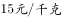的白糖，取其中的一部分加水溶解形成浓度为的糖水12千克，然后将剩余的白糖全部加入后溶解，糖水浓度变为，问购买白糖花了多少元钱？

- **A**. 45
- **B**. 48　✅
- **C**. 36
- **D**. 42

**答案**：B

**官方解析**

方法一：设剩余的白糖为千克，根据浓度公式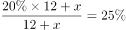，解得，原来溶解的白糖有，则购买白糖花了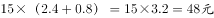。

方法二：由题意可知，最后的糖水总量大于12千克，故含糖总量大于，买糖花费大于，结合选项，只有B满足。

故正确答案为B。

---

### 第 2 题　qid 2028388 · 数学运算

某人出生于20世纪70年代，某年他发现从当年起连续10年自己的年龄均与当年年份数字之和相等（出生当年算0岁）。问他在以下哪一年时，年龄为9的整数倍？

- **A**. 2006年
- **B**. 2007年　✅
- **C**. 2008年
- **D**. 2009年

**答案**：B

**官方解析**

方法一：设出生年份为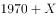年。若当年为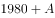年，根据连续10年自己的年龄均与当年年份数字之和相等，可得：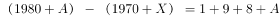，解得，不满足条件；若当年为年，可得：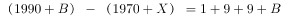，解得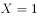，即出生于1971年，依次代入选项：2006年为35岁，不符合9的整数倍，排除A项；2007年为36岁，是9的整数倍，B项符合题意。

故正确答案为B。

方法二：若1980年，数字之和为1+9+8+0=18，若满足年龄等于当年年份数字之和，则出生年份=1980-18=1962，不满足出生于20世纪70年代；若1990年，数字之和为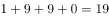岁，若满足年龄等于当年年份数字之和，则出生年份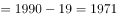，满足出生于20世纪70年代，且从1990年开始连续十年都满足要求。所以出生年份为1971年，依次代入选项2006年为35岁，不符合9的整数倍，排除A项；2007年为36岁，是9的整数倍，B项符合题意。

故正确答案为B。

---

### 第 3 题　qid 2028394 · 数学运算

为维护办公环境，某办公室四人在工作日每天轮流打扫卫生，每周一打扫卫生的人给植物浇水。7月5日周五轮到小玲打扫卫生，下一次小玲给植物浇水是哪天？

- **A**. 7月15日
- **B**. 7月22日
- **C**. 7月29日　✅
- **D**. 8月5日

**答案**：C

**官方解析**

       下一次小玲给植物浇水即为周一打扫卫生。办公室四人在工作日每天轮流打扫卫生，7月5日周五小玲打扫卫生，列表可得（打√号表示为小玲打扫卫生）：

由图表左下角可知，小玲下次在周一打扫卫生并给植物浇水是7月29日。

故正确答案为C。 

---

### 第 4 题　qid 2028400 · 数学运算

某超市购入每瓶200毫升和500毫升两种规格的沐浴露各若干箱，200毫升沐浴露每箱20瓶，500毫升沐浴露每箱12瓶。定价分别为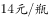和。货品卖完后，发现两种规格沐浴露的销售收入相同，那么这批沐浴露中，200毫升的最少有几箱？

- **A**. 3
- **B**. 8
- **C**. 10
- **D**. 15　✅

**答案**：D

**官方解析**

      方法一：200毫升沐浴露一箱定价为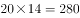元，500毫升沐浴露一箱定价为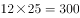元。货品卖完后，两种规格沐浴露的销售收入相同且要箱数最少，则销售收入为每箱单价的最小公倍数，即每种销售收入为280和300的最小公倍数元。此时，200毫升的箱数最少，为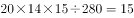箱。

故正确答案为D。

       方法二：设每种销售收入均为Y，200毫升的有a箱，500毫升的有b箱，a、b为整数。则有Y=280a=300b，根据数字特性，a必是3的倍数，排除B、C两项；求a的最小值，代入a=3，发现b不是整数，排除A项，正确答案一定是D项。

---

### 第 5 题　qid 2028408 · 数学运算

某次知识竞赛试卷包括3道每题10分的甲类题，2道每题20分的乙类题以及1道30分的丙类题。参赛者赵某随机选择其中的部分试题作答并全部答对，其最终得分为70分。问赵某未选择丙类题的概率为多少？

- **A**. 

- **B**. 

- **C**. 

- **D**. 

　✅

**答案**：D

**官方解析**

最终得分为70分，有以下三类情况：

由上表可知，总情况数是：种，未选择丙类题的情况数是1种，故赵某未选择丙类题的概率为。

故正确答案为D。

---

### 第 6 题　qid 2028420 · 数学运算

某人租下一店面准备卖服装，房租每月1万元，重新装修花费10万元。从租下店面到开始营业花费3个月时间。开始营业后第一个月，扣除所有费用后的纯利润为3万元。如每月纯利润都比上月增加2000元而成本不变，问该店在租下店面后第几个月内收回投资？

- **A**. 7　✅
- **B**. 8
- **C**. 9
- **D**. 10

**答案**：A

**官方解析**

由题意可得租下店面前3个月成本万元，租下店面第4个月开始营业，每个月获得纯利润情况构成首项为3万元，公差为0.2万元的等差数列：3、3.2、3.4、3.6······可得，即收回投资，此时共经历了个月。

故正确答案为A。

---

### 第 7 题　qid 2028426 · 数学运算

某抗洪指挥部的所有人员中，有的人在前线指挥抢险。由于汛情紧急，又增派6人前往，此时在前线指挥抢险的人数占总人数的。如果该抗洪指挥部需要保留至少的人员在应急指挥中心，那么最多还能再增派多少人去前线？

- **A**. 8
- **B**. 9
- **C**. 10　✅
- **D**. 11

**答案**：C

**官方解析**

方法一：设总人数为人，则最初前线人员人，增派6人去前线后前线人员占总人数的75%，可得，解得人，总人数为人，前线人数为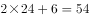人。至少保留的人在应急指挥中心，则至少需保留人数人，即人，则最多还能再增派人。

故正确答案为C。

方法二：最初前线人员占总人数的比例为，增加6人后，前线人员占比为75%，即，则总数人为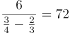人。前线人数为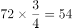。至少保留10%的人在应急指挥中心，需要保留人数为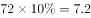，即8人。因此还能增派人。

故正确答案为C。

---

### 第 8 题　qid 2028432 · 数学运算

小张需要在5个长度分别为15秒、53秒、22秒、47秒和23秒的视频片段中选取若干个，合成为一个长度在80～90秒之间的宣传视频。如果每个片段均需完整使用且最多使用一次，并且片段间没有空闲时段，问他按照要求可能做出多少个不同的视频？

- **A**. 12　✅
- **B**. 6
- **C**. 24
- **D**. 18

**答案**：A

**官方解析**

需拼成时间为80～90秒之间的视频，则总时间为 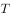，则。分类讨论可知：

取一、二、四、五个视频时，均不满足时间要求；

只取三个视频时，47秒、23秒、15秒可以拼出85秒的视频，情况数；

47秒、22秒、15秒可以拼出84秒的视频，情况数，合计有种。

故正确答案为A。

注意：本题80～90秒之间的具体范围有争议，如果不包括90秒则答案是12种；如果包括90秒则还需加上53秒、22秒、15秒拼成的总时间为90秒的情况，最终合计情况数是18。粉笔倾向答案为12种。 

---

### 第 9 题　qid 2028446 · 数学运算

一块种植花卉的矩形土地如图所示，AD边长是AB的2倍，E是CD的中点，甲、乙、丙、丁、戊区域分别种植白花、红花、黄花、紫花、白花。则种植白花的面积占矩形土地面积的：

- **A**. 

- **B**. 

- **C**. 
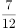
　✅
- **D**. 

**答案**：C

**官方解析**

       方法一：设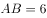，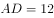。由题意可得，三角形戊的面积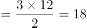；由AB和DE平行可知三角形甲和丙为相似三角形，已知，所以三角形甲和丙的高之比也为，已知，故三角形甲的高为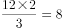，三角形甲的面积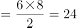；因为甲和戊种植白花，所以种植白花的面积共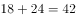，占矩形土地面积的。

       方法二：设丙的面积为1份，则根据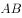和平行可知三角形甲和丙为相似三角形且，可知甲和丙的面积之比为，甲的面积为4份。分析比例关系可得乙+丙=丁+丙，故，乙和丁的面积相等，且均为丙的2倍，即面积为2份。再根据丁与丙构成的三角形与戊面积相等，可知戊的面积为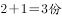。故白花面积为甲、戊面积之和，即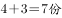，总面积为，所以白花面积占比为。

故正确答案为C。

---

### 第 10 题　qid 2028452 · 数学运算

某集团企业5个分公司分别派出1人去集团总部参加培训，培训后再将5人随机分配到这5个分公司，每个分公司只分配1人。问5个参加培训的人中，有且仅有1人在培训后返回原分公司的概率：

- **A**. 
低于

- **B**. 
在之间

- **C**. 
在之间

- **D**. 
大于
　✅

**答案**：D

**官方解析**

       5个人任意分配到5个分公司的总情况为；满足只有1人培训后返回原公司的情况数为：（先在5人中任选1人返回原公司，共有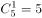种选择；再将剩下4人错位排列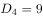）；则所求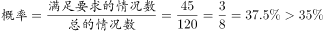。

故正确答案为D。

---

### 第 11 题　qid 2028454 · 数学运算

某商铺甲、乙两组员工利用包装礼品的边角料制作一批花朵装饰门店。甲组单独制作需要10小时，乙组单独制作需要15小时，现两组一起做，期间乙组休息了1小时40分，完成时甲组比乙组多做300朵。问这批花有多少朵？

- **A**. 600
- **B**. 900　✅
- **C**. 1350
- **D**. 1500

**答案**：B

**官方解析**

       赋值花的总量为份，则甲的效率为每小时份，乙的效率为每小时份。乙组休息1小时40分钟小时，相当于甲先单独干了小时，完成的工程量为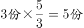，剩余工程量甲、乙合作需要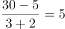小时，共同工作期间甲的工作量为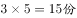，则甲总共完成的工程量为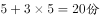，乙完成的工程量为，甲实际比乙多做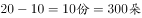，可得，则这批花总共有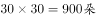。

故正确答案为B。

---

### 第 12 题　qid 2028456 · 数学运算

工厂有5条效率不同的生产线。某个生产项目如果任选3条生产线一起加工，最快需要6天整，最慢需要12天整；5条生产线一起加工，则需要5天整。问如果所有生产线的产能都扩大一倍，任选2条生产线一起加工最多需要多少天完成？

- **A**. 11
- **B**. 13
- **C**. 15　✅
- **D**. 30

**答案**：C

**官方解析**

 假设这五条生产线按效率从高到低排序为：甲、乙、丙、丁、戊，题中给出了三个完工时间，6天、12天和5天，给该项目总量赋值为、、的最小公倍数，根据题意可得效率关系为：

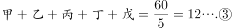

若使加工天数最多，则让效率最低的丁戊合作。

可得：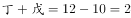。产能都扩大一倍，则。

则所需时间为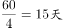。

故正确答案为C。

---

### 第 13 题　qid 2028458 · 数学运算

一正三角形小路如右图所示，甲、乙两人从点同时出发，朝不同方向沿小路散步，已知甲的速度是乙的2倍。问以下哪个坐标图能准确描述两人之间的直线距离与时间的关系（横轴为时间，纵轴为直线距离）？

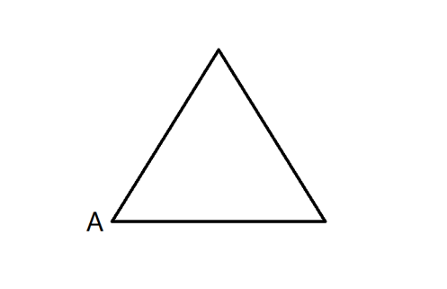

- **A**. A
- **B**. B
- **C**. C
- **D**. D　✅

**答案**：D

**官方解析**

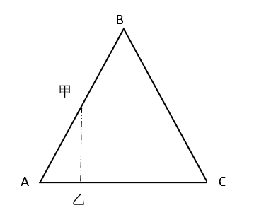

如图所示，当甲在AB段运动时，甲行驶的路程是乙的两倍，又因题目中三角形小路是正三角形，则，恰好满足甲、乙所在位置与A点构成直角三角形，因，甲乙之间距离为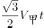。

分析距离的算式可知：为定值，不随时间而变化，故甲、乙之间距离与时间呈现线性关系，则当甲在AB段行驶时，甲、乙之间距离线性增加，直至最远；同理，当甲在BC段行驶时，甲乙距离线性减少，直至为0。因此，图形应从0开始直线上升，再直线下降至0。

故正确答案为D。

---

### 第 14 题　qid 2028460 · 数学运算

将一个棱长为整数的正方体零件切掉一个角，截面是面积为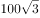的三角形，问其棱长最小为多少？

- **A**. 15　✅
- **B**. 10
- **C**. 8
- **D**. 6

**答案**：A

**官方解析**

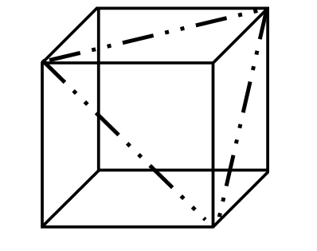

       如图所示，在截面面积固定不变的情况下，要让棱长尽量小，则截面应尽量大。正方体中满足切掉一个角的最大的截面如虚线所示，其面积是。由于三条虚线都是正方体的面对角线，彼此相等，所以是正三角形。

      假设该正三角形边长为，则正三角形面积为：，解得，则正方体其中一个面的对角线长度为20，正方体边长为，已知棱长为整数，则其最小值为15。

注意：有的截面积更大的切法，不满足切下来的必须是一个角的要求，故错误。

故正确答案为A。

---

### 第 15 题　qid 2028462 · 数学运算

某次军事演习中，一架无人机停在空中对三个地面目标点进行侦察。已知三个目标点在地面上的连线为直角三角形，两个点之间的最远距离为600米。问无人机与三个点同时保持500米距离时，其飞行高度为多少米？

- **A**. 500
- **B**. 600
- **C**. 300
- **D**. 400　✅

**答案**：D

**官方解析**

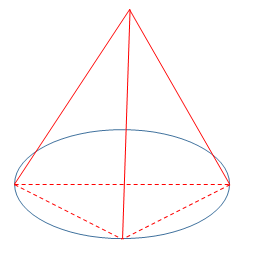

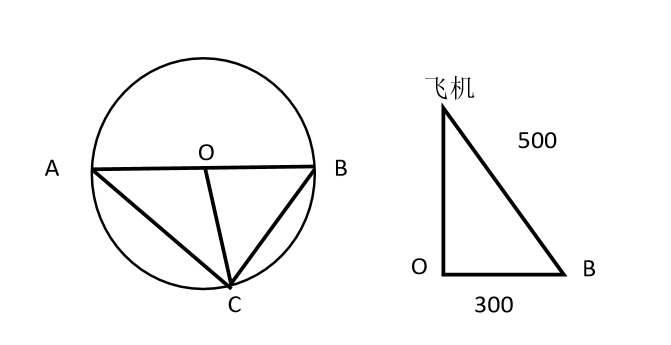

因飞机到三个目标点构成的平面的距离为定值，又因飞机与三个点保持相同距离，则飞机在该平面的投影点与三个目标点的距离相等，如图所示，飞机在该平面的投影为O点，A、B、C分别表示三个目标点，则以O点为圆心，AB（即相距最远的点）为直径画圆，其中C点在圆弧上。因为，所以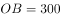，而飞机到B点的距离为500米，故根据勾股定理，飞机与地面相距的距离为米。

故正确答案为D。

---

## 判断推理

### 第 1 题　qid 2028322 · 图形推理

从所给的四个选项中，选择最合适的一个填入问号处，使之呈现一定的规律性：

- **A**. A
- **B**. B
- **C**. C　✅
- **D**. D

**答案**：C

**官方解析**

元素组成凌乱，且图形规整，考虑属性中的对称性。观察前一组图，均为轴对称图形且对称轴数目为一，考虑对称轴方向，对称轴方向依次为横向、左斜、竖向，对称轴每次顺时针旋转。依此规律，后一组图中对称轴方向前两个为左斜、竖向，则？处应该选择一个对称轴右斜的图形。

观察选项，B项为非对称图形，D项为中心对称图形，A项为左斜，C项为右斜。

故正确答案为C。

---

### 第 2 题　qid 2028334 · 图形推理

从所给的四个选项中，选择最合适的一个填入问号处，使之呈现一定的规律性：

- **A**. A
- **B**. B
- **C**. C　✅
- **D**. D

**答案**：C

**官方解析**

题干中每幅图形均由1个黑圈、7个白圈和1个空白部分组成，元素组成相同，考虑位置关系。观察发现，黑圈都出现在外圈，因此考虑顺逆时针平移，黑圈在图形外圈每次逆时针移动两个单位，则“？”处黑圈应该出现在左上角，据此排除B、D两项。
每个图形都有一个空白部分且位置不同，观察空白部分的移动，空白部分每次在图形外圈顺时针移动一个单位，则“？”处空白部分应该出现在第三行第二列中，据此排除A选项。
故正确答案为C。

---

### 第 3 题　qid 2028342 · 图形推理

从所给的四个选项中，选择最合适的一个填入问号处，使之呈现一定的规律性：

- **A**. A　✅
- **B**. B
- **C**. C
- **D**. D

**答案**：A

**官方解析**

元素组成不同，优先考虑属性规律。题干中每幅图形均由上下两个部分组成，且上下两个部分组成的线条样式不同。第一个、第三个、第五个图形中均为曲线图形在上，直线图形在下；第二个、第四个图形中均为直线图形在上，曲线图形在下，曲线图形和直线图形在上下两部分交叉出现。则？处所选图形应为直线图形在上，曲线图形在下，据此排除B、C选项。
比较A、D两项，最明显的区别在于A项有3个面，D项有2个面，观察发现题干中每幅图形均由3个面组成，据此排除D选项。
故正确答案为A。

---

### 第 4 题　qid 2028348 · 图形推理

从所给的四个选项中，选择最合适的一个填入问号处，使之呈现一定的规律性：

- **A**. A　✅
- **B**. B
- **C**. C
- **D**. D

**答案**：A

**官方解析**

本题为九宫格题目。黑格数量不同，排除位置规律，优先考虑叠加运算。九宫格优先横着看，观察第一行，，，，，即同色为白，异色为黑（同白异黑），将此规律在第二行验证无误后，运用于第三行，左上角应为白色，排除B、D两项。右上角应为黑色，排除C项。

故正确答案为A。

---

### 第 5 题　qid 2028350 · 图形推理

从所给的四个选项中，选择最合适的一个填入问号处，使之呈现一定的规律性：

- **A**. A
- **B**. B　✅
- **C**. C
- **D**. D

**答案**：B

**官方解析**

元素组成不同，属性无明显规律，考虑数量规律。九宫格优先横向看，第一行三个图形曲线数分别为1、2、3；第二行满足此规律；第三行图1有1条曲线，图2有两条曲线，故“？”处应该选一个有3条曲线的图形。A项有1条曲线，B项3条，C项2条，D项4条。只有B选项符合规律。
故正确答案为B。

---

### 第 6 题　qid 2028338 · 图形推理

左边给定的是正方体的外表面展开图，下面哪一项能由它折叠而成？

- **A**. A
- **B**. B
- **C**. C
- **D**. D　✅

**答案**：D

**官方解析**

本题属于空间重构类，逐一分析选项，将六个面按顺序标上序号。

A项：六面体展开图中，构成直角的两条边是同一条边。题干面a和面d的公共边（图中红色线）是白色三角形的斜边，A选项两个面的公共边有一条黑色直角三角形斜边，与题干不对应，排除；

B项：选项中右侧双斜对角线形成的面要么是面a，要么是面d,而双对角线形成的黑色三角形的黑色底边是唯一确定的边，故可以分别对面a或面d这两种情况进行画边。第一种情况，假设B选项的双对角线的面是面a，从黑色底边为起点，顺时针画边，如图3所示，发现与B选项（如图2所示）边4对应的面错了，故不符合；第二种情况，假设B选项的双对角线的面是面d，同样从面d的黑色三角形底边顺时针画边，如图4所示，发现与B选项（图2所示）的边4对应的面错了，故也不符合。所以B选项两种情况都不符合，则一定错误，排除；

C项：选项中右侧的对角线面，要么是面c，要么是面e，在题干展开图形中，这两个面都与两个黑色直角三角形的直角边相邻（其中面c与面b中的黑色直角三角形的直角边相邻，面e也与另一个直角三角形面f的直角边相邻），而在C选项中，斜对角线与两个黑色的直角三角形的直角边都是不相邻的，故排除；

A、B、C排除，答案选D。

故正确答案为D。

---

### 第 7 题　qid 2028344 · 图形推理

下图中的立体图形①是由立体图形②，③和④组合而成，下列哪一项不能填入问号处？

- **A**. A
- **B**. B　✅
- **C**. C
- **D**. D

**答案**：B

**官方解析**

本题考查立体拼合。题干中①为整体，②③④组合后构成①，其中A、C、D选项均能与②③组合构成①，具体组合方式如下所示：

本题为选非题，故正确答案为B。

---

### 第 8 题　qid 2028360 · 图形推理

把下面的六个图形分为两类，使每一类图形都有各自的共同特征或规律，分类正确的一项是：

- **A**. ①④⑥，②③⑤
- **B**. ①②③，④⑤⑥
- **C**. ①⑤⑥，②③④
- **D**. ①③⑤，②④⑥　✅

**答案**：D

**官方解析**

本题为分组分类题目。观察已知图形每个图形中都有小黑点，考虑功能元素。功能元素具有标记作用。观察小黑点在图形中的位置发现：①③⑤图形中小黑点在线上，②④⑥图形中小黑点在交点上。即①③⑤一组，②④⑥一组。
故正确答案为D。

---

### 第 9 题　qid 2028366 · 图形推理

把下面的六个图形分为两类，使每一类图形都有各自的共同特征或规律，分类正确的一项是：

- **A**. ①③④，②⑤⑥　✅
- **B**. ①②⑤，③④⑥
- **C**. ①③⑥，②④⑤
- **D**. ①④⑤，②③⑥

**答案**：A

**官方解析**

本题为分组分类题目。整体观察题干中六个图形，每个图形中均含有相同的元素三角形和圆，且六个图形均被分成了两个大小不同的面。①③④中三角形处于图形面积较大部分，圆处于面积较小部分，②⑤⑥中三角形处于面积较小部分，圆处于面积较大部分。
故正确答案为A。

---

### 第 10 题　qid 2028376 · 图形推理

把下面的六个图形分为两类，使每一类图形都有各自的共同特征或规律，分类正确的一项是：

- **A**. ①②⑤，③④⑥
- **B**. ①②③，④⑤⑥
- **C**. ①③⑤，②④⑥　✅
- **D**. ①②⑥，③④⑤

**答案**：C

**官方解析**

本题为分组分类题目。元素组成不同，属性无明显规律，考虑数数。第一个图和第二个图出现了线条之间相交叉，考虑点数量，但并无规律。后发现②是日字形变形，④图形为“田”字变形，考虑笔画数考点。
观察发现，图①③⑤的奇点数均为4，图②④中奇点数为2，⑥无奇点数。即①③⑤为两笔画图形，②④⑥为一笔画图形。
故正确答案为C。

---

### 第 11 题　qid 2028494 · 定义判断

语句的示意功能是指通过语句表达某种通知、告诫、命令或请求，目的在于要求别人按照语句表达的思想，做出或不做出某种行为。
根据上述定义，下列没有反映语句的示意功能的是：

- **A**. 全体学生请到操场集合
- **B**. 请您务必不要践踏草坪
- **C**. 禁止生产假冒伪劣产品
- **D**. 销售部现在应该在开会　✅

**答案**：D

**官方解析**

第一步：找到定义关键词。
方式：“通过语句表达某种通知、告诫、命令或请求”；目的：“要求别人按照语句表达的思想，做出或不做出某种行为”。
第二步：逐一分析选项。
A项：“全体学生请到操场集合”，属于方式中“通过通知”这一方式，目的也是希望全体同学到操场集合，符合定义，排除；
B项：“请您务必不要践踏草坪”，属于方式中“通过请求”这一方式，目的也是希望不要践踏草坪，符合定义，排除；
C项：“禁止生产假冒伪劣产品”，属于方式中“通过命令”这一方式，目的也是为了禁止生产假冒产品，符合定义，排除；
D项：“销售部现在应该在开会”，这只是一个猜测或判断，并没有体现出题干中“通知、告诫、命令或请求等”方式，不符合定义，当选。
本题为选非题，故正确答案为D。

---

### 第 12 题　qid 2028500 · 定义判断

水利工程是用于控制和调配自然界的地表水和地下水，达到除害兴利目的而修建的工程。
根据上述定义，下列不涉及水利工程的是：

- **A**. 城市污水处理厂利用微生物分解吸收水中的有机物　✅
- **B**. 水电站利用水力发电技术，将水能转化为电能
- **C**. 农业上建设合理开发利用地下水的灌溉设施，以满足作物生长需要
- **D**. 在水利枢纽中设河岸泄洪道以防止因洪水超过水库容量而漫顶造成溃坝

**答案**：A

**官方解析**

第一步：找到定义关键词。
方式：“控制和调配地表水和地下水”；目的：“除害兴利的修建工程”。
第二步：逐一分析选项。
A项：城市污水处理厂利用微生物分解吸收水中的有机物，这一行为不符合定义中的方式，属于环保工程，而非水利工程，不符合定义，当选；
B项：通过水力发电技术，将水能转化为电能，方式目的均符合，符合定义，排除；
C项：合理开发利用地下水的灌溉设施，属于控制和调配地表水和地下水，也达到了满足作物生长的需要，符合定义，排除；
D项：在水利枢纽站设河岸泄洪道，属于控制和调配地表水和地下水的行为，也达到了防止溃坝除害兴利的修建目的，符合定义，排除。
本题为选非题，故正确答案为A。

---

### 第 13 题　qid 2028506 · 定义判断

火力投射密度是指军事行动中军事部门在单位时间内的最大弹药发射量。它是现代军事学中衡量作战部队战斗力的重要指标之一。
根据上述定义，以下属于通过增大火力投射密度来加强部队战斗力的是：

- **A**. 某步兵师在普通士兵中选拔特等射手编入狙击班，进而能够更有效地杀伤敌人的有生力量
- **B**. 某国将其部队列装的半自动步枪全部更换为全自动步枪，增加了子弹的发射频率　✅
- **C**. 某炮兵部队将原计划两小时的炮火掩护时间延长为三小时，更有效地杀伤了掩体中的敌人
- **D**. 某军事科研单位研制出更先进的炮火定位系统，能够将火力打击的误差由半径200米缩小到50米

**答案**：B

**官方解析**

第一步：找到定义关键词。
主体：军事部门；“在单位时间内的最大弹药发射量”，即强调的是单位时间内的发射量。
第二步：逐一分析选项。
A项：在普通士兵中选拔特等射手编入狙击班，而特等射手一般提升的是射击的准确度，与增加单位时间内的最大弹药发射量无关，不符合题干要求，排除；
B项：更换为全自动步枪，增加的是子弹的发射频率，而增加频率就意味着在单位时间内的发射量就会增加，即该项是通过在单位时间内增加发射量提升了部队的战斗力，符合题干要求，当选；
C项：炮火掩护时间由两小时延长为三小时，不符合单位时间内的最大弹药发射量，即该项是通过长时间的发射加强部队的战斗力，并不是在单位时间内增加发射量，不符合题干要求，排除；
D项：火力打击的误差范围缩小，只能说明射击的准确度增强，并看不出单位时间内的弹药发射量是否有增加，不符合题干要求，排除。
故正确答案为B。

---

### 第 14 题　qid 2028498 · 定义判断

货币性资产是指持有的现金及将以固定或可确定金额的货币收取的资产，包括现金、应收账款和应收票据以及准备持有至到期的债券等。非货币性资产则是指货币性资产以外的资产，这些资产在将来为企业带来的经济利益（即货币金额）是不固定的或不可确定的。
根据上述定义，下列属于货币性资产的是：

- **A**. 某服装厂的库存货物
- **B**. 某汽车公司用于出租的车辆
- **C**. 某通讯企业旗下手机品牌的商标权
- **D**. 某化工集团按照国家规定获得的技术补贴　✅

**答案**：D

**官方解析**

第一步：找到定义关键词。
“持有的现金及将以固定或可确定金额的货币收取的资产”，即货币金额是固定或可确定的。
第二步：逐一分析选项。
A项：某服装厂的库存货物，其在未来的资产金额可能会受到市场的影响发生变化，是不固定、无法确定的，不符合定义，排除；
B项：用于出租的车辆，其资产金额会受到出租时间长短等诸多因素影响，是不固定、无法确定的，不符合定义，排除；
C项：手机品牌的商标权是一种无形的资产，其货币金额不确定，不符合定义，排除；
D项：技术补贴是按照国家规定所得，说明这些技术补贴的发放金额是按国家标准发放，其金额是固定、可确定的，符合定义，当选。
故正确答案为D。

---

### 第 15 题　qid 2028504 · 定义判断

埋伏营销是指企业利用媒体和公众对重大事件的关注，通过举办与重大事件相关的活动，使自己与重大事件产生关联，从而引起消费者的联想和媒体的注意。这类营销通常是隐蔽的、突发的，不以赞助者的身份出现，却对自己的品牌悄无声息地进行了宣传。
根据上述定义，下列不属于埋伏营销的是：

- **A**. 某矿泉水公司邀请著名运动员为其代言，并将广告投放在电视媒体的黄金时段和一些大型酒店的视频媒体中　✅
- **B**. 地震发生后，某户外用品公司向灾区捐赠价值100万元的帐篷，并举行了捐赠仪式
- **C**. 某市举办中小学生知识竞赛，一出版集团在现场向参与者免费发放其出版的图书
- **D**. 世界一级方程式锦标赛比赛期间，观众席中时不时会有人挥舞着印有某轮胎企业商标的彩色旗帜

**答案**：A

**官方解析**

第一步：找到定义关键词。
主体：企业；方式：“利用媒体和公众对重大事件的关注”、“举办与重大事件相关的活动，使自己与重大事件产生关联”；目的：“引起消费者的联想和媒体的关注”“对自己的品牌悄无声息地进行了宣传”；特点：“隐蔽、突发”。
第二步：逐一分析选项。
A项：矿泉水公司邀请著名运动员为其代言并投放广告是直接宣传，并没有出现重大事件，宣传特点并不“隐蔽、突发”，不符合定义，当选；
B项：户外用品公司向灾区捐赠帐篷并举行捐赠仪式属于“举办与重大事件相关的活动”，目的是“使自己与救灾行动产生关联，引起媒体的关注”，能够“对自己的品牌悄无声息地进行了宣传”，符合定义，排除；
C项：出版集团在中小学生知识竞赛现场向参与者免费发放其出版的图书符合“举办与重大事件相关的活动”，目的是“使自己与知识竞赛产生关联，引起消费者的联想和媒体的关注”，能够“对自己的品牌悄无声息地进行了宣传”，符合定义，排除；
D项：在方程式锦标赛期间挥舞印有企业商标的旗帜目的是“使自己与重大事件产生关联，引起消费者的联想”，宣传特点“隐蔽”，符合定义，排除。
本题为选非题，故正确答案为A。

---

### 第 16 题　qid 2028508 · 定义判断

自由落体运动是指物体只在重力作用下从静止开始下落的运动。这种运动只有在真空条件下才能发生，在有空气时，如果空气的阻力作用比较小，可以忽略不计，则物体的下落可以近似看作自由落体运动。
根据上述定义，下列可以近似看作自由落体运动的是：

- **A**. 熟透了的苹果从树上被风吹落
- **B**. 飞行中的飞机被导弹击中坠落
- **C**. 抛过来的皮球没被接住，掉在地上
- **D**. 冬日中午，冰棱融化后从屋檐掉下　✅

**答案**：D

**官方解析**

第一步：找出定义关键词。
“只在重力作用下从静止开始下落的运动”“如果空气的阻力作用比较小，近似看作自由落体运动”。
第二步：逐一分析选项。
A项：苹果从树上被风吹落一定受到了横向风的推力，且风力较大，空气阻力也较大，不符合“只在重力作用下运动”，不符合定义，排除；
B项：飞行中的飞机属于高速运动的物体，不符合“从静止开始下落”，不符合定义，排除；
C项：抛过来的皮球属于高速运动的物体，没接住而掉在地上不符合“从静止开始下落”，不符合定义，排除；
D项：冰棱融化后从屋檐掉下符合“从静止开始下落”，且此时没有其他干扰，空气阻力比较小，可近似看作自由落体运动，符合定义，当选。
故正确答案为D。

---

### 第 17 题　qid 2028510 · 定义判断

著名科学家、科学史学家普赖斯提出：如果K代表参与某一专业领域的人数，那么这个数字的平方根大致等于为这个领域做出一半贡献的排名在前的那部分人的人数。
根据上述定义，下列符合普赖斯观点的是：

- **A**. 某国出版协会统计了本国的期刊，发现与经济有关的期刊大约有150种，所有与经济有关的科研论文中，有一半发表在其中的13种期刊上
- **B**. 某县有20万农业人口，统计发现，过去一年全县的粮食总产量中，大约一半粮食产量是由450位左右的种粮大户贡献的
- **C**. 某组织统计过去一年全世界公开举办的音乐会的演奏曲目，发现所有演奏曲目是由大约250位作曲家完成的，其中大约一半的曲目来自于16位作曲家　✅
- **D**. 某销售奢侈品的网店过去一年的访问量为10万人次，但去年全部的销售额中，大约一半的销售额是由其中大约300位固定客户提供的

**答案**：C

**官方解析**

第一步：找到定义关键词。
“参与某一专业领域的人数”、“这个数字的平方根大致等于为这个领域做出一半贡献的排名在前的那部分人的人数”。
第二步：逐一分析选项。
A项：统计的是期刊种类数量与论文发表的情况，不涉及人数，不符合定义，排除；
B项：农业人口是指没有城镇户口的人，包括外出打工的农民工、放牛放羊的人等，并不完全是种粮者，所以农业人口与种粮大户两个群体不是同一范畴，不符合定义，排除；
C项：250位作曲家是参与作曲的人数，16位作曲家贡献了一半曲目，说的都是作曲家属于同一范畴，250的平方根大致为16人，符合定义“参与某一专业领域的人数平方根大致等于为这个领域做出一半贡献的排名在前的那部分人的人数”，当选；
D项：访问网店的顾客和购买商品的顾客不是同一概念，两个群体不是同一范畴，不符合定义，排除。
故正确答案为C。

---

### 第 18 题　qid 2028512 · 定义判断

隐匿定位策略是指当一类产品不被消费者看好时，公司能够在不打破产品种类界限的情况下，合法地利用某些策略消除消费者对这类产品的偏见，使消费者转而接受它们，实现更好的销量。
根据上述定义，下列没有运用隐匿定位策略的是：

- **A**. 某公司生产的游戏机销量不佳，公司决定将产品升级并提出创建家庭娱乐平台的概念，该游戏机因此变得畅销
- **B**. 某公司开发了家庭机器人，但消费者并不感兴趣。该公司调整思路，推出一种可爱的、不做家务的机器狗，一上市就大受欢迎
- **C**. 某公司推出一种小型电脑，由于定价高而鲜有问津。该公司在产品宣传中强调其可作为移动数字化设备等，与低端产品区分开，从而打开销路
- **D**. 某公司推出新款SUV车型，但少有人问津，于是公司又推出一款价格昂贵的跑车，消费者觉得SUV性价比更高，纷纷购买　✅

**答案**：D

**官方解析**

本题是一道争议题，通过题干所给定义难以区分BD选项。经粉笔教研，并通过查原文，A、B、C三选项分别对应到原文中的三个案例，因此猜测命题人更倾向于把答案设置为D选项，D没有运用隐匿定位策略。

A选项对应案例：

B选项对应案例：

C选项对应案例：

分析：

A项：将产品升级体现了没有打破产品种类界限，提出创建家庭娱乐平台的概念属于合法利用策略消除偏见，最终游戏机获得畅销，符合定义，排除；

B项：“家庭机器人”和“机器狗”是同一类别，没有打破产品种类界限，消费者对该公司的“家庭机器人”并不感兴趣，说明不被消费者看好，于是调整思路，最终使得“家庭机器人”的另一种类别“机器狗”一上市就大受欢迎，符合定义，排除；

C项：某公司宣传强调“小型电脑可作为移动数字化设备”属于合法利用策略消除消费者对产品的偏见，最终打开销路，符合定义，排除；

D项：新款SUV车很少有人问津，不被看好，出台昂贵的跑车,只是在两者之间的价格做了一个比较，让消费者觉得SUV性价比高了，“出台昂贵的跑车”相当于一个参照物，通过粉笔教研发现，D选项实际运用的策略叫做价格锚点，是企业通过价格对比和暗示来营造幻觉的手段，动摇人们对于价值的评估，因此，不符合定义，当选。

提示：本题需要特别注意的是B选项当中机器人和机器狗既不是人也不是狗，二者都属于智能机器，只是造型不同，因此，属于同类产品，而D选项的SUV和跑车无论从造型功能、性能还是对车辆的划分标准上来讲，都不属于同类产品，前者是越野车的范畴，后者是轿车的范畴，因此，B、D两个选项比较起来，D选项更不符合定义。

本题为选非题，故正确答案为D。

【粉笔提示】：该题为理解运用类多定义，需要考生对于题干的定义加以理解，A、B、C选项所涉及的正是隐匿定位策略的三个经典案例。了解案例请复制该链接：

http://baike.baidu.com/link?url=lpP8rmIbN9UbvQL9Zu7KK06zLPgr3HIY_YVJGWUsyuAc7Zt1RZo7RxBYOxViiH_wHRwsl_nG2VG78VawSuOedFp6oiYmZj4nI59ZJMkMk9CZ1lNeM5-vbuZj37BYjiJX

价格锚点定义（更多类似案例可以百度查询）：

http://baike.sogou.com/v71357485.htm?fromTitle=%E4%BB%B7%E6%A0%BC%E9%94%9A%E7%82%B9

---

### 第 19 题　qid 2028516 · 定义判断

参照依赖是指个体基于某个参照点对得失价值进行判断，参照点之上，个体感受是收益，反之感受为损失。损失和收益的感知取决于参照点的选择。
根据上述定义，下列不属于参照依赖的是：

- **A**. 张女士因为生育和哺乳不得不暂停工作半年，失去了很多客户，心里很苦恼，但看到自己健康活泼的儿子，又变得高兴起来　✅
- **B**. 小张原本对收入很满意，他听说跟自己同时进公司、现在同是项目经理的小李收入比自己高10%后，对收入没有那么满意了
- **C**. 研究者设计了一项实验：告知被试者他们邻居的月水电支出比他们低，结果发现被试者下个月的家庭能耗显著降低了
- **D**. 姐姐期中考试得了99分，期末考试得了95分，妈妈批评了她；弟弟期中考试得了75分，期末考试得了85分，妈妈奖励了他

**答案**：A

**官方解析**

第一步：找出定义关键词。

“个体基于某个参照点对得失价值进行判断”、“参照点之上感受是收益”、“参照点之下感受为损失”。

第二步：逐一分析选项。

A项：张女士因失去客户而苦恼，和看到健康活泼的儿子而高兴，是对职场和家庭两件不同事件的价值判断，参照点不唯一，不符合“个体基于某个参照点对得失价值进行判断”，不符合定义，当选；

B项：小张的参照点是跟自己同时进公司的小李的收入，小李的收入大于小张的收入，小张的收入处于参照点之下，小张不满意，符合“个体基于某个参照点对得失价值进行判断”、“参照点之下感受为损失”，符合定义，排除；

C项：被试者的参照点是邻居家的水电费，邻居的月水电支出比他们低，被试者下个月的家庭能耗显著降低了，说明被试者觉得花钱多受损失了，在参照点之下，符合“个体基于某个参照点对得失价值进行判断”、“参照点之下感受为损失”，符合定义，排除；

D项：妈妈的参照点是姐姐和弟弟各自的期中考的成绩，姐姐的分数低于自己期中考试的参照点时受到了批评，弟弟的分数高于自己期中考试的参照点时受到了奖励，符合“个体基于某个参照点对得失价值进行判断”、“参照点之上感受是收益”、“参照点之下感受为损失”，符合定义，排除。

本题为选非题，故正确答案为 A。

备注：本题很多同学纠结C项，认为C项没有体现关键词“参照点之上感受是收益”或 “参照点之下感受为损失”，其实大家想想，如果真的没有感受，为什么被试者下个月的家庭能耗显著降低了？其中不就隐含着他觉得自己之前水电支出比邻居高，以邻居家的水电费为参照点，感觉自己损失了，所以符合关键词“参照点之下感受为损失”，如下图所示，C项为参照依赖的典型案例，所以是符合的。

---

### 第 20 题　qid 2028522 · 定义判断

传递关系指的是对任意的元素A、B、C来说，若元素A与元素B有某关系并且元素B与元素C有该关系，则元素A与元素C也有该关系。反传递关系指的是若元素A与元素B有某种关系并且元素B与元素C有该关系，但元素A与元素C没有该关系。
根据上述定义，下列关系属于传递关系的是：

- **A**. 自然数中的大于关系　✅
- **B**. 生活中的同学关系
- **C**. 家庭中的父子关系
- **D**. 食物链的天敌关系

**答案**：A

**官方解析**

第一步：找到定义关键词。
传递关系：“A和B有关系且B和C有关系，A和C也有同样的关系”；
反传递关系：“A和B有关系且B和C有关系，A和C没有同样的关系”。
第二步：逐一分析选项。
A项：“自然数中的大于关系”比如三个自然数“5、3、1”，5为A，3为B，1为C，可以推出5＞3＞1，A＞B＞C，符合定义“传递关系”，当选；
B项：“生活中的同学关系”比如小张和小王是小学同学，小王和小李是中学同学，小张和小李不一定是同学关系，不符合定义，排除；
C项：“家庭中的父子关系”比如小张的父亲是老张，老张的父亲是张老，但小张和张老不是父子关系，不符合定义，排除；
D项：“食物链中的天敌关系”比如蛇是壁虎的天敌，壁虎是蚊子的天敌，但蛇和蚊子之间不是天敌关系，不符合定义，排除。
故正确答案为A。

---

### 第 21 题　qid 2028304 · 类比推理

白醋：消毒

- **A**. 热水器：加热
- **B**. 汽油：去渍　✅
- **C**. 白糖：调味
- **D**. 人参：滋补

**答案**：B

**官方解析**

第一步：判断题干词语间逻辑关系。
“白醋”的主要功能是烹调，次要功能是“消毒”，祛除病菌，并且“白醋”是液体，二者是功能的对应关系。
第二步：判断选项词语间逻辑关系。
A项：“加热”是“热水器”的主要功能而不是次要功能，并且“热水器”不是液体，不符合题干逻辑关系，排除；
B项：“汽油”的主要功能是用作燃料，次要功能是“去渍”，去除污垢，并且“汽油”是液体，符合题干逻辑关系，当选；
C项：“调味”是“白糖”的主要功能而不是次要功能，而且“白糖”不是液体，不符合题干逻辑关系，排除；
D项：“滋补”是“人参”的主要功能而不是次要功能，而且“人参”不是液体，不符合题干逻辑关系，排除。
故正确答案为B。

---

### 第 22 题　qid 2028310 · 类比推理

成百：上千

- **A**. 三教：九流
- **B**. 三头：六臂
- **C**. 千变：万化　✅
- **D**. 千方：百计

**答案**：C

**官方解析**

第一步：判断题干词语间逻辑关系。
“成百”和“上千”都表示数量多，构成近义关系，并且二者都包含动词，“百”和“千”程度递增。
第二步：判断选项词语间逻辑关系。
A项：“三教”是儒教、道教、佛教，“九流”是儒家、道家、墨家、法家、名家、杂家、农家、纵横家、阴阳家，二者是并列关系，但不包含动词，不符合题干逻辑关系，排除；
B项：“三头”是三个脑袋，“六臂”是六个胳膊，二者是并列关系，但不包含动词，不符合题干逻辑关系，排除；
C项：“千变”和“万化”都表示变化非常多，二者是近义关系，并且都包含动词，“千”和“万”是程度递增，符合题干逻辑关系，当选；
D项：“千方”和“百计”都表示计谋和方法很多，二者是近义关系，但不包含动词，并且从“千”到“百”是程度递减，不符合题干逻辑关系，排除。
故正确答案为C。

---

### 第 23 题　qid 2028312 · 类比推理

生死：存亡

- **A**. 轻重：缓急
- **B**. 亲疏：长幼
- **C**. 真伪：对错
- **D**. 好坏：优劣　✅

**答案**：D

**官方解析**

第一步：判断题干词语间逻辑关系。
“生死”和“存亡”都表示生命的两种状态，二者是近义词，并且“生”和“存”近义，“死”和“亡”近义。
第二步：判断选项词语间逻辑关系。
A项：“轻重”侧重指力度，而“缓急”侧重指快慢，二者不是近义词，并且无汉字的对应，不符合题干逻辑关系，排除；
B项：“亲疏”一般指关系的亲近程度，而“长幼”指的是辈分的高低，二者不是近义词，并且无汉字的对应，不符合题干逻辑关系，排除；
C项：“真伪”是真假，而“对错”是事情的正确与否，二者侧重的意思不同，不是近义词，并且无汉字的对应，不符合题干逻辑关系，排除；
D项：“好坏”和“优劣”都表示一个事物的好坏两个方面，二者是近义词，并且“好”和“优”近义，“坏”和“劣”近义，符合题干逻辑关系，当选。
故正确答案为D。

---

### 第 24 题　qid 2028316 · 类比推理

踢皮球：互相推诿

- **A**. 燕归巢：时过境迁
- **B**. 破天荒：闻所未闻
- **C**. 睁眼瞎：目不识丁　✅
- **D**. 纸老虎：不堪一击

**答案**：C

**官方解析**

第一步：判断题干词语间逻辑关系。
“踢皮球”常用来形容部门之间职责不清，相互推诿，办事效率低下，故踢皮球可以比喻“相互推诿”。
第二步：判断选项词语间逻辑关系。
A项：“燕归巢”是燕子回到了自己的巢穴，比喻的是思乡；“时过境迁”是指随着时间的推移，情况发生变化。“燕归巢”不能比喻“时过境迁”，不符合题干逻辑关系，排除；
B项：“破天荒”指从来没有出现过的事；“闻所未闻”指听到了从来没听说过的事情。没出现过与没听说过意思有差别，“破天荒”不能比喻“闻所未闻”，不符合题干逻辑关系，排除；
C项：“睁眼瞎”指没文化的人，不识字的人；“目不识丁”形容人不识字或没有学问。“睁眼瞎”可以比喻“目不识丁”，符合题干逻辑关系，当选；
D项：“纸老虎”比喻外强中干的人，装样子吓唬人的；“不堪一击”形容力量薄弱，经不起一次打击。二者意思不同，“纸老虎”不能比喻“不堪一击”，不符合题干逻辑关系，排除。
故正确答案为C。

---

### 第 25 题　qid 2028318 · 类比推理

战术：战争：胜负

- **A**. 血型：人种：胖瘦
- **B**. 诉状：案件：输赢
- **C**. 策略：竞选：成败　✅
- **D**. 经验：能力：高低

**答案**：C

**官方解析**

第一步：判断题干词语间逻辑关系。
“战争”需要“战术”来指导，并且“胜负”是“战争”可能出现的两种结果，二者是对应关系。
第二步：判断选项词语间逻辑关系。
A项：“血型”是指血液成分表面的抗原类型，“人种”是具有共同遗传体质特征的人类群体，人有“胖瘦”之分，“血型”不能指导人种，并且“胖瘦”也不是结果，不符合题干逻辑关系，排除；
B项：“诉状”是指一方当事人为维护或者实现自身的权益，依法向人民法院提出某种诉讼请求，并陈诉有关事实和理由，或者另一方当事人针对一方当事人的诉讼请求和理由提出抗辩的法律文书，不是用来指导“案件”的，“输赢”是“案件”可能出现的两种结果，不符合题干逻辑关系，排除；
C项：“竞选”需要“策略”来指导，“竞选”可能有“成败”两种结果，符合题干逻辑关系，当选；
D项：“能力”和“经验”是并列关系，并且“能力”有“高低”之分，不符合题干逻辑关系，排除。
故正确答案为C。

---

### 第 26 题　qid 2028320 · 类比推理

观众：电视：新闻

- **A**. 士兵：靶场：命令
- **B**. 渔夫：渔船：渔汛
- **C**. 教师：课堂：知识
- **D**. 消费者：消费指南：优惠信息　✅

**答案**：D

**官方解析**

第一步：判断题干词语间逻辑关系。
“观众”是“电视”的主要受众，“电视”是发布“新闻”的一种载体。
第二步：判断选项词语间逻辑关系。
A项：“靶场”是“士兵”的训练场所，“靶场”不是发布“命令”的载体，与题干逻辑关系不符，排除；
B项：“渔船”是“渔夫”捕鱼的工具，“渔船”不是发布“渔汛”的载体，与题干逻辑关系不符，排除；
C项：“课堂”的主要受众是学生而不是“教师”，与题干逻辑关系不符，排除；
D项：“消费者”是“消费指南”的主要受众，“消费指南”也是发布“优惠信息”的一种载体，与题干逻辑关系一致，当选。
故正确答案为D。

---

### 第 27 题　qid 2028324 · 类比推理

寒：寒冷：寒舍

- **A**. 甘：甘甜：甘愿　✅
- **B**. 恨：仇恨：怨恨
- **C**. 肤：皮肤：肌肤
- **D**. 讽：讽刺：讥讽

**答案**：A

**官方解析**

第一步：判断题干词语间逻辑关系。
“寒”字有两个主要的语义：冷；穷困（有时用作谦辞）。“寒冷”一词中的“寒”指的是冷，寒舍一词中的“寒”指的是穷困。
第二步：判断选项词语间逻辑关系。
A项：“甘”字有两个主要的语义：甜，味道好；自愿，乐意。“甘甜”中的“甘”指的是甜，甘愿中的“甘”指的是自愿，与题干逻辑关系一致，当选；
B项：“仇恨”“怨恨”中的“恨”指的都是仇视的意思，与题干逻辑关系不一致，排除；
C项：“皮肤”“肌肤”中的“肤”指的都是肉体表面的皮，与题干逻辑关系不一致，排除；
D项：“讽刺”“讥讽”中的“讽”指的都是用含蓄的话讥刺，与题干逻辑关系不一致，排除。
故正确答案为A。

---

### 第 28 题　qid 2028326 · 类比推理

设计：发放：问卷

- **A**. 播放：快进：磁带
- **B**. 制定：执行：政策　✅
- **C**. 复制：修改：文字
- **D**. 预习：复习：考试

**答案**：B

**官方解析**

第一步：判断题干词语间逻辑关系。
“设计问卷”“发放问卷”构成动宾关系，且“设计”和“发放”有先后顺序（设计在前，发放在后）。
第二步：判断选项词语间逻辑关系。
A项：“播放磁带”构成动宾关系，但“快进”是不及物动词，后面不能跟宾语，与题干逻辑关系不一致，排除；
B项：“制定政策”“执行政策”构成动宾关系，且“制定”和“执行”也有先后顺序（制定在前，执行在后），与题干逻辑关系一致，当选；
C项：“复制文字”“修改文字”构成动宾关系，但“复制”和“修改”之间没有必然的先后顺序，与题干逻辑关系不一致，排除；
D项：“复习考试”和“预习考试”搭配不当，与题干逻辑关系不一致，排除。
故正确答案为B。

---

### 第 29 题　qid 2028328 · 类比推理

教案 对于 （  ） 相当于 （  ） 对于 分类

- **A**. 课件；信息
- **B**. 教学；归类
- **C**. 提纲；商品
- **D**. 授课；标准　✅

**答案**：D

**官方解析**

将选项逐一代入，判断各选项前后部分的逻辑关系。
A项：“教案”与“课件”是并列关系，“教案”是包含教学内容、教学步骤、板书设计等内容的集合，“课件”是包含授课过程中使用的文字、声音、图像等素材的集合；“信息”是名词，“分类”是动词，构成的是动宾短语，故前后逻辑关系不一致，排除；
B项：“教案”是进行“教学”的依据，二者为对应关系；“归类”与“分类”是近义关系，前后逻辑关系不一致，排除；
C项：“教案”中包含了教学内容的“提纲”，是包容关系；“商品”是名词，“分类”是动词，构成“分类商品”的动宾短语，与前一组逻辑关系不一致，排除；
D项：“教案”是进行“授课”的依据，二者为对应关系；“标准”是进行“分类”的依据，二者为对应关系，前后逻辑关系一致，当选。
故正确答案为D。

---

### 第 30 题　qid 2028330 · 类比推理

故人西辞黄鹤楼 对于 （  ） 相当于 （  ） 对于 怀古

- **A**. 出游；越王勾践破吴归
- **B**. 场所；千古兴亡多少事
- **C**. 送别；折戟沉沙铁未销　✅
- **D**. 离别；西出阳关无故人

**答案**：C

**官方解析**

将选项逐一代入，判断各选项前后部分的逻辑关系。
A项：“故人西辞黄鹤楼”出自李白的《黄鹤楼送孟浩然之广陵》，表达的是“送别”之情，与“出游”无关，“越王勾践破吴归”出自李白的《越中览古》，是一篇“怀古”之作，前后逻辑关系不一致，排除；
B项：“故人西辞黄鹤楼”表达的是“送别”之情，不是黄鹤楼这个“场所”，“千古兴亡多少事”出自辛弃疾的“怀古”之作《南乡子·登京口北固亭有怀》，前后逻辑关系不一致，排除；
C项：“故人西辞黄鹤楼”表达的是“送别”之情，“折戟沉沙铁未销”出自唐代诗人杜牧的《赤壁》，表达的是“怀古”之情，前后逻辑关系一致，当选；
D项：“西出阳关无故人”出自王维的《送元二使安西》，表达的是“离别”之情，与“怀古”无关，前后逻辑关系不一致，排除。
故正确答案为C。

---

### 第 31 题　qid 2028368 · 逻辑判断

某网购平台发布了一份网购调研报告，分析亚洲女性的网购特点。分析显示，当代亚洲女性在网购服饰、化妆品方面的决定权为，在网购家居用品方面的决定权为。研究者由此认为，那些喜爱网购的亚洲女性在家庭中拥有更大的控制权。

以下哪项如果为真，最能反驳上述结论？

- **A**. 
喜爱网购的亚洲女性的网购支出只占其家庭消费支出的
　✅
- **B**. 
亚洲女性中，习惯上网购物的人数只占女性总人数的左右

- **C**. 
亚洲女性在购买贵重商品时往往会与丈夫商量，共同决定

- **D**. 
一些亚洲女性经济不独立，对家庭收入没有贡献

**答案**：A

**官方解析**

第一步：找到论点论据。

论点：那些喜爱网购的亚洲女性在家庭中拥有更大的控制权。

论据：当代亚洲女性在网购服饰、化妆品方面的决定权为，在网购家居用品方面的决定权为。

第二步：逐一分析选项。 A项：喜爱网购的亚洲女性的网购支出只占其家庭消费的，说明女性网购部分的支出在家庭消费中比重不大，并不起控制性作用，即的消费不足以证明在家庭消费中起控制作用，削弱论证，当选；

B项：习惯上网购物的人数只占女性总人数的左右，说明喜爱网上购物的女性占比不高，但喜欢购物的女性的占比与喜爱网购的亚洲女性在家中的控制权情况无关，属于无关选项，排除；

C项：购买贵重物品会和丈夫商量，但不确定贵重物品占购买总物品的比例大小，属于不明确选项，排除；

D项：一些亚洲女性经济不独立，是否为喜爱网购的亚洲女性不确定，而经济不独立与控制权之间也没有必然的联系，属于无关选项，排除。

故正确答案为A。

---

### 第 32 题　qid 2028372 · 逻辑判断

公元250年至800年，玛雅文明还十分发达，城市繁荣，庄稼收成也很喜人。气候记录显示，这一时期玛雅地区的降水量相对较高。此后玛雅文明开始衰落。从公元820年左右起，在连续95年的时间里，该地区开始经历断断续续的干旱，有些地方的干旱甚至持续了数十年之久。许多专家由此认为，9世纪的气候变化或许正是玛雅文明消亡的原因。
以下哪项如果为真，最能支持上述专家的观点？

- **A**. 在9世纪衰退的玛雅城市大多分布在南部，使用木材进行的建造活动也大大减少
- **B**. 和所有大型农耕文明一样，玛雅人的社会很大程度上依赖于农作物，干旱导致农产品减少，严重影响玛雅人的生存　✅
- **C**. 大多数玛雅城市是在公元850年到925年之间衰落的，和干旱发生的时间高度重合
- **D**. 公元1000年至1075年期间，玛雅地区石雕和其他建造活动减少了将近一半，而那时当地又一次遭受了严重的旱灾

**答案**：B

**官方解析**

第一步：找到论点论据。
论点：9世纪的气候变化或许正是玛雅文明消亡的原因。
论据：公元250年到800年，玛雅文明十分发达，从公元820年左右起，在连续95年的时间里，该地区开始经历断断续续的干旱，有些地方的干旱甚至持续了数十年之久，玛雅文明开始衰落。
第二步：逐一分析选项。
A项：题干讨论的是气候变化和玛雅文明消亡之间的关系，选项说使用木材进行的建造活动也大大减少，属于无关项，排除；
B项：干旱导致农产品减少，严重影响玛雅人的生存，解释了为什么气候变化会导致玛雅文明消亡，解释论点，当选；
C项：大多数玛雅城市衰落期间和干旱发生的时间高度重合，即在干旱发生期间，大多数玛雅城市都走向了衰落，有一定的加强作用，但即使时间重合也不表明一定是导致消亡的原因，与B项比较，加强力度较弱，排除；
D项：选项中描述的是公元1000年-1075年（即11世纪）之后干旱与玛雅地区石雕和其他建造活动减少，而论点是9世纪的气候对导致玛雅文明消亡，时间段不一致，属于无关选项，排除。
故正确答案为B。

---

### 第 33 题　qid 2028378 · 逻辑判断

人体的大脑与血液之间有一道“血脑屏障”，任何起安眠作用的物质首先必须能穿过这个屏障才能起效。牛奶中含有一种名为色氨酸的氨基酸能够穿过血脑屏障，制造诱发睡眠的荷尔蒙5-羟色胺，因此人们认为睡前喝牛奶是促进睡眠非常有效的方法。
以下哪项如果为真，最能削弱上述结论？

- **A**. 皮肤温度上升，入睡速度就快，故而喝一杯热牛奶就如同洗热水浴一样，能够加快入睡速度
- **B**. 小份的牛奶所含的色氨酸总量不足以让身体的激素水平发生较大的波动，只有喝大量的牛奶助眠效果才会好
- **C**. 米饭等碳水化合物助眠效果更好，它们会刺激胰岛素的合成，让色氨酸以外的氨基酸进入肌肉组织，从而使色氨酸更易进入大脑
- **D**. 牛奶中蕴含许多种类的氨基酸，这些物质进入血液后，会争抢穿过血脑屏障的通道，从而降低色氨酸穿过血脑屏障的能力　✅

**答案**：D

**官方解析**

第一步：找到论点论据。

论点：人们认为睡前喝牛奶是促进睡眠非常有效的方法。

论据：牛奶中含有一种名为色氨酸的氨基酸能够穿过血脑屏障，制造诱发睡眠的荷尔蒙5-羟色胺。

本题论点讨论的是睡前喝牛奶能促进睡眠，论据讨论的是牛奶中的色氨酸可以穿过血脑屏障，制造诱发睡眠的荷尔蒙，二者话题不一致，削弱优先考虑拆桥。

第二步：逐一分析选项。

A项：强调皮肤温度上升会加快入睡速度，类比热牛奶、热水浴对睡眠的促进作用，说明可能不是牛奶的色氨酸导致的睡眠好，而是“热”这个条件导致温度高，所以睡眠好，也就是说“热”也可能是导致快速入眠的一个原因，属于他因削弱，保留；

B项：强调要喝大量的牛奶助眠效果才会好，但是“大量”具体指多少量的牛奶不明确，属于不明确选项，无法削弱，排除；

C项：题干讨论的是牛奶对睡眠的影响，选项说米饭对睡眠的影响，论题不一致，属于无关项，无法削弱，排除；

D项：强调其他的氨基酸会降低色氨酸穿过血脑屏障的能力，这直接对牛奶中的色氨酸穿越血脑屏障制造困难，进而牛奶中可以诱发睡眠荷尔蒙5-羟色胺的产生就会受到干扰，补充反面论据为牛奶促眠设置障碍，说明睡前喝牛奶并不能很好的促进睡眠，削弱论点，保留。

比较A、D两项，A项属于他因削弱，D项属于削弱论点，D项的削弱力度大于A项。

故正确答案为D。

注：若对该题A项仍有疑问的同学可进一步参照以下的原文表述。

A项对应的原文表述如下：

这段话先是告知了我们“皮肤温度升高会有助睡眠”，之后进一步列举热牛奶和热水浴的促眠作用，且强调了热水浴的促眠作用大于热牛奶，但不论谁的作用更大更小，无非还是想说“热“对于快速睡眠是有促进作用的。故A项是他因削弱。

D项对应的原文表述如下：

这段话先是告知我们“任何要起安眠作用的物质首先必须要穿过血脑屏障”，说明穿过血脑屏障是发挥促眠作用的关键；之后又说一旦各类氨基酸普遍上升便会争抢通道，降低色氨酸的穿过血脑屏障能力，说明争抢后的色氨酸穿过血脑屏障的能力将直接受到影响。与D项的表述一致。

故通过比照原文，我们更加确定A项就是一个他因削弱的表述，而D项是更直接地对牛奶促眠这一关键过程的实现设置了障碍，说明睡前喝牛奶并不能很好的促进睡眠，属于削弱论点，显然D项的削弱力度大于A项。

更多资料可参考：

http://www.360doc.com/content/14/0811/20/13031489_401129684.shtml

---

### 第 34 题　qid 2028404 · 逻辑判断

阿尔茨海默病是一种较为严重的疾病，4号基因突变曾被认为是阿尔茨海默病的一项致病因素。但近期有科学家提出导致这一复杂疾病的病因可能很简单，就是一些能引起脑部感染的微生物，如HSV-1病毒。
以下哪项如果为真，最能支持上述科学家的观点？

- **A**. 携带4号突变基因同时感染了HSV-1病毒的人群罹患阿尔茨海默病的概率会比单独具有此类突变基因的群体高2倍　✅
- **B**. 当大鼠脑部受到HSV-1感染时，携带4号突变基因的大鼠产生的病毒DNA是正常大鼠的14倍
- **C**. 有些携带4号突变基因的患者使用抗病毒药物治疗后，其病情有所好转
- **D**. 在一些健康老年人的大脑中也存在着HSV-1病毒

**答案**：A

**官方解析**

第一步：找到论点和论据。
论点：导致这一复杂疾病（阿尔茨海默病）的病因可能很简单，就是一些能引起脑部感染的微生物，如HSV-1病毒。
论据：无。
第二步：逐一分析选项。
A项：说明感染HSV-1病毒的人比不感染此类病毒的人得阿尔茨海默病的概率高，说明HSV-1病毒与阿尔茨海默病呈正相关，是举例加强论点，当选；
B项：大鼠受HSV-1病毒感染后产生病毒DNA，与阿尔茨海默病无关，属于无关选项，排除；
C项：治病措施与得病原因话题不一致，与论点阿尔茨海默病的得病原因无关，属于无关选项，排除；
D项：健康人大脑中有此类病毒，但不能说明患有阿尔茨海默病的病因是否为此类病毒，属于无关选项，排除。
故正确答案为A。

---

### 第 35 题　qid 2028412 · 逻辑判断

研究显示，约200万年前，人类开始使用石器处理食物，例如切肉和捣碎植物。与此同时，人类逐渐演化形成较小的牙齿和脸型，以及更弱的咀嚼肌和咬力。因此研究者推测，工具的使用减弱了咀嚼的力量，从而导致人类脸型的变化。
以下哪项如果为真，最能削弱上述研究者的观点？

- **A**. 对与人类较为接近的灵长类动物进行研究，发现它们白天有一半时间用于咀嚼，它们的口腔肌肉非常发达、脸型也较大
- **B**. 200万年前人类食物类型发生了变化，这加速了人类脸型的变化　✅
- **C**. 在利用石器处理食物后，越来越多的食物经过了程度更高的处理，变得易于咀嚼
- **D**. 早期人类进化出较小的咀嚼结构，这一过程使其他变化成为可能，比如大脑体积的增大

**答案**：B

**官方解析**

第一步：找出论点和论据。
论点：工具的使用减弱了咀嚼的力量，从而导致人类脸型的变化。
论据：约200万年前，人类开始使用石器处理食物，同时，人类逐渐演化形成较小的牙齿和脸型，以及更弱的咀嚼肌和咬力。
第二步：逐一分析选项。
A项：与人类接近的灵长类动物咀嚼时间长脸型更大，说的是灵长类动物，而不是论点提到的人类，无关项，排除；
B项：指出人类食物类型的变化加速了人类脸型的变化，同一时间其他的原因影响了人类的脸型，属于他因削弱，当选；
C项：说明工具的使用使得食物变得易于咀嚼，补充论据支持了论点的前半句话，不能削弱，排除；
D项：大脑体积的增大与脸型变化无关，无关项，排除。
故正确答案为B。

---

### 第 36 题　qid 2028414 · 逻辑判断

针对地球冰川的研究发现，当冰川之下的火山开始喷发后，会快速产生蒸汽流，爆炸式穿透冰层，释放灰烬进入高空，并且产生出沸石、硫化物和黏土等物质。日前人们发现，在火星表面的一些圆形平顶山丘也探测到这些矿物质，并且广泛而大量地存在。因此，人们推测火星早期是覆盖着冰原的，那里曾有过较多的火山活动。
要得到上述结论，需要补充的前提是：

- **A**. 近日火星侦察影像频谱仪发现，火星南极存在火山
- **B**. 火星地质活动不活跃，地表地貌大部分形成于远古较活跃的时期
- **C**. 沸石、硫化物和黏土这三类物质是仅在冰川下的火山活动后才会产生的独特物质　✅
- **D**. 在火星平顶山丘的岩石中发现了某种远古细菌，说明这里很可能曾经有水源

**答案**：C

**官方解析**

第一步：找到论点论据。
论点：人们推测火星早期是覆盖着冰原的，那里曾有过较多的火山活动。
论据：在火星表面的一些圆形平顶山丘也探测到地球冰川下的火山喷发产生的沸石、硫化物和黏土等物质。
第二步：逐一分析选项。
A项：火星南极存在火山，是目前的情况，与火星早期如何无关，更无法确定是否会有较多的火山活动，无关选项，排除；
B项：火星地质不活跃，与火星早期是否有冰原无关，更无法确定是否会有较多的火山活动，无关选项，排除；
C项：强调沸石、硫化物和黏土是冰川下火山活动产生的独特物质，二者之间搭桥，是论证成立的前提，当选；
D项：远古细菌与水源与题干中的火星冰川以及很多火山活动无关，无关选项，排除。
故正确答案为C。

---

### 第 37 题　qid 2028380 · 逻辑判断

复活节岛是位于太平洋上的一座孤岛。在报道中，复活节岛文明的衰落常作为一个警世故事，讲述人类肆意采伐棕榈树林，致使肥沃的土壤流失，最终导致岛中食物短缺，文明自此衰落。然而近日有专家提出，复活节岛文明的衰落与树木砍伐并无必然联系。
以下哪项如果为真，最能支持上述专家的观点？

- **A**. 大约公元1200年，岛上居民开始砍伐棕榈树，用于建造木船，运送大型石质雕像
- **B**. 考古发现，当岛上最后的树木（棕榈树）被砍伐之后，仍有大量原住居民生活着，其农业耕作的水平没有下降　✅
- **C**. 花粉分析表明，早在公元800年，森林的毁灭就已经开始，岛屿地层中的大棕榈树和其他树木的花粉越来越少
- **D**. 1772年荷兰殖民者开始登陆复活节岛，并对当地居民进行奴役，那时岛上的土著人口是4000人，到1875年时仅有200人

**答案**：B

**官方解析**

第一步：找到论点和论据。
论点：复活节岛文明的衰落与树木砍伐并无必然联系。
论据：无。
第二步：逐一分析选项。
A项：选项中只提到了树木砍伐造船运输雕像，但对与岛上居民以及其文明衰落没有涉及，属于无关选项，排除；
B项：选项说明即使树木全部被砍伐，农耕水平都没有下降，即表明文明并没有因为树木砍伐而影响岛上居民的生活，说明砍伐树木与文明的衰落没有关系，直接补充论据支持论点，当选；
C项：选项只提到了森林毁灭，未提到文明衰落，题干也未涉及此地文明衰落的具体时间，属于无关选项，排除；
D项：殖民者登陆后岛上居民减少，居民的减少是否与树木砍伐有关不知道，不能支持，排除。
故正确答案为B。

---

### 第 38 题　qid 2028386 · 类比推理

教练在甲、乙、丙三人背上分别贴了三个数字，三人都能看到对方的数字，但是看不到自己的数字，甲、乙、丙背上的数字分别用A、B、C代替。甲说B＞C；乙说A＜C；丙说A＜B；教练说他们之中最多有一个人说了假话。
假如教练说的是假话，则甲、乙、丙数字大小顺序可能是：

- **A**. A＞B＞C　✅
- **B**. C＞B＞A
- **C**. B＞C＞A
- **D**. B＞A＞C

**答案**：A

**官方解析**

第一步：分析题干的逻辑关系。
教练说：最多一人说假话。而教练所说为假，因此可知：不是最多一个人说假话，即至少有两个人说假话。
第二步：代入选项验证条件。
A项：代入可知甲是真的，乙是假的，丙是假的，符合题干条件，正确；
B项：代入可知甲是假的，乙是真的，丙是真的，不符合题干条件，排除；
C项：代入可知甲是真的，乙是真的，丙是真的，不符合题干条件，排除；
D项：代入可知甲是真的，乙是假的，丙是真的，不符合题干条件，排除。
故正确答案为A。

---

### 第 39 题　qid 2028392 · 逻辑判断

在某公司中，李明帮助了王刚，而王刚帮助了赵贤。李明纳税比赵贤多。
由此可以推出：

- **A**. 王刚纳税比赵贤多
- **B**. 李明纳税和王刚一样多
- **C**. 有人帮助了一个纳税比他多的人
- **D**. 有人帮助了一个纳税比他少的人　✅

**答案**：D

**官方解析**

第一步：抓住题干主要信息。

李明帮助了王刚，而王刚帮助了赵贤。李明纳税比赵贤多（李赵）。

第二步：逐一分析选项。

A项：题干只说了李明比赵贤纳税多，没有提到王刚的纳税情况，无法与赵贤作比较，排除；

B项：王刚的纳税情况题干并没有提到，因此无法得知是否与李明一样多，排除；

C项：由题干得知李明比赵贤纳税多，但是并不知道赵贤是否帮助了李明，无法得出，排除；

D项：由题干得知李赵，而李明帮助了王刚，王刚帮助了赵贤，那么王的纳税可能有以下三种情况：

（1）当李王时，不论王与赵的纳税谁多谁少，都可以确定李一定帮助了一个纳税比他少的人（王），则D选项结论一定成立。

（2）当李王时，只可能王赵，否则不满足题干条件李赵。由王赵可知，王帮助了一个纳税比他少的人（赵），则D选项结论一定成立。

（3）当李王时，只可能王赵（且李赵时），否则不满足题干条件李赵。由王赵可知，王帮助了一个纳税比他少的人（赵），则D选项结论一定成立。

因此，结论“有人帮助了一个纳税比他少的人”一定成立。

故正确答案为D。

---

### 第 40 题　qid 2028398 · 逻辑判断

大学毕业的张、王、李、赵4人应聘到了同一家大型公司，每人负责一项工作，其中一人做行政管理，一人做销售，一人做研发，另一人做安保。
已知：
①张不做行政管理，也不做安保；
②王不做行政管理，也不做研发；
③如果张没有做研发，那么赵也没有做行政管理；
④李不做行政管理，也不做安保；
⑤赵不做研发，也不做安保。
由此可以推出：

- **A**. 张做销售，李做研发
- **B**. 赵做研发，李做销售
- **C**. 李做销售，张做研发　✅
- **D**. 李做研发，赵做安保

**答案**：C

**官方解析**

据题干给出信息进行推理，根据最大信息法，行政管理和安保出现次数最多。由①②④可知，张、王、李三人均不做行政管理，因此做行政管理的一定是赵，排除B、D两项。由条件③可知：张做研发赵做行政管理，由于赵一定做行政管理，则根据逆否原则可知，张做研发，排除A项。

故正确答案为C。

---

## 资料分析

### 材料 1

        某市2015年全年粮食总产量4.16万吨，同比下降；甘蔗产量0.57万吨，下降；油料产量0.12万吨，增长；蔬菜产量15.79万吨，下降；水果产量7.84万吨，增长。

        全年水产品产量29.16万吨，同比增长。其中海洋捕捞1.09万吨，与上年持平；海水养殖6.07万吨，增长；淡水捕捞0.18万吨，增长；淡水养殖21.81万吨，下降。

                    

#### 第 1 题　qid 2028332 · 综合

2014年该市蔬菜产量比水果产量约高多少万吨？

- **A**. 9　✅
- **B**. 8
- **C**. 7
- **D**. 6

**答案**：A

**官方解析**

根据题干中所给时间为“2014年”而材料为2015年，可判定本题为基期量问题。定位文字材料第一段，蔬菜产量为15.79万吨、增速为和2015年水果产量7.84万吨、增速为。代入公式：基期，则2014年蔬菜产量为万吨，2014年水果产量为万吨，则2014年蔬菜产量比水果产量高万吨。

故正确答案为A。

---

#### 第 2 题　qid 2028340 · 综合

“十二五”期间，该市粮食总产量在以下哪个范围？

- **A**. 23-24万吨之间
- **B**. 22-23万吨之间
- **C**. 21-22万吨之间　✅
- **D**. 20-21万吨之间

**答案**：C

**官方解析**

定位图形材料可知“十二五”期间对应2011-2015年的该市粮食总产量分别为4.34、4.43、4.14、4.21、4.16万吨，相加为万吨，即21—22万吨之间。

故正确答案为C。

---

#### 第 3 题　qid 2028346 · 综合

按照2015年水产品产量从多到少，以下排序正确的是：

- **A**. 海洋捕捞、海水养殖、淡水捕捞、淡水养殖
- **B**. 淡水养殖、海水养殖、海洋捕捞、淡水捕捞　✅
- **C**. 淡水捕捞、淡水养殖、海洋捕捞、海水养殖
- **D**. 淡水养殖、海洋捕捞、海水养殖、淡水捕捞

**答案**：B

**官方解析**

根据题干中的“2015年水产品产量从多到少以下排序正确的是”，可确定本题为排序类问题。定位文字材料第二段，海洋捕捞1.09万吨、海水养殖6.07万吨、淡水捕捞0.18万吨、淡水养殖21.81万吨，从多到少排序为淡水养殖、海水养殖、海洋捕捞、淡水捕捞。
故正确答案为B。

---

#### 第 4 题　qid 2028362 · 增长

以下哪张折线图能准确反映2011-2015年间，该市粮食生产同比增量的变化趋势？

- **A**. A　✅
- **B**. B
- **C**. C
- **D**. D

**答案**：A

**官方解析**

根据题干中的“2011-2015年间该市粮食生产同比增量的变化趋势”，可确定此题为增长量比较问题。定位柱状图，2011-2015年的增量分别为万吨、万吨、万吨、万吨、万吨，根据计算结果可判定A项趋势图符合。

故正确答案为A。

---

#### 第 5 题　qid 2028370 · 综合

能够从上述资料中推出的是：

- **A**. 2014年油料产量超过1000吨
- **B**. 除淡水养殖之外，其余类型的水产品2015年产量占水产品总产量的比重均高于上年
- **C**. 2014-2015年甘蔗累计产量不到1万吨
- **D**. 2010-2015年，粮食产量同比上升的年份多于同比下降的年份　✅

**答案**：D

**官方解析**

A项：根据文字材料第一段，2015年油料产量为，增速为，代入公式：，则2014年油料产量为，首位商不了1，错误；

B项：根据文字材料第二段，2015年水产品增速为，海洋捕捞与上年持平，增速，，比重下降。则除淡水养殖，海洋捕捞也下降，错误。

C项：根据文字材料第一段，2015年甘蔗产量为0.57万吨，下降，则2014、2015年甘蔗累计产量为万吨，错误；

D项：根据图表可知，2010-2015年中，粮食产量同比上升的有2010、2011、2012和2014年共4个，下降的有2013和2015年共2个，满足上升年份数大于下降年份数，正确。

故正确答案为D。

---

### 材料 2

        截至2014年末，我国共有博物馆3658个，占文物机构总数的。全国文物机构拥有文物藏品4063.58万件，比上年末增加222.77万件。其中，博物馆文物藏品2929.97万件，文物商店文物藏品770.00万件。文物藏品中，一级文物9.82万件，二级文物68.82万件，三级文物340.51万件。

        2014年全国文物机构共安排基本陈列9996个，比上年增长；举办临时展览11174个，增长；接待观众84256万人次，增长，其中博物馆接待观众71774万人次，占文物机构接待观众总人次的。

#### 第 6 题　qid 2028280 · 增长

2014年，我国文物机构相关指标同比增速最快的是：

- **A**. 从业人员数
- **B**. 参观人数　✅
- **C**. 文物机构数
- **D**. 未成年人参观人数

**答案**：B

**官方解析**

根据题干“2014年，文物机构相关指标同比增速最快的是”，可判定本题为一般增长率问题。定位表格材料，根据公式：，可得，

从业人员人数增长率：；

参观人数增长率：；

文物机构数增长率：；

未成年人参观人数增长率：。

比较可得，参观人数的同比增速最快。

故正确答案为B。

---

#### 第 7 题　qid 2028282 · 比重

2014年末，我国一、二、三级文物总量占全部文物藏品的比重最接近以下哪个数字？

- **A**. 

- **B**. 

　✅
- **C**. 

- **D**. 

**答案**：B

**官方解析**

根据题干“2014年末，······占······的比重······”，结合材料时间为2014年末，可判定本题为现期比重问题。定位文字材料第一段，2014年末全国文物机构拥有文物藏品4063.58万件，文物藏品中，一级文物9.82万件，二级文物68.82万件，三级文物340.51万件，因此2014年末，。

故正确答案为B。

---

#### 第 8 题　qid 2028284 · 平均数

2014年，平均每家博物馆接待观众人次数约是其他文物机构的多少倍？

- **A**. 2
- **B**. 4.5
- **C**. 7.5　✅
- **D**. 11

**答案**：C

**官方解析**

       由题干“2014年，…是…多少倍”材料所给时间为2014年，可判定本题是现期倍数问题。根据题意可列式为，定位文字材料第一二段，2014年末，我国共有博物馆3658个，占文物机构总数的，则其他文物机构占总数的比重为；其中博物馆接待观众71774万人次，占文物机构接待观众总数的，则其他文物机构接待观众人次占总数的比重为。代入式子计算：，C项与之最接近。

故正确答案为C。

---

#### 第 9 题　qid 2028286 · 比重

2008～2014年间，文物机构参观者中未成年人占比超过三成的年份有几个？

- **A**. 1　✅
- **B**. 2
- **C**. 3
- **D**. 4

**答案**：A

**官方解析**

       由题干“2008年~2014年间，…中…占比超过三成的年份有”，可判定该题是比重问题。，占比超过三成即，

整理不等式得：。定位表格中数据可得，文物机构中参观者中未成年人2008年：35436×0.3&gt;9075；

2009年：43248×0.3&gt;12203；

2010年：52098×0.3&gt;13541；

2011年：56687×0.3&gt;14021；

2012年：57059×0.3&lt;17326；

2013年：74706×0.3&gt;20237；

2014年：84256×0.3&gt;22403。

因此只有，即只有2012年文物机构参观者中未成年人占比超过三成。

故正确答案为A。

---

#### 第 10 题　qid 2028288 · 综合

能够从上述资料中推出的是：

- **A**. 2014年末，我国平均每家博物馆文物藏品超过1万件
- **B**. 2013年，我国全部文物机构日均接待参观者200多万人次　✅
- **C**. 2014年平均每家文物机构安排的基本陈列数低于上年水平
- **D**. 2010～2012年，文物机构接待成年参观者人次数逐年上升

**答案**：B

**官方解析**

A项：定位文字材料第一段，截至2014年末，我国共有博物馆3658个，博物馆文物藏品2929.97万件，则平均每家博物馆文物藏品 万件，错误；

B项：定位表格中数据，2013年，我国文物机构共接待参观者74706万人次，2013年共365天，因此2013年我国全部文物机构日均接待参观者万人次，正确；

C项：，定位文字材料第二段和表格中数据，2014年全国文物机构安排基本陈列比上年增长，2014年文物机构数8418个，2013年7737个，因此2014年文物机构数同比增长，因为，所以2014年平均每家文物机构安排的基本陈列数高于上年水平，错误；

D项：，根据表格数据，，，，并非逐年上升，错误。

故正确答案为B。

---

### 材料 3

        2015年我国钟表全行业实现工业总产值约675亿元，同比增长，增速比上年同期提高1.7个百分点。

        全行业全年生产手表10.7亿只，同比增长，完成产值约417亿元，同比增长，增速提高1.9个百分点；生产时钟（含钟心）5.2亿只，同比下降，完成产值162亿元，同比下降，降幅扩大1.3个百分点；钟表零配件、定时器及其它计时仪器产值96亿元，同比增长，增速基本保持上年水平。

        2015年我国钟表行业规模以上工业企业主营业务收入365.8亿元，同比增长；实现利润23.4亿元，与上年相比下降，而2015年轻工行业主营业务利润率（利润/主营业务收入）的平均水平为。

        2015年我国钟表行业海关进出口总额为92.5亿美元，同比增长，完成出口总额为57.7亿美元，同比增长，进口额34.8亿美元。出口总额中加工贸易额占，较上年缩小2个百分点。

#### 第 11 题　qid 2028352 · 综合

2015年我国钟表全行业生产时钟（含钟心）的产值与2013年相比约：

- **A**. 
上升了

- **B**. 
下降了

- **C**. 
上升了

- **D**. 
下降了
　✅

**答案**：D

**官方解析**

      根据“2015年…与2013年相比”，结合选项，判断本题为间隔增长率问题。定位第二段，全行业生产时钟（含钟心）完成产值亿元，同比下降，降幅扩大个百分点。间隔增长率公式：。2015年增长率。2014年增长率。。D选项最接近。

故正确答案为D。

---

#### 第 12 题　qid 2028354 · 平均数

2015年钟表全行业平均每制造一只手表，能实现约多少元的产值？

- **A**. 36
- **B**. 39　✅
- **C**. 42
- **D**. 63

**答案**：B

**官方解析**

      根据“2015年…平均每制造一只手表，实现多少元的产值”判断本题为现期平均数问题。定位材料第二段，全行业全年生产手表亿只，完成产值约亿元。。

故正确答案为B。

---

#### 第 13 题　qid 2028356 · 平均数

2015年我国钟表行业规模以上工业企业主营业务利润率比轻工行业平均水平：

- **A**. 低3个百分点
- **B**. 高3个百分点
- **C**. 低1.2个百分点　✅
- **D**. 高1.2个百分点

**答案**：C

**官方解析**

      根据“2015年…利润率比轻工业平均水平，选项里是百分点”判断本题为现期比重问题。定位材料第三段，2015年我国钟表行业规模以上工业企业主营业务收入365.8亿元，实现利润23.4亿元。2015年轻工行业主营业务利润率的平均水平为。，。C项最接近。

故正确答案为C。

---

#### 第 14 题　qid 2028358 · 综合

2014年我国钟表行业贸易顺差约为多少亿美元？

- **A**. 27
- **B**. 25
- **C**. 23
- **D**. 18　✅

**答案**：D

**官方解析**

根据“2014年…顺差约为多少亿美元”判断本题为基期计算问题。定位材料第四段，2015年我国钟表行业海关进出口总额为92.5亿美元，同比增长。完成出口总额为57.7亿美元，同比增长。进口额34.8亿美元。

方法一：。。。D项最接近。

方法二：进出口总额进口额出口额，进出口总额增速，出口额增速，根据混合增长率知识，混合增长率居中，则进口额的增长率小于。又因为出口额进口额贸易顺差，同理则贸易顺差额的增长率一定大于。即2015年的贸易顺差额大于2014年的贸易顺差额，则2014年贸易顺差额亿美元，只有D项符合。

故正确答案为D。

---

#### 第 15 题　qid 2028364 · 综合

能够从上述资料中推出的是：

- **A**. 
2015年钟表零配件、定时器及其它计时仪器产值比2013年增长以上
　✅
- **B**. 
2015年钟表行业海关出口总额中加工贸易额占进出口总额的以上

- **C**. 
2014年手表产值同比增速低于钟表全行业工业总产值增速

- **D**. 
2015年时钟（含钟心）产值达到手表产值的一半以上

**答案**：A

**官方解析**

A项：定位材料第二段，2015年钟表零配件、定时器及其它计时仪器同比增长，增速基本保持上年水平。根据间隔增长率公式，，正确；

B项：定位材料第四段，进出口总额亿美元，出口总额亿美元，出口总额中加工贸易额占。，错误；

C项：定位第一段和第二段，。。，错误；

D项：定位第二段，时钟产值亿元，手表产值亿元。，错误。

故正确答案为A。

---

### 材料 4

#### 第 16 题　qid 2028440 · 增长

表中新能源汽车产业零部件配件制造技术专利申请数增速最快的年份为：

- **A**. 2005年　✅
- **B**. 2002年
- **C**. 2014年
- **D**. 2010年

**答案**：A

**官方解析**

        由题干所求“增速最快的年份”，判定本题为增长率的比较问题，可直接比较现期与基期的比值大小求解。定位表格，各选项的比值分别为：

A项：；B项：；C项：；D项：。

估算可得，只有A项大于2，因此A项增速最快。

故正确答案为A。

---

#### 第 17 题　qid 2028296 · 综合

“十二五”期间整车制造专利申请总数约是“十五”期间总数的多少倍？

- **A**. 2
- **B**. 4
- **C**. 6　✅
- **D**. 8

**答案**：C

**官方解析**

        由题干“十二五期间的总数是十五期间总数的多少倍”，可判定本题为倍数计算问题。十二五期间为“2011-2015年”，其整车制造专利申请总数件；十五期间为“2001-2005年”，其整车制造专利申请总数件。“十二五”期间整车制造专利申请总数约是“十五”期间总数的倍数为。

故正确答案为C。

---

#### 第 18 题　qid 2028300 · 比重

能够正确描述2015年新能源汽车产业五种专利申请数占比的统计图是：

- **A**. A
- **B**. B　✅
- **C**. C
- **D**. D

**答案**：B

**官方解析**

        方法一：题干所求为“2015年新能源汽车产业五种专利申请数的占比”，故可判定本题为现期比重计算问题。2015年新能源汽车专利总数件。五种专利中申请数最多的为848，，A、D两项最大占比均不满足，排除A、D。同时最小三种专利申请数303、377、315，所占比重近似相等，只有B项满足。

         方法二：题干所求为“2015年新能源汽车产业五种专利申请数的占比”，故可判定本题为现期比重计算问题。2015年新能源汽车专利总数件。饼形图从12点位置开始顺时针依次排列，第一项整车制造为769，，比稍大一些。A项接近，C项约为，D项不到，均不满足，排除A、C、D。

故正确答案为B。

---

#### 第 19 题　qid 2028308 · 综合

2001～2015年间，新能源汽车五种技术专利申请数均高于上年的年份有多少个？

- **A**. 7
- **B**. 8　✅
- **C**. 9
- **D**. 10

**答案**：B

**官方解析**

题干给出2000-2015年间五种技术专利申请数的具体值，故找出五种专利申请数均高于上年的年份，直接找数即可。查看表格，五种专利申请数均高于上年的有2003、2004、2005、2006、2007、2008、2010、2011共八个年份。
故正确答案为B。

---

#### 第 20 题　qid 2028314 · 综合

能够从上述资料中推出的是：

- **A**. 2000～2015年间，五种技术专利中申请数年均增速最快的是零部件配件制造　✅
- **B**. 2011～2015年间，储能装置制造专利申请数均超过电动机制造的3倍
- **C**. 2010年供能装置制造专利申请数比2005年翻了两番
- **D**. 2001～2015年间，储能装置制造专利申请数增加最多的年份是2010年

**答案**：A

**官方解析**

A项：年均增长率比较，由于都是“2000-2015年”时间相同，则只需比较“”的大小，观察表格，2000-2015年间只有零部件配件制造的专利申请数为，其余均不足10倍，故其年均增速最快，正确；

B项：2012年储能装置专利申请数为3277件，电动机制造为1176件。，故2012年储能装置专利申请数并未超过电动机制造的3倍，错误；

C项：翻了两番即为4倍，，错误；

D项：2010年储能装置专利数增加了件，而2011年增加了件，故2010年并非增加最多，错误。

故正确答案为A。

---
