# 2018年国家公务员录用考试《行测》题（地市级网友回忆版）

> 国考 · 2018 年 · 6 个模块 · 共 130 题

- [政治理论](#%E6%94%BF%E6%B2%BB%E7%90%86%E8%AE%BA) · 1 题
- [常识判断](#%E5%B8%B8%E8%AF%86%E5%88%A4%E6%96%AD) · 19 题
- [言语理解与表达](#%E8%A8%80%E8%AF%AD%E7%90%86%E8%A7%A3%E4%B8%8E%E8%A1%A8%E8%BE%BE) · 40 题
- [数量关系](#%E6%95%B0%E9%87%8F%E5%85%B3%E7%B3%BB) · 10 题
- [判断推理](#%E5%88%A4%E6%96%AD%E6%8E%A8%E7%90%86) · 40 题
- [资料分析](#%E8%B5%84%E6%96%99%E5%88%86%E6%9E%90) · 20 题

---

## 政治理论

### 第 1 题　qid 2133626 · 时事政治

关于2015年中央军委改革工作会议召开以来进行的改革，下列说法错误的是：

- **A**. 全面停止军队有偿服务活动
- **B**. 组建中央军委联勤保障部队
- **C**. 军委机关由多部门制改为总部制　✅
- **D**. 成立陆军领导机构和战略支援部队

**答案**：C

**官方解析**

本题考查政治常识，主要考查时事政治。
A项正确，2016年2月16日，中央军委下发《关于军队和武警部队全面停止有偿服务活动的通知》，对军队和武警部队全面停止有偿服务工作进行总体部署。
B项正确，2016年9月13日，中央军委联勤保障部队成立大会在北京举行。中共中央总书记、国家主席、中央军委主席习近平向军委联勤保障部队授予军旗并致训词。
C项错误，2016年1月，中央军委机关调整组建方案正式对外公布，军委机关调整组建后，军委机关由原来的总参谋部、总政治部、总后勤部、总装备部等4个总部，改为7个部（厅）、3个委员会、5个直属机构共15个职能部门，即：军委办公厅、军委联合参谋部、军委政治工作部、军委后勤保障部、军委装备发展部、军委训练管理部、军委国防动员部、军委纪委、军委政法委、军委科技委、军委战略规划办公室、军委改革和编制办公室、军委国际军事合作办公室、军委审计署、军委机关事务管理总局。即由总部制改为多部门制。
D项正确，中国人民解放军陆军领导机构、中国人民解放军火箭军、中国人民解放军战略支援部队成立大会2015年12月31日在八一大楼隆重举行。中共中央总书记、国家主席、中央军委主席习近平向陆军、火箭军、战略支援部队授予军旗并致训词。
本题为选非题，故正确答案为C。

---

## 常识判断

### 第 1 题　qid 2133576 · 法律常识

【此题已过时】《中华人民共和国民法总则》自2017年10月1日起施行。关于民法总则和民法通则的关系，下列说法错误的是：

- **A**. 民法总则施行后，民法通则暂不废止
- **B**. 民法通则规定了我国民法的基本规则，而民法总则的内容更加广泛　✅
- **C**. 民法总则是编纂民法典的第一步，吸取和借鉴了民法通则的相关条款
- **D**. 民法通则规定向人民法院请求保护民事权利的诉讼时效期间为二年，民法总则将其改为三年

**答案**：B

**官方解析**

本题主要考查法律常识。2017年3月8日，十二届全国人大五次会议审议民法总则草案，全国人大常委会副委员长李建国作关于民法总则（草案）的说明时表示，民法总则草案通过后暂不废止民法通则。民法通则既规定了民法的一些基本制度和一般性规则，也规定了合同、所有权及其他财产权、知识产权、民事责任、涉外民事关系法律适用等具体内容，被称为一部“小民法典”。民法总则草案基本吸收了民法通则规定的民事基本制度和一般性规则，同时作了补充、完善和发展，民法通则规定的合同、所有权及其他财产权、民事责任等具体内容，还需要在编撰民法典各分编时作进一步统筹，系统整合。
A项表述正确，民法总则草案通过后暂不废止民法通则。
B项表述错误，民法通则既规定了民法的一些基本制度和一般性规则，也规定了合同、所有权及其他财产权、知识产权、民事责任、涉外民事关系法律适用等具体内容，被称为一部“小民法典”。而民法总则基本吸收了民法通则规定的民事基本制度和一般性规则，民法通则规定的合同、所有权及其他财产权、民事责任等具体内容，还需要在编撰民法典各分编时作进一步统筹，系统整合。所以民法通则的内容更加广泛。
C项表述正确，民法总则作为中国民法典的开篇之作，民法总则表决通过，标志着民法典编纂工作第一步已经完成。民法总则基本吸收了民法通则规定的民事基本制度和一般性规则，同时作了补充、完善和发展，所以民法总则吸取和借鉴了民法通则的相关条款。
D项表述正确，根据《民法通则》第135条规定，向人民法院请求保护民事权利的诉讼时效期间为二年，法律另有规定的除外。《民法总则》第188条规定，向人民法院请求保护民事权利的诉讼时效期间为三年。法律另有规定的，依照其规定。
本题为选非题，故正确答案为B。

---

### 第 2 题　qid 2133600 · 法律常识

我国宪法对非公有制经济的规定进行了几次修改，按时间先后排序正确的是：
①允许发展私营经济，采取“引导、监督、管理”的方针
②在法律规定范围内的个体经济、私营经济等非公有制经济，是社会主义市场经济的重要组成部分
③鼓励、支持和引导非公有制经济的发展，并对非公有制经济依法实行监督和管理
④非公有制经济仅限于个体经济，不包括私营经济，且个体经济处于补充地位

- **A**. ①②④③
- **B**. ①③②④
- **C**. ④①③②
- **D**. ④①②③　✅

**答案**：D

**官方解析**

本题主要考查法律常识中宪法对非公有制经济的规定。
①“允许发展私营经济，采取‘引导、监督、管理’的方针”，根据1988年《宪法修正案》第1条规定，宪法第十一条增加规定：“国家允许私营经济在法律规定的范围内存在和发展。私营经济是社会主义公有制经济的补充。国家保护私营经济的合法的权利和利益，对私营经济实行引导、监督和管理。”即①的时间为1988年。
②“在法律规定范围内的个体经济、私营经济等非公有制经济，是社会主义市场经济的重要组成部分”，根据1999年《宪法修正案》第16条规定，宪法第十一条修改为：“在法律规定范围内的个体经济、私营经济等非公有制经济，是社会主义市场经济的重要组成部分······”即②的时间是1999年。　
③“鼓励、支持和引导非公有制经济的发展，并对非公有制经济依法实行监督和管理”，根据2004年《宪法修正案》第21条规定，宪法第十一条第二款修改为：“国家保护个体经济、私营经济等非公有制经济的合法的权利和利益。国家鼓励、支持和引导非公有制经济的发展，并对非公有制经济依法实行监督和管理。”即③的时间为2004年。
④“非公有制经济仅限于个体经济，不包括私营经济，且个体经济处于补充地位”，根据1982年《宪法》第十一条第一款规定，在法律规定范围内的城乡劳动者个体经济，是社会主义公有制经济的补充。国家保护个体经济的合法的权利和利益。即④的时间为1982年。
按时间先后排序为④①②③。
故正确答案为D。

---

### 第 3 题　qid 2133608 · 人文常识

下列关于国家监察体制改革试点的说法错误的是：

- **A**. 试点地区预防腐败局的相关职能被整合进监察委员会
- **B**. 试点地区的监察委员会从属于行政系统　✅
- **C**. 试点地区的监察委员会由人民代表大会产生
- **D**. 在北京市、山西省、浙江省开展国家监察体制改革试点

**答案**：B

**官方解析**

本题主要考查时政。2016年12月25日第十二届全国人民代表大会常务委员会第二十五次会议通过《关于在北京市、山西省、浙江省开展国家监察体制改革试点工作的决定》，对国家监察体制改革试点工作做出了规定和部署。
A项正确，《关于在北京市、山西省、浙江省开展国家监察体制改革试点工作的决定》第一部分指出，将试点地区人民政府的监察厅（局）、预防腐败局及人民检察院查处贪污贿赂、失职渎职以及预防职务犯罪等部门的相关职能整合至监察委员会。
B项错误，监察委员会实质上就是反腐败工作机构，和纪委合署办公，代表党和国家行使监督权，是监察机关，不是行政机关、司法机关。所以“监察委员会从属于行政系统”表述错误。
C项正确，《关于在北京市、山西省、浙江省开展国家监察体制改革试点工作的决定》第一部分指出，试点地区监察委员会由本级人民代表大会产生。
D项正确，《关于在北京市、山西省、浙江省开展国家监察体制改革试点方案》指出，党中央决定，在北京市、山西省、浙江省开展国家监察体制改革试点工作。
本题为选非题，故正确答案为B。

---

### 第 4 题　qid 2133616 · 人文常识

下列关于“三农”问题的说法错误的是：

- **A**. 民政部门是农民专业合作社登记机关　✅
- **B**. 征地补偿费的使用、分配方案，经村民会议讨论决定方可办理
- **C**. 深入推进农业供给侧结构性改革是当前和今后一个时期农业农村工作的主线
- **D**. 村民委员会作出的决定侵害村民合法权益的，受侵害的村民可以申请人民法院予以撤销

**答案**：A

**官方解析**

本题考查法律及时政常识。
A项错误，《农民专业合作社登记管理条例》第四条第一款规定：“工商行政管理部门是农民专业合作社登记机关。国务院工商行政管理部门负责全国的农民专业合作社登记管理工作。”据此可知，民政部门不是农民专业合作社登记机关。
B项正确，《中华人民共和国村民委员会组织法》第二十四条第七款规定：“征地补偿费的使用、分配方案，经村民会议讨论决定方可办理。”
C项正确，《中共中央 国务院关于深入推进农业供给侧结构性改革 加快培育农业农村发展新动能的若干意见》中明确提出“推进农业供给侧结构性改革是一个长期过程”；“坚持新发展理念，协调推进农业现代化与新型城镇化，以推进农业供给侧结构性改革为主线”。据此可知，深入推进农业供给侧结构改革是当前和今后一个时期农业农村工作的主线。
D项正确，《中华人民共和国村民委员会组织法》第三十六条第一款规定：“村民委员会或者村民委员会成员作出的决定侵害村民合法权益的，受侵害的村民可以申请人民法院予以撤销，责任人依法承担法律责任。”
本题为选非题，故正确答案为A。

---

### 第 5 题　qid 2133656 · 人文常识

下列情形所反映的权利类别与其他三项不同的是：

- **A**. 李女士送修电动车，后拒不支付修车费，店老板遂留置电动车
- **B**. 小张向老刘借款6000元，并将祖传玉镯交与老刘，二人约定三年内还钱取镯，否则老刘有权变卖玉镯获偿
- **C**. 某银行向购房人王先生发放了一笔按揭贷款，贷款期限25年
- **D**. 某公司在地方政府组织的拍卖会上拍得一块土地，用于日后的商业开发　✅

**答案**：D

**官方解析**

本题考查法律常识。
A项正确，根据《民法典》第四百四十七条规定：“债务人不履行到期债务，债权人可以留置已经合法占有的债务人的动产，并有权就该动产优先受偿。”题干中，李女士送修电动车后拒不支付修车费，即属于债务人不履行到期债务，店老板留置电动车，即属于债权人留置已经合法占有的债务人的动产，该情形符合《民法典》中留置权的相关规定，而留置权属于担保物权。
B项正确，根据《民法典》第四百二十五条第一款规定：“为担保债务的履行，债务人或者第三人将其动产出质给债权人占有的，债务人不履行到期债务或者发生当事人约定的实现质权的情形，债权人有权就该动产优先受偿。”题干中为担保债务的履行，小张将祖传玉镯交与老刘，并且约定如未来小张不能履行到期债务，则老刘有权变卖玉镯并获偿。该情形符合《民法典》中质权的相关规定，而质权属于担保物权。
C项正确，根据《民法典》第三百九十四条第一款规定：“为担保债务的履行，债务人或者第三人不转移财产的占有，将该财产抵押给债权人的，债务人不履行到期债务或者发生当事人约定的实现抵押权的情形，债权人有权就该财产优先受偿。”题干中，某银行向购房人王先生发放了一笔按揭贷款，贷款期限25年。这是债务人，即王先生，将所购房屋抵押给贷款银行的行为，而房屋由于不转移占有，故王先生与贷款银行发生抵押关系。该情形符合《民法典》中抵押权的相关规定，而抵押权属于担保物权。
D项错误：根据《民法典》第三百四十四条规定：“建设用地使用权人依法对国家所有的土地享有占有、使用和收益的权利，有权利用该土地建造建筑物、构筑物及其附属设施。”故某公司在地方政府组织的拍卖会上拍得土地，用于日后的商业开发，这属于建设用地使用权。而建设用地使用权属于用益物权。
本题中A、B、C三项涉及的权利均为担保物权，而D项涉及的权利为用益物权。D项所反映的权利类别与其他三项不同。
本题为选非题，故正确答案为D。

---

### 第 6 题　qid 2133670 · 人文常识

下列情形中，甲和乙只需承担双方责任，无需承担共同责任的是：

- **A**. 甲养的羊误入乙的菜地，乙发现后不管不问导致损失扩大　✅
- **B**. 甲乙共同实施了故意伤害行为
- **C**. 甲乙合伙办了一家快递企业，乙在运输过程中丢失包裹
- **D**. 甲与乙协商共同买下一套房屋，二人约定各欠卖方十万元房款

**答案**：A

**官方解析**

本题考查法律常识。
共同责任是指两个以上的人共同实施违法行为并且都有过错，从而共同对损害的发生承担的责任。
A项正确，甲养的羊误入乙的菜地，乙发现后不管不问导致损失扩大，甲、乙并未共同实施违法行为，只是乙在羊误入菜地之后放任结果的发生，甲和乙只需承担各自范围内的责任，无需承担共同责任。
B项错误，根据《中华人民共和国民法典》第一千一百六十八条规定：“二人以上共同实施侵权行为，造成他人损害的，应当承担连带责任。”甲、乙共同实施了故意伤害行为，受害人有权要求甲、乙中的任何一个人承担全部或部分的责任，两人需承担共同责任。
C项错误，合伙企业是指由各合伙人订立合伙协议，共同出资，共同经营，共享收益，共担风险，并对企业债务承担无限连带责任的营利性组织。甲、乙合伙办了一家快递企业，乙在运输途中丢失了包裹，损失需由甲、乙两人共同承担。
D项错误，根据《中华人民共和国民法典》第三百零七条规定：“因共有的不动产或者动产产生的债权债务，在对外关系上，共有人享有连带债权、承担连带债务······”故甲与乙协商共同买下一套房屋，甲、乙对卖方负有共同责任，如果一方没有及时交付房款，另一方需要将剩下的交付。
本题为选非题，故正确答案为A。

---

### 第 7 题　qid 2133680 · 法律常识

下列对法谚的解读正确的是：

- **A**. 法无授权不可为——每个公民都应当严格按照法律的规定作为
- **B**. 枪炮作响法无声——战乱时，平常法律所维系的社会秩序荡然无存　✅
- **C**. 法律必须被信仰，否则它将形同虚设——法律规定与道德信仰相辅相成，互相促进
- **D**. 法不阿贵，绳不挠曲——即使初衷是好的，如果触犯了法律还是要一视同仁

**答案**：B

**官方解析**

本题考查法理学有关知识。
A项错误，“法无授权不可为”指国家公权力的行使必须经过法律授权，强调政府必须谨慎运用手中的每一份权力，而不是每个公民应当按照法律的规定作为。
B项正确，“枪炮作响法无声”来源于古罗马，指的是当发生战乱的时候，平常法律所维系的社会秩序便会荡然无存，冲突的解决完全凭借暴力。
C项错误，“法律必须被信仰，否则它将形同虚设”出自伯尔曼的《法律与宗教》。它指的是，一个人只有从内心深处真正认同、信任和信仰法律，才会自觉维护法律的权威。未体现道德信仰与法律的关系。
D项错误，“法不阿贵，绳不挠曲”是韩非子的话，意为法律不迎合权贵，就像木匠用的墨线决不会屈就于弯曲的木料一样，说明法律面前人人平等，不因对象是贵族而改变，没有提到初衷。
故正确答案为B。

---

### 第 8 题　qid 2133694 · 法律常识

下列哪一说法符合我国劳动合同法的规定？

- **A**. 王某3月1日与用人单位签订劳动合同，3月5日正式上班，劳动关系自3月1日起建立
- **B**. 李某在签订劳动合同时，用人单位为防止其反悔，可向其收取500元押金做担保
- **C**. 张某所在甲公司与另外一公司合并成立了乙公司，应由乙公司继续履行与之签订的劳动合同　✅
- **D**. 赵某在甲公司任职，同时在乙公司做兼职翻译，乙公司应当与其订立书面劳动合同

**答案**：C

**官方解析**

本题考查法律常识。
A项错误，根据《中华人民共和国劳动合同法》第十条第三款规定：“用人单位与劳动者在用工前订立劳动合同的，劳动关系自用工之日起建立。”王某3月1日与用人单位签订劳动合同，3月5日正式上班，劳动关系应自3月5日起建立。
B项错误，根据《中华人民共和国劳动合同法》第九条规定：“用人单位招用劳动者，不得扣押劳动者的居民身份证和其他证件，不得要求劳动者提供担保或者以其他名义向劳动者收取财物。”李某在签订劳动合同时，用人单位不得收取押金。
C项正确，根据《中华人民共和国劳动合同法》第三十四条规定：“用人单位发生合并或者分立等情况，原劳动合同继续有效，劳动合同由承继其权利和义务的用人单位继续履行。”张某所在甲公司与另外一公司合并成立了乙公司，应由乙公司继续履行与张某签订的劳动合同。
D项错误，根据《中华人民共和国劳动合同法》第六十九条第一款规定：“非全日制用工双方当事人可以订立口头协议。”赵某在甲公司任职，同时在乙公司做兼职翻译，乙公司不一定要与赵某订立书面劳动合同，订立口头协议即可。
故正确答案为C。

---

### 第 9 题　qid 2133702 · 人文常识

下列有关律师的说法错误的是：

- **A**. 律师不得在同一案件中为双方当事人担任代理人
- **B**. 律师根据案情的需要，可以申请人民法院通知证人出庭作证
- **C**. 律师可以在多个律师事务所执业，律师执业不受地域限制　✅
- **D**. 律师担任辩护人的，有权查阅、摘抄、复制本案的案卷材料

**答案**：C

**官方解析**

本题考查法律常识，主要涉及《律师法》的相关知识点。
A项正确，我国《律师法》第三十九条规定：“律师不得在同一案件中为双方当事人担任代理人，不得代理与本人或者其近亲属有利益冲突的法律事务。”
B项正确，我国《律师法》第三十五条第一款规定：“受委托的律师根据案情的需要，可以申请人民检察院、人民法院收集、调取证据或者申请人民法院通知证人出庭作证。”　
C项错误，我国《律师法》第十条规定：“律师只能在一个律师事务所执业。律师变更执业机构的，应当申请换发律师执业证书。律师执业不受地域限制。”因此，律师不得同时在多个律师事务所执业。
D项正确，我国《律师法》第三十四条规定：“律师担任辩护人的，自人民检察院对案件审查起诉之日起，有权查阅、摘抄、复制本案的案卷材料。”需要注意的是，案件在侦查阶段时，律师不可以查阅、摘抄、复制案卷材料，但D项本身说法没有问题。
本题为选非题，故正确答案为C。

---

### 第 10 题　qid 2133574 · 法律常识

甲乙丙三人从丁处购买我国公民的个人信息，并组织人员利用网络电话实施诈骗行为，获利一百余万元，并由戊负责转账。下列说法错误的是：

- **A**. 若甲乙丙三人在境外实施该电信网络诈骗行为，则不予追究刑事责任　✅
- **B**. 甲乙丙三人为组织者，三人对全部的诈骗行为承担责任
- **C**. 丁明知甲乙丙三人实施电信网络诈骗犯罪，依然非法向其出售公民个人信息，丁为共犯
- **D**. 戊明知款项为诈骗所得，仍帮助甲乙丙在不同银行账户间频繁划转，戊为共犯

**答案**：A

**官方解析**

本题考查法律常识。
A项错误，根据《最高人民法院、最高人民检察院、公安部关于办理电信网络诈骗等刑事案件适用法律若干问题的意见》（以下简称《意见》）第二部分第（二）条第4款的规定，实施电信网络诈骗犯罪，达到相应数额标准，在境外实施电信网络诈骗的，酌情从重处罚。另外，根据《最高人民法院、最高人民检察院关于办理诈骗刑事案件具体应用法律若干问题的解释》第一条的规定，利用电信网络技术手段实施诈骗，诈骗公私财物价值三千元以上、三万元以上、五十万元以上的，应当分别认定为诈骗罪的“数额较大”、“数额巨大”和“数额特别巨大”。故应对甲乙丙三人的诈骗行为追究刑事责任。
B项正确，根据《意见》第四部分第（二）条的规定，多人共同实施电信网络诈骗，犯罪嫌疑人、被告人应对其参与期间该诈骗团伙实施的全部诈骗行为承担责任。故甲乙丙三人应对全部的诈骗行为承担责任。
C项正确，根据《意见》第四部分第（三）条第2款的规定，明知他人实施电信网络诈骗犯罪，非法获取、出售、提供公民个人信息的，以共同犯罪论处，但法律和司法解释另有规定的除外。故丁应以共同犯罪论处。
D项正确，根据《意见》第四部分第（三）条第8款的规定，明知他人实施电信网络诈骗犯罪，帮助转移诈骗犯罪所得及其产生的收益、套现、取现的，以共同犯罪论处，但法律和司法解释另有规定的除外。故戊应以共同犯罪论处。
本题为选非题，故正确答案为A。

---

### 第 11 题　qid 2133592 · 法律常识

甲乙两公司签订钢铁买卖合同，并约定货到付款。甲公司交货前夕得知乙公司全部账户因民事纠纷已被冻结，遂决定暂不向乙公司交货。关于甲公司的行为，下列说法正确的是：

- **A**. 因合同约定货到付款，甲公司能履行合同中的交货义务而不履行，属于违约行为
- **B**. 甲公司决定暂不向乙公司交货后，应及时将此事告知乙公司　✅
- **C**. 甲公司可以依法要求乙公司先付款再交货
- **D**. 甲公司将暂不交货的决定告知乙公司后，买卖合同自行解除

**答案**：B

**官方解析**

本题考查法律常识。
A项错误，我国《中华人民共和国民法典》第五百二十七条规定：“应当先履行债务的当事人，有确切证据证明对方有下列情形之一的，可以中止履行：（一）经营状况严重恶化；（二）转移财产、抽逃资金，以逃避债务；（三）丧失商业信誉；（四）有丧失或者可能丧失履行债务能力的其他情形。当事人没有确切证据中止履行的，应当承担违约责任。”乙公司账户因民事纠纷被冻结后，就会丧失或者可能丧失履行债务的能力，甲公司得知此信息后有权中止履行合同。
我国《中华人民共和国民法典》第五百二十八条规定：“当事人依据前条规定中止履行的，应当及时通知对方。对方提供适当担保的，应当恢复履行。中止履行后，对方在合理期限内未恢复履行能力且未提供适当担保的，视为以自己的行为表明不履行主要债务，中止履行的一方可以解除合同并可以请求对方承担违约责任。”
由此可知，甲公司应及时将此事告知乙公司，B项正确。甲公司无权要求乙公司先付款再交货，故C项错误。甲公司将暂不交货的决定告知乙公司后，乙公司若能提供适当担保，合同应恢复履行，只有乙在合理期限内未恢复履行能力并且未提供适当担保，甲才可以解除合同，并非买卖合同可以自行解除，故D项错误。
故正确答案为B。

---

### 第 12 题　qid 2133604 · 人文常识

下列与我国农村土地产权制度有关的说法错误的是：

- **A**. 不得以退出土地承包权作为农民进城落户的条件
- **B**. 农村土地农民集体所有是农村基本经营制度的根本
- **C**. 家庭承包经营的重要特征是土地所有权和承包经营权分离
- **D**. 农村集体土地使用权不包括宅基地使用权　✅

**答案**：D

**官方解析**

本题考查政治常识，主要考查农村产权制度。
A项正确，《关于完善农村土地所有权承包权经营权分置办法的意见》指出：“不得违法调整农户承包地，不得以退出土地承包权作为农民进城落户的条件。”
B项正确，《关于完善农村土地所有权承包权经营权分置办法的意见》指出：“农村土地是农民集体所有，是农村基本经营制度的根本，必须得到充分体现和保障，不能虚置。”
C项正确，《关于完善农村土地所有权承包权经营权分置办法的意见》指出：“改革开放之初，在农村实行家庭联产承包责任制，将土地所有权和承包经营权分设，所有权归集体，承包经营权归农户，极大地调动了亿万农民积极性，有效解决了温饱问题，农村改革取得重大成果。”由此可以看出土地所有权和承包经营权的分离，是家庭承包经营的重要特征。
D项错误，《国土资源部、中央农村工作领导小组办公室、财政部、农业部关于农村集体土地确权登记发证的若干意见》指出：“农村集体土地使用权包括宅基地使用权、集体建设用地使用权等。” 因此“不包括”表述错误。
本题为选非题，故正确答案为D。

---

### 第 13 题　qid 2133610 · 经济常识

下列金融机构与其可以从事的金融业务对应正确的是：

- **A**. 商业银行——股票承销业务
- **B**. 人寿保险公司——医疗责任保险业务
- **C**. 小额贷款公司——城乡居民储蓄存款业务
- **D**. 中国出口信用保险公司——海外投资保险业务　✅

**答案**：D

**官方解析**

本题考查经济常识，主要考查经济业务的主体和具体业务之间的对应关系。
A项错误，商业银行的主要业务范围是吸收公众存款、发放贷款以及办理票据贴现等，不能承担股票承销业务，股票承销业务一般由证券公司承担。
B项错误，《保险法》第九十五条规定：“保险人不得兼营人身保险业务和财产保险业务。”人寿保险公司的业务属于人身保险业务，而医疗责任保险业务属于财产保险业务，根据保险人不得兼营人身保险业务和财产保险业务的规定，人寿保险公司不能经营医疗责任保险业务。
C项错误，《关于小额贷款公司试点的指导意见》规定：“小额贷款公司是由自然人、企业法人与其他社会组织投资设立，不吸收公众存款，经营小额贷款业务的有限责任公司或股份有限公司。”故小额贷款公司不能承接城乡居民储蓄存款业务。
D项正确，中国出口信用保险公司，简称中国信保，是由国家出资设立、支持中国对外经济贸易发展与合作、具有独立法人地位的国有政策性保险公司，其业务范围包括海外投资保险业务、中长期出口信用保险业务、短期出口信用保险业务、来华投资保险业务等。
故正确答案为D。

---

### 第 14 题　qid 2133612 · 人文常识

下列研究课题与其查阅的主要参考文献对应错误的是：

- **A**. 商周时代的艺术成就——《中国青铜时代》
- **B**. 南宋都城的城市建设——《从平城到洛阳》　✅
- **C**. 晚清的政治改良运动——《从甲午到戊戌》
- **D**. 明末中西文化交流史——《利玛窦与中国》

**答案**：B

**官方解析**

本题考查人文常识，主要考查中国历史。
A项正确，夏商周在中国历史上被称为青铜时代，商周时期是青铜发展的繁盛时期，故研究商周时期的艺术成就选择《中国青铜时代》是正确的。
B项错误，北宋灭亡后赵构在南方建立了南宋，其都城为临安（今浙江杭州），因此研究其都城的城市建设选择文献《从平城到洛阳》是错误的。
C项正确，中日甲午战争后，帝国主义掀起了瓜分中国的狂潮，使中华民族进一步觉醒，以康有为、梁启超为代表的维新派人士通过光绪帝进行倡导学习西方，提倡科学文化，改革政治、教育制度，发展农、工、商业等的政治改良运动。故研究晚清政治改良运动查阅《从甲午到戊戌》是正确的。
D项正确，利玛窦是意大利的传教士，明朝万历年间（明末）来到中国传教。他是最早在中国传教的传教士之一，也是第一位阅读钻研中国文学典籍的西方学者。故研究明末中西文化交流史查阅《利玛窦与中国》是正确的。
本题为选非题，故正确答案为B。

---

### 第 15 题　qid 2133618 · 人文常识

某高校学生会干事小王负责策划一个民族文化展示周活动，下列哪个设计方案不合适？

- **A**. 请维吾尔族学生表演手鼓舞
- **B**. 请蒙古族学生制作奶茶
- **C**. 请朝鲜族学生展示唐卡　✅
- **D**. 请彝族学生展示花腰刺绣

**答案**：C

**官方解析**

本题考查各少数民族的特色活动。
A项正确，手鼓舞是维吾尔族民间舞蹈，流行于新疆维吾尔自治区。多为女子独舞，用手鼓伴奏，舞者能随鼓点的变化舞出不同的姿态。
B项正确，蒙古奶茶，蒙古语称“苏台茄”，是流行于蒙古族的一种奶制品，由砖茶煮成并带有咸味。喝此种奶茶是蒙古族的传统饮食习俗。
C项错误，唐卡不是朝鲜族的艺术，而是藏族文化艺术。唐卡是一种独具特色的绘画艺术形式，题材内容涉及藏族的历史、政治、文化和社会生活等诸多领域，传世唐卡作品大都是藏传佛教和苯教作品。
D项正确，彝族刺绣工艺，无论是从题材、技法，还是纹样、色彩、构图等各方面都具有非常高的水平，是云南红河哈尼族彝族自治州石屏县花腰彝族的传统文化技艺，花腰彝族是彝族的一个分支，因这种浓艳多彩的花腰服饰而得名。
本题为选非题，故正确答案为C。

---

### 第 16 题　qid 2133624 · 人文常识

美国社会学家帕森斯认为：在公元前的第一个千年之内，“哲学的突破”以截然不同的方式分别发生在希腊、以色列、印度和中国等地。下列思想观点产生于这一时代的是：

- **A**. 致虚守静，道法自然　✅
- **B**. 心外无物，心外无理
- **C**. 人民为主，工商皆本
- **D**. 师夷长技，中体西用

**答案**：A

**官方解析**

本题考查公元前1000年—公元前1年的著名思想观点。
A项正确，“致虚守静”出自《道德经》第十六章：“致虚极，守静笃”，“道法自然”出自《道德经》第二十五章：“人法地，地法天，天法道，道法自然”，均是春秋时期道家创始人老子的著名言论。老子，姓李名耳，字聃，约生活于公元前571年—公元前471年，时间符合题干要求，因此当选。
B项错误，“心外无物，心外无理”是明代著名的思想家王阳明的著名言论。王守仁，别号阳明，生活于1472年—1529年，不符合题干公元前1000年—公元前1年的表述，因此排除。
C项错误，“人民为主，工商皆本”是明清之际的批判思想，代表人物是黄宗羲、顾炎武、王夫之。“人民为主”，即反对君主专制独裁；“工商皆本”，强调经世致用，是他们的主要主张。明末清初的时间约为1600年—1700年，不符合题干公元前1000年—公元前1年的表述，因此排除。
D项错误，“师夷长技，中体西用”是晚清时期鸦片战争后及洋务运动的著名口号。鸦片战争是1840年、洋务运动是19世纪60—90年代，不符合题干公元前1000年—公元前1年的表述，因此排除。
故正确答案为A。

---

### 第 17 题　qid 2133628 · 人文常识

假如地球重力加速度减为现在的一半，下列数值不会发生变化的是：

- **A**. 鱼在相同水深下受到的压强
- **B**. 船在水中的吃水深度　✅
- **C**. 人在体重计上的称量结果
- **D**. 人可以举起的石块的最大质量

**答案**：B

**官方解析**

本题考查地球重力加速度变化所产生的影响。地球引力是因地球本身质量而具有的引力。重力加速度是一个物体在受重力作用的情况下所具有的加速度，用表示。假如地球的引力减小一半，即变为原来的一半。 

A项错误，鱼在水中所受的压强公式为，在相同水深下，当变为原来的一半时，鱼受到的压强为原来的一半。

B项正确，变化前后，船始终处于二力（船所受浮力和重力）平衡状态，且船的质量不变，由二力平衡条件可知，即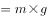，根据简单的数学计算可知，在公式两边直接消掉，对结果不产生影响，因此船的吃水深度也不变。

C项错误，体重计称的是人的体重，计算公式为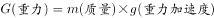，当变为原来的一半时，人的体重变为原来的一半。

D项错误，人举起石头要克服重力做功，其公式为：。当和不变，变为原来的一半时，可举起重物的质量，变为原来的2倍。

本题为选非题，故正确答案为B。

---

### 第 18 题　qid 2133632 · 地理国情

关于下列地区的说法错误的是：

- **A**. 欧洲北海：既是著名产油区，又是著名渔场
- **B**. 波斯湾地区：既是著名产油区，又是古文明发祥地
- **C**. 湄公河流域：既是小麦主产区，又是佛教圣地　✅
- **D**. 五大湖区：既有世界上面积最大的淡水湖，又跨美加两国边境线

**答案**：C

**官方解析**

本题考查地理常识。
A项正确，北海是著名的产油区，是位于欧洲大陆西北部和大不列颠岛之间的北海海底油田，上世纪80年代开始被大规模开采，使沿岸的英国成为世界上重要产油国之一。北海渔场是受北大西洋暖流与来自北冰洋的南下海水交汇形成的大渔场，冷暖海水在此交汇，为鱼类带来丰富饵料，鱼产丰富，种类繁多，是世界上著名的四大渔场之一。
B项正确，波斯湾位于伊朗高原和阿拉伯半岛之间，在波斯湾及其周边形成了一条巨大的石油带，这里蕴藏着占世界石油总储量一半以上的石油。波斯湾地区历史悠久，在伊拉克东南部幼发拉底河和底格里斯河的下游曾诞生苏美尔文明，是两河流域早期文化的创造者。
C项错误，湄公河上游在中国境内被称为澜沧江，流经的地区有老挝、缅甸、泰国、柬埔寨、越南，为东南亚重要的水稻产区，因此“小麦主产区”的说法错误。湄公河流域的地区和国家佛教盛行，佛寺众多，因此“佛教圣地”的说法正确。
D项正确，五大湖区是世界上最大的淡水湖群，位于加拿大和美国交界处，按大小分别为苏必利尔湖、休伦湖、密歇根湖、伊利湖和安大略湖。其中苏必利尔湖是世界上面积最大的淡水湖。
本题为选非题，故正确答案为C。

---

### 第 19 题　qid 2133638 · 人文常识

下列与果树有关的说法正确的是：

- **A**. 富含氮的肥料可促进果树开花结果
- **B**. 杏树是耐旱能力比较弱的树种
- **C**. 冬季不需要对果树进行病虫防治
- **D**. 嫁接是一种常用的果树繁殖方式　✅

**答案**：D

**官方解析**

本题考查生物常识。
A项错误，使用含氮的肥料能促进细胞的分裂和生长，使枝叶长得繁茂；含磷的肥料能促进幼苗的发育和花的开放，使果实、种子提早成熟，因此促进开花结果应使用富含磷的肥料，而非含氮的肥料。
B项错误，杏树具有扎根较深，喜光、耐旱、抗寒、抗风的特点，其寿命可长达百年以上，在我国多在北方地区栽培。“耐旱能力较弱”的说法错误。
C项错误，冬季是果树病虫潜伏越冬的时期。做好冬季病虫害防治工作，对减少病原菌及害虫的越冬基数，有效控制次年病虫害的发生十分重要，因此冬季也需要对果树进行病虫防治。
D项正确，为了保持优良特性，加快繁殖速度，人们常用茎对一些植物进行繁殖，嫁接就是其中常用的一种。简单来说嫁接就是把一个植物体的芽或枝，接在另一个植物体上，使结合在一起的两部分长成为一个完整的植物体，常见的苹果、梨、桃等果树都是进行嫁接繁殖的，是一种常用的果树繁殖方式。
故正确答案为D。

---

## 言语理解与表达

### 第 1 题　qid 2133704 · 逻辑填空

生命在于运动，运动能塑造我们强健的身体，增强抵抗疾病的能力。当然，它对大脑也是有益的。但事实上，运动应该            ，否则会使人反应迟钝。长时间大强度运动会使脑组织兴奋性降低，会使能源物质ATP（腺嘌呤核苷三磷酸）耗竭，对大脑机能造成损害。
填入画横线部分最恰当的一项是：

- **A**. 因人而异
- **B**. 张弛有道
- **C**. 适可而止　✅
- **D**. 循序渐进

**答案**：C

**官方解析**

根据转折词“但事实上”前后语义相反可知，转折前强调运动非常好，转折后应强调运动不好，且根据后文“长时间大强度运动会使······降低，会使·····耗竭，对·····造成损害”可知，横线处所填成语强调运动强度不能过大，不能超过一定的限度。C项“适可而止”指到适当的程度就停下来，不要过头，填入横线处强调运动要适度，既可与前文构成转折又能与后文形成对应，当选。
A项“因人而异”是指因人的不同而有所差异，横线前后并未涉及针对不同人不同情况的表述，排除；B项“张弛有道”比喻工作的紧松和生活的劳逸要适当调节，有节奏地进行，强调劳逸结合，而非适度，与文意不符，排除；D项“循序渐进”指学习工作等按照一定的步骤逐渐深入或提高，与文意相悖，排除。
故正确答案为C。
【文段出处】《“四肢发达”真的会“头脑简单”吗?》

---

### 第 2 题　qid 2133708 · 逻辑填空

如今，一批70后、80后甚至更年轻的年画传承人涌现出来。这些年轻人开始有了清醒的文化自觉，对中华传统文化怀有浓厚的兴趣，怀着敬畏之心钻研，并不                ，急于进入市场大潮，冯骥才称他们为“年画的新力量”。
填入画横线部分最恰当的一项是：

- **A**. 随波逐流　✅
- **B**. 沽名钓誉
- **C**. 好高骛远
- **D**. 人云亦云

**答案**：A

**官方解析**

根据文段“对中华传统文化怀有浓厚的兴趣，怀着敬畏之心钻研”“并不······，急于进入市场大潮”可知，横线处所填成语强调这些年轻人有着清醒的文化自觉，他们拥有自己的思想与看法，不从众。A项“随波逐流”指随着波浪起伏，跟着流水漂荡，比喻没有坚定的立场，缺乏判断是非的能力，只能随着别人走，与后文“急于进入市场大潮”形成对应，符合文意，当选。
B项“沽名钓誉”指用某种不正当的手段捞取名誉，文段并未提及“捞取名誉”，排除；C项“好高骛远”比喻不切实际地追求过高过远的目标，与文意无关，排除；D项“人云亦云”指人家怎么说，自己也跟着怎么说，形容没有主见，只会随声附和，文段强调的是“进入市场大潮”的行为动作，而非仅仅是口头上的附和，排除。
故正确答案为A。
【文段出处】《聚焦年画传承：“原生态”得以保存 “新生代”正在崛起》

---

### 第 3 题　qid 2133710 · 逻辑填空

在联合国教科文组织通过的《文化多样性宣言》和《保护非物质文化遗产公约》里，文化的多样性都被比喻成生物的多样性。因为人类的文化创造和遗存就像人类的基因，包含了过去世代累积的信息和发展的可能性。有些看似                的东西，今天不知道它有什么重要性，但以后可能会影响到人类的发展。
填入画横线部分最恰当的一项是：

- **A**. 司空见惯
- **B**. 转瞬即逝
- **C**. 微不足道　✅
- **D**. 一成不变

**答案**：C

**官方解析**

根据后文“今天不知道它有什么重要性，但以后可能会影响到人类的发展”可知，横线处所填成语强调某些事物看上去并不重要之意。C项“微不足道”指意义、价值等小得不值得一提，与后文“不知道它有什么重要性”对应，当选。
A项“司空见惯”指某事常见，不足为奇，而文段强调的是“是否重要”而非“是否常见”，排除；B项“转瞬即逝”形容在很短的时间里消失，与文段无关，排除；D项“一成不变”是指一经形成，不再改变，文段强调的是“重要性”而非“改变”，与文意不符，排除。
故正确答案为C。
【文段出处】《梁治平：谁来保护非物质文化遗产——一次参与国际公约制定的经验》

---

### 第 4 题　qid 2133718 · 逻辑填空

中俄计划携手建设从莫斯科出发，穿越哈萨克斯坦通往北京的欧亚高速运输走廊。新铁路的兴建可能要耗时八至十年。从工程的规模及价值来看，它堪与苏伊士运河        。后者大幅缩短了通航里程及时间，迅速对全球贸易产生了                的影响。
依次填入画横线部分最恰当的一项是：

- **A**. 比肩  不可估量　✅
- **B**. 媲美  旷日持久
- **C**. 争雄  超乎预期
- **D**. 匹敌  源源不断

**答案**：A

**官方解析**

第一空，根据文意可知，新铁路与苏伊士运河能够发挥同等的作用，横线所填词语表示比得上之意。A项“比肩”形容地位相等；B项“媲美”形容一种东西可以和另一种东西相比较；D项“匹敌”比喻双方地位平等、力量相当，三项均符合文意，保留。C项“争雄”更侧重强调争强或争胜，不表示比得上的意思，排除。
第二空，横线处搭配“影响”，根据文意可知，强调的是苏伊士运河对全球贸易影响巨大，A项“不可估量”指难以估计，体现了影响的巨大，符合语境，当选。B项“旷日持久”指耗费时日，与“迅速”语义相悖，排除；D项“源源不断”形容接连不断，不能与“影响”搭配，排除。
故正确答案为A。
【文段出处】《中俄新“丝路”能够扭转全球贸易格局》

---

### 第 5 题　qid 2133722 · 逻辑填空

一项世界规模的宏基因组研究显示，含耐药基因的微生物在自然界中                。这意味着人类有可能回到没有抗生素的时代，医疗体系中的很大一部分可能会退回到抗生素发明之前的境地，轻微的细菌感染都可能引起        的后果。
依次填入画横线部分最恰当的一项是：

- **A**. 比比皆是  意外
- **B**. 不可胜数  可怕
- **C**. 千差万别  严重
- **D**. 无处不在  致命　✅

**答案**：D

**官方解析**

第一空，根据“人类有可能回到没有抗生素的时代”可知，强调的是含耐药基因的微生物在自然界中特别多。C项“千差万别”形容种类多，差别大，侧重强调的是“差别大”，而非“数量多”，排除。
第二空，根据文意可知，横线处所填词语应与“轻微”形成反义对应关系，强调后果非常严重。A项“意外”指意料之外、料想不到，不体现后果的严重性，排除；B项“可怕”相较于D项“致命”而言程度较轻，且D项“致命”中“导致丧命”的语义与细菌感染所引发的可能让人类丧命的严重后果对应更加明确，排除B项。
故正确答案为D。
【文段出处】《抗生素耐药性 到底是个啥？》

---

### 第 6 题　qid 2133564 · 逻辑填空

历史认识的局限性成就了历史研究的魅力。历史认识有局限性，才需要人们不断拷问、修正和创新。如果研究者因此而敬畏研究对象，兢兢业业、                ，这正是历史研究的幸事。反之，如果把历史认识的局限性作为规避责任的遁词和主观臆断的托词，人们就会愈发相信历史毫无            可言。
依次填入画横线部分最恰当的一项是：

- **A**. 身体力行  科学性
- **B**. 恪尽职守  公平性
- **C**. 如履薄冰  客观性　✅
- **D**. 谨言慎行  系统性

**答案**：C

**官方解析**

第一空，所填词语与“兢兢业业”形成并列，语义相近，“兢兢业业”形容做事小心谨慎、认真踏实。B项“恪尽职守”指谨慎认真地做好本职工作，C项“如履薄冰”比喻行事极为谨慎，存有戒心，D项“谨言慎行”形容人言语行动小心谨慎，三项均符合文意，保留；A项“身体力行”指亲身体验，努力实行，侧重自己去做，与是否谨慎无关，排除。
第二空，根据前文的“规避责任的遁词和主观臆断的托词”可知，在认识历史的问题上具有主观性，故“相信历史毫无客观性可言”符合文意，C项“客观性”当选。B项“公平性”强调的是公正，与偏私语义相反；D项“系统性”强调的是整体性，与零散语义相反，两项均与前文“主观”无法形成对应关系，排除。
故正确答案为C。
【文段出处】《历史研究须正心术》

---

### 第 7 题　qid 2133566 · 逻辑填空

射电天文学的进步把人们的视线引向了宇宙遥远的边缘，那里        了更多有关宇宙起源和演化的关键线索。天文学家都渴望拥有威力更加强大的射电望远镜，谁拥有了这种望远镜，谁就更有可能站立在现代物理学和天文学的潮头，                ，成为破解宇宙之谜的领军力量。
依次填入画横线部分最恰当的一项是：

- **A**. 暗藏  胜券在握
- **B**. 隐藏  捷足先登　✅
- **C**. 埋藏  首当其冲
- **D**. 潜藏  独占鳌头

**答案**：B

**官方解析**

本题可从第二空入手，根据“站立在现代物理学和天文学的潮头”“成为破解宇宙之谜的领军力量”可知，横线处所填成语应该体现出走在研究前列、能够率先破解宇宙之谜这一语义。B项“捷足先登”比喻行动快的人先达到目的或先得到所求的东西，符合率先破解宇宙之谜之意，且和文段“潮头”“领先”相呼应，符合文意，保留。
A项“胜券在握”形容有夺取胜利的充分把握，体现不了文段中“领先”的意思，排除；C项“首当其冲”比喻最先受到攻击或遇到灾难，与文意无关，排除；D项“独占鳌头”指占首位或第一名，文段仅表达走在前列、率先去做之意，并未强调“第一”，排除。
第一空代入验证，横线处搭配“线索”，宇宙遥远的边缘“隐藏”了有关宇宙起源和演化的关键线索，B项“隐藏”搭配恰当，当选。
故正确答案为B。
【文段出处】《望向宇宙深处的中国“天眼”》

---

### 第 8 题　qid 2133572 · 逻辑填空

黄河三角洲是中国大河三角洲中海陆变迁最        的地区，特别是黄河口地区造陆速率之快、尾闾迁徙之频繁，更为世界罕见。黄河三角洲的        受黄河水沙条件和海洋动力作用的制约，黄河来沙使海岸堆积向海洋推进，海洋动力作用又使海岸侵蚀向陆地推进。
依次填入画横线部分最恰当的一项是：

- **A**. 壮观  形成
- **B**. 复杂  形态
- **C**. 剧烈  演化
- **D**. 活跃  演变　✅

**答案**：D

**官方解析**

第一空，根据后文“特别是黄河口地区造陆速率之快、尾闾迁徙之频繁”可知，D项“活跃”指活动频繁，与“速率之快”“迁徙之频繁”对应恰当，符合语境，保留。A项“壮观”指雄伟奇观，通常搭配风景、景象，与前文“海陆变迁”搭配不当，排除；B项“复杂”指的是多而杂乱，无法体现“变迁快和频繁”之意，排除；C项“剧烈”指的是激烈、强烈，只能体现变迁的力度，但是后文强调的是变迁的速度和频繁度，与力度无关，排除。
第二空代入验证，根据前文的“变迁”和后文的“推进”可知，文段侧重强调的是黄河三角洲变化的过程，D项“演变”指一个事物发生变化的过程，符合文意，当选。
故正确答案为D。
【文段出处】《黄河改道以来黄河三角洲演变过程及其驱动机制》

---

### 第 9 题　qid 2133580 · 逻辑填空

情绪并不是独立存在的，它常常伴随着信息而传播。作为一种态度，情绪不仅能够        人们对所传播信息的认知，还会在一定程度上指导人们的行为。积极的情绪会促进人们积极地认识世界，消极的情绪则可能给他人甚至整个社会带来破坏性后果。人在情绪失控时，很容易不顾后果地做出        的举动。
依次填入画横线部分最恰当的一项是：

- **A**. 影响  危险
- **B**. 左右  出格　✅
- **C**. 干扰  反常
- **D**. 支配  冲动

**答案**：B

**官方解析**

第一空，横线处搭配“情绪”，根据文段中“积极的情绪会促进人们积极地认识世界，消极的情绪则可能给他人甚至整个社会带来破坏性后果”可知，情绪能够影响人的认知，A项“影响”和B项“左右”符合文意。C项“干扰”重在强调扰乱，语义与感情色彩均与后文“指导人们的行为”相悖，排除；D项“支配”指占据控制地位，语义程度过重，排除。
第二空，根据“情绪失控”可知，人们做出的行为举止往往是和平时不一样的，超出人们预期的，B项“出格”能体现超出常规之意，且和“不顾后果”形成对应，符合文意。情绪失控所做出的举动不一定就是危险的举动，故A项“危险”排除。 
故正确答案为B。
【文段出处】《论群体传播时代个人情绪的社会化传播》

---

### 第 10 题　qid 2133584 · 逻辑填空

开花的塔黄零星分布在空旷的流石滩上，蕈蚊是如何及时发现它们的呢？原来蕈蚊头上的触角就像人类的鼻子，能感受并<u>        </u>不同的气味。开花的塔黄会挥发20多种化合物，其中一种不常见的化合物（二甲基丁酸甲酯）占所有化合物的左右。野外诱导试验证实，这种化合物可以<u>        </u>传粉的蕈蚊，为其“导航”。

依次填入画横线部分最恰当的一项是：

- **A**. 记忆  引诱
- **B**. 区分  吸引　✅
- **C**. 识别  刺激
- **D**. 追踪  迷惑

**答案**：B

**官方解析**

第一空，根据语境提示“像人类鼻子的触角”可知，横线处应体现鼻子的功能，B项“区分”、C项“识别”均符合文意，且和“不同的气味”搭配恰当，保留。A项“记忆”不表示鼻子的作用，排除；D项“追踪”体现的是人的功能而非“鼻子”这一器官的功能，排除。
第二空，根据后文“为其‘导航’”可知，这种化合物能起到一种引领、牵引的作用，B项“吸引”指把事物或别人的注意力引到自己这方面来，能够体现牵引之意，符合文意，当选。C项“刺激”指外界事物作用于生物体，使事物起积极变化，并无具体的牵引之意，排除。
故正确答案为B。
【文段出处】《你为我传粉，我为你育儿——恶劣环境下塔黄的繁殖策略》

---

### 第 11 题　qid 2133522 · 逻辑填空

秦岭阻挡了中国腹地南北气候的交互，却挡不住秦巴两地行者的脚步。无论是“明修栈道，暗度陈仓”，还是“一骑红尘妃子笑”，都与一条条秦岭古道                。这些古道就如同一条条经线，沟通了关中与巴蜀，见证了中国历史的朝代兴替与政经融通，        出不少故事与传说。
依次填入画横线部分最恰当的一项是：

- **A**. 密不可分  演绎　✅
- **B**. 交相辉映  衍生
- **C**. 休戚与共  涌现
- **D**. 相伴相生  催生

**答案**：A

**官方解析**

第一空，前文陈述的“明修栈道，暗度陈仓”“一骑红尘妃子笑”都是与秦岭古道有关的典故，所以横线处需要填入一个体现出有关系意思的词语。A项“密不可分”形容十分紧密，不可分割，符合文意，保留。B项“交相辉映”指的是光亮、色彩等互相映照，景象特别美好，不能搭配“古道”，排除；C项“休戚与共”指忧喜、祸福彼此共同承担，形容彼此之间利害关系密切，而文段中并未体现出两者之间有利害关系，排除；D项“相伴相生”最早指的是女子对男子的依恋，现在多指一种事物与另一种事物相互伴生，形容彼此之间的依赖关系，用来形容前文典故和秦岭古道之间的关系，程度过重，排除。
第二空，代入验证，A项“演绎”有展现、表现、推演等含义，用在文段中，表示这条秦岭古道上出现了很多故事和传说，符合文意，当选。
故正确答案为A。
【文段出处】《7条秦蜀古道300余处遗迹，“蜀道申遗”怎能少了陕西》

---

### 第 12 题　qid 2133526 · 逻辑填空

医疗改革方案将引导医疗机构、医务人员，通过提供更多更好的诊疗服务，获得        的补偿。对于过度治疗问题，该方案是一种                的做法，它让医生的收入与所开的药物、检查脱钩，让医疗工作者的劳动收入真正体现在明处。
依次填入画横线部分最恰当的一项是：

- **A**. 合法  立竿见影
- **B**. 公正  行之有效
- **C**. 适度  一劳永逸
- **D**. 合理  釜底抽薪　✅

**答案**：D

**官方解析**

本题从第二空入手，根据后文“对于过度治疗问题，该方案······”“它让医生的收入与······脱钩，让······体现在明处”可知，这种方法可以从根本上解决过度治疗问题。D项“釜底抽薪”比喻从根本上解决问题，能体现出医疗改革方案对于解决实际问题的作用，符合文意，保留。A项“立竿见影”比喻收效迅速、见效快，文段未体现该方案可以快速见效，排除；B项“行之有效”指实行起来有成效，体现不出“从根本上解决问题”的含义，与D项“釜底抽薪”相比，跟文段的对应不够准确，排除；C项“一劳永逸”形容劳苦一次，便可以得到永远的安逸，体现不出是否能从根本上解决问题，且用“一劳永逸”也不符合客观实际，排除。
第一空，代入验证，D项“合理”代入题干表示获得合理的补偿，搭配得当，当选。
故正确答案为D。
【文段出处】《北京深化医改方案引舆论关注：推进医改需要“联动大招”》

---

### 第 13 题　qid 2133528 · 逻辑填空

早在上世纪70年代末，钱学森就曾多次提出：国防科技的发展不能        于“追尾巴”“照镜子”，而是要                地开拓新领域和新方向。比如英国人针对重机枪机动性差的弱点，发明了坦克，一举撕裂了枪炮林立的僵持局面。这类非对称式的发展思路有助于打破先进国家的技术垄断，形成后发优势。
依次填入画横线部分最恰当的一项是：

- **A**. 拘泥  与众不同
- **B**. 满足  独辟蹊径　✅
- **C**. 沉迷  标新立异
- **D**. 止步  别具匠心

**答案**：B

**官方解析**

第一空，根据文意，国防科技的发展不能只停留在“追尾巴”“照镜子”的初级阶段。A项“拘泥”指固执成见而不知变通，强调把自己限定在某一范围内，“国防科技发展”不可能主动将自己框起来不发展，与文意不符，排除；C项“沉迷”，指深深地迷惑或迷恋某事物，多用于对一件不好的事情上瘾，与文意不符，排除。
第二空，根据文意可知，横线处表达开拓一种新的方向，采用一种新的办法，B项“独辟蹊径”比喻独创一种新风格或者新方法，与“开拓新领域和新方向”对应得当，当选。D项“别具匠心”指具有独特的、巧妙的构思，多指文学，艺术方面创造性的构思，与文段语境不符，排除。
故正确答案为B。
【文段出处】《军报谈国防科技领域如何弯道超车：两点足矣》

---

### 第 14 题　qid 2133530 · 逻辑填空

就文学创作而言，人工智能未来有可能在编剧或网络文学方面有所        ，毕竟除了一小部分杰出的作品外，无论剧本创作还是网络文学，都比较依赖标准化的情节与词语搭配。而文学作品的            程度越高，越有可能人工智能化。
依次填入画横线部分最恰当的一项是：

- **A**. 建树  程式化
- **B**. 发展  通俗化
- **C**. 贡献  规范化
- **D**. 突破  模式化　✅

**答案**：D

**官方解析**

本题可从第二空入手，根据文段“都比较依赖标准化的情节与词语搭配”可知，横线处表达文学作品是标准化的，具有固定的模式，A项“程式化”、C项“规范化”、D项“模式化”语义均可，保留。 B项“通俗化”指浅显易懂，易于被大众理解和接受，与文段强调的具有一定的模式无关，排除。
第一空，根据文段“人工智能未来有可能在编剧或网络文学方面有所······”“······程度越高，越有可能人工智能化”可知，横线处围绕人工智能进入文学创作领域的可能性来展开，D项“突破”符合文意，当选。A项“建树”、C项“贡献”均强调取得的成绩，文段仅在讨论人工智能进入文学创作领域的可能性，并未提及取得了哪些成绩，故与文意不符，排除。
故正确答案为D。
【文段出处】《当文艺创作遇上人工智能 人性永远无法替代》

---

### 第 15 题　qid 2133536 · 逻辑填空

大国兴衰构成了世界历史的重要篇章，许多学者和政治家                探寻其中的逻辑线索，产生了许多著述宏论。然而，对大国兴衰的原因难有最终答案，这不仅在于问题本身的            ，更是因为世界在变化，不同国家兴衰的轨迹不可能简单重复。因此，对这一问题的探讨永远不会         。
依次填入画横线部分最恰当的一项是：

- **A**. 殚精竭虑  阶段性  终结
- **B**. 废寝忘食  多样性  沉寂
- **C**. 呕心沥血  复杂性  过时　✅
- **D**. 兢兢业业  模糊性  停止

**答案**：C

**官方解析**

本题可从第二空入手，形容“问题本身”的特点，且根据文段“对大国兴衰的原因难有最终答案”可知，横线处所填词语表达问题较为复杂。A项“阶段性”与文意不符，无法对应前文“难有最终答案”，排除；B项“多样性”，文段中的问题只是“大国兴衰的原因”，并无多种多样的提问方式，只是答案比较多样，所以不能用来形容“问题本身”，排除；D项“模糊性”指不清晰，文段并非强调问题本身不清晰，而是对于这一问题我们难以确定答案，故与文意不符，排除。C项“复杂性”符合文意，保留。
第一空、第三空代入验证。
第一空，C项“呕心沥血”形容绞尽了脑汁，用尽了心血，多用于研究、创作的语境中，与文段“产生了许多著述宏论”对应恰当，保留。
第三空，搭配“探讨”，C项“过时”指陈旧不合时宜，符合文意且搭配恰当，当选。
故正确答案为C。
【文段出处】《大国崛起》

---

### 第 16 题　qid 2133542 · 逻辑填空

近年来，西方观众对中国功夫片的套路、动作、术语等已颇为熟悉，中国功夫的神秘感、陌生感在他们眼中逐渐        ，所以中国功夫片要体现作品的            ，很有难度。当下国产功夫电影在制作和传播方面并非                ，收获的口碑和奖杯都很难超越传统功夫片。
依次填入画横线部分最恰当的一项是：

- **A**. 淡化  独特性  高枕无忧
- **B**. 消失  差异性  一帆风顺　✅
- **C**. 褪去  艺术性  无懈可击
- **D**. 消逝  创新性  尽善尽美

**答案**：B

**官方解析**

第一空，根据文段“颇为熟悉”可知，横线处表达神秘感、陌生感逐渐不存在了，A项“淡化”指变淡，程度过轻，排除。
第二空，根据文意可知，西方观众对于中国功夫比较熟悉，陌生感正在减少，故横线处表达中国功夫要体现出作品与以往不一样的地方，C项“艺术性”与文段强调的“体现不同”之意无关，排除。
第三空，D项“尽善尽美”指完美到没有一点缺点，文段并非表述当下功夫传播存在缺点，需要完善，而是指其发展不顺利，存在难以超越的阻碍，排除。
故正确答案为B。
【文段出处】《内外兼修·走向世界的中国功夫》

---

### 第 17 题　qid 2133548 · 逻辑填空

一方面，受世界经济        影响，大宗资源产品价格走低，资源型企业纷纷陷入困境，资源型城市财政收入也急剧下降，无力增加投入；另一方面，随着经济发展进入新常态，大规模经济刺激已经        ，来自中央政府的强力支持相应减弱，资源型城市债务扩张趋于收紧。资源型城市转型面临的资金约束日益        。
依次填入画横线部分最恰当的一项是：

- **A**. 下行  失效  紧张
- **B**. 萎缩  放缓  强化
- **C**. 低迷  弱化  严重　✅
- **D**. 恶化  减退  明显

**答案**：C

**官方解析**

第一空，根据后文“价格走低”“陷入困境”可知，此处表达经济不好的状况，对应选项，四个词语均与文段搭配恰当，无法排除。
第二空，根据“相应减弱”可知，该空应表达减弱的语义，C项“弱化”指使某种事物变弱，减轻程度，符合文段语境，保留；D项“减退”指（程度）下降、减弱，符合文段语境，保留。A项“失效”指失去原有的效力，而文段仅表述减弱的意思，程度过重，排除；B项“放缓”指控制速度，使其变慢，与“刺激”无法搭配，排除。
第三空，根据前文的“经济困境”“扶持减弱”等一系列背景可知，“资源型城市转型面临的资金约束”的状况越来越不好，表达消极的感情色彩，C项“严重”符合文意，当选。D项“明显”指清楚地显露出来，为中性词，表述不明确，排除。
故正确答案为C。
【文段出处】《资源型城市转型如何“破茧成蝶”》

---

### 第 18 题　qid 2133552 · 逻辑填空

一些人对传统文化的理解存在误区，认为凡是老祖宗传下来的文化遗产，就不能有丝毫的改变，必须在当代                地得到传承。这种认识或许有助于        传统文化的经典性，但这也决定了传统文化只能被小众欣赏。这名为保护传统，实则        了传统与现实，终将使得传统文化被历史尘埃所湮没。
依次填入画横线部分最恰当的一项是：

- **A**. 一板一眼  凸显  混淆
- **B**. 原汁原味  维护  模糊
- **C**. 原封不动  保持  割裂　✅
- **D**. 一字不差  发扬  阻断

**答案**：C

**官方解析**

第一空，根据前文“不能有丝毫的改变”，所以横线处也强调“不变”之意，且感情色彩偏消极，A项“一板一眼”比喻言语、行动有条理符合规矩。有时也比喻做事死板，不懂得灵活掌握， C项“原封不动”比喻完全按照原样，一点不加变动，均可表达没有丝毫改变的语义，保留。B项“原汁原味”比喻事物本来的，没有受到外来影响的风格，感情色彩中性偏褒，感情色彩不符，排除；D项“一字不差” 指一个字也没有更改，与原文一样，无法与“文化遗产”搭配使用，排除。
第二空，根据前文的传承可知，此处表达“保护”文化经典性的语义，对应选项，A项“凸显”指清楚的显露，C项“保持”维持某种状态使不消失或减弱，和“经典性”搭配得当，均符合文段语境，保留。
第三空，由于传统文化仅能被小众欣赏，并不符合传统文化保护的现实意义，故可知该做法是将传统的保护和现实意义分开实现，即该空应表达二者不统一的意思， C项“割裂”指把不应当分割的东西分割开（多指抽象的事物），可表达分开、不统一的语义，符合文段语境，当选。A项“混淆”指混杂、界限模糊，不符合文意，排除。
故正确答案为C。
【文段出处】《传统戏曲更需关注“小众”》

---

### 第 19 题　qid 2133558 · 逻辑填空

漆画有其他画种达不到的效果，同时也有它的        。它不能像油画、水粉画那样自由地运用冷暖色彩，不能像素描那样丰富地运用明暗层次，不善于逼真地、                地再现对象。事实上，在似与不似之间表现对象，才是漆画最        的地方。
依次填入画横线部分最恰当的一项是：

- **A**. 问题  出神入化  出色
- **B**. 短板  惟妙惟肖  难得
- **C**. 缺陷  面面俱到  独到
- **D**. 局限  栩栩如生  擅长　✅

**答案**：D

**官方解析**

本题可从从第二空入手，与“逼真”并列，并且对应“再现对象”，表示将对象非常逼真地画出来、表现出来。B项“惟妙惟肖”用于表达描写、模仿非常逼真，D项“栩栩如生”形容画作、雕塑中的艺术形象等生动逼真，就像活的一样，均符合文意，保留。A项“出神入化”表示技艺达到了绝妙的境地，而文段论述的是“漆画”，用法不当，排除；C项“面面俱到”指各方面都要照顾到，没有遗漏，文段强调的是画的逼真、特别像，与文意不符，排除。
第三空，前面出现“事实上”，表示转折，意思与前文“不能、不善于”的意思相反，表示漆画的优点、特长，D项“擅长”符合文意，保留。B项“难得”体现的是少有、稀少、珍贵，而第三空并不是强调漆画珍贵，文意不符，排除。
第一空，代入验证，D项“局限”与后文的解释内容对应准确，当选。
故正确答案为D。
【文段出处】《漆画妙在似与不似之间》

---

### 第 20 题　qid 2133562 · 逻辑填空

在执行任务期间，“反潜战持续追踪无人艇”一旦发现目标的        ，就会使用声呐系统对目标进行        定位并跟踪，同时借助传感器技术进行信息        。逼近目标时，无人艇会通过声学图像，确定目标潜艇的型号等信息，再将数据传输到反潜指挥中心，由中心指派就近的反潜平台赶往目标海域，摧毁敌艇。
依次填入画横线部分最恰当的一项是：

- **A**. 踪迹  精确  搜集　✅
- **B**. 意图  精准  汇总
- **C**. 动向  主动  筛选
- **D**. 线索  自动  匹配

**答案**：A

**官方解析**

从第三空入手，根据文意可知，横线处表达传感器技术能够获取信息之意，A项“搜集”指搜寻、聚集，语义恰当，保留。B项“汇总”意思是把各种材料或情况汇集到一起、C项“筛选”指通过淘汰的方法挑选，均表示对已有的信息进行处理，不能体现获取之意，排除；D项“匹配”指两个或多个事物之间相符合、相适应的关系或状态，在文中指“逼近目标时，无人艇会通过声学图像，确定目标潜艇的型号等信息”时采取的做法，是在搜集信息之后进行的动作，不符合语境，排除。
第一空，代入验证，A项“踪迹”指人或事物行动后留下的可察觉形迹，符合文意，当选；
第二空，代入验证，A项“精准”指非常准确，精确，符合文意，当选。
故正确答案为A。
【文段出处】《“猎杀”柴电潜艇 美“幽灵猎者”无人艇问世》

---

### 第 21 题　qid 2133546 · 片段阅读

烙画古称“火针刺绣”，是一门传承千年的艺术。烙画以火为“墨”，用火烧热特制铁笔，在物体上烫出烙痕作画，因炭化程度不同而呈现出浅褐色、深褐色和黑色等色调。烙画讲究火候和力度，讲究轻重缓急、深浅浓淡，一支铁笔在手，下笔的力度和时机都决定着画作的质量，任何环节掌握不好都会功亏一篑。
这段文字主要介绍了：

- **A**. 评价烙画水平的标准
- **B**. 烙画制作工艺的特点　✅
- **C**. 制作烙画的关键环节
- **D**. 烙画独有的艺术魅力

**答案**：B

**官方解析**

文段首句引出“烙画”这一话题，接下来论述了烙画是以火烧笔来制作的，最后的色调与炭化的程度有关。尾句说明在制作的过程中，讲究的是火候和力度，会影响画作的质量，并在最后强调每个环节都很重要。故文段后两句为并列结构，均是在论述烙画在制作工艺上的特征，对应B项。

A项“评价标准”、D项“艺术魅力”文段均没有提到，无中生有，排除；C项“关键环节”表述错误，文段并没有论述制作过程中的某一个关键环节，尾句指出“任何环节”都很重要，排除。

故正确答案为B。

【文段出处】《画家郝友友以火为“墨”传承烙画文化》

---

### 第 22 题　qid 2133550 · 片段阅读

食品行业是关系人民群众切身需求与经济社会和谐稳定的民生行业。但目前来看，我国食品供给体系总体呈现出中低端产品过剩、中高端和个性化产品供给严重不足的问题，消费者对国外产品的依赖程度越来越高。特别在当前速度换挡、结构调整、动力转换的经济新常态下，深入推进食品行业供给侧改革，是实现食品行业健康、长远发展的必然选择。食品标准既是国家食品安全治理体系中的重要组成部分，又是引导食品生产质量的主要风向标，因此，深化食品行业供给侧结构性改革的关键在于构建一套先进的食品行业标准。
这段文字接下来最可能讲的是：

- **A**. 目前国内食品行业存在的主要问题
- **B**. 国外构建食品行业标准的经验教训
- **C**. 构建食品行业标准要重点关注的问题　✅
- **D**. 深化食品行业供给侧改革的具体措施

**答案**：C

**官方解析**

根据提问方式可知，本题为接语选择题，应在阅读全文基础上，重点关注文段最后谈论的核心话题。文段开篇介绍了“食品行业”这一话题，接着通过转折提出我国食品供给体系存在的问题。并提出深入推进食品行业供给侧改革这一方案，尾句通过结论词“因此”得出结论，引出文段的重点，强调深化食品供给侧改革的关键是“构建一套先进的食品行业标准”，文段最后谈论的核心话题为“构建食品行业标准”，根据核心话题一致的原则，下文应围绕这一话题具体展开论述，对应C项。
A、D两项谈论的话题为“食品行业”，没有提及“食品行业标准”，与文段最后谈论的核心话题不一致，均排除；B项“国外构建食品行业标准”缩小范围，仅为关注的一个方面的问题，与C项相比表述片面，排除。
故正确答案为C。
【文段出处】《用先进的标准体系倒逼食品行业供给侧结构性改革》

---

### 第 23 题　qid 2133554 · 片段阅读

南京在历史上的名字变化或褒或贬，根本源头在于统治者的好恶。不惟南京，同样原因也引发了其他地名的变迁，宋廷平定方腊起义之后，深恨江南百姓造反，艺术修养最高的皇帝宋徽宗遂在地名上做文章：方腊的两个活动区域，歙州被改成徽州，取的是“徽”的本意“捆绑束缚”；睦州则被改成严州，意思更是不言自明的。相比之下，朱元璋为避国号讳，取“海定则波宁”之义，将明州改成宁波，已是很“友好”了。
这段文字主要介绍了：

- **A**. 地名变迁背后的政治因素　✅
- **B**. 历史事件对地名的影响
- **C**. 古代帝王在地名方面的偏好
- **D**. 统治者对某些地域的好恶

**答案**：A

**官方解析**

开篇通过南京的事例，指出其地名变迁的原因为“统治者的好恶”，接下来通过“同样”“也”表示并列，指出其他地名的变迁的原因也在于统治者的好恶，后文又列举宋徽宗时“歙州”“睦州”两个地名变迁以及朱元璋时“明州”地名变迁的事例，故文段通过三个并列分句，共同强调地名变迁的原因为统治者的好恶，即政治方面的因素，对应A项。
B项，“历史事件”非重点，文段是从统治者的角度分析政治因素的影响，且没有提到“地名变迁”这一主题词，排除；
C、D两项，仅强调“古代帝王”“统治者”的影响，没有提到“地名变迁”这一主题词，偏离中心，均排除。
故正确答案为A。
【文段出处】《我国部分城市名称数次易名的原因》

---

### 第 24 题　qid 2133556 · 片段阅读

从医学角度看，非酒精性脂肪肝是因为脂代谢紊乱等多种因素引起了肝细胞内中性脂肪（主要是甘油三酯和脂肪酸）过度堆积。脂代谢紊乱引发的多种重要组织损伤，特别是心脑血管和肝脏损害，对健康造成极大威胁，因此其机制和防治策略研究一直是国际上医学研究的前沿领域。专家指出，尽管饮食控制和改变生活方式对高脂血症及脂肪肝有明显的改善作用，但在现实生活中很难实施，患者往往由于各种因素不能严格执行医嘱。到目前为止，人类尚未研发出可以根治和阻止肝脏脂代谢紊乱的有效药物。
关于脂代谢紊乱，文中没有提及：

- **A**. 主要危害
- **B**. 研究状况
- **C**. 改善途径
- **D**. 发病机理　✅

**答案**：D

**官方解析**

根据“脂代谢紊乱引发的多种重要组织损伤，特别是心脑血管和肝脏损害，对健康造成极大威胁”可知，A项“主要危害”文段提及，正确；
根据“因此其机制和防治策略研究一直是国际上医学研究的前沿领域······到目前为止，人类尚未研发出可以根治和阻止肝脏脂代谢紊乱的有效药物”可知，B项“研究状况”，文段提及，正确；
根据“专家指出，尽管饮食控制和改变生活方式对高脂血症及脂肪肝有明显的改善作用，但在现实生活中很难实施，患者往往由于各种因素不能严格执行医嘱”可知，C项“改善途径”文段提及，正确；
D项，文段首句为“非酒精性脂肪肝”的发病原因并非脂代谢紊乱的“发病机理”，“发病机理”无中生有，当选。 
本题为选非题，故正确答案为D。
 【文段出处】《胖不是胖 是脂代谢紊乱······》

---

### 第 25 题　qid 2133560 · 片段阅读

虽然中国的救灾能力在经历过多次大型自然灾害后有了较大的提升，但是防灾教育依然落后。中国扶贫基金会2015年对中国公众的防灾意识进行了调查，结果显示，仅有的城市居民表示关注灾害应对的相关知识，这一数据在农村仅为。此外，只有不到的城市居民在日常生活中做了基本的防灾准备，超过半数的农村居民从未参加过任何防灾培训。形同虚设的防灾教育无法提高民众的自救能力，等到灾难发生后才开始组织学习，逝去的生命已经无法挽回。

这段文字意在说明：

- **A**. 防灾教育比救灾更重要
- **B**. 中国的防灾教育亟待加强　✅
- **C**. 防灾教育是提高自救能力的基础
- **D**. 城市与农村在防灾教育上严重失衡

**答案**：B

**官方解析**

文段首句通过转折词“但是”指出我国的防灾教育依然落后的问题，接着以“中国扶贫基金会”调查的结果和数据对该问题进行解释说明，尾句通过反面提对策，强调目前加强我国的防灾教育刻不容缓，对应B项。
A项，文段并未对“防灾”和“救灾”的重要性进行比较，无中生有，排除；
C项，文段并未指出“防灾教育”是“提高自救能力”的必要条件，强加逻辑关系，且文段强调的是“防灾教育落后”而非其重要性，排除；
D项，为解释说明部分的内容，非文段的重点，排除。
故正确答案为B。
【文段出处】《中国龙卷风灾害：重视度低，防灾教育形同虚设》

---

### 第 26 题　qid 2133588 · 片段阅读

新工业革命浪潮中，很多制造业大国都在押注智能制造。中国既是制造大国，也是使用大国，如果数据是工业4.0时代创造价值的原材料，那中国无疑是资源最多的国家。但数据并不会直接创造价值，就像是现金流而非固定资产决定一个企业的兴衰一样。真正为企业带来价值的是数据流，是数据经过实时分析后及时地流向决策链的各个环节，成为面向用户、创造价值与服务的内容和依据。虽然德国是工业4.0的发起者，但作为控制器、物联网技术和生产设备的提供者，德国只是基础技术的供应商，直接面向客户的价值创造端却是中国。
这段文字意在强调：

- **A**. 我国在新工业革命浪潮中面临新的机遇
- **B**. 我国应当充分挖掘数据资源的潜在价值　✅
- **C**. 数据资源拥有者在智能制造方面更具优势
- **D**. 数据流是企业在工业4.0时代领先的关键

**答案**：B

**官方解析**

文段开篇交代背景，引出“数据资源”这一话题，并指出中国在数据资源上的优势，接下来通过转折词“但”提出问题，指出数据不会直接创造价值，随后通过“就像”列举了企业的例子，尾句把德国和中国进行对比，进一步强调数据资源对于中国的价值，故文段重点强调数据资源对我国的重要价值，对应B项。
A项，“面临的机遇”表述不明确，没有体现出“数据资源”对于我国的重要性，且“新工业革命浪潮”为背景引入的表述，非重点，排除；C、D两项，均没有提到“我国”这一核心主体，文段是重点阐述数据资源对于我国的重要性，偏离中心，排除。
故正确答案为B。
【文段出处】《工业4.0的中心将会在中国》

---

### 第 27 题　qid 2133590 · 片段阅读

自海洋石油钻井平台、潜艇等超大型货物相继出现以来，半潜船才渐渐找寻到自己的用武之地。半潜船装运货物既可利用独特的沉浮方式，又能借助码头设施采用滚装、滑装、吊装等多种方式，具有很强的灵活性和方便性。此外，半潜船大多具有自航能力，航速可达到15节以上，能大大缩短重要设备的运输周期。同时，由于自身携带设备少，燃料消耗少，半潜船续航能力可达到数万公里。更为重要的是，半潜船是通过半潜方式在水中航行，吃水较深，甲板常常与水面一致，因而抗击大风大浪的稳定性极高。
根据这段文字，以下说法正确的是：

- **A**. 半潜船仅能采用沉浮方式装载货物
- **B**. 半潜船的主要不足是速度相对缓慢
- **C**. 半潜船较稳是由于航行时吃水较深　✅
- **D**. 在超大型货物出现后半潜船才出现

**答案**：C

**官方解析**

C项对应文段“半潜船是通过半潜方式在水中航行，吃水较深，甲板常常与水面一致，因而抗击大风大浪的稳定性极高”，表述正确，当选；
A项“仅能采用浮沉方式”表述错误，根据文段可知“半潜船装运货物既可利用独特的沉浮方式，又能借助码头设施采用滚装、滑装、吊装等多种方式”，排除；
B项“速度相对缓慢”表述错误，根据文段“航速可达到15节以上，能大大缩短重要设备的运输周期”可知，半潜船速度并不缓慢，排除；
D项表述错误，根据文段“自海洋石油钻井平台、潜艇等超大型货物相继出现以来，半潜船才渐渐找寻到自己的用武之地”可知，超大型货物出现以后，半潜船找到用武之地，而非半潜船才出现，排除。
故正确答案为C。
【文段出处】《“无腰巨兽”半潜船：不可或缺的海上担架手》

---

### 第 28 题　qid 2133594 · 片段阅读

民族的文化传统和历史的文化信息被大量地记载于历史经典文献中。除了经典文献，还有各种各样的历史文物，作为历史文化的载体被代代相传地保存下来。传统村落就是这样一个历史文化载体，相对于经典文献和文物，它所承载的有关中华民族文化的历史信息更具鲜活性，是中华民族文明发展史的“实证”。它比文字、文物更能真实地反映中华民族不同地域、不同族群的生产生活方式、道德伦理观念以及民族习俗风情。因此，我们有充分的理由重视传统村落，保护传统村落。
这段文字意在强调：

- **A**. 保护传统村落对保护民族历史文化有着重要意义　✅
- **B**. 应采取多种方式和途径传承、保护民族历史文化
- **C**. 传统村落是中华历史文化的重要载体和现实体现
- **D**. 传统村落文化较之经典文献更能鲜活地展现历史

**答案**：A

**官方解析**

文段开篇指出民族传统与文化被大量地记载于历史文献，此外还有各种各样的文化作为文化的载体保存下来，接着指出传统村落就是这样的历史文化载体，并指出其承载的信息更具鲜活性，更能真实反映生活方式习俗风情，强调传统村落的重要性，最后通过“因此”得出结论，我们要重视和保护传统村落，故文段重在强调传统村落对于历史文化的重要性，要保护传统村落，对应A项。
B项具有很强的迷惑性，虽然是对策表述，但是没有提及文段的主题词“传统村落”，偏离文段中心，且“采取多种方式和途径”文段没有提及，无中生有，排除；
C、D两项对应结论之前的内容，非重点，均排除。
故正确答案为A。
【文段出处】《传统村落消失意味着什么？》

---

### 第 29 题　qid 2133596 · 片段阅读

随着智能手机的功能不断增加，手机电池有限的续航能力已不能满足待机需要，充电宝顺理成章地成为高频应用。而共享充电准入门槛低，线下布局容易，只要抓住“流量”和“刚需”，共享充电几乎是一桩可以看得见盈利的生意。随着标准的最后敲定，5G时代或在2019～2020年到来。进入5G时代，视频内容、视频电话、视频直播、高清网络游戏等都将考验手机电池的续航能力，成熟的共享充电场景或将消除这一顾虑。
这段文字主要介绍了共享充电的：

- **A**. 盈利模式
- **B**. 应用场景
- **C**. 销售策略
- **D**. 市场前景　✅

**答案**：D

**官方解析**

文段开篇指出手机电池的续航能力满足不了待机需求，而充电宝成为高频应用，接着介绍共享充电的优势，即门槛低、线下布局容易，尾句指出在未来的5G时代，共享充电可以消除续航能力不足的顾虑，即前景广阔，故文段重在介绍共享充电的未来前景，对应D项“市场前景”。
A项“盈利模式”和C项“销售策略”无中生有，文段没有提及，文段重在介绍前景，均排除；B项“应用场景”非重点，文段主要讲的是充电宝在未来市场前景很好，而非具体介绍应用在哪些场景，排除。
故正确答案为D。
【文段出处】《“共享充电”或沦为“鸡肋”》

---

### 第 30 题　qid 2133598 · 片段阅读

科学的发展总带给人类崭新的思维方式。比如，在大数据背景下，人类的许多行为都是可以被预测的。从这个角度看，人类的行为并不是互不相关的独立事件，而是相互关联的数据网络中的一个片段。在这张数据大网之中，许多事件的相关性与其发展的规律变得有迹可寻。再比如，日常生活中，我们只能感知和意识到三维世界，而超弦理论却把我们带进一个十维的宇宙世界，带来新的科学思维与方法，开拓出一个新颖刺激而富有美感的精神新领域。
下列最适合做这段文字标题的是：

- **A**. 独领风骚的数据科学
- **B**. 未来世界的无限可能
- **C**. 科学思维无所不在
- **D**. 科学之光点亮思维　✅

**答案**：D

**官方解析**

文段开篇指出科学发展给人带来崭新的思维方式，接着通过“比如”“再比如”进行举例说明，分别介绍大数据和超弦理论对人类思维的作用，故文段是“观点解释说明”的结构，重在强调科学对思维的作用，对应D项“科学之光点亮思维”。

A项“数据科学”属于举例说明的内容，非重点，排除；B项“无限可能”表述不明确，文段重在强调“科学”对于“思维”的作用，排除；C项“无处不在” 表述绝对，且体现不出科学对于思维的促进作用，排除。

故正确答案为D。

【文段出处】《科学的精神力量》

---

### 第 31 题　qid 2133706 · 片段阅读

自然资源核算的对象，主要是矿产、森林、耕地和水资源等。挪威和加拿大等林业发达的国家，会更重视森林资源的核算。我国则主要强调森林、耕地和水资源的核算。这是因为矿产和化石能源固然重要，但其市场化程度也非常高。然而，森林、耕地和水资源的性质完全不同。它们向人类提供的“产品”，如粮食、木材和水产等，只是其贡献的一部分，更重要的还是其提供的生态服务，如承载生态系统、维护生物多样性等，所有这些生态服务都是不能进口的。
这段文字主要说明：

- **A**. 我国为什么选择特定自然资源为主要核算对象　✅
- **B**. 正确选择自然资源核算对生态文明建设很重要
- **C**. 不同国家对自然资源核算对象的选择各有偏重
- **D**. 矿产和化石能源与其他资源在性质上存在不同

**答案**：A

**官方解析**

文段开篇指出自然资源核算的范围，随后通过与挪威、加拿大等国的对比，强调了我国与他国不同，“主要强调森林、耕地和水资源的核算”。随后用“这是因为”进一步指出了原因，即森林、耕地等的性质以及不可替代性决定了我国需要重视它们的核算。故整个文段为因果结构，重点强调“我国主张强调森林、耕地和水资源的核算”，对应A项。
B项，“生态文明建设”对应尾句内容，是原因的一部分，不是文段重点，排除；
C项，文段重点强调的是“我国”，“不同国家”范围扩大，排除；
D项，“矿产和化石能源”非重点，文段重在强调“森林、耕地和水资源”，排除。
故正确答案为A。
【文段出处】《自然资源的核算》

---

### 第 32 题　qid 2133724 · 语句表达

①有些鸟类就因为食物缺乏、体能补充不足而夭折在迁徙途中

②迁徙距离愈远，消耗脂肪愈多

③因此，鸟类栖息地食物的充足就显得极为重要

④飞越沙漠和大海的迁徙鸟类，由于途中无法获取食物，必须不停顿地一次完成迁徙，故而需要存储的脂肪更多一些

⑤有的鸟种迁飞前脂肪积累可达体重的，有的鸟种迁飞结束时减重可达

⑥鸟类迁徙期间的能量消耗完全依赖体内以脂肪形式储存的能量

将以上6个句子重新排列，语序正确的是：

- **A**. ⑥②④⑤③①　✅
- **B**. ⑥③①②⑤④
- **C**. ④⑤⑥②①③
- **D**. ④②③①⑤⑥

**答案**：A

**官方解析**

对比选项，确定首句。④句介绍飞越沙漠和大海的鸟类需储存更多脂肪，⑥句指出鸟类迁徙能量完全靠体内脂肪储存。根据逻辑顺序，应先指出鸟类迁徙依靠脂肪供能，再论述不同迁徙场景下脂肪存储的差异，因此⑥句更适合作为首句，排除C、D两项。
继续观察A、B两项，判断⑥句后接②句还是③句。②句接上迁徙距离和脂肪消耗的正相关关系，与⑥句“迁徙消耗脂肪”的话题衔接得当；③句通过结论词“因此”指出鸟类栖息地食充足的重要性，与⑥句话题衔接不得当，无法衔接，排除B项，A项当选。
故正确答案为A。
【文段出处】《鸟类迁徙之谜》

---

### 第 33 题　qid 2133726 · 语句表达

①以此来看，种植一些价廉物美的乡土草木，更易于达到上述效果，更能满足适地、适物以及“好种、好管、好活、好看”的绿化需求
②绿化具有生态、经济和社会三种效益
③所以在城市绿化上选择这些乡土草木资源，更能体现自己的品牌和地方特色，有助于营造有特色的园林城市风格
④城市绿化是以栽种植物来改善城市环境的活动
⑤乡土草木资源是长期自然选择的结果，不仅能适应本地的生态环境，而且不需要特别的投入
⑥同时，各个城市都有不同的市情，有的城市还有自己的市花、市树
将以上6个句子重新排列，语序正确的是：

- **A**. ②⑤⑥③①④
- **B**. ④②①⑤⑥③　✅
- **C**. ②①④⑤③⑥
- **D**. ④③⑤①⑥②

**答案**：B

**官方解析**

对比选项判断首句，②句具体介绍绿化的效益，④句给城市绿化下定义，起话题引入的作用，故④句更适合作首句，排除A、C两项。③句中出现指代词“这些乡土草木资源”指代⑤⑥句中的草木，对应B项。
验证B项，首句④给“城市绿化”下定义，②句强调其好处，随后①句提出实现“城市绿化”的对策，即“种植乡土草木”，⑤⑥句针对对策展开详细的解释说明，尾句③通过结论词“所以”总结前文。
故正确答案为B。
【文段出处】《绿化请多些乡土草木》

---

### 第 34 题　qid 2133728 · 片段阅读

绿叶蔬菜中的硝酸盐被人体摄入后，一部分不吸收而被大肠细菌利用，最终排出体外；另一部分被吸收，在几个小时当中逐渐缓慢转变成微量的亚硝酸盐。亚硝酸盐的存在时间只有几分钟，然后转变成一氧化氮，发挥扩张血管的作用。换句话说，如果需要亚硝酸盐扩张血管的作用，完全用不着吃剩菜；而且一次性大量摄入亚硝酸盐是有害的，摄入硝酸盐之后，在体内缓慢转变成亚硝酸盐，才能发挥有益作用。
这段文字反驳了哪种观点？

- **A**. 人体无法避免摄入亚硝酸盐
- **B**. 亚硝酸盐对人体有害
- **C**. 过量食用绿叶蔬菜也有风险
- **D**. 吃剩菜可以扩张血管　✅

**答案**：D

**官方解析**

文段开头讲述绿叶蔬菜中的一部分硝酸盐会转变成亚硝酸盐，随后转变为一氧化氮，发挥扩张血管的作用。“换句话说”之后的内容是对前文的总结，强调是不需要通过吃剩菜的方式使血管扩张，因此反驳了D项“吃剩菜可以扩张血管”的观点。
A项，与文意相同，由文段“另一部分被吸收，在几个小时当中逐渐缓慢转变成微量的亚硝酸盐”可知，人体吸收的绿叶蔬莱中的硝酸盐会转变为亚硝酸盐，排除；B项，由文段可知，一次性大量摄入亚硝酸盐是有害的，与文意不符，排除；C项，无中生有，文段并没有进行相关内容的阐述，排除。
故正确答案为D。
【文段出处】《是绿叶菜有利扩张血管，无关剩菜》

---

### 第 35 题　qid 2133730 · 语句表达

进行骨髓移植的前提条件是有配型成功的捐赠者。双胞胎配型成功几率最高，兄弟姐妹也有可能。但在中国，20世纪70年代到现在，大多数都是独生子女，有兄弟姐妹且能配型成功的概率也非常低。另外，父母和子女之间骨髓配型成功的概率非常低，几乎为零。因此，绝大多数患者都必须依赖不认识的志愿者配型。非亲缘关系骨髓配型成功的几率只有几十万至几百万分之一，                  。
填入画横线部分最恰当的一句是：

- **A**. 即使这样，骨髓移植仍是大多数血液疾病患者的唯一希望
- **B**. 如果冒着风险使用不完美的配型，成功率自然会大为降低
- **C**. 骨髓库里志愿者样本的多少，直接决定着病人找到合适配型的几率　✅
- **D**. 志愿者捐献固然很重要，国家相关政策的落实和执行也是当务之急

**答案**：C

**官方解析**

横线出现在文段结尾，需结合前文内容分析。文段核心围绕“骨髓移植配型来源”展开,先介绍亲缘配型的局限性，即独生子女多导致兄弟姐妹配型概率低、父母子女几乎为零，接着通过“因此”总结前文，指出大多数患者必须依赖不认识的志愿者，而这种配型成功的几率特别小，可知志愿者样本的多少对配型成功的几率有着很大的影响，对应C项。
A项，与前文衔接不当，前文重在强调志愿者的捐献影响着配型成功几率，排除；
B项“不完美的配型”、D项“国家相关政策”均无中生有，文段并未提及，排除。
故正确答案为C。
【文段出处】《骨髓捐赠，播下一颗希望的种子》

---

### 第 36 题　qid 2133732 · 片段阅读

农村社区化建设目前尚处于探索阶段。“村改居”是城镇化发展的具体表现，也是公共服务向农村社区延伸、让农民共享改革发展成果的必然要求。长期以来，城乡二元结构导致城市与农村割裂发展，农村地区发展滞后，公共服务能力薄弱。在城镇化大潮中的“村改居”，就是要打破城乡分治的制度藩篱，因地制宜地让农民也能享受到和城里人一样的社会保障和公共服务。各地经济发展水平不一、农民对公共服务的要求各异，这就决定了“村改居”的路径、公共服务的提供种类和农村社区的保障水平等必然“因村而异”。
这段文字意在强调：

- **A**. “村改居”是农村社区化建设的有益探索
- **B**. “村改居”顺利推进的要领在于因地制宜　✅
- **C**. 城乡共享公共服务是农村发展的关键一步
- **D**. 打破城乡二元界限才能促进城镇化的发展

**答案**：B

**官方解析**

文段首先指出农村社区化建设处于探索阶段，接着介绍了“村改居”的意义，后文指出城乡二元结构导致了农村地区公共服务能力薄弱，而“村改居”就是要让农民能够享受到和城里人一样的社会保障和公共服务，尾句“这”指代前文引出结论，强调“村改居”要“因村而异”，故可知文段重在强调“村改居”要根据各地不同的情况采取有差异的方式，对应B项，当选。
A项对应文段首句内容，文段重点在于尾句“这”总结上文引出的结论，故非重点，排除；C、D两项并未出现文段主题词“村改居”，偏离文段中心，文段重在阐述“村改居”要因地制宜，排除C、D两项。
故正确答案为B。
【文段出处】《让农民共享公共服务》

---

### 第 37 题　qid 2133734 · 片段阅读

隐身战机目前主要依靠外形设计和材料表面涂层，来降低其可探测性，实现雷达隐身。但是，受现有技术和材料水平以及战机制造难度、机动性能、造价与后续费用、维护保障方便性等诸多限制，隐身战机不得不在上述几方面做出一定平衡，因此一般不可能实现全方位和全电磁波段的所谓全隐身，特别是它在执行特殊任务，携带或挂载暴露在机体外的非隐形配置时，隐身能力要下降很多。
这段文字意在：

- **A**. 介绍制造隐身战机的困境　✅
- **B**. 分析隐身战机的设计缺陷
- **C**. 探讨隐身战机的技术难点
- **D**. 阐述隐身战机的隐身原理

**答案**：A

**官方解析**

文段首先介绍了隐身战机目前的隐身原理，接着通过“但是”表转折，说明隐身战机因为受到诸多限制不得不做出平衡，最后通过“因此”得出结论，指出隐身战机不可能实现全隐身。所以文段是“分总”结构，重点在“因此”之后，强调的是“隐身战机”因诸多限制无法实现全隐身，即制造隐身战机的困境，对应A项。
B项和C项，“设计缺陷”“技术难点”仅属于制造隐形战机遇到的困境之一，均表述片面且属于“因此”之前的表述，非重点，排除；
D项，“隐身原理”对应第一句话，非重点，且“原理”属于中性表述，文段强调的是隐身战机存在的“困境”，不匹配文段表达的感情色彩，排除。
故正确答案为A。
【文段出处】《米波三坐标雷达：让隐身战机无处可藏》

---

### 第 38 题　qid 2133736 · 片段阅读

干扰致偏是对抗精确制导武器打击的一种有效手段。精确制导武器之所以威胁巨大，关键在于能够直击要害。高精度打击的前提是弹载制导机构必须准确锁定目标，并实时接收制导修正信号。如果制导信号被压制干扰，或修正信息不准确，制导武器就无法精确命中目标，威力大打折扣。如果说传统的伪装防护技术是利用“易容术”将目标隐藏起来，干扰致偏防护技术就是给来袭导弹戴上“磨砂镜”，让其看不清、瞄不准，使制导机构沿着错误的方向偏离目标，而且这种技术对于无法转入地下的重要阵地目标的防护更具实用价值。
根据这段文字，可以将“干扰致偏”最准确地概括为：

- **A**. 伪装防护技术的“烟雾弹”
- **B**. 导弹制导信号的“跟踪器”
- **C**. 精确制导武器的“迷魂散”　✅
- **D**. 地上阵地目标的“防护伞”

**答案**：C

**官方解析**

文段开篇引出话题“干扰致偏”，指出“干扰致偏”用于对抗“精确制导武器”，接着对“精确制导武器”的原理进行分析，指出其依赖于“制导信号”的准确度。后文通过与“传统伪装防护技术”的对比，表明“干扰致偏”的特点是“给来袭导弹戴上‘磨砂镜’”，即干扰制导信号，扰乱制导武器的路径。故“干扰致偏”的功能是实现对制导武器的干扰和迷惑，对应C项。
A项，文段强调的是“干扰致偏”干扰“来袭导弹”的视线，并非干扰“伪装防护技术”，偷换概念，排除；
B项，“跟踪器”无法体现出干扰、迷惑的含义，排除；
D项，“防护伞”的功能是给予保护，文段重在强调“扰乱”，排除。
故正确答案为C。
【文段出处】《智能遮弹为防护目标穿“铁布衫”再不怕钻地弹》

---

### 第 39 题　qid 2133738 · 语句表达

当我们仔细观察当今世界上的主流火箭时，就会发现它们用的发动机、燃料箱等都是上世纪的产物。比如要在2018年首飞的太空发射系统用的是改进过的航天飞机的火箭发动机，燃料箱用的是改进过的航天飞机的外挂燃料箱，两侧的固体燃料推进器用的也是改进过的航天飞机的固体燃料推进器。                       。火箭是非常复杂的东西，设计并制造火箭需要考虑的因素太多，就连火箭制造商们也只能去选择一些经受过时间考验的产物，从而确保产品的可靠性。
填入画横线部分最恰当的一句是：

- **A**. 这是因为新技术的推广需要一定的时间
- **B**. 这并不意味着火箭技术没有任何新的进展
- **C**. 事实上，制造火箭的材料并不都是前沿科技产物
- **D**. 也就是说，在火箭这个领域内并不是最新的就是好的　✅

**答案**：D

**官方解析**

横线在文段中间，起到承上启下的作用。横线前介绍当今世界先进主流火箭的重要部件，使用的均不是新研发的产品，而是旧的产物，并举例详细说明，横线后阐述了制造商只能选择经过时间考验的产物，目的是确保产品的可靠性，即上文现象出现的原因。横线处的内容需与上下文意思保持一致，即应体现出火箭使用旧产物是好的、是正确的之意，对应选项为D项。
A项，将原因归结为“需要时间”，根据后文可知，原因是为了确保产品的可靠性，故与文意不符，排除；
B项，“新的进展”无中生有，文段重在强调“旧的也是好的”，排除；
C项，“事实上”表转折，但前文并未具体阐述前沿科技产物，与文段衔接不当，排除。
故正确答案为D。
【文段出处】《火箭中的分级是怎么评出来的，看完这篇你也能评了》

---

### 第 40 题　qid 2133740 · 片段阅读

目前，国内的多家快递企业开始尝试拓展无人机送货业务，这样既能缓解地面交通拥堵，又能提高快递企业运营效率。但是，自无人机技术应用以来，安全事故屡屡发生。无人机在快递业的大规模应用，还可能对空管秩序造成极大冲击。特别是引入人工智能的无人机技术，逐渐摆脱了人工干预，而且还会随着“经验”的不断积累，优化自己的飞行路线。一旦对其监管落实不到位，极有可能产生不堪设想的后果。对此，我们应采取切实有效的措施，最大限度地发挥人工智能在无人机领域的优势，防止其可能产生的社会危害。
这段文字意在说明：

- **A**. 无人机的广泛应用需技术和监管共同发力　✅
- **B**. 引入人工智能的无人机技术潜在风险更大
- **C**. 快递企业引入无人机业务的时机尚不成熟
- **D**. 发展人工智能需要更多地考虑其安全隐患

**答案**：A

**官方解析**

文段首先介绍背景，指出快递企业尝试无人机送货的好处，接着通过“但是”引出问题，说明无人机技术应用会产生一系列的不良影响，即无人机技术尚不到位，随后阐述到，如果监管不到位，会产生不好的后果，即“监管”对无人机的使用较为重要，尾句通过“对此”总结上文，给出对策，即需要技术和监督双管齐下发挥人工智能在无人机领域的优势，对应选项为A项。
B项，为问题表述，没有对策重要，排除；
C项，文段重在表明不应因噎废食，要采取措施解决问题，而非时机不成熟，故表述与文意不符，排除；
D项，没有A项表述明确，未指出具体的对策，即“技术和监管”，排除。
故正确答案为A。
【文段出处】《人工智能不只需要技术》

---

## 数量关系

### 第 1 题　qid 2133512 · 数学运算

甲商店购入400件同款夏装。7月以进价的1.6倍出售，共售出200件；8月以进价的1.3倍出售，共售出100件；9月以进价的0.7倍将剩余的100件全部售出，总共获利15000元。问这批夏装的单件进价为多少元？

- **A**. 125　✅
- **B**. 144
- **C**. 100
- **D**. 120

**答案**：A

**官方解析**

设同款夏装的单件进价为元，则7月利润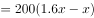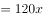元、8月利润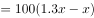元、9月利润元，，解得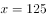。

故正确答案为A。

---

### 第 2 题　qid 2133516 · 数学运算

某单位的会议室有5排共40个座位，每排座位数相同。小张和小李随机入座，则他们坐在同一排的概率：

- **A**. 
不高于

- **B**. 
高于但低于
　✅
- **C**. 
正好为

- **D**. 
高于

**答案**：B

**官方解析**

从40个座位中选2个座位，由小张和小李随机入座，总的情况数为。

要让他们恰好坐在同一排，应先从5排中选一排，再从这一排中选2个座位，符合条件的情况为。满足情况的概率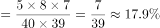，在到之间。

故正确答案为B。

---

### 第 3 题　qid 2133518 · 数学运算

企业某次培训的员工中有369名来自A部门，412名来自B部门。现分批对所有人进行培训，要求每批人数相同且批次尽可能少。如果有且仅有一批培训对象同时包含来自A和B部门的员工，那么该批中有多少人来自B部门？

- **A**. 14
- **B**. 32
- **C**. 57　✅
- **D**. 65

**答案**：C

**官方解析**

两部门总人数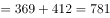人。要使每批人数相同且批次尽可能少，则可以对总人数因式分解为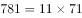，要让批次最少，则将所有人分为11批，每批人数71人。

根据题意“有且仅有一批培训对象同时包含来自A和B部门的员工”，故只有这一批的71人由两个部门组合而成，其余的每一批71人均来自同一个部门。

考虑B部门，则B部门可以分为完整的5批再加57人，故所求的这一批人中有57人来自B部门。

故正确答案为C。

---

### 第 4 题　qid 2133520 · 数学运算

将一块长24厘米、宽16厘米的木板分割成一个正方形和两个相同的圆形，其余部分弃去不用。在弃去不用的部分面积最小的情况下，圆的半径为多少厘米？

- **A**. 

- **B**. 

- **C**. 
8

- **D**. 
4
　✅

**答案**：D

**官方解析**

若要求弃去不用的面积最小，则分割出的面积应尽可能大。

如图所示，分割出的正方形面积应尽可能大，可分割出一个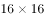厘米的正方形，还剩一个厘米的小长方形。小长方形可以分割出两个厘米的小正方形，再从每个小正方形内部分割出一个完整的内切圆，此时弃去不用的面积最小。

依此可得，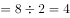厘米。

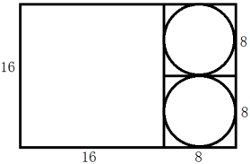

故正确答案为D。

---

### 第 5 题　qid 2133524 · 数学运算

企业花费600万元升级生产线，升级后能耗费用降低了，人工成本降低了。如每天的产量不变，预计在400个工作日后收回成本。如果升级前人工成本为能耗费用的3倍，问升级后每天的人工成本比能耗费用高多少万元？

- **A**. 1.2
- **B**. 1.5
- **C**. 1.8　✅
- **D**. 2.4

**答案**：C

**官方解析**

根据条件“升级前人工成本为能耗费用的3倍”，设能耗费用为，则人工成本为。在升级生产线后，能耗费用降低了，则降低了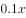；人工成本降低了，则降低了。

在400个工作日后收回成本，此时减少的成本达到升级生产线所花的钱数，即万，解得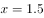万。

则升级后每天的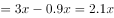，每天的。前者比后者高万元。

故正确答案为C。

---

### 第 6 题　qid 2133532 · 数学运算

工程队接到一项工程，投入80台挖掘机。如连续施工30天，每天工作10小时，正好按期完成。但施工过程中遭遇大暴雨，有10天时间无法施工。工期还剩8天时，工程队增派70台挖掘机并加班施工。问工程队若想按期完成，平均每天需多工作多少个小时？

- **A**. 1.5
- **B**. 2　✅
- **C**. 2.5
- **D**. 3

**答案**：B

**官方解析**

赋值每台挖掘机每小时的效率为1，因遭遇暴雨，10天时间无法施工，则只能施工天，在还剩8天时，已施工12天，此时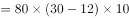。在增派70台挖掘机后，若想在规定时间完工，设每天需工作小时，则可得：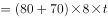，解得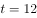。即平均每天需多工作小时。

故正确答案为B。

---

### 第 7 题　qid 2133534 · 数学运算

枣园每年产枣2500公斤，每公斤固定盈利18元。为了提高土地利用率，现决定明年在枣树下种植紫薯（产量最大为10000公斤），每公斤固定盈利3元。当紫薯产量大于400公斤时，其产量每增加n公斤将导致枣的产量下降0.2n公斤。问该枣园明年最多可能盈利多少元？

- **A**. 46176
- **B**. 46200　✅
- **C**. 46260
- **D**. 46380

**答案**：B

**官方解析**

当紫薯产量大于400公斤时，每增加n公斤将导致枣的产量下降0.2n公斤。

假设紫薯的产量为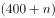公斤，则此时枣的产量为公斤。

则总盈利为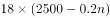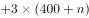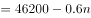，要让总盈利最大，则n取0，此时总盈利为46200元。

故正确答案为B。

---

### 第 8 题　qid 2133538 · 数学运算

某企业国庆放假期间，甲、乙和丙三人被安排在10月1号到6号值班。要求每天安排且仅安排1人值班，每人值班2天，且同一人不连续值班2天。问有多少种不同的安排方式？

- **A**. 15
- **B**. 24
- **C**. 30　✅
- **D**. 36

**答案**：C

**官方解析**

方法一：

情况较复杂，考虑枚举法，设10月1日安排甲值班，10月2日安排乙值班，将安排情况梳理如下：

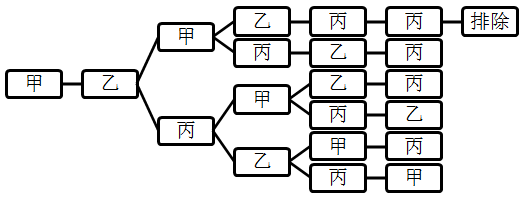

此时符合条件的情况有5种，又因为10月1日和2日可以从甲、乙、丙三人中任选两人值班，所以共有种不同的安排方式。

方法二：

1号，甲、乙、丙三人选一人，有种排法；2号，从另外两人中选一人，有种排法；设1号安排甲值班，2号安排乙值班，在3号有两种可能性：①如果为甲，则剩下的4号丙、5号乙、6号丙，有1种情况；②如果为丙，则4号可排甲、乙，2种情况，5号有2种情况，一共有种情况。因此总的情况数为种不同的安排方式。

故正确答案为C。

---

### 第 9 题　qid 2133540 · 数学运算

某新能源汽车企业计划在A、B、C、D四个城市建设72个充电站，其中在B市建设的充电站数量占总数的，在C市建设的充电站数量比A市多6个，在D市建设的充电站数量少于其他任一城市。问至少要在C市建设多少个充电站？

- **A**. 20
- **B**. 18
- **C**. 22
- **D**. 21　✅

**答案**：D

**官方解析**

因为B市建设充电站的数量占总数的，C市又比A市多6个，D市最少，所以四个城市充电站个数关系为：B、C两市建设充电站的数量较多，A市第三多，D市最少。要使C市建设的充电站尽量少，就要让其他市建设的充电站尽量多，其中，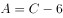，D尽量多且比A少，所以D最多为。此时充电站总个数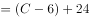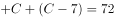，解得，问至少，应向上取整，所以C至少建设21个充电站。

故正确答案为D。

---

### 第 10 题　qid 2133544 · 数学运算

某公司按1:3:4的比例订购了一批红色、蓝色、黑色的签字笔，实际使用时发现三种颜色的笔消耗比例为1:4:5。当某种颜色的签字笔用完时，发现另两种颜色的签字笔共剩下100盒。此时又购进三种颜色签字笔总共900盒，从而使三种颜色的签字笔可以同时用完。问新购进黑色签字笔多少盒？

- **A**. 450　✅
- **B**. 425
- **C**. 500
- **D**. 475

**答案**：A

**官方解析**

根据题意，红色、蓝色、黑色签字笔订购量的比例为1:3:4，黑色签字笔订购数量是所有签字笔订购数量的；签字笔实际消耗的比例为1:4:5，黑色占消耗数量的，说明剩下的100盒笔中，有的黑色签字笔。现在又购进三种颜色共900盒，若同时用完，必然其中有为黑色，所以新购进900盒中也应该有的黑色签字笔盒。 

故正确答案为A。

---

## 判断推理

### 材料 1

某学院在开学之初，利用4天时间开设了哲学、逻辑、数学、统计、宗教、历史和艺术7门课程让学生试听。每天上午、下午各一门。除一门课程可以开设两次之外，其他课程均不重复。这4天的课程设置还须满足以下条件：

（1）艺术课程至少有一次安排在第3天；

（2）数学课程只能安排在逻辑课程的次日；

（3）第1天或第2天中至少有一天安排统计课程；

（4）哲学课程与数学课程或艺术课程安排在同一天；

（5）开设两次的课程不能安排在同一天，也不能安排在第3天，其中一次要安排在第4天。

#### 第 1 题　qid 2133644 · 类比推理

以下哪门课程不能安排在第4天？

- **A**. 历史
- **B**. 哲学
- **C**. 艺术　✅
- **D**. 宗教

**答案**：C

**官方解析**

第一步：分析题干。
（1）艺术至少有一次安排在第3天
（2）数学只能安排在逻辑的次日
（3）第1天或第2天至少有一天为统计
（4）哲学与数学或哲学与艺术安排在同一天
（5）开设2次的课程不在同一天，也不在第3天，其中一次安排在第4天
第二步：根据题干条件分析选项。
根据条件（1）（5），艺术至少一次安排在第3天，而开设两次的课程不在第3天，那么艺术一定只能开设一次，因此艺术只能安排在第3天，一定不能安排在第4天。
故正确答案为C。
注：对于条件（4）有两种理解，第一种是：哲学若出现两次的话，只要有一次满足和数学或艺术在同一天即可，另一次可以和其他科目在同一天。在这种理解的前提下，上述答案无争议。
第二种的理解是：只要安排哲学，就必须和数学或艺术在同一天。假设哲学安排在第4天且出现2次，那么一次和数学在同一天，一次和艺术在同一天，由（3）（5）可知，第三天是艺术和哲学，第4天是数学和哲学。这就不能满足条件（2），数学在逻辑的次日。
如果是这种理解，假设哲学安排在第4天且只出现1次，又由上文可知，艺术安排在第3天，那么数学就必须在第四天，而由条件（2）可知逻辑在第3天，即：第三天安排艺术和逻辑，第四天安排数学和哲学。由条件（5）可知第4天有一科出现两次，所以只能数学出现两次，此时，数学必须在第1天或第2天再出现一次，那么此时与条件（2）矛盾。
因此，对于条件（4）只能理解为：哲学若出现两次的话，只要有一次满足和数学或艺术在同一天即可，另一次可以和其他科目在同一天。

---

#### 第 2 题　qid 2133646 · 类比推理

以下哪门课程安排在任意一天都有可能？

- **A**. 数学
- **B**. 宗教　✅
- **C**. 统计
- **D**. 以上都不是

**答案**：B

**官方解析**

第一步：分析题干。

（1）艺术至少有一次安排在第3天

（2）数学只能安排在逻辑的次日

（3）第1天或第2天至少有一天为统计

（4）哲学与数学或哲学与艺术安排在同一天

（5）开设2次的课程不在同一天，也不在第3天，其中一次安排在第4天

第二步：根据题干条件分析选项。

根据条件（2），数学只能安排在逻辑的次日，那么数学一定不能安排在第1天，排除A项；

根据条件（3）（5），第1天或第2天至少有一天为统计，假设统计也安排在第3天，那么统计需要开设2次，而开设2次的课程不能在第3天，与假设矛盾，那么统计一定不能安排在第3天，排除C项。

题干问的是可能性，只要有一种情况能够成立，那么就是有可能的。

对于宗教，如果安排如下：

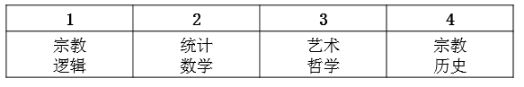

与题干条件不矛盾，那么宗教可以在第1天和第4天。

如果安排如下：

与题干条件不矛盾，那么宗教可以在第2天。

如果安排如下：

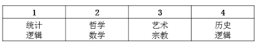

与题干条件不矛盾，那么宗教可以在第3天。

因此宗教安排在任意一天都是可能的。

故正确答案为B。

---

#### 第 3 题　qid 2133648 · 类比推理

以下哪门课程不能开设两次？

- **A**. 哲学
- **B**. 逻辑
- **C**. 统计　✅
- **D**. 历史

**答案**：C

**官方解析**

第一步：分析题干。

（1）艺术至少有一次安排在第3天

（2）数学只能安排在逻辑的次日

（3）第1天或第2天至少有一天为统计

（4）哲学与数学或哲学与艺术安排在同一天

（5）开设2次的课程不在同一天，也不在第3天，其中一次安排在第4天

第二步：根据题干条件分析选项。

对于条件（3），有两种不同的理解方式。第一种是指统计只能出现在第1天和第2天，不能出现在第3天和第4天。如果按此理解，结合条件（5），出现2次的课程一定要在第4天出现一次，那么可得统计不能上两次课。

其他三项均可出现两次，排列如下：

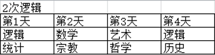

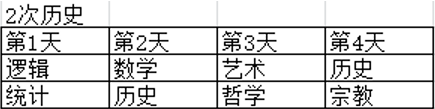

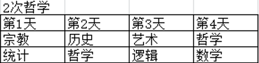

故正确答案为C。

注：对于条件（3），有些人有第二种理解方式，即统计除了必须出现在第1天或第2天以外，也可以在第3天和第4天出现。如果按照这种理解统计也可以安排两次，如下：

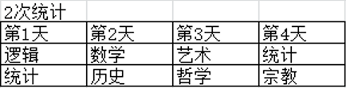

此时没有正确答案，故只能按第一种方式来理解。

若对条件（4）的理解有疑问，详细解析可见第106题备注。

---

#### 第 4 题　qid 2133650 · 类比推理

逻辑课程不能排在第几天？

- **A**. 第1天
- **B**. 第2天　✅
- **C**. 第3天
- **D**. 第4天

**答案**：B

**官方解析**

第一步：分析题干。

（1）艺术至少有一次安排在第3天

（2）数学只能安排在逻辑的次日

（3）第1天或第2天至少有一天为统计

（4）哲学与数学或哲学与艺术安排在同一天

（5）开设2次的课程不在同一天，也不在第3天，其中一次安排在第4天

第二步：根据题干条件分析选项。

根据条件（2）（4），数学只能安排在逻辑的次日，哲学与数学或哲学与艺术安排在同一天，如果逻辑安排在第2天，那么数学和艺术均安排在第3天，与条件（4）矛盾，则逻辑不能安排在第2天。

故正确答案为B。

注：题干问的是不可能性，只要有可能的均要排除。

对于逻辑，如果安排如下：

与题干条件不矛盾，那么逻辑可以安排在第1天和第4天。

如果安排如下：

与题干条件不矛盾，那么逻辑可以安排在第3天。

若对条件（4）的理解有疑问，详细解析可见第106题备注。

---

#### 第 5 题　qid 2133652 · 类比推理

如果宗教课程开设两次，那么历史课程安排在哪一天？

- **A**. 第1天
- **B**. 第2天
- **C**. 第3天
- **D**. 第4天　✅

**答案**：D

**官方解析**

第一步：分析题干。
（1）艺术至少有一次安排在第3天
（2）数学只能安排在逻辑的次日
（3）第1天或第2天至少有一天为统计
（4）哲学与数学或哲学与艺术安排在同一天
（5）开设2次的课程不在同一天，也不在第3天，其中一次安排在第4天
第二步：根据题干条件分析选项。
根据条件（1），艺术安排在第3天，根据条件（5），开设的课程必须有一次安排在第4天，那么宗教必须有一次安排在第4天，根据条件（2），数学只能安排在逻辑之后，而宗教开设2次，那么逻辑和数学只能开设1次，因此逻辑不能安排在第4天；假设逻辑安排在第3天，根据条件（2），数学安排在第4天，那么哲学与艺术和数学均无法安排在同一天，与条件（4）矛盾。假设逻辑安排在第2天，数学安排在第3天，那么数学和艺术安排在同一天，同样与条件（4）矛盾。那么逻辑只能安排在第1天，数学只能安排在第2天，根据条件（3）（5），第1天和第2天必须还要安排宗教和统计，因此历史只能安排在第4天。
故正确答案为D。

---

#### 第 6 题　qid 2133614 · 图形推理

从所给的四个选项中，选出最合适的一个填入问号处，使之呈现一定的规律性：

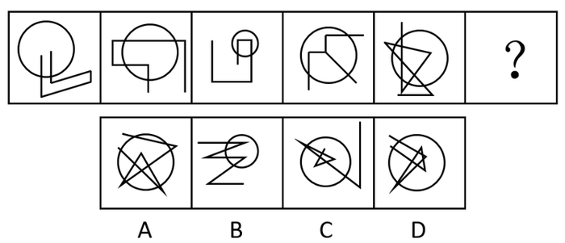

- **A**. A
- **B**. B
- **C**. C　✅
- **D**. D

**答案**：C

**官方解析**

元素组成不同，无明显属性规律，考虑数量规律。题干每幅图均存在线线相交，优先考虑数交点，分别为6、8、6、6、13、？，并无明显规律。题干每幅图都有圆与直线相交叉，考虑曲直交点，分别是2、4、2、3、6、？，并无明显规律。再次观察发现每幅图都有圆，圆分内外，即可以分别数圆内外的交点，圆内部的交点分别为0、1、2、3、4、？，故？处应选择一个圆内部有5个交点的图形，A项是4个，B项是2个，C项是5个，D项是8个，只有C项符合。
故正确答案为C。

---

#### 第 7 题　qid 2133622 · 图形推理

从所给的四个选项中，选出最合适的一个填入问号处，使之呈现一定的规律性：

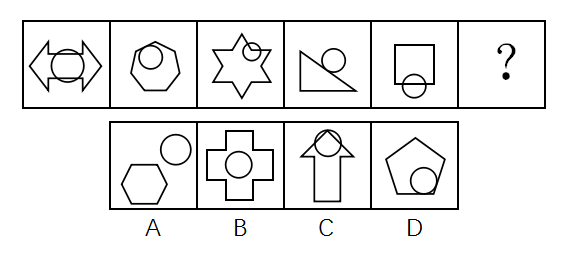

- **A**. A
- **B**. B
- **C**. C
- **D**. D　✅

**答案**：D

**官方解析**

观察题干图形发现，每一幅图形都有两个图形组成，并且每幅图形中都有圆，进一步观察发现，题干图形间关系分别是：相交、相切、相交、相切、相交、？，故？处应选择一个相切的图形，只有D项符合。
故正确答案为D。

---

#### 第 8 题　qid 2133630 · 图形推理

从所给的四个选项中，选出最合适的一个填入问号处，使之呈现一定的规律性：

- **A**. A
- **B**. B
- **C**. C
- **D**. D　✅

**答案**：D

**官方解析**

解析一：观察图形发现，每幅图都由两个图形组成，且分开看两图形均为轴对称图形。如下图所示，将所有图形的对称轴分别画出来后发现，第一组图的对称轴分别是平行（形成夹角为）、相交形成夹角、相交形成夹角；第二组图也分别是平行（形成夹角为）、相交形成夹角、？，故？处应选择一个两图对称轴相交形成夹角的图形，只有D项符合。

故正确答案为D。

解析二：元素组成不同考虑数量规律，第一组图形交点数量依次为6、10、4，6+4=10；第二组图形交点数依次为5、11、？，因此？处填一个6个交点数的图形，只有A项符合。

本题粉笔倾向于解析一，考查对称性。因为从图形特征上来看，数点特征不明显，此次国考图形题中已有题目考察点数量，再考点数量可能性不大。而对称性是国考高频考点，且图形中出现了等腰三角形、等腰梯形，存在对称性的特征图，本题也是对称性这一考点的创新考法，同学需重点注意。

---

#### 第 9 题　qid 2133636 · 图形推理

从所给的四个选项中，选出最合适的一个填入问号处，使之呈现一定的规律性：

- **A**. A
- **B**. B
- **C**. C　✅
- **D**. D

**答案**：C

**官方解析**

图形组成相似，优先考虑样式规律。九宫格中优先横向看。第一行中，图一和图二外框不变，内部线条去同存异得到图三；经验证，第二行也满足此规律；第三行，应用此规律，外框不变，内部线条去同存异，因此？处应该选择C项。
故正确答案为C。
注：有同学可能数面数量，按数列相加，每列面数量总和为16，因此问号处填有8个面的图形，选D，这也是一种规律。但本题粉笔倾向于考查样式规律中的加减同异，因为从图形特征上看，每行元素组成相似非常明显，历年真题中满足这种特征的题目，考查样式规律的概率更高，因此优先考虑样式规律，故粉笔倾向于选C。

---

#### 第 10 题　qid 2133640 · 图形推理

左图给定的是正方体纸盒的外表面，下面哪一项能由它折叠而成？

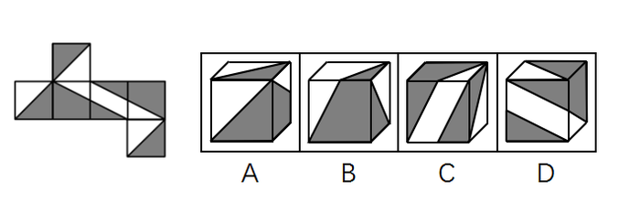

- **A**. A
- **B**. B
- **C**. C
- **D**. D　✅

**答案**：D

**官方解析**

本题属于空间重构类，将六个面分别标记a-f，其中面a、b、f相同，面c、e相同。

逐一分析选项： 

A项：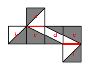

选项侧面是面c或面e。在选项中，侧面中小白三角形长直角边挨着的是黑色三角形，但如上图所示，无论是哪一种情况，展开图中面c或面e的小白三角形的长直角边都挨着白色三角形，相邻关系不一致，排除；

B项：选项上方的面在展开图中没有出现，排除；

C项：

选项正面是面d，如上图所示，选项中面d右侧的黑色小三角形的长直角边挨着黑色大三角形，而展开图中面d的两个黑三角形的长直角边，无论是边1还是边2（如上图所示），都没挨着黑色大三角形，相邻关系不一致，排除。

D项：可以由面a、面d和面e组成，也可以由面c、面d和面f组成，两种情况都可以，当选。

故正确答案为D。

---

#### 第 11 题　qid 2133642 · 图形推理

下面四个立体图形中，哪一项<b>不能</b>用一个平面分割为两个完全相同或互为镜像的部分？

- **A**. A
- **B**. B　✅
- **C**. C
- **D**. D

**答案**：B

**官方解析**

A项：如图1所示，沿着中间横向方向，进行切割，可以切成两个完全相同的部分，排除；

B项：由于各个部分高低不同，无法切出两个完全相同或互为镜像的部分，当选；

C项：如图2所示，沿着立体图形，从上到下竖直方向进行切割，可以切成两个完全相同或互为镜像的部分，排除；

D项：如图3所示，沿着中间对角线方向进行切割，可以切成两个互为镜像的部分，排除。

本题为选非题，故正确答案为B。

---

#### 第 12 题　qid 2133602 · 图形推理

左图为给定的多面体，从任一角度观看，下面哪一项<b>不可能</b>是该多面体的视图？

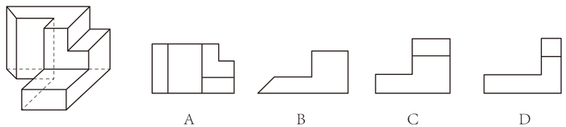

- **A**. A
- **B**. B
- **C**. C
- **D**. D　✅

**答案**：D

**官方解析**

本题考查三视图。

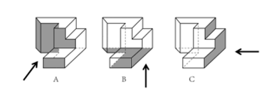

A项，从前往后观看，可以看到，为主视图，排除；

B项，从下往上观看，可以看到，为仰视图，排除；

C项，从右往左观看，可以看到，为右视图，排除；

D项，无法得到。

本题为选非题，故正确答案为D。

---

#### 第 13 题　qid 2133606 · 图形推理

把下面的六个图形分为两类，使每一类图形都有各自的共同特征或规律，分类正确的一项是：

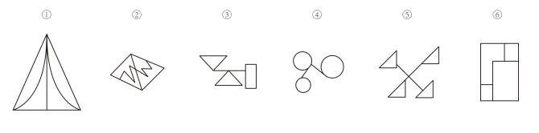

- **A**. ①②⑥，③④⑤　✅
- **B**. ①③④，②⑤⑥
- **C**. ①④⑤，②③⑥
- **D**. ①④⑥，②③⑤

**答案**：A

**官方解析**

本题为分组分类题目。观察发现，题干图形出现多个封闭面连在一起，考虑图形间关系。图①②⑥中图形之间通过公共边连接，图③④⑤中图形之间通过点连接。即图①②⑥一组，图③④⑤一组。
故正确答案为A。

---

#### 第 14 题　qid 2133620 · 图形推理

把下面的六个图形分为两类，使每一类图形都有各自的共同特征或规律，分类正确的一项是：

- **A**. ①②⑥，③④⑤
- **B**. ①②⑤，③④⑥　✅
- **C**. ①②③，④⑤⑥
- **D**. ①③⑤，②④⑥

**答案**：B

**官方解析**

本题为分组分类题目。图形元素组成不同，无明显属性规律，考虑数量规律。观察发现，图①为“日”字的变形图，图⑤为多圆相交，考虑笔画数。图①②⑤的奇点数都是2，为一笔画图形，图③④⑥的奇点数都是4，为两笔画图形。即图①②⑤一组，图③④⑥一组。
故正确答案为B。

---

#### 第 15 题　qid 2133634 · 图形推理

把下面的六个图形分为两类，使每一类图形都有各自的共同特征或规律，分类正确的一项是：

- **A**. ①③④，②⑤⑥　✅
- **B**. ①③⑥，②④⑤
- **C**. ①②③，④⑤⑥
- **D**. ①③⑤，②④⑥

**答案**：A

**官方解析**

本题为分组分类题目。观察发现每个图形都由一个小白球和一个三角形组成，考虑功能元素。功能元素具有标记位置的作用，每个小白球都挨着三角形的一个角，观察发现，①③④中小白球挨着的是三角形中最大的角，②⑤⑥中小白球挨着的是三角形中最小的角。即①③④一组，②⑤⑥一组。
故正确答案为A。

---

#### 第 16 题　qid 2133662 · 定义判断

伦理信用是指人们交往中由一定的预先约定、契约、承诺、誓言等引发的一种伦理关系，其蕴涵的合理秩序则凝结为遵守诺言、履行约定的道德准则，人们基于对信用伦理关系合理秩序的理解和规则的践行便形成了相应的道德品行。
根据上述定义，下列涉及伦理信用的是：

- **A**. 陈某看到一群人在围殴邻居的孩子，他一边报警，一边跑上前去大声喝止
- **B**. 赵某答应了丈夫的临终请求，在丈夫去世后，对丈夫前妻留下的两个孩子视如己出，将他们抚养成人　✅
- **C**. 王某父亲曾借给张某10万元，王父去世后，王某要求张某还钱
- **D**. 李某家乡发生洪涝灾害，不少农民颗粒无收，父亲要求他发动其公司员工和微信圈朋友捐钱捐物

**答案**：B

**官方解析**

第一步：找出定义关键词。
“由一定的预先约定、契约、承诺、誓言等引发的一种伦理关系”、“遵守诺言、履行约定的道德准则”。
第二步：逐一分析选项。
A项：陈某喝止围殴孩子的人，不属于“预先约定、契约、承诺、誓言”，也不属于“遵守诺言、履行约定的道德准则”，不符合定义，排除； 
B项：赵某答应了丈夫的临终请求，属于“预先约定、契约、承诺、誓言”，对丈夫前妻留下的两个孩子视如己出，抚养成人，属于“遵守诺言、履行约定”，符合定义，当选；
C项：王某要求张某还钱，没有提到张某是否还钱，没有涉及道德准则，不符合定义，排除；
D项：父亲要求李某发动其公司员工和微信圈朋友给灾民捐钱捐物，不属于“预先约定、契约、承诺、誓言”，也不属于“遵守诺言、履行约定的道德准则”，并且选项并未明确说到李某是否这样做了，不符合定义，排除。
故正确答案为B。

---

#### 第 17 题　qid 2133666 · 定义判断

定向调控指政府针对不同调控领域，制定清晰明确的调控政策，使调控更具针对性。相机调控指政府根据市场情况和各项调节措施的特点，灵活决定当前应采取哪一种或几种政策措施，重在“预调、微调”。定向调控是“做什么”，相机调控是“怎么做”。
根据上述定义，下列属于相机调控的是：

- **A**. 甲国政府于年初提出了经济增长率和就业水平的“下限”、物价涨幅的“上限”等工作目标
- **B**. 乙国政府提出“双引擎”策略：一是对小微企业、“三农”等市场主体“减负”；二是支持公共产品、公共服务建设，拉动投资。由各地制定具体措施
- **C**. 丙国政府根据一二三四线城市房地产市场的不同特点，制定了有针对性的契税、房贷政策　✅
- **D**. 丁国政府实行产品和服务的生产及销售完全由自由市场的自由价格机制所引导、产权明晰的经济政策

**答案**：C

**官方解析**

第一步：找出定义关键词。
定向调控：“政府针对不同调控领域”、“制定清晰明确的调控政策，使调控更具针对性”、“做什么”；
相机调控：“政府根据市场情况和各项调节措施的特点”、“灵活决定当前应采取哪一种或几种政策措施”、“预调、微调”、“怎么做”。
第二步：逐一分析选项。
A项：甲国政府提出的工作目标属于清晰明确的调控政策，是属于“做什么”而非“怎么做”，符合“定向调控”定义，不符合“相机调控”定义，排除； 
B项：乙国政府的“双引擎”策略涉及了小微企业、“三农”、公共产品等不同调控领域，“制定清晰明确的调控政策，使调控更具针对性”，符合“定向调控”定义，不符合“相机调控”定义，排除；
C项：丙国政府根据不同城市房地产市场的不同特点制定政策，符合“政府根据市场情况和各项调节措施的特点”、“灵活决定当前应采取哪一种或几种政策措施”，符合“相机调控”定义，当选；
D项：“完全由自由市场的自由价格机制所引导”说明没有涉及政府调控，不符合任何一个定义，排除。
故正确答案为C。
注——本题出处如下：
定向调控和相机调控是2016年《政府工作报告》出现的词汇，指为应对持续加大的经济下行压力，政府在区间调控基础上，实施定向调控和相机调控。
“相机调控”强调政府要根据市场情况和各项调节措施的特点，灵活机动地决定和选择当前究竟应采取哪一种或哪几种政策措施。所以说相机调控很重要的就是要“预调、微调”。对于不同的地区和不同的产业，政府出台的政策应该是有差别的。例如房地产市场就出现了分化现象，政府根据一二三四线城市房地产市场的不同特点，制定了有针对性的契税房贷政策。
定向调控的要求，财政加大对“三农”、小微企业、服务业、新兴产业等实体经济关键领域和薄弱环节的支持力度，并完善机制，防范化解债务风险；货币政策方面，实施定向降准，运用信贷政策支持再贷款，运用抵押补充贷款工具，着力推动解决企业融资成本高问题。

---

#### 第 18 题　qid 2133672 · 定义判断

法律的当然解释是指法律虽然没有明确规定某一事项，但依规范目的，该事项应当被解释为适用这一法律规定。其解释方法有举重以明轻和举轻以明重。前者是指对于某一应当被允许的行为，举一个情节比其严重而被允许的规定，以说明其应当被允许。后者是指对于某一应当被禁止的行为，举一个情节比其轻微而被禁止的规定，以说明其应当被禁止。
根据上述定义，下列判断正确的是：

- **A**. 法律规定禁止在公园采摘树叶，依据举轻以明重，在公园攀折树枝的行为应当被禁止　✅
- **B**. 唐律规定主人打死夜无故入人家者无罪，依据举轻以明重，主人打伤夜无故入人家者无罪
- **C**. 法律规定禁止携带小型动物，依据举重以明轻，携带大型动物的行为应当被禁止
- **D**. 法律规定16周岁以下的未成年人不承担刑事责任，依据举重以明轻，15周岁的未成年人不承担刑事责任

**答案**：A

**官方解析**

第一步：找出定义关键词。
举重以明轻：“对于某一应当被允许的行为”、“举一个情节比其严重而被允许的规定”；
举轻以明重：“对于某一应当被禁止的行为”、“举一个情节比其轻微而被禁止的规定”。
第二步：逐一分析选项。
A项：“公园攀折树枝的行为”属于“某一应当被禁止的行为”，因为攀折树枝比采摘树叶更为严重，所以“法律规定禁止在公园采摘树叶”属于“举一个情节比其轻微而被禁止的规定”，符合“举轻以明重”的定义，当选； 
B项：“打死夜无故入人家者无罪”属于“某一应当被允许的行为”，不属于“某一应当被禁止的行为”，不符合“举轻以明重”的定义，排除；
C项：“携带大型动物的行为”属于“某一应当被禁止的行为”，法律规定禁止携带小型动物属于“举一个情节比其轻微而被禁止的规定”，符合“举轻以明重”，不符合“举重以明轻”的定义，排除；
D项：15周岁的未成年人本来就属于法律规定的“16周岁以下的未成年人”，不符合“举重以明轻”的定义，排除。
故正确答案为A。

---

#### 第 19 题　qid 2133674 · 定义判断

系统脱敏法是一种心理治疗法，当患者面前出现引起焦虑和恐惧的刺激物时，引导患者放松，使患者逐渐消除焦虑与恐惧，不再对该刺激物产生病理性反应。它包括快速脱敏法和接触脱敏法等。前者是治疗者陪伴病人置身于令病人感到恐惧的情景，直到病人不再紧张为止。后者是通过示范，让病人逐渐与所惧怕的对象接触，最终达到克服恐惧的目的。
根据上述定义，如果要治疗一名特别害怕蛇的孩子，下列治疗方法中属于接触脱敏法的是：

- **A**. 让孩子旁观别人触摸、拿起和放下蛇的过程后，再慢慢让孩子逐渐接近和触摸蛇　✅
- **B**. 带孩子去室内蛇类养殖场，看各种不同种类的蛇，看多了自然就不再害怕了
- **C**. 给孩子讲有关蛇的有趣的童话故事，引发孩子开心的情绪，逐渐减少对蛇的恐惧
- **D**. 录下孩子看见蛇后恐惧害怕的表情和动作，然后一遍又一遍地把这些视频放给孩子看

**答案**：A

**官方解析**

第一步：找出定义关键词。
“通过示范，让病人逐渐与所惧怕的对象接触”、“最终达到克服恐惧的目的” 。
第二步：逐一分析选项。
A项：让孩子旁观别人触摸、拿起和放下蛇，符合“示范接触孩子所恐惧的对象”，再慢慢让孩子逐渐接触和触摸蛇，符合“让病人逐渐与所惧怕的对象接触”，最终克服恐惧，符合定义，当选； 
B项：带孩子去室内蛇类养殖场看各种不同的蛇，没有体现示范与蛇的接触，不符合定义，排除；
C项：给孩子讲有关蛇的童话故事，既没有体现示范与蛇的接触，也没有体现让孩子直接接触所惧怕的对象，不符合定义，排除；
D项：录下孩子看见蛇后恐惧害怕的表情和动作，放给孩子看，给孩子看的是视频而不是真的蛇，没有体现通过示范，让孩子与蛇接触，不符合定义，排除。
故正确答案为A。

---

#### 第 20 题　qid 2133676 · 定义判断

独立证明法和归谬法是间接论证的两种方法，其中独立证明法是通过证明与被反驳命题相矛盾的命题为真，从而确定被反驳命题为假的方法。归谬法就是由所要反驳的命题为真，引出荒谬的结论，从而证明所要反驳的命题为假。
根据上述定义，下列论证中使用了独立证明法的是：

- **A**. 
甲：人类是由猿猴进化而来的。

乙：不可能！有哪一个人见过，哪一只猴子变成了人？

- **B**. 
甲：天不生仲尼，万古如长夜。

乙：难道仲尼以前的人都生活在黑暗之中？

- **C**. 
甲：人性本恶。

乙：如果真的人性本恶，那么道德规范又从何而来呢？

- **D**. 
甲：温饱是谈道德的先决条件。

乙：温饱绝不是谈道德的先决条件。古往今来，没有解决衣食之困的社会也在谈道德。
　✅

**答案**：D

**官方解析**

第一步：找出定义关键词。
独立证明法：“证明与被反驳命题相矛盾的命题为真”、“确定被反驳命题为假” ；
归谬法：“由所要反驳的命题为真，引出荒谬的结论”、“从而证明所要反驳的命题为假”。
第二步：逐一分析选项。
A项：甲说人类是由猿猴进化而来，乙说的“有哪一个人见过哪一只猴子变成了人”是从肯定所要反驳的命题为真而引出了一个荒谬的结论，没有猴子变成了人，属于归谬法，不符合定义，排除； 
B项：甲说的“天不生仲尼，万古如长夜”意指孔子没有诞生的话，中国人的文化史将如漫漫长夜一般黑暗，其矛盾命题应该是：孔子没诞生的话，中国人的文化史也不会像漫漫长夜一般黑暗。乙说的“难道仲尼以前的人都生活在黑暗中？”讨论的并不是文化史而是人们的生活，和甲说的话题不一致，不是甲所说的矛盾命题，不符合定义，排除；
C项：乙说的“人性本恶”属于肯定所要反驳的命题为真，从而得到“道德规范从何而来”这样一个荒谬的结论，属于归谬法，不符合定义，排除；
D项：乙说的“温饱不是谈道德的先决条件”是甲说的“温饱是谈道德的先决条件”的矛盾命题，“古往今来，没有解决衣食之困的社会也在谈道德”证明了“温饱不是谈道德的先决条件”命题为真，属于通过证明与被反驳命题相矛盾的命题为真，从而确定被反驳命题为假的方法，符合定义，当选。
故正确答案为D。

---

#### 第 21 题　qid 2133654 · 定义判断

符号现象是指表意上没有相关性的甲乙两事物，当我们用甲事物代表乙事物时，甲事物就可以视为乙事物的符号。
根据上述定义，下列不属于符号现象的是：

- **A**. 消防车的警笛声
- **B**. 医疗机构使用的十字标记
- **C**. 法院大门上雕刻的天平图案　✅
- **D**. 体育比赛裁判员的哨声

**答案**：C

**官方解析**

第一步：找出定义关键词。
“甲乙两事物表意上没有相关性”、“用甲事物代表乙事物时，甲可以视为乙的符号” 。
第二步：逐一分析选项。
A项：消防车是用来救火的，警笛声是用来警示的，两者没有相关性，但是当警笛声用在消防车上的时候，表示的是救火，可以视其为消防车的符号，符合定义，排除；
B项：十字标记本身没有实际意义，所以和医疗机构没有相关性，但是用十字标记代表医疗机构时，可以视为其符号，符合定义，排除；
C项：法院和天平两者都有公平、公正、不倾斜的意思，两者表意上相关，不符合题干关键词“甲乙两事物表意上没有相关性”，不符合定义，当选；
D项：哨声就是一种声音，本身没有实际意义，和体育比赛裁判没有相关性，但当哨声用在体育比赛中的时候，裁判要做出相应的判罚，可以视其为裁判员的符号，符合定义，排除。
本题为选非题，故正确答案为C。

---

#### 第 22 题　qid 2133658 · 定义判断

人耳对一个声音的感受性会因另一个声音的存在而发生改变。一个声音能被人耳听到的最低值会因另一声音的出现而提高，这种现象就是听觉掩蔽。
根据上述定义，下列符合听觉掩蔽的是：

- **A**. 吵闹的课间，老师得大声说话，同学们才能听到　✅
- **B**. 长时间戴耳机听音乐，会觉得听到的音量逐渐变小
- **C**. 人类无法听到蝙蝠等动物发出来的超声波
- **D**. 安静的房间内，我们能够听到闹钟“滴答”的声音

**答案**：A

**官方解析**

第一步：找出定义关键词。
“人耳对一个声音的感受性会因另一个声音的存在而发生改变”、“被人耳听到的最低值会因另一个声音的出现而提高”。
第二步：逐一分析选项。
A项：吵闹的课间老师得大声说话才能被听到，对于老师的话来说，吵闹的课间是另一个声音，符合“人耳对一个声音的感受性会因另一个声音的存在而发生改变”，老师大声说话才能被听到符合“被人耳听到的最低值会因另一个声音的出现而提高”，符合定义，当选； 
B项：长时间戴耳机听音乐，音量逐渐变小，不存在另一个声音的存在对其产生影响，不符合定义，排除；
C项：无法听到超声波，不存在另一个声音的存在对其产生影响，也不符合最低值的提高，不符合定义，排除；
D项：听到闹钟“滴答”的声音，不存在另一个声音的存在对其产生影响，也不符合最低值的提高，不符合定义，排除。
故正确答案为A。

---

#### 第 23 题　qid 2133664 · 定义判断

异质型人力资本是指某个特定历史阶段中具有边际收益递增生产力形态的人力资本，表现为拥有者所具有的独特能力，这些能力主要包括：综合协调能力、判断决策能力、学习创新能力和承担风险能力等。
根据上述定义，下列不涉及异质型人力资本的是：

- **A**. 某厂长期亏损，李某担任厂长后施行了大刀阔斧的改革，很快使工厂扭亏为盈
- **B**. 技术员陈某潜心钻研技术，他将人们认为不太可能整合的两种技术巧妙结合在一起，大大降低了生产成本
- **C**. 某包装厂效益平平，设计师王某应聘到该厂后，由于他的设计新颖、风格清新，一下子使该厂的包装产品畅销起来
- **D**. 某厂聘请某院士担任技术顾问，一大批风险投资公司慕名而来，一些高学历人才也陆续加盟　✅

**答案**：D

**官方解析**

第一步：找出定义关键词。
“拥有者所具有的独特能力”、“综合协调能力、判断决策能力、学习创新能力和承担风险能力”。
第二步：逐一分析选项。
A项：厂长李某大刀阔斧的改革，符合独特能力中的判断决策能力，符合定义，排除； 
B项：技术员陈某将人们认为不太可能整合的两种技术结合在一起，符合独特能力中的学习创新能力和综合协调能力，符合定义，排除；
C项：设计师王某设计新颖，符合独特能力中的学习创新能力，符合定义，排除；
D项：院士担任技术顾问，风投公司慕名而来，高学历人才加盟，均为院士被聘请后产生的效果，而没有阐述院士的独特能力，不符合定义，当选。
本题为选非题，故正确答案为D。

---

#### 第 24 题　qid 2133668 · 定义判断

数客互动管理是指通过先进的电子通讯和网络手段，达到企业与目标客户群之间高效、直接、自主、往复的沟通，从而满足客户的个性化需要。
根据上述定义，下列属于数客互动管理的是：

- **A**. 某市政府在官网设立市长信箱，广泛收集各方面的意见，及时答复群众质询，努力改进政府工作
- **B**. 某玩具公司建立网络交流平台，家长只要将需要的玩具类型、价格、功能等提交给平台，公司就可以及时生产出来　✅
- **C**. 某家具生产企业通过收集网络海量数据，进行市场需求分析，及时调整家具风格
- **D**. 某热水器厂家根据客户提供的信息，定期与客户联系，为客户提供免费检修服务

**答案**：B

**官方解析**

第一步：找出定义关键词。
“先进的电子通讯和网络手段”、“企业与目标客户之间高效、直接、自主、往复的沟通”、“满足客户个性化需求”。
第二步：逐一分析选项。
A项：某市政府设立市长信箱，政府不是企业，不符合企业与客户之间的沟通，不符合定义，排除； 
B项：玩具公司通过建立网络交流平台，让家长可以将玩具需求提交，在企业和客户之间产生沟通，从而生产出满足家长个性化需求的玩具，符合定义，当选；
C项：家具生产企业收集数据分析市场，没有体现企业与目标客户之间的沟通，不符合定义，排除；
D项：热水器厂家定期与客户联系提供检修服务，单一的免费检修服务没有体现满足客户个性化需求，不符合定义，排除。
故正确答案为B。

---

#### 第 25 题　qid 2133660 · 定义判断

蜂鸣式营销是一种通过向潜在消费者直接提供企业产品或服务，使其获得产品或服务体验的销售方式。根据上述定义，下列不属于蜂鸣式营销的是：

- **A**. 某软件公司在网上推出一款试用版软件，用户可免费试用三个月
- **B**. 某公司聘请演员在各大城市繁华地区扮演情侣，邀请可能成为目标客户的路人为他们拍照，借机向其宣传新款相机的功能
- **C**. 某企业定期向用户发送邮件，寄送产品杂志，推送优惠信息，并承诺购买产品一个月内不满意可以无条件退货　✅
- **D**. 某饮料公司让营销人员频频出现在街道、咖啡馆、酒吧、超市等场所，请路人品尝不同口味的饮料来宣传自己的品牌

**答案**：C

**官方解析**

第一步：找出定义关键词。
“向潜在消费者直接提供企业产品或服务”、“使其获得产品或服务体验的销售方式”。
第二步：逐一分析选项。
A项：在网上推出试用版软件，符合“向潜在消费者直接提供企业服务”，“使其获得产品或服务体验的销售方式”，符合定义，排除； 
B项：邀请可能成为目标的路人拍照，借机宣传，符合“向潜在消费者直接提供企业产品”，“使其获得产品或服务体验的销售方式”，符合定义，排除；
C项：寄送产品杂志，推送优惠信息，并没有直接提供企业产品，不符合“向潜在消费者直接提供企业产品”，承诺购买产品一个月内不满意可以无条件退货，说的是买了之后怎么样，不符合体验产品或服务，不符合定义，当选；
D项：请路人品尝不同口味的饮料来宣传品牌，符合“向潜在消费者直接提供企业产品”，“使其获得产品或服务体验的销售方式”，符合定义，排除。
本题为选非题，故正确答案为C。

---

#### 第 26 题　qid 2133682 · 类比推理

法律：法盲

- **A**. 文字：文盲　✅
- **B**. 雪地：雪盲
- **C**. 地图：路盲
- **D**. 黑暗：夜盲

**答案**：A

**官方解析**

第一步：判断题干词语间的逻辑关系。
法盲是指已成年不懂法律的人，二者是对应关系。
第二步：判断选项词语间的逻辑关系。
A项：文盲是指已成年的不懂文字的人，与题干逻辑关系一致，当选；
B项：雪盲是一种由于眼睛未加保护而暴露于冰雪原野反射的紫外线所引起的畏光及炎症，并不是缺乏雪地或无法识别雪地的人，与题干逻辑关系不一致，排除；
C项：路盲是指没有方向感或者方向感差的人，并不是指无法识别地图的人，与题干逻辑关系不一致，排除；
D项：夜盲是指夜间或白天在黑暗处不能视物或视物不清，对弱光敏感度下降，暗适应时间延长的重症表现，并不是无法识别黑暗的人，与题干逻辑关系不一致，排除。
故正确答案为A。

---

#### 第 27 题　qid 2133686 · 类比推理

众人拾柴：火焰高

- **A**. 多行不义：必自毙　✅
- **B**. 打破沙锅：问到底
- **C**. 敬酒不吃：吃罚酒
- **D**. 四海之内：皆兄弟

**答案**：A

**官方解析**

第一步：判断题干词语间的逻辑关系。
众人拾柴火焰高的意思是众多人都往燃烧的火里添柴，火焰就必然很高，火焰高是众人拾柴的结果，二者是因果关系。
第二步：判断选项词语间的逻辑关系。
A项：多行不义必自毙的意思是不义的事情干多了，必然会自取灭亡，必自毙是多行不义的结果，二者是因果关系，与题干逻辑关系一致，当选；
B项：打破沙锅问到底是指打破沙锅，纹路会一直延伸到底部，比喻追究事情的根底，问到底并不是打破沙锅的结果，与题干逻辑关系不一致，排除；
C项：敬酒不吃吃罚酒意思是敬你的酒不喝，偏要喝罚你的酒，比喻不识抬举、不知好歹，吃罚酒并不是敬酒不吃的结果，与题干逻辑关系不一致，排除；
D项：四海之内皆兄弟的意思是全国的人民都像兄弟一样，皆兄弟并不是四海之内的结果，与题干逻辑关系不一致，排除。
故正确答案为A。

---

#### 第 28 题　qid 2133690 · 类比推理

羔羊跪乳：乌鸦反哺

- **A**. 昙花一现：惊鸿一瞥
- **B**. 魂不附体：失魂落魄　✅
- **C**. 锋芒毕露：锐不可当
- **D**. 朽木难雕：孺子可教

**答案**：B

**官方解析**

第一步：判断题干词语间的逻辑关系。
羔羊跪乳和乌鸦反哺出自古训《增广贤文》，原文是“羊有跪乳之恩，鸦有反哺之义”。羔羊跪乳和乌鸦反哺都有感恩父母、奉养长辈的意思，二者是近义关系。
第二步：判断选项词语间的逻辑关系。
A项：昙花一现指美好的事物出现的时间很短，惊鸿一瞥的意思是人只是匆匆看了一眼，却给人留下强烈、深刻的印象，常用来形容身形轻盈娇艳的女子摄人心魄的目光，二者不是近义关系，与题干逻辑关系不一致，排除；
B项：魂不附体的意思是灵魂离开了身体，形容极端惊慌，失魂落魄的意思是魂魄离开了身体，也是形容惊慌忧虑，二者是近义关系，与题干逻辑关系一致，当选；
C项：锋芒毕露的意思是刀锋和矛尖都露出来，比喻锐气和才干全都显露、透露出来，锐不可当形容勇往直前的气势不可抵挡，二者不是近义关系，与题干逻辑关系不一致，排除；
D项：朽木难雕是指腐烂的木头很难雕刻，人不可造就或事情无法挽救，孺子可教本义为小孩子是可以教诲的，后形容年轻人有培养前途，二者是反义关系，与题干逻辑关系不一致，排除。
故正确答案为B。

---

#### 第 29 题　qid 2133696 · 类比推理

花椒：麻

- **A**. 月亮：圆
- **B**. 水泥：硬
- **C**. 饮料：冷
- **D**. 火焰：热　✅

**答案**：D

**官方解析**

第一步：判断题干词语间的逻辑关系。
花椒呈麻味（花椒中含有花椒麻素，该成分呈麻味），麻是花椒的属性，且二者是必然属性。
第二步：判断选项词语间的逻辑关系。
A项：月球虽然是球体，但月亮是月球反射太阳光后在地球呈现的形状，随着月亮每天在星空中自西向东移动一大段距离，它的形状也在不断地变化着，圆是月亮的属性，但不是月亮的必然属性，与题干逻辑关系不一致，排除；
B项：水泥是粉状材料，加水搅拌后成一种可塑性的浆体，随着时间推移才会慢慢硬化，硬是水泥的属性，但不是水泥的必然属性，与题干逻辑关系不一致，排除；
C项：饮料是经加工制成的适于供人或牲畜饮用的液体，有的饮料是冷的，但有的饮料不是冷的，冷不是饮料的必然属性，与题干逻辑关系不一致，排除；
D项：火焰是燃料和空气混合后迅速转变为燃烧产物的化学过程中出现的可见光或其他的物理表现形式，散发出光和热，温度很高，热是火焰的属性，且二者是必然属性，与题干逻辑关系一致，当选。
故正确答案为D。

---

#### 第 30 题　qid 2133700 · 类比推理

蛋：卤蛋：松花蛋

- **A**. 豆：红豆：四季豆
- **B**. 油：牛油：植物油
- **C**. 瓜：丝瓜：白兰瓜
- **D**. 茶：白茶：乌龙茶　✅

**答案**：D

**官方解析**

第一步：判断题干词语间的逻辑关系。
卤蛋是用各种调料或肉汁加工成的熟制蛋，松花蛋即皮蛋，是用生石灰、食盐、黏土等包裹在蛋壳外腌制而成，卤蛋和松花蛋都是人工制作而成，二者是并列关系，且二者都是蛋的一种。
第二步：判断选项词语间的逻辑关系。
A项：红豆是一种豆科植物，四季豆也是一种豆科植物，二者是并列关系，且都是豆的一种，但并不是人工制作而成，与题干逻辑关系不一致，排除；
B项：牛油是指从牛奶中提炼出的脂肪性食品，或指从肥牛肉中取得的脂肪，而植物油是指从植物种子、果实或其他部分所获得的油，牛油和植物油都是人工制作而成，但是牛油属于动物油，动物油与植物油概念层级相同，牛油与植物油概念层级不同，因此，二者不是并列关系，且牛油和植物油即使人工不提取，它也是客观存在的，与题干逻辑关系不一致，排除；
C项：丝瓜是葫芦科丝瓜属植物，白兰瓜又名兰州蜜瓜，二者都是瓜的一种，但并不是人工制作而成，与题干逻辑关系不一致，排除；
D项：白茶是指一种采摘后，不经杀青或揉捻，只经过晒或文火干燥后加工的茶，乌龙茶是经过杀青、萎雕、摇青、半发酵、烘焙等工序后制出的茶，白茶和乌龙茶都是人工制作而成，二者是并列关系，且二者都是茶的一种，与题干逻辑关系一致，当选。
故正确答案为D。

---

#### 第 31 题　qid 2133570 · 类比推理

闪电战：战术：突袭

- **A**. 润滑油：机械：减震
- **B**. 戈壁滩：地形：干旱
- **C**. 防空洞：轰炸：隐蔽
- **D**. 斑马线：标记：通过　✅

**答案**：D

**官方解析**

第一步：判断题干词语间的逻辑关系。
闪电战是一种战术，二者为包容关系中的种属关系，闪电战可以用来突袭，二者为功能对应关系。
第二步：判断选项词语间的逻辑关系。
A项：润滑油不是一种机械，与题干逻辑关系不一致，排除；
B项：戈壁滩是一种地形，二者为包容关系中的种属关系，干旱是戈壁滩的属性而非功能，与题干逻辑关系不一致，排除；
C项：防空洞是为了防备敌人空袭而建造，防空洞不是一种轰炸，与题干逻辑关系不一致，排除；
D项：斑马线是一种交通标记，二者为包容关系中的种属关系，斑马线的功能是引导行人通过，二者为功能对应关系，与题干逻辑关系一致，当选。
故正确答案为D。

---

#### 第 32 题　qid 2133568 · 类比推理

飞禽走兽：大雁：海鸥

- **A**. 珍馐美馔：山珍：海味
- **B**. 花鸟鱼虫：鹦鹉：画眉
- **C**. 锦衣玉食：蟒袍：霞帔　✅
- **D**. 卧虎藏龙：猛虎：蛟龙

**答案**：C

**官方解析**

第一步：判断题干词语间的逻辑关系。
飞禽走兽泛指鸟类和兽类，飞禽和走兽是并列关系；大雁和海鸥是并列关系，且都是飞禽的一种。
第二步：判断选项词语间的逻辑关系。
A项：珍馐美馔意思为好吃的食物，珍馐和美馔都是指食物；山珍是产自山野的名贵珍稀食品，海味是产自海洋的名贵珍稀食品，山珍和海味是并列关系，但二者都是珍馐美馔的一种，与题干逻辑关系不一致，排除；
B项：花鸟鱼虫是并列关系，鹦鹉和画眉是并列关系，且都是鸟类的一种，与题干逻辑关系不一致，排除；
C项：锦衣玉食指华美的衣服和美食，锦衣和玉食是并列关系；蟒袍和霞帔是并列关系，且都是锦衣的一种，与题干逻辑关系一致，当选；
D项：卧虎藏龙指隐藏着未被发现的人才或隐藏不露的人才，卧虎和藏龙是并列关系；猛虎和蛟龙是并列关系，但是分属于卧虎和藏龙，与题干逻辑关系不一致，排除。
故正确答案为C。

---

#### 第 33 题　qid 2133578 · 类比推理

净水器 对于（       ）相当于（       ）对于 汽缸

- **A**. 滤芯；蒸汽机　✅
- **B**. 设备；元件
- **C**. 家庭；发动机
- **D**. 自来水；活塞

**答案**：A

**官方解析**

逐一代入选项。
A项：滤芯是净水器的组成部分，汽缸是蒸汽机的组成部分，前后逻辑关系一致，当选；
B项：净水器是一种净水设备，二者为包容关系中的种属关系，汽缸是一种气动元件，二者为包容关系中的种属关系，但汽缸和元件的位置反了，前后逻辑关系不一致，排除；
C项：净水器可以在家庭使用，汽缸是发动机的组成部分，前后逻辑关系不一致，排除；
D项：净水器可以净化自来水，活塞是汽缸的组成部分，前后逻辑关系不一致，排除。
故正确答案为A。

---

#### 第 34 题　qid 2133582 · 类比推理

日记 对于（      ）相当于（      ）对于 数据

- **A**. 纪念；查证
- **B**. 经历；内存　✅
- **C**. 年鉴；计算机
- **D**. 日期；图片

**答案**：B

**官方解析**

逐一代入选项。
A项：日记有纪念的功能，查证与数据之间可以是动宾关系，即查证数据，也可以是对应关系，即通过数据进行查证，但无论哪种关系，都不是功能对应关系，前后逻辑关系不一致，排除；
B项：日记有记录经历的功能，内存有记录CPU中的运算数据的功能，前后逻辑关系一致，当选；
C项：日记和年鉴都有记录内容的功能，功能相似，计算机的功能是处理数据，前后逻辑关系不一致，排除；
D项：日记按照日期来记录，图片和数据没有必然的逻辑关系，前后逻辑关系不一致，排除。
故正确答案为B。

---

#### 第 35 题　qid 2133586 · 类比推理

原始部落 对于（              ）相当于（             ） 对于 先进科技

- **A**. 热带丛林；文明古国
- **B**. 边远小镇；创业园区
- **C**. 茹毛饮血；现代都市　✅
- **D**. 钻木取火；宇宙航行

**答案**：C

**官方解析**

逐一代入选项。
A项：原始部落可能生活在热带丛林里，二者是或然对应的关系，文明古国和先进科技没有明显逻辑关系，前后逻辑关系不一致，排除；
B项：原始部落和边远小镇没有明显逻辑关系，创业园区内可能有先进科技，二者为或然对应关系，前后逻辑关系不一致，排除；
C项：原始部落的人生活在茹毛饮血未开化的时代，茹毛饮血是原始部落生活方式的一种体现，现代都市的人生活在充满了先进科技的时代，先进科技是现代都市生活方式的一种体现，前后逻辑关系一致，当选；
D项：钻木取火是原始部落取火的一种方式，先进科技不是宇宙航行的一种方式，前后逻辑关系不一致，排除。
故正确答案为C。

---

#### 第 36 题　qid 2133678 · 逻辑判断

扶贫必扶智。让贫困地区的孩子们接受良好教育，是扶贫开发的重要任务，也是阻断贫困代际传递的重要途径。
以上观点的前提是：

- **A**. 贫困的代际传递导致教育的落后
- **B**. 富有阶层大都受过良好教育
- **C**. 扶贫工作难，扶智工作更难
- **D**. 知识改变命运，教育成就财富　✅

**答案**：D

**官方解析**

第一步：找出论点和论据。
论点：扶贫必扶智。
论据：让贫困地区的孩子们接受良好的教育，是扶贫开发的重要任务，也是阻断贫困代际传递的重要途径。
第二步：逐一分析选项。
A项：贫困的代际传递导致教育的落后，该项是在讨论贫困的代际传递会导致什么样的后果，而论点讨论的是解决代际传递的办法，所以话题不一致，无法加强，排除；
B项：富有阶层大都受过良好的教育，那么良好的教育是否是导致他富有的原因，并不清楚，所以无法支持，排除；
C项：该项讨论的是扶智工作比扶贫工作更难，没有提到教育能否阻断贫困的代际传递，无关项，无法加强，排除；
D项：如果知识不能够改变命运，教育不能成就财富，那么教育就不可以让人不贫困，变得富有，补充必要条件，可以加强，当选。
故正确答案为D。

---

#### 第 37 题　qid 2133684 · 逻辑判断

有调查显示，部分学生缺乏创造力。研究者认为，具有创造力的孩子在幼年时都比较淘气，而在一些家庭，小孩如果淘气就会被家长严厉呵斥，这导致他们只能乖乖听话，创造力就有所下降。
这项调查最能支持的论断是：

- **A**. 幼年是创造力发展的关键时期
- **B**. 教育方式会影响孩子创造力的发展　✅
- **C**. 幼年听话的孩子长大之后可能缺乏创造力
- **D**. 有些家长对小孩淘气倾向于采取比较严厉的态度

**答案**：B

**官方解析**

第一步：找出论点和论据。
这是一道论证考点下的特殊题型，由于本题问的是题干调查最能支持的论断是哪项，所以应该把整个题干当成是一个论据，需要根据题干找出能够成为论点的选项。
论据：具有创造力的孩子在幼年时都比较淘气，而在一些家庭，小孩子如果淘气就会被家长严厉呵斥，这导致他们只能乖乖听话，创造力就有所下降。
第二步：逐一分析选项。
A项：题干论据讨论的是呵斥这种教育方式会对孩子创造力产生负面影响，但没有提及幼年是创造力发展的“关键时期”，不能成为题干的论点，排除；
B项：题干论据讨论的是呵斥这种教育方式会对孩子创造力产生负面影响，选项说教育方式会影响孩子创造力的发展，是对题干论据的全面总结，说明教育方式和孩子们的创造力之间是有关系的，能成为题干的论点，当选；
C项：题干论据重点想讨论的是孩子们创造力低下与家长教育方式之间的关系，选项没有提及家长的教育方式，不如B项对题干论据总结全面，排除；
D项：家长倾向选择严厉的态度，那么严厉的态度是否会导致创造力低下，并没有明确说明，不能成为题干的论点，不如B项对题干论据总结全面，排除。
故正确答案为B。

---

#### 第 38 题　qid 2133692 · 逻辑判断

人们普遍认为，保持乐观心态会促进健康。但一项对7万名50岁左右的女性进行的长达十年的追踪研究发现，长期保持乐观心态的被试者与悲观被试者在死亡率上并没有差异，研究者据此认为，心态乐观与否与健康没有关系。
以下哪项如果为真，最能质疑研究者的结论？

- **A**. 在这项研究的被试者中悲观的人更多患有慢性疾病，虽然尚未严重到致命的程度　✅
- **B**. 与悲观的人相比，乐观的人患病后会更积极主动地治疗
- **C**. 乐观的人往往对身体不会特别关注，有时一些致命性疾病无法及早发现
- **D**. 女性更善于维持和谐的人际关系，而良好的人际关系有助于健康

**答案**：A

**官方解析**

第一步：找出论点和论据。
论点：心态乐观与否与健康没有关系。
论据：长期保持乐观心态的被试者与悲观被试者在死亡率上并没有差异。
论点讨论的是“心态乐观”与“健康”的关系，论据讨论的是“心态乐观”与“死亡率”的关系，二者话题不一致，削弱优先考虑拆桥。
第二步：逐一分析选项。
A项：被试者悲观的人更多患有慢性疾病，虽然尚未严重到致命的程度，说明虽然死亡率无差异，但不等同于是健康的，断开了论据和论点的关系。属于拆桥选项，当选；
B项：乐观的人患病后会更主动积极治疗，该选项不明确。原因有二：①乐观的人和悲观的人是否都会患病不明确；②乐观的人治疗之后是否会健康也不明确。因此该项不能说明心态是否与健康有关，不能削弱，排除；
C项：乐观的人对身体健康不关注，会有一些疾病无法及早发现，但疾病是否及早发现与论点中说的是否得病、是否健康是无关的，该项为无关项，不能削弱，排除；
D项：该项讨论的是女性和健康的关系，而不是心态和健康的关系，无关项，排除。
故正确答案为A。

---

#### 第 39 题　qid 2133688 · 逻辑判断

自上世纪50年代以来，全球每年平均爆发的大型龙卷风的次数从10次左右上升至15次。与此同时，人类活动激增，全球气候明显变暖，有人据此认为，气候变暖导致龙卷风爆发次数增加。
以下哪项如果为真，不能削弱上述结论？

- **A**. 龙卷风的类型多样，全球变暖后，小型龙卷风出现的次数并没有明显的变化
- **B**. 气候温暖是龙卷风形成的一个必要条件，几乎所有龙卷风的形成都与当地较高的温度有关　✅
- **C**. 尽管全球变暖，龙卷风依然最多地发生在美国的中西部地区，其他地区的龙卷风现象并不多见
- **D**. 龙卷风是雷暴天气（即伴有雷击和闪电的局地对流性天气）的产物，只要在雷雨天气下出现极强的空气对流，就容易发生龙卷风

**答案**：B

**官方解析**

第一步：找出论点和论据。
论点：气候变暖导致龙卷风爆发次数增加。
论据：自上世纪50年代以来，全球每年平均爆发的大型龙卷风的次数从10次左右上升至15次。与此同时，人类活动激增，全球气候明显变暖。
第二步：逐一分析选项。
A项：该项说的是全球变暖后小型龙卷风出现的次数没有明显变化，而论点说的是气候变暖导致龙卷风爆发次数增加，该项削弱题干的论点，排除；
B项：该项说的是气候温暖是龙卷风形成的一个必要条件，并且龙卷风的形成与较高温度有关。说明全球变暖有助于龙卷风的爆发，可以加强论点，不能削弱，当选；
C项：该项说的是全球变暖，除了美国的中西部地区，其他地区的龙卷风现象并不多见。而题干说的是全球范围的变暖导致了龙卷风次数增加。该选项说有的地方并没有增多，削弱题干论点，排除；
D项：该项说的是雷暴天气也容易导致龙卷风，在几年来气温上升的条件下，如果雷暴天气增多的话那么龙卷风次数增多的原因就不能够确定是气温上升，因此该项为他因削弱，排除。
本题为选非题，故正确答案为B。

---

#### 第 40 题　qid 2133698 · 逻辑判断

日前，研究人员发明了一种弹性超强的新材料，这种材料可以由1英寸被拉伸到100英寸以上，同时这一材料可以自行修复且能通过电压控制动作。因此研究者认为，利用该材料可以制成人工肌肉，替代人体肌肉，从而为那些肌肉损伤后无法恢复功能的患者带来福音。
以下哪项如果为真，不能支持研究者的观点？

- **A**. 该材料制成的人工肌肉在受到破坏或损伤后能立即启动修复机制，比正常肌肉的康复速度快
- **B**. 该材料在电刺激下会发生膨胀或收缩，具有良好的柔韧性，与正常肌肉十分接近
- **C**. 目前，该材料研制成的人工肌肉尚不能与人体神经很好的契合，无法实现精准抓取物体等动作　✅
- **D**. 一般材料如果被破坏，需通过溶剂修复或热修复复原，而该材料在室温下就能自行恢复

**答案**：C

**官方解析**

第一步：找出论点和论据。
论点：利用弹性超强的新材料可以制成人工肌肉，替代人体肌肉，从而为那些肌肉损伤后无法恢复功能的患者带来福音。
论据：研究人员发明了一种弹性超强的新材料，这种材料可以由1英寸被拉伸到100英寸以上，同时这一材料可以自行修复且能通过电压控制动作。
第二步：逐一分析选项。
A项：该材料制成的人工肌肉比正常肌肉的康复速度快。说明这种新材料制成的人工肌肉确实给那些肌肉损伤后无法恢复功能的患者带来了福音，通过补充论据的方式加强了题干论点，排除；
B项：该材料制成的人工肌肉具有良好的柔韧性，与正常肌肉十分接近。说明用人工肌肉替代人体肌肉是可行的，可以给那些肌肉损伤后无法恢复功能的患者带来福音，通过补充论据的方式加强了题干论点，排除；
C项：人工肌肉尚不能与人体神经很好的契合，无法实现精准抓取物体等动作。这说明用人工肌肉替代人体肌肉不可行，不能完成正常的人体动作。该项可以削弱论点，不能加强，当选；
D项：该材料在室温下就能自行恢复，说明用人工肌肉替代人体肌肉是可行的，即使损坏，也可以自行修复。这就给那些肌肉损伤后无法恢复功能的患者带来福音，通过补充论据的方式加强了题干论点，排除。
本题为选非题，故正确答案为C。

---

## 资料分析

### 材料 1

<b>根据以下资料，回答下列5题。</b>

        2016年“一带一路”沿线64个国家GDP之和约为12.0万亿美元，占全球GDP的；人口总数约为32.1亿人，占全球总人口的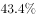；对外贸易总额（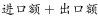）约为71885.6亿美元，占全球贸易总额的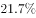。

#### 第 1 题　qid 2133492 · 综合

2016年全球贸易总额约为多少万亿美元？

- **A**. 28
- **B**. 33　✅
- **C**. 40
- **D**. 75

**答案**：B

**官方解析**

由题干“2016年全球贸易总额”，结合材料“占全球贸易总额的”，可判定此题为现期比重问题。定位文字材料，“对外贸易总额（）约为71885.6亿美元，占全球贸易总额的”，可得，2016年全球贸易总额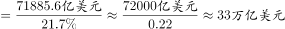。

故正确答案为B。

---

#### 第 2 题　qid 2133494 · 平均数

2016年“一带一路”沿线国家中，东欧20国的人均GDP约是中亚5国的多少倍？

- **A**. 2.5　✅
- **B**. 3.6
- **C**. 5.3
- **D**. 11.7

**答案**：A

**官方解析**

由题干“2016年······是······的多少倍”，材料已知时间为2016年，可判定此题为现期倍数问题。定位统计表：“东欧20国的人口为32161.9万人，GDP为26352.1亿美元，中亚5国的人口为6946.7万人，GDP为2254.7亿美元”，可得，东欧20国的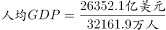，中亚5国的，故2016年“一带一路”沿线国家中，东欧20国的人均GDP约是中亚5国的倍，与A项最为接近。

故正确答案为A。

---

#### 第 3 题　qid 2133496 · 综合

“一带一路”沿线主要区域中，2016年进口额与出口额数值相差最大的是：

- **A**. 东南亚11国
- **B**. 南亚8国
- **C**. 西亚、北非19国
- **D**. 东欧20国　✅

**答案**：D

**官方解析**

定位统计表，东南亚11国进口额与出口额数值差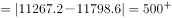亿美元；南亚8国进口额与出口额数值差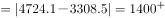亿美元；西亚、北非19国进口额与出口额数值差亿美元；东欧20国进口额与出口额数值差亿美元；故“一带一路”沿线主要区域中，2016年进口额与出口额数值相差最大的是东欧20国，D项符合。

故正确答案为D。

---

#### 第 4 题　qid 2133500 · 综合

2016年，蒙古GDP约占全球总体GDP的：

- **A**. 

- **B**. 

- **C**. 

- **D**. 
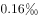
　✅

**答案**：D

**官方解析**

由题干“2016年，蒙古约占全球······”，可判定本题为现期比重问题。

定位表格第一行，“蒙古GDP为116.5亿美元”；定位文字材料第一段，“2016年，‘一带一路’沿线64个国家GDP之和约为12.0万亿美元，占全球GDP的”。可知，，则2016年蒙古GDP约占全球GDP总体的比重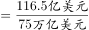。

故正确答案为D。

---

#### 第 5 题　qid 2133504 · 综合

关于“一带一路”沿线国家2016年状况，能够从上述资料中推出的是：

- **A**. 
超过六成人口集中在南亚地区

- **B**. 
东南亚和南亚国家GDP之和占全球的以上

- **C**. 
平均每个南亚国家对外贸易额超过1000亿美元
　✅
- **D**. 
平均每个东欧国家的进口额高于平均每个西亚、北非国家的进口额

**答案**：C

**官方解析**

A项：定位表格第三行，南亚8国人口为174499.0万人；定位文字材料第一段，“一带一路”人口总数约为32.1亿人，则南亚人口占“一带一路”总人口比重为，则南亚人口未超过“一带一路”沿线国家的六成，错误。

B项：定位表格第二、第三行，东南亚和南亚国家GDP分别为25802.2亿美元、29146.6亿美元。定位文字材料第一段：“2016年‘一带一路’沿线64个国家GDP之和约为12.0万亿美元，占全球GDP的”，东南亚和南亚国家GDP占“一带一路”沿线国家的比重，即东南亚和南亚国家GDP之和占全球的比重小于，错误。

C项：定位表格第三行，南亚8国的进口额与出口额分别为4724.1亿美元、3308.5亿美元，则平均每个南亚国家对外贸易额亿美元，正确。

D项：定位表格最后两行，平均每个东欧国家的进口额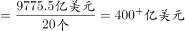，平均每个西亚、北非国家的进口额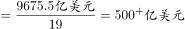。即平均每个东欧国家的进口额低于平均每个西亚、北非国家的进口额，错误。

故正确答案为C。

---

### 材料 2

#### 第 6 题　qid 2133476 · 增长

2016年在线旅游市场交易规模约比上年增加了：

- **A**. 

- **B**. 

- **C**. 

- **D**. 

　✅

**答案**：D

**官方解析**

由题干“2016年比上年增加了……”且选项为百分数，可判定本题为一般增长率问题。定位表格材料可知，在线旅游市场交易规模2015年为4487.2亿元，2016年为6138.0亿元。根据公式，2016年在线旅游市场交易规模约比上年增加了，与D项最接近。

故正确答案为D。

---

#### 第 7 题　qid 2133480 · 比重

2015年第四季度在线餐饮外卖市场交易规模占全年交易规模的比重约为：

- **A**. 

- **B**. 

　✅
- **C**. 

- **D**. 

**答案**：B

**官方解析**

根据题干所求“2015年……占……比重”，结合材料，可判定此题为基期比重问题。定位图形材料，2016年第一季度在线餐饮外卖市场交易规模为231.1亿元，环比增速，表格材料中，2015年在线餐饮外卖市场交易规模530.6亿元。可计算出，2015年第四季度在线餐饮外卖市场交易规模占全年交易规模的比重约为，B项最接近。

故正确答案为B。

---

#### 第 8 题　qid 2133482 · 增长

如按2016年移动出行市场同比增长趋势估算，2018年该市场规模将为：

- **A**. 接近5000亿元
- **B**. 6000多亿元
- **C**. 8000多亿元　✅
- **D**. 超过1万亿元

**答案**：C

**官方解析**

根据题干所求“如按2016年……同比增长趋势估算，2018年……”，可判定此题为现期计算问题。定位表格材料，2015年移动出行市场交易规模为999.0亿元，2016年移动出行市场交易规模为2038.0亿元。可计算出，2016年移动出行市场增长率为，2018年该市场规模将为亿元。

故正确答案为C。

---

#### 第 9 题　qid 2133484 · 增长

以下哪项最能准确描述2016年生活服务电商市场中，三个不同细分市场交易规模同比增量的比例关系？

- **A**. A
- **B**. B
- **C**. C　✅
- **D**. D

**答案**：C

**官方解析**

由题干“同比增量的比例关系”，可判定本题为增长量的计算问题。定位图表可知，2016年，在线餐饮外卖市场的同比增量为亿元；移动出行市场同比增量为亿元；在线旅游市场同比增量为亿元。，即最大的增量小于另外两者之和，且三者之间不存在明显倍数关系。分析选项，A、B项最大的比另两个加和还大，排除；D项第二大是第三大的几倍，不满足，排除。

故正确答案为C。

---

#### 第 10 题　qid 2133488 · 综合

能够从上述资料中推出的是：

- **A**. 2015～2016年在线旅游市场总规模超过1万亿元　✅
- **B**. 2016年每个季度的在线餐饮外卖市场环比增量都高于100亿元
- **C**. 2016年移动出行市场月均交易规模比2015年高100多亿元
- **D**. 2016年下半年在线餐饮外卖市场规模比上半年高1倍以上

**答案**：A

**官方解析**

A项：定位表格，2016年，在线旅游市场规模为6138亿元，2015年，在线旅游市场规模为4487.2亿元，2015～2016年在线旅游市场总规模为亿元，正确；

B项：定位图表，2016年在线餐饮外卖市场交易规模第一季度为231.1亿元，环比增长率为，故，错误；

C项：定位表格可得，2016年移动出行市场交易规模为2038亿元，2015年移动出行市场交易规模为999亿元。故2016年移动出行市场月均交易规模比2015年高：亿元，错误；

D项：2016年下半年在线餐饮外卖市场规模比上半年高1倍以上，即下半年是上半年的2倍多，定位图表，下半年市场规模为亿元，上半年为亿元，倍，错误。

故正确答案为A。

---

### 材料 3

<b>根据以下资料，回答下列5题。</b>

        2016年，全国城市公园数量排名前五的省份依次是广东、浙江、江苏、山东和云南，公园数量分别为3512个、1171个、942个、828个和683个。其中，广东省的公园面积达到65318公顷，占全国公园面积的比重超过；公园绿地面积达到89591公顷，占全国公园绿地面积的比重约为。

注：公园绿地指具有公园作用的所有绿地的统称，即公园性质的绿地，并非公园中的绿地面积，包括综合公园、专类公园、带状公园、街旁游乐园和社区公园等。

#### 第 11 题　qid 2133472 · 平均数

2016年，佛山市平均每个公园的面积约为多少公顷？

- **A**. 10　✅
- **B**. 15
- **C**. 20
- **D**. 25

**答案**：A

**官方解析**

由题干“2016年······佛山市平均每个公园······”，可判定本题为现期平均数问题。定位表格材料，佛山市公园个数202个，公园面积2033公顷。故2016年，佛山市平均每个公园的面积。

故正确答案为A。

---

#### 第 12 题　qid 2133474 · 综合

2016年，全国公园绿地面积约为多少万公顷？

- **A**. 200
- **B**. 640
- **C**. 20
- **D**. 64　✅

**答案**：D

**官方解析**

由题干“2016年，全国公园绿地面积······”以及文字材料“······占全国公园绿地面积比重约为······”可判定本题为现期比重问题。定位文字材料可知，2016年，广东公园绿地面积89591公顷，占全国比重约为。故2016年，，最接近D项。

故正确答案为D。

---

#### 第 13 题　qid 2133478 · 综合

表中公园面积大于公园绿地面积的城市有几个？

- **A**. 1
- **B**. 2　✅
- **C**. 3
- **D**. 4

**答案**：B

**官方解析**

定位表格材料可知，；，其余均为。一共两个城市满足条件。

故正确答案为B。

---

#### 第 14 题　qid 2133486 · 综合

2016年，杭州公园数量约占浙江省公园总数的：

- **A**. 

　✅
- **B**. 

- **C**. 

- **D**. 

**答案**：A

**官方解析**

由题干“2016年，······约占······的比重”，可判定本题为现期比重问题。定位文字材料，浙江省公园数量1171个；定位表格材料，杭州公园数量217个，故，最接近A项。

故正确答案为A。

---

#### 第 15 题　qid 2133490 · 综合

关于表中城市公园数量及面积，能够从上述资料中推出的是：

- **A**. 平均每个公园面积最大的城市是深圳
- **B**. 公园绿地面积最大的城市，其公园面积排第3
- **C**. 昆明市公园数量多于云南其他城市公园数量之和　✅
- **D**. 珠海和佛山两市公园面积之和为400多公顷

**答案**：C

**官方解析**

A项：定位表格材料，深圳公园面积为21955公顷，深圳公园个数为911个，故；南京公园面积为7122公顷，公园个数127个，故，因此，深圳并不是最大，错误；

B项：定位表格材料，公园绿地面积最大的城市是广州，公园面积排序为：深圳（21955）、东莞（14493）、南京）（7122）、广州（5193）······，广州排名第四，不是第三，错误；

C项：定位文字材料，云南公园数量为683个；定位表格，昆明市公园数量为463个，所以云南其他城市公园数量为，即昆明市公园数量多于云南其他城市公园数量之和，正确；

D项：定位表格材料，珠海公园面积为2792公顷、佛山公园面积2033公顷，故两市公园面积之和为，约为4000多公顷，不是400多，错误。

故正确答案为C。

---

### 材料 4

        2017年1～2月，全国造船完工936万载重吨，同比增长；承接新船订单221万载重吨，同比增长。2月末，手持船舶订单9207万载重吨，同比下降，比2016年末下降。 

        2017年1～2月，全国完工出口船907万载重吨，同比增长；承接出口船订单191万载重吨，同比增长。2月末，手持出口船订单8406万载重吨，同比下降。

        2017年1～2月，53家重点监测的造船企业（以下简称重点企业）造船完工912万载重吨，同比增长。承接新船订单197万载重吨，同比增长。2月末，手持船舶订单8874万载重吨，同比下降。

        2017年1～2月，重点企业完工出口船886万载重吨，同比增长；承接出口船订单171万载重吨，同比增长。2月末，手持出口船订单8129万载重吨，同比下降。

#### 第 16 题　qid 2133502 · 综合

2016年末全国手持船舶订单较同年2月末：

- **A**. 
降低
　✅
- **B**. 
降低

- **C**. 
增加

- **D**. 
增加

**答案**：A

**官方解析**

由题干“2016年末······较同年2月末”，选项为增加/降低百分数，可判定本题为一般增长率计算问题。根据文字材料第一段“（2017年）2月末手持船舶订单9207万载重吨，同比下降，比2016年末下降”可知，现期量2016年末手持船舶订单为万载重吨，基期量2016年2月末手持船舶订单为万载重吨。代入增长率公式：，则，因此增速为降低。

故正确答案为A。

---

#### 第 17 题　qid 2133506 · 比重

设2017年1～2月出口船完工量占全国造船完工量比重为，同期出口船承接订单量占全国承接新船订单量比重为，2月末手持出口船订单量占全国手持船舶订单量比重为，则有：

- **A**. 

- **B**. 

　✅
- **C**. 

- **D**. 

**答案**：B

**官方解析**

由题干“······占······的比重为······”，可判定本题为现期比重问题。定位文字材料第一段可知，“2017年1~2月，全国造船完工936万载重吨······承接新船订单221万载重吨······2月末，手持船舶订单9207万载重吨”。定位文字材料第二段可知，“2017年1~2月，全国完工出口船907万载重吨······承接出口船订单191万载重吨······2月末，手持出口船订单8406万载重吨”。则三个比重分别为，，，最小，只有B选项符合。

故正确答案为B。

---

#### 第 18 题　qid 2133508 · 增长

2017年1～2月，重点企业下列指标中同比增速最快的是：

- **A**. 造船完工量
- **B**. 承接新船订单量
- **C**. 出口船完工量　✅
- **D**. 承接出口船订单量

**答案**：C

**官方解析**

由题干可知“同比增速最快”可知为增长率比较问题，材料中已经给出了各个主体的增长率，由此可判定本题为直接找数问题。定位文字材料第三、四段可知，2017年1~2月重点企业造船完工量同比增速为、承接新船订单量同比增速为、出口船完工量同比增速为、承接出口船订单量同比增速为，最大，则同比增速最快的是出口船完工量。

故正确答案为C。

---

#### 第 19 题　qid 2133510 · 综合

2017年1~2月，非重点企业出口船完工量约占全国出口船完工量的：

- **A**. 

　✅
- **B**. 

- **C**. 

- **D**. 

**答案**：A

**官方解析**

由题干“2017年1~2月，······约占······”，可判定本题为现期比重的问题。定位文字材料第二段，全国出口船完工量为907万载重吨，材料中未直接给出非重点企业出口船完工量，第四段给出重点企业出口船完工量为886万载重吨，则非重点企业出口船完工量为万载重吨，因此非重点企业出口船完工量约占全国出口船完工量的比重为。

故正确答案为A。

---

#### 第 20 题　qid 2133514 · 综合

能够从上述资料中推出的是：

- **A**. 2016年末，重点企业手持船舶订单不到9000万载重吨
- **B**. 2017年1～2月，非重点企业承接出口船订单约30万载重吨
- **C**. 2017年2月末，重点企业手持船舶订单同比降幅低于全国平均水平
- **D**. 2017年2月末，重点企业手持出口船订单占全国比重低于上年同期　✅

**答案**：D

**官方解析**

A项：材料中未给出2016年末重点企业手持船舶订单的相关数据，无法推出，错误；

B项：定位材料第二段可知，2017年1~2月，全国承接出口船订单191万载重吨；定位材料第四段可知，2017年1~2月，重点企业承接出口船订单171万载重吨，则非重点企业承接出口船订单为万载重吨，错误；

C项：定位文字材料第一段可知，2017年2月末全国手持船舶订单同比下降；定位文字材料第三段可知，重点企业手持船舶订单同比下降，下降幅度，则重点企业手持船舶订单同比降幅高于全国平均水平，错误；

D项：两期比重问题，只需要比较部分增长率和总体增长率的大小即可。定位材料第四段可知，2017年2月末，重点企业手持出口船订单同比增长率为；定位材料第二段可知，全国手持出口船订单同比增长率为，部分增长率小于整体增长率，则比重低于上年同期，正确。

故正确答案为D。

---
