# 2019年国家公务员录用考试《行测》题（副省级网友回忆版）

> 国考 · 2019 年 · 6 个模块 · 共 135 题

- [政治理论](#%E6%94%BF%E6%B2%BB%E7%90%86%E8%AE%BA) · 3 题
- [常识判断](#%E5%B8%B8%E8%AF%86%E5%88%A4%E6%96%AD) · 17 题
- [言语理解与表达](#%E8%A8%80%E8%AF%AD%E7%90%86%E8%A7%A3%E4%B8%8E%E8%A1%A8%E8%BE%BE) · 40 题
- [数量关系](#%E6%95%B0%E9%87%8F%E5%85%B3%E7%B3%BB) · 15 题
- [判断推理](#%E5%88%A4%E6%96%AD%E6%8E%A8%E7%90%86) · 40 题
- [资料分析](#%E8%B5%84%E6%96%99%E5%88%86%E6%9E%90) · 20 题

---

## 政治理论

### 第 1 题　qid 2264312 · 新思想

党的十八大以来，以习近平同志为核心的党中央，紧密结合新的时代条件和实践要求，以全新的视野深化对共产党执政规律、社会主义建设规律、人类社会发展规律的认识，创立了习近平新时代中国特色社会主义思想，其核心要义是：

- **A**. 坚持和发展中国特色社会主义　✅
- **B**. 中国特色社会主义进入了新时代
- **C**. 实现社会主义现代化和中华民族伟大复兴
- **D**. 坚持以人民为中心的发展思想

**答案**：A

**官方解析**

本题考查政治常识。
A项正确，习近平新时代中国特色社会主义思想的核心要义，就是坚持和发展中国特色社会主义，具体体现在它从理论和实践结合上系统回答了新时代坚持和发展什么样的中国特色社会主义、怎样坚持和发展中国特色社会主义这个重大时代课题，回答了新时代坚持和发展中国特色社会主义的总目标、总任务、总体布局、战略布局和发展方向、发展方式、发展动力、战略步骤、外部条件、政治保证等基本问题，并且根据新的实践对经济、政治、法治、科技、文化、教育、民生、民族、宗教、社会、生态文明、国家安全、国防和军队、“一国两制”和祖国统一、统一战线、外交、党的建设等各方面作出理论分析和政策指导，为更好坚持和发展中国特色社会主义提供了思想武器和行动指南。
B项错误，习近平总书记在党的十九大报告中指出，“经过长期努力，中国特色社会主义进入了新时代，这是我国发展新的历史方位。”
C项错误，习近平总书记在党的十九大报告中指出，“新时代中国特色社会主义思想，明确坚持和发展中国特色社会主义，总任务是实现社会主义现代化和中华民族伟大复兴。”
D项错误，习近平总书记在党的十九大报告中指出，“坚持以人民为中心。人民是历史的创造者，是决定党和国家前途命运的根本力量。必须坚持人民主体地位，坚持立党为公、执政为民，践行全心全意为人民服务的根本宗旨，把党的群众路线贯彻到治国理政全部活动之中，把人民对美好生活的向往作为奋斗目标，依靠人民创造历史伟业。”
故正确答案为A。

---

### 第 2 题　qid 2264314 · 新思想

根据党的十九大报告，下列说法不准确的是：

- **A**. 发展是解决我国一切问题的基础和关键
- **B**. 完善就业保障是中华民族永续发展的千年大计　✅
- **C**. 文化自信是一个国家、一个民族发展中更基本、更深沉、更持久的力量
- **D**. 带领人民创造美好生活是我们党始终不渝的奋斗目标

**答案**：B

**官方解析**

本题考查政治常识。
A项正确，十九大报告第三部分“新时代中国特色社会主义思想和基本方略”的第4条阐述了坚持新发展理念，提出：“发展是解决我国一切问题的基础和关键，发展必须是科学发展，必须坚定不移贯彻创新、协调、绿色、开放、共享的发展理念。”
B项错误，十九大报告第三部分“新时代中国特色社会主义思想和基本方略”的第9条阐述了坚持人与自然和谐共生，提出：“建设生态文明是中华民族永续发展的千年大计。必须树立和践行绿水青山就是金山银山的理念，坚持节约资源和保护环境的基本国策，像对待生命一样对待生态环境，统筹山水林田湖草系统治理，实行最严格的生态环境保护制度，形成绿色发展方式和生活方式，坚定走生产发展、生活富裕、生态良好的文明发展道路，建设美丽中国，为人民创造良好生产生活环境，为全球生态安全作出贡献。”
C项正确，十九大报告第三部分“新时代中国特色社会主义思想和基本方略”的第7条阐述了坚持社会主义核心价值体系，提出：“文化自信是一个国家、一个民族发展中更基本、更深沉、更持久的力量。必须坚持马克思主义，牢固树立共产主义远大理想和中国特色社会主义共同理想，培育和践行社会主义核心价值观，不断增强意识形态领域主导权和话语权，推动中华优秀传统文化创造性转化、创新性发展，继承革命文化，发展社会主义先进文化，不忘本来、吸收外来、面向未来，更好构筑中国精神、中国价值、中国力量，为人民提供精神指引。”
D项正确，十九大报告第八部分“提高保障和改善民生水平，加强和创新社会治理”提出：“全党必须牢记，为什么人的问题，是检验一个政党、一个政权性质的试金石。带领人民创造美好生活，是我们党始终不渝的奋斗目标。必须始终把人民利益摆在至高无上的地位，让改革发展成果更多更公平惠及全体人民，朝着实现全体人民共同富裕不断迈进。”
本题为选非题，故正确答案为B。

---

### 第 3 题　qid 2264316 · 新思想

中国特色社会主义是改革开放以来党的全部理论和实践的主题，是党和人民历尽千辛万苦、付出巨大代价取得的根本成就。中国特色社会主义最本质的特征是：

- **A**. 依法治国
- **B**. 人民当家作主
- **C**. 实行人民代表大会制度
- **D**. 中国共产党领导　✅

**答案**：D

**官方解析**

本题考查政治常识。
A项错误，党的十九大报告中指出：“全面依法治国是中国特色社会主义的本质要求和重要保障。”同时也指出：“依法治国是党领导人民治理国家的基本方式。”
B项错误，党的十九大报告中指出：“人民当家作主是社会主义民主政治的本质特征”。
C项错误，党的十九大报告指出：“人民代表大会制度是坚持党的领导、人民当家作主、依法治国有机统一的根本政治制度安排，必须长期坚持、不断完善。” 
D项正确，党的十九大报告中指出：“明确中国特色社会主义最本质的特征是中国共产党领导，中国特色社会主义制度的最大优势是中国共产党领导，党是最高政治领导力量，提出新时代党的建设总要求，突出政治建设在党的建设中的重要地位。”
故正确答案为D。

---

## 常识判断

### 第 1 题　qid 2264318 · 人文常识

下列与扶贫有关的说法正确的是：

- **A**. 习近平总书记首次提出了“精准扶贫”的理念　✅
- **B**. 扶贫工作坚持扶贫同扶志相结合，“大水漫灌”与“精准滴灌”相结合
- **C**. 全面发展高新技术产业是《“十三五”脱贫攻坚规划》提出的一项重要举措
- **D**. 脱贫目标是到2035年稳定实现现行标准下农村贫困人口“两不愁、三保障”

**答案**：A

**官方解析**

本题考查政治常识。
A项正确，2013年11月，习近平总书记到湖南湘西考察时首次提出了“精准扶贫”的重要思想。
B项错误，党的十九大报告指出：“坚持大扶贫格局，注重扶贫同扶志、扶智相结合。”因此选项前半句表述正确。《“十三五”脱贫攻坚规划》中指出：“坚持精准扶贫、精准脱贫。”“变‘大水漫灌’为‘精准滴灌’，做到真扶贫、扶真贫、真脱贫。”因此“大水漫灌”与“精准滴灌”相结合表述错误。
C项错误，《“十三五”脱贫攻坚规划》中关于脱贫的路径包括产业发展脱贫、转移就业脱贫、易地搬迁脱贫、教育扶贫、健康扶贫、生态保护扶贫、兜底保障以及社会扶贫等8大路径，在产业发展脱贫中包括农林产业、旅游、电商、资产收益、科技等扶贫项目，没有提及全面发展高新技术产业。
D项错误，《“十三五”脱贫攻坚规划》中第三节脱贫目标提出：“到2020年，稳定实现现行标准下农村贫困人口不愁吃、不愁穿，义务教育、基本医疗、住房安全有保障（即‘两不愁、三保障’）。”
故正确答案为A。

---

### 第 2 题　qid 2264443 · 法律常识

2018年3月11日，十三届全国人大一次会议通过了《中华人民共和国宪法修正案》。下列与之相关的说法不准确的是：

- **A**. 这是我国1982年宪法公布施行以来对部分内容作的第五次修改
- **B**. 确立了监察委员会作为国家的监察机关的宪法地位
- **C**. 将全国人民代表大会法律委员会更名为全国人民代表大会宪法委员会　✅
- **D**. 将习近平新时代中国特色社会主义思想写入宪法

**答案**：C

**官方解析**

本题考查法律常识。
A项正确，我国于1988年、1993年、1999年、2004年和2018年对1982年现行《宪法》进行了五次修改，2018年3月11日，十三届全国人民代表大会第一次会议通过了《中华人民共和国宪法修正案》，这也是对1982年宪法部分内容作的第五次修改。
B项正确，《中华人民共和国宪法修正案》第五十二条规定：“宪法第三章‘国家机构’中增加一节，作为第七节‘监察委员会’；增加五条，分别作为第一百二十三条至第一百二十七条。”《宪法》第一百二十三条规定：“中华人民共和国各级监察委员会是国家的监察机关。”因此，该次宪法修正案确立了监察委员会作为国家的监察机关的宪法地位。
C项错误，《中华人民共和国宪法修正案》第四十四条第二款规定：“宪法第七十条第一款中‘全国人民代表大会设立民族委员会、法律委员会、财政经济委员会、教育科学文化卫生委员会、外事委员会、华侨委员会和其他需要设立的专门委员会。’修改为：‘全国人民代表大会设立民族委员会、宪法和法律委员会、财政经济委员会、教育科学文化卫生委员会、外事委员会、华侨委员会和其他需要设立的专门委员会。’”因此，该次修正案将全国人民代表大会法律委员会更名为全国人民代表大会宪法和法律委员会。
D项正确，《中华人民共和国宪法修正案》第三十二条规定，宪法序言第七自然段中“在马克思列宁主义、毛泽东思想、邓小平理论和‘三个代表’重要思想指引下”修改为“在马克思列宁主义、毛泽东思想、邓小平理论、‘三个代表’重要思想、科学发展观、习近平新时代中国特色社会主义思想指引下”。 因此，该次宪法修正案将习近平新时代中国特色社会主义思想写入宪法。
本题为选非题，故正确答案为C。

---

### 第 3 题　qid 2264321 · 人文常识

下列与我国军事国防相关的说法错误的是：

- **A**. 大力发展军民融合是维护国家主权和安全的战略基石　✅
- **B**. 新形势下我军的军事战略方针是积极防御
- **C**. 中国位于海洋地缘战略区和欧亚大陆地缘战略区的交接处
- **D**. 维护地区和世界和平是我国军队担负的主要战略任务之一

**答案**：A

**官方解析**

本题考查政治常识。
A项错误，2015年国防白皮书《中国的军事战略》指出：“核力量是维护国家主权和安全的战略基石。中国始终奉行不首先使用核武器的政策，坚持自卫防御的核战略，无条件不对无核武器国家和无核武器区使用或威胁使用核武器，不与任何国家进行核军备竞赛，核力量始终维持在维护国家安全需要的最低水平。” 
B项正确，2015年国防白皮书《中国的军事战略》指出：“积极防御战略思想是中国共产党军事战略思想的基本点。”“根据国家安全和发展战略，适应新的历史时期形势任务要求，坚持实行积极防御军事战略方针，与时俱进加强军事战略指导，进一步拓宽战略视野、更新战略思维、前移指导重心，整体运筹备战与止战、维权与维稳、威慑与实战、战争行动与和平时期军事力量运用，注重深远经略，塑造有利态势，综合管控危机，坚决遏制和打赢战争。”
C项正确，中国位于世界两大地缘战略区的交接处，既受其他大国关系的影响，又影响其他大国关系。目前，世界可划分为两大地缘战略区，即海洋地缘战略区和欧亚大陆地缘战略区。美国属于海洋地缘战略区，而且是世界超级海洋强国，具有全球性影响。世界上其他强国大都集中在欧亚大陆地缘战略区，俄罗斯则位于该战略区的心脏地带。中国属于欧亚大陆地缘战略区，背靠欧亚大陆，面向太平洋，处于两大战略区的交接处，历史上曾遭到两大战略区强国的侵略和压迫，现在则成为能够对两大战略区关系产生重要影响和作用的国家。
D项正确， 2015年国防白皮书《中国的军事战略》指出：“中国军队主要担负以下战略任务：应对各种突发事件和军事威胁，有效维护国家领土、领空、领海主权和安全；坚决捍卫祖国统一；维护新型领域安全和利益；维护海外利益安全；保持战略威慑，组织核反击行动；参加地区和国际安全合作，维护地区和世界和平；加强反渗透、反分裂、反恐怖斗争，维护国家政治安全和社会稳定；担负抢险救灾、维护权益、安保警戒和支援国家经济社会建设等任务。”
本题为选非题，故正确答案为A。

---

### 第 4 题　qid 2264444 · 人文常识

关于农村土地流转，下列说法错误的是：

- **A**. 坚持依法、自愿、有偿的基本原则
- **B**. 鼓励农户依法采取转包、出租、互换等方式流转承包地
- **C**. 没有农户的书面委托，农村基层组织无权以任何方式决定流转农户的承包地
- **D**. 各地要鼓励工商企业租赁农户承包地，不应在时间、面积上设限　✅

**答案**：D

**官方解析**

本题考查政治常识。
A项正确，《关于引导农村土地经营权有序流转发展农业适度规模经营的意见》在“基本原则”部分指出：“坚持依法、自愿、有偿，以农民为主体，政府扶持引导，市场配置资源，土地经营权流转不得违背承包农户意愿、不得损害农民权益、不得改变土地用途、不得破坏农业综合生产能力和农业生态环境。”
B项正确，《关于引导农村土地经营权有序流转发展农业适度规模经营的意见》在“鼓励创新土地流转形式”部分指出：“鼓励承包农户依法采取转包、出租、互换、转让及入股等方式流转承包地。”
C项正确，《关于引导农村土地经营权有序流转发展农业适度规模经营的意见》在“严格规范土地流转行为”部分指出：“没有农户的书面委托，农村基层组织无权以任何方式决定流转农户的承包地，更不能以少数服从多数的名义，将整村整组农户承包地集中对外招商经营。”
D项错误，《关于引导农村土地经营权有序流转发展农业适度规模经营的意见》在“加强对工商企业租赁农户承包地的监管和风险防范”部分指出：“各地对工商企业长时间、大面积租赁农户承包地要有明确的上限控制，建立健全资格审查、项目审核、风险保障金制度，对租地条件、经营范围和违规处罚等作出规定。”
本题为选非题，故正确答案为D。

---

### 第 5 题　qid 2264317 · 经济常识

有关经济学常识，下列说法错误的是：

- **A**. 国民收入统计中包括退休金　✅
- **B**. 货币发行是中央银行的负债业务
- **C**. 公共物品无法通过市场机制来调节供求
- **D**. 春节前后的物价上涨不属于通货膨胀

**答案**：A

**官方解析**

本题考查经济常识。
A项错误，国民收入是指物质生产部门劳动者在一定时期所创造的价值，是一国生产要素（包括土地、劳动、资本、企业家才能等）所有者在一定时期内提供生产要素所得的报酬，即工资、利息、租金和利润等的总和。退休人员的退休金在经济中属于政府转移支付的范畴，属于政府支出，不属于国民收入。
B项正确，中央银行负债业务主要包括存款业务、货币发行业务、经理国库业务、对外负债和资本业务。
C项正确，公共物品是“私人物品” 的对称，具有非竞争性和非排他性。如果公共物品由市场进行调节，由于市场调节具有自发性、盲目性和滞后性等缺点，会导致资源配置效率低下、社会不稳定等后果，因此公共物品不能由私营部门通过市场提供而必须由公共部门以非市场方式提供。
D项正确，通货膨胀指市场上流通的货币量超过实际所需的货币量，导致货币贬值，而引起的一段时间内物价持续而普遍地上涨现象。春节期间由于短时间内的商品需求增加从而导致物价上涨，不属于通货膨胀。
本题为选非题，故正确答案为A。

---

### 第 6 题　qid 2264445 · 人文常识

图中所示的是“一带一路”沿线的中亚地区，下列说法正确的是：

- **A**. 甲湖在成因上属于构造湖
- **B**. 乙湖是世界陆地的最低处
- **C**. 丙河处于亚欧两洲分界线上
- **D**. 丁河水源是由冰雪融水供给　✅

**答案**：D

**官方解析**

本题考查地理常识。
A项错误，湖泊按照成因类型，可划分为构造湖、火口湖、堰塞湖、海迹湖、河成湖、冰川湖等。构造湖是指由地壳的构造运动(断裂、断层、地堑)所造成的洼陷，积水而成的湖，特点是湖泊的形状狭长，湖岸平直、湖坡陡峻，深度较大，如我国的青海湖、滇池、洱海等，此外还有亚洲的贝加尔湖、东非大裂谷中的一连串湖泊等。甲湖是里海，从形成原因来看，里海曾是古地中海的一部分，经过海陆演变，古地中海逐渐缩小，最后形成的湖泊，因此在成因上属于海迹湖。杭州西湖、太湖等均为海迹湖。
B项错误，世界陆地的最低处位于死海。乙湖是咸海。
C项错误，丙河是伏尔加河，处于亚欧两洲分界线上的是乌拉尔河和里海。
D项正确，丁河是锡尔河，发源于天山山脉，水源主要是由冰雪融水供给。
故正确答案为D。

---

### 第 7 题　qid 2264446 · 人文常识

关于儒释道三教异同，古人多有争论。对此，唐代僧人宗密曾在《圆觉经略疏钞》中说：“古来诸德皆判：儒宗      ，道宗      ，释宗      。”依次填入画横线部分最恰当的一项是：

- **A**. 齐物；中庸；正名
- **B**. 四谛；五行；三纲
- **C**. 五常；自然；因缘　✅
- **D**. 兼爱；良知；涅槃

**答案**：C

**官方解析**

本题主要考查人文常识。
A项错误，“齐物”一说来自《庄子》，庄子认为世界万物包括人的品性和感情，看起来是千差万别，归根结底却又是齐一的，这就是“齐物”。属于道家思想；“中庸”是儒家的道德标准，孔子认为，任何事情都有一个适当的标准，即“中”，既不过分也非不够，善于运用“中”这一标准，在后来即发展为“中庸”思想；春秋时期，礼坏乐崩，社会秩序混乱。子路对孔子说:“卫国国君要您去治理国家,您打算先从哪些事情做起呢？”孔子说：“必也正名乎？”先要从匡正社会等级名分入手，理由是：“名不正则言不顺，言不顺则事不成，事不成则礼乐不兴，礼乐不兴则刑罚不中，刑罚不中则民无所措手足。”“正名”属于儒家思想。
B项错误，“四谛”是佛教基本教义之一，指苦、集、灭、道四谛；“五行”是我国古代朴素唯物主义哲学的重要范畴，指水、火、木、金、土五种物质。关于五行较早的资料主要保存在《左传》、《国语》和《尚书·洪范》等书中。五行思想被道家、阴阳家、儒家等哲学派别和自然科学家（如中医）所运用。后来，五行被逐步神秘化，阴阳家用其解释社会的兴衰和王朝的更替，提出“五德终始”的历史循环论。西汉新儒学代表董仲舒赋予五行情感和道德属性，用以论证天人感应的神学目的论。北宋新儒学代表周敦颐把五行作为无极产生万物的一个环节，纳入客观唯心主义体系之中；三纲五常（纲常）是中国儒家伦理文化中的重要思想，儒教通过三纲五常的教化来维护社会的伦理道德、政治制度，在漫长的封建社会中起到了极为重要的作用。其中“三纲”即“君为臣纲”、“父为子纲”、“夫为妻纲”。
C项正确，宗密《圆觉经略疏钞》卷四曰：“古来诸德皆判：儒宗五常，道宗自然，释宗因缘也。”“五常”即仁、义、礼、智、信，是中国儒家伦理文化中的重要思想；《道德经》第二十五章有一句名言，曰：“人法地，地法天，天法道，道法自然”。“道法自然”是道家的核心思想；“因缘”是佛学术语。因缘，为“因”与“缘”之并称。因，指引生结果之直接内在原因；缘，指由外来相助之间接原因。简言之，即产生结果的一切原因总称为因缘。
D项错误。“兼爱”是墨家学派创始人墨子提倡的一种伦理学说，他针对儒家“爱有等差”的说法，主张爱无差别等级,不分厚薄亲疏；“致良知”是中国明代王守仁的心学主旨。语出《孟子·尽心上》：“ 人之所不学而能者，其良能也，所不虑而知者，其良知也。”“涅槃”是佛教用语，“涅槃”的意思是不生不灭、超离生死烦恼、安住永恒快乐的境界，“涅槃”是佛教修行所达到的最高理想境界。
故正确答案为C。

---

### 第 8 题　qid 2264322 · 人文常识

关于文学作品中的典故，下列解释错误的是：

- **A**. “蓬山此去无多路，青鸟殷勤为探看”中的“青鸟”指的是信使
- **B**. “相顾无相识，长歌怀采薇”中的“采薇”指的是建功立业的抱负　✅
- **C**. “劳歌一曲解行舟，红叶青山水急流”中的“劳歌”指的是送别歌曲
- **D**. “忆君初得昆山玉，同向扬州携手行”中的“昆山玉”指的是杰出人才

**答案**：B

**官方解析**

本题考查人文常识。
A项正确，“蓬山此去无多路，青鸟殷勤为探看”出自唐代李商隐的《无题·相见时难别亦难》，此句诗的意思是：“对方的住处就在不远的蓬莱山，却无路可通。希望有青鸟一样的使者殷勤地为我去探看情人。”“青鸟”指的是神话中为西王母传递音讯的信使。
B项错误，“相顾无相识，长歌怀采薇”出自唐代王绩的《野望》。此句诗的意思是“大家彼此互不相识相对无言，我长啸高歌真想隐居在山冈！ ”“薇”是一种植物，相传周武王灭商后 ，伯夷、叔齐不愿做周的臣子，在首阳山上采薇而食，最后饿死。后以“采薇”代指隐居生活，而不是建功立业的抱负。
C项正确，“劳歌一曲解行舟，红叶青山水急流”出自唐代许浑的《谢亭送别》。“劳歌”典出《文选·谢混〈游西池〉诗》：“悟彼蟋蟀唱，信此劳者歌。”劳歌本为古时劳作者有所感发，相从而作的歌。后以此典形容奔波辛劳；也形容思友、送友等歌。本题中即为送别友人歌曲。
D项正确，“忆君初得昆山玉，同向扬州携手行”出自唐代刘禹锡的《送李中丞赴楚州》。“昆山玉”典出《晋书·卷五十二·郄诜传》：武帝于东堂会送，晋郄诜对策第一，以昆山片玉自比。后世以“昆山玉”比喻优秀的人才，也借以咏科举登第。本句讲的是刘禹锡回想李中丞科举登第后，携手下扬州。
本题为选非题，故正确答案为B。

---

### 第 9 题　qid 2264447 · 人文常识

下列宫殿的名称与典籍不直接相关的是：

- **A**. 两仪殿——《周易》
- **B**. 明德殿——《大学》
- **C**. 关雎宫——《诗经》
- **D**. 坤宁宫——《论语》　✅

**答案**：D

**官方解析**

本题考查人文常识。
A项正确，《易传·系辞上传》中有：“易有太极，是生两仪，两仪生四象，四象生八卦，八卦定吉凶，吉凶生大业”，因此，两仪殿与《周易》直接相关。
B项正确，《大学》中有：“大学之道，在明明德，在亲民，在止于至善。”因此，明德殿与《大学》直接相关。
C项正确，《诗经》中有：“关关雎鸠，在河之洲，窈窕淑女，君子好逑。”因此，关雎宫与《诗经》直接相关。
D项错误，老子《道德经》中有：“昔之得一者，天得一以清；地得一以宁；神得一以灵；谷得一以盈，万物得一以生；侯王得一而以为正”。古代封建社会皇帝是天，皇后是地，皇帝是乾，皇后是坤，皇帝寝宫依据前述《道德经》的原文取名乾清宫，皇后寝宫则取名为坤宁宫。因此，坤宁宫与《论语》没有直接关系。
本题为选非题，故正确答案为D。

---

### 第 10 题　qid 2264448 · 人文常识

下面能正确反映我国农业生产工具或生产方式演变顺序的是：
①曲辕犁  ②水车  ③石斧  ④牛耕  ⑤铜铲

- **A**. ③⑤④②①　✅
- **B**. ③④①⑤②
- **C**. ④②⑤①③
- **D**. ④①③②⑤

**答案**：A

**官方解析**

本题主要考查人文常识。
①曲辕犁是唐代出现的一种新式犁。唐以前，主要使用笨重的长直辕犁，回转困难，耕地费力。在敦煌莫高窟第四百四十五窟的唐代壁画中有曲辕犁耕作图。据唐朝末年著名文学家陆龟蒙《耒耜经》记载， 曲辕犁由十一个部件组成。这种犁操作轻巧简便，深浅自如，又适应各种土壤耕作，对劳动生产率的提高和对耕地质量的提高都起了重大的作用。自此以后，我国的耕犁可以说是基本定型了，并一直延用到今天。
②水车是一种古老的提水灌溉工具。东汉灵帝时宦官毕岚创造翻车，供洒道之用，三国时经机械制造家马钧改进，用于农业排灌。
③石斧是石器时代（380万年以前至公元前2000年左右）就已广泛制造使用，是具有多种用途的石质工具，既能用来砍伐和捕猎，也能用来搏斗杀敌。
④春秋战国时期，我国开始用牛犁耕并逐渐推广。牛耕的运用，是我国农业技术史上农用动力的一次革命。
⑤我国夏商时期就已出现青铜农具。铜铲在《诗经》和其他古书里另有钱、镈(音博)、臿(音插)、铫(音摇)等名称，大致相当于现在的锹。
所以，正确反映我国农业生产工具或生产方式演变顺序的是③⑤④②①。
故正确答案为A。

---

### 第 11 题　qid 2264449 · 人文常识

在日常生活中，我们经常根据不同的需求去增大或减小压强，下列哪种做法对于压强的改变与其他三项不同？

- **A**. 挖掘机上装有履带
- **B**. 沙发被设计得很柔软
- **C**. 破窗锤锤头被设计成锥形　✅
- **D**. 滑雪板比较宽大

**答案**：C

**官方解析**

本题考查科技常识。压强指物体所受的压力与受力面积之比，其计算公式是：。据此公式可知，在所受压力F不变的情况下，压强与受力面积成反比。

A项，挖掘机上装上履带后，相比于之前的轮子，增大的与地面的接触面积（即受力面积）。在压力一定时，增大受力面积，可减小压强。

B项，沙发设计的很柔软，人们坐到沙发上时会“陷”下去，身体与沙发充分接触，即增大了受力面积，减小了压强，所以人体会很舒服。

C项，用破窗锤锥形尖头破窗时，锤头与玻璃的接触面积仅为锥形的尖部，与普通锤头相比，减小了受力面积，增大了压强，因此很容易破窗。

D项，用滑雪板滑雪，由于滑雪板宽大，增大了受力面积，减小了压强，避免在滑雪时陷入雪中。

综上，可知A、B、D三项原理相同，均是减小了压强，C项是增大了压强。

本题为选非题，故正确答案为C。

---

### 第 12 题　qid 2264450 · 科技常识

关于生物，下列说法错误的是：

- **A**. 酸菜和腐乳的制作过程中都离不开乳酸菌的发酵　✅
- **B**. 病毒只能寄生在活细胞中进行生命活动
- **C**. 细菌有完整的能量代谢系统，可以独立地生长繁殖
- **D**. 木耳是真菌的一种，常生长在阴湿、腐朽的树干上

**答案**：A

**官方解析**

A项错误，制作酸菜过程要用到乳酸菌，在无氧的条件下，乳酸菌发酵产生乳酸，使得酸菜具有特殊的风味；而腐乳的主要生产工序分为前期发酵和后期发酵，前期发酵使得豆腐上开始生长毛霉，前期发酵的作用，一是使豆腐表面有一层菌膜包住；二是毛霉分泌以蛋白酶为主的各种酶，有利于豆腐所含有的蛋白质水解为各种氨基酸。后期发酵通过腌制并配入各种辅料，促进其他生化反应，生成腐乳的香气。故在腐乳的制作过程没有乳酸菌的参与。
B项正确，病毒没有细胞结构，不能独立生活，它具有高度的寄生性，必须依赖宿主细胞的能量和代谢系统，获取生命活动所需的物质和能量。因此，病毒只能寄生在活细胞中进行生命活动。
C项正确，细菌是一种具有细胞壁的单细胞微生物。细胞是生命活动的单位，一些生命活动的基本过程，如物质代谢、能量转换、运动、发育、繁殖和遗传等，都是以细胞为结构基础来实现的。能进行能量转换是因细胞具有完整的能量代谢系统。细菌作为细胞生物，因而具有完整的能量代谢系统。
D项正确，木耳是木耳科木耳属的一种真菌，属于真核生物，有完整的细胞核，主要靠菌丝体分解吸收现成的营养物质。木耳寄生于阴湿、腐朽的树干上，单生或群生。
本题为选非题，故正确答案为A。

---

### 第 13 题　qid 2264451 · 人文常识

关于照明用品，下列说法错误的是：

- **A**. 手术室里的无影灯利用了光沿直线传播的原理
- **B**. 手电筒用凹面镜作反射面是为了增强照明效果
- **C**. 声控灯利用麦克风接收声音信号来实现灯的开启
- **D**. 家用台灯正常工作时流过灯丝的电流约为2安培　✅

**答案**：D

**官方解析**

本题考查科技常识。

A项正确，由于光是沿直线传播的，所以当发光体（非点光源）所发出光线被非透明物体阻挡后，会在屏幕（或其他物体）上形成影子，该影子由两部分构成，其中影子中部特别黑暗的部分叫本影，四周灰暗的部分叫半影。发光物体的面积越大，本影就越小。手术中用到的无影灯就是根据这个原理制成的，无影灯是将若干个发光强度很大的灯在灯盘上排成球冠状形，形成的一个区域较大的光源，光从不同角度把光线照到手术台上，这样就能消除施手术者的头、手和器械均可能对手术部位造成的干扰阴影。

B项正确，凹面镜是球面镜的一种，反射面凹进去，能将平行的光反射后聚在镜面前的一点上，这点叫焦点。如果光源在焦点上，所发出的光经反射后就形成平行的光束。手电筒的光源就在焦点上，这样就使发出的光线经凹面镜反射后成为平行于主轴的平行光，从而增强了照明效果。

C项正确，声控灯是一种声控电子照明装置，由音频放大器、选频电路、延时开启电路和可控硅电路组成。声控灯接收声音信号用的是小话筒（也叫麦克风），话筒将声音信号转换成电信号，经整流，再去触发可控硅，实现电灯的开启。经过约一分钟的延时后，再去掉触发信号，可控硅就自动关断了，灯也就熄灭了。 

D项错误，台灯是人们生活中用来照明的一种家用电器，台灯的光亮照射范围相对比较小和集中，作用局限在台灯周围，便于阅读、学习、工作、节省能源。所以家用台灯的功率不会很高，一般都在几瓦到一百瓦之间。按照选项给出的2A电流，根据（家庭电压为220V），换算出的功率是440W，这已经相当高了，不仅不利于保护眼睛，更与设计台灯的初衷相违背，所以家庭台灯正常工作时流过灯丝的电流大约在0.2A到0.5A之间，不可能是2A。

本题为选非题，故正确答案为D。

---

### 第 14 题　qid 2264452 · 人文常识

下表列出了分布在我国的几种土壤的特质，填入表格最合适的是：

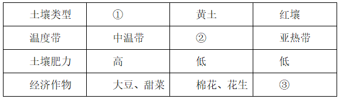

- **A**. ①紫色土  ②热带     ③玉米，苹果
- **B**. ①黑土     ②暖温带  ③甘蔗，油菜　✅
- **C**. ①黑土     ②中温带  ③小麦，茶叶
- **D**. ①紫色土 ②亚热带  ③水稻，荔枝

**答案**：B

**官方解析**

本题考查地理国情。
①紫色土是指亚热带、热带湿润地区紫色砂页岩风化物上发育的一种母质特征明显的土壤，我国主要分布在四川盆地等地区，土壤肥力较高，主要经济作物为油菜、棉花。黑土是指温暖半湿润地区发育的富含腐殖质和植物营养元素的黑色土壤，在我国主要分布于黑龙江、吉林两省，土壤肥力高。根据题目表格，位于中温带土壤肥力高且适合种植大豆、甜菜的，应当是黑土。
②温带又可分为寒温带、中温带、暖温带。我国的黄土主要分布于黄土高原地区。黄土高原大部分位于暖温带，故此处应选暖温带。黄土是一种并不非常肥沃的土壤，由很细的粘土和被风吹来的淤积颗粒所组成，其主要的经济作物为棉花、花生。
③红土是在亚热带湿热气候条件下由碳酸盐类或硅酸盐类岩石风化形成，一般呈褐红色，是一种具有高含水率、低密度、较高强度和较低压缩性的土。主要分布在我国长江以南地区，主要经济作物为甘蔗、油菜、茶树等。
故①为黑土，②为暖温带，③为甘蔗、油菜。
故正确答案为B。

---

### 第 15 题　qid 2264453 · 人文常识

摄影师在野外环境中最不可能拍摄到的是：

- **A**. 在云南丽江拍摄成片的针叶林
- **B**. 在青海拍摄成群的藏羚羊
- **C**. 在阿拉伯半岛拍摄海豹　✅
- **D**. 在冰岛拍摄火山喷发

**答案**：C

**官方解析**

本题考查地理国情。
A项正确，针叶林主要由云杉、冷杉、落叶松和松树等一些耐寒树种组成，主要分布于寒温带及中、低纬度亚高山地区的常绿或落叶针叶林。丽江市属低纬亚高山地区，此处分布有丽江云杉等植被，组成单纯林或与其他针叶树组成混交林。因此有可能在丽江拍摄成片的针叶林。
B项正确，藏羚羊栖息于海拔3700-5500米的高山草原、草甸和高寒荒漠地带，为中国一级保护动物，主要分布于中国以羌塘为中心的青藏高原地区（青海、西藏、新疆）。因此有可能在青海拍摄成群的藏羚羊。
C项错误，海豹主要生活在寒温带海洋中。南极海豹数量最多，其次是北冰洋、北大西洋、北太平洋等地。而阿拉伯半岛常年受副高及信风带控制，非常干燥，几乎整个半岛都是热带沙漠气候区并有面积较大的无流区。因此最不可能在阿拉伯半岛拍摄海豹。
D项正确，冰岛型火山喷发，裂隙式喷发。因现仅能在冰岛观察到这种火山喷发，故叫冰岛型火山喷发。其特征是大量喷出易流动的玄武岩质熔岩，形成表面较平坦的熔岩台地。因此有可能在冰岛拍摄火山喷发。
本题为选非题，故正确答案为C。

---

### 第 16 题　qid 2264455 · 科技常识

下列关于激光的表述错误的是：

- **A**. 条码扫描器可以利用红外线或者激光进行扫描
- **B**. CD唱片利用激光束扫描，通过光电转换重现语言和音乐
- **C**. 眼科医生常使用激光技术进行近视矫正手术
- **D**. 激光武器可全天候作战，不受大雾、大雪等天气的影响　✅

**答案**：D

**官方解析**

本题考查科学常识。
A项正确，条码扫描器可以利用红外线或者激光进行扫描。其中，红外线条码扫描的原理是利用扫描器发射红外线光源，然后根据反射的结果，利用芯片来译码，最后再返回条形码所代表的正确字符；而激光条码扫描的原理是通过一个激光二极管发出一束光线，照射到一个旋转的棱镜或来回摆动的镜子上，反射后的光线穿过阅读窗照射到条码表面，光线经过条或空的反射后返回阅读器，由一个镜子进行采集、聚焦，通过光电转换器转换成电信号，该信号将通过扫描器或终端上的译码软件进行译码。
B项正确，激光唱片简称“CD”，利用激光束扫描，通过光电转换，重现语言和音乐的唱片。其片基为透明的聚氯乙烯或透明的聚碳酸酯，信号面上刻有很多存储信号的凹坑，并涂有铝质反射层和保护漆。当放唱时，激光束对信号面进行扫描，遇到凹点，光线就发生散射，遇到高出凹点的表面，光线就被反射回来，这样就产生了时断时续的反射。放音部分接收到这种反射信号，重新把它们变成原来形式的电脉冲，再把电脉冲变成声音重放出来。
C项正确，激光作用于生物机体时，它能被吸收转化成热能，几秒钟内温度可高达数百至上千度，同时可产生很强的光压。这种机械作用与热效应一起，能使激光成为一把锐利的“光刀”，采用激光刀进行手术，切口出血少，不易感染；切割骨骼速度快，切口平滑，在近视矫正、肿瘤切除等手术有着广泛应用。
D项错误，激光武器是用高能的激光对远距离的目标进行精确射击或用于防御导弹等的武器，具有快速、灵活、精确和抗电磁干扰等优异性能，在光电对抗、防空和战略防御中可发挥独特作用。激光武器的缺点是不能全天候作战，受限于大雾、大雪、大雨，且激光发射系统属精密光学系统，也受大气影响严重，如大气对能量的吸收、大气扰动引起的能量衰减、热晕效应、湍流以及光束抖动引起的衰减等。
本题为选非题，故正确答案为D。

---

### 第 17 题　qid 2264329 · 人文常识

某人扁桃体化脓，医生建议其静脉注射头孢，药液从其手背静脉到达扁桃体患处所经过的途径是：上肢静脉→右心房→①→②→左心房→③→④→动脉→扁桃体毛细血管（患处）。依次填入①②③④正确的是：

- **A**. 肺循环；右心室；左心室；主动脉
- **B**. 左心室；肺循环；主动脉；右心室
- **C**. 主动脉；右心室；左心室；肺循环
- **D**. 右心室；肺循环；左心室；主动脉　✅

**答案**：D

**官方解析**

本题考查生物常识。

人体内血液循环分为两大部分，体循环和肺循环。体循环是指血液由左心室进入主动脉，再流经全身的各级动脉、毛细血管网，各级静脉，最后汇集到上、下腔静脉，流回右心房的循环途径。

肺循环是指血液由右心室进入肺动脉，流经肺部的毛细血管网，再由肺静脉流入左心房的循环途径。体循环和肺循环同时进行，并且在心脏处汇合在一起，组成一条完整的循环途径。

本题中药物从上肢静脉随血液流入，进入右心房，然后到右心室，经过肺循环进入左心房，再到左心室进入体循环，经过主动脉，各级动脉，最后到达扁桃体毛细血管（患处）。具体途径见下图：

故正确答案为D。

---

## 言语理解与表达

### 材料 1

根据所给材料，回答51～55题：

①1492年，哥伦布发现了新大陆，后人将此定位为“世界的开端”和“全球化进程的开始”。然而，让人意想不到的是，当哥伦布开启这次创造历史的伟大航行时，竟然是揣着香料梦想上路的。香料是推动欧洲国家探索世界的催化剂，对香料的渴望和欲求激发了葡萄牙、西班牙等国家的全球探索，成为改变世界的原动力。

②香料为何具有如此大的魅力？过去的解释大致是：欧洲中世纪末期，食物容易腐化，使用香料不仅可以掩盖异味，还可以起到防腐保鲜的作用。然而，这种解释仍然无法让我们理解当时香料在欧洲人心目中的分量。一种物品引发的极度欲望，单看使用价值是无法理解和解释的。如果香料仅仅是一种调味品，永远不可能带来“世界的开端”。

③事实上，哥伦布时代的欧洲人对香料的渴求，更多是基于某种神秘的想象。在哥伦布发现新大陆之前，欧洲人一直在使用东方的香料。香料来自神秘的东方，为这种想象提供了空间。而且欧洲中世纪有一种说法流传甚广：天堂中飘着香料的味道，基督教众神和死去的帝王们，身上也都带有香料之气。

④因此，人们认为，香料必然产自天堂。所以，当哥伦布向西航行的时候，他认为自己是在向着天堂航行，如果能够找到香料，就证明他抵达了天堂。可怜的是，直到去世，哥伦布仍然固执地认为，他离天堂只有一步之遥。

⑤香料也是欧洲贵族彰显身份的标志。在欧洲基督时代之前的希腊时期，就有一条从印度通向欧洲大陆的香料之路，不过当时输入欧洲的香料数量较少，自然成为奢侈品。直到罗马帝国时期，随着香料大量涌入，香料价格开始下降。但是，尽管如此，对罗马人而言，香料仍是品味、地位和财富的象征，是罗马帝国贵族显示排场的法宝，以至于罗马帝国后期的哲人批评香料使人变得虚弱，消磨阳刚之气，导致罗马帝国出现奢靡之风。

⑥那时候欧洲人甚至用香料来治病。在欧洲黑死病爆发时期，人们佩戴装有香料的香盒，认为可以抵制瘟疫。当时主导欧洲的医学学说还是希波克拉底的“体液学说”，认为人体由血液、黏液、黄胆汁和黑胆汁四种体液组成，维持四体液平衡是健康的基础，四体液脱离自然的正常状态，是发生疾病的原因。依据“体液学说”，人的衰老是“内部热力”不断减少的过程，而使用具有温热作用的香料足以延缓衰老过程。

⑦香料后来失宠了，原因显得很吊诡。欧洲人最初对香料的狂热欲求，开启了纷纷涌向东方寻找香料的历史，也陆续见证了欧洲几大帝国的兴衰。几百年的反复争夺，使得香料产地扩散，产量剧增，再也无法成为某个帝国的摇钱树了。

⑧香料失宠的另一个原因，则在于新航路开辟后，可以调和味道的蔬菜出现，取代了香料的功能。十六、十七世纪时，人们产生了新的嗜好，先是烟草风靡全球，随后则是咖啡和茶，这些商品比香料更加有利可图。

⑨随着香料在基督教中象征意义的消失和欧洲消费主义的发展，贵族们彰显地位的消费品转向了首饰、音乐、服装、住房、艺术和交通工具。新的时代到来，人们烹饪偏好的改变，更使香料的烹饪功能丧失殆尽。欧洲中世纪的烹饪，寻求的是食物味道的转化，后来寻求的则是食物的原汁原味。随着民族意识的崛起，食物被贴上了民族的标签，香料被欧洲看作异域的标志，只有耽于感官享受的民族才会热衷于此。与之相反，欧洲理性主义时代最为贬斥的就是一味追求感官享受，而不诉诸理性。

#### 第 1 题　qid 2264465 · 片段阅读

同样是基于这种神秘的想象，欧洲人认为香料具有圣洁之气。在基督徒丧葬火化时，香味必须越浓越好。把香料涂抹在遗体上或者同遗体一起焚烧，有着赎罪的意涵。
这段文字最适合放到文中哪一位置？

- **A**. ①和②之间
- **B**. ②和③之间
- **C**. ④和⑤之间　✅
- **D**. ⑤和⑥之间

**答案**：C

**官方解析**

题干这段文字开头提到“同样是基于这种神秘的想象”，“同样”表示并列，可知这段文字之前要提到“神秘的想象”，只有③④两段是针对“神秘的想象”的介绍，并且这段文字是针对欧洲人对待香料的态度，⑤段通过“也”引出欧洲人对待香料的另一种态度，因此这段文字应该放在④和⑤之间，起到承上启下的作用，锁定C项。
A、B、D三项，①②⑤三段均没有提到“神秘的想象”这一话题，与这段文字话题不一致，排除。
故正确答案为C。
【文段出处】《香料传奇：欲望创造的历史》

---

#### 第 2 题　qid 2264468 · 片段阅读

根据所给材料，以下哪一项不是哥伦布时代欧洲人渴求香料的原因？

- **A**. 对天堂的想象
- **B**. 对理性的诉求　✅
- **C**. 对显赫身份的向往
- **D**. 对延缓衰老的渴望

**答案**：B

**官方解析**

首先定位文段，③-⑥段是在论述哥伦布时代欧洲人渴求香料的原因。根据第③段“天堂中飘着香料的味道，基督教众神和死去的帝王们，身上也都带有香料之气”可知，A项正确，排除；根据第⑤段“香料也是欧洲贵族彰显身份的标志”可知，C项正确，排除；根据第⑥段“香料足以延缓衰老的过程”可知，D项正确，排除；B项“对理性的诉求”出现在第⑨段，并非哥伦布时代欧洲人渴求香料的原因，当选。
本题为选非题，故正确答案为B。
【文段出处】《香料传奇：欲望创造的历史》

---

#### 第 3 题　qid 2264470 · 片段阅读

根据所给材料，以下哪一项是香料失宠的原因之一？

- **A**. 迷恋香料使得整个社会奢靡之风盛行
- **B**. 新的医疗技术颠覆了香料治病的传统
- **C**. 新的烹饪偏好延长了食物的储存时间
- **D**. 香料在基督教中的象征意义逐渐消失　✅

**答案**：D

**官方解析**

根据第⑤自然段“香料也是欧洲贵族彰显身份的标志”和第⑨自然段“随着香料在基督教中象征意义的消失和欧洲消费主义的发展，贵族们彰显地位的消费品转向了首饰、音乐、服装、住房、艺术和交通工具”可知，“香料在基督教中的象征意义逐渐消失”为香料失宠的原因，故D项表述正确，当选。
A项“整个社会奢靡之风盛行”并非是香料失宠的原因，排除；
B项“新的医疗技术”、 C项“延长了食物的储存时间” 无中生有，排除B、C两项。
故正确答案为D。
【文段出处】《香料传奇：欲望创造的历史》

---

#### 第 4 题　qid 2264472 · 片段阅读

根据所给材料，十六、十七世纪的欧洲生活中最不可能出现的场景是：

- **A**. 厨师用美洲的红辣椒代替胡椒调味
- **B**. 商人通过茶叶贸易获得了大量利润
- **C**. 新的音乐形式成为贵族热衷的话题
- **D**. 城郊的异域风情餐厅开始受人追捧　✅

**答案**：D

**官方解析**

A项，根据第⑧自然段“香料失宠的另一个原因，则在于新航路开辟后，可以调和味道的蔬菜出现，取代了香料的功能”可知，“用美洲的红辣椒代替胡椒调味”可能出现，排除；
B项，根据第⑧自然段“十六、十七世纪时，人们产生了新的嗜好，先是烟草风靡全球，随后则是咖啡和茶，这些商品比香料更加有利可图”可知，“通过茶叶贸易获得了大量利润”可能出现，排除；
C项，根据第⑨自然段“随着香料在基督教中象征意义的消失和欧洲消费主义的发展，贵族们彰基地位的消费品转向了首饰，音乐、服装、住房、艺术和交通工具”可知，“新的音乐形式成为贵族热衷的话题”可能出现，排除；
D项，根据第⑨自然段“随着民族意识的崛起，食物被贴上了民族的标签，香科被欧洲看作异城的标志，只有耽于感官享受的民族才会热衷于此。与之相反，欧洲理性主义时代最为贬斥的就是一味追求感官享受，而不诉诸理性”可知，异域风情餐厅在欧洲并不会受人追捧，故不可能出现，当选。
此题为选非题，故正确答案为D。
【文段出处】《香料传奇：欲望创造的历史》

---

#### 第 5 题　qid 2264473 · 片段阅读

最适合做所给材料标题的是：

- **A**. 香料传奇：欲望创造的历史　✅
- **B**. 航海轶事：香料与神秘东方
- **C**. 天堂想象：“香气氤氲”的基督教
- **D**. 世界开端：大航海时代的财富追逐

**答案**：A

**官方解析**

文章第①自然段指出香料成为改变世界的原动力，接下来第②至⑥段介绍了香料具有如此魅力且能引发极度欲望的原因，最后⑦至⑨自然段介绍了随着时间发展香料失宠的原因，故整个文段围绕“香料”的话题展开，讲述香料在历史发展过程中的重要作用，对应A项。
B项“神秘东方”并非文段论述重点，文段仅在第③自然段提及“东方”的话题，排除；
C项、D项，“基督教”、“财富追逐”均偏离文段主题词“香料”，故偏离文段核心话题，排除C、D两项。
故正确答案为A。
【文段出处】《香料传奇：欲望创造的历史》

---

### 材料 2

根据所给材料，回答56～60题：

①注意力不集中是常有之事。如何提高注意力，尽可能长时间保持专注呢？

②耶鲁大学心理学系布朗教授研究发现，人类的注意力非常有限，因而大脑通常过滤掉我们看到的模糊而无关紧要的东西，留下清晰鲜艳的目标。在很多情况下，人们需要具备长时间注意细节的能力。

③布朗教授一直致力于通过为人们提供快速精准的反馈意见来提高他们的专注力，他的团队以往经常采用功能性核磁共振成像技术，通过检验血液流进脑细胞的磁场变化实现脑功能成像，给出精确的结构与功能的关系。神经元在大脑中的活跃与繁衍都依赖氧气，而氧气要借由神经细胞附近的微血管，通过红血球中的血红素运送。因此，当脑神经活化时，附近的血流会增加，补充消耗掉的氧气。由于带氧血红素与去氧血红素之间的磁导率不同，含氧血与缺氧血的变化使磁场产生扰动，从而能被检测出来。通过重复进行某种思考、动作或经历，可以用统计方法判断哪些脑区在这个过程中有信号的变化，从而找出是哪些脑区在执行这些思考、动作或经历。

④需要指出的是，功能性核磁共振成像也有<u>       </u>：因为数据分析可能长达数月之久，所以为病人提供反馈的时间较为漫长。对于专注行为这样短时间内极易变化的活动，作用可以说是<u>               </u>的。而布朗教授这次利用的实时脑成像技术可以在1到2秒内对扫描大脑所获取的数据进行分析，几乎同步反映人脑的活跃状况，这样人们就可以利用反馈信息及时调整行为，达到时刻警惕的状态。

⑤为了测试注意力，布朗教授团队设计了一个巧妙的实验：他们为参与者提供了一组由人脸和场景图合成的画面，人脸和场景分别做了程度的透明化处理。参与者需要在2分钟内持续观察不同人脸与场景的合成图，并辨认出其中的场景是室内还是室外——室内场景需要参与者作出回应，室外场景则不需要任何回应。这项任务要求参与者把注意力集中在场景画面上。然而，实验中根本就没有室外场景的画面，参与者被不断地给出只有室内场景的画面，久而久之，注意力就会发生变化。

⑥那么，研究者是如何知晓参与者注意力的变化呢？通过对参与者的大脑进行实时脑成像扫描，以毫米为单位绘制出一系列的大脑图像，根据统计数据的模型，显示出参与者关注场景和人脸时大脑活动的区别。最关键的是，根据分析结果及时向参与者提供反馈，让他们知道自己的注意力是否集中在正确的目标上。

⑦在实验中，参与者如何得到注意力变化的反馈呢？布朗教授团队采用的是“惩罚-奖赏”反馈机制。最开始，图像中场景和人脸各自占比，当观察到参与者的注意力不够集中在场景上时，研究者就启用“惩罚”机制，降低场景的占比，使之更难以辨认，迫使参与者集中注意力去辨认场景；相反，如果大脑的注意力集中在场景上，研究者就启用“奖赏”机制，让场景越来越清晰，用这种方式对他们进行反馈。

⑧在整个过程中，参与者注意力的变化呈现波动趋势。一开始他们可能会被人脸分散注意力，表现并不是很好，于是受到惩罚，场景的图片渐渐模糊，迫使他们越来越集中精力，场景随之慢慢变得清晰；意识到自己被“奖励”后，他们的注意力又会渐渐被人脸吸引。依此反复，他们的大脑在控制他们所能看到的画面。

⑨在反馈测试过程中，很多人被观察到注意力越来越集中，维持长时间注意力的能力也变得更强。有观点认为他们在测试中当然会表现更好，因为他们知道自己在参加测试。但事实上，在日常生活中这些人的注意力也得到了显著的提高。

#### 第 6 题　qid 2264466 · 片段阅读

根据所给材料，功能性核磁共振成像技术能够：

- **A**. 实时成像
- **B**. 检测大脑氧气含量
- **C**. 判断脑区的活跃状况　✅
- **D**. 监测带氧血红素的磁导率

**答案**：C

**官方解析**

由“功能性核磁共振成像技术”可定位文章第三段。该段介绍了布朗教授的团队经常采用这项技术，通过检验磁场变化实现脑功能成像，给出精确的结构与功能的关系。接下来分析了脑神经活化时，血液中含氧量的变化，引起了磁场扰动，被检测出后可用来判断脑区的变化，对应C项。
A项，“实时成像”无中生有，排除。
B项，由“含氧血与缺氧血的变化使磁场产生扰动，从而能被检测出来”可知，被检测的是磁场扰动的变化，而非“大脑氧气含量”，排除。
D项，由“带氧血红素与去氧血红素之间的磁导率不同，含氧血和缺氧血的变化使磁场产生扰动，从而能被检测出来”可知，被该技术检测出的是磁场发生扰动的变化，而非“带氧血红素”自身固有的磁导率，排除。
故正确答案为C 。
【文段出处】《“惩罚-奖赏”反馈机制有助于集中注意力》

---

#### 第 7 题　qid 2264467 · 逻辑填空

依次填入第④段中最合适的词语是：

- **A**. 不足  鞭长莫及
- **B**. 局限  微乎其微　✅
- **C**. 困难  杯水车薪
- **D**. 条件  差强人意

**答案**：B

**官方解析**

第一空，由冒号可知，后文对横线处起到解释说明作用。由“数据从分析······长达数月之久，······时间较为漫长”可知，第一空想表达功能性核磁共振成像也有缺陷的意思，A项“不足”、B项“局限”均符合文意，保留；C项“困难”指这项技术本身有难度，不好操作，不符合文意，排除；D项，“条件”并不一定是缺陷，不符合文意，排除。
第二空，由前文内容可知，病人提供反馈的时间较为漫长。所以对“专注短时间内极易变化的活动”，作用自然就比较小了。此处所填的词应该表达“小”的意思。B项“微乎其微”形容非常小或非常少，符合文意，当选。A项“鞭长莫及”比喻距离太远而无能为力，形容力量达不到，文段没有体现“距离太远”的意思，排除。
故正确答案为B。
【文段出处】《“惩罚-奖赏”反馈机制有助于集中注意力》

---

#### 第 8 题　qid 2264469 · 片段阅读

在实验中，参与者不可能：

- **A**. 
在实验后半段得到的奖励更多

- **B**. 
脑区的磁场变化产生较大波动

- **C**. 
看到人脸占比达到的图像 

- **D**. 
在图像中观察到河岸边的马群
　✅

**答案**：D

**官方解析**

本题为细节判断题，需要将选项与文章信息对应。
D项，根据文章第5段可知，“实验中根本就没有室外场景的画面”，所以，对于参观者来说，在图像中观察到河岸边的马群是不可能的，当选；
A项，根据第7段“如果大脑的注意力集中在场景上，研究者就启用‘奖赏’机制，让场景越来越清晰，用这种方式对他们进行反馈”结合第9段“很多人被观察到注意力越来越集中，维持长时间注意力的能力也变得更强”可知，在实验后半段参与者得到的奖励更多，选项表述正确，排除；
B项，根据文章第3段可知，注意力的变化会在相应脑区产生波动变化，而第8段交代“在整个过程中，参与者注意力的变化呈现波动趋势”，所以“脑区的磁场变化产生较大波动”也是可能出现的，排除；
C项，根据文章第7段“最开始，图像中场景和人脸各自占比50%，当观察到参与者的注意力不够集中在场景上时，研究者就启用‘惩罚’机制，降低场景的占比”，可知“看到人脸占比达到60%的图像”是可能的，排除。
本题为选非题，故正确答案为D。
【文段出处】《“惩罚-奖赏”反馈机制有助于集中注意力》

---

#### 第 9 题　qid 2264471 · 片段阅读

布朗教授的实验最能够支持下列哪个说法？

- **A**. 反馈机制可以帮助人们集中注意力　✅
- **B**. 场景比人脸通常更容易吸引注意力
- **C**. 注意力在测试中比在生活中更易集中
- **D**. 注意力能使大脑过滤无关紧要的信息

**答案**：A

**官方解析**

根据文章第3段“布朗教授一直致力于通过为人们提供快速精准的反馈意见来提高他们的专注力”可知，布朗的实验，即这种精准的反馈机制目的是帮助人们提高专注力，而第9段，在阐述实验的结果时，提到“在反馈测试过程中，很多人被观察到注意力越来越集中，维持长时间注意力的能力也变得更强”，故布朗的实验，即该反馈机制是可以帮助人们提高注意力的，A项当选。
B项，定位文章第8段，可知一开始人脸比场景更易吸引注意力，后来经过“惩罚-奖赏”机制后，他们的注意力又会渐渐被人脸吸引。所以意味着人脸比场景更易吸引注意力，选项说的是“场景比人脸通常更容易吸引注意力”，前后逻辑相反，排除；
C项，通过文章最后一段可知，在测试中注意力表现好的参与者，在实际日常生活中的注意力也得到提高，未将二者进行对比，无中生有，排除；
D项，对应文章第2段，属于客观规律，并非是布朗实验所支持的结论，且表述有误，文段说的是“人类的注意力非常有限，因而大脑通常过滤掉我们看到的模糊而无关紧要的东西······”，而选项说的是“注意力能使······”，偷换概念，排除。
故正确答案为A。

---

#### 第 10 题　qid 2264474 · 片段阅读

作者接下来最可能：

- **A**. 阐述人类注意力与神经系统之间的关系
- **B**. 介绍“惩罚-奖赏”机制在其他领域的应用
- **C**. 探讨实时脑成像技术与反馈机制的应用前景　✅
- **D**. 列举生活中注意力不集中现象造成的隐患

**答案**：C

**官方解析**

文段重点论述了布朗的实验，目的是通过实时脑成像技术和反馈机制，帮助人们提高注意力，而最后一段给出了实验结果，即该实时脑成像技术和反馈机制，确实能够帮助人们在日常生活中显著提高注意力，说明该方法是行之有效的。故下文一定要围绕着“实时脑成像技术”和“反馈机制”继续展开谈论，论述其在未来能够带来的作用和意义，对应C项。
A项“人类注意力与神经系统之间的关系”在文章第3段已经论述过了，下文不会继续展开谈论，排除；B项“惩罚—奖赏”机制只是布朗实验的一个方面，它是与实时脑成像技术共同作用达到实验目的的，若下文单独论述“惩罚—奖赏”机制，即为表述片面，排除；D项，文段最后的落脚点在于布朗实验带来的结果和好处，“注意力不集中现象”非文段最后论述的核心话题，下文不会围绕其展开论述，排除。
故正确答案为C。

---

#### 第 11 题　qid 2264375 · 逻辑填空

科学精神的核心是求真务实，我们的一切实践都需符合规律、切合实际。规律指引下的世界变动不居，我们不能                ，应敢于质疑、善于包容、勇于创新。
填入画横线部分最恰当的一项是：

- **A**. 因循守旧　✅
- **B**. 沾沾自喜
- **C**. 妄自菲薄
- **D**. 刚愎自用

**答案**：A

**官方解析**

根据“不能······应······”构成的反义对应，故横线处所填词语应与“敢于质疑、善于包容、勇于创新”语义相反，体现不质疑、不包容、不创新之意，A项“因循守旧”指的是沿袭旧规，不思革新，死守老一套，缺乏创新的精神，符合文意，当选。
B项“沾沾自喜”形容自以为不错而得意的样子,其反义为“垂头丧气”；C项“妄自菲薄”指过分看轻自己，形容自卑,其反义为“妄自尊大”；D项“刚愎自用”形容十分固执自信，不考虑别人的意见，其反义为“虚怀若谷”。三项均与文意不符，排除。
故正确答案为A。
【文段出处】《创新发展不能缺少科学精神的底色》

---

#### 第 12 题　qid 2264378 · 逻辑填空

阿道司·赫胥黎在《美丽新世界》中描绘了2532年一个依赖生殖技术的人类社会。在那里，人文跟不上科技的发展，人类的“拜物教”越来越兴盛：认为医学可以解决一切病痛，科技可以弥补人文的鸿沟。事实上，这无异于                。
填入画横线部分最恰当的一项是：

- **A**. 饮鸩止渴
- **B**. 缘木求鱼　✅
- **C**. 镜花水月
- **D**. 抱薪救火

**答案**：B

**官方解析**

根据“无异于”可知，前文对横线处成语起到解释说明的作用，前文指出“人们依赖生殖技术”和“人类的‘拜物教’越来越兴盛：认为医学可以解决一切病痛，科技可以弥补人文的鸿沟”也就是人们过分崇拜科技，科技至上，认为科技可以搞定一切，实际上这种崇拜是不合理的是不能达到目的的，故横线处体现方法、方向错误无法达到目的，B项“缘木求鱼”，比喻方向或办法不对头，不可能达到目的，语义符合。
A项“饮鸩止渴”比喻用错误的办法来解决眼前的困难而不顾严重后果，文段并无“眼前困难”和“不顾严重后果”之意，排除；D项“抱薪救火”比喻用错误的方法去消除灾祸，结果使灾祸反而扩大，文段无灾祸扩大之意，排除；C项“镜花水月”比喻虚幻的景象，强调“虚幻不真实”，文段强调“人们过分崇拜科技，科技至上”的做法是错误的而非不真实虚幻的，所以“镜花水月”与文意不符，排除。
故正确答案为B。
【文段出处】《生殖技术 等一等人性的步伐》

---

#### 第 13 题　qid 2264385 · 逻辑填空

新一代信息技术与制造业的深度融合，带来了制造模式、生产组织方式和产业形态的深刻变革，智能制造也                。智能制造就是把新一代信息技术        于设计、生产、管理、服务等制造活动的各个环节。
依次填入画横线部分最恰当的一项是：

- **A**. 水到渠成  融汇
- **B**. 水涨船高  应用
- **C**. 一日千里  渗透
- **D**. 应运而生  贯穿　✅

**答案**：D

**官方解析**

第一空，横线处要表达“在信息技术与制造业的融合，制造模式、生产组织方式和产业形态的深刻变革的大背景大环境下，智能制造就产生了”之意， D项“应运而生”，即适应时机而产生，符合文意，当选。A项“水到渠成”意为条件成熟，事情自然会成功，文段介绍的是“新一代信息技术与制造业的深度融合，带来了制造模式、生产组织方式和产业形态的深刻变革”这个大背景、大环境而非 “智能制造”成功的条件，另外文段没有“成功”之意，排除；B 项“水涨船高”意为事物随着它所凭借的基础的提高而增长提高，C项“一日千里”比喻进展极快，“提高”“ 进展极快”文段并未体现，文意不符，排除。
第二空，代入验证,D项“贯穿”意为穿过，连通，“贯穿于各个环节”搭配恰当。
故正确答案为D。
【文段出处】《IGI-CCID：2016中国智能制造的十大变革趋势》

---

#### 第 14 题　qid 2264428 · 逻辑填空

近年来因程序违法败诉的行政诉讼案件不少。尽管有前车之鉴，但是依然不乏职能部门                。说到底，还是“重结果、轻程序”，不把程序当回事，行政行为自然经不起推敲。程序是保证我们有效实现结果的合理设计，程序正当得不到        ，必然给我们的事业造成损害。
依次填入画横线部分最恰当的一项是：

- **A**. 明知故犯  履行
- **B**. 老调重弹  落实
- **C**. 重蹈覆辙  尊重　✅
- **D**. 以身试法  认同

**答案**：C

**官方解析**

第一空，根据前文“有前车之鉴”及转折关联词“但”可知，前后语义相反，横线处所填词语表达有些职能部门没有接受前人的教训，还在走老路，A项“明知故犯”指明明知道不能做，却故意违犯；C项“重蹈覆辙”指不接受教训，再走失败的老路；D项“以身试法”指试着亲身去做触犯法律的事，均符合文意；B项“老调重弹”比喻把说过多次的理论、主张重新搬出来，不能体现出“没有接受教训”的含义，与文意不符，排除。 
第二空，横线处所填词语与“程序正当”原则搭配，根据前文“‘重结果、轻程序’，不把程序当回事”可知，文段强调“程序正当”原则得不到职能部门的重视，对应C项“尊重”，即尊敬、重视，符合文意，当选；A项“履行”指执行、实践，D项“认同”指赞同，均体现不出“重视”的含义，与文意不符，排除。
故正确答案为C。
【文段出处】《绷紧程序这根弦》

---

#### 第 15 题　qid 2264431 · 逻辑填空

中国的传统文化中，“老”是一个褒义的字眼。一个年轻人处事得当，会被说老练、老成。但是进入互联网特别是移动互联网时代，这沿袭了数千年的观念，短短数十年                 。年龄大、资历老逐渐不再是一种优势，有时反而成了学习新事物的一种        。
依次填入画横线部分最恰当的一项是：

- **A**. 土崩瓦解  羁绊　✅
- **B**. 灰飞烟灭  累赘
- **C**. 化为乌有  阻力
- **D**. 分崩离析  弊端

**答案**：A

**官方解析**

第一空，横线处所填成语与“观念”搭配，由转折关联词“但是”可知，文段强调“老”是褒义的这一传统观念，在互联网时代不再被人们认同，被逐渐瓦解，A项“土崩瓦解”指像土崩塌，瓦破碎一样，不可收拾，比喻事物的分裂，置于此处用以强调旧观念的瓦解，符合文意；B项“灰飞烟灭”比喻事物消失净尽、C项“化为乌有”指全部消失或完全落空，置于此处程度过重，文段并未体现“老是褒义的字眼”这一观念已完全消失，与文意不符，排除；D项“分崩离析”指四分五裂，多形容国家、集团等分裂瓦解，与“观念”搭配不当，排除。
第二空，代入验证，“反而”提示反向递进，“羁绊”指束缚牵制，与前文的“优势”构成对应，符合文意，当选。
故正确答案为A。
【文段出处】《得年轻人者得天下，他们才是新经济的主力》

---

#### 第 16 题　qid 2264376 · 逻辑填空

基层离百姓最近，可以快速反馈百姓的感受和意见，随时进行政策调整，故能“因病施治”；基层直接面对错综复杂的情况，最了解体制机制改革中的症结和痛点所在，故能“             ”；基层最看重的是实效，              不得人心、难以持久，故内生的改革措施往往能“药到病除”。
依次填入画横线部分最恰当的一项是：

- **A**. 不药而愈  夸夸其谈
- **B**. 对症下药  花拳绣腿　✅
- **C**. 一针见血  朝令夕改
- **D**. 标本兼治  华而不实

**答案**：B

**官方解析**

第一空，由横线之前的“故”可知，与前文构成因果关系，根据前文“了解体制机制改革中的症结和痛点所在”，即基层了解最基本最核心的问题，故横线处所填成语表达可以针对这些核心问题进行有效地解决这一含义。B项“对症下药”比喻针对事物的问题所在，采取有效的措施；C项“一针见血”比喻说话直截了当，切中要害，均能对应文段；A项“不药而愈” 指生病不用吃药而自行痊愈，文段并没有不吃药、不行动即可解决问题的含义，与文意不符，排除；D项“标本兼治”指既要解决问题的表象，又要从根本上杜绝问题的产生，但是文段没有提及“标”即问题的表象，与文段无法对应，排除。
第二空，分析文意可知，横线处所填成语与前文构成反义对应，语义相反，由前文“基层最看重的是实效”可知，横线处要体现不注重实效的含义，对应B项“花拳绣腿”，即只做些表面上好看实际上并无用处的工作，符合文意，当选；C项“朝令夕改”形容政令时常更改，使人不知怎么办，不能表达“不看重实效”的含义，与文意不符，排除。
故正确答案为B。
【文段出处】《让基层创新在医改中发挥作用》

---

#### 第 17 题　qid 2264393 · 逻辑填空

近年来，商业赞助越来越多地        体育运动。在体育市场化、职业化                的当下，如何在追求个人商业价值与体育管理机构利益间取得平衡，是运动员和体育管理机构不能回避的问题。
依次填入画横线部分最恰当的一项是：

- **A**. 觊觎  如日中天
- **B**. 追逐  高歌猛进
- **C**. 热衷  欣欣向荣
- **D**. 垂青  方兴未艾　✅

**答案**：D

**官方解析**

第一空，横线处要表达商业赞助越来越看重体育运动之意，C项“热衷”意为十分爱好（某种活动）；D项“垂青”意为重视或喜爱，均符合文意。A项“觊觎”意为渴望得到不应该得到的东西，与文段感情色彩不符，排除。B项“追逐”意为追求，追随，语义不符，排除。
第二空，横线处修饰“体育市场化、职业化”，且根据前文“近年来”、“越来越多”可知，横线处要表达体育市场化、职业化发展不久，正在兴起，又根据后文“不能回避的问题”可知，还存在问题，也就是还没发展到最好，即横线处表达“正在兴起发展，尚未达到最好”。D项“方兴未艾”，即新生事物正在蓬勃发展，与文意相符，当选。C项“欣欣向荣”比喻事业蓬勃发展，无法对应前后文的“正在兴起，未达到最好”之意，故与文意不符，排除。
故正确答案为D。
【文段出处】《宁泽涛风波让运动员与国家队两败俱伤》

---

#### 第 18 题　qid 2264392 · 逻辑填空

在不同的经济增长阶段，经济活动所积累的风险水平和表现程度有所不同，因此金融机构在资源配置上必然会有不同的表现。一般而言，金融机构习惯享受顺周期的经济上升发展，愿意做            的事，普遍忽视顺周期的末端风险管理，而一遇经济逆转，常会“雨中收伞”“            ”，一些机构甚至不会再投放资源。
依次填入画横线部分最恰当的一项是：

- **A**. 顺水推舟 明哲保身
- **B**. 济困扶危 竭泽而渔
- **C**. 因势利导 急流勇退
- **D**. 锦上添花 釜底抽薪　✅

**答案**：D

**官方解析**

第一空，对应“金融机构习惯享受顺周期的经济上升发展”，横线处所填成语要体现出顺应上升的趋势有所作为之意，强调利用顺境，A项“顺水推舟”比喻顺着某个趋势或某种方式说话办事，D项“锦上添花”比喻好上加好，均能与文段构成对应，保留。B项“济困扶危”，指救济贫困的人，扶助有危难的人，与文意无关，排除；C项“因势利导”指顺着事情发展的趋势，加以引导，文段并未体现出金融机构能够引导之意，排除。
第二空，横线处所填成语对应“雨中收伞”，指正下着雨却把伞给撤掉，即强调金融机构在经济逆转时期减少贷款规模来解决问题，对应D项“釜底抽薪”，即把柴火从锅底抽掉，填入文段中，通过双引号用来表达金融机构把投进去的资金都撤出来，与“雨中收伞”构成形象表达对应，符合文意，当选。A项“明哲保身”，指因怕连累自己而回避原则斗争的处世态度，若用此词，就不需要加双引号，且和“雨中收伞”无法构成形象表达对应，排除。
故正确答案为D。
【文段出处】《中国金融业应加强管控顺周期风险》

---

#### 第 19 题　qid 2264408 · 逻辑填空

脱贫攻坚必须            ，一步一个脚印，确保各项扶贫政策措施落到实处，积小胜为大胜，最终取得全面胜利。同时也应加强贫困村基层组织建设，充分调动贫困群众的积极性，提高其参与度、获得感，激励其            ，激发其脱贫的内生动力与活力。
依次填入画横线部分最恰当的一项是：

- **A**. 未雨绸缪 一马当先
- **B**. 一鼓作气 奋发图强
- **C**. 循序渐进 再接再厉
- **D**. 稳扎稳打 自力更生　✅

**答案**：D

**官方解析**

第一空，根据后文“一步一个脚印······积小胜为大胜”可知，横线处表示踏踏实实走好每一步，C项“循序渐进”指按一定的顺序、步骤逐渐进步，D项“稳扎稳打”常用来比喻做事稳当,有把握，C、D两项均符合文意，保留。A项“未雨绸缪”比喻事先做好准备工作，文段未体现事前做准备，排除；B项“一鼓作气”比喻趁劲头大的时候鼓起干劲，一口气把工作做完，与“积小胜为大胜”相悖，排除。
第二空，根据“激励其······，激发其······”可知，句式相同形成近义并列，横线处对应“内生动力与活力”强调贫困群众要发挥主观能动性，自我努力，D项“自力更生”形容靠自己的力量从事建设或解决问题，符合文意，当选。C项“再接再厉”指坚持不懈,毫不松劲,不断前进，与文意不符，排除。
故正确答案为D。
【文段出处】《以精准发力提高脱贫攻坚成效》

---

#### 第 20 题　qid 2264415 · 逻辑填空

在人工智能研究热潮中，国内外已形成            的局面，但总体上人工智能还处于发展的初级阶段。人们对于智能的本质和机理的认识还不够深刻、全面，尚未形成完善的理论体系。如果没有人工智能基础研究的支撑，应用层面上的技术创新和产业创新都将是            。
依次填入画横线部分最恰当的一项是：

- **A**. 千帆竞发 无源之水　✅
- **B**. 百家争鸣 昙花一现
- **C**. 龙争虎斗 空中楼阁
- **D**. 星火燎原 纸上谈兵

**答案**：A

**官方解析**

第一空，由“但总体上人工智能还处于发展的初级阶段”可知，转折前后语义相反，横线处应体现出人工智能发展得非常好的含义，A项“千帆竞发”指数不尽的船只竞相出发。形容事物蓬勃向上，生机勃勃地向前发展，符合文意，保留。B项“百家争鸣”指学术上不同的学派可以自由争论，或指可以自由发表意见，不能体现出人工智能发展得好的语义，与文意不符，排除；C项“龙争虎斗”比喻双方势均力敌，斗争或竞赛激烈，而文段并未体现“争斗”之意，排除；D项“星火燎原”比喻新生事物开始时力量虽然很小，但有旺盛的生命力，重在强调“前途无限”，不能与后文构成转折关系，排除。
第二空，代入验证，横线处所填词语搭配“技术创新和产业创新”，且根据“如果没有人工智能基础研究的支撑”可知，文段强调这些创新是没有根基的，A项“无源之水”比喻没有基础的事物，符合文意，当选。
故正确答案为A。
【文段出处】《做人工智能领域的引领者》

---

#### 第 21 题　qid 2264384 · 逻辑填空

智慧是哲人对世道人生、天地宇宙的独见独闻或先知先觉，它注定不是            的市井常识，也不是循规蹈矩的老生常谈。“周虽旧邦，其命维新”，哲学的进步实则是哲人学术与智慧的不断            。
依次填入画横线部分最恰当的一项是：

- **A**. 司空见惯 兼收并蓄
- **B**. 人云亦云 推陈出新　✅
- **C**. 妇孺皆知 精益求精
- **D**. 拾人牙慧 融会贯通

**答案**：B

**官方解析**

第一空，由前文的“是哲人的独见独闻或先知先觉”，即独特先进的见闻，以及后文的“循规蹈矩的老生常谈”即固守老规矩的没新意的言论可知，文段重在强调这些“市井常识”是缺乏创新的，A项“司空见惯”指常见，不足为奇，B项“人云亦云”即人家怎么说，自己也跟着怎么说，形容没有主见，C项“妇孺皆知”即妇女、小孩全都知道，指众所周知，D项“拾人牙慧”比喻抄袭或套用别人说过的话，均可体现“缺乏新意”，符合文意，保留。
第二空，横线处所填成语与前文的“周虽旧邦，其命维新”构成对应，这句话指周虽然是旧的邦国，但其使命在于革新，故横线处要体现创新之意，对应B项“推陈出新”，即去掉旧事物的糟粕，取其精华，并使它向新的方向发展，当选。A项“兼收并蓄”指把不同内容、不同性质的东西收下来，保存起来，C项“精益求精”，指已经好了还要求更加好，D项“融会贯通”指把各方面的知识和道理融化汇合，得到全面透彻的理解，均不能体现出“创新”的含义，无法与文段构成对应，排除。
故正确答案为B。
【文段出处】《从“中华之道”中萃取“中华智慧”》

---

#### 第 22 题　qid 2264412 · 逻辑填空

新中国的区域与城市规划始于20世纪50年代，目前在空间规划上已初步形成了八个主要        ，按照从小到大的顺序，依次是乡村规划、小城镇规划、城市规划、大都市规划、大都市区规划、大都市圈规划、城市群规划和湾区规划。但由于缺乏系统的        和深入的研究，很多概念的内涵和边界不够清楚，这给实际的规划和建设带来诸多的不便和        。
依次填入画横线部分最恰当的一项是：

- **A**. 层次 调查 阻碍
- **B**. 部分 考察 负担
- **C**. 层级 梳理 混乱　✅
- **D**. 维度 分析 困难

**答案**：C

**官方解析**

第一空，根据横线后可知，空间规划是按照从小到大的顺序来的，B项“部分”，指整体中的局部，整体里的一些个体，D项“维度”，为几何学及空间理论的基本概念，均不符合文意，排除。A项“层次”，指同一事物由大小、高低等不同而形成的区别，C项“层级”，即层次、级别，在层次的基础上，进行分级，均符合文意，保留。
第二空，A项“调查”与C项“梳理”填入文段，搭配均可，保留。
第三空，根据前文“很多概念的内涵和边界不够清楚”可知，强调在具体操作过程中，即实际规划和建设带来的影响，C项“混乱”是指无条理，无秩序，符合文意，当选。A项“阻碍”是指阻挡住，使不能顺利通过或发展，文段并未提及“实际规划和建设”无法发展，与文意不符，排除。
故正确答案为C。
【文段出处】《走出“单体城市”推进大都市圈规划建设》

---

#### 第 23 题　qid 2264424 · 逻辑填空

东北人喜欢的酸菜，四川人喜欢的泡菜，广东人喜欢的梅菜，都是依靠时间“            ”的美食。但在腌制食品中        存在的亚硝酸盐，是健康的一大威胁。更何况很多中国家庭还特别喜欢自制腌制品，一旦操作不当就会引发中毒。腌制品和腐败食物，美味和损伤，有时候只是            。
依次填入画横线部分最恰当的一项是：

- **A**. 精雕细琢 广泛 一墙之隔
- **B**. 点石成金 少量 一念之差
- **C**. 脱胎换骨 普遍 一步之遥　✅
- **D**. 改头换面 长期 一时之选

**答案**：C

**官方解析**

本题可从第三空入手，根据“有时候只是”可知前文是对横线处的解释，根据前文，可知若操作得当，那么食品就是美味的腌制品，若操作不得当，可能就是损伤的腐败食品，因此食品美味损伤与否，差距其实并不大，A项“一墙之隔”与C项“一步之遥”均可表示距离接近，只有一步或一墙的距离，保留。B项“一念之差”侧重于不好的念头造成了严重的后果，文段想腌制美味的食物并非不好的念头，初衷是好的，只是可能操作不当而已，排除；D项“一时之选”指某一时期优秀的人才，与文意无关，排除。
第二空“广泛”与“普遍”意思相近不做排除；
第一空，根据文意，可知酸菜泡菜等腌制食品是普通菜品经过时间的积淀之后，与之前发生了很大变化变得更加美味，C项“脱胎换骨”原指重新做人，这里指彻底改变，双引号起到了形象表达的作用，当选。而A项“精雕细琢”是指做事情细致认真，精益求精，不能体现出变化大的意思，文中也体现不出腌制的过程非常细致，排除；
故正确答案为C。
【文段出处】《新周刊“‘越陈越香’是国人的饮食观念？美味和损伤有时候只有一线之隔”》

---

#### 第 24 题　qid 2264419 · 逻辑填空

随着汽车电动化的不断发展，国内造车新势力            ，传统车企亦纷纷转战新能源，新能源汽车领域热点不断。但转型时期谈全面推行纯电动汽车略显        ，具有综合性强、用户接受度高等优势的混合动力汽车作为过渡性产品        了当前的市场，车主纷纷投向混合动力汽车的怀抱。
依次填入画横线部分最恰当的一项是：

- **A**. 跃跃欲试  激进  拓展
- **B**. 异军突起  超前  适应　✅
- **C**. 独占鳌头  夸张  迎合
- **D**. 风起云涌  乐观  占领

**答案**：B

**官方解析**

第一空，横线填入成语搭配国内造车新势力，根据后文“车企纷纷转战新能源，新能源领域热点不断”可知，应体现出电动新能源汽车在整个国内造车行业中发展、崛起。B项“异军突起”是比喻与众不同的新派别或新力量一下子崛起，对应文段“新势力”，D项“风起云涌”比喻事物迅速发展，声势浩大，均能体现出新能源发展、崛起之意，保留。A项“跃跃欲试”是指内心急切想试一试，只停留在想法阶段，而后文“纷纷转战、热点不断”表明已经将想法落实行动，排除；C项“独占鳌头”一定是指占领首位，获取第一，文段只是表明发展得很好，无法体现位居第一，排除。
第二空，横线前出现转折词“但”，与前文发展势头猛烈构成转折关系，强调当下“全面推行纯电动汽车”的现实情况，B项“略显超前”与D项“略显乐观”均可表示新能源汽车的发展事实上可能并没有想象中那么好，保留。
第三空，横线后“车主投向混合动力汽车怀抱”为最终的结果，则横线处应该是其产生的原因，B项正因为混合动力“适应”市场，所以车主选择混合动力，符合因果关系，当选。D项“占领市场”是一个最终结果，只有车主纷纷选择混合动力，它才能占领市场，而非先占领再选择，与文意不符，排除。
故正确答案为B。
【文段出处】《中国能源报:混动扛起车企转型大旗》

---

#### 第 25 题　qid 2264432 · 逻辑填空

当中原的青铜文化如火如荼之时，面对铜料欠缺的窘境，务实的越人            ，开创了瓷器生产的新纪元。秦汉时期是中国历史上大动荡大变革的时代，各行各业的面貌都            ，古老越地的陶瓷业也是如此。进入东汉，过去的原始瓷        退出历史的舞台，一种面貌全新的青瓷在上虞曹娥江中游地区的窑场随之诞生。
依次填入画横线部分最恰当的一项是：

- **A**. 另辟蹊径 焕然一新 悄然　✅
- **B**. 独具慧眼 蒸蒸日上 突然
- **C**. 天马行空 日新月异 黯然
- **D**. 因地制宜 朝气蓬勃 淡然

**答案**：A

**官方解析**

第一空，根据“开创了瓷器生产的新纪元”可知，填入横线处的成语表示越人面对铜料欠缺的窘境时，进行了创新，A项“另辟蹊径”即比喻另创一种新方法或新风格，符合文意，当选。B项“独具慧眼”是指具有别人没有的眼光或见识，C项“天马行空”形容气势豪放，不受约束，也形容言论空泛，不着边际，D项“因地制宜”是指根据不同地区的具体情况制定适宜的措施，均无法体现创新之意，排除。
第二空，代入验证，根据后文“古老越地的陶瓷业也是如此”以及“面貌全新”可知，秦汉时期各行各业的面貌与越地陶瓷业均有新的面貌，A项“焕然一新”符合文意，保留。
第三空，代入验证，A项“悄然退出历史的舞台”，搭配恰当，当选。
故正确答案为A。
【文段出处】《越人陶瓷贸易之路》

---

#### 第 26 题　qid 2264381 · 片段阅读

染色食品曝光后，许多人表示无法理解：食品色素仅仅是改变颜色，只有“悦目”的作用，为什么一定要染色呢？事实并非如此。食物的颜色会改变人们对食物的味觉体验，进而影响对食物的选择。现代食品技术中有一个领域，就是专门研究食物的各种性质如何影响人们对食物的感受的。成分和加工过程完全相同的食物，仅仅是所采用的颜色不同，就会导致人们对它们的评价显著不同，还会影响人们对食物的选择。
最适合做这段文字标题的是：

- **A**. 你不知道的食品添加剂
- **B**. 食品色素背后的心理学　✅
- **C**. 哪些因素影响食物味道
- **D**. 现代食品制作中的染色技术

**答案**：B

**官方解析**

文段开篇提出问题，为什么要用食品色素给食物染色，随后通过“事实并非如此……”对问题进行回答，指出“食物的颜色会改变人们对食物的味觉体验，进而影响人们对食物的选择”，后文通过论述现代食品技术研究表明，食物的颜色不同，会影响人们对食物的评价和选择，是对前文进行解释说明。故文段重在强调“食物的颜色会改变人们对食物的味觉体验，进而影响人们对食物的选择”，“体验”和“选择”都表明食物色素会对人的心理层面产生影响，对应B项。
A项，文段论述的核心话题是“食品色素”，选项中“食品添加剂”概念扩大且表述不明确，排除；
C项，“哪些因素”指多种因素，文段只提到了一种因素，即“食品色素”，且文段并非论述“影响食物的味道”，而是“影响人们对食物的味觉体验”，即影响的是人们的主观感受，而非食物的客观味道，排除；
D项，文段未提及染色技术是如何操作和实施的，故“染色技术”无中生有，排除。
故正确答案为B。
【文段出处】《食物“掉色”一定是染色吗？》

---

#### 第 27 题　qid 2264387 · 片段阅读

我国要在21世纪中叶建成世界科技强国，科学文化建设将在这个历史进程中扮演非常重要的角色。在这个方面，我们有必要增强文化自信。文化自信不仅表现在对既往文化贡献与价值的认同上，更表现在融汇各种优质的文化资源、创造新文化的信心和决心上。尽管全面挖掘和传承我国传统文化中的科学因素、充分认识我国历史上对科学发展做出的贡献十分必要，但更需要思考如何在未来的科学发展和科学文化建设上，做出对世界有重要贡献的新成就，这应该是增强文化自信更重要的一个方面。
这段文字主要说的是：

- **A**. 文化自信表现在文化资源的整合和创新上
- **B**. 科学文化发展是建设科技强国的核心
- **C**. 判断中国科学发展对世界所做贡献的标准
- **D**. 科学文化建设中增强文化自信的途径　✅

**答案**：D

**官方解析**

文段开篇介绍科学文化建设对我国要建成世界科技强国来说非常重要，接着提出在科学文化建设方面我们要加强文化自信。随后通过“不仅表现在······更表现在······”具体介绍了文化自信的表现，尾句通过转折词“尽管······但······”和“更需要”引出对策，最后通过指代词“这”对前文进行总结，故文段的重点在尾句，强调的是科学文化建设中如何增强文化自信，对应D项。
A项，为尾句之前的内容，非重点，且没有提到“科学文化建设”这一主题词，排除；
B项，对应首句话题引入的内容，非重点，且没有提到“文化自信”这一主题词，排除；
C项，“判断······的标准”无中生有，文段未提及，且没有提到“科学文化建设”与“文化自信”这两个主题词，排除。
故正确答案为D。
【文段出处】《用文化自信支撑中国科学文化建设》

---

#### 第 28 题　qid 2264390 · 片段阅读

潜水员在执行水下任务的过程中，普遍采用信号绳作为主要通信工具，即通过对信号绳的拉、抖组成系列信号来实现对陆上的简易通信。这种通信方式便捷、直接，但是其弊端也是显而易见的：信号绳仅能实现有限信息量的表达，且信号传输过程极易受复杂海水环境影响而中断或失效，带来安全隐患。2015年，就曾有潜水员的信号绳被缠住而险些发生事故。可以说，潜水员在执行水下任务时，是真正的命悬一“线”。针对信号绳的诸多弊病，结合智能穿戴设备在民用领域的快速发展，面向军事潜水领域的智能穿戴产品逐渐成为科技工作者的研发热点之一。
这段文字接下来最可能讲的是：

- **A**. 军事潜水领域智能穿戴设备的关键技术　✅
- **B**. 信号绳在军事领域传递信息中的缺陷
- **C**. 日常生活中智能穿戴设备的发展现状
- **D**. 人工智能技术引入穿戴设备的前景预期

**答案**：A

**官方解析**

根据提问方式可知，本题为接语选择题，需在阅读全文的基础上，重点把握文段最后讨论的核心话题。文段首先介绍了潜水员执行水下任务时，是通过信号绳进行通信的，随后通过转折，提出此类通信方式的弊端，尾句指出针对信号绳具有弊端，并且民用领域中智能穿戴设备正在迅速发展，因此面向军事潜水领域的智能穿戴产品成为科技工作者的研究热点之一。故文段最后谈论的核心话题为“军事潜水领域的智能穿戴设备”，根据话题一致的原则，下文应围绕这一话题具体展开论述，对应A项。
B项对应尾句之前的内容，为前文已经论述过的内容，排除；
C、D两项均未提及“军事潜水领域”这一话题，与文段最后谈论的核心话题不一致，排除。
故正确答案为A。
【文段出处】《让潜水员不再命悬一“线”》

---

#### 第 29 题　qid 2264391 · 片段阅读

太赫兹波具备微波和红外辐射所没有的独特属性。太赫兹波具有频率高、波长短且在浓烟、沙尘等环境中传输损耗少等“独门绝技”，可一眼“看透”墙体进而对房屋内部进行扫描，是复杂战场环境下成像寻敌的理想技术。虽然太赫兹波在大气中传输时易受各类气候条件影响，传输距离有限，但在某些特殊情况下，这一“短板”恰恰成为太赫兹通信的又一技术“专长”。比如在遇到大气衰减时，太赫兹波的信号根本无法传播到敌人的无线电监听机构中，因此可实现隐蔽的近距离通信。
这段文字没有提到太赫兹波的：

- **A**. 物理特性
- **B**. 特殊优势
- **C**. 应用场景
- **D**. 发现过程　✅

**答案**：D

**官方解析**

A项，根据“太赫兹波具备微波和红外辐射所没有的独特属性”及“频率高、波长短”可知，“物理特性”文段已提及，排除；
B项，根据“在浓烟、沙尘等环境中传输损耗少等‘独门绝技’”及“这一‘短板’恰恰成为······‘专长’”可知，“特殊优势”文段已提及，排除；
C项，根据“在浓烟、沙尘等环境中传输损耗少”及“是复杂战场环境下成像寻敌的理想技术”可知，“应用场景”文段已提及，排除；
D项，“发现过程”即太赫兹如何一步步被发现的，文段并未提及，无中生有，当选。
本题为选非题，故正确答案为D。
【文段出处】《谁先掌握太赫兹技术，谁就将占据未来军事制高点》

---

#### 第 30 题　qid 2264395 · 片段阅读

国际金融危机以来，各国对充分就业目标都更为关注。一般来讲，外国输入的产品会和本国生产的产品形成竞争，一旦本国产品被进口商品替代，从事该项产品生产的本国工人就会失业，这是引起贸易摩擦的根本原因。通过大力发展对外直接投资，能够起到替代对外贸易的作用。鼓励中国企业把生产活动转移到劳动力成本更低的贸易伙伴国家，一方面可以替代对目标国的出口，增加目标国的就业；另一方面，对外投资企业在当地生产、当地出售，依然可以获得出口的利润，还减少了来自本国的顺差，同样可以避免贸易摩擦。
这段文字意在说明：

- **A**. 中国企业的对外直接投资将会逐渐增多
- **B**. 对外直接投资有利于缓解国际贸易摩擦　✅
- **C**. 金融危机有可能影响充分就业目标的实现
- **D**. 就业保护是引起国际贸易摩擦的根本原因

**答案**：B

**官方解析**

文段首先指出金融危机的背景下各国关注就业，接下来分析引起贸易摩擦这一问题的根本原因是会带来本国人口的失业，随后指出大力发展对外直接投资的对策，后文通过并列结构具体阐述发展对外投资的作用，一方面可以增加目标国的就业，起到避免贸易摩擦的作用；另一方面可以获得利润减少贸易顺差，同样可以起到避免贸易摩擦的作用，故文段重点强调对外直接投资可以解决贸易摩擦的问题，对应B项。
A项，没有提到“贸易摩擦”这一主题词，偏离中心，排除；
C项，“金融危机”对应首句的表述，为背景引入的内容，非重点，排除；
D项，为分析原因的内容，非重点，文段强调的是对外直接投资这一做法可以解决贸易摩擦的问题，排除。
故正确答案为B。
【文段出处】《由贸易大国转向投资大国》

---

#### 第 31 题　qid 2264404 · 片段阅读

过去100多年来，围绕达尔文进化论是否正确的争论从未停歇。不断涌现的科学事实在弥补达尔文当年未曾发现的“缺失环节”的同时，也在检验着达尔文进化论的预测能力。例如，2004年在加拿大发现的“提克塔利克鱼”化石揭示了从鱼类（鳍）到陆生动物（腿）之间的过渡状态，被公认是“种系渐变论”的一个极好例证。当然，达尔文进化论并非完美无缺，它确实存在“可证伪”之处。以自然选择理论为例，它在孟德尔遗传学建立之初就受到了强烈挑战，但各种不能用自然选择理论简单解释的新证据最终还是拓展了人们对进化动力和机制的认识，而不是摒弃该理论。
这段文字以自然选择理论受到孟德尔遗传学挑战为例，目的是：

- **A**. 说明达尔文进化论具有可证伪性　✅
- **B**. 证明达尔文进化论具有预测能力
- **C**. 提出“种系渐变论”的事实例证
- **D**. 加深人们对生物进化机制的认识

**答案**：A

**官方解析**

通过提问方式可知，“自然选择理论受到孟德尔遗传学挑战”为举例说明，目的是为了论证前文表述的观点，定位文段，前文的观点即“达尔文进化论并非完美无缺，它确实存在‘可证伪’之处”，对应A项。B项 ，“达尔文进化论具有预测能力”是前文“提克塔利克鱼”化石的例子论证的观点，C项，“‘种系渐变论’的事实例证”为前文举例的内容，均非 “自然选择理论受到孟德尔遗传学挑战”论证的观点，故排除B、C两项；D项，“加深人们的认识”对应文段尾句后半部分的内容，依然是围绕例子展开的内容，非其论证的观点，排除。
故正确答案为A。
【文段出处】《达尔文进化论过时了吗》

---

#### 第 32 题　qid 2264407 · 语句表达

①当时的塞纳省省长奥斯曼规划了一座地下之城，将巴黎发展成一座立体化的城市
②从中世纪延续而来的平面化城市已经难以满足经济社会飞速发展的新需要
③后来，这个以下水道系统为基础的地下巴黎，随着公共产品种类的增加而不断添入新功能
④现在，地上的巴黎光彩照人，地下的巴黎默默付出，二者共同承载着这座千年古都的迷人风情
⑤城市形态由地上向地下延展，拓展了城市的空间
⑥作为法国的政治、经济和文化中心，19世纪的巴黎面临着一场迫切的现代化转型
将以上6个句子重新排列，语序正确的是：

- **A**. ②⑥④③⑤①
- **B**. ④⑥③⑤①②
- **C**. ⑥②①⑤③④　✅
- **D**. ①⑥④⑤②③

**答案**：C

**官方解析**

对比选项，确定首句。①句出现指代词“当时”，指代不明确，不适合作为首句，排除D项。②句指出平面化城市已经难以满足经济社会飞速发展的新需要，④句提及“现在”的巴黎，⑥句论述“19世纪”的巴黎，按照时间顺序，应先介绍19世纪的情况，再介绍现在的状况，故⑥句在④句之前，排除B项。
继续寻找其他线索，A、C两项的尾句不同。①句介绍将巴黎规划发展成立体化城市，④句介绍现在地上巴黎与地下巴黎的状态，按照逻辑顺序，应先进行过去的规划，再呈现现在的城市格局，故①句在④句之前，④句更适合作为尾句，对应C项，排除A项。
故正确答案为C。
【文段出处】《下水道系统中的另一个巴黎》

---

#### 第 33 题　qid 2264413 · 语句表达

①由于各个作者对所描绘植物和绘画手法有不同的认识，所以诸多本草著作中就出现了风格各异的插图，但准确性欠佳
②植物科学画在中国有过辉煌时期，中国最早对植物的了解来自农业生产和本草医药的需要
③本草学家把社会实践中积累的植物学知识用文字记录下来，并配以形象图画，使人们更容易识别和利用植物，其中最著名的是李时珍的《本草纲目》
④为了能在最鲜活的状态下记录物种的模样，探险队伍中增加了专业画师，这就有了植物科学画的雏形
⑤那个时期的绘图工具是毛笔，技法是中国画中的白描
⑥现代意义的植物科学画源自西方，地理大发现时期，欧洲贵族、商人和科学家组成的舰队探索世界，同时收集动植物标本
将以上6个句子重新排列，语序正确的是：

- **A**. ⑥④②①⑤③
- **B**. ②③⑤①⑥④　✅
- **C**. ②⑤①③④⑥
- **D**. ⑥②③①④⑤

**答案**：B

**官方解析**

对比选项，确定首句，②句介绍植物科学画在中国有过辉煌时期，⑥句介绍现代意义的植物科学画来源，均可做首句使用，首句不好判断，继续寻找其他线索。④、⑥句中均围绕“探险队”的话题展开，⑥句介绍“组成舰队探索世界”，而④句介绍“探险队伍中增加了专业画师”，根据逻辑顺序可知，应该先组成舰队，再提及队伍中增加了专业画师，故⑥句应在④句之前，据此可排除C、D两项。
对比A、B两项可知，②句后分别为①、③句，确定出①、③句的顺序即可确定正确答案，③句引出本草学家根据实践写出如《本草纲目》的著作，①句介绍因为作者的认识不同，所以著作插图各异，准确性欠佳，根据两句话的逻辑顺序可知，应该先提及本草学家的著作，之后再围绕本草学家的著作介绍其相关特点，即因为作者认识不同，著作插图各异，准确性欠佳，故③句应在①句之前，据此可排除A项。
故正确答案为B。
【文段出处】《为植物画像的人》

---

#### 第 34 题　qid 2264377 · 语句表达

中星16号是我国首颗成功发射的高通量通信卫星。在这颗通信卫星上，首次使用了Ka频段宽带通信技术。卫星容量其实就像公路一样，原来通信卫星的C频段以及Ku频段最多只能容纳两辆车同时前进，所能运载的货物（也就是信息数据）是有限的。但是Ka频段的卫星容量则要大很多，它可以同时行驶10辆或者更多的汽车。这项技术的突破，______，特别是在地面通信网络无法覆盖的地区，以及飞机、高铁、轮船等交通工具上，都可以实现宽带通信。
填入画横线部分最恰当的一句是：

- **A**. 意味着未来通过通信卫星可以随时随地实现宽带上网　✅
- **B**. 预示着我国自主研发技术已打破国外垄断通信的局面
- **C**. 在真正意义上实现了自主通信卫星宽带的广泛应用
- **D**. 填补了我国通信卫星在多频段通信技术领域的空白

**答案**：A

**官方解析**

横线在文段尾句，且为尾句的分句，需考虑与前后文的衔接。前文指出“中星16号”是我国首颗高通量通信卫星，首次使用了“Ka频段”技术，之后通过与“公路”类比指出，“Ka频段”技术主要特点为卫星容量大，即信息数据的容量要大很多，故横线前“这项技术突破”指代前文我国所发射的高通量通信卫星可容纳更多信息数据。横线后通过“特别是”着重说明这项技术可以使更多的地方实现宽带通信，故横线处应包含中国所发射的高通量通信卫星可以使更多的地方实现宽带通信之意，对应A项，“随地”对应了后文“网络无法覆盖的地区，以及飞机、高铁、轮船等交通工具”这些宽带通信真空区，话题衔接恰当，当选。
B项，“自主研发技术”与文段核心话题不一致，文段所述话题为“高通量通信卫星宽带通信”，且“已打破国外垄断通信的局面”文中并未提及，排除。
C项，“真正意义上实现了自主通信卫星宽带的广泛应用”意为之前并未实现“自主”通信卫星宽带应用，但文段仅指出利用“Ka频段”通量更高，有利宽带通信，并未说明以往我国需要依赖国外技术，不能自主通信，排除。
D项，“多频段通信技术”与文段核心话题不一致，文段围绕卫星可以实现“高通量”通信，及其所带来的好处展开，并非围绕频段的多与少展开，排除。
故正确答案为A。
【文段出处】《我国发射一枚超级卫星：以后，万米高空、茫茫大海都可以高速上网》

---

#### 第 35 题　qid 2264380 · 片段阅读

据报道，地球冰川正处于快速融化阶段。但是一些科学家认为，在远古时期，地球曾陷入一种叫做“雪球地球”的深度冰冻状态，当时冰盖几乎完全覆盖了整个地球。然而，地球出现深度冰冻的次数、延伸范围以及地球变成雪球的速度，一直是未解之谜。目前，科学家对埃塞俄比亚最新发现的岩石序列进行分析，结果显示“雪球地球”仅在几千年内就可形成。这项发现支持雪球冰川理论模型，该模型表明，一旦冰层延伸至地球纬度30度位置，就会出现全球范围的快速冰川作用。
从这段文字中我们可以获知以下哪一信息？

- **A**. 快速冰川作用出现的原因
- **B**. “雪球地球”的形成速度　✅
- **C**. 地球出现深度冰冻的次数
- **D**. “雪球地球”出现的具体年代

**答案**：B

**官方解析**

B项，根据“目前，科学家对埃塞俄比亚最新发现的岩石序列进行分析，结果显示‘雪球地球’仅在几千年内就可形成”可知，“雪球地球”的形成速度可从文段获知，当选；
A项，根据“一旦冰层延伸至地球纬度30度位置，就会出现全球范围的快速冰川作用”可知，文段中通过“一旦······就······”的假设条件关系介绍了出现全球范围的快速冰川作用的假设条件，并未提及其“出现原因”，无中生有，排除；
C项，“地球出现深度冰冻的次数”，无中生有，文段并未提及，排除；
D项，“‘雪球地球’出现的具体年代” 无中生有，文段并未提及，排除。
故正确答案为B。
【文段出处】新浪科技 《远古地球曾陷入深度冰冻状态：仅数千年变成“雪球”》

---

#### 第 36 题　qid 2264389 · 片段阅读

全球过度使用或滥用抗生素，导致耐药微生物正在成为传统抗生素产业的死敌。寻求这一困境的破解之道，是全球抗生素科学家的研发重点，也将决定未来医药产业发展的重点和方向。信息菌素作为一种新型抗生素，具有全新的杀菌机制，通过在细菌的细胞膜上形成一个致死性离子通道，让细菌内容物泄漏、能量耗竭，从而杀死细菌。凡是具有脂质双分子生物膜的微生物都逃避不了这种杀伤。信息菌素具有安全、杀菌效果强、不易产生耐药性等优点，杀菌效率是目前常规抗生素的数百倍甚至数万倍。
根据这段文字，下列说法正确的是：

- **A**. 信息菌素与常规抗生素的杀菌机制类似
- **B**. 传统抗生素难以穿透脂质双分子生物膜
- **C**. 信息菌素对特定微生物有致命的杀伤力　✅
- **D**. 过度使用信息菌素会产生耐药性的问题

**答案**：C

**官方解析**

A项，根据文段“信息菌素作为一种新型抗生素，具有全新的杀菌机制，通过在细菌的细胞膜上形成一个致死性离子通道，让细菌内容物泄漏、能量耗竭，从而杀死细菌”可知，“信息菌素与常规抗生素的杀菌机制类似”表述错误，排除；
B项，文段未提及“传统抗生素”是否“难以”穿透脂质双分子生物膜，无中生有，排除；
C项，根据文段“凡是具有脂质双分子生物膜的微生物都逃避不了这种杀伤”可知，“信息菌素对特定微生物有致命的杀伤力”中的“特定微生物”即具有脂质双分子生物膜的微生物，选项表述正确，当选；
D项，根据“信息菌素具有安全、杀菌效果强、不易产生耐药性等优点”可知，“过度使用信息菌素会产生耐药性的问题”的表述与文意相悖，排除。
故正确答案为C。
【文段出处】《顶尖抗生素专家探讨杀菌新机制》

---

#### 第 37 题　qid 2264394 · 片段阅读

基础数学是一门对天赋要求极高的学科，它的高度抽象性让不具备这种天赋的人望而生畏。在某种意义上可以说，是数学选择了它的追随者，而非相反。加之数学是一门完全依赖人自身最纯粹的大脑机能进行探索的学科，这使得一流的数学研究介乎学问和艺术创造之间，总是在“灵感乍现”的时刻产生突破。因此，数学家实际上是一个极其冒险的职业，其成就几乎完全仰仗天赋和灵感的偶然眷顾。另一方面，对具有数学才能的人来说，现代社会充满了机会的诱惑，金融、计算机、互联网，都是比数学研究更赚钱的行业。
这段文字意在：

- **A**. 解释数学家可遇不可求的现象　✅
- **B**. 说明天赋对于数学研究的意义
- **C**. 探讨基础数学研究的本质规律
- **D**. 强调基础数学发展面临的困境

**答案**：A

**官方解析**

文段开篇指出“基础数学”对天赋有较高的要求，并指出是数学选择了它的追随者，随后通过并列关联词“加之”指出“数学”研究依赖大脑机能进行探索，往往在“灵光乍现”的时刻产生突破。后文通过结论词“因此”进行总结，并通过并列关联词“另一方面”强调“数学家”这一职业极其冒险且薪酬较低，故文段重点围绕“数学家”这一话题展开，强调能成为“数学家”的人较少，可以遇到但不可强求，对应A项。
B项，“天赋对于数学研究的意义”对应“因此”后的并列的部分内容，片面，且未提及核心话题“数学家”，排除；
C项，“本质规律” 无中生有，文段并未提及，排除；
D项， “基础数学”偏离文段核心话题，文段重点强调“数学家”这一核心话题，排除。
故正确答案为A。
【文段出处】《天才为何成群到来》

---

#### 第 38 题　qid 2264410 · 片段阅读

“脱贫”不仅是政策语汇，也是文化社会学的范畴。近年来，农村调研、乡村报道不断反映出一个规律——物质的贫困与文化的落后是一体两面，精神的安放与脱贫的实现需要同步达成。因此在评价脱贫工作成绩时，除了要用人均纯收入、可支配收入等数字标准，要看住房安全、基本医疗这些生存保障，还应该多拿“人文的尺子”量一量，其结果才更为精准。很多经验表明，某一地区的发展机会未必取决于该地方的自然禀赋，但一定与其人群的价值取向和生存理念息息相关。唯有开启民智，培养起“精气神”，才能让脱贫成果更持久稳固。
这段文字意在强调：

- **A**. 当下贫困地区的地方文化建设任务艰巨
- **B**. 乡村文化建设应该以可持续发展为原则
- **C**. 扶贫的最终目标是实现生活方式的变革
- **D**. 精神脱贫应该成为评价脱贫工作的指标　✅

**答案**：D

**官方解析**

文段开篇引出“脱贫”的话题，指出 “精神的安放与脱贫的实现需要同步达成”。接着用“因此”总结，评价扶贫工作成绩应该多拿“人文的尺子”量一量，也就是评价扶贫工作应该多从“精神”层面考虑。后文用“很多经验”进行进一步论证，地区的发展与当地人群的价值理念相关。尾句通过唯有培养“精气神”才能让脱贫成果持久稳固的表述，再次强调“精神”对于脱贫的重要性。故整个文段强调的是精神脱贫对于评价脱贫工作很重要，对应D项。
A项，“任务艰巨”无中生有，文段并未提及，排除。
B项，“可持续发展”无中生有，文段并未提及，且未提及核心话题“脱贫”，排除。
C项，“生活方式的变革”无中生有，且未提及核心话题“精神”，排除。
故正确答案为D。
【文段出处】《农村科技—脱贫也是告别一种生活方式》

---

#### 第 39 题　qid 2264422 · 片段阅读

环境保护主义是一种信念，是一种重建人与自然关系的强烈愿望。要实现这一愿望，就必须树立一种自然共同体的意识，即将人类在共同体中的征服者角色，变为这一共同体中的普通一员。它暗含着对每个成员的尊敬，也包括对这个共同体本身的尊敬。只有树立了这样的一种道德意识，人们才有可能在运用其在这一共同体中的权利时，感到所负有的对这个共同体的义务。这不仅依赖对自然本质的科学理解，也依赖在了解基础上建立起的对自然的感情。
这段文字最后一句话中的“这”指的是：

- **A**. 热爱自然的感情
- **B**. 自然共同体意识的树立　✅
- **C**. 重建人与自然关系的愿望
- **D**. 对自然共同体的义务

**答案**：B

**官方解析**

“这”出现在文段尾句，需要结合前文内容理解。
文段首先介绍了环境保护主义是一种愿望，并给出实现愿望的对策——要树立自然共同体的意识，接下来对其进行具体解释，继而通过“只有······才······”再次强调要树立自然共同体的意识，尾句出现“这” ，所以“这”指代的对象是“树立自然共同体的意识”，对应B项。
A项是尾句中“这”依赖的对象，而非“这”的指代内容，排除；
C项是第二句“这”的指代内容，和尾句指代词无关，排除；
D项对应“才”后的内容，即树立自然共同体的意识可能带来的结果，并非“这”的指代内容，排除。
故正确答案为B。

---

#### 第 40 题　qid 2264429 · 片段阅读

作为经历600年风雨、年客流量1600万的世界五大博物馆之一，故宫也曾在公众面前遭遇尴尬，如今却能华丽转身，在互联网上主打造物之美，兼顾攻略之实。故宫似乎找到了传统文化的“正确打开方式”，实现了传统文化的形态丰富和再造——故宫已经不再只是那个北京城中轴线上72万平方米的皇家院子，它在云端，在数字博物馆里，在创意用品中，更为重要的是，它已经走进了寻常百姓家。从皇家私藏到国家所有，再到多层次、多渠道的社会共享，在故宫文物面前，人与物的关系发生了分明的进化，早已不再是“天下至宝，尽归帝王家”，而是更接近共有共享的理念。
根据这段文字，传统文化的“正确打开方式”指的是：

- **A**. 密切与公众的联系　✅
- **B**. 拓宽传统文化宣传渠道
- **C**. 对传统进行新解读
- **D**. 利用网络实现文物共享

**答案**：A

**官方解析**

定位“正确打开方式”所在分句，破折号对其进行解释说明，后文指出故宫文物“在云端，在数字博物馆里，在创意用品中”，接着用“更为重要的是”强调其“走进了寻常百姓家”。尾句指出故宫文物从皇家私藏到社会共享，使得人与物的关系更接近共有共享的理念。文段意在指出故宫文物境遇的改变有赖于多渠道的共有共享，走进了寻常百姓家，拉近了与公众的距离，密切了与公众的联系。故“正确的打开方式”可对应A项“密切与公众的联系”。
B项，“拓宽传统文化宣传渠道”无中生有，且该项未提及“公众”，非“正确的打开方式”所指内容，排除；
C项，“新解读”无中生有，且该项未提及“公众”，非“正确的打开方式”所指内容，排除；
D项，“互联网”只是“多层次、多渠道”的共享方式中的一种，片面，排除。
故正确答案为A。 
【文段出处】《人民时评：寻找传统文化的“打开方式”》

---

## 数量关系

### 第 1 题　qid 2264454 · 数学运算

一个圆形的人工湖，直径为50公里，某游船从码头甲出发，匀速直线行驶30公里到码头乙停留36分钟，然后到与码头甲直线距离为50公里的码头丙，共用时2小时。问该游船从码头甲直线行驶到码头丙需用多少时间？

- **A**. 50分钟
- **B**. 1小时　✅
- **C**. 1小时20分
- **D**. 1小时30分

**答案**：B

**官方解析**

如图所示，游船最终到达与甲直线距离为50公里的丙地，因圆形人工湖的直径同为50公里，可得甲丙直线距离即为圆的直径。根据圆周角定理推理，直径所对的圆周角是直角，则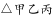为直角三角形。

因，，根据勾股定理可得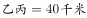。除去停留时间36分钟，游船由甲至乙再至丙，共用。因此，则从甲至丙直线行驶所花，即1小时。

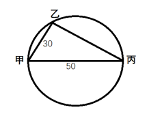

故正确答案为B。

---

### 第 2 题　qid 2264456 · 数学运算

某工厂有4条生产效率不同的生产线，甲、乙生产线效率之和等于丙、丁生产线效率之和。甲生产线月产量比乙生产线多240件，丙生产线月产量比丁生产线少160件，问乙生产线月产量与丙生产线月产量相比：

- **A**. 乙少40件　✅
- **B**. 丙少80件
- **C**. 乙少80件
- **D**. 丙少40件

**答案**：A

**官方解析**

根据题干条件可知，

······①；

，即······②；

，即······③；

将②式与③式代入到①式当中，可得：，化简得：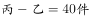，即与丙相比，乙少40件。

故正确答案为A。

---

### 第 3 题　qid 2264386 · 数学运算

从A市到B市的机票如果打6折，包含接送机出租车交通费90元、机票税费60元在内的总乘机成本是机票打4折时总乘机成本的1.4倍。问从A市到B市的全价机票价格（不含税费）为多少元？

- **A**. 1200
- **B**. 1250
- **C**. 1500　✅
- **D**. 1600

**答案**：C

**官方解析**

根据题意，乘机总成本包括机票价格（不含税费）、交通费和机票税费。设从A市到B市的全价机票价格（不含税费）为元。根据两次折扣的1.4倍关系可列式：，解得元。

故正确答案为C。

---

### 第 4 题　qid 2264405 · 数学运算

甲车上午8点从A地出发匀速开往B地，出发30分钟后乙车从A地出发以甲车2倍的速度前往B地，并在距离B地10千米时追上甲车。如乙车9点10分到达B地，问甲车的速度为多少千米/小时？

- **A**. 30　✅
- **B**. 36
- **C**. 45
- **D**. 60

**答案**：A

**官方解析**

设甲车的速度为千米/小时，乙车的速度为甲车的2倍即千米/小时。甲车出发30分钟即小时后乙车开始追，则两车的路程差为千米，由追及公式“”可得，小时。乙车在上午8点的30分钟后出发，9点10分到达B地，共用时。设乙在C点追上甲，则千米，乙车从C地到B地用时小时。则乙车的速度=，甲车的速度。

故正确答案为A。

---

### 第 5 题　qid 2264383 · 数学运算

有100名员工去年和今年均参加考核，考核结果分为优、良、中、差四个等次。今年考核结果为优的人数是去年的1.2倍，今年考核结果为良及以下的人员占比比去年低15个百分点。问两年考核结果均为优的人数至少为多少人？

- **A**. 55
- **B**. 65　✅
- **C**. 75
- **D**. 85

**答案**：B

**官方解析**

设去年考核结果为优的有人，则今年考核结果为优的为人。根据题意，两年总人数均为100，则今年考核结果为良及以下的人员比去年少了人，即。解方程得，则今年获优的有人。根据两集合容斥原理，，要“两年都为优的人数”最少，则“两年都不是优的人数”取最小数0，此时两年考核结果均为优的人数人。

故正确答案为B。

---

### 第 6 题　qid 2264458 · 数学运算

A和B两家企业2018年共申请专利300多项，其中A企业申请的专利中是发明专利，B企业申请的专利中，发明专利和非发明专利之比为。已知B企业申请的专利数量少于A企业，但申请的发明专利数量多于A企业。问两家企业总计最少申请非发明专利多少项？

- **A**. 250
- **B**. 255
- **C**. 237　✅
- **D**. 242

**答案**：C

**官方解析**

已知A企业申请的专利中是发明专利，即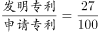，则A企业申请的专利数为100的整数倍。又已知B企业申请的专利数量少于A企业，两者专利数量之和为300多，则A企业申请的专利为200项或300项。分类讨论：

若A企业申请的专利为200项，则此时A企业的发明专利为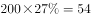项。根据B企业申请的发明专利数量多于A企业且B企业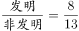，说明B企业发明专利为8的整数倍且多于54，故B企业发明专利至少有56项，此时B企业非发明专利为项，因此两家企业申请非发明专利项数最少为；

若A企业申请的专利为300项，则此时A企业的发明专利为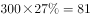项。根据B企业申请的发明专利数量多于A企业且B企业，说明B企业发明专利为8的整数倍且多于81，故B企业发明专利至少有88项，相应的B的专利总数为，则此时A、B企业的专利总数为531项，不满足总数为300多项，与题意矛盾，错误。

综上所述，两家企业申请非发明专利数最少为237项。

故正确答案为C。

备注：实际考试中只需要算出第一种情况的结果为237项，对比选项发现237已经是选项中最少的结果了，故不可能有更小的情况，无需再讨论第二种情况。

---

### 第 7 题　qid 2264416 · 数学运算

甲和乙两条自动化生产线同时生产相同的产品，甲生产线单位时间的产量是乙生产线的5倍，甲生产线每工作1小时就需要花3小时时间停机冷却而乙生产线可以不间断生产。问以下哪个坐标图能准确表示甲、乙生产线产量之差（纵轴L）与总生产时间（横轴T）之间的关系？

- **A**. 

　✅
- **B**. 

- **C**. 

- **D**. 

**答案**：A

**官方解析**

根据“甲生产线单位时间的产量是乙生产线的5倍”赋值甲的效率为5，乙的效率为1。根据题意，甲生产线工作1小时，休息3小时，而乙生产线持续工作，可得下表：

观察表格可知，每4小时为一个变化周期。

先看变化趋势：每个周期前1个小时产量之差不断增大，后3小时产量之差不断减小，排除C项；

再看拐点对应时长（横轴T）：每个周期增加过程所对应时长与下降过程所对应时长之比为1：3，排除B项；

最后看对应高度（纵轴L）：每个周期都是升4再降3，下降值大于上升值的一半，排除D项。

故正确答案为A。

---

### 第 8 题　qid 2264398 · 数学运算

小张和小王在同一个学校读研究生，每天早上从宿舍到学校有6：40、7：00、7：20和7：40发车的4班校车。某星期周一到周三，小张和小王都坐班车去学校，且每个人在3天中乘坐的班车发车时间都不同。问这3天小张和小王每天都乘坐同一趟班车的概率在：

- **A**. 
以下

- **B**. 
之间

- **C**. 
之间
　✅
- **D**. 
以上

**答案**：C

**官方解析**

3天中乘坐的班车发车时间都不同，每人需在四趟班车内依次选三趟乘坐，有种情况。两人在3天中乘坐的班车发车时间都不同的总情况数有种，若要求两人每天都乘坐同一趟班车，则其中一人选定之后，另一人只能与他的选择方式相同，有种情况。故这3天小张和小王每天都乘坐同一趟班车的概率。

故正确答案为C。

---

### 第 9 题　qid 2264409 · 数学运算

有甲、乙、丙三个工作组，已知乙组2天的工作量与甲、丙共同工作1天的工作量相同。A工程如由甲、乙组共同工作3天，再由乙、丙组共同工作7天，正好完成。如果三组共同完成，需要整7天。B工程如丙组单独完成正好需要10天，问如由甲、乙组共同完成，需要多少天？

- **A**. 不到6天
- **B**. 6天多
- **C**. 7天多　✅
- **D**. 超过8天

**答案**：C

**官方解析**

根据题意，甲、乙、丙三者的效率满足以下关系：

②式整理可得：，即。赋值，，代入①式可得：。则B工程的工作量为，如由甲、乙共同完成需要天，即7天多。

故正确答案为C。

---

### 第 10 题　qid 2264461 · 数学运算

甲、乙两辆卡车运输一批货物，其中甲车每次能运输35箱货物。甲车先满载运输2次后，乙车加入并与甲车共同满载运输10次完成任务，此时乙车比甲车多运输10箱货物。问如果乙车单独执行整个运输任务且每次都尽量装满，最后一次运多少箱货物？

- **A**. 10
- **B**. 30
- **C**. 33　✅
- **D**. 36

**答案**：C

**官方解析**

由题意可知，甲车前两次共运输箱货物，后乙车加入后，共同满载10次完成任务，此时乙车比甲车多运输10箱货物，因此可得，解得箱货物，该批货物总量为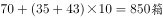，，即全部由乙车运输，最后一次运33箱货物。

故正确答案为C。

---

### 第 11 题　qid 2264411 · 数学运算

某单位有2个处室，甲处室有12人，乙处室有20人。现在将甲处室最年轻的4人调入乙处室，则乙处室的平均年龄增加了1岁，甲处室的平均年龄增加了3岁。问在调动之前，两个处室的平均年龄相差多少岁？

- **A**. 8
- **B**. 12　✅
- **C**. 14
- **D**. 15

**答案**：B

**官方解析**

设调动前甲处室的平均年龄为岁，乙处室的平均年龄为岁，则调动后甲处室的平均年龄为岁，乙处室的平均年龄为岁。根据调动前后甲、乙两处室的年龄之和不变，可列式：，解得，所以调动前两个处室的平均年龄差为12岁。

故正确答案为B。

---

### 第 12 题　qid 2264420 · 数学运算

花圃自动浇水装置的规则设置如下：
①每次浇水在中午12:00~12:30之间进行；
②在上次浇水结束后，如连续3日中午12:00气温超过30摄氏度，则在连续第3个气温超过30摄氏度的日子中午12:00开始浇水；
③如在上次浇水开始120小时后仍不满足条件②，则立刻浇水。
已知6月30日12:00~12:30该花圃第一次自动浇水，7月份该花圃共自动浇水8次，问7月至少有几天中午12:00的气温超过30摄氏度？

- **A**. 18
- **B**. 12
- **C**. 20
- **D**. 15　✅

**答案**：D

**官方解析**

根据题意，若要使7月份中午气温超过30摄氏度的天数尽可能少，则应同时满足两个条件：（1）超过30摄氏度的日子均以连续3天的方式出现；（2）未超过30摄氏度的日子均以连续天的方式出现。

题干问“至少”，从最小的选项开始代入。

C项：若超过30摄氏度的日子有12天，则未超过30摄氏度的日子有天。根据规则②可知，12天中浇水次；根据规则③可知，，即19天中浇水3次。次，与“浇水8次”矛盾，排除；

D项：若超过30摄氏度的天数为15天，则未超过30摄氏度的天数为天。根据规则②可知，15天中浇水次；根据规则③可知，，即16天中浇水3次，次。满足题意，当选。

故正确答案为D。

---

### 第 13 题　qid 2264406 · 数学运算

甲和乙进行5局3胜的乒乓球比赛，甲每局获胜的概率是乙每局获胜概率的1.5倍。问以下哪种情况发生的概率最大？

- **A**. 比赛在3局内结束　✅
- **B**. 乙连胜3局获胜
- **C**. 甲获胜且两人均无连胜
- **D**. 乙用4局获胜

**答案**：A

**官方解析**

根据“甲每局获胜的概率是乙每局获胜概率的1.5倍”，设乙的概率为，则甲的概率为，由，解得，即甲获胜的概率为0.6，乙为0.4。

A项：比赛在3局内结束，有两种情况：①甲连胜3局，概率；②乙连胜3局，概率。故A项总概率。

B项：乙连胜3局获胜，有三种情况：①乙前3局连胜，概率；②乙第2、3、4局连胜，概率；③乙第3、4、5局连胜，概率；故B项总概率。

C项：甲获胜且两人均无连胜，只有一种情况，即甲获胜三局且分别是第1、3、5局获胜，概率。

D项：乙用4局获胜，则第四局必然是乙获胜，且前三局中乙有两局获胜，因此概率。

故正确答案为A。

---

### 第 14 题　qid 2264418 · 数学运算

某单位要求职工参加20课时线上教育课程，其中政治理论10课时，专业技能10课时。可供选择的政治理论课共8门，每门2课时；可供选择的专业技能课共10门，其中2课时的有5门，1课时的有5门。问可选择的课程组合共有多少种？

- **A**. 5656　✅
- **B**. 5600
- **C**. 1848
- **D**. 616

**答案**：A

**官方解析**

根据题意，政治理论课在8门中选5门即可达到10课时，一共有：种情况。专业技能课若要达到10课时，可分为以下3类：①2课时的课5门全选，情况数为1种；②2课时的课选4门，1课时的课选2门，情况数为种；③2课时的课选3门，1课时的课选4门，情况数为种，故选专业技能课的情况数为种。所以可选择的课程组合共有种。

故正确答案为A。

---

### 第 15 题　qid 2264463 · 数学运算

园丁将若干同样大小的花盆在平地上摆放为不同的几何图形，发现如果增加5盆，就能摆成实心正三角形。如果减少4盆，就能摆成每边多于1个花盆的实心正方形。问将现有的花盆摆成实心矩形，最外层最少有多少盆花？

- **A**. 28
- **B**. 26
- **C**. 24
- **D**. 22　✅

**答案**：D

**官方解析**

假设组成的实心正三角形每个边有个花盆，则原有花盆数量为。减少4盆后，数量为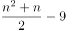，可组成一个实心正方形（每个边至少2个花盆），可判定其为平方数。要想最外层花的盆数少，则原有花盆数应尽可能少，即的值应尽可能小，取值验证。

若，为非整数，排除；

若，为非整数，排除；

若，为非整数，排除；

若，为非整数，排除；

若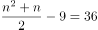，为9，满足。此时原有花盆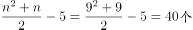。

当花盆共有40个时，设实心矩形长宽，则。要让最外层的花盆数最少，即长宽和最少。根据数学知识“当为定值时，与越接近，其和越小”，则当、时，其长宽和最小。

对最外层花盆计数时，每个端点的花盆会重复计数，故最外层的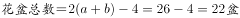。

故正确答案为D。

---

## 判断推理

### 第 1 题　qid 2264340 · 图形推理

从所给的四个选项中，选择最合适的一个填入问号处，使之呈现一定的规律性：

- **A**. A
- **B**. B　✅
- **C**. C
- **D**. D

**答案**：B

**官方解析**

元素组成不同，优先考虑属性规律。观察发现，题干图形均为轴对称图形，并且对称轴方向每次顺时针旋转，排除A项和C项。进一步观察发现，题干中图1、图3和图5的对称轴都与图形中的一条线重合，而图2和图4的对称轴没有与图形中的一条线重合，故“？”处应选择一个图形的对称轴不与图形中某一条线重合的，只有B项符合。

故正确答案为B。

---

### 第 2 题　qid 2264337 · 图形推理

从所给的四个选项中，选择最合适的一个填入问号处，使之呈现一定的规律性：

- **A**. A
- **B**. B　✅
- **C**. C
- **D**. D

**答案**：B

**官方解析**

元素组成基本相同，优先考虑位置规律。观察发现，三角形与正方形的公共边每次沿正方形的外框顺时针平移半条边，则？处图形中公共边应位于正方形上边框的右侧，排除C项和D项。继续观察发现，三角形在正方形内部的顶点也每次顺时针平移一个位置（如图），故？处应选择一个三角形顶点位于正方形内部左下角位置的图形，只有B项符合。 故正确答案为B。

---

### 第 3 题　qid 2264347 · 图形推理

从所给的四个选项中，选择最合适的一个填入问号处，使之呈现一定的规律性：

- **A**. A　✅
- **B**. B
- **C**. C
- **D**. D

**答案**：A

**官方解析**

元素组成相同，但无位置规律。继续观察发现，题干图形的黑圆有明显连在一起的，考虑数部分数。第一组图黑圆连起来看，部分数分别为1、2、3；第二组图应用此规律，黑圆连起来看部分数依次为1、2、？，故？处应该选择一个黑圆为3部分的图形。A、B、C、D的黑圆连起来的部分数分别为3、2、4、4，只有A选项符合。

故正确答案为A。

---

### 第 4 题　qid 2264343 · 图形推理

从所给的四个选项中，选择最合适的一个填入问号处，使之呈现一定的规律性：

- **A**. A
- **B**. B
- **C**. C
- **D**. D　✅

**答案**：D

**官方解析**

元素组成相似，且相同线条重复出现，优先考虑样式规律中的加减同异。九宫格优先看横行，第一行中，图1和图2求异后再顺时针或者逆时针旋转得到图3；经验证，第二行也满足此规律；第三行应用此规律，故“？”处应选择一个图1和图2先求异再顺时针或者逆时针旋转得到的图形。观察选项发现，逆时针旋转无答案，只有顺时针旋转得到D选项。

故正确答案为D。

---

### 第 5 题　qid 2264364 · 图形推理

下图为同样大小的正方体堆叠而成的多面体正视图和后视图。该多面体可拆分为①、②、③和④共4个多面体的组合，问下列哪一项能填入问号处？

- **A**. A
- **B**. B
- **C**. C
- **D**. D　✅

**答案**：D

**官方解析**

本题考查立体拼合。由题干给出的多面体的正视图和后视图，可知，图形可分为前中后3排，最前面一排，根据正视图可知共有2个小立方体，中间一排，根据正视图和后视图可知共有8个小立方体，最后一排，根据后视图可知共有12个小立方体，故该多面体共有2+8+12=22个小立方体。观察题干图形发现，①有5个小立方体，②有6个小立方体，③有5个小立方体，所以若要将①、②、③、④组合在一起拼成题干多面体，则④应该有6个小立方体。

A项有4个小立方体，B项有5个小立方体，C项有5个小立方体，D项有6个小立方体。

故正确答案为D。

---

### 第 6 题　qid 2264356 · 图形推理

左图为6个相同小正方体组合成的多面体，将其从任一面剖开，以下哪一项<b>不可能</b>是该多面体的截面？

- **A**. A
- **B**. B
- **C**. C
- **D**. D　✅

**答案**：D

**官方解析**

本题考查截面图，逐一分析选项。

如下图所示，A、B、C项均可截出，该立体图形无法同时截出D项的菱形和三角形。

A项：

B项：

C项：

D项：无法切出，当选。

本题为选非题，故正确答案为D。

---

### 第 7 题　qid 2264351 · 图形推理

左边给定的是正方体的外表面展开图，下面哪一项能由它折叠而成？

- **A**. A
- **B**. B
- **C**. C　✅
- **D**. D

**答案**：C

**官方解析**

将展开图的面均标上序号，如下图。

逐一分析选项：  A项：选项出现了面e、面g和面h，而题干中面e和面g为相对面，不能同时出现，选项与题干不一致，排除；  B项：选项出现了面e、面h和面i，面e和面h的公共边挨着面e的黑色部分，而题干中这两个面的公共边（如图）没有挨着面e的黑色部分，选项与题干不一致，排除；  C项：选项出现了面e、面f和面i，与题干一致，当选；  D项：选项出现了面e、面g和面k，而题干中面e和面g为相对面，不能同时出现，选项与题干不一致，排除。  故正确答案为C。

---

### 第 8 题　qid 2264369 · 图形推理

把下面的六个图形分为两类，使每一类图形都有各自的共同特征或规律，分类正确的一项是：

- **A**. ①②③，④⑤⑥
- **B**. ①②⑥，③④⑤　✅
- **C**. ①④⑥，②③⑤
- **D**. ①③④，②⑤⑥

**答案**：B

**官方解析**

解析一：本题为分组分类题目。每幅图中都由黑白两部分组成，观察发现图①②⑥中白色部分和黑色部分的面积都是相同的，而图③④⑤中白色部分的面积都大于黑色部分的面积，故图①②⑥为一组，图③④⑤为一组。
故正确答案为B。
解析二：本题为分组分类题目。每幅图中都由黑白两部分组成，观察发现图①②⑥中白色部分和黑色部分面的形状都是相同的，而图③④⑤中白色部分面的形状和黑色部分不相同，故图①②⑥为一组，图③④⑤为一组。
故正确答案为B。

---

### 第 9 题　qid 2264371 · 图形推理

把下面的六个图形分为两类，使每一类图形都有各自的共同特征或规律，分类正确的一项是：

- **A**. ①④⑤，②③⑥　✅
- **B**. ①②⑤，③④⑥
- **C**. ①④⑥，②③⑤
- **D**. ①③④，②⑤⑥

**答案**：A

**官方解析**

解析一：

 

本题为分组分类题目。观察发现元素组成相同，优先考虑位置规律。观察小黑点和阴影三角形的位置关系，可从小黑点向三角形方向就近画时针，发现图①④⑤为顺时针，②③⑥为逆时针。即图①④⑤为同一个图形进行旋转得到，图②③⑥为同一个图形进行旋转得到。故①④⑤为一组，②③⑥为一组。

故正确答案为A。

解析二：

本题为分组分类题目。观察发现题干每幅图形均有小黑点，考虑功能元素。观察小黑点和阴影三角形的位置关系，由于三角形具有指向性，可从阴影三角形的底边向中心画出一个箭头，以箭头指向的方向为上，观察发现图①④⑤小黑点都在阴影三角形的右侧，②③⑥小黑点都在阴影三角形的左侧。故①④⑤为一组，②③⑥为一组。

故正确答案为A。

---

### 第 10 题　qid 2264372 · 图形推理

把下面的六个图形分为两类，使每一类图形都有各自的共同特征或规律，分类正确的一项是：

- **A**. ①③④，②⑤⑥
- **B**. ①②⑥，③④⑤
- **C**. ①③⑤，②④⑥　✅
- **D**. ①④⑥，②③⑤

**答案**：C

**官方解析**

本题为分组分类题目。观察图形发现，多边形内部被线条分割，优先考虑数面的数量，但题干图形的面数量都是5，无法分组。继续观察发现，图①③⑤中存在明显最小的面，且最小的面的形状均与图形外轮廓形状相同，图②④⑥中存在明显最大的面，且最大的面的形状均与图形外轮廓形状相同，故①③⑤一组，②④⑥一组。
故正确答案为C。

---

### 第 11 题　qid 2264339 · 定义判断

定律假说是对一类事物或现象的性质或发生原因作出推测性解释，得出一个可能具有普遍性意义的规律性命题，从而试图建立、发展或补充科学理论。
根据上述定义，下列属于定律假说的是：

- **A**. 老师向学生们解释潮汐现象产生的原因是海水在引力作用下出现的周期性运动
- **B**. 某单位仓库被盗，由于未发现破坏性进入的痕迹，侦查人员认为内部人员作案的可能性极大
- **C**. 牛顿根据苹果掉落现象发现了万有引力定律　✅
- **D**. 有研究人员指出，由基因导致的疾病可能都是由于基因突变引起的

**答案**：C

**官方解析**

第一步：找出定义关键词。

“对一类事物或现象的性质或发生原因做出推测性解释”、“得出一个可能具有普遍性意义的规律性命题”、“从而试图建立、发展或补充科学理论”。

第二步：逐一分析选项。

A项：老师向学生解释潮汐产生的原因，是对该现象产生原因的直接解释，而非推测性解释，不符合“对一类现象的发生原因作出推测性解释”，不符合定义，排除； 

B项：某仓库被盗，侦查人员认为是内部作案，某仓库的情况是个例，不符合“对一类事物或现象的发生原因作出推测性解释”，也没体现“得出一个可能具有普遍意义的规律性命题”，不符合定义，排除；

C项：牛顿根据苹果掉落现象发现了万有引力定律，根据苹果掉落现象符合“对一类事物或现象的性质或发生原因做出推测性解释”，发现万有引力定律符合“得出一个可能具有普遍意义的规律性命题”、“从而试图建立、发展或补充科学理论”，符合定义，当选；

D项：由基因导致的疾病“可能”都是由于基因突变引起的，是对此类疾病发生原因的推测性解释，但是没体现“得出一个可能具有普遍意义的规律性命题”、“从而试图建立、发展或补充科学理论”，不符合定义，排除。

故正确答案为C。

【备注】经粉笔教研，并通过查原文，C项牛顿依据苹果掉落现象提出引力假说属于理论假说，且在自然科学领域，理论假说都属于定律假说，故C项属于定律假说；而D项，研究基因导致的疾病的病因，其目的是为了帮助医生今后在治疗此类疾病时能对症下药，避免工作的盲目性，所以应属于作业假说，而非定律假说。

原文链接： http://www.cssn.cn/zt/zt_zh/kuaxuekezhuanti/flljx/jsyzcjs/jsff/201609/t20160920_3207766_2.shtml 

---

### 第 12 题　qid 2264341 · 定义判断

严格指示词是指一个语言表达式所具有的如下性质：它所指示的对象不会随着该表达式被使用的具体情境而发生改变。这些情境通常包括表达式的使用主体、表达式被使用的时间、地点、世界状态等等。
根据上述定义，下列属于严格指示词的是：

- **A**. 现任联合国秘书长
- **B**. 世界上身高最高的人
- **C**. 最小的素数　✅
- **D**. 经常坐在教室第一排正中间的同学

**答案**：C

**官方解析**

第一步：找出定义关键词。
“它所指示的对象不会随着该表达式被使用的具体情境而发生改变”、“这些情境通常包括表达式的使用主体、表达式被使用的时间、地点、世界状态等等”
第二步：逐一分析选项。
A项：联合国秘书长的任期为5年，现任联合国秘书长所指示的对象会随着使用时间的改变而发生改变，不符合“所指示的对象不会随着该表达式被使用的具体情境而发生改变”，不符合定义，排除； 
B项：世界上身高最高的人，身高会随着时间的变化发生变化，世界上身高最高的人所指示的对象也会随着时间发生改变，不符合“所指示的对象不会随着表达式被使用的具体情境而发生改变”，不符合定义，排除；
C项：素数是指大于1的自然数中，只能被1和它本身整除的数。最小的素数是2，是唯一确定的结论，不会随着具体情境的改变而发生变化，符合定义，当选；
D项：经常坐在教室第一排正中间的同学，不同教室坐在第一排正中间的同学是不同的，它所指示的对象会随着地点的改变而改变，不符合“所指示的对象不会随着该表达式被使用的具体情境而发生改变”，不符合定义，排除。
故正确答案为C。

---

### 第 13 题　qid 2264345 · 定义判断

同病异治是指中医对相同疾病采取不同的治法，达到治病求本的治疗效果；异病同治是指不同的疾病在发展过程中出现性质相同的症状，因而可以采用同样的中医治疗方法。
根据上述定义，下列属于异病同治的是：

- **A**. 久痢脱肛和胃下垂，均为中气下陷之证，可用升提中气之法治疗　✅
- **B**. 外感风热，内有蕴热的表里俱实之证，宜解表和攻里之药同时并用
- **C**. 麻疹初期疹未出透，治疗宜宣肺透疹；中期肺热明显，治疗宜清热解毒
- **D**. 风热感冒宜用辛凉解表法治疗，风寒感冒宜用辛温解表法治疗

**答案**：A

**官方解析**

第一步：找出定义关键词。
同病异治：“中医对相同疾病采取不同的治法”、 “达到治病求本的治疗效果”。
异病同治：“不同的疾病”、“出现性质相同的症状”、“采用相同的中医治疗方法”。
第二步：逐一分析选项。
A项：久痢脱肛和胃下垂，符合“不同的疾病”，均为中气下陷之证，符合“出现性质相同的症状”，可用升提中气之法治疗，符合“采用相同的中医治疗方法”，符合“异病同治”定义，当选； 
B项：外感风热，内有蕴热，是一种疾病的内部及外表的两方面表现，解表和攻里之药同时并用，是指治病时需内外兼治，是一种疾病采取一种治疗方法，不符合任何一个定义，排除；
C项：麻疹初期和中期的治疗方法不同，符合“中医对相同疾病采取不同的治法”，符合“同病异治”定义，不符合“异病同治”定义，排除；
D项：风热感冒宜用辛凉解表法治疗，风寒感冒宜用辛温解表法治疗，是不同的疾病采用不同的中医治疗方法，不符合任何一个定义，排除。
故正确答案为A。

---

### 第 14 题　qid 2264348 · 逻辑判断

物候现象是生物随着气候一年四季的周期性变化而发生的相应季节性变化的现象。影响物候现象的因素主要包括海拔的差异、经度的差异、纬度的差异和时间的差异。
下列诗句反映的物候现象受到海拔差异影响的是：

- **A**. 日出江花红胜火，春来江水绿如蓝
- **B**. 竹外桃花三两枝，春江水暖鸭先知
- **C**. 人间四月芳菲尽，山寺桃花始盛开　✅
- **D**. 羌笛何须怨杨柳，春风不度玉门关

**答案**：C

**官方解析**

第一步：找出定义关键词。
“生物随着气候一年四季的周期性变化而发生的相应季节性变化”、“海拔差异影响”。
第二步：逐一分析选项。
A项：“日出江花红胜火，春来江水绿如蓝”意思是清晨日出的时候，江边盛开的花朵，简直比火还要红艳；当春天来到时，江里的水，青绿得就像是蓝色的一样。不涉及“海拔差异对物候现象的影响”，不符合定义，排除； 
B项：“竹外桃花三两枝，春江水暖鸭先知”意思是竹林外两三枝桃花初放，鸭子在水中游戏，它们最先察觉了初春江水的回暖。不涉及“海拔差异对物候现象的影响”，不符合定义，排除；
C项：“人间四月芳菲尽，山寺桃花始盛开”意思是在人间四月里百花凋零已尽，高山古寺中的桃花才刚刚盛开，是由于高山的海拔较高，温度较低才导致这一现象，符合“海拔差异对物候现象的影响”，符合定义，当选；
D项：“羌笛何须怨杨柳，春风不度玉门关”意思是何必用羌笛吹起那哀怨的杨柳曲去埋怨春光迟迟不来呢，玉门关一带春风是吹不到的啊，玉门关位于甘肃省境内，这里属于非季风区，不受夏季季风的影响才导致这一现象，不符合“海拔差异对物候现象的影响”，不符合定义，排除。
故正确答案为C。

---

### 第 15 题　qid 2264352 · 定义判断

公平世界谬误是指人们倾向于认为我们生活的世界是公平的，一个人获得成就，是因为他肯定做对了什么，所以这份成就是他应得的；一个人遭遇不幸，他自己也有责任，甚至是咎由自取。
根据上述定义，下列没有反映公平世界谬误的是：

- **A**. 一分耕耘，一分收获
- **B**. 谋事在人，成事在天　✅
- **C**. 可怜之人必有可恨之处
- **D**. 天网恢恢，疏而不漏

**答案**：B

**官方解析**

第一步：找出定义关键词。
“一个人获得成就，是因为他肯定做对了什么，所以这份成就是他应得的”、“一个人遭遇不幸，他自己也有责任，甚至是咎由自取”。
第二步：逐一分析选项。
A项：“一分耕耘，一分收获”，意思是付出一份劳力就得一分收益。符合“一个人获得成就，是因为他肯定做对了什么，所以这份成就是他应得的”，符合定义，排除； 
B项：“谋事在人，成事在天”，意思是自己已经尽力而为，至于能否达到目的，那就要看时运如何了。能否达到目的看的是时运而不是自己，不符合“一个人获得成就，是因为他肯定做对了什么，所以这份成就是他应得的”，也不符合“一个人遭遇不幸，他自己也有责任，甚至是咎由自取”，不符合定义，当选；
C项：“可怜之人必有可恨之处”，意思是一个貌似可怜之人现实的不如意，一定是由于之前的过错或咎由自取造成的。符合“一个人遭遇不幸，他自己也有责任，甚至是咎由自取”，符合定义，排除；
D项：“天网恢恢，疏而不漏”，意思是天道公平，作恶就要受到惩罚，它看起来似乎很不周密，但最终不会放过一个坏人。符合“一个人遭遇不幸，他自己也有责任，甚至是咎由自取”， 符合定义，排除。
本题为选非题，故正确答案为B。

---

### 第 16 题　qid 2264355 · 定义判断

按照先后顺序排列的两个数字或者字母称为序对，如2a、e3、dm等等，序对中的第一个数字或者字母称为前项，第二个称为后项。函项指的是由若干序对构成的一个有限序列，其中每个序对的前项都是字母，后项都是数字，并且对于任一序对，如果前项相同，则后项必定相同。
根据上述定义，下列哪项属于函项？

- **A**. p3、c4、d6、p6、m8
- **B**. b3、5a、8n、p1、66
- **C**. f4、h4、gm、y2、x2
- **D**. a3、b5、d6、p1、e3　✅

**答案**：D

**官方解析**

第一步：找出定义关键词。
序对：“按照先后顺序排列的两个数字或者字母称为序对”、“序对中的第一个数字或者字母称为前项，第二个称为后项”。
函项：“由若干序对构成的有限序列”、“每个序对的前项都是字母，后项都是数字” 、“对于任一序对，如果前项相同，则后项必定相同”。
第二步：逐一分析选项。
A项：p3和p6这两个序对，前项相同但是后项不同。不符合“对于任一序对，如果前项相同，则后项必定相同”，不符合定义，排除； 
B项：5a、8n和66这三个序对，前项是数字。不符合“每个序对的前项都是字母，后项都是数字”，不符合定义，排除；
C项：gm这个序对，后项是字母。不符合“每个序对的前项都是字母，后项都是数字”，不符合定义，排除；
D项：a3、b5、d6、p1、e3，每个序对都是前项是字母，后项是数字。符合“每个序对的前项都是字母，后项都是数字”，符合定义，当选。
故正确答案为D。

---

### 第 17 题　qid 2264358 · 定义判断

诉前财产保全是指利害关系人因情况紧急，若不立即申请财产保全将会使其合法权益受到难以弥补的损害，起诉前向人民法院申请，由人民法院采取的一种财产保全措施。
根据上述定义，下列不属于诉前财产保全的是：

- **A**. 工厂甲向信用社乙贷款500万元，甲无法按期归还。乙随即起诉，审理期间得知甲已将设备转卖，遂请求法院查封甲正在出售的大楼　✅
- **B**. 甲与乙签订购销合同，甲给乙200万元预付款后，发现乙有欺诈行为，无力履行合同，遂请求人民法院冻结200万元预付款
- **C**. 银行甲与公司乙签订协议，甲向乙提供5000万元贷款，分3期还清，第一笔到期时乙无力归还，甲向法院申请查封乙的财产
- **D**. 甲欠乙10万元，乙多次找甲还钱未果，得知甲有一辆轿车，乙向法院申请将甲的轿车予以查封，再将甲告上法庭

**答案**：A

**官方解析**

第一步：找出定义关键词。
“因情况紧急，若不立即申请财产保全将会使其合法权益受到难以弥补的损害”、“起诉前向人民法院申请，由人民法院采取的一种财产保全措施”。
第二步：逐一分析选项。
A项：乙是在起诉审理期间要求法院查封甲正在出售的大楼，不符合在“起诉前向人民法院申请，由人民法院采取的一种财产保全措施”，不符合定义，当选；
B项：甲在给乙预付款之后，发现乙有欺诈行为，无力履行合同，此时甲如果不及时申请财产保全，有可能无法追回这一预付款，所以符合“因情况紧急，若不立即申请财产保全将会使其合法权益受到难以弥补的损害”，而后甲请求法院冻结这一预付款，符合“起诉前向人民法院申请，由人民法院采取的一种财产保全措施”，符合定义，排除；
C项：甲与乙签订贷款协议，乙在第一笔到期时无力还款，此时甲如果不及时申请财产保全，有可能无法收回这笔贷款，所以符合“因情况紧急，若不立即申请财产保全将会使其合法权益受到难以弥补的损害”，甲请求法院查封乙的财产，符合“起诉前向人民法院申请，由人民法院采取的一种财产保全措施”，符合定义，排除；
D项：乙多次找甲还钱未果，此时乙如果不及时申请财产保全，有可能无法追回这一欠款，所以符合“因情况紧急，若不立即申请财产保全将会使其合法权益受到难以弥补的损害”，乙向法院申请把甲的轿车予以查封，然后再把甲告上法庭，符合“起诉前向人民法院申请，由人民法院采取的一种财产保全措施”，符合定义，排除。
本题为选非题，故正确答案为A。

---

### 第 18 题　qid 2264360 · 定义判断

员工帮助计划是由企业为员工设置的一套长期的、系统的福利项目，通过专业人员对员工及其直系亲属提供专业指导和咨询，旨在帮助解决员工及其家庭成员的各种心理和行为问题，提高员工在企业中的工作绩效。
根据上述定义，下列属于员工帮助计划的是：

- **A**. 项目经理小祁的父亲最近去世了，小祁很悲痛，工作效率受到很大影响，总经理特批了一笔慰问款
- **B**. 司机小方驾车外出工作期间交通肇事致人死亡，公司聘请律师为小方做从轻处罚的辩护，最终小方获刑三年
- **C**. 会计师老王的儿子没有考上大学，老王夫妇很烦恼，互相指责。在公司心理专员的指导下，老王改善了与妻子的沟通方式，情绪逐渐好转　✅
- **D**. 职员小欣情绪低落，有自杀的念头，经医院诊断为重度抑郁症，需住院治疗。公司启动援助机制，为小欣支付了住院费用

**答案**：C

**官方解析**

第一步：找出定义关键词。
“由企业为员工设置的一套长期的、系统的福利项目”、“通过专业人员对员工及其直系亲属提供专业指导和咨询”、“旨在帮助解决员工及其家庭成员的各种心理和行为问题，提高员工在企业中的工作绩效”。
第二步：逐一分析选项。
A项：总经理特批的慰问款是专门针对小祁父亲去世这件事所一次性发放的，不符合“由企业为员工设置的一套长期的、系统的福利项目”，而且总经理特批发钱这一慰问方式也不符合“通过专业人员对员工及其直系亲属提供专业指导和咨询”，不符合定义，排除；
B项：公司聘请律师为小方做从轻处罚的辩护，不符合“旨在帮助解决员工及其家庭成员的各种心理和行为问题”，不符合定义，排除；
C项：公司设有心理专员这一岗位，说明这是“由企业为员工设置的一套长期的、系统的福利项目”，公司心理专员给予老王夫妇以指导，符合“通过专业人员对员工及其直系亲属提供专业指导和咨询”，最终老王改善了与妻子的沟通方式，情绪逐渐好转，也符合“旨在帮助解决员工及其家庭成员的各种心理和行为问题，提高员工在企业中的工作绩效”，符合定义，当选；
D项：公司启动援助机制，为患有重度抑郁症的职员小欣支付住院费用，只是在用钱来帮助小欣，并没有“通过专业人员对员工及其直系亲属提供专业指导和咨询”，不符合定义，排除。
故正确答案为C。

---

### 第 19 题　qid 2264363 · 定义判断

沟通网络是信息沟通的结构形式。常见的沟通网络有四种形式：在轮式网络中，一个下级同时与多个主管联系，但主管之间没有沟通的情形。在Y式网络中，第二级有两个上级与之联系，第三级与一个或更多下级发生联系。在环式网络中，每个成员仅与相邻者联系，而不能与更远的成员进行沟通。在全通道式网络中，所有成员间充分进行沟通，所有成员的地位是平等的，无核心人物。

根据上述定义，下列图形反映了轮式网络特点的是：

- **A**. A
- **B**. B
- **C**. C
- **D**. D　✅

**答案**：D

**官方解析**

第一步：找出定义关键词。
轮式网络：“一个下级同时与多个主管联系”、“主管之间没有沟通的情形”；
Y式网络：“第二级有两个上级与之联系”、“第三级与一个或更多下级发生联系”；
环式网络：“每个成员仅与相邻者联系”、“不能与更远的成员进行沟通”；
全通道式网络：“所有成员间充分进行沟通”、“所有成员的地位是平等的，无核心人物”。
第二步：逐一分析选项。
A项：每个字符只与其相邻的两个字符间有联系，与其他不相邻的没有联系，符合“每个成员仅与相邻者联系”、“不能与更远的成员进行沟通”，符合“环式网络”定义，不符合“轮式网络”定义，排除；
B项：每个字符与其他所有字符都有联系，而且无核心字符，符合“所有成员间充分进行沟通”、“所有成员的地位是平等的，无核心人物”，符合“全通道式网络”定义，不符合“轮式网络”定义，排除；
C项：字符C分别与两个上级字符A、B以及一个下级字符D有联系，符合“第二级有两个上级与之联系”、“第三级与一个或更多下级发生联系”，符合“Y式网络”定义，不符合“轮式网络”定义，排除；
D项：字符C作为下属时，分别与多个主管字符A、B、D、E有联系，但是主管字符A、B、D、E之间没有联系，符合“一个下级同时与多个主管联系”、“主管之间没有沟通的情形”，符合“轮式网络”定义，当选。
故正确答案为D。

---

### 第 20 题　qid 2264367 · 定义判断

变文和连文是古汉语中常用的修辞方法。变文是指为了避重而在相临近的句子中采用同义词来表达相同的意义。连文是指本来要表达甲，而连带说到乙，使两个相关联的词连在一起，但突出表达其中一个词的意义。
根据上述定义，下列使用了连文这一修辞方法的是：

- **A**. 《史记·淮阴侯列传》：“置之死地而后生，置之亡地而后存。”
- **B**. 《易经·系辞上传》：“鼓之以雷霆，润之以风雨。”　✅
- **C**. 诸葛亮《出师表》：“受任于败军之际，奉命于危难之间。”
- **D**. 贾谊《过秦论》：“南取汉中，西举巴蜀，东割膏腴之地，北收要害之郡。”

**答案**：B

**官方解析**

第一步：找出定义关键词。
变文：“为了避重而在相临近的句子中采用同义词来表达相同的意义”；
连文：“本来要表达甲，而连带说到乙，使两个相关联的词连在一起”、“突出表达其中一个词的意义”。
第二步：逐一分析选项。
A项：“置之死地而后生，置之亡地而后存”意思是，军队士兵在可能战死的境地，会奋勇前进，杀敌取胜，在可能灭亡的境地，会战胜生存下来，不符合“本来要表达甲，而连带说到乙，使两个相关联的词连在一起”、“突出表达其中一个词的意义”，不符合“连文”定义，排除；
B项：“鼓之以雷霆，润之以风雨”意思是，用雷霆来鼓荡它，用风雨来滋润它，其中润是用来描述雨的特点，但在表达雨的同时谈到了相关联的风，其中突出表达的是雨水的滋润，符合“本来要表达甲，而连带说到乙，使两个相关联的词连在一起”、“突出表达其中一个词的意义”，符合“连文”定义，当选；
C项：“受任于败军之际，奉命于危难之间”意思是，在兵败的时候接受任务，在危机患难之间奉行使命，只表达了一个意思，没有侧重要突出的，不符合“本来要表达甲，而连带说到乙，使两个相关联的词连在一起”、“突出表达其中一个词的意义”，不符合“连文”定义，排除；
D项：“南取汉中，西举巴蜀，东割膏腴之地，北收要害之郡”意思是，向南夺取汉中，向西攻取巴、蜀，向东割取肥沃的地区，向北占领非常重要的地区，指要攻占东南西北四方的领土，不符合“本来要表达甲，而连带说到乙，使两个相关联的词连在一起”、“突出表达其中一个词的意义”，不符合“连文”定义，排除。
故正确答案为B。

---

### 第 21 题　qid 2264335 · 类比推理

分母：除数

- **A**. 内角：外角
- **B**. 加减法：乘除法
- **C**. 横坐标：纵坐标
- **D**. 百分比：百分率　✅

**答案**：D

**官方解析**

第一步：判断题干词语间逻辑关系。
分母是分数式中写在横线下面的数、字母或代数式，除数是在除法算式中，除号后面的数。分母也叫除数，二者是全同关系。
第二步：判断选项词语间逻辑关系。
A项：内角指的是多边形相邻的两边组成的角，外角指的是多边形中一条边与另一条边的延长线组成的角，二者不是全同关系，与题干逻辑关系不一致，排除；
B项：加减法和乘除法，分别是不同的运算法则，二者是并列关系，不是全同关系，与题干逻辑关系不一致，排除；
C项：横坐标也叫X坐标，纵坐标也叫Y坐标，二者构成笛卡尔坐标系（直角坐标系）以表示函数的图像，二者不是全同关系，与题干逻辑关系不一致，排除；
D项：百分数也叫做百分率或百分比，是一种表达比例、比率或分数数值的方法，二者是全同关系，与题干逻辑关系一致，当选。
故正确答案为D。

---

### 第 22 题　qid 2264357 · 类比推理

马蹄莲：蟹爪兰

- **A**. 牵牛花：美人蕉
- **B**. 卷心菜：夜来香
- **C**. 灯笼椒：金针菇　✅
- **D**. 佛手柑：含羞草

**答案**：C

**官方解析**

第一步：判断题干词语间逻辑关系。
马蹄莲的形状像马蹄，蟹爪兰的形状像蟹爪，二者是根据外形来命名的两种植物。
第二步：判断选项词语间逻辑关系。
A项：牵牛花因其形似喇叭，所以也叫喇叭花，所以喇叭花是以植物外形来命名的，而牵牛花是它的别称，并不是以植物外形来命名的；美人蕉因其花开的美艳而得名，并不是以植物外形来命名的，与题干逻辑关系不一致，排除；
B项：卷心菜是以植物外形来命名的，但夜来香因夜晚有特殊的芳香而命名，不是以植物外形来命名的，与题干逻辑关系不一致，排除；
C项：灯笼椒的形状像灯笼，金针菇的形状像针一样，二者是以外形来命名的两种蔬菜，与题干逻辑关系一致，当选；
D项：佛手柑是以植物外形来命名的，但含羞草是因为它的叶子一经触碰就自动卷起来，像害羞一样，并不是以植物外形来命名的，与题干逻辑关系不一致，排除。
故正确答案为C。

---

### 第 23 题　qid 2264354 · 类比推理

刻舟：求剑

- **A**. 里应：外合
- **B**. 掩耳：盗铃　✅
- **C**. 打草：惊蛇
- **D**. 指桑：骂槐

**答案**：B

**官方解析**

第一步：判断题干词语间逻辑关系。
刻舟求剑是指办事刻板，没用发展的眼光看问题，其中刻舟是求剑的方式，求剑是刻舟的目的。
第二步：判断选项词语间逻辑关系。
A项：里应是指里面接应，外合是指外面攻打，里应和外合是并列关系，与题干逻辑关系不一致，排除；
B项：掩耳盗铃是指把耳朵捂住偷铃铛，以为自己听不见别人也会听不见，比喻自欺欺人。其中掩耳是盗铃的方式，盗铃是掩耳的目的，与题干逻辑关系一致，保留；
C项：打草惊蛇是指做事不周密，行动不谨慎，不慎惊动了对方，“打草”的本意不是“惊蛇”，与题干逻辑关系不一致，排除；（打草惊蛇还有一种解释为，打草是为了惊蛇，如果按这个意思理解可以做保留）
D项：指桑骂槐是比喻表面上骂这个人，实际上是骂那个人，指桑是骂槐的方式，骂槐是目的，与题干逻辑关系一致，保留。
比较B、C、D，题干刻舟求剑是说方法错误，达不到求剑的目的。而打草惊蛇与指桑骂槐都能达到目的，掩耳盗铃也是强调方法错误达不到目的，因此B选项与题干更一致。
故正确答案为B。

---

### 第 24 题　qid 2264350 · 类比推理

直线交叉：直线不平行

- **A**. 

　✅
- **B**. 
100：沸腾

- **C**. 
：臭氧

- **D**. 
：圆面积

**答案**：A

**官方解析**

第一步：判断题干词语间逻辑关系。 两条直线只要交叉，则一定不平行，前者是后者的充分条件。

注：直线间除了在同一平面内存在交叉和平行关系，还可以在不同平面内存在不交叉、不平行的关系，所以题干二者不是全同关系。

第二步：判断选项词语间逻辑关系。 A项： 只要x大于1，则x的平方一定大于1，前者是后者的充分条件，与题干逻辑关系一致，当选； B项：液体并非只要达到100，一定会沸腾，不同液体的沸点并不一定相同，前者不是后者的充分条件，与题干逻辑关系不一致，排除； C项：臭氧是地球大气中的一种微量气体，含有3个氧原子，是臭氧的化学式表示，二者是全同关系，与题干逻辑关系不一致，排除； D项：圆面积公式等于半径平方与圆周率的乘积，用字母可以表示为：，前者不是后者的充分条件，与题干逻辑关系不一致，排除。 故正确答案为A。 

---

### 第 25 题　qid 2264359 · 类比推理

金库：现钞：保管

- **A**. 网球场：球迷：观看
- **B**. 电缆车：景区：观光
- **C**. 录音棚：专辑：播放
- **D**. 美术馆：字画：陈列　✅

**答案**：D

**官方解析**

第一步：判断题干词语间逻辑关系。
金库是用来保管现钞的地点，三者为对应关系。
第二步：判断选项词语间逻辑关系。
A项：网球场是用来观看球赛的地点，不是观看球迷的地点，与题干逻辑关系不一致，排除；
B项：电缆车是用来观光景区的交通工具，不是地点，与题干逻辑关系不一致，排除；
C项：录音棚是用来录制专辑的地点，不是播放专辑的地点，与题干逻辑关系不一致，排除；
D项：美术馆是用来陈列字画的地点，三者为对应关系，与题干逻辑关系一致，当选。
故正确答案为D。

---

### 第 26 题　qid 2264361 · 类比推理

山洪：村民：士兵

- **A**. 狂风：雷电：灯塔
- **B**. 事故：伤员：医生　✅
- **C**. 海啸：船舶：渔民
- **D**. 婚礼：新人：主持

**答案**：B

**官方解析**

第一步：判断题干词语间逻辑关系。
山洪是灾难事件，村民是山洪的受害者，士兵是村民的救助者，村民和士兵是被救助与救助的关系。
第二步：判断选项词语间逻辑关系。
A项：狂风和雷电是两种不同的天气现象，是并列关系，灯塔是用以指引船只方向的建筑物，与狂风和雷电无必然联系，与题干逻辑关系不一致，排除；
B项：事故是灾难事件，伤员是事故的受害者，医生是伤员的救助者，伤员和医生是被救助与救助的关系，与题干逻辑关系一致，当选；
C项：海啸是灾难事件，船舶是渔民的工具，二者不是被救助与救助的关系，与题干逻辑关系不一致，排除；
D项：婚礼不是灾难事件，新人与主持不是被救助与救助的关系，与题干逻辑关系不一致，排除。
故正确答案为B。

---

### 第 27 题　qid 2264362 · 类比推理

病毒：传染病：流行性

- **A**. 毒驾：车祸：危害性　✅
- **B**. 市场：交易：自发性
- **C**. 噪声：听力损伤：普遍性
- **D**. 甜食：肥胖症：突发性

**答案**：A

**官方解析**

第一步：判断题干词语间逻辑关系。
病毒可能会导致传染病，二者为因果的对应关系，且传染病一定具有流行性，二者为必然属性的对应关系。
注：传染病一定是“可以流行”的，只不过“可以流行”并不意味着传染病一定会“流行开来”。因此，传染病一定具备“流行性”的属性，只是不一定会造成“流行开来”这样的结果而已，所以二者是必然属性对应关系。
第二步：判断选项词语间逻辑关系。
A项：毒驾可能会导致车祸，二者为因果的对应关系，且车祸一定具有危害性，二者为必然属性的对应关系，与题干逻辑关系一致，当选；
B项：市场不会导致交易，二者不是因果的对应关系，与题干逻辑关系不一致，排除；
C项：噪声可能会导致听力损伤，二者为因果的对应关系，但普遍性不是听力损伤的必然属性，与题干逻辑关系不一致，排除；
D项：甜食可能会导致肥胖症，二者为因果的对应关系，但突发性不是肥胖症的属性，与题干逻辑关系不一致，排除。
故正确答案为A。

---

### 第 28 题　qid 2264365 · 类比推理

微量元素：稀有金属：铜

- **A**. 木本植物：草本植物：松树
- **B**. 海洋动物：哺乳动物：北极熊
- **C**. 内陆湖：淡水湖：青海湖　✅
- **D**. 节肢动物：两栖动物：鳄鱼

**答案**：C

**官方解析**

第一步：判断题干词语间逻辑关系。

微量元素是指人体中含量小于的元素，稀有金属是指在自然界中含量较少或分布稀散的金属，故二者为交叉关系；铜是微量元素，二者为种属关系，且铜不是稀有金属。

第二步：判断选项词语间逻辑关系。

A项：木本植物和草本植物都是植物的一种，二者为并列关系，与题干逻辑关系不一致，排除；

B项：海洋动物和哺乳动物为交叉关系，但北极熊是哺乳动物，不是海洋动物，与题干逻辑关系不一致，排除；

C项：内陆湖和淡水湖为交叉关系，青海湖是内陆湖，二者为种属关系，且青海湖不属于淡水湖，与题干逻辑关系一致，当选；

D项：节肢动物属于无脊椎动物，两栖动物属于脊椎动物，二者不是交叉关系，且鳄鱼不属于节肢动物，与题干逻辑关系不一致，排除。

故正确答案为C。

---

### 第 29 题　qid 2264366 · 类比推理

莲蓬 对于（  ）相当于（  ）对于 葛根

- **A**. 荷叶；葛藤　✅
- **B**. 荷花；葛粉
- **C**. 喜爱；纠缠
- **D**. 荷塘；山岗

**答案**：A

**官方解析**

逐一代入选项。
A项：莲蓬与荷叶都是荷花的组成部分，葛藤与葛根都是野葛的组成部分，二者均为并列关系，前后逻辑关系一致，当选；
B项：莲蓬是荷花的组成部分，二者为组成关系；葛根是葛粉的原材料，二者为原材料的对应关系，前后逻辑关系不一致，排除；
C项：喜爱莲蓬，二者为动宾关系；纠缠和葛根不是动宾关系，且前后顺序相反，前后逻辑关系不一致，排除；
D项：荷塘里有莲蓬，山岗里有葛根，二者均为地点的对应关系，但前后顺序相反，前后逻辑关系不一致，排除。
故正确答案为A。

---

### 第 30 题　qid 2264368 · 类比推理

立案 对于（  ）相当于（  ）对于 判决

- **A**. 起诉；服刑
- **B**. 审理；质证　✅
- **C**. 犯罪；调解
- **D**. 罚款；执行

**答案**：B

**官方解析**

A项：在刑事诉讼中可以先“立案”后“起诉”，在民事诉讼中可以先“起诉”后“立案”，二者没有必然的时间先后顺序，而服刑在判决之后，前后逻辑关系不一致，排除；
B项：先立案后审理，先质证后判决，二者均为先后顺序的对应关系，前后逻辑关系一致，当选；
C项：先犯罪后立案，二者为先后顺序的对应关系；调解和判决没有必然联系，前后逻辑关系不一致，排除；
D项：立案与罚款没有必然联系；先判决后执行，二者为先后顺序的对应关系，前后逻辑关系不一致，排除。
故正确答案为B。

---

### 第 31 题　qid 2264333 · 逻辑判断

所有的幼儿园都面临同一个问题：就是对于那些在幼儿园放学之后不能及时来接孩子的家长，幼儿园老师除了等待别无他法，因此许多幼儿园都向晚接孩子的家长收取费用。然而，有调查显示，收取费用后晚接孩子的家长数量并未因此减少，反而增加了。
以下哪项如果为真，最能解释上述调查结果？

- **A**. 收费标准太低，对原本经常晚来接孩子的家长没有太大的约束力
- **B**. 有个别家长对收费行为不满，有时会故意以晚接孩子的行为来抗议
- **C**. 有些家长因工作忙碌，常常不能及时来接孩子
- **D**. 收费后，更多的家长认为即使晚来接孩子也不必愧疚，只要付费即可　✅

**答案**：D

**官方解析**

第一步：找出题干矛盾。
通过收取费用的方式让家长早接孩子，但是收费后晚接孩子的家长数量不减反增。
第二步：逐一分析选项。
A项：收费低对原本晚接孩子的家长无影响，可以解释为什么人数没有减少，但是无法解释为什么人数增加，不能解释题干矛盾，排除；
B项：该项说的是个别家长抗议收费而晚来接孩子，但是无法解释清楚为什么晚接孩子的家长数增加了，不能解释题干矛盾，排除；
C项：该项解释了家长晚来接孩子的原因，与题干幼儿园收费无关，不能解释题干矛盾，排除；
D项：该项说明幼儿园对晚接孩子进行收费后，将这种行为合理化，更多的家长心安理得的晚来接孩子，可以解释为什么晚接孩子的人不减反增，当选。
故正确答案为D。

---

### 第 32 题　qid 2264457 · 逻辑判断

有实验表明，秋葵的提取物——秋葵素，对于治疗动物糖尿病有一定效果。有人据此认为，秋葵切片泡水喝，有助于降低糖尿病人的血糖。
以下哪项如果为真，最能质疑上述论证？

- **A**. 只有使用提取、浓缩后的大剂量秋葵素才能降低糖尿病人的血糖　✅
- **B**. 接受正规治疗才是糖尿病人控制血糖最为安全有效的途径
- **C**. 秋葵素对Ⅱ型糖尿病患者有效，对Ⅰ型糖尿病患者无效
- **D**. 秋葵中所含有的膳食纤维和多种维生素并不比一般蔬菜高

**答案**：A

**官方解析**

第一步：找出论点和论据。
论点：秋葵切片泡水喝，有助于降低糖尿病人的血糖。
论据：秋葵的提取物——秋葵素，对于治疗动物糖尿病有一定效果。
论据讨论的是“秋葵素”和“治疗糖尿病”的关系，论点讨论的是“秋葵泡水”和“治疗糖尿病”的关系，论据和论点话题不一致，削弱优先考虑拆桥，即拆断“秋葵素”和“秋葵泡水”之间的联系。
第二步：逐一分析选项。
A项：只有使用提取、浓缩后的大剂量秋葵素才能降低糖尿病人的血糖，说明秋葵素能降低血糖得不出秋葵切片泡水喝能降低血糖，拆桥项，能够削弱，当选； 
B项：论点说的是秋葵切片泡水喝，有助于降低糖尿病人的血糖，该项说的是接受正规治疗是安全有效的途径，话题不一致，无关项，排除； 
C项：论点说的是秋葵切片泡水喝，有助于降低糖尿病人的血糖，该项讨论的是秋葵素如何，但秋葵切片泡水喝是否能降低血糖不清楚，无法削弱，排除； 
D项：秋葵中所含有的膳食纤维和多种维生素并不比一般蔬菜高，说的是膳食纤维和维生素，没有提到是否能降低糖尿病人的血糖，无关项，排除。
故正确答案为A。

---

### 第 33 题　qid 2264332 · 逻辑判断

一般来说，塑料极难被分解，即使是较小的碎片也很难被生态系统降解，因此它造成的环境破坏十分严重。近期科学家发现，一种被称为蜡虫的昆虫能够降解聚乙烯，而且速度极快。如果使用生物技术复制蜡虫降解聚乙烯，将能够帮助我们有效清理垃圾填埋厂和海洋中累积的塑料垃圾。
以下哪项如果为真，不能支持上述结论？

- **A**. 世界各地的塑料垃圾的主要成分是聚乙烯
- **B**. 蜡虫的确能够破坏聚乙烯塑料的高分子链
- **C**. 聚乙烯被蜡虫降解后的物质对环境的影响尚不明确　✅
- **D**. 现有科技手段能够将蜡虫降解聚乙烯的酶纯化出来

**答案**：C

**官方解析**

第一步：找出论点和论据。
论点： 如果使用生物技术复制蜡虫降解聚乙烯，将能够帮助我们有效清理垃圾填埋厂和海洋中累积的塑料垃圾。
论据： 近期科学家发现，一种被称为蜡虫的昆虫能够降解聚乙烯，而且速度极快。
第二步：逐一分析选项。
A项：题干说蜡虫能够分解聚乙烯，这样就能解决世界上的塑料垃圾，该项说明世界各地的塑料垃圾的主要成分是聚乙烯，是论点成立的必要条件，可以加强，排除；
B项：该项说明昆虫能够破坏聚乙烯的高分子链，说明昆虫确实能够破解聚乙烯，从而帮助我们清理塑料垃圾，属于补充论据，可以加强，排除；
C项：该项说明聚乙烯被蜡虫分解后的物质对环境的影响尚不明确，即能不能解决塑料垃圾不清楚，属于不明确选项，无法加强，当选；
D项： 现有科技手段能够将蜡虫降解聚乙烯的酶纯化出来，说明我们能够通过生物技术复制蜡虫降解聚乙烯，是论点成立的必要条件，可以加强，排除。
本题为选非题，故正确答案为C。

---

### 第 34 题　qid 2264460 · 逻辑判断

有研究人员认为，人类脱发是由于营养不均衡导致的。当人体无法吸收到均衡的营养，毛囊就会萎缩，从而导致脱发。但是，有反对者认为，脱发是由于毛囊受损导致的。当毛囊受损后，处于“假性死亡”状态，毛囊退化并萎缩，导致毛发停止生长，逐渐枯萎脱落。
以下哪项如果为真，最能削弱反对者的观点？

- **A**. 毛囊受损是由营养不均衡导致的　✅
- **B**. 长期营养不足的人往往头发枯黄，易脱发
- **C**. 使用洗发水也会对毛囊造成一定程度的损害
- **D**. 毛囊受损使其不能从头皮中吸收营养，从而导致脱发

**答案**：A

**官方解析**

第一步：找出论点和论据。
论点：脱发是由于毛囊受损导致的，而不是营养不均衡。
论据：当毛囊受损后，处于“假性死亡”状态，毛囊退化并萎缩，导致毛发停止生长，逐渐枯萎脱落。
第二步：逐一分析选项。
A项：论点说的是脱发的原因是毛囊受损而不是营养不均衡，该项说的是营养不均衡会导致毛囊受损进而导致脱发，因此导致脱发的根本原因还是营养不均衡，直接削弱论点，当选；
B项：该项说的是长期营养不足易导致脱发，题干说的是营养不均衡和毛囊受损跟脱发之间的关系，话题不一致，无法削弱，排除；
C项：论点说的是毛囊受损会导致脱发，该项说的是洗发水会导致毛囊受损，但没有提到毛囊受损是否会造成脱发，无法削弱，排除；
D项：论点说的是毛囊受损导致脱发，该项解释了毛囊受损导致脱发的原因，为加强项，无法削弱，排除。
故正确答案为A。

---

### 第 35 题　qid 2264334 · 逻辑判断

应激本身没有致痛能力，但是流行病学调查发现，长期应激与疼痛慢性化的发生正相关，即长期处于巨大压力下的人群，其疼痛症状更易迁延，进而发展为慢性疼痛。
以下哪项如果为真，最能支持上述调查结果？

- **A**. 
具有焦虑倾向的人，其应激水平往往较高，疼痛慢性化的发生率也会更高

- **B**. 
长期应激可影响神经内分泌系统，使人的疼痛抑制系统的功能被削弱
　✅
- **C**. 
吸烟使人体神经内分泌系统发生紊乱，对疼痛感知的影响与应激相似

- **D**. 
如果能有效缓解应激，保持心态平和，疼痛慢性化的发生率将会降低

**答案**：B

**官方解析**

第一步：找出论点和论据。
论点：长期处于巨大压力下的人群，其疼痛症状更易迁延，进而发展为慢性疼痛。
论据：无。
本题只有论点没有论据，加强优先考虑补充论据，即解释原因或举例加强。
第二步：逐一分析选项。
A项：该项指出，具有焦虑倾向的人，其应激水平高，疼痛慢性化发生率也会高，举例子补充论据，可以加强，保留；
B项：长期应激会影响神经内分泌系统，进而削弱疼痛抑制系统，所以发展为慢性疼痛，解释原因补充论据，可以加强，保留；
C项：该项说吸烟对疼痛感知的影响和应激相似，不能说明应激与疼痛慢性化的关系，无法加强，排除；
D项：该项指出如果缓解应激后，疼痛慢性化的发生率会下降，举反面例子补充论据，可以加强，保留。
对比A、B、D三项，B项解释原因力度大于A、D两项的举例子。
故正确答案为B。

---

### 第 36 题　qid 2264336 · 逻辑判断

自从前年甲航运公司实行了经理任期目标责任制之后，公司的经济效益也随之逐年上升。可见，只有实行经理任期目标责任制，才能使甲公司经济效益稳步增长。
以下哪项如果为真，最能削弱上述论证？

- **A**. 近两年国家经济发展速度较快，航运行业的整体形势大好
- **B**. 没实行任期目标责任制的乙航运公司，近两年的经济效益也稳步增长
- **C**. 前年甲公司开始实行职工薪酬管理制度改革，极大地调动了公司员工的积极性
- **D**. 如果甲航运公司没有实行任期目标责任制，近两年的经济效益会增长得更快　✅

**答案**：D

**官方解析**

第一步：找出论点和论据。
论点：只有实行经理任期目标责任制，才能使甲公司经济效益稳步增长。
论据：甲航运公司实行了经理任期目标责任制之后，公司的经济效益也随之逐年上升。
论点和论据均在讨论“实行经理任期目标责任制”和“经济效益增长”的关系，话题一致，削弱优先考虑削弱论点。
第二步：逐一分析选项。
A项：该项指出可能是因为整个航运行业整体形势好，使得甲公司经济效益增长，是他因削弱，可以削弱，保留；
B项：该项讨论的是“乙航运公司”，与题干讨论的甲航运公司无关，无关选项，无法削弱，排除；
C项：该项指出前年甲公司也实行了职工薪酬管理制度改革，调动了公司员工积极性，可能是因为员工积极性高了，使得甲公司经济效益增长，是他因削弱，可以削弱，保留；
D项：如果甲航运公司没有实行任期目标责任制，近两年的经济效益会增长得更快，说明实行经理任期目标责任制反而限制了甲公司经济效益稳步增长，直接削弱论点，保留。
对比A、C、D三项，D项削弱论点力度最强，大于A、C两项的他因削弱。
故正确答案为D。

---

### 第 37 题　qid 2264338 · 逻辑判断

所有的地震都是以P波开始的，这些P波移动快速，使地面发生上下震动，造成的破坏较小。下一个是S波，它的移动很慢，使地面前后、左右晃动，破坏性极大。早期预警系统通过测量P波沿地面移动的情况，来预测S波所造成的影响，然后发出警报。然而，从事此类系统工作的科学家们发现，事实上人们并没有多少时间为大地震做好准备。
要得到上述结论，需要补充的最重要前提是：

- **A**. 地球上每年大约发生500多万次地震，绝大多数的地震人们根本感觉不到
- **B**. 根据历年大地震的记载，强震大多在夜里瞬间发生，无法在短时间内组织有效的防御行动
- **C**. 地震越大，P波与S波之间的间隔越短，留给人们预警的时间不多　✅
- **D**. 发生较大地震时，人们先感到上下颠簸，而后才有很强的水平晃动，这种晃动是由S波造成的

**答案**：C

**官方解析**

第一步：找出论点和论据。
论点：事实上人们并没有多少时间为大地震做好准备。
论据：无。
第二步：逐一分析选项。
A项：论点说的是没有时间为大地震做好准备，该项说的是地震发生的次数和人们的感觉，话题不一致，无法加强，排除； 
B项：根据历年大地震的记载，强地震大多在夜里瞬间发生，无法在短时间内有效防御，这是在列举历年地震的情况，举例加强，但不是论点成立最重要的前提，排除； 
C项：地震越大，P波与S波之间的间隔越短，指出留给人们预警的时间就越短，说明人们并没有多少时间为大地震做好准备，是论点成立最重要的前提，当选；
D项：论点说的是没有多少时间为大地震做好准备，该项说的是人们先感到上下颠簸，而后才有很强的水平晃动，是由S波造成的，指出S波对人们造成的影响，未提及是否有时间为大地震做好准备，无关项，无法加强，排除。
故正确答案为C。

---

### 第 38 题　qid 2264459 · 逻辑判断

有位青年到杂志社询问投稿结果。编辑说：“你的稿子我看过了，总的来说有一些基础，不过在语言表达上仍不够成熟，流于幼稚。”青年问：“那能不能把它当作儿童文学作品呢？”
下列选项中与青年所犯的逻辑错误相同的是：

- **A**. 甲到处宣扬说：“我从来不炫耀自己的优点。”
- **B**. 甲说：“人生太短暂，我们应该珍惜时间，抓住机会，尽情挥霍。”
- **C**. 甲问：“我能用蓝笔墨水写出红字，你信吗？”乙答：“不信。”甲就提笔在纸上写了一个“红”字　✅
- **D**. 甲开车撞到了行人乙，二人争执起来，甲说：“我有多年驾驶经验，责任不可能在我。”

**答案**：C

**官方解析**

第一步：分析题干逻辑错误。
幼稚有年纪小天真和缺乏经验不成熟两种不同理解方式，题干的逻辑错误在于，将幼稚的理解方式由缺乏经验不成熟偷换成了年纪小天真，属于偷换概念。
第二步：逐一分析选项。
A项：甲说的内容是优点为从不炫耀，但却将此优点宣扬，逻辑错误在于甲所说的内容和做法不一致，属于自相矛盾，与题干逻辑错误不一致，排除；
B项：甲认为应该珍惜时间，但却说要尽情挥霍，属于自相矛盾，与题干逻辑错误不一致，排除；
C项：红字有两种理解方式，可以是红色这个颜色，也可以是“红”这个字，甲将前面的红色偷换成“红”字，属于偷换概念，与题干逻辑错误一致，当选；
D项：甲认为驾车经验丰富就不可能违反交通规则，从而不承认肇事责任，而经验丰富也有可能违反交通规则啊，因此甲犯的是理由不充分的错误，与题干逻辑错误不一致，排除。
故正确答案为C。

---

### 第 39 题　qid 2264462 · 类比推理

小溪根据学习计划制定了阅读书单，准备阅读《红楼梦》《水浒传》《三国演义》《西游记》《论语》《道德经》《诗经》七部名著，每部均要阅读，但是她的阅读顺序必须符合如下要求：
（1）阅读《道德经》之前要先阅读《三国演义》，阅读这两部著作之间还要阅读另外两部著作（《诗经》除外）；
（2）第一部或者最后一部阅读《西游记》；
（3）第三部阅读《论语》；
（4）阅读《诗经》要在阅读《道德经》之前或者刚刚阅读完《道德经》之后。
如果小溪首先要阅读《三国演义》，则可以确定她的阅读顺序是：

- **A**. 第二部阅读《水浒传》
- **B**. 第五部阅读《道德经》
- **C**. 第二部阅读《红楼梦》
- **D**. 第五部阅读《诗经》　✅

**答案**：D

**官方解析**

由题干信息可知，要给七部著作排顺序，从确定信息入手，根据提问和条件（3）可知，第一部阅读的是《三国演义》，第三部阅读是《论语》，

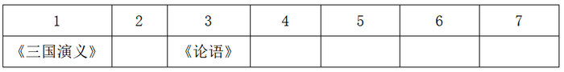

又结合条件（2）可知，《西游记》只能在最后一部；

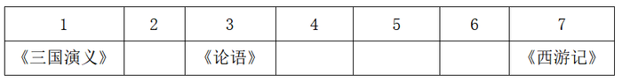

再根据条件（1）可知，《道德经》在《三国演义》之后，并且中间还要阅读其他两部著作，所以《道德经》是第四部阅读的；

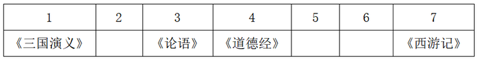

再根据条件（1）和条件（4）综合来看，《诗经》不能在第一位《三国演义》和第四位《道德经》之间，那么《诗经》的位置则在紧邻着《道德经》之后的第五位；

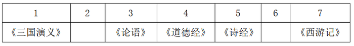

综上所述，《三国演义》在第一位；《论语》在第三位；《道德经》在第四位；《诗经》在第五位；《西游记》在第七位；《红楼梦》和《水浒传》在第二位或者第六位，无法确定。

故正确答案为D。

---

### 第 40 题　qid 2264464 · 逻辑判断

小若为了参加一项法律考试，准备在一周之内复习14门课程，其中民法课程5门、经济法课程3门、行政法课程3门、商法课程2门、国际私法课程1门。但是因为精力有限，小若每天只能复习2门课程，并且需要满足以下条件：
（1）星期四只能复习2门民法课程，其余每天必须复习两类不同的课程；
（2）国际私法必须在星期天复习；
（3）民法和行政法不能在同一天复习；
（4）经济法和商法不能在同一天复习。
由此可以推出，以下哪两类课程不可能在同一天复习？

- **A**. 经济法和国际私法　✅
- **B**. 行政法和经济法
- **C**. 行政法和商法
- **D**. 民法和经济法

**答案**：A

**官方解析**

根据条件（1），星期四只能复习两门民法，其余每天必须复习两类不同的课程，那么剩余的3门民法应该分别排在剩余六天中的其中三天；
根据条件（3），民法和行政法不能在同一天复习，那么3门行政法也应该在剩余六天中的三天，并且不能与民法在同一天，所以3门行政法和3门民法应该各占了剩余六天的三天，那么民法或行政法一定有一门在星期天；
根据条件（2），国际私法必须在星期天，因此国际私法一定与民法或者行政法的其中一个在同一天，由于国际法只有一次课，那么经济法和商法均不能与国际私法在同一天，A项当选。 
故正确答案为A。

---

## 资料分析

### 材料 1

 

#### 第 1 题　qid 2264396 · 平均数

2017年第三季度，全国平均每吨进口药品单价约为多少万美元？

- **A**. 2
- **B**. 19　✅
- **C**. 8
- **D**. 96

**答案**：B

**官方解析**

根据题干“2017年第三季度······平均每吨进口药品单价”，可判定本题为现期平均数问题。第三季度为7—9月。定位图形材料1可得：2017年7—9月进口药品数量分别为1.1万吨、1.2万吨、1.1万吨；定位图形材料2可得：2017年7—9月进口药品金额分别为19.6亿美元、23.8亿美元、21.9亿美元。由，结果在20万美元附近，与B项最接近。

故正确答案为B。

---

#### 第 2 题　qid 2264417 · 增长

2016年5月，全国进口药品金额环比增速：

- **A**. 
超过

- **B**. 
在之间

- **C**. 
在之间
　✅
- **D**. 
低于

**答案**：C

**官方解析**

根据题干“2016年5月······环比增速”，结合材料给出的2017年4、5月的数据，可判定本题为一般增长率问题，其中现期是2016年5月，基期是2016年4月。定位图形材料2可得：2017年5月进口药品金额为27.8亿美元，同比增速为；2017年4月进口药品金额为18.8亿美元，同比增速为。由可得：2016年5月进口药品金额亿美元，2016年4月进口药品金额亿美元；由，其范围符合C项。

故正确答案为C。

---

#### 第 3 题　qid 2264400 · 增长

2017年下半年，全国进口药品数量同比增速低于上月水平的月份有几个？

- **A**. 2
- **B**. 3
- **C**. 4　✅
- **D**. 5

**答案**：C

**官方解析**

根据题干“2017年下半年······同比增速低于上月水平······”结合材料给出了每个月的增长率，可判定本题为直接找数问题。2017年下半年为7—12月，定位图形材料1可得：2017年6—12月增长率分别为、、、、、、。比较可知：7月、9月、10月、12月增速低于上月水平，即有4个月。

故正确答案为C。

---

#### 第 4 题　qid 2264421 · 增长

以下折线图中，能准确反映2017年第四季度各月全国进口药品金额环比增长率的是：

- **A**. A
- **B**. B
- **C**. C
- **D**. D　✅

**答案**：D

**官方解析**

根据题干“2017年第四季度各月······环比增长率”，可判定本题为一般增长率问题。定位图形材料2可得：2017年9月-12月全国进口药品金额分别为21.9亿美元、18.4亿美元、24.0亿美元、27.8亿美元。根据公式：，2017年第四季度各月的环比增长率分别为：10月：；11月：；12月：。

即10月最小，11月最大。结合图像，D选项符合。

故正确答案为D。

---

#### 第 5 题　qid 2264423 · 综合

能够从上述资料中推出的是：

- **A**. 2016年下半年，全国进口药品数量低于1万吨的月份仅有2个
- **B**. 2017年11月，全国平均每吨进口药品单价低于上年同期水平　✅
- **C**. 2017年第二季度，全国进口药品金额超过75亿美元
- **D**. 2017年1月，全国进口药品金额超过20亿美元

**答案**：B

**官方解析**

A项：定位图形材料1，2017年7-12月全国进口药品数量分别为1.1万吨、1.2万吨、1.1万吨、1.0万吨、1.4万吨、1.3万吨；同比增速分别为、、、、、。根据公式：，2016年下半年全国进口药品数量分别为：，，，，，，只有10月低于1万吨，错误；

B项：定位图形材料1，2017年11月全国进口药品数量同比增速为；定位图形材料2，2017年11月全国进口药品金额同比增速为。由，药品金额增长率，药品数量增长率，则。根据两期平均数比较结论： 时，平均数低于上年。故2017年11月全国平均每吨进口药品单价低于上年同期水平，正确；

C项：定位图形材料2，2017年4-6月全国进口药品金额分别为18.8亿美元、27.8亿美元、26.5亿美元。故2017年第二季度全国进口药品金额，错误；

D项：定位图形材料2，2018年1月全国进口药品金额为22.2亿美元，同比增速为。根据公式：，2017年1月全国进口药品金额，错误。

故正确答案为B。

---

### 材料 2

        2017年全国二手车累计交易量为1240万辆，同比增长；二手车交易额为8092.7亿元，同比增长。2017年12月，全国二手车市场交易量为123万辆，交易量环比上升，上年同期交易量为108万辆。

#### 第 6 题　qid 2264438 · 增长

2011～2017年，全国二手车交易量同比增量低于80万辆的年份有几个？

- **A**. 3
- **B**. 4　✅
- **C**. 5
- **D**. 7

**答案**：B

**官方解析**

根据题干“······同比增量低于80万辆的年份有几个”，可判定本题为增长量的计算问题。定位图1可知2011~2017年每年的二手车交易量，以及2011年增长率为，根据公式：，可得2011年二手车增长量=。根据公式：，可得：

所以，2011~2017年，全国二手车交易量同比增量低于80万辆的年份有2011年、2013年、2014年、2015年这4年。

故正确答案为B。

---

#### 第 7 题　qid 2264439 · 综合

“十二五”（2011～2015年）期间，全国二手车总计交易约多少亿辆？

- **A**. 0.46
- **B**. 0.50
- **C**. 0.38
- **D**. 0.42　✅

**答案**：D

**官方解析**

定位图1可知2011~2015年全国二手车每年的交易量，所以“十二五”（2011~2015年）期间，全国二手车总计交易为，D项当选。

故正确答案为D。

---

#### 第 8 题　qid 2264440 · 平均数

2017年1～10月，平均每月全国二手车交易量约为多少万辆？

- **A**. 100　✅
- **B**. 105
- **C**. 90
- **D**. 95

**答案**：A

**官方解析**

根据题干“2017年1~10月，平均每月······万辆”，结合材料时间为2017年，可判定本题为现期平均数问题。定位文字材料“2017年全国二手车累计交易量为1240万辆······2017年12月，全国二手车交易量为123万辆，交易量环比上升”，可得2017年1~10月，平均每月全国二手车交易量约为，与A项最为接近。

故正确答案为A。

---

#### 第 9 题　qid 2264441 · 综合

2015年全国二手车交易总金额比2014年：

- **A**. 减少了不到100亿元　✅
- **B**. 减少了100亿元以上
- **C**. 增长了100亿元以上
- **D**. 增长了不到100亿元

**答案**：A

**官方解析**

根据选项“增长/减少······”，结合选项带具体单位，可判定本题为增长量计算问题。定位图1和图2，可知2015和2014年二手车交易量和平均交易价格，则2015年二手车交易总金额2014年二手车交易总金额，故减少不到100亿元。

故正确答案为A。

---

#### 第 10 题　qid 2264442 · 综合

能够从上述资料中推出的是：

- **A**. 
2016～2017年，全国二手车平均交易价格在6.1～6.15万元之间

- **B**. 
2011～2017年，全国二手车交易量同比增速第4高的年份，当年二手车平均交易价格高于6万元

- **C**. 
2011～2017年，全国二手车交易量同比增长量最高的年份其增长量是最低年份的9倍多
　✅
- **D**. 
2011～2017年，全国二手车交易量同比增速低于的年份有4个

**答案**：C

**官方解析**

A项：定位图1和图2，可知2016和2017年二手车交易量分别为1039万辆和1240万辆，平均交易价格分别为5.8万元/辆和6.5万元/辆，故2016~2017年全国二手车平均交易价格应在5.8~6.5万元/辆之间。由于，故2016~2017年，全国二手车平均交易价格应更偏向于2017年的平均交易价格，即应大于 ，即在6.15~6.5万元/辆之间，不在6.1~6.15万元之间，错误；

B项：定位图1，可知全国二手车交易量同比增速第4高的是2016年，对应图2平均交易价格为5.8万元，低于6万元，错误；

C项：定位图1，全国二手车交易量同比增长量最高的年份为2017年，其增长量为，同比增长量最低的年份为2015年，其增长量为，则，正确；

D项：定位图1，全国二手车交易量同比增速低于的年份有2013年()、2014年（）、2015年（），共3个年份符合，错误。

故正确答案为C。

---

### 材料 3

#### 第 11 题　qid 2264402 · 综合

2018年第一季度全国处理钓鱼网站总数：

- **A**. 不到5000个
- **B**. 在5000～6000个之间
- **C**. 在6001～7000个之间　✅
- **D**. 超过7000个

**答案**：C

**官方解析**

题干求2018年一季度全国处理钓鱼网站总数，根据表格可知2018年1月-2018年3月每月处理钓鱼网站的数量，可判定此题为简单加减计算问题。2018年第一季度（1-3月）全国处理钓鱼网站总数，在C项范围内。

故正确答案为C。

---

#### 第 12 题　qid 2264414 · 比重

2017年下半年，金融证券类和支付交易类钓鱼网站占当月处理钓鱼网站总数比重最低的月份是：

- **A**. 8月
- **B**. 9月
- **C**. 10月
- **D**. 11月　✅

**答案**：D

**官方解析**

题干求金融证券类和支付交易类钓鱼网站占当月处理钓鱼网站总数比重最低的月份，根据表格可知2017年1月-2018年4月每月金融证券类和支付交易类钓鱼网站占当月处理钓鱼网站总数比重，可判定此题为简单加减计算问题。根据选项及表格可得，8月：，9月：，10月：，11月：。11月最低。

故正确答案为D。

---

#### 第 13 题　qid 2264388 · 综合

2017年，全国处理的支付交易类钓鱼网站数量超过金融证券类钓鱼网站2倍的月份有几个？

- **A**. 5
- **B**. 6　✅
- **C**. 7
- **D**. 8

**答案**：B

**官方解析**

根据题干“2017年···超过···2倍···”，可判定本题为现期倍数问题。定位表格最后两列，给出的数据为每个月支付交易类钓鱼网站和金融证券类钓鱼网站的处理数量占当月总数的比重，每个月总数一定，故只需比较比重即可。则支付交易类钓鱼网站数量超过金融证券类钓鱼网站2倍的月份有：

2017年3月份，

2017年8月份，

2017年9月份，

2017年10月份，

2017年11月份，

2017年12月份，共有6个月份。

故正确答案为B。

---

#### 第 14 题　qid 2264425 · 增长

下列折线图中，能准确反映2018年第一季度CN域名钓鱼网站处理数量同比增速变化趋势的是：

- **A**. A
- **B**. B　✅
- **C**. C
- **D**. D

**答案**：B

**官方解析**

根据题干“2018年第一季度···同比增速变化趋势”，可判定本题为一般增长率比较问题。定位表格材料可得：2017年1月、2月、3月CN域名钓鱼网站处理数量分别为42个、91个、76个，2018年1月、2月、3月CN域名钓鱼网站处理数量分别为204个、58个、254个。根据增长率，可以利用的大小直接判定增长率的大小。2018年第一季度，即1月、2月、3月的分别为：、、，则1月同比增长率最大，2月同比增长率最小。

故正确答案为B。

---

#### 第 15 题　qid 2264433 · 综合

能够从上述资料中推出的是：

- **A**. 
2018年3月全国支付交易类钓鱼网站处理数量超过2500个
　✅
- **B**. 
2017年第一季度全国CN域名钓鱼网站处理数量占同期钓鱼网站处理总数的一成以上

- **C**. 
2018年2月全国支付交易类钓鱼网站处理数量环比下降了不到

- **D**. 
2017年全国处理的CN域名钓鱼网站中，超过了一半的网站是在12月处理的

**答案**：A

**官方解析**

A项：定位表格，2018年3月全国共处理钓鱼网站数量为个，支付交易类占比为，则2018年3月全国支付交易类钓鱼网站处理数量为，正确；

B项：定位表格，2017年第一季度CN域名处理数量为个，全国钓鱼网站处理总数为个，则2017年第一季度CN域名处理数量占总数的比重为，不到一成，错误；

C项：定位表格，2018年2月全国处理钓鱼网站数量为个，支付交易类占比为，则2018年2月支付交易类处理数量约为个；2018年1月全国处理钓鱼网站数量为个，支付交易类占比为，则2018年1月支付交易类处理数量约为个。那么2018年2月支付交易类钓鱼网站处理数量环比下降，错误；

D项：定位表格，2017年全国共处理CN域名钓鱼网站总数为个，其中12月份处理数量为302个，则12月份占全年的比重为，不到一半，错误。

故正确答案为A。

---

### 材料 4

        2017年，A省完成邮电业务总量6065.71亿元。其中，电信业务总量3575.86亿元，同比增长；邮政业务总量2489.85亿元，增长。

        2017年，A省移动电话期末用户1.48亿户，比上年末增长。其中，4G期末用户达1.18亿户，比上年末增长。互联网宽带接入期末用户3128万户，比上年末增长。移动互联网期末用户1.31亿户，比上年末增长，移动互联网接入流量同比增长。

        2017年，全省全年完成快递业务量100.51亿件，同比增长。其中，同城快递业务量增长，异地快递业务量增长，国际和港澳台地区快递业务量增长。

        2017年，A省完成客运总量148339万人次，同比增长，增幅比前三季度提高0.2个百分点，比上年提高0.5个百分点；完成旅客周转总量4143.84亿人公里，增长，增幅比前三季度提高0.7个百分点，比上年提高1.8个百分点。

        2017年，A省完成高铁客运量17872万人次，旅客周转量474.64亿人公里，同比分别增长和。高铁客运量和旅客周转量分别占铁路旅客运输总量的和，比重比上年分别提高4.3个和3.9个百分点。

#### 第 16 题　qid 2264427 · 增长

2017年A省邮电业务总量同比增速在以下哪个范围之内？

- **A**. 
低于

- **B**. 
之间

- **C**. 
之间
　✅
- **D**. 
超过

**答案**：C

**官方解析**

根据“2017年A省邮电业务总量同比增速在以下哪个范围”，且材料已知电信业务和邮政业务的增长率，可判断此题为混合增长率问题。定位文字材料第一段，“2017年，A省完成邮电业务总量6065.71亿元。其中，电信业务总量3575.86亿元，同比增长；邮政业务总量2489.85亿元，增长”，根据混合增长率的口诀：混合居中但不中，偏向基期大的部分。由此可得A省邮电业务总量的增长率应介于和之间，结合选项可排除A。和的中间值为，又电信业务总量基期为亿元，邮政业务总量基期为亿元，电信业务总量略大于邮政业务总量，所以混合增长率略大于中间值，对应C项。

故正确答案为C。

---

#### 第 17 题　qid 2264434 · 比重

2017年A省快递业务中，业务量占总业务量比重高于上年水平的分类是：

- **A**. 仅国际和港澳台地区快递
- **B**. 异地快递、国际和港澳台地区快递　✅
- **C**. 仅同城快递
- **D**. 同城快递、异地快递

**答案**：B

**官方解析**

根据“2017年A省快递业务中，······占······比重高于上年水平的分类是···”，可判断此题为两期比重问题。定位文字材料第三段，“2017年，全省全年完成快递业务量100.51亿件，同比增长。其中，同城快递业务量增长，异地快递业务量增长，国际和港澳台地区快递业务量增长”，可知总业务量增长率（b）为。若业务量占总业务量比重高于上年水平，需满足，即大于。所以满足题意的有异地快递业务量，国际和港澳台地区快递业务量，对应选项B。

故正确答案为B。

---

#### 第 18 题　qid 2264435 · 增长

2017年前三季度，A省平均每人次客运旅客运输距离（）同比：

- **A**. 
下降了不到

- **B**. 
下降了以上

- **C**. 
上升了不到
　✅
- **D**. 
上升了以上

**答案**：C

**官方解析**

根据“2017年前三季度，A省平均每人次客运旅客运输距离（）同比…”，结合选项上升/下降，可判断此题为平均数的增长率问题。定位文字材料第四段，“2017年，A省完成客运总量···，同比增长，增幅比前三季度提高0.2个百分点···；完成旅客周转总量···，增长，增幅比前三季度提高0.7个百分点···”，可知2017年前三季度，客运总量增长率（b）为，旅客周转量增长率（a）为。代入平均数的增长率公式：，且大于0，结合选项，C满足题意。

故正确答案为C。

---

#### 第 19 题　qid 2264436 · 综合

2016年，A省高铁客运量约是普铁（除高铁外的铁路）客运量的多少倍？

- **A**. 1.4　✅
- **B**. 1.7
- **C**. 0.8
- **D**. 1.1

**答案**：A

**官方解析**

根据题干“2016年···约是···的多少倍”，结合材料时间为2017年，可判定本题为基期倍数问题。定位材料文字第五段可得：2017年A省高铁客运量占铁路旅客运输总量的，比重比上年提高4.3个百分点。可知2016年A省高铁客运量占整体比重为，则2016年A省普铁（除高铁外的铁路）占整体比重为。故所求倍数倍

故正确答案为A。

---

#### 第 20 题　qid 2264437 · 比重

在以下4条关于A省的信息中，能够直接从资料中推出的有几条？
①2017年非4G移动电话用户全年增量
②2017年移动互联网用户日均增量
③2015年客运总量
④2017年铁路旅客运输总量占客运总量比重

- **A**. 1
- **B**. 2
- **C**. 3
- **D**. 4　✅

**答案**：D

**官方解析**

①定位文字材料第二段可得：“2017年，A省移动电话期末用户1.48亿户，比上年末增长。其中，4G期末用户达1.18亿户，比上年末增长”，可推知2017年A省移动电话用户全年增长量亿户，4G用户亿户，故，可求；

②定位文字材料第二段可得：“2017年，移动互联网期末用户1.31亿户，比上年末增长”，可推知2017年移动互联网用户全年增长量亿户，2017年共365天，故，可求；

③定位文字材料第四段可得：“2017年，A省完成客运总量148339万人次，同比增长···，比上年提高0.5个百分点”，可推知2016年增长率，根据间隔增长率公式，可得2017年相对于2015年客运总量的间隔，故2015年客运总量，可求；

④定位文字材料第四段可得：“2017年，A省完成客运总量148339万人次”，定位文字材料第五段可得：“2017年A省完成高铁客运量17872万人次，······占铁路旅客运输总量的”，可推知2017年A省铁路旅客运输总量万人次，故2017年铁路旅客运输总量占客运总量比重为，可求。

能够直接从资料中推出的有4条。

故正确答案为D。

---
