# 2019年国家公务员录用考试《行测》题（地市级网友回忆版）

> 国考 · 2019 年 · 6 个模块 · 共 130 题

- [政治理论](#%E6%94%BF%E6%B2%BB%E7%90%86%E8%AE%BA) · 3 题
- [常识判断](#%E5%B8%B8%E8%AF%86%E5%88%A4%E6%96%AD) · 17 题
- [言语理解与表达](#%E8%A8%80%E8%AF%AD%E7%90%86%E8%A7%A3%E4%B8%8E%E8%A1%A8%E8%BE%BE) · 40 题
- [数量关系](#%E6%95%B0%E9%87%8F%E5%85%B3%E7%B3%BB) · 10 题
- [判断推理](#%E5%88%A4%E6%96%AD%E6%8E%A8%E7%90%86) · 40 题
- [资料分析](#%E8%B5%84%E6%96%99%E5%88%86%E6%9E%90) · 20 题

---

## 政治理论

### 第 1 题　qid 2264312 · 新思想

党的十八大以来，以习近平同志为核心的党中央，紧密结合新的时代条件和实践要求，以全新的视野深化对共产党执政规律、社会主义建设规律、人类社会发展规律的认识，创立了习近平新时代中国特色社会主义思想，其核心要义是：

- **A**. 坚持和发展中国特色社会主义　✅
- **B**. 中国特色社会主义进入了新时代
- **C**. 实现社会主义现代化和中华民族伟大复兴
- **D**. 坚持以人民为中心的发展思想

**答案**：A

**官方解析**

本题考查政治常识。
A项正确，习近平新时代中国特色社会主义思想的核心要义，就是坚持和发展中国特色社会主义，具体体现在它从理论和实践结合上系统回答了新时代坚持和发展什么样的中国特色社会主义、怎样坚持和发展中国特色社会主义这个重大时代课题，回答了新时代坚持和发展中国特色社会主义的总目标、总任务、总体布局、战略布局和发展方向、发展方式、发展动力、战略步骤、外部条件、政治保证等基本问题，并且根据新的实践对经济、政治、法治、科技、文化、教育、民生、民族、宗教、社会、生态文明、国家安全、国防和军队、“一国两制”和祖国统一、统一战线、外交、党的建设等各方面作出理论分析和政策指导，为更好坚持和发展中国特色社会主义提供了思想武器和行动指南。
B项错误，习近平总书记在党的十九大报告中指出，“经过长期努力，中国特色社会主义进入了新时代，这是我国发展新的历史方位。”
C项错误，习近平总书记在党的十九大报告中指出，“新时代中国特色社会主义思想，明确坚持和发展中国特色社会主义，总任务是实现社会主义现代化和中华民族伟大复兴。”
D项错误，习近平总书记在党的十九大报告中指出，“坚持以人民为中心。人民是历史的创造者，是决定党和国家前途命运的根本力量。必须坚持人民主体地位，坚持立党为公、执政为民，践行全心全意为人民服务的根本宗旨，把党的群众路线贯彻到治国理政全部活动之中，把人民对美好生活的向往作为奋斗目标，依靠人民创造历史伟业。”
故正确答案为A。

---

### 第 2 题　qid 2264314 · 新思想

根据党的十九大报告，下列说法不准确的是：

- **A**. 发展是解决我国一切问题的基础和关键
- **B**. 完善就业保障是中华民族永续发展的千年大计　✅
- **C**. 文化自信是一个国家、一个民族发展中更基本、更深沉、更持久的力量
- **D**. 带领人民创造美好生活是我们党始终不渝的奋斗目标

**答案**：B

**官方解析**

本题考查政治常识。
A项正确，十九大报告第三部分“新时代中国特色社会主义思想和基本方略”的第4条阐述了坚持新发展理念，提出：“发展是解决我国一切问题的基础和关键，发展必须是科学发展，必须坚定不移贯彻创新、协调、绿色、开放、共享的发展理念。”
B项错误，十九大报告第三部分“新时代中国特色社会主义思想和基本方略”的第9条阐述了坚持人与自然和谐共生，提出：“建设生态文明是中华民族永续发展的千年大计。必须树立和践行绿水青山就是金山银山的理念，坚持节约资源和保护环境的基本国策，像对待生命一样对待生态环境，统筹山水林田湖草系统治理，实行最严格的生态环境保护制度，形成绿色发展方式和生活方式，坚定走生产发展、生活富裕、生态良好的文明发展道路，建设美丽中国，为人民创造良好生产生活环境，为全球生态安全作出贡献。”
C项正确，十九大报告第三部分“新时代中国特色社会主义思想和基本方略”的第7条阐述了坚持社会主义核心价值体系，提出：“文化自信是一个国家、一个民族发展中更基本、更深沉、更持久的力量。必须坚持马克思主义，牢固树立共产主义远大理想和中国特色社会主义共同理想，培育和践行社会主义核心价值观，不断增强意识形态领域主导权和话语权，推动中华优秀传统文化创造性转化、创新性发展，继承革命文化，发展社会主义先进文化，不忘本来、吸收外来、面向未来，更好构筑中国精神、中国价值、中国力量，为人民提供精神指引。”
D项正确，十九大报告第八部分“提高保障和改善民生水平，加强和创新社会治理”提出：“全党必须牢记，为什么人的问题，是检验一个政党、一个政权性质的试金石。带领人民创造美好生活，是我们党始终不渝的奋斗目标。必须始终把人民利益摆在至高无上的地位，让改革发展成果更多更公平惠及全体人民，朝着实现全体人民共同富裕不断迈进。”
本题为选非题，故正确答案为B。

---

### 第 3 题　qid 2264316 · 新思想

中国特色社会主义是改革开放以来党的全部理论和实践的主题，是党和人民历尽千辛万苦、付出巨大代价取得的根本成就。中国特色社会主义最本质的特征是：

- **A**. 依法治国
- **B**. 人民当家作主
- **C**. 实行人民代表大会制度
- **D**. 中国共产党领导　✅

**答案**：D

**官方解析**

本题考查政治常识。
A项错误，党的十九大报告中指出：“全面依法治国是中国特色社会主义的本质要求和重要保障。”同时也指出：“依法治国是党领导人民治理国家的基本方式。”
B项错误，党的十九大报告中指出：“人民当家作主是社会主义民主政治的本质特征”。
C项错误，党的十九大报告指出：“人民代表大会制度是坚持党的领导、人民当家作主、依法治国有机统一的根本政治制度安排，必须长期坚持、不断完善。” 
D项正确，党的十九大报告中指出：“明确中国特色社会主义最本质的特征是中国共产党领导，中国特色社会主义制度的最大优势是中国共产党领导，党是最高政治领导力量，提出新时代党的建设总要求，突出政治建设在党的建设中的重要地位。”
故正确答案为D。

---

## 常识判断

### 第 1 题　qid 2264318 · 人文常识

下列与扶贫有关的说法正确的是：

- **A**. 习近平总书记首次提出了“精准扶贫”的理念　✅
- **B**. 扶贫工作坚持扶贫同扶志相结合，“大水漫灌”与“精准滴灌”相结合
- **C**. 全面发展高新技术产业是《“十三五”脱贫攻坚规划》提出的一项重要举措
- **D**. 脱贫目标是到2035年稳定实现现行标准下农村贫困人口“两不愁、三保障”

**答案**：A

**官方解析**

本题考查政治常识。
A项正确，2013年11月，习近平总书记到湖南湘西考察时首次提出了“精准扶贫”的重要思想。
B项错误，党的十九大报告指出：“坚持大扶贫格局，注重扶贫同扶志、扶智相结合。”因此选项前半句表述正确。《“十三五”脱贫攻坚规划》中指出：“坚持精准扶贫、精准脱贫。”“变‘大水漫灌’为‘精准滴灌’，做到真扶贫、扶真贫、真脱贫。”因此“大水漫灌”与“精准滴灌”相结合表述错误。
C项错误，《“十三五”脱贫攻坚规划》中关于脱贫的路径包括产业发展脱贫、转移就业脱贫、易地搬迁脱贫、教育扶贫、健康扶贫、生态保护扶贫、兜底保障以及社会扶贫等8大路径，在产业发展脱贫中包括农林产业、旅游、电商、资产收益、科技等扶贫项目，没有提及全面发展高新技术产业。
D项错误，《“十三五”脱贫攻坚规划》中第三节脱贫目标提出：“到2020年，稳定实现现行标准下农村贫困人口不愁吃、不愁穿，义务教育、基本医疗、住房安全有保障（即‘两不愁、三保障’）。”
故正确答案为A。

---

### 第 2 题　qid 2264319 · 法律常识

根据我国宪法和有关法律，下列国家机关的哪一做法不符合规定？

- **A**. 某市监察委员会决定对涉嫌行贿的某公司法定代表人实行留置
- **B**. 某自治州人民代表大会常务委员会制定城市环境管理的地方性法规
- **C**. 某县人民法院执行民事案件时要求被执行人提供手机微信记录　✅
- **D**. 中国证券监督管理委员会依法制定有关上市公司的监管规章

**答案**：C

**官方解析**

本题考查法律常识。
A项正确，根据《监察法》第二十二条第一、二款规定：“被调查人涉嫌贪污贿赂、失职渎职等严重职务违法或者职务犯罪，监察机关已经掌握其部分违法犯罪事实及证据，仍有重要问题需要进一步调查，并有下列情形之一的，经监察机关依法审批，可以将其留置在特定场所：（一）涉及案情重大、复杂的；（二）可能逃跑、自杀的；（三）可能串供或者伪造、隐匿、毁灭证据的；（四）可能有其他妨碍调查行为的。对涉嫌行贿犯罪或者共同职务犯罪的涉案人员，监察机关可以依照前款规定采取留置措施。”因此，某市监察委员会决定对涉嫌行贿的某公司法定代表人实行留置符合法律规定。
B项正确，根据《立法法》第七十二条第五款规定：“自治州的人民代表大会及其常务委员会可以依照本条第二款规定行使设区的市制定地方性法规的职权。”《立法法》第七十二条第二款规定：“设区的市的人民代表大会及其常务委员会根据本市的具体情况和实际需要，在不同宪法、法律、行政法规和本省、自治区的地方性法规相抵触的前提下，可以对城乡建设与管理、环境保护、历史文化保护等方面的事项制定地方性法规，法律对设区的市制定地方性法规的事项另有规定的，从其规定。”因此，某自治州人大常委会有权制定城市环境管理方面的地方性法规。
C项错误，根据《宪法》第四十条规定：“中华人民共和国公民的通信自由和通信秘密受法律的保护。除因国家安全或者追查刑事犯罪的需要，由公安机关或者检察机关依照法律规定的程序对通信进行检查外，任何组织或者个人不得以任何理由侵犯公民的通信自由和通信秘密。”微信记录属于公民的通信秘密，某县人民法院执行民事案件时无权要求被执行人提供手机微信记录。
D项正确，《证券法》第一百六十九条规定：“国务院证券监督管理机构在对证券市场实施监督管理中履行下列职责：（一）依法制定有关证券市场监督管理的规章、规则，并依法进行审批、核准、注册，办理备案······”中国证券监督管理委员会（证监会）是国务院证券监督管理机构，有权依法制定有关上市公司的监管规章。
本题为选非题，故正确答案为C。
【注】本题A项所涉《中华人民共和国监察法》于2024年12月修改，解析中的第22条第一、二款在新法中为第24条第一、二款；B项《中华人民共和国立法法》于2023年3月修改，解析中的第72条第二款、第五款在新法中是第81条第二款、第五款。

---

### 第 3 题　qid 2264321 · 人文常识

下列与我国军事国防相关的说法错误的是：

- **A**. 大力发展军民融合是维护国家主权和安全的战略基石　✅
- **B**. 新形势下我军的军事战略方针是积极防御
- **C**. 中国位于海洋地缘战略区和欧亚大陆地缘战略区的交接处
- **D**. 维护地区和世界和平是我国军队担负的主要战略任务之一

**答案**：A

**官方解析**

本题考查政治常识。
A项错误，2015年国防白皮书《中国的军事战略》指出：“核力量是维护国家主权和安全的战略基石。中国始终奉行不首先使用核武器的政策，坚持自卫防御的核战略，无条件不对无核武器国家和无核武器区使用或威胁使用核武器，不与任何国家进行核军备竞赛，核力量始终维持在维护国家安全需要的最低水平。” 
B项正确，2015年国防白皮书《中国的军事战略》指出：“积极防御战略思想是中国共产党军事战略思想的基本点。”“根据国家安全和发展战略，适应新的历史时期形势任务要求，坚持实行积极防御军事战略方针，与时俱进加强军事战略指导，进一步拓宽战略视野、更新战略思维、前移指导重心，整体运筹备战与止战、维权与维稳、威慑与实战、战争行动与和平时期军事力量运用，注重深远经略，塑造有利态势，综合管控危机，坚决遏制和打赢战争。”
C项正确，中国位于世界两大地缘战略区的交接处，既受其他大国关系的影响，又影响其他大国关系。目前，世界可划分为两大地缘战略区，即海洋地缘战略区和欧亚大陆地缘战略区。美国属于海洋地缘战略区，而且是世界超级海洋强国，具有全球性影响。世界上其他强国大都集中在欧亚大陆地缘战略区，俄罗斯则位于该战略区的心脏地带。中国属于欧亚大陆地缘战略区，背靠欧亚大陆，面向太平洋，处于两大战略区的交接处，历史上曾遭到两大战略区强国的侵略和压迫，现在则成为能够对两大战略区关系产生重要影响和作用的国家。
D项正确， 2015年国防白皮书《中国的军事战略》指出：“中国军队主要担负以下战略任务：应对各种突发事件和军事威胁，有效维护国家领土、领空、领海主权和安全；坚决捍卫祖国统一；维护新型领域安全和利益；维护海外利益安全；保持战略威慑，组织核反击行动；参加地区和国际安全合作，维护地区和世界和平；加强反渗透、反分裂、反恐怖斗争，维护国家政治安全和社会稳定；担负抢险救灾、维护权益、安保警戒和支援国家经济社会建设等任务。”
本题为选非题，故正确答案为A。

---

### 第 4 题　qid 2264324 · 法律常识

关于人民陪审员，下列说法符合法律规定的是：

- **A**. 陪审员小李所在的单位因其在工作日参加审判活动而扣发他的奖金
- **B**. 公证员小张被某县人民法院选聘为人民陪审员
- **C**. 陪审员小赵在七人合议庭审理的案件中对法律适用参加表决
- **D**. 陪审员小刘参加审判活动，人民法院按实际工作日对其给予补助　✅

**答案**：D

**官方解析**

本题考查法律常识。
A项错误，《人民陪审员法》第二十九条第一款规定：“人民陪审员参加审判活动期间，所在单位不得克扣或者变相克扣其工资、奖金及其他福利待遇。”因此，小李所在单位扣发奖金的做法不符合法律规定。
B项错误，《人民陪审员法》第六条规定：“下列人员不能担任人民陪审员：（一）人民代表大会常务委员会的组成人员，监察委员会、人民法院、人民检察院、公安机关、国家安全机关、司法行政机关的工作人员；（二）律师、公证员、仲裁员、基层法律服务工作者；（三）其他因职务原因不适宜担任人民陪审员的人员。”因此，公证员小张不能担任人民陪审员。
C项错误，《人民陪审员法》第二十二条规定：“人民陪审员参加七人合议庭审判案件，对事实认定，独立发表意见，并与法官共同表决；对法律适用，可以发表意见，但不参加表决。”因此，陪审员小赵参加七人合议庭审判案件，不能对法律适用进行表决。
D项正确，《人民陪审员法》第三十条第一款规定：“人民陪审员参加审判活动期间，由人民法院依照有关规定按实际工作日给予补助。”因此，法院的做法符合法律规定。
故正确答案为D。

---

### 第 5 题　qid 2264326 · 法律常识

下列犯罪行为应以盗窃罪论处的是：

- **A**. 甲窃得价值5000元的手机一部，被发现后持械抗拒抓捕
- **B**. 乙窃得同事的信用卡一张，并用其消费10000元　✅
- **C**. 丙在火车上捡到价值50000元的提包一只，经失主催要后拒不归还
- **D**. 丁为某私营公司的销售主管，在销售过程中私自将价值50000元的产品据为己有

**答案**：B

**官方解析**

本题考查法律常识。
A项错误，根据《中华人民共和国刑法》第二百六十九条规定：“犯盗窃、诈骗、抢夺罪，为窝藏赃物、抗拒抓捕或者毁灭罪证而当场使用暴力或者以暴力相威胁的，依照抢劫罪定罪处罚。”甲犯盗窃罪，为抗拒抓捕而当场使用暴力，其行为已转化为抢劫。
B项正确，根据《中华人民共和国刑法》第一百九十六条第三款规定：“盗窃信用卡并使用的，依照盗窃罪定罪处罚。”乙盗窃信用卡并使用，构成盗窃罪。
C项错误，根据《中华人民共和国刑法》第二百七十条第二款规定：“将他人的遗忘物或者埋藏物非法占为己有，数额较大，拒不交出的，依照侵占罪处罚。”丙捡到价值50000的提包，经失主催要拒不归还的行为构成侵占罪。
D项错误，根据《中华人民共和国刑法》第二百七十一条第一款规定：“公司、企业或者其他单位的工作人员，利用职务上的便利，将本单位财物非法占为己有，数额较大的，处三年以下有期徒刑或者拘役，并处罚金；数额巨大的，处三年以上十年以下有期徒刑，并处罚金；数额特别巨大的，处十年以上有期徒刑或者无期徒刑，并处罚金。”丁作为私营公司销售主管，利用职务便利将产品据为己有的行为构成职务侵占罪。
故正确答案为B。

---

### 第 6 题　qid 2264330 · 法律常识

关于我国诉讼程序中的鉴定，下列说法错误的是：

- **A**. 对于鉴定所形成的结果，当事人有异议的可申请重新鉴定
- **B**. 鉴定人在鉴定意见上的签名或盖章均具有法律效力
- **C**. 民事诉讼中，基于意思自治原则，鉴定只能由当事人申请　✅
- **D**. 刑事诉讼中，鉴定人是否有必要出庭由人民法院决定

**答案**：C

**官方解析**

本题主要考查法律常识。
A项正确，根据《最高人民法院关于民事诉讼证据的若干规定》第二十七条规定：“当事人对人民法院委托的鉴定部门作出的鉴定结论有异议申请重新鉴定，提出证据证明存在下列情形之一的，人民法院应予准许：（一）鉴定机构或者鉴定人员不具备相关的鉴定资格的；（二）鉴定程序严重违法的；（三）鉴定结论明显依据不足的；（四）经过质证认定不能作为证据使用的其他情形。对有缺陷的鉴定结论，可以通过补充鉴定、重新质证或者补充质证等方法解决的，不予重新鉴定。”以及第二十八条规定：“一方当事人自行委托有关部门作出的鉴定结论，另一方当事人有证据足以反驳并申请重新鉴定的，人民法院应予准许。”可知，对于鉴定所形成的结果，当事人有异议的可申请重新鉴定。根据《刑事诉讼法》第一百四十八条规定：“侦查机关应当将用作证据的鉴定意见告知犯罪嫌疑人、被害人。如果犯罪嫌疑人、被害人提出申请，可以补充鉴定或者重新鉴定。”由此可见，民事诉讼和刑事诉讼中，当事人均可以申请重新鉴定。
B项正确，根据《中华人民共和国民事诉讼法》第七十七条第二款规定：“鉴定人应当提出书面鉴定意见，在鉴定书上签名或者盖章。”《中华人民共和国刑事诉讼法》第一百四十七条第一款规定：“鉴定人进行鉴定后，应当写出鉴定意见，并且签名。”由此可知，鉴定人的签名或者盖章均具有法律效力。
C项错误，根据《中华人民共和国民事诉讼法》第七十六条规定：“当事人可以就查明事实的专门性问题向人民法院申请鉴定。当事人申请鉴定的，由双方当事人协商确定具备资格的鉴定人；协商不成的，由人民法院指定。当事人未申请鉴定，人民法院对专门性问题认为需要鉴定的，应当委托具备资格的鉴定人进行鉴定。”由此可见，鉴定的启动方式有二：一是当事人申请鉴定，二是法院委托鉴定。
D项正确，根据《中华人民共和国刑事诉讼法》第一百九十二条第三款规定：“公诉人、当事人或者辩护人、诉讼代理人对鉴定意见有异议，人民法院认为鉴定人有必要出庭的，鉴定人应当出庭作证。经人民法院通知，鉴定人拒不出庭作证的，鉴定意见不得作为定案的根据。”可见鉴定人是否出庭，取决于人民法院是否认为有必要。 
本题为选非题，故正确答案为C。

---

### 第 7 题　qid 2264331 · 人文常识

某有限责任公司有股东甲、乙、丙、丁、戊5人，注册资本为200万元，其中甲出资10万元、乙20万元、丙10万元、丁10万元、戊150万元。公司运行3年后，效益良好，甲、乙、丙、丁在戊出差期间自行商量后通过了进一步增加注册资本50万元的决议。下列说法正确的是：

- **A**. 甲、乙、丙、丁通过的决议有效
- **B**. 该增资决议应由全体股东一致同意
- **C**. 戊可以自行决定是否增加注册资本，无需经过甲乙丙丁的同意
- **D**. 戊可以向人民法院起诉确认该增资决议无效　✅

**答案**：D

**官方解析**

本题考查法律常识。
根据《中华人民共和国公司法》第三十七条规定：“股东会行使下列职权：······(七)对公司增加或者减少注册资本作出决议······对前款所列事项股东以书面形式一致表示同意的，可以不召开股东会会议，直接作出决定，并由全体股东在决定文件上签名、盖章。”根据该法第四十三条第二款规定：“股东会会议作出修改公司章程、增加或者减少注册资本的决议，以及公司合并、分立、解散或者变更公司形式的决议，必须经代表三分之二以上表决权的股东通过。”根据该法第四十二条规定：“股东会会议由股东按照出资比例行使表决权；但是，公司章程另有规定的除外。”
A项错误，根据《中华人民共和国公司法》第三十七条的规定，公司通过增资决议且不需要召开股东会会议的情形为股东以书面形式一致表示同意，则可直接作出决定，并由全体股东在决定文件上签名、盖章。本题中，戊出差不知情，显然不属于《中华人民共和国公司法》第三十七条规定的可以不召开股东会会议的情形。且甲、乙、丙、丁四人不能代表三分之二以上表决权，故其自行商量通过的增资决议无效。
B项错误，甲、乙、丙、丁四人自行商量后通过增资决议，不属于《中华人民共和国公司法》第三十七条的可以不召开股东会会议的情形，需要召开股东会会议，并且经代表三分之二以上表决权的股东通过即可，不需要全体股东一致同意。
C项错误，虽然戊代表该公司三分之二以上的表决权，但通过增资决议需要按照法律和章程规定召开股东会由股东会决议，或者以书面形式一致表示同意，而不能由戊自行决定。 
D项正确，由于甲乙丙丁四人自行商量通过的增资决议无效(A项已解析)，故根据《最高人民法院关于适用 &lt;中华人民共和国公司法&gt;若干问题的规定（四）》第一条：“公司股东、董事、监事等请求确认股东会或者股东大会、董事会决议无效或者不成立的，人民法院应当依法予以受理。”所以戊可以向人民法院起诉确认该增资决议无效。
故正确答案为D。

---

### 第 8 题　qid 2264313 · 人文常识

垄断协议分为横向垄断协议和纵向垄断协议。下列哪一垄断协议与其他三项不同？

- **A**. 甲市销售额排名前五的手机销售门店召开会议，指定下半年各类手机产品的最低价格
- **B**. 乙市四家最大的面包店把全市五十家面包店组织在一起，协议指定采购某品牌面粉
- **C**. 丙市七家米粉厂互相约定，各米粉厂只能在划定的区域内销售米粉
- **D**. 丁市某电器生产公司和八家电器销售公司约定对外批发电器的销售价格　✅

**答案**：D

**官方解析**

本题考查法律常识。
根据《中华人民共和国反垄断法》第十三条规定：“禁止具有竞争关系的经营者达成下列垄断协议：（一）固定或者变更商品价格；（二）限制商品的生产数量或者销售数量；（三）分割销售市场或者原材料采购市场；（四）限制购买新技术、新设备或者限制开发新技术、新产品；（五）联合抵制交易；（六）国务院反垄断执法机构认定的其他垄断协议。本法所称垄断协议，是指排除、限制竞争的协议、决定或者其他协同行为。”根据该法第十四条规定：“禁止经营者与交易相对人达成下列垄断协议：（一）固定向第三人转售商品的价格；（二）限定向第三人转售商品的最低价格；（三）国务院反垄断执法机构认定的其他垄断协议。”横向垄断协议即《中华人民共和国反垄断法》第十三条规定的情形，是指具有竞争关系的经营者达成的协议，典型的横向垄断协议包括固定价格、限定产量、划分市场、联合抵制等。纵向垄断协议即《中华人民共和国反垄断法》第十四条规定的情形，是指两个或两个以上在同一产业中处于不同阶段而有买卖关系的企业间的垄断协议，典型的纵向垄断协议包括维持转售价格协议和独家销售协议等。
A项中甲市排名前五的手机销售门店是具有竞争关系的经营者，达成的指定各类手机产品最低销售价格的协议属于横向垄断协议。
B项中乙市四家最大面包店与其他五十家面包店是具有竞争关系的经营者，达成的采购某品牌面粉的协议属于横向垄断协议。
C项中丙市七家米粉厂是具有竞争关系的经营者，达成的在划定区域内销售米粉的协议属于横向垄断协议。
D项中丁市某电器生产公司和八家电器销售公司是有买卖关系的企业，达成的对外批发电器销售价格的协议属于纵向垄断协议。
故正确答案为D。

---

### 第 9 题　qid 2264315 · 法律常识

下列情形中，用人单位不需要支付经济补偿金的是：

- **A**. 甲公司提出并与张某协商一致解除劳动合同
- **B**. 乙公司未依法为李某提供劳动保护，李某提出解除劳动合同
- **C**. 丙公司生产经营发生严重困难而解除与孙某的劳动合同
- **D**. 丁公司于劳动合同期满后提高待遇要求续签，赵某拒绝　✅

**答案**：D

**官方解析**

本题考查法律常识。
关于经济补偿的问题，《劳动合同法》第四十六条作出了规定：“有下列情形之一的，用人单位应当向劳动者支付经济补偿：（一）劳动者依照本法第三十八条规定解除劳动合同的；（二）用人单位依照本法第三十六条规定向劳动者提出解除劳动合同并与劳动者协商一致解除劳动合同的；（三）用人单位依照本法第四十条规定解除劳动合同的；（四）用人单位依照本法第四十一条第一款规定解除劳动合同的；（五）除用人单位维持或者提高劳动合同约定条件续订劳动合同，劳动者不同意续订的情形外，依照本法第四十四条第一项规定终止固定期限劳动合同的；（六）依照本法第四十四条第四项、第五项规定终止劳动合同的；（七）法律、行政法规规定的其他情形。”
《劳动合同法》第四十四条规定：“有下列情形之一的，劳动合同终止：（一）劳动合同期满的；······（四）用人单位被依法宣告破产的；（五）用人单位被吊销营业执照、责令关闭、撤销或者用人单位决定提前解散的；······”
A项正确，《劳动合同法》第三十六条规定：“用人单位与劳动者协商一致，可以解除劳动合同。”因此，甲公司应当向张某支付经济补偿金。
B项正确，《劳动合同法》第三十八条规定：“用人单位有下列情形之一的，劳动者可以解除劳动合同：（一）未按照劳动合同约定提供劳动保护或者劳动条件的；······”因此，乙公司应当向李某支付经济补偿金。
C项正确，《劳动合同法》第四十一条第一款规定：“有下列情形之一，需要裁减人员二十人以上或者裁减不足二十人但占企业职工总数百分之十以上的，用人单位提前三十日向工会或者全体职工说明情况，听取工会或者职工的意见后，裁减人员方案经向劳动行政部门报告，可以裁减人员：······（二）生产经营发生严重困难的；······”因此，丙公司应当向孙某支付经济补偿金。
D项错误，根据《劳动合同法》第四十六条第（五）项的规定，劳动合同期满，用人单位维持或者提高劳动合同约定条件续订劳动合同，劳动者不同意续订的，用人单位不支付经济补偿金。因此，丁公司不需要向赵某支付经济补偿金。
本题为选非题，故正确答案为D。

---

### 第 10 题　qid 2264317 · 经济常识

有关经济学常识，下列说法错误的是：

- **A**. 国民收入统计中包括退休金　✅
- **B**. 货币发行是中央银行的负债业务
- **C**. 公共物品无法通过市场机制来调节供求
- **D**. 春节前后的物价上涨不属于通货膨胀

**答案**：A

**官方解析**

本题考查经济常识。
A项错误，国民收入是指物质生产部门劳动者在一定时期所创造的价值，是一国生产要素（包括土地、劳动、资本、企业家才能等）所有者在一定时期内提供生产要素所得的报酬，即工资、利息、租金和利润等的总和。退休人员的退休金在经济中属于政府转移支付的范畴，属于政府支出，不属于国民收入。
B项正确，中央银行负债业务主要包括存款业务、货币发行业务、经理国库业务、对外负债和资本业务。
C项正确，公共物品是“私人物品” 的对称，具有非竞争性和非排他性。如果公共物品由市场进行调节，由于市场调节具有自发性、盲目性和滞后性等缺点，会导致资源配置效率低下、社会不稳定等后果，因此公共物品不能由私营部门通过市场提供而必须由公共部门以非市场方式提供。
D项正确，通货膨胀指市场上流通的货币量超过实际所需的货币量，导致货币贬值，而引起的一段时间内物价持续而普遍地上涨现象。春节期间由于短时间内的商品需求增加从而导致物价上涨，不属于通货膨胀。
本题为选非题，故正确答案为A。

---

### 第 11 题　qid 2264320 · 人文常识

这幅图反映了某次重要会议，这次会议可能是：

- **A**. 巴黎和会
- **B**. 华盛顿会议　✅
- **C**. 万隆会议
- **D**. 雅尔塔会议

**答案**：B

**官方解析**

本题考查人文常识。
A项错误，巴黎和会是在1919年，第一次世界大战获胜的协约国集团在法国巴黎召开的缔结和约的会议，美、英、法三国的政府首脑操纵了和会。和会上签订了处置德国的《凡尔赛和约》，同时还分别同奥地利、匈牙利、土耳其等国签订了一系列和约。它们构成了凡尔赛体系，确立了一战后由美、英、法等主要战胜国主导的国际政治格局。
B项正确， 1921年11月，美、英、法、日、意、比、荷、葡和中国九国代表在华盛顿召开会议。华盛顿会议实质上是巴黎和会的继续，其主要目的是要解决《凡尔赛和约》未能解决的彼此间关于海军力量对比及在远东太平洋地区特别是在中国的利益冲突。1921年12月，美、英、法、日签署了《四国条约》，条约规定，各缔约国相互尊重彼此在太平洋岛屿属地和岛屿领地的权利。1922年2月，与会九国代表签订了《九国公约》，《九国公约》在名义上“尊重中国的主权与独立及领土和行政的完整”，实际上是几个帝国主义国家共同染指中国的协议。1922年2月签订的《五国海军条约》即《美英法意日五国关于限制海军军备条约》，使英国正式承认了美英海军力量的对等原则，标志着英国海上优势从此终结，并使日本的扩军计划受到限制。华盛顿会议是巴黎和会的继续，它确定了战后帝国主义国家在亚洲和太平洋地区的统治秩序。
C项错误，万隆会议于1955年在印度尼西亚万隆召开。这是亚非国家和地区第一次在没有殖民国家参加的情况下讨论亚非人民切身利益的大型国际会议。主要目的是促进亚非国家之间的经济文化交流，并共同抵制美国与苏联的殖民主义和新殖民主义活动。
D项错误，雅尔塔会议于1945年在雅尔塔召开，是美国、英国和苏联三个大国关于制定战后世界新秩序和列强利益分配问题的一次关键性的首脑会议，会议对于加强反法西斯统一战线、加速世界反法西斯战争胜利进程以及在二战后消除纳粹主义和军国主义势力影响等起了重要作用。
故正确答案为B。

---

### 第 12 题　qid 2264322 · 人文常识

关于文学作品中的典故，下列解释错误的是：

- **A**. “蓬山此去无多路，青鸟殷勤为探看”中的“青鸟”指的是信使
- **B**. “相顾无相识，长歌怀采薇”中的“采薇”指的是建功立业的抱负　✅
- **C**. “劳歌一曲解行舟，红叶青山水急流”中的“劳歌”指的是送别歌曲
- **D**. “忆君初得昆山玉，同向扬州携手行”中的“昆山玉”指的是杰出人才

**答案**：B

**官方解析**

本题考查人文常识。
A项正确，“蓬山此去无多路，青鸟殷勤为探看”出自唐代李商隐的《无题·相见时难别亦难》，此句诗的意思是：“对方的住处就在不远的蓬莱山，却无路可通。希望有青鸟一样的使者殷勤地为我去探看情人。”“青鸟”指的是神话中为西王母传递音讯的信使。
B项错误，“相顾无相识，长歌怀采薇”出自唐代王绩的《野望》。此句诗的意思是“大家彼此互不相识相对无言，我长啸高歌真想隐居在山冈！ ”“薇”是一种植物，相传周武王灭商后 ，伯夷、叔齐不愿做周的臣子，在首阳山上采薇而食，最后饿死。后以“采薇”代指隐居生活，而不是建功立业的抱负。
C项正确，“劳歌一曲解行舟，红叶青山水急流”出自唐代许浑的《谢亭送别》。“劳歌”典出《文选·谢混〈游西池〉诗》：“悟彼蟋蟀唱，信此劳者歌。”劳歌本为古时劳作者有所感发，相从而作的歌。后以此典形容奔波辛劳；也形容思友、送友等歌。本题中即为送别友人歌曲。
D项正确，“忆君初得昆山玉，同向扬州携手行”出自唐代刘禹锡的《送李中丞赴楚州》。“昆山玉”典出《晋书·卷五十二·郄诜传》：武帝于东堂会送，晋郄诜对策第一，以昆山片玉自比。后世以“昆山玉”比喻优秀的人才，也借以咏科举登第。本句讲的是刘禹锡回想李中丞科举登第后，携手下扬州。
本题为选非题，故正确答案为B。

---

### 第 13 题　qid 2264323 · 人文常识

关于我国的油料作物，下列说法错误的是：

- **A**. 芝麻喜凉，果实有黑、白之分，山东省产量最高　✅
- **B**. 花生喜温耐瘠，适宜种在排水良好的沙质土壤中
- **C**. 大豆喜温，生长发育期间低温会延迟开花成熟
- **D**. 油菜抗寒力较强，是我国分布最广的油料作物

**答案**：A

**官方解析**

本题考查科技常识。

A项错误，芝麻是我国主要油料作物之一，种子有黑白二种，具有较高的应用价值。芝麻喜温，在我国黄河及长江中下游各省均有种植，以河南、湖北、安徽、江西、河北等省分布较多，其中以河南省产量最高。

B项正确，花生是一种喜温的豆科作物，适应性强，有较强的耐旱、耐瘠薄能力，种植花生对土壤要求不严, 以排水良好的沙质土壤为最好。

C项正确，大豆是喜温作物，在温暖的环境下生长良好。发育期间以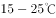最为适宜。大豆进入花芽分化期后，如果温度过低会使花芽分化受阻，使花期延迟。

D项正确，油菜是喜冷凉、抗寒力较强的作物，主要分布在长江流域，是我国分布最广的油料作物。

本题为选非题，故正确答案为A。

---

### 第 14 题　qid 2264325 · 地理国情

下列地理分界线对应正确的是：

- **A**. 横断山脉——内流区和外流区
- **B**. 本初子午线——东半球和西半球
- **C**. 200毫米等降水量线——农耕区和畜牧业区
- **D**. 祁连山脉——河西走廊和柴达木盆地　✅

**答案**：D

**官方解析**

本题考查地理国情。

A项错误，内流区指地表径流最终不能流入海洋的地区，即内流河流域的区域，与之相对的则是外流区。我国内外流区域的分界线大致是大兴安岭西麓向西南，经阴山—贺兰山—祁连山—巴颜喀拉山—冈底斯山一线。

B项错误，本初子午线，即经线，是经过英国格林尼治天文台的一条经线。而西经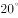和东经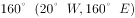才是地理上东西半球的分界线。

C项错误， 400毫米等降水量线是我国畜牧业区和农耕区的大致分界线。400毫米等降水量线大致沿大兴安岭南下，经张家口、兰州和拉萨附近，到达喜马拉雅山脉东部。这条线的西部降水少，农业以畜牧业为主；东部水热条件较好，是我国主要的农耕区。

D项正确，祁连山脉位于我国青海省东北部与甘肃省西部边境，其东北部为河西走廊，西南部与柴达木盆地和青海湖相连，故祁连山脉是河西走廊和柴达木盆地的分界线。

故正确答案为D。

---

### 第 15 题　qid 2264327 · 人文常识

关于核磁共振，下列说法错误的是：

- **A**. 核磁共振技术可以进行地下水探测
- **B**. 核磁共振技术常用于脑肿瘤的检测
- **C**. 核磁共振会产生电离辐射影响人体健康　✅
- **D**. 带有心脏起搏器的病人不能做核磁共振

**答案**：C

**官方解析**

本题考查科技常识。
核磁共振是磁矩不为零的原子核，在外磁场作用下自旋能级发生塞曼分裂，共振吸收某一定频率的射频辐射的物理过程。
A项正确，核磁共振地下水探测技术是一种进行地下水探测的新方法，是通过测量地层水中的氢核来实现直接找水的新技术。具有可以直接反演出地下0-150 m深度的含水层位置、含水量大小、介质孔隙度及电导率等地质水文信息的优点，已广泛应用于我国的地下水勘探领域，尤其是在旱区进行水文地质调查，为缓解旱灾提供了有效的技术支持。
B项正确，核磁共振是一种生物磁自旋成像技术，利用人体中的遍布全身的氢原子在外加的强磁场内受到射频脉冲的激发，产生核磁共振现象，经过空间编码技术，用探测器检测并接受以电磁形式放出的信号，输入计算机，形成人体各组织的形态形成图像。脑磁共振具有无放射线损害，无骨性伪影，能多方面、多参数成像，有高度的软组织分辨能力，能不用对比剂即可显示血管结构，即在磁共振照片上也就把肿瘤的轮廓勾勒出来了。
C项错误，核磁共振成像是一种利用核磁共振原理的最新医学影像新技术。由于核磁共振是磁场成像，没有放射性，所以对人体无害，是非常安全的。
D项正确，由于金属会对外加磁场产生干扰，患者进行核磁共振检查前，必须把身体上的金属物全部拿掉。戴有心脏起搏器的病人，体内有顺磁性金属植入物，如金属夹、支架、钢板和螺钉等，这些金属都对外加磁场进行干扰，无法正常地检查。因此，带有心脏起搏器的病人不能做核磁共振。
本题为选非题，故正确答案为C。

---

### 第 16 题　qid 2264328 · 科技常识

钢是主要由铁元素和碳元素组成的①合金，钢的含碳量②大于生铁。在钢中加入其它元素能够继续改善钢的性质，例如，加入锰元素主要增加钢的③强度。在钢的锻造中，淬火可以实现其④快速冷却。
这段文字中画线部分错误的是：

- **A**. ①
- **B**. ②　✅
- **C**. ③
- **D**. ④

**答案**：B

**官方解析**

本题考查科技常识。

A项正确，钢是用量最大、用途最广的合金，以铁为主要元素、以铁为主要成份，含碳量一般在以下，并含有少量的锰、硅、硫、磷等元素。

B项错误，生铁是铁碳合金，一般把含碳量在的铁碳合金叫做生铁。而钢的含碳量一般在以下，所以钢的含碳量小于生铁。

C项正确，在钢铁生产上加入锰元素（锰铁合金的形式）可作为去硫剂和去氧剂，提高钢铁的纯度，进而提高钢铁的强度和硬度。

D项正确，淬火是将金属工件加热到某一适当温度并保持一段时间，随即浸入淬冷介质（冷却剂）中快速冷却的金属热处理工艺。因此，在钢的锻造中，淬火可以让钢快速冷却。

本题为选非题，故正确答案为B。

---

### 第 17 题　qid 2264329 · 人文常识

某人扁桃体化脓，医生建议其静脉注射头孢，药液从其手背静脉到达扁桃体患处所经过的途径是：上肢静脉→右心房→①→②→左心房→③→④→动脉→扁桃体毛细血管（患处）。依次填入①②③④正确的是：

- **A**. 肺循环；右心室；左心室；主动脉
- **B**. 左心室；肺循环；主动脉；右心室
- **C**. 主动脉；右心室；左心室；肺循环
- **D**. 右心室；肺循环；左心室；主动脉　✅

**答案**：D

**官方解析**

本题考查生物常识。

人体内血液循环分为两大部分，体循环和肺循环。体循环是指血液由左心室进入主动脉，再流经全身的各级动脉、毛细血管网，各级静脉，最后汇集到上、下腔静脉，流回右心房的循环途径。

肺循环是指血液由右心室进入肺动脉，流经肺部的毛细血管网，再由肺静脉流入左心房的循环途径。体循环和肺循环同时进行，并且在心脏处汇合在一起，组成一条完整的循环途径。

本题中药物从上肢静脉随血液流入，进入右心房，然后到右心室，经过肺循环进入左心房，再到左心室进入体循环，经过主动脉，各级动脉，最后到达扁桃体毛细血管（患处）。具体途径见下图：

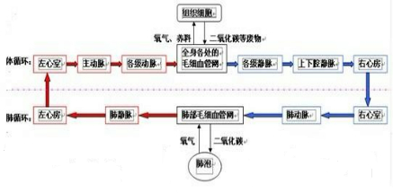

故正确答案为D。

---

## 言语理解与表达

### 第 1 题　qid 2264374 · 逻辑填空

《“健康中国2030”规划纲要》中提出，要努力实现从以治病为中心向以健康为中心转变，从以“治已病”为中心向以“治未病”为中心转变，从疾病管理向健康管理转变。在这种背景下，中医药                 。
填入画横线部分最恰当的一项是：

- **A**. 举足轻重
- **B**. 不可或缺
- **C**. 大有可为　✅
- **D**. 大有裨益

**答案**：C

**官方解析**

横线在结尾，根据“在这种背景下”指代前文，前文指出“2030规划纲要”说明对将来的规划，规划指出了“实现从以治病为中心向以健康为中心转变，从以‘治已病’为中心向以‘治未病’为中心转变，从疾病管理向健康管理转变”三个转变体现了中国对于健康重视预防和调理的发展趋势，故横线处体现在这样的背景下，中医药未来的发展趋势很好，对应C项“大有可为”，指事情有发展前途，很值得做。
A项“举足轻重”指处于重要地位，一举一动都足以影响全局，体现不出将来的发展趋势，排除；B项“不可或缺”指非常重要，无法替代或缺少的，程度过重，排除；D项“大有裨益”形容益处很大，与文意不符，排除。
故正确答案为C。

---

### 第 2 题　qid 2264375 · 逻辑填空

科学精神的核心是求真务实，我们的一切实践都需符合规律、切合实际。规律指引下的世界变动不居，我们不能                ，应敢于质疑、善于包容、勇于创新。
填入画横线部分最恰当的一项是：

- **A**. 因循守旧　✅
- **B**. 沾沾自喜
- **C**. 妄自菲薄
- **D**. 刚愎自用

**答案**：A

**官方解析**

根据“不能······应······”构成的反义对应，故横线处所填词语应与“敢于质疑、善于包容、勇于创新”语义相反，体现不质疑、不包容、不创新之意，A项“因循守旧”指的是沿袭旧规，不思革新，死守老一套，缺乏创新的精神，符合文意，当选。
B项“沾沾自喜”形容自以为不错而得意的样子,其反义为“垂头丧气”；C项“妄自菲薄”指过分看轻自己，形容自卑,其反义为“妄自尊大”；D项“刚愎自用”形容十分固执自信，不考虑别人的意见，其反义为“虚怀若谷”。三项均与文意不符，排除。
故正确答案为A。
【文段出处】《创新发展不能缺少科学精神的底色》

---

### 第 3 题　qid 2264378 · 逻辑填空

阿道司·赫胥黎在《美丽新世界》中描绘了2532年一个依赖生殖技术的人类社会。在那里，人文跟不上科技的发展，人类的“拜物教”越来越兴盛：认为医学可以解决一切病痛，科技可以弥补人文的鸿沟。事实上，这无异于                。
填入画横线部分最恰当的一项是：

- **A**. 饮鸩止渴
- **B**. 缘木求鱼　✅
- **C**. 镜花水月
- **D**. 抱薪救火

**答案**：B

**官方解析**

根据“无异于”可知，前文对横线处成语起到解释说明的作用，前文指出“人们依赖生殖技术”和“人类的‘拜物教’越来越兴盛：认为医学可以解决一切病痛，科技可以弥补人文的鸿沟”也就是人们过分崇拜科技，科技至上，认为科技可以搞定一切，实际上这种崇拜是不合理的是不能达到目的的，故横线处体现方法、方向错误无法达到目的，B项“缘木求鱼”，比喻方向或办法不对头，不可能达到目的，语义符合。
A项“饮鸩止渴”比喻用错误的办法来解决眼前的困难而不顾严重后果，文段并无“眼前困难”和“不顾严重后果”之意，排除；D项“抱薪救火”比喻用错误的方法去消除灾祸，结果使灾祸反而扩大，文段无灾祸扩大之意，排除；C项“镜花水月”比喻虚幻的景象，强调“虚幻不真实”，文段强调“人们过分崇拜科技，科技至上”的做法是错误的而非不真实虚幻的，所以“镜花水月”与文意不符，排除。
故正确答案为B。
【文段出处】《生殖技术 等一等人性的步伐》

---

### 第 4 题　qid 2264385 · 逻辑填空

新一代信息技术与制造业的深度融合，带来了制造模式、生产组织方式和产业形态的深刻变革，智能制造也                。智能制造就是把新一代信息技术        于设计、生产、管理、服务等制造活动的各个环节。
依次填入画横线部分最恰当的一项是：

- **A**. 水到渠成  融汇
- **B**. 水涨船高  应用
- **C**. 一日千里  渗透
- **D**. 应运而生  贯穿　✅

**答案**：D

**官方解析**

第一空，横线处要表达“在信息技术与制造业的融合，制造模式、生产组织方式和产业形态的深刻变革的大背景大环境下，智能制造就产生了”之意， D项“应运而生”，即适应时机而产生，符合文意，当选。A项“水到渠成”意为条件成熟，事情自然会成功，文段介绍的是“新一代信息技术与制造业的深度融合，带来了制造模式、生产组织方式和产业形态的深刻变革”这个大背景、大环境而非 “智能制造”成功的条件，另外文段没有“成功”之意，排除；B 项“水涨船高”意为事物随着它所凭借的基础的提高而增长提高，C项“一日千里”比喻进展极快，“提高”“ 进展极快”文段并未体现，文意不符，排除。
第二空，代入验证,D项“贯穿”意为穿过，连通，“贯穿于各个环节”搭配恰当。
故正确答案为D。
【文段出处】《IGI-CCID：2016中国智能制造的十大变革趋势》

---

### 第 5 题　qid 2264393 · 逻辑填空

近年来，商业赞助越来越多地        体育运动。在体育市场化、职业化                的当下，如何在追求个人商业价值与体育管理机构利益间取得平衡，是运动员和体育管理机构不能回避的问题。
依次填入画横线部分最恰当的一项是：

- **A**. 觊觎  如日中天
- **B**. 追逐  高歌猛进
- **C**. 热衷  欣欣向荣
- **D**. 垂青  方兴未艾　✅

**答案**：D

**官方解析**

第一空，横线处要表达商业赞助越来越看重体育运动之意，C项“热衷”意为十分爱好（某种活动）；D项“垂青”意为重视或喜爱，均符合文意。A项“觊觎”意为渴望得到不应该得到的东西，与文段感情色彩不符，排除。B项“追逐”意为追求，追随，语义不符，排除。
第二空，横线处修饰“体育市场化、职业化”，且根据前文“近年来”、“越来越多”可知，横线处要表达体育市场化、职业化发展不久，正在兴起，又根据后文“不能回避的问题”可知，还存在问题，也就是还没发展到最好，即横线处表达“正在兴起发展，尚未达到最好”。D项“方兴未艾”，即新生事物正在蓬勃发展，与文意相符，当选。C项“欣欣向荣”比喻事业蓬勃发展，无法对应前后文的“正在兴起，未达到最好”之意，故与文意不符，排除。
故正确答案为D。
【文段出处】《宁泽涛风波让运动员与国家队两败俱伤》

---

### 第 6 题　qid 2264399 · 逻辑填空

历史是昨天的新闻，新闻是明天的历史。历史与新闻有如隔世兄弟，                 。历史作为事实的记载，往往和文学相互补充，而文学的天赋是想象、虚构和夸张。因此，沾上了文学的历史与新闻就像到了岔路口，不光是                ，可能还会走向对立。
依次填入画横线部分最恰当的一项是：

- **A**. 情同手足  前途未卜
- **B**. 一脉相通  分道扬镳　✅
- **C**. 唇齿相依  互不相容
- **D**. 休戚与共  各行其是

**答案**：B

**官方解析**

第一空，横线前说“历史与新闻有如隔世兄弟”，即把历史和新闻比喻成了兄弟，做了一个形象表达，说明横线处要体现兄弟之意， A项“情同手足”比喻情谊深厚，如同兄弟一样；B项“一脉相通”，即犹如一条脉络贯穿下来可以互通，均可对应“兄弟”，均符合文意。C项“唇齿相依”比喻双方关系密切，相互依存；D项“休戚与共”形容关系密切，利害相同，均无法对应“兄弟”且语义程度太重，排除。 
第二空，根据横线前文“就像到了岔路口”可知，本空依然考查形象表达，需要对应“岔路口”。B项“分道扬镳”，即目标不同，各走各的路或各干各的事，对应“岔路口”恰当。A项“前途未卜”指将来的光景如何难以预测，无法对应“岔路口”，排除。
故正确答案为B。
【文段出处】《“历史”和“新闻”的学科归属》

---

### 第 7 题　qid 2264408 · 逻辑填空

脱贫攻坚必须            ，一步一个脚印，确保各项扶贫政策措施落到实处，积小胜为大胜，最终取得全面胜利。同时也应加强贫困村基层组织建设，充分调动贫困群众的积极性，提高其参与度、获得感，激励其            ，激发其脱贫的内生动力与活力。
依次填入画横线部分最恰当的一项是：

- **A**. 未雨绸缪 一马当先
- **B**. 一鼓作气 奋发图强
- **C**. 循序渐进 再接再厉
- **D**. 稳扎稳打 自力更生　✅

**答案**：D

**官方解析**

第一空，根据后文“一步一个脚印······积小胜为大胜”可知，横线处表示踏踏实实走好每一步，C项“循序渐进”指按一定的顺序、步骤逐渐进步，D项“稳扎稳打”常用来比喻做事稳当,有把握，C、D两项均符合文意，保留。A项“未雨绸缪”比喻事先做好准备工作，文段未体现事前做准备，排除；B项“一鼓作气”比喻趁劲头大的时候鼓起干劲，一口气把工作做完，与“积小胜为大胜”相悖，排除。
第二空，根据“激励其······，激发其······”可知，句式相同形成近义并列，横线处对应“内生动力与活力”强调贫困群众要发挥主观能动性，自我努力，D项“自力更生”形容靠自己的力量从事建设或解决问题，符合文意，当选。C项“再接再厉”指坚持不懈,毫不松劲,不断前进，与文意不符，排除。
故正确答案为D。
【文段出处】《以精准发力提高脱贫攻坚成效》

---

### 第 8 题　qid 2264415 · 逻辑填空

在人工智能研究热潮中，国内外已形成            的局面，但总体上人工智能还处于发展的初级阶段。人们对于智能的本质和机理的认识还不够深刻、全面，尚未形成完善的理论体系。如果没有人工智能基础研究的支撑，应用层面上的技术创新和产业创新都将是            。
依次填入画横线部分最恰当的一项是：

- **A**. 千帆竞发 无源之水　✅
- **B**. 百家争鸣 昙花一现
- **C**. 龙争虎斗 空中楼阁
- **D**. 星火燎原 纸上谈兵

**答案**：A

**官方解析**

第一空，由“但总体上人工智能还处于发展的初级阶段”可知，转折前后语义相反，横线处应体现出人工智能发展得非常好的含义，A项“千帆竞发”指数不尽的船只竞相出发。形容事物蓬勃向上，生机勃勃地向前发展，符合文意，保留。B项“百家争鸣”指学术上不同的学派可以自由争论，或指可以自由发表意见，不能体现出人工智能发展得好的语义，与文意不符，排除；C项“龙争虎斗”比喻双方势均力敌，斗争或竞赛激烈，而文段并未体现“争斗”之意，排除；D项“星火燎原”比喻新生事物开始时力量虽然很小，但有旺盛的生命力，重在强调“前途无限”，不能与后文构成转折关系，排除。
第二空，代入验证，横线处所填词语搭配“技术创新和产业创新”，且根据“如果没有人工智能基础研究的支撑”可知，文段强调这些创新是没有根基的，A项“无源之水”比喻没有基础的事物，符合文意，当选。
故正确答案为A。
【文段出处】《做人工智能领域的引领者》

---

### 第 9 题　qid 2264428 · 逻辑填空

近年来因程序违法败诉的行政诉讼案件不少。尽管有前车之鉴，但是依然不乏职能部门                。说到底，还是“重结果、轻程序”，不把程序当回事，行政行为自然经不起推敲。程序是保证我们有效实现结果的合理设计，程序正当得不到        ，必然给我们的事业造成损害。
依次填入画横线部分最恰当的一项是：

- **A**. 明知故犯  履行
- **B**. 老调重弹  落实
- **C**. 重蹈覆辙  尊重　✅
- **D**. 以身试法  认同

**答案**：C

**官方解析**

第一空，根据前文“有前车之鉴”及转折关联词“但”可知，前后语义相反，横线处所填词语表达有些职能部门没有接受前人的教训，还在走老路，A项“明知故犯”指明明知道不能做，却故意违犯；C项“重蹈覆辙”指不接受教训，再走失败的老路；D项“以身试法”指试着亲身去做触犯法律的事，均符合文意；B项“老调重弹”比喻把说过多次的理论、主张重新搬出来，不能体现出“没有接受教训”的含义，与文意不符，排除。 
第二空，横线处所填词语与“程序正当”原则搭配，根据前文“‘重结果、轻程序’，不把程序当回事”可知，文段强调“程序正当”原则得不到职能部门的重视，对应C项“尊重”，即尊敬、重视，符合文意，当选；A项“履行”指执行、实践，D项“认同”指赞同，均体现不出“重视”的含义，与文意不符，排除。
故正确答案为C。
【文段出处】《绷紧程序这根弦》

---

### 第 10 题　qid 2264431 · 逻辑填空

中国的传统文化中，“老”是一个褒义的字眼。一个年轻人处事得当，会被说老练、老成。但是进入互联网特别是移动互联网时代，这沿袭了数千年的观念，短短数十年                 。年龄大、资历老逐渐不再是一种优势，有时反而成了学习新事物的一种        。
依次填入画横线部分最恰当的一项是：

- **A**. 土崩瓦解  羁绊　✅
- **B**. 灰飞烟灭  累赘
- **C**. 化为乌有  阻力
- **D**. 分崩离析  弊端

**答案**：A

**官方解析**

第一空，横线处所填成语与“观念”搭配，由转折关联词“但是”可知，文段强调“老”是褒义的这一传统观念，在互联网时代不再被人们认同，被逐渐瓦解，A项“土崩瓦解”指像土崩塌，瓦破碎一样，不可收拾，比喻事物的分裂，置于此处用以强调旧观念的瓦解，符合文意；B项“灰飞烟灭”比喻事物消失净尽、C项“化为乌有”指全部消失或完全落空，置于此处程度过重，文段并未体现“老是褒义的字眼”这一观念已完全消失，与文意不符，排除；D项“分崩离析”指四分五裂，多形容国家、集团等分裂瓦解，与“观念”搭配不当，排除。
第二空，代入验证，“反而”提示反向递进，“羁绊”指束缚牵制，与前文的“优势”构成对应，符合文意，当选。
故正确答案为A。
【文段出处】《得年轻人者得天下，他们才是新经济的主力》

---

### 第 11 题　qid 2264376 · 逻辑填空

基层离百姓最近，可以快速反馈百姓的感受和意见，随时进行政策调整，故能“因病施治”；基层直接面对错综复杂的情况，最了解体制机制改革中的症结和痛点所在，故能“             ”；基层最看重的是实效，              不得人心、难以持久，故内生的改革措施往往能“药到病除”。
依次填入画横线部分最恰当的一项是：

- **A**. 不药而愈  夸夸其谈
- **B**. 对症下药  花拳绣腿　✅
- **C**. 一针见血  朝令夕改
- **D**. 标本兼治  华而不实

**答案**：B

**官方解析**

第一空，由横线之前的“故”可知，与前文构成因果关系，根据前文“了解体制机制改革中的症结和痛点所在”，即基层了解最基本最核心的问题，故横线处所填成语表达可以针对这些核心问题进行有效地解决这一含义。B项“对症下药”比喻针对事物的问题所在，采取有效的措施；C项“一针见血”比喻说话直截了当，切中要害，均能对应文段；A项“不药而愈” 指生病不用吃药而自行痊愈，文段并没有不吃药、不行动即可解决问题的含义，与文意不符，排除；D项“标本兼治”指既要解决问题的表象，又要从根本上杜绝问题的产生，但是文段没有提及“标”即问题的表象，与文段无法对应，排除。
第二空，分析文意可知，横线处所填成语与前文构成反义对应，语义相反，由前文“基层最看重的是实效”可知，横线处要体现不注重实效的含义，对应B项“花拳绣腿”，即只做些表面上好看实际上并无用处的工作，符合文意，当选；C项“朝令夕改”形容政令时常更改，使人不知怎么办，不能表达“不看重实效”的含义，与文意不符，排除。
故正确答案为B。
【文段出处】《让基层创新在医改中发挥作用》

---

### 第 12 题　qid 2264379 · 逻辑填空

中世纪时，人们的消息来源于口口相传，任何目击重要事件发生的人所提供的一手消息都被            ；书面的解释记录并不足以服人，因为无法对写下这些内容的人反复询问。这就解释了，为什么尽管15世纪时活字印刷在古登堡被发明，但报纸行业的发展还是如此        。
依次填入画横线部分最恰当的一项是：

- **A**. 奉为圭臬  艰难
- **B**. 照单全收  落后
- **C**. 视若珍宝  缓慢　✅
- **D**. 大肆渲染  迟滞

**答案**：C

**官方解析**

第一空，横线处所填成语与“消息”搭配，分析文意可知，文段指出中世纪时的消息来源于口口相传，即通过口头进行传播，故横线上所填成语应表达这些重要事件的一手消息十分珍贵的含义，C项“视若珍宝”即当成宝贝一样珍惜，符合文意，保留。B项“照单全收”即全部接受，不能体现出“珍贵”的含义，与文意不符，排除；A项“奉为圭臬”指把某些言论当成自己的准则，文段并没有将这些一手消息作为自己行为准则的含义，与文意不符，排除；D项“大肆渲染”比喻为了达到目的肆意夸大事实，加以宣传，带有消极意味，文段并没有体现出“宣传”的语义，且与文段的感情色彩不符，排除。
第二空，代入验证，由“书面的解释记录并不足以服人”以及“15世纪时活字印刷被发明”可知，横线处所填词语用以强调虽然活字印刷发明得比较早，但是发展得并不好，C项“缓慢”符合文意，当选。
故正确答案为C。
【文段出处】《“旧媒体”往往有绝处逢生的能力》

---

### 第 13 题　qid 2264384 · 逻辑填空

智慧是哲人对世道人生、天地宇宙的独见独闻或先知先觉，它注定不是            的市井常识，也不是循规蹈矩的老生常谈。“周虽旧邦，其命维新”，哲学的进步实则是哲人学术与智慧的不断            。
依次填入画横线部分最恰当的一项是：

- **A**. 司空见惯 兼收并蓄
- **B**. 人云亦云 推陈出新　✅
- **C**. 妇孺皆知 精益求精
- **D**. 拾人牙慧 融会贯通

**答案**：B

**官方解析**

第一空，由前文的“是哲人的独见独闻或先知先觉”，即独特先进的见闻，以及后文的“循规蹈矩的老生常谈”即固守老规矩的没新意的言论可知，文段重在强调这些“市井常识”是缺乏创新的，A项“司空见惯”指常见，不足为奇，B项“人云亦云”即人家怎么说，自己也跟着怎么说，形容没有主见，C项“妇孺皆知”即妇女、小孩全都知道，指众所周知，D项“拾人牙慧”比喻抄袭或套用别人说过的话，均可体现“缺乏新意”，符合文意，保留。
第二空，横线处所填成语与前文的“周虽旧邦，其命维新”构成对应，这句话指周虽然是旧的邦国，但其使命在于革新，故横线处要体现创新之意，对应B项“推陈出新”，即去掉旧事物的糟粕，取其精华，并使它向新的方向发展，当选。A项“兼收并蓄”指把不同内容、不同性质的东西收下来，保存起来，C项“精益求精”，指已经好了还要求更加好，D项“融会贯通”指把各方面的知识和道理融化汇合，得到全面透彻的理解，均不能体现出“创新”的含义，无法与文段构成对应，排除。
故正确答案为B。
【文段出处】《从“中华之道”中萃取“中华智慧”》

---

### 第 14 题　qid 2264392 · 逻辑填空

在不同的经济增长阶段，经济活动所积累的风险水平和表现程度有所不同，因此金融机构在资源配置上必然会有不同的表现。一般而言，金融机构习惯享受顺周期的经济上升发展，愿意做            的事，普遍忽视顺周期的末端风险管理，而一遇经济逆转，常会“雨中收伞”“            ”，一些机构甚至不会再投放资源。
依次填入画横线部分最恰当的一项是：

- **A**. 顺水推舟 明哲保身
- **B**. 济困扶危 竭泽而渔
- **C**. 因势利导 急流勇退
- **D**. 锦上添花 釜底抽薪　✅

**答案**：D

**官方解析**

第一空，对应“金融机构习惯享受顺周期的经济上升发展”，横线处所填成语要体现出顺应上升的趋势有所作为之意，强调利用顺境，A项“顺水推舟”比喻顺着某个趋势或某种方式说话办事，D项“锦上添花”比喻好上加好，均能与文段构成对应，保留。B项“济困扶危”，指救济贫困的人，扶助有危难的人，与文意无关，排除；C项“因势利导”指顺着事情发展的趋势，加以引导，文段并未体现出金融机构能够引导之意，排除。
第二空，横线处所填成语对应“雨中收伞”，指正下着雨却把伞给撤掉，即强调金融机构在经济逆转时期减少贷款规模来解决问题，对应D项“釜底抽薪”，即把柴火从锅底抽掉，填入文段中，通过双引号用来表达金融机构把投进去的资金都撤出来，与“雨中收伞”构成形象表达对应，符合文意，当选。A项“明哲保身”，指因怕连累自己而回避原则斗争的处世态度，若用此词，就不需要加双引号，且和“雨中收伞”无法构成形象表达对应，排除。
故正确答案为D。
【文段出处】《中国金融业应加强管控顺周期风险》

---

### 第 15 题　qid 2264401 · 逻辑填空

动漫起初是儿童的天堂。博得孩子们喜爱，通常是一部动漫作品获得成功最重要的        。然而，随着大众文化的兴起，成人开始进入西方动漫艺术消费的视野，赢得广大成人观众的青睐，越来越为各大动漫公司所        。事实上，也正由于成人动漫观众的不断增长，十多年来，西方动漫艺术最终摆脱了过去的        地位，在当代影视艺术中占据重要一席。
依次填入画横线部分最恰当的一项是：

- **A**. 标志  重视  边缘　✅
- **B**. 指标  称赞  尴尬
- **C**. 象征  追捧  附属
- **D**. 标准  欢迎  弱势

**答案**：A

**官方解析**

第一空，横线处填入词语要体现出“博得孩子们喜爱”和“动漫作品获得成功”之间的关系，A项“标志”，即表明特征的记号或事物，受孩子喜爱意味着作品很成功，符合文意，保留；B项“指标”，指计划中规定达到的目标，符合文意，保留；D项“标准”，即衡量事物的准则，也能体现出二者的关系，符合文意，保留。C项“象征”，指用具体的事物表示抽象的事物，文段并未涉及具体代表抽象，排除。
第二空，横线处词语要体现出动漫公司对“赢得广大成人观众的青睐”这件事情的态度，A项“重视”符合文意，而B项“称赞”和D项“欢迎”搭配的对象往往是已经存在的事物，文段中“赢得······青睐”这是未来的趋势，所以排除B、D两项。
第三空，代入验证，根据前文“成人开始进入西方动漫艺术消费的视野”，以及后文“在当代影视艺术中占据重要一席”可知，以前西方动漫艺术不受重视，是被人们忽视的一种艺术形式，A项“边缘”，指沿边的部分，可以体现出不被重视，符合文意，当选。
故正确答案为A。
【文段出处】《当代西方动漫发展的若干趋势》

---

### 第 16 题　qid 2264412 · 逻辑填空

新中国的区域与城市规划始于20世纪50年代，目前在空间规划上已初步形成了八个主要        ，按照从小到大的顺序，依次是乡村规划、小城镇规划、城市规划、大都市规划、大都市区规划、大都市圈规划、城市群规划和湾区规划。但由于缺乏系统的        和深入的研究，很多概念的内涵和边界不够清楚，这给实际的规划和建设带来诸多的不便和        。
依次填入画横线部分最恰当的一项是：

- **A**. 层次 调查 阻碍
- **B**. 部分 考察 负担
- **C**. 层级 梳理 混乱　✅
- **D**. 维度 分析 困难

**答案**：C

**官方解析**

第一空，根据横线后可知，空间规划是按照从小到大的顺序来的，B项“部分”，指整体中的局部，整体里的一些个体，D项“维度”，为几何学及空间理论的基本概念，均不符合文意，排除。A项“层次”，指同一事物由大小、高低等不同而形成的区别，C项“层级”，即层次、级别，在层次的基础上，进行分级，均符合文意，保留。
第二空，A项“调查”与C项“梳理”填入文段，搭配均可，保留。
第三空，根据前文“很多概念的内涵和边界不够清楚”可知，强调在具体操作过程中，即实际规划和建设带来的影响，C项“混乱”是指无条理，无秩序，符合文意，当选。A项“阻碍”是指阻挡住，使不能顺利通过或发展，文段并未提及“实际规划和建设”无法发展，与文意不符，排除。
故正确答案为C。
【文段出处】《走出“单体城市”推进大都市圈规划建设》

---

### 第 17 题　qid 2264419 · 逻辑填空

随着汽车电动化的不断发展，国内造车新势力            ，传统车企亦纷纷转战新能源，新能源汽车领域热点不断。但转型时期谈全面推行纯电动汽车略显        ，具有综合性强、用户接受度高等优势的混合动力汽车作为过渡性产品        了当前的市场，车主纷纷投向混合动力汽车的怀抱。
依次填入画横线部分最恰当的一项是：

- **A**. 跃跃欲试  激进  拓展
- **B**. 异军突起  超前  适应　✅
- **C**. 独占鳌头  夸张  迎合
- **D**. 风起云涌  乐观  占领

**答案**：B

**官方解析**

第一空，横线填入成语搭配国内造车新势力，根据后文“车企纷纷转战新能源，新能源领域热点不断”可知，应体现出电动新能源汽车在整个国内造车行业中发展、崛起。B项“异军突起”是比喻与众不同的新派别或新力量一下子崛起，对应文段“新势力”，D项“风起云涌”比喻事物迅速发展，声势浩大，均能体现出新能源发展、崛起之意，保留。A项“跃跃欲试”是指内心急切想试一试，只停留在想法阶段，而后文“纷纷转战、热点不断”表明已经将想法落实行动，排除；C项“独占鳌头”一定是指占领首位，获取第一，文段只是表明发展得很好，无法体现位居第一，排除。
第二空，横线前出现转折词“但”，与前文发展势头猛烈构成转折关系，强调当下“全面推行纯电动汽车”的现实情况，B项“略显超前”与D项“略显乐观”均可表示新能源汽车的发展事实上可能并没有想象中那么好，保留。
第三空，横线后“车主投向混合动力汽车怀抱”为最终的结果，则横线处应该是其产生的原因，B项正因为混合动力“适应”市场，所以车主选择混合动力，符合因果关系，当选。D项“占领市场”是一个最终结果，只有车主纷纷选择混合动力，它才能占领市场，而非先占领再选择，与文意不符，排除。
故正确答案为B。
【文段出处】《中国能源报:混动扛起车企转型大旗》

---

### 第 18 题　qid 2264424 · 逻辑填空

东北人喜欢的酸菜，四川人喜欢的泡菜，广东人喜欢的梅菜，都是依靠时间“            ”的美食。但在腌制食品中        存在的亚硝酸盐，是健康的一大威胁。更何况很多中国家庭还特别喜欢自制腌制品，一旦操作不当就会引发中毒。腌制品和腐败食物，美味和损伤，有时候只是            。
依次填入画横线部分最恰当的一项是：

- **A**. 精雕细琢 广泛 一墙之隔
- **B**. 点石成金 少量 一念之差
- **C**. 脱胎换骨 普遍 一步之遥　✅
- **D**. 改头换面 长期 一时之选

**答案**：C

**官方解析**

本题可从第三空入手，根据“有时候只是”可知前文是对横线处的解释，根据前文，可知若操作得当，那么食品就是美味的腌制品，若操作不得当，可能就是损伤的腐败食品，因此食品美味损伤与否，差距其实并不大，A项“一墙之隔”与C项“一步之遥”均可表示距离接近，只有一步或一墙的距离，保留。B项“一念之差”侧重于不好的念头造成了严重的后果，文段想腌制美味的食物并非不好的念头，初衷是好的，只是可能操作不当而已，排除；D项“一时之选”指某一时期优秀的人才，与文意无关，排除。
第二空“广泛”与“普遍”意思相近不做排除；
第一空，根据文意，可知酸菜泡菜等腌制食品是普通菜品经过时间的积淀之后，与之前发生了很大变化变得更加美味，C项“脱胎换骨”原指重新做人，这里指彻底改变，双引号起到了形象表达的作用，当选。而A项“精雕细琢”是指做事情细致认真，精益求精，不能体现出变化大的意思，文中也体现不出腌制的过程非常细致，排除；
故正确答案为C。
【文段出处】《新周刊“‘越陈越香’是国人的饮食观念？美味和损伤有时候只有一线之隔”》

---

### 第 19 题　qid 2264430 · 逻辑填空

一种新的意识、新的心智特征、新的生活形态一开始都是以一种不可辨认的方式        ，渐渐地显露出来，越来越清楚，直到成为我们存在的一部分，进而影响甚至        我们的生活。今天，我们已经不知不觉地进入了一种现实世界与网络世界        在一起的“后人类时代”，离开手机和电脑的生活已经变得非常艰难。
依次填入画横线部分最恰当的一项是：

- **A**. 酝酿  改变  融合
- **B**. 产生  扰乱  重叠
- **C**. 出现  掌控  穿插
- **D**. 萌生  支配  交织　✅

**答案**：D

**官方解析**

第一空，根据“渐渐地显露出来，越来越清楚”可知，新的意识、新的心智特征、新的生活形态已经发生， A项“酝酿”是指做准备工作，无法体现已经发生之意，与文意不符，排除。B项“产生”、C项“出现”、D项“萌生”均可。
第二空，“甚至”表示递进关系，所填词语较“影响”程度更重，B项“扰乱”、C项“掌控”、D项“支配”均符合文意。
第三空，根据“离开手机和电脑的生活已经变得非常艰难”可知，文段意在表达现实世界与网络世界已合在一起，D项“交织”即错综复杂地合在一起，符合文意，当选。B项“重叠”是指同样的东西层层堆叠，互相覆盖，C项“穿插”是指交叉、互相错开，二者均无法体现合在一起之意，排除。
故正确答案为D。
【文段出处】《“后人类时代”真的来临了吗？》

---

### 第 20 题　qid 2264432 · 逻辑填空

当中原的青铜文化如火如荼之时，面对铜料欠缺的窘境，务实的越人            ，开创了瓷器生产的新纪元。秦汉时期是中国历史上大动荡大变革的时代，各行各业的面貌都            ，古老越地的陶瓷业也是如此。进入东汉，过去的原始瓷        退出历史的舞台，一种面貌全新的青瓷在上虞曹娥江中游地区的窑场随之诞生。
依次填入画横线部分最恰当的一项是：

- **A**. 另辟蹊径 焕然一新 悄然　✅
- **B**. 独具慧眼 蒸蒸日上 突然
- **C**. 天马行空 日新月异 黯然
- **D**. 因地制宜 朝气蓬勃 淡然

**答案**：A

**官方解析**

第一空，根据“开创了瓷器生产的新纪元”可知，填入横线处的成语表示越人面对铜料欠缺的窘境时，进行了创新，A项“另辟蹊径”即比喻另创一种新方法或新风格，符合文意，当选。B项“独具慧眼”是指具有别人没有的眼光或见识，C项“天马行空”形容气势豪放，不受约束，也形容言论空泛，不着边际，D项“因地制宜”是指根据不同地区的具体情况制定适宜的措施，均无法体现创新之意，排除。
第二空，代入验证，根据后文“古老越地的陶瓷业也是如此”以及“面貌全新”可知，秦汉时期各行各业的面貌与越地陶瓷业均有新的面貌，A项“焕然一新”符合文意，保留。
第三空，代入验证，A项“悄然退出历史的舞台”，搭配恰当，当选。
故正确答案为A。
【文段出处】《越人陶瓷贸易之路》

---

### 第 21 题　qid 2264381 · 片段阅读

染色食品曝光后，许多人表示无法理解：食品色素仅仅是改变颜色，只有“悦目”的作用，为什么一定要染色呢？事实并非如此。食物的颜色会改变人们对食物的味觉体验，进而影响对食物的选择。现代食品技术中有一个领域，就是专门研究食物的各种性质如何影响人们对食物的感受的。成分和加工过程完全相同的食物，仅仅是所采用的颜色不同，就会导致人们对它们的评价显著不同，还会影响人们对食物的选择。
最适合做这段文字标题的是：

- **A**. 你不知道的食品添加剂
- **B**. 食品色素背后的心理学　✅
- **C**. 哪些因素影响食物味道
- **D**. 现代食品制作中的染色技术

**答案**：B

**官方解析**

文段开篇提出问题，为什么要用食品色素给食物染色，随后通过“事实并非如此……”对问题进行回答，指出“食物的颜色会改变人们对食物的味觉体验，进而影响人们对食物的选择”，后文通过论述现代食品技术研究表明，食物的颜色不同，会影响人们对食物的评价和选择，是对前文进行解释说明。故文段重在强调“食物的颜色会改变人们对食物的味觉体验，进而影响人们对食物的选择”，“体验”和“选择”都表明食物色素会对人的心理层面产生影响，对应B项。
A项，文段论述的核心话题是“食品色素”，选项中“食品添加剂”概念扩大且表述不明确，排除；
C项，“哪些因素”指多种因素，文段只提到了一种因素，即“食品色素”，且文段并非论述“影响食物的味道”，而是“影响人们对食物的味觉体验”，即影响的是人们的主观感受，而非食物的客观味道，排除；
D项，文段未提及染色技术是如何操作和实施的，故“染色技术”无中生有，排除。
故正确答案为B。
【文段出处】《食物“掉色”一定是染色吗？》

---

### 第 22 题　qid 2264382 · 片段阅读

20世纪中期以前的生态学认为，自然界中存在某种“顶级生态系统”。由于进化和生物适应性等原因，在特定环境中，某些物种总能取得优势地位，进而建立起由其主导的生态体系，达到生态平衡。如特定树种的组合总是主导着某一类型的森林，即便雷电引发大规模山火，摧毁这片森林，随着时间推移，该森林总能恢复到山火前的那种状态。但在过去数十年间，对自然过程混沌性日渐深入的理解，已取代了这种静态、机械的生态系统观。
这段文字接下来最可能讲的是：

- **A**. 人类对自然生态系统的干预
- **B**. “顶级生态系统”的运作原理
- **C**. 关于自然和生态系统的混沌理论　✅
- **D**. 研究环境演变历史的重要意义

**答案**：C

**官方解析**

根据提问方式可知，本题为接语选择题，需在阅读全文的基础上，重点把握文段最后讨论的核心话题。文段首先提出20世纪中期以前的观点，即自然界存在某种“顶级生态系统”，随后对其进行详细介绍，尾句论述对自然过程混沌性的理解，取代了静态、机械的生态系统观，故文段最后谈论的核心话题是“对自然过程混沌性的理解”，根据话题一致的原则，下文应围绕这一话题具体展开论述，对应C项。
A项“人类对自然生态系统的干预”、D项“研究环境演变历史的重要意义”文段均未提及，与文段最后谈论的核心话题不一致，排除；
B项“‘顶级生态系统’的运作原理”为前文论述过的内容，排除。
故正确答案为C。
【文段出处】《从史前到现代：讲述中国环境故事》

---

### 第 23 题　qid 2264387 · 片段阅读

我国要在21世纪中叶建成世界科技强国，科学文化建设将在这个历史进程中扮演非常重要的角色。在这个方面，我们有必要增强文化自信。文化自信不仅表现在对既往文化贡献与价值的认同上，更表现在融汇各种优质的文化资源、创造新文化的信心和决心上。尽管全面挖掘和传承我国传统文化中的科学因素、充分认识我国历史上对科学发展做出的贡献十分必要，但更需要思考如何在未来的科学发展和科学文化建设上，做出对世界有重要贡献的新成就，这应该是增强文化自信更重要的一个方面。
这段文字主要说的是：

- **A**. 文化自信表现在文化资源的整合和创新上
- **B**. 科学文化发展是建设科技强国的核心
- **C**. 判断中国科学发展对世界所做贡献的标准
- **D**. 科学文化建设中增强文化自信的途径　✅

**答案**：D

**官方解析**

文段开篇介绍科学文化建设对我国要建成世界科技强国来说非常重要，接着提出在科学文化建设方面我们要加强文化自信。随后通过“不仅表现在······更表现在······”具体介绍了文化自信的表现，尾句通过转折词“尽管······但······”和“更需要”引出对策，最后通过指代词“这”对前文进行总结，故文段的重点在尾句，强调的是科学文化建设中如何增强文化自信，对应D项。
A项，为尾句之前的内容，非重点，且没有提到“科学文化建设”这一主题词，排除；
B项，对应首句话题引入的内容，非重点，且没有提到“文化自信”这一主题词，排除；
C项，“判断······的标准”无中生有，文段未提及，且没有提到“科学文化建设”与“文化自信”这两个主题词，排除。
故正确答案为D。
【文段出处】《用文化自信支撑中国科学文化建设》

---

### 第 24 题　qid 2264390 · 片段阅读

潜水员在执行水下任务的过程中，普遍采用信号绳作为主要通信工具，即通过对信号绳的拉、抖组成系列信号来实现对陆上的简易通信。这种通信方式便捷、直接，但是其弊端也是显而易见的：信号绳仅能实现有限信息量的表达，且信号传输过程极易受复杂海水环境影响而中断或失效，带来安全隐患。2015年，就曾有潜水员的信号绳被缠住而险些发生事故。可以说，潜水员在执行水下任务时，是真正的命悬一“线”。针对信号绳的诸多弊病，结合智能穿戴设备在民用领域的快速发展，面向军事潜水领域的智能穿戴产品逐渐成为科技工作者的研发热点之一。
这段文字接下来最可能讲的是：

- **A**. 军事潜水领域智能穿戴设备的关键技术　✅
- **B**. 信号绳在军事领域传递信息中的缺陷
- **C**. 日常生活中智能穿戴设备的发展现状
- **D**. 人工智能技术引入穿戴设备的前景预期

**答案**：A

**官方解析**

根据提问方式可知，本题为接语选择题，需在阅读全文的基础上，重点把握文段最后讨论的核心话题。文段首先介绍了潜水员执行水下任务时，是通过信号绳进行通信的，随后通过转折，提出此类通信方式的弊端，尾句指出针对信号绳具有弊端，并且民用领域中智能穿戴设备正在迅速发展，因此面向军事潜水领域的智能穿戴产品成为科技工作者的研究热点之一。故文段最后谈论的核心话题为“军事潜水领域的智能穿戴设备”，根据话题一致的原则，下文应围绕这一话题具体展开论述，对应A项。
B项对应尾句之前的内容，为前文已经论述过的内容，排除；
C、D两项均未提及“军事潜水领域”这一话题，与文段最后谈论的核心话题不一致，排除。
故正确答案为A。
【文段出处】《让潜水员不再命悬一“线”》

---

### 第 25 题　qid 2264391 · 片段阅读

太赫兹波具备微波和红外辐射所没有的独特属性。太赫兹波具有频率高、波长短且在浓烟、沙尘等环境中传输损耗少等“独门绝技”，可一眼“看透”墙体进而对房屋内部进行扫描，是复杂战场环境下成像寻敌的理想技术。虽然太赫兹波在大气中传输时易受各类气候条件影响，传输距离有限，但在某些特殊情况下，这一“短板”恰恰成为太赫兹通信的又一技术“专长”。比如在遇到大气衰减时，太赫兹波的信号根本无法传播到敌人的无线电监听机构中，因此可实现隐蔽的近距离通信。
这段文字没有提到太赫兹波的：

- **A**. 物理特性
- **B**. 特殊优势
- **C**. 应用场景
- **D**. 发现过程　✅

**答案**：D

**官方解析**

A项，根据“太赫兹波具备微波和红外辐射所没有的独特属性”及“频率高、波长短”可知，“物理特性”文段已提及，排除；
B项，根据“在浓烟、沙尘等环境中传输损耗少等‘独门绝技’”及“这一‘短板’恰恰成为······‘专长’”可知，“特殊优势”文段已提及，排除；
C项，根据“在浓烟、沙尘等环境中传输损耗少”及“是复杂战场环境下成像寻敌的理想技术”可知，“应用场景”文段已提及，排除；
D项，“发现过程”即太赫兹如何一步步被发现的，文段并未提及，无中生有，当选。
本题为选非题，故正确答案为D。
【文段出处】《谁先掌握太赫兹技术，谁就将占据未来军事制高点》

---

### 第 26 题　qid 2264395 · 片段阅读

国际金融危机以来，各国对充分就业目标都更为关注。一般来讲，外国输入的产品会和本国生产的产品形成竞争，一旦本国产品被进口商品替代，从事该项产品生产的本国工人就会失业，这是引起贸易摩擦的根本原因。通过大力发展对外直接投资，能够起到替代对外贸易的作用。鼓励中国企业把生产活动转移到劳动力成本更低的贸易伙伴国家，一方面可以替代对目标国的出口，增加目标国的就业；另一方面，对外投资企业在当地生产、当地出售，依然可以获得出口的利润，还减少了来自本国的顺差，同样可以避免贸易摩擦。
这段文字意在说明：

- **A**. 中国企业的对外直接投资将会逐渐增多
- **B**. 对外直接投资有利于缓解国际贸易摩擦　✅
- **C**. 金融危机有可能影响充分就业目标的实现
- **D**. 就业保护是引起国际贸易摩擦的根本原因

**答案**：B

**官方解析**

文段首先指出金融危机的背景下各国关注就业，接下来分析引起贸易摩擦这一问题的根本原因是会带来本国人口的失业，随后指出大力发展对外直接投资的对策，后文通过并列结构具体阐述发展对外投资的作用，一方面可以增加目标国的就业，起到避免贸易摩擦的作用；另一方面可以获得利润减少贸易顺差，同样可以起到避免贸易摩擦的作用，故文段重点强调对外直接投资可以解决贸易摩擦的问题，对应B项。
A项，没有提到“贸易摩擦”这一主题词，偏离中心，排除；
C项，“金融危机”对应首句的表述，为背景引入的内容，非重点，排除；
D项，为分析原因的内容，非重点，文段强调的是对外直接投资这一做法可以解决贸易摩擦的问题，排除。
故正确答案为B。
【文段出处】《由贸易大国转向投资大国》

---

### 第 27 题　qid 2264397 · 片段阅读

人口向城市迁移并不一定会推动经济增长和生产率的提高。如果人口流入城市，却没有优质的就业作为依托，就会导致城市的贫民窟化。只有经济结构根据经济发展阶段进行转换，经济才会增长，并创造良好的就业机会，收入才会随之增加，人口才会向城市迁移。所以，                             。
填入画线部分最恰当的一句是：

- **A**. 人口向城市迁移是经济发展的必然趋势
- **B**. 人口迁移率是衡量经济发展水平的重要指标
- **C**. 只有调整经济结构，才能增加城市中的就业机会
- **D**. 城镇化其实是经济发展的结果，而非前提　✅

**答案**：D

**官方解析**

横线出现在文段结尾，且由结论词“所以”引导，故起到总结前文的作用。文段首先指出人口向城市迁移不一定会推动经济增长，随后指出人口流入城市可能会导致城市的贫民窟化，接下来强调只有转换经济结构让经济得到增长，人口才会向城市迁移，故文段强调的是人口向城市迁移并不一定带来经济的发展，而是经济发展带来的结果。人口向城市迁移是城镇化一个方面的表现，故D项是对前文内容的总结。
A项， “必然趋势”表述过于绝对，文段未提及，无中生有，排除；
B项，“重要指标”从文段中无法得知，无中生有，排除；
C项，文段始终围绕“人口向城市迁移”及“经济增长”之间的关系论述，并非“调整经济结构”与“就业机会”，话题与前文不一致，排除。
故正确答案为D。
【文段出处】《人口向大城市圈流动的决定因素》

---

### 第 28 题　qid 2264404 · 片段阅读

过去100多年来，围绕达尔文进化论是否正确的争论从未停歇。不断涌现的科学事实在弥补达尔文当年未曾发现的“缺失环节”的同时，也在检验着达尔文进化论的预测能力。例如，2004年在加拿大发现的“提克塔利克鱼”化石揭示了从鱼类（鳍）到陆生动物（腿）之间的过渡状态，被公认是“种系渐变论”的一个极好例证。当然，达尔文进化论并非完美无缺，它确实存在“可证伪”之处。以自然选择理论为例，它在孟德尔遗传学建立之初就受到了强烈挑战，但各种不能用自然选择理论简单解释的新证据最终还是拓展了人们对进化动力和机制的认识，而不是摒弃该理论。
这段文字以自然选择理论受到孟德尔遗传学挑战为例，目的是：

- **A**. 说明达尔文进化论具有可证伪性　✅
- **B**. 证明达尔文进化论具有预测能力
- **C**. 提出“种系渐变论”的事实例证
- **D**. 加深人们对生物进化机制的认识

**答案**：A

**官方解析**

通过提问方式可知，“自然选择理论受到孟德尔遗传学挑战”为举例说明，目的是为了论证前文表述的观点，定位文段，前文的观点即“达尔文进化论并非完美无缺，它确实存在‘可证伪’之处”，对应A项。B项 ，“达尔文进化论具有预测能力”是前文“提克塔利克鱼”化石的例子论证的观点，C项，“‘种系渐变论’的事实例证”为前文举例的内容，均非 “自然选择理论受到孟德尔遗传学挑战”论证的观点，故排除B、C两项；D项，“加深人们的认识”对应文段尾句后半部分的内容，依然是围绕例子展开的内容，非其论证的观点，排除。
故正确答案为A。
【文段出处】《达尔文进化论过时了吗》

---

### 第 29 题　qid 2264407 · 语句表达

①当时的塞纳省省长奥斯曼规划了一座地下之城，将巴黎发展成一座立体化的城市
②从中世纪延续而来的平面化城市已经难以满足经济社会飞速发展的新需要
③后来，这个以下水道系统为基础的地下巴黎，随着公共产品种类的增加而不断添入新功能
④现在，地上的巴黎光彩照人，地下的巴黎默默付出，二者共同承载着这座千年古都的迷人风情
⑤城市形态由地上向地下延展，拓展了城市的空间
⑥作为法国的政治、经济和文化中心，19世纪的巴黎面临着一场迫切的现代化转型
将以上6个句子重新排列，语序正确的是：

- **A**. ②⑥④③⑤①
- **B**. ④⑥③⑤①②
- **C**. ⑥②①⑤③④　✅
- **D**. ①⑥④⑤②③

**答案**：C

**官方解析**

对比选项，确定首句。①句出现指代词“当时”，指代不明确，不适合作为首句，排除D项。②句指出平面化城市已经难以满足经济社会飞速发展的新需要，④句提及“现在”的巴黎，⑥句论述“19世纪”的巴黎，按照时间顺序，应先介绍19世纪的情况，再介绍现在的状况，故⑥句在④句之前，排除B项。
继续寻找其他线索，A、C两项的尾句不同。①句介绍将巴黎规划发展成立体化城市，④句介绍现在地上巴黎与地下巴黎的状态，按照逻辑顺序，应先进行过去的规划，再呈现现在的城市格局，故①句在④句之前，④句更适合作为尾句，对应C项，排除A项。
故正确答案为C。
【文段出处】《下水道系统中的另一个巴黎》

---

### 第 30 题　qid 2264413 · 语句表达

①由于各个作者对所描绘植物和绘画手法有不同的认识，所以诸多本草著作中就出现了风格各异的插图，但准确性欠佳
②植物科学画在中国有过辉煌时期，中国最早对植物的了解来自农业生产和本草医药的需要
③本草学家把社会实践中积累的植物学知识用文字记录下来，并配以形象图画，使人们更容易识别和利用植物，其中最著名的是李时珍的《本草纲目》
④为了能在最鲜活的状态下记录物种的模样，探险队伍中增加了专业画师，这就有了植物科学画的雏形
⑤那个时期的绘图工具是毛笔，技法是中国画中的白描
⑥现代意义的植物科学画源自西方，地理大发现时期，欧洲贵族、商人和科学家组成的舰队探索世界，同时收集动植物标本
将以上6个句子重新排列，语序正确的是：

- **A**. ⑥④②①⑤③
- **B**. ②③⑤①⑥④　✅
- **C**. ②⑤①③④⑥
- **D**. ⑥②③①④⑤

**答案**：B

**官方解析**

对比选项，确定首句，②句介绍植物科学画在中国有过辉煌时期，⑥句介绍现代意义的植物科学画来源，均可做首句使用，首句不好判断，继续寻找其他线索。④、⑥句中均围绕“探险队”的话题展开，⑥句介绍“组成舰队探索世界”，而④句介绍“探险队伍中增加了专业画师”，根据逻辑顺序可知，应该先组成舰队，再提及队伍中增加了专业画师，故⑥句应在④句之前，据此可排除C、D两项。
对比A、B两项可知，②句后分别为①、③句，确定出①、③句的顺序即可确定正确答案，③句引出本草学家根据实践写出如《本草纲目》的著作，①句介绍因为作者的认识不同，所以著作插图各异，准确性欠佳，根据两句话的逻辑顺序可知，应该先提及本草学家的著作，之后再围绕本草学家的著作介绍其相关特点，即因为作者认识不同，著作插图各异，准确性欠佳，故③句应在①句之前，据此可排除A项。
故正确答案为B。
【文段出处】《为植物画像的人》

---

### 第 31 题　qid 2264373 · 语句表达

①即使是只涉及语言、数学和创造的简单任务也跨越了半球，由整个大脑共同完成
②大脑的左右半球只有一个主要区别：右半球控制身体左侧，左半球控制身体右侧
③大脑分为左右两个半球，由称为胼胝体的结构连接
④这导致很多人推测两个半球之间存在很大差异，但是其中很多猜测并不正确
⑤如果大脑受到损伤，健康的部分有时可接管受损部分的功能，甚至是大脑另外半球区域的功能
⑥现代脑成像技术明确证实，一个健康的大脑总是通过胼胝体连接左右半球、共同工作的
将以上6个句子重新排列，语序正确的是：

- **A**. ③②④⑥①⑤
- **B**. ⑥③④②⑤①
- **C**. ⑥⑤③②①④
- **D**. ③④⑥①②⑤　✅

**答案**：D

**官方解析**

对比选项，确定首句，③句通过“称为”引出“胼胝体”的话题，说明大脑左右两个半球，由其连接，⑥句通过“现代脑成像技术明确证实”论证大脑确实由胼胝体连接左右半球，根据两句话之间的逻辑顺序可知，③句引出话题，⑥句则起到了论证这一话题的作用，故③句应在⑥句之前，排除B、C项。
对比A、D两项可知，③句后为②、④两句，仅判断③句后究竟接②句或④句较困难，故可确定②、④两句的先后顺序，②句指出左右半球“只有一个”主要区别，④句通过指代词引出人们推测两个半球之间存在“很大差异”，若②句在④句前，则“只有一个主要区别”与“很大差异”前后矛盾，排除A项。
故正确答案为D。
【文段出处】《关于大脑的五个朋友圈“谣言”》

---

### 第 32 题　qid 2264377 · 语句表达

中星16号是我国首颗成功发射的高通量通信卫星。在这颗通信卫星上，首次使用了Ka频段宽带通信技术。卫星容量其实就像公路一样，原来通信卫星的C频段以及Ku频段最多只能容纳两辆车同时前进，所能运载的货物（也就是信息数据）是有限的。但是Ka频段的卫星容量则要大很多，它可以同时行驶10辆或者更多的汽车。这项技术的突破，______，特别是在地面通信网络无法覆盖的地区，以及飞机、高铁、轮船等交通工具上，都可以实现宽带通信。
填入画横线部分最恰当的一句是：

- **A**. 意味着未来通过通信卫星可以随时随地实现宽带上网　✅
- **B**. 预示着我国自主研发技术已打破国外垄断通信的局面
- **C**. 在真正意义上实现了自主通信卫星宽带的广泛应用
- **D**. 填补了我国通信卫星在多频段通信技术领域的空白

**答案**：A

**官方解析**

横线在文段尾句，且为尾句的分句，需考虑与前后文的衔接。前文指出“中星16号”是我国首颗高通量通信卫星，首次使用了“Ka频段”技术，之后通过与“公路”类比指出，“Ka频段”技术主要特点为卫星容量大，即信息数据的容量要大很多，故横线前“这项技术突破”指代前文我国所发射的高通量通信卫星可容纳更多信息数据。横线后通过“特别是”着重说明这项技术可以使更多的地方实现宽带通信，故横线处应包含中国所发射的高通量通信卫星可以使更多的地方实现宽带通信之意，对应A项，“随地”对应了后文“网络无法覆盖的地区，以及飞机、高铁、轮船等交通工具”这些宽带通信真空区，话题衔接恰当，当选。
B项，“自主研发技术”与文段核心话题不一致，文段所述话题为“高通量通信卫星宽带通信”，且“已打破国外垄断通信的局面”文中并未提及，排除。
C项，“真正意义上实现了自主通信卫星宽带的广泛应用”意为之前并未实现“自主”通信卫星宽带应用，但文段仅指出利用“Ka频段”通量更高，有利宽带通信，并未说明以往我国需要依赖国外技术，不能自主通信，排除。
D项，“多频段通信技术”与文段核心话题不一致，文段围绕卫星可以实现“高通量”通信，及其所带来的好处展开，并非围绕频段的多与少展开，排除。
故正确答案为A。
【文段出处】《我国发射一枚超级卫星：以后，万米高空、茫茫大海都可以高速上网》

---

### 第 33 题　qid 2264380 · 片段阅读

据报道，地球冰川正处于快速融化阶段。但是一些科学家认为，在远古时期，地球曾陷入一种叫做“雪球地球”的深度冰冻状态，当时冰盖几乎完全覆盖了整个地球。然而，地球出现深度冰冻的次数、延伸范围以及地球变成雪球的速度，一直是未解之谜。目前，科学家对埃塞俄比亚最新发现的岩石序列进行分析，结果显示“雪球地球”仅在几千年内就可形成。这项发现支持雪球冰川理论模型，该模型表明，一旦冰层延伸至地球纬度30度位置，就会出现全球范围的快速冰川作用。
从这段文字中我们可以获知以下哪一信息？

- **A**. 快速冰川作用出现的原因
- **B**. “雪球地球”的形成速度　✅
- **C**. 地球出现深度冰冻的次数
- **D**. “雪球地球”出现的具体年代

**答案**：B

**官方解析**

B项，根据“目前，科学家对埃塞俄比亚最新发现的岩石序列进行分析，结果显示‘雪球地球’仅在几千年内就可形成”可知，“雪球地球”的形成速度可从文段获知，当选；
A项，根据“一旦冰层延伸至地球纬度30度位置，就会出现全球范围的快速冰川作用”可知，文段中通过“一旦······就······”的假设条件关系介绍了出现全球范围的快速冰川作用的假设条件，并未提及其“出现原因”，无中生有，排除；
C项，“地球出现深度冰冻的次数”，无中生有，文段并未提及，排除；
D项，“‘雪球地球’出现的具体年代” 无中生有，文段并未提及，排除。
故正确答案为B。
【文段出处】新浪科技 《远古地球曾陷入深度冰冻状态：仅数千年变成“雪球”》

---

### 第 34 题　qid 2264389 · 片段阅读

全球过度使用或滥用抗生素，导致耐药微生物正在成为传统抗生素产业的死敌。寻求这一困境的破解之道，是全球抗生素科学家的研发重点，也将决定未来医药产业发展的重点和方向。信息菌素作为一种新型抗生素，具有全新的杀菌机制，通过在细菌的细胞膜上形成一个致死性离子通道，让细菌内容物泄漏、能量耗竭，从而杀死细菌。凡是具有脂质双分子生物膜的微生物都逃避不了这种杀伤。信息菌素具有安全、杀菌效果强、不易产生耐药性等优点，杀菌效率是目前常规抗生素的数百倍甚至数万倍。
根据这段文字，下列说法正确的是：

- **A**. 信息菌素与常规抗生素的杀菌机制类似
- **B**. 传统抗生素难以穿透脂质双分子生物膜
- **C**. 信息菌素对特定微生物有致命的杀伤力　✅
- **D**. 过度使用信息菌素会产生耐药性的问题

**答案**：C

**官方解析**

A项，根据文段“信息菌素作为一种新型抗生素，具有全新的杀菌机制，通过在细菌的细胞膜上形成一个致死性离子通道，让细菌内容物泄漏、能量耗竭，从而杀死细菌”可知，“信息菌素与常规抗生素的杀菌机制类似”表述错误，排除；
B项，文段未提及“传统抗生素”是否“难以”穿透脂质双分子生物膜，无中生有，排除；
C项，根据文段“凡是具有脂质双分子生物膜的微生物都逃避不了这种杀伤”可知，“信息菌素对特定微生物有致命的杀伤力”中的“特定微生物”即具有脂质双分子生物膜的微生物，选项表述正确，当选；
D项，根据“信息菌素具有安全、杀菌效果强、不易产生耐药性等优点”可知，“过度使用信息菌素会产生耐药性的问题”的表述与文意相悖，排除。
故正确答案为C。
【文段出处】《顶尖抗生素专家探讨杀菌新机制》

---

### 第 35 题　qid 2264394 · 片段阅读

基础数学是一门对天赋要求极高的学科，它的高度抽象性让不具备这种天赋的人望而生畏。在某种意义上可以说，是数学选择了它的追随者，而非相反。加之数学是一门完全依赖人自身最纯粹的大脑机能进行探索的学科，这使得一流的数学研究介乎学问和艺术创造之间，总是在“灵感乍现”的时刻产生突破。因此，数学家实际上是一个极其冒险的职业，其成就几乎完全仰仗天赋和灵感的偶然眷顾。另一方面，对具有数学才能的人来说，现代社会充满了机会的诱惑，金融、计算机、互联网，都是比数学研究更赚钱的行业。
这段文字意在：

- **A**. 解释数学家可遇不可求的现象　✅
- **B**. 说明天赋对于数学研究的意义
- **C**. 探讨基础数学研究的本质规律
- **D**. 强调基础数学发展面临的困境

**答案**：A

**官方解析**

文段开篇指出“基础数学”对天赋有较高的要求，并指出是数学选择了它的追随者，随后通过并列关联词“加之”指出“数学”研究依赖大脑机能进行探索，往往在“灵光乍现”的时刻产生突破。后文通过结论词“因此”进行总结，并通过并列关联词“另一方面”强调“数学家”这一职业极其冒险且薪酬较低，故文段重点围绕“数学家”这一话题展开，强调能成为“数学家”的人较少，可以遇到但不可强求，对应A项。
B项，“天赋对于数学研究的意义”对应“因此”后的并列的部分内容，片面，且未提及核心话题“数学家”，排除；
C项，“本质规律” 无中生有，文段并未提及，排除；
D项， “基础数学”偏离文段核心话题，文段重点强调“数学家”这一核心话题，排除。
故正确答案为A。
【文段出处】《天才为何成群到来》

---

### 第 36 题　qid 2264403 · 片段阅读

关于第一批人类如何来到美洲大陆，通常的说法是靠步行。在冰河时期，人们横穿了1500公里，从当时连接西伯利亚和加拿大北部的大片陆块迁徙过去。随着冰河期结束，这片称为“白令陆桥”的陆块成为白令海峡。然而，“陆桥说”已逐渐不再流行，一些迹象显示，人类有可能是顺着太平洋沿岸搭船前往美洲的。考古发现美洲有14000年历史的人类聚落，足以作为早期人们由出海口逆流而上、踏入内陆的佐证，例如位于俄勒冈州太平洋沿岸的佩斯利洞穴。现在，有更确切的证据表明，人类并未经由“白令陆桥”抵达美洲。
最适合做这段文字标题的是：

- **A**. “白令陆桥”真的存在吗
- **B**. 人类航海史超出你想象
- **C**. 人类究竟是怎样来到美洲大陆的　✅
- **D**. 考古发现再现远古人类迁徙路线

**答案**：C

**官方解析**

文段开篇引出话题，人们认为第一批人类是靠步行来到美洲大陆的，紧接着进行解释说明，介绍冰河时期人类是从“白令陆桥”来到美洲大陆。随后通过转折关联词“然而”提出“白令说”不再流行，并提出人类可能是搭船前往美洲的。后文对这一观点进行解释说明，并举例论证，尾句通过“更确切的证据”继续解释说明，前文观点，故文段重在强调人类可能是搭船前往美洲的，对应C项，“究竟是怎样”即为“可能是搭船”的同义替换。
A项，“白令陆桥”为解释说明内容，非重点，且文段重在强调人类如何去到美洲，选项偏离这一核心内容，排除；
B项，“航海史”无中生有，文段并未提及，排除；
D项，“考古发现”对应解释说明内容，非重点，且文段重在强调人类如何前往美洲，“人类迁徙路线”表述不明确，排除。
故正确答案为C。
【文段出处】《新证据出炉，别再以为人类是用“走”的到美洲大陆了》

---

### 第 37 题　qid 2264410 · 片段阅读

“脱贫”不仅是政策语汇，也是文化社会学的范畴。近年来，农村调研、乡村报道不断反映出一个规律——物质的贫困与文化的落后是一体两面，精神的安放与脱贫的实现需要同步达成。因此在评价脱贫工作成绩时，除了要用人均纯收入、可支配收入等数字标准，要看住房安全、基本医疗这些生存保障，还应该多拿“人文的尺子”量一量，其结果才更为精准。很多经验表明，某一地区的发展机会未必取决于该地方的自然禀赋，但一定与其人群的价值取向和生存理念息息相关。唯有开启民智，培养起“精气神”，才能让脱贫成果更持久稳固。
这段文字意在强调：

- **A**. 当下贫困地区的地方文化建设任务艰巨
- **B**. 乡村文化建设应该以可持续发展为原则
- **C**. 扶贫的最终目标是实现生活方式的变革
- **D**. 精神脱贫应该成为评价脱贫工作的指标　✅

**答案**：D

**官方解析**

文段开篇引出“脱贫”的话题，指出 “精神的安放与脱贫的实现需要同步达成”。接着用“因此”总结，评价扶贫工作成绩应该多拿“人文的尺子”量一量，也就是评价扶贫工作应该多从“精神”层面考虑。后文用“很多经验”进行进一步论证，地区的发展与当地人群的价值理念相关。尾句通过唯有培养“精气神”才能让脱贫成果持久稳固的表述，再次强调“精神”对于脱贫的重要性。故整个文段强调的是精神脱贫对于评价脱贫工作很重要，对应D项。
A项，“任务艰巨”无中生有，文段并未提及，排除。
B项，“可持续发展”无中生有，文段并未提及，且未提及核心话题“脱贫”，排除。
C项，“生活方式的变革”无中生有，且未提及核心话题“精神”，排除。
故正确答案为D。
【文段出处】《农村科技—脱贫也是告别一种生活方式》

---

### 第 38 题　qid 2264422 · 片段阅读

环境保护主义是一种信念，是一种重建人与自然关系的强烈愿望。要实现这一愿望，就必须树立一种自然共同体的意识，即将人类在共同体中的征服者角色，变为这一共同体中的普通一员。它暗含着对每个成员的尊敬，也包括对这个共同体本身的尊敬。只有树立了这样的一种道德意识，人们才有可能在运用其在这一共同体中的权利时，感到所负有的对这个共同体的义务。这不仅依赖对自然本质的科学理解，也依赖在了解基础上建立起的对自然的感情。
这段文字最后一句话中的“这”指的是：

- **A**. 热爱自然的感情
- **B**. 自然共同体意识的树立　✅
- **C**. 重建人与自然关系的愿望
- **D**. 对自然共同体的义务

**答案**：B

**官方解析**

“这”出现在文段尾句，需要结合前文内容理解。
文段首先介绍了环境保护主义是一种愿望，并给出实现愿望的对策——要树立自然共同体的意识，接下来对其进行具体解释，继而通过“只有······才······”再次强调要树立自然共同体的意识，尾句出现“这” ，所以“这”指代的对象是“树立自然共同体的意识”，对应B项。
A项是尾句中“这”依赖的对象，而非“这”的指代内容，排除；
C项是第二句“这”的指代内容，和尾句指代词无关，排除；
D项对应“才”后的内容，即树立自然共同体的意识可能带来的结果，并非“这”的指代内容，排除。
故正确答案为B。

---

### 第 39 题　qid 2264426 · 片段阅读

强调谋略和构想，是军事战略指导的题中之义，但这种构想必须从客观实际出发，与力量手段相匹配。在中国革命战争初期，“城市中心论”和“农村包围城市”两条路线的命运之所以截然不同，就是因为前者机械照搬俄国十月革命的经验，后者是在科学分析中国国情以及敌我力量的构成、对比和布局等基础上，提出的一种符合中国革命客观实际的战略构想。因此，确定战略目标或制定战略方针，都要依据国家安全总体战略，结合政治、经济、外交、文化，特别是现有军事力量的实际状况来确定。
这段文字意在说明：

- **A**. 军事战略构想不能机械照搬固有模式
- **B**. 科学分析国情是战略制定的必要前提
- **C**. 军事战略构想应与客观实际紧密结合　✅
- **D**. 战略选择应该取决于特定的时代要求

**答案**：C

**官方解析**

文段首句通过转折强调军事战略要从客观实际出发，然后以“城市中心论”和“农村包围城市”两条不同的路线为例，再次强调战略构想要符合实际，尾句以“因此”为标志词对全文进行总结，指出确定战略目标或方针要结合国家安全总体战略，并用“特别是”强调要考虑军事的实际情况，所以文段的重点是军事战略要结合客观实际，对应C项。
A项“不能机械照搬固有模式”表述不明确，排除；
B项“战略制定”和D项“战略选择”范围扩大，文段的核心话题是“军事战略”，排除。
故正确答案为C。
【文段出处】《棋道与军事战略之道》

---

### 第 40 题　qid 2264429 · 片段阅读

作为经历600年风雨、年客流量1600万的世界五大博物馆之一，故宫也曾在公众面前遭遇尴尬，如今却能华丽转身，在互联网上主打造物之美，兼顾攻略之实。故宫似乎找到了传统文化的“正确打开方式”，实现了传统文化的形态丰富和再造——故宫已经不再只是那个北京城中轴线上72万平方米的皇家院子，它在云端，在数字博物馆里，在创意用品中，更为重要的是，它已经走进了寻常百姓家。从皇家私藏到国家所有，再到多层次、多渠道的社会共享，在故宫文物面前，人与物的关系发生了分明的进化，早已不再是“天下至宝，尽归帝王家”，而是更接近共有共享的理念。
根据这段文字，传统文化的“正确打开方式”指的是：

- **A**. 密切与公众的联系　✅
- **B**. 拓宽传统文化宣传渠道
- **C**. 对传统进行新解读
- **D**. 利用网络实现文物共享

**答案**：A

**官方解析**

定位“正确打开方式”所在分句，破折号对其进行解释说明，后文指出故宫文物“在云端，在数字博物馆里，在创意用品中”，接着用“更为重要的是”强调其“走进了寻常百姓家”。尾句指出故宫文物从皇家私藏到社会共享，使得人与物的关系更接近共有共享的理念。文段意在指出故宫文物境遇的改变有赖于多渠道的共有共享，走进了寻常百姓家，拉近了与公众的距离，密切了与公众的联系。故“正确的打开方式”可对应A项“密切与公众的联系”。
B项，“拓宽传统文化宣传渠道”无中生有，且该项未提及“公众”，非“正确的打开方式”所指内容，排除；
C项，“新解读”无中生有，且该项未提及“公众”，非“正确的打开方式”所指内容，排除；
D项，“互联网”只是“多层次、多渠道”的共享方式中的一种，片面，排除。
故正确答案为A。 
【文段出处】《人民时评：寻找传统文化的“打开方式”》

---

## 数量关系

### 第 1 题　qid 2264383 · 数学运算

有100名员工去年和今年均参加考核，考核结果分为优、良、中、差四个等次。今年考核结果为优的人数是去年的1.2倍，今年考核结果为良及以下的人员占比比去年低15个百分点。问两年考核结果均为优的人数至少为多少人？

- **A**. 55
- **B**. 65　✅
- **C**. 75
- **D**. 85

**答案**：B

**官方解析**

设去年考核结果为优的有人，则今年考核结果为优的为人。根据题意，两年总人数均为100，则今年考核结果为良及以下的人员比去年少了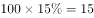人，即。解方程得，则今年获优的有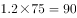人。根据两集合容斥原理，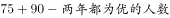，要“两年都为优的人数”最少，则“两年都不是优的人数”取最小数0，此时两年考核结果均为优的人数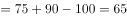人。

故正确答案为B。

---

### 第 2 题　qid 2264386 · 数学运算

从A市到B市的机票如果打6折，包含接送机出租车交通费90元、机票税费60元在内的总乘机成本是机票打4折时总乘机成本的1.4倍。问从A市到B市的全价机票价格（不含税费）为多少元？

- **A**. 1200
- **B**. 1250
- **C**. 1500　✅
- **D**. 1600

**答案**：C

**官方解析**

根据题意，乘机总成本包括机票价格（不含税费）、交通费和机票税费。设从A市到B市的全价机票价格（不含税费）为元。根据两次折扣的1.4倍关系可列式：，解得元。

故正确答案为C。

---

### 第 3 题　qid 2264398 · 数学运算

小张和小王在同一个学校读研究生，每天早上从宿舍到学校有6：40、7：00、7：20和7：40发车的4班校车。某星期周一到周三，小张和小王都坐班车去学校，且每个人在3天中乘坐的班车发车时间都不同。问这3天小张和小王每天都乘坐同一趟班车的概率在：

- **A**. 
以下

- **B**. 
之间

- **C**. 
之间
　✅
- **D**. 
以上

**答案**：C

**官方解析**

3天中乘坐的班车发车时间都不同，每人需在四趟班车内依次选三趟乘坐，有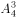种情况。两人在3天中乘坐的班车发车时间都不同的总情况数有种，若要求两人每天都乘坐同一趟班车，则其中一人选定之后，另一人只能与他的选择方式相同，有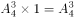种情况。故这3天小张和小王每天都乘坐同一趟班车的概率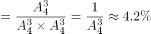。

故正确答案为C。

---

### 第 4 题　qid 2264405 · 数学运算

甲车上午8点从A地出发匀速开往B地，出发30分钟后乙车从A地出发以甲车2倍的速度前往B地，并在距离B地10千米时追上甲车。如乙车9点10分到达B地，问甲车的速度为多少千米/小时？

- **A**. 30　✅
- **B**. 36
- **C**. 45
- **D**. 60

**答案**：A

**官方解析**

设甲车的速度为千米/小时，乙车的速度为甲车的2倍即千米/小时。甲车出发30分钟即小时后乙车开始追，则两车的路程差为千米，由追及公式“”可得，小时。乙车在上午8点的30分钟后出发，9点10分到达B地，共用时。设乙在C点追上甲，则千米，乙车从C地到B地用时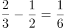小时。则乙车的速度=，甲车的速度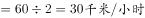。

故正确答案为A。

---

### 第 5 题　qid 2264406 · 数学运算

甲和乙进行5局3胜的乒乓球比赛，甲每局获胜的概率是乙每局获胜概率的1.5倍。问以下哪种情况发生的概率最大？

- **A**. 比赛在3局内结束　✅
- **B**. 乙连胜3局获胜
- **C**. 甲获胜且两人均无连胜
- **D**. 乙用4局获胜

**答案**：A

**官方解析**

根据“甲每局获胜的概率是乙每局获胜概率的1.5倍”，设乙的概率为，则甲的概率为，由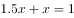，解得，即甲获胜的概率为0.6，乙为0.4。

A项：比赛在3局内结束，有两种情况：①甲连胜3局，概率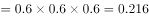；②乙连胜3局，概率。故A项总概率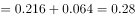。

B项：乙连胜3局获胜，有三种情况：①乙前3局连胜，概率；②乙第2、3、4局连胜，概率；③乙第3、4、5局连胜，概率；故B项总概率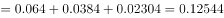。

C项：甲获胜且两人均无连胜，只有一种情况，即甲获胜三局且分别是第1、3、5局获胜，概率。

D项：乙用4局获胜，则第四局必然是乙获胜，且前三局中乙有两局获胜，因此概率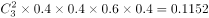。

故正确答案为A。

---

### 第 6 题　qid 2264409 · 数学运算

有甲、乙、丙三个工作组，已知乙组2天的工作量与甲、丙共同工作1天的工作量相同。A工程如由甲、乙组共同工作3天，再由乙、丙组共同工作7天，正好完成。如果三组共同完成，需要整7天。B工程如丙组单独完成正好需要10天，问如由甲、乙组共同完成，需要多少天？

- **A**. 不到6天
- **B**. 6天多
- **C**. 7天多　✅
- **D**. 超过8天

**答案**：C

**官方解析**

根据题意，甲、乙、丙三者的效率满足以下关系：

②式整理可得：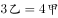，即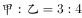。赋值，，代入①式可得：。则B工程的工作量为，如由甲、乙共同完成需要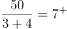天，即7天多。

故正确答案为C。

---

### 第 7 题　qid 2264411 · 数学运算

某单位有2个处室，甲处室有12人，乙处室有20人。现在将甲处室最年轻的4人调入乙处室，则乙处室的平均年龄增加了1岁，甲处室的平均年龄增加了3岁。问在调动之前，两个处室的平均年龄相差多少岁？

- **A**. 8
- **B**. 12　✅
- **C**. 14
- **D**. 15

**答案**：B

**官方解析**

设调动前甲处室的平均年龄为岁，乙处室的平均年龄为岁，则调动后甲处室的平均年龄为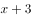岁，乙处室的平均年龄为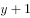岁。根据调动前后甲、乙两处室的年龄之和不变，可列式：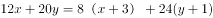，解得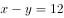，所以调动前两个处室的平均年龄差为12岁。

故正确答案为B。

---

### 第 8 题　qid 2264416 · 数学运算

甲和乙两条自动化生产线同时生产相同的产品，甲生产线单位时间的产量是乙生产线的5倍，甲生产线每工作1小时就需要花3小时时间停机冷却而乙生产线可以不间断生产。问以下哪个坐标图能准确表示甲、乙生产线产量之差（纵轴L）与总生产时间（横轴T）之间的关系？

- **A**. 

　✅
- **B**. 

- **C**. 
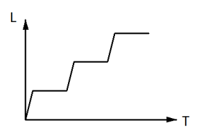

- **D**. 

**答案**：A

**官方解析**

根据“甲生产线单位时间的产量是乙生产线的5倍”赋值甲的效率为5，乙的效率为1。根据题意，甲生产线工作1小时，休息3小时，而乙生产线持续工作，可得下表：

观察表格可知，每4小时为一个变化周期。

先看变化趋势：每个周期前1个小时产量之差不断增大，后3小时产量之差不断减小，排除C项；

再看拐点对应时长（横轴T）：每个周期增加过程所对应时长与下降过程所对应时长之比为1：3，排除B项；

最后看对应高度（纵轴L）：每个周期都是升4再降3，下降值大于上升值的一半，排除D项。

故正确答案为A。

---

### 第 9 题　qid 2264418 · 数学运算

某单位要求职工参加20课时线上教育课程，其中政治理论10课时，专业技能10课时。可供选择的政治理论课共8门，每门2课时；可供选择的专业技能课共10门，其中2课时的有5门，1课时的有5门。问可选择的课程组合共有多少种？

- **A**. 5656　✅
- **B**. 5600
- **C**. 1848
- **D**. 616

**答案**：A

**官方解析**

根据题意，政治理论课在8门中选5门即可达到10课时，一共有：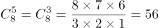种情况。专业技能课若要达到10课时，可分为以下3类：①2课时的课5门全选，情况数为1种；②2课时的课选4门，1课时的课选2门，情况数为种；③2课时的课选3门，1课时的课选4门，情况数为种，故选专业技能课的情况数为种。所以可选择的课程组合共有种。

故正确答案为A。

---

### 第 10 题　qid 2264420 · 数学运算

花圃自动浇水装置的规则设置如下：
①每次浇水在中午12:00~12:30之间进行；
②在上次浇水结束后，如连续3日中午12:00气温超过30摄氏度，则在连续第3个气温超过30摄氏度的日子中午12:00开始浇水；
③如在上次浇水开始120小时后仍不满足条件②，则立刻浇水。
已知6月30日12:00~12:30该花圃第一次自动浇水，7月份该花圃共自动浇水8次，问7月至少有几天中午12:00的气温超过30摄氏度？

- **A**. 18
- **B**. 12
- **C**. 20
- **D**. 15　✅

**答案**：D

**官方解析**

根据题意，若要使7月份中午气温超过30摄氏度的天数尽可能少，则应同时满足两个条件：（1）超过30摄氏度的日子均以连续3天的方式出现；（2）未超过30摄氏度的日子均以连续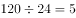天的方式出现。

题干问“至少”，从最小的选项开始代入。

C项：若超过30摄氏度的日子有12天，则未超过30摄氏度的日子有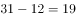天。根据规则②可知，12天中浇水次；根据规则③可知，，即19天中浇水3次。次，与“浇水8次”矛盾，排除；

D项：若超过30摄氏度的天数为15天，则未超过30摄氏度的天数为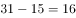天。根据规则②可知，15天中浇水次；根据规则③可知，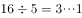，即16天中浇水3次，次。满足题意，当选。

故正确答案为D。

---

## 判断推理

### 材料 1

某次历史、地理知识竞赛规定，每个参赛队必须由3名选手组成。参赛队每场回答7道题，其中3道地理题、4道历史题。同类题目均不连续出现，并依次编号。比赛时按顺序答题，每道题只能由一名选手当场作答。 

“镇美”队在某场比赛中派出了陈佳、赵义、王冰三名选手参赛。赛前约定：

（1）赵义只回答历史题；

（2）王冰只回答其中1题；

（3）赵义、陈佳答题总数均不少于2题；

（4）每个选手连续回答不能超过2题。

#### 第 1 题　qid 2264342 · 类比推理

“镇美”队每个选手完成自己最少的答题任务之后，剩下的题目依次是：

- **A**. 地理题、历史题　✅
- **B**. 历史题、地理题
- **C**. 地理题、历史题、地理题
- **D**. 历史题、地理题、历史题

**答案**：A

**官方解析**

第一步：分析题干。
（1）每场回答7道题目，3道地理题，4道历史题；
（2）同类题目不连续出现；
（3）比赛时按顺序答题，每道题只能由一名选手当场作答；
（4）赵义只回答历史题；
（5）王冰只回答其中1题；
（6）赵义、陈佳答题数均大于等于2道题；
（7）每个选手连续回答不能超过2道题。
 第二步：根据题干条件分析选项。
由条件（1）和（2）可知第1、3、5、7题题目类型相同，第2、4、6题题目类型相同，故答题顺序应为：历史、地理、历史、地理、历史、地理、历史。再根据条件（5）（6）可知王冰、赵义、陈佳三人最少的答题量为5道题，结合提问可知，每个选手完成自己最少的答题量之后，还剩下2道题，剩下的题目为地理、历史，对应A项。
故正确答案为A。

---

#### 第 2 题　qid 2264344 · 类比推理

如果在该场比赛中，陈佳和赵义均答对了一半的题目，则该场比赛“镇美”队答对的总题数最少为：

- **A**. 1题
- **B**. 2题
- **C**. 3题　✅
- **D**. 4题

**答案**：C

**官方解析**

第一步：分析题干。
（1）每场回答7道题目，3道地理题，4道历史题；
（2）同类题目不连续出现；
（3）比赛时按顺序答题，每道题只能由一名选手当场作答；
（4）赵义只回答历史题；
（5）王冰只回答其中1题；
（6）赵义、陈佳答题数均大于等于2道题；
（7）每个选手连续回答不能超过2道题；
（8）陈佳和赵义均答对了一半的题目。
第二步：根据题干条件分析选项。
根据条件（5）王冰只回答其中1题，可知陈佳和赵义一共答了6题，结合条件（8）可知，陈佳和赵义均答对了一半的题目，所以陈佳和赵义最少答对的题目数量为3道题，结合提问可知，要求答对的总数最少，那么王冰回答错误即满足要求，所以答对的总题数最少为3道。
故正确答案为C。

---

#### 第 3 题　qid 2264346 · 类比推理

如果有两名选手答题总数相同，则可以得出：

- **A**. 赵义回答了所有历史题
- **B**. 陈佳回答的都是地理题
- **C**. 陈佳和王冰每人各答了一道历史题
- **D**. 陈佳、王冰中的一人回答了一道历史题　✅

**答案**：D

**官方解析**

第一步：分析题干。
（1）每场回答7道题目，3道地理题，4道历史题；
（2）同类题目不连续出现；
（3）比赛时按顺序答题，每道题只能由一名选手当场作答；
（4）赵义只回答历史题；
（5）王冰只回答其中1题；
（6）赵义、陈佳答题数均大于等于2道题；
（7）每个选手连续回答不能超过2道题；
（8）两名选手答题总数相同。
第二步：根据题干条件分析选项。
根据条件（8）可知，有两名选手答题总数相同，结合条件（1）（5）（6）可知，一共7道题目，王冰只回答1道题，则赵义和陈佳的答题量总数为6道题，由于赵义和陈佳的答题数均大于等于2道题，故只能是陈佳、赵义答题数相同，且各回答3道题。根据条件（4）可知，赵义回答的3道题均为历史题，结合（1）知一共有4道历史题，所以还剩余1道历史题，则此题只能是陈佳、王冰中的一人回答。
故正确答案为D。

---

#### 第 4 题　qid 2264349 · 逻辑判断

如果在该场比赛中，所有的历史题都答对了，而所有的地理题都答错了，假定每题1分，则以下哪项中选手的得分情况是不可能的？

- **A**. 陈佳＝1；赵义＝2；王冰＝1
- **B**. 陈佳＝2；赵义＝1；王冰＝1　✅
- **C**. 陈佳＝1；赵义＝3；王冰＝0
- **D**. 陈佳＝2；赵义＝2；王冰＝0

**答案**：B

**官方解析**

第一步：分析题干。
（1）每场回答7道题目，3道地理题，4道历史题；
（2）同类题目不连续出现；
（3）比赛时按顺序答题，每道题只能由一名选手当场作答；
（4）赵义只回答历史题；
（5）王冰只回答其中1题；
（6）赵义、陈佳答题数均大于等于2道题；
（7）每个选手连续回答不能超过2道题。
 第二步：根据题干条件分析选项。
根据提问可知，所有的历史题都答对了，所以可以优先从历史题入手进行推理，根据（4）（6）可知，赵义回答的历史题大于等于2道，又因为所有历史题都答对了，所以赵义的得分一定大于等于2，不可能是1。
本题为选非题，故正确答案为B。

---

#### 第 5 题　qid 2264353 · 逻辑判断

补充以下哪项，可以确定该场比赛中3名选手各自的答题编号？

- **A**. 赵义回答的是第1、第7题　✅
- **B**. 陈佳答了4道题
- **C**. 赵义回答的是第3、第5题
- **D**. 陈佳回答的是第2、第4和第6题

**答案**：A

**官方解析**

第一步：分析题干。
（1）每场回答7道题目，3道地理题，4道历史题；
（2）同类题目不连续出现；
（3）比赛时按顺序答题，每道题只能由一名选手当场作答；
（4）赵义只回答历史题；
（5）王冰只回答其中1题；
（6）赵义、陈佳答题数均大于等于2道题；
（7）每个选手连续回答不能超过2道题。
第二步：根据题干条件分析选项。
结合提问可知，需补充一项后可确定3名选手各自的答题编号，因此考虑代入排除法。
代入A项，赵义回答的是第1、第7题，则剩余的2、3、4、5、6只能是陈佳和王冰所答，结合条件（5）可知，王冰只回答一道题，剩下的4道题目是陈佳回答的，又因为条件（7）可知陈佳的4道题不可能出现连续超过2道的情况，因此陈佳回答的只能是2、3、5、6题，此时王冰只能回答第4题，其余题目均为陈佳所答。所以补充A项之后，就能够确定3名选手的回答编号，赵义回答编号为1、7，王冰回答的编号为4，陈佳的编号为2、3、5、6。
故正确答案为A。

---

#### 第 6 题　qid 2264337 · 图形推理

从所给的四个选项中，选择最合适的一个填入问号处，使之呈现一定的规律性：

- **A**. A
- **B**. B　✅
- **C**. C
- **D**. D

**答案**：B

**官方解析**

元素组成基本相同，优先考虑位置规律。观察发现，三角形与正方形的公共边每次沿正方形的外框顺时针平移半条边，则？处图形中公共边应位于正方形上边框的右侧，排除C项和D项。继续观察发现，三角形在正方形内部的顶点也每次顺时针平移一个位置（如图），故？处应选择一个三角形顶点位于正方形内部左下角位置的图形，只有B项符合。 故正确答案为B。

---

#### 第 7 题　qid 2264340 · 图形推理

从所给的四个选项中，选择最合适的一个填入问号处，使之呈现一定的规律性：

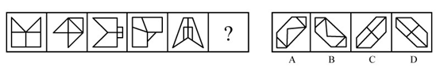

- **A**. A
- **B**. B　✅
- **C**. C
- **D**. D

**答案**：B

**官方解析**

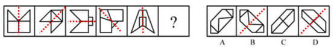

元素组成不同，优先考虑属性规律。观察发现，题干图形均为轴对称图形，并且对称轴方向每次顺时针旋转，排除A项和C项。进一步观察发现，题干中图1、图3和图5的对称轴都与图形中的一条线重合，而图2和图4的对称轴没有与图形中的一条线重合，故“？”处应选择一个图形的对称轴不与图形中某一条线重合的，只有B项符合。

故正确答案为B。

---

#### 第 8 题　qid 2264343 · 图形推理

从所给的四个选项中，选择最合适的一个填入问号处，使之呈现一定的规律性：

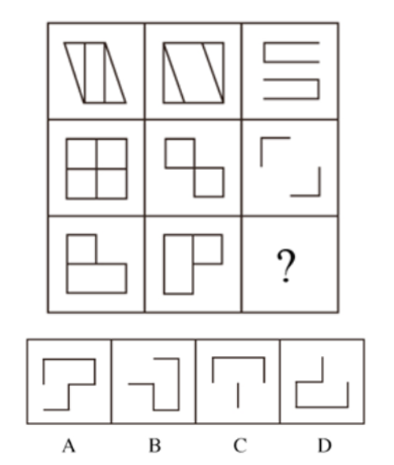

- **A**. A
- **B**. B
- **C**. C
- **D**. D　✅

**答案**：D

**官方解析**

元素组成相似，且相同线条重复出现，优先考虑样式规律中的加减同异。九宫格优先看横行，第一行中，图1和图2求异后再顺时针或者逆时针旋转得到图3；经验证，第二行也满足此规律；第三行应用此规律，故“？”处应选择一个图1和图2先求异再顺时针或者逆时针旋转得到的图形。观察选项发现，逆时针旋转无答案，只有顺时针旋转得到D选项。

故正确答案为D。

---

#### 第 9 题　qid 2264347 · 图形推理

从所给的四个选项中，选择最合适的一个填入问号处，使之呈现一定的规律性：

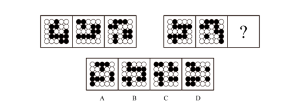

- **A**. A　✅
- **B**. B
- **C**. C
- **D**. D

**答案**：A

**官方解析**

元素组成相同，但无位置规律。继续观察发现，题干图形的黑圆有明显连在一起的，考虑数部分数。第一组图黑圆连起来看，部分数分别为1、2、3；第二组图应用此规律，黑圆连起来看部分数依次为1、2、？，故？处应该选择一个黑圆为3部分的图形。A、B、C、D的黑圆连起来的部分数分别为3、2、4、4，只有A选项符合。

故正确答案为A。

---

#### 第 10 题　qid 2264351 · 图形推理

左边给定的是正方体的外表面展开图，下面哪一项能由它折叠而成？

- **A**. A
- **B**. B
- **C**. C　✅
- **D**. D

**答案**：C

**官方解析**

将展开图的面均标上序号，如下图。

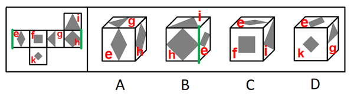

逐一分析选项：  A项：选项出现了面e、面g和面h，而题干中面e和面g为相对面，不能同时出现，选项与题干不一致，排除；  B项：选项出现了面e、面h和面i，面e和面h的公共边挨着面e的黑色部分，而题干中这两个面的公共边（如图）没有挨着面e的黑色部分，选项与题干不一致，排除；  C项：选项出现了面e、面f和面i，与题干一致，当选；  D项：选项出现了面e、面g和面k，而题干中面e和面g为相对面，不能同时出现，选项与题干不一致，排除。  故正确答案为C。

---

#### 第 11 题　qid 2264356 · 图形推理

左图为6个相同小正方体组合成的多面体，将其从任一面剖开，以下哪一项<b>不可能</b>是该多面体的截面？

- **A**. A
- **B**. B
- **C**. C
- **D**. D　✅

**答案**：D

**官方解析**

本题考查截面图，逐一分析选项。

如下图所示，A、B、C项均可截出，该立体图形无法同时截出D项的菱形和三角形。

A项：

B项：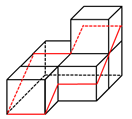

C项：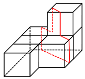

D项：无法切出，当选。

本题为选非题，故正确答案为D。

---

#### 第 12 题　qid 2264364 · 图形推理

下图为同样大小的正方体堆叠而成的多面体正视图和后视图。该多面体可拆分为①、②、③和④共4个多面体的组合，问下列哪一项能填入问号处？

- **A**. A
- **B**. B
- **C**. C
- **D**. D　✅

**答案**：D

**官方解析**

本题考查立体拼合。由题干给出的多面体的正视图和后视图，可知，图形可分为前中后3排，最前面一排，根据正视图可知共有2个小立方体，中间一排，根据正视图和后视图可知共有8个小立方体，最后一排，根据后视图可知共有12个小立方体，故该多面体共有2+8+12=22个小立方体。观察题干图形发现，①有5个小立方体，②有6个小立方体，③有5个小立方体，所以若要将①、②、③、④组合在一起拼成题干多面体，则④应该有6个小立方体。

A项有4个小立方体，B项有5个小立方体，C项有5个小立方体，D项有6个小立方体。

故正确答案为D。

---

#### 第 13 题　qid 2264369 · 图形推理

把下面的六个图形分为两类，使每一类图形都有各自的共同特征或规律，分类正确的一项是：

- **A**. ①②③，④⑤⑥
- **B**. ①②⑥，③④⑤　✅
- **C**. ①④⑥，②③⑤
- **D**. ①③④，②⑤⑥

**答案**：B

**官方解析**

解析一：本题为分组分类题目。每幅图中都由黑白两部分组成，观察发现图①②⑥中白色部分和黑色部分的面积都是相同的，而图③④⑤中白色部分的面积都大于黑色部分的面积，故图①②⑥为一组，图③④⑤为一组。
故正确答案为B。
解析二：本题为分组分类题目。每幅图中都由黑白两部分组成，观察发现图①②⑥中白色部分和黑色部分面的形状都是相同的，而图③④⑤中白色部分面的形状和黑色部分不相同，故图①②⑥为一组，图③④⑤为一组。
故正确答案为B。

---

#### 第 14 题　qid 2264371 · 图形推理

把下面的六个图形分为两类，使每一类图形都有各自的共同特征或规律，分类正确的一项是：

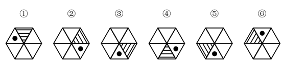

- **A**. ①④⑤，②③⑥　✅
- **B**. ①②⑤，③④⑥
- **C**. ①④⑥，②③⑤
- **D**. ①③④，②⑤⑥

**答案**：A

**官方解析**

解析一：

 

本题为分组分类题目。观察发现元素组成相同，优先考虑位置规律。观察小黑点和阴影三角形的位置关系，可从小黑点向三角形方向就近画时针，发现图①④⑤为顺时针，②③⑥为逆时针。即图①④⑤为同一个图形进行旋转得到，图②③⑥为同一个图形进行旋转得到。故①④⑤为一组，②③⑥为一组。

故正确答案为A。

解析二：

本题为分组分类题目。观察发现题干每幅图形均有小黑点，考虑功能元素。观察小黑点和阴影三角形的位置关系，由于三角形具有指向性，可从阴影三角形的底边向中心画出一个箭头，以箭头指向的方向为上，观察发现图①④⑤小黑点都在阴影三角形的右侧，②③⑥小黑点都在阴影三角形的左侧。故①④⑤为一组，②③⑥为一组。

故正确答案为A。

---

#### 第 15 题　qid 2264372 · 图形推理

把下面的六个图形分为两类，使每一类图形都有各自的共同特征或规律，分类正确的一项是：

- **A**. ①③④，②⑤⑥
- **B**. ①②⑥，③④⑤
- **C**. ①③⑤，②④⑥　✅
- **D**. ①④⑥，②③⑤

**答案**：C

**官方解析**

本题为分组分类题目。观察图形发现，多边形内部被线条分割，优先考虑数面的数量，但题干图形的面数量都是5，无法分组。继续观察发现，图①③⑤中存在明显最小的面，且最小的面的形状均与图形外轮廓形状相同，图②④⑥中存在明显最大的面，且最大的面的形状均与图形外轮廓形状相同，故①③⑤一组，②④⑥一组。
故正确答案为C。

---

#### 第 16 题　qid 2264339 · 定义判断

定律假说是对一类事物或现象的性质或发生原因作出推测性解释，得出一个可能具有普遍性意义的规律性命题，从而试图建立、发展或补充科学理论。
根据上述定义，下列属于定律假说的是：

- **A**. 老师向学生们解释潮汐现象产生的原因是海水在引力作用下出现的周期性运动
- **B**. 某单位仓库被盗，由于未发现破坏性进入的痕迹，侦查人员认为内部人员作案的可能性极大
- **C**. 牛顿根据苹果掉落现象发现了万有引力定律　✅
- **D**. 有研究人员指出，由基因导致的疾病可能都是由于基因突变引起的

**答案**：C

**官方解析**

第一步：找出定义关键词。

“对一类事物或现象的性质或发生原因做出推测性解释”、“得出一个可能具有普遍性意义的规律性命题”、“从而试图建立、发展或补充科学理论”。

第二步：逐一分析选项。

A项：老师向学生解释潮汐产生的原因，是对该现象产生原因的直接解释，而非推测性解释，不符合“对一类现象的发生原因作出推测性解释”，不符合定义，排除； 

B项：某仓库被盗，侦查人员认为是内部作案，某仓库的情况是个例，不符合“对一类事物或现象的发生原因作出推测性解释”，也没体现“得出一个可能具有普遍意义的规律性命题”，不符合定义，排除；

C项：牛顿根据苹果掉落现象发现了万有引力定律，根据苹果掉落现象符合“对一类事物或现象的性质或发生原因做出推测性解释”，发现万有引力定律符合“得出一个可能具有普遍意义的规律性命题”、“从而试图建立、发展或补充科学理论”，符合定义，当选；

D项：由基因导致的疾病“可能”都是由于基因突变引起的，是对此类疾病发生原因的推测性解释，但是没体现“得出一个可能具有普遍意义的规律性命题”、“从而试图建立、发展或补充科学理论”，不符合定义，排除。

故正确答案为C。

【备注】经粉笔教研，并通过查原文，C项牛顿依据苹果掉落现象提出引力假说属于理论假说，且在自然科学领域，理论假说都属于定律假说，故C项属于定律假说；而D项，研究基因导致的疾病的病因，其目的是为了帮助医生今后在治疗此类疾病时能对症下药，避免工作的盲目性，所以应属于作业假说，而非定律假说。

原文链接： http://www.cssn.cn/zt/zt_zh/kuaxuekezhuanti/flljx/jsyzcjs/jsff/201609/t20160920_3207766_2.shtml 

---

#### 第 17 题　qid 2264341 · 定义判断

严格指示词是指一个语言表达式所具有的如下性质：它所指示的对象不会随着该表达式被使用的具体情境而发生改变。这些情境通常包括表达式的使用主体、表达式被使用的时间、地点、世界状态等等。
根据上述定义，下列属于严格指示词的是：

- **A**. 现任联合国秘书长
- **B**. 世界上身高最高的人
- **C**. 最小的素数　✅
- **D**. 经常坐在教室第一排正中间的同学

**答案**：C

**官方解析**

第一步：找出定义关键词。
“它所指示的对象不会随着该表达式被使用的具体情境而发生改变”、“这些情境通常包括表达式的使用主体、表达式被使用的时间、地点、世界状态等等”
第二步：逐一分析选项。
A项：联合国秘书长的任期为5年，现任联合国秘书长所指示的对象会随着使用时间的改变而发生改变，不符合“所指示的对象不会随着该表达式被使用的具体情境而发生改变”，不符合定义，排除； 
B项：世界上身高最高的人，身高会随着时间的变化发生变化，世界上身高最高的人所指示的对象也会随着时间发生改变，不符合“所指示的对象不会随着表达式被使用的具体情境而发生改变”，不符合定义，排除；
C项：素数是指大于1的自然数中，只能被1和它本身整除的数。最小的素数是2，是唯一确定的结论，不会随着具体情境的改变而发生变化，符合定义，当选；
D项：经常坐在教室第一排正中间的同学，不同教室坐在第一排正中间的同学是不同的，它所指示的对象会随着地点的改变而改变，不符合“所指示的对象不会随着该表达式被使用的具体情境而发生改变”，不符合定义，排除。
故正确答案为C。

---

#### 第 18 题　qid 2264345 · 定义判断

同病异治是指中医对相同疾病采取不同的治法，达到治病求本的治疗效果；异病同治是指不同的疾病在发展过程中出现性质相同的症状，因而可以采用同样的中医治疗方法。
根据上述定义，下列属于异病同治的是：

- **A**. 久痢脱肛和胃下垂，均为中气下陷之证，可用升提中气之法治疗　✅
- **B**. 外感风热，内有蕴热的表里俱实之证，宜解表和攻里之药同时并用
- **C**. 麻疹初期疹未出透，治疗宜宣肺透疹；中期肺热明显，治疗宜清热解毒
- **D**. 风热感冒宜用辛凉解表法治疗，风寒感冒宜用辛温解表法治疗

**答案**：A

**官方解析**

第一步：找出定义关键词。
同病异治：“中医对相同疾病采取不同的治法”、 “达到治病求本的治疗效果”。
异病同治：“不同的疾病”、“出现性质相同的症状”、“采用相同的中医治疗方法”。
第二步：逐一分析选项。
A项：久痢脱肛和胃下垂，符合“不同的疾病”，均为中气下陷之证，符合“出现性质相同的症状”，可用升提中气之法治疗，符合“采用相同的中医治疗方法”，符合“异病同治”定义，当选； 
B项：外感风热，内有蕴热，是一种疾病的内部及外表的两方面表现，解表和攻里之药同时并用，是指治病时需内外兼治，是一种疾病采取一种治疗方法，不符合任何一个定义，排除；
C项：麻疹初期和中期的治疗方法不同，符合“中医对相同疾病采取不同的治法”，符合“同病异治”定义，不符合“异病同治”定义，排除；
D项：风热感冒宜用辛凉解表法治疗，风寒感冒宜用辛温解表法治疗，是不同的疾病采用不同的中医治疗方法，不符合任何一个定义，排除。
故正确答案为A。

---

#### 第 19 题　qid 2264348 · 逻辑判断

物候现象是生物随着气候一年四季的周期性变化而发生的相应季节性变化的现象。影响物候现象的因素主要包括海拔的差异、经度的差异、纬度的差异和时间的差异。
下列诗句反映的物候现象受到海拔差异影响的是：

- **A**. 日出江花红胜火，春来江水绿如蓝
- **B**. 竹外桃花三两枝，春江水暖鸭先知
- **C**. 人间四月芳菲尽，山寺桃花始盛开　✅
- **D**. 羌笛何须怨杨柳，春风不度玉门关

**答案**：C

**官方解析**

第一步：找出定义关键词。
“生物随着气候一年四季的周期性变化而发生的相应季节性变化”、“海拔差异影响”。
第二步：逐一分析选项。
A项：“日出江花红胜火，春来江水绿如蓝”意思是清晨日出的时候，江边盛开的花朵，简直比火还要红艳；当春天来到时，江里的水，青绿得就像是蓝色的一样。不涉及“海拔差异对物候现象的影响”，不符合定义，排除； 
B项：“竹外桃花三两枝，春江水暖鸭先知”意思是竹林外两三枝桃花初放，鸭子在水中游戏，它们最先察觉了初春江水的回暖。不涉及“海拔差异对物候现象的影响”，不符合定义，排除；
C项：“人间四月芳菲尽，山寺桃花始盛开”意思是在人间四月里百花凋零已尽，高山古寺中的桃花才刚刚盛开，是由于高山的海拔较高，温度较低才导致这一现象，符合“海拔差异对物候现象的影响”，符合定义，当选；
D项：“羌笛何须怨杨柳，春风不度玉门关”意思是何必用羌笛吹起那哀怨的杨柳曲去埋怨春光迟迟不来呢，玉门关一带春风是吹不到的啊，玉门关位于甘肃省境内，这里属于非季风区，不受夏季季风的影响才导致这一现象，不符合“海拔差异对物候现象的影响”，不符合定义，排除。
故正确答案为C。

---

#### 第 20 题　qid 2264352 · 定义判断

公平世界谬误是指人们倾向于认为我们生活的世界是公平的，一个人获得成就，是因为他肯定做对了什么，所以这份成就是他应得的；一个人遭遇不幸，他自己也有责任，甚至是咎由自取。
根据上述定义，下列没有反映公平世界谬误的是：

- **A**. 一分耕耘，一分收获
- **B**. 谋事在人，成事在天　✅
- **C**. 可怜之人必有可恨之处
- **D**. 天网恢恢，疏而不漏

**答案**：B

**官方解析**

第一步：找出定义关键词。
“一个人获得成就，是因为他肯定做对了什么，所以这份成就是他应得的”、“一个人遭遇不幸，他自己也有责任，甚至是咎由自取”。
第二步：逐一分析选项。
A项：“一分耕耘，一分收获”，意思是付出一份劳力就得一分收益。符合“一个人获得成就，是因为他肯定做对了什么，所以这份成就是他应得的”，符合定义，排除； 
B项：“谋事在人，成事在天”，意思是自己已经尽力而为，至于能否达到目的，那就要看时运如何了。能否达到目的看的是时运而不是自己，不符合“一个人获得成就，是因为他肯定做对了什么，所以这份成就是他应得的”，也不符合“一个人遭遇不幸，他自己也有责任，甚至是咎由自取”，不符合定义，当选；
C项：“可怜之人必有可恨之处”，意思是一个貌似可怜之人现实的不如意，一定是由于之前的过错或咎由自取造成的。符合“一个人遭遇不幸，他自己也有责任，甚至是咎由自取”，符合定义，排除；
D项：“天网恢恢，疏而不漏”，意思是天道公平，作恶就要受到惩罚，它看起来似乎很不周密，但最终不会放过一个坏人。符合“一个人遭遇不幸，他自己也有责任，甚至是咎由自取”， 符合定义，排除。
本题为选非题，故正确答案为B。

---

#### 第 21 题　qid 2264355 · 定义判断

按照先后顺序排列的两个数字或者字母称为序对，如2a、e3、dm等等，序对中的第一个数字或者字母称为前项，第二个称为后项。函项指的是由若干序对构成的一个有限序列，其中每个序对的前项都是字母，后项都是数字，并且对于任一序对，如果前项相同，则后项必定相同。
根据上述定义，下列哪项属于函项？

- **A**. p3、c4、d6、p6、m8
- **B**. b3、5a、8n、p1、66
- **C**. f4、h4、gm、y2、x2
- **D**. a3、b5、d6、p1、e3　✅

**答案**：D

**官方解析**

第一步：找出定义关键词。
序对：“按照先后顺序排列的两个数字或者字母称为序对”、“序对中的第一个数字或者字母称为前项，第二个称为后项”。
函项：“由若干序对构成的有限序列”、“每个序对的前项都是字母，后项都是数字” 、“对于任一序对，如果前项相同，则后项必定相同”。
第二步：逐一分析选项。
A项：p3和p6这两个序对，前项相同但是后项不同。不符合“对于任一序对，如果前项相同，则后项必定相同”，不符合定义，排除； 
B项：5a、8n和66这三个序对，前项是数字。不符合“每个序对的前项都是字母，后项都是数字”，不符合定义，排除；
C项：gm这个序对，后项是字母。不符合“每个序对的前项都是字母，后项都是数字”，不符合定义，排除；
D项：a3、b5、d6、p1、e3，每个序对都是前项是字母，后项是数字。符合“每个序对的前项都是字母，后项都是数字”，符合定义，当选。
故正确答案为D。

---

#### 第 22 题　qid 2264358 · 定义判断

诉前财产保全是指利害关系人因情况紧急，若不立即申请财产保全将会使其合法权益受到难以弥补的损害，起诉前向人民法院申请，由人民法院采取的一种财产保全措施。
根据上述定义，下列不属于诉前财产保全的是：

- **A**. 工厂甲向信用社乙贷款500万元，甲无法按期归还。乙随即起诉，审理期间得知甲已将设备转卖，遂请求法院查封甲正在出售的大楼　✅
- **B**. 甲与乙签订购销合同，甲给乙200万元预付款后，发现乙有欺诈行为，无力履行合同，遂请求人民法院冻结200万元预付款
- **C**. 银行甲与公司乙签订协议，甲向乙提供5000万元贷款，分3期还清，第一笔到期时乙无力归还，甲向法院申请查封乙的财产
- **D**. 甲欠乙10万元，乙多次找甲还钱未果，得知甲有一辆轿车，乙向法院申请将甲的轿车予以查封，再将甲告上法庭

**答案**：A

**官方解析**

第一步：找出定义关键词。
“因情况紧急，若不立即申请财产保全将会使其合法权益受到难以弥补的损害”、“起诉前向人民法院申请，由人民法院采取的一种财产保全措施”。
第二步：逐一分析选项。
A项：乙是在起诉审理期间要求法院查封甲正在出售的大楼，不符合在“起诉前向人民法院申请，由人民法院采取的一种财产保全措施”，不符合定义，当选；
B项：甲在给乙预付款之后，发现乙有欺诈行为，无力履行合同，此时甲如果不及时申请财产保全，有可能无法追回这一预付款，所以符合“因情况紧急，若不立即申请财产保全将会使其合法权益受到难以弥补的损害”，而后甲请求法院冻结这一预付款，符合“起诉前向人民法院申请，由人民法院采取的一种财产保全措施”，符合定义，排除；
C项：甲与乙签订贷款协议，乙在第一笔到期时无力还款，此时甲如果不及时申请财产保全，有可能无法收回这笔贷款，所以符合“因情况紧急，若不立即申请财产保全将会使其合法权益受到难以弥补的损害”，甲请求法院查封乙的财产，符合“起诉前向人民法院申请，由人民法院采取的一种财产保全措施”，符合定义，排除；
D项：乙多次找甲还钱未果，此时乙如果不及时申请财产保全，有可能无法追回这一欠款，所以符合“因情况紧急，若不立即申请财产保全将会使其合法权益受到难以弥补的损害”，乙向法院申请把甲的轿车予以查封，然后再把甲告上法庭，符合“起诉前向人民法院申请，由人民法院采取的一种财产保全措施”，符合定义，排除。
本题为选非题，故正确答案为A。

---

#### 第 23 题　qid 2264360 · 定义判断

员工帮助计划是由企业为员工设置的一套长期的、系统的福利项目，通过专业人员对员工及其直系亲属提供专业指导和咨询，旨在帮助解决员工及其家庭成员的各种心理和行为问题，提高员工在企业中的工作绩效。
根据上述定义，下列属于员工帮助计划的是：

- **A**. 项目经理小祁的父亲最近去世了，小祁很悲痛，工作效率受到很大影响，总经理特批了一笔慰问款
- **B**. 司机小方驾车外出工作期间交通肇事致人死亡，公司聘请律师为小方做从轻处罚的辩护，最终小方获刑三年
- **C**. 会计师老王的儿子没有考上大学，老王夫妇很烦恼，互相指责。在公司心理专员的指导下，老王改善了与妻子的沟通方式，情绪逐渐好转　✅
- **D**. 职员小欣情绪低落，有自杀的念头，经医院诊断为重度抑郁症，需住院治疗。公司启动援助机制，为小欣支付了住院费用

**答案**：C

**官方解析**

第一步：找出定义关键词。
“由企业为员工设置的一套长期的、系统的福利项目”、“通过专业人员对员工及其直系亲属提供专业指导和咨询”、“旨在帮助解决员工及其家庭成员的各种心理和行为问题，提高员工在企业中的工作绩效”。
第二步：逐一分析选项。
A项：总经理特批的慰问款是专门针对小祁父亲去世这件事所一次性发放的，不符合“由企业为员工设置的一套长期的、系统的福利项目”，而且总经理特批发钱这一慰问方式也不符合“通过专业人员对员工及其直系亲属提供专业指导和咨询”，不符合定义，排除；
B项：公司聘请律师为小方做从轻处罚的辩护，不符合“旨在帮助解决员工及其家庭成员的各种心理和行为问题”，不符合定义，排除；
C项：公司设有心理专员这一岗位，说明这是“由企业为员工设置的一套长期的、系统的福利项目”，公司心理专员给予老王夫妇以指导，符合“通过专业人员对员工及其直系亲属提供专业指导和咨询”，最终老王改善了与妻子的沟通方式，情绪逐渐好转，也符合“旨在帮助解决员工及其家庭成员的各种心理和行为问题，提高员工在企业中的工作绩效”，符合定义，当选；
D项：公司启动援助机制，为患有重度抑郁症的职员小欣支付住院费用，只是在用钱来帮助小欣，并没有“通过专业人员对员工及其直系亲属提供专业指导和咨询”，不符合定义，排除。
故正确答案为C。

---

#### 第 24 题　qid 2264363 · 定义判断

沟通网络是信息沟通的结构形式。常见的沟通网络有四种形式：在轮式网络中，一个下级同时与多个主管联系，但主管之间没有沟通的情形。在Y式网络中，第二级有两个上级与之联系，第三级与一个或更多下级发生联系。在环式网络中，每个成员仅与相邻者联系，而不能与更远的成员进行沟通。在全通道式网络中，所有成员间充分进行沟通，所有成员的地位是平等的，无核心人物。

根据上述定义，下列图形反映了轮式网络特点的是：

- **A**. A
- **B**. B
- **C**. C
- **D**. D　✅

**答案**：D

**官方解析**

第一步：找出定义关键词。
轮式网络：“一个下级同时与多个主管联系”、“主管之间没有沟通的情形”；
Y式网络：“第二级有两个上级与之联系”、“第三级与一个或更多下级发生联系”；
环式网络：“每个成员仅与相邻者联系”、“不能与更远的成员进行沟通”；
全通道式网络：“所有成员间充分进行沟通”、“所有成员的地位是平等的，无核心人物”。
第二步：逐一分析选项。
A项：每个字符只与其相邻的两个字符间有联系，与其他不相邻的没有联系，符合“每个成员仅与相邻者联系”、“不能与更远的成员进行沟通”，符合“环式网络”定义，不符合“轮式网络”定义，排除；
B项：每个字符与其他所有字符都有联系，而且无核心字符，符合“所有成员间充分进行沟通”、“所有成员的地位是平等的，无核心人物”，符合“全通道式网络”定义，不符合“轮式网络”定义，排除；
C项：字符C分别与两个上级字符A、B以及一个下级字符D有联系，符合“第二级有两个上级与之联系”、“第三级与一个或更多下级发生联系”，符合“Y式网络”定义，不符合“轮式网络”定义，排除；
D项：字符C作为下属时，分别与多个主管字符A、B、D、E有联系，但是主管字符A、B、D、E之间没有联系，符合“一个下级同时与多个主管联系”、“主管之间没有沟通的情形”，符合“轮式网络”定义，当选。
故正确答案为D。

---

#### 第 25 题　qid 2264367 · 定义判断

变文和连文是古汉语中常用的修辞方法。变文是指为了避重而在相临近的句子中采用同义词来表达相同的意义。连文是指本来要表达甲，而连带说到乙，使两个相关联的词连在一起，但突出表达其中一个词的意义。
根据上述定义，下列使用了连文这一修辞方法的是：

- **A**. 《史记·淮阴侯列传》：“置之死地而后生，置之亡地而后存。”
- **B**. 《易经·系辞上传》：“鼓之以雷霆，润之以风雨。”　✅
- **C**. 诸葛亮《出师表》：“受任于败军之际，奉命于危难之间。”
- **D**. 贾谊《过秦论》：“南取汉中，西举巴蜀，东割膏腴之地，北收要害之郡。”

**答案**：B

**官方解析**

第一步：找出定义关键词。
变文：“为了避重而在相临近的句子中采用同义词来表达相同的意义”；
连文：“本来要表达甲，而连带说到乙，使两个相关联的词连在一起”、“突出表达其中一个词的意义”。
第二步：逐一分析选项。
A项：“置之死地而后生，置之亡地而后存”意思是，军队士兵在可能战死的境地，会奋勇前进，杀敌取胜，在可能灭亡的境地，会战胜生存下来，不符合“本来要表达甲，而连带说到乙，使两个相关联的词连在一起”、“突出表达其中一个词的意义”，不符合“连文”定义，排除；
B项：“鼓之以雷霆，润之以风雨”意思是，用雷霆来鼓荡它，用风雨来滋润它，其中润是用来描述雨的特点，但在表达雨的同时谈到了相关联的风，其中突出表达的是雨水的滋润，符合“本来要表达甲，而连带说到乙，使两个相关联的词连在一起”、“突出表达其中一个词的意义”，符合“连文”定义，当选；
C项：“受任于败军之际，奉命于危难之间”意思是，在兵败的时候接受任务，在危机患难之间奉行使命，只表达了一个意思，没有侧重要突出的，不符合“本来要表达甲，而连带说到乙，使两个相关联的词连在一起”、“突出表达其中一个词的意义”，不符合“连文”定义，排除；
D项：“南取汉中，西举巴蜀，东割膏腴之地，北收要害之郡”意思是，向南夺取汉中，向西攻取巴、蜀，向东割取肥沃的地区，向北占领非常重要的地区，指要攻占东南西北四方的领土，不符合“本来要表达甲，而连带说到乙，使两个相关联的词连在一起”、“突出表达其中一个词的意义”，不符合“连文”定义，排除。
故正确答案为B。

---

#### 第 26 题　qid 2264335 · 类比推理

分母：除数

- **A**. 内角：外角
- **B**. 加减法：乘除法
- **C**. 横坐标：纵坐标
- **D**. 百分比：百分率　✅

**答案**：D

**官方解析**

第一步：判断题干词语间逻辑关系。
分母是分数式中写在横线下面的数、字母或代数式，除数是在除法算式中，除号后面的数。分母也叫除数，二者是全同关系。
第二步：判断选项词语间逻辑关系。
A项：内角指的是多边形相邻的两边组成的角，外角指的是多边形中一条边与另一条边的延长线组成的角，二者不是全同关系，与题干逻辑关系不一致，排除；
B项：加减法和乘除法，分别是不同的运算法则，二者是并列关系，不是全同关系，与题干逻辑关系不一致，排除；
C项：横坐标也叫X坐标，纵坐标也叫Y坐标，二者构成笛卡尔坐标系（直角坐标系）以表示函数的图像，二者不是全同关系，与题干逻辑关系不一致，排除；
D项：百分数也叫做百分率或百分比，是一种表达比例、比率或分数数值的方法，二者是全同关系，与题干逻辑关系一致，当选。
故正确答案为D。

---

#### 第 27 题　qid 2264350 · 类比推理

直线交叉：直线不平行

- **A**. 
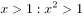
　✅
- **B**. 
100：沸腾

- **C**. 
：臭氧

- **D**. 
：圆面积

**答案**：A

**官方解析**

第一步：判断题干词语间逻辑关系。 两条直线只要交叉，则一定不平行，前者是后者的充分条件。

注：直线间除了在同一平面内存在交叉和平行关系，还可以在不同平面内存在不交叉、不平行的关系，所以题干二者不是全同关系。

第二步：判断选项词语间逻辑关系。 A项： 只要x大于1，则x的平方一定大于1，前者是后者的充分条件，与题干逻辑关系一致，当选； B项：液体并非只要达到100，一定会沸腾，不同液体的沸点并不一定相同，前者不是后者的充分条件，与题干逻辑关系不一致，排除； C项：臭氧是地球大气中的一种微量气体，含有3个氧原子，是臭氧的化学式表示，二者是全同关系，与题干逻辑关系不一致，排除； D项：圆面积公式等于半径平方与圆周率的乘积，用字母可以表示为：，前者不是后者的充分条件，与题干逻辑关系不一致，排除。 故正确答案为A。 

---

#### 第 28 题　qid 2264354 · 类比推理

刻舟：求剑

- **A**. 里应：外合
- **B**. 掩耳：盗铃　✅
- **C**. 打草：惊蛇
- **D**. 指桑：骂槐

**答案**：B

**官方解析**

第一步：判断题干词语间逻辑关系。
刻舟求剑是指办事刻板，没用发展的眼光看问题，其中刻舟是求剑的方式，求剑是刻舟的目的。
第二步：判断选项词语间逻辑关系。
A项：里应是指里面接应，外合是指外面攻打，里应和外合是并列关系，与题干逻辑关系不一致，排除；
B项：掩耳盗铃是指把耳朵捂住偷铃铛，以为自己听不见别人也会听不见，比喻自欺欺人。其中掩耳是盗铃的方式，盗铃是掩耳的目的，与题干逻辑关系一致，保留；
C项：打草惊蛇是指做事不周密，行动不谨慎，不慎惊动了对方，“打草”的本意不是“惊蛇”，与题干逻辑关系不一致，排除；（打草惊蛇还有一种解释为，打草是为了惊蛇，如果按这个意思理解可以做保留）
D项：指桑骂槐是比喻表面上骂这个人，实际上是骂那个人，指桑是骂槐的方式，骂槐是目的，与题干逻辑关系一致，保留。
比较B、C、D，题干刻舟求剑是说方法错误，达不到求剑的目的。而打草惊蛇与指桑骂槐都能达到目的，掩耳盗铃也是强调方法错误达不到目的，因此B选项与题干更一致。
故正确答案为B。

---

#### 第 29 题　qid 2264357 · 类比推理

马蹄莲：蟹爪兰

- **A**. 牵牛花：美人蕉
- **B**. 卷心菜：夜来香
- **C**. 灯笼椒：金针菇　✅
- **D**. 佛手柑：含羞草

**答案**：C

**官方解析**

第一步：判断题干词语间逻辑关系。
马蹄莲的形状像马蹄，蟹爪兰的形状像蟹爪，二者是根据外形来命名的两种植物。
第二步：判断选项词语间逻辑关系。
A项：牵牛花因其形似喇叭，所以也叫喇叭花，所以喇叭花是以植物外形来命名的，而牵牛花是它的别称，并不是以植物外形来命名的；美人蕉因其花开的美艳而得名，并不是以植物外形来命名的，与题干逻辑关系不一致，排除；
B项：卷心菜是以植物外形来命名的，但夜来香因夜晚有特殊的芳香而命名，不是以植物外形来命名的，与题干逻辑关系不一致，排除；
C项：灯笼椒的形状像灯笼，金针菇的形状像针一样，二者是以外形来命名的两种蔬菜，与题干逻辑关系一致，当选；
D项：佛手柑是以植物外形来命名的，但含羞草是因为它的叶子一经触碰就自动卷起来，像害羞一样，并不是以植物外形来命名的，与题干逻辑关系不一致，排除。
故正确答案为C。

---

#### 第 30 题　qid 2264359 · 类比推理

金库：现钞：保管

- **A**. 网球场：球迷：观看
- **B**. 电缆车：景区：观光
- **C**. 录音棚：专辑：播放
- **D**. 美术馆：字画：陈列　✅

**答案**：D

**官方解析**

第一步：判断题干词语间逻辑关系。
金库是用来保管现钞的地点，三者为对应关系。
第二步：判断选项词语间逻辑关系。
A项：网球场是用来观看球赛的地点，不是观看球迷的地点，与题干逻辑关系不一致，排除；
B项：电缆车是用来观光景区的交通工具，不是地点，与题干逻辑关系不一致，排除；
C项：录音棚是用来录制专辑的地点，不是播放专辑的地点，与题干逻辑关系不一致，排除；
D项：美术馆是用来陈列字画的地点，三者为对应关系，与题干逻辑关系一致，当选。
故正确答案为D。

---

#### 第 31 题　qid 2264361 · 类比推理

山洪：村民：士兵

- **A**. 狂风：雷电：灯塔
- **B**. 事故：伤员：医生　✅
- **C**. 海啸：船舶：渔民
- **D**. 婚礼：新人：主持

**答案**：B

**官方解析**

第一步：判断题干词语间逻辑关系。
山洪是灾难事件，村民是山洪的受害者，士兵是村民的救助者，村民和士兵是被救助与救助的关系。
第二步：判断选项词语间逻辑关系。
A项：狂风和雷电是两种不同的天气现象，是并列关系，灯塔是用以指引船只方向的建筑物，与狂风和雷电无必然联系，与题干逻辑关系不一致，排除；
B项：事故是灾难事件，伤员是事故的受害者，医生是伤员的救助者，伤员和医生是被救助与救助的关系，与题干逻辑关系一致，当选；
C项：海啸是灾难事件，船舶是渔民的工具，二者不是被救助与救助的关系，与题干逻辑关系不一致，排除；
D项：婚礼不是灾难事件，新人与主持不是被救助与救助的关系，与题干逻辑关系不一致，排除。
故正确答案为B。

---

#### 第 32 题　qid 2264362 · 类比推理

病毒：传染病：流行性

- **A**. 毒驾：车祸：危害性　✅
- **B**. 市场：交易：自发性
- **C**. 噪声：听力损伤：普遍性
- **D**. 甜食：肥胖症：突发性

**答案**：A

**官方解析**

第一步：判断题干词语间逻辑关系。
病毒可能会导致传染病，二者为因果的对应关系，且传染病一定具有流行性，二者为必然属性的对应关系。
注：传染病一定是“可以流行”的，只不过“可以流行”并不意味着传染病一定会“流行开来”。因此，传染病一定具备“流行性”的属性，只是不一定会造成“流行开来”这样的结果而已，所以二者是必然属性对应关系。
第二步：判断选项词语间逻辑关系。
A项：毒驾可能会导致车祸，二者为因果的对应关系，且车祸一定具有危害性，二者为必然属性的对应关系，与题干逻辑关系一致，当选；
B项：市场不会导致交易，二者不是因果的对应关系，与题干逻辑关系不一致，排除；
C项：噪声可能会导致听力损伤，二者为因果的对应关系，但普遍性不是听力损伤的必然属性，与题干逻辑关系不一致，排除；
D项：甜食可能会导致肥胖症，二者为因果的对应关系，但突发性不是肥胖症的属性，与题干逻辑关系不一致，排除。
故正确答案为A。

---

#### 第 33 题　qid 2264365 · 类比推理

微量元素：稀有金属：铜

- **A**. 木本植物：草本植物：松树
- **B**. 海洋动物：哺乳动物：北极熊
- **C**. 内陆湖：淡水湖：青海湖　✅
- **D**. 节肢动物：两栖动物：鳄鱼

**答案**：C

**官方解析**

第一步：判断题干词语间逻辑关系。

微量元素是指人体中含量小于的元素，稀有金属是指在自然界中含量较少或分布稀散的金属，故二者为交叉关系；铜是微量元素，二者为种属关系，且铜不是稀有金属。

第二步：判断选项词语间逻辑关系。

A项：木本植物和草本植物都是植物的一种，二者为并列关系，与题干逻辑关系不一致，排除；

B项：海洋动物和哺乳动物为交叉关系，但北极熊是哺乳动物，不是海洋动物，与题干逻辑关系不一致，排除；

C项：内陆湖和淡水湖为交叉关系，青海湖是内陆湖，二者为种属关系，且青海湖不属于淡水湖，与题干逻辑关系一致，当选；

D项：节肢动物属于无脊椎动物，两栖动物属于脊椎动物，二者不是交叉关系，且鳄鱼不属于节肢动物，与题干逻辑关系不一致，排除。

故正确答案为C。

---

#### 第 34 题　qid 2264366 · 类比推理

莲蓬 对于（  ）相当于（  ）对于 葛根

- **A**. 荷叶；葛藤　✅
- **B**. 荷花；葛粉
- **C**. 喜爱；纠缠
- **D**. 荷塘；山岗

**答案**：A

**官方解析**

逐一代入选项。
A项：莲蓬与荷叶都是荷花的组成部分，葛藤与葛根都是野葛的组成部分，二者均为并列关系，前后逻辑关系一致，当选；
B项：莲蓬是荷花的组成部分，二者为组成关系；葛根是葛粉的原材料，二者为原材料的对应关系，前后逻辑关系不一致，排除；
C项：喜爱莲蓬，二者为动宾关系；纠缠和葛根不是动宾关系，且前后顺序相反，前后逻辑关系不一致，排除；
D项：荷塘里有莲蓬，山岗里有葛根，二者均为地点的对应关系，但前后顺序相反，前后逻辑关系不一致，排除。
故正确答案为A。

---

#### 第 35 题　qid 2264368 · 类比推理

立案 对于（  ）相当于（  ）对于 判决

- **A**. 起诉；服刑
- **B**. 审理；质证　✅
- **C**. 犯罪；调解
- **D**. 罚款；执行

**答案**：B

**官方解析**

A项：在刑事诉讼中可以先“立案”后“起诉”，在民事诉讼中可以先“起诉”后“立案”，二者没有必然的时间先后顺序，而服刑在判决之后，前后逻辑关系不一致，排除；
B项：先立案后审理，先质证后判决，二者均为先后顺序的对应关系，前后逻辑关系一致，当选；
C项：先犯罪后立案，二者为先后顺序的对应关系；调解和判决没有必然联系，前后逻辑关系不一致，排除；
D项：立案与罚款没有必然联系；先判决后执行，二者为先后顺序的对应关系，前后逻辑关系不一致，排除。
故正确答案为B。

---

#### 第 36 题　qid 2264332 · 逻辑判断

一般来说，塑料极难被分解，即使是较小的碎片也很难被生态系统降解，因此它造成的环境破坏十分严重。近期科学家发现，一种被称为蜡虫的昆虫能够降解聚乙烯，而且速度极快。如果使用生物技术复制蜡虫降解聚乙烯，将能够帮助我们有效清理垃圾填埋厂和海洋中累积的塑料垃圾。
以下哪项如果为真，不能支持上述结论？

- **A**. 世界各地的塑料垃圾的主要成分是聚乙烯
- **B**. 蜡虫的确能够破坏聚乙烯塑料的高分子链
- **C**. 聚乙烯被蜡虫降解后的物质对环境的影响尚不明确　✅
- **D**. 现有科技手段能够将蜡虫降解聚乙烯的酶纯化出来

**答案**：C

**官方解析**

第一步：找出论点和论据。
论点： 如果使用生物技术复制蜡虫降解聚乙烯，将能够帮助我们有效清理垃圾填埋厂和海洋中累积的塑料垃圾。
论据： 近期科学家发现，一种被称为蜡虫的昆虫能够降解聚乙烯，而且速度极快。
第二步：逐一分析选项。
A项：题干说蜡虫能够分解聚乙烯，这样就能解决世界上的塑料垃圾，该项说明世界各地的塑料垃圾的主要成分是聚乙烯，是论点成立的必要条件，可以加强，排除；
B项：该项说明昆虫能够破坏聚乙烯的高分子链，说明昆虫确实能够破解聚乙烯，从而帮助我们清理塑料垃圾，属于补充论据，可以加强，排除；
C项：该项说明聚乙烯被蜡虫分解后的物质对环境的影响尚不明确，即能不能解决塑料垃圾不清楚，属于不明确选项，无法加强，当选；
D项： 现有科技手段能够将蜡虫降解聚乙烯的酶纯化出来，说明我们能够通过生物技术复制蜡虫降解聚乙烯，是论点成立的必要条件，可以加强，排除。
本题为选非题，故正确答案为C。

---

#### 第 37 题　qid 2264333 · 逻辑判断

所有的幼儿园都面临同一个问题：就是对于那些在幼儿园放学之后不能及时来接孩子的家长，幼儿园老师除了等待别无他法，因此许多幼儿园都向晚接孩子的家长收取费用。然而，有调查显示，收取费用后晚接孩子的家长数量并未因此减少，反而增加了。
以下哪项如果为真，最能解释上述调查结果？

- **A**. 收费标准太低，对原本经常晚来接孩子的家长没有太大的约束力
- **B**. 有个别家长对收费行为不满，有时会故意以晚接孩子的行为来抗议
- **C**. 有些家长因工作忙碌，常常不能及时来接孩子
- **D**. 收费后，更多的家长认为即使晚来接孩子也不必愧疚，只要付费即可　✅

**答案**：D

**官方解析**

第一步：找出题干矛盾。
通过收取费用的方式让家长早接孩子，但是收费后晚接孩子的家长数量不减反增。
第二步：逐一分析选项。
A项：收费低对原本晚接孩子的家长无影响，可以解释为什么人数没有减少，但是无法解释为什么人数增加，不能解释题干矛盾，排除；
B项：该项说的是个别家长抗议收费而晚来接孩子，但是无法解释清楚为什么晚接孩子的家长数增加了，不能解释题干矛盾，排除；
C项：该项解释了家长晚来接孩子的原因，与题干幼儿园收费无关，不能解释题干矛盾，排除；
D项：该项说明幼儿园对晚接孩子进行收费后，将这种行为合理化，更多的家长心安理得的晚来接孩子，可以解释为什么晚接孩子的人不减反增，当选。
故正确答案为D。

---

#### 第 38 题　qid 2264334 · 逻辑判断

应激本身没有致痛能力，但是流行病学调查发现，长期应激与疼痛慢性化的发生正相关，即长期处于巨大压力下的人群，其疼痛症状更易迁延，进而发展为慢性疼痛。
以下哪项如果为真，最能支持上述调查结果？

- **A**. 
具有焦虑倾向的人，其应激水平往往较高，疼痛慢性化的发生率也会更高

- **B**. 
长期应激可影响神经内分泌系统，使人的疼痛抑制系统的功能被削弱
　✅
- **C**. 
吸烟使人体神经内分泌系统发生紊乱，对疼痛感知的影响与应激相似

- **D**. 
如果能有效缓解应激，保持心态平和，疼痛慢性化的发生率将会降低

**答案**：B

**官方解析**

第一步：找出论点和论据。
论点：长期处于巨大压力下的人群，其疼痛症状更易迁延，进而发展为慢性疼痛。
论据：无。
本题只有论点没有论据，加强优先考虑补充论据，即解释原因或举例加强。
第二步：逐一分析选项。
A项：该项指出，具有焦虑倾向的人，其应激水平高，疼痛慢性化发生率也会高，举例子补充论据，可以加强，保留；
B项：长期应激会影响神经内分泌系统，进而削弱疼痛抑制系统，所以发展为慢性疼痛，解释原因补充论据，可以加强，保留；
C项：该项说吸烟对疼痛感知的影响和应激相似，不能说明应激与疼痛慢性化的关系，无法加强，排除；
D项：该项指出如果缓解应激后，疼痛慢性化的发生率会下降，举反面例子补充论据，可以加强，保留。
对比A、B、D三项，B项解释原因力度大于A、D两项的举例子。
故正确答案为B。

---

#### 第 39 题　qid 2264336 · 逻辑判断

自从前年甲航运公司实行了经理任期目标责任制之后，公司的经济效益也随之逐年上升。可见，只有实行经理任期目标责任制，才能使甲公司经济效益稳步增长。
以下哪项如果为真，最能削弱上述论证？

- **A**. 近两年国家经济发展速度较快，航运行业的整体形势大好
- **B**. 没实行任期目标责任制的乙航运公司，近两年的经济效益也稳步增长
- **C**. 前年甲公司开始实行职工薪酬管理制度改革，极大地调动了公司员工的积极性
- **D**. 如果甲航运公司没有实行任期目标责任制，近两年的经济效益会增长得更快　✅

**答案**：D

**官方解析**

第一步：找出论点和论据。
论点：只有实行经理任期目标责任制，才能使甲公司经济效益稳步增长。
论据：甲航运公司实行了经理任期目标责任制之后，公司的经济效益也随之逐年上升。
论点和论据均在讨论“实行经理任期目标责任制”和“经济效益增长”的关系，话题一致，削弱优先考虑削弱论点。
第二步：逐一分析选项。
A项：该项指出可能是因为整个航运行业整体形势好，使得甲公司经济效益增长，是他因削弱，可以削弱，保留；
B项：该项讨论的是“乙航运公司”，与题干讨论的甲航运公司无关，无关选项，无法削弱，排除；
C项：该项指出前年甲公司也实行了职工薪酬管理制度改革，调动了公司员工积极性，可能是因为员工积极性高了，使得甲公司经济效益增长，是他因削弱，可以削弱，保留；
D项：如果甲航运公司没有实行任期目标责任制，近两年的经济效益会增长得更快，说明实行经理任期目标责任制反而限制了甲公司经济效益稳步增长，直接削弱论点，保留。
对比A、C、D三项，D项削弱论点力度最强，大于A、C两项的他因削弱。
故正确答案为D。

---

#### 第 40 题　qid 2264338 · 逻辑判断

所有的地震都是以P波开始的，这些P波移动快速，使地面发生上下震动，造成的破坏较小。下一个是S波，它的移动很慢，使地面前后、左右晃动，破坏性极大。早期预警系统通过测量P波沿地面移动的情况，来预测S波所造成的影响，然后发出警报。然而，从事此类系统工作的科学家们发现，事实上人们并没有多少时间为大地震做好准备。
要得到上述结论，需要补充的最重要前提是：

- **A**. 地球上每年大约发生500多万次地震，绝大多数的地震人们根本感觉不到
- **B**. 根据历年大地震的记载，强震大多在夜里瞬间发生，无法在短时间内组织有效的防御行动
- **C**. 地震越大，P波与S波之间的间隔越短，留给人们预警的时间不多　✅
- **D**. 发生较大地震时，人们先感到上下颠簸，而后才有很强的水平晃动，这种晃动是由S波造成的

**答案**：C

**官方解析**

第一步：找出论点和论据。
论点：事实上人们并没有多少时间为大地震做好准备。
论据：无。
第二步：逐一分析选项。
A项：论点说的是没有时间为大地震做好准备，该项说的是地震发生的次数和人们的感觉，话题不一致，无法加强，排除； 
B项：根据历年大地震的记载，强地震大多在夜里瞬间发生，无法在短时间内有效防御，这是在列举历年地震的情况，举例加强，但不是论点成立最重要的前提，排除； 
C项：地震越大，P波与S波之间的间隔越短，指出留给人们预警的时间就越短，说明人们并没有多少时间为大地震做好准备，是论点成立最重要的前提，当选；
D项：论点说的是没有多少时间为大地震做好准备，该项说的是人们先感到上下颠簸，而后才有很强的水平晃动，是由S波造成的，指出S波对人们造成的影响，未提及是否有时间为大地震做好准备，无关项，无法加强，排除。
故正确答案为C。

---

## 资料分析

### 材料 1

 

#### 第 1 题　qid 2264396 · 平均数

2017年第三季度，全国平均每吨进口药品单价约为多少万美元？

- **A**. 2
- **B**. 19　✅
- **C**. 8
- **D**. 96

**答案**：B

**官方解析**

根据题干“2017年第三季度······平均每吨进口药品单价”，可判定本题为现期平均数问题。第三季度为7—9月。定位图形材料1可得：2017年7—9月进口药品数量分别为1.1万吨、1.2万吨、1.1万吨；定位图形材料2可得：2017年7—9月进口药品金额分别为19.6亿美元、23.8亿美元、21.9亿美元。由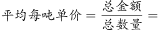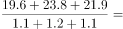，结果在20万美元附近，与B项最接近。

故正确答案为B。

---

#### 第 2 题　qid 2264400 · 增长

2017年下半年，全国进口药品数量同比增速低于上月水平的月份有几个？

- **A**. 2
- **B**. 3
- **C**. 4　✅
- **D**. 5

**答案**：C

**官方解析**

根据题干“2017年下半年······同比增速低于上月水平······”结合材料给出了每个月的增长率，可判定本题为直接找数问题。2017年下半年为7—12月，定位图形材料1可得：2017年6—12月增长率分别为、、、、、、。比较可知：7月、9月、10月、12月增速低于上月水平，即有4个月。

故正确答案为C。

---

#### 第 3 题　qid 2264417 · 增长

2016年5月，全国进口药品金额环比增速：

- **A**. 
超过

- **B**. 
在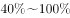之间

- **C**. 
在之间
　✅
- **D**. 
低于

**答案**：C

**官方解析**

根据题干“2016年5月······环比增速”，结合材料给出的2017年4、5月的数据，可判定本题为一般增长率问题，其中现期是2016年5月，基期是2016年4月。定位图形材料2可得：2017年5月进口药品金额为27.8亿美元，同比增速为；2017年4月进口药品金额为18.8亿美元，同比增速为。由可得：2016年5月进口药品金额亿美元，2016年4月进口药品金额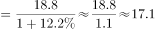亿美元；由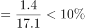，其范围符合C项。

故正确答案为C。

---

#### 第 4 题　qid 2264421 · 增长

以下折线图中，能准确反映2017年第四季度各月全国进口药品金额环比增长率的是：

- **A**. A
- **B**. B
- **C**. C
- **D**. D　✅

**答案**：D

**官方解析**

根据题干“2017年第四季度各月······环比增长率”，可判定本题为一般增长率问题。定位图形材料2可得：2017年9月-12月全国进口药品金额分别为21.9亿美元、18.4亿美元、24.0亿美元、27.8亿美元。根据公式：，2017年第四季度各月的环比增长率分别为：10月：；11月：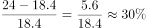；12月：。

即10月最小，11月最大。结合图像，D选项符合。

故正确答案为D。

---

#### 第 5 题　qid 2264423 · 综合

能够从上述资料中推出的是：

- **A**. 2016年下半年，全国进口药品数量低于1万吨的月份仅有2个
- **B**. 2017年11月，全国平均每吨进口药品单价低于上年同期水平　✅
- **C**. 2017年第二季度，全国进口药品金额超过75亿美元
- **D**. 2017年1月，全国进口药品金额超过20亿美元

**答案**：B

**官方解析**

A项：定位图形材料1，2017年7-12月全国进口药品数量分别为1.1万吨、1.2万吨、1.1万吨、1.0万吨、1.4万吨、1.3万吨；同比增速分别为、、、、、。根据公式：，2016年下半年全国进口药品数量分别为：，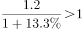，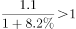，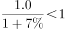，，，只有10月低于1万吨，错误；

B项：定位图形材料1，2017年11月全国进口药品数量同比增速为；定位图形材料2，2017年11月全国进口药品金额同比增速为。由，药品金额增长率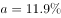，药品数量增长率，则。根据两期平均数比较结论： 时，平均数低于上年。故2017年11月全国平均每吨进口药品单价低于上年同期水平，正确；

C项：定位图形材料2，2017年4-6月全国进口药品金额分别为18.8亿美元、27.8亿美元、26.5亿美元。故2017年第二季度全国进口药品金额，错误；

D项：定位图形材料2，2018年1月全国进口药品金额为22.2亿美元，同比增速为。根据公式：，2017年1月全国进口药品金额，错误。

故正确答案为B。

---

### 材料 2

        2017年全国二手车累计交易量为1240万辆，同比增长；二手车交易额为8092.7亿元，同比增长。2017年12月，全国二手车市场交易量为123万辆，交易量环比上升，上年同期交易量为108万辆。

#### 第 6 题　qid 2264438 · 增长

2011～2017年，全国二手车交易量同比增量低于80万辆的年份有几个？

- **A**. 3
- **B**. 4　✅
- **C**. 5
- **D**. 7

**答案**：B

**官方解析**

根据题干“······同比增量低于80万辆的年份有几个”，可判定本题为增长量的计算问题。定位图1可知2011~2017年每年的二手车交易量，以及2011年增长率为，根据公式：，可得2011年二手车增长量=。根据公式：，可得：

所以，2011~2017年，全国二手车交易量同比增量低于80万辆的年份有2011年、2013年、2014年、2015年这4年。

故正确答案为B。

---

#### 第 7 题　qid 2264439 · 综合

“十二五”（2011～2015年）期间，全国二手车总计交易约多少亿辆？

- **A**. 0.46
- **B**. 0.50
- **C**. 0.38
- **D**. 0.42　✅

**答案**：D

**官方解析**

定位图1可知2011~2015年全国二手车每年的交易量，所以“十二五”（2011~2015年）期间，全国二手车总计交易为，D项当选。

故正确答案为D。

---

#### 第 8 题　qid 2264440 · 平均数

2017年1～10月，平均每月全国二手车交易量约为多少万辆？

- **A**. 100　✅
- **B**. 105
- **C**. 90
- **D**. 95

**答案**：A

**官方解析**

根据题干“2017年1~10月，平均每月······万辆”，结合材料时间为2017年，可判定本题为现期平均数问题。定位文字材料“2017年全国二手车累计交易量为1240万辆······2017年12月，全国二手车交易量为123万辆，交易量环比上升”，可得2017年1~10月，平均每月全国二手车交易量约为，与A项最为接近。

故正确答案为A。

---

#### 第 9 题　qid 2264441 · 综合

2015年全国二手车交易总金额比2014年：

- **A**. 减少了不到100亿元　✅
- **B**. 减少了100亿元以上
- **C**. 增长了100亿元以上
- **D**. 增长了不到100亿元

**答案**：A

**官方解析**

根据选项“增长/减少······”，结合选项带具体单位，可判定本题为增长量计算问题。定位图1和图2，可知2015和2014年二手车交易量和平均交易价格，则2015年二手车交易总金额2014年二手车交易总金额，故减少不到100亿元。

故正确答案为A。

---

#### 第 10 题　qid 2264442 · 综合

能够从上述资料中推出的是：

- **A**. 
2016～2017年，全国二手车平均交易价格在6.1～6.15万元之间

- **B**. 
2011～2017年，全国二手车交易量同比增速第4高的年份，当年二手车平均交易价格高于6万元

- **C**. 
2011～2017年，全国二手车交易量同比增长量最高的年份其增长量是最低年份的9倍多
　✅
- **D**. 
2011～2017年，全国二手车交易量同比增速低于的年份有4个

**答案**：C

**官方解析**

A项：定位图1和图2，可知2016和2017年二手车交易量分别为1039万辆和1240万辆，平均交易价格分别为5.8万元/辆和6.5万元/辆，故2016~2017年全国二手车平均交易价格应在5.8~6.5万元/辆之间。由于，故2016~2017年，全国二手车平均交易价格应更偏向于2017年的平均交易价格，即应大于 ，即在6.15~6.5万元/辆之间，不在6.1~6.15万元之间，错误；

B项：定位图1，可知全国二手车交易量同比增速第4高的是2016年，对应图2平均交易价格为5.8万元，低于6万元，错误；

C项：定位图1，全国二手车交易量同比增长量最高的年份为2017年，其增长量为，同比增长量最低的年份为2015年，其增长量为，则，正确；

D项：定位图1，全国二手车交易量同比增速低于的年份有2013年()、2014年（）、2015年（），共3个年份符合，错误。

故正确答案为C。

---

### 材料 3

#### 第 11 题　qid 2264388 · 综合

2017年，全国处理的支付交易类钓鱼网站数量超过金融证券类钓鱼网站2倍的月份有几个？

- **A**. 5
- **B**. 6　✅
- **C**. 7
- **D**. 8

**答案**：B

**官方解析**

根据题干“2017年···超过···2倍···”，可判定本题为现期倍数问题。定位表格最后两列，给出的数据为每个月支付交易类钓鱼网站和金融证券类钓鱼网站的处理数量占当月总数的比重，每个月总数一定，故只需比较比重即可。则支付交易类钓鱼网站数量超过金融证券类钓鱼网站2倍的月份有：

2017年3月份，

2017年8月份，

2017年9月份，

2017年10月份，

2017年11月份，

2017年12月份，共有6个月份。

故正确答案为B。

---

#### 第 12 题　qid 2264402 · 综合

2018年第一季度全国处理钓鱼网站总数：

- **A**. 不到5000个
- **B**. 在5000～6000个之间
- **C**. 在6001～7000个之间　✅
- **D**. 超过7000个

**答案**：C

**官方解析**

题干求2018年一季度全国处理钓鱼网站总数，根据表格可知2018年1月-2018年3月每月处理钓鱼网站的数量，可判定此题为简单加减计算问题。2018年第一季度（1-3月）全国处理钓鱼网站总数，在C项范围内。

故正确答案为C。

---

#### 第 13 题　qid 2264414 · 比重

2017年下半年，金融证券类和支付交易类钓鱼网站占当月处理钓鱼网站总数比重最低的月份是：

- **A**. 8月
- **B**. 9月
- **C**. 10月
- **D**. 11月　✅

**答案**：D

**官方解析**

题干求金融证券类和支付交易类钓鱼网站占当月处理钓鱼网站总数比重最低的月份，根据表格可知2017年1月-2018年4月每月金融证券类和支付交易类钓鱼网站占当月处理钓鱼网站总数比重，可判定此题为简单加减计算问题。根据选项及表格可得，8月：，9月：，10月：，11月：。11月最低。

故正确答案为D。

---

#### 第 14 题　qid 2264425 · 增长

下列折线图中，能准确反映2018年第一季度CN域名钓鱼网站处理数量同比增速变化趋势的是：

- **A**. A
- **B**. B　✅
- **C**. C
- **D**. D

**答案**：B

**官方解析**

根据题干“2018年第一季度···同比增速变化趋势”，可判定本题为一般增长率比较问题。定位表格材料可得：2017年1月、2月、3月CN域名钓鱼网站处理数量分别为42个、91个、76个，2018年1月、2月、3月CN域名钓鱼网站处理数量分别为204个、58个、254个。根据增长率，可以利用的大小直接判定增长率的大小。2018年第一季度，即1月、2月、3月的分别为：、、，则1月同比增长率最大，2月同比增长率最小。

故正确答案为B。

---

#### 第 15 题　qid 2264433 · 综合

能够从上述资料中推出的是：

- **A**. 
2018年3月全国支付交易类钓鱼网站处理数量超过2500个
　✅
- **B**. 
2017年第一季度全国CN域名钓鱼网站处理数量占同期钓鱼网站处理总数的一成以上

- **C**. 
2018年2月全国支付交易类钓鱼网站处理数量环比下降了不到

- **D**. 
2017年全国处理的CN域名钓鱼网站中，超过了一半的网站是在12月处理的

**答案**：A

**官方解析**

A项：定位表格，2018年3月全国共处理钓鱼网站数量为个，支付交易类占比为，则2018年3月全国支付交易类钓鱼网站处理数量为，正确；

B项：定位表格，2017年第一季度CN域名处理数量为个，全国钓鱼网站处理总数为个，则2017年第一季度CN域名处理数量占总数的比重为，不到一成，错误；

C项：定位表格，2018年2月全国处理钓鱼网站数量为个，支付交易类占比为，则2018年2月支付交易类处理数量约为个；2018年1月全国处理钓鱼网站数量为个，支付交易类占比为，则2018年1月支付交易类处理数量约为个。那么2018年2月支付交易类钓鱼网站处理数量环比下降，错误；

D项：定位表格，2017年全国共处理CN域名钓鱼网站总数为个，其中12月份处理数量为302个，则12月份占全年的比重为，不到一半，错误。

故正确答案为A。

---

### 材料 4

        2017年，A省完成邮电业务总量6065.71亿元。其中，电信业务总量3575.86亿元，同比增长；邮政业务总量2489.85亿元，增长。

        2017年，A省移动电话期末用户1.48亿户，比上年末增长。其中，4G期末用户达1.18亿户，比上年末增长。互联网宽带接入期末用户3128万户，比上年末增长。移动互联网期末用户1.31亿户，比上年末增长，移动互联网接入流量同比增长。

        2017年，全省全年完成快递业务量100.51亿件，同比增长。其中，同城快递业务量增长，异地快递业务量增长，国际和港澳台地区快递业务量增长。

        2017年，A省完成客运总量148339万人次，同比增长，增幅比前三季度提高0.2个百分点，比上年提高0.5个百分点；完成旅客周转总量4143.84亿人公里，增长，增幅比前三季度提高0.7个百分点，比上年提高1.8个百分点。

        2017年，A省完成高铁客运量17872万人次，旅客周转量474.64亿人公里，同比分别增长和。高铁客运量和旅客周转量分别占铁路旅客运输总量的和，比重比上年分别提高4.3个和3.9个百分点。

#### 第 16 题　qid 2264427 · 增长

2017年A省邮电业务总量同比增速在以下哪个范围之内？

- **A**. 
低于

- **B**. 
之间

- **C**. 
之间
　✅
- **D**. 
超过

**答案**：C

**官方解析**

根据“2017年A省邮电业务总量同比增速在以下哪个范围”，且材料已知电信业务和邮政业务的增长率，可判断此题为混合增长率问题。定位文字材料第一段，“2017年，A省完成邮电业务总量6065.71亿元。其中，电信业务总量3575.86亿元，同比增长；邮政业务总量2489.85亿元，增长”，根据混合增长率的口诀：混合居中但不中，偏向基期大的部分。由此可得A省邮电业务总量的增长率应介于和之间，结合选项可排除A。和的中间值为，又电信业务总量基期为亿元，邮政业务总量基期为亿元，电信业务总量略大于邮政业务总量，所以混合增长率略大于中间值，对应C项。

故正确答案为C。

---

#### 第 17 题　qid 2264434 · 比重

2017年A省快递业务中，业务量占总业务量比重高于上年水平的分类是：

- **A**. 仅国际和港澳台地区快递
- **B**. 异地快递、国际和港澳台地区快递　✅
- **C**. 仅同城快递
- **D**. 同城快递、异地快递

**答案**：B

**官方解析**

根据“2017年A省快递业务中，······占······比重高于上年水平的分类是···”，可判断此题为两期比重问题。定位文字材料第三段，“2017年，全省全年完成快递业务量100.51亿件，同比增长。其中，同城快递业务量增长，异地快递业务量增长，国际和港澳台地区快递业务量增长”，可知总业务量增长率（b）为。若业务量占总业务量比重高于上年水平，需满足，即大于。所以满足题意的有异地快递业务量，国际和港澳台地区快递业务量，对应选项B。

故正确答案为B。

---

#### 第 18 题　qid 2264435 · 增长

2017年前三季度，A省平均每人次客运旅客运输距离（）同比：

- **A**. 
下降了不到

- **B**. 
下降了以上

- **C**. 
上升了不到
　✅
- **D**. 
上升了以上

**答案**：C

**官方解析**

根据“2017年前三季度，A省平均每人次客运旅客运输距离（）同比…”，结合选项上升/下降，可判断此题为平均数的增长率问题。定位文字材料第四段，“2017年，A省完成客运总量···，同比增长，增幅比前三季度提高0.2个百分点···；完成旅客周转总量···，增长，增幅比前三季度提高0.7个百分点···”，可知2017年前三季度，客运总量增长率（b）为，旅客周转量增长率（a）为。代入平均数的增长率公式：，且大于0，结合选项，C满足题意。

故正确答案为C。

---

#### 第 19 题　qid 2264436 · 综合

2016年，A省高铁客运量约是普铁（除高铁外的铁路）客运量的多少倍？

- **A**. 1.4　✅
- **B**. 1.7
- **C**. 0.8
- **D**. 1.1

**答案**：A

**官方解析**

根据题干“2016年···约是···的多少倍”，结合材料时间为2017年，可判定本题为基期倍数问题。定位材料文字第五段可得：2017年A省高铁客运量占铁路旅客运输总量的，比重比上年提高4.3个百分点。可知2016年A省高铁客运量占整体比重为，则2016年A省普铁（除高铁外的铁路）占整体比重为。故所求倍数倍

故正确答案为A。

---

#### 第 20 题　qid 2264437 · 比重

在以下4条关于A省的信息中，能够直接从资料中推出的有几条？
①2017年非4G移动电话用户全年增量
②2017年移动互联网用户日均增量
③2015年客运总量
④2017年铁路旅客运输总量占客运总量比重

- **A**. 1
- **B**. 2
- **C**. 3
- **D**. 4　✅

**答案**：D

**官方解析**

①定位文字材料第二段可得：“2017年，A省移动电话期末用户1.48亿户，比上年末增长。其中，4G期末用户达1.18亿户，比上年末增长”，可推知2017年A省移动电话用户全年增长量亿户，4G用户亿户，故，可求；

②定位文字材料第二段可得：“2017年，移动互联网期末用户1.31亿户，比上年末增长”，可推知2017年移动互联网用户全年增长量亿户，2017年共365天，故，可求；

③定位文字材料第四段可得：“2017年，A省完成客运总量148339万人次，同比增长···，比上年提高0.5个百分点”，可推知2016年增长率，根据间隔增长率公式，可得2017年相对于2015年客运总量的间隔，故2015年客运总量，可求；

④定位文字材料第四段可得：“2017年，A省完成客运总量148339万人次”，定位文字材料第五段可得：“2017年A省完成高铁客运量17872万人次，······占铁路旅客运输总量的”，可推知2017年A省铁路旅客运输总量万人次，故2017年铁路旅客运输总量占客运总量比重为，可求。

能够直接从资料中推出的有4条。

故正确答案为D。

---
