# 2020年国家公务员录用考试《行测》题（副省级网友回忆版）

> 国考 · 2020 年 · 6 个模块 · 共 135 题

- [政治理论](#%E6%94%BF%E6%B2%BB%E7%90%86%E8%AE%BA) · 4 题
- [常识判断](#%E5%B8%B8%E8%AF%86%E5%88%A4%E6%96%AD) · 16 题
- [言语理解与表达](#%E8%A8%80%E8%AF%AD%E7%90%86%E8%A7%A3%E4%B8%8E%E8%A1%A8%E8%BE%BE) · 40 题
- [数量关系](#%E6%95%B0%E9%87%8F%E5%85%B3%E7%B3%BB) · 15 题
- [判断推理](#%E5%88%A4%E6%96%AD%E6%8E%A8%E7%90%86) · 40 题
- [资料分析](#%E8%B5%84%E6%96%99%E5%88%86%E6%9E%90) · 20 题

---

## 政治理论

### 第 1 题　qid 2448443 · 新思想

党的十九大报告指出，发展必须是科学发展，必须坚定不移贯彻创新、协调、绿色、开放、共享的发展理念。下列与之有关的说法，正确的有几项？
①创新发展注重的是解决发展动力问题
②协调发展注重的是解决社会公平正义问题
③绿色发展注重的是解决人与自然和谐共生问题
④开放发展注重的是解决发展内外联动问题
⑤共享发展注重的是解决发展不平衡问题

- **A**. 1
- **B**. 2
- **C**. 3　✅
- **D**. 4

**答案**：C

**官方解析**

本题考查政治常识。
①③④正确，2015年10月29日，习近平在党的十八届五中全会第二次全体会议上的讲话中提出：“创新发展注重的是解决发展动力问题。······协调发展注重的是解决发展不平衡问题。······绿色发展注重的是解决人与自然和谐问题。······开放发展注重的是解决发展内外联动问题。······共享发展注重的是解决社会公平正义问题。······”
②错误，协调发展注重的是解决发展不平衡问题，不是解决社会公平正义问题；
⑤错误，共享发展注重的是解决社会公平正义问题，不是解决发展不平衡问题。
本题共有3项说法正确，故正确答案为C。

---

### 第 2 题　qid 2448547 · 新思想

习近平总书记为我国生态文明建设倾注了巨大心血，足迹遍布大江南北、城市乡村，对各地的生态环境情况都了然于心、深思细究，对很多地域的生态环境寄予了期望。以下“期望”与地域对应正确的是：

- **A**. 要留住“飞泉泻万仞，舞鹤双低昂”那样的风景--贵州
- **B**. 要确保“一江清水向东流”--重庆
- **C**. “长烟一空，皓月千里，浮光跃金，静影沉璧”这样的乡情美景不能弄没了--湖南　✅
- **D**. 要保护好“洞庭波涌连天雪，长岛人歌动地诗”--江西

**答案**：C

**官方解析**

本题考查人文常识。
习近平总书记为生态文明建设倾注了巨大心血，足迹遍布大江南北、城市乡村，对各地的生态环境情况都了然于心、深思细究。在海南，他为发展定位，青山绿水、碧海蓝天是海南最强的优势和最大的本钱，要留住“飞泉泻万仞，舞鹤双低昂”那样的风景；在湖南，他谆谆告诫，“洞庭波涌连天雪，长岛人歌动地诗”、“长烟一空，皓月千里，浮光跃金，静影沉璧”，这样的乡情美景不能弄没了，要与现代生活融为一体；在青海高原，他殷殷嘱托，要确保“一江清水向东流”······
A项错误，A项出自北宋文学家苏轼的《和陶拟古九首其一》，“奇峰望黎母，何异嵩与邙。飞泉泻万仞，舞鹤双低昂”，这两句诗描写的是海南黎母山的壮美秀丽。
B项错误，“一江清水向东流”描写的是青海的三江源地区。三江源地区位于我国青海省南部，孕育了长江、黄河和澜沧江。
C项正确，“长烟一空，皓月千里，浮光跃金，静影沉璧”出自宋代范仲淹的《岳阳楼记》，描写的是从岳阳楼俯瞰下的洞庭湖美景，岳阳楼和洞庭湖都位于湖南省。
D项错误，“洞庭波涌连天雪，长岛人歌动地诗”出自毛泽东的《七律·答友人》，洞庭湖和长岛（就是今长沙的橘子洲）都位于湖南省。
故正确答案为C。

---

### 第 3 题　qid 2448548 · 新思想

坚决打好“三大攻坚战”，是党的十九大提出的重大政治任务，是2020年决胜全面建成小康社会的迫切要求。以下哪幅漫画不适合用于“三大攻坚战”的宣传？

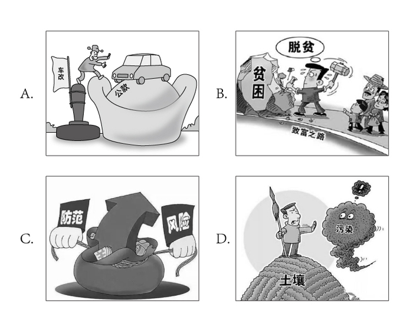

- **A**. A　✅
- **B**. B
- **C**. C
- **D**. D

**答案**：A

**官方解析**

本题考查政治常识。
习总书记在十九大报告中指出：“从现在到二〇二〇年，是全面建成小康社会决胜期。要按照十六大、十七大、十八大提出的全面建成小康社会各项要求，紧扣我国社会主要矛盾变化，统筹推进经济建设、政治建设、文化建设、社会建设、生态文明建设，坚定实施科教兴国战略、人才强国战略、创新驱动发展战略、乡村振兴战略、区域协调发展战略、可持续发展战略、军民融合发展战略，突出抓重点、补短板、强弱项，特别是要坚决打好防范化解重大风险、精准脱贫、污染防治的攻坚战，使全面建成小康社会得到人民认可、经得起历史检验。”
A项错误，体制内的车改政策不是“三大攻坚战”的内容，该幅漫画不适合宣传“三大攻坚战”。
B项正确，精准脱贫是“三大攻坚战”之一，脱贫主题的漫画可用于宣传“三大攻坚战”。
C项正确，防范化解重大风险是“三大攻坚战”之一，金融市场风险防范的主题漫画可用于宣传“三大攻坚战”。
D项正确，污染防治是“三大攻坚战”之一，土壤污染问题的主题漫画可用于宣传“三大攻坚战”。
本题为选非题，故正确答案为A。

---

### 第 4 题　qid 2448450 · 新思想

党内监督必须把纪律挺在前面，运用监督执纪“四种形态”，经常开展批评和自我批评、约谈函询，让“红红脸、出出汗”成为常态；党纪轻处分、组织调整成为违纪处理的大多数；党纪重处分、重大职务调整的成为少数；严重违纪涉嫌违法立案审查的成为极少数。这是从中国共产党的历史和党的十八大以来管党治党实践中总结出来的，体现了惩前毖后、治病救人的一贯方针。下列党员受到处理的案例，属于“党纪重处分、重大职务调整的成为少数”这种形态的是：

- **A**. 某市农业农村局办公室主任黄某因公车私用问题，受到党内警告处分，违纪款予以收缴
- **B**. 某镇政府公益性岗位工作人员杜某因违反工作纪律，被解除劳动关系
- **C**. 某市政协原副主席杨某因涉嫌严重违纪违法问题，移送检察机关依法审查起诉
- **D**. 某规划建设局局长戴某因在下属单位报销费用、私设小金库、滥发奖金等，受到留党察看二年处分　✅

**答案**：D

**官方解析**

本题考查政治常识。
《中国共产党纪律处分条例》第八条规定：“对党员的纪律处分种类：（一）警告；（二）严重警告；（三）撤销党内职务；（四）留党察看；（五）开除党籍。”其中，党内警告和严重警告属于党纪轻处分。
A项错误，办公室主任黄某受到党内警告处分，是党纪轻处分，属于题干中提到的“党纪轻处分、组织调整成为违纪处理的大多数”。
B项错误，工作人员杜某是被解除劳动关系，对其的处理不涉及党纪处分。
C项错误，政协副主席杨某因涉嫌严重违纪违法问题，被移送检察机关依法审查起诉，属于题干中提到的“严重违纪涉嫌违法立案审查的成为极少数”。
D项正确，建设局局长戴某受到“留党察看”二年处分，属于党纪重处分，因此对戴某的处理属于“党纪重处分、重大职务调整的成为少数”这种形态。
故正确答案为D。

---

## 常识判断

### 第 1 题　qid 2448447 · 人文常识

时代楷模是具有很强先进性、代表性、时代性和典型性的先进人物。下列时代楷模与事迹特点对应正确的是：

- **A**. 张富清—95岁老党员的本色人生　✅
- **B**. 杜富国—践行社会主义核心价值观的优秀知识分子
- **C**. 黄文秀—用生命担当使命的新时代英雄战士
- **D**. 黄大年—乡村教育守望者

**答案**：A

**官方解析**

本题考查政治常识。
A项正确，2019年6月17日，中央宣传部在湖北省来凤县向全社会公开发布张富清的先进事迹，授予他“时代楷模”称号。今年95岁的老党员张富清是原西北野战军359旅718团2营6连战士，在解放战争的枪林弹雨中九死一生，先后荣立一等功3次、二等功1次，被西北野战军记“特等功”，两次获得“战斗英雄”荣誉称号。1955年，张富清退役转业，主动选择到湖北省最偏远的来凤县工作，为贫困山区奉献一生。60多年来，张富清刻意尘封功绩，连儿女也不知情。2018年年底，在退役军人信息采集中，张富清的事迹被发现，这段英雄往事重现在人们面前。
B项错误，2019年5月22日，中央宣传部在北京向全社会宣传发布杜富国的先进事迹，授予他“时代楷模”称号。杜富国是陆军某扫雷排爆大队战士。入伍以来，他始终把忠诚和信仰刻在心中，把使命和责任扛在肩上，主动请缨征战雷场，苦练精练过硬本领，为人民利益和边境安宁挥洒热血，在平凡岗位干出了突出业绩。2018年10月11日，杜富国随队参加排雷作业时，危急时刻冲锋在前，为保护战友身受重伤，失去双眼和双手。杜富国同志曾先后获得“全国自强模范”“感动中国十大人物”、陆军“四有”新时代革命军人标兵等称号，荣立个人一等功。
C项错误，2019年7月1日，中宣部向全社会宣传发布黄文秀的先进事迹，追授她“时代楷模”称号。黄文秀同志生前是广西壮族自治区百色市委宣传部干部。2016年硕士研究生毕业后，她自愿回到百色革命老区工作，主动请缨到贫困村担任驻村第一书记。她自觉践行党的宗旨，始终把群众的安危冷暖装在心间，带领群众发展多种产业，为村民脱贫致富倾注了全部心血和汗水。2019年6月17日凌晨，黄文秀同志在突发山洪中不幸遇难，献出了年仅30岁的宝贵生命。黄文秀同志被追授“全国三八红旗手”“全国脱贫攻坚模范”等称号。
D项错误，2017年5月26日，中央宣传部向全社会公开宣传发布“践行社会主义核心价值观的优秀知识分子”黄大年的先进事迹，追授黄大年同志“时代楷模”荣誉称号。黄大年同志生前是享誉世界的地球物理学家。2009年，他放弃国外优越条件，怀着一腔爱国热情义无反顾返回祖国，担任母校吉林大学地球探测科学与技术学院全职教授、博士生导师，是东北地区首位引进的“千人计划”专家。7年多来，他不计得失、只争朝夕，带领科研团队辛勤奉献、顽强攻关，取得一系列重大科技成果，填补多项国内技术空白，部分成果达到国际领先水平，为深地资源探测和国防安全建设作出了突出贡献。2017年1月，黄大年同志因病逝世，年仅58岁。
故正确答案为A。

---

### 第 2 题　qid 2448552 · 人文常识

下列图片所反映的历史事件，按时间先后顺序排列正确的是：

图①

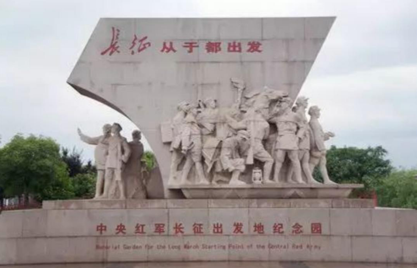

图②

图③

图④

- **A**. ②③①④
- **B**. ②①③④
- **C**. ①③②④　✅
- **D**. ①②③④

**答案**：C

**官方解析**

本题考查毛中特。
图①反映的是1921年7月23日，中国共产党第一次全国代表大会在上海举行。在会议进行过程中，突然有法租界巡捕闯进了会场，会议被迫中断。于是，最后一天的会议，便转到了浙江嘉兴南湖的一艘红色游船上举行。经过讨论，大会通过了中国共产党的第一个纲领和决议，并选举产生党的领导机构——中央局。
图②反映的是1934年10月，红军主力8.6万人跨过于都河，从这里踏上二万五千里长征的第一步，开启了人类历史上前所未有的壮举。
图③反映的是1929年12月28日召开的古田会议，即中国共产党红军第四军第九次代表大会。在福建省上杭县古田村召开，是人民军队建设史上的一个重要里程碑。这次会议的主要任务在于克服由于红四军的组织成分和长期处于艰苦的战斗环境而出现的各种非无产阶级思想，加强党对军队的领导。
图④反映的是1947年，以刘少奇、朱德为首的中央工作委员会先期进驻西柏坡。在这里召开了全国土地会议，颁布并实施了《中国土地法大纲》。1948年，毛泽东、周恩来、任弼时率领中共中央和解放军总部移驻西柏坡，在此组织指挥了震惊中外的辽沈、淮海、平津三大战役，召开了具有伟大历史意义的中共七届二中全会。
按时间先后，正确顺序为①③②④。
故正确答案为C。

---

### 第 3 题　qid 2448398 · 法律常识

“套路贷”是假借民间借贷之名，非法占有被害人财物的违法犯罪行为，是扫黑除恶专项斗争的重点打击对象。下列关于“套路贷”的说法正确的是：

- **A**. 
“套路贷”犯罪案件可由犯罪行为发生地、结果发生地及犯罪嫌疑人居住地公安机关侦查
　✅
- **B**. 
因法律规定民间借贷最高年利率为，故超过的可认定为“套路贷”

- **C**. 
因“套路贷”属于非法行为，追债时一般不会采用仲裁、诉讼方式

- **D**. 
我国刑法设置有专门针对“套路贷”的罪名

**答案**：A

**官方解析**

本题考查法律常识。根据最高人民法院、最高人民检察院、公安部、司法部《关于办理“套路贷”刑事案件若干问题的意见》：1.“套路贷”，是对以非法占有为目的，假借民间借贷之名，诱使或迫使被害人签订“借贷”或变相“借贷”“抵押”“担保”等相关协议，通过虚增借贷金额、恶意制造违约、肆意认定违约、毁匿还款证据等方式形成虚假债权债务，并借助诉讼、仲裁、公证或者采用暴力、威胁以及其他手段非法占有被害人财物的相关违法犯罪活动的概括性称谓。
A项正确，根据最高人民法院、最高人民检察院、公安部、司法部《关于办理“套路贷”刑事案件若干问题的意见》：11.“套路贷”犯罪案件一般由犯罪地公安机关侦查，如果由犯罪嫌疑人居住地公安机关立案侦查更为适宜的，可以由犯罪嫌疑人居住地公安机关立案侦查。犯罪地包括犯罪行为发生地和犯罪结果发生地······
B项错误，根据《关于办理“套路贷”刑事案件若干问题的意见》：“套路贷”与平等主体之间基于意思自治而形成的民事借贷关系存在本质区别，民间借贷的出借人是为了到期按照协议约定的内容收回本金并获取利息，不具有非法占有他人财物的目的，也不会在签订、履行借贷协议过程中实施虚增借贷金额、制造虚假给付痕迹、恶意制造违约、肆意认定违约、毁匿还款证据等行为。因此，“套路贷”与民间借贷有本质区别，并非以借款的年利率作为区分标准。
C项错误，根据最高人民法院、最高人民检察院、公安部、司法部《关于办理“套路贷”刑事案件若干问题的意见》：3.实践中，“套路贷”的常见犯罪手法和步骤包括但不限于以下情形：······（5）软硬兼施“索债”。在被害人未偿还虚高“借款”的情况下，犯罪嫌疑人、被告人借助诉讼、仲裁、公证或者采用暴力、威胁以及其他手段向被害人或者被害人的特定关系人索取“债务”。
D项错误，根据最高人民法院、最高人民检察院、公安部、司法部《关于办理“套路贷”刑事案件若干问题的意见》：9.对于“套路贷”犯罪分子，应当根据其所触犯的具体罪名，依法加大财产刑适用力度。符合刑法第三十七条之一规定的，可以依法禁止从事相关职业。我国刑法尚未设置专门针对“套路贷”的罪名，对于“套路贷”，应当根据其所触犯的具体罪名定罪量刑。
故正确答案为A。

---

### 第 4 题　qid 2448459 · 人文常识

关于党在新时代的强军目标，下列说法正确的是：

- **A**. 力争到本世纪中叶基本实现国防和军队现代化
- **B**. 建设一支听党指挥、能打胜仗、作风优良的人民军队　✅
- **C**. 到2035年把人民军队全面建成世界一流军队
- **D**. 确保到2020年全面实现机械化

**答案**：B

**官方解析**

本题考查政治常识。
ACD项错误，党的十九大作出新时代国防和军队建设新的“三步走”发展战略，即：到2020年基本实现机械化，信息化建设取得重大进展，战略能力有大的提升。同国家现代化进程相一致，全面推进军事理论现代化、军队组织形态现代化、军事人员现代化、武器装备现代化，力争到2035年基本实现国防和军队现代化，到本世纪中叶把人民军队全面建成世界一流军队。这个战略安排清晰勾画出实现党在新时代的强军目标的时间表、路线图，为新时代人民军队建设发展指明了方向。
B项正确，党的十九大报告指出：“坚持党对人民军队的绝对领导。建设一支听党指挥、能打胜仗、作风优良的人民军队，是实现‘两个一百年’奋斗目标、实现中华民族伟大复兴的战略支撑。”
故正确答案为B。

---

### 第 5 题　qid 2448417 · 人文常识

社会信用体系的建立有利于提高全社会的诚信意识和信用水平。下列关于国家加快社会信用体系建设的说法错误的是：

- **A**. “重点突破，强化应用”是社会信用体系建设的主要原则之一
- **B**. 为惩戒失信被执行人，规定其不得以财产支付子女就读高等院校的费用　✅
- **C**. 推进青年信用体系建设，逐步应用到入学、就业、创业等领域
- **D**. 使统一社会信用代码成为企业的唯一身份代码

**答案**：B

**官方解析**

本题考查政治常识。
A项正确，我国社会信用体系建设的主要原则：一是政府推动，社会共建。二是健全法制，规范发展。三是统筹规划，分步实施。四是重点突破，强化应用。
B项错误，可以对失信被执行人采取的行为有：一是禁止部分高消费行为，包括禁止乘坐飞机、列车软卧；二是实施其他信用惩戒，包括限制在金融机构贷款或办理信用卡；三是失信被执行人为自然人的，不得担任企业的法定代表人、董事、监事、高级管理人员等。没有规定其不得以财产支付子女就读高等院校的费用，故该选项说法错误。
C项正确，中共中央国务院印发的《中长期青年发展规划（2016-2025年）》中提到：“推进青年信用体系建设，逐步应用到青年入学、就业、创业等领域，引导青年践行诚信理念。”
D项正确，法人和其他组织统一社会信用代码相当于让法人和其他组织拥有了一个全国统一的“身份证号”，是推动社会信用体系建设的一项重要改革措施。2015年6月4日，国务院常务会议决定实施法人和其他组织统一社会信用代码制度，提升社会运行效率和信用。
本题为选非题，故正确答案为B。

---

### 第 6 题　qid 2448421 · 科技常识

关于近五年我国天文科技成就，下列说法错误的是：

- **A**. 在中国首次成功实现了月球激光测距
- **B**. 发现了新的太阳系外行星族群——热海星
- **C**. 发现了迄今为止最高能量的宇宙伽玛射线
- **D**. 拥有了世界最大口径光学红外望远镜​　✅

**答案**：D

**官方解析**

本题考查科技常识。
A项正确，2018年1月22日晚，中国科学院云南天文台应用天文研究团组利用1.2m望远镜激光测距系统，多次成功探测到月面反射器Apollo15返回的激光脉冲信号，在国内首次成功实现月球激光测距。
B项正确，南京大学天文与空间科学学院行星课题组与北京大学科维理天文研究所等单位合作利用国家天文台的郭守敬望远镜（LAMOST）发现了一类新的太阳系外行星族群—热海星（Hoptunes）。相关研究论文于2018年1月9日在《美国科学院院刊》（PNAS）发表，并被选为当期杂志封面的研究亮点文章之一。
C项正确，2019年7月初，中日合作西藏ASgamma实验团队利用我国西藏羊八井ASgamma实验阵列发现迄今为止最高能量的宇宙伽马射线，这些宇宙伽马射线来自蟹状星云方向，能量超过100TeV（1TeV即10的12次方电子伏特），最高达450TeV，比此前国际上正式发表的75TeV的最高能量高出5倍以上。这标志着超高能伽马射线天文观测进入到100TeV以上的观测能段，将有助于揭示宇宙极端天体的性质。
D项错误，“十三五”期间中国或建世界最大口径的光学红外望远镜，现在并未建成。
本题为选非题，故正确答案为D。
备注：中国于“十三五”期间计划建设世界上最大口径红外光学望远镜，但目前还未建设成功。另外建于贵州省平塘县的世界最大单口径射电望远镜500米口径球面射电望远镜（FAST），是中国国家“十一五”重大科技基础设施建设项目，于2011年3月25日动工兴建；于2016年9月25日进行落成启动仪式，该科技基础设施进入试运行、试调试工作；于2020年1月11日通过中国国家验收工作，正式开放运行。

---

### 第 7 题　qid 2448426 · 人文常识

下列言论中涉及到的人才选拔制度，按出现顺序先后排列正确的是：
①学通行修，经中博士
②宗室非有军功论，不得为属籍
③九品访人，唯问中正
④风吹金榜落凡世，三十三人名字香

- **A**. ②①③④　✅
- **B**. ③②④①
- **C**. ②④①③
- **D**. ①③②④​

**答案**：A

**官方解析**

本题考查人文常识。
①“学通行修，经中博士”反映的是察举制。察举制是西汉时期选拔官吏的一种制度，它的主要特征是由地方长官在辖区内随时考察、选取人才并推荐给上级或中央，经过试用考核再任命官职。
②“宗室非有军功论，不得为属籍”出自司马迁《史记·商君列传》，反映的是军功爵制。军功爵制的出现和确立，在先秦军事史上具有划时代的意义，事实上，由于军功爵制的实行，列国也都程度不同地收到了富国强兵的效果。
③“九品访人，唯问中正”反映的是九品中正制。九品中正制，又称九品官人法，是魏晋南北朝时期重要的选官制度，是曹丕采纳吏部尚书陈群的意见，命其制定的制度。
④“风吹金榜落凡世，三十三人名字香”反映的是科举制。科举是通过考试选拔官吏，具有分科考试，取士权归于中央所有，允许自由报考和主要以成绩定取舍等显著的特点。科举制从隋朝开始实行。
按出现顺序先后排列正确的是②①③④。
故正确答案为A。

---

### 第 8 题　qid 2448555 · 人文常识

关于陶瓷，下列说法错误的是：

- **A**. “入窑一色，出窑万彩”是钧瓷的特点
- **B**. 紫砂壶是用含铁量较高的黏土制成的
- **C**. 景德镇在宋代时期主要烧制青白瓷
- **D**. 唐三彩中最具代表性的造型是虎和骆驼　✅

**答案**：D

**官方解析**

本题考查人文常识。
A项正确，钧瓷以其“入窑一色、出窑万彩”的独特的自然窑变艺术特征而著称于世，钧瓷之美，美在窑变。钧瓷以“釉具五色，艳丽绝伦，窑变美妙，彩色缤纷”为其他窑口瓷器所无法媲美。
B项正确，紫砂壶是用含铁量较高的黏土制成的，紫砂泥被称作"泥中泥，岩中岩"，含铁量较高，是紫泥、红泥（朱泥）、绿泥（米黄色）的总称。
C项正确，青白瓷是宋代景德镇窑烧制成的一种具有独特风格的瓷器，并风靡国内外，至南宋时形成了以景德镇为中心的南方青白瓷系，除景德镇外，安徽、福建、湖北、广东、广西等地都有烧青白釉瓷器的窑场。
D项错误，动物俑是出土的唐三彩中数量最多、工艺较好的陶器。最常见的是马和骆驼，此外还有牛、驴、猪、狗、鸡、鸭、猴、狮、龟，以及人面、兽面镇墓兽等。这些动物俑的作用是给墓主提供交通工具或保卫墓主的安全。其中，马是古人生活、军事上不可缺少的动物，所以唐人对马非常重视，所塑造的三彩马是唐三彩中最出色的陶器。
本题为选非题，故正确答案为D。

---

### 第 9 题　qid 2448556 · 科技常识

关于诗句涉及的物候特征，下列对应错误的是：

- **A**. 不知近水花先发，疑是经冬雪未销——水对温度的调节作用
- **B**. 羌笛何须怨杨柳，春风不度玉门关——冷锋过境产生的天气变化　✅
- **C**. 春风疑不到天涯，二月山城未见花——海拔对植物生长的影响
- **D**. 南枝向暖北枝寒，一种春风有两般——光照对植物的影响

**答案**：B

**官方解析**

本题考查地理国情。
A项正确，“不知近水花先发，疑是经冬雪未销”出自张谓的《早梅》，意思是：“人们不知道寒梅靠近溪水而提早开放，以为那是经过冬天而尚未消融的白雪。”这是因为水的比热容大，其升降温都较慢，所以近水的地方夏季温度较低、冬季温度较高，近水的地方温度高，早春的花先开放了，诗句体现了水对温度的调节作用。
B项错误，“羌笛何须怨杨柳，春风不度玉门关”出自王之涣的《凉州词》，意思是：“何必用羌笛吹起那哀怨的杨柳曲去埋怨春光迟迟不来呢，原来玉门关一带春风是吹不到的啊！”诗句中的“春风”是指夏季风，在气候学上，受夏季风影响明显的地方称为季风区，反之则称为非季风区。玉门关正处于非季风区，所以出现“春风不度玉门关”。与冷锋过境无关。
C项正确，“春风疑不到天涯，二月山城未见花”出自欧阳修的《戏答元珍》，意思是：“我真怀疑春风吹不到这边远的山城，已是二月，居然还见不到一朵花。”通常情况下，海拔越高，气温越低。海拔每上升100米，气温下降0.6摄氏度。而温度又是影响植物生长的重要因素，故诗句体现了海拔对植物生长的作用。
D项正确，“南枝向暖北枝寒，一种春风有两般”出自观梅女仙的《题壁》，从地理角度看，是由于光照强度不同，南枝向阳，光照较强，温度较高；北枝背阳，光照较弱，温度较低。体现了光照对植物的影响。
本题为选非题，故正确答案为B。

---

### 第 10 题　qid 2448430 · 人文常识

下列与成语有关的描述错误的是：

- **A**. “叶落归根”是因为地球表面的物体会受到重力的作用
- **B**. “青出于蓝”描述的是传统植物染料的提取过程
- **C**. “囊萤映雪”中“囊萤”和“映雪”包含的光学原理相同　✅
- **D**. “沙里淘金”中的“金”属于金属单质

**答案**：C

**官方解析**

本题考查科技常识。
A项正确，物体由于地球的吸引而受到的力叫重力。重力的施力物体是地心，重力的方向总是竖直向下。叶落归根意思是树叶从树根发出，最终凋落后回到树根，是由于重力的作用。
B项正确，“青出于蓝”中，青，即靛青；蓝，即蓼蓝之类可作染料的草。青是从蓝草里提炼出来的，但颜色比蓝更深。最初是比喻人通过学习可以提升自己，后多用来比喻学生超过老师或后人胜过前人。
C项错误，“囊萤”出自典故“囊萤夜读”，是指车胤用白绢做成透光的袋子，装着萤火虫照亮书本在夜晚继续学习，萤火虫的发光原理是因为在其发光器的部位，存在着一种含磷的化学物质，称为萤光素；“映雪”出自典故“孙康映雪”，是指孙康利用半夜地上雪反射的月光读书，体现的光学原理是光的反射。故二者利用的光学原理不一致。
D项正确，元素的存在形式由其化学性质决定，金的化学性质稳定，不与土壤中的水及氧气等物质发生反应，在自然界中以单质的形式存在。故“沙里淘金”中的“金”属于金属单质。
本题为选非题，故正确答案为C。

---

### 第 11 题　qid 2448549 · 科技常识

下列关于电池的说法错误的是：

- **A**. 干电池利用液态电解液产生电流　✅
- **B**. 自行放电是蓄电池不可避免的渐生故障
- **C**. 锂电池不会产生铅、汞等有害重金属物质
- **D**. 太阳能电池产生的电是直流电​

**答案**：A

**官方解析**

本题考查科技常识。
A项错误，干电池是一种以糊状电解液来产生直流电的化学电池，湿电池为使用液态电解液的化学电池。
B项正确，蓄电池的自行放电和极板逐渐硫化是铅酸蓄电池不可避免的“渐生故障”，会使蓄电池的技术状态变差，工作能力逐渐削弱以至报废，因此需定期对蓄电池的技术状态进行检测。
C项正确，锂金属电池一般是使用二氧化锰为正极材料、金属锂或其合金金属为负极材料、使用非水电解质溶液的电池。锂离子电池一般是使用锂合金金属氧化物为正极材料、石墨为负极材料、使用非水电解质的电池。在上述两种锂电池的工作过程中，均不会产生铅、汞等有害重金属物质。
D项正确，太阳能电池是通过光电效应或者光化学效应直接把光能转化成电能的装置，产生的电是直流电。若需提供电力给家电用品或各式电器则需加装直/交流转换器，换成交流电，才能供电至家庭用电或工业用电。
本题为选非题，故正确答案为A。

---

### 第 12 题　qid 2448550 · 人文常识

关于能量与做功，下列说法正确的是：

- **A**. 雨点从高空中匀速下落时只有重力做功
- **B**. 匀速圆周运动的物体动能始终发生变化
- **C**. 自由落体过程中物体的机械能保持不变　✅
- **D**. 向上飞的石子重力做负功导致势能减小​

**答案**：C

**官方解析**

本题考查科技常识。

A项错误，牛顿第一运动定律，又称惯性定律、惰性定律，定义为：一切物体在没有受到外力的作用时，总保持静止状态或匀速直线运动状态。雨点从高空中匀速下落，说明雨点受到的合外力为零。雨点此时受到向上的空气阻力和向下的重力。如果一个物体受到力的作用，并在力的方向上发生了一段位移，我们就说这个力对物体做了功。显然，雨点受到的空气阻力和重力都在力的方向上发生了位移，即空气阻力和重力对雨点都做了功。

B项错误，匀速圆周运动，亦称“匀速率圆周运动”，因为物体作圆周运动时速率不变，但速度方向随时发生变化。动能是指物体由于运动而具有的能量，它的大小定义为物体质量与速度平方乘积的二分之一，即。对于匀速圆周运动的物体，质量m和速率v不变，动能也不变。

C项正确，在只有重力或弹力做功的物体系统内(或者不受其他外力的作用下），物体系统的动能和势能（包括重力势能和弹性势能）发生相互转化，但机械能的总能量保持不变。这个规律叫做机械能守恒定律。物体在只受重力作用下从相对静止开始下落的运动叫做自由落体运动。对于自由落体过程中的物体，符合机械能守恒定律，在下落过程中，重力势能转化为动能，但机械能总量保持不变。

D项错误，势能是指物体（或系统）由于位置或位形而具有的能。功等于力与物体在力的方向上通过距离的乘积。功的正负表示是动力对物体做功还是阻力对物体做功，或者说是表示力对物体做了功还是物体克服这个力做了功。对于向上飞的石子，受到向下的重力，需要克服重力，即重力做负功。同时，石子的动能转化为重力势能，动能减小，势能增加。

故正确答案为C。

---

### 第 13 题　qid 2448551 · 科技常识

白居易有诗云：“绿蚁新醅酒，红泥小火炉。晚来天欲雪，能饮一杯无？”下列与该诗相关的说法正确的是：

- **A**. “绿蚁”是因为酒中添加了可食用调色剂
- **B**. “醅酒”的过程利用了微生物的作用　✅
- **C**. 炉火燃烧的过程是内能转化成化学能
- **D**. 从雪到水的转化过程会释放出热量​

**答案**：B

**官方解析**

本题考查科技常识。
A项错误，由于酒是新近酿好的，未经过滤，酒面泛起酒渣泡沫，颜色微绿，细小如蚁，故称“绿蚁”。“绿蚁”并非是因为酒中添加了可食用调色剂。
B项正确，“醅酒”是指酿造酒，是利用微生物发酵生产含一定浓度酒精饮料的过程。
C项错误，内能是物质系统内部分子热运动的各种形式的动能以及分子间势能的总和。化学能是指参与化学反应的物质所具有的能量。炉火燃烧的过程是化学能转化成内能。
D项错误，融雪的时候水由固体变为液体会吸收热量，使气温降低。
故正确答案为B。

---

### 第 14 题　qid 2448553 · 人文常识

关于塑料大棚，下列说法正确的是：

- **A**. 塑料大棚的薄膜能够提高光照强度
- **B**. 搭建塑料大棚能有效防御地质灾害
- **C**. 冬季在塑料大棚内熏烟有助于防御霜冻　✅
- **D**. 无土栽培技术必须在塑料大棚中进行​

**答案**：C

**官方解析**

本题考查科技常识。
A项错误，塑料大棚内的光照强度比外界要低，因为所有的塑料薄膜都有吸收和反光作用。
B项错误，地质灾害是指因地质现象给人类造成的灾害，包括地震、海啸、火山喷发、山崩、滑坡、泥石流、塌陷、地面下沉等。地质灾害破坏性强，塑料大棚无法起到防御作用。
C项正确，大气凭借自身的温度向外辐射能量，为大气辐射。大气辐射中一小部分向上，散失于宇宙空间；其余大部分向下，归还给地面。大气辐射中向下的部分，称为大气逆辐射，属于长波辐射。由于大气逆辐射的存在，使地面实际损失的热量比它以长波辐射放出的热量要少一些。大气逆辐射的强度主要与大气中的水汽含量、二氧化碳之类所谓“温室气体”的浓度以及大气温度成正比关系。人造烟幕中含有大量的二氧化碳、水汽、尘埃，能强烈地吸收地面辐射，从而增强大气逆辐射，减少夜晚地面辐射损失的热量，对地面起到保温的作用，所以可以预防霜冻。
D项错误，无土栽培指完全不用土壤而用化肥溶液（营养液）供给作物养分的栽培方法。无土栽培设施分为环境设施、监控设施及栽培设施。环境设施主要指生产蔬菜的保护地设施，即温室、大棚、中棚等。因此无土栽培栽培场所不仅仅局限于塑料大棚。
故正确答案为C。

---

### 第 15 题　qid 2448554 · 科技常识

下列与疫苗有关的说法正确的是：

- **A**. 疫苗通过三角肌注射才能产生作用
- **B**. 免疫力弱的人不能接种疫苗
- **C**. 疫苗的接种者必须是健康个体
- **D**. 卡介疫苗是典型的活疫苗​　✅

**答案**：D

**官方解析**

本题考查科技常识。
A项错误，1988年WHO建议：狂犬病疫苗注射部位由臀部改为上臂三角肌。观察证明狂犬病疫苗注入人体不同部位会产生不同程度的抗体应答，其中注射三角肌抗体应答滴度最高，臀部肌肉注射滴度最低，比较观察乙肝疫苗在臀部和三角肌肌肉注射的免疫效果也证明：三角肌注射的抗体阳转率和GMT均比臀部肌肉注射的高得多。普遍认为这是由于注入臀部脂肪中，影响疫苗的吸收与免疫效果的发挥，而三角肌较接近腋下淋巴结，有利于免疫力的产生。所以并不是疫苗通过三角肌注射才能产生作用，只是通过三角肌注射效果比较好。
B项错误，免疫力低下者一般不可以接种减毒活疫苗，而灭活疫苗是可以接种的，比如乙肝疫苗等。
C项错误，预防性接种，受种者普遍是健康的个体。然而在治疗性接种中，比如狂犬疫苗，由于狂犬病是致命性疾病，为挽救生命任何禁忌症都是次要的，故被患狂犬病的动物咬后预防无禁忌症。
D项正确，卡介苗是一种减毒牛型结核分枝杆菌活菌疫苗，用来预防结核病的疫苗。卡介苗接种后可使儿童产生对结核病的特殊抵抗力，可以降低儿童结核病的发病率及其严重性，特别是结核性脑膜炎等严重结核病减少，并可减少此后内源性恶化的可能性。
故正确答案为D。

---

### 第 16 题　qid 2448444 · 科技常识

下列与现代通讯科技有关的说法错误的是：

- **A**. 高密度无线网络技术是5G移动通信技术的关键之一
- **B**. 计算机通信的基本原理是将逻辑信号转换为电信号　✅
- **C**. 路由器可以根据信道情况自动选择和设定路由
- **D**. 无线局域网利用射频技术进行通信连接​

**答案**：B

**官方解析**

本题考查科技常识。
A项正确，5G移动通信标志性的关键技术主要体现在超高效能的无线传输技术和高密度无线网络技术。
B项错误，计算机通信的基本原理是将电信号转换为逻辑信号，其转换方式是将高低电平表示为二进制数中的1和0，再通过不同的二进制序列来表示所有的信息。
C项正确，路由器是连接因特网中各局域网、广域网的设备，它会根据信道的情况自动选择和设定路由，以最佳路径，按前后顺序发送信号。
D项正确，无线局域网是计算机网络与无线通信技术结合的产物，它以无线信道作传输媒介，利用射频技术实现局域网的全部功能，是一种更灵活、建网速度快、适合移动办公及有线网络难以达到的接入方式。
本题为选非题，故正确答案为B。

---

## 言语理解与表达

### 材料 1

①1928年，洛阳金村的古墓里出土了数千件战国时期文物，其中有一面镜子，上面雕镂着一个披甲执剑、头上戴冠的武官。有趣的是，冠两侧都插着羽毛，专家认为那是一种名为“鹖”的鸟的尾羽，这种冠就叫“鹖冠”。“鹖冠”是战国到汉代时武官所戴之冠。鹖鸟生性好斗，至死不却，因此武官佩戴鹖冠，以此昭示英勇气概。

②武官戴“鹖冠”，文官的冠则叫“进贤冠”，代表文官有举荐贤能的义务。那么“进贤冠”又有怎样的装饰呢？山东沂南汉墓出土的画像石上有一个画面：两位身穿袍服的文官，头戴“进贤冠”，耳旁像簪花一样插着一支笔，这种装饰叫作“簪笔”。“簪笔”是汉代的一种制度，文官上朝奏事时，要在奏牍上书写，写完之后笔没处放，就插在耳边，久而久之就成了服制的定规。“簪笔”制度一直沿用到北朝，只不过换了一种形式，名称也由“簪笔”变成“垂笔”。

③在古代男子的冠中，最尊贵的是“冕”。“冕”是帝王、诸侯和卿大夫所戴的一种礼冠，专门用于重大祭祀，也叫做“冕冠”。“冕冠”每个部分的形制都有特殊意义，比如其顶盖叫作“冕板”，一般为长条形，前圆后方，后端又比前端高出三厘米左右，这是象征戴冠者的匍匐形态，表示对天地宇宙的尊崇；“冕板”的前后两端分别垂挂数串玉珠，叫做“旒”，一旒就是一串珠玉，旒的多少视身份而定，帝王专用十二旒，其余按等级递减为九旒、七旒和五旒。在“冕板”的两侧还垂有两根丝带，下端分别系着一枚丸状玉石，名曰“充耳”。“旒”与“充耳”的设计也有用意：“旒”用来“障视”，“充耳”用来“止听”，这是提醒人们在庄严神圣的祭祀场合，不看不正之物，不听不正之语，成语“视而不见”和“充耳不闻”即由此而来。

④冠冕形制如此复杂，却还不是极限。北周有位皇帝退位后当起了太上皇，为了将自己与现任皇帝区分开来，规定太上皇的冕用二十四串垂旒。但是旒数多了，走起路来更得小心翼翼、缓步而行，其实这也正是戴冠冕的用意之一，就是要让人端正行走。身形一端正，人就显得有气派，这就是所谓“冠冕堂皇”。

⑤当然，“冠冕”不仅仅是为了“堂皇”。《礼记·冠义》中说“冠者，礼之始也”，这是古人重视冠冕的主要原因。“礼”是古代社会的典章制度和道德规范，用于定亲疏、决嫌疑、别同异、明是非，是古代帝王稳定社会的手段。礼有如此宏大的意义，作为“礼之始”的冠当然意义非凡。所以在古代，冠不是随便什么人都能戴的，古书上说“二十成人，士冠，庶人巾”，可见在当时，只有贵族子弟才能戴冠，平民百姓还没有这个资格。古代贵族男子到了二十岁，就要举行隆重的加冠典礼，以示成年，而后才能被赋予贵族子弟的各种权利和义务。冠礼极其复杂，单是加冠仪式就要举行三次，每次戴的冠都不一样，依次是缁布冠、皮弁和爵弁。这三种冠分别用于平日起居、打猎征战和祭祀活动，也分别象征着“士”的日常、战争和宗教生活。

⑥冠的象征含义既然如此之多，那么可想而知，冠是不能乱戴的，乱戴就意味着不尊礼。《左传》曾记载过一桩“失礼”之事：卫国国君请两个大臣来朝中喝酒，两个大臣早早就穿着朝服在朝中等候，国君却忘记此事，跑到园子里打猎去了，两个大臣只好到园中见他。国君听闻，戴着打猎的皮弁就出来了，惹得两位大臣十分愤怒。由此可见，依据场合戴冠才是合乎礼制的，即使君王也不能无礼。所以孔子说“君子正其衣冠”，其意不仅在于要衣冠周正，还在于要符合礼仪。正因如此，孔子的弟子子路在即将战死的时候，也要将自己被打落的冠系好，所谓“君子死，冠不免”。在死亡面前，子路还要结缨正冠，这在现代人看来未免太过迂腐，但这正是当时所崇尚的君子品格，也说明服饰制度对经国治世有着非常重要的作用。这么一想，“冠冕”确实要“堂皇”。

#### 第 1 题　qid 2448580 · 片段阅读

下面这段文字最适合放在文中哪一位置？
由此可见，一种服饰的出现与流行有各种各样的缘由，但是纵观中国服饰史，就会发现这些缘由中最重要的还是政治因素。通过“冠”的形制，我们可以更好地理解这一点。

- **A**. ①和②中间
- **B**. ②和③中间　✅
- **C**. ③和④中间
- **D**. ④和⑤中间

**答案**：B

**官方解析**

给出文字开头出现“由此可见”，引出服饰出现流行缘由的这一结论，故前文应具体表述导致服饰出现的原因，尾句由“通过&#39;冠&#39;的形制，我们可以更好地理解这一点”可知，后文应具体论述“&#39;冠&#39;的形制”，对应文段，第②段具体表述了政治的规定导致了“进贤冠”服饰的出现，第③段具体阐述了“冠冕的形制”，题干文段在②③段间可起到承上启下的作用，衔接恰当，B项当选。
①段通过“鹖冠”进行话题引入，④段由“冠冕形制的复杂，却还不是极限”可知，此段承接③段仍在论述冠冕的形制，⑤段在论述重视冠冕的原因，均与题干话题衔接不当，排除A、C、D三项。
故正确答案为B。
【文段出处】《冠冕何以堂皇》

---

#### 第 2 题　qid 2448581 · 片段阅读

以下关于“鹖冠”和“进贤冠”的说法与原文相符的是：

- **A**. “鹖冠”最早出现在汉代古墓出土的文物中
- **B**. “鹖冠”因其两侧插着鹖鸟尾羽装饰而得名　✅
- **C**. “进贤冠”产生于魏晋南北朝时期
- **D**. “进贤冠”专门用于重大祭祀活动

**答案**：B

**官方解析**

A项，对应第①段“&#39;鹖冠&#39;是战国到汉代时武官所戴之冠”可知，最早应出现在战国，时间表述不正确，排除；
B项，对应第①段“有趣的是，冠两侧都插着羽毛，······这种冠就叫&#39;鹖冠&#39;”可知，该项表述正确，当选；
C项，对应第②段“‘簪笔’制度一直沿用到北朝”可知，簪笔为进贤冠上的一种形式，故可推测进贤冠应在北朝之前出现，该项时间表述不正确，排除；
D项，文段未提及“‘进贤冠’专门用于重大祭祀活动”，无中生有，排除。
故正确答案为B。
【文段出处】《冠冕何以堂皇》

---

#### 第 3 题　qid 2448582 · 片段阅读

根据第③段，下图所画“冕”的形制与原文描述相符的是：

- **A**. A　✅
- **B**. B
- **C**. C
- **D**. D

**答案**：A

**官方解析**

定位原文第③段，根据文段“一般为长条形，前圆后方”可知，C、D两项错误，C项与D项均为“前方后方”的形状，与文段所描述形状不符，排除；根据文段“后端又比前端高出三厘米左右”可知A项正确，B项所绘形状为前后端属于同一水平面，与文段所描述形状不符，排除。
故正确答案为A。
【文段出处】《冠冕何以堂皇》

---

#### 第 4 题　qid 2448583 · 片段阅读

根据原文，下列说法符合古代礼制的是：

- **A**. 庶人阶级的男子在二十岁时要举行隆重的冠礼
- **B**. 诸侯国君不必像大臣一样严格遵守服饰礼制
- **C**. 天子在祭祀时必须戴着有二十四串垂旒的冕冠
- **D**. 贵族男子在日常生活中所戴之冠为“缁布冠”　✅

**答案**：D

**官方解析**

A项，根据原文第⑤段“古代贵族男子到了二十岁，就要举行隆重的加冠典礼”，可知，并非是“庶人阶级”，选项表述错误，排除；
B项，根据原文第⑥段“依据场合戴冠才是合乎礼制的，即使君王也不能无礼”，可知，诸侯国君也必须遵守服饰礼制，选项表述错误，排除；
C项，根据原文第④段“北周有位皇帝退位后当起了太上皇，为了将自己与现任皇帝区分开来，规定太上皇的冕用二十四串垂旒”可知，“有二十四串垂旒的冕冠”为“太上皇”所佩戴，并非“天子”，排除；
D项，根据原文第⑤段“···依次是缁布冠、皮弁和爵弁。这三种冠分别用于平日起居、打猎征战和祭祀活动”，可知，贵族男子在日常生活中所戴冠为“缁布冠”，表述正确，当选。
故正确答案为D。
【文段出处】《冠冕何以堂皇》

---

#### 第 5 题　qid 2448584 · 片段阅读

最适合做这段文字标题的是：

- **A**. 古人是如何戴冠的
- **B**. 服饰制度与治国之道
- **C**. 冠冕的演变史
- **D**. “冠冕”何以“堂皇”　✅

**答案**：D

**官方解析**

这是一道标题填入题，需要分析整个文段。首先第一段指出武官戴的是“鹖冠”，第二段指出文官所戴的“进贤冠”及其具体装饰的样子，第三段指出在古代男子的冠中，最尊贵的是“冕”，“冕”是帝王、诸侯和卿大夫所戴的一种礼冠，并且具体介绍了“冕”的样子，第四段通过转折词“却”引出古代的冠冕形制虽然复杂，却不是极限，后面通过“北周皇帝”的例子来说明，接着第五段指出“冠冕”跟“礼”也有关，并指出在古代“冠冕”戴的人和环境也是有区别的，第六段指出依据场合戴冠才是合乎礼制的，并且尾句通过指代词“这”总结前文，得出结论，强调“冠冕”确实要“堂皇”，也就是要注意礼仪。故对应D项。
A项，“如何戴冠”无中生有，文段并没有介绍古人怎么样戴冠，排除；
B项，“服饰制度”范围扩大，文段只强调“冠冕”，排除；
C项，“演变史”无中生有，排除。
故正确答案为D。
【文段出处】《冠冕何以堂皇》

---

### 材料 2

        近日，特拉维夫大学宣布该学校实验室3D打印出了一颗“心脏”，该心脏不仅具有外形，还有细胞、血管和其他支撑结构，甚至可以像心脏一样收缩，但长度只有2.5厘米。该实验团队负责人说：“与过去相比，这项研究成果的突破点在于，这不仅是一个外观打印的心脏，而且是世界上第一个利用患者自己的细胞和生物材料3D打印出的三维血管化的工程心脏，也就是具有血管组织的三维人造心脏。”而在此之前，科学家只成功打印出没有血管的简单组织。

        负责人补充道：“打印心脏的原料是从病人身上提取而来，我们从网膜组织中提取细胞，对其进行编辑，使之成为干细胞，再将其转化为心肌细胞和内皮细胞。另外，提取非细胞组织，转变为一种‘个人特有的凝胶’来充当打印‘墨水’，这些由糖和蛋白质构成的材料能够用于3D打印复杂的组织模型。随后利用组织工程学的原理，在支架中填充细胞，以此让细胞得以更好地再生。”他说，该实验中使用的“打印原料”和“黏合胶水”来源于患者自身，对于成功构建组织和器官至关重要，这意味着由此打印出的心脏移植进本人身体后不会产生排异反应。而目前心脏移植术后的死亡率居高不下，主要与排异反应有关。

        如此看来，若特拉维夫大学的技术手段能在未来的人体试验阶段被证明有效，并在一定程度上解决排异问题，那确实将会是一个很大的突破。

        心脏体积大、细胞种类繁多，全体心肌细胞需要几乎同时收缩，才具有功能。心脏的跳动是因为心肌细胞都被紧密地连在一起，细胞产生的电信号使大批心肌细胞共同收缩。而且为使两个心房和两个心室协同收缩，心脏本身还有一套特殊的传导系统。虽然在体外生产几千万个心肌细胞并不困难，但是即便心脏被3D打印出来了，能不能跳是一回事，到底怎么跳则是另一回事。以临床病症为例，心室纤颤就是因为心肌细胞不能同步跳动。一旦跳动不同步，心脏就会瞬间失去泵血功能，导致病人死亡。

        特拉维夫大学此次打印出的心脏，还未能使大批细胞同步跳动并产生足够的力量。该负责人对此次实验的一些遗憾也并不讳言，“受限于我们3D打印机精度的问题，目前还不能打印出心脏上的所有血管，而且该心脏也不具有泵血功能”。3D打印出的这颗心脏，距离应用于动物实验，也长路漫漫。

        那么，为何特拉维夫大学团队打印出的心脏不能整齐地跳动？3D打印一个心脏到底难在哪里？答案与地球重力有关。“3D打印的黏附力不足以支撑心脏或肾脏这种大器官，地球重力会造成细胞间的撕裂，”哈佛大学一位研究员说，“生物3D打印的核心问题就是要解决生物材料和重力对3D打印细胞的影响。”

        生物3D打印小型器官模型是可行的，一旦打印真实尺寸的器官模型，由于细胞间的支撑力和黏合力有限，可能出现两个后果：一是下层细胞因受到上层细胞越来越大的压力而垮塌；一是即便没有垮塌，在转移过程中，上层细胞也会因无法承受下层细胞的重量而产生撕裂。

        总而言之，由于重力的存在，3D打印心脏的细胞间缺乏紧密联系，这会影响心脏的跳动，该心脏也就无法具有正常的泵血功能。但是，即便重力问题解决了，心脏可以整齐跳动了，3D打印心脏仍有难题未能克服——只有血液源源不断供给，打印的器官或组织才能长时间存活。如何建立血管网络，还没有明确的答案，<u>                    </u>。心脏本身需要全身血液的10%左右来供养，一旦离开血液，所有器官都只能在4℃低温的状态下“熬着”。如果打印细胞需要37℃体温，几乎没有时间完成打印，因为先打上的细胞在打印还没完成时就会因缺氧而死去。这一切都还有待进一步研究。

#### 第 6 题　qid 2448566 · 语句表达

填入文中画横线部分最恰当的一项是：

- **A**. 现在要解决的瓶颈之一是如何为生长中的组织提供氧气和营养
- **B**. 而在打印心脏时，“墨水”里的心肌细胞呈现球状且互不接触
- **C**. 而血循环问题几乎是3D打印实体器官的死穴　✅
- **D**. 但生物3D打印已经是科幻小说中常见的情节

**答案**：C

**官方解析**

文段首先提到重力是影响3D打印心脏的方面，随后通过转折词“但是”指出即便重力问题解决，3D打印心脏仍有其他问题，即要源源不断的血液供给。紧接着提到如何建立血管网络还没有明确答案。之后又提到心脏是需要全身血液的10%左右来供养，离开血液所有器官都只能在4℃低温的状态下“熬着”。故横线前后都是围绕给心脏供给血液来讲的，横线与前后文话题一致，对应C项。
A项，“生长中的组织提供氧气和营养”，无中生有，排除；
B项，“墨水”，无中生有，排除；
D项，“科幻小说”，无中生有，排除；
故正确答案为C。
【文段出处】《3D打印一颗心脏，到底有多难？》

---

#### 第 7 题　qid 2448567 · 片段阅读

关于这颗3D打印心脏，下列说法错误的是：

- **A**. “黏合胶水”由编辑成的干细胞转化而来　✅
- **B**. 具有血管组织
- **C**. 理论上不会产生排异反应
- **D**. 心肌细胞和内皮细胞来源于患者

**答案**：A

**官方解析**

A项，根据第二段“另外，提取非细胞组织，转变为一种‘个人特有的凝胶’来充当打印‘墨水’”可知，“黏合胶水”只是来源于人体，但是提取于非细胞组织，而并非干细胞组织，与文意不符，当选；
B项，根据第一段“该心脏不仅具有外形，还有细胞、血管和其他支撑结构”以及“也就是具有血管组织的三维人造心脏”可知，它的确具有血管组织，表述正确，排除；
C项，根据第二段“这意味着由此打印出的心脏移植进本人身体后不会产生排异反应”可知，表述正确，排除；
D项，根据第二段“打印心脏的原料是从病人身上提取而来······使之成为干细胞，再将其转化为心肌细胞和内皮细胞”可知，表述正确，排除；
本题为选非题，故正确答案为A。
【文段出处】《3D打印一颗心脏，到底有多难？》

---

#### 第 8 题　qid 2448568 · 片段阅读

下列哪项不属于3D打印心脏未来需要着力解决的问题？

- **A**. 心肌细胞的共同收缩
- **B**. 支架填充细胞的获取　✅
- **C**. 打印器官的长期存活
- **D**. 正常泵血功能的实现

**答案**：B

**官方解析**

A项，根据第四段“全体心肌细胞需要几乎同时收缩，才具有功能。心脏的跳动是因为心肌细胞都被紧密地连在一起······但是即便心脏被3D打印出来了，能不能跳是一回事”可知，3D打印心脏后仍需实现心肌细胞同时收缩，选项表述正确，排除；
B项，根据第二段“提取非细胞组织······随后利用组织工程学的原理，在支架中填充细胞，以此让细胞得以更好地再生”可知，支架填充细胞的获取目前已经解决，不属于未来3D打印心脏需解决的问题，当选；
C项，根据第八段“3D打印心脏仍有难题未能克服——只有血液源源不断供给，打印的器官或组织才能长时间存活”可知，未来仍需解决打印器官的长期存活问题，选项表述正确，排除；
D项，根据第八段“由于重力的存在，3D打印心脏的细胞间缺乏紧密联系，这会影响心脏的跳动，该心脏也就无法具有正常的泵血功能”可知，未来仍需解决泵血功能，选项表述正确，排除。
本题为选非题，故正确答案为B。
【文段出处】《3D打印一颗心脏，到底有多难》

---

#### 第 9 题　qid 2448569 · 片段阅读

根据文章，下列说法正确的是：

- **A**. 目前的3D打印心脏可以跳动　✅
- **B**. 心肌细胞难以在人体之外量产
- **C**. 3D打印技术无法打印小型器官模型
- **D**. 3D打印心脏已开始应用于动物实验

**答案**：A

**官方解析**

A项，根据第六段“那么，为何特拉维夫大学团队打印出的心脏不能整齐地跳动？”可知，该疑问表明目前的这颗3D打印心脏是可以跳动的，仅是不能整齐地跳动，故选项表述正确，当选；
B项，根据第四段“体外生产几千万个心肌细胞并不困难”可知，心肌细胞可在人体之外量产，而非“难以量产”，选项表述错误，排除；
C项，根据第七段“生物3D打印小型器官模型是可行的”可知，3D打印技术可以打印小型器官模型，而非“无法打印”，选项与文意相悖，排除；
D项，根据第五段“3D打印出的这颗心脏，距离应用于动物实验，也长路漫漫”可知，3D打印心脏还没有应用于动物实验，选项表述错误，排除。
故正确答案为A。
【文段出处】《3D打印一颗心脏，到底有多难？》

---

#### 第 10 题　qid 2448570 · 片段阅读

文中提到的生物3D打印技术如果最终成熟，能为患有下列哪种疾病的病人带来福音？

- **A**. 白化病
- **B**. 尿毒症　✅
- **C**. 登革热
- **D**. 红绿色盲

**答案**：B

**官方解析**

依据第6段“3D打印的黏附力不足以支撑心脏或肾脏这种大器官，地球重力会造成细胞间的撕裂”可知，如果3D打印技术成熟就能够产生出“心脏、肾脏”这类的大器官，同时依据第3段“若特拉维夫大学的技术手段能在未来的人体试验阶段被证明有效，并在一定程度上解决排异问题”可知3D打印技术生产出的器官能够解决排异问题。
B项“尿毒症”治疗需进行肾移植手术，而3D打印技术能生产出解决排异问题的肾脏，故对于尿毒症患者有福音，当选。
A项“白化病”是皮肤及附属器官黑色素缺乏或合成障碍所导致的遗传性白斑病，不涉及器官移植，排除。
C项“登革热”是经蚊媒传播引起的急性虫媒传染病，不涉及器官移植，排除；
D项“红绿色盲”是伴X染色体隐性遗传病，不涉及器官移植，排除。
故正确答案为B。
【文段出处】《3D打印一颗心脏，到底有多难？》

---

#### 第 11 题　qid 2448410 · 逻辑填空

中国正处于经济结构转型升级和世界新一轮技术革命的交汇时期，创新驱动高质量发展渐成共识。没有管理创新、市场创新的商业创新模式                ，有真实需求场景的教育、医疗健康、信息消费、消费升级等模式创新领域，将会迸发出新的投资机会。
填入画横线部分最恰当的一项是：

- **A**. 举步维艰
- **B**. 日薄西山
- **C**. 难以为继　✅
- **D**. 岌岌可危

**答案**：C

**官方解析**

由“没有······，有······将会迸发出新的投资机会”可知，前后语句构成反义关系，横线处所填词语与“将会迸发出新的投资机会”表意相反，且搭配“商业创新模式”。C项“难以为继”指难于继续下去，与“将会迸发出新的投资机会”意思相反，且搭配“商业创新模式”恰当，当选。
A项“举步维艰”比喻办事情每向前进行一步都十分不容易，一般用于有主观能动性的人或事物，不能搭配“商业创新模式”，排除。
B项“日薄西山”比喻人到老年或腐朽的事物衰败接近灭亡，一般用于老人或腐朽的事物，不能用于形容“商业创新模式”，排除。
D项“岌岌可危”形容非常危险，快要倾覆或灭亡，程度过重，根据前文“渐成共识”及后文“将会迸发出”可知，横线处尚未到达“岌岌可危”的程度，排除。
故正确答案为C。
【文段出处】《未来投资的八个视角》

---

#### 第 12 题　qid 2448418 · 逻辑填空

传统饱和打击战术的核心，是从不同方向、不同层次向同一目标发射超出其防御上限的导弹，以数量优势形成绝对力量优势，压迫及摧毁其防御体系，对敌重要目标进行毁灭性打击。该战术需要庞大的火力投射平台和充足的武器弹药作支撑，这让世界上大多数国家                。
填入画横线部分最恰当的一项是：

- **A**. 望而却步　✅
- **B**. 无可奈何
- **C**. 束手无策
- **D**. 裹足不前

**答案**：A

**官方解析**

文段阐述了传统饱和打击战术具体的作战模式，接着通过“这”指代前文，横线处强调世界上大多数国家都因为该战术所需要的庞大支撑而没有能力使用， A项“望而却步”，指远远望见了就吓得直后退，不敢前行，符合文意，当选。
B项“无可奈何”指感到没有办法、只有这样，文段并非强调大多数国家对这一战术没有办法，而是没有强大的支撑去使用这一战术，排除；
C项“束手无策”泛指对遇到的麻烦没有办法解决，一筹莫展的情况，文段并非是阐述遇到麻烦，而是能力有限无法去使用传统饱和打击战术，选项程度过重，排除；
D项“裹足不前”形容有所顾虑而止步不敢向前，文段强调大多数国家没有能力使用传统饱和打击战术，而非是对这一战术有所顾虑，排除。
故正确答案为A。
【文段出处】《全新概念！无人机“蜂群”作战》

---

#### 第 13 题　qid 2448561 · 逻辑填空

伴随衰老，人的记忆力会发生明显衰退。最近，《自然》子刊《自然·神经科学》杂志给出了潜在的解决方案。他们的方法看起来无比        ：电击大脑。这当然不是“网瘾中心”那种野蛮的电击方式，而是一项有着出色设计的        实验，揭示了脑电波变化与衰老所引起的记忆衰退之间的重要关系。
依次填入画横线部分最恰当的一项是：

- **A**. 粗暴  严谨　✅
- **B**. 直接  安全
- **C**. 危险  神奇
- **D**. 简单  有趣

**答案**：A

**官方解析**

第一空，根据“电击大脑”可知，横线处形容《自然》子刊《自然·神经科学》杂志给出的解决方案应是十分地粗暴、危险，保留A、C两项。B项“直接”侧重接续，强调中间没有经过任何环节，不能和“电击大脑”的做法形成对应，排除。D“简单”，根据后文“不是...野蛮的方式”可知，第一空为不好的，排除D。
第二空，“不是······而是······”表反义并列，横线处应与“野蛮”语义相反，“野蛮”指使用暴力、不讲理，故横线处应表示文明、儒雅的意思，对应A项“严谨”，形容态度严肃、谨慎、细致、周全。C项“神奇”指神妙奇特，无法和“野蛮”形成反义并列，且“揭示了脑电波变化与衰老所引起的记忆衰退之间的重要关系”也不能体现这是一个有趣的实验或者是神奇的实验，均与文意无关，排除。
故正确答案为A。
【文段出处】《电击半小时，就能让记忆力回到20岁？》

---

#### 第 14 题　qid 2448562 · 逻辑填空

在历史研究中，实证主义强调        ，认为史学家是反映历史的镜子，其职责仅限于对史料进行严格考证、挑选和排列，让史料自身去制造历史，而自己则要            ，这种观点忽视了史学家的主观能动性，过于绝对和冷漠，在后续的发展中受到很大质疑。
依次填入画横线部分最恰当的一项是：

- **A**. 公正性  秉笔直书
- **B**. 独立性  冷眼旁观
- **C**. 真实性  不动声色
- **D**. 客观性  置身事外　✅

**答案**：D

**官方解析**

第一空，根据“认为史学家是反映历史的镜子······挑选和排列”可知，横线处应表示史学家应反映历史原本的样子。C项“真实性”指与客观事实相符；D项“客观性”指不以人的意志为转移，均符合文意，保留。A项“公正性”指公平正直、没有偏私，是一种价值判断，而“镜子”的意思是还原最初的样子，而非对其内容进行评价，排除；B项“独立性”指的是不依附、不隶属，与文意无关，排除。
第二空，根据“让史料自身去制造历史”、“忽视了史学家的主观能动性”可知，横线处表示史学家自身不要去干预史料，对应D项“置身事外”，指把自己放在事情之外，毫不关心。C项“不动声色”形容不说话、不流露感情、神态镇静，文段强调忽略主观能动性，追求客观，选项与文意无关，排除。
故正确答案为D。

---

#### 第 15 题　qid 2448441 · 逻辑填空

“万物各得其和以生，各得其养以成。”这方面有很多鲜活生动的事例。始建于战国时期的都江堰，距今已有2000多年历史，就是根据岷江的洪涝规律和成都平原悬江的地势特点，                建设的大型生态水利工程，不仅造福当时，而且                。
依次填入画横线部分最恰当的一项是：

- **A**. 顺势而为  利在千秋
- **B**. 因势利导  泽被后世　✅
- **C**. 物尽其用  历久弥新
- **D**. 因地制宜  经久不衰

**答案**：B

**官方解析**

第一空，由“就是根据岷江的洪涝规律和成都平原悬江的地势特点”可知，都江堰主要依据洪涝规律和地势特点建造而成。B项“因势利导”指顺着事物的发展趋势加以引导，D项“因地制宜”指根据不同地区的具体情况规定适宜的办法，均符合文意，保留。A项“顺势而为”指做事要顺应潮流，不要逆势而为，“洪涝规律和地势特点”与“潮流”无关，排除；C项“物尽其用”指充分利用资源，侧重强调“不浪费”，与文意无关，排除。
第二空，根据“不仅造福当时”可知，横线处意在表达对后人的影响也很大。B项“泽被后世”指恩惠遍及后世的人民，符合文意，当选。D项“经久不衰”指持续很长时间也不衰减，与文意不符，排除。
故正确答案为B。
【文段出处】《推动我国生态文明建设迈上新台阶》

---

#### 第 16 题　qid 2448494 · 逻辑填空

渔业资源恢复是一个复杂而缓慢的过程，需要               的努力，如坚决减少捕捞力量、科学发展增殖渔业和加强栖息地保护与修复等。        生态系统水平的适应性对策，强化资源管理与养护，依然是下一步渔业资源恢复的重点工作。
依次填入画横线部分最恰当的一项是：

- **A**. 锲而不舍  探索　✅
- **B**. 坚韧不拔  制定
- **C**. 坚持不懈  借鉴
- **D**. 有条不紊  研究

**答案**：A

**官方解析**

第一空，横线处搭配“努力”，由“复杂而缓慢的过程”可知，横线处词语表意为要不断坚持。A项“锲而不舍”比喻有恒心有毅力，C项“坚持不懈”指坚持到底、一点不松懈，均符合文意，保留；B项“坚韧不拔”形容意志坚定顽强，与文意不符，排除；D项“有条不紊”形容做事、说话有条有理，与“努力”搭配不当，排除。
第二空，由文意可知，横线处词语搭配“对策”。A项“探索”着重指为解决疑难问题而多方面寻求答案，符合文意，当选；C项“借鉴”指跟别人的或另外的事相对照，以便从中学习或吸取经验教训，文中没有提及向其他学习之意，排除。
故正确答案为A。
【文段出处】《新时代渔业绿色发展的方向与路径》

---

#### 第 17 题　qid 2448476 · 逻辑填空

现在很多人对快速发展的食品科技比较陌生，对食品从农田到餐桌的全过程知之甚少，因此对错误信息的辨识能力、对谣言的抵御能力十分有限。那些                的谣言不仅影响消费信心，也给行业、产业带来直接的危害。强化食品安全科普传播                ，也迫在眉睫，这已经成为全行业和全社会的共识。
依次填入画横线部分最恰当的一项是：

- **A**. 虚张声势  至关重要
- **B**. 铺天盖地  首当其冲
- **C**. 口耳相传  任重道远
- **D**. 耸人听闻  势在必行　✅

**答案**：D

**官方解析**

第一空，形容“谣言”。B项“铺天盖地”形容来势猛，声势大，到处都是，形容谣言传播范围广，D项“耸人听闻”指使人听了感到震惊，可用于形容谣言，二项均符合文意，保留。A项“虚张声势”形容假装出强大的气势，指假造声势，借以吓人，谣言的特点并没有“假装出强大的气势”，排除；C项“口耳相传”指文化一代一代传下去，侧重一代代的传承，不用来形容谣言，排除。
第二空，空缺处用来形容“强化食品安全科普传播”很有必要，很迫切。D项“势在必行”指从事情发展的趋势看，必须采取行动，符合文意，当选。B项“首当其冲”比喻最先受到攻击或遇到灾难，不符合语境，排除。
故正确答案为D。
【文段出处】《数字时代食品科学传播要主动》

---

#### 第 18 题　qid 2448557 · 逻辑填空

古城区发展到一定阶段，适度地提升改造是必要的，但如果是通过“拆真”来为“建假”腾出地方，这样的开发改造必然是      。其实，提升改造与对老建筑的保护本来可以      ，恰当地修缮，不但可以让历史建筑重新焕发活力，也能够提升城区的整体质量，达到提升改造的目的。
依次填入画横线部分最恰当的一项是：

- **A**. 顾此失彼  齐头并进
- **B**. 暴殄天物  双管齐下
- **C**. 得不偿失  并行不悖　✅
- **D**. 舍本逐末  并驾齐驱

**答案**：C

**官方解析**

第一空，根据“通过‘拆真’来为‘建假’腾出地方”可知，这样的开发改造是错误的。C项“得不偿失”指得到的利益抵偿不了受到的损失，D项“舍本逐末”指抛弃事物的主要部分追求次要的部分，两项均符合文意，保留。A项“顾此失彼”指顾这个丢了那个，形容照顾不过来，与文意不符，排除；B项“暴殄天物”指任意糟蹋东西，不知道爱惜，用于形容“开发改造”程度过重，排除。
第二空，形容“提升改造”和“对老建筑的保护”，根据后文内容可知，二者可以同时进行并不冲突。C项“并行不悖”指同时进行而不互相违背，填入文段体现两者共存不矛盾的关系，符合文意，当选。D项“并驾齐驱”比喻齐头并进、不分先后，也比喻地位或程度相等、不分高下，侧重于强调彼此地位相当，不用区分先后顺序，多用于形容彼此的力量或才能不分高下，文段并非表示改造和保护两者地位高低问题，而是强调两者可以共存、不互相违背，填入文段不如C项更加贴切，排除。
故正确答案为C。
【文段出处】《保留还是拆除历史建筑应审慎》

---

#### 第 19 题　qid 2448506 · 逻辑填空

五四运动表现出来的爱国主义精神，与以往的爱国主义相比较，具有历史进步性和鲜明时代性。这种爱国主义不是盲目排外，而是为了维护国家独立和民族尊严；不是            ，而是与民主和科学精神紧密联系，追求发展进步；不是            ，而是付诸行动，以“直接行动”投入反帝运动。
依次填入画横线部分最恰当的一项是：

- **A**. 刻舟求剑  作壁上观
- **B**. 邯郸学步  闭门造车
- **C**. 固步自封  纸上谈兵　✅
- **D**. 拾人牙慧  夸夸其谈

**答案**：C

**官方解析**

第一空，“不是······而是”表反义并列，“而是”后表示追求发展进步，故横线处应表达不追求发展进步的意思。A项“刻舟求剑”一般比喻死守教条，拘泥成法，固执不变通的人，C项“固步自封”比喻守着老一套，不求进步，均可表达不求进步的意思，保留。B项“邯郸学步”比喻一味地模仿别人，不仅没学到本事，反而把原来的本事也丢了，文段未提及“模仿别人”，与文意无关，排除；D项“拾人牙慧”比喻拾取别人的一言半语当作自己的话，也比喻窃取别人的语言和文字，与文意无关，排除。
第二空，同样为“不是······而是”的反义并列句式，“而是”后指出付诸行动，故横线处表示未付诸行动的意思。C项“纸上谈兵”指在纸面上谈论打仗，比喻空谈理论，不能解决实际问题，符合文意，当选。A项“作壁上观”比喻置身事外，在旁不协助任何一方，强调不参与，与文意不符，排除。
故正确答案为C。
【文段出处】《五四精神与中国道路》

---

#### 第 20 题　qid 2448472 · 逻辑填空

科学家网上科普，“高大上”的国家科研机构与轻松娱乐的网络文化场域相遇，不仅没有出现文化上的巨大冲突、碰撞，反倒形成了一种                、寓教于乐的可爱画风，受到很多年轻人的喜爱。这种意外，看似有很大的            ，实则是一种科普方式的积极探索创新，预示了打通两个文化场域的可能性。
依次填入画横线部分最恰当的一项是：

- **A**. 别出心裁  随意性
- **B**. 相映成趣  特殊性
- **C**. 亦庄亦谐  偶然性　✅
- **D**. 妙趣横生  随机性

**答案**：C

**官方解析**

第一空，与“寓教于乐”意思相近，指兼具教育性和趣味性。C项“亦庄亦谐”指讲话或文章既庄重正派，又幽默活泼，可以对应教育性和趣味性，符合文意，保留。A项“别出心裁”形容诗文、美术、建筑等的构思设想独具一格，与众不同，D项“妙趣横生”形容语言、文章、美术品等洋溢着美妙的意趣，文中空缺处的主语为前文陈述的现象，搭配不当，排除A、D两项；B项“相映成趣”指相互衬托着，显得很有趣味，很有意思，文段并非强调两者彼此相互衬托，而是两者结合在一起，与文段语境不符且与后文无法构成并列，排除；锁定C项。
第二空代入验证，C项“偶然性”指巧合，与前文的“意外”对应，符合语境，当选。
故正确答案为C。
【文段出处】《科学家网上科普受热捧  正能量满满》

---

#### 第 21 题　qid 2448509 · 逻辑填空

有关部门制定银龄讲学计划，在全国招募万名优秀退休教师，下乡支援农村学校。相信白发苍苍的师者，会无私地奉献燃烧；但是要        乡村师生双双流失的困境，不能仅凭一时兴起的“输血”和情怀。唯有教育资源真正向农村        ，真正提高乡村教师的待遇和吸引力，乡村振兴才会有             的新鲜血液。
依次填入画横线部分最恰当的一项是：

- **A**. 改善  汇聚  生生不息
- **B**. 突破  集中  生机勃勃
- **C**. 扭转  倾斜  源源不断　✅
- **D**. 摆脱  开放  薪火相传

**答案**：C

**官方解析**

第一空，由“在全国招募万名优秀退休教师，下乡支援农村学校”可知，此处应体现“改变”困境之意，B、C、D三项语义均可。A项“改善”指改变原有情况，使之变得更好，通常与生活、条件等搭配，与“困境”搭配不当，排除。
第二空，填入横线词语表示农村应分配到更多的教育资源。C项“倾斜”指偏向于某一方，D项“开放”指解除封锁、禁令、限制等，均符合文意，保留。B项“集中”指把分散的人、事物、力量等聚集起来，如果教育资源都“集中”到农村，则会使城市的教育资源变得稀缺，排除。
第三空，搭配“新鲜血液”。C项“源源不断”形容接连不断，搭配恰当，且能与“血液”构成形象对应，当选。D项“薪火相传”比喻学问和技艺代代相传，与“新鲜血液”搭配不当，且文段体现的是为乡村振兴注入新的活力，而不是将“新鲜血液”传承下去，与文意不符，排除。
故正确答案为C。
【文段出处】《靠退休教师支教来改变农村教育现状？》

---

#### 第 22 题　qid 2448420 · 逻辑填空

秋葵原产印度，却在中国______已久，东汉的《说文解字》称其为“黄葵”，《本草纲目》也有详细记载，称其为“侧金盏花”。秋葵曾是我较为______的蔬菜，在童年记忆里，家中餐桌上并未出现过它。近些年秋葵却______走红，长居网红零食的热门榜单，也逐渐成为寻常百姓的秋日家常菜。
依次填入画横线部分最恰当的一项是：

- **A**. 侨居  反感  意外
- **B**. 流浪  向往  瞬间
- **C**. 落户  不屑  莫名
- **D**. 扎根  陌生  迅速　✅

**答案**：D

**官方解析**

第一空，根据后文“东汉的《说文解字》称其为‘黄葵’，《本草纲目》也有详细记载”可知，横线处表达秋葵产自印度，但在中国存在的历史比较久，A项“侨居”指在外国居住，C项“落户”指在他乡安家长期居住，D项“扎根”比喻深入到人或事物中去，打下基础，均符合文意，保留。B项“流浪”指生活没有着落，到处转移，随地谋生，与文意不符，排除。
第二空，根据后文“在童年记忆里，家中餐桌上并未出现过它”可知，横线处表达我对秋葵并不熟悉之意，D项“陌生”指生疏，不熟悉，符合文意，保留。A项“反感”指反对或不满的情绪，C项“不屑”形容轻视、轻蔑，均无法体现“不熟悉”的意思，故与文意不符，排除。
第三空，代入验证，D项“迅速”与“走红”搭配得当，体现秋葵变红速度快之意，当选。
故正确答案为D。
【文段出处】《三联美食：早读丨食谱，初秋之味》

---

#### 第 23 题　qid 2448435 · 逻辑填空

准确、权威的信息不及时传播，虚假、歪曲的信息就会搞乱人心；积极、正确的思想舆论不发展壮大，消极、错误的言论观点就会肆虐______。这方面，主流媒体守土有责，更要守土尽责，及时提供更多真实客观、观点鲜明的信息内容，牢牢______舆论场主动权和主导权。主流媒体要敢于引导、善于疏导，原则问题要旗帜鲜明、立场坚定，一点都不能______。
依次填入画横线部分最恰当的一项是：

- **A**. 蔓延  守护  犹豫
- **B**. 扩散  占据  退缩
- **C**. 滋生  控制  迟疑
- **D**. 泛滥  掌握  含糊　✅

**答案**：D

**官方解析**

第一空，搭配“言论观点”，根据前文“积极、正确的思想舆论不发展壮大”可知，横线处所填内容与“壮大”对应，体现出消极、错误的言语观点不断发展壮大之意，A项“蔓延”指延伸、扩展，B项“扩散”指扩大散布，D项“泛滥”指比喻坏的事物不受限制地流行，三项均可体现文意，保留。C项“滋生”指引起、产生、繁殖，多搭配不好的对象，根据文意可知横线需表达范围扩大的意思，而非产生的意思，排除。
第二空，搭配“主动权和主导权”，B项“占据”指取得或保持，D项“掌握”指充分支配或运用，均搭配恰当，保留。A项“守护”指看守保护，与“主动权和主导权”搭配不当，排除。
第三空，根据“原则问题要旗帜鲜明、立场坚定”可知，主流媒体对于原则问题的态度是明确的，故横线处强调一点也不能模糊之意，D项“含糊”与文意相符，当选；B项“退缩”指畏难不前，后退，与文意不符，排除。
故正确答案为D。
【文段出处】《加快推动媒体融合发展 构建全媒体传播格局》

---

#### 第 24 题　qid 2448559 · 逻辑填空

测谎的基本原理是：欺骗的人会紧张，以致呼吸、脉搏加快和血压升高。测谎专家因而声称，只要操作、解析得当，测谎仪能够有效发现说谎者，结果是      的。反对者则认为，一个      且擅长控制情绪的人是可以对付测谎仪的。在这个过程中，不是人与机器，而是测谎者与被测者的      。
依次填入画横线部分最恰当的一项是：

- **A**. 合理  见多识广  博弈
- **B**. 可靠  有备而来  较量　✅
- **C**. 科学  不露声色  抗衡
- **D**. 准确  从容不迫  对决

**答案**：B

**官方解析**

第一空，根据“测谎仪能够有效发现说谎者”可知，测谎的结果是准确的、可以信赖的。B项“可靠”、C项“科学”、D项“准确”均符合文意，保留。A项“合理”指合乎道理或者事理，不能强调测谎结果的准确性，排除。
第二空，横线处与“擅长控制情绪”并列，共同体现应对测谎仪的前提条件。B项“有备而来”强调事先有准备，保留。D项“从容不迫”形容不慌不忙，非常镇定，与“擅长控制情绪”重复，排除。C项“不露声色”指心里的打算不在说话和脸色上显露出来，根据测谎原理可知，测谎仪并不是根据说话或脸色来测谎的，与文意不符，排除。
第三空，验证，形容“测谎者与被测者”，B项“较量”指双方比本领，比实力，与文意相符，当选。
故正确答案为B。
【文段出处】《诉讼模式如何影响审判结果》

---

#### 第 25 题　qid 2448560 · 逻辑填空

千百年来，乡村承担着对村民行为的引导、规训与教育功能，让人们      、明辨是非善恶。农事活动、节日庆典、民俗习惯、村规民约等，都是维系村落价值取向和有序运行的重要      ，它们以      的形式不断强化人们的行为规范，并使之内化为人们的道德准则。
依次填入画横线部分最恰当的一项是：

- **A**. 循规蹈矩  途径  喜闻乐见
- **B**. 与人为善  方式  言传身教
- **C**. 通情达理  载体  潜移默化　✅
- **D**. 奉公守法  手段  耳濡目染

**答案**：C

**官方解析**

第一空，考查并列关系，与“明辨是非善恶”意思、感情相近。A项“循规蹈矩”指遵守规矩，不敢违反，感情偏消极，和后文不符，排除；B项 “与人为善”指善意帮助人，感情虽然相近，但是和“明辨是非善恶”含义不符，排除；C项“通情达理”指说话、做事很讲道理，符合文意，保留；D项“奉公守法”指奉行公事，遵守法令，这也是“明辨是非善恶”、通晓是非的体现，保留。
第二空，C项“载体”泛指一切能够承载其他事物的事物，D项“手段”指为达到某种目的而采取的方法和措施，都能对应前文“农事活动、节日庆典、民俗习惯、村规民约等”，符合语境。
第三空，C项“潜移默化”指人的思想或性格不知不觉受到感染、影响而发生了变化，符合“农事活动、节日庆典、民俗习惯、村规民约”的特点并对应后文“内化”，当选。D项“耳濡目染”侧重于听得多、看得多之后受到影响，文中没有相应的信息，排除。
故正确答案为C。
【文段出处】《乡村振兴中的生态文明智慧》

---

#### 第 26 题　qid 2448446 · 片段阅读

民之所好好之，民之所恶恶之。环境就是民生，青山就是美丽，蓝天也是幸福。发展经济是为了民生，保护生态环境同样也是为了民生。既要创造更多的物质财富和精神财富以满足人民日益增长的美好生活需要，也要提供更多优质生态产品以满足人民日益增长的优美生态环境需要。要坚持生态惠民、生态利民、生态为民，重点解决损害群众健康的突出环境问题，加快改善生态环境质量，提供更多优质生态产品，努力实现社会公平正义，不断满足人民日益增长的优美生态环境需要。
这段文字意在：

- **A**. 阐释人与自然和谐共生的基本观念
- **B**. 呼吁人民群众参与到生态文明建设之中
- **C**. 强调良好的生态环境是民生之福祉　✅
- **D**. 揭示绿水青山就是金山银山的发展理念

**答案**：C

**官方解析**

文段开篇指出民生之所好就是良好的生态，无论是发展经济还是保护生态环境均是为了民生的需求，随后通过“既要……也要”进行解释说明。后文通过“要”给出对策，并通过程度词“重点解决”引出文段重点，强调要以“民”为中心发展生态，只有具备良好的生态环境，才能满足各个方面的民生需求，即强调“生态环境”对于“民生”的重要性，对应C项，“民生福祉”即对“不断满足人民日益增长的优美生态环境需要”的同义替换，当选。
A项，“基本观念”文段并未提及，无中生有，且未提到“民生”这一核心话题，排除；
B项，“呼吁人民群众参与到生态文明建设之中”文段并未提及，文段的重点在于良好的生态环境对于民生的重要性，并非给“人民”提出对策与做法，与文意不符，排除；
D项，未提及文段主题词“民生”，排除。
故正确答案为C。
【文段出处】《良好生态环境是最普惠的民生福祉》

---

#### 第 27 题　qid 2448563 · 片段阅读

庞大的劳动力供给支撑了改革开放以来经济的快速发展，形成人口红利。不过，人口规模并不必然转化为人口红利，还需要基本的文化素质支撑。改革开放以来，我国将基础教育工作放到重要位置，制定了《中华人民共和国义务教育法》等法律法规，不断增加相关领域投入，从而保证了劳动力素质的提高。近年来，随着老龄化水平的不断提升，劳动力人口出现了规模缩减的迹象。为了在新的劳动力供给条件下实现经济可持续发展，需要实施职工素质建设工程，推动建设宏大的知识型、技术型、创新型劳动者大军，促进人口红利向人才红利的转变。
这段文字主要说的是：

- **A**. 当前形势对提高人口素质提出了新要求　✅
- **B**. 教育是当前实现经济可持续发展的关键
- **C**. 当前的经济发展需要释放人口红利
- **D**. 劳动力素质的提高需夯实基础教育

**答案**：A

**官方解析**

文段先指出庞大的劳动力形成了人口红利，随后通过转折指出人口规模转化为人口红利还需要基本的文化素质支撑。接下来进一步分析，指出改革开放以来因教育投入增多，劳动力素质提高，但近年来劳动力人口出现了缩减，因此需要“实施职工素质建设工程”，促进人口红利向人才红利转变。故文段重点在于分析近年来的形势，指出我国“需要实施职工素质建设工程”“促进人口红利向人才红利转变”，A项“新要求”概括了文段重点，当选。
B项，文段重点围绕人口红利的问题展开讨论，而非“实现经济可持续发展”，排除；
C项，文段指出在当前形势下需要“促进人口红利向人才红利的转变”，并非仅仅释放人口红利，排除；
D项，强调夯实基础教育，而基础教育已无法应对最新形势，故表述错误，排除。
故正确答案为A。
【文段出处】《40年来人口发展战略的探索与完善》

---

#### 第 28 题　qid 2448451 · 片段阅读

西太平洋是全球海山系统分布最为集中的海域，人类对此处海山的认识却非常有限。西太平洋的马里亚纳海沟是板块俯冲地带，海底地质运动非常活跃，海山火山岩的物质组成及成因等是海洋地质科学家感兴趣的问题；西太平洋的暖池和北赤道流等对中国气候有重要影响，是物理海洋科学家关注的重点区域；这里还有全球海洋生物多样性最高的珊瑚礁大三角区，是开展海洋生物起源与进化研究的热点区域。因此，海洋科学家可以在此开展海山的水文物理、化学及生源要素、地形地貌和底质环境及生物生态等多学科协同探测与研究。
这段文字主要介绍了：

- **A**. 在西太平洋开展科学研究的重要价值　✅
- **B**. 人们对西太平洋海山系统的认识
- **C**. 西太平洋区域所蕴含的海洋资源
- **D**. 西太平洋对中国气候和地质的影响

**答案**：A

**官方解析**

文段首先指出“西太平洋”是海山系统分布最为集中的海域，但是人类对此处的海山认识有限。紧接着从“板块俯冲地带”、“暖池和北赤道流”、“全球海洋生物多样性”三个方面分别阐述这块地方是“海洋地质科学家”、“物理海洋科学家”、“海洋生物起源与进化”研究的热点，最后通过结论词“因此”对全文进行总结，尾句为该文段重点，强调海洋科学家可以在“西太平洋”开展“水文物理”、“化学及生源要素”等多学科协同探测与研究，对应A项，“重要价值”即对尾句进行高度概括，当选。
B项，“人们对西太平洋海山系统的认识”对应首句“人类对此处海山的认识却非常有限”，首句为引出话题，非重点，文段重点强调该区域的重要科研价值，排除；
C、D两项，“所蕴含的海洋资源”和“对中国气候的影响”，均为结论之前，且表述片面，排除。
故正确答案为A。
【文段出处】《科普：中国“科学”号为何“钟情”西太海山》

---

#### 第 29 题　qid 2448458 · 片段阅读

交流互鉴是人类社会进步的标识，是文明发展的尺度。从古老的丝绸之路、茶叶之路、香料之路上经贸交往的互通有无，到新时代“一带一路”“两廊一圈”等合作建设的开展，亚洲各国为实现互通发展，战胜挑战，克服困难和艰险。文明交融促进了亚洲国家生产力的发展，打破了民族的原始闭关状态，亚洲人民借此开阔了眼界、建立了友谊、收获了富足。在相互影响、相互交流、相互融合、相互建构的文明互动中，东方文化也与西方文化包容共进，不断迈向人类进步新阶段。“光明来自东方”这句古希腊谚语正是对东西文明交融成果生动而诗意的说明。
最适合做这段文字标题的是：

- **A**. 文化交融，亚洲生产力发展的动力
- **B**. “一带一路”，文明传播的通道
- **C**. 交流互鉴，推动人类文明永续发展　✅
- **D**. 包容共进，构建东西方文明互动

**答案**：C

**官方解析**

文段首先引出观点，即“交流互鉴是人类社会进步的标识”，紧接着通过“丝绸之路、茶叶之路、香料之路”到“一带一路”“两廊一圈”的例子来论证观点，之后又通过论述“交流互鉴”带来的好处和意义进行解释说明，最后引用“光明来自东方”的谚语进一步来论证“交流互鉴”促进人类社会的发展，故文段首句是重点，强调“交流互鉴”推动人类社会的发展，对应C项。
A项，“亚洲”，对应解释说明部分，且“文化交融”表述片面，排除；
B项，“一带一路”，对应解释说明部分，非重点，排除；
D项，“包容共进”，对应解释说明部分，且文段重点强调的是“交流互鉴”而不是“包容共进”，非重点，排除。
故正确答案为C。
【文段出处】《交流互鉴，推动人类文明永续发展》

---

#### 第 30 题　qid 2448463 · 片段阅读

世界正处于大发展大变革大调整时期，和平与发展仍然是时代主题。世界多极化、经济全球化、社会信息化、文化多样化深入发展，全球治理体系和国际秩序变革加速推进，各国相互联系和依存日益加深，国际力量对比更趋平衡，和平发展大势不可逆转。同时，世界面临的不稳定性不确定性突出，世界经济增长动能不足，贫富分化日益严重，地区热点问题此起彼伏，恐怖主义、网络安全、重大传染性疾病、气候变化等非传统安全威胁持续蔓延，人类面临许多共同挑战。
这段文字接下来讲的是：

- **A**. 为什么我们认为当前的世界正处于发展与激变的时代
- **B**. 中国是维护世界和平、促进世界共同发展的重要力量
- **C**. 正确认识和把握时代的主题才是各国制定政策的依据
- **D**. 各国人民应同心协力应对我们所面临的各种风险挑战　✅

**答案**：D

**官方解析**

文段首先指出世界处于大变革，“和平与发展”仍是时代主题，接着指出“世界多极化”、“社会信息化”、“文化多样化”等促使各国联系更加紧密，“和平与发展”是大势所趋，最后指出目前世界“经济增长动能不足”、“贫富分化日益严重”、“恐怖主义”等问题严重，人类面临许多共同的挑战。这是一道接语选择题，故接下来应该围绕人类如何来解决这些问题论述，对应D项。
A项，“发展与激变”属于前文提到的内容，排除；
B项，“中国”无中生有，且“和平”前文已经提到，排除；
C项，“时代的主题”对应前文提到的内容，且“各国制定政策”与文段最后论述的核心话题不一致，排除。
故正确答案为D。
【文段出处】《习近平：决胜全面建成小康社会 夺取新时代中国特色社会主义伟大胜利——在中国共产党第十九次全国代表大会上的报告》

---

#### 第 31 题　qid 2448471 · 片段阅读

在战场上，人机协同被人工智能所取代，至少目前来看短时间内很难发生。人工智能能解决的问题有限，替代首先会发生在部分领域，但却依然离不开人机协同。人工智能的主要实现手段是机器学习，深度学习是实现机器学习的一种方式。尽管目前深度学习在众多领域已取得非常好的效果，但涉及战场上要求创造性、无法给出明确定义和边界、缺乏数字化知识经验的任务，机器可能就无能为力。所以今后一段时间里，机器在作战领域中更多的是起辅助作用，最终的决策依然离不开人类。
这段文字意在说明：

- **A**. 人机协同在战场上仍将扮演重要角色　✅
- **B**. 人工智能的学习能力有待进一步提高
- **C**. 战场环境对机器学习提出了更高要求
- **D**. 人工智能尚无法适应复杂的战场需求

**答案**：A

**官方解析**

文段首先引出“人机协同”短期内难以被取代的话题，后文先提出人工智能在很多领域已取得非常好的效果，转折后强调在战场上人工智能作用有限，结尾通过“所以”引导结论，“机器在作战领域中更多的是起辅助作用，最终的决策依然离不开人类”，即在作战领域仍然需要人机协同，对应A项。
B项，偏离文段核心话题，尾句论述的重点是人类和机器的合作，排除；
C项，对应尾句结论之前的内容，非重点，排除；
D项，对应尾句结论之前的内容，非重点且句式是否定句，不如A项肯定表述更加明确，排除。
故正确答案为A。
【文段出处】《人机协同将成为未来战场的主旋律》

---

#### 第 32 题　qid 2448462 · 语句表达

①中国企业若想出口稀土产品，必须向行业巨头缴纳高额的专利许可费，否则产品无法出口
②稀土永磁材料领域的研发重点包括提高材料性能、扩大高端领域应用等；稀土发光材料领域的技术创新点集中在光电材料、反光材料等
③经历了被人“扼住咽喉”的切肤之痛后，我国稀土企业的创新脚步愈加快速
④然而在很长一段时间内，我国的稀土企业在国际市场处于受制于人的局面
⑤多年来，在与世界各国的“稀土大战”中，我国凭借世界第一的稀土储量，逐步在开采、分离技术领域确立了全球领先的地位
⑥目前，我国稀土领域的创新主要集中于产业链上游的稀土材料领域，多家企业重点发展具有超高性能的稀土永磁材料、稀土发光材料等
将以上6个句子重新排列，语序正确的是：

- **A**. ⑥④①③⑤②
- **B**. ⑤④①③⑥②　✅
- **C**. ⑤⑥②①④③
- **D**. ⑥②⑤④①③

**答案**：B

**官方解析**

对比选项，判断首句，⑤句介绍了我国稀土的全球领先地位，⑥句介绍了我国稀土创新的集中领域，二者不好区分先后。观察④句出现转折词“然而”，转折后强调我国稀土企业曾在国际市场受制于人，根据转折前后语义相反可知，④句前应提到我国稀土企业在国际市场上处于优势地位，对应选项，⑤句提及我国确立了全球领先地位，B、D保留；
①句指出我国企业应缴纳高额许可费，⑥句详细介绍我国稀土领域的创新点，二者均无法看出我国稀土企业在国际的地位，排除A、C两项。
对比B、D两项可知，⑤④①③与⑥②顺序不同，根据文段可知，③句提出“创新脚步愈加快速”，⑥句介绍了我国在稀土领域具体的创新表现，因此⑥句应是对③句的解释说明，故③应在⑥前，排除D项。
故正确答案为B。
【文段出处】《中国稀土缘何“以稀为贵”？》

---

#### 第 33 题　qid 2448564 · 语句表达

①H7N9禽流感病毒在人与人之间不能持续有效传播，通过消化道传播的可能性更低
②一种病毒只能寄生在一种（类）动物、植物或细菌真菌中，即具有特异性
③病毒是高度专性寄生的非细胞型生物，必须在活细胞内寄生并以复制方式增殖，分为植物病毒、动物病毒和细菌病毒
④人感染H7N9禽流感病毒主要是经呼吸道传播，也可通过密切接触感染的禽类分泌物、排泄物或直接接触病毒感染
⑤也就是说，不会有哪种病毒可以同时感染动物和植物，因此禽流感病毒不会感染西瓜、香蕉、青菜等
⑥目前没有见到人因为食用西瓜等水果而感染H7N9禽流感病毒的实例，也未发现该病毒具有在人群中持续传播的能力
将以上6个句子重新排列，语序正确的是：

- **A**. ③②⑤④①⑥　✅
- **B**. ④⑥⑤③①②
- **C**. ①④⑥②⑤③
- **D**. ②⑤⑥④③①

**答案**：A

**官方解析**

观察选项看首句，从形式上看，①②④无特征，而③句给病毒下定义，更适合作为首句；从内容上看①句主要介绍H7N9禽流感病毒在人与人之间不能持续有效传播，②句介绍病毒具有特异性，③句给病毒下定义，引出“病毒”这一话题，④句介绍人感染H7N9禽流感病毒的渠道，根据逻辑关系，文段应先介绍病毒的总体情况，再介绍H7N9禽流感病毒这个例子，故①④句不适合做首句，排除B、C项；另外，根据正常逻辑，应先介绍病毒是什么，再介绍其具有哪些性质，故③句更适合做首句，排除D项，答案锁定A项。
代入验证A项，先介绍病毒的定义，分类及特异性，又指出人不会因为食用西瓜、香蕉、青菜而感染H7N9禽流感病毒，同时指出人与人之间不能持续传播该病毒，A项符合逻辑，当选。
故正确答案为A。
【文段出处】《这是6月最大的谣言！最后一条已经骗了我们十几年！》

---

#### 第 34 题　qid 2448475 · 语句表达

研究发现，人格特质会对一个人能否拥有充足、良好的睡眠产生影响。例如，一个责任心水平较低的人很难自我约束，去按照既定计划完成任务。因此他们很难形成固定、良好的睡眠习惯。内向的人更难以入睡，因为他们更喜欢在独处状态下思考问题。当他们夜晚独自躺在床上，会有意识地思考问题，导致更加难以入睡。同样，研究人员也发现，习惯早起的人更有责任心，晚上不睡的夜猫子型的人更喜欢新鲜的刺激。每个人其实有着不同的适应自身的睡眠偏好，而这些睡眠习惯，______。
填入画横线部分最恰当的一句是：

- **A**. 很难在短时间内发生根本改变
- **B**. 最终必然会影响你的身心健康
- **C**. 其实也不存在绝对的评价标准
- **D**. 实际上也反映着你的人格特质　✅

**答案**：D

**官方解析**

横线在结尾，可知需基于前文得出结论，文段首先提出人格特质会影响睡眠，后文具体举例说明人格对睡眠的影响，并通过关联词“同样”引导并列，分别列举有早起习惯的人有责任心，及有晚睡习惯的人喜欢刺激，这些均是睡眠习惯反映出人的性格，尾句对前文进行总结，即不同的睡眠习惯能够反映不同的人格，对应D项。
A项，偏离文段核心话题“人格特质”，排除；
B项，文段并未提及“身心健康”，排除；
C项，文段并未提及“评价标准”，且偏离核心话题“人格特质”，排除。
故正确答案为D。
【文段出处】《你的人格是什么形状？ | 人格是决定你行为风格的基石》

---

#### 第 35 题　qid 2448478 · 片段阅读

在地面装备中，锂离子电池主要应用于军用无人地面车辆、机器人、混合电动战车等。对使用油电混合驱动的地面战车来说，采用锂离子电池作为动力源不仅可以降低油耗，减少后勤负担，还可以提高战术车辆的机动力和生存能力。目前，多国军队都加大了混合电驱动战车、无人地面车辆、地面机器人的锂离子电池模块的研发力度。不过，对大型地面装备来说，锂离子电池功率偏弱是制约其进一步应用的主要因素。因此，未来还需要继续研发高比功率、低成本的锂离子电池，满足地面装备的任务需求。
根据这段文字，锂离子电池：

- **A**. 在大型装备应用方面存在不足　✅
- **B**. 在军事应用中具有广泛适用性
- **C**. 被各国作为新型电池大力发展
- **D**. 是未来战场动力源的发展方向

**答案**：A

**官方解析**

文段先引出锂离子电池的话题，后文围绕锂离子电池应用的优势和不足展开论述。最后指出未来还需要继续研发锂离子电池满足地面装备的任务需求。
A项，根据“不过，对大型地面装备来说锂离子电池功率偏弱是制约其进一步应用的主要因素”可知，锂离子电池在大型装备应用方面存在不足，选项表述正确，当选；
B项，根据“对大型地面装备来说锂离子电池功率偏弱是制约其进一步应用的主要因素”可知，锂离子电池在大型地面装备中应用有限，“广泛适用性”表述错误，排除；
C项，根据文段“多国军队都加大了······锂离子电池模块的研发力度”，可知并非“各国”，表述绝对，排除；
D项，文中并未提及“未来战场动力源的发展方向”，表述错误，排除。
故正确答案为A。
【文段出处】《锂离子电池，未来战场新型动力源》

---

#### 第 36 题　qid 2448485 · 片段阅读

“风筝不断线”是吴冠中二十世纪80年代前后提出的艺术理念，在中国当代美术史上产生了重要的影响。看上去，这是关于“形式美”与“抽象美”之间内在联系的一种阐述，实则它强调的是：艺术创作再怎么创新，再怎么放飞自我，都不能远离现实生活。在吴冠中看来，抽象绘画就像放风筝，风筝是作品，是“从生活中来的素材和感受，被作者用减法、除法或别的法”抽象成的某一种艺术形式，而观众是天空。要让风筝飞上天空，艺术家手中“须有一线联系着作品与生活中的源头”。只有“风筝不断线”，艺术才有根基，才能保持与观众的交流。
下列观点符合“风筝不断线”理念的是：

- **A**. 艺术来源于生活而高于生活
- **B**. 艺术的第一目的是再现现实
- **C**. 艺术创作应当以生活为基础　✅
- **D**. 艺术离开民众就失去了土壤

**答案**：C

**官方解析**

文段开篇引出“风筝不断线”这一理念，说明其看上去是关于“形式美”与“抽象美”之间内在联系的一种阐述，紧接着通过“实则”着重强调“风筝不断线”的理念，即“艺术创作再怎么创新，再怎么放飞自我，都不能远离现实生活”，指出艺术创作应以生活为基础。后文再次以吴冠中的观点为例，进一步说明想要保持与观众的交流，需“风筝不断线”，即艺术家手中须有一线联系着作品与生活中的源头。故“风筝不断线”即指艺术创作应以生活为基础，对应C项。
A项，“风筝不断线”所指的理念并非强调“高于生活”，而是以生活为基础，选项与文意不符，排除；
B项，文段未提及“艺术的第一目的”，选项无中生有，排除；
D项，“艺术离开民众就失去了土壤”，文段强调的是以生活为基础，而非“民众”，选项与文意不符，排除。
故正确答案为C。
【文段出处】《逾1.4亿元的&lt;狮子林&gt;，那一头牵着吴冠中永不断线的乡愁》

---

#### 第 37 题　qid 2448585 · 语句表达

猫虽然平时可能对主人不理不睬，却能在众多声音中识别出主人的声音，并对其投入更多情感和注意。研究发现，猫不仅敏感于主人的声音（音频信息），还敏感于主人呼唤自己的名字（字符信息）。不只是猫，目前的研究发现，猿猴、海豚、狗甚至鹦鹉，都可以识别出自己的名字。它们识别名字的方式与人类基本一致，都是在反复经历某个特殊字符伴随自己的事件之后，才建立起这个字符与自己的关系，      。
填入画横线部分最恰当的一句是：

- **A**. 这揭示了人类与动物之间的互动模式
- **B**. 名字成为与普通字符完全不同的存在
- **C**. 它们由此知道自己拥有一个专属代号
- **D**. 这实质上是一种条件反射的建立过程　✅

**答案**：D

**官方解析**

横线出现在文段末尾，多是对前文的总结。文段前面介绍了猫、猿猴等动物都能识别自己的名字，并指出它们识别自己名字的方式，是在反复经历某个特殊字符伴随自己的事件之后才建立起字符与自己的关系，故横线处语句是对这种方式的总结，即它们识别自己名字的方式是怎样建立的，对应D项“这实质上是一种条件反射的建立过程”，指的就是方式的建立过程。
A项“互动模式”表述不明确，而且和方式的建立无关，排除；
B项，是围绕“名字”这个核心话题来论述，C项，“它们”指的是动物们，而前文的话题是“它们识别名字的方式”，主题词是“方式”，B、C两项主题词和前文不一致，排除。
故正确答案为D。
【文段出处】《喵能听懂自己名字吗？可以，但没必要理你》

---

#### 第 38 题　qid 2448481 · 片段阅读

食品药品安全追溯体系是依赖现代信息技术，对可能存在的食品药品安全隐患发出预警的一项制度。它之所以被一些国家广泛采用，是因为一方面能降低监管部门信息获取成本，提升监管效率；另一方面也能倒逼企业提高安全意识，主动进行风险控制。这项制度已引进我国多年，并体现在相关法律法规以及行动规划中。但在实践中，区域分割、部门分治等问题仍比较突出，没有形成高效的地方联动、部门合力，对解决食品药品安全问题缺少整体效果。
这段文字意在强调：

- **A**. 我国的食品药品安全追溯制度仍有待完善
- **B**. 完善的食品药品安全追溯体系有重要价值
- **C**. 相关部门应该加强对食品药品安全的监管
- **D**. 多方合作是解决食品药品安全问题的关键　✅

**答案**：D

**官方解析**

文段开篇介绍食品药品安全追溯体系这一制度，并分析了它被一些国家广泛采用的原因，同时说明我国已引进该制度。紧接着通过转折关联词“但”，重点指出实践中所遇的问题，即“区域分割、部门分治”、“没有形成高效的地方联动、部门合力”，故文段意在针对这一问题提出对策，即解决食品药品安全问题需要各方联动形成合力，对应D项。
A项，文段并非强调制度本身不完善而是在实行中缺乏多方合作，故对策无中生有，排除；
B项，“重要价值”对应转折之前的内容，非重点，排除；
C项，“加强监管”无中生有，且“相关部门”表述片面，排除。
故正确答案为D。
【文段出处】《食品药品追溯体系亟待全国联网》

---

#### 第 39 题　qid 2448490 · 片段阅读

导航卫星位于2万公里的高空，在其所覆盖的范围内都可通过接收信号来导航。而在超出2万公里的深空，就需要全新的导航系统。天文学家提出了几种可能的导航系统，谈得最多的就是脉冲星导航。脉冲星是一类中子星，其磁极方向能产生射电或X射线辐射，当转动轴和磁极不重合，而转动轴扫过地球的时候，就会产生脉冲。其中一些脉冲星转动稳定性非常好，可以比拟于地球上最好的原子钟，所以这些脉冲星也被称为“宇宙间的原子钟”。如果可以接收到它们的信号并且知道它们的位置，便可以利用这些脉冲星进行星际航行。
这段文字接下来最可能介绍的是：

- **A**. 宇宙中类似脉冲星的其他原子钟
- **B**. 目前星际航行中面临的一些困难
- **C**. 验证脉冲星导航可行性的实验　✅
- **D**. 影响脉冲星转动稳定性的因素

**答案**：C

**官方解析**

文段开篇指出导航卫星在其覆盖范围内可通过接收信号来导航，超出覆盖范围则需要全新的导航系统，随后引出脉冲星导航的话题，并对脉冲星进行解释说明，尾句强调“如果可以接收到它们的信号并且知道它们的位置”，依据前文可知“它们”指代的是“脉冲星”，故文段最后说明“利用脉冲星导航来进行星际航行”，故把握“脉冲星导航”这一核心话题，对应C项。
A项，“原子钟”非文段最后谈论的核心话题，排除；
B项，缺少文段最后谈论的核心话题“脉冲星”，排除；
D项，“转动稳定性”为前文论述过内容，排除。
故正确答案为C。
【文段出处】《星际旅行靠什么导航》

---

#### 第 40 题　qid 2448495 · 片段阅读

不论是以巴尔扎克为代表的19世纪欧洲文学，还是以鲁迅为先导的中国现代文学，多半高擎现实主义大旗开垦生活，塑造典型。新时期以来的文学创作，基本也都坚守现实主义立场，比较善于揭露、针砭生活中的负面客观真实，这是完全必要且非常宝贵的。然而，部分小说缺乏对生活中积极因素和正面形象的塑造，缺少对正面价值和情感的呼吁。其实，现实主义创作以人道主义思想为武器，不仅注重剖析社会的阴暗面，也应注重展示生活的亮点；不仅看重批判社会阴暗面的准确性和深刻性，也更看重作家对人物命运的关怀和同情。
这段文字主要批评了新时期以来文学创作中哪个方面的问题？

- **A**. 典型人物的塑造过于刻板单一
- **B**. 作家缺乏对现实生活的关注
- **C**. 缺乏对优秀文学传统的继承
- **D**. 部分小说存在消极负面的倾向　✅

**答案**：D

**官方解析**

文段开篇交代背景，中国现代文学多半是现实主义。后文先肯定了新时期以来的文学创作揭露生活中的负面现象是正确的，紧接着通过转折词“然而”强调了“部分小说缺少对正面价值和情感的呼吁”。后文对“创作要注重展示生活亮点”、“看重对人物命运的关怀和同情”从反面对前文观点进行论证。故作者批判的新时期文学问题在于“小说缺少正面价值和情感的呼吁”，对应D项。
A项“人物刻板单一”、B项“缺少对现实生活的关注”、C项“缺乏继承”无中生有，排除。
故正确答案为D。
【文段出处】《提升文学的精神高度和情义浓度》

---

## 数量关系

### 第 1 题　qid 2448379 · 数学运算

扶贫干部某日需要走访村内6个贫困户甲、乙、丙、丁、戊和己。已知甲和乙的走访次序要相邻，丙要在丁之前走访，戊要在丙之前走访，己只能在第一个或最后一个走访。问走访顺序有多少种不同的安排方式？

- **A**. 24
- **B**. 16　✅
- **C**. 48
- **D**. 32

**答案**：B

**官方解析**

由题干“甲和乙的走访次序要相邻”，即将甲、乙捆绑，甲、乙排序有种情况。根据“丙要在丁之前走访，戊要在丙之前走访”，即此三人只能按照戊、丙、丁顺序排列，故考虑将捆绑后的甲、乙和己插入到戊、丙、丁形成的a、b、c、d四个空位当中。如图：

将捆绑后的甲、乙随机放入剩余的4个空位当中，即4种可能；最后再将己放入第一个或最后一个位置，即2种可能。所以总情况数为种情况。

故正确答案为B。

---

### 第 2 题　qid 2448532 · 数学运算

高架桥12：00～14：00每分钟车流量比9：00～11：00少，9：00～11：00、12：00～14：00、17：00～19：00三个时间段的平均每分钟车流量比9：00～11：00多。问17：00～19：00每分钟的车流量比9：00～11：00多：

- **A**. 

- **B**. 

　✅
- **C**. 

- **D**. 

**答案**：B

**官方解析**

根据题意，假设9：00～11：00每分钟车流量为10，则12：00～14：00每分钟车流量为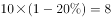，9：00～11：00、12：00～14：00、17：00～19：00三个时间段的平均每分钟车流量为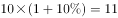，则17：00～19：00每分钟车流量为，，则17：00～19：00每分钟的车流量比9：00～11：00多。

故正确答案为B。

---

### 第 3 题　qid 2448394 · 数学运算

某种糖果的进价为12元/千克，现购进这种糖果若干千克，每天销售10千克，且从第二天起每天都比前一天降价2元/千克。已知以6元/千克的价格销售的那天正好卖完最后10千克，且总销售额是总进货成本的2倍。问总共进了多少千克这种糖果？

- **A**. 180
- **B**. 190　✅
- **C**. 160
- **D**. 170

**答案**：B

**官方解析**

由题干“总销售额是总进货成本的2倍”，即平均每千克糖果售价为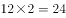元。因为从第二天起每天都比前一天降价2元/千克，即判定糖果价格为公差为的等差数列，故平均价格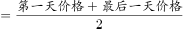，即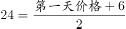，解得第一天售价为42元。根据等差数列第n项公式“”，代入，解得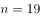天。因为每天卖10千克，故总量千克。

故正确答案为B。

---

### 第 4 题　qid 2448380 · 数学运算

环保局某科室需要对四种水样进行检测，四种水样依次有5、3、2、4份。检测设备完成四种水样每一份的检测时间依次为8分钟、4分钟、6分钟、7分钟。已知该科室本日最多可使用检测设备38分钟，如今天之内要完成尽可能多数量样本的检测，问有多少种不同的检测组合方式？

- **A**. 6　✅
- **B**. 10
- **C**. 16
- **D**. 20

**答案**：A

**官方解析**

由题干“今天之内要完成尽可能多数量样本的检测”，即先从每一份花费时间少的水样开始检测，这样可以保证在38分钟内完成的数量最多。如下表所示：

故按照第二种、第三种、第四种、第一种顺序检测，凑够38分钟。

检测第二种水需分钟，检测第三种水需分钟，再从第四种水的四份中随机选2份，所需时间为分钟，刚好凑够38分钟，且保证了检测数量最多。因题干问“问有多少种不同的检测组合方式”，即考虑组合情况数（不需考虑顺序），故第二种、第三种水全选，均为1种情况；第四种水4份中随机选2份有种组合方式，所以总组合数种。

故正确答案为A。

---

### 第 5 题　qid 2448396 · 数学运算

一条圆形跑道长500米，甲、乙两人从不同起点同时出发，均沿顺时针方向匀速跑步。已知甲跑了600米后第一次追上乙，此后甲加速继续前进，又跑了1200米后第二次追上乙。问甲出发后多少米第一次到达乙的出发点？

- **A**. 180　✅
- **B**. 150
- **C**. 120
- **D**. 100

**答案**：A

**官方解析**

条件和问题均只给出了距离，未给出速度和时间的具体值，考虑赋值。赋值甲速度为100米/分，第一次追及，甲跑了600米，用时为6分；第二次追及，甲加速，速度为120米/分，又跑了1200米，用时为10分。

根据行程问题追及公式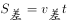，从第一次追上，到第二次追上时，两人的路程差为1圈，即，解得乙速度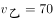米/分。

再分析第一次追及过程，甲比乙多走的距离即为甲出发点到乙出发点距离，米。

故正确答案为A。

---

### 第 6 题　qid 2448571 · 数学运算

将一个圆盘形零件匀速向下浸入水中。问以下哪个坐标图能准确反映浸入深度AO及圆盘与水面的接触部位长度CD之间的关系？

- **A**. A　✅
- **B**. B
- **C**. C
- **D**. D

**答案**：A

**官方解析**

如下图所示，假设圆盘形零件的圆心为B，半径为10，浸水速度为1。在开始浸入到浸入半个圆盘过程中，假设浸入时间为，，则浸入深度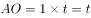，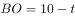，在直角三角形BOD中，，，，，，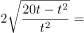，可知CD与AO并非线性关系，排除C项与D项。

当时，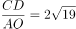；当时，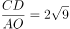；当时，；

当时，；当时，······

观察可得随着越来越大，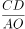的数值越来越小，根号下数值越来越小，且下降速度逐渐变缓。即随着AO长度变大，CD长度变大的速度逐渐变缓，排除B项。

当时，CD取得最大值为，为圆盘的直径。当大于10时，CD长度逐渐变小，图形与前半部分对称。

故正确答案为A。

---

### 第 7 题　qid 2448572 · 数学运算

丙地为甲、乙两地之间高速公路上的一个测速点，其与甲地之间的距离是与乙地之间距离的一半。A、B两车分别从甲地和乙地同时出发匀速相向而行，第一次迎面相遇的位置距离丙地500米。两车到达对方出发地后立刻原路返回，第二次两车相遇也为迎面相遇，问第二次相遇的位置一定：

- **A**. 距离甲地1500米
- **B**. 距离乙地1500米　✅
- **C**. 距离丙地1500米
- **D**. 距离乙、丙中点1500米

**答案**：B

**官方解析**

第一次相遇地点距离丙地500米分为两种情况，分别为相遇点在甲丙之间和在乙丙之间。如果相遇点在甲丙之间，说明此时B车路程超过A车的2倍，也就意味着速度超过2倍，此时第二次相遇应为追上相遇，与题目中第二次两车相遇也为迎面相遇矛盾，所以第一次相遇点一定在乙丙之间。

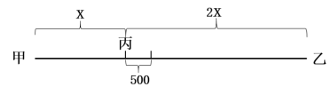

设甲丙为米，则乙丙为米、甲乙为米，第一次相遇时A车路程为米。从出发到第一次相遇，两车路程和为米；从出发到第二次相遇，两车路程和为米。速度和不变，两个过程的路程和之比为，可知两个过程的时间之比也为。对A车而言，速度不变，时间之比为，可推出两个过程中A车的路程之比也为，即第二次相遇时A车路程为米。综上可知，A车从甲地到达乙地之后返回又走了1500米，因此，第二次相遇的位置距离乙地1500米。

故正确答案为B。

---

### 第 8 题　qid 2448404 · 数学运算

某个项目由甲、乙两人共同投资，约定总利润10万元以内的部分甲得，10万元～20万元的部分甲得，20万元以上的部分乙得。最终乙分得的利润是甲的1.2倍。问如果总利润减半，甲分得的利润比乙：

- **A**. 少1万元
- **B**. 多1万元　✅
- **C**. 少2万元
- **D**. 多2万元

**答案**：B

**官方解析**

设总利润为（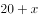）万元，则甲获得利润为（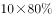）万元，乙获得利润为（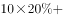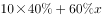）万元，根据题意，（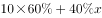）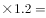，解得。

如果总利润减半，则总利润变为万元，此时甲获得利润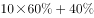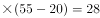万元，乙获得利润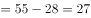万元，甲分得的利润比乙多1万元。

故正确答案为B。

---

### 第 9 题　qid 2448429 · 数学运算

甲、乙两条生产线生产A和B两种产品。其中甲生产线生产A、B产品的效率分别是乙生产线的2倍和3倍。现有2种产品各件的生产任务，企业安排甲和乙生产线合作尽快完成任务，最终甲总共生产了件产品。问乙在单位时间内生产A的件数是生产B件数的多少倍？

- **A**. 

　✅
- **B**. 

- **C**. 

- **D**. 

**答案**：A

**官方解析**

如下表所示，假设乙生产线生产A产品的效率为，生产B产品的效率为，则甲生产线生产A产品的效率为，生产B产品的效率为。

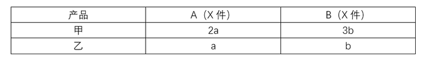

A产品甲的效率是乙的2倍，B产品甲的效率是乙的3倍，因此相对而言甲做B产品优势更明显，要想二者合作时间短，则让甲生产线生产B产品，乙生产线生产A产品。根据题意甲总共生产件产品可知甲生产了B产品件，A产品件，则乙生产了剩余的A产品件。根据甲乙两条生产线工作时间相同，可列方程:，解得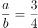，即乙在单位时间内生产A的件数是生产B件数的倍。

故正确答案为A。

---

### 第 10 题　qid 2448574 · 数学运算

销售员小刘为客户准备了A、B、C三个方案。已知客户接受方案A的概率为。如果接受方案A，则接受方案B的概率为，反之为。客户如果A或B方案都不接受，则接受C方案的概率为，反之为。问将3个方案按照客户接受概率从高到低排列，以下正确的是：

- **A**. 

- **B**. 

- **C**. 
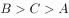

- **D**. 

　✅

**答案**：D

**官方解析**

A方案接受概率为。

B方案接受概率分为两种：

①接受A接受B：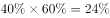，

②不接受A接受B：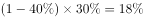，则接受B方案的概率为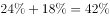；

C方案的接受概率分为两种：

①不接受A也不接受B且接受C：，

②AB没有都不接受且接受C：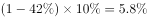，则C方案的接受概率为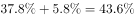。

所以三者从高到低排列为：。

故正确答案为D。

---

### 第 11 题　qid 2448387 · 数学运算

某种产品每箱48个。小李制作这种产品，第1天制作了1个，以后每天都比前一天多制作1个。X天后总共制作了整数箱产品。问X的最小值在以下哪个范围内？

- **A**. 在41～60之间
- **B**. 超过60
- **C**. 不到20
- **D**. 在20～40之间　✅

**答案**：D

**官方解析**

第1天制作了1个，以后每天都比前一天多制作1个，所以每天制作的产品数量为公差为1的等差数列，产品总数为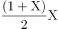。设总共制作了N箱，则，化简得。

分析该式可知，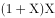能被96整除且和必然一奇一偶，而96的大于1的奇数因子只有3，故将96因式分解为，故和其中必有一个能被32整除、另一个能被3整除。（详见备注）

要让最小，不妨令，此时，两个倍数均满足，代入解得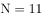，不违反题意，故。

故正确答案为D。

备注：①如果将因式分解为，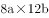之类的情况，会造成和都是偶数，违反题意。故只能因式分解为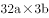，即一个能被32整除，另一个能被3整除。②若令的倍数，则需要是32的倍数，会造成X的最小值等于63，比解析中讨论的32更大，违反题意。

---

### 第 12 题　qid 2448415 · 数学运算

某单位从理工大学、政法大学和财经大学总计招聘应届毕业生三百多人。其中从理工大学招聘人数是政法大学和财经大学之和的，从政法大学招聘的人数比财经大学多。问该单位至少再多招聘多少人，就能将从这三所大学招聘的应届生平均分配到7个部门？

- **A**. 6　✅
- **B**. 5
- **C**. 4
- **D**. 3

**答案**：A

**官方解析**

根据条件“理工大学招聘人数是政法大学和财经大学之和的”，则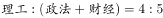；“政法大学招聘的人数比财经大学多”，则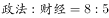。设政法与财经大学的总招聘人数为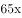，则三所大学的总招聘人数为。根据“总计招聘应届毕业生三百多人”，则只能取值为3，此时总计招聘了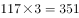人。

若想将招聘的应届生平均分配到7个部门，大于351且能够被7整除的数最小为357，则还需要至少招聘人。

故正确答案为A。

---

### 第 13 题　qid 2448405 · 数学运算

从一个装有水的水池中向外排水，规定每周二、四、六每天排出剩余水量的，其余日期每天排出剩余水量的。如此连续操作6天后，水池中剩余相当于总容量的水。问最开始时水池中的水量最多相当于总容量的：

- **A**. 

- **B**. 

- **C**. 

　✅
- **D**. 

**答案**：C

**官方解析**

若想开始时的水量占比尽可能大，则最开始时的水量应尽可能多，由于最后剩余水量的占比一定，则每天排出的水要尽可能多。

根据题意，每周二、四、六排水后剩余水量为前一天的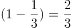；其余日期（周日、周一、周三、周五）每天剩余水量为前一天的。若要每日排出的水尽量多，则其余日期应尽量多。假设从周日开始计算，连续六天后，剩余水量为开始水量的：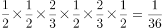。则最开始水池中的水量相当于总容量的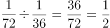。

故正确答案为C。

---

### 第 14 题　qid 2448449 · 数学运算

部队前哨站的雷达监测范围为100千米。某日前哨站侦测到正东偏北千米处，一架可疑无人机正匀速向正西方向飞行。前哨站通知正南方向150千米处的部队立即向正北方向发射无人机拦截，匀速飞行一段时间后，正好在某点与可疑无人机相遇。问我方无人机速度是可疑无人机的多少倍？

- **A**. 

- **B**. 

- **C**. 
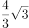
　✅
- **D**. 

**答案**：C

**官方解析**

根据题意可得我方无人机与可疑无人机运动轨迹如上图所示，二者最终在C点相遇，。

已知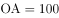千米，，则在直角三角形中，，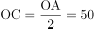千米，千米，又已知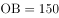千米，则千米。

相同时间，我方无人机从B点飞行到C点，可疑无人机从A点飞行到C点，速度之比等于路程之比，，则我方无人机速度是可疑无人机的倍。

故正确答案为C。

---

### 第 15 题　qid 2448535 · 数学运算

一个无盖长方体饮料盒如下图所示，其底面为正方形，高为23厘米。若插入一根足够细的不可弯折的吸管与底部接触，已知插入饮料盒内的吸管长度最大为27厘米，问饮料盒底面边长为多少厘米？

- **A**. 

- **B**. 

- **C**. 

　✅
- **D**. 

**答案**：C

**官方解析**

设底面边长为。要使插入的吸管最长，则需吸管沿着长方体对角线按如下图所示插入。和均为直角三角形，且和分别是直角，则有, ，联立两个式子得：，解得。

 

故正确答案为C。

---

## 判断推理

### 第 1 题　qid 2448537 · 图形推理

从所给的四个选项中，选择最合适的一个填入问号处，使之呈现一定的规律性：

- **A**. A
- **B**. B　✅
- **C**. C
- **D**. D

**答案**：B

**官方解析**

元素组成不同，且无明显属性规律，考虑数量规律。观察发现，题干第一幅图形为“日”字变形，第四幅图形为“田”字变形，考虑笔画数。题干都是一笔画图形，A、C、D三项均为两笔画，B项为一笔画，只有B项符合。
故正确答案为B。

---

### 第 2 题　qid 2448482 · 图形推理

从所给的四个选项中，选择最合适的一个填入问号处，使之呈现一定的规律性：

- **A**. A　✅
- **B**. B
- **C**. C
- **D**. D

**答案**：A

**官方解析**

图形1、2、4元素组成相同，考虑位置规律。题干图形明显分成黑色L形和白色L形，整体无规律考虑分开看。观察发现，从图一到图二，黑色L形顺时针旋转，白色L形位置不变；从图二到图三，白色L形逆时针旋转，黑色L形位置不变，同时有一块黑色小正方形与白色小正方形重叠，呈现黑色；从图三到图四，黑色L形顺时针旋转，白色L形位置不变；从图四到图五，白色L形逆时针旋转，黑色L形位置不变，同时有一块黑色小正方形与白色小正方形重叠，呈现黑色；根据上述规律，从图五到？处，应该是：黑色L形顺时针旋转，白色L形位置不变，对应A项。

故正确答案为A。

---

### 第 3 题　qid 2448487 · 图形推理

从所给的四个选项中，选择最合适的一个填入问号处，使之呈现一定的规律性：

- **A**. A
- **B**. B
- **C**. C
- **D**. D　✅

**答案**：D

**官方解析**

图形元素组成不同，且无明显属性规律，考虑数量规律。观察发现，题干出现明显的曲线和直线，且线条交叉明显，考虑数曲线与直线的交点数，分别是：4、6、2、4、8，同时，图形的曲线数为：2、3、1、2、4，发现规律为：图形的曲直交点数是曲线数的两倍。所以？处图形也应该符合此规律。选项中，曲直交点数分别为：5、4、1、2，均只有一条曲线，只有D项满足规律，曲直交点数是曲线数的两倍。
故正确答案为D。
注：本题由于A项图片不清晰，根据原图的视觉效果A项应为4个曲直交点，但放大后，A项应为5个曲直交点，由于考虑到考场的真实情况，所以视频解析中老师是按照考场思维进行讲解的。

---

### 第 4 题　qid 2448493 · 图形推理

从所给的四个选项中，选择最合适的一个填入问号处，使之呈现一定的规律性：

- **A**. A
- **B**. B
- **C**. C　✅
- **D**. D

**答案**：C

**官方解析**

本题为九宫格题。元素组成相似，优先考虑样式规律。观察可知，题干图形均由黑点和白点构成，考虑黑白运算。根据第一行可知，运算规律为：黑黑白；黑白黑；白黑黑；白白黑，第二行验证符合此运算规律。第三行左上角为白白黑，排除B、D两项；对比A、C两项右下角颜色不同，应为“黑白黑”，据此C项当选。

故正确答案为C。

---

### 第 5 题　qid 2448542 · 图形推理

下图为给定的多面体及其外表面展开图，问字母A、B、C、D和数字1、2、3、4代表的棱的对应关系为：

- **A**. 1-D，2-A，3-C，4-B
- **B**. 1-C，2-A，3-D，4-B
- **C**. 1-D，2-B，3-C，4-A　✅
- **D**. 1-C，2-B，3-D，4-A

**答案**：C

**官方解析**

本题考查空间重构，如图2所示，标注棕色的边5为黑色面与灰色面的公共边，以该公共边为起点，顺时针依次画边，观察蓝色画边可知边4对应边A，边2对应边B，观察红色画边可知边3对应边C，边1对应边D。

故正确答案为C。

---

### 第 6 题　qid 2448540 · 图形推理

左图给定的是由相同正方体堆叠而成多面体的正视图和后视图。该多面体可以由①、②和③三个多面体组合而成，问以下哪一项能填入问号处？

- **A**. A
- **B**. B
- **C**. C
- **D**. D　✅

**答案**：D

**官方解析**

本题考查立体拼合，如图所示，立体图可以由①②以及D项拼合而成。

故正确答案为D。

---

### 第 7 题　qid 2448558 · 图形推理

左图为给定的立体图形，将其从任一面剖开，以下哪个不可能是该立体图形的截面？

- **A**. A
- **B**. B　✅
- **C**. C
- **D**. D

**答案**：B

**官方解析**

本题考查截面图，逐一分析选项。如下图如所示，A、C、D三项均可以截出，B项无法截出。 

 本题为选非题，故正确答案为B。

---

### 第 8 题　qid 2448414 · 图形推理

把下面的六个图形分为两类，使每一类图形都有各自的共同特征或规律，分类正确的一项是：

- **A**. ①④⑥，②③⑤　✅
- **B**. ①③⑤，②④⑥
- **C**. ①②⑥，③④⑤
- **D**. ①③④，②⑤⑥

**答案**：A

**官方解析**

解析一：本题为分组分类题目。每幅图都由几个图形拼接而成，优先考虑图形间关系。图形内部线条比较多，优先考虑线条数量，发现图①④⑥内部公共边都是4根线，图②③⑤内部公共边都是3根线，所以，①④⑥为一组，②③⑤为一组。
解析二：本题为分组分类题目。图形外部都是多边形，考虑外框图形直线数，图①④⑥外框图形都是7根线，图②③⑤外框图形都是8根线。所以，①④⑥为一组，②③⑤为一组。
故正确答案为A。

---

### 第 9 题　qid 2448498 · 图形推理

把下面的六个图形分为两类，使每一类图形都有各自的共同特征或规律,分类正确的一项是：

- **A**. ①③④，②⑤⑥
- **B**. ①②⑥，③④⑤
- **C**. ①④⑤，②③⑥　✅
- **D**. ①④⑥，②③⑤

**答案**：C

**官方解析**

本题为分组分类题。元素组成不同，优先考虑属性规律。观察可知，题干图形比较规整，考虑对称性。图①④⑤一组，对称轴穿过图中的两条线，并且这两条线和对称轴垂直；图②③⑥一组，对称轴穿过图中的两个交点，对应C项。
故正确答案为C。

---

### 第 10 题　qid 2448431 · 图形推理

把下面的六个图形分为两类，使每一类图形都有各自的共同特征或规律，

分类正确的一项是：

- **A**. ①②③，④⑤⑥
- **B**. ①③④，②⑤⑥　✅
- **C**. ①③⑤，②④⑥
- **D**. ①②⑤，③④⑥

**答案**：B

**官方解析**

本题为分组分类题目。观察发现，图形①中黑色图形只有正方形一种，②中黑色图形有梯形和三角形两种，③中黑色图形只有梯形一种，④中黑色图形只有三角形一种，⑤中黑色图形有圆和圆环两种，⑥中黑色图形有长方形和梯形两种，所以，可以根据黑色图形是一种还是两种分为两组，①③④为一组，②⑤⑥为一组。
故正确答案为B。

---

### 第 11 题　qid 2448436 · 定义判断

超前纠结指的是在平庸的人群中，有正确洞见的人当其观点不被接受、不被相信，对事情的发展无能为力时，所表现出的无奈、压抑和痛苦的心情。
根据上述定义，下列最能体现超前纠结的是：

- **A**. 古来圣贤皆寂寞，惟有饮者留其名
- **B**. 举世皆浊我独清，世人皆醉我独醒　✅
- **C**. 无可奈何花落去，似曾相识燕归来
- **D**. 醉卧沙场君莫笑，古来征战几人回

**答案**：B

**官方解析**

第一步：找出定义关键词。
“在平庸的人群中”、“正确洞见的人当其观点不被接受、不被相信，对事情的发展无能为力时”、“所表现出的无奈、压抑和痛苦的心情”。
第二步：逐一分析选项。
A项：诗句的意思是“自古以来圣贤无不是冷落寂寞的，只有会喝酒的人才能够流传美名。”该诗句说明作者李白只图一醉方休，表达了诗人旷达的胸怀，没有体现出“正确洞见的人当其观点不被接受、不被相信，对事情的发展无能为力”，不符合定义，排除；
B项：诗句的意思是“世界上的人都是污浊的，唯独我干净、清白；众人都已醉倒，唯独我一人清醒。”该诗句是屈原被排挤，被冠以奸邪的罪名，遭到了放逐后所作，符合“在平庸的人群中”“正确洞见的人当其观点不被接受、不被相信，对事情的发展无能为力时”，也符合“所表现出的无奈、压抑和痛苦的心情”，符合定义，当选；
C项：诗句的意思是“那花儿落去我也无可奈何，那归来的燕子似曾相识”，该诗句表达了春的消逝，时光的流逝，都是不可抗拒的自然规律，虽然惋惜流连也无济于事，不符合“正确洞见的人当其观点不被接受、不被相信，对事情的发展无能为力时”，不符合定义，排除；
D项：诗句的意思是“醉就醉吧，醉卧在沙场上有什么呢，请不要见笑，从古至今征战的人有几个是活着回来的。”表达了豪放、开朗、兴奋的感情，还有视死如归的勇气，不符合“所表现出的无奈、压抑和痛苦的心情”，不符合定义，排除。
故正确答案为B。

---

### 第 12 题　qid 2448381 · 定义判断

愧疚补偿策略指的是不直接提出要求，而强调由于对方的责任导致自己处于困境，使对方产生愧疚心理，从而使对方补偿自己的一种策略。
根据上述定义，下列反映了愧疚补偿策略的是：

- **A**. 甲向李某倾诉由于误信了他群发的信息，导致自己被骗得很惨，李某于是免息借钱给甲做生意以求得心安　✅
- **B**. 乙上班迟到被领导批评，回家后责怪妻子没有及时叫醒他，并要求妻子以后负责夜里带孩子，妻子答应了他
- **C**. 丙开车邀请陈某一起郊游，途中丙不慎扭伤了脚，只得请假休养，陈某感到非常内疚，决定帮助丙接送孩子上下学
- **D**. 丁在庄某家做保洁时不慎摔伤，庄某听家政公司说丁家庭非常困难，主动替丁支付了5000元的治疗费用

**答案**：A

**官方解析**

第一步：找出定义关键词。
“不直接提出要求”、“强调由于对方的责任导致自己处于困境”、“使对方产生愧疚心理，从而使对方补偿自己”。
第二步：逐一分析选项。
A项：甲向李某倾诉由于李某的原因他被骗的很惨，符合“强调由于对方的责任导致自己处于困境”， 李某于是免息借钱给甲做生意以求得心安，符合“使对方产生愧疚心理，从而使对方补偿自己”，符合定义，当选；
B项：乙要求妻子以后负责夜里带孩子，不符合“不直接提出要求”，不符合定义，排除；
C项：丙请假休养，未提及是由于陈某的责任而导致自己受伤，不符合“强调由于对方的责任导致自己处于困境”，不符合定义，排除；
D项：庄某听家政公司说丁家庭非常困难，并不是丁某自己强调家庭困难，不符合“强调由于对方的责任导致自己处于困境”，不符合定义，排除；
故正确答案为A。

---

### 第 13 题　qid 2448483 · 定义判断

合理使用是指在法律明文规定的情形下，非商业性使用他人已经发表的作品，可以不经著作权人许可，也不必向其支付报酬。“法律明文规定的情形”主要包括：（1）为个人学习、研究或者欣赏，使用他人已经发表的作品；（2）免费表演已经发表的作品；（3）对设置或者陈列在室外公共场所的艺术作品进行临摹、绘画、摄影、录像；（4）将已经发表的以汉语言文字创作的作品翻译成少数民族语言文字作品出版发行。
根据上述规定，下列属于合理使用的是：

- **A**. 甲在班级聚会上演唱了戊未发表的一首歌曲
- **B**. 乙将一部英文作品翻译成蒙文作品出版发行
- **C**. 丙公司拍摄公共广场的雕塑作品后，将其制作成图片发行
- **D**. 丁为撰写论文，复印了庚发表在某期刊上的论文作参考　✅

**答案**：D

**官方解析**

第一步：找出定义关键词。
“在法律明文规定的情形下”、“非商业性使用他人已经发表的作品”、“为个人学习、研究或者欣赏，使用他人已经发表的作品”、“免费表演已经发表的作品”、“对设置或者陈列在室外公共场所的艺术作品进行临摹、绘画、摄影、录像”、“将已经发表的以汉语言文字创作的作品翻译成少数民族语言文字作品出版发行”。
第二步：逐一分析选项。
A项：甲唱了一首戊尚未发表的歌曲，不符合“非商业性使用他人已经发表的作品”和“免费表演已经发表的作品”，不符合定义，排除； 
B项：乙将英文作品翻译成蒙文作品，这里的英文作品不符合“将已经发表的以汉语言文字创作的作品翻译成少数民族语言文字作品出版发行”，不符合定义，排除；
C项：丙公司拍摄雕塑作品后进行发行，属于商业用途，不符合“非商业性使用他人已经发表的作品”，不符合定义，排除；
D项：丁为了撰写论文复印和参考了庚已经发表的论文，参考论文符合“在法律明文规定的情形下”和“为个人学习、研究或者欣赏，使用他人已经发表的作品”，同时，丁没有用作商业用途，符合“非商业性使用他人已经发表的作品”，符合定义，当选。
故正确答案为D。

---

### 第 14 题　qid 2448382 · 定义判断

客观-价值谬误是一种错误的推理，其前提是一个事实性的描述，而结论所表述的则是一个涉及价值意义的描述，而且这种推理没有预设明显的价值判断前提。
根据上述定义，下列属于客观-价值谬误的是：

- **A**. 人与人之间应该进行更多地交流和沟通，更多地理解和包容，世界上的民族国家将越来越少
- **B**. 既然人人都要遵纪守法，那我们就应该对法律多一份尊重，对规则多一份敬畏
- **C**. 世界变得越来越城市化，因此人们就不应该继续诗意地栖居在农村　✅
- **D**. 这个地区的绿化率在不断提高，其空气质量也将不断改善

**答案**：C

**官方解析**

第一步：找出定义关键词。
“前提是一个事实性的描述”、“结论所表述的则是一个涉及价值意义的描述”。
第二步：逐一分析选项。
A项：人与人之间应该进行更多地交流和沟通，更多地理解和包容，属于涉及价值意义的描述，世界上的民族国家将越来越少，属于陈述的事实，不符合“前提是一个事实性的描述”、“结论所表述的则是一个涉及价值意义的描述”，不符合定义，排除；
B项：既然人人都要遵纪守法，属于涉及价值意义的描述，那我们就应该对法律多一份尊重，对规则多一份敬畏，也属于涉及价值意义的描述，不符合“前提是一个事实性的描述”，不符合定义，排除；
C项：世界变得越来越城市化，符合“前提是一个事实性的描述”，因此人们就不应该继续诗意地栖居在农村，符合“结论所表述的则是一个涉及价值意义的描述”，符合定义，当选；
D项：这个地区的绿化率在不断提高，属于陈述的事实，其空气质量也将不断改善，也属于陈述的事实，不符合“结论所表述的则是一个涉及价值意义的描述”，不符合定义，排除。
故正确答案为C。

---

### 第 15 题　qid 2448383 · 定义判断

社交裂变是一种利益驱动的商业模式，通过人与人之间的社交促进产品的传播与销售，本质上是通过利益驱动激励客户从而形成裂变。
根据上述定义，下列不属于社交裂变的是：

- **A**. 某微商客户挑选好某个商品后，分享在自己的社交圈，好友帮助砍价后，客户可以低价购买，同时也宣传了该商品
- **B**. 某微信用户在购买到自己喜欢的商品后，经常拍照发在朋友圈中，慢慢地大家都知道她喜欢购买高档奢侈品　✅
- **C**. 某电商平台的客户成功购买商品后，分享其链接，所有点击的人都能获得商家提供的随机金额的优惠券
- **D**. 某咖啡店的老顾客参加“邀请好友免费喝咖啡”的活动后，可以获取一张套餐券

**答案**：B

**官方解析**

第一步：找出定义关键词。
“通过人与人之间的社交促进产品的传播与销售”、“通过利益驱动激励客户从而形成裂变”。
第二步：逐一分析选项。
A项：微商客户通过在自己的社交圈中分享商品促进了产品的传播和销售，符合关键词“通过人与人之间的社交促进产品的传播与销售”，微商客户通过在朋友圈分享获得了好友的砍价，继而可以通过较低的价格购买到产品，符合关键词“通过利益驱动激励客户从而形成裂变”，符合定义，排除；
B项：微信用户在购买到自己喜欢的商品后，通过拍照在朋友圈中分享，继而起到产品宣传的效果，符合关键词“通过人与人之间的社交促进产品的传播与销售”，但选项中未体现出商家对微信用户的激励，不符合关键词“通过利益驱动激励客户从而形成裂变”，不符合定义，当选；
C项：电商平台通过让购买成功的客户分享其链接来宣传自己，符合关键词“通过人与人之间的社交促进产品的传播与销售”，所有点击的人都能获得商家提供的随机金额的优惠券，符合定义关键词“通过利益驱动激励客户从而形成裂变”，符合定义，排除；
D项：咖啡店通过让老顾客邀请好友免费喝咖啡来促进产品的传播和销售，符合关键词“通过人与人之间的社交促进产品的传播与销售”，老顾客通过参加“邀请好友免费喝咖啡”活动可以获取一张套餐券，符合定义关键词“通过利益驱动激励客户从而形成裂变”，符合定义，排除。
本题为选非题，故正确答案为B。

---

### 第 16 题　qid 2448477 · 定义判断

动物辅助治疗是一种以动物为媒介，通过人与动物的接触，改善或维持残障人士的身体状况，或帮助他们加强与外部世界的互动，进而促进康复、适应社会的过程。
根据上述定义，下列情形不属于动物辅助治疗的是：

- **A**. 性情温和的迷你猪适合陪伴自闭症患者，减轻他们面对人群时产生的焦虑
- **B**. 卷尾猴能够帮助体障者完成日常生活中的简单动作，如开关门、操控遥控器等
- **C**. 鼬獾会在主人精神病发作之际，发出叫声，警示主人，让主人可以及时服药
- **D**. 英国短毛猫性格温顺且不具有攻击性，喜静且贴近主人，适合陪伴独自生活的老年人　✅

**答案**：D

**官方解析**

第一步：找出定义关键词。
“以动物为媒介”、“通过人与动物的接触，改善或维持残障人士的身体状况，或帮助他们加强与外部世界的互动”。
第二步：逐一分析选项。
A项：迷你猪陪伴自闭症患者，符合“以动物为媒介”，减轻自闭症患者面对人群时产生的焦虑，符合“通过人与动物的接触，帮助他们加强与外部世界的互动”，符合定义，排除；
B项：卷尾猴帮助体障者完成简单动作，符合“以动物为媒介”，体障者能够开关门、操控遥控器，符合“通过人与动物的接触，改善或维持残障人士的身体状况”，符合定义，排除；
C项：鼬獾能够警示精神病人及时吃药，符合“以动物为媒介”，在主人发病时发出叫声，警示主人，符合“通过人与动物的接触，改善或维持残障人士的身体状况”，符合定义，排除；
D项：独自生活的老年人不是残障人士，不符合定义，当选。
本题为选非题，故正确答案为D。

---

### 第 17 题　qid 2448465 · 定义判断

算术平均数描述了一组数据的平均趋势，是所有数据之和除以数据个数所得之商。在统计学中使用时应注意：出现极端数值、模糊不清的数据或者不同质的数据时，均不能计算算术平均数。
根据上述定义，下列适于计算算术平均数的是：

- **A**. 某社区统计该社区居民的平均年龄，其中包括10岁以下儿童204人，90岁以上老人26人　✅
- **B**. 某公司统计35岁以下青年职工的年平均收入，发现基本处于10～12万元之间，其中有一人为公司高管，年收入百万元以上
- **C**. 某学校统计本校青少年平均身高，将该校学前部、小学部和中学部全部学生计算在内
- **D**. 某市统计该市各区县留守儿童的平均数量，其中外出务工人员数量较多的区县无法进行准确统计，只提供了估算数据

**答案**：A

**官方解析**

第一步：找出定义关键词。
“描述了一组数据的平均趋势”、“所有数据之和除以数据个数所得之商”、“出现极端数值、模糊不清的数据或者不同质的数据时，均不能计算算术平均数”。
第二步：逐一分析选项。
A项：10岁以下儿童204人，90岁以上老人26人，这些都是该社区居民，所以在统计该社区居民的平均年龄，要统计在内，适用于计算算数平均数，当选；
B项：某公司统计35岁以下青年职工的年平均收入，一人年收入百万元以上，其他人基本处于10~12万元之间，年收入百万以上的公司高管与年收入10~12万元的普通员工相比，属于“极端数值”，不适于计算算术平均数，排除；
C项：某学校统计本校青少年平均身高，青少年一般是指自上初中到高中毕业，包括“中学部”，但不包括“学前部、小学部”，所以，“学前部、小学部和中学部”属于“不同质的数据”，不适于计算算术平均数，排除；
D项：某市统计该市各区县留守儿童的平均数量，其中外出务工人员数量较多的区县无法进行准确统计，只提供了估算数据，估算出的数据属于“模糊不清的数据”，不适于计算算术平均数，排除。
故正确答案为A。

---

### 第 18 题　qid 2448491 · 定义判断

花序是指花在花轴上不同形式的序列。其中，伞房花序的特点是花序轴下部的花梗较长，上部的花梗依次渐短，整个花序的花几乎排列在一个平面上；伞形花序的特点是在总花梗顶端集生许多花梗近等长的小花，放射状排列如伞。

根据上述定义，下列属于伞房花序的是：

- **A**. A
- **B**. B
- **C**. C　✅
- **D**. D

**答案**：C

**官方解析**

第一步：找出定义关键词。
伞房花序：“花序轴下部的花梗较长，上部的花梗依次渐短”、“整个花序的花几乎排列在一个平面上”。
伞形花序：“在总花梗顶端集生许多花梗近等长的小花”、“放射状排列如伞”。
第二步：逐一分析选项。
A项：图中的花梗等长，不符合“花序轴下部的花梗较长，上部的花梗依次渐短”，花序排列形状也不符合“整个花序的花几乎排列在一个平面上”，不符合“伞房花序”定义，排除； 
B项：图中的花梗几乎等长，符合“在总花梗顶端集生许多花梗近等长的小花”，花序排列形状也符合“放射状排列如伞”，符合“伞形花序”定义，不符合“伞房花序”定义，排除；
C项：图中下部花梗长，上部花梗短，符合“花序轴下部的花梗较长，上部的花梗依次渐短”，并且花序形状也符合“整个花序的花几乎排列在一个平面上”，符合“伞房花序”定义，当选；
D项：图中的花梗等长，不符合“花序轴下部的花梗较长，上部的花梗依次渐短”，花序排列形状也不符合“整个花序的花几乎排列在一个平面上”，不符合“伞房花序”定义，排除。
故正确答案为C。

---

### 第 19 题　qid 2448492 · 定义判断

编剧式观影者是指看影视剧不介意被剧透，甚至会提前查询剧情介绍、翻遍各种影评的人。这种观影者追求掌控剧情发展的感觉，不喜欢出乎意料。
根据上述定义，下列属于编剧式观影者的是：

- **A**. 小王看了一部好的影片后，觉得应该和女朋友一起分享，于是邀请女朋友到电影院观影，还向她介绍了电影的主要内容
- **B**. 小杜对任何事情都讲求理性思维，对于电影，他只有在了解了权威评价、剧情内容、画面特征等情况后，才有观赏的冲动　✅
- **C**. 小李酷爱悬疑类影片，他喜欢陶醉在烧脑的剧情中，心情随着剧情而起伏，他经常假想自己就是一名侦探，对他人总是投出审视的目光
- **D**. 张大爷的老伴退休后整天在家看电视剧，对很多电视剧的剧情都了如指掌，还经常将剧情讲述给张大爷

**答案**：B

**官方解析**

第一步：找出定义关键词。
“看影视剧不介意被剧透”、“会提前查询剧情介绍、翻遍各种影评的人”。
第二步：逐一分析选项。
A项：小王向女朋友介绍电影剧情，但没有说女朋友是否介意被剧透，不符合“看影视剧不介意被剧透”，不符合定义，排除； 
B项：小杜对于电影在了解权威评价、剧情内容、画面特征等情况后，才有观赏的冲动，符合“会提前查询剧情介绍、翻遍各种影评的人”，符合定义，当选；
C项：小李喜欢陶醉在烧脑的剧情中，但没有涉及喜欢提前知道剧情，不符合“会提前查询剧情介绍、翻遍各种影评的人”，不符合定义，排除；
D项：张大爷的老伴喜欢将电视剧剧情讲述给张大爷，但没有说张大爷是否介意被剧透，不符合“看影视剧不介意被剧透”，不符合定义，排除。
故正确答案为B。

---

### 第 20 题　qid 2448384 · 定义判断

培养基是指供给微生物、植物或动物（或组织）生长繁殖的，由不同营养物质组合配制而成的营养基质，一般都含有碳水化合物、含氮物质、无机盐、维生素、水等物质。天然培养基是利用动物、植物或微生物包括其提取物制成的培养基；合成培养基是根据天然培养基的成分，用化学物质模拟合成、人工设计而配制的培养基；半组合培养基是以化学试剂配制为主，同时还加有少量天然成分的培养基。
根据上述定义，下列属于半组合培养基的是：

- **A**. 为研究鸡胚细胞的生长，在一定比例的盐水氨基酸溶液中加入少量玉米汁制成的培养基　✅
- **B**. 为促进乳酸菌生长，使用小麦的麦芽汁制成的培养基
- **C**. 为加速诱发绿萝生长，将有机成分、矿物元素、琼脂等按3:1:2的比例制成的培养基
- **D**. 为观察产气荚膜梭菌的生成，在1000毫升新鲜牛奶中加入10毫升硫酸亚铁制成的培养基

**答案**：A

**官方解析**

第一步：找出定义关键词。
培养基：“供给微生物、植物或动物（或组织）生长繁殖的，由不同营养物质组合配制而成的营养基质，一般都含有碳水化合物、含氮物质、无机盐、维生素、水等物质”。
天然培养基：“利用动物、植物或微生物包括其提取物制成”。
合成培养基：“根据天然培养基的成分，用化学物质模拟合成、人工设计而配制的培养基”。
半组合培养基：“以化学试剂配制为主，同时还加有少量天然成分的培养基”。
第二步：逐一分析选项。
A项：“在一定比例的盐水氨基酸溶液中加入少量玉米汁制成的培养基”说明该培养基是以盐水氨基酸溶液为主，以少量玉米汁为辅，且盐水氨基酸溶液是一种化学试剂，玉米汁是从玉米中提取而来，为天然成分，符合关键词“以化学试剂配制为主，同时还加有少量天然成分的培养基”，符合定义，当选；
B项：麦芽汁是从麦芽中提取而来，是天然成分，但选项中并未提及“化学试剂”，不符合关键词“以化学试剂配制为主，同时还加有少量天然成分的培养基”，不符合定义，排除；
C项：“有机成分、矿物元素、琼脂等按3：1：2的比例制成”，说明该培养基中有机成分占比最高，但有机成分也分为天然有机和合成有机，不确定此处的有机成分是否是化学试剂配制，不符合关键词“以化学试剂配制为主，同时还加有少量天然成分的培养基”，不符合定义，排除； 
D项：“在1000毫升新鲜牛奶中加入10毫升硫酸亚铁制成的培养基”说明该培养基是以新鲜牛奶为主，以硫酸亚铁为辅，而新鲜牛奶是天然成分，硫酸亚铁为化学试剂调配而成，不符合关键词“以化学试剂配制为主，同时还加有少量天然成分的培养基”，不符合定义，排除。
故正确答案为A。

---

### 第 21 题　qid 2448385 · 类比推理

物体：惯性

- **A**. 气体：稳定性
- **B**. 观察：客观性
- **C**. 贵金属：磁性
- **D**. 液体：流动性　✅

**答案**：D

**官方解析**

第一步：判断题干词语间逻辑关系。
惯性是物体的固有属性，一切物体都具有惯性，二者为属性对应关系。
第二步：判断选项词语间逻辑关系。
A项：稳定性并非气体的固有属性，如臭氧就是一种具有刺激性特殊气味的不稳定气体，与题干逻辑关系不一致，排除；
B项：客观性并非观察的固有属性，与题干逻辑关系不一致，排除；
C项：磁性并非贵金属的固有属性，如金是贵金属，但其并没有磁性，与题干逻辑关系不一致，排除；
D项：流动性是液体的固有属性，一切液体都具有流动性，二者为属性对应关系，与题干逻辑关系一致，当选。
故正确答案为D。

---

### 第 22 题　qid 2448386 · 类比推理

全身麻醉：注射麻醉

- **A**. 网络存储：单机存储
- **B**. 胸式呼吸：腹式呼吸
- **C**. 物理消毒：加热消毒
- **D**. 抽样调查：问卷调查　✅

**答案**：D

**官方解析**

第一步：判断题干词语间逻辑关系。
全身麻醉，是指麻醉药经呼吸道吸入、静脉或肌肉注射进入体内，产生中枢神经系统的抑制，临床表现为神志消失、全身疼觉丧失、遗忘、反射抑制和骨骼肌松弛。注射麻醉，是指通过静脉注射或者肌肉注射来进行的麻醉。有的全身麻醉是注射麻醉，有的注射麻醉是全身麻醉，二者是交叉关系。
第二步：判断选项词语间逻辑关系。
A项：网络存储和单机存储是两种不同的储存方式，为并列关系，与题干逻辑关系不一致，排除；
B项：胸式呼吸，主要是靠肋骨的侧向扩张来吸气，利用肋间外肌上举肋骨以扩大胸廓，该种呼吸方式主要依靠胸部的扩张和收缩，横隔膜运动较小，呼吸主要集中在肺的上中部进行。腹式呼吸，主要是让横隔膜上下移动，吸气时横隔膜下降将脏器挤到下方，吐气时横隔膜比平常上升，可以进行深度呼吸，吐出较多停滞在肺底部的二氧化碳。二者是不同的呼吸方式，为并列关系，与题干逻辑关系不一致，排除；
C项：物理消毒，是指利用物理因素杀灭或消除病原微生物及其他有害微生物的方法。主要包括自然净化、机械除菌、热力消毒灭菌、电离辐射消毒、微波消毒、超声波杀毒、等离子体灭菌、过滤除菌等。加热消毒属于物理消毒的一种，二者是包容关系中的种属关系，与题干逻辑关系不一致，排除；
D项：抽样调查，是一种非全面调查，它是从全部调查研究对象中，抽选一部分单位进行调查，并据以对全部调查研究对象做出估计和推断的一种调查方法。问卷调查，是指通过制定详细周密的问卷，要求被调查者据此进行回答以收集资料的方法。有的抽样调查是问卷调查，有的问卷调查是抽样调查，二者是交叉关系，与题干逻辑关系一致，当选。
故正确答案为D。

---

### 第 23 题　qid 2448388 · 类比推理

物必先腐：而后虫生

- **A**. 古木无人径：深山何处钟
- **B**. 水落鱼梁浅：天寒梦泽深
- **C**. 少壮不努力：老大徒伤悲　✅
- **D**. 欲投人处宿：隔水问樵夫

**答案**：C

**官方解析**

第一步：判断题干词语间逻辑关系。
物必先腐，而后虫生，指的是因为东西自身先腐烂，所以虫子才可以寄生，二者为因果的对应关系。
第二步：判断选项词语间逻辑关系。
A项：古木无人径，深山何处钟，指的是古木参天却没有人行路径，深山里何处传来古寺鸣钟？二者不是因果的对应关系，与题干逻辑关系不一致，排除；
B项：水落鱼梁浅，天寒梦泽深，指的是鱼梁洲因水落而露出江面，云梦泽由天寒而迷蒙幽深。二者为并列关系，与题干逻辑关系不一致，排除；
C项：少壮不努力，老大徒伤悲，指的是因为年轻力壮的时候不奋发图强，所以老年时只会留下悲伤、后悔。二者为因果的对应关系，与题干逻辑关系一致，当选；
D项：欲投人处宿，隔水问樵夫，指的是想在山中找个人家去投宿，隔水询问那樵夫可否方便？二者不是因果的对应关系，与题干逻辑关系不一致，排除。
故正确答案为C。

---

### 第 24 题　qid 2448390 · 类比推理

轻车熟路：人生地疏

- **A**. 廉洁奉公：卑躬屈膝
- **B**. 任重道远：无所事事
- **C**. 前仆后继：贪生怕死　✅
- **D**. 河清海晏：国泰民安

**答案**：C

**官方解析**

第一步：判断题干词语间逻辑关系。
轻车熟路指车子轻便，道路熟悉，比喻任务不重，又有经验，做起来容易；人生地疏指人事不熟，地方陌生，二者为反义关系；且“轻车”和“熟路”是并列关系，“人生”和“地疏”是并列关系。
第二步：判断选项词语间逻辑关系。
A项：廉洁奉公指的是不贪污腐化，一心为公；卑躬屈膝指的是形容低声下气，奉承讨好的样子，二者没有必然联系，与题干逻辑关系不一致，排除；
B项：任重道远指的是担子很重，路程遥远，比喻责任重大，需要经过长期的艰苦奋斗；无所事事指的是什么事都不干，二者为反义关系，但“无所”和“事事”不是并列关系，与题干逻辑关系不一致，排除；
C项：前仆后继指的是前边的倒下了，后边的紧跟上来，形容不怕牺牲，英勇奋战；贪生怕死指的是贪恋生存，畏惧死亡，指对敌作战畏缩不前，二者为反义关系；且“前仆”和“后继”是并列关系，“贪生”和“怕死”是并列关系，与题干逻辑关系一致，当选；
D项：河清海晏指的是黄河的水澄清，大海风平浪静，用以比喻天下太平；国泰民安指的是国家太平，人民安乐，二者为近义关系，与题干逻辑关系不一致，排除。
故正确答案为C。

---

### 第 25 题　qid 2448423 · 类比推理

路由器：连接：网络

- **A**. 千斤顶：修补：轮胎
- **B**. 石英钟：显示：时间　✅
- **C**. 万花筒：观察：花卉
- **D**. 烽火台：侦察：敌情

**答案**：B

**官方解析**

第一步：判断题干词语间逻辑关系。
路由器有连接网络的功能，前后为对应关系。
第二步：判断选项词语间逻辑关系。
A项：千斤顶的功能是更换轮胎时顶起车身，不是修补轮胎，与题干逻辑关系不一致，排除；
B项：石英钟的功能是显示时间，与题干逻辑关系一致，当选；
C项：万花筒是一种光学玩具，由孔中看去即可观测到对称的美丽图像，故无法通过万花筒观察花卉，与题干逻辑关系不一致，排除；
D项：烽火台是古时用于点燃烟火传递重要消息的高台，人们通过烽火台传递敌情，而不是侦察敌情，与题干逻辑关系不一致，排除。
故正确答案为B。

---

### 第 26 题　qid 2448433 · 类比推理

建筑材料：混凝土：水泥

- **A**. 饮料：汽水：二氧化碳　✅
- **B**. 医疗用具：注射器：药物
- **C**. 监控：监视器：画面
- **D**. 交通设施：减速带：警示牌

**答案**：A

**官方解析**

第一步：判断题干词语间逻辑关系。
混凝土是建筑材料的一种，二者为种属关系，水泥是混凝土的原材料，二者为对应关系。
第二步：判断选项词语间逻辑关系。
A项：汽水是饮料的一种，二者为种属关系，二氧化碳是汽水的原材料，二者为对应关系，与题干逻辑关系一致，当选；
B项：注射器是医疗工具的一种，二者为种属关系，但药物不是注射器的原材料，应为用注射器注射药物，与题干逻辑关系不一致，排除；
C项：监视器与监控是功能的对应关系，且监视器中可以显示画面，与题干逻辑关系不一致，排除；
D项：减速带是交通设施的一种，二者为种属关系，警示牌与减速带没有明显的逻辑关系，警示牌和交通设施是交叉关系，有的警示牌是交通设施（如铁路道口交通警示牌等），有的警示牌不是交通设施（如高压警示牌、高空作业警示牌等），与题干逻辑关系不一致，排除。
故正确答案为A。

---

### 第 27 题　qid 2448438 · 类比推理

本能行为：学习行为：乌贼喷墨

- **A**. 合法行为：合理行为：盗窃财物
- **B**. 物理变化：化学变化：树木折断　✅
- **C**. 生产管理：销售管理：退货处理
- **D**. 社会现象：自然现象：四季变换

**答案**：B

**官方解析**

第一步：判断题干词语间逻辑关系。
本能行为和学习行为是并列关系中的矛盾关系，乌贼喷墨是一种本能行为。
第二步：判断选项词语间逻辑关系。
A项：有的合法行为是合理行为，有的合理行为是合法行为，合法行为和合理行为为交叉关系；盗窃财物是非法行为和不合理行为，与题干逻辑关系不一致，排除；
B项：物理变化和化学变化是并列关系中的矛盾关系；树木折断没有新物质产生，是物理变化，与题干逻辑关系一致，当选；
C项：生产管理和销售管理是并列关系中的反对关系；退货处理属于销售管理的一部分，两者是组成关系，与题干逻辑关系不一致，排除；
D项：社会现象和自然现象是并列关系的矛盾关系，四季变换是一种自然现象，与题干逻辑关系不一致，排除。
故正确答案为B。

---

### 第 28 题　qid 2448442 · 类比推理

税前收入：税后收入：税金

- **A**. 法律规定：道德规范：规则
- **B**. 测量高度：真实高度：误差　✅
- **C**. 高原地区：平原地区：纬度
- **D**. 生产成本：出厂价格：销售价

**答案**：B

**官方解析**

第一步：判断题干词语间逻辑关系。
税前收入和税后收入是并列关系，税前收入减去税金等于税后收入。
第二步：判断选项词语间逻辑关系。
A项：法律规定和道德规范是并列关系，法律规定和道德规范依据的是不同的规则规范大家的行为，与题干逻辑关系不一致，排除；
B项：测量高度和真实高度是并列关系，测量高度减去误差等于真实高度，与题干逻辑关系一致，当选；
C项：高原地区和平原地区是并列关系，但高原地区和平原地区是根据不同的海拔进行区分的，与纬度无关，与题干逻辑关系不一致，排除；
D项：生产成本、出厂价格、销售价是并列关系，销售价减去出厂价格是销售商的利润，出厂价格减去生产成本是生产商的利润，与题干逻辑关系不一致，排除。
故正确答案为B。

---

### 第 29 题　qid 2448454 · 类比推理

薄荷 对于（  ）相当于（  ）对于 计时器

- **A**. 川芎；水钟
- **B**. 清凉；精准
- **C**. 茯苓；倒计时
- **D**. 药用植物；沙漏　✅

**答案**：D

**官方解析**

逐一代入选项。
A项：薄荷和川芎都是中药材，两者是并列关系；水钟是一种计时器，两者是种属关系，前后逻辑关系不一致，排除；
B项：薄荷有清凉的作用，两者是功能的对应关系；计时器具有精准的属性，两者是属性的对应关系，前后逻辑关系不一致，排除；
C项：薄荷和茯苓都是中药材，两者是并列关系；计时器可以有倒计时的功能，两者是对应关系，前后逻辑关系不一致，排除；
D项：薄荷是一种药用植物，两者是种属关系；沙漏是一种计时器，两者是种属关系，前后逻辑关系一致，当选。
故正确答案为D。

---

### 第 30 题　qid 2448457 · 类比推理

玻璃瓶 对于（  ）相当于（  ）对于 秋播作物

- **A**. 石英砂；农作物
- **B**. 塑料瓶；水生植物
- **C**. 饮料瓶；春播作物
- **D**. 广口瓶；大棚作物　✅

**答案**：D

**官方解析**

逐一代入选项。
A项：石英砂是制作玻璃瓶的原材料，两者是对应关系；秋播作物是农作物的一种，两者是种属关系，前后逻辑关系不一致，排除；
B项：玻璃瓶和塑料瓶是并列关系；水生植物和秋播作物是交叉关系，前后逻辑关系不一致，排除；
C项：玻璃瓶和饮料瓶是交叉关系；春播作物和秋播作物是并列关系，前后逻辑关系不一致，排除；
D项：玻璃瓶和广口瓶是交叉关系；大棚作物和秋播作物是交叉关系，前后逻辑关系一致，当选。
故正确答案为D。

---

### 第 31 题　qid 2448538 · 逻辑判断

斑头雁在飞行中有一个特点，就是它们经常以某种队形来飞，通常是后面的鸟飞在前一只鸟的侧后方，因此就有了常见的“人”字形队形。一些研究者认为这一队形可减小空气阻力、降低飞行能耗，然而反对者认为如果是为了减小阻力，鸟更应该选择直线的队形，因为一个紧跟一个飞行能最大程度地减小跟随者需要克服的空气阻力。
以下哪项如果为真，最能质疑反对者的结论？

- **A**. 飞行过程中，领头雁会不时地与后方同伴换位，否则它们很容易精疲力尽
- **B**. 斑头雁飞行时偏移于前面的同伴，虽不能最大限度减小空气阻力，但能极大地减少上升时所需的体能消耗　✅
- **C**. 斑头雁在飞行时会有确定方向的需求，所以并不会一直排成“人”字形飞行
- **D**. 速滑比赛中，运动员常以“人”字形前进，一名运动员在前，另外三名紧随其后，后三名队员因阻力变小而受益

**答案**：B

**官方解析**

第一步：找出论点和论据。
论点：如果是为了减小阻力，鸟更应该选择直线的队形。
论据：因为一个紧跟一个飞行能最大程度地减小跟随者需要克服的空气阻力。
本题论点和论据都在说直线的队形可以减小阻力，话题一致，因此可以预设否定论点的方式进行削弱，即说明直线的队形不能减小阻力。且本题中“研究者”和“反对者”双方观点“打架”，因此如果能支持“研究者”的观点，即说明“人”字形队形可减小空气阻力、降低飞行能耗，也可以起到削弱“反对者”观点的效果。
第二步：逐一分析选项。
A项：该项说的是飞行中，领头雁通过与后方同伴换位节约体力，与论点讨论的直线的队形可以减小阻力无关，无法削弱，排除；
B项：斑头雁飞行时偏移于前面的同伴，能极大地减少上升时所需的体能消耗，说明“人”字形队形确实可以降低飞行能耗，支持了“研究者”的观点，即削弱了“反对者”的观点，可以削弱，当选；
C项：斑头雁基于确定方向的需求，不会一直排成“人”字形飞行，与该队形是否可以减小空气阻力、降低飞行能耗无关，无法削弱，排除；
D项：该项说的是速滑比赛中，运动员的前进队形，而论点说的是鸟的飞行队形，主体不一致，无法削弱，排除。
故正确答案为B。

---

### 第 32 题　qid 2448473 · 逻辑判断

一切生命有机体都需要新陈代谢，否则生命就会停止。文明也是一样，如果长期自我封闭，必将走向衰落。交流互鉴是文明发展的本质要求。只有同其他文明交流互鉴、取长补短，才能保持旺盛生命活力。
由此可以推出：

- **A**. 一种文明如果没有同其他文明交流互鉴，就不能保持旺盛生命活力　✅
- **B**. 一种文明如果没有长期自我封闭，就不会走向衰落
- **C**. 一种文明如果同其他文明交流互鉴、取长补短，就能保持旺盛生命活力
- **D**. 一种文明如果没有保持旺盛生命活力，它就没有同其他文明取长补短

**答案**：A

**官方解析**

第一步：翻译题干。

①—生命停止新陈代谢；

②自我封闭衰落；

③旺盛生命活力交流互鉴 且 取长补短。

第二步：逐一分析选项。

A项：翻译为“—交流互鉴—旺盛生命活力”，③后件是且关系，否定其中一项则否定全部，该选项是否后推否前，可以推出，当选；

B项：翻译为“—自我封闭—衰落”，是对②的否前，否前推不出确定性结论，排除；

C项：翻译为“交流互鉴 且 取长补短旺盛生命活力”，是对③的肯后，肯后推不出确定性结论，排除；

D项：翻译为“—旺盛生命活力—取长补短”，是对③的否前，否前推不出确定性结论，排除。

故正确答案为A。

---

### 第 33 题　qid 2448587 · 逻辑判断

小张这个夏天如果去新疆，就要游吐鲁番和喀纳斯，否则就不去；只有与小李同游，小张才会游吐鲁番或天池；如果与小李同游，小张一定要与小李做约定；如果小张与小李做约定，则小李这个夏天一定要有时间。遗憾的是，这个夏天小李单位来了一项紧急任务，相关人员一律不得请假，小李也不例外。
由此可以推出：

- **A**. 小张这个夏天未去新疆　✅
- **B**. 小张这个夏天去游喀纳斯
- **C**. 小张这个夏天去游天池
- **D**. 小张这个夏天去游吐鲁番

**答案**：A

**官方解析**

第一步：翻译题干。

① 去新疆游吐鲁番和喀纳斯；

② 游吐鲁番或天池与李同游；

③ 与李同游小张与小李做约定；

④ 小张与小李做约定小李这个夏天有时间；

⑤ 小李没时间；

②③④可以递推出⑥：游吐鲁番或天池与李同游小张与小李做约定小李这个夏天有时间。

第二步：根据题干条件进行推理。

从确定信息条件⑤入手，小李没时间是对条件⑥的否后，否后必否前，可以得出：—（游吐鲁番或天池），根据德摩根定律，等价于—吐鲁番且—天池，—吐鲁番是对条件①的否后，否后必否前，可以得出：张没去新疆，对应A项。

故正确答案为A。

---

### 第 34 题　qid 2448395 · 逻辑判断

一般来说，动物的蛋会通过土壤中微生物和堆肥分解有机物时产生的热量来孵化，但这些微生物（包含细菌）也会穿透蛋壳、感染胚胎，自然情况下这一比例高于。然而，在澳洲有一种名为丛冢雉的鸟类，其蛋发生感染的几率仅为，研究者发现其蛋壳中含有溶酶酵素，研究者据此认为这种物质很可能就是抵御细菌侵扰的关键因素。

以下哪项如果为真，没有削弱上述结论？

- **A**. 丛冢雉的蛋壳中所含的溶酶酵素量，与其他动物相比，含量大抵相当
- **B**. 丛冢雉的蛋壳被一层纳米级的碳酸钙层包裹，拥有了更强的防水性和抗细菌入侵能力
- **C**. 丛冢雉蛋散发一种特殊气味，会使附着在其蛋壳上的细菌数减少
- **D**. 与其他动物的蛋壳相比，丛冢雉的蛋壳要薄三分之一，更易受到微生物的入侵　✅

**答案**：D

**官方解析**

第一步：找出论点和论据。

论点：溶酶酵素这种物质很可能就是抵御细菌侵扰的关键因素。

论据：在澳洲有一种名为丛冢雉的鸟类，其蛋发生感染的几率仅为，研究者发现其蛋壳中含有溶酶酵素。

本题论点说的是溶酶酵素是抵御细菌侵扰的关键因素，论据说的是一种蛋壳中含有溶酶酵素的鸟类蛋发生感染的几率仅为，二者都是在说溶酶酵素与细菌感染之间的关系，话题一致，削弱优先考虑削弱论点，且论点为因果关系，也可以考虑因果倒置（能够抵御细菌侵扰使其出现溶酶酵素），还可以考虑他因削弱（其他原因导致该鸟类可以抵御细菌侵扰）。

第二步：逐一分析选项。

A项：指出丛冢雉的蛋壳中所含的溶酶酵素量与其他动物含量相当，这说明溶酶酵素并不是丛冢雉的蛋的感染率比其他动物的蛋低很多的原因，削弱论点，排除；

B项：指出纳米级的碳酸钙拥有了更强的防水性和抗细菌入侵能力，说明碳酸钙可能是丛冢雉的蛋的感染率比其他动物的蛋低很多的原因，提出了其他的原因可能是抵御细菌侵扰的关键因素，他因削弱，排除；

C项：指出丛冢雉散发一种特殊气味会使附着在其蛋壳上的细菌数减少，说明气味可能是丛冢雉的蛋的感染率比其他动物的蛋低很多的原因，提出了其他的原因可能是抵御细菌侵扰的关键因素，他因削弱，排除；

D项：指出丛冢雉的蛋壳很薄，更易受到微生物的入侵，讨论的是丛冢雉的蛋壳是否容易受到入侵，而论点讨论的是溶酶酵素是抵御细菌侵扰的关键因素，话题不一致，无法削弱，当选。

本题为选非题，故正确答案为D。

---

### 第 35 题　qid 2448470 · 逻辑判断

随着气温上升，热带雨林遭受闪电雷击并引发大火的几率也会上升。然而，目前的监测表明，美洲热带雨林虽然更频繁地受到闪电雷击，却没有引发更多的森林大火。研究者认为这可能与近年来雨林中藤蔓植物大量增加有关。
以下哪项如果为真，最能支持上述结论？

- **A**. 闪电雷击常常引起温带森林大火，但热带雨林因为湿度较大，并不会产生较大火灾
- **B**. 1968年热带雨林中藤蔓植物的覆盖率是32%，当前其覆盖率已经高达60%，有的地区甚至超过75%
- **C**. 藤蔓茎干相对树枝电阻更小，能像建筑上的避雷针那样传导闪电，让大部分电流从自己的茎干传导　✅
- **D**. 雷击这样大规模、速度极快的放电，先摧毁了外部的藤蔓植物，中间的树木得到了保护

**答案**：C

**官方解析**

第一步：找出论点和论据。
论点：美洲热带雨林虽然更频繁地受到闪电雷击，却没有引发更多的森林大火，可能与近年来雨林中藤蔓植物大量增加有关。
论据：无。
前文是背景介绍，本题只有论点没有论据，优先考虑解释原因和举例，即证明没有引起森林大火与藤蔓植物增加之间有关系。
第二步:逐一分析选项。
A项：热带雨林湿度大，不会产生火灾，论点是讨论未引起火灾与藤蔓之间的关系，无法支持，排除；
B项：藤蔓植物覆盖率越来越大，未直接明确说明藤蔓覆盖率与没有引起森林火灾的必然关系，不明确选项，无法支持，排除；
C项：藤蔓茎干电阻比树枝更小，可以像避雷针一样传导闪电，把藤蔓茎干比作避雷针，明确解释了电流从自己的茎干传导，避免了火灾，解释原因，可以支持，当选；
D项：雷击很大，先摧毁外部的藤蔓，保护了内部的树枝，摧毁了外部的藤蔓说明遭受了雷击，但并不明确是否避免了火灾，属于不明确选项，无法支持，排除。
故正确答案为C。

---

### 第 36 题　qid 2448586 · 类比推理

甲、乙、丙、丁、戊五人乘坐高铁出差，他们正好坐在同一排的A、B、C、D、F五个座位。已知：
（1）若甲或者乙中的一人坐在C座，则丙坐在B座；
（2）若戊坐在C座，则丁坐在F座。
如果丁坐在B座，那么可以确定的是：

- **A**. 甲坐在A座
- **B**. 乙坐在D座
- **C**. 丙坐在C座　✅
- **D**. 戊坐在F座

**答案**：C

**官方解析**

第一步：翻译题干。

① 甲或乙中的一人坐在C座丙坐在B座；

② 戊坐在C座丁坐在F座；

③ 丁坐在B座。

第二步：根据题干条件进行推理。

从确定信息条件③入手，丁坐在B座是对条件①和②的否后，否后必否前，可以得出：戊不坐在C座，甲和乙也不坐在C座，因此只能是丙坐在C座，对应C项。

故正确答案为C。

---

### 第 37 题　qid 2448534 · 逻辑判断

一项研究中，研究者观察了近300名2～4年级儿童在一个学年中的课堂参与度。参与度是根据上课过程中的专心行为和分心行为衡量的，前者指的是回答问题、举手发言或参与讨论等，后者指闲聊等行为。实验中，一半学生站立在高课桌前听课，另一半则坐着听课。结果发现：站立听课的学生比坐着的学生更加专注。
以下哪项如果为真，最能支持上述结论？

- **A**. 站立需要大脑平衡身体、控制轻微肌肉收缩，这些适度的压力会使人的注意力更加集中　✅
- **B**. 长时间坐着听课会增加身体对脊柱的压力，不利于学生的身体健康
- **C**. 即使是站立听课，也有个别学生会来回走动，影响课堂秩序，让他人分心
- **D**. 许多性格活泼的学生更喜欢站立听课，专注力更好，而内向的学生则愿意坐着听课，觉得更利于提高注意力

**答案**：A

**官方解析**

第一步：找出论点和论据。
论点：站立听课的学生比坐着的学生更加专注。
论据：无。
本题只有论点没有论据，优先预设补充论据的方式进行加强，可以解释站立听课更专注的原因，也可以举例支持站立听课更专注。
第二步：逐一分析选项。
A项：站立需要大脑平衡身体、控制轻微肌肉收缩，这些适度的压力会使人的注意力更加集中，解释了站立听课更专注的原因，补充了论据，可以加强，当选；
B项：该项说的是长时间坐着不利于学生的身体健康，而论点说的是站立听课更专注，话题不一致，无法加强，排除；
C项：该项说的是站立听课时个别同学会来回走动，影响他人听讲，具有一定的削弱作用，无法加强，排除；
D项：该项说的是活泼和内向的学生喜欢不同的听课姿势，而论点说的是站立听课更专注，话题不一致，无法加强，排除。
故正确答案为A。

---

### 第 38 题　qid 2448391 · 逻辑判断

澳大利亚箱形水母是世界上毒性最强的动物之一，蜇人后其毒素会使人皮肤坏死并伴随剧痛，还会侵入人的心脏，使人在短时间内因心脏停搏而死亡。一只箱形水母体内携带的毒液足以致60人死亡，目前还没有针对其毒液的特效药物。近日，研究人员通过全基因组筛查的方法发现，人体细胞内一种名为ATP2B1的蛋白质是箱形水母毒液发挥毒性的必要条件，研究人员据此认为，通过靶向治疗方法降低胆固醇可以对抗箱形水母的毒液。
以下哪项可以作为上述论证的前提？

- **A**. 靶向治疗方法是一种安全可靠的方法
- **B**. ATP2B1蛋白质发挥作用需要胆固醇　✅
- **C**. 降低胆固醇后不会对人体产生副作用
- **D**. 已研制出降低胆固醇的靶向治疗药物

**答案**：B

**官方解析**

第一步：找出论点和论据。
论点：通过靶向治疗方法降低胆固醇可以对抗箱形水母的毒液。
论据：名为ATP2B1的蛋白质是箱形水母毒液发挥毒性的必要条件。
本题论点讨论的是靶向疗法降低胆固醇可以对抗毒液，论据讨论的是毒液发挥作用需要人体内的蛋白质ATP2B1，论点和论据话题不一致，优先考虑搭桥，在“胆固醇”与该“蛋白质”之间建立联系即可。
第二步：逐一分析选项。
A项：就算靶向治疗方法不是安全的方法，也不影响论点讨论的靶向治疗方法对抗毒液是否有效，不是上述论证的前提，排除；
B项：ATP2B1蛋白质发挥作用需要胆固醇，通过靶向疗法可以降低胆固醇，从而防止毒液发挥毒性，在“胆固醇”与该“蛋白质”之间建立了联系，搭桥项，当选；
C项：降低胆固醇是否有副作用与题干讨论的能否对抗毒液无关，不是上述论证的前提，排除；
D项：已研制出靶向治疗药物，与题干讨论的靶向疗法是否有用无关，不是上述论证的前提，排除。
故正确答案为B。

---

### 第 39 题　qid 2448536 · 逻辑判断

近日，研究人员发现发烧可以促进淋巴细胞向感染部位转移。他们解释说，这是由于发烧会增加热休克蛋白90（Hsp90）在T淋巴细胞中的表达，这种蛋白质与整合素结合，促进T淋巴细胞黏附到血管上，最终加快迁移到感染的位置。
以下除哪项外，均能支持上述结论？

- **A**. 整合素是一种细胞黏附分子，在发烧时可以控制T淋巴细胞的转运
- **B**. 发烧能够诱导Hsp90与整合素的尾部结合，并可激活整合素
- **C**. 不仅仅是发烧，其他压力也能诱导Hsp90在T淋巴细胞中的表达　✅
- **D**. Hsp90与整合素结合后，可激活促进T淋巴细胞迁移的信号通路

**答案**：C

**官方解析**

第一步：找出论点和论据。
论点：发烧可以促进淋巴细胞向感染部位转移。
论据：发烧会增加热休克蛋白90（Hsp90）在T淋巴细胞中的表达，这种蛋白质与整合素结合，促进T淋巴细胞黏附到血管上，最终加快迁移到感染的位置。
本题为选非题，可以使用排除法，将可以加强的选项排除，选择无法加强的选项。且本题论点和论据都在说发烧可以促进淋巴细胞向感染部位转移，话题一致，可以通过补充论据的方式进行加强。
第二步：逐一分析选项。
A项：整合素是一种细胞黏附分子，在发烧时可以控制T淋巴细胞的转运，说明整合素确实可以控制T淋巴细胞，补充了论据，可以加强，排除；
B项：发烧能够诱导Hsp90与整合素的尾部结合，并可激活整合素，说明发烧确实可以促进Hsp90蛋白质与整合素结合，补充了论据，可以加强，排除；
C项：不仅仅是发烧，其他压力也能诱导Hsp90在T淋巴细胞中的表达，说明除了发烧，还存在因素诱导Hsp90在T淋巴细胞中的表达，无法加强，当选；
D项：Hsp90与整合素结合后，可激活促进T淋巴细胞迁移的信号通路，说明Hsp90蛋白质与整合素结合确实对T淋巴细胞会产生影响，补充了论据，可以加强，排除。
本题为选非题，故正确答案为C。

---

### 第 40 题　qid 2448393 · 逻辑判断

2014年以来，某州已发生了超过230次3级及以上地震，而2008年之前这一数字是年均1次。频繁的地震活动引发了人们的疑问，一些研究者发现2014年以来，全州为了避免石油开采中钻井和水力压裂过程中产生的有毒废水污染地表水，开始将这些废水注入地下岩石的不透水层之间，这一行为很可能就是引发地震的关键原因。
以下哪项如果为真，最能支持上述推测？

- **A**. 废水灌入岩石水层中会降低断层之间的摩擦力，使之更易滑动，从而诱发地震　✅
- **B**. 该州自2008年以来勘探出更多的石油储备，石油开采活动大幅增加
- **C**. 该州2008年之前的地震次数少但震级大，2014年以来地震次数多但震级小
- **D**. 大多数连续地震是一次强震后发生的一系列余震，但该州地震并不属于这种情况

**答案**：A

**官方解析**

第一步：找出论点和论据。
论点：将石油开采中的有毒废水注入地下岩石的不透水层之间，这一行为很可能就是引发地震的关键原因。
论据：无。
本题只有论点，没有论据，加强优先考虑补充论据，即解释为什么将这些废水注入地下岩石的不透水层之间会引发地震，或举例证明将这些废水注入地下岩石的不透水层之间会引发地震。
第二步：逐一分析选项。
A项：指出废水灌入岩石水层中会降低断层之间的摩擦力从而诱发地震，解释为什么将这些废水注入地下岩石的不透水层之间会引发地震，补充论据，当选；
B项：指出该州自2008年以来石油开采活动大幅增加，石油开采活动增加只能证明开采排放的有毒废水增多，但不能证明是这些废水注入地下造成了该州2014年以来地震多发，无法加强，排除；
C项：指出该州2008年之前的地震与2014年的地震在数量以及震级上的差别，而论点说的是造成该州2014年以来地震多发的原因，话题不一致，无法加强，排除；
D项：指出该州地震不是一次强震后发生的一系列余震，而论点说的是造成该州地震多发的原因，话题不一致，无法加强，排除。
故正确答案为A。

---

## 资料分析

### 材料 1

#### 第 1 题　qid 2448399 · 综合

2018年中国在线旅游收入约占旅游业总收入的：

- **A**. 

- **B**. 

- **C**. 

- **D**. 

　✅

**答案**：D

**官方解析**

根据题干“2018年······占······的”结合选项为百分数，可判定本题为现期比重问题。定位表格材料可知，2018年旅游业总收入为5.97万亿元，2018年在线旅游收入亿元万亿元。代入公式：比重。

故正确答案为D。

---

#### 第 2 题　qid 2448408 · 增长

2017年中国在线旅游收入同比约增长多少万亿元？

- **A**. 0.15　✅
- **B**. 0.20
- **C**. 0.25
- **D**. 0.30

**答案**：A

**官方解析**

根据题干“2017年···同比约增长···万亿元”，可判定本题为增长量计算问题。定位表格可知，中国在线旅游收入，根据表格可得，2017年在线旅游收入；2016年在线旅游收入。代入公式：增长量。

故正确答案为A。

---

#### 第 3 题　qid 2448412 · 比重

中国在线旅游收入中，2014年占中国旅游业总收入比重高于上年水平的包括：

- **A**. 仅在线交通预订
- **B**. 在线交通预订、在线住宿预订、在线度假旅游预订　✅
- **C**. 仅在线交通预订、在线住宿预订
- **D**. 仅在线交通预订、在线度假旅游预订

**答案**：B

**官方解析**

根据题干“···2014年占···比重高于上年水平的包括”可判定本题为两期比重问题。

方法一：根据两期比重结论，部分增长率大于总体增长率则比重同比上升，即高于上年水平。定位表格可知2013年、2014年中国旅游业总收入和在线旅游收入各部分的相关数据。利用公式“增长率”可得，总体增长率即中国旅游业总收入增长率；增长率即在线交通预订收入增长率；增长率即在线住宿预订收入增长率；增长率即在线度假旅游预订收入增长率。因此，满足条件的有在线交通预订，；在线住宿预订，；在线度假旅游预订，。

方法二：根据表格中2013年、2014年中国旅游业总收入和在线旅游收入各部分的相关数据，利用公式“比重”可得，2013年、2014年在线交通预订收入占中国旅游业总收入的比重分别、，，即比重高于上年水平；

2013年、2014年在线住宿预订收入占中国旅游业总收入的比重分别、，，即比重高于上年水平；

2013年、2014年在线度假旅游预订收入占中国旅游业总收入的比重分别、，则，即比重高于上年水平。

故满足条件的有在线交通预订、在线住宿预订、在线度假旅游预订。

故正确答案为B。

---

#### 第 4 题　qid 2448416 · 增长

以下折线图反映了2014～2018年间哪项收入同比增量的变化趋势？

- **A**. 在线住宿预订
- **B**. 旅游业总体
- **C**. 在线度假旅游预订　✅
- **D**. 在线交通预订

**答案**：C

**官方解析**

根据题干“······同比增量的变化趋势”，可判定本题为增长量比较问题。

A项：定位表格第四列数据可得：“2013年~2018年在线住宿预订收入依次为412.10亿元、547.45亿元、862.57亿元、1251.42亿元、1586.19亿元、1881.49亿元”，根据公式：增长量=现期量-基期量，则2014-2018年在线住宿预订收入同比增量依次为2014年：547.45-412.10547-412=135亿元、2015年：862.57-547.45863-547=316亿元、2016年：1251.42-862.571251-863=388亿元；2017年：1586.19-1251.421586-1251=335亿元；2018年：1881.49-1586.191881-1586=295亿元。2017年比2015年增长量大，即折线图中第4个点应比第2个点高，与题干折线图矛盾，排除A项。

B项：定位表格第二列数据可得：“2013年~2018年旅游业总体收入依次为2.95万亿元、3.38万亿元、4.13万亿元、4.69万亿元、5.40万亿元、5.97万亿元”，则2014-2018年旅游业总体收入同比增量依次为2014年：3.38-2.95=0.43万亿元、2015年：4.13-3.38=0.75万亿元、2016年：4.69-4.13=0.56万亿元、2017年：5.40-4.69=0.71万亿元、2018年：5.97-5.40=0.57万亿元。2015年增长量最大，即折线图中第2个点应该最高，与题干折线图矛盾，排除B项。

C项：定位表格第五列数据可得：“2013年~2018年在线度假旅游预订收入依次为244.20亿元、347.58亿元、549.97亿元、757.40亿元、947.47亿元、1051.81亿元”，则2014-2018年在线度假旅游预订收入同比增量依次为2014年：347.58-244.20348-244=104亿元、2015年：549.97-347.58550-348=202亿元、2016年：757.40-549.97757-550=207亿元、2017年：947.47-757.40947-757=190亿元、2018年：1051.81-947.471052-947=105亿元。满足题干折线图趋势。

D项：定位表格第三列数据可得：“2013年~2018年在线交通预订收入依次为1519.67亿元、2271.57亿元、3325.15亿元、5385.42亿元、6389.65亿元、6820.95亿元”，则2014-2018年在线交通预订收入同比增量依次为2014年：2271.57-1519.672272-1520=752亿元、2015年：3325.15-2271.573325-2272=1053亿元、2016年：5385.42-3325.155385-3325=2060亿元、2017年：6389.65-5385.426390-5385=1005亿元、2018年：6820.95-6389.656821-6390=431亿元。2018年增长量较2014年小很多，即折线图中第5个点应比第1个点低很多，与题干折线图矛盾，排除D项。

故正确答案为C。

---

#### 第 5 题　qid 2448424 · 综合

能够从上述资料中推出的是：

- **A**. 2014～2018年，中国旅游业总收入超过25万亿元
- **B**. 2014～2016年，中国旅游业总收入同比增速逐年递增
- **C**. 2016年中国在线交通预订收入同比增速快于上年水平　✅
- **D**. 如保持2018年同比增量，中国在线住宿预订收入将在2023年首超3000亿元

**答案**：C

**官方解析**

A项：定位表格第二列数据可得：“2014年~2018年旅游业总体收入依次为3.38万亿元、4.13万亿元、4.69万亿元、5.40万亿元、5.97万亿元”，故题干所求总收入，错误。

B项：根据本篇第4题计算数据可得：“2014年~2016年中国旅游业总收入增长量分别为0.43万亿元、0.75万亿元、0.56万亿元”，代入公式：增长率，则，，两者比较分子大分母小，明显，即2016年增速下降，错误。

C项：根据本篇第4题计算数据可得：“2015年、2016年中国在线交通预订收入增长量分别约为1053亿元、2060亿元”，代入公式：增长率 ，，，明显，即2016年增速快于2015年，正确。

D项：根据本篇第4题计算数据可得：“2018年中国在线住宿预订收入增长量约为295亿元”，代入公式：现期量，，年，向上取整，需要4年，故在年住宿预订收入已超过3000亿元，错误。

故正确答案为C。

---

### 材料 2

 

#### 第 6 题　qid 2448541 · 增长

2016～2018年，全国茶叶产量之和比2013～2015年产量之和增加了：

- **A**. 100～150万吨之间　✅
- **B**. 不到100万吨
- **C**. 超过200万吨
- **D**. 150～200万吨之间

**答案**：A

**官方解析**

根据题干“···比···增加了”，结合选项带单位，可判定本题为增长量计算问题。定位图形材料，可知2013-2018年各年份全国茶叶产量。根据公式：增长量=现期量-基期量，则题干所求为万吨，在100~150万吨之间。

故正确答案为A。

---

#### 第 7 题　qid 2448543 · 增长

2007～2018年间，全国茶园面积首次超过200万公顷的年份，当年茶园单位面积茶叶产量比上年：

- **A**. 
下降了以上

- **B**. 
下降了不到

- **C**. 
增加了以上

- **D**. 
增加了不到
　✅

**答案**：D

**官方解析**

根据题干“···单位面积茶叶产量比上年”，结合选项为下降/增加，可判定本题为平均数的增长率计算问题。定位图形材料，可知2007-2018年全国茶园面积首次超过200万公顷的年份为2011年。2011年全国茶园面积为205.6万公顷、产量为160.8万吨；2010年面积为193.2万公顷、产量为146.3万吨。根据公式：增长率，可以算得：2011年全国茶叶产量的增长率，茶园面积的增长率；根据公式：平均数的增长率，则题干所求为 ，即增加了不到10%，对应D项。

故正确答案为D。

---

#### 第 8 题　qid 2448544 · 综合

2018年全国产茶省份中，有几个省份的茶园单位面积茶叶产量高于1吨/公顷？

- **A**. 5　✅
- **B**. 4
- **C**. 7
- **D**. 6

**答案**：A

**官方解析**

根据题干“······有几个省份的单位面积茶叶产量高于1吨/公顷”，可判定本题为现期平均数的计算问题。定位表格材料，可知2018年全国产茶省份的产量和面积。根据公式：单位面积产量，若单位面积茶叶产量高于1吨/公顷，即产量数值（吨数）大于面积数值（公顷数）的省份，查找表中数据，共有5个省份符合要求，分别为福建、山东、湖北、湖南、广东。

故正确答案为A。

---

#### 第 9 题　qid 2448545 · 综合

2018年茶园面积最大的4个省份中，茶叶产量也是全国前4名的省份有几个？

- **A**. 3　✅
- **B**. 4
- **C**. 1
- **D**. 2

**答案**：A

**官方解析**

定位表格材料，可以得到全国产茶省份茶园面积及茶叶产量。2018年茶园面积最大的4个省份分别是贵州（45.62万公顷）、云南（44.45万公顷）、四川（36.34万公顷）、湖北（29.93万公顷）；茶叶产量全国前4名的省份分别是福建（40.16万吨）、云南（39.81万吨）、湖北（31.45万吨）、四川（29.50万吨）。由此可以看出，2018年茶园面积最大的4个省份中，茶叶产量也是全国前4名的省份有湖北、四川、云南3个。
故正确答案为A。

---

#### 第 10 题　qid 2448546 · 综合

能够从上述资料中推出的是：

- **A**. 2018年全国茶叶产量比9年前翻了一番
- **B**. 2018年全国茶园面积最小的产茶省份，单位面积产量也最低
- **C**. 2008～2010年，全国茶园面积同比增速逐年持续下降　✅
- **D**. 2018年湖南、湖北的茶园面积占全国茶园总面积的两成以上

**答案**：C

**官方解析**

A项：定位图形材料，2018年全国茶叶产量为261.6万吨；9年前即2009年全国茶叶产量为135.1万吨。可计算出2018年全国茶叶产量约是9年前的倍，翻了不到一番。错误；

B项：定位表格材料，2018年全国茶园面积最小的产茶省份是海南（0.24万公顷），单位面积产量吨/公顷。而甘肃的单位面积产量吨/公顷，甘肃的单位面积产量（吨/公顷）＜海南的单位面积产量（0.25吨/公顷）。可以看出2018年全国茶园面积最小的产茶省份海南，其单位面积产量不是最低。错误；

C项：定位图形材料，可以得到2007~2010年全国茶园面积。根据增长率，可计算出2008～2010年，全国茶园面积同比增速如下：

2008年增速；

2009年增速；

2010年增速。

可以看出，2008～2010年，全国茶园面积同比增速逐年持续下降。正确；

D项：定位表格材料，2018年湖南、湖北的茶园面积分别为16.89万公顷、29.93万公顷。定位图形材料，2018年全国茶园总面积为293.1万公顷。根据比重，可计算出2018年湖南、湖北的茶园面积占全国茶园总面积的，非两成以上。错误。

故正确答案为C。

---

### 材料 3

#### 第 11 题　qid 2448422 · 比重

2018年中国进出口贸易总额为4.62万亿美元，其中集成电路进出口贸易额占比：

- **A**. 超过10个百分点
- **B**. 在5～10个百分点之间　✅
- **C**. 在1～5个百分点之间
- **D**. 不到1个百分点

**答案**：B

**官方解析**

根据题干所求“2018年······其中······占比”，可判定本题为现期比重问题。定位表格材料可得，2018年中国集成电路进口金额3120.6亿美元、出口金额846.4亿美元。，根据公式：，则所求比重且明显高于5%，在B项范围内。

故正确答案为B。

---

#### 第 12 题　qid 2448425 · 综合

2012～2015年，中国集成电路产业累计销售额在以下哪个范围内？

- **A**. 不到1万亿元
- **B**. 在1～1.1万亿元之间
- **C**. 在1.1～1.2万亿元之间　✅
- **D**. 超过1.2万亿元

**答案**：C

**官方解析**

定位统计图可得，2013~2015年中国集成电路产业销售额分别为：2508.5亿元、3015.4亿元、3609.8亿元，2013年中国集成电路产业销售额同比增长16.2%。根据公式：，则。则2012~2015年中国集成电路产业累计销售额，在C项范围内。

故正确答案为C。

---

#### 第 13 题　qid 2448434 · 增长

2013～2018年间中国集成电路产业销售额增速最高的年份，当年集成电路进口金额同比约增加：

- **A**. 

- **B**. 

- **C**. 

　✅
- **D**. 

**答案**：C

**官方解析**

根据题干所求“······当年······同比约增加”，结合选项为百分数，可判定本题为一般增长率问题。定位统计图观察折线部分可知， “2013~2018年间中国集成电路产业销售额增速最高的年份”，为2017年（）。定位表格材料可得，2017年集成电路进口金额2017年为2601.4亿美元，2016年为2270.7亿美元。根据公式：，则与C项最接近。

故正确答案为C。

---

#### 第 14 题　qid 2448448 · 平均数

2018年中国平均每块集成电路出口单价比上年：

- **A**. 
下降了以上

- **B**. 
上升了以上

- **C**. 
下降了以内

- **D**. 
上升了以内
　✅

**答案**：D

**官方解析**

根据题干“2018年中国平均每块集成电路出口单价比上年”，结合选项为“”，可判定本题为平均数的增长率问题。定位表格数据可知，2017年中国集成电路出口金额为668.8亿美元，出口数量为2043.5亿块；2018年中国集成电路出口金额为846.4亿美元，出口数量为2171.0亿块。

方法一：根据公式：，，则，即上升了以内。

方法二：根据公式：，则2018年中国集成电路出口金额增长率（a），出口数量增长率（b）。根据公式：平均数的增长率，则题干所求为，即上升了30%以内，对应D项。

故正确答案为D。

---

#### 第 15 题　qid 2448460 · 综合

关于中国集成电路产业销售及进出口状况，能够从上述资料中推出的是：

- **A**. 2016～2017年，月均进出口总量超过450亿块　✅
- **B**. 2016年销售额同比增量低于上年水平
- **C**. 2015～2018年，进口量和进口额均逐年上升
- **D**. 2014～2018年，出口总量超过1万亿块

**答案**：A

**官方解析**

A项：定位表格数据，2016年中国集成电路进口数量为3425.5亿块，出口数量为1810.1亿块，2017年进口数量为3770.1亿块，出口数量为2043.5亿块。代入公式：，正确；

B项：定位图形数据，2016年中国集成电路产业销售额为4335.5亿人民币；2015年销售额为3609.8亿人民币；2014年销售额为3015.4亿人民币。根据公式：，则，，即2016年销售额同比增量高于上年，错误；

C项：定位表格数据，2015年-2018年中国集成电路进口金额分别为2300.0亿美元，2270.7亿美元，2601.4亿美元，3120.6亿美元，其中2016年下降，并非逐年上升，错误；

D项：定位表格数据，2014年-2018年中国集成电路出口总量分别为1535.2亿块，1827.7亿块，1810.1亿块，2043.5亿块，2171.0亿块。，错误。

故正确答案为A。

---

### 材料 4

        2018年前三季度，S省社会物流总额35357.26亿元，同比增长，增速比上半年放缓0.7个百分点。其中，工业品物流总额16636.15亿元，同比增长，增速比上半年放缓2.1个百分点；外部流入（含进口）货物物流总额17357.31亿元，同比增长，增速比上半年加快0.8个百分点；农产品物流总额875.06亿元，同比增长，增速比上半年加快0.5个百分点；单位与居民物品物流总额457.86亿元，同比增长，增速比上半年放缓3个百分点；再生资源物流总额30.88亿元，同比下降，降幅比上半年扩大4.3个百分点。

        2018年前三季度，S省物流相关行业实现总收入1912.8亿元，同比增长。其中：运输环节收入1321.9亿元，同比增长；保管环节收入226.2亿元，同比增长；邮政业收入82.8亿元，同比增长；配送、加工、包装业收入98.8亿元，同比增长。

        2018年前三季度，S省社会物流总费用2682.1亿元，同比增长，比上半年放缓0.9个百分点。其中：物流运输环节总费用1854.6亿元，同比增长；保管环节总费用612.4亿元，同比增长；管理环节总费用214.9亿元，同比增长。

#### 第 16 题　qid 2448575 · 增长

2018年前三季度，S省工业品物流总额同比增量约为同期社会物流总额同比增量的：

- **A**. 
超过

- **B**. 
之间

- **C**. 
之间

- **D**. 
不到
　✅

**答案**：D

**官方解析**

根据题干所求“2018年前三季度……约为……”，结合选项“”，可判定此题为现期比重问题。定位文字材料第一段“2018年前三季度，S省社会物流总额35357.26亿元，同比增长，……。其中，工业品物流总额16636.15亿元，同比增长”。根据，亿元，亿元，根据公式：比重，在D项范围内。

故正确答案为D。

---

#### 第 17 题　qid 2448576 · 比重

在工业品物流、外部流入（含进口）货物物流、农产品物流、单位与居民物品物流和再生资源物流中，2018年前三季度物流总额占社会物流总额的比重高于上年水平的有几类？

- **A**. 4
- **B**. 3　✅
- **C**. 2
- **D**. 1

**答案**：B

**官方解析**

根据题干所求“2018年前三季度……占……比重高于上年”，可判定本题为两期比重问题。根据两期比重的结论：当部分增长率a总体增长率b时，可判定比重上升。定位文字材料第一段“2018年前三季度，S省社会物流总额35357.26亿元，同比增长。其中，工业品物流…同比增长；外部流入（含进口）货物物流…同比增长；农产品物流…同比增长；单位与居民物品物流…同比增长；再生资源物流…同比下降”。即总体增长率，其中满足“部分增长率a&gt;b（）”的有：外部流入（含进口）货物物流（）、农产品物流（）、单位与居民物品物流（），共3类。

故正确答案为B。

---

#### 第 18 题　qid 2448577 · 平均数

2018年前三季度，平均每万元社会物流总额产生的物流费用比上年同期：

- **A**. 
上升了不到

- **B**. 
上升了以上

- **C**. 
下降了不到
　✅
- **D**. 
下降了以上

**答案**：C

**官方解析**

根据题干所求“2018年前三季度，平均每……比上年同期……”，结合选项为“上升下降”，可判定本题为平均数的增长率，根据，其中，。定位文字材料第一、三段“2018年前三季度，S省社会物流总额35357.26亿元，同比增长”，“2018年前三季度，S省社会物流总费用2682.1亿元，同比增长”，代入公式，即下降了不到。

故正确答案为C。

---

#### 第 19 题　qid 2448578 · 增长

将2018年前三季度S省物流相关行业不同类型的收入按照同比增量从高到低排列，以下正确的是：

- **A**. 
运输收入保管收入邮政业收入配送、加工、包装业收入
　✅
- **B**. 
运输收入配送、加工、包装业收入邮政业收入保管收入

- **C**. 
运输收入保管收入配送、加工、包装业收入邮政业收入

- **D**. 
运输收入邮政业收入配送、加工、包装业收入保管收入

**答案**：A

**官方解析**

根据题干“将2018年前三季度······同比增量从高到低排列······”，可判定本题为增长量比较问题。定位文字资料第二段：2018年前三季度，······运输环节收入1321.9亿元，同比增长；保管环节收入226.2亿元，同比增长；邮政业收入82.8亿元，同比增长；配送、加工、包装业收入98.8亿元，同比增长。观察数据可知，保管收入和配送、加工、包装业收入的增长率相同，那么现期量大的，增长量大，即保管收入的增长量＞配送、加工、包装业收入的增长量，结合选项可排除B、D项；根据公式：，则；，即邮政业收入的增长量配送、加工、包装业收入的增长量，排除C项。

故正确答案为A。

---

#### 第 20 题　qid 2448579 · 综合

关于2018年前三季度S省物流情况，能够从上述资料中推出的是：

- **A**. 
农产品物流总额同比增长了100多亿元

- **B**. 
物流运输环节收入同比增量高于该环节费用同比增量

- **C**. 
外部流入（含进口）货物物流总额占社会物流总额的一半以上

- **D**. 
配送、加工、包装业收入占物流相关行业总收入的比重超过
　✅

**答案**：D

**官方解析**

A项：定位文字材料第一段可知，2018年前三季度，农产品物流总额875.06亿元，同比增长。根据公式：增长量=，则农产品物流总额增长量=亿元，错误；

B项：定位文字材料第二段和第三段可知，运输环节收入1321.9亿元，同比增长；物流运输环节总费用1854.6亿元，同比增长；根据增长量比较口诀“大大则大”可知，物流运输环节总费用现期量大，增长率大，则增长量也大，错误；

C项：定位文字材料第一段可知，2018年前三季度，S省社会物流总额35357.26亿元，外部流入（含进口）货物物流总额17357.31亿元。根据公式：比重=，则所求比重=，错误；

D项：定位文字材料第二段可知，2018年前三季度，S省物流相关行业实现总收入1912.8亿元，其中，配送、加工、包装业收入98.8亿元。根据公式：比重=，则所求比重=，正确。

故正确答案为D。

---
