# 2021年国家公务员录用考试《行测》题（地市级网友回忆版）

> 国考 · 2021 年 · 6 个模块 · 共 130 题

- [政治理论](#%E6%94%BF%E6%B2%BB%E7%90%86%E8%AE%BA) · 4 题
- [常识判断](#%E5%B8%B8%E8%AF%86%E5%88%A4%E6%96%AD) · 16 题
- [言语理解与表达](#%E8%A8%80%E8%AF%AD%E7%90%86%E8%A7%A3%E4%B8%8E%E8%A1%A8%E8%BE%BE) · 40 题
- [数量关系](#%E6%95%B0%E9%87%8F%E5%85%B3%E7%B3%BB) · 10 题
- [判断推理](#%E5%88%A4%E6%96%AD%E6%8E%A8%E7%90%86) · 40 题
- [资料分析](#%E8%B5%84%E6%96%99%E5%88%86%E6%9E%90) · 20 题

---

## 政治理论

### 第 1 题　qid 2719285 · 时事政治

党的十九届四中全会审议通过了《中共中央关于坚持和完善中国特色社会主义制度、推进国家治理体系和治理能力现代化若干重大问题的决定》。下列对该决定的理解不准确的是：

- **A**. 首次用一次中央全会专门研究我国国家制度和国家治理问题并作出决定
- **B**. 首次提出国家治理体系和治理能力现代化的命题　✅
- **C**. 明确党的领导制度在我国国家制度和治理体系中的统领地位
- **D**. 对社会主义基本经济制度内涵作出重要拓展和深化

**答案**：B

**官方解析**

本题考查政治常识。
A项正确，中国共产党第十九届中央委员会第四次全体会议于2019年10月28日至31日在北京举行，审议通过了《中共中央关于坚持和完善中国特色社会主义制度、推进国家治理体系和治理能力现代化若干重大问题的决定》。用一次中央全会专门研究国家制度和国家治理问题并作出决定，这在党的历史上还是第一次。
B项错误，党的十八届三中全会首次提出“推进国家治理体系和治理能力现代化”这个重大命题，并把“完善和发展中国特色社会主义制度、推进国家治理体系和治理能力现代化”确定为全面深化改革的总目标。
C项正确，《中共中央关于坚持和完善中国特色社会主义制度、推进国家治理体系和治理能力现代化若干重大问题的决定》指出：“中国共产党领导是中国特色社会主义最本质的特征，是中国特色社会主义制度的最大优势，党是最高政治领导力量。必须坚持党政军民学、东西南北中，党是领导一切的，坚决维护党中央权威，健全总揽全局、协调各方的党的领导制度体系，把党的领导落实到国家治理各领域各方面各环节。”中共中央总书记、国家主席、中央军委主席习近平发表重要文章《坚持和完善中国特色社会主义制度推进国家治理体系和治理能力现代化》，该文章指出：“中国特色社会主义制度是一个严密完整的科学制度体系，起四梁八柱作用的是根本制度、基本制度、重要制度，其中具有统领地位的是党的领导制度。”
D项正确，《中共中央关于坚持和完善中国特色社会主义制度、推进国家治理体系和治理能力现代化若干重大问题的决定》指出：“公有制为主体、多种所有制经济共同发展，按劳分配为主体、多种分配方式并存，社会主义市场经济体制等社会主义基本经济制度，既体现了社会主义制度优越性，又同我国社会主义初级阶段社会生产力发展水平相适应，是党和人民的伟大创造。必须坚持社会主义基本经济制度，充分发挥市场在资源配置中的决定性作用，更好发挥政府作用，全面贯彻新发展理念，坚持以供给侧结构性改革为主线，加快建设现代化经济体系。”该决定对社会主义基本经济制度内涵作了重要拓展和深化。
本题为选非题，故正确答案为B。

---

### 第 2 题　qid 2719287 · 新思想

习近平总书记指出，要强化对市场主体的金融支持，发展普惠金融，有效缓解企业特别是中小微企业融资难融资贵问题。下列哪个措施最有助于新增融资重点流向中小微企业？

- **A**. 深化市场报价利率改革，引导贷款利率继续下行　✅
- **B**. 探索优化教育、养老领域中长期融资的配套政策和运作模式
- **C**. 综合运用清收、核销、重组、证券化、债转股等多种处置手段，大力化解不良资产风险
- **D**. 银行业金融机构优先、快速对在中国人民银行征信报告中无贷款记录的企业提供贷款

**答案**：A

**官方解析**

本题考查经济常识。
A项正确，8月17日，国务院召开常务会议，会议指出，要继续落实好为市场主体减负等金融支持政策。其中，要提高金融支持政策便利度，支持中小银行运用大数据进行有效银企对接，疏通传导机制，扩大市场主体受益面。深化市场报价利率改革，引导贷款利率继续下行。落实落细运用再贷款再贴现资金发放优惠利率贷款、支持发放信用贷款等措施，确保小微企业全年融资量增、面扩、价降。
B项错误，为了防范化解我国当前面临的主要金融风险，要坚持实施稳健的货币政策，优化金融市场体系，推进利率市场化改革，培育行业性区域性信用环境，建立健全贷款风险补偿共担机制，按市场化法治化原则对出现暂时困难的优质企业进行纾困并加快出清“僵尸企业”，探索优化教育、养老领域中长期融资的配套政策和运作模式。因此该做法是为了防范化解金融风险。
C项错误，不良贷款处置是金融系统向实体经济让利的方式之一，近年来监管部门鼓励甚至强行督促银行业综合运用现金清收、批量转让、资产证券化、债转股、损失核销等多种手段，来加大处置不良资产的力度，与新增融资重点流向中小微企业无直接关系。
D项错误，首贷，即首次贷款，是指在中国人民银行征信报告中无贷款记录的企业首次从银行业金融机构获得贷款，该做法只针对“首贷”的企业，覆盖较片面，不是最有助于新增融资重点流向中小微企业的做法。
故正确答案为A。

---

### 第 3 题　qid 2719288 · 新思想

党的十九大报告提出，要建设高素质专业化干部队伍，把好干部标准落到实处。关于好干部标准，下列理解正确的有几项？
①把专业素质放在第一位，要做到勇于作为、善于谋事
②突出政治标准，要做到信念坚定、为民服务
③力戒空谈，要做到勤政务实、敢于担当
④把纪律作为底线，要做到清正廉洁

- **A**. 1项
- **B**. 2项
- **C**. 3项　✅
- **D**. 4项

**答案**：C

**官方解析**

本题考查政治常识。
①项错误，2017年10月18日，党的十九大报告中指出：建设高素质专业化干部队伍。在提到“把好干部标准落到实处”时，首先提到的是：坚持正确选人用人导向，匡正选人用人风气，突出政治标准，提拔重用牢固树立“四个意识”和“四个自信”、坚决维护党中央权威、全面贯彻执行党的理论和路线方针政策、忠诚干净担当的干部，选优配强各级领导班子。习近平在2018年召开的全国组织工作会议上的讲话再次强调：把政治标准放在第一位。政治标准是硬杠杠。
②项正确，突出政治标准是十九大对好干部标准的明确要求。
③项正确，党的十九大报告指出：完善干部考核评价机制，建立激励机制和容错纠错机制，旗帜鲜明为那些敢于担当、踏实做事、不谋私利的干部撑腰鼓劲。
④项正确，党的十九大报告强调：把党的政治建设摆在首位。······弘扬忠诚老实、公道正派、实事求是、清正廉洁等价值观，坚决防止和反对个人主义、分散主义、自由主义、本位主义、好人主义。
故正确答案为C。

---

### 第 4 题　qid 2719316 · 新思想

根据《中国共产党纪律处分条例》，下列说法正确的是：

- **A**. 某区委原书记吕某，大搞迷信活动，找风水先生破解风水、卜问前程，主要违反党的生活纪律
- **B**. 某国有公司原党委委员、执行董事赵某，利用企业信誉和地位大搞权钱交易，牟取个人私利，主要违反党的廉洁纪律　✅
- **C**. 某县向中央环保督察组提供10份编造的县委常委会会议纪要，弄虚作假，应对督察，主要违反党的工作纪律
- **D**. 某市畜牧兽医局原党组书记、局长郭某，自2003年3月起兼任该市某饲料有限公司（畜牧类企业）法定代表人、董事长，主要违反党的组织纪律

**答案**：B

**官方解析**

本题考查法律常识。
A项错误，《中国共产党纪律处分条例》第六十三条规定：“组织迷信活动的，给予撤销党内职务或者留党察看处分；情节严重的，给予开除党籍处分。参加迷信活动，造成不良影响的，给予警告或者严重警告处分；情节较重的，给予撤销党内职务或者留党察看处分；情节严重的，给予开除党籍处分。对不明真相的参加人员，经批评教育后确有悔改表现的，可以免予处分或者不予处分。”该条规定于第六章“对违反政治纪律行为的处分”中，因此，吕某大搞迷信活动等行为违反了党的政治纪律，而不是生活纪律。
B项正确，《中国共产党纪律处分条例》第八十五条第一款规定：“党员干部必须正确行使人民赋予的权力，清正廉洁，反对任何滥用职权、谋求私利的行为。”该款规定于第八章“对违反廉洁纪律行为的处分”，因此，赵某利用企业信誉和地位大搞权钱交易，牟取个人利益，违反了党的廉洁纪律。
C项错误，《中国共产党纪律处分条例》第五十一条规定：“对党不忠诚不老实，表里不一，阳奉阴违，欺上瞒下，搞两面派，做两面人，情节较轻的，给予警告或者严重警告处分；情节较重的，给予撤销党内职务或者留党察看处分；情节严重的，给予开除党籍处分。”该条规定于第六章“对违反政治纪律行为的处分”中，因此，本质上看，弄虚作假，应对督察是作风不正、党性不纯，对党不忠诚不老实的表现，违反了党的政治纪律，而不是工作纪律。
D项错误，《中国共产党纪律处分条例》第九十四条第一款规定：“违反有关规定从事营利活动，有下列行为之一，情节较轻的，给予警告或者严重警告处分；情节较重的，给予撤销党内职务或者留党察看处分；情节严重的，给予开除党籍处分：（一）经商办企业的；（二）拥有非上市公司（企业）的股份或者证券的；（三）买卖股票或者进行其他证券投资的；（四）从事有偿中介活动的；（五）在国（境）外注册公司或者投资入股的；（六）有其他违反有关规定从事营利活动的。”该款规定于第八章“对违反廉洁纪律行为的处分”，因此，郭某作为党员，担任公司法定代表人、董事长，违反了党的廉洁纪律，而不是组织纪律。
故正确答案为B。

---

## 常识判断

### 第 1 题　qid 2719289 · 法律常识

2020年3月9日，中共中央办公厅发布《党委（党组）落实全面从严治党主体责任规定》，根据该规定，党组（党委）应当加强对本单位（本系统）全面从严治党各项工作的领导。在加强党的建设方面，下列理解不准确的是：

- **A**. 支持纪检监察机关履行监督责任，一体推进不敢腐、不能腐、不想腐
- **B**. 持续整治“四风”特别是形式主义、官僚主义，反对特权思想和特权现象
- **C**. 把党的思想建设摆在首位，坚定政治信仰，强化政治领导，提高政治能力，净化政治生态　✅
- **D**. 党组（党委）带头遵守党内法规制度，严格落实党内法规执行责任制

**答案**：C

**官方解析**

本题考查政治常识。
A项正确，根据《党委（党组）落实全面从严治党主体责任规定》第七条第七款规定：加强党的纪律建设，履行党风廉政建设主体责任，支持纪检监察机关履行监督责任，一体推进不敢腐、不能腐、不想腐。
B项正确，根据《党委（党组）落实全面从严治党主体责任规定》第六条第六款规定：持之以恒抓好党的作风建设，落实中央八项规定精神，持续整治“四风”特别是形式主义、官僚主义，反对特权思想和特权现象，密切党同人民群众的血肉联系。
C项错误，根据《党委（党组）落实全面从严治党主体责任规定》第六条第三款规定：把党的政治建设摆在首位，坚定政治信仰，强化政治领导，提高政治能力，净化政治生态，始终在政治立场、政治方向、政治原则、政治道路上同党中央保持高度一致。
D项正确，根据《党委（党组）落实全面从严治党主体责任规定》第七条第八款规定：带头遵守党内法规制度，严格落实党内法规执行责任制，建立健全本单位（本系统）党建工作制度，不断提高制度执行力。
本题为选非题，故正确答案为C。

---

### 第 2 题　qid 2719294 · 人文常识

根据2020年1月21日中共中央办公厅发布的《纪检监察机关处理检举控告工作规则》，下列表述错误的是：

- **A**. 对匿名检举控告材料，确有需要的，可以直接核查检举控告人的笔迹、网际协议地址（IP地址）等信息　✅
- **B**. 纪检监察机关提倡、鼓励实名检举控告，对实名检举控告优先办理、优先处置、给予答复
- **C**. 承办的监督检查、审查调查部门应当将实名检举控告的处理结果在办结之日起15个工作日内向检举控告人反馈
- **D**. 纪检监察机关信访举报部门可以通过面谈方式核实是否属于实名检举控告

**答案**：A

**官方解析**

本题考查法律常识。
A项错误，第五章，实名检举控告的处理中第二十九条第二款规定：对匿名检举控告材料，不得擅自核查检举控告人的笔迹、网际协议地址（IP地址）等信息。对检举控告人涉嫌诬告陷害等违纪违法行为，确有需要采取上述方式追查其身份的，应当经设区的市级以上纪委监委批准。
B项正确，第五章，实名检举控告的处理中第二十五条规定：纪检监察机关提倡、鼓励实名检举控告，对实名检举控告优先办理、优先处置、给予答复。
C项正确，第五章，实名检举控告的处理中第二十七条第一款规定：承办的监督检查、审查调查部门应当将实名检举控告的处理结果在办结之日起15个工作日内向检举控告人反馈，并记录反馈情况。
D项正确，第五章，实名检举控告的处理中第二十四条第二款规定：纪检监察机关信访举报部门可以通过电话、面谈等方式核实是否属于实名检举控告。
本题为选非题，故正确答案为A。

---

### 第 3 题　qid 2719302 · 地理国情

下列先烈的书信，按时间先后排序正确的是：
①“看最近之情况，敌人或要再来碰一下钉子，只要敌来犯，兄即到河东与弟等共同去牺牲。······更相信只要我等能本此决心，我们的国家及我五千年历史之民族，决不致亡于区区三岛倭奴之手。”
②“志兰！亲爱的：别时容易见时难，分离二十一个月了，何日相聚······愿在党的整顿之风下各自努力，力求进步吧！以进步来安慰自己，以进步来酬报别后衷情。”
③“母亲因为坚决地做了反满抗日的斗争，今天已经到了牺牲的前夕了。······母亲不用千言万语来教育你，就用实行来教育你。在你长大成人之后，希望不要忘记你的母亲是为国而牺牲的！”
④“山东交涉及北京学界之举动，迪纯兄归，当知原委。······现每日有游行演讲，有救国日刊，各举动积极进行，但取不越轨范以外，以稳健二字为宗旨。”

- **A**. ③④②①
- **B**. ④②①③
- **C**. ③④①②
- **D**. ④③①②　✅

**答案**：D

**官方解析**

本题考查人文常识。

①这封信是1940年5月1日，枣宜会战前夕张自忠亲笔昭告各将领、各部队的书信。枣宜会战中，张自忠将军身负七处重伤，壮烈殉国，成为抗战期间中国军队牺牲的最高将领、二战中盟军牺牲的最高将领。

②这封家书是1942年5月22日，左权将军壮烈殉国前三天写给爱妻刘志兰的最后一封信。由信中“党的整顿之风”可判断当时党内正开展整风运动（1941年-1945年）。

③这封信是1936年赵一曼写给儿子的遗书，九一八事变后，日本帝国主义于1932年在长春成立了伪满洲国傀儡政权，信中“反满抗日”指的便是东北人民反抗伪满洲国的抗日活动，此时处于东北局部抗战时期。

④这封信是1919年5月17日，闻一多写给父母的家书，信中“山东交涉及北京学界之举动”“每日有游行演讲”等交代了当时北京学界游行演讲是为了争取山东主权问题，故可判断当时正处于五四运动时期。

综上，上述先烈的书信，按时间先后排序应为④③①②（五四运动局部抗战全面抗战延安整风）。

故正确答案为D。

---

### 第 4 题　qid 2719307 · 人文常识

根据2020年7月1日起实施的《中华人民共和国公职人员政务处分法》，下列说法错误的是：

- **A**. 政务处分的对象不仅包括公务员，也包括国有企业管理人员
- **B**. 政务处分不同于党纪处分
- **C**. 政务处分决定由监察机关依法作出，也可以由公职人员任免机关、单位作出　✅
- **D**. 对公职人员的同一违法行为，监察机关和公职人员任免机关、单位不得重复给予政务处分和处分

**答案**：C

**官方解析**

本题考查法律常识。
A项正确，《政务处分法》第二条规定：“本法适用于监察机关对违法的公职人员给予政务处分的活动。本法第二章、第三章适用于公职人员任免机关、单位对违法的公职人员给予处分。处分的程序、申诉等适用其他法律、行政法规、国务院部门规章和国家有关规定。本法所称公职人员，是指《中华人民共和国监察法》第十五条规定的人员。”《监察法》第十五条规定：“监察机关对下列公职人员和有关人员进行监察：（一）中国共产党机关、人民代表大会及其常务委员会机关、人民政府、监察委员会、人民法院、人民检察院、中国人民政治协商会议各级委员会机关、民主党派机关和工商业联合会机关的公务员，以及参照《中华人民共和国公务员法》管理的人员；（二）法律、法规授权或者受国家机关依法委托管理公共事务的组织中从事公务的人员；（三）国有企业管理人员；（四）公办的教育、科研、文化、医疗卫生、体育等单位中从事管理的人员；（五）基层群众性自治组织中从事管理的人员；（六）其他依法履行公职的人员。”
B项正确：政务处分是监察机关对违法的公职人员给予的惩戒。党纪处分是党员违反党的纪律，危害党、国家和人民利益，应当依照规定受到的纪律处分。政务处分与党纪处分的区别主要有：①党纪处分的对象是党员，政务处分的对象是行使公权力的公职人员；②党纪处分对应的是违纪行为，政务处分对应的是违法行为；③党纪处分的依据主要是党章、党纪处分条例、党内监督条例等党内法规，政务处分的依据主要是政务处分法、监察法、公务员法、法官法、检察官法、行政机关公务员处分条例、事业单位工作人员处分暂行规定、公职人员政务处分暂行规定等法律法规。
C项错误，《政务处分法》第三条规定：“监察机关应当按照管理权限，加强对公职人员的监督，依法给予违法的公职人员政务处分。公职人员任免机关、单位应当按照管理权限，加强对公职人员的教育、管理、监督，依法给予违法的公职人员处分。监察机关发现公职人员任免机关、单位应当给予处分而未给予，或者给予的处分违法、不当的，应当及时提出监察建议。”政务处分由监察机关依法作出。
D项正确，《政务处分法》第十六条规定：“对公职人员的同一违法行为，监察机关和公职人员任免机关、单位不得重复给予政务处分和处分。”
本题为选非题，故正确答案为C。

---

### 第 5 题　qid 2719312 · 人文常识

长征是宣言书、长征是宣传队、长征是播种机。下列《长征组歌》中的诗句，按所反映事件发生的先后顺序排列正确的是：
①六盘山上红旗展，势如破竹扫敌骑
②昼夜兼程二百四，猛打穷追夺泸定
③雪山低头迎远客，草毯泥毡扎营盘
④战士双脚走天下，四渡赤水出奇兵

- **A**. ③①④②
- **B**. ③④②①
- **C**. ④③①②
- **D**. ④②③①　✅

**答案**：D

**官方解析**

本题考查毛中特。
①1935年10月，中央红军在毛泽东等人率领下，经过艰苦斗争，于7日经宁夏隆德县，翻越六盘山。
②1935年5月29日。中央红军部队在四川省中西部强渡大渡河成功，沿大渡河东岸北上，主力由安顺场沿大渡河右岸北上，红四团官兵在天下大雨的情况下，在崎岖陡峭的山路上跑步前进，在5月29日凌晨6时许按时到达泸定桥西岸。第2连连长和22名突击队员沿着枪林弹雨和火墙密布的铁索踩着铁链夺下桥头，并与东岸部队合围占领了泸定桥。
③1935年6月至1936年7月，红四方面军在所经过的四川、西藏、青海、甘肃四省内，翻越了海拔4400米以上的雪山共5座，其中梦笔山、夹金山都是两次经过，虹桥山、折多山、巴郎山是一次经过。虹桥山海拔4592米，是红四方面军翻过的雪山中最高的一座。草地在四川省西北部与甘肃交接处，纵横数百里，四川松潘以北，班佑地区之南，也叫松潘大草地。
④四渡赤水是中央红军在长征途中，为争取战略主动，在贵州、四川、云南边境地区，成功进行的一次高度灵活机动的战略性战役。从1935年1月19日红军离开遵义开始，到5月9日胜利渡过金沙江为止，历时3个多月。在毛泽东、周恩来等的领导下，中央红军粉碎了蒋介石围歼红军于川黔滇的企图，展现了中国共产党领导人高超的军事指挥艺术，是我军革命战争史上的光辉典范。
正确的顺序为④②③①。
故正确答案为D。

---

### 第 6 题　qid 2719321 · 人文常识

中共中央、国务院于2019年12月4日印发了《关于营造更好发展环境支持民营企业改革发展的意见》，下列说法与之不符的是：

- **A**. 招投标时不得设置与业务能力无关的企业规模门槛
- **B**. 在人才引进支持政策方面对民营企业一视同仁，支持民营企业引进海外高层次人才
- **C**. 鼓励民营企业积极参与社会公益、慈善事业
- **D**. 在电力、电信、铁路、石油等行业和领域，向民营企业全面开放　✅

**答案**：D

**官方解析**

本题考查政治常识。
A项正确，《中共中央 国务院关于营造更好发展环境支持民营企业改革发展的意见》指出：“破除招投标隐性壁垒。对具备相应资质条件的企业，不得设置与业务能力无关的企业规模门槛和明显超过招标项目要求的业绩门槛等。”
B项正确，《中共中央 国务院关于营造更好发展环境支持民营企业改革发展的意见》指出：“在人才引进支持政策方面对民营企业一视同仁，支持民营企业引进海外高层次人才。”
C项正确，《中共中央 国务院关于营造更好发展环境支持民营企业改革发展的意见》指出：“鼓励民营企业积极参与社会公益、慈善事业。”
D项错误，《中共中央 国务院关于营造更好发展环境支持民营企业改革发展的意见》指出：“在电力、电信、铁路、石油、天然气等重点行业和领域，放开竞争性业务，进一步引入市场竞争机制。支持民营企业以参股形式开展基础电信运营业务，以控股或参股形式开展发电配电售电业务。支持民营企业进入油气勘探开发、炼化和销售领域，建设原油、天然气、成品油储运和管道输送等基础设施。支持符合条件的企业参与原油进口、成品油出口。”
本题为选非题，故正确答案为D。

---

### 第 7 题　qid 2719286 · 人文常识

《中共中央国务院关于抓好“三农”领域重点工作确保如期实现全面小康的意见》（2020年中央一号文件）未提及以下哪一内容？

- **A**. 强化粮食安全省长责任制考核
- **B**. 坚持和发展新时代“枫桥经验”
- **C**. 全面加强基层司法所建设　✅
- **D**. 有计划安排县城学校教师到乡村支教

**答案**：C

**官方解析**

本题考查政治常识。
A项正确，2020年中央一号文件在第三部分“保障重要农产品有效供给和促进农民持续增收”中指出：“稳定粮食生产。确保粮食安全始终是治国理政的头等大事。粮食生产要稳字当头，稳政策、稳面积、稳产量。强化粮食安全省长责任制考核，各省（自治区、直辖市）2020年粮食播种面积和产量要保持基本稳定。”

B项正确，2020年中央一号文件在第四部分“加强农村基层治理”中指出：“调处化解乡村矛盾纠纷。坚持和发展新时代“枫桥经验”，进一步加强人民调解工作，做到小事不出村、大事不出乡、矛盾不上交。畅通农民群众诉求表达渠道，及时妥善处理农民群众合理诉求。”
C项错误，2020年中央一号文件是21世纪以来指导“三农”工作的第17个中央一号文件，全文共5个部分，包括：坚决打赢脱贫攻坚战、对标全面建成小康社会加快补上农村基础设施和公共服务短板、保障重要农产品有效供给和促进农民持续增收、加强农村基层治理、强化农村补短板保障措施，并未提及基层司法所建设。
D项正确，2020年中央一号文件在第二部分“对标全面建成小康社会加快补上农村基础设施和公共服务短板”中指出：“提高农村教育质量······加强乡村教师队伍建设，全面推行义务教育阶段教师‘县管校聘’，有计划安排县城学校教师到乡村支教。”
本题为选非题，故正确答案为C。

---

### 第 8 题　qid 2719290 · 科技常识

下列我国科技成就，按照时间先后排序正确的是：
①屠呦呦获诺贝尔生理学或医学奖
②汉字激光照相排版系统研制成功
③袁隆平成功培育出籼型杂交水稻
④超级计算机“天河一号”研制成功
⑤北斗三号全球卫星导航系统正式开通

- **A**. ③②④①⑤　✅
- **B**. ②③⑤④①
- **C**. ③⑤②④①
- **D**. ②④③①⑤

**答案**：A

**官方解析**

本题考查科技常识。
①2015年10月5日，我国科学家屠呦呦获得诺贝尔生理学或医学奖，她也由此成为迄今为止第一位获得诺贝尔科学奖项的本土中国科学家。
②1975年5月，北京大学开始研制汉字激光照排系统，由王选教授等主持这项工作。1979年7月27日，科研人员用自己研制的照排系统，一次成版地输出一张由各种大小字体组成、版面布局复杂的八开报纸样纸，报头是“汉字信息处理”六个大字。这是首次用激光照排机输出的中文报纸版面。
③1973年，袁隆平成功培育出世界上第一个籼型杂交水稻，他也因此获得了“杂交水稻之父”的称号。
④“天河一号”是中国首台千兆次超级计算机。“天河一号”超级计算机从2008年开始研制，按两期工程实施：一期系统于2009年9月研制成功；二期系统于2010年8月在国家超级计算天津中心升级完成。
⑤2020年7月31日上午，北斗三号全球卫星导航系统建成暨开通仪式在北京举行。中共中央总书记、国家主席、中央军委主席习近平出席仪式，宣布北斗三号全球卫星导航系统正式开通。
因此，按时间先后顺序排序应为③②④①⑤。
故正确答案为A。

---

### 第 9 题　qid 2719293 · 人文常识

中共中央、国务院于2019年11月印发了《国家积极应对人口老龄化中长期规划》，其中提及的积极应对人口老龄化的战略目标包括：
①制度基础持续巩固
②财富储备日益充沛
③人力资本不断提升
④科技支撑更加有力
⑤城乡区域协调发展

- **A**. ①③④⑤
- **B**. ①②③④　✅
- **C**. ①②④⑤
- **D**. ②③④⑤

**答案**：B

**官方解析**

本题考查政治常识。
《国家积极应对人口老龄化中长期规划》提出的积极应对人口老龄化的战略目标是：积极应对人口老龄化的制度基础持续巩固，财富储备日益充沛，人力资本不断提升，科技支撑更加有力，产品和服务丰富优质，社会环境宜居友好，经济社会发展始终与人口老龄化进程相适应，顺利建成社会主义现代化强国，实现中华民族伟大复兴的中国梦。
综上，①②③④属于积极应对人口老龄化的战略目标。
故正确答案为B。

---

### 第 10 题　qid 2719296 · 法律常识

某市开展交通整治活动，扣押了一批乱停放的货运机动车。主管部门与某民营停车场签订租赁协议，停放扣押车辆。下列情形属于行政法调整范围的是：

- **A**. 车主甲对该主管部门的扣押决定不服产生争议　✅
- **B**. 民营停车场与该主管部门产生租赁费纠纷
- **C**. 车主乙因车辆而与托运人产生承运合同纠纷
- **D**. 车主丙在车辆被扣押过程中暴力抗法且情节严重

**答案**：A

**官方解析**

本题考查法律常识。
行政法，是调整由于行政活动发生的行政关系法律规范的总和。行政关系具体包括：行政管理关系、行政法制监督关系、行政救济关系和内部行政关系。
A项正确，主管部门与被扣押车辆的车主甲之间的关系属于行政管理关系，车主甲对主管部门的扣押决定不服产生争议可以申请行政复议或行政诉讼，属于行政救济关系，由行政法调整。
B项错误，民营停车场与该主管部门之间的租赁关系是平等主体之间的法律关系，由民法调整。
C项错误，车主乙与托运人之间的承运关系是平等主体之间的法律关系，由民法调整。
D项错误，车主丙暴力抗法且情节严重，行为已经触犯刑法，构成妨碍公务罪，由刑法调整。
故正确答案为A。

---

### 第 11 题　qid 2719299 · 经济常识

下列与贷款有关的说法错误的是：

- **A**. 若采用等额本息的还款方式，每月还款额相同
- **B**. 贷款市场报价利率（LPR）是基于央行公开市场操作利率形成的一种市场化利率
- **C**. 以公益为目的的非营利法人对外提供的贷款担保是有效的　✅
- **D**. 学生在校期间的国家助学贷款利息由财政全额补贴

**答案**：C

**官方解析**

本题考查经济常识。
A项正确，等额本息还款方式指在贷款期限内每月以相等的还款额足额偿还贷款本金和利息。与之相对的还款方式是等额本金，等额本金指每月还款时偿还的贷款本金相同，利息不等，因此每月还款总额是不等的。
B项正确，贷款市场报价利率（LPR）是由具有代表性的报价行，根据本行对最优质客户的贷款利率，以公开市场操作利率（主要指中期借贷便利利率）加点形成的方式报价，由中国人民银行授权全国银行间同业拆借中心计算得出并发布的利率，由中国人民银行授权全国银行间同业拆借中心计算并公布的基础性的贷款参考利率。LPR市场化程度较高，能够充分反映信贷市场资金供求情况，使用LPR进行贷款定价可以促进形成市场化的贷款利率，提高市场利率向信贷利率的传导效率。实际操作中，LPR每月都会进行集中报价和发布。
C项错误，根据《民法典》第683条第2款规定：“以公益为目的的非营利法人、非法人组织不得为保证人。”因此，以公益为目的的非营利法人对外提供的担保是无效的。
D项正确，2015年7月8日，李克强总理主持召开国务院常务会议。会议决定高校学生在读期间助学贷款利息由财政全额补贴，毕业后在还款期内继续攻读学位或在校期间因病等休学的,也可申请贴息。同时将贷款最长期限由原先的10年、14年，统一延长至20年。
本题为选非题，故正确答案为C。

---

### 第 12 题　qid 2719303 · 人文常识

很多伟大科学家的墓志铭简练而富有诗意，是了解其一生成就的窗口。下列墓志铭与科学家对应错误的是：

- **A**. 我曾测量天空，现在测量幽冥。灵魂飞向天国，肉体安息土中——爱因斯坦　✅
- **B**. 他把世界翻了一个个儿，虽然并不完全——达尔文
- **C**. 他从苍天处取得闪电，从暴君处取得民权——富兰克林
- **D**. 他失明了，因为自然界已经没有剩下什么他没有看见过的东西了——伽利略

**答案**：A

**官方解析**

本题考查人文常识。
A项错误，德国天文学家、数学家开普勒发现了行星运动的三大定律，分别是轨道定律、面积定律和周期定律。他为自己撰写的墓志铭是：“我曾测量天空，现在测量幽冥。灵魂飞向天国，肉体安息土中。”
B项正确，英国科学家达尔文提出了生物进化论，他的墓志铭是：“他把世界翻了一个个儿，虽然并不完全。”
C项正确，美国政治家、物理学家富兰克林发明了避雷针，他曾在雷电交加的情况下，利用风筝将大气电收集到莱顿瓶中，使其充电，由此证明了他所提出的“闪电和静电的同一性”的设想。法国经济学家杜尔哥评价富兰克林：“他从苍天处取得闪电，从暴君处取得民权。”
D项正确，意大利天文学家伽利略研究了速度和加速度、重力和自由落体等理论，发明了温度计，并使用用于天体科学观测的望远镜。晚年的伽利略失明，后人在其墓志铭写道：“他失明了，因为自然界已经没有剩下什么他没有看见过的东西了。”
本题为选非题，故正确答案为A。

---

### 第 13 题　qid 2719322 · 人文常识

下面是一款路由器的参数规格说明，对此描述错误的是：

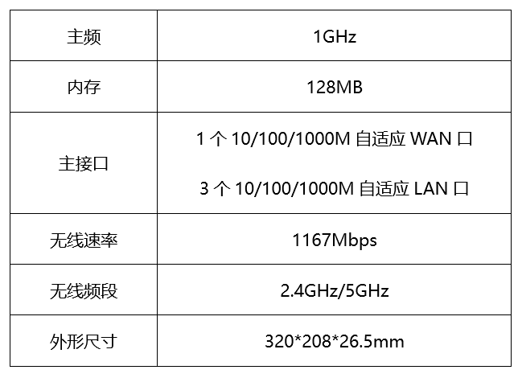

- **A**. 主频是路由器中央处理器的时钟频率
- **B**. 此款路由器属于千兆无线路由器
- **C**. 路由器的LAN口可以用来连接外网　✅
- **D**. 5GHz频段比2.4GHz频段传输距离短

**答案**：C

**官方解析**

本题考查科技常识。
A项正确，主频也叫时钟频率，用来表示中央处理器的运算速度，常见的单位有Hz、kHz、MHz和GHz。
B项正确，千兆无线路由器指无线传输速率达到1Gbps以上（1000Mbps以上）的无线路由器，图中所示路由器的无线传输速率为1167Mbps，属于千兆无线路由器。
C项错误，WAN是英文Wide Area Network的首字母缩写，即代表广域网；而LAN则是Local Area Network的缩写，即本地网（或叫局域网）。WAN口主要用于连接外部网络，如ADSL、DDN、以太网等各种接入线路；而LAN口用来连接家庭内部网络，主要与家庭网络中的交换机、集线器或PC相连。
D项正确，频段越高，信号衰减越快，传输距离就会越短。5GHz的频段比2.4GHz高，因此5GHz频段比2.4GHz频段传输距离短。
本题为选非题，故正确答案为C。

---

### 第 14 题　qid 2719327 · 科技常识

下列与生物灾害有关的说法错误的是：

- **A**. 中国蝗灾最严重的地区是两湖地区　✅
- **B**. 稻飞虱的天敌有蜘蛛、青蛙
- **C**. 松毛虫在高温干旱环境下更易繁殖
- **D**. 鼠类会啃食庄稼的茎、叶、根和种子

**答案**：A

**官方解析**

本题考查科技常识。
A项错误，蝗灾主要是由干旱引起的，我国历史上曾发生过多次蝗灾，其地域分布主要集中在今河北、河南、山东三省，两湖地区比较湿润，不是蝗灾最严重的地区。
B项正确，稻飞虱是水稻上重要害虫之一，其天敌可分为捕食性天敌，如蜘蛛、青蛙等，寄生性天敌，如缨小蜂、白僵菌等。
C项正确，松毛虫是严重威胁落叶松林的森林害虫，食量大，繁殖力强，干旱是造成松毛虫大暴发的最重要的因素之一。
D项正确，鼠类为杂食性动物，农作物从种到收全过程和农产品贮存过程中都可能遭受其害。鼠类主要破坏植物的地下根茎为主，也啃食地上部分的花和叶、种子等。
本题为选非题，故正确答案为A。

---

### 第 15 题　qid 2719328 · 人文常识

下列与口罩相关的说法正确的是：

- **A**. 纱布口罩可达到防雾霾的效果
- **B**. 活性炭口罩可吸附过滤空气中的甲醛　✅
- **C**. 医用外科口罩是医用口罩中防护等级最高的一类
- **D**. 在成分不明的毒气污染环境中应佩戴过滤式防毒口罩

**答案**：B

**官方解析**

本题考查科技常识。

A项错误，雾霾天气是对大气中各种悬浮颗粒物含量超标的笼统表述，PM2.5（空气动力学当量直径小于等于2.5微米的颗粒物）被认为是造成雾霾天气的“元凶”，而普通纱布口罩对于直径小于2.5微米的空气颗粒基本起不到过滤作用。

B项正确，活性炭是一种粉状、粒状或丸状的无定形具有多孔的碳，用其制成的口罩有很强的吸附性能，可以用来吸附过滤空气中的甲醛等有毒有害气体。

C项错误，目前我国医用口罩主要分为3种：医用防护口罩、医用外科口罩、一次性使用医用口罩，其中防护级别最高的是“医用防护口罩”，可过滤空气中的微粒，阻隔飞沫、血液、体液、分泌物等污染物，对非油性颗粒的过滤效率可达到以上。

D项错误，过滤式防毒口罩是通过滤毒药剂等滤除空气中的有毒气体再供人呼吸。滤毒药剂只能在确定了毒物种类、浓度、气温和一定的作业时间内起防护作用。所以过滤式防毒口罩不能用于成分不明的毒气污染环境。

故正确答案为B。

---

### 第 16 题　qid 2719332 · 科技常识

干热岩是埋深数千米的高温岩体，属于一种新兴的地热能源。下列有关说法正确的是：

- **A**. 我国在青藏高原首次发现大规模可利用的干热岩资源　✅
- **B**. 注入低温水回收高温水的干热岩利用过程发生了能量转化
- **C**. 干热岩发电技术已在世界多个国家的工业生产中普遍应用
- **D**. 干热岩的开发利用过程中容易产生导致酸雨的污染气体

**答案**：A

**官方解析**

本题考查科技常识。

干热岩（HDR），也称增强型地热系统（EGS），或称工程型地热系统，是埋深数千米，内部不存在流体或仅有少量地下流体的高温岩体。

A项正确，2014年，我国青海地勘人员在青海共和盆地成功钻获温度高达的干热岩。这是我国首次发现大规模可利用干热岩资源。

B项错误，在干热岩利用过程中，注入井将低温水输入热储水库中，经过高温岩体加热这一过程并未发生能量转化，只发生热能的传递。

C项错误，干热岩发电技术属于新兴环保发电技术，该技术尚未成熟，该项中“普遍应用”表述错误。

D项错误，干热岩是指一种没有水或蒸汽的热岩体，主要是各种变质岩或结晶岩类岩体，属清洁能源，可用于地热发电。在干热岩地热发电系统中不排放废水、废物、废气，对环境基本没有影响。因此，干热岩发电技术可大幅降低温室效应和酸雨对环境的影响，且不受季节、气候制约。

故正确答案为A。

---

## 言语理解与表达

### 第 1 题　qid 2719292 · 逻辑填空

发展扶贫产业不能眉毛胡子一把抓，必须立足当地自然禀赋，挖掘地方特色资源，按照“宜种则种、宜养则养”的原则，注重发展山地农业、生态农业、观光农业等特色产业，学会“靠山吃山唱山歌，靠海吃海念海经”，谨防产业“            ”。应该看到，适合的才是最好的。
填入画横线部分最恰当的一项是：

- **A**. 急功近利
- **B**. 水土不服　✅
- **C**. 削足适履
- **D**. 千篇一律

**答案**：B

**官方解析**

由“学会‘靠山吃山唱山歌，靠海吃海念海经’”“适合的才是最好的”可知，文段强调发展产业要能适应当地情况，即具备适应性，根据横线前“谨防”可知，横线处表达意思与适应性相反，B项“水土不服”指对于一个地方的气候条件或饮食习惯不能适应，符合文意，并且“水土不服”体现出一种拟人的形象表达，为最佳答案，当选。
A项“急功近利”指急于求得成效，贪求眼前利益，文段没有体现追求利益之意，与文意不符，排除；
C项“削足适履”比喻不合理的迁就凑合或不顾具体条件，生搬硬套，该词重在强调对自身特性加以摒弃，以迁就适应外在事物，与文意不符，且无法与文段“靠山吃山唱山歌，靠海吃海念海经”形成形象表达呼应，排除；
D项“千篇一律”指千篇文章都是一个模式，泛指事物只有一种形式，“谨防”表达的是多种多样的意思，但并不能对应文段“适合的才是最好的”，体现不出无法适应之意，与文意不符，排除。
故正确答案为B。
【文段出处】《以产业扶贫增强贫困地区造血功能》

---

### 第 2 题　qid 2719300 · 逻辑填空

“人民城市人民建”。搭建民意“直通车”、公众“议事厅”，有事好商量，大家来出力，很多工作就能做到            。比如上海能在短短一年内迅速形成垃圾分类的新风尚，靠的就是人民群众的主动性、积极性与创造性。
填入画横线部分最恰当的一项是：

- **A**. 立竿见影
- **B**. 事半功倍　✅
- **C**. 万无一失
- **D**. 尽善尽美

**答案**：B

**官方解析**

根据横线后“比如”可知，后文是横线处的解释说明。根据“在短短一年内迅速形成垃圾分类的新风尚”可知，横线处想体现的是花费较少时间与投入就能取得很好的效果之意。加之前文中的“大家来出力”强调合作的重要性，进而带来效率的提升。B项“事半功倍”形容费力小，收效大，符合文意，当选。
A项“立竿见影”意为把竹竿竖在阳光下，立刻可以看到影子，比喻收效迅速，见效很快，用于此处程度过重，与后文的“一年内”表述不符，排除；
C项“万无一失”形容有绝对把握，绝对不出差错，文段未提及做工作时有没有差错，排除；
D项“尽善尽美”意为极其完善，极其美好，形容事物完美无缺，文段未提及工作是否完美，且“尽善尽美”放入此处程度过重，排除。
故正确答案为B。
【文段出处】《马上评｜人民，就是这座城市的尺度》

---

### 第 3 题　qid 2719309 · 逻辑填空

在芯片、操作系统等很多方面，我们需要下定决心，攻坚克难，自力更生。因为一旦核心技术受制于人，就有被人“            ”的威胁。所以，我们要有“宝剑锋从磨砺出，梅花香自苦寒来”的定力，逐渐形成一批拥有自主知识产权的核心技术和产业，把发展的主动权牢牢掌握在自己手中。
填入画横线部分最恰当的一项是：

- **A**. 过河拆桥
- **B**. 落井下石
- **C**. 一网打尽
- **D**. 釜底抽薪　✅

**答案**：D

**官方解析**

根据“核心技术受制于人”“把发展的主动权牢牢掌握在自己手中”可知，核心技术对我国非常重要，一旦被他人控制，我国就会有根基被动摇的威胁，D项“釜底抽薪”比喻从根本上解决问题，此处加上双引号为形象表达，体现出我国的核心技术一旦受制于人，将会被别国“釜底抽薪”，从根本上制约我国发展，符合文意，当选。
A项“过河拆桥”比喻达到目的以后，就把曾经帮助过自己的人一脚踢开，该词中的“拆桥”未必是根本性的重要方面，相较于“釜底抽薪”来看，没有直接体现出“核心技术”的根本性重要性，排除；
B项“落井下石”比喻乘人有危难时加以陷害，文中并未提及我们当下已经出现危难的情况，与文意不符，排除；
C项“一网打尽”比喻全部抓住或消灭，用以形容核心技术受制于人的结果，程度过重，排除。
故正确答案为D。
【文段出处】《谨防受制于人的历史在智能时代重演》

---

### 第 4 题　qid 2719317 · 逻辑填空

中国道路的成功开创不仅创造了中国奇迹，而且创造了中国经验。中国经验无疑是中国智慧的结晶，具有鲜明的          。但是，中国经验作为中国道路的积极成果，也是在遵循历史发展和现代化发展规律、吸收世界发展经验教训的基础上形成的，它是对人类文明发展进行探索的重要产物，反映了人类文明进步的规律，因而又具有一定的          。
依次填入画横线部分最恰当的一项是：

- **A**. 地域性  国际性
- **B**. 实践性  理论性
- **C**. 特殊性  普遍性　✅
- **D**. 先进性  创新性

**答案**：C

**官方解析**

本题可从第二空入手，横线前的“因而”体现因果关系，根据前文“遵循历史发展和现代化发展规律、吸收世界发展经验教训的基础上形成的，它是对人类文明发展进行探索的重要产物，反映了人类文明进步的规律”可知，中国经验虽然是中国创造的，但也是在整个世界和人类的经验教训基础上的产物，故具有普适性，A项“国际性”、C项“普遍性”均符合文意，保留。B项“理论性”侧重于强调理论有系统性，文中未提及，排除；D项“创新性”指事物具有创造性或新意，文中未提及，排除。
第一空，根据“中国经验无疑是中国智慧的结晶”可知，“中国经验”属于中国特有的智慧，C项“特殊性”指事物特有的、不同于其他事物或一般情况的性质，符合文意，当选。A项“地域性”指某类事物局限于某一地理区域的情况，与后文“吸收世界发展经验教训的基础上形成的”相矛盾，排除。
两个空综合来看，文段以“但是”衔接，前后构成转折，填入的两个词语“特殊性”与“普遍性”也刚好形成语义相反，符合文段逻辑。
故正确答案为C。
【文段出处】光明日报《唯物史观视域中的中国道路》

---

### 第 5 题　qid 2719324 · 逻辑填空

“为调研而调研”等现象的出现，很大程度上就在于调研不深入、不具体。现实中，有人了解情况习惯于大而化之、            ；有人调研习惯于走设计“路线”，            。这些心中不揣问题、脚下不沾泥土的错误做法，导致调研不深、不实、不细、不准，最终也会无效。
依次填入画横线部分最恰当的一项是：

- **A**. 粗枝大叶  按部就班　✅
- **B**. 走马观花  表里不一
- **C**. 轻描淡写  循规蹈矩
- **D**. 避重就轻  按图索骥

**答案**：A

**官方解析**

第一空，根据横线前的“、”可知，横线处所填成语与“大而化之”构成并列关系，体现出做事情不够谨慎，疏忽大意之意。A项“粗枝大叶”比喻工作不认真，不细致，马虎大意，B项“走马观花”比喻粗略地观察事物，均符合文意，保留。C项“轻描淡写”多指说话写文章把重要问题轻轻带过，不加重视，文段侧重“了解情况”，与“轻描淡写”搭配不当，排除；D项“避重就轻”指避开重要的而拣次要的来承担，也指回避主要的问题，只谈无关重要的方面，侧重强调主要和次要问题，文段并无主要和次要的对应，排除。
第二空，根据横线前“有人调研习惯于走设计路线”可知，横线处要体现出按规定路线做事之意，A项“按部就班”指按老规矩办事，缺乏创新精神，符合文意，当选。B项“表里不一”指表面与内在不一样，侧重强调表面和内在不同，文段并无表面与内在的对应，排除。
故正确答案为A。
【文段出处】《发扬调查研究好作风》

---

### 第 6 题　qid 2719330 · 逻辑填空

探索和形成一个好的制度不容易，关键是毫不动摇地坚持和巩固、与时俱进地完善和发展、            地遵守和执行。这要求我们要把制度像种子一样种在头脑里，如红线一般        于工作中。这样才能推动中国特色社会主义制度更加成熟、更加定型，将制度优势转化为强大的治理效能，通达“中国之治”的新天地。
依次填入画横线部分最恰当的一项是：

- **A**. 坚定不移  渗透
- **B**. 一丝不苟  应用
- **C**. 不折不扣  贯穿　✅
- **D**. 矢志不渝  根植

**答案**：C

**官方解析**

本题可从第二空入手，根据横线前“像种子一样种在头脑里，如红线一般”可知，横线处所填词语与“红线”对应，体现“红线”的特性。C项“贯穿”指穿过，连通，符合文意，保留。A项“渗透”指某种事物或势力逐渐进入其他方面，B项“应用”指适用需要，以供使用，D项“根植”指扎根，均与“红线”特性不符，排除。
第一空，代入验证，C项“不折不扣”指不打折扣，表示完全、十足、彻底，可形容遵守和执行制度的态度，搭配恰当，当选。
故正确答案为C。
【文段出处】《解码“中国之治”的制度优势》

---

### 第 7 题　qid 2719336 · 逻辑填空

一根网线、一部手机，把偏远的贫困地区链接进了广阔的大市场。电商扶贫，不是        地把农产品搬到网上，更在深层次地倒逼农业产业转型升级，进而扩展到其他相关领域，创建出中国式扶贫的新        。
依次填入画横线部分最恰当的一项是：

- **A**. 简单  范本　✅
- **B**. 盲目  方向
- **C**. 机械  蓝图
- **D**. 被动  模式

**答案**：A

**官方解析**

第一空，横线处形容“把农产品搬到网上”的行为，由“不是······更”可知，横线处与“深层次”语义相反，体现出做法浅显之意，A项“简单”可体现出没有深层次内涵之意，符合文意，保留。B项“盲目”意为认识不清，反义为认知清晰，与文意不符，排除；C项“机械”意为方式拘泥死板，反义为灵活变通，与文意不符，排除；D项“被动”意为被外力推进而行动，反义为主动，与文意不符，排除。
第二空，代入验证，A项“范本”指典范的样本，与“创建”搭配恰当，符合文意，当选。
故正确答案为A。
【文段出处】《电商扶贫创建中国式扶贫新范本》

---

### 第 8 题　qid 2719340 · 逻辑填空

在实际应用中，专网通常服务于政府、军队、公安、能源、消防、轨道交通等部门或领域，大部分情况下被用来进行应急通信、调度指挥。性能可靠、低成本、定制化的特点，使其在行业应用中具备            的优势。即便5G时代呼啸而来，专网依旧能够找到            。
依次填入画横线部分最恰当的一项是：

- **A**. 独具一格  立足之地
- **B**. 众所周知  一席之地
- **C**. 不可替代  用武之地　✅
- **D**. 显而易见  立锥之地

**答案**：C

**官方解析**

第一空，横线处搭配“优势”，且对应前文“性能可靠、低成本、定制化的特点”，A项“独具一格”意为另有一种独特的风格，C项“不可替代”意为无法被代替，D项“显而易见”形容事情一下就能看清楚，放入此处均可形容专网特点带来的优势，符合文意，保留。B项“众所周知”意为许多人都知道，侧重大家都知道，与前文专网的特点对应不当，排除。
第二空，根据前文“使其在行业应用中具备······优势”可知，横线处体现的是专网在5G时代依然能够应用，C项“用武之地”比喻可以施展自己才能的地方或机会，能够体现“应用”之意，符合文意，当选。A项“立足之地”指容身的地方，D项“立锥之地”指很小的安身地方，均强调有安身之处，无法体现“应用”之意，与文意不符，排除。
故正确答案为C。
【文段出处】《有了5G，我们还需要专网吗》

---

### 第 9 题　qid 2719323 · 逻辑填空

信息匮乏的年代，决策水平与信息量成正相关，但当信息从匮乏走向过载甚至“爆炸”时，决策质量与信息量间的函数曲线便开始下滑，利用繁杂信息形成        判断变得难上加难。此时，智能化就可以大显身手，计算智能未必能在逻辑能力上逾越人类，但其强大的处理速度却恰好使信息过载带来的决策困境            。
依次填入画横线部分最恰当的一项是：

- **A**. 理性  烟消云散
- **B**. 准确  迎刃而解　✅
- **C**. 科学  不复存在
- **D**. 有效  无影无踪

**答案**：B

**官方解析**

本题可从第二空入手，根据“智能化就可以大显身手”可知，横线处所填词语应表达计算智能强大的处理速度可以解决信息过载带来的问题，B项“迎刃而解”比喻主要的问题解决了，其他有关的问题就可以很容易地得到解决，可体现问题被解决，符合文意，保留。A项“烟消云散”形容事物消失净尽，C项“不复存在”指不会再次出现或拥有，D项“无影无踪”形容完全消失，不知去向，均重在强调问题彻底消失、不存在，文段侧重强调问题能被解决，而非问题彻底消失、不再出现，故三项程度均过重，排除。
第一空，代入验证B项，“利用繁杂信息形成准确判断变得难上加难”符合文意，当选。
故正确答案为B。
【文段出处】《认知域下智能化战争制胜机理》

---

### 第 10 题　qid 2719335 · 逻辑填空

一些国家在实现自身现代化过程中选错了参照系，将发达国家有什么、做什么作为实现自身现代化的        ，导致在向市场经济转型过程中经济停滞、崩溃，危机不断。而中国能够根据自己的要素禀赋条件，发挥政府在市场经济中            的作用，把自己能做好的产业做大做强，将比较优势变成竞争优势，从而推动经济长期稳定快速发展。
依次填入画横线部分最恰当的一项是：

- **A**. 目标  因势利导　✅
- **B**. 原则  总揽全局
- **C**. 模本  穿针引线
- **D**. 途径  保驾护航

**答案**：A

**官方解析**

第一空，根据横线前“参照系”可知，横线处所填词语应体现一些国家将发达国家作为自己实现现代化的参考、样本，A项“目标”指想要达到的境地或标准，C项“模本”指供临摹用的底本，用在此处均可体现一些国家模仿参照发达国家之意，符合“参照系”语境，保留。B项“原则”指说话或行事所依据的法则，发达国家的做法仅是一些国家发展中的参考，而非准则，程度过重，排除；D项“途径”指方法、路子，前文“将发达国家······作为”与“途径”搭配不当，“发达国家”不能直接成为“途径”，排除。
第二空，横线处同时搭配前文的“政府”与后文的“作用”，且根据前文“中国能够根据自己的要素禀赋条件”可知，横线处意在表达政府在市场经济中根据自身条件积极发挥作用。A项“因势利导”指顺着事情的发展趋势加以引导，符合文意，当选。C项“穿针引线”比喻从中撮合、联系，使双方接通关系，政府并不会直接进入市场促成商业合作，而是会宏观调控，与文意不符，排除。
故正确答案为A。
【文段出处】《中国发展带来的几点启示》

---

### 第 11 题　qid 2719342 · 逻辑填空

每个民族都有自己独特的民俗文化，然而，一些人分不清具体的民族文化和民俗文化，加之有人为了在短时间内推出本民族民俗文化，盲目迎合当下的流行需要，反而使自己的民俗文化变得            ，出现“雷同化”传播现象，使大众对不同区域的特色民俗文化认知较为        ，影响大众对民俗文化的了解和兴趣，进而在一定程度上影响少数民族地区的经济发展。
依次填入画横线部分最恰当的一项是：

- **A**. 支离破碎  肤浅
- **B**. 不伦不类  模糊　✅
- **C**. 名存实亡  混乱
- **D**. 面目全非  狭隘

**答案**：B

**官方解析**

本题可从第二空入手，根据“一些人分不清具体的民族文化和民俗文化”“出现‘雷同化’传播现象”可知，人们对不同地区的特色民俗文化分辨不清，B项“模糊”、C项“混乱”，均符合文意，保留。A项“肤浅”指学识浅或理解不深，强调不深入、不深刻，D项“狭隘”指（心胸、气量、见识等）局限于一个小范围里，强调不宽广，均与文意无关，排除。
第一空，横线处词语修饰“民俗文化”，根据“每个民族都有自己独特的民俗文化”“盲目迎合当下的流行需要”“出现雷同化传播”可知，民俗文化本来应是各不相同，但现在为了迎合流行需要，最终导致其失去自身的特色，不同的民俗文化之间难以区分、四不像，B项“不伦不类”指不像这一类，也不像那一类，形容不成样子或不规范，符合文意，当选。C项“名存实亡“指名义上还存在，实际上已消亡，文段并未体现民俗文化已消亡，故与文意不符，排除。
故正确答案为B。
【文段出处】《少数民族民俗文化品牌的保护与传播》

---

### 第 12 题　qid 2719348 · 逻辑填空

近代以来，怎样处理中国传统文化与西方文化的关系，成为很多学者关注的重要问题。有人主张全盘西化，也有人主张全面恢复传统。这些        的观点当然受到了当时历史环境的影响，但也暴露出一些人在思维模式上的局限，即用            的思维来看待复杂的文化现象。这种思维模式在今天的研究中依然不同程度地存在。
依次填入画横线部分最恰当的一项是：

- **A**. 荒谬  泾渭分明
- **B**. 偏颇  非此即彼　✅
- **C**. 片面  针锋相对
- **D**. 极端  水火不容

**答案**：B

**官方解析**

第一空，横线前出现指代词“这些”，根据前文“有人主张全盘西化，也有人主张全面恢复传统”可知，在处理中国传统文化与西方文化关系的问题上，人们的观点分为两派，要么“全盘西化”，要么“全面恢复传统”，B项“偏颇”指偏向一方，不公平，不公正，C项“片面”指不全面，D项“极端”含偏激之意，均符合文意，保留。A项“荒谬”指极端荒唐，非常不合情理，程度过重，排除。
第二空，横线处修饰“思维”，即人们看待复杂文化现象的想法，根据前文可知，人们要么全盘西化，要么全面恢复传统，看问题不够全面，比较单一，B项“非此即彼”指不是这一个，就是那一个，能够体现出片面之意，符合文意，当选。C项“针锋相对”比喻双方意见、观点等尖锐对立，如“谈判双方针锋相对”，D项“水火不容”比喻二者对立，绝不相容，如“虚拟世界与现实世界并非水火不容”，二者均强调两个主体对立的状态，而横线处修饰的是人们看待复杂文化现象的思维，这种思维应是每一个人的想法，而非两个主体，故搭配不当，排除。
故正确答案为B。
【文段出处】《为政治文明发展提供滋养》

---

### 第 13 题　qid 2719352 · 逻辑填空

从生态学角度来讲，人工种群和野外种群是完全不同的概念。大型哺乳动物行为复杂，其生活技巧人类难以传授，又难以“无师自通”。如果        将其放归野外，结局很可能是死亡。就算可以放归野外，也必须为他们找到        的栖息地。
依次填入画横线部分最恰当的一项是：

- **A**. 贸然  合适　✅
- **B**. 直接  天然
- **C**. 草率  理想
- **D**. 随意  安全

**答案**：A

**官方解析**

本题可从第二空入手，搭配“栖息地”，且根据前文“如果······将其放归野外，结局很可能是死亡”可知，简单的将其放归野外不够，还需找到能使其生存的栖息地，故横线处表达适宜、符合要求的含义。A项“合适”即适宜、符合客观要求，置于文段能体现找到适合“大型哺乳动物”生存的栖息地的意思，保留。B项“天然”即自然存在的野外，体现不出适宜、能使其生存的含义，排除。C项“理想”一方面指对未来事物的想象或希望，文段并未体现出对未来的希望，另一方面强调使人满意，文段强调的是找到适合“大型哺乳动物”生存的栖息地，而不是强调找到让“人”满意的栖息地，因此“理想”与文意不符，排除。D项“安全”即没有危险，但除了栖息地安全还需要食物等才能生存，表述片面，排除。
第一空，代入验证，A项“贸然”即轻率、不加考虑，填入语义恰当，当选。
故正确答案为A。
【文段出处】《专家呼吁像保护大熊猫一样保护雪豹》

---

### 第 14 题　qid 2719357 · 逻辑填空

噬菌体是一种侵袭细菌的病毒，虽然它们很早就被发现，但由于一次只能攻击一种特定的细菌而未受关注。然而，曾经不那么受欢迎的          ，如今却成了它们最大的吸引力。由于过度使用抗生素，人类无意中        了目前最强大、最具耐药性的超级细菌，而噬菌体无疑是对付它们的潜在有效武器。
依次填入画横线部分最恰当的一项是：

- **A**. 敏感性  培育
- **B**. 特异性  催生　✅
- **C**. 单一性  激活
- **D**. 局限性  发现

**答案**：B

**官方解析**

第一空，根据前文“由于一次只能攻击一种特定的细菌而未受关注”可知，横线处表达噬菌体不受欢迎的特性，B项“特异性”、C项“单一性”、D项“局限性”均可表达其一次只能攻击一种特定细菌的特点，保留。A项“敏感性”即感觉敏锐，与“一次只能攻击一种特定的细菌”无关，体现不出噬菌体的特点，排除。
第二空，搭配“最强大、最具耐药性的超级细菌”，横线处要表达由于人类过度使用抗生素，促使细菌进化，产生了最具耐药性的超级细菌的含义，B项“催生”即促使诞生，符合文意，当选。C项“激活”即刺激使其活跃，D项“发现”即经过研究找到没看到的事物，一般均搭配原本就存在的事物，但是文段中超级细菌本身是不存在的，是由于人类过度使用抗生素才进化出来的细菌，搭配不当，排除。
故正确答案为B。
【文段出处】《噬菌体：可对抗超级耐药菌的病毒“卷土重来”》

---

### 第 15 题　qid 2719359 · 逻辑填空

现代社会获取盐分轻而易举，以至于人们认为吃盐是            的事情。而事实上，由于盐在地理上的分布不均以及交通不畅等原因，其在古代一直都属于        之物。在人类历史上的绝大部分时间里，人们都在寻找盐，甚至令盐业成为了历史上第一个由国家垄断的产业。可以说，盐贯穿着整个人类历史，并在人类文明的发展中起到了            的作用。
依次填入画横线部分最恰当的一项是：

- **A**. 稀松平常  必需  举足轻重
- **B**. 理所当然  稀缺  至关重要　✅
- **C**. 天经地义  关键  承上启下
- **D**. 手到擒来  珍贵  一以贯之

**答案**：B

**官方解析**

第一空，由“现代社会获取盐分轻而易举”可知，人们认为吃盐是很方便、容易的事情。A项“稀松平常”指事情很平常，并没有特别的地方，B项“理所当然”指应该是这样的，合乎情理，D项“手到擒来”指做事有把握，不费力，均符合文意，保留。C项“天经地义”指非常正确、不容置疑的道理，程度过重，排除。
第二空，根据“盐在地理上的分布不均以及交通不畅等原因”以及“人们都在寻找盐”可知，食盐在古代一直是较为稀少、罕见的物品。B项“稀缺”指稀少、短缺，符合文意，保留。A项“必需”指一定要有，不可缺少，D项“珍贵”指价值大、意义深刻，均无法体现“罕见”的意思，与文意不符，排除。
第三空，代入验证，由文段可知，横线想要表明盐对人类文明的发展起到了重要作用，B项“至关重要”指对于某人或某事起着关键性作用，符合文意，当选。
故正确答案为B。
【文段出处】《如果历史有味道，那一定是咸的！》

---

### 第 16 题　qid 2719364 · 逻辑填空

亲近百姓、接近生活是曲艺这门艺术的生命力所在。当然，任何人都不可能        生活的全部，所以创作者才有了“采风”一说。采风从来不是去        生活，而是深入其中，体会其中的乐与悲。然而，现在许多曲艺工作者没有耐心去深入百姓生活，于是只能写自己熟悉的生活，创作能力无疑也受到了        。
依次填入画横线部分最恰当的一项是：

- **A**. 描摹  评判  质疑
- **B**. 洞察  记录  束缚
- **C**. 掌握  体验  削弱
- **D**. 了解  审视  限制　✅

**答案**：D

**官方解析**

第一空，根据文意可知，横线意在表明人们不可能知道并熟悉生活的全部内容。B项“洞察”指很清楚地观察，C项“掌握”指了解事物，因而能充分支配或运用，D项“了解”指知道得很清楚，均符合文意，保留。A项“描摹”指用语言文字表现人或事物的形象、情状、特性等，或指照着底样写和画，与文意不符，排除。
第二空，由“采风从来不是······而是······”可知，横线处词语应与“深入其中”“体会其中的乐与悲”语义相反，表达仅停留在表面，不深入其中的意思。D项“审视”指仔细看，侧重强调停留在“看”的层面，能体现出不深入的意思，符合文意，保留。B项“记录”指把听到的话或发生的事写下来，“记录生活”本身就属于“采风”的一部分，“采风不是记录生活”表述不当，排除；C项“体验”指通过实践来认识周围的事物，与后文“深入其中”语义相近，无法构成反义并列，排除。
第三空，代入验证，由“只能写自己熟悉的生活”可知，曲艺工作者的创作范围局限在自己熟悉的领域内，D项“限制”指规定范围，符合文意，当选。
故正确答案为D。
【文段出处】《小品&lt;办公室的故事&gt;终获北京文学艺术奖》

---

### 第 17 题　qid 2719305 · 逻辑填空

上世纪八十年代初，SCI作为一种        的、相对公平的量化指标被引进中国，这是建立科学、公平、公正的高校科研评价体系的初步尝试，在当时是一种进步。但如果启用先进的考核举措而长期            ，甚至演变成“至上”的法宝和单一的指挥棒，最终都会            ，弊大于利。
依次填入画横线部分最恰当的一项是：

- **A**. 详细  奉为圭臬  画地为牢
- **B**. 稳定  唯命是从  作茧自缚
- **C**. 客观  一成不变  物极必反　✅
- **D**. 中立  墨守成规  贻笑大方

**答案**：C

**官方解析**

第一空，根据“、”可知，横线处内容应与“相对公平”语意相近。C项“客观”、D项“中立”均可体现“相对公平”之意，保留。A项“详细”、B项“稳定”和“相对公平”无关，排除。
第二空，根据“甚至”可知，横线处应比“演变成‘至上’的法宝和单一的指挥棒”程度更轻，C项“一成不变”指守旧不变或者固守陈法，D项“墨守成规”表示思想保守、守着老规矩不肯改变，均符合文意，保留。
第三空，根据文意，“先进的考核举措”最后的结果是“弊大于利”，体现出“先进的考核举措”没有得到好的效果。C项“物极必反”指事物发展到极点，会向相反方向转化，符合文意，当选。D项“贻笑大方”指让内行人笑话，文段未提及“内行人”，与文意不符，排除。
故正确答案为C。
【文段出处】《破除 “SCI至上”：不是否定SCI，更不是反对发论文》

---

### 第 18 题　qid 2719318 · 逻辑填空

医生和患者在沟通时最容易出现的        其实是，患者不同意或没听懂医生的建议，又因为不想被说教或觉得尴尬而没有如实反馈意见，而医生也大多没有意识到这一点。这显然会大大影响临床诊疗的        。此外，患者还会由于不想被说教而不承认一些不良生活行为。越是健康状况差的患者，越是容易        一些信息，而他们恰恰是最需要高质量医疗服务的人。
依次填入画横线部分最恰当的一项是：

- **A**. 难点  结果  遗漏
- **B**. 盲区  效率  隐瞒　✅
- **C**. 障碍  判断  虚构
- **D**. 瓶颈  目的  回避

**答案**：B

**官方解析**

从第二空入手，根据横线前“这”指代前文“医生没有意识到患者没有如实反馈”这件事，可知横线处应表达“此事”对“临床诊疗”造成了影响。A项“结果”、B项“效率”、C项“判断”均符合文意，保留。D项“目的”，无论受影响与否，“临床诊疗”的“目的”都应是一致的，与文意不符，排除。
第三空，根据“患者······不承认一些不良生活行为”可知“越是健康状况差的患者”越不想承认，故横线处体现出“不承认”之意，B项“隐瞒”意思是掩盖真相不让人知道，符合文意，保留。A项“遗漏”意思是应该列入或处理却因疏忽而没有列入或处理，文段是患者自己不想承认并非因为疏忽，与文意不符，排除；C项“虚构”是指凭空捏造，文中只是患者不承认已有的行为，未体现出“凭空捏造”，与文意不符，排除。
第一空，代入验证，B项“盲区”刚好和后文“医生也大多没有意识到这一点”形成呼应，符合文意，当选。
故正确答案为B。
【文段出处】《看病的时候敢跟医生说谎？这样的人还不少》

---

### 第 19 题　qid 2719326 · 逻辑填空

内太阳系的岩石行星与外太阳系的气态行星最初的物质构成            。科学家此前认为，由于木星质量大、引力强，可以在一些物质到达内太阳系之前将其        ，阻止了内外太阳系物质的混合。但研究表明，木星的成长速度不足以阻止外太阳系物质源源不断流入内太阳系，这意味着内外太阳系行星将拥有        的成分。
依次填入画横线部分最恰当的一项是：

- **A**. 大同小异  阻拦  共同
- **B**. 相去甚远  消灭  全新
- **C**. 千姿百态  捕获  独特
- **D**. 大相径庭  吞噬  类似　✅

**答案**：D

**官方解析**

本题可从第三空入手，尾句指代词“这”指代前文“木星的成长速度不足以阻止外太阳系物质源源不断流入内太阳系”，由此可知，内太阳系中可能掺杂外太阳系的物质，所以内外太阳系行星的成分可能有相似之处，A项“共同”形容彼此都具有的，D项“类似”形容大致相像，均符合文意，保留。B项“全新”与C项“独特”均体现不一样的语义，与文意不符，排除。
第一空，由后文转折词“但”可知，转折前后语义相反，转折后指出现在研究发现内外太阳系的行星成分有相似之处，故转折前应表达二者最初成分不同，D项“大相径庭”比喻相差很远，大不相同，符合文意，保留。A项“大同小异”指大体相同，略有差异，体现出的差异很小，与文意不符，排除。
第二空，代入验证。D项“吞噬”比喻吞并湮灭，符合文意，当选。
故正确答案为D。
【文段出处】《将太阳系一分为二的“守门员”并非木星》

---

### 第 20 题　qid 2719337 · 逻辑填空

随着各种侦察手段的不断演进，可视侦察、红外侦察、雷达侦察等“            ”，现代坦克在战场上越来越难以藏身。对此，现代坦克当然不会“            ”。在讲求“发现即摧毁”的现代战场上，坦克必须实现对侦察手段的“免疫”，见招拆招，            ，让对手对自己庞大的身躯“视若无睹”。
依次填入画横线部分最恰当的一项是：

- **A**. 齐头并进  束手就擒  对症下药
- **B**. 大显身手  自暴自弃  见机行事
- **C**. 虎视眈眈  坐以待毙  有的放矢　✅
- **D**. 明察秋毫  知难而退  多管齐下

**答案**：C

**官方解析**

第一空，根据前文“各种侦察手段的不断演进，可视侦察、红外侦察、雷达侦察”和后文“现代坦克在战场上越来越难以藏身”可知，各种侦察手段的发展导致坦克很难不被发现，故横线处所填成语应体现出侦察能力强劲的语义，B项“大显身手”形容充分地显示出本领和才能，符合文意，保留；C项“虎视眈眈”意思是像老虎那样凶狠地盯着，形容心怀不善，伺机攫取，此处由于双引号可表形象表达，将各种侦察手段拟人化，对坦克心怀不善，符合文意，且“视”和“侦察”前后呼应，保留。A项“齐头并进”形容有几个事情或一个事情多方面不分先后地同时进行，D项“明察秋毫”侧重强调任何细小的事物都能看得很清楚，后多形容人能洞察事理，均与文意不符，排除。
第二空，根据横线前指代词“此”，指代前文各种侦察手段不断演进导致坦克难以藏身的状况，以及后文“见招拆招”可知，面对如此情况，坦克需要想解决办法，而不能放弃隐藏，又因横线前出现否定词“不会”，故横线处所填成语需体现出放弃抵抗的语义，C项“坐以待毙”指坐着等死，形容在极端困难中，不积极想办法找出路，符合文意，保留。B项“自暴自弃”形容自己甘心落后，不求上进，与文意不符，排除。
第三空，代入验证。C项“有的放矢”比喻说话、做事有针对性，与前文“见招拆招”构成并列，即坦克能有针对性地应对各种侦察招式，符合文意，当选。
故正确答案为C。
【文段出处】中国军网《盘点现代坦克隐身技巧》

---

### 第 21 题　qid 2719344 · 片段阅读

“藏粮于地、藏粮于技”是习近平总书记对粮食安全的战略部署，“软硬件”同时发力将助力提升农业生产率和土地产出率。随着现代科技手段的注入，农业科技创新既帮助农民不断克服疫情带来的影响，又让农业生产更加精准高效。袁隆平的超级杂交水稻、李登海的紧凑型杂交玉米······一批又一批领先国际的粮食品种不断被培育出来。从地瘠“斗笠田”到丰产“吨粮田”，从“汗滴禾下土”到“无接触式春耕”，从“灾殃难测”到“高科技防灾”，现代科技为我国农耕注入了“硬核生产力”。这就意味着粮食丰收，库存充裕，藏粮于民，才会国泰民安。
最适合做这段文字标题的是：

- **A**. 民为国基，谷为民命
- **B**. 粮食生产“稳”字当头
- **C**. 藏粮于民，才能国泰民安
- **D**. 提升科技水平，保障粮食安全　✅

**答案**：D

**官方解析**

文段首先用习近平总书记的战略部署引出粮食的话题。接着通过“既······又······”介绍了农业科技创新给农业带来的积极影响，并进行举例说明。后文进一步强调“现代科技为我国农耕注入了‘硬核生产力’”。尾句“这就意味着”指代前文现代科技注入我国农耕，阐述这有利于粮食安全。由此可知，文段主要强调科技对于粮食安全具有重要意义，主题词为“科技”，D项契合文段重点，当选。
A、B、C三项均未涉及文段的主题词“科技”，排除。
故正确答案为D。
【文段出处】《粮食安全无虞，大国仍须重稷》

---

### 第 22 题　qid 2719347 · 片段阅读

一般而言，城市群之间的交通干线分布着许多城市，聚集着大量产业和人口，从而构成经济带。加强经济带规划和经济带上城市建设，是建设现代化区域发展体系和促进区域协调发展的重要方面。为此，应依托重要交通干线聚集经济要素，形成纵向或横向的经济发展轴，充分发挥其对统筹区域协调发展的作用。比如，沿海经济带、长江经济带、陇海兰新经济带和京广京哈经济带等已经集聚了大量人口、产业，城市分布也比较密集，形成了比较明显的经济发展轴，已成为承东启西、连南贯北的经济主骨架。
这段文字意在说明：

- **A**. 经济带建设对区域协调发展具有重要意义　✅
- **B**. 我国区域经济发展应以城市群建设为依托
- **C**. 交通干线承担着聚集经济要素的重大使命
- **D**. 形成经济发展轴是城市群建设的长远目标

**答案**：A

**官方解析**

文段首先指出交通干线分布着许多城市，聚集着大量产业、人口，从而构成经济带，引出经济带这一话题，接着介绍加强经济带规划和建设对区域协调发展有着重要作用。后文通过“应”引出对策，强调应依托构成经济带的重要经济要素，形成经济发展轴，以发挥对统筹区域协调发展的作用。尾句举例说明目前已有的经济带已经形成了经济发展轴，成为“承东启西、连南贯北”的经济主骨架，即经济带对促进区域协调发展已经起到了作用。整个文段围绕促进区域协调发展展开，重在强调经济带在促进区域协调发展中的重要作用，对应A项。
B项，“城市群”为引出话题部分，非文段重点，排除；
C项，“交通干线”为构成经济带的要素，非文段重点，且未提及“区域发展”这一核心话题，排除；
D项，“城市群建设”为引出话题部分，非文段重点，文段重在围绕“促进区域协调发展”展开，排除。
故正确答案为A。
【文段出处】人民日报《建设现代化区域发展体系》

---

### 第 23 题　qid 2719353 · 片段阅读

在现代化进程中，城的比重上升，乡的比重下降，是客观规律，但在我国拥有近14亿人口的国情下，不管工业化、城镇化进展到哪一步，农业都要发展，乡村都不会消亡，城乡将长期共生并存，这也是客观规律。即便我国城镇化率达到，农村仍将有4亿多人口。如果在现代化进程中把农村4亿多人落下，到头来“一边是繁荣的城市、一边是凋敝的农村”，这不符合我们党的执政宗旨，也不符合社会主义的本质要求。这样的现代化是不可能取得成功的！40年前，我们通过农村改革拉开了改革开放大幕。40年后的今天，我们应该通过振兴乡村，开启城乡融合发展和现代化建设新局面。

这段文字主要谈的是：

- **A**. 城镇化建设
- **B**. 全面建成小康社会
- **C**. 乡村振兴战略　✅
- **D**. 脱贫攻坚

**答案**：C

**官方解析**

文段开篇通过转折词“但”转折强调我国国情决定了“农业都要发展，乡村都不会消亡，城乡将长期共生并存”，即强调“乡村”发展的重要性；接下来指出农村人口众多，通过反面论证强调“凋敝的农村”不符合党的宗旨、社会主义的本质、现代化要求，即强调农村要繁荣；文段后半部分由40年前后对比的背景，引出对策，强调应该“振兴乡村”；故文段主要谈的是“乡村振兴战略”，对应C项。
A项，“城镇化建设”出现在背景介绍的内容中，并非文段主要谈论的话题，排除；
B项，“全面建成小康社会”、D项，“脱贫攻坚”文段均未提及，无中生有，排除。
故正确答案为C。
【文段出处】人民日报《把乡村振兴战略作为新时代“三农”工作总抓手》

---

### 第 24 题　qid 2719355 · 片段阅读

目前的全球治理体系是现代文明的产物，是经过长时间博弈和磨合后逐渐形成的。当前的全球治理体系存在两方面问题：一是这一体系仍存在许多合理性，对人类和平与发展有十分重要的作用，但随着时代的发展，这一治理体系及其体制机制未能适应新情况，出现了许多问题，亟需进行改革；二是现代化先发国家在这一体系中仍占据主导地位，长期把控国际外交话语权，将以资本为中心的逻辑贯穿于全球治理体系和治理体制机制。因此，要将构建人类命运共同体理念融入既有的全球治理体系及其相应体制机制，就必须正视上述两方面。
这段文字接下来最可能讲的是：

- **A**. 我国参与全球治理体系改革的路径　✅
- **B**. 人类命运共同体理念的形成与发展
- **C**. 全球治理体系所面临的机遇与挑战
- **D**. 当前全球治理体系存在的制度缺陷

**答案**：A

**官方解析**

文段开篇介绍当前全球治理体系如何形成，接下来指出当前全球治理体系存在两方面的问题，即“不适应新情况”以及“在现代化先发国家长期主导下，以资本为中心带来诸多弊端”。尾句“因此”总结前文提出“必须正视上述两方面”的问题。故接下来应围绕解决“当前的全球治理体系”存在的问题提出对策，即“全球治理体系改革”，对应A项。
B项，“人类命运共同体理念”偏离文段最后论述的核心话题“全球治理体系”，排除；
C项，文段尾句主要强调如何正视问题，故下文不可能围绕“机遇”进行论述，排除；
D项，当前存在的“制度缺陷”文段已经论述过，排除。
故正确答案为A。
【文段出处】《郑长忠：为世界谋大同而凝聚共识——中国外交话语权提升的逻辑与路径》

---

### 第 25 题　qid 2719308 · 片段阅读

早在先秦时期，我国就逐渐形成了以炎黄华夏为凝聚核心、“五方之民”共天下的交融格局。秦国“书同文，车同轨，量同衡，行同伦”，开启了中国统一的多民族国家发展的历程。此后，无论哪个民族入主中原，都以统一天下为己任，都以中华文化的正统自居。分立如南北朝，都自诩中华正统；对峙如宋辽夏金，都被称为“桃花石”；统一如秦汉、隋唐、元明清，更是“六合同风，九州共贯”。秦汉雄风、大唐气象、康乾盛世，都是各民族共同铸就的历史。今天，我们实现中国梦，就要紧紧依靠各族人民的力量。
这段文字意在说明：

- **A**. 我们悠久的历史是各民族共同书写的　✅
- **B**. 我们辽阔的疆域是各民族共同开拓的
- **C**. 我们灿烂的文化是各民族共同创造的
- **D**. 我们伟大的精神是各民族共同培育的

**答案**：A

**官方解析**

文段开篇介绍先秦时期我国就已经形成的交融格局，接下来通过不同朝代举例论证中国统一的多民族国家发展的过程，而后通过“······都是各民族共同铸就的历史”总结全文，故文段重点强调中国历史是各民族共同铸就的，对应A项。
B项，文段没有提及“辽阔的疆域”，无中生有，排除；
C项，由“此后，······都以中华文化的正统自居”可知，“文化”对应分句例子中的内容，非文段重点，排除；
D项，文段没有提及“伟大的精神”，无中生有，排除。
故正确答案为A。
【文段出处】《习近平：在全国民族团结进步表彰大会上的讲话》

---

### 第 26 题　qid 2719315 · 片段阅读

《汉书·平帝纪》记载，元始二年，“民疾疫者，舍空邸第，为置医药”，提出了“隔离”是防疫的重要举措。明代中期我国就出现了预防天花的“人痘”接种术。18世纪末，英国科学家爱德华·琴纳发明了接种牛痘预防天花的方法，经过几代科学家不懈努力，最终研制出灭活天花病毒的疫苗。随着现代医学科技发展和公共卫生基础设施不断完善，霍乱、鼠疫、流感等曾经对人类造成巨大危害的传染病逐渐得到了有效控制。近些年来，在抗击严重急性呼吸综合征（SARS）、中东呼吸综合征（MERS）、甲型H1N1流感、埃博拉病毒等多次重大传染病中，科学技术都发挥了重要作用。新中国成立以来，我国通过传染病重大科技专项研发部署，在传染病防治领域的科研水平、技术能力、平台建设、人才队伍等方面都有了明显提升。
这段文字主要说的是：

- **A**. 中西方在疫情防治理念方面存在诸多共性
- **B**. 借鉴历史经验对于防控疫情具有重要意义
- **C**. 疫情防控离不开国家自上而下的科学部署
- **D**. 科学发展和技术创新有助于人类战胜疫情　✅

**答案**：D

**官方解析**

文段开篇引入防疫举措，接着举例说明古今中外通过科学技术发展，成功抗击诸多疫情，故文段主要强调科学技术对抗疫的重要作用，对应D项。
A项，文段没有进行中西方在疫情防治理念方面异同的比较，故“存在诸多共性”，无中生有，排除；
B项，“历史经验”对应文段举例内容，非重点，且缺少文段主题词“科学技术”，排除；
C项，文段没有提及“自上而下”，无中生有，且文段强调的是科学技术发展，偏离文段核心话题，排除。
故正确答案为D。
【文段出处】《为打赢疫情防控阻击战提供强大科技支撑》

---

### 第 27 题　qid 2719329 · 语句表达

虽然物质生产是社会生活的基础，但上层建筑也可以反作用于经济基础，生产力和生产关系、经济基础和上层建筑之间有着十分复杂的关系，有着作用和反作用的现实过程，并不是单线式的简单决定和被决定逻辑。世界上的事物总是有着这样那样的联系，不能孤立地静止地看待事物发展，                    。正所谓“有无相生，难易相成，长短相形，高下相倾，音声相和，前后相随”。在观察社会发展时，一定要注意这种决定和被决定、作用和反作用的有机联系。对生产力标准必须全面准确理解，不能绝对化，不能撇开生产关系、上层建筑来理解生产力标准。
填入画横线部分最恰当的一项是：

- **A**. 广袤的自然界是如此，丰富的精神世界也是如此
- **B**. 每一个事物各部分、要素之间都存在联系
- **C**. 否则往往会出现盲人摸象、以偏概全的问题　✅
- **D**. 任何事物都与周围的其他事物相互联系着

**答案**：C

**官方解析**

横线位于文段中间，需要结合上下文内容进行分析。前文指出物质生产是基础，然后通过转折关联词“但”强调上层建筑可以反作用于经济基础，并且论述了生产力和生产关系、经济基础和上层建筑的关系比较复杂。接着论述世界上的事物是联系的，不能孤立静止地看待，横线后的内容强调了万事万物相辅相成、相互依存，要全面理解，不能绝对化。可知，文段的逻辑是提出问题—分析问题—解决问题，首先论述万事万物不能孤立看待，接着分析孤立看待的后果，结尾则针对上文的问题给出对策即要全面看待，那么横线应填的内容为孤立看待事物的后果或者影响，对应C项。
A项，体现不出孤立看待的结果，且与后文联系不紧密，排除；
B项，“都存在联系”与横线前的内容“不能孤立地静止地看待”衔接不恰当，排除；
D项，与横线前内容“世界上的事物总是有着这样那样的联系”表意重复，衔接不当，体现不出孤立看待的结果，排除。
故正确答案为C。
【文段出处】《坚持历史唯物主义不断开辟当代中国马克思主义发展新境界》

---

### 第 28 题　qid 2719334 · 片段阅读

早在战争年代，毛泽东同志就强调，各级指挥员必须首先是军事技术专家。20多年前，钱学森同志在展望21世纪时大声疾呼：未来在挑战，军人比任何时候都需要科学，我们要有紧迫感。然而，由于受传统的“重道轻器”等思想的影响，部分指挥员“智谋”有余、“技谋”不足。我们应该清醒认识到，科技是问鼎世界一流军队的“强大引擎”，技术决定战术是制胜铁律，各级指挥员不重视“技谋”就无法有效形成实战能力。惟有那些科技知识的博学者、科学技术的领跑者，才能在未来战场上运筹帷幄、决胜千里。
最适合做这段文字标题的是：

- **A**. “重道轻器”可休矣
- **B**. 现代战场“技谋”不可弱　✅
- **C**. 英雄当以“谋”为先
- **D**. 指挥员的“制胜密码”

**答案**：B

**官方解析**

本题为标题填入题。文段首先阐述了战争年代，毛泽东同志强调军事技术专家的重要性，随后论述了钱学森同志对于军人需要科学的紧迫感的呼吁，紧接着通过转折关联词“然而”提出问题：即部分指挥员“智谋”有余、“技谋”不足。后文通过“应该”提出对策，强调科技、技术的重要性，接下来通过反面论证及正面论证加强论证前文观点。故文段重点强调在战场中，要重视科技、技术，B项“技谋”为科技、技术的同义替换。
A项，“重道轻器”非文段论述重点，文段重点强调的是“技谋”，排除；
C项，“谋”为先，表述不明确，文段强调的“谋”即“技谋”，排除；
D项，“指挥员”出现在反面论证和开头背景引入部分，非文段论述重点，且“制胜密码”，表述不明确，排除。
故正确答案为B。
【文段出处】《“技谋”不可弱》

---

### 第 29 题　qid 2719338 · 片段阅读

港珠澳大桥的沉管隧道是世界岛隧工程历史上首个真正意义上的外海深水安装沉管隧道，具有划时代的意义。大桥主体结构的设计使用寿命长达120年，这意味着在一个多世纪的时间里，桥体的核心结构，尤其是6.7公里长的沉管隧道不能出现丝毫的质量问题。大桥的隧道由33节沉管连接而成，每节标准沉管相当于一艘满载的“辽宁号”航母。如此巨大的沉管，还要保证0.5毫米以下这一苛刻的误差限度，这使得它的运输过程不允许出现丝毫差池——不能远距离运输，更不可能在陆地上建好再辗转进入海中。因此，工程师们在距离大桥不远的桂山牛头岛，专门建设了一座沉管管节预制工厂，并采用最先进的流水线进行生产。
关于港珠澳大桥，这段文字主要介绍的是：

- **A**. 主体结构的设计标准
- **B**. 施工中对质量的严格把控
- **C**. 保证核心结构质量的措施　✅
- **D**. 在世界桥梁史上的标志意义

**答案**：C

**官方解析**

文段开篇介绍港珠澳大桥沉管隧道的划时代意义。接着介绍“大桥主体结构的设计使用寿命长达120年”，并提出“质量问题”的重要性。接下来介绍了大桥沉管的设计和“苛刻的误差限度”，并表明“运输过程不允许出现丝毫差池“，进一步从多个方面阐述了对“质量”的苛刻要求。尾句则承接前文问题，说明了工程师们采取了就近建设专门的工厂的措施来保证质量。故文段主要围绕“核心结构”“质量”两个核心词来阐述说明，同时包含这两个关键词的，对应C项。
A、B两项，均仅对应文段中部分非重点内容，过于片面，排除；
D项，属于铺陈背景方面的内容，非重点内容，排除。
故正确答案为C。
【文段出处】《港珠澳大桥正式开通！一键解析建造技术究竟有多牛》

---

### 第 30 题　qid 2719343 · 语句表达

戴口罩等遮挡条件下的人脸识别其实是一项“老”技术，此前研究人员在解决军事刑侦和视频监控问题时就曾长期研究过该技术，并发展出诸多成熟应用。因此，                    。但是以往的技术基础并没有完全打消人们对戴口罩人脸识别“先天不足”的顾虑。相较于以往，口罩遮挡住面部，使得人脸识别系统收集到的面部信息大量减少。不过研究表明，人脸识别的关键信息集中于眉毛和眼睛，只要模型训练得当，戴口罩人脸识别的准确率并不会大幅下降。
填入画横线部分最恰当的一项是：

- **A**. 提高识别精度才是这一技术的难点所在
- **B**. 该技术的稳定性和准确率是有一定基础的　✅
- **C**. 人脸识别技术已经被广泛应用于各个领域
- **D**. 人脸识别并不需要对全脸进行整体识别

**答案**：B

**官方解析**

横线位于文段中间，应根据上下文内容进行分析。文段开头介绍了人脸识别技术是一项“老”技术，在之前已经经过长期研究并成熟应用，接下来通过结论词“因此”引出横线处所填内容。横线后用“但是”表示转折，强调以前的技术没有完全打消人们的顾虑，并对此进行具体说明，即转折后强调以前的技术存在不足。故横线处所填内容应阐述技术存在好的一面，B项“该技术的稳定性和准确率是有一定基础的”，且也能呼应横线前“‘老’技术”的说法，当选。
A项，“技术的难点所在”为问题的表述，不能与后文构成转折，排除；
C项，“广泛应用”与前后文话题无关，排除；
D项，重点还是围绕人脸识别进行展开，而根据横线前的“该技术”以及横线后的“对戴口罩人脸识别‘先天不足’的顾虑”都可知，整体是在围绕“戴口罩人脸识别”这一技术进行论述，表述不够准确，排除。
故正确答案为B。 
【文段出处】科学网《戴口罩也能人脸识别》

---

### 第 31 题　qid 2719346 · 语句表达

①世界上人居环境最好的部分发达国家及其城市，都是很早就实行垃圾分类、分类类别十分精细的地区
②道理人人都懂，但长期以来生活垃圾分类投放在我国难以真正落实，相关工作的推进一直无从入手
③往大处说，推进垃圾分类制度，实现垃圾减量化、资源化、无害化处理，关系到我国能否建成环境友好型、资源节约型社会
④垃圾分类是城市发展水平和社会文明水平的一个重要体现
⑤从小处看，推进垃圾分类工作关系广大人民群众的生活环境和城市的清洁美丽宜居程度
⑥事实上，垃圾分类看起来不起眼，却是城市生活方式和治理模式的一次革命，是践行生态与资源循环理念的关键举措
将以上6个句子重新排列，语序正确的一项是：

- **A**. ①⑥④③⑤②
- **B**. ⑥③⑤④②①
- **C**. ④①⑤③②⑥　✅
- **D**. ⑤③⑥②①④

**答案**：C

**官方解析**

首先，根据选项判断首句，①句介绍了部分发达国家和城市很早就实行了垃圾分类，④句给垃圾分类做定性判断强调其重要性，按逻辑顺序可知，一般情况下是先讨论垃圾分类很重要，然后用具体实例进行论证，因此④句大概率在①句之前。排除A、D两项。⑥句出现“事实上”为关联词语后半部分，一般不用于首句，排除B项，答案基本锁定C项。
验证C项，④句强调“垃圾分类”的重要性，①句以“人居环境最好的部分发达国家及其城市”对首句观点进行论证。⑤③两句分别从小处和大处两个方面介绍实行垃圾分类的意义，②句提出我国垃圾分类难以真正落实，⑥句转折再次强调垃圾分类的重要性，也就是强调我们要去实行垃圾分类，逻辑通顺，表述合理，当选。
故正确答案为C。
【文段出处】《推进垃圾分类，让城市治理迈上新台阶》

---

### 第 32 题　qid 2719350 · 语句表达

①原因就在于原子核内部的质子和中子数量越多，其状态也就越不稳定，越容易发生放射性的衰变
②当越来越多的质子和中子聚集在一起，带正电荷的质子之间的斥力就越来越大
③人们可以在实验室里通过人工方式合成自然界中不存在的元素，但却不能合成无限多的原子核
④在原子核内部，质子和中子等粒子通过强相互作用结合在一起，这几乎是宇宙中最强的相互作用
⑤中子之间也会有一些排斥，强相互作用越来越难以束缚，不足以维持原子核的稳定
⑥在人类已经发现或是制造出的3000多种原子核中，只有288种是稳定的
将以上6个句子重新排列，语序正确的一项是：

- **A**. ②④⑤⑥③①
- **B**. ③①④②⑤⑥　✅
- **C**. ④⑤⑥①②③
- **D**. ⑥②③①④⑤

**答案**：B

**官方解析**

首先，根据选项判断首句，②句介绍越多的质子和中子聚集，质子间斥力越大；③句介绍人们不能合成无限多的原子核；④句介绍在原子核内部质子和中子结合的相互作用力；⑥句介绍在人类已经发现的原子核中只有很少一部分是稳定的。首句不好判断，找其他线索。⑤句中“也”提示前后应为并列结构，说明⑤句之前要提到其他粒子间存在排斥，结合选项，⑤句前分别为④、②两句，②句中提到质子间斥力，可以与⑤句构成并列，而④句介绍粒子间结合在一起的相互作用力，并非斥力，无法与⑤句构成并列，故②⑤两句捆绑，只有B项符合，当选。
故正确答案为B。
【文段出处】三联生活周刊 《第117号元素》

---

### 第 33 题　qid 2719291 · 片段阅读

与线下教学相比，由于时空差异，线上教学更加依赖于教师的指导和帮助，对资源的需求更大。然而，在知识经济时代，教师早已不再是知识垄断者，网络社会中的个体都有可能成为兼具知识消费者和生产者的双重角色。因此，推动社会力量参与在线教育资源供给，需要改变学校“单打独斗”的传统教育格局，以开放的态度接纳企业在线教育服务。例如，学校可适当采取外包的形式，向那些通过资质审核的教育机构、企业购买网络课程服务，提供“智能真人”的双引擎驱动教学服务。此外，双方还可在资源支持、学情监测、评价反馈等方面加强协同创新，促进在线教育的健康发展。

这段文字意在说明：

- **A**. 
“智能真人”是教育服务的发展趋势

- **B**. 
教育资源供给来源不再局限于学校内部

- **C**. 
共享经济时代在线教育将成为一种常态

- **D**. 
在线教育的健康发展需要引入社会力量
　✅

**答案**：D

**官方解析**

文段开篇指出线上教学更依赖于教师的指导，接着通过转折词“然而”介绍了在知识经济时代，每个个体都有可能成为兼具知识消费者和生产者的双重角色。随后通过“因此”得出结论，强调推动社会力量参与在线教育资源供给。最后通过“例如”举例说明如何推动社会力量参与。故文段重点在结论，强调要推动社会力量参与在线教育资源供给，对应D项。

A项，“智能真人”对应文段例子部分，非重点，排除；

B项，缺乏主题词“在线教育”，排除；

C项，“共享经济时代”无中生有，排除。

故正确答案为D。

【文段出处】《加快在线教育资源共享需要社会力量》

---

### 第 34 题　qid 2719295 · 片段阅读

人们在评判手机拍照功能时，总是直观地认为手机像素越高，拍照效果越好。事实真的是这样吗？从成像原理来看，像素值的大小对生成的图像会产生一定的影响。当手机的图像传感器面积一定的时候，像素值越高，单位像素面积就越小。而单位像素面积又直接影响到进光量，单位像素面积越小，图像传感器上进光量就越少，拍摄出的照片就会变得灰暗模糊；像素值越低，单位像素感光面积大，感光性能更好，因此在成像的高感光画质以及画面层次等方面都有更好的表现。
这段文字接下来最有可能：

- **A**. 阐述像素的定义及其提升途径
- **B**. 介绍提高手机拍照效果的技巧
- **C**. 揭示进光量与像素值间的关系
- **D**. 指出影响手机成像效果的因素　✅

**答案**：D

**官方解析**

由提问方式可知，本题为接语选择题。文段开篇指出人们通常认为手机像素越高，拍照效果越好，随后以提问回答的形式详细阐述，并非像素越高成像效果越好。因此后文应围绕如何保证手机成像效果进行进一步的说明，对应D项。

A项，“像素”与“手机成像效果”之间的关系在文段中已经论述过，因此后文基本不会再围绕“像素的定义及其提升途径”展开论述，排除；

B项，文中重点论述内容是手机的成像效果，“手机拍照效果”概念扩大，排除;

C项，“进光量与像素值间的关系”为文段中已详细展开说明的内容，后文不会再对其展开介绍，排除。

故正确答案为D。

【文段出处】人民网《手机像素越高拍照效果越好？照片质量与多因相关》

---

### 第 35 题　qid 2719298 · 片段阅读

水田不单单是水稻的种植区，也可以是稻香水美、鱼肥虾壮的养殖场。传统矮秆水稻因为追求最大产量，都采用密植栽种，加上植株株秆矮小，水田中空间狭窄，导致空气流通不好，水中有效含氧量降低，不利于开展水田综合种养结合生产，而高秆水稻株型高大、叶茂且冠层高，植株间距较为稀疏，可为蛙、鱼和泥鳅等稻田养殖动物提供良好的栖息环境，具有适宜种养结合的优势，较好地解决了植株过密导致的水田上方空气对流不充分、空间不足的问题。与现在常见的稻田综合种养模式相比，该模式的经济效益显著提升，将极大地提升农民种植的积极性。
根据这段文字，高秆水稻种植：

- **A**. 克服了传统矮秆水稻种植模式的弊端
- **B**. 催生了种养结合的新型种植模式
- **C**. 将成为未来水稻种植业的发展方向
- **D**. 为稻田养殖动物提供了良好的栖息地　✅

**答案**：D

**官方解析**

文段开篇引出话题，指出水田不仅是种植区，也可以是养殖场。随后介绍了传统矮秆水稻因种植方式及自身原因并不利于种养结合生产，紧接着通过介绍高秆水稻的优势，与传统矮秆水稻形成对比，突出强调高秆水稻为一些稻田养殖动物提供良好的栖息环境，具有种养结合的优势，尾句为补充说明，说明了种养结合生产的意义，即提升经济效益及农民积极性，故文段旨在强调高秆水稻有利于“养殖”，为养殖动物提供良好的栖息环境，对应D项。
A项，“克服······弊端”表述不明确，且“种植模式”偷换概念，应为“种养模式”，排除；
B项，文段指出“与现在常见的稻田综合种养模式相比”，说明“稻田综合种养模式”已然存在，未提及高秆水稻催生了“种养结合的新型种植模式”，无中生有，排除；
C项，文段仅说明高秆水稻的优势，未提及未来的“发展方向”，无中生有，排除。
故正确答案为D。

---

### 第 36 题　qid 2719301 · 片段阅读

过去近20年间，地球深部生命研究取得的重要进展之一便是发现了海底洋壳生物圈，洋壳的体积庞大，是全球海洋沉积物总体积的5倍左右，栖息于此的微生物规模巨大，不可忽视，它们对全球生物地球化学元素循环和海底地貌风化都具有重要的潜在影响。然而，受采样技术和条件的限制，目前对洋壳岩石生物圈的研究和认识还十分有限。此前，有限的研究几乎全部集中于洋壳表层的玄武岩中，而对占洋壳体积近三分之二的下洋壳，尽管认为其也是深部微生物的可栖息环境之一，但尚缺少直接的证据，对栖息于此的微生物及其对极端环境的应对策略研究还是空白。
这是一篇文章的开头，这篇文章最可能介绍：

- **A**. 海底洋壳生物圈的发现过程和重要意义
- **B**. 全球海洋沉积物在海底的分布特征
- **C**. 海底地貌风化对微生物生存的影响
- **D**. 海洋下洋壳中的深部微生物及其生存策略　✅

**答案**：D

**官方解析**

此题提问方式比较特殊，为接语选择题的变形。文段开篇引出海底洋壳生物圈这一话题并阐述其重要影响，接下来通过转折关联词“然而”指出目前对其认识和研究不足的现状，尾句先是阐述之前的研究主要集中在“洋壳表层”，而对于“下洋壳”的研究不足，而后通过转折关联词“但”进一步指出对生存于此的微生物及其生存策略研究还是空白，故下文应围绕生存在海洋下洋壳中的深部微生物及其生存于此的策略展开详细论述，对应D项。
A项，“海底洋壳生物圈”为文段开篇的话题，而后文着重强调对于海洋下洋壳中的深部微生物研究不足，偏离文段最后谈论的核心话题，排除；
B项，未包含文段论述的核心话题“下洋壳”，偏离文段中心，排除；
C项，“海底地貌风化”对应文段首句，偏离文段最后谈论的核心话题“下洋壳”，排除。
故正确答案为D。
【文段出处】《国际顶尖学术期刊发表同济大学李江涛副教授等最新研究成果：揭示了海洋下洋壳岩石中存在的深部生命圈及其生存策略》

---

### 第 37 题　qid 2719304 · 片段阅读

大数据、人工智能脱胎于网络，而又与网络的侧重点不同。网络强调的是设备和主体之间的连接，是信息社会的基础设施。大数据是因网络的连接和对世界的数字化而形成的数据资源；人工智能则是在大数据的基础上通过反复训练进化而成的处理数据的智慧体系。就当前的发展形势而言，中国拥有世界上最大的网民群体和网络基础设施体系，世界上最大的移动互联网用户群体、电子商务客户群体、电子金融和社交媒体用户群体等，这使得中国成为世界上大数据规模最大的国家，并由此产生了丰富的应用实践和人工智能衍生产品。
这段文字主要介绍：

- **A**. 网络、大数据和人工智能之间的关系
- **B**. 中国发展大数据、人工智能的优势　✅
- **C**. 中国互联网用户群体的构成情况
- **D**. 人工智能衍生产品的发展基础

**答案**：B

**官方解析**

文段首先引出大数据、人工智能的话题，指出它们与网络的侧重点不同，并对此进行具体介绍。后文介绍中国在网络等方面的情况，“这使得”引出结论，指出这些情况使得“中国成为世界上大数据规模最大的国家，并由此产生了丰富的应用实践和人工智能衍生产品”。由此可知，文段重在强调我国在网络等方面的情况有助于发展大数据、人工智能，即我国发展大数据、人工智能具有优势，对应B项。
A项，对应文段首句引入话题部分，非重点，排除；
C项，对应“这使得”之前的内容，非重点，排除；
D项，未涉及到“大数据”，表述片面，排除。
故正确答案为B。
【文段出处】《统筹治理大数据与人工智能》

---

### 第 38 题　qid 2719310 · 片段阅读

近年来，3D打印技术开始应用于食品、建筑、医疗卫生、航空航天等多个领域。随着3D打印技术在金属零部件制造上取得较大进展，各国开始探讨其在武器装备制造与维修中的应用。研究表明，3D打印对军用武器及设施维修效果显著，能直接在战场上把需要的零部件“打印”出来，及时、精准完成受损装备的维修，快速恢复其作战能力。然而，这种方式制造的军用设备有着不可避免的缺陷，对装备材料要求极高的军用设备来说，除了尺寸受限，其强度和质量也令人担忧。受技术、成本的限制，3D打印技术难以取代大规模流水线生产。
这段文字主要介绍了3D打印技术：

- **A**. 广阔的应用前景
- **B**. 取得的最新进展
- **C**. 在军事领域的应用情况　✅
- **D**. 与大规模流水线生产的区别

**答案**：C

**官方解析**

文段首先交代背景，引出3D打印技术这一话题，接着指出各国探讨其在武器装备制造与维修中的应用，随后介绍其对军用武器及设施维修效果显著。接下来通过转折词“然而”指出3D打印技术在制造军用设备中存在不可避免的缺陷，难以取代大规模流水线生产。故文段主要介绍3D打印技术在军事领域的应用情况，对应C项。
A项，“广阔的应用前景”无中生有，且未提及主题词“军事”，排除；
B项，“取得的最新进展”对应文段转折前的内容，非重点，且未提及主题词“军事”，排除；
D项，“与大规模流水线生产的区别”非重点，且未提及主题词“军事”，排除。
故正确答案为C。
【文段出处】科技日报《3D打印并非武器界“神笔马良”》

---

### 第 39 题　qid 2719313 · 片段阅读

登陆火星并不是一件容易的事。地球和火星最近时，也有5600万千米的距离，是地球和月亮距离的140倍，想要靠火箭的动力突破这一距离，目前是不可能的。因此，需借助地球的公转把探测器“甩”到火星，不过，需要合适的时机，这就是“发射窗口”。当火星探测器到达远日点，与火星轨道相切时，火星也正好运行到那里，探测器才能与火星交会。在这个时间窗口发射火星探测器，不仅是最省能量的，探测器的有效载荷也会相应增多。这种特定的时机和位置每隔26个月才出现一次。
这段文字主要：

- **A**. 强调探测器登陆火星的技术难点
- **B**. 说明探测器“发射窗口”稍纵即逝的特点
- **C**. 描述火星探测器的理想运行轨迹
- **D**. 解释要抓住窗口期发射火星探测器的原因　✅

**答案**：D

**官方解析**

文段首先指出登陆火星不容易，接着进行了原因的解释，即距离较远，后文通过“因此”得出结论，又通过“不过”进行转折，强调发射火星探测器需要合适的时机，即“发射窗口”，最后对在窗口期发射火星探测器进行了详细的解释，故文段重在强调为什么要在窗口期发射火星探测器，对应D项。
A项，“技术难点”对应“因此”之前的内容，非重点，且未提及文段核心话题“窗口期”，排除；
B项，“稍纵即逝的特点”文段并未提及，无中生有，排除；
C项，未提及文段核心话题“窗口期”，偏离文段中心，排除。
故正确答案为D。
【文段出处】《我们还有多久可以移民火星？》

---

### 第 40 题　qid 2719314 · 片段阅读

有学者认为，技术文本和政治文献的机器翻译替代人工翻译在未来几年就可能实现，机器翻译译文总体质量超过职业译者也是必然的，甚至文学翻译也同样如此。机器翻译发展到今天已到了第三代，即神经机器翻译，其根本原理就是根据语境化原则建立海量的分门别类的语料库来处理。通过让机器反复学习和训练，语料库文本不断完善，翻译的准确率不断提高，且翻译内容越专业、场景或任务越固定、标准越统一，翻译准确率越高。
上述文字主要用来反驳以下哪个观点？

- **A**. 机器翻译不可能取代人工翻译　✅
- **B**. 文学翻译的难度远大于技术文本翻译
- **C**. 机器翻译难以做到准确性与流畅性的统一
- **D**. 机器翻译离不开人工翻译和优化的辅助

**答案**：A

**官方解析**

文段开篇引用观点指出技术文本和政治文献的机器翻译有望替代人工翻译，随后分析机器翻译的原理，尾句利用“通过”提出对策说明如何提高机器翻译的准确率。以此来强调首句的观点，故文段主要强调为什么机器翻译能够取代人工翻译，因此反驳了A项“机器翻译不可能取代人工翻译”的观点，A项当选。
B项，文段没有对“文学翻译”和“技术文本翻译”的难度作比较，无中生有，排除；
C项，文段没有提到机器翻译“流畅性”，无中生有，排除；
D项，文段没有提到“人工翻译和优化的辅助”，无中生有，排除。
故正确答案为A。
【文段出处】《翻译的过去与未来：机器翻译会取代人工翻译吗？》

---

## 数量关系

### 第 1 题　qid 2719398 · 数学运算

某商场开展“助农销售”活动，凡购买某种农产品满300元者可获得一个礼盒，其中装有6种干货中的随机3种各1小袋，以及1袋小米或红豆。问内容不完全相同的礼盒共有多少种可能？

- **A**. 50
- **B**. 45
- **C**. 40　✅
- **D**. 30

**答案**：C

**官方解析**

根据题目条件，从6种干货中随机选出3种，有种情况，外加1袋小米或红豆，有2种情况，则内容不完全相同的礼盒共有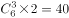种可能。

故正确答案为C。

---

### 第 2 题　qid 2719400 · 数学运算

某地10户贫困农户共申请扶贫小额信贷25万元。已知每人申请金额都是1000元的整数倍，申请金额最高的农户申请金额不超过申请金额最低农户的2倍，且任意2户农户的申请金额都不相同。问申请金额最低的农户最少可能申请多少万元信贷？

- **A**. 1.5
- **B**. 1.6　✅
- **C**. 1.7
- **D**. 1.8

**答案**：B

**官方解析**

设申请金额最低的农户申请万元，已知10户贫困农户共申请25万元，要使金额最低的农户申请的金额最少，则令其他农户申请的金额尽可能多。题目中已知申请金额最高的农户申请金额不超过申请金额最低农户的2倍，即最高申请万元，且任意2户农户的申请金额都不相同，同时每人的申请金额都是1000元（0.1万元）的整数倍，则根据这些条件可构造出下表：

则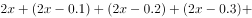，即，解得，由于每人的申请金额都是1000元（0.1万元）的整数倍，则最少为1.6万元。

故正确答案为B。

---

### 第 3 题　qid 2719333 · 数学运算

社区工作人员小张连续4天为独居老人采买生活必需品，已知前三天共采买65次，其中第二天采买次数比第一天多，第三天采买次数比前两天采买次数的和少15次，第四天采买次数比第一天的2倍少5次。问这4天中，小张为独居老人采买次数最多和最少的日子，单日采买次数相差多少次？

- **A**. 9
- **B**. 10
- **C**. 11　✅
- **D**. 12

**答案**：C

**官方解析**

设第一天采买的次数为，则第二天采买的次数为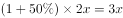，第三天采买的次数为，第四天采买的次数为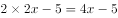，已知前三天共采买65次，则有，解得，则这4天采买的次数分别为16次（）、24次（）、25次（）、27次（），所以这4天中单日采买次数最多为27次，最少为16次，相差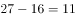次。

故正确答案为C。

---

### 第 4 题　qid 2719341 · 数学运算

甲、乙两个单位周末分别安排和的职工下沉社区帮助困难群众，其中甲单位派出的职工比乙单位少3人，后两单位又在剩下的职工中，分别抽调和的职工，共计24人参加周末的业务培训，问甲单位职工人数比乙单位：

- **A**. 少三人
- **B**. 少十一人
- **C**. 多三人
- **D**. 多十一人　✅

**答案**：D

**官方解析**

设甲单位职工人数为人，乙单位职工人数为人，根据“甲、乙两个单位周末分别安排和的职工下沉社区帮助困难群众，其中甲单位派出的职工比乙单位少3人”，可列方程①：；根据“两单位又在剩下的职工中，分别抽调和的职工，共计24人”，可列方程②：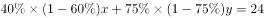，联立方程①和②，解得：，，因此甲单位的职工人数比乙单位多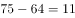人。

故正确答案为D。

---

### 第 5 题　qid 2719380 · 数学运算

某企业选拔170多名优秀人才平均分配为7组参加培训。在选拔出的人才中，党员人数比非党员多3倍。接受培训的党员中的在培训结束后被随机派往甲单位等12个基层单位进一步锻炼。已知每个基层单位至少分配1人，问甲单位分配人数多于1的概率在以下哪个范围内？

- **A**. 
不到

- **B**. 
之间
　✅
- **C**. 
之间

- **D**. 
超过

**答案**：B

**官方解析**

由“选拔170多名优秀人才平均分配为7组”，说明优秀人才人数为7的倍数，170多，只能是175人，因此平均分7组，每组25人；又根据“党员人数比非党员多3倍”，可以得到，因此党员人数人，又因为接受培训的党员中的被分配到12个基层单位，被分配的党员人数为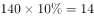。

由于本题涉及的是人数，相当于进行名额分配。把14个名额分到12个单位，根据插板法，情况数有种。由于每个单位至少分配1人，则甲分配名额情况可以分为“分配人数多于1人”和“分配人数为1人”两种。所求为甲单位分配人数多于1人：

方法一：正向考虑，（1）甲分配2人，剩余12人，11个单位至少分配1人，有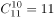种；（2）甲分配3人，剩余11人，11个单位至少分配1人，有种；甲单位分配人数多于1的情况共有种，因此，根据概率公式，所求概率为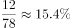。

方法二：从反面考虑，计算甲只分配1人的情况，相当于剩余13个名额分配给11个单位，情况数为种，则满足甲多于1人的情况数为种，因此，根据概率公式，所求概率为。

故正确答案为B。

---

### 第 6 题　qid 2719306 · 数学运算

某地调派96人分赴车站、机场、超市和学校四个人流密集的区域进行卫生安全检查，其中公共卫生专业人员有62人。已知派往机场的人员是四个区域中最多的，派往车站和超市的人员中，专业人员分别占和，派往学校的人员中，非专业人员比专业人员少，问派往机场的人员中，专业人员的占比在四个区域中排名

- **A**. 第一　✅
- **B**. 第二
- **C**. 第三
- **D**. 第四

**答案**：A

**官方解析**

根据题意可知，，即派往车站的总人数是25的倍数；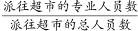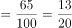，即派往超市的总人数是20的倍数；派往学校的非专业人员比专业人员少，即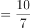，则派往学校的总人数是的倍数，专业人员占比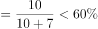。由于派往机场的人数最多，则车站只能派25人，其中专业人员16人；超市只能派20人，其中专业人员13人；学校只能派17人，其中专业人员10人。由此可得：派往机场人数人，其中专业人员数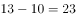人。故派往机场的专业人数占比，排名第一。

故正确答案为A。

---

### 第 7 题　qid 2719319 · 数学运算

某县通过网络直播帮助本地农民销售农副产品，总共直播6次，其中第2次直播销售额比第1次高，比第3次低。直播3次后电视台报道了这一新闻，此后销量大幅提升，后3次直播总销售额是前3次总销售额的3倍。其中第5次直播销售额相当于6次直播总销售额的，且比第4次直播高，比第6次直播少16万元，问第6次直播的销售额比第3次直播高：

- **A**. 不到100万元
- **B**. 100~120万元之间
- **C**. 140万元以上
- **D**. 120~140万元之间　✅

**答案**：D

**官方解析**

设第2次直播销售额为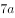万元，则第1次销售额为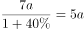万元，第3次销售额为万元，故前三次直播总销售额为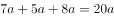万元，可知后三次直播总销售额为万元，第5次销售额为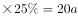万元，则第4次销售额为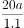万元，第6次销售额为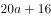万元，根据题意可列关系式为：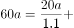，解得，则第6次销售额比第3次销售额高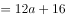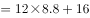万元。

故正确答案为D。

---

### 第 8 题　qid 2719297 · 数学运算

某村居民整体进行搬迁移民，现安排载客（不含司机）20人/辆的中巴车和30人/辆的大巴车运载所有村民到搬迁地实地考察。如安排12辆中巴车，则大巴车需要18辆，且除一辆大巴车载6人以外，其他车全部载满。现本着安排车辆数最少的原则派车，问最少要安排多少辆大巴车？

- **A**. 20
- **B**. 22
- **C**. 24　✅
- **D**. 26

**答案**：C

**官方解析**

根据题意可得，村民总人数为人。总人数一定，要使车辆数最少，则应让单次运载人数多的大巴车运载更多，辆······人，即大巴车满载25辆时剩余6人。还要使大巴车辆数最少，将运载方案枚举如下：

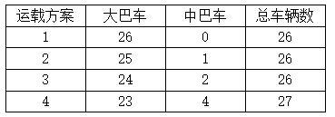

······

综上可得，本着车辆数最少的原则派车，最少要安排24辆大巴车。

故正确答案为C。

---

### 第 9 题　qid 2719320 · 数学运算

在一块下图所示的梯形土地中种植某种产量为1.2千克/平方米的作物。已知该梯形的高为100米，ABC、BCD、和CDE为正三角形，且BAF和DEG的角度都是90度，问该土地的总产量为多少吨？

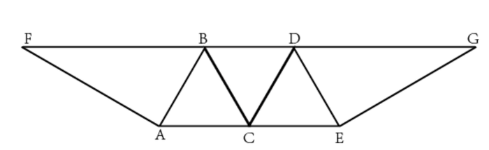

- **A**. 
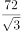

- **B**. 

　✅
- **C**. 

- **D**. 

**答案**：B

**官方解析**

如图，在中，过点B做垂线相交AC于点M，则BM为正三角形ABC的高同时也为梯形的高，故米，根据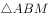为直角三角形，且，则，故可得米；则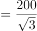米；根据题干分析可得：，则中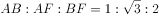，故可得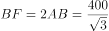米，同理可得米；故该梯形上底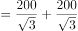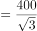米，下底米，则平方米，该土地产量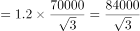千克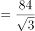吨。

故正确答案为B。

---

### 第 10 题　qid 2719325 · 数学运算

某工厂在做好防疫工作的前提下全面复工复产，复工后第1天的产能即恢复到停工前日产能的，复工后每生产4天，日产能都会比前4天的水平提高1000件/日。已知复工80天后，总产量相当于停工前88天的产量，问复工后的总产量达到100万件是在复工后的第几天？

- **A**. 56　✅
- **B**. 54
- **C**. 60
- **D**. 58

**答案**：A

**官方解析**

假设停工前日产能为，则复工第1天的产能为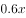，因为复工后每生产4日，日产能比前4天水平提高1000件/日，如果以4天为一周期，则第一个周期生产，第二个周期生产，由此构成等差数列，第个周期为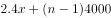，公差为4000。则复工80天为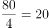周期，第20项为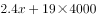，由此列出等式：，解得。则第一个周期产能为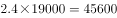。由于无法确定总产量达到100万件是在复工后的第几个周期，可利用代入法：

A项：56天是在第14个周期结束当日，则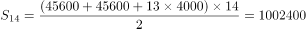万，第56天当天产量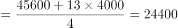件，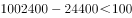万，即生产55天，不能生产到100万件，因此为满足达到100万件，需工作56天。

故正确答案为A。

---

## 判断推理

### 材料 1

某单位的人事、科研、教育、财务、宣传、后勤和工会7个部门各由王、卫和丁3位副主任中的1人分管，已知：

（1）教育和财务由同一人分管；

（2）宣传和后勤由同一人分管；

（3）丁分管的部门比卫多；

（4）教育、工会中的一个部门由王分管；

（5）工会、后勤中的一个部门由卫分管。

#### 第 1 题　qid 2719415 · 逻辑判断

关于分管情况，下列哪项是可能的？

- **A**. 
王：工会、科研

卫：人事、教育、财务

丁：宣传、后勤

- **B**. 
王：人事、工会

卫：宣传、后勤

丁：科研、教育、财务
　✅
- **C**. 
王：教育、财务

卫：人事、后勤

丁：科研、宣传、工会

- **D**. 
王：宣传、后勤

卫：人事、工会

丁：科研、教育、财务

**答案**：B

**官方解析**

第一步：分析题干条件。
（1）教育和财务由同一人分管；
（2）宣传和后勤由同一人分管；
（3）丁分管的部门比卫多；
（4）教育、工会中的一个部门由王分管；
（5）工会、后勤中的一个部门由卫分管。
第二步：根据题干条件进行推理。
根据（2）可知宣传和后勤由同一人分管，排除C项；
根据（3）可知丁分管的部门比卫多，排除A项；
根据（4）可知教育、工会中的一个部门由王分管，排除D项。
经验证，B项满足题干所有条件。
故正确答案为B。

---

#### 第 2 题　qid 2719416 · 类比推理

如果王分管的部门多于丁，下列哪项可能为真？

- **A**. 人事由卫分管
- **B**. 科研由卫分管
- **C**. 教育由丁分管
- **D**. 后勤由丁分管　✅

**答案**：D

**官方解析**

第一步：分析题干条件。
（1）教育和财务由同一人分管；
（2）宣传和后勤由同一人分管；
（3）丁分管的部门比卫多；
（4）教育、工会中的一个部门由王分管；
（5）工会、后勤中的一个部门由卫分管；
（6）王分管的部门多于丁。
第二步：根据题干条件进行推理。
根据条件（6）王分管的部门多于丁和条件（3）丁分管的部门比卫多，可知三人分管部门数量从多到少顺序为王、丁、卫；
再根据题干条件共有7个部门，可以推出王分管4个部门，丁分管2个部门，卫分管1个部门；
根据条件（1）和条件（2）可知，卫不分管教育、财务、宣传、后勤，再根据条件（5）可以推出，卫只分管工会，排除A、B两项；
根据条件（4）教育、工会中的一个部门由王分管，以及卫分管工会可以推出，王一定分管教育，排除C项。
故正确答案为D。

---

#### 第 3 题　qid 2719417 · 类比推理

下列哪项是不可能的？

- **A**. 人事和宣传由王分管　✅
- **B**. 人事和宣传由丁分管
- **C**. 科研和宣传由丁分管
- **D**. 教育和宣传由王分管

**答案**：A

**官方解析**

第一步：整理题干条件。
（1）教育和财务由同一人分管；
（2）宣传和后勤由同一人分管；
（3）丁分管的部门比卫多；
（4）教育、工会中的一个部门由王分管；
（5）工会、后勤中的一个部门由卫分管。
第二步：根据题干条件分析选项。
提问方式出现“不可能”，优先考虑代入法。
A项代入，人事和宣传由王分管，结合条件（2）可知，王还分管后勤，结合条件（5），卫要去分管工会，又因为条件（4），王要去分管教育，再结合条件（1）可知，王分管教育和财务。此时，王分管人事、教育、财务、宣传和后勤；卫分管工会；丁分管的部门未知，还剩科研一个部门，无论科研是否为丁分管，都不满足条件（3），丁分管的部门比卫多，不可能为真，当选；
B项代入，人事和宣传由丁分管，结合条件（2）可知，丁还分管后勤，结合条件（5），卫要去分管工会，又因为条件（4），王要分管教育，再结合条件（1）可知，王分管教育和财务。此时，王分管教育和财务；卫分管工会；丁分管人事、宣传和后勤，还剩科研一个部门，无论科研是否为卫分管，均满足条件（3）丁分管的部门比卫多，满足题干所有条件，可能为真，排除；
C项代入，科研和宣传由丁分管，结合条件（2）可知，丁还分管后勤，结合条件（5），卫要去分管工会，又因为条件（4），王要去分管教育，再结合条件（1）可知，王分管教育和财务。此时，王分管教育和财务；卫分管工会；丁分管科研、宣传和后勤，还剩一个人事，无论人事是否为卫分管，均满足条件（3）丁分管的部门比卫多，满足题干所有条件，可能为真，排除；
D项代入，教育和宣传由王分管，结合条件（1）和（2）可知，王还分管财务和后勤，再结合条件（5），卫要去分管工会。此时，王分管教育、财务、宣传和后勤；卫分管工会；丁分管的部门未知，还剩人事和科研两个部门，若丁分管人事和科研，满足条件（3）丁分管的部门比卫多，满足题干所有条件，可能为真，排除。
本题为选非题，故正确答案为A。

---

#### 第 4 题　qid 2719418 · 类比推理

财务和以下哪个部门不可能由同一人分管？

- **A**. 人事
- **B**. 科研
- **C**. 宣传
- **D**. 工会　✅

**答案**：D

**官方解析**

第一步：整理题干条件。

（1）教育和财务由同一人分管；

（2）宣传和后勤由同一人分管；

（3）丁分管的部门比卫多；

（4）教育、工会中的一个部门由王分管；

（5）工会、后勤中的一个部门由卫分管。

第二步：根据题干条件分析选项。

A项代入，结合条件（1）可知，教育、财务和人事要同时由一人分管，若此人为丁，则根据条件（2）、（4）、（5）可得：

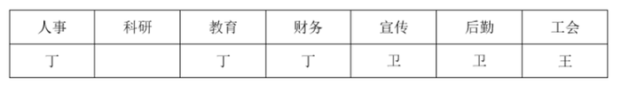

若科研由王分管，满足题干所有条件，可能为真，排除；

B项代入，结合条件（1）可知，教育、财务和科研要同时由一人分管，若此人为丁，则根据条件（2）、（4）、（5）可得：

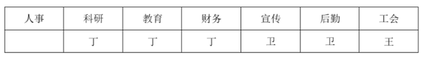

若人事由王分管，可满足题干所有条件，可能为真，排除；

C项代入，结合条件（1）可知，教育、财务和宣传要同时由一人分管，若此人为王，则根据条件（2）、（4）、（5）可知，卫分管工会，此时若丁分管人事和科研，可得：

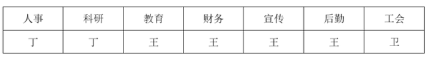

满足题干所有条件，可能为真，排除；

D项代入，结合条件（1）可知，教育、财务和工会要由同一个人分管，此时，教育和工会由同一个人分管，不符合条件（4），教育、工会中的一个部门由王分管，因此该项不可能为真，当选。

本题为选非题，故正确答案为D。

---

#### 第 5 题　qid 2719419 · 类比推理

如果科研和宣传由同一人分管，那么下列哪项是可能的？

- **A**. 人事由卫分管　✅
- **B**. 科研由王分管
- **C**. 教育由丁分管
- **D**. 宣传由卫分管

**答案**：A

**官方解析**

第一步：整理题干条件。

（1）教育和财务由同一人分管；

（2）宣传和后勤由同一人分管；

（3）丁分管的比卫多；

（4）教育、工会中的一个由王分管；

（5）工会、后勤中的一个由卫分管；

（6）科研和宣传由同一人分管。

第二步：根据题干条件分析选项。

题干问可能为真，可以优先考虑代入法，如下：

结合条件（2）、（6）可知，宣传、后勤、科研由同一人分管；

A项代入，若人事由卫分管，结合条件（5）可知，工会、后勤中的一个由卫分管，且结合题干可知宣传、后勤、科研由同一人分管，若要满足条件（3）使丁分管的比卫多，则卫不能分管后勤，则卫分管工会，结合条件（1）、（4）可知，由王分管教育和财务，此时可由丁分管科研、宣传、后勤。即：

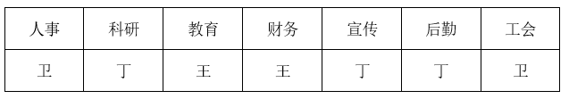

满足题干所有条件，可能为真，当选；

B项代入，若科研由王分管，则宣传、后勤、科研由王分管，结合条件（5）可知，工会由卫分管，又结合条件（1）、（4）可知，教育和财务也要由王分管。即：

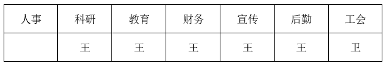

此时，丁分管的不可能比卫多，与条件（3）不符，不可能为真，排除；

C项代入，若教育由丁分管，由条件（1）可知，教育和财务均由丁分管，结合条件（4）可知，工会由王分管，结合条件（5）、（6）可知，宣传、后勤、科研由卫分管。即：

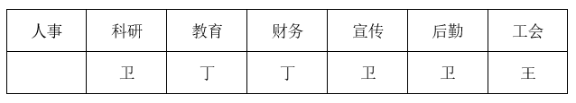

此时，丁分管的不可能比卫多，与条件（3）不符，不可能为真，排除；

D项代入，若宣传由卫分管，则宣传、后勤、科研均由卫分管。即：

结合条件（4）可知，教育和工会中的一个由王分管，此时丁分管的不可能比卫多，与条件（3）不符，不可能为真，排除。

故正确答案为A。

---

#### 第 6 题　qid 2719382 · 图形推理

从所给的四个选项中，选择最合适的一个填入问号处，使之呈现一定的规律性。

- **A**. A　✅
- **B**. B
- **C**. C
- **D**. D

**答案**：A

**官方解析**

图形元素组成不同，优先考虑属性规律。观察发现，图形中黑白块数量不同，但整体较为规整，考虑对称性。题干图形均只有1条对称轴，且对称轴方向每次逆时针旋转，故？处应为只有1条对称轴的竖轴对称图形，只有A项符合，当选。

故正确答案为A。

---

#### 第 7 题　qid 2719385 · 图形推理

从所给的四个选项中，选择最合适的一个填入问号处，使之呈现一定的规律性。

- **A**. A
- **B**. B
- **C**. C　✅
- **D**. D

**答案**：C

**官方解析**

元素组成不同，且无明显属性规律，考虑数量规律。观察发现，题干每幅图形均存在曲线与直线，且曲直相交，优先考虑曲直交点数。题干每幅图形的曲直交点数均为2个，但无法得出唯一答案。继续观察发现，题干图形相切明显，考虑切点数，每幅图的切点数均为1个，只有C项符合规律。
故正确答案为C。

---

#### 第 8 题　qid 2719386 · 图形推理

从所给四个选项中，选择最合适的一个填入问号处，使之呈现一定的规律性。

- **A**. A　✅
- **B**. B
- **C**. C
- **D**. D

**答案**：A

**官方解析**

元素组成不同，且无明显属性规律，考虑数量规律。题干大部分图形存在扇形，且扇形的面积不同，考虑扇形面积大小规律。观察发现，图1没有扇形，图2扇形为个圆，图3扇形为个圆，图4扇形为个圆，图5扇形为个圆，扇形面积呈递增规律，故？处扇形面积应为个圆，只有A项符合，当选。

故正确答案为A。

---

#### 第 9 题　qid 2719388 · 图形推理

从所给四个选项中，选择最合适的一个填入问号处，使之呈现一定的规律性。

- **A**. A
- **B**. B
- **C**. C
- **D**. D　✅

**答案**：D

**官方解析**

元素组成相似，优先考虑样式规律。题干图形均存在黑色部分和空白部分，考虑黑白运算。第一组图的黑白运算规律为：黑黑白，白黑黑，黑白黑，白白白。第二组图运用此规律，可以将图形分为四行看，第二行最左侧应满足白白白，排除B、C两项。第三行最右侧应满足白黑黑，排除A项，只有D项符合，当选。

故正确答案为D。

---

#### 第 10 题　qid 2719391 · 图形推理

左图给定的是正方体纸盒，右边哪项可能是其正确的外表面展开图？

- **A**. A　✅
- **B**. B
- **C**. C
- **D**. D

**答案**：A

**官方解析**

将题干立体图及选项展开图中对应的面标上序号，如下图所示，逐一分析选项。

A项：选项与题干一致，当选；

B项：选项中面a与面b的公共边（如下图线1所示），面a挨着面b的小黑色方块，而题干立体图中面a没有挨着面b的小黑色方块，选项与题干不一致，排除；

C项：题干立体图中，面a挨着面c中较细的黑色部分，但选项中面a与左右两个相邻面中的较细黑色部分均不相邻（如下图线2和线2&#39;所示），选项与题干立体图不一致，排除；

D项：因呈直角的两条边是同一条边，故选项中线3折合之后为同一条边，观察发现，选项中面a挨着下方图形较粗的黑色部分（如下图线3所示），而题干立体图中面a没有挨着较粗的黑色部分，选项与题干不一致，排除。

故正确答案为A。

---

#### 第 11 题　qid 2719393 · 图形推理

左图为给定的多面体，从任一角度观看，右边哪项可能是该多面体的视图？

- **A**. A
- **B**. B　✅
- **C**. C
- **D**. D

**答案**：B

**官方解析**

本题考查三视图，逐一分析选项。

A项：从下往上看，应如图所示，题干A选项右上角应为梯形，排除；

B项：从前往后看，与题干一致，当选；

C项：从上往下看，应如图所示，题干C选项左下角应为梯形而非长方形，排除；

D项：从右往左看，应如图所示，题干D选项右下角应为长方形而非梯形，排除。

故正确答案为B。

---

#### 第 12 题　qid 2719395 · 图形推理

左图给定的是由相同正方体堆叠成的多面体的正视图和后视图。该多面体可以由①、②和③三个多面体组合而成，问以下哪一项能填入问号处？

- **A**. A
- **B**. B
- **C**. C　✅
- **D**. D

**答案**：C

**官方解析**

本题考查立体拼合。

观察题干给出的多面体可知，图形可分为4层，由下至上第一层有12个小立方体，第二层有4个小立方体，第三层有3个小立方体，第四层有6个小立方体。图①共有四层，最上层有1个小立方体，图②共有3层，且只能拼合在由下至上的三层，如上图所示，故立体图形最上层还缺少5个小立方体，观察选项，只有C项存在一层有5个小立方体的面，据此C项当选。

故正确答案为C。

---

#### 第 13 题　qid 2719401 · 图形推理

把下面的六个图形分为两类，使每一类图形都有各自的共同特征或规律，分类正确的一项是（    ）。

- **A**. ①②③，④⑤⑥
- **B**. ①②④，③⑤⑥
- **C**. ①③④，②⑤⑥　✅
- **D**. ①③⑤，②④⑥

**答案**：C

**官方解析**

元素组成不同，且无明显属性规律，考虑数量规律。观察发现，图形被分割明显，考虑数面。图①③④均有2个面，图②⑤⑥均有4个面，即图①③④一组，图②⑤⑥一组。
故正确答案为C。

---

#### 第 14 题　qid 2719403 · 图形推理

把下面的六个图形分为两类，使每一类图形都有各自的共同特征或规律，分类正确的一项是（    ）。

- **A**. ①②④，③⑤⑥
- **B**. ①③⑤，②④⑥
- **C**. ①③⑥，②④⑤
- **D**. ①⑤⑥，②③④　✅

**答案**：D

**官方解析**

本题为分组分类题目。观察发现，题干每幅图形均由两个面相交而成，考虑图形间关系。图①⑤⑥中两个图形具有1条相交边，图②③④中两个图形具有2条相交边，即图①⑤⑥一组，图②③④一组。
故正确答案为D。

---

#### 第 15 题　qid 2719404 · 图形推理

把下面的六个图形分为两类，使每一类图形都有各自的共同特征或规律，分类正确的一项是（    ）。

- **A**. ①③④，②⑤⑥
- **B**. ①③⑤，②④⑥
- **C**. ①②⑥，③④⑤　✅
- **D**. ①④⑥，②③⑤

**答案**：C

**官方解析**

本题为分组分类题目。元素组成相同，但无明显位置规律。观察发现，所有图形中黑球全部相连，如果将所有黑球连成线，图③④⑤中所有黑球连成的线能一笔画成，而图①②⑥中所有黑球连成的线存在4个奇点，为两笔画成，如下图所示。因此图①②⑥一组，图③④⑤一组。

故正确答案为C。

---

#### 第 16 题　qid 2719358 · 定义判断

析数是指在一定的语境中，利用数学上相加或相乘等关系，把一个数有目的地进行拆分的一种修辞手法。
根据上述定义，下列没有使用析数的是（    ）。

- **A**. 故国三千里，深宫二十年。一声何满子，双泪落君前　✅
- **B**. 蛾眉蔽珠栊，玉钩隔琐窗。三五二八时，千里与君同
- **C**. 读尽文书一百担，老来方得一青衫。媒人却问余年纪，四十年前三十三
- **D**. 江陵去扬州，三千三百里。已行一千三，所有二千在

**答案**：A

**官方解析**

第一步：找出定义关键词。
“利用数学上相加或相乘等关系”、“把一个数有目的地进行拆分”。
第二步：逐一分析选项。
A项：“故国三千里，深宫二十年。一声何满子，双泪落君前”的意思是故乡和亲人远在千里之外，我已被幽闭在这深宫里二十年了，听一声曲子《何满子》，忍不住掉下眼泪。未体现“利用数学上相加或相乘等关系”和“把一个数有目的地进行拆分”，不符合定义，当选； 
B项：“蛾眉蔽珠栊，玉钩隔琐窗。三五二八时，千里与君同”的意思是蛾眉一样的月儿，被珠帘挡在窗外，玉钩般的月儿，透不进琐窗里。十五十六日，月亮正圆时，我们共赏普照千里的明月。利用数学上相乘关系，将十五和十六拆分成“三五”和“二八”，符合“利用数学上相加或相乘等关系”、“把一个数有目的地进行拆分”，符合定义，排除；
C项：“读尽文书一百担，老来方得一青衫。媒人却问余年纪，四十年前三十三”的意思是读了一辈子书，老了的时候考中了进士，有人做媒来提亲问我年纪，四十年前三十三岁。利用数学上相加的关系，将七十三拆分成“四十”和“三十三”，符合“利用数学上相加或相乘等关系”、“把一个数有目的地进行拆分”，符合定义，排除；
D项：“江陵去扬州，三千三百里。已行一千三，所有二千在”的意思是江陵到扬州总共三千三百里，现在已航行了一千三百里，还剩二千里的路程。利用数学上相加的关系，将三千三百拆分成“一千三”和“二千”，符合“利用数学上相加或相乘等关系”、“把一个数有目的地进行拆分”，符合定义，排除。
本题为选非题，故正确答案为A。

---

#### 第 17 题　qid 2719361 · 定义判断

互益素是一种生物释放的、能引起他种接受生物产生对释放者和接受者都有益的反应的信息化学物质。
根据上述定义，下列涉及互益素的是（    ）。

- **A**. 苹果实蝇在植物果实上产卵后会留下一种标记信息素，以避免自己再次到这里产卵
- **B**. 楝科植物印楝的种子、树叶和树皮中含有的印楝素，对几乎所有害虫都有驱杀效果
- **C**. 亚洲玉米螟雌蛾释放的性信息素能够吸引雄蛾，使雄蛾能够准确找到雌蛾的方位
- **D**. 小麦在遭受麦长管蚜攻击后会释放出水杨酸甲酯，可吸引麦长管蚜的天敌异色瓢虫　✅

**答案**：D

**官方解析**

第一步：找出定义关键词。
“生物释放的”、“引起他种接受生物产生对释放者和接受者都有益的反应”。
第二步：逐一分析选项。
A项：苹果实蝇在植物果实上留下标记信息素避免重复产卵，释放者和接受者都是苹果实蝇，不是他种接受生物，不符合“引起他种接受生物产生对释放者和接受者都有益的反应”，不符合定义，排除；
B项：印楝含有的印楝素有驱杀害虫的效果，只对释放者印楝本身有益，对接受者害虫无益，不符合“引起他种接受生物产生对释放者和接受者都有益的反应”，不符合定义，排除；
C项：亚洲玉米螟雌蛾和雄蛾属于同一物种，不符合“引起他种接受生物产生对释放者和接受者都有益的反应”，不符合定义，排除； 
D项：小麦遭受麦长管蚜攻击后释放的水杨酸甲酯，可吸引麦长管蚜的天敌异色瓢虫，对释放者小麦和接受者异色瓢虫都有益，符合“生物释放的”、“引起他种接受生物产生对释放者和接受者都有益的反应”，符合定义，当选。
故正确答案为D。

---

#### 第 18 题　qid 2719363 · 定义判断

统计数据分为定性数据与定量数据。定性数据包括分类数据和顺序数据。分类数据是指只能归于某一类别的非数字型数据，它是对事物进行分类的结果，用文字表述；顺序数据是指归于某一有序类别的非数字型数据。定量数据是指表现为具体数字观测值的数据。
①按城市规模可将城市分为特大城市、大城市、中等城市和小城市；
②婚姻状况：1-未婚，2-已婚，3-离异，4-丧偶；
③A地到B地的距离为200公里，到C地为320公里，到D地为100公里；
④某医院建筑面积37.5万平方米，开放床位3182个，临床医生687人。
根据上述定义，关于以上4组数据的说法正确的是（    ）。

- **A**. ②④都是分类数据
- **B**. ②③④都是定量数据
- **C**. ①②都是顺序数据
- **D**. 仅②是分类数据　✅

**答案**：D

**官方解析**

第一步：找出定义关键词。
分类数据：“只能归于某一类别的非数字型数据”、“是对事物进行分类的结果，用文字表述”；
顺序数据：“归于某一有序类别的非数字型数据”；
定量数据：“表现为具体数字观测值的数据”。
第二步：逐一分析数据。
数据①：按城市规模可将城市分为特大城市、大城市，中等城市和小城市，体现出规模大小上的顺序，符合“归于某一有序类别的非数字型数据”，属于顺序数据；
数据②：婚姻状况：1-未婚， 2-已婚，3-离异，4-丧偶，将婚姻状况分为四类，符合“只能归于某一类别的非数字型数据”、“是对事物进行分类的结果，用文字表述”，属于分类数据；
数据③：A地到B地的距离为200公里，到C地为320公里，到D地为100公里，都是具体数字观测值的数据，符合“表现为具体数字观测值的数据”，属于定量数据；
数据④：某医院建筑面积37.5万平方米，开放床位3182个，临床医生687人，医院建筑面积、开放床位数、临床医生数都是具体数字观测值的数据，符合“表现为具体数字观测值的数据”，属于定量数据。
综上，①属于顺序数据，②属于分类数据，③④都属于定量数据。
故正确答案为D。

---

#### 第 19 题　qid 2719367 · 定义判断

拮抗作用是一种常见的感觉变化现象，是指因一种呈味物质的存在，而使另一种呈味物质的呈味特性减弱的现象。
根据上述定义，下列没有体现拮抗作用的是（    ）。

- **A**. 在橘子汁中添加少量柠檬酸会感觉甜味减弱，如再加砂糖，又会感到酸味减弱
- **B**. 糖精带有苦味，在糖精中添加少量的谷氨酸钠，苦味可明显缓和
- **C**. 同时服用氯化钠和奎宁后，再饮用清水会有微甜的感觉　✅
- **D**. 在食用过酸涩的西非山榄后，再吃酸味食品，会尝不到酸味

**答案**：C

**官方解析**

第一步：找出定义关键词。
“因一种呈味物质的存在”、“使另一种呈味物质的呈味特性减弱”。
第二步：逐一分析选项。
A项：因加入少量柠檬酸使橘子汁甜味减弱，又因再加入砂糖使橘子汁酸味减弱，符合“因一种呈味物质的存在”、“使另一种呈味物质的呈味特性减弱”，符合定义，排除；
B项：在带有苦味的糖精中添加少量的谷氨酸钠可使苦味明显缓和，因为谷氨酸钠的存在使糖精的呈味特性减弱，符合“因一种呈味物质的存在”、“使另一种呈味物质的呈味特性减弱”，符合定义，排除；
C项：同时服用氯化钠和奎宁后，再饮用清水会有微甜的感觉，清水本身无味，不属于呈味物质，不符合“因一种呈味物质的存在”、“使另一种呈味物质的呈味特性减弱”，不符合定义，当选；
D项：在食用过酸涩的西非山榄后，再吃酸味食品，会尝不到酸味，因为西非山榄的存在使酸味食品的呈味特性减弱，符合“因一种呈味物质的存在”、“使另一种呈味物质的呈味特性减弱”，符合定义，排除。
本题为选非题，故正确答案为C。

---

#### 第 20 题　qid 2719368 · 定义判断

通过提供产品及服务使顾客产生愉悦等积极情感，从而使顾客觉得从产品及服务中获得了超过使用价值的新价值，以此为手段进行情感营销的过程，称为情感价值链。
根据上述定义，下列没有凸显情感价值链的是（    ）。

- **A**. 小张从事美容工作多年，她总是专注而耐心地倾听客户说话，让客户在享受按摩的同时心情舒畅
- **B**. 智能音箱“小美”深受孩子们喜爱，因为它不仅能播放儿歌和故事，还能跟小朋友“对话、握手和点头”　✅
- **C**. 电视上，一对年轻夫妻为“该谁扫地了”而犯愁，之后扫地机器人登场，并闪现广告语“有了它，更幸福”
- **D**. 洗碗机广告中，一位女士愁眉苦脸刷着油腻的碗盘，看着自己粗糙的双手，广告词是“你要做这样的女人吗？”

**答案**：B

**官方解析**

第一步：找出定义关键词。
“通过提供产品及服务使顾客产生愉悦等积极情感”、“获得了超过使用价值的新价值”。
第二步：逐一分析选项。
A项：小张倾听客户说话，让客户在享受按摩的同时心情舒畅，符合“通过提供产品及服务使顾客产生愉悦等积极情感”、“获得了超过使用价值的新价值”，符合定义，排除；
B项：智能音箱“小美”不仅能播放儿歌和故事，还能跟小朋友“对话、握手和点头”，这只是音箱的功能，并没有体现出“获得了超过使用价值的新价值”，不符合定义，当选；
C项：扫地机器人为年轻夫妻解决扫地难题，增加生活幸福感，符合“通过提供产品及服务使顾客产生愉悦等积极情感”、“获得了超过使用价值的新价值”，符合定义，排除；
D项：洗碗机广告中，一位女士刷着碗盘，双手粗糙，愁眉苦脸，广告精确地掌握客户的心理需求，从反面切入，让客户感觉可以通过洗碗机摆脱这样愁苦的生活，获得情感价值，符合“通过提供产品及服务使顾客产生愉悦等积极情感”、“获得了超过使用价值的新价值”，符合定义，排除。
本题为选非题，故正确答案为B。

---

#### 第 21 题　qid 2719370 · 定义判断

一般来说，科学实验中主要涉及三种变量：自变量、因变量和控制变量，自变量是指在实验中由实验者操作的变量。因变量是指随着自变量的变化而变化的变量。控制变量是指实验中除自变量以外的影响实验变化和结果的潜在因素或条件。
根据上述定义，下列说法正确的是（    ）。

- **A**. 研究小麦供给量受当地采购价格的影响，小麦供给量是控制变量，采购价格是因变量
- **B**. 研究不同税率对稀土出口量的影响，稀土出口量是自变量，税率是因变量
- **C**. 研究气候条件对棉花产量的影响，气候条件是因变量，害虫影响是控制变量
- **D**. 研究制糖厂营业额受糖产量的影响，糖的单价是控制变量，糖产量是自变量　✅

**答案**：D

**官方解析**

第一步：找出定义关键词。
自变量：“实验中由实验者操作的变量”；
因变量：“随着自变量的变化而变化的变量”；
控制变量：“除自变量以外的影响实验变化和结果的潜在因素或条件”。
第二步：逐一分析选项。
A项：研究小麦供给量受当地采购价格的影响，当地采购价格是需要研究人员操作的变量，符合“实验中由实验者操作的变量”，符合自变量定义，不符合因变量定义；小麦供给量是随着当地采购价格变化而变化的量，符合“随着自变量的变化而变化的变量”，符合因变量定义，不符合控制变量定义，排除；
B项：研究不同税率对稀土出口量的影响，不同税率是该研究中需要研究人员改变的量，符合“实验中由实验者操作的变量”，符合自变量定义，不符合因变量定义；稀土出口量是随着税率的变化而变化的量，符合“随着自变量的变化而变化的变量”，符合因变量定义，不符合自变量定义，排除；
C项：研究气候条件对棉花产量的影响，气候条件是该研究中需要研究人员改变的量，符合“实验中由实验者操作的变量”，符合自变量定义，不符合因变量定义，排除；
D项：研究制糖厂营业额受糖产量的影响，糖产量是该研究中需要研究人员改变的量，符合“实验中由实验者操作的变量”，符合自变量定义；糖的单价是该研究中除了糖产量以外的能够影响制糖厂营业额的一种潜在因素，符合“除自变量以外的影响实验变化和结果的潜在因素或条件”，符合控制变量定义，当选。
故正确答案为D。

---

#### 第 22 题　qid 2719372 · 定义判断

对立互补命题指的是先后叙述的两个结构基本相同的句式中含有两对或者两对以上相互对立的概念，但是其阐发的意思是一致的或者是相互补充的。
根据上述定义，下列不属于对立互补命题的是（    ）。

- **A**. 君子坦荡荡，小人长戚戚
- **B**. 先天下之忧而忧，后天下之乐而乐
- **C**. 仓廪实而知礼节，衣食足而知荣辱　✅
- **D**. 穷在闹市无人问，富在深山有远亲

**答案**：C

**官方解析**

第一步：找出定义关键词。
“先后叙述的两个结构基本相同的句式”、“两对或者两对以上相互对立的概念”、“意思是一致的或者是相互补充的”。
第二步：逐一分析选项。
A项：意思是“君子心胸开阔，能够包容别人，小人爱斤斤计较，患得患失”，“君子”和“小人”、“坦荡荡”和“长戚戚”分别出现在前后两句中，且概念对立，符合“先后叙述的两个结构基本相同的句式”、“两对或者两对以上相互对立的概念”、“意思是一致的或者是相互补充的”，符合定义，排除；
B项：意思是“为官者应把国家、民族的利益摆在首位，为祖国的前途、命运分愁担忧，为天下的人民幸福出力”，“先”和“后”、“忧”和“乐”分别出现在前后两句中，且概念对立，符合“先后叙述的两个结构基本相同的句式”、“两对或者两对以上相互对立的概念”、“意思是一致的或者是相互补充的”，符合定义，排除；
C项：意思是“百姓的粮仓充足，丰衣足食，才能顾及到礼仪，重视荣誉和耻辱”，“仓廪实”和“衣食足”、“知礼节”和“知荣辱”均不属于相互对立的概念，不符合“两对或者两对以上相互对立的概念”，不符合定义，当选；
D项：意思是“人穷的时候亲戚朋友在身边也很少来往，富有的时候就算远在深山老林亲戚都会来找你”，“穷”和“富”、“闹市”和“深山”分别出现在前后两句中，且概念对立，符合“先后叙述的两个结构基本相同的句式”、“两对或者两对以上相互对立的概念”、“意思是一致的或者是相互补充的”，符合定义，排除。
本题为选非题，故正确答案为C。

---

#### 第 23 题　qid 2719373 · 定义判断

预测干预是指人们受预测信息的影响而采取了某种行为，造成原本有多种可能性的结果真的朝着预测所指示的方向发展。
根据上述定义，下列属于预测干预的是（    ）。

- **A**. 某财经访谈栏目中一名专家预测H股票将大涨，结果很多收看该节目的观众争相购买该股票，导致该股票涨停　✅
- **B**. 某福利彩票代销点宣称他们卖出的彩票多次中奖，结果到该代销点购买彩票的人经常排起长队
- **C**. 某国首脑在新年致辞中对该国经济形势进行了展望，因而该国老百姓对未来经济好转充满了信心
- **D**. 甲国大选前，与其敌对的乙国媒体大肆渲染，认为M党总统候选人将当选，结果甲国很多选民转而支持N党总统候选人

**答案**：A

**官方解析**

第一步：找出定义关键词。
“人们受预测信息的影响而采取了某种行为”、“造成原本有多种可能性的结果真的朝着预测所指示的方向发展”。
第二步：逐一分析选项。
A项：专家预测H股票将大涨，观众争相购买股票，符合“人们受预测信息的影响而采取了某种行为”，观众的行为导致股票涨停，符合“造成原本有多种可能性的结果真的朝着预测所指示的方向发展”，符合定义，当选；
B项：某福利彩票代销点宣称的内容不属于预测信息，不符合“人们受预测信息的影响而采取了某种行为”，不符合定义，排除；
C项：某国首脑在新年致辞中展望了该国经济形势，而百姓只是对未来经济好转充满信心，并未对此采取行动，不符合“人们受预测信息的影响而采取了某种行为”，不符合定义，排除；
D项：乙国媒体认为M党总统候选人当选，结果选民支持N党总统候选人，不符合“造成原本有多种可能性的结果真的朝着预测所指示的方向发展”，不符合定义，排除。
故正确答案为A。

---

#### 第 24 题　qid 2719377 · 定义判断

决策树是由决策点、方案枝、状态节点和概率枝构成的图解法。决策树是以决策点为出发点，引出若干方案枝，每条方案枝代表一个方案。每条方案枝的末端有一个状态节点，从状态节点引出若干概率枝，每条概率枝代表一种自然状态。概率枝上标明每种自然状态之上的概率收益值。这样层层展开，形如树状，故此得名。
根据上述定义，下列图示正确展示了决策树的是：

- **A**. 

- **B**. 

- **C**. 

- **D**. 

　✅

**答案**：D

**官方解析**

第一步：找出定义关键词。
“以决策点为出发点，引出若干方案枝”、“每条方案枝的末端有一个状态节点”、“从状态节点引出若干概率枝”、“每条概率枝代表一种自然状态”、“概率枝上标明每种自然状态之上的概率收益值”。
第二步：逐一分析选项。
A项：图中概率枝由决策点引出，不符合“从状态节点引出若干概率枝”，不符合定义，排除；
B项：图中每个状态节点只引出一条概率枝，不符合“从状态节点引出若干概率枝”，不符合定义，排除；
C项：图中概率枝末端有状态节点，不符合“每条概率枝代表一种自然状态”，也不符合“概率枝上标明每种自然状态之上的概率收益值”，不符合定义，排除；
D项：决策点引出两条方案枝，方案枝末端为状态节点，每个状态节点分别引出三条概率枝，概率枝为自然状态，且标明收益值，符合“以决策点为出发点，引出若干方案枝”、“每条方案枝的末端有一个状态节点”、“从状态节点引出若干概率枝”、“每条概率枝代表一种自然状态”、“概率枝上标明每种自然状态之上的概率收益值”，符合定义，当选。
故正确答案为D。

---

#### 第 25 题　qid 2719379 · 定义判断

人们常常系统地高估自己对事件的控制程度或影响力，而低估机会、运气等不可控制因素在事件发展过程及其结果上所扮演的角色，这一现象被称为控制错觉。
根据上述定义，下列没有体现控制错觉的是：

- **A**. 人们想用骰子掷出“双6”时会在心中默念，用力揉捏骰子，相信这样做就会如愿
- **B**. 一些股民往往借助几个简单的因素预测大盘指数，结果常常是谬以千里
- **C**. 某企业经理认为今年当地举办的运动会对企业发展非常有利，预测今年营业额会有所上涨　✅
- **D**. 景区某摆渡车驾驶员常年走山路，认为自己路况熟、技术好，所以在山路上开得非常快

**答案**：C

**官方解析**

第一步：找出定义关键词。
“高估自己对事件的控制程度或影响力”、“低估机会、运气等不可控制因素在事件发展过程及其结果上所扮演的角色”。
第二步：逐一分析选项。
A项：掷骰子是随机事件，人们心中默念并用力揉捏骰子，相信这样做会掷出“双6”，符合“高估自己对事件的控制程度或影响力”，也低估了不可控因素的作用，符合定义，排除；
B项：一些股民仅借助“几个简单的因素”就认为自己能够预测大盘指数，符合“高估自己对事件的控制程度或影响力”，符合定义，排除；
C项：某企业经理认为运动会对企业发展有利，能够增加营业额，预测的是运动会对企业的影响，不符合“高估自己对事件的控制程度或影响力”，不符合定义，当选；
D项：某摆渡车驾驶员认为自己路况熟、技术好而在山路上开快车，体现了此人因为“高估自己对事件的控制程度或影响力”而进行了不安全的驾驶行为，符合定义，排除。
本题为选非题，故正确答案为C。

---

#### 第 26 题　qid 2719345 · 类比推理

易拉罐：拉环

- **A**. 金库：黄金
- **B**. 燃气灶：点火器　✅
- **C**. 台历：农历
- **D**. 拦水坝：河流

**答案**：B

**官方解析**

第一步：判断题干词语间逻辑关系。
拉环是易拉罐的组成部分，二者为组成关系。
第二步：判断选项词语间逻辑关系。
A项：金库是用来保管黄金的地方，二者是地点对应关系，与题干逻辑关系不一致，排除；
B项：点火器是燃气灶的组成部分，二者为组成关系，与题干逻辑关系一致，当选；
C项：台历指放在桌子上的日历，农历是中国传统历法，台历可以用来显示农历，二者为对应关系，与题干逻辑关系不一致，排除；
D项：拦水坝是拦截水流的堤坝，可以用来拦截河流，二者为对应关系，与题干逻辑关系不一致，排除。
故正确答案为B。

---

#### 第 27 题　qid 2719351 · 类比推理

船舶抛锚：请求救援

- **A**. 安全着陆：平稳飞行
- **B**. 行政复议：获得赔偿
- **C**. 卖出高粱：买入白酒
- **D**. 违规销售：停业整顿　✅

**答案**：D

**官方解析**

第一步：判断题干词语间逻辑关系。
船舶抛锚是指把锚投入水中，使船停稳，即“停船”（注：如果是车抛锚，那就是车发生故障而停止行驶，与船舶抛锚的意思有区别），所以是先“船舶抛锚”，后“请求救援”，二者存在先后顺序。
第二步：判断选项词语间逻辑关系。
A项：先“平稳飞行”，后“安全着陆”，二者存在先后顺序，但顺序与题干相反，与题干逻辑关系不一致，排除；
B项：先“行政复议”，后“获得赔偿”，二者存在先后顺序，与题干逻辑关系一致，保留；
C项：“卖出高粱”和“买入白酒”没有必然的先后顺序，与题干逻辑关系不一致，排除；
D项：先“违规销售”，后“停业整顿”，二者存在先后顺序，与题干逻辑关系一致，保留；
对比BD项，进行二级辨析，题干的“请求救援”和D项的“停业整顿”都是说明事情偏负面，而B项的结果“获得赔偿”相对来说偏积极，择优选择D项。
故正确答案为D。

---

#### 第 28 题　qid 2719356 · 类比推理

春山暖日和风：阑干楼阁帘栊

- **A**. 绿蚁新醅酒：红泥小火炉
- **B**. 鸡声茅店月：人迹板桥霜　✅
- **C**. 江碧鸟逾白：山青花欲燃
- **D**. 柴门闻犬吠：风雪夜归人

**答案**：B

**官方解析**

第一步：判断题干词语间逻辑关系。
“春山暖日和风，阑干楼阁帘栊”指的是桃红柳绿的春山，煦暖的阳光照耀，和柔的东风吹拂，楼阁上卷起帘拢。每句都包含三种事物，春山、暖日、和风三者为并列关系，阑干、楼阁、帘栊三者也为并列关系。
第二步：判断选项词语间逻辑关系。
A项：“绿蚁新醅酒，红泥小火炉”指的是新酿的米酒，色绿香浓；小小红泥炉，烧得殷红。每句只包含一件事物，与题干逻辑关系不一致，排除；
B项：“鸡声茅店月，人迹板桥霜”指的是鸡声嘹亮，茅草店沐浴着晓月的余晖；板桥弥漫清霜，先行客人足迹行行。每句都包含三件事物，鸡声、茅店、月三者为并列关系，人迹、板桥、霜三者也为并列关系，与题干逻辑关系一致，当选；
C项：“江碧鸟逾白，山青花欲燃”指的是碧绿的江水把鸟儿的羽毛映衬得更加洁白，山色青翠欲滴，红艳的野花似乎将要燃烧起来。每句只包含两件事物，与题干逻辑关系不一致，排除；
D项：“柴门闻犬吠，风雪夜归人”指的是柴门外忽传来犬吠声声，原来是有人冒着风雪归家门。每句中只包含两件事物，与题干逻辑关系不一致，排除。
故正确答案为B。

---

#### 第 29 题　qid 2719360 · 图形推理

立体化战争：数字化战争

- **A**. 民主型管理：专制型管理
- **B**. 防风林：观赏树木
- **C**. 有氧运动：医疗瘦身
- **D**. 绩效奖励：物质奖励　✅

**答案**：D

**官方解析**

第一步：判断题干词语间逻辑关系。
立体化战争，指在地面（水面）、地下（水下）、空中以及前方、后方同时或交互进行的战争。数字化战争，就是数字化部队在数字化战场进行的信息战，它是以信息为主要手段，以信息技术为基础的战争，是信息战的一种形式。有的立体化战争是数字化战争，有的立体化战争不是数字化战争，有的数字化战争是立体化战争，有的数字化战争不是立体化战争，二者是交叉关系。
第二步：判断选项词语间逻辑关系。
A项：民主型管理和专制型管理是管理的两种形式，除此之外还有放任型管理，所以二者属于并列关系中的反对关系，与题干逻辑关系不一致，排除；
B项：防风林是一种以防御自然灾害、维护基础设施、保护生产、改善环境和维持生态平衡等为主要目的的森林群落，观赏树木指可供观赏的木本植物，不能说有的防风林是观赏树木，有的观赏树木是防风林，二者不是交叉关系，与题干逻辑关系不一致，排除；
C项：有氧运动指人体在氧气充分供应的情况下进行的体育锻炼，是体育锻炼的一种形式，医疗瘦身指的是借助医疗的方法瘦身，是瘦身的一种形式，不能说有的有氧运动是医疗瘦身，二者不是交叉关系，与题干逻辑关系不一致，排除；
D项：绩效奖励有物质奖励和精神奖励，所以有的绩效奖励是物质奖励，有的绩效奖励不是物质奖励，有的物质奖励是绩效奖励，有的物质奖励不是绩效奖励，二者是交叉关系，与题干逻辑关系一致，当选。
故正确答案为D。

---

#### 第 30 题　qid 2719365 · 类比推理

风筝：篾刀：竹条

- **A**. 泥塑：黏土：颜料
- **B**. 绣品：绣针：绣线　✅
- **C**. 糖人：蔗糖：竹签
- **D**. 漆器：描金：涂料

**答案**：B

**官方解析**

第一步：判断题干词语间逻辑关系。
篾刀是制作风筝的工具，竹条是制作风筝的原材料，三者为成品、工具、原材料的对应关系。
第二步：判断选项词语间逻辑关系。
A项：黏土是泥塑的原材料，颜料也是泥塑的原材料，与题干逻辑关系不一致，排除；
B项：绣针是制作绣品的工具，绣线是制作绣品的原材料，三者为成品、工具、原材料的对应关系，与题干逻辑关系一致，当选；
C项：蔗糖是制作糖人的原材料，糖人粘在竹签上，与题干逻辑关系不一致，排除；
D项：描金是制作漆器的一种工艺，涂料是制作漆器的原材料，与题干逻辑关系不一致，排除。
故正确答案为B。

---

#### 第 31 题　qid 2719369 · 类比推理

檀香：麝香：香料

- **A**. 木材：钢筋：建材　✅
- **B**. 日光：月光：光明
- **C**. 薯条：粉条：食物
- **D**. 鲸鱼：鲍鱼：海鱼

**答案**：A

**官方解析**

第一步：判断题干词语间逻辑关系。
檀香取于檀香科乔木檀香树的木质心材，属于香料的一种；麝香为鹿科动物麝的雄性腺囊中的分泌物干燥而成，是一种高级香料；二者为并列关系且原料不同，同时二者均与香料构成种属关系。
第二步：判断选项词语间逻辑关系。
A项：木材是建材的一种，钢筋是建材的一种，二者为并列关系且原料不同，同时二者均与建材构成种属关系，与题干逻辑关系一致，当选；
B项：日光与月光都是光的一种，但不是光明的一种，二者与光明不构成种属关系，与题干逻辑关系不一致，排除；
C项：薯条与粉条一般都是由土豆作为原材料加工而成的食物，二者为并列关系但原料可以相同，与题干逻辑关系不一致，排除；
D项：鲸鱼属于哺乳动物，不属于鱼类，与题干逻辑关系不一致，排除。
故正确答案为A。

---

#### 第 32 题　qid 2719374 · 类比推理

中央预算：年度预算：地方预算

- **A**. 历史题材：军事题材：现实题材　✅
- **B**. 户外广告：文字广告：电视广告
- **C**. 知识创新：技术创新：管理创新
- **D**. 人身权利：生命权利：财产权利

**答案**：A

**官方解析**

第一步：判断题干词语间逻辑关系。
中央预算和地方预算均属于国家预算，二者为并列关系；且年度预算分别与中央预算、地方预算是交叉关系。
第二步：判断选项词语间逻辑关系。
A项：现实题材和历史题材是以时间为划分标准的两种文学创作题材，二者为并列关系；且军事题材分别与历史题材、现实题材是交叉关系，与题干逻辑关系一致，当选；
B项：户外广告是通过户外传播的广告形式，电视广告是一种通过电视播放的广告，文字广告是通过文字形式传播的广告，三者互为交叉关系，与题干逻辑关系不一致，排除；
C项：知识创新是指获得新的基础科学和技术科学知识的创新活动，技术创新是指以创造新技术为目的的创新活动，管理创新是指企业把新的管理要素引入企业管理系统的创新活动，三者为并列关系，与题干逻辑关系不一致，排除；
D项：生命权利属于人身权利，二者为种属关系；人身权利又称非财产权利，与财产权利属于并列关系，与题干逻辑关系不一致，排除。
故正确答案为A。

---

#### 第 33 题　qid 2719376 · 类比推理

健康监测：体检：疾病筛查

- **A**. 为国聚财：税收：调节分配　✅
- **B**. 发掘遗迹：考古：考证年代
- **C**. 解决争议：审判：强制执行
- **D**. 太空飞行：航天：地质分析

**答案**：A

**官方解析**

第一步：判断题干词语间逻辑关系。
健康监测和疾病筛查是体检的目的，三者为目的对应关系。
第二步：判断选项词语间逻辑关系。
A项：为国聚财和调节分配是税收的目的，与题干逻辑关系一致，当选；
B项：发掘遗迹和考证年代是考古的过程和内容，与题干逻辑关系不一致，排除；
C项：解决争议是审判的目的，但强制执行不是审判的目的，与题干逻辑关系不一致，排除；
D项：航天又被称为太空飞行，二者为全同关系，与题干逻辑关系不一致，排除。
故正确答案为A。

---

#### 第 34 题　qid 2719381 · 类比推理

杠杆 对于 （    ） 相当于 （    ） 对于 成语

- **A**. 滑轮；固定短语
- **B**. 力臂；水滴石穿
- **C**. 省力杠杆；春夏秋冬
- **D**. 简单机械；四字成语　✅

**答案**：D

**官方解析**

逐一代入选项。
A项：杠杆是在力的作用下可绕固定点转动的硬棒，是一种简单机械，滑轮是用来提升重物并能省力的简单机械，二者是并列关系；成语是固定短语，二者是种属关系，前后逻辑关系不一致，排除；
B项：力臂是力的作用线到杠杆转动轴的垂直距离，二者是对应关系；水滴石穿是成语，二者是种属关系，前后逻辑关系不一致，排除；
C项：省力杠杆是杠杆的一种，二者是种属关系；春夏秋冬是一个汉语词汇，不是成语，前后逻辑关系不一致，排除；
D项：杠杆是简单机械的一种，二者是种属关系；四字成语是成语的一种，二者是种属关系，前后逻辑关系一致，当选。
故正确答案为D。

---

#### 第 35 题　qid 2719384 · 类比推理

（    ） 对于 口罩 相当于 竹子 对于 （    ）

- **A**. 耳挂；竹炭
- **B**. 无纺布；斗笠　✅
- **C**. 卫生用品；竹叶
- **D**. 医用口罩；箭竹

**答案**：B

**官方解析**

逐一代入选项。
A项：耳挂是口罩的组成部分，二者为组成关系；竹子是竹炭的原材料，二者为对应关系，前后逻辑关系不一致，排除；
B项：无纺布是制作口罩的原材料，二者为对应关系；竹子是制作斗笠的原材料，二者为对应关系，前后逻辑关系一致，当选；
C项：口罩是一种卫生用品，二者为种属关系；竹叶是竹子的组成部分，二者为组成关系，前后逻辑关系不一致，排除；
D项：医用口罩是口罩的一种，二者为种属关系；箭竹是竹子的一种，二者为种属关系，但词语前后顺序相反，前后逻辑关系不一致，排除。
故正确答案为B。

---

#### 第 36 题　qid 2719405 · 逻辑判断

有研究人员认为，胶原蛋白保持皮肤年轻的说法并不科学，他们认为，皮肤得以保持年轻，应归功于表皮干细胞，哺乳动物的表皮细胞会持续更新，新细胞来源于表皮干细胞，这些干细胞会通过一种特定分化的多元蛋白结构——半桥粒附着在基膜上。表皮干细胞会不断复制、分化，产生新细胞取代受损的老细胞，这一更新有利于维持皮肤的年轻。因此，表皮干细胞的更新才是保持皮肤年轻的原因。
以下哪项如果为真，最能削弱上述结论？

- **A**. 表皮干细胞的更新还需要其他化合物的促进
- **B**. 表皮干细胞的再生能力会随着年龄的增长而衰退
- **C**. 胶原蛋白对促进表皮干细胞的更新至关重要　✅
- **D**. 胶原蛋白的表达在不同干细胞之间存在很大差异

**答案**：C

**官方解析**

第一步：找出论点和论据。
论点：胶原蛋白不是保持皮肤年轻的原因，表皮干细胞的更新才是保持皮肤年轻的原因。
论据：表皮干细胞会不断复制、分化，产生新细胞取代受损的老细胞，这一更新有利于维持皮肤的年轻。
本题论点和论据都在说表皮干细胞的更新有利于维持皮肤的年轻，话题一致，因此可以预设否定论点的方式进行削弱，即说明表皮干细胞的更新不是保持皮肤年轻的原因。且本题中双方观点关于如何保持皮肤年轻的原因争执，因此如果能说明胶原蛋白能导致表皮干细胞的更新，也可以起到削弱“研究人员”观点的效果。
第二步：逐一分析选项。
A项：论点说的是表皮干细胞的更新是保持皮肤年轻的原因，该项说的是表皮干细胞的更新还需要其他化合物的促进，其他化合物未提及，对保持皮肤年轻的影响不明确，排除；
B项：论点说的是表皮干细胞的更新是保持皮肤年轻的原因，该项说的是表皮干细胞的再生能力，话题不一致，无法削弱，排除；
C项：论点说的是表皮干细胞的更新是保持皮肤年轻的原因，该项说的是胶原蛋白对促进表皮干细胞的更新至关重要，因此保持皮肤年轻的根本原因还是胶原蛋白，削弱论点，当选；
D项：论点说的是表皮干细胞的更新是保持皮肤年轻的原因，该项说的是胶原蛋白的表达，主体不一致，无法削弱，排除。
故正确答案为C。

---

#### 第 37 题　qid 2719406 · 逻辑判断

羟苯甲酮是一种常见的紫外线吸收剂，多用于防晒护肤品中，全球3500种品牌的防晒霜中均含有该物质。研究表明，即使是极低浓度的羟苯甲酮也会给珊瑚带来致命的伤害，有专家指出，为了保护珊瑚，在海滨浴场应该禁止使用防晒霜。
以下哪项如果为真，最能支持上述观点？

- **A**. 一些远离海岸的大洋中部分水域已检测到羟苯甲酮，但浓度较低
- **B**. 羟苯甲酮易引起皮肤过敏，长期使用会影响人体免疫力和生殖能力
- **C**. 羟苯甲酮会破坏、改变珊瑚的DNA，降低幼年珊瑚正常发育的几率　✅
- **D**. 人们在很多场合都使用防晒霜，仅在海滨浴场限制使用效果有限

**答案**：C

**官方解析**

第一步：找出论点和论据。
论点：为了保护珊瑚，在海滨浴场应该禁止使用防晒霜。
论据：羟苯甲酮是一种常见的紫外线吸收剂，多用于防晒护肤品中，全球3500种品牌的防晒霜中均含有该物质。研究表明，即使是极低浓度的羟苯甲酮也会给珊瑚带来致命的伤害。
本题的论点和论据话题一致，都在说明防晒霜中所含有的物质——羟苯甲酮会给珊瑚带来伤害，在浴场不能使用防晒霜。所以，我们需要以补充论据的方式来加强。
第二步：逐一分析选项。
A项：虽在远离海岸的大洋中部水域检测到了羟苯甲酮，浓度较低，但并没有说明该大洋中是否有珊瑚，以及是否给珊瑚带来了致命伤害，属于不明确选项，无法加强，排除；
B项：羟苯甲酮易引起皮肤过敏，长期使用会影响人体免疫力和生殖能力，都是在说羟苯甲酮对人体的伤害而非对珊瑚的伤害，话题不一致，无法加强，排除；
C项：羟苯甲酮会通过改变珊瑚的DNA来降低幼年珊瑚正常发育的几率，说明该项是在解释该物质如何对珊瑚产生致命伤害，补充论据，当选；
D项：仅在海滨浴场限制使用效果有限，只能说明措施使用效果一般，但与是否应该禁止使用防晒霜无关，话题不一致，无法加强，排除。
故正确答案为C。

---

#### 第 38 题　qid 2719408 · 逻辑判断

地质学家在澳大利亚中部距地表3公里的地下发现了两处直径超过200公里的神秘自然景观，景观所含有的石英砂中有着一簇簇的细线，这些细线大部分是互相平行的直线。地质学家认为，这些景观很可能是巨大陨石撞击形成的陨石坑，而石英砂的结构就是造成断裂的证据。
以下哪项是上述论证的必要前提？

- **A**. 只有经历高速的陨石撞击，地层中石英砂才会显示出含有平行直线的断裂结构　✅
- **B**. 石英砂普遍存在于地球表面，由于坚硬、耐磨、化学性能稳定而很少发生变化
- **C**. 该景观的直径之大，并不同于其他的陨石坑，很可能不是一次形成的
- **D**. 该景观周围的岩石是3亿年到4.2亿年之前形成的，那么撞击也应发生在那一时期

**答案**：A

**官方解析**

第一步：找出论点和论据。
论点：直径超过200公里的神秘自然景观很可能是巨大陨石撞击形成的陨石坑。
论据：石英砂的结构（石英砂中有着一簇簇的细线，这些细线大部分是互相平行的直线）是造成断裂的证据。
本题问题为“必要前提”，优先考虑搭桥和必要条件。论点说的是神秘自然景观是陨石撞击形成的陨石坑，而论据讨论石英砂的断裂结构，二者话题不一致，优先考虑搭桥，即建立“石英砂断裂结构”和“陨石撞击”的联系。
第二步：逐一分析选项。
A项：选项指出只有经历陨石撞击，地层中石英砂才会显示出含有平行直线的断裂结构，即建立了“石英砂中含有平行直线的断裂结构”和“陨石撞击”的联系，属于搭桥项，可以加强，当选；
B项：选项指出石英砂普遍存在于地球表面，且很少发生变化，只是在讨论石英砂的性质，与论点讨论的该景观是否为陨石撞击形成的陨石坑无关，话题不一致，无法加强，排除；
C项：选项指出该景观直径大，与其他陨石坑不同，可能不是一次形成的，与论点讨论的该景观是否为陨石撞击形成的陨石坑无关，话题不一致，无法加强，排除；
D项：选项指出景观周围岩石形成的时间，推断撞击发生的时间，与论点讨论的该景观是否为陨石撞击形成的陨石坑无关，话题不一致，无法加强，排除。
故正确答案为A。

---

#### 第 39 题　qid 2719409 · 逻辑判断

近年来，国家从药品生产、流通和销售各环节发力，频频出台降低药价的相关政策。但是，让不少患者感到疑惑的是，一方面是国家降低药价的政策不断出台，另一方面却是诸多常用药价格不断上涨。
以下哪项如果为真，最能解释上述现象？

- **A**. 价格下降的药品占大多数，价格上涨的药品占少数，因此从整体上来说，药品价格仍然是下降了
- **B**. 常用进口药的需求增多，相关政策无法控制此类药品的价格上涨　✅
- **C**. 国家虽然出台了降低药价的政策，但是其影响要经过―段时间才能显现出来
- **D**. 降低药价的政策可以有效控制药品市场中因制药原料涨价而导致的药价上涨

**答案**：B

**官方解析**

第一步：找出题干矛盾。
一方面是国家降低药价的政策不断出台，另一方面却是诸多常用药价格不断上涨。
第二步：逐一分析选项。
A项：指出整体来说药品价格下降，没有说明为什么政策出台的同时诸多常用药价格却上涨，不能解释题干矛盾，排除；
B项：指出国家降低药价的政策无法控制常用进口药的价格上涨，又因为这些药的需求在增多，所以这些药物的价格在国家降低药价的政策不断出台时却不断上涨，可以解释题干矛盾，当选；
C项：指出降低药价的政策影响要经过一段时间才能显现，可以解释政策出台后短时间药价不下降的情况，但不能解释为什么政策出台的同时诸多常用药价格却上涨，不能解释题干矛盾，排除；
D项：指出降价政策可以有效控制因原料涨价而涨价的现象，说明政策有效，不能解释为什么政策出台的同时诸多常用药价格却上涨，不能解释题干矛盾，排除。
故正确答案为B。

---

#### 第 40 题　qid 2719410 · 逻辑判断

近日，有研究团队通过对44个反刍动物物种的基因组测序研究，创建了一个反刍动物的系统进化树，从而解释大量反刍动物的演化史。结果揭示，在近10万年前，反刍动物种群发生大幅衰减，而这些种群数的减少与人类向非洲之外迁徙的时间相符。有人据此认为，这佐证了早期人类活动造成了反刍动物种群的衰减。
以下哪项如果为真，最能质疑上述结论？

- **A**. 反刍动物种群衰减后，植被愈加茂盛，为人类提供了更多食物
- **B**. 反刍动物通常有角，在遇到人类攻击时能发挥一定的防御作用
- **C**. 同一时期的马、驴等奇蹄目动物的种群也出现大幅衰减的现象
- **D**. 同一时期大型猫科动物繁盛，它们大规模捕杀反刍动物　✅

**答案**：D

**官方解析**

第一步：找出论点和论据。
论点：这佐证了早期人类活动造成了反刍动物种群的衰减。
论据：在近10万年前，反刍动物种群发生大幅衰减，而这些种群数的减少与人类向非洲之外迁徙的时间相符。
论点论据都在讨论早期人类活动和反刍动物种群之间的关系，论点论据话题一致，论点中存在因果关系，可优先考虑因果倒置和他因削弱。
第二步：逐一分析选项。
A项：该项说的是反刍动物衰减后给人类的影响，论点说的是早期人类活动造成了反刍动物种群的衰减，话题不一致，无法削弱，排除；
B项：该项说的反刍动物对人类攻击有一定的防御作用，那到底是否是人类活动造成的反刍动物种群衰减不是十分明确，属于不确定选项，无法削弱，排除；
C项：该项说的是同一时期奇蹄目动物的种群也大幅度衰减，论点说的是早期人类活动造成反刍动物种群的衰减，主体不一致，无法削弱，排除；
D项：该项说的是同一时期，还有另外一个原因也就是猫科动物大规模捕杀反刍动物也造成反刍动物种群的衰减，属于他因削弱，当选。
故正确答案为D。

---

## 资料分析

### 材料 1

#### 第 1 题　qid 2719362 · 增长

“十三五”（2016～2020年）最后一年我国LED产业总产值要实现比“十二五”（2011～2015年）最后一年翻番的目标，总产值至少要同比增长（    ）。

- **A**. 

- **B**. 

　✅
- **C**. 

- **D**. 

**答案**：B

**官方解析**

由题干“总产值······同比增长”，结合选项都是百分数，可判定本题为一般增长率问题。定位表格，2015、2019年我国LED产业总产值分别为4245亿元、7548亿元。要实现2020年总产值比2015年翻番的目标，则2020年的总产值至少是亿元。根据公式：增长率，可得2020年总产值至少要比2019年增长，B项满足。

故正确答案为B。

---

#### 第 2 题　qid 2719366 · 增长

2014～2019年间，我国LED产业封装、外延芯片和应用市场产值同比增速均超过的年份有几个？

- **A**. 1
- **B**. 2
- **C**. 3　✅
- **D**. 4

**答案**：C

**官方解析**

由题干“······同比增速均超过的年份······”，可判定本题为一般增长率问题。定位表格，2013~2019年，我国LED产业封装产值分别是403、517、615、748、963、1054、959亿元。根据公式：增长率=，可得2014年增长率，2015年增长率，2016年增长率，2017年增长率，2018年增长率，2019年增长率。故LED产业封装产值增速超过的年份有2014、2015、2016、2017年，而2018、2019年排除。

2013~2017年，我国外延芯片产值分别是105、138、151、182、232亿元。根据公式：增长率=，可得2014年增长率，2015年增长率，2016年增长率，2017年增长率，故增速超过的年份有2014、2016、2017年，而2015年排除。

2013~2017年，我国应用市场产值分别是2068、2852、3479、4286、5343亿元。根据公式：增长率=，可得2014年增长率，2016年增长率，2017年增长率。故增速均超过的年份有2014、2016、2017年，共计3年。

故正确答案为C。

---

#### 第 3 题　qid 2719371 · 增长

在表中所列各类LED应用市场中，2013～2019年产值年均增速（以2013年为基期）最快的应用市场，2019年产值约占LED行业总产值的（    ）。

- **A**. 

　✅
- **B**. 

- **C**. 

- **D**. 

**答案**：A

**官方解析**

由题干“2019年······占······”，结合材料时间，可判定本题为现期比重问题。题干中要找出2013~2019年产值年均增速最快的应用市场，因年份差相同（以2013年为基期，年份差均为年），则只需比较。定位表格，各类LED应用市场产值的分别是：汽车照明，通用照明，景观照明，显示屏，背光应用，信号及指示，其他。故年均增速最快的是显示屏。

2019年显示屏产值为1089亿元，LED行业总产值为7548亿元，则2019年其比重，A项满足。

故正确答案为A。

---

#### 第 4 题　qid 2719375 · 增长

以下折线图中，能准确反映2015～2018年间通用照明类LED应用市场产值同比增量变化趋势的是（    ）。

- **A**. A
- **B**. B　✅
- **C**. C
- **D**. D

**答案**：B

**官方解析**

根据题干“2015~2018年间······同比增量变化趋势”，可判定本题为增长量比较问题。定位统计表可得，2014~2018年间，通用照明类LED应用市场产值分别为1145、1551、2040、2551、2679亿元。根据增长量，2015~2018年通用照明类LED应用市场产值同比增量分别为亿元、2040-1551=亿元、2551-2040=亿元、2679-2551=亿元，增长量为先上升后下降，且2017年增量最高、2018年增量最低，与B项变化趋势一致。

故正确答案为B。

---

#### 第 5 题　qid 2719378 · 综合

关于2013～2019年我国LED产业，能够从上述资料中推出的是（    ）。

- **A**. 2016年总产值同比增量低于2015年
- **B**. 2019年封装产值占行业总产值比重高于5年前水平
- **C**. 7年间汽车照明应用累计产值规模超过500亿元
- **D**. 每年景观照明应用的产值均高于背光应用产值　✅

**答案**：D

**官方解析**

A项：定位统计表可得，2014~2016年，我国LED产业总产值分别为3507、4245、5216亿元，根据增长量，2015年LED产业总产值同比增量为亿元，2016年为亿元，2016年总产值同比增量高于2015年，错误；

B项：定位统计表可得，2019年，我国LED产业总产值为7548亿元，封装产值为959亿元；2014年总产值为3507亿元，封装产值为517亿元。2019年封装产值占行业总产值比重为，2014年所占比重为，可知2019年封装产值占行业总产值比重低于5年前水平，错误；

C项：定位统计表可得，2013~2019年，汽车照明产值分别为27、30、45、60、75、90、97亿元，累计产值规模为亿元亿元，错误；

D项：定位统计表可得，2013~2019年景观照明应用产值分别为435、475、478、579、799、1007、1108亿元，背光应用产值分别为340、435、475、519、513、505、503亿元，每年景观照明应用产值均高于背光应用产值，正确。

故正确答案为D。

---

### 材料 2

        2019年全国地铁运营线路长度达5181公里，占城轨交通运营线路总里程的。

        2019年末，我国城轨交通配属地铁列车6178列，全年实现地铁客运量227.76亿人次。

#### 第 6 题　qid 2719383 · 增长

2014～2019年间，全国地铁运营线路长度同比增长以上的年份有几个？

- **A**. 1　✅
- **B**. 2
- **C**. 3
- **D**. 4

**答案**：A

**官方解析**

根据题干“······同比增长以上······”，可判定本题为一般增长率问题。定位柱状图可得2013~2019年间全国地铁运营线路长度。根据公式：增长率，同比增长以上，即现期量基期量基期量。2014年：；2015年：；2016年：；2017年：；2018年：；2019年：，因此2014年~2019年全国地铁运营线路长度同比增长以上的年份为2017年，有1个。

故正确答案为A。

---

#### 第 7 题　qid 2719387 · 比重

2019年，直辖市（北京、天津、上海、重庆）地铁客运量占全国地铁客运总量的比重在以下哪个范围内？

- **A**. 
不到
　✅
- **B**. 
～之间

- **C**. 
～之间

- **D**. 
超过

**答案**：A

**官方解析**

根据题干“2019年······占······的比重······”，结合材料时间为2019年，可判定本题为现期比重问题。定位文字材料第二段，2019年末，全年实现地铁客运量227.76亿人次。定位表格可知，北京、天津、上海、重庆的地铁客运量分别为39.4亿人次、4.7亿人次、38.7亿人次、6.1亿人次。代入公式：比重，则题干所求比重为。

故正确答案为A。

---

#### 第 8 题　qid 2719389 · 平均数

以下城市中，2019年末平均每条运营的地铁线路配属地铁列车数最多的是：

- **A**. 广州
- **B**. 武汉
- **C**. 成都　✅
- **D**. 南京

**答案**：C

**官方解析**

根据题干“2019年末平均每条运营的地铁线路配属地铁列车数······”，结合材料时间为2019年，可判定本题为现期平均数问题。定位表格可知，广州运营地铁线路条数为13条，配属地铁列车510列；武汉运营地铁线路条数为9条，配属地铁列车435列；成都运营地铁线路条数为7条，配属地铁列车410列；南京运营地铁线路条数为5条，配属地铁列车203列。

根据“平均每条运营的地铁线路配属地铁列车数”，则A项：广州为列；B项：武汉为列；C项：成都为列；D项：南京为列。故选项中2019年末平均每条运营的地铁线路配属地铁列车数最多的城市是成都。

故正确答案为C。

---

#### 第 9 题　qid 2719390 · 平均数

表中所列2019年地铁客运量超过10亿人次的城市中，2019年平均每条地铁运营线路长度超过40公里的城市有几个？

- **A**. 1
- **B**. 2　✅
- **C**. 3
- **D**. 4

**答案**：B

**官方解析**

根据题干“2019年······平均每条地铁运营线路长度······”，结合材料时间是2019年，可判定本题为现期平均数问题。定位表格可得，2019年地铁客运量超过10亿人次的城市有：上海、北京、广州、武汉、深圳、成都、南京。其对应的平均每条地铁运营线路长度，分别为：上海公里/条；北京公里/条；广州公里/条；武汉公里/条；深圳公里/条；成都公里/条；南京公里/条。因此，符合题意的城市有上海、成都两个。

故正确答案为B。

---

#### 第 10 题　qid 2719392 · 综合

能够从上述资料中推出的是：

- **A**. 
2019年全国城轨交通运营线路总里程不到6000公里

- **B**. 
2019年全国地铁运营线路长度相比2016年增量是2016年相比2013年增量的两倍以上

- **C**. 
表中2019年末地铁运营线路长度排名前3的城市地铁运营线路长度之和占全国总量的以上

- **D**. 
表中2019年平均每条运营线路客运量最少的城市，地铁客运量在表中各城市排前10位
　✅

**答案**：D

**官方解析**

A项，定位文字材料第一段“2019年全国地铁运营线路长度达5181公里，占城轨交通运营线路总里程的”，可得2019年全国城轨交通运营线路总里程为公里，错误。

B项，定位柱状图材料可知，2019年、2016年、2013年地铁运营线路长度分别为5181公里、3169公里、2073公里，因此，2019年全国地铁营运线路长度相比2016年的增量为公里，而2016年相比2013年的增量为公里。倍，错误。

C项，定位表格材料，2019年末地铁运营线路长度排前3的城市是上海、北京、广州，其运营长度分别为669.5公里、637.6公里，489.4公里，三者占全国的比重为，错误。

D项，定位表格材料，平均每条地铁运营线路客运量为。对运营线路条数相同的，我们只需要找客运量最小的即可。有4条运营线路的城市中，客运量最小的是苏州，平均客运量为亿人次/条；有5条运营线路的城市中，客运量最小的是天津，平均客运量为亿人次/条；有7条运营线路的城市中，客运量最小的是重庆，平均客运量为亿人次/条；观察其他城市的客运量都是大于运营线路条数，即平均客运量1亿人次/条。因此，平均每条地铁运营线路客运量最小的是重庆，其客运量6.1亿人次在表格城市中排名第10，排名在前10位，正确。

故正确答案为D。

---

### 材料 3

        截至2019年末，全国已有残疾人康复机构9775个，比2018年增长739个。2019年，1043.0万残疾儿童及持证残疾人得到基本康复服务，其中包括0～6岁残疾儿童18.1万人。

        截至2019年末，全国已竣工的各级残疾人综合服务设施2341个，总建设规模584.5万平方米，总投资183.1亿元；已竣工各级残疾人康复设施1006个，总建设规模414.2万平方米，总投资132.2亿元。

#### 第 11 题　qid 2719394 · 增长

2016～2019年，全国残疾人康复机构数量同比增量最大的年份是：

- **A**. 2016年　✅
- **B**. 2017年
- **C**. 2018年
- **D**. 2019年

**答案**：A

**官方解析**

根据题干“2016~2019年，······同比增量最大的年份是”，可判定本题为增长量比较问题。定位文字材料第一段可知，2019年全国残疾人康复机构比2018年增长739个；定位图形材料1可得：2015~2018年全国残疾人康复机构数量分别为7111、7858、8334、9036个。根据增长量现期量基期量，各年份的增长量分别为：

2016年，个；

2017年，个；

2018年，个。可知同比增长量最大的年份是2016年。

故正确答案为A。

---

#### 第 12 题　qid 2719396 · 比重

2019年末，提供肢体残疾康复服务的康复机构的数量占全国残疾人康复机构总数的比重，比提供精神残疾康复服务的康复机构的数量占全国残疾人康复机构总数的比重高约多少个百分点？

- **A**. 13
- **B**. 18
- **C**. 23　✅
- **D**. 28

**答案**：C

**官方解析**

根据题干“2019年末，······占······的比重，比······占······的比重高约多少个百分点”，结合材料所给时间为2019年，可判定本题为现期比重问题。定位图形材料1可得：2019年全国残疾人康复机构总数为9775个；定位图形材料2可得：提供肢体残疾康复服务的机构数量为4312个，提供精神残疾康复服务的机构数量为2022个。所求比重差。

故正确答案为C。

---

#### 第 13 题　qid 2719397 · 综合

如提供视力残疾康复服务的残疾人康复机构中，同时提供听力言语残疾康复服务的机构比不提供该服务的机构多，则2019年末全国有多少家残疾人康复机构不提供以上两种康复服务中的任意一种？

- **A**. 不到7300家
- **B**. 7300～7600家之间　✅
- **C**. 7600～7900家之间
- **D**. 超过7900家

**答案**：B

**官方解析**

定位图形材料1可得：2019年全国残疾人康复机构总数为9775个；定位图形材料2可得：提供视力残疾康复服务的机构为1430个，提供听力言语残疾康复服务的机构为1669个。根据题干“提供视力残疾康复服务的残疾人康复机构中，同时提供听力言语残疾康复服务的机构比不提供该服务的机构多”，假设在提供视力残疾康复服务的机构中，不提供听力言语残疾康复服务的机构数为个，则提供的机构数为个，可得：，解得，即只提供视力残疾康复服务的机构为650个。因此2019年末不提供以上两种康复服务中的任意一种的机构数为个，在B项范围内。

故正确答案为B。

---

#### 第 14 题　qid 2719399 · 平均数

截至2019年末，全国平均每个已竣工的残疾人综合服务设施建设规模约是已竣工残疾人康复设施的多少倍？

- **A**. 0.6　✅
- **B**. 0.8
- **C**. 1.2
- **D**. 1.7

**答案**：A

**官方解析**

根据题干“截至2019年末，······是······的多少倍”，结合材料数据时间是2019年，可判定此题为现期倍数问题。定位文字材料第二段可得，截至2019年末，全国已竣工的各级残疾人综合服务设施2341个，总建设规模584.5万平方米，已竣工各级残疾人康复设施1006个，总建设规模414.2万平方米。则截至2019年末，全国平均每个已竣工的残疾人综合服务设施建设规模是已竣工残疾人康复设施的倍数为：倍。

故正确答案为A。

---

#### 第 15 题　qid 2719402 · 综合

能够从上述资料中推出的是：

- **A**. 
2019年，全国得到基本康复服务的0～6岁残疾儿童占得到基本康复服务的残疾儿童及持证残疾人的以上

- **B**. 
2015年，全国平均每月新增残疾人康复机构20家以上

- **C**. 
2019年末，全国残疾人康复机构中，超过提供孤独症儿童康复服务

- **D**. 
截至2019年末，全国已竣工的各级残疾人综合服务设施平均每平方米的投资额在3000～4000元之间
　✅

**答案**：D

**官方解析**

A项：定位文字材料第一段，2019年，1043.0万残疾儿童及持证残疾人得到基本康复服务，其中包括0~6岁残疾儿童18.1万人，则2019年，全国得到基本康复服务的0~6岁残疾儿童占比为，错误；

B项：定位图形材料1，2014年、2015年全国已有残疾人康复机构分别为6914个、7111个，可知2015年，平均每月新增残疾人康复机构为家，错误；

C项：定位文字材料第一段可得，2019年末，全国已有残疾人康复机构9775个，定位图形材料2可得，2019年末提供孤独症儿童康复服务机构2238个，则2019年末，提供孤独症儿童康复服务的机构占比为，错误；

D项：定位文字材料第二段，至2019年末，全国已竣工的各级残疾人综合服务设施2341个，总建设规模584.5万平方米，总投资183.1亿元。可知全国已竣工的各级残疾人综合服务设施平均每平方米的投资额为，在3000~4000元之间，正确。

故正确答案为D。

---

### 材料 4

        2019年上半年，我国服务进出口总额达到26124.6亿元，同比增长。其中，出口总额9333.7亿元，同比增长；进口总额16790.8亿元，同比下降。服务进出口总额占对外贸易总额的比重达到，比2018年全年高出0.5个百分点。

        2019年全年，我国服务进出口总额54152.9亿元，同比增长。其中，出口总额19564.0亿元，同比增长；进口总额34588.9亿元，同比减少。

        2019年上半年，我国知识密集型服务进出口额8923.9亿元，同比增长，其中，知识密集型服务出口额4674.1亿元，同比增长；进口额4249.8亿元，同比增长。从具体领域看，知识产权使用费出口同比增长；电信、计算机和信息服务出口同比增长，进口同比增长；其他商业服务（含技术、专业和管理咨询服务、研发成果转让费及委托研发等）出口同比增长；金融服务出口同比增长，进口同比增长。

        2019年全年，我国知识密集型服务进出口额18777.7亿元，同比增长，其中，知识密集型服务出口额9916.8亿元，同比增长；进口额8860.9亿元，同比增长。从具体领域看，个人文化娱乐服务，电信、计算机和信息服务，金融服务进出口总额分别同比增长、、。

#### 第 16 题　qid 2719407 · 综合

2019年下半年，我国服务进出口贸易状况为：

- **A**. 顺差5000亿元以内
- **B**. 顺差5000亿元以上
- **C**. 逆差5000亿元以内
- **D**. 逆差5000亿元以上　✅

**答案**：D

**官方解析**

定位材料第一段和第二段，2019年上半年，我国服务出口总额9333.7亿元，进口总额16790.8亿元。2019年全年出口总额19564.0亿元，进口总额34588.9亿元。根据“2019年下半年2019年全年2019年上半年”可得，2019年下半年出口总额亿元，2019年下半年进口总额亿元。因进口额＞出口额，则为贸易逆差，排除A、B两项，差额亿元，即逆差5000亿元以上，D项满足。

故正确答案为D。

---

#### 第 17 题　qid 2719411 · 综合

2019年上半年，我国知识密集型服务进出口额环比约：

- **A**. 
上升了
　✅
- **B**. 
上升了

- **C**. 
下降了

- **D**. 
下降了

**答案**：A

**官方解析**

根据题干“2019年上半年，······环比约”，结合选项为“上升下降了百分数”，可判定本题为一般增长率计算问题。定位材料第三段，2019年上半年，我国知识密集型服务进出口额8923.9亿元，同比增长；定位材料第四段，2019年全年，我国知识密集型服务进出口额18777.7亿元，同比增长。则2018年下半年进出口额2018年全年2018年上半年亿元。2019年上半年环比增长率，A项满足。

故正确答案为A。

---

#### 第 18 题　qid 2719412 · 综合

2018年，我国对外贸易总额约为多少万亿元？

- **A**. 17
- **B**. 25
- **C**. 36　✅
- **D**. 48

**答案**：C

**官方解析**

根据题干“2018年，我国对外贸易总额约为”，结合材料第一段“服务进出口总额占对外贸易总额的比重达到，比2018年全年高出0.5个百分点”，可判定本题为基期比重问题。可得，2018年我国服务进出口总额占对外贸易总额的比重。根据材料第二段，2019年全年，我国服务进出口总额54152.9亿元，同比增长，则2018年我国服务进出口总额亿元。根据公式：整体，则2018年我国对外贸易总额万亿，与C项接近。

故正确答案为C。

---

#### 第 19 题　qid 2719413 · 比重

2019年，我国知识密集型服务出口额占服务出口额比重：

- **A**. 仅上半年高于上年同期水平
- **B**. 仅下半年高于上年同期水平
- **C**. 上、下半年均高于上年同期水平　✅
- **D**. 上、下半年均低于上年同期水平

**答案**：C

**官方解析**

根据题目“2019年，······占······比重”，选项为高于或低于上年同期水平，判定本题为两期比重问题。根据材料第一、三段可得“2019年上半年，服务出口总额同比增长，知识密集型服务出口额同比增长”，结合两期比重比较结论“若部分量增速（）高于总量增速（），比重上升”，，则2019年上半年，知识密集型服务出口额占服务出口额比重高于上年同期水平，排除B、D两项。

根据材料第一、二段可得“2019年上半年，服务出口总额同比增长；2019年全年，服务出口总额同比增长”，结合混合增长率结论“居中不正中”，即全年增速应介于上、下半年增速之间，则下半年服务出口总额同比增速应小于；同理，根据材料第三、四段可得“2019年上半年，知识密集型服务出口额同比增长；2019年全年，知识密集型服务出口额同比增长”，则下半年知识密集型服务出口额同比增速应大于。再次结合两期比重比较的结论，（大于）（小于），则2019年下半年，知识密集型服务出口额占服务出口额比重高于上年同期水平，排除A项。

故正确答案为C。

---

#### 第 20 题　qid 2719414 · 综合

能够从上述资料中推出的是：

- **A**. 2019年下半年，我国服务进口额同比为正增长
- **B**. 2019年上半年，电信、计算机和信息服务进出口总额占知识密集型服务进出口总额的比重高于上年同期水平　✅
- **C**. 2019年上半年，非知识密集型服务进出口贸易逆差低于7000亿元
- **D**. 2019年下半年，我国知识密集型服务出口额占服务出口额的比重低于知识密集型服务进口额占服务进口额的比重

**答案**：B

**官方解析**

A项：根据材料第一、二段可得“2019年上半年，服务进口总额16790.8亿元，同比下降；2019年全年，服务进口总额34588.9亿元，同比减少”，则2019年下半年，服务进口额为亿元；2018年下半年，服务进口额为，因，则2018年下半年，服务进口额亿元。即2019年下半年，服务进口额低于上年同期，并非正增长，错误；

B项：根据材料第三段可得“2019年上半年，知识密集型服务进出口额同比增长；电信、计算机和信息服务出口同比增长，进口同比增长”，结合混合增长率结论“居中不正中”，即进出口同比增速应介于进口和出口同比增速之间，则电信、计算机和信息服务进出口额同比增速应大于，小于。再结合两期比重比较结论“若部分量增速（）高于总量增速（），比重上升”，（大于），则比重高于上年同期水平，正确；

C项：根据材料第一、三段可得“2019年上半年，服务出口总额9333.7亿元，进口总额16790.8亿元；知识密集型服务出口额4674.1亿元，进口额4249.8亿元”，则2019年上半年，非知识密集型服务进口额为亿元，出口额为亿元，贸易逆差为12600-4600=8000&gt;7000亿元，错误；

D项：根据材料第一、二段可得“2019年上半年，服务出口总额9333.7亿元，进口总额16790.8亿元；2019年全年，服务出口总额19564.0亿元，进口总额34588.9亿元”，则2019年下半年，服务出口额为亿元，进口额为亿元。

根据材料第三、四段可得“2019年上半年，知识密集型服务出口总额4674.1亿元，进口总额4249.8亿元；2019年全年，知识密集型服务出口总额9916.8亿元，进口总额8860.9亿元”，则2019年下半年，知识密集型服务出口额为亿元，进口额为亿元。则2019年下半年，知识密集型服务出口额占服务出口额比重为，知识密集型服务进口额占服务进口额比重为，前者应高于后者，错误。

故正确答案为B。

---
