# 2023年国家公务员录用考试《行测》题（副省级网友回忆版）

> 国考 · 2023 年 · 6 个模块 · 共 135 题

- [政治理论](#%E6%94%BF%E6%B2%BB%E7%90%86%E8%AE%BA) · 8 题
- [常识判断](#%E5%B8%B8%E8%AF%86%E5%88%A4%E6%96%AD) · 12 题
- [言语理解与表达](#%E8%A8%80%E8%AF%AD%E7%90%86%E8%A7%A3%E4%B8%8E%E8%A1%A8%E8%BE%BE) · 40 题
- [数量关系](#%E6%95%B0%E9%87%8F%E5%85%B3%E7%B3%BB) · 14 题
- [判断推理](#%E5%88%A4%E6%96%AD%E6%8E%A8%E7%90%86) · 40 题
- [资料分析](#%E8%B5%84%E6%96%99%E5%88%86%E6%9E%90) · 21 题

---

## 政治理论

### 第 1 题　qid 5445752 · 时事政治

党的二十大报告指出，从现在起，中国共产党的中心任务就是团结带领全国各族人民全面建成社会主义现代化强国、实现第二个百年奋斗目标，以中国式现代化全面推进中华民族伟大复兴。下列对中国式现代化的理解，正确的有几项？
①坚持把实现人民对美好生活的向往作为现代化建设的出发点和落脚点
②共同富裕是社会主义的本质要求，是中国式现代化的重要特征
③在物质文明方面超越西方发达国家，是中国式现代化的主要目标
④遵循世界各国现代化的共同模式，是中国式现代化道路的基本经验
⑤中国式现代化新道路，创造了人类文明新形态

- **A**. 2项
- **B**. 3项　✅
- **C**. 4项
- **D**. 5项

**答案**：B

**官方解析**

本题考查政治常识。
①②正确，二十大报告中“三、新时代新征程中国共产党的使命任务”部分指出：“中国式现代化，是中国共产党领导的社会主义现代化，既有各国现代化的共同特征，更有基于自己国情的中国特色······中国式现代化是全体人民共同富裕的现代化。共同富裕是中国特色社会主义的本质要求，也是一个长期的历史过程。我们坚持把实现人民对美好生活的向往作为现代化建设的出发点和落脚点，着力维护和促进社会公平正义，着力促进全体人民共同富裕，坚决防止两极分化。”
③错误，二十大报告中“三、新时代新征程中国共产党的使命任务”部分指出：“中国式现代化是物质文明和精神文明相协调的现代化。物质富足、精神富有是社会主义现代化的根本要求。物质贫困不是社会主义，精神贫乏也不是社会主义。我们不断厚植现代化的物质基础，不断夯实人民幸福生活的物质条件，同时大力发展社会主义先进文化，加强理想信念教育，传承中华文明，促进物的全面丰富和人的全面发展。”西方式现代化是由工业革命催生出来的，是一种以工业化为主要标准的现代化，这使得西方式现代化在追求工业化发展的同时，无法兼顾到其他领域的发展，由此就导致了物质进步与道德文明进步之间的冲突。然而，中国式现代化绝不是一种单一向度的现代化，而是一种“并联式”的现代化。
④错误，二十大报告中“三、新时代新征程中国共产党的使命任务”部分指出：“中国式现代化，是中国共产党领导的社会主义现代化，既有各国现代化的共同特征，更有基于自己国情的中国特色······中国式现代化是人口规模巨大的现代化。我国十四亿多人口整体迈进现代化社会，规模超过现有发达国家人口的总和，艰巨性和复杂性前所未有，发展途径和推进方式也必然具有自己的特点。我们始终从国情出发想问题、作决策、办事情，既不好高骛远，也不因循守旧，保持历史耐心，坚持稳中求进、循序渐进、持续推进。”
⑤正确，二十大报告中“三、新时代新征程中国共产党的使命任务”部分指出：“中国式现代化的本质要求是：坚持中国共产党领导，坚持中国特色社会主义，实现高质量发展，发展全过程人民民主，丰富人民精神世界，实现全体人民共同富裕，促进人与自然和谐共生，推动构建人类命运共同体，创造人类文明新形态。”
故①②⑤正确，共3项。
故正确答案为B。

---

### 第 2 题　qid 5445885 · 时事政治

党的二十大报告指出，全面建成社会主义现代化强国，总的战略安排是分两步走。关于到二〇三五年我国发展的总体目标，下列表述正确的有几项？
①经济实力、科技实力、综合国力大幅跃升，人均国内生产总值迈上新的大台阶，达到中等发达国家水平
②实现高水平科技自立自强，力争进入创新型国家行列
③建成现代化经济体系，形成新发展格局，基本实现新型工业化、信息化、城镇化、农业现代化
④广泛形成绿色生产生活方式，基本实现“碳中和”目标，生态环境根本好转，美丽中国目标全面实现
⑤把我国建设成为综合国力和国际影响力领先的社会主义现代化强国

- **A**. 2项　✅
- **B**. 3项
- **C**. 4项
- **D**. 5项

**答案**：A

**官方解析**

本题考查政治常识。
①正确，二十大报告中“三、新时代新征程中国共产党的使命任务”部分指出：“到二〇三五年，我国发展的总体目标是：经济实力、科技实力、综合国力大幅跃升，人均国内生产总值迈上新的大台阶，达到中等发达国家水平······”
②错误，二十大报告中“三、新时代新征程中国共产党的使命任务”部分指出：“到二〇三五年，我国发展的总体目标是：经济实力、科技实力、综合国力大幅跃升······实现高水平科技自立自强，进入创新型国家前列······”故应进入创新型国家“前列”。
③正确，二十大报告中“三、新时代新征程中国共产党的使命任务”部分指出：“到二〇三五年，我国发展的总体目标是：经济实力、科技实力、综合国力大幅跃升······建成现代化经济体系，形成新发展格局，基本实现新型工业化、信息化、城镇化、农业现代化······”
④错误，二十大报告中“三、新时代新征程中国共产党的使命任务”部分指出：“到二〇三五年，我国发展的总体目标是：经济实力、科技实力、综合国力大幅跃升······广泛形成绿色生产生活方式，碳排放达峰后稳中有降，生态环境根本好转，美丽中国目标基本实现······”其中“碳排放达峰后稳中有降”为“碳达峰”目标；“排出的二氧化碳或温室气体被植树造林、节能减排等形式抵消”为“碳中和”目标。
⑤错误，二十大报告中“三、新时代新征程中国共产党的使命任务”部分指出：“在基本实现现代化的基础上，我们要继续奋斗，到本世纪中叶，把我国建设成为综合国力和国际影响力领先的社会主义现代化强国。”
综上所述，正确的有①③，共2项。
故正确答案为A。

---

### 第 3 题　qid 5445755 · 时事政治

党的二十大报告指出，要发展全过程人民民主，保障人民当家作主。关于人民民主，下列表述正确的是：
①人民民主是社会主义的生命，是全面建设社会主义现代化国家的应有之义
②全过程人民民主是社会主义民主政治的本质属性，是最广泛、最真实、最管用的民主
③协商民主是实践全过程人民民主的重要形式
④党内民主是全过程人民民主的重要体现

- **A**. ①③④
- **B**. ①②④
- **C**. ①②③　✅
- **D**. ②③④

**答案**：C

**官方解析**

本题考查政治常识。
①②正确，二十大报告中“六、发展全过程人民民主，保障人民当家作主”部分指出：“我国是工人阶级领导的、以工农联盟为基础的人民民主专政的社会主义国家，国家一切权力属于人民。人民民主是社会主义的生命，是全面建设社会主义现代化国家的应有之义。全过程人民民主是社会主义民主政治的本质属性，是最广泛、最真实、最管用的民主。”
③正确，二十大报告中“六、发展全过程人民民主，保障人民当家作主”部分指出：“（二）全面发展协商民主。协商民主是实践全过程人民民主的重要形式。完善协商民主体系，统筹推进政党协商、人大协商、政府协商、政协协商、人民团体协商、基层协商以及社会组织协商，健全各种制度化协商平台，推进协商民主广泛多层制度化发展。”
④错误，二十大报告中“六、发展全过程人民民主，保障人民当家作主”部分指出：“（三）积极发展基层民主。基层民主是全过程人民民主的重要体现。健全基层党组织领导的基层群众自治机制，加强基层组织建设，完善基层直接民主制度体系和工作体系，增强城乡社区群众自我管理、自我服务、自我教育、自我监督的实效。”
综上所述，①②③正确。
故正确答案为C。

---

### 第 4 题　qid 5445757 · 时事政治

党的二十大报告指出，要增进民生福祉，提高人民生活品质。下列有关表述正确的是：

- **A**. 就业是人民生活的安全网和社会运行的稳定器
- **B**. 人民健康是最基本的民生
- **C**. 健全的社会保障体系是民族昌盛和国家强盛的重要标志
- **D**. 分配制度是促进共同富裕的基础性制度　✅

**答案**：D

**官方解析**

本题考查政治常识。
A项错误，二十大报告中“九、增进民生福祉，提高人民生活品质”部分指出：“（三）健全社会保障体系。社会保障体系是人民生活的安全网和社会运行的稳定器。健全覆盖全民、统筹城乡、公平统一、安全规范、可持续的多层次社会保障体系。完善基本养老保险全国统筹制度，发展多层次、多支柱养老保险体系。实施渐进式延迟法定退休年龄。”
B项错误，二十大报告中“九、增进民生福祉，提高人民生活品质”部分指出：“（二）实施就业优先战略。就业是最基本的民生。强化就业优先政策，健全就业促进机制，促进高质量充分就业。健全就业公共服务体系，完善重点群体就业支持体系，加强困难群体就业兜底帮扶。”
C项错误，二十大报告中“九、增进民生福祉，提高人民生活品质”部分指出：“（四）推进健康中国建设。人民健康是民族昌盛和国家强盛的重要标志。把保障人民健康放在优先发展的战略位置，完善人民健康促进政策。优化人口发展战略，建立生育支持政策体系，降低生育、养育、教育成本。实施积极应对人口老龄化国家战略，发展养老事业和养老产业，优化孤寡老人服务，推动实现全体老年人享有基本养老服务。”
D项正确，二十大报告中“九、增进民生福祉，提高人民生活品质”部分指出：“（一）完善分配制度。分配制度是促进共同富裕的基础性制度。坚持按劳分配为主体、多种分配方式并存，构建初次分配、再分配、第三次分配协调配套的制度体系。努力提高居民收入在国民收入分配中的比重，提高劳动报酬在初次分配中的比重。”
故正确答案为D。

---

### 第 5 题　qid 5445886 · 新思想

习近平经济思想是习近平新时代中国特色社会主义思想的重要组成部分。关于习近平经济思想，下列表述正确的有几项？
①进入新发展阶段是我国经济发展的历史方位
②推动高质量发展是我国经济发展的鲜明主题
③坚持新发展理念是我国经济发展的指导原则
④坚持对外开放是我国经济发展的第一动力
⑤大力发展制造业和实体经济是我国经济发展的主要着力点

- **A**. 2项
- **B**. 3项
- **C**. 4项　✅
- **D**. 5项

**答案**：C

**官方解析**

本题考查政治常识。
①②③⑤正确，④错误。由中共中央宣传部、国家发展和改革委员会组织编写的《习近平经济思想学习纲要》，将习近平经济思想基本内容梳理归纳为十三个方面：（1）加强党对经济工作的全面领导是我国经济发展的根本保证；（2）坚持以人民为中心的发展思想是我国经济发展的根本立场；（3）进入新发展阶段是我国经济发展的历史方位；（4）坚持新发展理念是我国经济发展的指导原则；（5）构建新发展格局是我国经济发展的路径选择；（6）推动高质量发展是我国经济发展的鲜明主题；（7）坚持和完善社会主义基本经济制度是我国经济发展的制度基础；（8）坚持问题导向部署实施国家重大发展战略是我国经济发展的战略举措；（9）坚持创新驱动发展是我国经济发展的第一动力；（10）大力发展制造业和实体经济是我国经济发展的主要着力点；（11）坚定不移全面扩大开放是我国经济发展的重要法宝；（12）统筹发展和安全是我国经济发展的重要保障；（13）坚持正确工作策略和方法是做好经济工作的方法论。
综上所述，正确的有①②③⑤，共4项。
故正确答案为C。

---

### 第 6 题　qid 5445939 · 时事政治

2021年6月26日，中共中央发布《中国共产党党徽党旗条例》。根据该条例，下列表述不正确的是：

- **A**. 开展党的对外交往活动时必须使用党徽党旗　✅
- **B**. 在网络、出版物等使用党徽党旗图案，应当置于显著位置
- **C**. 不得在党徽党旗上添加任何文字、符号和图案等
- **D**. 党徽党旗制作、使用、管理必须坚持统一标准、统一规范

**答案**：A

**官方解析**

本题考查政治常识。
A项错误，根据《中国共产党党徽党旗条例》第十条第一款第五项规定：“下列情形可以使用党旗：（五）开展党的对外交往活动。”因此，开展党的对外交往活动时可以使用党徽党旗，而非必须使用党徽党旗。
B项正确，根据《中国共产党党徽党旗条例》第十六条第一款规定：“在网络、出版物等使用党徽党旗图案，应当置于显著位置。”
C项正确，根据《中国共产党党徽党旗条例》第十四条第一款规定：“不得在党徽党旗上添加任何文字、符号和图案等，不得使用破损、污损、褪色的党徽党旗，不得制作使用任何不符合本条例所附制法说明的党徽党旗。不得倒挂、倒插或者以其他有损党徽党旗尊严的方式升挂、使用党徽党旗。”
D项正确，根据《中国共产党党徽党旗条例》第四条规定：“党徽党旗制作、使用、管理必须坚持统一标准、统一规范，坚持分级负责、集中管理。”
本题为选非题，故正确答案为A。

---

### 第 7 题　qid 5445869 · 新思想

习近平主席在二〇二二年新年贺词中提到了“祝融”探火、“羲和”逐日、“天和”遨游星辰。下列与之相关的说法正确的是：

- **A**. “祝融号”火星车使用的是核动力电池
- **B**. “羲和号”是我国首颗太阳探测科学技术试验卫星　✅
- **C**. “祝融”“羲和”“天和”都是古代神话中的人物
- **D**. 聂海胜等三名航天员搭乘神舟十四号前往天和核心舱

**答案**：B

**官方解析**

本题考查政治常识。
A项错误，中国的“祝融号”火星车并没有配备核电池，在火星上的一切行动依靠太阳能帆板来提供动力。“祝融号”火星车采用了4块超大型太阳能帆板，而且会随着太阳光的照射进行旋转，确保能吸收充足的太阳能。
B项正确，2021年10月14日18时51分，我国在太原卫星发射中心采用长征二号丁运载火箭，成功发射首颗太阳探测科学技术试验卫星“羲和号”，实现我国太阳探测零的突破，这标志着我国正式步入“探日”时代。
C项错误，祝融，号赤帝，中国古代神话中的火神、南方神、南岳神、南海神、夏神、灶神，五行神之一。羲和，中国上古神话中的太阳女神与制定时历的女神。羲和的原始形态来源于远古神话，在时代的更迭中她由最初的“日母”演变成“日御”，在后来的不断演化发展中，羲和又作为太阳神话、天文史官的代表人物。“天和”一词，最早出自《庄子·知北游》：若正汝形，一汝视，天和将至。天和指人的元气，也指天地祥和之气，自然和顺之理，天地之和气，并非古代神话中的人物。
D项错误，2022年6月5日，搭载神舟十四号载人飞船的长征二号F遥十四运载火箭点火发射并取得圆满成功。当天，在神舟十四号载人飞船与空间站组合体成功实现自主快速交会对接后，航天员陈冬、刘洋、蔡旭哲依次进入中国空间站天和核心舱，正式开启为期6个月的在轨驻留。
故正确答案为B。

---

### 第 8 题　qid 5445942 · 新思想

习近平总书记在文艺工作座谈会上的讲话中提到：“我国久传不息的名篇佳作都充满着对人民命运的悲悯、对人民悲欢的关切，以精湛的艺术彰显了深厚的人民情怀。《古诗源》收集的反映远古狩猎活动的《弹歌》，《诗经》中反映农夫艰辛劳作的《①》、反映士兵征战生活的《采薇》、反映青年爱情生活的《关雎》，探索宇宙奥秘的《②》，反映游牧生活的《③》，歌颂女性英姿的《木兰诗》等，都是从人民生活中产生的。”
依次填入画横线处正确的是：

- **A**. 丰年 离骚 凉州词
- **B**. 黍离 九歌 西洲曲
- **C**. 蒹葭 涉江 击壤歌
- **D**. 七月 天问 敕勒歌　✅

**答案**：D

**官方解析**

本题考查人文常识。
D项正确，A、B、C三项错误，2014年10月15日，中共中央总书记、国家主席、中央军委主席习近平在北京主持召开文艺工作座谈会并发表重要讲话。习近平总书记在讲话中提到：“我国久传不息的名篇佳作都充满着对人民命运的悲悯、对人民悲欢的关切，以精湛的艺术彰显了深厚的人民情怀。《古诗源》收集的反映远古狩猎活动的《弹歌》，《诗经》中反映农夫艰辛劳作的《七月》、反映士兵征战生活的《采薇》、反映青年爱情生活的《关雎》，探索宇宙奥秘的《天问》，反映游牧生活的《敕勒歌》，歌颂女性英姿的《木兰诗》等，都是从人民生活中产生的。”
故正确答案为D。

---

## 常识判断

### 第 1 题　qid 5445761 · 地理国情

中共中央、国务院印发了《黄河流域生态保护和高质量发展规划纲要》，根据该纲要，下列表述错误的是：

- **A**. 到2035年黄河流域生态保护和高质量发展取得重大战略成果
- **B**. 河湟-藏羌文化区是农耕文化与游牧文化交汇相融的过渡地带
- **C**. 支持青海、甘肃等风能、太阳能丰富地区构建风光水多能互补系统
- **D**. 水土保持区以内蒙古高原南缘、宁夏中部等为主　✅

**答案**：D

**官方解析**

本题考查政治常识。
《黄河流域生态保护和高质量发展规划纲要》以下简称《纲要》。
A项正确，《纲要》在“第二章 总体要求”的“第四节 发展目标”中指出：“······到2035年，黄河流域生态保护和高质量发展取得重大战略成果，黄河流域生态环境全面改善，生态系统健康稳定，水资源节约集约利用水平全国领先，现代化经济体系基本建成，黄河文化大发展大繁荣，人民生活水平显著提升······”
B项正确，《纲要》在“第二章 总体要求”的“第五节 战略布局”中指出：“构建多元纷呈、和谐相容的黄河文化彰显区。河湟-藏羌文化区，主要包括上游大通河、湟水河流域和甘南、若尔盖、红原、石渠等地区，是农耕文化与游牧文化交汇相融的过渡地带，民族文化特色鲜明······”
C项正确，《纲要》在“第九章 建设特色优势现代产业体系”的“第三节 建设全国重要能源基地”中指出：“······发挥黄河上游水电站和电网系统的调节能力，支持青海、甘肃、四川等风能、太阳能丰富地区构建风光水多能互补系统。加大青海、甘肃、内蒙古等省区清洁能源消纳外送能力和保障机制建设力度······”
D项错误，《纲要》在“第二章 总体要求”的“第五节 战略布局”中指出：“构建黄河流域生态保护‘一带五区多点’空间布局······‘五区’，是指以三江源、秦岭、祁连山、六盘山、若尔盖等重点生态功能区为主的水源涵养区，以内蒙古高原南缘、宁夏中部等为主的荒漠化防治区，以青海东部、陇中陇东、陕北、晋西北、宁夏南部黄土高原为主的水土保持区，以渭河、汾河、涑水河、乌梁素海为主的重点河湖水污染防治区，以黄河三角洲湿地为主的河口生态保护区······”
本题为选非题，故正确答案为D。

---

### 第 2 题　qid 5445770 · 法律常识

根据《中华人民共和国乡村振兴促进法》，下列说法正确的是：

- **A**. 全面实施乡村振兴战略，应当坚持乡村城镇融合、城镇优先发展带动乡村原则
- **B**. 国家构建以高质量绿色发展为导向的新型农业补贴政策体系　✅
- **C**. 省、自治区、直辖市人民政府应当采取措施确保耕地总量稳步增加
- **D**. 乡镇人民政府应设立法律顾问和公职律师，根据需要在村民委员会建立公共法律服务工作室

**答案**：B

**官方解析**

本题考查法律常识。
A项错误，根据《中华人民共和国乡村振兴促进法》第四条第一项规定：“全面实施乡村振兴战略，应当坚持中国共产党的领导，贯彻创新、协调、绿色、开放、共享的新发展理念，走中国特色社会主义乡村振兴道路，促进共同富裕，遵循以下原则：（一）坚持农业农村优先发展，在干部配备上优先考虑，在要素配置上优先满足，在资金投入上优先保障，在公共服务上优先安排。”因此，应坚持农业农村优先发展，而非乡村城镇融合、城镇优先发展带动乡村原则。
B项正确，根据《中华人民共和国乡村振兴促进法》第六十条规定：“国家按照增加总量、优化存量、提高效能的原则，构建以高质量绿色发展为导向的新型农业补贴政策体系。”
C项错误，根据《中华人民共和国乡村振兴促进法》第十四条第一款规定：“国家建立农用地分类管理制度，严格保护耕地，严格控制农用地转为建设用地，严格控制耕地转为林地、园地等其他类型农用地。省、自治区、直辖市人民政府应当采取措施确保耕地总量不减少、质量有提高。”因此，省、自治区、直辖市人民政府应当采取措施确保耕地总量不减少，而非确保耕地总量稳步增加。
D项错误，根据《中华人民共和国乡村振兴促进法》第四十八条规定：“地方各级人民政府应当加强基层执法队伍建设，鼓励乡镇人民政府根据需要设立法律顾问和公职律师，鼓励有条件的地方在村民委员会建立公共法律服务工作室，深入开展法治宣传教育和人民调解工作，健全乡村矛盾纠纷调处化解机制，推进法治乡村建设。”因此，鼓励乡镇人民政府根据需要设立法律顾问和公职律师，而非应设立法律顾问和公职律师；鼓励有条件的地方在村民委员会建立公共法律服务工作室，而非根据需要在村民委员会建立公共法律服务工作室。
故正确答案为B。

---

### 第 3 题　qid 5445940 · 人文常识

《“十四五”推进农业农村现代化规划》是首部将农业现代化和农村现代化一体设计、一并推进的规划。关于此规划提出的相关措施，下列说法错误的是：

- **A**. 扩大稻谷、小麦、玉米三大粮食作物完全成本保险和种植收入保险实施范围
- **B**. 稳定发展优质粳稻，巩固提升南方双季稻生产能力
- **C**. 以南菜北运基地和黄淮海地区设施蔬菜生产为重点加强夏秋蔬菜生产基地建设　✅
- **D**. 推进耕地保护与质量提升行动，加强南方酸化耕地降酸改良治理和北方盐碱耕地压盐改良治理

**答案**：C

**官方解析**

本题考查政治常识。
A项正确，《“十四五”推进农业农村现代化规划》中“第二章 夯实农业生产基础 提升粮食等重要农产品供给保障水平”中的“第一节 稳定粮食播种面积”部分指出：“完善粮食生产扶持政策。稳定种粮农民补贴，完善稻谷、小麦最低收购价政策和玉米、大豆生产者补贴政策。完善粮食主产区利益补偿机制，健全产粮大县支持政策体系。鼓励粮食主产区主销区之间开展多种形式的产销合作，引导主销区与主产区合作建设生产基地。扩大稻谷、小麦、玉米三大粮食作物完全成本保险和种植收入保险实施范围，支持有条件的省份降低产粮大县三大粮食作物农业保险保费县级补贴比例。”
B项正确，《“十四五”推进农业农村现代化规划》中“第二章 夯实农业生产基础 提升粮食等重要农产品供给保障水平”中的“第一节 稳定粮食播种面积”部分指出：“优化粮食品种结构。稳定发展优质粳稻，巩固提升南方双季稻生产能力。大力发展强筋、弱筋优质专用小麦，适当恢复春小麦播种面积。适当扩大优势区玉米种植面积，鼓励发展青贮玉米等优质饲草饲料。实施大豆振兴计划，增加高油高蛋白大豆供给。稳定马铃薯种植面积，因地制宜发展杂粮杂豆。”
C项错误，《“十四五”推进农业农村现代化规划》中“第二章 夯实农业生产基础 提升粮食等重要农产品供给保障水平”中的“第三节 保障其他重要农产品有效供给”部分指出：“促进果菜茶多样化发展。发展设施农业，因地制宜发展林果业、中药材、食用菌等特色产业。强化‘菜篮子’市长负责制，以南菜北运基地和黄淮海地区设施蔬菜生产为重点加强冬春蔬菜生产基地建设，以高山、高原、高海拔等冷凉地区蔬菜生产为重点加强夏秋蔬菜生产基地建设，构建品种互补、档期合理、区域协调的供应格局。统筹茶文化、茶产业、茶科技，提升茶业发展质量。”
D项正确，《“十四五”推进农业农村现代化规划》中“第二章 夯实农业生产基础 提升粮食等重要农产品供给保障水平”中的“第二节 加强耕地保护与质量建设”部分指出：“提升耕地质量水平。实施国家黑土地保护工程，因地制宜推广保护性耕作，提高黑土地耕层厚度和有机质含量。推进耕地保护与质量提升行动，加强南方酸化耕地降酸改良治理和北方盐碱耕地压盐改良治理。加强和改进耕地占补平衡管理，严格新增耕地核实认定和监管，严禁占优补劣、占水田补旱地。健全耕地质量监测监管机制。”
本题为选非题，故正确答案为C。

---

### 第 4 题　qid 5445941 · 经济常识

关于经济常识，下列说法正确的是：

- **A**. 紧缩性货币政策的主要功能是刺激社会总需求
- **B**. 公开市场卖出是一种扩张性财政政策
- **C**. 有价证券的持有人不一定能行使有价证券的全部权利　✅
- **D**. 海关统计进出口货物时一律按离岸价格统计

**答案**：C

**官方解析**

本题考查经济常识。
A项错误，紧缩性货币政策是中央银行为实现宏观经济目标所采用的一种政策手段。这种货币政策是在经济过热，总需求大于总供给，经济中出现通货膨胀时，所采用的政策。中央银行采用紧缩性货币政策旨在通过控制货币供应量，使利率升高，从而达到减少投资，压缩需求的目的。刺激社会总需求应采用扩张性货币政策。
B项错误，公开市场业务指中央银行在货币市场上公开买卖有价证券，是货币政策工具之一。根据经济形势的发展，当中央银行认为需要收缩银根时，便卖出证券，相应地收回一部分基础货币，减少金融机构可用资金的数量，属于紧缩性的政策；相反，当中央银行认为需要放松银根时，便买入证券，扩大基础货币供应，直接增加金融机构可用资金的数量，属于扩张性的政策。
C项正确，有价证券是指具有一定价格和代表某种所有权或债权的凭证，主要包括股票和债券。如优先股是享有优先权的股票，其股东对公司资产、利润分配等享有优先权。但优先股股东对公司事务无表决权，故这类股票持有人的权益在一定范围内是有所限制的。
D项错误，进出口总额指实际进出我国国境的货物总金额，用以观察一个国家在对外贸易方面的总规模。我国规定出口货物按离岸价格统计，进口货物按到岸价格统计。故统计进出口货物时一律按离岸价格统计说法错误。
故正确答案为C。

---

### 第 5 题　qid 5445870 · 人文常识

“亲人送水来解渴，军民鱼水一家人。横断山，路难行。······乌江天险重飞渡，兵临贵阳逼昆明。敌人弃甲丢烟枪，我军乘胜赶路程。调虎离山袭金沙······”这是歌曲《四渡赤水出奇兵》中的一段歌词，下列与之相关的说法正确的是：

- **A**. “调虎离山袭金沙”是由毛泽东指挥的　✅
- **B**. 李白《蜀道难》描写的正是此地“路难行”的状况
- **C**. “军民鱼水”之情表现了沿途人民群众对新四军的支持
- **D**. “乌江天险”正是楚汉战争时项羽兵败自刎的地方

**答案**：A

**官方解析**

本题考查人文常识。
A项正确，“调虎离山袭金沙”是指四渡赤水，南渡乌江后，中央红军就把敌人的追兵甩在了后面。此时，毛泽东指出：要实现从云南北渡金沙江入川的战略目标，就在于能否调出滇军，调出滇军就是胜利。毛泽东采取声东击西的战术，命一部分兵力向瓮安、黄平方向佯攻，做出东进湖南与二、六军团会合的姿态，主力则直逼贵阳。在贵阳督战的蒋介石，急调滇军三个旅驰援贵阳，中央红军突然调头西进云南，做出攻打昆明的态势。龙云惊恐万状，火速从金沙江边调回民团以解昆明之急，金沙江一线江防顿时空虚，红军主力则迅速兵分三路，从寻甸、嵩明之间穿过，以每日120里的急行军速度直插金沙江边的皎平、龙街和洪门渡口。
B项错误，李白《蜀道难》描绘了秦蜀道路上奇丽惊险的山川，“蜀道”指的是今四川广元市境内剑门一带。而歌曲描述的四渡赤水的地点在贵州省、四川省、云南省交界地区，不是同一地方。
C项错误，新四军即国民革命军陆军新编第四军，隶属于国民党军队战斗序列，是第二次国共合作期间由第五次反围剿失败后留在南方八省进行游击战争的中国工农红军和游击队改编的队伍。“军民鱼水”之情表现的是长征途中沿途人民群众对中央红军的支持。
D项错误，“乌江天险”中的乌江，又名黔江，是贵州的第一道大江，自古有天险之称。而项羽的自刎之地是现在的安徽省和县乌江镇。
故正确答案为A。

---

### 第 6 题　qid 5445943 · 地理国情

下列与“2021年度全国十大考古新发现”有关的说法，错误的是：

- **A**. 四川稻城皮洛遗址是位于青藏高原的文化遗存
- **B**. 湖北云梦郑家湖墓地与睡虎地墓地相距不远
- **C**. 山东滕州岗上遗址是河姆渡文化晚期典型遗址　✅
- **D**. 安徽凤阳明中都遗址与明太祖朱元璋有关

**答案**：C

**官方解析**

本题考查人文常识。
A项正确，皮洛遗址地处青藏高原，位于四川省甘孜藏族自治州稻城县金珠镇，东距稻城县城约2公里，遗址面平均海拔约3750米，遗址整体面积约100万平方米，年代至少在距今13万年以上。
B项正确，郑家湖墓地位于湖北省云梦县城关镇，楚王城城址的东南郊，总面积约15万平方米，西距睡虎地墓地约3000米。
C项错误，山东滕州岗上遗址位于山东省滕州市东沙河街道陈岗村东部漷河两岸，依河流和公路可将遗址分为东、西、南三部分。遗址时代以大汶口文化中晚期为主，也有部分东周、汉代遗存。
D项正确，安徽凤阳明中都遗址，位于安徽。明中都是明太祖朱元璋在家乡凤阳兴建的都城。洪武二年（1369年）诏建，六年后以“劳费”为由罢建时已初具都城规模。城址由三重城垣构成，面积达50平方公里。城垣、宫殿、坛庙、中央官署、军事设施，与路网、水系及建城时的窑址、石料厂等遗存共同构成了庞大的明中都遗址群。
本题为选非题，故正确答案为C。

---

### 第 7 题　qid 5445706 · 科技常识

下列与氢燃料电池车有关的说法错误的是：

- **A**. 氢燃料电池车的最终排出物是水
- **B**. 氢气可以通过生物发酵和电解水等方法制取
- **C**. 北京冬奥会中大量使用了氢燃料电池车
- **D**. 氢气和氧气在内燃机中反应产生电能　✅

**答案**：D

**官方解析**

本题考查科技常识。
A项正确，氢燃料电池是将氢气和氧气的化学能直接转换成电能的发电装置。因为产物只有水，所以氢燃料电池对环境无污染。 
B项正确，制氢的方法有很多，包括电解水、金属与酸反应、水煤气法、生物发酵法等。
C项正确，北京2022年冬奥会以氢能出行为主，作为新能源的“种子选手”，氢能零排放、储运便捷、来源与应用范围广泛。在这届冬奥会上，投入使用的氢燃料电池客车不仅动力强劲，其乘坐舒适度也高于传统燃油客车。北京市还投入运行首座冬奥会配套加氢站——福田加氢站。
D项错误，氢燃料电池的本质是一个发电装置，利用氢气和氧气产生电化学反应释放出电能和热能，而不是让氢气和氧气在内燃机中直接反应。氢燃料电池车的工作原理是：将氢气送到燃料电池的阳极板（负极），经过催化剂（铂）的作用，氢原子中的电子被分离出来，失去电子的氢离子（质子）穿过质子交换膜，到达燃料电池的阴极板（正极），而电子是不能通过质子交换膜的，这个电子只能经外部电路，到达燃料电池的阴极板，从而在外电路中产生电流。
本题为选非题，故正确答案为D。

---

### 第 8 题　qid 5445944 · 人文常识

下列富有哲理的文句与出处对应错误的是：

- **A**. 圣人之心如明镜，只是一个明，则随感而应，无物不照——《传习录》
- **B**. 朝菌不知晦朔，蟪蛄不知春秋——《庄子》
- **C**. 五谷者，种之美者也，苟为不熟，不如荑稗，夫仁亦在乎熟之而已矣——《孟子》
- **D**. 性犹湍水也，决诸东方则东流，决诸西方则西流——《论语》　✅

**答案**：D

**官方解析**

本题考查人文常识。
A项正确，“圣人之心如明镜，只是一个明，则随感而应，无物不照”出自王阳明的《传习录》，意思是圣人的心就像明镜，清清明明，任何事物来了都可以照见。
B项正确，“朝菌不知晦朔，蟪蛄不知春秋”出自《庄子·逍遥游》，意思是朝菌不知道有月初月末，寒蝉不知道有春天和秋天，比喻人时指见识短浅。
C项正确，“五谷者，种之美者也，苟为不熟，不如荑稗，夫仁亦在乎熟之而已矣”出自《孟子·告子上》，意思是五谷是粮食作物中的好品种，假如不成熟，还不如差米和稗子，同样的道理，对于仁，也是需要不断走向成熟的。
D项错误，“性犹湍水也，决诸东方则东流，决诸西方则西流”出自《孟子·告子上》，意思是人性好比湍急的水，在东边开个口就往东流，在西边开个口就往西流。意在表达人性本来就不分善与不善，就像水流本来不分向东向西一样。
本题为选非题，故正确答案为D。

---

### 第 9 题　qid 5445936 · 人文常识

我国将24种矿产列为战略性矿产资源，下列与之相关的说法错误的是：

- **A**. 我国最大的煤层气田在山西建成投产
- **B**. 包头和赣州是我国重要的稀土产区
- **C**. 我国钨矿的储量居世界第一
- **D**. 我国铁矿具有储量大、富矿多、贫矿少的特点　✅

**答案**：D

**官方解析**

本题考查地理国情。
A项正确，中国石油2022年6月25日公布，华北油田沁水煤层气田日产量突破550万立方米，建成我国首个年地面抽采能力超过20亿立方米的煤层气田。沁水煤层气田主体位于山西省晋城地区，面积3000多平方公里，估算煤层气资源量6000亿立方米。
B项正确，我国重要的稀土产区集中分布在内蒙古的白云鄂博、江西赣南、广东粤北、四川凉山和山东微山等地。其中，白云鄂博矿区隶属内蒙古自治区包头市；赣南则是江西省南部区域的地理简称，主要由地级赣州市下辖的3个市辖区、13个县、2个县级市组成。
C项正确，中国钨矿资源丰富，著称世界，其储量在世界排位，以中国表内A+B+C级储量同世界储量基础相比居世界第1位。第2位加拿大（储量基础49.3万吨）、第3位俄罗斯（储量基础35.5万吨）。中国钨矿不仅储量居世界第一，而且产量和出口量长期以来也居世界第一，因而被称为“世界三个第一”。
D项错误，我国铁矿资源分布具有贫矿多、富矿少的特点，我国所需的富铁矿主要从国外进口。
本题为选非题，故正确答案为D。

---

### 第 10 题　qid 5445709 · 人文常识

关于自然节律变化，下列说法错误的是：

- **A**. 惊蛰后华北地区可能会出现“万里雪飘”的现象
- **B**. 2月北回归线附近会出现“儿童急走追黄蝶，飞入菜花无处寻”的现象
- **C**. 冬至时，在广东汕头竖直立杆会出现“立竿无影”的现象　✅
- **D**. 谷雨前后江浙地区可能会出现“一把青秧趁手青，轻烟漠漠雨冥冥”的现象

**答案**：C

**官方解析**

本题考查地理国情。

A项正确，惊蛰，又名“启蛰”，是二十四节气中的第三个节气，于每年公历3月5-6日交节。有谚语“雪打惊蛰节，四十五天阴”，意思是惊蛰节气出现下雪天气，后期天气持续阴冷。即惊蛰后华北地区可能出现“万里雪飘”的景象。

B项正确，选项中诗句出自宋代杨万里的《宿新市徐公店》，意思是小孩子奔跑着追赶黄蝴蝶，可是蝴蝶飞入菜花丛中就再也找不到了。北回归线自西向东穿过中国云南、广西、广东、福建（海域）、台湾五省区。2月我国北回归线附近的地区平均气温在，金黄色的油菜花会开放，所以可以出现诗句中的景象。

C项错误，立竿无影是一种自然景象，即直立在地上的物体没有阴影显现。在夏至正午时分，太阳直射北回归线呈绝对（接近）直射状，北回归线地区就会出现短暂的“立竿无影”现象。冬至时，太阳直射南回归线，在广东汕头竖直立杆，日影应朝北而不是无影。

D项正确，选项中诗句出自宋代虞似良的《横溪堂春晓》，意思是将一把青色的秧苗，插入水中，那秧苗瞬间变得青葱，就好似农夫的手，将它染绿，天空中，飘洒着朦胧如烟的细雨。谷雨，是二十四节气中的第六个节气，春季的最后一个节气，于每年公历4月19日-21日交节。谷雨取自“雨生百谷”之意，此时降水明显增加，田中的秧苗初插、作物新种，最需要雨水的滋润。故谷雨前后江浙地区可能会出现诗句中的景象。

本题为选非题，故正确答案为C。

---

### 第 11 题　qid 5445872 · 科技常识

关于生活常识，下列说法错误的是：

- **A**. 腹部核磁共振时憋气可让脏器显影更充分
- **B**. 食用蜡可以用于防止微生物对果实的侵害
- **C**. 马铃薯切开后浸泡于清水中可以防止氧化
- **D**. 可以通过虫子取食痕迹判断蘑菇是否有毒　✅

**答案**：D

**官方解析**

本题考查科技常识。
A项正确，患者进行磁共振扫描检查需要憋气，是因为呼吸期间腹部可出现起伏运动，因为腹部脂肪、水分随着起伏运动出现伪影，影响检查的清晰度，甚至可出现异常的检查结果，导致疾病误诊、漏诊等。患者检查时憋气可让脏器显影更充分，得到较准确的检查结果。
B项正确，在水果表皮打上食用蜡，不仅可以保鲜，还能防止微生物对果实进行侵害。食用蜡对健康无明显影响，但如果是工业蜡则对身体有害。
C项正确，马铃薯切开之后浸泡到清水里能防止马铃薯氧化，避免马铃薯变黑，但是将马铃薯切好之后浸泡时间最好不要过长，因为虽然泡水可以去除马铃薯中过多的淀粉，但浸泡时间过长就会出现变质的情况，且也会造成营养流失，吃起来口感下降。
D项错误，很多对人有毒的蘑菇是其他动物的美食，比如豹斑鹅膏经常被蛞蝓取食，白毒伞也有被虫啮食的记录。
本题为选非题，故正确答案为D。

---

### 第 12 题　qid 5445937 · 人文常识

下列与地球圈层有关的说法错误的是：

- **A**. 地壳：由几个漂浮在地幔表层的固体岩石板块构成
- **B**. 地幔：温度很高，是岩浆的重要发源地
- **C**. 内地核：虽然温度与太阳表面相差无几，但由于压强巨大，呈现为固态
- **D**. 外地核：主要由熔化了的铁和铬构成，地球的磁场就是这些液态金属围绕内地核流动而形成的　✅

**答案**：D

**官方解析**

本题考查地理国情。
A项正确，地壳是地球固体圈层的最外层，由很多断裂的岩石板块组成。通常认为地球表面的板块是漂浮在软流层之上的，从而产生了板块运动。所以总的来说，地壳是由几个漂浮在地幔表层的固体岩石板块构成的。
B项正确，地幔是地球的莫霍面以下、古登堡面（深2885km）以上的中间部分。根据地震波的次级不连续面，以650km深处为界，可将地幔分为上地幔和下地幔两个次级圈层。上地幔上部存在一个软流层，由于软流层物质已接近熔融的临界状态，因此它成为岩浆的重要发源地。
C项正确，内地核主要由铁和镍组成。金属的熔点会受到压强的影响，在压强越高的环境中，金属的熔点也会越高。内地核位于地球的核心部分，压强约为332-370GPa，远大于太阳表面，因此虽然温度与太阳表面相差无几，但是内地核会呈现为固态。
D项错误，外地核的物质组成为液态的铁、镍（少量硅硫等）。地磁是因为地球的固体铁芯被热的液态金属组成的流体海洋所包裹而形成的——液态铁在地核的流动中产生电流，进而产生磁场。
本题为选非题，故正确答案为D。

---

## 言语理解与表达

### 材料 1

        海洋石刻遗产是我国海洋遗产中具有独特意义的一类物质文化遗产类别。所谓海洋石刻遗产，通常指的是分布在我国海岸带地区、以石为载体、表述海洋社会文化主题的各类石刻，也包括一部分位于内陆地区的涉海石刻。海洋石刻遗产是中国海洋文明的历史见证，是历代涉海人群的重要历史记忆，蕴含着丰富的海洋文化信息。

        中国很早就有利用海洋及刻画海洋的传统。早在新石器时期，滨海地带生活的早期人类就已经开始利用石头作为表述工具，如东南沿海一带的贝丘遗址中，发现了一些保存下来的太阳崇拜石刻，这是迄今发现最早的海洋石刻艺术。秦汉以来，随着滨海地域逐渐得到开发，人们利用海洋的活动日渐频繁，海洋石刻也相应增多，并最终形成了丰富多样的海洋石刻遗产。从田野调查可见，我国各地目前留存下来的海洋石刻，广义而言，可以分为石刻建筑、石刻造像、石刻文书等三大类别；从狭义上说，海洋石刻遗产指的是石刻文书，即以石为书写载体的各类涉海文书，如摩崖石刻、碑铭等。①

        单就狭义的海洋石刻遗产来说，可从内容上分为海防与海疆安全、海洋生产与管理、海洋宗教文化等类别。其中第一类海防与海疆安全相关的海洋石刻，包括历代海防与记功类石刻。历史上，中央与地方政府在经略海洋的过程中，尤其重视海疆安全，因此不少滨海地区留下了海防将士的石刻印迹，典型者如福建省诏安县的一个明代海防所城——悬钟所城中保存着29通明代海防卫所将领巡视当地海防时留下的摩崖石刻，是目前我国数量最多、保存最为完整的明代海防官兵石刻文书，集中展现了明代东南沿海卫所的社会网络与文化活动。②

        还有相当一部分海洋石刻遗产属于海洋生产与管理类别，典型者如泉州九日山上保存的10通宋代海交祈风石刻，是记载宋代泉州当地的海洋航行仪式习俗的珍贵石刻资料，也是历史上海上丝绸之路的重要记录。同样，在福建沿海不少港湾地区，还保留有大量的明清时期的“坞界碑”，这些也是反映当地海洋生产的石刻记录。此外，一部分海洋石刻还涉及历代官府对于海洋的管理或当地社区对于海洋活动的习俗规定。③

        在目前留存的海洋石刻遗产中，比较集中的是第三大类即海洋宗教文化石刻。历代滨海、岛屿地带人群在与海洋打交道的过程中，逐渐发展出丰富多样的海洋神灵信仰，由此产生大量海神宫庙，典型者如浙江、福建、广东等东南滨海区域普遍存在的天后宫。按照地方习俗，新修或重修当地重要公共文化空间的行为，往往伴随着竖碑纪事的仪式活动，这些涉海宗教碑铭，因为保存了历代修建涉海宫庙的记录以及捐助者姓名、捐助银两数目等内容，为我们今天深度了解历史上海洋社区的社会文化变迁，提供了重要的石刻文书资料。④

        近年来，由于城乡建设、工业发展与海域污染、全球气候变化等因素，包括海洋石刻遗产在内的海岸带文化遗产面临着十分严峻的保护处境。尽管一部分标志性的海洋石刻因为各种原因被列入各级文物名录，从而获得一定程度的保护，但是相当多的海洋石刻还缺乏基本保护条件，一些涉海碑刻因为无人看管，不仅遭人随意拓印，甚至被凿挖盗卖。对于海洋石刻遗产而言，在人为破坏及日常损坏之外，另一个较大的威胁是海洋灾害与污染侵蚀。海洋石刻的一个典型特征就是外露性。除了一部分保存在宫庙或其他公共建筑内的海洋石刻，相当多的海洋石刻都是处在海岸带的公共区域。比如传统时代“勒石示禁”的习俗，使得绝大多数的涉海示禁碑，都要竖立在渡口、海港、渔村等醒目的公共空间，从而暴露在自然界中，容易遭受台风、海啸、海水酸化侵蚀等海洋灾害带来的严重损害。

#### 第 1 题　qid 5445889 · 语句表达

下面这段文字，最适合填入文中的哪个位置？
如我们在福建诏安地区调查时，发现了一通乾隆年间反映地方官府对于船户“烙号刊名”的示禁碑，在这块碑文中，清楚地载明严禁当地澳甲等海洋管理人员利用印烙船号的机会苛索船户费用的内容，展现了清代前期地方官员对于海洋的治理。

- **A**. ①
- **B**. ②
- **C**. ③　✅
- **D**. ④

**答案**：C

**官方解析**

题干文字开头出现举例标志词“如”，通过乾隆年间“烙号刊名”示禁碑的例子论证清代前期地方官员对于海洋的治理，故前文应有关于清代前期地方官员对于海洋治理的相关内容，③处之前“一部分海洋石刻还涉及历代官府对于海洋的管理······”，即为举例论证的观点，故题干文字放在位置③处较为恰当，对应C项。
①处之前介绍我国各地目前留存下来的海洋石刻的分类，②处之前介绍的是明代海防官兵石刻文书展现了明代东南沿海卫所的社会网络与文化活动，④处之前介绍海洋石刻遗产中的海洋宗教文化石刻，均与题干文字中“地方官员对于海洋的治理”的例子无关，排除A、B、D三项。
故正确答案为C。
【文段出处】中国社会科学网《海洋石刻遗产：海洋文明的记忆镌刻》

---

#### 第 2 题　qid 5445890 · 片段阅读

第二段中提到东南沿海一带贝丘遗址中的太阳崇拜石刻，意在证明：

- **A**. 当地文化起源于原始崇拜
- **B**. 海洋石刻艺术历史悠久　✅
- **C**. 沿海地区很早就频繁利用海洋
- **D**. 海洋石刻最初以太阳崇拜为内容

**答案**：B

**官方解析**

定位文章第二段，“东南沿海一带贝丘遗址中的太阳崇拜石刻”出现在第二句中，文段第二句指出，早在新石器时期，滨海地带的人类已经开始利用石头作为表述工具，随后通过“如”进行举例论证。故文段提及“东南沿海一带贝丘遗址中的太阳崇拜石刻”是为了论证前文观点，强调早在新石器时期已有海洋石刻艺术，对应B项。
A项，“文化起源”第二段并未涉及，无中生有，且缺少观点核心话题“海洋石刻”，排除；
C项，“频繁利用海洋”对应第二段的后半部分“秦汉以来，随着滨海地域逐渐得到开发，人们利用海洋的活动日渐频繁”，并非“东南沿海一带贝丘遗址中的太阳崇拜石刻”所证明的内容，排除；
D项，“太阳崇拜”为例子本身的内容，文段提及“东南沿海一带贝丘遗址中的太阳崇拜石刻”的例子，是为了证明前文观点，排除。
故正确答案为B。
【文段出处】中国社会科学网《海洋石刻遗产：海洋文明的记忆镌刻》

---

#### 第 3 题　qid 5445891 · 片段阅读

这篇文章中提到的海洋石刻遗产与关键词对应错误的是：

- **A**. 悬钟所城——卫所、摩崖石刻
- **B**. 天后宫——海神、海洋宗教文化
- **C**. 泉州九日山——祈风仪式、唐代　✅
- **D**. 坞界碑——海洋生产、明清时期

**答案**：C

**官方解析**

A项，根据第三段“典型者如福建省诏安县的一个明代海防所城——悬钟所城中，保存着29通明代海防卫所将领巡视当地海防时留下的摩崖石刻······展现了明代东南沿海卫所的社会网络与文化活动”可知，表述正确，排除；
B项，根据第五段“在目前留存的海洋石刻遗产中，比较集中的是第三大类即海洋宗教文化石刻······普遍存在的天后宫”可知，表述正确，排除；
C项，根据第四段“典型者如泉州九日山上保存的10通宋代海交祈风石刻，是记载宋代泉州当地的海洋航行仪式习俗的珍贵石刻资料”可知，与泉州九日山对应的关键词应为“宋代”，“唐代”偷换时间，当选；
D项，根据第四段“在福建沿海不少港湾地区，还保留有大量的明清时期的‘坞界碑’，这些也是反映当地海洋生产的石刻记录”可知，表述正确，排除。
本题为选非题，故正确答案为C。
【文段出处】中国社会科学网《海洋石刻遗产：海洋文明的记忆镌刻》

---

#### 第 4 题　qid 5445892 · 片段阅读

这篇文章接下来最可能谈论：

- **A**. 海洋石刻遗产的保护举措　✅
- **B**. 古代海洋石刻的常用工具
- **C**. 海洋石刻作为文化记忆的事例
- **D**. 与其他国家海洋石刻遗产的比较

**答案**：A

**官方解析**

文章第一段引出海洋石刻遗产的话题，并对其进行介绍，第二段介绍了我国很早就有利用海洋及刻画海洋的传统，同时介绍了我国各地目前留存下来的海洋石刻，第三段至五段分别从海防与海疆安全、海洋生产与管理、海洋宗教文化三个角度介绍了狭义的海洋石刻遗产，第六段介绍了海洋石刻遗产面临着严峻的保护处境，缺乏基本的保护条件，并指出海洋石刻遗产缺乏保护的原因，尾句举例论证海洋石刻遗产缺乏保护，故文章围绕海洋石刻遗产展开论述，最后一段重点论述了海洋石刻遗产缺乏保护，接下来应该继续围绕“海洋石刻遗产”的话题，介绍相关的保护措施，对应A项。
B项，“古代海洋石刻的常用工具”在第二段论述过，且与文章最后一段所强调的“海洋石刻遗产保护”话题不一致，排除；
C项，“海洋石刻作为文化记忆”在第一段论述过，且与文章最后一段所强调的“海洋石刻遗产保护”话题不一致，排除；
D项，“其他国家海洋石刻遗产”与文章最后一段所强调的“海洋石刻遗产保护”话题不一致，排除。
故正确答案为A。
【文段出处】中国社会科学网《海洋石刻遗产：海洋文明的记忆镌刻》

---

#### 第 5 题　qid 5445893 · 片段阅读

最适合做这篇文章标题的是：

- **A**. 古代海洋石刻：海洋文明兴衰的见证
- **B**. 沿海地区的记忆坐标：海洋石刻文书
- **C**. 复原海洋记忆的钥匙：海洋石刻发掘
- **D**. 海洋石刻遗产：海洋文明的记忆镌刻　✅

**答案**：D

**官方解析**

文章第一段引出海洋石刻遗产的话题，并对海洋石刻展开具体介绍，表明其对于中国海洋文明的重要意义。第二段指出中国很早就有利用海洋及刻画海洋的传统，通过“新石器时期”“秦汉”两个时间说明我国早已运用海洋石刻技术，并分别从“广义”、“狭义”介绍海洋石刻遗产的分类。第三至五段具体介绍了从狭义上说海洋石刻的三种类型及其中所包含的文化信息，第六段表明近年来，海洋石刻遗产的保护情况不容乐观，面临着人为破坏及日常损坏、海洋灾害与污染侵蚀两大威胁。故文章主要围绕“海洋石刻遗产”展开论述，说明海洋石刻遗产承载着文化信息，对应D项。
A项，文章重点并非论述“海洋石刻”与“文明兴衰”的关系，排除；
B项，“海洋石刻文书”范围缩小，文章主要介绍的是“海洋石刻遗产”，不仅仅是“文书”，排除；
C项，文章并未提及要发掘“海洋石刻”，无中生有，排除。
故正确答案为D。
【文段出处】中国社会科学网《海洋石刻遗产：海洋文明的记忆镌刻》

---

### 材料 2

        降雨来源于云层，云层中的水蒸气遇到冷空气或某些成核物质后，就会很快冷凝而降落下来，所以冷暖空气相遇之处就是雨水多发的地带，这就是天气预报的基础；遇到干旱，给云层来一发干冰或碘化银炮弹，通过干冰降温或碘化银增加成核物质的手段增加降雨，也就成了最常见的人工降雨方式。不过，最近越来越多的科学家开始认为，除了天气变化，细菌也有很大可能控制着降雨。

        故事要从50年前说起。1970年，科学家在研究雨水时，发现其中含有微量的维生素B12。他们首先考虑，雨水由云层中的水蒸气凝结而成；云层中除了水蒸气，还有大量来自地表的灰尘，这些灰尘可能受人类活动影响而携带一些维生素B12上天，导致雨水中维生素B12的存在。不过在检查了云层中的灰尘后，他们发现云层中的灰尘含量与维生素B12含量并没有什么关系。云只是一团堆积的水蒸气和灰尘，在排除人类活动干扰后，这些维生素B12就只剩下一个来源——云层本身。

        科学家开始猜测，可能是由于有大量微生物生活在云层中，在生命活动中产生了维生素B12。不过由于当时技术条件有限，他们无法确定云层中到底存在哪些微生物。

        基因测序技术的出现，让科学家有了彻底调查云层生态系统的能力。2017年，法国科学家在一个海拔1465米的气象站中采集到干净无污染的降水水样，对其进行基因测序。结果发现，水样中存在超过28000种微生物的DNA或RNA，其中细菌和古菌有22000多种，真核生物有2600多种。这些微生物中既有能够进行光合作用的细菌和藻类，也有异养细菌，它们可能构成了一个完整的生态链：光合作用生物利用云层中的水分和大气中的二氧化碳等合成有机物，异养细菌则可能会以光合作用生物为食。

        云层中的紫外线极其强烈，很容易杀死位于高空的微生物。新的研究发现，其实有些细菌早就发展出抵抗紫外线的能力。无论是通过光合作用合成，还是通过掠食其他微生物获取，细菌们能将这些有机物分解为具有保护作用的胞外聚合物，这些物质基本由糖构成，类似一层“糖衣”，能够轻松抵御高空中的低温、干燥和紫外线破坏。芽孢杆菌就是最常见的能合成这种“糖衣”的细菌。该属包括许多种微生物，臭名昭著的炭疽杆菌就是其中之一。

        近年来，随着人类活动越来越强烈，大量有机物的微小颗粒飘散到云层上，所形成的效应就是，微生物们可能躺在云层里“无所事事”，就能吃到足够的食物。很多人小时候曾经幻想天上的云朵就是棉花糖，盼望自己能飞到云层上大吃特吃，现在看来，细菌的生活就是我们的美梦。

        每个带有防护性“糖衣”的细菌都相当于一个天然的凝聚核，<u>                    </u>。在天然条件下，云层中的纯水分子在低于时才会凝结；如果其中含有无机颗粒作为凝聚核，凝结温度就会变成；一旦存在细菌，水分子的凝结温度还会再次升高，有些细菌甚至能让水分子在时凝结。部分科学家相信，人类活动为微生物提供了童话般的生存环境，高空云层变得更为“宜居”，这就使得云层生态系统极度繁盛，这反过来将会引发频繁的雨雪。

        当然，这还不是全部。还有一些科学家认为，增加降水本身就是云层微生物的一种生存策略。许多云层微生物是因为风力吹动而从地面直达空中的，它们会借助高空气流在空中远距离旅行一段时间，之后再通过变成凝聚核的方式，以雨水的形式重回地表，寻找新的宿主。

        此外，这些微生物在享受云层中的有机物颗粒时，会将它们重新分解为二氧化碳。如此一来，原本以固体颗粒形式存在的二氧化碳又被微生物释放到大气中，成为日益暖化的地球上又一根新的稻草。据估算，大气中每年因此增加的二氧化碳约为100万吨，数量虽少，却会随着人类排放的有机污染物数量增加而增加。这种暖化的结果就是：地表温度升高，蒸发加强，云层增多，云层生态系统更加繁荣。这么一想，细菌似乎成了控制地球气候的幕后黑手？

#### 第 6 题　qid 5445903 · 语句表达

填入文中画横线部分最恰当的一项是：

- **A**. 它的化学成分非常复杂
- **B**. 大大加速了雨雪的形成过程　✅
- **C**. 其浓度会受地面环境影响
- **D**. 是促使大气中水汽凝结的微粒

**答案**：B

**官方解析**

横线出现在文段开头，且为首句的分句，应结合前面内容分析，并结合后文内容进行分析。首句开头引出“细菌”这一话题，并将其比作天然凝聚核，后文指出天然条件下云层中纯水分子不易凝结，但凝聚核可以改变水分子的凝结温度，而细菌的出现可以充当凝聚核，使其凝结温度大幅升高，从而加速水分子凝结，尾句再次阐述，人类活动使得高空云层成为微生物的宜居地，进而引发频繁的雨雪。故根据后文可知，横线处需体现细菌的出现最终会加速雨雪的形成，对应B项。
A项，后文并未讲述其化学成分，衔接不当，排除；
C项，后文主要指出细菌可以加速水分子凝结从而加速雨雪形成，并未强调其浓度与地面环境的关系，“地面环境”无中生有，排除；
D项，后文重点强调细菌通过加速水分子凝结最终引发频繁的雨雪，并非仅表述其可以促使水汽凝结，排除。
故正确答案为B。
【文段出处】澎湃新闻《云层里，可能存在着一群能控制气候的邪恶生物》

---

#### 第 7 题　qid 5445904 · 片段阅读

这篇文章没有对哪一技术或过程进行描述？

- **A**. 光合作用
- **B**. 基因测序
- **C**. 天气预报　✅
- **D**. 人工降雨

**答案**：C

**官方解析**

A项，根据第四段“光合作用生物利用云层中的水分和大气中的二氧化碳等合成有机物，异养细菌则可能会以光合作用生物为食”可知，“光合作用”的过程文章已描述，排除；
B项，根据第四段“基因测序技术的出现，让科学家有了彻底调查云层生态系统的能力。2017年，法国科学家在一个海拔1465米的气象站中采集到干净无污染的降水水样，对其进行基因测序”可知，“基因测序”技术文章已描述，排除；
C项，根据第一段“降雨来源于云层，云层中的水蒸气遇到冷空气或某些成核物质后，就会很快冷凝而降落下来，所以冷暖空气相遇之处就是雨水多发的地带，这就是天气预报的基础”可知，文章仅描述了“天气预报的基础”，未描述何为“天气预报”的技术或过程，当选；
D项，根据第一段“遇到干旱，给云层来一发干冰或碘化银炮弹，通过干冰降温或碘化银增加成核物质的手段增加降雨，也就成了最常见的人工降雨方式”可知，“人工降雨”技术文章已描述，排除。
本题为选非题，故正确答案为C。
【文段出处】澎湃新闻《云层里，可能存在着一群能控制气候的邪恶生物》

---

#### 第 8 题　qid 5445905 · 片段阅读

下列哪项不是这篇文章中提到的科学家的研究结果？

- **A**. 云层中的维生素B12与微生物的生命活动有关
- **B**. 云层生态系统的活动提高了地球上的降水频率
- **C**. 空气中的二氧化碳浓度变化改变了植物的生长环境　✅
- **D**. 某些高空微生物已经发展出抵抗强烈紫外线的能力

**答案**：C

**官方解析**

A项，根据第三段“科学家开始猜测，可能是由于有大量微生物生活在云层中，在生命活动中产生了维生素B12”可知，云层中的维生素B12与微生物的生命活动有关，文章已提及且表述正确，排除；
B项，根据第七段“部分科学家相信，人类活动为微生物提供了童话般的生存环境，高空云层变得更为‘宜居’，这就使得云层生态系统极度繁盛，这反过来将会引发频繁的雨雪”可知，云层生态系统的活动提高了地球上的降水频率，文章已提及且表述正确，排除；
C项，根据第九段“据估算，大气中每年因此增加的二氧化碳约为100万吨······这种暖化的结果就是：地表温度升高，蒸发加强，云层增多，云层生态系统更加繁荣”可知，文章并未提及“二氧化碳浓度变化”与“植物的生长环境”的关系，无中生有，当选；
D项，根据第五段“云层中的紫外线极其强烈，很容易杀死位于高空的微生物。新的研究发现，其实有些细菌早就发展出抵抗紫外线的能力”可知，某些高空微生物已经发展出抵抗强烈紫外线的能力，文章已提及且表述正确，排除。
本题为选非题，故正确答案为C。
【文段出处】澎湃新闻《云层里，可能存在着一群能控制气候的邪恶生物》

---

#### 第 9 题　qid 5445906 · 片段阅读

对最后一段中“成为日益暖化的地球上又一根新的稻草”理解最准确的是：

- **A**. 可能使自然生态系统失去平衡
- **B**. 成为严重危害植物健康的病原体
- **C**. 成了导致地球气候恶化的罪魁祸首
- **D**. 致使地球温室效应更加严重　✅

**答案**：D

**官方解析**

定位文章最后一段，分析“成为日益暖化的地球上又一根新的稻草”的前后文可知，句子前文论述的是微生物将云层中的有机物颗粒分解为二氧化碳，二氧化碳又被微生物释放到大气中，这一过程成为了日益暖化的地球上又一根新的稻草，句子后文论述的是二氧化碳产生暖化的结果是地表温度升高，故结合前后文可知，文段通过分析微生物释放出的二氧化碳及暖化结果来指出微生物具有让地球温度升高、变暖的作用，对应D项。
A项“自然生态系统失去平衡”、B项“严重危害植物健康”文段均未提及，无中生有，排除；
C项“气候恶化”与D项“致使地球温室效应更加严重”相比，表述不够明确，排除。
故正确答案为D。
【文段出处】澎湃新闻《云层里，可能存在着一群能控制气候的邪恶生物》

---

#### 第 10 题　qid 5445907 · 片段阅读

最适合做这篇文章标题的是：

- **A**. 云层里可能住着控制气候的生灵　✅
- **B**. 雨水中的维生素究竟来自哪里
- **C**. 活跃在万米高空的完整生态链
- **D**. 空中“棉花糖”里有哪些微生物

**答案**：A

**官方解析**

文章第一段论述了降雨的形成，并通过转折词“不过”引出细菌也有可能控制着降雨，第二、三段论述了科学家猜测云层中有微生物，但由于当时技术有限无法确定有哪些微生物，第四段论述了基因测序技术的出现，让科学家有了彻底调查云层生态系统的能力，第五、六段举例论述了有些细菌发展出抵抗紫外线的能力并在云层中“无所事事”就能吃到足够的食物，第七、八、九段从三个角度论述了微生物让云层生态系统繁荣，从而引发频繁的雨雪。故文章主要介绍了云层中的微生物可能影响着气候的变化，对应A项。
B项，“维生素”仅对应文章第二、三段，并非文章论述的重点，排除；
C项，“完整生态链”仅对应文章第四段，并非文章论述的重点，且偏离文章核心话题，排除；
D项，文章重点论述云层中的微生物可能会对气候产生影响，而非讨论具体有哪些微生物，偏离文章核心话题，排除。
故正确答案为A。
【文段出处】澎湃新闻《云层里，可能存在着一群能控制气候的邪恶生物》

---

#### 第 11 题　qid 5445827 · 语句表达

构建新发展格局的关键在于经济循环的            ，就像人们讲的要调理好统摄全身阴阳气血的任督二脉。经济活动需要各种生产要素的组合在生产、分配、流通、消费各环节有机衔接，从而实现循环流转。
填入画横线部分最恰当的一项是：

- **A**. 行之有效
- **B**. 环环相扣
- **C**. 畅通无阻　✅
- **D**. 井然有序

**答案**：C

**官方解析**

根据“就像人们讲的要调理好统摄全身阴阳气血的任督二脉”“实现循环流转”可知，横线处应体现经济循环畅通之意。C项“畅通无阻”指毫无阻碍地通行或通过，符合文意，当选。A项“行之有效”指实行起来有成效，B项“环环相扣”指每一个相互关连的关键或事物紧密配合，D项“井然有序”指整整齐齐，次序分明，条理清楚，三者均无法体现“畅通”之意，排除。
故正确答案为C。
【文段出处】求是《习近平：把握新发展阶段，贯彻新发展理念，构建新发展格局》

---

#### 第 12 题　qid 5445704 · 逻辑填空

人造血即血氧液，能够用来代替人类血液，满足临床需求，缓解血液短缺状况。而且人造血标准化的生产流程能够确保其          ，输入人造血不用再担心会感染艾滋病、肝炎等疾病，可最大程度降低输血相关传染病的风险。因此，研制和批量生产人造血成为当前的热点。
填入画横线部分最恰当的一项是：

- **A**. 安全性　✅
- **B**. 可靠性
- **C**. 规范性
- **D**. 稳定性

**答案**：A

**官方解析**

根据“输入人造血不用再担心会感染艾滋病、肝炎等疾病，可最大程度降低输血相关传染病的风险”可知，横线处所填词语应体现出人造血不会给人体造成危害之意。A项“安全性”指不受威胁、没有危险、危害、损失，符合文意，当选。
B项“可靠性”指可以信赖，可以相信，侧重强调事物本身可以依靠或真实可信，与对人体没有危害无关，排除；C项“规范性”形容合乎一定标准的特点，D项“稳定性”指保持稳定不变的特点，均与文意不符，排除。
故正确答案为A。
【文段出处】人民网《将动物血变人血？硬核科技有望缓解临床血液短缺》

---

#### 第 13 题　qid 5445715 · 逻辑填空

相比于其他全球卫星导航系统采取单一轨道星座构型，北斗系统            ，坚定选择了混合星座的特色发展之路，并首创短文通报模式，开创了通信导航一体化的独特服务模式，信息发送能力从一次120个汉字提升到一次1200个汉字，遇到突发情况时无需            ，足以将情节一次性说清楚。
依次填入画横线部分最恰当的一项是：

- **A**. 与众不同 言简意赅
- **B**. 独树一帜 字斟句酌　✅
- **C**. 遥遥领先 删繁就简
- **D**. 迎难而上 惜墨如金

**答案**：B

**官方解析**

第一空，搭配“北斗系统”，且根据后文“特色发展之路”“首创短文通报模式，开创了······独特服务模式”可知，“北斗系统”与其他卫星导航系统不同，具有独特性。B项“独树一帜”指单独树立起一面旗帜，指自成一家，A项“与众不同”指与大家不一样，二者均能够体现出独特性，符合文意，保留；C项“遥遥领先”指远远地走在最前面，D项“迎难而上”形容不怕困难挫折，勇敢地挑战，二者均与文意无关，排除。
第二空，对应前文“信息发送能力从一次120个汉字提升到一次1200个汉字”，后文“一次性说清楚”，可知，北斗系统信息发送能力得到提升，遇到突发情况不必过分推敲，删减字数。B项“字斟句酌”指写文章或说话慎重细致，一字一句地推敲琢磨，与文意相符，当选；A项“言简意赅”指语言简明而意思完备，“无需言简意赅”指的是表述啰嗦、繁复冗长，北斗系统的信息发送能力提升，并不意味着表述啰嗦、冗长，与文意不符，排除。
故正确答案为B。
【文段出处】光明网《圆梦！中国北斗正式登上世界舞台》；中国经济网《“北斗三号”收官，正式服务全球》

---

#### 第 14 题　qid 5445726 · 逻辑填空

翻开古代农书，几千年间古人对于土地的保养，几乎与当代耕作学关注的措施            ，其中历代农书涉及最多的是施肥。在中国古人的摸索中，施肥成为一种讲究，何时、何地施肥，施何种肥，怎样施肥，形成了一个        的体系，在每个年度的农业生产进程中，精心安排在各个时节。
依次填入画横线部分最恰当的一项是：

- **A**. 一脉相承 科学
- **B**. 如出一辙 固定
- **C**. 别无二致 完整　✅
- **D**. 不谋而合 复杂

**答案**：C

**官方解析**

第一空，形容古人对土地的保养方法与当代耕作措施的关系。B项“如出一辙”比喻两件事情非常相似，C项“别无二致”指区分不出两者的差别，D项“不谋而合”指事先没有商量过，意见或行动却完全一致，均有相似之意，符合文段语境，保留。A项“一脉相承”比喻某种思想、行为或学说之间有继承关系，一般用法为“现在的情况”和“之前的情况”一脉相承，不能说“古人的做法”与“当代的措施”一脉相承，用法不当，排除。
第二空，根据“何时、何地施肥，施何种肥”“精心安排在各个时节”可以看出，古人经过摸索，施肥的措施已经十分完善和周到。C项“完整”指具有或保持着应有的部分，没有损坏或残缺，符合文意，当选。B项“固定”指不变动或不移动的，文段并没有体现出“不变”，排除；D项“复杂”指（事物的种类、头绪等）多而杂，文段没有体现出“复杂”，且感情色彩较为消极，排除。
故正确答案为C。
【文段出处】《古代农业中的人地关系》

---

#### 第 15 题　qid 5445754 · 逻辑填空

我们确立和坚持马克思主义在意识形态领域指导地位的根本制度，新时代党的创新理论            ，社会主义核心价值观广泛传播，中华优秀传统文化得到创造性转化、创新性发展，文化事业日益繁荣，网络生态持续向好，意识形态领域形势发生          、根本性转变。
依次填入画横线部分最恰当的一项是：

- **A**. 振聋发聩 历史性
- **B**. 深入人心 全局性　✅
- **C**. 高屋建瓴 实质性
- **D**. 硕果累累 显著性

**答案**：B

**官方解析**

第一空，搭配“党的创新理论”，且根据“社会主义核心价值观广泛传播”可知，横线处应体现党的创新理论得到广泛传播之意，B项“深入人心”指理论、学说、政策等为人们深切了解和信服，可以体现出被人们了解、得到广泛传播之意，保留。A项“振聋发聩”比喻用语言文字唤醒糊涂麻木的人，使他们清醒过来，侧重说的话非常正确，能对大家产生影响，文段并非强调产生影响，排除；C项“高屋建瓴”指对事物把握全面，了解透彻，D项“硕果累累”本义是指秋天丰收时树上的果实茂盛的样子，现在常引申为某人的作品很多，取得了很大的成就，均无法表示得到广泛传播之意，排除。
第二空，代入验证，根据顿号可知，横线处与“根本性”表意接近，B项“全局性”强调的是整个局面，可以与“根本性”形成对应，当选。
故正确答案为B。
【文段出处】新华网《高举中国特色社会主义伟大旗帜 为全面建设社会主义现代化国家而团结奋斗》

---

#### 第 16 题　qid 5445894 · 逻辑填空

当前背景下，宏观调控既要“防风险”又要“稳增长”。传统的逆周期调节能够较好地应对经济的短期波动，面对国内外经济的长期结构性调整则常常            。这就要求宏观调控            ，而跨周期调节正是在顶层设计的宏观调控框架下，促进不同政策工具的关联匹配，因此更能满足现阶段的调控要求。
依次填入画横线部分最恰当的一项是：

- **A**. 捉襟见肘 与时俱进
- **B**. 左支右绌 另辟蹊径　✅
- **C**. 有心无力 推陈出新
- **D**. 难以为继 统筹兼顾

**答案**：B

**官方解析**

第一空，根据横线前“则”可知，横线处所填成语应与“能够较好地应对”语义相反，应体现应付不过来之意，A项“捉襟见肘”比喻顾此失彼，穷于应付，B项“左支右绌”指力量不足，应付了这一方面，那一方面又有了问题，C项“有心无力”形容有某种愿望或设想，却没有力量实现，均符合文意，保留。D项“难以为继”指无法再继续下去，与文意不符，排除。
第二空，根据“跨周期调节······更能满足现阶段的调控要求”可知，“传统的逆周期调节”不能很好地解决，“跨周期调节”这种新的方式可以解决，横线处所填成语应体现需要找出新办法解决的意思，B项“另辟蹊径”意思是另外开辟一条路，比喻另创一种新风格或新方法，符合文意，当选。A项“与时俱进”指随着时间的推移而不断发展，不断前进，无法体现需要“跨周期调节”这种新的方式，与文意不符，排除；C项“推陈出新”指去掉旧事物的糟粕，吸取其精华，使它以新的面目出现，文段并没有否定“传统的逆周期调节”，与文意不符，排除。
故正确答案为B。
【文段出处】人民论坛网《做好跨周期调节要把握好四个关键》

---

#### 第 17 题　qid 5445830 · 逻辑填空

在过去百年中，地球升温约1摄氏度，考虑到人类在大气中排放的温室气体的积累，这种变暖实际上与基础物理学的预期是        的。那么，问题其实并不在于是否在变暖，而在于变暖速度有多快，但科学家在利用现有模型预测未来变暖时仍然存在        ，尤其是，类似极端降水这样的关键变量将如何变化，仍有很大的不确定性。
依次填入画横线部分最恰当的一项是：

- **A**. 一致 分歧　✅
- **B**. 同步 短板
- **C**. 吻合 瑕疵
- **D**. 相符 漏洞

**答案**：A

**官方解析**

本题可从第二空入手，根据“尤其是，类似极端降水这样的关键变量将如何变化，仍有很大的不确定性”可知，科学家在预测未来变暖时，对一些关键变量如何变化仍有不确定性，故横线处应体现科学家对于预测未来变暖的看法不一致，A项“分歧”指不一致、有差异，符合文意，保留。B项“短板”指人的短处、不擅长的地方，C项“瑕疵”指微小的缺点，D项“漏洞”指容易让东西透过或滴下的不该有的孔隙或裂缝，也指因说话、做事等不周密而留下的破绽，均体现不出不一致之意，与文意不符，排除。
第一空，代入验证。A项“一致”意思是没有分歧，代入文段可体现出地球升温约1摄氏度与基础物理学的预期是一样的，符合文意，当选。
故正确答案为A。
【文段出处】原理公众号《10年、100年，甚至更久之后，地球会怎样？》

---

#### 第 18 题　qid 5445895 · 逻辑填空

国潮正当时，是中国经济迅猛发展、文化自信不断增强的必然结果，这自然是让人欣喜的。但任何潮流，难免有            者，也不无泥沙俱下时。有一些创作者对国潮的理解出现偏差，剔除文化背后的历史语境与深刻内涵，将文化简化为民族符号的堆砌、传统元素的拼贴，浮于表面、            ，缺乏真正的文化内涵。
依次填入画横线部分最恰当的一项是：

- **A**. 名不副实 走马观花
- **B**. 乘虚而入 囫囵吞枣
- **C**. 急功近利 不求甚解
- **D**. 浑水摸鱼 浅尝辄止　✅

**答案**：D

**官方解析**

本题可从第二空入手，根据“、”引导并列关系，且结合“剔除文化背后的历史语境与深刻内涵，将文化简化为民族符号的堆砌、传统元素的拼贴”可知，横线处应体现国潮对文化的理解比较浅显，停留于表面之意，C项“不求甚解”指学习或研究不认真、不深入，D项“浅尝辄止”指稍稍尝试一下就停止，比喻做事不肯下功夫深入钻研，均符合文意，保留。A项“走马观花”指粗略地观察事物，侧重观察得不仔细，B项“囫囵吞枣”比喻对事物不加分析思考，笼统地接受，侧重笼统，均不符文意，排除。
第一空，根据“也不无泥沙俱下时”可知，横线处表达存在一些不好的潮流，D项“浑水摸鱼”比喻趁混乱的时机捞取利益，符合文意，当选。C项“急功近利”指急于追求成效，贪图眼前利益，侧重着急，与文意无关，排除。
故正确答案为D。
【文段出处】解放日报《国潮正当时，文艺谱新篇》

---

#### 第 19 题　qid 5445834 · 逻辑填空

地方政府要以民众利益、公共利益、国家利益为重，不能只追求短期利益，只追求政绩，而做出            的事情来。对官员的政绩考核、对政府的绩效评估，更要注重民生，注重社会的长远发展。这样才能从根本上避免破坏可持续发展大局、损害民众利益等“            ”现象的继续发生。
依次填入画横线部分最恰当的一项是：

- **A**. 本末倒置 抱薪救火
- **B**. 饮鸩止渴 掩耳盗铃
- **C**. 扬汤止沸 移花接木
- **D**. 竭泽而渔 杀鸡取卵　✅

**答案**：D

**官方解析**

第一空，根据横线前“不能只追求短期利益，只追求政绩”可知，横线处所填成语应表达只图眼前利益，不作长远打算之意。A项“本末倒置”比喻把主要事物和次要事物或事物的主要方面和次要方面弄颠倒了，置于此处可表达地方政府不以民众、公共、国家利益为重，而只追求政绩的短视行为，符合文意，保留；D项“竭泽而渔”比喻取之不留余地，只顾眼前利益，不作长远打算，符合文意，保留。B项“饮鸩止渴”比喻用错误的方法解决眼前的困难而不顾严重后果，文段并无“解决眼前的困难”之意，与文意不符，排除；C项“扬汤止沸”比喻办法不对头，不能从根本上解决问题，文段强调的是只图眼前利益，不作长远打算，与文意不符，排除。
第二空，根据横线前“避免破坏可持续发展大局”及“损害民众利益”可知，横线处所填成语应表达不顾可持续发展大局，损害民众利益，只顾眼前利益之意。D项“杀鸡取卵”比喻只图眼前的好处而损害长远的利益，符合文意，当选。A项“抱薪救火”比喻因为方法不对，虽然有心消灭祸患，结果反而使祸患扩大，文段并无要“消灭祸患”之意，与文意不符，排除。
故正确答案为D。
【文段出处】《世界地质公园遭破坏 保护环境就要肃清错误政绩观》

---

#### 第 20 题　qid 5445898 · 逻辑填空

在气候变暖背景下，冰川是变化最快速、最显著和最具          的地理要素之一。过去50年来，由于气候变暖，全球冰川加速消融，造成海平面上升、水循环变化、冰川灾害增加，引发人们高度关注。应用科学方法，        冰川消融、保持水资源的可持续利用，在当前区域迅速增温、冰川快速退缩的情境下，显得尤为重要。
依次填入画横线部分最恰当的一项是：

- **A**. 指示性 缓解　✅
- **B**. 直观性 避免
- **C**. 动态性 干预
- **D**. 通用性 防止

**答案**：A

**官方解析**

本题可从第二空入手。横线处所填词语搭配“冰川消融”，根据文意可知，横线处应体现应用科学方法控制冰川消融之意。A项“缓解”指使程度减轻，着重强调的是减轻或改善不好的东西，或者危害，符合文意，保留。B项“避免”指设法不使某种情形发生，D项“防止”指事先行动或做好准备以阻止某事的发生，“冰川消融”不是人力可以避免或制止的，人们只能去减慢它的速度，放入此处，均程度过重，排除；C项“干预”指过问别人的事，体现不出控制冰川消融之意，不符合文意，排除。
第一空，代入验证。A项“指示性”有指明、显示之意，可体现出冰川的指示性特点，即冰川消融加剧可以清晰地反映出气候在变暖，符合文意，当选。
故正确答案为A。
【文段出处】中国科学院《应用人工措施减缓冰川消融研究取得新进展》

---

#### 第 21 题　qid 5445899 · 逻辑填空

各种舰载机的搭配协同，防空、反舰、反潜力量的集成以及编队舰艇的配合，使得以航母为中心的海上编队战斗力惊人。因此，航母的            备受关注。在拥有持续高航速的情况下，航母可以            地快速部署到位，突如其来地发动攻击，或在对方发起攻击之前驶离对方的打击范围。
依次填入画横线部分最恰当的一项是：

- **A**. 风吹草动 猝不及防
- **B**. 蛛丝马迹 不声不响
- **C**. 出没隐现 不期而至
- **D**. 一举一动 出其不意　✅

**答案**：D

**官方解析**

本题可从第二空入手，根据“突如其来地发动攻击，或在对方发起攻击之前驶离对方的打击范围”可知，横线处成语应体现突然、让人无法预料到之意。D项“出其不意”指趁对方没有料到就采取行动，符合文意，保留。A项“猝不及防”指事情突然发生，来不及防备，常见用法为“让人猝不及防”“令人猝不及防”，置于此处用法不当，排除；B项“不声不响”指不说话，不出声，C项“不期而至”指没有预料地到来，侧重于没有约定而到来，均无法体现“突然、让人无法预料到”之意，排除。
第一空，代入验证。D项“一举一动”指人的所有活动，置于此处形容航母的每一次活动，符合文意，当选。
故正确答案为D。
【文段出处】光明网《航母：跑得越快越好》

---

#### 第 22 题　qid 5445897 · 逻辑填空

生命有限，很多英雄模范人物崇高精神的形成过程也是有限的，但形成了一种宝贵精神财富，是一个        的定格。焦裕禄精神，同井冈山精神、延安精神、雷锋精神、红旗渠精神等都是        的。任何一个民族都需要有这样的精神构成其强大精神力量，这样的精神无论时代发展到哪一步都不会        。
依次填入画横线部分最恰当的一项是：

- **A**. 历史 相似 埋没
- **B**. 光辉 相通 落伍
- **C**. 永恒 共存 过时　✅
- **D**. 不朽 统一 褪色

**答案**：C

**官方解析**

第一空，根据转折词“但”可知，转折前后语义相反，并根据转折前“生命有限”以及“英雄模范人物崇高精神的形成过程也是有限的”可知，横线处所填词语应体现出“永久、无限”之意，C项“永恒”指永远不变，D项“不朽”指永不磨灭、永存，均符合文意，保留。A项“历史”指自然界和人类社会的发展过程，也指某种事物的发展过程和个人的经历，体现不出文段强调的“永久、无限”的含义，排除；B项“光辉”指光明、灿烂，与文意无关，排除。
第二空，根据“任何一个民族都需要有这样的精神构成其强大精神力量”以及文意可知，“这样的精神”所指的“焦裕禄精神”“井冈山精神”等精神是同时存在的，共同构成了民族强大的精神力量，因此横线处所填词语应体现“这些精神”同时存在的意思，C项“共存”指某一事物与其他事物共同或同时存在，符合文意，保留。D项“统一”指一致的、整体的，文段并未体现出焦裕禄精神与其他精神是一个整体，与文意不符，排除。
第三空，代入验证。C项“过时”指已经不流行的，陈旧不合时宜的，置于此处可体现出焦裕禄精神等精神到了任何时代都是流行的，都是符合时宜的，符合文意，当选。
故正确答案为C。
【文段出处】求是《党的伟大精神永远是党和国家的宝贵精神财富》

---

#### 第 23 题　qid 5445833 · 逻辑填空

注册制改革越包容，市场主体越要        。随着注册制全面推进，新股上市数量势必增多，上市公司“            ”的时代一去不返。将自身相关信息说完整、说清楚，既是上市公司的法定责任，也是逐浪资本市场的立身之本。因此，企业应提升          和竞争意识，高度负责、抱诚守真地“自我介绍”。
依次填入画横线部分最恰当的一项是：

- **A**. 自律  待价而沽  紧迫感
- **B**. 自重  滥竽充数  使命感
- **C**. 自觉  奇货可居  危机感　✅
- **D**. 自强  一枝独秀  责任感

**答案**：C

**官方解析**

本题可从第二空入手。根据“新股上市数量势必增多”“······的时代一去不返”可知，横线处所填成语应与“数量势必增多”语义相反，体现随着新股上市数量不断增多，上市公司变得不再少有、稀缺，C项“奇货可居”指把少有的货物囤积起来，等待高价出售，也比喻拿某种专长或独占的东西作为资本，等待时机，以捞取名利地位，D项“一枝独秀”指其他花都没有开放，只有这一枝在开着，比喻技高一筹，优势明显，均符合文意，保留。A项“待价而沽”原比喻等待时机出来做官，后多比喻等待有好的待遇、条件才肯答应任职或做事，侧重强调等待，无法体现上市公司变得不再稀有之意，与文意不符，排除；B项“滥竽充数”比喻无本领的冒充有本领，次货冒充好货，与文意无关，排除。
第一空，根据“将自身相关信息说完整、说清楚······也是逐浪资本市场的立身之本”“企业应······高度负责、抱诚守真地‘自我介绍’”可知，市场主体将相关信息说完整、说清楚是其能够安身立命的资本，横线处所填词语应体现注册制改革越包容，市场主体越要主动、负责、诚实地介绍相关信息，C项“自觉”指自己有所认识而主动去做，符合文意，保留。D项“自强”指自己努力图强，与文意无关，排除。
第三空，代入验证。横线处所填词语与“竞争意识”构成并列关系，应体现企业要认识到竞争增加，保有忧患意识，C项“危机感”指认识到已经发生或者预见到将要发生的问题或困难，并感到紧迫担心的一种忧患意识，符合文意，当选。
故正确答案为C。
【文段出处】经济日报《金观平：给投资者一个真实的上市公司》

---

#### 第 24 题　qid 5445714 · 逻辑填空

传统戏曲中所蕴含的价值理念以及            的表演节奏，很难与当代青年人的生活节奏与审美趣味相合拍。因而，关于戏曲衰亡的声音            。事实上，戏曲相对于互联网时代知识文化的           、快餐式传播，其可重复欣赏和耐咀嚼的品格显得更为可贵，其特有的艺术价值决定了它不可能退出历史舞台，更不会走向消亡。
依次填入画横线部分最恰当的一项是：

- **A**. 不疾不徐 如雷贯耳 碎片化
- **B**. 从容不迫 不绝于耳 肤浅化
- **C**. 四平八稳 甚嚣尘上 机械化
- **D**. 慢条斯理 此起彼伏 泡沫化　✅

**答案**：D

**官方解析**

第一空，横线处所填成语应体现出传统戏曲表演节奏的特点。A项“不疾不徐”指处事能掌握适度的节律，不太快或不太慢，B项“从容不迫”形容遇事镇定自若，不慌不忙，C项“四平八稳”形容做事只求不出差错，缺乏创新精神，也可指说话、做事稳当，D项“慢条斯理”指说话做事慢腾腾，不慌不忙，均可体现出传统戏曲表演节奏的特点，保留。
第二空，搭配“声音”。B项“不绝于耳”指声音在耳边不断鸣响，C项“甚嚣尘上”多指某种言论十分嚣张，也比喻对传闻之事议论纷纷，D项“此起彼伏”形容高潮迭起，从未止息，均与“声音”搭配恰当，保留。A项“如雷贯耳”指像雷声传入耳朵，形容名声很大，此处“声音”并非人的名声，与“声音”搭配不当，排除。
第三空，顿号表并列，故横线处所填词语与“快餐式”构成近义并列，应体现出“快”之意，且由后文“可重复欣赏和耐咀嚼”可知，横线处所填词语也应体现出互联网时代知识文化不可重复的特点。D项“泡沫化”比喻某一事物所存在的表面上繁荣、兴旺而实际上虚浮不实，像泡沫一样，一碰就破，瞬间消失，可体现出“快且不可重复”之意，符合文意，当选。B项“肤浅化”指局限于表面的、浅薄的、不深刻的，强调不深刻，C项“机械化”形容事物如机械动作般缺少变化，强调缺少变化、不灵活，均无法与“快”、“可重复欣赏和耐咀嚼”进行对应，与文意不符，排除。
故正确答案为D。
【文段出处】中国作家网《中国戏曲现状观察之一：信息时代说戏曲》

---

#### 第 25 题　qid 5445900 · 逻辑填空

推动长江经济带发展，必须加快新旧动能转换。这既需要有破的勇气，敢于“            ”，破除旧的落后产能；也要有立的智慧，善于“腾笼换鸟”，培养新的绿色产能。破除旧动能与培育新动能            、相辅相成。只有        破除无效产能，才能给新产业发展创造条件，增加有效供给。
依次填入画横线部分最恰当的一项是：

- **A**. 脱胎换骨 齐头并进 果断
- **B**. 破釜沉舟 互为表里 直接
- **C**. 另起炉灶 双管齐下 彻底
- **D**. 壮士断腕 并行不悖 坚决　✅

**答案**：D

**官方解析**

第一空，根据“需要有破的勇气”“破除旧的落后产能”可知，横线处所填成语应体现为发展经济敢于舍弃落后产能，且双引号提示此处存在形象表达，B项“破釜沉舟”比喻下决心，不顾一切干到底，D项“壮士断腕”比喻在紧要关头当机立断，为保存整体不惜牺牲局部，两项均可体现敢于舍弃落后产能的勇气，符合文意，保留。A项“脱胎换骨”比喻彻底改变立场观点，仅强调改变，C项“另起炉灶”比喻重新做起或另立门户，另搞一套，两项均未能体现舍弃落后产能，与文意不符，排除。
第二空，顿号引导并列关系，横线处所填成语应与“相辅相成”构成近义并列，且根据“破除无效产能，才能给新产业发展创造条件”可知，横线处应体现破除旧动能与培育新动能之间相互促进，需要一起进行，D项“并行不悖”指同时进行，互不抵触，符合文意，保留。B项“互为表里”指互相之间是表与里的关系，破除旧动能与培育新动能之间不存在表里关系，与文意不符，排除。
第三空，代入验证，根据“必须加快新旧动能转换”“要有破的勇气”可知，横线处应体现必须毫不犹豫地破除无效产能，D项“坚决”指态度、主张、行动等确定不移，不犹豫，符合文意，当选。
故正确答案为D。
【文段出处】经济日报《走好生态优先绿色发展新路子》

---

#### 第 26 题　qid 5445844 · 语句表达

构建人类命运共同体是世界各国人民前途所在。                    。只有各国行天下之大道，和睦相处、合作共赢，繁荣才能持久，安全才有保障。中国提出了全球发展倡议、全球安全倡议，愿同国际社会一道努力落实。中国坚持对话协商，推动建设一个持久和平的世界；坚持共建共享，推动建设一个普遍安全的世界；坚持合作共赢，推动建设一个共同繁荣的世界；坚持交流互鉴，推动建设一个开放包容的世界；坚持绿色低碳，推动建设一个清洁美丽的世界。
填入画横线部分最恰当的一项是：

- **A**. 河海不择细流，故能就其深
- **B**. 大道之行也，天下为公
- **C**. 万物并育而不相害，道并行而不相悖　✅
- **D**. 芳林新叶催陈叶，流水前波让后波

**答案**：C

**官方解析**

本题为语句填空题，横线在中间，故需结合前后文进行分析。横线前强调构建人类命运共同体事关世界各国人民的前途，横线后先是通过“只有······才”强调各国应该团结合作，然后介绍了中国提出的全球发展和全球安全倡议，希望同国际社会一起落实，并在尾句通过五个分句具体介绍了中国提出的倡议，再次强调各国应通过开放包容、合作共享来落实倡议的观点。故横线处应表达世界各国团结合作，和平共处之意。C项“万物并育而不相害，道并行而不相悖”意思是万物一起生长而互不妨害，遵循各自的规律运行而互不冲突，常用来比喻要以开放包容的心态对待他人，和谐共处，符合文意，当选。
A项，“河海不择细流，故能就其深”意思是江河湖海不拒绝细小溪流的汇入，所以能成就它的深广，意在表达只有不排斥、不拒绝细小的力量，才能够成就真正的伟大，与文意不符，排除；
B项，“大道之行也，天下为公”意思是在大道施行的时候，天下是人们所共有的，与“团结合作，和平共处”之意不符，排除；
D项，“芳林新叶催陈叶，流水前波让后波”比喻新事物代替旧事物，后人接替前人的自然规律，与文意无关，排除。
故正确答案为C。
【文段出处】新华网《高举中国特色社会主义伟大旗帜 为全面建设社会主义现代化国家而团结奋斗》

---

#### 第 27 题　qid 5445735 · 片段阅读

当前，社会治理形势复杂，仅靠职能部门、专业力量远远不够，迫切需要人民群众和社会各界的积极支持与参与，共同创造公共价值。众包是公众和外包的组合词，意指发包方依托互联网或其衍生工具，在数字平台上设计规则与任务并向广泛、非确定的公众发包，公众根据自身能力自愿接包并完成特定事务。众包强调大众参与的开放式合作，促使组织边界向更广泛的大众群体开放，旨在挖掘隐藏在公众中的巨大潜力。因此，相较于政府购买等专业性较强的政府合同外包服务，政府众包展现出更开放的社会治理格局。
最适合做这段文字标题的是：

- **A**. 众包：共享经济下的新型用工模式
- **B**. 政府众包：公众参与社会治理新方式　✅
- **C**. 公众参与：开放式合作的新形式
- **D**. “互联网+”：公共管理新范式

**答案**：B

**官方解析**

文段开篇交代背景，指出社会治理形势存在的问题，并论述其需要人民群众和社会各界共同创造公共价值。接着引出“众包”的话题并给出定义，即公众可根据自身能力自愿接包并完成特定事务。接下来指出众包强调大众参与，旨在挖掘公众潜力。最后尾句通过“因此”总结前文，得出结论，并通过程度词“更”强调政府众包可以让社会治理格局更加开放。故文段重点围绕“政府众包”进行论述，强调其可解决当下社会治理存在的问题，对应B项。
A项，“共享经济”为文段未提及内容，无中生有，且“众包”将文段核心话题“政府众包”范围扩大，排除；
C项，缺少文段核心话题“政府众包”，排除；
D项，“互联网+”为文段未提及内容，无中生有，且缺少文段核心话题“政府众包”，排除。
故正确答案为B。
【文段出处】中国社会科学网《政府众包：公众参与社会治理的新趋势》

---

#### 第 28 题　qid 5445846 · 片段阅读

农业是个生态产业，农村是生态系统的重要一环。要健全草原森林河流湖泊休养生息制度，巩固退牧还草、退耕还林成果，开展大规模国土绿化行动，加强生物多样性保护。这方面要有个科学规划，荒山、沙漠、滩涂、森林、草原等治理要因地制宜、符合实际，不能都是一种套路。长江、黄河流域是生态文明建设的主战场，农业农村任务十分艰巨。长江流域要抓好十年禁渔，加强执法监督和市场监管，妥善解决好渔民转产转业和社会保障问题。黄河流域要抓好农业深度节水控水，因水施种，发展节水农业、旱作农业，把农业用水效率提上去、总量省出来。
这段文字意在说明：

- **A**. 农业与农村生态文明建设任重道远
- **B**. 农业发展与生态治理需做好统筹
- **C**. 农业生态建设要做好科学规划　✅
- **D**. 生态文明建设要找准着力点

**答案**：C

**官方解析**

文段开篇指出农村是生态系统的重要一环，随后指出应该从哪几个方面入手做好农村生态建设，紧接着通过“这方面”指代前文并通过“要”给出对策，强调做好农业生态文明建设要有科学规划，后文通过论述长江、黄河流域的具体做法进行解释说明。故文段强调做好农业生态文明建设要有科学规划，核心话题为“科学规划”，对应C项。
A项，偏离文段核心话题“科学规划”，且“任重道远”为问题表述，非重点，排除；
B项，对应文段解释说明部分，非重点，且偏离文段核心话题“科学规划”，排除；
D项，“找准着力点”表述不明确，文段强调要进行“科学规划”，不如C项明确，排除。
故正确答案为C。
【文段出处】人民网《坚持把解决好“三农”问题作为全党工作重中之重 举全党全社会之力推动乡村振兴》

---

#### 第 29 题　qid 5445691 · 片段阅读

作为经典的艺术门类，绘画在历史长河中并非独立发展。在原始艺术中，音乐、诗歌、舞蹈三位一体，密不可分，绘画则将载歌载舞的场景留存于世。不同艺术门类成熟之后各自独立，但在发展的过程中又相互吸收、相互依托、相互影响。各艺术门类之间的吸收与借鉴、配合与结合，是艺术发展创新的重要手段。古典名画是人类审美情趣的集中体现，很长一段时间是深藏在博物馆中的高雅艺术，名画想要真正“活”化，还需要借助跨界融合。
这段文字意在强调：

- **A**. 绘画是诗歌和舞蹈传承的重要载体
- **B**. 不同艺术门类的跨界融合由来已久
- **C**. 古典名画可以借助跨界融合重焕生机　✅
- **D**. 打破形式壁垒是艺术创新的重要手段

**答案**：C

**官方解析**

文段开篇引出绘画发展的话题，随后指出绘画可留存载歌载舞的场景。紧接着通过转折关联词“但”强调不同艺术门类在成熟后的发展过程中是相互借鉴的，并表明此种方式对艺术发展创新很重要。接下来指出古典名画是一种高雅艺术，尾句通过“需要”引出对策，强调古典名画需要借助跨界融合来实现“活”化。故文段强调古典名画需要跨界融合，核心话题为“古典名画”“跨界融合”，对应C项。
A项，对应文段转折之前的内容，非重点，且偏离文段核心话题“古典名画”“跨界融合”，排除；
B、D两项，均偏离文段核心话题“古典名画”，排除。
故正确答案为C。
【文段出处】人民网《名画“活”了 传统文化“火”了》

---

#### 第 30 题　qid 5445838 · 片段阅读

银河系是星系考古学研究的“重点实验室”，恒星则是银河系考古的天然“化石”：恒星表面的化学元素，完整记录着其诞生时银河系星际环境的化学组成；恒星运动的相似性，也为天文学家研究恒星起源问题提供了重要线索。因此，实现对银河系形成和演化全面认识的关键，在于获取银河系中数量足够多、分布足够广、足够有代表性的恒星的位置、运动、年龄及化学组成等信息。
这段文字接下来最可能讨论的是：

- **A**. 获取恒星信息的方法和途径　✅
- **B**. 星系考古学的前沿研究领域
- **C**. 恒星对宇宙起源研究的意义
- **D**. 关于银河系诞生原因的假说

**答案**：A

**官方解析**

根据提问方式可知，本题为接语选择题，应在通读全文的基础上，重点关注文段最后论述的核心话题。文段开篇指出恒星对于银河系考古具有重要价值并具体展开介绍，尾句通过结论词“因此”得出结论，强调实现对银河系全面认识的关键，在于获取银河系中恒星的相关信息。故文段最后论述的核心内容为“获取恒星信息”，下文应围绕这一话题展开具体论述，即如何获取恒星的相关信息，对应A项。
B项“星系考古学的前沿研究领域”、D项“关于银河系诞生原因的假说”均与文段最后论述的核心话题“获取恒星信息”不一致，排除；
C项，“恒星对宇宙起源研究的意义”前文已经论述过，后文不会再论述，排除。
故正确答案为A。
【文段出处】《银河系史册：揭开银河系早期形成之谜 | 赛先生天文》

---

#### 第 31 题　qid 5445901 · 语句表达

①历史时期的气候并非一成不变，气候的波动变化对文明演变产生了重要影响
②“锦江近西烟水绿，新雨山头荔枝熟”，唐代诗人张籍的诗表明当时四川地区有荔枝分布
③20世纪70年代，著名学者竺可桢根据历史文献记载，首次重建了我国过去5000年的温度变化曲线
④然而在现代人的认知中，荔枝的生长区多位于南岭以南，很多人对杨贵妃能吃到荔枝表示怀疑
⑤重建的暖季温度与同区域公海孢粉量化的降水数据，为我国过去5000年文明历史提供了更加完整的定量气候背景
⑥不久前，科学家利用现代地学研究手段，定量重建了我国北方过去5000年中高分辨率的暖季（4月至10月）温度变化序列
将以上6个句子重新排列，语序正确的是：

- **A**. ③⑤⑥①②④
- **B**. ⑥③⑤④①②
- **C**. ①⑥⑤②④③
- **D**. ②④①③⑥⑤　✅

**答案**：D

**官方解析**

观察选项，对比首句。①句引入“气候”这一话题并介绍气候的波动变化对文明演变有重要影响，②句引用诗人张籍的诗介绍唐代时四川有荔枝分布这一背景，③句介绍20世纪70年代竺可桢首次重建我国的温度变化曲线，⑥句介绍不久前科学家定量重建了我国北方温度变化序列，根据日常逻辑顺序，应先引出气候变化这一话题，再介绍我国科学家对温度变化的研究，故①句应在③、⑥句之前，排除A、B两项。且根据时间顺序，③句介绍20世纪70年代的研究，⑥句介绍不久前的研究，故③句应在⑥句之前，排除C项，D项当选。
故正确答案为D。
【文段出处】《重建中华五千年气候史》

---

#### 第 32 题　qid 5445902 · 片段阅读

宋仁宗天圣五年（1027年），北宋翰林医官院的医官王惟一设计并主持铸造了两具针灸铜人，被称为“天圣针灸铜人”，这是中国历史上最早的针灸铜人。这两具铜人中空，体表标有354个穴位，所有穴位都凿成小孔。每当医官院进行针灸考试，考官会将水银注入铜人体内，再将铜人体表涂上黄蜡，完全遮盖经脉穴位。应试者一旦准确扎中穴位，水银就会从穴位中流出，医学史书把这一奇特的现象称之为“针入汞出”。天圣针灸铜人的出现，不仅开创了铜人作为人体模型进行针灸教学的先河，也是中国古代针灸文化的象征，此后历代均有铜人问世。
最适合做这段文字标题的是：

- **A**. 从针灸铜人看中国针灸的传承
- **B**. 北宋医官院如何进行针灸考试
- **C**. 针灸铜人：古代针灸教学的人体模型　✅
- **D**. 天圣针灸铜人：中医经脉理论的结晶

**答案**：C

**官方解析**

文段开篇提出北宋翰林医官院的医官王惟一主持铸造了两具针灸铜人，接着对这两具铜人进行了详细介绍，指出在针灸考试时，针灸铜人可以考验应试者的针灸技术，接着提出这两具针灸铜人开创了铜人作为人体模型进行针灸教学的先河，对我国古代针灸文化意义重大。故文段核心话题为“针灸铜人”，强调其在针灸教学中充当人体模型的作用，对应C项。
A项，文段并未提及“中国针灸的传承”，无中生有，排除；
B项，缺少文段核心话题“针灸铜人”，排除；
D项，文段重点论述的是针灸铜人对针灸教学的重要性，选项未提及针灸教学，且“中医经脉理论”无中生有，排除。
故正确答案为C。
【文段出处】《这些中医重器 穿越古今！》

---

#### 第 33 题　qid 5445867 · 片段阅读

步兵融入联合作战，是指在联合作战体系架构下，以指挥信息系统为平台，根据作战需求，及时对接指挥关系，合理区分作战行动和保障路径，以实现步兵作战与联合作战的无缝对接。在联合作战中，可以采取火力打、远程击、空中炸、地面围等手段，歼灭敌方有生力量。步兵持有轻武器，善于近战歼敌，且机动灵活，适应性强，是直达战场、一线冲锋的优选力量。因此，近战歼灭敌方是步兵在联合作战体系内的首要任务。这意味着步兵将在其他军兵种力量的支援配合下，发挥夜战、近战和灵活机动的特长，实现歼灭据守之敌、驱逐进犯之敌、围捕空降之敌等目标。
这段文字主要分析联合作战中：

- **A**. 步兵的独特优势
- **B**. 步兵的主要任务　✅
- **C**. 歼灭敌方的重要手段
- **D**. 步兵武器装备的特点

**答案**：B

**官方解析**

文段开篇介绍步兵融入联合作战的定义，接着指出在联合作战中歼灭敌方有生力量的手段，后文介绍了步兵作战的优势。随后通过“因此”总结前文得出结论，强调步兵在联合作战体系内的首要任务是近战歼灭敌方，尾句通过指代词“这”指代前文的首要任务，后文对步兵如何完成近战歼灭敌方的任务进行进一步阐述。故文段重点围绕步兵在联合作战中的首要任务进行论述，对应B项。
A项，“独特优势”对应结论前的内容，非重点，排除；
C项，“重要手段”表述不明确，且缺少文段主题词“步兵”，偏离文段核心话题，排除；
D项，“武器装备”对应结论前的内容，非重点，排除。
故正确答案为B。
【文段出处】《把准步兵融入联合作战的任务定位》

---

#### 第 34 题　qid 5445908 · 片段阅读

二十世纪六七十年代，世界上香菇、木耳、灵芝等食用菌和药用菌人工栽培基本都以木材为原料，在我国每年仅栽培香菇一项就要砍伐阔叶林1000万立方米以上，从而产生了严重的生态问题和“菌林矛盾”。由此我国开始了“以草代木”栽培食药用菌研究，1986年，终于成功培育出可做栽培食药用菌培养基的草本植物——菌草，并逐渐摸索出一套运用菌草栽培食药用菌和生产菌物饲料、菌物肥料的综合技术。菌草技术开辟了“菌”与“草”交叉科学研究与应用新领域，为保护生态环境，促进可持续发展开辟了新途径。
这段文字意在说明，菌草技术：

- **A**. 有助于解决“菌林矛盾”的难题　✅
- **B**. 是我国食药用菌栽培的原创技术
- **C**. 为食药用菌栽培提供了新的思路
- **D**. 为保护阔叶林资源开辟了新途径

**答案**：A

**官方解析**

文段开篇说明以木材为原料人工栽培食用菌和药用菌，结论词“从而”后强调这种做法产生了“菌林矛盾”等问题，接着通过“由此”指代前文提出对策，强调我国培育出可做栽培食药用菌培养基的草本植物——菌草，并摸索出一套菌草技术，尾句论述了菌草技术的积极意义，故文段重在对策，强调菌草技术解决了“菌林矛盾”的问题，对应A项。
B项，文段并非强调菌草技术的原创性，而是强调用菌草技术解决了“菌林矛盾”的问题，故“原创技术”偏离文段重点，排除；
C项“提供了新的思路”相较于A项“解决‘菌林矛盾’的难题”，表述不够明确，排除；
D项“阔叶林”对应文段“从而”之前的内容，且文段论述的在香菇栽培中砍伐阔叶林一事，仅为栽培食药用菌的一类情况，属于举例子内容，非重点，排除。
故正确答案为A。
【文段出处】人民日报《菌草——造福人类的“幸福草”》

---

#### 第 35 题　qid 5445824 · 片段阅读

《新青年》创刊时名为《青年杂志》，因与《上海青年》杂志的名称部分雷同，从第二卷第一号开始，正式改名为《新青年》。这次更名本是被迫与无奈之举，但在陈独秀的巧妙处理下，却成为促进刊物发展的绝佳机遇。在更名后第一期杂志的篇首，刊登了陈独秀的文章，重新定义了“新青年”这一概念，提出要以“生理心理”的标准，而非“年龄”来区分新旧青年。这一期杂志还刊登了一则通告，告知读者杂志更名事宜。变被动为主动，赋予“新青年”三个字鲜明的时代意义与先锋的思想价值，也让《新青年》有了更加精准的办刊定位。
这段文字中的“巧妙处理”指的是：

- **A**. 精准定位受众，激发情感共鸣
- **B**. 采取差异策略，力求独树一帜
- **C**. 明晰用户心理，精准投放内容
- **D**. 借助事件传播，创造全新概念　✅

**答案**：D

**官方解析**

首先定位“巧妙处理”位于文段的中间，结合上下文语境，上文介绍《新青年》因名称与其他杂志部分雷同而被迫更名，本是无奈之举，随后，通过关联词“但”转折，指出陈独秀“巧妙处理”，随后后文对“巧妙处理”进行详细的解释说明，即在更名后的第一期杂志中刊登了陈独秀的文章，文章重新定义了“新青年”这一概念，同时，这期杂志还刊登了一则通告，告知读者杂志更名事宜，赋予“新青年”新的意义与价值。故“巧妙处理”指借助杂志更名事件传播全新的“新青年”概念，对应D项。
A项，文段并未提及“精准定位受众”和“情感共鸣”，无中生有，排除；
B项，文段并未论述《新青年》与其他刊物的策略区别，无中生有，排除；
C项，文段并未提及“明晰用户心理”和“精准投放”，无中生有，排除。
故正确答案为D。
【文段出处】《&lt;新青年&gt;杂志的传播策略》

---

#### 第 36 题　qid 5445909 · 片段阅读

目前，我国“三农”工作重心已历史性转向全面推进乡村振兴。其中，保障粮食和重要农副产品有效供给是重中之重。大力发展农业保险，有助于应对农业领域的重大风险挑战，提升粮食和重要农产品供给保障能力，为乡村全面振兴保驾护航。通过发展农业保险对农业进行支持保护是国际惯例，也是许多国家农业支持保护政策的支柱。大力发展和运用农业保险工具，既是促进我国农业支持政策向国际看齐、更好适应世界贸易组织规则的现实选择，也是保障我国农业产业稳定发展、维护粮食安全、保护农民利益的长远需要。
这段文字意在说明：

- **A**. 乡村振兴需要健全的农业支持保护政策
- **B**. 农业保险有助于“三农”工作顺利推进　✅
- **C**. 农业政策既要立足国内也要有国际视野
- **D**. 发展农业保险是保障粮食安全的必选项

**答案**：B

**官方解析**

文段开篇指出我国“三农”工作重心转向全面推进乡村振兴，并强调保障粮食和重要农副产品有效供给的重要性。随后提出对策，要大力发展农业保险。接下来通过并列句式论述发展农业保险对于“三农”工作的积极意义。故文段论述的核心话题为“农业保险”，强调发展农业保险对于“三农”工作的意义，对应B项。
A、C两项，均缺少“农业保险”这一核心话题，排除；
D项，“保障粮食安全”表述片面，且“必选项”表述过于绝对，排除。
故正确答案为B。
【文段出处】《发挥再保险作用 服务乡村全面振兴》

---

#### 第 37 题　qid 5445836 · 片段阅读

早在1938年，毛泽东同志就说过：“我们这个民族有数千年的历史，有它的特点，有它的许多珍贵品。对于这些，我们还是小学生。今天的中国是历史的中国的一个发展；我们是马克思主义的历史主义者，我们不应当割断历史。从孔夫子到孙中山，我们应当给以总结，承继这一份珍贵的遗产。这对于指导当前的伟大的运动，是有重要的帮助的。”
这段文字最适合做下列哪一观点的例证？

- **A**. 拥有马克思主义科学理论指导是我们党坚定信仰信念、把握历史主动的根本所在
- **B**. 我们党历来用历史唯物主义的立场观点方法看待中华民族历史，继承和弘扬中华优秀传统文化　✅
- **C**. 中华文明源远流长、博大精深，是中华民族独特的精神标识，是当代中国文化的根基
- **D**. 我们党的每一段革命历史，都是一部理想信念的生动教材

**答案**：B

**官方解析**

文段开篇通过毛泽东同志的话指出中华民族的历史是有特点，有许多珍贵品的。接着提出对策，我们不应当割断历史，应当继承中华民族历史的珍贵遗产，并指出这一对策的重要意义。故文段重在强调我们应当继承中华民族历史的珍贵遗产，即中华优秀传统文化，对应B项。
A项，“马克思主义”并非文段重点，文段重在强调要继承中华民族历史的珍贵遗产这一对策，与文意不符，排除；
C项，文段并非强调中华文明的重要性，而是强调要继承中华民族历史的珍贵遗产这一对策，与文意不符，排除；
D项，“理想信念”文段未提及，无中生有，排除。
故正确答案为B。
【文段出处】《王伟光：坚定文化自信 传承和弘扬中华优秀传统文化-新华网》

---

#### 第 38 题　qid 5445732 · 片段阅读

从“市场体系”到“统一市场”再到“全国统一大市场”，实际就是从建设市场到建设一体化市场，再到建设大市场和强市场。我们的市场人均收入和消费水平低，虽然人口多，但是市场呈现为行政分割状态，因此只是潜在规模大，实际规模并不具有竞争优势。对此，除了要通过深化改革，释放生产力、提升工资水平、分好国民收入这块蛋糕，还要处理好两个重要问题：一是大力纠正导致市场分割的因素；二是加快资本市场化建设，提高财产性收入比重。这是在扩大工资占比条件受限的前提下，迅速做大做强市场的关键。
这段文字针对的主要问题是：

- **A**. 行政区域分割和非一体化抑制了有效竞争
- **B**. 财产性收入在国民收入中的比重还比较低
- **C**. 我国市场潜在规模优势还未转化为现实优势　✅
- **D**. 消费需求疲软阻碍了全国统一大市场的形成

**答案**：C

**官方解析**

文段首先指出从“市场体系”到“统一市场”再到“全国统一大市场”的实质，接着指出问题，强调我们的市场潜在规模大，但实际规模并不具有竞争优势，后文给出对策，具体介绍如何做大做强市场。由此可知，文段针对的主要问题是我们的市场潜在规模大而实际并不具有竞争优势，同义替换对应C项。
A项，“行政区域分割”是导致问题的原因之一，“非一体化”无中生有，排除；
B项，“财产性收入比重比较低”无中生有，且并非文段重点强调的问题，排除；
D项，“消费需求疲软”无中生有，排除。
故正确答案为C。
【文段出处】学习时报《刘志彪：塑造“有效市场+有为政府”的全国统一大市场》

---

#### 第 39 题　qid 5445910 · 片段阅读

“气凝胶”是一个不断发展的概念，早期提及气凝胶，更多强调它是一种由湿凝胶去除溶剂之后得到具有纳米孔的多孔材料。但是后来出现的新型气凝胶，有一部分并不满足纳米孔的特点，甚至还有的气凝胶是由气相法制备的。气凝胶最传统的制备方法是利用有机醇盐等前驱体的水解聚合反应，先获得湿凝胶，接着将湿凝胶中的液相去除得到最终的干凝胶，这种方法称为气凝胶制备的溶胶——凝胶路线或者分子路线。由于前驱体难以获得且存在安全问题，此法只在少数氧化物体系获得了成功的应用——这至今仍是二氧化硅和氧化铝等气凝胶通用的制备路线。
根据这段文字，以下说法正确的是：

- **A**. 有机醇盐难以获得且存在安全隐患　✅
- **B**. 气相法是气凝胶最传统的制备方法
- **C**. 纳米孔是新型气凝胶的典型特点
- **D**. 制备气凝胶的分子路线方法应用广泛

**答案**：A

**官方解析**

A项，根据“气凝胶最传统的制备方法是利用有机醇盐等前驱体的水解聚合反应”及“由于前驱体难以获得且存在安全问题”可知，有机醇盐属于前驱体的一种，故其的确难以获得且存在安全隐患，表述正确，当选；
B项，根据“气凝胶最传统的制备方法······这种方法称为气凝胶制备的溶胶——凝胶路线或者分子路线”可知，“溶胶——凝胶路线或者分子路线”是气凝胶最传统的制备方法，而非“气相法”，偷换概念，排除；
C项，根据“但是后来出现的新型气凝胶，有一部分并不满足纳米孔的特点”可知，纳米孔并非是新型气凝胶的典型特点，与文意相悖，排除；
D项，根据“此法只在少数氧化物体系获得了成功的应用——这至今仍是二氧化硅和氧化铝等气凝胶通用的制备路线”可知，制备气凝胶的分子路线方法只能成功应用于少数氧化物体系，“应用广泛”与文意相悖，排除。
故正确答案为A。
【文段出处】自然杂志《玩出来的新材料——气凝胶》

---

#### 第 40 题　qid 5445737 · 语句表达

立案登记制改革的初衷是保护当事人依法享有的诉权，所谓“有案必立、有诉必理”，只是指那些符合法律规定立案条件的案件，起诉到人民法院后，法院必须立案，否则法院就没有必要受理。所以，                    ，对此，可能有人认为，设立立案标准等于为立案设置了门槛，很难保障当事人通过诉讼解决纠纷的权利。其实任何权利都有限度，不存在没有边界的权利，当事人通过诉讼解决纠纷的权利同样如此。只有符合立案标准，这种权利才能通过法院诉讼得以实现。
填入画横线部分最恰当的一项是：

- **A**. 推行立案登记制并不意味着“是案就立”
- **B**. 不能将“立案难”与司法公正简单关联起来
- **C**. 明确立案标准才能保障当事人的合法权益　✅
- **D**. 应正确理解司法资源作为公共产品的有限性

**答案**：C

**官方解析**

横线位于文段中间，需结合上下文语境进行分析。文段开头引出话题“立案登记制改革”并介绍其初衷，即“有案必立、有诉必理”，并指出针对符合法律规定立案条件的案件法院必须立案。横线后指出设立立案标准很难保障当事人的权利，尾句通过“只有······才”对“立案标准”和“当事人权利”展开论述。因此，横线处所填句子应围绕“立案标准”和“当事人权利”展开论述，C项与前后文连接紧密，当选。
A项，缺少“当事人权利”的话题，且“立案登记制”非文段核心话题，排除；
B项“司法公正”、D项“司法资源的有限性”文段均未提及，与文段话题不一致，排除。
故正确答案为C。
【文段出处】《最高法院：多措并举切实保障诉权》

---

## 数量关系

### 第 1 题　qid 5445874 · 数学运算

商店销售某种商品，打八折销售时卖2件的利润与按定价销售时卖1件的利润相同，相当于降价120元/件销售时卖3件的利润。问该商品的定价为多少元/件？

- **A**. 360
- **B**. 450　✅
- **C**. 540
- **D**. 720

**答案**：B

**官方解析**

设该商品每件定价为x元，成本为y元，根据题意可得：x-y=（80%x-y）×2······①，x-y=（x-120-y）×3······②，联立①②，解得x=450，即该商品的定价为450元/件。
故正确答案为B。

---

### 第 2 题　qid 5445717 · 数学运算

一项工作甲独立完成需要3小时，乙独立完成的用时比其与甲合作完成多4小时，且乙和丙合作完成需要4小时。问丙独立完成需要多少小时？

- **A**. 10
- **B**. 12　✅
- **C**. 6
- **D**. 8

**答案**：B

**官方解析**

赋值工作总量为12，则甲的效率为，乙、丙合作的效率为。设乙的效率为x，根据“乙独立完成的用时比其与甲合作完成多4小时”，可得：，解得：x=2，即乙的效率为2，则丙的效率为3-2=1。因此，丙独立完成需要小时。

故正确答案为B。

---

### 第 3 题　qid 5445938 · 数学运算

工厂生产甲、乙两种设备，需要用到A、B、C三种零件。其中生产1台甲设备需要5个A零件和11个B零件，生产1台乙设备需要4个B零件和9个C零件。工厂某日生产的一批设备共用A、B、C三种零件不超过200个，其中C零件的用量超过100个。问最多可能生产了多少台甲设备？

- **A**. 1
- **B**. 2　✅
- **C**. 3
- **D**. 4

**答案**：B

**官方解析**

要让甲设备数量最多，则需要让乙设备数量最少。因为只有乙设备用到了C零件，根据“生产1台乙设备需要4个B零件和9个C零件······其中C零件的用量超过100个”，则乙设备数量最少为101÷9=11······2，结合题意可知每个C零件均已被用于生产，则乙设备数量最少为11+1=12个，最少用了12×（4+9）=156个零件。结合“设备共用A、B、C三种零件不超过200个”，则生产甲设备可用的零件数量最多为200-156=44个，44÷（5+11）=2······12，即最多可能生产了2台甲设备。
故正确答案为B。

---

### 第 4 题　qid 5445927 · 数学运算

一个三角形公园ABC内的道路如下图中实线所示。已知AE=EF=FB，AD=DC，且黑色部分为人工湖。问公园总面积是人工湖面积的多少倍？

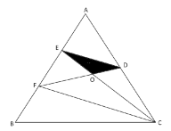

- **A**. 9
- **B**. 12
- **C**. 16
- **D**. 18　✅

**答案**：D

**官方解析**

如图所示，由AE=EF，AD=DC，则ED为的中位线，则，且，则AE：AF=ED：FC=1：2，可推出，且EO：OC=DO：FO=1：2。赋值黑色部分人工湖面积为1，根据面积之比等于相似比的平方，可知面积为4。与，高相同，底边DO：FO=1：2，则面积为2，则面积。由AE=EF=FB，C点向AB的高相同，可知面积，则三角形公园ABC面积为3×6=18。故所求为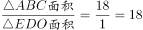倍。

故正确答案为D。

---

### 第 5 题　qid 5445725 · 数学运算

某单位有甲和乙2个办公室，分别有职工5人和4人。每周从这9名职工中随机抽取1人下沉社区担任志愿者（同一人有可能被连续、重复选中）。问7月前2周的志愿者均来自甲办公室的概率在以下哪个范围内？

- **A**. 不到25%
- **B**. 25%~35%之间　✅
- **C**. 35%~45%之间
- **D**. 超过45%

**答案**：B

**官方解析**

根据题意可知，7月前2周的志愿者总情况数为种，7月前2周的志愿者均来自甲办公室的情况数为种。因此所求概率，在25%~35%之间。

故正确答案为B。

---

### 第 6 题　qid 5445928 · 数学运算

甲和乙两个实验室共同承接10000份样本的检验工作。甲实验室每小时可检验200份样本，每检验一份样本的费用为100元；乙实验室每小时可检验500份样本，每检验一份样本的费用为200元。问如要求15小时内检验完毕，最低总检验费用比要求18小时内检验完毕时高多少万元？

- **A**. 3
- **B**. 4
- **C**. 5
- **D**. 6　✅

**答案**：D

**官方解析**

根据甲每检验一份样本的费用比乙低，则在一定时间内要想总检验费用最低，甲尽可能多干，即让甲全程参与。
方法一：若要求15小时内检验完毕且总检验费用最低，则甲检验200×15=3000份，乙检验10000-3000=7000份，总检验费用为3000×100+7000×200=300000+1400000=1700000元=170万元；若要求18小时内检验完毕且总检验费用最低，则甲检验200×18=3600份，乙检验10000-3600=6400份，总检验费用为3600×100+6400×200=360000+1280000=1640000元=164万元，故题干所求为170-164=6万元。
方法二：观察18小时和15小时的差异部分。与15小时相比，18小时检验完时，甲多做了3小时即多检验了3×200=600件，则乙少检验了600件，每件费用可节省200-100=100元，共节省了600×100=60000元=6万元。
故正确答案为D。

---

### 第 7 题　qid 5445739 · 数学运算

在一块正方形土地中，画一条经过某个顶点的规划线，将其分割为三角形和梯形两块土地，且梯形土地的面积正好是三角形土地的2倍。问三角形和梯形土地的周长之比是多少？

- **A**. 
1：2

- **B**. 
5：7

- **C**. 

- **D**. 

　✅

**答案**：D

**官方解析**

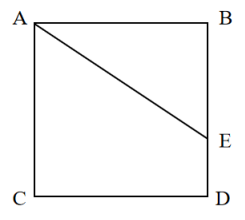

赋值正方形土地的边长为3，根据题意，梯形土地的面积正好是三角形土地的2倍，则正方形土地的面积是三角形土地的3倍，设三角形土地BE边长为x，则，代入数据得，解得x=2，则ED=BD-BE=3-2=1。根据勾股定理，，则三角形土地的周长，梯形土地的周长，故三角形和梯形土地的周长之比为。

故正确答案为D。

---

### 第 8 题　qid 5445930 · 数学运算

将5个相邻的铺位出租给2家餐厅和2家水果店。要求租完不能有空余铺位，每家餐厅可以租用1个铺位，也可以租用并打通2个相邻的铺位作为其营业场所，每家水果店只能租用1个铺位，且相同类型的两个租户之间至少要间隔1个铺位。问有多少种不同的安排方式？

- **A**. 24
- **B**. 48
- **C**. 8
- **D**. 16　✅

**答案**：D

**官方解析**

根据题意，5个铺位出租给2家餐厅和2家水果店，且每家水果店只能租用1个铺位，则有1家餐厅租用2个相邻的铺位，其余的1家餐厅和2家水果店各租用1个铺位。在2家餐厅中选1家租用2个相邻的铺位，有种情况；因为相同类型的两个租户之间至少要间隔1个铺位，即相同类型的两个租户不相邻，则只能按照（水果店、餐厅、水果店、餐厅）或（餐厅、水果店、餐厅、水果店）的方式排列，有种情况，则共有种不同的安排方式。

故正确答案为D。

---

### 第 9 题　qid 5445877 · 数学运算

社区计划采购10份年货礼包发放给10户独居老人，每户发放1份。年货礼包有100元/份和150元/份的两种供选择，总预算不能超过1250元。如采购了150元/份的年货礼包，则需要优先在3户孤寡老人中选择发放对象。问共有多少种不同的发放方式？

- **A**. 21
- **B**. 28
- **C**. 36　✅
- **D**. 55

**答案**：C

**官方解析**

设购买150元/份的年货礼包x份，则购买100元/份的年货礼包（10-x）份，故可列式：，解得：。因此年货礼包采购数量情况可分为以下6类：

（1）150元的0份，100元的10份，有种发放方式；

（2）150元的1份，100元的9份，有种不同的发放方式；

（3）150元的2份，100元的8份，有种不同的发放方式；

（4）150元的3份，100元的7份，有种发放方式；

（5）150元的4份，100元的6份，有种不同的发放方式；

（6）150元的5份，100元的5份，有种不同的发放方式。

分类用加法，共有1+3+3+1+7+21=36种不同的发放方式。

故正确答案为C。

---

### 第 10 题　qid 5445875 · 数学运算

农科院在某村287名淡水鱼养殖人员中开展防病培训和育种培训。已知参加防病培训的养殖人员中，参加育种培训的人数比未参加的多21%；参加育种培训的养殖人员中，参加防病培训的人数比未参加的多76人。问共有多少人未参加任何一项培训？

- **A**. 21　✅
- **B**. 23
- **C**. 25
- **D**. 27

**答案**：A

**官方解析**

根据“参加防病培训的养殖人员中，参加育种培训的人数比未参加的多21%”，可知只参加防病培训的人数是100的倍数。由于总人数为287人，当只参加防病培训的人数是200人时，参加防病培训的共有200×（1+21%）+200＞287人，排除。则只参加防病培训的人数为100人，此时既参加防病培训又参加育种培训的有100×（1+21%）=121人，只参加育种培训的有121-76=45人。未参加培训的人数=总数-只参加防病培训的人数-只参加育种培训的人数-两者都参加的人数=287-100-45-121=21人，即共有21人未参加任何一项培训。
故正确答案为A。

---

### 第 11 题　qid 5445934 · 数学运算

某次招标活动中，甲、乙、丙、丁、戊和己6家投标企业依次对自己的设计进行讲解。已知甲和乙均不能安排在第一个或最后一个，丙只能安排在第三个或第四个，如在满足以上条件的次序中随机选择一个，则丁和戊的讲解次序相邻的概率为：

- **A**. 

　✅
- **B**. 

- **C**. 

- **D**. 

**答案**：A

**官方解析**

丙只能安排在第三个或第四个，则丙的次序安排有种情况；甲和乙均不能安排在第一个或最后一个，则甲、乙应在第二个到第五个剩余的3个中安排，其次序有种情况；剩余三人全排列，有种情况。故总情况数为种。

现要丁、戊的次序相邻，可根据丙的次序分两类讨论：

第一类：丙安排在第三个时：

当甲、乙在（二、四）时，丁、戊只能在（五、六）才能相邻，有种情况；

当甲、乙在（二、五）时，丁、戊无法相邻，不符合题意；

当甲、乙在（四、五）时，丁、戊只能在（一、二）才能相邻，有种情况。故共有4+4=8种情况。

第二类：丙安排在第四个时，与安排在第三个时的情况类似，同理，也有8种情况。

因此，满足条件的情况数共有8+8=16种，则所求概率。

故正确答案为A。

---

### 第 12 题　qid 5445881 · 数学运算

甲和乙两人8：00同时从A地出发前往B地，其中乙全程匀速，甲出发时的速度是乙的一半，但全程均匀加速。已知10：00甲追上乙，11：00甲到达B地。问乙什么时间到达B地？

- **A**. 11：30
- **B**. 11：45　✅
- **C**. 12：00
- **D**. 12：15

**答案**：B

**官方解析**

赋值出发时甲的速度为1，乙的速度为2。从8：00至10：00，甲和乙的路程相同，即该时段甲的平均速度=乙的速度=2。根据匀加速运动的平均速度，则10：00时甲的速度为2×2-1=3。因此，甲的速度每小时增加，故甲11：00时的速度为3+1=4。根据甲可计算，从A地到B地的路程为，则乙全程所需时间为小时小时=3小时45分钟，即乙在11：45到达B地。

故正确答案为B。

---

### 第 13 题　qid 5445712 · 数学运算

甲、乙、丙三家科技企业2021年的收入之和比2020年提升了20%。其中甲企业的收入上升了400万元，乙企业的收入下降了100万元且是甲企业收入的一半，丙企业的收入上升了30%且其2020年的收入与甲、乙两企业同年收入之和相同。问2020年甲企业的收入比乙企业高多少万元？

- **A**. 900
- **B**. 1100
- **C**. 400
- **D**. 600　✅

**答案**：D

**官方解析**

设2021年乙企业的收入为x万元，则根据题干条件甲、乙、丙三家企业的收入如下表所示：

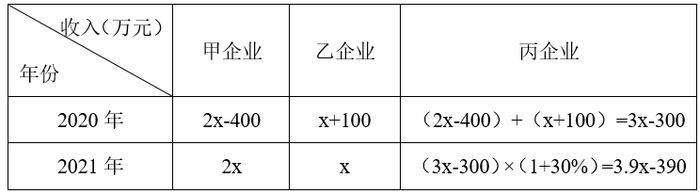

2021年甲、乙、丙三家企业的收入之和为2x+x+3.9x-390=6.9x-390，2020年甲、乙、丙三家企业的收入之和为。因甲、乙、丙三家企业2021年的收入之和比2020年提升了20%，即，解得x=1100，则2020年甲企业的收入比乙企业高（2x-400）-（x+100）=x-500=600万元。

故正确答案为D。

---

### 第 14 题　qid 5445926 · 数学运算

将一个高度为x的实心圆锥体零件尖部朝下放入密度为1的液体A中，浮出液面的高度为0.1x。如将其尖部朝上放入密度为1.5的液体B中，浮出液面的高度将在以下哪个范围内？

- **A**. 超过0.8x　✅
- **B**. 0.7x~0.8x之间
- **C**. 0.6x~0.7x之间
- **D**. 不到0.6x

**答案**：A

**官方解析**

由于实心圆锥体零件的质量不变且放入液体A、B中均为漂浮状态，则两种放置方式所受浮力相等。根据物理学中浮力公式：，令尖部朝下放入时排出的液体体积为，尖部朝上放入时排出的液体体积为，则，化简得。由于尖部朝下时浮出液面的高度为0.1x，则液体中零件的高度为x-0.1x=0.9x，此时液面下方零件为实心圆锥体， 。根据相似图形结论：当图形相似比为1：k时，其体积之比为，故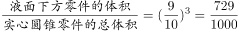，赋值零件总体积为1000，则液面下方零件的体积，则。当实心圆锥体零件尖部朝上放入液体中，液面上方零件为实心圆锥体（其与实心圆锥零件整体相似），则体积为1000-486=514。则此时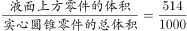，则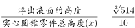，则浮出液体的高度。（，则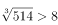）

故正确答案为A。

---

## 判断推理

### 第 1 题　qid 5445797 · 图形推理

从所给的四个选项中，选择最合适的一个填入问号处，使之呈现一定的规律性：

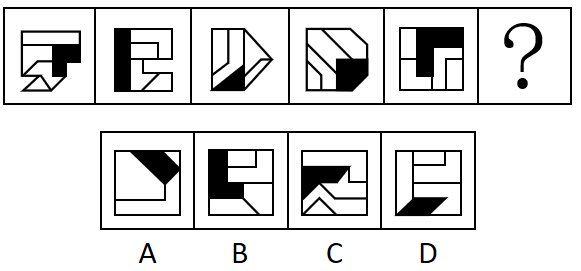

- **A**. A
- **B**. B
- **C**. C　✅
- **D**. D

**答案**：C

**官方解析**

图形元素组成不同，无明显属性规律，考虑数量规律。题干图形明显被分割，优先考虑面数量，发现题干图形均为4个面，据此排除A项；继续观察发现题干图形均由几个图形拼接而成，还可以考虑图形间关系。题干图形均有一个黑块，观察发现题干图形中黑块均与3个白块存在公共边，选项中只有C项符合。
故正确答案为C。

---

### 第 2 题　qid 5445802 · 图形推理

从所给的四个选项中，选择最合适的一个填入问号处，使之呈现一定的规律性：

- **A**. A
- **B**. B　✅
- **C**. C
- **D**. D

**答案**：B

**官方解析**

元素组成相同，优先考虑位置规律。题干图形由黑色三角形构成，且数量较多、角度也较乱，考虑相邻比较。观察发现：从图1到图2，最上方一行相同位置上的黑色三角形均顺时针旋转了，其余位置的黑色三角形保持不变；从图2到图3，最右侧一列相同位置上的黑色三角形均顺时针旋转了，其余位置的黑色三角形保持不变；从图3到图4，最下方一行相同位置上的黑色三角形均顺时针旋转了，其余位置的黑色三角形保持不变；从图4到图5，最左侧一列相同位置上的黑色三角形均顺时针旋转了，其余位置的黑色三角形保持不变。因此，？处图形与图5相比，应为只有最上方一行相同位置上的黑色三角形顺时针旋转，其余位置的黑色三角形均保持不变，只有B项符合。

故正确答案为B。

---

### 第 3 题　qid 5445855 · 图形推理

从所给的四个选项中，选择最合适的一个填入问号处，使之呈现一定的规律性：

- **A**. A　✅
- **B**. B
- **C**. C
- **D**. D

**答案**：A

**官方解析**

元素组成不同，优先考虑属性规律。观察发现，整体无规律，题干所有图形均由黑球和白球构成，考虑黑白分开看，继续观察发现，每幅图形的白色区域均为轴对称图形，且对称轴每次顺时针旋转，因此？处图形的白色区域应为轴对称图形，且对称轴应为竖直方向。B项图形的白色区域为轴对称图形，但对称轴为水平方向，C、D两项图形的白色区域为非对称图形，均排除。只有A项符合。

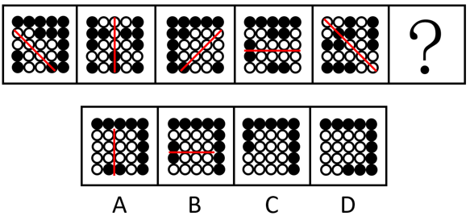

故正确答案为A。

---

### 第 4 题　qid 5445842 · 图形推理

从所给的四个选项中，选择最合适的一个填入问号处，使之呈现一定的规律性：

- **A**. A
- **B**. B
- **C**. C　✅
- **D**. D

**答案**：C

**官方解析**

题干每行图形元素组成相似，优先考虑样式规律。九宫格中优先横向看，第一行中，图一和图二求异得到图三；经验证，第二行也满足此规律；第三行应用此规律，图一和图二求异，只有C项符合。
故正确答案为C。

---

### 第 5 题　qid 5445843 · 图形推理

下图是给定的立体图形（大圆柱内的虚线部分为挖空部分），将其从任一面剖开，下面哪一项不可能是该立体图形的截面？

- **A**. A　✅
- **B**. B
- **C**. C
- **D**. D

**答案**：A

**官方解析**

本题考查截面图。逐一分析选项。

A项：无法截出，当选；

B项：如下图所示，从上方圆柱向下经过空心圆柱竖切，可以截出，排除；

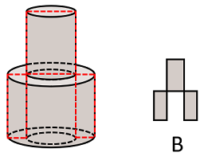

C项：如下图所示，从上方圆柱向下经过空心圆柱斜切，可以截出，排除；

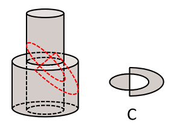

D项：如下图所示，斜切下方圆柱同时经过空心部分，可以截出，排除。

本题为选非题，故正确答案为A。

---

### 第 6 题　qid 5445923 · 图形推理

左边给定的是正方体的外表面展开图，下面哪一项能由它折叠而成？

- **A**. A
- **B**. B　✅
- **C**. C
- **D**. D

**答案**：B

**官方解析**

本题为空间重构题。对展开图进行编号，如下图所示：

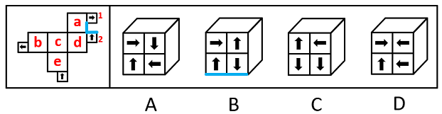

面a、面d和面2为具有唯一公共点的三个面，面a和面2中加粗（标蓝）的两条线构成直角，为公共边，可知折成立体图形后，面2中箭头与面1中箭头平行，且方向相反，只有B项符合。

故正确答案为B。

---

### 第 7 题　qid 5445914 · 图形推理

左图为等大的3个灰色正方体和15个白色正方体所组成的多面体，其可以切割为①、②和③三个小多面体，则③代表的多面体可能是：

- **A**. A
- **B**. B
- **C**. C　✅
- **D**. D

**答案**：C

**官方解析**

本题考查立体拼合。如下图所示，立体图可以由①、②以及C项拼合而成。

故正确答案为C。

---

### 第 8 题　qid 5445917 · 图形推理

把下面的六个图形分为两类，使每一类图形都有各自的共同特征或规律，分类正确的一项是：

- **A**. ①③⑥，②④⑤
- **B**. ①③⑤，②④⑥
- **C**. ①②⑥，③④⑤
- **D**. ①⑤⑥，②③④　✅

**答案**：D

**官方解析**

元素组成不同，优先考虑属性规律。观察发现，题干图形均为轴对称图形，画出题干中每个图形的对称轴发现，图①⑤⑥的对称轴穿过图形的三个面，图②③④的对称轴穿过图形的一个面，即图①⑤⑥为一组，图②③④为一组。

故正确答案为D。

---

### 第 9 题　qid 5445852 · 图形推理

把下面的六个图形分为两类，使每一类图形都有各自的共同特征或规律，分类正确的一项是：

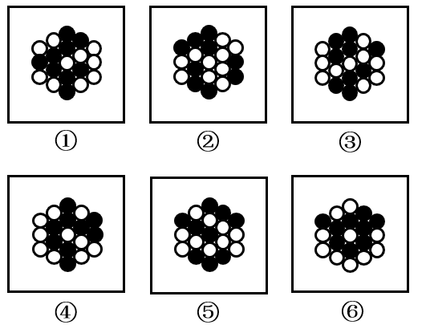

- **A**. ①⑤⑥，②③④
- **B**. ①④⑥，②③⑤　✅
- **C**. ①②⑥，③④⑤
- **D**. ①③④，②⑤⑥

**答案**：B

**官方解析**

本题为分组分类题目。元素组成相同，但无明显位置规律和属性规律，考虑数量规律。观察发现，题干每个图形均存在黑球或白球被分隔开的情况，考虑部分数。图①④⑥中，黑球的部分数均为1，白球的部分数均为3；图②③⑤中，黑球的部分数均为3，白球的部分数均为1。即图①④⑥为一组，图②③⑤为一组。
故正确答案为B。

---

### 第 10 题　qid 5445911 · 图形推理

把下面的六个图形分为两类，使每一类图形都有各自的共同特征或规律，分类正确的一项是：

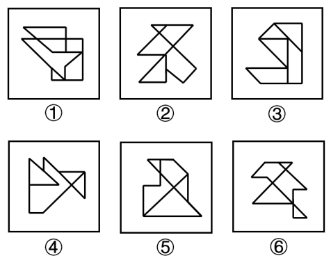

- **A**. ①③⑥，②④⑤
- **B**. ①④⑤，②③⑥
- **C**. ①②⑥，③④⑤　✅
- **D**. ①③④，②⑤⑥

**答案**：C

**官方解析**

本题为分组分类题目。元素组成不同，无明显属性规律，考虑数量规律。观察发现，题干图形封闭面较多，可优先考虑数面数量，但面数量无规律。继续观察发现，题干图形存在多个封闭面相交，均为“多圆相切”的变形图，考虑笔画数，图①②⑥均为一笔画图形，图③④⑤均为两笔画图形。即图①②⑥为一组，图③④⑤为一组。
故正确答案为C。

---

### 第 11 题　qid 5445913 · 定义判断

化学动力学是研究化学反应速率和反应机理的化学分支学科，主要内容包括：（1）确定化学反应的速率以及温度、压力、催化剂、溶剂和光照等外界因素对反应速率的影响；（2）研究化学反应机理，揭示化学反应速率本质；（3）探求物质结构与反应能力之间的关系和规律。
根据上述定义，下列没有体现化学动力学研究的是：

- **A**. 研究表面积不同的各类煤块在相同温度条件下燃烧速率的变化
- **B**. 研究不同光照和温湿度条件下植物叶片蒸腾作用的强度和效率　✅
- **C**. 在馒头制作的过程中，研究酵母菌对面粉发酵的催化反应模型
- **D**. 在铁制品表面喷涂不同种类油漆，研究铁与水、氧气的反应情况，判断防锈效果

**答案**：B

**官方解析**

第一步：找出定义关键词。
“研究化学反应速率和反应机理的化学分支学科”、“确定化学反应的速率以及温度、压力、催化剂、溶剂和光照等外界因素对反应速率的影响”、“研究化学反应机理，揭示化学反应速率本质”、“探求物质结构与反应能力之间的关系和规律”。
第二步：逐一分析选项。
A项：研究的是外界温度对不同煤块燃烧速率的影响，燃烧是化学变化，符合“研究化学反应速率和反应机理的化学分支学科”、“确定化学反应的速率以及温度、压力、催化剂、溶剂和光照等外界因素对反应速率的影响”，符合定义，排除；
B项：研究的是不同光照和温湿度条件下植物叶片蒸腾作用的强度和效率，植物叶片的蒸腾作用是指植物体内的水通过叶片上的气孔散发出去的过程，也就是水从液态变成了气态，没有生成新的物质，所以是物理变化，不符合“研究化学反应速率和反应机理的化学分支学科”，不符合定义，当选；
C项：研究的是酵母菌对面粉发酵的催化反应模型，发酵是化学变化，符合“研究化学反应速率和反应机理的化学分支学科”、“研究化学反应机理，揭示化学反应速率本质”，符合定义，排除；
D项：研究的是铁与水、氧气的反应情况，判断防锈效果，生锈是化学变化，符合“研究化学反应速率和反应机理的化学分支学科”、“确定化学反应的速率以及温度、压力、催化剂、溶剂和光照等外界因素对反应速率的影响”，符合定义，排除。
本题为选非题，故正确答案为B。

---

### 第 12 题　qid 5445845 · 定义判断

政策工具是指实现政策目标所要运用的手段与方法。政策工具可分为以下三种：
（1）供给型政策工具，对政策目标起直接促进作用，通常体现政府的重要政策导向，包含资金、人才、设施、技术、信息等方面的有效支持；（2）需求型政策工具，对政策目标起到拉动作用，释放对政策目标的需求，减少外部干扰，包括服务外包、直接采购、国际交流与贸易管制等；（3）环境型政策工具，对政策目标起到间接促进作用，通常体现为通过目标、计划、法规、金融与税收等方式提供有利的政策环境，包括目标规划、金融服务、税收优惠、法规管制以及策略性措施等。
根据上述定义，下列属于促进养老服务的需求型政策工具的是：

- **A**. 政府向养老机构购买居家养老服务，为低保家庭60周岁以上失能老人提供服务　✅
- **B**. 政府提供资金建设社区食堂，解决失能、独居、空巢等老年人“舌尖养老”难题
- **C**. 政府鼓励技工院校开设老年服务与管理、健康服务与管理、护理等养老服务相关专业
- **D**. 商务部发布《关于推动养老服务产业发展的指导意见》，提出打造养老服务品牌

**答案**：A

**官方解析**

第一步：找出定义关键词。
供给型政策工具：“对政策目标起直接促进作用”、“通常体现政府的重要政策导向”、“包含资金、人才、设施、技术、信息等方面的有效支持”；
需求型政策工具：“对政策目标起到拉动作用，释放对政策目标的需求，减少外部干扰”、“包括服务外包、直接采购、国际交流与贸易管制等”；
环境型政策工具：“对政策目标起到间接促进作用”、“通常体现为通过目标、计划、法规、金融与税收等方式提供有利的政策环境”、“包括目标规划、金融服务、税收优惠、法规管制以及策略性措施等”。
第二步：逐一分析选项。
A项：政府向养老机构购买居家养老服务，体现了将服务外包给养老机构，符合“对政策目标起到拉动作用，释放对政策目标的需求，减少外部干扰”、“包括服务外包、直接采购、国际交流与贸易管制等”，符合“需求型政策工具”定义，当选；
B项：政府提供资金建设社区食堂，说明政府直接提供资金支持，不符合“包括服务外包、直接采购、国际交流与贸易管制等”，不符合“需求型政策工具”定义，符合“供给型政策工具”定义，排除；
C项：政府鼓励技工院校开设养老服务相关专业，说明进行人才培养，提供人才支持，不符合“包括服务外包、直接采购、国际交流与贸易管制等”，不符合“需求型政策工具”定义，符合“供给型政策工具”定义，排除；
D项：国务院发布《关于推动养老服务产业发展的指导意见》，说明提供有利的政策环境，提出目标规划，不符合“包括服务外包、直接采购、国际交流与贸易管制等”，不符合“需求型政策工具”定义，符合“环境型政策工具”定义，排除。
故正确答案为A。

---

### 第 13 题　qid 5445862 · 定义判断

背信规避是指当风险来源为另一个体而不是自然条件时，人们普遍更不愿意冒险，即在同等条件下，人们对于人为风险的规避程度高于对客观风险的规避程度，体现在人们面对人为风险时比面对客观风险时表现得更保守。
根据上述定义，下列没有体现背信规避的是：

- **A**. 在对客观题阅卷方式意愿的调查中，学生更愿意选择机器阅卷而非人工阅卷
- **B**. 决定谁先开球时，双方球员都倾向于由裁判抛硬币决定而非裁判随机指定
- **C**. 在老师打算指派一个人多承担一项任务时，同学们纷纷表示要抽签决定
- **D**. 与老司机相比，坐新手司机开的车时，后排座上的乘客主动系安全带的更多　✅

**答案**：D

**官方解析**

第一步：找出定义关键词。
定义中比较易懂的关键词在于：“风险来源为另一个体而不是自然条件时”、“人为风险的规避程度高于对客观风险的规避程度”。
第二步：逐一分析选项。
A项：在客观题阅卷方式中，学生更愿意选择机器阅卷而非人工阅卷，机器阅卷对应客观风险，人工阅卷对应人为风险，“学生更愿意选择机器阅卷而非人工阅卷”，符合“人为风险的规避程度高于对客观风险的规避程度”，符合定义，排除；
B项：在决定谁先开球时，双方球员都倾向于由裁判抛硬币决定而非裁判随机指定，抛硬币对应客观风险，裁判指定对应人为风险，“双方球员都倾向于由裁判抛硬币决定而不是裁判指定”，符合“人为风险的规避程度高于对客观风险的规避程度”，符合定义，排除；
C项：在老师打算指派一个人多承担一项任务时，同学们纷纷表示要抽签决定，抽签对应客观风险，老师指派对应人为风险，“同学们纷纷表示要抽签决定”，符合“人为风险的规避程度高于对客观风险的规避程度”，符合定义，排除；
D项：与老司机相比，坐新手司机开的车时，后排座上的乘客主动系安全带的更多，老司机开车与新手司机开车都对应人为风险，没有体现客观风险，“坐新手司机开的车时后排座上的乘客主动系安全带的更多”，只是人为风险规避程度的比较，不符合“人为风险的规避程度高于对客观风险的规避程度”，不符合定义，当选。
本题为选非题，故正确答案为D。

---

### 第 14 题　qid 5445856 · 定义判断

植物病害分为侵染性病害和非侵染性病害。侵染性病害是由病原物引起的，可以在植物个体间互相传染的病害；非侵染性病害是由于环境不良、营养元素不足等非生物因素造成的病害，由于没有病原物的侵袭，所以不会在植物间相互传染。
根据上述定义，下列属于非侵染性病害的是：
①需要微酸性生长环境的杜鹃花，种植在偏碱性土壤中，叶片会黄化
②植株浇水过多，盆土积水后，由于植株根系缺氧，会导致植株萎蔫
③除草剂使用不当会引起西瓜苗嫩叶黄化，叶片枯焦，植株萎缩
④灰葡萄孢真菌会引起番茄灰霉病，发病后造成番茄大量烂果

- **A**. 仅①④
- **B**. 仅①②
- **C**. 仅①②③　✅
- **D**. 仅②③④

**答案**：C

**官方解析**

第一步：找出定义关键词。
侵染性病害：“由病原物引起”、“可以在植物个体间互相传染”；
非侵染性病害：“由于环境不良、营养元素不足等非生物因素造成”、“不会在植物间相互传染”。
第二步：逐一进行分析。
①：杜鹃花由于生长在偏碱性土壤环境中而导致其叶片黄化，其中偏碱性土壤属于环境因素，符合“由于环境不良、营养元素不足等非生物因素造成”、“不会在植物间相互传染”，符合“非侵染性病害”的定义；
②：植株由于盆土积水后，根系缺氧导致其萎蔫，其中盆土积水属于环境因素，符合“由于环境不良、营养元素不足等非生物因素造成”、“不会在植物间相互传染”，符合“非侵染性病害”的定义；
③：西瓜苗由于除草剂使用不当而导致其嫩叶黄化等后果，其中除草剂使用不当属于非生物因素，符合“由于环境不良、营养元素不足等非生物因素造成”、“不会在植物间相互传染”，符合“非侵染性病害”的定义；
④：番茄大量烂果是由灰葡萄孢真菌引起的，其中灰葡萄孢真菌属于病原物，而不是非生物因素，并且番茄因感染灰霉病而大量烂果，符合“由病原物引起”、“可以在植物个体间互相传染”，符合“侵染性病害”定义，不符合“非侵染性病害”的定义。
综上，仅①②③符合“非侵染性病害”的定义。
故正确答案为C。

---

### 第 15 题　qid 5445787 · 定义判断

单元素导语是指在撰写新闻导语（即消息的开头）时，突出表现一个新闻事实的导语。单元素导语按新闻五要素可分为：①何人导语，突出报道显要或影响大的新闻人物；②何事导语，突出报道新闻事实本身；③何时导语，突出报道读者关心的事情什么时候会发生或进行；④何地导语，突出报道一些重要或有特殊意义的地方发生重大变化的消息；⑤为什么导语，突出报道一个事件的起因。
根据上述定义，下列导语与其分类对应正确的是：

- **A**. 亲爱的读者，你知道为什么夏天夜空里看到的星星比冬天夜空里看到的多？——④
- **B**. 1964年10月16日，我国第一颗原子弹爆炸成功——②　✅
- **C**. 杨先生带着2岁的女儿到市医院看病，没想到看一个“咳嗽”就要花1000多元——①
- **D**. 谁是高考状元？这个一年一度的热门话题，今年却在XX省消失了——③

**答案**：B

**官方解析**

第一步：找出定义关键词。
单元素导语：“在撰写新闻导语（即消息的开头）时，突出表现一个新闻事实”；
何人导语：“突出报道显要或影响大的新闻人物”；
何事导语：“突出报道新闻事实本身”；
何时导语：“突出报道读者关心的事情什么时候会发生或进行”；
何地导语：“突出报道一些重要或有特殊意义的地方发生重大变化的消息”；
为什么导语：“突出报道一个事件的起因”。
第二步：逐一分析选项。
A项：为什么夏天夜空看到的星星比冬天夜空里看到的多是想要表现事件的起因，符合“突出报道一个事件的起因”，符合“为什么导语”定义，不符合“何地导语”定义，对应错误，排除；
B项：1964年10月16日，第一颗原子弹爆炸成功是新闻事实本身，符合“突出报道新闻事实本身”，符合“何事导语”定义，对应正确，当选；
C项：杨先生带着女儿到医院看病，一个“咳嗽”花费1000多元是新闻事实本身，符合“突出报道新闻事实本身”，符合“何事导语”定义，不符合“何人导语”定义，对应错误，排除；
D项：高考状元今年在XX省消失了，报道该省发生的重大变化，符合“突出报道一些重要或有特殊意义的地方发生重大变化的消息”，符合“何地导语”定义，不符合“何时导语”定义，对应错误，排除。
故正确答案为B。

---

### 第 16 题　qid 5445915 · 定义判断

数字农业是指用数字化技术，按人类需要的目标，对农业所涉及的对象和全过程进行数字化和可视化表达、设计、控制、管理等的农业。
根据上述定义，下列没有体现数字农业的是：

- **A**. 在大数据平台，点击任一块田地，就可以看到这块田地的土壤酸碱度、肥水条件、环境温度湿度等指标，农民可以根据这些信息进行田地管理
- **B**. 某柑橘生产大省建立“柑橘产业大数据中心”，以数据驱动柑橘产业结构性改革和高质量发展
- **C**. 通过电子标签等技术，对单个产品赋予身份编码及认证信息，在生产管理、仓储、物流、销售等环节实现信息追溯
- **D**. 遇到连绵阴雨天，果蔬容易滋生病害，需要及时喷药，采用轻型直升机几个小时就可以完成传统作业方式十多人几天才能完成的工作　✅

**答案**：D

**官方解析**

第一步：找出定义关键词。
“用数字化技术”、“对农业所涉及的对象和全过程进行数字化和可视化表达、设计、控制、管理等的农业”。
第二步：逐一分析选项。
A项：在大数据平台，点击任一块田地就可以看到田地的一系列指标，符合“用数字化技术”，农民可以根据这些信息进行田地管理，符合“对农业所涉及的对象和全过程进行数字化和可视化表达、设计、控制、管理等的农业”，符合定义，排除；
B项：建立“柑橘产业大数据中心”，符合“用数字化技术”，以数据驱动柑橘产业结构性改革和高质量发展，符合“对农业所涉及的对象和全过程进行数字化和可视化表达、设计、控制、管理等的农业”，符合定义，排除；
C项：通过电子标签等技术对单个产品赋予身份编码及认证信息，符合“用数字化技术”，在各种环节实现信息追溯，符合“对农业所涉及的对象和全过程进行数字化和可视化表达、设计、控制、管理等的农业”，符合定义，排除；
D项：采用轻型直升机对果蔬进行喷药，只是提高了工作效率，没有体现利用数字化技术以及全程数字化和可视化表达等，不符合“用数字化技术”、“对农业所涉及的对象和全过程进行数字化和可视化表达、设计、控制、管理等的农业”，不符合定义，当选。
本题为选非题，故正确答案为D。

---

### 第 17 题　qid 5445859 · 定义判断

小中取大法是指在决策时，首先计算各方案在不同自然状态下的收益，并找出各方案在最差自然状态下的收益，然后进行比较，选择在最差自然状态下收益最大或损失最小的方案作为最终方案的一种决策方法。大中取大法是指在决策时，首先计算各方案在不同自然状态下的收益，并找出各方案在最好自然状态下的收益，然后进行比较，选择在最好自然状态下收益最大的方案作为最终方案的一种决策方法。

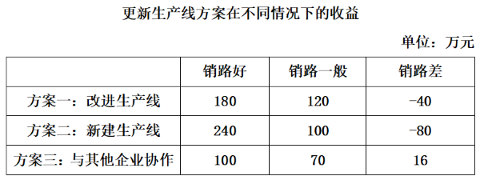

根据上述定义，分别使用小中取大法和大中取大法对上述方案进行决策，所选择的方案依次是：

- **A**. 方案二和方案二
- **B**. 方案二和方案一
- **C**. 方案三和方案一
- **D**. 方案三和方案二　✅

**答案**：D

**官方解析**

第一步：找出定义关键词。
小中取大法：“找出各方案在最差自然状态下的收益”、“选择在最差自然状态下收益最大或损失最小的方案”；
大中取大法：“找出各方案在最好自然状态下的收益”、“选择在最好自然状态下收益最大的方案作为最终方案”。
第二步：逐一分析选项。
依据设问使用“小中取大法”，需要符合“找出各方案在最差自然状态下的收益”、“选择在最差自然状态下收益最大或损失最小的方案”，表格中销路差此列对应的数据就是最差自然状态下的收益，方案三是销路差中收益最大的方案，因此根据“小中取大法”应选择方案三；
依据设问使用“大中取大法”，需要符合“找出各方案在最好自然状态下的收益”、“选择在最好自然状态下收益最大的方案作为最终方案”，表格中销路好此列对应的数据就是最好自然状态下的收益，方案二是销路好中收益最大的方案，因此根据“大中取大法”应选择方案二，只有D项符合。
故正确答案为D。

---

### 第 18 题　qid 5445924 · 定义判断

对称推断法是辨析文言词义的一种方法，是指通过对运用了对偶修辞格或排比修辞格的句子内部已知词语词义的分析，推断其位置相对的文言词义的一种方法。
根据上述定义，下列使用了对称推断法的是：

- **A**. 归有光《项脊轩志》：“项脊轩，旧南阁子也。”其中的“也”，表判断的语气词，可不译
- **B**. 吴均《与朱元思书》：“急湍甚箭，猛浪若奔。”其中的“箭”为名词，可据此推断“奔”也为名词，为“奔马”的意思　✅
- **C**. 《荀子·劝学》：“故木受绳则直，金就砺则利。”其中的“砺”，形旁为“石”，说明“砺”与“石”有关，意思是磨刀石
- **D**. 《旧五代史·冯道传》：“臣所陈虽小，可以喻大。”成语“不言而喻”中的“喻”为“知晓”的意思，可据此推断此句中的“喻”为“知晓”的意思

**答案**：B

**官方解析**

第一步：找出定义关键词。
“通过对运用了对偶修辞格或排比修辞格的句子内部已知词语词义的分析”、“推断其位置相对的文言词义”。
第二步：逐一分析选项。
A项：“项脊轩，旧南阁子也。”的意思是项脊轩，是过去的南阁楼，这句话没有运用对偶修辞格或排比修辞格，不符合“通过对运用了对偶修辞格或排比修辞格的句子内部已知词语词义的分析”，不符合定义，排除；
B项：“急湍甚箭，猛浪若奔。”的意思是湍急的水流比箭还快，凶猛的巨浪就像奔腾的骏马，这句话运用了对偶修辞格，“箭”和“奔”是位置相对的词语，可用“箭”推断“奔”的含义为“奔马”，符合“通过对运用了对偶修辞格或排比修辞格的句子内部已知词语词义的分析”、“推断其位置相对的文言词义”，符合定义，当选；
C项：“故木受绳则直，金就砺则利。”的意思是所以木材经墨线比量过就变得笔直，金属制的刀剑拿到磨刀石上去磨就能变得锋利，选项根据“砺”与“石”有关，推断其意思是磨刀石，但“石”并不是句子内部的词语，不符合“通过对运用了对偶修辞格或排比修辞格的句子内部已知词语词义的分析”，不符合定义，排除；
D项：“臣所陈虽小，可以喻大。”的意思是臣所说的这件事虽小，却可以说明大道理，这句话没有运用对偶修辞格或排比修辞格，不符合“通过对运用了对偶修辞格或排比修辞格的句子内部已知词语词义的分析”，不符合定义，排除。
故正确答案为B。

---

### 第 19 题　qid 5445919 · 定义判断

分布区是指某生物的活动、生存范围。如下图所示，用黑色方块表示该生物已知、推断或预计出现的位点。分布区的划定是环绕所有已知、推断或预计出现的位点的最短连续边界所包含的面积，经常用最小凸边形来表示。该最小凸边形的每个内角不能超过180度，并要包含所有出现的位点。

根据上述定义，对于下列位点所划定的分布区正确的是：

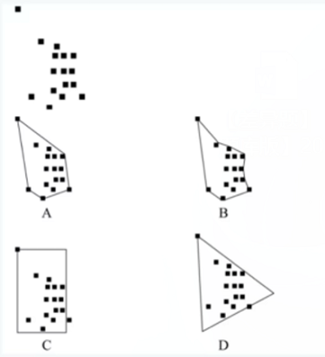

- **A**. A　✅
- **B**. B
- **C**. C
- **D**. D

**答案**：A

**官方解析**

第一步：找出定义关键词。
“环绕所有已知、推断或预计出现的位点的最短连续边界所包含的面积”、“用最小凸边形来表示”、“该最小凸边形的每个内角不能超过180度，并要包含所有出现的位点”。
第二步：逐一分析选项。
A项：该项所示的区域划定范围为所有位点的最短连续边界，且范围的形状为每个内角不超过180度的凸边形，同时包含所有出现的位点，符合定义，当选；
B项：该项所示的区域划定范围内包含超过180度的内角，不符合“该最小凸边形的每个内角不能超过180度，并要包含所有出现的位点”，不符合定义，排除；
C项：该项所示的区域划定范围外存在位点，不符合“该最小凸边形的每个内角不能超过180度，并要包含所有出现的位点”，不符合定义，排除；
D项：该项所示的区域划定范围左下角及右侧未连接位点，不属于最短连续边界，不符合“环绕所有已知、推断或预计出现的位点的最短连续边界所包含的面积”，不符合定义，排除。
故正确答案为A。

---

### 第 20 题　qid 5445858 · 定义判断

细胞学检查是指对患者病变部位脱落、刮取或穿刺抽取的细胞，进行病理形态学的观察并做出定性诊断的检查方式。细胞学检查主要应用于肿瘤的诊断，也可用于某些疾病的检查和诊断，如内部器官炎症性疾病的诊断和激素水平的判定等。
根据上述定义，下列属于细胞学检查的是：

- **A**. 采集患者血液样本，分析血细胞比例变化，判断患者是否出现感染
- **B**. 针对外伤患者皮肤纤维细胞的过度增生，实行激光打磨法，抑制炎性细胞浸润，修复再生皮肤组织
- **C**. 通过拉网法收集食道癌患者的食道脱落细胞，鉴定细胞形态，明确癌变性质　✅
- **D**. 对脑疝患者脑室穿刺，放出脑室液以降低脑压，后再次穿刺注入造影剂，诊断其颅内占位病变的情况

**答案**：C

**官方解析**

第一步：找出定义关键词。
“患者病变部位脱落、刮取或穿刺抽取的细胞”、“进行病理形态学的观察”、“做出定性诊断的检查方式”。
第二步：逐一分析选项。
A项：采集患者血液样本，分析血细胞比例变化，不涉及病变部位的细胞，不符合“患者病变部位脱落、刮取或穿刺抽取的细胞”，不符合定义，排除；
B项：激光打磨抑制炎性细胞浸润，修复再生皮肤组织，属于一种治疗方法，而不是定性诊断的检查方式，不符合“做出定性诊断的检查方式”，不符合定义，排除；
C项：食道癌患者的食道脱落细胞，符合“患者病变部位脱落的细胞”，鉴定细胞形态，符合“进行病理形态学的观察”，明确癌变性质，符合“做出定性诊断的检查方式”，符合定义，当选；
D项：放出脑室液以降低脑压，后再次穿刺注入造影剂，诊断其颅内占位病变的情况，是通过注入造影剂进行观察诊断，而不是对细胞进行观察诊断，不符合“患者病变部位脱落、刮取或穿刺抽取的细胞”，不符合定义，排除。
故正确答案为C。

---

### 第 21 题　qid 5445920 · 类比推理

花海：书山

- **A**. 怒火：苦雨
- **B**. 车流：人潮　✅
- **C**. 雪白：麦浪
- **D**. 龙舟：木马

**答案**：B

**官方解析**

第一步：判断题干词语间逻辑关系。
花海指的是像海洋般广阔的花群，书山指的是像山峰般高耸的书籍，二者为并列关系，且后一个字修饰前一个字。
第二步：判断选项词语间逻辑关系。
A项：怒火和苦雨不是并列关系，并且是“苦”修饰“雨”，前一个字修饰后一个字，与题干顺序不一致，排除；
B项：车流指的是像河流般连续不断的车辆，人潮指的是像潮水一样的人群，二者为并列关系，且“流”修饰“车”，“潮”修饰“人”，与题干逻辑关系一致，当选；
C项：雪白和麦浪无明显逻辑关系，与题干逻辑关系不一致，排除；
D项：龙舟和木马为并列关系，但龙舟是指龙形船，“龙”修饰“舟”，“木”修饰“马”，都是前一个字修饰后一个字，与题干顺序不一致，排除。
故正确答案为B。

---

### 第 22 题　qid 5445863 · 类比推理

猛药去疴：重典治乱

- **A**. 民生在勤：勤则不匮
- **B**. 从善如登：从恶如崩
- **C**. 静以修身：俭以养德　✅
- **D**. 名非天造：必从其实

**答案**：C

**官方解析**

第一步：判断题干词语间逻辑关系。
“猛药去疴”意思是通过威力大的药达到去除疾病的目的，“重典治乱”意思是通过严酷的刑罚达到惩治坏人的目的，二者都可指问题很严重，必须采取有力的措施来处理，二者是近义关系，但选项没有近义关系，考虑拆词看结构，“猛药去疴”和“重典治乱”拆词后都能构成方式目的对应关系。
第二步：判断选项词语间逻辑关系。
A项：“民生在勤”的意思是人民的生计在于勤劳，“勤则不匮”意思是勤劳就不会缺乏财物，二者拆词之后不存在方式目的对应关系，与题干逻辑关系不一致，排除；
B项：“从善如登”意思是顺随良善像登山一样难，比喻学好向善很难，“从恶如崩”意思是顺随恶行像山崩一样容易，比喻学坏很容易，二者拆词之后不存在方式目的对应关系，与题干逻辑关系不一致，排除；
C项：“静以修身”意思是通过内心安静精力集中来修养身心，“俭以养德”意思是通过俭朴的作风来培养品德，二者拆词后都能构成方式目的对应关系，与题干逻辑关系一致，当选；
D项：“名非天造”的意思是名称不是天生就有的，“必从其实”的意思是必须依据其客观现实，二者拆词之后不存在方式目的对应关系，与题干逻辑关系不一致，排除。
故正确答案为C。

---

### 第 23 题　qid 5445873 · 类比推理

强光照射：视力损伤

- **A**. 台风过境：渔业停产　✅
- **B**. 网络招聘：业务扩张
- **C**. 原油进口：能源紧缺
- **D**. 风险防范：消防演练

**答案**：A

**官方解析**

第一步：判断题干词语间逻辑关系。
“强光照射”会导致“视力损伤”，二者为因果对应关系。
第二步：判断选项词语间逻辑关系。
A项：“台风过境”会导致“渔业停产”，二者为因果对应关系，与题干逻辑关系一致，当选；
B项：“业务扩张”会导致“网络招聘”，二者为因果对应关系，但词语顺序与题干相反，与题干逻辑关系不一致，排除；
C项：“能源紧缺”会导致“原油进口”，二者为因果对应关系，但词语顺序与题干相反，与题干逻辑关系不一致，排除；
D项：“风险防范”是“消防演练”的目的，二者为方式与目的对应关系，与题干逻辑关系不一致，排除。
故正确答案为A。

---

### 第 24 题　qid 5445912 · 类比推理

一望无垠：辽阔

- **A**. 人云亦云：重复
- **B**. 耳提面命：教导　✅
- **C**. 方兴未艾：失败
- **D**. 厉兵秣马：战斗

**答案**：B

**官方解析**

第一步：判断题干词语间逻辑关系。
“一望无垠”意思是宽广、辽阔，一眼望去看不到边际，与“辽阔”是近义关系。
第二步：判断选项词语间逻辑关系。
A项：“人云亦云”意思是人家怎么说，自己也跟着怎么说，指没有主见，随声附和别人，是贬义词；“重复”指相同的事物又一次出现，“重复”并不局限于重复他人的观点，且是中性的词语，二者不是近义关系，与题干逻辑关系不一致，排除；
B项：“耳提面命”意思是拉着耳朵，面对面地教导，形容恳切地教诲，与“教导”是近义关系，与题干逻辑关系一致，当选；
C项：“方兴未艾”意思是事物正在兴起、发展，一时不会终止，与“失败”是反义关系，与题干逻辑关系不一致，排除；
D项：“厉兵秣马”意思是把兵器磨快，把战马喂饱，形容做好战前准备，强调的是事前做好准备工作，与“战斗”不是近义关系，与题干逻辑关系不一致，排除。
故正确答案为B。

---

### 第 25 题　qid 5445916 · 类比推理

特征提取：模式匹配：语音识别

- **A**. 接诊病人：网上挂号：健康宣教
- **B**. 提交资料：资格审核：报名成功　✅
- **C**. 询问证人：勘验现场：接到报警
- **D**. 海事损害：请求赔偿：租赁船只

**答案**：B

**官方解析**

第一步：判断题干词语间逻辑关系。
先特征提取，再模式匹配，最后语音识别，三者为时间先后顺序的对应关系。
第二步：判断选项词语间逻辑关系。
A项：先网上挂号，再接诊病人，第一词与第二词的顺序与题干相反，与题干逻辑关系不一致，排除；
B项：先提交资料，再资格审核，最后报名成功，与题干逻辑关系一致，当选；
C项：先接到报警，再询问证人和勘验现场，与题干逻辑关系不一致，排除；
D项：先租赁船只，再海事损害，最后请求赔偿，与题干逻辑关系不一致，排除。
故正确答案为B。

---

### 第 26 题　qid 5445779 · 类比推理

春季过敏：花粉：喷嚏

- **A**. 肺炎：咳嗽：支原体
- **B**. 乙型脑炎：病毒：发热　✅
- **C**. 失眠：恐惧：噩梦
- **D**. 秋季腹泻：饮食：脱水

**答案**：B

**官方解析**

第一步：判断题干词语间逻辑关系。
花粉可能会导致春季过敏，前两词为因果关系；打喷嚏是春季过敏的症状，第一词和第三词为对应关系。
第二步：判断选项词语间逻辑关系。
A项：咳嗽是肺炎的症状，前两词为对应关系；支原体感染可能会导致肺炎，第一词和第三词为因果关系，与题干逻辑关系不一致，排除；
B项：病毒感染可能会导致乙型脑炎，前两词为因果关系；发热是乙型脑炎的症状，第一词和第三词为对应关系，与题干逻辑关系一致，当选；
C项：恐惧可能会导致失眠，前两词为因果关系；噩梦不是失眠的症状，与题干逻辑关系不一致，排除；
D项：秋季腹泻指发生在秋冬季的腹泻病，原因可能是饮食不当或饮食不洁，而非饮食，前两词不是因果关系，与题干逻辑关系不一致，排除。
故正确答案为B。

---

### 第 27 题　qid 5445868 · 类比推理

片剂：散剂：气雾剂

- **A**. 边塞诗：山水诗：抒情诗
- **B**. 口头契约：君子协定：书面协议
- **C**. 泉水：湖水：天然水
- **D**. 头部理疗：腰部理疗：腿部理疗　✅

**答案**：D

**官方解析**

第一步：判断题干词语间逻辑关系。
片剂是药物与辅料均匀混合后压制而成的片状或异形片状的固体制剂，散剂是指药物或与适宜的辅料经粉碎、均匀混合制成的干燥粉末状制剂，气雾剂是指药物和抛射剂共同封装于带有阀门的耐压容器中，使用时借抛射剂气化所产生的压力，定量或非定量地将药物以雾状喷出的制剂。三者是根据药物的剂型划分的，为并列关系中的反对关系。
第二步：判断选项词语间逻辑关系。
A项：边塞诗是以边疆地区军民生活和自然风光为题材的诗，山水诗是描写山水风景的诗，抒情诗是抒发诗人思想感情的诗，三者互为交叉关系，与题干逻辑关系不一致，排除；
B项：口头契约是指不用书面的形式，通过口头达成的协议，书面协议指以书面形式达成的协议，二者均以协议形式进行划分，为并列关系，但君子协定是借指彼此之间互相信任的约定，并不是以协议形式进行划分，与另外两词不构成并列关系，与题干逻辑关系不一致，排除；
C项：泉水是指从地下流出来的水，一般是天然水，二者为种属关系，与题干逻辑关系不一致，排除；
D项：头部理疗、腰部理疗和腿部理疗是根据理疗的身体部位划分的，三者为并列关系中的反对关系，与题干逻辑关系一致，当选。
故正确答案为D。

---

### 第 28 题　qid 5445790 · 类比推理

标清：高清：超清

- **A**. 亚音速：音速：超音速　✅
- **B**. 厅级：市级：省级
- **C**. 迁怒：愤怒：暴怒
- **D**. 幽静：寂静：安静

**答案**：A

**官方解析**

第一步：判断题干词语间逻辑关系。
三者均对清晰度进行分类，构成并列关系，且清晰度依次递增。
第二步：判断选项词语间逻辑关系。
A项：三者均对速度进行分类，构成并列关系，且速度依次递增，与题干逻辑关系一致，当选；
B项：厅级是我国的一个行政级别，而市级和省级属于我国的行政区划，三者不构成并列关系，与题干逻辑关系不一致，排除；
C项：迁怒为动词，指把怒气发泄到别人身上，愤怒为形容词，指因极度不满而情绪激动，暴怒指极端愤怒，三者不构成并列关系，与题干逻辑关系不一致，排除；
D项：幽静指清幽寂静，寂静指没有声音、很静，安静指安稳平静、没有声音，三者均是对静的描述，构成并列关系，但不是静的程度从低到高的依次递增，与题干逻辑关系不一致，排除。
故正确答案为A。

---

### 第 29 题　qid 5445791 · 类比推理

刑事警察 对于 （    ） 相当于 （    ） 对于 对外交涉

- **A**. 公安机关；维护主权
- **B**. 刑事案件；驻外武官
- **C**. 打击犯罪；外交人员　✅
- **D**. 交通警察；外交领事

**答案**：C

**官方解析**

逐一代入选项。
A项：刑事警察是构成公安机关的一部分，二者为组成关系；对外交涉的目的是为了维护主权，二者为方式目的对应关系，前后逻辑关系不一致，排除；
B项：刑事警察的主要任务是侦查刑事案件，刑事案件本身是一个名词，只是刑事警察的工作对象，二者为职业与工作对象的对应关系；驻外武官的主要任务是对外交涉，二者为职业与工作内容的对应关系，前后逻辑关系不一致，排除；
C项：刑事警察的工作内容是打击犯罪，二者为职业与工作内容的对应关系；外交人员的工作内容是对外交涉，二者为职业与工作内容的对应关系，前后逻辑关系一致，当选；
D项：刑事警察和交通警察都是警察，二者为并列关系中的反对关系；外交领事是一国根据协议派驻他国某城市或某地区的代表，是进行对外交涉的代表人物，二者是职业与工作内容的对应关系，前后逻辑关系不一致，排除。
故正确答案为C。

---

### 第 30 题　qid 5445853 · 类比推理

缄口不言 对于 （    ） 相当于 （    ） 对于 虚怀若谷

- **A**. 三缄其口；大智若愚
- **B**. 畅所欲言；放荡不羁
- **C**. 守口如瓶；礼贤下士
- **D**. 口若悬河；矜功伐善　✅

**答案**：D

**官方解析**

逐一代入选项。
A项：缄口不言意思是封住嘴巴，不开口说话，形容畏惧权势，言语谨慎，怕招惹是非，应当说的而不敢说或不愿意说。三缄其口形容说话极其谨慎、不轻易开口，二者为近义关系；大智若愚指有智慧有才能的人，看起来好像很愚笨，也比喻有智慧的人极有涵养，不露锋芒。虚怀若谷指胸怀像山谷一样深广，形容十分谦虚，能容纳别人的意见，二者不是近义关系，前后逻辑关系不一致，排除；
B项：缄口不言意思是封住嘴巴，不开口说话，形容畏惧权势，言语谨慎，怕招惹是非，应当说的而不敢说或不愿意说。畅所欲言指尽情地说出想说的话，没有约束地把心里话吐露出来，二者为反义关系；放荡不羁意思是放纵任性，不加检点，不受约束。虚怀若谷指胸怀像山谷一样深广，形容十分谦虚，能容纳别人的意见，二者不是反义关系，前后逻辑关系不一致，排除；
C项：缄口不言意思是封住嘴巴，不开口说话，形容畏惧权势，言语谨慎，怕招惹是非，应当说的而不敢说或不愿意说。守口如瓶意思是闭口不谈，像瓶口塞紧了一般，形容说话谨慎，严守秘密，二者为近义关系；礼贤下士形容重视人才。虚怀若谷指胸怀像山谷一样深广，形容十分谦虚，能容纳别人的意见，二者不是近义关系，前后逻辑关系不一致，排除；
D项：缄口不言意思是封住嘴巴，不开口说话，形容畏惧权势，言语谨慎，怕招惹是非，应当说的而不敢说或不愿意说。口若悬河意为说话滔滔不绝，像河水倾泄一样，形容能说善辩，话语不断，二者为反义关系；矜功伐善意思是夸耀自己的功劳和才能，形容极不虚心。虚怀若谷指胸怀像山谷一样深广，形容十分谦虚，能容纳别人的意见，二者为反义关系，前后逻辑关系一致，当选。
故正确答案为D。

---

### 第 31 题　qid 5445794 · 逻辑判断

人们感受气味通过嗅觉受体实现。研究发现：随着人类的演化，编码人类嗅觉受体的基因不断突变，许多在过去能强烈感觉气味的嗅觉受体已经突变为对气味不敏感的受体，与此同时，人类嗅觉受体的总体数目也随时间推移逐渐变少。由此可以认为，人类的嗅觉经历着不断削弱、逐渐退化的过程。
以下哪项如果为真，最能支持上述结论？

- **A**. 随着人类进化，嗅觉中枢在大脑皮层中所占面积逐渐减少　✅
- **B**. 相对于视觉而言，嗅觉在人类感觉系统中的重要性较低
- **C**. 人类有大约1000个嗅觉受体相关基因，其中只有390个可以编码嗅觉受体
- **D**. 不同人群之间嗅觉存在很大差异，老年人的嗅觉敏感性明显低于年轻人

**答案**：A

**官方解析**

第一步：找出论点和论据。
论点：人类的嗅觉经历着不断削弱、逐渐退化的过程。
论据：随着人类的演化，编码人类嗅觉受体的基因不断突变，许多在过去能强烈感觉气味的嗅觉受体已经突变为对气味不敏感的受体，与此同时，人类嗅觉受体的总体数目也随时间推移逐渐变少。
本题论点论据均在讨论人类的嗅觉在逐渐退化，二者话题一致，加强优先考虑补充论据。
第二步：逐一分析选项。
A项：该项指出嗅觉中枢在大脑皮层中所占面积逐渐减少，说明嗅觉能力在降低，补充论据，可以加强，当选；
B项：该项比较了视觉和嗅觉在人类感觉系统中的重要性，而论点讨论的是人类的嗅觉是否退化，话题不一致，无法加强，排除；
C项：该项指出了人类的1000个嗅觉受体相关基因中有390个可以编码嗅觉受体，没有体现出数量变化的多少，而题干讨论的是嗅觉逐渐退化的过程，话题不一致，无法加强，排除；
D项：该项讨论的是老年人和年轻人的嗅觉敏感性，而论点讨论的是人类的嗅觉是否退化，话题不一致，无法加强，排除。
故正确答案为A。

---

### 第 32 题　qid 5445803 · 逻辑判断

R行星是位于太阳系的一颗小行星，质量不大，平均直径不足500米。在对R行星进行长达一年的观测后，人们发现其表面长期漂浮着砂粒，且砂粒在漂浮一段时间后，还会重新落在行星表面。由于R行星表面没有稳定的大气层，因此人们认为砂粒漂浮的现象主要来自静电，原因是太阳风进入行星表面产生电场时，砂粒会因静电力的作用离开行星表面漂浮游动起来，当没有太阳风时，砂粒又会回落下来。
以下哪项如果为真，没有质疑上述观点？

- **A**. R行星与彗星组成类似，彗星靠近太阳时，受太阳风产生的静电影响，其表面砂粒将会漂浮　✅
- **B**. R行星表面存在一氧化碳、干冰等挥发性物质，其升华会带动砂粒的释放与漂浮
- **C**. R行星质量小，静电作用只能扬起毫米级的砂粒，但目前其表面漂浮的砂粒尺寸都很大
- **D**. R行星自转速度快，星球上的物体受到离心作用强，其表面尘埃与石块会脱离引力束缚，剥落散逸

**答案**：A

**官方解析**

第一步：找出论点和论据。
论点：R行星砂粒漂浮的现象主要来自静电。
论据：R行星表面没有稳定的大气层，太阳风进入行星表面产生电场时，砂粒会因静电力的作用离开行星表面漂浮游动起来，当没有太阳风时，砂粒又会回落下来。
本题论点和论据讨论的都是砂粒漂浮和静电的关系，论点论据话题一致，本题为削弱选非题，排除能够削弱的选项即可。
第二步：逐一分析选项。
A项：该项指出R行星与彗星组成类似，彗星表面砂粒漂浮的原因是静电，所以R行星表面砂粒漂浮的原因也可能是静电，属于类比加强，无法削弱，当选；
B项：该项指出R行星表面的一氧化碳、干冰等挥发性物质升华会带动砂粒漂浮，说明R行星砂粒漂浮存在其他原因，他因削弱，可以削弱，排除；
C项：该项指出R行星的静电只能扬起毫米级的砂粒，但其表面漂浮的砂粒尺寸很大，因此R行星的静电无法使R行星砂粒漂浮，说明R行星砂粒漂浮的现象并非主要来自静电，削弱论点，可以削弱，排除；
D项：该项指出R行星自转速度快导致砂粒漂浮，说明R行星砂粒漂浮存在其他原因，他因削弱，可以削弱，排除。
本题为选非题，故正确答案为A。

---

### 第 33 题　qid 5445857 · 逻辑判断

调查显示，某地区第二产业从业人员与五年前相比减少了10.4%，对于第二产业从业人员减少的原因，一种观点认为，产业优化升级是第二产业从业人员减少的原因，第二产业在实现产业规模快速扩大的同时，不断加快技术改造，实现“机器换工”，客观上降低了工业企业的用工需求。另一种观点则认为，这与第二产业的优化升级无关，第三产业的蓬勃发展发挥了就业“蓄水池”的功能，吸纳了大量第二产业从业人员。
以下哪项如果为真，最能削弱第二种观点？

- **A**. 第二产业优化升级拉动了第三产业蓬勃发展　✅
- **B**. 该地区第三产业的整体规模比第二产业要小
- **C**. 第三产业的发展得益于持续优化的营商环境
- **D**. 第二产业和第三产业都对吸纳就业作出贡献

**答案**：A

**官方解析**

第一步：找出论点和论据。
论点：第二产业从业人员减少的原因，与第二产业的优化升级无关，第三产业的蓬勃发展发挥了就业“蓄水池”的功能，吸纳了大量第二产业从业人员。
论据：无。
本题只有论点没有论据，削弱优先考虑直接否定论点。
第二步：逐一分析选项。
A项：该项说的是第二产业优化升级拉动了第三产业蓬勃发展，进而导致第二产业从业人员减少，也就是说，导致第二产业从业人员减少的根本原因还是第二产业优化升级，直接削弱了论点，可以削弱，当选；
B项：该项说的是该地区第三产业的整体规模比第二产业要小，与题干讨论的第二产业从业人员减少的原因无关，话题不一致，无法削弱，排除；
C项：该项说的是第三产业发展的原因，与题干讨论的第二产业从业人员减少的原因无关，话题不一致，无法削弱，排除；
D项：该项说的是第二产业和第三产业都对吸纳就业作出贡献，与题干讨论的第二产业从业人员减少的原因无关，话题不一致，无法削弱，排除。
故正确答案为A。

---

### 第 34 题　qid 5445918 · 逻辑判断

杂草稻是稻田里不种自生、伴随栽培稻生长的一种“杂草型稻”。研究者在杂草稻基因组中发现了与干旱胁迫下叶片干枯程度显著相关的基因——PAPH1。消除该基因后的株系，其叶肉细胞膜内外钙离子和钾离子流速降低；而PAPH1基因过度表达的株系，其叶肉细胞膜内外钙离子和钾离子流速增加。因此研究者指出，PAPH1基因在杂草稻抗旱性中发挥关键作用。
上述论证的成立须补充以下哪项作为前提？

- **A**. 正常状态下的栽培稻长期生长在有水的环境中，不含PAPH1基因
- **B**. 叶肉细胞膜内外钙离子和钾离子的流速也促进PAPH1基因的表达
- **C**. 叶肉细胞膜内外钙离子和钾离子流速越高，杂草稻的抗旱性越强　✅
- **D**. 杂草稻与栽培稻存在基因交流，其演化与栽培稻选育品种密切相关

**答案**：C

**官方解析**

第一步：找出论点和论据。
论点：PAPH1基因在杂草稻抗旱性中发挥关键作用。
论据：研究者在杂草稻基因组中发现了与干旱胁迫下叶片干枯程度显著相关的基因——PAPH1。消除该基因后的株系，其叶肉细胞膜内外钙离子和钾离子流速降低；而PAPH1基因过度表达的株系，其叶肉细胞膜内外钙离子和钾离子流速增加。
本题的论点谈论的是“PAPH1基因”与“杂草稻抗旱性”的关系，论据谈论的是“PAPH1基因”与“钙离子和钾离子流速”的关系，话题不一致，加强优先考虑搭桥，即建立“杂草稻抗旱性”与“钙离子和钾离子流速”的关系。
第二步：逐一分析选项。
A项：指出“栽培稻”生长在有水环境下且不含PAPH1基因，但没提到“杂草稻”是否具有抗旱性，无法说明PAPH1基因在“杂草稻抗旱性”中是否发挥关键作用，主体不一致，无法加强，排除；
B项：指出“钙离子和钾离子的流速”可以“促进PAPH1基因的表达”，是对论据的因果倒置，可以削弱，无法加强，排除；
C项：指出“钙离子和钾离子流速”越高，“杂草稻的抗旱性”越强，建立了“杂草稻抗旱性”与“钙离子和钾离子流速”的关系，属于搭桥项，可以加强，当选；
D项：指出杂草稻与栽培稻存在“基因交流”，且杂草稻的演化与栽培稻选育品种密切相关，但没提到“抗旱性”，无法说明PAPH1基因在“杂草稻抗旱性”中是否发挥关键作用，话题不一致，无法加强，排除。
故正确答案为C。

---

### 第 35 题　qid 2579001 · 逻辑判断

汞在环境中有三种存在形态：金属汞、无机汞、有机汞。这三种形态下的汞均有毒性，其毒性由小到大依次为：无机汞＜金属汞＜有机汞。其中，金属汞是常温下唯一的液态金属。烷基汞是已知毒性最大的汞化合物，甲基汞毒性比无机汞大50~100倍。
由此不能推出的是：

- **A**. 烷基汞属于有机汞
- **B**. 甲基汞不是无机汞
- **C**. 有机汞和无机汞不能呈现出液态　✅
- **D**. 常温下的金属，除汞外均不呈液态

**答案**：C

**官方解析**

日常结论题，根据题干信息逐一分析选项。
A项：题干指出汞在环境中三种存在形态的毒性大小为：无机汞＜金属汞＜有机汞，且烷基汞是已知毒性最大的汞化合物，说明烷基汞是有机汞，可以推出，排除；
B项：题干指出甲基汞毒性比无机汞大50~100倍，说明甲基汞不是无机汞，可以推出，排除；
C项：题干只指出金属汞是常温下唯一的液态“金属”，而有机汞和无机汞均不是金属，因此无法推出“有机汞和无机汞不能呈现出液态”，当选；
D项：题干指出金属汞是常温下唯一的液态金属，说明在常温下其他金属都不呈现出液态，可以推出，排除。
本题为选非题，故正确答案为C。

---

### 第 36 题　qid 5445884 · 逻辑判断

传统污水处理，或通过重力沉降、混凝澄清、浮力浮上、离心力分离、磁力分离等物理方法对不溶态污染物进行分离，或通过酸碱中和法、化学沉淀法、氧化还原法等化学方法让污染物发生转化，而新兴的微生物治理技术则是通过水体微生物来净化污水。有专家认为，与传统手段相比，微生物治理技术是一种处理污水的更佳手段。
以下哪项如果为真，不能支持上述观点？

- **A**. 近年来，微生物技术的科研投入持续扩大，相关技术成果在土壤改良等领域已经得到了有效转化　✅
- **B**. 物理方法进行污水治理的处理厂，通常占地面积大，基建费、运行费高，能耗大，易出现污泥膨胀现象
- **C**. 化学方法进行污水治理运行成本高，需消耗大量的化学试剂，易产生二次污染
- **D**. 微生物技术污水治理的能耗低，效率高，剩余污泥量少，操作管理方便

**答案**：A

**官方解析**

第一步：找出论点和论据。
论点：与传统手段相比，微生物治理技术是一种处理污水的更佳手段。
论据：传统污水处理，或通过重力沉降、混凝澄清、浮力浮上、离心力分离、磁力分离等物理方法对不溶态污染物进行分离，或通过酸碱中和法、化学沉淀法、氧化还原法等化学方法让污染物发生转化，而新兴的微生物治理技术则是通过水体微生物来净化污水。
本题论点和论据话题一致，都是在对传统手段和微生物治理技术进行比较，加强优先考虑补充论据，本题为选非题，将可以加强的选项排除即可。
第二步：逐一分析选项。
A项：该项指出近年来微生物技术的科研投入持续扩大，相关技术成果在土壤改良等领域已经得到了有效转化，仅说明微生物技术对土壤改良的作用，没有提及对污水处理的作用，为无关项，无法加强，当选；
B项：该项指出物理方法进行污水治理的处理厂，通常占地面积大，基建费、运行费高，能耗大，易出现污泥膨胀现象，补充说明传统手段具有成本高、能耗高、污染环境等缺点，补充论据，可以加强，排除；
C项：该项指出化学方法进行污水治理运行成本高，需消耗大量的化学试剂，易产生二次污染，补充说明传统手段存在成本高、污染环境等缺点，补充论据，可以加强，排除；
D项：该项指出微生物技术污水治理的能耗低，效率高，剩余污泥量少，操作管理方便，补充说明微生物技术治理污水有优势，补充论据，可以加强，排除。
本题为选非题，故正确答案为A。

---

### 第 37 题　qid 5445883 · 逻辑判断

近来，国际大宗商品市场中，原油和天然气价格达到近十年以来的高位，锌矿价格也上涨了7%左右，有分析人士认为，大宗商品市场将进入“超级周期”（大宗商品价格高于长期平均价格的时期）。从宏观层面看，大宗商品进入“超级周期”是全球经济出现新的增长动力的结果。历史上大宗商品进入“超级周期”往往会带动全球经济复苏，这也预示着当下全球经济正在复苏。
以下哪项如果为真，最能削弱上述论证？

- **A**. 地缘政治的风险加剧了大宗商品供应的紧张局势，引发本轮大宗商品价格上涨　✅
- **B**. 飙升的天然气价格推高了化肥的主要成分——氨的价格，进而推高全球粮食价格
- **C**. 全球经济将更注重环保，碳中和与碳达峰将改变能源产业格局，进而影响金属和原油产业的发展远景
- **D**. 全球主要经济体正在加紧出台强有力的救市计划，以寻求本国新的经济增长动力

**答案**：A

**官方解析**

第一步：找出论点和论据。
论点：大宗商品市场将进入“超级周期”（大宗商品价格高于长期平均价格的时期）。从宏观层面看，大宗商品进入“超级周期”是全球经济出现新的增长动力的结果。历史上大宗商品进入“超级周期”往往会带动全球经济复苏，这也预示着当下全球经济正在复苏。
论据：无。
本题的论点的逻辑是“全球经济出现新的增长动力”导致大宗商品市场将进入“超级周期”，进而预示当下全球经济正在复苏，本题只有论点，没有论据，削弱优先考虑削弱论点。
第二步：逐一分析选项。
A项：论点的逻辑是“全球经济新的增长动力导致大宗商品价格上涨”，该项给出了导致“大宗商品价格上涨”的另一个原因，削弱论点，可以削弱，当选；
B项：该项说的是天然气价格推高了氨的价格，进而推高全球粮食价格，只说明了部分商品之间的价格关联度，而论点讨论的是大宗商品价格高于平均的原因以及产生的结果，话题不一致，无法削弱，排除；
C项：该项说的是全球经济将更注重环保，碳中和与碳达峰将改变能源产业格局，而论点讨论的是大宗商品价格高于平均的原因以及产生的结果，话题不一致，无法削弱，排除；
D项：该项说的是全球主要经济体为寻求本国新的经济增长动力而出台救市计划，而论点讨论的是大宗商品价格高于平均的原因以及产生的结果，话题不一致，无法削弱，排除。
故正确答案为A。

---

### 第 38 题　qid 5445925 · 逻辑判断

考古人员对岳阳新墙河流域的大马古城址及其相关东周遗存进行调查研究，推测这里是东周时期麋子国城的遗址。东周时期麋子国被楚灭亡后迁徙江南，最后定居在今岳阳新墙河流域，因此大马古城址应是麋子国遗民南迁后所筑的麋子国城遗址。凤形嘴山、将军潭、尧岭山所在的这一区域应是麋子国遗民生产活动和生活栖息的地方。
以下哪项如果为真，不能支持考古人员的推测？

- **A**. 据明隆庆《岳州府志》记载，先秦时期被楚灭国后迁来岳州的有罗、麋、许三国遗民，其中麋子国遗民定居在巴陵（今湖南岳阳）境内
- **B**. 大马古城址、凤形嘴山、将军潭、尧岭山墓地均为楚系，而麋与楚本来同源同祖同姓，二者在文化上相通是顺理成章的
- **C**. 麋子国原为周初的一个子爵小国，与楚国同姓。它最早居于今山东梁山县，又辗转多地，后定居锡穴（今陕西白河县）　✅
- **D**. 大马古城位于今岳阳市东南，与《读史方舆纪要》中记载的岳州“府东三十里，相传古麋子国”所记位置大体一致

**答案**：C

**官方解析**

第一步：找出论点和论据。
论点：大马古城址应是麋子国遗民南迁后所筑的麋子国城遗址。
论据：东周时期麋子国被楚灭亡后迁徙江南，最后定居在今岳阳新墙河流域。凤形嘴山、将军潭、尧岭山所在的这一区域应是麋子国遗民生产活动和生活栖息的地方。
本题为选非题，可以使用排除法，将可以加强的选项排除，选择无法加强的选项。且本题论点、论据讨论的都是麋子国的遗址，二者讨论的话题一致，可以通过补充论据的方式进行加强。
第二步：逐一分析选项。
A项：《岳州府志》记载，先秦时期被楚灭国后的麋子国遗民定居在巴陵（今湖南岳阳）境内，通过列举史书记载，说明麋子国遗民确实定居在今岳阳境内，补充论据，可以加强，排除；
B项：大马古城址、凤形嘴山、将军潭、尧岭山墓地均为楚系，而麋与楚在文化上相通，说明大马城址、凤形嘴山、将军潭、尧岭山墓地等区域确实有可能是麋子国遗民生产活动和生活栖息的地方，补充论据，可以加强，排除；
C项：麋子国最早居于今山东梁山县，又辗转多地，后定居在今陕西白河县，讨论的是麋子国曾经的定居地点，但这些地点中是否包含大马古城址并不明确，为不明确项，无法加强，当选；
D项：大马古城的位置与《读史方舆纪要》中所记关于麋子国的位置大体一致，说明大马古城址确实可能是麋子国的遗址，补充论据，可以加强，排除。
本题为选非题，故正确答案为C。

---

### 第 39 题　qid 5445921 · 逻辑判断

面对需求收缩、供给冲击、预期转弱三重压力，要想实现国内经济发展稳中求进，关键是要稳住市场主体。只有围绕市场主体需求实施更大力度减税降费，才能帮助其渡过资金难关。除了减税降费外，还需继续深化“放管服”改革，才能为市场主体营造更加市场化、法治化的营商环境。只有营商环境更加市场化、法治化，市场主体才会获得内生动力，从而进一步增强国内经济的吸引力、创造力、竞争力。
由此可以推出：

- **A**. 实施更大力度减税降费，是帮助市场主体渡过资金难关的必要举措　✅
- **B**. 只要稳住市场主体，就能实现国内经济发展稳中求进
- **C**. 如果深化“放管服”改革，就能营造更加市场化、法治化的营商环境
- **D**. 若市场主体不具有内生动力，国内经济就不会有吸引力、创造力、竞争力

**答案**：A

**官方解析**

第一步：翻译题干。

①实现国内经济发展稳中求进稳住市场主体；

②帮助市场主体渡过资金难关围绕市场主体需求实施更大力度减税降费；

③为市场主体营造更加市场化、法治化的营商环境减税降费 且 继续深化“放管服”改革；

④市场主体获得内生动力营商环境更加市场化、法治化；

⑤进一步增强国内经济的吸引力、创造力、竞争力市场主体获得内生动力。

第二步：逐一分析选项。

A项：该项翻译为“帮助市场主体渡过资金难关实施更大力度减税降费”，是对②的肯前，肯前必肯后，可以推出，当选；

B项：该项翻译为“稳住市场主体实现国内经济发展稳中求进”，是对①的肯后，但肯后得不到确定性的结论，无法推出，排除；

C项：该项翻译为“深化‘放管服’改革营造更加市场化、法治化的营商环境”，肯定了③后“且”关系中的一项，得不到确定性的结论，无法推出，排除；

D项：该项翻译为“市场主体不具有内生动力国内经济就不会有吸引力、创造力、竞争力”，是对⑤的否后，否后必否前，得到“进一步增强国内经济的吸引力、创造力、竞争力”，但进一步增强即“本来就有”且需要增强，否后得到的“不会进一步增强”国内经济的吸引力、创造力、竞争力与选项的“不会有”吸引力、创造力、竞争力，不是同义替换，无法推出，排除。

故正确答案为A。

---

### 第 40 题　qid 5445922 · 逻辑判断

石、方、白、于、叶5人参加单板滑雪、跳台滑雪、越野滑雪和高山滑雪4个项目的比赛，每人参加一个项目，每个项目均有1-2人参加。
已知：（1）如果石和白至少有一人参加高山滑雪，则方参加单板滑雪，而于参加高山滑雪；
（2）如果于和方至少有一人参加高山滑雪，则白和叶均参加单板滑雪。
如果叶未参加高山滑雪，则可以得出以下哪项？

- **A**. 方参加了越野滑雪
- **B**. 叶未参加单板滑雪
- **C**. 石参加了高山滑雪
- **D**. 白未参加跳台滑雪　✅

**答案**：D

**官方解析**

第一步：分析题干条件。

（1）每人参加一个项目，每个项目均有1-2人参加；

（2）石高山滑雪 或 白高山滑雪方单板滑雪 且 于高山滑雪；

（3）于高山滑雪 或 方高山滑雪白单板滑雪 且 叶单板滑雪；

（4）叶高山滑雪；

将（2）和（3）串联得到条件（5）石高山滑雪 或 白高山滑雪方单板滑雪 且 于高山滑雪白单板滑雪 且 叶单板滑雪。

第二步：根据题干条件进行推理。

题干条件（4）为确定信息，根据条件（4）叶高山滑雪可知，其余4人均可能参加高山滑雪，考虑采用假设法做题。根据条件（5）假设石高山滑雪 或 白高山滑雪，能够推出方参加单板滑雪，进而得出白和叶都参加单板滑雪，此时有3人参加单板滑雪，明显违背条件（1）每人参加一个项目，每个项目均有1-2人参加，因此石和白均不参加高山滑雪，排除C项；此时再结合条件（4）可知，叶、石和白均不参加高山滑雪，故而得出于高山滑雪 或 方高山滑雪，代入条件（3）可知白和叶均参加单板滑雪，排除B项；结合条件（1）每人参加一个项目，因此白不可能再参加跳台滑雪，D项正确。

故正确答案为D。

---

## 资料分析

### 材料 1

        截至2021年底，我国固定互联网宽带接入用户数比上年底净增5224万户。其中，100Mbps及以上接入速率的用户比上年底净增6385万户。

        按接入方式划分，固定互联网宽带接入用户可分为xDSL用户、光纤用户和其他用户；按接入速率划分，固定互联网宽带接入用户可分为100Mbps速率以上用户和其他用户。

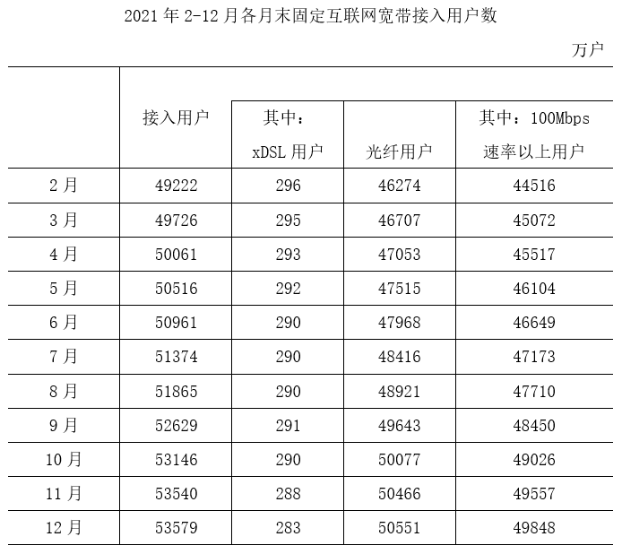

#### 第 1 题　qid 5445929 · 增长

2021年1~2月，我国固定互联网宽带接入用户数月均约增加多少万户？

- **A**. 867
- **B**. 629
- **C**. 434　✅
- **D**. 315

**答案**：C

**官方解析**

根据题干“2021年1~2月······月均约增加······万户”，可判定本题为年均增长量问题。定位文字材料第一段可得：截至2021年底，我国固定互联网宽带接入用户数比上年底净增5224万户；定位统计表可得：2021年2月末我国固定互联网宽带接入用户数为49222万户，12月末为53579万户。根据公式：基期量=现期量-增长量，可得2020年12月末我国固定互联网宽带接入用户数为53579-5224=48355万户。根据公式：年均增长量，则2021年1~2月，我国固定互联网宽带接入用户数月均增加万户。

故正确答案为C。

---

#### 第 2 题　qid 5445931 · 综合

2021年下半年，我国固定互联网宽带接入用户中，光纤用户数增量超过500万户的月份有几个？

- **A**. 2　✅
- **B**. 3
- **C**. 4
- **D**. 5

**答案**：A

**官方解析**

根据题干“······光纤用户数增量超过500万户的月份有几个”，可判定本题为增长量计算问题。定位表格材料可知2021年6-12月光纤用户数量。根据公式：增长量=现期量-基期量，可知2021年7月光纤用户数增量为48416-47968万户，8月增长量为48921-48416万户，9月增长量为49643-48921万户，10月增长量为50077-49643万户，11月增长量为50466-50077万户，12月增长量为50551-50466万户。故2021年下半年，我国固定互联网宽带接入用户中，光纤用户数增量超过500万户的月份有8月、9月，共2个月份。

故正确答案为A。

---

#### 第 3 题　qid 5445932 · 比重

2021年年末，我国固定互联网宽带接入用户中100Mbps速率以上用户占比比上年末：

- **A**. 上升了不到1个百分点
- **B**. 上升了1个百分点以上　✅
- **C**. 下降了不到1个百分点
- **D**. 下降了1个百分点以上

**答案**：B

**官方解析**

根据题干“2021年年末······中······占比比上年末”，结合选项为上升/下降+百分点，可判定本题为两期比重问题。定位文字材料第一段可得：截至2021年底，我国固定互联网宽带接入用户数比上年底净增5224万户。其中，100Mbps及以上接入速率的用户比上年底净增6385万户；定位表格材料可得：2021年12月末我国固定互联网宽带接入用户数53579万户，其中，100Mbps速率以上接入用户49848万户。根据公式：比重，基期量=现期量-增长量，所求比重差，即约上升了3个百分点，在B项范围内。

故正确答案为B。

---

#### 第 4 题　qid 5445933 · 综合

2021年末，我国固定互联网宽带接入用户中，使用xDSL和光纤以外接入方式的用户数量比上半年末：

- **A**. 增加了不到200万户　✅
- **B**. 增加了200万户以上
- **C**. 减少了不到200万户
- **D**. 减少了200万户以上

**答案**：A

**官方解析**

根据题干“2021年末······比上半年末”，结合选项为增加/减少+具体单位，可判定本题为增长量计算问题。定位表格材料可得，2021年末我国固定互联网宽带接入用户数53579万户，其中xDSL用户283万户、光纤用户50551万户；2021年上半年末（6月末）固定互联网宽带接入用户数50961万户，其中xDSL用户290万户、光纤用户47968万户。则2021年末使用xDSL和光纤以外接入方式的用户数量比上半年末增加：（53579-283-50551）-（50961-290-47968）=（53579-50961）+（290-283）-（50551-47968）=2618+7-2583=42万户，即增加了不到200万户。
故正确答案为A。

---

#### 第 5 题　qid 5445935 · 综合

以下折线图反映了2021年哪一时间段内，我国固定互联网宽带100Mbps速率以上用户数环比增量的变化趋势？

- **A**. 3~6月
- **B**. 5~8月
- **C**. 7~10月　✅
- **D**. 9~12月

**答案**：C

**官方解析**

根据题干“······环比增量的变化趋势”，可判定本题为增长量比较问题。定位表格材料可知2021年2-12月各月末我国固定互联网宽带100Mbps速率以上用户数。根据公式：增长量=现期量-基期量，可得2021年各时间段内各月的环比增量：
A项：3月，45072-44516＝556万户；4月，45517-45072＝445万户。4月环比增量（445万户）＜3月环比增量（556万户），不符合折线图先增加的变化趋势，排除；
B项：5月，46104-45517＝587万户；6月，46649-46104＝545万户。6月环比增量（545万户）＜5月环比增量（587万户），不符合折线图先增加的变化趋势，排除；
C项：7月，47173-46649＝524万户；8月，47710-47173＝537万户；9月，48450-47710＝740万户；10月，49026-48450＝576万户。则2021年7～10月，我国固定互联网宽带100Mbps速率以上用户数各月环比增量的变化趋势为先增加再降低，符合折线图变化趋势，当选；
D项：由C项可知10月环比增量（576万户）＜9月环比增量（740万户），不符合折线图先增加的变化趋势，排除。
故正确答案为C。

---

### 材料 2

#### 第 6 题　qid 5445740 · 综合

2021年，表中所列省市集成电路产量约占全国总产量的：

- **A**. 80%
- **B**. 84%
- **C**. 88%
- **D**. 92%　✅

**答案**：D

**官方解析**

根据题干“2021年······占······”，可判定本题为现期比重问题。定位统计表可知2021年表中所列省市及全国集成电路产量。根据公式：比重，可知所求比重。

故正确答案为D。

---

#### 第 7 题　qid 5445742 · 增长

2017~2021年间，全国集成电路产量同比增速超过20%的年份有几个？

- **A**. 1
- **B**. 2　✅
- **C**. 3
- **D**. 4

**答案**：B

**官方解析**

根据题干“2017~2021年间······同比增速······”，可判定本题为一般增长率计算问题。定位统计表可知2016~2021年每年的全国集成电路产量。根据公式：一般增长率，则2017~2021年全国集成电路产量同比增速分别为：

2017年，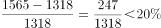；

2018年，；

2019年，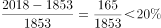；

2020年，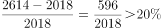；

2021年，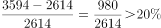。

综上，同比增速超过20%的年份有2020年、2021年，共2个。

故正确答案为B。

---

#### 第 8 题　qid 5445743 · 增长

表中所列7个省市中，2019年集成电路产量同比增速超过2%的省市比上年：

- **A**. 少1个　✅
- **B**. 少2个
- **C**. 多1个
- **D**. 多2个

**答案**：A

**官方解析**

根据题干“······2019年······同比增速······”，可判定本题为一般增长率问题。定位统计表可知2017~2019年每年各省市集成电路产量数据。根据公式：增长率，可得：

（1）2018年各省市集成电路产量增长率分别为：

江苏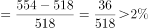；甘肃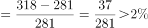；广东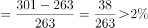；上海；浙江；北京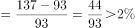；四川。综上，2018年表中所列7个省市中集成电路产量同比增速超过2%的省市有5个。

（2）2019年各省市集成电路产量增长率分别为：

江苏；甘肃；广东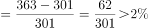；上海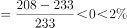；浙江；北京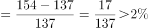；四川。综上，2019年表中所列7个省市中集成电路产量同比增速超过2%的省市有4个。

则表中所列7个省市中，2019年集成电路产量同比增速超过2%的省市（4个）比上年（5个）少1个。

故正确答案为A。

---

#### 第 9 题　qid 5445745 · 增长

将①甘肃、②广东、③上海和④浙江按2016~2021年集成电路产量年均增速（以2016年为基期计算）从高到低排列，以下正确的是：

- **A**. ④①②③
- **B**. ④①③②
- **C**. ①④②③　✅
- **D**. ①④③②

**答案**：C

**官方解析**

根据题干“······按2016~2021年······年均增速（以2016年为基期计算）从高到低排列······”，可判定本题为年均增长率问题。定位统计表可知2016年和2021年甘肃、广东、上海、浙江的集成电路产量。根据年均增长率公式：（n为年份差），当年份差n相同时，直接根据的值即可比较年均增长率的大小。计算各省份可得：①甘肃；②广东；③上海；④浙江，则年均增速从高到低排列为：①④②③。

故正确答案为C。

---

#### 第 10 题　qid 5445750 · 增长

以下折线图中，最能准确反映2017~2021年间北京市集成电路产量同比增量变化趋势的是：

- **A**. 

　✅
- **B**. 

- **C**. 

- **D**. 

**答案**：A

**官方解析**

根据题干“······2017~2021年间北京市集成电路产量同比增量变化趋势的是”，可判定本题为增长量比较问题。定位统计表可得：2016~2021年北京市集成电路产量分别为81亿块、93亿块、137亿块、154亿块、171亿块、208亿块。根据公式：增长量=现期量-基期量，则2017年同比增量为93-81=12亿块，2018年为137-93=44亿块，2019年为154-137=17亿块，2020年为171-154=17亿块，2021年为208-171=37亿块。可知2019年与2020年同比增量相等，即折线图中第三和第四个点高度一致，只有A项符合。
故正确答案为A。

---

### 材料 3

        超级计算，也被称为高性能计算。从算力资源的需求看，高性能计算可以分为尖端超算、通用超算、业务超算和人工智能超算四大类。

#### 第 11 题　qid 5445847 · 综合

2020～2021年，中国超算服务市场累计规模约为多少亿元？

- **A**. 328
- **B**. 354　✅
- **C**. 371
- **D**. 396

**答案**：B

**官方解析**

定位统计表可得2020年中国尖端超算、通用超算、业务超算和人工智能超算服务市场规模分别为28.3亿元、37.8亿元、64.4亿元、27.7亿元；2021年这四类超算服务市场规模分别为31.4亿元、40.3亿元、85.6亿元、38.3亿元。则2020～2021年，中国超算服务市场累计规模=28.3+37.8+64.4+27.7+31.4+40.3+85.6+38.3亿元。

故正确答案为B。

---

#### 第 12 题　qid 5445850 · 增长

2018年，中国超算服务4类细分市场中，同比增速最快和最慢的市场当年市场规模同比增速相差约多少个百分点？

- **A**. 41
- **B**. 47
- **C**. 53　✅
- **D**. 59

**答案**：C

**官方解析**

根据题干“2018年······同比增速······百分点”，可判定本题为一般增长率问题。定位统计表可得2017、2018年中国超算服务4类细分市场的市场规模。根据公式：增长率，可知2018年，中国超算服务4类细分市场的市场规模同比增速分别为：

尖端超算：；

通用超算：；

业务超算：；

人工智能超算：。

则增速最快的市场为人工智能超算，最慢的市场为尖端超算，所求=58%-5%=53%，即相差约53个百分点。

故正确答案为C。

---

#### 第 13 题　qid 5445849 · 综合

2019年，中国第三方超算服务市场规模约占同年超算服务总体市场规模的：

- **A**. 15%　✅
- **B**. 18%
- **C**. 21%
- **D**. 24%

**答案**：A

**官方解析**

根据题干“2019年······占同年······”，结合材料时间为2019年，可判定本题为现期比重问题。定位统计表可得2019年中国尖端超算、通用超算、业务超算和人工智能超算的市场规模；定位统计图可得2019年中国第三方独立超算服务商和互联网超算服务商的市场规模。则所求比重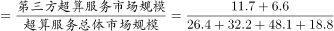，与A项最接近。

故正确答案为A。

---

#### 第 14 题　qid 5445851 · 增长

如保持2021年同比增量不变，则到哪一年第三方互联网超算服务商提供的服务市场规模将第一次超过第三方独立超算服务商？

- **A**. 2025年
- **B**. 2026年　✅
- **C**. 2027年
- **D**. 2028年

**答案**：B

**官方解析**

根据题干“如保持2021年同比增量不变，则到哪一年······将第一次超过······”，可判定本题为现期追赶问题。定位统计图可知2020年、2021年中国第三方独立超算和互联网超算服务商市场规模。根据公式：增长量=现期量-基期量，则2021年第三方互联网超算服务商市场规模同比增量=13.8-9.5=4.3亿元，2021年第三方独立超算服务商市场规模同比增量=18.3-15.0=3.3亿元。根据公式：现期量=基期量+n×增长量，可列式：13.8+n×4.3＞18.3+n×3.3，解得n＞4.5，则n至少为5，即到2026年第三方互联网超算服务商提供的服务市场规模将第一次超过第三方独立超算服务商。
故正确答案为B。

---

#### 第 15 题　qid 5445854 · 综合

能够从上述资料中推出的是：

- **A**. 2016～2020年，通用超算服务市场累计规模超过160亿元
- **B**. 2016～2017年，业务超算服务市场累计规模比人工智能超算服务高30多亿元
- **C**. 2018～2021年，第三方独立超算服务市场规模同比增量逐年递增
- **D**. 2017～2020年，第三方互联网超算服务市场规模同比增速逐年递减　✅

**答案**：D

**官方解析**

A项：定位统计表可得2016~2020年通用超算服务市场规模分别为23.9亿元、26.9亿元、29.7亿元、32.2亿元、37.8亿元。则所求=23.9+26.9+29.7+32.2+37.8亿元＜160亿元，错误；

B项：定位统计表可得2016~2017年业务超算服务市场规模分别为15.6亿元、24.1亿元，人工智能超算服务市场规模分别为4.7亿元、7.9亿元。则所求=（15.6+24.1）-（4.7+7.9）=39.7-12.6=27.1亿元＜30亿元，错误；

C项：定位统计图可得2017~2021年中国第三方独立超算服务市场规模。根据公式：增长量=现期量-基期量，则2018年同比增量=8.7-7.1=1.6亿元；2019年同比增量=11.7-8.7=3.0亿元；2020年同比增量=15.0-11.7=3.3亿元；2021年同比增量=18.3-15.0=3.3亿元。因2021年同比增量与2020年相等，则非逐年递增，错误；

D项：定位统计图可得2016~2020年中国第三方互联网超算服务市场规模。根据公式：增长率，则2017年同比增速；2018年同比增速；2019年同比增速；2020年同比增速。则2017~2020年中国第三方互联网超算服务市场规模同比增速逐年递减，正确。

故正确答案为D。

---

### 材料 4

        2021年，全国纺织品服装出口3155亿美元，同比增长8.4%。其中，纺织品出口1452.2亿美元，同比下降5.6%，较2019年增长22.0%；服装出口1702.8亿美元，同比增长24.0%，较2019年增长16.0%。其中，针织服装及衣着附件出口864.8亿美元，同比增长39.0%；梭织服装及衣着附件出口701.2亿美元，同比增长12.6%。

        2021年，中国对美国、东盟、欧盟和日本的纺织品服装出口合计1724.9亿美元。其中，对美国出口额为563.5亿美元，同比增长4.0%；向东盟十国出口纺织品服装491.2亿美元，同比增长24.9%；对欧盟27国出口纺织品服装469.9亿美元，同比下降11.1%；对日本出口纺织品服装200.3亿美元，同比下降7.2%。

        2021年，中国向全球出口纺织纱线138亿美元，出口织物667亿美元，分别同比增长41.5%和34.3%。纺织制品当中，防疫类口罩出口额为129.5亿美元，出口金额、数量同比分别下降76.0%和13.0%。除防疫类口罩外，其他纺织制品出口额为517.2亿美元，同比增长27.5%。

        2021年，中国向“一带一路”沿线国家出口纺织品服装1137.9亿美元，同比增长24.5%，较2019年增长17.3%；同时，中国自“一带一路”沿线国家进口纺织品服装131.6亿美元，同比增长24.5%。

#### 第 16 题　qid 5445733 · 综合

2020年，全国服装出口额比2019年：

- **A**. 增长了10%以上
- **B**. 下降了10%以上
- **C**. 增长了不到10%
- **D**. 下降了不到10%　✅

**答案**：D

**官方解析**

根据题干“2020年······比2019年”，结合选项为增长/下降+百分数，且材料给出2021年全国服装出口额的同比增速以及相对于2019年的增速，可判定本题为间隔增长率问题。定位文字材料第一段可得：2021年，全国服装出口1702.8亿美元，同比增长24.0%（），较2019年增长16.0%（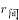）。根据公式：，代入数据则有，解得，即下降了不到10%。

故正确答案为D。

---

#### 第 17 题　qid 5445736 · 综合

2021年，全国针织、梭织服装及衣着附件总出口额约占纺织品服装出口总额的：

- **A**. 55%
- **B**. 50%　✅
- **C**. 45%
- **D**. 40%

**答案**：B

**官方解析**

根据题干“2021年，全国······约占······的”，结合材料时间为2021年，可判定本题为现期比重问题。定位文字材料第一段可得：2021年，全国纺织品服装出口3155亿美元······其中，针织服装及衣着附件出口864.8亿美元······梭织服装及衣着附件出口701.2亿美元。根据公式：比重，可得所求比重。

故正确答案为B。

---

#### 第 18 题　qid 5445738 · 增长

将①美国、②东盟十国、③欧盟27国和④日本按2021年自中国进口纺织品服装金额同比增量从高到低排列，以下正确的是：

- **A**. ①②③④
- **B**. ①②④③
- **C**. ②①③④
- **D**. ②①④③　✅

**答案**：D

**官方解析**

根据题干“······同比增量从高到低······”，可判定本题为增长量比较问题。定位文字材料第二段可得：2021年······对美国出口额为563.5亿美元，同比增长4.0%；向东盟十国出口纺织品服装491.2亿美元，同比增长24.9%；对欧盟27国出口纺织品服装469.9亿美元，同比下降11.1%；对日本出口纺织品服装200.3亿美元，同比下降7.2%。根据公式：增长量，则2021年题干中四个国家自中国进口（即中国对四个国家出口）纺织品服装金额同比增量分别为：①美国：亿美元；②东盟十国：亿美元；③欧盟27国：亿美元；④日本：亿美元。则按同比增量从高到低排列为：②东盟十国（亿美元）、①美国（亿美元）、④日本（亿美元）、③欧盟27国（亿美元）。

故正确答案为D。

---

#### 第 19 题　qid 5445741 · 比重

2020年中国出口的纺织制品总额中，防疫类口罩出口额占比约为：

- **A**. 57%　✅
- **B**. 72%
- **C**. 33%
- **D**. 45%

**答案**：A

**官方解析**

根据题干“2020年······占比······”，结合材料时间为2021年，可判定本题为基期比重问题。定位文字材料第三段可知：2021年······纺织制品当中，防疫类口罩出口额为129.5亿美元，出口金额同比下降76.0%。除防疫类口罩外，其他纺织制品出口额为517.2亿美元，同比增长27.5%。根据公式：基期量，可得2020年防疫类口罩出口额亿美元；2020年其他纺织制品出口额亿美元。根据公式：比重，可得所求。

故正确答案为A。

---

#### 第 20 题　qid 5445744 · 综合

2020年，中国对“一带一路”沿线国家纺织品服装贸易顺差额约为多少亿美元？

- **A**. 1129
- **B**. 1253
- **C**. 808　✅
- **D**. 1006

**答案**：C

**官方解析**

根据题干“2020年······贸易顺差额约为多少亿美元”，结合材料时间为2021年，且贸易顺差额=出口额-进口额，可判定本题为基期和差问题。定位文字材料最后一段可得：2021年，中国向“一带一路”沿线国家出口纺织品服装1137.9亿美元，同比增长24.5%；同时，中国自“一带一路”沿线国家进口纺织品服装131.6亿美元，同比增长24.5%。根据公式：基期量，可得所求亿美元，与C项最接近。

故正确答案为C。

---

#### 第 21 题　qid 5445878 · 倍数

甲、乙二人合伙成立公司，约定每年利润的60%留作公司发展用途，40%按二人投资比例分配。已知公司成立第三年的利润比第二年高300万元，是第一年利润的3倍；甲第二年分配的金额是第三年的一半，且比第一年多20万元。问乙的投资额占比为多少？

- **A**. 40%
- **B**. 50%　✅
- **C**. 60%
- **D**. 75%

**答案**：B

**官方解析**

设该公司第一年的利润为x万元，根据题意可得，第三年的利润为3x万元，第二年的利润为（3x-300）万元。已知每年二人将利润的40%按投资比例分配，且甲第二年分配的金额是第三年的一半，设甲的投资额占比为y，可列方程：，解得x=200。则第一年的利润为200万元，第二年的利润为3×200-300=300万元。又因甲第二年分配的金额比第一年多20万元，可列方程：300×40%×y=200×40%×y+20，解得y=50%，故甲的投资额占比为50%，则乙的投资额占比为1-50%=50%。

故正确答案为B。

---
