# 2024年国家公务员录用考试《行测》题（副省级网友回忆版）

> 国考 · 2024 年 · 6 个模块 · 共 135 题

- [政治理论](#%E6%94%BF%E6%B2%BB%E7%90%86%E8%AE%BA) · 7 题
- [常识判断](#%E5%B8%B8%E8%AF%86%E5%88%A4%E6%96%AD) · 13 题
- [言语理解与表达](#%E8%A8%80%E8%AF%AD%E7%90%86%E8%A7%A3%E4%B8%8E%E8%A1%A8%E8%BE%BE) · 40 题
- [数量关系](#%E6%95%B0%E9%87%8F%E5%85%B3%E7%B3%BB) · 15 题
- [判断推理](#%E5%88%A4%E6%96%AD%E6%8E%A8%E7%90%86) · 40 题
- [资料分析](#%E8%B5%84%E6%96%99%E5%88%86%E6%9E%90) · 20 题

---

## 政治理论

### 第 1 题　qid 5893762 · 马克思主义

习近平总书记强调，在五千多年中华文明深厚基础上开辟和发展中国特色社会主义两个结合，关于后半个结合，下列理解正确的有（    ）项。
①结合的前提是彼此契合，马克思主义和中华优秀传统文化彼此存在高度契合性
②结合的结果是互相成就，造就了一个有机统一的新的文化生命体
③结合筑牢了道路根基，让中国特色社会主义道路有了更加宏阔深远的历史纵深
④结合打开了创新空间，让我们在被动顺应中迎来思想和文化的繁荣
⑤结合巩固文化主体性，创立新时代中国特色社会主义思想就是这一文化主体性的最有力体现

- **A**. 5
- **B**. 4　✅
- **C**. 3
- **D**. 2

**答案**：B

**官方解析**

本题考查政治常识。
①正确，2023年6月2日，习近平总书记在文化传承发展座谈会上发表讲话指出：“第一，‘结合’的前提是彼此契合。‘结合’不是硬凑在一起的。马克思主义和中华优秀传统文化来源不同，但彼此存在高度的契合性。”
②正确，2023年6月2日，习近平总书记在文化传承发展座谈会上发表讲话指出：“第二，‘结合’的结果是互相成就。‘结合’不是‘拼盘’，不是简单的‘物理反应’，而是深刻的‘化学反应’，造就了一个有机统一的新的文化生命体。”
③正确，2023年6月2日，习近平总书记在文化传承发展座谈会上发表讲话指出：“第三，‘结合’筑牢了道路根基······‘第二个结合’让中国特色社会主义道路有了更加宏阔深远的历史纵深，拓展了中国特色社会主义道路的文化根基。”
④错误，2023年6月2日，习近平总书记在文化传承发展座谈会上发表讲话指出：“第四，‘结合’打开了创新空间。‘结合’本身就是创新，同时又开启了广阔的理论和实践创新空间。‘第二个结合’让我们掌握了思想和文化主动，并有力地作用于道路、理论和制度······更重要的是，‘第二个结合’是又一次的思想解放，让我们能够在更广阔的文化空间中，充分运用中华优秀传统文化的宝贵资源，探索面向未来的理论和制度创新。”故“让我们在被动顺应中迎来思想和文化的繁荣”表述有误，应为“让我们掌握了思想和文化主动”。
⑤正确。2023年6月2日，习近平总书记在文化传承发展座谈会上发表讲话指出：“第五，‘结合’巩固了文化主体性······创立新时代中国特色社会主义思想就是这一文化主体性的最有力体现。”
故①②③⑤表述正确，共4项。
故正确答案为B。

---

### 第 2 题　qid 5893764 · 新思想

习总书记强调，要引导民营企业和民营企业家正确理解党中央方针政策，增强信心、轻装上阵、大胆发展，实现民营经济健康发展、高质量发展。关于推动民营经济高质量发展，下列选项正确的是（    ）。
①民营企业要践行新发展理念，转变发展方式、调整产业结构、转换增长动力，坚守主业、做强实业，自觉走高质量发展路子
②有能力、有条件的民营企业要加强自主创新，在推进科技自立自强和科技成果转化中发挥更大作用
③要激发民间资本投资活力，鼓励和吸引民间资本参与互联网投资和境外投资，为促进国内外双循环做出更大贡献
④要依法规范和引导各类资本健康发展，有效防范化解系统性金融风险，为各类所有制企业创造公平竞争、竞相发展的环境

- **A**. ①②④　✅
- **B**. ①②③
- **C**. ①③④
- **D**. ②③④

**答案**：A

**官方解析**

本题考查政治常识。
①②④正确，③错误，2023年3月，习近平总书记在看望参加政协会议的民建工商联界委员时强调：“高质量发展对民营经济发展提出了更高要求。民营企业要践行新发展理念，深刻把握民营经济发展存在的不足和面临的挑战，转变发展方式、调整产业结构、转换增长动力，坚守主业、做强实业，自觉走高质量发展路子。有能力、有条件的民营企业要加强自主创新，在推进科技自立自强和科技成果转化中发挥更大作用。要激发民间资本投资活力，鼓励和吸引更多民间资本参与国家重大工程、重点产业链供应链项目建设，为构建新发展格局、推动高质量发展作出更大贡献。要依法规范和引导各类资本健康发展，有效防范化解系统性金融风险，为各类所有制企业创造公平竞争、竞相发展的环境。”
故正确答案为A。

---

### 第 3 题　qid 5893766 · 新思想

习总书记强调，要大兴调查研究之风，深入了解群众需求，切实解决广大老百姓关心关切的利益问题，不断提高人民群众的获得感、幸福感、安全感，关于调查研究正确的有几项？
①调查研究是我们党的传家宝，是做好各项工作的基本功
②要大兴务实之风，抓好调查研究，在察实情、出实招、求实效上下功夫
③检验调查研究成效，要看是否摸清社情民意、是否解决实际问题
④调查研究是了解情况的主要渠道，不能通过二手材料了解情况

- **A**. 4
- **B**. 3　✅
- **C**. 2
- **D**. 1

**答案**：B

**官方解析**

本题考查政治常识。
①正确，《习近平关于调查研究论述摘编》中指出：“调查研究是我们党的传家宝，是做好各项工作的基本功。调查研究是马克思主义者认识世界的根本方法，是中国共产党的历史经验。”
②正确，2023年6月，习近平总书记在内蒙古考察时对如何开展好主题教育这样要求：“要大兴务实之风，抓好调查研究，在察实情、出实招、求实效上下功夫，把工作抓实、基础打实、步子迈实，在力戒形式主义、官僚主义上取得明显实质性进展，以这次主题教育为契机，将调查研究发扬光大。”
③正确，2023年7月，习近平总书记在四川考察时对如何检验主题教育成效提出“五个检验”：（1）检验理论学习成效，要看党的创新理论是否入心见行、党员干部是否做到善思善用。（2）检验调查研究成效，要看是否摸清社情民意、是否解决实际问题。（3）检验推动发展成效，要看高质量发展是否有新突破，人民生活品质是否有新提升。（4）检验检视整改成效，要看问题症结是否找准、整改整治是否到位。（5）检验干部队伍教育整顿成效，要看思想不纯和组织不纯现象是否纠正、政治隐患是否消除。
④错误，《习近平关于调查研究论述摘编》中指出：“了解情况的渠道千条万条，但是调查研究要放在第一条，这是不可替代、不会失真的一条。通过二手材料了解情况是必要的，但不能代替亲身调研。”“不能通过二手材料了解情况”的说法错误。
故①②③表述正确，共3项。
故正确答案为B。

---

### 第 4 题　qid 5893767 · 新思想

习近平总书记强调全面建设社会主义现代化国家，扎实推进共同富裕，最艰巨最繁重的任务仍然在农村，必须逐步缩小城乡差距。下列符合党和国家政策精神的是（    ）。
①积极推进以建制镇为重要载体的新型城镇化建设，构建以建制镇为枢纽的县镇经济体系
②持续实施动态监测，不断增强脱贫地区内生发展动力，坚决守住不发生规模性返贫底线
③因地制宜大力发展特色产业，推进农村一、二、三产业融合发展
④持续深化农村人居环境整治，加强传统村落和乡村特色风貌保护，加强农村精神文明建设

- **A**. ①②③
- **B**. ①②④
- **C**. ②③④　✅
- **D**. ①③④

**答案**：C

**官方解析**

本题考查政治常识。
①错误，②③④正确。2023年5月，习近平总书记在陕西考察，听取陕西省委和省政府工作汇报时强调：“全面建设社会主义现代化国家，扎实推进共同富裕，最艰巨最繁重的任务仍然在农村，必须逐步缩小城乡差距。要积极推进以县城为重要载体的新型城镇化建设，提升县城市政公用设施建设水平和基础公共服务、产业配套功能，增强综合承载能力和治理能力，发挥县城对县域经济发展的辐射带动作用。因地制宜发展小城镇，促进特色小镇规范健康发展，构建以县城为枢纽、以小城镇为节点的县域经济体系。健全城乡融合发展体制机制，完善城乡要素平等交换、双向流动的政策体系，促进城市资源要素有序向乡村流动，增强农业农村发展活力。因地制宜大力发展特色产业，推进农村一二三产业融合发展，拓宽农民增收致富渠道。持续深化农村人居环境整治，加强传统村落和乡村特色风貌保护，加强农村精神文明建设，培育文明乡风。持续实施动态监测，不断增强脱贫地区内生发展动力，坚决守住不发生规模性返贫的底线。”
故正确答案为C。

---

### 第 5 题　qid 5893568 · 毛中特

习近平总书记强调，实现党在新时代新征程的使命任务，党的建设和组织工作要有新担当新作为。关于深入推进新时代党的建设新的伟大工程，下列表述正确的有几项？
①以坚持和加强党中央集中统一领导为最高原则
②以忠诚为党护党、全力兴党强党为根本使命
③以解决大党独有难题、健全全面从严治党体系为重大任务
④以加强党的组织体系建设为主线
⑤以党的制度建设为统领，以坚定理想信念宗旨为根基

- **A**. 2项
- **B**. 3项　✅
- **C**. 4项
- **D**. 5项

**答案**：B

**官方解析**

本题考查政治常识。
①②③正确，2023年6月，习近平总书记对党的建设和组织工作作出重要指示。习近平强调，实现党在新时代新征程的使命任务，党的建设和组织工作要有新担当新作为。要坚持以新时代中国特色社会主义思想为指导，全面贯彻党的二十大精神，深刻领会党中央关于党的建设的重要思想，深入落实新时代党的建设总要求和新时代党的组织路线，深入推进新时代党的建设新的伟大工程，以坚持和加强党中央集中统一领导为最高原则，以忠诚为党护党、全力兴党强党为根本使命，以解决大党独有难题、健全全面从严治党体系为重大任务，坚持不懈用党的创新理论统一全党思想意志行动，不断严密上下贯通、执行有力的组织体系，着力建强堪当民族复兴重任的高素质执政骨干队伍，加快建设世界重要人才中心和创新高地，持续深化模范部门和过硬队伍建设，不断提高组织工作质量，为更好地以党的伟大自我革命引领伟大社会革命，推进强国建设、民族复兴伟业提供坚强组织保证。
④⑤错误，党的十九大报告中“十三、坚定不移全面从严治党，不断提高党的执政能力和领导水平”部分指出：“新时代党的建设总要求是：坚持和加强党的全面领导，坚持党要管党、全面从严治党，以加强党的长期执政能力建设、先进性和纯洁性建设为主线，以党的政治建设为统领，以坚定理想信念宗旨为根基······”
故①②③表述正确，共3项。
故正确答案为B。

---

### 第 6 题　qid 5893765 · 新思想

习近平指出健全美丽中国建设保障体系，统筹各领域资源，汇聚各方面力量，打好法治、市场、科技、政策“组合拳”，关于健全美丽中国建设保障体系，下列正确的是（    ）。
①要全面实行排污许可制，完善自然资源资产管理制度体系，健全国土空间用途管制制度
②要完善绿色低碳发展经济政策，强化财政支持、税收政策支持、金融支持、价格政策支持
③要加快构建环保信用监管体系，规范环境治理市场，促进环保产业和环境服务业健康发展
④要更好发挥政府在碳排放权、用能权、用水权等资源环境要素配置中的决定性

- **A**. ②③④
- **B**. ①②④
- **C**. ①③④
- **D**. ①②③　✅

**答案**：D

**官方解析**

本题考查政治常识。
①②③正确，④错误，2023年7月17日至18日，全国生态环境保护大会在北京召开。习近平指出，要健全美丽中国建设保障体系。统筹各领域资源，汇聚各方面力量，打好法治、市场、科技、政策“组合拳”。要强化法治保障，统筹推进生态环境、资源能源等领域相关法律制修订，实施最严格的地上地下、陆海统筹、区域联动的生态环境治理制度，全面实行排污许可制，完善自然资源资产管理制度体系，健全国土空间用途管制制度。要完善绿色低碳发展经济政策，强化财政支持、税收政策支持、金融支持、价格政策支持。要推动有效市场和有为政府更好结合，将碳排放权、用能权、用水权、排污权等资源环境要素一体纳入要素市场化配置改革总盘子，支持出让、转让、抵押、入股等市场交易行为，加快构建环保信用监管体系，规范环境治理市场，促进环保产业和环境服务业健康发展。
故正确答案为D。

---

### 第 7 题　qid 5893540 · 新思想

习近平总书记在给山东省地矿局第六地质大队全体地质工作者的回信中强调：“矿产资源是经济社会发展的重要物质基础，矿产资源勘查开发事关国计民生和国家安全。”下列与我国矿产资源有关的说法错误的是：

- **A**. 锡矿是我国的优势矿产资源之一
- **B**. 我国已在南海实现天然气水合物试采
- **C**. 新疆罗布泊是我国钾盐的主要产地之一
- **D**. 我国目前最大的金矿在云南省内　✅

**答案**：D

**官方解析**

本题考查地理国情。
A项正确，我国已发现矿产171种，按探明储量计算，中国有45种优势矿产，而锡矿是我国的优势矿产资源之一。中国锡资源丰富，长期以来一直是锡的生产大国，储量和产量均居于世界前列。目前已探明矿产地293处，总保有储量锡407万吨，我国锡矿分布于15个省（区），以广西、云南两省（区）储量最多，分别占全国的32.9%和31.4%。
B项正确，2017年，我国海域天然气水合物在南海北部神狐海域第一轮试采成功，实现连续稳定产气60天，累计产气量30.9万立方米。这次试采是我国首次，也是世界首次成功实现资源量占全球90%以上、开发难度最大的泥质粉砂型天然气水合物安全可控开采。
C项正确，中国钾盐的主要产地有青海柴达木现代盐湖、新疆罗布泊现代盐湖和云南勐野井固体钾盐矿。新疆罗布泊地区北部钾盐储量2.5亿吨以上，是中国为数不多的钾盐矿中次大的一个超大型钾盐矿。2000年，我国成立新疆罗布泊钾盐公司，先后完成中试，建成年产4万吨硫酸钾示范厂。
D项错误，西岭金矿是迄今为止国内发现的最大单体金矿床，属世界级巨型单体金矿床。西岭金矿位于山东省莱州市三山岛金矿深部，并非云南省。山东黄金矿产资源丰富，地质储量居全国之首，是全国黄金产量第一大省。 
本题为选非题，故正确答案为D。

---

## 常识判断

### 第 1 题　qid 5894938 · 经济常识

2023年10月11日，国务院发布《国务院关于推进普惠金融高质量发展的实施意见》。该意见明确了未来五年推进普惠金融高质量发展的指导思想、基本原则和主要目标，提出了一系列政策举措。下列属于该意见提出的基本原则的有几项？
①坚持加强党的全面领导和党中央集中统一领导
②牢固树立以人民为中心的发展思想
③进一步明确各级政府责任，加强规划引导，加大政策、资源倾斜力度
④持续深化改革，破除机制障碍，强化科技赋能
⑤坚持底线思维，统筹发展和安全，加强和完善现代金融监管

- **A**. 2项
- **B**. 3项
- **C**. 4项
- **D**. 5项　✅

**答案**：D

**官方解析**

本题考查政治常识。
①正确，《国务院关于推进普惠金融高质量发展的实施意见》中“一、总体要求”部分的“（二）基本原则”中指出：“坚持党的领导。坚持加强党的全面领导和党中央集中统一领导，充分发挥中国特色社会主义制度优势，进一步发挥各级党组织的作用，为普惠金融高质量发展提供坚强的政治保证和组织保障。”
②正确，《国务院关于推进普惠金融高质量发展的实施意见》中“一、总体要求”部分的“（二）基本原则”中指出：“坚持人民至上。牢固树立以人民为中心的发展思想，坚持普惠金融发展为了人民、依靠人民、成果由人民共享。始终把人民对美好生活的向往作为普惠金融发展的方向，自觉担当惠民利民的责任和使命，切实增强人民群众金融服务获得感。”
③正确，《国务院关于推进普惠金融高质量发展的实施意见》中“一、总体要求”部分的“（二）基本原则”中指出：“坚持政策引领。进一步明确各级政府责任，加强规划引导，加大政策、资源倾斜力度。坚持依法行政，优化营商环境，维护市场秩序。完善基础设施、制度规则和基层治理，推进普惠金融治理能力现代化。”
④正确，《国务院关于推进普惠金融高质量发展的实施意见》中“一、总体要求”部分的“（二）基本原则”中指出：“坚持改革创新。坚持市场化、法治化原则，遵循金融规律，积极稳妥探索成本可负担、商业可持续的普惠金融发展模式。持续深化改革，破除机制障碍，强化科技赋能。加强国际交流合作，以高水平开放推动高质量发展。”
⑤正确，《国务院关于推进普惠金融高质量发展的实施意见》中“一、总体要求”部分的“（二）基本原则”中指出：“坚持安全发展。坚持底线思维，统筹发展和安全，加强和完善现代金融监管。坚决打击非法金融活动，着力防范化解中小金融机构风险，强化金融稳定保障体系，守住不发生系统性金融风险底线。倡导负责任金融理念，切实保护金融消费者合法权益。”
故①②③④⑤均表述正确，共5项。
故正确答案为D。

---

### 第 2 题　qid 5893553 · 法律常识

2022年11月28日，中共中央办公厅、国务院办公厅发布《乡村振兴责任制实施办法》。下列与乡村振兴责任制有关的说法不准确的是:

- **A**. 坚持党对农村工作的全面领导，省市县乡村五级书记抓乡村振兴
- **B**. 中央和国家机关有关部门要以健全城乡融合发展体制为主线深化农村改革　✅
- **C**. 地方政府乡村振兴要把确保粮食和重要农产品供给作为首要任务
- **D**. 县级党委和政府是乡村振兴“一线指挥部”

**答案**：B

**官方解析**

本题考查政治常识。
《乡村振兴责任制实施办法》以下简称《实施办法》。
A项正确，《实施办法》在第三条指出：“坚持党对农村工作的全面领导，健全党委统一领导、政府负责、党委农村工作部门统筹协调的农村工作领导体制，省市县乡村五级书记抓乡村振兴”。
B项错误，《实施办法》在第五条指出：“中央和国家机关有关部门乡村振兴责任主要包括：······（六）以处理好农民和土地的关系为主线深化农村改革，巩固和完善农村基本经营制度，发展新型农村集体经济，发展新型农业经营主体和社会化服务，发展农业适度规模经营······”。
C项正确，《实施办法》在第八条指出：“地方党委和政府乡村振兴责任主要包括：······（三）把确保粮食和重要农产品供给作为首要任务，全面落实耕地保护和粮食安全党政同责，严格落实耕地和永久基本农田保护、高标准农田建设任务，保质保量完成粮食和重要农产品生产目标任务，调动农民种粮积极性，全面提高本地区粮食安全保障能力······”。
D项正确，《实施办法》在第十一条指出：“县级党委和政府是乡村振兴‘一线指挥部’。县级党委和政府主要负责人是本地区乡村振兴第一责任人，应当把主要精力放在乡村振兴工作上，责任主要包括：（一）结合本地区实际谋划制定乡村振兴规划和年度实施方案······”。
本题为选非题，故正确答案为B。

---

### 第 3 题　qid 5893768 · 法律常识

根据《中华人民共和国立法法》下列说法错误的是（    ）。

- **A**. 国家监察委员会可以向全国人大常委会提出法律案
- **B**. 县级人大常委可以对基层治理方面的事项制定地方性法规　✅
- **C**. 设区的市人大常委会可以根据实际需要设立基层立法联系点
- **D**. 法律草案的说明应当包括起草过程中对重大分歧意见的协调处理情况

**答案**：B

**官方解析**

本题考查法律常识。
A项正确，根据《中华人民共和国立法法》第十七条第二款规定：“全国人民代表大会常务委员会、国务院、中央军事委员会、国家监察委员会、最高人民法院、最高人民检察院、全国人民代表大会各专门委员会，可以向全国人民代表大会提出法律案，由主席团决定列入会议议程。”
B项错误，根据《中华人民共和国立法法》第八十一条第一款规定：“设区的市的人民代表大会及其常务委员会根据本市的具体情况和实际需要，在不同宪法、法律、行政法规和本省、自治区的地方性法规相抵触的前提下，可以对城乡建设与管理、生态文明建设、历史文化保护、基层治理等方面的事项制定地方性法规，法律对设区的市制定地方性法规的事项另有规定的，从其规定。设区的市的地方性法规须报省、自治区的人民代表大会常务委员会批准后施行。省、自治区的人民代表大会常务委员会对报请批准的地方性法规，应当对其合法性进行审查，认为同宪法、法律、行政法规和本省、自治区的地方性法规不抵触的，应当在四个月内予以批准。”因此，设区的市的人民代表大会及其常务委员会根据本市的具体情况和实际需要，有权在基层治理方面的事项制定地方性法规，而不是县级人大常委。
C项正确，根据《中华人民共和国立法法》第九十条规定：“省、自治区、直辖市和设区的市、自治州的人民代表大会常务委员会根据实际需要设立基层立法联系点，深入听取基层群众和有关方面对地方性法规、自治条例和单行条例草案的意见。”
D项正确，根据《中华人民共和国立法法》第五十八条规定：“提出法律案，应当同时提出法律草案文本及其说明，并提供必要的参阅资料。修改法律的，还应当提交修改前后的对照文本。法律草案的说明应当包括制定或者修改法律的必要性、可行性和主要内容，涉及合宪性问题的相关意见以及起草过程中对重大分歧意见的协调处理情况。”
本题为选非题，故正确答案为B。

---

### 第 4 题　qid 5893769 · 法律常识

根据《审计法》下列说法错误的是（    ）。

- **A**. 某审计机关通过政务信息系统取得数据后，要求被审计单位提供同一数据　✅
- **B**. 某审计机关对外国政府贷款项目的财务收支进行审计监督
- **C**. 某审计机关组成三人调查小组前往某国有企业进行调查
- **D**. 某审计机关为完成紧急工作任务，聘请某会计师事务所人员共同参与审计工作

**答案**：A

**官方解析**

本题考查法律常识。
A项错误，根据《审计法》第三十五条第二款规定：“审计机关通过政务信息系统和数据共享平台取得的电子数据等资料能够满足需要的，不得要求被审计单位重复提供。”因此，某审计机关通过政务信息系统取得数据后，要求被审计单位提供同一数据，不符合法律规定。
B项正确，根据《审计法》第二十五条规定：“审计机关对国际组织和外国政府援助、贷款项目的财务收支，进行审计监督。”因此，某审计机关对外国政府贷款项目的财务收支进行审计监督，符合法律规定。
C项正确，根据《审计法》第四十三条规定：“审计人员通过审查财务、会计资料，查阅与审计事项有关的文件、资料，检查现金、实物、有价证券和信息系统，向有关单位和个人调查等方式进行审计，并取得证明材料。向有关单位和个人进行调查时，审计人员应当不少于二人，并出示其工作证件和审计通知书副本。”因此，某审计机关组成三人调查小组前往某国有企业进行调查，符合法律规定。
D项正确，根据《审计法》第十三条第二款规定：“审计机关根据工作需要，可以聘请具有与审计事项相关专业知识的人员参加审计工作。”因此，某审计机关为完成紧急工作任务，聘请某会计师事务所人员共同参与审计工作，符合法律规定。
本题为选非题，故正确答案为A。

---

### 第 5 题　qid 5893781 · 法律常识

根据《中华人民共和国反间谍法》，下列说法或做法错误的是（    ）。

- **A**. 甲涉嫌间谍行为被传唤，在其嫌疑消除前不得将传唤原因通知其家属　✅
- **B**. 乙涉嫌间谍行为，移民管理机构接到省国家安全机关通知后，不准其出境
- **C**. 丙在境外受胁迫参加间谍组织后，及时向大使馆如实说明情况，并有悔改表现，可以不予追究
- **D**. 丁因协助反间谍工作导致财产损失，根据国家有关规定，可获得补偿

**答案**：A

**官方解析**

本题考查法律常识。
A项错误，根据《中华人民共和国反间谍法》第二十七条第四款规定：“除无法通知或者可能妨碍调查的情形以外，国家安全机关应当及时将传唤的原因通知被传唤人家属。在上述情形消失后，应当立即通知被传唤人家属。”选项中，除无法通知甲的家属或者通知甲的家属可能妨碍调查的情形以外，国家安全机关都应当及时将传唤的原因通知被传唤人家属，而不是在其嫌疑消除前不得将传唤原因通知其家属。
B项正确，根据《中华人民共和国反间谍法》第三十三条第二款规定：“对涉嫌间谍行为人员，省级以上国家安全机关可以通知移民管理机构不准其出境。”
C项正确，根据《中华人民共和国反间谍法》第五十五条第二款规定：“在境外受胁迫或者受诱骗参加间谍组织、敌对组织，从事危害中华人民共和国国家安全的活动，及时向中华人民共和国驻外机构如实说明情况，或者入境后直接或者通过所在单位及时向国家安全机关如实说明情况，并有悔改表现的，可以不予追究。”
D项正确，根据《中华人民共和国反间谍法》第四十六条第三款规定：“个人和组织因支持、协助反间谍工作导致财产损失的，根据国家有关规定给予补偿。”
本题为选非题，故正确答案为A。

---

### 第 6 题　qid 5893770 · 法律常识

下列关于《预备役人员法》的说法错误的是（    ）。

- **A**. 预备役人员参加军事训练期间，军队为其购买人身意外伤害保险
- **B**. 预备役人员从事个体经营，可以按照国家有关规定享受出资优惠政策　✅
- **C**. 缺失
- **D**. 预备役军官分为预备役指挥管理军官和预备役专业技术军官

**答案**：B

**官方解析**

本题考查法律常识。
A项正确，根据《中华人民共和国预备役人员法》第四十三条规定：“预备役人员参加军事训练、担负战备勤务、执行非战争军事行动任务期间，军队为其购买人身意外伤害保险。”
B项错误，根据《中华人民共和国预备役人员法》第四十六条规定：“预备役人员所在单位按照国家有关规定享受优惠和扶持政策。预备役人员创办小微企业、从事个体经营等活动，可以按照国家有关规定享受融资优惠等政策。”因此，预备役人员从事个体经营，可以享受融资优惠等政策而非出资优惠政策。
C项缺失。
D项正确，根据《中华人民共和国预备役人员法》第十三条第二款规定：“预备役军官分为预备役指挥管理军官和预备役专业技术军官，分别授予预备役指挥管理军官军衔和预备役专业技术军官军衔。”
本题为选非题，故正确答案为B。

---

### 第 7 题　qid 5893790 · 经济常识

下列与宏观经济有关的说法，错误的是（    ）。

- **A**. 利率变化与资金供求关系有关
- **B**. 央行逆回购会减少市场流动性　✅
- **C**. 国际收支顺差会给本币带来升值压力
- **D**. 提高贷款利率可用于控制通货膨胀

**答案**：B

**官方解析**

本题考查经济常识。
A项正确，资金供求状况的变化会影响利率。在资金市场上，资金供给超过对资本的需求时，利率便会下跌；反之，对资金的需求超过资金的供给，利率就会上升。
B项错误，央行逆回购是指中国人民银行向一级交易商购买有价证券，并约定在未来特定日期将有价证券卖还给一级交易商的交易行为。其目的主要是向市场释放流动性，同时可以获得回购的利息收入。
C项正确，国际收支顺差亦称“国际收支盈余”。在一定时期内（通常为一年），各个国家之间对外经济往来的收入总额大于支出总额的差额，即为顺差。国际收支顺差会使得国内外汇市场上的外币供给大于外币需求，进而产生外币贬值的预期和本币升值的预期。
D项正确，通货膨胀一般指在纸币流通条件下，因货币供给大于货币实际需求，也即现实购买力大于产出供给，导致货币贬值而引起的一段时间内物价持续而普遍的上涨现象。提高贷款利率会增加贷款成本，降低市场上的贷款积极性，减少流通中的货币，从而有利于抑制通货膨胀。
本题为选非题，故正确答案为B。

---

### 第 8 题　qid 5893543 · 人文常识

某展览馆举办的“奋进新时代”主题成就展设置了一些地方展区。下列场景最可能出现的是：

- **A**. 在天津展区，观众仔细阅读着展柜中黄文秀生前的日记，久久不愿离去
- **B**. 在江苏展区，杨柳青年画代表性传承人正忙着给观众们制作年画作品
- **C**. 在河北展区，观众在“地球卫士奖”奖杯前感叹荒原变林海的人间奇迹　✅
- **D**. 在广西展区，观众在“今日开山岛”模型前聆听王继才、王仕花夫妇的守岛事迹

**答案**：C

**官方解析**

本题考查政治常识。
A项错误，黄文秀出生于广西壮族自治区百色市，2018年3月26日，黄文秀在百色市乐业县新化镇百坭村担任驻村第一书记。2019年6月17日凌晨，黄文秀从百色市返回乐业县的途中遭遇山洪因公殉职，年仅30岁。2020年5月17日，黄文秀被评为“感动中国2019年度人物”；2021年6月29日，中共中央授予黄文秀“七一勋章”。
B项错误，杨柳青木版年画，是天津市民间传统美术，据传约始于明朝万历年间，盛于清代中叶。杨柳青木版年画题材广泛，内容丰富，构图饱满，寓意吉祥，雅俗共赏。它采用刻绘结合的手法，刻工精美，绘制细腻，人物生动，色彩典雅。2006年5月20日，杨柳青木版年画经中华人民共和国国务院批准列入第一批国家级非物质文化遗产名录。
C项正确，2017年12月5日，中国塞罕坝机械林场三代建设者登上联合国的领奖台，捧回了联合国环保最高荣誉——“地球卫士奖”。塞罕坝机械林场位于河北省承德市围场满族蒙古族自治县北部坝上地区，自1962年建场以来，几代人响应国家号召，在荒漠沙地上艰苦奋斗、甘于奉献，将荒原变成林海，诠释了绿水青山就是金山银山的理念，铸就了牢记使命、艰苦创业、绿色发展的塞罕坝精神。
D项错误，开山岛位于江苏省连云港市，是一个远离大陆的荒岛，王继才、王仕花夫妇从1986年开始离开家园，守卫这个偏远的荒岛，到2012年已经有26年之久。在这26年的时间里，王继才、王仕花夫妇忍受着家人离别和荒岛的孤苦，守卫着开山岛上的一石一木、军事设施，并观测相关信息。
故正确答案为C。

---

### 第 9 题　qid 5894939 · 地理国情

中国地广物博、幅员辽阔，下列关于我国地理国情的说法正确的是：

- **A**. 黄河最大的支流渭河和第二大支流泾河，二者汇流出现“泾渭分明”的自然景观
- **B**. 中国第一大瀑布黄果树大瀑布，位于贵州省贵阳市
- **C**. 丹江口水库是亚洲第一大人工淡水湖，与著名的西湖位于同一省份
- **D**. 黄山不仅有“五绝”，还以历史遗存、书画、文学、传说、名人“五胜”著称于世　✅

**答案**：D

**官方解析**

本题考查地理国情。
A项错误，黄河的第一大支流是渭河，第二大支流是汾河。泾河是黄河第一大支流渭河的第一大支流。泾河和渭河在西安市交汇时，会呈现出一清一浊互不相融的奇特自然景观——泾渭分明。
B项错误，中国第一大瀑布是黄果树瀑布，位于中国贵州省安顺市镇宁布依族苗族自治县，属珠江水系西江干流南盘江支流北盘江支流打帮河的支流可布河下游白水河段水系。
C项错误，丹江口水库位于汉江中上游，坐落于湖北省丹江口市与河南省南阳市淅川县，横跨鄂、豫两省，是亚洲第一大人工淡水湖，也是国家南水北调中线工程水源地、国家一级水源保护区，有“亚洲天池”之美誉。西湖位于浙江省杭州市。
D项正确，黄山，古称黟山，位于安徽省黄山市境内，地处安徽省南部、黄山市北部。黄山以奇松、怪石、云海、温泉、冬雪“五绝”及历史遗存、书画、文学、传说、名人“五胜”著称于世，有“天下第一奇山”“天开图画”“松海云川”之称。
故正确答案为D。

---

### 第 10 题　qid 5894943 · 人文常识

关于我国古代文学作品，下列说法不正确的是：

- **A**. 汉乐府诗《孔雀东南飞》和北朝民歌《木兰诗》合称为“乐府双璧”
- **B**. “史学双璧”指的是司马迁的《史记》和司马光的《资治通鉴》
- **C**. 白朴的《西厢记》和汤显祖的《牡丹亭》并称为“古典戏曲双壁”　✅
- **D**. “清代戏曲双璧”是指洪昇的《长生殿》和孔尚任的《桃花扇》

**答案**：C

**官方解析**

本题考查人文常识。
A项正确，《孔雀东南飞》和《木兰诗》合称为“乐府双璧”。其中，《孔雀东南飞》又名《古诗为焦仲卿妻作》，是汉代古乐府民歌杰作之一，也是现存下来的最早的一首长篇叙事诗；《木兰诗》又名《木兰辞》，是北朝民歌。
B项正确，司马迁的《史记》和司马光的《资治通鉴》并称为“史学双璧”，两人并称为“史界两司马”。其中，《史记》是中国第一部纪传体通史，位列“二十四史”之首；《资治通鉴》是我国第一部编年体通史，共294卷，历时十九年完成。
C项错误，《西厢记》的作者为王实甫，该剧和汤显祖的《牡丹亭》并称为“古典戏曲双壁”。元代作家白朴创作的杂剧中最为出名的是《梧桐雨》，该剧讲述了唐明皇与杨贵妃之间的爱情悲剧，被誉为元杂剧四大悲剧之一。
D项正确，洪昇的《长生殿》和孔尚任的《桃花扇》都是爱情与政治结合的历史剧，被称为“清代戏曲双璧”，两人也并称为“南洪北孔”。
本题为选非题，故正确答案为C。

---

### 第 11 题　qid 5893785 · 科技常识

下列与花卉有关的说法正确的是（    ）。

- **A**. 水培花卉应选用洁净的偏碱性的水
- **B**. 压条是一种常用的多肉植物繁殖方式
- **C**. 叶面施肥通常选择在早晨或傍晚进行　✅
- **D**. 日照时间过长会导致短日照花卉死亡

**答案**：C

**官方解析**

本题考查科技常识。
A项错误，水培植物水质要好，不能用碱性过大的水，一般植物生长都是喜欢偏酸性或者是中性的水。如果水质碱性过大就会影响植物的生长或者是不长，容易烂掉。
B项错误，压条又称压枝，即将植物的枝条和茎蔓埋压土中，或在树上将欲压的部分用土或其他基质包裹，使之生根后再割离，成为独立的新植株。此法常用于木本花卉繁殖，如月季、米兰等。多肉植物是指植物的根、茎、叶三种营养器官中的叶是肥厚多汁并且具备储藏大量水分功能的植物，也称“多浆植物”。常用的繁殖方法有嫁接、扦插、播种、根插、分株、叶插、截取生长点等。
C项正确，叶面施肥效果的好坏与温度、湿度、风力等均有直接关系，进行叶面喷施最好选择无风阴天或湿度较大、蒸发量小的上午9时以前，最适宜的是在下午4时以后进行，若遇喷后3-4小时下雨，则需进行补喷。
D项错误，短日照花卉就是要求光照时间短于黑暗时间的花卉，它们一般要求每天的光照时间在10个小时左右，只有在这样的条件下它们才能形成花芽、才能开花。因此一般情况下光照时间过长，短日照花卉不能分化花芽，而不会死亡。
故正确答案为C。

---

### 第 12 题　qid 5893788 · 人文常识

下列对代表性建筑的描述与建筑所在的国家对应错误的是（    ）。

- **A**. 倾斜却不塌陷，永远是将倒未倒的模样——意大利
- **B**. 钟表上的指针绕完一圈，格林尼治的时间还是没有停下来——英国
- **C**. 在一片常绿的簇拥下，白色大理石熠熠闪光，续写爱情的生命——印度
- **D**. 炫丽色彩和活泼的“洋葱顶”造型使它看上去像一座童话城堡——西班牙　✅

**答案**：D

**官方解析**

本题考查人文常识。
A项正确，“给心灵以朦胧的希望塔，温和而又坚强耸立——倾斜却不塌陷，永远是将倒未倒的模样”出自一首诗《比萨斜塔》。比萨斜塔位于意大利托斯卡纳省比萨城，是比萨大教堂的一座独立钟楼，位于比萨的中央广场——奇迹广场。
B项正确，“钟表上的指针绕完一圈，格林尼治的时间还是没有停下来”提到的是格林尼治天文台。格林尼治天文台于1675年创建于英国伦敦的皇家格林尼治花园，是本初子午线（零度经线）所在地，是国际科学界确定的计算地理经度和世界时区的起点。
C项正确，“在一片常绿的簇拥下，白色大理石熠熠闪光，续写爱情的生命”提到的是印度泰姬陵。泰姬陵是一座用白色大理石建成的巨大陵墓清真寺，是莫卧儿皇帝沙·贾汗为纪念其妃子于1631年至1653年在阿格拉而建的。全部用纯白色大理石建筑，用玻璃、玛瑙镶嵌，具有极高的艺术价值。前院古树参天，奇花异草；后面的庭院占地面积最大，由一个十字形的宽阔水道，交汇于方形的喷水池。
D项错误，洋葱顶是一种外观像洋葱的穹顶，这种圆顶的直径通常比支持穹顶的鼓形座要大，而它们的高通常超过它们的宽。它是俄罗斯教堂穹顶的主要样式，如位于俄罗斯红场南端的最美教堂——瓦西里升天大教堂。
本题为选非题，故正确答案为D。

---

### 第 13 题　qid 5893547 · 科技常识

下列与生活中的化学有关的说法错误的是：

- **A**. 石油分馏利用了组分间的沸点差异，汽油比柴油沸点高　✅
- **B**. 为增强铁质器具的抗腐蚀性，可以在其表面镀上一层锌
- **C**. 硫酸铜溶液可用于配制具有杀菌作用的波尔多液
- **D**. 洋葱独特的强烈刺激性气味来源于有机硫化合物

**答案**：A

**官方解析**

本题考查科技常识。

A项错误，石油分馏是将石油中几种不同沸点的混合物分离的一种方法，属于物理变化。其中汽油的沸点范围约为，柴油分为轻柴油和重柴油，沸点范围分别约为和，因此柴油的沸点比汽油高。

B项正确，镀锌防锈是一种常用的防腐蚀方法，在电镀过程中，铁的表面会形成一层致密的锌层，这层锌层能够阻断空气和水分的接触，从而减少铁的氧化反应；另一方面锌的金属活动性比铁高，在腐蚀的环境中可以通过牺牲阳极保护阴极的电化学方式减少铁的锈蚀。

C项正确，波尔多液是一种无机铜素杀菌剂，由硫酸铜、生石灰和水按不同比例配制成的天蓝色胶状悬浊液，一般呈碱性，有良好的粘附性能，多用于葡萄园、果园等场景，以防治多种真菌和细菌性病害。

D项正确，洋葱的辛辣刺激性气味的来源是其含有的有机硫化物，包括二丙基二硫醚以及其他二硫和三硫化合物。二丙基二硫醚和二丙基三硫醚是新鲜洋葱中的主要挥发性物质，切或咀嚼都会导致挥发性物质溢出。

本题为选非题，故正确答案为A。

---

## 言语理解与表达

### 材料 1

        人们常说“万物有灵”，这里的“物”也包括植物。植物能与昆虫等生物进行各式各样的“互动”，有些互动似乎是通过声音来实现的。①

        近年来，科学家发现植物能对动物发出的声音做出反应。比如，当一些植物“听到”传粉昆虫发出的声音，就会增加花蜜中糖的浓度；有的植物会改变基因表达，从而对声音进行响应。与此同时，科学家还发现，一些植物会通过振动，发出超声波。比如，有研究人员通过连接在松树切片上的传感器，探测到松树切片发出的声音。②

        此前还发现植物缺水或受伤时，颜色、气味、形状等表型会发生变化，尚未研究过的问题是：压力状态下的植物，能发出在空中传播的声音吗？为了回答这个问题，生物学家利拉赫·韩达尼及其团队利用超声波传声器，记录了番茄和烟草这两种植物在健康与压力状态下发出的声音，对比发现，处于压力状态下的植物并不沉默，它们会发出气泡膜破裂般的声音，频率很高，超出人耳的听觉范围。这一研究成果最近发表在《细胞》杂志上。

        研究人员在安静的地下环境中创建了一个吸声室，采用两种方法，使植物处于压力状态：一是几天不浇水，使之缺水；一是剪断它们的茎部，使之受伤。在吸声室里，他们捕捉到植物发出类似气泡膜破裂的短促声响，音量与正常人的谈话相当，只是频率很高，人类无法直接听见。③

        研究表明，缺水的番茄植株，每小时发出大约35次声响；受伤的番茄植株稍微安静，发出大约25次声响。烟草植株总体上要比番茄植株安静，在缺水情况下每小时发出大约11次声响，受伤状态下发出大约15次声响。水分充足、未经修剪的植物基本保持安静，每小时只发出1次声响。④

        在记录下这些植物的声音后，研究人员训练了一种可以根据发出的声音，识别植物种类与状态的机器学习算法。这种机器学习模型能够区分番茄与烟草、识别植物的脱水与受损程度，准确率高达70%。目前研究人员尚未明确这些声音的产生机制，但是认为可能是由植物维管系统中气泡的形成和破裂造成的。并非只有番茄和烟草这两种植物会“说话”。此前，该研究团队在进行初步调查时，曾经发现玉米、小麦、葡萄和仙人掌等许多植物，在压力状态下都会发出声音。这些声音是超声波，频率约在20～100千赫兹范围内，音调很高，通常超出人的听觉范围。不过，有些动物可能可以听到，比如蝙蝠、老鼠和飞蛾等，可能就生活在一个充满植物声音的世界里。

        那么，这些声音是植物“有意”发出的吗？这是研究人员想要了解的另一个问题。目前，他们尚不清楚植物发出这些声音是否是为了与其他生物进行交流，但是认为这些声音的存在，具有重大的生态和进化意义。无论植物是否有意发声，检测到植物的声音，都有可能助力农业发展。比如，<u>                    </u>。人们通过接收来自农田或温室的某种特定声音，就可以判断作物是不是缺水了。

        目前，研究人员正在研究其他动物和植物对这些声音的反应，也在探索我们在自然环境中识别与解读这些声音的能力。

#### 第 1 题　qid 5893753 · 语句表达

下面这段文字最适合填入文中哪个位置？
这意味着，那些人类无法听到的声音，实际上是携带信息的。

- **A**. ①处
- **B**. ②处
- **C**. ③处
- **D**. ④处　✅

**答案**：D

**官方解析**

题干开头出现指代词“这”表总结，且句中出现“那些”，根据题干信息可知，前文应论述多种人类听不到的声音，且声音能够给人类传递信息。④处之前论述多种植株分别在缺水和受伤状态下发出人类无法直接听到的声响的次数，故题干文字置于④处可对前文进行总结，对应D项。
①处之前论述的是植物会通过声音来与生物互动，②处之前论述的是植物能对动物发出的声音做出反应以及一些植物通过振动发出超声波，与题干的“人类无法听到的声音”和“携带信息”无关，排除A、B两项；③处之前论述植物会发出一些人类无法直接听见的声音，与题干中的“携带信息”无关，排除C项。
故正确答案为D。
【文段出处】搜狐《听到了！植物真的在发声！》

---

#### 第 2 题　qid 5893754 · 语句表达

填入画横线部分最恰当的一项是（    ）。

- **A**. 可以在农田安装能捕捉植物声音的机器
- **B**. 植物能对包括声音在内的许多刺激做出反应
- **C**. 研究证明植物发出的超声波能够在空气中传播
- **D**. 这些声音能为监测植物体内水分状态提供新方法　✅

**答案**：D

**官方解析**

本题为语句填空题，需结合横线前后内容进行综合分析。横线前介绍植物发出的声音可能助力农业发展，并通过“比如”举例，横线后说明可以通过植物发出的声音判断作物是否缺水，故横线处应围绕“植物发出的声音”和“判断植物是否缺水”进行论述，对应D项。
A、B两项，仅提到“声音”，未涉及“植物缺水”，排除；
C项，“在空气中传播”与文意无关，排除。
故正确答案为D。
【文段出处】搜狐《听到了！植物真的在发声！》

---

#### 第 3 题　qid 5893755 · 片段阅读

关于利拉赫·韩达尼及其团队的研究，下列说法正确的是（    ）。

- **A**. 构建了能够识别植物声音的机器模型
- **B**. 建立了类似真空环境的吸声室
- **C**. 对植物在压力下的发声机制作出解释　✅
- **D**. 发现蝙蝠能够听到植物的声音

**答案**：C

**官方解析**

A项，根据第六段“在记录下这些植物的声音后，研究人员训练了一种可以根据发出的声音，识别植物种类与状态的机器学习算法。这种机器学习模型能够区分番茄与烟草、识别植物的脱水与受损程度”可知，机器模型可识别植物种类与状态，“识别植物声音”表述错误，排除；
B项，整篇文章并未提及“真空环境”，无中生有，排除；
C项，根据第六段“目前研究人员尚未明确这些声音的产生机制，但是认为可能是由植物维管系统中气泡的形成和破裂造成的”可知，文段中的“认为可能是······”可理解为对声音的产生机制作出的解释，表述正确，当选；
D项，根据第六段“该研究团队在进行初步调查时，曾经发现玉米、小麦、葡萄和仙人掌等许多植物······有些动物可能可以听到，比如蝙蝠、老鼠和飞蛾等”可知，文段中阐述的是“可能”，“能够听到”表述过于绝对，排除。
故正确答案为C。
【文段出处】搜狐《听到了！植物真的在发声！》

---

#### 第 4 题　qid 5893756 · 片段阅读

关于科学家围绕植物发声的研究，下列说法正确的是（    ）。

- **A**. 松树能够通过振动来发出超声波　✅
- **B**. 缺水时烟草比番茄的发声反应更强烈
- **C**. 植物开花时会向传粉昆虫发出声音信号
- **D**. 植物发声音量与受到的压力成反比

**答案**：A

**官方解析**

A项，根据第二段“一些植物会通过振动，发出超声波。比如，有研究人员通过连接在松树切片上的传感器，探测到松树切片发出的声音”可知，表述正确，当选；
B项，根据第五段“缺水的番茄植株，每小时发出大约35次声响”“烟草植株总体上要比番茄植株安静，在缺水情况下每小时发出大约11次声响”可知，缺水时番茄比烟草的发声反应更强烈，表述与文章相悖，排除；
C项，根据第二段“当一些植物‘听到’传粉昆虫发出的声音，就会增加花蜜中糖的浓度”可知，文章并未论述“植物开花时会向传粉昆虫发出声音信号”，表述无中生有，排除；
D项，文章并未论述“植物发声音量与受到的压力成反比”，表述无中生有，排除。
故正确答案为A。
【文段出处】搜狐《听到了！植物真的在发声！》

---

#### 第 5 题　qid 5893757 · 片段阅读

最适合做这篇文章标题的是（    ）。

- **A**. “万物有灵”的新证据
- **B**. 充满植物声音的世界
- **C**. 植物受到压力会“哭叫”　✅
- **D**. 假如人能听到超声波

**答案**：C

**官方解析**

文章第一段引出“植物”的话题，并指出植物与生物的有些互动是通过声音来实现的。第二段论述科学家发现植物能对动物发出的声音做出反应且植物能发出超声波，并进行举例说明。第三段提出问题，即压力状态下的植物，能发出在空中传播的声音吗？接着论述了生物学家的发现，即压力状态下植物并不沉默，它们会发出声音。第四段至第六段介绍了相关实验的内容，证实植物可以发出声音。第七段及第八段介绍植物发出声音的重要意义及未来研究价值。故文章重在强调植物在压力状态下会发出声音，对应C项。
A、D两项，均偏离文章核心话题“植物”，排除；
B项，文章重在探讨植物在压力状态下会发出声音，而非介绍世界充满植物的声音，偏离文章中心，排除。
故正确答案为C。
【文段出处】搜狐《听到了！植物发声是为了求助吗？》

---

### 材料 2

        人们观瞻南京长江大桥，莫不为其雄伟赞叹不已。然而很少有人知道，宋代曾在南京长江大桥的西南，即今安徽当涂县境采石矶一带，建造过一座跨江大浮桥，这也是世界桥梁史上的创举。

        采石自古以来是长江的重要渡口。北宋初，江南人樊若冰举进士不中第，钓鱼采石江上，以小舟装载丝绳，测得长江宽度，之后诣阙上书，创议修建浮桥，以攻江南。当时南唐军力居南方割据政权第一，水师颇强，国都金陵城池深固，易守难攻。宋太祖估计战事可能旷日持久，为保障兵力增援和后勤供给，采纳此议，修建浮桥。

        长江自西南方向流经采石矶，采石矶江面稍窄而水急。1采石矶上游江面宽阔而水缓，近似喇叭形，因上游泥沙沉积，形成现在的江心洲，已伸展至采石矶的下游。但在宋时，江心洲或尚未出现，或尚未伸展到采石一带。2宋人陈造《采石渡》诗说：“大江碍崇山，突起作湍悍。采石天下险，揭厉谁敢玩。”3据现代水文资料，在枯水期和涨水期，采石一带江水流速为0.96～2.03米/秒，江面宽度为5250～5900米，其中包括江心洲2000米。因历代泥沙淤积，江面逐渐变窄，估计宋代采石矶一带江面，当比现代更宽。在如此宽阔、风浪险恶的江面上修建大浮桥，即使从现代技术条件看来，也并不简单，在一千余年前的古代，更是不可思议的奇迹。4这种奇迹毕竟出现了。开宝七年（974年）冬天，宋人利用枯水期，在采石矶建成浮桥。《续资治通鉴长编》中说，宋人按照樊若冰的计策，造好几千艘大舰和黄黑龙船，用大舰装载“巨竹絙”，用黄黑龙船在采石矶跨江建成浮桥。南唐君臣听说宋人试图造桥，认为载籍以来，无有此事，宋人儿戏，必造不成。他们对跨江建浮桥缺乏足够估计，铸成大错。

        宋军建成浮桥后，沿江东下。南唐出兵，企图焚烧浮梁，并未得手。开宝八年（975年）宋军攻破金陵，南唐后主李煜被迫辞别“凤阁龙楼”，充当降王。采石跨江大浮桥对这次军事胜利，无疑起了很大作用。在一年多的时间里，浮桥经历了各种气象与水文条件的考验，安然无恙，<u>                    </u>。古代浮桥的构造，或在江河两岸以铁柱、石柱之类系几根牵缆，牵缆上缚工铺板，连接成桥，或以各船下锚碇为主，两岸系牵缆为辅。宋人造桥时记载的“巨竹絙”，应即浮桥的缆绳。然而在江阔水深的条件下，以粗竹绳系缆，强度毕竟有限，估计各船必须在江底下碇石，方能保证浮桥的牢固。宋时浮桥往往“治铁为琐，辫竹为缆”，使之稳固，采石浮桥应该不会只用竹缆而无铁锁之类的设备。

        依据现在采石的江面宽度，我们不妨估计宋代浮桥的长度约6000米上下。依1宋丈约为3.1米计，约合1935宋丈，须用船773～967艘。宋人记载中的“黄黑龙船数千艘”，当是构筑浮桥用的。

        这里不妨以南京长江大桥作比较。南京长江大桥江面正桥长1577米，连同两端引桥，铁路桥总长6772米，公路桥总长4589米。采石浮桥估计在6000米上下，其下所用黄黑龙船，少则七百，多则近千艘，十分壮观。在世界古代史上，建造如此长跨度的大浮桥，无疑是绝无仅有的。这是世界科技史上的一件大事，充分显示了中华民族的智慧和创造才能。

#### 第 6 题　qid 5893746 · 语句表达

下面这段文字最适合填入文中哪个位置？
北宋初架设浮桥的记载，南宋前期关于采石水战的记载，证明采石一带尚无江心洲。

- **A**. 1处
- **B**. 2处　✅
- **C**. 3处
- **D**. 4处

**答案**：B

**官方解析**

题干文字指出北宋和南宋的记载可以证明“采石一带尚无江心洲”，故前文应提出“采石一带尚无江心洲”的观点。2处前一句指出宋朝时，江心洲或者尚未出现，或者尚未伸展到采石一带，与题干文字衔接紧密，B项当选。
A项，1处前后均介绍采石矶江水的情况，与题干文字话题不一致，排除；
C项，3处之前引用《采石渡》中的诗句指出采石一带水流湍急，与3处后一句衔接紧密，且与题干文字话题不一致，排除；
D项，4处之前指出修建大浮桥堪称奇迹，与题干文字话题不一致，排除。
故正确答案为B。
【文段出处】《宋代横跨长江的大浮桥》

---

#### 第 7 题　qid 5893747 · 语句表达

填入画横线部分最恰当的一项是（    ）。

- **A**. 无疑让骄傲自大的南唐君臣追悔莫及
- **B**. 证明宋人的设计和修造是完全成功的　✅
- **C**. 为后世桥梁建造积累了宝贵的经验
- **D**. 樊若冰当初的建议得到了完美实践

**答案**：B

**官方解析**

横线出现在文章第四段中间，应联系前后文进行分析。前文提到宋军建成浮桥并取得战争胜利，且浮桥经过一年时间后依然安然无恙，后文具体介绍宋人建造的浮桥的构造以及原理，故第四段主要围绕宋人建造浮桥这一话题展开论述，对应B项。
A项，“骄傲自大的南唐君臣”为第三段中的内容，填入横线处与文段内容衔接不当，排除；
C项，“为后世桥梁建造积累经验”第四段并未提及，无中生有，排除；
D项，“樊若冰”第四段并未提及，与前后文衔接不当，排除。
故正确答案为B。
【文段出处】《宋代横跨长江的大浮桥》

---

#### 第 8 题　qid 5893748 · 片段阅读

关于采石浮桥，文中没有提及（    ）。

- **A**. 增强浮桥稳定性的技术手段
- **B**. 南唐对宋军造桥情报的反应
- **C**. 宋军防范对方破坏浮桥的举措　✅
- **D**. 选择在采石矶建造浮桥的原因

**答案**：C

**官方解析**

A项，根据文章第四段“宋人造桥时记载的‘巨竹絙’，应即浮桥的缆绳······估计各船必须在江底下碇石，方能保证浮桥的牢固。宋时浮桥往往‘治铁为琐，辫竹为缆’，使之稳固，采石浮桥应该不会只用竹缆而无铁锁之类的设备”可知，关于增强浮桥稳定性的技术手段，文章有所提及，排除；
B项，根据文章第三段“南唐君臣听说宋人试图造桥，认为载籍以来，无有此事，宋人儿戏，必造不成”可知，关于南唐对宋军造桥情报的反应，文章有所提及，排除；
C项，根据文章第四段“南唐出兵，企图焚烧浮梁，并未得手”可知，文章只提到南唐并未摧毁浮桥，但并未提到宋军防范对方破坏浮桥的举措，无中生有，当选；
D项，根据文章第二段“采石自古以来是长江的重要渡口······当时南唐军力居南方割据政权第一，水师颇强，国都金陵城池深固，易守难攻。宋太祖估计战事可能旷日持久，为保障兵力增援和后勤供给，采纳此议，修建浮桥”可知，关于选择在采石矶建造浮桥的原因，文章有所提及，排除。
本题为选非题，故正确答案为C。
【文段出处】《宋代横跨长江的大浮桥》

---

#### 第 9 题　qid 5893749 · 片段阅读

文中比较了采石浮桥和南京长江大桥，与之相关的说法正确的是（    ）。

- **A**. 都达到了数千米的超长跨度　✅
- **B**. 都借助了长江中的天然岛屿
- **C**. 都设计了引桥作为组成部分
- **D**. 都是利用枯水期开工建造的

**答案**：A

**官方解析**

A项，根据文章第六段“南京长江大桥江面正桥长1577米，连同两端引桥，铁路桥总长6772米，公路桥总长4589米。采石浮桥估计约在6000米上下”可知，表述正确，当选；
B项，根据文章第三段“但在宋时，江心洲或尚未出现，或尚未伸展到采石一带”可知，宋代修建采石浮桥时，此处没有天然岛屿，“都借助了长江中的天然岛屿”表述错误，排除；
C项，根据文章第六段“南京长江大桥江面正桥长1577米，连同两端引桥”可知，南京长江大桥有“引桥作为组成部分”，但未提及采石浮桥是否有“引桥作为组成部分”，排除；
D项，根据文章第三段“开宝七年（974年）冬天，宋人利用枯水期，在采石矶建成浮桥”可知，采石浮桥是“利用枯水期开工建造”，但未提及南京长江大桥是否“利用枯水期开工建造”，排除。
故正确答案为A。
【文段出处】《宋代横跨长江的大浮桥》

---

#### 第 10 题　qid 5893750 · 片段阅读

最适合做这篇文章标题的是（    ）。

- **A**. 中国古代的长江大桥
- **B**. 宋代横跨长江的大浮桥　✅
- **C**. 长江天险是怎样被突破的
- **D**. 世界桥梁史上的伟大创举

**答案**：B

**官方解析**

文章第一段通过转折引出“宋代跨江大浮桥”的话题，第二段介绍宋代修建此桥的原因，第三段论述宋代跨江建浮桥的难点与过程，第四段介绍宋代跨江大浮桥的作用及保障措施，最后第五、六段通过宋代跨江大浮桥与南京长江大桥的对比，突出宋代跨江大浮桥的建成意义。故文章核心话题为“宋代跨江大浮桥”，对应B项。
A项，“中国古代”范围扩大，文章核心话题为“宋代”的跨江大浮桥，排除；
C、D两项，“怎样被突破”和“伟大创举”均表述不明确，且缺少文章核心话题“宋代跨江大浮桥”，排除。
故正确答案为B。
【文段出处】《宋代横跨长江的大浮桥》

---

#### 第 11 题　qid 5893751 · 逻辑填空

现在，我国经济金融领域风险隐患很多，但总体可控。要坚持底线思维。古人说：“祸几始作，当杜其萌；疾证方形，当绝其根。”我们要发挥好党的领导和我国社会主义制度优势，            ，抓早抓小，着力避免发生重大风险或危机。
填入画横线部分最恰当的一项是：

- **A**. 对症下药
- **B**. 审时度势
- **C**. 见微知著　✅
- **D**. 当机立断

**答案**：C

**官方解析**

根据“，”可知，横线处所填成语与“抓早抓小”语义相近，且根据前文“祸几始作，当杜其萌；疾证方形，当绝其根”，即杜绝祸患当于其萌发之时，斩断病根当于其形成之际可知，应体现在问题刚萌发的时候尽早发现制止，避免问题扩大，产生重大风险之意。C项“见微知著”指见到细微的苗头，就能预知事物发展的方向，符合文意，当选。
A项“对症下药”意思是针对病症开方用药，B项“审时度势”指观察分析时势，估计情况的变化，侧重于对时势的估量，D项“当机立断”形容抓住时机、立刻决断，均无法体现在问题萌发阶段及早发现之意，排除。
故正确答案为C。
【文段出处】新华社《〈求是〉杂志发表习近平总书记重要文章〈正确认识和把握我国发展重大理论和实践问题〉》

---

#### 第 12 题　qid 5893713 · 逻辑填空

世界航天大国都在积极开展空间碎片清除技术研究，提出了各自的清除方案。总的来看有两大类：一类是接触式，如机械臂抓捕、安装离轨装置等；第二类是非接触式，如用激光或离子束等进行推移。两类清除方式            ，都是要让碎片离开当前轨道，进入大气层烧毁。
填入画横线部分最恰当的一项是：

- **A**. 如出一辙
- **B**. 殊途同归　✅
- **C**. 双管齐下
- **D**. 各有千秋

**答案**：B

**官方解析**

横线前介绍了两种不同的空间碎片清除方案，横线后介绍两类清除方式都是让碎片离开当前轨道并进入大气层烧毁，即最后实现的目标一致，故横线处表达虽然方法不同但最终实现的目标相同。B项“殊途同归”比喻采取不同的方法而得到相同的结果，符合文意，当选。
A项“如出一辙”指好像出自同一车辙，形容两种事物非常相似，侧重强调两种清除方式“相似”，与文意不符，排除；C项“双管齐下”比喻从两方面同时进行，D项“各有千秋”指各有所长，各有优点，各有特色，与B项相比，均无法体现文段中得到了相同结果这一含义，与文意不符，排除。
故正确答案为B。
【文段出处】人民网《太空也需要“清道夫”（科技大观）》

---

#### 第 13 题　qid 5893718 · 逻辑填空

全面从严治党和鼓励担当作为是内在统一的，不是彼此对立的。严并不是要把大家管死，使人瞻前顾后、畏首畏尾，搞成暮气沉沉、            的一潭死水，而是要通过明方向、          、正风气、强免疫，形成风清气正的党内政治生态，营造有利于干事创业的良好环境，进一步调动全党的积极性、主动性、创造性。
依次填入画横线部分最恰当的一项是：

- **A**. 浑浑噩噩 讲原则
- **B**. 唯唯诺诺 严法纪
- **C**. 无所事事 守底线
- **D**. 无所作为 立规矩　✅

**答案**：D

**官方解析**

第一空，搭配“一潭死水”，且根据“鼓励担当作为”可知，横线处表明“从严治党”让一些人害怕被问责而“不敢作为”，从而使党内成了一潭死水，故横线处应体现“不作为”之意，C项“无所事事”指闲着什么事都不干，D项“无所作为”指工作中安于现状，缺乏创造性，均与“一潭死水”搭配恰当，且符合文意，保留。A项“浑浑噩噩”形容糊里糊涂，愚昧无知，B项“唯唯诺诺”形容自己没有主意，一味附和，恭顺听从的样子，均与“不作为”无关，排除。
第二空，根据横线前后可知，横线处与“明方向、正风气、强免疫”形成并列，即明确方向、肃正风气、强化免疫，此三者均为我党在从严治党过程中作为发出动作的主体所发挥的重要作用，D项“立规矩”意为确立规矩，符合文意，构成并列，当选。C项“守底线”意为守住底线，应为广大党员作为被治理的客体，在工作中必须做到的，与其他三项的并列不及D项准确，排除。
故正确答案为D。
【文段出处】《全面贯彻党的二十大精神的科学指引》光明网

---

#### 第 14 题　qid 5893752 · 逻辑填空

发展社会主义协商民主，要把民主集中制的优势运用好，发扬“团结——批评——团结”的优良传统，广开言路，            ，促进不同思想观点的充分表达和深入交流，做到相互尊重、平等协商而不强加于人，遵循规则、有序协商而不各说各话，体谅包容、真诚协商而不偏激偏执，形成既畅所欲言、            ，又理性有度、合法依章的良好协商氛围。
依次填入画横线部分最恰当的一项是:

- **A**. 集思广益 各抒己见　✅
- **B**. 不耻下问 百家争鸣
- **C**. 兼收并蓄 取长补短
- **D**. 虚怀若谷 从善如流

**答案**：A

**官方解析**

第一空，根据“，”可知，横线处与“广开言路”构成并列，语义相近，“广开言路”指尽可能地让人们广泛发表意见，故横线处也应体现此意，A项“集思广益”指集中群众的智慧，广泛吸收有益的意见，符合文意，保留。B项“不耻下问”指不以向地位比自己低、知识比自己少的人请教为可耻，与文意不符，排除；C项“兼收并蓄”指把不同内容、不同性质的东西收下来，保存起来，并不强调让人们广泛发表意见，与文意不符，排除；D项“虚怀若谷”指胸怀像山谷那样深且宽广，形容十分谦虚，与文意不符，排除。
第二空，代入验证，根据“、”可知，横线处与“畅所欲言”构成并列，语义相近，“畅所欲言”指尽情地说出想说的话，没有约束地把心里话吐露出来，A项“各抒己见”指各自发表自己的意见或见解，符合文意，当选。
故正确答案为A。
【文段出处】人民日报《把协商民主贯穿履行职能全过程》

---

#### 第 15 题　qid 5893514 · 逻辑填空

史书是古人写就的，有些内容可能会因有人随意取舍、记忆有误或者心存故意而        历史真实。运用基因等高科技手段的考古研究是科学，它以客观而非主观的科学事实和科学数据得出结论。科学可以检验，可以用重复操作检验此前的研究成果是否准确、正确，从而        了人为造假的可能。
依次填入画横线部分最恰当的一项是：

- **A**. 违背 化解
- **B**. 掩盖 规避
- **C**. 虚构 杜绝
- **D**. 偏离 降低　✅

**答案**：D

**官方解析**

第一空，根据横线前“可能会因有人随意取舍、记忆有误或者心存故意”可知，横线处应体现出史书内容可能会因人的有意或无意造成与真实的历史有出入之意，A项“违背”意为违反，不遵守，B项“掩盖”意为遮盖、隐藏、隐瞒，D项“偏离”意为因出现偏差而离开原定的轨道、方向等，均能体现出与真实历史有出入之意，符合文意，保留。C项“虚构”意为凭空捏造，与前文“记忆有误”对应不恰当，排除。
第二空，根据文意可知，横线处体现的是科学检验可以使人为造假的情况减少，D项“降低”意为下降、使下降，符合文意，并且“降低······的可能”搭配恰当，当选。A项“化解”意为消除、解除，B项“规避”意为设法躲避，人为造假的可能无法完全消除或避开，均程度过重，排除。
故正确答案为D。
【文段出处】《波音：在对历史的“勘误”中，寻找我们真正的来历 | 专访》

---

#### 第 16 题　qid 5893520 · 逻辑填空

许多老大难问题之所以长期无解，重要原因是调查研究流于形式，导致情况吃得不透、病根找得不准。有的是“盲人摸象”式调研，眼中只有一个个孤立的“盆景”，得出的结论往往是            ；有的是“刻舟求剑”式调研，对新情况多凭主观判断下结论，导致出台的政策          不强。
依次填入画横线部分最恰当的一项是：

- **A**. 以偏概全 针对性　✅
- **B**. 老生常谈 科学性
- **C**. 一孔之见 时效性
- **D**. 闭门造车 可行性

**答案**：A

**官方解析**

第一空，根据“有的是‘盲人摸象’式调研，眼中只有一个个孤立的‘盆景’”可知，横线处应体现“盲人摸象”式调研得出的结论，“盲人摸象”比喻对事物了解不全面，以偏概全，乱加揣测。A项“以偏概全”指片面地根据局部现象来推论整体，得出错误的结论，C项“一孔之见”比喻狭隘片面的见解，均符合文意，保留。B项“老生常谈”指人们听惯了的没有新意的话，D项“闭门造车”比喻只凭主观办事，不顾客观实际，均与文意不符，排除。
第二空，根据横线前“导致”可知，横线处应体现“刻舟求剑”式调研所带来的结果，即死守教条，拘泥成法，固执不变通，出台的政策无法解决眼下的问题。A项“针对性”指对确定的对象采取具体措施，置于此处可体现出台的政策没有从客观实际出发，精准性不强之意，当选。C项“时效性”指同一件事物在不同的时间具有很大的性质上的差异，侧重强调时间的重要性，文段并未体现出台的政策过时、落伍，与文意不符，排除。
故正确答案为A。
【文段出处】《调查研究要戒“虚”存“真”》

---

#### 第 17 题　qid 5893523 · 逻辑填空

推进乡村振兴必须规避两种倾向：一是“只见树木、不见森林”，打造“样板村”，并将资源或政策向其倾斜；二是“            、平均用力”，即将单一发展方式套用到所有农村，或将资源进行简单分解。只有尊重农村发展实际和市场规律，            实施振兴政策，才能使广大农民得到实惠。
依次填入画横线部分最恰当的一项是：

- **A**. 一视同仁 脚踏实地
- **B**. 等量齐观 因地制宜　✅
- **C**. 面面俱到 坚定不移
- **D**. 不偏不倚 步步为营

**答案**：B

**官方解析**

本题可从第二空入手，根据“只有尊重农村发展实际和市场规律”可知，横线处所填成语应体现根据农村的实际情况实施政策。B项“因地制宜”意为根据不同地区的具体情况规定适宜的办法，与文意相符，保留。A项“脚踏实地”形容做事踏实认真，C项“坚定不移”意为（立场、主张、意志等）稳定坚强，不动摇，D项“步步为营”形容行动谨慎，防备严密，三者均未体现根据农村的实际情况实施政策，排除。
第一空，代入验证，根据横线后“、”可知，横线处所填成语与“平均用力”意思相近，B项“等量齐观”意为不管事物间的差异，同等看待，符合文意，当选。
故正确答案为B。
【文段出处】光明日报《全面推进乡村振兴与全面建设社会主义现代化国家》

---

#### 第 18 题　qid 5893513 · 逻辑填空

“潜”是“显”的基础，“显”是“潜”的结果。对于事关长远、事关基础的任务，“一口吃不成个胖子”，就要扎扎实实、稳步有序推进。这些工作并不            ，政绩也并非            ，但有助于各项事业全面发展、长足进步，是真正对党、对人民、对历史负责的体现。
依次填入画横线部分最恰当的一项是：

- **A**. 声势浩大 家喻户晓
- **B**. 惊天动地 有目共睹
- **C**. 显山露水 一目了然　✅
- **D**. 轰轰烈烈 引人注目

**答案**：C

**官方解析**

第一空，横线前出现否定词“不”，且根据“‘潜’是‘显’的基础”“对于事关长远、事关基础的任务”可知，“这些工作”指代前文具有“潜”性质的基础工作，故横线处与“潜”语意相反，体现突出、直接显现之意，C项“显山露水”比喻显露才能，表现自己，与文意相符，保留。A项“声势浩大”指声威和气势非常壮大，B项“惊天动地”形容声势浩大或事业伟大，D项“轰轰烈烈”形容气魄雄伟，声势浩大，均强调宏伟、浩大，相反面为渺小、普通，与文意不符，排除。
第二空，代入验证，根据“‘潜’是‘显’的基础······就要扎扎实实、稳步有序推进”可知，横线处应体现政绩并不是一下子就能看出来的，C项“一目了然”指一眼就看得很清楚，符合文意，当选。
故正确答案为C。
【文段出处】人民网《把握好潜绩和显绩的关系（人民论坛）》

---

#### 第 19 题　qid 5893516 · 逻辑填空

“木刻分水”是哈尼族在长期梯田农耕活动中形成的        分配水源的制度，具体做法是：根据沟渠所能灌溉的梯田面积，经过集体协商，确定每份梯田应得水量，刻在横木上，作为分配水源的尺子。哈尼人用其量水、分水，取之有度，用之有节，既体现出对大自然的崇敬，也实现了对水资源的            。
依次填入画横线部分最恰当的一项是：

- **A**. 公平 精打细算　✅
- **B**. 便捷 物尽其用
- **C**. 科学 量入为出
- **D**. 精确 开源节流

**答案**：A

**官方解析**

第一空，根据“具体做法是：根据沟渠所能灌溉的梯田面积，经过集体协商，确定每份梯田应得水量，刻在横木上，作为分配水源的尺子”可知，横线处应体现这种分配水源的制度是集体讨论一致通过的，是比较民主、合理的。A项“公平”指处理事情合情合理，不偏袒哪一方面，C项“科学”指合乎科学的，合理的，均符合文意，保留。B项“便捷”指快而方便，也指行动轻快敏捷，D项“精确”指精密而准确，均无法体现民主、合理之意，排除。
第二空，根据“哈尼人用其量水、分水，取之有度，用之有节”可知，横线处应体现哈尼人对水资源合理、有效、有节制地利用，A项“精打细算”指在使用人力物力上精心细致地计算安排，符合文意，当选。C项“量入为出”指根据收入的多少来决定开支的限度与要求，侧重表示在自己的能力范围之内规划支出，文中的“水资源”与收入支出并无关联，排除。
故正确答案为A。
【文段出处】《激活“清廉密码”！元阳县将警示教育讲堂开到梯田上》

---

#### 第 20 题　qid 5893630 · 逻辑填空

马克思主义理论必须随着实践发展而发展，必须中国化才能            、本土化才能深入人心。马克思主义中国化的进程是中国共产党人解放思想、统一思想的过程。解放思想不是脱离国情的            ，也不是闭门造车的主观想象，而是要求我们一切从实际出发。
依次填入画横线部分最恰当的一项是：

- **A**. 薪火相传 高谈阔论
- **B**. 枝繁叶茂 空穴来风
- **C**. 落地生根 异想天开　✅
- **D**. 生生不息 海市蜃楼

**答案**：C

**官方解析**

第一空，根据“、”以及“······才能······”的相同句式可知，横线处与“深入人心”语义相近，指理论、学说、政策等为人们深切了解和信服，C项“落地生根”比喻长期安家落户或切切实实、一心一意地做好所从事的工作，置于此处可体现出马克思主义理论深度融入中国，符合文意，保留。A项“薪火相传”比喻学问和技艺一代代地继承下去，也比喻种族、文化等代代相传，侧重传承，B项“枝繁叶茂”指树木的枝叶繁密茂盛，侧重发展好，D项“生生不息”指不断地生长、繁殖，侧重强调生命力旺盛，均体现不出深入人心之意，排除。
第二空，代入验证，横线处表达脱离国情、脱离实际之意，C项“异想天开”比喻想法离奇而完全不切实际，符合文意，当选。
故正确答案为C。
【文段出处】中国教育报《理论创新是党百年奋斗伟大成就的根本》

---

#### 第 21 题　qid 5893512 · 逻辑填空

从长远看，保护个人信息，并不是把信息数据与互联网经济        开来，而是应当探讨如何在必要、合理、合规的基础上，实现信息保护与利用的共赢。在大数据、信息化时代，如何在海量个人信息中        敏感信息、利用好其他可用信息，对发展信息产业、平衡数据应用与用户权益之间的关系，都具有重要意义。
依次填入画横线部分最恰当的一项是：

- **A**. 独立 屏蔽
- **B**. 分离 甄别
- **C**. 区别 剔除
- **D**. 隔绝 剥离　✅

**答案**：D

**官方解析**

第一空，“不是······而是”表示反义并列关系，故横线处所填词语应与“应当探讨如何在必要、合理、合规的基础上，实现信息保护与利用的共赢”语义相反，表示让信息数据与互联网经济分开，B项“分离”指分开、别离，D项“隔绝”指阻隔，分隔断绝，均符合文意，保留。A项“独立”指单独地站立或脱离原来所属单位，成为另一单位，可以表述为“信息数据从互联网经济中独立出来”或“信息数据独立开来”，但无法表述为“信息数据与互联网经济独立开来”，用法错误，排除；C项“区别”强调比较事物之间的不同，题干并未涉及要区分信息数据与互联网经济之间的不同，与文意不符，排除。
第二空，“、”表示并列关系，且根据“敏感信息”及“可用信息”可知，横线处所填词语与“利用”语义相反，表示不利用敏感信息，D项“剥离”指脱落，分开，符合文意，当选。B项“甄别”指考核鉴别、审查区分，仅强调区分，未涉及不利用的含义，与文意不符，排除。
故正确答案为D。
【文段出处】工人日报《“1杯奶茶87条数据”，小微消费场景不能成信息保护死角》

---

#### 第 22 题　qid 5893797 · 逻辑填空

年轻干部要提高抓落实能力。干事业不能做样子，必须脚踏实地，抓工作落实要以上率下、            。特别是主要领导干部，既要带领大家一起定好盘子、理清路子、开对方子，又要做到重要任务亲自部署、关键环节亲自把关、落实情况亲自督查，不能高高在上、            ，不能只挂帅不出征。干事业就要有钉钉子精神，抓铁有痕、踏石留印，            向前走，过了一山再登一峰，跨过一沟再越一壑，不断通过化解难题开创工作新局面。
依次填入画横线部分最恰当的一项是：

- **A**. 一马当先 刚愎自用 披荆斩棘
- **B**. 真抓实干 凌空蹈虚 稳扎稳打　✅
- **C**. 掷地有声 好高骛远 久久为功
- **D**. 责无旁贷 坐而论道 兢兢业业

**答案**：B

**官方解析**

第一空，根据“、”可知，横线处与“以上率下”构成并列关系，且根据后文“特别是主要领导干部，既要带领大家一起定好盘子、理清路子、开对方子”对应“以上率下”，则横线处所填成语需对应“要做到重要任务亲自部署、关键环节亲自把关、落实情况亲自督查，不能高高在上······不能只挂帅不出征”，体现领导干部干工作时应求真务实之意。B项“真抓实干”指重在实干，首先要有务实的作风，侧重强调落实到实处，符合文意，保留。A项“一马当先”指工作走在群众前面，积极带头，C项“掷地有声”形容文辞巧妙华美、音韵铿锵有致，也形容才华很高或话语坚定有力、意义深远，D项“责无旁贷”指自己应尽的责任，不能推卸给别人，均无法体现“落实”之意，与文意不符，排除。
第二空，代入验证，根据“、”可知，横线处与“高高在上”构成并列关系，且根据前文“重要任务亲自部署、关键环节亲自把关、落实情况亲自督查”可知，横线处应体现在工作中脱离实际之意，B项“凌空蹈虚”指无史实根据的虚构，符合文意，保留。
第三空，代入验证，B项“稳扎稳打”比喻有把握、有步骤地工作，填入横线处可与横线前后文对应，符合文意，当选。
故正确答案为B。
【文段出处】新华网《习近平：年轻干部要提高解决实际问题能力 想干事能干事干成事》

---

#### 第 23 题　qid 5893700 · 逻辑填空

创造和享受艺术是区别人类与其他生物的重要标志之一。基于当下的限定条件，通过算法进行模仿是AI绘画的        。这些完成品的构图、配色和细节可能极其        ，在审美上与人类的经验高度一致。但从整个创作过程来看，并不能体现人类在艺术创作里的情感追求，与传统艺术创作理念也            。
依次填入画横线部分最恰当的一项是：

- **A**. 本质 妥帖 相去甚远
- **B**. 核心 精致 大相径庭　✅
- **C**. 前提 丰富 背道而驰
- **D**. 基础 高妙 水火不容

**答案**：B

**官方解析**

本题可从第二空入手，横线处所填词语需同时搭配“构图”“配色”“细节”，且根据前文可知，“这些完成品”指代的是“AI绘画”，由后文“在审美上与人类的经验高度一致”可知，横线处所填词语应体现这些AI绘画的完成品符合人类审美之意，B项“精致”指精巧细致，D项“高妙”形容事物佳美绝妙，置于此处均与“构图”“配色”“细节”搭配恰当且符合文意，保留。A项“妥帖”指恰当，十分合适，与“细节”搭配不当，且无法体现符合人类审美之意，排除；C项“丰富”指种类多，数量大，虽与“构图”“配色”“细节”搭配得当，但单纯表达这些完成品的构图、配色以及细节数量多之意，无法体现符合人类审美之意，排除。
第三空，根据转折词“但”可知，横线处所填成语与“高度一致”语义相反，应体现差别较大之意，B项“大相径庭”比喻相差很远、大不相同，符合文意，保留。D项“水火不容”比喻二者对立，绝不相容，置于此处程度过重，排除。
第一空，代入验证，横线处所填词语应体现“算法”与“AI绘画”的关系，B项“核心”指中心、主要部分，符合“算法”对“AI绘画”的重要性，当选。
故正确答案为B。
【文段出处】解放日报《人工智能可否成为艺术家》

---

#### 第 24 题　qid 5893798 · 逻辑填空

生命科学界普遍认同“科学数据共享”，研究人员在使用数据库的同时，将自己研究发现的基因序列或蛋白质结构数据存入数据库，同时成为数据库的使用者和          。如今，数据库已经成为生命史书最        的纪录载体和强大的数据分析平台，为整个生命科学研究所        。
依次填入画横线部分最恰当的一项是：

- **A**. 维护者 完备 期待
- **B**. 推广者 稳定 认可
- **C**. 贡献者 可靠 依赖　✅
- **D**. 建设者 坚定 欢迎

**答案**：C

**官方解析**

第一空，搭配“研究人员”，体现研究人员对数据库的作用，根据文意可知，“使用者”对应“研究人员在使用数据库”，故横线处需对应“将自己研究发现的基因序列或蛋白质结构数据存入数据库”，C项“贡献者”指作出贡献的人，D项“建设者”指对工程、事业等进行建设的人，均对应得当，保留。A项“维护者”指负责保持、维护和管理已有的事物、系统或环境的人，B项“推广者”指利用自己所能够利用的资源来为某个产品或者服务进行宣传的人，均对应不当，排除。
第二空，搭配“纪录载体”，C项“可靠”指可以信赖依靠，与“纪录载体”搭配得当，保留。D项“坚定”指意志坚强，不动摇，与“纪录载体”搭配不当，排除。
第三空，代入验证，C项“依赖”指倚靠，填入文段，搭配得当且符合文意，当选。
故正确答案为C。
【文段出处】中国科学院院刊《世界生命科学格局中的中国》

---

#### 第 25 题　qid 5893716 · 逻辑填空

基层工作            ，调研起来难免千头万绪。调查研究要从“小切口”入题，从民生实事选题定向。同时，调研要坚持“一根竿子插到底”，            直面“真问题”，克服认知盲区和思维局限，秉持更加开阔的视野，方能        基层“最后一公里”的症结。
依次填入画横线部分最恰当的一项是：

- **A**. 盘根错节 高屋建瓴 治理
- **B**. 错综复杂 追根溯源 洞见
- **C**. 包罗万象 抽丝剥茧 破解　✅
- **D**. 任重道远 实事求是 缓解

**答案**：C

**官方解析**

第一空，根据“调研起来难免千头万绪”可知，横线处应体现基层工作头绪繁多的意思，A项“盘根错节”比喻事物的关系错综复杂，很难处理，B项“错综复杂”形容头绪繁多，情况复杂，C项“包罗万象”形容内容丰富，应有尽有，均符合文意，保留。D项“任重道远”比喻肩负的责任重大，并需要长期的艰苦努力，与文意不符，排除。
第二空，搭配“真问题”，所谓“真问题”即具有一定研究价值、别人没有研究过或研究还不深入、尚未得到有效解决的问题，故横线处应体现能够解决“真问题”的方式， B项“追根溯源”意思是追溯事物发生的根源，C项“抽丝剥茧”形容分析事物极为细致，有层次，均符合文意，保留。A项“高屋建瓴”比喻居高临下，不可阻挡的形势，与文意不符，排除。
第三空，搭配“症结”，且根据“要从‘小切口’入题······克服认知盲区和思维局限”可知，横线处应体现经过一系列的方法，“‘最后一公里’的症结”可得到解决，C项“破解”意为解开，解决，与“症结”搭配恰当且符合文意，当选。B项“洞见”指清楚地看到，不能体现解决问题的意思，排除。
故正确答案为C。
【文段出处】千龙网《大兴调查研究之风 做好“小”文章》

---

#### 第 26 题　qid 5893742 · 语句表达

良法是善治的前提。“法非从天下，非从地出，发于人间，合乎人心而已。”                    ，发挥好人大及其常委会在立法工作中的主导作用，坚持尊重和体现客观规律，坚持为了人民、依靠人民，坚持严格依照法定权限和法定程序，深入推进科学立法、民主立法、依法立法。
填入画横线部分最恰当的一项是：

- **A**. 要抓住提高立法质量这个关键　✅
- **B**. 人大要统筹运用法定监督方式
- **C**. 法律体系须与时俱进加以完善
- **D**. 治国理政要保障人民当家作主

**答案**：A

**官方解析**

横线出现在文段尾句，且为尾句的分句，故需结合横线前内容以及尾句内容进行分析。横线前先强调了良法的重要性，随后引述古文，表示一部好的法律，应该顺应人民的利益和愿望，体现广大人民群众的意志。横线后指出在立法工作中要发挥立法机关的主导作用，以人民为中心推进立法工作高质量开展。因此，横线处所填句子应围绕“立法”这一话题展开论述。结合选项分析，A项“要抓住提高立法质量这个关键”既能承接上文法律话题，又能引出横线后分句中立法机关如何提高立法质量的内容，衔接恰当，当选。
B项，“法定监督方式”文段未体现，与横线后分句内容衔接不当，排除；
C项，“与时俱进”文段并未提及，无中生有，排除；
D项，“要保障人民当家作主”侧重点在于人民民主，文段后文强调的是立法机关如何提高立法质量，选项内容偏离文段，与横线后分句内容衔接不当，排除。
故正确答案为A。
【文段出处】《在中央人大工作会议上的讲话》

---

#### 第 27 题　qid 5893727 · 语句表达

，让绿水青山充分发挥经济社会效益，关键是要树立正确的发展思路，因地制宜选择好发展产业。在内蒙古大兴安岭的北岸林场，林业工人在护林的同时，围绕“林”字做活“绿文章”，发展森林旅游，实现了“不砍树照样能致富”；在陕西延安，依托自然生态优势，“小苹果”形成大产业，助村民挑起“金扁担”······思路一变天地宽。生态保护和经济发展不是矛盾对立关系，积极探索绿水青山转化为金山银山的新路径，利用自然优势发展特色产业，因地制宜壮大“美丽经济”，就能创造更多“点绿成金”的新奇迹。
填入画横线部分最恰当的一项是：

- **A**. 党旗红，引领生态绿
- **B**. 思路决定出路　✅
- **C**. 农业发展要因地制宜
- **D**. 美丽经济是发展新出路

**答案**：B

**官方解析**

横线出现在文段开头，需结合后文内容分析。文段首先指出正确的发展思路是让绿水青山发挥效益的关键，之后列举内蒙古、陕西的例子，接下来介绍思路变化的作用，尾句阐述找到绿水青山转化的正确思路就能创造奇迹，再次强调思路的重要性。故后文主要强调找到正确思路对经济社会发展的重要性，对应B项，此处“出路”对应“充分发挥经济社会效益”。
A项，“党旗红”文段未提及，无中生有，排除；
C项，偏离文段核心话题“思路”，且“因地制宜”与后文“因地制宜选择好发展产业”用词重复，衔接不当，排除；
D项，“经济”表述片面，且“美丽经济”对应尾句，与后文衔接不够紧密，排除。
故正确答案为B。
【文段出处】人民日报《让更多山川披绿、林海生金（人民观点）——身边变化看生态③》

---

#### 第 28 题　qid 5893799 · 片段阅读

纵观世界电子对抗战争史，夺取制电磁权行动已从过去的“信号对信号”“设备对设备”的对抗，发展到信息化战场“体系对体系”的对抗。随着大功率、远距离、强干扰电子设备的使用和综合电子对抗系统的发展，制电磁权的打击目标与过去相比发生了根本性变化，主要表现在：由早期的主要干扰某个通信链路或雷达，发展到对抗雷达网和制导武器系统，进而发展到击破网络信息体系；由主要打击信息获取与传输系统，发展到打击整个信息系统的要害目标。近几年，这种精打要害的制胜方式得到前所未有的发展，用电子进攻摧毁敌方作战体系的能力已日趋成熟。
这段文字主要介绍夺取制电磁权行动的（    ）。

- **A**. 历史背景及布局要求
- **B**. 设备特点及未来趋势
- **C**. 发展过程及作战方式　✅
- **D**. 技术支撑及显著优势

**答案**：C

**官方解析**

文段开篇引出“夺取制电磁权行动”的话题，指出其从过去“信号”“设备”的对抗发展到了“体系”的对抗。接着表明制电磁权的打击目标与过去相比发生了根本性变化，并详述了其发展的过程。尾句进一步指出近几年这种精打要害的制胜方式得到前所未有的发展，用电子进攻摧毁敌方作战体系的能力已日趋成熟。故整个文段在论述夺取制电磁权行动发展过程的同时，贯穿了“体系的对抗”“击破网络信息体系”以及“打击整个信息系统的要害”等作战方式，对应C项。
A项，“历史背景”属于首句背景引入的内容，非重点，且“布局要求”文段并未提及，无中生有，排除；
B项，“未来趋势”文段并未提及，无中生有，排除；
D项，“显著优势”文段并未提及，无中生有，排除。
故正确答案为C。
【文段出处】《支撑和制约陆海空天网等战场的制电磁权，争夺走向如何？》

---

#### 第 29 题　qid 5893800 · 片段阅读

获得“低损伤、高分辨、动态实时”的功能图像是医学影像技术研究的核心目标之一。医学电阻抗成像技术因无创、无损、无辐射等优势备受关注，并在对急性呼吸窘迫综合征的治疗中发挥了积极作用。由于人体不同组织和器官的电特性不同，从中获得的电特性图像也会存在差异，这些图像包含丰富的解剖学信息，也能反映组织和器官的生理、病理状态和功能变化，对疾病诊断具有重要的临床价值。然而实现高质量的图像重建是电阻抗成像技术领域的巨大挑战，获取功能医学影像大数据在临床上也极其困难。
这段文字接下来最可能讲的是：

- **A**. 对医学图像重建方法的探索　✅
- **B**. 共享功能影像大数据的意义
- **C**. 电阻抗成像技术的实际应用
- **D**. 图像对疾病诊疗的重要作用

**答案**：A

**官方解析**

本题为接语选择题，应通读全文，重点关注文段最后论述的核心话题。文段首先指出医学影像技术研究的核心目标之一是获得“低损伤、高分辨、动态实时”的功能图像，之后引出医学电阻抗成像技术的话题，并对其特征及作用进行阐述，后文指出人体不同组织器官获得的电特性图像不同，这些图像有重要的临床价值，最后通过“然而”强调实现高质量的图像重建是电阻抗成像技术领域的巨大挑战，获取功能医学影像大数据也极其困难。图像重建即通过物体外部测量的数据，经数字处理获得三维物体的形状信息的技术，常见的如CT，结合后半句获取功能医学影像大数据很困难，而图像重建需要相关数据可知，文段最后重点说的是高质量图像重建比较困难。根据话题保持一致性与连贯性的原则，后文应围绕医学图像重建的方法进行论述，对应A项。
B项，“共享功能影像大数据”与文段话题不一致，文段围绕“医学”领域展开论述，排除；
C项，“电阻抗成像技术的实际应用”为前文论述的话题，排除；
D项，选项话题与文段最后谈论的核心话题不一致，且“图像对疾病诊疗的重要作用”为前文论述的话题，排除。
故正确答案为A。
【文段出处】《深度功能医学影像实现电阻抗图像重建范式突破》

---

#### 第 30 题　qid 5893801 · 片段阅读

目录链主要依托区块链技术进行搭建，可将政府部门、职能机构的数据共享关系和流程上链锁定，建构起数据共享的新规则。所有的政务数据共享、业务协同行为在链上共建共管，无数据的职责会被调整，未上链的系统将被关停，从而建立起部门业务、数据、履职的全新“闭环”，解决应用与数据脱节、技术与管理失控等问题。在具体技术应用上，目录链通过数据协调机制实现数据信息高效交互，通过多点共识确保数据存储不可篡改，通过交互验证对数据计算和结果的可信度审计追溯，从而实现对数据资源目录进行全面管理和监控。
这段文字主要介绍了目录链的：

- **A**. 产生背景及共享规则
- **B**. 数据存储及监管流程
- **C**. 适用场景及流程体系
- **D**. 技术依托及应用价值　✅

**答案**：D

**官方解析**

文段开篇介绍目录链主要依托区块链技术搭建，可建构起数据共享的新规则。接着指出利用目录链共建共管可解决相关问题。然后从技术应用角度，介绍目录链如何实现对数据资源目录进行全面管理和监控，故文段重点围绕目录链技术依托与应用两方面进行论述，对应D项。
A项“产生背景”、C项“流程体系”文段均未提及，无中生有，排除；
B项，“数据存储及监管流程”仅对应“技术应用”部分，表述片面，排除。
故正确答案为D。
【文段出处】《产业与治理｜打破城市“信息孤岛”，目录链建设可成抓手》

---

#### 第 31 题　qid 5893818 · 片段阅读

大模型赋能，生成式人工智能正在引发新一轮智能化浪潮。得益于拥有庞大的数据、参数以及较好的学习能力，大模型增强了人工智能的通用性。从与人顺畅聊天到写合同、剧本，从检测程序安全漏洞到辅助创作游戏甚至电影，生成式人工智能本领加速进化。随着技术迭代，更高效、更“聪明”的大模型将渗透到越来越多的领域，有望成为人工智能技术及应用的新基座，变成人们生产生活的基础性工具，进而带来经济社会发展和产业的深刻变革。人工智能大模型强大的创新潜能，使其成为全球竞争的焦点之一。
这段文字意在说明:

- **A**. 人工智能在大模型赋能下正在快速发展　✅
- **B**. 加快发展新一代人工智能势在必行
- **C**. 生成式人工智能的创新潜能亟待挖掘
- **D**. 生成式人工智能已成为全球研究的焦点

**答案**：A

**官方解析**

文段开篇介绍“大模型赋能”引发了新一轮智能化浪潮，随后论述大模型赋能人工智能的优势及其在各个领域的应用，接下来指出未来大模型将进入更多领域，有望成为人工智能的基座，带来产业的变革，尾句强调人工智能大模型成为全球竞争的焦点。故文段围绕的核心话题为“大模型”和 “人工智能”，对应A项。
B项，“新一代”表述不明确，偏离文段核心话题“大模型”，排除；
C、D两项，均偏离文段核心话题“大模型”，文段强调“大模型”赋能下的“人工智能”，排除。
故正确答案为A。
【文段出处】加快发展新一代人工智能（人民时评）

---

#### 第 32 题　qid 5893782 · 片段阅读

火山喷发时，大量矿物粒子及颗粒物裹挟烟尘形成蘑菇云，甚至瞬间穿透对流层，进入相对稳定的平流层。其中部分颗粒物很快随风雨降落地面，另一部分以硫化物为主的物质在平流层中长期无法沉降，经过一系列化学反应形成硫酸盐气溶胶，随风在全球范围内均匀扩散，像遮阳伞一样反射太阳光，被称为“阳伞效应”。同时，这些气溶胶颗粒又是形成云层冰晶的凝结核，这导致火山灰波及之处多为阴雨天气。而水汽在向液态、固态水转化的过程中也会吸收大量太阳辐射，这也是为什么在强烈火山喷发活动后，地表会出现明显的降温现象。
这段文字未对哪一现象做出解释？

- **A**. 火山灰波及之处多为阴雨天气
- **B**. 硫酸盐气溶胶在全球范围内扩散
- **C**. 强烈火山喷发活动后地表明显降温
- **D**. 硫化物在平流层中发生的化学反应　✅

**答案**：D

**官方解析**

A项，根据“这些气溶胶颗粒又是形成云层冰晶的凝结核，这导致火山灰波及之处多为阴雨天气”可知，文段对这一现象做出了解释，排除；
B项，根据“另一部分以硫化物为主的物质在平流层中长期无法沉降，经过一系列化学反应形成硫酸盐气溶胶，随风在全球范围内均匀扩散”可知，文段对这一现象做出了解释，排除；
C项，根据“而水汽在向液态、固态水转化的过程中也会吸收大量太阳辐射，这也是为什么在强烈火山喷发活动后，地表会出现明显的降温现象”可知，文段对这一现象做出了解释，排除；
D项，根据“另一部分以硫化物为主的物质在平流层中长期无法沉降，经过一系列化学反应形成硫酸盐气溶胶”可知，文段并未对“平流层中发生的化学反应”进行任何具体解释说明，无中生有，当选。
本题为选非题，故正确答案为D。
【文段出处】学习强国《每日科普|地球打个“饱嗝”，后果竟这么严重？》

---

#### 第 33 题　qid 5893745 · 语句表达

“                    。”人民代表大会制度之所以具有强大生命力和显著优越性，关键在于深深植根于人民之中。一切国家机关和国家工作人员必须牢固树立人民公仆意识，把人民放在心中最高位置，保持同人民的密切联系，倾听人民意见和建议，接受人民监督，努力为人民服务。要丰富人大代表联系人民群众的内容和形式，拓宽联系渠道，积极回应社会关切，更好接地气、察民情、聚民智、惠民生。各级人大常委会要加强代表工作能力建设，支持和保障代表更好依法履职，使发挥各级人大代表作用成为人民当家作主的重要体现。
填入画横线部分最恰当的一项是：

- **A**. 人视水见形，视民知治不
- **B**. 为政之要，以顺民心为本　✅
- **C**. 善为政者，弊则补之，决则塞之
- **D**. 苟利于民，不必法古；苟周于事，不必循俗

**答案**：B

**官方解析**

横线出现在文段开头，需结合后文内容进行分析。后文首先通过“关键在于”强调人民对于人民代表大会制度的重要性，随后通过多个对策表述，强调国家机关和国家工作人员应该把人民放在首位，听取人民意见，服务好人民，让人民当家作主。故后文通过阐述人民在人民代表大会制度中的重要地位，强调国家执政要以人民为主。B项“为政之要，以顺民心为本”指为政者要以顺应民心为根本，体现出顺应民心，把人民放在首位的意思，符合文意，与后文衔接恰当，当选。
A项，“人视水见形，视民知治不”意为人从水中可以看到自己的形象，在民众中可以看出国家治理的状况。侧重表达民生是评判执政水平的依据，而文段强调的是国家执政需要把民众作为根本，以人民为主，选项偏离文意，排除；
C项，“善为政者，弊则补之，决则塞之”意为善于治理国家的人会在发现问题的时候及时补救、及时解决，绝不会听之任之，任由它酿成大祸，与文段强调的国家执政要以人民为主无关，排除；
D项，“苟利于民，不必法古；苟周于事，不必循俗”意为只要对人民有好处，就不必一定要效法古人的制度；只要有助于事情的成功，就不必沿袭旧有的规矩。侧重强调改革创新，与后文话题无关，衔接不当，排除。
故正确答案为B。
【文段出处】求是网《习近平：在中央人大工作会议上的讲话（全文）》

---

#### 第 34 题　qid 5893737 · 语句表达

。我们党当初为什么要创办中央党校？就是为人民解放事业培养骨干力量。90年来，各级党校特别是中央党校与党的事业同频共振、按需施训，教育培训了一批又一批领导干部，肩负起为党育才的神圣职责，推动党的事业从胜利走向新的胜利。例如，党校创办初期，马克思共产主义学校一年多时间里共培训了 1000 多名干部；延安时期，中央党校常规班次培养各类骨干上万人，其中约 65%的七大代表有中央党校的学习工作经历。党的十八大以来，中央党校举办的主体班次共培训轮训干部8.8万人，其中省部级干部1.3万余人。
填入画横线部分最恰当的一项是：

- **A**. 党校是领导干部锤炼党性的“大熔炉 ”
- **B**. 党校是干部教育培训的主阵地　✅
- **C**. 党校是传承党的精神血脉的殿堂
- **D**. 党校是党的意识形态工作的重要前沿阵地

**答案**：B

**官方解析**

横线出现在文段开头，需结合后文内容进行分析。横线后首先提出“我们党当初为什么要创办中央党校”的问题，接着回答问题，即“培养骨干力量”，之后指出多年来中央党校通过教育培训领导干部推动党的事业从胜利走向新的胜利，接下来通过“例如”进行举例论证，阐述在不同时期中央党校具体培训的干部数据。故后文主要强调在中央党校进行了大量干部教育培训，真正做到了为党育才，B项“主阵地”一词形象而准确，当选。
A项，“党性”指党的本质属性，是通过政党的纲领、章程、思想基础、奋斗目标、根本制度等表现出来，反推后文应围绕深入开展理想信念、党的宗旨、革命传统等党性教育培训展开论述，而文段强调在中央党校进行干部教育培训，没有提到关于“锤炼党性”的培训内容，与文意不符，排除；
C项“传承党的精神血脉”、D项“党的意识形态工作”文段均未提及，无中生有，且偏离文段核心话题 “干部”，排除。
故正确答案为B。
【文段出处】中共中央党校《在中央党校建校90周年庆祝大会暨2023年春季学期开学典礼上的讲话》

---

#### 第 35 题　qid 5893704 · 片段阅读

非洲企鹅成年后身高只有60至70厘米，不过嗓门可不小，时常发出浑厚而响亮的叫声，被戏称为“公驴企鹅”。非洲企鹅主要栖息于南非好望角附近的西蒙镇，这里属于地中海气候，全年温和舒适，同时本格拉寒流带来了南极的冰冷海水，上升补偿流还将海底营养物质带至海面，让这里形成了有利于渔业的自然环境，沙丁鱼、凤尾鱼等浅水鱼类为非洲企鹅提供了充足的营养。另外，非洲企鹅好像涂了粉红色的“眼影”，那是用来调节体温的腺体。当体温上升时，有更多血液流经眼睛上方的腺体，利用空气流动帮助身体降温，“眼影”的颜色也会更加鲜艳。
根据这段文字可知，非洲企鹅：

- **A**. 以深水鱼类等为食物来源
- **B**. 眼部颜色浅说明其体温较低　✅
- **C**. 用“驴叫声”来警示敌人
- **D**. 适宜在地中海地区生存繁衍

**答案**：B

**官方解析**

A项，根据“沙丁鱼、凤尾鱼等浅水鱼类为非洲企鹅提供了充足的营养”可知，“深水鱼类”表述错误，排除；
B项，根据“当体温上升时，有更多血液流经眼睛上方的腺体，利用空气流动帮助身体降温，‘眼影’的颜色也会更加鲜艳”可知，表述正确，当选；
C项，文段并未提及非洲企鹅如何警示敌人，无中生有，排除；
D项，根据“非洲企鹅主要栖息于南非好望角附近的西蒙镇，这里属于地中海气候”可知，“地中海地区”偷换概念，排除。
故正确答案为B。
【文段出处】经济日报《非洲也有企鹅》

---

#### 第 36 题　qid 5893703 · 语句表达

①当前，我国荒漠化、沙化土地治理呈现出“整体好转、改善加速”的良好态势，但沙化土地面积大、分布广、程度重、治理难的基本面尚未根本改变
②现实表明，我国荒漠化防治和防沙治沙工作形势依然严峻
③我国是世界上荒漠化最严重的国家之一，荒漠化土地主要分布在三北地区，而且荒漠化地区与经济欠发达区、少数民族聚居区等高度耦合
④荒漠化、风沙危害和水土流失导致的生态灾害，制约着三北地区经济社会发展，对中华民族的生存、发展构成挑战
⑤我们要充分认识防沙治沙工作的长期性、艰巨性、反复性和不确定性，进一步提高站位，增强使命感和紧迫感
⑥这两年，受气候变化异常影响，我国北方沙尘天气次数有所增加
将以上6个句子重新排列，语序正确的一项是：

- **A**. ①③⑥⑤②④
- **B**. ②⑤⑥①④③
- **C**. ④①③②⑥⑤
- **D**. ③④①⑥②⑤　✅

**答案**：D

**官方解析**

对比选项，确定首句。①句和②句均介绍我国的荒漠化、沙化土地的防治情况。③句介绍我国是荒漠化最严重的国家之一及我国荒漠化土地的主要分布地区，引出我国“荒漠化”这一话题。根据逻辑顺序，应先引出“荒漠化”的话题，再论述其防治的情况，故③句应在①句和②句之前，锁定D项。
验证D项的逻辑，③句引出“我国是荒漠化最严重的国家之一”这一话题，接着④句介绍荒漠化影响着生态及经济等的发展，随后①句介绍荒漠化经过治理虽有好转，但根本问题依然存在，⑥句通过近两年我国北方沙尘天气次数增加对前文进行论证，接着通过②句再次指出我国的荒漠化及沙化防治形势严峻，最后⑤句给出对策，我们要认识到防沙治沙工作的特性，提高站位，增强使命感和紧迫感，逻辑通顺，当选。
故正确答案为D。
【文段出处】国家林业和草原局《习近平在内蒙古巴彦淖尔考察并主持召开加强荒漠化综合防治和推进“三北”等重点生态工程建设座谈会》

---

#### 第 37 题　qid 5893701 · 语句表达

①据有关机构估算，每年损失浪费的食物超过22.7%，约9200亿斤，若能挽回一半的损失，就够1.9亿人吃一年
②食物节约减损既可有效减轻供给压力，也可减少资源使用，善莫大焉
③我国居民食用油和“红肉”人均消费量，分别超过膳食指南推荐标准约1倍和2倍
④当前，食物采收、储运、加工、销售、消费每个环节都有“跑冒滴漏”，情况还相当严重
⑤要树立节约减损就是增产的理念，推进全链条节约减损，健全常态化、长效化工作机制，每个环节都要有具体抓手，越是损失浪费严重的环节越要抓得实
⑥消费环节大有文章可做，不仅要制止“舌尖上的浪费”，深入开展“光盘行动”，还要提倡健康饮食
将以上6个句子重新排列，语序正确的一项是：

- **A**. ①⑥③②④⑤
- **B**. ①③④⑤②⑥
- **C**. ④①⑥③②⑤　✅
- **D**. ④②⑤③①⑥

**答案**：C

**官方解析**

对比选项，确定首句。首句分别为①句和④句，④句指出食物的每个环节都有“跑冒滴漏”的现象存在，即引出食物损失浪费的话题，①句通过数据具体分析了我国每年损失浪费食物的现象十分严重，根据逻辑顺序，应先引出食物损失浪费的话题再具体分析，故④句更适合作首句，保留C、D两项，排除A、B两项。
观察对比C、D两项，判断④句之后接①句还是②句，①句具体分析了我国每年损失浪费食物的现象十分严重，与④句话题一致，衔接恰当，②句提出“食物节约减损”即针对食物损失浪费的问题提出对策，根据逻辑顺序，应先指出问题再提出对策，故②句应在①句之后，排除D项，C项当选。
故正确答案为C。
【文段出处】《习近平：加快建设农业强国 推进农业农村现代化》

---

#### 第 38 题　qid 5893835 · 片段阅读

如何精准评估生态产品的受益主体与范围，准确核算产品的价值量，是实现生态产品价值绕不开的问题，鼓励研发自然资源资产信息化管理平台是主要途径之一。将自然资源资产负债表所涉及的资源信息和评估核算模块录入系统，依托技术、数据，叠加功能图形信息，形成自然资源资产“一张图”信息化管理平台。还应鼓励有条件的城市建设生态系统生产总值数字化服务平台，利用大数据、云计算技术，系统反映生态资源的数量、质量、分布、权属等信息，绘制生态产品价值地图，实现精细化动态核算。
这段文字主要讲的是:

- **A**. 开发信息化管理平台，提升生态产品监管水平
- **B**. 利用数字技术，增强生态产品价值的核算效能　✅
- **C**. 建设统一的服务平台，实现生态资源系统管理
- **D**. 整合自然资源资产，推动数字化管理平台建构

**答案**：B

**官方解析**

文段开篇引出精准评估生态产品及其价值量的话题，并指出这是实现生态产品价值必须解决的问题，后文首先提出鼓励研发自然资源资产信息化管理平台管理自然资源资产这一对策，并对其进行详细论述，随后通过“还”表并列论述另一个对策，即应鼓励建设生态系统生产总值数字化服务平台以实现精细化动态核算。故文段为提出问题+解决问题的文段，强调通过研发自然资源资产信息化管理平台和生态系统生产总值数字化服务平台，核算生态产品的价值量，对应B项。
A项“信息化管理平台”、D项“数字化管理平台”，仅对应第一个对策，C项，“服务平台”仅对应第二个对策，均表述片面，且缺少文段核心话题“生态产品价值”，排除。
故正确答案为B。
【文段出处】《以数字技术赋能生态产品价值实现》

---

#### 第 39 题　qid 5893705 · 片段阅读

我国经济已由高速增长阶段转向高质量发展阶段，这是一个重要转变。一个时期以来，传统投资驱动的经济增长模式已经难以为继，同时经济全球化遭遇逆流，大进大出的环境条件已经变化，不可能单纯依靠出口实现经济发展质的提升。因此，必须根据我国经济发展实际情况，建立起扩大内需的有效制度，特别是要更好更充分释放消费潜力。消费作用的不断强化，能有效降低我们对出口和投资的依赖，有利于经济长远发展，促进经济内外平衡发展，实现提质增效。
这段文字意在说明：

- **A**. 高质量的经济发展需重点平衡好质与量的关系
- **B**. 单纯依靠出口实现经济发展的模式亟待改变
- **C**. 释放消费潜力有利于推动经济高质量发展　✅
- **D**. 优化扩大内需制度是经济长远发展的关键

**答案**：C

**官方解析**

文段开篇交代背景，指出我国经济已转向高质量发展阶段，接着提出问题，即目前已不可能单纯依靠出口提升经济发展，之后通过“因此”总结前文，并通过“必须”给出对策，且由程度词“特别是”可知，此处强调更好更充分释放消费潜力对促进经济发展很重要。接下来正面论证释放消费潜力带来的好处，故文段意在强调释放消费潜力的重要性，对应C项。
A、B两项，均未提及文段核心话题“消费潜力”，排除；
D项，“扩大内需制度”对应程度词“特别是”之前的内容，非重点，排除。
故正确答案为C。
【文段出处】《消费在经济增长中应发挥什么作用》

---

#### 第 40 题　qid 5894945 · 片段阅读

隋唐盛世的形成主要得益于制度创新。东晋南朝以来，世家大族把持朝政，皇权极不稳定。隋文帝取代北周后，为防止关陇集团等势力过分强大，威胁大一统的中央集权，废除了察举制这一士族赖以维系的选举工具，打破了以门第和军功为主的选拔标准，通过考核治理国家的专门知识，选拔人才参与新政权的管理，实现了贵族官僚政治向文官政治的转变，为成就隋唐盛世打下了坚实基础，奠定了后世王朝选官的基本格局，在中国选举制史上具有重大意义。
这是一篇文章的引言，文章标题应该是：

- **A**. 科举制度在唐代政治中的利与弊
- **B**. 贵族官僚政治瓦解的制度原因探析
- **C**. 中国古代选官制度的变迁及启示
- **D**. 科举制度创建对选官制度变革的影响　✅

**答案**：D

**官方解析**

本题为接语选择题与标题填入题的结合题型，应先按照接语选择题分析文段接下来所论述的内容，然后按照标题填入题的分析思路，把握文章核心话题进行解题。由提问方式可知，该文段为一篇文章的引言，引言通常起到引入的作用，故后文应围绕文段最后讨论的核心话题来论述，文段首句通过隋唐盛世的形成引出了“制度创新”，随后交代东晋南朝以来皇权不稳定，指出隋文帝为应对这一情况废除了察举制，通过考核选拔官员，实现了选官制度的改变，对选举制度具有重大意义，因此文段接下来讨论的内容，应与文段最后讨论的核心一致，进一步论述通过考核选拔人才这一制度的建立对于选官制度带来的积极影响。整篇文章的标题应契合文章的核心话题，即围绕文段最后讨论的核心话题“通过考核选拔官员”来对应选项。D项“科举制度”即通过考试选拔官吏的制度，为核心话题的同义替换，“对选官制度变革的影响”对应接下来论述其对选官制度的意义，符合文意，当选。
A项，“隋唐”是隋代和唐代，“唐代政治”范围缩小，且文段主要在论述积极影响，“弊”文段未提及，无中生有，排除；
B项，“贵族官僚政治”偏离文段最后讨论的核心话题，文段讨论的核心话题是“通过考核选拔官员”，排除；
C项，偏离文段最后讨论的核心话题“通过考核选拔官员”，排除。
故正确答案为D。
【文段出处】《科举制度创建对选官制度变革的影响》

---

## 数量关系

### 第 1 题　qid 5893586 · 数学运算

甲、乙、丙三人的年龄之比为3：4：5。8年之后，甲、乙的年龄之和是丙的1.5倍，且这一年甲、乙、丙、丁四人的平均年龄为43岁。问再过15年，甲、乙、丙、丁中有几人将超过60岁?

- **A**. 4
- **B**. 3
- **C**. 2　✅
- **D**. 1

**答案**：C

**官方解析**

设甲、乙、丙三人现在的年龄分别为3x岁、4x岁、5x岁。根据“8年之后，甲、乙的年龄之和是丙的1.5倍”，可列式：，解得x=8，则甲、乙、丙现在的年龄分别为3×8=24岁、4×8=32岁、5×8=40岁。如下表，则8年之后、再过15年，甲、乙、丙年龄分别为：

根据“8年之后，甲、乙、丙、丁的平均年龄为43岁”，则8年之后，四人年龄之和为43×4=172岁，此时丁年龄为172-32-40-48=52岁，则再过15年，丁年龄为52+15=67岁。故再过15年，年龄超过60岁的有丙和丁2人。

故正确答案为C。

---

### 第 2 题　qid 5893760 · 数学运算

甲、乙、丙和丁四个汽车租赁公司可用汽车数量比为5：4：3：2，现甲公司调度4辆汽车到丙公司，丁公司调度1辆汽车到乙公司后，丁公司可用汽车数量正好是丙公司的60%。问此时甲公司的可用汽车数量比乙公司：

- **A**. 少22辆
- **B**. 多22辆
- **C**. 少12辆
- **D**. 多12辆　✅

**答案**：D

**官方解析**

设开始时甲公司有可用汽车5x辆，则乙、丙、丁公司分别有可用汽车4x、3x、2x辆。根据题意“甲公司调度4辆汽车到丙公司，丁公司调度1辆汽车到乙公司后，丁公司可用汽车数量正好是丙公司的60%”，则可列式：，解得x=17。那么，此时甲公司的可用汽车数量为5×17-4=81辆，乙公司为4×17+1=69辆，81-69=12辆，即甲公司的可用汽车数量比乙公司多12辆。

故正确答案为D。

---

### 第 3 题　qid 5893761 · 数学运算

市政部门采购了一批灯带用于美化夜景，有30灯珠/条的M型和60灯珠/条的N型两种规格，单价分别是20元/条和30元/条。已知所采购M型灯带的总灯珠数量是N型的2倍，M型灯带的总价比N型多3万元，问共采购灯带多少条？

- **A**. 2400
- **B**. 2700
- **C**. 3000　✅
- **D**. 3300

**答案**：C

**官方解析**

设市政部门采购了M型灯带x条，N型灯带y条。根据“所采购M型灯带的总灯珠数量是N型的2倍”，可得；根据“M型灯带的总价比N型多3万元”，可得，联立①②，解得x=2400，y=600，故共采购灯带2400+600=3000条。

故正确答案为C。

---

### 第 4 题　qid 5893758 · 数学运算

某企业去年全年收入1200万元，支出960万元。今年上半年和下半年，企业支出比去年同期分别减少20%和15%，且全年收入与去年相同，总体盈余（收入-支出）比去年增加172万元。问今年上半年支出比下半年：

- **A**. 少160万元
- **B**. 多160万元
- **C**. 少108万元
- **D**. 多108万元　✅

**答案**：D

**官方解析**

设该企业去年上半年和下半年支出分别为x万元与y万元，可得x+y=960······①，因今年上半年和下半年企业支出比去年同期分别减少20%和15%，且全年收入与去年相同，总体盈余（收入-支出）比去年增加172万元，则今年支出比去年少172万元，可得20%x+15%y=172万元······②，联立①②，解得x=560，y=400。今年上半年支出-下半年支出万元，即今年上半年支出比下半年多108万元。

故正确答案为D。

---

### 第 5 题　qid 5893763 · 数学运算

甲乙两条生产线同一天开始生产某种产品，甲每天比前一天多生产m件，乙每天比前一天少生产2m件，第5天两条生产线的当日产量相同，且前5天乙的累计产量是甲的2倍。问第一天乙的产量是甲的多少倍？

- **A**. 6
- **B**. 7
- **C**. 4　✅
- **D**. 5

**答案**：C

**官方解析**

根据题意可知，甲生产线每天产量是公差为m的等差数列，乙生产线每天产量是公差为-2m的等差数列。设第5天两条生产线的当日产量均为x件，根据等差数列通项公式：，即，则第1天甲生产线产量为件，乙生产线产量为件。根据等差数列求和公式：，可列等式：，解得x=8m，则第1天甲生产线产量为x-4m=8m-4m=4m件，乙生产线产量为x+8m=8m+8m=16m件，故所求为倍。

故正确答案为C。

---

### 第 6 题　qid 5893784 · 数学运算

甲和乙两辆车同时从A地出发匀速开往B地，甲车出发时的速度比乙车快20%，但乙车行驶1个小时后速度加快30千米/小时继续匀速行驶，又用了3小时与甲车同时抵达，问A、B两地相距多少千米（    ）：

- **A**. 540　✅
- **B**. 510
- **C**. 600
- **D**. 570

**答案**：A

**官方解析**

根据题意，设乙车出发时的速度为v，则甲车速度为v×(1+20%)=1.2v，乙车1个小时后速度变为v+30。则A、B两地的距离为，整理可得，则0.8v=90，即千米。

故正确答案为A。

---

### 第 7 题　qid 5893786 · 数学运算

甲、乙、丙三种农产品价格分别为30元/包、24元/包和20元/包。某日销售三种农产品共240包，总销售额为6000元，已知甲的销售量是乙的2倍，问丙销售了多少包？

- **A**. 90　✅
- **B**. 75
- **C**. 60
- **D**. 45

**答案**：A

**官方解析**

设乙的销售量为x包，则甲的销售量为2x包，丙的销售量为240-x-2x=（240-3x）包。根据题意，可列等式：，解得x=50。因此，丙的销售量为240-3×50=90包。

故正确答案为A。

---

### 第 8 题　qid 5893787 · 数学运算

公司有六个编号依次为1—6的研发团队，现安排这6个团队参与甲、乙两个科研课题，要求每个团队参与一个课题。每个课题最少安排2个团队，每个课题安排一个团队负责，且负责团队不能是该课题所有参与团队中编号最小的团队。问有多少种不同的安排方式？

- **A**. 300
- **B**. 340
- **C**. 150
- **D**. 170　✅

**答案**：D

**官方解析**

因每个课题最少安排2个团队，可分成三大类情况：

第一大类：甲课题由2个团队参与，有种情况，其中编号较大的团队负责该课题，有1种情况；乙课题由剩余的4个团队参与，负责团队可为编号较大的3个团队之一，有种情况。故共有15×1×3=45种安排方式。

第二大类：乙课题由2个团队参与，有种情况，其中编号较大的团队负责该课题，有1种情况；甲课题由剩余的4个团队参与，负责团队可为编号较大的3个团队之一，有种情况。故共有15×1×3=45种安排方式。

第三大类：甲课题由3个团队参与，有种情况，负责团队可为编号较大的2个团队之一，有种情况；乙课题由剩余的3个团队参与，负责团队为编号较大的2个团队之一，有种情况。故共有20×2×2=80种安排方式。

分类用加法，满足条件的共有45+45+80=170种不同的安排方式。

故正确答案为D。

---

### 第 9 题　qid 5893789 · 数学运算

某次考试有20道选择题和20道判断题，每题答对得3分，答错得0分，不答得1分。考生小王成绩为82分，且他选择题的答错数比答对数多，问他判断题至少答对了多少道？

- **A**. 17　✅
- **B**. 18
- **C**. 15
- **D**. 16

**答案**：A

**官方解析**

要让判断题答对的尽量少，则判断题的得分应尽量少，成绩82分一定，选择题的得分应尽量多，由于“选择题的答错数比答对数多”，则选择题最多答对9道，答错10道，不答1道，此时选择题得分最多为9×3+1=28分，判断题得分至少为82-28=54分。设判断题答对x道，答错y道，不答z道，可列方程组：。①-②可得：，要想x尽量小，则y尽量小，y最小为0，此时x=17，因此小王判断题至少答对了17道。

故正确答案为A。

---

### 第 10 题　qid 5893774 · 数学运算

某公园内的道路如下图所示，其中AB、BC分别为正南北向和正东西向道路，AB、AC分别长100米和200米。且BCD为正三角形，如要用直线道路连接AD，则该道路的长度为多少米？

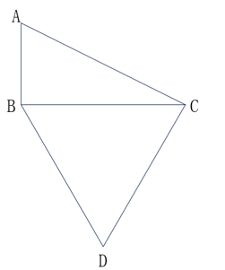

- **A**. 

- **B**. 

- **C**. 

　✅
- **D**. 

**答案**：C

**官方解析**

连接AD（如下图）：

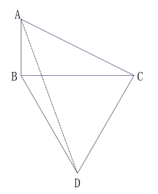

由于“AB、BC分别为正南北向和正东西向道路”，故，根据勾股定理可得：米，由于，故三角形ABC为一个锐角为的直角三角形，。由于BCD为正三角形，故米，，故，则三角形ACD为直角三角形，根据勾股定理可得：米。

故正确答案为C。

---

### 第 11 题　qid 5893780 · 数学运算

设计师将一个正方形的大厅分给如下图所示的几个区域，已知所有的三角形都是等腰直角三角形，梯形都是等腰梯形，且所有三角形和梯形面积均相等。在三角形的区域铺设地砖，在中间的正方形区域铺设木地板。问地砖和木地板的面积比是多少？

- **A**. 2：3
- **B**. 4：3
- **C**. 8：9　✅
- **D**. 16：9

**答案**：C

**官方解析**

如图所示，从E点作EG垂直于AC；从C、D两点分别作CF、DH垂直于EM。根据题意可知，三角形都是等腰直角三角形，梯形都是等腰梯形，BE与EC均为梯形的腰，则BE=EC，可知E为BC的中点，那么EG为等腰直角三角形ABC的中位线。赋值EG=1，则EG=CF=DH=1，又，则EG=GC=EF=HM=1，AB=2EG=2。，，根据三角形和梯形面积相等，，可得CD=1，则中间正方形区域的边EM=EF＋FH＋HM=3。三角形的区域铺设地砖，则铺设地砖的面积；中间的正方形区域铺设木地板，则铺设木地板的面积=3×3=9，地砖和木地板的面积比是8：9。

故正确答案为C。

---

### 第 12 题　qid 5893783 · 数学运算

某工程队接到一项任务，甲、乙合作6天后完成总任务量的25%，乙、丙合作15天后又完成剩余任务量的，剩下全部任务由乙单独工作11天完成。已知乙与他人合作时效率比其单独工作时高10%，问甲、乙、丙合作完成这项任务需要多少天？

- **A**. 16
- **B**. 20　✅
- **C**. 24
- **D**. 28

**答案**：B

**官方解析**

由于“乙与他人合作时效率比其单独工作时高10%”，即乙与他人合作时效率为（1+10%）乙=1.1乙，根据题意则有：······①；······②；······③。联立①③可得15甲=11乙，赋值甲的效率为11，乙的效率为15，则工作总量=11×15×4=660，则，所求时间天。

故正确答案为B。

---

### 第 13 题　qid 5893542 · 数学运算

某高校外国语学院中，会俄语的学生都会英语，其中一半还会法语；会英语的学生中有一半会法语；这三种语言都会的学生有50人，只会其中两种语言的有100人，只会其中一种语言的有150人。问会法语的学生有多少人？

- **A**. 100
- **B**. 200　✅
- **C**. 50
- **D**. 150

**答案**：B

**官方解析**

因为“会俄语的学生都会英语”，所以会俄语的学生包含于会英语的学生，因此作图如下：

又因为“会俄语的学生都会英语，其中一半还会法语”，即会俄语的学生的一半三种语言都会，又因为“三种语言都会的学生有50人”，所以会俄语的学生的一半是50人，另一半只会俄语和英语的有50人。又因为“只会其中两种语言的有100人”，所以只会英语和法语的学生有100-50=50人，会英语的学生中有50+50=100人会法语，结合“会英语的学生中有一半会法语”，可得会英语的学生共有100×2=200人，其中只会英语的学生有200-50-100=50人。根据“只会其中一种语言的有150人”，可得只会法语的学生有150-50=100人，则会法语的学生有100+50+50=200人。

故正确答案为B。

---

### 第 14 题　qid 5893759 · 数学运算

甲、乙等36人分为6个小组参加某项活动，要求任意2组人数不同，每个组都不少于3人，且任何一组人数不得超过另一组的3倍。问甲和乙至少有1人分到人数第二多的小组的概率为（    ）。

- **A**. 35%
- **B**. 40%　✅
- **C**. 25%
- **D**. 30%

**答案**：B

**官方解析**

根据题干“6个小组任意2组人数不同，每个组不少于3人”，可先给6个小组分别分3人、4人、5人、6人、7人、8人，共3+4+5+6+7+8=33人，还剩余36-33=3人。根据题干“任何一组人数不得超过另一组的3倍”，则人数最多的组不能超过9人，故剩余的3人只能分到人数最多的三个小组且每个小组分1人，此时人数第二多的小组有7+1=8人。总情况数为从36人中选8人分到人数第二多的小组，有种情况。

方法一：满足题意要求的情况较复杂，优先考虑反面情况。反面情况为甲和乙两人均未分到人数第二多的小组，即从剩余34人中选8人分到该小组，有种情况，则所求概率。

方法二：将满足题意要求的情况分类讨论如下：

①甲、乙其中1人分到人数第二多的小组，再从剩余34人中选7人分到该小组，有种情况；

②甲和乙都分到人数第二多的小组，再从剩余34人中选6人分到该小组，有种情况。

分类用加法，则所求概率。

故正确答案为B。

---

### 第 15 题　qid 5893551 · 数学运算

小张每周二、周五和周日固定参加骑行社团活动。某年9月和10月，小张分别参加了13次和14次活动。问当年他最后一次参加活动是在哪一天？

- **A**. 12月31日　✅
- **B**. 12月30日
- **C**. 12月29日
- **D**. 12月28日

**答案**：A

**官方解析**

由题意可知，小张连续7天参加3次社团活动，9月有30天，前28天参加次社团活动，则后2天需参加13-12=1次；同理，10月有31天，后28天也参加12次社团活动，则前3天需满足参加14-12=2次，即9月29日-10月3日连续5天内需满足参加3次社团活动。

若9月29日为周一，连续5天内只有2天参加社团活动，不满足题意；

若9月29日为周二，连续5天内只有2天参加社团活动，不满足题意；

若9月29日为周三，连续5天内只有2天参加社团活动，不满足题意；

若9月29日为周四，连续5天内只有2天参加社团活动，不满足题意；

若9月29日为周五，连续5天内有3天参加社团活动，满足题意；

若9月29日为周六，连续5天内只有2天参加社团活动，不满足题意；

若9月29日为周日，连续5天内只有2天参加社团活动，不满足题意。

综上可知，9月29日只能是周五，则9月30日为周六，10-12月共31+30+31=92天，天，则12月31日为周日，恰好为当年小张最后一次参加社团活动。

故正确答案为A。

---

## 判断推理

### 第 1 题　qid 5893606 · 图形推理

从所给的四个选项中，选择最合适的一项填入问号处，使之呈现一定的规律性：

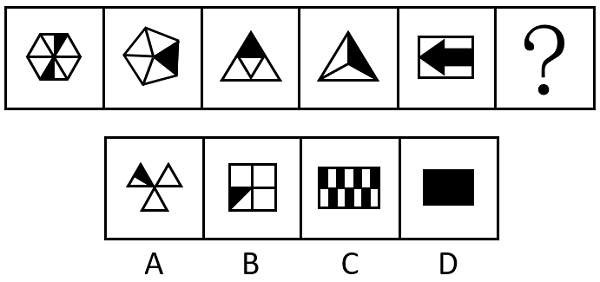

- **A**. A
- **B**. B
- **C**. C
- **D**. D　✅

**答案**：D

**官方解析**

元素组成不同，且无明显属性规律，观察发现，题干图形均由黑块和白块组成，且色块分布均匀，优先考虑黑白块面积。题干图形的黑块面积依次为整体图形面积的、、、、，故？处图形的黑块面积应为整个图形的面积，即整个图形全为黑色，只有D项符合。

故正确答案为D。

---

### 第 2 题　qid 5893833 · 图形推理

从所给的四个选项中，选择最合适的一个填入问号处，使之呈现一定的规律性：

- **A**. A　✅
- **B**. B
- **C**. C
- **D**. D

**答案**：A

**官方解析**

元素组成相同，考虑位置规律。题干图形可分为内外圈，考虑内外圈分开看。位于内圈的黑球均依次顺时针平移1步，位于外圈的黑球均依次逆时针平移1步，只有A项符合。

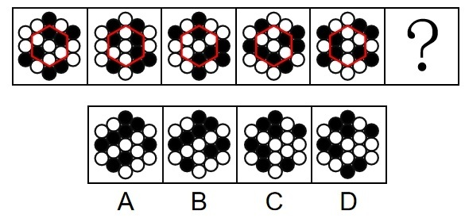

故正确答案为A。

---

### 第 3 题　qid 5893838 · 图形推理

从所给的四个选项中，选择最合适的一个填入问号处，使之呈现一定的规律性：

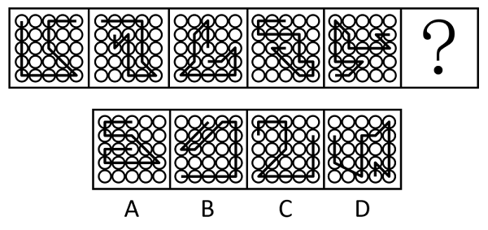

- **A**. A
- **B**. B
- **C**. C　✅
- **D**. D

**答案**：C

**官方解析**

元素组成不同，且无明显属性规律，优先考虑数量规律。观察发现，题干图形均由线条和宫格构成，且线条将宫格中的小白球都分成了两部分，排除D项；继续观察发现，题干图形中两部分白球数量存在差异，个数分别为5、5和6、4交替出现，故？处图形两部分白球个数应为6、4，只有C项符合。
故正确答案为C。

---

### 第 4 题　qid 5893613 · 图形推理

从所给的四个选项中，选择最合适的一项填入问号处，使之呈现一定的规律性：

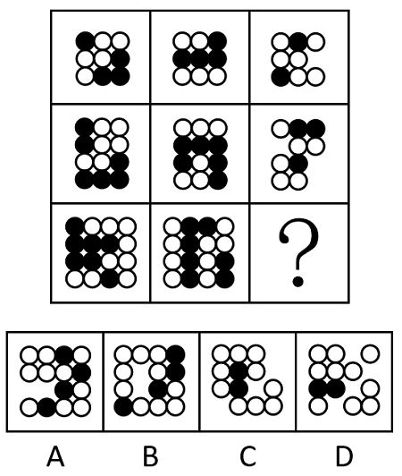

- **A**. A
- **B**. B　✅
- **C**. C
- **D**. D

**答案**：B

**官方解析**

图形元素组成相似，优先考虑样式规律。观察发现，题干图形均由黑球和白球构成，考虑黑白运算。九宫格优先横向看，第一行图形的黑白运算规律为：黑+白=白，白+白=黑，白+黑=白，黑+黑=空，第二行图形经验证符合此规律，第三行图形应用此规律，只有B项符合。
故正确答案为B。

---

### 第 5 题　qid 5895236 · 图形推理

左图为8个白色正方体和4个灰色正方体粘接而成的长方体，问以下哪一个可能是其外表面展开图？

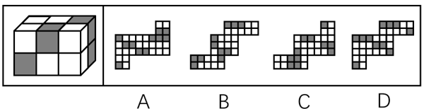

- **A**. A
- **B**. B
- **C**. C
- **D**. D　✅

**答案**：D

**官方解析**

将长方体的外表面依次标上序号，如下图所示，面e为正面、面f为顶面、面k为右侧面、面i为左侧面、面g为背面、面h为底面，逐一进行分析。

A项：展开图的6个面与长方体的外表面可以对应（如上图所示），但在题干长方体中，面e和面i的公共边应挨着面i中的黑色方块，而A项中两面的公共边没有挨着面i中的黑色方块，选项与题干不一致，排除；

B项：展开图的6个面中，不存在面e和面f，选项与题干不一致，排除；

C项：展开图的6个面中，不存在面e和面f，选项与题干不一致，排除；

D项：展开图的6个面（如上图所示）与长方体的外表面一一对应，选项与题干一致，当选。

故正确答案为D。

---

### 第 6 题　qid 5893673 · 图形推理

上图为13个白色正方体和5个灰色正方体组合而成的多面体，现用经A、B、C三个顶点的平面对该多面体进行切割，正确的截面是：

- **A**. A
- **B**. B　✅
- **C**. C
- **D**. D

**答案**：B

**官方解析**

本题考查截面图。根据平面公理“过不在一条直线上的三点，有且只有一个平面”可以得出，A、B、C三个顶点可以确定一个唯一的截面，如下图所示：

从下往上看即可得到如下截图：

故正确答案为B。

---

### 第 7 题　qid 5894887 · 图形推理

左图为15个白色正方体和3个灰色正方体组合而成的多面体，其可以由①、②、③三个多面体组合而成，问哪项能填入问号处？

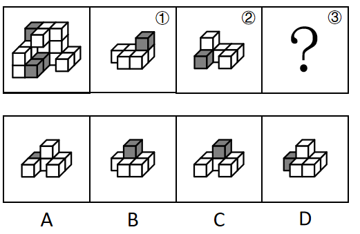

- **A**. A　✅
- **B**. B
- **C**. C
- **D**. D

**答案**：A

**官方解析**

本题考查立体拼合。如下图所示，立体图可以由①、②以及A项拼合而成。

故正确答案为A。

---

### 第 8 题　qid 5893840 · 图形推理

把下面六个图形分为两类，使每一类图形都有各自的共同特征或规律，分类正确的一项是：

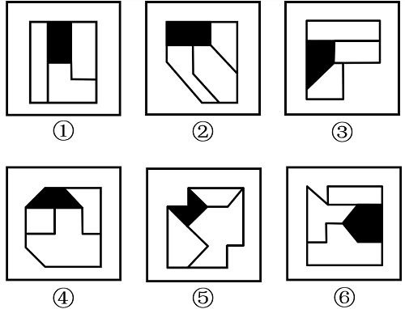

- **A**. ①②⑥，③④⑤
- **B**. ①③④，②⑤⑥
- **C**. ①③⑥，②④⑤　✅
- **D**. ①③⑤，②④⑥

**答案**：C

**官方解析**

本题为分组分类题目。题干每幅图形均由三个面和一个黑块拼接而成，考虑图形间关系。观察发现，题干中黑块与图形外框均相交于边，且图①③⑥中黑块与图形外框公共边的数量均为1，图②④⑤中黑块与图形外框公共边的数量均为2，即图①③⑥为一组，图②④⑤为一组。
故正确答案为C。

---

### 第 9 题　qid 5893637 · 图形推理

把下面六个图形分为两类，使每一类图形都有各自的共同特征或规律，分类正确的一项是：

- **A**. ①④⑤，②③⑥
- **B**. ①③④，②⑤⑥
- **C**. ①⑤⑥，②③④　✅
- **D**. ①②⑥，③④⑤

**答案**：C

**官方解析**

本题为分组分类题目。元素组成不同，且无明显属性规律，考虑数量规律。观察发现，题干图形被分割，考虑面数量，但面数量无规律，且框内有明显一笔构成的线条，考虑笔画数。图①⑤⑥均为两笔画图形，图②③④均为一笔画图形，故图①⑤⑥为一组，图②③④为一组。
故正确答案为C。

---

### 第 10 题　qid 5893648 · 图形推理

把下面的六个图形分为两类，使每一类图形都有各自的共同特征或规律，分类正确的一项是：

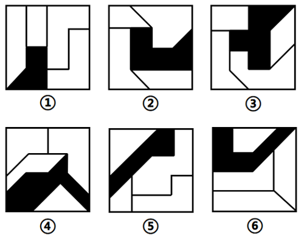

- **A**. ①②⑥，③④⑤
- **B**. ①④⑥，②③⑤
- **C**. ①③⑤，②④⑥
- **D**. ①②③，④⑤⑥　✅

**答案**：D

**官方解析**

本题为分组分类题目。元素组成不同，且无明显属性规律，考虑数量规律。题干图形明显被分割，优先考虑面数量，题干图形均有四个白块和一个黑块，不能分组；继续观察发现，题干图形均由几个图形拼接而成，还可以考虑图形间关系。题干图形均有一个黑块，图①②③中黑块均与4个白块存在公共边，图④⑤⑥中黑块均与3个白块存在公共边。即图①②③为一组，图④⑤⑥为一组。
故正确答案为D。

---

### 第 11 题　qid 5893535 · 定义判断

慢病也称为慢性非传染性疾病，是指长期的、不能自愈的、也几乎不能被治愈的疾病。慢病自我管理是指慢病患者主动监测自己的病情，以积极态度及行动，改善健康和情绪，通过对疾病的认识，学习与疾病长期共存。
根据上述定义，下列属于慢病自我管理的是：

- **A**. 老张在患了流感后多方查阅相关信息，每天监测血氧、心率、血压等指标，不做剧烈运动，避免着凉
- **B**. 老王因慢性肾功能衰竭需定期在医院进行透析治疗，医院为其建立了慢病管理档案，追踪监测肾功能等各项指标
- **C**. 老赵的父母都因胃癌去世，老赵深知该疾病的严重后果，每年全面体检一次，定期进行胃肠镜检查，不熬夜不喝酒，规律作息
- **D**. 患II型糖尿病的老李，平日生活格外谨慎，含糖量高的食物一概不碰，每天按时服药，定期监测血糖水平　✅

**答案**：D

**官方解析**

第一步：找出定义关键词。
慢病：“慢性非传染性疾病”、“长期的、不能自愈的、也几乎不能被治愈的疾病”；
慢病自我管理：“慢病患者主动监测自己的病情，积极改善健康和情绪，学习与疾病长期共存”。
第二步：逐一分析选项。
A项：“流感”属于传染性疾病，不符合“慢性非传染性疾病”，不符合“慢病”定义，因此也不符合“慢病自我管理”定义，排除；
B项：医院为老王建立慢病管理档案并追踪监测肾功能等各项指标，不是患者老王监测自己的病情，不符合“慢病患者主动监测自己的病情，积极改善健康和情绪，学习与疾病长期共存”，不符合“慢病自我管理”定义，排除；
C项：老赵并没有患病，不是患者，不符合“慢病患者主动监测自己的病情，积极改善健康和情绪，学习与疾病长期共存”，不符合“慢病自我管理”定义，排除；
D项：II型糖尿病属于慢性非传染性疾病，患II型糖尿病的老李按时服药，定期监测血糖水平，符合“慢病患者主动监测自己的病情，积极改善健康和情绪，学习与疾病长期共存”，符合“慢病自我管理”定义，当选。
故正确答案为D。

---

### 第 12 题　qid 5893775 · 定义判断

多级养殖是指根据物种代谢产物或残余有机质的利用价值及其在食物链中所处的级次，依次放养相应生物，多级次利用营养物质的一种养殖方式。
根据上述定义，下列属于多级养殖的是：

- **A**. 将养殖过江蓠的海水用于放养贝类，以利用其中繁殖的浮游生物；再将养殖过贝类的水用于放养对虾；再以对虾代谢分解的产物养殖藻类　✅
- **B**. 将鱼、虾、贝类与藻类放在同一水槽混养，其代谢产物会为藻类提供必要的营养要素，藻类的光合作用又产生更多的溶解氧
- **C**. 在一台浮筏上，于冬春季养殖海带；至夏秋季养殖海湾扇贝或石花菜，从而更好利用海况条件，满足市场需要
- **D**. 同一池塘中，鲢、鳙生活在上层，主食浮游生物；草鱼、鳊生活在中下层，主食草类；鲤、鲫生活在底层，主食底栖动物和有机碎屑

**答案**：A

**官方解析**

第一步：找出定义关键词。
“根据物种代谢产物或残余有机质的利用价值及其在食物链中所处的级次”、“依次放养相应生物”、“多级次利用营养物质”。
第二步：逐一分析选项。
A项：养殖江蓠的海水放养贝类，再利用养殖贝类的水放养对虾，再利用对虾代谢分解的产物养殖藻类，符合“根据物种代谢产物或残余有机质的利用价值及其在食物链中所处的级次”、“依次放养相应生物”、“多级次利用营养物质”，符合定义，当选；
B项：将鱼、虾、贝类与藻类放在同一水槽混养，不符合“依次放养相应生物”等，不符合定义，排除；
C项：冬春季养殖海带，至夏秋季养殖海湾扇贝或石花菜，不符合“根据物种代谢产物或残余有机质的利用价值及其在食物链中所处的级次”、“多级次利用营养物质”，不符合定义，排除；
D项：同一池塘中生活在不同层的生物，不符合“依次放养相应生物”、“多级次利用营养物质”，不符合定义，排除。
故正确答案为A。

---

### 第 13 题　qid 5893807 · 定义判断

动态描写法是指记叙文中对人物、景物作运动状态的描写，创造具体而栩栩如生的形象的一种描写方法。动态描写法包括两类：一类是对运动着的景物的描写，一类是对静物所作的动态描写。动态描写法的目的在于赋予客观事物以运动感、活力感、变化感，克服形象的单调性，丰富形象的多样性，达到更好地表现事物、感染读者的艺术效果。
根据上述定义，下列没有体现动态描写法的是：

- **A**. 有的松树望穿秋水，不见你来，独自上到高处，斜着身子张望
- **B**. 夜阑人静，家养的大黄狗趴在院子里安静地睡了　✅
- **C**. 七股大水，从水库的桥孔跃出，仿佛七幅闪光的黄锦，直铺下去
- **D**. 一轮杏黄色的满月，悄悄从山嘴处爬出来，把倒影投入湖水中

**答案**：B

**官方解析**

第一步：找出定义关键词。
“对运动着的景物的描写”、“对静物所作的动态描写”、“目的在于赋予客观事物以运动感、活力感、变化感”。
第二步：逐一分析选项。
A项：该项中“松树上到高处，斜着身子张望”，将静态的松树写成动态，而且赋予它情感，生动形象地描绘了松树婀娜多姿的风貌，符合“对静物所作的动态描写”、“目的在于赋予客观事物以运动感、活力感、变化感”，符合定义，排除；
B项：该项中“大黄狗趴在院子里安静地睡了”，未体现动态的表达，大黄狗只是处于静止状态趴在院子里，不符合“对运动着的景物的描写”、“对静物所作的动态描写”、“目的在于赋予客观事物以运动感、活力感、变化感”，不符合定义，当选；
C项：该项中“水从桥孔跃出”，将动态的水描写得生动、壮观、有气势，符合“对运动着的景物的描写”、“目的在于赋予客观事物以运动感、活力感、变化感”，符合定义，排除；
D项：该项中“满月从山嘴处爬出来”，将月亮升起的动态生动地描绘出来，符合“对运动着的景物的描写”、“目的在于赋予客观事物以运动感、活力感、变化感”，符合定义，排除。
本题为选非题，故正确答案为B。

---

### 第 14 题　qid 5893544 · 定义判断

电力系统的电力设备根据其在运行中所起的作用，分为电力一次设备和电力二次设备。电力一次设备指的是直接参与生产、变换、传输、分配和消耗电能的设备；电力二次设备指的是为了保护并保证电力一次设备的正常运行，对其运行状态进行测量、监视、控制和调节等的设备。
根据上述定义，下列说法正确的是：

- **A**. 电路中用于升降交流电压的变压器，属于电力二次设备
- **B**. 将回路中高电压降低的电压互感器，属于电力一次设备　✅
- **C**. 由柴油驱动的发电机，属于电力二次设备
- **D**. 记录零序电流值并用于查找故障点的故障录波装置，属于电力一次设备

**答案**：B

**官方解析**

第一步：找出定义关键词。
电力一次设备：“直接参与生产、变换、传输、分配和消耗电能”；
电力二次设备：“保护并保证电力一次设备的正常运行”、“对其运行状态进行测量、监视、控制和调节等”。
第二步：逐一分析选项。
A项：用于升降交流电压的变压器，是直接参与变换电压的设备，符合“直接参与生产、变换、传输、分配和消耗电能”，符合“电力一次设备”定义，不符合“电力二次设备”定义，排除；
B项：将回路中高电压降低的电压互感器，是直接参与变换电压的设备，符合“直接参与生产、变换、传输、分配和消耗电能”，符合“电力一次设备”定义，当选；
C项：由柴油驱动的发电机，是生产电能的设备，符合“直接参与生产、变换、传输、分配和消耗电能”，符合“电力一次设备”定义，不符合“电力二次设备”定义，排除；
D项：记录零序电流值并用于查找故障点的故障录波装置，该装置是为了保护并保证电力一次设备的正常运行而对其进行监视的设备，符合“对其运行状态进行测量、监视、控制和调节等”，符合“电力二次设备”定义，不符合“电力一次设备”定义，排除。
故正确答案为B。

---

### 第 15 题　qid 5893804 · 定义判断

复杂型消费行为是指消费者对价格昂贵，品牌差异大，功能复杂的商品，由于缺乏必要的商品知识，需要慎重选择，仔细对比，以求降低风险的购买行为；多变型消费行为是指如果消费者购买的商品价格低，可供选择的品牌很多时，他们并不花太多的时间选择品牌，而是经常变换品牌。
根据上述定义，下列说法正确的是：

- **A**. 老李给儿子换了十几个钢琴老师之后，发现还是第一个钢琴老师最好，于是一次性交了一年的学费。这属于复杂型消费行为
- **B**. 小明去超市买某品牌饼干，心想上次买了巧克力口味，这次买绿茶口味，下次再试一下夹心的。这属于多变型消费行为
- **C**. 老王打算买一辆越野车，网上查阅了各种型号参数，试驾了十几款品牌之后，才做出决定。这属于复杂型消费行为　✅
- **D**. 小丽逛街的时候本来只想买一条裤子，后来发现需要搭配一件合适的上衣和配套的手提包，所以买了全套。这属于多变型消费行为

**答案**：C

**官方解析**

第一步：找出定义关键词。
复杂型消费行为：“价格昂贵，品牌差异大，功能复杂的商品”、“慎重选择，仔细对比，以求降低购买风险”；
多变型消费行为：“价格低，可选品牌多的商品”、“不花太多的时间选择品牌，经常变换品牌”。
第二步：逐一分析选项。
A项：老李给儿子更换和对比了钢琴老师，但钢琴授课服务并不属于“功能复杂的商品”，不符合“价格昂贵，品牌差异大，功能复杂的商品”，不符合“复杂型消费行为”定义，排除；
B项：小明更换的是不同口味、类型的饼干，未体现变换品牌，不符合“不花太多的时间选择品牌，经常变换品牌”，不符合“多变型消费行为”定义，排除；
C项：老王购买越野车，其中越野车符合“价格昂贵，品牌差异大，功能复杂的商品”，老王试驾十几款品牌后才做决定，符合“慎重选择，仔细对比，以求降低购买风险”，符合“复杂型消费行为”定义，当选；
D项：小丽本来只想购买裤子，后为了搭配购买了全套，未体现价格是否昂贵，以及是否更换品牌，不符合“价格低，可选品牌多的商品”、“不花太多的时间选择品牌，经常变换品牌”，不符合“多变型消费行为”定义，排除。
故正确答案为C。

---

### 第 16 题　qid 5893810 · 定义判断

森林覆盖率是指森林面积占土地总面积的百分比。郁闭度是指森林中乔木树冠在阳光直射下地面总投影面积与此林地总面积的比，其最大值为1，表示树冠层全部连接形成完全郁闭的状态。郁闭度与森林气温日变化呈负相关，与相对湿度呈正相关。立木蓄积量是指森林中所有树木材积的总和，立木包括枯立木和活立木两类；森林蓄积量是指森林中现存各种活立木的材积总量，以立方米为计算单位。
根据上述定义，下列说法正确的是：

- **A**. 森林覆盖率能够反映一个国家（或地区）森林资源分布的实际状况
- **B**. 若某森林郁闭度为0.3，其阳光直射下乔木树冠的地面总投影面积为3万公顷，则该林地总面积为10万公顷　✅
- **C**. 一般来说，郁闭度大时森林白天气温降低，气温日变化增加，相对湿度增大
- **D**. 某区域森林蓄积量为14亿立方米，则该区域立木蓄积量一定少于14亿立方米

**答案**：B

**官方解析**

第一步：找出定义关键词。
森林覆盖率：“森林面积占土地总面积的百分比”；
郁闭度：“森林中乔木树冠在阳光直射下地面总投影面积与此林地总面积的比”、“与森林气温日变化呈负相关，与相对湿度呈正相关”；
立木蓄积量：“森林中所有树木材积的总和，立木包括枯立木和活立木两类”；
森林蓄积量：“森林中现存各种活立木的材积总量”。
第二步：逐一分析选项。
A项：森林覆盖率指“森林面积占土地总面积的百分比”，即森林覆盖率反映的是森林资源“占有”土地的情况，而不是森林资源“分布”的状况，说法错误，排除；
B项：根据“郁闭度=森林中乔木树冠在阳光直射下地面总投影面积/此林地总面积”可知，当某森林郁闭度为0.3，其阳光直射下乔木树冠的地面总投影面积为3万公顷时，该林地总面积为10万公顷，说法正确，当选；
C项：根据“郁闭度与森林气温日变化呈负相关，与相对湿度呈正相关”可知，当郁闭度大时，气温日变化应“减小”，而不是“增加”，说法错误，排除；
D项：立木蓄积量指“森林中所有树木材积的总和，立木包括枯立木和活立木两类”，森林蓄积量指“森林中现存各种活立木的材积总量”，即立木蓄积量包括森林蓄积量，当某区域森林蓄积量为14亿立方米时，该区域立木蓄积量应“不少于”14亿立方米，说法错误，排除。
故正确答案为B。

---

### 第 17 题　qid 5893778 · 定义判断

附性法推理是指将同一属性分别附加在原命题的主项和谓项前面，从而形成一个新命题的推理方法，以公式表示即为：“所有S（主项）是P（谓项）所有NS是NP”（其中“N”表示某种属性）。运用这种推理必须遵守的规则是：①原命题必须断定了某个类别的所有事物的某种共性；②附加的属性概念必须保持含义的同一；③结论中的主谓项关系应与前提中的主谓项关系相同。

根据上述定义，下列符合附性法推理规则的是：

- **A**. 蝴蝶是昆虫，所以，色彩斑斓的蝴蝶是色彩斑斓的昆虫　✅
- **B**. 教师是人，所以，老教师是老人
- **C**. 有些诗人是画家，所以，有些女诗人是女画家
- **D**. 音乐家是人，所以，无天赋的音乐家是无天赋的人

**答案**：A

**官方解析**

第一步：找出定义关键词。
“原命题必须断定了某个类别的所有事物的某种共性”、“附加的属性概念必须保持含义的同一”、“结论中的主谓项关系应与前提中的主谓项关系相同”。
第二步：逐一分析选项。
A项：蝴蝶是昆虫，所以，色彩斑斓的蝴蝶是色彩斑斓的昆虫，蝴蝶和昆虫前附加的“色彩斑斓”含义均是色彩灿烂的样子，符合“原命题必须断定了某个类别的所有事物的某种共性”、“附加的属性概念必须保持含义的同一”、“结论中的主谓项关系应与前提中的主谓项关系相同”，符合定义，当选；
B项：老教师中的“老”含义是经验丰富，老人中的“老”含义是上了年纪，两者含义不同，不符合“附加的属性概念必须保持含义的同一”，不符合定义，排除；
C项：有些诗人是画家，不符合“原命题必须断定了某个类别的所有事物的某种共性”，不符合定义，排除；
D项：无天赋的音乐家中的“无天赋”含义是在音乐领域没有天赋，无天赋的人中的“无天赋”含义是在所有领域没有天赋，两者含义不同，不符合“附加的属性概念必须保持含义的同一”，不符合定义，排除。
故正确答案为A。

---

### 第 18 题　qid 5893541 · 定义判断

民俗是指一个民族或一个社会群体在长期的生产实践和社会生活中逐渐形成并世代相传、较为稳定的文化事项，可以简单概括为民间流行的风尚、习俗，具有传承性、广泛性、稳定性。
根据上述定义，下列活动属于民俗的是：

- **A**. 清明节当天，黄帝陵举行隆重的公祭活动，按照既定祀典礼仪，缅怀始祖精神，传承中华文明
- **B**. 王老伯家有一个传承三代的习惯，每到重大节日，全家都要聚在一起，交流感情，品尝美食，共享天伦
- **C**. 农历九月九日为重阳节，自古以来，河洛地区的人们每逢这天都会结伴登高山、逛庙会、赏菊花　✅
- **D**. 近年来，一些大都市的公园每周都会举办“相亲角”活动，中老年父母聚在一起替儿女相亲

**答案**：C

**官方解析**

第一步：找出定义关键词。
“一个民族或一个社会群体”、“在长期的生产实践和社会生活中逐渐形成并世代相传、较为稳定的文化事项”、“民间流行的风尚、习俗”、“具有传承性、广泛性、稳定性”。
第二步：逐一分析选项。
A项：清明节当天在黄帝陵举行的公祭活动，是以官方名义组织的有严格规模、等级和仪式的大型祭祀活动，不符合“民间流行的风尚、习俗”，不符合定义，排除；
B项：该项说明的是王老伯的家庭内部习惯，该习惯仅适用于王老伯家，不具有广泛性，不符合“具有传承性、广泛性、稳定性”，不符合定义，排除；
C项：河洛地区的人们，符合“一个民族或一个社会群体”，自古以来，每逢重阳节都会结伴登高山、逛庙会、赏菊花，说明是世代相传，具有传承性，符合“在长期的生产实践和社会生活中逐渐形成并世代相传、较为稳定的文化事项”、“具有传承性、广泛性、稳定性”，符合定义，当选；
D项：一些大都市的公园每周都会举办“相亲角”活动，不符合“在长期的生产实践和社会生活中逐渐形成并世代相传、较为稳定的文化事项”，不符合定义，排除。
故正确答案为C。

---

### 第 19 题　qid 5893601 · 定义判断

某部落的计数法只有4个符号：。每个数字至多有两位，数位从高到低的顺序为从右到左。其中右边数位从大到小依次为；而左边数位从大到小依次为。

根据上述定义，下列哪项中的数字最大？

- **A**. 

　✅
- **B**. 

- **C**. 

- **D**. 

**答案**：A

**官方解析**

第一步：找出定义关键词。

“每个数字至多有两位，数位从高到低的顺序为从右到左”、“右边数位从大到小依次为”、“左边数位从大到小依次为”。

第二步：逐一分析选项。

本题提问方式为“下列哪项中的数字最大”，故根据定义关键词对选项进行排序即可。根据“每个数字至多有两位，数位从高到低的顺序为从右到左”可知，右边数位大的数字更大，所以根据“右边数位从大到小依次为”可知，大于，排除B、D两项；再根据“左边数位从大到小依次为”可知，大于，所以A项中的数字最大。

故正确答案为A。

---

### 第 20 题　qid 5893595 · 定义判断

伪装型反侦查行为是指犯罪行为人通过采取相应措施来隐蔽自身、迷惑侦查机关侦查活动的行为，其主要表现为三类：①栽赃嫁祸，通过将赃物、违禁品暗置别人处等方式来误导侦查方向；②主动报案，通过实施“贼喊捉贼”式的行为来蒙蔽侦查机关；③制造伪证，通过假人证、不知情的人或一些特定物品，制造出虚假的不在场证明或者自己与案件无关的假象，以达到混淆视听、误导侦查视线的目的。
根据上述定义，下列没有体现上述几类伪装型反侦查行为的是：

- **A**. 甲将乙杀害后，故意在网络上散布丙与乙不和的谣言，转移警方注意力
- **B**. 甲在作案后，拿走可以证明受害人乙身份的物品，隐藏其身份　✅
- **C**. 甲酒后与乙争吵并痛下杀手，事后甲主动报警，声称自己是目击证人
- **D**. 甲作案后接受警方讯问时，拿出案发当日的火车票谎称自己当时正在火车上

**答案**：B

**官方解析**

第一步：找出定义关键词。
伪装型反侦查行为：“犯罪行为人”、“隐蔽自身、迷惑侦查机关侦查活动的行为”；
栽赃嫁祸：“将赃物、违禁品暗置别人处等方式”、“误导侦查方向”；
主动报案：“实施‘贼喊捉贼’式的行为”、“蒙蔽侦查机关”；
制造伪证：“通过假人证、不知情的人或一些特定物品”、“制造出虚假的不在场证明或者自己与案件无关的假象”、“达到混淆视听、误导侦查视线的目的”。
第二步：逐一分析选项。
A项：甲将乙杀害后，故意散布丙与乙不和的谣言，符合“嫁祸”，转移警方注意力，符合“误导侦查方向”，属于栽赃嫁祸，符合定义，排除；
B项：甲作案后，拿走能证明受害人乙身份的物品，隐藏乙的身份，不符合“隐蔽自身、迷惑侦查机关侦查活动的行为”，不符合定义，当选；
C项：甲杀人后主动报警，声称自己是目击证人，符合“实施‘贼喊捉贼’式的行为”，属于主动报案，符合定义，排除；
D项：甲作案后拿出案发当日的火车票，谎称自己当时正在火车上，符合“通过假人证、不知情的人或一些特定物品”、“制造出虚假的不在场证明或者自己与案件无关的假象”，属于制造伪证，符合定义，排除。
本题为选非题，故正确答案为B。

---

### 第 21 题　qid 5893812 · 类比推理

卫冕：夺冠

- **A**. 庄园：田园
- **B**. 追讨：诉讼
- **C**. 续约：签约　✅
- **D**. 姓名：笔名

**答案**：C

**官方解析**

第一步：判断题干词语间逻辑关系。
卫冕指竞赛中保住上次获得的冠军称号，所以卫冕是再次夺冠，二者为对应关系。
第二步：判断选项词语间逻辑关系。
A项：庄园指封建主占有和经营的大片地产，田园指田地和园圃，借指农村，二者不是对应关系，与题干逻辑关系不一致，排除；
B项：追讨指追赶讨伐，诉讼指司法机关在案件当事人和其他有关人员的参与下，按照法定程序解决案件时所进行的活动，俗称“打官司”，二者无明显逻辑关系，与题干逻辑关系不一致，排除；
C项：续约指合同、合约期满后继续签约，所以续约是再次签约，二者为对应关系，与题干逻辑关系一致，当选；
D项：姓名指人的姓氏和名字，笔名指作者发表作品时用的别名，二者不是对应关系，与题干逻辑关系不一致，排除。
故正确答案为C。

---

### 第 22 题　qid 5893567 · 类比推理

花生壳：核桃仁

- **A**. 刺梨汁：桃花扇
- **B**. 丝瓜络：石榴籽　✅
- **C**. 杏仁露：葡萄皮
- **D**. 葛根茶：芡实粉

**答案**：B

**官方解析**

第一步：判断题干词语间逻辑关系。
“花生壳”是花生的组成部分；“核桃仁”是核桃的组成部分，二者都是组成各自植物果实的一部分。
第二步：判断选项词语间逻辑关系。
A项：“刺梨汁”是一种以刺梨为原材料制成的果汁；“桃花扇”是指扇面上画有桃花的扇子，二者不是组成各自植物果实的一部分，与题干逻辑关系不一致，排除；
B项：“丝瓜络”是干燥成熟丝瓜的网状纤维，“丝瓜络”是丝瓜的组成部分；“石榴籽”是石榴的组成部分，二者都是组成各自植物果实的一部分，与题干逻辑关系一致，当选；
C项：“杏仁露”是一种以杏仁为原材料制成的饮料；“葡萄皮”是葡萄的组成部分，与题干逻辑关系不一致，排除；
D项：“葛根茶”是一种以葛根为原材料制成的茶饮料；“芡实粉”是一种以芡实为原材料磨成的粉，与题干逻辑关系不一致，排除。
故正确答案为B。

---

### 第 23 题　qid 5893573 · 类比推理

花香四溢：分子运动

- **A**. 波光粼粼：光的反射　✅
- **B**. 聚沙成塔：质量互变
- **C**. 水落石出：水的浮力
- **D**. 炉火纯青：金属炼制

**答案**：A

**官方解析**

第一步：判断题干词语间逻辑关系。
花香四溢是花朵的气味分子进入空气，扩散到周围环境中，供人们嗅觉感知。花香四溢的原理是分子运动，二者为对应关系。
第二步：判断选项词语间逻辑关系。
A项：波光粼粼是光照在动态的水面上，除少许穿透形成折射外，多数都反射回空气中从而形成的现象。波光粼粼的原理是光的反射，二者为对应关系，与题干逻辑关系一致，当选；
B项：聚沙成塔是把沙子堆成宝塔，体现了积少成多。聚沙成塔的原理不是质量互变，与题干逻辑关系不一致，排除；
C项：水落石出指水落下去，水底的石头就露出来，比喻事情的真相完全显露出来，体现了自然界中动态与静态的辩证关系。水落石出的原理不是水的浮力，与题干逻辑关系不一致，排除；
D项：炉火纯青是认为炼到炉里发出纯青色的火焰就算成功了，火焰的温度对应相应的颜色（即火焰的温度越低，颜色会偏黄；温度越高，颜色会偏蓝），后用来比喻功夫达到了纯熟完美的境界，体现的是火焰温度和颜色之间的对应关系。炉火纯青的原理不是金属炼制，与题干逻辑关系不一致，排除。
故正确答案为A。

---

### 第 24 题　qid 5893570 · 类比推理

诛禁不当：反受其央

- **A**. 为者常成：行者常至
- **B**. 君子检身：常若有过
- **C**. 其身不正：虽令不从　✅
- **D**. 麻雀虽小：五脏俱全

**答案**：C

**官方解析**

第一步：判断题干词语间逻辑关系。
诛禁不当，反受其央，意思是惩罚得不恰当，反而受其祸害。因为诛禁不当，所以反受其央，二者是因果对应关系。
第二步：判断选项词语间逻辑关系。
A项：为者常成，行者常至，意思是努力去做的人常常可以成功，不倦前行的人常常可以达到目的，二者是并列关系，与题干逻辑关系不一致，排除；
B项：君子检身，常若有过，意思是君子要时时反省检查自己，就像自己经常会有缺点过失那样，二者不是因果对应关系，与题干逻辑关系不一致，排除；
C项：其身不正，虽令不从，意思是在上位的管理者本身言行不正，即使发出命令，大家也不会服从遵守。因为其身不正，所以虽令不从，二者是因果对应关系，与题干逻辑关系一致，当选；
D项：麻雀虽小，五脏俱全，比喻事物的体积或规模虽小，具备的内容却很齐全，二者不是因果对应关系，与题干逻辑关系不一致，排除。
故正确答案为C。

---

### 第 25 题　qid 5893803 · 类比推理

酒器：尊：爵

- **A**. 门楣：门框：门槛
- **B**. 服装：礼服：常服　✅
- **C**. 人居：巢居：穴居
- **D**. 木柱：石柱：砖柱

**答案**：B

**官方解析**

第一步：判断题干词语间逻辑关系。
尊和爵是古代两种不同的酒器，二者为并列关系，分别与酒器构成种属关系。
第二步：判断选项词语间逻辑关系。
A项：门楣、门框、门槛是中国古代建筑大门的三个不同的组成部分，三者为并列关系，与题干逻辑关系不一致，排除；
B项：礼服和常服是两种不同穿着场合的服装，二者为并列关系，分别与服装构成种属关系，与题干逻辑关系一致，当选；
C项：巢居和穴居是两种不同的居住形式，二者为并列关系，分别与人居构成交叉关系，与题干逻辑关系不一致，排除；
D项：木柱、石柱、砖柱是三种不同材质的柱子，三者为并列关系，与题干逻辑关系不一致，排除。
故正确答案为B。

---

### 第 26 题　qid 5893549 · 类比推理

蚜虫：七星瓢虫：小麦

- **A**. 蛇：鸟：谷子
- **B**. 稗草：螳螂：水稻
- **C**. 蚊子：青蛙：高粱
- **D**. 老鼠：黄鼬：玉米　✅

**答案**：D

**官方解析**

第一步：判断题干词语间逻辑关系。
蚜虫会吸食小麦的汁液，二者为捕食者与被捕食对象的对应关系；七星瓢虫会捕食蚜虫，二者为捕食者与被捕食对象的对应关系。
第二步：判断选项词语间逻辑关系。
A项：有的蛇会吃鸟，有的鸟会吃蛇，二者是相互捕食的对应关系，与题干逻辑关系不一致，排除；
B项：稗草是一种常见的田间杂草，会和水稻竞争稻田里的资源，二者是竞争关系，并非捕食者与被捕食对象的对应关系，与题干逻辑关系不一致，排除；
C项：蚊子和高粱没有必然关系，与题干逻辑关系不一致，排除；
D项：老鼠吃玉米，二者为捕食者与被捕食对象的对应关系；黄鼬即黄鼠狼，会捕食老鼠，二者为捕食者与被捕食对象的对应关系，与题干逻辑关系一致，当选。
故正确答案为D。

---

### 第 27 题　qid 5893534 · 类比推理

感想：主观性：体会

- **A**. 典范：示范性：表率　✅
- **B**. 发明：创造性：方法
- **C**. 泥土：可塑性：材料
- **D**. 规律：普适性：定理

**答案**：A

**官方解析**

第一步：判断题干词语间逻辑关系。
感想是指由接触外界事物而引起的思想反应，体会指的是体验领会，二者为近义关系；感想和体会均具有主观性，与第二个词构成必然属性对应关系。
第二步：判断选项词语间逻辑关系。
A项：典范是指可以作为学习、仿效标准的人或事物，表率是指好的榜样，二者为近义关系；典范和表率均具有示范性，与第二个词构成必然属性对应关系，与题干逻辑关系一致，当选；
B项：发明需要一定的方法，二者为对应关系，与题干逻辑关系不一致，排除；
C项：泥土是一种材料，二者为种属关系；材料不一定具有可塑性，与第二个词构成或然属性对应关系，与题干逻辑关系不一致，排除；
D项：规律是指事物之间的内在必然联系，定理是指已经证明具有正确性、可以作为原则或规律的命题或公式，定理是规律的一种，二者为种属关系，与题干逻辑关系不一致，排除。
故正确答案为A。

---

### 第 28 题　qid 5893771 · 类比推理

识别敌舰：发射鱼雷：击毁目标

- **A**. 线上挂号：远程问诊：开具处方　✅
- **B**. 环境评估：铁路铺设：桥梁建造
- **C**. 立案审查：提起公诉：证据确凿
- **D**. 交通事故：保险赔付：救治伤员

**答案**：A

**官方解析**

第一步：判断题干词语间逻辑关系。
军舰在大洋中巡查时，先识别敌舰，再发射鱼雷，最后击毁目标，三者为先后顺序的对应关系。
第二步：判断选项词语间逻辑关系。
A项：网络就医一般先线上挂号，再远程问诊，最后开具处方，三者为先后顺序的对应关系，与题干逻辑关系一致，当选；
B项：铁路铺设和桥梁建造没有必然的先后顺序，与题干逻辑关系不一致，排除；
C项：在我国刑事案件一般是先立案审查，再提起公诉，但证据确凿不是动作行为，和前两词不存在动作行为的先后顺序，与题干逻辑关系不一致，排除；
D项：发生交通事故后一般先救治伤员，再进行保险赔付，先后顺序与题干不同，与题干逻辑关系不一致，排除。
故正确答案为A。

---

### 第 29 题　qid 5893805 · 类比推理

牛皮纸 对于 （    ） 相当于 （    ） 对于 背筐

- **A**. 包装；运输
- **B**. 木纤维；拎筐
- **C**. 纸袋；柳条　✅
- **D**. 羊皮纸；竹筐

**答案**：C

**官方解析**

逐一代入选项。
A项：牛皮纸可用来包装，背筐可用来运输，均为功能对应关系，但前后顺序相反，前后逻辑关系不一致，排除；
B项：木纤维是制作牛皮纸的原材料，二者为原材料对应关系；背筐指背在背上的筐，拎筐指用手拎着的筐，二者为并列关系，前后逻辑关系不一致，排除；
C项：牛皮纸是制作纸袋的原材料，柳条是制作背筐的原材料，均为原材料对应关系，前后逻辑关系一致，当选；
D项：牛皮纸和羊皮纸为并列关系；有的竹筐是背筐，有的竹筐不是背筐，有的背筐是竹筐，有的背筐不是竹筐，二者为交叉关系，前后逻辑关系不一致，排除。
故正确答案为C。

---

### 第 30 题　qid 5893815 · 类比推理

领头雁 对于 （    ） 相当于 （    ） 对于 先驱

- **A**. 领导者；拓荒牛　✅
- **B**. 鸟类；革命
- **C**. 迁徙；先锋
- **D**. 出头鸟；先行者

**答案**：A

**官方解析**

逐一代入选项。
A项：领头雁比喻在众人眼里有一定的号召力和领导能力，具有榜样力量的人，与领导者构成比喻象征关系；拓荒牛比喻开拓创新的先行者，先驱指前行开路的人，二者构成比喻象征关系，前后逻辑关系一致，当选；
B项：领头雁是鸟类，二者为种属关系；革命的先驱，二者为偏正关系，前后逻辑关系不一致，排除；
C项：迁徙是领头雁的一种习性，二者为对应关系；先锋指行军或作战时的先遣将领或先头部队，先驱指前行开路的人，二者为近义关系，前后逻辑关系不一致，排除；
D项：领头雁比喻在众人眼里有一定的号召力和领导能力，具有榜样力量的人，出头鸟比喻表现突出或领头的人，也比喻因出头露面而招人注目的人，二者是并列关系；先行者指首先倡导的人，先驱指前行开路的人，二者是近义/全同关系，前后逻辑关系不一致，排除。
故正确答案为A。

---

### 第 31 题　qid 5893802 · 逻辑判断

人民是创作的源头活水，只有扎根人民，创作才能获得取之不尽、用之不竭的源泉。文化文艺工作者要走进实践深处，观照人民生活，表达人民心声，用心用情用功抒写人民、描绘人民、歌唱人民。哲学社会科学工作者要多到实地调查研究，了解百姓生活状况，把握群众思想脉搏，着眼群众需要解疑释惑、阐明道理，把学问写进群众心坎儿里。
由此可以推出：

- **A**. 文化文艺工作者只有走进实践深处，才能观照人民生活
- **B**. 如果不扎根人民，创作就不能获得取之不尽、用之不竭的源泉　✅
- **C**. 哲学社会科学工作者只有到实地调查研究，才能了解百姓生活状况，把握群众思想脉搏
- **D**. 如果哲学社会科学工作者没有着眼群众需要解疑释惑、阐明道理，就说明他们没有进行实地调查研究

**答案**：B

**官方解析**

第一步：翻译题干。

创作获得取之不尽、用之不竭的源泉扎根人民。

第二步：逐一分析选项。

A项：翻译为“观照人民生活文化文艺工作者走进实践深处”，但是题干二者之间没有推出关系，无法推出，排除；

B项：翻译为“扎根人民创作获得取之不尽、用之不竭的源泉”，是对题干“创作获得取之不尽、用之不竭的源泉扎根人民”的否后，否后必否前，可以推出，当选；

C项：翻译为“了解百姓生活状况，把握群众思想脉搏哲学社会科学工作者到实地调查研究”，但是题干二者之间没有推出关系，无法推出，排除；

D项：翻译为“哲学社会科学工作者着眼群众需要解疑释惑、阐明道理他们进行实地调查研究”，但是题干二者之间没有推出关系，无法推出，排除。

故正确答案为B。

---

### 第 32 题　qid 5893814 · 逻辑判断

冰雪旅游是利用冰雪气候资源体验冰雪文化的旅游活动，包括冰雪观光演艺、运动竞技等内容。H地区冰雪旅游开展了五年，调查显示：在近万名受访者中，有90%的人曾以不同形式体验过冰雪旅游，平均每年有65%的人体验过1~2次冰雪旅游，有25%的人体验过3~4次，且这一比例逐年升高。这说明H地区冰雪旅游的需求较高，常态化多次消费正成为H地区越来越多人的选择。
以下哪项如果为真，最能削弱上述结论？

- **A**. 参与调查的受访者几乎都是了解或喜爱冰雪旅游的年轻人　✅
- **B**. 近五年，H地区冰雪旅游产业的年均投资额接近，没有增加
- **C**. H地区位于北半球北部，冬季较长，许多游客会来此体验冰雪旅游
- **D**. 为扩大宣传，H地区许多冰雪项目会推出优惠组合套餐，吸引人们多次消费

**答案**：A

**官方解析**

第一步：找出论点和论据。
论点：H地区冰雪旅游的需求较高，常态化多次消费正成为H地区越来越多人的选择。
论据：在近万名受访者中，有90%的人曾以不同形式体验过冰雪旅游，平均每年有65%的人体验过1~2次冰雪旅游，有25%的人体验过3~4次，且这一比例逐年升高。
本题通过调查受访者进行冰雪旅游的次数，得出H地区冰雪旅游需求较高，越来越多的人会常态化多次消费的结论，论点论据话题不一致，削弱优先考虑拆桥，即不能通过“受访者冰雪旅游次数增多”推出“H地区冰雪旅游需求较高，越来越多的人会常态化多次消费”。
第二步：逐一分析选项。
A项：选项说的是参与调查的受访者几乎都是了解或喜爱冰雪旅游的年轻人，调查的都是原本就喜爱冰雪旅游的人，那么通过受访者的冰雪旅游次数，无法得出H地区冰雪旅游需求的真实情况，为拆桥项，可以削弱，当选；
B项：选项说的是近五年H地区冰雪旅游产业的年均投资额接近，与论点讨论的选择冰雪旅游的人数是否增加无关，为无关项，无法削弱，排除；
C项：论点说的是H地区的人旅游需求高，该项说的是许多游客来H地区体验冰雪旅游，主体不一致，无法削弱，排除；
D项：选项说的是H地区许多冰雪项目推出的优惠组合套餐会吸引人们多次消费，解释了为什么越来越多的人会常态化多次消费，补充论据进行加强，无法削弱，排除。
故正确答案为A。

---

### 第 33 题　qid 5893806 · 逻辑判断

多重宇宙理论通常也称为平行宇宙理论，该理论认为有无数个宇宙与我们所在的宇宙并存，虽然我们无法意识到这一点。这些宇宙可能与我们所处的宇宙截然不同，但也可能与我们的宇宙极其相似，在更广的意义上，要证明多重宇宙存在远比单纯想象它困难得多。甚至从一开始，有一部分科学家就认为这个理论称不上是“真正意义上的科学”。因为没有人能证明多重宇宙理论是错误的——即它无法被证伪。
以下哪项可能是上述科学家论证的前提？

- **A**. 平行宇宙理论至今未获证实，只是单纯的想象
- **B**. 只有能被证伪的理论，才能称得上是“真正意义上的科学”　✅
- **C**. 平行宇宙理论即使变成现实，对于人类的文明进步也未必是坏事
- **D**. 如果平行宇宙的数量足够多，那可能意味着在我们认为的虚拟世界中发生的事情也会真实地发生在平行宇宙中

**答案**：B

**官方解析**

第一步：找出论点和论据。
论点：多重宇宙理论称不上是“真正意义上的科学”。
论据：没有人能证明多重宇宙理论是错误的——即它无法被证伪。
论点讨论的是“多重宇宙理论”和“真正意义上的科学”的关系，论据讨论的是“多重宇宙理论”和“被证伪”的关系，论点和论据话题不一致，且提问方式为“前提”，加强优先考虑搭桥，即建立“被证伪”和“真正意义上的科学”之间的联系。
第二步：逐一分析选项。
A项：该项说的是平行宇宙理论至今未获证实，与论据讨论的平行宇宙理论是否能被证伪无关，也与论点讨论的平行宇宙理论是否能称得上是“真正意义上的科学”无关，无法加强，排除；
B项：该项说的是只有能被证伪的理论，才能称得上是“真正意义上的科学”，即建立了“被证伪”和“真正意义上的科学”之间的联系，为搭桥项，是论证成立的前提，可以加强，当选；
C项：该项说的是平行宇宙理论对于人类文明的影响，与论点讨论的平行宇宙理论是否能称得上是“真正意义上的科学”无关，话题不一致，无法加强，排除；
D项：该项说的是如果平行宇宙的数量足够多会出现的情况，与论点讨论的平行宇宙理论是否能称得上是“真正意义上的科学”无关，话题不一致，无法加强，排除。
故正确答案为B。

---

### 第 34 题　qid 5894947 · 逻辑判断

今年1-4月，张、王、李、杨4人到长三角城市上海、苏州、杭州和南京调研，每个城市每人调研1个月，每个月中4人调研的城市均不同。已知：
（1）王3月在苏州调研；
（2）李1月在南京调研；
（3）杨2月在杭州调研；
（4）张1月、3月分别在苏州、上海调研。
根据以上信息，以下哪项是不可能的？

- **A**. 杨3月在南京调研
- **B**. 张4月在杭州调研
- **C**. 王4月在上海调研　✅
- **D**. 李2月在苏州调研

**答案**：C

**官方解析**

第一步：分析题干条件。

（1）王3月在苏州调研；

（2）李1月在南京调研；

（3）杨2月在杭州调研；

（4）张1月在苏州、3月在上海调研；

（5）每个城市每人调研1个月，每个月中4人调研的城市均不同。

第二步：根据题干条件进行推理。

本题信息较多，故采用列表法辅助推理。将已知信息填入表格：

根据条件（5）可得张2月和4月只能去杭州和南京调研，已知杨2月在杭州，那么张2月不能在杭州，张2月只能在南京，4月在杭州。

已知杨2月在杭州，张4月在杭州，那么王要么1月、要么3月在杭州，结合条件（1）王3月在苏州可得王1月只能在杭州，李3月在杭州。

已知王3月在苏州，1月在杭州，那么要么2月、要么4月在南京，但张2月在南京，因此王只能4月在南京，2月在上海。

已知张3月在上海，王2月在上海，那么李要么1月、要么4月在上海，但李1月在南京，因此李4月在上海，2月在苏州。

根据以上信息，可最终确定杨1月在上海，3月在南京，4月在苏州。

具体信息如下表所示：

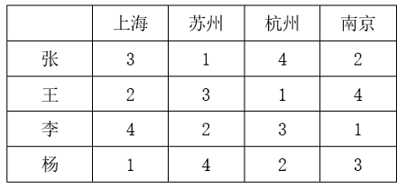

本题为选非题，故正确答案为C。

---

### 第 35 题　qid 5893816 · 逻辑判断

墨西哥丽脂鲤是一类洞穴鱼，生活在寒冷漆黑的洞穴中，它们的身体不产生色素，因此呈现白化状态。与其他鱼类相比，墨西哥丽脂鲤的某一基因发生突变，使其难以合成酪氨酸，因此抑制了黑色素的形成。研究人员认为这一基因改变并不是生物进化中的偶然事件，而是鱼类为了生存所做出的适应性策略。
以下除哪项外，均能支持研究人员的观点？

- **A**. 酪氨酸是合成多巴胺等激素的前体，许多动物在应对生存压力时都会分泌多巴胺类物质　✅
- **B**. 与墨西哥丽脂鲤类似，一些生存在阴暗寒冷环境中的海底生物也会出现身体白化现象
- **C**. 这一基因改变促使墨西哥丽脂鲤血液中的红细胞体积更大，血红蛋白容量更高，更能应对缺氧环境
- **D**. 形成黑色素需要耗费能量，而墨西哥丽脂鲤长期处在能量匮乏的环境中，减少酪氨酸的合成有助于自身能量的储备

**答案**：A

**官方解析**

第一步：找出论点和论据。
论点：这一基因改变并不是生物进化中的偶然事件，而是鱼类为了生存所做出的适应性策略。
论据：无。
本题只有论点，没有论据，可以考虑补充论据来加强，且本题为选非题，排除加强项即可。
第二步：逐一分析选项。
A项：选项说的是许多动物在应对生存压力时会分泌多巴胺类物质，但并未提及墨西哥丽脂鲤是否也会发生相同的变化，为不明确项，无法加强，当选；
B项：选项说的是一些与墨西哥丽脂鲤生存环境相似的海底生物也会出现身体白化现象，说明墨西哥丽脂鲤的基因突变不是偶然，而是为了适应生存的环境，补充论据，可以加强，排除；
C项：选项说的是墨西哥丽脂鲤的基因突变会使其更能应对缺氧环境，说明基因突变确实是为了适应生存的环境，补充论据，可以加强，排除；
D项：选项说的是墨西哥丽脂鲤为了长期应对能量匮乏的环境，会减少酪氨酸的合成，提高自身能量储备，说明墨西哥丽脂鲤的突变基因让其难以合成酪氨酸是为了适应生存的环境，补充论据，可以加强，排除。
本题为选非题，故正确答案为A。

---

### 第 36 题　qid 5893809 · 逻辑判断

研究中，实验组小鼠每天晚上接受两小时的蓝光照射，对照组小鼠白天接受两个小时的蓝光照射。三周之后，所有小鼠进行“强迫游泳”和“糖水偏好”测试。这两项测试常用来检测小鼠是否出现了类似抑郁的症状。结果发现，相比于白天接受光照的小鼠，夜间接受光照的小鼠明显表现出类似抑郁的症状。研究者认为，长期在夜间暴露于蓝光下，人们出现抑郁情绪的风险会提高。
以下除哪项外，均能削弱研究者的观点？

- **A**. 小鼠与人的生活习性完全不同，小鼠昼伏夜出，而人类基本是白天活动，晚上休息
- **B**. 光对于小鼠是厌恶型刺激，小鼠回避光以降低被发现和捕食的风险，而人通常在光明的环境感觉更加安全
- **C**. 行为测试是否能够测试主观情绪体验，类似抑郁的症状是否等同于出现抑郁的情绪体验，尚存在争议
- **D**. 相比白天，夜间的光照更容易通过视网膜神经节细胞激活伏隔核，该脑区与负性情绪的产生有关　✅

**答案**：D

**官方解析**

第一步：找出论点和论据。
论点：长期在夜间暴露于蓝光下，人们出现抑郁情绪的风险会提高。
论据：研究中，实验组小鼠每天晚上接受两小时的蓝光照射，对照组小鼠白天接受两个小时的蓝光照射。三周之后，所有小鼠进行“强迫游泳”和“糖水偏好”测试。这两项测试常用来检测小鼠是否出现了类似抑郁的症状。结果发现，相比于白天接受光照的小鼠，夜间接受光照的小鼠明显表现出类似抑郁的症状。
本题论点讨论的是长期在夜间暴露于蓝光下，人们出现抑郁情绪的风险会提高，论据讨论的是通过两组对照实验发现夜间暴露于蓝光照射下的小鼠出现了类似抑郁的症状，论点和论据讨论的主体不一致，可以优先考虑拆桥，但本题为选非题，排除能削弱的选项即可。
第二步：逐一分析选项。
A项：该项说的是小鼠昼伏夜出，而人类白天活动，晚上休息，说明小鼠和人类的作息习惯并不相同，不能通过小鼠实验直接得出人类的情况，拆断了小鼠和人类之间的必然联系，为拆桥项，可以削弱，排除；
B项：该项说的是小鼠回避光，而人类通常在光明的环境中感觉更安全，说明小鼠和人类对于光的反应不同，不能通过小鼠实验直接得出人类的情况，拆断了小鼠和人类之间的必然联系，为拆桥项，可以削弱，排除；
C项：该项说的是类似抑郁的症状是否等同于出现抑郁情绪，此说法存在争议，说明出现了类似抑郁的症状不能直接等同于出现了抑郁情绪，拆断了论据中“实验小鼠在经过夜间蓝光照射后出现了类似抑郁的症状”和论点中“出现抑郁情绪的风险提高”之间的必然联系，为拆桥项，可以削弱，排除；
D项：该项说的是夜间光照通过视网膜神经节细胞激活了伏隔核，而伏隔核与负性情绪的产生有关，解释了夜间光照确实会提高出现抑郁情绪的风险的原因，属于补充论据，为加强项，无法削弱，当选。
本题为选非题，故正确答案为D。

---

### 第 37 题　qid 5893808 · 逻辑判断

蕨类植物是一类无性繁殖的植物，通过释放孢子进行繁殖，不会开花结果。人们发现，与开花植物相比，蕨类植物的基因组极为庞大，一种普通树蕨就拥有超过60亿个DNA碱基对。此外，与开花植物相比，蕨类植物在地球上出现的时间更为久远，因此人们认为：蕨类植物的这一特征有助于它们长期应对地球环境的变化。
以下哪项如果为真，最能支持上述观点？

- **A**. 蕨类植物寿命较长，演变得更慢，这可能是它们保留大量遗传物质的原因
- **B**. 不同生境类型中，蕨类植物的基因组大小差异显著，基因组较大的更多是附生蕨类植物
- **C**. 对于无性繁殖的植物，庞大的基因组可增加有益突变的概率，以适应环境　✅
- **D**. 与蕨类植物相比，开花植物更擅长去除多余的基因，在少量复制后缩减染色体大小

**答案**：C

**官方解析**

第一步：找出论点和论据。
论点：蕨类植物庞大的基因组有助于它们长期应对地球环境的变化。
论据：蕨类植物的基因组庞大，且在地球上出现的时间更为久远。
本题论点和论据讨论的都是蕨类植物基因组庞大，与在地球上生活时间久远能适应地球环境变化之间的关系，论点论据话题一致，加强优先考虑补充论据，即解释原因或者举例子。 
第二步：逐一分析选项。
A项：选项指出蕨类植物保留大量遗传物质的原因，而论点讨论的是蕨类植物庞大的基因组有助于它们长期应对地球环境的变化，话题不一致，无法加强，排除；
B项：选项指出不同生境类型中，蕨类植物的基因组存在显著差异，而论点讨论的是蕨类植物庞大的基因组有助于它们长期应对地球环境的变化，话题不一致，无法加强，排除；
C项：选项指出无性繁殖的植物庞大的基因组可增加有益突变的概率以适应环境，解释了为什么蕨类植物庞大的基因组有助于它们长期应对地球环境的变化，补充论据，可以加强，当选；
D项：选项指出开花植物比蕨类植物更擅长去除多余的基因，缩减染色体大小，但不明确该特性对于其应对地球环境变化的影响，为不明确项，无法加强，排除。
故正确答案为C。

---

### 第 38 题　qid 5893691 · 逻辑判断

软件通常存在漏洞，攻击者为接近并操控目标主机，往往会主动寻找漏洞，攻击者会花费大量时间区分软件中“真正危险的漏洞”和“良性漏洞”，并在找到前者后实施攻击。因此有观点认为：如果添加大量良性漏洞欺骗攻击者，使其耗尽资源去寻找和测试那些毫无攻击用途的漏洞，将会减少对软件“真正危险的漏洞”的攻击，从而保证软件不被攻击者恶意控制。
以下哪项如果为真，最能削弱上述观点？

- **A**. 与软件中“真正危险的漏洞”相比，良性漏洞被攻击后只会导致程序崩溃
- **B**. 添加漏洞意味着要更改代码，有时候代码运行不良可能会影响软件的功能
- **C**. 许多军用飞机、舰艇都配有假目标系统，与此类似，良性漏洞也将起到干扰作用
- **D**. 大量添加良性漏洞会让其呈现很多人为特征，攻击者可利用其识别并忽略良性漏洞　✅

**答案**：D

**官方解析**

第一步：找出论点和论据。
论点：如果添加大量良性漏洞欺骗攻击者，使其耗尽资源去寻找和测试那些毫无攻击用途的漏洞，将会减少对软件“真正危险的漏洞”的攻击，从而保证软件不被攻击者恶意控制。
论据：攻击者会花费大量时间区分软件中“真正危险的漏洞”和“良性漏洞”，并在找到前者后实施攻击。
本题的论点和论据讨论的都是利用良性漏洞防止软件被攻击者恶意控制的话题，二者话题一致，削弱优先考虑削弱论点。
第二步：逐一分析选项。
A项：该项说的是良性漏洞遭到攻击后对程序的影响，论点讨论的是否可以通过添加大量良性漏洞保证软件不被攻击者恶意控制，话题不一致，无法削弱，排除；
B项：该项说的是添加漏洞可能会影响软件功能，论点讨论的是否可以通过添加大量良性漏洞保证软件不被攻击者恶意控制，话题不一致，无法削弱，排除；
C项：该项说的是与军用飞机等的假目标系统类似，良性漏洞将起到干扰作用，即良性漏洞的添加有利于软件的安全，具有加强作用，无法削弱，排除；
D项：该项说的是攻击者可以利用大量添加的良性漏洞的特征来忽略它们，说明通过大量添加良性漏洞的方法无法保证软件不被攻击者恶意控制，削弱论点，可以削弱，当选。
故正确答案为D。

---

### 第 39 题　qid 5893811 · 逻辑判断

研究团队对欧洲各地发现的古代遗骸进行DNA分析，这些遗骸的年代可追溯到12000年前欧洲出现农业之前和之后的一段时期。数据显示，从狩猎—采集生活方式转变为种植农作物方式，人们的平均身高降低了约3.8厘米。因此，研究团队认为：农业的兴起是欧洲人在那一历史时期身高改变的重要因素。
以下哪项如果为真，最能支持上述观点？

- **A**. 早期农业社会的古代人类遗骸中存在海绵状及多孔性骨组织区域
- **B**. 早期狩猎—采集社会并未留下能做出规模性统计的遗址，古代人的样本量十分有限
- **C**. 欧洲工业革命后，劳动条件改善及营养的增强使欧洲人在近百年时间里平均身高迅速增加
- **D**. 相比种植农作物的生活方式，狩猎—采集生活方式下人类肉食比例较高，虽然食物总体相对缺乏，但仍能达到较高的平均身高　✅

**答案**：D

**官方解析**

第一步：找出论点和论据。
论点：农业的兴起是欧洲人在那一历史时期身高改变的重要因素。
论据：从狩猎—采集生活方式转变为种植农作物方式，人们的平均身高降低了约3.8厘米。
本题论点讨论的是农业兴起改变了欧洲人身高，论据讨论的是通过分析欧洲各地古代遗骸DNA，得到从狩猎—采集生活方式转变为种植农作物方式后人们身高降低了，故论据和论点讨论的话题一致，加强优先考虑补充论据，即解释农业兴起改变了欧洲人身高的原因或举例证明。
第二步：逐一分析选项。
A项：该项说的是古代人类遗骸中存在海绵状及多孔性骨组织区域的特点，而论点讨论的是农业兴起是否改变了身高，话题不一致，无法加强，排除；
B项：该项说早期狩猎—采集社会古代人的样本量十分有限，说明利用这些有限的样本分析出的结果不一定可靠，无法加强，排除；
C项：该项说的是欧洲工业革命后欧洲人的平均身高增加，讨论的时期为工业革命后，而论点讨论的是从狩猎—采集生活方式转变为种植农作物方式这一时期，故该项讨论的时间点与论点不一致，话题不一致，无法加强，排除；
D项：该项说的是相比种植农作物的生活方式，狩猎—采集生活方式下人类肉食比例较高能达到较高的平均身高，可以解释为什么农业兴起改变了欧洲人的身高，补充论据，可以加强，当选。
故正确答案为D。

---

### 第 40 题　qid 5894948 · 逻辑判断

甲、乙、丙、丁4人参加预选赛。对于预选赛结果，几位教练预测如下：
（1）如果甲、乙均未通过，则丙通过；
（2）如果乙、丙至少有1人通过，则丁也通过；
（3）如果甲、乙至少有1人通过，则丙也通过，但是丁不通过。
根据几位教练的预测，可以推出：

- **A**. 丙和丁通过　✅
- **B**. 甲和丁通过
- **C**. 甲和乙通过
- **D**. 乙和丙通过

**答案**：A

**官方解析**

第一步：翻译题干。

（1）甲 且 乙丙；

（2）乙 或 丙丁；

（3）甲 或 乙 丙 且 丁；

第二步：根据题干条件进行推理。

题干没有明显的确定信息，故采用假设法进行推理。

假设甲通过，由条件（3）可知，丙通过，丁不通过，“丁不通过”是对条件（2）的否后，根据“否后必否前”可知，乙和丙均未通过，此时与“丙通过”矛盾，故假设不成立，甲未通过，排除B、C两项；

同理，假设乙通过，由条件（3）可知，丙通过，丁不通过，“丁不通过”是对条件（2）的否后，根据“否后必否前”可知，乙和丙均未通过，此时与“丙通过”矛盾，故假设不成立，乙未通过，排除D项。

故正确答案为A。

---

## 资料分析

### 材料 1

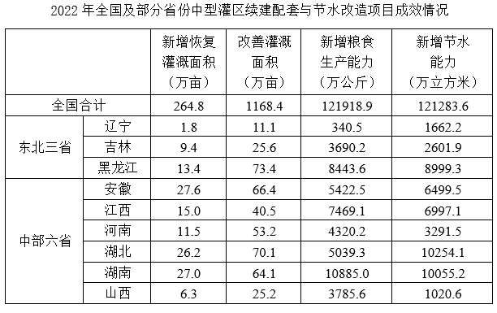

#### 第 1 题　qid 5893721 · 综合

2022年，中型灌区改善灌溉面积与新增恢复灌溉面积比值最大的中部省份是：

- **A**. 山西
- **B**. 湖北
- **C**. 河南　✅
- **D**. 江西

**答案**：C

**官方解析**

根据题干“2022年······比值最大的······”，可以判定本题为比值比较问题。定位表格材料可得，2022年山西、湖北、河南、江西中型灌区改善灌溉面积分别为25.2万亩、70.1万亩、53.2万亩、40.5万亩，山西、湖北、河南、江西中型灌区新增恢复灌溉面积分别为6.3万亩、26.2万亩、11.5万亩、15.0万亩。则四个省份中型灌区改善灌溉面积与新增恢复灌溉面积的比值分别为：山西，；湖北，；河南，；江西，。比较可知，中型灌区改善灌溉面积与新增恢复灌溉面积的比值最大的中部省份为河南。

故正确答案为C。

---

#### 第 2 题　qid 5893720 · 综合

2022年，中部六省中型灌区新增节水能力占全国中型灌区的：

- **A**. 不到三成
- **B**. 一半以上
- **C**. 三成多　✅
- **D**. 四成多

**答案**：C

**官方解析**

根据题干“2022年······占······”，结合材料时间为2022年，可判定本题为现期比重问题。定位表格材料可得：2022年全国中型灌区新增节水能力为121283.6万立方米，中部六省中型灌区新增节水能力分别为安徽6499.5万立方米、江西6997.1万立方米、河南3291.5万立方米、湖北10254.1万立方米、湖南10055.2万立方米、山西1020.6万立方米。根据公式：比重，可得所求比重为，即三成多。

故正确答案为C。

---

#### 第 3 题　qid 5893719 · 综合

2022年，中部六省中型灌区新增恢复灌溉面积是东北三省的：

- **A**. 4.5~5倍之间　✅
- **B**. 4~4.5倍之间
- **C**. 不到4倍
- **D**. 5倍以上

**答案**：A

**官方解析**

根据题干“2022年······是······的”，结合选项为倍数，可判定本题为现期倍数问题。定位表格材料可得∶2022年，东北三省中型灌区新增恢复灌溉面积分别为：辽宁1.8万亩、吉林9.4万亩、黑龙江13.4万亩；中部六省中型灌区新增恢复灌溉面积分别为：安徽27.6万亩、江西15.0万亩、河南11.5万亩、湖北26.2万亩、湖南27.0万亩、山西6.3万亩。则所求倍，在A项范围内。

故正确答案为A。

---

#### 第 4 题　qid 5893722 · 增长

2022年全国粮食产量同比增加368万吨。如全国中型灌区新增粮食生产能力均得到充分利用，则中部六省中型灌区新增粮食生产能力对全国粮食增产的贡献占比为：

- **A**. 不到2%
- **B**. 超过9%　✅
- **C**. 2%~5%之间
- **D**. 5%~9%之间

**答案**：B

**官方解析**

根据题干“2022年······贡献占比为”，可判定本题为现期比重问题。定位表格材料可得：2022年中部六省中型灌区新增粮食生产能力分别为：安徽5422.5万公斤、江西7469.1万公斤、河南4320.2万公斤、湖北5039.3万公斤、湖南10885.0万公斤、山西3785.6万公斤；根据题干可知“2022年全国粮食产量同比增加368万吨”。根据公式：增长贡献率，结合1吨=1000公斤，则题干所求为，在B项范围内。

故正确答案为B。

---

#### 第 5 题　qid 5893723 · 比重

在资料所给中型灌区续建配套与节水改造项目成效的4个指标中，东北三省占全国比重超过10%的指标有几个？

- **A**. 1
- **B**. 2　✅
- **C**. 3
- **D**. 4

**答案**：B

**官方解析**

根据题干“······占全国比重超过10%的指标有几个“，可判定本题为现期比重问题。根据表格数据可知：2022年东北三省新增恢复灌溉面积万亩&lt;264.8万亩×10%；东北三省改善灌溉面积万亩&lt;1168.4万亩×10%；东北三省新增粮食生产能力万公斤&gt;121918.9万公斤×10%；东北三省新增节水能力万立方米&gt;121283.6万立方米×10%。因此，资料所给的4个指标中，东北三省占全国比重超过10%的指标有新增粮食生产能力和新增节水能力，共2个。

故正确答案为B。

---

### 材料 2

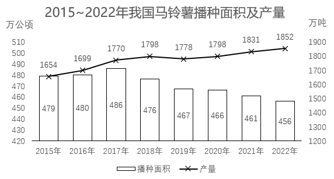

#### 第 6 题　qid 5893791 · 综合

2017~2022年我国马铃薯出口量最高的年份，当年出口额在这6年中排名（    ）。

- **A**. 第一
- **B**. 第二
- **C**. 第三　✅
- **D**. 第四

**答案**：C

**官方解析**

定位图2，可知2017~2022年我国马铃薯出口额及出口量。出口量最高的年份为2017年（50.95万吨），当年对应的出口额（2.81亿美元）排名第三。
故正确答案为C。

---

#### 第 7 题　qid 5893792 · 综合

2016~2020年，我国马铃薯总产量在以下哪个范围内？

- **A**. 不到0.9亿吨　✅
- **B**. 0.9亿~0.92亿吨之间
- **C**. 0.92亿~0.94亿吨之间
- **D**. 超过0.94亿吨

**答案**：A

**官方解析**

定位图1可得：2016~2020年，我国马铃薯产量分别为1699万吨、1770万吨、1798万吨、1778万吨、1798万吨。则2016~2020年我国马铃薯总产量为万吨=0.89亿吨，即不到0.9亿吨。

故正确答案为A。

---

#### 第 8 题　qid 5893793 · 增长

2018~2022年，我国马铃薯单位面积产量同比增长的年份有几个？

- **A**. 2
- **B**. 3
- **C**. 4
- **D**. 5　✅

**答案**：D

**官方解析**

根据题干“2018~2022年······单位面积产量同比增长的年份有几个”，结合材料给出了2017~2022年我国马铃薯的播种面积和产量，可判定本题为两期平均数比较问题。定位图1可得：2017~2022年我国马铃薯的播种面积和产量。单位面积产量，根据两期平均数比较结论“当分子增速（a）大于分母增速（b）时，平均数上升”，观察发现，2018、2020、2021、2022年我国马铃薯产量的同比增长率均大于0，面积的同比增长率均小于0，则这4个年份我国马铃薯单位面积产量为同比增长。只需再判断2019年我国马铃薯单位面积产量是否同比增长即可。

方法一：2018年我国马铃薯单位面积产量为，2019年为，则2019年我国马铃薯单位面积产量同比增长。

方法二：根据公式：增长率，可得2019年我国马铃薯产量的同比增长率（a）为，面积的同比增长率（b）为。a＞b，可判断平均数上升，即2019年我国马铃薯单位面积产量同比增长。

综上分析，2018~2022年我国马铃薯单位面积产量同比增长的年份有5个。

故正确答案为D。

---

#### 第 9 题　qid 5893794 · 比重

2020~2022年，我国马铃薯出口量占产量的比重呈现何种变化趋势？

- **A**. 持续上升
- **B**. 持续下降
- **C**. 先降后升　✅
- **D**. 先升后降

**答案**：C

**官方解析**

根据题干“2020~2022年，······比重呈现何种变化趋势”，可判定本题为现期比重问题。定位图1可得2020~2022年我国马铃薯产量；定位图2可得2020~2022年我国马铃薯出口量。根据公式：比重，则2020年我国马铃薯出口量占产量的比重，2021年的比重，2022年的比重。故2020~2022年，我国马铃薯出口量占产量的比重呈现先降后升的变化趋势。

故正确答案为C。

---

#### 第 10 题　qid 5893795 · 增长

以下折线图反映了2019~2022年我国马铃薯哪一产销数据的同比增量变化趋势？

- **A**. 出口额
- **B**. 出口量
- **C**. 播种面积
- **D**. 产量　✅

**答案**：D

**官方解析**

根据题干“以下折线图反映了2019~2022年······同比增量变化趋势”，可判定本题为增长量比较问题。定位图1可得2018~2022年我国马铃薯播种面积及产量；定位图2可得2018~2022年我国马铃薯出口额及出口量。根据公式：增长量=现期量-基期量，可得：
A项：2019年出口额同比上升（3.98亿美元&gt;2.61亿美元），增长量&gt;0；2020年出口额同比下降（2.90亿美元&lt;3.98亿美元），增长量&lt;0。则第二个点应低于第一个点，不符合折线图趋势，排除；
B项：2019年出口量同比上升（50.33万吨&gt;44.81万吨），增长量&gt;0；2020年出口量同比下降（44.19万吨&lt;50.33万吨），增长量&lt;0。则第二个点应低于第一个点，不符合折线图趋势，排除；
C项：2020年播种面积同比增量为466-467=-1万公顷；2021年同比增量为461-466=-5万公顷。则第三个点应低于第二个点，不符合折线图趋势，排除；
D项：2019年产量同比增量为1778-1798=-20万吨；2020年同比增量为1798-1778=20万吨；2021年同比增量为1831-1798=33万吨；2022年同比增量为1852-1831=21万吨，符合折线图趋势，当选。
故正确答案为D。

---

### 材料 3

        截至2022年末，全国累计投运各类电化学储能电站（包括大、中、小型电站）472座，总能量14.05GWh。其中大型电站26座，总能量5.99GWh；中型电站275座，总能量7.23GWh。2022年新增投运电化学储能电站194座，总能量达7.86GWh。其中大型电站19座，总能量4.64GWh；中型电站114座，总能量2.92GWh。

        2022年末累计投运的各类电化学储能电站中，锂离子电池电站435座，总能量占比达到89.2%（磷酸铁锂电池占88.7%，三元锂电池和钛酸锂电池分别占0.3%和0.2%），铅酸/铅碳电池总能量占比4.0%，液流电池总能量占比3.7%。在新增投运的电化学储能电站中，锂离子电池总能量占比达到86.5%，全部为磷酸铁锂电池。此外，铅酸/铅碳电池总能量占2.7%，液流电池总能量占5.6%。

#### 第 11 题　qid 5893726 · 比重

截至2021年末全国累计投运的各类电化学储能电站总数中，小型电站数量占比约为：

- **A**. 30%
- **B**. 35%
- **C**. 40%　✅
- **D**. 45%

**答案**：C

**官方解析**

根据题干“截至2021年末······总数中，小型电站数量占比约为”，结合选项为百分号，且材料时间为截至2022年末，可判定本题为基期比重问题。定位文字材料第一段可得：截至2022年末，全国累计投运各类电化学储能电站（包括大、中、小型电站）472座，其中大型电站26座，中型电站275座；2022年新增投运各类电化学储能电站194座，其中大型电站19座，中型电站114座。根据公式：基期量=现期量-增长量，则截至2021年末全国累计投运各类电化学储能电站为472-194=278座，大型电站为26-19=7座，中型电站为275-114=161座，则小型电站为278-7-161=110座。根据公式：基期比重，则截至2021年末小型电站数量占比。

故正确答案为C。

---

#### 第 12 题　qid 5893729 · 增长

2018-2022年，全国电化学储能电站年末总能量同比增长100%以上的年份有几个？

- **A**. 1
- **B**. 2
- **C**. 3　✅
- **D**. 4

**答案**：C

**官方解析**

根据题干“······同比增长100%以上的年份有几个”，可判定本题为一般增长率问题。定位统计图可得：2017-2022年全国电化学储能电站年末总能量。根据公式：增长率，所求为，化简得：现期量&gt;基期量×2。代入数据可得：2018年（858&gt;311×2），符合；2019年（1415&lt;858×2），不符合；2020年（3349&gt;1415×2），符合；2021年（6197&lt;3349×2），不符合；2022年（14054&gt;6197×2），符合。综上，2018-2022年，全国电化学储能电站年末总能量同比增长100%以上的年份有2018年、2020年、2022年，共3年。

故正确答案为C。

---

#### 第 13 题　qid 5893731 · 平均数

2022年新增投运的电化学储能电站中，平均每个大型电站的能量约是中型电站的多少倍？

- **A**. 4
- **B**. 6
- **C**. 8
- **D**. 10　✅

**答案**：D

**官方解析**

根据题干“2022年，······约是······的多少倍”，可判定本题为现期倍数问题。定位文字资料第一段可得：2022年新增投运电化学储能电站194座，其中大型电站19座，总能量4.64Gwh；中型电站114座，总能量2.92Gwh。根据公式：平均数，则平均每个大型电站的能量，平均每个中型电站的能量。前者约是后者的倍。

故正确答案为D。

---

#### 第 14 题　qid 5893732 · 比重

在①磷酸铁锂电池、②三元锂电池、③铅酸/铅碳电池和④液流电池四类应用不同技术的电化学储能电站中，2022年末累计投运电站总能量占各类电化学储能电站总能量比重高于2021年末水平的是：

- **A**. 仅①
- **B**. 仅④　✅
- **C**. ①②
- **D**. ③④

**答案**：B

**官方解析**

根据题干“······比重高于2021年末水平的是”，结合文字材料第二段给出2022年末累计投运的各类电化学储能电站总能量占比情况，以及2022年新增投运的各类电化学储能电站总能量占比情况，由于2022年末累计总能量=2021年末累计总能量+2022年新增总能量，可判定本题为混合比重问题。根据混合比重口诀“混合后总体比重居中”，结合题目要求“2022年末比重高于2021年末比重”可得：2021年末比重＜2022年末比重＜2022年新增比重，则找出2022年末比重＜2022年新增比重即可。根据文字材料第二段可知，仅④液流电池满足，2022年末累计投运的电化学储能电站占比（3.7%）＜2022年新增投运的电化学储能电站占比（5.6%）。
故正确答案为B。

---

#### 第 15 题　qid 5893733 · 综合

关于全国各类电化学储能电站状况，能够从上述资料中推出的是：

- **A**. 2022年末，平均每个累计投运的大型电站能量同比上升　✅
- **B**. 截至2022年末，累计投运的小型电站总能量超过1Gwh
- **C**. 2022年末，平均每个累计投运的锂离子电池电站能量高于总体平均水平
- **D**. 2022年新增电站中，锂离子、铅酸/铅碳和液流电池以外的类型能量占总能量的比重不到5%

**答案**：A

**官方解析**

A项：定位文字材料第一段可得：截至2022年末，全国累计投运各类电化学储能电站（包括大、中、小型电站）472座，其中大型电站26座，总能量5.99Gwh；2022年新增投运电化学储能电站194座，其中大型电站19座，总能量4.64Gwh。则截至2021年末，全国累计投运大型电化学储能电站26-19=7座，总能量5.99-4.64=1.35Gwh。根据公式：平均每个累计投运的大型电站能量，故2022年末，平均每个累计投运的大型电站能量为Gwh，2021年末为Gwh，同比上升，正确；

B项：定位文字材料第一段可得：截至2022年末，全国累计投运各类电化学储能电站（包括大、中、小型电站）472座，总能量14.05Gwh，其中大型电站总能量5.99Gwh，中型电站总能量7.23Gwh。则截至2022年末，小型电站总能量为14.05-5.99-7.23=0.83Gwh，未超过1Gwh，错误；

C项：定位文字材料第一、二段可得：截至2022年末，全国累计投运各类电化学储能电站（包括大、中、小型电站）472座，总能量14.05Gwh；2022年末累计投运的各类电化学储能电站中，锂离子电池电站435座，总能量占比达到89.2%。则2022年末，平均每个累计投运的锂离子电池电站能量为Gwh，电站平均水平为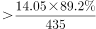Gwh，故平均每个累计投运的锂离子电池电站能量低于总体平均水平，错误；

D项：定位文字材料第二段可得：2022年末在新增投运的电化学储能电站中，锂离子电池总能量占比达到86.5%，全部为磷酸铁锂电池，此外，铅酸/铅碳电池总能量占2.7%，液流电池总能量占5.6%。则2022年新增电站中，锂离子、铅酸/铅碳和液流电池以外的类型能量占总能量的比重为1-86.5%-2.7%-5.6%=5.2%，超过5%，错误。

故正确答案为A。

---

### 材料 4

        2022年，京津冀地区生产总值合计10.0万亿元，是2013年的1.8倍。其中，北京、河北跨越4万亿元量级，均为4.2万亿元，分别是2013年的2.0倍和1.7倍；天津1.6万亿元，是2013年的1.6倍。京津冀第一产业、第二产业、第三产业增加值占生产总值比重构成由2013年的6.2：35.7：58.1变化为2022年的4.8：29.6：65.6。京津冀三地第三产业增加值占生产总值比重分别为83.8%、61.3％和49.4%，较2013年分别提高4.3、7.2和8.4个百分点。

        2013—2022年，京津冀地区城镇累计分别新增就业288.1万、405.5万和748.4万人。2021年，北京法人单位从业人员中，第三产业比重为84.4%，较2013年提高6.2个百分点，其中信息服务业和商务服务业占比达25.5%，较2013年提高6.2个百分点；天津和河北第三产业就业人员占比为60.5％和46.6%，较2013年提高10.9和15.1个百分点。

        2022年，京津冀三地全体居民人均可支配收入分别为77415元、48976元和30867元，与2013年相比，年均分别增长7.4%、7.1％和8.2%。其中，城镇居民人均可支配收入分别增长7.3%、6.9％和7.1%，农村居民人均可支配收入分别增长8.2%、7.3％和8.6%。

#### 第 16 题　qid 5893772 · 增长

以2013年为基期，则2013-2022年京津冀地区生产总值年均约增加多少万亿元？

- **A**. 1.1
- **B**. 0.9
- **C**. 0.7
- **D**. 0.5　✅

**答案**：D

**官方解析**

根据题干“······年均约增加多少万亿元”，可判定本题为年均增长量问题。定位文字材料第一段可得：2022年，京津冀地区生产总值合计10.0万亿元，是2013年的1.8倍。则2013年，京津冀地区生产总值合计万亿元。根据公式：年均增长量，则2013-2022年京津冀地区生产总值年均增加万亿元。

故正确答案为D。

---

#### 第 17 题　qid 5893773 · 比重

2013年，北京第三产业增加值占其生产总值比重比天津高多少个百分点？

- **A**. 25.4　✅
- **B**. 22.5
- **C**. 19.6
- **D**. 16.7

**答案**：A

**官方解析**

定位文字材料第一段可知，2022年京津冀三地第三产业增加值占生产总值比重分别为83.8%、61.3％和49.4%，较2013年分别提高4.3、7.2和8.4个百分点。则2013年北京第三产业增加值占其生产总值比重=83.8%-4.3%=79.5%，2013年天津第三产业增加值占其生产总值比重=61.3％-7.2%=54.1%，故题干所求=79.5%-54.1%=25.4%，即2013年北京第三产业增加值占其生产总值比重比天津高25.4个百分点。
故正确答案为A。

---

#### 第 18 题　qid 5893776 · 综合

2013—2022年，北京城镇累计新增就业人数约占同期京津冀地区城镇累计新增就业总人数的：

- **A**. 30%
- **B**. 35%
- **C**. 20%　✅
- **D**. 25%

**答案**：C

**官方解析**

根据题干“2013—2022年······占······”，可判定本题为现期比重问题。定位文字材料第二段可得：2013—2022年，京津冀地区城镇累计分别新增就业288.1万、405.5万和748.4万人。根据公式：比重，则题干所求比重为。

故正确答案为C。

---

#### 第 19 题　qid 5893777 · 增长

将京、津、冀按2013—2022年居民人均可支配收入年均增速的城乡差值的绝对值从大到小排列，以下正确的是：

- **A**. 京、冀、津
- **B**. 冀、京、津　✅
- **C**. 京、津、冀
- **D**. 冀、津、京

**答案**：B

**官方解析**

定位文字材料第三段可知，2022年与2013年相比，京津冀三地城镇和农村居民人均可支配收入年均增速。三地居民城乡人均可支配收入年均增速差值的绝对值分别为：京，津，冀，故从大到小排列为：冀、京、津。

故正确答案为B。

---

#### 第 20 题　qid 5893779 · 增长

在以下信息中，能够从上述资料中推出的有几项？
①2013—2022年京津冀第一产业增加值年均增量（以2013年为基期）
②2013年天津第一产业、第二产业增加值之和
③2013—2022年河北城镇新增就业人员中第三产业就业人员人数

- **A**. 0项
- **B**. 1项
- **C**. 2项　✅
- **D**. 3项

**答案**：C

**官方解析**

①定位文字材料第一段可得，2022年，京津冀地区生产总值合计10.0万亿元，是2013年的1.8倍。京津冀第一产业占生产总值比重构成由2013年的6.2：35.7：58.1变化为2022年的4.8：29.6：65.6。则所求年均增量，可以推出；

②定位文字材料第一段可得，2022年······天津1.6万亿元，是2013年的1.6倍。京津冀三地第三产业增加值占生产总值的比重分别为83.8%、61.3%和49.4%，较2013年分别提高4.3、7.2和8.4个百分点。则2013年天津地区生产总值为万亿元，2013年天津第三产业增加值占比为61.3%-7.2%=54.1%。则所求=2013年天津总产值×（1-第三产业增加值占比）万亿元，可以推出；

③定位文字材料第二段可知，材料只给出2022年河北城镇累计新增就业人数和2021年、2013年河北第三产业就业人员占比，2013—2022年河北城镇新增就业人员中第三产业就业人员人数均无法推出。

综上可知，只有①②可以推出，共2项。

故正确答案为C。

---
