# 2016年上海市公务员录用考试《行测》题（A类）

> 省考 · 2016 年 · 6 个模块 · 共 100 题

- [政治理论](#%E6%94%BF%E6%B2%BB%E7%90%86%E8%AE%BA) · 1 题
- [常识判断](#%E5%B8%B8%E8%AF%86%E5%88%A4%E6%96%AD) · 32 题
- [言语理解与表达](#%E8%A8%80%E8%AF%AD%E7%90%86%E8%A7%A3%E4%B8%8E%E8%A1%A8%E8%BE%BE) · 21 题
- [数量关系](#%E6%95%B0%E9%87%8F%E5%85%B3%E7%B3%BB) · 9 题
- [判断推理](#%E5%88%A4%E6%96%AD%E6%8E%A8%E7%90%86) · 32 题
- [资料分析](#%E8%B5%84%E6%96%99%E5%88%86%E6%9E%90) · 5 题

---

## 政治理论

### 第 1 题　qid 1758686 · 时事政治

经中共中央批准，《中国共产党统一战线工作条例（试行）》正式颁布，自2015年5月18日起施行。其中规定，政党协商是中国共产党同民主党派的政治协商，主要采取（    ）等形式。

- **A**. 会议协商、约谈协商、辩论协商
- **B**. 专题协商、约谈协商、书面协商
- **C**. 会议协商、约谈协商、书面协商　✅
- **D**. 专题协商、约谈协商、辩论协商

**答案**：C

**官方解析**

《中国共产党统一战线工作条例（试行）》第十二条，政党协商主要采取会议协商、约谈协商、书面协商等形式。
故正确答案为C。

---

## 常识判断

### 材料 1

        网络舆论共识度是网民社会心态的真实反映，也是衡量网络舆论场正负能量和理性程度的重要指标。为此，人民网舆情检测室推出国内首个“网络舆论共识度”指标体系和季度报告，旨在为中国网络舆论场的研究和社会舆论的理性引导提供新的观察视角和决策依据。根据研究报告情况，2015年第一季度舆论共识主要呈现出以下特点：

        一是“舆论共识度”在波动中有所提升。通过研究2015年第一季度舆情热点事件，“舆论共识度”呈现出波动中提升的状态，官方舆论和民间舆论就热点舆情事件意见趋于一致。

        二是“网民正能量指数”走高。2015年第一季度的“网民正能量指数”，由1月的0.38，2月的0.35增至3月的0.67。

        三是反腐倡廉长期占据“政府认同度”首位。检视2015年第一季度舆情热点事件，反腐倡廉类事件众多且处于舆论关注高位，更以政府认同度3.9，4.0，3.8的高分分别占据各月榜首，成为政府认同度最高的一类舆情事件。

        四是政府舆情危机处置仍待改善。相比反腐倡廉的高度“政府认同度”，突发危机类事件的“政府认同度”处于低位。

#### 第 1 题　qid 1758760 · 人文常识

网络舆论共识度是网民社会心态的真实反映，也是衡量网络舆论场正负能量和理性程度的重要指标。造成网络舆情持续不断升温或引发一系列网络舆情危机的事件，说明了以网络传播为代表的新媒体具有（  ）。

- **A**. 公益性与危害性
- **B**. 传播及时性与广泛性　✅
- **C**. 客观性与不可控性　✅
- **D**. 主观性与隐蔽性　✅

**答案**：BCD

**官方解析**

A选项新媒体具有危害性表述片面，新媒体既能反映社会真实心态，也能引发危机，但是危机并不一定都是危害，故A项表述错误，排除。新媒体以其形式丰富、互动性强、渠道广泛、覆盖率高、精准到达、性价比高、推广方便等特点在现代传媒产业中占据越来越重要的位置，所以B选项正确，当选。新媒体的新闻是具有客观性的，但是网络传播具有不可控性，导致很难监管，所以C选项正确，当选。因为网民身份的隐秘性，所以新媒体还有隐蔽性和主观性的特点，所以D选项正确，当选。
故正确选项为BCD。

---

#### 第 2 题　qid 1758762 · 人文常识

在2015年第一季度舆情热点事件中，反腐倡廉类事件众多且处于舆论关注高位，更以“政府认同度”3.9，4.0，3.8的高分分别占据各月榜首，成为政府认同度最高的一类舆情事件。这说明（    ）。

- **A**. 政府强力反腐受到社会的认可　✅
- **B**. 反腐倡廉是社会公众关注的焦点　✅
- **C**. 网络舆情有助于反腐倡廉工作的进一步推进　✅
- **D**. 在信息时代，政府公务员都是公众人物

**答案**：ABC

**官方解析**

反腐倡廉类事件众多且处于舆论关注高位，“政府认同度”占据各月榜首。说明我国的反腐工作得到了大家的认可，另外也体现了百姓对此事有较强的关注度，故A、B两项正确，当选。而网络舆情加强了对反腐工作的监督，所以也能推进反腐倡廉的工作，故C项正确，当选。公众人物亦称公共人物，是指一定范围内具有重要影响，为人们所广泛知晓和关注，并与社会公众利益密切相关的人物。其以社会知名度和社会公共利益相关性为构成要件，二者缺一不可，共同体现了公众人物的特性。“有的公务员并没有社会知名度，从事的工作也与社会公共利益无关。”所以“公务员都是公众人物”这一说法不准确，D项错误，排除。
故正确答案为ABC。

---

#### 第 3 题　qid 1758764 · 人文常识

“网络舆论共识度”指标体系和季度报告告诉我们，面对新时期复杂的媒体环境，各级政府在突发事件中，与媒体沟通时要（  ）。

- **A**. 坚持积极主动的原则　✅
- **B**. 多个部门、多种渠道发布舆情信息　✅
- **C**. 快速反应、慎报原因、速报事实　✅
- **D**. 采取一定的舆情管制措施　✅

**答案**：ABCD

**官方解析**

突发危机类事件的“政府认同度”处于低位，说明政府在与媒体沟通时应该加强管理、应该提升沟通技巧。除了主动联系媒体发布与人民有关的舆情外，还应扩大这样的信息渠道，加强舆情监督，及时处理相关事项，所以ABC三个选项都正确，而D选项舆情管制措施也有利于政府信息的管理。
故正确答案为ABCD。

---

#### 第 4 题　qid 1758766 · 人文常识

2015年第一季度的网民正能量指数渐趋提升，由1月的0.38，2月的0.35增至3月的0.67。官方舆论和民间舆论就热点舆情意见趋于一致，说明政府在推进公共治理中需要（  ）。

- **A**. 提升媒体沟通能力　✅
- **B**. 及时监测舆情动态　✅
- **C**. 充分发挥公众、社会组织等多元治理主体作用　✅
- **D**. 坚持正面引导舆情，变被动应对为主动服务　✅

**答案**：ABCD

**官方解析**

公共治理是由开放的公共管理与广泛的公众参与二者整合而成的公域之治模式，具有治理主体多元化、治理依据多样化、治理方式多样化等典型特征。政府在推进公共治理中需要提升与媒体的沟通能力，及时地收集民意，积极主动地服务。
故正确答案为ABCD。

---

### 材料 2

        某市乙公司获准使用该市一块土地，用途是设置综合农场，发展农业。2014年3月26日，该市规划局查知乙公司在地块内陆续建房，搭脚手架，但并没有用来发展农业，而是以“乙农庄”的名义对外经营。规划局遂于2014年4月2日向乙农庄作出《关于拆除违法建设的通告》，要求乙公司在通告之日起四日之内，自行无条件拆除违法建设房屋。该行政决定未告知乙公司所依据的事实、法规，也未告知乙公司依法享有的陈述、申辩的权利。同月3日，规划局直接在乙农庄门口张贴该通告，未通过其他任何方式向乙公司送达。同月18日，规划局组织有关人员对违法建筑物实施强制拆除。拆除期间未申请公证机构对现场拆除情况、财务清点情况进行证据保全和临时保管，亦未出具任何财务的交接手续，只由该市某镇法律服务所于当日制作了《用品清单》，有规划局、某镇政府、村委会和乙农庄一名员工的签名。5月19日，乙公司请某公证处出具了《公证书》，乙公司据此于2014年8月15日提起诉讼，要求该市规划局予以赔偿。

#### 第 5 题　qid 1758768 · 人文常识

根据案例，该市规划局行为违法之处有（  ）。

- **A**. 未告知乙公司作出行政决定的理由和依据　✅
- **B**. 要求乙公司四日内自行拆除违法建筑物
- **C**. 未告知乙公司依法享有的陈述、申辩的权利　✅
- **D**. 未向乙公司送达《通告》　✅

**答案**：ACD

**官方解析**

《行政强制法》第三十五条规定，行政机关作出强制执行决定前，应当事先催告当事人履行义务。催告是一种行政法上的要式行为，必须以书面形式作出。催告的内容应当包括五个方面：一是指出催告所依据的行政决定；二是说明行政机关启动强制执行程序的理由；三是重申行政相对人应当履行的义务，并规定履行义务的期限和方式；四是提出行政相对人逾期不履行义务的后果；五是告知行政相对人依法享有陈述权、申辩权。催告有法定送达规定，要求催告书、行政强制执行决定应当直接送达当事人。因此A、C项错误。当事人拒不接收或者无法直接送达当事人的，应当依照《中华人民共和国民事诉讼法》有关规定送达。所以D项错误。违章建筑限期拆除的限期在现行的建设行政法律法规中未作明确的规定，从具体的操作来看应视违章建筑的结构、面积、拆除作业的难易程度确定一个合理的期限，所以B选项正确。
故正确答案为A、C、D。

---

#### 第 6 题　qid 1758770 · 法律常识

根据《国家赔偿法》的规定，该市规划局不应当赔偿的范围有（  ）。

- **A**. 乙公司的违法建筑物　✅
- **B**. 乙公司在乙农庄里的合法财产
- **C**. 乙农庄的经营性损失　✅
- **D**. 受拆迁惊吓的乙公司员工的精神损害赔偿　✅

**答案**：ACD

**官方解析**

侵犯公民、法人和其他组织财产权的违法行政行为及其赔偿方式。这类行为有四种：1.违法实施罚款、吊销许可证和执照、责令停产停业、没收财物等行政处罚的；2.违法对财产采取查封、扣押、冻结等行政强制措施的；3.违反国家规定征收财物、摊派费用的；4.造成财产损害的其他违法行为。A选项为违章建筑，不需要获得赔偿，应选。行政赔偿一定是行政机关的违法行为所造成的，并且是对相对人的合法权益造成损害，才可以获得，因此B选项是需要获得赔偿的，排除。C选项经营性损失在赔偿中没有，不应当赔偿，应选。D选项侵犯人身权并造成精神损害的，应消除影响、恢复名誉、赔礼道歉；后果严重的同时支付精神损害抚慰金。D选项中乙公司员工仅仅是受到惊吓而并没有被侵犯人身权，所以不会获得赔偿，应选。
故正确答案为A、C、D。

---

#### 第 7 题　qid 1758772 · 人文常识

该市规划局应当作出的强制执行决定，须载明的事项有（  ）。

- **A**. 乙公司的名称、地址　✅
- **B**. 强制执行的时间　✅
- **C**. 强制执行的方式　✅
- **D**. 复议机关的名称、地址

**答案**：ABC

**官方解析**

《行政强制法》第三十七条：经催告，当事人逾期仍不履行行政决定，且无正当理由的，行政机关可以作出强制执行决定。强制执行决定应当以书面形式作出，并载明下列事项：（一）当事人的姓名或者名称、地址；（二）强制执行的理由和依据；（三）强制执行的方式和时间；（四）申请行政复议或者提起行政诉讼的途径和期限；（五）行政机关的名称、印章和日期。在催告期间，对有证据证明有转移或者隐匿财物迹象的，行政机关可以作出立即强制执行决定。
故正确答案为A、B、C。

---

#### 第 8 题　qid 1758774 · 法律常识

根据《行政诉讼法》及其相关司法解释，关于该市某镇法律服务所当日制作的《用品清单》和某公证处制作《公证书》的证据效力，下列判断正确的是（  ）。

- **A**. 公证的书证优于其他书证　✅
- **B**. 国家机关依职权制作的公务文书优于其他书证　✅
- **C**. 原始证据优于传来证据　✅
- **D**. 原物优于复制品　✅

**答案**：ABCD

**官方解析**

《最高人民法院关于行政诉讼证据若干问题的规定》第63条规定，证明同一事实的数个证据，其证明效力一般可以按照下列情形分别认定：（一）国家机关以及其他职能部门依职权制作的公文文书优于其他书证，所以B选项正确。（二）鉴定结论、现场笔录、勘验笔录、档案材料以及经过公证或者登记的书证优于其他书证、视听资料和证人证言，所以A选项正确。（三）原件、原物优于复制件、复制品，所以D选项正确。（四）法定鉴定部门的鉴定结论优于其他鉴定部门的鉴定结论；（五）法庭主持勘验所制作的勘验笔录优于其他部门主持勘验所制作的勘验笔录；（六）原始证据优于传来证据，所以C选项正确。（七）其他证人证言优于与当事人有亲属关系或者其他密切关系的证人提供的对该当事人有利的证言；（八）出庭作证的证人证言优于未出庭作证的证人证言；（九）数个种类不同、内容一致的证据优于一个孤立的证据。
故正确答案为A、B、C、D。

---

### 材料 3

关于2015年全国“爱眼日”活动的通知

各区县卫生计生委，市眼病防治中心，市医学会：

        2015年6月6日是第二十个全国“爱眼日”，今年“爱眼日”活动的主题为“告别沙眼盲，关注眼健康”。近日，国家卫生计生委办公厅、中国残联会办公厅联合转发了《关于开展2015年全国“爱眼日”活动的通知》（国卫办医函〔2015〕398号）。现将该通知印发给你们，并就本市开展2015年“爱眼日”活动有关事项通知如下：

        一、市级活动安排

        （一）6月1日上午，市卫生计生委联合市残联XX公园举行“爱眼日”大型主题咨询活动，组织全市14家三级医疗机构知名眼科专家开展眼病义诊和咨询，发放眼病防治和眼保健知识宣传资料。

        （二）6月1日—3日，在XX公园举办“本市沙眼防治历史回顾展”。

        二、工作要求

        （一）市眼病防治中心要做好本次市级“爱眼日”活动的组织落实，加强对区县活动的技术指导，市医学会应加大对相关学科临床医生的培训力度，切实提高临床医生预防糖尿病致盲等并发症发生的意识。

        （二）各区县卫生计生委要充分认识“爱眼日”活动的重要作用，紧紧围绕今年主题，会同残联等部门，深入社区、农村开展义诊、咨询、专题讲座等，进一步提升市民沙眼防治知识水平，巩固根治致盲性沙眼成果。

        （三）各区县要认真总结本次“爱眼日”宣传活动，并于6月13日前将活动总结等报送至市卫生计生委。

 

  XX市卫生和计划生育委员会办公室

                          2015年5月29日

#### 第 9 题　qid 1758784 · 人文常识

下列针对以上公文的标题提出的修改意见，正确的是（  ）。

- **A**. “关于”前要添加发文机关全称或规范化简称
- **B**. “关于”后面添加“开展”二字　✅
- **C**. “通知”应改成“通告”
- **D**. 事由中“全国”二字删去

**答案**：B

**官方解析**

“关于”前可以添加发文机关全称或规范化简称，而不是必须的，所以A选项错误。根据语法知识，发现标题中缺少谓语，所以需要添加“开展”两字，所以B选项正确。通知适用于发布、传达要求下级机关执行和有关单位周知或者执行的事项，批转、转发公文。通告适用于在一定范围内公布应当遵守或者周知的事项。材料中公文是关于“爱眼日”活动相关事项的传达，应该使用通知，C项错误。材料中所提及活动为第十二个全国“爱眼日”活动，事由中“全国”二字不用删去，D项错误。
故正确答案为B。

---

#### 第 10 题　qid 1758786 · 人文常识

下列针对以上公文正文用词提出的修改意见，恰当的是（  ）。

- **A**. 开头部分第二句中“转发”应改成“印发”　✅
- **B**. 开头部分末句中“印发”应改成“转发”　✅
- **C**. “本市沙眼防治历史回顾展”中“本市”应改成“XX市”　✅
- **D**. “工作要求（三）”中“各区县”应改成“市医学会”

**答案**：ABC

**官方解析**

转发了《关于开展2015年全国“爱眼日”活动的通知》这篇公文是由国家卫生计生委办公厅、中国残联会办公厅联合制定的，所以应为“印发”，A项正确，当选。B选项是地方对中央公文的一种发放，所以应为“转发”，B项正确，当选。正文内容要精准，以免产生歧义，所以C选项中的“本市”应改成“XX市”，因此C项正确，当选。D选项这篇通知中市医学会的任务已经安排，总结本次“爱眼日”宣传活动应该由各区县来做，所以“各区县”不需要修改，D项错误，排除。
故正确答案为ABC。

---

#### 第 11 题　qid 1758788 · 人文常识

以上公文正文中的写作格式和内容存在的问题是（  ）。

- **A**. “市级活动安排”和“工作要求”位置颠倒
- **B**. “工作要求”（一）、（二）两条位置颠倒　✅
- **C**. “工作要求”（三）缺少联系人和联系电话
- **D**. 正文末尾缺少附件说明　✅

**答案**：BD

**官方解析**

A选项只有先有活动安排才可以部署他们的工作，所以位置不颠倒，A选项说法错误，排除。根据主送机关的顺序：各区县卫生计生委，市眼病防治中心，市医学会。我们可以得知需要先要求各区县卫生计生委，其次是市眼病防治中心，最后是市医学会，因此B选项正确，当选。C选项联系人和联系电话应写在正文下边的附注中，所以C选项错误，排除。本篇公文中有引文《关于开展2015年全国“爱眼日”活动的通知》，所以需要添加附件说明，因此D选项正确，当选。
故正确答案为BD。

---

#### 第 12 题　qid 1758790 · 人文常识

下列针对以上公文的落款提出的修改意见，正确的是（    ）。

- **A**. 署名中“办公室”应删去　✅
- **B**. 成文日期应改成“二0一五年五月二十九日”
- **C**. 成文日期右边应空两格
- **D**. 成文日期右边应空四格

**答案**：A

**官方解析**

根据主送机关和正文内容可以看出这篇公文的发文机关应是XX市卫生和计划生育委员会，所以A项正确，当选。根据《党政机关工作处理条例》，成文日期应该用阿拉伯数字，所以B项错误，排除。不加盖印章的公文，单一机关行文时，在正文（或附件说明）下空一行右空二字编排发文机关署名，在发文机关署名下一行编排成文日期，首字比发文机关署名首字右移二字，所以C、D两项错误，均排除。
故正确答案为A。

---

#### 第 13 题　qid 1758140 · 经济常识

对外是我国的一项基本国策，党的十八届五中全会提出，“十三五”期间要开成对外开放新体制，完成（    ）的营商环境，会合服务贸易促进体系，全面实行准入前国民待遇如负面清单管理体制，有序扩大服务业对外开放。

- **A**. 法治化　✅
- **B**. 国际化　✅
- **C**. 便利化　✅
- **D**. 平台化

**答案**：ABC

**官方解析**

十八届五中全会公报提出，要形成对外开放新体制，完善法治化、国际化、便利化的营商环境，健全服务贸易促进体系，全面实行准入前国民待遇如负面清单管理体制，有序扩大服务业对外开放。因此，本题A、B、C项正确。
故正确答案为ABC。

---

#### 第 14 题　qid 1758684 · 人文常识

2015年3月25日国务院常务会议强调，要顺应“互联网+”的发展趋势，以（    ）为主线，重点发展新一代信息技术，高档数控机床和机器人等10大领域，强化工业基础能力，提高工艺水平和产品质量，推进智能制造，绿色制造。

- **A**. 信息化与工业化深度融合　✅
- **B**. 信息化带动现代化
- **C**. 实施中国制造2025
- **D**. 市场主导、改革创新

**答案**：A

**官方解析**

国务院总理李克强3月25日主持召开国务院常务会议。会议强调，要顺应“互联网+”的发展趋势，以信息化与工业化深度融合为主线，重点发展新一代信息技术、高档数控机床和机器人、航空航天装备、海洋工程装备及高技术船舶、先进轨道交通装备、节能与新能源汽车、电力装备、新材料、生物医药及高性能医疗器械、农业机械装备10大领域。
故正确答案为A。

---

#### 第 15 题　qid 1758688 · 人文常识

2015年1月14日国务院发布《关于机关事业单位工作人员养老保险制度改革的决定》关于此次改革的基本思路，表述正确的是（    ）。

- **A**. 党政机关、事业单位建立与企业相同的基本养老保险制度　✅
- **B**. 从制度上和机制上化解“双轨制”矛盾　✅
- **C**. 先机关、后事业单位，逐步推进
- **D**. 职业年金与基本养老保险制度同步建立　✅

**答案**：ABD

**官方解析**

2014年12月23日上午，国务院副总理马凯代表国务院向第十二届全国人大常委会第十二次会议做了关于统筹推进城乡社会保障体系建设工作情况的报告。报告中首次明确，机关事业单位养老保险制度改革方案，已经国务院常务会议和中央政治局常委会审议通过。改革的基本思路是一个统一、五个同步。“一个统一”，即党政机关、事业单位建立与企业相同的基本养老保险制度，实行单位和个人缴费，改革退休费计发办法，从制度和机制上化解“双轨制”矛盾。“五个同步”，即机关与事业单位同步改革，职业年金与基本养老保险制度同步建立，养老保险制度改革与完善工资制度同步推进，待遇调整机制与计发办法同步改革，改革在全国范围同步实施。因此，本题A、B、D三项正确。
故正确答案为ABD。

---

#### 第 16 题　qid 1758690 · 经济常识

2015年6月29日，《亚洲基础设施投资银行协定》签署仪式在北京举行，亚洲基础设施投资银行（简称亚投行）的建立将有利于推动完善全球金融治理。下列关于亚投行的说法，正确的是（  ）。

- **A**. 英国是加入亚投行的第一个主要西方国家　✅
- **B**. 亚投行是一个政府间性质的亚洲区域多边开发机构　✅
- **C**. 亚投行致力为亚洲基础设施建设提供融资支持　✅
- **D**. 亚投行是由我国提出倡议筹建的，总部设在上海

**答案**：ABC

**官方解析**

亚洲基础设施投资银行（简称亚投行）是一个政府间性质的亚洲区域多边开发机构，重点支持基础设施建设，成立宗旨在于促进亚洲区域的建设互联互通化和经济一体化的进程，并且加强中国及其他亚洲国家和地区的合作。总部设在北京。2015年3月12日，英国正式申请作为意向创始成员国加入亚投行，成为首个申请加入亚投行的欧洲国家，也是首个申请加入亚投行的主要西方国家。
故正确答案为ABC。

---

#### 第 17 题　qid 1805088 · 人文常识

《中共中央、国务院关于深化国有企业改革的指导意见》明确，要划分国有企业不同类别，根据国有资本的战略定位和发展目标，结合不同国有企业在经济社会发展中的作用、现状和发展需要，将国有企业分为（    ）。

- **A**. 商业类　✅
- **B**. 工业类
- **C**. 科技类
- **D**. 公益类　✅

**答案**：AD

**官方解析**

《指导意见》根据国有资本的战略定位和发展目标，结合不同国有企业在经济社会发展中的作用、现状和发展需要，将国有企业分为商业类和公益类，并实行分类改革、分类发展、分类监管、分类定责、分类考核。
故正确答案为AD。

---

#### 第 18 题　qid 1805066 · 法律常识

国家税务总局2015年2月26日向社会公布了第一批税务行政处罚权力清单，共涉及账簿凭证管理类、纳税申报类和税务检查类等3类8项处罚权力事项，这是由国家部委发布的首份（    ）。

- **A**. 执法权力清单　✅
- **B**. 权力运行负面清单
- **C**. 行政权力清单
- **D**. 不规范行为负面清单

**答案**：A

**官方解析**

2015年2月26日国家税务总局向社会公布了第一批税务行政处罚权力清单，共涉及3类8项处罚权力事项，这是由国家部委发布的首份执法权力清单。首批税务行政处罚权力清单主要涉及日常税收执法较多的账簿凭证管理、纳税申报和税务检查三个方面。税务总局要求，各级税务机关要严格按照权力清单行使权力，不得随意设定和行使税务行政处罚权力。税务总局将分批公布税务行政处罚权力清单，不断强化权力运行制约和监督体系。
故正确答案为A。

---

#### 第 19 题　qid 1758730 · 法律常识

《行政许可法》规定，“行政许可所依据的法律、法规、规章修改或者废止，或者准予行政许可所依据的客观情况发生重大变化的，为了公共利益的需求，行政机关可以依法变更或者撤回已经生效的行政许可。由此给公民、法人或者其他组织造成财产损失的，行政机关应当依法给予补偿。”这主要体现了行政法中的（  ）。

- **A**. 行政合法性原则
- **B**. 行政合理性原则
- **C**. 正当程序原则
- **D**. 信赖利益保护原则　✅

**答案**：D

**官方解析**

行政合法性原则是指行政权的存在、行使必须依据法律、符合法律，不得与法律相抵触。A项说法与题干无关。合理行政原则，即行政机关做出的行政行为内容要客观、适度、符合理性。B项说法与题干无关。正当程序是当代行政法的主要原则之一。它主要包括：程序的控制要公开；公众参与原则；回避原则。C项行政机关作出影响行政相对人权益的行政行为，必须遵遁正当法律程序，包括事先告知相对人，向相对人说明行为的根据、理由，听取相对人的陈述、申辩，事后为相对人提供相应的救济途径等，与题干无关，所以C选项不选。D项正确，信赖利益保护原则源于民法中的诚实信用原则，诚实信用原则被运用到公法领域，要求政府与公民，行政主体与行政相对人之间的关系，也是建立在相互信任的基础上，特别是行政主体对行政相对人作出行政行为时，必须以诚信原则作为行事的准则。保护公民的利益，依法行政。所以，信赖利益保护原则就是诚实信用原则在行政法中的运用。而题干中体现出来客观情况发生了重大变化，行政机关变更或撤回造成损失的，应给予补偿，体现了信赖利益保护原则。
故正确答案为D。

---

#### 第 20 题　qid 1758692 · 法律常识

下列关于行政合同的特征，说法错误的是（    ）。

- **A**. 行政合同是行政主体履行行政职责的一种手段
- **B**. 行政合同应当遵循平等原则和自愿原则　✅
- **C**. 行政主体可以根据情况，单方变更或者解除行政合同
- **D**. 行政主体在行政合同中享有优先处分权

**答案**：B

**官方解析**

行政合同，也叫行政契约，指行政机关为达到维护与增进公共利益，实现行政管理之目的，与相对人之间经过协商一致达成的协议。例如：国有土地使用权出让合同。行政合同是行政主体履行行政职责的一种手段，A选项说法正确；行政主体可以根据情况，单方变更或者解除行政合同，C选项说法正确；作为国家行政权力代表者的行政主体，为了维护社会公共利益，在行政合同中享有优先权，包括合同标的确定权、相对人选择权、监督合同履行权、单方变更（解除）合同权和行政制裁权，D选项说法正确。行政合同主要表现为行政主体居于优势地位，双方地位不平等。B项说法错误。
本题为选非题，故正确答案为B。

---

#### 第 21 题　qid 1758696 · 人文常识

下列关于行政机关责任制的说法，正确的有（    ）。

- **A**. 国务院实行总理负责制　✅
- **B**. 外交部实行集体负责制
- **C**. 直辖市实行常委会负责制
- **D**. 自治区实行集体负责制

**答案**：A

**官方解析**

外交部、直辖市人民政府、自治区人民政府都是我们国家的行政机关，实行的都是首长负责制，人民代表大会实行民主集中制，所以B、C、D三项说法均错误，A项说法正确，国务院实行总理负责制。
故正确答案为A。

---

#### 第 22 题　qid 1805072 · 法律常识

根据《行政复议法》的规定，公民、法人或者其他组织认为行政机关的具体行政行为所依据的规定不合法，在对具体行政行为申请行政复议时，可以一并向行政复议机关提出对该规定的审查申请。对此，下列说法正确的有（    ）。

- **A**. 可以对镇人民政府规定提出审查申请　✅
- **B**. 可以对公安部的规定提出审查申请　✅
- **C**. 可以对上海市政府规章提出审查申请
- **D**. 可以对国务院的规定提出审查申请

**答案**：AB

**官方解析**

《行政复议法》第十三条规定：“公民、法人或者其他组织认为行政机关的行政行为所依据的下列规范性文件不合法，在对行政行为申请行政复议时，可以一并向行政复议机关提出对该规范性文件的附带审查申请：（一）国务院部门的规范性文件；（二）县级以上地方各级人民政府及其工作部门的规范性文件；（三）乡、镇人民政府的规范性文件；（四）法律、法规、规章授权的组织的规范性文件。前款所列规范性文件不含规章。规章的审查依照法律、行政法规办理。”
故正确答案为AB。

---

#### 第 23 题　qid 1805074 · 法律常识

根据《公务员法》的规定，对有下列（    ）情形的公务员，不得辞退。

- **A**. 丧失工作能力的
- **B**. 身患严重疾病，在规定的医疗期内的　✅
- **C**. 因社会公益而受到过嘉奖的
- **D**. 女性公务员有年幼子女需要抚养的

**答案**：B

**官方解析**

机关有依法定事由和法定程序辞退公务员的权利。但为了保护公务员的合法利益，《公务员法》也规定了机关不得辞退公务员的几种情形，这些情形是：（1）因公致残，被确认丧失或者部分丧失工作能力的；（2）患病或者负伤，在规定的医疗期内的；（3）女性公务员在孕期、产假、哺乳期内的；（4）法律、行政法规规定的其他不得辞退的情形。
故正确答案为B。

---

#### 第 24 题　qid 1758726 · 法律常识

2015年10月8日，上海市政府常务会议审议通过《上海市清理取缔涉渔“三无”船舶专项行动工作方案》，决定自今年10月至2016年底，在全市范围内统一展开清理取缔涉渔“三无”船舶专项行动。关于这一行政决策行为，下列说法正确的是（  ）。

- **A**. 集体讨论决定是重大决策的法定程序　✅
- **B**. 在提交市政府常务会议讨论前，要对该方案进行合法性审查　✅
- **C**. 该方案属于上海市政府规章　✅
- **D**. 公民、法人和其他组织对该方案不服，可以直接提起行政诉讼

**答案**：ABC

**官方解析**

十八届四中全会确定重大行政决策需要五个法定程序：第一，老百姓参与。第二，请专家论证。第三，风险评估。第四，进行合法性审查。第五，集体讨论决定。所以A选项正确。国务院发布关于加强法治政府建设的意见，要求政府规范行政决策程序，重大决策事项应当在会前交由法制机构进行合法性审查，未经合法性审查或者经审查不合法的，不能提交会议讨论、作出决策。所以B选项正确。该文件属于上海市政府制定的政府规章，C选项正确。公民、法人只能对行政机关做出的具体行政行为提起诉讼，上海市政府常务会议审议通过《方案》不属于具体行政行为，不能提起行政诉讼，D项错误，排除。
故正确答案为ABC。

---

#### 第 25 题　qid 1758722 · 法律常识

纵观历史，行政制度自从产生以来，就起着规范行政权力运作的作用。如中国古代政治家管仲所云：“法律政令者，吏民规矩绳墨也”。行政制度在规范行政权力运作方面的作用有（  ）。

- **A**. 行政制度确认行政权力是相对独立的国家权力　✅
- **B**. 行政制度规定对行政权力主体进行监督的范围和方式　✅
- **C**. 行政制度保障行政权力对行政相对人的有效行使　✅
- **D**. 行政制度规定行政活动的程序，使行政活动有章可循　✅

**答案**：ABCD

**官方解析**

行政制度自从产生以来，就起着规范行政权力运作的作用。第一，行政制度确认行政权力是相对独立的国家权力，主要由行政机关享有和行使，行政机关行使职权的活动不得受到非法干预和阻挠，A选项正确。第二，行政制度保障行政权力对行政相对人的有效行使，C选项正确。第三，行政制度规定行政活动的程序，从而使行政活动有章可循，增强行政后果的可预见性，D选项正确。第四，行政制度规定对行政权力主体进行监督的范围和方式。B选项正确。总之，行政制度的重要功能在于保证行政权力合法、适当、有效地运行。
故正确答案为ABCD。

---

#### 第 26 题　qid 1805080 · 法律常识

推进预决算公开是政府公信力的体现，也是深化预算管理制度改革的体系。新《预算法》对财政预决算信息公开提出了更严格的要求，如明确提出要对机关进行经费的安排，使用情况以及政府采购情况等重要事项做出说明，政府预决算信息未按规定公开或作出说明，将被追究（    ）。

- **A**. 法律责任
- **B**. 刑事责任　✅
- **C**. 民事责任
- **D**. 行政责任　✅

**答案**：BD

**官方解析**

新《预算法》第九十二条，各级政府及有关部门有下列行为之一的，责令改正，对负有直接责任的主管人员和其他直接责任人员追究行政责任：
（一）未依照本法规定，编制、报送预算草案、预算调整方案、决算草案和部门预算、决算以及批复预算、决算的；
（二）违反本法规定，进行预算调整的；
（三）未依照本法规定对有关预算事项进行公开和说明的；（因此D正确）
（四）违反规定设立政府性基金项目和其他财政收入项目的；
（五）违反法律、法规规定使用预算预备费、预算周转金、预算稳定调节基金、超收收入的；
（六）违反本法规定开设财政专户的。
第九十六条，本法第九十二条、第九十三条、第九十四条、第九十五条所列违法行为，其他法律对其处理、处罚另有规定的，依照其规定。违反本法规定，构成犯罪的，依法追究刑事责任。（因此B正确）
故正确答案为BD。

---

#### 第 27 题　qid 1758712 · 人文常识

近年来，城市暴雨洪涝灾害时有发生，不仅会给人带来财产损失，也会造成人员伤亡。下列对城市暴雨洪涝灾害发生原因的分析，不正确的是（  ）。

- **A**. 城市的扩张导致土地硬质化，渗水能力下降
- **B**. 城市的排水设施抵御暴雨能力不足
- **C**. 城市发展扩张过程中，填埋了大量的地表径流
- **D**. 台风是导致我国城市暴雨洪涝灾害的主要原因　✅

**答案**：D

**官方解析**

ABC三项都是造成城市洪涝灾害发生的主要原因。D项说法错误，台风指形成于热带或副热带以上广阔海面上的热带气旋，台风的出现往往伴随着暴雨，会引发城市内涝，但台风发生并不频繁，所以城市内涝主要还是城市规划和破坏的原因。

本题为选非题，故正确答案为D。

---

#### 第 28 题　qid 1805084 · 人文常识

2015年8月，为筹建纪念中国人民抗日战争及世界反法西斯战争胜利70周年，国务院公布第二批100个国家抗战纪念设施、遗址名录，下列国家级抗战纪念遗址中，属于上海的是（    ）。

- **A**. 国歌展示馆　✅
- **B**. 中国人民抗日战争纪念馆
- **C**. 八路军太行纪念馆
- **D**. “九一八”历史博物馆

**答案**：A

**官方解析**

上海市：1、四行仓库抗战纪念馆位于上海市闸北区光复路1号；2、国歌展示馆位于上海市杨浦区荆州路151号；3、金山卫城南门侵华日军登陆处位于上海市金山区金山卫镇南安路87号。
故正确答案为A。

---

#### 第 29 题　qid 1758732 · 人文常识

格林威治时间2015年6月30日午夜增加了1秒，使2015年比2014年长1秒，这1秒成为闰秒。产生闰秒的原因是（  ）。

- **A**. 2015年地球绕太阳公转一周的时间比2014年多1秒
- **B**. 和闰年一样，每四年会出现一次闰秒
- **C**. 正好当天的地球自转比往常慢了1秒
- **D**. 为了弥补原子钟计时与基于地球自转得出的“世界时”的差异　✅

**答案**：D

**官方解析**

闰秒是由于地球自转的不均匀性和长期变慢性引起的，所以A、C选项错误。闰秒一般加在公历年末或公历六月末。目前，全球已经产生了26次闰秒，所以B选项错误。由于地球自转的不均匀性和长期变慢性会使世界时和原子时之间相差超过到±0.9秒时，就把世界时向前拨1秒（负闰秒，最后一分钟为59秒）或向后拨1秒（正闰秒，最后一分钟为61秒），原子时是指现在最精确的原子钟计时，D选项说法正确。
故正确答案为D。

---

#### 第 30 题　qid 1805092 · 经济常识

带有微处理器的IC卡也称智能卡，广泛应用于金融、交通、社会等诸多方面……如：银行卡正逐步由磁条卡转为智能卡，下列关于智能卡的说法，不正确的是（    ）。

- **A**. 智能卡不仅具有记忆能力，还具有处理信息的功能
- **B**. 智能卡是通过卡里的集成电路存储信息，而磁卡是通过卡内的磁力记录信息
- **C**. 智能卡克服磁卡信息存储量小、磁条易读出和伪造、保密性差等缺点
- **D**. 智能卡的成本比磁卡高，且只能和读卡器接触才能读取信息　✅

**答案**：D

**官方解析**

智能卡（Smart Card）：内嵌有微芯片的塑料卡（通常是一张信用卡的大小）的通称。一些智能卡包含一个RFID芯片，所以它们不需要与读写器的任何物理接触就能够识别持卡人。IC卡与磁卡是有区别的，IC卡是通过卡里的集成电路存储信息，而磁卡是通过卡内的磁力记录信息。IC卡的成本一般比磁卡高，但保密性更好，且存储容量大，按连接方式分为接触式和非接触式。因此D项说法错误。
本题为选非题，故正确答案为D。

---

#### 第 31 题　qid 1758736 · 人文常识

现在沪宁线上使用的是长达303公里的超长无缝钢轨，无缝钢轨并不是没有缝隙，而是把25米长的钢轨焊接起来连成几百米甚至几千米长，然后再铺到路基上，每段无缝钢轨之间还是有11厘米的空隙。下列关于无缝钢轨的说法，正确的是（  ）。

- **A**. 采用无缝钢轨可以减少噪音污染　✅
- **B**. 与普通铁轨相比，采用无缝钢轨可大大减少磨损　✅
- **C**. 提高了轨道的可靠性，使列车更加平稳舒适　✅
- **D**. 无缝钢轨的制造使用了特殊钢材，没有热胀冷缩现象

**答案**：ABC

**官方解析**

无缝钢轨是火车提速的关键设备，减少了噪音污染，所以A选项正确。与普通铁轨相比，无缝铁轨消除了大量钢轨接头，因而消除了接头冲击力，减少了线路损害，节省了大量原材料，使磨损大大减少，所以B选项正确。无缝钢轨增加旅客的平稳、舒适感，所以C选项正确。由于气温变化等因素，钢轨都会出现热胀冷缩的现象，遇热时分子之间距离增大，钢轨就会伸长，同理遇冷就会收缩，沪宁高速最重要的也是要解决这个问题，所以D项说法错误。
故正确答案为A、B、C。

---

#### 第 32 题　qid 1805098 · 科技常识

截止2015年5月25日，据世界卫生组织公布数据显示，全球累计实验室确认的感染中东呼吸综合征共1139例，其中431例死亡，中东呼吸综合征主要是通过接触动物引起的，这种动物是（    ）。

- **A**. 果子狸
- **B**. 斑马
- **C**. 骆驼　✅
- **D**. 羚羊

**答案**：C

**官方解析**

中东呼吸综合征（MERS）是由一种新型冠状病毒（MERS-CoV）而引起的病毒性呼吸道疾病，该病毒于2012年在沙特阿拉伯首次被发现。冠状病毒是一组能够导致人类和动物发病的病毒，常能够引起人类发生从普通感冒到严重急性呼吸综合征（SARS）的多种疾病。全部的感染来源尚不完全清楚。但在埃及、卡塔尔和沙特的骆驼中分离到和人类病毒株相匹配的病毒株。很多研究已经在非洲和中东的骆驼中发现病毒抗体。人和骆驼的病毒基因序列数据表明两者之间存在密切联系。可能还存在其他宿主。然而，山羊、牛、绵羊、水牛、猪和野生鸟类等动物体内到目前为止仍未检测到MERS-CoV抗体。这些研究结合起来，支持了骆驼是人类感染的可能来源的假设。
故正确答案为C。

---

## 言语理解与表达

### 材料 1

        城市是纯粹的人为产物，大部分由混凝土组成，环境干燥，人来人往，污染严重。很难想象，在这种环境下还有物种能平静地生长。

        不过，近年来科学家观察到，一些物种具有惊人的能力，逐渐适应了这种新的生活空间——尤其是那些具有活力、能迅速定居的机会主义物种。

        以乌鸦为例：直到1990年代初，城市里还没有乌鸦。但现在它们已经大举进攻，甚至成为城市公害：巴黎的乌鸦毁坏垃圾箱，欺侮行人。其他鸟类也被易得的食物所吸引，适应了城市生活，比如：麻雀、椋鸟、喜鹊、田鸫、鸽子。哺乳动物也不例外：从獾到麝鼠、松鼠，甚至还包括赤狐。

        法国国家农业研究院的劳拉·福特尔（Laura Fortel）在2014年夏天指出，里昂市区和市郊的蜜蜂种类已接近全法蜜蜂多样性的三分之一。

        植物方面，状况同样惊人。城市生态学家已在巴黎发现一千多种野生植物（聚合草、芝麻菜、兰花、蒲公英、荨麻······）。

        随着时间流逝，混凝土周围必然生成了一种新生活。

        鸟类学家贝尔纳·卡迪乌（Bernard Cadiou）发现，几十年间形成了一类独特的城市海鸥：“1990年起，自然界的海鸥数量每十年减少一半，城市里的海鸥却仍在增加，并且离海岸越来越远。在巴黎，它们生活在城市群岛中，每片房屋就是一个小岛。城里的一切条件都更加优越：垃圾箱、家庭废品，有时在中心广场或公园里还能找到蚯蚓······人类已为它们造好了避风港。”

        动植物群落就这样在城市里安居下来。更妙的是，它们还在城市开发了新的组织策略。法国国家自然历史博物馆（MNHN）的保护生物学家罗曼·朱利亚（Romain Julliard）强调：“动物的可塑性使它们能够利用现有资源。”

        这种可塑性也使得动植物改变它们的生活方式。例如，不必再筑巢——电梯装置、通风管道或一片屋顶都可为许多动物提供理想的居所。这位学者描述说：“在乡村，绿头鸭通常在地面筑巢，城市里则在高处栖息。”

        食物易得，物种多样性较少，这都抑制了种间的敌对行为，也限制了捕食关系。和平化进程的结果是一些种群数量迅速增加、寿命延长：“在城里，乌鸫寿命能比在乡村长两年。”

        另一突出现象是：动物开始定居，减少迁徙行为。这是由于城市的微气候比乡村更暖，适于过冬。“城市茧居”同样更加普遍。繁殖季延长，亲缘联系增强：“城市乌鸫的繁殖期比乡村乌鸫早开始一至四周，夏季幼鸟离巢的时间也晚一个月。”

        生态学家菲利普·柯莱若确认：“动物随着城市改变。我们甚至在巴黎地铁里见到蟋蟀以烟草和香烟过滤嘴为食！”红隼的捕猎方式也与以往不同，不再捕食鼩鼱和田鼠，而是食用麻雀和大型昆虫。

        生态学家娜塔莉·玛冲研究了植物界的情况。“所有人类活动都对植物种类构成有影响，植物采取针对城市环境的特殊行为。”城市里的雏菊更能耐受踩踏，蒲公英更倾向于在近处散播种子，使之能够享有珍稀的可用土地。

#### 第 1 题　qid 1805160 · 片段阅读

文中提到“机会主义物种”，下列选项对该词含义理解正确的是：

- **A**. 指一些动植物抓住机会不择手段大举进攻城市，并成为城市公害
- **B**. 指一些动植物能够利用现有资源、适当改变生活习性，谋求生存　✅
- **C**. 指城市环境对一些动植物的生存更有利，它们从而获得更多生存机会
- **D**. 指城市环境迫使一些动植物改变生活习性，它们从而获得进化的机会

**答案**：B

**官方解析**

首先锁定原文，“机会主义物种”出现在原文中的“一些物种具有惊人的能力，逐渐适应了这种新的生活空间——尤其是那些具有活力、能迅速定居的机会主义物种”这句话中，破折号表示解释说明，可知“机会主义物种”是具有惊人的适应能力的物种的一部分，又根据后文具体的解释说明可知，机会主义物种是指善于利用资源（比如城市屋顶、通气管道等），改变生活方式、适应能力强的物种，对应B项。
A项，“不择手段”无中生有，且语义偏消极，与文意不符，排除。
C项，只体现了环境的客观因素，没有说明这种物种善于抓住机会，具有巨大适应能力的特征，排除。
D项，“动植物获得进化的机会”无中生有，排除。
故正确答案为B。
【文段出处】《人类加于自然的六大灾祸》

---

#### 第 2 题　qid 1805162 · 片段阅读

根据文意，下列（   ）不是城市对生物生存有利的方面。

- **A**. 城市有丰富充足的食物来源
- **B**. 混凝土建筑是动物更理想的居所　✅
- **C**. 城市气候更温暖
- **D**. 城市的物种较少

**答案**：B

**官方解析**

根据文段可知，通风管道和屋顶只是为动物提供了理想的居所，“更”无中生有，表述错误，动物只是为生存才选择到城市居住，文段并没有屋顶比动物原本巢穴更理想之意，B项当选。
A项，根据“其他鸟类也被易得的食物所吸引，适应了城市生活”可知，表述正确，排除。
C项，根据“动物开始定居，减少迁徙行为。这是由于城市的微气候比乡村更暖，适于过冬”可知，表述正确，排除。
D项，根据“食物易得，物种多样性较少，这都抑制了种间的敌对行为，也限制了捕食关系”可知，表述正确，排除。
本题为选非题，故正确答案为B。
【文段出处】《人类加于自然的六大灾祸》

---

#### 第 3 题　qid 1805178 · 片段阅读

动植物面对城市化所做出的改变不包括：

- **A**. 改变居住方式
- **B**. 改变繁殖方式
- **C**. 改变饮食方式
- **D**. 改变迁徙路径　✅

**答案**：D

**官方解析**

D项，根据“动物开始定居，减少迁徙行为”可知，动物只是减少了迁徙，改变“迁徙路径”文段并没有说明，无中生有，错误，D项当选。
A项，根据“不必再筑巢——电梯装置、通风管道或一片屋顶都可为许多动物提供理想的居所”可知正确，排除。
B项，根据“繁殖季延长，亲缘联系增强”可知正确，排除。
C项，根据“红隼的捕猎方式也与以往不同，不再捕食鼩鼱和田鼠，而是食用麻雀和大型昆虫”可知正确，排除。
本题为选非题，故正确答案为D。

---

#### 第 4 题　qid 1805180 · 片段阅读

如给本文拟一个标题，下列选项最合适的是：

- **A**. 面对城市化：动植物改变习性　✅
- **B**. 城市：让动植物生活更美好
- **C**. 警惕！动植物入侵城市生态
- **D**. 城市：因动植物而改变

**答案**：A

**官方解析**

标题填入题，需把握全文的中心思想。根据文章可知，城市适宜动物居住、竞争压力小，使得很多动物改变了生活习性，对应A项。
B项，“生活更美好”没有“改变习性”表述明确，且表意过于积极，动植物虽然改善了自己的生活环境，但对城市造成了影响，且这种生活习性的改变，实则是不得以而为之，故该项与文段感情色彩不符，排除。
C项，“入侵城市生态”的只是一部分动植物，且“入侵”只是文章表述的其中一个方面，并非文章主要想表述的内容，排除。
D项，因果倒置，是动植物因城市而改变，排除。
故正确答案为A。
【文段出处】《人类加于自然的六大灾祸》

---

### 材料 2

        宋代青白瓷作为一种器物符号，是以景德镇窑为代表烧制的一种单色釉瓷器。它兼具了物质文化和精神文化的双重功能，包含着丰富的文化符号意义，不但是历史长河中器物文明的里程碑，也体现了中华民族的审美观和人文精神。

        青白瓷取得的成就与宋代发达的经济分不开。北宋后期，宋金对峙，南方经济明显超过了北方，景德镇青白瓷也在此时得到了相当大的发展。但是，富庶的社会经济也让宋人失去了汉唐那种博大、开阔、外向、奋发的眼界、胸襟、抱负与理想，代之而起的是克制自持、温文儒雅、宁静自适的审美理想。所以，不是华贵富丽的彩瓷，而是景德镇的青白瓷，成为宋代真正优秀的艺术作品。

        自青白瓷问世，制瓷工匠便特别注意成型技艺的提高，坯体加工十分精细。这是由青白瓷的工艺特征决定的。青白瓷胎骨较清薄而洁白，釉质具有通透感，造型轻巧，因而坯体上如有任何痕迹和杂物，在经施釉烧成后，都会在这种透明釉下暴露无遗。

        青白瓷常出现的纹饰有婴戏、兰草、莲纹、海浪纹等。其中莲纹流传甚广，常见的有莲花或莲藕纹、缠枝莲纹或折枝莲，莲纹与相应器形结合，呈现一种婀娜多姿之态。青白瓷的造型以秀丽挺拔为特色，如瓜菱形的壶身，细长弯曲的壶流，盘口的折沿，碗、盘、碟等口部多用花口或在内壁饰五至六条凸起的出筋纹，轻巧玲珑的造型、清雅柔美的纹样、莹润恬静的釉色相结合，使器物呈现一种柔美优雅的韵味。

        宋代审美风潮的变化与理学的兴起也有着密切的关系。宋代理学的核心思想是“存天理、灭人欲”，这种哲学理念对中国传统艺术审美产生了深刻影响。体现在工艺美术上，使得宋代工艺的造型和装饰都显得较为平实。宋代景德镇青白瓷端庄典雅的风致，显然是深受理学思想的影响。与宋代整个审美思潮相一致，青白瓷承担着道德教化的崇高社会任务，其目的不是为了享受，而是为了平欲；不是为了审美，而是为了致善。

        青白瓷使用的青白釉在化学组成上属于重石灰釉，钙含量很高，入窑焙烧后积釉处呈水绿色，呈现温润如玉的风姿。宗白华曾说：“中国向来把‘玉’作为美的理学。玉的美，即‘绚烂之极归于平淡’的美。可以说，一切艺术的美，以至于人格的美，都趋向玉的美：内部有光彩，但是含蓄的光彩，这种光彩极绚烂，又极平淡。”瓷器追求温润莹澈的效果一方面是农耕文明对土、石、玉审美的延展，另一方面受到“君子比德于玉”思想的影响，是儒家重礼、重德的精神贯通生活方方面面的具体体现，青白瓷就是这样一种承载玉德的瓷器。瓷器自唐五代以来，不仅不断适应和满足着变化的时代以及与此相适应的生活方式，同时也追随着审美情趣的变化轨迹。青白瓷的如玉质地和釉色在宋代匠师的手中赫然而出，渗透了淡泊虚静的人性，在宋人的精神世界里拓疆统驭，更在中国审美传统中发展壮大。

#### 第 5 题　qid 1758826 · 语句表达

下列选项中，（  ）不是宋代景德镇青白瓷的特点。

- **A**. 轻巧挺拔的造型
- **B**. 莹润通透的釉色
- **C**. 清新质朴的纹样
- **D**. 绚烂多姿的风格　✅

**答案**：D

**官方解析**

第四段“青白瓷的造型以秀丽挺拔为特色······轻巧玲珑的造型”，A项符合原文。第四段“清雅柔美的纹样、莹润恬静的釉色相结合，使器物呈现一种柔美优雅的韵味”可见B项符合原文。第五段“宋代景德镇青白瓷端庄典雅的风致，显然是深受理学思想的影响。与宋代整个审美思潮相一致，青白瓷承担着道德教化的崇高社会任务”，可见青白瓷是清新质朴而不能绚烂多姿，C项符合原文。
本题为选非题，故正确答案为D。
【文段出处】《青白瓷标示的宋代美学思想》

---

#### 第 6 题　qid 1758828 · 片段阅读

根据题意，下列说法正确的是：

- **A**. 青白瓷又称白地青花瓷，其胎质细腻、釉质肥厚、底釉莹白、纹饰青翠
- **B**. 青白瓷纹饰丰满紧密，多而不乱；器形厚重饱满，端庄大气
- **C**. 青白瓷是中国人对玉的审美的延伸，这也同儒家精神在生活中的渗透有关　✅
- **D**. 青白瓷承担着道德教化的崇高社会任务，具有惩恶扬善的功能

**答案**：C

**官方解析**

C项对应文段“瓷器追求温润莹澈的效果一方面是农耕文明对土、石、玉审美的延展”“是儒家重礼、重德的精神贯通生活方方面面的具体体现，青白瓷就是这样一种承载玉德的瓷器”，故可知表述正确，当选。
A项“白地青花瓷”无中生有，且根据“青白瓷胎骨较清薄而洁白，釉质具有通透感，造型轻巧”可知，“釉质肥厚”表述错误，排除；B项“纹饰丰满紧密”在原文也没有涉及，文段仅提到几种常出现的纹饰，除此之外，根据“青白瓷轻巧玲珑的造型、清雅柔美的纹样、莹润恬静的釉色相结合，使器物呈现一种柔美优雅的韵味”可知，“器形厚重饱满”表述错误，排除；D项“惩恶扬善”无中生有，文段仅提到“青白瓷承担着道德教化的崇高社会任务”，排除。
故正确答案为C。

---

#### 第 7 题　qid 1758830 · 片段阅读

关于本文的主旨，下列说法最恰当的是：

- **A**. 青白瓷的成就和工艺特征
- **B**. 青白瓷蕴含的宋代美学思想　✅
- **C**. 青白瓷与宋代经济社会发展
- **D**. 理学思想影响下的瓷器工艺

**答案**：B

**官方解析**

A项，没有提及青白瓷与宋代的联系，排除。C项仅对应第二段内容，不全面，排除。D项对应第五段前半部分，不全面，排除。B项为正确答案，文段先简要介绍青白瓷的特点，再指出与宋代审美思潮一致，文段最后落脚点将青白瓷放在中国审美传统中审视，文段由青白瓷看到宋代的美学，故B项正确。
故正确答案为B。

---

#### 第 8 题　qid 1805120 · 逻辑填空

只要微观主体都具有创新活力，国家就能迸发出巨大的创新活力。________对大部分创业创新者来说，与杰出科学家和知名企业家相比，他们的创业创新成果微不足道。________，这些看上去微小的成果，组合在一起能够发挥强大的“长尾效应”。________，对微观主体来说，只要有心，创新不需要付出太大的成本。在平时工作中注重改进方法，在经验积累的基础上做出改变，就能够让创新成为一种习惯。
依次填入画横线部分最恰当的一项是：

- **A**. 因为      所以      但是
- **B**. 也许      当然      因为
- **C**. 可能      然而      更何况　✅
- **D**. 但是      虽然      当然

**答案**：C

**官方解析**

本题可从第二空入手。第二空前面提到“大部分创业创新者的成果微不足道”，横线后说“这些看上去微小的成果，组合在一起能够发挥强大的长尾效应”，两者形成了转折关系，因此，排除A、D两项。第三空，后面提到的创新的相关内容并不是在解释原因，不能与前文构成因果关系，所以B项“因为”错误，排除。
故正确答案为C。

---

#### 第 9 题　qid 1758794 · 逻辑填空

有人说，刘慈欣仅凭一己之力，就使中国的科幻小说          于世界先进水平之列。这对于作家本人来说，          是崇高的盛誉，但若从另一方面解读，其中何尝不隐含着十分的无奈。刘慈欣和《三体》的一花独放、单峰耸峙，          出的是科幻小说界的整体低迷。就整体而言，无论是科幻小说的创作、出版、阅读和传播，还是改编拍摄成影视作品等          艺术形式，中国跟世界先进水平都存在着巨大的差距。
依次填入画横线部分最恰当的是：

- **A**. 跃居 虽然 衬托 延伸
- **B**. 跻身 固然 反衬 衍生　✅
- **C**. 跻身 当然 反映 派生
- **D**. 踏入 固然 烘托 多种

**答案**：B

**官方解析**

第一空，考查的是固定搭配的考点。常用“跻身世界先进水平之列”搭配。“跃居”通常搭配具体的名次。踏入中的“入”与文中的“于”语义重复，故排除A、D项。
第二空，考查关联词搭配，填入的词要与后句“但是”转折进行对应，“固然”“当然”均搭配恰当，保留B、C两项。
第三空，“反衬”指从反面来衬托，文段用刘慈欣的出色衬托科幻小说界的低迷，语义恰当。“反映”没有从反面衬托的意思，故没有“反衬”更适合语境，排除C项。
第四空，“衍生”指演变而产生，从母体物质得到的新物质。如衍生物，衍生品等。“改编拍摄成影视作品”都是在原来的基础上“衍生”出来的，表述恰当，B项当选。
故正确答案为B。
【文段出处】燕赵都市报《&lt;三体&gt;获奖带来科幻的春天？》

---

#### 第 10 题　qid 1758792 · 逻辑填空

（1）秋是代表成熟，对于春天之         娇艳，夏日之茂密浓深，都是过来人，不足为奇了，所以其色淡，叶多黄，有古色苍茏之慨，不单以葱翠争荣了。
（2）               ，在利益多元、观念多样的时代，每个人都会有自己的打算，但如果人人只顾自己的“一亩三分地”，留下的只会是一片冷漠荒原。
（3）20国集团，又称G20，旨在推动已工业化的发达国家和新兴市场国家之间就实质性问题进行开放及有建设性的讨论和研究，以         合作并促进国际金融稳定和经济的持续增长。
依次填入画横线部分最恰当的是：

- **A**. 明艳 总而言之  寻觅
- **B**. 明丽 推己及人  谋求
- **C**. 明媚 不可否认  寻求　✅
- **D**. 明朗 毋庸置疑  谋取

**答案**：C

**官方解析**

第一空，填入的词与后文“茂密浓深”成并列句式，词性相近并且用于形容春天。B项“明丽”指明净美丽，C项“明媚”指明丽妩媚，均符合文意，保留，A项“明艳”更多是用来描述色泽鲜艳、明亮的意思，与“春天”搭配不当，且与后面“娇艳”语义重复，排除，D项“明朗”可以形容情况清晰、态度明显或光线充足，与“春天”搭配不当，排除。
第二空，前半句想要表达的是一个不争的事实现状，具有普遍性，“但”进行转折，表达出作者对于这个时代只顾自身的价值取向的担忧。C项“不可否认”指承认某件事情，符合文意，保留，B项“推己及人”是指用自己的心意去推想别人的心意，设身处地替别人着想。这一点在文段中无法得出，排除。
第三空，代入验证，“寻求合作”为常用的固定搭配，符合语境，C项当选。
故正确答案为C。
【文段出处】林语堂《秋天的况味》
人民日报《每一次平凡的生长都通往春天》
腾讯新闻《G20峰会领导人夫人合影 彭丽媛身着绣花旗袍》

---

#### 第 11 题　qid 1805122 · 逻辑填空

丰子恺的散文            ，用著名学者赵景深的话说，“文字的干净流利和漂亮，怕只有朱自清可以和他媲美”。于是，令人            的绘画原理，在丰子恺的笔下也显得            起来。印象派为什么要在户外写生？色彩跟光的反射有什么关联？艺术家是如何观看一张椅子的？丰子恺逐一            ，辅以直观的彩图，让读者悠然掌握绘画妙理，更好地与美相遇。
依次填入画横线部分最恰当的一项是：

- **A**. 妙笔生花 聱牙佶屈 朴实无华 循循善诱
- **B**. 脍炙人口 望而生畏 平易近人 娓娓道来　✅
- **C**. 行云流水 枯燥无味 绘声绘色 滔滔不绝
- **D**. 栩栩如生 望而却步 生动活泼 侃侃而谈

**答案**：B

**官方解析**

第一空，搭配“散文”，A项“妙笔生花”比喻杰出的写作才能，D项“栩栩如生”形容描绘得生动逼真，均不能与“散文”搭配，排除。第二空，“枯燥无味”通常用在“······是枯燥无味的”的语境中，“令人······”不能与“枯燥无味”搭配，C项错误，排除，答案锁定B项。
后两个空代入验证，“望而生畏”和“平易近人”形成反义对比，可以突出丰子恺将高深的绘画原理描写得浅显易懂，“娓娓道来”体现出其描述的生动性，均符合文意和语境，B项当选。
故正确答案为B。

---

#### 第 12 题　qid 1758798 · 逻辑填空

古人早有“腹有诗书气自华”的          ，更直言过“士大夫三日不读书，则义理不交于胸中，对镜觉面目可憎，向人亦语言无味”。足见读书对人心善良与审美思维的          价值。而且，不同的人生阶段赋予人不同的读书境界，这就更使人一生     与书为伴。清人张潮就写过：“少年读书，如隙中窥月；中年读书，如庭中望月；老年读书，如台上玩月。”人生历练助读书得真意，而读书本身          不是借他人之笔丰富自我的人生。
依次填入画横线部分最恰当的是：

- **A**. 感慨 培养 须 未尝
- **B**. 叹息 培育 需 如何
- **C**. 感叹 塑造 需 怎么
- **D**. 喟叹 养成 须 何尝　✅

**答案**：D

**官方解析**

文段围绕“读书”对于人自身的重要作用来论述。
第一空，考查的是实词的运用。填入的实词用来表述古人对于“读书”这个行为的一种观点与看法。“叹息”指的是叹气，更多时候表述的是一种后悔与无奈，这里文段无从体现，故排除B项。
第二空，填入的词表示“读书”对于人心与审美思维的重要作用，“培养”是指按照一定的目的长期地教育和训练，在这里搭配不当，故排除A项。
第三空，“需”表示一种“需要”，“须”表示“必须”，感情色彩不同。文段如此强调读书的重要作用，显然人生“必须”要以书为伴，突出“读书”的重要性，故排除C项。
第四空，代入验证，“何尝不是······”进行反问，加强语气，凸显读书的重要作用，D项当选。
故正确答案为D。
【文段出处】光明网《新时代的“劝学篇”》

---

#### 第 13 题　qid 1805126 · 语句表达

下列句子没有语病的是                    。

- **A**. 科学家最新研究发现人类并不是宇宙中唯一生命，但可能是第一批智慧生命。
- **B**. 交通拥堵和空气污染，不仅在中国，同样是国际性的难题。
- **C**. 1981年6月7日，以色列空军的战斗机悄悄地偷袭了伊拉克的原子能中心。
- **D**. 外贸发展不仅对稳增长、保就业至关重要，而且有利于促进中国经济与世界经济深度融合。　✅

**答案**：D

**官方解析**

A项关联词搭配不当，“不是······而是”为常用搭配，“虽然······但是”也为常用搭配，然而不能说“不是······但”，排除。
B项关联词搭配不当，“不仅”应该搭配“而且”，而非是“同样”，排除。
C项中语义重复，“偷袭”包含了“悄悄”的含义，排除。
故正确答案为D。

---

#### 第 14 题　qid 1805130 · 语句表达

下列语句中，会产生歧义的是________。

- **A**. 网民和专家表示，原因查明后，在对直接责任企业和责任人依法依规严厉问责之外，对供水企业、环保、建设等部门也应进行尽职调查。
- **B**. 藏书，传统意义中高端文雅的兴趣爱好，洗去浮华，悄然走进百姓生活。书友们在发黄的书页中收获幸福，在浩瀚的书海中淘得快乐。
- **C**. 发展经济学的理论渊源是人类关于推进社会经济快速发展的思想。　✅
- **D**. 艺术节的举办实际上就是在发掘与追求一种社会认同并通过艺术节的一系列活动来体现这种认同。

**答案**：C

**官方解析**

C项中，“发展经济学的理论渊源”容易产生歧义，“发展”与“经济学”既可以作为一个整体学科的概念，也可以作为一个动宾结构，即可理解为“发展经济学”的理论渊源或者发展“经济学”的理论渊源，当选。
A、B、D三项均无歧义，排除。
故正确答案为C。

---

#### 第 15 题　qid 1758802 · 逻辑填空

下列三个句子，分别最可能出现在（  ）类型的文本中。
（1）我们必须相信，艾滋病群体不是一种异数，只是一种病人；不是一种例外，只是一种意外；不是一种伤疤，只是一种伤痛；不是一种耻辱，只是一种现实。
（2）自我国1985年发现第一例艾滋病人以来，截至今年10月底，报告现存活的艾滋病感染者和病人达49.7万例，死亡15.4万例。
（3）行动起来，向零艾滋迈进；全面预防、积极治疗、消除歧视。

- **A**. 宣传海报 医学文献 新闻报道
- **B**. 抒情散文 教科书 政论文
- **C**. 新闻报道 政府报告 医学文献
- **D**. 报刊评论 政府报告 宣传海报　✅

**答案**：D

**官方解析**

题目中的这三句话，第一句话采用排比句式，明确评论“如何看待艾滋群体”的观点，属于评论文段，带有明确的感情倾向，不够客观实际，不能用于新闻报道，而用于宣传海报文字过多且没有措施，最合适的应为报刊评论；第二句话用数据以及年份做客观说明，故来源最可能是政府报告；第三句话简洁有力、目的明确，具有明显的倡导、倡议意味，适合出现在宣传、倡议类的宣传海报，所以最可能出现在宣传海报。
故正确答案为D。

---

#### 第 16 题　qid 1758810 · 语句表达

将下列句子重新排列，语序最恰当的是（  ）。
①所以，在医生准入这件事情上，任何国家都不敢“任性”，宁缺毋滥。
②良医治病，庸医要命。
③让不合格的人穿上白大褂，等于让“隐形杀手”混入医生队伍。
④而庸医之害，甚于无医。
⑤医生有良医和庸医之分。
⑥如果良医短缺了，就用庸医来充数，无异于饮鸩止渴，拿人命当儿戏。
⑦降低当医生的门槛，必然导致医疗质量下降，最终受害的是患者。

- **A**. ⑦⑤②⑥③④①
- **B**. ③⑥⑤②④⑦①
- **C**. ⑤②④⑥⑦③①　✅
- **D**. ⑥⑤④⑦②③①

**答案**：C

**官方解析**

观察选项，确定首句。⑤句提出“医生有良医和庸医之分”，属于引出话题，适合作首句，③句指出让不合格的人穿上白大褂，等于让‘隐形杀手’混入医生队伍，是具体阐述不合格从医者的危害，应在⑤句之后进行论述，排除B项；⑥句通过“如果”引导了反面论证，故应先引出“良医、庸医”的话题，之后再进行反面论证，故⑥句不适合作首句，排除D项；⑦句“降低当医生的门槛”是对让不合格人员进入医生队伍的另一种表述，也是对⑤句引出的“庸医”相关情况的说明，故⑦句不适合作首句，排除A项。
验证C项，⑤句开篇引出话题，将医生分为良医和庸医两类，②句分别说明良医与庸医的不同影响，④⑥⑦③句具体介绍“庸医之害”，最后①句通过结论词“所以”总结全文，得出“医生准入必须宁缺毋滥”的最终结论，逻辑连贯顺畅，当选。
故正确答案为C。

---

#### 第 17 题　qid 1758818 · 片段阅读

月球之所以能对地球自转轴起到重要影响，是因为它异乎寻常得大——事实上，它是太阳系卫星之中最大的。不仅如此，按照目前最流行的观点，月球乃是起源于地球演化早期——约45亿年前——的一次超级碰撞，碰撞的双方一方是正在成长中的原地球，另一方是一个差不多火星那么大的超级“陨石”。
这段文字中有三处破折号，它们的作用是（  ）。

- **A**. 前一个破折号是表示转折式说明，后两个破折号是引出下文
- **B**. 前一个破折号是表示强调，后两个破折号是引出下文
- **C**. 前一个破折号是插入例子，后两个破折号是表示插入补充说明
- **D**. 前一个破折号是表示递进式说明，后两个破折号是表示插入补充说明　✅

**答案**：D

**官方解析**

文段指出月球对地球自转轴起到重要影响的原因，是月球大，破折号之后引出“事实上”说出其是最大的，故第一个破折号的作用是递进式的说明。后两个破折号是在论述的中间进行的信息详细介绍，故为插入式的补充说明。
故正确答案为D。
【文段出处】南方周末卢昌海《对地球1.0我们了解多少？》

---

#### 第 18 题　qid 1758814 · 片段阅读

中国文化产品走出国门，要善于运用世界能理解接受的方式和话语，更要不断揣摩并捕捉时代焦点，这样才能传得开、走得远，______________。从农耕时代与人类和谐共处之美，到工业化社会受到生存威胁频临灭绝，成为博物馆中标本的切肤之痛，再到因人类悉心呵护而重生的喜悦，舞剧《朱鹮》将人类对于环境的忧思与关切，细密编织于演员们优美的舞姿之中，让中外观众都能在此找到共鸣。
如在上文划线处添加过渡句，最恰当的是（  ）。

- **A**. 而舞剧《朱鹮》的成功，恰好是最佳的例证　✅
- **B**. 如果说舞剧《朱鹮》的成功有诸多因素，那真正为演出成功奠定基石的就是题材
- **C**. 舞剧《朱鹮》成为了“真正的文化使者”
- **D**. 而舞剧《朱鹮》的编剧尚未深刻地认识到这一点

**答案**：A

**官方解析**

语句填空题，考查前后话题的衔接性，阅读文段，横线部分起到承前启后的作用，前文指出要使中国文化走出国门，而后文介绍了《朱鹮》是成功地走出了国门，故横线处的意思应为，《朱鹮》是走出国门的典范，符合这点为A选项，其他三项的内容较A项，均没有恰当的与前后文话题进行衔接。
故正确答案为A。

---

#### 第 19 题　qid 1758820 · 片段阅读

子路问老师：什么样的人算是君子？孔子说“修己以敬”。子路意犹未尽，追问道：“如斯而已乎？”孔子回答道：“修己以安人。”子路仍心有不甘，继续追问道：“如斯而已乎？”孔子答：“修己以安百姓”，接着又补充说，修己以安百姓，这是尧、舜大概还难以做到的啊！从这个“修身之答”中，我们可以看到修身要达到的三方面要求和目标，即“以敬”“以安人”“以安百姓”，这是值得今天的领导干部认真学习和体会的。
对上面语段概括最准确的是（  ）。

- **A**. 说明了孔子诲人不倦，值得学习
- **B**. 阐释了孔子“修身之答”及其现实意义　✅
- **C**. 说明了孔子所谓修身的要求和目标
- **D**. 介绍了著名的师生“修身之答”

**答案**：B

**官方解析**

文段由子路的三问引出孔子关于“修身”的回答，并由最后一句明确了“修身之答”是当下的领导干部需认真学习体会的对于现代社会的现实意义，B项全面概括了此意。其他三项内容均为文段中的一部分信息，表述片面，故排除。
故正确答案为B。
【文段出处】东湖文苑沈士光《孔子“修身之答”及当代意义》

---

#### 第 20 题　qid 1758822 · 片段阅读

在农业越来越依靠现代科学知识和农耕技术的当下，在越来越多的年轻人被卷入城镇化大潮而失去种地技能之后，农民职业化可以有效促进家庭小农经济变革为家庭农场或庄园经济，从而解放农村的落后生产力，也能够促进农业生产的现代化。然而农民职业化，不是农民证书化，更不是相关部门设立几个条条框框，外加做一些培训工作，就能让农民实现职业化了的。
关于这段文字所表述的内容，下列说法正确的是（  ）。

- **A**. 农民职业化不应当给农民颁发证书或组织农民进行培训
- **B**. 农民职业化意味着农业生产力的现代化，对农民适当培训也是需要的　✅
- **C**. 当下农业面临着由于现代科学技术的发展而越来越丧失传统种地技能的问题
- **D**. 农民职业化意味着吸引更多年轻人回到农村务农，形成家庭农场

**答案**：B

**官方解析**

A项，根据原文“不是······做一些培训工作，就能让农民实现职业化了的”，但不能说农民职业化不应当进行培训，排除；
B项，根据文意可知，选项表述正确，当选；
C项，原文并没有说明是由于科学技术发展而使得传统种地技能丧失，属于强加因果关系，排除；
D项，“年轻人回到农村”无中生有，文段没有体现这一点，排除。
故正确答案为B。
【出处】《农民职业化不是农民证书化》

---

#### 第 21 题　qid 1758824 · 片段阅读

文风之“简”，主要表现在三个方面：一是（    ）。华丽的语言常常被用来掩饰思想的贫乏。二是（    ）。“真传一句话，假传万卷书”。三是（    ）。“随风潜入夜，润物细无声。”对于领导干部来说，在文风上是不是注重、能不能做到“简”，意义更为重大，它直接关系到能不能做好群众工作和能不能有效实施领导。
将以下三句分别填入上文的括号内，最恰当的顺序是（    ）。
①简单生动，就是用形象的语言说明抽象的道理
②简朴深刻，就是用朴实的语言表达深刻的道理
③言简意赅，就是用简明的语言阐述完备的思想

- **A**. ②③①　✅
- **B**. ②①③
- **C**. ③①②
- **D**. ①③②

**答案**：A

**官方解析**

第一空后说的是语言华丽、思想贫乏，看选项，在“形象”、“朴实”和“简明”中，能与“华丽”相对应的只有朴实，所谓“朴实无华”，朴实即意味着不华丽，因此确定第一空填入②句。第二空后面说真传只要一句话，假传要说很多，表达了对话不在多的意思，“言简意赅”表现了这层意思，因此第二空填入③。验证第三空，简单生动的语言确实可以“随风潜入夜，润物细无声”，让道理入耳入心。
故正确答案为A。
【文段出处】《文风贵“简”》

---

## 数量关系

### 第 1 题　qid 1758856 · 数学运算

小张购买艺术品A，在其价格上涨后卖出盈利元，用卖价的一半购买艺术品B，又在其价格上涨后卖出盈利元,发现大于。则X的取值范围是（  ）。

- **A**. 大于100　✅
- **B**. 大于200
- **C**. 小于100
- **D**. 小于200

**答案**：A

**官方解析**

方法一：利润=成本×利润率。根据题干条件可得方程：

；。因，则，将代入不等式方程后，化简可得：，，即。

方法二：因题干未出现任何具体数值，故可赋值解题。设艺术品成本为1，根据得出，代入不等式方程：，可得。

故正确答案为A。

---

### 第 2 题　qid 1805090 · 数学运算

某大型社区提供巴士换乘地铁服务，规定车满载后直达地铁站，中间站不再停留上客。如果巴士共有座位48个，第一站上来1人，第二站2人，第三站3人，按照这个规律，第（  ）站司机将不再停车。

- **A**. 8
- **B**. 9
- **C**. 10
- **D**. 11　✅

**答案**：D

**官方解析**

依据条件，第一站上来1人，第二站2人，第三站3人······，每次上来的人数呈等差数列，故根据等差数列求和公式可得，在第n站时车上一共有人。因当满载时将不再停车，车上共有48座位，故当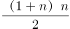≥48人时不再停车。当n=9时，人，不满足要求；当n=10时，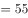人，满足要求。即在第十站停车上人后，人数达到55人，满载，从第11站开始将不再停车。 

故正确答案为D。

---

### 第 3 题　qid 1758848 · 数学运算

一艘轮船先顺水航行40千米，再逆水航行24千米，共用了8小时。若该船先逆水航行20千米，再顺水航行60千米，也用了8小时。则在静水中这艘船每小时航行（  ）千米。

- **A**. 11
- **B**. 12　✅
- **C**. 13
- **D**. 14

**答案**：B

**官方解析**

设船在静水中的速度为千米/小时，水流的速度为千米/小时，根据题干条件可得方程：。方程化简后得：。将代入原式，解得，。

备注：【秒杀计】两方程联立化简后可得，结合题干数据和选项均为整数，故可猜测应为3的倍数，只有B项满足。

故正确答案为B。

---

### 第 4 题　qid 1758850 · 数学运算

某收藏家有三个古董钟，时针都掉了，只剩下分针，而且都走得较快，每小时分别快2分钟、6分钟及12分钟。如果在中午将这三个钟的分针都调整指向钟面的12点位置，多少小时后这3个钟的分针会指在相同的分钟位置？

- **A**. 24
- **B**. 26
- **C**. 28
- **D**. 30　✅

**答案**：D

**官方解析**

由题意可得：假设每小时快2分钟、快6分钟、快12分钟的古董钟分别为A钟、B钟、C钟，则B钟与A钟速度差为分钟/小时，已知整个钟盘有60分钟，即经过小时，B钟的分针比A钟的分针恰好多走一圈，且此时两钟分针重合，同理，C钟与A钟速度差为分钟/小时，即经过小时，C钟的分针比A钟的分针恰好多走一圈，此时两钟分针重合，取6和15的最小公倍数30，即经过30小时，B钟的分针比A钟的分针恰好多走2圈，C钟的分针比A钟的分针恰好多走5圈，且此时三个分针处于同一个位置。

故正确答案为D。

---

### 第 5 题　qid 1805094 · 数学运算

长方形ABCD，从图示的位置开始沿着AP每秒转动90度（无滑动情况），AB=4厘米，BC=3厘米，当长方形的右端到达距离A为46厘米的位置时是（    ）秒后。

- **A**. 11
- **B**. 12　✅
- **C**. 13
- **D**. 14

**答案**：B

**官方解析**

开始的时候，长方形的右端距离A点为4cm，故只需通过滑动46-4=42cm的距离即可满足题目要求。从第一秒开始，每次滑动的距离分别为3cm、4cm、3cm、4cm······，即每两秒滑动7cm。次，故所需的时间=6×2=12秒。

故正确答案为B。

---

### 第 6 题　qid 1805096 · 数学运算

现有21本故事书要分给5个人阅读，如果每个人得到的数量均不相同，那么得到故事书数量最多的人至少可以得到（   ）本。

- **A**. 5
- **B**. 7　✅
- **C**. 9
- **D**. 11

**答案**：B

**官方解析**

设得到数量最多的人得到了x本书。要使最多的人尽可能的少，则其他人应尽可能多，而每人得到的数量均不相同，可设分别比最多的少了1本、2本、3本、4本，则可得5x-10=21，解得x=6.2，故得到数量最多的人至少应得到7本书。

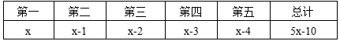

故正确答案为B。

---

### 第 7 题　qid 1758844 · 数学运算

甲乙丙三员工共同修剪6060平方米草地，甲的修剪效率为30平方米/分钟，乙的修剪效率为40平方米/分钟，丙的效率为60平方米/分钟。上午，甲7点30分开始修剪，乙7点45分开始，丙8点15分开始，他们同一时间完成工作，乙用了（  ）分钟。

- **A**. 56
- **B**. 57　✅
- **C**. 58
- **D**. 59

**答案**：B

**官方解析**

三人同一时间完成工作，且甲、乙分别先于丙45、30分钟开始工作。设任务完成时丙共工作了分钟，则甲应工作了分钟，乙应工作了分钟。工程总量，解得，则乙工作了分钟。

故正确答案为B。

---

### 第 8 题　qid 1805100 · 数学运算

下图中间阴影部分为长方形。它的四周是四个正方形，这四个正方形的周长和是320厘米，面积和是1700平方厘米，则阴影部分的面积是（   ）平方厘米。

- **A**. 375　✅
- **B**. 400
- **C**. 425
- **D**. 430

**答案**：A

**官方解析**

设阴影部分长方形的长为厘米，宽为厘米，面积即为。四周四个正方形的周长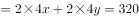，化简后得：；四周四个正方形的面积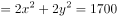，化简后得：。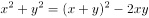，解得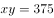平方厘米。

故正确答案为A。

---

### 第 9 题　qid 1758846 · 数学运算

小王打算购买围巾和手套送给朋友们，预算不超过500元，已知围巾的单价是60元，手套的单价是70元，如果小王至少要买3条围巾和2双手套，那么不同的选购方式有（  ）种。

- **A**. 3
- **B**. 5
- **C**. 7　✅
- **D**. 9

**答案**：C

**官方解析**

在保证必买3条围巾和2双手套的前提下，剩余购买情况不能超过元。设围巾再次购买了条，手套再次购买了双，则，依次分析、的取值情况。

当时，可取0、1、2，共3种方式；

当时，可取0、1，共2种方式；

当时，可取0，共1种方式；

当时，可取0，共1种方式。

即还有种购买方式。

故正确答案为C。

---

## 判断推理

### 第 1 题　qid 1805102 · 逻辑判断

无线充电，又称为非接触式感应充电，是利用磁场共振原理，由供电设备（充电器）将能量传送至用电的装置，两者之间不用电线连接，下列关于无线充电的说法错误的是：

- **A**. 相对于有线充电来说，无线充电能源转换一次性获得，电能损失小，节能环保　✅
- **B**. 利用无线充电的设备，可以显著减少设备磨损
- **C**. 无线充电技术要求高、价格贵是现阶段不能普及的主要原因
- **D**. 无线传输距离越远，无用功的耗损也就会越大

**答案**：A

**官方解析**

逐项分析：A项错误，应为有线充电能源转换一次性获得，电能损失小，节能环保，而无线充电多进行了电能和磁能的转换，电能损失大，当选。B项正确，因为充电器及用电的装置基本不接触，磨损率会显著下降，排除。C项正确，无线充电不能普及的主要原因有以下几个：要求高、距离较近、充电效率低、成本高等问题，排除。D项正确，距离越远，电磁泄漏越严重，无用功损耗越大，排除。
本题为选非题，故正确答案为A。

---

### 第 2 题　qid 1805104 · 逻辑判断

如图，一轻弹簧下端固定，竖立在水平面上，其正上方A位置有一只小球，小球从静止开始下降，在B位置接触弹簧的上端，在C位置小球所受弹力大小等于重力，在D位置小球速度减小到零。下列对于小球下降阶段的说法中，正确的是（  ）。

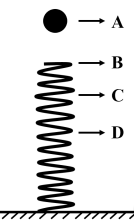

- **A**. 在B位置小球动能最大
- **B**. 在C位置小球动能最小
- **C**. 从A→D位置小球重力势能的减少小于弹簧弹性势能的增加
- **D**. 从A→C位置小球重力势能的减少大于小球动能的增加　✅

**答案**：D

**官方解析**

逐项分析：C点速度最大，那么C点动能最大，A、B两项错误；A到D整个过程是动能从0到0，重力势能越来越小，弹簧弹性势能越来越大，两者相互转化，机械能守恒，两者相等，C项错误；D项，从A到C的位置，小球重力势能的减少等于小球动能的增加和弹簧弹性势能的增加之和，所以重力势能的减少大于任意一个的增加，D项正确。
故正确答案为D。

---

### 第 3 题　qid 1805112 · 逻辑判断

如图所示为某人设计的一种机器，原理是这样的：在立柱上放一个强力磁铁A，两槽M和N靠在立柱旁。上槽M上端有一个小孔C，下槽N弯曲。如果在B处放一小铁球，它就会在强磁力作用下向上滚，滚到C时从小孔下落沿N回到B，开始往复运动，从而进行“永恒的运动”。关于这种机器，下列说法正确的是（   ）。

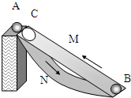

- **A**. 这种机器可以永恒运动，说明了永动机可以制造
- **B**. 这种机器是可以制造的，并且小球在下滑时能源源不断地对外做功
- **C**. 这种机器不能永恒运动，如果小球能从静止加速上升到C的话，它就不可能从C加速下滑到B，并再次从B回到C　✅
- **D**. 这种机器不能永恒运动，关键是因为摩擦阻力太大，要消耗能量

**答案**：C

**官方解析**

本题中，因为小球上升过程磁场力做正功，使小球机械能增加，但小球下滑过程磁场力做负功，这个负功与上升过程的正功相互抵消，故不可能源源不断地向外提供能量。
逐项分析：
A、B两项，这种机器违背了能量守恒定律，是不可能制造成功的，故A项错误，B项错误；
C项，这种机器不能永恒运动，如果小球能从静止加速上升到C的话，它就不可能从C加速下滑到B，并再次从B回到C，故C项正确。
D项，这种机器不能永恒运动的关键是违背了“能量守恒定律”而不是摩擦力，故D项错误。
故正确答案为C。

---

### 第 4 题　qid 1758864 · 逻辑判断

真空玻璃是将两片平板玻璃或玻璃四周密闭起来，将其间隙抽成真空并密封排气孔，两片玻璃之间的间隙为0.1～0.2mm，真空玻璃的两片至少有一片是低辐射玻璃。根据以上信息，下列关于真空玻璃的描述错误的是（  ）。

- **A**. 为了达到玻璃内外压力的平衡，往往会在玻璃之间排列整齐小球，用来支撑玻璃承受外界大气压的压力
- **B**. 采用低辐射玻璃的原因是使辐射传热尽可能小
- **C**. 抽成真空的目的是减少气体传热的影响，从而使保温性能更好
- **D**. 抽成真空后隔音的效果会下降　✅

**答案**：D

**官方解析**

A项，当玻璃内真空时，玻璃内外有压强差而产生压力，为了达到玻璃内外的压力平衡，在玻璃内部排列小球以提供对玻璃内部的支持力，即A项正确，故不选A项。
B项，低辐射玻璃导热性差，使用其可以减少或阻隔热量的传递，即B项正确，故不选B项。
C项，真空下热量的传递效果大大降低，所以达到保温的功效，即C项正确，故不选C项。
D项，声音的传播需要介质，真空下声音无法传播，玻璃抽成真空后的隔音效果更好，即D项错误，故选择D项。
本题为选非题，故正确答案为D。

---

### 第 5 题　qid 1758866 · 类比推理

下列四幅图中，属于近视眼成像原理和远视眼矫正方法的分别是（  ）。  

- **A**. ①和③
- **B**. ②和③　✅
- **C**. ②和④
- **D**. ①和④

**答案**：B

**官方解析**

近视眼的眼球对光的折射程度很大，所以成像在视网膜的前方，②正确；远视眼的眼球对光的折射程度小，故佩戴凸透镜增加对光的折射，对视力进行矫正，③正确。
故正确答案为B。

---

### 第 6 题　qid 1758880 · 类比推理

炎热的夏天开车行驶在高速公路上，常觉得公路远处似乎有水面，水面上还有汽车、电线杆等物体的倒影，但当车行驶至该处时，却发现不存在这样的水面。出现这种现象是因为（  ）。

- **A**. 镜面反射
- **B**. 漫反射
- **C**. 直线传播
- **D**. 折射　✅

**答案**：D

**官方解析**

炎热夏天公路上温度很高，接近地面的空气温度较高，空气密度较低，远离地面空气温度较低，密度较大，且空气不断流动导致光在传播过程中发生折射，而人所看到的像是物体形成的虚像，故D项正确。
故正确答案为D。

---

### 第 7 题　qid 1758872 · 类比推理

小张放假回到农村，发现一个种子堆，好奇的小张把手伸到种子堆里，发现里面温度比较高，这主要是因为（  ）。

- **A**. 天气热
- **B**. 呼吸作用　✅
- **C**. 光合作用
- **D**. 保温作用

**答案**：B

**官方解析**

种子无法进行光合作用，且一直在进行呼吸作用，散发出热量，种子堆里发热的原因就是因为呼吸作用，故B项正确。
故正确答案为B。

---

### 第 8 题　qid 1758876 · 类比推理

如图，质量为65kg的小李站在重为3000N的铁皮船上，船体与陆地上的树木之间用滑轮组连接，小李用60N的拉力拉绳子（质量忽略不计）时，船体向前匀速移动，那么船在水中受到的阻力为（  ）N。

- **A**. 39
- **B**. 60
- **C**. 120
- **D**. 180　✅

**答案**：D

**官方解析**

绳子对人有60N的拉力，人没动，是因为船给人向后60N的摩擦力，故人给船60N向前的摩擦力。另外，由于滑轮组有两条绳子连着船上，故船受到绳子的拉力为120N。因此船受到的总拉力为N。

故正确答案为D。

---

### 第 9 题　qid 1758878 · 类比推理

地球是一个巨大的磁体，它的磁场分布情况与一个条形磁铁的磁场分布情况相似。地理南极相当于条形磁铁的N极，地理北极相当于条形磁场的S极，那么上海上空的磁场方向是（  ）。

- **A**. 由南至北斜向下沉　✅
- **B**. 由南至北斜向上升
- **C**. 由北至南斜向下沉
- **D**. 由北至南斜向上升

**答案**：A

**官方解析**

磁体外部的磁场方向由磁铁N极指向磁铁S极，则地球的磁场方向由南指向北，因为上海处于北半球，则磁场方向由南至北斜向下，故A项正确。
故正确答案为A。

---

### 第 10 题　qid 1758868 · 逻辑判断

如图，用绳子(质量忽略不计）将甲、乙两铁球挂在天花板上的同一个挂钩上，然后使两铁球在同一水平面上做匀速圆周运动，已知两铁球质量相等，那么下列说法中不正确的是（  ）。

- **A**. 甲的角速度一定比乙的角速度大　✅
- **B**. 甲的线速度一定比乙的线速度大
- **C**. 甲的加速度一定比乙的加速度大
- **D**. 甲所受绳子的拉力一定比乙所受的绳子的拉力大

**答案**：A

**官方解析**

设悬挂铁球的绳子与竖直方向的夹角为A，铁球圆周运动的圆心距绳子悬挂点的距离为L，则根据受力分析和几何关系得：铁球圆周运动的半径，铁球的加速度，根据圆周运动公式并代入可得：，。

题中甲悬挂的绳子与竖直方向的夹角大于乙悬挂绳子与竖直方向的夹角，根据上述得到的铁球运动的角速度与线速度公式可得：甲乙两铁球的角速度相等，甲的线速度大于乙的线速度，甲的加速度大于乙的加速度；又两球的质量相等，所受重力相同，则甲所受绳子的拉力一定大于乙所受绳子的拉力，故A项错误，B、C、D三项正确。

本题为选非题，故正确答案为A。

---

### 第 11 题　qid 1805154 · 图形推理

下列选项中，符合所给图形的变化规律的是：

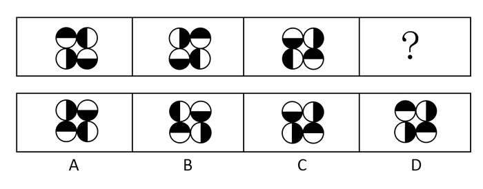

- **A**. A
- **B**. B　✅
- **C**. C
- **D**. D

**答案**：B

**官方解析**

元素组成相同，每个图形都是由4个半黑半白的圆组成，考虑位置规律。观察图形发现，所有位置的圆每次顺时针旋转90度，则问号处应为图三所有圆继续顺时针旋转90度，只有B项符合此规律。
故正确答案为B。

---

### 第 12 题　qid 1758960 · 图形推理

下列选项中，符合所给图形的变化规律的是（  ）。

- **A**. A
- **B**. B
- **C**. C
- **D**. D　✅

**答案**：D

**官方解析**

分析图形的特征。组成图形较为相似，考查样式求异运算。每组都是第一个图形和第二个图形去同存异得到第三个图形，只有D项符合。
故正确答案为D。

---

### 第 13 题　qid 1805272 · 图形推理

下列选项中，符合所给图形的变化规律的是：

- **A**. A
- **B**. B
- **C**. C　✅
- **D**. D

**答案**：C

**官方解析**

图形组成相似，考虑样式规律。第一组图形中，图3为图1与图2的叠加后的外围轮廓，且第一组的每个图形都只有一个面，则第二组图形也应符合此规律，只有C项符合。
故正确答案为C。

---

### 第 14 题　qid 1758948 · 图形推理

从所给的四个选项中，选择最合适的一个填入问号处，使之呈现一定的规律性：

- **A**. A　✅
- **B**. B
- **C**. C
- **D**. D

**答案**：A

**官方解析**

分析图形的特征。图形组成元素都相同，考虑图形的位置变化，同时九宫格中间图形最特殊，为空白面，考虑米字型路线观察。观察发现，米字型的上下左右以及对角线两端的图形都是旋转的关系。故问号处应为第一行第一个图形旋转得到，对应A项。

故正确答案为A。

---

### 第 15 题　qid 1805280 · 图形推理

下列选项中，符合所给图形的变化规律的是：

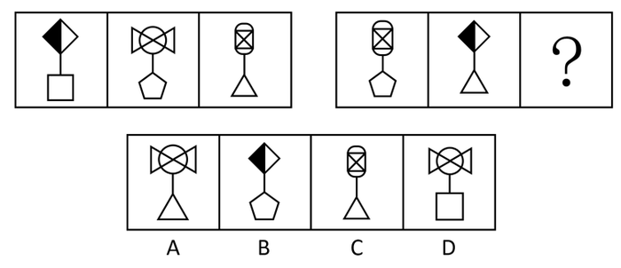

- **A**. A
- **B**. B
- **C**. C
- **D**. D　✅

**答案**：D

**官方解析**

每个图形都由上下两部分图形通过一条直线连接组成，且第二组图形中的元素均在第一组图形中出现过，考虑遍历规律，第二组图形中没有出现过的图形为正方形与蝴蝶结形，只有D项符合。
故正确答案为D。

---

### 第 16 题　qid 1758954 · 图形推理

下列选项中，符合所给图形的变化规律的是：

- **A**. A　✅
- **B**. B
- **C**. C
- **D**. D

**答案**：A

**官方解析**

图形元素组成相同，优先考虑位置规律。九宫格每行第一个图形向右翻转得到第二个图形，再由第二个图形上下翻转得到第三个图形。
故正确答案为A。

---

### 第 17 题　qid 1805286 · 图形推理

下列选项中，左边给定的是纸盒的外表面展开图，右边哪一项能由它折叠而成？

- **A**. A
- **B**. B
- **C**. C　✅
- **D**. D

**答案**：C

**官方解析**

本题属于空间重构类，逐一分析选项。
A项：立体图中存在三个空白长方形白色面相邻，观察平面图，存在两个空白长方形白色面且不相邻，立体图与平面图二者不对应，排除；
B项：立体图中存在两个空白长方形白色面不相邻，中间为一个半黑半白面，观察平面图，两个空白长方形白色面中间应为一个长方形全黑面，而非半黑半白面，立体图与平面图二者不对应，排除；
C项：在B项的分析之上，此选项的立体图与平面图二者互相对应，为正确选项；
D项：立体图中存在一个长方形白色面与两个半黑半白面相邻，观察平面图，任意一个长方形白色面都要与一个长方形全黑面相邻，立体图与平面图二者不对应，排除。（或者说两个半黑半白面二者是相邻关系）
故正确答案为C。

---

### 第 18 题　qid 1805290 · 图形推理

请从所给的四个选项中，选择最合适的一项填在问号处，使之呈现一定的规律性：

- **A**. A　✅
- **B**. B
- **C**. C
- **D**. D

**答案**：A

**官方解析**

观察前三图，元素组成相同，考虑位置关系。前三图中的长直线每次旋转，再观察其余两个相同元素的位置关系。观察发现，左侧图形不断向右平移，右侧图形不断向左平移，且第一副图中两个相同元素相隔的距离与第三副图中两个相同元素相隔的距离相等。

观察后三图，应遵循相同或者类似的规律，元素组成相同，排除C项。波浪线每次旋转，排除B项；相同元素在第一副图与第三副图中的间隔距离应维持不变，选择A项。

故正确答案为A。

快速解题：第二组图形是将第一组的图形变直为曲且弯曲方向相反，锁定答案A项即可。

---

### 第 19 题　qid 1805294 · 图形推理

下列选项中，符合所给图形的变化规律的是：

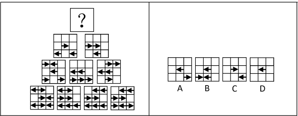

- **A**. A
- **B**. B
- **C**. C
- **D**. D　✅

**答案**：D

**官方解析**

此种题型为上海常考题型，类似数学中的“杨辉三角”，即每行相邻的两个图形通过样式运算得到其上方的图形（品字运算），之前常考去同存异或者去异存同。

观察此题，出现箭头，考虑方向。在每个九宫格中，在左下角三个九宫格中寻找规律，发现如下规律：←＋←＝→，→＋←＝空白，空白＋→＝空白，→＋→＝←，←＋空白=空白，空白+空白=空白。整理上述规律，即←＋←＝→，→＋→＝←，其余相加均为空白。

在右下角三个图形中进行验证，发现上述规律正确。

将此规律应用到顶端三个图形中，←＋←＝→，→＋→＝←，其余相加均为空白，发现只有九宫格正中间应该出现一个左箭头←。

故正确答案为D。

---

### 第 20 题　qid 1805302 · 类比推理

某工厂有多个宿舍区和车间，住在A宿舍区的员工都不是纺织工，因此在A车间工作的员工有部分是不住在A宿舍区的。
为了使该推理成立，必须补充下列哪项作为前提条件？

- **A**. 有的纺织工不在A车间工作
- **B**. 在A车间工作的员工有的不是纺织工
- **C**. 住在A宿舍区的员工有的是在A车间工作
- **D**. 有的纺织工在A车间工作　✅

**答案**：D

**官方解析**

第一步：找到题干中的论据和论点。
论据：住在A宿舍区的员工都不是纺织工。
论点：A车间工作的员工有部分不住在A宿舍区。
第二步：论据和论据之间存在跳跃，隐含的前提应该是论点和论据二者之间的联系，考虑搭桥。
搭桥即在纺织工和有的A车间员工之间建立联系。
观察选项，只有D项成立，即A车间工作员工部分是纺织工，纺织工都不是住在A宿舍区的员工，推出论点在A车间工作的员工有部分是不住在A宿舍区的。因此D项是题干前提。
故正确答案为D。

---

### 第 21 题　qid 1805330 · 类比推理

地铁每节车厢门旁边通常会有警告标志：“停车请拉下紧急制动开关，擅动将负法律责任。”
上述警告标志适用的情况是：
Ⅰ、一些乘客会无故使用或误用紧急制动开关；
Ⅱ、在某些特殊情况下，可能有乘客需要使运行的列车停下。

- **A**. 只有情况Ⅰ适用
- **B**. 只有情况Ⅱ适用
- **C**. 情况Ⅰ和Ⅱ都适用　✅
- **D**. 情况Ⅰ和Ⅱ都不适用

**答案**：C

**官方解析**

第一步：抓住题干主要信息。
停车可以拉下紧急制动开关，擅动紧急制动开关将负法律责任，属于警告范围。
第二步：根据题干信息逐一分析情况。
情况Ⅰ，无故使用或误用紧急制动开关，属于擅动紧急制动开关，符合警告标志的内容；
情况Ⅱ，特殊情况下，可能有乘客需要使运行的列车停下，属于停车可以拉下紧急制动开关，符合警告标志的内容。所以情况Ⅰ和Ⅱ都适用。
故正确答案为C。

---

### 第 22 题　qid 1805342 · 逻辑判断

培养设计系学生的审美情趣是很重要的，因此学校应该为设计系学生开设中西方艺术史课程。
下列选项如果为真，最能削弱上述结论的是：

- **A**. 修习过中西方艺术史课程的学生与未修习该课程的学生在审美情趣上无显著差异　✅
- **B**. 有没有审美情趣对于学生能否设计出优秀的作品关系不大
- **C**. 学生在课程学习中的努力程度与设计出的作品的精美程度成正比
- **D**. 并不是所有学习过中西方艺术史课程的学生均能成为杰出的设计师

**答案**：A

**官方解析**

第一步：找到论点论据。
论点：学校应该为设计系学生开设中西方艺术史课程。
论据：培养设计系学生审美情趣很重要。
第二步：逐一分析选项。
A项：选项说明学习中西方艺术史课程对学生审美情趣无影响，通过拆桥的方式，切断论点和论据之间的联系，削弱了题干结论，当选；
B项：此项论述的是审美情趣和优秀作品之间的联系，而优秀作品与学校是否应该为设计系学生开设中西方艺术史课程没有直接联系，此选项为无关选项，排除；
C项：此项论述的是学习努力程度和作品精美程度之间的联系，而学习努力程度、作品精美程度与学校是否应该为设计系学生开设中西方艺术史课程没有直接联系，此选项为无关选项，排除；
D项：“杰出的设计师”题干没有提及，无法得知与学校为设计系学生开设中西方艺术史课程的联系，此选项为无关选项，排除。
故正确答案为A。

---

### 第 23 题　qid 1758910 · 逻辑判断

在过去五年里，xx型高速列车先后发生了4次脱轨事故。针对xx型高速列车存在设计缺陷的公众质疑，该型号的列车制造商提出反驳：调查表明，每一次脱轨事故都是由于驾驶员违反操作规程而导致的。
列车制造商的反驳是基于下列哪项假设？

- **A**. 在质疑xx型高速列车存在设计缺陷时，公众并没有明确指出究竟存在何种缺陷
- **B**. 过去五年里，高速列车的脱轨事故并不都是由于驾驶员违反操作规程而导致的
- **C**. 调查人员有能力弄清楚脱轨事故究竟是由于列车设计缺陷还是由于列车制造方面的问题导致的
- **D**. xx型高速列车不存在任何能导致驾驶员违反操作规程的设计缺陷　✅

**答案**：D

**官方解析**

第一步：找出论点和论据。
论点：“每一次脱轨事故都是由于驾驶员违反操作规程而导致的。”
论据：是调查。
第二步：逐一分析选项。
A项：针对xx型高速列车存在设计缺陷的公众质疑跟列车制造商的反驳是两个不同的观点，排除；
B项：不都是违规造成，但是不是因为设计缺陷也不清楚，因为原因可能多种多样，为无关项，排除；
C项：有能力弄清楚，但是没有得出确切结论，为不明确项，排除；
D项：不存在任何设计缺陷，说明都是人为，肯定论点，是加强项，当选。
故正确答案为D。

---

### 第 24 题　qid 1758898 · 逻辑判断

近十年来，我国每年授予的博士学位数量出现了持续性的上升，因此可以认为近十年我国研究生人数不断增加。
下列各项中，最能支持上述结论的是：

- **A**. 
近十年来，获得博士学位的难度并未发生变化

- **B**. 
近十年来，我国获得博士学位的人数在研究生总人数中所占的比例不变 
　✅
- **C**. 
今年申请攻读博士研究生的人数是十年前的2倍左右

- **D**. 
今年我国的博士研究生在研究生中仅占左右

**答案**：B

**官方解析**

第一步：分析题干。
论点：“近十年我国研究生人数不断增加”。
论据：“我国每年授予的博士学位数量出现了持续性的上升”。
第二步：逐一分析选项。
A项：难度不是题干讨论的主题，属于无关项，排除；
B项：博士学位数量上升，但比例不变，说明研究生总人数在增加，补充了一个前提，把论点论据联系起来，是搭桥，能加强，当选；
C项：申请的人数和授予的人数是两个概念，属于无关项，排除；
D项：题干论点说的是近10年的情况，选项说的是今年的情况，讨论话题不一致，排除。
故正确答案为B。

---

### 第 25 题　qid 1758894 · 逻辑判断

据估计，可能有数以百万吨的塑料漂浮在海洋中。但是一项新研究发现，这些塑料有都消失不见了，研究人员认为大部分消失的塑料可能是被海洋生物吃掉了，并随之进入海洋食物链。

下列哪项最能对上述结论的正确与否进行评价？

- **A**. 海洋中除了塑料是否还有其他垃圾
- **B**. 除了被海洋生物吃掉，漂浮在海洋中的塑料是否会以其他形式消失　✅
- **C**. 是否能说进入海洋食物链的塑料就是“消失”了
- **D**. 消失的塑料最可能集中在哪些海域

**答案**：B

**官方解析**

第一步：找出论点和论据。
论点：大部分消失的塑料可能是被海洋生物吃掉了，并随之进入海洋食物链。
论据：无。
本题只有论点，没有论据，且提问方式为“下列哪项最能对上述结论的正确与否进行评价”，找出会影响论点成立的选项即可。
第二步：逐一分析选项。
A项：海洋中除了塑料是否还有其他垃圾，与塑料是否被海洋生物吃掉无关，无法对结论的正确与否进行评价，排除；
B项：除了被海洋生物吃掉，漂浮在海洋中的塑料是否会以其他形式消失，如果海洋中的塑料不会以其他形式消失，则论点成立；如果海洋中的塑料会以其他形式消失，则论点不成立，可以对结论的正确与否进行评价，当选；
C项：是否能说进入海洋食物链的塑料就是“消失”了，讨论的是塑料是否真的消失，与论点塑料是如何消失的无关，无法对结论的正确与否进行评价，排除；
D项：消失的塑料最可能集中在哪些海域，讨论的是塑料消失的地点，与论点塑料是如何消失的无关，无法对结论的正确与否进行评价，排除。
故正确答案为B。

---

### 第 26 题　qid 1758902 · 逻辑判断

某国人口统计机构预测，到2031年，该国人口将降到1.27亿以下，在今后40年内人口将减少2400万，为此，该国政府出台一系列鼓励生育的政策。近年来，该国人口总数趋于稳定，截至2014年6月1日，人口数量为1.461亿。2014年1至5月人口增长量为5.91万，增长率为。因此，有专家认为该国实施的鼓励生育政策达到了预期的效果。

下列选项如果为真，最能加强上述观点的是：

- **A**. 如果该国政府没有出台鼓励生育的政策，儿童人口总数会持续下降　✅
- **B**. 如果该国政府出台更加有效的鼓励生育政策，就可以提高人口质量
- **C**. 近年来该国人口总数出现缓慢上升的趋势
- **D**. 该国政府出台的鼓励生育政策是一项长期国策

**答案**：A

**官方解析**

 第一步：分析题干。

论点：“该国实施的鼓励生育政策达到了预期的效果”。

论据：“近年来，该国人口总数趋于稳定，截至2014年6月1日，人口数量为1.461亿。2014年1至5月人口增长量为5.91万，增长率为。”

第二步：逐一分析选项。

A项：没有该政策就不行，证明该政策是有效果的，排除他因，是加强论点，当选；

B项：其他政策与该政策无关，主体不一致，排除；

C项：人口总数的上升只是重复了一下原论据，并没有增加新的证据，力度很弱，排除；

D项：长期国策与是否有效无关，排除。

故正确答案为A。

---

### 第 27 题　qid 1758914 · 逻辑判断

某文学期刊网站的栏目设置通常根据读者反馈与浏览量的情况随时调整。去年九月，一批新栏目出现在改版后的网站上。其中，5个栏目是喜剧幽默类的连载，3个栏目是长篇类科幻小说连载，2个栏目是文学批评类的内容。到今年一月，这些新上线的栏目只有7个还在继续更新，其中5个是喜剧幽默类的连载。
如果上述陈述为真，下列哪项可以从题干中推出？

- **A**. 只有1个文学批评类的栏目还持续更新
- **B**. 只有1个长篇科幻类小说的栏目还持续更新
- **C**. 至少有1个长篇科幻类小说的栏目已经下线　✅
- **D**. 相比于文学批评类的内容，读者们更喜欢喜剧幽默类的连载

**答案**：C

**官方解析**

分析题干：总共有7个更新，5个是喜剧幽默，那么剩下的2个是科幻和文学类。科幻原来有3个，就算2个都是科幻，也会有一个下线，因此C项是必然可以推出的。
故正确答案为C。

---

### 第 28 题　qid 1805358 · 逻辑判断

在学校图书馆，只有出示院系开具的证明，才能进入特藏书库阅览。如果没有参加教授的课题组，院系就不会开具证明。小张最近因表现突出被李教授吸收进了自己的课题组。小王因个人原因在上星期退出了陈教授的课题组。
如果上述断定为真，下列哪项一定为真：

- **A**. 小张现在可以进入特藏书库阅览
- **B**. 小王现在不能进入特藏书库阅览　✅
- **C**. 只要进入了教授的课题组，就能进入特藏书库阅览
- **D**. 没有获得院系开具的证明，说明没有参加教授的课题组

**答案**：B

**官方解析**

第一步：翻译题干。
①进入特藏书库阅览→院系开具的证明；
②－参加课题组→－院系开具的证明，根据逆否规则可以翻译为：院系开具的证明→参加课题组；
③小张→参加课题组；
④小王→－参加课题组。
第二步：逐一分析选项。 
A项：通过条件③已知小张→参加课题组，是条件②的否前，否前无法推出任何肯定性结论，小张现在可以进入特藏书库阅览无法推出，错误；
B项：通过条件④已知小王→－参加课题组，根据条件①和②传递律可以推出：能进入特藏书库阅览→院系开具的证明→参加课题组，根据逆否规则可以推出：-参加课题组→-院系开具的证明→-进入特藏书库阅览，所以小王是不能进入特藏书库阅览的，可以推出；
C项：“只要······就······”前推后，翻译为，进入课题组→进入特藏书库阅览，是条件②的否前，否前无法推出任何肯定性结论，错误；
D项：翻译为：-院系开具的证明→-参加教授的课题组，是条件②的肯后，肯后无法推出任何肯定性结论，错误。
故正确答案为B。

---

### 第 29 题　qid 1758916 · 逻辑判断

经过全力检测和排查，疾控中心的专家确定如下事实：
（1）如果蒋某和张某都感染了H7N9新型禽流感病毒，则李某没有被感染；
（2）李某感染了H7N9新型禽流感病毒，而且王某的陈述正确；
（3）只有王某的陈述不正确，张某才没有感染H7N9新型禽流感病毒。
由上述事实可以推出（  ）。

- **A**. 蒋某没有感染H7N9新型禽流感病毒，张某感染了　✅
- **B**. 蒋某和李某都感染了H7N9新型禽流感病毒
- **C**. 李某和王某都感染了H7N9新型禽流感病毒
- **D**. 蒋某感染了H7N9新型禽流感病毒，张某没有感染

**答案**：A

**官方解析**

第一步：翻译题干。
（1）蒋且张→非李；
（2）李且王对；
（3）非张→非王对。
第二步，逐一分析选项。
由条件（1）（3）得“李→非蒋或非张”“王对→张”；
由或关系否定其一，另一个一定为真得出“张→非蒋”；
因此张某感染了，蒋某没有感染。
故正确答案为A。

---

### 第 30 题　qid 1805364 · 类比推理

某大学举办国际会议，在其中一场圆桌会议中，有多个国家的五位相关领域的专家参加，为了使他们能够顺利沟通，组委会事先了解的情况如下：甲是德国人，还会说法语；乙是中国人，还会说英语；丙是英国人，还会说法语；丁是法国人，还会说日语；戊是中国人，还会说德语。
那么组委会应按照哪项安排座位？

- **A**. 甲丙戊乙丁
- **B**. 甲丁丙乙戊　✅
- **C**. 甲乙丙丁戊
- **D**. 甲丙丁戊乙

**答案**：B

**官方解析**

第一步：梳理题干。
① 甲会说德语和法语；
② 乙会说中文和英语；
③ 丙会说英语和法语；
④ 丁会说法语和日语；
⑤ 戊会说中文和德语。
第二步：代入选项进行排除。
A项：甲和丙可以用法语来交流，丙和戊没有共通语言无法交流，不能排在一起，错误；
B项：甲和丁可以用法语来交流，丁和丙可以用法语来交流，丙和乙可以用英语来交流，乙和戊可以用中文来交流，甲和戊可以用德语来交流，这样安排相邻位次的专家都有共通的语言可以交流，注意是圆桌会议，选项两端的人也要有共通的语言才能交流，正确；
C项：甲和乙没有共通的语言来交流，不能排在一起，错误；
D项：甲和丙可以用法语来交流，丙和丁可以用法语来交流，丁和戊没有共通的语言来交流，不能排在一起，错误。
故正确答案为B。

---

### 第 31 题　qid 1758912 · 逻辑判断

某经济学院从国外引进了30种教材，其中，金融类教材12种，非金融类的英文教材10种，从美国引进的非金融类教材7种，从美国以外国家引进的非英文教材9种。
根据上文，可以推知：

- **A**. 从美国引进的、非英文的金融类教材不超过8种
- **B**. 从美国引进的、非英文的金融类教材至少有8种
- **C**. 从美国以外国家引进的、非英文的金融类教材不超过8种　✅
- **D**. 从美国以外国家引进的、非英文的金融类教材至少有8种

**答案**：C

**官方解析**

第一步：分析题干条件。
①从国外引进30种教材；
②金融类教材12种；
③非金融类的英文教材10种；
④从美国引进的非金融类教材7种；
⑤从美国以外国家引进的非英文教材9种。
第二步：根据题干条件进行推理。
根据条件①②可知，总共引进了30种教材，其中金融类为12种，那么非金融类应为30-12=18种；根据条件③可知，非金融英文类10种，那么非金融非英文类应该为18-10=8种；
根据条件④可知，美国引进非金融类7种，那么非金融类非美国应该为18-7=11种；此时，非金融类非英文类+非金融类非美国=8+11=19种，但非金融类总数为18种，因此至少有1种同时满足非金融类非英文类非美国；根据条件⑤可知，非美国非英文类为9种，根据非金融类非英文类非美国至少为1种可知，金融类非英文类非美国至多为9-1=8种。
故正确答案为C。

---

### 第 32 题　qid 1805370 · 类比推理

老张准备完成一项任务需耗时100个工作日，他周一至周五每天坚持工作，周六和周日休息，他从周四开始工作，则他完成任务的那天是：

- **A**. 周一
- **B**. 周二
- **C**. 周三　✅
- **D**. 周五

**答案**：C

**官方解析**

已知老张完成任务共需100个工作日，每周工作5天，需要20周，周四开始的，循环20周以后在周三结束工作。
故正确答案为C。

---

## 资料分析

### 材料 1

 

#### 第 1 题　qid 1758918 · 增长

2005-2013年，全国技术合同成交金额增速超过GDP增速的年份有（  ）个。

- **A**. 3
- **B**. 4
- **C**. 5
- **D**. 6　✅

**答案**：D

**官方解析**

根据题干“······增速超过······增速的年份有几个”，结合图1中技术合同成交金额占GDP的比重的数据，可判定本题为两期比重比较问题。根据两期比重比较的结论，当时，比重上升，即比重高于上年水平。定位图1，2005-2013年中，比重高于前一年的分别有：2006、2007、2010、2011、2012、2013年，共有6年。

故正确答案为D。

---

#### 第 2 题　qid 1758920 · 综合

“十一五”期间（2006-2010年），全国技术合同成交总金额（  ）。

- **A**. 低于1万亿元
- **B**. 在1～1.5万亿元之间　✅
- **C**. 在1.5～2万亿元之间
- **D**. 高于2万亿元

**答案**：B

**官方解析**

定位图1柱状图，“十一五”期间（2006-2010年）成交总额亿元，即1.367万亿元，符合B项范围。

故正确答案为B。

---

#### 第 3 题　qid 1758922 · 综合

2013年新能源与高效节能技术合同成交金额约占当年GDP的（  ）。

- **A**. 

- **B**. 

- **C**. 

　✅
- **D**. 

**答案**：C

**官方解析**

根据题干“2013年······占······”， 可判定本题为现期比重计算问题。定位图2饼状图，2013年新能源与高效节能技术合同金额为736.5亿元，定位图1，2013年全国技术合同成交金额为7469亿元，占GDP的比重为，则2013年的GDP，则题目所求。

故正确答案为C。

---

#### 第 4 题　qid 1758924 · 综合

2013年有（  ）个技术领域的技术合同成交金额高于2012年技术合同成交总金额的。

- **A**. 6　✅
- **B**. 4
- **C**. 3
- **D**. 2

**答案**：A

**官方解析**

根据题干“2013年······高于······总金额的的领域有几个”，可判定本题为现期比重计算问题。定位图1柱状图，2012年技术合同成交总金额为6437亿元，则亿元。

定位图2饼状图，可得“环境保护与资源综合利用技术、城市建设与社会发展、新能源与高效节能、先进制造技术、现代交通、电子信息技术”共6项的成交金额大于643.7亿元，满足条件。

故正确答案为A。

---

#### 第 5 题　qid 1758926 · 综合

能够从上述资料中推出的是（    ）。

- **A**. 
2005年-2013年，技术合同成交金额同比增量最大的是2013年

- **B**. 
2004年-2013年，技术合同成交金额占GDP比重最高和最低的年份相差4年

- **C**. 
有5个技术领域2013年的技术合同成交金额不足当年电子信息技术合同成交金额的两成

- **D**. 
2013年现代交通技术合同成交金额占当年技术合同成交总金额的比重不到
　✅

**答案**：D

**官方解析**

A项：定位图1柱状图，2013年亿元，2012年增长量亿元，故2013年的增长量不是最大的，错误；

B项：定位图1折线图，占GDP比重最高的年份和最低的年份分别为2013年和2005年，相差8年，错误；

C项：定位图2饼状图，电子信息技术合同成交额为1946.5亿元，其两成为亿元，则成交金额小于389亿元有“其他、农业技术、新材料及其应用、核应用技术”，而“其他”中包含几个技术领域未知，故不能确定2013年技术合同成交金额不足当年电子信息技术合同成交金额的两成的技术领域有5个，错误；

D项：定位图2饼状图，2013年现代交通的成交金额为968.3亿元，定位图1柱状图，2013年技术成交金额为7469亿元，则所求比重，正确。

故正确答案为D。

---
