# 2016年上海市公务员录用考试《行测》题（B类）

> 省考 · 2016 年 · 6 个模块 · 共 140 题

- [政治理论](#%E6%94%BF%E6%B2%BB%E7%90%86%E8%AE%BA) · 4 题
- [常识判断](#%E5%B8%B8%E8%AF%86%E5%88%A4%E6%96%AD) · 46 题
- [言语理解与表达](#%E8%A8%80%E8%AF%AD%E7%90%86%E8%A7%A3%E4%B8%8E%E8%A1%A8%E8%BE%BE) · 25 题
- [数量关系](#%E6%95%B0%E9%87%8F%E5%85%B3%E7%B3%BB) · 10 题
- [判断推理](#%E5%88%A4%E6%96%AD%E6%8E%A8%E7%90%86) · 40 题
- [资料分析](#%E8%B5%84%E6%96%99%E5%88%86%E6%9E%90) · 15 题

---

## 政治理论

### 第 1 题　qid 1758704 · 新思想

2015年2月27日，习近平深改组第十次会议上强调，要在法治下推进改革，在改革中完善法治，突出重点，对准焦距，找准穴位，击中要害，推出一批能叫得响、立得住、群众认可的硬招实招，处理好改革（    ）的关系，突破“中梗阻”，防止不作为，把改革方案的含金量充分展示出来，让人民群众有更多获得感。

- **A**. “顶层设计”和“摸着石头过河”
- **B**. “速度”和“质量”
- **C**. “最先一公里”和“最后一公里”　✅
- **D**. “发展”和“稳定”

**答案**：C

**官方解析**

A项是2013年7月21—23日，习近平总书记在湖北调研全面深化改革问题和当前经济运行情况时强调在改革再出发中顶层设计的重要性，并不能否认摸着石头过河的价值。顶层设计固然重要，但还有一个执行与落地的问题，所以A项与题干材料无关。
B项是习主席在“十三五规划”中提出的，经济发展方式要从规模速度型转向质量效率型，所以B项不是题干需要选择内容。
D项“发展”和“稳定”并没有单独提出来。
只有C项与材料相吻合，且C项为习总书记讲话原文。
故正确答案为C。

---

### 第 2 题　qid 1758706 · 时事政治

经中共中央批准，《中国共产党统一战线工作条例（试行）》正式颁布，自2015年5月18日起施行。基本规定，政党协商是中国共产党同民主党派的政治协商，主要采取（    ）等形式。

- **A**. 会议协商、约谈协商、辩论协商
- **B**. 专题协商、约谈协商、书面协商
- **C**. 会议协商、约谈协商、书面协商　✅
- **D**. 约谈协商、书面协商、辩论协商

**答案**：C

**官方解析**

《中国共产党统一战线工作条例(试行)》第12条规定，政党协商是中国共产党同民主党派的政治协商。政党协商主要采取会议协商、约谈协商、书面协商等形式。
故正确答案为C。

---

### 第 3 题　qid 1758710 · 时事政治

党的十八届五中全会提出，坚持协调发展，必须牢牢把握中国特色社会主义事业总体布局，正确处理发展中的重大关系，重点促进城乡区域协调发展，促进经济社会协调发展，促进（    ）同步发展，在增强国家硬实力的同时注重提升国家软实力，不断增强发展整体性。

- **A**. 新型工业化　✅
- **B**. 信息化　✅
- **C**. 城镇化　✅
- **D**. 农业现代化　✅

**答案**：ABCD

**官方解析**

党的十八届五中全会公报指出，坚持协调发展，必须牢牢把握中国特色社会主义事业总体布局，正确处理发展中的重大关系，重点促进城乡区域协调发展，促进经济社会协调发展，促进新型工业化、信息化、城镇化、农业现代化同步发展，在增强国家硬实力的同时注重提升国家软实力，不断增强发展整体性。
故正确答案为ABCD。

---

### 第 4 题　qid 1758750 · 新思想

习近平在印度尼西亚国会的演讲中提到“‘合抱之木，生于毫末；九层之台，起于累土’，保持中国和东盟的友谊之树常青，必须夯实双方关系的现实土壤。”下列关于“合抱之木，生于毫末；九层之台，起于累土”的表述，正确的是（  ）。

- **A**. 此句出于儒家经典《论语》
- **B**. 此句的下一句是“千里之行，始于足下”　✅
- **C**. 此句中的“累土”是小土块的意思
- **D**. 此句比喻成大事者不拘小节

**答案**：B

**官方解析**

本句出自于《老子》，《老子》是道家的经典著作，故A选项错误。
该句的全文是“合抱之木，生于毫末；九层之台，起于累土；千里之行，始于足下”，故B选项正确。
“累土”是指将土一点点地垒起来，故C选项错误。
该句比喻要脚踏实地，一切从基础做起，故D选项错误。
故正确答案为B。

---

## 常识判断

### 材料 1

        2015年3月，国家发改委、外交部、商务部亚洲博鳌论坛2015年年会上联合发布了《推动共建丝绸之路经济带和21世纪海上丝绸之路的愿景与行动》。共建“丝绸之路经济带”和“21世纪海上丝绸之路”，即“一路一带”，是习近平主席2013年出访东亚和东南亚期间提出的倡议，之后正式写入十八届三中全会通过的《中共中央关于全面深化改革若干重大问题的决定》。

        “一路一带”将充分依靠中国与有关国家既有的多边机制，借助既有的、行之有效的区域合作平台，继承古丝绸之路的开放传统，吸纳东亚国家开放的区域主义。“一路一带”秉承开放包容精神，不会搞封闭、固定、排外的机制。它不是从零开始，而是现有合作的延续和升级。有关各方可以将现有的、计划中的合作项目串联起来，形成一揽子合作，争取产生“一加一大于二”的整合效应。与此同时，“一路一带”倡议的地域和国别范围也是开放的，古代陆、海丝绸之路上的国家、中国的友好邻国都可以参与进来。未来“一路一带”中的很多项目，涉及的国家和实体可能很多，开放性也更强。

        历史上的丝绸之路主要是商品互通有无，而今天“一路一带”交流合作的范畴要大得多，可以是基础设施互联互通，也可以是贸易投资便利化和产业合作，当然也少不了人文交流和人员往来。各类合作项目和合作方式，都旨在将政治互信、地缘毗邻、经济互补转化为务实合作、持续增长的优势，目标是物畅其流、政通人和、互利互惠、共同发展。在共建“一路一带”过程中，中国将坚持正确的义利观，道义为先、义利并举，向发展中国家和友好邻国提供力所能及的帮助，真心实意帮助发展中国家加快发展。中国不仅要打造中国经济的升级版，也要通过“一路一带”等途径打造中国对外开放的升级版，不断拓展同世界各国特别是周边国家的互利合作。

#### 第 1 题　qid 1758752 · 人文常识

“一路一带”作为中国首倡、高层推动的国家战略，它的提出（  ）。

- **A**. 适应世界经济发展新形式，实行更加积极主动的开放战略　✅
- **B**. 使我国在欧亚非整体经济架构的过程中掌握了主动权
- **C**. 为各国产品、技术、劳务、资本的流动提供了新的通道　✅
- **D**. 有效建立了互利共赢、多元平衡、安全高效的开放型经济体系

**答案**：AC

**官方解析**

“一带一路”涵盖欧亚非地区的互联互通，生产要素的流动和生产结构的分工互补，是顺应经济全球化趋势的重大战略构想，因此A项正确，当选；我国在国际交往中坚持平等合作，互利共赢，选项B中的主导权不正确，排除；“一带一路”为各国产品、技术、劳务、资本的流动提供了新的通道，所以C项正确，当选；“一带一路”设想是完善互利共赢、多元平衡、安全高效开放型体系的重要内容，但是仅这一设想还不能有效建立起这个体系，因此选项D项不正确，排除。
故正确答案为AC。

---

#### 第 2 题　qid 1758754 · 经济常识

“一带一路”依赖“丝绸之路”经济、人文、商贸的千年传承，并赋予其新的合作意义。这一合作的重点是（  ）。

- **A**. 政策沟通　✅
- **B**. 道路联通
- **C**. 贸易畅通　✅
- **D**. 民心相通　✅

**答案**：ACD

**官方解析**

中国国家发展改革委、外交部、商务部28日联合发布《推动共建丝绸之路经济带和21世纪海上丝绸之路的愿景与行动》，就“一带一路”建设过程中的五大合作重点提出倡议。第一，政策沟通。第二，设施联通。第三，贸易畅通。第四，资金融通。第五，民心相通。
故正确答案为ACD。

---

#### 第 3 题　qid 1758756 · 人文常识

“一带一路”建设将贯穿中国“（  ）”的周边外交理念，坚持不干涉别国内政，不谋求地区事务主导权，不寻求势力范围。

- **A**. 亲　✅
- **B**. 诚　✅
- **C**. 惠　✅
- **D**. 容　✅

**答案**：ABCD

**官方解析**

中国外交不断推出新理念，提出致力于民族复兴的中国梦，丰富了和平发展理论，构建中美新型大国关系，践行亲、诚、惠、容的理念，树立正确的义利观。
故正确答案为ABCD。

---

#### 第 4 题　qid 1758758 · 经济常识

为推进"一带一路"建设，中国将充分发挥国内各地区比较优势，实行更加积极主动的开放战略，加强东中西互动合作，全面提升开放型经济水平，其中，（  ）。

- **A**. 新疆要打造成为丝绸之路经济带核心区　✅
- **B**. 广东要成为面向南亚、东南亚的辐射中心
- **C**. 要加快推进中国（上海）自由贸易区建设，支持福建建设21世纪海上丝绸之路核心区　✅
- **D**. 打造粤港澳大湾区　✅

**答案**：ACD

**官方解析**

国家发展改革委、外交部、商务部28日联合发布了《推动共建丝绸之路经济带和21世纪海上丝绸之路的愿景与行动》。其中提到，发挥新疆独特的区位优势和向西开放重要窗口作用，深化与中亚、南亚、西亚等国家交流合作，形成丝绸之路经济带上重要的交通枢纽、商贸物流和文化科教中心，打造丝绸之路经济带核心区。因此，选项A正确。文件提出云南要成为面向南亚、东南亚的辐射中心，所以B选项错误。文件中也提出了要加快推进中国（上海）自由贸易区建设，支持福建建设21世纪海上丝绸之路核心区，所以C选项正确。文件也提出，要充分发挥深圳前海、广州南沙、珠海横琴、福建平潭等开放合作区作用，深化与港澳台合作，打造粤港澳大湾区。所以D选项正确。
故正确答案为ACD。

---

### 材料 2

        网络舆论共识度是网民社会心态的真实反映，也是衡量网络舆论场正负能量和理性程度的重要指标。为此，人民网舆情检测室推出国内首个“网络舆论共识度”指标体系和季度报告，旨在为中国网络舆论场的研究和社会舆论的理性引导提供新的观察视角和决策依据。根据研究报告情况，2015年第一季度舆论共识主要呈现出以下特点：

        一是“舆论共识度”在波动中有所提升。通过研究2015年第一季度舆情热点事件，“舆论共识度”呈现出波动中提升的状态，官方舆论和民间舆论就热点舆情事件意见趋于一致。

        二是“网民正能量指数”走高。2015年第一季度的“网民正能量指数”，由1月的0.38，2月的0.35增至3月的0.67。

        三是反腐倡廉长期占据“政府认同度”首位。检视2015年第一季度舆情热点事件，反腐倡廉类事件众多且处于舆论关注高位，更以政府认同度3.9，4.0，3.8的高分分别占据各月榜首，成为政府认同度最高的一类舆情事件。

        四是政府舆情危机处置仍待改善。相比反腐倡廉的高度“政府认同度”，突发危机类事件的“政府认同度”处于低位。

#### 第 5 题　qid 1758760 · 人文常识

网络舆论共识度是网民社会心态的真实反映，也是衡量网络舆论场正负能量和理性程度的重要指标。造成网络舆情持续不断升温或引发一系列网络舆情危机的事件，说明了以网络传播为代表的新媒体具有（  ）。

- **A**. 公益性与危害性
- **B**. 传播及时性与广泛性　✅
- **C**. 客观性与不可控性　✅
- **D**. 主观性与隐蔽性　✅

**答案**：BCD

**官方解析**

A选项新媒体具有危害性表述片面，新媒体既能反映社会真实心态，也能引发危机，但是危机并不一定都是危害，故A项表述错误，排除。新媒体以其形式丰富、互动性强、渠道广泛、覆盖率高、精准到达、性价比高、推广方便等特点在现代传媒产业中占据越来越重要的位置，所以B选项正确，当选。新媒体的新闻是具有客观性的，但是网络传播具有不可控性，导致很难监管，所以C选项正确，当选。因为网民身份的隐秘性，所以新媒体还有隐蔽性和主观性的特点，所以D选项正确，当选。
故正确选项为BCD。

---

#### 第 6 题　qid 1758762 · 人文常识

在2015年第一季度舆情热点事件中，反腐倡廉类事件众多且处于舆论关注高位，更以“政府认同度”3.9，4.0，3.8的高分分别占据各月榜首，成为政府认同度最高的一类舆情事件。这说明（    ）。

- **A**. 政府强力反腐受到社会的认可　✅
- **B**. 反腐倡廉是社会公众关注的焦点　✅
- **C**. 网络舆情有助于反腐倡廉工作的进一步推进　✅
- **D**. 在信息时代，政府公务员都是公众人物

**答案**：ABC

**官方解析**

反腐倡廉类事件众多且处于舆论关注高位，“政府认同度”占据各月榜首。说明我国的反腐工作得到了大家的认可，另外也体现了百姓对此事有较强的关注度，故A、B两项正确，当选。而网络舆情加强了对反腐工作的监督，所以也能推进反腐倡廉的工作，故C项正确，当选。公众人物亦称公共人物，是指一定范围内具有重要影响，为人们所广泛知晓和关注，并与社会公众利益密切相关的人物。其以社会知名度和社会公共利益相关性为构成要件，二者缺一不可，共同体现了公众人物的特性。“有的公务员并没有社会知名度，从事的工作也与社会公共利益无关。”所以“公务员都是公众人物”这一说法不准确，D项错误，排除。
故正确答案为ABC。

---

#### 第 7 题　qid 1758764 · 人文常识

“网络舆论共识度”指标体系和季度报告告诉我们，面对新时期复杂的媒体环境，各级政府在突发事件中，与媒体沟通时要（  ）。

- **A**. 坚持积极主动的原则　✅
- **B**. 多个部门、多种渠道发布舆情信息　✅
- **C**. 快速反应、慎报原因、速报事实　✅
- **D**. 采取一定的舆情管制措施　✅

**答案**：ABCD

**官方解析**

突发危机类事件的“政府认同度”处于低位，说明政府在与媒体沟通时应该加强管理、应该提升沟通技巧。除了主动联系媒体发布与人民有关的舆情外，还应扩大这样的信息渠道，加强舆情监督，及时处理相关事项，所以ABC三个选项都正确，而D选项舆情管制措施也有利于政府信息的管理。
故正确答案为ABCD。

---

#### 第 8 题　qid 1758766 · 人文常识

2015年第一季度的网民正能量指数渐趋提升，由1月的0.38，2月的0.35增至3月的0.67。官方舆论和民间舆论就热点舆情意见趋于一致，说明政府在推进公共治理中需要（  ）。

- **A**. 提升媒体沟通能力　✅
- **B**. 及时监测舆情动态　✅
- **C**. 充分发挥公众、社会组织等多元治理主体作用　✅
- **D**. 坚持正面引导舆情，变被动应对为主动服务　✅

**答案**：ABCD

**官方解析**

公共治理是由开放的公共管理与广泛的公众参与二者整合而成的公域之治模式，具有治理主体多元化、治理依据多样化、治理方式多样化等典型特征。政府在推进公共治理中需要提升与媒体的沟通能力，及时地收集民意，积极主动地服务。
故正确答案为ABCD。

---

### 材料 3

        某市乙公司获准使用该市一块土地，用途是设置综合农场，发展农业。2014年3月26日，该市规划局查知乙公司在地块内陆续建房，搭脚手架，但并没有用来发展农业，而是以“乙农庄”的名义对外经营。规划局遂于2014年4月2日向乙农庄作出《关于拆除违法建设的通告》，要求乙公司在通告之日起四日之内，自行无条件拆除违法建设房屋。该行政决定未告知乙公司所依据的事实、法规，也未告知乙公司依法享有的陈述、申辩的权利。同月3日，规划局直接在乙农庄门口张贴该通告，未通过其他任何方式向乙公司送达。同月18日，规划局组织有关人员对违法建筑物实施强制拆除。拆除期间未申请公证机构对现场拆除情况、财务清点情况进行证据保全和临时保管，亦未出具任何财务的交接手续，只由该市某镇法律服务所于当日制作了《用品清单》，有规划局、某镇政府、村委会和乙农庄一名员工的签名。5月19日，乙公司请某公证处出具了《公证书》，乙公司据此于2014年8月15日提起诉讼，要求该市规划局予以赔偿。

#### 第 9 题　qid 1758768 · 人文常识

根据案例，该市规划局行为违法之处有（  ）。

- **A**. 未告知乙公司作出行政决定的理由和依据　✅
- **B**. 要求乙公司四日内自行拆除违法建筑物
- **C**. 未告知乙公司依法享有的陈述、申辩的权利　✅
- **D**. 未向乙公司送达《通告》　✅

**答案**：ACD

**官方解析**

《行政强制法》第三十五条规定，行政机关作出强制执行决定前，应当事先催告当事人履行义务。催告是一种行政法上的要式行为，必须以书面形式作出。催告的内容应当包括五个方面：一是指出催告所依据的行政决定；二是说明行政机关启动强制执行程序的理由；三是重申行政相对人应当履行的义务，并规定履行义务的期限和方式；四是提出行政相对人逾期不履行义务的后果；五是告知行政相对人依法享有陈述权、申辩权。催告有法定送达规定，要求催告书、行政强制执行决定应当直接送达当事人。因此A、C项错误。当事人拒不接收或者无法直接送达当事人的，应当依照《中华人民共和国民事诉讼法》有关规定送达。所以D项错误。违章建筑限期拆除的限期在现行的建设行政法律法规中未作明确的规定，从具体的操作来看应视违章建筑的结构、面积、拆除作业的难易程度确定一个合理的期限，所以B选项正确。
故正确答案为A、C、D。

---

#### 第 10 题　qid 1758770 · 法律常识

根据《国家赔偿法》的规定，该市规划局不应当赔偿的范围有（  ）。

- **A**. 乙公司的违法建筑物　✅
- **B**. 乙公司在乙农庄里的合法财产
- **C**. 乙农庄的经营性损失　✅
- **D**. 受拆迁惊吓的乙公司员工的精神损害赔偿　✅

**答案**：ACD

**官方解析**

侵犯公民、法人和其他组织财产权的违法行政行为及其赔偿方式。这类行为有四种：1.违法实施罚款、吊销许可证和执照、责令停产停业、没收财物等行政处罚的；2.违法对财产采取查封、扣押、冻结等行政强制措施的；3.违反国家规定征收财物、摊派费用的；4.造成财产损害的其他违法行为。A选项为违章建筑，不需要获得赔偿，应选。行政赔偿一定是行政机关的违法行为所造成的，并且是对相对人的合法权益造成损害，才可以获得，因此B选项是需要获得赔偿的，排除。C选项经营性损失在赔偿中没有，不应当赔偿，应选。D选项侵犯人身权并造成精神损害的，应消除影响、恢复名誉、赔礼道歉；后果严重的同时支付精神损害抚慰金。D选项中乙公司员工仅仅是受到惊吓而并没有被侵犯人身权，所以不会获得赔偿，应选。
故正确答案为A、C、D。

---

#### 第 11 题　qid 1758772 · 人文常识

该市规划局应当作出的强制执行决定，须载明的事项有（  ）。

- **A**. 乙公司的名称、地址　✅
- **B**. 强制执行的时间　✅
- **C**. 强制执行的方式　✅
- **D**. 复议机关的名称、地址

**答案**：ABC

**官方解析**

《行政强制法》第三十七条：经催告，当事人逾期仍不履行行政决定，且无正当理由的，行政机关可以作出强制执行决定。强制执行决定应当以书面形式作出，并载明下列事项：（一）当事人的姓名或者名称、地址；（二）强制执行的理由和依据；（三）强制执行的方式和时间；（四）申请行政复议或者提起行政诉讼的途径和期限；（五）行政机关的名称、印章和日期。在催告期间，对有证据证明有转移或者隐匿财物迹象的，行政机关可以作出立即强制执行决定。
故正确答案为A、B、C。

---

#### 第 12 题　qid 1758774 · 法律常识

根据《行政诉讼法》及其相关司法解释，关于该市某镇法律服务所当日制作的《用品清单》和某公证处制作《公证书》的证据效力，下列判断正确的是（  ）。

- **A**. 公证的书证优于其他书证　✅
- **B**. 国家机关依职权制作的公务文书优于其他书证　✅
- **C**. 原始证据优于传来证据　✅
- **D**. 原物优于复制品　✅

**答案**：ABCD

**官方解析**

《最高人民法院关于行政诉讼证据若干问题的规定》第63条规定，证明同一事实的数个证据，其证明效力一般可以按照下列情形分别认定：（一）国家机关以及其他职能部门依职权制作的公文文书优于其他书证，所以B选项正确。（二）鉴定结论、现场笔录、勘验笔录、档案材料以及经过公证或者登记的书证优于其他书证、视听资料和证人证言，所以A选项正确。（三）原件、原物优于复制件、复制品，所以D选项正确。（四）法定鉴定部门的鉴定结论优于其他鉴定部门的鉴定结论；（五）法庭主持勘验所制作的勘验笔录优于其他部门主持勘验所制作的勘验笔录；（六）原始证据优于传来证据，所以C选项正确。（七）其他证人证言优于与当事人有亲属关系或者其他密切关系的证人提供的对该当事人有利的证言；（八）出庭作证的证人证言优于未出庭作证的证人证言；（九）数个种类不同、内容一致的证据优于一个孤立的证据。
故正确答案为A、B、C、D。

---

### 材料 4

        上海市城乡建设和交通发展研究院于2015年1月份发布《2014年上海综合交通运行年报》年报显示，2014年上海交通供需矛盾进一步突出，交通高峰时段延长，拥堵呈常态化。自2010年世博会以来，上海中心城区城市道路里程约4865公里，增长仅为；城市道路面积105平方公里，增长。而与之相对应的是私人小汽车数量的持续增长：截至2014年底，上海机动车保有量为304万辆左右（不含外省市号牌车辆），较2013年底增加20.5万辆，增幅为。数据显示，与2013年同期相比，2014年上海快速路日均交通总量增长约、中心城越江交通日均总量增长、高速公路日均车流总量增长约。

        在机动车保有量迅速增长的同时，上海中心城区道路拥堵的累积时间延长，形成了早、午后、晚三个拥堵高峰，并逐步呈现午后高峰向晚高峰延伸，与晚高峰时段逐渐连成片以及早高峰提前的趋势。2014年，在42个快速路交通指数区域中，高峰时段拥堵指数大于50、累计拥堵时间大于1小时，超过100个工作日拥堵的有8个常发性严重拥堵区域，主要集中在浦西西部及西南面；在68个地面道路指数区域中有15个常发性严重拥堵区域，主要集中在内环内商圈及医院周边。

        随着机动车数量的与日俱增，城市交通的承载压力越来越大，中心城区交通在一些时段和区域拥堵已成为司空见惯的现象，居民出行常常陷入苦不堪言的境地。各大城市也在不断探索治理拥堵的良方，其中“限购”是各地共同的做法。北京市从2014年到2017年，增量小客车指标额度共60万个，年度配置指标总量由24万个减少到15万个，从而使机动车保有量到2017年底不超过600万辆。2013年底，上海交通主管部门明确车牌价格调控措施将长期化，确定了全年总体10万张车牌的投放量。2014年天津市小客车指标投放量共10万个，按月分配，采取摇号和竞价的方式配置。2014年3月26日，杭州市政府规定杭州行政区域内小客车实行增量配额指标管理，增量指标须通过摇号或竞价方式取得。今后杭州每年汽车增量指标为8万个，按月度分配。

#### 第 13 题　qid 1758776 · 人文常识

客观上，对小汽车进行“限购”，可以发挥的作用有（  ）。

- **A**. 有效解决城市拥堵的问题
- **B**. 直接限制小汽车的使用
- **C**. 有利于缓解因交通带来的环境污染　✅
- **D**. 一定程度上促进公共交通的发展　✅

**答案**：CD

**官方解析**

“汽车限购令”能够一定程度上缓解城市拥堵的问题，而不是解决，故A项错误。“限购”能够减缓汽车的保有量而不是限制小汽车的使用，故B项错误。对小汽车进行限购之后，随着小汽车保有量的减少，可以缓解交通带来的环境污染，故C项正确。小汽车保有量的减缓能够促进公交等公共交通的发展，故D项正确。
故正确答案为C、D。

---

#### 第 14 题　qid 1758778 · 人文常识

各地在探索治理城市拥堵的方案中，都强调对小客车增量配额指标管理。就限购单项措施而言，其效果有呈现“边际收益递减”的可能，主要原因有（  ）。

- **A**. 汽车保有量的积累　✅
- **B**. 现有道路资源承载力没有相应提高
- **C**. 部分公众出行需求没有兼顾　✅
- **D**. 影响汽车生产与销售商的利益

**答案**：AC

**官方解析**

“边际收益递减”指的是在一定时间内，其他条件不变的情况下，当开始增加消费量时，边际效用会增加，即总效用增加幅度大，但累积到相当消费量后，随消费量增加而边际效用会逐渐减少。虽然各地都在进行“限购”，但是汽车的总量还是在增加，故A选项正确。上海中心城区城市道路里程约4865公里，增长仅为；城市道路面积105平方公里，增长，所以B选项错误。单单进行汽车限购，并不能从根本上解决百姓出行难的问题，还应该通过其它相应的措施共同解决，C选项正确。D项虽然说明了限购令对汽车行业的影响，但是与“边际收益递减”无关，排除。

故正确答案为A、C。

---

#### 第 15 题　qid 1758780 · 人文常识

从行政行为角度看，各地采取小客车增量配额指标管理的做法具有（  ）的特征。

- **A**. 行政手段　✅
- **B**. 政府主导　✅
- **C**. 休克疗法
- **D**. 计划与市场手段相结合　✅

**答案**：ABD

**官方解析**

汽车限购令是政府运用行政手段即“限购”和市场需求来管理交通问题，A选项正确。汽车限购令是以政府为主导的一种管理交通的方法，故B项正确。休克疗法是针对严重失衡的社会总供求状况，从控制社会总需求出发，采取严厉的行政和经济手段，在短时间内强制性地大幅度压缩消费需求和投资需求，使社会总供求达到人为的平衡，以此遏制恶性通货膨胀，恢复经济秩序，不符合题意，故排除C项。政府实行摇号政策是计划手段，竞价是市场手段，所以D选项正确。
故正确答案为A、B、D。

---

#### 第 16 题　qid 1758782 · 法律常识

有人认为“限购”在法律规定之外，增加了相对人的负担，是对相对人合法权利的不合法限制，这种观点说明政府依法行政需要充分考虑（  ）。

- **A**. 行政主体是否有相应权力　✅
- **B**. 内容是否与上位法相抵触　✅
- **C**. 制定程序是否合法　✅
- **D**. 增强行政过程的透明度

**答案**：ABC

**官方解析**

根据我国《立法法》第8条的规定，涉及民事基本制度的事项只能由全国人大或其常委会制定法律加以调整，而国务院及各地方政府的规范性文件均无权涉及这些内容。所以政府在出台“限购”措施时要考虑是否有相应权力。选项A符合题意。调整同一对象的两个或两个以上的法律规范，因规定不同的法律后果而产生冲突，按照我国《立法法》相关规定是上位法优于下位法。所以政府在制定“限购”措施时要考虑内容是否与上位法相抵触。选项B符合题意。按照相关法律规定，对于涉及行政相对人重大权利义务的事项，在规范性文件出台之前应该通过座谈会、论证会、听证会等形式听取各方面的意见，确保行政决定的科学性、民主性和合理性。“限购”措施的出台，政府需要考虑相应的制定程序是否合法。选项C符合题意。增强行政过程的透明度，在本题中未有体现。D选项不选。
故正确答案为A、B、C。

---

### 材料 5

关于2015年全国“爱眼日”活动的通知

各区县卫生计生委，市眼病防治中心，市医学会：

        2015年6月6日是第二十个全国“爱眼日”，今年“爱眼日”活动的主题为“告别沙眼盲，关注眼健康”。近日，国家卫生计生委办公厅、中国残联会办公厅联合转发了《关于开展2015年全国“爱眼日”活动的通知》（国卫办医函〔2015〕398号）。现将该通知印发给你们，并就本市开展2015年“爱眼日”活动有关事项通知如下：

        一、市级活动安排

        （一）6月1日上午，市卫生计生委联合市残联XX公园举行“爱眼日”大型主题咨询活动，组织全市14家三级医疗机构知名眼科专家开展眼病义诊和咨询，发放眼病防治和眼保健知识宣传资料。

        （二）6月1日—3日，在XX公园举办“本市沙眼防治历史回顾展”。

        二、工作要求

        （一）市眼病防治中心要做好本次市级“爱眼日”活动的组织落实，加强对区县活动的技术指导，市医学会应加大对相关学科临床医生的培训力度，切实提高临床医生预防糖尿病致盲等并发症发生的意识。

        （二）各区县卫生计生委要充分认识“爱眼日”活动的重要作用，紧紧围绕今年主题，会同残联等部门，深入社区、农村开展义诊、咨询、专题讲座等，进一步提升市民沙眼防治知识水平，巩固根治致盲性沙眼成果。

        （三）各区县要认真总结本次“爱眼日”宣传活动，并于6月13日前将活动总结等报送至市卫生计生委。

 

  XX市卫生和计划生育委员会办公室

                          2015年5月29日

#### 第 17 题　qid 1758784 · 人文常识

下列针对以上公文的标题提出的修改意见，正确的是（  ）。

- **A**. “关于”前要添加发文机关全称或规范化简称
- **B**. “关于”后面添加“开展”二字　✅
- **C**. “通知”应改成“通告”
- **D**. 事由中“全国”二字删去

**答案**：B

**官方解析**

“关于”前可以添加发文机关全称或规范化简称，而不是必须的，所以A选项错误。根据语法知识，发现标题中缺少谓语，所以需要添加“开展”两字，所以B选项正确。通知适用于发布、传达要求下级机关执行和有关单位周知或者执行的事项，批转、转发公文。通告适用于在一定范围内公布应当遵守或者周知的事项。材料中公文是关于“爱眼日”活动相关事项的传达，应该使用通知，C项错误。材料中所提及活动为第十二个全国“爱眼日”活动，事由中“全国”二字不用删去，D项错误。
故正确答案为B。

---

#### 第 18 题　qid 1758786 · 人文常识

下列针对以上公文正文用词提出的修改意见，恰当的是（  ）。

- **A**. 开头部分第二句中“转发”应改成“印发”　✅
- **B**. 开头部分末句中“印发”应改成“转发”　✅
- **C**. “本市沙眼防治历史回顾展”中“本市”应改成“XX市”　✅
- **D**. “工作要求（三）”中“各区县”应改成“市医学会”

**答案**：ABC

**官方解析**

转发了《关于开展2015年全国“爱眼日”活动的通知》这篇公文是由国家卫生计生委办公厅、中国残联会办公厅联合制定的，所以应为“印发”，A项正确，当选。B选项是地方对中央公文的一种发放，所以应为“转发”，B项正确，当选。正文内容要精准，以免产生歧义，所以C选项中的“本市”应改成“XX市”，因此C项正确，当选。D选项这篇通知中市医学会的任务已经安排，总结本次“爱眼日”宣传活动应该由各区县来做，所以“各区县”不需要修改，D项错误，排除。
故正确答案为ABC。

---

#### 第 19 题　qid 1758788 · 人文常识

以上公文正文中的写作格式和内容存在的问题是（  ）。

- **A**. “市级活动安排”和“工作要求”位置颠倒
- **B**. “工作要求”（一）、（二）两条位置颠倒　✅
- **C**. “工作要求”（三）缺少联系人和联系电话
- **D**. 正文末尾缺少附件说明　✅

**答案**：BD

**官方解析**

A选项只有先有活动安排才可以部署他们的工作，所以位置不颠倒，A选项说法错误，排除。根据主送机关的顺序：各区县卫生计生委，市眼病防治中心，市医学会。我们可以得知需要先要求各区县卫生计生委，其次是市眼病防治中心，最后是市医学会，因此B选项正确，当选。C选项联系人和联系电话应写在正文下边的附注中，所以C选项错误，排除。本篇公文中有引文《关于开展2015年全国“爱眼日”活动的通知》，所以需要添加附件说明，因此D选项正确，当选。
故正确答案为BD。

---

#### 第 20 题　qid 1758790 · 人文常识

下列针对以上公文的落款提出的修改意见，正确的是（    ）。

- **A**. 署名中“办公室”应删去　✅
- **B**. 成文日期应改成“二0一五年五月二十九日”
- **C**. 成文日期右边应空两格
- **D**. 成文日期右边应空四格

**答案**：A

**官方解析**

根据主送机关和正文内容可以看出这篇公文的发文机关应是XX市卫生和计划生育委员会，所以A项正确，当选。根据《党政机关工作处理条例》，成文日期应该用阿拉伯数字，所以B项错误，排除。不加盖印章的公文，单一机关行文时，在正文（或附件说明）下空一行右空二字编排发文机关署名，在发文机关署名下一行编排成文日期，首字比发文机关署名首字右移二字，所以C、D两项错误，均排除。
故正确答案为A。

---

#### 第 21 题　qid 1758692 · 法律常识

下列关于行政合同的特征，说法错误的是（    ）。

- **A**. 行政合同是行政主体履行行政职责的一种手段
- **B**. 行政合同应当遵循平等原则和自愿原则　✅
- **C**. 行政主体可以根据情况，单方变更或者解除行政合同
- **D**. 行政主体在行政合同中享有优先处分权

**答案**：B

**官方解析**

行政合同，也叫行政契约，指行政机关为达到维护与增进公共利益，实现行政管理之目的，与相对人之间经过协商一致达成的协议。例如：国有土地使用权出让合同。行政合同是行政主体履行行政职责的一种手段，A选项说法正确；行政主体可以根据情况，单方变更或者解除行政合同，C选项说法正确；作为国家行政权力代表者的行政主体，为了维护社会公共利益，在行政合同中享有优先权，包括合同标的确定权、相对人选择权、监督合同履行权、单方变更（解除）合同权和行政制裁权，D选项说法正确。行政合同主要表现为行政主体居于优势地位，双方地位不平等。B项说法错误。
本题为选非题，故正确答案为B。

---

#### 第 22 题　qid 1758694 · 人文常识

下列关于公务员的辞退，说法错误的是（    ）。

- **A**. 甲被市商务委员会公派至美国大学培训3个月，培训结束，甲开始周游美国，逾期20天才回国。对甲予以辞退
- **B**. 乙是区农业局公务员，国庆黄金周外出旅行时，在交通事故中受伤，医疗期结束，确认丧失工作能力，对乙不得辞退　✅
- **C**. 丙是区教育局公务员，上班经常迟到，工作时常QQ聊天，领导多次谈心仍无转变，对丙予以辞退
- **D**. 丁是警察，在一次抓捕嫌疑人时受伤，丧失部分工作能力，对丁不得辞退

**答案**：B

**官方解析**

本题考查法律常识。
《公务员法》第八十八条规定：“公务员有下列情形之一的，予以辞退：（一）在年度考核中，连续两年被确定为不称职的；（二）不胜任现职工作，又不接受其他安排的；（三）因所在机关调整、撤销、合并或者缩减编制员额需要调整工作，本人拒绝合理安排的；（四）不履行公务员义务，不遵守法律和公务员纪律，经教育仍无转变，不适合继续在机关工作，又不宜给予开除处分的；（五）旷工或者因公外出、请假期满无正当理由逾期不归连续超过十五天，或者一年内累计超过三十天的。”甲、丙均符合该条款规定，可以辞退，A、C两项说法正确。
《公务员法》第八十九条规定：“对有下列情形之一的公务员，不得辞退：（一）因公致残，被确认丧失或者部分丧失工作能力的；（二）患病或者负伤，在规定的医疗期内的；（三）女性公务员在孕期、产假、哺乳期内的；（四）法律、行政法规规定的其他不得辞退的情形。”乙并非因公致残，可以辞退，B项说法错误；丁因公致残，不得辞退，D项说法正确。
本题为选非题，故正确答案为B。

---

#### 第 23 题　qid 1758696 · 人文常识

下列关于行政机关责任制的说法，正确的有（    ）。

- **A**. 国务院实行总理负责制　✅
- **B**. 外交部实行集体负责制
- **C**. 直辖市实行常委会负责制
- **D**. 自治区实行集体负责制

**答案**：A

**官方解析**

外交部、直辖市人民政府、自治区人民政府都是我们国家的行政机关，实行的都是首长负责制，人民代表大会实行民主集中制，所以B、C、D三项说法均错误，A项说法正确，国务院实行总理负责制。
故正确答案为A。

---

#### 第 24 题　qid 1758698 · 经济常识

2015年6月29日，《亚洲基础设施投资银行协定》签署仪式在北京举行，亚洲基础设施投资银行（简称亚投行）的建立将有利于推动完善全球金融治理。下列关于亚投行的说法，正确的是（    ）。

- **A**. 英国是加入亚投行的第一个主要西方国家　✅
- **B**. 亚投行是一个政府间性质的亚洲区域多边开发机构　✅
- **C**. 亚投行致力为亚洲基础设施建设提供融资支持　✅
- **D**. 亚投行是由我国提出倡议筹建的，总部设在上海

**答案**：ABC

**官方解析**

2015年3月12日，英国申请加入亚投行，成为第一个申请加入亚投行的主要西方国家，A项正确。亚洲基础设施投资银行是一个政府间性质的亚洲区域多边开发机构，B项正确。亚洲基础设施投资银行在全面投入运营后，将运用一系列支持方式为亚洲各国的基础设施项目提供融资支持，C项正确。亚投行的总部位于北京，排除D项。
故正确答案为ABC。

---

#### 第 25 题　qid 1758700 · 人文常识

“大众创业、万众创新”是指通过解放思想、深化改革、打破体制机制障碍，让每个有创业愿望的人都拥有自主创业的空间，让创新创造的血液在全社会自由流动，让自主发展的精神在全体人民中蔚然成风，体现了打造“双引擎”的思路。这里所说的“双引擎”是指（    ）。

- **A**. 充分发挥市场在资源配置的决定性作用　✅
- **B**. 要好好发挥政府作用，增加公共产品、公共服务供给　✅
- **C**. 开创我国全方位对外开放新格局
- **D**. 加强国有产权交易流转监管

**答案**：AB

**官方解析**

“双引擎”是2015年两会上李克强总理提出的概念，主要指：一方面要使市场在资源配置中起决定性作用，激发大众创业、万众创新，A项正确。另一方面政府要逐步退出市场竞争领域，打造服务型政府，通过扩大公共产品和公共服务供给，为经济发展注入新动力，B项正确。C项是在“一带一路”战略中提出来的，排除。D项是2015年5月18日国有企业改革的内容，也排除。
故正确答案为AB。

---

#### 第 26 题　qid 1758688 · 人文常识

2015年1月14日国务院发布《关于机关事业单位工作人员养老保险制度改革的决定》关于此次改革的基本思路，表述正确的是（    ）。

- **A**. 党政机关、事业单位建立与企业相同的基本养老保险制度　✅
- **B**. 从制度上和机制上化解“双轨制”矛盾　✅
- **C**. 先机关、后事业单位，逐步推进
- **D**. 职业年金与基本养老保险制度同步建立　✅

**答案**：ABD

**官方解析**

2014年12月23日上午，国务院副总理马凯代表国务院向第十二届全国人大常委会第十二次会议做了关于统筹推进城乡社会保障体系建设工作情况的报告。报告中首次明确，机关事业单位养老保险制度改革方案，已经国务院常务会议和中央政治局常委会审议通过。改革的基本思路是一个统一、五个同步。“一个统一”，即党政机关、事业单位建立与企业相同的基本养老保险制度，实行单位和个人缴费，改革退休费计发办法，从制度和机制上化解“双轨制”矛盾。“五个同步”，即机关与事业单位同步改革，职业年金与基本养老保险制度同步建立，养老保险制度改革与完善工资制度同步推进，待遇调整机制与计发办法同步改革，改革在全国范围同步实施。因此，本题A、B、D三项正确。
故正确答案为ABD。

---

#### 第 27 题　qid 1758708 · 法律常识

政府在简政放权的同时，要以刚性的制度来管权限权，厉行法治，依法行政。建设法治政府。要坚持职权法定原则，加快建立（    ）。

- **A**. 负面清单　✅
- **B**. 利益清单
- **C**. 权力清单　✅
- **D**. 责任清单　✅

**答案**：ACD

**官方解析**

李克强同志在全国推进简政放权放管结合职能转变工作电视电话会议上的讲话指出，政府在简政放权的同时，要以刚性的制度来管权限权，厉行法治，依法行政，建设法治政府。要坚持职权法定原则，加快建立“三个清单”，划定政府与市场、企业、社会的权责边界。以权力清单明确政府能做什么，“法无授权不可为”；以责任清单明确政府该怎么管市场，“法定职责必须为”；以负面清单明确对企业的约束有哪些，通过建立“三个清单”，依法管好“看得见的手”，用好“看不见的手”，挡住“寻租的黑手”。
故正确答案为ACD。

---

#### 第 28 题　qid 1758712 · 人文常识

近年来，城市暴雨洪涝灾害时有发生，不仅会给人带来财产损失，也会造成人员伤亡。下列对城市暴雨洪涝灾害发生原因的分析，不正确的是（  ）。

- **A**. 城市的扩张导致土地硬质化，渗水能力下降
- **B**. 城市的排水设施抵御暴雨能力不足
- **C**. 城市发展扩张过程中，填埋了大量的地表径流
- **D**. 台风是导致我国城市暴雨洪涝灾害的主要原因　✅

**答案**：D

**官方解析**

ABC三项都是造成城市洪涝灾害发生的主要原因。D项说法错误，台风指形成于热带或副热带以上广阔海面上的热带气旋，台风的出现往往伴随着暴雨，会引发城市内涝，但台风发生并不频繁，所以城市内涝主要还是城市规划和破坏的原因。

本题为选非题，故正确答案为D。

---

#### 第 29 题　qid 1758714 · 人文常识

随着互联网的发展，大数据可能带来的深刻影响和巨大价值逐渐受到人们重视，商业、经济及其他领域的决策制定将日益依赖于数据和分析。利用互联网大数据，可（    ）。

- **A**. 分析疾病模式、追踪疾病暴发及传播方式和途径　✅
- **B**. 加强网络信息的真实性和安全性
- **C**. 为消费者提供个性化服务　✅
- **D**. 准确预测各行业的发展趋势

**答案**：AC

**官方解析**

A项正确，为了更好的推进医疗事业发展，国家加大对于医疗机构的资金投入，用于做大数据分析。大数据医疗通过全面分析病人特征数据和疗效数据，比较各种干预措施的有效性，可以找到针对特定病人的最佳治疗途径，更好的分析疾病的传播方式和爆发原因。
B项错误，随着大数据的发展，数据的价值更加受到重视，由此催生了信息泄露的情况愈发严重，个人隐私，资金安全受到威胁，并且，面对纷繁复杂的海量信息，其真实度也是值得质疑的，故而B项错误。
C项正确，大数据分析事物的优势在于能够更加全面的掌握消费者的真实需求，从而可以有针对性的生产，提供定制服务，这就是题干所说的个性化服务。
D项错误，大数据分析优势有很多，但是它并不是万能的，市场经济的发展瞬息万变，行业发展趋势变化莫测，若说通过大数据分析就可以“准确”预测趋势，说法过于绝对。而且从概念上来说，大数据是指通过对海量数据的收集、处理和展示，使人类第一次可以无限接近真实地了解自然和社会，从而揭示规律，预测未来。概念明确指出大数据只是“无限接近真实”而D项说的是“准确预测”，两个词语义有差，故D项错误。
本题正确答案为AC。
本题有认为还需要选D，之所以不选是因为大数据只是“无限接近真实”而D项说的是“准确预测”，两个词语义有差，且市场千变万化，准确预测，无人敢打包票，故D项错误。

---

#### 第 30 题　qid 1758716 · 人文常识

抗日战争中，（    ）是中国军队海陆空立体协同作战，也成为亚洲历史上第一次现代化战役。这次会战粉碎了日军三个月灭亡中国的计划，不但吹响了华夏子孙全面抗战的嘹亮号角，还向全世界显示了同仇敌忾、万难不屈的民族精神与民族之魂。

- **A**. 徐州会战
- **B**. 太原会战
- **C**. 武汉会战
- **D**. 淞沪会战　✅

**答案**：D

**官方解析**

A项，徐州会战是抗日战争时期中日双方在以江苏省徐州为中心的津浦（天津至浦口）、陇海（宝鸡至连云港）铁路地区进行的一次大规模防御战役，其中以1938年三四月间的台儿庄大战最为著名，因围歼日军一万余人，史称之为台儿庄大捷。徐州会战对日军给予了巨大的打击，大大迟滞了日军进攻的脚步，为中方部署武汉会战赢得了时间，错误。
B项，太原会战指1937年10月至11月，在抗日战争中，中国第2战区部队同日军华北方面军在山西省北部、东部和中部地区进行的大规模的战略性防御战役，错误。
C项，武汉会战，中国军队浴血奋战，大小战斗数百次，以伤亡40余万的代价，毙伤日军25.7余万，大大消耗了日军的有生力量，日军虽然攻占了武汉，但其速战速决，逼迫国民政府屈服以结束战争的战略企图并未达到。此后，中国抗日战争进入战略相持阶段，错误。
D项，淞沪会战是中国军队第一次海陆空立体协同作战，也成为亚洲历史上第一次现代化战役，粉碎了日军三个月灭亡中国的计划，正确。
故正确答案为D。

---

#### 第 31 题　qid 1758718 · 人文常识

服务场所常在洗手台旁设有热风干手器，手只要放在干手器下方，很快就烘干了。下列关于热风干手器的表述，正确的是（  ）。

- **A**. 将手放在出风口附近就会有风吹出，是因为采用了感应技术　✅
- **B**. 使用时感觉手由冷变热的原因是，热风干手器先吹的是冷风，再慢慢加热为热风
- **C**. 热风干手器烘干手的原因是它加快了液体表面空气流速，且热风提高了液体的温度　✅
- **D**. 热风干手器烘干手的主要原因是它降低了室内的湿度

**答案**：AC

**官方解析**

将手放在出风口附近，其红外感应装置感应到后会启动机器，风就会吹出来，故A选项说法正确。使用时感觉手由冷变热的原因是水分蒸发吸收了大量的热量，所以才会感觉到冷，经过蒸发以后，水分吸干，风就会变热，故B选项说法错误。热风干手器吹出的热风，一方面加快了液体表面的空气流速，另一方面提高了液体的温度，所以使得手被吹干，故C选项说法正确。热风干手器吹出的热风无法降低室内的湿度，故D选项错误。
故正确答案为A、C。

---

#### 第 32 题　qid 1758720 · 科技常识

生活中，我们常常会接触到各种不同用途的物品。有些物品既有正式的化学名称，也有相对应的别名。下列物品的化学名称及其别名对应不正确是（  ）。

- **A**. 高锰酸钾：PP粉
- **B**. 固态二氧化碳：干冰
- **C**. 碳酸氢钠：苏打　✅
- **D**. 过氧化氢溶液：双氧水

**答案**：C

**官方解析**

A选项高锰酸钾在化学品生产中，广泛用作氧化剂，例如用作制糖精，维生素C等；在医药上用作防腐剂、消毒剂、除臭剂及解毒剂；又称为过锰酸钾、灰锰氧、PP粉，所以A选项对应正确。

B选项干冰是固态的二氧化碳，在压力作用下，把二氧化碳冷凝成无色的液体，再在高压下迅速凝固而得到。干冰可以应用到磨具清洗，所以B选项正确。

C选项碳酸氢钠（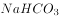），俗称小苏打，白色细小晶体。小苏打在生产和生活中有许多重要的用途。在灭火器里，它是产生二氧化碳的原料之一；在食品工业上，它是发酵粉的一种主要原料。而苏打是Soda的音译，化学式为，它是一种十分重要的化工产品，是玻璃、肥皂、纺织、造纸、制革等工业的重要原料。所以C选项错误，碳酸氢钠应该对应的是小苏打。

D选项过氧化氢化学式为，过氧化氢是淡蓝色的黏稠液体，可任意比例与水混合，是一种强氧化剂，水溶液俗称双氧水，为无色透明液体。所以D选项对应正确。

本题为选非题，故正确答案为C。

---

#### 第 33 题　qid 1758722 · 法律常识

纵观历史，行政制度自从产生以来，就起着规范行政权力运作的作用。如中国古代政治家管仲所云：“法律政令者，吏民规矩绳墨也”。行政制度在规范行政权力运作方面的作用有（  ）。

- **A**. 行政制度确认行政权力是相对独立的国家权力　✅
- **B**. 行政制度规定对行政权力主体进行监督的范围和方式　✅
- **C**. 行政制度保障行政权力对行政相对人的有效行使　✅
- **D**. 行政制度规定行政活动的程序，使行政活动有章可循　✅

**答案**：ABCD

**官方解析**

行政制度自从产生以来，就起着规范行政权力运作的作用。第一，行政制度确认行政权力是相对独立的国家权力，主要由行政机关享有和行使，行政机关行使职权的活动不得受到非法干预和阻挠，A选项正确。第二，行政制度保障行政权力对行政相对人的有效行使，C选项正确。第三，行政制度规定行政活动的程序，从而使行政活动有章可循，增强行政后果的可预见性，D选项正确。第四，行政制度规定对行政权力主体进行监督的范围和方式。B选项正确。总之，行政制度的重要功能在于保证行政权力合法、适当、有效地运行。
故正确答案为ABCD。

---

#### 第 34 题　qid 1758724 · 法律常识

公共预算是公共财政的基本年度计划，它的编制必须反映政府的施政方针和政策，以及国民经济的发展要求，同时必须符合国家有关法律、法规、制度的规定。因此，公共预算编制的主要依据有（  ）。

- **A**. 国家的法律法规和方针政策　✅
- **B**. 上一年度公共预算的执行情况　✅
- **C**. 计划年度国民经济与社会发展计划的主要指标　✅
- **D**. 公共预算管理体制所规定的预算管理权限和收支范围　✅

**答案**：ABCD

**官方解析**

公共预算编制的主要依据：(1)国家的法律、法规和方针、政策；(2)上一年度公共预算的执行情况；(3)计划年度国民经济与社会发展计划的主要指标；(4)公共预算管理体制所规定的管理权限和收支范围。
故正确答案为A、B、C、D。

---

#### 第 35 题　qid 1758726 · 法律常识

2015年10月8日，上海市政府常务会议审议通过《上海市清理取缔涉渔“三无”船舶专项行动工作方案》，决定自今年10月至2016年底，在全市范围内统一展开清理取缔涉渔“三无”船舶专项行动。关于这一行政决策行为，下列说法正确的是（  ）。

- **A**. 集体讨论决定是重大决策的法定程序　✅
- **B**. 在提交市政府常务会议讨论前，要对该方案进行合法性审查　✅
- **C**. 该方案属于上海市政府规章　✅
- **D**. 公民、法人和其他组织对该方案不服，可以直接提起行政诉讼

**答案**：ABC

**官方解析**

十八届四中全会确定重大行政决策需要五个法定程序：第一，老百姓参与。第二，请专家论证。第三，风险评估。第四，进行合法性审查。第五，集体讨论决定。所以A选项正确。国务院发布关于加强法治政府建设的意见，要求政府规范行政决策程序，重大决策事项应当在会前交由法制机构进行合法性审查，未经合法性审查或者经审查不合法的，不能提交会议讨论、作出决策。所以B选项正确。该文件属于上海市政府制定的政府规章，C选项正确。公民、法人只能对行政机关做出的具体行政行为提起诉讼，上海市政府常务会议审议通过《方案》不属于具体行政行为，不能提起行政诉讼，D项错误，排除。
故正确答案为ABC。

---

#### 第 36 题　qid 1758728 · 法律常识

根据《立法法》的规定，行政法规签署公布后，应及时在（  ）上刊载。

- **A**. 国务院公报　✅
- **B**. 中国人大网
- **C**. 中国政府法制信息网　✅
- **D**. 全国范围内发行的报纸　✅

**答案**：ACD

**官方解析**

我国《立法法》第71条规定，行政法规签署公布后，及时在国务院公报和中国政府法制信息网以及在全国范围内发行的报纸上刊载。在国务院公报上刊登的行政法规文本为标准文本，且行政法规制定主体为政府，不宜在人大网上公布。
故正确答案为A、C、D。

---

#### 第 37 题　qid 1758730 · 法律常识

《行政许可法》规定，“行政许可所依据的法律、法规、规章修改或者废止，或者准予行政许可所依据的客观情况发生重大变化的，为了公共利益的需求，行政机关可以依法变更或者撤回已经生效的行政许可。由此给公民、法人或者其他组织造成财产损失的，行政机关应当依法给予补偿。”这主要体现了行政法中的（  ）。

- **A**. 行政合法性原则
- **B**. 行政合理性原则
- **C**. 正当程序原则
- **D**. 信赖利益保护原则　✅

**答案**：D

**官方解析**

行政合法性原则是指行政权的存在、行使必须依据法律、符合法律，不得与法律相抵触。A项说法与题干无关。合理行政原则，即行政机关做出的行政行为内容要客观、适度、符合理性。B项说法与题干无关。正当程序是当代行政法的主要原则之一。它主要包括：程序的控制要公开；公众参与原则；回避原则。C项行政机关作出影响行政相对人权益的行政行为，必须遵遁正当法律程序，包括事先告知相对人，向相对人说明行为的根据、理由，听取相对人的陈述、申辩，事后为相对人提供相应的救济途径等，与题干无关，所以C选项不选。D项正确，信赖利益保护原则源于民法中的诚实信用原则，诚实信用原则被运用到公法领域，要求政府与公民，行政主体与行政相对人之间的关系，也是建立在相互信任的基础上，特别是行政主体对行政相对人作出行政行为时，必须以诚信原则作为行事的准则。保护公民的利益，依法行政。所以，信赖利益保护原则就是诚实信用原则在行政法中的运用。而题干中体现出来客观情况发生了重大变化，行政机关变更或撤回造成损失的，应给予补偿，体现了信赖利益保护原则。
故正确答案为D。

---

#### 第 38 题　qid 1758732 · 人文常识

格林威治时间2015年6月30日午夜增加了1秒，使2015年比2014年长1秒，这1秒成为闰秒。产生闰秒的原因是（  ）。

- **A**. 2015年地球绕太阳公转一周的时间比2014年多1秒
- **B**. 和闰年一样，每四年会出现一次闰秒
- **C**. 正好当天的地球自转比往常慢了1秒
- **D**. 为了弥补原子钟计时与基于地球自转得出的“世界时”的差异　✅

**答案**：D

**官方解析**

闰秒是由于地球自转的不均匀性和长期变慢性引起的，所以A、C选项错误。闰秒一般加在公历年末或公历六月末。目前，全球已经产生了26次闰秒，所以B选项错误。由于地球自转的不均匀性和长期变慢性会使世界时和原子时之间相差超过到±0.9秒时，就把世界时向前拨1秒（负闰秒，最后一分钟为59秒）或向后拨1秒（正闰秒，最后一分钟为61秒），原子时是指现在最精确的原子钟计时，D选项说法正确。
故正确答案为D。

---

#### 第 39 题　qid 1758734 · 地理国情

2015年6月，台湾某水上乐园在举行派对时向天空喷洒彩色粉末，引起粉尘爆炸。粉尘爆炸是一种气固两相的爆轰现象，当粉尘在空气中达到临界浓度时，就会存在爆炸的危险。下列关于粉尘爆炸的说法，正确的是（  ）。

- **A**. 容易产生二次爆炸是粉尘爆炸的特点之一　✅
- **B**. 一般而言，粉尘颗粒越大，越易引起爆炸
- **C**. 粉尘爆炸造成的危害小于气体爆炸
- **D**. 面粉属于可燃性粉尘，能够引起粉尘爆炸　✅

**答案**：AD

**官方解析**

当粉尘悬浮于含有足以维持燃烧的氧气环境中，并有合适的点火源时，可能发生初次爆炸，并引起周围环境的扰动，使那些沉积在地面、设备上的粉尘弥散而形成粉尘云，遇火源形成灾难性的第二次爆炸。所以A选项说法正确。一般而言，粉尘颗粒越小，越容易引起爆炸，B项说法错误。与可燃性气体爆炸相比，粉尘爆炸时压力上升较缓慢，较高压力持续时间长，释放的能量大，破坏力更强，C项说法错误。所有可燃粉尘只要散布到空气中达到一定比例都有可能发生爆燃，常见粮食类粉尘基本都是易爆品，所以D选项说法正确。
故正确答案为A、D。

---

#### 第 40 题　qid 1758736 · 人文常识

现在沪宁线上使用的是长达303公里的超长无缝钢轨，无缝钢轨并不是没有缝隙，而是把25米长的钢轨焊接起来连成几百米甚至几千米长，然后再铺到路基上，每段无缝钢轨之间还是有11厘米的空隙。下列关于无缝钢轨的说法，正确的是（  ）。

- **A**. 采用无缝钢轨可以减少噪音污染　✅
- **B**. 与普通铁轨相比，采用无缝钢轨可大大减少磨损　✅
- **C**. 提高了轨道的可靠性，使列车更加平稳舒适　✅
- **D**. 无缝钢轨的制造使用了特殊钢材，没有热胀冷缩现象

**答案**：ABC

**官方解析**

无缝钢轨是火车提速的关键设备，减少了噪音污染，所以A选项正确。与普通铁轨相比，无缝铁轨消除了大量钢轨接头，因而消除了接头冲击力，减少了线路损害，节省了大量原材料，使磨损大大减少，所以B选项正确。无缝钢轨增加旅客的平稳、舒适感，所以C选项正确。由于气温变化等因素，钢轨都会出现热胀冷缩的现象，遇热时分子之间距离增大，钢轨就会伸长，同理遇冷就会收缩，沪宁高速最重要的也是要解决这个问题，所以D项说法错误。
故正确答案为A、B、C。

---

#### 第 41 题　qid 1758738 · 地理国情

地球陆地表面的地形多种多样，通常可以分为山地、平原、高原、丘陵和盆地等五种基本类型。下列关于我国地形的表述，正确的是（  ）。

- **A**. 盆地的底部海拔较低，我国西北部地区海拔较高，因此没有盆地
- **B**. 我国高原地区海拔较高，太阳辐射强，太阳能资源较为丰富
- **C**. 长江中下游平原属于冲积平原　✅
- **D**. 山地是海拔500米以上，相对高差200米以上的地形，我国的山地大多分布在西部地区　✅

**答案**：CD

**官方解析**

准噶尔盆地和塔里木盆地都位于我国西北地区，A项说法错误。云贵高原为我国太阳能贫乏地区，原因是阴雨天多，云雾大，较多地削弱了太阳辐射，B项说法错误。冲积平原是由河流沉积作用形成的平原地貌，C选项说法正确。山地，属地质学范畴，地表形态按高程和起伏特征定义为海拔500米以上，相对高差200米以上，D说法正确。
故正确答案为CD。

---

#### 第 42 题　qid 1758740 · 人文常识

下列成语中，其典故涉及到三国人物的有（  ）。

- **A**. 三顾茅庐　✅
- **B**. 吴下阿蒙　✅
- **C**. 闻鸡起舞
- **D**. 乐不思蜀　✅

**答案**：ABD

**官方解析**

“三顾茅庐”讲的是刘、关、张去隆中三访诸葛亮的故事，故A选项正确；“吴下阿蒙”指三国时吴国名将吕蒙，比喻一开始缺少学识才干，后来有了转变，学识大进，故B选项正确；“闻鸡起舞”记载的是东晋时期祖逖和刘琨的故事，故C选项错误；“乐不思蜀”讲的是三国时期蜀汉后主刘禅的故事，故D选项正确。
故正确答案为A、B、D。

---

#### 第 43 题　qid 1758742 · 人文常识

成语“金鼓齐鸣”用来形容战斗气氛紧张激烈，如果在春秋战国的战场上，一方的“金”和“鼓”一起鸣响，士兵们会（  ）。

- **A**. 集体冲锋
- **B**. 集体撤退
- **C**. 原地防御
- **D**. 乱作一团　✅

**答案**：D

**官方解析**

《荀子·议兵》：“闻鼓声而进，闻金声而退。”古时战场，士兵听到鼓声就前进，听到鸣金声就后退。如果，一方“金”和“鼓”一起鸣响，士兵们就会乱作一团。
故正确答案为D。

---

#### 第 44 题　qid 1758744 · 人文常识

C小调第五交响曲，作品67号（Symphony No. 5 in C minor, Op. 67）是德国作曲家贝多芬最为著名的作品之一，被誉为“交响曲之冠”，它的别名是（  ）。

- **A**. 田园交响曲
- **B**. 浮士德交响曲
- **C**. 月光奏鸣曲
- **D**. 命运交响曲　✅

**答案**：D

**官方解析**

A选项《田园交响曲》是贝多芬九首交响乐作品中标题性最为明确的一部。此时的贝多芬双耳已经完全失聪，这部作品正表现了他在这种情况下对大自然的依恋之情，是一部体现回忆的作品，不符合题意。B选项《浮士德交响曲》的作者是李斯特，不是贝多芬，所以不选。C选项《月光奏鸣曲》这部作品，贝多芬自己称为“好像一首幻想曲一样的”，不符合题意。《命运交响曲》是贝多芬的C小调第五交响曲，是他最为著名的作品之一，完成于1805年末至1808年初。此曲声望之高，演出次数之多，可谓“交响曲之冠”。
故正确答案为D。

---

#### 第 45 题　qid 1758746 · 人文常识

“近朱者赤，近墨者黑”典出晋代傅玄《太子少傅箴》，原文是“故近朱者赤，近墨者黑；声和则响清，形正则影直”。“近朱者赤，近墨者黑”所蕴含的道理与（  ）相近。

- **A**. 青出于蓝而胜于蓝
- **B**. 蓬生麻中，不扶自直　✅
- **C**. 皮之不存，毛将焉附
- **D**. 山河易改，本性难移

**答案**：B

**官方解析**

“近朱者赤，近墨者黑”是说靠着朱砂的会变红，靠着墨的会变黑，代指客观环境对人有很大影响。“青出于蓝而胜于蓝”比喻人经过学习或教育之后可以得到提高，常用以比喻学生超过老师或后人胜过前人，故A选项错误。“蓬生麻中，不扶自直”比喻生活在好的环境里，得到健康成长，与题意相符，故B选项正确。“皮之不存，毛将焉附”比喻事物失去了赖以生存的基础，就不能存在，故C选项错误。“山河易改，本性难移”指习惯成性，很难改变，故D选项错误。
故正确答案为B。

---

#### 第 46 题　qid 1758748 · 人文常识

北纬23.5度称为北回归线，它是太阳光线能够直射在地球上最北的界限，是热带和北温带的分界线。北回归线穿越我国的（  ）。

- **A**. 云南　✅
- **B**. 广西　✅
- **C**. 广东　✅
- **D**. 台湾　✅

**答案**：ABCD

**官方解析**

北回归线在我国自西向东依次穿过云南省、广西壮族自治区、广东省和台湾省。
故正确答案为ABCD。

---

## 言语理解与表达

### 材料 1

        宋代青白瓷作为一种器物符号，是以景德镇窑为代表烧制的一种单色釉瓷器。它兼具了物质文化和精神文化的双重功能，包含着丰富的文化符号意义，不但是历史长河中器物文明的里程碑，也体现了中华民族的审美观和人文精神。

        青白瓷取得的成就与宋代发达的经济分不开。北宋后期，宋金对峙，南方经济明显超过了北方，景德镇青白瓷也在此时得到了相当大的发展。但是，富庶的社会经济也让宋人失去了汉唐那种博大、开阔、外向、奋发的眼界、胸襟、抱负与理想，代之而起的是克制自持、温文儒雅、宁静自适的审美理想。所以，不是华贵富丽的彩瓷，而是景德镇的青白瓷，成为宋代真正优秀的艺术作品。

        自青白瓷问世，制瓷工匠便特别注意成型技艺的提高，坯体加工十分精细。这是由青白瓷的工艺特征决定的。青白瓷胎骨较清薄而洁白，釉质具有通透感，造型轻巧，因而坯体上如有任何痕迹和杂物，在经施釉烧成后，都会在这种透明釉下暴露无遗。

        青白瓷常出现的纹饰有婴戏、兰草、莲纹、海浪纹等。其中莲纹流传甚广，常见的有莲花或莲藕纹、缠枝莲纹或折枝莲，莲纹与相应器形结合，呈现一种婀娜多姿之态。青白瓷的造型以秀丽挺拔为特色，如瓜菱形的壶身，细长弯曲的壶流，盘口的折沿，碗、盘、碟等口部多用花口或在内壁饰五至六条凸起的出筋纹，轻巧玲珑的造型、清雅柔美的纹样、莹润恬静的釉色相结合，使器物呈现一种柔美优雅的韵味。

        宋代审美风潮的变化与理学的兴起也有着密切的关系。宋代理学的核心思想是“存天理、灭人欲”，这种哲学理念对中国传统艺术审美产生了深刻影响。体现在工艺美术上，使得宋代工艺的造型和装饰都显得较为平实。宋代景德镇青白瓷端庄典雅的风致，显然是深受理学思想的影响。与宋代整个审美思潮相一致，青白瓷承担着道德教化的崇高社会任务，其目的不是为了享受，而是为了平欲；不是为了审美，而是为了致善。

        青白瓷使用的青白釉在化学组成上属于重石灰釉，钙含量很高，入窑焙烧后积釉处呈水绿色，呈现温润如玉的风姿。宗白华曾说：“中国向来把‘玉’作为美的理学。玉的美，即‘绚烂之极归于平淡’的美。可以说，一切艺术的美，以至于人格的美，都趋向玉的美：内部有光彩，但是含蓄的光彩，这种光彩极绚烂，又极平淡。”瓷器追求温润莹澈的效果一方面是农耕文明对土、石、玉审美的延展，另一方面受到“君子比德于玉”思想的影响，是儒家重礼、重德的精神贯通生活方方面面的具体体现，青白瓷就是这样一种承载玉德的瓷器。瓷器自唐五代以来，不仅不断适应和满足着变化的时代以及与此相适应的生活方式，同时也追随着审美情趣的变化轨迹。青白瓷的如玉质地和釉色在宋代匠师的手中赫然而出，渗透了淡泊虚静的人性，在宋人的精神世界里拓疆统驭，更在中国审美传统中发展壮大。

#### 第 1 题　qid 1758826 · 语句表达

下列选项中，（  ）不是宋代景德镇青白瓷的特点。

- **A**. 轻巧挺拔的造型
- **B**. 莹润通透的釉色
- **C**. 清新质朴的纹样
- **D**. 绚烂多姿的风格　✅

**答案**：D

**官方解析**

第四段“青白瓷的造型以秀丽挺拔为特色······轻巧玲珑的造型”，A项符合原文。第四段“清雅柔美的纹样、莹润恬静的釉色相结合，使器物呈现一种柔美优雅的韵味”可见B项符合原文。第五段“宋代景德镇青白瓷端庄典雅的风致，显然是深受理学思想的影响。与宋代整个审美思潮相一致，青白瓷承担着道德教化的崇高社会任务”，可见青白瓷是清新质朴而不能绚烂多姿，C项符合原文。
本题为选非题，故正确答案为D。
【文段出处】《青白瓷标示的宋代美学思想》

---

#### 第 2 题　qid 1758828 · 片段阅读

根据题意，下列说法正确的是：

- **A**. 青白瓷又称白地青花瓷，其胎质细腻、釉质肥厚、底釉莹白、纹饰青翠
- **B**. 青白瓷纹饰丰满紧密，多而不乱；器形厚重饱满，端庄大气
- **C**. 青白瓷是中国人对玉的审美的延伸，这也同儒家精神在生活中的渗透有关　✅
- **D**. 青白瓷承担着道德教化的崇高社会任务，具有惩恶扬善的功能

**答案**：C

**官方解析**

C项对应文段“瓷器追求温润莹澈的效果一方面是农耕文明对土、石、玉审美的延展”“是儒家重礼、重德的精神贯通生活方方面面的具体体现，青白瓷就是这样一种承载玉德的瓷器”，故可知表述正确，当选。
A项“白地青花瓷”无中生有，且根据“青白瓷胎骨较清薄而洁白，釉质具有通透感，造型轻巧”可知，“釉质肥厚”表述错误，排除；B项“纹饰丰满紧密”在原文也没有涉及，文段仅提到几种常出现的纹饰，除此之外，根据“青白瓷轻巧玲珑的造型、清雅柔美的纹样、莹润恬静的釉色相结合，使器物呈现一种柔美优雅的韵味”可知，“器形厚重饱满”表述错误，排除；D项“惩恶扬善”无中生有，文段仅提到“青白瓷承担着道德教化的崇高社会任务”，排除。
故正确答案为C。

---

#### 第 3 题　qid 1758830 · 片段阅读

关于本文的主旨，下列说法最恰当的是：

- **A**. 青白瓷的成就和工艺特征
- **B**. 青白瓷蕴含的宋代美学思想　✅
- **C**. 青白瓷与宋代经济社会发展
- **D**. 理学思想影响下的瓷器工艺

**答案**：B

**官方解析**

A项，没有提及青白瓷与宋代的联系，排除。C项仅对应第二段内容，不全面，排除。D项对应第五段前半部分，不全面，排除。B项为正确答案，文段先简要介绍青白瓷的特点，再指出与宋代审美思潮一致，文段最后落脚点将青白瓷放在中国审美传统中审视，文段由青白瓷看到宋代的美学，故B项正确。
故正确答案为B。

---

### 材料 2

        为什么欧美人和亚洲人拥有不同的思维方式？为什么前者倾向于个人主义，并且惯于以分析的方式推理，而后者绝大多数呈现出一种集体主义，并且习惯从整体角度思维？

        这是个宏大的问题，人们曾从宗教信仰、生活方式，甚至基因中寻找答案。

        今天，托马斯·塔尔海姆，美国维吉尼亚大学的一名社会心理学博士生，提出了一个全新的解释。这些彼此差别的文化，部分来源于滋养它们的谷物：从新石器时代起，小麦在欧洲的主导地位和水稻种植在东亚和东南亚的盛行，可能持续地影响了人们的心理，并且在两种情况中产生了完全不同的认知过程。

        以水稻种植为例，它要求农民之间通力合作。巴黎高等农艺科学学院农业系的奥利维耶解释说：“水从上游的田地流向下游的田地，因此农民之间首先要就水流的管理达成一致，以避免这家排水涝了那家的地。”

        随着时间的流逝，合作的需要就会促进该地区集体主义价值的增长。“当人们需要别人帮他获得‘每日的面包’时，就必须更多地关注别人，并且学着妥协。”美国密歇根大学文化心理学研究者理查德·尼斯贝特总结说。

        相反，小麦文化从2000多年前起就引入了畜力辅助耕种，并不太需要耕作者彼此间这样的合作。于是这种农业方式允许更为个人主义的价值萌芽，并且随着时间流逝，超越个人的农业行为，发展成为文化准则，传递给一代又一代人。

        这些相对立的价值接下来导引出欧美人与亚洲人之间的第二项区别，这一次涉及到思维方式。

        欧美人这边，个人主义助长了分析的思考方式：将属性归于物体，以便将它们从背景中整理出来，分门别类。而东亚这边，集体主义推进了更为整体的思考方式的发展，也就是说，“围绕关系而非类别、围绕系统而非物体组织起来的一种思考方式，表现出对背景的更多关注”，理查德·尼斯贝特描述道。

        一个社会的个人主义文化，和身处其中的个体的思维方式，二者之间有何联系？<u>“如果有人意识到自己属于一个更大的背景，他是这个背景中相互依赖的元素之一，那么他就很有可能以同样的方式观察周遭的物体和事件。”</u>黑兹尔和北山忍于1991年在《心理学研究》上解释道。与之相对，个人主义倾向于发展出另一种思维方式，将物体独立于环境，强调其专有属性。

        这个理论再次将文化与自然之间的深刻关系摆在我们面前。因为正是自然决定了粮食作物，乃至我们的思想。一如稻米和小麦，人类心灵也是大地的果实。

#### 第 4 题　qid 1758832 · 片段阅读

关于文中第一自然段提到的“以分析的方式推理”，下列理解不正确的是（  ）。

- **A**. “以分析的方式推理”强调依据事物的属性和基本的成分来进行研究
- **B**. “以分析的方式推理”意味着将物体视作独立于背景的存在进行研究
- **C**. “以分析的方式推理”擅长挖掘事物之间的关系和事物构成的系统　✅
- **D**. “以分析的方式推理”倾向于对事物进行分门别类地研究

**答案**：C

**官方解析**

根据原文“集体主义推进了更为整体的思考方式的发展，也就是说，‘围绕关系而非类别、围绕系统而非物体组织起来的一种思考方式，表现出对背景的更多关注’”，因此挖掘事物之间关系的应该是集体主义的思考方式，C项表述错误。
本题为选非题，故正确答案为C。
【文段出处】《农业：人类心理的一把钥匙》

---

#### 第 5 题　qid 1758834 · 片段阅读

根据文意可知，“个人主义”与思维方式最大的联系在于（  ）。

- **A**. 个人因为经常意识到自己是更大集体中的一个成员，从而也习惯以同样的方式观察世界，那就是分析式的推理
- **B**. 个人因为习惯于给自己的存在赋予更大的价值，从而也习惯将事物脱离出其背景来加以观察　✅
- **C**. 个人因为经常意识到自己是更大集体中的一个成员，从而也习惯将事物脱离出其背景来加以观察
- **D**. 个人因为习惯于给自己的存在赋予更大的价值，从而也习惯将周遭物体和世界联系起来观察

**答案**：B

**官方解析**

根据原文，“个人主义倾向于发展出另一种思维方式，将物体独立于环境，强调其专有属性。”说明个人主义习惯将自己与周边环境相独立，“强调专有属性”即赋予自己存在更大价值，B项是对原文的同义表述，当选。A、C两项“意识到自己是更大集体中的一个成员”是集体主义思考方式，D项“将周遭物体和世界联系起来观察”也是集体主义思维方式，均排除。
故正确答案为B。

---

#### 第 6 题　qid 1758836 · 片段阅读

文中划线处引用了《心理学研究》中的观点，其用意是（  ）。

- **A**. 为文章补充事实依据
- **B**. 为文章补充理论依据　✅
- **C**. 为观点提供新的视角
- **D**. 为理论补充背景知识

**答案**：B

**官方解析**

文段首先论证农业大背景与个体心理成因之间的关系，再引用《心理学研究》的观点做进一步论证，因此《心理学研究》的观点可视为文章的理论依据，B项正确。A项“事实”错误，《心理学研究》里的内容是理论。C项“新视角”无中生有。D项“背景知识”不准确，《心理学研究》的观点并非是背景信息。
故正确答案为B。

---

#### 第 7 题　qid 1758838 · 片段阅读

最后一段写道“一如稻米和小麦，人类心灵也是大地的果实”，下列理解错误的是（  ）。

- **A**. 这句话使用了比喻的修辞手法，把稻米和小麦比作人类心灵　✅
- **B**. 这句话将人类心灵与粮食做类比，揭示人类心灵的某些东西
- **C**. 这句话将人类文化心理与自然相联系，深化文章主题
- **D**. 这句话的意思是人类的心智会受到自然环境的深刻影响

**答案**：A

**官方解析**

“一如”引导的一般为类比关系而不是比喻，把人类心灵描述成大地的果实，是与稻米和小麦做类比，并非比喻关系。故A项的理解错误。
本题为选非题，故正确答案为A。

---

#### 第 8 题　qid 1758840 · 片段阅读

为本文取一个标题，下列选项最恰当的是（  ）。

- **A**. 农业：人类心理的一把钥匙　✅
- **B**. 欧美人与亚洲人思维差异溯源
- **C**. 文化与自然
- **D**. 谷物类型：祖先的思维新动力

**答案**：A

**官方解析**

文段开篇提出问题，为什么欧美人和亚洲人有不同思维方式，接着文段通过不同农业种植方式来回答这个问题，可见原文认为地区间心理差异和思维方式的不同是由于农业发展模式不同。A项能体现这层意思。B项表意模糊，没有点明源头是农业，不如A项具体，排除。C、D项没有提到“农业”这个主题词，排除。
故正确答案为A。

---

#### 第 9 题　qid 1758792 · 逻辑填空

（1）秋是代表成熟，对于春天之         娇艳，夏日之茂密浓深，都是过来人，不足为奇了，所以其色淡，叶多黄，有古色苍茏之慨，不单以葱翠争荣了。
（2）               ，在利益多元、观念多样的时代，每个人都会有自己的打算，但如果人人只顾自己的“一亩三分地”，留下的只会是一片冷漠荒原。
（3）20国集团，又称G20，旨在推动已工业化的发达国家和新兴市场国家之间就实质性问题进行开放及有建设性的讨论和研究，以         合作并促进国际金融稳定和经济的持续增长。
依次填入画横线部分最恰当的是：

- **A**. 明艳 总而言之  寻觅
- **B**. 明丽 推己及人  谋求
- **C**. 明媚 不可否认  寻求　✅
- **D**. 明朗 毋庸置疑  谋取

**答案**：C

**官方解析**

第一空，填入的词与后文“茂密浓深”成并列句式，词性相近并且用于形容春天。B项“明丽”指明净美丽，C项“明媚”指明丽妩媚，均符合文意，保留，A项“明艳”更多是用来描述色泽鲜艳、明亮的意思，与“春天”搭配不当，且与后面“娇艳”语义重复，排除，D项“明朗”可以形容情况清晰、态度明显或光线充足，与“春天”搭配不当，排除。
第二空，前半句想要表达的是一个不争的事实现状，具有普遍性，“但”进行转折，表达出作者对于这个时代只顾自身的价值取向的担忧。C项“不可否认”指承认某件事情，符合文意，保留，B项“推己及人”是指用自己的心意去推想别人的心意，设身处地替别人着想。这一点在文段中无法得出，排除。
第三空，代入验证，“寻求合作”为常用的固定搭配，符合语境，C项当选。
故正确答案为C。
【文段出处】林语堂《秋天的况味》
人民日报《每一次平凡的生长都通往春天》
腾讯新闻《G20峰会领导人夫人合影 彭丽媛身着绣花旗袍》

---

#### 第 10 题　qid 1758794 · 逻辑填空

有人说，刘慈欣仅凭一己之力，就使中国的科幻小说          于世界先进水平之列。这对于作家本人来说，          是崇高的盛誉，但若从另一方面解读，其中何尝不隐含着十分的无奈。刘慈欣和《三体》的一花独放、单峰耸峙，          出的是科幻小说界的整体低迷。就整体而言，无论是科幻小说的创作、出版、阅读和传播，还是改编拍摄成影视作品等          艺术形式，中国跟世界先进水平都存在着巨大的差距。
依次填入画横线部分最恰当的是：

- **A**. 跃居 虽然 衬托 延伸
- **B**. 跻身 固然 反衬 衍生　✅
- **C**. 跻身 当然 反映 派生
- **D**. 踏入 固然 烘托 多种

**答案**：B

**官方解析**

第一空，考查的是固定搭配的考点。常用“跻身世界先进水平之列”搭配。“跃居”通常搭配具体的名次。踏入中的“入”与文中的“于”语义重复，故排除A、D项。
第二空，考查关联词搭配，填入的词要与后句“但是”转折进行对应，“固然”“当然”均搭配恰当，保留B、C两项。
第三空，“反衬”指从反面来衬托，文段用刘慈欣的出色衬托科幻小说界的低迷，语义恰当。“反映”没有从反面衬托的意思，故没有“反衬”更适合语境，排除C项。
第四空，“衍生”指演变而产生，从母体物质得到的新物质。如衍生物，衍生品等。“改编拍摄成影视作品”都是在原来的基础上“衍生”出来的，表述恰当，B项当选。
故正确答案为B。
【文段出处】燕赵都市报《&lt;三体&gt;获奖带来科幻的春天？》

---

#### 第 11 题　qid 1758796 · 逻辑填空

山雄伟，海辽阔，经奇幻，中国自古便有奇书《山海经》。作为先秦重要古籍，也是一部               的奇书，《山海经》在现代学者的眼中               ，“成书并非一时，作者亦非一人”，是悠悠千载的历史造就了令人               的想象力。而现在，书中那些               的世界经由影视转码，频繁登上大银幕、小荧幕。这个暑期，无论是在院线里，刷新票房数据的《捉妖记》，还是在网络视频累计超百亿次点击量的《花千骨》，其源头设定都与《山海经》不无关联。
依次填入画横线部分最恰当的是：

- **A**. 荒诞不经 脍炙人口 瞠目结舌 千奇百怪
- **B**. 脍炙人口 光怪陆离 荒诞不经 瞠目结舌
- **C**. 光怪陆离 脍炙人口 耳晕目眩 荒诞不经
- **D**. 脍炙人口 荒诞不经 瞠目结舌 光怪陆离　✅

**答案**：D

**官方解析**

第一空，考查的是成语搭配的考点。填入的成语用来形容“奇书”。“光怪陆离”形容奇形怪状，五颜六色。不能与“奇书”搭配，故排除C项。
第二空，根据文段表述，“在现代学者的眼中······”，“脍炙人口”指好的诗文受到人们的称赞和传颂，此处如填“脍炙人口”，可以表述为山海经脍炙人口，而不能表述为在现代学者的眼中脍炙人口，语法有误，故排除A项。
第三空，填入的成语前面能够与“令人”搭配。“荒诞不经”形容言论荒谬，不合情理，前面不能搭配“令人”，故排除B项。
故正确答案为D。
【文段出处】腾讯娱乐《&lt;山海经&gt;成宝库&lt;捉妖记&gt;等以其为灵感源泉》
【成语拓展】
荒诞不经：形容言论荒谬，不合情理。
脍炙人口：比喻好的诗文受到人们的称赞和传颂。
光怪陆离：形容奇形怪状，五颜六色。
瞠目结舌：形容窘困或惊呆的样子。

---

#### 第 12 题　qid 1758798 · 逻辑填空

古人早有“腹有诗书气自华”的          ，更直言过“士大夫三日不读书，则义理不交于胸中，对镜觉面目可憎，向人亦语言无味”。足见读书对人心善良与审美思维的          价值。而且，不同的人生阶段赋予人不同的读书境界，这就更使人一生     与书为伴。清人张潮就写过：“少年读书，如隙中窥月；中年读书，如庭中望月；老年读书，如台上玩月。”人生历练助读书得真意，而读书本身          不是借他人之笔丰富自我的人生。
依次填入画横线部分最恰当的是：

- **A**. 感慨 培养 须 未尝
- **B**. 叹息 培育 需 如何
- **C**. 感叹 塑造 需 怎么
- **D**. 喟叹 养成 须 何尝　✅

**答案**：D

**官方解析**

文段围绕“读书”对于人自身的重要作用来论述。
第一空，考查的是实词的运用。填入的实词用来表述古人对于“读书”这个行为的一种观点与看法。“叹息”指的是叹气，更多时候表述的是一种后悔与无奈，这里文段无从体现，故排除B项。
第二空，填入的词表示“读书”对于人心与审美思维的重要作用，“培养”是指按照一定的目的长期地教育和训练，在这里搭配不当，故排除A项。
第三空，“需”表示一种“需要”，“须”表示“必须”，感情色彩不同。文段如此强调读书的重要作用，显然人生“必须”要以书为伴，突出“读书”的重要性，故排除C项。
第四空，代入验证，“何尝不是······”进行反问，加强语气，凸显读书的重要作用，D项当选。
故正确答案为D。
【文段出处】光明网《新时代的“劝学篇”》

---

#### 第 13 题　qid 1758800 · 逻辑填空

所谓民族文化的积淀，对艺术家而言表现为“书卷气”。书法家更应具备这种“气”。书法是一门抽象的艺术，它以文字为基础、为载体。因此，          洞明文字生成中所蕴自然山川之地脉，宇宙变幻之天象，深谙文字之文化含量，执笔时才有底气，才能生发出意象、意念、意蕴、意境。否则          到达深郁而豪放、凝重而飘逸之化境。
依次填入画横线部分最恰当的是：

- **A**. 一旦 无以
- **B**. 若 难以
- **C**. 唯 无以　✅
- **D**. 只要 无法

**答案**：C

**官方解析**

第一空，填入的词与下文“才有底气”“才能……”相呼应，要想达到“有底气”“生发出意象、意念、意蕴、意境”，必要条件是“洞明文字生成中自然山川之地脉……”，故需要填入表示“只有”的词，独C项中“唯”填入恰当，符合逻辑关系，当选。
第二空，代入验证，如果不像上文阐述的那样做，就很难达到那种境地。“无以”表达“无法、很难”，与语境相符。
故正确答案为C。
【文段出处】人民日报《文心 诗魂 书品—谈高二适书法的人格气象》

---

#### 第 14 题　qid 1758802 · 逻辑填空

下列三个句子，分别最可能出现在（  ）类型的文本中。
（1）我们必须相信，艾滋病群体不是一种异数，只是一种病人；不是一种例外，只是一种意外；不是一种伤疤，只是一种伤痛；不是一种耻辱，只是一种现实。
（2）自我国1985年发现第一例艾滋病人以来，截至今年10月底，报告现存活的艾滋病感染者和病人达49.7万例，死亡15.4万例。
（3）行动起来，向零艾滋迈进；全面预防、积极治疗、消除歧视。

- **A**. 宣传海报 医学文献 新闻报道
- **B**. 抒情散文 教科书 政论文
- **C**. 新闻报道 政府报告 医学文献
- **D**. 报刊评论 政府报告 宣传海报　✅

**答案**：D

**官方解析**

题目中的这三句话，第一句话采用排比句式，明确评论“如何看待艾滋群体”的观点，属于评论文段，带有明确的感情倾向，不够客观实际，不能用于新闻报道，而用于宣传海报文字过多且没有措施，最合适的应为报刊评论；第二句话用数据以及年份做客观说明，故来源最可能是政府报告；第三句话简洁有力、目的明确，具有明显的倡导、倡议意味，适合出现在宣传、倡议类的宣传海报，所以最可能出现在宣传海报。
故正确答案为D。

---

#### 第 15 题　qid 1758804 · 语句表达

下列语句表达准确无误的是（  ）。

- **A**. 昨晚，欧冠半决赛阵容揭晓，两大夺冠热门拜仁慕尼黑与皇家马德里狭路相逢，欧洲足坛巅峰之战将提前上演
- **B**. 清明小长假前两天，上海各大公园迎来游客高峰，客流量增近五成
- **C**. 但愿L市水危机事件能够成为一面镜鉴，警醒各地加强水质监管及其信息发布，确保饮水安全　✅
- **D**. 和外资、大型国企进驻高校时“爆棚”的场面不同，昨天的招聘会仍然是供大于求

**答案**：C

**官方解析**

A项“狭路相逢”一词通常形容敌人、仇人相逢，文段形容两个队伍展开竞争，用法不是十分恰当，排除；B项“前两天”歧义，可理解为清明小长假之前的两天，也可理解为清明小长假假期的第一天和第二天，排除；D项“爆棚”是指应聘者爆棚的场面，还是外资国企众多而爆棚的场面，表述不明确，排除。
故正确答案为C。
小提示：C项选自文章《别再让百姓用生命健康监测水质》，原文表述为“作为生命之源，一滴水足以映射出供水企业和相关部门的责任意识和为民态度。但愿兰州水危机事件能够成为一面镜鉴，警醒各地加强水质监管及其信息发布，确保饮用水安全，不要再让百姓用生命健康监测水质”。对比AC两项可知，C项表述没有问题，A项错误程度更高。
 故正确答案为C。

---

#### 第 16 题　qid 1758806 · 语句表达

下列各句语气最委婉的一句是（  ）。

- **A**. 一下暴雨就开启“看海”模式，这无疑应该引起城市管理者的重视
- **B**. 一下暴雨就开启“看海”模式，这难道不应该引起城市管理者的重视吗
- **C**. 一下暴雨就开启“看海”模式，这是不是应该引起城市管理者的重视呢　✅
- **D**. 一下暴雨就开启“看海”模式，这恐怕不能不引起城市管理者的重视了

**答案**：C

**官方解析**

重点考查语气轻重，在语气表达中，A选项中“无疑应该”加重语气；B选项中反问句式加重语气；D选项双重否定句式加重语气；C选项疑问语气最轻，表述为不确定。
故正确答案为C。

---

#### 第 17 题　qid 1758808 · 语句表达

下列句子表达最连贯、通顺的是（  ）。

- **A**. 作为驰名中外的“世界葡萄植物园”，据了解，吐鲁番葡萄种植历史悠久，品种资源达到550种
- **B**. 吐鲁番葡萄种植历史悠久，据了解，作为驰名中外的“世界葡萄植物园”，品种资源达到550种
- **C**. 作为驰名中外的“世界葡萄植物园”，品种资源达到550种，据了解，吐鲁番葡萄种植历史悠久
- **D**. 据了解，作为驰名中外的“世界葡萄植物园”，吐鲁番葡萄种植历史悠久，品种资源达到550种　✅

**答案**：D

**官方解析**

“据了解”属于总起句，用在句首引出相关话题；“作为驰名中外的‘世界葡萄植物园’”是城市称号，应在吐鲁番具体介绍之前；最后介绍吐鲁番葡萄种植品种。
故正确答案为D。

---

#### 第 18 题　qid 1758810 · 语句表达

将下列句子重新排列，语序最恰当的是（  ）。
①所以，在医生准入这件事情上，任何国家都不敢“任性”，宁缺毋滥。
②良医治病，庸医要命。
③让不合格的人穿上白大褂，等于让“隐形杀手”混入医生队伍。
④而庸医之害，甚于无医。
⑤医生有良医和庸医之分。
⑥如果良医短缺了，就用庸医来充数，无异于饮鸩止渴，拿人命当儿戏。
⑦降低当医生的门槛，必然导致医疗质量下降，最终受害的是患者。

- **A**. ⑦⑤②⑥③④①
- **B**. ③⑥⑤②④⑦①
- **C**. ⑤②④⑥⑦③①　✅
- **D**. ⑥⑤④⑦②③①

**答案**：C

**官方解析**

观察选项，确定首句。⑤句提出“医生有良医和庸医之分”，属于引出话题，适合作首句，③句指出让不合格的人穿上白大褂，等于让‘隐形杀手’混入医生队伍，是具体阐述不合格从医者的危害，应在⑤句之后进行论述，排除B项；⑥句通过“如果”引导了反面论证，故应先引出“良医、庸医”的话题，之后再进行反面论证，故⑥句不适合作首句，排除D项；⑦句“降低当医生的门槛”是对让不合格人员进入医生队伍的另一种表述，也是对⑤句引出的“庸医”相关情况的说明，故⑦句不适合作首句，排除A项。
验证C项，⑤句开篇引出话题，将医生分为良医和庸医两类，②句分别说明良医与庸医的不同影响，④⑥⑦③句具体介绍“庸医之害”，最后①句通过结论词“所以”总结全文，得出“医生准入必须宁缺毋滥”的最终结论，逻辑连贯顺畅，当选。
故正确答案为C。

---

#### 第 19 题　qid 1758812 · 语句表达

下列四句话中，主题思想不同于其他三句的是（  ）。

- **A**. 法不察民情而立之，则不威　✅
- **B**. 公则四通八达，私则一偏而隅
- **C**. 一言得而天下服，一言定而天下听，公之谓也
- **D**. 吏不畏吾严而畏吾廉，民不服吾能而服吾公；公则民不敢慢，廉则吏不敢欺；公生明，廉生威

**答案**：A

**官方解析**

B、C、D三项都是关于“公平”的论述，只有A项是说“法”要合乎民心，强调以民为本。
故正确答案为A。

---

#### 第 20 题　qid 1758814 · 片段阅读

中国文化产品走出国门，要善于运用世界能理解接受的方式和话语，更要不断揣摩并捕捉时代焦点，这样才能传得开、走得远，______________。从农耕时代与人类和谐共处之美，到工业化社会受到生存威胁频临灭绝，成为博物馆中标本的切肤之痛，再到因人类悉心呵护而重生的喜悦，舞剧《朱鹮》将人类对于环境的忧思与关切，细密编织于演员们优美的舞姿之中，让中外观众都能在此找到共鸣。
如在上文划线处添加过渡句，最恰当的是（  ）。

- **A**. 而舞剧《朱鹮》的成功，恰好是最佳的例证　✅
- **B**. 如果说舞剧《朱鹮》的成功有诸多因素，那真正为演出成功奠定基石的就是题材
- **C**. 舞剧《朱鹮》成为了“真正的文化使者”
- **D**. 而舞剧《朱鹮》的编剧尚未深刻地认识到这一点

**答案**：A

**官方解析**

语句填空题，考查前后话题的衔接性，阅读文段，横线部分起到承前启后的作用，前文指出要使中国文化走出国门，而后文介绍了《朱鹮》是成功地走出了国门，故横线处的意思应为，《朱鹮》是走出国门的典范，符合这点为A选项，其他三项的内容较A项，均没有恰当的与前后文话题进行衔接。
故正确答案为A。

---

#### 第 21 题　qid 1758816 · 片段阅读

当所有人浏览同一则新闻，当朋友圈都在刷同一条信息，当地铁上彼此陌生的人盯住各自的手机却在分享同样的素材，当整天大家讨论的话题早已被规设好了，我们所能获得的信息量是减少了还是增多了呢？我们所关注的视野领域是缩减了还是拓展了呢？我们讨论的公共话题价值是更局限了还是更普遍了呢？常识告诉我们：当大家把目光都投向同样的问题，这个如此丰富的社会所提出的那么多问题就可能会被屏蔽，而它们同样是这个社会存在的部分，甚至是更重要的部分。
作者通过这段话想要表达的观点是（  ）。

- **A**. 当今社会“低头一族”已成为一大社会性问题
- **B**. “朋友圈”的信息误人子弟
- **C**. 网络信息量有待增加
- **D**. 现有的网络信息供给模式损害了信息的多样性　✅

**答案**：D

**官方解析**

文段为“分—总”结构，文段最后一句“当大家把目光都投向同样的问题，这个如此丰富的社会所提出的那么多问题就可能会被屏蔽，而它们同样是这个社会存在的部分，甚至是更重要的部分”。为结论由此可知，D项是最为准确的理解，当选；A项，文段强调的是大家关注的问题都一样，而不仅仅是低头问题，不符合文段重点，排除；B项，朋友圈为文段一个现象，片面，且不是重点内容，排除；C项内容文段并未提及，不是说现在的信息量不够，而是大家关注的信息少了，排除。
故正确答案为D。
【文段出处】新华网《我们正被手机“禁锢”在信息孤岛上》

---

#### 第 22 题　qid 1758818 · 片段阅读

月球之所以能对地球自转轴起到重要影响，是因为它异乎寻常得大——事实上，它是太阳系卫星之中最大的。不仅如此，按照目前最流行的观点，月球乃是起源于地球演化早期——约45亿年前——的一次超级碰撞，碰撞的双方一方是正在成长中的原地球，另一方是一个差不多火星那么大的超级“陨石”。
这段文字中有三处破折号，它们的作用是（  ）。

- **A**. 前一个破折号是表示转折式说明，后两个破折号是引出下文
- **B**. 前一个破折号是表示强调，后两个破折号是引出下文
- **C**. 前一个破折号是插入例子，后两个破折号是表示插入补充说明
- **D**. 前一个破折号是表示递进式说明，后两个破折号是表示插入补充说明　✅

**答案**：D

**官方解析**

文段指出月球对地球自转轴起到重要影响的原因，是月球大，破折号之后引出“事实上”说出其是最大的，故第一个破折号的作用是递进式的说明。后两个破折号是在论述的中间进行的信息详细介绍，故为插入式的补充说明。
故正确答案为D。
【文段出处】南方周末卢昌海《对地球1.0我们了解多少？》

---

#### 第 23 题　qid 1758820 · 片段阅读

子路问老师：什么样的人算是君子？孔子说“修己以敬”。子路意犹未尽，追问道：“如斯而已乎？”孔子回答道：“修己以安人。”子路仍心有不甘，继续追问道：“如斯而已乎？”孔子答：“修己以安百姓”，接着又补充说，修己以安百姓，这是尧、舜大概还难以做到的啊！从这个“修身之答”中，我们可以看到修身要达到的三方面要求和目标，即“以敬”“以安人”“以安百姓”，这是值得今天的领导干部认真学习和体会的。
对上面语段概括最准确的是（  ）。

- **A**. 说明了孔子诲人不倦，值得学习
- **B**. 阐释了孔子“修身之答”及其现实意义　✅
- **C**. 说明了孔子所谓修身的要求和目标
- **D**. 介绍了著名的师生“修身之答”

**答案**：B

**官方解析**

文段由子路的三问引出孔子关于“修身”的回答，并由最后一句明确了“修身之答”是当下的领导干部需认真学习体会的对于现代社会的现实意义，B项全面概括了此意。其他三项内容均为文段中的一部分信息，表述片面，故排除。
故正确答案为B。
【文段出处】东湖文苑沈士光《孔子“修身之答”及当代意义》

---

#### 第 24 题　qid 1758822 · 片段阅读

在农业越来越依靠现代科学知识和农耕技术的当下，在越来越多的年轻人被卷入城镇化大潮而失去种地技能之后，农民职业化可以有效促进家庭小农经济变革为家庭农场或庄园经济，从而解放农村的落后生产力，也能够促进农业生产的现代化。然而农民职业化，不是农民证书化，更不是相关部门设立几个条条框框，外加做一些培训工作，就能让农民实现职业化了的。
关于这段文字所表述的内容，下列说法正确的是（  ）。

- **A**. 农民职业化不应当给农民颁发证书或组织农民进行培训
- **B**. 农民职业化意味着农业生产力的现代化，对农民适当培训也是需要的　✅
- **C**. 当下农业面临着由于现代科学技术的发展而越来越丧失传统种地技能的问题
- **D**. 农民职业化意味着吸引更多年轻人回到农村务农，形成家庭农场

**答案**：B

**官方解析**

A项，根据原文“不是······做一些培训工作，就能让农民实现职业化了的”，但不能说农民职业化不应当进行培训，排除；
B项，根据文意可知，选项表述正确，当选；
C项，原文并没有说明是由于科学技术发展而使得传统种地技能丧失，属于强加因果关系，排除；
D项，“年轻人回到农村”无中生有，文段没有体现这一点，排除。
故正确答案为B。
【出处】《农民职业化不是农民证书化》

---

#### 第 25 题　qid 1758824 · 片段阅读

文风之“简”，主要表现在三个方面：一是（    ）。华丽的语言常常被用来掩饰思想的贫乏。二是（    ）。“真传一句话，假传万卷书”。三是（    ）。“随风潜入夜，润物细无声。”对于领导干部来说，在文风上是不是注重、能不能做到“简”，意义更为重大，它直接关系到能不能做好群众工作和能不能有效实施领导。
将以下三句分别填入上文的括号内，最恰当的顺序是（    ）。
①简单生动，就是用形象的语言说明抽象的道理
②简朴深刻，就是用朴实的语言表达深刻的道理
③言简意赅，就是用简明的语言阐述完备的思想

- **A**. ②③①　✅
- **B**. ②①③
- **C**. ③①②
- **D**. ①③②

**答案**：A

**官方解析**

第一空后说的是语言华丽、思想贫乏，看选项，在“形象”、“朴实”和“简明”中，能与“华丽”相对应的只有朴实，所谓“朴实无华”，朴实即意味着不华丽，因此确定第一空填入②句。第二空后面说真传只要一句话，假传要说很多，表达了对话不在多的意思，“言简意赅”表现了这层意思，因此第二空填入③。验证第三空，简单生动的语言确实可以“随风潜入夜，润物细无声”，让道理入耳入心。
故正确答案为A。
【文段出处】《文风贵“简”》

---

## 数量关系

### 第 1 题　qid 1758842 · 数学运算

把一头羊用10米长的绳拴在一个长方形小屋外的墙角处，小屋长9米宽7米，小屋周围都是草地，羊能吃到草的草地面积为（  ）平方米。

- **A**. 

　✅
- **B**. 

- **C**. 
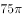

- **D**. 

**答案**：A

**官方解析**

如图所示，长方形小屋为矩形ABDC，羊被绳栓在C点。则羊所能吃到草的面积包括以C为圆心的圆的与以A和D为圆心的圆的，其他区域的草均不能吃到。则所能吃到草的面积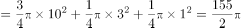平方米。

故正确答案为A。

---

### 第 2 题　qid 1758844 · 数学运算

甲乙丙三员工共同修剪6060平方米草地，甲的修剪效率为30平方米/分钟，乙的修剪效率为40平方米/分钟，丙的效率为60平方米/分钟。上午，甲7点30分开始修剪，乙7点45分开始，丙8点15分开始，他们同一时间完成工作，乙用了（  ）分钟。

- **A**. 56
- **B**. 57　✅
- **C**. 58
- **D**. 59

**答案**：B

**官方解析**

三人同一时间完成工作，且甲、乙分别先于丙45、30分钟开始工作。设任务完成时丙共工作了分钟，则甲应工作了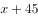分钟，乙应工作了分钟。工程总量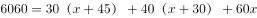，解得，则乙工作了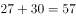分钟。

故正确答案为B。

---

### 第 3 题　qid 1758846 · 数学运算

小王打算购买围巾和手套送给朋友们，预算不超过500元，已知围巾的单价是60元，手套的单价是70元，如果小王至少要买3条围巾和2双手套，那么不同的选购方式有（  ）种。

- **A**. 3
- **B**. 5
- **C**. 7　✅
- **D**. 9

**答案**：C

**官方解析**

在保证必买3条围巾和2双手套的前提下，剩余购买情况不能超过元。设围巾再次购买了条，手套再次购买了双，则，依次分析、的取值情况。

当时，可取0、1、2，共3种方式；

当时，可取0、1，共2种方式；

当时，可取0，共1种方式；

当时，可取0，共1种方式。

即还有种购买方式。

故正确答案为C。

---

### 第 4 题　qid 1758848 · 数学运算

一艘轮船先顺水航行40千米，再逆水航行24千米，共用了8小时。若该船先逆水航行20千米，再顺水航行60千米，也用了8小时。则在静水中这艘船每小时航行（  ）千米。

- **A**. 11
- **B**. 12　✅
- **C**. 13
- **D**. 14

**答案**：B

**官方解析**

设船在静水中的速度为千米/小时，水流的速度为千米/小时，根据题干条件可得方程：。方程化简后得：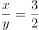。将代入原式，解得，。

备注：【秒杀计】两方程联立化简后可得，结合题干数据和选项均为整数，故可猜测应为3的倍数，只有B项满足。

故正确答案为B。

---

### 第 5 题　qid 1758850 · 数学运算

某收藏家有三个古董钟，时针都掉了，只剩下分针，而且都走得较快，每小时分别快2分钟、6分钟及12分钟。如果在中午将这三个钟的分针都调整指向钟面的12点位置，多少小时后这3个钟的分针会指在相同的分钟位置？

- **A**. 24
- **B**. 26
- **C**. 28
- **D**. 30　✅

**答案**：D

**官方解析**

由题意可得：假设每小时快2分钟、快6分钟、快12分钟的古董钟分别为A钟、B钟、C钟，则B钟与A钟速度差为分钟/小时，已知整个钟盘有60分钟，即经过小时，B钟的分针比A钟的分针恰好多走一圈，且此时两钟分针重合，同理，C钟与A钟速度差为分钟/小时，即经过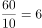小时，C钟的分针比A钟的分针恰好多走一圈，此时两钟分针重合，取6和15的最小公倍数30，即经过30小时，B钟的分针比A钟的分针恰好多走2圈，C钟的分针比A钟的分针恰好多走5圈，且此时三个分针处于同一个位置。

故正确答案为D。

---

### 第 6 题　qid 1758852 · 数学运算

文化广场上从左到右一共有5面旗子，分别代表中国、德国、美国、英国和韩国。如果将5面旗子从左到右分别记作A、B、C、D、E，那么从中国的旗子开始，按照ABCDEDCBABCDEDCBA......的顺序数，数到第313个字母时，是代表（  ）的旗子。

- **A**. 英国
- **B**. 德国
- **C**. 中国　✅
- **D**. 韩国

**答案**：C

**官方解析**

由数数的顺序可知，每一循环是由“ABCDEDCB”8个字母构成的。故在313个字母中，包含了个循环。即数完第39个循环后，再数一个字母便为第313个字母，再数一个字母为A，代表中国。

故正确答案为C。

---

### 第 7 题　qid 1758854 · 数学运算

某电影公司准备在1-10月中选择两个不同的月份，在其当月的首日分别上映两部电影。为了避免档期冲突影响票房，现决定两部电影中间相隔至少3个月，则有（  ）种不同的排法。

- **A**. 21
- **B**. 28
- **C**. 42
- **D**. 56　✅

**答案**：D

**官方解析**

此题有歧义，存在两种观点，一种以上映日进行间隔，另一种观点是以上映月份进行间隔。

讲法一（以上映日进行间隔）：正向枚举。要求两部电影间隔至少3个月，两个电影不互相影响，那么第一部电影如果1月1日上映，要独自播放三个月，也就是1、2、3月都是单独播放第一部电影，4月1号就可以上第二部了。则满足要求的排法有：

当第一部电影A在1月上映时，第二部电影B只能在4、5、6、7、8、9、10月中选择，共7种排法；

当第一部电影A在2月上映时，第二部电影B只能在5、6、7、8、9、10月中选择，共6种排法；

当第一部电影A在3月上映时，第二部电影B只能在6、7、8、9、10月中选择，共5种排法；

当第一部电影A在4月上映时，第二部电影B只能在7、8、9、10月中选择，共4种排法；

当第一部电影A在5月上映时，第二部电影B只能在8、9、10月中选择，共3种排法；

当第一部电影A在6月上映时，第二部电影B只能在9、10月选择，共2种排法；

当第一部电影A在7月上映时，第二部电影B只能在10月选择，共1种排法；

共有种排法。同时第一部电影可以上映B，第二部电影上映A，故全部的排法数共有种。

故正确答案为D。

讲法二（以上映月进行间隔）：正向枚举。要求两部电影间隔至少3个月，两个电影不互相影响，那么第一部电影如果1月上映，要独自播放四个月，也就是1、2、3、4月都是单独播放第一部电影，5月1号就可以上第二部了。则满足要求的排法有：

当第一部电影A在1月上映时，第二部电影B只能在5、6、7、8、9、10月中选择，共6种排法；

当第一部电影A在2月上映时，第二部电影B只能在6、7、8、9、10月中选择，共5种排法；

当第一部电影A在3月上映时，第二部电影B只能在7、8、9、10月中选择，共4种排法；

当第一部电影A在4月上映时，第二部电影B只能在8、9、10月中选择，共3种排法；

当第一部电影A在5月上映时，第二部电影B只能在9、10月中选择，共2种排法；

当第一部电影A在6月上映时，第二部电影B只能在10月选择，共1种排法；

共有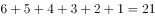种排法。同时第一部电影可以上映B，第二部电影上映A，故全部的排法数共有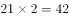种。

小粉笔认为此题应为讲法一。

---

### 第 8 题　qid 1758856 · 数学运算

小张购买艺术品A，在其价格上涨后卖出盈利元，用卖价的一半购买艺术品B，又在其价格上涨后卖出盈利元,发现大于。则X的取值范围是（  ）。

- **A**. 大于100　✅
- **B**. 大于200
- **C**. 小于100
- **D**. 小于200

**答案**：A

**官方解析**

方法一：利润=成本×利润率。根据题干条件可得方程：

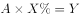；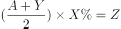。因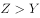，则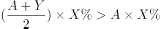，将代入不等式方程后，化简可得：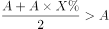，，即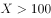。

方法二：因题干未出现任何具体数值，故可赋值解题。设艺术品成本为1，根据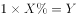得出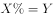，代入不等式方程：，可得。

故正确答案为A。

---

### 第 9 题　qid 1758858 · 数学运算

非闰年的一年的中间时刻应该是A月B日C点，则A+B+C=（  ）。

- **A**. 22
- **B**. 21　✅
- **C**. 20
- **D**. 19

**答案**：B

**官方解析**

抓住题眼，非闰年的一年的中间时刻。非闰年共有365天，其中间时刻的天数即1—365连续自然数的中位数，第天中午12点。前6个月的日期加和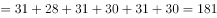。则第183天的日期应为7月2日。即非闰年的一年中间时刻应该是7月2日12点，。

故正确答案为B。

---

### 第 10 题　qid 1758860 · 数学运算

右图中间阴影部分为长方形。它的四周是四个正方形，这四个正方形的周长和是320厘米，面积和是1700平方厘米，则阴影部分的面积是（  ）平方厘米。

- **A**. 375　✅
- **B**. 400
- **C**. 425
- **D**. 430

**答案**：A

**官方解析**

设阴影部分长方形的边长分别为x厘米、y厘米。根据题干数据可得：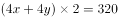，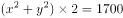。化简后得：，。阴影部分面积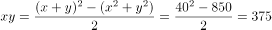平方厘米。

故正确答案为A。

---

## 判断推理

### 第 1 题　qid 1758862 · 逻辑判断

如图，三角形木块顶住水泥墙壁后静置在水平地面上，现将小铁球从图中位置无初速度地放开，假设不考虑任何摩擦力，那么小球从释放到落至地面的过程中，下列说法正确的是（  ）。

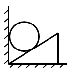

- **A**. 木块对小铁球的弹力不做功
- **B**. 木块的机械能守恒
- **C**. 小铁球的机械能的减少量等于木块动能的增大量　✅
- **D**. 以上说法均不正确

**答案**：C

**官方解析**

先对整个系统相对运动情况分析如图①。

A.对铁球受力分析如图②，F2即为木块对铁球弹力，方向垂直于木块斜面，由于铁球位移方向竖直向下，F2可分解为沿x轴和沿y轴方向，由功的定义F2这个外力对铁球做功，A错误。

B.对木块受力分析如图③，图②F2与图③F3为作用力与反作用力，木块位移水平向右，F3可分解为沿x轴和沿y轴方向，由功的定义F3这个外力对木块做功，所以机械能不守恒；或者可以从机械能的角度出发，木块由静止向右运动，可知木块势能不变动能增加，所以机械能不守恒，B错误。

C.对木块和铁球整体分析，两者只有重力做功，所以木块和铁球整体机械能守恒，铁球势能的减少量与动能增加量之和等于木块动能的增加量，C正确。

故正确答案为C。

---

### 第 2 题　qid 1758864 · 逻辑判断

真空玻璃是将两片平板玻璃或玻璃四周密闭起来，将其间隙抽成真空并密封排气孔，两片玻璃之间的间隙为0.1～0.2mm，真空玻璃的两片至少有一片是低辐射玻璃。根据以上信息，下列关于真空玻璃的描述错误的是（  ）。

- **A**. 为了达到玻璃内外压力的平衡，往往会在玻璃之间排列整齐小球，用来支撑玻璃承受外界大气压的压力
- **B**. 采用低辐射玻璃的原因是使辐射传热尽可能小
- **C**. 抽成真空的目的是减少气体传热的影响，从而使保温性能更好
- **D**. 抽成真空后隔音的效果会下降　✅

**答案**：D

**官方解析**

A项，当玻璃内真空时，玻璃内外有压强差而产生压力，为了达到玻璃内外的压力平衡，在玻璃内部排列小球以提供对玻璃内部的支持力，即A项正确，故不选A项。
B项，低辐射玻璃导热性差，使用其可以减少或阻隔热量的传递，即B项正确，故不选B项。
C项，真空下热量的传递效果大大降低，所以达到保温的功效，即C项正确，故不选C项。
D项，声音的传播需要介质，真空下声音无法传播，玻璃抽成真空后的隔音效果更好，即D项错误，故选择D项。
本题为选非题，故正确答案为D。

---

### 第 3 题　qid 1758866 · 类比推理

下列四幅图中，属于近视眼成像原理和远视眼矫正方法的分别是（  ）。  

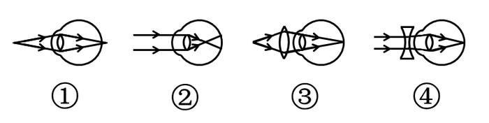

- **A**. ①和③
- **B**. ②和③　✅
- **C**. ②和④
- **D**. ①和④

**答案**：B

**官方解析**

近视眼的眼球对光的折射程度很大，所以成像在视网膜的前方，②正确；远视眼的眼球对光的折射程度小，故佩戴凸透镜增加对光的折射，对视力进行矫正，③正确。
故正确答案为B。

---

### 第 4 题　qid 1758868 · 逻辑判断

如图，用绳子(质量忽略不计）将甲、乙两铁球挂在天花板上的同一个挂钩上，然后使两铁球在同一水平面上做匀速圆周运动，已知两铁球质量相等，那么下列说法中不正确的是（  ）。

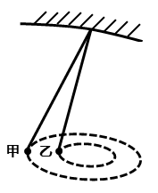

- **A**. 甲的角速度一定比乙的角速度大　✅
- **B**. 甲的线速度一定比乙的线速度大
- **C**. 甲的加速度一定比乙的加速度大
- **D**. 甲所受绳子的拉力一定比乙所受的绳子的拉力大

**答案**：A

**官方解析**

设悬挂铁球的绳子与竖直方向的夹角为A，铁球圆周运动的圆心距绳子悬挂点的距离为L，则根据受力分析和几何关系得：铁球圆周运动的半径，铁球的加速度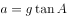，根据圆周运动公式并代入可得：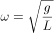，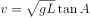。

题中甲悬挂的绳子与竖直方向的夹角大于乙悬挂绳子与竖直方向的夹角，根据上述得到的铁球运动的角速度与线速度公式可得：甲乙两铁球的角速度相等，甲的线速度大于乙的线速度，甲的加速度大于乙的加速度；又两球的质量相等，所受重力相同，则甲所受绳子的拉力一定大于乙所受绳子的拉力，故A项错误，B、C、D三项正确。

本题为选非题，故正确答案为A。

---

### 第 5 题　qid 1758870 · 逻辑判断

右图是煤气泄露报警装置原理图，是对煤气敏感的半导体元件，其电阻随煤气浓度的增加而减小，是一可变电阻，在ac间接12V的恒定电压，bc间接报警器，当煤气浓度增加到一定值时报警器发出警告。对此下列说法正确的是（  ）。

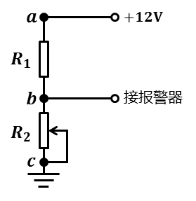

- **A**. 
减小的阻值，b点的电势升高

- **B**. 
当煤气的浓度升高时，b点的电势降低

- **C**. 
适当减小ac间的电压，可以提高报警器的灵敏度

- **D**. 
调节的阻值能改变报警器启动时煤气浓度的临界值
　✅

**答案**：D

**官方解析**

A项，减小的阻值，电阻两端分得电压减小，则b点的电势降低，故A项错误。

B项，煤气的浓度升高时阻值减小，电阻两端分得电压增加，b点的电势升高，故B项错误。

C项，当煤气浓度的改变量为一定值，适当减小ac间的电压时，b点的电势改变量减小，则导致报警器的灵敏度降低，故C项错误。

D项，报警器的报警电压值一定，调节的阻值，要使b点电势依然能达到报警电压，则电阻对应的临界值也要发生变化，煤气浓度临界值也将发生变化，故D项正确。

故正确答案为D。

---

### 第 6 题　qid 1758872 · 类比推理

小张放假回到农村，发现一个种子堆，好奇的小张把手伸到种子堆里，发现里面温度比较高，这主要是因为（  ）。

- **A**. 天气热
- **B**. 呼吸作用　✅
- **C**. 光合作用
- **D**. 保温作用

**答案**：B

**官方解析**

种子无法进行光合作用，且一直在进行呼吸作用，散发出热量，种子堆里发热的原因就是因为呼吸作用，故B项正确。
故正确答案为B。

---

### 第 7 题　qid 1758874 · 逻辑判断

蹦床运动员在离开蹦床一定高度后落回蹦床，若不考虑空气阻力，下列说法错误的是（  ）。

- **A**. 运动员在离开蹦床上升过程中，蹦床对运动员一定不做功
- **B**. 运动员在最高时，速度为零
- **C**. 运动员在最高点时，受到的合力为零　✅
- **D**. 运动员从最高点下落过程中，重力势能减小

**答案**：C

**官方解析**

A项，运动员离开蹦床上升，蹦床对运动员没有力的作用，则对运动员不做功，即A项正确，故不选A项。
B、C项，运动员在最高点时，速度为零，所受合力竖直向下，所受合力不为零，即B项正确，C项错误，故选择C项。
D项，运动员下落过程中，高度降低，重力势能减小，即D项正确，故不选D项。
本题为选非题，故正确答案为C。

---

### 第 8 题　qid 1758876 · 类比推理

如图，质量为65kg的小李站在重为3000N的铁皮船上，船体与陆地上的树木之间用滑轮组连接，小李用60N的拉力拉绳子（质量忽略不计）时，船体向前匀速移动，那么船在水中受到的阻力为（  ）N。

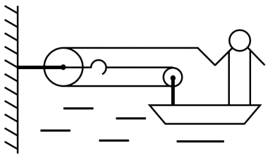

- **A**. 39
- **B**. 60
- **C**. 120
- **D**. 180　✅

**答案**：D

**官方解析**

绳子对人有60N的拉力，人没动，是因为船给人向后60N的摩擦力，故人给船60N向前的摩擦力。另外，由于滑轮组有两条绳子连着船上，故船受到绳子的拉力为120N。因此船受到的总拉力为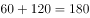N。

故正确答案为D。

---

### 第 9 题　qid 1758878 · 类比推理

地球是一个巨大的磁体，它的磁场分布情况与一个条形磁铁的磁场分布情况相似。地理南极相当于条形磁铁的N极，地理北极相当于条形磁场的S极，那么上海上空的磁场方向是（  ）。

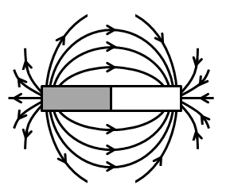

- **A**. 由南至北斜向下沉　✅
- **B**. 由南至北斜向上升
- **C**. 由北至南斜向下沉
- **D**. 由北至南斜向上升

**答案**：A

**官方解析**

磁体外部的磁场方向由磁铁N极指向磁铁S极，则地球的磁场方向由南指向北，因为上海处于北半球，则磁场方向由南至北斜向下，故A项正确。
故正确答案为A。

---

### 第 10 题　qid 1758880 · 类比推理

炎热的夏天开车行驶在高速公路上，常觉得公路远处似乎有水面，水面上还有汽车、电线杆等物体的倒影，但当车行驶至该处时，却发现不存在这样的水面。出现这种现象是因为（  ）。

- **A**. 镜面反射
- **B**. 漫反射
- **C**. 直线传播
- **D**. 折射　✅

**答案**：D

**官方解析**

炎热夏天公路上温度很高，接近地面的空气温度较高，空气密度较低，远离地面空气温度较低，密度较大，且空气不断流动导致光在传播过程中发生折射，而人所看到的像是物体形成的虚像，故D项正确。
故正确答案为D。

---

### 第 11 题　qid 1758882 · 定义判断

健康传播是一种将医学研究成果转化为大众的健康知识。并通过大众生活态度和行为方式的改变来降低患病率和死亡率，有效提高一个社区或国家生活质量和健康水准的行为。
根据上述定义，下列不属于健康传播的是（  ）。

- **A**. 社区进行安全避孕宣传
- **B**. 国家立法禁止香烟广告
- **C**. 医学界举办学术研讨交流会　✅
- **D**. 学校开展卫生健康教育

**答案**：C

**官方解析**

第一步：找出定义关键词。
健康传播的定义条件为“医学研究成果转化为大众的健康知识”。
第二步：逐一分析选项。
A项：社区进行避孕宣传，属于医学研究成果转化为大众的健康知识，符合定义，排除；
B项：国家立法禁烟广告，属于医学研究成果转化为大众的健康知识，符合定义，排除；
C项：医学界举办学术研讨交流会，不属于医学研究成果转化为大众的健康知识，不符合定义，当选；
D项：学校开展卫生健康教育，属于医学研究成果转化为大众的健康知识，符合定义，排除。
本题为选非题，故正确答案为C。

---

### 第 12 题　qid 1758884 · 定义判断

顺应是指当环境发生改变或当生物迁入新环境时，生物对所在环境条件产生的生理适应过程。
根据上述定义，下列体现顺应的是（    ）。

- **A**. 
松树冬季的耐寒力由夏季的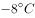变为
　✅
- **B**. 
某些苍蝇由暗处飞到强光下，会不停地摆头决定方向

- **C**. 
小王转学进入新的学校学习，他更加勤奋了

- **D**. 
参加沟通技巧培训后，小李采用新的方式与他人交流

**答案**：A

**官方解析**

第一步：找出定义关键词。
“生物”、“生理适应过程”。
第二步：逐一分析选项。
A项：松树冬季的耐寒力的改变是生理适应，符合“生理适应过程”，符合定义，当选；
B项：苍蝇不停地摆头，属于动作变化，不符合“生理适应过程”，不符合定义，排除；
C项：小王勤奋，属于对待学习的态度，不符合“生理适应过程”，不符合定义，排除；
D项：小李改变交流方式，属于方法的改变，不符合“生理适应过程”，不符合定义，排除。
故正确答案为A。

---

### 第 13 题　qid 1758886 · 定义判断

社区行动是指社区居民为维护自身利益，促进社区的发展和进步而采取的共同行动。
根据上述定义，下列属于社区行动的是（  ）。

- **A**. 志愿者在某社区进行“节水从点滴做起”的宣传活动
- **B**. 退休工人老王办了社区爱心家政服务队，组织下岗职工的其他居民一起再就业
- **C**. 某小区居民用联名信的方式投诉小区附近的一家海鲜馆造成的环境卫生问题　✅
- **D**. 某小区有居民要求物业将绿地改为停车位

**答案**：C

**官方解析**

第一步：找出定义关键词。
社区行动的定义条件为：“社区居民”和“共同行动”。
第二步：逐一分析选项。
A项：志愿者不属于社区居民，不符合定义，排除；
B项：退休工人老王的行为不属于共同行动，不符合定义，排除；
C项：某小区居民用联名信的方式投诉，符合定义，当选；
D项：有居民要求物业将绿地改为停车位，不属于共同行动，不符合定义，排除。
故正确答案为C。

---

### 第 14 题　qid 1758888 · 定义判断

传媒接近权是指普通公民或社会组织享有的，由法律规定、认可和保障的，为公开发表、传递自己的意见、主张、观点、情感等内容而使用各种媒介手段与方式，不受任何他人或组织非法限制或侵犯的权利。
根据上述定义，下列不涉及传媒接近权的是（  ）。

- **A**. 政府召开新闻发布会　✅
- **B**. 企业在电视上播出产品广告
- **C**. 某学者在杂志上发表自己的学术观点
- **D**. 某人在报纸上刊登寻找失物的酬谢广告

**答案**：A

**官方解析**

第一步：找出定义关键词。
“普通公民或社会组织”、“为公开发表、传递自己的意见、主张、观点、情感等内容而使用各种媒介手段与方式”、“不受任何他人或组织非法限制或侵犯”。
第二步：逐一分析选项。
A项：“政府召开新闻发布会”是发布信息的法定形式，政府不属于“普通公民或社会组织”，召开新闻发布会也不涉及“不受任何他人或组织非法限制或侵犯”，不符合定义，当选；
B项：企业是社会组织，在电视上播出产品广告符合关键词“为公开发表、传递自己的意见、主张、观点、情感等内容而使用各种媒介手段与方式”，符合定义，排除；
C项：某学者是普通公民，在杂志上发表自己的学术观点符合关键词“为公开发表、传递自己的意见、主张、观点、情感等内容而使用各种媒介手段与方式”，符合定义，排除；
D项：某人是普通公民，在报纸上刊登寻找失物的酬谢广告符合关键词“为公开发表、传递自己的意见、主张、观点、情感等内容而使用各种媒介手段与方式”，符合定义，排除。
本题为选非题，故正确答案为A。

---

### 第 15 题　qid 1758890 · 定义判断

生物学家通过对选定的生物物种进行科学研究，用于揭示某种具有普遍规律的生命现象。此时，这种被选定的生物物种就是模式生物。
根据上述定义，下列不属于模式生物的是（  ）。

- **A**. 豌豆——孟德尔在揭示生物界遗传规律时选用豌豆作为实验材料
- **B**. 果蝇——生物学家摩根选用果蝇进行基因的突变进化研究
- **C**. 白鼠——现代医学研究大量使用白鼠作为实验动物
- **D**. 病菌——医院进行细菌培养以确认患者的感染病菌类型　✅

**答案**：D

**官方解析**

第一步：找出定义关键词。
模式生物的定义条件为“揭示某种普遍规律的生物现象”。
第二步：逐一分析选项。
A项：豌豆用于揭示生物界遗传规律的生物，符合定义，排除；
B项：果蝇用于揭示基因突变规律生物，符合定义，排除；
C项：白鼠用于实验的生物，符合定义，排除；
D项：病菌并未体现是具体哪种生物，也未体现生物规律，不符合定义，当选。
本题为选非题，故正确答案为D。

---

### 第 16 题　qid 1758892 · 定义判断

能指和所指是索绪尔语言学的一对术语。索绪尔认为，任何语言符号都是由能指和所指构成的。其中，能指是指符号的物质形式，由声音和形象两部分构成；所指是指语言所反映的事物的概念。而意指则代表了能指与所指之间的关系。意指有两个层次，第一层是直接意指，即语言符号形象具有直接的表现性；第二层是含蓄意指，语言符号形象本身没有直接的表现性，如文学创作中的隐喻、象征、引申等。
根据上述定义，下列表述错误的是（  ）。

- **A**. 孩子在公园游玩，看到了五彩缤纷的花朵，喊出了“花”这个字。在这里，被喊出的“花”这个字就是能指
- **B**. 如果所指是“木本植物的总称”，那么简体中文里的“树”、繁体中文里的“樹”和英语里的“tree”都是对应这一事物的能指
- **C**. 在网络语言中，网民喜欢用“杯具”来代替“悲剧”。因此，在这里“杯具”二字体现了意指的第一个层次　✅
- **D**. 在“硕鼠硕鼠，无食我黍”这句诗中具有含蓄意指

**答案**：C

**官方解析**

第一步：找出定义关键词。
能指的定义条件是“物质形式”；所指的定义条件是“概念”；意指第一层是语言符号形象具有直接的表现性；第二层是含蓄意指，语言符号形象本身没有直接的表现性。
第二步：逐一分析选项。
A项：孩子看到的花，是花的形象，属于物质形式，符合能指的定义条件，表述正确，排除；
B项：“木本植物的总称”是概念，符合所指的定义条件，而“树”“樹”以及“tree”指的是具体的物质形象，符合能指的定义条件，表述正确，排除；
C项：“杯具”表达“悲剧”的含义，并不是语言的直接表现性，不符合意指第一层，表述错误，当选；
D项：“硕鼠硕鼠，无食我黍”是以硕鼠喻剥削者，并不是语言的直接表现性，符合含蓄意指，表述正确，排除。
本题为选非题，故正确答案为C。

---

### 第 17 题　qid 1758948 · 图形推理

从所给的四个选项中，选择最合适的一个填入问号处，使之呈现一定的规律性：

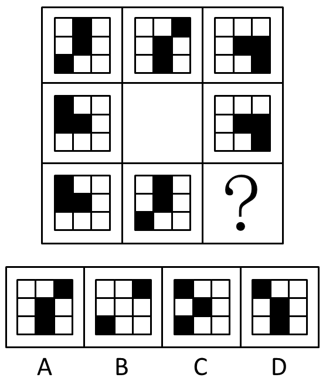

- **A**. A　✅
- **B**. B
- **C**. C
- **D**. D

**答案**：A

**官方解析**

分析图形的特征。图形组成元素都相同，考虑图形的位置变化，同时九宫格中间图形最特殊，为空白面，考虑米字型路线观察。观察发现，米字型的上下左右以及对角线两端的图形都是旋转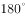的关系。故问号处应为第一行第一个图形旋转得到，对应A项。

故正确答案为A。

---

### 第 18 题　qid 1758950 · 图形推理

左边给定的是图形外表面的展开图，右边哪一项能由它折叠而成？请把它找出来：

- **A**. A
- **B**. B
- **C**. C
- **D**. D　✅

**答案**：D

**官方解析**

B项：根据原图可知立体的底面应为两条对角线交叉的面，可直接排除B项；

A项：应用描线法，

与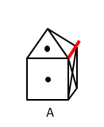中红线应为同一条，具有黑点的三角形位置不对，可直接排除；

C项：应用描线法，与中红线为同一条，具有黑点的三角形位置不对，可直接排除。

故正确答案为D。

---

### 第 19 题　qid 1758952 · 图形推理

下列选项中，符合所给图形的变化规律的是（  ）。

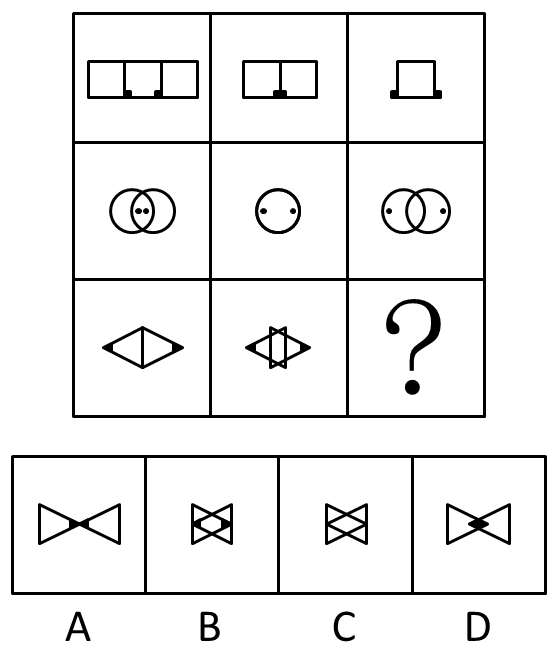

- **A**. A
- **B**. B　✅
- **C**. C
- **D**. D

**答案**：B

**官方解析**

分析图形的特征。每行组成图形都相同，排除C项；研究图形的位置变化，每行两个元素相向而行，即左边的图向右走，右边的图向左走，而且每次移动的距离相同，排除A、D两项。
故正确答案为B。

---

### 第 20 题　qid 1758954 · 图形推理

下列选项中，符合所给图形的变化规律的是：

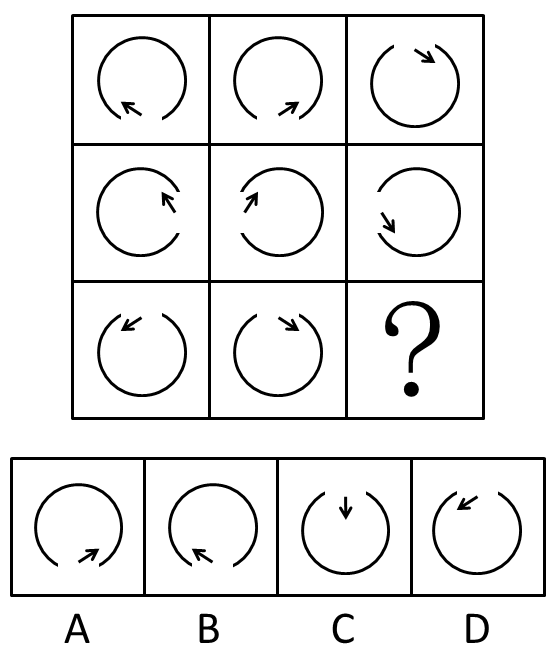

- **A**. A　✅
- **B**. B
- **C**. C
- **D**. D

**答案**：A

**官方解析**

图形元素组成相同，优先考虑位置规律。九宫格每行第一个图形向右翻转得到第二个图形，再由第二个图形上下翻转得到第三个图形。
故正确答案为A。

---

### 第 21 题　qid 1758956 · 图形推理

左边给定的是图形外表面的展开图，右边哪一项能由它折叠而成？请把它找出来：

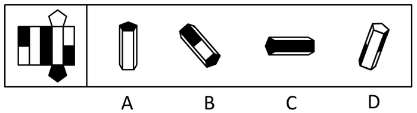

- **A**. A
- **B**. B
- **C**. C　✅
- **D**. D

**答案**：C

**官方解析**

A项：原图中不存在三个白色的长方形，可直接排除；B项：两个白色长方形中间为黑色长方形，可直接排除；D项：任意一个白色长方形都要和黑色长方形相邻，可直接排除。
故正确答案为C。

---

### 第 22 题　qid 1758958 · 图形推理

下列选项中，符合所给图形的变化规律的是（  ）。

- **A**. A
- **B**. B
- **C**. C
- **D**. D　✅

**答案**：D

**官方解析**

分析图形的特征。
解法1：组成图形都相同，考查图形的位置变化。第一个图形上面的线段每次逆时针旋转45度，下面的线段每次逆时针旋转90度。
解法2：两条线段的夹角度数分别为180度、135度、90度。两条线段的夹角度数依次减小45度，则问号处应填入两条线段的夹角度数为45度的图形，对应D项。
故正确答案为D。

---

### 第 23 题　qid 1758960 · 图形推理

下列选项中，符合所给图形的变化规律的是（  ）。

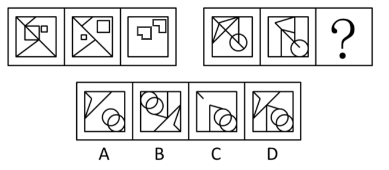

- **A**. A
- **B**. B
- **C**. C
- **D**. D　✅

**答案**：D

**官方解析**

分析图形的特征。组成图形较为相似，考查样式求异运算。每组都是第一个图形和第二个图形去同存异得到第三个图形，只有D项符合。
故正确答案为D。

---

### 第 24 题　qid 1758962 · 图形推理

从所给的四个选项中，选择最合适的一个填入问号处。使之呈现一定的规律性。

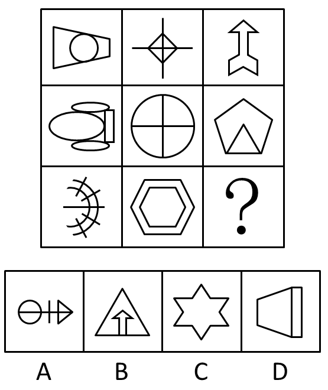

- **A**. A
- **B**. B　✅
- **C**. C
- **D**. D

**答案**：B

**官方解析**

分析图形的特征。图形较为凌乱，考虑图形对称属性。第一列只为横轴对称图形，第二列为中心对称图形，第三列只为竖轴对称图形。
故正确答案为B。

---

### 第 25 题　qid 1758964 · 图形推理

下列选项中，符合所给图形的变化规律的是（  ）。

- **A**. A
- **B**. B
- **C**. C　✅
- **D**. D

**答案**：C

**官方解析**

分析图形的特征。每个图形均由直线曲线构成，考查直线曲线的静态位置关系，三个图形分别存在直线与曲线相交、相离、相切的关系。只有C项存在相切。
故正确答案为C。

---

### 第 26 题　qid 1758966 · 图形推理

请从四个选项中选出最恰当的一项填在问号处，使图形呈现一定的规律性：

- **A**. A
- **B**. B
- **C**. C　✅
- **D**. D

**答案**：C

**官方解析**

第一幅和第二幅图之间的区别在空心圆和三角位置互换了，第二幅和第三幅图之间的区别在于空心圆和十字位置互换了，由此可得，规律为相邻两幅图形有两个元素位置不同。因此问号处图形必须和第四幅图有两个元素位置不一样。
A项：四个元素位置不同，排除；
B项：五个元素位置不同，排除；
C项：方块和空心圆位置不同，即两个元素位置不同，符合题干规律，当选；
D项：五个元素位置不同，排除。
故正确答案为C。

---

### 第 27 题　qid 1758968 · 图形推理

下列选项中，符合所给图形的变化规律的是（    ）。

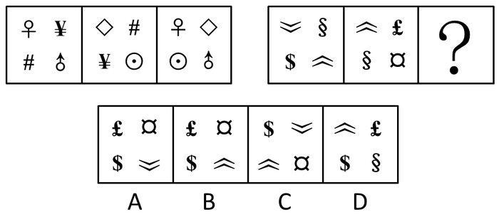

- **A**. A　✅
- **B**. B
- **C**. C
- **D**. D

**答案**：A

**官方解析**

 第一组图形：第一幅和第二幅有两个元素相同，变到第三幅图，把相同的去掉，不同的保留下来；

第二组图形：前两幅相同的是和，去掉后把不同的元素组合起来，得到A项。

故正确答案为A。

---

### 第 28 题　qid 1758970 · 图形推理

下列选项中，符合所给图形的变化规律的是（    ）。

- **A**. A
- **B**. B　✅
- **C**. C
- **D**. D

**答案**：B

**官方解析**

原图是由下往上，下面两幅图结合推出上面一幅图。其规律是：同一位置元素不同的就去掉变成空白，元素相同的就保留但方向变成相反的。

根据这个规律来观察：

相同的地方只有中间列的最上面和最下面，把方向反过来，最上面的箭头变成，最下面箭头变成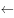，其他的都去掉变成空白，只有B项符合要求。

故正确答案为B。

---

### 第 29 题　qid 1758894 · 逻辑判断

据估计，可能有数以百万吨的塑料漂浮在海洋中。但是一项新研究发现，这些塑料有都消失不见了，研究人员认为大部分消失的塑料可能是被海洋生物吃掉了，并随之进入海洋食物链。

下列哪项最能对上述结论的正确与否进行评价？

- **A**. 海洋中除了塑料是否还有其他垃圾
- **B**. 除了被海洋生物吃掉，漂浮在海洋中的塑料是否会以其他形式消失　✅
- **C**. 是否能说进入海洋食物链的塑料就是“消失”了
- **D**. 消失的塑料最可能集中在哪些海域

**答案**：B

**官方解析**

第一步：找出论点和论据。
论点：大部分消失的塑料可能是被海洋生物吃掉了，并随之进入海洋食物链。
论据：无。
本题只有论点，没有论据，且提问方式为“下列哪项最能对上述结论的正确与否进行评价”，找出会影响论点成立的选项即可。
第二步：逐一分析选项。
A项：海洋中除了塑料是否还有其他垃圾，与塑料是否被海洋生物吃掉无关，无法对结论的正确与否进行评价，排除；
B项：除了被海洋生物吃掉，漂浮在海洋中的塑料是否会以其他形式消失，如果海洋中的塑料不会以其他形式消失，则论点成立；如果海洋中的塑料会以其他形式消失，则论点不成立，可以对结论的正确与否进行评价，当选；
C项：是否能说进入海洋食物链的塑料就是“消失”了，讨论的是塑料是否真的消失，与论点塑料是如何消失的无关，无法对结论的正确与否进行评价，排除；
D项：消失的塑料最可能集中在哪些海域，讨论的是塑料消失的地点，与论点塑料是如何消失的无关，无法对结论的正确与否进行评价，排除。
故正确答案为B。

---

### 第 30 题　qid 1758896 · 类比推理

某单位今年新招收了30名职工。
①新招收的职工里有人是外地的；
②新招收的职工里，学历最高的不是外地人；
③新招收的职工里有人不是外地的。
如果上述三个判断中只有一个是真的，则下列哪项正确地表示了该单位新招收的职工中外地人的数量：

- **A**. 只有1个人是外地人
- **B**. 30名职工都是外地人　✅
- **C**. 30名职工都不是外地人
- **D**. 只有1个人不是外地人

**答案**：B

**官方解析**

首先整理题干：①有人是外地的；②学历最高的不是外地人；③有人不是外地的。
分析可知①和③为反对关系，必有一真，条件说只有一真，则其余的（即②）为假，也就是说学历最高的是外地人，进而可知“有人是外地的”为真，即①为真，因为条件说只有一真，因此③为假，它的矛盾为真，即：所有人都是外地人。
故正确答案为B。

---

### 第 31 题　qid 1758898 · 逻辑判断

近十年来，我国每年授予的博士学位数量出现了持续性的上升，因此可以认为近十年我国研究生人数不断增加。
下列各项中，最能支持上述结论的是：

- **A**. 
近十年来，获得博士学位的难度并未发生变化

- **B**. 
近十年来，我国获得博士学位的人数在研究生总人数中所占的比例不变 
　✅
- **C**. 
今年申请攻读博士研究生的人数是十年前的2倍左右

- **D**. 
今年我国的博士研究生在研究生中仅占左右

**答案**：B

**官方解析**

第一步：分析题干。
论点：“近十年我国研究生人数不断增加”。
论据：“我国每年授予的博士学位数量出现了持续性的上升”。
第二步：逐一分析选项。
A项：难度不是题干讨论的主题，属于无关项，排除；
B项：博士学位数量上升，但比例不变，说明研究生总人数在增加，补充了一个前提，把论点论据联系起来，是搭桥，能加强，当选；
C项：申请的人数和授予的人数是两个概念，属于无关项，排除；
D项：题干论点说的是近10年的情况，选项说的是今年的情况，讨论话题不一致，排除。
故正确答案为B。

---

### 第 32 题　qid 1758900 · 逻辑判断

由于近年来在化肥、农药施用和管理技术等方面出现问题，我国北方大葱主产地的大葱产量出现明显下降，国内价格快速上涨。要想维持国内价格稳定，就必须严格限制大葱出口。因为从事大葱出口贸易的企业的出口合同都是在低价位时签订的，如果在大葱价格大幅上涨时继续履行合同，这些企业就会出现严重亏损。但是，如果严格限制大葱出口，我国在国际大葱市场所占有的份额就将被其他国家或地区所取代。
如果以上陈述为真，下列哪项一定为真？

- **A**. 如果不是出现化肥、农药施用和管理技术等方面的问题，就不会严格限制大葱出口
- **B**. 如果严格限制大葱出口，国内大葱价格就不会继续上涨
- **C**. 如果要维持国内大葱价格的稳定，就会失去我国在国际大葱市场所占有的份额　✅
- **D**. 为了避免损失，从事大葱出口贸易的企业肯定会积极游说政府制定严格限制大葱出口的政策

**答案**：C

**官方解析**

第一步：翻译题干。

①维持价格稳定限制大葱出口

②大葱价格上涨时履行合同企业亏损

③限制大葱出口国际市场份额被取代

将①③串联可以递推出：④维持价格稳定限制大葱出口国际市场份额被取代

第二步：逐一分析选项。

A项：翻译为技术问题限制大葱出口，题干没有涉及二者的推出关系，无法推出，排除；

B项：翻译为限制大葱出口大葱价格上涨，要么是肯定①的后项，肯后推不出必然性结论，要么是肯定③的前项，但是无法推出“大葱价格上涨”，即两种情况都无法推出确定的结论，无法推出，排除；

C项：翻译为维持价格稳定国际市场份额被取代，是对④的肯前，肯前必肯后，可以推出，当选；

D项：翻译为企业亏损限制大葱出口，题干没有涉及二者的推出关系，无法推出，排除。

故正确答案为C。

---

### 第 33 题　qid 1758902 · 逻辑判断

某国人口统计机构预测，到2031年，该国人口将降到1.27亿以下，在今后40年内人口将减少2400万，为此，该国政府出台一系列鼓励生育的政策。近年来，该国人口总数趋于稳定，截至2014年6月1日，人口数量为1.461亿。2014年1至5月人口增长量为5.91万，增长率为。因此，有专家认为该国实施的鼓励生育政策达到了预期的效果。

下列选项如果为真，最能加强上述观点的是：

- **A**. 如果该国政府没有出台鼓励生育的政策，儿童人口总数会持续下降　✅
- **B**. 如果该国政府出台更加有效的鼓励生育政策，就可以提高人口质量
- **C**. 近年来该国人口总数出现缓慢上升的趋势
- **D**. 该国政府出台的鼓励生育政策是一项长期国策

**答案**：A

**官方解析**

 第一步：分析题干。

论点：“该国实施的鼓励生育政策达到了预期的效果”。

论据：“近年来，该国人口总数趋于稳定，截至2014年6月1日，人口数量为1.461亿。2014年1至5月人口增长量为5.91万，增长率为。”

第二步：逐一分析选项。

A项：没有该政策就不行，证明该政策是有效果的，排除他因，是加强论点，当选；

B项：其他政策与该政策无关，主体不一致，排除；

C项：人口总数的上升只是重复了一下原论据，并没有增加新的证据，力度很弱，排除；

D项：长期国策与是否有效无关，排除。

故正确答案为A。

---

### 第 34 题　qid 1758904 · 类比推理

教育主管部门应该制定政策，要求从小学就开设逻辑课程，否则学生就难以对现有的知识体系与价值观念展开反思、提出质疑，而逻辑课程能够帮助学生从小养成进行反思、提出质疑的习惯，提高相应的能力。
上述议论预设了下列哪项假设？
Ⅰ除非从小学开始学习逻辑，否则学生难以区分真善美与假恶丑
Ⅱ即使在小学阶段，学生也有能力理解并运用某些逻辑理论与方法
Ⅲ学生对现有的知识体系与价值观念展开反思、提出质疑，这本身是一件好事

- **A**. Ⅰ
- **B**. Ⅲ
- **C**. Ⅱ和Ⅲ　✅
- **D**. Ⅰ、Ⅱ和Ⅲ

**答案**：C

**官方解析**

分析题干。
论点：要从小学就开始开设逻辑课程。
论据：逻辑课程能帮助学生从小培养质疑反思的能力。
Ⅰ区分真善美与假恶丑虽然是价值观，但题干中开设逻辑课程的主要目的是培养反思质疑的能力，因此不符合题意，不是前提，错误；
Ⅱ有能力理解运用是小学开设逻辑课程能对学生有帮助的前提，即是论据的前提，正确；
Ⅲ质疑反思是好事，才要去开课，这句话是执行论点的前提，正确。
故正确答案为C。

---

### 第 35 题　qid 1758906 · 逻辑判断

某年，冀城、豫城、徐城、兖城、青城等五座城市的游客数量比往年偏多，这些城市分别有着不同的地理环境和旅游资源：险峻的高山、茂密的森林、平坦的草原、辽阔的大海和幽静的河谷。该年前往上述五座城市的游客量（人次/年）分别是：12万、27万、32万、44万、65万。已知：
（1）草原中的城市对游客的吸引力最小，最受欢迎的旅游目的是森林
（2）徐城在大山中，交通不方便，但是来此旅游的人却不少
（3）冀城的游客量比兖城多
（4）兖城的游客量是44万人次，创历史新高
（5）前往豫城的游客比青城多，但是没有徐城多
根据上述条件，可以推出青城的特色旅游资源是：

- **A**. 幽静的河谷
- **B**. 茂密的森林
- **C**. 平坦的草原　✅
- **D**. 辽阔的大海

**答案**：C

**官方解析**

分析题干：由（1）得出草原游客量12万，森林游客量65万；
由（3）（4）得出冀城游客量65万；由（5）得出青城＜豫城＜徐城，因此青城游客量最少，为12万；而草原游客量也是12万，所以青城的特色旅游资源是草原。
故正确答案为C。

---

### 第 36 题　qid 1758908 · 逻辑判断

小陈因不具有研究生身份而被图书馆工作人员拒绝进入古籍书库。小陈出示古籍善本书库出入证说：根据规定，我可以进入古籍书库。古籍书库的规定是：不是研究生不能进入古籍书库；只有持有古籍善本书库出入证，才能进入古籍善本书库。
小陈最有可能把古籍书库的规定理解为：

- **A**. 准许进入古籍书库的人，不一定准许进入古籍善本书库
- **B**. 有了古籍善本书库出入证，就不需要研究生身份
- **C**. 如果持有古籍善本书库出入证，就能进入古籍书库　✅
- **D**. 除非持有古籍善本书库出入证，否则不能进入古籍善本书库

**答案**：C

**官方解析**

第一步：分析题干。

图书馆的规定：古籍书库研究生，善本书库出入证。

小陈的理解：出入证古籍书库。

第二步：逐一分析选项 。

A项：与小陈的理解无关，排除；

B项：与小陈的理解无关，排除；

C项：出入证古籍书库，符合小陈理解，当选；

D项：善本书库出入证，这是书店规定，不是小陈理解，排除。

故正确答案为C。

---

### 第 37 题　qid 1758910 · 逻辑判断

在过去五年里，xx型高速列车先后发生了4次脱轨事故。针对xx型高速列车存在设计缺陷的公众质疑，该型号的列车制造商提出反驳：调查表明，每一次脱轨事故都是由于驾驶员违反操作规程而导致的。
列车制造商的反驳是基于下列哪项假设？

- **A**. 在质疑xx型高速列车存在设计缺陷时，公众并没有明确指出究竟存在何种缺陷
- **B**. 过去五年里，高速列车的脱轨事故并不都是由于驾驶员违反操作规程而导致的
- **C**. 调查人员有能力弄清楚脱轨事故究竟是由于列车设计缺陷还是由于列车制造方面的问题导致的
- **D**. xx型高速列车不存在任何能导致驾驶员违反操作规程的设计缺陷　✅

**答案**：D

**官方解析**

第一步：找出论点和论据。
论点：“每一次脱轨事故都是由于驾驶员违反操作规程而导致的。”
论据：是调查。
第二步：逐一分析选项。
A项：针对xx型高速列车存在设计缺陷的公众质疑跟列车制造商的反驳是两个不同的观点，排除；
B项：不都是违规造成，但是不是因为设计缺陷也不清楚，因为原因可能多种多样，为无关项，排除；
C项：有能力弄清楚，但是没有得出确切结论，为不明确项，排除；
D项：不存在任何设计缺陷，说明都是人为，肯定论点，是加强项，当选。
故正确答案为D。

---

### 第 38 题　qid 1758912 · 逻辑判断

某经济学院从国外引进了30种教材，其中，金融类教材12种，非金融类的英文教材10种，从美国引进的非金融类教材7种，从美国以外国家引进的非英文教材9种。
根据上文，可以推知：

- **A**. 从美国引进的、非英文的金融类教材不超过8种
- **B**. 从美国引进的、非英文的金融类教材至少有8种
- **C**. 从美国以外国家引进的、非英文的金融类教材不超过8种　✅
- **D**. 从美国以外国家引进的、非英文的金融类教材至少有8种

**答案**：C

**官方解析**

第一步：分析题干条件。
①从国外引进30种教材；
②金融类教材12种；
③非金融类的英文教材10种；
④从美国引进的非金融类教材7种；
⑤从美国以外国家引进的非英文教材9种。
第二步：根据题干条件进行推理。
根据条件①②可知，总共引进了30种教材，其中金融类为12种，那么非金融类应为30-12=18种；根据条件③可知，非金融英文类10种，那么非金融非英文类应该为18-10=8种；
根据条件④可知，美国引进非金融类7种，那么非金融类非美国应该为18-7=11种；此时，非金融类非英文类+非金融类非美国=8+11=19种，但非金融类总数为18种，因此至少有1种同时满足非金融类非英文类非美国；根据条件⑤可知，非美国非英文类为9种，根据非金融类非英文类非美国至少为1种可知，金融类非英文类非美国至多为9-1=8种。
故正确答案为C。

---

### 第 39 题　qid 1758914 · 逻辑判断

某文学期刊网站的栏目设置通常根据读者反馈与浏览量的情况随时调整。去年九月，一批新栏目出现在改版后的网站上。其中，5个栏目是喜剧幽默类的连载，3个栏目是长篇类科幻小说连载，2个栏目是文学批评类的内容。到今年一月，这些新上线的栏目只有7个还在继续更新，其中5个是喜剧幽默类的连载。
如果上述陈述为真，下列哪项可以从题干中推出？

- **A**. 只有1个文学批评类的栏目还持续更新
- **B**. 只有1个长篇科幻类小说的栏目还持续更新
- **C**. 至少有1个长篇科幻类小说的栏目已经下线　✅
- **D**. 相比于文学批评类的内容，读者们更喜欢喜剧幽默类的连载

**答案**：C

**官方解析**

分析题干：总共有7个更新，5个是喜剧幽默，那么剩下的2个是科幻和文学类。科幻原来有3个，就算2个都是科幻，也会有一个下线，因此C项是必然可以推出的。
故正确答案为C。

---

### 第 40 题　qid 1758916 · 逻辑判断

经过全力检测和排查，疾控中心的专家确定如下事实：
（1）如果蒋某和张某都感染了H7N9新型禽流感病毒，则李某没有被感染；
（2）李某感染了H7N9新型禽流感病毒，而且王某的陈述正确；
（3）只有王某的陈述不正确，张某才没有感染H7N9新型禽流感病毒。
由上述事实可以推出（  ）。

- **A**. 蒋某没有感染H7N9新型禽流感病毒，张某感染了　✅
- **B**. 蒋某和李某都感染了H7N9新型禽流感病毒
- **C**. 李某和王某都感染了H7N9新型禽流感病毒
- **D**. 蒋某感染了H7N9新型禽流感病毒，张某没有感染

**答案**：A

**官方解析**

第一步：翻译题干。
（1）蒋且张→非李；
（2）李且王对；
（3）非张→非王对。
第二步，逐一分析选项。
由条件（1）（3）得“李→非蒋或非张”“王对→张”；
由或关系否定其一，另一个一定为真得出“张→非蒋”；
因此张某感染了，蒋某没有感染。
故正确答案为A。

---

## 资料分析

### 材料 1

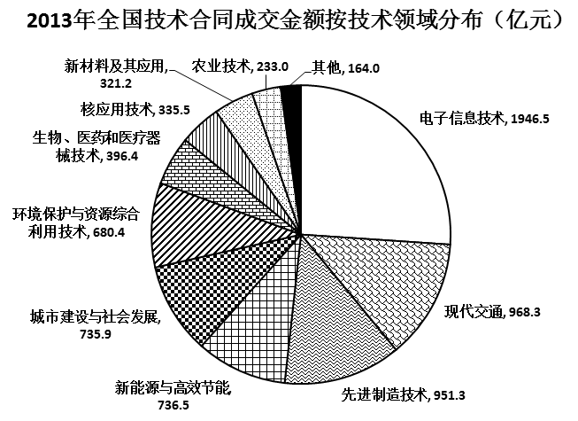 

#### 第 1 题　qid 1758918 · 增长

2005-2013年，全国技术合同成交金额增速超过GDP增速的年份有（  ）个。

- **A**. 3
- **B**. 4
- **C**. 5
- **D**. 6　✅

**答案**：D

**官方解析**

根据题干“······增速超过······增速的年份有几个”，结合图1中技术合同成交金额占GDP的比重的数据，可判定本题为两期比重比较问题。根据两期比重比较的结论，当时，比重上升，即比重高于上年水平。定位图1，2005-2013年中，比重高于前一年的分别有：2006、2007、2010、2011、2012、2013年，共有6年。

故正确答案为D。

---

#### 第 2 题　qid 1758920 · 综合

“十一五”期间（2006-2010年），全国技术合同成交总金额（  ）。

- **A**. 低于1万亿元
- **B**. 在1～1.5万亿元之间　✅
- **C**. 在1.5～2万亿元之间
- **D**. 高于2万亿元

**答案**：B

**官方解析**

定位图1柱状图，“十一五”期间（2006-2010年）成交总额亿元，即1.367万亿元，符合B项范围。

故正确答案为B。

---

#### 第 3 题　qid 1758922 · 综合

2013年新能源与高效节能技术合同成交金额约占当年GDP的（  ）。

- **A**. 

- **B**. 

- **C**. 
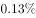
　✅
- **D**. 

**答案**：C

**官方解析**

根据题干“2013年······占······”， 可判定本题为现期比重计算问题。定位图2饼状图，2013年新能源与高效节能技术合同金额为736.5亿元，定位图1，2013年全国技术合同成交金额为7469亿元，占GDP的比重为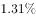，则2013年的GDP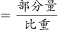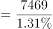，则题目所求。

故正确答案为C。

---

#### 第 4 题　qid 1758924 · 综合

2013年有（  ）个技术领域的技术合同成交金额高于2012年技术合同成交总金额的。

- **A**. 6　✅
- **B**. 4
- **C**. 3
- **D**. 2

**答案**：A

**官方解析**

根据题干“2013年······高于······总金额的的领域有几个”，可判定本题为现期比重计算问题。定位图1柱状图，2012年技术合同成交总金额为6437亿元，则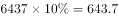亿元。

定位图2饼状图，可得“环境保护与资源综合利用技术、城市建设与社会发展、新能源与高效节能、先进制造技术、现代交通、电子信息技术”共6项的成交金额大于643.7亿元，满足条件。

故正确答案为A。

---

#### 第 5 题　qid 1758926 · 综合

能够从上述资料中推出的是（    ）。

- **A**. 
2005年-2013年，技术合同成交金额同比增量最大的是2013年

- **B**. 
2004年-2013年，技术合同成交金额占GDP比重最高和最低的年份相差4年

- **C**. 
有5个技术领域2013年的技术合同成交金额不足当年电子信息技术合同成交金额的两成

- **D**. 
2013年现代交通技术合同成交金额占当年技术合同成交总金额的比重不到
　✅

**答案**：D

**官方解析**

A项：定位图1柱状图，2013年亿元，2012年增长量亿元，故2013年的增长量不是最大的，错误；

B项：定位图1折线图，占GDP比重最高的年份和最低的年份分别为2013年和2005年，相差8年，错误；

C项：定位图2饼状图，电子信息技术合同成交额为1946.5亿元，其两成为亿元，则成交金额小于389亿元有“其他、农业技术、新材料及其应用、核应用技术”，而“其他”中包含几个技术领域未知，故不能确定2013年技术合同成交金额不足当年电子信息技术合同成交金额的两成的技术领域有5个，错误；

D项：定位图2饼状图，2013年现代交通的成交金额为968.3亿元，定位图1柱状图，2013年技术成交金额为7469亿元，则所求比重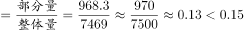，正确。

故正确答案为D。

---

### 材料 2

 

#### 第 6 题　qid 1758928 · 比重

城镇化率是指城镇人口占总人口的比重，2012年我国的城镇化率约为（    ）。

- **A**. 

- **B**. 

- **C**. 

　✅
- **D**. 

**答案**：C

**官方解析**

根据题干“城镇化率是指······占······比重，2012年的城镇化率为······”，可判定本题为现期比重计算问题。定位柱状图1，2012我国城镇人口71182万人，农村人口64222万人，则城镇化率，与C项最接近。

故正确答案为C。

---

#### 第 7 题　qid 1758930 · 平均数

如所有数据均为年末数据，则“十一五”期间（2006-2010年），我国平均每年约新增（    ）人口。

- **A**. 不到500万
- **B**. 500多万
- **C**. 600多万　✅
- **D**. 700万以上

**答案**：C

**官方解析**

根据题干“‘十一五’期间，平均每年新增······人口”，结合选项带单位，可判定为年均增长量计算问题。定位柱状图1，2005年的人口总数为（）万人，2010年的总人口为（）万人，则年均增长量，符合C项取值范围。

故正确答案为C。

---

#### 第 8 题　qid 1758932 · 综合

2011年，我国的城镇化率处于（    ）类国家的水平。

- **A**. 高收入国家
- **B**. 上中等收入国家
- **C**. 中等收入国家　✅
- **D**. 低收入国家

**答案**：C

**官方解析**

根据题干“2011年我国的城镇化率”，可判定本题为现期比重计算问题。定位图1柱状图，2011年我国的城镇化率。定位表2最后一列，与中等收入国家的城镇化率水平最接近。

故正确答案为C。

---

#### 第 9 题　qid 1758934 · 增长

1990-2010年，下列各国中（  ）每万人中城镇人口数量增长最多。

- **A**. 美国
- **B**. 巴西　✅
- **C**. 印度
- **D**. 韩国

**答案**：B

**官方解析**

根据题干“每万人中城镇人口数量增长最多的国家”，结合表格2给出各国的城镇化率，且已知城镇化率为城镇人口在总人口中所占的比重，可判定本题为现期比重问题。每万人中城镇人口数量增长越多的国家，其城镇化率增长就越多。定位表格2,1990-2010年，各国城镇化率的增长幅度如下：

美国：；

巴西：；

印度：；

韩国：。

综上对比可得，巴西的增长最多。

故正确答案为B。

---

#### 第 10 题　qid 1758936 · 综合

根据所给资料，下列表述正确的是（  ）。

- **A**. 
2010年起，我国城镇化率首次超过

- **B**. 
韩国城镇化率增量最高是在上世纪80年代
　✅
- **C**. 
1970-2010年，德国的城镇化率每年均比上一年有所增长

- **D**. 
中等收入国家2010年的城镇化率高于上中等收入国家10年前的水平

**答案**：B

**官方解析**

A项：定位图1柱状图，若城镇化率超过，则城镇人口大于乡村人口，观察发现2010年城镇人口数小于乡村人口数，错误；

B项：定位表格2最后一行，1970-1980年，韩国城镇化率增量；1980-1990年，其城镇化率增量；1990-2000年，其城镇化率增量=；2000-2010年，其城镇化率增量=，故可判断1980-1990年城镇化率增量最大，正确；

C项定位表格2，观察德国的城镇化率变化趋势，可发现2000年城镇化率为低于1990年的城镇化率，错误；

D项：定位表格2，中等收入国家2010年的城镇化率为，上中等收入国家2000年城镇化率为，前者小于后者，错误。

故正确答案为B。

---

### 材料 3

        2013年全国水稻种植面积达4.55亿亩，比上年增加260多万亩。但由于强降雨及洪涝灾害，总产量较上年减少62万吨，总产量为20361万吨。下图反映的是20082012年我国水稻每亩的产值情况及水稻生产的主要成本构成情况。

注：产值合计等于总成本与净利润之和。

#### 第 11 题　qid 1758938 · 增长

2013年我国水稻种植面积比2012年增长约（  ）。

- **A**. 

- **B**. 

　✅
- **C**. 

- **D**. 

**答案**：B

**官方解析**

根据题干“2013年······比2012年增长······”，结合选项为百分数，可判定本题为一般增长率计算问题。定位文字材料第一段，“2013年全国水稻种植面积达4.55亿亩，比上年增加260多万亩”，则所求增长率。 

故正确答案为B。

---

#### 第 12 题　qid 1758940 · 综合

2013年我国水稻的亩产约为（    ）千克。

- **A**. 448　✅
- **B**. 455
- **C**. 433
- **D**. 463

**答案**：A

**官方解析**

根据题干“2013年······亩产为······”，可判定本题为现期平均数问题。定位文字材料第一段，“2013年全国水稻种植面积达4.55亿亩······总产量为20361万吨”，则题目所求亩产量千克，与A项最接近。

故正确答案为A。

---

#### 第 13 题　qid 1758942 · 综合

2012年生产水稻的人工成本占总成本的百分比约为（    ）。

- **A**. 

- **B**. 

　✅
- **C**. 

- **D**. 

**答案**：B

**官方解析**

根据题干“2012年······占······的百分比为”，可判定本题为现期比重问题。定位表格材料倒数第二列，2012年水稻生产人工成本为426.62元/亩，定位柱状图，2012年产值合计为1340.83元/亩，净利润为285.73元/亩，因为产值合计等于总成本与净利润之和，则2012年的元/亩，则占比，与B项最接近。

故正确答案为B。

---

#### 第 14 题　qid 1758944 · 增长

将水稻生产的主要成本按2008-2012年年均增速从高到低排序，下列位次与项目对应正确的是（    ）。

- **A**. 第1：土地
- **B**. 第3：种子
- **C**. 第4：农药
- **D**. 第6：化肥　✅

**答案**：D

**官方解析**

根据题干“2008-2012年年均增速从高到低······”，可判定本题为年均增长率的比较问题。根据年均增长率公式，因年份差n相同，则要想比较r的大小，只需比较的大小即可。定位表格，分别为：种子、化肥、农药、机械作业费、人工成本、土地成本，综上可得，化肥的值最小，即其年均增速最小。

故正确答案为D。

---

#### 第 15 题　qid 1758946 · 综合

关于2008-2012年每亩水稻生产的主要成本，下列说法正确的是（    ）。

- **A**. 
从每亩水稻生产成本构成上看，2011-2012年增幅最大的是机械作业费

- **B**. 
2008-2012年，表中各项成本的变化趋势是相同的

- **C**. 
2012年，表中排名前三项的成本总和未超过总成本的

- **D**. 
每亩水稻的生产成本中，种子成本始终是最小的
　✅

**答案**：D

**官方解析**

A项：定位表格2，根据增长率，则机械作业费增长率，人工成本增长率，后者大于前者，错误；

B项：定位表格2，要想变化趋势相同，则2008-2012年，每项均呈现增长或者减少趋势，观察发现，在2008-2010期间，种子的成本呈递增趋势，而农药成本呈现先递减后递增的趋势，错误；

C项：定位表格2最后一列，2012年表中排名前三项分别为：人工成本、土地成本、机械作业费，成本之和为元/亩，定位柱状图1，2012年产值合计为1340.83元/亩，净利润为285.73元/亩，因为产值合计等于总成本与净利润之和，则2012年的，则排名前三的成本总和占总成本的比重=，大于，错误；

D项：定位表格2，纵向观察表中2008-2012年每一年成本的数据，比较发现种子的成本确实是最小的，正确。

故正确答案为D。

---
