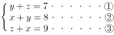
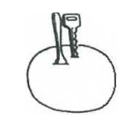
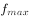
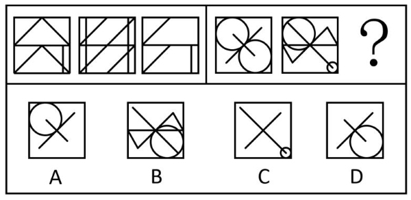
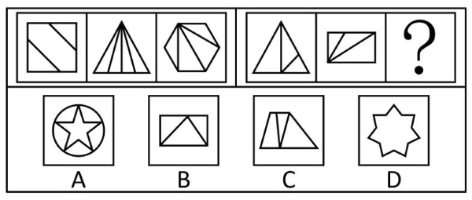
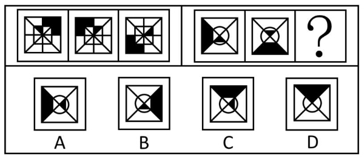
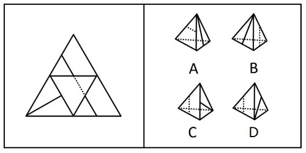
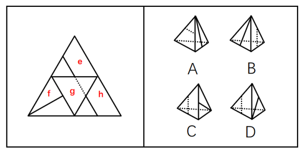
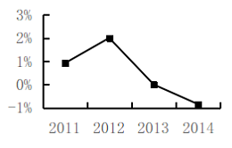
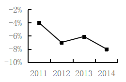

# 2016年上海市行政执法类考试《行测》试题（网友回忆版）

> 省考 · 2016 年 · 6 个模块 · 共 105 题

- [政治理论](#%E6%94%BF%E6%B2%BB%E7%90%86%E8%AE%BA) · 2 题
- [常识判断](#%E5%B8%B8%E8%AF%86%E5%88%A4%E6%96%AD) · 33 题
- [言语理解与表达](#%E8%A8%80%E8%AF%AD%E7%90%86%E8%A7%A3%E4%B8%8E%E8%A1%A8%E8%BE%BE) · 20 题
- [数量关系](#%E6%95%B0%E9%87%8F%E5%85%B3%E7%B3%BB) · 18 题
- [判断推理](#%E5%88%A4%E6%96%AD%E6%8E%A8%E7%90%86) · 30 题
- [资料分析](#%E8%B5%84%E6%96%99%E5%88%86%E6%9E%90) · 2 题

---

## 政治理论

### 第 1 题　qid 5703631 · 新思想

2016年4月，习近平总书记对在全党开展“两学一做”学习教育作出重要指示强调，加强党的建设，首要任务是加强        ，关键是教育管理好党员、干部。

- **A**. 组织建设
- **B**. 作风建设
- **C**. 执政能力建设
- **D**. 思想政治建设　✅

**答案**：D

**官方解析**

本题考查政治常识。
A、B、C三项错误，D项正确，中共中央总书记、国家主席、中央军委主席习近平对在全党开展“两学一做”学习教育作出重要指示强调，“两学一做”学习教育是加强党的思想政治建设的一项重大部署。加强党的建设，首要任务是加强思想政治建设，关键是教育管理好党员、干部。
故正确答案为D。

---

### 第 2 题　qid 5703752 · 新思想

习近平总书记在党的群众路线教育实践活动总结大会上的讲话中，要求广大干部“必须以锲而不舍，弛而不息的决心和毅力，把作风建设不断引向深入”，“锲而不舍”语出《荀子》：“锲而舍之，朽木不折；锲而不舍，金石可镂。”其中“锲”字的意思是（    ）。

- **A**. 切
- **B**. 嵌
- **C**. 刻　✅
- **D**. 钻

**答案**：C

**官方解析**

本题考查人文常识。
C项正确，A、B、D三项错误，“锲而舍之，朽木不折；锲而不舍，金石可镂”的意思是如果刻几下就停下来了，那么腐朽的木头也刻不断。如果不停地刻下去，那么金石也能雕刻成功。其中“锲”是用刀雕刻的意思。
故正确答案为C。

---

## 常识判断

### 材料 1

        中共中央政治局2015年9月11日，审议通过了《生态文明体制改革总体方案》，是生态文明领域改革的顶层设计，方案指出：推进生态文明体制改革首先要树立和落实正确的理念，统一思想，引领行动。要树立尊重自然、顺应自然、保护自然的理念，发展和保护相统一的理念，绿水青山就是金山银山的理念，自然价值和自然资本的理念，空间均衡的理念，山水林田湖是一个生命共同体的理念。推进生态文明体制改革要坚持正确方向，坚持自然资源资产的公有性质，坚持城乡环境治理体系统一，坚持激励和约束并举，坚持主动作为和国际合作相结合，坚持鼓励试点先行和整体协调推进相结合。 

        习近平同志在不同的场合多次指出，要正确处理好经济发展同生态环境保护的关系，牢固树立保护生态环境就是保护生产力、改善生态环境就是发展生产力的理念，更加自觉地推动绿色发展、循环发展、低碳发展，决不以牺牲环境为代价换取一时的经济增长，要牢固树立生态红线的观念。在生态环境保护问题上，就是要不能越雷池一步，否则就应该受到惩罚。小康全面不全面，生态环境质量是关键。要创新发展思路，发挥后发优势。因地制宜选择好发展产业，让绿水青山充分发挥经济社会效益，切实做到经济效益、社会效益、生态效益同步提升，实现百姓富、生态美有机统一。

#### 第 1 题　qid 5703771 · 人文常识

建设生态文明，是关系人民福祉、关乎民族未来的长远大计，是实现中华民族伟大复兴的中国梦的重要内容。生态文明的核心是        。

- **A**. 大力发展低碳经济和循环经济
- **B**. 完善生态文明制度体系
- **C**. 建设资源节约型、环境友好型社会
- **D**. 正确处理人与自然的关系　✅

**答案**：D

**官方解析**

本题考查政治常识。
D项正确，A、B、C三项错误，生态文明的核心问题是正确处理人与自然的关系。人与自然的关系是人类社会最基本的关系。大自然本身是极其富有和慷慨的，但同时又是脆弱和需要平衡的；人口数量的增长和人类生活质量的提高不可阻挡，但人类归根结底也是自然的一部分，人类活动不能超过自然界容许的限度，即不能使大自然出现不可逆转地丧失自我修复的能力，否则必将危及人类自身的生存和发展。生态文明所强调的就是要处理好人与自然的关系，获取有度，既要利用又要保护，促进经济发展、人口、资源、环境的动态平衡，不断提升人与自然和谐相处的文明程度。
故正确答案为D。

---

#### 第 2 题　qid 5703765 · 人文常识

下列关于生态文明建设的说法，正确的有        。

- **A**. 走向生态文明，首先在于解决生态环境领域的突出问题　✅
- **B**. 生态文明不只是一个理论和认识问题，还是一个实践问题　✅
- **C**. 生态文明建设只能在全球同步实施和完成
- **D**. 构建生态文明必须把生态文明理念引向人的社会生活　✅

**答案**：ABD

**官方解析**

本题考查政治常识。
A项正确，走向生态文明新时代，建设美丽中国，是实现中华民族伟大复兴的中国梦的重要内容。党的十八大以来，我国环境治理力度明显加大，环境状况得到改善。但总体上看，长期快速发展中累积的资源环境约束问题日益突出，生态环境保护仍然任重道远。走向生态文明，首先在于解决生态环境领域的突出问题。
B项正确，生态文明是一个理论和认识问题。生态文明是我们党遵循经济社会发展规律和自然规律，主动破解经济发展与资源环境矛盾，推进人与自然和谐，实现中华民族永续发展的重大成果。推进生态文明建设就要坚持“两山论”和绿色发展理念，从根本上处理好经济发展与生态环境保护的关系，努力实现两者协调共赢。与此同时，生态文明又仰赖于实践的推进，是一个实践问题，只有各地区各部门认真贯彻落实党中央、国务院对生态文明和环境保护作出的一系列重大决策部署，加上全社会积极响应行动，生态文明建设才能取得良好成效。
C项错误，习近平主席强调：“建设生态文明关乎人类未来。国际社会应该携手同行，共谋全球生态文明建设之路，牢固树立尊重自然、顺应自然、保护自然的意识，坚持走绿色、低碳、循环、可持续发展之路。在这方面，中国责无旁贷，将继续作出自己的贡献。同时，我们敦促发达国家承担历史性责任，兑现减排承诺，并帮助发展中国家减缓和适应气候变化。”中国扎实推进生态文明建设，能对全球生态文明建设起到显著的推动、促进作用，但并非只能在全球同步实施和完成，中国可以按照自己的步伐坚定不移地走绿色、低碳、循环、可持续发展之路，作出自己的贡献。
D项正确，十八大报告指出，建设生态文明，是关系人民福祉、关乎民族未来的长远大计。面对资源约束趋紧、环境污染严重、生态系统退化的严峻形势，必须树立尊重自然、顺应自然、保护自然的生态文明理念，把生态文明建设放在突出地位，融入经济建设、政治建设、文化建设、社会建设各方面和全过程，努力建设美丽中国，实现中华民族永续发展。
故正确答案为ABD。

---

#### 第 3 题　qid 5703766 · 人文常识

把祖国建设成经济繁荣、环境优美、生态良好的美好家园，既是继续建设美丽中国的根本要求，也是亿万人民的共同愿望，更是每一个公民义不容辞的责任。坚持节约资源和保护环境的基本国策，加强生态文明建设，下列举措具有可行性的有        。

- **A**. 坚持保护优先、自然恢复为主　✅
- **B**. 着力推进绿色发展、循环发展、低碳发展　✅
- **C**. 推进资源利用方式的根本转变，加强全过程节约管理　✅
- **D**. 实现生态环境损害责任终身追究制　✅

**答案**：ABCD

**官方解析**

本题考查政治常识。
A、B两项正确，党的十八大提出：“坚持节约资源和保护环境的基本国策，坚持节约优先、保护优先、自然恢复为主的方针，着力推进绿色发展、循环发展、低碳发展，形成节约资源和保护环境的空间格局、产业结构、生产方式、生活方式，从源头上扭转生态环境恶化趋势，为人民创造良好生产生活环境，为全球生态安全作出贡献。”
C项正确，2013年5月24日，习近平在十八届中央政治局第六次集体学习时的讲话中指出：“形成节约资源和保护环境的空间格局、产业结构、生产方式、生活方式······节约资源是保护生态环境的根本之策。要大力节约集约利用资源，推动资源利用方式根本转变，加强全过程节约管理，大幅降低能源、水、土地消耗强度，大力发展循环经济，促进生产、流通、消费过程的减量化、再利用、资源化。”
D项正确，《党政领导干部生态环境损害责任追究办法（试行）》第四条规定：“党政领导干部生态环境损害责任追究，坚持依法依规、客观公正、科学认定、权责一致、终身追究的原则。”
故正确答案为ABCD。

---

### 材料 2

        H市W住宅小区业委会主任刘某发现家住顶楼的业主邓某在楼顶违法建造房屋，刘某遂督促小区物业管理公司执行W小区业主公约中关于禁止违法搭建的规定，阻止和拆除违法搭建。物业管理公司与邓某进行沟通交涉，邓某认为物业公司没有执法权，无权进行违法建筑拆除，双方发生争执。于是，物业管理公司依法向H市B区有关行政机关举报邓某的行为。B区行政机关对邓某的违法搭建行为查证属实后，通知邓某自行拆除违法建造的房屋，但是邓某对该通知置之不理。B区行政机关遂作出依法拆除邓某违法建造的房屋决定书。

#### 第 4 题　qid 5703845 · 法律常识

H市B区行政机关依法作出的拆除邓某违法建造的房屋的决定书，属于行政行为中的        。

- **A**. 行政处罚
- **B**. 行政强制执行　✅
- **C**. 行政强制措施
- **D**. 行政裁决

**答案**：B

**官方解析**

本题考查法律常识。
A项错误，根据《中华人民共和国行政处罚法》第二条规定：“行政处罚是指行政机关依法对违反行政管理秩序的公民、法人或者其他组织，以减损权益或者增加义务的方式予以惩戒的行为。”第九条规定：“行政处罚的种类：（一）警告、通报批评；（二）罚款、没收违法所得、没收非法财物；（三）暂扣许可证件、降低资质等级、吊销许可证件；（四）限制开展生产经营活动、责令停产停业、责令关闭、限制从业；（五）行政拘留；（六）法律、行政法规规定的其他行政处罚。”题中，H市B区行政机关作出的拆除决定并非是对邓某的违法行为予以惩戒，而是对其违法建筑予以排除妨碍的强制执行决定。
B项正确，根据《中华人民共和国行政强制法》第十二条规定：“行政强制执行的方式：（一）加处罚款或者滞纳金；（二）划拨存款、汇款；（三）拍卖或者依法处理查封、扣押的场所、设施或者财物；（四）排除妨碍、恢复原状；（五）代履行；（六）其他强制执行方式。”第三十七条规定：“经催告，当事人逾期仍不履行行政决定，且无正当理由的，行政机关可以作出强制执行决定······”题中，邓某不自行拆除违法建筑，H市B区行政机关作出的拆除决定属于排除妨碍，是行政强制执行。
C项错误，根据《中华人民共和国行政强制法》第二条第二款规定：“行政强制措施，是指行政机关在行政管理过程中，为制止违法行为、防止证据损毁、避免危害发生、控制危险扩大等情形，依法对公民的人身自由实施暂时性限制，或者对公民、法人或者其他组织的财物实施暂时性控制的行为。”题中，H市B区行政机关作出的拆除决定不是暂时性控制邓某财产，不是行政强制措施。
D项错误，行政裁决是行政机关根据当事人申请，根据法律法规授权，居中对与行政管理活动密切相关的民事纠纷进行裁处的行为。题中，邓某并未向行政机关申请裁决。
故正确答案为B。

---

#### 第 5 题　qid 5703799 · 法律常识

若B区行政机关没有行政强制执行权。对拆除违法建筑物的决定书，如果邓某在法定期限内，既不申请行政复议或者提起行政诉讼，又不拆除的，该行政机关可以        。

- **A**. 委托W小区物业管理公司代履行
- **B**. 委托没有利害关系的第三人代履行
- **C**. 申请人民法院强制执行　✅
- **D**. 申请有强制执行权的行政机关强制执行

**答案**：C

**官方解析**

本题考查法律常识。
A、B、D三项错误，C项正确，根据《中华人民共和国行政强制法》第五十三条规定：“当事人在法定期限内不申请行政复议或者提起行政诉讼，又不履行行政决定的，没有行政强制执行权的行政机关可以自期限届满之日起三个月内，依照本章规定申请人民法院强制执行。”因此如果邓某在法定期限内，既不申请行政复议或者提起行政诉讼，又不拆除的，该行政机关可以申请人民法院强制执行。
故正确答案为C。

---

#### 第 6 题　qid 5703788 · 法律常识

B区行政机关对邓某作出的拆除违法建筑的行政决定书，其依据不可能是        。

- **A**. W小区业主公约　✅
- **B**. H市的地方性法规　✅
- **C**. H市的政府规章　✅
- **D**. 行政法规　✅

**答案**：ABCD

**官方解析**

本题考查法律常识。
A、B、C、D四项错误，根据《中华人民共和国行政强制法》第十三条第一款规定：“行政强制执行由法律设定。”题中，B区行政机关对邓某作出的拆除违法建筑的行政决定书属于行政强制执行决定，W小区业主公约、H市的地方性法规、H市的政府规章和行政法规均不属于法律。
本题为选非题，故正确答案为ABCD。

---

### 材料 3

A市水务局文件

关于印发《A市水务局贯彻落实“A市推进智慧城

市建设2014-2016行动计划”实施方案》的通知

局直属各单位、局机关各处室：

        根据A市建设“智慧城市”三年行动计划的要求，为加强“智能水网”建设的有序推进，构建水务智能化应用体系，现将《A市水务局贯彻落实“A市推进智慧城市建设2014-2016行动计划”实施方案》转发给你们，请遵照执行。

        特此通知

A市水务局办公室（公章）

二〇一四年五月二十六日

#### 第 7 题　qid 5703811 · 人文常识

上面公文的版头部分必须标识的格式内容有（    ）。

- **A**. 份数序号
- **B**. 发文字号　✅
- **C**. 秘密等级
- **D**. 签发人

**答案**：B

**官方解析**

本题考查公文写作与处理。
A项错误，《党政机关公文处理工作条例》中“第三章 公文格式”部分指出：“（一）份号。公文印制份数的顺序号。涉密公文应当标注份号。”上述文件，非涉密公文，可以不标注份号。
B项正确，《党政机关公文处理工作条例》中“第三章 公文格式”部分指出：“（五）发文字号。由发文机关代字、年份、发文顺序号组成。联合行文时，使用主办机关的发文字号。”发文字号属于公文必须要标注的要素。
C项错误，《党政机关公文处理工作条例》中“第三章 公文格式”部分指出：“（二）密级和保密期限。公文的秘密等级和保密的期限。涉密公文应当根据涉密程度分别标注‘绝密’‘机密’‘秘密’和保密期限。”上述文件，非涉密公文，不需要标注秘密等级。
D项错误，《党政机关公文处理工作条例》中“第三章 公文格式”部分指出：“（六）签发人。上行文应当标注签发人姓名。”而通知，适用于发布、传达要求下级机关执行和有关单位周知或者执行的事项，批转、转发公文，不属于上行文，故不需要标注签发人。
故正确答案为B。

---

#### 第 8 题　qid 5703821 · 人文常识

上面公文标题写法存在的问题有（    ）。

- **A**. 缺少发文机关名称
- **B**. 误用书名号
- **C**. 换行不当　✅
- **D**. 文种误用

**答案**：C

**官方解析**

本题考查公文写作与处理。
A项错误，《党政机关公文处理工作条例》第九条规定：（七）标题。由发文机关名称、事由和文种组成。文种作为中心词是唯一一个不可省略的要素。此处缺少发文机关名称并非写法错误。
B项错误，公文标题引用法律法规、书刊报刊以及其他文件时可用书名号进行括注。
C项正确，《党政机关公文格式》规定：标题一般用2号小标宋体字，编排于红色分隔线下空二行位置，分一行或多行居中排布；回行时，要做到词意完整，排列对称，长短适宜，间距恰当，标题排列应当使用梯形或菱形。该公文标题回行时没有做到词意完整，“城市”二字应该在同一行。
D项错误，《党政机关公文处理工作条例》第八条规定：（八）通知。适用于发布、传达要求下级机关执行和有关单位周知或者执行的事项，批转、转发公文。此外，公文在印发时使用的文种也是通知。
故正确答案为C。

---

#### 第 9 题　qid 5703817 · 人文常识

上面公文正文不规范之处是（    ）。

- **A**. 公文目的表述有语病
- **B**. 发文事由表述不够准确　✅
- **C**. 缺少附件说明
- **D**. 缺少具体执行要求

**答案**：B

**官方解析**

本题考查公文写作与处理。
B项正确，A、C、D三项错误，由材料标题可知，《A市水务局贯彻落实“A市推进智慧城市建设2014-2016行动计划”实施方案》是以A市水务局印发通知的方式发布，而公文正文中用词为转发，所以发文事由表述不够准确。
故正确答案为B。

---

#### 第 10 题　qid 5703822 · 人文常识

上面公文主体部分存在的格式问题有（    ）。

- **A**. 主送机关名称中标点符号使用不准确
- **B**. 主送机关和正文之间没空行
- **C**. 发文机关名称有误　✅
- **D**. 成文时间标识有误　✅

**答案**：CD

**官方解析**

本题考查公文写作与处理。
A项正确，《党政机关公文处理工作条例》第九条规定：（八）主送机关。公文的主要受理机关，应当使用机关全称、规范化简称或者同类型机关统称。主送机关排列时，相同系统之间用顿号隔开，不同系统之间用逗号隔开。
B项正确，《党政机关公文格式》规定：公文首页必须显示正文。一般用3号仿宋体字，编排于主送机关名称下一行，每个自然段左空二字，回行顶格。
C项错误，《党政机关公文处理工作条例》第九条规定：（十一）发文机关署名。署发文机关全称或者规范化简称。由材料可知，此公文的发文机关为A市水务局，而不是A市水务局办公室。
D项错误，《党政机关公文格式》规定：成文日期中的数字用阿拉伯数字将年、月、日标全，年份应标全称，月、日不编虚位（即1不编为01）。此公文的成文日期正确的写法应为：2014年5月26日。
本题为选非题，故正确答案为CD。

---

#### 第 11 题　qid 5703603 · 科技常识

《中华人民共和国国民经济和社会发展第十三个五年（2016—2020）规划纲要》指出，“十三五”期间我国坚持社会主义先进文化前进方向，坚持以        为中心的工作导向，坚持把社会效益放在首位、社会效益和经济效益相统一，加快文化改革发展，推动物质文明和精神文明协调发展，建设社会主义文化强国。

- **A**. 效益
- **B**. 人民　✅
- **C**. 发展
- **D**. 创新

**答案**：B

**官方解析**

本题考查政治常识。
A、C、D三项错误，B项正确，《中华人民共和国国民经济和社会发展第十三个五年（2016—2020）规划纲要》“第十六篇 加强社会主义精神文明建设”部分指出，“坚持社会主义先进文化前进方向，坚持以人民为中心的工作导向，坚持把社会效益放在首位、社会效益和经济效益相统一，加快文化改革发展，推动物质文明和精神文明协调发展，建设社会主义文化强国。”
故正确答案为B。

---

#### 第 12 题　qid 5703610 · 法律常识

党的十八届四中全会做出《中共中央关于全面推进依法治国若干重大问题的决定》，其中就加快法治政府建设作出了部署。依法全面履行政府职能是法治政府的基本要求。下列关于政府职能依法履行的说法，正确的是        。

- **A**. 行政机关可以法外设定权力
- **B**. 法定职责必须为、法无授权不可为　✅
- **C**. 有规章依据可以作出减损公民、法人和其他组织合法权益的决定　✅
- **D**. 推行政府权力清单制度，坚决消除权力设租寻租空间　✅

**答案**：BCD

**官方解析**

本题考查政治常识。
A项错误，B、C、D三项正确，《中共中央关于全面推进依法治国若干重大问题的决定》中的“三、深入推进依法行政，加快建设法治政府”部分指出：“（一）依法全面履行政府职能。完善行政组织和行政程序法律制度，推进机构、职能、权限、程序、责任法定化。行政机关要坚持法定职责必须为、法无授权不可为，勇于负责、敢于担当，坚决纠正不作为、乱作为，坚决克服懒政、怠政，坚决惩处失职、渎职。行政机关不得法外设定权力，没有法律法规依据不得作出减损公民、法人和其他组织合法权益或者增加其义务的决定。推行政府权力清单制度，坚决消除权力设租寻租空间。推进各级政府事权规范化、法律化，完善不同层级政府特别是中央和地方政府事权法律制度，强化中央政府宏观管理、制度设定职责和必要的执法权，强化省级政府统筹推进区域内基本公共服务均等化职责，强化市县政府执行职责。”
故正确答案为BCD。

---

#### 第 13 题　qid 5703627 · 人文常识

为理顺城管执法体制，S市出台《关于进一步完善本市区县城市管理综合执法体制机制的实施意见》。Z区城管执法局是S市首家单独设立的区城管执法局，不再隶属区绿化与市容管理局，它被明确为执法主体，实现综合执法部门与管理部门的适度分离；主要的执法力量则下沉到街镇，赋予街镇更大的执法管理权。下列选项中，关于这一执法体制改革表述正确的是        。

- **A**. 有利于减少层次，整合队伍，提高效率，合理配置执法力量　✅
- **B**. 有助于解决管理交叉、职责不清等问题　✅
- **C**. 明确了区城管执法局为执法主体，意味着城管执法大队没有执法权
- **D**. 因街道是派出机构，不是一级人民政府，因此不能享有执法管理权

**答案**：AB

**官方解析**

本题考查法律常识。
A项正确，Z区城管执法局是S市首家单独设立的区城管执法局，不再隶属区绿化与市容管理局，减少隶属关系实质上就是有利于减少层次，整合队伍，提高效率，合理配置执法力量。
B项正确，Z区城管执法局不再隶属区绿化与市容管理局，被明确为执法主体，有助于解决职责不清的问题，实现综合执法部门与管理部门的适度分离，有助于解决管理交叉的问题。
C项错误，明确了区城管执法局为执法主体，并不意味着城管执法大队没有执法权，执法大队作为内设机构只是没有权力以自己的名义进行执法，需以区城管执法局为主体行使执法权。
D项错误，根据《中华人民共和国地方各级人民代表大会和地方各级人民政府组织法》第八十五条第三款规定：“市辖区、不设区的市的人民政府，经上一级人民政府批准，可以设立若干街道办事处，作为它的派出机关。”第八十六条规定：“街道办事处在本辖区内办理派出它的人民政府交办的公共服务、公共管理、公共安全等工作，依法履行综合管理、统筹协调、应急处置和行政执法等职责，反映居民的意见和要求。”因此，街道办事处是派出机关，不是派出机构，享有执法管理权。
故正确答案为AB。

---

#### 第 14 题　qid 5703630 · 人文常识

我国约720万公务员，60%分布在县以下机关工作，条件更为艰苦，工作任务十分繁重。但是由于县以下机关机构规格比较低，所以基层公务员晋升难、待遇低的矛盾比较突出。为了解决这个问题，政府提出建立        。

- **A**. 公务员职级制度
- **B**. 公务员职务与职级并行制度　✅
- **C**. 公务员职务制度
- **D**. 公务员考录与聘任并行制度

**答案**：B

**官方解析**

本题考查法律常识。
B项正确，A、C、D三项错误，我们国家720多万公务员，60%分布在县以下机关工作，条件更为艰苦，工作任务十分繁重。但是由于县以下机关机构规格比较低，所以基层公务员晋升难、待遇低的矛盾比较突出。为了解决这个问题，提出建立公务员职务与职级并行制度。经过中央批准，2014年在4个省选择了4个县进行了试点工作，经过一年的试点达到了预期目的，验证了公务员职务与职级并行制度的可操作性。经过中央批准，在2015年全国县以下机关都要实行公务员职务与职级并行的制度。
故正确答案为B。

---

#### 第 15 题　qid 5703621 · 人文常识

众创空间是顺应网络时代创新创业特点和需求，通过市场化机制、专业化服务和资本化途径构建的低成本、便利化、全要素、开放式的新型创业服务平台的统称。发展众创空间要充分发挥社会力量的作用，为创业者提供良好的（    ）。

- **A**. 工作空间　✅
- **B**. 网络空间　✅
- **C**. 社交空间　✅
- **D**. 资源共享空间　✅

**答案**：ABCD

**官方解析**

本题考查政治常识。
A、B、C、D四项正确，2015年3月11日国务院办公厅发布的《关于发展众创空间推进大众创新创业的指导意见》中“二、重点任务”部分指出：“（一）加快构建众创空间。总结推广创客空间、创业咖啡、创新工场等新型孵化模式，充分利用国家自主创新示范区、国家高新技术产业开发区、科技企业孵化器、小企业创业基地、大学科技园和高校、科研院所的有利条件，发挥行业领军企业、创业投资机构、社会组织等社会力量的主力军作用，构建一批低成本、便利化、全要素、开放式的众创空间。发挥政策集成和协同效应，实现创新与创业相结合、线上与线下相结合、孵化与投资相结合，为广大创新创业者提供良好的工作空间、网络空间、社交空间和资源共享空间。”
故正确答案为ABCD。

---

#### 第 16 题　qid 5703624 · 人文常识

《中国制造2025》是我国实施制造强国战略第一个十年的行动纲领。当前，全球制造业发展格局和我国经济发展环境发生重大变化，必须紧紧抓住当前难得的战略机遇，突出创新驱动，优化政策环境，发挥制度优势，实现        。

- **A**. 中国生产向中国设计转变
- **B**. 中国制造向中国创造转变　✅
- **C**. 中国速度向中国质量转变　✅
- **D**. 中国产品向中国品牌转变　✅

**答案**：BCD

**官方解析**

本题考查政治常识。
B、C、D三项正确，A项错误，制造业是国民经济的主体，是科技创新的主战场，是立国之本、兴国之器、强国之基。当前，全球制造业发展格局和我国经济发展环境发生重大变化，必须紧紧抓住当前难得的战略机遇，突出创新驱动，优化政策环境，发挥制度优势，实现中国制造向中国创造转变，中国速度向中国质量转变，中国产品向中国品牌转变。
故正确答案为BCD。

---

#### 第 17 题　qid 5703634 · 科技常识

电子商务是指在互联网开放的网络环境下，买卖双方在任何可联接网络的地点间进行各种商务活动。电子商务绕不开三个环节：信息流、资金流，物流。我国电子商务可以        。

- **A**. 借助以现代科学技术为基础的数据来打通消费者和企业之间的信息流　✅
- **B**. 通过提高市场主体的经营管理水平来打通消费者和企业之间的信息流　✅
- **C**. 通过提高政府的社会服务管理水平来打通消费者和企业之间的信息流
- **D**. 通过提高劳动者的素质来打通消费者和企业之间的信息流　✅

**答案**：ABD

**官方解析**

本题考查经济常识。
信息流：既包括商品信息的提供、促销营销、技术支持、售后服务等内容，也包括诸如询价单、报价单、付款通知单、转帐通知单等商业贸易单证，还包括交易方的支付能力、支付信誉、中介信誉等。
A项正确，中国电子商务可以借助以现代科学技术为基础的数据来打通消费者和企业之间的信息流。科学技术是人类智力活动的产物。当今世界，科学技术可以促进生产过程的自动化、信息化，大幅度提高劳动生产率。因此，运用现代科技，尤其是电子信息手段建立经营决策支持系统和数据仓储系统的开发和运用，实现工业、商业之间，即行业内数据共享，可以建立全行业的电子商务系统。
B项正确，中国电子商务可以通过提高市场主体的经营管理水平打通消费者和企业之间的信息流。市场主体在竞争激烈和复杂多变的市场上做到眼光敏锐、判断准确、善抓机遇、果断决策，且在企业内部进行科学合理的管理，对空前广泛的信息加以整合，通过渗透、融合和创新改造企业商务流程，完善生产或销售的运作。
C项错误，在现代社会生产中，劳动、土地、资本等要素的作用不会自动发挥出来，必须要有另一种生产要素对它们进行组织、联结、整合，才可能发挥它们的合力作用，这种对其他要素起组织、联结、整合作用的要素，就是经营管理。企业家的经营管理水平如何，直接关系到企业的生存和发展，还会影响社会生产的总体水平和质量。因此，中国电子商务可以通过提高企业的服务管理水平来打通消费者和企业之间的信息流。
D项正确，中国电子商务可以通过提高劳动者的素质打通消费者和企业之间的信息流。劳动者的劳动是社会生产赖以进行的最基本、最活跃的要素。劳动者的素质，直接关系到社会财富创造的数量和质量。电子商务不是简单业务工作信息化，也不是网上贸易，而是作为现代服务业中的重要产业，对劳动力自身素质和技术含量提出了更高的要求。
故正确答案为ABD。

---

#### 第 18 题　qid 5703632 · 法律常识

按照我国宪法和法律的相关规定，我国执法主体主要是国家行政机关及其公职人员。下列选项中，不是我国执法主体的是（    ）。

- **A**. 浙江省人民政府
- **B**. 国务院下属的工商行政管理总局
- **C**. 法律法规授权而具有管理社会公共事务职能的西安市残疾人联合会
- **D**. 上海市建筑工程有限公司　✅

**答案**：D

**官方解析**

本题考查法律常识。
A项正确，人民政府是国家权力机关的执行机关，是国家的行政机关。因此，浙江省人民政府属于一级行政机关，属于执法主体。
B项正确，中华人民共和国国家工商行政管理总局，简称国家工商总局，是依照法律、法规进行市场监督管理和有关行政执法工作的国务院直属机构。因此，国务院下属的工商行政管理总局是国家行政机关，属于执法主体。
C项正确，行政主体是行政管理法律关系的一方当事人，是指能以自己名义行使国家行政职权，作出影响行政相对人权利义务的行政行为，并能对外承担行政法律责任，在行政诉讼中能作为被告应诉的行政机关或法律、法规授权的组织。因此，西安市残疾人联合会经过法律法规授权而具有管理社会公共事务的职能，属于执法主体。
D项错误，根据《中华人民共和国民法典》第五十七条规定：“法人是具有民事权利能力和民事行为能力，依法独立享有民事权利和承担民事义务的组织。”第七十六条规定：“以取得利润并分配给股东等出资人为目的成立的法人，为营利法人。营利法人包括有限责任公司、股份有限公司和其他企业法人等。”因此，上海市建筑工程有限公司不享有行政管理权力，属于民事主体，而非执法主体。
本题为选非题，故正确答案为D。

---

#### 第 19 题　qid 5703647 · 法律常识

下列事项未经授权可以制定行政法规的是（    ）。

- **A**. 基层群众自治制度
- **B**. 数额特别大的罚款　✅
- **C**. 限制人身自由的强制措施
- **D**. 税收基本制度

**答案**：B

**官方解析**

本题考查法律常识。
A、D两项错误，根据《中华人民共和国立法法》第十一条第三项和第六项规定：“下列事项只能制定法律：（三）民族区域自治制度、特别行政区制度、基层群众自治制度；（六）税种的设立、税率的确定和税收征收管理等税收基本制度。”第十二条规定：“本法第十一条规定的事项尚未制定法律的，全国人民代表大会及其常务委员会有权作出决定，授权国务院可以根据实际需要，对其中的部分事项先制定行政法规，但是有关犯罪和刑罚、对公民政治权利的剥夺和限制人身自由的强制措施和处罚、司法制度等事项除外。”因此，基层群众自治制度和税收基本制度属于法律的相对保留事项，必须经过全国人民代表大会及其常务委员会授权后，国务院才可以对其中的部分事项先制定行政法规。
B项正确，根据《中华人民共和国行政处罚法》第十一条第一款规定：“行政法规可以设定除限制人身自由以外的行政处罚。”因此，行政法规可以设定数额特别大的罚款。
C项错误，根据《中华人民共和国立法法》第十一条第五项规定：“下列事项只能制定法律：（五）对公民政治权利的剥夺、限制人身自由的强制措施和处罚。”第十二条规定：“本法第十一条规定的事项尚未制定法律的，全国人民代表大会及其常务委员会有权作出决定，授权国务院可以根据实际需要，对其中的部分事项先制定行政法规，但是有关犯罪和刑罚、对公民政治权利的剥夺和限制人身自由的强制措施和处罚、司法制度等事项除外。”因此，限制人身自由的强制措施属于法律绝对保留事项，任何情况下，都不得制定行政法规。
故正确答案为B。

---

#### 第 20 题　qid 5703639 · 法律常识

按照我国现行法律的规定，下列人员中，不一定属于公务员的是（    ）。

- **A**. 人民法院的法官
- **B**. 人民检察院的检察官
- **C**. 人大代表　✅
- **D**. 市委书记

**答案**：C

**官方解析**

本题考查法律常识。
A项正确，根据《公务员范围规定》第十条第一项规定：“各级审判机关中列入公务员范围的人员：（一）最高人民法院和地方各级人民法院的法官、审判辅助人员。”
B项正确，根据《公务员范围规定》第十一条第一项规定：“各级检察机关中列入公务员范围的人员：（一）最高人民检察院和地方各级人民检察院的检察官、检察辅助人员。”
C项错误，根据《公务员范围规定》第六条规定：“各级人民代表大会及其常务委员会机关中列入公务员范围的人员：（一）县级以上各级人民代表大会常务委员会领导人员，乡、镇人民代表大会主席、副主席；（二）县级以上各级人民代表大会常务委员会工作机构和办事机构的工作人员；（三）县级以上各级人民代表大会专门委员会办事机构的工作人员。”由此说明，人大代表不一定属于公务员。
D项正确，根据《公务员范围规定》第五条第一项规定：“中国共产党各级机关中列入公务员范围的人员：（一）中央和地方各级党委、纪律检查委员会的领导人员。”市委书记属于地方各级党委的领导人员，属于公务员。
本题为选非题，故正确答案为C。

---

#### 第 21 题　qid 5703641 · 人文常识

下列选项中，（    ）不属于主动公开政府信息的方式。

- **A**. 政府公报
- **B**. 政府网站
- **C**. 内部文件　✅
- **D**. 报刊

**答案**：C

**官方解析**

本题考查法律常识。
A、B、D三项正确，C项错误，根据《中华人民共和国政府信息公开条例》第二十三条规定：“行政机关应当建立健全政府信息发布机制，将主动公开的政府信息通过政府公报、政府网站或者其他互联网政务媒体、新闻发布会以及报刊、广播、电视等途径予以公开。”因此，内部文件并不属于行政机关主动公开政府信息的方式。
本题为选非题，故正确答案为C。

---

#### 第 22 题　qid 5703663 · 法律常识

行政处罚由（    ）的县级以上地方人民政府具有行政处罚权的行政机关管理，法律、行政法规另有规定的从其规定。

- **A**. 违法行为发生地　✅
- **B**. 行政处罚相对人住所地
- **C**. 违法结果发生地
- **D**. 行政处罚相对人经常居住地

**答案**：A

**官方解析**

本题考查法律常识。
B、C、D三项错误，A项正确，根据《中华人民共和国行政处罚法》第二十二条规定：“行政处罚由违法行为发生地的行政机关管辖。法律、行政法规、部门规章另有规定的，从其规定。”因此，行政处罚应由违法行为发生地的县级以上地方人民政府具有行政处罚权的行政机关管理。
故正确答案为A。

---

#### 第 23 题　qid 5703662 · 法律常识

我区文化局为了整顿辖区内的文化营业场所而发布文件，对文化营业场所征收精神文明建设费。某歌舞厅陈老板因被征收费用而表示不满，陈老板可以（    ）。

- **A**. 针对该项文件直接提起复议
- **B**. 直接对征收费用的具体行政行为提起行政复议　✅
- **C**. 在申请复议时要求审查该项文件　✅
- **D**. 在对该项征收费用提起的行政诉讼中，要求法院审查该文件的合法性　✅

**答案**：BCD

**官方解析**

本题考查法律常识。
A项错误，C项正确，根据《中华人民共和国行政复议法》第十三条规定：“公民、法人或者其他组织认为行政机关的行政行为所依据的下列规范性文件不合法，在对行政行为申请行政复议时，可以一并向行政复议机关提出对该规范性文件的附带审查申请：（一）国务院部门的规范性文件；（二）县级以上地方各级人民政府及其工作部门的规范性文件；（三）乡、镇人民政府的规范性文件；（四）法律、法规、规章授权的组织的规范性文件。前款所列规范性文件不含规章。规章的审查依照法律、行政法规办理。”由此说明，不得针对该项文件直接提起复议，但可以在申请复议时要求审查该项文件。
B项正确，根据《中华人民共和国行政复议法》第十一条第十项规定：“有下列情形之一的，公民、法人或者其他组织可以依照本法申请行政复议：（十）认为行政机关违法集资、摊派费用或者违法要求履行其他义务；”因此，陈老板可以直接对征收费用的具体行政行为提起行政复议。
D项正确，根据《中华人民共和国行政诉讼法》第十二条第一款第五项规定：“人民法院受理公民、法人或者其他组织提起的下列诉讼：（五）对征收、征用决定及其补偿决定不服的。”第六条规定：“人民法院审理行政案件，对行政行为是否合法进行审查。”又根据第五十三条第一款规定：“公民、法人或者其他组织认为行政行为所依据的国务院部门和地方人民政府及其部门制定的规范性文件不合法，在对行政行为提起诉讼时，可以一并请求对该规范性文件进行审查。”题干中，该项征收费用属于行政诉讼受案范围，陈老板可以对该项征收费用提起行政诉讼。同时该文件属于规范性文件，陈老板可以要求人民法院在审理行政案件时对该文件进行合法性审查。
故正确答案为BCD。

---

#### 第 24 题　qid 5703694 · 法律常识

下列选项中，        不属于人民法院合法性审查的范围。

- **A**. 具体行政行为的合法性
- **B**. 抽象行政行为的合法性　✅
- **C**. 规章的合法性　✅
- **D**. 行政处罚行为是否显失公正

**答案**：BC

**官方解析**

本题考查法律常识。
A项正确，具体行政行为，是指行政机关行使行政权力，对特定的公民、法人和其他组织作出的有关其权利义务的单方行为。根据《中华人民共和国行政诉讼法》第六条规定：“人民法院审理行政案件，对行政行为是否合法进行审查。”该法第十二条规定了行政诉讼的受案范围均是具体行政行为侵犯相对人合法权益。因此，具体行政行为的合法性属于人民法院合法性审查的范围。
B、C两项错误，抽象行政行为，是“具体行政行为”的对称，指行政机关在进行行政管理中，针对不特定的人和事制定普遍适用的规范性文件的活动。根据《中华人民共和国行政诉讼法》第五十三条规定：“公民、法人或者其他组织认为行政行为所依据的国务院部门和地方人民政府及其部门制定的规范性文件不合法，在对行政行为提起诉讼时，可以一并请求对该规范性文件进行审查。前款规定的规范性文件不含规章。”C项中，法院不得审查规章的合法性。（注：本题B项不严谨。根据上述法条规定，对于部分抽象行政行为的合法性，法院有权附带性审查，但不是所有抽象行政行为法院都有权进行合法性审查，故粉笔认为B项错误。）
D项正确，根据《中华人民共和国行政诉讼法》第十二条第一款第一项规定：“人民法院受理公民、法人或者其他组织提起的下列诉讼：（一）对行政拘留、暂扣或者吊销许可证和执照、责令停产停业、没收违法所得、没收非法财物、罚款、警告等行政处罚不服的。”《中华人民共和国行政处罚法》第五条第一款规定：“行政处罚遵循公正、公开的原则。”因此，行政处罚行为是否显失公正涉及到该行为是否违反《中华人民共和国行政处罚法》，属于人民法院合法性审查的范围。
本题为选非题，故正确答案为BC。

---

#### 第 25 题　qid 5703704 · 人文常识

公共政策系统中居于核心地位的是（    ）。

- **A**. 政策制定系统　✅
- **B**. 政策执行系统
- **C**. 政策支持系统
- **D**. 政策反馈系统

**答案**：A

**官方解析**

本题考查管理常识。
A项正确，政策制定系统居于整个政策系统的核心地位，因此也称“决策中枢系统”，由拥有法定决策权的高层组织或个人组成，一般包括国家的立法机关、行政机关、司法机关以及某些政治领袖人物。其任务是生产高质量的政策。
B项错误，政策执行系统是将政策内容转化为政策效果的系统，一般由政策执行组织及其人员，特别是行政机关和政府公务人员组成，其任务是确保政策目标的实现。
C项错误，政策支持系统分为信息系统、政策咨询系统、政策监控系统、政策评估系统。其中信息系统是政策系统的“神经”系统，政策咨询系统为“外脑”系统等，以保证政策的严谨性和科学性。
D项错误，政策反馈系统是将政策的主体系统与客体系统、政策系统与政策环境连接起来的一个特殊子系统。公共政策的对象或客体是发生于政策系统的环境中社会问题；而公共政策作为相关社会问题的解决方案在实施过程中以及结束之后对对象系统必然有某种改变或反应，并通过一定的机制和渠道将这些信息传递给政策的直接主体系统。
故正确答案为A。

---

#### 第 26 题　qid 5703713 · 人文常识

审查、批准省级人民政府预算决算案的权力机关是（    ）。

- **A**. 省级人民代表大会　✅
- **B**. 中央人民政府
- **C**. 省级人民代表大会常务委员会
- **D**. 全国人民代表大会常务委员会

**答案**：A

**官方解析**

本题考查法律常识。
A项正确，B、C、D三项错误，根据《中华人民共和国预算法》第二十一条第一款规定：“县级以上地方各级人民代表大会审查本级总预算草案及本级总预算执行情况的报告；批准本级预算和本级预算执行情况的报告；改变或者撤销本级人民代表大会常务委员会关于预算、决算的不适当的决议；撤销本级政府关于预算、决算的不适当的决定和命令。”
故正确答案为A。

---

#### 第 27 题　qid 5703717 · 人文常识

在经过问卷调査、访谈调查搜集到足够的资料后，需经过（    ）才能进入研究阶段。

- **A**. 审核、整理资料　✅
- **B**. 对资料进行统计分析　✅
- **C**. 对资料展开理论研究
- **D**. 明确研究目的、人员

**答案**：AB

**官方解析**

本题考查管理常识。
社会调查法是有目的、有计划、有系统地搜集有关研究对象社会现实状况或历史状况材料的方法，综合运用历史研究法、观察研究法等方法以及谈话、问卷、个案研究、测验或实验等科学方式，对有关社会现象进行有计划的、周密的、系统的了解，并对调查搜集到的大量资料进行分析、综合、比较、归纳，借以发现存在的社会问题，探索有关规律的研究方法。
调查程序分为以下几个阶段：（一）选题阶段；（二）准备阶段（准备调查内容、工具和对象等）；（三）调查阶段（收集资料，实施调查）；（四）分析阶段（对资料进行审核、整理、统计、分析）；（五）总结阶段（形成调查报告）。
A、B两项正确，在调查阶段之后，需要对资料进行审核、整理、统计、分析，即进入分析阶段。
C项错误，“对资料展开理论研究”一般在总结阶段进行。
D项错误，“明确研究目的、人员”一般在准备阶段进行。
故正确答案为AB。

---

#### 第 28 题　qid 5703760 · 人文常识

政府权力运行中的行政手段是指各级政府机关凭借上下级之间的指挥与服从关系，采取从上而下层层下达指令及由下而上层层上报、请示的方法来实现政府管理目标的一种手段。行政手段具有        特点。

- **A**. 强制性　✅
- **B**. 平等性
- **C**. 指令性
- **D**. 垂直性　✅

**答案**：AD

**官方解析**

本题考查管理常识。
A、D两项正确，B、C两项错误，行政手段具有权威性、强制性、垂直性、具体性、非经济利益性和封闭性的特点。其中强制性是指行政强制要求人们在行动目标上必须服从统一的意志，上级发出的命令、指示、决定等，下级必须坚决服从和执行。垂直性是指行政指示、命令是按行政组织系统的层级纵向直线传达的，强调上下级的垂直隶属关系，而横向结构之间一般无约束力。
故正确答案为AD。

---

#### 第 29 题　qid 5703723 · 法律常识

宪法是国家的根本法，是治国安邦的总章程，是党和人民意志的集中体现；要以设立国家宪法日为契机，大力弘扬宪法精神，切实增强宪法意识。2014年11月1日，十二届全国人大常委会第十一次会议作出决定，将12月4日设定为国家宪法日，12月4日是        获得通过的日子。

- **A**. 1954年宪法
- **B**. 1975年宪法
- **C**. 1978年宪法
- **D**. 1982年宪法　✅

**答案**：D

**官方解析**

本题考查法律常识。
A、B、C三项错误，D项正确，1982年12月4日第五届全国人民代表大会第五次会议通过了现行《中华人民共和国宪法》。2014年11月1日，十二届全国人大常委会第十一次会议作出决定，将12月4日设定为国家宪法日。
故正确答案为D。

---

#### 第 30 题　qid 5703761 · 人文常识

下列关于天气和气象的说法中，错误的是        。

- **A**. 沙尘暴的起因不仅与土地荒漠化有关，也与大气环流有关
- **B**. 赤道东太平洋每隔几年出现一次强烈降温并扩展到整个中东太平洋的现象叫厄尔尼诺现象　✅
- **C**. “拉尼娜”是厄尔尼诺现象的反相，又称“反厄尔尼诺”
- **D**. 冰雹是由强对流天气引起的一种气象灾害，主要发生在秋冬之交　✅

**答案**：BD

**官方解析**

本题考查地理国情。
A项正确，沙尘暴的形成需要这三个条件：一是地面上的沙尘物质。它是形成沙尘暴的物质基础。二是大风。这是沙尘暴形成的动力基础，也是沙尘暴能够长距离输送的动力保证。三是不稳定的空气状态。这是重要的局地热力条件。沙尘暴多发生于午后傍晚说明了局地热力条件的重要性。因此沙尘暴的形成与土地荒漠化和大气环流都有关。
B项错误，C项正确，厄尔尼诺暖流，是太平洋一种反常的自然现象，其显著特征是赤道太平洋东部和中部海域海水出现显著增温。“拉尼娜”现象指赤道太平洋东部和中部海表温度大范围持续异常变冷的现象，也称为“反厄尔尼诺”现象。
D项错误，冰雹灾害是由强对流天气系统引起的一种剧烈的气象灾害，它出现的范围虽然较小，时间也比较短促，但来势猛、强度大，并常常伴随着狂风、强降水、急剧降温等阵发性灾害性天气过程。一般而言，我国的降雹多发生在春、夏、秋3季，夏季或春夏之交最为常见。
本题为选非题，故正确答案为BD。

---

#### 第 31 题　qid 5703747 · 科技常识

2015年下半年，比亚迪获得由联合国颁发的“能源特别奖”，成为全球唯一获奖的新能源汽车企业。这是联合国成立70周年以来首个针对新能源行业的奖项。下列关于电动汽车的说法，正确的是        。

- **A**. 与传统汽车相比，电动汽车行驶时污染较小　✅
- **B**. 电动汽车可以分为混合动力型、纯电动型和燃料电池型　✅
- **C**. 电动汽车车身重量比传统汽车轻
- **D**. 电池的能量密度是电动汽车发展的关键技术问题　✅

**答案**：ABD

**官方解析**

本题考查科技常识。
A项正确，电动汽车无内燃机汽车工作时产生的废气，不产生排气污染，对环境保护和空气的洁净是十分有益的，几乎是“零污染”。因此，与传统汽车相比，电动汽车行驶时污染较小。
B项正确，电动汽车的种类分为纯电动汽车（BEV）、混合动力汽车（HEV）、燃料电池汽车（FCEV）。纯电动汽车是由电动机驱动的汽车；混合动力汽车是指能够至少从下述两类车载储存的能量中获得动力的汽车：可消耗的燃料或可再充电能/能量储存装置；燃料电池汽车是以燃料电池作为动力电源的汽车。
C项错误，与传统汽车不同，电动汽车虽然没有发动机、变速箱等比较重的总成，但其携带的电池组在整车质量中占了很大的比重，电动汽车因为电池的缘故，相比于传统燃油汽车自重更大 。
D项正确，能量密度是指在单位一定的空间或质量物质中储存能量的大小。电池的能量密度也就是电池平均单位体积或质量所释放出的电能。提高电池的能量密度、延长电池寿命、缩短充电时间以及降低电池成本都是电动汽车发展的关键技术问题。
故正确答案为ABD。

---

#### 第 32 题　qid 5703739 · 科技常识

电子标签又称射频标签，其核心技术是非接触式的自动识别技术。作为数据载体，电子标签已被广泛应用于工业自动化、商业自动化等众多领域，其主要作用是        。

- **A**. 标识识别　✅
- **B**. 物品跟踪
- **C**. 信息采集
- **D**. 网络存储

**答案**：A

**官方解析**

本题考查科技常识。
A项正确，B、C、D三项错误，电子标签是RFID技术的载体，RFID是Radio Frequency Identification的缩写，术语为射频识别。RFID射频识别是一种非接触式的自动识别技术，它通过射频信号自动识别目标对象并获取相关数据，识别工作无须人工干预，可工作于各种恶劣环境。电子标签作为数据载体，能起到标识识别、物品跟踪、信息采集的作用，但是最主要的是标识识别。
故正确答案为A。

---

#### 第 33 题　qid 5703753 · 人文常识

历史文化名城是指保存文物特别丰富，具有重大历史文化价值和革命意义的城市，既有历史古都型，例如北京；又有特殊职能型，例如瓷都景德镇。下列国家历史文化名城中，属于特殊职能型的是（    ）。

- **A**. 平遥
- **B**. 开封
- **C**. 丽江
- **D**. 自贡　✅

**答案**：D

**官方解析**

本题考查人文常识。
国家历史文化名城按照特点主要分为七类：历史古都型、传统风貌型、一般史迹型、风景名胜型、地域特色型、近代史迹型、特殊职能型。其中特殊职能型指某种职能在历史上占有极突出的地位的城市。
A项错误，平遥古城位于山西省中部，是中国境内保存最为完整的一座古代县城，1986年平遥古城被国务院公布为国家级历史文化名城。平遥古城属于传统风貌型历史文化名城。
B项错误，开封市是首批国家历史文化名城，已有4100余年的建城史，先后有夏朝，战国时期的魏国，五代时期的后梁、后晋、后汉、后周，宋朝，金朝等在此定都，有“八朝古都”之称。开封属于历史古都型历史文化名城。
C项错误，丽江为第二批被批准的中国历史文化名城之一，是中国以整座古城申报世界文化遗产获得成功的两座古城之一。丽江古城体现了中国古代城市建设的成就，是中国民居中具有鲜明特色和风格的类型之一。丽江属于传统风貌型历史文化名城。
D项正确，自贡市，位于四川盆地南部，别称千年盐都、南国灯城，1986年被国务院公布为国家级历史文化名城。自贡市“因盐设市”，“自”“贡”两个字是由“自流井”和“贡井”两个盐井名字合称而来。自贡属于特殊职能型历史文化名城。
故正确答案为D。

---

## 言语理解与表达

### 材料 1

阅读下面的文章，回答18—20题。

        我想，任何一个真实的文明人都会自觉不自觉地在心理上过着多种年龄相重叠的生活，没有这种重叠，生命就会失去弹性，很容易风干和脆折。但是，<u>不同的年龄经常会在心头打架，有时还会把自己弄得挺苦恼。</u>例如连续几个月埋首于砖块般的典籍中之后，从小就习惯于在山路上奔跑的双脚便会默默地反抗，随之而来，满心满眼满耳都会突涌起向长天大地释放自己的渴念。我知道，这是不同于案头年龄的另一种年龄在捣乱了。助长这种捣乱的外部诱惑也很多，你看眼前就有一个现成的例子，纽约大学的著名教授Richard Schechner比我大二十来岁，却冒险般地游历了我国西南许多少数民族地区，回到上海仍毫无倦色，逛城隍庙时竟像顽童一样在人群中骑车而双手脱把、引吭高歌！那天他送给我一部奇怪的新著，是他与还在读小学的小儿子合著的，父子俩以南极洲的企鹅为话题，痴痴地编着一个又一个不着边际的童话。我把这本书插在他那厚厚一叠名扬国际的学术著作中间，端详良久，不能不开始嘲笑自己。

        即便是在翻阅中国古代线装本的时候，也会发现我们前辈不少人远比我们想象的洒脱和放达，苏东坡曾把这种劲头称之为“老夫聊发少年狂”。你看他左手牵猎狗，右手托苍鹰，一任欢快的马蹄纵情奔驰。<u>其实他是同时在享受着老年、中年和少年，把日子过得颠</u><u><u>颠</u></u><u>倒倒又有滋有味。</u>

        我们这些人，为什么稍稍做点学问就变得如此单调窘迫了呢？如果每宗学问的弘扬都要以生命的枯萎为代价，那么世间学问的最终目的又是为了什么呢？如果辉煌的知识文明总是给人们带来如此沉重的身心负担，那么再过千百年，人类不就要被自己创造的精神成果压得喘不过气来？如果精神和体魄总是矛盾，深邃和青春总是无缘，学识和游戏总是对立，那么何时才能问津人类自古至今一直苦苦企盼的自身健全？

#### 第 1 题　qid 5701827 · 片段阅读

根据文意，第一自然段划线部分中的“不同的年龄”，指的是        。

- **A**. 不同人的不同生理年龄
- **B**. 不同人的不同心理年龄
- **C**. 同一人的不同生理年龄
- **D**. 同一人的不同心理年龄　✅

**答案**：D

**官方解析**

词句理解题，定位横线位置，划线部分位于第一自然段中间，需结合上下文理解“不同的年龄”的含义。根据第一自然段开头“在心理上过着多种年龄相重叠的生活”可知，作者论述的是人在心理上有多种年龄，且在划线部分之后，作者举了自己和纽约大学教授的例子，论述了同一个人会受到不同年龄心理的驱使做一些不符合自己年龄的事。故横线处的“不同的年龄”指的是同一个人的不同心理年龄，对应D项。
A项“不同人的不同生理年龄”、B项“不同人的不同心理年龄”、C项“同一人的不同生理年龄”均与文意不符，排除。
故正确答案为D。
【文段出处】余秋雨《文化苦旅》

---

#### 第 2 题　qid 5701850 · 片段阅读

根据文意，第二自然段划线部分的内容意指苏东坡实际正处于        。

- **A**. 少年　✅
- **B**. 青年
- **C**. 中年
- **D**. 老年

**答案**：A

**官方解析**

横线位于第二段结尾，需结合前文进行分析，第二段开头引出苏东坡的诗句“老夫聊发少年狂”，意为我姑且抒发一下少年人的狂傲之气，后文称其左手牵着黄狗，右手托着苍鹰，任马纵情奔驰，展示了苏东坡的少年状态，故横线处体现苏东坡展现的少年之气，对应A项。
B、C、D三项，均不符合文段意指的苏东坡所处的状态，排除。
故正确答案为A。
【文段出处】《文化苦旅》

---

#### 第 3 题　qid 5701868 · 片段阅读

原文第三自然段的主要意思是        。

- **A**. 做学问容易使人贫穷
- **B**. 做学问容易使人变老
- **C**. 做学问应当永葆青春
- **D**. 做学问不应过于沉重　✅

**答案**：D

**官方解析**

文段通过四个反问句，从反面分别论述了做学问可能会使人变得单调窘迫、使生命变得枯萎、使身心遭受负担、被自己创造的精神成果压的喘不过气等不好的影响，即四个反问句都是在对做学问给予我们的消极表现进行反对，故文段重点强调不能让做学问带给我们这么多负面的感受，即不应过于沉重，对应D项。
A、B、C三项，“贫穷”“变老”“青春”均仅对应四个反问句中的一部分，表述片面，排除。
故正确答案为D。
【文段出处】书籍《文化苦旅》

---

#### 第 4 题　qid 5701811 · 逻辑填空

成熟不是看你的年龄有多大，而是看你能担起多大的责任。敢于        ，才能赢得别人的尊重与关怀，赢得别人的认同与信赖。

- **A**. 担当　✅
- **B**. 认错
- **C**. 斗争
- **D**. 决断

**答案**：A

**官方解析**

根据“而是看你能担起多大的责任”可知，横线处所填词语应体现担起责任之意，A项“担当”指承担，担负任务、责任等，符合文意，当选。
B项“认错”指承认错误，C项“斗争”指矛盾双方的冲突、争斗，D项“决断”指做决定或拿主意，三项均无法体现担起责任之意，与文意不符，排除。
故正确答案为A。
【文段出处】鄄城县第一中学校园网《第7周 国旗下的讲话（西校）》

---

#### 第 5 题　qid 5701804 · 逻辑填空

行政审批制度还是有不尽如人意之处，必须以            的锐气继续全面推进改革，这已成为两会代表委员的共识。

- **A**. 直捣黄龙
- **B**. 锲而不舍
- **C**. 分而治之
- **D**. 革故鼎新　✅

**答案**：D

**官方解析**

横线处搭配“锐气”，根据文意可知，横线处形容“推进改革”的状态，表达以旺盛的气势推进改革之意，D项“革故鼎新”指去掉旧的，建立新的，符合文意，当选。
A项“直捣黄龙”指捣毁敌人的巢穴，杀敌取胜，B项“锲而不舍”比喻有恒心、有毅力，C项“分而治之”指分别治理，均不强调推进改革，与文意不符，排除。
故正确答案为D。

---

#### 第 6 题　qid 5701800 · 逻辑填空

我们时刻都在失去，失去时间，失去生命，失去财富，失去机会；我们努力地想去拥有更多的精彩，可惜只有两只手，所以必须学会        ，学会        。

- **A**. 选择 放弃　✅
- **B**. 努力 奋斗
- **C**. 随缘 惜缘
- **D**. 辨识 博弈

**答案**：A

**官方解析**

根据横线前“我们努力地想去拥有更多的精彩，可惜只有两只手”可知，横线处所填的两个词语应表达人只有两只手，不可能拥有所有，必须要学会抉择与舍弃之意。A项“选择”指挑选，“放弃”指丢掉，符合文意，当选。B项“努力”指把力量尽量使出来，“奋斗”指为了达到一定目的而努力干，C项“随缘”指顺应机缘，任其自然，“惜缘”指珍惜得来的每一份天赐的缘分，D项“辨识”指辨认，识别，“博弈”比喻为谋取利益而竞争，均与文意不符，排除。
故正确答案为A。
【文段出处】《只有学会放弃，才能更好地持有》

---

#### 第 7 题　qid 5701805 · 逻辑填空

任何一部有关丝绸之路的书，都不会遗落吐鲁番。因其重要的        位置，吐鲁番盆地堪称西域的门户、丝绸之路上的        明珠。历史上还曾是车师王国、高昌郡、高昌王国、唐西州和西州回鹘的所在地。

- **A**. 枢纽 辉煌
- **B**. 枢纽 璀璨　✅
- **C**. 通衢 辉煌
- **D**. 通衢 璀璨

**答案**：B

**官方解析**

第一空，搭配“位置”，根据“重要的”可知，横线处词语应表示吐鲁番的地理位置意义重大，A、B两项“枢纽”指重要的部分，事物相互联系的中心环节，也指重要的地点或事物关键之处，符合文意，均保留。C、D两项“通衢”指为四通八达、宽敞平坦的道路，与“位置”搭配不当，均排除。
第二空，搭配“明珠”，B项“璀璨”形容珠玉等光彩鲜明，与“明珠”搭配恰当，当选。A项“辉煌”指光辉灿烂的、杰出的，多与“历史”“文化”搭配，与“明珠”搭配不当，排除。
故正确答案为B。
【文段出处】中国社会科学报《天山南北“三城记”——考察高昌王国故城》

---

#### 第 8 题　qid 5701829 · 逻辑填空

真正懂管理的人，        事必躬亲，        管理好离自己最近的人，再通过他们去管理其他人。习惯埋头于琐碎小事中的人，其敬业精神        可嘉，        这并不是一个优秀的管理者。管好离自己最近的人，才是精明管理之道。

- **A**. 不是 而是 固然 但　✅
- **B**. 不是 就是 即使 也
- **C**. 无非 然后 虽然 但
- **D**. 即使 也要 不但 而

**答案**：A

**官方解析**

第一、二空，根据“习惯埋头于琐碎小事中的人······这并不是一个优秀的管理者。管好离自己最近的人，才是精明管理之道”可知，“真正懂管理的人”不应该是“事必躬亲”的，应该是能“管理好离自己最近的人”的，故横线处填入的关联词应否定第一种情况，而肯定第二种情况。A项“不是······而是······”符合文意，保留。B项“不是······就是······”表示任选两种情况的其中一种，没有对“事必躬亲”进行否定，与文意不符，排除；C项 “无非······然后······”搭配不当，排除；D项“即使······也要······”表示让步关系，与文意不符，排除。
第三、四空，代入验证。根据“其敬业精神······可嘉，······这并不是一个优秀的管理者”可知，前后语义相反，横线处应填入能体现相反关系的关联词。A项“固然······但······”表示转折关系，符合文意，当选。
故正确答案为A。
【文段出处】光明网《乱谈管理（管理精髓——听、说、思、行）》

---

#### 第 9 题　qid 5701814 · 片段阅读

下面语句表达上有错误的是        。

- **A**. 三年来，我对你的关心无微不至，对你的爱罄竹难书。　✅
- **B**. 在一些地方，酒已变成人际交往的润滑剂。
- **C**. 48岁的陈某因慢性肾炎和类风湿病，常年求医问药。
- **D**. 未来数月内全国或将有超过20个知名景区门票涨价。

**答案**：A

**官方解析**

本题为病句辨析题。
A项，“三年来，我对你的关心无微不至，对你的爱罄竹难书”存在搭配不当的错误，“罄竹难书”形容事实（多指罪恶）很多，难以说完，与“爱”搭配不当，存在语病，当选。
B、C、D三项，均表意明确，没有语病，排除。
故正确答案为A。

---

#### 第 10 题　qid 5701819 · 片段阅读

下面语句有歧义的是        。

- **A**. 旁边有家小卖部
- **B**. 马路一边站一个人　✅
- **C**. 学校里面挤满了学生
- **D**. 公园两边都是梧桐树

**答案**：B

**官方解析**

B项，“马路一边站一个人”表意不明，存在歧义。第一种理解，“马路的其中一边站着一个人”；第二种理解，“马路的两边各站着一个人”，当选。A、C、D三项均无歧义，表意明确，排除。
故正确答案为B。

---

#### 第 11 题　qid 5701826 · 逻辑填空

下列句子按照语气由强到弱的顺序，正确的排列是        。
①马上去吃饭！
②很晚了，该去吃饭了。
③你再不去吃饭，今天就别吃饭了！
④都这么晚了，还不去吃饭？

- **A**. ③①②④
- **B**. ①③④②
- **C**. ③①④②　✅
- **D**. ①③②④

**答案**：C

**官方解析**

本题考查语气强弱。根据选项提示，先比较①③两句的语气强弱。两句均以感叹号结尾，①句为直接命令的表述，③句在①句的基础上增加了不吃饭的严重后果，比较之下，③句语气更强，排除B、D两项。
对比A、C两项，比较②④两句的语气强弱。②句为客观陈述句，语气较弱，④句以问号结尾，语气较强，故②句为语气最弱的句子，排除A项。
故正确答案为C。

---

#### 第 12 题　qid 5701833 · 片段阅读

下列标语表示表述不恰当的是        。

- **A**. 热烈庆祝住院病人突破4万人次。　✅
- **B**. 选择绿色生活，共创美好未来。
- **C**. 打击非法证券活动，保护公众合法利益。
- **D**. 抓住机遇，珍惜时光，奋力拼搏，誓夺高分。

**答案**：A

**官方解析**

A项，住院病人突破4万人次不是件值得庆贺的事情，表述不恰当，当选；
B、C、D三项标语均表述恰当，排除。
故正确答案为A。
【文段出处】中国经济网《广东一医院挂条幅祝贺住院病人超4万人次》嘉峪关文明网《大众社区开展“选择绿色生活 共创美好未来”活动》中国财经《加强防范助您远离非法证券活动》

---

#### 第 13 题　qid 5701809 · 逻辑填空

农谚“八成熟，十成收；十成熟，二成丢”说的虽然是收割庄稼的时机。但也告诫我们要            。

- **A**. 精耕细作
- **B**. 未雨绸缪　✅
- **C**. 精益求精
- **D**. 令行即止

**答案**：B

**官方解析**

“八成熟，十成收；十成熟，二成丢”的意思是当农作物八成熟的时候就开始收割，就能获得十成粮食；当农作物十成熟时才开始收割，就会损失两成的粮食。这句农谚告诫我们要提前准备，提前的准备会让我们获得更好的回报。B项“未雨绸缪”比喻事先做好准备，符合文意，当选。
A项“精耕细作”指细致地耕作，C项“精益求精”指（学术、技术、作品、产品等）好了还求更好，D项“令行即止”形容严格执行法令，均与前文的农谚内容无关，体现不出要提前准备的意思，排除。
故正确答案为B。

---

#### 第 14 题　qid 5701810 · 片段阅读

他们急于成长，然后又哀叹失去的童年；他们以健康换取金钱，不久后又想用金钱恢复健康。他们对未来忧心不己，却又无视现在的幸福。因此，他们既不活在当下，也不活在未来。他们活着，仿佛从来不会死亡；临死前，又仿佛他们从未活过。
上面语段中的“他们”存在的主要问题是        。

- **A**. 患得患失　✅
- **B**. 斤斤计较
- **C**. 目光短浅
- **D**. 浮躁焦虑

**答案**：A

**官方解析**

文段开篇介绍他们在成长与童年、健康与金钱、未来与现在之间摇摆不定，接着通过“因此”总结前文，指出他们既不活在当下，也不活在未来，尾句通过他们“活着”和“临死前”两种状态进行解释说明。A项“患得患失”指没得到时，担心得不到，得到后又担心失去，可体现“他们”存在摇摆不定的问题，当选。
B项“斤斤计较”、C项“目光短浅”、D项“焦虑”文段均未体现，无中生有，排除。
故正确答案为A。
【文段出处】《八个段子胜过你一年读的书》

---

#### 第 15 题　qid 5701816 · 片段阅读

离职了，但因此能完成向往已久的旅行；分手了，但因此整个人充满了力量。别人眼中的失败，可以是你自己认定的成功。反正成功有很多样子：会煮面，会劝架，会踢球······都是某种成功。
下面语段的主要意思是        。

- **A**. 人生根本没有成败之分
- **B**. 大众对成败的定义有问题
- **C**. 失败是成功之母
- **D**. 要为自己设立成败的标准　✅

**答案**：D

**官方解析**

文段开篇通过转折词“但”指出，看似失败的离职、分手均可让人从中有所收获，随后强调每个人认定的成功并不相同，成功是可以由自己定义的。后文通过举例具体说明成功可以有很多样子。故文段为分总分结构，重点强调成功是可以由自己定义的，对应D项。
A项，“没有成败之分”表述错误，文段强调成功是可以由自己定义的，并非强调人生根本没有成败之分，排除；
B项，文段并未对大众定义的成败作出评判，无中生有，排除；
C项，文段并未提及“失败”与“成功”的关系，无中生有，排除。
故正确答案为D。
【文段出处】《语文迷》

---

#### 第 16 题　qid 5701808 · 片段阅读

中华民族具有极高的智商，不同的抽样调查均显示出这一结果。国别和民族的智商差异，归结为大脑容量（重量）的差异。有人测量过，东亚人大脑容量比白人多1个立方英寸，而白人比黑人多5个立方英寸，但智商极高的爱因斯坦的脑容量并无过人之处，显然这一论断有点可疑。
文中“这一论断”是指        。

- **A**. 中华民族具有极高的智商
- **B**. 国别和民族的智商差异，归结为大脑容量（重量）的差异　✅
- **C**. 东亚人大脑容量比白人多1个立方英寸
- **D**. 白人大脑容量比黑人多5个立方英寸

**答案**：B

**官方解析**

本题为代词指代题，“这一论断”位于文段尾句，可结合前文理解代词含义。文段开篇引出“智商”的话题，接着指出国别和民族智商差异的原因是大脑容量（重量）的差异，随后通过对比“东亚人”和“白人”、“白人”和“黑人”的大脑容量来解释说明，尾句通过转折词“但”强调爱因斯坦的脑容量并无过人之处，故“这一论断”指代的内容即“国别和民族的智商差异，归结为大脑容量（重量）的差异”，对应B项。
A项，“中华民族具有极高的智商”对应文段引出话题的内容，并非指代的对象，排除；
C项“东亚人大脑容量”、D项“白人大脑容量”均对应文段举例论证的内容，是对“这一论断”的具体举例论证，而非指代论断本身，排除。
故正确答案为B。
【文段出处】《思维之变：撬动世界的力量——钱旭红院士在文汇科技沙龙上的演讲》

---

#### 第 17 题　qid 5701834 · 片段阅读

一只鼬鼠要与一只狮子决战，狮子果断地拒绝了。鼬鼠说：“你害怕了吗？”狮子说“如果答应你，你就可以得到曾与狮子比武的殊荣；而我呢，以后所有的动物都会耻笑我竟和鼬鼠打架。”
这个寓言不能说明的道理是        。

- **A**. 不要为取得胜利而被别人利用　✅
- **B**. 不要做注定无益的事情
- **C**. 不要把精力浪费在无聊的事情上
- **D**. 不要和弱者争夺利益

**答案**：A

**官方解析**

文段主要讲述了鼬鼠想与狮子决战但被狮子拒绝的故事，众所周知，鼬鼠与狮子的实力相差悬殊，二者对决最后赢的一定是狮子，所以在狮子眼里，与鼬鼠决战是一件毫无悬念，且对自己有害无利的无聊事情，故B、C、D三项所述道理都能从这则寓言故事中得出，排除；而鼬鼠并没有想利用狮子，所以A项所述道理不能从这则寓言故事中得出，当选。
本题为选非题，故正确答案为A。
【文段出处】寓言故事

---

#### 第 18 题　qid 5701858 · 片段阅读

科幻作为一种文学类型，还具有除了娱乐之外的其他功能，作者通过它不仅可以表达他们对未来的预期，还可以表达他们对当下的关注，而且比起科学家，科幻作家也许能更好地理解技术的改变会对人们生活产生怎样的影响。
上句话认为科幻文学具有        功能。

- **A**. 娱乐、表达对未来的预期、表达对当下的关注　✅
- **B**. 表达对未来的预期、表达对当下的关注
- **C**. 娱乐、表达对未来的预期、表达对当下的关注、理解技术改变对人们生活的影响
- **D**. 表达对未来的预期、表达对当下的关注、理解技术改变对人们生活的影响

**答案**：A

**官方解析**

根据“科幻作为一种文学类型，还具有除了娱乐之外的其他功能，作者通过它不仅可以表达他们对未来的预期，还可以表达他们对当下的关注”可知，科幻文学具有娱乐、表达对未来的预期、表达对当下的关注的功能，对应A项。
B项，缺少科幻文学的“娱乐”功能，排除；
C、D两项，“理解技术改变对人们生活的影响”是科幻作家的能力，而非科幻文学的功能，均排除。
故正确答案为A。
【文段出处】《&lt;自然&gt;究竟是一本什么杂志》

---

#### 第 19 题　qid 5701821 · 逻辑填空

昨天外面下了一场雨，这让我想起下面的诗句：“总有些这样的时候，正是为了爱，才悄悄躲开，躲开的是身影，躲不开的，却是那份默默的情怀······”这写得多好啊，我一边读诗，一边吃冷面，结果醋都没放就吃完了。
上句话的风格是        。

- **A**. 优雅的
- **B**. 讽刺的
- **C**. 抒情的　✅
- **D**. 庄重的

**答案**：C

**官方解析**

根据文段的诗句以及“这写得多好啊······结果醋都没放就吃完了”可知，文段体现出作者欣赏诗句的美而沉浸其中，故文段的风格为“抒情的”，即抒发自己的感情，对应C项。
A项“优雅的”指和谐、自然、高雅，D项“庄重的”指（言语、举止）不随便，不轻浮，均与文段语境不符，排除；
B项“讽刺的”指用比喻、夸张等手法对人或事进行揭露、批评，文段并无揭露、批评之意，排除。
故正确答案为C。

---

#### 第 20 题　qid 5701815 · 片段阅读

“黄金的八十年代”，思想开放，艺术活跃，改革开放使整个社会无比振奋。1980年，中国的影院观众达到了293亿人次，直到1992年以前，影院观众一直维持在百亿人次以上，电影市场空前繁荣。《大众电影》杂志创造了每期965万册的世界最高杂志发行纪录，在平均票价只有几角至1元的时期，当时影片票房过亿的就有《少林寺》（1982）1.4亿，《芙蓉镇》（1986）1亿，《周恩来》（1992）2.3亿，等等。那真是个人人进影院，整个社会看电影、评电影的“大影院时代”，对比今天的300亿票房，两万块银幕，却只有8亿“平均年龄21岁的狭窄观众”人次的“小影院时代”，着实让人感慨。
这段文字没有使用到的说明手法是        。

- **A**. 举例子
- **B**. 列数字
- **C**. 作比较
- **D**. 打比方　✅

**答案**：D

**官方解析**

根据“《大众电影》杂志创造了每期965万册的世界最高杂志发行纪录······《周恩来》（1992）2.3亿，等等”可知，该段文字使用了“举例子”和“列数字”两种说明手法，排除A、B两项；
根据“那真是个人人进影院，整个社会看电影，评电影的‘大影院时代’，对比今年的300亿票房······着实让人感慨”可知，该段文字使用了“作比较”的说明手法，排除C项。
D项“打比方”，该段文字并未使用此说明手法，当选。
本题为选非题，故正确答案为D。
【文段出处】《初探柏林》

---

## 数量关系

### 材料 1

        2012年，测绘地理信息系统完成测绘服务总值74.92亿元，同比增长15.6%。测绘地理信息系统人均测绘服务总值（人均测绘服务总值）达到292509元，增长17.4%。

#### 第 1 题　qid 5703433 · 数学运算

2012年测绘服务总值约是2006年的        倍。

- **A**. 2.2
- **B**. 2.4
- **C**. 2.7　✅
- **D**. 3.3

**答案**：C

**官方解析**

根据题干“2012年······约是2006年的······倍”，可判定本题为现期倍数问题。定位统计图1可得：2012年测绘服务总值为74.92亿元；2007年测绘服务总值为30.93亿元，同比增长11.0%。根据公式：基期量，则2006年测绘服务总值亿元。2012年测绘服务总值是2006年的倍。

故正确答案为C。

---

#### 第 2 题　qid 5703437 · 数学运算

2008-2012年间有        年测绘地理信息系统人均测绘服务总值增速超过20%。

- **A**. 1　✅
- **B**. 2
- **C**. 3
- **D**. 4

**答案**：A

**官方解析**

根据题干“2008-2012年间有_____年······增速超过20%”，可判定本题为一般增长率问题。定位统计图2可得2007-2012年测绘地理信息系统人均测绘服务总值。根据公式：增长率，则2008-2012年间其同比增速分别为：

2008年：；

2009年：；

2010年：；

2011年：；

2012年：。

综上，2008-2012年间测绘地理信息系统人均测绘服务总值增速超过20%的年份只有2009年。

故正确答案为A。

---

#### 第 3 题　qid 5703441 · 数学运算

2010年测绘地理信息系统约有        万名人员。

- **A**. 2.0
- **B**. 2.2
- **C**. 2.4　✅
- **D**. 2.6

**答案**：C

**官方解析**

根据题干“2010年测绘地理信息系统约有<u>        </u>万名人员”，结合材料给出测绘服务总值和人均测绘服务总值，可判定本题为现期平均数问题。定位统计图1可得：2010年测绘服务总值为50.74亿元。定位统计图2可得：2010年测绘地理信息系统人均测绘服务总值为21.15万元。由于测绘人员数，则2010年测绘地理信息系统有万名人员。

故正确答案为C。

---

#### 第 4 题　qid 5703446 · 数学运算

下列关于2007-2012年间测绘地理信息系统测绘服务状况的描述，与资料相符的是        。

- **A**. 2012年测绘地理信息系统人数多于2011年水平
- **B**. 2007-2012年间测绘地理信息系统人均服务总值翻了一番　✅
- **C**. 2007-2012年间有3年的测绘服务总值同比增速低于上年水平
- **D**. 2007-2012年间测绘服务总值和人均服务总值增量最大的年份是同一年

**答案**：B

**官方解析**

A项：定位统计图1可得，2012年测绘服务总值为74.92亿元，2011年为64.79亿元。定位统计图2可得，2012年测绘地理信息系统人均测绘服务总值为29.25万元，2011年为24.92万元。由于人数，2012年测绘地理信息系统人数为万人，2011年为万人，即2012年测绘地理信息系统人数少于2011年，错误；

B项：定位统计图2可得，2012年测绘地理信息系统人均测绘服务总值为29.25万元，2007年为13.14万元。，故2007-2012年间测绘地理信息系统人均服务总值翻了一番，正确；

C项：定位统计图1可得，2007-2012年间，其中仅2010年的同比增速（12.6%）＜2009年的同比增速（22.6%），以及2012年的同比增速（15.6%）＜2011年的同比增速（27.7%）。即2007-2012年间测绘服务总值同比增速低于上年水平的年份只有2010年、2012年，共2个，错误；

D项：定位统计图1可得，2007-2012年间测绘服务总值增量最大的年份是2011年（64.79-50.74=14.05亿元）。定位统计图2可得，2011年人均测绘服务总值的增量为24.92-21.15=3.77万元，小于2012年的增量29.25-24.92=4.33万元，说明2007-2012年间测绘服务总值和人均服务总值增量最大的年份不是同一年，错误。

故正确答案为B。

---

### 材料 2

#### 第 5 题　qid 5703485 · 数学运算

2011-2014年间，浙江省常住人口数量增加最多的年份是        。

- **A**. 2011年
- **B**. 2012年
- **C**. 2013年　✅
- **D**. 2014年

**答案**：C

**官方解析**

根据题干“2011-2014年间，······增加最多的年份是”，可判定本题为增长量比较问题。定位统计表1可得：2010-2014年，浙江省常住人口数量。根据公式：增长量=现期量-基期量，可得2011-2014年，浙江省常住人口数量增长量分别为：
2011年：5463.0-5446.5=16.5万人；
2012年：5477.0-5463.0=14万人；
2013年：5498.0-5477.0=21万人；
2014年：5508.0-5498.0=10万人。
则2011-2014年间，浙江省常住人口数量增加最多的年份是2013年。
故正确答案为C。

---

#### 第 6 题　qid 5703516 · 数学运算

如2010年浙江省25-50岁年龄段高学历人口的比重与该省劳动年龄段高学历人口比重相当，则当年该省约有        万25-50岁的高学历人口。

- **A**. 136
- **B**. 194
- **C**. 297　✅
- **D**. 495

**答案**：C

**官方解析**

根据题干“如······的比重与······比重相当······”，可判定本题为现期比重问题。定位统计表1可得：2010年，浙江省25-50岁年龄段劳动年龄人口数为2495.4万人。定位统计表2可得：2010年，浙江省劳动年龄段高学历人口比重为11.9%。由于高学历人口比重相当，根据公式：部分=整体×比重，可得：当年该省25-50岁的高学历人口为万，与C项最接近。

故正确答案为C。

---

#### 第 7 题　qid 5703521 · 数学运算

表中2010年高学历人口占比最低的省份，其劳动年龄人口约占全国总量的        。

- **A**. 2%以下
- **B**. 2%到5%之间
- **C**. 5%到10%之间　✅
- **D**. 10%以上

**答案**：C

**官方解析**

根据题干“表中······占比最低的省份，其······占······”，可判定本题为现期比重问题。定位统计表2可得，表中2010年高学历人口占比最低的省份为广东（11.1%），其劳动年龄人口为7795.6万人。根据公式：比重，可知表中2010年高学历人口占比最低的省份，其劳动年龄人口约占全国总量97453.6万人的比重为，在C项范围内。

故正确答案为C。

---

#### 第 8 题　qid 5703528 · 数学运算

能够从上述资料中推出的是        。

- **A**. 2014年浙江省常住人口中，劳动年龄人口超过总数的七成　✅
- **B**. 2011-2014年，浙江省16-24岁人口减少量逐年增加
- **C**. 2011-2014年，浙江省劳动年龄人口同比上升和下降的年份都是2个
- **D**. 表2中所列省市的2010年高学历人口占全国高学历人口总数的一半以上

**答案**：A

**官方解析**

A项：定位统计表1可得：2014年浙江省常住人口为5508.0万人，劳动年龄人口为4152.4万人。根据公式：比重，可知2014年浙江省常住人口中，劳动年龄人口的比重为，即超过七成，正确；

B项：定位统计表1可得：2010-2014年，浙江省16-24岁人口分别为794.1万人、761.0万人、704.9万人、658.8万人、606.0万人。根据公式：增长量=现期量-基期量，可得：2011年，浙江省16-24岁人口减少量为794.1-761.0=33.1万人；2012年为761.0-704.9=56.1万人；2013年为704.9-658.8=46.1万人，对比可知2013年浙江省16-24岁人口减少量低于2012年，并非逐年增加，错误；

C项：定位统计表1可得：2010-2014年浙江省劳动年龄人口分别为4155.5万人、4169.4万人、4167.7万人、4160.8万人、4152.4万人。可知同比上升的年份有1个（2011年），同比下降的年份有3个（2012年、2013年、2014年），错误；

D项：定位统计表2可得：2010年全国及部分省市高学历人口数据。根据公式：比重，可知表2中所列省市的2010年高学历人口占全国高学历人口总数的比重为，错误。

故正确答案为A。

---

#### 第 9 题　qid 5703369 · 数学运算

张先生每天乘坐公共交通上班，有2条路线供他选择。路线1是先坐公交再换乘地铁，路线2是直接乘坐公交，路线2比路线1需要多用5分钟。如果他上班时选择了路线1，回家时选择了路线2，共花费了35分钟，则路线2需要的时间是        分钟。

- **A**. 10
- **B**. 15
- **C**. 20　✅
- **D**. 25

**答案**：C

**官方解析**

设路线1需要x分钟，则路线2需要（x+5）分钟。根据题意可列方程：x+（x+5）=35，解得x=15。因此，路线2需要的时间是15+5=20分钟。
故正确答案为C。

---

#### 第 10 题　qid 5703375 · 数学运算

某款皮鞋和某款钱包在两个商城甲和乙的原价均相同，皮鞋的单价是360元，且皮鞋的单价比钱包单价的4倍少8元。假如甲商城以8折优惠进行所有商品促销，而乙商城则是单件商品每满100元可立减30元，则最低能以        元钱购买这两种商品。

- **A**. 361.6
- **B**. 343.6　✅
- **C**. 362
- **D**. 380

**答案**：B

**官方解析**

设钱包的单价为x元。根据“皮鞋的单价比钱包单价的4倍少8元”，可列方程：4x-8=360，解得x=92，即钱包的单价为92元。则促销时这两种商品在两个商城的价格如下表所示：

观察发现，在乙商城购买皮鞋，甲商城购买钱包花费最少。即最低能以270+73.6=343.6元钱购买这两种商品。

故正确答案为B。

---

#### 第 11 题　qid 5703382 · 数学运算

某楼盘开盘均价为每平方米28000元，小李准备购买一套面积为91.5平方米的房子。开发商为了进行促销提供了两种选购的方案。一是直接按9.9折的价格购买。二是不打折，但赠送一个可供使用15年的停车位。假设该楼盘停车位费用为每月150元（停车费对小李来说是一项必须开支），则        方案更为优惠。

- **A**. 第一种
- **B**. 第二种　✅
- **C**. 两种一样
- **D**. 无法判断

**答案**：B

**官方解析**

方法一：若按照方案一，前15年的总费用为：28000×91.5×0.99+150×12×15=2563380元；若按照方案二，前15年的总费用为：28000×91.5=2562000元。比较可知，方案二总费用更少，即第二种方案更为优惠。
方法二：方案一和方案二相比较，省了1%的购房费用28000×91.5×0.01=25620元，但需多花费15年的停车费用150×12×15=27000元。即方案一比方案二多花费27000-25620=1380元。因此，第二种方案更为优惠。
故正确答案为B。

---

#### 第 12 题　qid 5703384 · 数学运算

在某地主办的足球比赛初赛中，共有10支队伍参加。如果每支队伍都必须和其他各支队伍比赛两次。则一共需要举行        场比赛。

- **A**. 45
- **B**. 60
- **C**. 75
- **D**. 90　✅

**答案**：D

**官方解析**

由于每支队伍都必须和其他各支队伍比赛两次，则一共需要举行场比赛。

故正确答案为D。

---

#### 第 13 题　qid 5703389 · 数学运算

某植物园计划开辟一片形状为直角三角形的玫瑰花圃。己知该花圃的两条直角边的长度分别为80米和60米。现考虑将花圃入口设在最长边上的某处，在直角顶点处还设置了一个喷泉，则从花圃入口到达喷泉可能的最短路线为        米。

- **A**. 48　✅
- **B**. 50
- **C**. 56
- **D**. 64

**答案**：A

**官方解析**

直角三角形的玫瑰花圃如下图所示：

B点为直角顶点，根据勾股定理可得：米。若想使从花圃入口到达喷泉的路线最短，则花圃入口和喷泉的连线需垂直于直角三角形的斜边，即作，垂足为O，则O点为花圃入口，OB为从花圃入口到达喷泉的最短路线。根据三角形面积公式：，可得，解得OB=48米。

故正确答案为A。

---

#### 第 14 题　qid 5703391 · 数学运算

小李和小张一起参加综艺对抗赛。要轮流从一个装有6个完全一样的球的袋中摸出一个球，这些球上分别标有数字1、2、3、4、5、6。两人各有10次机会。每次摸到球后重新放入袋中，如果小李摸到的是偶数球可以计1分，如果小张摸到的球上数字加1后大于5可以计1分。下列关于小李和小张获胜的概率的说法正确的是        。

- **A**. 小李获胜概率较高　✅
- **B**. 小张获胜概率较高
- **C**. 两者获胜概率一样高
- **D**. 两者获胜概率无法比较

**答案**：A

**官方解析**

由于“每次摸到球后重新放入袋中”，故每次得分的概率不变，获胜的概率和每次得分的概率有关。由于小李摸到的是偶数球可以计1分，则每次小李得分的概率为；由于小张摸到的球上数字加1后大于5可以计1分，即n+1＞5，化简可得：n＞4，故小张摸到的球上数字为5或6时可以计1分，则每次小张得分的概率为。由于，即小李得分的概率较大，故小李获胜概率较高。

故正确答案为A。

---

#### 第 15 题　qid 5703392 · 数学运算

某工程原计划安排40人的工程队15天完成。现预报未来几天会有台风，需要提前3天完成，则至少需要增加        名同样工作能力的施工人员。

- **A**. 10　✅
- **B**. 12
- **C**. 15
- **D**. 20

**答案**：A

**官方解析**

赋值工程队每人每天的工作效率为1，则总工程量=1×40×15=600。提前3天完成，即15-3=12天完成。设至少需要增加x名同样工作能力的施工人员，可列方程：，解得x=10，即提前3天完成，则至少需要增加10名同样工作能力的施工人员。

故正确答案为A。

---

#### 第 16 题　qid 5703396 · 数学运算

一个磅称只能称大于6公斤的重量。某人想知道一袋苹果一袋香蕉和一袋橘子的重量。所以他把两种水果放在一起称。得出以下结果：香蕉和橘子的重量是7公斤，苹果和香蕉的重量是8公斤，橘子和苹果的重量是9公斤，则苹果的重量是        公斤。

- **A**. 3
- **B**. 4
- **C**. 5　✅
- **D**. 6

**答案**：C

**官方解析**

设苹果、香蕉、橘子的重量分别为x公斤、y公斤、z公斤。根据题意可列方程组：，则。因此，苹果的重量是5公斤。

故正确答案为C。

---

#### 第 17 题　qid 5703402 · 数学运算

某单位里的员工中有15人使用A品牌手机，12人使用B品牌手机。如果他们中有13个人，只拥有一部手机，则同时拥有两个品牌手机的员工数为        人。

- **A**. 2
- **B**. 6
- **C**. 7　✅
- **D**. 12

**答案**：C

**官方解析**

如图所示，设同时拥有两个品牌手机的员工有x人，只使用A品牌手机的员工有（15-x）人，只使用B品牌手机的员工有（12-x）人。他们中有13个人，只拥有一部手机，故可列式：（15-x）+（12-x）=13，解得x=7，即同时拥有两个品牌手机的员工数为7人。

故正确答案为C。

---

#### 第 18 题　qid 5703407 · 数学运算

3个男子的食量等于5个女子的食量。现有男子10人，女子5人。假设提供这些人食用26天的食物。现专供女子10人食用可支持约        天。

- **A**. 48
- **B**. 51
- **C**. 54
- **D**. 56　✅

**答案**：D

**官方解析**

根据题意，每名男子单日食量：每名女子单日食量=5：3，故赋值每名男子单日食量为5，则每名女子单日食量为3。根据“可为男子10人，女子5人提供26天的食物”，则食物总量为（5×10+3×5）×26=1690，故专供女子10人食用可支持天数为天。

故正确答案为D。

---

## 判断推理

### 第 1 题　qid 5701836 · 逻辑判断

二氧化硫、氮氧化物以及可吸入颗粒物这三项是雾霾的主要组成，前两者为气态污染物，最后一项颗粒物才是加重雾霾天气污染的罪魁祸首。下列有关雾霾说法不正确的是        。

- **A**. 雾霾天气时光照严重不足，紫外线明显减弱，使得空气中的细菌很难被杀死
- **B**. 机动车尾气的排放是雾霾天气形成的原因之一
- **C**. 工地建设的扬尘不属于可吸入颗粒物，因此不是雾霾形成的主要原因　✅
- **D**. 雾霾会对人体的呼吸道造成伤害

**答案**：C

**官方解析**

A项：紫外线具有杀灭细菌的作用，雾霾天气会减弱光照，从而减弱紫外线的照射，使得空气中的细菌很难被杀死，正确；
B项：汽车尾气中含有二氧化硫、氮氧化物、可吸入颗粒物，这三类物质为雾霾的主要构成，故机动车尾气的排放是雾霾天气形成的原因之一，正确；
C项：工地的扬尘根据其颗粒大小可分为降尘、飘尘、可吸入颗粒物，其中可吸入颗粒物是雾霾的主要构成之一，错误；
D项：根据以上分析可知，雾霾天气时，不仅使得空气中的细菌很难被杀死，同时空气中还有大量的可吸入颗粒物，因此会对人体的呼吸道造成伤害，正确。
本题为选非题，故正确答案为C。

---

### 第 2 题　qid 5701925 · 逻辑判断

活性炭是由含碳为主的物质作原料，经高温炭化和活化而成。活性炭含有大量微孔，具有较强的吸附作用。下列关于活性炭的说法正确的是        。

- **A**. 饮用水净化中应用活性炭可以吸附水中几乎所有的重金属离子
- **B**. 活性炭口罩对pm2.5颗粒能起到非常好的阻挡效果
- **C**. 放置于冰箱中的活性炭可以起到消除异味的作用　✅
- **D**. 房屋装修时使用活性炭主要是为了防潮，但对空气中的苯、甲醛等有害气体无法有效吸附

**答案**：C

**官方解析**

A项：在饮用水净化中，活性炭主要吸附气味分子、色素、不溶于水的颗粒等，活性炭无法有效吸附可溶于水的重金属离子，错误；

B项：活性炭微孔的孔径通常在2-50nm之间，pm2.5颗粒的粒径小于或等于，即2500nm，故活性炭无法有效吸附pm2.5颗粒，错误；

C项：活性炭中含有大量微孔，与空气接触的表面积较大，可有效吸附气味分子，起到消除异味的作用，正确；

D项：活性炭除了可以吸附水分子外，还可以吸附空气中的苯、甲醛等有害气体，错误。

故正确答案为C。

---

### 第 3 题　qid 5701927 · 逻辑判断

如图所示是个水果电池示意图，将一个柠檬捏软，插入一把铁叉和一把铜钥匙作为正负极，下列相关叙述错误的是<u>        </u>。

- **A**. 捏软柠檬是为了让其内部产生更多的果汁，增强电解液的活性
- **B**. 一个水果电池并不能使小灯泡发光的原因是电池电压较低
- **C**. 如果用两把相同的铁叉也能做成水果电池　✅
- **D**. 如果将几个柠檬串接起来形成的电池效果会更好

**答案**：C

**官方解析**

根据题意可知，本题中铁叉和铜钥匙分别作为该水果电池的正、负极，铁为活泼金属，铜为不活泼金属，因为柠檬汁呈酸性，其中含有氢离子，又因为在酸性条件下活泼金属铁易失去电子，而铜不易失去电子，故电子可经导线由铁叉移动到铜钥匙处，由于电子带负电，所以根据电子定向移动的反向可知，铜钥匙为正极，铁叉为负极。
A项：捏软柠檬可产生更多的柠檬汁，可使该水果电池产生更多的氢离子，从而增强电解液的活性，正确；
B、D两项：一个水果电池的电压较小，不能使小灯泡发光，但若将多个水果电池串接在一起，相当于将多个电池串联，可使整体的电压增大，电池效果会更好，B、D两项均正确；
C项：如果用两把相同的铁叉制作水果电池，此时正、负极金属的活动性相同，则无法使电子产生定向移动，也就无法做成水果电池，错误。
本题为选非题，故正确答案为C。

---

### 第 4 题　qid 5701894 · 类比推理

小明在家观看汽车拉力赛，发现汽车行驶在一段s形的弯道上，如图所示，如果要保证现场观众的安全，观众应站在图中的位置是<u>        </u>。

- **A**. 甲、丙
- **B**. 甲、丁
- **C**. 乙、丙　✅
- **D**. 乙、丁

**答案**：C

**官方解析**

由图可知，汽车在转弯时做圆周运动，水平方向的静摩擦力为其提供向心力，由于路面对汽车的最大静摩擦力（）近似等于滑动摩擦力，根据滑动摩擦力公式可知，当汽车对路面的压力保持不变时，路面对汽车的最大静摩擦力（）不变，根据向心力的公式可知，汽车过弯的速度越大，则所需的向心力越大，若汽车过弯时的速度过大，所需向心力超过路面对汽车的最大静摩擦力时，路面对汽车的最大静摩擦力无法使汽车在当前赛道上做圆周运动，汽车会向远离圆心的方向偏离赛道，即向弯道外部偏离，所以观众站在弯道内部较为安全，即观众应站在乙处或丙处，C项正确，A、B、D三项均错误。

故正确答案为C。

---

### 第 5 题　qid 5701890 · 类比推理

我们生活中经常会使用各种喷瓶，在喷到喷出的液体时我们常会觉得凉凉的，这主要是因为        。

- **A**. 喷出的液滴蒸发吸收热量　✅
- **B**. 液体急剧膨胀吸热
- **C**. 液体经过喷瓶作用汽化了
- **D**. 液体分子的比热容远大于空气分子

**答案**：A

**官方解析**

喷瓶可将瓶内的液体变成雾状的小液滴形式喷出，当人体接触到这些小液滴时，由于小液滴表面积体积比较大，容易蒸发，又因为蒸发吸热，所以人体会感觉凉凉的。A项正确，B、C、D三项均错误。
故正确答案为A。

---

### 第 6 题　qid 5702201 · 定义判断

肥皂水效应就是指将批评夹在赞美中，将对他人的批评放在前（后）肯定的话语之中， 以减少批评的负面效应，使被批评者愉快地接受对自己的批评。
根据上述定义，下列不符合肥皂水效应的是        。

- **A**. 美国总统柯立芝在要求女秘书提高公文处理能力时说：“你今天穿的衣服真漂亮，我相信你的公文处理能力也可以一样漂亮。”
- **B**. 小张的妈妈对他说：“在这件事上你已经做得很好了，不过也许你还可以做得更好。”
- **C**. 评委在对参赛选手的表现进行点评时，先赞扬了选手积极认真的态度，但是由于客观上的不足，他还是不能让该选手通过
- **D**. 老师在公布考试成绩时，先表扬了取得进步的学生，然后批评了成绩下降的学生　✅

**答案**：D

**官方解析**

第一步：找出定义关键词。
“将对他人的批评放在前（后）肯定的话语之中”、“以减少批评的负面效应，使被批评者愉快地接受对自己的批评”。
第二步：逐一分析选项。
A项：该项中总统先夸女秘书的衣服漂亮，再说“我相信你的公文处理能力也可以一样漂亮”，说明女秘书的公文处理能力欠佳，总统先赞美其衣服，再提出批评，符合“将对他人的批评放在前（后）肯定的话语之中”、“以减少批评的负面效应，使被批评者愉快地接受对自己的批评”，符合定义，排除；
B项：该项中妈妈先肯定小张已经做得很好，再说“不过也许你还可以做得更好”，说明小张在这件事上还没有做到让妈妈满意的程度，妈妈先表扬，再提出批评，符合“将对他人的批评放在前（后）肯定的话语之中”、“以减少批评的负面效应，使被批评者愉快地接受对自己的批评”，符合定义，排除；
C项：该项中评委先赞扬了选手积极认真的态度，再提出客观上的不足，对该选手进行了淘汰，符合“将对他人的批评放在前（后）肯定的话语之中”、“以减少批评的负面效应，使被批评者愉快地接受对自己的批评”，符合定义，排除；
D项：该项中老师先表扬了成绩进步的学生，再批评了成绩下降的学生，表扬和批评的是两个不同的群体，不符合“将对他人的批评放在前（后）肯定的话语之中”、“以减少批评的负面效应，使被批评者愉快地接受对自己的批评”，不符合定义，当选。
本题为选非题，故正确答案为D。

---

### 第 7 题　qid 5702204 · 定义判断

文化认同指个体对于所属文化的归属感及内心的承诺，从而获得保持与创新自身文化属性的社会心理过程。
根据上述定义，下列不涉及文化认同的是        。

- **A**. 小李在国际夏令营活动中结交到了很多外国朋友，这些外国人都对中国传统文化很感兴趣　✅
- **B**. 古代中国人认为自己是唯一称得上“文明”的国度，而周边国家只是接受中华文化恩惠的蛮夷和藩属
- **C**. 中国在历史上曾几经分裂，但随着民族和文化的融合，统一始终是中华民族的共同理想和追求目标
- **D**. 海外华人，即使长期身在异国他乡也保留了过“春节”的习惯

**答案**：A

**官方解析**

第一步：找出定义关键词。
“个体对于所属文化的归属感及内心的承诺”、“从而获得保持与创新自身文化属性的社会心理过程”。
第二步：逐一分析选项。
A项：该项中外国人对中国传统文化很感兴趣，说明是外国人对中国文化的认同，不符合“个体对于所属文化的归属感及内心的承诺”，不符合定义，当选；
B项：该项中古代中国人认为自己是唯一称得上“文明”的国度，说明古代中国人对于中国所属文化都是认同的，符合“个体对于所属文化的归属感及内心的承诺”，符合定义，排除；
C项：该项中指出中华民族的共同理想和追求目标是“统一”，说明中华民族的成员都认同这个理想和目标，符合“个体对于所属文化的归属感及内心的承诺”，符合定义，排除；
D项：该项中身在异国他乡的华人保留过“春节”的习惯，体现了华人对于中华文化的认同，符合“个体对于所属文化的归属感及内心的承诺”，符合定义，排除。
本题为选非题，故正确答案为A。

---

### 第 8 题　qid 5702206 · 定义判断

服从是指在社会要求、群体规范或他人意志下做出自己本不愿意做出的行为。
根据以上定义，以下属于服从的是        。

- **A**. 在找工作的压力下，小王不得不努力通过证券从业资格考试
- **B**. 小李虽然不赞同团队的决定，但还是在规定的时间去了目的地　✅
- **C**. 大家在学校的教学楼和图书馆里都会不约而同地保持安静
- **D**. 对于大学生业余兼职，刘老师不赞成也不反对

**答案**：B

**官方解析**

第一步：找出定义关键词。
“在社会要求、群体规范或他人意志下”、“做出自己本不愿意做出的行为”。
第二步：逐一分析选项。
A项：该项中小王努力通过考试是否为小王本不愿意做出的行为并不明确，不符合“在社会要求、群体规范或他人意志下”、“做出自己本不愿意做出的行为”，不符合定义，排除；
B项：该项中小李不赞同团队的决定，说明小李本不愿意去，但在群体规范下还是去了，符合“在社会要求、群体规范或他人意志下”、“做出自己本不愿意做出的行为”，符合定义，当选；
C项：该项中大家在公共场所保持安静是否为大家本不愿意做出的行为并不明确，不符合“在社会要求、群体规范或他人意志下”、“做出自己本不愿意做出的行为”，不符合定义，排除；
D项：该项中刘老师对于大学生业余兼职的现象未明确表态，不符合“在社会要求、群体规范或他人意志下”、“做出自己本不愿意做出的行为”，不符合定义，排除。
故正确答案为B。

---

### 第 9 题　qid 5702207 · 定义判断

环境教育是指借助教育手段使人们认识环境、了解环境问题，获得治理环境污染和防止新的环境问题产生的知识和技能，并在人与环境的关系上树立正确的态度，以便通过社会成员的共同努力保护环境。
根据上述定义，下列不属于环境教育的是        。

- **A**. 某杂志每期都会刊登一个环境污染案例，用图文并茂的形式向读者展示污染给人们生活生产带来的影响
- **B**. 教育部要求在中小学相关学科教学内容中要讲授环境保护知识
- **C**. 孟母为了使孟子拥有一个好的教育环境，煞费苦心，曾迁居3地　✅
- **D**. 近日，某校组织孩子们到市郊绿地进行植树活动

**答案**：C

**官方解析**

第一步：找出定义关键词。
“借助教育手段”、“使人们认识环境、了解环境问题，获得治理环境污染和防止新的环境问题产生的知识和技能，并在人与环境的关系上树立正确的态度”、“以便通过社会成员的共同努力保护环境”。
第二步：逐一分析选项。
A项：该项中某杂志每期都会刊登环境污染案例，给读者展示污染给生活生产带来的影响，是希望通过案例让人们重视环境污染问题，符合“借助教育手段”、“使人们认识环境、了解环境问题，获得治理环境污染和防止新的环境问题产生的知识和技能，并在人与环境的关系上树立正确的态度”、“以便通过社会成员的共同努力保护环境”，符合定义，排除；
B项：该项中在中小学相关学科教学中讲授环境保护知识，符合“借助教育手段”、“使人们认识环境、了解环境问题，获得治理环境污染和防止新的环境问题产生的知识和技能，并在人与环境的关系上树立正确的态度”、“以便通过社会成员的共同努力保护环境”，符合定义，排除；
C项：该项中“孟母三迁”是为了让孟子有良好的教育环境，不符合“借助教育手段”、“使人们认识环境、了解环境问题，获得治理环境污染和防止新的环境问题产生的知识和技能，并在人与环境的关系上树立正确的态度”、“以便通过社会成员的共同努力保护环境”，不符合定义，当选；
D项：该项中学校组织孩子们进行植树活动，符合“借助教育手段”、“使人们认识环境、了解环境问题，获得治理环境污染和防止新的环境问题产生的知识和技能，并在人与环境的关系上树立正确的态度”、“以便通过社会成员的共同努力保护环境”，符合定义，排除。
本题为选非题，故正确答案为C。

---

### 第 10 题　qid 5702208 · 定义判断

情绪型消费者是指消费行为容易受到情绪支配的消费者，在购买商品的过程中，这类消费者情绪反应比较强烈，容易受商店布置、广告、商品陈列、营业员的服务态度等各种购物现场因素的影响。
以下属于情绪型消费者的是        。

- **A**. 小李被老师骂完后，总是要买很多零食以泄愤
- **B**. 某咖啡厅里灯光柔和，环境优雅，小王每次到这里喝咖啡心情都很愉悦，总会多买几块甜点配咖啡　✅
- **C**. 小刘路过一家小店，禁不住店员的不断游说，以高价买了一条很早就想买的裙子
- **D**. 小林看到商店的橱窗里有一对耳环非常别致，刚好是她去参加晚会所需要的，就立即将其买下

**答案**：B

**官方解析**

第一步：找出定义关键词。
“消费行为容易受到情绪支配的消费者”、“在购买商品的过程中”、“容易受商店布置、广告、商品陈列、营业员的服务态度等各种购物现场因素的影响”。
第二步：逐一分析选项。
A项：该项中小李买零食是因为被老师骂，不符合“容易受商店布置、广告、商品陈列、营业员的服务态度等各种购物现场因素的影响”，不符合定义，排除；
B项：该项中小王因为咖啡厅的环境比较优雅，喝咖啡时的心情比较愉悦，总会多买几块甜点配咖啡，符合“消费行为容易受到情绪支配的消费者”、“在购买商品的过程中”、“容易受商店布置、广告、商品陈列、营业员的服务态度等各种购物现场因素的影响”，符合定义，当选；
C项：该项中小刘以高价买了一条很早就想买的裙子，说明小刘本身就想买裙子，而不是受情绪支配，不符合“消费行为容易受到情绪支配的消费者”、“容易受商店布置、广告、商品陈列、营业员的服务态度等各种购物现场因素的影响”，不符合定义，排除；
D项：该项中小林买耳环是因为参加晚会需要，说明小林是根据自己的需求购买商品，而不是受情绪支配，不符合“消费行为容易受到情绪支配的消费者”、“容易受商店布置、广告、商品陈列、营业员的服务态度等各种购物现场因素的影响”，不符合定义，排除。
故正确答案为B。

---

### 第 11 题　qid 5702215 · 图形推理

下列选项中，符合所给图形的变化规律的是<u>        </u>。

- **A**. A　✅
- **B**. B
- **C**. C
- **D**. D

**答案**：A

**官方解析**

元素组成相似，优先考虑样式规律。题干分为两组图形，每组图形相同线条重复出现，可考虑加减同异。观察发现，第一组图形的图1和图2去异求同后得到图3；第二组图形应用此规律，只有A项符合。
故正确答案为A。

---

### 第 12 题　qid 5702216 · 图形推理

下列选项中，符合所给图形的变化规律的是<u>        </u>。

- **A**. A
- **B**. B
- **C**. C
- **D**. D　✅

**答案**：D

**官方解析**

元素组成不同，无明显属性规律，考虑数量规律。观察发现，题干图形中出现一些多边形，优先考虑直线数。九宫格图形优先看横行，题干第一行图形直线数依次为：8、3、5，题干第二行图形直线数依次为：9、4、5，即8-3=5，9-4=5，故每行第一个图形的直线数-第二个图形的直线数=第三个图形的直线数，第三行前两个图形的直线数分别为：6、0，故？处图形的直线数应为6，只有D项符合。
故正确答案为D。

---

### 第 13 题　qid 5702218 · 图形推理

下列选项中，符合所给图形的变化规律的是<u>        </u>。

- **A**. A
- **B**. B　✅
- **C**. C
- **D**. D

**答案**：B

**官方解析**

题干每幅图形均出现两个白色封闭图形相交，优先考虑图形间关系。观察发现，黑色图形与其中一个白色封闭图形的形状相同，排除C项；继续观察发现，题干黑色图形均和与其形状相同的白色封闭图形相交，排除A、D两项，只有B项符合。
故正确答案为B。

---

### 第 14 题　qid 5702219 · 图形推理

下列选项中，符合所给图形的变化规律的是<u>        </u>。

- **A**. A
- **B**. B
- **C**. C
- **D**. D　✅

**答案**：D

**官方解析**

元素组成不同，无明显属性规律，考虑数量规律。观察发现，图形分割明显，考虑数面，题干图形的面数量均为2，故？处图形的面数量应为2，排除B、C两项；继续观察发现，题干图形的部分数均为1，故？处图形的部分数应为1，只有D项符合。
故正确答案为D。

---

### 第 15 题　qid 5702220 · 图形推理

下列选项中，不符合所给图形的变化规律的是<u>        </u>。

- **A**. A
- **B**. B　✅
- **C**. C
- **D**. D

**答案**：B

**官方解析**

元素组成相似，优先考虑样式规律，题干图形中相同元素重复出现，考虑遍历。观察发现，每幅图均存在4个不同的元素，对于图中面积最大的元素来说，和其他三个元素的位置关系分别为内含、相交和相离。继续观察发现，前一幅图中面积最大的元素内含的小元素将变成后一幅图中面积最大的元素，只有B项不符合此规律。
本题为选非题，故正确答案为B。

---

### 第 16 题　qid 5702221 · 图形推理

下列选项中，符合所给图形的变化规律的是<u>        </u>。

- **A**. A
- **B**. B　✅
- **C**. C
- **D**. D

**答案**：B

**官方解析**

元素组成不同，且无明显属性规律，考虑数量规律。第一组图形的内部角数量均为12，第二组前两幅图形的内部角数量均为9，故？处图形的内部角数量应为9，只有B项符合。
故正确答案为B。

---

### 第 17 题　qid 5702222 · 图形推理

下列选项中，符合所给图形的变化规律的是<u>        </u>。

- **A**. A
- **B**. B
- **C**. C　✅
- **D**. D

**答案**：C

**官方解析**

元素组成不同，且无明显属性规律，考虑数量规律。观察发现，题干图形线条交叉明显，优先考虑数交点。第一组图的交点数分别为2、4、6，即图1交点数+图2交点数=图3交点数。第二组图应用此规律，前两幅图的交点数分别为3、6，故？处应该选择一个交点数为9的图形。A、B、C、D四项中图形的交点数分别为8、6、9、10，只有C项符合。
故正确答案为C。

---

### 第 18 题　qid 5702224 · 图形推理

下列选项中，符合所给图形的变化规律的是<u>        </u>。

- **A**. A
- **B**. B　✅
- **C**. C
- **D**. D

**答案**：B

**官方解析**

元素组成相同，考虑位置规律。第一组图中，图1到图3“L”形黑块沿逆时针方向每次移动1格，三角形黑块沿顺时针方向每次移动1格。第二组图运用此规律，图1到图3梯形黑块沿逆时针方向每次移动1格，三角形黑块沿顺/逆时针方向每次移动2格，只有B项符合。
故正确答案为B。

---

### 第 19 题　qid 5702225 · 图形推理

下列选项中，符合所给图形的变化规律的是<u>        </u>。

- **A**. A
- **B**. B
- **C**. C　✅
- **D**. D

**答案**：C

**官方解析**

元素组成不同，且无明显属性规律，考虑数量规律。观察发现，题干图形中图1、图2分割区域明显，优先考虑数面，题干图形面数量依次为6、5、4、3、2，故？处需要选择一个面数量为1的图形，只有C项符合。
故正确答案为C。

---

### 第 20 题　qid 5702227 · 图形推理

左边给定的是纸盒外表面的展开图，右边选项中能由它折叠而成的是<u>        </u>。

- **A**. A
- **B**. B
- **C**. C　✅
- **D**. D

**答案**：C

**官方解析**

本题考查四面体，将题干展开图标上序号，如下图所示，逐一分析选项。

A项：选项由面f和面g构成，题干展开图中面f中的直线经过两个面公共边的中点，而选项中面f中的直线没有经过两个面公共边的中点，选项与题干展开图不一致，排除； 

B项：选项由面f和面g构成，题干展开图中面f中的直线经过两个面公共边的中点，而选项中面f中的直线没有经过两个面公共边的中点，选项与题干展开图不一致，排除；

C项：选项由面f和面g构成，选项与题干展开图一致，当选；

D项：选项由面f和面g构成，题干展开图中面f中的直线经过两个面公共边的中点，而选项中面f中的直线没有经过两个面公共边的中点，选项与题干展开图不一致，排除。

故正确答案为C。

---

### 第 21 题　qid 5702230 · 逻辑判断

凡是用户办理固定电话、移动电话，无线上网卡的入网、过户等业务都必须实名制。
如果上述论断为真，那么下列        项也一定为真。

- **A**. 实名制的业务都是涉及办理固定电话、移动电话，无线上网卡的入网、过户
- **B**. 用户办理的有些固定电话、移动电话，无线上网卡的入网、过户的业务不需要实名制
- **C**. 非实名制业务都不涉及办理固定电话、移动电话，无线上网卡的入网、过户　✅
- **D**. 用户不办理固定电话、移动电话，无线上网卡的入网、过户等业务也必须实名制

**答案**：C

**官方解析**

第一步：翻译题干。

办理固定电话、移动电话，无线上网卡的入网、过户等业务实名制。

第二步：逐一分析选项。

A项：翻译为：实名制办理固定电话、移动电话，无线上网卡的入网、过户，实名制是对题干的肯后，肯后得不到确定性的结论，无法推出，排除；

B项：翻译为：有些固定电话、移动电话，无线上网卡的入网、过户的业务实名制，与题干为矛盾关系，无法推出，排除；

C项：翻译为：实名制办理固定电话、移动电话，无线上网卡的入网、过户，实名制是对题干的否后，否后必否前，可以推出，当选；

D项：翻译为：办理固定电话、移动电话，无线上网卡的入网、过户等业务实名制，办理固定电话、移动电话，无线上网卡的入网、过户等业务是对题干的否前，否前得不到确定性的结论，无法推出，排除。

故正确答案为C。

---

### 第 22 题　qid 5702231 · 逻辑判断

随着市场经济的发展，越来越多的行业出现了产品的同质化现象。有学者认为：当消费者感到不同公司的同种产品并无本质差别时，各公司为了拉拢顾客，相互竞争，相互压价，使产品价格跌至最低，公司所能获得的利润也将最少。
如果该学者的观点正确，那么可以推测：当各公司不断追逐最大化利益时会出现        的景象。

- **A**. 在激烈的竞争中，小的公司逐渐被淘汰，从而形成行业垄断的格局
- **B**. 每个参与竞争的公司都会向消费者强调自己的产品多么得与众不同
- **C**. 各公司更愿意依靠降价来增加销量，而极少创新产品和提升服务　✅
- **D**. 公司间组成行业联盟，让消费者难以区分不同的产品，从而提升价格

**答案**：C

**官方解析**

日常结论题，根据题干信息逐一分析选项。
A项：题干指出产品价格跌至最低，公司所能获得的利润也将最少，但没有提及利润降低是否会导致小的公司被淘汰，从而形成行业垄断的格局，无中生有，无法推出，排除；
B项：题干指出消费者感到不同公司的同种产品并无本质差别时，各公司为了拉拢顾客，相互竞争，相互压价，但没有提及公司是否会向消费者强调自己的产品与众不同，无中生有，无法推出，排除；
C项：题干指出各公司为了拉拢顾客，相互竞争，相互压价，即通过价格战来获取竞争优势，所以当不断追逐最大化利益时，各公司更愿意依靠降价来增加销量，而极少创新产品和提升服务，可以推出，当选；
D项：题干没有提及各公司不断追逐最大化利益时是否会组成行业联盟，无中生有，无法推出，排除。
注：C项后半段的“极少创新产品和提升服务”题干也没有提及，但是由于A、B、D项完全是无中生有，而C项前半段是题干重点强调的内容，对比择优。
故正确答案为C。

---

### 第 23 题　qid 5702232 · 逻辑判断

只有计算机科学家才了解个人电脑的结构，只有了解个人电脑结构的人才会欣赏上个世纪的技术的进步。因此，只有那些欣赏技术进步的人才是计算机科学家。
最准确的描述了上述论证的缺陷的是        。

- **A**. 上述论证的前提排除了任何逻辑推理的可能性
- **B**. 上述论证忽略了以下的事实：一些计算机科学家并不欣赏上个世纪的技术的进步　✅
- **C**. 上述论证忽略了以下事实：一些计算机科学家可能欣赏上个世纪除了技术进步以外的其他进步
- **D**. 上述论证的前提预先假定每个人都懂得个人电脑的结构

**答案**：B

**官方解析**

第一步：找出论点和论据。

论点：计算机科学家欣赏技术进步。

论据：①了解个人电脑的结构计算机科学家；

②欣赏上个世纪的技术的进步了解个人电脑的结构；

①②串联可得③：欣赏上个世纪的技术的进步了解个人电脑的结构计算机科学家。

论点在说“计算机科学家欣赏技术进步”，论据在说“欣赏上个世纪的技术的进步计算机科学家”，默认了“计算机科学家”都“欣赏技术进步”，指出此论证缺陷即可。

第二步：逐一分析选项。

A项：该项指出上述论证的前提排除了任何逻辑推理的可能性，无法指出论证缺陷，排除；

B项：该项指出上述论证忽略了以下的事实：一些计算机科学家并不欣赏上个世纪的技术的进步，即默认了所有计算机科学家都欣赏上个世纪的技术的进步，可以指出论证缺陷，当选；

C项：该项指出上述论证忽略了以下事实：一些计算机科学家可能欣赏上个世纪除了技术进步以外的其他进步，而论点论据讨论的都只是技术进步而非其他进步，无法指出论证缺陷，排除；

D项：该项指出上述论证的前提预先假定每个人都懂得个人电脑的结构，题干并未假定每个人都懂得个人电脑的结构，无法指出论证缺陷，排除。

故正确答案为B。

注：本题略有不严谨，B项当中的“欣赏上个世纪的技术的进步”与题干的“欣赏技术进步”存在一定范围上的差异，但是对比其他选项，只有B项指出了该论证缺陷。

---

### 第 24 题　qid 5702234 · 逻辑判断

工业博览会等各类展会常在我国各大城市举办，这使我们能够衡量本国的工业发展水平，在与西方一些具有强大工业实力和科技水平的国家交流、比较中补足我们的弱项。在展会中，这些国家的展馆因为实力水平更高而具有较大的吸引力，往往得到更多的关注。
以下各项能从上文推出的是        。

- **A**. 工业博览会增加了经济负担
- **B**. 工业博览会对如美国、德国等产品优于发展中国家的发达国家更有利
- **C**. 工业博览会是以先进工业为中心的展场，对工业水平落后的国家帮助十分有限
- **D**. 通过工业博览会与发达国家的分析比较，能够大幅促进本国产品质与量的提升　✅

**答案**：D

**官方解析**

日常结论题，根据题干信息逐一分析选项。
A项：题干没有提及工业博览会是否会增加经济负担，无中生有，无法推出，排除；
B项：根据题干可知，我国能够在交流、比较中补足我们的弱项，西方一些具有强大工业实力和科技水平的国家的展馆则往往得到更多的关注，即发展中国家和发达国家都能够通过工业博览会有所收获，但题干不涉及二者的比较，无法判断工业博览会对哪类国家更有利，无中生有，无法推出，排除；
C项：题干指出我国能够在与西方一些具有强大工业实力和科技水平的国家交流、比较中补足我们的弱项，选项所说“对工业水平落后的国家帮助十分有限”与题干不符，无法推出，排除；
D项：题干指出我国能够在与西方一些具有强大工业实力和科技水平的国家交流、比较中补足我们的弱项，即通过工业博览会与发达国家的分析比较，能够大幅促进本国产品质与量的提升，可以推出，当选。
故正确答案为D。

---

### 第 25 题　qid 5702235 · 逻辑判断

与现在的大学生相比，上世纪八十年代初的大学生能够参与的课外娱乐活动非常少，更不可能整天沉溺于上网、看微博、发微信。因此，他们比当代大学生更喜欢待在图书馆阅读古今中外的名著。
以下        项陈述如果为真，最能削弱上述论证。

- **A**. 上世纪八十年代初，改革开放刚刚起步，古今中外名著的出版数量非常有限　✅
- **B**. 相较于现在，上世纪八十年代初的大学生用于上课的时间要多得多
- **C**. 现在书籍的销售量远远超过了上世纪八十年代初
- **D**. 目前在大学生中比较流行的一项娱乐项目是去卡拉OK厅唱歌

**答案**：A

**官方解析**

第一步：找出论点和论据。
论点：上世纪八十年代初的大学生比当代大学生更喜欢待在图书馆阅读古今中外的名著。
论据：与现在的大学生相比，上世纪八十年代初的大学生能够参与的课外娱乐活动非常少，更不可能整天沉溺于上网、看微博、发微信。
论据讨论上世纪八十年代初的大学生相较于当代大学生能够参与的课外娱乐活动更少，论点讨论他们比当代大学生更喜欢待在图书馆阅读名著，二者话题不一致，削弱优先考虑拆桥，还可以考虑削弱论点、削弱论据等。
第二步：逐一分析选项。
A项：上世纪八十年代初，古今中外名著的出版数量非常有限，说明当时的大学生即使想阅读名著，能看到的机会也比较少，即他们更喜欢待在图书馆阅读名著不太现实，直接削弱论点，当选；
B项：上世纪八十年代初的大学生用于上课的时间更多，只能说明其课余时间更少，不涉及课余活动内容，和更喜欢待在图书馆阅读名著并不冲突，无法削弱，排除；
C项：现在书籍的销售量远超上世纪八十年代初，而论点讨论上世纪八十年代初的大学生比当代大学生更喜欢待在图书馆阅读名著，话题不一致，无法削弱，排除；
D项：当代大学生比较流行去卡拉OK厅唱歌，但未提及当代大学生是否喜欢待在图书馆阅读名著，无关项，无法削弱，排除。
故正确答案为A。

---

### 第 26 题　qid 5702236 · 逻辑判断

在s市国际马拉松赛男子专业组的比赛中，最后5公里跑在第一集团的莫科塔、泽雷亚、斯蒂芬三人中，一个是肯尼亚选手，一个是南非选手，一个是厄立特里亚选手。比赛结束后得知：
1、泽雷亚的成绩比肯尼亚选手的成绩好。
2、厄立特里亚选手的成绩比莫科塔的成绩差。
3、斯蒂芬称赞厄立特里亚选手发挥比自己出色。
根据上述信息，以下        项肯定为真。

- **A**. 莫科塔、泽雷亚、斯蒂芬依次为肯尼亚选手、厄立特里亚选手和南非选手
- **B**. 肯尼亚选手是冠军，南非选手是亚军，厄立特里亚选手是第三名
- **C**. 莫科塔、泽雷亚、斯蒂芬依次为南非选手、厄立特里亚选手和肯尼亚选手　✅
- **D**. 南非选手是冠军，肯尼亚选手是亚军，厄立特里亚选手是第三名

**答案**：C

**官方解析**

第一步：分析题干条件。

（1）泽雷亚的成绩比肯尼亚选手的成绩好；

（2）厄立特里亚选手的成绩比莫科塔的成绩差；

（3）斯蒂芬称赞厄立特里亚选手发挥比自己出色。

第二步：根据题干条件进行推理。

题干条件中“厄立特里亚”被提及的次数最多，考虑优先从此处开始推理。根据条件（2）（3）可得厄立特里亚选手不是莫科塔、斯蒂芬，只能是泽雷亚。根据条件（1）（2）可得莫科塔&gt;泽雷亚&gt;肯尼亚选手，因此肯尼亚选手只能是斯蒂芬，那么南非选手就是莫科塔。具体情况如下表所示：

故正确答案为C。

---

### 第 27 题　qid 5702238 · 逻辑判断

大雁在迁徙时通常会排成人字形飞行，有人认为，大雁釆用这种队形是因为这样可以节约能量以降低飞行能耗。在飞行中很大一部分体能消耗是为了克服空气阻力，而按人字形列队可以最大限度地减少头雁后方鸟儿的空气阻力。
如果下列选项均为真，则        项最能削弱上述结论。

- **A**. 人字形列队还可以为队伍后方的鸟儿提供上升的托力
- **B**. 直线形的队伍比人字形能更好的克服空气阻力　✅
- **C**. 排列成人字形有助于头雁进行定向
- **D**. 一些较大体型的鸟类在长途迁徙时均是排列成人字形的

**答案**：B

**官方解析**

第一步：找出论点和论据。
论点：大雁釆用人字形飞行是因为这样可以节约能量以降低飞行能耗。
论据：在飞行中很大一部分体能消耗是为了克服空气阻力，而按人字形列队可以最大限度地减少头雁后方鸟儿的空气阻力。
论据讨论按人字形列队可最大限度减少空气阻力，论点讨论大雁采用人字形列队是因为可以降低飞行能耗，二者话题基本一致，削弱优先考虑削弱论点，也可以削弱论据。
第二步：逐一分析选项。
A项：人字形列队可以为队伍后方的鸟儿提供上升的托力，解释了为什么大雁采用人字形列队可以降低飞行能耗，补充论据，无法削弱，排除；
B项：直线形的队伍比人字形能更好的克服空气阻力，直接削弱论据，可以削弱，当选；
C项：排列成人字形有助于头雁进行定向，但这和大雁采用人字形飞行是因为可以降低飞行能耗并不冲突，无法削弱，排除；
D项：一些较大体型的鸟类在长途迁徙时均是排列成人字形，但并不清楚它们这么做的原因，同时这些较大体型的鸟类与大雁的关系也不明确，无法削弱，排除。
故正确答案为B。

---

### 第 28 题　qid 5702239 · 逻辑判断

本月的二手房成交量持续低迷，因为市场上的很多买家正在观望银行按揭贷款利率的动向，而成交量的低迷却伴随着平均成交价格的继续上扬。
如果上述描述属实，下列        项最能为成交量低迷的同时平均成交价格上扬提供解释。

- **A**. 二手豪宅的买家并不需要向银行进行贷款来购买　✅
- **B**. 银行按揭贷款利率在下个月可能会调低
- **C**. 新房的销售量在本月也出现了下滑，平均价格基本保持不变
- **D**. 在过去几年中，二手房的平均成交价格一直保持上涨

**答案**：A

**官方解析**

第一步：找出题干矛盾。
很多二手房买家正在观望银行按揭贷款利率的动向，导致本月的二手房成交量持续低迷，但成交量低迷的同时平均成交价格却在上扬。
第二步：逐一分析选项。
A项：指出二手豪宅的买家并不需要向银行进行贷款，因此银行按揭贷款利率的变动并不会影响这部分人群的购房意愿，即本月成交的订单中二手豪宅的占比会上升，又因为二手豪宅的平均售价一般高于普通住宅，所以本月受普通住宅成交量减少及二手豪宅成交量占比上升双重因素的影响，二手房的平均成交价格出现上扬，可以解释题干矛盾，当选；
B项：指出银行按揭贷款利率在下个月可能会调低，但这只能说明下个月二手房的成交数量可能会上升，无法解释为什么本月二手房成交量低迷的同时平均成交价格却在上扬，无法解释题干矛盾，排除；
C项：指出本月的新房的销售量也出现了下滑，选项讨论的是新房的销售量及平均价格，而题干讨论的是二手房的平均成交价格，无法解释为什么二手房成交量低迷的同时平均成交价格却在上扬，无法解释题干矛盾，排除；
D项：指出在过去几年中，二手房的平均成交价格一直保持上涨，但这只分析了过去平均成交价格的变化趋势，而题干讨论的是本月平均成交价格上涨的原因，无法解释为什么本月二手房成交量低迷的同时平均成交价格却在上扬，无法解释题干矛盾，排除。
故正确答案为A。

---

### 第 29 题　qid 5702240 · 逻辑判断

美国实行严格的就近入学制度，儿童只能在自己居住地所属学区的小学就读。在美国买房每年要缴1%-3%的物业税，比较好的学区房价较高，物业税也会比较高。因此在充足的教育经费保证下，美国重点小学的教学质量要明显好于一般小学。
上述论证是基于以下        项假设。

- **A**. 美国家长大都比较重视子女就读的小学的教育质量
- **B**. 美国小学教育经费的主要来源是物业税　✅
- **C**. 能负担高价学区房的家庭素质相对更高
- **D**. 美国重点小学每年的招生名额是有限的

**答案**：B

**官方解析**

第一步：找出论点和论据。
论点：在充足的教育经费保证下，美国重点小学的教学质量要明显好于一般小学。
论据：美国实行严格的就近入学制度，儿童只能在自己居住地所属学区的小学就读。在美国买房每年要缴1%-3%的物业税，比较好的学区房价较高，物业税也会比较高。
本题论点讨论的是教育经费与教学质量之间的关系，论据说教学质量更好的小学的学区房其物业税更高，讨论的是物业税与教学质量之间的关系，论点和论据话题不一致，加强优先考虑搭桥，在“物业税”与“教育经费”之间建立联系即可。
第二步：逐一分析选项。
A项：指出美国家长大都比较重视子女就读的小学的教育质量，讨论的是家长对教育质量很关心，而论点讨论的是教育经费与教学质量之间的关系，二者讨论的话题不一致，无关项，无法加强，排除；
B项：指出美国小学教育经费的主要来源是物业税，因此物业税更高的学区房其小学也拥有更多的教育经费，在“物业税”与“教育经费”之间建立了联系，搭桥项，可以加强，当选；
C项：指出能负担高价学区房的家庭素质相对更高，讨论的是能负担高价学区房人群的家庭素质情况，而论点讨论的是教育经费与教学质量之间的关系，二者讨论的话题不一致，无关项，无法加强，排除；
D项：指出美国重点小学每年的招生名额是有限的，讨论的是小学的招生名额，而论点讨论的是教育经费与教学质量之间的关系，二者讨论的话题不一致，无关项，无法加强，排除。
故正确答案为B。

---

### 第 30 题　qid 5702241 · 类比推理

为了转播奥运会比赛实况，某电视台规定下属每个频道从周一到周五各有一天停播其他节目，改播奥运节目，周末照常播放其他节目。该台下属有一套、二套、三套、四套、五套共五个频道，保证每天至少有四个频道是正常播放其他节目的。
己知：五套周四播出奥运节目；二套昨天改播了奥运节目；从今天开始，一套、三套两个频道连续四天都可以照常播出其他节目，而五套明天可以照常播出其他节目。
那么，以下        项是正确的。

- **A**. 一套周三改播奥运节目
- **B**. 今天是周四　✅
- **C**. 今天是周六
- **D**. 三套周五改播奥运节目

**答案**：B

**官方解析**

第一步：分析题干条件。
（1）周一至周五每天有一个频道改播奥运节目，周末照常播放其他节目；
（2）保证每天至少有四个频道正常播放其他节目；
（3）五套周四播出奥运节目；
（4）二套昨天播出奥运节目；
（5）从今天开始，一套、三套两个频道连续四天都可以照常播出其他节目；
（6）五套明天可以播出其他节目。
第二步：逐一分析选项。
从最大信息入手，根据条件（3）（6）可知，明天不是周四，即今天不是周三。再根据条件（1）（3）（4）可知，由于二套昨天已经播出了奥运节目，且周一至周五每天只有一个频道改播奥运节目，故昨天五套不能播出奥运节目，即昨天不是周四，可推出今天不是周五。又由条件（1）（4）可知，周末不可能播放奥运节目，而昨天二套已经播出了奥运节目，因此昨天不是周末（周六、周日），即今天不是周日和周一。
则今天只剩下周二、周四和周六三种情况，由于没有其他明确信息，可分别对这三种情况进行假设：
情况1：假设今天为周二，那么昨天应为周一，根据条件（4）可知，周一应由二套播出奥运节目，根据条件（5）可知，此时一套和三套应从周二到周五连续正常播放其他节目，即工作日的五天中，一套和三套都没有改播奥运节目，与条件（1）矛盾，因此假设错误，今天不可能是周二；
情况2：假设今天为周四，由五套播出奥运节目，那么昨天应为周三，根据条件（4）可知，周三应由二套播出奥运节目，根据条件（5）可知，一套和三套连续四天正常播放其他节目，则一套和三套播出奥运节目的时间分别是周一和周二（顺序不确定），工作日中还剩下周五，可以由四套播出奥运节目，此时每一个工作日均有一个频道播出奥运节目，与题干条件符合，因此假设正确，今天是周四，对应B项；
情况3：假设今天为周六，那么昨天应为周五，根据条件（4）可知，周五应由二套播出奥运节目，根据条件（5）可知，一套和三套均在周六、周日、周一、周二的连续四天正常播放其他节目，因而一套和三套播出奥运节目的备选时间只剩周三（周四由五套播出奥运节目），与条件（2）矛盾，因此假设错误，今天不可能是周六。
故正确答案为B。
注：在情况2假设正确时，已经可以选出B项，考生无需再假设情况3。

---

## 资料分析

### 材料 1

        2012年，测绘地理信息系统完成测绘服务总值74.92亿元，同比增长15.6%。测绘地理信息系统人均测绘服务总值（人均测绘服务总值）达到292509元，增长17.4%。

#### 第 1 题　qid 5703430 · 增长

2007-2012年间，测绘服务总值同比增速最快的年份，其服务总值比上一年约增加了        亿元。

- **A**. 9
- **B**. 10
- **C**. 12
- **D**. 14　✅

**答案**：D

**官方解析**

根据题干“······比上一年约增加了······亿元”，可判定本题为增长量计算问题。定位统计图1可知，2007-2012年间，测绘服务总值同比增速最快的年份是2011年。根据公式：增长量=现期量-基期量，则2011年测绘服务总值的同比增量=64.79-50.74=14.05亿元，与D项最接近。
故正确答案为D。

---

### 材料 2

#### 第 2 题　qid 5703514 · 增长

以下        项折线图能准确反映2011-2014年浙江省25-50岁人口同比增速的变化趋势。

- **A**. 

- **B**. 

　✅
- **C**. 

- **D**. 

**答案**：B

**官方解析**

根据题干“······能准确反映······同比增速的变化趋势”，可判定本题为一般增长率问题。定位统计表1可得：2010-2014年，浙江省25-50岁人口数量。根据公式：增长率，可得2011年浙江省25-50岁人口数量同比增速为，观察选项，只有B项满足。

故正确答案为B。

---
