# 2016年北京市公务员录用考试《行测》题

> 省考 · 2016 年 · 6 个模块 · 共 135 题

- [政治理论](#%E6%94%BF%E6%B2%BB%E7%90%86%E8%AE%BA) · 4 题
- [常识判断](#%E5%B8%B8%E8%AF%86%E5%88%A4%E6%96%AD) · 31 题
- [言语理解与表达](#%E8%A8%80%E8%AF%AD%E7%90%86%E8%A7%A3%E4%B8%8E%E8%A1%A8%E8%BE%BE) · 35 题
- [数量关系](#%E6%95%B0%E9%87%8F%E5%85%B3%E7%B3%BB) · 14 题
- [判断推理](#%E5%88%A4%E6%96%AD%E6%8E%A8%E7%90%86) · 30 题
- [资料分析](#%E8%B5%84%E6%96%99%E5%88%86%E6%9E%90) · 21 题

---

## 政治理论

### 第 1 题　qid 1752692 · 新思想

2015年10月19日至23日，习近平主席对英国进行了国事访问。期间，习主席在英国议会发表讲话时强调，中英虽然地处亚欧两端，却长期彼此吸引。新中国成立以来，两国关系创下了多项“第一”。对此下列说法中错误的是（  ）。

- **A**. 英国是开办孔子学院最多的欧盟国家
- **B**. 英国是第一个与我国建立外交关系的国家　✅
- **C**. 英国是首个发行人民币国债的西方国家
- **D**. 英国是最早申请加入亚洲基础设施投资银行的西方大国

**答案**：B

**官方解析**

A项正确，英国有欧洲数量最多的孔子学院和孔子课堂。
B项错误，瑞典于1950年1月14日承认新中国，1950年5月9日同中国建交，是第一个与中国建交的西方国家。英国是第一个承认新中国的西方大国，也是率先同中国建立全面战略伙伴关系的欧盟国家。
C项正确，英国政府当地时间2014年10月14日，成功发行以人民币 (RMB) 计价的主权债券，成为首个发行人民币债券的西方国家。
D项正确，2015年3月12日，英国正式申请加入亚洲基础设施投资银行，成为首个申请加入亚投行的主要西方国家。
本题为选非题，故正确答案为B。

---

### 第 2 题　qid 1752704 · 时事政治

2015年10月18日中共中央印发了《中国共产党廉洁自律准则》和《中国共产党纪律处分条例》。下列关于这两项法规的说法中，正确的是（  ）。

- **A**. 修订后的《中国共产党纪律处分条例》将违纪行为整合规范为贪污贿赂行为、破坏社会主义经济秩序的行为、严重违反社会主义道德的行为等10类
- **B**. 《中国共产党廉洁自律准则》是党执政以来第一部坚持正面倡导、专门面向党员领导干部的规范廉洁自律工作的重要法规
- **C**. 这两项法规突出了执政党特色，体现了把法律挺在前面，法在纪前、法严于纪
- **D**. 这两项法规把以德治党和依规治党结合起来，是管党治党制度创新的重要成果　✅

**答案**：D

**官方解析**

A项错误，分则部分将原条例规定的10类违纪行为整合修订为6类，分别为“对违反政治纪律行为的处分”“对违反组织纪律行为的处分”“对违反廉洁纪律行为的处分”“对违反群众纪律行为的处分”“对违反工作纪律行为的处分”“对违反生活纪律行为的处分”等6类。
B项错误，《中国共产党廉洁自律准则》是中国共产党执政以来第一部坚持正面倡导、面向全体党员的规范全党廉洁自律工作的重要基础性法规，是对《党章》规定的具体化，不是专指领导干部。
C项错误，把纪律和规矩挺在前面，切实维护《党章》和其他党内法规的权威性、严肃性。
D项正确，符合题意。
故正确答案为D。

---

### 第 3 题　qid 1752990 · 时事政治

2015年9月3日，纪念中国人民抗日战争暨世界反法西斯战争胜利七十周年大会在北京天安门广场隆重举行。在抗日战争相持阶段，八路军在华北地区发动的一次规模最大、持续时间最长的战役，粉碎了日军的“囚笼政策”，增强了全国军民取得抗战胜利的信心，提高了中国共产党和八路军的声望。这次战役是（  ）。

- **A**. 平型关战役
- **B**. 台儿庄战役
- **C**. 武汉会战
- **D**. 百团大战　✅

**答案**：D

**官方解析**

A、B两项错误，平型关战役发生在1937年9月，台儿庄战役发生在1938年3月，都发生在防御阶段；
C项错误，1938年的武汉会战，日军伤亡8万人，因病减员8万余人，失去了战略进攻的能力，抗日战争就此进入相持阶段；
D项正确，百团大战是1940年8月至1941年1月间（属于战略相持阶段）八路军发动的以破坏华北日军占领的交通线、矿山为目的的破袭作战。百团大战是抗战时期中国工农红军主动出击日军的一次最大规模的战役，它打出了敌后抗日军民的声威，振奋了全国人民争取抗战胜利的信心，在战略上有力地支持了国民党正面战场。
故正确答案为D。

---

### 第 4 题　qid 1753044 · 新思想

中国共产党第十八届中央委员会第五次全体会议审议通过《中共中央关于制定国民经济和社会发展第十三个五年规划的建议》，并提出了共享发展的新理念。下列选项中哪些属于共享理念下的十三五规划将给百姓带来的实惠（  ）

- **A**. 全面实施一对夫妇可生育两个孩子的政策　✅
- **B**. 全面实施城乡居民大病医保制度　✅
- **C**. 现行标准下农村贫困人口实现脱贫，贫困县全部摘帽，解决区域性整体贫困　✅
- **D**. 率先从建档立卡的家庭经济困难学生实施普通高中免除学杂费　✅

**答案**：ABCD

**官方解析**

共享理念即人人共建、人人共享。
A项正确，“十三五”规划建议提出：促进人口均衡发展。全面实施一对夫妇可生育两个孩子政策。之前是单独二孩政策，即一方为独生子女的夫妇可以生二胎；现在“全面二孩”，所有人都可以享受生育两个孩子的政策，实现了“共享二孩政策”，符合表述。
B项正确，“十三五”规划建议提出：全面实施城乡居民大病保险制度。改革医保支付方式，发挥医保控费作用；改进个人账户，开展门诊费用统筹；实现跨省异地安置退休人员住院医疗费用直接结算。《国务院办公厅关于全面实施城乡居民大病医保的意见》于2015年8月2日发布，其后“十三五”规划建议又强调这一制度的重要性和具体推进方法，故大病医保制度属于“十三五”带来的百姓福利。“跨省异地安置退休人员住院医疗费用直接结算”这一具体方式也体现了医疗资源的“共享理念”。
C项正确，“十三五”规划建议提出：全面建成小康社会新的目标要求，其中在扶贫领域的目标为：我国现行标准下农村贫困人口实现脱贫，贫困县全部摘帽，解决区域性整体贫困。这表明到2020年，我国将实现贫困人口在现行标准下全脱贫、贫困县全摘帽。
D项正确，“十三五”规划建议提出：提高教育质量，推动义务教育均衡发展，普及高中阶段教育。今后五年，中国将逐步分类推进中等职业教育免除学杂费，率先从建档立卡的家庭经济困难学生实施普通高中免除学杂费，实现家庭经济困难学生资助全覆盖。
故正确答案为A、B、C、D。

---

## 常识判断

### 第 1 题　qid 1752700 · 人文常识

2015年10月14日，北京市委常委会召开会议，研究贯彻落实《京津冀协同发展规划纲要》要求等事项。会议强调要紧紧围绕首都城市战略定位，持续推进           、           、          三个重点领域率先突破，促进协同发展取得新成效。

- **A**. 物流一体化   公共服务均衡   产业对接协作
- **B**. 交通一体化   生态环境保护   产业升级转移　✅
- **C**. 交通一体化   公共服务均衡   科技资源共享
- **D**. 物流一体化   生态环境保护   科技资源共享

**答案**：B

**官方解析**

《京津冀协同发展规划纲要》强调，要坚持协同发展、重点突破、深化改革、有序推进。要严控增量、疏解存量、疏堵结合调控北京市人口规模。要在京津冀交通一体化、生态环境保护、产业升级转移等重点领域率先取得突破。
故正确答案为B。

---

### 第 2 题　qid 1752708 · 科技常识

2015年11月2日，《北京市服务业扩大开放综合试点开放措施一览表》向社会发布，该一览表包括首批11项开放措施的调整实施情况等，这意味着北京市服务业扩大开放迈出了实质性的步伐。下列选项中哪项不属于本次试点涉及的领域？（  ）

- **A**. 金融
- **B**. 商务和旅游
- **C**. 新能源　✅
- **D**. 健康医疗

**答案**：C

**官方解析**

《北京市服务业扩大开放综合试点开放措施一览表》包括科学研究与技术服务业、交通运输、仓储和邮政业、文化、体育和娱乐业、金融业、租赁和商务服务业、卫生和社会工作等。
本题为选非题，故正确答案为C。

---

### 第 3 题　qid 1752714 · 人文常识

2015年7月31日，国际奥委会第128次全会在马来西亚吉隆坡投票决定，第24届冬奥会将于2022年2月4日至20日在中国北京和张家口举行。下列关于冬奥会的说法中正确的是（  ）。

- **A**. 北京成为全球首个荣获过冬、夏两季奥运会举办权的城市　✅
- **B**. 我国第一位夺得冬奥会金牌的运动员是王濛
- **C**. 第一届冬奥会在加拿大温哥华举办
- **D**. 冬奥会项目分为竞速类和技巧类，其中冰壶属于竞速类项目

**答案**：A

**官方解析**

A项正确，2015年7月31日，在马来西亚吉隆坡举行的国际奥委会第128次全会上，国际奥委会主席巴赫宣布：中国北京获得2022年第24届冬季奥林匹克运动会举办权。北京创造了历史，成为第一个举办夏奥会又举办冬奥会的城市。
B项错误，2002年盐湖城冬季奥运会上，杨扬成为中国冬季奥运史上第一个夺得金牌的选手。
C项错误，第一届冬季奥林匹克运动会于1924年1月25日在法国的夏蒙尼举行，因此，第一个举办冬奥会的城市是法国的夏蒙尼。
D项错误，冰壶属于竞技类项目，而非比速度。
故正确答案为A。

---

### 第 4 题　qid 1752718 · 人文常识

根据中共中央办公厅、国务院办公厅印发的《党政领导干部生态环境损害责任追究办法（试行）》，下列说法中正确的是（   ）。

- **A**. 我国从2015年8月9日起实行生态环境损害责任任期追究制
- **B**. 我国从2015年8月9日起实行生态环境损害责任连带追究制
- **C**. 我国从2015年8月9日起实行生态环境损害责任岗位追究制
- **D**. 我国从2015年8月9日起实行生态环境损害责任终身追究制　✅

**答案**：D

**官方解析**

《党政领导干部生态环境损害责任追究办法(试行)》第四条规定，党政领导干部生态环境损害责任追究，坚持依法依规、客观公正、科学认定、权责一致、终身追究的原则。
故正确答案为D。

---

### 第 5 题　qid 1752724 · 人文常识

为更好地建设国际一流旅游城市，提升北京作为国际旅游目的地的竞争力，北京市自2015年7月1日起实施      政策。

- **A**. 境外旅客购物离境征税
- **B**. 境内旅客购物出境退税
- **C**. 境外旅客购物离境退税　✅
- **D**. 境外旅客购物过境征税

**答案**：C

**官方解析**

为全面落实国务院《关于促进旅游业改革发展的若干意见》（国发〔2014〕31号）精神，更好地建设国际一流旅游城市，提升北京作为国际旅游目的地的竞争力与吸引力，按照《财政部关于实施境外旅客购物离境退税政策的公告》（财政部公告2015年第3号）、《海关总署关于境外旅客购物离境退税业务海关监管规定的公告》（海关总署公告2015年第25号）和《国家税务总局关于发布&lt;境外旅客购物离境退税管理办法（试行）&gt;的公告》（国家税务总局公告2015年第41号）有关规定，通过向三部委备案，北京市将于2015年7月1日起，作为首批城市，率先面向境外旅客实施购物离境退税政策。
故正确答案为C。

---

### 第 6 题　qid 1752728 · 人文常识

按照相关规定，我国驻外大使由（  ）根据全国人民代表大会常务委员会的决定任免。

- **A**. 国家主席　✅
- **B**. 国务院总理
- **C**. 全国人大常委会委员长
- **D**. 外交部部长

**答案**：A

**官方解析**

本题考查法律常识。
根据《中华人民共和国宪法》第八十一条规定：“中华人民共和国主席······根据全国人民代表大会常务委员会的决定，派遣和召回驻外全权代表，批准和废除同外国缔结的条约和重要协定。”国家主席具有任免权，所以由国家主席任免驻外大使。
故正确答案为A。

---

### 第 7 题　qid 1752736 · 人文常识

改革开放是一场深刻而全面的社会变革，每一项改革都会对其他改革产生重要影响，每一项改革又都需要其他改革协同配合，要更加注重各项改革的相互促进、良性互动，整体推进，重点突破，形成推进改革开放的强大合力。这段话体现的哲学原理是（  ）。

- **A**. 矛盾是同一性和斗争性的统一
- **B**. 事物是普遍联系的　✅
- **C**. 事物的发展是前进性和曲折性的统一
- **D**. 矛盾是社会发展的动力

**答案**：B

**官方解析**

题目中体现的是每一项改革都会对其他改革产生重要影响，每一项改革又需要其他改革协同配合。所以体现的是事物之间的普遍联系。
故正确答案为B。

---

### 第 8 题　qid 1752742 · 法律常识

根据《中华人民共和国公务员法》，公务员是指       、纳入国家行政编制、由国家财政负担工资福利的工作人员。

- **A**. 在国家行政机关工作
- **B**. 在党政机关工作
- **C**. 行使公共权力
- **D**. 依法履行公职　✅

**答案**：D

**官方解析**

根据《公务员法》第二条：“本法所称公务员，是指依法履行公职、纳入国家行政编制、由国家财政负担工资福利的工作人员。”
故正确答案为D。

---

### 第 9 题　qid 1752748 · 人文常识

某市民政局与该市某县民政局之间属于（  ）。

- **A**. 派出与被派出关系
- **B**. 业务指导与被指导关系　✅
- **C**. 垂直管理关系
- **D**. 领导与被领导关系

**答案**：B

**官方解析**

本题考查管理之行政管理。
A项错误，派出机关（或机构），是指人民政府或人民政府的组成部门、直属部门与其依法在一定区域内设立的分支机构或代表机构，如街道办（派出机关）、派出所（派出机构）等与相应的区政府、区县公安局即派出与被派出关系。民政局为政府组织部门，非派出机关（或机构），因此不是派出与被派出关系；
B项正确，业务指导关系与领导关系相对，业务指导关系是指同一专业系统中，上级主管业务部门与下级主管业务部门之间是指导与被指导关系。不同级别间、同一专业系统中的人民政府组成部门或直属机构间多为业务指导关系。如市民政局与该市某县民政局、市财政局与该市某县财政局之间的关系为业务指导与被指导关系；
C项错误，垂直管理是各级单位从上到下实行垂直领导，包括组织、人事、财务、业务等。目前我国主要有税务、海关、检验检疫等部门实行垂直管理。与之相对应的是属地管理，即组织、人事、财务归当地政府领导，业务归上级业务主管部门指导，如民政部门；
D项错误，我国行政机关的领导关系是指组织、人事、财务的领导，而上下级民政部门仅有上级对下级的业务指导，因此某市民政局与该市某县民政局不属于领导与被领导关系。
故正确答案为B。

---

### 第 10 题　qid 1752870 · 经济常识

亚当·斯密是现代经济学的主要创立者，为世界经济学的发展作出了杰出的贡献，其在经济学领域的代表作是（  ）。

- **A**. 《微观经济学 》
- **B**. 《宏观经济学》
- **C**. 《国富论 》　✅
- **D**. 《道德情操论》

**答案**：C

**官方解析**

亚当·斯密的代表作是《国富论》,《道德情操论》也是亚当·斯密的作品，但是不是经济代表作，是社会学领域代表作。微观经济学，是现代经济学的一个分支，主要以单个经济单位作为研究对象分析的一门学科。宏观经济学，是使用国民收入、经济整体的投资和消费等总体性的统计概念来分析经济运行规律的一个经济学分支。宏观经济学是约翰·梅纳德·凯恩斯的《就业、利息和货币通论》发表以后快速发展起来的。
故正确答案为C。

---

### 第 11 题　qid 1752882 · 人文常识

在全部经济活动所创造的产值当中，20世纪70年代主要发达国家的服务业产值贡献达到或超过全部产值的一半左右，到世纪之交的时候，已经占到将近三分之二的比重。这段话表明在发达国家（  ）。

- **A**. 经济活动的大部分内容是在提供服务　✅
- **B**. 服务业是国民经济的基础
- **C**. 服务业有可能成为人类经济活动的全部
- **D**. 工农业产值均在下降

**答案**：A

**官方解析**

A项正确，经济活动的大部分内容是在提供服务，与题干相符；
B项错误，服务业不是国民经济的基础，农业才是；
C项错误，服务业不可能成为人类经济活动的全部；
D项错误，工农业占的比重小，不一定是下降，而是社会发展，产值都在增加，只不过比重变小。
故正确答案为A。

---

### 第 12 题　qid 1752890 · 法律常识

宪法的基本原则是指人们在制定和实施宪法的过程中必须遵循的最基本的准则。下面对我国宪法的基本原则表述正确的是（  ）。

- **A**. 人民主权原则、基本人权原则、法治原则和权力制约原则　✅
- **B**. 人民主权原则、罪名法定原则、法治原则和权力制约原则
- **C**. 基本人权原则、依法解释原则、法治原则和经济中立原则
- **D**. 基本人权原则、罪名法定原则、法治原则和经济中立原则

**答案**：A

**官方解析**

A项正确，根据《宪法》第三条规定，“中华人民共和国的国家机构实行民主集中制的原则。”对上述原则有一定的体现。根据《宪法》第二条规定：“中华人民共和国的一切权力属于人民。”根据《宪法》第三十三条第三款规定：“国家尊重和保障人权。”根据《宪法》第五条规定：“中华人民共和国实行依法治国，建设社会主义法治国家。”
B项错误，罪名法定原则是《刑法》的原则。
C、D项错误，依法解释原则与经济中立原则是没有的。
故正确答案为A。

---

### 第 13 题　qid 1752902 · 法律常识

某公安派出所工作人员张某违法采取了限制公民刘某人身自由的行政强制措施。根据《中华人民共和国国家赔偿法》的规定，应对刘某履行赔偿义务的是（  ）。

- **A**. 张某
- **B**. 该派出所
- **C**. 派出该派出所的公安局　✅
- **D**. 派出该派出所的公安局所属政府

**答案**：C

**官方解析**

根据《公安机关办理国家赔偿案件程序规定》第二条：公安派出所、具有独立执法主体资格的公安机关内设机构及其工作人员侵犯公民、法人或者其他组织合法权益的，所属公安机关为赔偿义务机关。
故正确答案是C。

---

### 第 14 题　qid 1752984 · 人文常识

一年半之前孙某病危时曾当着2个儿子和4位医护人员的面说：“我死后家里的一切财产都留给老大”，后经抢救治疗，孙某病愈出院。一年半以后，孙某旧病复发死亡。孙某大儿子把孙某的全部遗产据为己有，理由是一年半前孙某病危时立了口头遗嘱。孙某的口头遗嘱（  ）。

- **A**. 有效
- **B**. 无效　✅
- **C**. 由大儿子告知其他亲属后有效
- **D**. 经医护人员证明后有效

**答案**：B

**官方解析**

根据《继承法》第17条第5款规定，遗嘱人在危急情况下，可以立口头遗嘱。口头遗嘱应当有两个以上见证人在场见证。危急情况解除后，遗嘱人能够用书面或者录音形式立遗嘱的，所立的口头遗嘱无效。
故正确答案为B。

---

### 第 15 题　qid 1752996 · 人文常识

在成语故事中，出自《三国演义》的是（    ）。

- **A**. 固若金汤
- **B**. 初出茅庐　✅
- **C**. 殃及池鱼
- **D**. 高阳酒徒

**答案**：B

**官方解析**

A项错误，固若金汤出自《汉书》，指金属造的城，滚水形成的护城河。形容工事无比坚固。
B项正确，初出茅庐出自《三国演义》，比喻刚离开家庭或刚到工作岗位，缺乏经验。
C项错误，殃及池鱼出自《汉书》，形容城门着火用护城河的水救火，水抽干了鱼遭殃了。
D项错误，高阳酒徒出自《史记》，用以指嗜酒而放荡不羁的人。
故正确答案为B。

---

### 第 16 题　qid 1753000 · 科技常识

瑞典卡罗琳医学院10月5日宣布,将2015年诺贝尔生理学或医学奖授予中国药学家屠呦呦以及爱尔兰科学家威廉·坎贝尔和日本科学家大村智。其中，屠呦呦的获奖理由是（  ）

- **A**. 发现治疗蛔虫寄生虫新疗法
- **B**. 发现构成大脑定位系统的细胞
- **C**. 发现幽门螺杆菌及其在胃炎和胃溃疡中所起的作用
- **D**. 发现治疗疟疾的新疗法　✅

**答案**：D

**官方解析**

2015年10月，屠呦呦获得诺贝尔生理学或医学奖，理由是她发现了青蒿素，这种药品可以有效降低疟疾患者的死亡率。她成为首获科学类诺贝尔奖的中国人。
故正确答案为D。

---

### 第 17 题　qid 1753004 · 人文常识

十八世纪一位德国数学家在写给著名数学家欧拉的一封信中，提出一个猜想。该猜想可以表述为：（一）任何不小于6的偶数，都是两个奇素数之和；（二）任何不小于9的奇数，都是三个奇素数之和。我国著名数学家陈景润在证明这一猜想中作出了重大贡献，这个猜想是（  ）

- **A**. 莫德尔猜想
- **B**. 哥德巴赫猜想　✅
- **C**. 康威-诺顿猜想
- **D**. 四色猜想

**答案**：B

**官方解析**

A项错误，莫德尔猜想是：若C的亏格大于1，则C只有有限多个k点(即坐标在k中的点)。该猜想已被法尔廷斯(Falt-ings , G.)于1984年证明；
B项正确，在现代数学史上，陈景润的名字与哥德巴赫猜想紧紧联系在一起。被誉为光辉成就的“陈氏定理”将哥德巴赫猜想的证明推进了一大步，使中国在这一领域的研究上居世界领先地位；
C项错误，1979年，在一篇名为《魔群月光》（Monstrous Moonshine）的论文里，约翰·康威（John Conway，现为普林斯顿大学数学教授）和西蒙·诺顿（Simon Norton，剑桥大学数学教授）一同推测了魔群和J函数之间奇妙的联系，必定来自于魔群与J函数在更深层次上的联系。他们将这个猜想命名为“月光”，也叫康威诺顿猜想。注：魔群是指散在单群有着所有已知散在单群中最大的阶数；
D项错误，四色猜想的证明于1976年由美国数学家阿佩尔(Kenneth Appel)与哈肯借助计算机完成，遂称四色定理。
故正确答案为B。

---

### 第 18 题　qid 1753010 · 人文常识

厄尔尼诺现象是一种在世界范围内造成周期性极端天气的气候现象，其表象是发生厄尔尼诺现象时（  ）

- **A**. 太平洋中、东部海域大范围内海水温度异常升高，海水水位上涨　✅
- **B**. 太平洋中、东部海域大范围内海水温度异常升高，海水水位下降
- **C**. 太平洋中、东部海域大范围内海水温度异常降低，海水水位上涨
- **D**. 太平洋中、东部海域大范围内海水温度异常降低，海水水位下降

**答案**：A

**官方解析**

厄尔尼诺现象主要指太平洋东部和中部的热带海洋的海水温度异常地持续变暖，使整个世界气候模式发生变化，造成一些地区干旱而另一些地区又降雨量过多。
A项正确，厄尔尼诺现象的基本特征是太平洋中东部的海面水温异常升高，海水水位上涨。
B项错误，厄尔尼诺现象的基本特征是太平洋中东部的海面水温异常升高，形成上升气流，会导致海水水位上涨而非下降。
C项错误，厄尔尼诺现象主要指太平洋东部和中部的热带海洋的海水温度异常地持续变暖，所以海水温度会异常升高。
D项错误，厄尔尼诺现象主要指太平洋东部和中部的热带海洋的海水温度异常地持续变暖，形成上升气流和多雨气候，海水水位上涨。
故正确答案为A。

---

### 第 19 题　qid 1753014 · 经济常识

2015年4月，我国多家政策性银行改革方案获国务院批复同意，这标志着我国政策性金融机构改革取得了重大突破和实质性进展。下列选项中，属于我国政策性银行的是（  ）

- **A**. 中国人民银行
- **B**. 中国银行
- **C**. 中国进出口银行　✅
- **D**. 农村信用社

**答案**：C

**官方解析**

政策性银行是指由政府发起、出资成立，为贯彻和配合政府特定经济政策和意图而进行融资和信用活动的机构。
政策性银行不以营利为目的，专门为贯彻、配合政府社会经济政策或意图，在特定的业务领域内，直接或间接地从事政策性融资活动，充当政府发展经济、促进社会进步、进行宏观经济管理工具。1994年中国政府设立了国家开发银行、中国进出口银行、中国农业发展银行三大政策性银行，均直属国务院领导。
A项错误，中国人民银行是商业银行的主管部门，不是政策性银行；
B项错误，中国银行是商业银行，不是政策性银行；
C项正确，目前，银监会在统计口径中将中国进出口银行、中国农业发展银行列入政策性银行，将国家开发银行与政策性银行并列统计；
D项错误，农村信用社是其他金融机构，不是政策性银行。
故正确答案为C。

---

### 第 20 题　qid 1753018 · 人文常识

近年来为治疗和改善冠心病引起的心肌供血不足、心脏动脉阻塞的常用新技术是（  ）

- **A**. 心脏修补手术
- **B**. 心脏瓣膜手术
- **C**. 心脏搭桥手术
- **D**. 心脏支架手术　✅

**答案**：D

**官方解析**

急性心肌梗死是在冠心病的基础上，心肌发生急性严重缺血所致的心肌部分坏死。这种坏死是不可逆的，是内科危急重症，在条件好的医院死亡率也高达10%～14%，至少50%死于症状发作后1h内,因此及时正确的处理至关重要。近年来，随着医院水平的不断提高，介入治疗发展迅速，对有适应症的患者在就诊后90分钟内直接急诊心肌梗死支架介入治疗，可改善冠心病引起的心肌供血不足，心脏动脉堵塞。
A项错误，心脏修补手术是对心脏缺损的一种修补手术。
B项错误，心脏瓣膜手术是将病变的瓣膜给予修复以达到治疗目的，其通常适用于瓣膜关闭不全的病例。
C项错误，心脏搭桥手术是取病人本身的血管（如胸阔内动脉、下肢的大隐静脉等）或者血管替代品，将狭窄冠状动脉的远端和主动脉连接起来，让血液绕过狭窄的部分，到达缺血的部位，改善心肌血液供应，进而达到缓解心绞痛症状，改善心脏功能，提高患者生活质量及延长寿命的目的。这种手术称为冠状动脉旁路移植术，是在充满动脉血的主动脉根部和缺血心肌之间建立起一条畅通的路径。
D项正确，心脏支架手术是最近20年来开展的改善冠心病引起的心肌供血不足，心脏动脉阻塞的新技术。
故正确答案为D。

---

### 第 21 题　qid 1753022 · 人文常识

2015年10月故宫博物院迎来九十周年院庆，为此，故宫博物院开放了五个新的参观区域，开放面积由之前的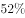增加到。下列有关故宫博物院的说法中正确的是（  ）。

- **A**. 故宫博物院建立在清朝、明朝和元朝三朝皇宫——紫禁城的基础上
- **B**. 故宫博物院以太和殿、中和殿、养心殿三大殿为中心
- **C**. 故宫博物院位于北京中轴线上　✅
- **D**. 北京市现有7项历史文化遗产入选“世界非物质文化遗产名录”，故宫是其中之一

**答案**：C

**官方解析**

A项错误，故宫博物院成立于1925年，建立在明清两朝皇宫——紫禁城的基础上。
B项错误，北京故宫博物院前半部(南半部)以太和殿、中和殿、保和殿三大殿为中心。
C项正确，北京中轴线是指明清北京城的中轴线，北京的城市规划具有以宫城为中心左右对称的特点，故宫建筑在对称轴上，称为中轴线。
D项错误，北京市现有7项历史文化遗产入选世界文化遗产目录，分别为：周口店北京猿人遗址、故宫、长城、颐和园、天坛、明十三陵、大运河。选项中将“世界非物质文化遗产”和“世界文化遗产”的概念混淆。
故正确答案为C。

---

### 第 22 题　qid 1753038 · 人文常识

北京天然河道自西向东有五大水系，其中位于最西部的水系是（  ）

- **A**. 北运河水系
- **B**. 永定河水系
- **C**. 潮白河水系
- **D**. 拒马河水系　✅

**答案**：D

**官方解析**

北京天然河道自西向东贯穿五大水系：拒马河水系、永定河水系、北运河水系、潮白河水系、蓟运河水系。多由西北部山地发源，向东南蜿蜒流经平原地区，最后分别汇入渤海。
A项错误，发源于北京军都山，流经昌平、顺义和朝阳至通州区北关，始称北运河，是北京最主要的排水渠道。
B项错误，永定河古称漯水、治水，又名卢沟河、浑河、无定河。其上源分南北两支流：北支为洋河，发源于内蒙兴和县，经怀安、宣化、怀来流入官厅水库；南支为桑干河，发源于山西省宁武县，经朔州市朔城区、山阴、大同县、阳原、怀来流入官厅水库。
C项错误，由潮河和白河两条水系组成，潮河发源于河北丰宁县，白河发源于河北沽源县，两河交汇于密云城南十里堡，潮白河是密云水库的主要水源。
D项正确，发源于河北省涞源县西北太行山麓，在北京市房山区十渡镇套港村入市界，流经十渡风景区、张坊镇、南尚乐乡。
故正确答案为D。

---

### 第 23 题　qid 1753066 · 人文常识

中共中央办公厅、国务院办公厅日前印发的《深化农村改革综合性实施方案》指出，要从提高农村改革的系统性、整体性、协同性出发，聚焦五大领域，进一步推进深化农村改革。下列选项中，属于五大领域的是（  ）

- **A**. 农村集体产权制度　✅
- **B**. 农业经营制度　✅
- **C**. 农业支持保护制度　✅
- **D**. 城乡发展一体化体制机制　✅

**答案**：ABCD

**官方解析**

五大领域分别为：深化农村改革要聚焦农村集体产权制度、农业经营制度、农业支持保护制度、城乡发展一体化体制机制和农村社会治理制度等5大领域。

故正确答案为A、B、C、D。

---

### 第 24 题　qid 1753070 · 人文常识

根据《中华人民共和国香港特别行政区基本法》的规定，香港特别行政区行政长官（  ）。

- **A**. 对全国人民代表大会负责
- **B**. 对香港特别行政区负责　✅
- **C**. 对中央人民政府负责　✅
- **D**. 对国务院总理负责

**答案**：BC

**官方解析**

《中华人民共和国香港特别行政区基本法》第四十三条规定：香港特别行政区行政长官是香港特别行政区的首长，代表香港特别行政区。香港特别行政区行政长官依照本法的规定对中央人民政府和香港特别行政区负责。
故正确答案为BC。

---

### 第 25 题　qid 1753074 · 法律常识

行政许可作为事先对经济和社会活动进行干预的一项重要的行政权力和管理方式，其设定必须特别慎重。下列选项中，哪些属于设定行政许可应遵循的原则（  ）

- **A**. 应当遵循经济和社会发展规律　✅
- **B**. 要有利于维护公共利益和社会秩序　✅
- **C**. 要有利于发挥公民、法人或者其他组织的积极性、主动性　✅
- **D**. 应当有利于行政机关对其直接管理的事业单位的人事、财务、外事等事项的审批

**答案**：ABC

**官方解析**

本题考查行政许可的原则。设定和实施行政许可，应当依照法定的权限、范围、条件和程序，并遵循以下基本原则：（一）公开、公平、公正的原则。（二）便民原则。（三）信赖保护原则。（四）行政许可不得转让原则。依法取得的行政许可，除法律、法规规定依照法定条件和程序可以转让的外，不得转让。（五）监督原则。
A项正确，设定行政许可应当遵循经济和社会发展规律，符合公开、公平、公正原则的要求，即行政机关在履行职责、行使权力时，不仅在实体和程序上都要合法，而且还要合乎常理。
B项正确，设定行政许可应当有利于促进经济、社会和生态环境协调发展。设定行政许可，不仅要考虑当前和眼下的利益，更应当统筹经济发展与社会事业及生态环境的协调，保持可持续发展，以利于公共利益和社会秩序的稳定。
C项正确，设定行政许可应当有利于发挥公民、法人或者其他组织的积极性、主动性。
D项错误，行政审批不属于行政许可范畴。
故正确答案为ABC。

---

### 第 26 题　qid 1752544 · 人文常识

下列关于中国古琴的说法中，正确的是（    ）

- **A**. 古琴是我国现存的最古老的弹拨乐器之一　✅
- **B**. 俞伯牙、钟子期因古琴曲《高山流水》而成为知音的故事广为流传　✅
- **C**. 古琴名曲主要有《广陵散》《平沙落雁》等　✅
- **D**. 古琴艺术是我国古代精神文化在音乐方面的主要代表之一　✅

**答案**：ABCD

**官方解析**

古琴，亦称瑶琴、玉琴、七弦琴，古代称为琴，近代为区分琴与西方乐器中的琴，因此添加“古”字，称之为古琴。
A项正确，古琴是中国最古老的汉族弹拨乐器。
B项正确，俞伯牙与钟子期因《高山流水》成为知音，《高山流水》为中国十大古曲之一。
C项正确，十大古琴名曲是指《潇湘水云》《广陵散》《高山流水》《渔樵问答》《平沙落雁》《阳春白雪》《胡笳十八拍》《阳关三叠》《梅花三弄》《醉渔唱晚》。
D项正确，评价正确。
故正确答案为A、B、C、D。

---

### 第 27 题　qid 1752548 · 科技常识

根据《中华人民共和国预算法（2014年修正）》，下列应该设立预算的政府是（    ）

- **A**. 中华人民共和国中央人民政府　✅
- **B**. 北京市人民政府　✅
- **C**. 朝阳区人民政府　✅
- **D**. 东升乡人民政府　✅

**答案**：ABCD

**官方解析**

《中华人民共和国预算法（2014年修正）》第三条规定：“国家实行一级政府一级预算，设立中央，省、自治区、直辖市，设区的市、自治州，县、自治县、不设区的市、市辖区，乡、民族乡、镇五级预算。”
故正确答案为A、B、C、D。

---

### 第 28 题　qid 1752552 · 人文常识

“一带一路”建设是一项宏大系统工程，要突出重点、远近结合、有序推进。要坚持共商、共建、共享原则，积极与沿线国家的发展战略相互对接。这段话所蕴含的哲学原理有

- **A**. 事物是普遍联系的　✅
- **B**. 矛盾是事物发展的根本动力
- **C**. “两点论”和“重点论”的统一　✅
- **D**. 事物发展是质变和量变的统一

**答案**：AC

**官方解析**

A项正确，题干中“坚持共商、共建、共享原则”与“相互对接”体现了普遍联系的哲学原理。
B项错误，题干没有体现矛盾。
C项正确，“‘一带一路’建设是一项宏大系统工程，要突出重点，远近结合，有序推进。”体现了“两点论”和“重点论”的统一。
D项错误，题干没有体现。
故正确答案为AC。

---

### 第 29 题　qid 1752556 · 法律常识

对A省教育厅的具体行政行为不服的，可以向________申请行政复议。

- **A**. A省教育厅
- **B**. A省人民政府　✅
- **C**. 教育部
- **D**. 国务院

**答案**：B

**官方解析**

《行政复议法》第二十四条规定：“县级以上地方各级人民政府管辖下列行政复议案件：（一）对本级人民政府工作部门作出的行政行为不服的；（二）对下一级人民政府作出的行政行为不服的；（三）对本级人民政府依法设立的派出机关作出的行政行为不服的；（四）对本级人民政府或者其工作部门管理的法律、法规、规章授权的组织作出的行政行为不服的。”
又根据《行政复议法》第二十七条规定：“对海关、金融、外汇管理等实行垂直领导的行政机关、税务和国家安全机关的行政行为不服的，向上一级主管部门申请行政复议。”
又根据《行政复议法》第二十八条规定：“对履行行政复议机构职责的地方人民政府司法行政部门的行政行为不服的，可以向本级人民政府申请行政复议，也可以向上一级司法行政部门申请行政复议。”题干中A省教育厅属于县级以上政府工作部门，该部门的本级人民政府是A省人民政府。所以B项正确。
A项错误，不能向作出具体行政行为的部门申请行政复议。
D项错误，国务院是中华人民共和国中央人民政府，不符合要求。
备注：新法生效后，本题为单选题。
故正确答案为B。

---

### 第 30 题　qid 1752560 · 人文常识

“诗词歌赋”是人们对我国古代文学的概称，下列有关表述中正确的有（    ）

- **A**. 古文中常有“子曰诗云”的字样，“子曰”即孔子说，“诗云”即《诗经》上说　✅
- **B**. 《陋室铭》中，“铭”原指古代刻在器物上的用来警示自己或称述功德的文字，后来成为一种文体　✅
- **C**. 《沁园春•雪》中“沁园春”是词牌名，“雪”是这首词的题目，词的内容与“沁园春”联系密切
- **D**. 诗歌分为抒情诗、叙事诗和说理诗，《木兰诗》是一首叙事诗　✅

**答案**：ABD

**官方解析**

A项正确，“子”指孔子，“诗”指《诗经》。“子曰诗云”泛指儒家言论。
B项正确，“铭”指古代刻在器物上用来警戒自己或者称述功德的文字，后来成为一种文体。
C项错误，词牌就是词的格式的名称。词总共有一千多个格式（这些格式称为词谱）。词，又称长短句。人们为了便于记忆和使用，所以给它们起了一些名字，这些名字就是词牌。故词牌名与词的内容不一定有所关联。
D项正确，诗歌按照内容可分为抒情诗、叙事诗和说理诗。《木兰诗》是一首长篇叙事诗。
故正确答案为A、B、D。

---

### 第 31 题　qid 1752564 · 人文常识

太阳系目前发现有八大行星，下列说法中正确的有（    ）

- **A**. 木星是太阳系质量最大的行星　✅
- **B**. 按照离太阳的距离由近及远，地球是第五颗行星
- **C**. 水星是距太阳最近的行星　✅
- **D**. 火星与地球相邻　✅

**答案**：ACD

**官方解析**

八大行星特指太阳系的八个行星，按照离太阳的距离从近到远，依次为水星、金星、地球、火星、木星、土星、天王星、海王星。
A项正确，八大行星质量由大到小排列依次为木星、土星、海王星、天王星、地球、金星、火星、水星。
B项错误，按照离太阳的距离从近到远，地球是第三颗行星。
C项正确。
D项正确。
故正确答案为A、C、D。

---

## 言语理解与表达

### 材料 1

        ______________________________：

        ①职业培训是_____劳动者技能水平和促进就业、_____就业的重要手段。加强职业培训，加速_____高素质技能人才，是实施“人文北京、科技北京、绿色北京”战略和建设中国特色世界城市的必由之路。为进一步加强职业培训工作，根据《国务院关于加强职业培训促进就业的意见》（国发〔2010〕36号），结合本市实际，现提出如下意见：

        ②对本市紧缺、企业急需的非本市户籍的技师、高级技师，可参照有关规定办理《北京市工作居住证》；对在京工作3年以上、按规定缴纳社会保险且取得技师及以上职业资格证书，并在工作中做出突出贡献的来京务工人员，经本市引进人才综合评价为优秀的，可从外省市直接引进。继续加大职业院校高水平教师引进力度，获得或培养国家级职业技能竞赛第一名的教师，可从外省市直接引进；对职业院校急需紧缺专业的学科带头人，通过了本市引进人才综合评价的，可从外省市引进。建立和完善高技能人才柔性流动和区域合作机制，鼓励高技能人才通过咨询服务、技术攻关、项目引进等多种方式发挥作用，对企业、职业院校根据生产和教学需要引进、聘用的国外专家和留学生，享受本市有关人才的优惠政策。

        ③积极推行国家职业资格证书制度，大力加强职业技能鉴定工作，加大适应首都发展需要的新职业（工种）标准开发力度，及时更新、完善职业技能鉴定题库。推进职业技能鉴定社会化管理工作，按照“统一标准、统一命题、统一考务和统一证书”的原则，优化运行机制，加强职业技能鉴定专业化队伍建设，不断提高职业技能鉴定管理水平和质量。健全以职业能力和工作业绩为重点的技能人才多元评价体系，完善“统一标准、自主申报、社会考核、企业聘任”的考评机制，进一步突破比例、年龄、资历和身份界限，拓宽技能人才成长通道。

        完善多层次职业技能竞赛工作机制，每年举办不少于30个职业（工种）的行业、地区性职业技能竞赛，每3年举办一次全市性职业技能竞赛。

#### 第 1 题　qid 1752822 · 片段阅读

下列关于该公文主送机关的表述，最恰当的一项是：

- **A**. 市政府各委、办、局，各区、县人民政府，各市属机构
- **B**. 各区、县人民政府，各市属机构，市政府各委、办、局
- **C**. 各市属机构，市政府各委、办、局，各区、县人民政府
- **D**. 各区、县人民政府，市政府各委、办、局，各市属机构　✅

**答案**：D

**官方解析**

按照正规公文格式，主送单位的顺序是“先外后内”，即把同是下一级的各地方政府放在前，本机关的职能部门放在后。由第一段“结合本市实际”可知，本文是市政府下发的公文，故先写下一级人民政府，即县政府，再写市属机关，最后是市属机构。
故正确答案为D。

---

#### 第 2 题　qid 1752826 · 逻辑填空

依次填入第①段三处画线部分的词语，最恰当的是：

- **A**. 提高  保障  发现培训
- **B**. 提高  稳定  培养造就　✅
- **C**. 稳定  支持  培养教育
- **D**. 稳定  保障  锻炼提拔

**答案**：B

**官方解析**

第一空，与之搭配的宾语为“水平”，故排除C、D两项的“稳定”；
第二空，“保障”和“稳定”均可；
第三空，前文为“加强职业培训”，空格后搭配的宾语为“人才”，职业培训与发现人才之间并无直接关联，排除A项；B项“培养造就”与“加强职业培训”有先后的顺承关系，符合文意，当选。
故正确答案为B。

---

#### 第 3 题　qid 1752828 · 片段阅读

根据本文，下列哪位属于可从外省市直接引进的人才？

- **A**. 杨某，非北京户籍，是北京市某企业急需的高级技师
- **B**. 李某，已在京工作6年，经引进人才综合评价为优秀
- **C**. 刘某，符合北京某职业院校急需紧缺专业学科带头人的要求
- **D**. 张某，她所培养的学生在国家级职业技能竞赛中获得第一名　✅

**答案**：D

**官方解析**

根据文章第二段“继续加大职业院校高水平教师引进力度，获得或培养国家级职业技能竞赛第一名的教师，可从外省市直接引进”可知，只需要满足其中一个条件即可，D项符合该老师培养了第一名，符合要求。
A项，由原文可知“本市紧缺”与“企业急需”为并列关系，需要同时满足，选项只说明是企业急需，并没有说明是否本市紧缺，且满足规定是“办理《北京市工作居住证》”，而非直接引入，排除；
B项，由“对在京工作3年以上、按规定缴纳社会保险且取得技师及以上职业资格证书”可知，得同时满足“缴纳社保”和“取得资格证书”两个条件，选项并没有说他取得技师及以上职业资格，排除；
C项，由“对职业院校急需紧缺专业的学科带头人，通过了本市引进人才综合评价的，可从外省市引进。”可知，得同时满足“带头人”和“通过综合评价”两个要求，选项只说了院校急需紧缺专业学科带头人，但并未说明是否通过了本市引进人才综合评价，排除。 
故正确答案为D。
【文段出处】《北京市人民政府关于进一步加强职业培训工作的意见》

---

#### 第 4 题　qid 1752832 · 片段阅读

该公文的类型最可能是：

- **A**. 意见　✅
- **B**. 函
- **C**. 命令
- **D**. 通知

**答案**：A

**官方解析**

（1) 意见是上级领导机关对下级机关部署工作，指导下级机关工作活动的原则、步骤和方法的一种文体。意见的指导性很强，有时是针对当时带有普遍性的问题发布的，有时是针对局部性的问题而发布的，适用于对重要问题提出见解和处理办法。
（2）函是不相隶属机关之间相互商洽工作、询问和答复问题，或者向有关主管部门请求批准事项时所使用的公文。

（3）命令（令）是国家行政机关及其领导人发布的指挥性和强制性的公文。它适用于依照有关法律公布行政法规和规章；宣布施行重大强制性行政措施；嘉奖有关单位及人员，撤销下级机关不适当的决定。命令必须严肃审慎，不能滥用、错用。据《中华人民共和国宪法》和《地方各级人民代表大会组织法》规定：中国人民代表大会常务委员会委员长、中华人民共和国主席、国务院总理、各部部长、各委员会主任可以发布命令。

（4）通知，适用于发布、传达要求下级机关执行和有关单位周知或者执行的事项，批转、转发公文。

由文章第一段尾句“结合本市实际，现提出如下意见”及文段本身具有很强的指导性可知，该公文类为意见，A项当选；B项，根据上述四种公文的用途，判断本文发文机关和主送机关间存在明显的隶属关系，故排除；C项，而本文的发文主体不在“中国人民代表大会常务委员会委员长、中华人民共和国主席、国务院总理、各部部长、各委员会主任”之中，故排除； D项，文段中指出的公文类型为“意见”而非“通知”，故排除。

故正确答案为A。

---

#### 第 5 题　qid 1752838 · 片段阅读

第③段内容是针对下列哪项工作目标提出来的？

- **A**. 设定专业人才的多元化选拔标准
- **B**. 完善职业技能人才统一考试制度
- **C**. 构建高质量的技能考核评价体系　✅
- **D**. 加大职业技能人才培养选拔力度

**答案**：C

**官方解析**

该段首句提出了对于职业资格证书制度、职业技能鉴定、开发新工种等工作的要求，皆是对于职业技能评判方式的要求；第二句进一步说明职业技能鉴定工作的详细展开方式；第三句强调健全以职业和技能为重点的多元评价体系和考评机制，摒除限制人才发展的各种框架，依然是对于职业技能评判的重视。故结合整个文段，应选C项。
A项，由第三段“按照‘统一标准、统一命题、统一考务和统一证书’的原则”可知，选拔是按照统一标准，而非多元化标准，且文段主要围绕职业技能为中心进行展开，而A项的论述主体为“人才”，排除；
B项仅为职业技能鉴定工作中的一个部分，表述片面，排除；
D项中的“培养”是文段未涉及的，无中生有，排除。
故正确答案为C。

---

### 材料 2

        纽约曼哈顿城区是全世界高楼密度最大的地方，狭窄的街道却能看到阳光；这里是世界上行人密度最高的地方，但行人却不会感到拥堵。曼哈顿城区林立的高楼大都是竹笋般的退台式建筑，保证了阳光的照射路径，街道对行人也非常友好，摩天大楼纷纷将宝贵的底层镂空，作为行人行走、休憩的公共空间，狭窄的街道事实上被拓宽了。是什么原因，让阳光从高楼的狭缝中打到纽约的街道上，让开发商奢侈地放弃建筑底层，“好心”考虑行人的需求？

        20世纪初，纽约市迅猛发展，地产商纷纷投资曼哈顿，诸多摩天大楼拔地而起。黄金地段自然价格不菲，出于经济考虑，地产商对建筑师提出了在当时非常具有挑战性的要求——建造高度更高、面积最大的摩天大楼。从审美角度来说，这是一场灾难——曼哈顿城市用地被臃肿、庞大的建筑体块占满，狭窄的街道终年不见阳光，阴暗、逼仄，空气非常浑浊，城市环境日渐恶化。著名的丑陋项目恒生大楼，就是当时建筑风格的代表之一，容积率惊人，体量巨大，不仅阻挡了周边地块建筑的采光和通风，1.3万人的容量也给交通和服务造成不小的压力。冬季，恒生大楼形成面积高达2.6公顷的阴影，相当于自身面积的6倍，直接造成周边地块办公楼出租率下降。

        纽约市敏锐地意识到这种问题，1916年纽约出台了区划法案，旨在遏制这种贪婪攫取空间的趋势。法案明确规定了地块中建筑高度和体量的标准——地产开发者可以在一定的高度限制范围内，在用地上保持100%的建筑密度；超过这一高度，则应让出临街一侧的空间；如果更高，则继续让出面积。只有建筑体量出让到一定程度，即主楼的平面面积少于用地面积的25%时，才不必继续后退。这部分改善了曼哈顿的街道环境，此后的建筑形体也变得稍微克制、美观起来，从平顶、方盒子形状，向山坡般跌落式转变，帝国大厦、克莱斯勒大厦等就是退台式建筑的代表，这种建筑形态，被人们戏称为“婚礼蛋糕”或“巴比伦塔”。区划法案颁布后的近40年中，纽约新建成的摩天大楼无一不层层后退，街道上因此保留了一些阳光。也就是说，纽约的早期法案有效地缓解了城市高楼病。

        如果一直如此，类似帝国大厦的建筑早就应该占领曼哈顿了，相似的退台式建筑会成为纽约统一的建筑风格，纽约的立法者应该感到欣慰。直到1952年，一名富有创造性的建筑师用全新的方案，巧妙地糅合法案要求、建筑美感、商业需要于一身，引领了20世纪中期曼哈顿的建筑时尚。他的作品就是利华大厦。

#### 第 6 题　qid 1752844 · 逻辑填空

退台式高楼看起来不像：

- **A**. 多层蛋糕
- **B**. 竹笋
- **C**. 方盒　✅
- **D**. 山坡

**答案**：C

**官方解析**

A项，根据“这种建筑形态，被人们戏称为‘婚礼蛋糕’或‘巴比伦塔’”可知，退台式高楼像多层蛋糕，表述正确，排除。
B项，根据“曼哈顿城区林立的高楼大都是竹笋般的退台式建筑”可知，表述正确，排除。
C项，根据“从平顶、方盒子形状，向山坡般跌落式转变”可知，高楼原来是平顶、方盒子形状的，现在的退台式高楼转变成了山坡式的，表述错误，当选。
D项，根据“从平顶、方盒子形状，向山坡般跌落式转变”可知，表述正确，排除。
本题为选非题，故正确答案为C。
【文段出处】《摩天楼的温情》

---

#### 第 7 题　qid 1752848 · 片段阅读

关于恒生大楼，下列说法正确的是：

- **A**. 容积率很高　✅
- **B**. 占地面积小
- **C**. 改善了周边采光
- **D**. 扩大了公共空间

**答案**：A

**官方解析**

A项，根据“著名的丑陋项目恒生大楼，容积率惊人”可知，表述正确，当选。
B项，根据“体量巨大”可知，恒生大楼占地面积大，表述错误，排除。
C项，根据“阻挡了周边地块建筑的采光和通风”可知，表述错误，排除。
D项，根据“1.3万人的容量也给交通和服务造成不小的压力”可知，恒生大楼缩小了公共空间，表述错误，排除。
故正确答案为A。
【文段出处】《摩天楼的温情》

---

#### 第 8 题　qid 1752852 · 片段阅读

1916年，纽约出台区划法案的主要目的是：

- **A**. 保证足够的建筑间距
- **B**. 限制建筑用地的扩大　✅
- **C**. 改善街道的整体环境
- **D**. 满足地产商的商业需求

**答案**：B

**官方解析**

根据“1916年纽约出台了区划法案，旨在遏制这种贪婪攫取空间的趋势。法案明确规定了地块中建筑高度和体量的标准”可知，纽约出台法案的目的是限制建筑的高度和体量，即限制建筑用地的扩大，对应B项。

A项，高度和体量是对建筑本身占地的限制，而不是为了保证具有足够的建筑间距，排除。

C项，根据“法案旨在遏制攫取空间的趋势”可知，“改善街道的整体环境”非法案的主要目的，且“整体环境”无中生有，排除。

D项，根据“地产开发者可以在一定的高度限制范围内，在用地上保持的建筑密度；超过这一高度，则应让出临街一侧的空间”可知，法案的出台限制了地产开发者，而没有满足他们的商业需要，排除。

故正确答案为B。

【文段出处】《摩天楼的温情》

---

#### 第 9 题　qid 1752858 · 片段阅读

根据本文，接下来最可能介绍：

- **A**. 区划法案的修订
- **B**. 一位著名的建筑师
- **C**. 中国的摩天大楼
- **D**. 新建筑时尚的代表　✅

**答案**：D

**官方解析**

文段末尾表明，一名富有创造性的建筑师用全新的方案，引领了曼哈顿的建筑时尚，并表明这个改变时代风尚的作品就是利华大厦。即接下来文段最可能围绕利华大厦展开，并详细介绍是如何引领建筑风尚的，对应D项。
A项，“区划法案的修订”无中生有，文段末尾并没有表明区划法案将进行修订，故无法得出，排除。
B项，文段末尾引出的话题为这名建筑师的作品，即利华大厦，故接下来更可能介绍利华大厦，而不是这名建筑师本身，排除。
C项，文段一直围绕曼哈顿的建筑展开，故下文说“中国的摩天大楼”会突兀而无法衔接上文，排除。
故正确答案为D。
【文段出处】《摩天楼的温情》

---

#### 第 10 题　qid 1752864 · 片段阅读

这篇文章的主题是：

- **A**. 美国纽约的经典建筑
- **B**. 美国摩天楼管理经验　✅
- **C**. 二十世纪美国的建筑师
- **D**. 法律对城市生活的影响

**答案**：B

**官方解析**

文章首先介绍了曼哈顿高楼的建筑风格及其问题，接着表明区划法案改进了高楼风格、缓解了这些问题、满足了人民需求。最后说明一名建筑师完美的高楼设计，进一步解决了问题，引领了曼哈顿高楼风尚。故文章围绕曼哈顿高楼展开，说明了其是如何进行改进、修正，从而解决纽约高楼产生的问题的，即介绍了美国摩天楼的管理经验，对应B项。
A项，文章围绕摩天楼展开，“经典建筑”表述不明确且扩大概念，排除。
C项，文章围绕摩天楼展开，建筑师非主要内容，排除。
D项，“城市生活”范围过大，文章围绕摩天楼展开，且文章叙述的范围是美国曼哈顿，排除。
故正确答案为B。
【文段出处】《摩天楼的温情》

---

### 材料 3

        器官捐献率在各个国家的情况都不太乐观，然而一组来自欧洲的数据引起了人们注意。这组数据显示，欧洲各国人口中签署器官捐献知情同意书的比率，分别如下：匈牙利，奥地利，法国，葡萄牙，波兰，比利时，瑞典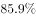，荷兰，英国，德国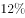，丹麦。统计结果呈现出显著的两极分化，前七个国家的同意率都很高，在这几个国家之后，器官捐献的民意率______，是什么因素让那些国家有如此高比例的人同意捐献自己的器官呢？

        英国和法国教育、经济水平相当，可英国仅有的人同意捐献器官，而法国却接近；另一组比较则更能说明问题，德国和奥地利接壤，也同为德语国家，然而德国只有，奥地利却为，说明以上<u>这些因素</u>还不足以解释。

        会不会是宣传的作用呢？在荷兰，全国对器官移植进行了大规模的宣传，每个家庭都能收到关于器官捐献的信件，在电视、广播中也时常能看到宣传广告，甚至还有一档极具争议的综艺节目，让亟待器官移植的患者选择想要谁做他的供者。做了这么多活动，钱也花了不少，然而荷兰器官捐献的同意率却只有，与邻国比利时一比就相形见绌：人家没花过一分钱做宣传，器官捐献的同意率却高达。

        原因究竟是什么？当研究者排除了以上这些因素后，他们将目光聚集在一个极其细微的环节上，那就是人们签署的那张器官捐献的知情同意书。在那些同意率低的国家中，知情同意书是这么写的：“如果您想参与器官捐献计划，请在这里画勾。”而在同意率高的国家中，知情同意书里只有一个地方不同，那就是：“如果您不想参与器官捐献计划，请在这里画勾。”器官捐献率如此悬殊，原因就在于知情同意书中的那一个词：“想”或“不想”。

        这是两种不同的“默认选项”。第一种默认的情况是所有人都不参与器官捐献计划，因此参与者需要做出行动改变——“画勾”。在这种情况下，人们会不自觉地接受默认选项，因为在潜意识里这被看做是推荐的方案，而“画勾”做出改变则需要费力气，付出认知、情绪和行为上的投入，以换取改变默认选项后的收益。同样的，在第二种默认选项中，默认的情况是所有人都在器官捐献计划内，这也是默认的推荐，不捐献才需要人们去做决定和做出行动改变，而这需要花费人们更多的精力。也正因此，在两种情况下，“画勾”的都是少数，而接受“默认选项”则是大多数人的决定。

#### 第 11 题　qid 1752516 · 逻辑填空

填入划横线部分最恰当的词语是（  ）。

- **A**. 急转直下　✅
- **B**. 大起大落
- **C**. 天壤之别
- **D**. 平淡无奇

**答案**：A

**官方解析**

根据文意可知，前七个国家同意率较高，之后同意率变得非常低，A项“急转直下”形容形势或文笔等突然转变，并且很快地顺势发展下去，符合语境 ，当选。
B项，“大起大落”指大幅度地起落，形容变化大。文段中同意率在七个国家之后，一直在降低，即“落”，没有再增长，故只是“落”而没有“起”，排除。
C项，“天壤之别”比喻差别极大，对于同意率而言，语意程度过重，且只是比喻差别大，而没有体现突然降低的语意，没有A项更符合语境，排除。
D项，“平淡无奇”指事物或诗文平平常常，没有吸引人的地方。无法对应同意率突然降低的语境，排除。
故正确答案为A。
【文段出处】《拯救生命的“默认选项”》

---

#### 第 12 题　qid 1752518 · 片段阅读

文中划线的“这些因素”不包括（  ）。

- **A**. 教育水平
- **B**. 经济状况
- **C**. 地理位置
- **D**. 宗教信仰　✅

**答案**：D

**官方解析**

代词指代题，需到前文中找答案。根据“英国和法国教育、经济水平相当”“德国和奥地利接壤，也同为德语国家”可知，“这些因素”包括教育水平、经济状况、地理位置，故A、B、C三项正确，排除。
本题为选非题，故正确答案为D。
【文段出处】《拯救生命的“默认选项”》

---

#### 第 13 题　qid 1752520 · 逻辑填空

宣传不能提高器官捐献率，这一点在哪个国家得到了验证？（  ）

- **A**. 英国
- **B**. 荷兰　✅
- **C**. 比利时
- **D**. 葡萄牙

**答案**：B

**官方解析**

根据第三段内容可知，荷兰全国对器官移植捐献进行了大规模的宣传，但同意率却只有，故可知宣传不能提高器官捐献率，对应B项。

故正确答案为B。

【文段出处】《拯救生命的“默认选项”》

---

#### 第 14 题　qid 1752522 · 片段阅读

作者认为应该（  ）。

- **A**. 立法以强制推行器官的捐献
- **B**. 对器官捐献者给予物质奖励
- **C**. 修改知情同意书的默认选项　✅
- **D**. 改变器官捐献的流程和环节

**答案**：C

**官方解析**

通过文章可知，各个国家的器官移植捐献同意率不同的原因在于知情同意书的内容不同，即高同意率的原因是将捐献器官设置为人们的心理默认选项，故作者认为改变低同意率的方法是修改同意书的默认选项，对应C项。
A项“立法”、B项“物质奖励”、D项“改变流程和环节”均为无中生有，排除。
故正确答案为C。
【文段出处】《拯救生命的“默认选项”》

---

#### 第 15 题　qid 1752524 · 片段阅读

这篇文章意在（  ）。

- **A**. 指出器官捐献的瓶颈
- **B**. 提示一个心理学规律　✅
- **C**. 比较中外的医疗水平
- **D**. 反对过度的夸大宣传

**答案**：B

**官方解析**

文章先提出问题，即器官捐献率在各个国家的情况都不太乐观，接着通过对比与调查，说明器官捐献同意率不同的原因在于知情同意书中的选项不同，即原因在于人们对于选择的心理感受不同，故文章最后的落脚点在于揭示了一个心理学规律，这个规律正是导致器官捐献率低的原因，对应B项。
A项，“瓶颈”表示困难，文章重点不是在强调器官捐献的困难，而是通过研究揭示了影响器官贡献率的心理学规律，排除；
C项，文章的数据都来自于欧洲国家，“中外的医疗水平”无中生有，且并没有进行对比，排除；
D项，文章只是指出宣传不是同意率不同的原因，并没有反对宣传的意思，且“过度的夸大宣传”无中生有，文章没有此意，排除。
故正确答案为B。
【文段出处】《拯救生命的“默认选项”》

---

### 材料 4

        通常，滨海国家的人民对于自己的海军，都是以历史愈久而倍感骄傲，纵是自己的海军曾经遭遇过大的失败，也通常会从失败的黑暗中寻找、提炼可贵的光芒，抑或是歌颂悲壮的牺牲，以期永志不忘。然而中国的北洋水师，却处于被国人习惯性的羞辱之中。

        海军是西方大工业背景下诞生的彻头彻尾的洋事务，建设海军也由此成为清末进行近代化建设的一个难得的突破口。但在当时占主流的中国知识阶层看来，北洋水师的大部分军人连最基本的道德修养和国学功底都不具备，却获得了普天下多少寒窗苦读的士子孜孜以求而不得的前途，其收入也比同级陆军军官要高得多。

        甲午战争时，一些人站在所谓的道德制高点上，催促北洋水师作战，却对当时的战争走向全无了解。北洋水师固守军港，被视为畏葸避战；北洋水师出发巡海，则被骂为畏敌远遁，总之进退皆不是。

        _______________，如此不仅可以一释之前对北洋水师所积郁的怒火，也可以证明建设海军及其相关的洋务活动都是错的。从这一意义上来说，北洋水师的甲午海战，更像是一场内战。

        战败后，保守势力对那支海军取得了报复式的反攻胜利，大量未经证实或是出于不了解海军而出现的关于北洋水师的负面信息层出不穷。民国时期对北洋水师的抹黑在20世纪30年代达到顶峰，面对日本咄咄逼人的外部压力，国内社会批评军队腐化、政治腐化时，习惯性地将北洋水师拖出来作标本。而新时代对北洋水师的抹黑，很多时候其用意和百年前没有什么区别，都是在于借古喻今，在寻找负面典型时，可以将任意的歪曲故事嫁接在北洋水师身上。

        当把甲午战争这场举国大失败的责任推给北洋水师时，实际上真正的罪魁祸首已经逃脱事外，甚至洋洋得意地扮演起对这支军队进行道德裁判的角色。

        实际上，在封闭黑暗的清末，北洋水师是照亮通向近代化之路的一缕微弱火光，虽最终不幸熄灭，但其所指引的方向是一个正确的方向。在120年后的今天，<u><b>这个方向</b></u>应该看得更为清楚。

#### 第 16 题　qid 1752526 · 逻辑填空

下列哪项最接近当时的保守势力对甲午海战失利的态度？（  ）

- **A**. 幸灾乐祸　✅
- **B**. 义愤填膺
- **C**. 虽败犹荣
- **D**. 痛定思痛

**答案**：A

**官方解析**

根据“想证明建设海军及其相关的洋务活动都是错的，从这一意义上来说，北洋水师的甲午海战，更像是一场内战”可知，保守势力是希望北洋水师失利的，目的是证明不应该建设海军，故对应A项，“幸灾乐祸”指人缺乏善意，在别人遇到灾祸时感到高兴，符合语境。
B项，“义愤填膺”指对违反正义的事情所产生的愤怒，胸中充满了正义的愤恨。作者对保守势力持有批评态度，故保守势力所为不是正义的，且保守势力是希望海战失利的，而不是愤怒，排除。
C项，“虽败犹荣”表示虽然失败了，但还是非常光荣，和文章感情色彩不符，排除。
D项，“痛定思痛”指悲痛的心情平静以后，再追想当时所受的痛苦，常含有警惕未来之意。根据文章表述可知，保守势力并没有对自己进行反省和警惕未来，而是污蔑和羞辱北洋水师，且D项和文段感情色彩不符，排除。
故正确答案为A。
【文段出处】《是谁描黑了北洋海军？》

---

#### 第 17 题　qid 1752528 · 片段阅读

下列哪项最接近文中所述北洋水师当时面临的处境？（  ）

- **A**. 明知山有虎，偏向虎山行
- **B**. 风萧萧兮易水寒，壮士一去兮不复还
- **C**. 进退路穷，腹背受敌　✅
- **D**. 舍生取义，杀身成仁

**答案**：C

**官方解析**

根据“北洋水师固守军港，被视为畏葸避战；北洋水师出发巡海，则被骂为畏敌远遁，总之进退皆不是”，且北洋水师外面临日本咄咄逼人的压力，内面临国内保守势力的污蔑诽谤，可知北洋水师进退两难、腹背受敌，对应C项。
A项，“明知山有虎，偏向虎山行”形容明知道做一件事有困难但还要这样做。通过文章可知，北洋水师是隐忍、顾全大局的，没有明知道作战有困难，还偏去作战，排除。
B项，“风萧萧兮易水寒，壮士一去兮不复还”原为形容荆轲，有种视死如归的悲壮，和北洋水师隐忍、顾全大局的态度相悖，排除。
D项，“舍生取义，杀身成仁”指为维护正义事业而牺牲生命，由文章可知，北洋水师没有为了正义而使自己全军覆没，排除。
故正确答案为C。
【文段出处】《是谁描黑了北洋海军？》

---

#### 第 18 题　qid 1752530 · 片段阅读

填入文中划线处最恰当的是（  ）。

- **A**. 其实，时人普遍对于北洋水师是漠不关心的，认为战败战胜都无所谓
- **B**. 当时人们的心情很复杂，既怕北洋水师战败，又怕赢了之后自己的见解被嘲笑
- **C**. 当时人们虽然不满于北洋水师西化的做派，但还是希望他们能打一场扬眉吐气之仗
- **D**. 在这样的舆论氛围中，实则很多人内心里其实更希望北洋水师上阵的结果是战败出洋相　✅

**答案**：D

**官方解析**

横线位于首句，是对后文内容的概括。根据后文可知，当时的人们想借此发泄怒火，并证明建设海军是错误的，故人们是希望看到北洋水师战败的，对应D项。
A项“认为战败战胜都无所谓”表述与后文不符，人们希望看到北洋水师战败，故不是持有无所谓的态度，排除。
B项“既怕北洋水师战败”表述与文意相悖，当时人们的见解是认为建设海军是错误的，北洋水师是懦弱的，即如果战败，就验证了他们的见解，排除。
C项“希望他们能打一场扬眉吐气之仗”与文段感情色彩相悖，排除。
故正确答案为D。
【文段出处】《是谁描黑了北洋海军？》

---

#### 第 19 题　qid 1752532 · 片段阅读

下列选项最适合作为本文标题的是（  ）。

- **A**. 空谈误国的文士
- **B**. 被抹黑的北洋水师　✅
- **C**. 近代中国的明灯
- **D**. 甲午海战的反思

**答案**：B

**官方解析**

根据文章可知，文章围绕当时的人们对北洋水师的污蔑、羞辱等错误的做法展开，即文章说明了北洋水师是怎样被抹黑的，对应选项为B项。
A项“空谈误国”表述与文段不符，文章论述的主体为北洋水师，且文章只说明了当时人们对北洋水师错误的批判，与“空谈误国”是两个概念，排除。
C项“明灯”表述与文段不符，文章最后表明，北洋水师是照亮通向近代化之路的一缕微弱火光，且最终不幸熄灭，故虽然能照亮近代中国，但无法称之为明灯，排除。
D项，文段并没有对甲午海战进行反思，只是指出了其中的一些错误做法，并没有提及反思的内容，且围绕北洋水师展开，排除。
故正确答案为B。
【文段出处】《是谁描黑了北洋海军？》

---

#### 第 20 题　qid 1752534 · 片段阅读

纵观全文，最后一段划线部分“这个方向”指的是（  ）。

- **A**. 建设现代化的海军　✅
- **B**. 形成知识型的社会
- **C**. 借鉴西方先进经验
- **D**. 打破闭关锁国思维

**答案**：A

**官方解析**

根据“北洋水师是照亮通向近代化之路的一缕微弱火光，虽最终不幸熄灭，但其所指引的方向是一个正确的方向”可知，建设海军是正确的做法，对应选项为A项。
B项，文章虽说明当时人们对北洋水师的认识是错误的，但并没有表明当时的社会是没有知识的，排除。
C项，文章一直在说明我国甲午战争时的现状，并没有提及西方社会，故不是所指的方向，排除。
D项，文章只是说明当时人们存在错误认识，但并没有提及这一认识和闭关锁国有关，排除。
故正确答案为A。
【文段出处】《是谁描黑了北洋海军？》

---

### 材料 5

        长远以来，中国就重视文化立国，礼治即表现在国家治理中体现出文化的精神。儒释道、诸子百家文化数千年来成为中国人的思想血脉，影响了各个朝代的主流思想。“仁义礼智信”“内圣外王”“修身齐家治国平天下”等理念，对中国古代治国理政以及全体中国人的人格言行影响很深。众所周知的如《论语》《大学》等成为数百年来包括帝王在内的治国理政者们的必读书，历史上国家治理者推行“敬天法祖”“以孝治天下”等理念和做法，都是礼治的表现。

        中国历史的主流，与其说是人治，不如说是中国传统文化和道德思想影响下的帝王及士大夫们在治理国家。虽然经历许多次改朝换代，期间也有一些<u>      </u>的帝王，但中国社会治理的背后，总体来说都有着中国文化思想作为底蕴，都不同程度地体现着对中国传统文化和道德的<u> </u><u>      </u>。

        在礼治之下，总体来看中国历史上也发展出了与其相应的法治，有法制体系以规范社会治理的各方面。比如有监察制度以保证官员廉洁奉公，有官员选拔制度以保证任人唯贤，等等。就监察制度来说，唐朝就有“四善二十七最”“六察法”等，对官员的监察和考核进行严格详细的规定。对皇帝本身，也不是没有约束制度。比如在唐朝三省六部制下，虽然最高命令是皇帝诏书，但诏书由中书省拟撰，后经门下省复审。门下省如果认为不妥，可以“封驳”，也就是把皇帝命令挡回去。“封驳”在汉代已经出现，唐代“封驳”的例子屡见不鲜，宋朝也延续了这一制度。明朝来华多年的传教士利玛窦也注意到，“如果没有与大臣磋商或考虑他们的意见，皇帝本人对国家大事就不能做出最后的决定”。

        对法治的推崇，屡见于古代经典。比如《管子》说“法令者，君臣之所共立也”；荀子认为“隆礼至法，则国有常”。这些思想对中国历史上的治理产生了巨大影响。

        一些人质疑中国历史上是否有法治，笔者认为，在这个问题上，国人应该有足够的文化自信。中国历史上有不少时期，整个社会能按照一定规则和制度来进行治理，并实现较长时间的良性运转，至少应说是具有相当程度上的法治特色的。历史学家钱穆先生就认为“中国政治，实在一向是偏重于法治的，即制度化的”。连《历史的终结》一书作者弗朗西斯·福山也认为“在某种意义上说，中国人发明了好政府”。

        当然中国历史上的治理，有时代的局限性，也有很多不完善乃至糟粕的东西，但我们不应简单以人治抹杀中国古代治理经验，从而失去了取其精华的机会。比如历史上的监察制度、选官制度等经验就值得借鉴。笔者也注意到，历史上治理较好的时期，都是那些文化较昌明开放的时代，比如文景之治、贞观之治等；当文化精神比较衰退、保守的时候，便出现社会治理和制度的相对颓废。所以今天在全社会大力倡导法治的同时，也应注意到，“徒法不足以自行”，应大力加强“礼治”，注重夯实优秀传统文化的内蕴。

#### 第 21 题　qid 1752756 · 片段阅读

作者反驳了以下哪种观点？（  ）

- **A**. 中国文化中存在糟粕
- **B**. 文化昌明时代社会治理更为完善
- **C**. 中国历史上没有法治　✅
- **D**. 传统文化对社会治理产生深远影响

**答案**：C

**官方解析**

根据倒数第二段“一些人质疑中国历史上是否有法治”，之后作者的回答是“国人应有足够的文化自信”，并且倒数第三段也提到了“对法治的推崇，屡见于古代经典”，可知C项表述错误，属于作者反驳的观点，当选。
A项“中国文化中存在糟粕”，对应最后一段，作者承认了中国历史上有不完善乃至糟粕的观点，故不属于作者反驳的观点，排除；
B项也对应最后一段，“历史上治理较好的时期，都是那些文化较昌明开放的时代”，故不属于作者反驳的观点，排除；
D项对应最后一段，故不属于作者反驳的观点，排除。
本题为选非题，故正确答案为C。

---

#### 第 22 题　qid 1752760 · 逻辑填空

依次填入第2段划线处，最恰当的一组词语是（  ）。

- **A**. 不学无术  尊崇　✅
- **B**. 唯我独尊  遵循
- **C**. 昏庸无道  推崇
- **D**. 一言九鼎  信奉

**答案**：A

**官方解析**

第一空，根据后文转折之后提到国家治理整体上都有中国的思想文化作为底蕴，可知转折横线处表达有一些治理是没有思想文化底蕴的，A项“不学无术”现指没有学问，没有本领，恰好与转折之后语义相反，语义恰当，保留；C项“昏庸无道”指糊涂平庸，凶狠残暴，不讲道义，多用指糊涂无能且残暴凶狠的帝王，但是昏庸无道并不能说明帝王没学问，没文化，故排除；B项“唯我独尊”指认为只有自己最了不起，D项“一言九鼎”形容说的话分量大，起决定作用，均与文意无关，排除。
第二空代入验证，“尊崇”表示对人或事物的尊重和推崇，乃至于崇拜，语义恰当，A项当选。
故正确答案为A。

---

#### 第 23 题　qid 1752762 · 片段阅读

文章举唐代“封驳”的例子，是为了说明（  ）。

- **A**. 监察制度历史悠久
- **B**. 君权受到一定约束　✅
- **C**. 唐代各部分工明确
- **D**. 纠错机制逐渐出现

**答案**：B

**官方解析**

唐代“封驳”的例子对应文段倒数第四段，该例子是为了说明之前的观点，即对皇帝的一种制度约束，说明君权也是要受到一定约束的，故对应B项。A项“监察制度”、D项“纠错机制”均属无中生有的表述，排除A、D两项；C项中“各部门分工明确”从“封驳”中无法体现，排除。
故正确答案为B。

---

#### 第 24 题　qid 1752768 · 片段阅读

根据本文，下列哪项与其他三项不属于同一种治国理念？（  ）

- **A**. 敬天法祖
- **B**. 以孝治天下
- **C**. 仁义礼智信
- **D**. 四善二十七最　✅

**答案**：D

**官方解析**

A项“敬天法祖”是周礼的核心信仰和高度概括，天就是天神、上帝，祖就是宗庙的祖先神，是中国传统宗法性宗教儒教的核心之一；B项“以孝治天下”是秦汉之际流行的儒家著作《孝经》中所宣扬的一种社会政治伦理主张,也是汉代统治者大力推行的治国方针；C项“仁义礼智信”为儒家“五常”，孔子提出“仁、义、礼”，孟子延伸为“仁、义、礼、智”，董仲舒扩充为“仁、义、礼、智、信”，后称“五常”；D项“四善二十七最”是唐代考课官吏在品德和才能方面的标准，“四善”指品德方面的四项标准，“二十七最”是根据各官署职掌之不同在才能方面提出的具体标准。可见A、B和C三项的治国理念都是儒教的思想，只有D项与其他三项不同，当选。
本题为选非题，故正确答案为D。

---

#### 第 25 题　qid 1752770 · 片段阅读

最适合作为文本标题的是（  ）。

- **A**. 要法治不要人治
- **B**. 中国人发明了好政府
- **C**. 法治文化传统漫谈
- **D**. 礼法并治是中国的政治传统　✅

**答案**：D

**官方解析**

文段第一、二段首先阐述我们是以礼治国，接下来着重分析在礼制之下也发展了相应的法治，故文段重点阐述中国传统的政治管理是一种礼法并治的方式，并且文段的最后一句也提出了对策“在大力倡导法治的同时，也应大力加强礼治”，对应D项。
A项，表述过于片面，文段表达的显然是人治与法治并重，排除；
B项，是弗朗西斯•福山所认为的内容，不是文段的重点，并且“好政府”表述不明确，排除；
C项，“法治文化传统”概念缩小，文段并不是只提到了文化传统，且未提到文段的主题词“礼法并治”，排除。
故正确答案为D。

---

### 材料 6

        毛里求斯是印度洋西南部一个火山岛国，同非洲大陆隔离。渡渡鸟是仅产于毛里求斯的巨鸟，既不能飞，又跑不快。在被人类发现仅200年后，1681年，最后一只渡渡鸟被残忍地杀害，成为西方工业社会以来，有史书记载的第一种被灭绝的动物。和渡渡鸟一样，大颅榄树也是岛上特有的珍贵树种，曾遍布全岛，由于木质坚硬细密，是大量出口的木材。但到1981年，只剩区区十三棵，都已到了垂暮之年，树龄高达三百岁。

        1976年底至1977年初，美国威斯康星大学的生态学家斯坦尼·坦普尔到毛里求斯研究大栌榄树，发现大栌榄树与渡渡鸟之间存在多种联系。渡渡鸟喜欢在大栌榄树林中生活，渡渡鸟经过的地方，大栌榄树总是绿林繁茂、幼苗茁壮。坦普尔进行研究时，渡渡鸟大约已灭绝300年，他测定大栌榄树年轮后发现，树龄也大约是300年，也就是说渡渡鸟灭绝之日，也正是大栌榄树绝育之时。

        这个巧合引起了坦普尔的兴趣，他四处寻找，终于找到一只渡渡鸟的遗骸，遗骸中还保留着几颗大栌榄树的果实。原来渡渡鸟喜欢吃这种树木的种子。这使坦普尔萌生了一个想法：大栌榄树的树种要经过渡渡鸟的消化道，尤其是要被渡渡鸟胃中的砂囊进行软化和磨损，才能发芽。不过，这需要证明。吐绶鸡是与渡渡鸟一样不会飞的禽类。于是，坦普尔让吐绶鸡吞下10粒大栌榄树的种子。几天后，种子排出吐绶鸡体外，外边的硬壳磨掉了一层。坦普尔便把这些种子埋在苗圃里，结果有3粒种子发了芽，这种宝贵的树木终于绝境逢生。

        坦普尔关于渡渡鸟与大栌榄树关系的论文发表于1977年8月26日的美国《科学》杂志上。他认为，杀光了渡渡鸟，实际上也为大栌榄树挖掘了坟墓。但是，研究人员从逻辑推论和事实上间接证伪了渡渡鸟与大栌榄树存在一荣俱荣、一损俱损的关系，因为它们不是唯一共生共栖的关系，也否定了人杀光渡渡鸟而间接造成大栌榄树灭绝的观点。

        此时，一个假说顺理成章地提出，即外来物种入侵。肇事者当然还是人类，因为大栌榄树数量减少或灭绝更可能是因为欧洲人把猪和食螃猴以及其他竞争性植物带入岛上引起的。然而，物种入侵导致大栌榄树灭绝也只是一种假说，需要事实和研究来证实。

#### 第 26 题　qid 1752776 · 逻辑填空

斯坦尼·坦普尔认为渡渡鸟和大栌榄树之间的关系是（  ）。

- **A**. 一脉相承
- **B**. 休戚相关　✅
- **C**. 珠联璧合
- **D**. 环环相扣

**答案**：B

**官方解析**

在文段第二段可以发现提到了“大栌榄树与渡渡鸟之间存在多种联系”，之后进一步说明了渡渡鸟在大栌榄树上休息，并且可以帮助大栌榄树生长，同时当“渡渡鸟灭绝之日，也是大栌榄树绝育之时”，可见这二者之间是祸福相依的，对应B项。
A项的“一脉相承”比喻某种思想、行为或学说之间有继承关系；C项“珠联璧合”比喻杰出的人才或美好的事物结合在一起,多用来形容男女之间的感情；D项“环环相扣”形容连接的紧密，均无法体现“渡渡鸟与大栌榄树”之间的密切关系，排除A、C、D三项。
故正确答案为B。

---

#### 第 27 题　qid 1752782 · 语句表达

以下哪项是斯坦尼·坦普尔研究结论成立的前提？（  ）

- **A**. 渡渡鸟灭绝五年后，再也没有大栌榄树幼苗被发现的记载
- **B**. 大栌榄树种子的外壳坚硬，必须经过渡渡鸟的消化道才能发芽　✅
- **C**. 目前发现的渡渡鸟遗骸中，大都留有大栌榄树的种子
- **D**. 16世纪后期到达毛里求斯的欧洲人习惯将渡渡鸟作为美味佳肴

**答案**：B

**官方解析**

由文段可知，斯坦尼•坦普尔研究的结论是“杀光了渡渡鸟，实际上也为大栌榄树挖掘了坟墓，即渡渡鸟和大栌榄树，是一荣俱荣、一损俱损的”，B项说明如果没有渡渡鸟，大栌榄树的种子就无法发芽，即证明了渡渡鸟和大栌榄树的共存关系，当选。
A项没有被发现的记载不代表没有这种树，力度弱，排除；C项仅指目前发现的结果，不代表所有的都是这样，而且留有大栌榄树的种子，对大栌榄树有什么效果没说，力度较弱，排除；D项没说明渡渡鸟和大栌榄树之间的关系，不是前提，排除。
故正确答案为B。

---

#### 第 28 题　qid 1752784 · 语句表达

以下哪项发现可以最有效地支持外来物种入侵导致大栌榄树灭绝的假说？（  ）

- **A**. 直接种植大栌榄树的种子，数天后就可以自然发芽
- **B**. 外来植物争夺大栌榄树的生长空间，使其种子数量减少
- **C**. 在没有外来物种入侵的地区，还有幸存的大栌榄树　✅
- **D**. 渡渡鸟生活在低海拔地区，大栌榄树生活在高海拔地区

**答案**：C

**官方解析**

根据提问可知所选应为最能支持外来物种入侵说的论据，A项和D项均未涉及外来物种，为无关论据，排除；B项“外来物种抢占了大栌榄树的空间，致使其数量减少”，保留；可以支持外来物种入侵说，C项表述的是“没有外来物种入侵的地方，还有幸存的大栌榄树”，是一种直接否定前提的支持，力度比B项更强，当选。
故正确答案为C。

---

#### 第 29 题　qid 1752788 · 片段阅读

根据本文，以下说法正确的是（  ）。

- **A**. 大栌榄树的种子是渡渡鸟主要的食物来源
- **B**. 大栌榄树也可以采用嫩枝扦插来进行繁殖
- **C**. 渡渡鸟的肉味道鲜美，曾被当地人作为食物
- **D**. 渡渡鸟和大栌榄树都是毛里求斯的特有物种　✅

**答案**：D

**官方解析**

A项，文段仅提到渡渡鸟喜欢吃大栌榄树的种子，并未论述该种子为渡渡鸟的主要食物，排除；B项，文段提到了大栌榄树的种子外边有一层硬壳，需要经过渡渡鸟的消化道，经过软化和磨损以后才能发芽，那么可见嫩枝扦插的方式不太可取，排除；C项，渡渡鸟肉质鲜美，被当做食物，属于无中生有的表述，排除；D项，根据文段第一段“渡渡鸟是仅产于毛里求斯的一种巨鸟”“和渡渡鸟一样，大栌榄树也是岛上特有的珍贵树种”可知，D项表述正确，当选。
故正确答案为D。

---

#### 第 30 题　qid 1752792 · 片段阅读

这篇文章最能体现下列哪项的观点？

- **A**. 伽利略：一切推理都必须从观察与实验得来　✅
- **B**. 达尔文：科学就是整理事实，以便从中得出普遍的规律或结论
- **C**. 达芬奇：科学不问现在和过去，是对一切可能存在事物的观察，预见虽是渐进的，然而它是对即将发生事物的认识
- **D**. 波普尔：不管我们已经观察到多少只白天鹅，都不能确立“所有天鹅皆为白色”的理论，只要看见一只黑天鹅就可以驳倒它

**答案**：A

**官方解析**

通读全文可以发现斯坦尼·坦普尔的研究及假设是在他观察和实验的基础上得来的，同时文段最后提出的物种入侵说，文段说这只是个假说，还需要事实和研究来证实，可见推理是要从观察和实验中得来的，对应A项。
B、C、D三项文段并未体现，排除。
故正确答案为A。

---

#### 第 31 题　qid 1752802 · 片段阅读

写作事实上不但是为了向外发表，贡献社会，同时也是研究工作的最后阶段，而且是最重要、最严肃的阶段。不形成文章，根本就没有完成研究工作，学问也没有成熟。常有人说：“某人学问极好，可惜不写作”，事实上，此话大有问题。某人可能学识丰富，也有见解，但不写作文，他的学问就只停留在简单看法的阶段，没有经过严肃的思考与整理，就不可能真正是系统的、成熟的。
这段文字主要强调了：

- **A**. 论文写作的重要性　✅
- **B**. 科学研究的首要目的
- **C**. 研究工作的评价标准
- **D**. 知识与实践的内在联系

**答案**：A

**官方解析**

文段首句通过程度词“最重要”“最严肃”引出作者观点，即写作对研究的重要性，接着从反面强调其重要性，最后又指出没有写作的学问是不成系统的，不成熟的，再次论证了写作的重要性，重在强调写作很重要，对应A项，当选。
“写作”是文段的主题词，而B、C、D三项均未涉及“写作”，偏离文段中心，排除。
故正确答案为A。
【文段出处】《治史三书》第92页

---

#### 第 32 题　qid 1752806 · 片段阅读

实际上，泰坦尼克号上的救生船数量是符合英国当时的法律规定的。该项法律规定的救生船数量不是基于乘客人数，而是基于船的吨位。当时所有客船的救生船数量都远远低于需要的数量，配备救生船的目的不是用来装下全体乘客，而是预备在发生事故时将乘客转移到救援船上。在那时，国际通用的海事安全规则是客船上的救生船搭载人数应是船上总人数的三分之一，泰坦尼克号的救生船则可以搭载一半的乘客，白星公司还为这种“对乘客安全高度负责”的额外配置没有引起公众注意而感到委屈。
下列说法与本文相符的是：

- **A**. 白星公司唯利是图的做法导致泰坦尼克悲剧的发生
- **B**. 英国当时的法律与国际通用的海事安全规则不一致　✅
- **C**. 泰坦尼克号配备的救生船数量超过法律规定的数量
- **D**. 泰坦尼克号的悲剧从技术角度看是完全可以避免的

**答案**：B

**官方解析**

根据文段可知，英国法律是基于船的吨位，而国际通用规则是船上总人数的三分之一，对应B项，当选。
A项“唯利是图”、D项“从技术角度看是完全可以避免的”在文段中并未提及，无中生有，排除；C项“数量超过法律规定的数量”无法从文段得知，根据文段可知国际通用的规定是船上总人数三分之一，而泰坦尼克号符合英国法律规定，即基于船的吨位，文段并未提及船的吨位是多少，所以C项无法从文段得知，排除。
故正确答案为B。

---

#### 第 33 题　qid 1752812 · 语句表达

上世纪70—90年代，带有多个短波波段的便携式收音机是全球流行的小电器，人们通过短波收听国际新闻，追逐世界流行，甚至通过短波学外语、交笔友。“十波段”便携式收音机的落魄始于上世纪末网络时代的到来，同样是追逐国际信息，网络资讯不论速度、数量、覆盖面各方面都远胜传统的短波电台，强大的网络冲击令许多老资格的短波电台或关门大吉，或转入在线服务，或缩减语种、波段、广播时长，红极一时的“十波段”自然也就“                    ”了。
填入上文画横线处最恰当的是：

- **A**. 耳听为虚，眼见为实
- **B**. 皮之不存，毛将焉附　✅
- **C**. 言之无文，行而不远
- **D**. 失之毫厘，谬以千里

**答案**：B

**官方解析**

文段首先点出短波波段收音机曾风靡全球，接着说到网络时代的来临使许多短波电台受到了很大的冲击，而“十波段”的生存正是有赖于这些短波电台，故作者意在说明电台不在，“十波段”也没有办法继续生存得很好。B项“皮之不存，毛将焉附”比喻事物失去了借以生存的基础，就不能存在，符合文段语境，当选。
A项“耳听为虚，眼见为实”意为亲眼看见的比听说的要真实可靠；C项“言之无文，行而不远”形容文章没有文采，就不能流传很远；D项“失之毫厘，谬以千里”指稍微有一点差错，就会造成很大的错误，均与文段语义相去甚远，排除。
故正确答案为B。

---

#### 第 34 题　qid 1752814 · 片段阅读

鉴于迪斯累利首相治下的英国坚守“光荣孤立”，柏林别无他法，只有串联矛盾正在上升的俄、奥，这便是1873年与1881年两次“三皇同盟”以及1887年《德俄再保险条约》的初衷。同时德国暗中支持俄国在东方问题上与英国对立，如此这两个侧翼大国将永无希望携手包围中欧。至于对英、法两国，俾斯麦也有其手腕：他向伦敦表态无意插手海外事务，在埃及和土耳其问题上亦守善意中立，赢得迪斯累利的好感；甚至对宿敌法国，也以温言安抚，暗示其向海外发展，从而与英国产生摩擦。
这段文字主要介绍了

- **A**. 英法海外扩张的过程
- **B**. 欧洲复杂的政治格局
- **C**. 19世纪后期的国际局势
- **D**. 俾斯麦高明的外交手腕　✅

**答案**：D

**官方解析**

文段首先指出德国联合俄、奥签订《德俄再保险条约》，又支持俄国与英国对立，以达到这两国无法携手包围中欧的目的。其次又指出，德国首相俾斯麦与英、法两国的相处方式，再一次印证德国外交方式的高超，对应D项，当选。
整个文段是围绕“德国”展开，而A项强调英法扩张、B项强调欧洲、C项强调国际局势，均脱离文段核心话题，排除。
故正确答案为D。

---

#### 第 35 题　qid 1752818 · 片段阅读

此前，美国《科学》杂志均由其编辑部评出每年的“十大科学突破”，但2014年增加了两轮网友投票环节。第一轮投票中欧洲探测彗星的“罗塞塔”任务获得最多投票，第二名和第三名分别是可以返老还童的“年轻血液”和可能开启糖尿病治疗新途径的细胞；第二轮投票中，“年轻血液”一开始领跑，但最终被生命基因密码“添丁”反超，“罗塞塔”任务仅排在第三。但最终，《科学》杂志还是选择“罗塞塔”任务作为2014年头号科学突破，因为罗塞塔探测器释放着陆器“菲莱”登陆彗星是一个惊人壮举，吸引了全世界的关注。
由上述文字可知：

- **A**. 《科学》杂志与网友判断科学突破的标准存在差异　✅
- **B**. 2014年美国在生命科学研究方面取得重大突破
- **C**. 可治疗糖尿病的细胞在经过两轮投票后最终落选
- **D**. 普通大众对探索外太空的努力已经失去兴趣

**答案**：A

**官方解析**

由文段可知，在两次网友投票中，“罗塞塔”任务仅首次位列第一，其后均被其他科研项目赶超，尽管如此，《科学》杂志依然将其选为了头号科学突破，可见《科学》评判的标准与网友并不一致，A项当选。
B项“美国”无中生有，文段并未点明“糖尿病治疗新途径”和“年轻血液”这两项的所属国家，排除；C项“可治疗糖尿病的细胞最终落选”无中生有，文段只是说它不是头号科学突破，并未表明其未入选“十大科学突破”，排除；D项“失去兴趣”表述程度过重，文段并未提及，排除。
故正确答案为A。

---

## 数量关系

### 第 1 题　qid 1752486 · 数学运算

某蓄水池为长方体，其长是宽的2倍，高为3米。如果用每分钟可抽水1立方米的抽水机抽水，10小时可以将满池水抽空。则该蓄水池的宽是多少米？

- **A**. 10　✅
- **B**. 15
- **C**. 20
- **D**. 25

**答案**：A

**官方解析**

假设长方体的宽为a米，长为2a米，长方体的体积为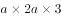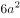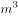，已知每分钟抽1，10小时抽水量为，则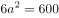，解得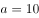，该蓄水池的宽为10米。

故正确答案为A。

---

### 第 2 题　qid 1752488 · 数学运算

将1千克浓度为X的酒精，与2千克浓度为20%的酒精混合后，浓度变为0.6X。则X的值为（    ）。

- **A**. 50%　✅
- **B**. 48%
- **C**. 45%
- **D**. 40%

**答案**：A

**官方解析**

根据溶液混合前后溶质的量不变，可得，解得，即浓度为50%。

故正确答案为A。

---

### 第 3 题　qid 1752490 · 数学运算

某单位两座办公楼之间有一条长204米的道路，在道路起点的两侧和终点的两侧已各栽种了一棵树。现在要在这条路的两侧栽种更多的树，使每一侧每两棵树之间的间隔不多于12米，如栽种每棵树需要50元人工费，则为完成栽种工作，在人工费这一项至少需要做多少预算？

- **A**. 800元
- **B**. 1600元　✅
- **C**. 1700元
- **D**. 1800元

**答案**：B

**官方解析**

要想人工费尽量地少，则所栽种的树要尽可能地少，则根据题意可确定两棵树之间的间隔取最大值为12米，先考虑道路的一侧，总长204米，每两棵之间间隔为12米，，恰好整除且17个间隔需要栽种18棵树，已知道路的起点和终点已经各栽种一棵，则道路的一侧还需要栽种棵树，两侧共需要棵树，则所需要人工费用为元。

故正确答案为B。

---

### 第 4 题　qid 1752492 · 数学运算

村官小刘负责将村委会购买的一批煤分给村中的困难户，如果给每个困难户分300千克煤，则缺500千克；如果给每个困难户分250千克煤，则剩余250千克。为帮助困难户，村委会购买了多少千克的煤？

- **A**. 5500
- **B**. 5000
- **C**. 4500
- **D**. 4000　✅

**答案**：D

**官方解析**

假设该村有x户困难户，则根据题意可得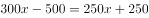，解得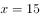，则村委会共购买了煤千克。

故正确答案为D。

---

### 第 5 题　qid 1752494 · 数学运算

某单位组织职工参加周末培训，其中英语培训和财务培训均在周六，公文写作培训和法律培训均在周日。同一天举办的两场培训每人只能报名参加一场，但不在同一天的培训可以都参加。则职工小刘有多少种不同的报名方式？（  ）

- **A**. 4
- **B**. 8　✅
- **C**. 9
- **D**. 16

**答案**：B

**官方解析**

根据题意可得，若小刘只报名参加1场培训，则可以参加这4场培训当中的任何一种，共有种选择；若小刘报名参加了2场培训，则可以参加周六两场当中的任意一场与周日两场当中的任意一场，共有种报名方式，则小刘总共有4+4=8种报名方式。

故正确答案为B。

---

### 第 6 题　qid 1752496 · 数学运算

小王近期正在装修新房，他计划将长8米、宽6米的客厅按下图所示分别在各边中点连线形成的四边形内铺设不同花色的瓷砖，则需要为最里侧的四边形铺设多少平方米的瓷砖？（  ）

- **A**. 3
- **B**. 6　✅
- **C**. 12
- **D**. 24

**答案**：B

**官方解析**

如图所示，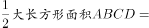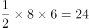平方米，根据中位线定理可知，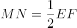，根据面积之比等于边长比的平方，可知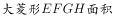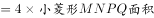，则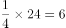平方米。

故正确答案为B。

---

### 第 7 题　qid 1752498 · 数学运算

某企业对销售员的全年考评中，年中考评成绩和年末考评成绩分别占20%和30%，销售业绩占50%。销售员甲和乙的全年销售业绩相同，甲的年中考评成绩比乙高3分，乙的全年考评成绩比甲高3分。则乙的年末考评成绩比甲高多少分？（  ）

- **A**. 6
- **B**. 8
- **C**. 10
- **D**. 12　✅

**答案**：D

**官方解析**

假设乙的年末考评成绩比甲高x分，根据题目条件，甲年中考评成绩比乙高3分，且年中考评占总成绩比重为20%，将年中考评成绩核算成全年考评成绩，此部分甲比乙多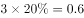分，同理，将乙的年末考评成绩核算成全年成绩，比甲多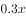，销售业绩相同不用考虑，则，解得。

故正确答案为D。

---

### 第 8 题　qid 1752500 · 数学运算

某工厂与订货商签订合同，约定订货商在订单生产完成和的时候分别支付两笔货款。在派6名工人生产4天后，完成了订单的，如增派9名工人加入生产，则订货商在支付第一笔和第二笔货款间的时间间隔为多少天？（假定所有工人工作效率相同）

- **A**. 6天　✅
- **B**. 10天
- **C**. 12天
- **D**. 15天

**答案**：A

**官方解析**

设每名工人每天的工作量为1，根据6名工人生产4天完成总工程量的8%，可得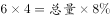；解得，总量=300。由题意可得，支付第一笔和第二笔货款中间需完成：，又增派9人可得现在共15人工作，故需要。

故正确答案为A。

---

### 第 9 题　qid 1752504 · 数学运算

一项工作，如果小王先单独干6天后，小刘接着单独干9天可完成总任务量的2/5；如果小王单独干9天后，小刘接着单独干6天可完成总任务量的7/20。则小王和小刘一起完成这项工作需要多少天？（  ）

- **A**. 15
- **B**. 20　✅
- **C**. 24
- **D**. 28

**答案**：B

**官方解析**

设工程总量=20，小王效率为x，小刘效率为y。由题意可得：①6x+9y=8，②9x+6y=7，①+②=15x+15y=15，故x+y=1，则小王和小刘一起完成需要20÷1=20天。
故正确答案为B。

---

### 第 10 题　qid 1752506 · 数学运算

小赵骑车去医院看病，父亲在发现小赵忘带医保卡时以60千米/小时的速度开车追上小赵，把医保卡交给他并立即返回。小赵拿着医保卡后又骑了10分钟到达医院，小赵父亲也同时到家。假如小赵从家到医院共用时50分钟，则小赵的速度为多少千米/小时？（假定小赵及其父亲全程都匀速行驶，忽略父子二人交接卡的时间）

- **A**. 10
- **B**. 12
- **C**. 15　✅
- **D**. 20

**答案**：C

**官方解析**

如图所示：

已知小赵从家（A点）到医院（C点）共用50分钟，赵父在B点追上小赵，此后小赵骑车的时间为10分钟，故从A到B小赵共用40分钟；B点之后小赵去医院C，赵父返家，且同时到达，故赵父从B到A也用10分钟。因为AB两地路程相等，小赵和赵父所用时间之比为4:1，所以速度之比为1:4，已知赵父速度为60千米/小时，故小赵速度=60÷4=15千米/小时。

故正确答案为C。

---

### 第 11 题　qid 1752508 · 数学运算

某单位原拥有中级及以上职称的职工占职工总数的。现又有2名职工评上中级职称，之后该单位拥有中级及以上职称的人数占总人数的。则该单位原来有多少名职称在中级以下的职工？

- **A**. 68
- **B**. 66　✅
- **C**. 64
- **D**. 60

**答案**：B

**官方解析**

方法一：由题意可知，无论是否有人评上中级职称，该单位总人数不变，由可得总人数为8的倍数，由总人数的可得总人数为11的倍数。故设总人数为，则原来该单位中级以上职称人数为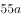，中级以下职称人数为。现又有2人评上中级职称，则现在拥有中级及以上职称的人数为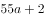，比例应为，解得，原有中级以下职称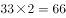人。

方法二：由题意得，原来单位中级及以上职称和中级以下职称人数之比为，故原来职称在中级以下的职工人数应为3的倍数，排除A、C；已知有两人评上中级职称后（即中级以下职称人数减少2人），该单位中级及以上职称和中级以下职称人数之比为，故原来职称在中级以下的职工人数减2应为4的倍数，排除D。

故正确答案为B。

---

### 第 12 题　qid 1752510 · 数学运算

一个正方体的边长为1，一只蚂蚁从其一个角出发，沿着正方体的棱行进，直到经过该正方体的每一条棱为止（经过一个顶点即算作经过该顶点所连接的3条棱）。则其最短的行进距离为：

- **A**. 3
- **B**. 4
- **C**. 5　✅
- **D**. 6

**答案**：C

**官方解析**

要行进距离最短，即每经过一个点，尽量让过这个点的三条棱不与之前的重复，由于是正方体（如图所示）从A点走到下一步任意一点，设为B点最少要有1条棱重复（即AB），则要经过正方体12条棱，至少要从起点A（3条棱），此后每走一步可再经过2条棱，共走5步（3+2+2+2+2+1=12），才能走完。

故正确答案为C。

---

### 第 13 题　qid 1752512 · 数学运算

某次专业技能大赛有来自A科室的4名职工和来自B科室的2名职工参加。结果有3人获奖且每人的成绩均不相同。如果获奖者中最多只有1人来自B科室，那么获奖者的名单和名次顺序有多少种不同的可能性？

- **A**. 48
- **B**. 72
- **C**. 96　✅
- **D**. 120

**答案**：C

**官方解析**

若B科室有1人获奖：先在B科室2人中选1人，有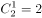种；再在A科室4人中选2人，有种；最后将获奖的3人排序有种。根据乘法原则，共种。若B科室没有人获奖：在A科室4人中选出3人获奖，再按成绩排序，则有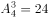种。根据加法原则，共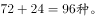

故正确答案为C。

---

### 第 14 题　qid 1752514 · 数学运算

甲、乙、丙三人打羽毛球，甲对乙、乙对丙和甲对丙的胜率分别为60%、50%和70%。比赛第一场甲与乙对阵，往后每场都由上一场的胜者对阵上一场的轮空者。则第三场比赛为甲对丙的概率比第二场：

- **A**. 低40个百分点　✅
- **B**. 低20个百分点
- **C**. 高40个百分点
- **D**. 高20个百分点

**答案**：A

**官方解析**

已知第二场比赛为甲对丙的前提为第一场比赛甲对乙时，甲胜乙负，获胜概率为；第三场比赛为甲对丙的前提是，第二场比赛不能为甲对丙，故第一场比赛甲不能胜，则第一场甲负乙胜，概率为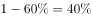，第二场比赛乙对丙，且乙负丙胜，概率为，。，即低40个百分点。

故正确答案为A。

---

## 判断推理

### 第 1 题　qid 1752630 · 图形推理

每道题包含一套图形和四个选项，请从四个选项中选出最恰当的一项填在问号处，使图形呈现一定的规律性。

- **A**. A
- **B**. B
- **C**. C
- **D**. D　✅

**答案**：D

**官方解析**

元素组成相同，考虑位置规律。有三个开口圈，观察开口位置可得，最外圈和第二圈都是每次逆时针旋转90°，故问号处最外圈开口应该朝下，第二圈开口应该朝左，排除B、C项；最内圈每次顺时针旋转90°，故问号处开口应朝左。
故正确答案为D。

---

### 第 2 题　qid 1752638 · 图形推理

每道题包含一套图形和四个选项，请从四个选项中选出最恰当的一项填在问号处，使图形呈现一定的规律性。

- **A**. A
- **B**. B
- **C**. C　✅
- **D**. D

**答案**：C

**官方解析**

元素组成不同，且无法通过属性规律解题，考虑数量规律。题干图形窟窿（封闭区间）很多，优先数面。题干每幅图均由5个面组成，排除B选项。再观察，发现题干中每幅图形均有一个面的面积为整个正方形的一半，选项中ACD中只有C项符合此规律。
故正确答案为C。

---

### 第 3 题　qid 1752670 · 图形推理

每道题包含六个图形和四个选项，请把六个图形分为两类，使每一类图形都具有各自的共同规律或者特征，并从四个选项中选出分类正确的一项。

- **A**. ①②⑤，③④⑥
- **B**. ①③⑥，②④⑤
- **C**. ①③④，②⑤⑥　✅
- **D**. ①⑤⑥，②③④

**答案**：C

**官方解析**

元素组成凌乱，图①③④有明显的轴对称图形特征，优先考虑对称性。图②⑤⑥都是中心对称图形，图①③④都是轴对称图形。
故正确答案为C。

---

### 第 4 题　qid 1752676 · 图形推理

本题包含六个图形和四个选项，请把六个图形分为两类，使每一类图形都具有各自的共同规律或者特征，并从四个选项中选出分类正确的一项。

- **A**. ①③⑤，②④⑥
- **B**. ①②③，④⑤⑥
- **C**. ①②⑤，③④⑥
- **D**. ①②⑥，③④⑤　✅

**答案**：D

**官方解析**

本题为分组分类题目。元素组成不同，且无明显属性规律，考虑数量规律。观察发现，图形线条交叉明显，考虑交点数。题干图形的交点数依次为：2、2、4、4、4、2，图①②⑥的交点数均为2，图③④⑤的交点数均为4，即图①②⑥为一组，图③④⑤为一组。
故正确答案为D。

---

### 第 5 题　qid 1752684 · 图形推理

把下面的六个图形分为两类，使每一类图形都有各自的共同特征或规律，分类正确的一项是：

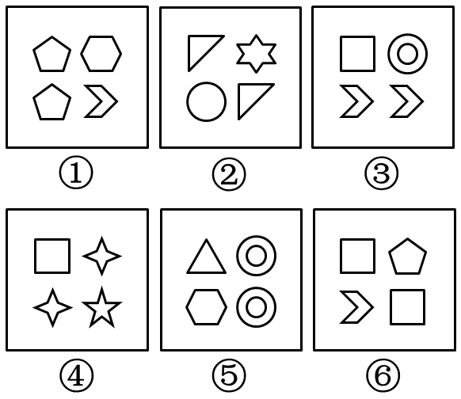

- **A**. ①②③,④⑤⑥
- **B**. ①③⑤,②④⑥　✅
- **C**. ①②⑤,③④⑥
- **D**. ①③⑥,②④⑤

**答案**：B

**官方解析**

元素组成不同，且所有图形均为小元素组成，故优先考虑数量规律。全部都由四个独立的元素构成，且每幅图都有两个元素一样。观察发现，图①、③、⑤的两个相同的元素的位置关系是在同行或者同列，图②、④、⑥的两个相同的元素的位置关系为对角线关系。
故正确答案为B。

---

### 第 6 题　qid 1752804 · 逻辑判断

当前，随着数字化技术的发展，数字化阅读越来越流行。更多的人愿意利用电脑、手机以及各种阅读器来阅读电子图书，而且电子图书具有存储量大、检索快捷、便于保存、成本低廉等优点。因此，王研究员认为，传统的纸质图书将最终会被电子图书所取代。
  以下哪项如果为真，最能削弱王研究员的观点？

- **A**. 阅读电子图书虽然有很多方便之处，但相对于阅读纸质图书，更容易损害视力
- **B**. 有些读者习惯阅读纸质图书，不愿意采用数字化方式阅读
- **C**. 许多畅销图书刚一出版，短期内就会售完，可见，纸质图书还是有很大市场的
- **D**. 通常情况下，只有在纸质图书出版的前提下才允许流通相应的电子图书　✅

**答案**：D

**官方解析**

第一步：找到论点论据。
 论点：传统的纸质图书将最终会被电子图书所取代。
 论据：电子图书具有存储量大、检索快捷、便于保存、成本低廉等优点。
 第二步：逐一分析选项。
 A项：指出了电子图书相对纸质图书更容易损害视力，但是否会因为这个原因就不能取代纸质图书，不得而知，排除；
 B项：有些读者习惯阅读纸质图书，不愿意采用数字化方式阅读可能会对纸质书被电子书取代产生一定影响，因此此项是可能性削弱，保留；
 C项：部分纸质图书有很大市场，但市场大不代表不会被取代，为无关选项，排除；
 D项：说明电子图书的前提是先有纸质图书，即没有纸质书就不会有电子书，有电子书必有纸质书，也就是说纸质书一定不会被电子书取代，削弱论点，力度比B项的可能性削弱要强，当选。
 故正确答案为D。

---

### 第 7 题　qid 1752836 · 逻辑判断

某国议员认为：“只要提高工人工资就会导致通货膨胀。如果发生通货膨胀，那么人民就会遭受损失。人民遭受损失，就会使政府失去人心。政府只有得人心，国家才能和谐稳定。”
根据该议员的观点，以下除了哪项，均可以推出？

- **A**. 只要提高工人工资，政府就会失去人心
- **B**. 如果发生通货膨胀，政府就会失去人心
- **C**. 提高工人工资，且政府得人心　✅
- **D**. 国家和谐稳定与提高工人工资不能并存

**答案**：C

**官方解析**

第一步：翻译题干。

①只要提高工资就通货膨胀：只要······就······，前推后：提高工资通货膨胀；

②如果通货膨胀那么遭受损失：如果······那么······，前推后：通货膨胀遭受损失；

③遭受损失就失去人心：······就······，前推后：遭受损失失去民心；

④只有得民心国家才和谐稳定：只有······才······，后推前：和谐稳定得人心，根据逆否定理，可以得出：

⑤失去人心不和谐稳定。

第二步：逐一分析选项。

A项：由①②③可得提高工资推出失去人心，正确；

B项：由②③可得通货膨胀推出失去人心，正确；

C项：由①②③可得提高工资推出失去人心，因此提高工资与得人心不可能同时出现，错误；

D项：由①②③⑤可得提高工资不和谐稳定，故提高工资与和谐稳定不能共存，正确。

本题为选非题，故正确答案为C。

---

### 第 8 题　qid 1752842 · 逻辑判断

中东呼吸综合征（简称MERS）根本不像人们想象得那么可怕。据统计，2015年1-6月份，因感染MERS而死亡的人数显著低于同期因患普通感冒而死亡的人数。因此，普通感冒比MERS更能威胁人们的生命安全。
  下列哪项最能反驳上述论证？

- **A**. 2015年1-6月份，普通感冒患者远远多于MERS患者　✅
- **B**. 2015年1-6月份，韩国爆发了MERS疫情，严重威胁着民众的生命安全
- **C**. 引起普通感冒的原因与引起MERS的原因不同
- **D**. 有人患有普通感冒，又感染了MERS病毒，最终死亡

**答案**：A

**官方解析**

第一步：找到论点论据。
 论点：普通感冒比MERS更能威胁人们的生命安全。
 论据：2015年1月－6月期间感染MERS而死亡的人数低于患普通感冒而死亡的人数。
 第二步：逐一分析选项。
 A项：威胁生命安全应该是指死亡率，即死亡数/患病数，而论据只说死亡人数，故可以补充患病人数。分母越大，则威胁生命的概率越低。故A项可削弱，当选；
 B项：指出MERS会威胁生命安全，但没有与普通感冒作比较，为无关选项，排除；
 C项：指出两者患病的原因不同，与题干的哪个更能威胁人们的生命安全无关，为无关选项，排除；
 D项：既患了感冒，又感染了MERS，最终死因无法判定，无法削弱论点，排除。
 故正确答案为A。

---

### 第 9 题　qid 1752850 · 逻辑判断

某单位正在创建无烟单位，最近实行新规：禁止在单位内任何场所吸烟。有些吸烟员工因为不能适应，试图改变这一规定，却以失败告终。因为单位规定，制度变更必须经过如下程序：只有获得15%以上的员工签字提议，才能由全体员工进行投票表决。结果，这些吸烟员工的提议被大多数员工投票否决了。
  由上述断定最可能推出的结论是：

- **A**. 投否决票的员工小于或等于85%
- **B**. 在吸烟员工的提议书上签字的员工不到15%
- **C**. 在吸烟员工的提议书上签字的员工不少于15%　✅
- **D**. 有员工在提议书上签了字，但在表决时又投了否决票

**答案**：C

**官方解析**

第一步：翻译题干。

（1）全体员工投票表决获得15%以上的签字提议。

（2）提议被否决，说明肯定进行了投票表决。

第二步：逐一分析选项。

A项：题干结论是被大多数员工否决，大多数具体是多少，无从得知，错误；

B项：提议被否决，可以推出有15%以上的员工签字，B项说不到15%，错误；

C项：由1和2可得，必定获得了15%以上的签字提议，故C选项正确；

D项：签字的员工是否投了否决票，从文段中无法推出，无中生有，排除。

故正确答案为C。

---

### 第 10 题　qid 1752856 · 逻辑判断

在人一生当中，会不断对脑神经连接进行“优化重组”，“修剪”掉多余的连接，以保证有用的连接更加快速通畅。研究人员选取了121名年龄在4-20岁的健康志愿者，利用磁共振技术，分析了这一年龄段神经连接随着大脑发育和成熟而发生的变化。结果发现，女性对脑神经连接开始“修剪”的时间普遍早于男性。因此研究人员认为，女性的大脑相比男性大脑更高效。
以下陈述如果为真，哪项无法支持上述结论？

- **A**. 学龄期女孩往往表现出比同龄男孩更好的理解能力和语言能力
- **B**. 脑神经连接“修剪”出错会导致自闭症，患病率性别差异显著　✅
- **C**. 男孩只能专注于一件工作的时候，女孩可以同时处理多项工作
- **D**. 大脑“修剪”和“重组”之后使得各种认知活动效率提升很多

**答案**：B

**官方解析**

第一步：找到论点论据。
论点：女性的大脑相比男性的大脑更高效。
论据：人脑会对脑神经进行修剪以保证有用的连接更加快速通畅，4-20岁女性对脑神经连接开始修剪的时间普遍早于男性。
第二步：逐一分析选项。
A项：学龄期女孩比男孩有更好的理解能力和语言能力说明女性大脑比男性大脑更高效，举例加强论点，可以加强，排除；
B项：指出修剪出错会导致的负面后果（自闭症），与论点说的女性大脑是否更高效无关，为无关项，无法加强，当选；
C项：举例说明女性比男性大脑更高效的具体表现，举例加强论点，可以加强，排除；
D项：说明大脑修剪能提高认知活动效率，在论点和论据之间建立联系，属于搭桥项，可以加强，排除。
本题为选非题，故正确答案为B。

---

### 第 11 题　qid 1752862 · 逻辑判断

某经销商为感谢消费者，同时进一步宣传其产品，组织部分消费者进行郊游活动。此活动为参与者准备了H、I、J、K、L、M六种可供选择的礼物。但是，礼物的选择必须满足如下条件：
（1）只有选择礼物I和J，才能选择礼物H
（2）如果选择了礼物L，就不能再选礼物J，也不能再选礼物K
（3）只有选择了礼物L，才能选择礼物M
已知赵先生选择了礼物H，请问以下哪项有可能是赵先生选择的其他礼物？

- **A**. I和M
- **B**. I和L
- **C**. J和L
- **D**. J和K　✅

**答案**：D

**官方解析**

第一步：翻译题干。

（1）只有······才······，后推前：HI 且 J；

（2）如果······就······，前推后：L -J，L-K；

（3）只有······才······，后推前：ML；

已知：选择了H。

第二步：逐个分析选项。

选择了H礼物，则肯定选择I礼物和J礼物；如果选择了J礼物，由（2）可知不能选择L礼物，因此排除B项和C项；如果不选择L礼物，由（3）可知不能选择M礼物，因此排除A项。

故正确答案为D。

---

### 第 12 题　qid 1752868 · 逻辑判断

研究者对一万名平均年龄65岁的男女进行追踪研究，评估他们是否存在抑郁以及中风发病情况。研究开始时这些人均无中风史。研究发现，持续存在重度抑郁症状与中风风险增加一倍以上相关，而那些无抑郁症状或症状较轻的参与者的中风风险则并未增加。曾经存在重度抑郁症状的患者，即使其症状在访谈期间已然缓解，他们的中风风险仍然与那些始终存在重度抑郁症状的人相比无显著差异。
以上陈述如果为真，可以推出：

- **A**. 重度抑郁症极有可能会发展演变为中风
- **B**. 中风患者人群中患抑郁症的几率也比较高
- **C**. 正患有或曾患有重度抑郁均是中风的风险因素　✅
- **D**. 抑郁和中风作为老年常见疾病，经常一起发病

**答案**：C

**官方解析**

通读文段，逐一分析选项。
A项：题干中说的是重度抑郁症状与中风风险是正相关的，有风险并不等同于“极有可能会发展演变为中风”，“极有可能”过于绝对，程度太重，排除。
B项：题干中说的是重度抑郁症患者中风的风险高，选项说中风人群中患有抑郁症的概率高，逻辑顺序反了，排除。
C项：题干最后一句话表述的含义就是无论是曾经患有还是正在患有重度抑郁症的人，他们中风的风险是无显著差异的，能推出，当选。
D项：题干中并未提及抑郁和中风是否经常一起发病，属于无中生有，排除。
故正确答案为C。

---

### 第 13 题　qid 1752874 · 逻辑判断

只有在湿度高且光线昏暗的山林里才会有野生灵芝生长。紫金山林区没有野生灵芝生长。
  若以上判断为真，可推出以下哪项结论？
Ⅰ.紫金山林区湿度不高并且光线不昏暗。
Ⅱ.如果紫金山林区光线昏暗，则肯定湿度不高。
Ⅲ.如果紫金山林区湿度高，则肯定光线不昏暗。

- **A**. 仅Ⅰ
- **B**. 仅Ⅱ
- **C**. 仅Ⅱ和Ⅲ
- **D**. Ⅰ、Ⅱ和Ⅲ都推不出　✅

**答案**：D

**官方解析**

第一步：翻译题干的信息。

只有……才……，后推前：野生灵芝湿度高 且 光线昏暗；

已知：-野生灵芝。

第二步：分析选项。

因为“-野生灵芝”属于否定前件，得不到确定性结论，因此并不能判断紫金山林区的光线是否昏暗，湿度是否高，因此三个结论都无法推出。

故正确答案为D。

---

### 第 14 题　qid 1752876 · 逻辑判断

某科学家批评了人们对化学添加剂的恐惧。“食品标签上如果出现很多添加剂就会让人心生恐惧，但其实添加剂和防腐剂是受到严格控制和计量的，真正应该关注的是食品中糖和脂肪的含量。防腐剂是有益的，显然，我们都愿意吃到一个保存良好的罐头，而不希望因为摄入肉毒杆菌而死亡。”
下列陈述如果为真，哪项无法支持该科学家的观点？

- **A**. 很多药物也是化学制剂，是药三分毒，用药要谨慎　✅
- **B**. 纯天然无添加的原生态食品很难储存，而且价格更高
- **C**. 防腐剂可以有效防止食品腐败变质、滋生细菌
- **D**. 食品安全关键在于食品添加剂种类与量的严格控制

**答案**：A

**官方解析**

第一步：找出论点和论据。
论点：不需要恐惧添加剂。
论据：添加剂和防腐剂是受到严格控制和计量的，是有益的。
第二步：逐一分析选项。
A项：题干中说的是防腐剂和添加剂，而A选项说的是化学制剂，无关项，当选；
B项：无添加的食品难储存，说的是没有防腐剂和添加剂时不好的地方，可以加强，排除；
C项：防腐剂可以防止滋生细菌，是说的好的地方，可以加强，排除；
D项：说的是添加剂的种类和用量是严格控制的，可以加强，排除。
本题为选非题，故正确答案为A。

---

### 第 15 题　qid 1752880 · 逻辑判断

某舞蹈队里有三名女队员王虹、张静和高薇，她们是好朋友，来自不同的省份，或者来自甘肃或者来自山东或者来自广西。高薇见过张静的姐姐，高薇的国标舞比来自广西的队员跳得好。来自山东的独生女，其国标舞是三人中跳得最不好的。
由此可以推出的是：

- **A**. 王虹来自甘肃，张静来自广西
- **B**. 张静来自广西，高薇来自甘肃　✅
- **C**. 高薇国标舞跳得最好，张静跳得最不好
- **D**. 王虹国标舞跳得最不好，张静跳得最好

**答案**：B

**官方解析**

分析题干中的信息可知：
①张静有姐姐，因此不是独生女，而山东的队员是独生女，因此张静不是山东队员；
②高薇国标舞比广西队员跳得好，因此高薇不是广西队员；
③因为山东队员国标舞跳得最不好，因此高薇不是山东队员。
因此，当高薇既不是来自山东也不是来自广西时，可知高薇是甘肃队员；
那么张静不是甘肃队员，同时又推出她不是山东队员，因此张静是广西队员。
故正确答案为B。

---

### 第 16 题　qid 1752886 · 逻辑判断

研究员将六百多位老年痴呆症患者分为三个组，一组补充一定剂量的维生素E，另一组接受药物治疗，第三组服用安慰剂。在接下来两年多的时间里，与服用安慰剂的患者相比，服用维生素E的患者从事制订计划、做饭和购物等日常活动的能力下降较慢。服用药物的患者没有获得类似的临床效果。因而研究员认为，维生素E补充剂有望成为治愈老年痴呆症的特效药。
以下陈述如果为真，哪项最能质疑研究员的结论？

- **A**. 维生素E为脂溶性，不易代谢，一次性大量服用会导致中毒
- **B**. 老年痴呆是不可逆性疾病，症状的发生只可能延缓而无法逆转　✅
- **C**. 正常人体每日所需的维生素E可以从饮食中摄取，不必额外补充
- **D**. 现有的抗老年痴呆的药物中均未添加维生素E

**答案**：B

**官方解析**

第一步：找到论点和论据。
论点：维生素E补充剂有望成为治愈老年痴呆症的特效药。
论据：通过实验，发现服用维生素E的患者日常活动的能力下降得比较缓慢。
第二步：逐一分析选项。
A选项：说明一次性大量服用维生素E有害处，但是并没有提到维生素E对老年痴呆是否能够起到治愈作用，并且一次性大量服用维生素E也是题干中没说到的，因此，属于无关项，不能削弱，排除；
B选项：说明老年痴呆这种病无法逆转，即老年痴呆根本是无法治愈的，说明维生素E不可能成为治愈老年痴呆的特效药，直接削弱了结论，当选；
C选项：正常人需不需要补充维生素E与老年痴呆症患者无关，属于无关项，排除；
D选项：现有的老年痴呆药里面有没有维生素E和维生素E是否能治愈老年痴呆不是一回事，话题不一致，属于无关项，排除。
故正确答案为B。

---

### 第 17 题　qid 1752888 · 逻辑判断

某中学高中部所有喜欢球类运动的学生都参加过学校的运动会。因此，有些喜欢美术的同学不喜欢球类运动。
为使上述论证成立，关于该中学高中部学生的断定必须假设的是：

- **A**. 所有喜欢球类运动的学生都不喜欢美术
- **B**. 参加过学校运动会的学生都喜欢球类运动
- **C**. 所有喜欢美术的同学都没参加过学校的运动会
- **D**. 有些喜欢美术的同学没有参加过学校的运动会　✅

**答案**：D

**官方解析**

第一步：找出论点和论据。

论点：有些喜欢美术的同学不喜欢球类运动。

论据：高中部所有喜欢球类运动的学生都参加过学校的运动会。

本题虽然是加强题型，但是题干中存在明显的逻辑关联词，可先将关联词翻译，题干论点翻译为：有的美术不球类，论据翻译为：球类运动会。

第二步：逐一分析选项。

A项：喜欢球类的都不喜欢美术，翻译为：球不美，可逆否为：美不球，即A项可以替换为所有喜欢美术的都不喜欢球类运动，可以得出题干中有的喜欢美术的同学不喜欢球类运动的结论，属于直接加强结论，保留；

B项：参加过运动会的都喜欢球类运动，可翻译为：运动会球，与喜欢美术的同学是否喜欢球类运动无关，属于无关选项，排除；

C项：所有喜欢美术的同学都没参加过运动会，翻译为：所有美术不运动会，根据题干论据球类运动会可知，所有美术不运动会不球类，在美术和不球类之间搭桥，支持题干论证关系，保留；

D项：有些喜欢美术的同学没参加过运动会，翻译为：有些美术不运动会，根据题干论据球类运动会可知，有些美术不运动会不球类，可得：有些美术不球类，在美术和不球类之间搭桥，支持题干论证关系，保留。

本题的A、C项得出的结论都是所有喜欢美术的都不喜欢球类运动，尽管这两者都能推导出有的喜欢美术的不喜欢球类运动，但D项得出的结论直接就是有的喜欢美术的不喜欢球类运动，与题干的结论是完全一致的，因此，D项要优于A、C项。

故正确答案为D。

---

### 第 18 题　qid 1752894 · 逻辑判断

研究表明，近15年来全球平均气温没有显著的增温趋势，这似乎与温室气体排放造成全球变暖的大背景相矛盾。但温度变化是由动力温度和辐射温度两部分造成的，对其气候效应的研究既要考虑气候系统动力因子的年代际变化，更要量化人类活动造成的辐射温度的作用。事实上，动力温度在近15年出现显著的降温趋势，而辐射温度持续上升，两者相互抵消，造成了近年来全球气温的增温停滞。
下列推论中正确的是：

- **A**. 气候系统动力因子的年代际变化“冷却”了大气温度　✅
- **B**. 动力温度和辐射温度均增高导致全球变暖的大趋势
- **C**. 气温稳定取决于动力温度与辐射温度的相同变化
- **D**. 动力气温降温不显著造成了15年前的全球变暖

**答案**：A

**官方解析**

日常结论题，根据题干信息逐一分析选项。
A项：题干中说“温度变化是由动力温度和辐射温度两部分造成的，既要考虑气候系统动力因子的年代际变化，更要量化人类活动造成的辐射温度的作用”，可知动力温度即是气候系统动力因子的年代际变化，而结论是动力温度降温，可知气候系统动力因子的年代际变化冷却了大气温度，当选；
B项：选项中说动力温度增高，而题干中的结论明确指出动力温度下降，排除；
C项：温度变化是由动力温度和辐射温度两部分造成的，两者相互抵消，造成了近年来全球气温的增温停滞。所以气温稳定应取决于二者的相反变化，而非相同变化，排除；
D项：题干中没有涉及15年前的动力气温降温情况，排除。
故正确答案为A。

---

### 第 19 题　qid 1752898 · 类比推理

从前，有一个奇怪的岛屿，岛屿上只住着M族人和N族人。M族人从不说真话，N族人总是说真话。有一天，小张来到这个岛屿，碰到该岛屿上的三个人。小张问甲：“你是M族人吗？”甲做了回答。乙根据甲的回答说：“甲不是M族人。”丙说：“甲确实是M族人。”
根据以上陈述，可推出小张碰到的三个人中，有几个M族人？

- **A**. 0
- **B**. 1　✅
- **C**. 2
- **D**. 3

**答案**：B

**官方解析**

题干及选项均无确定信息，适合用假设法，分情况讨论，由于题干三人所讨论的都是甲的情况，所以分别假设甲是M族人、甲不是M族人。
情况（一）：假设甲是M族人，由题干“M族人从不说真话”，那么甲说假话，所以甲回答小张的应该是：我不是M族人；
由题干“乙根据甲的回答说”，说明乙说的话并非根据真实情况（即乙并不知道甲是否M族人），乙说的话是基于甲的回答，乙说的是，“甲不是M族人”，和甲的回答一致，所以乙说了真话，由题干“N族人总是说真话”，得出乙是N族人；
此时丙说，“甲是M族人”，丙说的话并非根据甲的回答，说明丙是基于真实情况来说的，而真实情况是，甲是M族（假设的真实情况），因此丙说了真话，由题干“N族人总是说真话”，得出丙是N族人；此种情况下只有甲一个人是M族人；
情况（二）：假设甲不是M族人，是N族人，那么甲只说真话，因此甲回答小张的应该是：我不是M族人。
此时，乙根据甲的回答说，甲不是M族人，与甲的回答一致，说明乙说了真话，所以乙是N族人；
丙说，甲是M族人，丙说的话是基于真实情况，即假设的情况（甲不是M族人），所以此时丙说了假话，由题干“M族人从不说真话”，则丙是M族人。此种情况下只有丙一个人是M族人。
综上两种情况，三个人中均只有一个人是M族人。
故正确答案为B。

---

### 第 20 题　qid 1752904 · 逻辑判断

某学校要从甲、乙、丙、丁、戊、己、庚七名学生中挑选四人组成一个辩论队，去参加全市的辩论比赛。根据平时的训练情况，挑选必须满足下列条件：
（1）如果戊参加，则丙也要参加；
（2）除非乙参加，否则庚不参加；
（3）甲和乙中至少有一人参加，但不能都参加；
（4）戊和己中至少有一人参加，但不能都参加。
根据以上陈述，以下哪些学生一定会参加辩论比赛？

- **A**. 乙或庚，或者二人都参加
- **B**. 戊或庚，或者二人都参加
- **C**. 丙或丁，或者二人都参加　✅
- **D**. 丙或戊，或者二人都参加

**答案**：C

**官方解析**

本题属于翻译推理题型。 

第一步：翻译题干。

（1）戊丙；

（2）庚乙；

（3）要么甲，要么乙；

（4）要么戊，要么己。

第二步：逐一分析选项。

甲和乙中至少有一人参加，但不能都参加，说明甲、乙中有一人参加；戊和己中至少有一人参加，但不能都参加，说明戊、己中有一人参加；一共要4个人，那么说明丙、丁、庚中有两人参加，所以选择C项。

故正确答案为C。

---

### 第 21 题　qid 1752906 · 定义判断

房地产经纪，是以提取佣金为经营特征，为促成他人房地产交易，而从事房地产买卖、交换、租赁、置换等信息提供、信托劳务、居间代理等业务的经济活动。
根据以上定义，下列属于房地产经纪的是：

- **A**. 作为社区工作者，张大妈经常为小区内买卖房屋的人牵线搭桥
- **B**. 某网站设置房产专栏，免费为发布租房卖房信息的会员提供服务
- **C**. 某中介公司接受一房地产开发商的委托，销售其新开发的商品房　✅
- **D**. 置业顾问小李通过自己多年的房产人脉关系买到一套性价比较高的房子

**答案**：C

**官方解析**

第一步：找出定义关键词。
关键词为“提取佣金为经营特征”、“促成他人房产交易”、“从事房地产买卖、交换、租赁、置换等信息提供、信托劳务、居间代理”。
第二步：逐一分析选项。
A项：张大妈虽然经常为小区内买卖房屋的人牵线搭桥，但张大妈是社区工作者不以提取佣金为经营，不符合定义，排除；
B项：某网站的房产专栏是免费为发布信息的会员提供服务，不符合定义，排除；
C项：中介公司受到了房地产的委托，属于居间代理，中介公司是要收取服务费的，符合定义，当选；
D项：小李是为自己买房子而不是促成他人房产交易，不符合定义，排除。
故正确答案为C。

---

### 第 22 题　qid 1752910 · 定义判断

互补品，是指两种商品之间存在着某种消费依存关系，即一种商品的消费必须与另一种商品的消费相配套。可以分为两类：普通互补品，是指两种商品之间没有固定的同时使用的比例；完全互补品，是指两种商品之间必须按照固定不变的比例同时被使用。
根据上述定义，下列选项正确的是：

- **A**. 薯条和汉堡属于普通互补品
- **B**. 眼镜框和眼镜片属于完全互补品　✅
- **C**. 毛笔和墨汁属于完全互补品
- **D**. 数码相机和胶卷属于普通互补品

**答案**：B

**官方解析**

第一步：找出定义关键词。
互补品：“一种商品的消费必须与另一种商品的消费相配套”。
普通互补品：“没有固定的同时使用的比例”。
完全互补品：“必须按照固定不变的比例同时被使用”。
第二步：逐一分析选项。
A项：汉堡和薯条可以分开消费，不是普通互补品，排除；
B项：眼镜框和眼镜片是同时配套使用，而且要按照固定的比例，符合定义关键词，属于完全互补品，当选；
C项：毛笔和墨汁的使用没有固定不变的比例，根据书写的要求决定墨汁需求的比例，属于普通互补品，排除；
D项：数码相机是不需要胶卷的，胶卷在传统胶片相机中使用，两者不存在依存关系，不是普通互补品，排除。
故正确答案为B。

---

### 第 23 题　qid 1752914 · 定义判断

委婉语，是指在特定的语境中，对于使人感到敬畏、恐惧、羞耻、不适的事物，信息组织者有意地运用语音、语义、语法等手段而形成的对这些事物非直接的语言或言语表达，从而避免使信息组织者本人、信息理解者、话语涉及的第三方即信息的潜在理解者有消极的心理反应。
根据上述定义，下列选项中使用了委婉语的是：

- **A**. 王某回忆起母亲常把“树欲静而风不止，子欲养而亲不待”放在嘴边
- **B**. 诗人把“春风又过江南岸”改成“春风又绿江南岸”
- **C**. 同事询问田某母亲的病情，她回答说“老了，送上路了”　✅
- **D**. 外国学生学习汉语后，在路上遇到同学时问“你吃饭了吗”

**答案**：C

**官方解析**

第一步：找出定义关键词。
“使人感到敬畏、恐惧、羞耻、不适的事物”、“运用语音、语义、语法等手段”、“非直接的语言或言语表达”、“避免理解者有消极的心理反应”。
第二步：逐一分析选项。
A项，不涉及“理解者的消极心理反应”，排除；
B项，没有涉及“使人感到敬畏、恐惧、羞耻、不适的事物”和“理解者的消极心理反应”，排除；
C项，对病情的回答属于“避免理解者有消极的心理反应”，“老了”属于语义，人的生命属于“使人感到敬畏的事物”，完全符合，当选；
D项，没有涉及定义给出的任何关键词，排除。
故正确答案为C。

---

### 第 24 题　qid 1752918 · 定义判断

法律移植，是指一个国家对同时代其他国家法律制度的吸收和借鉴。
根据上述定义，下列属于法律移植的是：

- **A**. 非西方国家在西方列强殖民主义扩张之后，被迫地或主动地施行西方国家法律　✅
- **B**. 张某认为雅典城邦的法律思想体现了公平，认为我国的法律也体现了公平
- **C**. 非洲某落后国家研究发达国家的法律史，并根据实际情况修改了本国的法律制度
- **D**. 法国18世纪借鉴了中国的科举考试，设立了本国的公务员考试

**答案**：A

**官方解析**

第一步：找出定义关键词。
“国家”、“同时代其他国家法律制度的吸收和借鉴”。
第二步：逐一分析选项。
A项，非西方国家的做法是对西方列强国家法律的吸收和借鉴，符合题干，当选；
B项，雅典城邦和我国不是同一时代的国家，同时也没有体现出吸收和借鉴，排除；
C项，研究发达国家的法律史，说明不是同一时代的国家，排除；
D项，18世纪法国设立了公务员考试，借鉴的是那时候中国的科举考试，并不是法律制度，排除。
故正确答案为A。

---

### 第 25 题　qid 1752920 · 定义判断

随意注意，是指有预定目的，需要一定意志努力的注意；不随意注意是事先没有预定的目的，也不需要作意志努力的注意；随意后注意是在随意注意之后发生的，既有一定的目的任务，又不需要意志努力的注意。
根据上述定义，下列属于随意后注意的是：

- **A**. 小林在看杂志时发现了一幅插画，他觉得很不错就用照相机拍了下来
- **B**. 某射箭运动员比赛时过度紧张，致使射第一箭时角度出现了严重偏差，只获得2环的成绩
- **C**. 小林在窗前读书时，突然听到了外面有一些声响，他抬头一看发现有两只小鸟停在了树上
- **D**. 小王刚学开车时必须全神贯注，熟练后，上班途中可以边开车边听广播　✅

**答案**：D

**官方解析**

第一步：找到定义关键词。
“随意注意之后发生”、“有目的任务”、“不需要意志努力”。
第二步：逐一分析选项。
A选项，看杂志发现插画属于事先没有预定的目的，是不随意注意，排除；
B选项，没有体现出一个前后的关系，即不是随意注意之后发生的，排除；
C选项，突然听到声响不符合有一定目的这个关键词，是不随意注意，排除；
D选项，开车全神贯注这是随意注意，之后可以边开车边听广播，这是有任务目的的，但是没有意志努力，这是随意后注意，符合定义，当选。
故正确答案为D。

---

### 第 26 题　qid 1752924 · 定义判断

感知综合障碍是指病人在感知某一现实事物时，作为一个客观存在的整体来说是正确的，但对该事物的个别属性，如大小、形状、颜色、空间距离等产生的与该事物不相符合的感知。
根据上述定义，下列属于感知综合障碍的是：

- **A**. 王某由于沉迷于游戏而经常出现幻觉，眼前浮现游戏中打斗的场景
- **B**. 张某最近一段时间以来经常觉得正在摆动着的钟摆停止了摆动　✅
- **C**. 由于眼睛高度近视，李某在大街上经常会认错人，心里非常苦闷
- **D**. 孙某对颜色的辨别能力差，经医生检查发现这是色弱的表现

**答案**：B

**官方解析**

第一步：找出定义关键词。
“感知某一现实事物”、“作为整体正确”、“个别属性如大小、形状、颜色、空间距离等产生的与该事物相不符合的感知”。
第二步：逐一分析选项。
A项：王某是出现幻觉了，不存在整体正确和个别属性不符合，不符合定义，排除；
B项：张某觉得钟摆停止了摆动，对于钟摆的认识是正确的，但对于摆动的钟摆产生了不摆动的认知，符合定义，当选；
C项：李某是眼睛近视导致的认错人，对整体的认识就是错误的，不符合定义，排除；
D项：孙某是对颜色的辨别能力差，没有体现对事物整体的认知是否正确，不符合定义，排除。
故正确答案为B。

---

### 第 27 题　qid 1752928 · 定义判断

斡旋受贿罪，也称间接受贿罪，是指国家工作人员利用本人职权或地位形成的便利条件，通过其他国家工作人员职务上的行为，为请托人谋取不正当利益，索取请托人财物或者收受请托人财物。
根据上述定义，下列存在斡旋受贿罪的是：

- **A**. 民办学校校长张某收受了某学生家长的红包，委托本校老师伪造该生的成绩单
- **B**. 李董事长送了审计司司长太太一部轿车，成功使得自己的企业逃过审计审查
- **C**. 海关负责海外货品清关的小赵，时常收到海外代购商的礼物，并帮他们逃税
- **D**. 警察孙某请交管局老同事帮小李删除违章记录，并向小李索要一笔好处费　✅

**答案**：D

**官方解析**

第一步：找出定义关键词。
关键词为“国家工作人员利用本人职权或地位形成的便利条件，通过其他国家工作人员职务上的行为，为请托人谋取不正当利益，索取请托人财物或者收受请托人财物”。
第二步：逐一分析选项。
A项：“民办学校校长”不是国家工作人员，主体有误，不符合定义，排除；
B项：李董事长送给了“审计司司长太太”一部车，但是审计司司长太太并非国家工作人员，主体有误，不符合定义，排除；
C项：海关关员小赵在这个过程中只存在利用自己的职务提供便利，没有涉及其他国家工作人员，不符合定义，排除；
D项：“警察孙某”是国家工作人员，他请求的“交管局老同事”也是国家工作人员，还索要好处费，符合定义，当选。
故正确答案为D。

---

### 第 28 题　qid 1752932 · 定义判断

资源民族主义，是指基于国家对自然资源的合法管辖，通过控制和支配资源，以及市场干预行为，实现为政治服务和国家特定发展等目标。
根据上述定义，下列属于资源民族主义的是：

- **A**. 某国发展与石油资源国的合作，持续推进原油进口来源多元化
- **B**. 某国加强了某稀有金属开矿许可，并为外资企业投资设立高门槛　✅
- **C**. 某公司研发的特色旅游纪念品在市场上广受欢迎，不得不限量发售
- **D**. 政府组织高科技企业生产高质量钢铁并依靠出口获得利润

**答案**：B

**官方解析**

第一步：找出定义关键词。
主体：“国家”“对自然资源的合法管辖”；
方式：“通过控制和支配资源，以及市场干预行为”；
目的：“实现为政治服务和国家特定发展等目标”。
第二步：逐一分析选项。
A项：与其他国家合作，进口石油，不属于对资源的合法管辖，排除；
B项：稀有金属矿产属于自然资源，设置开矿许可、对外资企业设立门槛属于控制和支配资源，目的是为了国家发展，当选；
C项：主体为某公司，而不是国家，排除；
D项：组织生产钢铁不属于对自然资源的控制和支配或市场干预行为，排除。
故正确答案为B。

---

### 第 29 题　qid 1752936 · 定义判断

兼并，指的是一个企业收购另一个企业的行为，通常以一个企业收购另一企业股票的形式产生。主要形式包括：（1）纵向兼并，发生在两个企业处在生产过程的不同阶段的时候；（2）横向兼并，发生在两个企业处在同一市场中的情况下；（3）混合兼并，发生在两个企业在两个没有关联的市场中各自经营的场合。
根据上述定义，下列选项正确的是：

- **A**. 甲果汁公司收购乙可乐公司，属于横向兼并　✅
- **B**. 甲手机公司收购乙电脑公司，属于纵向兼并
- **C**. 甲面粉厂被乙面包厂收购，属于混合兼并
- **D**. 甲商品房开发公司收购乙物业管理公司，属于混合兼并

**答案**：A

**官方解析**

第一步：找到定义关键词。
纵向兼并关键词为“处于生产过程的不同阶段”；
横向兼并关键词为“处于同一个市场中”；
混合兼并关键词为“在两个没有关联的市场中各自经营的场合”。
第二步：逐一分析选项。
A项：果汁和可乐同属于饮料市场，属于横向兼并，表述正确，当选；
B项：手机与电脑肯定不属于生产过程的不同阶段，故肯定不属于纵向兼并，排除；
C项：面粉与面包同属于食品市场，属于生产的不同阶段，属于纵向兼并，排除；
D项：商品房和物业，都与商品房相关，肯定不属于没有关联的市场，故肯定不属于混合兼并，排除。
故正确答案为A。

---

### 第 30 题　qid 1752938 · 定义判断

显性知识，是能够被人以一定符码系统（如语言、数学公式、各类图表、盲文、手势语、旗语等符号形式）加以完整表述的知识。隐性知识与其相对，通常是指人们知道却难以言述的知识，依靠个人经验获取。基于身体的隐性知识是指主体在认识过程中所产生和应用的隐性知识，多根植于人类身体机能的运用或对于工具的使用。
根据上述定义，下列行为运用基于身体的隐性知识最典型的一项是：

- **A**. 某公司开发了一套金融软件，能够让用户不花现金就可以模拟炒股的情形
- **B**. 幼儿园老师通过讲故事、打比方等方法帮助孩子们理解一些成语的含义
- **C**. 一位具有20年外科手术经验的医生为患者进行骨髓移植手术　✅
- **D**. 一些研究者利用浮力原理制造潜水艇，并设计了能够减少阻力的流线外形

**答案**：C

**官方解析**

第一步：找到定义关键词。
基于身体的隐性知识关键词为“难以言述”、“依靠个人经验获取”、“根植于人类身体机能的运用或对于工具的使用”。
第二步：逐一分析选项。
A项：金融软件可以用程序语言加以完整表述，不属于根植于人类身体机能的运用或对于工具的使用，为显性知识，排除；
B项：讲故事、打比方帮助孩子们理解成语含义属于以语言加以完整表述的知识，为显性知识，排除；
C项：20年外科手术经验属于对身体机能的运用，手术经验也是难以言述，并不能通过任何符码系统加以完整表述，为隐性知识，当选；
D项：浮力原理可以用数学公式加以完整表述，为显性知识，排除。
故正确答案为C。

---

## 资料分析

### 材料 1

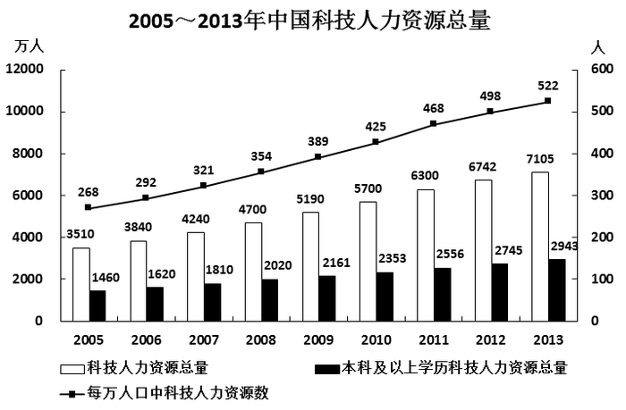

#### 第 1 题　qid 1752588 · 增长

2006—2013年间，有几年的科技人力资源总量较前一年增长超过500万人？

- **A**. 2　✅
- **B**. 3
- **C**. 4
- **D**. 5

**答案**：A

**官方解析**

根据题干“有几年···增长超过500万人”，可判定本题为增长量计算问题。定位图形材料可知：2006年增长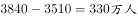，2007年增长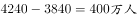，2008年增长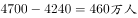，2009年增长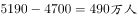，2010年增长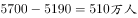，2011年增长，2012年增长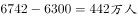，2013年增长。只有2010、2011年满足增长大于500万人，故2006—2013年间，有2年的科技人力资源总量较前一年增长超过500万人。

故正确答案为A。

---

#### 第 2 题　qid 1752592 · 增长

下列时间段中，哪个时间段内每万人口中的科技人力资源数年均增速最慢？

- **A**. 2005—2010年
- **B**. 2006—2011年
- **C**. 2007—2012年
- **D**. 2008—2013年　✅

**答案**：D

**官方解析**

根据题干“···年均增速最慢”，可判定本题为年均增长率比较问题。定位图形材料可知：每万人口中科技人力资源数，2005年268人、2006年292人、2007年321人、2008年354人、2009年389人、2010年425人、2011年468人、2012年498人、2013年522人。根据公式：，因为各时段间隔年份相同则比较年均增长率大小直接比较现期与基期比值大小即可。

A，2005—2010年：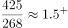；

B，2006—2011年：；

C，2007—2012年：；

D，2008—2013年：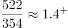。根据上述计算可知2008—2013年的年均增速最小。故2008—2013年这个时间段内每万人口中的科技人力资源数年均增速最慢。

故正确答案为D。

---

#### 第 3 题　qid 1752596 · 平均数

如图中反映的均为年末数据，则“十一五”（2006—2010年）期间平均每年本科及以上学历科技人力资源增加约多少万人？

- **A**. 150
- **B**. 180　✅
- **C**. 200
- **D**. 440

**答案**：B

**官方解析**

根据题干“平均每年···增加约多少万人”，可判定本题为年均增长量计算问题。定位图形材料可知：本科及以上学历科技人力资源总量2005年1460万人、2010年2353万人。根据年均增长量=（五年规划基期往前推一年），则“十一五”（2006—2010年）期间平均每年本科及以上学历科技人力资源增加约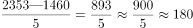万人。

故正确答案为B。

---

#### 第 4 题　qid 1752600 · 比重

与2007年相比，2012年本科及以上学历者占科技人力资源总数的比重约：

- **A**. 上升了20个百分点
- **B**. 上升了2个百分点
- **C**. 下降了20个百分点
- **D**. 下降了2个百分点　✅

**答案**：D

**官方解析**

根据题干“与2007年相比，2012年···占···的比重约变化多少个百分点”，可判定本题为两期比重计算问题。定位图形材料可知：2007年科技人力资源总量4240万人，本科及以上学历科技人力资源总量1810万人；2012年科技人力资源总量6742万人，本科及以上学历科技人力资源总量2745万人。所以本科及以上学历者占科技人力资源比重：2007年为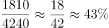，2012年为，，即比重下降3个百分点，与D项最为接近。

故正确答案为D。

---

#### 第 5 题　qid 1752606 · 综合

能够从上述资料中推出的是：

- **A**. 2013年每万人口中科技人力资源数同比增速低于上年水平　✅
- **B**. 2013年科技人力资源总量同比增量为2006年以来的最低值
- **C**. 2013年本科及以上学历科技人力资源数比7年前翻了一番
- **D**. 2007年全国人口数超过13.5亿人

**答案**：A

**官方解析**

A项，定位图形材料可知：每万人口中科技人力资源数2011年468人、2012年498人、2013年522人。根据公式：，每万人口中科技人力资源数增速2013年为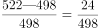，2012年为，2012年的分子大分母小则2012年的增长率大，即2013年每万人口中科技人力资源数同比增速低于上年水平，正确。

B项，定位图形材料可知：科技人力资源总量2005年3510万人、2006年3840万人、2012年6742万人、2013年7105万人。所以，2013年的科技人力资源总量同比增量是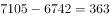万人，2006年的科技人力资源总量同比增量为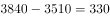万人，低于2013年。故2013年科技人力资源总量同比增量不是2006年以来的最低值，错误。

C项，定位图形材料可知：本科及以上学历科技人力资源数2013年为2943万人，7年前即2006年为1620万人。因为，，故2013年本科及以上学历科技人力资源数比7年前翻了不足一番，错误。

D项，定位图形材料可知：2007年科技人力资源总量为4240万人，每万人口中科技人力资源数为321人。则总人口数为，故2007年全国人口数没有超过13.5亿人，错误。

故正确答案为A。

---

### 材料 2

       2015年1—6月民间固定资产投资154438亿元，占全国固定资产投资的比重为，比1—5月下降0.3个百分点。

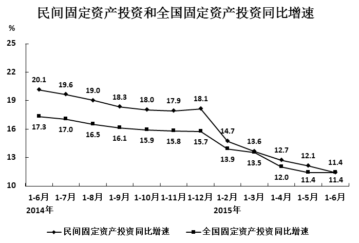

       分产业看，2015年1—6月第一产业民间固定资产投资4992亿元，同比增长；第二产业77298亿元，增长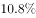；第三产业72148亿元，增长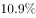。

       第二产业中，工业民间固定资产投资76464亿元，同比增长，增速比1—5月份回落0.4个百分点，其中采矿业3092亿元，下降，降幅比1—5月收窄2.1个百分点；制造业69519亿元，增长，增速回落0.6个百分点；电力、热力、燃气及水生产和供应业3853亿元，增长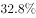，增速回落1.4个百分点。

#### 第 6 题　qid 1752610 · 综合

2014年1—6月全国固定资产投资约多少万亿元？

- **A**. 14
- **B**. 16
- **C**. 21　✅
- **D**. 24

**答案**：C

**官方解析**

根据题干“2014年1—6月全国固定资产投资约多少万亿元”，结合材料时间2015年1—6月，可判定本题为基期计算问题。定位文字材料第一段，“2015年1—6月民间固定资产投资154438亿元，占全国固定资产投资的比重为”；定位图形材料可知：2015年1—6月全国固定资产投资同比增速为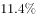。根据公式：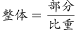，则2015年1—6月的全国固定资产投资为万亿元。根据公式：，则2014年1—6月的全国固定资产投资约为万亿元。

故正确答案为C。

---

#### 第 7 题　qid 1752612 · 增长

2015年1—6月民间固定资产投资同比增速比上年同期回落多少个百分点？

- **A**. 4.3
- **B**. 5.9
- **C**. 6.7
- **D**. 8.7　✅

**答案**：D

**官方解析**

定位图形材料可知：民间固定资产投资增速2015年1—6月为，2014年1—6月为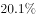。，故2015年1—6月民间固定资产投资同比增速比上年同期回落8.7个百分点。

故正确答案为D。

---

#### 第 8 题　qid 1752616 · 比重

2015年上半年，三次产业中民间固定资产投资额占全国固定资产投资总额比重高于上年同期水平的有：

- **A**. 第一产业　✅
- **B**. 第二产业
- **C**. 第二产业和第三产业
- **D**. 第一产业和第三产业

**答案**：A

**官方解析**

根据题干“2015年上半年，······占······比重高于上年同期水平”，可判定本题为两期比重比较问题。定位文字材料第二段可知：2015年上半年民间固定资产投资额增长率，第一产业为，第二产业为，第三产业为；定位图形材料可知：2015年上半年全国固定资产投资总额同比增速为。根据两期比重比较技巧：若部分增长率（）大于总体的增长率（），则比重高于上年。观察可得仅第一产业民间固定投资额增长率（）大于全国固定资产投资总额增长率（）。故2015年上半年，三次产业中民间固定资产投资额占全国固定资产投资总额比重高于上年同期水平的只有第一产业。

故正确答案为A。

---

#### 第 9 题　qid 1752622 · 综合

与2013年上半年相比，2015年上半年全国固定资产投资约上升了：

- **A**. 

- **B**. 
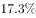

- **C**. 

- **D**. 

　✅

**答案**：D

**官方解析**

根据题干“与2013年上半年相比，2015年上半年······约上升了”，结合选项为百分数，可判定本题为间隔增长率计算问题。定位图形材料可知：全国固定资产投资增长率2015年上半年为,2014上半年为。根据间隔增长率公式：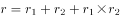，可得与2013年上半年相比，2015年上半年全国固定资产投资约上升了，只有D项满足。

故正确答案为D。

---

#### 第 10 题　qid 1752634 · 综合

根据资料，下列说法正确的是：

- **A**. 
2015年3—6月，各月的全国固定资产累计投资额同比增速逐月递减

- **B**. 
2015年6月民间固定资产投资占全国固定资产投资的比重小于
　✅
- **C**. 
2015年1—4月民间固定资产投资同比增速比1—3月回落1.5个百分点

- **D**. 
2015年1—5月采矿业民间固定资产投资同比增速比制造业低1.3个百分点

**答案**：B

**官方解析**

A项，定位图形材料可知：2015年全国固定资产投资额1—3月增长率为，1—4月增长率为，1—5月增长率为，1—6月增长率为。可以看出5月的全国固定资产累计投资额同比增速（即1-5月增长率）与6月的累计增速均为，故2015年3—6月，各月的全国固定资产累计投资额同比增速非逐月递减，错误。

B项，定位文字材料第一段可知：民间固定资产投资占全国固定资产投资的比重2015年1—6月为，比1—5月下降0.3个百分点。故1—5月民间固定资产投资占全国固定资产投资的比重为。根据混合比重居中的结论：混合后的比重在中间，则2015年6月比重一定小于，正确。

C项，定位图形材料可知：民间固定资产投资2015年1—4月增速为，1—3月增速为。，故2015年1—4月民间固定资产投资同比增速比1—3月回落0.9个百分点，错误。

D项，定位文字材料第三段，“其中采矿业3092亿元，下降，降幅比1—5月收窄2.1个百分点；制造业69519亿元，增长，增速回落0.6个百分点”。故2015年1—5月采矿业民间固定资产投资降幅为，制造业增幅为，则2015年1—5月采矿业民间固定资产投资同比增速比制造业低，错误。

故正确答案为B。

---

### 材料 3

        2015年1-5月，B区规模以上文化创意产业完成收入46.2亿元，比上年同期增长10.8%，比1-4月增幅收窄0.8个百分点，从业人员平均人数1.3万人，比上年同期下降2.4%。

        1-5月，B区规模以上文化创意产业实现利润总额-0.4亿元，亏损额比1-4月略有扩张，亏损额同比略有收窄。其中，新闻出版亏损额进一步扩大，实现利润总额-0.3亿元，比上年同期亏损额增加0.2亿元；软件、网络及计算机服务受个别企业业务整合的影响，降幅较大，实现利润0.2亿元，同比下降81.3%；其他辅助服务亏损额大幅收窄，实现利润-0.1亿元，亏损额同比减少1.1亿元。

        截止到5月底，B区规模以上文化创意产业规模较小，法人单位只有84家，仅占全市的1.0%；大型企业匮乏，收入达亿元企业只有8家，中小型企业居多。

#### 第 11 题　qid 1752640 · 平均数

2015年1-5月B区规模以上文化创意产业从业人员人均完成收入约比上年同期增长：

- **A**. 2.5%
- **B**. 8.4%
- **C**. 10.8%
- **D**. 13.4%　✅

**答案**：D

**官方解析**

根据题干“2015年1-5月······人均完成收入约比上年同期增长”，结合选项为百分数，可判定本题为平均数增长率计问题。定位文字材料第一段可得：2015年1-5月，B区规模以上文化创意产业完成收入46.2亿元（A），比上年同期增长（a）；从业人员平均人数1.3万人（B），比上年同期下降（b）。根据公式：平均数的增长率=，可得题目所求为，只有D项满足。

故正确答案为D。

---

#### 第 12 题　qid 1752642 · 平均数

该区规模以上文化创意产业中，以下哪个领域2015年1-5月平均每个单位创造的收入为各选项中最低？

- **A**. 新闻出版
- **B**. 广告会展
- **C**. 软件、网络及计算机服务　✅
- **D**. 旅游、休闲娱乐

**答案**：C

**官方解析**

根据题干“······2015年1-5月平均······最低”，结合材料时间为2015年1-5月，可判定本题为现期平均数问题。定位统计表可知选项各领域2015年1-5月单位数及收入合计。根据公式：平均数，则各选项平均每个单位创造的收入分别为：

新闻出版：亿元；

广告会展：亿元；

软件、网络及计算机服务：亿元；

旅游、休闲娱乐：亿元。

比较可知，软件、网络及计算机服务平均每个单位创造的收入为各选项中最低。

故正确答案为C。

---

#### 第 13 题　qid 1752646 · 综合

2014年1-5月B区其他辅助服务产业亏损约是新闻出版业的多少倍？

- **A**. 0.3
- **B**. 2.4
- **C**. 5.5
- **D**. 12.0　✅

**答案**：D

**官方解析**

根据题干“2014年1-5月······是······的多少倍”，结合材料时间2015年1-5月，可判定本题为基期倍数问题。定位文字材料第二段可得：2025年1-5月，新闻出版亏损额进一步扩大，实现利润总额-0.3亿元，比上年同期亏损额增加0.2亿元；其他辅助服务亏损额大幅收窄，实现利润-0.1亿元，亏损额同比减少1.1亿元。则2014年1-5月B区亿元，亿元。故2014年1-5月B区其他辅助服务产业亏损额约是新闻出版业的倍。

故正确答案为D。

---

#### 第 14 题　qid 1752650 · 增长

文化创意产业九大领域中，2015年1-5月收入增速最快的三个领域共有多少家单位？

- **A**. 16
- **B**. 30　✅
- **C**. 39
- **D**. 54

**答案**：B

**官方解析**

定位统计表可得：2015年1-5月收入增速最快的三个领域为旅游、休闲娱乐（）、设计服务（）和广告会展（），它们的单位数依次为13、1、16。故文化创意产业九大领域中，2015年1—5月收入增速最快的三个领域共有家单位。

故正确答案为B。

---

#### 第 15 题　qid 1752654 · 综合

根据上述材料，下列推断中正确的一项是

- **A**. 2015年1-5月该区广告会展业收入同比增长了1亿多元　✅
- **B**. 2015年5月底全市规模以上文化创意产业法人单位超过9000家
- **C**. 2015年1-5月该区收入超过亿元的企业中有的来自广播、电视、电影业
- **D**. 2015年5月该区平均每家规模以上文化创意产业法人单位拥有200多名从业人员

**答案**：A

**官方解析**

A项，定位统计表可得：2015年1-5月该区广告会展收入6.3亿元，增长率为。根据公式：，可得2015年1-5月该区广告会展业收入同比增长了亿元，正确；

B项，定位文字材料第三段可得：“截止到5月底，B区规模以上文化创意产业规模较小，法人单位只有84家，仅占全市的”。根据公式：，2015年5月底全市规模以上文化创意产业法人单位=，错误；

C项，定位统计表可得：2015年1-5月，该区广播、电视、电影业收入合计0.4亿元，未超过亿元，故2015年1-5月该区收入超过亿元的企业不可能来自广播、电视、电影业，错误；

D项，定位文字材料第三段可得：截止到5月底，B区规模以上文化创意产业规模较小，法人单位只有84家。但材料并未给出5月份该区规模以上文化创意产业从业人数，故无法求得2015年5月该区平均每家单位从业人员数量，错误。

故正确答案为A。

---

### 材料 4

        2015年7月，D市共监测电视、广播、平面和重点网络媒体首页页面广告297207条次，涉嫌违法广告594条次，广告涉嫌违法率为0.20%，比6月下降0.07个百分点。

#### 第 16 题　qid 1752658 · 平均数

2015年7月，平均每日监测到平面媒体涉嫌违法广告约多少条次？

- **A**. 16　✅
- **B**. 17
- **C**. 19
- **D**. 20

**答案**：A

**官方解析**

根据题干“2015年7月，平均···约多少条次”，结合材料时间2015年7月，可判定本题为现期平均数计算问题。定位表格材料1可知：2015年7月，平面媒体涉嫌违法量为496条次。常识可知7月份为31天，则平均每日为条次。

故正确答案为A。

---

#### 第 17 题　qid 1752662 · 综合

表1中“？”处应当填写的数字是（  ）。

- **A**. 0.005%
- **B**. 0.02%　✅
- **C**. 0.04%
- **D**. 0.08%

**答案**：B

**官方解析**

根据题干“表1中‘？’处应当填写的数字是”，结合材料“？”处表示2015年7月广播涉嫌违法率即涉嫌违法量占监测量的比重，可判定本题为现期比重计算问题。定位表格材料1可知：2015年7月广播监测量为63299条次，涉嫌违法量为10条次。因为，故“？”=，与B最接近。

故正确答案为B。

---

#### 第 18 题　qid 1752664 · 综合

在2015年7月广告涉嫌违法量居前十位的商品、服务类别中，有几类的涉嫌违法率高于10%？（  ）

- **A**. 1
- **B**. 2
- **C**. 3
- **D**. 4　✅

**答案**：D

**官方解析**

定位表格材料2可知：涉嫌违法率高于的有医疗诊疗服务（）、医疗美容（）、保健用品（）、卫生消毒用品（），共4类。

故正确答案为D。

---

#### 第 19 题　qid 1752666 · 综合

2015年7月广告涉嫌违法量居前十位的商品、服务类别中，监测量最多的3个类别涉嫌违法量之和约占所有广告总涉嫌违法量的（  ）。

- **A**. 一成左右
- **B**. 两成左右
- **C**. 三成左右　✅
- **D**. 四成左右

**答案**：C

**官方解析**

根据题干“2015年7月······占所有广告总涉嫌违法量的”，结合材料时间2015年7月，可判定本题为现期比重计算问题。定位表格材料2可知：监测量最多的3个类别为保健食品（7957条次），涉嫌违法量为35条次；人用药品（6941条次），涉嫌违法量为107条次；房地产（2257条次），涉嫌违法量为35条次。故2015年7月广告涉嫌违法量居前十位的商品、服务类别中，监测量最多的3个类别涉嫌违法量之和约占所有广告总涉嫌违法量的，即三成左右。

故正确答案为C。

---

#### 第 20 题　qid 1752672 · 综合

能够从上述资料中推出的是（  ）。

- **A**. 2015年6月，广告涉嫌违法率为0.13%
- **B**. 2015年7月，电视广告监测量占广告总监测量的四成多
- **C**. 2015年7月，大部分涉嫌违法的医疗诊疗服务广告出现在非电视媒体中　✅
- **D**. 2015年7月，表2中监测量最低的商品、服务类别广告涉嫌违法率约为监测量最高者的14倍

**答案**：C

**官方解析**

A项，定位文字材料第一段，“2015年7月，D市共监测······广告涉嫌违法率为0.20%，比6月下降0.07个百分点”。故2015年6月，广告涉嫌违法率为，错误；

B项，定位文字材料第一段，“2015年7月，D市共监测电视、广播、平面和重点网络媒体首页页面广告297207条次”；定位表格材料1可知：2015年7月，D市电视监测量为157860条次。故2015年7月，电视广告监测量占广告总监测量的比值为

，即约五成，错误；

C项，定位表格材料1、2可知：2015年7月，电视广告涉嫌违法量为88条次，涉嫌违法的医疗诊疗服务广告为185条次。，所以即使电视广告的违法量全部为医疗诊疗服务广告，占比也不到一半。故2015年7月，大部分涉嫌违法的医疗诊疗服务广告出现在非电视媒体中，正确；

D项，定位表格材料2可知：2015年7月，表2中监测量最低的商品、服务类别为卫生消毒用品（39条次），涉嫌违法率为；监测量最高者为保健食品（7957条次），涉嫌违法率为。故2015年7月，表2中监测量最低的商品、服务类别广告涉嫌违法率约为监测量最高者的倍，错误。

故正确答案为C。

---

#### 第 21 题　qid 1752502 · 倍数

甲和乙两个公司2014年的营业额相同。2015年乙公司受店铺改造工程影响，营业额比上年下降300万元。而甲公司则引入电商业务，营业额比上年增长600万元，正好是乙公司2015年营业额的3倍。则2014年两家公司的营业额之和为多少万元？

- **A**. 900
- **B**. 1200
- **C**. 1500　✅
- **D**. 1800

**答案**：C

**官方解析**

设2014年两家公司营业额均为x万元，由题意可得万元，解得，则2014年两家公司营业额之和为万元。

故正确答案为C。

---
