# 2016年吉林省公务员录用考试《行测》题（乙级）

> 省考 · 2016 年 · 6 个模块 · 共 100 题

- [政治理论](#%E6%94%BF%E6%B2%BB%E7%90%86%E8%AE%BA) · 1 题
- [常识判断](#%E5%B8%B8%E8%AF%86%E5%88%A4%E6%96%AD) · 19 题
- [言语理解与表达](#%E8%A8%80%E8%AF%AD%E7%90%86%E8%A7%A3%E4%B8%8E%E8%A1%A8%E8%BE%BE) · 30 题
- [数量关系](#%E6%95%B0%E9%87%8F%E5%85%B3%E7%B3%BB) · 10 题
- [判断推理](#%E5%88%A4%E6%96%AD%E6%8E%A8%E7%90%86) · 30 题
- [资料分析](#%E8%B5%84%E6%96%99%E5%88%86%E6%9E%90) · 10 题

---

## 政治理论

### 第 1 题　qid 2021876 · 马克思主义

习近平主席在谈到如何提高工作效率时说：“必须学会运用辩证法，分清层次，认真思考，‘审大小而图之，酌缓急而布之，连上下而通之，衡内外而施之。’”此处用典不包含的哲理是：

- **A**. 坚持“两点论”和“重点论”的统一
- **B**. 以联系的观点和发展的观点看待问题
- **C**. 尊重客观规律基础上发挥主观能动性
- **D**. 遵循社会发展前进性与曲折性的统一　✅

**答案**：D

**官方解析**

本题考查马克思主义哲学原理的具体运用，请注意题目问的是用典不包含的哲理，意为不包含哲学原理。
A项包含，用典中的大小、缓急等等均体现出两点论和重点论的统一。
B项包含，用典中的审大小而图，酌缓急而布等就是从发展的眼光来看，做最重要的事情。
C项包含，用典中的图之、布之、通之、施之均可以体现在把握规律的前提下发挥主观能动性去做。
D项不包含，因为题干中的典故没有体现事物的反复或者倒退，没有体现曲折性。
本题为选非题，故正确答案为D。
（注：本题有部分人认为选C，理由是C中的规律不是辩证法的内容，而其他三项是，这是对题目的曲解，题目问的是哲理，即哲学原理，也就是全部的哲学原理，而非仅仅指的辩证法原理。）

---

## 常识判断

### 第 1 题　qid 2021658 · 人文常识

当遇到下列情况时，你的正确选择是：

- **A**. 被农药污染的食品一定要充分煮熟再食用
- **B**. 被毒蛇咬伤手臂后，应首先扎住伤口处的近心端　✅
- **C**. 进行人工呼吸过程中，吹气者应始终捏紧被救者的鼻孔
- **D**. 处方药和非处方药都必须在医生的指导下购买和使用

**答案**：B

**官方解析**

B项正确：被毒蛇咬伤手臂后，为防止蛇毒随血液经过心脏扩散到全身，应当首先用止血带扎住伤口处的近心端，防止血液流向心脏；
A项错误：被农药污染的食品，即便充分煮熟，也没办法去除残留其中的有害物，故不宜食用；
C项错误：进行人工呼吸时，吹气时要捏紧被救者的鼻孔，是为了防止气体从鼻腔逸出，无法进入被救者的肺部；但是吹气完毕后，应当松开被救者的鼻子，便于气体交流，等下次吹气时再捏紧被救者的鼻子；
D项错误：处方药必须凭执业医师或执业助理医师的处方才可调配、购买和使用；但非处方药不需要医师或其它医疗专业人员开写处方即可购买。
故正确答案为B。

---

### 第 2 题　qid 2021666 · 人文常识

孔子说，一种人“和而不同”、还有一种人“同而不和”。下列角色行为属于“和而不同”的是：

- **A**. 公务员小李敢于指出领导脱离群众的缺点，使领导的群众基础更牢　✅
- **B**. 副镇长小张任职后谦虚谨慎，对老镇长的指示一向言听计从
- **C**. 村支书小吴很会做宣传动员工作，总能说服群众接受村委会的各项决定
- **D**. 选调生小刘喜欢张扬个性，走上工作岗位后常常是“独树一帜”

**答案**：A

**官方解析**

“和而不同”“同而不和”出自《论语·子路》：“君子和而不同，小人同而不和。”其大意是，君子在人际交往中能够与他人保持和谐友善的关系，但对于具体问题的看法，不必苟同于对方；小人则相反，在对问题的看法上，习惯迎合别人的心理、附和别人的言论，但实际上内心却并不抱和谐友善的态度。
A项正确：小李指出了领导脱离群众的缺点，反而增强了领导的群众基础，使得领导与群众保持更牢固的关系，是“和而不同”的表现；
B项错误：小张对老镇长的指示一向言听计从，没有体现出“和而不同”中的“不同”；
C项错误：村支书小吴的宣传动员工作是其职责行为，不能用“和而不同”、“同而不和”的观点来加以评价；
D项错误：小刘个性张扬，“独树一帜”，没有体现出“和而不同”中的“和”。
故正确答案为A。

---

### 第 3 题　qid 2021662 · 地理国情

“五十六个民族，五十六朵花”，各个民族都有绚丽多彩的民族文化。请为歌曲《美丽的草原我的家》《阿里郎》《青藏高原》《牡丹汗》依次配上相应的民族的乐器，对应民族的乐器是：

- **A**. ④①②③
- **B**. ①③②④　✅
- **C**. ②③④①
- **D**. ③①②④

**答案**：B

**官方解析**

B项正确：《美丽的草原我的家》《阿里郎》《青藏高原》《牡丹汗》分别是蒙古族、朝鲜族、藏族和维吾尔族的著名民族歌曲。图片中的四种乐器分别为：①蒙古族的马头琴、②藏族的扎木聂、③朝鲜族的长鼓、④维吾尔族的达卜。故与题干四首歌曲对应的民族乐器应为①③②④。
故正确答案为B。

---

### 第 4 题　qid 2021784 · 科技常识

在克隆羊的培育过程中，某只白细毛公羊提供了细胞核，某只黑细毛羊提供了去核卵细胞，某只白粗毛羊进行代孕，那么克隆羊的体表的毛和性别分别为：

- **A**. 白色粗羊毛、公羊
- **B**. 白色细羊毛、母羊
- **C**. 黑色粗羊毛、母羊
- **D**. 白色细羊毛、公羊　✅

**答案**：D

**官方解析**

D项正确：本题解析关键在弄清楚遗传物质的来源。生物的遗传物质存在于细胞核内，细胞核是遗传的控制中心。从题干可知，克隆羊体内的遗传物质来自于白细毛公羊的细胞核，具有白细毛公羊的全部遗传物质，因此最终克隆羊的形状应该是最像提供细胞核的白色细毛公羊，体表的毛为白色细羊毛，性别为公羊。
故正确答案为D。

---

### 第 5 题　qid 2021788 · 科技常识

下列每组现象包含的物理学原理不同的是：

- **A**. 高压锅蒸煮食物—火星上水的沸点降低
- **B**. 饮料从摔碎的瓶子中溅出—大质量恒星末期爆炸　✅
- **C**. 烤箱中葡萄干面包膨胀，葡萄干远移—宇宙扩张，星系远移
- **D**. 用LED手电直射滴入1滴牛奶的水杯，末端呈黄色—傍晚天边呈橘红色

**答案**：B

**官方解析**

本题考查物理常识。
B项符合题意：饮料本来依附在瓶子上，瓶子破裂，饮料与瓶子之间的附着力消失，饮料溅出，体现的是弹力原理。大质量恒星的质量越大，引力越大，塌陷时的压力就越强，大质量恒星末期爆炸是由于引力与塌陷产生的压力不平衡造成的。
A项不符合题意：两种现象均体现压强原理，高压锅蒸煮食物利用压强提高沸点，火星上由于气压低，水的沸点也降低。
C项不符合题意：两种现象都是由于膨胀造成周围物质远移。天体物理学家经常用“葡萄干面包”来比喻宇宙扩张。
D项不符合题意：两种现象均体现了光的散射原理。
本题为选非题，故正确答案为B。

---

### 第 6 题　qid 2021792 · 人文常识

下列证明与申请部门对应错误的是：

- **A**. 家庭收入情况证明——公证机关
- **B**. 存单名字错误证明——公安机关　✅
- **C**. 婚姻关系存在证明——民政部门
- **D**. 家庭成员失踪证明——人民法院

**答案**：B

**官方解析**

本题作答依据为2015年公安部发布的《18个不该由公安机关出具的证明》。
A项正确，家庭收入情况不属于派出所工作业务范畴，派出所不知情。因此，派出所不予出具证明，应到公证机关进行公证。
B项错误，因非公安机关原因将姓名填写错误，如：银行存单、保险单、学校、单位等档案中姓名同音不同字，需要证明是同一人的。造成错误的责任主体不是公安派出所，而且派出所也不知情，所以不应出具证明。公民应当到公证机关，由公证机关来公证证明。
C项正确，民政部门是婚姻登记机关，婚姻状况属于民政部门的责任范畴，公民应到民政部门开取证明。派出所不予出具证明。
D项正确，宣告公民失踪是人民法院受案范畴，不是派出所的责任范畴，派出所无权证明人员是否失踪，应向人民法院申请出具证明。
本题为选非题，故正确答案为B。

---

### 第 7 题　qid 2021674 · 科技常识

一段朽木上面长满了苔藓、地衣，朽木凹处聚积的雨水中还生活着孑孓，水蚤等，树洞中还有老鼠、蜘蛛等，下列各项中，与这段朽木的“生命系统层次”水平相当的是：

- **A**. 一块稻田里的全部害虫
- **B**. 一个池塘中的全部鲤鱼
- **C**. 一片松林中的全部生物
- **D**. 一间充满生机的温室大棚　✅

**答案**：D

**官方解析**

生命系统的层次有：细胞，组织，器官，系统，个体，种群，群落，生态系统，生物圈。而这段朽木的“生命系统层次”属于生态系统，即生物群落与无机环境相互作用而形成的统一整体。
D项正确：“一间充满生机的温室大棚”也属于生态系统，所以D项正确；
A项错误：“一块稻田里的全部害虫”属于多个种群，种群即在一定的自然区域内，同种生物的所有个体的总称；
B项错误：“一个池塘中的全部鲤鱼”属于一个种群；
C项错误：“一片松林中的全部生物”属于群落，群落即“在一定的自然区域内，所有的种群组成的总体”。
本题在解答时可采用排除法：A、B、C三个错误选项中都出现“全部”字眼，“全部”所指向的都是单纯的生物，没有类似“朽木”这种无机环境，可加以排除，推出D项为正确项。
故正确答案为D。

---

### 第 8 题　qid 2021802 · 人文常识

A县某酒厂酿造的“仙液”系列白酒深为当地人喜爱，A县政府办公室发文指定该酒为“接待用酒”，要求各机关、企事业单位、社会团体在业务用餐时，饮酒应以“仙液”系列为主，同时，酒厂公开承诺用餐者凭市内各酒楼出具的证明，可以取得消费100元返还10元的奖励。关于此事，下列说法错误的是：

- **A**. A县政府办公室的行为属于限制竞争行为
- **B**. 酒厂的做法，尚未构成商业贿赂行为
- **C**. 上级机关可以责令A县政府改正错误
- **D**. 监督检查部门可以没收酒厂的违法所得，并处以罚款　✅

**答案**：D

**官方解析**

《反不正当竞争法》第七条规定：“政府及其所属部门不得滥用行政权力，限定他人购买其指定的经营者的商品，限制其他经营者正当的经营活动。政府及其所属部门不得滥用行政权力，限制外地商品进入本地市场，或者本地商品流向外地市场。”第八条规定：“经营者不得采用财物或者其他手段进行贿赂以销售或者购买商品。在账外暗中给予对方单位或者个人回扣的，以行贿论处；对方单位或者个人在账外暗中收受回扣的，以受贿论处。经营者销售或者购买商品，可以以明示方式给对方折扣，可以给中间人佣金。经营者给对方折扣、给中间人佣金的，必须如实入账。接受折扣、佣金的经营者必须如实入账。”第三十条规定：“政府及其所属部门违反本法第七条规定，限定他人购买其指定的经营者的商品、限制其他经营者正当的经营活动，或者限制商品在地区之间正常流通的，由上级机关责令其改正；情节严重的，由同级或者上级机关对直接责任人员给予行政处分。被指定的经营者借此销售质次价高商品或者滥收费用的，监督检查部门应当没收违法所得，可以根据情节处以违法所得一倍以上三倍以下的罚款。”
D项错误：本题中，该酒厂的“仙液”系列白酒虽然被指定为“接待用酒”，但并没有出现借此销售质次价高商品或者滥收费用的情形，监督检查部门无权没收其违法所得。
A项正确：根据《反不正当竞争法》第七条的规定，A县政府办公室指定该酒为“接待用酒”，符合第七条规定的情形，其行为属于限制竞争行为。
B项正确：根据《反不正当竞争法》第八条的规定，酒厂以公开承诺的方式给消费者优惠，不属于商业贿赂行为。
C项正确：根据《反不正当竞争法》第三十条的规定，根据对于A县政府的行为，上级机关可以责令其改正。
本题为选非题，故正确答案为D。

---

### 第 9 题　qid 2021808 · 人文常识

下列“讲文明树新风”公益广告用语使用错误的是：

- **A**. A　✅
- **B**. B
- **C**. C
- **D**. D

**答案**：A

**官方解析**

A项符合题意：“兄恭弟谦”的说法有误，中国传统文化提倡的是“兄友弟恭”，即哥哥对弟弟友爱，弟弟对哥哥恭敬，强调兄弟间互爱互敬。
B项提倡节约粮食，C项宣扬忠厚的家风，D项宣扬报答养育之恩的孝道，B、C、D三项均符合主流价值观。
本题为选非题，故正确答案为A。

---

### 第 10 题　qid 2021812 · 人文常识

下列所描述的情形符合史实的是：

- **A**. 苏东坡可以吃到辣椒
- **B**. 唐朝时期，西红柿炒鸡蛋就是家常菜了
- **C**. 三字经所言的“六谷”中的黍指的是玉米
- **D**. 花椒原产中国，胡椒是张骞出使西域后传入　✅

**答案**：D

**官方解析**

D项正确：花椒原产于我国秦岭山脉海拔1000米以下地区，胡椒是在西汉时期张骞出使西域后传入我国的。
A项错误：辣椒原产墨西哥，明朝末年才传入中国，苏东坡是宋朝人，不可能吃到辣椒。
B项错误：西红柿是在明朝末年随西方传教士传入我国，清朝末年中国人才开始食用西红柿，因此唐朝不存在“西红柿炒鸡蛋”这道菜。
C项错误：玉米原产于美洲，明朝传入我国。《三字经》创作于宋末元初，不可能出现关于“玉米”的记载。
故正确答案为D。

---

### 第 11 题　qid 2021816 · 人文常识

下列选项中，对于古文化常识描述错误的是：

- **A**. 古称兄弟间的老大为“伯”，古代兄弟间以伯、仲、叔、季为排行顺序，古人常在字前加排行次序，如“伯禽”“仲尼”“叔向”“季路”等
- **B**. 垂髫是古时对六十岁以上老妇人的别称，髫是指老人轻软披散的头发　✅
- **C**. 古代位居方向有尊卑之称，如南向为胜、尊，以北向为败、卑；以东为主为首，以西为从为次，后渐以“东家”为主人的代称
- **D**. 蛾眉，亦作“娥眉”，古代美女的代称，“娥眉”本为女子长而美的眉毛，代指女子美貌，进而代称美女

**答案**：B

**官方解析**

B项错误：“垂髫”指儿童，“髫”指儿童垂下的头发。古时汉族儿童不束发，头发下垂，因此用“垂髫”来代指儿童。该词出自陶渊明《桃花源记》中的“黄发垂髫，并怡然自乐”。
A、C、D三项，说法均正确。
本题为选非题，故正确答案为B。

---

### 第 12 题　qid 2021820 · 人文常识

对于当前的纹身现象，四个大学生从各自的角度表达了他们对诸子百家思想的理解。
甲说：身体天然完整，纹身就是自虐；
乙说：纹身影响仪容，是低俗身份人的爱好，有身份的人不会纹身；
丙说：纹身费财又费力，何必呢？简简单单不很好吗；
丁说：国家应该严格限制纹身，应该规定人们的行为选择。
他们的描述所对应的思想是：

- **A**. 甲-儒，乙-墨，丙-法，丁-道
- **B**. 甲-道，乙-儒，丙-墨，丁-法　✅
- **C**. 甲-儒，乙-法，丙-墨，丁-道
- **D**. 甲-道，乙-墨，丙-法，丁-儒

**答案**：B

**官方解析**

B项正确：道家思想崇尚自然和谐；儒家思想主张“礼治”，强调等级观念；墨家思想代表平民阶层的利益；法家思想强调法治，重视法的作用。甲认为身体天然完整，纹身是自虐，对应道家思想；乙认为纹身与身份有关，体现等级观念，对应儒家思想；丙认为纹身费财费力，简单就好，代表平民阶级的利益说法，对应墨家思想；丁认为国家应限制纹身，体现了法治的观念，对应法家思想。
故正确答案为B。

---

### 第 13 题　qid 2021826 · 人文常识

当地球运行到C点时，下列说法符合长春市具体情况的是：

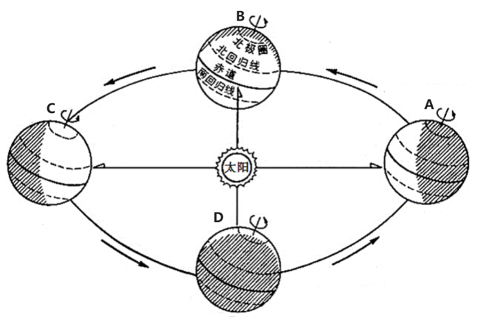

- **A**. 昼长达一年最大值　✅
- **B**. 日落时间将逐渐推迟
- **C**. 正午太阳高度角将逐渐增大
- **D**. 正值冬至日

**答案**：A

**官方解析**

A项正确，当地球运行到C点时，太阳直射北回归线，北半球的昼长达一年最大值，长春位于北半球，因此昼长达一年最大值；
B项错误，太阳直射北回归线后，其直射点将逐渐南移，北半球各地白昼逐渐变短，日落时间将越来越早；
C项错误，太阳直射北回归线时，北半球各地正午太阳高度角都达到最大值，之后太阳直射点逐渐南移，各地正午太阳高度角逐渐减小；
D项错误，太阳直射北回归线时，北半球是夏至日。
故正确答案为A。

---

### 第 14 题　qid 2021830 · 科技常识

能源按转换传递过程可分为“一次能源”和“二次能源”，下列属于“二次能源”的一组是：

- **A**. 沼气、焦炭、核电　✅
- **B**. 煤、石油、天然气
- **C**. 煤、核能、海洋能
- **D**. 水能、风能、核能

**答案**：A

**官方解析**

“一次能源”是指直接取自自然界没有经过加工转换的各种能量和资源，如原煤、原油、天然气、油页岩、核能、太阳能、水能、风能、波浪能、潮汐能、地热能、生物质能和海洋温差能等。“二次能源”指由一次能源经过加工转换以后得到的能源产品，如沼气、焦炭、汽油、柴油、电力、蒸汽、核电等。
A项正确：沼气、焦炭、核电均由一次能源加工而得，属于二次能源；
B项错误：煤、石油、天然气属于一次能源；
C项错误：煤、核能、海洋能属于一次能源；
D项错误：水能、风能、核能属于一次能源。
故正确答案为A。

---

### 第 15 题　qid 2021836 · 人文常识

近年来，建立在智能手机和移动互联网基础之上的手机打车应用市场快速发展，手机打车软件公司推出各种针对乘客和出租车司机的优惠和补贴措施。打车费用的降低，吸引了广大民众纷纷采用打车软件叫出租车出行。
下列对手机打车软件叫车这一消费现象的分析错误的是：

- **A**. 打车软件与智能手机是互补商品，打车软件使用量与智能手机的需求量呈正相关　✅
- **B**. “互联网+”消费热点的持续升温拉动了手机应用市场的发展
- **C**. 手机打车应用市场的发展和打车费用对民众的影响反映供求双方互为前提，此消彼长
- **D**. 采用打车软件叫车出行是求实心理引发的健康消费行为

**答案**：A

**官方解析**

A项错误，互补品是指如果两种商品必须组合在一起才能满足人们的某种需要，那这两种东西就是互补商品。例如：汽车和汽油，羽毛球和羽毛球拍，相机和胶卷。打车软件与智能手机不存在使用上的互补性，例如智能手机可以独立使用，就算没有打车软件，也不影响智能手机的其它功能。“打车软件使用量与智能手机的需求量呈正相关”这一说法不准确，打车软件的使用量与智能手机的需求没有直接关系，打车软件的使用量的影响因素是民众的打车需求和软件的便民程度等。
B项正确，“互联网+”的发展为手机应用市场的发展提供了可能性和基础，因此它对于手机应用市场的发展有拉动作用。
C项正确，“手机打车应用市场”相对比较狭小的时候，打车软件公司通过更多的发放补贴，以降低打车费用的方式吸引广大民众，刺激需求；反之，根据社会现实，当前的社会由于打车软件已经被很多人认可，市场需求也已经很旺盛，此时打车软件公司在打车费用的优惠幅度就减少很多。这就反映供求双方互为前提，此消彼长的关系。
D项正确，求实心理：消费者在选择商品时往往考虑很多因素评价，讲求实惠，根据自己需要选择商品，是一种理智的消费。采用打车软件是“互联网+”时代大背景下催生的产品，有利于满足人们个性化的打车需求，是一种健康消费行为。
本题为选非题，故正确答案为A。

---

### 第 16 题　qid 2021840 · 法律常识

某社区举行了居民政治参与的交流活动：甲作为选民参加了一次直接选举人大代表的活动；乙找过区人大代表反映菜市场环境问题；丙对居委会工作提出过批评建议；丁参加了市政府改造“人民公园”听证会。
据此我们可以判断：

- **A**. 甲选举的是省人大代表
- **B**. 乙积极参与基层民主管理
- **C**. 丙直接行使了民主权利　✅
- **D**. 丁参与对政府的民主监督

**答案**：C

**官方解析**

A项错误：省市级以上人大代表的选举采用间接方式，只有区县级和乡镇级人大代表选举，才由选民直接选举。甲作为选民直接选举，可知他选举的不是省人大代表；
B项错误：乙找过区人大代表反映菜市场环境问题，行使的是监督权而非管理权；
C项正确：丙对居委会工作提出批评建议，属于民主管理的范畴，这是公民直接行使民主权利的体现；
D项错误：丁参加听证会是属于参与民主决策。
故正确答案为C。

---

### 第 17 题　qid 2021690 · 人文常识

数学中常常能折射出人生智慧。下列选项与算式体现的道理一致的是：

     

   

- **A**. 江碧鸟逾白，山青花欲燃
- **B**. 问渠那得清如许？为有源头活水来
- **C**. 聚沙成塔，集腋成裘　✅
- **D**. 横看成岭侧成峰，远近高低各不同

**答案**：C

**官方解析**

C项正确：题干中的算式主要想表达量变和质变的关系，强调量的积累导致质的改变。“聚沙成塔，集腋成裘”的意思是通过积累“沙”可以建成“塔”，通过集聚“腋”可以织成“裘”，同样强调了量变引起质变原理；
A项错误：该句出自杜甫《绝句·江碧鸟逾白》，意为：江水碧波浩荡，衬托水鸟雪白羽毛，山峦郁郁苍苍，红花相映，便要燃烧。并没有体现量变与质变的关系；
B项错误：该句出自朱熹《观书有感·其一》，意为：渠中的水这么清是什么原因呢？是因为有源头活水不断进行补充。体现了与时俱进的哲学思想；
D项错误：该句出自苏轼《题西林壁》，意为：从正面看庐山山岭连绵起伏，从其他面看庐山山峰耸立，从远处、近处、高处、低处各个不同的角度看庐山，庐山都呈现出各种不同的样子。蕴含着看问题要全面的哲学思想。
故正确答案为C。

---

### 第 18 题　qid 2021688 · 人文常识

成功就是把“不可能”变成“不！可能”，把“Impossible”变成“I&#39;m possible”。这一说法的合理性在于：

- **A**. 思维和存在具有同一性
- **B**. 实践具有直接现实性　✅
- **C**. 真理具有条件性
- **D**. 意识具有主动创造性

**答案**：B

**官方解析**

B项正确：把“不可能”变成“不！可能”，把“Impossible”变成“I&#39;m possible”需要通过实践去实现。实践的直接现实性是指实践是一种直接现实性活动，它可以把人们头脑中的观念的存在变为现实的存在，符合题干的表述。
故正确答案为B。

---

### 第 19 题　qid 2021692 · 经济常识

李克强总理指出，要继续促进教育公平，使全国财政性教育经费支出占国内生产总值比例超过4%。如果某地财政教育经费投入不足，对这一问题，假设你是当地人大代表，可以：

- **A**. 行使任免权，罢免在教育投入上不足的政府领导
- **B**. 行使质询权，督促当地政府依法落实财政教育经费的投入　✅
- **C**. 行使调查权，联名其他代表提请人大监督财政教育经费的使用
- **D**. 行使决定权，统筹当地政府的政府教育经费投入

**答案**：B

**官方解析**

人大代表主要享有审议权、提案权、表决权、询问权和质询权、选举权、罢免权、建议权、批评权等。
B项正确：人大代表具有质询权，是指人大代表依照有关法律规定，有对本级人民政府及其所属工作部门，本级人民法院、人民检察院提出质询并要求必须予以答复的权利。人大代表发现某地财政教育经费投入不足，督促当地政府依法落实财政教育经费的投入，是行使质询权的体现。
A项错误：人大代表具有任免权，可以罢免国家机关领导人员。但必须在人大举行会议期间提出，且须进行会议表决。
C项错误：人大代表的权利中不包括调查权，且“联名其他代表提请人大监督财政教育经费的使用”更像监督权而非调查权。
D项错误：人大代表无决定权这一权利。
故正确答案为B。

---

## 言语理解与表达

### 材料 1

        浙江大学肿瘤研究所、浙医二院放射介入科的研究成果，经由“小苏打饿死癌细胞”的通俗解读，被普通人广泛知晓，反响强烈，如石击水。

        意料之外的巨大反响，印证了一个情理之中的判断：­­­­_____。有人说，科学就是一层纸的厚度，道理可能很简单，但发现的过程艰难。科学研究要向公众讲清楚，其中也隔着一层纸。如果点不透，这层“纸”会一直阻隔公众认知；如果力道把握不好，把纸捅出“窟窿”来，传播的效果就会走歪。

        科研成果有可能在通俗化解读中走样变形。比如，“标题党”任意裁切拼接，只取其一，不及其他；像“小苏打饿死癌细胞”的说法，在微信群竟成了“喝苏打水致癌”“靠十几块钱的小苏打就能治肝癌”。被这些标题党和“变形”的说法牵着鼻子走，再怎么批驳、证伪、寻求真相也只能是缘木求鱼。

#### 第 1 题　qid 2022260 · 语句表达

填入横线处最恰当的句子是：

- **A**. 科普传播与推广，应避免力道不足和用力过猛
- **B**. 给科研成果恰当的通俗化解读，有可能也有必要　✅
- **C**. 癌症治疗的新发现，都会引来公众的热切关注
- **D**. 抢得舆论传播的先机，才能避免真相被“变形”

**答案**：B

**官方解析**

横线处所填句子位于该段首句，是对后文内容的总结概括。后文提出观点，道理可能简单但发现的过程艰难，接着提出科学研究要向公众讲清楚，最后由反证强调科研成果通俗解读力度要适当，对应B项。A、C、D三项均没有提到科研成果解读这一文段谈论的核心话题，与后文衔接不当，排除。
故正确答案为B。
【文段出处】《科学传播别走样》

---

#### 第 2 题　qid 2022264 · 片段阅读

能替换“缘木求鱼”且符合文意的一项是：

- **A**. 水中捞月　✅
- **B**. 磨砖作镜
- **C**. 舍本逐末
- **D**. 南辕北辙

**答案**：A

**官方解析**

“缘木求鱼”意思为方法错了，达不成目的，A项“水中捞月”比喻去做根本做不到的事情只能白费力气，同样强调方法不正确，符合文意，当选。C项“舍本逐末”，文段没有提到“本”和“末”的对比，与文意不符，排除。D项“南辕北辙”意为方向和目的相反，文章中没有提到方向的问题，排除。B项“磨砖作镜”比喻事情本身不能成功，方法是对的，但是因为材料不对没法成功，排除。
故正确答案为A。
【文段出处】《科学传播别走样》

---

#### 第 3 题　qid 2022268 · 片段阅读

如果要续写并结束此文，最恰当的内容是：

- **A**. “小苏打饿死癌细胞”式误读的原因
- **B**. 专业性解读与通俗性解读的不同效果
- **C**. 促进科研成果通俗解读及科普推广的建议　✅
- **D**. 避免医学研究成果被媒体有意曲解的措施

**答案**：C

**官方解析**

上文提出了科研成果有可能在通俗化解读中走样变形的问题，分析了原因，接着举例说明并且指出“再怎么批驳、证伪、寻求真相也只能是缘木求鱼”，那么接下来应提出解决问题的对策，即提出促进科研成果通俗解读及科普推广的建议，对应C项。A项中的原因前文已有提及，排除。B项“专业性解读”在文段中没有提到，排除。D项“医学研究成果”为概念的偷换，排除。
故正确答案为C。
【文段出处】《科学传播别走样》

---

#### 第 4 题　qid 2022272 · 片段阅读

最适合做短文标题的是：

- **A**. 饿死癌细胞？小苏打没那么神
- **B**. 小苏打饿死癌细胞？标题党可休矣
- **C**. 小苏打饿死癌细胞？剑走偏锋式解读不可取
- **D**. 小苏打饿死癌细胞？科学传播别跑偏　✅

**答案**：D

**官方解析**

文段首先提出“小苏打饿死癌细胞”的通俗解读，被普通人广泛知晓，反响强烈，接着指出科研成果的传播效果可能会走歪，并列举了各种不同的情况来证明。整个文段都围绕科研成果的解读展开论述，可知文段强调的是要正确进行科学传播，对应D选项。A项、B项和C项均没有提到科学成果解读与传播，偏离文段的中心，排除。
故正确答案为D。
【文段出处】《科学传播别走样》

---

#### 第 5 题　qid 2021742 · 语句表达

四川大学华西医院手术中心有24张床位、6个手术间。马洪升介绍，日间手术刚开展时，医院采取____________模式，患者统一在日间手术中心预约，再由各科室派医生到日间手术室执行手术；2010年，医院又推出___________模式，各科病房拿出一定床位用于日间手术；2014年，医院再推出___________模式，由日间手术中心统一收患者，再分到各专科实施日间手术，患者出院后由该中心统一随访。
依次填入画横线部分最恰当的一项是：

- **A**. 分散收分散治      集中收分散治      集中收集中治
- **B**. 集中收集中治      分散收分散治      集中收分散治　✅
- **C**. 集中收分散治      分散收分散治      集中收集中治
- **D**. 分散收分散治      集中收集中治      集中收分散治

**答案**：B

**官方解析**

第一空，根据后文“统一在日间手术中预约，再到日间手术室执行手术”可知，患者的预约和治疗都是统一在日间手术室进行的，都采取集中模式，对应B项，A项“分散收分散治”、C项“集中收分散治”、D项“分散收分散治”，均和文段统一到“日间手术室执行手术”相悖，排除。基本锁定答案是B项。
后两空验证，第二空，由“各科病房拿出一定床位用于日间手术”可知，患者的治疗分别由各科病房负责，这种模式是分散的，故“分散收分散治”符合文意。
第三空，“集中收”对应后文“由日间手术中心统一收患者”，“分散治”对应后文“分到各专科实施日间手术”，故“集中收分散治”符合文意。
故正确答案为B。
【文段出处】《“日间手术”：不用住院 医患“双赢”》

---

#### 第 6 题　qid 2021936 · 逻辑填空

年轻干部要有定力。“________”，要学会保持初衷，坚守自己的目标。要坚信“_________”，只要你努力了，就一定会有收获，不在此事，就在彼事，不在今天，就在明天。要坚信“________”，滴水穿石，在于它的韧性，厚积薄发，在于它的积累。
依次填入横线处恰当的一项是：
①付出就有回报   ②坚持就是胜利    ③不忘初心，方得始终

- **A**. ③①②　✅
- **B**. ②①③
- **C**. ③②①
- **D**. ②③①

**答案**：A

**官方解析**

根据原文可知，横线后内容对横线处作了解释说明。
第一空，根据“学会保持初衷”可知，文段表明要一直记住自己最初的目的，对应③“不忘初心”，排除B、D两项。
第二空，根据“只要努力，就一定会有收获”可知，文段表明只要付出，就会有收获，对应①“付出就有回报”，排除C项。
验证第三空，根据“滴水穿石、厚积薄发”可知，文段强调坚持不懈，对应②句“坚持”。
故正确答案为A。
【文段出处】《年轻干部如何成就无悔青春》

---

#### 第 7 题　qid 2021762 · 逻辑填空

书法是写字，但写字不是书法。文字是载体，它        着表达思想、传递信息、记事备忘、传承历史的重大使命。而中国书法，则正是使汉字        完美，升入化境的艺术。
依次填入画横线部分最恰当的一项是：

- **A**. 担负  臻于　✅
- **B**. 肩负  趋于
- **C**. 承担  日趋
- **D**. 承载  日益

**答案**：A

**官方解析**

本题从第二空入手，根据其后的“完美、升入化境的艺术”可知，文段的感情色彩是积极的，需要填一个表示褒义色彩的词。A项“臻于”是趋于、达到的意思，带有褒义色彩，如臻于一流、臻于至善等，符合文段感情色彩，且“臻于完美”也是常见的固定搭配，指逐渐地进入好的境界，与后文“升入化境的艺术”对应准确，符合文意，保留。B项“趋于”、C项“日趋”、D项“日益”三个词语均是中性词，可搭配好的语境，亦可搭配不好的语境，如生活日益富足；问题日益凸显，感情色彩不符，排除B、C、D三项。
第一空，代入验证，“担负使命”搭配合理，符合文意，A项当选。
故正确答案为A。
【文段出处】《击浊扬清，端正书风——对当前书法界一些现象的思考》

---

#### 第 8 题　qid 2021948 · 逻辑填空

填入下列横线处的词语，最恰当的一组是：
_______是微信团队，_______是微信用户，对于微信公众号刷阅读量背后的猫腻，已然并不陌生。如今，微信公众号刷量工具被屏蔽，微信数据平台的崩溃，让某些微信“大号”的真容得以呈现。“你不刷别人也会刷”，如此的表述，_______了微信阅读量的竞争已经日趋激烈，而造假则成为最理想的“捷径”。

- **A**. 无论 或  证明
- **B**. 不管  还  佐证　✅
- **C**. 不仅 而且  表明
- **D**. 或者 或者  证实

**答案**：B

**官方解析**

第一、二空，根据后文可知，微信团队和微信用户，对于微信公众号刷阅读量这件事都不陌生。前两空体现并列关系。C项“不仅···而且”为递进关系，文段中微信团队和微信用户并非递进关系，排除C项。
第三空，A项“证明”，D项“证实”意思相近。都是根据客观、确实的材料判明真实性，强调是直接证明；B项“佐证”是辅助的证据，没法对争议的事件提供直接的证明，强调是间接证明。文段中“你不刷别人也会刷”不能作为客观、确实的证据，只能作为一种辅助的证据。故排除A、D两项。基本锁定答案为B项。
故正确答案为B。

---

#### 第 9 题　qid 2021706 · 逻辑填空

在一般商品生产和交换领域，价值规律的调节功能日臻完善。在此背景下，一些求富者纷纷将        的目光盯上资金、土地等“生产要素”领域，意图从这些高度垄断的领域之中，        尽可能更多的金子。
依次填入画横线部分最恰当的一项是：

- **A**. 攫取 挖取
- **B**. 觊觎 掘取　✅
- **C**. 贪婪 赚取
- **D**. 拜金 收获

**答案**：B

**官方解析**

第一空，根据后文“意图从这些高度垄断的领域之中”可知，这些领域已经被别人高度垄断，现在求富者想要获取别人的东西，A项“攫取”指拿取、抓取，C项“贪婪”指求多、不知足，D项“拜金”指把金钱作为崇拜对象，均无法体现出意图获取别人的东西，排除；B项“觊觎”指渴望得到不属于自己的东西，与文意相符，保留。
第二空，代入验证，B项“掘取”指用长喙状物挖掘，可以体现出获取别人的东西十分不易，当选。
故正确答案为B。
【文段出处】《中国富豪如何摆脱“成长之烦恼”》

---

#### 第 10 题　qid 2021700 · 语句表达

什么书算得上畅销？可能有人会想到热络一时的《秘密花园》或成为热门IP的小说《盗墓笔记》。不过，吉尼斯世界纪录机构12日在伦敦宣布，《新华字典》获得“最受欢迎的字典”和“最畅销的书（定期修订）”两项吉尼斯世界纪录。对此，著名文化学者张颐武在接受记者采访时表示，这个结果很客观，这说明______________________。
填入画横线部分最恰当的一项是：

- **A**. 《新华字典》具有巨大的市场潜力，可以带来很好的经济效益
- **B**. 中国人越来越喜欢学习，购书选择方面更加喜欢工具书
- **C**. 汉语正在成为越来越重要的语言工具，也从一个侧面反映了汉语影响力的提升　✅
- **D**. 中文工具书越来越得到国际社会的认可和欢迎

**答案**：C

**官方解析**

空格出现在尾句，是对前文内容的总结。文段主要讲述《新华字典》获得两项世界纪录。A项“经济效益”只能对应“最畅销”，无法对应“最受欢迎”，排除；B项“中国人”范围缩小，文段强调《新华字典》获得世界纪录，是在世界范围内产生的影响，排除；D项“中文工具书”非文段强调的重点，文段意在通过《新华字典》反映其中的内容越来越得到重视，排除；C项体现了《新华字典》中的内容，即汉语在世界范围内的影响，与文意相符，当选。
故正确答案为C。
【文段出处】《什么书算畅销？〈新华字典〉获两项吉尼斯世界纪录》

---

#### 第 11 题　qid 2021712 · 逻辑填空

作为一名诗歌爱好者，我觉得《悲伤与理智》的核心，也是最有价值的部分，是三篇细品原作的散文，慢条斯理，___________，小溪般缓缓流淌中裸露出底下光滑坚硬的卵石。
《琅琊榜》作为一部宫廷剧，在礼仪动作方面___________地追求完美。他们规范演员的举止动作，给每一个需要使用仪式的场面进行流程制定，见面行礼、叩头请安、祭祀跪拜等都有不同标准。
依次填入画横线部分最恰当的一项是：

- **A**. 不疾不徐 精雕细刻
- **B**. 娓娓道来 全力以赴
- **C**. 信手拈来 全心全意
- **D**. 不温不火 不遗余力　✅

**答案**：D

**官方解析**

第一空，与“慢条斯理”构成并列，“慢条斯理”指有条有理，不慌不忙，C项“信手拈来”指写文章时能自由纯熟地选用词语或应用典故，用不着怎么思考，与文段语义不符，排除；B项“娓娓道来”指连续不断不停地说、生动地谈论，形容谈论不倦或说话动听，强调的是说话，“慢条斯理”强调的是状态，排除；A项“不疾不徐”指不太快或不太慢，D项“不温不火”指不冷淡也不火爆，形容平淡适中，A、D两项均与文段语义相符。
第二空，A项“精雕细刻”比喻十分认真，非常细致，D项“不遗余力”指把全部力量都发挥出来，没有保留，根据后文每一个场面都有不同标准可知，文段表达的意思是很全面很尽力的做此事，故D项合适。
故正确答案为D。
【文段出处】《悲伤与理智：在粗鄙的世界中拯救优雅》《&lt;琅琊榜&gt;创作幕后如何炼成的》

---

#### 第 12 题　qid 2021958 · 逻辑填空

依次填入下列横线处的词语，最恰当一组是：
在最困难的地方，往往______着巨大的创新契机。创新的灵感火花往往会在那些不便捷、不舒服、不顺手、不畅销的困境中_______，一个新领域或许就因此而生。生活中常见事物背后的创新故事就是对此的最好_______。例如，日常生活中常用的拉链，就是因为扣子太多扣起来费时而发明的。

- **A**. 隐藏  擦出  证明
- **B**. 潜藏  闪现   例证
- **C**. 蕴藏  迸发  诠释　✅
- **D**. 蕴含  飞溅   注脚

**答案**：C

**官方解析**

第一空，A项中的“隐藏”多为主动为之的含义，创新契机并非主动情况，故A项不合适，排除。
第二空，B项“闪现”与“灵感火花”搭配不恰当，通常表述为“场景在头脑中闪现”，排除。D项“飞溅”通常搭配具体事物，如“液滴飞溅”，与抽象的“灵感火花”搭配不当，排除。C项“迸发”是指由内而外地突然发出，和灵感火花搭配恰当，保留。
第三空，代入验证，C项“诠释”与后文的“例如”构成对应，表意恰当，当选。
故正确答案为C。
【文段出处】《拉链：为节约时间而发明》

---

#### 第 13 题　qid 2021764 · 逻辑填空

有人用“天价”片酬导致行业畸形来批判“天价”片酬，然而实际上“天价”片酬与行业畸形是恶性循环，互为因果的关系，因为现有的行业的畸形，才导致对明星效应的依赖，一线明星_______，片酬自然_______。
依次填入画横线部分最恰当的一项是：

- **A**. 席珍待聘  坐地起价
- **B**. 囤积居奇  随行就市
- **C**. 奇货可居  水涨船高　✅
- **D**. 待价而沽  居高不下

**答案**：C

**官方解析**

第一空，搭配“一线明星”，可知所填词语目的是为了解释一线明星天价片酬的原因。A项“席珍待聘”指有才能的人等待受聘用，不足以解释原因，排除；B项“囤积居奇”指商人囤积大量商品，等待高价出卖，牟取暴利，与文意不符，排除；C项“奇货可居”指拿某种专长或独占的东西作为资本，等待时机，以捞取名利地位；D项“待价而沽”指谁给好的待遇就替谁工作。均可解释原因，符合文意。
第二空，搭配“片酬”，比较C、D两项。C项“水涨船高”指事物随着它所凭借的基础的提高而增长提高；D项“居高不下”指没有下降的趋势，可知文段表明是因为一线明星具备专长，所以片酬才高，即片酬高是有其基础和原因的，故C项更符合文意，当选。
故正确答案为C。
【文段出处】《人大表示立法遏制明星天价片酬这样真合适吗？》

---

#### 第 14 题　qid 2021766 · 逻辑填空

“砍头不要紧，只要主义真”，这是_______的力量；“国不可以不救，他人不去救，则唯靠我自己”，这是________的方向。风雨如晦，鸡鸣不已，仁人志士不屈不挠，革命先烈前赴后继，没有他们就没有新中国的诞生。
依次填入下列横线处的词语，最恰当的一项是：

- **A**. 知识 前进
- **B**. 群众 奋斗
- **C**. 信仰 行动　✅
- **D**. 坚持 努力

**答案**：C

**官方解析**

第一空，横线之前的“这”指的是“砍头不要紧，只要主义真”，强调了“主义”的力量，“主义”代表的是方向和信念， C 项“信仰”符合语境。A 项“知识”、B 项“群众”、D 项“坚持”均无法和“主义”形成对应，排除。
第二空，代入验证，C 项“行动”和“唯靠我自己”对应准确，符合文意。
故正确答案为 C。
【文段出处】《走好“新”长征，是对先烈的最好致敬》

---

#### 第 15 题　qid 2021732 · 逻辑填空

在发达国家，做慈善回馈社会是不二之选。最近扎克伯格裸捐450亿美元，就是对国内富豪的一次有益刺激。只有当“财富积累正当”的议程___________到“财富使用正当”，中国富豪的正名之路才算走到尾声。
填入画横线部分最恰当的一项是：

- **A**. 过渡
- **B**. 发展
- **C**. 进展
- **D**. 进化　✅

**答案**：D

**官方解析**

“财富积累正当”和“财富使用正当”是两种不同的方式，且根据后文“正名之路”可知，“财富使用正当”应该为积极内容，相对来说“财富积累正当”次之，故横线处要体现出由低级变化为高级之意。D项“进化”指事物由低级向高级的变化，符合文意，当选。
A项，“过渡”指事物由一个阶段逐渐发展而转入另一个阶段，体现不出由低级向高级变化之意，排除；
B项“发展”和C项“进展”体现不出“质变”之意，均排除。
故正确答案为D。
【文段出处】《除了胡润，拿什么为中国富豪正名》

---

#### 第 16 题　qid 2021978 · 语句表达

据媒体报道，在某火车站，一名男子因随地吐痰竟被人推下站台。随地吐痰固然不妥，但制止要讲究方式方法，不能扛着正义的大旗对其进行“武力声讨”。类似情况并不少见，诸如以人肉搜索、网络暴力的方式治理乱涂乱画，用拳头“惩罚”交通违法行为等。这种以暴制暴、以不文明对不文明的对抗思维，非但抵制不了不文明，反而还会失去治理行为的合理性根基，滋生更多不文明。所以说，_________________。
填入横线处恰当的一项是：

- **A**. 以暴制暴应有正义之名
- **B**. 公德意识培养不能靠“武力”
- **C**. 倡导文明的方式更应文明　✅
- **D**. 对不文明行为不可一推了之

**答案**：C

**官方解析**

横线出现在尾句，且由“所以说”引导，那么可知横线处的内容应起到总结的作用。前文首先通过例子引出问题，即“以暴制暴、以不文明对不文明的不良现象经常发生”，后文进一步分析论证，那么可知文段的结构为提出问题—分析问题—解决问题，故尾句应为解决问题的对策，反推可得对策为“用文明的方式来解决不文明的现象”，对应选项为C项，当选。
A项表述有误，文段论述即使有正义之名也不能以暴制暴，排除；
B项“公德意识”在文段中未体现，无中生有，排除；
D项只是针对文段中的例子提出的，非重点且表述不明确，排除。
故正确答案为C。
【文段来源】《倡导文明的方式更该文明》

---

#### 第 17 题　qid 2021980 · 逻辑填空

填入下列横线处的词语，最恰当的一项是：
新技术的涌现，特别是互联网技术应用和相关产业的突飞猛进，为后发国家提供了结构调整“弯道超车”的巨大________。

- **A**. 可能　✅
- **B**. 动力
- **C**. 机会
- **D**. 引擎

**答案**：A

**官方解析**

首先根据搭配可排除C项，“机会”只能论次数，与“巨大”无法搭配；再者对应文段语境可知，新技术的出现使后发国家有了“弯道超车”的机会，那么后发国家如果把握住，就有可能发展起来，反之，则仍旧落后，那么可知新技术提供的为不确定性、两面性，对应选项即为A项。而“动力”与“引擎”都只能体现出新技术好的一方面，没有A项语意丰富。
故正确答案为A。
【文段来源】《调结构：打开中国发展的动力转换之门》

---

#### 第 18 题　qid 2021984 · 片段阅读

不管是什么食品，都会有一个保质期，过了这个保质期就不能再食用。然而有的时候，食品保质期会有不一样的含义。这个问题你肯定从未注意过，有可能导致你扔掉了很多还可以食用的食品，造成了你经济的损失，也浪费了食物。这段文字是一篇文章的开头，接下来最可能讲的是：

- **A**. 食品保质期的确定标准
- **B**. 鉴别食品保质期的方法
- **C**. 怎样避免食物的浪费
- **D**. 如何正确理解保质期　✅

**答案**：D

**官方解析**

文段开头引出话题“保质期”，之后通过转折引出文段重点，“食品保质期会有不一样的含义”，最后一句解释说明“当你理解错食品保质期的含义时，就会造成食物的浪费”，那么可知下文将要论述的应为，如何正确的理解保质期的含义，对应选项为D项。
A项中“标准”无中生有，且与文段中的“含义”非同一概念，排除；
B项无法与文段中“保质期的不一样含义”相衔接，排除；
C项未提到主题词“保质期”，排除。
故正确答案为D。
【文段来源】《食品保质期的真正含义》

---

#### 第 19 题　qid 2021988 · 逻辑填空

依次填入下列横线处的词语，最恰当的一组是：
习主席提出四项原则，为推进全球互联网治理体系变革指明了方向。尊重网络主权是“______”，维护和平安全是“_______”，促进开放合作是“________”，构建良好秩序是“________”。

- **A**. 推进器  奠基石  防护网  防护墙
- **B**. 防护网  推进器  防火墙  奠基石
- **C**. 奠基石  防火墙  推进器  防护网　✅
- **D**. 防火墙  防护网  奠基石  推进器

**答案**：C

**官方解析**

本题可从第三空入手，“促进开放合作”的目的即为进一步推进发展，对应选项为C项的“推进器”。将其他空代入验证，第一空，尊重网络主权为相互合作的基础，“奠基石”符合语境。第二空，维护和平安全起到保卫祖国的作用，“防火墙”符合要求。第四空，构建良好秩序对应“防护网”，符合语境。
故正确答案为C。
【文段来源】《四项原则为互联网变革指明方向》

---

#### 第 20 题　qid 2021996 · 片段阅读

下列语句表达有误的一项是：

- **A**. 近些年来，虽然在经历多次伤病后竞技状态有所下滑，但凭借在球场内外的号召力和历史地位，科比布莱恩特仍然获得了巨额年薪。
- **B**. 微生物的侵染不但会造成荔枝腐烂变质，而且还是荔枝贮藏中产生褐变的原因之一。　✅
- **C**. 虽然维多利亚时代的人们对于饮酒并不赞同，不过狄更斯很喜欢有节制地喝一点，并且认为任何人都不该妨碍英国公民这个简单、古老的快乐。
- **D**. 北美的社区不论是公寓型的，还是以独立屋为主构成的，都不存在管理机构或管理人员。

**答案**：B

**官方解析**

B项，“不但······而且”表示递进关系，程度应为不断加深，语义上形成递进。B项递进关系混乱，应该先发生“褐变”，然后严重到“腐烂变质”，因此B项错误。A项、C项和D项均正确。
本题为选非题，故正确答案为B。

---

#### 第 21 题　qid 2021738 · 片段阅读

我家楼下的王大妈每天推着瘫痪的老伴散步，以前总是有说有笑，最近情绪有些低落，一问才知道，都是被“开放二孩”政策闹的。原来，在北京的二儿子说，媳妇又怀孕了，他们计划让老太太去给带孩子，老爷子这边雇个24小时家政服务，王大妈说，咋也不能把老伴撇下，想自己出钱帮儿子在北京雇保姆，可儿子说北京太贵，而且保姆看孩子不放心。一来二去，媳妇去医院做了流产，不生了。这么一来，王大妈和老伴上火了，满心的内疚感。老伴天天嚷嚷：“都怪自己拖累了全家。”王大妈也动不动掉眼泪说：“这身体真不行了，对不起孩子们呀。”
这段文字意在说明的是：

- **A**. 二孩政策放开了，但“敢不敢”生却是个问题
- **B**. 要二孩让有些隔辈的老年人也背负了压力　✅
- **C**. 二孩政策未必立竿见影，需要家庭和社会共同努力
- **D**. 国家出台二孩政策考虑不周全，应该及时进行修改

**答案**：B

**官方解析**

故事讲述了王大妈因为“开放二孩”政策，纠结于照顾孩子还是照顾老伴儿之中，最后儿媳妇做了流产，让王大妈陷入自责、内疚之中，情绪低落。所以故事的中心就是围绕“二孩政策”对王大妈即老年人的影响展开，对应B项，当选。A项、C项和D项均没有出现故事叙述的主体“老年人”，偏离中心，且A项“敢不敢生是个问题”表述过于笼统，没有体现对“老年人”的影响，C项“社会”在文段没有提及，D项“应及时修改”的对策无中生有，排除。
故正确答案为B。
【文段出处】《老年人怎么也背上了二孩压力》

---

#### 第 22 题　qid 2021934 · 片段阅读

一家大公司招聘大区经理，几轮面试后剩下20人，最后一轮是笔试。考生们拿到考题之后都慌了神，因为答题时间只有15分钟，卷子上的题目却有120道之多。大家慌忙答题，根本不听监考人员“请先浏览一遍全卷再答题”的提醒。试题非常简单，就是量太大。考试时间一到，只有一个人气定神闲地交了卷。“你被录取了。”监考人员对这个人说。监考人员举起此人的卷子，只见除了名字和电话，卷子上一个字都没有。“请大家看第98题。”监考人员说。第98题：您无需答任何题，只要在卷面最上端写下您的姓名及联系方式即可。
这个故事主要告诉我们：

- **A**. 倾听是进行有效沟通的关键
- **B**. 淡定从容适应是成功的前提
- **C**. 作为管理者要树立全局意识　✅
- **D**. 注意细节比纵观全局更重要

**答案**：C

**官方解析**

文段主要讲述了一家大公司招聘经理的故事。在最后一轮的笔试中，要求应聘者在15分钟内作答120个题目，所有人都慌了神，只有一名应聘者在阅读全卷之后发现了第98题“您无需答任何题，只要在卷面最上端写下您的姓名及联系方式即可”这一要求，最终被成功录取。由此可知，这家大公司对于大区经理这一管理岗位的要求是要具备统观全局的意识，对应C项。
A项：“有效沟通”文段并未提及，属于无中生有，排除；
B项：“淡定从容”并非应试者被录取的关键，非重点，排除；
D项：“注意细节比纵观全局更重要”强调的是细节重要，而文段强调的是“大局观”，与文意相悖，排除。
故正确答案为C。

---

#### 第 23 题　qid 2021730 · 片段阅读

我们除了做事，还需多读书，但人生苦短，经典都读不完，何必读其他？何谓经典？经过时间淘洗的著作才是经典。放宽点来说，知识界公认的大家著作也称为经典。但并非大家的所有著作都是经典。一个人，一生能写出一部经典已属不易，能写两三部者可称奇才。故一般而论，读一个人的代表作即已足够，只有少数里程碑式人物的著作需要全读。
这段文字的主要议题是：

- **A**. 如何理解经典
- **B**. 如何阅读经典
- **C**. 应读什么书　✅
- **D**. 怎样坚持读书

**答案**：C

**官方解析**

文段首句强调“我们需多读书”，接下来通过转折词“但”详细介绍了什么样的书可以称之为经典，最后通过“故”引出结论，即读一个人的代表作即已足够，只有少数里程碑式人物的著作需要全读，可知文段强调应该读什么样的书，对应C项。
A、B两项谈论的是“经典”，为结论句之前的内容，非重点，排除；
D项，“坚持读书”文段没有提到，为无中生有的表述，排除。
故正确答案为C。
【文段出处】《萧三匝：我的读书观》

---

#### 第 24 题　qid 2021698 · 片段阅读

4月8日下午，湖南人胡国辉和彭孝良，路过广州白云机场航站楼9号门时，拾到一个白色手提袋，内有35.6万美元，折合230余万元人民币。“飞来横财”并没有诱惑到生活拮据的农民工，他们毅然将手提袋原封不动交给机场派出所。据报道，胡国辉和彭孝良拾金不昧的事迹曝光后，他们的身份和生活状况成了网友们热议和欲知的细节。许多网友猜测这两位拾金不昧者，属于受过高等教育的高素质、高收入人群。总之，这句话的潜台词似乎是“只有高素质的人才不会眼红这飞来的横财，只有高收入群体才能抵抗巨款的诱惑”。
这段文字的议题是：

- **A**. 道德约束力
- **B**. 规范有效性
- **C**. 金钱诱惑力
- **D**. 标签化解读　✅

**答案**：D

**官方解析**

文段开篇介绍两位农民工拾金不昧的事迹，接着引出网友的观点，即“这两位拾金不昧者，属于受过高等教育的高素质高收入人群”。尾句通过“总之”对前文网友观点进行总结，指出只有“高素质的人”和“高收入群体”才能抵御金钱的诱惑，即将“拾金不昧”与“高素质、高收入”挂钩，也就是说将其与身份标签绑定，对应D项“标签化解读”。
A项，文段中“拾金不昧”虽属于道德行为，但是文段并未讨论“道德约束力”，无中生有，排除；
B、C项，“规范有效性”“金钱诱惑力”文段并未提及，无中生有，均排除；
故正确答案为D。
【文段出处】《拾金不昧，不必突出“农民工”标签》

---

#### 第 25 题　qid 2021956 · 片段阅读

近日，某研究团队发表关于HIV病毒免疫的人类胚胎基因编辑的最新研究成果，该项成果基于艾滋病的胚胎细胞实验，通过编辑改写人类胚胎基因，希望达到免疫艾滋病的效果。现实的问题是，基因的功能并非是单一的、线性的，而是一种网状结构，往往牵一发而动全身，我们不知道改变一个会出现哪些其他反应，这很可能是“编辑”们无法控制的。然而，基因编辑技术在规避和治疗重大疾病、修补先天缺陷等方面，具有不可比拟的医学优势，有着不可替代的积极意义。
作者对基因编辑技术的态度是：

- **A**. 推崇，人类终于可掌控自己的命运
- **B**. 抵制，不知引导人类走向何种结局
- **C**. 理性，在严控下负责地审慎进行　✅
- **D**. 客观，要冷静分析广泛的伦理争议

**答案**：C

**官方解析**

文段首先介绍背景，说明研究团队发现可通过编辑改写人类基因免疫艾滋病，接着提出这一方法存在的现实问题。最终通过“然而”转折后说明，这种基因编辑技术的积极意义。故可知作者对于基因编辑技术，理性地分析了其利与弊，具有谨慎的态度，对应选项为C。
A项，“人类终于可掌控自己的命运”表述过于绝对，作者表明现在仍存一些问题，故非作者态度，排除。
B项，作者在转折之后强调了基因编辑技术的积极意义，故可知作者并非持有反对态度，排除。
D项，“伦理争议”无中生有，排除。
故正确答案为C。
【文段出处】《编辑人类是与非》

---

#### 第 26 题　qid 2021960 · 片段阅读

近日，有网友表示了这样的担心，“我支付宝、微信里都有钱，如果我哪天突然意外死了，这些钱会被怎么处理（我的家人并不知道这笔钱）？”一时间引发了共鸣。根据互联网公司的规定，如果长期不使用个人账户，支付宝会注销，微信会回收。这也意味着，个人网络财产很有可能被“充公”。在实体银行里也存在这样一种情况。但实体银行，一般都有应对机制。比如针对“休眠账户”，银行可以联系第二联系人，或者允许当事人的亲友拿着银行卡来查询等。受此启发，当前应该通过立法的方式，解决网络平台的“休眠账户”问题。
这段文字意在说明：

- **A**. 说明传统银行账户比网络账户更安全
- **B**. 强调网络账户相关立法的必要性　✅
- **C**. 突出传统银行账户的优势所在
- **D**. 提示网络银行账户存在的风险性

**答案**：B

**官方解析**

文段先提出了微信、支付宝等钱财的问题，引发共鸣。后面指出，个人网络财产很有可能被“充公”。接着提到实体银行同样存在这样的情况，但“一般都有应对机制”。文段结尾通过“受此启发”引出重点，当前应该通过立法的方式，解决网络平台的“休眠账户”问题即立法的必要性，对应B项，当选。A项，文中没有提到传统银行账户与网络账户的安全性问题，更没有进行比较，排除。C项，文段只是通过传统银行的做法来引出网络账户应采取的措施，传统银行并非文段重点，排除。D项，网络银行的风险性为问题表述，并非文段重点，排除。
故正确答案为B。
【文段出处】《“人没了支付宝还在”并非杞人忧天》

---

#### 第 27 题　qid 2021970 · 片段阅读

乒乓球、羽毛球、排球，中国运动员在这三个比赛项目上都可以取得好成绩，篮球和足球就不是这样，短期内实现突破似乎相当困难，尤其是足球。乒乓球、羽毛球和排球有这样的共性：比赛双方都有自己固定的阵地，胜利与否实质上取决于防御能力的大小。篮球和足球比赛中的运动员则是全场跑动，胜利与否基本上取决于进攻能力的大小。中国运动员运动能力的特点折射出背后的中国文化的特点：是防御性的，而非进攻性的。
这段文字意在说明：

- **A**. 中国的运动员擅长防御是民族文化特性的反映　✅
- **B**. 较强的防御能力是中国运动员的普遍优势
- **C**. 球类运动能够充分体现一个民族的文化特点
- **D**. 运动项目都具有防御性或者进攻性的特征

**答案**：A

**官方解析**

文段开头提到了中国运动员能在兵乓球、羽毛球、排球三个比赛项目上取得好成绩，而篮球和足球短期内实现突破似乎相当困难。接着分析了原因，乒乓球等胜利与否实质上取决于防御能力的大小，篮球和足球则取决于进攻能力的大小。最后得出结论，中国运动员运动能力的特点折射出背后的中国文化的特点是“防御性的，而非进攻性”，对应到A项，当选。B项中“中国运动员的普遍优势”文中并没有提及，属于无中生有，排除。C项中“民族的文化特点”表述错误，文段主要说的是“中国文化”，排除。D项“都具有防御性和攻击性”表述过于绝对，且无中生有，排除。
故正确答案为A。
【文段出处】《深思中国文化（三）》

---

#### 第 28 题　qid 2021728 · 片段阅读

刚工作时，我在一家高职院校当老师，除了一周上满20节课，还要当辅导员。由于生源质量较差，学校学习氛围不理想，课堂教学面对的都是不爱学习的学生，每堂课后我都会产生满满的挫败感。每周下来，真感觉整个人都被“掏空”了。后来，我果断辞职，换了一个更喜欢的工作，这种“被掏空”的感觉就没有了。“我”的故事的主要启示是：

- **A**. 成就感的获得，往往关乎个人的喜好
- **B**. 如果无力改变现实，就要努力适应它
- **C**. 与其在挫败中消耗自信，不如选择另一种生活　✅
- **D**. 只有做自己最喜欢的工作，才能避免挫败感

**答案**：C

**官方解析**

文段开篇陈述“我在高职院校当老师”的客观情况，之后提出问题，“我”上完课感觉力不从心，非常劳累。文段尾句提出解决问题的对策，“辞职，换了更喜欢的工作”，而后达到“‘被掏空’的感觉没有了”的效果。引出文段强调的是换一种生活方式，即可远离挫败感的生活，对应C项，当选。
A项，“成就感”为无中生有的表述，排除；B项，“努力适应”与文段语义相悖，排除；D项，“最喜欢的工作”表述过于绝对，文段说的是“换一个更喜欢的工作”，排除。
故正确答案为C。
【文段出处】《什么都放不下 最终只会被掏空》

---

#### 第 29 题　qid 2021982 · 片段阅读

中国的高考神校都出在底层，大城市反倒不行，因为优越就缺乏动力。衡水中学所处地区不算富裕，安徽六安毛坦厂更是山中灯火，黄冈中学也曾发力造就过辉煌，这些学校都有一个“拼”字，都有一套异于常规的手段，将不谙世事的孩子们推向喜马拉雅山脉，让他们出人头地，一览众山小。对于家长们，惶惑中心疼孩子，心疼中又挥泪让其加入苦行大军，这其实都是人类未来的写照：染于苍则苍，染于黄则黄。
与文意最不相符一项是：

- **A**. 近朱者赤，近墨者黑
- **B**. 物以类聚，人以群分　✅
- **C**. 蓬生麻中，不扶而直；白沙在涅，与之俱黑
- **D**. 橘生淮南则为橘，生于淮北则为枳

**答案**：B

**官方解析**

文段开头论述引出话题“中国的高考神校都出在底层”，后文通过例子进一步论证，最后以“这”引导尾句，对全文进行总结，那么可知全文的观点即为“染于苍则苍，染于黄则黄”，这句话诠释的是环境对人的巨大影响，对应选项可发现A、C和D都是在论述环境对人的影响，只有B项未涉及到环境，它的意思为“志同道合的人聚集在一起”。
本题为选非题，故正确答案为B。
【文段来源】《马未都：中国的高考神校为何都出在底层》

---

#### 第 30 题　qid 2021992 · 片段阅读

印度实行“免费医疗”制度，实际情况如何呢？据统计，印度医生所占人口比例是1：1500。政府医疗体系分为国家级医院，邦（省）级医院，地区级医院，县级医院和乡级医院。通常各级政府医院都面临医药短缺、医院条件差、病房条件不足、卫生不过关及医生接待病人多、工作压力大等诸多问题。公立医院不盈利，医生工资低，医术好的医生留不住，都奔私立医院去了。而后者收费极高，底层人群消费不起。 
通过这段文字，以下推断错误的是：

- **A**. 印度医生总体人数能够充分满足医疗需求　✅
- **B**. 印度所谓的“免费医疗”不能解决实质问题
- **C**. 印度仍存在不花钱的治不好病，治得好的看不起病的现象
- **D**. 在印度也会有“看病难”的问题

**答案**：A

**官方解析**

A项：根据“印度医生占人口比例是1：1500”、“医生接待病人多、工作压力大”等表述可知，医生人数不能够充分满足医疗需求，故表述错误，当选。

B项：根据文段可知，印度在实行了免费医疗制度之后，仍存在诸多医疗问题，故表述正确，排除。
C项：根据文段可知，医术好的医生都去了收费高的私立医院，故不花钱就无法得到医术好的医生医治，故表述正确，排除。
D项：文段表明在印度存在医生不够用，即“看病难”的问题，故表述正确，排除。
本题为选非题，故正确答案为A。
【文段出处】《体验印度“免费医疗”》

---

## 数量关系

### 第 1 题　qid 2021776 · 数学运算

已知赵先生的年龄是钱先生年龄的2倍，钱先生比孙先生小7岁，三位先生的年龄之和是小于70的素数，且素数的各位数字之和为13，那么，赵、钱、孙三位先生的年龄分别为：

- **A**. 30岁，15岁，22岁　✅
- **B**. 36岁，18岁，13岁
- **C**. 28岁，14岁，25岁
- **D**. 14岁，7岁，46岁

**答案**：A

**官方解析**

本题为年龄问题，且选项给出三人具体年龄，优先考虑代入排除法。钱先生比孙先生小7岁，则说明。代入选项，只有A项的满足。

故正确答案为A。

---

### 第 2 题　qid 2022240 · 数学运算

万圣节即将到来，哥哥给艾丽一些钱让她去商店买节日小装饰品，艾丽来到商店，南瓜灯18元一个，小怪兽14元一个，如果单买南瓜灯钱正好用完，如果单买小怪兽钱也正好用完，那么，哥哥给艾丽的钱数为：

- **A**. 266元
- **B**. 342元
- **C**. 459元
- **D**. 504元　✅

**答案**：D

**官方解析**

南瓜灯18元一个，单买南瓜灯正好用完钱，所以总钱数是18的倍数；小怪兽14元一个，单买小怪兽也正好用完钱，所以总钱数是14的倍数。所以总钱数是18和14的公倍数，即一定能够被2、7、9整除。观察选项，其中A项不能被9整除，B项不能被7整除，C项不能被2整除，只有D项满足。
故正确答案为D。

---

### 第 3 题　qid 2022242 · 数学运算

用直线切割一个有限平面，后一条直线与此前每条直线都要产生新的交点，第1条直线将平面分成2块，第2条直线将平面分成4块，第3条直线将平面分成7块，按此规律将平面分为46块需要：

- **A**. 7条直线
- **B**. 8条直线
- **C**. 9条直线　✅
- **D**. 10条直线

**答案**：C

**官方解析**

1条直线时，有两个平面，写成（1，2）；

2条直线时，有4个平面，写成（2，4）（其中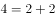）；

3条直线时，有7个平面，写成（3，7）（其中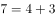）；

寻找规律，，则推理可知（4，11）、（5，16）、（6，22）、（7，29）、（8，37）、（9，46）。9条直线可将平面分为46块。

故正确答案为C。

---

### 第 4 题　qid 2022244 · 数学运算

某公司举办大型年会活动，共35人参加。其中13名女生，每人至少表演一个节目，导演尽可能平均分配节目，共表演了27个节目，则至少有一名女生至少表演多少个节目：

- **A**. 4
- **B**. 3　✅
- **C**. 2
- **D**. 1

**答案**：B

**官方解析**

13名女生共表演了27个节目，尽可能平均分配节目，即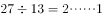，至少有一名女生至少表演了个节目。

故正确答案为B。

---

### 第 5 题　qid 2022250 · 数学运算

张红和李健同时从班级出发沿同一条路线去食堂，若张红用一半的时间以速度x行走，另一半时间以速度y行走；李健在前一半路程以速度x行走，后一半路程以速度y行走（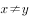），则下列说法正确的是：

- **A**. 张红先到达食堂　✅
- **B**. 李健先到达食堂
- **C**. 张红和李健同时到达食堂
- **D**. 两人谁先到达食堂不能确定

**答案**：A

**官方解析**

根据行程公式可知，张红的平均速度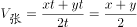；

根据等距离平均速度公式可知，李健的平均速度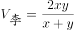。

因为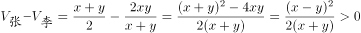 ()，所以。

路程一定时，速度和时间成反比，所以张红平均速度更快，先到达食堂。

故正确答案为A。

---

### 第 6 题　qid 2021800 · 数学运算

，，（   ），，

- **A**. 

- **B**. 

- **C**. 

- **D**. 

　✅

**答案**：D

**官方解析**

数列带有根号，考虑多级数列。将数字都还原到根号下面，得到，，（），，，根号下的数字相邻后一项与前一项作差得到新数列为4，（），（），10。考虑等差数列4，6，8，10，验证之后符合题目数列。故所求项为。

故正确答案为D。

---

### 第 7 题　qid 2022262 · 数学运算

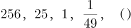

- **A**. 

- **B**. 

- **C**. 

- **D**. 

　✅

**答案**：D

**官方解析**

数列由大到小变化幅度较大，且存在明显的幂次数，优先考虑幂次数列。观察题干数列，可转化为：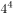、、、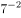、（）。底数为连续自然数列，指数为公差是-2的等差数列，故下一项应为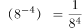，其中分母部分尾数为6，D项满足。

故正确答案为D。

---

### 第 8 题　qid 2022266 · 数学运算

216，625，(   )，729，128

- **A**. 4096
- **B**. 2401
- **C**. 1024　✅
- **D**. 750

**答案**：C

**官方解析**

数列起伏较大，且存在明显的幂次数，优先考虑幂次数列。其中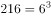，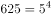，，根据底数由大到小的规律，原数列可转化为：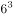、、（）、、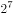。可得底数与指数分别为公差是-1和1的等差数列，故所求项应为（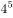）。计算尾数得4，只有C项满足。

故正确答案为C。

---

### 第 9 题　qid 2022270 · 数学运算

1，10，37，（    ），361，1090

- **A**. 105
- **B**. 118　✅
- **C**. 245
- **D**. 294

**答案**：B

**官方解析**

数列变化幅度较大，幂次无规律，考虑作差。相邻两项作差后可得新数列：9、27、（）、（）、729，分别为、、（）、（）、，底数均为3，指数为连续自然数，反推可得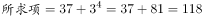，B项满足。

故正确答案为B。

---

### 第 10 题　qid 2023540 · 数学运算

，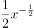，，，（   ），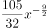

- **A**. 

- **B**. 

　✅
- **C**. 

- **D**. 
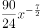

**答案**：B

**官方解析**

题干数列是较为特殊的幂次数列，可拆分系数与指数单独查找规律。数列各项指数分别为：、、、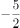、（    ）、，为公差是-1的等差数列，则括号内应为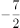，B、D两项满足，排除A、C两项。观察数列发现，各项系数的符号为正负交替，故所求项系数符号为负号，并且后一项系数的绝对值等于前一项系数与指数乘积的绝对值，则所求项系数的绝对值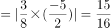，综上，所求项为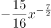。

故正确答案为B。

---

## 判断推理

### 第 1 题　qid 2021852 · 图形推理

从所给四个选项中，选择最合适的一个填入问号处，使之呈现一定的规律性：

- **A**. A
- **B**. B
- **C**. C
- **D**. D　✅

**答案**：D

**官方解析**

元素组成不同，且无明显属性规律，考虑数量规律。九宫格优先横向看，观察发现，第一行黑块的数量分别为2、3、4，第二行黑块的数量分别为7、6、5，第三行黑块的数量分别为8、9、？，进而发现，图形按照“反S型”（如下图所示）的方向，后一幅图形在前一幅图形的基础上增加1个黑块，故？处应为在前一幅图形的基础上增加1个黑块的图形，只有D项符合。

故正确答案为D。

---

### 第 2 题　qid 2021968 · 图形推理

从所给四个选项中，选择最合适的一个填入问号处，使之呈现一定的规律性：

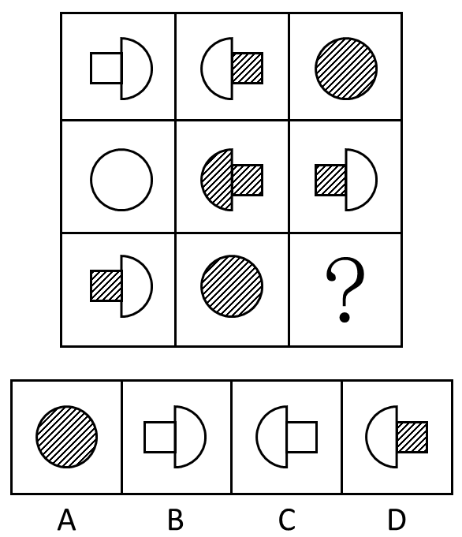

- **A**. A
- **B**. B
- **C**. C　✅
- **D**. D

**答案**：C

**官方解析**

九宫格题目。元素组成相似，优先考虑样式。观察发现第一行中，全白面、半阴影、全阴影的图形都出现，第二行图形中也是全白面、全阴影、半阴影的图形出现，第三行中半阴影、全阴影，问号处应为全白面的图形，排除A、D两项。比较B、C项的不同之处，“蘑菇”图形的方向不同，题干中第一行图形和第二行图形中的两个“蘑菇”朝向都是不同的，因此问号处应选一个和第三行图1中朝向不同的“蘑菇”，第三行图中的“蘑菇”是头朝右的，问号处应选择一个“蘑菇”头朝左的，只有C项符合，排除B项。
故正确答案为C。

---

### 第 3 题　qid 2021976 · 图形推理

从所给四个选项中，选择最合适的一个填入问号处，使之呈现一定的规律性：

- **A**. A
- **B**. B　✅
- **C**. C
- **D**. D

**答案**：B

**官方解析**

元素组成不同，考虑属性和数量规律。观察发现，题干中出现汉字和直线图形，则可考虑汉字笔画数，非汉字图形直线数量。发现分别是3笔画，4条线，5笔画，6条线，？处应该为一个7笔画的汉字。
故正确答案为B。
注：如果看开放封闭性的话，题干图形依次为开放图形、封闭图形、开放图形、封闭图形，？处应选一个开放图形，正确答案仍然选B，但是因为吉林多次考到汉字数笔画，非汉字数线的数量，所以本题更倾向于考虑线的数量。

---

### 第 4 题　qid 2021832 · 图形推理

把下面的六个图形分为两类，使每一类图形都有各自的共同特征或规律，分类正确的一项是：

- **A**. ①③④，②⑤⑥　✅
- **B**. ①③⑤，②④⑥
- **C**. ①②⑤，③④⑥
- **D**. ①②④，③⑤⑥

**答案**：A

**官方解析**

图形组成不同，且属性无规律，考虑数量规律。观察题干发现，图①③⑤⑥线条交叉比较明显，则考虑数交点。题干六幅图交点的数量分别为10、8、7、4、8、8，所以①③④为一组交点的数量不是8，②⑤⑥为一组交点的数量是8。
故正确答案为A。
粉笔提示：有的同学可能考虑数面数量，认为图①③⑤为一组，面数量都是偶数，图②④⑥为一组，面数量都是奇数，从而选到B项。这种思路其实并不合适，一个是因为数点特征图明显，且这种分类方式符合吉林省考分组分类题目的命题特征；一个是奇偶性的考查太特殊，不建议往这个角度上考虑。因此粉笔更建议从点数量的角度考虑，把答案给到A选项。

---

### 第 5 题　qid 2022314 · 图形推理

左边给定的是纸盒的外表面，下面哪一项能由它折叠而成：

- **A**. A
- **B**. B　✅
- **C**. C
- **D**. D

**答案**：B

**官方解析**

A选项：梯形面和三角形面是相对面，相对面不能同时出现，与题干不一致，排除；
B选项：三面相对位置正确，当选；
C选项：梯形面的长边应该对应空白面，而不是菱形面，与题干不一致，排除；
D选项：心形面和菱形面是相对面，相对面不能同时出现，与题干不一致，排除。
故正确答案为B。

---

### 第 6 题　qid 2022310 · 类比推理

动：静

- **A**. 东：西
- **B**. 贫：富
- **C**. 黑：白
- **D**. 曲：直　✅

**答案**：D

**官方解析**

第一步：分析题干词语间的逻辑关系。
动和静二者为并列关系中的矛盾关系，动和静之间存在明显的界限限定。
第二步：判断选项词语间的逻辑关系。
A项：东和西为并列关系中的反对关系，除了东西还有其他不同的方位，与题干逻辑关系不一致，排除；
B项：贫和富为并列关系中的反对关系，除了贫富还有中产阶级，与题干逻辑关系不一致，排除；
C项：黑和白为并列关系中的反对关系，除了黑和白还有其他不同的颜色，与题干逻辑关系不一致，排除；
D项：曲和直为并列关系中的矛盾关系，曲和直之间存在明显的界限限定，与题干逻辑关系一致，当选。
故正确答案为D。

---

### 第 7 题　qid 2021806 · 类比推理

信件：E-mail

- **A**. 电脑：台式电脑
- **B**. 教师：女教师
- **C**. 朋友：老同学
- **D**. 图书：电子书　✅

**答案**：D

**官方解析**

第一步：判断题干词语间逻辑关系。
E-mail是信件的一种，二者是种属关系，且E-mail是信件的一种电子形式。
第二步：判断选项词语间逻辑关系。
A项：台式电脑是电脑的一种，二者是种属关系，与题干逻辑关系一致，保留；
B项：女教师是教师的一种，二者是种属关系，与题干逻辑关系一致，保留；
C项：有的朋友是老同学，有的朋友不是老同学，并且有的老同学是朋友，有的老同学不是朋友，二者是交叉关系，与题干逻辑关系不一致，排除；
D项：电子书是图书的一种，二者是种属关系，与题干逻辑关系一致，保留。
比较A、B、D三项，题干E-mail是信件的一种电子形式，A项台式电脑不是电脑的电子形式；B项女教师不是教师的电子形式；而D项电子书是图书的一种电子形式。
故正确答案为D。

---

### 第 8 题　qid 2022316 · 类比推理

书：纸：笔

- **A**. 河：水：海
- **B**. 饭：米：青菜　✅
- **C**. 林：树：木
- **D**. 枪：子弹：炮

**答案**：B

**官方解析**

第一步：判断题干词语间的逻辑关系。
纸是书的原材料，纸和笔又是并列关系。
第二步：判断选项词语间的逻辑关系。
A项：河与海二者之间为并列关系，水是河、海的组成部分，与题干逻辑关系不符，排除；
B项：米是饭的原材料，米和青菜又是并列关系，与题干逻辑关系一致，当选；
C项：树和木共同组成了林，但是树和木无需经过加工形成林，与题干逻辑关系不符，排除；
D项：枪和炮为并列关系，子弹和枪为配套使用的关系，与题干逻辑关系不符，排除。
故正确答案为B。

---

### 第 9 题　qid 2021804 · 类比推理

松树对于（  ）相当于（   ）对于知识产权

- **A**. 松果：知识
- **B**. 松树枝：权利
- **C**. 植物：专利权　✅
- **D**. 松树林：商标权

**答案**：C

**官方解析**

逐一代入选项验证。
A项：松果是松树结出的果实，两者为对应关系；知识产权是一种法律概念，指智力创造的成果，而知识包含面很广，两者并不构成果实的对应关系，前后逻辑关系不一致，排除；
B项：松树枝是松树的一部分，是组成关系，知识产权是权利的一种，是种属关系，前后逻辑关系不一致，排除；
C项：松树是植物的一种，是种属关系，专利权是知识产权的一种，是种属关系，前后逻辑关系一致，当选；
D项：松树是松树林的一部分，是组成关系；商标权是知识产权的一种，是种属关系，前后逻辑关系不一致，排除。
故正确答案为C。

---

### 第 10 题　qid 2022284 · 类比推理

问号对于（  ）相当于（  ）对于排球

- **A**. 逗号 排球队
- **B**. 句子 沙滩排球
- **C**. 句号 足球　✅
- **D**. 标点符号 体育项目

**答案**：C

**官方解析**

将选项逐一代入，判断各选项前后部分的逻辑关系。
A项：问号和逗号均为标点符号，前两词为并列关系；排球是排球队使用的体育器材，后两词为对应关系。前后逻辑关系不一致，排除；
B项：问号是某些句子（疑问句）的组成部分，沙滩排球是排球的一种，前两词为组成关系，后两词为种属关系。前后逻辑关系不一致，排除；
C项：问号和句号均为标点符号，前两词为并列关系；足球和排球均为运动项目，后两词为并列关系。前后两组词语逻辑关系一致，当选；
D项：问号是一种标点符号，前两词为种属关系；排球是一种体育项目，后两词为种属关系；但是前后两组词顺序不对应，逻辑关系对应不一致，排除。
故正确答案为C。

---

### 第 11 题　qid 2021818 · 定义判断

互补品定价策略，是指企业为主要产品（价值量高的产品）制定较低的价格，而为附属产品（价值量低的产品）制定较高的价格，这样有利于增加整体的销量，从而增加企业利润。
根据上述定义，下列使用了互补品定价策略的是：

- **A**. 甲企业推出的一款网络游戏深受消费者喜爱，带动了游戏周边产品的热销
- **B**. 丁商场销售的十二生肖系列茶杯，成套购买会比单个购买的价格更加优惠
- **C**. 丙公司新推出内存为16G、64G和128G的三款智能手机，售价差别较大
- **D**. 乙厂商生产的喷墨打印机质量好、价格低，但墨盒的价格却一直居高不下　✅

**答案**：D

**官方解析**

第一步：找到定义关键词。
“企业”、“主要产品（价值量高的产品）制定较低的价格”、“附属产品（价值量低的产品）制定较高的价格”、“增加整体的销量，从而增加企业利润”。
第二步：逐一分析选项。
A项：“游戏周边产品”、“网络游戏”没有体现对不同种产品制定不同的价格，不符合定义，排除；
B项：“十二生肖系列茶杯”只是量大优惠，而没有体现主要产品和附属产品的定价不同，不符合定义，排除；
C项：“内存为16G、64G和128G的三款智能手机”这是三种产品，没有体现主要产品和附属产品的区别，不符合定义，排除；
D项：喷墨打印机价格低，墨盒价格高，墨盒是喷墨打印机的附属产品，符合“主要产品（价值量高的产品）价格低，附属产品（价值量低的产品）价格高”，符合定义，当选。
故正确答案为D。

---

### 第 12 题　qid 2021860 · 定义判断

比拟法是植物命名时最常见的一种修辞造词手段，是一种当物体的一部分或整体在形状、纹色、气味、质地、功能等方面，与其他事物存在着相似联系，植物命名时就相应地选择代表相似事物的词语来参与造词的方法。
根据上述定义下列植物命名，没有使用比拟法的是：

- **A**. 蘑菇里最珍贵的叫猴头，这种蘑菇是圆的，没有根，泥黄色表面成头发丝状很像猴子的脑袋，故而得名
- **B**. 代代花，姑苏名产，实熟时色黄，若不采下，经五年而不烂，皮色由青而黄复由黄变青可历多年故称代代花　✅
- **C**. 据《本草纲目-果部-椰子》，记载椰子果实圆形，上有黑褐色的毛，人们将其与人的头颅类比，命名为“越王头”
- **D**. 甘草可调和众药，故又名“国老”，“国老”本为古代的国之重臣，或为告老退职的卿、大夫或士，有德高望重之义

**答案**：B

**官方解析**

第一步：找到定义关键词。
“物体的一部分或整体在形状、纹色、气味、质地、功能等方面，与其他事物存在着相似联系”、“植物命名时就相应地选择代表相似事物的词语来参与造词”。
第二步：逐一分析选项。
A项：“猴头”是因为泥黄色表面成头发丝状很像猴子的脑袋而得名，是蘑菇的形状与猴子脑袋相似，符合定义，选非题，排除；
B项：“代代花”的命名是因为果实成熟时没有采下，经五年而不烂，皮色由青而黄复由黄变青可历多年，不符合定义中“形状、纹色、气味、质地、功能”中的任何一种方式，选非题，当选；
C项：“越王头”因外形圆，有黑褐色的毛，和人类的头颅类似而命名，是形状的类似，符合定义，选非题，排除；
D项：甘草又名“国老”是因为可调和众药，更好地发挥药效，在功能上和古代的重臣类似，重臣可以调和文武百官，发挥出更好的作用，符合定义，选非题，排除。
本题为选非题，故正确答案为B。
附：甘草别名的由来：
南朝有一个名医叫陶弘景，他是著名的医药家、道教学家、文学家。他早年为官，36岁时辞官入茅山隐居。其间，他不时收到梁武帝派人传来的国家时事动态，在山中为朝廷出谋划策，被人称为“山中宰相”。同时，他还编撰书稿，写炼丹笔记，也经常为人治病。
陶弘景开的药方中都有甘草，有病人问甘草是不是能医百病。陶弘景笑道：“甘草甘平补益，又能缓能急，对一些性情猛烈的药物，可监之、制之、敛之、促之；在不同的药方中，可为君为臣，可为佐为使，能调和众药，使它们更好地发挥药效。在药的王国里，甘草是国之药老。”从此，人们就把甘草称作“国老”了。

---

### 第 13 题　qid 2022318 · 定义判断

拟态，是指某些动物在外表、形态、色泽斑纹或行为等特征上，模仿其他生物或非生物环境，从而混淆敌害视觉，避免遭受敌害捕食的适应现象。
根据上述定义，下列现象属于拟态的是：

- **A**. 黄蜂腹部醒目的黑黄相间的条纹是一种警戒色，被黄蜂蜇过的鸟可以记忆几个月，从此只要再见到这种醒目的条纹，就会立即躲得远远的
- **B**. 当酷暑到来时，松鼠会将身体卷缩起来，钻进窝中酣然大睡，其体温会随着代谢的降低而变得冰凉，直至酷暑消退时，才会醒过来活动
- **C**. 尺蠖是尺蛾的幼虫，它栖息在树枝上一动不动，像钉在那里一样，简直就是树干上长出的一个小树杈，食虫鸟对它连看都不看一眼　✅
- **D**. 家兔是由野生的穴兔驯化成的，野兔具有挖洞穴居来逃避敌害的生活习性，家兔尽管有人工建造的居住场所，但是它仍然有挖洞的行为

**答案**：C

**官方解析**

第一步，抓住定义中的关键词。
“某些动物”，“其他生物或非生物环境”，方式是“模仿”，目的是“混淆敌害视觉，避免遭受敌害捕食的适应现象”。
第二步，逐一判断选项。
A项：被黄蜂蜇过的鸟可以记住醒目的黑黄相间的条纹不是模仿，不符合定义 ，排除；
B项：没有出现过“其他生物或非生物环境”，也没有体现“模仿”，不符合定义 ，排除；
C项：尺蠖模仿“树干上长出的一个小树杈”，符合某些生物模仿非生物环境，目的是为了躲避食虫鸟，符合定义中“混淆敌害视角，避免遭受敌害捕食”，符合定义，当选；
D项：家兔和野兔都属于同种生物，选项中也没有体现“模仿”，不符合定义 ，排除。
故正确答案为C。

---

### 第 14 题　qid 2022312 · 定义判断

集合行为是指一种人数众多的自发的无组织的行为。在集合行为中，个人不是独立地行动，而是与他人相互依赖、相互影响。
根据上述定义，下列不属于集合行为的是：

- **A**. 傍晚一群人穿着统一服装在空地上跳街舞　✅
- **B**. 某国发生地震一群居民抢购食物和矿泉水
- **C**. 近期，一些不实的谣言在网络中被迅速传播
- **D**. 今年夏季颜色鲜艳的连衣裙成为流行服饰

**答案**：A

**官方解析**

第一步，找到定义中的关键词。
“人数众多的”、“自发的无组织的行为”。
第二步，逐一判断选项。
A项：穿着统一服装不符合定义中的“自发的无组织的行为”，统一服装说明这种行为不是无组织行为，不符合定义，当选；
B项：一群居民符合定义中“人数众多的”，抢购食物和矿泉水符合定义中的“自发的无组织的行为”，符合定义，排除；
C项：谣言的传播具有盲目性和突发性，迅速传播说明是一种人数众多的自发的无组织行为，符合定义，排除；
D项：颜色鲜艳的连衣裙成为流行服饰涉及到“人数众多的”，且这种行为是“自发的无组织的”，符合定义，排除。
本题为选非题，故正确答案为A。

---

### 第 15 题　qid 2022308 · 定义判断

诉诸无知是一种逻辑谬误，它是指人们指定一件事物是正确的，只是因为它未被证明是错误的，或者断定一件事物是错误的，只是因为它未被证明是正确的。
根据上述定义下列属于诉诸无知的是：

- **A**. 既然权威专家都说你错了，你就很可能真的错了。
- **B**. 你缺乏证实不在现场的证据，所以你一定在现场。　✅
- **C**. 你无法证明鬼是不存在的，所以鬼就是不存在的。
- **D**. 很多人都声称自己曾经见过鬼，所以鬼是存在的。

**答案**：B

**官方解析**

第一步：抓住定义中的关键词。
原因1：未被证明错；结果1：一定是正确的。
原因2：未被证明对；结果2：一定是错误的。
第二步：逐一判断选项。
A选项，因为专家说你错，所以你可能错，不符合题干中的因果关系，排除；
B选项，因为不能证明不在场，所以一定在场，符合题干中的因果关系，当选；
C选项，因为无法证明鬼是不存在的，所以鬼是不存在的，不符合题干中的因果关系，排除；
D选项，声称见过鬼，所以鬼存在，不符合题干的因果关系，排除。
故正确答案为B。

---

### 第 16 题　qid 2021900 · 逻辑判断

王戎七岁，尝与诸小儿游，见道边李树多子折枝。诸儿竞走取之，唯戎不动。人问之，答曰：“树在道边而多子，此必苦李。”取之信然。
王戎的隐含推理的假设是：

- **A**. 若路边的李子被摘光了，就不会多子折枝。
- **B**. 若路边的李子味道甜美，就不会多子折枝。　✅
- **C**. 若路边的李子味道不甜美，就会多子折枝。
- **D**. 只有路边的李子没被摘光，才会多子折枝。

**答案**：B

**官方解析**

第一步：找出论点和论据。

论点：此必苦李。

论据：树在道边而多子。

论点讨论的是李子是苦的，而论据讨论的是树在道路边并且李子很多，论点和论据话题不一致，优先考虑搭桥，即树在道边而多子此必苦李。

第二步：逐一分析选项。

A项：李子被摘光不会多子折枝，李子是否摘光和题干讨论的话题不一致，无法加强，排除；

B项：李子味道甜美不会多子折枝，将其逆否，多子折枝李子味道不甜美，在论点和论据之间搭桥，可以加强，当选；

C项：李子味道不甜美会多子折枝，无法加强，排除；

D项：多子折枝李子没被摘光，李子是否摘光和题干讨论的话题不一致，无法加强，排除。

故正确答案为B。

---

### 第 17 题　qid 2021898 · 逻辑判断

苏格拉底有一句名言：“我只知道一件事，那就是什么都不知道。”
以下哪项最精准地表明了上述推理的荒谬？

- **A**. 甲：“我们不应背后议论我们的朋友。”乙：“难道我们要当面议论我们的朋友吗？”
- **B**. 纸牌一面写：“纸牌反面的句子是对的。”另一面写：“纸牌反面的句子是错的。”　✅
- **C**. 俗话说：“男子汉大丈夫，宁死不屈。”俗话又说：“男子汉大丈夫，能屈能伸。”
- **D**. 甲：“你的观点和主流的观点是有矛盾的。”乙：“这没什么，矛盾是普遍存在的。”

**答案**：B

**官方解析**

第一步：分析题干。
苏格拉底的名言实际上是一个悖论，他只知道一件事，而这件事即“什么都不知道”，那么既然什么都不知道，意味着苏格拉底也不可能知道“一件事”；就是说，我们无法从这句话推论出苏格拉底是否知道这件事。
第二步：逐一分析选项。
A项：甲说不应背后议论朋友，乙说难道要当面议论朋友，属于混淆概念，“背后议论”的反面并非一定是“当面议论”，也可以“不议论”，甲乙两人的话并不违背，不存在题干中的悖论，排除；
B项：纸牌一面写“纸牌反面句子是对的”，即另一面写的“纸牌反面的句子是错的”这句是对的，此句中的“纸牌反面的句子”实际上指的就是前一句“纸牌反面句子是对的”，意味着前一句此时又是错的，这两句构成了悖论，我们同样无法根据这两句话推出结果怎样，与题干一致，当选；
C项：前一句“宁死不屈”讨论的是愿不愿意屈服，而后一句“能屈能伸”讨论的是能不能屈服，二者混淆了概念，不存在题干中的悖论，排除；
D项：前一句“你的观点和主流的观点是有矛盾的”中的矛盾一词指的是两种观点存在冲突，而后一句“矛盾是普遍存在的”指的是同一事物的两个对立面，如自然界中的作用力与反作用力，绝对运动和相对静止等。二者混淆了概念，不存在题干中的悖论，排除。
故正确答案为B。

---

### 第 18 题　qid 2021902 · 类比推理

巫马子对墨子说：我不能兼爱。我爱我的家人比爱我家乡的人深，爱我的双亲比爱我的家人深，爱我自己胜过爱我双亲，这是因为切近我的缘故。打我，我会痛，打别人，不会痛在我身上，所以我只会杀他人以利于我。墨子问道：你的这种义会告诉别人吗？巫马子答道：我为什么要隐藏，我会告诉别人。墨子说：既然你这样，如果有人喜欢你的主张，那么这个人就要杀你以利于自己。如果有人不喜欢你的主张，那他也要杀你，因为他认为你是散布不祥之言的人。
由上文可推知：

- **A**. 巫马子只能远走他乡
- **B**. 巫马子必须承认自己的观点是错的
- **C**. 巫马子一定要改变自己原来的观点
- **D**. 巫马子一定会被人杀死　✅

**答案**：D

**官方解析**

A项：巫马子远走他乡题干中根本没提到，属于无中生有，排除；
B项：题干中只是二者之间的对话，并未涉及最后的结论，也就是说巫马子是否要承认自己的观点是错的并未明确说明，排除；
C项：巫马子一定要改变自己原来的观点说法太绝对，墨子只是在反驳巫马子的观点，但是最终巫马子会不会改变自己的观点，我们无从得知，排除；
D项：墨子的观点给出的是在一组矛盾假设的基础上得出了相同的结论，因此结论一定成立，即喜欢你的观点，你会被人杀死，不喜欢你的观点，你也会被人杀死，所以我们可以得到巫马子一定会被人杀死，正确。
故正确答案为D。
本题涉及矛盾关系，矛盾关系包含了世上所有的情况。比如世界上只有两种情况，喜欢你的主张，不喜欢你的主张，在这两种情况下结论是一样的，所以可以得出结论必然发生。
再举一个例子，下雨和不下雨是矛盾的。如果下雨，我去逛街；如果不下雨，我去逛街。也就是说在任何情况下，逛街这件事是必然发生的。

---

### 第 19 题　qid 2022010 · 逻辑判断

你为什么总是不高兴？因为你缺失信仰，人生失去了方向。也就失去了驾驭快乐的手段。导致很多人在幸福中选择了不快乐。同时，没有信仰就容易把价值观建立在一些外在事物上，甚至是相互比较上，仰望别人的成功，感觉自己的卑微；仰望别人的幸福，慨叹自己的不幸。比较别人的得志，愤然自己的失意；比较别人的快乐，放大自己的痛苦。
如果以上陈述为真，则可以推出：

- **A**. 不缺失信仰，就不会总是不高兴
- **B**. 总是不高兴，说明一定缺失信仰
- **C**. 有信仰，就不会把价值观建立在一些外在的事物上
- **D**. 不把价值观建立在一些外在事物上，代表你有信仰　✅

**答案**：D

**官方解析**

本题为关联词推导题型。
第一步，翻译题干。
①缺失信仰（-信仰）→失去方向→失去快乐；②-信仰→价值观建立在一些外在事物上。
第二步，逐一翻译选项并得出答案。
A项：不缺失信仰→不会总是不高兴，即不缺失信仰→高兴，不缺失信仰是对①中前件的否定，否定前件无法得出任何确定性的结论，无法推出，排除；
B项：不高兴→缺失信仰，不高兴即失去快乐，失去快乐是对①的肯后，肯定后件无法得出任何确定性的结论，无法推出，排除；
C项：信仰→不会把价值观建立在一些外在事物上，此句与②有关联，是对②的前件的否定，否定前件无法得出任何确定性结论，无法推出，排除；
D项：—价值观建立在一些外在事物上→信仰，是对②的后件的否定，否后必否前，能够从题干中推出，当选。
故正确答案为D。

---

### 第 20 题　qid 2022008 · 类比推理

春秋时期楚王在云梦泽打猎，不小心把自己心爱的弓丢失了。左右的侍从立刻要去寻找。楚王制止道：“楚国人丢了弓，楚国人拾了去。不必找了。”
以下与题干中所犯的逻辑错误最为类似的是：

- **A**. 一青年留了长发，父亲见了说：“你赶快去把长发剪掉，不然就别进这个家门！”儿子说：“那我剃光了行吗？”
- **B**. 问：“要是有人把月球塞进大西洋，你说应该用什么方法才能取出来呢？”答：“你是怎么放进去的，我就怎么拿出来。”
- **C**. 老师让学生造句，其中要有“糖”字。小明回答：“父亲在喝茶。”老师问：“糖在哪里啊？”小明回答：“在茶里，父亲喝的是加糖红茶。”　✅
- **D**. 问：“这件衣服是最时髦的吗？”答：“当然了！”又问：“太阳晒了不褪色吗？”又答：“瞧你说的，它在橱窗里挂了三年了，到现在还像新的一样。”

**答案**：C

**官方解析**

第一步，分析题干逻辑错误。
题干逻辑错误在于前者楚国人为楚王，后者楚国人为拾弓的楚国人，前后的主体字面表述一致，但实质主体不一致，偷换了主体概念。
第二步，逐一分析选项。
A项：父亲和儿子都是在围绕剪掉头发进行讨论，没有偷换主体概念，排除；
B项：都在围绕如果将月球取出放进大西洋进行讨论，没有偷换主体概念，排除；
C项：围绕糖在讨论，“糖在哪里啊”是指汉字糖，“父亲喝的是加糖红茶”中的糖是指糖这种物体，偷换主体概念，当选；
D项：前边是在说时髦，后面是在说新旧的问题，没有偷换主体概念，排除。
故正确答案为C。

---

### 第 21 题　qid 2022006 · 类比推理

人寿之长短，或者由于遗传因素，或者由于后天条件。徐某长寿有遗传因素，所以他的长寿与后天条件无关。
以下与题干的论证结构相同的是：

- **A**. 武松过景阳冈，要么打死老虎，要么被老虎吃掉。武松打死了老虎，所以他没有被老虎吃掉
- **B**. 从这个小山村到县城只有两条路，一条大路，一条小路。大路比较远，小亮决定不走大路，所以他只有走小路
- **C**. 功课不好的原因或是上课不认真听讲，或是课后不认真复习。小明上课认真听讲，所以他课后没有认真复习
- **D**. 学院规定，大一学生至少选修一门外语课，或是英语，或是法语。小华选修英语课，所以他不能选修法语课　✅

**答案**：D

**官方解析**

第一步：分析题干论证结构。
A（长寿），或者B（遗传）或者C（后天），S（徐某长寿）有B（遗传），所以S有-C（后天）。
第二步：逐一分析选项。
A项：A（过景阳冈），要么B（打死老虎）要么C（被老虎吃掉），S（武松）有B（打死老虎），所以S有-C（没有被老虎吃掉），但是，题干中用的是“或者... ...或者... ...”句式，本选项用的是“要么... ...要么... ...”句式，与题干论证结构不一致，排除；
B项：A（从小山村到县城），或者B（大路）或者C（小路），S（小亮）有-B（大路），所以S有C（小路），与题干论证结构不一致，排除；
C项：A（功课不好），或者B（上课不听讲）或者C（课后不复习），S（小明）有-B（上课不听讲），所以S有C（课后不复习）与题干论证结构不一致，排除；
D项：A（选修外语课），或者B（选修英语）或者C（选修法语），S（小华）有B（选修英语），所以S有-C（选修法语），与题干论证结构一致，当选。
故正确答案为D。

---

### 第 22 题　qid 2022004 · 逻辑判断

在我们这个高速发展的社会，拆迁和建设的速度早已超出了人们的想象。而城市的发展总是伴随着城市的拆迁和建设。因此，有人认为城市的发展是导致城市拆迁和建设的根本原因。
以下哪项如果为真，最能削弱上述结论：

- **A**. 很少进行拆迁和建设的城市，往往都会发展得比较慢
- **B**. 经济发展水平的提高，促进城市发展，带动城市的拆建　✅
- **C**. 城市的发展过程必然会带来了很多正面的和负面的影响
- **D**. 除城市发展外，工业化也是导致城市拆迁和建设的原因

**答案**：B

**官方解析**

第一步：找到论点论据。
论点：城市的发展是导致城市拆迁和建设的根本原因。
论据：城市的发展总是伴随着城市的拆迁和建设。
第二步：逐一分析选项。
A项：题干说城市发展会导致城市拆迁和建设，并没有说它们之间的速度如何影响，所以少拆迁的情况是怎样影响城市发展并不知道，属于无关选项，排除；
B项：经济发展水平的提高，促进城市发展，带动城市的拆建，说明城市的拆建的根本原因是经济发展水平的提高，直接削弱论点，保留；
C项：强调城市的发展会带来很多影响，与城市的发展是不是导致城市拆建的根本原因无关，为无关选项，排除；
D项：说明除城市发展外，还有工业化也是导致城市拆建的原因，因此不能说明城市的发展是城市拆建的根本原因，为他因削弱，保留；
比较B、D两个选项，直接削弱论点要比另有他因强，所以排除D选项。
故正确答案为B。

---

### 第 23 题　qid 2022002 · 类比推理

某次数学考试结束后，甲班班长和学习委员一起对考试成绩进行了预测，具体如下：
1．有人考试没及格。
2．有人考试及格了。
3．班长考试没及格。
成绩公布后，发现三句预测中只有一句话正确。可推知：

- **A**. 甲班同学都没有及格
- **B**. 甲班同学有人没及格
- **C**. 学习委员考试及格了　✅
- **D**. 学习委员考试没及格

**答案**：C

**官方解析**

第一步：整理题干。
（1）有人没及格；（2）有人及格了；（3）班长没及格。
第二步：找不到矛盾找反对。
我们发现（1）有人没及格和（2）有人及格了为反对关系，必有一真。
第三步：绕过反对看其余。
题干中说只有一真，反对关系之外的（3）一定为假，那真实情况为：班长及格了。班长及格了可以推知有人及格了，即（2）为真，由于只有一真，因此（1）为假，那真实情况为：所有人都及格了，进而可知学习委员及格了。
故正确答案为C。

---

### 第 24 题　qid 2021998 · 逻辑判断

研究显示，睡眠超过八小时的人的皮肤比通宵熬夜的人更加健康。一些金融工作者是通宵熬夜的人，部分体育工作者一直保持着超过八小时的睡眠。张玉是一名体育工作者。
由此可以推出：

- **A**. 多数体育工作者比某些金融工作者的皮肤更健康
- **B**. 某些体育工作者比某些金融工作者的皮肤更健康　✅
- **C**. 某些金融工作者的皮肤比张玉的皮肤更健康
- **D**. 张玉的皮肤比某些金融工作者的皮肤更健康

**答案**：B

**官方解析**

第一步，分析题干条件。
睡眠超过八小时比通宵熬夜的皮肤更加健康；
有的金融工作者是通宵熬夜；
有的体育工作者是睡眠超过八小时；
张玉是体育工作者。
第二步，逐一分析选项。
A项：题干只强调了部分，无法根据部分体育工作者的情况推出多数体育工作者的情况，无法进行两个群体多少之间的比较，所以不能推出，排除；
B项：存在有的体育工作者睡眠超过八小时，也存在有的金融工作者通宵熬夜，这两个群体比较，可以推出某些体育工作者比某些金融工作者的皮肤更健康，当选；
C、D项：张玉虽然属于体育工作者，但是他的睡眠时间无法确定，无法由部分的情况推出群体中个人的情况如何，所以无法与其他人比较，排除。
故正确答案为B。

---

### 第 25 题　qid 2021990 · 逻辑判断

近日，某地出现了严重的雾霾，一些家长担心孩子的健康。提议在学校安装空气净化器，但有专家认为，学校可能不太适合安装空气净化器。
以下哪项如果为真，最能加强上述专家的观点：

- **A**. 空气净化器的噪音可能对孩子学习产生影响　✅
- **B**. 空气净化器的安装并不能完全替代室内通风
- **C**. 适合的空气净化器功率大，会使电网超负荷
- **D**. 市面上空气净化器鱼龙混杂，质量参差不齐

**答案**：A

**官方解析**

第一步：找到论点论据。
论点：学校可能不太适合安装空气净化器。
论据：无。
本题只有论点，没有论据，加强优先考虑补充论据。
第二步：逐一分析选项。
A项：指出空气净化器的噪音可能对孩子学习造成影响，强调在学校安装空气净化器的坏处，可以加强，当选；
B项：安装空气净化器不能完全替代室内通风和学校是否适合安装空气净化器话题不一致，无关项，排除；
C项：电网超负荷与学校能否安装空气净化器之间缺少必要关联，电网超负荷是否一定导致不能安装是未知的，无关项，排除；
D项：市面上空气净化器质量参差不齐和学校是否适合安装空气净化器话题不一致，无关项，排除。
故正确答案为A。

---

### 第 26 题　qid 2021938 · 类比推理

（1）Gillian在屋子里随着音乐一个人快乐地跳起舞
（2）老师写信说：Gillian患有多动症和学习障碍症
（3）看了几分钟，医生诊断：没错，是个舞蹈天才
（4）去看病，医生打开收音机，带着妈妈走出门外
（5）Gillian总是不安生，无法集中注意力，晚交作业

- **A**. 2-5-4-3-1
- **B**. 5-2-4-1-3　✅
- **C**. 2-5-4-1-3
- **D**. 5-4-1-3-2

**答案**：B

**官方解析**

第一步：先确定逻辑关系最为明显的事件顺序。
观察题干，五个事件主要围绕“Gillian去看病”的过程。逻辑关系的先后顺序比较明显的是事件（2）和事件（4），只有先有“多动症和学习障碍症”，才会“去看病”，因此事件（2）和事件（4）相邻，且事件（2）排在事件（4）前面。 
第二步：逐一对照选项并判断正确答案。
根据第一步，可以排除D选项。又因为事件（4）“医生打开收音机，带着妈妈走出门外”，才有了事件（1）“随着音乐一个人快乐地跳起舞”，最后事件（3）“看了几分钟，医生诊断”应该排在最后面，顺序为（4）-（1）-（3），排除A选项。同时容易判断事件（5）应该排最前面，“不安生，无法集中注意力，晚交作业”才会导致事件（2）的发生，排除C选项。正确排序为：（5）-（2）-（4）-（1）-（3）。
故正确答案为B。

---

### 第 27 题　qid 2021942 · 类比推理

（1）黄牛抢票购票难
（2）软件破解验证码
（3）数字验证码购票
（4）图片验证码产生
（5）验证码难以辨认

- **A**. 1-3-2-4-5　✅
- **B**. 1-4-2-3-5
- **C**. 3-2-1-4-5
- **D**. 4-5-2-1-3

**答案**：A

**官方解析**

第一步：先确定逻辑关系最为明显的事件顺序。
观察题干，五个事件主要围绕“黄牛买票”的过程。逻辑关系的先后顺序比较明显的是事件（2）（3）（4），应先有数字验证码，然后软件破解验证码，才有图片验证码的产生，所以它们的顺序应该是（3）（2）（4），排除BD两项。
第二步：逐一对照选项并判断正确答案。
对比A、C选项，事件（1）的位置不同，事件（1）是对“黄牛抢票购票难”这个事件的总述，是产生数字验证码和图片验证码的原因，所以更适合放在（3）（5）之前，排除C项。
故正确答案为A。

---

### 第 28 题　qid 2021986 · 类比推理

（1）加以改造完善，使之能够切实可用
（2）中止有意识思考，启动潜意识思考
（3）尽可能地收集大量的相关原始资料
（4）随时准备迎接灵光乍现时刻的来临
（5）重复咀嚼原始材料，构思初始创意

- **A**. （2）-（3）-（5）-（1）-（4）
- **B**. （3）-（5）-（2）-（4）-（1）　✅
- **C**. （2）-（3）-（5）-（4）-（1）
- **D**. （3）-（5）-（4）-（2）-（1）

**答案**：B

**官方解析**

第一步：先确定逻辑关系最为明显的事件顺序。
观察题干，五个事件主要围绕“创意形成”的过程。逻辑关系的先后顺序比较明显的是事件（3）和事件（5），只有先“收集大量的相关原始资料 ”，才能“重复咀嚼原始材料，构思初始创意”，因此事件（3）和事件（5）相邻，且事件（3）排在事件（5）前面。
选项中首句为事件（2）或事件（3），结合事件（5），“构思初始创意”是有意识的思考，因此应该排在“中止有意识思考”前面，故三个事件顺序应为（3）—（5）—（2），排除A、C两项。
第二步：逐一对照选项并判断正确答案。
根据第一步的结果可以判断只有B、D两项符合， 通过分析事件（2）和事件（4）可知，“中止有意识思考，启动潜意识思考”是“准备迎接灵光乍现时刻”的前提，即事件（2）应排在事件（4）的前面，排除D选项。
故正确答案为B。

---

### 第 29 题　qid 2021994 · 类比推理

（1）深受外地游客喜爱
（2）采摘和旅游相融合
（3）好资源没有好收益
（4）种葡萄卖给酿酒厂
（5）经济效益大幅提升

- **A**. 2-1-3-4-5
- **B**. 4-5-1-2-3
- **C**. 2-1-5-4-3
- **D**. 4-3-2-1-5　✅

**答案**：D

**官方解析**

第一步，找到突破口。
选项提示只有（2）（4）在句首，（2）是一个措施，（4）更偏向于一个现状，（4）应在（2）前，排除A、C项。
第二步，进一步分析选项。
（1）属于一个结果状态，应为（2）的措施后的结果，故（2）在（1）的前面，排除B项。
故正确答案为D。

---

### 第 30 题　qid 2022000 · 类比推理

（1）瘦狮子明白自己命运掌握在羊群手中，就只吃死羊和病羊
（2）羊群让一只狮子吃得膘肥体壮，让一只狮子饿得皮包骨头
（3）上帝规定：羊群可以在狮子中任选一只，还可以随时更换
（4）一片草原上有一群羊，上帝决定给他们找两只狮子做天敌
（5）瘦狮子快饿死了，羊群才请上帝更换，从此过上安稳生活

- **A**. 2-3-5-1-4
- **B**. 4-3-5-1-2
- **C**. 2-3-5-4-1
- **D**. 4-3-2-1-5　✅

**答案**：D

**官方解析**

第一步：先确定逻辑关系最为明显的事件顺序。
观察题干，五个事件主要围绕“两只狮子与羊群”的故事展开。逻辑关系的先后顺序比较明显的是事件（2）和事件（4），应该先有两只狮子，故事才会发展为一只狮子吃得胖，一只狮子饿得皮包骨，因此事件（4）应该排在事件（2）前面，故事件（4）为首句，排除A、C两项。
第二步：逐一对照选项并判断正确答案。
根据第一步得到的结果可以判断只有B、D两项符合。通过分析事件（2）和事件（5）可知，只有先让一只狮子饿得皮包骨头，才会出现瘦狮子快饿死了，因此事件（2）应该排在事件（5）前面，排除B项。
故正确答案为D。

---

## 资料分析

### 材料 1

        A市统计局在该市范围内做了一项调查，抽取了5000名18到70周岁且在2015年有过网购经历的居民，结果显示：受访者2015年人均网购次数为19.4次。从分组情况看，有三类人群使用网购相对频繁：一是年轻群体，35岁以下的受访者人均网购次数为25.5次；二是较高学历群体，文化程度为大学本科及以上学历和大专学历的受访者人均网购次数分别是27.3次和21.8次；三是中高收入群体，个人月收入为10000元以上和5000到10000元的受访者人均网购次数分别是31.0次和26.0次。此外，女性受访者人均网购次数为21.1次，比男性受访者高出3.8次。2015年该市网购9类主要商品和服务的受访者占比情况如下图。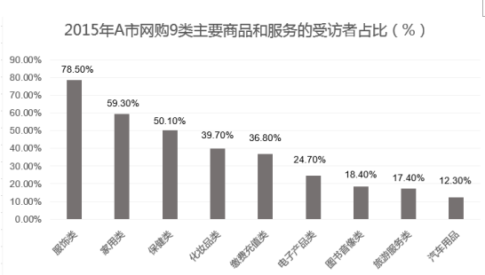

#### 第 1 题　qid 2022276 · 综合

2015年，在A市中，受访者网购的商品和服务项目是：

- **A**. 化妆品、缴费充值类　✅
- **B**. 保健类、汽车用品类
- **C**. 缴费充值类、旅游类
- **D**. 化妆品、电子产品类

**答案**：A

**官方解析**

定位图形材料，占比在之间的商品和服务项目只有化妆品类和缴费充值类。

故正确答案为A。

---

#### 第 2 题　qid 2022282 · 比重

受访者中男性所占比例约为：

- **A**. 

- **B**. 
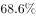

- **C**. 

- **D**. 

　✅

**答案**：D

**官方解析**

题干所求为“男性所占比例”，材料给出人均网购次数和男、女各自的平均网购次数，故本题为比值计算问题。定位文字材料，“受访者2015年人均网购次数为19.4次”，“女性受访者人均网购次数为21.1次，比男性受访者高出3.8次”，所以男性网购次数为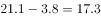次，利用线段法求解男女比为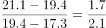，男性占1.7份，女性占2.1份，所以男性占总人数的比例为。

故正确答案为D。

---

#### 第 3 题　qid 2022286 · 综合

受访者中，在2015年网购化妆品的人数约为网购旅游服务人数的：

- **A**. 1.0倍
- **B**. 1.5倍
- **C**. 2.3倍　✅
- **D**. 2.5倍

**答案**：C

**官方解析**

题干所求为“2015年······是······的多少倍”，可知本题为现期倍数计算问题。定位图形材料，2015年网购化妆品的人数占总数的，网购旅游服务人数占总数的，总人数一定，所以2015年网购化妆品的人数是网购旅游服务人数的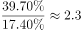倍。

故正确答案为C。

---

#### 第 4 题　qid 2022288 · 平均数

下列群体中，2015年人均网购次数最少的是：

- **A**. 35岁以下的受访者
- **B**. 男性受访者　✅
- **C**. 个人月收入为10000元以上的受访者
- **D**. 大专学历的受访者

**答案**：B

**官方解析**

A项：35岁以下的受访者人均网购次数为25.5次；

B项：定位文字材料，“女性受访者人均网购次数为21.1次，比男性受访者高出3.8次”，所以男性网购次数为次；

C项：个人月收入为10000元以上的受访者人均网购次数为31.0次；

D项：大专学历的受访者人均网购次数为21.8次。

所以最少的是男性受访者。

故正确答案为B。

---

#### 第 5 题　qid 2022292 · 综合

不能从上述资料推出的一项是：

- **A**. 受访者中在2015年网购了缴费充值服务的人数是1840人
- **B**. 2015年该市男性受访者人均网购次数为17.3次
- **C**. 2015年该市网购服饰类、保健类的受访者占受访者之比的差是28.4个百分点
- **D**. 2015年该市大专及以上学历受访者的人均网购次数是24.6次　✅

**答案**：D

**官方解析**

A项：2015年网购了缴费充值服务的人数占总数的，总人数为5000人，所以网购了缴费充值服务的人数为人，正确；

B项：定位文字材料，“女性受访者人均网购次数为21.1次，比男性受访者高出3.8次”，所以男性网购次数为次，正确；

C项：2015年该市网购服饰类的受访者占，保健类的占，两者差为，即28.4个百分点，正确；

D项：文字材料给出大专学历受访者和本科及以上受访者的人均网购次数，但是没有给出具体人数，所以无法推出两者合并后的人均网购次数，错误。

本题为选非题，故正确答案为D。

---

### 材料 2

#### 第 6 题　qid 2022294 · 平均数

2015年，城镇居民人均消费支出最少的季度是：

- **A**. 第一季度
- **B**. 第二季度　✅
- **C**. 第三季度
- **D**. 第四季度

**答案**：B

**官方解析**

定位图表可得，2015年各季度城镇居民人均消费支出分别为：

第一季度：5534；第二季度；第三季度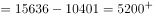；第四季度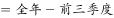。支出最少的季度为第二季度，B项当选。

故正确答案为B。

---

#### 第 7 题　qid 2022296 · 平均数

2015年第一季度，八类消费中占城镇居民人均消费支出比重超过的有：

- **A**. 1个
- **B**. 2个
- **C**. 3个
- **D**. 4个　✅

**答案**：D

**官方解析**

定位表格，2015年第一季度城镇居民人均支出为5534元，其为553.4元，则仅需在表格八类消费中找出支出超过553.4元的即可。观察可得，食品烟酒、衣着、居住及交通通信四项满足。

故正确答案为D。

---

#### 第 8 题　qid 2022298 · 综合

2015年第二季度，四类消费支出从小到大的排序是：

- **A**. 生活用品及服务    医疗保健    教育文化娱乐    衣着
- **B**. 生活用品及服务    衣着    医疗保健    教育文化娱乐　✅
- **C**. 衣着    生活用品及服务    医疗保健    教育文化娱乐
- **D**. 生活用品及服务    衣着   教育文化娱乐    医疗保健

**答案**：B

**官方解析**

定位图表，第二季度生活用品及服务的消费支出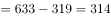元；衣着元；医疗保健元；教育文化娱乐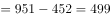元。支出最小的为生活用品及服务，最大的为教育文化娱乐，满足从小到大的排序为B项。

故正确答案为B。

---

#### 第 9 题　qid 2022300 · 平均数

2015年，消费支出占城镇居民人均消费支出比重四个季度持续下降的一类是：

- **A**. 食品烟酒消费支出占比　✅
- **B**. 居住消费支出占比
- **C**. 交通通信消费支出占比
- **D**. 教育文化娱乐消费支出占比

**答案**：A

**官方解析**

题干所求为“各项比重占人均消费支出比重持续下降的一类”，又因为材料所给数据为各季度累计情况，可判定此题为混合比重问题。通过一季度和上半年数据，可快速比较一季度和二季度的升降关系，排除选项。

定位表格可得：

A项：食品烟酒消费支出第一季度比重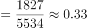，上半年比重，第一季度和第二季度混合为上半年，混合比重大小居中，第一季度比重＞上半年比重，所以上半年比重＞第二季度比重，故第一季度比重＞第二季度比重，符合下降；

B项：居住消费支出第一季度比重，上半年比重，同理，第一季度比重＜上半年比重，所以第一季度比重＜第二季度比重，第二季度比重上升，排除；

C项：交通通信消费支出第一季度比重，上半年比重，同理，第一季度比重＜上半年比重，所以第一季度比重＜第二季度比重，第二季度比重上升，排除；

D项：教育文化娱乐消费支出第一季度比重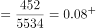，上半年比重，同理，第一季度比重＜上半年比重，所以第一季度比重＜第二季度比重，第二季度比重上升，排除。

通过第一季度与第二季度比较，可以排除B、C、D三项。

故正确答案为A。

---

#### 第 10 题　qid 2022302 · 综合

2015年，能够从上述资料推出的是：

- **A**. 
全年生活用品及服务不到居住消费支出的三分之一 
　✅
- **B**. 
医疗保健消费支出第一季度最高，第四季度最低

- **C**. 
教育支出四个季度平均增速慢于交通通信消费支出 

- **D**. 
全年居住消费支出不到食品烟酒消费支出的

**答案**：A

**官方解析**

根据图表，找出说法正确的一项。

A项：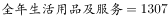，，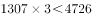，则生活用品及服务低于居住消费的，说法正确；

B项：医疗保健消费，第一季度为338元，。第一季度并非最高，说法错误；

C项：选项中的主体为“教育支出”，表中主体为“教育文化娱乐”，主体不同，无法推出，说法错误；

D项：，，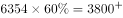，全年居住消费支出高于食品烟酒消费支出的，说法错误。

故正确答案为A。

---
