# 2016年吉林省公务员录用考试《行测》题（甲级）

> 省考 · 2016 年 · 6 个模块 · 共 104 题

- [政治理论](#%E6%94%BF%E6%B2%BB%E7%90%86%E8%AE%BA) · 1 题
- [常识判断](#%E5%B8%B8%E8%AF%86%E5%88%A4%E6%96%AD) · 19 题
- [言语理解与表达](#%E8%A8%80%E8%AF%AD%E7%90%86%E8%A7%A3%E4%B8%8E%E8%A1%A8%E8%BE%BE) · 35 题
- [数量关系](#%E6%95%B0%E9%87%8F%E5%85%B3%E7%B3%BB) · 9 题
- [判断推理](#%E5%88%A4%E6%96%AD%E6%8E%A8%E7%90%86) · 30 题
- [资料分析](#%E8%B5%84%E6%96%99%E5%88%86%E6%9E%90) · 10 题

---

## 政治理论

### 第 1 题　qid 2021696 · 新思想

习近平主席在第二届世界互联网大会开幕式上的讲话提出，完善全球互联网治理体系，维护网络空间秩序，必须坚持同舟共济、互信互利的理念，摈弃零和博弈、赢者通吃的旧观念。据此判断，习主席讲话中会引用的名言是：

- **A**. 善治病者，必医其受病之处
- **B**. 天下兼相爱则治，交相恶则乱　✅
- **C**. 万物各得其和以生，各得其养以成
- **D**. 不受虚言，不听浮术，不采华名，不兴伪事

**答案**：B

**官方解析**

B项正确：“天下兼相爱则治，交相恶则乱”出自《墨子·兼爱上》，意为：大家友好相处，天下就能得到治理；若相互间视为寇仇，势必天下大乱。题干中，“同舟共济，互信互利的理念”体现了“相爱”，“零和博弈，赢者通吃”体现的是“相恶”。
A项错误：该句出自《欧阳修文集卷四十六·准诏言事上书》，意为：治疗病患，要从病因根源的生发处去治愈。习主席在2015年参加土耳其二十国集团领导人峰会时曾引用该名言。
C项错误：该句出自《荀子·天论》，意为：万事万物都有自己的定律，不能强求。习主席在2015年气候变化巴黎大会开幕式上引用该名言。
D项错误：该句出自《申鉴·俗嫌》，意为：不接受虚假的言辞，不听信不切实际的方法，不谋取浮华的名声，不去干虚伪的事情。习主席在2013年中央军委专题民主生活会上引用该名言。
故正确答案为B。

---

## 常识判断

### 第 1 题　qid 2021658 · 人文常识

当遇到下列情况时，你的正确选择是：

- **A**. 被农药污染的食品一定要充分煮熟再食用
- **B**. 被毒蛇咬伤手臂后，应首先扎住伤口处的近心端　✅
- **C**. 进行人工呼吸过程中，吹气者应始终捏紧被救者的鼻孔
- **D**. 处方药和非处方药都必须在医生的指导下购买和使用

**答案**：B

**官方解析**

B项正确：被毒蛇咬伤手臂后，为防止蛇毒随血液经过心脏扩散到全身，应当首先用止血带扎住伤口处的近心端，防止血液流向心脏；
A项错误：被农药污染的食品，即便充分煮熟，也没办法去除残留其中的有害物，故不宜食用；
C项错误：进行人工呼吸时，吹气时要捏紧被救者的鼻孔，是为了防止气体从鼻腔逸出，无法进入被救者的肺部；但是吹气完毕后，应当松开被救者的鼻子，便于气体交流，等下次吹气时再捏紧被救者的鼻子；
D项错误：处方药必须凭执业医师或执业助理医师的处方才可调配、购买和使用；但非处方药不需要医师或其它医疗专业人员开写处方即可购买。
故正确答案为B。

---

### 第 2 题　qid 2021660 · 人文常识

参会代表在主席台前合影后，某专家要求拍一张单身照，摄影师应采取的方法是：

- **A**. 使照相机靠近他，同时镜头往后缩，离胶片近一些
- **B**. 使照相机靠近他，同时镜头向前伸，离胶片远一些　✅
- **C**. 使照相机远离他，同时镜头往后缩，离胶片近一些
- **D**. 使照相机远离他，同时镜头向前伸，离胶片远一些

**答案**：B

**官方解析**

B项正确：照相机前面都有一个镜头，镜头相当于一个凸透镜，来自物体的光经镜头后会聚在胶片上，形成一个倒立、缩小的实像。根据题意，参会代表在合影结束后要再拍张单人照，实际上就是要让人的像变大。根据照相机的调节方式，要使底片上人的像变大，人离镜头应该近一些，像离镜头要远一些，所以照相机要更靠近人，同时镜头应该往前伸，拉大镜头与胶片的距离，A、C、D项均错误。
故正确答案为B。

---

### 第 3 题　qid 2021662 · 地理国情

“五十六个民族，五十六朵花”，各个民族都有绚丽多彩的民族文化。请为歌曲《美丽的草原我的家》《阿里郎》《青藏高原》《牡丹汗》依次配上相应的民族的乐器，对应民族的乐器是：

- **A**. ④①②③
- **B**. ①③②④　✅
- **C**. ②③④①
- **D**. ③①②④

**答案**：B

**官方解析**

B项正确：《美丽的草原我的家》《阿里郎》《青藏高原》《牡丹汗》分别是蒙古族、朝鲜族、藏族和维吾尔族的著名民族歌曲。图片中的四种乐器分别为：①蒙古族的马头琴、②藏族的扎木聂、③朝鲜族的长鼓、④维吾尔族的达卜。故与题干四首歌曲对应的民族乐器应为①③②④。
故正确答案为B。

---

### 第 4 题　qid 2021664 · 人文常识

下列摘自历史专题片中的解说词，内容与史实不相符的是：

- **A**. 汉景帝时，刘濞等宗室诸侯王因不满中央政权削减封地，便起兵发动“七国之乱”
- **B**. 项羽虽未称帝，在《史记》中，司马迁却将项羽列入“本纪”，并给予高度评价
- **C**. 嘉靖年间，戚继光率领“戚家军”与其他明军配合，取得抗倭战争的最后胜利
- **D**. 七七事变激起国人抗日救国的高潮，张、杨二将军为逼蒋抗日，发动了西安兵变　✅

**答案**：D

**官方解析**

D项符合题意：七七事变发生在1937年7月7日，而西安事变发生在1936年12月12日，发生时间先于七七事变爆发时。西安事变是张学良和杨虎城为了达到劝谏蒋介石停止内战，一致抗日的目的，在西安发动的一场“兵谏”。
A、B、C三项的说法均与史实相符。
本题为选非题，故正确答案为D。

---

### 第 5 题　qid 2021666 · 人文常识

孔子说，一种人“和而不同”、还有一种人“同而不和”。下列角色行为属于“和而不同”的是：

- **A**. 公务员小李敢于指出领导脱离群众的缺点，使领导的群众基础更牢　✅
- **B**. 副镇长小张任职后谦虚谨慎，对老镇长的指示一向言听计从
- **C**. 村支书小吴很会做宣传动员工作，总能说服群众接受村委会的各项决定
- **D**. 选调生小刘喜欢张扬个性，走上工作岗位后常常是“独树一帜”

**答案**：A

**官方解析**

“和而不同”“同而不和”出自《论语·子路》：“君子和而不同，小人同而不和。”其大意是，君子在人际交往中能够与他人保持和谐友善的关系，但对于具体问题的看法，不必苟同于对方；小人则相反，在对问题的看法上，习惯迎合别人的心理、附和别人的言论，但实际上内心却并不抱和谐友善的态度。
A项正确：小李指出了领导脱离群众的缺点，反而增强了领导的群众基础，使得领导与群众保持更牢固的关系，是“和而不同”的表现；
B项错误：小张对老镇长的指示一向言听计从，没有体现出“和而不同”中的“不同”；
C项错误：村支书小吴的宣传动员工作是其职责行为，不能用“和而不同”、“同而不和”的观点来加以评价；
D项错误：小刘个性张扬，“独树一帜”，没有体现出“和而不同”中的“和”。
故正确答案为A。

---

### 第 6 题　qid 2021668 · 人文常识

毛泽东的《七律·人民解放军占领南京》中写到：“钟山风雨起苍黄，百万雄师过大江。虎踞龙盘今胜昔，天翻地覆慨而慷。宜将剩勇追穷寇，不可沽名学霸王。天若有情天亦老，人间正道是沧桑。”根据此诗，下列说法错误的是：

- **A**. 钟山就是人们常说的紫金山，是南京的重要地标和风景区
- **B**. 南京城外有奇石耸立，如虎盘踞，与钟山绵延之势共得名“虎踞龙盘”　✅
- **C**. “宜将剩勇追穷寇，不可沽名学霸王”是用典手法
- **D**. 律诗一般八行，每两行为一联，共四联，分首联、颔联、颈联、尾联

**答案**：B

**官方解析**

B项错误：“虎踞龙盘”一词最早出自于晋代吴勃的《吴录》：“刘备曾使诸葛亮至京，因睹秣陵山阜，叹曰：‘钟山龙盘，石头虎踞，此帝王之宅。’”后来“虎踞龙盘”便用来形容南京地势之雄伟。其中“石头”一词指的是石头城，也有说法是指南京城外的石头山，而不是指城外耸立的奇石。
A项正确：钟山又称紫金山，位于南京市玄武区，是江南四大名山之一，是南京名胜古迹荟萃之地，也是南京市的重要地标。
C项正确：“宜将剩勇追穷寇，不可沽名学霸王”一句使用了西楚霸王项羽的典故。鸿门宴上，项羽曾有机会除掉刘邦，但他听信项伯之言“今人有大功而击之,不义也”，放虎归山，最终反被刘邦所害。这里使用这个典故是警示大家要趁有“剩勇”追击“穷寇”，不能像项羽一样贻误战机。其中“霸王”一词很容易联想到项羽，可以轻松将此项排除。
D项正确：律诗是唐朝流行起来的一种汉族诗歌体裁，属于近体诗的一种，因格律要求非常严格而得名。常见的类型有五律和七律，通常的律诗规定每首八句，每两句成一联，共四联，习惯上称第一联为首联、第二联为颔联、第三联为颈联、第四联为尾联。其中“颔”即下巴的意思，因此“首”“颔”“颈”“尾”即头、下巴、脖颈、尾，很容易排序。
本题为选非题，故正确答案为B。

---

### 第 7 题　qid 2021670 · 科技常识

在能源危机面前，人们纷纷将目光投向大海，浩瀚的大海有类型多样、数量巨大的海洋能源，关于各种海洋能源利用，以下表述错误的是：

- **A**. 人们所说的海洋能源主要指海底所储存的煤、石油、天然气等海底能源资源以及溶于水中的铀、锂、镁、重水等化学能源资源　✅
- **B**. 通过风的作用引起海水沿水平方向周期性运动产生的波浪能可以发电
- **C**. 盐差能发电原理实际上是利用浓溶液扩散到稀溶液中释放出的能量
- **D**. 海水容纳的热量是巨大的，海洋热能是电能的来源之一

**答案**：A

**官方解析**

A项错误：浩瀚的大海，不仅蕴藏着丰富的矿产资源，更有真正意义上取之不尽、用之不竭的海洋能源。它既不同于海底所储存的煤、石油、天然气等海底能源资源，也不同于溶于水中的铀、镁、锂、重水等化学能源资源，而是潮汐能、波浪能、海水温差能、海流能及盐度差能等独特的能源形态。
B、C、D三项说法均正确。
本题为选非题，故正确答案为A。

---

### 第 8 题　qid 2021672 · 地理国情

拉尼娜现象就是太平洋中东部海水异常变冷的情况，东南信风将表面被太阳晒热的海水吹向太平洋西部，致使西部比东部海平面增高将近60厘米，西部海水温度增高，气压下降，潮湿空气积累形成台风和热带风暴，东部底层海水上翻，致使东太平洋海水变冷。拉尼娜现象总是出现在厄尔尼诺现象之后，是厄尔尼诺现象的反向，也称为“反厄尔尼诺”或“冷事件”，对于拉尼娜现象可能带来的影响，下列说法错误的是：

- **A**. 拉尼娜现象出现时，我国易出现冷冬热夏
- **B**. 登陆我国的热带气旋个数比常年多，洪涝灾害更易发生
- **C**. 印度尼西亚等东南亚地区降雨偏多
- **D**. 美国西南部和南美洲西岸将有更充沛的降水　✅

**答案**：D

**官方解析**

D项错误：拉尼娜现象会加强太平洋上空的热力环流，导致美国西南部和南美洲西岸异常干旱。
A项正确：拉尼娜现象中太平洋西部在强劲的信风作用下海平面海水异常偏高，而海水温度的偏高会阻碍副热带高压的南移，从而导致副热带高压在冬季长期盘踞在我国陆地上空，形成冷高压，导致冬季气温偏低。而海水温度偏高，会导致副热带高压较往年更加强势，而夏季正是副高控制我国陆地的时期，在副高的控制下多晴朗天气，温度偏高。
B项正确：海水温度偏高，导致海洋上大气运动更为剧烈，所以极易产生热带气旋，也更容易带来洪涝灾害。
C项正确：拉尼娜现象会导致太平洋中、东部海水异常变冷，使得西太平洋热带地区降水增多，印度尼西亚等东南亚地区受影响较大，甚至可能引发洪涝灾害。
本题为选非题，故正确答案为D。

---

### 第 9 题　qid 2021674 · 科技常识

一段朽木上面长满了苔藓、地衣，朽木凹处聚积的雨水中还生活着孑孓，水蚤等，树洞中还有老鼠、蜘蛛等，下列各项中，与这段朽木的“生命系统层次”水平相当的是：

- **A**. 一块稻田里的全部害虫
- **B**. 一个池塘中的全部鲤鱼
- **C**. 一片松林中的全部生物
- **D**. 一间充满生机的温室大棚　✅

**答案**：D

**官方解析**

生命系统的层次有：细胞，组织，器官，系统，个体，种群，群落，生态系统，生物圈。而这段朽木的“生命系统层次”属于生态系统，即生物群落与无机环境相互作用而形成的统一整体。
D项正确：“一间充满生机的温室大棚”也属于生态系统，所以D项正确；
A项错误：“一块稻田里的全部害虫”属于多个种群，种群即在一定的自然区域内，同种生物的所有个体的总称；
B项错误：“一个池塘中的全部鲤鱼”属于一个种群；
C项错误：“一片松林中的全部生物”属于群落，群落即“在一定的自然区域内，所有的种群组成的总体”。
本题在解答时可采用排除法：A、B、C三个错误选项中都出现“全部”字眼，“全部”所指向的都是单纯的生物，没有类似“朽木”这种无机环境，可加以排除，推出D项为正确项。
故正确答案为D。

---

### 第 10 题　qid 2021676 · 人文常识

如果你“穿越”回汉代，你不可能吃到的食物是：

- **A**. 葡萄、胡桃
- **B**. 土豆、地瓜　✅
- **C**. 火腿、豆豉
- **D**. 粽子、米糕

**答案**：B

**官方解析**

B项符合题意：土豆即马铃薯，由于缺乏早期的文字记载，对于马铃薯何时传入中国的说法不一。根据我国史学家考证认为，马铃薯最早传入中国的时间是在明万历年间。地瓜原产美洲热带地区，哥伦布发现新大陆后由西班牙人传入菲律宾，以后传到世界各地，传入中国时，正是明代万历年间。因此“穿越”回汉代不可能吃到土豆和地瓜。
A项错误：《史记·大宛列传》中有记载：“宛左右以蒲陶为酒…汉使取其实来，于是天子始种苜蓿蒲陶肥饶地。”“蒲陶”即今天所说的葡萄，而文中的“汉使”是指汉武帝时出使西域的张骞；胡桃曾经也被认为是张骞出使西域时带回中国的，但1972年发现距今约7000多年磁山文化遗址出土的胡桃，推翻了此种说法。由此可见，若“穿越”回汉代，葡萄及胡桃都有可能吃到。
C项错误：豆豉最早的记载见于汉代刘熙《释名》一书中，其制作历史可以追溯到先秦时期。因此“穿越”回汉代可能吃到豆豉。而火腿起源于中国唐代以前，唐代陈藏器《本草拾遗》中就有描述“火脮，产金华者佳”的描述。最早出现火腿二字的是北宋，苏东坡在他写的《格物粗谈·饮食》明确记载火腿做法。因此回到汉代能否吃到火腿不能肯定。
D项错误：粽子是中华民族传统节庆食物之一，据传是为了纪念屈原而发明，汉代已有粽子是“芦叶裹米”的记载。米糕拥有很悠久的历史，是中国汉族传统小吃食品之一。汉朝对米糕就有“稻饼”“饵”“糍”等多种称呼。汉代的扬雄在《方言》一书中就已有“糕”的称谓。因此“穿越”回汉代可能吃到粽子和米糕。
本题为选非题，故正确答案为B。

---

### 第 11 题　qid 2021678 · 人文常识

下列关于古代启蒙读物的说法，错误的是：

- **A**. 《百家姓》和《千字文》是识字类蒙书
- **B**. 《龙文鞭影》和《幼学琼林》是技能类蒙书　✅
- **C**. 《增广贤文》和《弟子规》是家训类蒙书
- **D**. 《笠翁对韵》和《千家诗》是声律类蒙书

**答案**：B

**官方解析**

B项错误：《龙文鞭影》主要介绍中国历史上的人物典故和逸事传说。《幼学琼林》内容广博、包罗万象，被称为“中国古代的百科全书”。《龙文鞭影》和《幼学琼林》是流传最广、影响最大的两部知识性蒙书。
A项正确：《百家姓》是一本关于中国姓氏的书，对于中国姓氏文化的传承、汉字的启蒙起了巨大作用。《千字文》是用一千个不重复的汉字组成的一篇长韵文，是儿童习字的启蒙读物。二者均为识字类蒙书。
C项正确：《增广贤文》是中国明代时期编写的儿童启蒙书目，内容十分广泛。《弟子规》成书于清朝，是启蒙养正，教育后辈，养成忠厚家风的最佳读物。二者均为家训类蒙书。
D项正确：《笠翁对韵》是从前人们学习写作近体诗、词，用来熟悉对仗、用韵、组织词语的启蒙读物。《千家诗》是我国旧时带有启蒙性质的诗歌选本。故二者均为声律类蒙书。
本题为选非题，故正确答案为B。

---

### 第 12 题　qid 2021680 · 人文常识

成语“猴年马月”泛指没有盼头的遥远岁月。下列关于猴年马月说法中，错误的是：

- **A**. 并非所有“猴年”都有“马月”　✅
- **B**. 每年的农历五月都是“马月”
- **C**. “猴年马月”的周期是12年
- **D**. 甲申年和丙申年都是“猴年”

**答案**：A

**官方解析**

A项错误：中国夏历（农历）使用干支纪年、月、日，其中十二地支与十二生肖对应。所以，按照干支排列，每年的农历五月都是马月，猴年也不例外。
B项正确：根据干支历法，每年农历正月到腊月大致对应的属相依次是：虎、兔、龙、蛇、马、羊、猴、鸡、狗、猪、鼠、牛。五月草长，人欢马叫。故每年的农历五月都是马月。
C项正确：根据干支历法，猴年12年一个轮回，而马月12个月为一个轮回，“猴年马月”的周期是12年。
D项正确：中国农历使用干支纪年，干支的十二地支对应的就是十二生肖年，“甲申年”和“丙申年”中的“申”是地支，对应的生肖是猴，因此均为猴年。
本题为选非题，故正确答案为A。

---

### 第 13 题　qid 2021682 · 科技常识

关于诺贝尔奖，下列说法正确的是：

- **A**. 诺贝尔奖分为物理、化学、生理或医学、数学、文学、和平六个奖项
- **B**. 莫言是第一位获诺贝尔奖的华人
- **C**. 居里夫人是第一位获得诺贝尔奖的女性　✅
- **D**. 由于创造新型抗癌药—青蒿素，屠呦呦获得诺贝尔医学奖

**答案**：C

**官方解析**

C项正确：玛丽·居里是首位诺贝尔奖女性得主，波兰裔法国籍女物理学家、放射化学家，是放射性现象的研究先驱。1903年，居里夫人与其丈夫皮埃尔·居里及亨利·贝克勒共同获颁诺贝尔物理学奖。
A项错误：诺贝尔奖设物理、化学、生理学或医学、文学、和平、经济学六大奖项，没有数学奖。
B项错误：李政道和杨振宁是最早获诺贝尔奖的华人。李政道，1926年生于上海，美籍华人，1957年获诺贝尔物理学奖，时年31岁；杨振宁，1922年生于安徽，美籍华人，1957年获诺贝尔物理学奖，时年35岁。而莫言是第一位获得诺贝尔奖的本土中国人，他于2012年获得诺贝尔文学奖。“华人”是全体中华民族之人的代称，其下包括了“中国公民”以及海外“华侨”。“美籍华人”同样属于“华人”的范畴，莫言并非第一位获得诺贝尔奖的华人，答题时从这词可果断排除此项。
D项错误：2015年10月，屠呦呦获诺贝尔生理学或医学奖是由于她发现青蒿素治疗疟疾的新疗法。
故正确答案为C。

---

### 第 14 题　qid 2021684 · 人文常识

国家发展理念是指导国家选择、安排和整合发展行为的思想基础，下列关于基础设施的观念图式代表国家发展理念演进的四个不同阶段，这四个阶段的正确排序是：

- **A**. ①③②④　✅
- **B**. ①③④②
- **C**. ③①②④
- **D**. ④①③②

**答案**：A

**官方解析**

基础设施是指为社会生产和居民生活提供公共服务的物质工程设施，是用于保证国家或地区社会经济活动正常进行的公共服务系统。它是社会赖以生存发展的一般物质条件。在现代社会中，经济越发展，对基础设施的要求越高。根据经济发展规律，我们可以推知，国家发展中首先要求社会基础设施，其次为经济基础设施，第三为环境基础设施，第四为人文基础设施，最后达到全面发展的基础设施，故正确顺序为①③②④。
故正确答案为A。

---

### 第 15 题　qid 2021686 · 人文常识

备受关注的微信“春节摇红包”活动把2015年春晚推向高潮，当晚共发放由众多品牌企业赞助的5亿现金微信红包。这意味着，微信红包开始从用户个人行为转向企业营销行为。借助向企业营销平台的转变，成为各家企业的营销工作。这种营销模式的成功之处在于：

- **A**. 减少流通环节，提高企业生产效率
- **B**. 提高品牌知名度，创造消费动力　✅
- **C**. 引导消费者量入为出，理智消费
- **D**. 降低经营成本，增加商品的价值量

**答案**：B

**官方解析**

B项符合题意：企业通过赞助微信红包进行营销，吸引了消费者的关注和热捧，提升了品牌知名度，创造了消费动力；
A项错误：这种营销模式与商品流通，提高生产率无关；
C项错误：企业赞助微信红包作为一种营销模式不存在引导消费者量入为出，理智消费的功能；
D项错误：借助营销平台进行营销确实可能降低企业的经营成本，但并不能增加商品的价值量。
故正确答案为B。

---

### 第 16 题　qid 2021688 · 人文常识

成功就是把“不可能”变成“不！可能”，把“Impossible”变成“I&#39;m possible”。这一说法的合理性在于：

- **A**. 思维和存在具有同一性
- **B**. 实践具有直接现实性　✅
- **C**. 真理具有条件性
- **D**. 意识具有主动创造性

**答案**：B

**官方解析**

B项正确：把“不可能”变成“不！可能”，把“Impossible”变成“I&#39;m possible”需要通过实践去实现。实践的直接现实性是指实践是一种直接现实性活动，它可以把人们头脑中的观念的存在变为现实的存在，符合题干的表述。
故正确答案为B。

---

### 第 17 题　qid 2021690 · 人文常识

数学中常常能折射出人生智慧。下列选项与算式体现的道理一致的是：

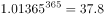     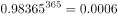

   

- **A**. 江碧鸟逾白，山青花欲燃
- **B**. 问渠那得清如许？为有源头活水来
- **C**. 聚沙成塔，集腋成裘　✅
- **D**. 横看成岭侧成峰，远近高低各不同

**答案**：C

**官方解析**

C项正确：题干中的算式主要想表达量变和质变的关系，强调量的积累导致质的改变。“聚沙成塔，集腋成裘”的意思是通过积累“沙”可以建成“塔”，通过集聚“腋”可以织成“裘”，同样强调了量变引起质变原理；
A项错误：该句出自杜甫《绝句·江碧鸟逾白》，意为：江水碧波浩荡，衬托水鸟雪白羽毛，山峦郁郁苍苍，红花相映，便要燃烧。并没有体现量变与质变的关系；
B项错误：该句出自朱熹《观书有感·其一》，意为：渠中的水这么清是什么原因呢？是因为有源头活水不断进行补充。体现了与时俱进的哲学思想；
D项错误：该句出自苏轼《题西林壁》，意为：从正面看庐山山岭连绵起伏，从其他面看庐山山峰耸立，从远处、近处、高处、低处各个不同的角度看庐山，庐山都呈现出各种不同的样子。蕴含着看问题要全面的哲学思想。
故正确答案为C。

---

### 第 18 题　qid 2021692 · 经济常识

李克强总理指出，要继续促进教育公平，使全国财政性教育经费支出占国内生产总值比例超过4%。如果某地财政教育经费投入不足，对这一问题，假设你是当地人大代表，可以：

- **A**. 行使任免权，罢免在教育投入上不足的政府领导
- **B**. 行使质询权，督促当地政府依法落实财政教育经费的投入　✅
- **C**. 行使调查权，联名其他代表提请人大监督财政教育经费的使用
- **D**. 行使决定权，统筹当地政府的政府教育经费投入

**答案**：B

**官方解析**

人大代表主要享有审议权、提案权、表决权、询问权和质询权、选举权、罢免权、建议权、批评权等。
B项正确：人大代表具有质询权，是指人大代表依照有关法律规定，有对本级人民政府及其所属工作部门，本级人民法院、人民检察院提出质询并要求必须予以答复的权利。人大代表发现某地财政教育经费投入不足，督促当地政府依法落实财政教育经费的投入，是行使质询权的体现。
A项错误：人大代表具有任免权，可以罢免国家机关领导人员。但必须在人大举行会议期间提出，且须进行会议表决。
C项错误：人大代表的权利中不包括调查权，且“联名其他代表提请人大监督财政教育经费的使用”更像监督权而非调查权。
D项错误：人大代表无决定权这一权利。
故正确答案为B。

---

### 第 19 题　qid 2021694 · 人文常识

党的十八届五中全会提出了引领中国发展的“五大理念”，即创新、协调、绿色、开放、共享。下列发展举措中，不符合“五大理念”的是：

- **A**. 实施“京津冀一体化”“长江经济带”战略
- **B**. 把发展、民生、社会建设融为一体，减少贫困人口
- **C**. 充分利用劳动力资源丰富优势，大力发展生产要素驱动的作用　✅
- **D**. 推动建立绿色低碳循环发展产业体系，实施近零碳排放区示范工程

**答案**：C

**官方解析**

C项所述的劳动力生产要素驱动型产业属于落后的、低端的产业模式，是当下需要进行改革优化部分，不符合“五大理念”中创新的要求，当选。
A项“京津冀一体化”、“长江经济带”战略体现了“五大理念”中协调的理念，排除；
B项把发展、民生、社会建设融为一体体现了“五大理念”中协调、共享的理念，排除；
D项推动建立绿色低碳循环发展产业、实施近零碳排放区示范工程体现了“五大理念”中绿色的理念，排除。
本题为选非题，故正确答案为C。

---

## 言语理解与表达

### 材料 1

        最近，“拆二代”这个词火了起来。根据网上的说法：“‘拆二代’多数在上世纪80年代后出生于城市近郊的人，由于拆迁补偿一夜暴富，他们经常以负面形象示人”。<u>        </u>调查数据说明，“拆二代”纸醉金迷又扶不上墙的形象不过是一种幻想。它反映了一种将一个群体标签化，一竿子打翻一船人的思维模式。

        “二代”是一种先赋的资源，对个人成长有着显著影响。但是，这种先天影响并非最具决定性的因素。在财富与权力中成长起来的人不一定骄奢淫逸，而从小面对挫折与贫困未必就奋发有为。不论是“富二代”还是“穷二代”，一个人会怎样、能怎样，更多地取决于他们的努力和社会阶层流动通道是否畅通，而非家庭背景高低。<u><u>        </u></u>保障了法治的健全和社会的公平，<u><u>        </u></u>没必要担心“二代”们做什么“坏事”。

        “二代”标签之所以满天飞，无非有两个原因：其一，碎片化信息传播当道，以偏概全的情绪化表达容易战胜独立理性的判断，能吸引人眼球的“标签”容易集结公众力量，形成一种缺乏理性的舆论暴力；其二，“贴标签”省去人们深入思考、分析的工夫，迎合了人们的懒惰。

        一个标签化的世界，必然是僵化而充满恶意的，<u>但真实世界绝不是如此极端</u>。是时候抛弃各种“×二代”的标签，正视每一个人的独特性了。就事论事，理性独立，这才是看待世界的应然态度。

#### 第 1 题　qid 2021750 · 片段阅读

第一段的“它”指代的是：

- **A**. 拆二代一词
- **B**. 拆二代群体
- **C**. 对拆二代形象的想象　✅
- **D**. 对拆二代群体的评价

**答案**：C

**官方解析**

首先定位代词“它”的位置，结合上下文进行分析，上文说明对“拆二代”的形象是一种幻想，又根据下文“它”反映了一种“思维”模式，故上文表述的“对拆二代形象的幻想”即为“它”指代的内容，对应C项。
A、B、D三项，均无法对应“对形象的幻想”，排除。
故正确答案为C。
【文段出处】《是时候抛弃各种“X二代”标签了》

---

#### 第 2 题　qid 2021752 · 逻辑填空

依次填入横线处最恰当的一组词是：

- **A**. 然而 只要 就　✅
- **B**. 何况 如果 那么
- **C**. 但是 只有 才
- **D**. 而且 一旦 则

**答案**：A

**官方解析**

第一空，根据文章可知，空前表明“拆二代”经常以负面形象示人，空后表明“拆二代”的负面形象是一种幻想，故空前后表意相反，应填入表示转折含义的虚词，排除B项“何况”、D项“而且”。
第二、三空，根据文意可知，“保障了法治的健全和社会的公平”是“不必要担心二代们做坏事”的条件，对比A、C两项，C项“只有······才”为必要条件的表述，即后文结果要成立，必须有前文的条件存在，而文章没有对于条件唯一性的相关表述，故不符合文意，排除。A项“只要······就”为充分条件，即满足条件，则后文结果可以成立，符合文意，当选。
故正确答案为A。
【文段出处】《是时候抛弃“×二代”标签了》

---

#### 第 3 题　qid 2021754 · 片段阅读

对文意理解最准确的是：

- **A**. 网络舆论暴力是种集群行为
- **B**. X二代式的表述有失偏颇　✅
- **C**. 寻求代际身份是人类的天性
- **D**. 先赋资源成为阶层流动的阻碍

**答案**：B

**官方解析**

对比选项和文章的表述，A项，文章表明，网络舆论容易集结公众力量，形成网络暴力，故“是种集群行为”表述过于绝对，排除；
B项，根据文章可知，人们对X二代存在负面情绪，X二代是种标签式的解读，故“有失偏颇”表述正确，当选；
C项，“寻求代际身份”表述无中生有，排除；
D项，文章表明，在财富与权力中成长起来的人不一定骄奢淫逸，故“成为阶层流动的阻碍”与文意相悖，排除。
故正确答案为B。
【文段出处】《是时候抛弃“×二代”标签了》

---

#### 第 4 题　qid 2021756 · 片段阅读

第四段中，画线句子的意思是：

- **A**. 现实社会并非都是僵化且充满恶意的　✅
- **B**. 标签化社会未必都会僵化到极点
- **C**. 现实中的X二代并不都是坏人
- **D**. 现实中的X二代坏不到哪去

**答案**：A

**官方解析**

根据“但”转折可知，画线句子与前文表述内容相反。前文表明，一个标签化的世界，必然是僵化而充满恶意的。故画线句子应表明的是，真实世界不是僵化而充满恶意的，对应A项。
B项，画线句子谈论的主题为“真实世界”，故“标签化社会”并非句子本身含义，排除；
C、D两项，均在谈论现实中的X二代是否是坏人，与“标签化社会必然是僵化而充满恶意的”无法形成语意上的转折关系，排除。
故正确答案为A。
【文段出处】《是时候抛弃“×二代”标签了》

---

#### 第 5 题　qid 2021758 · 片段阅读

最适合做这篇短文标题的是：

- **A**. X二代未必如你想像的坏
- **B**. X二代是一种非理性的表达　✅
- **C**. X二代是充满恶意的标签
- **D**. 标签化表达伤害了“沉默的大多数”

**答案**：B

**官方解析**

可知文章首先介绍了对拆二代的负面看法，其实是一种标签化的解读，接着说明并非所有的二代都是“坏人”并解释了二代标签化的原因。最后呼吁人们要抛弃二代的标签，正视、理性看待每一个人。故文章意在表明X二代的说法是偏颇的、不理性不正确的，对应B项。
A项，文章重点在论述人们对二代们的看法，二代既有“拆二代”又有“穷二代”并非都是坏，故A项表述片面，不适合作为标题，排除；
C项，文章表明，X二代的说法，是一种标签化的思维模式，故“充满恶意”表述程度过重，排除；
D项，“沉默的大多数”文章没有相关表述，故无中生有，排除。
故正确答案为B。
【文段出处】《是时候抛弃“×二代”标签了》

---

#### 第 6 题　qid 2021700 · 语句表达

什么书算得上畅销？可能有人会想到热络一时的《秘密花园》或成为热门IP的小说《盗墓笔记》。不过，吉尼斯世界纪录机构12日在伦敦宣布，《新华字典》获得“最受欢迎的字典”和“最畅销的书（定期修订）”两项吉尼斯世界纪录。对此，著名文化学者张颐武在接受记者采访时表示，这个结果很客观，这说明______________________。
填入画横线部分最恰当的一项是：

- **A**. 《新华字典》具有巨大的市场潜力，可以带来很好的经济效益
- **B**. 中国人越来越喜欢学习，购书选择方面更加喜欢工具书
- **C**. 汉语正在成为越来越重要的语言工具，也从一个侧面反映了汉语影响力的提升　✅
- **D**. 中文工具书越来越得到国际社会的认可和欢迎

**答案**：C

**官方解析**

空格出现在尾句，是对前文内容的总结。文段主要讲述《新华字典》获得两项世界纪录。A项“经济效益”只能对应“最畅销”，无法对应“最受欢迎”，排除；B项“中国人”范围缩小，文段强调《新华字典》获得世界纪录，是在世界范围内产生的影响，排除；D项“中文工具书”非文段强调的重点，文段意在通过《新华字典》反映其中的内容越来越得到重视，排除；C项体现了《新华字典》中的内容，即汉语在世界范围内的影响，与文意相符，当选。
故正确答案为C。
【文段出处】《什么书算畅销？〈新华字典〉获两项吉尼斯世界纪录》

---

#### 第 7 题　qid 2021704 · 逻辑填空

托尔斯泰说：幸福的家庭都是相似的，不幸的家庭各有各的不幸。可在我看来，___________是幸福的人际关系，___________不会真正相似，___________不会一模一样。世界上所有人际关系不会一模一样，而是全都有自己的模样。比如说这对亲子关系母亲爱女儿多些，那对亲子关系女儿爱父亲多些；这对朋友关系他更喜欢她，那对朋友关系她更喜欢他；这对恋人是双向的爱，那对恋人是单向的爱。如此等等，___________。
依次填入画横线部分最恰当的一项是：

- **A**. 哪怕 而 甚至 屡见不鲜
- **B**. 就算 却 起码 不胜枚举
- **C**. 纵然 也 更 层出不穷
- **D**. 即使 也 至少 不一而足　✅

**答案**：D

**官方解析**

第一、二空，A项“哪怕······而”与B项“就算······却”均搭配不当，排除。
第四空，文段第三句提出“世界上所有人际关系不会一模一样，而是全都有自己的模样”，后文通过“比如”进行举例子，尾句“如此等等”对前文内容进行总结，可知第四空想表达的意思为人际关系有很多种，D项“不一而足”指同类的事物不止一个而是很多，无法列举齐全，与文意相符，当选。C项“层出不穷”指接连不断地出现，没有穷尽，文段并未体现出此意，排除。
故正确答案为D。
【文段出处】《我们没有理由反对那些无法归类的关系》

---

#### 第 8 题　qid 2021706 · 逻辑填空

在一般商品生产和交换领域，价值规律的调节功能日臻完善。在此背景下，一些求富者纷纷将        的目光盯上资金、土地等“生产要素”领域，意图从这些高度垄断的领域之中，        尽可能更多的金子。
依次填入画横线部分最恰当的一项是：

- **A**. 攫取 挖取
- **B**. 觊觎 掘取　✅
- **C**. 贪婪 赚取
- **D**. 拜金 收获

**答案**：B

**官方解析**

第一空，根据后文“意图从这些高度垄断的领域之中”可知，这些领域已经被别人高度垄断，现在求富者想要获取别人的东西，A项“攫取”指拿取、抓取，C项“贪婪”指求多、不知足，D项“拜金”指把金钱作为崇拜对象，均无法体现出意图获取别人的东西，排除；B项“觊觎”指渴望得到不属于自己的东西，与文意相符，保留。
第二空，代入验证，B项“掘取”指用长喙状物挖掘，可以体现出获取别人的东西十分不易，当选。
故正确答案为B。
【文段出处】《中国富豪如何摆脱“成长之烦恼”》

---

#### 第 9 题　qid 2021712 · 逻辑填空

作为一名诗歌爱好者，我觉得《悲伤与理智》的核心，也是最有价值的部分，是三篇细品原作的散文，慢条斯理，___________，小溪般缓缓流淌中裸露出底下光滑坚硬的卵石。
《琅琊榜》作为一部宫廷剧，在礼仪动作方面___________地追求完美。他们规范演员的举止动作，给每一个需要使用仪式的场面进行流程制定，见面行礼、叩头请安、祭祀跪拜等都有不同标准。
依次填入画横线部分最恰当的一项是：

- **A**. 不疾不徐 精雕细刻
- **B**. 娓娓道来 全力以赴
- **C**. 信手拈来 全心全意
- **D**. 不温不火 不遗余力　✅

**答案**：D

**官方解析**

第一空，与“慢条斯理”构成并列，“慢条斯理”指有条有理，不慌不忙，C项“信手拈来”指写文章时能自由纯熟地选用词语或应用典故，用不着怎么思考，与文段语义不符，排除；B项“娓娓道来”指连续不断不停地说、生动地谈论，形容谈论不倦或说话动听，强调的是说话，“慢条斯理”强调的是状态，排除；A项“不疾不徐”指不太快或不太慢，D项“不温不火”指不冷淡也不火爆，形容平淡适中，A、D两项均与文段语义相符。
第二空，A项“精雕细刻”比喻十分认真，非常细致，D项“不遗余力”指把全部力量都发挥出来，没有保留，根据后文每一个场面都有不同标准可知，文段表达的意思是很全面很尽力的做此事，故D项合适。
故正确答案为D。
【文段出处】《悲伤与理智：在粗鄙的世界中拯救优雅》《&lt;琅琊榜&gt;创作幕后如何炼成的》

---

#### 第 10 题　qid 2021716 · 语句表达

美是真正的世界语言。看台上，来自世界各地的嘉宾啧啧称赞，纷纷拍照留念，久久回味。当伯牙子期的“高山流水”遇到德彪西的“月光”，当___________的“梁祝”触碰缠绵悱恻的“天鹅湖”，当淡香悠悠的“茉莉花”引出慷慨奔放的“欢乐颂”······文化的力量___________ 。全球治理的磨合，首先要寻求文化的认同；全球治理的共识，也要从文化传统中探索沟通之道。
依次填入画横线部分最恰当的一项是：

- **A**. 此情可待成追忆    于无声处
- **B**. 发乎情止乎礼     润物无声　✅
- **C**. 相见时难别亦难    大象无声
- **D**. 发乎情止于行     潜移默化

**答案**：B

**官方解析**

第一空，横线中所填的语句，修饰“梁祝”的爱情。A项，“此情可待成追忆”指那些美好的事，只能留在回忆之中了。C项，“相见时难别亦难”指见面的机会难得，分别时更是难舍难分，表达了相思离别之情。A、C两项，均不能来形容“梁祝”爱情的终止，排除。B、D两项，强调男女之间的感情是受礼数、行为约束的，可以用来形容梁祝二人，被当时礼数束缚，最终没有在一起。
第二空，B项，“润物无声”指无声无息地做贡献，默默奉献。D项，“潜移默化”指人的思想、品性或习惯受到影响无形中发生变化。横线处形容的是文化在无形中产生影响，并非发生变化，故排除D项。
故正确答案为B。
【文段出处】《习近平主席的“G20时间”一个自信的大国阔步走向世界》

---

#### 第 11 题　qid 2021718 · 片段阅读

①无论角色大小、是否主演，好的演员都会以自己的职业素养与敬业精神对观众负责。②没有踏踏实实沉浸角色的前期准备，就不会有形神兼备的后期演绎。③表演中敷衍了事，观众一眼就能看出来。④影视表演最终要靠作品说话，演员走红后如果不注重提升自己的专业素养，最终会沦为低档快消品，在商业价值被消费殆尽后，最终被淘汰。
“没有小角色，只有小演员。”是原文中的句子，其最恰当的位置是：

- **A**. ①　✅
- **B**. ②
- **C**. ③
- **D**. ④

**答案**：A

**官方解析**

“没有小角色，只有小演员。”强调“角色”不分大小，“演员”分好坏，文段中提到“角色大小”及“演员好与不好”的只有①，所以“没有小角色，只有小演员。”和①衔接最紧密，且这句话统领全文，为文段的中心论点，适合放在首句。
故正确答案为A。
【文段出处】《做好演员靠颜值不如敬业》

---

#### 第 12 题　qid 2021732 · 逻辑填空

在发达国家，做慈善回馈社会是不二之选。最近扎克伯格裸捐450亿美元，就是对国内富豪的一次有益刺激。只有当“财富积累正当”的议程___________到“财富使用正当”，中国富豪的正名之路才算走到尾声。
填入画横线部分最恰当的一项是：

- **A**. 过渡
- **B**. 发展
- **C**. 进展
- **D**. 进化　✅

**答案**：D

**官方解析**

“财富积累正当”和“财富使用正当”是两种不同的方式，且根据后文“正名之路”可知，“财富使用正当”应该为积极内容，相对来说“财富积累正当”次之，故横线处要体现出由低级变化为高级之意。D项“进化”指事物由低级向高级的变化，符合文意，当选。
A项，“过渡”指事物由一个阶段逐渐发展而转入另一个阶段，体现不出由低级向高级变化之意，排除；
B项“发展”和C项“进展”体现不出“质变”之意，均排除。
故正确答案为D。
【文段出处】《除了胡润，拿什么为中国富豪正名》

---

#### 第 13 题　qid 2021734 · 逻辑填空

___________必须以最严厉的措施治理污染企业的超标排放，特别是在重金属污染、持久性有机物污染方面，更要毫不犹豫采取措施，并确保落实，改变污染不断加剧的趋势。此前媒体曝光的某地多家企业“将污水排到1000多米水层污染地下水”等行为，必须坚决遏制，任何来自权力与资本的___________，都不应该动摇治理决心。
依次填入画横线部分最恰当的一项是：

- **A**. 首当其冲 阻拦
- **B**. 毫无疑问 阻止
- **C**. 当务之急 阻挠　✅
- **D**. 毋庸置疑 防止

**答案**：C

**官方解析**

第一空，根据后文“最严厉”“毫不犹豫”“污染不断加剧”可知，目前企业污染十分严重，治理任务紧迫，横线处应体现任务紧急，问题急需解决之意。C项“当务之急”指当前急切应办的要事，与文意相符，保留。A项“首当其冲”比喻最先受到攻击或遭到灾难，不符合文意，排除；B项“毫无疑问”、D项“毋庸置疑”均强调事实明显或理由充分，不必怀疑，无法体现出治理任务的紧迫性，排除。
第二空，代入验证。搭配“权力与资本”，表示对治理环境的阻碍，C项“阻挠”指暗中破坏，使某件事不顺利或不成功，符合文意，当选。
故正确答案为C。
【文段出处】《治理地下水污染已没有退路》

---

#### 第 14 题　qid 2021742 · 语句表达

四川大学华西医院手术中心有24张床位、6个手术间。马洪升介绍，日间手术刚开展时，医院采取____________模式，患者统一在日间手术中心预约，再由各科室派医生到日间手术室执行手术；2010年，医院又推出___________模式，各科病房拿出一定床位用于日间手术；2014年，医院再推出___________模式，由日间手术中心统一收患者，再分到各专科实施日间手术，患者出院后由该中心统一随访。
依次填入画横线部分最恰当的一项是：

- **A**. 分散收分散治      集中收分散治      集中收集中治
- **B**. 集中收集中治      分散收分散治      集中收分散治　✅
- **C**. 集中收分散治      分散收分散治      集中收集中治
- **D**. 分散收分散治      集中收集中治      集中收分散治

**答案**：B

**官方解析**

第一空，根据后文“统一在日间手术中预约，再到日间手术室执行手术”可知，患者的预约和治疗都是统一在日间手术室进行的，都采取集中模式，对应B项，A项“分散收分散治”、C项“集中收分散治”、D项“分散收分散治”，均和文段统一到“日间手术室执行手术”相悖，排除。基本锁定答案是B项。
后两空验证，第二空，由“各科病房拿出一定床位用于日间手术”可知，患者的治疗分别由各科病房负责，这种模式是分散的，故“分散收分散治”符合文意。
第三空，“集中收”对应后文“由日间手术中心统一收患者”，“分散治”对应后文“分到各专科实施日间手术”，故“集中收分散治”符合文意。
故正确答案为B。
【文段出处】《“日间手术”：不用住院 医患“双赢”》

---

#### 第 15 题　qid 2021746 · 逻辑填空

习近平总书记把“本领恐慌”现状概括为“___________不会用，___________不管用，__________不敢用，___________不顶用”，提出全党同志特别是各级领导干部，都要有本领不够的危机感，都要努力增强本领，都要一刻不停地增强本领。
依次填入画横线部分最恰当的一项是：

- **A**. 硬办法 软办法 新办法 老办法
- **B**. 新办法 老办法 硬办法 软办法　✅
- **C**. 软办法 硬办法 老办法 新办法
- **D**. 老办法 新办法 软办法 硬办法

**答案**：B

**官方解析**

第一空，根据空后解释“不会用”可知，这种方法可能是与时俱进的创新型方法，故人们不会使用这种办法，B项“新办法”符合文意。A项“硬办法”意指强硬的办法；C项“软办法”意指较为柔和的、讲人情的办法，均在强调办法本身的特征，与“不会用”无法形成语意对应，排除。D项“老办法”指已使用很久的办法，可知这种办法一直在被使用，故与“不会用”文意相悖，排除。
验证第二空，“老办法”已被使用很久，是过去的办法，没有与时俱进，故可能无法解决当下时代的问题，对应“不管用”正确。第三空，“硬办法”因为比较强硬，故“不敢用”对应正确。第四空，“软办法”比较柔和、讲究人情执法，故“不顶用”对应正确，验证正确。
故正确答案为B。
【文段出处】《依靠学习走向未来》

---

#### 第 16 题　qid 2021762 · 逻辑填空

书法是写字，但写字不是书法。文字是载体，它        着表达思想、传递信息、记事备忘、传承历史的重大使命。而中国书法，则正是使汉字        完美，升入化境的艺术。
依次填入画横线部分最恰当的一项是：

- **A**. 担负  臻于　✅
- **B**. 肩负  趋于
- **C**. 承担  日趋
- **D**. 承载  日益

**答案**：A

**官方解析**

本题从第二空入手，根据其后的“完美、升入化境的艺术”可知，文段的感情色彩是积极的，需要填一个表示褒义色彩的词。A项“臻于”是趋于、达到的意思，带有褒义色彩，如臻于一流、臻于至善等，符合文段感情色彩，且“臻于完美”也是常见的固定搭配，指逐渐地进入好的境界，与后文“升入化境的艺术”对应准确，符合文意，保留。B项“趋于”、C项“日趋”、D项“日益”三个词语均是中性词，可搭配好的语境，亦可搭配不好的语境，如生活日益富足；问题日益凸显，感情色彩不符，排除B、C、D三项。
第一空，代入验证，“担负使命”搭配合理，符合文意，A项当选。
故正确答案为A。
【文段出处】《击浊扬清，端正书风——对当前书法界一些现象的思考》

---

#### 第 17 题　qid 2021764 · 逻辑填空

有人用“天价”片酬导致行业畸形来批判“天价”片酬，然而实际上“天价”片酬与行业畸形是恶性循环，互为因果的关系，因为现有的行业的畸形，才导致对明星效应的依赖，一线明星_______，片酬自然_______。
依次填入画横线部分最恰当的一项是：

- **A**. 席珍待聘  坐地起价
- **B**. 囤积居奇  随行就市
- **C**. 奇货可居  水涨船高　✅
- **D**. 待价而沽  居高不下

**答案**：C

**官方解析**

第一空，搭配“一线明星”，可知所填词语目的是为了解释一线明星天价片酬的原因。A项“席珍待聘”指有才能的人等待受聘用，不足以解释原因，排除；B项“囤积居奇”指商人囤积大量商品，等待高价出卖，牟取暴利，与文意不符，排除；C项“奇货可居”指拿某种专长或独占的东西作为资本，等待时机，以捞取名利地位；D项“待价而沽”指谁给好的待遇就替谁工作。均可解释原因，符合文意。
第二空，搭配“片酬”，比较C、D两项。C项“水涨船高”指事物随着它所凭借的基础的提高而增长提高；D项“居高不下”指没有下降的趋势，可知文段表明是因为一线明星具备专长，所以片酬才高，即片酬高是有其基础和原因的，故C项更符合文意，当选。
故正确答案为C。
【文段出处】《人大表示立法遏制明星天价片酬这样真合适吗？》

---

#### 第 18 题　qid 2021698 · 片段阅读

4月8日下午，湖南人胡国辉和彭孝良，路过广州白云机场航站楼9号门时，拾到一个白色手提袋，内有35.6万美元，折合230余万元人民币。“飞来横财”并没有诱惑到生活拮据的农民工，他们毅然将手提袋原封不动交给机场派出所。据报道，胡国辉和彭孝良拾金不昧的事迹曝光后，他们的身份和生活状况成了网友们热议和欲知的细节。许多网友猜测这两位拾金不昧者，属于受过高等教育的高素质、高收入人群。总之，这句话的潜台词似乎是“只有高素质的人才不会眼红这飞来的横财，只有高收入群体才能抵抗巨款的诱惑”。
这段文字的议题是：

- **A**. 道德约束力
- **B**. 规范有效性
- **C**. 金钱诱惑力
- **D**. 标签化解读　✅

**答案**：D

**官方解析**

文段开篇介绍两位农民工拾金不昧的事迹，接着引出网友的观点，即“这两位拾金不昧者，属于受过高等教育的高素质高收入人群”。尾句通过“总之”对前文网友观点进行总结，指出只有“高素质的人”和“高收入群体”才能抵御金钱的诱惑，即将“拾金不昧”与“高素质、高收入”挂钩，也就是说将其与身份标签绑定，对应D项“标签化解读”。
A项，文段中“拾金不昧”虽属于道德行为，但是文段并未讨论“道德约束力”，无中生有，排除；
B、C项，“规范有效性”“金钱诱惑力”文段并未提及，无中生有，均排除；
故正确答案为D。
【文段出处】《拾金不昧，不必突出“农民工”标签》

---

#### 第 19 题　qid 2021708 · 片段阅读

猴子听说牛老大要请一名家庭教师，于是前往应聘。他在水田里找到了正在耕作的牛老大，双方商定了相关事宜。第二天，猴子要去任教，临走时，他拱到水塘里把身子涂了一通污浊泥水。母猴见了觉得奇怪，问他为何如此。猴子说：“昨天我见牛老大就是这模样，大概他们家就兴这个，我是入乡随俗，拉近关系。”牛老大望见猴子脏兮兮的模样，满心不高兴，大声呵斥其离开。猴子惊诧地问道：“你昨天不就是这样吗？”牛老大边关门边鄙夷地回了一句：“我那是在水田里劳作！”。
这则寓言故事给基层公务员的启示是：

- **A**. 努力工作才是群众最欢迎的
- **B**. 深入调查才能更好地为群众服务　✅
- **C**. 拉近群众关系并不能更好地解决问题
- **D**. 了解人民诉求才能解决人民疾苦

**答案**：B

**官方解析**

文段寓言故事主要讲述了猴子由于模仿牛老大在水田劳作的模样去任教，并自认为是入乡随俗，拉近关系，结果遭到牛老大大声呵斥，这则故事强调没有进行细致深入的了解不利于工作的开展，对应B项“深入调查才能更好地为群众服务”，当选。A项“努力工作”和D项“人民诉求”在故事中并未提及，排除；C项表述错误，文段强调的是不经过了解用错方法不能解决问题，排除。
故正确答案为B。

---

#### 第 20 题　qid 2021710 · 片段阅读

东北文化有好的一面。东北人仗义、大气、敢拍板，但东北人在商业上有个最大的弱点，就是不爱干小事儿，不爱弯腰，从来不爱干让人瞧不起的事。东北人不如南方人细腻、敢冒险，我们很多时候有雄心壮志，但落地的时候瞧不起那些辛苦的工作，看不上最低微的工作，我们老想干大事，不想干小事。要创业，就要有冒险精神，我们要肯干小事，干别人瞧不上的工作，一点一点地创业，这是成功的基础。任何事儿，只有小成功，才有大成功。
与这段文字主旨无关的名言是：

- **A**. 他山之石，可以攻玉　✅
- **B**. 不积跬步，无以至千里
- **C**. 恢弘志士之气，不宜妄自菲薄
- **D**. 业无高卑志当坚，男儿有求安得闲

**答案**：A

**官方解析**

文段首句肯定东北文化好的一面，接着通过“但”进行转折，指出东北人不爱干小事，并通过与南方人的对比，进一步论证此观点。最后通过对策词“要”指出创业要肯干小事，一件件小事的积累是大成功的基础。由此可知，文段重在强调做事情要脚踏实地，从小事做起，要注重积累。A项“它山之石，可以攻玉”比喻别国的贤才可为本国效力，也比喻能帮助自己改正缺点的人或意见，与文段主旨无关，当选。B项“不积跬步，无以至千里”不积累一步半步的行程，就没有办法达到千里之远，强调积累，从小做起、C项“恢弘志士之气，不宜妄自菲薄”指要有宏大的志向，不能自己看不起自己，可以理解为做人不要瞧不起小事，要从小事一点一滴地做起、D项“业无高卑志当坚，男儿有求安得闲？”从事的事业无贵贱之分，但志向必须坚定；男子汉若有追求，怎能游手好闲，均与文段主旨相关，排除。
本题为选非题，故正确答案A。
【文段出处】《东北人最需要的是创业激情》

---

#### 第 21 题　qid 2021714 · 片段阅读

打开朋友圈，晒美食、晒美景，各种晒，再忙也不会忘记随手拍，让本来繁杂或简单的环节硬生生地多出了这些步骤。看似生硬，实则自然，已然融入工作生活的方方面面，在不知不觉中花了大量时间，流失了大量精力。有这样一则段子：伤口流血，首先做的不是止血，而是拍照发微信；遇人危难，千钧一发，路过的人首先也不是挺身而出，而是拍照发朋友圈；阅览者的反应，首先也不是问拍摄者为什么是旁观者，而是盲目点赞，好也赞，坏也赞，欢也赞，愁还是赞。寻求帮助，除了得到赞以外，没有下文。
这段文字意在表明：

- **A**. 朋友圈的拍与炫
- **B**. 朋友圈的看与赞
- **C**. 朋友圈的假繁忙　✅
- **D**. 朋友圈的真欢喜

**答案**：C

**官方解析**

文段开篇提出人们再忙也要随手拍，耗费了大量精力的观点，后文用一则段子进行详细地解释说明，可知文段重点在于开篇的观点，对应C项“假繁忙”，即人们朋友圈里并不是真的忙，而是在各种晒中耗费了精力，当选。A项“拍与炫”只是一种现象，非重点，排除；B项“看与赞”是解释说明的内容，非重点，排除；D项“真欢喜”在文段中没有体现，排除。
故正确答案为C。    
【文段出处】《朋友圈里的“忙”不是真的忙》

---

#### 第 22 题　qid 2021720 · 片段阅读

当你在家里拍了张炫富的钻戒照片，然后上传到自己的微博或者朋友圈，那么事情可能就不只是你想炫耀一下那么简单了。你分享的照片不是一张单纯的照片，它还隐藏着诸多信息，如拍照时间、相机或手机型号、拍照地点的经纬度。所以当这张照片摆上互联网时，对熟悉科技的窃贼来说，你就是一个明确且不需要踩点的目标。如果你还发布了“今天去看场电影或者明天去哪里旅游”的分享，那就是在进一步指引窃贼可以什么时候来偷了。
无法从这段文字推出的是：

- **A**. 犯罪分子可能会利用大数据分析去作案
- **B**. 个人信息泄露主要发生在网络社交平台　✅
- **C**. 在网络社交平台炫富很可能会泄露隐私
- **D**. 面向公众的信息安全教育需要引起重视

**答案**：B

**官方解析**

A项，根据“你分享的照片不是一张单纯的照片，它还隐藏着诸多信息，如拍照时间、相机或手机型号、拍照地点的经纬度”“如果你还发布了‘今天去看场电影或者明天去哪里旅游’的分享，那就是在进一步指引窃贼可以什么时候来偷了”可知，窃贼确实可能会利用网络大数据来作案，表述正确，排除；
B项，文段仅说明“个人信息泄露”这一客观现象，没有强调信息泄露“主要”发生在网络社交平台，无中生有，当选；
C项，根据“你分享的照片不是一张单纯的照片，它还隐藏着诸多信息，如拍照时间、相机或手机型号、拍照地点的经纬度”可知，炫富确有可能泄露隐私，符合文意，排除；
D项，文段指出大众无意识的分享行为，会带来被窃贼盯上的安全风险，侧面说明公众缺乏信息安全意识，需要重视“公众的信息安全教育”表述正确，排除。
本题为选非题，故正确答案为B。
【文段出处】环球网《大数据时代，我们的隐私是怎么样“自我暴露”的？》

---

#### 第 23 题　qid 2021722 · 片段阅读

在陪伴子女成长的过程中，很多家长都会遇到孩子撒谎或者隐瞒真实情况的问题。撒谎差不多算得上是许多父母最担心的子女不良行为，甚至比子女学习成绩不好更令他们惊慌、生气。如果说好多家长并没有很好地解决孩子撒谎的问题，至少他们大多予以重视，而孩子对家长隐瞒自身情况的问题则不仅解决得更差，也没有得到足够重视。
下列表述符合原文意思的是：

- **A**. 家长们认为孩子的知情不报比撒谎更令人担忧
- **B**. 家长们认为撒谎是最不可原谅的道德品质问题
- **C**. 对解决孩子撒谎问题多数家长心有余而力不足
- **D**. 孩子隐瞒自身情况的行为没有引起家长的重视　✅

**答案**：D

**官方解析**

根据尾句的表述“而孩子对家长隐瞒自身情况的问题则不仅解决得更差，也没有得到足够重视”可知，D项表述正确，当选。A项，文段并未对“知情不报”和“撒谎”的担忧程度进行对比，为无中生有的表述，排除；B项，“最不可原谅”表述过于绝对，排除；C项，对应文中“如果说好多家长并没有很好地解决孩子撒谎的问题”，“如果”是一种假设，而C选项假设变现实，不符合文意，排除。
故正确答案为D。
【文段出处】《往事怀想-孩提时期的撒谎》

---

#### 第 24 题　qid 2021724 · 片段阅读

离婚成了21世纪的世纪流行病。我料定未来的日子里公众还会看到更多的名人俗子离婚，这不是乌鸦嘴，是大势所趋。想想身边的人，看看每一天发生的事情，就知道趋势已不可避免。原因是信息革命会改变传统。工业革命后婚姻状况与农业社会的传统不同，导致新式家庭出现，旧式家庭崩盘。今天，这一代赶上了一个全新的时代，山雨欲来。
“山雨欲来”在文中的意思是：

- **A**. 当今社会将会迎来更高的离婚率　✅
- **B**. 离婚率高于结婚率将成为新常态
- **C**. 传统家庭模式即将走向彻底消亡
- **D**. 婚姻制度的颠覆性变革即将到来

**答案**：A

**官方解析**

首先定位原文，“山雨欲来”出现在文段的尾句，起总结前文的作用。根据文段内容，首句强调“离婚成为流行病”，接下来提出作者的预测“我料定未来的日子里公众还会看到更多的名人俗子离婚，这不是乌鸦嘴，是大势所趋”，然后进行原因的分析，所以“山雨欲来”表示未来会有更多的人离婚，对应A项。
B项，文段并未将“离婚率”和“结婚率”进行对比，排除；
C项，“彻底消亡”程度过重，排除；
D项，“婚姻制度”文段没有提到，且“颠覆性变革”程度过重，排除。
故正确答案为A。
【文段出处】《马未都：离婚成了21世纪的流行病》

---

#### 第 25 题　qid 2021726 · 片段阅读

“洪荒少女”傅园慧的横空出世，让国人看到了中国当代运动员努力拼搏、享受比赛的风采；“孙杨不哭”，让我们感受到国人在对待运动员失利时的宽容。我们不禁高呼中国人开始享受奥运、不再纠结于输赢。但当看到“女排精神重现”“女排精神王者归来”这样的标题时，笔者感叹“我们眼里只有输赢，哪里有精神”。
这段文字的主旨是：

- **A**. 肯定球迷日益成熟的体育观
- **B**. 表扬傅园慧式的体育精神
- **C**. 批评媒体“以成败论英雄”的思维　✅
- **D**. 指出“女排精神”已被曲解

**答案**：C

**官方解析**

文段首先通过介绍“洪荒少女”“孙杨不哭”，指出“中国人开始享受奥运，不再纠结于输赢”，之后通过转折关联词“但”引出媒体标题“女排精神重现”“女排精神王者归来”，说明媒体依然强调输赢。文段最后说“我们眼里只有输赢，哪里有精神”，强调作者对媒体的批评态度，对应C项。
A项：“球迷日益成熟的体育观”为国人积极态度的体现，对应文段转折前的表述，非重点，排除；
B项：“傅园慧”是一个例子，不是文段重点，且为转折之前的内容，非重点，排除；
D项：“女排精神”被曲解非重点，作者批评的是以成败论英雄的思维方式，排除。
故正确答案为C。
【文段出处】《中国女排，赢得漂亮！》

---

#### 第 26 题　qid 2021728 · 片段阅读

刚工作时，我在一家高职院校当老师，除了一周上满20节课，还要当辅导员。由于生源质量较差，学校学习氛围不理想，课堂教学面对的都是不爱学习的学生，每堂课后我都会产生满满的挫败感。每周下来，真感觉整个人都被“掏空”了。后来，我果断辞职，换了一个更喜欢的工作，这种“被掏空”的感觉就没有了。“我”的故事的主要启示是：

- **A**. 成就感的获得，往往关乎个人的喜好
- **B**. 如果无力改变现实，就要努力适应它
- **C**. 与其在挫败中消耗自信，不如选择另一种生活　✅
- **D**. 只有做自己最喜欢的工作，才能避免挫败感

**答案**：C

**官方解析**

文段开篇陈述“我在高职院校当老师”的客观情况，之后提出问题，“我”上完课感觉力不从心，非常劳累。文段尾句提出解决问题的对策，“辞职，换了更喜欢的工作”，而后达到“‘被掏空’的感觉没有了”的效果。引出文段强调的是换一种生活方式，即可远离挫败感的生活，对应C项，当选。
A项，“成就感”为无中生有的表述，排除；B项，“努力适应”与文段语义相悖，排除；D项，“最喜欢的工作”表述过于绝对，文段说的是“换一个更喜欢的工作”，排除。
故正确答案为C。
【文段出处】《什么都放不下 最终只会被掏空》

---

#### 第 27 题　qid 2021730 · 片段阅读

我们除了做事，还需多读书，但人生苦短，经典都读不完，何必读其他？何谓经典？经过时间淘洗的著作才是经典。放宽点来说，知识界公认的大家著作也称为经典。但并非大家的所有著作都是经典。一个人，一生能写出一部经典已属不易，能写两三部者可称奇才。故一般而论，读一个人的代表作即已足够，只有少数里程碑式人物的著作需要全读。
这段文字的主要议题是：

- **A**. 如何理解经典
- **B**. 如何阅读经典
- **C**. 应读什么书　✅
- **D**. 怎样坚持读书

**答案**：C

**官方解析**

文段首句强调“我们需多读书”，接下来通过转折词“但”详细介绍了什么样的书可以称之为经典，最后通过“故”引出结论，即读一个人的代表作即已足够，只有少数里程碑式人物的著作需要全读，可知文段强调应该读什么样的书，对应C项。
A、B两项谈论的是“经典”，为结论句之前的内容，非重点，排除；
D项，“坚持读书”文段没有提到，为无中生有的表述，排除。
故正确答案为C。
【文段出处】《萧三匝：我的读书观》

---

#### 第 28 题　qid 2021736 · 片段阅读

日本九州7.3级地震、缅甸7.2级地震、阿富汗7.1级地震、印度尼西亚苏门答腊岛附近海域1个月来多次7.0级以上地震。如何解释近来接二连三的强震，它们之间有关联吗？地球是否就此进入了地震活跃期？对此，中外专家均认为，任何结论都需要有科学证据来支撑。但无论从统计意义还是从具体研究来看，尚无法断定全球地震震级和频率等超出正常范畴，它们之间是否有关联也不能下定论。但对部分“危险”区域加以研究并保持警惕是必须的。
以下选项最适合做文字标题的是：

- **A**. 地球已经进入震动模式
- **B**. 地球进入震动模式了吗　✅
- **C**. 地球将要进入震动模式
- **D**. 地球没有进入震动模式

**答案**：B

**官方解析**

文段由接二连三的强震事实，引出“地球是否就此进入了地震活跃期？”的话题，接着引用中外专家的观点进行论述。由文段“尚无法断定”“也不能下结论”等表述可知，还不能确定地球是否进入地震活跃期，对应B项。A项“已经”、C项“将要”和D项“没有”表述都过于绝对，都建立在结果确定的基础之上，显然与文段不符，排除。
故正确答案为B。
【文段出处】《图文：日本九州连续强震至少41人遇难》

---

#### 第 29 题　qid 2021738 · 片段阅读

我家楼下的王大妈每天推着瘫痪的老伴散步，以前总是有说有笑，最近情绪有些低落，一问才知道，都是被“开放二孩”政策闹的。原来，在北京的二儿子说，媳妇又怀孕了，他们计划让老太太去给带孩子，老爷子这边雇个24小时家政服务，王大妈说，咋也不能把老伴撇下，想自己出钱帮儿子在北京雇保姆，可儿子说北京太贵，而且保姆看孩子不放心。一来二去，媳妇去医院做了流产，不生了。这么一来，王大妈和老伴上火了，满心的内疚感。老伴天天嚷嚷：“都怪自己拖累了全家。”王大妈也动不动掉眼泪说：“这身体真不行了，对不起孩子们呀。”
这段文字意在说明的是：

- **A**. 二孩政策放开了，但“敢不敢”生却是个问题
- **B**. 要二孩让有些隔辈的老年人也背负了压力　✅
- **C**. 二孩政策未必立竿见影，需要家庭和社会共同努力
- **D**. 国家出台二孩政策考虑不周全，应该及时进行修改

**答案**：B

**官方解析**

故事讲述了王大妈因为“开放二孩”政策，纠结于照顾孩子还是照顾老伴儿之中，最后儿媳妇做了流产，让王大妈陷入自责、内疚之中，情绪低落。所以故事的中心就是围绕“二孩政策”对王大妈即老年人的影响展开，对应B项，当选。A项、C项和D项均没有出现故事叙述的主体“老年人”，偏离中心，且A项“敢不敢生是个问题”表述过于笼统，没有体现对“老年人”的影响，C项“社会”在文段没有提及，D项“应及时修改”的对策无中生有，排除。
故正确答案为B。
【文段出处】《老年人怎么也背上了二孩压力》

---

#### 第 30 题　qid 2021740 · 片段阅读

你是否想过这样一个问题：当你去某处时，返程的路程似乎更短，花费时间更少。为什么呢？这是因为，我们并不知道旅程的确切长度，只是通过一些其他线索来估算。当我们前往陌生之处时，去时的路似乎比返程的路更长，因为当时我们看到的是一连串新鲜的事物。然而，在返程时，我们仅仅需要识别一些路标，而非形成新记忆，因此大脑感觉时间缩短、空间变小。
作者通过这段文字意在告诉我们：

- **A**. 外在刺激影响我们的时间感知　✅
- **B**. 空间影响我们的时间感
- **C**. 时间感知影响我们的旅途长度
- **D**. 时间影响我们的空间感

**答案**：A

**官方解析**

文段首句提出问题，接着分析原因。根据分析可知，我们感觉返程的时间更短是因为去的时候看到的是新鲜事物，而返程时只需要识别一些已经熟悉的路标，题目当中“线索”“新鲜的事物”“路标”等都是外在事物对我们眼睛的刺激，由此可知，大脑感觉时间缩短空间变小其实都是由于不同外在事物的刺激所带来的主观感受，由此对应A选项，当选。
B项和D项侧重强调的是时间感与空间感的关系，而题目当中的表述为“大脑感觉时间缩短空间变小”可知两者都是“大脑感觉”带来的结果，且两者为并列关系，并非表示互相影响的关系，均排除。
C项“旅途长度”是客观的，不会因为主观的时间感知而变长变短，排除。
故正确答案为A。
【文段出处】《环境如何改变你的时间观》

---

#### 第 31 题　qid 2021744 · 片段阅读

在台北，真正撑起书店产业的，并不是大名鼎鼎的诚品、纪伊国屋这类连锁书店，而是数量远超连锁书店的独立书店。这些独立书店中，既有全方位经营的综合书店，也有专卖某一领域书籍的特色书店。以公馆书店街区为例，在这里，既有台湾最大的二手书店，也有藏着无数珍本的老旧书店，既有专卖外文书籍的原版书店，也有专卖简体书籍的大陆书店。如果只有以上这几个种类，那也谈不上特别多元，但在这里，甚至有专注于性别理论的女性主义书店，专注于宗教理论的神学书店等。
根据这段文字可以确定的是：

- **A**. 台北的独立书店营销最有特色
- **B**. 台北是一个文化学者云集的城市
- **C**. 台北的独立书店种类非常丰富　✅
- **D**. 台北的连锁书店进入发展瓶颈期

**答案**：C

**官方解析**

文段首句引出话题台北的“独立书店”，接着介绍其既有全方位的综合书店，又有某一领域的特色书店，随后以“公馆书店街区”为例，介绍了其二手书店、原版书店、大陆书店、女性主义书店、神学书店等多种种类，由此可知，台北独立书店的种类特别多、特别丰富，对应C项。A项“最具特色”无中生有，文段没有提及，排除；B项和D项均没有出现“独立书店”，脱离中心，且B项“学者云集”和D项“瓶颈期”在文段没有提到，无中生有，排除。
故正确答案为C。
【文段出处】《守住书店这方文化清泉》

---

#### 第 32 题　qid 2021748 · 片段阅读

在“龟兔赛跑”的寓言故事中，善于奔跑的兔子是“反面教材”。但在马拉松参赛者中，“兔子”却是肩负光荣使命的角色。“兔子”的学名叫配速员，他们在参赛中的职责是引导跑者按照稳定的节奏跑步，在预设的时间内完成比赛。跑步被认为是一项孤独的运动，但是一旦以“兔子”的身份出现在赛场上，那就不能只顾埋头刷新自己的成绩，一名合格的“兔子”反而要强调自己的“存在感”，把完赛的信心和跑步的稳定感传递给跟着自己比赛的跑友。
对“兔子”职责理解不正确的一项是：

- **A**. 做好准备，对跑友和赛事负责
- **B**. 跑得专业，在实战中给出指导
- **C**. 尊重跑者，把信心传递给跑者
- **D**. 赛出水平，不断超越自我局限　✅

**答案**：D

**官方解析**

A项，根据文段可知，“兔子”的职责是引导跑者顺利完成比赛，故对“跑友和赛事负责”表述正确，排除；
B项，根据文段可知，“兔子”需要引导跑者按照稳定的节奏跑步，故“在实战中给出指导”表述正确，排除；
C项，根据“把完赛的信心······传递给跟着自己比赛的跑友”可知，表述正确，排除；
D项，根据“不能只顾埋头刷新自己的成绩”可知，“不断超越自我局限”表述错误，当选。
本题为选非题，故正确答案为D。

---

#### 第 33 题　qid 2021760 · 片段阅读

电影《七月与安生》讲述了一对灵魂伴侣的成长故事。七月与安生，两个女孩性格迥异，相识于年少，无话不谈。她们是闺蜜，更是灵魂深处的另一个自我。尽管她们日后走上了不同的道路，但内心深处却都对另一种人生充满向往。影片贯穿了一条戏中戏的线索：一个女孩在写两个女孩的故事。最终，影片中在网络上发布小说的安生在书写时，同时活成了安生与七月，成为拥有两个自我的人，而这故事也在创作的虚构空间中完成了对生命过程的丰满，对生命质感的提升。
下列选项中最符合作者对《七月与安生》的解读的是：

- **A**. 人往往对别人的人生更感兴趣
- **B**. 一个人应该坦诚面对自己曾经有过的真实人生
- **C**. 一个人最终的成熟就是走向与自我的和解　✅
- **D**. 每个人都希望活成别人的模样

**答案**：C

**官方解析**

文段讲述了电影《七月与安生》的剧情内容，说明七月和安生，均在内心对另一种人生充满向往。并通过“最终”总结全文，说明安生同时拥有了两个自我，即同时拥有了两种人生，实现了对自己生命的升华。故可知人的心态走向成熟时，不会再在两种人生中纠结选择，而是会同时拥有两种人生、两种自我，C项“走向与自我的和解”符合文意，当选。
A、D两项，对应“都对另一种人生充满向往”。属于结论前非重点，排除；
B项，文段表明，安生最终拥有了两种人生，故“坦诚面对自己曾经有过的真实人生”不符合文意，排除。
故正确答案为C。
【文段出处】《两生花的镜面人生》

---

#### 第 34 题　qid 2021766 · 逻辑填空

“砍头不要紧，只要主义真”，这是_______的力量；“国不可以不救，他人不去救，则唯靠我自己”，这是________的方向。风雨如晦，鸡鸣不已，仁人志士不屈不挠，革命先烈前赴后继，没有他们就没有新中国的诞生。
依次填入下列横线处的词语，最恰当的一项是：

- **A**. 知识 前进
- **B**. 群众 奋斗
- **C**. 信仰 行动　✅
- **D**. 坚持 努力

**答案**：C

**官方解析**

第一空，横线之前的“这”指的是“砍头不要紧，只要主义真”，强调了“主义”的力量，“主义”代表的是方向和信念， C 项“信仰”符合语境。A 项“知识”、B 项“群众”、D 项“坚持”均无法和“主义”形成对应，排除。
第二空，代入验证，C 项“行动”和“唯靠我自己”对应准确，符合文意。
故正确答案为 C。
【文段出处】《走好“新”长征，是对先烈的最好致敬》

---

#### 第 35 题　qid 2021702 · 语句表达

①它们便每天在血管中游荡，到处寻找安身之所，很快它们盯上了血管内壁。
②这么多的胆固醇没有用武之地。
③但在某些情况下，例如血液中胆固醇浓度实在太高，它抵挡不住了，胆固醇特别是氧化的低密度脂蛋白胆固醇，就会慢慢突破血管内皮防线，沉积在内皮下方。
④血管内壁是一层薄薄的细胞，叫做血管内皮。正常情况下，它会阻挡胆固醇进入到血管内皮下方。
⑤于是它们盯上了血管内壁。
对上述语句排序正确的一项是：

- **A**. ④③②①⑤
- **B**. ②①④③⑤　✅
- **C**. ④⑤③②①
- **D**. ②①⑤④③

**答案**：B

**官方解析**

首先对比选项判断首句，②④不易判断，再找别的线索。
继续观察，③句出现转折词“但”，指出血液中胆固醇浓度高，抵挡不住胆固醇，故可利用转折解题，③句前有④句和⑤句，④句介绍血管内皮会阻挡胆固醇进入到血管内皮下方，符合转折逻辑，对应A、B、D项。⑤句讲血管内壁，与③句无关，无法构成转折关系，排除C项。
继续观察，发现①⑤两句都出现了“它们盯上了血管内壁”这一共同信息，而⑤句中的“于是”表示因果关系，显然①⑤两句不是因果关系，故①⑤两句不能直接捆绑，排除A、D两项。
故正确答案为B。
【文段出处】《控好胆固醇 就能稳住斑块》

---

## 数量关系

### 第 1 题　qid 2021798 · 数学运算

-1，3，2，6，（    ），（    ），14，18

- **A**. 4，6
- **B**. 9，13
- **C**. 7，11　✅
- **D**. 5，7

**答案**：C

**官方解析**

数列数字较多，考虑多重数列。奇数项为-1，2，（），14，作差之后为3和12，12可拆分为5和7，组成公差为2的等差数列，第五项应为；偶数项为3，6，（），18，作差之后也为3和12，和奇数项规律相同，第六项应为。

故正确答案为C。

---

### 第 2 题　qid 2021800 · 数学运算

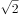，，（   ），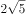，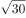

- **A**. 

- **B**. 
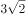

- **C**. 

- **D**. 
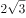
　✅

**答案**：D

**官方解析**

数列带有根号，考虑多级数列。将数字都还原到根号下面，得到，，（），，，根号下的数字相邻后一项与前一项作差得到新数列为4，（），（），10。考虑等差数列4，6，8，10，验证之后符合题目数列。故所求项为。

故正确答案为D。

---

### 第 3 题　qid 2021786 · 数学运算

小明痴迷网络游戏，父亲严格控制他的上网时间，为电脑设置密码。小明趁父亲不在家，打开电脑试图解开密码。他点击密码出现提示，102308，183416，284532，405664，（    ），该密码是按此规律排列的数列中最后一个数，问密码是：

- **A**. 5467128　✅
- **B**. 547680
- **C**. 506780
- **D**. 5076128

**答案**：A

**官方解析**

规律排列，数字较多，考虑机械划分。10|23|08，18|34|16，28|45|32，40|56|64，前两位数构成的数列是10，18，28，40，作差得到8，10，12，新数列是公差为2的等差数列，下一个数字的前两位应该是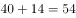；中间两位数构成的数列是23，34，45，56，是公差为11的等差数列，下一个数字的中间两位数应该是；最后两位数构成的数列是08，16，32，64，是公比为2的等比数列，则下一个数字的最后数字应为。最后一个数应为5467128。

故正确答案为A。

---

### 第 4 题　qid 2021770 · 数学运算

希望中学为三个特困学生发放课外读本。甲发到的读本数与乙发到的读本数的2倍之和比丙发到的读本数多6本；甲发到的读本数与丙发到的读本数的2倍之和比乙发到的读本数多3本，则三个学生发到的读本数的平方和最小值为：

- **A**. 14　✅
- **B**. 28
- **C**. 24
- **D**. 20

**答案**：A

**官方解析**

根据题意可得方程组：

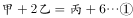

解方程组，得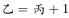，。要使三个学生的平方和最小，则需使丙发到的读本数最小，即，，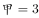。三个学生发到的读本数的平方和最小值是。

故正确答案为A。

---

### 第 5 题　qid 2021774 · 数学运算

某驾校甲、乙、丙三位学员在科目二考试中能通过的概率分别为，，，那么，这三位学员中恰好有两位学员通过科目二考试的概率为：

- **A**. 

　✅
- **B**. 

- **C**. 

- **D**. 

**答案**：A

**官方解析**

三位学员中恰好有两位学员通过科目二考试，说明另外一位学员未通过。三位学员通过情况分为以下三种：甲未通过、乙和丙通过，概率为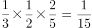；乙未通过、甲和丙通过，概率为；丙未通过、甲和乙通过，概率为。则三位学员中恰好有两位学员通过科目二考试的概率为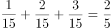。

故正确答案为A。

---

### 第 6 题　qid 2021782 · 数学运算

正值毕业季，班长小李组织大家聚餐，费用均摊，结账时，如果每人付300元，则多出100元；如果每人付290元，小李自己要多付80元才刚好，那么，这次活动的人均费用大约是：

- **A**. 293
- **B**. 296
- **C**. 295
- **D**. 294　✅

**答案**：D

**官方解析**

设这次活动人数为人，则可根据活动总费用列方程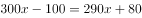，解方程得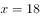，所以，与选项D最接近。

故正确答案为D。

---

### 第 7 题　qid 2021776 · 数学运算

已知赵先生的年龄是钱先生年龄的2倍，钱先生比孙先生小7岁，三位先生的年龄之和是小于70的素数，且素数的各位数字之和为13，那么，赵、钱、孙三位先生的年龄分别为：

- **A**. 30岁，15岁，22岁　✅
- **B**. 36岁，18岁，13岁
- **C**. 28岁，14岁，25岁
- **D**. 14岁，7岁，46岁

**答案**：A

**官方解析**

本题为年龄问题，且选项给出三人具体年龄，优先考虑代入排除法。钱先生比孙先生小7岁，则说明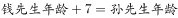。代入选项，只有A项的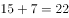满足。

故正确答案为A。

---

### 第 8 题　qid 2021780 · 数学运算

有6种颜色的小球，数量分别为4，6，8，9，11，10，将它们放在一个盒子里，那么，拿到相同颜色的球最多需要的次数为：

- **A**. 6
- **B**. 12
- **C**. 11
- **D**. 7　✅

**答案**：D

**官方解析**

若要拿到相同颜色的球需要次数最多，则最不利情况为已经拿取所有颜色不一样的小球各一个。一共6种颜色，故最多拿取6次后有6种颜色不同小球。此时再拿取一个小球，拿到颜色相同小球。所以拿到相同颜色的球最多需要6+1=7次。
故正确答案为D。

---

### 第 9 题　qid 2021790 · 数学运算

李雷和韩梅梅去昆仑山探险，发现山洞里有一个石门，上面有一个九宫格式的按钮，按钮上有1到9九个数字，在其下方写着“的个位数是什么”。那么帮他们打开宝藏大门的数字是：

- **A**. 1
- **B**. 4
- **C**. 3　✅
- **D**. 2

**答案**：C

**官方解析**

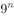的尾数为9、1、9、1、······，规律为是奇数时尾数为9，偶数时尾数为1，所以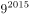尾数应为9，则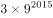尾数为7；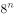的尾数为8、4、2、6、8、4、2、6、······，规律为8、4、2、6这4个数字循环，2016是4的整数倍，所以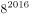尾数为每个循环中的最后一个数字6，则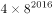尾数为4。因此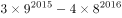的个位数为7-4=3。

故正确答案为C。

---

## 判断推理

### 第 1 题　qid 2021844 · 图形推理

从所给的四个选项中，选择最合适的一个填入问号处，使之呈现一定的规律性：

- **A**. 2
- **B**. 6　✅
- **C**. 4
- **D**. 3

**答案**：B

**官方解析**

观察发现第一幅图中外圈数字之和等于中间数字的平方，即；那么第二幅图也满足此规律，外圈数字之和为，那么中间数字应填入6。

故正确答案为B。

---

### 第 2 题　qid 2021852 · 图形推理

从所给四个选项中，选择最合适的一个填入问号处，使之呈现一定的规律性：

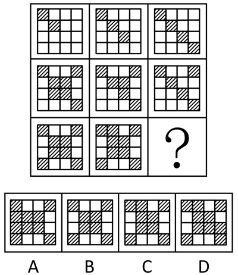

- **A**. A
- **B**. B
- **C**. C
- **D**. D　✅

**答案**：D

**官方解析**

元素组成不同，且无明显属性规律，考虑数量规律。九宫格优先横向看，观察发现，第一行黑块的数量分别为2、3、4，第二行黑块的数量分别为7、6、5，第三行黑块的数量分别为8、9、？，进而发现，图形按照“反S型”（如下图所示）的方向，后一幅图形在前一幅图形的基础上增加1个黑块，故？处应为在前一幅图形的基础上增加1个黑块的图形，只有D项符合。

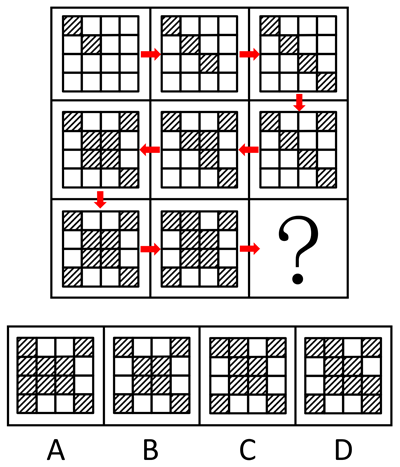

故正确答案为D。

---

### 第 3 题　qid 2021862 · 图形推理

从所给四个选项中，选择最合适的一个填入问号处，使之呈现一定的规律性：

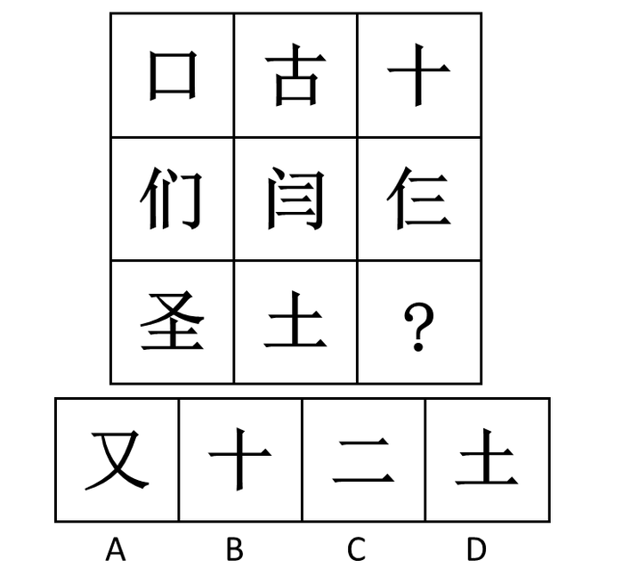

- **A**. A　✅
- **B**. B
- **C**. C
- **D**. D

**答案**：A

**官方解析**

观察发现，元素组成相似，考虑元素的样式规律。第一行图形中“口”和“古”去同存异，得到“十”；第二行图形中“们”和“闫”去同存异得到“仨”；第三行图形也应该遵循此规律，“圣”和“土”去同存异，“？”处应填“又”。
故正确答案为A。

---

### 第 4 题　qid 2021838 · 图形推理

把下面的六个图形分为两类，使每一类图形都有各自的共同特征或规律，分类正确的一项是：

- **A**. ①②④，③⑤⑥
- **B**. ①④⑥，②③⑤
- **C**. ①③⑥，②④⑤　✅
- **D**. ①③④，②⑤⑥

**答案**：C

**官方解析**

观察发现每幅图都由六个元素组成，且组成的元素种类和个数均不存在分组规律。由于题干图形中的所有元素都是箭头形式，而箭头均有指向，无非分为顺、逆时针。分别去数每个图形中顺时针、逆时针方向的箭头：图①中为4个顺时针，2个逆时针；图②中为2个顺时针，4个逆时针；图③中为5个顺时针，1个逆时针；图④中为1个顺时针，5个逆时针；图⑤中为2个顺时针，4个逆时针；图⑥中为4个顺时针，2个逆时针。观察发现，图①③⑥为一组，其中顺时针箭头数量多于逆时针箭头；而图②④⑤为另一组，其中顺时针箭头数量少于逆时针箭头。
故正确答案为C。

---

### 第 5 题　qid 2021832 · 图形推理

把下面的六个图形分为两类，使每一类图形都有各自的共同特征或规律，分类正确的一项是：

- **A**. ①③④，②⑤⑥　✅
- **B**. ①③⑤，②④⑥
- **C**. ①②⑤，③④⑥
- **D**. ①②④，③⑤⑥

**答案**：A

**官方解析**

图形组成不同，且属性无规律，考虑数量规律。观察题干发现，图①③⑤⑥线条交叉比较明显，则考虑数交点。题干六幅图交点的数量分别为10、8、7、4、8、8，所以①③④为一组交点的数量不是8，②⑤⑥为一组交点的数量是8。
故正确答案为A。
粉笔提示：有的同学可能考虑数面数量，认为图①③⑤为一组，面数量都是偶数，图②④⑥为一组，面数量都是奇数，从而选到B项。这种思路其实并不合适，一个是因为数点特征图明显，且这种分类方式符合吉林省考分组分类题目的命题特征；一个是奇偶性的考查太特殊，不建议往这个角度上考虑。因此粉笔更建议从点数量的角度考虑，把答案给到A选项。

---

### 第 6 题　qid 2021804 · 类比推理

松树对于（  ）相当于（   ）对于知识产权

- **A**. 松果：知识
- **B**. 松树枝：权利
- **C**. 植物：专利权　✅
- **D**. 松树林：商标权

**答案**：C

**官方解析**

逐一代入选项验证。
A项：松果是松树结出的果实，两者为对应关系；知识产权是一种法律概念，指智力创造的成果，而知识包含面很广，两者并不构成果实的对应关系，前后逻辑关系不一致，排除；
B项：松树枝是松树的一部分，是组成关系，知识产权是权利的一种，是种属关系，前后逻辑关系不一致，排除；
C项：松树是植物的一种，是种属关系，专利权是知识产权的一种，是种属关系，前后逻辑关系一致，当选；
D项：松树是松树林的一部分，是组成关系；商标权是知识产权的一种，是种属关系，前后逻辑关系不一致，排除。
故正确答案为C。

---

### 第 7 题　qid 2021806 · 类比推理

信件：E-mail

- **A**. 电脑：台式电脑
- **B**. 教师：女教师
- **C**. 朋友：老同学
- **D**. 图书：电子书　✅

**答案**：D

**官方解析**

第一步：判断题干词语间逻辑关系。
E-mail是信件的一种，二者是种属关系，且E-mail是信件的一种电子形式。
第二步：判断选项词语间逻辑关系。
A项：台式电脑是电脑的一种，二者是种属关系，与题干逻辑关系一致，保留；
B项：女教师是教师的一种，二者是种属关系，与题干逻辑关系一致，保留；
C项：有的朋友是老同学，有的朋友不是老同学，并且有的老同学是朋友，有的老同学不是朋友，二者是交叉关系，与题干逻辑关系不一致，排除；
D项：电子书是图书的一种，二者是种属关系，与题干逻辑关系一致，保留。
比较A、B、D三项，题干E-mail是信件的一种电子形式，A项台式电脑不是电脑的电子形式；B项女教师不是教师的电子形式；而D项电子书是图书的一种电子形式。
故正确答案为D。

---

### 第 8 题　qid 2021814 · 类比推理

曲艺：相声：娱乐性

- **A**. 社交：微信：即时性　✅
- **B**. 新闻：评论：客观性
- **C**. 医院：医生：权威性
- **D**. 司机：驾驶：可靠性

**答案**：A

**官方解析**

第一步：判断题干词语间逻辑关系。
相声是曲艺的一种形式，种属关系，娱乐性是相声的一种属性。
第二步：判断选项词语间逻辑关系。
A项：微信是社交的一种形式，是种属关系，即时性是微信的一种属性，与题干逻辑关系一致，当选；
B项：评论和新闻是并列关系，评论不一定具有客观性，与题干逻辑关系不一致，排除；
C项：医生的工作地点是医院，属于人物和场所的对应，不是种属关系，医生未必具有权威性，与题干逻辑关系不一致，排除；
D项：驾驶是司机的工作，不是种属关系，驾驶未必具有可靠性，与题干逻辑关系不一致，排除。
故正确答案为A。

---

### 第 9 题　qid 2021822 · 类比推理

大义凛然：卑躬屈膝

- **A**. 安分守己：好高骛远
- **B**. 穷奢极欲：节衣缩食
- **C**. 得心应手：百无一能
- **D**. 持之以恒：虎头蛇尾　✅

**答案**：D

**官方解析**

第一步：判断题干词语间逻辑关系。
“大义凛然”的意思是由于胸怀正义而神态庄严，令人敬畏；“卑躬屈膝”形容没有骨气，低声下气地讨好奉承。前者是有骨气，后者是没骨气，二者为反义关系。
第二步：判断选项词语间逻辑关系。
A项：“安分守己”的意思是规矩老实，守本分，是人的一种生活状态；“好高骛远”比喻不切实际地追求过高过远的目标。前者说的是一种规矩老实的生活状态，后者说的是目标不切实际，两者没有必然的逻辑关系，排除；
B项：“穷奢极欲”的意思是奢侈和贪欲到了极点；“节衣缩食”的意思是省吃省穿，形容节约。前者是不节约，后者是节约，两者构成反义关系，保留；
C项：“得心应手”的意思是心里怎么想，手就能怎么做，比喻技艺纯熟或做事情非常顺利；“百无一能”的意思是什么都不会做。前者是做事熟练，后者是没有技艺，二者不构成反义关系，做事熟练和技艺不娴熟才是反义关系，与题干逻辑关系不一致，排除；
D项：“持之以恒”的意思是长久坚持下去；“虎头蛇尾”比喻开始时声势很大，到后来劲头很小，有始无终。前者是有毅力，后者是无毅力，构成反义关系，保留。
题干中，“大义凛然”是褒义词，“卑躬屈膝”是贬义词。对比B、D两项，B项，“穷奢极欲”是贬义词，排除；D项，“持之以恒”是褒义词，“虎头蛇尾”是贬义词，与题干的感情色彩一致，当选。
故正确答案为D。

---

### 第 10 题　qid 2021824 · 类比推理

流行：高尚

- **A**. 专家：学者　✅
- **B**. 勇敢：品德
- **C**. 树根：树叶
- **D**. 闰月：春季

**答案**：A

**官方解析**

第一步：判断题干词语间逻辑关系。
有的流行的事物是高尚的，有的流行的事物不是高尚的，并且有的高尚的事物是流行的，有的高尚的事物不是流行的，两者是交叉关系。
第二步：判断选项词语间逻辑关系。
A项：有的专家是学者，有的专家不是学者，并且有的学者是专家，有的学者不是专家，两者是交叉关系，与题干逻辑关系一致，当选；
B项：勇敢是一种品德，两者是种属关系，与题干逻辑关系不一致，排除；
C项：树根和树叶都是树的一部分，两者是并列关系，与题干逻辑关系不一致，排除；
D项：闰月指的是阴历中的一种现象，是阴阳历中为使历年平均长度接近回归年而增设的月；春季是季节的一种，两者之间并没有必然的联系，与题干逻辑关系不一致，排除。
故正确答案为A。

---

### 第 11 题　qid 2021810 · 定义判断

稀缺效应，是指人们因物以稀为贵，而引起的购买行为变化的现象，即当某件事物变得稀缺或者难以得到时，人们会认为此物更有价值，也更想得到。
根据上述定义，下列没有体现稀缺效应的是：

- **A**. 商店每天都挂着打折仅此一天的横幅吸引大量顾客
- **B**. 某品牌手机实行网上预约销售限量抢购，结果供不应求
- **C**. 月底经济拮据的小张靠着去超市购买临期食品度日　✅
- **D**. 男性在临近酒吧打烊时会认为女性的吸引力指数上升了

**答案**：C

**官方解析**

第一步：找到定义关键词。
“当某件事物变得稀缺或者难以得到时”、“人们会认为此物更有价值，也更想得到”。
第二步：逐一分析选项。
A项：“打折仅此一天”体现了事物变得稀缺难得，“吸引大量顾客”体现了购买行为的变化，符合定义，排除；
B项：“限量抢购”体现了事物变得稀缺难得，“供不应求”体现了购买行为的变化，符合定义，排除；
C项：“月底经济拮据”和“购买临期食品”未体现出事物变得稀缺难得，不符合定义，当选；
D项：“酒吧打烊时”人会变得比较少，女性数量也会变少，体现了事物变得稀缺难得，符合定义，排除。 
本题为选非题，故正确答案为C。

---

### 第 12 题　qid 2021818 · 定义判断

互补品定价策略，是指企业为主要产品（价值量高的产品）制定较低的价格，而为附属产品（价值量低的产品）制定较高的价格，这样有利于增加整体的销量，从而增加企业利润。
根据上述定义，下列使用了互补品定价策略的是：

- **A**. 甲企业推出的一款网络游戏深受消费者喜爱，带动了游戏周边产品的热销
- **B**. 丁商场销售的十二生肖系列茶杯，成套购买会比单个购买的价格更加优惠
- **C**. 丙公司新推出内存为16G、64G和128G的三款智能手机，售价差别较大
- **D**. 乙厂商生产的喷墨打印机质量好、价格低，但墨盒的价格却一直居高不下　✅

**答案**：D

**官方解析**

第一步：找到定义关键词。
“企业”、“主要产品（价值量高的产品）制定较低的价格”、“附属产品（价值量低的产品）制定较高的价格”、“增加整体的销量，从而增加企业利润”。
第二步：逐一分析选项。
A项：“游戏周边产品”、“网络游戏”没有体现对不同种产品制定不同的价格，不符合定义，排除；
B项：“十二生肖系列茶杯”只是量大优惠，而没有体现主要产品和附属产品的定价不同，不符合定义，排除；
C项：“内存为16G、64G和128G的三款智能手机”这是三种产品，没有体现主要产品和附属产品的区别，不符合定义，排除；
D项：喷墨打印机价格低，墨盒价格高，墨盒是喷墨打印机的附属产品，符合“主要产品（价值量高的产品）价格低，附属产品（价值量低的产品）价格高”，符合定义，当选。
故正确答案为D。

---

### 第 13 题　qid 2021828 · 逻辑判断

犯罪目的是指犯罪人主观上通过犯罪行为所希望达到的结果，是以观念形态存在于犯罪人大脑中的犯罪行为所预期达到的结果。犯罪动机是刺激、促使犯罪人实施犯罪行为的内心起因或思想活动，它回答犯罪人基于何种心理原因实施犯罪行为。动机的作用是发动犯罪行为，说明实施犯罪行为对行为人的心理愿望具有什么意义。
根据以上定义，下列说法中正确的是：

- **A**. 甲为了报复乙，欲通过投毒的方式剥夺乙的生命，则甲的犯罪目的是报复
- **B**. 甲担心乙对其实施打击报复，将乙非法拘禁数日，则甲的犯罪动机是恐惧　✅
- **C**. 甲投毒致乙死亡，经查明是因为其嫉妒乙的才华，则甲的犯罪目的是嫉妒
- **D**. 甲贪图钱财，通过盗窃而非法占有乙的财物，则甲的犯罪动机是非法占有

**答案**：B

**官方解析**

第一步：找出定义关键词。
犯罪目的：“犯罪人主观上”、“希望达到的结果”。犯罪动机：“刺激、促使犯罪人”、“实施犯罪行为的内心起因或思想活动”。
第二步：逐一分析选项。
A项：甲希望达到的结果应该是剥夺乙的生命，因此甲的犯罪目的是剥夺乙的生命。而报复是实施犯罪行为的内心起因或思想活动，因此报复应该是犯罪动机，选项错误，排除；
B项：担心乙对其打击报复，是甲对乙非法拘禁数日的内心起因和思想活动，因此甲的犯罪动机是恐惧，当选；
C项：既然甲选择了投毒，那他所希望达到的结果肯定是乙死亡，因此甲的犯罪目的是剥夺乙的生命。而嫉妒是甲对乙投毒的内心起因或思想活动，属于犯罪动机，选项错误，排除；
D项：甲是因为贪图钱财而盗窃的，促使甲实施犯罪行为的内心起因是贪图钱财，所以甲的犯罪动机是贪图钱财，选项错误，排除。
故正确答案为B。

---

### 第 14 题　qid 2021834 · 定义判断

价值理性，是指行为人注重行为本身所能代表的价值，即是否实现社会的公平、正义、忠诚、荣誉等，而不计较手段和后果。价值理性所关注的是从某些具有实质的、特定的价值理念的角度来看行为的合理性。
根据上述定义，下列符合价值理性要求的是：

- **A**. 积善成德
- **B**. 替天行道　✅
- **C**. 过河拆桥
- **D**. 礼贤下士

**答案**：B

**官方解析**

第一步：找出定义关键词。
“是否实现社会的公平、正义、忠诚、荣誉等”、“不计较手段和后果”。 
第二步：逐一分析选项。
A项：积善成德的行为中存在做善事的过程，最后达到“成德”的目的，不符合“不计较手段和后果”，排除；
B项：替天行道的目的是实现社会的公平、正义、忠诚、荣誉等，但是其方式方法可能不太恰当，而价值理性就是不计较手段和后果地去实现社会的公平正义，符合定义关键词，保留；
C项：过河拆桥并没有体现出实现社会的公平、正义、忠诚、荣誉等，不符合定义关键词，排除；
D项：礼贤下士是指对有才有德的人以礼相待，根本不涉及不计较手段和后果，不符合定义关键词，排除。 
故正确答案为B。

---

### 第 15 题　qid 2021842 · 定义判断

辐射适应，是指具有血缘关系的生物，由于生活在不同的环境中而在形态以及生活习性上有着完全不同的适应性的现象。根据上述定义，下列属于辐射适应的是：

- **A**. 水生植物莲、狐尾藻和金鱼藻的亲缘关系很远，但由于都受到水中环境的影响，他们都具有通气组织发达，根系发育较弱等相似的特点
- **B**. 善于飞翔的信天翁翼展超过3.4米；善于在沙地上奔跑的鸵鸟身体巨大，双翼衰退，两腿刚劲有力，它的足几乎退化为适于奔跑的“蹄”　✅
- **C**. 斑马除腹部外，全身密布的黑白条纹，具有防止刺刺蝇叮咬的作用，因为刺刺蝇喜欢叮咬一些颜色单一的动物，并且会传播一种睡眠病
- **D**. 生活在寒带的雷鸟，在白雪皑皑的冬天，体色是纯白色的，一到夏天，就换上棕褐色的羽毛，与夏季苔原的斑驳色彩相近，从而保护自己

**答案**：B

**官方解析**

第一步：找出定义关键词。
“具有血缘关系”、“生活在不同环境”、“形态及生活习性上有着完全不同的适应性的现象”。
第二步：逐一分析选项。
A项：虽然水生植物莲、狐尾藻和金鱼藻的亲缘关系很远，可也是具有亲缘关系的生物，但都受到水中环境的影响与题干中提到的受到不同环境的影响不符，不符合定义，排除；
B项：善于飞翔的信天翁翅膀很长，善于奔跑的鸵鸟双翼退化，两腿有力，体现了生活在不同环境中有着形态不同的适应性的现象，但是信天翁和鸵鸟之间是否具有亲缘关系选项中并不明确，先保留；
C项：斑马除腹部外都布满黑白条纹，没有出现具有血缘关系的其他种类生物，也没有体现不同环境的影响，不符合定义，排除；
D项：生活在寒带的雷鸟在冬天和夏天羽毛颜色不同，是同一种生物，没有体现具有血缘关系的其他种类生物生活在不同的环境中，不符合定义，排除。
由于其他选项都能直接排除，并且“双翼衰退”可以看出鸵鸟与信天翁都是鸟类，是具有血缘关系的生物，本题只能选B选项。
故正确答案为B。

---

### 第 16 题　qid 2021846 · 定义判断

X理论认为，人的本性是懒惰的，工作越少越好，可能的话会逃避工作，因此管理者需要以强迫、威胁、处罚、金钱利益等诱因激发人们消极的工作原始动力。而Y理论则认为，人们有积极的工作源动力，工作是很自然的事，大部分人并不抗拒工作，即使没有外界的压力和处罚的威胁，他们一样会努力工作以期达到目的。
根据上述定义下列符合Y理论的是：

- **A**. 甲经理主张：应趋向于设定严格的规章制度，注重“他律”在管理中的应用
- **B**. 丁主任相信：世界上根本没有什么一成不变的、普遍适用的最佳的管理方式
- **C**. 丙科长指出：应趋向于对员工授予更大的权力，以此激发员工的工作积极性　✅
- **D**. 乙厂长认为：在员工管理中要根据企业实际状况灵活掌握管制与自觉的关系

**答案**：C

**官方解析**

第一步：找到定义关键词。
 “没有外界的压力和处罚的威胁，他们一样会努力工作”。
第二步：逐一分析选项。
A项：甲经理主张设定严格的规章制度，与题干中自主自觉性相违背，不符合定义，排除；
B项：丁主任相信世界上没有一成不变普遍适用的管理方式，并没有体现出具体的管理方式，也没体现出在没有外界的压力和处罚的威胁，他们一样会努力工作，不符合定义，排除；
C项：丙科长认为要授予员工更大的权力来激发员工的工作积极性，符合“即使没有外界的压力和处罚的威胁，他们一样会努力工作以期达到目的”，符合定义，当选；
D项：乙厂长认为员工管理中要根据企业实际状况灵活掌控管制与自觉的关系，还是在强调员工管理的重要性，不符合定义，排除。
故正确答案为C。
“Y理论”的若干管理办法：（1）管理要通过有效地综合运用人、财、物等生产要素来实现企业的各种目标。（2）把人安排到具有吸引力和富有意义的岗位上工作。（3）重视人的基本特征和基本需求，鼓励人们参与自身目标和组织目标的制定。（4）把责任最大限度地交给工作者。（5）要用信任取代监督，以启发与诱导代替命令与服从。
故正确答案为C。

---

### 第 17 题　qid 2021848 · 定义判断

概念混淆，是指由于自然语言的多义性和模糊性而产生的非形式谬误。构型歧义，是指由于句子语法结构的不正确而产生的歧义性谬误。
根据上述定义，下列选项中属于构型歧义的是：

- **A**. 一人去算命，问家庭，算命先生掐指一算，说，父在母先亡　✅
- **B**. 问：如果你哥哥有五个苹果，你拿走三个，结果怎样？答：结果他会揍我一顿
- **C**. 三个秀才问考试结果，算命先生伸出一个手指头，说了一个“一”，便再不出声
- **D**. 元宵夜，一女子想去观灯，丈夫说：“家中不是已点灯了吗？”

**答案**：A

**官方解析**

第一步：找出定义关键词。
“由于句子语法结构的不正确产生的歧义性谬误”。
第二步：逐一分析选项。
A项：父在母先亡，由于句子语法结构不对会产生歧义，蕴含了两种意思，一种是父亲亡的时间比母亲早，一种是父亲还在世，但是母亲已亡，符合定义；
B项：哥哥有五个苹果你拿走三个，问结果，这个结果有可能是算术结果也有可能是生活中的结果，是由语言的多义性和模糊性引起的，不符合定义，排除；
C项：三个秀才问考试结果，算命先生说了一个“一”，这个回答体现了语言的多义性和模糊性，和句子语法结构没有关系，不符合定义，排除；
D项：女子想去观灯，丈夫说家中已经点灯了，体现了语言的多义性和模糊性，和句子语法结构没有关系，不符合定义，排除。 
故正确答案为A。

---

### 第 18 题　qid 2021854 · 定义判断

回文，是指用相同语句回环往复地说明的一种修辞方式，形式上表现为词语相同但语序相反。
根据上述定义下列属于回文的是：

- **A**. 雾锁山头山锁雾，天连水尾水连天　✅
- **B**. 寻寻觅觅，冷冷清清，凄凄惨惨戚戚
- **C**. 东边日出西边雨，道是无晴却有晴
- **D**. 主人下马客在船，举杯欲饮无管弦

**答案**：A

**官方解析**

第一步：找到定义关键词。
关键词为“用相同语句回环往复地说明”、“词语相同但语序相反”。
第二步：逐一分析选项。
A项：“雾锁山”和“山锁雾”、“天连水”和“水连天”，都是用相同语句回环往复，且词语相同，语序相反，符合定义，当选；
B项：“寻寻觅觅，冷冷清清，凄凄惨惨戚戚”，只是单纯的汉字重复，没有体现相同语句的回环往复，也没有体现重复词语的语序相反，不符合定义，排除；
C项：“东边日出西边雨，道是无晴却有晴”整句中没有体现相同语句的回环往复，不符合定义，排除；
D项：“主人下马客在船，举杯欲饮无管弦”整句中没有体现相同语句的回环往复，不符合定义，排除。
故正确答案为A。

---

### 第 19 题　qid 2021858 · 定义判断

复合平等理论，是一种实现社会公平的设想，它认为任何一个领域的优势都不应当构成对整个社会的垄断，因此应将不同的社会领域尽可能区隔开来，允许各个领域有各自的优胜者，但要防止某个领域的优势越界扩张到其他领域。
根据上述定义，下列说法中最符合复合平等理论的是：

- **A**. 三百六十行，行行出状元
- **B**. 你可以选择做官，你也可以选择挣钱，但你不能选择通过做官来挣钱　✅
- **C**. 凡有的，还要加倍给他，叫他多余；没有的，连他所有的也要夺过来
- **D**. 术业有专攻，隔行如隔山

**答案**：B

**官方解析**

第一步：找到定义关键词。
“任何一个领域的优势都不应当构成对整个社会的垄断”、“应将不同的社会领域尽可能区隔开来”、“允许各个领域有各自的优胜者，但要防止某个领域的优势越界扩张到其他领域”。
第二步：逐一分析选项。
A项：“三百六十行，行行出状元”的意思是无论从事什么行业，都能做出成绩，成为这一行的专家、能人。并没有体现出应将不同的社会领域尽可能区隔开来，不符合定义，排除；
B项：“你可以选择做官，你也可以选择挣钱”体现了允许各个领域有各自的优胜者，“你不能选择通过做官来挣钱”将做官和挣钱区隔开，体现了将不同的社会领域尽可能区隔开，且防止某个领域的优势越界扩张到其他领域，符合定义，正确；
C项：“凡有的，还要加倍给他，叫他多余；没有的，连他所有的也要夺过来”没有体现不同领域，这属于同一个领域，并且这一做法使得这一领域的优势者构成对整个社会的垄断，不符合定义，排除；
D项：“术业有专攻”，指的是技能学业各有专门研究，“隔行如隔山”指的是不是本行的人就不懂这一行业的门道。二者的意思都是指专注于某个领域才会有成就和收获，定义不符合，排除。
故正确答案为B。

---

### 第 20 题　qid 2021860 · 定义判断

比拟法是植物命名时最常见的一种修辞造词手段，是一种当物体的一部分或整体在形状、纹色、气味、质地、功能等方面，与其他事物存在着相似联系，植物命名时就相应地选择代表相似事物的词语来参与造词的方法。
根据上述定义下列植物命名，没有使用比拟法的是：

- **A**. 蘑菇里最珍贵的叫猴头，这种蘑菇是圆的，没有根，泥黄色表面成头发丝状很像猴子的脑袋，故而得名
- **B**. 代代花，姑苏名产，实熟时色黄，若不采下，经五年而不烂，皮色由青而黄复由黄变青可历多年故称代代花　✅
- **C**. 据《本草纲目-果部-椰子》，记载椰子果实圆形，上有黑褐色的毛，人们将其与人的头颅类比，命名为“越王头”
- **D**. 甘草可调和众药，故又名“国老”，“国老”本为古代的国之重臣，或为告老退职的卿、大夫或士，有德高望重之义

**答案**：B

**官方解析**

第一步：找到定义关键词。
“物体的一部分或整体在形状、纹色、气味、质地、功能等方面，与其他事物存在着相似联系”、“植物命名时就相应地选择代表相似事物的词语来参与造词”。
第二步：逐一分析选项。
A项：“猴头”是因为泥黄色表面成头发丝状很像猴子的脑袋而得名，是蘑菇的形状与猴子脑袋相似，符合定义，选非题，排除；
B项：“代代花”的命名是因为果实成熟时没有采下，经五年而不烂，皮色由青而黄复由黄变青可历多年，不符合定义中“形状、纹色、气味、质地、功能”中的任何一种方式，选非题，当选；
C项：“越王头”因外形圆，有黑褐色的毛，和人类的头颅类似而命名，是形状的类似，符合定义，选非题，排除；
D项：甘草又名“国老”是因为可调和众药，更好地发挥药效，在功能上和古代的重臣类似，重臣可以调和文武百官，发挥出更好的作用，符合定义，选非题，排除。
本题为选非题，故正确答案为B。
附：甘草别名的由来：
南朝有一个名医叫陶弘景，他是著名的医药家、道教学家、文学家。他早年为官，36岁时辞官入茅山隐居。其间，他不时收到梁武帝派人传来的国家时事动态，在山中为朝廷出谋划策，被人称为“山中宰相”。同时，他还编撰书稿，写炼丹笔记，也经常为人治病。
陶弘景开的药方中都有甘草，有病人问甘草是不是能医百病。陶弘景笑道：“甘草甘平补益，又能缓能急，对一些性情猛烈的药物，可监之、制之、敛之、促之；在不同的药方中，可为君为臣，可为佐为使，能调和众药，使它们更好地发挥药效。在药的王国里，甘草是国之药老。”从此，人们就把甘草称作“国老”了。

---

### 第 21 题　qid 2021864 · 逻辑判断

近日，某国的科学家们正在尝试用粒子加速器治疗癌症。他们将包括脑胶质瘤细胞在内的几种肿瘤细胞培养物放置在模拟人类头部的有机玻璃器皿中。再把这个“人头”放在粒子加速器的作用范围内。科学家们首次在肿瘤细胞内聚集着足够量的硼-10，然后再用中子束照射肿瘤部位。使肿瘤细胞内部发生核反应，肿瘤细胞随之死亡。
以下哪项如果为真，最能支持实验的成功？

- **A**. 中子束对肿瘤细胞的作用，有别于健康细胞
- **B**. 脑胶质肿瘤类癌症用其他治疗方式无法治愈
- **C**. 只有肿瘤细胞会在中子束的作用之下死亡　✅
- **D**. 中子束能摧毁包括脑细胞在内的人体细胞

**答案**：C

**官方解析**

第一步：找出论点和论据。
论点：实验的成功，实验即在肿瘤细胞内聚集着足够量的硼-10，然后再用中子束照射肿瘤部位，使肿瘤细胞内部发生核反应，肿瘤细胞随之死亡。
论据：无。
只有论点没有论据，考虑补充论据进行加强，可以解释原因、举例以及说明必要条件。
第二步：逐一分析选项。
A项：中子束对肿瘤细胞有别于健康细胞，有别于存在两个方向的可能，有益或者是有害，因此不能说明中子束对健康细胞是否有害，为无关项，无法加强，排除；
B项：其他治疗方法无法治愈脑胶质肿瘤类癌症，不能通过排除的方式说明本次实验所用的粒子加速器治疗癌症有用，不能支持实验的成功，为无关项，无法加强，排除；
C项：题干中实验利用粒子加速器（中子束）作用于肿瘤细胞来治疗癌症，说明只有肿瘤细胞会在中子束的作用下死亡，否则正常的健康细胞也会死亡，如此实验失败。为实验成功的必要条件，可以加强，当选；
D项：中子束能够摧毁脑细胞，说明实验导致了脑细胞的死亡而不是脑细胞中的肿瘤细胞死亡，从而说明粒子加速器治疗癌症的不成功，通过补充论据的方式削弱了题干论点，无法加强，排除。
故正确答案为C。

---

### 第 22 题　qid 2021866 · 逻辑判断

某家有爸爸、妈妈、哥哥和妹妹四口人。一天家里突然出现了一份为奶奶准备的神秘生日礼物，对于生日礼物是谁准备的四人有如下说法：
爸爸说：我们四人都没准备
妈妈说：不是我准备的
哥哥说：妈妈和妹妹至少有一人没准备
妹妹说：这是我们四人中有人准备的
已知四人中有两人说的真话，两人说的是假话。由此可以推出：

- **A**. 爸爸和妈妈说的是真话
- **B**. 爸爸和妹妹说的是真话
- **C**. 哥哥和妈妈说的是真话
- **D**. 哥哥和妹妹说的是真话　✅

**答案**：D

**官方解析**

第一步：整理题干。

爸爸：所有人都没准备；妈妈：妈妈；哥哥：妈妈 或 妹妹；妹妹：有人准备。

第二步：首先找矛盾。

可以看出，爸爸和妹妹说的话为矛盾关系，必有一真必有一假，提问方式为两真两假，也就是说妈妈和哥哥说的话也是一真一假，但他们两个人说的话既不是矛盾关系，也不是反对关系，无法继续推理。

第三步：找到矛盾却不能继续推理，又找不到反对，所以找推出关系。

我们发现如果妈妈说的话为真，那么可以推出哥哥说的话一定为真，即：妈妈（真）哥哥（真）。

第四步：抓住推出关系定真假。

妈妈和哥哥的话为一真一假，根据“一真前假，一假后真”，可知妈妈的话为假，哥哥的话为真。题干条件为两真两假，根据哥哥的话为真，排除A、B两项；根据妈妈的话为假，排除C项。

故正确答案为D。

---

### 第 23 题　qid 2021870 · 逻辑判断

自由基是人类机体在消耗氧气时产生的一种有时会有害的自由分子，很多人相信自由基是机体衰老背后的罪魁祸首。因为有研究人员发现，人类在衰老的过程中自由基的数量在不断上升。
以下除哪项外，均能削弱上述结论：

- **A**. 关于人类衰老的具体过程还存在着很多的争议　✅
- **B**. 自由基在对抗机体衰老的过程中,数量会上升
- **C**. 通过人工提升自由基的数量可延长机体的寿命
- **D**. 染色体结构失去稳定性是导致人类衰老的原因

**答案**：A

**官方解析**

第一步：找到论点和论据。
论点：自由基是人类机体在消耗氧气时产生的一种有时会有害的自由分子，很多人相信自由基是机体衰老背后的罪魁祸首。
论据：人类在衰老的过程中自由基的数量在不断上升。
第二步：逐一分析选项。
A项：表明人类衰老的具体过程存在争议，未提及自由基与人类衰老之间的关系，为无关选项，当选；
B项：自由基是由于对抗机体衰老的过程中数量才上升，而并非因为自由基的上升导致了机体衰老，属于因果倒置，排除；
C项：说明自由基可以延长寿命，自由基有益，通过举例子削弱了题干论点，排除；
D项：染色体结构失去稳定性导致人类衰老，导致衰老的可能不仅仅是自由基的上升，属于另有他因，排除。
本题为选非题，故正确答案为A。

---

### 第 24 题　qid 2021872 · 逻辑判断

所有工作都是有报酬的，而任何有报酬的工作都是可以用金钱衡量的。因此，公益劳动不是工作。
上述论证的成立，必须补充以下哪项前提？

- **A**. 公益劳动不可以用金钱衡量　✅
- **B**. 有报酬的工作不是公益劳动
- **C**. 公益劳动不是有报酬的工作
- **D**. 一切有报酬的工作都是工作

**答案**：A

**官方解析**

第一步：找出论点和论据。

论点：公益劳动工作。

论据：①工作报酬；②报酬金钱衡量。

第二步：论点和论据之间存在跳跃，需要搭桥补充前提条件。

A项：公益劳动金钱衡量，根据①和②进行逆否等价推理，即金钱衡量报酬工作，可以得出结论：公益劳动工作，保留；

B项：报酬公益劳动，即公益劳动报酬，根据①进行逆否等价推理，即报酬工作，可以得出结论：公益劳动工作，保留；

C项：公益劳动报酬，根据①进行逆否等价推理，即报酬工作，可以得出结论：公益劳动工作，保留；

D项：报酬工作，没有提到公益劳动，排除。

对比A、B、C三项，题干的论证包括两个推理即“工作报酬；报酬金钱衡量”A项是这两个推理存在的必要条件，而B项和C项只是一部分推理的必要条件（忽略了“报酬金钱衡量”），因此A项更加符合题意，当选。

而且，B项和C项属于同构选项，表述的意思完全一致，即B项对C项就对，C项对B项就对，因此同构选项应该排除。

故正确答案为A。

---

### 第 25 题　qid 2021874 · 逻辑判断

最新公布的S省居民膳食结构调查结果显示：在过去的三年中，该省居民平均每日食用谷类薯类及杂豆335.7克，位于平衡膳食推荐量250克至400克的范围之内；食用蔬菜和水果296克和132克，蔬菜仅达到了平衡膳食推荐量要求每日300克至500克的下限，与10年前相比，摄入量大为下降，而水果仅为推荐量的左右；食用鱼虾类水产品16.4克，大大低于平衡膳食推荐量的50克至100克的标准；豆制品和奶制品摄入量分别为16.9克和73.6克，比推荐量低和左右。

由此可以推出：

- **A**. S省居民最喜爱食用的是谷类薯类及杂豆
- **B**. S省居民平均每日食用蔬菜和谷类薯类及杂豆量基本达到平衡膳食推荐量的标准　✅
- **C**. 在S省居民过去三年的日常生活中，平均每日食用鱼虾类水产品数量是最少的
- **D**. S省居民对蔬菜的摄入量呈逐年下降趋势

**答案**：B

**官方解析**

本题属于日常推理题型，逐一对比选项和题干内容。
A项：提到谷类薯类及杂豆的为文段第一句，最喜爱食用在题干中并未提及，属于无中生有，排除；
B项：蔬菜平均每日食用量296克，平衡膳食推荐要求为每日300克至500克；谷类薯类及杂豆平均每日食用量335.7克，平衡膳食推荐要求为每日250克至400克，因此选项所述基本达到，能够从题干中推出，当选；
C项：题干中的调查结果没有进行完全概述，是否进行了完全列举未知，因此无法推出鱼虾类水产品平均每日食用量最少，排除；
D项：题干只给出“在过去三年中”的调查数据，无法推出逐年趋势，属于无中生有，排除。
故正确答案为B。

---

### 第 26 题　qid 2021890 · 逻辑判断

最近几十年，花生过敏问题因其潜在的危险性及全球不断增加的发病率而日益受到关注。在美国国家过敏症和传染病研究所资助下，英国伦敦大学国王学院研究人员得出一个结论：从小就开始吃含花生的食品，会使人对花生过敏的风险大幅降低。
以下哪项如果为真，最能支持上述结论：

- **A**. 
婴儿从4个月就开始吃鸡蛋，会使其对鸡蛋过敏的风险大幅降低

- **B**. 
小孩停止定期食用花生制品之后，防止花生过敏的效果会仍然存在

- **C**. 
美国国家过敏症和传染病研究所建议婴儿摄取花生制品以预防过敏

- **D**. 
定期吃花生制品的婴儿，到5岁时对花生过敏的风险降低了
　✅

**答案**：D

**官方解析**

第一步：找出论点和论据。
论点：从小就开始吃含花生的食品，会使人对花生过敏的风险大幅降低。
论据：无。
第二步：逐一分析选项。
A项：题干论述的是花生过敏问题及其潜在危险性，与鸡蛋无关，属无关选项，排除；
B项：停止食用后防止过敏的效果仍然存在，论述时间点与题干不一致，题干论述的时间点是从小就开始吃含花生的食品，没有讨论停止定期食用问题，与题干表述对象不一致，属无关选项，排除；
C项：建议婴儿摄取花生制品以预防过敏，论述的重点是预防过敏，而题干论述的是使人对花生过敏的风险降低，表述范围不一致，属无关选项，排除；
D项：定期吃花生到5岁，与题干时间节点一致，即从小就开始吃花生；到5岁时对花生过敏的风险大幅降低，与题干论点效果一致。D选项通过举例子的方式加强了题干论点，正确。
故正确答案为D。

---

### 第 27 题　qid 2021894 · 逻辑判断

最近，上海长宁区开了一个新超市。从外表看，这是一间典型的中国连锁超市。满满当当的货架塞满了各种食品和日用品。然而所有店内商品，虽然外观与普通商品没有分别，里面却是空的，包装上找不到拆封的痕迹，来访者也无处得知商品是如何被“掏空”的。虽然这是一家卖空的超市，却人气爆棚。
以下哪项如果为真，最能解释上述现象：

- **A**. 部分购买者不知道里面是空的
- **B**. 空包装实际上是一种艺术商品　✅
- **C**. 有一些空包装是恶作剧的道具
- **D**. 超市引发日常消费文化的探讨

**答案**：B

**官方解析**

此题属于原因解释类题目，需要解释的现象为：超市内塞满了各种被“掏空”的食品和日用品，但是却人气爆棚。
A 项：解释了部分购买者不知道里面是空的，出现了购买行为，但是不能解释为什么人气爆棚，排除。
B 项：空包装实际上是一种艺术商品，既解释了超市内塞满了各种被“掏空”的食品和日用品，是艺术品超市，又解释了人气爆棚的原因，是因为大家都来购买艺术品，解释了矛盾的两个方面，当选。
C 项：有一些空包装是恶作剧的道具，无法解释题干中矛盾，排除。
D 项：超市引发日常消费文化的探讨，无法解释题干中矛盾，排除。
故正确答案为B。

---

### 第 28 题　qid 2021898 · 逻辑判断

苏格拉底有一句名言：“我只知道一件事，那就是什么都不知道。”
以下哪项最精准地表明了上述推理的荒谬？

- **A**. 甲：“我们不应背后议论我们的朋友。”乙：“难道我们要当面议论我们的朋友吗？”
- **B**. 纸牌一面写：“纸牌反面的句子是对的。”另一面写：“纸牌反面的句子是错的。”　✅
- **C**. 俗话说：“男子汉大丈夫，宁死不屈。”俗话又说：“男子汉大丈夫，能屈能伸。”
- **D**. 甲：“你的观点和主流的观点是有矛盾的。”乙：“这没什么，矛盾是普遍存在的。”

**答案**：B

**官方解析**

第一步：分析题干。
苏格拉底的名言实际上是一个悖论，他只知道一件事，而这件事即“什么都不知道”，那么既然什么都不知道，意味着苏格拉底也不可能知道“一件事”；就是说，我们无法从这句话推论出苏格拉底是否知道这件事。
第二步：逐一分析选项。
A项：甲说不应背后议论朋友，乙说难道要当面议论朋友，属于混淆概念，“背后议论”的反面并非一定是“当面议论”，也可以“不议论”，甲乙两人的话并不违背，不存在题干中的悖论，排除；
B项：纸牌一面写“纸牌反面句子是对的”，即另一面写的“纸牌反面的句子是错的”这句是对的，此句中的“纸牌反面的句子”实际上指的就是前一句“纸牌反面句子是对的”，意味着前一句此时又是错的，这两句构成了悖论，我们同样无法根据这两句话推出结果怎样，与题干一致，当选；
C项：前一句“宁死不屈”讨论的是愿不愿意屈服，而后一句“能屈能伸”讨论的是能不能屈服，二者混淆了概念，不存在题干中的悖论，排除；
D项：前一句“你的观点和主流的观点是有矛盾的”中的矛盾一词指的是两种观点存在冲突，而后一句“矛盾是普遍存在的”指的是同一事物的两个对立面，如自然界中的作用力与反作用力，绝对运动和相对静止等。二者混淆了概念，不存在题干中的悖论，排除。
故正确答案为B。

---

### 第 29 题　qid 2021900 · 逻辑判断

王戎七岁，尝与诸小儿游，见道边李树多子折枝。诸儿竞走取之，唯戎不动。人问之，答曰：“树在道边而多子，此必苦李。”取之信然。
王戎的隐含推理的假设是：

- **A**. 若路边的李子被摘光了，就不会多子折枝。
- **B**. 若路边的李子味道甜美，就不会多子折枝。　✅
- **C**. 若路边的李子味道不甜美，就会多子折枝。
- **D**. 只有路边的李子没被摘光，才会多子折枝。

**答案**：B

**官方解析**

第一步：找出论点和论据。

论点：此必苦李。

论据：树在道边而多子。

论点讨论的是李子是苦的，而论据讨论的是树在道路边并且李子很多，论点和论据话题不一致，优先考虑搭桥，即树在道边而多子此必苦李。

第二步：逐一分析选项。

A项：李子被摘光不会多子折枝，李子是否摘光和题干讨论的话题不一致，无法加强，排除；

B项：李子味道甜美不会多子折枝，将其逆否，多子折枝李子味道不甜美，在论点和论据之间搭桥，可以加强，当选；

C项：李子味道不甜美会多子折枝，无法加强，排除；

D项：多子折枝李子没被摘光，李子是否摘光和题干讨论的话题不一致，无法加强，排除。

故正确答案为B。

---

### 第 30 题　qid 2021902 · 类比推理

巫马子对墨子说：我不能兼爱。我爱我的家人比爱我家乡的人深，爱我的双亲比爱我的家人深，爱我自己胜过爱我双亲，这是因为切近我的缘故。打我，我会痛，打别人，不会痛在我身上，所以我只会杀他人以利于我。墨子问道：你的这种义会告诉别人吗？巫马子答道：我为什么要隐藏，我会告诉别人。墨子说：既然你这样，如果有人喜欢你的主张，那么这个人就要杀你以利于自己。如果有人不喜欢你的主张，那他也要杀你，因为他认为你是散布不祥之言的人。
由上文可推知：

- **A**. 巫马子只能远走他乡
- **B**. 巫马子必须承认自己的观点是错的
- **C**. 巫马子一定要改变自己原来的观点
- **D**. 巫马子一定会被人杀死　✅

**答案**：D

**官方解析**

A项：巫马子远走他乡题干中根本没提到，属于无中生有，排除；
B项：题干中只是二者之间的对话，并未涉及最后的结论，也就是说巫马子是否要承认自己的观点是错的并未明确说明，排除；
C项：巫马子一定要改变自己原来的观点说法太绝对，墨子只是在反驳巫马子的观点，但是最终巫马子会不会改变自己的观点，我们无从得知，排除；
D项：墨子的观点给出的是在一组矛盾假设的基础上得出了相同的结论，因此结论一定成立，即喜欢你的观点，你会被人杀死，不喜欢你的观点，你也会被人杀死，所以我们可以得到巫马子一定会被人杀死，正确。
故正确答案为D。
本题涉及矛盾关系，矛盾关系包含了世上所有的情况。比如世界上只有两种情况，喜欢你的主张，不喜欢你的主张，在这两种情况下结论是一样的，所以可以得出结论必然发生。
再举一个例子，下雨和不下雨是矛盾的。如果下雨，我去逛街；如果不下雨，我去逛街。也就是说在任何情况下，逛街这件事是必然发生的。

---

## 资料分析

### 材料 1

        2016年8月份，全国一般公共预算收入9894亿元，同比增长。其中，中央一般公共预算收入4797亿元，同比增长，同口径下降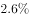；地方一般公共预算本级收入5097亿元，同比增长1%，同口径增长。全国一般公共预算收入中的税收收入7680亿元，同比增长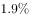，非税收入2214亿元，同比增长。

        2016年1-8月累计，全国一般公共预算收入110178亿元，同比增长。其中，中央一般公共预算收入49711亿元，同比增长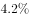，同口径增长；地方一般公共预算本级收入60467亿元，同比增长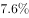，同口径增长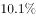。全国一般公共预算收入中的税收收入92637亿元，同比增长。

#### 第 1 题　qid 2021888 · 增长

以下同比增速最快的是：

- **A**. 2016年8月份全国一般公共预算收入同比增速
- **B**. 2016年1-8月累计全国一般公共预算收入同比增速　✅
- **C**. 2016年1-8月累计中央一般公共预算收入同比增速
- **D**. 2016年8月份中央一般公共预算收入同比增速

**答案**：B

**官方解析**

定位文字材料可知，2016年8月份全国一般公共预算收入同比增速；2016年1-8月累计全国一般公共预算收入同比增速；2016年1-8月累计中央一般公共预算收入同比增速；2016年8月份中央一般公共预算收入同比增速。增速最快的为2016年1-8月累计全国一般公共预算收入。

故正确答案为B。

---

#### 第 2 题　qid 2021892 · 比重

2016年8月，全国一般公共预算收入占1-8月累计数比重约为：

- **A**. 8%
- **B**. 11%
- **C**. 10%
- **D**. 9%　✅

**答案**：D

**官方解析**

由题干“2016年8月······占······比重”，可知本题为现期比重问题。定位文字材料，2016年8月份，全国一般公共预算收入9894亿元；2016年1-8月累计，全国一般公共预算收入110178亿元。由现期比重公式可知，占比为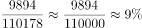。

故正确答案为D。

---

#### 第 3 题　qid 2021896 · 综合

2015年1-7月，中央一般公共预算收入约为：

- **A**. 4.2万亿元
- **B**. 4.8万亿元
- **C**. 4.5万亿元
- **D**. 4.3万亿元　✅

**答案**：D

**官方解析**

由题干“2015年1-7月，中央一般公共预算收入”，同时材料给出了2016年8月和1-8月中央一般公共预算收入，据此可知本题为基期和差问题。定位材料可知，2016年8月中央一般公共预算收入为4797亿元，同比增长；2016年1-8月累计中央一般公共预算收入49711亿元，同比增长。由基期计算公式可得，2015年1-7月中央一般公共预算收入约为亿元。

故正确答案为D。

---

#### 第 4 题　qid 2021904 · 增长

2016年1-8月累计，全国一般公共预算收入中非税收入同比：

- **A**. 
增长

- **B**. 
下降

- **C**. 
下降
　✅
- **D**. 
增长 

**答案**：C

**官方解析**

由题干“全国一般公共预算收入中非税收入同比”，同时选项为百分数，可知本题为混合增长率计算问题。定位材料可知，2016年1-8月累计，全国一般公共预算收入110178，同比增长6%；税收收入92637，同比增长7.3%。非税收入为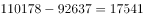。由混合增长率公式可知，一般用现期量近似代替基期量，量之比为，距离之比为x：（7.3%-6%）=x：1.3%，距离与量成反比，则5：1= x：1.3%，x=6.5%，6%-6.5%=-0.5%，故同比下降0.5%，与C项最接近。

故正确答案为C。

---

#### 第 5 题　qid 2021916 · 综合

能够从上述资料推出的是：

- **A**. 
2016年1-7月，地方一般公共预算本级收入同比增速小于

- **B**. 
2016年1-8月，非税收入占全国一般公共预算收入比重同比增加

- **C**. 
2016年1-8月，月平均全国一般公共预算收入超过8月份
　✅
- **D**. 
2015年8月，全国一般公共预算收入中非税收入不到2000亿元

**答案**：C

**官方解析**

A项：2016年8月份，地方一般公共预算本级收入同比增长；2016年1-8月累计，地方一般公共预算本级收入同比增长。由混合增长率居中原则可知，2016年1-7月，地方一般公共预算本级收入同比增速大于，错误；

B项：2016年1-8月，全国一般公共预算收入同比增长，税收收入同比增长，由两期比重公式可知，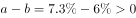，故税收收入占比同比增加，则非税收收入占比同比减少，错误；

C项：2016年1-8月累计，全国一般公共预算收入110178亿元，则月平均为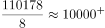，大于8月份的9894，正确；

D项：定位材料首段末句，2016年8月非税收入2214亿元，同比增长，由基期计算公式可知，2015年8月非税收入为，错误。

故正确答案为C。

---

### 材料 2

        国家信息中心近日发布的《中国信息社会发展报告2015》显示，2015年全国信息社会指数达到0.4351。从四个重点领域看，数字生活发展最快，2015年全国数字生活指数达到0.5038，同比增长。

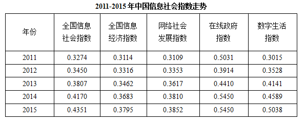

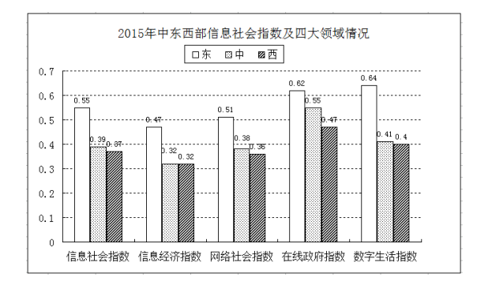

#### 第 6 题　qid 2021918 · 综合

2011-2015年间，中国各领域信息社会指数中出现起伏变化的是：

- **A**. 全国信息经济指数
- **B**. 数字生活指数
- **C**. 全国信息社会指数
- **D**. 在线政府指数　✅

**答案**：D

**官方解析**

定位表格可知，2011-2015年间，A项全国信息经济指数持续升高，B项数字生活指数持续升高，C项全国信息社会指数持续升高，D项在线政府指数先下降后升高。只有D项数据出现起伏变化。
故正确答案为D。

---

#### 第 7 题　qid 2021920 · 增长

2015年与2011年相比，我国数字生活指数提高了近：

- **A**. 1.5倍
- **B**. 0.7倍　✅
- **C**. 1.7倍
- **D**. 0.5倍

**答案**：B

**官方解析**

由题干“提高了”且选项无单位可知，本题考查增长率计算问题。定位表格，2015年数字生活指数为0.5038，2011年数字生活指数为0.3015。依据增长率计算公式，，与B项最接近。

故正确答案为B。

---

#### 第 8 题　qid 2021922 · 综合

图中数据显示，东中西部各领域信息社会指数差距最大的是：

- **A**. 信息经济指数
- **B**. 网络社会指数
- **C**. 数字生活指数　✅
- **D**. 在线政府指数

**答案**：C

**官方解析**

各领域中，均是东部地区指数最大，西部地区指数最小。故直接用东部-西部就得出差距。

信息经济指数：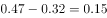；网络社会指数：；在线政府指数：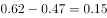；数字生活指数：。差距最大的是数字生活指数。

故正确答案为C。

---

#### 第 9 题　qid 2021926 · 综合

资料显示，2015年西部地区各类指数与全国水平相差的最大值是：

- **A**. 0.1038　✅
- **B**. 0.0833
- **C**. 0.1362
- **D**. 0.0938

**答案**：A

**官方解析**

信息社会指数：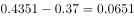；信息经济指数：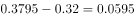；网络社会指数：；在线政府指数；数字生活指数：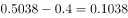。差距最大的是数字生活指数，差距为0.1038。

故正确答案为A。

---

#### 第 10 题　qid 2021928 · 综合

下列说法错误的是：

- **A**. 2011-2015年间，从四个重点领域看，发展最慢的是在线政府指数
- **B**. 2015年信息社会指数及四大领域指数变化中中部地区处于中等水平
- **C**. 2011-2015年间，从四个重点领域看，数字生活发展最快
- **D**. 2015年，在信息社会指数及各领域变化中东部地区低于全国平均水平　✅

**答案**：D

**官方解析**

A项：定位表格材料，在线政府指数的增长量最小（0.0419），而其基期量最大，所以发展最慢的是在线政府指数，正确；

B项：定位图表中部地区的，中部地区各指数均小于东部地区，大于等于西部地区，所以中部处于中等水平，正确；

C项：发展最快即增速最大，定位表格材料，给出了四个重点领域（全国信息经济指数、网络社会发展指数、在线政府指数、数字生活指数）2011、2015年的数据。根据增长率可得四个领域增速分别为：全国信息经济指数：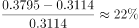；网络社会发展指数：；在线政府指数：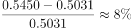；数字生活指数：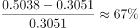，因此数字生活发展最快，正确；

D项：对比表格最后一行数据和图表中东部数据，东部地区的信息社会指数及各领域指数均高于全国，错误。

本题为选非题，故正确答案为D。

---
