# 2016年四川省公务员录用考试《行测》题（下半年）

> 省考 · 2016 年 · 5 个模块 · 共 100 题

- [常识判断](#%E5%B8%B8%E8%AF%86%E5%88%A4%E6%96%AD) · 10 题
- [言语理解与表达](#%E8%A8%80%E8%AF%AD%E7%90%86%E8%A7%A3%E4%B8%8E%E8%A1%A8%E8%BE%BE) · 35 题
- [数量关系](#%E6%95%B0%E9%87%8F%E5%85%B3%E7%B3%BB) · 10 题
- [判断推理](#%E5%88%A4%E6%96%AD%E6%8E%A8%E7%90%86) · 30 题
- [资料分析](#%E8%B5%84%E6%96%99%E5%88%86%E6%9E%90) · 15 题

---

## 常识判断

### 第 1 题　qid 2030018 · 法律常识

根据我国有关法律，以下说法不正确的是：

- **A**. 依照我国《宪法》规定，任何组织或个人都不得有超越宪法和法律的特权
- **B**. 依照我国《兵役法》规定，中华人民共和国的武装力量，由中国人民解放军、中国人民武装警察部队和民兵组成
- **C**. 依照我国《全国人民代表大会和地方各级人民代表大会选举法》规定，设区的市的人民代表大会的代表，由选民直接选举　✅
- **D**. 依照我国《香港特别行政区基本法》规定，香港特别行政区实行高度自治，享有行政管理、立法权、独立的司法权和终审权

**答案**：C

**官方解析**

C项错误：我国《全国人民代表大会和地方各级人民代表大会选举法》第二条规定：全国人民代表大会的代表，省、自治区、直辖市、设区的市、自治州的人民代表大会的代表，由下一级人民代表大会选举。不设区的市、市辖区、县、自治县、乡、民族乡、镇的人民代表大会的代表，由选民直接选举；
A项正确：我国《宪法》第五条规定：······任何组织或者个人都不得有超越宪法和法律的特权；
B项错误：根据《国防法》第二十二条规定：中华人民共和国的武装力量，由中国人民解放军、中国人民武装警察部队、民兵组成。
D项正确：我国《香港特别行政区基本法》第二条规定：全国人民代表大会授权香港特别行政区依照本法的规定实行高度自治，享有行政管理权、立法权、独立的司法权和终审权。
本题为选非题，故正确答案为C。
注：因法律修改，本题B选项也为错误选项。

---

### 第 2 题　qid 2030060 · 法律常识

下列选项中，符合法律规定的是：

- **A**. 新录用的公务员小张，其试用期为六个月
- **B**. 小陈今年15岁，在某工地打工，干一些杂务
- **C**. 因工作需要，公务员小朱前往甲单位授课，他可以在甲单位领取授课费
- **D**. 某公司未按照劳动合同约定向员工小李支付劳动报酬，小李可以随时通知该公司解除劳动合同　✅

**答案**：D

**官方解析**

D项正确：根据《劳动法》第三十二条规定：“有下列情形之一的，劳动者可以随时通知用人单位解除劳动合同：……（三）用人单位未按照劳动合同约定支付劳动报酬或者提供劳动条件的。”
A项错误，根据《公务员法》第三十四条规定：“新录用的公务员试用期为一年。试用期满合格的，予以任职；不合格的，取消录用。”
B项错误：《劳动法》第十五条规定：“禁止用人单位招用未满十六周岁的未成年人。文艺、体育和特种工艺单位招用未满十六周岁的未成年人，必须依照国家有关规定，履行审批手续，并保障其接受义务教育的权利。”小陈在工地打工，用人单位不属于文艺、体育和特种工艺单位，因此不符合法律规定。
C项错误，根据《公务员法》第四十四条规定：“公务员因工作需要在机关外兼职，应当经有关机关批准，并不得领取兼职报酬。”
故正确答案为D。

---

### 第 3 题　qid 2030064 · 人文常识

下列关于我国的国家中心城市的说法，错误的是：

- **A**. 目前确定的国家中心城市中已包含了所有的直辖市
- **B**. 目前确定的国家中心城市中最靠西的城市是重庆市　✅
- **C**. 国家中心城市的政治、经济、文化等多方面具备引领、辐射、集散功能
- **D**. 国家中心城市在《全国城镇体系规划》中处于城镇体系层级的最高位置

**答案**：B

**官方解析**

B项错误：2016年5月，经国务院同意，发改委和住建部联合印发《成渝城市群发展规划》指导文件，其中《规划》中首次明确提出，成都要以建设国家中心城市为目标，增强成都西部地区重要的经济中心、科技中心、文创中心、对外交往中心和综合交通枢纽功能。而北京、天津、上海和广州均位于我国东部，只有重庆和成都位于我国的西南地区。而成都比重庆更靠西，因此，目前确定的国家中心城市中，最靠西的城市是成都市。 
A、C、D正确：国家中心城市是住房和城乡建设部编制的《全国城镇体系规划》中提出的处于城镇体系最高位置的城镇层级。国家中心城市在全国具备引领、辐射、集散功能的城市，这种功能表现在政治、经济、文化、对外交流等多方面。2010年2月，住房和城乡建设部发布的《全国城镇体系规划纲要（2010-2020年）》明确提出五大（北京、天津、上海、广州、重庆）国家中心城市的规划和定位，其中包括了四个直辖市。
本题为选非题，故正确答案为B。

---

### 第 4 题　qid 2030066 · 人文常识

关于气象灾害，下列说法正确的是：

- **A**. 沙尘天气分为浮尘、扬沙、沙尘暴三类
- **B**. 台风中心为低压中心，以气流的垂直运动为主　✅
- **C**. 在我国，暴雨的橙色预警信号为最高级预警信号
- **D**. 寒潮主要爆发于春末夏初季节，寒潮袭击时气温会急剧下降

**答案**：B

**官方解析**

B项正确：在气象图上，台风的等压线和等温线近似为一组同心圆，其中台风中心为低压中心，以气流的垂直运动为主，附近风平浪静，天气晴朗。
A项错误：沙尘天气是一种由于大风将地面沙尘吹（卷）起或被高空气流带到下游地区而造成的一种大气混浊现象。按照程度划分，沙尘天气分为：浮尘、扬尘、沙尘暴、强沙尘暴、特强沙尘暴五类。
C项错误：我国的暴雨预警信号分四级，分别以蓝色、黄色、橙色、红色表示，其中红色预警信号为最高级预警信号。
D项错误：寒潮是指来自极地或寒带的寒冷空气像潮水一样大规模地向中、低纬度的侵袭活动。在我国，从9月到次年5月均可发生寒潮，主要爆发于初春时节，我国大部分地区都会受到影响。
故正确答案为B。

---

### 第 5 题　qid 2030074 · 科技常识

关于物理现象的解释，下列说法错误的是：

- **A**. 量子隧穿效应不遵循牛顿运动定律
- **B**. “小小秤砣压千斤”运用的是杠杆原理
- **C**. 汽车的观后镜多使用凸面镜 ，可以扩大视野范围
- **D**. 高压锅煮食物快主要是因为增大了锅内气压，降低了水的沸点　✅

**答案**：D

**官方解析**

D项错误：高压锅煮食物快是因为水的沸点与压强有关，压强增大，沸点升高，煮饭菜时高压锅的气压比普通锅内的气压高，所以水沸腾时高压锅内的温度高于普通锅内的温度，温度越高，饭菜熟的越快。
A项正确：量子隧穿效应是一种量子特性，是电子等微观粒子能够穿过它们本来无法通过的“墙壁”的现象。这种效应无法用经典力学来解释，不遵循牛顿运动定律。
B项正确：秤杆可以看做一个杠杆，根据杠杆原理，秤砣的质量比较小，但是它的力臂比较长。相反，千斤物体的质量虽然大，但是力臂却比较短，所以二者可以平衡。
C项正确：汽车的观后镜是凸面镜，凸面镜对光有发散作用，能使驾驶员观察到更大范围的景物，因此利用凸面镜制作的观后镜可以扩大驾驶员的视野。
本题为选非题，故正确答案为D。

---

### 第 6 题　qid 2030090 · 科技常识

关于医学常识，下列说法正确的是：

- **A**. 
在正常情况下，人的血糖值的正常范围在

- **B**. 
成年人安静时心率超过时，为心动过速

- **C**. 
父母血型分别为A型和B型时，子女血型不可能为O型

- **D**. 
临床上通常用口腔温度、直肠温度和腋窝温度来代表体温
　✅

**答案**：D

**官方解析**

D项正确：正常体温根据测试部位的不同，体温的正常值稍有差异。临床上常用的体温包括：口腔温度、直肠温度和腋窝温度。

A项错误：正常情况下，人的空腹全血血糖正常值范围在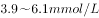，血浆血糖为。

B项错误：成年人安静时心率超过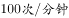时为心动过速。

C项错误：根据血型的遗传规律，父母血型分别为A型和B型时，子女血型可能为A型、B型、AB型、O型。

故正确答案为D。

---

### 第 7 题　qid 2030094 · 人文常识

我国很多民间乐器是少数民族代表乐器，下列对应不正确的是：

- **A**. 芦笙——朝鲜族　✅
- **B**. 葫芦丝——傣族
- **C**. 冬不拉——哈萨克族
- **D**. 马头琴——蒙古族

**答案**：A

**官方解析**

A项错误：芦笙为西南地区苗、瑶、侗等民族的簧管乐器，并非朝鲜族的代表乐器。朝鲜族在我国主要分布于东北三省，代表乐器主要有伽倻琴、玄鹤琴等。
其余三项均正确。
本题为选非题，故正确答案为A。

---

### 第 8 题　qid 2030096 · 人文常识

关于二战时期的重要会议，下列说法不正确的是：

- **A**. “雅尔塔会议”作出了战后世界秩序安排
- **B**. “开罗会议”确定了日本侵略罪行及战后对日本的处理问题
- **C**. “德黑兰会议”美、英、苏三大同盟国共同商量对日作战问题　✅
- **D**. “波茨坦会议”召开于德国无条件投降，欧洲战争结束之后

**答案**：C

**官方解析**

C项错误：“德黑兰会议”美、英、苏三大同盟国共同商量对德作战的军事问题。关于对日作战问题，苏联初步同意在欧洲战争结束后半年左右参加对日作战，但没有进行进一步商讨，1945年的波茨坦会议上讨论了对日作战等问题。
其余三项均正确。
本题为选非题，故正确答案为C。

---

### 第 9 题　qid 2030100 · 人文常识

下列场景最不可能发生的是：

- **A**. 战国人使用象牙制品
- **B**. 屈原和宋玉饮酒作赋
- **C**. 霍去病向汉武帝上纸本奏议　✅
- **D**. 商王武丁的妻子身穿丝绸服装

**答案**：C

**官方解析**

A项正确：经考古发掘证明，早在新石器时期，我国就有使用如象牙匕、象牙笄等象牙制品。在古代，象牙制品作为一种独特的动物制品，深受上等阶层的推崇。故选项所述场景有可能发生。
B项不严谨：关于屈原的生卒年，史书上没有记载，后世学者有多种说法，大致有生于楚威王或楚宣王年间，卒于楚襄王年间等说法。关于宋玉的生平也不详，据他的有关作品看，可能是楚襄王朝失职的贫士，根据权威的学术典籍《历代赋辞典》，宋玉当生在屈原之后，大概只是屈原的后学，所以他俩还是有可能一起饮酒作赋的。
C项错误：根据《二十六史精要辞典 • 上》（责任者：门岿主编；出版者：人民日报出版社）记载：“1957年考古工作者在陕西省西安灞桥一座古汉墓中，发掘出时间不晚于汉武帝时期(前140—前87)的纸。这种纸经过化验，是用大麻和苎麻等原料制造的，取名‘灞桥纸’。‘灞桥纸’是迄今为止，我国和世界上人们发现的最早的纸”。但是所谓“灞桥纸”究竟是何用途，学界尚没有一致答案，且其表面粗糙皱涩，甚至是未打碎的麻绳头，无文字，也不便于书写。故霍去病向汉武帝上纸本奏议不大可能发生。
D项正确：根据考古发现推测，距今五六千年前的新石器时代，中国便开始养蚕织绸了，并且在仰韶时期便开始出现丝绸织物，故选项所述场景有可能发生。
本题问的是“最不可能发生”，单选择优，最不可能的是C项。
本题为选非题，故正确答案为C。

---

### 第 10 题　qid 2030104 · 人文常识

下列关于秋天的诗句，产生年代最早的是：

- **A**. 袅袅兮秋风，洞庭波兮木叶下　✅
- **B**. 无边落木萧萧下，不尽长江滚滚来
- **C**. 昨夜西风凋碧树，独上高楼，望尽天涯路
- **D**. 悲哉，秋之为气也，萧瑟兮草木摇落而变衰

**答案**：A

**官方解析**

A项正确：本句出自屈原的《九歌》，创作于战国时期。
B项错误：本句出自杜甫的《登高》，创作于唐朝。
C项错误：本句出自晏殊的《蝶恋花》，创作于北宋时期。
D项错误：本句出自宋玉的《九辨》，创作于战国时期。A和D虽均创作于战国时期，但屈原（公元前340年－公元前278年）的生卒年份早于宋玉（约公元前298年－约公元前222年），屈原去世时宋玉年纪不过二十左右，而《九辩》原文“时亹亹而过中兮，蹇淹留而无成”表明作者在创作时已人过中年。
故正确答案为A。

---

## 言语理解与表达

### 第 1 题　qid 2029972 · 逻辑填空

随着收入水平的提高，人们的消费心态也随之发生改变，个性化消费需求显著提高。互联网时代，商家可以利用消费数据的积累分析出商品的市场反响情况，对消费者________，实现更精准的营销策略。
填入画横线部分最恰当的一项是：

- **A**. 一视同仁
- **B**. 有的放矢　✅
- **C**. 无微不至
- **D**. 予取予求

**答案**：B

**官方解析**

本题为单空成语辨析题。后文对横线处内容进行解释说明，根据“实现更精准的营销策略”可知，文段强调对消费者有针对性地实现个性化营销，所以B项“有的放矢”指说话做事有针对性，符合文意，当选。
A项“一视同仁”指对人同样看待，与文意相悖，排除；C项“无微不至”指没有一处细微的地方不照顾到，语义程度过重，且与文意无关，排除；D项“予取予求”指任意索取，与文意无关，排除。
故正确答案为B。
【文段出处】《民间工艺如何与互联网结合》

---

### 第 2 题　qid 2029976 · 逻辑填空

在各种兼并方式中，如果两个公司实力悬殊，则多半是强势的一方直接收购弱势的一方。出钱多、实力雄厚的一方，最终还是会要求自己说了算，而实力较弱的一方虽然在名分上得到了“平等”二字，但大多也都知道自己需要________。
填入画横线部分最恰当的一项是：

- **A**. 循规蹈矩
- **B**. 安分守己
- **C**. 亦步亦趋　✅
- **D**. 安步当车

**答案**：C

**官方解析**

根据“但”这一转折词可知，前后文语意相反，前文提到“实力雄厚的一方，最终还是会要求自己说了算”，可知实力较弱的一方和实力雄厚的一方地位是不平等的，故横线处表示实力较弱的一方需要听从实力雄厚一方的意见。C项“亦步亦趋”比喻自己没有主张，或为了讨好别人，每件事都效仿或依从别人，跟着人家行事，符合语境，当选。
A项“循规蹈矩”原指遵守规矩，现多指拘泥于旧的准则，不敢稍作变通，文段中实力雄厚一方的意见并非旧准则或规矩，排除；B项“安分守己”指规矩老实，不做超出本分的事，不做违法的事，与文意无关，排除；D项“安步当车”指慢慢地步行，就当作是坐车，与文意无关，排除。
故正确答案为C。

---

### 第 3 题　qid 2029982 · 逻辑填空

技术的工具价值只有在正确的人文理性、目标价值引导下，才能发挥最佳功效。否则，技术也可能________，成为负能量的滋生场。
填入画横线部分最恰当的一项是：

- **A**. 南辕北辙
- **B**. 变本加厉
- **C**. 为虎作伥　✅
- **D**. 小题大做

**答案**：C

**官方解析**

横线后文对横线内容起解释说明作用，根据后文解释，“成为负能量的滋生场”可知技术会产生负能量，造成不好的影响。
A项“南辕北辙”指行动和目的相反，文段并没有关于行动的表述，故与文意无关，排除；B项“变本加厉”指情况变得比原来更加严重，文段并未表明之前情况是严重的，故不符合文意，排除；C项“为虎作伥”指帮助坏人做坏事，符合文意，当选；D项“小题大做”指不恰当地把小事当作大事来处理，有故意夸张的意思，产生“负能量”并非小事，故与文意不符，排除。
故正确答案为C。
【文段出处】《守护技术创新的初心》

---

### 第 4 题　qid 2029988 · 逻辑填空

锦官城位于成都城东南的一块开阔地，大片的厂房建立起来以后，这里终日响着________的机杼声，飘荡着蜀锦艳丽而华美的颜色。当时的政府把锦官城建在此地，是因为这里的江水漂洗出来的锦缎，质地特别________，颜色特别鲜亮；而在别的江河中漂洗，蜀锦的质地就会变得粗硬，颜色也会衰败走样。
依次填入画横线部分最恰当的一项是：

- **A**. 连绵不绝  柔滑　✅
- **B**. 此起彼伏  轻盈
- **C**. 抑扬顿挫  细腻
- **D**. 婉转悠扬  通透

**答案**：A

**官方解析**

第一空，搭配“机杼声”，根据“终日响着”可知，机杼声是一直存在的，A项“连绵不绝”指连续而不中断，B项“此起彼伏”指接连不断，均符合文意，保留。C项“抑扬顿挫”指声音的高低起伏和停顿转折，D项“婉转悠扬”指声音悠扬动听，均与文意无关，排除。
第二空，根据“而”表转折可知，横线处词语与“粗硬”表意相反，A项“柔滑”指柔软润滑，符合文意，当选。B项“轻盈”指轻柔秀丽，无法和“粗硬”形成对应，排除。
故正确答案为A。

---

### 第 5 题　qid 2030002 · 逻辑填空

城市文明指人类创造的城市这种形式本身，以及以城市作为物质载体而创造的一切物质和精神成果。“城市文明”________着有城市出现，“文明”虽然有着更为________和抽象的含义，但是基本是指与城市和文字相联系的特定文化阶段，大多数情况下，城市与文字是同时存在的。
依次填入画横线部分最恰当的一项是：

- **A**. 意味  宽泛　✅
- **B**. 代表  特殊
- **C**. 标志  深刻
- **D**. 隐含  广阔

**答案**：A

**官方解析**

第一空，文中提到“城市文明”······着有城市的出现，由“出现”可知，是外显的状态，D项“隐含”是指暗中包含，与“出现”相矛盾，排除；
第二空，由文中的“城市文明”到“文明”，可知是从一个小领域上升到了整个文明，范围扩大了，且“更”表示递进，B项“特殊”、C项“深刻”均体现不出范围扩大的含义，排除；A项“宽泛”就是指涉及的面宽，更符合文意，当选。
故正确答案为A。

---

### 第 6 题　qid 2030010 · 逻辑填空

自从邮票作为投资产品后，人们对于邮票收藏也________起来，原来大多数人还是采用把邮票从信封上剪裁下来，通过水浸等收集的方法来收藏，但是随着大家的要求越来越高，凡是有水浸、复新痕迹的邮票价值都________了，这就要求投资者要购买真正的“新票”，加入到邮市中来。
依次填入画横线部分最恰当的一项是：

- **A**. 喜爱 大打折扣　✅
- **B**. 青睐 一文不值
- **C**. 重视 不复存在
- **D**. 关注 一落千丈

**答案**：A

**官方解析**

此题可从第二空入手，根据文意可知第二空想表达有水浸、复新痕迹的邮票价值会有所损失，A项“大打折扣”指与原来的价值不相符，填入文段语义合适，保留；B项“一文不值”指毫无价值，置于此处程度过重，排除；C项“不复存在”指不再存在，消失了，文段只是强调价值有损失，而不是消失了，排除；D项“一落千丈”形容声誉、地位或经济状况急剧下降，强调下降的很快，而文段并不侧重速度快、突然下降，排除。
第一空，代入验证，自从邮票成为投资产品，人们越来越喜爱，A项“喜爱”置于此处语义合适，当选。
故正确答案为A。

---

### 第 7 题　qid 2030020 · 逻辑填空

一般人想到莎士比亚，都觉得非常遥远——他来自遥远的古代及国外，而更遥远的距离来自他的作品普遍被视为经典中的经典，自然就变得________，大众是很难亲近或理解的。其实不然，莎士比亚的戏剧之所以伟大就是因为隔了四个世纪，还能那么鲜明而深刻地映照在我们时代上，与我们________。
依次填入画横线部分最恰当的一项是：

- **A**. 讳莫如深  互动
- **B**. 孤芳自赏  同行
- **C**. 深不可测  对话　✅
- **D**. 高高在上  共勉

**答案**：C

**官方解析**

第一空，根据后文可知，横线处想表达大众无法理解莎士比亚的作品，C项“深不可测”比喻对事情的情况捉摸不透，符合文意，保留；A项“讳莫如深”指紧紧隐瞒，不透露真相，文段并未涉及事情的真相，只是强调大众不理解，排除；B项“孤芳自赏”指自命清高，自我欣赏，与文意不符，排除；D项“高高在上”多形容领导者不深入实际，脱离群众，与文意不符，排除。
第二空，代入验证，根据文意可知，莎士比亚的作品对当今时代依旧产生影响，能够与我们“对话”，C项符合文意，当选。
故正确答案为C。
【文段出处】《莎士比亚从大众娱乐到伟大经典》

---

### 第 8 题　qid 2030026 · 逻辑填空

能源、水和食品是这个世界上最关键的三种资源，尽管这一事实已在政策圈中达成共识，但这三种资源之间的________关系却被严重忽视。其中任何一种资源的紧缺都会影响另外两种。这使得真实社会的生态比我们想象的________得多。
依次填入画横线部分最恰当的一项是：

- **A**. 互补  复杂
- **B**. 交互  愚劣
- **C**. 共生  困难
- **D**. 依赖  脆弱　✅

**答案**：D

**官方解析**

第一空，根据后文可知，三种资源之间相互影响，关系紧密，A项“互补”指互相补充，文段强调的是一种资源减少其他两种也会受到影响，并未强调互相补充，排除；C项“共生”指两种不同的生物生活在一起，相互依存，对彼此都有利，文段形容的是三种资源的关系，排除；B项“交互”与D项“依赖”填入文段语义合适，保留。
第二空，根据后文“其中任何一种资源的紧缺都会影响另外两种”可知，真实社会并不是想象的那样好，还容易发生灾难，D项“脆弱”填入文段语义合适，当选；B项“愚劣”指愚蠢拙劣，多用来形容人，不能形容社会，排除。
故正确答案为D。
【文段出处】《用“三合一”思维解决资源危机》

---

### 第 9 题　qid 2030030 · 逻辑填空

社会生活的方方面面常常各成体系，但又具有无法________的关联性、耦合性。综艺节目尽管与严肃的政经节目有很大差异，但它们都应根植于生活、服务于生活，最终为人服务。因此，综艺节目既应保持时尚可爱的本色，也不必刻意与现实拉开距离。以时尚的方式关注生活热点，开展讨论，________公众焦虑，则既能博人眼球，又可体现社会价值。
依次填入画横线部分最恰当的一项是：

- **A**. 阻挡  缓解
- **B**. 隔离  解除
- **C**. 阻隔  纾解　✅
- **D**. 隔绝  消除

**答案**：C

**官方解析**

第一空，搭配“关联性、耦合性”，A项“阻挡”侧重于挡住、拦住，搭配不当，排除；B项“隔离”指不让聚在一起，使断绝往来，搭配不当，排除。C项“阻隔”与D项“隔绝”填入此处语义合适，保留。
第二空，搭配“焦虑”，D项“消除”指除去，使不存在，填入文段程度过重，排除。C项“纾解”侧重于有所缓解但还要继续缓解，填入文段语义合适，当选。
故正确答案为C。
【文段出处】《综艺节目也能回应社会关切》

---

### 第 10 题　qid 2030038 · 逻辑填空

从默片到有声，从黑白到彩色，人类社会的影像表达和传播都与媒介生态和技术变革________，当新媒体成为影像传播的新载体和新平台，微电影、迷你剧、微纪录片、恶搞短片、自拍秀甚至动态图片都成为与新媒体________的新的影像表达形式。
依次填入画横线部分最恰当的一项是：

- **A**. 息息相关  相生相伴　✅
- **B**. 紧密相连  相得益彰
- **C**. 休戚相关  相辅相成
- **D**. 一脉相连  相濡以沫

**答案**：A

**官方解析**

第一空，根据文意可知，影像表达与技术变革有关系，C项“休戚相关”指彼此间福祸相互关联，文段并没有体现出福祸两方面的联系，用在此处程度过重，排除，A项“息息相关”、B项“紧密相连”、D项“一脉相连”填入文段语义合适。
第二空，根据文意可知，横线处想表达随着新媒体的产生，微电影等也随之产生，A项“相生相伴”指相互伴随，填入文段语义合适；B项“相得益彰”指互相帮助，互相补充，更能显出各自的好处，文段并没有强调二者凸显各自的好处，排除；D项“相濡以沫”比喻同处困境，相互救助，与文意不符，排除。
故正确答案为A。
【文段出处】《新媒体语境下的影像新形态》

---

### 第 11 题　qid 2030042 · 逻辑填空

经历了数代学院派导演艺术上的探索和产业化白手起家的拓荒，电影不再只是“声光电”的艺术形式，更开启了一个________的市场化运作的时代，众多资本的涌入，一方面创造出巨大的利益空间，另一方面也暴露出行业内部的________，乱象频生。
依次填入画横线部分最恰当的一项是：

- **A**. 波澜壮阔  鱼目混珠
- **B**. 雄心勃勃  鱼龙混杂　✅
- **C**. 焕然一新  尔虞我诈
- **D**. 意气风发  良莠不齐

**答案**：B

**官方解析**

本题可以先从第二空入手：横线处通过逗号与“乱象频生”构成并列结构，所填成语与“乱象频生”语义相近，“乱象频生”指出现一些不好的现象。B项和D项，“鱼龙混杂”和“良莠不齐”指好的坏的都有，符合文段语境，保留。
A项，“鱼目混珠”比喻用假的冒充真的，无法体现乱象出现；C项，“尔虞我诈”表示彼此互相欺骗，体现不出出现不好的现象，排除A、C两项。
第一空：B项，“雄心勃勃”侧重于有理想有抱负，想要做一番大事；D项，“意气风发”形容人精神振奋，气概豪迈，侧重于人的精神面貌。结合语境“电影不再只是······形式，更开启了一个······时代，众多资本的涌入”，文段并非侧重精神面貌，故B项比D项更加符合语境的要求，排除D项。
故正确答案为B。
【文段出处】《大数据时代，票房不再是唯一》

---

### 第 12 题　qid 2030046 · 逻辑填空

MOOC利用使用者的IP地址自动识别地理位置，辨识出不同用户群体，通过________用户学习习惯的更多数据，创造出适合不同学生群体的学习路径，实现教学的________。
依次填入画横线部分最恰当的一项是：

- **A**. 收集  差异化　✅
- **B**. 搜集  多样化
- **C**. 整理  个性化
- **D**. 处理  灵活化

**答案**：A

**官方解析**

本题突破点为第二空，横线前“创造出适合不同学生群体的学习路径”，对应A项“差异化”，当选。
B项“多样化”指多种多样，无法对应不同学生具有不同的路径；C项“个性化”指非一般大众化的东西，强调与众不同；D项“灵活化”指不拘泥于固有模式，善于变通，均体现不出“适合不同学生群体”，排除。
第一空代入验证，“收集数据”，搭配恰当。
故正确答案为A。
【文段出处】《大规模网络公开课程的发展与挑战》

---

### 第 13 题　qid 2030050 · 逻辑填空

互联网新的运营模式不断出现，技术发展________，这对版权保护也提出了更多挑战。从当前的司法实践来看，各地法院对网络运营商的责任认定也常常存在差异。著作权法的立法宗旨是“尊重智慧，鼓励创作和传播”，这在网络时代也应该________。
依次填入画横线部分最恰当的一项是：

- **A**. 突飞猛进  亘古不变
- **B**. 层出不穷  始终如一
- **C**. 一日千里  一以贯之　✅
- **D**. 日新月异  坚明约束

**答案**：C

**官方解析**

第一空，根据文段信息，横线处表达“技术发展迅速”，B项，“层出不穷”指接连不断地出现，没有穷尽，不符合文意，排除。
第二空，文段强调立法宗旨是我们一直要坚持的，C项，“一以贯之”指用一个根本性的事理贯通事情的始末或全部的道理，符合文意，当选；A项，“亘古不变”指自古以来不曾改变，与“在网络时代”对应不当，排除；D项，“坚明约束”指坚定明确的遵守同盟或信约，“坚明约束”的对象应为法律，而不是文段中的“立法宗旨”，排除。
故正确答案为C。
【文段出处】《新媒体“拿来主义”的界限何在》

---

### 第 14 题　qid 2030054 · 逻辑填空

在劳动者权益不断________的当下，一些权利痛点也在日益凸显，全社会对低温下的劳动者某种程度上的忽视和漠视，使他们难以得到及时、有效的制度________和人文关怀。
依次填入画横线部分最恰当的一项是：

- **A**. 显现  维护
- **B**. 提升  保护
- **C**. 完善  保障
- **D**. 彰显  护佑　✅

**答案**：D

**官方解析**

第一空，根据文段“一些权利痛点也在日益凸显”可知，此处为并列结构，横线处所填词语与“凸显”语义相近，“凸显”指突出，显著，A项“显现”指显露，露面，呈现，D项“彰显”指明显，显著，均符合文段语境，保留。B项“提升”强调使位置、程度、水平、数量、质量等方面比原来高，C项“完善”指完备美好、无缺损、使趋于完美和增加在完成的基础上，起到锦上添花的作用，均与“凸显”语义不相近，排除。
第二空，搭配“制度”，“制度护佑”为固定搭配，表示从制度上保护劳动者，符合语境，D项当选。A项“维护”与“制度”搭配不当，排除。
故正确答案为D。
【文段出处】《“低温津贴”需要价值认同更需要强化实施》

---

### 第 15 题　qid 2030056 · 逻辑填空

随着科学界获得越来越多更加精确的数据，我们在探寻此次空前大灭绝事件背后的原因时，其得到的结果可能并不会是________的。科学家表示，增进我们对于生命几近被毁灭的环境的了解，将会增加我们作为一个物种能够长期生存下去的________。
依次填入画横线部分最恰当的一项是：

- **A**. 准确无误  机会
- **B**. 开门见山  概率
- **C**. 直截了当  几率　✅
- **D**. 立竿见影  可能

**答案**：C

**官方解析**

第一空，搭配“结果”，B项，“开门见山”比喻说话或写文章直截了当谈本题，不拐弯抹角，与“结果”搭配不当，排除；根据前文内容“随着科学界获得越来越多更加精确的数据”可知，A项“准确无误”与前文矛盾，排除。
第二空，文段重在强调增进对环境了解将会增加生存下去的可能性。C项，“几率”指概率、可能性大小，符合文意，当选；D项“可能”与“增加”搭配不当，应为“增加可能性”，排除。
故正确答案为C。
【文段出处】《地球最严重大灭绝发生了什么？》

---

### 第 16 题　qid 2030068 · 逻辑填空

鉴于国内外学者对文化概念的意见很不一致，有人提出：文化也许天然是个模糊的概念，其内涵的不确定导致外延的不确定，很难下一个清楚而________的定义，我们与其追求一个简单而________的定义，不如从集合的角度来确定一个有________的范围。
依次填入画横线部分最恰当的一项是：

- **A**. 宏大  独特  意义
- **B**. 全面  精确  弹性　✅
- **C**. 宽泛  唯一  逻辑
- **D**. 完全  严谨  深度

**答案**：B

**官方解析**

第一空，搭配“定义”，A项“宏大”比喻事物的气势宏伟巨大，与“定义”搭配不当，排除；根据前文“文化也许天然是个模糊的概念”可知，很难下一个清楚、明确、全面的定义，C项“宽泛”和文意相反，排除。
第三空，搭配“范围”，D项“深度”指深浅的程度，而“范围”指界限，与“深度”搭配不当，排除。
第二空代入验证，“精确的定义”，符合文意且搭配合理。
故正确答案为B。
【文段出处】《浅谈文化的层次结构及传承演变——文化概念之我见》

---

### 第 17 题　qid 2030070 · 逻辑填空

传统电视巨头以硬件见长，近年来他们仍________地升级显示技术，而互联网电视品牌自知硬件技术难以取胜，就采取另一套打法，以内容取胜，________消费者的体验和感受。但现实情况是，后者更有________，近两年互联网电视在迅速蚕食电视市场份额。
依次填入画横线部分最恰当的一项是：

- **A**. 信心十足  兼顾  动力
- **B**. 一如既往  贴近  魅力
- **C**. 费尽心机  分析  效率
- **D**. 不遗余力  追求  优势　✅

**答案**：D

**官方解析**

第一空，表达传统电视巨头仍然升级显示技术的意思，C项“费尽心机”指挖空心思、想尽办法，感情色彩偏消极，文段只是客观阐述，感情色彩与文段不符，排除。
第二空，搭配“体验和感受”，A项“兼顾”、D项“追求”均可，保留。B项“贴近”常见搭配为“贴近消费者”，而非“贴近消费者的体验和感受”，搭配不当，排除。
第三空，根据后文“近两年互联网电视在迅速蚕食电视市场份额”可知，与传统电视相比，互联网电视更胜一筹，占上风，D项“优势”指比对方有利的形势，当选。A项“动力”指推动事物发展的力量，文中并未体现互联网电视品牌发展内容的背后推动力，排除。
故正确答案为D。
【文段出处】《互联网电视能拉回受众吗？》

---

### 第 18 题　qid 2030072 · 语句表达

几乎所有的国家都不相信奥地利学派的观点，而偏好用凯恩斯主义来熨平经济周期的波动。但凯恩斯看得见的手是否真的能战胜经济规律的不可逆转性呢？也许最终仍然是“______________”，经济规律会让看得见的手不得不做出更大的让步。
填入画横线部分最恰当的一项是：

- **A**. 胳膊拧不过大腿　✅
- **B**. 近水楼台先得月
- **C**. 老虎屁股摸不得
- **D**. 落毛凤凰不如鸡

**答案**：A

**官方解析**

根据后文“经济规律会让看得见的手不得不做出更大的让步”可知，看得见的手还是无法战胜经济规律，不得不做出让步，对应A项“胳膊拧不过大腿”，比喻弱小的敌不过强大的，多用于势力、力量的对比，符合语境，当选；B项“近水楼台先得月”比喻由于近便而获得优先的机会，C项“老虎屁股摸不得”比喻自以为是，听不得批评意见，二者均体现不出来经济规律和看得见的手之间的力量对比，排除B、C两项；D项“落毛凤凰不如鸡”比喻失去势力的人处于弱势地位的处境，文段重点强调力量的对比，并非形容失去势力的人的处境，与文意不符，排除。
故正确答案为A。
【文段出处】《胳膊拧不过大腿》

---

### 第 19 题　qid 2030076 · 语句表达

上世纪60到70年代，一系列医学伦理事件的发生促进了病人权利的运动。在处理医学决定时，医生家长式作风受到批判，以“共享决定权”为原则的新的医患关系产生了。然而，______________。现代医学的专业性意味着医患之间存在无法逾越的巨大知识壁垒，平等也就无从谈起。病人对治疗效果的预期往往高于医生，对医学知识的掌握和医学风险认识又远远低于医生，缺位和无效的沟通既给临床治疗制造了巨大成本，又使医患的情感遭到巨大打击。
填入画横线部分最恰当的一项是：

- **A**. 医生与病人却被有史以来最为紧张的关系所羁绊
- **B**. 完完全全的平等并不是拯救现代医患关系的良药　✅
- **C**. 病人们在这个时候却发现医生们越来越难以信任
- **D**. 今天作为医疗行业的医学所处的关系网极为复杂

**答案**：B

**官方解析**

横线出现在文段中间，需要结合前后文内容进行分析。前文说“以‘共享决定权’为原则的新的医患关系产生”，紧接着出现转折词“然而”，转折前后语义相反，可知横线句子与后文联系更为紧密，后文从专业性和预期两个角度说明医患之间无法实现平等，并且指出其危害，所以横线上的内容应该围绕医患关系的平等展开，对应B项。A项“最为紧张的关系”在文段没有体现，排除；C项“越来越难以信任”无中生有，且文段讨论的是平等而非信任的话题，排除；D项“医学”并非是文段的重点，文段讨论的主题是医患关系，排除。
故正确答案为B。
【文段出处】三联生活周刊《医生的角色》

---

### 第 20 题　qid 2030080 · 片段阅读

随着饮茶习俗在东南亚国家的传播，公众饮茶的茶馆同样流行。在越南和缅甸较有代表性，其中缅甸尤为典型。在英国殖民地时代的缅甸北部小城开奥克他达，不但华侨商人在家里饮茶，乡村村长也用茶款待英国官员。缅甸城乡也发展出小茶馆饮茶的悠闲生活方式，今日缅甸大街小巷也处处都有小茶馆。品味缅甸的最好去处，就是茶馆，坐茶馆被视为缅甸大众化的生活方式。
对这段文字的主要内容，概括最准确的是：

- **A**. 缅甸是饮茶习俗的传播地
- **B**. 缅甸多流行以茶款待外宾
- **C**. 饮茶已成为缅甸人民的普遍习俗　✅
- **D**. 饮茶习俗反映着缅甸的生活水平

**答案**：C

**官方解析**

文段首句指出公众饮茶的茶馆在缅甸尤为典型，随后进行具体解释说明，从英国殖民地时代的缅甸到近日的缅甸，都可以反映出饮茶在缅甸流行，文段的尾句进行总结，坐茶馆被视为缅甸大众化的生活方式，故文段的重点对应C项。A项“传播地”是首句交代背景的内容，非重点，排除；B项“以茶款待外宾”属于解释说明的内容，非重点，且片面，排除；D项“饮茶习俗反映生活水平”在文段没有根据，为无中生有的表述，排除。
故正确答案为C。

---

### 第 21 题　qid 2030082 · 片段阅读

美国的文化遗产保护和立法有着悠久的历史。早在19世纪，一批建筑师、考古学家、历史学家和人类学家认识到文化遗产面对工业发展而受到威胁的事实，已经开始努力进行力所能及的保护。而后，在一批有影响的学者和社会人士努力下，美国国会在1906年通过了《文物法》，该法规为美国的文化遗产保护迈出了意义深远的第一步。相比之下，我国的文物保护立法和保护措施起步较晚，由于法规不严、措施不力和经费短缺等原因，文物保护工作经常处于捉襟见肘、力不从心的状态。
这段文字意在说明：

- **A**. 我国的文物保护工作任重道远　✅
- **B**. 美国的文物立法走在世界前列
- **C**. 工业发展是威胁文化遗产的主要原因
- **D**. 文物立法是文化遗产保护的重要途径

**答案**：A

**官方解析**

文段开头介绍美国在文化遗产的保护和立法方面都有着悠久的历史，之后通过“相比之下”引出重点，即“我国文物保护的状况”，与前文相比之后更加凸显出“我国当前的文物保护还要走很长的路”，对应A项。B项：“美国的文物立法”非重点，文段强调的是“我国的文物保护”，偏离中心，排除；C项：“工业发展”为背景引入中的表述，没有体现“我国文物保护的状况”，非重点，排除；D项：“立法”仅为文物保护的一方面，表述片面，且文段强调的是“我国的文物保护”而非“文物立法”，排除。
故正确答案为A。
【文段出处】《美国“文化资源管理”的镜鉴》

---

### 第 22 题　qid 2030084 · 片段阅读

中国传统戏曲在长期的发展过程中，其形式日臻成熟和完美，许多名角“唱、做、念、打”的表演技艺已经达到炉火纯青的境界。戏曲的内容，如戏剧情节已经退居次要地位，观众欣赏的更多是形式。就如京剧《空城计》，谁不知道其情节和人物？观众进剧场，主要不是看其情节人物，而是去听演员唱那段脍炙人口的“我本是卧龙岗散淡的人……”也就是说，观众进剧场是奔角儿来的。所以，人们进剧场是听戏，而不是看戏。
这段文字主要是说：

- **A**. 欣赏传统戏曲需要具备一定的传统文化功底
- **B**. 观众在今天更注重中国传统戏曲的表演形式　✅
- **C**. 演员的表演技艺是决定传统戏曲精彩与否的关键
- **D**. 不断丰富戏剧的情节才能推动传统戏曲继续发展

**答案**：B

**官方解析**

文段开头引出“中国传统戏曲”的话题，论述其形式越来越完善，接着通过程度词“更多”强调观众现在更多欣赏的是形式而非内容，随后以京剧《空城计》为例，说明观众进剧场是为了听演员的唱段，即表演形式。文段最后通过“也就是说”和“所以”进行总结，人们进剧场是听戏即关注表演形式，而不是看戏即关注故事情节，对应B项。
A项，“需要具备一定的传统文化功底”文段未提及，无中生有，排除；
C项，强调“演员的表演技艺”，而文段强调观众当前的喜好，偏离中心，排除；
D项，“戏剧的情节”属于内容，文段强调的是形式，偏离文段重点，排除。
故正确答案为B。

---

### 第 23 题　qid 2030088 · 片段阅读

欧佩克（OPEC-石油输出国组织）对国际油价的影响往往是置于欧佩克是世界上最大的垄断组织这一隐含预设基础上的，而欧佩克的垄断性又是基于欧佩克内部成员国行为的完全一致性假设而得出的结论。许多能源学者的研究都显示，事实上，欧佩克对世界石油市场和国际油价的影响非常有限：就短期而言，欧佩克国家行为一致性程度与国际油价存在有限联系；从长期来看，欧佩克国家行为一致性与国际油价几乎不存在联系。
下列说法与这段文字相符的是：

- **A**. 一般而言，欧佩克国家的行为一致性程度较高
- **B**. 通常情况下，欧佩克并非是国际油价的制造者　✅
- **C**. 长期而言，世界石油市场和国际油价是趋于稳定的
- **D**. 欧佩克对国际油价的影响所基于的前提与现实不符

**答案**：B

**官方解析**

根据文段信息“事实上，欧佩克对世界石油市场和国际油价的影响非常有限”可知，B项正确，当选。
A项，“一致性程度较高”文段没有提及，为无中生有的表述，排除；
C项，“油价趋于稳定”文段没有提及，且与实际情况不符，排除；
D项，文段首句指出欧佩克对国际油价产生影响的前提是欧佩克内部成员国行为一致性假设，尾句指出欧佩克国家行为一致性程度与国际油价联系有限或不存在联系，即是强调欧佩克国家行为无论是否一致，都不影响油价，并没有从现实的角度否认这一前提，且D项表述过于绝对，排除。
故正确答案为B。
【文段出处】《OPEC 石油输出国组织(欧佩克)》

---

### 第 24 题　qid 2030092 · 片段阅读

辽宁舰航母编队的成形，使得海军舰队发展成为几乎囊括所有舰种及多机种的综合组成，活动范围也不再局限于“家门口”的近海近岸海域，而是延伸到中远海海域乃至大洋。在航母编队的驱动下，中国海军开始打造成为真正意义上的远洋舰队。
这段文字主要介绍了辽宁舰的：

- **A**. 舰队结构
- **B**. 作战能力
- **C**. 战略价值　✅
- **D**. 社会影响

**答案**：C

**官方解析**

文段首先指出辽宁舰航母编队的成形使得海军舰队更加完善，活动范围变广，最后总结因为有了航母编队，中国海军成了真正的“远洋舰队”，因此文段重点强调的是辽宁舰的战略价值，对应C项；
A项“舰队结构”仅对应首句的一个方面，表述片面，且介绍“海军舰队发展成为几乎囊括所有舰种及多机种的综合组成”是为了突出其战略价值，排除；
B项“作战能力”和D项“社会影响”为无中生有的表述，排除。
故正确答案为C。
【文段出处】《学会航母生活:大国重器开始“新兵拉练”》

---

### 第 25 题　qid 2030098 · 片段阅读

回溯整条产业链，中国奶粉业的困境是上游小农经济的困境。中国处于人口出生高峰期，所需奶粉数量与出产之间存在巨大的缺口，有质量的奶源是稀缺产品，尤其是在草场退化，奶农自养为主的今天，传统的畜牧模式已经成为中国奶粉发展最大的掣肘。我国的奶源无法保障暴涨的市场需求，如果要保障有质量的奶源，需要将目前的小农式散养模式，转变为工业牧场式养殖模式，而这需要土地流转、农业人口分流、原始资本大量投入等诸多根本性改革，难度比恢复奶粉信用还高。
根据这段文字，无法推知的是：

- **A**. 中国奶粉从生产模式上革新困难重重
- **B**. 中国短时间内难以摆脱奶粉进口的需求
- **C**. 小农经济已经严重影响了中国奶粉业的发展
- **D**. 恢复国产奶粉信用需集中力量打造重点品牌　✅

**答案**：D

**官方解析**

文段针对“中国奶粉业”进行论述，先介绍整条产业链存在 “上游小农经济的困境”，接着论述传统的畜牧模式已经成为中国奶粉发展最大的掣肘，最后进一步指出想要保障有质量的奶源，需要改变目前的生产模式，然而变革生产模式将要面临比恢复奶粉信用还高的难度。故中国奶粉业从生产模式上变革困难重重，A项正确；B项，根据文段“中国处于人口出生高峰期，所需奶粉量与出产之间存在巨大的缺口”及“我国的奶源无法满足暴涨的市场需求”可知正确；C项，由文段第一句话可知正确；D项，“打造重点品牌”无中生有，表述错误。
本题为选非题，故正确答案为D。

---

### 第 26 题　qid 2030102 · 片段阅读

“无限”在“有限”之中，“有限”开垦着“无限”，这是黑格尔强调的一个非常重要的思想。这个思路奠定了哲学“现象学”的基础。“现象学”一出来，“无限”“绝对”“完满”等等就不再是抽象、孤立、遥远的，而就在“有限”“相对”之中；也并不是离开看“相对”“有限”，还有一个“绝对”“无限”在。于是，哲学就不再专门着重去追问“理性”之“绝对”“无限”，而是追问在“相对”“有限”的世界，如何体现其无限、完满、绝对的意义来。
这段文字意在说明：

- **A**. 黑格尔现象学诞生的理论背景
- **B**. 意义追问在现代哲学中的地位
- **C**. 黑格尔思想所带来的哲学转向　✅
- **D**. “有限”与“无限”的丰富内涵

**答案**：C

**官方解析**

文段开篇指出并详述“黑格尔的哲学思想”，之后通过“于是”引出文段的重点，即哲学追问的方向发生转变，由追问“理性”之“绝对”“无限”转变为在“相对”“有限”的世界里，如何体现其无限、完满、绝对的意义。C项与文段中心表述一致，当选；A项：“理论背景”无中生有，排除；B项：“意义追问在现代哲学中的地位”无中生有，排除；D项：文段强调的重点为“在黑格尔思想的影响下哲学追问方向的转变”，而非论述“无限”与“有限”的内涵，排除。
故正确答案为C。
【文段出处】《杨祖陶：“以黑格尔注解黑格尔”之五：无限性》

---

### 第 27 题　qid 2030108 · 片段阅读

产业转型升级，政府不能冲在前面，否则一转身发现身后没人怎么办？企业家最懂自己转型升级的需求。只有激发他们的主观能动性，才能取得事半功倍的效果。不少官员常常以为自己先知先觉，以为政府无所不能。殊不知，企业身处市场最前沿，对产业竞争理解更深刻，对利益得失表现更关切，对发展机遇把握更精准，对转型升级谋划更聪明。
根据以上材料，下面说法错误的是：

- **A**. 政府应在产业转型升级中加强宏观调控　✅
- **B**. 政府应尊重企业发展转型的主体性地位
- **C**. 政府应让企业家们放开手脚去市场上大展身手
- **D**. 政府应明白企业的主观能动性是发展转型的根基

**答案**：A

**官方解析**

文段主要讲述产业转型升级政府不能冲在前面，而要靠企业的主观能动性，A项中“加强宏观调控”，无中生有，表述错误；由“只有激发他们的主观能动性，才能取得事半功倍的效果”可知，B、D两项符合文意；由最后一句可知，C项符合文意。
本题为选非题，故正确答案为A。
【文段出处】《聚焦政府转型发展：有乡村推新社区建设强迫农民上楼》

---

### 第 28 题　qid 2030110 · 片段阅读

自从19世纪末，欧洲学者在今斯洛文尼亚境内研究石灰岩溶蚀作用及其地貌，并提出“喀斯特”这一术语以来，人们的眼界已大大拓展，遍及全世界的精彩喀斯特景观，已远远超出了“经典喀斯特”最初的内涵。以桂黔滇川渝鄂湘为主体的中国南方热带—亚热带喀斯特，就是地球上最壮观的喀斯特景观带之一。而自20世纪90年代以来，在重庆武隆被发现和研究的具有世界意义的喀斯特奇观，无疑给中国南方喀斯特添上了浓墨重彩的一笔。
下列各项中，与文意相符的是：

- **A**. 重庆武隆再次证明了“经典喀斯特”的外延已越来越丰富　✅
- **B**. 重庆武隆再次证明了“经典喀斯特”在中国存在的广泛性
- **C**. 重庆武隆无疑给研究喀斯特找到了区别于南方的有力证据
- **D**. 重庆武隆无疑给世界喀斯特地貌开启了学术研究的新视角

**答案**：A

**官方解析**

文段先提到遍及全世界的精彩喀斯特景观已超出了“经典喀斯特”最初的内涵，后面列举“以桂黔滇川渝鄂湘为主体的中国南方热带—亚热带喀斯特，就是地球上最壮观的喀斯特景观带之一”，接着用“而”强调重庆武隆喀斯特奇观对中国南方喀斯特意义重大，即重庆武隆再次丰富了“经典喀斯特”的内涵，A项正确，当选；B项“中国的广泛性”表述有误，文段强调是全世界范围内，排除；C项“区别于”表示对比，文中没有提到与南方的区别，排除；D项“开启了学术研究的新视角”无中生有，文中没有提到新视角，排除。
故正确答案为A。
【文段出处】《武隆：乌江深处的喀斯特画廊》

---

### 第 29 题　qid 2030112 · 片段阅读

一切翻译理论的指导思想，无非是指导原作换一种文字，照模照样地表达。原文说什么，译文就说什么；原文怎么说，译文也怎么说。这是翻译家一致承认的，至于如何贯穿这个指导思想，却没有现成的规律，具体问题只能个别解决。可是原作的语种不同，不免限制了对这个问题的共同认识，而实例又东鳞西爪，很难组织成为系统。译者得用读者的语言，把原作的内容按原样表达，内容不可有所增删，语气、声调也不可走样。
这段文字意在说明：

- **A**. 翻译实例的运用
- **B**. 翻译表达的困难　✅
- **C**. 翻译经验的得要
- **D**. 翻译理论的体现

**答案**：B

**官方解析**

文段开篇阐述何为“翻译理论的指导思想”，后通过“却没有现成的规律”转折提出翻译中存在的问题，接着通过转折词“可是”强调在翻译的过程中存在很多问题。故文段重点强调翻译的困难之处，对应B项。A项：文段并未出现翻译具体的“实例的运用”，无中生有，排除；C项：“翻译经验”无中生有，文段重在强调翻译的困难，排除；D项：“翻译理论的体现”为文段前面两句内容，不是文段重点，排除。
故正确答案为B。
【文段出处】《翻译的技巧》

---

### 第 30 题　qid 2030114 · 语句表达

①随着人们生活水平的提高，珠宝的保值作用增强
②一般来说，珠宝有易保存、体积小、价值高的特点，可被人们制成项链、手链、戒指、耳环佩戴于身上作为装饰品，有一举两得的功效
③对于家庭来说，珠宝可以作为保值的奢侈消费品，作为投资并不可取
④国际上也重视以黄金作为保值并将其作为对付通货膨胀的有力武器之一
⑤但珠宝初始投资主要是制成品，价值已是高估，其增值潜力有待投资品种的验证
⑥珠宝广义上可分为宝石、玉石、珍珠、黄金等制品
将以上6个句子重新排列，语序正确的是：

- **A**. ①②⑥⑤④③
- **B**. ②③⑥①⑤④
- **C**. ③①⑥④②⑤
- **D**. ⑥②①④⑤③　✅

**答案**：D

**官方解析**

对比选项，确定首句。①句指出珠宝的保值作用增强，②句介绍珠宝的特点及应用，③句指出家庭把珠宝作为投资不可取，⑥句从广义上引出珠宝的话题，从逻辑上讲，应该先引出珠宝这一话题，然后再介绍其特点、作用、应用等，故⑥句作为首句最为合适，锁定D项。
验证D项，⑥句引出珠宝的话题，②①④句指出珠宝具有保值作用，⑤句通过转折强调珠宝的增值潜力有待验证，③句进一步指出对家庭而言，不建议将珠宝作为投资，整体逻辑顺畅，当选。
故正确答案为D。
【文段出处】《家庭理财新十二招》

---

### 第 31 题　qid 2030116 · 语句表达

①爱因斯坦的错误也为前沿发现带来了挑战
②但对于爱因斯坦，即使是错误也是值得一提的
③通过这些错误，我们可以看出爱因斯坦的思想经历了怎样的发展过程，关于宇宙的科学观念随之发生了怎样的变化
④和所有人一样，爱因斯坦也犯过错误。和大多数物理学家一样，他有时把这些错误写入论文发表出来
⑤在推进人类知识的极限之时，我们很难知道写在纸上的理论是否与真实现象相符，也很难知道激进的新想法究竟是会带来更深刻的认识，还是会不了了之
⑥对于我们中的大部分人来说，误入歧途的事很容易遗忘
将以上6个句子重新排列，语序正确的是：

- **A**. ④⑥②③①⑤　✅
- **B**. ④③⑤①⑥②
- **C**. ⑥②⑤④①③
- **D**. ⑥⑤②④③①

**答案**：A

**官方解析**

比较首句④、⑥，④在阐述爱因斯坦会把错误写入论文，⑥在表述我们容易遗忘错事，首句不好判定。
观察可知，②中出现转折词“但”，其中“值得一提”与之前⑥中的对错误“容易遗忘”恰好形成转折，故⑥②捆绑，D项排除；⑤是对①中“爱因斯坦带来的挑战”的展开具体解释，故⑤应在①之后，A项当选。
故正确答案为A。
【文段出处】《爱因斯坦世纪：爱因斯坦的四大错误》

---

### 第 32 题　qid 2030118 · 片段阅读

古人在建造城市以及城市建筑的过程中，非常注意建筑物与环境之间的协调，往往将城市规划与城市设计统一起来，密切结合自然，努力创造宜人的城市生态环境，这点与中国传统思想文化密切相关。在如何处理人与自然的关系方面，儒家强调天人合一，“仁者乐山，智者乐水”，主张人与自然有机结合。道家强调“自然无为”，称“人法地，地法天，天法道，道法自然”。中国古代建筑中有讲究阴阳五行的“勘舆”之学，虽然有迷信成分，但其目的不过是为了依照山水的自然条件，谋取人类居住的最佳地点，实现人与自然的和谐，与儒家和道家思想是相通的。
对这段文字的主旨概括最准确的是：

- **A**. 中国古代城市建筑理论主要根源于儒道文化
- **B**. 中国古代城市建筑强调人与自然的和谐关系　✅
- **C**. 中国古代城市建筑思想与“五行”密不可分
- **D**. 古人在城市建筑和规划中加入过多迷信成分

**答案**：B

**官方解析**

文段开篇提出观点“古人建造城市建筑理念是注重自然、宜人、和谐”。后文详细解释说明儒、道两家的学术特点，强调中国古代建筑实现“人与自然的和谐”亦是和儒道两家即中国传统思想文化有关。把握观点的意思，即为城市建筑重在把握了“人与自然的和谐关系”，B项当选。
A项描述古代城市建筑与儒道文化的关系是“根源于”，与原文“相通的”“密切相关”概念不一致，且表述不明确，排除；
C项“五行”为解释说明部分内容，文段强调的是古代城市建筑注重“和谐”，排除；
D项为解释说明中的内容，不是重点，排除。
故正确答案为B。
【文段出处】《中国城市文化的内涵及其特点》

---

### 第 33 题　qid 2030122 · 片段阅读

对于淡水资源的管理，政通人和比天时地利更重要。发表于《环境研究通讯》上的最新研究分析了119个低收入国家与淡水供应管理相关的19种因素。结果显示，政府监管不力会显著增加水资源供应的脆弱性，而先天水资源不足的国家假如有好的制度保障，爆发水危机的风险可大幅降低。
以下选项中，最能概括这段文意的是：

- **A**. 水资源管理的重要因素
- **B**. 水资源稀缺的主要原因
- **C**. 低收入国家的水资源管理
- **D**. 水资源的管理与制度相关　✅

**答案**：D

**官方解析**

文段首句提出观点，即对于淡水资源管理，政府治理比自然因素更重要。随后通过相关研究展开论证，指出政府监管缺位会加剧水资源供应风险，而完善的制度可降低水危机的风险。故文段重在强调制度对水资源管理的重要作用，对应D项。
A项，“水资源管理的重要因素”表述不明确，未体现“制度”的作用，排除；
B项，文段并未探讨水资源稀缺的成因，无中生有，排除；
C项，“低收入国家”对应文段研究案例部分的内容，非文段重点，排除。
故正确答案为D。
【文段出处】《今天的我们真的比半个世纪前的人更忙吗》

---

### 第 34 题　qid 2030126 · 片段阅读

电子产品变得简单，才会有更多的人去使用，如果总是高屋建瓴地去谈市场战略，却忽略了产品上用户体验的细节，那这些战略最终会变成空中楼阁。但是，如果从消费者的角度出发，在产品的改进上符合了用户本能的需要，那么这种改善如果持续下去，如果能放大，它就能变成一种巨大的颠覆力量。
这段文字主要说的是：

- **A**. 电子产品需制定脚踏实地的营销策略
- **B**. 电子产品的设计应根据市场需求及时调整　✅
- **C**. 用户使用的便捷性决定了电子产品的市场前景
- **D**. 用户对电子产品个性化需求推动了产品的更新换代

**答案**：B

**官方解析**

文段首先提到了只谈战略忽略用户体验会出现问题，接着用转折词“但是”引出文段重点，指出从消费者角度出发持续改进产品会取得很好的效果，从消费者角度出发即为“根据市场需求”，对应到B项，当选；A项“脚踏实地的营销策略”、C项“用户使用的便捷性”文中均没有提到，无中生有，排除；D项“推动了产品的更新换代”表述有误，文中并未提及，且文段重在指出产品应该如何生产，而非用户需求的作用，排除。
故正确答案为B。
【文段出处】《周鸿祎：把复杂变简单，能产生颠覆的力量》

---

### 第 35 题　qid 2030128 · 片段阅读

标语口号反映了一个国家的文明程度，标语不应该只是板着面孔告诉人们不应该做什么，而应该用善意的语言引人向善。在语气和修辞上，口号的制定者应该多下功夫。放眼西方，充满人文关怀的口号不胜枚举。如美国某妇产医院正厅标语：“我们在爱中生长，爱也在我们中生长”；美国某老年公寓大厅内的标语：“爱一个人要付出很大代价，但不爱任何人时，代价就更大”。
这段文字意在说明：

- **A**. 标语口号的运用可以体现一个国家的文明程度更高
- **B**. 标语口号设计得更人文更合理需要制定者深入地思考　✅
- **C**. 西方国家经常会将更多的人文关怀融入其中
- **D**. 西方国家在标语口号设计上比东方国家更胜一筹

**答案**：B

**官方解析**

文段先提到标语口号反映了国家的文明程度，接着提出文段重点，即标语应该用善意的语言引人向善。后面列举了美国某妇产医院和某老年公寓大厅的标语来说明西方很多口号充满人文关怀。文段是围绕标语口号的设计展开的，B项提到“设计”，且与文段中心表述一致，当选；A项：“标语口号的运用”并非文段重点，且“更高”表述有误，排除；C项：西方国家的做法只是文段中的例子，不是文段重点，排除；D项：文中没有提到西方国家与东方国家口号设计的对比，无中生有，排除。
故正确答案为B。
【文段出处】《标语口号应提醒幸福》

---

## 数量关系

### 第 1 题　qid 2029992 · 数学运算

甲、乙、丙、丁四人在超市购买蔬菜，甲购买了5斤土豆、1斤豆角，乙购买了1斤土豆、2斤茄子，丙购买了2斤土豆、2斤豆角，丁购买了2斤茄子。如果甲与乙、丙与丁的费用分别相等，则甲与丙的费用比为：

- **A**. 

- **B**. 

- **C**. 

- **D**. 

　✅

**答案**：D

**官方解析**

方法一：设土豆、豆角、茄子单价分别为、、。因为甲与乙、丙与丁的费用分别相等，则

消，得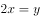。则甲的总价为，丙的总价为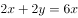。甲与丙的费用比为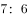。

故正确答案为D。

方法二：由于甲与乙、丙与丁的费用分别相等，则。乙比丁多1斤土豆，乙的费用要大于丁，排除B、C。代入A项可得，土豆和茄子的价格相等，但由于丙与丁费用相等，茄子的价格要大于土豆，矛盾。排除A项。

故正确答案为D。

---

### 第 2 题　qid 2030008 · 数学运算

某会议邀请10名专家参加，酒店住宿共安排了6个房间，要求甲专家与乙专家单独住一间（不再安排其他人入住），丙专家、丁专家安排住同一间，戊专家与己专家不安排在同一间。甲、乙、丙、戊、己专家房间均已确定，且每个房间均有两个床位，则此次住宿共有多少种不同的安排方式？

- **A**. 6种
- **B**. 9种
- **C**. 12种　✅
- **D**. 24种

**答案**：C

**官方解析**

甲、乙、丙、戊、己专家房间均已确定，且丙、丁专家安排住同一间，则剩余4人还未安排。选择1人和戊专家住同一间，有种方法；再从剩余3人中选择1人和己专家住同一间，有种方法；剩余2人住同一间。共有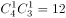种情况。

故正确答案为C。

---

### 第 3 题　qid 2030014 · 数学运算

有两个边长为整数且不相同的矩形，其中一边的长度分别为2016和2017，另一边的长度均不超过2017。已知它们的对角线长度相等，则两个矩形的周长之差为：

- **A**. 37
- **B**. 38
- **C**. 72　✅
- **D**. 76

**答案**：C

**官方解析**

设边长为2017的矩形另一个边长为，边长为2016的矩形另一个边长为。，因边长为整数，则周长差为偶数，排除A项。由于对角线长度相等，根据勾股定理有，化简得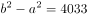，即。代入选项，B项：， 4033不能被20整除，排除；C项：，4033能被37整除，符合；D项：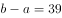，4033不能被39整除，排除。

故正确答案为C。

---

### 第 4 题　qid 2030036 · 数学运算

某商店销售一批尾货服装，在进价基础上溢价销售，销售一定数量后为尽快回收资金，计划将剩余的服装降价销售。商家发现如果以进价的销售的话，总销售收入与进价将相同。如商家希望获得相当于进价的利润，则剩余服装应在进价基础上：

- **A**. 
降价
　✅
- **B**. 
降价

- **C**. 
涨价

- **D**. 
涨价

**答案**：A

**官方解析**

设进价为，降价前销售件服装，降价后销售件服装，剩余服装的利润率为。根据题干可得，则。赋值降价前的销量为3件，则降价后的销量为2件。若要获得的利润，则有，，即降价。

故正确答案为A。

---

### 第 5 题　qid 2030052 · 数学运算

小张每天固定时间骑摩托车从家里到乡镇的木材加工厂上班，如果他以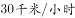的速度行驶，会比上班时间提前10分钟到达加工厂，如果他以的速度行驶，则会迟到12分钟。如果小张某天迟到了6分钟，则他的当天行驶速度是多少？

- **A**. 22　✅
- **B**. 23
- **C**. 24
- **D**. 25

**答案**：A

**官方解析**

设小张每天上班时间前小时从家里出发。根据题目条件，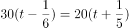，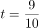小时。则小张家到木材厂的距离为。当天迟到6分钟，则行驶时间为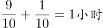。所以行驶速度为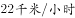。

故正确答案为A。

---

### 第 6 题　qid 2030058 · 数学运算

某运输公司组织甲、乙、丙三种型号的货车共30辆刚好把190吨货物从A地一次运往B地。已知甲货车数量和乙货车数量之和是丙货车数量的两倍，甲、乙、丙货车的载重量分别为5吨、7吨、8吨。车辆返程时需装载100吨货物从B地运到A地，则至少需要装载多少辆货车才能把货物全部运回A地？

- **A**. 13　✅
- **B**. 14
- **C**. 15
- **D**. 16

**答案**：A

**官方解析**

设甲、乙、丙三种型号的货车分别为、、，根据已知条件可得：

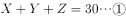

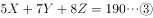

由①代入②可得，又由①和③可得，。

要使车辆尽可能少，则需使用载重量越大的车，丙车一共10辆，可装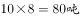，则剩余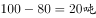，3辆乙车可装，因此至少需要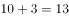辆车才能把100吨货物从B地运到A地。

故正确答案为A。

---

### 第 7 题　qid 2030062 · 数学运算

某工厂有3条无人值守生产线a、b和c。a生产线每生产2天检修1天，b生产线每生产3天检修1天，c生产线每生产4天检修1天。2017年（不是闰年）元旦三条生产线正好都检修，则当年3月有多少天只有1条生产线保持生产状态？

- **A**. 3
- **B**. 4　✅
- **C**. 5
- **D**. 6

**答案**：B

**官方解析**

由题干可知，a生产线3天为周期，则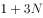的时候为检修日；b生产线四天为周期，则的时候为检修日；c生产线五天为周期，则的时候为检修日（N为自然数）。2017年1、2月总共，3月1日为第60天，三条生产线3月2日同时检修。a、b同时检修的周期为12天，则3月有2天同时检修；a、c同时检修的周期为15天，则3月有1天同时检修；b、c同时检修的周期为20天，则3月有1天同时检修；a、b、c同时检修的周期为60天，所以3月不存在第二次同时检修，因此有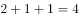天有两条生产线同时检修，即一条生产线保持生产状态。

故正确答案为B。

---

### 第 8 题　qid 2030078 · 数学运算

货车早上出发以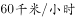的速度匀速驶往40公里外的货场装运货物，装运结束后以去时的速度匀速返回，并于中午到达，则货车装运货物的时间是其在路上行驶时间的多少倍？

- **A**. 1
- **B**. 1.4　✅
- **C**. 1.5
- **D**. 1.8

**答案**：B

**官方解析**

，早上八点出发到货场时间为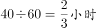，回来所需时间为，所以路上时间一共为，装货时间为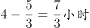，因此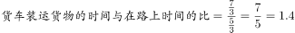。

故正确答案为B。

---

### 第 9 题　qid 2030086 · 数学运算

某学校2015年有的教师发表了核心期刊论文；有的教师承担了科研项目，这些教师中有公开发表了论文，这些论文均发表在核心期刊上。则发表了核心期刊论文但没有承担科研项目的教师是承担了科研项目但没有发表论文的多少倍？

- **A**. 4
- **B**. 7　✅
- **C**. 9
- **D**. 10

**答案**：B

**官方解析**

由“有的教师承担了科研项目，这些教师中有公开发表了论文”可得，有的教师发表了核心期刊论文且承担了科研项目；则发表了核心期刊论文但没有承担科研项目的教师有；承担了科研项目但没有发表论文的教师有，因为，因此发表了核心期刊论文但没有承担科研项目的教师是承担了科研项目但没有发表论文的教师的7倍。

故正确答案为B。

---

### 第 10 题　qid 2030106 · 数学运算

某机构调查居民订阅报纸的情况，发现的家庭订阅了日报，的家庭订阅了早报，的家庭订阅了晚报，的家庭没有订阅任何一种报纸，没有家庭同时订阅早报和晚报，则同时订阅日报和早报的家庭的比例在多少之间？

- **A**. 
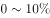

- **B**. 

- **C**. 

　✅
- **D**. 
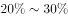

**答案**：C

**官方解析**

的家庭没有订阅任何一种报纸，则订阅报纸的家庭为，没有家庭同时订阅早报和晚报，则早报和晚报订阅的家庭为，因此只订阅日报的家庭为，所以同时订阅早报和日报的比例最多为，当这全部是同时订阅日报和晚报的时候也满足题意，此时同时订阅日报和早报的家庭为0，因此同时订阅日报和早报的家庭的比例在之间。

故正确答案为C。

---

## 判断推理

### 第 1 题　qid 2029956 · 图形推理

从所给的四个选项中，选择最合适的一个填入问号处，使之呈现一定的规律性：

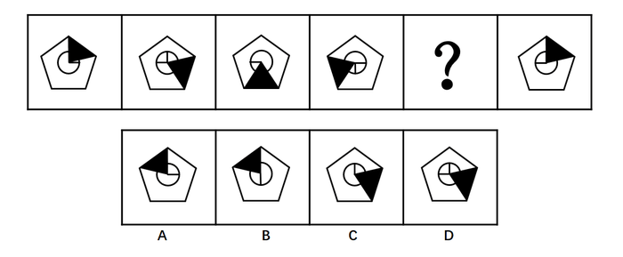

- **A**. A　✅
- **B**. B
- **C**. C
- **D**. D

**答案**：A

**官方解析**

题干给出图形均由五边形、圆形、阴影三角形和圆中的垂直的两条半径组成，元素组成相同，考虑位置关系。观察发现，前一图中的阴影三角形依次顺时针旋转72°（360°÷5），圆内垂直的两条半径依次逆时针旋转90°。根据阴影三角形的移动可排除CD，再根据圆内垂直的两条半径可排除B。
故正确答案为A。

---

### 第 2 题　qid 2029958 · 图形推理

从所给的四个选项中，选择最合适的一个填入问号处，使之呈现一定的规律性：

- **A**. A
- **B**. B　✅
- **C**. C
- **D**. D

**答案**：B

**官方解析**

元素组成相同，考虑位置规律。观察发现，25宫格内每行黑球的数目恒定，考虑黑球在同行中的平移。第一组图中，第一行黑球每次向右移动一个单位，第二行黑球每次向左移动一个单位，第三行黑球位置保持不变，第四行黑球每次向右移动两个单位（同行内循环跑），第五行图形黑球每次向右移动三个单位（同行内循环跑）。第二组图形遵循此规律，只有B项符合。
故正确答案为B。

---

### 第 3 题　qid 2029960 · 图形推理

从所给的四个选项中，选择最合适的一个填入问号处，使之呈现一定的规律性：

- **A**. A
- **B**. B
- **C**. C　✅
- **D**. D

**答案**：C

**官方解析**

元素组成不同，考虑属性规律和数量规律。观察发现，题干中奇数项图形均为全直线图形，偶数项图形均为全曲线图形，即全直线和全曲线组成的图形交替出现，？处应为全曲线图形，据此排除A、D选项。题干第二个图形为“日”字变形图，考虑笔画数考点，所有图形均能一笔画成。BC选项中只有C选项能够一笔画成。
故正确答案为C。

---

### 第 4 题　qid 2029962 · 图形推理

从所给的四个选项中，选择最合适的一个填入问号处，使之呈现一定的规律性：

- **A**. A
- **B**. B　✅
- **C**. C
- **D**. D

**答案**：B

**官方解析**

元素组成不同，考虑属性或者数数。观察发现属性无规律。考虑数数，图形中“窟窿”较多，可以先数面，面数量 1，3，2，2，2无规律；观察图形发现，第二幅图存在交叉，考虑数点，点数量3，7，5，5，10无规律；观察图形发现，除第三幅图外其余所有图形均由直线构成，考虑数线，直线数3，5，5，6，9无规律；并且在数线时发现，已知图形中均有多边形，其中包含直角三角形，直角梯形，正方形，每一幅图形中都有直角，考虑数直角数，直角数1，2，3，4，5为常数列。在选项中寻找直角数目为6的选项，选项中直角数目依次为2，6，2，5。
故正确答案为B。

---

### 第 5 题　qid 2029964 · 图形推理

从所给的四个选项中，选择最合适的一个填入问号处，使之呈现一定的规律性：

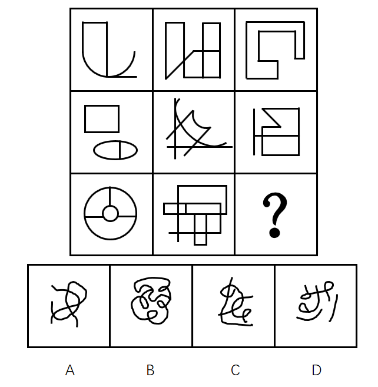

- **A**. A
- **B**. B
- **C**. C
- **D**. D　✅

**答案**：D

**官方解析**

九宫格图形，观察发现图形元素组成不同，考虑属性或者数数。观察发现属性无规律，考虑数数。图形中“窟窿”数比较多，考虑数面。发现，题干九宫格中面的数量分别是：

横向发现无规律，纵向发现，每列第三行面数量是前两行面数量之和。？处应该选择有3个面的选项，选项ABCD的面数量分别为4、6、4、3。

故正确答案为D。

---

### 第 6 题　qid 2029966 · 图形推理

把下面的六个图形分为两类，使每一类图形都有各自的共同特征或规律，分类正确的一项是：

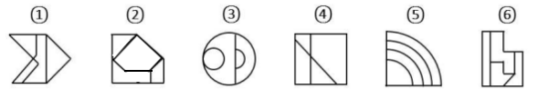

- **A**. ①②③，④⑤⑥
- **B**. ①③④，②⑤⑥
- **C**. ①④⑤，②③⑥
- **D**. ①④⑥，②③⑤　✅

**答案**：D

**官方解析**

题干给出的每幅图形都是由不同形状的面组成，图2、图3、图5图形内部都有和外轮廓形状相同的面，图1、图4、图6图形内部面的形状都与外轮廓不同。
故正确答案为D。

---

### 第 7 题　qid 2029968 · 图形推理

把下面的六个图形分为两类，使每一类图形都有各自的共同特征或规律，分类正确的一项是：

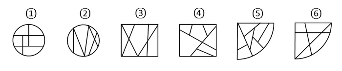

- **A**. ①②③，④⑤⑥
- **B**. ①②⑤，③④⑥
- **C**. ①③⑤，②④⑥
- **D**. ①⑤⑥，②③④　✅

**答案**：D

**官方解析**

方法一：图形组成凌乱，属性没有规律，考虑数量规律，观察题干给出的6个图形，图①和图②、图③和图④、图⑤和图⑥的外轮廓相同，区别在于这个外轮廓内部引出了不同数量的线条，可以考虑外轮廓与内部线条的交点，图①⑤⑥外轮廓与内部线条的交点数为6个，图②③④外轮廓与内部线条的交点数为7个。
方法二：观察图形发现，题干均为内部线条与外框相交构成的图形，其中图①⑤⑥中间有一个面不和外框相接，图②③④的面都和外框相接，即图①⑤⑥为一组，图②③④为一组。
故正确答案为D。
说明：如果这两种思路不是同一个选项，建议同学们选外框交点的选项，因为这个是常考考点。

---

### 第 8 题　qid 2030048 · 图形推理

左边是给定纸盒的外表面，右边哪一项能由它折叠而成？

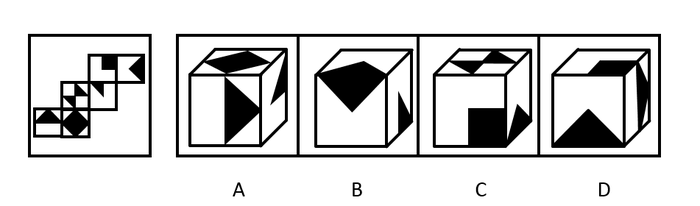

- **A**. A
- **B**. B
- **C**. C
- **D**. D　✅

**答案**：D

**官方解析**

A项：由面6、面4和面5组成，面5和面4在Z字型两端，为相对面，不可能同时出现，排除；

B项：选项前面和上面都和面2特征一样，但题干中面2只有一个，不可能同时出现2个，选项错误，排除；

C项：由面1、面3和面2组成，面3和面2在Z字型两端，为相对面，不可能同时出现，排除；

D项：与题干一致，当选；

故正确答案为D。

---

### 第 9 题　qid 2029970 · 逻辑判断

甲、乙、丙、丁、戊五人，其中两人是英语教育专业，两人是商贸英语专业，一人是英语翻译专业。五人中有两人找到了工作，并且他们的专业不同。
由此可以推出：

- **A**. 五人中未找到工作的来自不同的专业
- **B**. 五人中商贸英语专业的至多有一人未找到工作
- **C**. 五人中找到工作的人一定有来自商贸英语专业的
- **D**. 五人中未找到工作的人一定有来自英语教育专业的　✅

**答案**：D

**官方解析**

第一步：分析题干。
根据题干的“五人中有两人找到了工作，并且他们的专业不同”可知，找到工作的为三个专业中的其中两个专业。
第二步：逐一分析选项。
A项：如果找到工作的一个人为英语翻译专业，则没找到工作的三个人中有两人必为同一专业，排除；
B项：题干中并未明确找到工作的人的专业，如果是英语翻译专业和英语教育专业，则商贸英语专业的两人均未找到工作，排除；
C项：同理，题干中并未明确找到工作的人的专业，过于绝对，排除；
D项：找到工作的人的专业不同，英语教育专业的最多有一人找到工作，而英语教育专业的有两人在找工作，未找到工作的人一定有来自英语教育专业的，当选。
故正确答案为D。

---

### 第 10 题　qid 2029974 · 定义判断

首因效应是指个体在社会认知过程中，通过第一印象最先输入的信息对客体以后的认知产生显著的影响作用。第一印象作用最强，持续的时间也长，比以后得到的信息对于事物整个印象产生的作用更强。根据上述定义，下列首因效应没有发挥作用的是：

- **A**. 金融行业从业人员，一般着深色套装，给人专业和严谨的印象
- **B**. 小张在面试中表现突出，后公司的人力资源部发现小张的简历上存在错别字而取消了录用他的计划　✅
- **C**. 已过而立之年的王先生频频相亲却没有结果，据和他有过一面之交的金小姐说，王先生“以自我为中心”的夸夸其谈，令她很反感
- **D**. 刚刚毕业的小张在找工作过程中屡屡碰壁，后经咨询专业人士才得知因她染了一头红色的头发，而给人不够成熟稳重的感觉

**答案**：B

**官方解析**

第一步：找到定义关键词。
“通过第一印象最先输入的信息对客体以后的认知产生显著的影响作用”、“第一印象作用比以后得到的信息对于事物整个印象产生的作用更强”。
第二步：逐一分析选项。
A项：金融行业从业人员的衣着是为了给人专业和严谨的印象，属于“通过第一印象最先输入的信息对客体以后的认知产生显著的影响作用”，符合定义，排除；
B项：面试中的表现属于第一印象，然而后面发现简历上存在错别字而取消录用不符合“第一印象作用比以后得到的信息对于事物整个印象产生的作用更强”，不符合定义，当选；
C项：相亲时属于建立第一印象，相亲对象的评价属于“通过第一印象最先输入的信息对客体以后的认知产生显著的影响作用”，符合定义，排除；
D项：因为头发的颜色而给人不够成熟稳重的感觉属于“通过第一印象最先输入的信息对客体以后的认知产生显著的影响作用”，符合定义，排除。
本题为选非题，故正确答案为B。

---

### 第 11 题　qid 2029978 · 逻辑判断

从2002年开始，我国的离婚率就一路走高。专家表示，我国离婚率上升的原因不能简单解释为社会风气不好，一方面与原来整体离婚率水平比较低有关；另一方面也与中国社会方方面面的变化以及舆论环境、社会观念变化有关。以下哪项如果为真，最能支持专家观点？

- **A**. 据统计，在众多的离婚者中，年轻人所占的比率越来越大
- **B**. 统计显示，男女地位平等、个人自我意识的觉醒是我国离婚率上升的主要原因　✅
- **C**. 2015年我国离婚率最高的城市是北京，其后依次是上海、深圳、广州、厦门等城市
- **D**. 我国离婚率上升的原因其实非常复杂，除了社会风气的影响，还牵涉人的情感因素​

**答案**：B

**官方解析**

第一步：找到论点和论据。
论点：我国离婚率上升的原因不能简单解释为社会风气不好，一方面与原来整体离婚率水平比较低有关；另一方面也与中国社会方方面面的变化以及舆论环境、社会观念变化有关。
论据：无。 
第二步：逐一分析选项。
A项：论点讨论的是离婚率上升的原因，而A选项强调的是离婚中年轻人的比率，与论点无关，属于无关选项，排除；
B项：强调了离婚率上升的原因是男女地位平等、个人自我意识的觉醒，说明离婚率上升的原因确实和社会观念变化有关，通过补充新论据来支持论点，当选；
C项：讨论的是离婚率比较高的城市，与离婚率高的原因无关，属于无关选项，排除；
D项：指出离婚率上升的原因除了社会风气的影响，还牵涉人的情感因素，提出了新的原因，属于他因削弱，排除。
故正确答案为B。

---

### 第 12 题　qid 2029980 · 定义判断

职业认同感是指个体对其所从事的职业的肯定性评价。根据上述定义，下列人员具有职业认同感的是：

- **A**. 小王，军人，他常以自己足球踢得好而自豪
- **B**. 小刘，公司文员，多次被自己上司周经理表扬其秘书工作做得好
- **C**. 小魏，大学生，准备大学毕业后回到偏僻的家乡去教书，因为他觉得老师这个职业很伟大
- **D**. 小李，医生，工作特别努力，他觉得国家给他这么高的薪酬，能为他人解除痛苦是一种快乐　✅

**答案**：D

**官方解析**

第一步：找到定义关键词。
“个人”、“所从事的职业”、“肯定性评价”。
第二步：逐一分析选项。
A项：小王是军人，但是却为踢足球自豪，踢足球并不是他所从事的职业，因此不符合定义，排除；
B项：小刘是被上司表扬，并不能体现他自己对所从事工作的评价，因此不符合定义，排除；
C项：小魏要从事教师行业，但还没有毕业，还没有开始从事教师这一行业，因此小魏没有对自己所从事行业有肯定性评价，不符合定义，排除；
D项：小李是医生，并且觉得为他人解除痛苦是快乐，这是对其所从事职业的肯定性评价，符合定义，当选。
故正确答案为D。

---

### 第 13 题　qid 2029984 · 逻辑判断

一天，某老年服务中心管理人员给老年人安排活动：上午，在服务中心养老的男性老年人练习太极，女性老年人参加合唱练习；午休后，体力较弱的老年人安排室内活动，体力较强的老年人在室外活动。
由此可以推出的是：

- **A**. 在该中心养老的张婆婆午休后在室内活动
- **B**. 并非在该中心养老的男性老年人上午都练习太极
- **C**. 在该中心养老的男性老年人午休后不能在室外活动
- **D**. 有部分在该中心养老的老年人可能不参加任何活动　✅

**答案**：D

**官方解析**

根据题意，逐一分析选项。
A项：题干及选项未提到张婆婆是属于体力较弱还是较强的老年人，因此无法确定她午休后在室内还是室外活动，排除；
B项：题干中的活动安排指出“上午，在服务中心养老的男性老年人练习太极”，因此选项的说法与活动安排矛盾，排除；
C项：题干中午休后在室内或者室外活动是根据老年人的体力强弱来区分的，不能确定男性老年人是否为体力较弱的老年人，因此无法确定活动的具体地点，排除；
D项：根据活动安排，男性老年人练习太极，女性老年人参加合唱练习，因此男性老年人和女性老年人都安排了活动，一般来说老年人都有活动参加，但A、B、C三项已明确无法推出，且该项中含有“可能”的描述，可以认为实际上存在部分老年人由于一些原因，可能不参加任何活动的情况，可以推出，当选。
故正确答案为D。

---

### 第 14 题　qid 2029986 · 逻辑判断

有军事专家表示，X-47B无人机的着陆是无人航空发展方面的里程碑，它加剧了目前正在席卷全球的军用机器人技术革命的竞争。以下哪项如果为真，不能支持上述观点？

- **A**. 目前一些组织把机器人技术用于军事目的
- **B**. 一些国家在军用机器人技术方面可能赶超世界强国
- **C**. 某国加强军用机器人技术研发并部署无人机巡逻边界
- **D**. 很多网络公司都将注意力投向研制供消费者日常使用的机器人　✅

**答案**：D

**官方解析**

第一步：找到论点论据。
论点：X-47B无人机的着陆是无人航空发展方面的里程碑，它加剧了目前正在席卷全球的军用机器人技术革命的竞争。
论据：无。
第二步：逐一分析选项。
A项：目前一些组织把机器人技术用于军事目的，说明无人机可以用于军用机器人技术领域，可以支持，排除；
B项：一些国家在军用机器人技术方面可能赶超世界强国，说明军用机器人技术存在竞争，可以支持，排除；
C项：说明无人机正在被使用到军用机器人技术领域，可以支持，排除；
D项：日常使用的机器人，与题干的军用机器人完全无关，当选。
本题为选非题，故正确答案为D。

---

### 第 15 题　qid 2029990 · 定义判断

公理是指依据人类理性的不证自明的基本事实，经过人类长期反复实践的考验，不需要再加证明的基本命题。定理是建立在公理和假设基础上，经过严格的推理和证明得到的，它能描述事物之间内在关系，定理具有内在的严密性，不能存在逻辑矛盾。根据上述定义，下列描述属于公理的是：

- **A**. 三角形的内角和等于180度
- **B**. 过两点有且只有一条直线　✅
- **C**. 世界是物质的，物质是运动的
- **D**. 不值得做的事情，就不值得做好

**答案**：B

**官方解析**

第一步：找到定义关键词。

公理：“经过人类长期反复实践的考验，不需要再加证明的基本命题”。定理：“建立在公理和假设基础上，经过严格的推理和证明得到” 。

第二步：逐一分析选项。

A项：三角形的内角和等于180度是基于欧式几何中的平面三角形的，非欧几何中三角形的内角和不一定为180度，欧式几何中, ，是几何定理，不符合定义，排除；

B项：“过两点有且只有一条直线”是直线公理，也是经过人类长期反复实践的考验，不需要再加证明的基本命题，符合定义，当选；

C项：世界是物质的，物质是运动的，是马克思主义哲学中唯物论和辩证法的观点，马克思主义哲学还在实践中加以发展丰富，还需要再加以证明，不符合定义，排除；

D项：“不值得做的事情，就不值得做好”是不值得定律的内容，说的是是否符合价值观的事情，每个人的价值观是不同的，不是公理，不符合定义，排除。

故正确答案为B。

---

### 第 16 题　qid 2029994 · 逻辑判断

互联网旅游金融服务是指旅游业依托互联网工具，实现资金融通、支付和信息中介等业务的一种新兴金融服务。未来，互联网旅游金融服务也更具有优势。以下哪项如果为真，最能支持上述观点？

- **A**. 
随着收入的增加，人们越来越热衷于旅游

- **B**. 
目前已经使用旅游金融产品的用户只占到

- **C**. 
中国在线旅游用户中36~45岁选择旅游金融服务的比例较高

- **D**. 
旅游金融服务具有覆盖用户面更广、服务更便捷高效的优点
　✅

**答案**：D

**官方解析**

第一步：找到论点论据。

论点：未来，互联网旅游金融服务也更具有优势。

论据：无。

第二步：逐一分析选项。

A项：人们越来越热衷于旅游，但是旅游的方式不明确，无法加强，排除；

B项：目前已经使用旅游金融产品的用户只占到，目前的情况无法推知未来的情况，不能加强，排除；

C项：中国在线旅游用户中36~45岁选择旅游金融服务的比例较高，但是不明确中国在线旅游用户占旅游人数的比例，也不知道36~45岁用户在中国在线旅游用户中的比例，不明确选项，无法加强，排除；

D项：旅游金融服务具有覆盖用户面更广、服务更便捷高效的优点，补充论据加强了论点，当选。

故正确答案为D。

---

### 第 17 题　qid 2029996 · 定义判断

内隐社会认知是指在社会认知过程中虽然个体不能回忆某一过去经验，但这一经验对个体的行为和判断依然具有潜在影响的认知现象。
根据上述定义，下列行为符合内隐社会认知的是：

- **A**. 某一品牌幼儿园出现了虐童事件，家长都无法相信这种事件会出现
- **B**. 二十岁的佳佳很怕狗，这是因为她一岁半时被邻居家的狗吓过　✅
- **C**. 小辉学了六年钢琴，后因学习不得不放弃，一次宴会上，他看到钢琴随即演奏一曲
- **D**. 小魏看到某商场在做微波炉的广告，她想到自己家正好缺少微波炉，不如趁便宜买台微波炉

**答案**：B

**官方解析**

第一步：找出定义关键词。
“个体不能回忆某一过去经验”、“这一经验对个体的行为和判断依然具有潜在影响”。
第二步：逐一分析选项。
A项：家长都无法相信“虐童事件”未体现出“个体不能回忆某一过去经验”，不符合定义，排除；
B项：“二十岁的佳佳很怕狗”体现了“这一经验对个体的行为和判断依然具有潜在影响”，而她一岁半的时候被邻居家的狗吓过，一岁半时发生的事情一般来说长大后是没有印象的，体现了“个体不能回忆某一过去经验”，符合定义，当选；
C项：“小辉学了六年钢琴”不符合关键词“个体不能回忆某一过去经验”，不符合定义，排除；
D项：“想到自己家正好缺少微波炉”不符合关键词“个体不能回忆某一过去经验”，不符合定义，排除。
故正确答案为B。

---

### 第 18 题　qid 2029998 · 类比推理

某种品牌的化肥生产，其废水排放物如果进入河里，会导致红鳟鱼不产卵，从而导致鱼的数量减少。一家建在河流不远处的化工厂在生产该品牌的化肥后，养殖户在该流域养的红鳟鱼排卵数量剧减。因此这家化工厂在生产化肥时一定污染了河水。以下哪项所包含的推理错误与上述推理最相似？

- **A**. 营养不良的容易生病，李某很胖但检查各项指标没有营养不良，所以他肯定不容易染病
- **B**. 重度失眠者经常熬夜，张某是一名大学教师，经常熬夜工作到两点，所以张某很可能是一位重度失眠者
- **C**. 幽门螺旋杆菌检测呈阳性的人会得胃溃疡，张某得了胃溃疡疾病，所以张某的幽门螺旋杆菌一定呈阳性　✅
- **D**. 人吃肥肉可以导致心血管疾病发病率增大，最近老王外出应酬吃了两次回锅肉，体重增加，一定是得了心血疾病

**答案**：C

**官方解析**

第一步：翻译题干。

化肥废水排放物进入河里红鳟鱼不产卵，由养殖户在该流域养的红鳟鱼排卵数量剧减得出这家化工厂在生产化肥时一定污染了河水，是肯后肯前。

第二步：逐一翻译选项。

A项：营养不良容易生病，由检查各项指标没有营养不良得出不容易染病，否前否后，与题干推理形式不一致，排除；

B项：重度失眠者经常熬夜，熬夜工作到两点得出张某很可能是一位重度失眠者，肯后得到了一个可能性的结论，与题干推理形式不一致，排除；

C项：幽门螺旋杆菌检测呈阳性的人得胃溃疡，由张某得胃溃疡疾病得出其幽门螺旋杆菌一定呈阳性，肯后肯前，当选；

D项：人吃肥肉心血管疾病发病率增大，由老王外出应酬吃了两次回锅肉得出心血疾病，肯前肯后，与题干推理形式不一致，排除。

故正确答案为C。

---

### 第 19 题　qid 2030000 · 定义判断

生态补偿是在经济社会发展中对生态功能和质量所造成损害的一种补助，其目的是为了提高受损地区的环境质量或者用于创建新的具有相似生态功能和环境质量的区域。生态补偿在原则上适用谁破坏谁补偿。根据上述定义，下列属于生态补偿的是：

- **A**. 某建筑公司在甲地破坏1公顷森林，在乙地重新营造1公顷森林　✅
- **B**. 张某为扩大土豆种植面积，租用邻居耕地20亩，经商议，租赁费为每年2万元
- **C**. 山东省根据各市环境空气质量情况发放奖金，其中聊城空气质量考核得分最高，获奖950万元
- **D**. 李某非法占用基本农田5亩，被以非法占用农用地罪判处有期徒刑1年6个月，并处罚金人民币1.5万元

**答案**：A

**官方解析**

第一步：找到定义关键词。
方式“对生态功能和质量所造成损害补助”，目的“提高受损地区的环境质量或者用于创建新的具有相似生态功能和环境质量的区域”，原则“谁破坏谁补偿”。
第二步：逐一分析选项。
A项：在甲地破坏1公顷森林体现了“对生态功能和质量造成损害”，在乙地重新营造1公顷森林体现了“创建新的具有相似生态功能和环境质量的区域”，也体现了“谁破坏谁补偿”，符合定义，当选；
B项：租用邻居耕地20亩未体现“生态功能和质量造成损害”，不符合定义，排除；
C项：山东省根据各市环境空气质量情况发放奖金是为了鼓励提高环境质量，但是未体现该地区是否受损或者创建新的具有相似生态功能和环境质量的区域，也未体现“谁破坏谁补偿”，不符合定义，排除；
D项：非法占用基本农田被处罚金未体现方式“对生态功能和质量所造成损害补助”，不符合定义，排除。
故正确答案为A。

---

### 第 20 题　qid 2030004 · 逻辑判断

北冰洋北部的小头睡鲨的生长速度很慢，每年甚至还不到1cm，而它们的成年体长又极大，因此它们的寿命就成为一个很吸引人的话题。研究者发现，小头睡鲨几乎没有像硬骨鱼类那样可以用来测定年龄的组织，不过有其他人在研究鲸鱼年龄时用到了眼睛，因此研究者认为小头睡鲨的年龄是可以通过其眼睛来测定的。
以下哪项如果为真，最能支持上述观点？

- **A**. 通过研究晶状体核，有人测出了鲸鱼的实际年龄
- **B**. 眼睛晶状体最核心位置的晶状体核在小头睡鲨还是幼崽时就有了
- **C**. 眼睛的晶状体是不断生长的，成年小头睡鲨的晶状体比幼年的大　✅
- **D**. 小头睡鲨眼睛的晶状体有结晶蛋白，在代谢上不活跃，甚至可以视为“死的”组织

**答案**：C

**官方解析**

第一步：找出论点和论据。
论点：小头睡鲨的年龄是可以通过其眼睛来测定的。
论据：有其他人在研究鲸鱼年龄时用到了眼睛。
论点和论据讨论的都是如何测定小头睡鲨的年龄，二者话题一致，加强优先考虑补充论据。
第二步：逐一分析选项。
A项：根据晶状体核测出鲸鱼实际年龄，但是论点讨论的是小头睡鲨，鲸鱼可以通过眼睛测出年龄，不代表小头睡鲨也可以通过眼睛测出年龄，属于不明确选项，排除；
B项：眼睛的晶状体核在小头睡鲨是幼崽时就有了，但是晶状体核与小头睡鲨的年龄之间的关系不知道，属于不明确选项，排除；
C项：成年小头睡鲨的晶状体比幼年的大，晶状体不断生长，解释论点，说明晶状体随着年龄的变化而变化，即可以根据眼睛测定小头睡鲨的年龄，加强论点，当选；
D项：小头睡鲨眼睛晶状体有结晶蛋白，视为“死的”组织，说明小头睡鲨眼睛的结晶蛋白是不变的，无法根据它测出小头睡鲨的年龄，削弱论点，排除。
故正确答案为C。

---

### 第 21 题　qid 2030006 · 定义判断

体验式教学法是指在教学过程中为了达到既定的教学目的，从教学需要出发，引入、创造或创设与教学内容相适应的具体场景或氛围，以引起学生的情感体验，帮助学生迅速而正确地理解教学内容，促进他们的心理机能全面和谐发展的一种教学方法。根据上述定义，下列没有采用体验式教学法的是：

- **A**. 在刑法课堂上，由学生扮演老师进行案例分析　✅
- **B**. 在模拟法庭上，学生充当律师对证人进行直接询问和交叉询问
- **C**. 法律诊所中，学生们直接会见当事人，教师通过视频指导和督导学生
- **D**. 在民事诉讼法课堂上，教师给学生分配角色，分别担任当事人、律师和法官

**答案**：A

**官方解析**

第一步：找到定义关键词。
方式“引入、创造或创设与教学内容相适应的具体场景或氛围”，目的“引起学生的情感体验，帮助学生迅速而正确地理解教学内容，促进他们的心理机能全面和谐发展”。
第二步：逐一分析选项。
A项：学生“扮演”的是教师的角色，只是从老师角度分析刑法案例，而不是扮演具体的法律情景，不符合定义，当选；
B项：模拟法庭上学生充当律师，是对具体教学内容的场景模拟，属于创造与教学内容相适应的具体场景，符合定义，排除；
C项：教师通过视频指导法律诊所中的学生，属于引入与教学相适应的具体场景，符合定义，排除；
D项：教师让学生扮演诉讼中的角色，属于创造与教学内容相适应的具体场景，符合定义，排除。
本题为选非题，故正确答案为A。

---

### 第 22 题　qid 2030012 · 定义判断

国际经济法是调整国家、国际组织、法人、自然人从事跨国经济交往活动所产生的关系的国际法和国内法的总称。根据上述定义，下面说法错误的是：

- **A**. 国际经济法既包括国际法也包括国内法
- **B**. 跨国婚姻关系不属于国际经济法调整的对象
- **C**. 国际经济法包含了国家之间关于海洋领土划界的协议　✅
- **D**. 跨国经济交往活动的主体有国家、国际组织、法人和自然人

**答案**：C

**官方解析**

第一步：找到定义关键词。
“调整国家、国际组织、法人、自然人”、“从事跨国经济交往活动”、“国际法和国内法的总称”。
第二步：逐一分析选项。
A项：根据定义可知，国际经济法是国际法和国内法的总称，故其包括国内法也包括国际法，符合定义，排除；
B项：婚姻关系的确不属于跨国经济交往活动，故不属于国际经济法的调整对象，符合定义，排除；
C项：海洋领土划界的协议，涉及到了领土问题，已经不再是经济交往活动，而是政治活动了，不符合定义，当选；
D项：根据定义可知，跨国经济交往活动的主体包括国家、国际组织、法人、自然人，符合定义，排除。
本题为选非题，故正确答案为C。

---

### 第 23 题　qid 2030016 · 定义判断

我国刑法规定，抢劫罪是指以非法占有为目的，对他人人身采取暴力、暴力威胁或者其他方法，强行获取公私财物的行为。根据上述定义，下列行为不构成抢劫罪的是：

- **A**. 王某趁张某不备，抢走其价值10000元的背包　✅
- **B**. 洪某在火车上将安眠药注入饮料罐让张某喝下，趁其昏睡盗走其现金10000元
- **C**. 李某夜晚入户盗窃，取走张某衣服中的5000元现金。张某被惊醒，李某持刀威胁张某后携财物逃走
- **D**. 张某欠刘某5000元不还，刘某将张某骗至家中，威逼张某交出其银行卡并说出密码，刘某到银行取走10000元后，将张某放回

**答案**：A

**官方解析**

第一步：找到定义关键词。
目的：“非法占有”，方式：“对他人人身采取暴力、暴力威胁或者其他方法，强行获取公私财物的行为”。
第二步：逐一分析选项。
A项：王某是趁其不备抢走的，并不是“强行获取”，也未对张某的人身造成威胁，不符合方式，故不符合定义，当选；
B项：洪某是通过安眠药注入的方式将钱盗走，已经对张某的人身造成威胁，符合定义，排除；
C项：李某最初是盗窃，但后来又通过持刀威胁的方式强行获取财物，符合定义，排除；
D项：刘某是以威逼的方式将张某银行卡内的钱取走，符合定义，排除。
本题为选非题，故正确答案为A。

---

### 第 24 题　qid 2030022 · 类比推理

上下：前后

- **A**. 有无：朝暮
- **B**. 左右：东西　✅
- **C**. 多少：正反
- **D**. 异同：生死

**答案**：B

**官方解析**

第一步：判断题干词语间逻辑关系。
上和下是并列关系，前和后是并列关系，且上下和前后是四个不同的方位，属于同一范畴。
第二步：判断选项词语间逻辑关系。
A项：有和无是并列关系，朝和暮是并列关系，但有无和朝暮并无直接关系，不属于同一范畴，与题干逻辑关系不一致，排除；
B项：左和右是并列关系，东和西是并列关系，且左右和东西是四个不同方位，属于同一范畴，与题干逻辑关系一致，当选；
C项：多和少是并列关系，正和反是并列关系，但多少与正反并无直接关系，不属于同一范畴，与题干逻辑关系不一致，排除；
D项：异和同是并列关系，生和死是并列关系，但异同和生死并无直接关系，不属于同一范畴，与题干逻辑关系不一致，排除。
故正确答案为B。

---

### 第 25 题　qid 2030024 · 类比推理

碧螺春：茶叶：江苏

- **A**. 大熊猫：动物：中国　✅
- **B**. 火锅：川菜：重庆
- **C**. 胡萝卜：蔬菜：营养
- **D**. 木兰：植物：四川

**答案**：A

**官方解析**

第一步：判断题干词语间逻辑关系。
碧螺春是茶叶的一种，前两词为种属关系；碧螺春故乡是江苏。
第二步：判断选项词语间逻辑关系。
A项：大熊猫是一种动物，大熊猫的故乡是中国，与题干逻辑关系相符，当选；
B项：火锅一般而言，是以锅为器具，以热源烧锅，以水或汤烧开，来涮煮食物的烹调方式，同时亦可指这种烹调方式所用的锅具。川菜即四川菜肴，是中国特色传统的四大菜系之一。火锅和川菜不是种属关系，重庆是川菜的代表城市，与题干逻辑关系不符，排除；
C项：胡萝卜是蔬菜的一种，营养是蔬菜的属性，与题干逻辑关系不符，排除；
D项：木兰是一种植物，木兰的产地是福建，江苏，江西，浙江，安徽等地，而不是四川，与题干逻辑关系不符，排除。
故正确答案为A。

---

### 第 26 题　qid 2030028 · 类比推理

学生：男学生：女学生

- **A**. 旋转：顺时针：逆时针
- **B**. 整数：正数：负数
- **C**. 餐具：盘子：筷子
- **D**. 词语：实词：虚词　✅

**答案**：D

**官方解析**

第一步：判断题干词语间逻辑关系。
男学生和女学生是矛盾关系，且两者与学生是种属关系。
第二步：判断选项词语间逻辑关系。
A项：顺时针和逆时针是矛盾关系，但是与旋转不是种属关系，不符合题干逻辑关系，排除；
B项：正数和负数不是矛盾关系，还有一个0存在，且正数包含正整数、正分数、正无理数，所以正数和负数与整数之间也不是种属关系，不符合题干逻辑关系，排除；
C项：盘子和筷子是反对关系，不是矛盾关系，不符合题干逻辑关系，排除；
D项：实词和虚词是矛盾关系，且实词和虚词与词语之间是种属关系，符合题干的逻辑关系，当选。
故正确答案为D。

---

### 第 27 题　qid 2030032 · 类比推理

沼气：甲烷：气体

- **A**. 盐酸：氯化钠：液态
- **B**. 体温计：水银：液体
- **C**. 铁锈：三氧化二铁：固体　✅
- **D**. 水蒸气：水：水滴​

**答案**：C

**官方解析**

第一步：判断题干词语间逻辑关系。
甲烷是沼气的组成部分，二者为组成关系；且甲烷和沼气都是气体，前两词和第三词为种属关系。
第二步：判断选项词语间逻辑关系。
A项：盐酸是氯化氢的水溶液，而非氯化钠，与题干逻辑关系不一致，排除；
B项：水银是体温计的组成部分，二者为组成关系，但体温计不是液体，与题干逻辑关系不一致，排除；
C项：三氧化二铁是铁锈的组成部分，二者为组成关系，且铁锈和三氧化二铁都是固体，前两词和第三词为种属关系，与题干逻辑关系一致，当选；
D项：水蒸气是水的气体形式，且水不是水滴的一种，与题干逻辑关系不一致，排除。
故正确答案为C。

---

### 第 28 题　qid 2030034 · 类比推理

面粉：鸡蛋：蛋糕

- **A**. 香蕉：西瓜：水果
- **B**. 纸张：打印机：文件
- **C**. 菊花：茱萸：重阳
- **D**. 水泥：钢筋：房屋​　✅

**答案**：D

**官方解析**

第一步：判断题干词语间逻辑关系。
面粉和鸡蛋是并列关系，面粉和鸡蛋都是制作蛋糕的原材料，是原材料和成品的对应关系。
第二步：判断选项词语间逻辑关系。
A项：香蕉和西瓜都是一种水果，是种属关系，与题干逻辑关系不一致，排除；
B项：纸张和打印机是配套使用的关系，与题干逻辑关系不一致，排除；
C项：重阳节有佩戴菊花和插茱萸的习俗，是传统节日与习俗的对应关系，与题干逻辑关系不一致，排除；
D项：水泥和钢筋是并列关系，水泥和钢筋都是建造房屋的原材料，是原材料和成品的对应关系，与题干逻辑关系一致，当选。
故正确答案为D。

---

### 第 29 题　qid 2030040 · 类比推理

社会科学：社会学：家庭社会学

- **A**. 艺术科学：钢琴：小提琴
- **B**. 人文科学：哲学：历史学
- **C**. 自然科学：化学：分析化学　✅
- **D**. 文学：美国文学：文献翻译​

**答案**：C

**官方解析**

第一步：判断题干词语间逻辑关系。
社会学是社会科学的一种，家庭社会学是社会学的一种，为种属关系。
第二步：判断选项词语间逻辑关系。
A项：钢琴不是艺术科学的一种，小提琴也不是钢琴的一种，与题干逻辑关系不一致，排除；
B项：哲学是人文科学的一种，历史学不是哲学的一种，与题干逻辑关系不一致，排除；
C项：化学是自然科学的一种，分析化学是化学的一种，与题干逻辑关系一致，当选；
D项：美国文学是文学的一种，文献翻译是一种方式，不是美国文学的一种，与题干逻辑关系不一致，排除。
故正确答案为C。

---

### 第 30 题　qid 2030044 · 类比推理

电子书：纸质书：阅读

- **A**. 油画：素描：绘画
- **B**. 卷尺：长方形：测量
- **C**. 计算器：算盘：计算　✅
- **D**. 天平：体重秤：称重

**答案**：C

**官方解析**

第一步：判断题干词语间逻辑关系。
电子书和纸质书是书籍的两种形式，两者为并列关系，都可以用来阅读，第三词为前两词的功能。
第二步：判断选项词语间逻辑关系。
A项：油画和素描是不同的两种绘画形式，两者为并列关系，前两词与第三词为种属关系，不符合题干逻辑关系，排除；
B项：卷尺是测量的工具，长方形是一种几何图形，二者无明显关系，不符合题干逻辑关系，排除；
C项：计算器和算盘是并列关系，二者的功能都是计算，与题干逻辑关系一致，保留；
D项：天平和体重秤是并列关系，二者都可以用来称重，与题干逻辑关系一致，保留。
比较C、D两项，题干的电子书和纸质书，前者为新兴书籍，纸质书为传统书籍；C项中计算器为现代计算工具，算盘为古代计算工具；而D项中天平和体重秤都是现代称重工具，并且体重秤一般情况下只用来称体重，所以C项更优。
故正确答案为C。

---

## 资料分析

### 材料 1

        2015年，某市非公有制经济实现增加值348.12亿元，比上年净增加23.69亿元，非公有制经济增加值占GDP的比重为。其中，民营经济增加值335.24亿元，外商经济增加值11.84亿元，港澳台经济增加值1.04亿元，分别比“十一五”末（2010年）增长、和。

        2015年，非公有制经济第一、二、三产业结构之比由上年的调整为。与“十一五”末相比，第一、三产业比重下降了3.9和3.5个百分点，第二产业比重上升了7.4个百分点。在第二产业中，工业增加值占非公有制经济增加值比重为，比“十一五”末提高7.8个百分点。

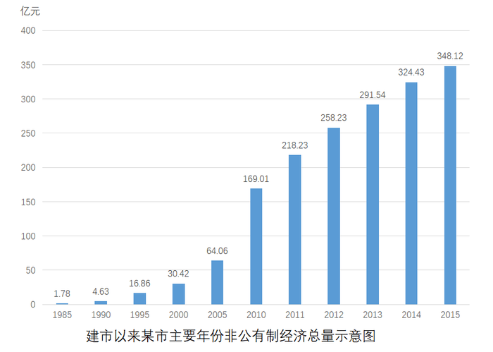

#### 第 1 题　qid 2030120 · 平均数

2011—2015年间，该市非公有制经济增加值增长多于2005—2010年平均值的年份有多少个？

- **A**. 2
- **B**. 3
- **C**. 4
- **D**. 5　✅

**答案**：D

**官方解析**

根据“2011—2015年间，······增长多于2005—2010年平均值的年份”判断本题为增长量比较问题。2011—2015年的非公有制经济增加值的增长量分别为亿元，亿元，亿元，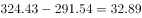亿元，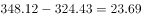亿元。2005—2010年，2011—2015这5年的增长量都高于2005—2010年平均值。

故正确答案为D。

---

#### 第 2 题　qid 2030124 · 比重

2015年，该市外商经济增加值占GDP的比重约为：

- **A**. 

- **B**. 

　✅
- **C**. 

- **D**. 

**答案**：B

**官方解析**

根据“2015年，该市外商经济增加值占GDP的比重”判断本题为现期比重问题。定位材料第一段，“2015年，某市非公有制经济实现增加值348.12亿元非公有制经济增加值占GDP的比重为外商经济增加值11.84亿元。”。

故正确答案为B。

---

#### 第 3 题　qid 2030130 · 比重

与2010年相比，2014年该市非公有制经济中第三产业比重：

- **A**. 上升了3.4个百分点
- **B**. 上升了3.6个百分点
- **C**. 下降了3.4个百分点　✅
- **D**. 下降了3.6个百分点

**答案**：C

**官方解析**

根据“与2010年相比，2014年······比重”，选项为上升/下降了+百分点，判断本题为两期比重问题。定位材料第二段，2014年，非公有制经济第一、二、三产业结构之比为。2015年三大产业结构之比为，与“十一五”末相比，第三产业比重下降了3.5个百分点，，即下降了3.4个百分点。

故正确答案为C。

---

#### 第 4 题　qid 2030132 · 增长

以下各时间段中，该市非公有制经济增加值年均增速最快的是：

- **A**. 1990—1995年　✅
- **B**. 1995—2000年
- **C**. 2000—2005年
- **D**. 2005—2010年

**答案**：A

**官方解析**

根据“······年均增速最快的是”判断本题为年均增长率比较问题。年均增长率：。定位图表，直接比较。A项：；B项：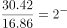；C项：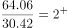；D项：。1990—1995年的年均增速最快。

故正确答案为A。

---

#### 第 5 题　qid 2030136 · 增长

关于该市非公有制经济增加值发展状况，能够从上述资料中推出的是：

- **A**. 2015年该市非公有制经济的经济增加值是30年前的200倍以上
- **B**. 2015年该市工业增加值占第二产业非公有制经济增加值比重超过八成　✅
- **C**. 2010年该市非公有制经济中第三产业比重比第一产业高23.7个百分点
- **D**. 2010—2015年，该市港澳台经济增加值年均增量高于民营经济增加值

**答案**：B

**官方解析**

A项：定位材料第一段及图表，2015年该市非公有制经济的经济增加值为348.12亿元，1985年为1.78亿元。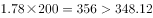，所以不到200倍，错误；

B项：定位材料第二段，工业增加值占非公有制经济增加值比重为，第二产业占非公有制经济增加值比重为。则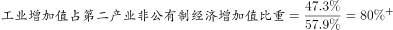，超过八成，正确；

C项：定位材料第二段，2015年，第一、三产业占比分别为，，与“十一五”末相比，比重下降3.9和3.5个百分点。，错误；

D项：定位材料第一段，2015年民营经济增加值335.24亿元，港澳台经济增加值1.04亿元，分别比2010年增长、。年份相同，直接比较总的增长量。民营经济的总增长量为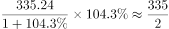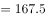亿元，港澳台的总增长量为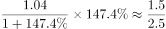。民营经济增长量大于港澳台经济增长量，错误。

故正确答案为B。

---

### 材料 2

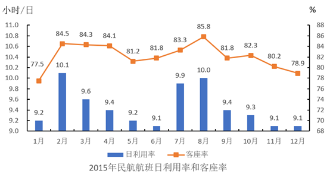

日利用率：飞机在一日内平均提供的生产飞行小时数

客座率：承运的旅客数量与飞机可提供的座位数之比

#### 第 6 题　qid 2030138 · 综合

2015年，飞机日利用率最高和客座率最高的月份之间相隔多少个月？

- **A**. 5个月　✅
- **B**. 6个月
- **C**. 7个月
- **D**. 8个月

**答案**：A

**官方解析**

根据柱状图可知，2015年飞机日利用率最高的月份为2月，客座率最高的月份为8月，之间相隔5个月。
故正确答案为A。

---

#### 第 7 题　qid 2030140 · 平均数

2015年，平均每架民航飞机月飞行时间超过300小时的月份有多少个？

- **A**. 1个
- **B**. 2个　✅
- **C**. 3个
- **D**. 4个

**答案**：B

**官方解析**

根据题干中的“平均每架民航飞机月飞行时间”，且，可判定此题为现期计算问题。其中1、3、5、7、8、10、12月为31天，2月为28天，其余均为30天。要使平均每架民航飞机月飞行时间超过300小时，即日利用率在天数为31的月份大于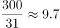，天数为30的月份大于，2月大于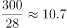。满足条件的有7月与8月两个月份。

故正确答案为B。

---

#### 第 8 题　qid 2030142 · 平均数

某航班由400个座位的B747-400飞机执飞，其每天飞行的客座率都与当月所有航班的平均客座率相同。则2015年1月该航班共有多少个空位未卖出？

- **A**. 不到1500个
- **B**. 1500个~2100个之间
- **C**. 2100个~2700个之间
- **D**. 超过2700个　✅

**答案**：D

**官方解析**

根据题干中的“其每天飞行的客座率都与当月所有航班的平均客座率相同”，可判定此题为现期比重问题。根据柱状图可知，2015年1月的客座率为，且该航班为400个座位，则该月未卖出的空位为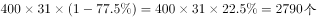。

故正确答案为D。

---

#### 第 9 题　qid 2030144 · 增长

2015年2—12月间，飞机日利用率与上月相比增幅排名第三的月份，客座率增幅在所有月份中排名：

- **A**. 第四
- **B**. 第三
- **C**. 第二　✅
- **D**. 第一

**答案**：C

**官方解析**

由图可知，飞机日利用率与上月相比增幅排名前三依次为2月【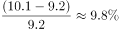】、7月【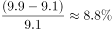】、8月【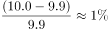】]；8月的客座率增幅为（），仅次于2月的增幅（），排名第二。

故正确答案为C。

---

#### 第 10 题　qid 2030148 · 综合

能够从上述资料中推出的是：

- **A**. 
2015年下半年，日利用率与上月相比上升的月份数少于下降的月份数
　✅
- **B**. 
承运旅客数量超过航班提供座位总数的月份，航班日利用率均超过9.5小时

- **C**. 
如2015年各月民航飞机数不变，则第四季度平均日利用率在小时之间

- **D**. 
一架每天飞行且日利用率与当月均值相同的飞机，11月的总飞行时间和12月相同

**答案**：A

**官方解析**

A项：根据柱状图可知，2015年下半年日利用率与上月相比上升的月份有2个，下降的3个，满足上升数少于下降数，正确；

B项：承运旅客数量超过航班提供座位总数的月份即客座率大于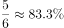，根据柱状图可知，4月日利用率未超过9.5，错误；

C项：第四季度为10月（31天）、11月（30天）、12月（31天），根据柱状图可知，其日利用率分别为9.3、9.1、9.1，根据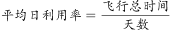，错误；

D项：，根据柱状图可知，11月、12月日利率均为9.1，但天数分别为30、31天，所以总飞行时间两月不相同，错误。

故正确答案为A。

---

### 材料 3

        2015年，某省对农民工在本市（区、县）创业的意愿进行了调查，共完成有效样本3000个，调查结果如下：

#### 第 11 题　qid 2030154 · 综合

在被调查的农民工中，自主创业兴趣意愿很强的农民工人数约为多少人？

- **A**. 220
- **B**. 240
- **C**. 255　✅
- **D**. 275

**答案**：C

**官方解析**

结合文字材料与饼状图可知，本次调查样本为3000人，其中自主创业兴趣意愿很强的农民工所占比重为，故求相应的人数可判定本题为现期比重中部分量的计算问题。根据公式：，自主创业兴趣意愿很强的。

故正确答案为C。

---

#### 第 12 题　qid 2030158 · 平均数

2014年该省平均每家农民工回乡创办的企业当年实现产值与上年的情况相比，约：

- **A**. 
下降了

- **B**. 
下降了
　✅
- **C**. 
上升了

- **D**. 
上升了

**答案**：B

**官方解析**

题干所求为“平均每家创办的企业实现产值”的同比增长率，故可判定本题为平均数的增长率计算问题。根据表格材料可得，2014年平均每家创办的，2013年。根据公式可得，2014年，即下降了。

故正确答案为B。

---

#### 第 13 题　qid 2030160 · 平均数

以下折线图中，能准确反映2011—2014年间该省平均每创办一个企业所需的创业者人数的变化关系的是：

- **A**. A
- **B**. B　✅
- **C**. C
- **D**. D

**答案**：B

**官方解析**

题干需求出“2011-2014年平均每创办一个企业所需要的人数的变化趋势”，故可将本题转化为平均数的比较问题。定位表格，2011-2014年平均每创办一个企业所需要的人数分别为：、、、。首先比较2011与2012年，前者分母超过后者分母的2倍，而分子远小于2倍，分母变大，分数变小，后者要大，即2012年数据大，即前两年为上升趋势，排除A、D选项。其次比较2013与2014年，2013年人数直除首位可商8，2014年人数直除首位只能商6，故2013年数据大，2013至2014年为下降趋势，B项满足，当选。

故正确答案为B。

---

#### 第 14 题　qid 2030164 · 综合

根据调查结果，哪项举措最有可能有效提升农民工回乡创业的意愿？

- **A**. 设立农民工创业孵化基地
- **B**. 开设课堂让成功创业者传授经验
- **C**. 开放农民工创业贷款绿色通道
- **D**. 大量开放适合农民工的创业项目　✅

**答案**：D

**官方解析**

根据图1可知，在农民工自主创业的障碍中，缺乏合适的创业项目所占比重最高，故最有可能有效提升农民工回乡创业意愿的举措为大量开放适合农民工的创业项目，D项正确。
故正确答案为D。

---

#### 第 15 题　qid 2030170 · 综合

能从上述资料中推出的是：

- **A**. 超过1000名被调查者已经开始自主营业
- **B**. 不到100名调查者的家人及朋友不支持被调查者创业
- **C**. 2011年该省平均每个农民工回乡创办企业的产值超过200万元
- **D**. 2013年该省平均每名回乡农民工创业者当年创业实现的产值是上一年的两倍以上　✅

**答案**：D

**官方解析**

A项：结合文字材料与饼状图，已经开始自主营业的，错误；

B项：结合文字材料与柱状图，家人朋友不支持的调查者，错误；

C项：根据表格可得，2011年平均每个农民工回乡创办企业的，错误；

D项：根据表格，2013年平均每名农民工回乡创业实现的，2012年平均每名农民工回乡创业实现的。，故两倍以上说法正确。

故正确答案为D。

---
