# 2016年山东省公务员录用考试《行测》题

> 省考 · 2016 年 · 5 个模块 · 共 120 题

- [常识判断](#%E5%B8%B8%E8%AF%86%E5%88%A4%E6%96%AD) · 20 题
- [言语理解与表达](#%E8%A8%80%E8%AF%AD%E7%90%86%E8%A7%A3%E4%B8%8E%E8%A1%A8%E8%BE%BE) · 30 题
- [数量关系](#%E6%95%B0%E9%87%8F%E5%85%B3%E7%B3%BB) · 14 题
- [判断推理](#%E5%88%A4%E6%96%AD%E6%8E%A8%E7%90%86) · 35 题
- [资料分析](#%E8%B5%84%E6%96%99%E5%88%86%E6%9E%90) · 21 题

---

## 常识判断

### 第 1 题　qid 1797198 · 人文常识

关于我国的社会救助制度，下列说法不正确的是：

- **A**. 最低生活保障是社会救助制度的基本内容
- **B**. 积极参与开展社会救助是集体和社会成员的法定义务　✅
- **C**. 临时救助的具体事项、标准，由县级以上地方人民政府确定、公布
- **D**. 县级以上地方人民政府应当确保最低生活保障家庭有劳动能力的成员中至少有一人就业

**答案**：B

**官方解析**

《社会救助暂行办法》规定：“社会救助的基本内容包括最低生活保障、特困人员供养、受灾人员救助、医疗救助等。”A选项正确；
该办法第五十二条规定：“国家鼓励单位和个人等社会力量通过捐赠、设立帮扶项目、创办服务机构、提供志愿服务等方式，参与社会救助。”但并没有规定是法定义务，所以B选项说法错误；
该办法第四十九条规定：“临时救助的具体事项、标准，由县级以上地方人民政府确定、公布。”所以C选项说法正确；
该办法第四十三条规定：“最低生活保障家庭有劳动能力的成员均处于失业状态的，县级以上地方人民政府应当采取有针对性的措施，确保该家庭至少有一人就业。”D选项说法正确。
本题为选非题，故正确答案为B。

---

### 第 2 题　qid 1797210 · 经济常识

关于我国的住房公积金制度，下列说法不正确的是：

- **A**. 具有强制性、互助性和保障性等特征
- **B**. 由用人单位和职工个人共同缴纳
- **C**. 贷款利率一般低于相同期限的商业贷款的利率
- **D**. 贷款风险由经办住房公积金贷款业务的银行承担　✅

**答案**：D

**官方解析**

住房公积金制度具有强制性、互助性和保障性特点。具体来说，体现在以下几个方面：其一，“强制”地调整人们的消费结构，人们必须把一部分收入积累起来用于住房消费；其二，增强工薪阶层购房能力，雇主必须按1：1的比例在缴存人账户中存入等额的钱；其三，具有强大的互助功能，人们可以从社会归集的公积金中贷款用于住房消费；其四，公积金账户缴存的钱免缴个人所得税；其五，公积金贷款可享受低于商业银行普通住房贷款利率的政策性优惠利率。据上可知，A、C选项正确。
根据《住房公积金管理条例》第三条规定：“职工个人缴存的住房公积金和职工所在单位为职工缴存的住房公积金，属于职工个人所有。”所以B选项正确。《住房公积金管理条例》第二十六条第三款规定：“住房公积金贷款的风险，由住房公积金管理中心承担。”而不是银行承担，D选项错误。
本题为选非题，故正确答案为D。

---

### 第 3 题　qid 1797226 · 人文常识

下列行为侵犯了公民肖像权的是：

- **A**. 杨某碰到走失儿童小赵，未经其同意将其照片印制在寻亲广告上
- **B**. 学校未经学生小王同意，将其获奖照片张贴在宣传窗内
- **C**. 报社未经省委书记同意，将其视察民情的照片刊登在报纸上
- **D**. 影楼未经张小姐同意，将其个人写真印制在宣传册上　✅

**答案**：D

**官方解析**

《民法典》第一千零一十九条第一款规定：“任何组织或者个人不得以丑化、污损，或者利用信息技术手段伪造等方式侵害他人的肖像权。未经肖像权人同意，不得制作、使用、公开肖像权人的肖像，但是法律另有规定的除外。”第一千零二十条规定：“合理实施下列行为的，可以不经肖像权人同意：······（二）为实施新闻报道，不可避免地制作、使用、公开肖像权人的肖像；······（四）为展示特定公共环境，不可避免地制作、使用、公开肖像权人的肖像；（五）为维护公共利益或者肖像权人合法权益，制作、使用、公开肖像权人的肖像的其他行为。”
A项正确，符合上述第五项的规定。
B项正确，符合上述第四项的规定。
C项正确，符合上述第二项的规定。
D项错误，影楼将张小姐的个人写真印在宣传册上的行为不符合合理使用的规定，侵犯了其肖像权。
故正确答案为D。

---

### 第 4 题　qid 1797242 · 法律常识

根据法律规定，下列情形中，甲可以向乙主张违约责任的是：

- **A**. 乙表示愿意在开车赴省城办事时捎上甲，甲便退掉了之前购买的火车票，不料乙动身时忘了与甲的约定
- **B**. 甲乙签订书面协议，约定甲买上房子乙便嫁给甲。但甲买上房子时，乙已嫁给他人
- **C**. 甲乘坐乙开的出租车上班，中途因乙车速过快而发生车祸，甲受伤致残　✅
- **D**. 甲乙同乘火车，约定到A站时乙提醒甲下车。火车到A站时，二人均沉睡未醒，导致甲支出额外费用

**答案**：C

**官方解析**

根据《民法典》第二条规定，民法调整平等主体的自然人、法人和非法人组织之间的人身关系和财产关系。民法调整的对象可总称为民事关系，这是一种社会生活关系，但并非所有的社会生活关系都是民法调整的对象，只有民法所规定的才受民法所调整，其他的社会生活关系受道德、习惯等的调整。因此，一个行为需要承担违约责任的前提是其应受民法调整。
A、D两项都是好意施惠关系，不属于民事法律事实，不产生合同关系（即不产生违约责任或者缔约过失责任）。
B项看似签订了书面协议，但是该项涉及“法外空间”。比如日出、日落、刮风、下雨等自然现象，宗教关系、同乡关系、师生关系、同学关系、恋爱关系、友谊关系的客观情况，这些总称为法外空间，不属于民事法律事实，不产生民事法律关系。
违约责任是违反合同的民事责任的简称，是指合同当事人一方不履行合同义务或履行合同义务不符合合同约定所应承担的民事责任。C项属于运输合同，甲可以追究乙的违约责任。
故正确答案为C。

---

### 第 5 题　qid 1797264 · 地理国情

关于丝绸之路经济带，下列说法不正确的是：

- **A**. 东接亚太经济圈，西系欧洲经济圈
- **B**. 被认为是世界上最长、最具有发展潜力的经济大走廊
- **C**. 以温带季风气候为主，年平均降水量在800毫米左右　✅
- **D**. 是国家主席习近平在哈萨克斯坦纳扎尔巴耶夫大学演讲时提出的

**答案**：C

**官方解析**

“丝绸之路经济带”东连亚太经济圈，西接欧洲经济圈，被认为是“世界上最长、最具发展潜力的经济大走廊”，所以A、B两项正确。
我国东中部地区以温带季风气候为主，西北部地区以温带大陆性气候为主，青藏地区为高原气候区，西南地区为亚热带季风气候区，“丝绸之路经济带”经过的地区包括西北陕西、甘肃、青海、宁夏、新疆等五省区，西南重庆、四川、云南、广西等四省市区，以温带大陆性气候和亚热带季风气候区为主，故C选项错误。
 D选项习主席在哈萨克斯坦纳扎尔巴耶夫大学做的演讲《弘扬人民友谊 共创美好未来》中提出：为了使我们欧亚各国经济联系更加紧密、相互合作更加深入、发展空间更加广阔，我们可以用创新的合作模式，共同建设“丝绸之路经济带”，D选项正确。
本题为选非题，故正确答案为C。

---

### 第 6 题　qid 1797284 · 人文常识

由于食盐的重要性和不可替代性，我国历代对盐都有较为严格的管制，用以防止不法商人的垄断抬价。从经济学角度看，下列说法正确的是：

- **A**. 食盐的需求的价格弹性系数无限大
- **B**. 食盐的供给的价格弹性系数无限大
- **C**. 食盐的需求的价格弹性系数几乎为零　✅
- **D**. 食盐的供给的价格弹性系数几乎为零

**答案**：C

**官方解析**

需求的价格弹性表示在一定时期内一种商品的需求量变动对于该商品的价格变动的反应程度。食盐是生活的必需品，价格无论怎么变化对食盐的需求量影响不大，所以A选项错误，C选项正确。供给弹性系数指的是商品的供给量的变动率与价格的变动率之比，供给弹性的大小取决于：（1）资源替代的可能性；（2）供给决策的时间框架；（3）增加产量所需追加生产要素费用的大小。食盐属于政府管制产品，根据政策调整或者时代情况，供给量会增加或减少，价格会发生变化，但作为民众最基本的生活需求，不会无限大，故B选项和D选项错误。
故正确答案为C。

---

### 第 7 题　qid 1797292 · 科技常识

下列事件或文献按时间排序正确的是：

- **A**. 黄巢起义→黄巾起义→黄花岗起义
- **B**. 《春秋左氏传》→《资治通鉴》→《四库全书》　✅
- **C**. 阿姆斯特朗登月→原子弹诞生→哈勃空间望远镜升空
- **D**. 美国《独立宣言》→《共产党宣言》→法国《人权宣言》

**答案**：B

**官方解析**

A选项黄巢起义发生于唐朝末年公元878年到公元884年，黄巾起义发生于东汉末年，开始于公元184年，黄花岗起义是1911年中国同盟会在广东省广州市发起的一场起义，发生在清朝末期，故正确顺序为：黄巾起义→黄巢起义→黄花岗起义，A选项错误。
B选项《春秋左氏传》写于春秋末期，作者是左丘明；《资治通鉴》写于北宋，作者是司马光；《四库全书》编纂于清朝乾隆时期，由纪晓岚编纂，B选项正确。
C选项阿姆斯特朗1969年7月21日成为第一个踏上月球的宇航员，第一颗原子弹诞生是在1945年7月16日，这颗原子弹是美国研制的，哈勃空间望远镜于1990年4月24日在美国肯尼迪航天中心，由“发现号”航天飞机成功发射，故正确的顺序为：原子弹诞生→阿姆斯特朗登月→哈勃空间望远镜升空。C选项错误。
D选项美国《独立宣言》是1776年签署，《共产党宣言》是1848年，《人权宣言》是1789年颁布，故正确的顺序为：《独立宣言》→《人权宣言》→《共产党宣言》，D选项错误。
故正确答案为B。

---

### 第 8 题　qid 1797302 · 人文常识

下列诗句与人物对应不正确的是：

- **A**. 拔山力尽乌江水，今古悠悠空浪花——项羽
- **B**. 群山万壑赴荆门，生长明妃尚有村——西施　✅
- **C**. 羽扇纶巾，谈笑间，樯橹灰飞烟灭——周瑜
- **D**. 三顾频烦天下计，两朝开济老臣心——诸葛亮

**答案**：B

**官方解析**

A项正确，“拔山力尽乌江水，今古悠悠空浪花”出自《垓下怀古》，从拔山和乌江可以推知描写的是项羽。
B项错误，“群山万壑赴荆门，生长明妃尚有村”出自杜甫的《咏怀古迹》第三首，描写的是王昭君。
C项正确，“羽扇纶巾，谈笑间，樯橹灰飞烟灭”出自苏轼的《念奴娇·赤壁怀古》，描写的是周瑜。
D项正确，“三顾频烦天下计，两朝开济老臣心”出自杜甫的《蜀相》，描写的是诸葛亮。
本题为选非题，故正确答案为B。

---

### 第 9 题　qid 1797312 · 人文常识

关于古代音乐，下列说法不正确的是：

- **A**. 黄钟、大吕是乐律学名词
- **B**. 丝竹是对弦乐器和竹制管乐器的统称
- **C**. 李龟年是唐代著名乐工
- **D**. 教坊是汉代管理宫廷音乐的机构　✅

**答案**：D

**官方解析**

本题考查人文常识。
“黄钟大吕”典出《周礼注疏》，黄钟是我国古代音韵十二律中六种阳律的第一律。大吕是六种阴律的第一律，A项说法正确。丝竹是对汉族传统民族弦乐器和竹制管乐器的统称，B项说法正确。李龟年是开元初年的著名乐工，常在贵族豪门歌唱，C项说法正确。教坊是唐高祖设立用来管理宫廷音乐、掌教习音乐的官署，乐府是秦代朝廷设立的管理音乐的官署，到汉时沿用了秦时的名称，D选项说法错误。
本题为选非题，故正确答案为D。

---

### 第 10 题　qid 1797322 · 地理国情

下列表述正确的是：

- **A**. 潮汐现象主要是其他行星的引力造成的
- **B**. 地转偏向力是由地球自转引起的　✅
- **C**. 地磁场的北极在地理北极附近
- **D**. 一般来说，纬度越高重力加速度越小

**答案**：B

**官方解析**

潮汐现象是指海水在天体(主要是月球和太阳)引潮力作用下所产生的周期性运动，A项说法错误。

地转偏向力是由于地球自转而使地球表面运动物体受到与其运动方向相垂直的力，B项说法正确。

地球本身是一个巨大的磁体，地磁的北极在地理南极，地磁的南极在地理北极，C项说法错误。

纬度低的地方，地心引力的一部分要作为向心力来维持物体在地球上做匀速圆周运动。而纬度越高，线速度越小，根据向心力公式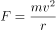，所需要的向心力也小，那么物体受到的重力要比低纬的大。所以纬度越高，重力加速度越大，D项说法错误。

故正确答案为B。

---

### 第 11 题　qid 1797330 · 科技常识

下列各项中，不属于化学变化的是：

- **A**. 焰色反应　✅
- **B**. 铁锅生锈
- **C**. 粮食酿酒
- **D**. 卤水点豆腐

**答案**：A

**官方解析**

A选项错误，焰色反应是指某些金属或它们的化合物在无色火焰中灼烧时使火焰呈现特征的颜色的反应，是物理反应，它并未生成新物质，是物质原子内部电子能级的改变，通俗的说，是原子能中的电子能量的变化。
B选项正确，铁锅生锈是铁和空气中的水和氧气发生化学反应，所以B选项是化学变化。
C选项正确，粮食中原本没有酒精，是其中的淀粉，经过发酵，也就是无氧呼吸，生成酒精，产生了新的物质，所以C选项表述正确。
D项错误，人教版高中化学必修一：卤水点豆腐属于胶体聚沉现象，此现象为物理变化。向胶体（豆浆）中加入电解质溶液（卤水）时，由于加入的阳离子（或阴离子）中和了胶体粒子所带的电荷，使胶体粒子聚集成较大的颗粒，从而形成沉淀从分散剂里析出，这个过程叫做聚沉。豆腐、肉冻、果冻是常见的聚沉凝胶态物质。
本题为选非题，故正确答案为A或D。
注：此题为真题，正确答案有两个，但真题设置为单选题，学员不必纠结，掌握知识点就可以。

---

### 第 12 题　qid 1797346 · 科技常识

关于气候，下列说法不正确的是：

- **A**. 我国冬季南北温差很大的主要原因是纬度的影响
- **B**. 秦岭—淮河一线是季风区与非季风区分界线　✅
- **C**. 我国气候的突出表现是季风气候显著
- **D**. 世界上大多数动植物在我国都能找到适合生长的地区，主要是因为我国气候类型复杂

**答案**：B

**官方解析**

A项正确，我国南北温差大主要是因为纬度相差较大。
B项错误，我国的季风区与非季风区分界线为大兴安岭—阴山—贺兰山—巴颜喀拉山—冈底斯山，该线西北为非季风区，东南为季风区。而秦岭—淮河一线为我国地理意义上的南北分界线，为亚热带和温带季风气候的分界线。
C项正确，我国东中部地区气候受季风影响较大。
D项正确，我国气候类型复杂，地形复杂，经度和纬度跨越较大。因此，大多数动植物在我国都能找到适合生长的地区。
本题为选非题，故正确答案为B。

---

### 第 13 题　qid 1797360 · 科技常识

生物多样性是指在一定时间和一定地区内所有生物物种及其遗传变异和生态系统的复杂性。衡量生物多样性丰富程度的基本标志是：

- **A**. 遗传多样性
- **B**. 基因多样性
- **C**. 环境多样性
- **D**. 物种多样性　✅

**答案**：D

**官方解析**

A选项错误，一般所指的遗传多样性是指种内的遗传多样性，即种内个体之间或一个群体内不同个体的遗传变异总和；
B选项错误，基因多样性代表生物种群之内和种群之间的遗传结构的变异；
C选项错误，环境多样性会对生物产生影响，但不是生物多样性的标志；生物多样性是指在一定时间和一定地区所有生物(动物、植物、微生物)物种及其遗传变异和生态系统的复杂性的总称；
D选项正确，生物多样性包括遗传多样性、物种多样性和生态系统多样性。物种多样性是指动物、植物和微生物种类的丰富性，是衡量生物多样性丰富程度的基本标志。
故本题答案选D。

---

### 第 14 题　qid 1797370 · 人文常识

长城是我国首批世界文化遗产，下列不属于长城沿线世界文化遗产的是：

- **A**. 莫高窟
- **B**. 云冈石窟
- **C**. 秦始皇陵及兵马俑坑
- **D**. 安阳殷墟　✅

**答案**：D

**官方解析**

长城位于中国的北部，横贯辽宁、河北、天津、北京、内蒙古、山西、陕西、宁夏、甘肃等省、市、自治区。长城沿线的世界文化遗产有：周口店北京猿人遗址、北京故宫、敦煌莫高窟、沈阳故宫、秦始皇陵及兵马俑坑、承德避暑山庄及周围寺庙、平遥古城、颐和园、云冈石窟等，选项ABC正确。安阳殷墟位于河南省安阳市，不属于长城沿线。选项D错误。
本题为选非题，故正确答案为D。

---

### 第 15 题　qid 1797380 · 人文常识

地质学把自然界引起地壳或岩石圈的物质组成、结构、构造及地表形态等不断发生变化的各种作用称为地质作用。下列关于地质作用的表述不正确的是：

- **A**. “阡陌交通”与地质作用相关　✅
- **B**. 可分为表层和内部两种类型
- **C**. 同时具有破坏性和再造性
- **D**. 岩浆作用主要由地热能提供动力

**答案**：A

**官方解析**

“阡陌交通”指田间小路交错相通。阡陌，指农田地里的小道和灌溉渠道，纵者称“阡”，横者称“陌”。“阡陌交通”主要受到人的影响，与地质作用无关，A选项错误；
地质作用包括表层和内部，也就是外力作用和内力作用两种，B选项说法正确；
地质作用既有破坏性，又有再造性，比如地震，一方面地震会破坏地表结构，甚至出现裂痕、塌方等，但是另一方面地震也具有再造性，重新塑造地表结构和特征，C选项正确；
岩浆是一种炽热的、具有极强活动力的熔融体，其运动的主要动力由地热能提供，D选项正确。
本题为选非题，故正确答案为A。

---

### 第 16 题　qid 1797190 · 人文常识

关于电影，下列说法不正确的是：

- **A**. 世界上第一个国际电影节是威尼斯电影节
- **B**. 李小龙是中国功夫和功夫电影的“名片”
- **C**. 在世界上拍摄电影数量最多的国家是美国　✅
- **D**. 蒙太奇和长镜头都是电影的主要表现手法

**答案**：C

**官方解析**

世界上第一个国际电影节是意大利威尼斯电影节，每年秋季举行，为期两周，1932年8月6日由贝尼托·墨索里尼在意大利的名城威尼斯创办，A选项正确；
李小龙是中国功夫和功夫电影的“名片”，B选项正确；
在世界上拍摄电影数量最多的国家是印度，印度每年生产的电影有900~1000部之多，C选项错误；
蒙太奇和长镜头都是电影的表现手法，蒙太奇就是把一个连贯的情节分割成几个小的段落然后把这些小段落打乱，但是不破坏故事的完整性。长镜头就是电影中一个连续的情节，用一个镜头或者比较长时间的镜头来拍完，就是说这个镜头中间不切断，在拍摄的时候是一次性拍完，D选项正确。
本题为选非题，故正确答案为C。

---

### 第 17 题　qid 1797206 · 人文常识

下列与电有关的说法正确的是：

- **A**. 电风扇将电能全部转化为机械能
- **B**. 保险丝串联接入才能起到保护电路的作用　✅
- **C**. 为城市输电的高压输电线电压为220伏
- **D**. 能使电笔发亮的插口连接的是零线

**答案**：B

**官方解析**

电风扇在工作过程中，电能大部分转化为机械能，还有一部分电能转化为内能，A项错误；
高压输电是为了减少电力的损耗而设计的，常见的最低高压输电也要35千伏起，题干中220伏是我们日常生活中常见的普通电压，注意单位中千伏和伏的区别，C项错误；
能使电笔发亮的插口连接的是火线，不是零线，D项错误；
保险丝的特性是有规定的熔化温度，当电路中的电流达到所上保险丝的规定值时，保险丝就会熔化，从而切断电路起到保护的作用，串联接入保险丝有助于保护电路，B项正确。
故正确答案为B。

---

### 第 18 题　qid 1797250 · 人文常识

下列与电影有关的说法不正确的是：

- **A**. 西安电影制片厂是中国第一个电影制片厂　✅
- **B**. 香港是世界三大电影制作地之一
- **C**. 《定军山》是中国第一部电影
- **D**. 中国电影华表奖是中国三大电影奖项之一

**答案**：A

**官方解析**

长春电影制片厂是中国第一个电影制片厂，是在1937年伪满时期日本“株式会社满洲映画协会”基础上建立起来的，A选项错误；香港是世界三大电影制作地之一，另外两个是美国好莱坞和印度的宝莱坞，B选项正确；《定军山》是任庆泰执导的一部纪录片，在北京的丰泰照相馆诞生，著名京剧老生表演艺术家谭鑫培在镜头前表演了自己最拿手的几个片段。片子随后被拿到前门大观楼熙攘的人群中放映，万人空巷。这是有记载的中国人自己摄制的第一部电影，C选项正确；大众电影百花奖、中国电影金鸡奖、中国电影华表奖一起并称中国电影的三大奖，D选项正确。
本题为选非题，故正确答案为A。

---

### 第 19 题　qid 1797272 · 科技常识

关于溶液与溶解，下列说法不正确的是：

- **A**. 酒精与水能够以任意比例互溶
- **B**. 汽油溶解食用油属于物理变化
- **C**. 酸碱中和后的溶液不一定呈中性
- **D**. 加入蔗糖可以增加溶液的导电性　✅

**答案**：D

**官方解析**

相同结构的溶液可以相互溶解。乙醇的官能团是羟基（-OH），水的分子式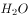 ，其中也含有一个羟基（-OH），所以酒精和水可以任意混合，A选项正确；

B项是物理变化，因为相似相溶的原理，油污不能溶解在水里，可是汽油能与它相溶，而且汽油具有挥发性，所以一般衣服上有油污的时候就用汽油洗衣服，B选项正确；

酸碱中和反应后的溶液不一定是中性，如果是强酸强碱反应是中性，如果是强酸弱碱反应后呈酸性，如果是弱酸强碱反应呈碱性，C选项正确；

蔗糖不是电离子化合物，溶解于水后，不能电离出离子，无法增加溶液的导电性，D选项错误。

本题为选非题，故正确答案为D。

---

### 第 20 题　qid 1797288 · 科技常识

下列关于食物的说法不正确的是：

- **A**. 储存一段时间的红薯比刚挖出来时更甜，是因为淀粉水解生成了单糖
- **B**. 未成熟的香蕉与成熟的苹果一起保存，后者释放的乙烯能促进前者成熟
- **C**. 食品包装上的“胀袋勿食”是因为微生物进行乳酸发酵产气导致食物变质　✅
- **D**. 生鸡蛋泡在石灰水中，水里的碳酸钙能堵塞鸡蛋表面微孔，延长保存时间

**答案**：C

**官方解析**

A选项正确，红薯在储藏一段时间后淀粉会转化成各种单糖；
B选项正确，熟苹果会放出乙烯，乙烯有促进果实成熟的作用，当然也能用于香蕉；
C项说法片面，根据食品包装胀袋的外观表象（包装内部的气体明显增多）分析，引发该问题的原因主要分为两大类：一类是外部环境中的大量气体进入包装内部；另一类是包装中的微生物生长繁殖而产生了较多的气体。乳酸发酵绝大多数情况下产生乳酸，不一定产生气体；
D选项正确，鸡蛋是有生命的，也能够呼出二氧化碳。石灰水中的氢氧化钙和二氧化碳结合成碳酸钙，封闭了鸡蛋壳上的气孔，防止了细菌的侵入，所以鸡蛋就能够延长保鲜期，所以D选项正确。
本题为选非题，故正确答案为C。

---

## 言语理解与表达

### 第 1 题　qid 1797176 · 逻辑填空

浙东运河与别的地方的运河不同，隋唐运河如吉林等地的运河现已失去了原有的功能，仅留下文物保护的价值。而浙东运河仍然          ，舟行栉比，樯橹相连，运河功能          。浙东运河不是单线的，而是复线的，沿河水道呈网状分布，因此它比别的地方的运河更丰富多彩。
依次填入画横线部分最恰当的一项是：

- **A**. 迎来送往  全面
- **B**. 蒸蒸日上  完善
- **C**. 生机勃勃  齐全　✅
- **D**. 熙熙攘攘  强大

**答案**：C

**官方解析**

第一空，首句把浙东运河与别的地方的运河进行对比，“而”表转折，前后语义相反，横线前表示运河失去功能，横线处应表达运河依旧拥有功能的意思，A项“迎来送往”形容忙于交际应酬，修饰人，与“运河”搭配不当，排除；B项“蒸蒸日上”是指一天天地向上发展，形容发展速度快，与文意不符，排除；C项“生机勃勃”形容生命力旺盛的样子，符合文意，保留；D项“熙熙攘攘”形容人来人往，非常热闹拥挤，语义尚可，保留。
第二空，根据横线后“复线的”“丰富多彩”可知，横线处应表达“功能多”，C项“齐全”符合文意，当选。D项“强大”无法体现“功能多”，排除。
故正确答案为C。
【文段出处】《绍兴古运河能否成“世遗”就看这最后一关》

---

### 第 2 题　qid 1797180 · 逻辑填空

人们刚开始在纸上绘画时，沿用的也是帛画的技法、图式和法度要求。经过一千多年的发展，纸画才逐渐形成与帛画        的唯有宣纸才有的水墨表现体系。至此，纸本画终于蜕变为一个独立的画种，更在宋元之后，日渐兴盛。而以重彩见长的帛画反而        ，以致世人产生了中国画等于纸本画的错误印象，甚至还因中国画色彩表现力不如西洋画而生愧色。
依次填入画横线部分最恰当的一项是：

- **A**. 截然不同  日渐式微　✅
- **B**. 大同小异  江河日下
- **C**. 大相径庭  不值一提
- **D**. 背道而驰  力不从心

**答案**：A

**官方解析**

第一空，根据横线后“唯有宣纸才有的水墨表现体系”可知，横线处所填成语表示纸画形成了与帛画不同的风格，B项“大同小异”是指大体相同，略有差异，与文意不符，排除；D项“背道而驰”比喻方向、目标完全相反，与文意不符，排除。
第二空，“而”表转折，前后语义相反，横线处所填词语应与前文“日渐兴盛”语义相反，表示逐渐衰落的意思，A项“日渐式微”指事物逐渐地由兴盛而衰落，符合文意，当选。C项“不值一提”表示不值得提起，形容事情很轻微或者不重要，与文意不符，排除。
故正确答案为A。
【文段出处】《一层薄绢，“复活”古老帛画》
【成语积累】
截然不同：形容两件事物毫无共同之处。日渐式微：指事物逐渐地由兴盛而衰落。
江河日下：比喻情况一天天坏下去。
大相径庭：表示彼此相差很远或矛盾很大。背道而驰：比喻方向、目标完全相反。

---

### 第 3 题　qid 1797194 · 逻辑填空

吴王城虽然年代久远，但今天还有不少          ，在文化研究方面具有很高价值。因此，政府应科学制定吴王城长期保护整体规划，并进入法律保护程序，形成地方性文物保护法规，使文物保护工作有          和生命力。
依次填入画横线部分最恰当的一项是：

- **A**. 遗存  延续性　✅
- **B**. 记载  规范性
- **C**. 痕址  专业性
- **D**. 文物  操作性

**答案**：A

**官方解析**

第一空，根据横线后“保护整体规划”可知，对吴王城的保护应涉及方方面面，A项“遗存”指遗留或古代留下来的东西；D项“文物”指人类在社会活动中遗留下来的具有历史、艺术、科学价值的遗物和遗迹，A、D两项可以体现出“整体规划”，保留。B项“记载”指通过文字或画面记录下来的内容，文段讲述的“整体规划”，用“记载”过于单一，排除；C项“痕址”指历史上建筑物倒塌之后形成的痕迹、遗址，文段讲述的“整体规划”，用“痕址”过于单一，排除。
第二空，“和”表示并列关系，填入的词应该与“生命力”构成并列关系，体现文物保护工作长期持续进行、有活力。A项“延续性”符合文意，当选。D项“操作性”体现不出文物保护工作长期持续进行之意，排除。
故正确答案为A。
【文段出处】《吴王城遗址保护工作启动 已完成规划立项报告》

---

### 第 4 题　qid 1797196 · 逻辑填空

在社会中不同地位不同阶层的人的行为，对群众的影响是不同的，地位越高，影响越大，所以才会有“            ”的说法。
填入画横线部分最恰当的一项是：

- **A**. 人云亦云
- **B**. 上行下效　✅
- **C**. 从善如流
- **D**. 高山仰止

**答案**：B

**官方解析**

横线前的“所以”起到总结前文的作用，即横线前是对横线处所填词语的解释说明。根据横线前所述“地位越高，影响越大”可知，横线处所填词语对应B项，“上行下效”是指上面的人怎么做，下面的人就跟着怎么干，符合文意。
A项“人云亦云”指别人怎么说，自己就跟着怎么说，强调没有主见，只会随声附和，体现不出“上对下的影响”，排除；
C项“从善如流”形容听取正确的意见及接受善意的规劝像流水那样快而自然，体现不出“不同地位不同阶层的人的行为”的影响，排除；
D项“高山仰止”比喻对有气质、有修养或有崇高品德之人的仰慕之情，与文意不符，排除。
故正确答案为B。

---

### 第 5 题　qid 1797204 · 逻辑填空

文物是历史留下的印记，是过去写给今天和未来的“书信”，也是人类存在于历史中的          。历史文化古迹损毁的后果是任何人都担不起的，每一次随意破坏文物的行为，都应被视作对文明传承的挑衅。因为，那些留在历史中的足迹都是          的，没有备份，也没有重来的可能。
依次填入画横线部分最恰当的一项是：

- **A**. 见证  唯一　✅
- **B**. 记录  珍贵
- **C**. 痕迹  脆弱
- **D**. 标志  模糊

**答案**：A

**官方解析**

此题突破口在第二空，横线后强调“没有备份，也没有重来的可能”，说明这些“足迹”是“独一无二”的，只有一份，故应填入A项“唯一”。其他选项都体现不出“没有备份”，均可排除。
第一空，代入验证，文物体现了历史的发展，故文物也是“见证”了历史的发展，故填入A项“见证”合适。
故正确答案为A。
【文段出处】光明日报 《历史不会留给我们“备份文物”》

---

### 第 6 题　qid 1797218 · 逻辑填空

19世纪批判现实主义文学最卓越的功绩之一就是揭露了资本主义社会人与人之间赤裸裸的金钱关系，而夏洛蒂·勃朗特则在这深入人心的主题上______，大胆开辟了新的价值观领域，以简·爱对爱情的追求，描绘了不以金钱标价的婚姻，使读者耳目一新。但是作者毕竟无法______金钱对个人幸福的决定作用，这就使简·爱陷入了自相矛盾之中，给读者留下诸多的思考。
依次填入画横线部分最恰当的一项是：

- **A**. 标新立异 回避　✅
- **B**. 别出心裁 动摇
- **C**. 独树一帜 抵消
- **D**. 与众不同 忽视

**答案**：A

**官方解析**

第一空，根据横线后提到的“大胆开辟了新的价值观领域”可知，横线处应该与“新”相对应。A项“标新立异”指提出新的想法、观点和主张；C项“独树一帜”指自立门户，单独树立新的旗帜，均能体现出“新”的含义，保留。B项“别出心裁”侧重心意的特别，跟别人不一样；D项“与众不同”表示和大家不一样，均强调特别，但不一定是“新”，排除。  
第二空，横线前搭配“作者”，横线后搭配“作用”，A项，作者无法“回避”作用，也就是需要“正视”，搭配恰当；C项，作者无法“抵消”作用，搭配不当，排除。
故正确答案为A。
【成语拓展】
别出心裁：指独创一格，与众不同。
独树一帜：单独树立起一面旗帜，指自成一家。

---

### 第 7 题　qid 1797232 · 逻辑填空

印象主义画家莫奈致力于观察沐浴在光线中的自然景色，把握色彩的冷暖变化和相互作用，用看似______实则准确的迅捷的手法，把_____的光色效果记录在画布上，留下各种瞬间的永恒图像。
依次填入画横线部分最恰当的一项是：

- **A**. 粗糙  转瞬即逝
- **B**. 模糊  千变万化
- **C**. 荒诞  五彩斑斓
- **D**. 随意  变幻莫测　✅

**答案**：D

**官方解析**

第一空，填入词语以“看似······实则······”与“准确”构成反义并列， A项“粗糙”反义词为“细腻”，B项“模糊”反义词为“清晰”，C项“荒诞”反义词为“合理”，均不符合文意，排除；D项“准确”意为行动的结果完全符合实际或预期，可以与“随意”形成反义关系。
第二空，代入验证，D项“变幻莫测”比喻事物变化迅速，无法预料，与“迅捷的手法”“瞬间的永恒图像”形成对应，符合文意。
故正确答案为D。
【文段出处】《印象派画家的创作——莫奈笔下的睡莲》
【成语拓展】
转瞬即逝：形容消失得很快。
千变万化：形容变化极多。
五彩斑斓：指多种颜色错杂而繁多耀眼。

---

### 第 8 题　qid 1797254 · 逻辑填空

在现实生活中，“读什么信什么”的现象并不少见，这可能产生两种不同的后果：或者是被一种          的观念俘虏，变成错误学说的信徒；或者由于自己没有主见，觉得书中讲的都有道理，观点一日三变，特别是当书中的观点彼此矛盾时，更是          。
依次填入画横线部分最恰当的一项是：

- **A**. 先入为主 无所适从　✅
- **B**. 口耳相传 手足无措
- **C**. 模棱两可 莫衷一是
- **D**. 深入人心 朝令夕改

**答案**：A

**官方解析**

第一空，文段通过“或者······或者······”表示并列，列举两种不同的情况，根据“或者由于自己没有主见”可知空中表示已有主见和观念，由“变成错误学说的信徒”可知，这类读者被错误学说俘虏而深信不疑，A项“先入为主”指先接受了一种说法或思想，以为是正确的，有了成见，后来就不容易再接受不同的说法或思想，符合文意，保留。B项“口耳相传”指口说耳听地往下传授，文段只提到读书，没有提到“耳听”，排除；C项“模棱两可”意为不表示明确的态度，或没有明确的主张，与文意相悖，排除；D项“深入人心”指理论、学说、政策等为人们深切了解和信服，感情色彩偏积极，无法与后文的“错误学说”形成对应，排除。
第二空，代入验证，A项“无所适从”指不知听从哪一个好，可与前文“书中的观点彼此矛盾”形成对应，符合文意，当选。
故正确答案为A。
【文段出处】《如何读书、读什么书、怎么读书》

---

### 第 9 题　qid 1797268 · 逻辑填空

知识产权教育是国家知识产权战略的基点，高校和大学生是国家知识产权战略的重要参与者和实践者，知识产权素质应该是大学生必备的素质。他们或许          改变社会整体知识产权意识淡薄的问题，但可以先改变自己，          ，给社会树立尊重知识产权的          。
依次填入画横线部分最恰当的一项是：

- **A**. 无力 洁身自好  典范　✅
- **B**. 无法 标新立异 形象
- **C**. 无意 洗心革面  标兵
- **D**. 无心 严于律己 楷模

**答案**：A

**官方解析**

第一空，根据后文“先改变自己”这一行动，可知空中表示没有力量或办法改变整个社会，并非“无意”或者“无心”，排除C项和D项。
第二空，根据前文“社会整体知识产权意识淡薄”可知，空格表示从自身做起，树立保护产权的意识，不侵犯他人的产权，“洁身自好”表示保持自己纯洁，不同流合污，符合文意，保留A项。B项“标新立异”指提出新奇的主张，表示与众不同，文段没有体现创新的含义，不符合文意，排除B项。
第三空，代入验证，“典范”指值得仿效的人或物，和“树立”搭配恰当，当选。
故正确答案为A。
【文段出处】《复印教材背后是对知识产权视而不见》
【成语拓展】
洗心革面：比喻彻底悔改。
严于律己：严格地约束自己。

---

### 第 10 题　qid 1797280 · 逻辑填空

阅读是人类自有文字以来的一种美好体验。可是，人类与书本深度接触且甘之如饴的情景似已            。随着WiFi信号以一种            的态势席卷生活的每一个角落，随着电脑的便携化和手机的智能化，阅读变得无比便捷、丰富和多元，电子化阅读似乎已将从前那种            的阅读方式挤兑得“无地自容”。
依次填入画横线部分最恰当的一项是：

- **A**. 一去不返 无所不在 目不窥园
- **B**. 渐行渐远 铺天盖地 手不释卷　✅
- **C**. 烟消云散 无孔不入 皓首穷经
- **D**. 恍如隔世 潜移默化 苦心孤诣

**答案**：B

**官方解析**

本题可以先从第三个空入手，横线处阐述的为一种“阅读方式”。B项，“手不释卷”指手里的书不舍得放下，形容读书勤奋或看书入迷，“手不释卷”也是一种“阅读方式”，保留。A项，“目不窥园”形容专心致志，埋头苦读，指的是读书的境界，C项，“皓首穷经”指一直到年老之时还在深入钻研经书和古籍，D项，“苦心孤诣”费尽心思钻研或经营，达到别人达不到的境地，均不能形容“阅读方式”，排除。
第一、二空代入验证，第一空“情景似已渐行渐远”搭配恰当，符合文意；第二空“铺天盖地”对应横线后的“席卷”，符合文意，当选。
故正确答案为B。
【文段出处】《Wi-Fi时代，莫让“深阅读”渐行渐远》

---

### 第 11 题　qid 1797298 · 片段阅读

中国正掀起3D打印投资热。面对3D打印的广阔前景，各地纷纷兴建3D打印产业园，并出台各项优惠政策等。但发展3D打印这项新兴技术，凭借热情是不够的，3D打印产业链中，关键技术、材料、软件的制约有待突破，3D打印技术现在还处在初级阶段，如果企业和资本大量涌入，短时间内不能产生效益。
这段文字意在说明：

- **A**. 3D打印的应用范围有待充分挖掘
- **B**. 3D打印技术的发展遭遇瓶颈
- **C**. 应出台政策鼓励3D打印技术的发展
- **D**. 资金不宜盲目涌入3D打印领域　✅

**答案**：D

**官方解析**

文段首先描述3D打印的火热现状，接着通过转折词“但”指出3D打印目前存在的问题，最后通过反面论证提出对策，指出“如果企业和资本大量涌入，短时间内不能产生效益”，即强调现在资金不宜大量涌入3D打印领域，对应D项。
A项：“应用范围”在文段中没有被提到，属于无中生有的表述，排除；
B项：该项为现状和问题的表述，非重点，排除；
C项：“应出台”表述错误，文段中各地已出台各项优惠政策，且“政策”为转折前的表述，非重点，排除。
故正确答案为D。
【文段出处】《洞悉3D打印的现在和未来》

---

### 第 12 题　qid 1797326 · 片段阅读

垄断竞争理论认为，企业可以通过迎合消费者品位上的差异，在某种程度上降低竞争对企业所造成的影响。差异策略使其他企业的产品不能完美地替代本企业的产品。形成差异是要花钱的，使用差异策略的企业要提高产品价格来弥补其较高的生产成本。然而，即使采用差异策略的成本较高，处于寡头垄断市场中的企业，仍然可以通过提高产品的价格来赚取高额利润。
对这段文字的主旨概括最准确的是：

- **A**. 垄断竞争会对企业有很大影响
- **B**. 企业通过提高价格来弥补生产成本
- **C**. 垄断企业可通过差异策略获得利润　✅
- **D**. 差异策略难以提高企业竞争力

**答案**：C

**官方解析**

文段开篇介绍差异策略可以降低竞争对企业的影响，接着论述使用差异策略需要靠提高产品价格来弥补企业较高的生产成本，最后通过转折词“然而”强调即使采用差异策略的成本高，垄断企业仍能通过提高产品价格来赚取高额利润，对应C项。
A项，影响有好有坏，文段只强调了好的影响，表述不明确，排除；
B项，“通过提高价格”为转折前的内容，非重点，排除；
D项，“差异策略难以······”与文段相悖，排除。
故正确答案为C。
【文段出处】《报业竞争与发行量和广告的关系》

---

### 第 13 题　qid 1797338 · 片段阅读

网络语言，尤其是当下流行的一些新潮网络语言，对汉语的发展是促进还是阻碍，是汉语文化的精华还是糟粕，得让其在不断的冲突中接受时间和实践的检验。而为了保护汉语，保证其固有的纯洁性而一味地摒弃打压某些带有消极影响的网络语言，甚至制定相关规定性条文条款来限制网络语言的发展，有时非但不能抑制，反而会起到相反的作用。
这段文字意在说明：

- **A**. 网络语言的发展不宜通过行政手段干预　✅
- **B**. 汉语的传承离不开网络语言的不断创新
- **C**. 网络语言的生命力需要依靠时间来检验
- **D**. 新生的网络语言可能影响汉语的纯洁性

**答案**：A

**官方解析**

文段开篇提出网络语言对汉语发展的作用需要在冲突中接受时间和实践的检验，接着用“而”指出为保护汉语的对策如果是摒弃打压，甚至用政策手段来干预，会起到相反的效果，即网络语言的发展并不宜通过行政手段来干预，对应A项。
B项，文中并未提到汉语的传承，重点也非强调网络语言的创新，排除；
C项，网络语言的“生命力”为无中生有，且文段说的是需要“时间和实践的检验”，“依靠时间来检验”表述片面，排除；
D项，文段强调的是通过行政手段干预网络语言效果不好，而非强调网络语言对汉语纯洁性的影响，非文段重点，排除。
故正确答案为A。
【文段出处】《汉语需保护，但不宜过度》

---

### 第 14 题　qid 1797362 · 片段阅读

从社会发展史的角度看，自由与平等是人类向往与追求的两大基本价值，而媒介发展的过程也是人们追求传播自由与平等的过程。不同媒介间的竞争，实质上就是在满足人的这两种内在需求方面的能力竞争。随着新媒体的发展，对自由与平等的追求作为一种新的传播理念，已越来越清晰地呈现在人们面前，以高度人性化的方式满足受众需求也正在成为媒介之间竞争的核心内容。
对这段文字的主旨概括最准确的是：

- **A**. 人类的发展需求影响着媒介的传播理念
- **B**. 新媒体的发展改变了媒介竞争的主要方式
- **C**. 媒体的发展满足了人类沟通交流的基本需求
- **D**. 媒介竞争的核心是满足人类对基本价值的追求　✅

**答案**：D

**官方解析**

整个文段都围绕着自由与平等这两大人类追求的基本价值展开论述。说媒介的发展过程其实就是追求这两大基本价值的过程，不同媒介的竞争也是满足这两个基本价值需求的竞争，新媒体更以高度人性化的方式满足对这两个基本价值的追求，这正在成为媒介之间竞争的核心内容，文段的重点对应D项。文段论述的是“自由与平等”两大基本价值，A项“人类的发展需求”和C项“人类沟通交流”文段均未提及，无中生有，排除；B项“新媒体的发展”非文段重点，且没有体现文段的主题词，排除。
故正确答案为D。
【文段出处】《数字时代传媒竞争发展的逻辑新起点——以满足受众需求为中心打造人性化媒介》

---

### 第 15 题　qid 1797372 · 片段阅读

机会分配不仅能对收入分配结果产生重要影响，而且会直接影响到社会的经济发展效率。在不公正的机会分配下，一些人会因为某些特殊原因而获得发展机会，但这些获得机会的人很可能缺乏有效利用发展机会从事社会劳动和创造的能力，这必然导致他们所从事的劳动或经营项目的生产效率下降，进而影响到整个社会的经济发展效率。让真正有才华的人能够获得机会，把合适的人放在适合的岗位上，是经济体系健康运行的基础。只有实现机会平等，才能最大限度地激发社会活力和人的积极性、主动性、创造性，提高社会劳动生产率和生产力发展水平。
这段文字意在说明：

- **A**. 收入分配的差距主要由机会分配不平等造成
- **B**. 经济体系健康运行的标志是公平的机会分配
- **C**. 公平的机会分配有助于提高社会经济发展效率　✅
- **D**. 机会分配是维护社会公平正义不可或缺的内容

**答案**：C

**官方解析**

文段开篇主要介绍机会分配对社会经济发展效率的影响，接着通过正反面论证，进一步论证机会分配对经济发展效率的影响，最后用“只有······才······”提出对策，即机会要平等才能提高社会劳动生产率和生产力发展水平，故文段重点强调公平的机会分配对于提高社会经济发展效率的重要作用，对应C项。
A项，“收入分配差距由······造成”为问题表述，且“收入分配差距”并非文段重点，排除；
B项，“经济体系健康运行”为对策前的内容，非文段重点，排除；
D项，“机会分配”偷换概念，文段强调“公平的机会分配”，且“社会公平正义”无中生有，排除。
故正确答案为C。
【文段出处】《社会保障与机会分配》

---

### 第 16 题　qid 1797174 · 语句表达

如果可以，机器人甚至能挽救你的生命。以自动驾驶汽车为例，美国近年来年均车祸致死量高达13000人，自动驾驶汽车至少能够降低因醉酒和走神导致的车祸数量。然而大部分美国人声称，乘坐自动驾驶的交通工具会让他们感觉不适。若此类想法得不到改变，科技的发展必然受阻。事实上，在很多领域机器人都可以替代人工以提高安全系数。令人讽刺的是，在一个至关重要的方面机器人却束手无策：                    。
填入划横线部分最恰当的一句是：

- **A**. 人类对机器人仍缺乏信任　✅
- **B**. 人类在社会中仍居主导地位
- **C**. 人类还不能制造出超过人类本身智慧的机器
- **D**. 机器人还未寻找到更接近人类智能的进化路径

**答案**：A

**官方解析**

横线在文段末尾，起总结概括的作用。横线前出现冒号，故横线处应表示机器人“束手无策”的问题。文段开篇介绍机器人的作用，即能降低车祸数量，提高安全。接着通过转折词“然而”指出人们的一种想法，即会对机器人感到不适。文段最后强调“至关重要的方面”也就是说人们感到不适的想法，即对于机器人能提高安全性缺乏信任，对应A项。
B项，人类居“主导地位”是一种客观的现实，而文段论述的是一个想法，排除；
C项，并非人类想法，且“不能制造······机器”表述错误，文段提到“机器人都可以替代人工”表示机器人在一定程度上可以超过人类，与文意相悖，排除；
D项，并非人类想法，且“机器人未寻找到······进化路径”为无中生有，文段未提及。
故正确答案为A。
【文段出处】《善待自己，相信机器人》

---

### 第 17 题　qid 1797178 · 片段阅读

现代媒介生态表现出一种“微”特质，碎片化的信息通过社交网络等链状系统被连接与组合起来。媒体要想生存，就要在一个个“微链”中把握传播机会，创造可能的舆论热点。因此，现代的媒体，除了要竞争信息的“独到解释权”外，还要在纷繁的“微链”世界中排兵布阵，成为一个个关键节点的组织者与传播者；报道组织形式不再是先前的“一刀切”，而是在无数个中心节点上进行“疏通”与“引导”。特别是在突发事件中，这种新型舆论引导方式的特点更加凸显。
在这段文字中，作者强调现代媒体更需要具备的能力是：

- **A**. 构建独有的链状传播系统
- **B**. 在关键节点进行舆论引导　✅
- **C**. 密切关注社交网络信息动向
- **D**. 争取信息的“独到解释权”

**答案**：B

**官方解析**

文段开篇论述现代媒介的“微”特征以及应对“微”特征的做法。接着通过结论词“因此”进行总结，结论句中出现了由“；”构成的并列关系，故需全面概括或提取共性，分析可知，并列中“关键节点”与“中心节点”语义相同，均论述要在关键节点进行组织与引导。故文段重点论述需要在关键节点进行组织与引导，对应B项。
A项，“构建独有的链状传播系统”对应“；”之前，表述片面，排除；
C项，“关注社交网络信息动向”并非文段强调的重点，排除；
D项，“独到解释权”并非文段强调的核心话题，文段强调“在关键点上进行组织与引导”，排除。
故正确答案为B。
【文段出处】《媒介融合时代传统媒体管理创新的五个维度》

---

### 第 18 题　qid 1797184 · 语句表达

中国传统文化蕴含着丰富的生态文明思想。古代中国是一个农业大国，以农为立国之本。                    。因此，“究天人之际”的问题成了中国哲学的基本问题，而“天人合一论”则成为中国哲学的基本理念。
填入划横线部分最恰当的一句是：

- **A**. 农事活动仰仗于天，与自然联系密切　✅
- **B**. 中国传统价值观的形成是一个漫长的过程
- **C**. 民以食为天，农业在古代中国的地位不言而喻
- **D**. 保持生态系统的平衡，在中国哲学中得到了充分的体现

**答案**：A

**官方解析**

横线在文段中间，起承上启下的作用。横线前提出中国古代重视农业，横线后介绍“究天人之际”“天人合一论”，强调天与人之间的关系，“天”代表大自然，因此横线内容应承接“农业”与“天”两个话题，强调农业与天之间的关系，对应A项。
B项和D项未提到“农业”和“天”，与文段话题不一致，均排除；
C项，“民以食为天”中的“天”为最大之意，与文段中的“天”所表达的大自然话题不一致，排除。
故正确答案为A。
【文段出处】《中国传统文化中的生态文明思想》

---

### 第 19 题　qid 1797200 · 片段阅读

以往在讨论国人不文明出游现象的时候，往往将原因归结为国民素质没跟上经济发展的步伐。至于对策，除了强烈的舆论谴责，就是建议重罚。虽然说这样的原因分析和对策建议并非全无道理，但我们却忽视了一个事实，那就是很少有游客真的想当不文明的典型，更没有人想故意去给国家和民族形象抹黑。无论是政府部门，还是旅行社，对文明旅游方面的宣传和提醒基本为“零”，多数游客是无心而为。
根据这段文字，接下来会说明：

- **A**. 外界对国人形成不文明出游的印象可能存在误解
- **B**. 国人能否养成文明出游的习惯与整体国民素质高低有关
- **C**. 对不文明旅游行为的谴责和重罚带来的效果只是一时的
- **D**. 培养国人文明旅游的意识需要加大宣传教育和引导　✅

**答案**：D

**官方解析**

文段开篇介绍以往讨论不文明出游时人们的一种误解，认为由于国民素质不高造成，而后提出解决此问题的对策“谴责、重罚”，接下来通过转折词“但”指出我们忽视的事实，尾句指出问题的根本原因，即文明旅游方面的宣传提醒不到位，下文内容要与文段最后强调的话题保持一致，即应加强培养国人文明旅游意识的宣传教育，对应D项。
A项，“误解”对应文段“往往将原因归结为国民素质没跟上经济发展的步伐”，为前文论述过的内容，排除；
B项，“国民素质”对应文段首句“以往······”的观点，为前文论述过的内容，且与文段最后论述的话题不一致，排除；
C项，“谴责和重罚”对应第二句“除了······谴责，就是······重罚”，为前文论述过的内容，排除。
故正确答案为D。
【文段出处】《做足行前“功课”是文明出游的关键》

---

### 第 20 题　qid 1797212 · 片段阅读

从最先的余额宝，到后来的P2P，再到各类众筹模式，不得不承认互联网金融在改变着传统行业，更在颠覆着人们的生活。以众筹为例，它不单让普通民众多了一种参与并获取超额回报的渠道，同时也使怀揣梦想的年轻人有了低成本实现梦想的可能。
文章接下来最可能阐述的是：

- **A**. 互联网金融行业的发展过程
- **B**. 互联网如何改变人们的投资理念
- **C**. 众筹模式与其他模式的不同
- **D**. 众筹如何帮助投资者实现收益　✅

**答案**：D

**官方解析**

本题为接语选择题，应在通读全文的基础上，重点关注最后讨论的话题。前文介绍“互联网······在改变着传统行业，更在颠覆着人们的生活”，尾句重点强调众筹能够为人带来益处，下文内容要与文段最后强调的话题保持一致，即具体论述众筹是如何为人带来好处、实现收益的，对应D项。
A、B两项：未提到“众筹”这一话题，与最后讨论的话题不一致，均排除；
C项：“与其他模式的不同”无中生有，且与最后讨论的话题不一致，排除。
故正确答案为D。
【文段出处】《众筹不是简单“凑份子”》

---

### 第 21 题　qid 1797220 · 片段阅读

如果仅从文物价值来看，纸质版的古籍文献的确不适宜大规模地向读者开放，否则，因为频繁翻阅以及由此带来的细菌侵入，必定会在很大程度上影响它们的保存。但如果从史料价值来看，它却本应该向社会开放，因为只有这样，古籍的文献价值才能得到充分实现，学术研究也才可能取得长足的进步。
这段文字重在说明古籍文献：

- **A**. 需要民众参与研究
- **B**. 保护技术有待提高
- **C**. 是否开放是一个难题　✅
- **D**. 文物属性更应受到重视

**答案**：C

**官方解析**

文段先从文物价值角度描述，说纸质版古籍不大适宜大规模向读者开放，接着用“但”表示转折引出从史料价值角度来看，纸质版古籍向社会开放才能实现价值促进学术研究，因此文段是为了说明纸质版古籍对社会开放与否各有道理，即是一道难题，对应C项。A项“需要民众参与研究”在文段中并未提到，文段谈论的是开放与否而非研究，排除；B项“保护技术”、D项“文物属性应受到重视”在文段中均没有提及到，属无中生有的表述，均排除。
故正确答案为C。
【文段出处】《为古籍借阅设置门槛也应找准方向》

---

### 第 22 题　qid 1797240 · 语句表达

①“道”在何方？它绝对不是佛祖在菩提树下的苦思冥想，也绝不是闭门造车
②学习者一旦进入一定的境界，就会发现学习的无非是顶层设计
③儒家所说的“天人合一”，一定是接触到社会的方方面面后社会属性成熟到极致的状态
④这必定是通过社交型学习来实现的
⑤一个人如果远离社交，那么他不是狼孩，便是梵高
⑥学会了千变万化的技法，最终求的是一个“道”
将以上6个句子重新排列，语序正确的是：

- **A**. ①⑥④②③⑤
- **B**. ②⑥①⑤③④　✅
- **C**. ③⑤④②⑥①
- **D**. ⑤③②⑥①④

**答案**：B

**官方解析**

对比选项，首句不好判断，观察6个句子寻找共同信息，⑥句中提到了最终求的是“道”，①句中详细阐述“道”在何方，怎么追求，根据“道”这个共同信息进行捆绑，即⑥①两句相连，排除A项。④句以“这”开头，分析可知，“这”指代的内容并非⑤句、①句的内容，而是③句内容，③④两句相连，排除C项和D项。
故正确答案为B。
【文段出处】《论道“社交型”学习》

---

### 第 23 题　qid 1797260 · 语句表达

①戏曲只有以观众的需求为努力方向，依靠戏曲艺术的魅力才能获得市场竞争力
②我们应该鼓励戏曲的方言版和普通话版进行竞争
③语言改革是京剧和昆曲成为全国性剧种的关键因素
④地方戏要扩大影响，语言上必须做出牺牲
⑤地方戏走向衰亡，方言造成的理解障碍导致地方戏传播范围受限是不可忽略的因素
⑥地方戏的特色体现在音乐、舞蹈、服装、化妆、绝活、剧情等多个方面，方言并不是唯一特色
将以上6个句子重新排列，语序正确的是：

- **A**. ②⑤③⑥①④
- **B**. ⑤⑥③④②①　✅
- **C**. ①⑥④②③⑤
- **D**. ③④⑥⑤①②

**答案**：B

**官方解析**

对比选项，确定首句。①②两句通过“只有······才”“应”均引导对策，③句“是······关键因素”为分析问题，⑤句“地方戏走向衰亡”是一种现象，为提出问题。根据写作的逻辑顺序可知，应为先提出问题，再分析问题，最后解决问题。对比可知，⑤句适合作首句，故锁定B项。
验证B项：⑤句为提出问题，⑥句“不是唯一特色”为分析问题，③句“是······关键因素”为分析问题，④②①三句均为解决问题，逻辑恰当，当选。
故正确答案为B。
【文段出处】《地方戏是否应固守方言》

---

### 第 24 题　qid 1797276 · 语句表达

①明末试图实践西法筑城的仅是个别具有西学背景的地方豪绅，尚处于实验性起步阶段
②与欧洲的情况不同，西式火炮在明军方面主要是一种守城武器
③西炮在明清战争中扮演了极为重要的角色，相比之下，西洋建筑术在明末很少得到实际应用，对战局影响甚微
④改造防御工事的需求，主要源于增强守城火炮效力，而非抵御炮击
⑤西洋火炮与筑城术，几乎同时传入中国，效果却大相径庭
⑥然而，明朝的迅速败亡，终结了推广新型防御工事的可能，西洋筑城法也失去了在实战中充分证明其有效性的机会
将以上6个句子重新排列，语序正确的是：

- **A**. ③②①⑤④⑥
- **B**. ①⑤⑥②④③
- **C**. ⑤③②④①⑥　✅
- **D**. ④①⑥②⑤③

**答案**：C

**官方解析**

对比选项，确定首句。⑤句提出西洋炮火与筑城术的话题，也即阐述“A与B”的话题，接下来应先讲A再讲B，通过首句对比可知，分别对应④句论述的“火炮”和①句论述的“建筑城”，故应保持⑤④①三句的逻辑顺序，锁定C项。
验证C项，⑤句引出话题，③句具体解释⑤句，②④两句论述“西炮”，①⑥两句论述“建筑城”，逻辑恰当，当选。
故正确答案为C。
【文段出处】《明末西洋筑城术之引进》

---

### 第 25 题　qid 1797296 · 语句表达

①但实证是手段而不是目的，史学的真正使命是探索社会变迁的内在逻辑与规律，为文明的提升提供借鉴与参考
②清儒章学诚强调“言性命者必究于史”，反对离事而言理，体现了史学在真理探索中的重要作用
③史学是一门科学，其最显著的学术特点是实证
④力图通过对社会关系、社会形态的反思，通过对人和自然关系的反思，总结出有普遍意义的历史结论
⑤真正的史学家从来都将认识人类的命运作为自己全部学术活动的出发点
⑥事实上，高层次的史学活动从来都是思辨性的，充满了理性的睿智
将以上6个句子重新排列，语序正确的是：

- **A**. ②⑥①③⑤④
- **B**. ②⑤④⑥③①
- **C**. ③④②⑥①⑤
- **D**. ③①⑤④②⑥　✅

**答案**：D

**官方解析**

比选项，确定首句。②句引用章学诚的观点说明史学探索真理的作用；③句给史学下定义，提出史学核心特点是实证。按照行文逻辑，一般先对史学进行整体定义，再引用古人观点展开论证，因此③句更适合作首句，排除A、B两项。
继续观察发现，①句出现转折关联词“但”，可以考虑通过转折关系进行捆绑，①句前有③句和⑥句，①指出实证只是手段不是目的，③句介绍史学特点是实证，再通过①句“但”转折说明实证并非史学最终目的，③①两句捆绑得当，D项当选。⑥句指出高层次的史学活动有思辨性，充满了理性的睿智，无法与①句构成转折关系，⑥①两句无法捆绑，排除C项。
故正确答案为D。

---

### 第 26 题　qid 1797308 · 片段阅读

数字化革命最伟大的成果之一就是采用了多利益方共同管理体系，而非基于国家的机构来管理重要的全球资源。互联网本身就属于这种重要管理体系。它的组成、运营和管理是由一个曾经不敢想象的群体完成的。这个群体包括个人、社会组织、公司和地方政府。然而，没有一个单独的政府、国家、垄断公司，或者政府掌握的机构能够控制整个互联网。
这段话主要说的是：

- **A**. 互联网和政府的关系
- **B**. 互联网的管理特征　✅
- **C**. 互联网的经济模型
- **D**. 数字化革命的成果

**答案**：B

**官方解析**

文段首句表明数字化革命的伟大成果之一是采用多利益方共同管理体系来管理全球重要资源，接下来指出互联网就属于这类管理体系，随后具体阐述互联网的组成、运营与管理主体，涵盖多方群体，最后通过转折关联词“然而"引出重点，强调无任何单一主体能够控制整个互联网。文段整体重点论述互联网的管理特征，对应B项。
A项，文段仅提及地方政府是互联网管理群体的组成部分，并未重点论述互联网与政府的具体关系，偏离文段重点，排除；
C项，“经济模型”文段未提及，无中生有，排除；
D项，“数字化革命的成果”对应文段开头的背景引入，并非文段论述重点，排除。
故正确答案为B。
【文段出处】《互联网：与生俱来的高效管理模式》

---

### 第 27 题　qid 1797318 · 语句表达

人们一直认为上海是个年轻的城市，但自从1950年代崧泽遗址发现以来，约半个多世纪总计5次的考古发掘，早已将上海起源的历史推至约6000年前。据了解，崧泽遗址不但是上海的发源地，还是中国文明起源的见证地之一。人们已有充分考古证据证明崧泽遗址中发现的距今5500年前的崧泽文化，已经进入到中国文明的起源时期。换句话说，远古上海也是中华文明最早的起源地之一，                    。
填入划横线部分最恰当的一项是：

- **A**. 考古发掘揭开了上海发展史的面纱
- **B**. 上海的发展在历史上曾经出现过断层
- **C**. 远古上海也为中国早期文明做出过突出贡献　✅
- **D**. 崧泽遗址在中华文明史上起着举足轻重的作用

**答案**：C

**官方解析**

横线在文段末尾，根据“换句话说”可知，尾句起到对前文的总结作用。前文通过崧泽遗址证明了上海具有久远的历史，是中国文明起源的见证地之一。故可知上海在远古时期已经存在，是中国早期文明不可缺少的一环，且其为中华文明起源的见证，即为早期文明做出过突出贡献，对应C项。
A项，文段只是通过崧泽遗址证明了上海具有远古的历史，而非强调上海自身的“发展史”，排除；
B项，“上海历史出现过断层”在文段中没有提及，属无中生有的表述，排除；
D项，尾句的主语为“远古上海”而非“崧泽遗址”，主语不一致，衔接不恰当，排除。
故正确答案为C。
【文段出处】《上海崧泽遗址博物馆将于5月18日开馆》

---

### 第 28 题　qid 1797332 · 语句表达

科学家们之所以对67P/楚留莫夫-格拉希门克彗星有强烈的兴趣，是因为根据此前在地球上对它的分析，再结合乔托航空飞行器发回的报告，发现这颗彗星很可能有大量的冰块，并且含有碳、氢、氧、氮等元素。在这颗彗星的表面很可能有复杂的有机分子，而这很可能就是构成早期生命的基础。这颗彗星形成的时间也有可能比地球形成的时间还要早。因此，对于该彗星的详尽研究                    。
填入划横线部分最恰当的一项是：

- **A**. 启发人们猜测地球生命是否来自彗星　✅
- **B**. 帮助人们探索地球上生命的起源
- **C**. 有助于人们最终发现太阳系的形成原因
- **D**. 可以推动先进飞行器在彗星研究中的应用

**答案**：A

**官方解析**

横线在尾句，且前面出现“因此”，横线处应总结前文。前文论述彗星和生命之间可能存在关系，“这颗彗星······可能还要早”论述彗星与地球可能存在关系，“因此”表总结，故尾句应总结彗星、生命、地球之间可能存在关系，对应A项，论述三者之间的关系，“猜测”即对应文段所表达的可能性。
B项，“探索地球上生命的起源”表述不明确，文段谈论的是地球生命和彗星之间的关系，指出其可能来自彗星，排除；
C项，“太阳系的形成原因”无中生有，与文段话题不一致，排除；
D项，“先进飞行器的应用”非上述文段谈论的核心话题，排除。
故正确答案为A。
【文段出处】《来自星星的矿》

---

### 第 29 题　qid 1797348 · 片段阅读

近年来，我国商业无人机逐渐现身于测绘、军警、农业、应急救灾等专业领域，但这些专业级市场需求未能快速增长，背后存在着产业水平和体制机制束缚。比如我国现代农业水平不高，无人机在农业作业推广方面进展不快。农业经营主体由于对无人机不了解，或者投资意愿不强、资金来源没保证，使这种潜在的市场需求无法转化为交易。同时，操作人才缺乏也制约了无人机在农业市场的推广。无人机农业作业要达到最佳喷药效果，这对于飞机控制的要求很高，一般农户很难掌握。要克服这些障碍，仅靠企业自身力量并不容易。
这段文字意在强调我国：

- **A**. 企业开拓无人机市场的能力和速度都有待提高
- **B**. 目前的经济水平不适合大规模推广无人机技术
- **C**. 专业技术人员缺乏限制了无人机在农业中的推广
- **D**. 商业无人机因多种原因未能在专业级市场充分发展　✅

**答案**：D

**官方解析**

文段通过“但”进行转折，说明我国商业无人机需求无法快速增长，是因为存在着产业水平和体制机制束缚。接着通过“同时”表并列，从两个方面详细加以解释说明，对文段进行归纳概括，D项“多种原因”概括最为恰当，当选。A项企业的“能力与速度都有待提高”根据文段中“仅靠企业自身力量并不容易”可知，企业自身并没强调的重点，排除A项。B项“经济水平”、C项“专业技术人员”均为并列结构中的一个方面，表述片面，排除。
故正确答案为D。
【文段出处】《中国无人机：已处国际前列》

---

### 第 30 题　qid 1797358 · 片段阅读

设计师让新的梦想世界有了创建的可能，在这个世界中，商品被视为唾手可得的魔法物品，而不是工厂生产出来的产品。也正是这些设计师们，赋予这些商品流线造型的一体化塑料外壳，将它们各不相同、不规整的零部件隐藏了起来。无数技术复杂的产品被强烈统一的视觉特征转化为艺术品，产品的操作流程也全都被掩盖了，成为一种具有鲜明个性的产品。由于利用模塑制造成型，塑料产品往往呈曲线形态，殊不知竟然因此助长了流线型风格的热潮，并使之成为了现代时尚的同义词。
这段文字意在说明：

- **A**. 设计师利用塑料使产品成为艺术　✅
- **B**. 时尚和工业化共同催生塑料产品
- **C**. 产品实用性与审美性应有机结合
- **D**. 工业化产品需靠设计获得生命力

**答案**：A

**官方解析**

文段首先强调设计师的作用，接着指出设计师通过模塑工艺赋予工业产品流线型、一体化的外观，使其具有统一、鲜明的视觉美感，成为具有鲜明个性的产品。同时指出，塑料因具有曲线形态，推动了流线型风格的热潮，并使其成为现代时尚的象征。故文段的主题词为“设计师”“塑料产品”，强调设计师利用塑料将产品变为艺术，对应A项。
B项，逻辑错误，文段强调的是塑料特性助推了时尚风潮，而非时尚催生塑料产品，排除；
C、D两项，均缺少主题词“塑料”，偏离文段核心话题，且对策无中生有，排除。
故正确答案为A。

---

## 数量关系

### 第 1 题　qid 1797336 · 数学运算

三个工程队完成一项工程，每天两队工作、一队轮休，最后耗时13天整完成了这项工程。问如果不轮休，三个工程队一起工作，将在第几天内完成这项工程？

- **A**. 6天
- **B**. 7天
- **C**. 8天
- **D**. 9天　✅

**答案**：D

**官方解析**

本题考查工程问题。设三个工程队的效率均为1，那么工程总量为。若三队不轮休一起工作，则总效率为3，完成工程需要天，则将在第9天内完成这项工程。

故正确答案为D。

---

### 第 2 题　qid 1797400 · 数学运算

甲仓库有100吨的货物要运送到乙仓库，装载或者卸载每吨货物需要耗时6分钟，货车到达乙仓库后，需要花15分钟进行称重，而汽车每次往返需要2小时。问使用一辆载重15吨的货车可以比载重12吨的货车少用多少时间？

- **A**. 3小时20分钟
- **B**. 3小时40分钟
- **C**. 4小时
- **D**. 4小时30分钟　✅

**答案**：D

**官方解析**

本题考查工程问题。要将甲仓库100吨的货物运送到乙仓库，使用一辆载重15吨的货车需要，即需要7次；使用载重12吨的货车需要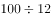，即需要9次。由于货物总量一定，装卸耗费时间相同，则使用一辆载重15吨的货车可以比使用一辆载重12吨的少2次称重及2次往返的时间，即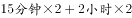。

故正确答案为D。

---

### 第 3 题　qid 1797408 · 数学运算

某个社区老年协会的会员都在象棋、围棋、太极拳、交谊舞和乐器五个兴趣班中报名了至少一项。如果要在老年协会中随机抽取会员进行调查，至少要调查多少个样本才能保证样本中有4名会员报的兴趣班完全相同？

- **A**. 93
- **B**. 94　✅
- **C**. 96
- **D**. 97

**答案**：B

**官方解析**

根据条件，老年协会会员在五个兴趣班中报名至少一项，则每人报名的不同情况共有：种。由问法“至少······保证······”，可判定本题为最不利构造类最值问题，考虑最不利情况。若每种报名情况均有3名会员，在此情况下再调查1人即可保证有一种报名情况达到4名，则至少要调查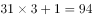人。

故正确答案为B。

---

### 第 4 题　qid 1797414 · 数学运算

甲乙丙三个工厂每天共可以生产防水布2万平方米。现有一批救灾物资要生产，如果将防水布生产任务交给甲乙联合或乙丙联合或甲丙联合完成，分别需要24、30和40天。如果三个工厂联合完成生产任务，且每个工厂每天的产能各增加1万平方米，问可以比在不增加产能的情况下提前几天完成？

- **A**. 6
- **B**. 8
- **C**. 10
- **D**. 12　✅

**答案**：D

**官方解析**

本题考查工程问题。甲乙联合，乙丙联合，甲丙联合分别需要24天、30天和40天完成，则甲乙丙联合一天的效率为，已知甲乙丙每天共生产防水布2万平方米，则工程总量为万平方米。不增加产能时，共需20天完成；每厂各增加产能1万平方米后，甲乙丙每天共生产防水布5万平方米，则需天，提前天。

故正确答案为D。

---

### 第 5 题　qid 1797418 · 数学运算

今天是本月的1日同时也是星期一，且今年某月的1日又是星期一。问这两个1日之间最多相隔几个月？

- **A**. 6
- **B**. 7
- **C**. 9　✅
- **D**. 11

**答案**：C

**官方解析**

本题考查星期日期问题。考虑本月的1日也是星期一，且今年的某月的1日又是星期一，一周有7天，两者之间的间隔也一定为7的倍数。要求最多间隔月数，考虑每月除以7的余数和也能被7整除即可，各月份除以7的余数分别为3、0（1）、3、2、3、2、3、3、2、3、2、3天，最大间隔为某平年的1月1日到10月1日或者2月1日到11月1日，余数和均为21，之间间隔9个月。
故正确答案为C。

---

### 第 6 题　qid 1797424 · 数学运算

一支车队共有20辆大拖车，每辆车的车身长20米，两辆车之间的距离是10米，行进的速度是54千米/小时。这支车队需要通过长760米的桥梁（从第一辆车头上桥到最后一辆车尾离开桥面计时），以双列队通过与以单列队通过花费的时间比是：

- **A**. 7 : 9　✅
- **B**. 29 ：59
- **C**. 3 : 5
- **D**. 1 : 2

**答案**：A

**官方解析**

当车队以双列队通过桥梁时，每列各10辆拖车，中间共产生9个间隔，则所走的总路程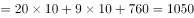米；当车队以单列队通过桥梁时，20辆拖车会产生19个间隔，则所走的总路程米。

因行进速度不变，速度一定，时间和路程成正比。则所需时间之比。

故正确答案为A。

---

### 第 7 题　qid 1797430 · 数学运算

某企业采购了一批文具和书本赠送给希望小学的学生。如果向每个学生捐赠2件文具和3本书，则剩下的书数量是文具的1.5倍；如果向每个学生再多捐赠1件文具和1本书，则剩下的书数量是文具的2倍。该企业最终决定向每个学生捐赠6件文具和10本书，则其还需要采购的书本数量是文具的多少倍？

- **A**. 1倍
- **B**. 2倍　✅
- **C**. 3倍
- **D**. 4倍

**答案**：B

**官方解析**

本题考查和差倍比问题。方法一：捐赠2件文具和3本书，文具和书捐赠比例是2:3；剩下的书数量是文具的1.5倍，即剩下文具和书的比例是2:3；可以得到原来文具和书的比例也是2:3。假设文具数量为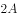，书的数量为，学生数为，如果向每个学生再多捐赠1件文具和1本书，剩余的文具为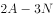，剩余的书为，则有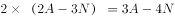，可以得到。即文具数为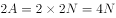，书为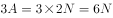。

该企业最终决定向每个学生捐赠6件文具和10本书，则还需采购文具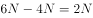，书。那么，其还需要采购的书本数量是文具的倍。

方法二：赋值法。假设学生为1人，则文具总数是4件，书总数是6本即可满足题意。该企业最终决定向每个学生捐赠6件文具和10本书，则还需文具2件，书4本，那么需要采购的书本数量是文具的2倍。

故正确答案为B。

---

### 第 8 题　qid 1797438 · 数学运算

某房间共有6扇门，甲、乙、丙三人分别从任一扇门进去，再从剩下的5扇门中的任一扇出来，问甲未经过1号门，且乙未经过2号门，且丙未经过3号门进出的概率为多少？

- **A**. 

- **B**. 

　✅
- **C**. 

- **D**. 

**答案**：B

**官方解析**

根据题干条件，甲从任一扇门进去，再从剩下的5扇门中的任一扇出来，总情况数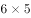，当甲未经过1号门，既不能从1号门进，同时不能从1号门与进入的门出，满足条件的情况数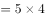。则满足条件的概率。因乙、丙需满足的条件与甲完全相同，则三者同时满足条件的概率。

故正确答案为B。

---

### 第 9 题　qid 1797442 · 数学运算

某公司推出A、B两种新产品，产品A售价为X元，本月售出了Y件；产品B售价为Y元。本月A、B两种产品共售出500件，且产品A的销量为产品B的3倍多，产品A的销售额为1万元。问A、B两种产品本月可能的最高销售总额最接近下列哪个值？

- **A**. 5.5万元
- **B**. 5.7万元　✅
- **C**. 7.2万元
- **D**. 7.5万元

**答案**：B

**官方解析**

本题考查不等式分析问题。由题意列下表：

由产品A的销量为产品B的3倍多可得，，即，。则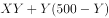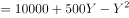，要使此式结果最大，要最小，取，代入可得万元。

故正确答案为B。

---

### 第 10 题　qid 1797230 · 数学运算

某商品上周一开始销售，售价为100元/件，商家规定：如日销售量超过100件，则第二天每件提价10%销售；如日销售量不超过50件，则第二天每件降价10%销售；其它情况价格不变。最终发现，上周该商品共销售了400件。问上周日该商品的价格最高可能是多少元？

- **A**. 99
- **B**. 100
- **C**. 110　✅
- **D**. 121

**答案**：C

**官方解析**

本题考查最值问题。方法一：要使周日商品的价格最高，在调价机会次数固定的情况下，必然是提价次数要最多，降价次数要最少。若要提价次数最多，在一周总销量固定的情况下，则要求提价前一天的销售量尽量少，价格不变情况的销量也尽量少，可赋值提价前一天的销量为101件，价格不变前一天的销量为51件。且因为周日当天的销量不影响周日的价格，所以可以赋值周日销量为0。设提价次数为，价格不变次数为，可得不等式方程组：，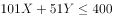，和均为整数，代入运算可得两组结果：，；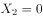，。要让提价次数最多，则选取第一组结果，则周日商品价格元。

方法二：采用代入法，题目问价格最高，则从大到小代入选项。周日的价格受前面6天销量影响，如果周日价格为121元，则前面6天有2次提价，4次不变，6天总销量至少件，不满足题意。若周日价格为110元，则前面6天有1次提价，5次不变，6天总销量至少，满足题意。

故正确答案为C。

---

### 第 11 题　qid 1797236 · 数学运算

高校的科研经费按来源分为纵向科研经费和横向科研经费，某高校机械学院2015年前4个月的纵向科研经费和横向科研经费的数字从小到大排列为20、26、27、28、31、38、44和50万元。如果前4个月纵向科研经费是前3个月横向科研经费的2倍，则该校机械学院2015年第4个月的横向科研经费是多少万元？

- **A**. 26
- **B**. 27　✅
- **C**. 28
- **D**. 31

**答案**：B

**官方解析**

根据题意可知，该学院前4个月的经费总和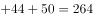万元。第4个月横向经费前4个月经费总和前4个月纵向经费前3个月横向经费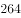前三个月横向经费前3个月横向经费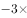前3个月横向经费。观察发现，264是3的倍数，减去的也为3的倍数，则结果一定是3的倍数，只有B项27满足。

故正确答案为B。

---

### 第 12 题　qid 1797246 · 数学运算

上午8点，甲、乙两车同时从A站出发开往1000公里外的B站。甲车初始速度为40公里/小时，且在行驶过程中均匀加速，1小时后速度为42公里/小时；乙车初始速度为50公里/小时，且在行驶过程中均匀减速，1小时后速度为48公里/小时。问中午12点前，两车最大距离为多少公里？

- **A**. 8
- **B**. 12.5　✅
- **C**. 16
- **D**. 25

**答案**：B

**官方解析**

本题考查行程问题。甲、乙两车同时同点同向出发，一个做匀减速运动，另一个做匀加速运动，当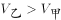时，两人之间的距离在扩大，直到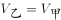时，距离为两车相遇前最大；之后两车距离会缩小，直到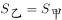，再后来两车距离又会增加。

设小时后两车速度相等，则有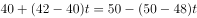，解得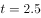，此时两车速度为45公里小时，此时两车距离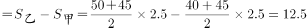公里。

同理，再经过2.5小时两车的距离减小为零，即截至到13点之前两车的距离都在缩小，因此只需考虑一种情况。综上所述，中午12点之前，两车最大距离为12.5公里。

故正确答案为B。

---

### 第 13 题　qid 1797258 · 数学运算

团体操表演中，编号为1~100的学生按顺序排成一列纵队，编号为1的学生拿着红、黄、蓝三种颜色的旗帜，以后每隔2个学生有1人拿红旗，每隔3个学生有1人拿蓝旗，每隔6个学生有1人拿黄旗。问所有学生中有多少人拿两种颜色以上的旗帜？

- **A**. 13
- **B**. 14　✅
- **C**. 15
- **D**. 16

**答案**：B

**官方解析**

每隔2个学生相当于每3个学生拿一支红旗，每隔3个学生相当于每4个学生拿一支蓝旗，每隔6个学生相当于每7个学生拿一支黄旗。即每个学生同时拿红旗和蓝旗，每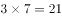个学生同时拿红旗和黄旗，每个学生同时拿蓝旗和黄旗，每个学生同时拿红旗、黄旗和蓝旗。

排除编号为1的学生，在剩下99个学生中，拿红旗和蓝旗的有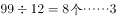；拿红旗和黄旗的有；拿蓝旗和黄旗的有。拿红旗、蓝旗和黄旗的有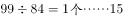。因拿红旗、黄旗和蓝旗的学生同时属于拿红旗和蓝旗、红旗和黄旗、蓝旗和黄旗，计算时需排除重复情况。故拿两种颜色以上旗帜的学生有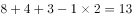人，加上第一个同学，共14人。

故正确答案为B。

---

### 第 14 题　qid 1797320 · 数学运算

一块由两个正三角形拼成的菱形土地ABCD周长为800米，土地周围和中间的道路如下图所示，其中DE、BF分别与AB和CD垂直。如要从该土地上任何一点出发走完每一段道路，问需要行进的距离最少是多少米？

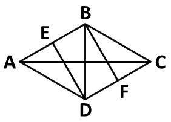

- **A**. 

- **B**. 
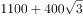
　✅
- **C**. 
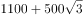

- **D**. 

**答案**：B

**官方解析**

本题考查几何问题。根据图形一笔画的基本规律，当图中奇点个数为0或2的时候可以一笔画完，其他情况需要的至少笔画数奇点个数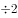。观察题目，图中一共有4个奇点，分别是A、E、F、C，则至少需要两笔完成。从任意奇点出发，需要重复走一段路，走到另一个奇点，才能走完所有道路。观察可知，连接两个奇点最短的距离是AE或者CF，为100米，最短路径的走法可以是A→B→C→D→A→C→F→B→D→E，则总路程至少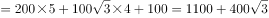米。

故正确答案为B。

---

## 判断推理

### 第 1 题　qid 1797340 · 图形推理

从所给的四个选项中，选择最合适的一个填入问号处，使之呈现一定的规律性：

- **A**. A
- **B**. B
- **C**. C
- **D**. D　✅

**答案**：D

**官方解析**

图形组成凌乱，且数量规律明显，考虑数数。
题干中每个图形都有两个面，排除A、C两项，B、D两项均有两个面，区别在于B项是两个形状相同的面，D项是不同的面，题干中的面都不相同，排除B项。（也可以用下面的规律：题干中两个面的关系都是一上一下，而B项是一左一右，D项是一上一下，故排除B项。）
故正确答案为D。

---

### 第 2 题　qid 1797352 · 图形推理

从所给的四个选项中，选择最合适的一个填入问号处，使之呈现一定的规律性：

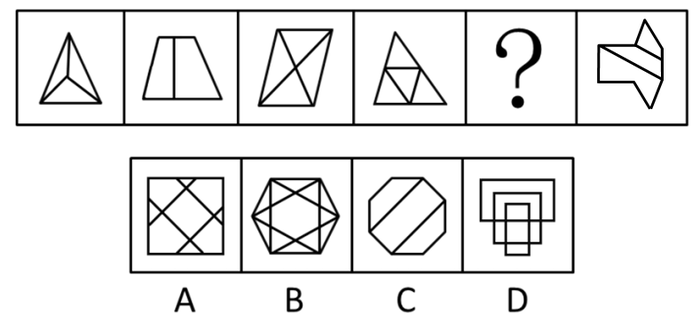

- **A**. A
- **B**. B
- **C**. C　✅
- **D**. D

**答案**：C

**官方解析**

解析一：图形元素组成不同，且无明显的属性规律，考虑数量规律。题干都为多边形，内部被线条分割开，考虑数面，面数量分别为3、2、4、4、？、3。问号处如果有2个面的图形可成规律，无答案；多边形还常考虑数直线，直线数量分别为6、5、6、6、？、10，无明显熟悉规律；再尝试数点，点数量分别为4、6、5、6、？、9。经过仔细研究发现，每个图点数量和面数量之和为：7、8、9、10、？、12。因此问号处应该选择一个面数量与点数量之和为11的选项，只有C选项符合。
故正确答案为C。
解析二：图形元素组成不同，且无明显的属性规律，考虑数量规律。题干都为多边形，考虑数直线，但整体数直线无规律。继续观察发现，题干大部分图形中存在平行线，考虑直线的细化考法数平行线，平行线的组数依次为0、1、2、3、？、5，且每组有2条平行线。因此问号处应该选择一个平行线组数为4，且每组有2条平行线的选项，只有A选项符合。
故正确答案为A。
粉笔说明：两种思路均可通过严谨的数量规律得到答案，且公务员考试中都出现过类似考法的题目，故两种答案粉笔都认可。

---

### 第 3 题　qid 1797364 · 图形推理

下面的立体图形如果从任一面剖开，以下哪一项不可能是该立体图形的截面？

- **A**. A
- **B**. B
- **C**. C
- **D**. D　✅

**答案**：D

**官方解析**

A项：如图1所示可以切出；

C项：如图2所示可以切出；

B项：如图3所示可以切出。

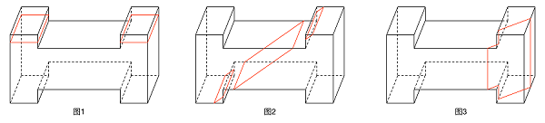

本题为选非题，故正确答案为D。

---

### 第 4 题　qid 1797374 · 图形推理

右边哪一项不可能是左边正方体纸盒的展开图？

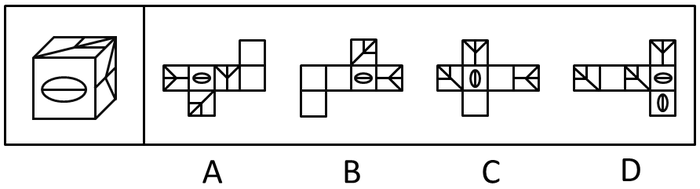 

- **A**. A
- **B**. B
- **C**. C
- **D**. D　✅

**答案**：D

**官方解析**

纸盒右边图形箭头指向椭圆，且具有一条直线与椭圆内的长轴水平方向一致。观察选项，ABCD的右边样式的图形均与椭圆相邻，但D项中直线与椭圆内的长轴垂直，故无法折成原图。
本题为选非题，故正确答案为D。

---

### 第 5 题　qid 1797382 · 图形推理

把下面的六个图形分成两类，使每一类图形都有各自的共同特征或规律，分类正确的一项是：

- **A**. ①②③，④⑤⑥
- **B**. ①③⑤，②④⑥
- **C**. ①③④，②⑤⑥　✅
- **D**. ①⑤⑥，②③④

**答案**：C

**官方解析**

图形元素组成不同，且无明显的属性规律，优先考虑数量规律。每个图形都是由多个小元素构成，考虑数图中的元素的部分数，图①③④都是3部分，图②⑤⑥都是4部分。
故正确答案为C。

---

### 第 6 题　qid 1797948 · 定义判断

群体规范包括正式规范和非正式规范，前者是指由组织明文规定的员工应遵循的规则和程序；后者是指人们在工作与生活过程中约定俗成的行为准则，该规范的形成受到历史、习惯、群体目的性和社会因素的影响，同时也在很大程度上受到模仿、暗示、顺从等心理因素的制约，在群体成员彼此相互作用的条件下，发生的一种内化的过程。
根据上述定义，下列不属于非正式群体规范的是：

- **A**. 公司要求每位员工在刚入职时签署保密责任书　✅
- **B**. 由于受到描写黑帮的电影影响，一些青少年往往容易进行简单的模仿，形成各种“帮”、“会”等组织
- **C**. 春节是一家人团聚的时刻，北方人常常要在除夕夜包饺子，而南方人则是煮汤圆
- **D**. 在举手表决时，尽管有些人不赞成提案，但碍于情面，也会举手赞成

**答案**：A

**官方解析**

第一步：找出定义关键词。
正式群体规范：“由组织明文规定的员工应遵循的规则和程序”；
非正式群体规范：“约定俗成的行为准则”、“受到历史、习惯、群体目的性和社会因素的影响”、“受到模仿、暗示、顺从等心理因素的制约”。
第二步：逐一分析选项。
A项：公司要求每位员工签署保密责任书，这是公司的一项明文规定，符合“由组织明文规定的员工应遵循的规则和程序”，符合“正式群体规范”定义，不符合“非正式群体规范”定义，当选；
B项：青少年对描写黑帮的电影进行简单模仿，符合“受到模仿、暗示、顺从等心理因素的制约”，符合“非正式群体规范”定义，排除；
C项：南北方春节习俗不同，符合“约定俗成的行为准则”、“受到历史、习惯、群体目的性和社会因素的影响”，符合“非正式群体规范”定义，排除；
D项：有些人不赞成提案却碍于情面举手赞成，符合“受到历史、习惯、群体目的性和社会因素的影响”、“受到模仿、暗示、顺从等心理因素的制约”，符合“非正式群体规范”定义，排除。
本题为选非题，故正确答案为A。

---

### 第 7 题　qid 1797950 · 定义判断

前控控制是指在计划实施之前，为了保证将来的实际成果能达到计划的要求，尽量减少偏离的控制。
根据上述定义，下列属于前控控制的是：

- **A**. 营销部主任在方案推广期间，不断做出调整，尽量避免误差
- **B**. 新药剂的配方尽管之前经过多位专家考证，但药效还不如老配方
- **C**. 新游戏的图纸在投入编程之前，经过了几轮研讨以确保效果逼真　✅
- **D**. 新产品上市后销量一般，工厂组织技术人员进行升级后再次推向市场

**答案**：C

**官方解析**

第一步：抓住定义中的关键词。
关键词强调“在计划实施之前”、“保证将来的实际成果能达到计划的要求，尽量减少偏离的控制”。
第二步：逐一判断选项。
A项：在方案推广期间，不符合“在计划实施之前”，排除；
B项：新药剂药效不如老配方是两种不同药剂的比较，并不是使得新药剂的实际效果达到计划要求，排除；
C项：新游戏的图纸在投入编程之前研讨符合“在计划实施之前”，确保效果逼真符合“尽量减少偏离的控制”，所以符合定义，当选；
D项：新产品上市后，不符合“在计划实施之前”，排除。
故正确答案为C。

---

### 第 8 题　qid 1797952 · 定义判断

诉诸群众指的是为赢得众人同意一项主张时，不诉诸相关的事实和理由，而通过激起众人的情感和热情，以达到目的。不是服人以理，而是动人以情。这是宣传家、政客和广告商最常用的辩论方式。
根据上述定义，下列哪项属于诉诸群众？

- **A**. 某宣传家说：“在座的都要支持我的主张，因为我的主张是合理的！”
- **B**. 某政客说：“大家投我一票，选择我就是选择了未来！”　✅
- **C**. 某广告说：“好吃的包子叫龙凤，因为它采用了宫廷秘方！”
- **D**. 某刑事被告人说：“我是家里的顶梁柱，希望法官量刑时综合考虑！”

**答案**：B

**官方解析**

第一步：找出定义关键词。
“赢得众人同意一项主张”、“通过激起众人的情感和热情，以达到目的”、“不诉诸相关的事实和理由”。
第二步：逐一分析选项。
A项：“因为我的主张是合理的”是在诉诸相关理由，不符合“不诉诸相关的事实和理由”，不符合定义，排除；
B项：“大家投我一票，选择我就是选择了未来”，符合“通过激起众人的情感和热情，以达到目的”，符合定义，当选；
C项：“因为它采用了宫廷秘方”是在诉诸相关理由，不符合“不诉诸相关的事实和理由”，不符合定义，排除；
D项：“我是家里的顶梁柱”是在诉诸相关的事实和理由，不符合“不诉诸相关的事实和理由”，且是说服法官一个人，不符合“赢得众人同意一项主张”，不符合定义，排除。
故正确答案为B。

---

### 第 9 题　qid 1797954 · 定义判断

专利间接侵权是指，行为人的行为本身并不直接侵犯他人的专利，但却教唆、帮助或诱导他人实施专利侵权行为。
根据上述定义，下列哪项属于专利间接侵权？

- **A**. 王某通过个人关系购买了甲公司发动机设备，该设备已申请国家专利，之后经甲公司许可转售给乙公司
- **B**. 李某购买了一批已申请专利的用于浇注系统的模具，在购买前他和生产该模具的公司签订了相关合同
- **C**. 宋某将某外文小说译成中文后，以第一作者身份出版该小说，从中获利一百万元
- **D**. 甲公司遇到技术问题后委托乙公司解决，并暗示乙公司技术人员采用了丙公司的专利技术，但未告知丙公司　✅

**答案**：D

**官方解析**

第一步：抓住定义中的关键词。
关键词强调“行为人的行为本身并不实施专利侵权”“教唆、帮助或诱导他人实施专利侵权”。
第二步：逐一判断选项。
A项：王某购买设备不涉及侵犯专利权，也没有教唆、帮助或诱导他人实施专利侵权行为，不符合定义，排除；
B项：李某购买模具前他和生产该模具的公司签订了相关合同，没有侵权行为，也没有教唆、帮助或诱导他人实施专利侵权行为，不符合定义，排除；
C项：宋某本人直接侵犯了专利权，不属于间接侵权，是直接侵权，不符合定义，排除；
D项：甲公司没有直接侵权，教唆乙公司技术人员侵害丙公司的专利权，符合定义关键词，是间接侵权，当选。
故正确答案为D。

---

### 第 10 题　qid 1797956 · 定义判断

互助游是指有旅游意向的双方利用互联网等媒介中的人脉关系交换旅游资源，相互提供帮助而实现旅游的方式，达到双方都能降低旅游成本、实现深入体验旅游的目的。
根据上述定义，下列涉及互助游的是：

- **A**. 小张在北京读书，利用暑假时间到同学所在的城市旅游，期间住在同学的宿舍
- **B**. 小王家住南京，准备到西藏旅游，邀请家住西安的网友同行，分摊支出，旅途中互相帮助
- **C**. 小刘住在北京，在桂林旅游期间住在网友家里，对方到北京旅游时，自己也向对方提供住宿　✅
- **D**. 小赵住在上海，到海南旅行，食宿与行程均有朋友安排负责，小赵返沪后邀请朋友到上海玩

**答案**：C

**官方解析**

第一步：抓住定义中的关键词。
关键词强调“有旅游意向的双方”、“利用互联网等媒介中的人脉关系交换旅游资源”、“双方都能降低旅游成本、实现深入体验旅游”。
第二步：逐一判断选项。
A项：小张一个人旅游，不符合“有旅游意向的双方”，不符合定义，排除；
B项：小王和网友属于互联网媒介中的人脉关系，但只是分摊支出，没有体现出资源的交换，不符合定义，排除；
C项：小刘和网友属于互联网媒介中的人脉关系，网友为小刘在桂林旅游提供住宿，小刘为网友在北京旅游提供住宿，体现了住宿旅游资源的交换，双方都降低了旅游成本，符合定义，当选；
D项：小赵返沪后邀请朋友到上海玩，不涉及互联网媒介，且邀请朋友来但朋友是否前来不知道，是不明确选项，排除。
故正确答案为C。

---

### 第 11 题　qid 1797182 · 定义判断

替代性攻击，即遭受挫折后由于无法直接向挫折制造的源头表达愤怒或不满，而将怒气发泄到另外的“替罪羊”身上，“替罪羊”往往处于相对较弱的地位。
根据上述定义，下列不属于替代性攻击的是：

- **A**. 甲在工作中被老板责备，心怀不满，回家后因为一件小事责骂妻子
- **B**. 乙上课时受到老师批评，心中憋闷，下课后在学校超市把货架上的方便面全部捏碎
- **C**. 丙和邻居发生冲突时被迫忍气吞声，后趁天黑将邻居家的汽车车胎扎漏　✅
- **D**. 丁路过树下时被树上的鸟粪砸中，感到很生气，轰走了上来乞食的流浪猫

**答案**：C

**官方解析**

第一步：找出定义中的关键词。
“遭受挫折后由于无法直接向挫折制造的源头表达愤怒或不满”、“将怒气发泄到另外的‘替罪羊’身上”、“‘替罪羊’往往处于相对较弱的地位。”
第二步：逐一分析选项。
A项：甲受到了领导的责备，不责备领导而责备妻子，妻子是“另外的替罪羊”，符合定义，排除；
B项：乙上课时受到老师批评，不能骂老师，将怒气发泄到方便面上，方便面是“处于较弱地位的替罪羊”，符合定义，排除；
C项：邻居是挫折的源头，丙通过将邻居汽车车胎扎漏向挫折制造的源头“邻居”表达愤怒或不满，没有“替罪羊”出现，不符合定义，当选；
D项：丁被鸟粪砸中，但转而向流浪猫发脾气，流浪猫是“处于较弱地位的替罪羊”，符合定义，排除。
本题为选非题，故正确答案为C。

---

### 第 12 题　qid 1797186 · 定义判断

价值的条件化过程是指个体的价值评价建立在他人评价的基础上，以他人的价值规范为标准，而非根据自身的满足感进行评价。
根据上述定义，下列不属于价值的条件化过程的是：

- **A**. 一个学生受到老师误解，虽然内心愤怒和委屈，但从小受教导应当尊重老师，认为即使受到误解，也不应该指责老师
- **B**. 一个男孩把玻璃杯摔地上，他觉得很好玩，其父母因此不满并教育他不能随意摔东西，为让父母高兴，男孩学会不再摔东西
- **C**. 一个婴儿突然哭了，母亲听到后立刻给他换上干净清洁的纸尿裤，并给他喂奶，婴儿停止哭闹，不久后酣然入睡　✅
- **D**. 一个身材适中的女孩，其男友认为她很胖，于是女孩开始每天通过节食的方式进行减肥，即使饿了也不多进食

**答案**：C

**官方解析**

第一步：抓住定义中的关键词。
关键词强调“个体的价值评价以他人的价值规范为标准”、“非根据自身的满足感进行评价”。
第二步：逐一判断选项。
A项：学生以“从小受教导应当尊重老师，认为即使受到误解，也不应该指责老师”作为自己的价值评价，而非根据自身的满足感进行评价，符合定义，排除；
B项：男孩以“父母教育他不能随意摔东西”作为自己的价值评价，而非根据自身的满足感进行评价，符合定义，排除；
C项：婴儿哭是因为自己饿了，是根据自身的满足感进行评价，不符合定义，当选；
D项：女孩以“男友认为她很胖”作为自己的价值评价，而非根据自身的满足感进行评价，符合定义，排除。
本题为选非题，故正确答案为C。

---

### 第 13 题　qid 1797188 · 定义判断

动物权利主义认为，动物就其本质上来说应该有行为的自由；有在它们自己的生活圈中生活、居住的自由；有远离人类伤害、虐待和剥削的自由，也就是说动物有权利不受人类伤害、虐待和剥削，享有和人类一样的权利。动物福利主义认为，人类可以利用动物，例如用于研究实验、食用、猎取，用于体育娱乐或其他用途，但在利用动物的过程中，人类应该人道地对待动物，防止并惩罚虐待动物的残酷行为。
根据上述定义，下列做法中符合动物权利主义思想的是：

- **A**. 有些国家的法律禁止解剖动物，并禁止在马戏团进行驯兽表演　✅
- **B**. 1822年，英国国会通过了世界上第一部反对虐待动物的法律——《马丁法案》。这个法案禁止无故殴打、虐待任何驴、马、牛、羊或其他牲口，除非牲口先攻击人
- **C**. 大多数人看到一只弱小的毛驴被无辜地鞭打的时候，都会身不由己地同情毛驴
- **D**. 某地爱狗人士将高速公路上运送食用狗的车辆拦截，反对食用狗肉，但他们并不反对食用猪、牛、家禽等动物

**答案**：A

**官方解析**

第一步：找出定义关键词。
动物权利主义：动物应该“有行为的自由”、“有在它们自己的生活圈中生活、居住的自由”、“ 有远离人类伤害、虐待和剥削的自由”。
动物福利主义：“人类应该人道地对待动物，防止并惩罚虐待动物的残酷行为”。
第二步：逐一分析选项。
A项：“法律禁止解剖动物，并禁止在马戏团进行驯兽表演”符合“有远离人类伤害、虐待和剥削的自由”，符合动物权利主义的定义，当选；
B项：“法案禁止无故殴打、虐待任何驴、马、牛、羊或其他牲口，除非牲口先攻击人”符合“人类应该人道地对待动物，防止并惩罚虐待动物的残酷行为”，符合动物福利主义思想，不符合动物权利主义思想，排除；
C项：“大多数人看到一只弱小的毛驴被无辜地鞭打的时候，都会身不由己地同情毛驴”，是说人们会同情，没有涉及对动物权利的保护，不符合动物权利主义思想，排除；
D项：爱狗人士反对吃狗肉但不反对吃其他动物的肉，没有涉及对所有动物的权利的保护，不符合动物权利主义思想，排除。
故正确答案为A。

---

### 第 14 题　qid 1797192 · 定义判断

商标平行进口是指在国际货物贸易中，某一特定产品的商标已获进口国知识产权法保护，并且商标权所有人已在该国自己或授权他人制造或销售其商标权产品的情况下，进口商未经商标权人包括商标所有人或商标独占被许可人许可，擅自从国外进口该商标权产品到进口国销售的行为。
根据上述定义，下列不属于商标平行进口的是：

- **A**. 商标权人甲在A国享有商标权，并仅授权乙在A国制造、销售该商标权产品，丙在B国仿造该商标权产品，并输入到A国　✅
- **B**. A国的商标权人甲授权B国代理商乙在B国独家制造、销售该商标权产品，丙从B国将该商标权产品输入到A国
- **C**. 商标权人甲分别在A、B两国获得了同一商标注册，取得商标权，并且制造、销售产品，乙从A国将该商标产品输入到B国
- **D**. 商标权人甲在A国享有商标权，甲授权B国的乙为独占被许可人，甲在C国不享有该商标权，丙从C国合法购买该商标产品并输入到A国

**答案**：A

**官方解析**

第一步：抓住定义中的关键词。
“进口商未经商标权人许可，擅自从国外进口该商标权产品到进口国销售”。
第二步：逐一分析选项。
A项：丙在B国是仿造该商标权产品，并不是“该商标权产品”，不符合定义，当选；
B项：甲在A国是商标权人，丙没有经过甲的许可，擅自将B国的该商标权产品销售到A国，符合定义，排除；
C项：甲在A、B国都是商标权人，乙没有经过甲的许可，擅自从A国将该商标产品输入到B国，符合定义，排除；
D项：甲在A国是商标权人，丙没有经过甲的许可，擅自从C国将该商标产品输入到A国，符合定义，排除。
本题为选非题，故正确答案为A。

---

### 第 15 题　qid 1797202 · 逻辑判断

精神防御机制是在人们遇到困难时所采取的回避困难、解除烦恼、保护心理安宁的方法。该机制包括几种方法：转移作用是指对某一对象的情感因某种原因（发生危险或不合社会习惯）无法向其直接表现时，而转移到其它较安全或较为大家所接受的对象身上。合理化作用是指个人遭受挫折或无法达到所追求的目标以及行为表现不符合社会规范时，给自己找一些有利的理由来解释。投射作用是指将自己所不喜欢或不能接受的性格、态度、意念，“投射”到别人身上或外部世界去，而断言别人是这样的现象。
根据定义，下列反映了上述三种防御机制之一的是：

- **A**. 小琴的父母不喜欢体育运动，小琴被校羽毛球队选去当优秀苗子来培养，父母认为这样会耽误学习而坚决反对
- **B**. 小风在住院期间长时间和高护士接触，很感激高护士对自己的照顾，出院后他始终感念，对在护士学校上学的妹妹更加关心爱护
- **C**. 小宁不喜欢数学，数学考试也常常不及格，他认为不是自己学不好，而是老师教得不好，无法引起他的兴趣　✅
- **D**. 小何在宾馆做前台接待，最近和家人发生了矛盾，心情很低落，在接待客户时常常心不在焉、丢三落四

**答案**：C

**官方解析**

第一步：抓住定义中的关键词。
关键词强调“遇到困难时采取回避困难、解除烦恼、保护心理安宁的方法”。
“转移作用”：转移到安全或大家接受的对象身上。
“合理化作用”：找有利理由解释。
“投射作用”：把自己不喜欢的性格、态度、意念投射到别人身上。
第二步：逐一判断选项。
A项：父母的反对是小琴遇到的困难，但没有提及小琴如何防御或解决问题，不符合定义，排除；
B项：小风是感激别人的帮助，并没有提到遇到困难怎么解决烦恼，不符合定义，排除；
C项：小宁将自己数学考试常常不及格解释为老师教得不好，是为自己找有利的理由解释他所遇到的困难，属于“合理化作用”，符合定义，当选；
D项：小何因为和家人的矛盾导致工作失误，这是他遇到的困难，但没有提及他如何回避困难解决烦恼，不符合定义，排除。
故正确答案为C。

---

### 第 16 题　qid 1797214 · 类比推理

指甲：指甲钳

- **A**. 头发：发卡
- **B**. 铅笔：铅笔盒
- **C**. 手：手套
- **D**. 胡子：剃须刀　✅

**答案**：D

**官方解析**

第一步：分析题干词语的逻辑关系
指甲钳可以修剪指甲，二者为功能对应关系。
第二步：逐一分析选项
A项：发卡的作用是装饰与固定头发，二者为功能对应关系，保留；
B项：铅笔盒可以用来装铅笔，二者为功能对应关系，保留；
C项：手套戴在手上，可以起到保暖或装饰作用，二者为功能对应关系，保留；
D项：剃须刀是修剪胡子的工具，二者为功能对应关系，保留。
比较四个选项，D项剃须刀和题干指甲钳的功能都是修剪，属于同一范畴，二者更为类似，当选。
故正确答案为D。

---

### 第 17 题　qid 1797222 · 类比推理

哺乳动物：陆生动物

- **A**. 航天器：交通工具　✅
- **B**. 有花植物：无花植物
- **C**. 星际物质：天狼星
- **D**. 北极熊：极地企鹅

**答案**：A

**官方解析**

第一步：分析题干词语的逻辑关系。
有的陆生动物是哺乳动物，有的陆生动物不是哺乳动物；有的哺乳动物是陆生动物，有的哺乳动物不是陆生动物，因此二者是交叉关系。
第二步：逐一分析选项。
A项：有的航天器是交通工具，如航天飞机，有的航天器不是交通工具，如卫星、空间站等；有的交通工具是航天器，有的交通工具不是航天器，二者是交叉关系，与题干逻辑关系一致，当选；
B项：有花植物和无花植物是矛盾关系，与题干逻辑关系不一致，排除；
C项：天狼星是星体，星际物质是星体与星体之间的物质，二者没有必然联系，排除；
D项：北极熊和极地企鹅是两种不同的动物，并列关系，与题干逻辑关系不一致，排除。
故正确答案为A。

---

### 第 18 题　qid 1797228 · 类比推理

清洁能源：太阳能

- **A**. 女英雄：三八红旗手　✅
- **B**. 风车：风能
- **C**. 可再生能源：植物
- **D**. 治疗仪：按摩器

**答案**：A

**官方解析**

第一步：分析题干词语的逻辑关系。

太阳能是一种清洁能源，二者是种属关系。

第二步：逐一分析选项。

A项：英雄（广义）可以指不怕困难，不顾自己，为人民利益而英勇斗争，令人钦敬的人，如“人民英雄”“劳动英雄”等，女英雄指女性英雄；三八红旗手是由中华人民共和国妇女工作组织在三月八号国际妇女节颁发给优秀劳动妇女的荣誉称号，主要是表彰在中国各条战线上为社会主义物质文明和精神文明建设做出显著成绩的妇女先进个人和妇女先进集体。三八红旗手属于女英雄，二者是种属关系，与题干逻辑关系一致，当选；

B项：风车是利用和产生风能的工具，二者是对应关系，与题干逻辑关系不一致，排除；

C项：可再生能源是指风能、太阳能、水能、生物质能、地热能、海洋能等非化石能源，是取之不尽、用之不竭的能源，是相对于会穷尽的不可再生能源的一种能源，对环境无害或危害极小，而且资源分布广泛，适宜就地开发利用。可再生能源不包括植物，二者并非种属关系，与题干逻辑关系不一致，排除；

D项：治疗仪和按摩器是交叉关系，有的治疗仪是按摩器，也有的治疗仪不是按摩器，如一些激光治疗仪、红外治疗仪；有的按摩器是治疗仪，也有的按摩器不是治疗仪，如一些面部按摩器，不属于治疗仪。与题干逻辑关系不一致，排除。

故正确答案为A。

注：本题非常有争议，题干是种属关系，A项出题人是否认为有的三八红旗手不是女英雄，把A项当成了交叉关系？我们不得而知，但是一般来说，出题人没有必要传递出这样的观念，哪个三八红旗手不是女英雄呢？正确的观念应该是所有的三八红旗手都是女英雄，都是值得我们尊敬的；

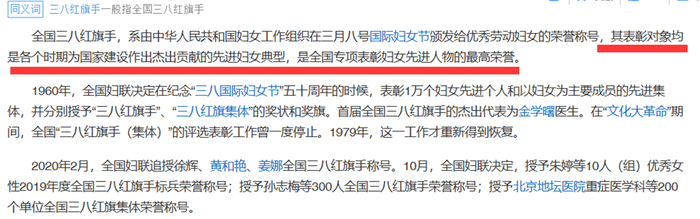

另外C项的争议主要是植物是可再生“资源”，但是能不能看成可再生“能源”，各家说法也有争议，以后做题遇到类似选项时，可保留跟其他选项比较；

综上，本题争议性太大，在备考阶段，了解即可，可不作为重点题。

---

### 第 19 题　qid 1797234 · 类比推理

天下雨：地上湿

- **A**. 满18岁：有选举权
- **B**. 开花：结果
- **C**. 地上不湿：天没下雨　✅
- **D**. 摩擦：生热

**答案**：C

**官方解析**

第一步：分析题干词语的逻辑关系。
天下雨，必然地就会湿，天下雨是地上湿的充分条件。
第二步：逐一分析选项。
A项：满18岁，也不一定有选举权，不是充分条件，与题干逻辑关系不一致，排除；
B项：开花了也不一定会结果，不是充分条件，与题干逻辑关系不一致，排除；
C项：地没湿说明天一定没有下雨，地没湿是天没下雨的充分条件，与题干逻辑关系一致，当选；
D项：动摩擦产生热，但是静摩擦不产生热，因此摩擦不一定生热，与题干逻辑关系不一致，排除。
故正确答案为C。

---

### 第 20 题　qid 1797238 · 类比推理

研究生：硕士：博士

- **A**. 青少年：少年：青年　✅
- **B**. 妇孺：儿童：妇女
- **C**. 建筑：平房：高楼
- **D**. 图形：直线：三角形

**答案**：A

**官方解析**

第一步：分析题干词语的逻辑关系。
研究生只包含硕士和博士，硕士和博士属于研究生的两个阶段，读完硕士后才能读博士。
第二步：逐一分析选项。
A项：青少年只包含青年和少年两个阶段，经过少年阶段才能成长为青年，与题干逻辑关系一致，当选；
B项：妇孺包含妇女和儿童，儿童和妇女并不是妇孺的两个成长阶段，且儿童的性别有男有女，有可能成长为成年男子，与题干逻辑关系不一致，排除；
C项：平房和高楼虽然都属于建筑，但二者并不是建筑的两个阶段，与题干逻辑关系不一致，排除；
D项：直线和三角形不是图形的两个阶段，与题干逻辑关系不一致，排除。
故正确答案为A。

---

### 第 21 题　qid 1797252 · 类比推理

行驶：违章：罚款

- **A**. 学习：成绩：奖励
- **B**. 栽培：减产：施肥
- **C**. 竞争：优势：成功
- **D**. 锻炼：受伤：医治　✅

**答案**：D

**官方解析**

第一步：分析题干词语的逻辑关系。
行驶的过程中，违章了就可能会被罚款，对应关系。违章的人是被罚款的人。
第二步：逐一分析选项。
A项：学习的过程中，成绩好才可能会有奖励，但A项并没有提到成绩的好坏，与题干逻辑关系不一致，排除；
B项：减产不是发生在栽培的过程中的，而是栽培结束之后，与题干逻辑关系不一致，排除；
C项：竞争的过程中，优势会带来成功。有优势的人是成功的人，不存在被动关系，与题干逻辑关系不一致，排除；
D项：锻炼的过程中，受伤了可能需要被医治，受伤的人是被医治的人，与题干逻辑关系一致，当选。
故正确答案为D。

---

### 第 22 题　qid 1797266 · 类比推理

监督：人大：媒体

- **A**. 教育：小学：中学　✅
- **B**. 融资：借贷：赞助
- **C**. 增收：加薪：优惠
- **D**. 惩罚：死刑：徒刑

**答案**：A

**官方解析**

第一步：判断题干词语间逻辑关系。
人大和媒体是不同的机构，是并列关系，并且都有监督的功能。
第二步：判断选项词语间逻辑关系。
A项：小学和中学都是学校的一种，是并列关系，并且都有教育的功能，与题干逻辑关系一致，保留；
B项：融资即是一个企业的资金筹集的行为与过程，借贷可以作为一种融资的方式、起到融资的作用，但赞助的功能并非是融资，与题干逻辑关系不一致，排除；
C项：加薪是增收的一种方式，是种属关系，优惠和增收没关系，与题干逻辑关系不一致，排除；
D项：死刑和徒刑都是刑罚的一种，是并列关系，并且都有惩罚的功能，与题干逻辑关系一致，保留。
进行二级辨析，题干人大和媒体都是具体的单位机构，A项小学和中学也是具体的单位机构，D项死刑和徒刑是抽象词，即一些虚拟抽象概念。因此，A项与题干逻辑关系更为接近，排除D项。
故正确答案为A。

---

### 第 23 题　qid 1797278 · 类比推理

春雨：杏花：江南

- **A**. 夏荷：烈日：江北
- **B**. 秋风：腊梅：华北
- **C**. 秋霜：枯草：塞外　✅
- **D**. 冬雪：牡丹：边疆

**答案**：C

**官方解析**

第一步：分析题干词语的逻辑关系。
春雨和杏花都是春天的景色，对应的地点是江南，对应关系。
第二步：逐一分析选项。
A项：夏荷和烈日是夏天有的景色，江北也是地点，对应关系，与题干逻辑关系一致，保留；
B项：秋风是秋天的气候，但腊梅冬天才有，与题干逻辑关系不一致，排除；
C项：秋霜和枯草都是秋天的景象，对应的地点是塞外，与题干逻辑关系一致，保留；
D项：冬雪是冬天的景象，但牡丹是春天开花，与题干逻辑关系不一致，排除。
比较A、C两项：题干春雨是一种天气状况，杏花是植物，而A项夏荷是植物，烈日是天气，顺序与题干不一致，排除；C项秋霜是天气状况，枯草是植物，更符合题干逻辑关系，当选。
故正确答案为C。

---

### 第 24 题　qid 1797286 · 类比推理

航空母舰 对于（  ） 相当于 雷达 对于 （   ）

- **A**. 驱逐舰 天线
- **B**. 海洋 天空
- **C**. 舰载机 显示屏
- **D**. 舰艇 电子设备　✅

**答案**：D

**官方解析**

逐一代入选项。
A项：航空母舰和驱逐舰都属于舰艇，是并列关系；天线是雷达的组成部分，是组成关系，前后逻辑关系不一致，排除；
B项：航空母舰在海洋中行驶，但雷达并不在天空中运行，前后逻辑关系不一致，排除；
C项：舰载机停在航空母舰上，也是配备在航空母舰上的主要武器，而且是对应关系；显示屏是现代雷达的一个组成部分，与雷达是组成关系，前后逻辑关系不一致，排除；
D项：航空母舰是一种舰艇，雷达是一种电子设备，均为种属关系，前后逻辑关系一致，当选。
故正确答案为D。

---

### 第 25 题　qid 1797304 · 类比推理

理想  对于（    ）相当于（    ）对于涂鸦

- **A**. 现实  作品
- **B**. 梦想  画家
- **C**. 白日梦  画作　✅
- **D**. 志愿  涂改

**答案**：C

**官方解析**

逐一代入选项。
A项：理想与现实是反义关系，涂鸦和作品不是反义关系，前后逻辑关系不一致，排除；
B项：理想和梦想是近义词，画家和涂鸦是对应关系，前后逻辑关系不一致，排除；
C项：有的白日梦是理想，有的涂鸦是画作，都是交叉关系，前后逻辑关系一致；
D项：理想和志愿意思有相近的地方，但理想比较宏大，志愿比较具体；涂改和涂鸦之间没有必然联系，前后逻辑关系不一致，排除。
故正确答案为C。

---

### 第 26 题　qid 1797314 · 类比推理

人类排放温室气体导致北极冰川开始消融，海平面扩大。冰川可以反射85%的太阳光，而海水只反射5%的太阳光，越来越多的海水吸收更多能量，进一步加速冰川消融。
以下哪一项中的因果关系与题干最为相同？

- **A**. 商场为某名牌香水做推广和宣传，顾客购买几次后发现该香水香氛淡雅，持久清新，成为了该品牌香水的忠实顾客
- **B**. 英语考试在即，王强不得不每天早起诵读英语，早上空气清新，精神抖擞，英语考试结束后，王强依然坚持早起
- **C**. 张楠在爸爸的引荐下，认识了一些证券交易的客户，这个圈子的客户发展是滚雪球式的，张楠认识的客户越来越多　✅
- **D**. 使用新方法后，刘丹的平面几何成绩迅速提高，由于平面几何很多原理可用在立体几何中，刘丹的立体几何成绩也很快提高

**答案**：C

**官方解析**

第一步：分析题干推理方式。
冰川消融导致海水增多，海水增多吸收更多能量加速冰川消融，即a导致b，b又导致a，ab之间互为条件关系。
第二步：逐一分析选项。
A项：顾客购买多次发现其优点成为忠实顾客，即a导致b，与题干推理方式不一致，排除；
B项：考试导致早起，不考试了也早起，说明早起与考试之间不存在因果关系，即a与b无关，与题干推理方式不一致，排除；
C项：张楠在爸爸的引荐下认识了一些客户，然后越来越多的客户认识了张楠，即ab互为条件关系，与题干推理方式一致；
D项：使用新方法，平面几何成绩提高，利用新方法，立体几何成绩也提高，即a导致b，a也导致c，与题干推理方式不一致，排除；
故正确答案为C。

---

### 第 27 题　qid 1797328 · 逻辑判断

某研究所人员结构状况如下：所有女性都拥有博士学位，有的男博士有高级职称，但所里也存在既没有博士学位也没有高级职称的人员。
根据以上陈述，可以推出以下哪项？

- **A**. 有的男性没有高级职称　✅
- **B**. 有的女性有高级职称
- **C**. 所有男性都拥有高级职称
- **D**. 有的女性没有高级职称

**答案**：A

**官方解析**

第一步：根据题干条件进行翻译可得。
（1）女性→博士；
（2）有的男博士→高级职称；
（3）有的人员→-博士且-高级职称。
其中（1）可以用逆否等价进行推理，（2）（3）为有的不符合逆否等价，可以利用“有的S是P等价于有的P是S”进行推理。
第二步：根据已知条件进行推理并逐一分析选项。
A项：对（1）进行逆否，否后必否前可知不是博士就不是女性， 所以不是博士且不是高级职称的人肯定也不是女性，没有博士学位且没有高级职称的人就一定是男性，可以推出有的没有高级职称的人是男性，利用“有的”进行推理可知，有的男性没有高级职称，可以推出，当选；
B项：根据逆否，肯前必肯后可知女性一定是博士，但女博士与高级职称之间不存在任何关系，无法推出，排除；
C项：题干中涉及到男性的都是“有的男性”，无法推出“所有男性”的结论，无法推出，排除；
D项：同B项，根据逆否，肯前必肯后可知女性一定是博士，但女博士与高级职称之间不存在任何关系，无法推出，排除。
故正确答案为A。

---

### 第 28 题　qid 1797342 · 逻辑判断

在摩天大楼里工作的人大多数都是白领阶层，英语水平四级以上是成为外企白领的必要条件，外企中只有白领阶层的办公地点设在摩天大楼里。
根据以上描述，以下哪项是不正确的？

- **A**. 在摩天大楼里的白领不一定是在外企工作
- **B**. 外企中英语水平四级以上的未必是白领
- **C**. 英语水平四级以上的白领可能不在摩天大楼里工作
- **D**. 外企中英语水平四级以下者可能在摩天大楼里工作　✅

**答案**：D

**官方解析**

第一步：翻译题干。

①大多数摩天大楼白领阶层；

②外企白领英语水平四级以上；

③外企办公地点设在摩天大楼外企白领。

第二步：逐一分析选项。

A项：题干中指出摩天大楼里工作的人大多数都是白领阶层，但没有说白领都是外企的，所以在摩天大楼里的白领可能在外企工作，也可能不在外企工作，可以推出，排除；

B项：是对②的肯后，肯后无必然结论，也就是说外企中英语水平四级以上的可能是白领，也可能不是白领，可以推出，排除；

C项：是对①②③的肯后，肯后无必然结论，无法推出是不是外企白领也无法推出是不是在摩天大楼工作，可以推出，排除；

D项：是对②的否后，否后必否前，外企中英语水平四级以下者不是外企白领，不是外企白领是对③的否后，否后必否前，不是外企白领不在摩天大楼，即不可能在摩天大楼里工作，无法推出，当选。

本题为选非题，故正确答案为D。

---

### 第 29 题　qid 1797354 · 逻辑判断

随着气候变化，肥料和供水导致了极大的能源和环境成本，如何让作物更好地吸收营养和水就显得极其重要。因此不少人认为只要增加植物根毛的长度，就可以更有效地吸收水和养分，从而提高作物产量。
下列哪项如果为真，最能削弱上述结论？

- **A**. 实践证明，合理控制光照时间，并保证同一块田地间隔播种作物能极大地提高产量
- **B**. 根毛的寿命很短，仅能存活2~3周便自行脱落，由于更新很快，植物的根部总能保持一个数量相对稳定的根毛区
- **C**. 如果植株过于密集而养料不足，即使增加了根毛长度，也无法保证植物的营养供应　✅
- **D**. 根毛的长度与植物生长激素密切相关，当植物生长激素分泌旺盛时，根毛也变长；而生长激素分泌减少时，根毛也逐渐萎缩

**答案**：C

**官方解析**

第一步：分析论点论据。
论点：只要增加植物根毛的长度，就可以更有效地吸收水和养分，从而提高作物产量。
论据：无。
第二步：逐一分析选项。
A项：合理控制光照时间，并保证同一块田地间隔播种作物能极大地提高产量，与增加植物根毛的长度是否能吸收水和养分和提高作物产量没有关系，为无关选项，排除；
B项：根毛的寿命长短以及植物根部的根毛稳定与增加植物根毛的长度是否能吸收水和养分和提高作物产量没有关系，为无关选项，排除；
C项：指出在植株过于密集而养料不足的条件下，增加了根毛长度无法保证植物的营养供应，直接削弱论点，当选；
D项：植物生长激素对根毛的影响与增加植物根毛的长度是否能吸收水和养分和提高作物产量没有关系，为无关选项，排除。
故正确答案为C。

---

### 第 30 题　qid 1797366 · 逻辑判断

有研究发现，那些每天坐着看电视和工作总计达10小时的女性，与每天通常坐8小时的女性相比，患结肠癌的风险增加8%，患子宫癌的风险增加10%，而且无论研究对象在不坐时有多活跃，都不会影响这个结果。
由此可以推出：

- **A**. 缺乏运动可能是某些癌症的首要病因
- **B**. 久坐可能对女性健康造成不良的影响　✅
- **C**. 工作之余的体育锻炼可以强身健体
- **D**. 上班族职业女性的身体健康状况堪忧

**答案**：B

**官方解析**

通读文段，逐一分析选项。
A项：题干中没有提到研究对象是否缺乏运动，且“首要”也是敏感词，题干并未涉及缺乏运动是否是首要病因，排除；
B项：题干中指出坐10小时的女性比坐8小时的女性患结肠癌与子宫癌的风险更大，也就是说坐的时间越久得病的风险越大，能推出久坐可能对女性健康造成不良影响，当选；
C项：题干中没有提到工作之余的体育锻炼对于身体是否有好处，属于无中生有，排除；
D项：题干中提到的是坐着看电视和工作的女性，“坐着”是研究条件，并不单指上班族职业女性，主体不一致，偷换概念，排除。
故正确答案为B。

---

### 第 31 题　qid 1797376 · 逻辑判断

大脑受到有毒化学物质伤害会产生功能受损，进而导致帕金森症。研究显示，体内细胞色素P450水平低的人患帕金森症的可能性是体内P450水平正常的人的三倍。因而可以认为，P450可以保护大脑免受有毒化学物质的损伤，进而预防帕金森症。
以下陈述如果为真，哪项最能质疑上述结论？

- **A**. 有毒化学物质损伤大脑功能的同时也抑制人体产生P450
- **B**. 帕金森症患者除P450外的其他细胞色素水平也显著低于常人　✅
- **C**. 人工合成P450可以用于治疗帕金森症患者
- **D**. 某些非细胞色素物质可有效对抗有害化学物质来预防帕金森症

**答案**：B

**官方解析**

第一步：找出论点论据。
论点：P450可以保护大脑免受有毒化学物质的损伤，进而预防帕金森症。
论据：体内细胞色素P450水平低的人患帕金森症的可能性是体内P450水平正常的人的三倍。
第二步：逐一分析选项。
A项：有毒物质对于P450的抑制与P450是否可以保护大脑免受有毒化学物质的损伤没有关系，属于无关选项，排除；
B项：帕金森症患者除P450外的其他细胞色素水平也低于常人，意味着帕金森患者除了P450之外，其他细胞色素水平也低，也就不能仅仅通过论据P450低就得到论点能否预防帕金森，即不能通过论据得到论点，属于拆桥项，当选；
C项：人工合成的P450能治疗帕金森症，但结论是预防帕金森症，主题不一致，属于无关选项，排除；
D项：某些非细胞色素物质可以对抗有害化学物质来预防帕金森症与P450是否可以保护大脑免受有毒化学物质的损伤进而预防帕金森症没有关系，属于无关选项，排除。
故正确答案为B。

---

### 第 32 题　qid 1797386 · 逻辑判断

众所周知，每个人的指纹都是不同的，指纹才是每个人独一无二的身份证，因此指纹常常用在案件侦破中。然而科学家的最新研究发现，随着机体老化，指纹纹路排列会发生不可逆转的变化，因此科学家得出结论：指纹不应该再用于案件侦破中。
以下哪项如果为真，最能质疑上述结论？

- **A**. 指纹是目前案件侦破的最关键证据，许多重案犯是依靠指纹才被抓捕归案的
- **B**. 除了指纹，每个人的DNA也是独一无二的且不会随着时间变化而发生改变
- **C**. 除了纹路排列，指纹的其他几项指标也是指纹识别技术的重要依据
- **D**. 指纹纹路排列发生变化有规律可循，这一规律是普遍适用的　✅

**答案**：D

**官方解析**

第一步：分析论点论据。
论点：指纹不应该再用于案件侦破中。
论据：随着机体老化，指纹纹路排列会发生不可逆转的变化。
第二步：逐一分析选项。
A项：指纹对于破案的关键性和重要性与其可靠性之间没有关系，不能影响其是否应该用于案件侦破中，属于无关选项，排除；
B项：DNA的特性与指纹是否应该用于案件侦破没有关系，属于无关选项，排除；
C项：指出指纹的其他几项指标也是指纹识别技术的重要依据，也就是说指纹纹路排列只是条件之一，降低了指纹纹路排列对于指纹应用的作用，削弱论证；
D项：指出指纹纹路排列发生变化有普遍适用的规律，意指虽有变化，但依然可行，也属于削弱论证。
比较C、D两项，C承认纹路不再可行，但是还认为存在其他可行的，而D则表明纹路其实依旧可行，故D的削弱更彻底。
故正确答案为D。

---

### 第 33 题　qid 1797392 · 逻辑判断

骨质疏松是一种骨钙质减少，骨脆性增加，易发骨折的疾病。现有的治疗手段比如使用雌激素或者降钙素有助于阻止进一步的骨质减少但不能增加骨头质量。氟化物被认为能增加骨质，给骨质疏松症患者注入氟化物会帮助他们的骨骼不容易折断。
以下哪项如果为真，能够削弱文中观点？

- **A**. 大多数患骨质疏松症的人没有意识到注入氟化物可以增加骨质
- **B**. 牙膏中常加入氟化物来起到坚固牙齿的作用
- **C**. 氟化物注入健康人的体内会导致较强的副作用
- **D**. 通过注入氟化物增加的骨质比正常的骨骼组织更加脆弱而缺少弹性　✅

**答案**：D

**官方解析**

第一步：分析论点论据。
论点：给骨质疏松症患者注入氟化物会帮助他们的骨骼不容易折断。
论据：氟化物被认为能增加骨质。
第二步：逐一分析选项。
A项：患骨质疏松症的人没有意识到注入氟化物可以增加骨质与给骨质疏松症患者注入氟化物会不会帮助他们的骨骼不容易折断之间没有关系，属于无关选项，排除；
B项：氟化物可以坚固牙齿，但是不代表也能够坚固骨骼，属于无关选项，排除；
C项：仅指出氟化物注入健康人的体内会导致较强的副作用，没有提到注入骨质疏松症患者体内有何影响，属于无关选项，排除；
D项：指出注入氟化物增加的骨质比正常的骨骼组织更加脆弱，更容易被折断，削弱论点。
故正确答案为D。

---

### 第 34 题　qid 1797396 · 逻辑判断

澳大利亚研究人员称，桉树在吸收水分的同时，会将水中微量的金元素吸收进树体。通过分析桉树落叶中金的含量，可指示金矿的位置，不用钻探就能了解地表以下是否有矿藏。因此桉树探矿法对矿产勘探具有重要意义。
以下哪项如果为真，最能削弱上述结论？

- **A**. 金矿一般都埋藏于砂石层之下，普通土壤层在砂石层上面，植物的根生长在土壤层　✅
- **B**. 澳洲西南部的新南威尔士州富含金矿，当地的桉树叶中含金量与其它地区并无显著差异
- **C**. 桉树探矿法的实施周期较长，需要等待桉树成材之后才能有效
- **D**. 澳洲西南部有大片的桉树林，澳洲最早发现的金矿也在那里

**答案**：A

**官方解析**

第一步：分析论点论据。
论点：桉树探矿法对矿产勘探有重要意义。
论据：桉树会将水中微量的金元素吸收进树体，通过分析桉树落叶中金的含量，可以指示金矿的位置，不用钻探就能了解地表以下是否有矿藏。
第二步：逐一分析选项。
A项：即使植物能够通过根吸收微量金元素，但因为植物的根生长在土壤层，与金矿间隔着砂石层，也吸收不到金矿的微量元素，也就无法指示金矿位置，直接削弱了论点，可以削弱，保留；
B项：指出澳洲西南部的新南威尔士州的桉树叶中含金量与其他地区并无显著差异，但是当地却富含金矿，至少此地桉树探矿法无效，有一定的削弱作用，保留；
C项：桉树探矿法的实施周期较长并不影响桉树探矿法是否能有效勘探到金矿，属于无关选项，排除；
D项：指出澳洲西南部有大片的桉树林也有最早发现的金矿，但是没有提到这些桉树叶中含金量，属于无关选项，排除；
比较A、B两项，B项仅是某一地区桉树探矿法无效，其他地区是否适用桉树探矿法无法判断，削弱力度较小，而A项具体解释了为什么桉树探矿法对矿产勘探意义不大，力度更强。
故正确答案为A。

---

### 第 35 题　qid 1797404 · 逻辑判断

过去人们基于对月岩原子放射性衰变的测量认为，月球诞生在太阳系形成之后约3000万到4000万年之间。一项新的研究基于259台电脑对围绕太阳旋转的原行星盘演化过程的模拟，再现了小型天体在最终形成现有岩态行星之前不断撞击和聚合的过程。该研究人员认为，大约在太阳系诞生之后约9500万年，一颗巨大的小行星撞击地球，形成的碎片最后变成了月球。
以下哪项最能指出前后两种观点的分歧？

- **A**. 关于月球形成时间，有两种不同的估算方法，一种基于放射性衰变测量，一种是基于计算机模拟　✅
- **B**. 关于月球形成过程，有两种不同的理论假说，一种基于月岩自然衰变，一种是原行星盘自然演化
- **C**. 关于月球形成方式，有两种不同的模型解释，一种基于月球组成成分的测量，一种是小行星撞击
- **D**. 关于月球与地球的演化，有两种不同的还原方法，一种基于月球现有成分的测量，一种是计算机模拟

**答案**：A

**官方解析**

第一步：分析题干主要信息。
第一种观点：基于对月岩原子放射性衰变的测量认为，月球诞生在太阳系形成之后约3000万年到4000万年之间；
第二种观点：基于259台电脑对围绕太阳旋转的原行星盘演化过程的模拟，大约在太阳系诞生之后约9500万年，一颗巨大的小行星撞击地球形成的碎片最后变成了月球。
第二步：逐一分析选项。
A项：第一种观点是基于对月岩原子放射性衰变的测量得出结论，第二种观点是基于259台电脑的模拟，得到了不同的月亮形成时间，与选项的描述内容一致，指出前后两种观点最大的分歧，当选；
B项：两种观点都是研究月球形成的时间，不是月球的形成过程，而且第一种观点基于的是月岩原子放射性衰变，并不是月岩自然衰变，与题干描述不一致，不能解释分歧，排除；
C项：两种观点都是研究月球形成的时间，不是月球的形成方式，而且第一种观点基于的是月岩原子放射性衰变，并不是月球组成成分的测量，与题干描述不一致，不能解释分歧，排除；
D项：两种观点都是研究月球形成的时间，不是月球和地球的演化，而且第一种观点基于的是月岩原子放射性衰变，并不是月球现有成分的测量，与题干描述不一致，不能解释分歧，排除。
故正确答案为A。

---

## 资料分析

### 材料 1

根据所给资料，回答101~105题。

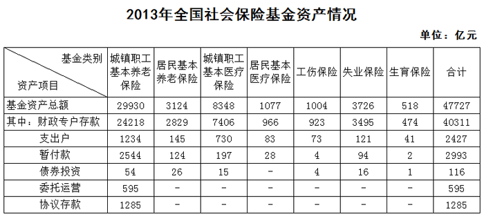

#### 第 1 题　qid 1797576 · 综合

居民基本养老保险基金中的支出户资产总额比居民基本医疗保险基金中的支出户资产总额约高多少亿元？

- **A**. 62　✅
- **B**. 72
- **C**. 504
- **D**. 585

**答案**：A

**官方解析**

定位图表第四行第三列、第五列，居民基本养老保险基金中的支出户资产总额为145亿元，居民基本医疗保险基金中的支出户资产总额为83亿元，则前者比后者高亿元。

故正确答案为A。

---

#### 第 2 题　qid 1797582 · 比重

若将城镇职工基本养老保险基金中财政专户存款资产总额的10%转入协议存款，则协议存款总额占社会保险基金资产总额的比重将增加约多少个百分点？

- **A**. 2
- **B**. 5　✅
- **C**. 8
- **D**. 12

**答案**：B

**官方解析**

定位表格第三行可知，2013年城镇职工基本养老保险中的财政专户存款为24218亿元。若其转入协议存款，协议存款总额占社会保险基金资产总额所增加的比重即为城镇职工基本养老保险财政专户存款占社会保险基金资产总额的比重。故所求即为。（本题为现期比重问题，比重的分母应为社会保险基金资产总额47727亿元，而不是城镇职工基本养老保险基金资产总额29930亿元，所以错选C项是因为分母数据没有找对。）

故正确答案为B。

---

#### 第 3 题　qid 1797526 · 综合

根据基金资产总额从高到低，以下顺序正确的是：

- **A**. 失业保险    生育保险    居民基本养老保险
- **B**. 居民基本医疗保险    工伤保险    失业保险
- **C**. 失业保险    居民基本养老保险    居民基本医疗保险　✅
- **D**. 城镇职工基本医疗保险    工伤保险    居民基本养老保险

**答案**：C

**官方解析**

本题为排序类。定位表格，查找数据，代入各选项。
A项：居民基本养老保险3124亿元大于生育保险518亿元，错误。
B项：工伤保险1004亿元小于失业保险3726亿元，错误。
C项：失业保险3726亿元大于居民基本养老保险3124亿元，大于居民基本医疗保险1077亿元，正确。
D项：工伤保险1004亿元小于居民基本养老保险3124亿元，错误。
故正确答案为C。

---

#### 第 4 题　qid 1797532 · 比重

以下哪个图形能够正确反映债券投资总额中各基金的占比情况？

- **A**. 

　✅
- **B**. 

- **C**. 
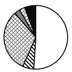

- **D**. 

**答案**：A

**官方解析**

根据题干中“债券投资总额中各基金的占比情况”，可判定本题为现期比重问题。定位表格，债券投资各项分别为54亿元、26亿元、15亿元、4亿元、16亿元、1亿元，总额为116亿元，最大的模块占比为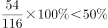，排除C、D两项，居民基本养老保险26亿元占最大模块将近一半，城镇职工基本医疗保险和失业保险两个模块相近，占比，A项最接近。

故正确答案为A。

---

#### 第 5 题　qid 1797586 · 综合

能够从上述资料推出的是：

- **A**. 除居民养老保险基金外，其他社保基金均无协议存款投资
- **B**. 城镇职工基本医疗保险基金资产总额是居民基本医疗保险基金的8倍多
- **C**. 城镇职工基本医疗保险基金的资产项目类型数少于其他社会保险基金
- **D**. 城镇职工基本养老保险基金资产总额高于表中其他各项基金总额之和　✅

**答案**：D

**官方解析**

A项，定位表格可知，除城镇职工基本养老保险基金外，其他各项基金均无协议存款投资，错误； 

B项，定位表格可知，城镇职工基本医疗保险基金总额为8348亿元，居民基本医疗保险基金总额为1077亿元，，错误；

C项，定位表格可知，城镇职工基本医疗保险基金的资产项目数比居民基本医疗保险基金的多，错误；

D项，定位表格可知，城镇职工基本养老保险基金总额为29930亿元，总金额为47727亿元，则其他各项基金总额之和为亿元亿元，正确。

故正确答案为D。

---

### 材料 2

根据所绘资料，回答106~110题。

#### 第 6 题　qid 1797596 · 比重

2013~2014学年该市毕业的研究生中，工学研究生所占比例约为：

- **A**. 32%
- **B**. 37%　✅
- **C**. 42%
- **D**. 47%

**答案**：B

**官方解析**

根据题干中“工学研究生所占比例约为”，可判定本题为现期比重的计算问题。定位表格，工学研究生毕业生人数为人，总毕业生人数为人，则工学研究生所占比例为。

故正确答案为B。

---

#### 第 7 题　qid 1797600 · 综合

在校博士生人数超过在校研究生人数25%的学科有几个：

- **A**. 7　✅
- **B**. 6
- **C**. 5
- **D**. 4

**答案**：A

**官方解析**

根据题干“在校博士生人数超过在校研究生人数的学科有几个”，可判定本题为现期比重问题。在校博士生人数超过在校研究生人数，相当于在校博士生人数的4倍大于在校研究生人数，即在校博士生人数的3倍大于在校硕士生人数。定位表格资料，满足的有哲学、历史学、理学、工学、农学、医学、军事学，共7个。（本题易错点在于“在校研究生人数应包含在校博士生人数和在校硕士生人数”。）

故正确答案为A。

---

#### 第 8 题　qid 1797604 · 比重

硕士生与博士生招生人数比例与其毕业人数比例相差最大的学科是：

- **A**. 哲学
- **B**. 文学
- **C**. 军事学　✅
- **D**. 艺术学

**答案**：C

**官方解析**

根据题干中“硕士生与博士生招生人数比例与其毕业人数比例相差最大的学科”，可判定本题为比值比较问题。定位表格，哲学硕博招生人数、毕业人数基本持平；文学硕博招生人数比例为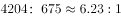，毕业生人数比例为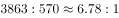；军事学硕博招生人数比例为，毕业生人数比例为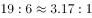；艺术学硕博招生比例为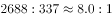，毕业生人数比例为，观察可得，差距最大的学科为军事学。

故正确答案为C。

---

#### 第 9 题　qid 1797608 · 综合

在校研究生人数排名第三的学科，其研究生招生人数是毕业人数的多少倍？

- **A**. 1.0
- **B**. 1.2
- **C**. 1.5　✅
- **D**. 1.8

**答案**：C

**官方解析**

根据题干中“研究生招生人数是毕业人数的多少倍”，可判定本题为现期倍数问题。定位表格，在校研究生人数排名第三的是理学，其研究生招生人数为人，毕业生人数为人，招生人数是毕业生人数的倍。

故正确答案为C。

---

#### 第 10 题　qid 1797612 · 综合

能够从上述资料推出的是：

- **A**. 文、史、哲三专业共招录1200多名博士研究生
- **B**. 博士招生人数超过1000人的有4个学科
- **C**. 管理学科各项统计指标均高于经济学科　✅
- **D**. 表中各专业博士研究生毕业人数均低于招生人数

**答案**：C

**官方解析**

A项：定位表格，文、史、哲三专业招录博士生人数为人人，错误。

B项：定位表格，博士招生人数超过1000人的有法学、理学、工学、医学、管理学共5个学科，错误。

C项：定位表格，管理学科硕士研究生与博士研究生的招生人数、毕业人数、在校人数均高于经济学科，正确。

D项：定位表格，医学博士生毕业人数大于招生人数，错误。

故正确答案为C。

---

### 材料 3

根据所给资料回答111~115题。

        2014年，某地区生态移民人均可支配收入5084元，其中县内移民人均可支配收入4933元，县外移民人均可支配收入5253元，2014年该地区生态移民人均可支配收入比农村居民人均可支配收入低3326元，比该地区山区九县农村居民人均可支配收入低1099元。

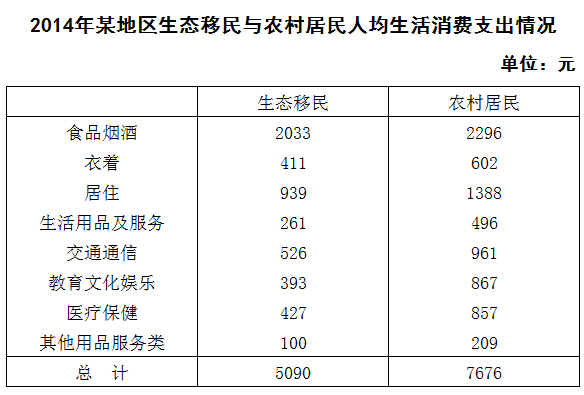

#### 第 11 题　qid 1797622 · 综合

2014年，该地区生态移民中，县内移民与县外移民人数之比与以下哪一项最接近？

- **A**. 8：5
- **B**. 10：9　✅
- **C**. 5：8
- **D**. 9：10

**答案**：B

**官方解析**

根据题干“县内移民与县外移民人数之比”，可判断本题为比值计算问题。定位文字资料，2014年，该地区生态移民人均可支配收入5084元，其中县内移民人均可支配收入4933元，县外移民人均可支配收入5253元，利用线段法可知，距离比为人数的反比，故县内与县外之比为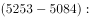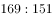，B项满足。

故正确答案为B。

---

#### 第 12 题　qid 1797626 · 平均数

2014年，该地区生态移民经营净收入占人均可支配收入的比重比农村居民低多少个百分点？

- **A**. 0.6
- **B**. 1.1
- **C**. 15.7
- **D**. 29.7　✅

**答案**：D

**官方解析**

根据题干中的“占······比重”以及资料时间为2014年，可判定为现期比重问题。定位表1，2014年该地区生态移民经营净收入692元，人均可支配收入总计5084元；农村居民经营净收入3645元，人均可支配收入总计8410元。则，即生态移民经营净收入所占人均可支配收入的比重比农村居民低29个百分点，D项最接近。

故正确答案为D。

---

#### 第 13 题　qid 1797630 · 综合

2014年，该地区农村居民在食品烟酒、衣着、居住三项消费上支出约占总消费支出的：

- **A**. 

- **B**. 

　✅
- **C**. 

- **D**. 

**答案**：B

**官方解析**

根据题干出现“占”，资料时间为2014 年，可以判定为现期比重问题。定位表2可得，2014年该地区农村居民食品烟酒支出2296元，衣着支出602元，居住支出1388元，总生活消费支出7676元，故三者所占总生活消费支出的比重为，B项最接近。

故正确答案为B。

---

#### 第 14 题　qid 1797634 · 平均数

2014年该地区农村居民人均生活消费支出与生态移民人均生活消费支出金额相差在300元以上的有几项？

- **A**. 3
- **B**. 4　✅
- **C**. 5
- **D**. 6

**答案**：B

**官方解析**

定位表2可知该地区生态移民与农村居民的人均生活消费支出状况，简单计算可得，差额在300元以上的有居住、交通通信、教育文化娱乐、医疗保健，共4项。
故正确答案为B。

---

#### 第 15 题　qid 1797636 · 综合

能够从上述资料推出的是：

- **A**. 2014年该地区生态移民各项人均可支配收入均低于农村居民
- **B**. 2014年该地区山区九县农村居民人均可支配收入在4000元左右
- **C**. 2014年该地区生态移民人均交通通信支出占人均总生活消费支出的10%以上　✅
- **D**. 2014年该地区农村居民人均可支配收入比人均总生活消费支出高1000多元

**答案**：C

**官方解析**

A项：定位表1，2014年该地区生态移民工资性收入为3470元，大于农村居民工资性收入3391元，错误。

B项：定位文字材料，2014年该地区生态移民人均可支配收入5084元，比山区九县农村居民人均可支配收入低1099元，则山区九县农村居民人均可支配收入元，错误。

C项：定位表2，2014年该地区生态移民人均交通通信消费支出为526元，总支出为5090元，所占比重为，正确。

D项：由表1可知2014年该地区农村居民人均可支配收入为8410元，由表2可知农村居民人均总生活消费支出为7676元，前者比后者高，错误。

故正确答案为C。

---

### 材料 4

        2015年一季度，某省省级及以上园区（以下简称园区）实现主营业务收入7062.85亿元，同比增长11%，实现主导产业主营业务收入4369.54亿元，同比增长10.4%。 

        一季度，全省园区拥有企业30975家，比上年同期增加3221家，其中本年新增企业311家，期末从业人数264.23万人，同比增长9.2%。其中，工业企业期末从业人数209.17万人，同比增长9.9%。

        一季度，全省园区高新技术产业期末从业人数90.92万人，同比增长8.3%，实现高新技术产业产值2815.19亿元，同比增长8.1%。

        一季度，全省园区共实现利润279.54亿元，同比增长11.1%。上缴税金223.87亿元，同比增长14.1%。

#### 第 16 题　qid 1797638 · 平均数

2015年一季度，该省园区平均每家企业实现主营业务收入约多少万元？

- **A**. 1140
- **B**. 2280　✅
- **C**. 3420
- **D**. 4560

**答案**：B

**官方解析**

根据题干中“2015 年一季度······平均每家企业”可知本题为现期平均数问题。定位文字资料第一段和第二段开头可知，2015年一季度，该省园区实现主营业务收入7062.85亿元，园区拥有企业30975家，则平均每家企业实现主营业务收入（亿元），直除首位商2，B项最接近。

故正确答案为B。

---

#### 第 17 题　qid 1797640 · 比重

2015年一季度，该省园区企业上缴税金占主营业务收入的比重比上年同期：

- **A**. 上升了0.1个百分点　✅
- **B**. 上升了3.1个百分点
- **C**. 下降了0.1个百分点
- **D**. 下降了3.1个百分点

**答案**：A

**官方解析**

根据题干“2015年一季度······占······的比重比上年同期”，可判定本题为两期比重问题。定位文字资料第一段和第四段可知，2015年一季度，该省园区实现主营业务收入7062.85亿元，同比增长，上缴税金223.87亿元，同比增长。由两期比重结论可知，由于，故比重应为上升，排除C、D两项，又因为，所以上升的百分点应小于，只有A项满足。

故正确答案为A。

---

#### 第 18 题　qid 1797642 · 增长

2015年一季度，该省园区工业企业主营业务收入同比增量约是增速最快的企业类型的多少倍？

- **A**. 5
- **B**. 12　✅
- **C**. 22
- **D**. 253

**答案**：B

**官方解析**

根据题干中“2015年一季度······是······的多少倍”可知本题为现期倍数问题。由图形资料可知，增长最快的企业为服务业，其实现主营业务收入218.97亿元，同比增长，工业实现主营业务收入5347.23亿元，同比增长。工业实现增长量是服务业的倍，B项最接近。

故正确答案为B。

---

#### 第 19 题　qid 1797644 · 综合

关于2015年一季度该省园区企业的以下信息，能够从上述资料中直接推出的是：

- **A**. 平均每月新增从业人员数
- **B**. 平均每家工业企业从业人员数
- **C**. 平均每万元主营业务收入实现利润额　✅
- **D**. 平均每家高新技术产业企业实现产值

**答案**：C

**官方解析**

A项，文字材料第二段只给出了期末从业人数和同比增长率，并没有给出2014年第四季度期末从业人数，故无法求得2015年一季度平均每月新增就业人员数，错误。

B项，文字材料第二段只给出2015年一季度工业企业期末从业人员数，并未给出工业企业的个数，故无法推出平均每家工业企业从业人数，错误。

C项，由文字材料第一、第四段分别可得到主营业务收入为7062.85亿元、利润总额279.54亿元，故平均每万元主营业务收入实现利润额为元，能够推出，正确。

D项，文字资料第三段只给出了高新技术产业产值，并未给出高新技术产业企业数，故无法推出平均每家高新技术产业企业实现产值，错误。

故正确答案为C。

---

#### 第 20 题　qid 1797646 · 综合

关于2015年一季度该省园区企业营业状况，能够从上述资料推出的是：

- **A**. 主导产业主营业务收入占总体主营业务收入比重同比上升
- **B**. 平均每月新增企业约26家
- **C**. 图中主营业务收入增速快于园区主营业务收入总体增速的行业有3个
- **D**. 主营业务收入最低的行业主营业务收入占园区总体的比重低于1%　✅

**答案**：D

**官方解析**

A项，由文字材料第一段可知主导产业主营业务收入同比增速为，小于主营业务收入的同比增速的，故前者占后者的比重同比下降，错误。

B项，由文字材料第二段可知，一季度新增企业311家，则平均每月新增企业家，错误。

C项，主营业务收入总体增速为，由图形可知，高于此值的有建筑业、批发零售、服务业和房地产，共4个，错误。

D项，由图形可知，主营业务收入最低的行业是住宿餐饮，为51.27亿元，所占比重为，正确。

故正确答案为D。

---

#### 第 21 题　qid 1797434 · 比重

某公司甲、乙和丙三个销售部在2014年的销售额分别占公司总销售额的40%、35%和25%，其在2015年的销售额分别比上年增长了20%、300万元和16%，而总销售额增长了1800万元。问甲销售部的销售额比上年增长的数量比丙销售部高多少万元？

- **A**. 200
- **B**. 300
- **C**. 400
- **D**. 500　✅

**答案**：D

**官方解析**

本题考查和差倍比问题。设2014年总销售额为万元，则甲销售部的销售额为万元，丙销售部的销售额为万元，则2015年甲销售部的销售额比上年增长了万元；丙销售部比上年增长了万元。根据题意可列式：，即，则甲销售部的销售额比上年增长的数量比丙销售部高万元。

故正确答案为D。

---
