# 2016年广东省公务员录用考试《行测》题（县级以上）

> 省考 · 2016 年 · 5 个模块 · 共 98 题

- [常识判断](#%E5%B8%B8%E8%AF%86%E5%88%A4%E6%96%AD) · 20 题
- [言语理解与表达](#%E8%A8%80%E8%AF%AD%E7%90%86%E8%A7%A3%E4%B8%8E%E8%A1%A8%E8%BE%BE) · 20 题
- [数量关系](#%E6%95%B0%E9%87%8F%E5%85%B3%E7%B3%BB) · 13 题
- [判断推理](#%E5%88%A4%E6%96%AD%E6%8E%A8%E7%90%86) · 30 题
- [资料分析](#%E8%B5%84%E6%96%99%E5%88%86%E6%9E%90) · 15 题

---

## 常识判断

### 第 1 题　qid 1796536 · 科技常识

粮食生产是国民经济的基础，耕地是粮食生产的基础。立足国内耕地资源、保障国家粮食安全是关系我国经济社会发展全局的重大问题。
以下有关表述有误的是（ ）。

- **A**. 人多地少是我国基本国情，人均耕地少于世界上许多国家
- **B**. “坚守18亿亩红线”是指确保我国耕地面积不能低于18亿亩
- **C**. 除保障性安居工程外，任何住房用地均不得占用基本农田　✅
- **D**. 目前，卫星遥感监测技术已被应用于我国耕地保护工作

**答案**：C

**官方解析**

A项：我国土地面积居全世界第三位，但是人均土地面积和人均耕地面积相当于全世界人均水平的30%左右，正确；
B项：2007年温家宝总理在《政府工作报告》中明确指出：一定要守住全国耕地不少于18亿亩这条红线，符合选项表述，正确；
C项：《基本农田保护条例》第十五条规定：“基本农田保护区经依法划定后，任何单位和个人不得改变或者占用。国家能源、交通、水利、军事设施等重点建设项目选址确实无法避开基本农田保护区，需要占用基本农田，涉及农用地转用或者征收土地的，必须经国务院批准。”因此，保障性安居工程不得占用基本农田，而国家能源、交通、水利、军事设施等重点建设项目确实需占用基本农田的，经国务院批准，可占用。故C项表述错误；
D项：遥感技术在我国土地资源调查和耕地保护中，通过20多年的应用和实践，正确。
本题为选非题，故正确答案为C。

---

### 第 2 题　qid 1796550 · 人文常识

以下适合于建设防火林带的树种是（   ）。

- **A**. 木荷　✅
- **B**. 松树
- **C**. 樟树
- **D**. 杉木

**答案**：A

**官方解析**

通过对可燃物的易燃性分析得出，杉木难燃可燃物占总量的比例明显低于8年生以上木荷，而杉木较易燃和较难燃可燃物占有比例明显高于木荷。木荷着火温度高，含水量大，不易燃烧，是营造生物防火林带的理想树种，故A项当选，D项排除。樟树本身也是不易燃的，但是就其枯叶持水能力而言是易燃的，故排除C项。松树属于有油脂的树木，有油脂的树木都是易燃树种，故排除B项。
故正确答案为A。

---

### 第 3 题　qid 1796558 · 科技常识

春耕前，农民向田里施用草木灰主要是为了给农作物补充（   ）元素。

- **A**. 钾　✅
- **B**. 氮
- **C**. 磷
- **D**. 碳

**答案**：A

**官方解析**

草木灰的主要成分是碳酸钾()。草木灰肥料因草木灰为植物燃烧后的灰烬，所以凡是植物所含的矿质元素，草木灰中几乎都含有。其中含量最多的是钾元素，一般含钾6—12%，其中90%以上是水溶性，以碳酸盐形式存在；其次是磷，一般含1.5—3%；还含有钙、镁、硅、硫和铁、锰、铜、锌、硼、钼等微量营养元素。A项正确。

故正确答案为A。

---

### 第 4 题　qid 1796566 · 人文常识

梯田是在山坡上开辟的农田，样子像楼梯，每一级边缘均筑有田埂。一些历史悠久的梯田已成为受国家保护的文化遗产。修建梯田的主要目的是（  ）。

- **A**. 保护环境
- **B**. 传承文化
- **C**. 保持水土　✅
- **D**. 节约人力

**答案**：C

**官方解析**

修建梯田可以使田地的坡度减小，防止丘陵斜坡上的水土流失，有利于保持水土，发展农业。A项说的过于宽泛，B、D项与题干无关。
故正确答案为C。

---

### 第 5 题　qid 1796596 · 人文常识

现代化工业社会过多燃烧煤炭、石油和天然气等化石资源，使自然界更多（更强）地产生灾害性天气（气候）现象，包括有（    ）。
①雾霾 ②极光 ③温室效应 ④龙卷风 ⑤酸雨 ⑥冰雹

- **A**. ②③④
- **B**. ①④⑥
- **C**. ①④⑤
- **D**. ①③⑤　✅

**答案**：D

**官方解析**

极光、冰雹、龙卷风都属于自然现象。极光的产生是自然现象，往往出现于星球的高磁纬地区上空，是一种绚丽多彩的发光现象。而地球的极光，来自地球磁层或太阳的高能带电粒子流（太阳风）使高层大气分子或原子激发（或电离）而产生。龙卷风是一种相当猛烈的天气现象，由快速旋转并造成直立中空管状的气流形成。冰雹，水蒸气凝结成冰或雪，就是下雪了，如果温度急剧下降，就会结成较大的冰团，也就是冰雹。

雾霾、温室效应和酸雨是由于大气污染，煤炭燃烧后会产生、和等有害气体，其中是温室气体，微小颗粒物也是雾霾的因素之一，石油等石化材料过度使用会污染大气环境，产生致癌物和温室效应，破坏臭氧层等。雨水被大气中存在的酸性气体污染，pH小于5.65的酸性降水叫酸雨。酸雨主要是人为的向大气中排放大量酸性物质造成的。我国的酸雨主要是因大量燃烧含硫量高的煤而形成的，多为硫酸雨，少硝酸雨，此外，各种机动车排放的尾气也是形成酸雨的重要原因。

故正确答案为D。

---

### 第 6 题　qid 1796604 · 人文常识

在众多色彩中，人们往往对红色“情有独钟”，常采用红灯做指示，比如指挥交通的红灯，汽车尾部的红灯，公共场所安全门的红灯。这是因为，红色光在可见光中（  ）。

- **A**. 波长最长，且不容易被散射　✅
- **B**. 波长最短，且不容易被散射
- **C**. 波长最长，且容易被散射
- **D**. 波长最短，且容易被散射

**答案**：A

**官方解析**

红色，可见光谱中长波末端的颜色，波长大约为620-760纳米，类似新鲜血液的颜色，是三原色和心理原色之一。在所有的可见光中，红光的波长是最长的，因此红光的穿透力最强。大气对光的散射有一个特点：波长较短的光容易被散射，波长较长的光不容易被散射；因此红光不易被散射，它可以传得较远。所以，汽车尾灯和交通紧急提示灯都用红光，A项当选，其他选项说法本身错误。
故正确答案为A。

---

### 第 7 题　qid 1796608 · 人文常识

人口红利是指一个国家的劳动年龄人口占总人口比重较大，抚养率比较低，为经济发展创造了有利的人口条件。目前，我国正处于人口红利的（   ）阶段。

- **A**. 成熟
- **B**. 发展
- **C**. 停滞
- **D**. 下降　✅

**答案**：D

**官方解析**

1990年我国进入人口红利期，1990年—2010年人口红利逐步提升，2010年抚养比下降到34.2%最低值、人口红利上升到峰值；其后人口红利逐渐衰减，2030年前后衰减为零并随即转变到人口负债期；而后负债率逐步走高，2050年抚养比将达到62%左右，负债率也将创出新高。A应属于2010年的成熟时期。B属于90年代到2010年的上升时期，目前我国人口红利是下降趋势。C是未来的老龄化社会时期，也排除。
故正确答案为D。

---

### 第 8 题　qid 1796610 · 人文常识

当一种商品价格升高而导致另一种商品需求的增加，那么这两种商品之间存在替代关系，互为替代品。下列各项中的两种商品互为替代品的是（  ）。

- **A**. 羊肉、牛肉　✅
- **B**. 大米、糖果
- **C**. 手表、时钟
- **D**. 电脑、手机

**答案**：A

**官方解析**

替代品是指两种商品可以互相代替来满足同一种需求，一种商品价格的上升会导致另一种商品需求的增加。
A项正确：羊肉和牛肉能满足消费者的同一种需求，羊肉价格上升，消费者会减少对羊肉的需求，转而购买牛肉，牛肉的需求量会增加。
B项错误：大米和糖果不能满足消费者的同一种需求，大米价格的上升，不会导致糖果需求量的增加，不互为替代品。
C项错误：手表和时钟虽然都可以计算时间，但功能并不完全相同，手表可以随身携带，时钟则不可以，手表价格的上升不会导致时钟需求量的增加，不互为替代品。
D项错误：电脑和手机不能满足消费者的同一需求，电脑价格的上升不会导致手机需求量的增加，不互为替代品。
故正确答案为A。

---

### 第 9 题　qid 1796614 · 科技常识

人们在厨房做菜时，如果不小心把水滴进热油锅中，常常会发生溅油的现象。这是因为（  ）。

- **A**. 水与油一起加热产生了化学反应，释放出热量
- **B**. 水密度比油大而沸点比油低，会在油面下迅速汽化　✅
- **C**. 油在加热情况下与水相溶，更容易蒸发而产生气泡
- **D**. 水在加热时对流速度加快，与油发生摩擦而产生了热量

**答案**：B

**官方解析**

油的密度比水的小，且其沸点比水的大，所以水滴入热油中，水被瞬时加热，超过了水的沸点，会沸腾，将油溅起来，就产生了“溅油”现象，故B项正确。溅油现象属于物理现象不是化学反应，故A项错误。水分子和油分子由于表面张力差别太大，互相不会融合。水分子在油里面是以滴状形式存在的。换句话说，油水互不交融也不会产生摩擦，故C、D项错误。
故正确答案为B。

---

### 第 10 题　qid 1796622 · 科技常识

物质在发生能量转化时通常都存在一系列的物理或化学反应，下列能量转化的过程存在化学反应的是（    ）。

- **A**. 风力发电
- **B**. 烧煤取暖　✅
- **C**. 冰雪融化
- **D**. 酒精挥发

**答案**：B

**官方解析**

物理变化是指没有生成其他物质的变化，例如风力发电，酒精挥发，冰雪融化，灯泡发光等。化学变化是变化时生成其他物质的变化，例如木条燃烧，铁生锈，食物腐烂等，化学变化不但生成其他物质，而且伴随能量变化，常表现为吸热，放热，发光等。A、C、D三项均属于物理变化。
故正确答案为B。

---

### 第 11 题　qid 1796624 · 人文常识

声音可以在固态、液态和气态的介质中传播，传播的速度与介质分子间距有关，分子间距越小，声音的传播速度越快。下列介质中声音传播速度最快的是（    ）。

- **A**. 铁棒　✅
- **B**. 竹竿
- **C**. 盐水
- **D**. 液态汞

**答案**：A

**官方解析**

声音传播的速度与介质的种类有关：声音在固体中传播的最快，在气体中传播的最慢，液体介于两者之间。而铁棒的密度要大于竹竿，因此声音通过铁棒传播的速度更快。所以排除B、C、D三项，只有A项属于密度最大的固体。
故正确答案为A。

---

### 第 12 题　qid 1796628 · 科技常识

吸烟严重威胁人体健康。针对香烟产生的各种有害物质的描述，下列说法错误的是（    ）。

- **A**. 尼古丁可让吸烟者成瘾，并有较强的毒性
- **B**. 烟焦油易沉积于肺等器官，可诱发癌变
- **C**. 香烟燃烧时物质分解放出的射线可以致癌
- **D**. 一氧化碳易溶于水，从而与血红蛋白结合　✅

**答案**：D

**官方解析**

吸烟严重威胁人体的健康，香烟燃烧时释放的烟雾中含有3800多种已知的化学物质，绝大部分对人体有害，其中包括一氧化碳、尼古丁等生物碱、胺类、腈类、醉类、酚类、烷烃、醛类、氮氧化物，多环芳烃、杂环族化合物、羟基化合物、重金属元素、有机农药等。
香烟中含有的尼古丁可以使吸烟者成瘾，并有较强的毒性，A项说法正确。
烟焦油易沉积于肺等器官，可诱发癌变，B项说法正确。
C项中香烟燃烧时物质分解放出的射线可以致癌的表述，目前科学界对此缺乏公认的理论，说法也不一，香烟中的致癌物目前我们通常认为是多环芳香烃和亚硝胺之类的化合物，但据最权威的美国《科学》杂志公布的一项调查研究表明：香烟燃烧时产生的钋210的放射性射线辐射会有2%的几率致癌，符合题干可以致癌的表述。
D项一氧化碳更容易和血红蛋白结合的原因是：一氧化碳与血红蛋白的亲和力比氧和血红蛋白的亲和力大200－300倍而非易溶于水，二者无因果关系，且一氧化碳的物理性质之一是可（此处有争议，一种说法为微溶，一种为难溶，但没有易溶的说法）溶于水，而非易溶于水。
C项表述缺乏严谨的理论依据，但是得到主流科学媒体的认同，D项无因果关系且有表述错误。
本题为选非题，故正确答案为D。

---

### 第 13 题　qid 2031580 · 人文常识

在我国的一些地区，冰雹通常出现在（    ）天气。

- **A**. 春日的阴雨
- **B**. 夏日的雷暴　✅
- **C**. 秋日的晴朗
- **D**. 冬日的寒冷

**答案**：B

**官方解析**

B项正确：冰雹是在气流强烈升降条件下发生的一种固态降水现象，冰粒呈圆球形或圆锥形，直径一般为5～50毫米，大的有时可达10厘米以上。冰雹只有在热湿气流强烈上升时才能产生，所以多发生在夏季或春夏之交的雷暴天气。
A、C、D项的天气均无法满足冰雹形成的条件。
故正确答案为B。

---

### 第 14 题　qid 2031612 · 科技常识

木本植物指根和茎因增粗生长形成大量的木质部，而细胞壁也多数木质化的坚固的植物，是草本植物的对应词，以下属于木本植物的是（    ）

- **A**. 牡丹　✅
- **B**. 玉米
- **C**. 菊花
- **D**. 棉花

**答案**：A

**官方解析**

A项正确：木本植物依形态不同可分为乔木、灌木和半灌木三类，牡丹是多年生落叶小灌木，茎高达2米，分枝短而粗，属于木本植物；
B项错误：玉米是禾本科玉蜀黍属，是一年生草本植物；
C项错误：菊花是菊科、菊属的多年生宿根草本植物；
D项错误：棉花是锦葵科棉属植物的种籽纤维，是一年生草本植物。
故正确答案为A。

---

### 第 15 题　qid 1796632 · 科技常识

自然界中，我们看到大部分植物的叶片都呈现绿色，对此解释正确的是（    ）。

- **A**. 叶片进行光合作用吸收了绿光
- **B**. 叶片进行光合作用释放出绿光
- **C**. 叶片反射了太阳光中的绿光　✅
- **D**. 叶片表皮覆盖着一层绿色物质

**答案**：C

**官方解析**

不透明的物体的颜色是由它反射的光的颜色决定的，植物叶子是不透明的。当阳光照在叶片上，阳光的七彩颜色被叶片吸收，只有绿色光被反射。所以，植物的叶子大多是绿色的。其他选项本身说法错误。
故正确答案为C。

---

### 第 16 题　qid 1796638 · 科技常识

如图所示，一个装有水的杯子中悬浮着一个小球，杯子放在斜面上，该小球受到的浮力方向是（  ）。

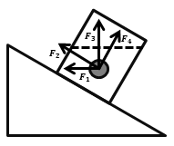

- **A**. F1
- **B**. F2
- **C**. F3　✅
- **D**. F4

**答案**：C

**官方解析**

浮力的方向总是竖直向上的，不受物体的位置，形状等因素的影响，即图中小球所受浮力为F3，故C项正确。
故正确答案为C。

---

### 第 17 题　qid 1796582 · 科技常识

如图所示，物体沿斜面匀速滑下时，它的（   ）。

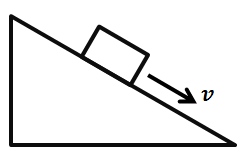

- **A**. 动能增加，重力势能减少，机械能不变
- **B**. 动能不变，重力势能减少，机械能不变
- **C**. 动能增加，重力势能不变，机械能减少
- **D**. 动能不变，重力势能减少，机械能减少　✅

**答案**：D

**官方解析**

物体的动能由物体的质量与速率决定，即匀速下滑的物体动能不变；物体的重力势能由物体的质量与所处高度决定，匀速下滑的物体重力势能减少；物体的机械能是动能与重力势能的总和，则匀速下滑的物体机械能减小，故D项正确。
故正确答案为D。

---

### 第 18 题　qid 1796602 · 科技常识

如图所示，实心蜡球漂浮在杯中的水面上，当向杯中不断慢慢加入酒精时，以下不可能出现的情况是（   ）。（已知：水的密度蜡球的密度酒精的密度）

- **A**. 蜡球向下沉一些，所受浮力增大　✅
- **B**. 蜡球向下沉一些，所受浮力不变
- **C**. 蜡球悬浮于液体中，所受浮力不变
- **D**. 蜡球沉到杯底，所受浮力变小

**答案**：A

**官方解析**

当酒精缓慢加入水中，水和酒精混合，混合液体的密度小于水的密度，则随着酒精的注入，将发生如下现象：首先，蜡球向下沉一下，增大排开液体的体积，此时蜡球所受浮力仍不变，等于蜡球所受重力；然后，随着加入酒精的增多，蜡球完全浸没进液体中，所受浮力仍等于蜡球所受重力；最后，液体密度小于蜡球密度，蜡球完全浸没液体中，所受浮力小于蜡球所受重力，蜡球将沉入杯底。即A项错误，故选A项。
本题为选非题，故正确答案为A。

---

### 第 19 题　qid 1796514 · 科技常识

如图所示，在一个装着水的杯子里放进一块冰，则在冰块融化的过程中，杯子水面高度的变化情况应当是（    ）。

- **A**. 一直上升
- **B**. 先下降后上升
- **C**. 先上升后下降
- **D**. 一直不变　✅

**答案**：D

**官方解析**

问题求解：冰所受的浮力等于其所受重力，由于冰融化前后所受的重力不变，其排开水的体积不发生变化，则杯中液面不发生变化，故D项正确。
故正确答案为D。

---

### 第 20 题　qid 1796524 · 科技常识

如图所示，地面上有一架天平，天平左端系有一个50g的物体，右端通过绳子连接一组滑轮。滑轮组合中，O、Q为定滑轮，P为动滑轮，下端系有一个100g的物体。要使天平两端平衡，需要的操作是（  ）。

- **A**. 在A处挂上重15g的物体
- **B**. 在B处挂上重25g的物体　✅
- **C**. 在C处挂上重50g的物体
- **D**. 在D处挂上重75g的物体

**答案**：B

**官方解析**

问题求解：右方滑轮组有效的绳子段数为2，若要保持滑轮组的平衡，等同于天平右端对应绳的位置放入质量为50g物体。若保持系统左端天平的平衡，则天平两端需满足力矩平衡原理：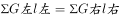。图中数据代入公式可知：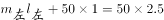，选项中数值代入得，ACD项不满足等式，故B项正确。

故正确答案为B。

---

## 言语理解与表达

### 第 1 题　qid 1796588 · 逻辑填空

创新的目的不是发论文，培育新的经济增长点才能（    ）科技的真功夫。让创新更紧密地面向经济社会发展，把创新实实在在地（    ）为新产品、新项目、新产业，是创新的要义所在。
依次填入括号处最恰当的一项是：

- **A**. 发挥    转变
- **B**. 凸显    催化
- **C**. 反映    转换
- **D**. 彰显    转化　✅

**答案**：D

**官方解析**

第一空，由文意可知，培育新的经济增长点能够体现出科技真功夫的特点，A选项“发挥”搭配不当，排除。其余三项搭配均可。
第二空，使创新意识真正在新产品、新项目、新产业上发挥作用，即完成真正意义上的“转化”，结合选项为D。B项中“催化”意为促进、加速发展，体现不出由意识转化为具体事物的含义，排除。C项“转换”是指从一种形式转变到另一种形式，往往是在同类事物之间进行，不适合于理念和实物，排除。
故正确答案为D。
【文段出处】《让创新引擎更给力》

---

### 第 2 题　qid 1796594 · 逻辑填空

在经济社会不断发展的今天，我们应将明礼知耻（    ）于社会主义核心价值观的实践中。同时，应（    ）古今中外礼仪礼教之精华，把明礼提升到一个新高度、新水平。
依次填入括号处最恰当的一项是：

- **A**. 贯彻    融合
- **B**. 落实    吸取
- **C**. 贯穿    融汇　✅
- **D**. 实行    继承

**答案**：C

**官方解析**

第一空，文段意为应该把明礼知耻融于社会主义核心价值观的实践中，D项“实行”不能与介词“于”搭配，排除。其余三项均可搭配，但“贯穿”指穿过、连通，相对于“贯彻”“落实”而言，更能够体现出明礼知耻从头至尾都体现在核心价值观实践全过程中的含义，故基本锁定C项。
第二空验证，“融汇精华”搭配合理，体现出我们不断吸纳汲取众多礼仪礼教精华的特点，符合文意。
故正确答案为C。
【文段出处】《培育明礼知耻的社会新风尚》

---

### 第 3 题　qid 2031618 · 逻辑填空

亚洲是全球最具活力的地区之一，经济规模占世界的，人口有40多亿，劳动力供给充足，后发优势明显，发展潜力远未<u>        </u>。同时，亚洲大多是发展中国家，人均GDP不高，地区发展水平很不平衡，还有7亿多人生活在国际贫困线以下，发展经济、改善民生的任务依然<u>        </u>。

依次填入画横线部分最恰当的一项是：

- **A**. 开发  艰难
- **B**. 解放  艰险
- **C**. 释放  艰巨　✅
- **D**. 发挥  困难

**答案**：C

**官方解析**

本题从第二空入手，搭配“任务”，C项中的“艰巨”与“任务”为常见搭配，保留。A项“艰难”、D项“困难”，多形容状态，与“任务”不搭配，均排除。B项“艰险”，强调危险，不符合文意，排除。
第一空，代入验证，“潜力释放”为常见搭配，符合文意，C项当选。
故正确答案为C。
【文段出处】《亚洲发展经济、改善民生任务依然艰巨》

---

### 第 4 题　qid 2031620 · 逻辑填空

当你80岁时，只有你一个人静静对内心        着自己的人生故事，其中最为充实、最有意义的那段，会被你们做出的一系列决定所填满。最终，是选择        了我们的人生。
依次填入画横线处最恰当的一项是：

- **A**. 诉说  决定
- **B**. 讲述  塑造　✅
- **C**. 叙述  描绘
- **D**. 描述  修正

**答案**：B

**官方解析**

第一空，由“对内心        着自己的人生故事”可知，是对着内心讲故事，四个选项均有讲述、诉说的含义，暂不排除。
第二空，由文意可知，是因为这一系列的决定、选择影响了人生，B项“塑造”符合文意，且“塑造人生”也为常见搭配，当选；C项“描绘”只是单纯的描写，体现不出影响的意思，排除；D项“修正”是修改使之正确的意思，文中没有错误和改正的含义，排除；A项“决定”把选择作为人生的唯一决定性因素，过于绝对，排除。
故正确答案为B。
【文段出处】《善良比聪明重要》

---

### 第 5 题　qid 1796534 · 逻辑填空

随着国际反腐合作深化，外逃腐败分子难逃________的命运。
填入画横线部分最恰当的一项是：

- **A**. 害群之马
- **B**. 瓮中之鳖　✅
- **C**. 井底之蛙
- **D**. 涸辙之鲋

**答案**：B

**官方解析**

横线部分表示“外逃腐败分子”在国际反腐合作深化的形势下必然逃脱不了被抓获的命运，B 项“瓮中之鳖”比喻逃脱不了的人或动物，符合文意，当选。
A 项“害群之马”比喻危害集体的人，C 项“井底之蛙”比喻见识狭小的人，D 项“涸辙之鲋”比喻处在困境中亟待援救的人，均不能表示腐败分子必然被抓的命运，均排除。
故正确答案为B。
【文段出处】《“天网行动”让外逃贪官颤抖》

---

### 第 6 题　qid 1796570 · 逻辑填空

政府部门应该在社区治理中鼓励社区自治。假如政府部门在这过程中（    ），没有处理好社区自治和政府管理的关系，那么，最终所作出的决策就很可能会引发社会矛盾。
填入括号处最恰当的一项是：

- **A**. 李代桃僵
- **B**. 萧规曹随
- **C**. 越俎代庖　✅
- **D**. 广纳良言

**答案**：C

**官方解析**

根据文意可知，横线处表达政府应该充分鼓励社区自治，不能越权过度干涉之意，C项“越俎代庖”比喻超出自己职能范围去处理别人所管的事，符合文意，当选。
A项“李代桃僵”指互相顶替或代人受过，B项“萧规曹随”指后人沿袭前人遗制，D项“广纳良言”指充分吸收好的建议，均不强调越权，与文意不符，排除。
故正确答案为C。

---

### 第 7 题　qid 2031622 · 逻辑填空

一本好的社会科学著作，不仅应该做到于无声处听惊雷，在琐屑的生活细节中            ，而且应该让读者在阅读的过程中，情不自禁地借助作者的方法去检验生活和理解社会。
填入画横线部分最恰当的一项是：

- **A**. 见微知著　✅
- **B**. 管中窥豹
- **C**. 一叶知秋
- **D**. 洞若观火

**答案**：A

**官方解析**

“于无声处听惊雷”、“在琐屑的生活细节中           ”句式相近，构成对应关系，“无声处”与“听惊雷”形成了反差，因此空白处应该与“细节”形成反差，表意为在细小之中体现显著变化，A项“见微知著”意为见到事情微小、细小的苗头，就能知道它的实质和发展趋势，符合文意和语境，当选。B项“管中窥豹”意为只看到事物的一部分，指所见不全面或略有所得，与文意不符，且为贬义，排除；D项“洞若观火”指观察事物非常清晰，文段并非侧重观察，排除；C项“一叶知秋”比喻通过个别的迹象，可以看到整个形势的发展趋向，不与“细节”对应且多是侧重规律性的推断，文段没有客观规律的语境，排除。
故正确答案为A。
【文段出处】《关于理由那些事儿》

---

### 第 8 题　qid 2031624 · 逻辑填空

新中国成立以来，普通话的推广对于普及教育、提高全民文化素质起到了重要作用，这一点                。但随着普通话的地位越来越重要，各地方言受到很大的冲击。一些汉语方言悄然发生变化，其发音、词汇不断向普通话靠拢；一些汉语方言甚至出现快速        的状况。
依次填入画横线处最恰当的一项是：

- **A**. 无可厚非  式微
- **B**. 毋庸置疑  衰微　✅
- **C**. 显而易见  衰减
- **D**. 不言而喻  衰败

**答案**：B

**官方解析**

第一空，A项“无可厚非”表示没有可以过分指责的，是说虽然有缺点但是可以原谅，而普通话并没有什么问题，排除。B项“毋庸置疑”、C项“显而易见”、D项“不言而喻”都能体现出普通话推广的重要作用，保留。
第二空，意在表明一些汉语方言走下坡路的状态，B项“衰微”是指不兴旺，符合文意，当选。C项“衰减”与D项“衰败”侧重衰落败坏，程度过重，排除。
故正确答案为B。
【文段出处】《方言，你知道多少？》

---

### 第 9 题　qid 2031626 · 逻辑填空

有关取消全运会奖牌榜的消息成为既定事实之后，体育界对此的看法并不        。取消了奖牌榜，竞技体育还有什么存在价值？类似的不解与怨艾，        没有成为业界的主流声音，        丝丝缕缕、不绝于耳。
依次填入画横线部分最恰当的一项是：

- **A**. 同意  如果  仍然
- **B**. 一致  一旦  那就
- **C**. 统一  虽然  却也　✅
- **D**. 成熟  即便  也是

**答案**：C

**官方解析**

第一空，根据文意可知，体育界对这个事实的看法不同，横线处应该填写表意为“相同”的词语，B项“一致”、C项“统一”均可，保留。A项“同意”、D项“成熟”与“相同”无关，排除。
第二空，后面提到“没有成为业界的主流声音”，第三空，后面提到“不绝于耳”即也有声音存在，此二句构成了反义对应，因此应该选择转折关系，C项为转折关系，当选。B项表意假设，排除。
故正确答案为C。
【文段出处】《体育改革需要更多担当》

---

### 第 10 题　qid 2031628 · 逻辑填空

社会保障研究可能            ，各国的制度特征可能            ，各个学科对社会保障的解读可能            ，但是社会保障理论的永恒话题说到底是要对不同国家、不同发展水平、不同文化传统背景下的平衡点位置作出解释。
依次填入画横线部分最恰当的一项是：

- **A**. 千变万化   千差万别   千头万绪
- **B**. 千差万别   千头万绪   千变万化
- **C**. 千变万化   千头万绪   千差万别
- **D**. 千头万绪   千差万别   千变万化　✅

**答案**：D

**官方解析**

本题可从第二空入手，根据文意可知，横线处表达“各国的制度特征不相同”，对应选项为“千差万别”，形容差别大，符合语境，A、D两项保留。B项和C项“千头万绪”比喻事情的开端，头绪非常多，也形容事情复杂纷乱，与“特征”不搭配，排除。
再看第一空，搭配“研究”，对应选项，A项“千变万化”形容变化非常多，没有穷尽，而社会保障研究涉及经济、文化等多个方面，侧重点在于“有难度、较复杂”，故“变化非常多”的语义从文段无法得出，排除；D项“千头万绪”形容事情复杂纷乱，符合文段语境，保留。
第三空，代入验证，D项“千变万化”可以形容解读的不同与多样，符合文段语境，当选。
故正确答案为D。

---

### 第 11 题　qid 1796476 · 片段阅读

人才是创新的根基，创新驱动实质上是人才驱动。深化改革、推动创新，一方面离不开激发民智、汇聚民力，另一方面要发挥高端人才的关键作用。只有大力实施人才强国战略，“择天下英才而用之，聚集一批站在行业科技前沿、具有国际视野和能力的领军人才”，努力抢占经济科技制高点，才能为推动“中国制造”向“中国智造”转变夯实人才基础，为提升综合国力注入强大推力。
这段文字意在说明：

- **A**. 人才是创新的一部分
- **B**. 人才是创新的特点
- **C**. 人才是创新的关键　✅
- **D**. 人才是创新的原因

**答案**：C

**官方解析**

文段为“总分”结构，首句提出观点“人才是创新的根基，创新驱动实质是人才驱动”。后文为解释说明部分，文段首句为中心句，结合选项，C项正确。
A项“一部分”程度过轻且表述不明确；B项“特点”无中生有；D项“原因”无中生有。
故正确答案为C。
【文段出处】《以创新引领发展谋划未来》

---

### 第 12 题　qid 1796474 · 片段阅读

中国经济发展进入新常态，最重要的是两个转变：一是经济增速从高速增长转向中高速增长，二是经济发展方式从规模速度型粗放增长转向质量效率型集约增长。第一个转变已接近完成，但第二个转变明显滞后，质量效率型集约增长模式尚未完全形成。我国发展过程中出现的不平衡不协调不可持续问题，与两个转变不同步有很大关系。延续中国经济发展奇迹，必须加快经济发展方式转变，推动经济从高速增长转向高效增长，实现由大到强的质的飞跃。
对这段文字理解有误的是：

- **A**. 我国不少地方仍存在经济规模速度型粗放增长现象
- **B**. 两个转变同步进行可减少我国经济发展的一些问题
- **C**. 新常态推动我国经济发展实现由大到强的质的飞跃
- **D**. 我国经济增速已经完成从高速增长转向中高速增长　✅

**答案**：D

**官方解析**

本题为细节判断题。文段与选项一一对应。
A项：由“经济发展方式从规模速度型粗放增长转向质量效率型集约增长”“明显滞后”，可知还有地方没有完成转变，表述正确，排除；
B项：由“我国发展过程中出现的不平衡不协调不可持续问题，与两个转变不同步有很大关系”，可知两个转变如果同步，可以解决一系列问题，表述正确，排除；
C项：由“推动经济从高速增长转向高效增长，实现由大到强的质的飞跃”，可知表述正确，排除；
D项：“已经”时态错误，原文是“已接近完成”，说明还未完成，表述错误，当选。
本题为选非题，故正确答案为D。

---

### 第 13 题　qid 2031630 · 片段阅读

扶贫，粗略地说，有两个责任主体。一个是党和政府，另一个是贫困户自身。后者的责任平时说得少，其实，要改变命运，自己不奋斗、不拼搏，怎么可能实现呢？政府可以开拓融资渠道、给技术支持、给创业就业环境，但具体怎么用好这些条件，离不开贫困户自身努力。政策再好，不伸手也够不着。当然，丧失劳动能力，实在伸不出手的，可以另当别论。
这段文字意在说明（    ）。

- **A**. 贫困户自身对脱贫的责任比党和政府的要轻
- **B**. 贫困户应积极通过自身的努力改变贫困的现状　✅
- **C**. 党和政府应当加强贫困户奋斗拼搏精神的教育工作
- **D**. 丧失劳动能力的贫困户应争取党和政府更多的帮助

**答案**：B

**官方解析**

文段开头引出扶贫的两个责任主体，之后通过转折词“但”引出重点，即具体怎么用好这些条件，离不开贫困户自身努力，尾句进行补充说明。因此，文段的重点对应B项，当选。A项，无中生有，文段没有将二者作比较，排除；C项，“加强······教育工作”的对策无中生有，排除；D项，文段强调的重点为贫困户应主动拼搏，而非丧失劳动能力者，且“争取党和政府更多的帮助”从文段无法得知，排除。
故正确答案为B。
【文段出处】《用内源扶贫治“外援依赖”》

---

### 第 14 题　qid 2031632 · 片段阅读

从宏观调控看，保持政策连续性和稳定性，是精准把握稳增长与调结构平衡的最优选择，这有助于我们在保持经济运行合理区间的前提下，既能实现稳就业的目标，又能促进结构调整取得积极进展。当务之急是做好处置预案和政策储备，加强相关的舆论引导、风险隔离和社会保障等配套工作，同时运用必要的金融工具，调整负债的期限结构，缓解地方政府和企业的短期债务压力。只要处置得当，就不会演变为系统性风险。
与这段文字意思相符的一项是（    ）。

- **A**. 促进结构调整取得进展的因素之一是保持政策的连续性和稳定性　✅
- **B**. 运用必要的金融工具，调整负债的期限结构，有助于实现稳就业的目标
- **C**. 处置预案和政策储备可以缓解地方政府和企业的短期债务压力
- **D**. 阻止系统性风险发生主要在于缓解地方政府和企业的短期债务压力

**答案**：A

**官方解析**

根据文段第一句话可知，A项表述正确，当选；B项，“运用必要的金融工具，调整负债的期限结构”的目的在于阻止系统性风险的演变，而非“实现稳就业的目标”，故该项属于概念偷换，排除；C项，“处置预案和政策储备”与“缓解地方政府和企业的短期债务压力”同为阻止系统性风险演变的对策，二者之间无“可以缓解”的因果关系，排除；D项，“阻止系统性风险”发生的对策为并列结构，并无“主要”之意，排除。
故正确答案为A。
【文段出处】《趋利避害要有新作为》

---

### 第 15 题　qid 2031634 · 片段阅读

犯其至难方能图其至远。一棵树苗，必须经历风吹、雨淋、日晒、虫害等挑战，才能长成参天大树；一名干部，也要经受意志、耐力、定力、孤独等考验，方能成为合格干部。没有在恶劣条件下的摸爬滚打，不经受心理上的辗转反侧乃至痛苦煎熬，就很难获得应对困难的“免疫力”，让内心真正强大起来，做到“逢辱而不惊，遇屈而不乱”。
下列与这段文字表达的意思最为贴近的一项是（    ）。

- **A**. 只要功夫深，铁杵磨成针
- **B**. 工欲善其事，必先利其器
- **C**. 任凭风浪起，稳坐钓鱼台
- **D**. 成人不自在，自在不成人　✅

**答案**：D

**官方解析**

文段首句提出观点“犯其至难方能图其至远”，表示向至高至难的地方发起挑战，才能够达到最远的目标，接下来通过并列分句指出一颗树苗和一名干部要经历挑战和考验，后文通过反面论证再次说明挑战和考验对于人的重要性，D项，“成人不自在，自在不成人”指的是人要有成就，必须刻苦努力，经历考验，不可安逸自在，符合文意，当选。
A项，“只要功夫深，铁杵磨成针”比喻只要有决心，肯下功夫，多么难的事也能做成功，强调“坚持不懈”“有决心”，与文段表述的“经历考验的重要性”无关，排除；B项，“工欲善其事，必先利其器”比喻要做好一件事，准备工作非常重要，与文段无关，排除；C项，“任凭风浪起，稳坐钓鱼台”比喻随便遇到什么险恶的情况，都信心十足，毫不动摇，文段并未强调是否有信心，排除。
故正确答案为D。
【文段出处】《当几回热锅上的蚂蚁》

---

### 第 16 题　qid 2031636 · 片段阅读

网络时代独有的文化，可以说是一种“新集体文化”。知识之海、观念之海，在每个“集体人”的参与中更显无涯。网站“豆瓣”上，无数网友的标记、评论和打分，形成了影片、书籍、音乐的“豆瓣标准”；网站“知乎”中，许多专业人士分享的知识、经验、见解，形成了对一个问题的多角度考察。而如博客、微博、朋友圈，离开了成千上万用户的参与则会毫无意义。互联网，网聚人的力量；新集体文化，就是网聚每个人的文化。
上述材料中“新集体文化”指的是（    ）。

- **A**. 互联网把来自各行各业的人凝聚起来
- **B**. 网友在网络上对问题的回答实现了标准化和多样化
- **C**. 互联网上来自网友群体的各类信息的文化价值
- **D**. 网友利用网络这个平台自由发表见解的文化现象　✅

**答案**：D

**官方解析**

文段首句指出“新集体文化”是网络时代独有的文化，是网友在知乎、豆瓣等网络平台参与分享、发表见解的一种文化现象，重点在于网友的参与并从自己的角度发表看法，对应D项。
A项，“凝聚各行业人”，为互联网的价值，而非文化现象，排除；B项，“标准化”与文段表述相悖，排除；C项，材料并未从信息的文化价值的角度进行说明，排除。
故正确答案为D。
【文段出处】《培厚“精神新土层”，迎接“新集体生活”》

---

### 第 17 题　qid 2031638 · 片段阅读

经过长期不懈的努力，我国已经形成了多个层次法律规范构成的中国特色社会主义法律体系。虽然这个法律体系尚存不足，但我们应当珍惜这种来之不易的成就，确立执行法律就是实现人民意志和公共利益的信仰，而不应当因为现行法律及根据法律制定的其他法规本身存在不足就主张“另起炉灶”，也不应当因为有的法律规范没有得到很好实施就动摇对法律的信仰，完全无视“做到重大改革于法有据”这一价值取舍判断标准，主张“冲破”现行法律制度的羁绊。
对于这段文字，以下理解有误的是（    ）。

- **A**. 中国特色社会主义法律体系已经形成
- **B**. 我国的法律体系本身还存在着一些不足
- **C**. 法律改革应该突破现行法律制度的桎梏　✅
- **D**. 实现对法律的信仰需要法律的良好执行

**答案**：C

**官方解析**

A项，根据“我国已经形成了多个层次法律规范构成的中国特色社会主义法律体系”可知，表述正确，排除；
B项，根据“虽然这个法律体系尚存不足”可知，表述正确，排除；
C项，根据文段可知“‘冲破’现行法律制度的羁绊”属于我们不应当做的事情，“突破现行法律制度的桎梏”表述错误，当选；
D项，根据“确立执行法律就是实现人民意志和公共利益的信仰”可知，表述正确，排除。
本题为选非题，故正确答案为C。
【文段出处】《法律的生命力在于实施》

---

### 第 18 题　qid 2031640 · 语句表达

汉字的产生从根源和雏形上说，来自劳动人民，汉字简化的动力主要来自民间。但经过采集、整理和加工创造而形成的汉字，则出于史卜和达官贵人之手。文明社会早期只有宫廷和贵族才有文化，他们祭天祀祖征战讨伐需要巫师神汉算命打卦占卜扶乩。商代甲骨文相对成熟，比较系统，但因一字多形，字形复杂，仅为少数人掌握和垄断，是贵族化的标志。西周末期，民间兴学，文化下移，文字走出史卜之手。越来越多的人识字用字学文化，简化文字便成为众望所归。
下列选项符合文意的一项是（    ）。

- **A**. 汉字由劳动人民搜集、创造而形成
- **B**. 在周朝，一般的劳动人民都不掌握汉字
- **C**. 汉字早期主要用于信息记录和沟通交流
- **D**. 汉字简化是在民间文化兴起后成为趋势的　✅

**答案**：D

**官方解析**

A项，根据“经过采集、整理和加工创造而形成的汉字，则出于史卜和达官贵人之手”可知，“汉字由劳动人民搜集创造”表述错误，排除；
B项，根据“西周末期······越来越多的人识字用字学文化”可知，劳动人民也开始掌握汉字，表述错误，排除；
C项，根据文段可知，汉字早期只有宫廷和贵族才有，一般用来算命打卦占卜扶乩，表述错误，排除；
D项，根据文段可知，在民间兴学后，越来越多的人识字用字学文化，简化文字成为众望所归，表述正确，当选。
故正确答案为D。
【文段出处】《让汉字再简化》

---

### 第 19 题　qid 2031642 · 片段阅读

分享经济作为一种新的经济形态，面临的挑战和问题不少，行业、社会、监管等也在逐渐调整和适应。但是不能因此采取一种压制态度，而应创造更好的环境，使其规范健康地发展。
这段文字主要表达的意思是（    ）。

- **A**. 要以包容的态度，营造分享经济发展的良好环境　✅
- **B**. 相关法规的调整和监管手段都跟不上分享经济的步伐
- **C**. 分享经济是新生事物，本身仍有许多需要完善的地方
- **D**. 不能压制新生事物的发展，否则就无法跟上新时代的发展

**答案**：A

**官方解析**

文段首先表明分享经济还面临着不少挑战、存在着不少问题。接着通过“但是”转折提出对策，说明对分享经济，不能压制，而应创造更好的环境，对应选项为A项，当选。B项，为转折前内容，且为问题类表述，非文段重点，排除；C、D两项，表述不具体明确，文段已指明具体对策，排除。
故正确答案为A。
【文段出处】《分享经济，开启一个新的时代》

---

### 第 20 题　qid 2031644 · 片段阅读

中国改革开放的30多年，与经济发展相比，社会建设发展水平相对滞后，出现了一些新情况、新矛盾和新问题，收入分配差距拉大、医患纠纷、劳资纠纷、非法集资等矛盾明显增多。由于社会组织等发展滞后，我们往往习惯于用行政和经济办法解决这些问题，而实际上每个社会成员都有社会归属感和多样化的社会需求。除经济物质需求外，还有社会精神需求等诸方面，需要组织归属、社会救助、心理辅导等社会支持。很多社会问题往往由于处置不当，从而引发和积累更深的社会矛盾。
这段文字的主要意思是（　　）。

- **A**. 处理社会问题，不适合再使用行政和经济的手段
- **B**. 我国经济社会发展不平衡，出现了一些新的社会问题
- **C**. 处理社会问题不能局限于行政和经济办法，还需要社会支持　✅
- **D**. 社会成员的需求既有经济物质需求，也有精神心理需求

**答案**：C

**官方解析**

文段首先说明中国改革开放之后存在的一些社会问题，并对其原因加以分析。随后通过转折词“实际上”引出文段重点，“需要”后面引出对策，即不能只靠行政和经济办法解决这些问题，还应考虑社会成员的社会精神需求，需要社会支持，C项表述正确，当选。
A项，根据文段可知，并非不再需要行政和经济手段，而是行政和经济手段不能满足解决现存问题的需要，还需要社会支持，故“不适合再使用”表述错误，排除。
B项，“新的社会问题”为问题类表述，故非文段重点，排除。
D项，缺少主题词“社会问题”，文段重点围绕如何解决社会问题展开论述，此项偏离文段重点，排除。
故正确答案为C。

---

## 数量关系

### 第 1 题　qid 1796502 · 数学运算

1  2  3  10  39  （  ）

- **A**. 157
- **B**. 257
- **C**. 390
- **D**. 490　✅

**答案**：D

**官方解析**

数列变化幅度较大，幂次无规律，考虑递推。观察发现，，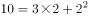，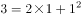，即，第三项=前两项的乘积+第一项的平方。故所求项=。

故正确答案为D。

---

### 第 2 题　qid 1796516 · 数学运算

12.7  20.9  31.1  43.3  （  ）

- **A**. 55.5
- **B**. 57.5　✅
- **C**. 57.7
- **D**. 59.7

**答案**：B

**官方解析**

由题意可判断数列为小数数列，机械划分后无规律可循，但数列整体呈现递增趋势，且变化幅度较小，考虑作差，得到新数列为8.2、10.2、12.2、（    ），为公差是2的等差数列，可判断括号内数值为14.2，则题目所求为43.3+14.2=57.5。
故正确答案为B。

---

### 第 3 题　qid 1796530 · 数学运算

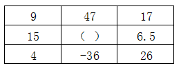

- **A**. 55
- **B**. 103
- **C**. 199
- **D**. 212　✅

**答案**：D

**官方解析**

由题意可判断为九宫格数列，寻找每行或者每列相同的规律，可发现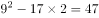、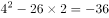，即每行中，第一个数的平方减去第三个数的2倍等于第二个数，则题目所求为。

故正确答案为D。

---

### 第 4 题　qid 2031560 · 数学运算

一批零件如果全部都交由甲厂加工，正好在计划时间完成，如果全部交由乙厂加工，要超过计划时间5天才能完成，如果甲乙两厂合作加工3天，再由乙厂单独加工，正好也是在计划时间完成，则加工完这批零件计划时间是（    ）

- **A**. 5
- **B**. 7
- **C**. 7.5　✅
- **D**. 8.5

**答案**：C

**官方解析**

由条件，“乙需要超过计划时间5天完成，两厂合作加工3天后由乙厂加工也可在计划时间完成”，则可推知乙5天完成的工作量等于甲3天完成的工作量，即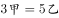，。设加工这批零件计划时间是天，根据工程总量相等可得：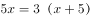，解得。

故正确答案为C。    

---

### 第 5 题　qid 1796586 · 数学运算

某服装店有一批衬衣共76件，分别卖给了33位顾客，每位顾客最多买了3件。衬衣定价为100元，买1件按原价，买2件总价打九折，买3件总价打八折。最后卖完这批衬衣共收入6460元，则买了3件的顾客有（   ）位。

- **A**. 4
- **B**. 8
- **C**. 14　✅
- **D**. 15

**答案**：C

**官方解析**

由题意可设买了1件、2件、3件衣服的人数分别为x、y、z人，则可得x+y+z=33，x+2y+3z=76，，联立求解可得x=4，y=15，z=14。

故正确答案为C。

---

### 第 6 题　qid 1796592 · 数学运算

园林工人用一辆汽车将20棵行道树运往1公里的地方开始种植。在1公里处种第一棵，以后往更远处每隔50米种一棵，该辆汽车每次最多能运三棵树。当园林工人完成任务时，这辆汽车行程最短是（    ）米。

- **A**. 20800
- **B**. 20900
- **C**. 21000　✅
- **D**. 21100

**答案**：C

**官方解析**

由题意可得，要汽车行驶距离最短，需要汽车从最远开始运，每次都运3棵。共20棵树，汽车每次最多运3棵，所以共需往返20÷3=6次余2棵，即往返7次，从第七次最远的第20棵树看，单程需行驶1000+（20-1）×50=1950米，第六次种第17棵树，单程需行驶1000+（17-1）×50=1800米，以后每次种树路程减少150米，构成等差数列，到第一次种2棵树，单程需行驶1000+50=1050米，代入等差数列求和公式计算往返路程米。

故正确答案为C。

---

### 第 7 题　qid 2031564 · 数学运算

某单位租赁了两辆同样的大巴车运送员工外出活动，从出发地到目的地的车程是2个小时，两车以相同速度同时出发，但甲车刚出发10分钟即发生故障，只能以原速的1/3匀速较慢行驶，乙车将本车员工送到目的地后，原路返回与甲车相遇，载上甲车员工驶往目的地，当所有员工到达目的地时，在途用时总计为（    ）。（上下车时间不计）

- **A**. 3小时50分钟　✅
- **B**. 4小时
- **C**. 4小时20分钟
- **D**. 4小时40分钟

**答案**：A

**官方解析**

赋值两车出发的速度为3每分钟，全程需2小时，即120分钟，则全程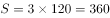。

①乙车到达目的地时，行驶了120分钟。前10分钟甲车以3的速度行驶，后110分钟以原速的，即1的速度行驶。故当乙车到达目的地时，甲车所走的路程，剩余路程为。

②乙车从返回到与甲车相遇，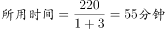。即刻返回到达目的地同样需要55分钟，即一共需要。

故，即3个小时50分钟。

故正确答案为A。    

---

### 第 8 题　qid 2031566 · 数学运算

一个木制正方体在表面涂上颜色，将它的每条棱三等分，然后从等分点将正方体展开，得到27个小正方体，将这些小正方体充分混合后，装入一个口袋，从这个口袋中随机取出两个小正方体，其中一个正方体只有一个面涂有颜色，另一个至少有2个面涂有颜色的概率约为（    ）。

- **A**. 0.05
- **B**. 0.17
- **C**. 0.34　✅
- **D**. 0.67

**答案**：C

**官方解析**

按照题干情况分成27个小正方体，其中只有一个面涂色的小正方体每个面有一个，共有6个；有两个面涂色的小正方体每条棱有1个，共有12个；有3个面涂色的小正方体每个顶点有1个，共有8个。则至少有2个面涂色的小正方体一共有20个。根据概率公式：

故正确答案为C。

---

### 第 9 题　qid 2031568 · 数学运算

大型体育竞赛开幕式需要列队，共10排。导演安排演员总数的一半多一个在第一排，安排剩下演员人数的一半多一个在第2排……..依次类推。如果在第10排恰好将演员排完，那么参与排队列的演员共有（    ）名。

- **A**. 2000
- **B**. 2008
- **C**. 2012
- **D**. 2046　✅

**答案**：D

**官方解析**

因每次安排的人数均为“”，则安排完第一排后剩余的人数为偶数。根据特性排除： 

A项：排完第一排剩余：，为奇数，排除；

B项：排完第一排剩余：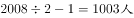，为奇数，排除；

C项：排完第一排剩余：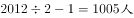，为奇数，排除；

D项：排完第一排剩余：，为偶数，当选。

故正确答案为D。 

---

### 第 10 题　qid 1796598 · 数学运算

小王早上看到挂钟显示8点多，急忙赶往公司上班。但是到了公司却发现时间和自己出门看到的挂钟时间一样，才明白是自己出门前误把挂钟的时针看成分针、分针看成时针。已知小王平时上班路程不超过1.5小时，今天上班他花费了（    ）。

- **A**. 48分钟
- **B**. 55分钟　✅
- **C**. 1小时
- **D**. 1小时3分钟

**答案**：B

**官方解析**

小王出门时分针应指向8-9，故时间为N点40，到单位的时间是8点，路上时间不超过1.5小时，说明出门时只能是6点40或者7点40。如果出门时间6点40，时针分针看反，则到单位时间是8点30，路上时间超过1.5小时，不满足条件；故出门时间应为7点40，时针分针看反，则到单位时间是8点35，故路程时间为55分钟。

故正确答案为B。

---

### 第 11 题　qid 1796600 · 数学运算

某羽毛球赛共有23支队伍报名参赛，赛事安排23支队伍抽签两两争夺下一轮的出线权，没有抽到对手的队伍轮空，直接进入下一轮。那么，本次羽毛球赛一共会出现（    ）次轮空的情况。

- **A**. 2　✅
- **B**. 3
- **C**. 4
- **D**. 5

**答案**：A

**官方解析**

第一轮23支队伍需要轮空1次；第二轮12支队伍，不需要轮空；第三轮6支队伍，不需要轮空；第四轮3支队伍，需要轮空1次；最后是冠军争夺，不需要轮空。
故正确答案为A。
相关知识点：
淘汰赛的思想，只有奇数个队伍的时候，才需要轮空，所以一共两次奇数次队伍，所以为2。

---

### 第 12 题　qid 1796648 · 数学运算

甲乙两人需托运行李。托运收费标准为10kg以下6元/kg，超出10kg部分每公斤收费标准略低一些。已知甲乙两人托运费分别为109.5元、78元，甲的行李比乙重了50%。那么，超出10kg部分每公斤收费标准比10kg以内的低了（    ）元。

- **A**. 1.5　✅
- **B**. 2.5
- **C**. 3.5
- **D**. 4.5

**答案**：A

**官方解析**

解析一：

分段计费问题，设乙的行李超出的重量为x，即乙的行李总重量为10+x，则甲的行李重量为1.5×(10+x)。所以计算超出部分的重量为1.5×(10+x)-10=5+1.5x，超出金额为49.5元，所以按照比例，乙的行李超出了重量x，超出金额为18元，得到，解得x=4，所以超出部分单价为18÷4=4.5元。所以超出10公斤部分每公斤收费标准比10公斤以内的低了6-4.5=1.5元。

解析二：

盈亏思路，由于甲的行李重量比乙的多50%，所以分段看，乙超出部分为18元，所以对应的多50%的重量，应该是27元。则从甲超出的49.5元中扣除27元，还剩22.5元，这个钱数应该对应着10公斤的50%，即5公斤22.5元。所以每公斤超出部分为4.5元，超出10公斤部分每公斤收费标准比10公斤以内的低了6-4.5=1.5元，得解。

故正确答案为A。

速解：

靠常识解决，题目中说“超出10kg部分每公斤收费标准略低一些”，所以选稍微低一点的。

---

### 第 13 题　qid 2031572 · 数学运算

甲乙两地位于不同时区，小张早上10点从甲地乘飞机到乙地，到达的时间为当地时间早上10点，第二天下午4点30分从乙地飞回甲地，到达的时间为当地时间22点30分。如果两次飞行时间相同。那么，当甲地时间为中午12点时，乙地时间为（    ）。

- **A**. 8点30分
- **B**. 9点　✅
- **C**. 9点30分
- **D**. 10点

**答案**：B

**官方解析**

第一次飞行，由甲地到乙地时间变化为0。。说明由甲到乙时差为负，且两地时差等于飞行时间。第二次飞行，由乙地到甲地，方向相反，时差则变成正。时间变化为6个小时。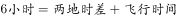。因飞行时间与时差相等，故两地时差为3小时。当甲地为12点时，乙地为上午9点。

注意：本题需要考生对时差的概念有所了解。属于地理常识和数学运算的融合题型。

故正确答案为B。 

---

## 判断推理

### 第 1 题　qid 1796668 · 图形推理

从所给四个选项中，选择最合适的一个填入问号处，使之呈现一定的规律性。

- **A**. A
- **B**. B　✅
- **C**. C
- **D**. D

**答案**：B

**官方解析**

图形元素组成不同，且都由多个小元素构成，优先考虑数元素的个数和种类。元素个数分别为4、3、4、3，则问号处图形应包含4个元素，只有B项符合。
故正确答案为B。

---

### 第 2 题　qid 1796670 · 图形推理

 从所给四个选项中，选择最合适的一个填入问号处，使之呈现一定的规律性。

- **A**. A
- **B**. B　✅
- **C**. C
- **D**. D

**答案**：B

**官方解析**

图形元素组成相同，优先考虑位置规律。将题干图形的每个格子分开观察发现，右上角的方块从第二个图形开始每次顺时针旋转90度，右下角的方块从第三个图形开始每次逆时针旋转90度，左下角的方块从第四个图形开始每次顺时针旋转90度，按照此规律，左上角的方块从第五个图形开始逆时针旋转90度，只有B项符合。
故正确答案为B。

---

### 第 3 题　qid 1796672 · 图形推理

从所给四个选项中，选择最合适的一个填入问号处，使之呈现一定的规律性。

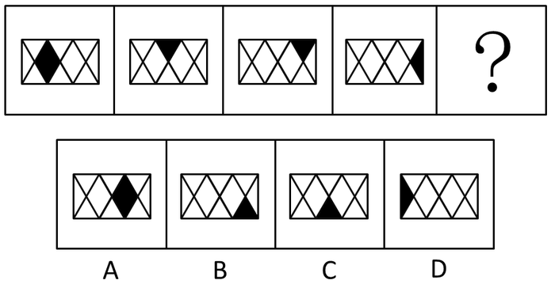

- **A**. A　✅
- **B**. B
- **C**. C
- **D**. D

**答案**：A

**官方解析**

图形组成相同，每个图形仅有一个黑色部分，且位置不同，考虑小黑块的位置。

观察题干可发现，小黑块移动规律如下图所示：

每次移动的步数分别为1、2、1，则接下来小黑块移动两步，在右边黑色菱形上。

故正确答案为A。

---

### 第 4 题　qid 1796674 · 图形推理

从所给四个选项中，选择最合适的一个填入问号处，使之呈现一定的规律性。

- **A**. A
- **B**. B
- **C**. C
- **D**. D　✅

**答案**：D

**官方解析**

图形组成相同，都是由24根火柴棍组成，考虑位置规律。
从图1到图2，外圈有4根火柴棍方向发生了改变，且内圈的火柴棍方向均没有发生变化。从图2到图3，内圈有4根火柴棍方向发生了改变，且外圈的火柴棍方向均没有发生变化，依此规律，图3到图4外圈应有4根火柴方向发生改变，内圈应保持不变，D项符合规律。
故正确答案为D。

---

### 第 5 题　qid 1796686 · 图形推理

从所给四个选项中，选择最合适的一个填入问号处，使之呈现一定的规律性。

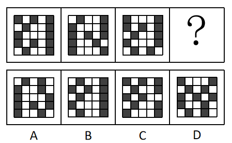

- **A**. A
- **B**. B
- **C**. C　✅
- **D**. D

**答案**：C

**官方解析**

图形组成不同，即黑块的数量不同，考虑数数。题干三个图中，黑方块的个数分别为：12、11、11，没有任何规律，数量上不存在规律，只能考虑其他规律。仔细观察发现，第一个图和第二个图有6个黑块的位置是相同的，第二个图和第三个图有5个黑块的位置是相同的，我们尝试在选项当中寻找跟第三个图有4个黑块位置相同的选项，发现：A选项有5个位置相同；B选项有9个位置相同；C选项有4个位置相同；D选项有6个位置相同。
故正确答案为C。

---

### 第 6 题　qid 1796676 · 图形推理

从所给四个选项中，选择最合适的一个填入问号处，使之呈现一定的规律性。

- **A**. A
- **B**. B
- **C**. C　✅
- **D**. D

**答案**：C

**官方解析**

观察题干图形全都是6个正方形组成，且全都可以折成一个正六面体（即题干图形都可以看成是一个正六面体的展开图形），观察选项：

A选项：如图，根据相对面特征可知，面1与面2是相对面，且面1与面3也是相对面，不符合六面体折合特征，排除。

B选项：如图，根据相对面特征可知，面1与面3是相对面，面2与面3也是相对面，不符合六面体折合特征，排除。

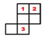

C选项：如图，根据相对面特征可知，面1与面4，面2与面5，面3与面6分别为三组相对面，符合六面体折合特征，为正确选项。

D选项：如图，根据相对面特征可知，面1与面2是相对面，且面1与面3也是相对面，不符合六面体折合特征，排除。

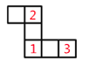

A、B、D均不能折成正六面体，只有C选项可以折成。

故正确答案为C。

---

### 第 7 题　qid 1796678 · 图形推理

从所给四个选项中，选择最合适的一个填入问号处，使之呈现一定的规律性。

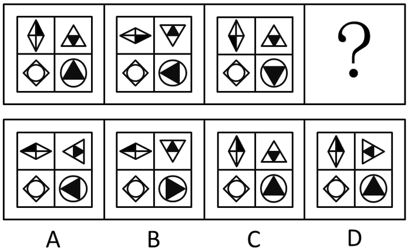

- **A**. A
- **B**. B　✅
- **C**. C
- **D**. D

**答案**：B

**官方解析**

本题元素组成完全相同，考查位置变化。每幅图都由田字格中的四个图形构成，观察左下角图形始终不动，左上角图形从左到右，依次顺时针旋转90度，可以排除C、D选项；右上角图形依次进行180度旋转（或看成依次上下翻转）；右下角图形应该是从左到右依次逆时针旋转90度，只有B项符合。
故正确答案为B。

---

### 第 8 题　qid 1796680 · 图形推理

从所给四个选项中，选择最合适的一个填入问号处，使之呈现一定的规律性。

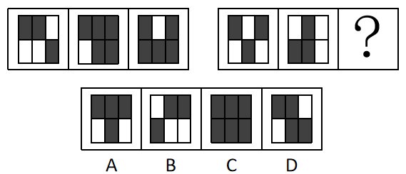

- **A**. A
- **B**. B　✅
- **C**. C
- **D**. D

**答案**：B

**官方解析**

元素组成相似，考虑样式规律里的黑白运算，但不存在规律。其次考虑数黑格个数，整体也不存在规律。观察每个图均分为上下两行，分别数出上下两行黑格的个数，发现每一幅图中，上下两行的黑格个数之差始终为1，只有B项符合。
故正确答案为B。

---

### 第 9 题　qid 1796682 · 图形推理

从所给四个选项中，选择最合适的一个填入问号处，使之呈现一定的规律性。

- **A**. A
- **B**. B
- **C**. C
- **D**. D　✅

**答案**：D

**官方解析**

本题元素组成完全相同，考查位置变化。
观察左边图形，将每幅图看成由四个黑色小三角形组成。从图1到图2，图1中上面两个黑三角上下翻转，下面两个黑三角上下翻转得到图2；再将图2看成左边两个黑三角左右翻转，右边两个黑三角左右翻转得到图3。因此右边图形应遵循同样规律，每幅图看成由四个扇形图形组成，从图1到图2，上面两个扇形上下翻转，下面两个扇形上下翻转。从图2到图3，左边两个扇形左右翻转，右边两个扇形左右翻转得到选项D。
故正确答案为D。

---

### 第 10 题　qid 1796684 · 图形推理

从所给四个选项中，选择最合适的一个填入问号处，使之呈现一定的规律性。

- **A**. A
- **B**. B　✅
- **C**. C
- **D**. D

**答案**：B

**官方解析**

本题只有两种元素，黑圈和白圈，观察选项中的黑圈白圈个数存在不同，考虑数数。题干中除了问号处，已知相连黑圈的个数分别为1，2，X，X，5，由此可知，与选项结合后的最终图形中，中间两个X应该分别有3个黑圈相连和4个黑圈相连，而题干问号前后已经各有两个黑圈，选择的选项中左端应该有1个黑圈，右端有2个，只能选B项。将B项代入整体观察后，发现相连的白圈个数也满足等差数列依次递减的规律，分别是5，4，3，2，1。
故正确答案为B。

---

### 第 11 题　qid 1796590 · 类比推理

天空：蔚蓝

- **A**. 气氛：融洽　✅
- **B**. 土地：耕种
- **C**. 茶叶：保健
- **D**. 河流：灌溉

**答案**：A

**官方解析**

第一步：判断题干词语间逻辑关系。
天空是名词，蔚蓝是形容词，后者形容前者，可以造句子成蔚蓝的天空。
第二步：逐一分析选项。
A项：气氛是名词，融洽是形容词，且融洽是形容气氛的，可以造句子成融洽的气氛，与题干逻辑关系一致。
B项：土地是名词，耕种是动词，词性与题干不符，且耕种不能形容土地，与题干逻辑关系不一致，排除。
C项：保健不能形容茶叶，与题干逻辑关系不一致，排除。
D项：河流有灌溉功能，灌溉不能形容河流，与题干逻辑关系不一致，排除。
故正确答案为A。

---

### 第 12 题　qid 1796478 · 类比推理

蜡烛：电灯

- **A**. 椅子：写字台
- **B**. 茶杯：饮水机
- **C**. 拖把：吸尘器　✅
- **D**. 电视：计算机

**答案**：C

**官方解析**

第一步：判断题干词语间逻辑关系。
蜡烛和电灯两者功能相同，都是照明，且蜡烛是非电力驱动，电灯是电力驱动。 
第二步：逐一分析选项。
A项：椅子的功能是供人坐着工作和休息，而写字台的功能是供人伏案写作，两者功能不一样，与题干逻辑关系不一致，排除；
B项：茶杯是盛茶水的用具，饮水机是升温或降温并方便人们饮用的装置，两者功能不一样，与题干逻辑关系不一致，排除；
C项：拖把的功能是擦除地面灰尘，吸尘器的功能也是清除地面灰尘，且拖把是非电力驱动，吸尘器是电力驱动，与题干逻辑关系一致；
D项：电视机的功能是播放节目，而计算机的功能不仅仅是播放节目，还可以用于办公、研究等方面，与题干逻辑关系不一致，排除。
故正确答案为C。

---

### 第 13 题　qid 1796480 · 类比推理

富裕：扶贫

- **A**. 干燥：抽湿　✅
- **B**. 蒙昧：教育
- **C**. 落后：推进
- **D**. 健康：保卫

**答案**：A

**官方解析**

第一步：判断题干词语间逻辑关系。
富裕的反义词是贫穷，扶贫是解决贫穷的方式和手段，扶贫是动宾结构。
第二步：逐一分析选项。
A项：干燥的反义词是潮湿，抽湿是解决潮湿的方式和手段，抽湿是动宾结构，与题干逻辑关系一致，当选。
B项：蒙昧的反义词是文明，教育不是动宾结构，与题干逻辑关系不一致，排除。
C项：落后的反义词是先进，但是推进是推动前进，并不是推动先进，与题干逻辑关系不一致，排除。
D项：保卫健康是动宾关系，但是与题干逻辑关系不一致，排除。
故正确答案为A。

---

### 第 14 题　qid 1796484 · 类比推理

干旱：沙漠

- **A**. 笔直：树干
- **B**. 坚硬：水泥
- **C**. 寒冷：南极　✅
- **D**. 多雨：赤道

**答案**：C

**官方解析**

第一步：判断题干词语间逻辑关系。
干旱是沙漠的必然属性。
第二步：逐一分析选项。
A项：树干不一定笔直，与题干逻辑关系不一致，排除；
B项：水泥不一定坚硬（比如还没凝固的状态），与题干逻辑关系不一致，排除；
C项：南极一定是寒冷的，与题干逻辑关系一致，当选；
D项：赤道不一定是多雨的，赤道穿过不同气候类型的地区，不是所有地区都多雨，与题干逻辑关系不一致，排除。
故正确答案为C。

---

### 第 15 题　qid 1796488 · 类比推理

菜刀：食物

- **A**. 子弹：枪支
- **B**. 毛巾：身体　✅
- **C**. 铅笔：书籍
- **D**. 窗帘：窗户

**答案**：B

**官方解析**

第一步：判断题干词语间逻辑关系。
菜刀的功能主要是用来切食物。
第二步：逐一分析选项。
A项：子弹和枪支是配套使用的，是对应关系，与题干逻辑关系不一致，排除；
B项：毛巾的主要功能是擦身体，与题干逻辑关系一致；
C项：铅笔的主要功能是写字，与书籍无关，与题干逻辑关系不一致，排除；
D项：窗帘的主要功能是遮挡光线，而不是窗户，与题干逻辑关系不一致，排除。
故正确答案为B。

---

### 第 16 题　qid 2033252 · 类比推理

玉石：雕琢：玉器

- **A**. 蚕丝：织造：丝绸　✅
- **B**. 粮食：酿造：美酒
- **C**. 生铁：冶炼：钢材
- **D**. 蚊香：点燃：烟雾

**答案**：A

**官方解析**

第一步：分析题干词语的逻辑关系。
玉石指未经雕琢的玉，玉石经过雕琢成为玉器，且发生的是物理变化，题干三词为原材料、工艺和成品之间的对应。
第二步：逐一分析选项。
A选项：蚕丝经过织造成为丝绸，且发生的是物理变化，为原材料、工艺和成品之间的对应，与题干逻辑关系一致，当选；
B选项：粮食经过酿造成为美酒，为原材料、工艺和成品之间的对应，但是在这个过程中发生了化学变化，酿酒经过了发酵的过程，通过化学变化生成乙醇，与题干逻辑关系不一致，排除；
C选项：生铁通过冶炼成为钢材，为原材料、工艺和成品之间的对应，但中间存在化学变化，与题干逻辑关系不一致，排除；
D选项：点燃蚊香产生烟雾，烟雾不是一种成品，与题干逻辑关系不一致，排除。
故正确答案为A。

---

### 第 17 题　qid 1796506 · 类比推理

站台：码头：停机坪（）

- **A**. 现金：支票：银行卡　✅
- **B**. 软件：硬件：互联网
- **C**. 外套：婚纱：羽绒服
- **D**. 演员：群众：主持人

**答案**：A

**官方解析**

第一步：分析题干词语的逻辑关系。
站台是城市轨道交通高架车站或高铁、火车站供上下乘客及装卸货物的平台。码头是海边、江河边专供乘客上下、货物装卸的平台。停机坪是供直升机起降的平台。三者之间为并列关系，并且存在功能上的相似。
第二步：逐一分析选项。
A选项：现金、支票、银行卡都具有支付的功能，三者属于并列关系，与题干逻辑关系一致，当选。
B选项：软件与硬件是并列关系，但与互联网无明显的逻辑关系，与题干逻辑关系不符，排除。
C选项：外套和婚纱无明显的逻辑关系，羽绒服与外套为种属关系，与题干逻辑关系不符，排除。
D选项：演员的主要职业是表演，与群众在职能上没有明显相似关系，主持人的职能是主持活动，三者之间在职能上与题干逻辑关系不符，排除。
故正确答案为A。

---

### 第 18 题　qid 1796518 · 类比推理

沙龙：志趣相投

- **A**. 论坛：千言万语
- **B**. 擂台：针锋相对　✅
- **C**. 网站：集思广益
- **D**. 枢纽：承上启下

**答案**：B

**官方解析**

第一步：判断题干词语间逻辑关系。
沙龙是一种聚会形式，沙龙为志趣相投的人进行交流提供平台，志趣相投是沙龙参与者的特征，二者为平台与参与者特征的对应关系。
第二步：判断选项词语间逻辑关系。
A项：论坛是网民发表不同意见的平台，但是千言万语不是网民的特征，二者不是平台与参与者特征的对应关系，与题干逻辑关系不一致，排除；
B项：擂台指为比赛搭建的平台，擂台为针锋相对的人提供比试的平台，针锋相对是擂台比赛者的特征，二者为平台与参与者特征的对应关系，与题干逻辑关系一致，当选；
C项：网站可以用来集思广益，二者为功能对应关系，与题干逻辑关系不一致，排除；
D项：枢纽有承上启下的作用，二者为功能对应关系，与题干逻辑关系不一致，排除。
故正确答案为B。

---

### 第 19 题　qid 1796526 · 类比推理

陈词滥调：老生常谈

- **A**. 按部就班：循序渐进
- **B**. 博闻强识：见多识广
- **C**. 见义勇为：助人为乐
- **D**. 八面玲珑：面面俱到　✅

**答案**：D

**官方解析**

第一步：分析题干词语的逻辑关系。
陈词滥调指没有新意，陈腐、空泛的论调，形容语言陈腐，含有贬义。老生常谈比喻人们听惯了的没有新鲜意思的话，二者为近义词，但是前者为贬义词，后者为中性词。
第二步：逐一分析选项。
A选项：按部就班指按照一定的条理、步骤做事，为中性词。循序渐进是指依照次序或步骤逐步深入或提高，为中性词。二者为近义词但是感情色彩相同，都是中性词，与题干不完全一致，排除；
B选项：博闻强识指见闻广博，记忆力强。见多识广指见过的多，知道的广，形容阅历深，经验多。二者为近义词关系，但是二者从感情色彩上来看都是褒义的，与题干不完全一致，排除；
C选项：见义勇为是指看到正义的事情奋勇地去做。助人为乐指帮助别人就会很快乐。二者不是近义关系，与题干逻辑关系不一致，排除；
D选项：八面玲珑形容为人处世圆滑，待人接物各方面都能巧妙应对，常用于指能讨好各种人物，含贬义。面面俱到指各方面都照顾得很周到，为中性词，与八面玲珑为近义词关系，且感情色彩一个贬义一个中性，与题干逻辑关系一致，当选。
故正确答案为D。

---

### 第 20 题　qid 1796532 · 类比推理

吹毛求疵：鸡蛋里面挑骨头

- **A**. 赶鸭子上架：牛不喝水强按头
- **B**. 敬酒不吃吃罚酒：不识抬举
- **C**. 舍本逐末：捡了芝麻丢了西瓜　✅
- **D**. 福无双至：屋漏偏逢连夜雨

**答案**：C

**官方解析**

第一步：分析题干词语的逻辑关系。
吹毛求疵为成语，比喻故意挑剔别人的缺点。鸡蛋里挑骨头为歇后语，意为故意找茬，与吹毛求疵同义。两者为近义词关系，且第一个词为四字成语，第二个词为歇后语。
第二步：逐一分析选项。
A选项：赶鸭子上架为歇后语，意为强人所难，牛不喝水强按头属于复句式成语，比喻用强迫手段使就范，二者为近义词，但是前者是歇后语，后者是成语，两个词的位置反了，与题干逻辑关系不一致，排除。
B选项：敬酒不吃吃罚酒比喻不识抬举，但是前者是歇后语，后者是成语，两个词的位置反了，与题干逻辑关系不一致，排除。
C选项：舍本逐末为成语，指抛弃根本，追求枝节，比喻做事不注意根本，而只抓细微末节。捡了芝麻，丢了西瓜指抓住了小的，却把大的给丢了；重视了次要的，却把主要的给忽视了。比喻做事因小失大，得不偿失。捡了芝麻丢了西瓜为歇后语，与舍本逐末同义。前者是四字成语，后者是歇后语，与题干逻辑关系一致，当选。
D选项：福无双至指幸运事不会连续到来，屋漏偏逢连夜雨为歇后语，对应的应该是祸不单行，指不幸的事接二连三地发生，而不是福无双至，二者意思不同，与题干逻辑关系不一致，排除。
故正确答案为C。

---

### 第 21 题　qid 1796542 · 类比推理

某县计划引进一种生长快、肉质好的良种牛，在本县推广养殖，以提高农民养牛的经济收益。
以下最能对该计划可行性提出质疑的是（  ）。

- **A**. 该良种牛不适应当地气候　✅
- **B**. 当地农民养牛的积极性不高
- **C**. 该良种牛的养殖成本较高
- **D**. 当地农民没有饲养过该良种牛

**答案**：A

**官方解析**

第一步：找到论点论据。
论点：某县计划引进一种生长快、肉质好的良种牛，在本县推广养殖，以提高农民养牛的经济效益。
论据：没有论据。
第二步：逐一分析选项。
A项：该良种牛不适合当地气候，说明当地根本不适合饲养该种牛，直接否定了该做法的可行性，具有削弱作用；
B项：当地农民养牛的积极性不高，推广的时候会遇到一定阻碍，影响计划的可行性，具有削弱作用；
C项：该良种牛的养殖成本较高，在一定程度上对此计划的可行性设置了障碍，具有削弱作用；
D项：当地农民没有饲养过该良种牛，说明经验不足，会影响计划的可行性，具有削弱作用。
A、B、C、D四项都具有削弱作用，因此需要进行比较，选择削弱力度最强的。A项气候不适应这一条件是人为很难改变的，是对必要条件的削弱，相比较下质疑力度最强；B项积极性可以采取措施提高；C项成本高可以通过其他渠道降低；D项没经验可以传授经验，相比较而言，B、C、D三项的削弱力度都不及A项。
故正确答案为A。

---

### 第 22 题　qid 1796576 · 逻辑判断

老张为了试验某品牌化肥的效果，把自家的稻田分成东边、西边两块，在东边地块施肥，西边地块不施肥。水稻收割后，东边地块亩产700公斤，西边地块亩产400公斤。因此，该品牌化肥能有效增产。
以下最能反驳上述论证的是（    ）。

- **A**. 东边地块的土壤肥力原本就比西边地块高　✅
- **B**. 东西两块地种植的是同一种品种的水稻
- **C**. 东边地块的水稻遭受过病虫害
- **D**. 老张收割西边地块的水稻先于东边地块

**答案**：A

**官方解析**

第一步：找出论点和论据。
“因此”引出论点：该品牌化肥能有效增产。“······能······”论点包含因果关系，属于因果论证。
论据：把自家的稻田分成东边、西边两块，在东边地块施肥，西边地块不施肥。水稻收割后，东边地块亩产700公斤，西边地块亩产400公斤。
第二步：逐一分析选项。
A项：指出东边地块的土壤肥力原本就比西边地块高，说明了两块地本身的性质就不一样，而土壤自身肥力也是可能带来增产的原因，属于另有他因，当选。
B项：指出东、西两块地种植的是同一品种的水稻，说明水稻的一致性，排除了其他影响因素，属于加强选项，排除。
C项：指出东边地块水稻遭受过病虫害，说明在遭受虫害的情况下还能高产，更证明了化肥增产的功效，属于加强选项，排除。
D项：指出西边和东边水稻的收割时间有差异，但先收割和后收割对水稻产量的影响没有明确说明，不如A项直接，排除。
故正确答案为A。

---

### 第 23 题　qid 1796482 · 逻辑判断

全球气候变暖给人类带来诸多影响的同时也影响着地球上的其他生物，降水的增加可以改善植被，从而有利于鼠类的增长。研究表明，降水的增加使原本干旱的内蒙古地区植物更加丰富，也增加了鼠类的食物，长爪沙鼠数量随之增加。
以下最能削弱上述论断的一项是（    ）。

- **A**. 据统计，一些地区的植被覆盖率并没有增加
- **B**. 据测算，全球沙漠化面积近年有所增加
- **C**. 内蒙古地区植被的增加和近年的生态保护有很大关系
- **D**. 植被的增加使各种动物包括鼠类的天敌都增加了　✅

**答案**：D

**官方解析**

第一步：找到论点论据。
论点：全球气候变暖给人类带来诸多影响的同时也影响着地球上的其他生物，降水的增加可以改善植被，从而有利于鼠类的增长。
论据：降水的增加使原本干旱的内蒙古地区植物更加丰富，也增加了鼠类的食物，长爪沙鼠数量随之增加。
第二步：逐一分析选项。
A项：一些地区的植被覆盖率并没有增加，为无关选项，题干中讲的是使植物更加丰富，改善植被，和植被覆盖率无关，排除；
B项：全球沙漠化面积今年有所增加和题干论证无关，排除；
C项：内蒙古地区植被的增加和近年的生态保护有很大关系，削弱了论据中提到的植物丰富是由于降水，为他因削弱，保留；
D项：植被的增加使各种动物包括鼠类的天敌都增加了，天敌增加否定了其有利于鼠类的增长，否定论点，保留。
C、D两项进行比较，C项属于他因削弱，D项属于否定论点，否定论点强于他因削弱，故排除C项。
故正确答案为D。

---

### 第 24 题　qid 1796498 · 逻辑判断

根据人事部门的数据，某单位的女性员工多于男性员工。中共党员员工多于政治面貌为群众的员工。（该单位员工政治面貌只有中共党员和群众两种情况）
下列判断一定正确的是（    ）。

- **A**. 政治面貌为群众的女性员工多于政治面貌为群众的男性员工
- **B**. 政治面貌为中共党员的男性员工多于政治面貌为中共党员的女性员工
- **C**. 政治面貌为中共党员的女性员工多于政治面貌为群众的男性员工　✅
- **D**. 政治面貌为群众的男性员工多于政治面貌为中共党员的男性员工

**答案**：C

**官方解析**

将题干中提到的情况一一列出来，分别有两类情况，第一类：女性员工和男性员工，第二类：政治面貌为中共党员和群众，这两类中的两种情况非此即彼，接下来我们可以根据题中已知的条件列出3个算式：
女性员工多于男性员工：
1.女（党员+群众）＞男（党员+群众）
女党员+女群众＞男党员+男群众
中共党员员工多于政治面貌为群众的员工：
2.党员（男+女）＞群众（男+女）
男党员+女党员＞男群众+女群众
那么将1+2合起来得到：
3.女党员+女群众+男党员+女党员＞男党员+男群众+男群众+女群众
算式两边相互抵消得到：
女党员＞男群众，选C项。
故正确答案为C。

---

### 第 25 题　qid 1796510 · 逻辑判断

随着网络的普及，电子版图书也越来越多，其中包括电子版的文学名著，而且价格很低。人们只要打开电脑，在网上几乎可以浏览到任何一本名著。电子版文学名著的问世，会改变大众的阅读品味，有利于造就高素质读者群体。
以下最能削弱上述结论的一项是（    ）。

- **A**. 对文学没有兴趣的人不会因为文学名著的价钱高低或者是否方便而阅读文学名著　✅
- **B**. 文学名著的普及率一直不如娱乐杂志、时事报刊等大众读物
- **C**. 许多读者认为阅读电子书籍的感觉不如阅读印刷书籍的那么好，宁愿选择印刷版读物
- **D**. 在互联网上阅读文学名著仍然需要收费

**答案**：A

**官方解析**

第一步：找到论点论据。
论点：电子版文学名著的问世，会改变大众的阅读品味，有利于造就高素质读者群体。
论据：随着网络的普及，电子版图书也越来越多，其中包括电子版的文学名著，而且价格很低。人们只要打开电脑，在网上几乎可以浏览到任何一本名著。
第二步：逐一分析选项。
A项：对文学没有兴趣的人不会因为文学名著的价钱高低或者是否方便而阅读文学名著，说明了电子版名著的问世无法改变人的兴趣和习惯，喜欢读的还是读，不喜欢读还是不读，直接否定了题干论点中提到的能改变大众阅读品味，有利于造就高素质读者群体，也将论据和论点之间进行了拆桥，力度最大，当选；
B项：文学名著的普及率一直不如娱乐杂志时事报刊等大众读物，和题干中提到的电子版文学名著无关，为无关项，排除；
C项：许多读者认为阅读电子书籍的感觉不如阅读印刷书籍那么好，宁愿选择印刷版读物，这些读者，并非题干讨论的主体——即阅读品味改变、素质提高的群体。题干讨论的群体，应该是本身就不读名著（包括纸质版名著和电子版名著）的人，由于有了数量多、价格便宜且方便的电子版文学名著问世，从而开始读电子版名著，所以电子版名著改变的是这些人的品味和素质，选项的主体与题干的主体不一致，排除；
D项：在互联网上阅读文学名著仍然需要收费，题干中说到电子版的文学名著价格很低，也就是原本就是收费的，不能质疑，排除。
故正确答案为A。

---

### 第 26 题　qid 1796520 · 类比推理

有研究表明，运动，特别是大量运动，会提高人体内血清基的水平。在某种程度上，人的心情由体内血清基的水平决定。抗抑郁药物可以通过提高体内血清基的水平来起作用。
下列论断一定正确的是（    ）。
I.提高体内血清基水平，要么大量运动，要么吃抗抑郁药物。
II.人的心情，可能由运动量决定，也可能受抗抑郁药物影响。
III.大量运动会影响人的心情，或影响抗抑郁药物的疗效。

- **A**. I
- **B**. II
- **C**. I和II
- **D**. II和III　✅

**答案**：D

**官方解析**

题干中写的是体内的血清基水平可以决定人的心情，大量运动和抗抑郁药物都可以影响体内血清基水平。题干只是说大量运动和抗抑郁药物都可以影响体内血清基水平，并没有说只有这两者可以提高体内的血清基水平。
第一句话，说得太绝对，错误。
第二句话，题干中提到了大量运动可以提高血清基水平，抗抑郁药物也可以提高血清基水平，而血清基水平一定程度决定人的心情，因此可以得到，正确。
第三句话，大量运动会影响人的心情是对的，大量运动影响抗抑郁药物的疗效并不能从原文中推导出来，但是这两者是或关系，一真全真，所以第三句话也一定是正确的。
故正确答案为D。

---

### 第 27 题　qid 1796538 · 逻辑判断

气候与经济发展具有密切关系。在欧洲，北部气候较冷的国家总体上比南部国家发达；在美洲，加拿大和美国比南部的墨西哥发达；在亚洲，韩国的GDP是东南亚所有国家的总和。之所以有这种差别，是因为寒冷地区的人们为了生存，大脑会进一步地复杂化，而热带的人们，由于食物充足，大脑失去了进一步进化的动力。
以下最能削弱上述论断的一项是（ ）

- **A**. 人类共有的惰性使任何地区的人都类似
- **B**. 寒冷地区的人并不比热带的人智商高
- **C**. 经济的发达与文化的繁荣没有必然联系
- **D**. 获取食物并不是人类主要的脑力活动　✅

**答案**：D

**官方解析**

第一步：找出论点和论据。
论点：气候会影响经济发展，北部寒冷地区的经济比南部热带地区的经济发达。
论据：解释原因——通过对比，说明气候影响食物数量，进而影响头脑活动。
第二步：逐一分析选项。
A项：共同惰性使任何地区的人都类似，与题干中提到的气候与经济的关系，以及气候与食物数量和头脑活动之间的关系都没有明确的对应，而是重打锣鼓另开张，提出了一个新的因素即惰性，也没有提出类似的人，在大脑活动方面是否有差异，不够明确，需要与其他选项做比较，保留；
B项：强调寒冷地区的人不比热带地区人智商高，与寒冷地区人们的大脑是否更复杂无关，无法削弱，排除；
C项：讨论的是经济与文化的关系，与气候和经济的关系无关，无法削弱，排除；
D项：获取食物不是人类主要的脑力活动，否定了论据中食物数量与头脑活动的关系，相对A项来说，更为直接的削弱论据，当选。
故正确答案为D。
注：本题AD两个选项都不是特别明确，所以争议较大。
从揣摩命题设置的角度来看的。无论是论点还是论据，都是在讨论气候和其他因素之间的关系。论点是气候和经济，论据是气候和食物和头脑活动。所以，他的内在联系就是，气候-食物-头脑-经济。
而无论是A项，还是D项，能看出来，他是在什么和头脑之间做文章。也就是说，他默认了气候和食物，头脑和经济之间的关系。D项和A项，一个说食物和头脑没那么直接的关系，一个说另一因素跟人之间的关系。
人相似，我们每个人确实都挺相似的，但是，头脑就都一样吗？所以他没有直接说到头脑活动的D项具体。而另一因素，也没有直接说食物跟原文更直接。
所以，从以上几点揣摩，粉笔认为D更符合命题人的意图。

---

### 第 28 题　qid 1796552 · 类比推理

我国以占世界的耕地养活了占世界的人口，其中年平均生产大豆1200万吨左右。同时，还利用国外的耕地、国外的农民，继续开放市场，降低关税或免除关税，年平均进口大豆5800万吨左右。更多利用国外的资源来让我国人民生活得更好。

以上论断基于下列假设，除了：

- **A**. 大量进口粮食不会带来粮食安全问题
- **B**. 政府相关部门对进口粮食严把质量关
- **C**. 进口粮食的价格能被国内群众所接受
- **D**. 大量进口粮食损害了国内生产者的利益　✅

**答案**：D

**官方解析**

第一步：找到论点论据。
论点：利用国外的资源能让我国人民生活得更好。
论据：无。
本题无论据，提问为假设，则优先考虑必要条件，因本题为加强选非题，则可找出三个加强项进行排除，剩下的选项即为正确答案。
第二步：逐一分析选项。
A项：大量进口粮食不会带来粮食安全问题，说明粮食是可放心食用的，所以国外的资源确实可以让我国人民生活得更好，可以加强，排除；
B项：政府对进口粮食严把质量关，说明政府对进口粮食要求高，是为了人民生活得更好所做出的努力，可以加强，排除；
C项：价格能被国内群众接受，说明进口粮食的价格在群众能力承受范围之内，给国内群众带来了更多的选择，可以让我国人民生活得更好，可以加强，排除；
D项：进口粮食损害了国内生产者的利益，说明进口粮食损害了我国部分人民，此部分人民不会生活得更好，削弱项，不能加强，当选。
本题为选非题，故正确答案为D。

---

### 第 29 题　qid 1796562 · 逻辑判断

一项研究发现：经常喝咖啡的成年人患上心脏病的概率是不常喝咖啡成年人患心脏病概率的2.5倍。由此可以判定，咖啡中的某种物质能够导致人患上心脏疾病。
以下最能削弱上述结论的一项是（  ）。

- **A**. 咖啡含有提高心脏活力的成分
- **B**. 用餐时喝咖啡有降低血脂的作用
- **C**. 心脏病高危人群更容易爱上喝咖啡　✅
- **D**. 爱喝咖啡的人大都性格开朗，喜欢运动

**答案**：C

**官方解析**

第一步：找到论点论据。
论点：咖啡中的某种物质能够导致人患上心脏病。
论据：经常喝咖啡的成年人患心脏病的概率比不喝的高。
第二步：逐一分析选项。
A项：咖啡中含有提高心脏活力的成分，但是提高心脏活力与患心脏病之间没有必然的联系，有可能活力高更容易患病，因此属于不明确选项。
B项：用餐时喝咖啡能降低血脂，这与心脏病没有直接的关系，因此属于无关选项，排除。
C项：心脏病高危人群更容易爱上喝咖啡，说明是因为心脏病才爱喝咖啡，并不是因为喝咖啡导致心脏病，属于因果倒置，能够削弱论证，当选。
D项：爱喝咖啡的人开朗、喜欢运动，与患心脏病无关，属于无关项，排除。
故正确答案为C。

---

### 第 30 题　qid 1796580 · 类比推理

液体都能够流动。水能够流动，所以水是液体。
以下与上述推理在结构上最为相似的一项是（  ）。

- **A**. 哲学家都爱思考。李教授是哲学家，所以他爱思考
- **B**. 哺乳类动物都是恒温动物。蛇不是哺乳类动物，所以蛇不是恒温动物
- **C**. 平板电脑都有触摸屏。手机有触摸屏，所以手机是平板电脑　✅
- **D**. 工作态度端正就能取得好的业绩。小刘取得好业绩，所以他工作态度端正

**答案**：C

**官方解析**

第一步：分析题干推理形式。

题干翻译为：液体流动，水流动，所以水液体，逻辑结构为“肯后推肯前”。

第二步：逐一分析选项。

A项：翻译为：哲学家爱思考，李教授哲学家，所以李教授爱思考，逻辑结构为“肯前推肯后”，与题干推理形式不一致，排除；

B项：翻译为：哺乳类动物恒温动物，蛇哺乳类动物，所以蛇恒温动物，逻辑结构为“否前推否后”，与题干推理形式不一致，排除；

C项：翻译为：平板电脑触摸屏，手机触摸屏，所以手机平板电脑，逻辑结构为“肯后推肯前”，与题干推理形式一致，保留；

D项：翻译为：工作态度端正取得好成绩，小刘取得好成绩，所以小刘工作态度端正，逻辑结构为“肯后推肯前”，与题干推理形式一致，保留。

比较C、D两项，C项第一句与题干第一句均为“······都······”，而D项第一句为“······就······”，因此C项的推理句式与题干更为一致。

故正确答案为C。

---

## 资料分析

### 材料 1

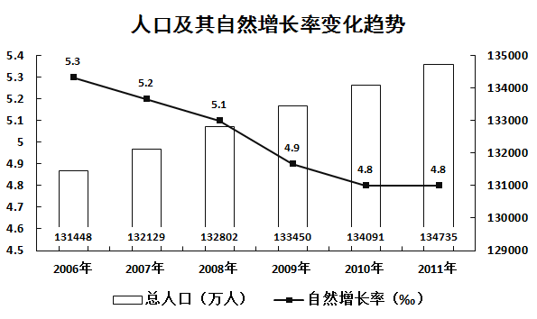

#### 第 1 题　qid 1796548 · 平均数

2006年至2011年期间，平均每年增加的人数为（    ）万人。

- **A**. 531.3
- **B**. 657.4　✅
- **C**. 752.4
- **D**. 839.2

**答案**：B

**官方解析**

根据题干中“平均每年增加的人数”，可以判定本题为年均增长量问题。定位图形材料1，可以得到2011年总人口为134735万人，2006年总人口为131448万人。2006年至2011年期间，平均每年增加的人数为，首位商6。 

故正确答案为B。

---

#### 第 2 题　qid 1796584 · 增长

按2011年的人口自然增长率计算，预计2012年的人口约为（    ）万人。

- **A**. 135382　✅
- **B**. 135409
- **C**. 141129
- **D**. 141202

**答案**：A

**官方解析**

根据题干中“预计2012年的人口”，可以判定本题为现期计算问题。定位图形材料1，可以得到2011年总人口为134735万人，自然增长率。根据公式：现期量=基期量×（1+增长率），2012年的人口约为。

故正确答案为A。

---

#### 第 3 题　qid 1796544 · 综合

2011年的总人口中，“65岁及以上”的人口比“0-14岁”的人口大约多（    ）万人。

- **A**. 7910
- **B**. 8850
- **C**. 9320
- **D**. 9970　✅

**答案**：D

**官方解析**

根据题干中“2011年，‘65岁及以上’的人口比‘0-14岁’的人口”，可以判断本题为现期比重计算问题。定位图形材料1，可以得到2011年总人口为134735万人。图形材料2，可以得到“0-14岁”的比重为9.1%，“65岁及以上”的比重为16.5%。2011年“65岁及以上”的人口比“0-14岁”的人口多134735×（16.5%-9.1%）=134735×7.4%≈134735×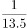≈9980万人，与D项最接近。

故正确答案为D。

---

#### 第 4 题　qid 1796564 · 综合

以下说法错误的是（    ）。

- **A**. 2007年至2010年，每年比上年增加的人口数量一直递减
- **B**. 人口自然增长率不断下降并趋于平缓
- **C**. 人口自然增长越来越少，相比2010年，2011年的人口增长几乎停滞　✅
- **D**. 2009年的人口自然增长率下降得最快

**答案**：C

**官方解析**

根据题干“以下说法错误的是”，可以判断为综合分析题。
A项，定位图形材料1，
2007年增加的人口数量为132129-131448=681万人；
2008年增加的人口数量为132802-132129=673万人；
2009年增加的人口数量为133450-132802=648万人；
2010年增加的人口数量为134091-133450=641万人；
可以看出，每年比上年增加的人口数量一直递减。A项正确。
B项，定位图形材料1的折线，人口自然增长率不断下降并趋于平缓。B项正确。
C项，定位图形材料1，2011年的自然增长率与2010年的一致，但是人口数量还是增长。C项错误。
D项，定位图形材料1，
2007年的人口自然增长率下降5.3-5.2=0.1；
2008年的人口自然增长率下降5.2-5.1=0.1；
2009年的人口自然增长率下降5.1-4.9=0.2；
2010年的人口自然增长率下降4.9-4.8=0.1；
2011年的人口自然增长率下降率为0。
可以看出2009年是下降最快的。D项正确。
本题为选非题，故正确答案为C。
备注：此题可跳过A项，看BC项，选出答案，D项不看。

---

#### 第 5 题　qid 1796572 · 综合

根据资料，我们可以得知（    ）。

- **A**. 65岁及以上人口数量越来越多
- **B**. 0-14岁人口占总人口的比重越来越大　✅
- **C**. 除了2011年，15-64岁人口数量每年都在增长
- **D**. 65岁及以上人口占总人口的比重越来越大

**答案**：B

**官方解析**

根据题干“根据材料，我们可以得知”，可以判断为综合分析题。
A项，定位图形材料1可以得到人口数量，图形材料2可以得到65岁及以上的人口比重。此题需要每一年的人口总量和比重相乘，计算复杂，考虑跳过；
B项，定位图形材料2，最下面的数字即为0-14岁比重，可以看出比重越来越大，B项正确；
C项，定位图形材料1可以得到人口数量，图形材料2可以得到15-64岁的人口比重。两者相乘即为每年15-64岁人口数量。图1中的人口数量在逐年增加，图2中的比重也在增长，两者相乘结果也在增长。而2010年15-64岁人口数量为134091×74.5%；2011年15-64岁人口数量为134735×74.4%；两数相乘，比重差不多大，人口总量大则乘积大。可知，2006-2011年每年都在增长。C项错误；
D项，定位图形材料2，2006年65岁及以上人口比重为19.8%；2007年65岁及以上人口比重为19.4%；可以看出比重并非越来越大。D项错误。
故正确答案为B。

---

### 材料 2

#### 第 6 题　qid 2031584 · 综合

2013年，批发业法人企业比零售业多（    ）个。

- **A**. 7023
- **B**. 7158
- **C**. 8281
- **D**. 11241　✅

**答案**：D

**官方解析**

定位表格可知，2013年批发和零售业法人企业171973个，批发业91607个，则批发业法人企业比零售业多 且尾数为1。

故正确答案为D。

---

#### 第 7 题　qid 2031586 · 综合

零售业期末商品库存额最多的年份是（    ）年。

- **A**. 2011
- **B**. 2012
- **C**. 2013
- **D**. 2014　✅

**答案**：D

**官方解析**

定位表格可知，2011年—2014年批发和零售业期末商品库存额分别为24979.3亿元、29000.6亿元、32422亿元、38123.8亿元，2011年—2014年批发业期末商品库存额分别为18329.0亿元、21265.2亿元、23260.7亿元、26080.9亿元，作差后即可得出，2011年—2014年零售业期末商品库存额分别约为6500亿元、7800亿元、9100亿元、12000亿元，最大值为2014年。
故正确答案为D。

---

#### 第 8 题　qid 2031590 · 增长

与2013年相比，下列指标在2014年增长额最小的是（    ）。

- **A**. 批发业出口额　✅
- **B**. 批发业进口额
- **C**. 零售业商品购进额
- **D**. 零售业商品销售额

**答案**：A

**官方解析**

根据“2014年增长额最小的是”，判断本题为增长量比较问题。定位表格，2014年，批发业出口额增长量为，批发业进口额增长量为，零售业商品购进额增长量为，零售业商品销售额增长量为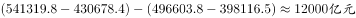，则增长额最小的为批发业出口额。

故正确答案为A。

---

#### 第 9 题　qid 2031592 · 综合

以下各项中两个指标之间差额最大的是（    ）。

- **A**. 2014年批发业期末商品库存额与零售业期末商品库存额
- **B**. 2013年批发业进口额与出口额
- **C**. 2012年批发和零售业商品销售额与商品购进额　✅
- **D**. 2011年批发和零售业进口额与出口额

**答案**：C

**官方解析**

定位表格，A项差额为，B项差额为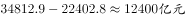，C项差额为，D项差额为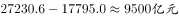，则差额最大为2012年批发和零售业商品销售额与商品购进额。

故正确答案为C。 

---

#### 第 10 题　qid 2031596 · 综合

以下说法正确的是（    ）。

- **A**. 2010-2013年，批发业每年年末从业人数均多于零售业
- **B**. 2010-2014年，零售业出口额逐年上升
- **C**. 相比2010年，2013年的零售业进口额翻了一番　✅
- **D**. 2011-2014，批发业期末商品库存额增幅逐年收窄

**答案**：C

**官方解析**

A项：定位表格，以2010年为例，批发业年末从业人数为350.9万人，批发和零售业年末从业人数为852.2万人，批发业与零售业人数差额为，错误；

B项：定位表格，2012年零售业出口额为，2013年零售业出口额为，不满足逐年上升，错误；

C项：定位表格，2010年零售业进口额为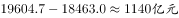，2013年零售业进口额为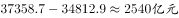，倍数为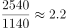，约翻一番，正确；

D项：定位表格，以2013年为例，批发业期末商品库存额的增幅为，2014年批发业期末商品库存额的增幅为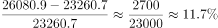，所以2014年增幅没有收窄，错误。

故正确答案为C。

---

### 材料 3

        2000年、2005年、2010年我国普通高中专任教师总人数分别为756850人、1299460人、1518194人。其中，女性人数分别为273110人、558625人、723566人。

        从年龄结构看，2000年、2005年、2010年31-35岁普通高中专任教师总人数分别为185873人、265509人、322829人，其中，女性人数分别为68346人、117838人、164175人；36-40岁普通高中专任教师总人数分别为117242人、248837人、272313人，其中，女性人数分别为35751人、95566人、122953人；41-45岁普通高中专任教师总人数分别为55522人、137235人、239616人，其中，女性人数分别为15728人、42931人、93641人。

#### 第 11 题　qid 2031604 · 综合

2000年，我国31-45岁普通高中专任教师中，共有（    ）人未评职称。

- **A**. 68253
- **B**. 33193
- **C**. 989　✅
- **D**. 612

**答案**：C

**官方解析**

定位表格可得，2000年，我国普通高中专任教师在31-35、36-40、41-45岁中未评职称人数分别为：612人、256人、121人，则31-45岁中人。

注意：也可根据结果尾数为9，或结果大于612且不大于10000来快速选出答案。

故正确答案为C。

---

#### 第 12 题　qid 2031606 · 平均数

2005年，我国31-45岁的普通高中专任教师的平均年龄可能会是（    ）岁。

- **A**. 34
- **B**. 37　✅
- **C**. 40
- **D**. 41

**答案**：B

**官方解析**

由问题所求，“2005年，我国岁的普通高中专任教师的平均年龄”可判定此题为平均数问题。问题所求“可能会是（ ）岁”，需要计算平均数取值范围。定位表格可得，2005年，普通高中专任教师在岁、岁、岁的人数分别为265509人、248837人、137235人，。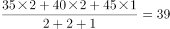岁，平均年龄最小为岁，所以平均年龄的取值范围为岁，只有B项满足。

故正确答案为B。

---

#### 第 13 题　qid 2031608 · 综合

2010年，我国41-45岁的普通高中专任教师中，至少约有（    ）万人在2000年还不是普通高中专任教师。

- **A**. 5　✅
- **B**. 8
- **C**. 18
- **D**. 16

**答案**：A

**官方解析**

求2010年41-45岁的普通高中专任教师中在2000年还不是普通高中专任教师的人数最小值，即要使2010年41-45岁的普通高中专任教师在2000年31-35岁时已经是普通高中专任教师的人数最多，最多的情况为2000年31-35岁的普通高中专任教师在2010年41-45岁时仍然全部是普通高中专任教师。定位表格可得，2000年31-35岁的普通高中专任教师为185873人，2010年41-45岁的普通高中专任教师为239616人。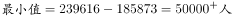，A项最接近。

故正确答案为A。

---

#### 第 14 题　qid 2031610 · 比重

我国普通高中专任教师中，以下年龄组女性所占比重最大的是（    ）。

- **A**. 2005年的36-40岁
- **B**. 2010年的31-35岁　✅
- **C**. 2010年的36-40岁
- **D**. 2010年的41-45岁

**答案**：B

**官方解析**

由问题所求“······以下年龄组女性所占比重最大的是”，材料已知所有时间的数据，可判定此题为现期比重问题，定位表格可得，

A项：2005年的36-40岁总人数=248837人，女性人数=95566人，；

B项：2010年的31-35岁总人数=322829人，女性人数=164175人，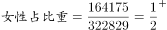；

C项：2010年的36-40岁总人数=272313人，女性人数=122953人，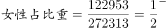；

D项：2010年的41-45岁总人数=239616人，女性人数=93641人，。

B项比重值最大。

故正确答案为B。

---

#### 第 15 题　qid 2031616 · 综合

以下说法正确的是（    ）。

- **A**. 
我国普通高中专任教师中，女性教师人数在2005年达到顶峰后逐年减少

- **B**. 
2005年我国36-40岁一级普通高中专任教师中有6万多人在2010年评上了高级教师

- **C**. 
2000-2010年我国普通高中专任教师人数以每年约速度增长

- **D**. 
2010年我国未评职称的普通高中专任教师占专任教师总人数的比重，比2000年下降了近3个百分点
　✅

**答案**：D

**官方解析**

A项：定位表格可得，2005年女性教师人数为558625人，2010年为723566人，

方法一：没有2006-2009年的数据，所以条件不足，无法确定是否逐年减少；

方法二：仅看2010年和2005年人数是增加的，故不可能在2005年以后逐年减少，说法错误；

B项：定位表格可得，2005年的36-40岁高级教师为69292人,在2010年为41-45岁，对应高级教师为142633人，二者差值即新增加高级教师人数，人，故新评上的高级教师人数至少应为7万多人，说法错误；

C项：定位表格可得，2000年普通高中专任教师人数为756850人，2010年为1518194人，则2010年比2000年的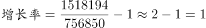，若以每年约速度增长，则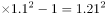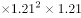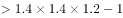，故年均增长率应小于，说法错误；

D项：定位表格可得，2010年，普通高中专任教师人，人，；2000年，普通高中专任教师人，人，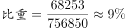，，下降了近3个百分点，说法正确。

故正确答案为D。

注：B项，因材料中没有提及评级方式，若可以跨级评职称，则新评上高级教师的不一定是原来的一级老师，无法计算确切数值，选项仍然错误。

---
