# 2016年广州市公务员录用考试《行测》题

> 省考 · 2016 年 · 6 个模块 · 共 100 题

- [政治理论](#%E6%94%BF%E6%B2%BB%E7%90%86%E8%AE%BA) · 1 题
- [常识判断](#%E5%B8%B8%E8%AF%86%E5%88%A4%E6%96%AD) · 14 题
- [言语理解与表达](#%E8%A8%80%E8%AF%AD%E7%90%86%E8%A7%A3%E4%B8%8E%E8%A1%A8%E8%BE%BE) · 25 题
- [数量关系](#%E6%95%B0%E9%87%8F%E5%85%B3%E7%B3%BB) · 14 题
- [判断推理](#%E5%88%A4%E6%96%AD%E6%8E%A8%E7%90%86) · 30 题
- [资料分析](#%E8%B5%84%E6%96%99%E5%88%86%E6%9E%90) · 16 题

---

## 政治理论

### 第 1 题　qid 2062666 · 新思想

习近平同志在文艺工作座谈会上的重要讲话中，列举了我国名篇佳作，如《采薇》《关雎》《天问》《敕勒歌》。其中反映士兵征战生活的是：

- **A**. 《采薇》　✅
- **B**. 《关雎》
- **C**. 《天问》
- **D**. 《敕勒歌》

**答案**：A

**官方解析**

本题考查文学常识，2014年10月15日，习近平总书记在主持召开文艺工作座谈会的重要讲话中提到：我国久传不息的名篇佳作都充满着对人民命运的悲悯、对人民悲欢的关切，以精湛的艺术彰显了深厚的人民情怀。《古诗源》收集的反映远古狩猎活动的《弹歌》，《诗经》中反映农夫艰辛劳作的《七月》、反映士兵征战生活的《采薇》、反映青年爱情生活的《关雎》，探索宇宙奥秘的《天问》，反映游牧生活的《敕勒歌》，歌颂女性英姿的《木兰诗》等，都是从人民生活中产生的。
据此可知，反映士兵征战生活的作品应当是《采薇》。
故正确答案为A。

---

## 常识判断

### 第 1 题　qid 2062660 · 人文常识

供给侧改革意义在于，通过制度变革、结构优化和要素升级，在供给侧放松管制、激发活力、释放创造力，充分发挥市场在资源配置中的决定性作用，进而为中国经济培育新主体、开发新产业、打造新动力。以下措施不是供给侧改革所提倡的工作重点的是：

- **A**. 加大减税力度，取消更多行政管制
- **B**. 大众创业、万众创新
- **C**. 国家加大基础设施建设力度　✅
- **D**. 加快淘汰僵尸产业

**答案**：C

**官方解析**

本题考查政治常识，主要涉及供给侧改革的相关内容。供给侧改革的工作重点是：化解产能过剩、提高全要素生产力、降低企业成本、消化地产库存和防范金融风险，与供给侧相对的是需求侧，主要包括投资、出口和消费三大要素。
A项正确，“加大减税力度，取消更多行政管制” 属于降低企业成本的措施，因此属于供给侧改革的重点。
B项正确，“大众创业、万众创新”属于提高全要素生产力的措施，因此属于供给侧改革的重点。
C项错误，“国家加大基础设施建设力度”需要大量的投资，投资属于需求侧而不属于供给侧。
D项正确，“加快淘汰僵尸产业”属于化解过剩产能的措施，因此属于供给侧改革的重点。
本题为选非题，故正确答案为C。

---

### 第 2 题　qid 2062676 · 人文常识

某地准备举办一场以“辉煌的古代丝绸之路”为主题的历史展览，需搜集一些在古代丝绸之路历史中有重要影响的历史人物资料。以下历史人物属于应重点搜集的有：
①张骞；②鉴真；③玄奘；④班超；⑤裴矩；⑥班固

- **A**. ①②③④
- **B**. ①③④⑤　✅
- **C**. ②③⑤⑥
- **D**. ①③⑤⑥

**答案**：B

**官方解析**

张骞是古代丝绸之路的开拓者，将中原文明传播至西域，又从西域诸国引进了汗血马、葡萄等物种到中原，促进了东西方文明的交流，因此①当选；
鉴真东渡日本，传播博大精深的中国文化，促进了日本佛学、医学、建筑和雕塑水平的提高，受到中日人民和佛学界的尊敬，鉴真东渡的路线跟丝绸之路的路线不同，故不属于古代丝绸之路中有重要影响力的人物，因此②不选； 
唐玄奘从长安出发途经西域到印度取经，经过了丝绸之路，因此③当选；
班超在西域前后共活动了31年，打击北匈奴的势力，帮助西域人民摆脱其控制和打压，保护了当地各族人民不受匈奴落后制度的奴役，恢复了东西交通，确保了丝绸之路的畅通，因此④当选；
隋炀帝即位后，“方勤远略”，裴矩积极从事发展隋朝与西域各族联系的工作和对吐谷浑、突厥等边疆地区的经营。他一生里最有意义的事迹，就是他在“丝绸之路”上的活动，因此⑤当选；
班固是东汉著名的史学家、文学家，所著的《汉书》是继《史记》之后中国古代又一部重要史书，虽然班固与班超是兄弟关系，但班固成就主要在史学和文学，而非政治和军事上，因此⑥不选。
故正确答案为B。

---

### 第 3 题　qid 2062684 · 人文常识

我国近代著名启蒙思想家严复为宣传维新变法思想，翻译了多部西方名著，其中《天演论》一书特别强调“物竞天择，适者生存”的观点。这一观点源于19世纪英国的博物学家（）。

- **A**. 牛顿
- **B**. 伏尔泰
- **C**. 达尔文　✅
- **D**. 爱因斯坦

**答案**：C

**官方解析**

本题考查文学常识，英国的达尔文著有《物种起源》一书，书中提出了自然界在“物竞天择、适者生存、优胜劣汰”的法则中发展的即生物进化论的观点。《物种起源》的问世，第一次把生物学建立在完全科学的基础上，推翻了神创论和物种不变论，沉重打击了神权统治的根基，促进了社会的竞争发展。
晚清时期，严复介绍了许多西方社会科学和政治理论的名著，其中最为著名的就是《天演论》，在《天演论》中严复运用“物竞天择，适者生存”的生物进化观点，来宣传“优胜劣汰”“世道必进”的社会进化理论，呼吁救亡图存，自强保种。
故正确答案为C。

---

### 第 4 题　qid 2062692 · 人文常识

“五福临门”中的“五福”源自《尚书》的《洪范》篇：“一曰寿、二曰富、三曰康宁、四曰攸好德、五曰考终命。”以下四项与“考终命”表达的意思相同的是：

- **A**. 老吾老以及人之老　✅
- **B**. 尊前慈母在，浪子不觉寒
- **C**. 道之以德，齐之以礼
- **D**. 仁义礼智信

**答案**：A

**官方解析**

本题目主要考查文化常识，五福临门中的五福源自《尚书·洪范》：“一曰寿、二曰富、三曰康宁、四曰攸好德、五曰考终命”，是古代中国人民关于幸福观的五条标准，分别指长寿、富贵、康宁、好德、善终。长寿是命不夭折而且福寿绵长；富贵是钱财富足而且地位尊贵；康宁是身体健康而且心灵安宁；好德是生性仁善而且宽厚宁静；善终是尽享天年，长寿而亡。
此题首先排除C项和D项，C项出自《论语·为政》，强调的是为政之道，D项“仁义礼智信”为儒家“五常”，强调的是做人的原则，跟题干“考终命”并无直接关系，属于无关选项。A项意为“在赡养孝敬自己的长辈时不应忘记其他与自己没有亲缘关系的老人”，强调赡养老人，让老人能颐养天年，能得善终，因此符合题意。B项意为“有慈母在堂,在外流浪的儿子不会担心过冬的衣服，因有母亲临行前密密细缝”，侧重于孩子而不是老人，因此不符合题干的要求，排除。
故正确答案为A。

---

### 第 5 题　qid 2062706 · 人文常识

“紫荆绽后白莲开，喜事蹁跹接踵来。神州大地齐欢庆，一国两制添新彩。”这首诗最可能创作于（    ）。

- **A**. 1984年
- **B**. 1997年
- **C**. 1999年　✅
- **D**. 2005年

**答案**：C

**官方解析**

本题考查了国情社情。
紫荆花是香港特别行政区的区花，白莲花是澳门特别行政区的区花。全诗描述的是，邓小平同志为了实现中国统一的目标而提出了“一国两制”的方针，并成功解决了香港问题和澳门问题，香港于1997年回归，澳门于1999年回归，即本诗的创作时间最有可能是1999年。
故正确答案为C。

---

### 第 6 题　qid 2062716 · 法律常识

根据我国《公务员法》，公务员应当履行的义务包括(   )。
①模范遵守宪法和法律
②获得履行职责应当具有的工作条件
③清正廉洁，公道正派
④参加培训
⑤遵守纪律，恪守职业道德，模范遵守社会公德

- **A**. ①④⑤
- **B**. ①③⑤　✅
- **C**. ②③④⑤
- **D**. ①②③④⑤

**答案**：B

**官方解析**

本题考查了公务员法的知识点。
根据《公务员法》第十四条的规定：“公务员应当履行下列义务： （一）忠于宪法，模范遵守、自觉维护宪法和法律，自觉接受中国共产党领导； （二）忠于国家，维护国家的安全、荣誉和利益； （三）忠于人民，全心全意为人民服务，接受人民监督； （四）忠于职守，勤勉尽责，服从和执行上级依法作出的决定和命令，按照规定的权限和程序履行职责，努力提高工作质量和效率； （五）保守国家秘密和工作秘密； （六）带头践行社会主义核心价值观，坚守法治，遵守纪律，恪守职业道德，模范遵守社会公德、家庭美德； （七）清正廉洁，公道正派； （八）法律规定的其他义务。”
根据《公务员法》第十五条规定：“公务员享有下列权利：（一）获得履行职责应当具有的工作条件； （二）非因法定事由、非经法定程序，不被免职、降职、辞退或者处分； （三）获得工资报酬，享受福利、保险待遇； （四）参加培训； （五）对机关工作和领导人员提出批评和建议； （六）提出申诉和控告； （七）申请辞职； （八）法律规定的其他权利。”
①③⑤属于公务员应当履行的义务，②④属于公务员应当享有的权利。
故正确答案为B。

---

### 第 7 题　qid 2062722 · 人文常识

春节期间，小李出国旅游，与旅行社签订了旅游合同。在前往其中一个景点之前，旅行社通知小李当地突发泥石流，道路无法通过，并以此为由取消了行程中的该景点。为此，该旅行社（）。

- **A**. 承担赔偿责任，需向小李退还所有费用
- **B**. 承担赔偿责任，需向小李退还部分费用
- **C**. 不承担赔偿责任，无需向小李退还任何费用
- **D**. 不承担赔偿责任，但需向小李退还部分费用　✅

**答案**：D

**官方解析**

本题考查了法律常识。
根据《中华人民共和国民法典》第五百九十条规定：“······因不可抗力不能履行合同的，根据不可抗力的影响，部分或者全部免除责任，但法律另有规定的除外······当事人迟延履行后发生不可抗力的，不能免除责任。”
题干中“突发泥石流”属于不可抗力的情况，故旅行社无需承担赔偿责任，但因为小李没有到预定景点游玩，故旅行社应当退还去该景点的费用。
故正确答案为D。

---

### 第 8 题　qid 2062728 · 法律常识

小陈2010年7月份大学毕业后就进入了某外资企业的上海办事处工作。2016年3月份，该外资企业因业务调整撤掉了上海办事处，并与小陈协商一致解除劳动合同。根据我国《劳动合同法》，该外资企业应向小陈支付( )作为经济补偿。

- **A**. 6个月工资　✅
- **B**. 5个月工资
- **C**. 5个半月工资
- **D**. 7个月工资

**答案**：A

**官方解析**

本题考查了《劳动合同法》的知识点。
根据《劳动合同法》第四十七条规定：“经济补偿按劳动者在本单位工作的年限，每满一年支付一个月工资的标准向劳动者支付。六个月以上不满一年的，按一年计算；不满六个月的，向劳动者支付半个月工资的经济补偿。”
题干中小陈从2010年7月入职到2016年3月解除劳动合同，共在该企业工作了5年零8个月，故该企业应当按照工作6年的标准向小陈支付6个月工资作为经济补偿。
故正确答案为A。

---

### 第 9 题　qid 2062732 · 法律常识

2015年，全国人大常委会组织开展了对《职业教育法》《水污染防治法》《消费者权益保护法》《农业法》《民族区域自治法》《老年人权益保障法》等几部法律实施情况的检查工作，这是人常行使（ ）职能的重要表现。

- **A**. 立法
- **B**. 普法
- **C**. 监督　✅
- **D**. 审查

**答案**：C

**官方解析**

本题考查宪法。
A项错误，根据《宪法》第六十七条规定，全国人民代表大会常务委员会行使下列职权： （一）解释宪法，监督宪法的实施； （二）制定和修改除应当由全国人民代表大会制定的法律以外的其他法律； （三）在全国人民代表大会闭会期间，对全国人民代表大会制定的法律进行部分补充和修改，但是不得同该法律的基本原则相抵触； （四）解释法律。题干体现的是全国人大常委会对法律实施情况的检查工作，不属于立法职能，故选项错误。
B项错误，题干体现的是全国人大常委会对法律实施情况的检查工作，而非法律知识的普及工作，故选项错误。
C项正确，题干体现的是全国人大常委会对法律实施情况的检查工作，这属于监督权的范畴，故选项正确。
D项错误，根据《宪法》第六十七条规定，全国人民代表大会常务委员会行使下列职权：（五）在全国人民代表大会闭会期间，审查和批准国民经济和社会发展计划、国家预算在执行过程中所必须作的部分调整方案。题干没有体现人大常委会行使审查职能，故选项错误。
故正确答案为C。

---

### 第 10 题　qid 2062740 · 法律常识

甲乘坐中国某航空公司航班由广州飞往伦敦，在飞机经过法国上空时与乙发生争吵，并失手将乙打成重伤，根据我国《刑法》，对于这起犯罪案件，拥有管辖权的是：

- **A**. 中国　✅
- **B**. 法国
- **C**. 英国
- **D**. 联合国

**答案**：A

**官方解析**

本题考查法律常识。
《刑法》第六条规定：“凡在中华人民共和国领域内犯罪的，除法律有特别规定的以外，都适用本法。凡在中华人民共和国船舶或者航空器内犯罪的，也适用本法。犯罪的行为或者结果有一项发生在中华人民共和国领域内的，就认为是在中华人民共和国领域内犯罪。”本题中，甲是在中国的航空器内犯罪，适用我国法律。因此，B、C、D三项不符合。　
故正确答案为A。

---

### 第 11 题　qid 2062744 · 人文常识

每年春天，广州经常出现“返潮”现象，俗称“回南天”。专家解释这是因为暖湿气流来到我市，空气中水蒸气的含量较高，遇到地面、墙壁等处的温度较低，极易发生（ ）现象，使地面、墙壁冒“冷汗”。

- **A**. 凝固
- **B**. 升华
- **C**. 凝华
- **D**. 液化　✅

**答案**：D

**官方解析**

本题考查物理常识。
A项错误，物质从液态变为固态叫凝固，凝固时要放热。本题中，使地面、墙壁冒“冷汗”不是固态。
B项错误，升华指物质从固态直接变成气态的相变过程。本题中，空气中的水蒸汽不是固态。
C项错误，凝华指物质从气态不经过液态而直接变成固态的现象。本题中，使地面、墙壁冒“冷汗”不是固态。
D项正确，液化指物质由气态转变为液态的过程。本题中，空气中水蒸汽的含量较高，遇到地面、墙壁等处的温度较低，使地面、墙壁冒“冷汗”，是液化。
故正确答案为D。

---

### 第 12 题　qid 2062752 · 地理国情

海拔是以海平面为基准点，地面某个地点高出海平面的垂直距离。以下几个城市海拔从高到低的排序关系中，正确的是：

- **A**. 武汉、厦门、昆明
- **B**. 沈阳、包头、海口
- **C**. 成都、长沙、西安
- **D**. 拉萨、贵阳、北京　✅

**答案**：D

**官方解析**

本题考查地理国情。
A项，武汉海拔在50米以下，厦门海拔约63米，昆明市中心海拔约1891米，该排序错误。
B项，沈阳海拔约41米，包头海拔约1065米，海口海拔约14米，该排序错误。
C项，成都海拔约505米，长沙海拔约44米，西安海拔约396米，该排序错误。
D项，拉萨海拔约3658米，贵阳海拔约1071米，北京海拔约31米，该排序正确。
故正确答案为D。

---

### 第 13 题　qid 2062758 · 人文常识

有四个同样大小、质量相等的空心球，他们分别由铁、铝、铜、铅制成。则四个球空心部分体积最大的是：

- **A**. 铁球
- **B**. 铝球
- **C**. 铜球
- **D**. 铅球　✅

**答案**：D

**官方解析**

本题考查物理常识。由四个球的质量结合它们的密度，利用密度公式可比较它们实心时的体积大小；再与它们的实际体积比较就能得到答案。四个球的质量相等，即：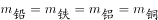；四个球的密度关系是：，又因为密度和体积成反比，因此可知同等质量的条件下，铅球的体积是最小的，如果将其做成质量同样大小的空心球，则其空的部分会最大，因此四个空心球中空心部分体积最大的是铅，其次是铜，然后是铁，铝质空心球中空心部分的体积最小。

故正确答案为D。

---

### 第 14 题　qid 2062766 · 科技常识

微生物在我们的生活中有着广泛的用途，下列关于微生物的使用，错误的一项是：

- **A**. 利用醋酸菌酿醋
- **B**. 利用酵母菌制作泡菜　✅
- **C**. 利用乳酸菌制作酸奶
- **D**. 利用青霉菌提取青霉素

**答案**：B

**官方解析**

本题考查生物常识。
A项正确，醋酸菌如果在糖源充足的情况下，可以直接将葡萄糖变成醋酸；如果在缺少糖源的情况下，先将乙醇变成乙醛，再将乙醛变成醋酸；如果在氧气充足的情况下，能将酒精氧化成醋酸，从而制成醋。
B项错误，制作泡菜是利用乳酸菌，不是酵母菌，酵母菌多用来做馒头等面食。
C项正确，乳酸菌指发酵糖类主要产物为乳酸的一类无芽孢、革兰氏染色阳性细菌的总称，常用于制作酸奶、乳酪、德国酸菜、啤酒、葡萄酒、泡菜、腌渍食品和其他发酵食品。
D项正确，青霉素是抗菌素的一种，是指分子中含有青霉烷，能破坏细菌的细胞壁并在细菌细胞的繁殖期起杀菌作用的一类抗生素。青霉素是从青霉菌中提取出来的。
本题为选非题，故正确答案为B。

---

## 言语理解与表达

### 第 1 题　qid 2062664 · 逻辑填空

2016年是中国“十三五”规划开局之年，也是中国与沿线国家全力推进“一带一路”建设的年份。以“一带一路”为绢帛、以创新合作为________、以共谋发展为气韵，中国与世界共同绘制的合作共赢壮丽画卷正在徐徐展开。
填入画横线部分最恰当的一项是：

- **A**. 平台
- **B**. 纸砚
- **C**. 笔墨　✅
- **D**. 支点

**答案**：C

**官方解析**

根据顿号及后文“壮丽画卷”可知，横线处所填词语与“绢帛”“气韵”构成并列关系，且均表示绘制画卷所必备的不同条件，C项“笔墨”填入文段恰当，当选。A项“平台”、D项“支点”均与作画无关，排除A、D两项；在没有纸张之前，绢布一直作为重要的书写、画画材料，B项“纸砚”中的“纸”与“绢帛”属于同类型条件，排除。
故正确答案为C。
【文段出处】《“一带一路”，当梦想照进现实》

---

### 第 2 题　qid 2062670 · 逻辑填空

相对于经济等物质条件的快速恢复发展而言，传统精神的恢复、重建和传承是一个更为艰难和漫长的过程。因为它是一个从民族精神自觉到自信，最后到民族精神挺立和弘扬的社会学习和________的连续过程。
填入画横线部分最恰当的一项是：

- **A**. 休养生息
- **B**. 此起彼伏
- **C**. 潜移默化　✅
- **D**. 星火燎原

**答案**：C

**官方解析**

根据文段“艰难和漫长的过程”“连续过程”可知，横线处表达传统精神的恢复、重建和传承是慢慢的、不知不觉实现的，C项“潜移默化”指不知不觉受到感染、影响而发生了变化，语义恰当，当选。
A项“休养生息”指在战争或社会大动荡之后，减轻人民负担，安定生活，恢复元气，文段中并未涉及战争或社会大动荡，排除；B项“此起彼伏”形容接连不断，填入文段与“连续”语义重复，排除；D项“星火燎原”比喻新生事物开始时力量虽然很小，但有旺盛的生命力，前途无限，文段中“传统精神”不属于新生事物，排除。
故正确答案为C。

---

### 第 3 题　qid 2062674 · 逻辑填空

近年来，我国公众参与环保的事件________，普通民众积极参与、献策建言，民间环保机构也频繁发声。
填入画横线部分最恰当的一项是：

- **A**. 层出不穷　✅
- **B**. 凤毛麟角
- **C**. 不足为奇
- **D**. 成千上万

**答案**：A

**官方解析**

根据后文“也”可知，横线处与“频繁发声”构成并列，表达公众参与环保的事件经常出现，A项“层出不穷”指接连不断地出现，没有穷尽，语义恰当，当选。
B项“凤毛麟角”比喻珍贵而稀少的人或物，与文意相悖，排除；C项“不足为奇”指某种事物很平常，没什么可奇怪的，侧重强调普通，而文段重在强调经常出现，与文意不符，排除；D项“成千上万”形容数量极多，填入文段程度过重，排除。
故正确答案为A。
【文段出处】《公众参与环保维权尚需机制保障》

---

### 第 4 题　qid 2062680 · 逻辑填空

雾霾的形成，因素很多，是个长期积累的过程。治理雾霾也不是________的，而是要打持久战，久久为功。
填入画横线部分最恰当的一项是：

- **A**. 信手拈来
- **B**. 一蹴而就　✅
- **C**. 立竿见影
- **D**. 轻而易举

**答案**：B

**官方解析**

由表示并列关系的关联词“不是······而是······”可知，横线处所填成语与“打持久战，久久为功”语义相反，表示用时短且容易做到，B项“一蹴而就”比喻事情轻而易举，一下子就成功，与文段对应恰当，当选。
A项“信手拈来”多指写文章时能自由纯熟地选用词语或应用典故，与“治理雾霾”搭配不当，排除；C项“立竿见影”比喻立刻见到功效，强调的是见效快，并非事情很容易，排除；D项“轻而易举”形容事情容易做，不费力气，只强调事情简单容易，无法体现时间短的含义，无法对应后文的“持久”，排除。
故正确答案为B。

---

### 第 5 题　qid 2062688 · 逻辑填空

互联网的世界很精彩，也很无奈。当人们掌握太多的知识时，会越来越________借助别人的结果来判断事物，而不是通过自己的大脑。其实，________应该是我们从小就掌握的一种能力。
依次填入画横线部分最恰当的一项是：

- **A**. 厌倦    独立思考
- **B**. 习惯    借鉴提高
- **C**. 厌倦    借鉴提高
- **D**. 习惯    独立思考　✅

**答案**：D

**官方解析**

第一空，根据“而不是”可知，横线处所填词语表达与“通过自己的大脑”语义相反的含义，即经常借助别人的结果来判断事物。A、C两项的“厌倦”表示对某种活动失去兴趣，不愿继续做，不符合文意，排除。
第二空，通过转折关联词“其实”可知，横线处与“借助别人的结果来判断事物”语义相反，对应“独立思考”，D项当选。B项“借鉴提高”与文意相悖，排除。
故正确答案为D。

---

### 第 6 题　qid 2062694 · 逻辑填空

“学如弓弩，才如箭镞。”学识是才能的________，才能是学识的________，学习的弓弩弯如满月，才识的箭镞才能飞似流星。
依次填入画横线部分最恰当的一项是：

- **A**. 基调    升华
- **B**. 基本    延伸
- **C**. 指导     释放
- **D**. 引导     发挥　✅

**答案**：D

**官方解析**

第一空，根据文段“学如弓弩，才如箭镞”可知，学识就像弓弩，“才能”就像箭，箭需要靠弓弩的调节指引才能射中目标，即学识是才能的指引，所填词语应体现“指引”之意。A项“基调”和B项“基本”均不符合文意，排除。C项“指导”和D项“引导”均符合文意，保留。
第二空，依据文段“学如弓弩，才如箭镞”及“飞似流星”可知，弓弩需要靠箭的精准才能够体现价值所在，发挥作用，即才能是学识的发挥，所填词语要体现“发挥、体现”的意思。D项“发挥”指把内在的性质或能力表现出来，“发挥学识”搭配恰当，符合文意，当选。C项“释放”与“学识”搭配不当，排除。
故正确答案为D。

---

### 第 7 题　qid 2062700 · 逻辑填空

各学科教师根据学生的能力和需求将原有的国家课程体系内的核心知识与思想方法进行了________、 ________、 ________，形成帮助全体学生掌握基础知识和技能的基础类课程。
依次填入画横线部分最恰当的一项是：

- **A**. 整合    梳理    重组
- **B**. 重组    整合    梳理
- **C**. 重组    梳理    整合
- **D**. 梳理    重组    整合　✅

**答案**：D

**官方解析**

由两个“、”可知，横线处的三个词语形成并列，且前后语义顺承，比较三个词语，各学科教师首先需要对原有的知识和思想方法进行归纳整理，即梳理，接着根据学生的能力与需求对这些知识与思想方法进行重新调整与组合，即重组，最后将这些重组后的内容整理成一个新的课程系统，即整合，故先后顺序应该为梳理、重组、整合，对应D项。
故正确答案为D。
【文段出处】《优质教育资源引领秦汉新城文化发展》

---

### 第 8 题　qid 2062708 · 逻辑填空

党的十八大以来惩治腐败的事实说明，无论什么人， ________其职务多高， ________触犯了党纪国法， ________受到严肃追究和严厉惩处，这绝不是一句空话。
依次填入画横线部分最恰当的一项是：

- **A**. 无论 如果 那么
- **B**. 不论 只要 都要　✅
- **C**. 不管 因为 所以
- **D**. 即使 由于 必然

**答案**：B

**官方解析**

此题从后两空入手。由“这绝不是一句空话”所表达的坚决态度可知，“触犯了党纪国法”“受到严肃追究和严厉惩处”是必然的，A、C两项无法体现这种必然性，排除。
第一空所填词语与“无论什么人”形成对应，B项“不论”表示条件或情况不同而结果不变，对应得当，当选。D项“即使”表示假设，与文意无关，排除。
故正确答案为B。
【文段出处】《打铁还需自身硬》

---

### 第 9 题　qid 2062714 · 逻辑填空

金融领域的投资骗局并不是什么新鲜事。在国外，各类“庞氏骗局”也绵延不绝， ________从事后看，这些骗术的手段并不高明， ________从来不缺乏上当者，________还有社会名流、高级知识分子身陷其中。
依次填入画横线部分最恰当的一项是：

- **A**. 即使      也       反而
- **B**. 如果      却       而且
- **C**. 虽然      但       甚至　✅
- **D**. 无论      都       并且

**答案**：C

**官方解析**

由文段提示性语句“这些骗术的手段并不高明”“从来不缺乏上当者”可知，前两空所填词语构成转折关系，对应C项。A项“即使……也……”为让步关系，B项“如果……却……”为假设关系，D项“无论……都……”为条件关系，均不符合文意，排除。
第二空代入验证，由“从来不缺乏上当者”“还有社会名流、高级知识分子身陷其中”可知，横线处表达递进关系，“甚至”符合文意，当选。
故正确答案为C。
【文段出处】《斩除金融传销的“根”》

---

### 第 10 题　qid 2062720 · 逻辑填空

明代长城就建筑特点而言，设计之______、布局之______、建造之______、结构之______、防御之科学，都达到了前所未有的高度。
依次填入画横线部分最恰当的一项是：

- **A**. 精巧   合理    坚固     完善　✅
- **B**. 精美   巧妙    可靠     完备
- **C**. 精致   得体    牢靠     齐全
- **D**. 精细   得当    牢固     齐备

**答案**：A

**官方解析**

本题可首先从第二空入手，所填词语与“布局”搭配，C项“得体”指言行恰到好处，置于此处搭配不当，排除。
第三空，所填词语与“建造”搭配，B项“可靠”指真实可信，与“建造”搭配不当，排除。
第四空，所填词语与“结构”搭配，A项“完善”与之搭配恰当。D项“齐备”指齐全完备，常搭配“种类”、“物品”等，置于此处搭配不当，排除。
第一空代入验证，“设计精巧”搭配得当，当选。
故正确答案为A。

---

### 第 11 题　qid 2062724 · 片段阅读

今天，中国的大学不仅承载着培养人才、科学研究、服务社会的功能，还承载着文化传承的重要使命。而高水平的学术讲座，正是中国大学完成文化传承使命的重要载体。正因如此，已经有越来越多的高校打造了自己的讲座品牌，如武汉大学的弘毅讲堂、中山大学的博雅讲座、北京大学的才斋讲堂、清华大学的人文讲坛等。在学校内外，这些讲座品牌均已经形成或正在形成一定的社会影响力。
关于这段文字，以下理解准确的是：

- **A**. 中国大学可以通过打造高水平的学术讲座以承载文化传承的使命　✅
- **B**. 部分大学通过打造本校的讲座品牌以扩大学校的社会影响力
- **C**. 中国大学与其他国家大学的区别在于中国大学还需完成文化传承的使命
- **D**. 大学的学术讲座在培养人才、科学研究、服务社会上起到重要作用

**答案**：A

**官方解析**

文段首句通过递进关联词“不仅……还……”强调中国大学承载文化传承的重要使命，然后通过程度词“正是”进一步指出，高水平的学术讲座是完成文化使命的重要载体，下文通过举例进一步解释说明，故文段重在强调高水平的学术讲座对传承文化使命的重要性，对应A项，当选。
B项，由“正因如此”可知，部分大学打造讲座品牌是为了传承文化，而非“扩大社会影响力”，表述不准确，排除。
C项“中国大学与其他国家大学的区别”在文段中并未提及，无中生有，排除。
D项，根据文段首句可知，“培养人才、科学研究、服务社会”为大学的功能，而不是“学术讲座的作用”，偷换概念，排除。
故正确答案为A。
【文段出处】《高水平讲座如何助力大学人文日新（深聚焦）》

---

### 第 12 题　qid 2062736 · 片段阅读

虽然中国人认同自己是中间阶层和中上阶层的比例明显低于其他国家，但是对未来个人生活水平提高的预期，则要明显高于其他国家。那些从收入、财富和消费角度来说都已达到或超过中等水平的人，是过去30多年发展的受益者。他们的收入几乎年年增长，物质生活水平步步提高，这使他们对未来寄予更高期望，而这种高期望又会带来不满足感和焦虑心态，使他们总觉得还未达到理想的中产生活状态，还需要拼命努力追求。
以下说法最可能符合作者观点的是：

- **A**. 较强的物质欲望追求以及由此导致的不满足感和缺乏安全感，使得中等收入阶层的认同感不强　✅
- **B**. 中国人个性较为含蓄谨慎，即使达到中等收入或高收入水平，还会说自己是中下层或下层
- **C**. 中国目前的社会保障水平相对较低，公共服务质量相对较差，使一些人没有中产的生活状态和安全感
- **D**. 不仅要把金钱和物质视为人生目标，更要把精神追求、道德文明水平和社会责任感作为个人价值更主要的体现方式

**答案**：A

**官方解析**

文段开篇首先指出中国人认同自己是中间阶层和中上阶层的比例明显低于其他国家，接着进一步分析那些已达到或超过中等水平的阶层由于对未来的期望更高，从而产生了不满足感和焦虑心态，A项为这一内容的同义替换，当选；
B项强调的是中国人的个性导致对于阶层的认同感不强，而文段强调的是不满足与焦虑的心态，排除；
C项“中国目前的社会保障水平相对较低，公共服务质量相对较差”在文段中并未提及，无中生有，排除；
D项“精神追求、道德文明水平和社会责任感”在文段中并未提及，无中生有，排除。
故正确答案为A。
【文段出处】《李春玲：培育全面小康的社会心态》

---

### 第 13 题　qid 2062748 · 片段阅读

放眼世界范围，有研究者发现，地处北极圈的爱斯基摩人的语言中，至少有七个不同的词来表达“雪”，也许区分雪的形态和状态，对他们的生活而言非常重要；而处于赤道的非洲国家语言中就少有关于“雪”的词。同样，在阿拉伯语中，有四百多个表达“骆驼”的词语，而在汉语、英语中，有关“骆驼”的词语就相当少……一方水土，也孕育一方特有的语言。
关于这段文字，以下理解准确的是：

- **A**. 非洲国家对于“雪”这个词不如爱斯基摩人那么感兴趣
- **B**. “骆驼”这个词是阿拉伯语中最重要的词汇
- **C**. 地理环境是方言形成的根本原因
- **D**. 不同的语言反映了不同的自然环境和人文风貌　✅

**答案**：D

**官方解析**

根据文段第一句话可知，文中并未指出人们是否对“雪”这个词感兴趣，故A项无中生有，排除。B项，文中仅指出在阿拉伯语中，有很多个词语表达“骆驼”，但未提及其是最重要的词汇，表述绝对，排除。C项，“根本原因”表述绝对，排除。D项，文段指出不同的环境可以形成不同的语言，即透过语言可以了解当地的环境和特色，D项正确，当选。
故正确答案为D。
【文段出处】《周云龙：乡音无弦万古琴（世说心语）》

---

### 第 14 题　qid 2062760 · 片段阅读

城市善治的破题关键，说到底得依靠广大市民的智慧和力量。如何体现各类人才都有的城市包容，何以在城与人、管理与服务之间找到最佳契合点，怎样唤回社区交往、邻里互助的人情温暖……一个个具体问题的解决，需要政府有形之手、市场无形之手、市民勤劳之手同向发力。政府角色应从“划桨人”转变为“掌舵人”，把市民和政府的关系从“你和我”变成“我们”，实现城市共建共享。
这段文字主要说明了：

- **A**. 城市善治需要政府转变角色，与市民打成一片
- **B**. 政府既要做好管理，又要做好服务
- **C**. 城市治理的关键在于发动群众，形成政府、市场与市民的合力　✅
- **D**. 城市问题的解决之道在于实现社区交往、唤回人们的互助

**答案**：C

**官方解析**

文段首句指出城市善治关键要依靠市民。后文进一步强调解决城市治理过程中遇到的具体问题需要政府、市场、市民共同发力。尾句围绕政府和市民进行进一步的解释说明。故文段重点强调城市共建需要群众、市场、政府合力完成，C项为文段中心的同义替换，当选。
A项：只是针对文段尾句解释说明的部分，非重点，且“打成一片”表述不准确，排除。
B项：文段强调的是多方合力共建城市，而非单方面强调政府的作用，排除。
D项：“社区交往、唤回人们的互助”属于问题中的内容，非重点，排除。
故正确答案为C。
【文段出处】《用心善治，才能提升“城市温度”——树立以人为核心的城市观》

---

### 第 15 题　qid 2062788 · 片段阅读

《吕氏春秋》记载，古时有十个相马高人，相马方法各自不同。寒风相马是观察马的口齿，麻朝相马是品评马的面颊，子女厉相马是查看马的眼睛……这十个人都是相马良工，都能看到马的一处征象，就知马骨节的高低、腿脚的快慢、体质的强弱、能力的高下。不仅相马是这样，人也有征兆。
紧接这段文字，作者最可能阐述的问题是：

- **A**. 知人善用的重要性
- **B**. 如何识人用人　✅
- **C**. 千里马与伯乐的关系
- **D**. 相马故事的意义

**答案**：B

**官方解析**

接语选择题，要在把握文段内容的基础上重点关注文段最后论述的核心话题。前文论述不同的相马高人通过马的外观特征即可知道马的特性。尾句指出“不仅相马是这样，人也有征兆”，即通过“相马”来类比“识人”，故下文要围绕“识人”这一话题继续展开论述，对应B项，当选；
A项，“知人善用”，指要先“知人”而后“善用”，而后文侧重强调的是怎样去“知人”，并无“用人”之意，排除；
C、D两项均未提及“人”这一核心话题，排除。
故正确答案为B。
【文段出处】《千里马与懒牛、犟驴》

---

### 第 16 题　qid 2062792 · 片段阅读

“一带一路”是一个沿线国家共同推进的系统工程，要求必须强调发挥市场在资源配置中的决定性作用和各类企业的主体作用，这是首要方面。但考虑到“一带一路”沿线国家复杂的国情和具体特点，如果没有政府的示范、引导和服务，受经济地理学规律影响，经济社会资源很难自动向这些地区配置。
这段文字意在指出：

- **A**. “一带一路”建设需要发挥政府作用　✅
- **B**. 发挥市场调节机制的作用是实现“一带一路”的重点
- **C**. 政府的示范、引导和服务能够消除经济地理学规律的影响
- **D**. 如何更好地发挥政府作用是“一带一路”工程面临的难题

**答案**：A

**官方解析**

文段首先提出“一带一路”需要发挥市场和企业的作用，接着通过转折关联词“但”引出重点，强调政府对于“一带一路”建设的重要作用，对应A项。
B项为转折前内容，非重点，排除；C项无主题词“一带一路”，排除；D项为问题表述，未提及政府作用，排除。
故正确答案为A。
【文段出处】《“一带一路”应加强统筹领导》

---

### 第 17 题　qid 2062796 · 片段阅读

常有论调说，“网络”的种子一旦播下，人们再也不能控制它的生长。但是，一直为之浇水施肥的，是每一个使用它的人。目前还没有证据表明有意义的信息和数据能够凭空在虚拟世界产生，也就是说，网络上所有的信息终究是每一个活生生的人上传的。
这段文字所表达的主要意思是：

- **A**. 网络的发展不受人的控制
- **B**. 信息和数据不能在虚拟世界中凭空产生
- **C**. 有意义的信息和数据都是由人上传的
- **D**. 网络不能脱离人而独自发展　✅

**答案**：D

**官方解析**

文段为典型的分—总结构，首先提出一个论调，即“‘网络’的种子一旦播下，人们再也不能控制它的生长”，随后用“但是”转折强调，是人控制着网络的发展，尾句由“也就是说”总结全文，指出网络上的所有信息都由人上传，强调“人”对“网络”的重要作用，即网络不能脱离人而发展，对应D项。
A项对应文段首句的论调，与作者的观点相悖，排除；
B项未提及“人”这一重要概念，排除；
C项为结论之前的内容，非重点，排除。
故正确答案为D。
【文段出处】《放大人性的长歌》

---

### 第 18 题　qid 2062798 · 片段阅读

农村集体产权制度，是实现农民共同富裕的重要制度保障。今年一号文件提出，到2020年基本完成土地等农村集体资源性资产权登记颁证、经营性资产折股量化到本集体经济组织成员，健全非经营性资产集体统一运营管理机制。要稳定农村土地承包关系，落实集体所有权，稳定农户承包权，放活土地经营权，完善“三权分置”办法。加快推进房地一体的农村集体建设用地和宅基地使用权确权登记颁证。推进土地征收、集体经营性建设土地入市、宅基地制度改革试点。探索将财政资金投入农业农村形成的经营性资产，通过股权量化到户，让集体组织成员长期分享资产收益，制定促进农村集体产权制度改革的税收优惠政策。
最适合作为这段文字标题的是：

- **A**. 深化农村集体产权制度改革　✅
- **B**. 制定促进农村改革的税收优惠政策
- **C**. 实现农民共同富裕
- **D**. 让集体组织成员长期分享资产收益

**答案**：A

**官方解析**

文段首句点明“农村集体产权制度”的重要地位——是实现农民共同富裕的重要制度保障，后文均围绕“农村集体产权制度”展开，列举了一号文件提出的一系列具体举措，进一步阐述其实施周期、具体要求等。故文段整体围绕农村集体产权制度的改革措施展开，所有内容均为深化该制度改革的具体体现。对应A项，当选。
B项，“税收优惠政策”仅为文段末尾提及的一个具体措施，非重点且表述片面，排除；
C项，“农民共同富裕”是农村集体产权制度的作用目标，并非文段论述的核心内容，文段重点是制度改革本身，排除；
D项．“集体组织成员长期分享资产收益”对应文段末尾“股权量化到户”的结果，非重点且表述片面，排除。
故正确答案为A。
【文段出处】《向改革要活力 促“三农”增动力》

---

### 第 19 题　qid 2062802 · 片段阅读

有人比喻，城市规划如一部交响乐，倘若指挥不当，“独奏”互相掣肘，就会引发混乱。一旦缺乏空间、规模、产业的统筹，失去了空间立体性、平面协调性、风貌整体性、文脉延续性的整合，城市就会失去秩序。不同城市之间的规划，如果跳不出一亩三分地，区域就难以优势互补，也会造成资源浪费、生态破坏。
这段文字主要说明了：

- **A**. 不同的城市规划需要突出自己独特的风格与优势
- **B**. 城市规划必须科学统筹　✅
- **C**. 城市的秩序建立在合理的规划之上
- **D**. 城市之间需要资源整合、 产业统筹与优势互补

**答案**：B

**官方解析**

文段开篇引出“城市规划”这一核心话题，并指出“城市规划”要“指挥”得当，不能“独奏”。接下来通过反面论证“城市规划一旦缺乏统筹······城市就会失去秩序”“如果跳不出一亩三分地······”进行详细论证，文段主题词为“城市规划”，B项当选。
A项，“城市规划······突出自己独特的风格与优势”与文段观点“统筹”相悖，排除；C、D两项均没有提及文段主题词“城市规划”，排除。
故正确答案为B。
【文段出处】《科学规划，才能拥有“诗意栖居”》

---

### 第 20 题　qid 2062804 · 片段阅读

所有持乐观想法的人都相信，乐观的想法可以鼓舞自己达成目标。但实际上，当一个人乐观地看待目标的实现——尤其是乐观情绪极度膨胀时，你会感到目标的实现似乎易如反掌。这种做法会欺骗大脑，使之认为目标已经唾手可得。这时，当事人“全力向目标迸发”的动力就会丧失。
根据这段文字可以得知：

- **A**. 悲观想法比乐观想法更有助于让人成功
- **B**. 乐观的人通常都不会成功
- **C**. 事物的真实面貌总是不如想象美好，这会让乐观的人受到打击
- **D**. 必胜的信念还需要脚踏实地准备，这才是取胜之道　✅

**答案**：D

**官方解析**

文段开篇先指出“乐观可以鼓舞人们达成目标”，随后以“但实际上”转折引出相反观点，即乐观情绪膨胀会使人丧失全力向目标迸发的动力，因此不会“实现目标”。故作者认同“实现目标”还需“全力向目标迸发”，对应D项“脚踏实地准备”。
A项，无中生有，文段内容并未涉及“悲观”与“乐观”的比较，排除；B项，“都不会成功”表述绝对，排除；C项，“事物的真实面貌总是不如想象美好”在文中并未提及，属于无中生有，排除。
故正确答案为D。
【文段出处】《乐观是一个陷阱》

---

### 第 21 题　qid 2062808 · 片段阅读

将下列句子组成一段逻辑连贯、语言流畅的文字，排列顺序最合理的是：
①时代在变化，城市也在生长，在理解过往的同时，不妨赋予它新的内涵。
②若是正好有历史典故可以化用其中当然好，但若没有也不必牵强刻意。
③这些新内涵，或许就是后人想要追溯的曾经。
④不是无视过去，而是尊重当下。
⑤取好地名不必局限于向历史找补。

- **A**. ③④①②⑤
- **B**. ⑤②④①③　✅
- **C**. ④③②⑤①
- **D**. ①②⑤③④

**答案**：B

**官方解析**

对比选项，判断首句。③句以代词“这些”开头，之前必有所指代，无法做首句，排除A项；又③句中“这些新内涵”指代①句中“新的内涵”，故①③捆绑，排除C、D两项。
故正确答案为B。
【文段出处】《用地名标注文化》

---

### 第 22 题　qid 2062812 · 片段阅读

将下列句子组成一段逻辑连贯、语言流畅的文字，排列顺序最合理的是：
①自由是秩序的目的，秩序是自由的保障。
②为了取得更大更好的发展，网络不应成为法外之地。
③这一成熟经验和理论认识同样适用于网络治理。
④市场经济发展到哪里，法治就需要跟进到哪里，法治是市场经济的内在要求。
⑤互联网的开放与自由，并不意味着它可以肆意妄为。

- **A**. ⑤①④②③
- **B**. ④⑤①②③
- **C**. ④③①⑤②　✅
- **D**. ⑤②③④①

**答案**：C

**官方解析**

对比选项，判断首句，对比⑤、④句，话题不一致，无法判断首句，观察5句话发现，③句中出现指代词“这”，对比四个选项，只需在②④中判断谁与③句捆绑即可，②中表达“网络不应成为法外之地”与③中“这一成熟经验和理论”无法构成指代关系，故②③无法捆绑，④句“法治是市场经济的内在要求”，与③句“这一成熟经验和理论”联系紧密，故④③捆绑，排除A、B、D三项。
故正确答案为C。
【文段出处】《互联网发展应有“法治思维”》

---

### 第 23 题　qid 2062814 · 片段阅读

将下列句子组成一段逻辑连贯、语言流畅的文字，排列顺序最合理的是：
①怎么看中国经济新常态，实际上是一个世界性课题。
②这种适应综合国力竞争新形势的主动选择，势将推动实现由低水平供需平衡向高水平供需平衡的跃升，为中国发展注入动力，也为世界经济提供新机遇。
③中国是全球第二大经济体，也是人们把脉世界经济所不可忽视的一个角度。
④当前，中国实行创新驱动战略，行进在创新、协调、绿色、开放、共享的发展轨道上，强调推进供给侧结构性改革以适应和引领经济发展新常态。

- **A**. ①③②④
- **B**. ③①④②　✅
- **C**. ②③①④
- **D**. ④③②①

**答案**：B

**官方解析**

观察选项判断首句，②出现指代词“这种”，之前必有所指代，无法做首句，排除C项。其它三句不好判断；观察可知，②句指代词后提出“主动选择”，故“这种”指代一种行为、选择，①③均为观点、看法，而④“推进供给侧结构性改革”为一种选择，且“适应和引领经济发展新常态”对应“适应综合国力竞争新形势”，故④②捆绑，且④在②前，排除A、D两项。
故正确答案为B。
【文段出处】《从新角度感知中国经济活力》

---

### 第 24 题　qid 2062818 · 语句表达

经过长期努力，我国国内已经有了一支颇具规模的科普作家队伍。但这支队伍还需要不断壮大，需要更多富有朝气的新生力量加入进来。科普作家首先应是科学家或者有一定科学工作经验的专业人员，这需要一定的实践积累。也就是说，科普作家的培育造就需要一个较长过程。________________________。也就是说，不能等一个人成了科学家，再去请他写东西。优秀的科普作家像高士其、茅以升等，都是很早就开始撰写科普文章，数十年如一日，笔耕不辍。
填入画横线部分最恰当的一句是：

- **A**. 而且，有些优秀的科普作家并不想成为科学家，前者只有作家的修养和气质
- **B**. 诚然，并非每个科普作家最终都能成为科学家，后者需要丰富的理论和实践
- **C**. 况且，并不是每一个科学家都能成为科普作家，后者需要作家的修养和气质　✅
- **D**. 显然，有些优秀的科学家并不想成为科普作家， 前者只有丰富的理论和实践

**答案**：C

**官方解析**

横线出现在中间，需要结合上下文进行分析。阅读前文可知，科普作家的造就是一个相当长的、艰难的过程；又根据横线后“也就是说”可知，横线处所填语句与“不能等一个人成了科学家，再去请他写东西”表意相近，即在成为科学家之前就应该开始写东西。综上可知，要想成为科普作家就要从很早之前就开始写文章，进而成为科学家，最后才能成为科普作家，故横线处要表达成为科普作家是一件非常不容易的事情，C项“并不是每一个科学家都能成为科普作家”，符合文意，当选。
A、D两项“不想”为主观意愿，无中生有，文段“需要较长过程”为客观实际，排除。B项，根据文意可知，成为科学家是成为科普作家的前提，故“并非每个科普作家最终都能成为科学家”表述错误，排除。
故正确答案为C。
【文段出处】《科普是科学家的责任》

---

### 第 25 题　qid 2062822 · 语句表达

古人有言，“巧言如簧，颜之厚矣”。会说话并不是信口雌黄、左右狡辩，而是要吃透文件、观照基层、打动人心。“说不上去，说不下去，说不进去，给顶回去”的情况，表面上是个说话的问题，深层来看，在于党员干部________，对相应领域和群众困难不了解、不熟悉。虔诚地当小学生，扎实地深入基层，话风问题才会迎刃而解。结合实际、深入浅出地阐释，用群众喜闻乐见、易于接受的语言表达，说话才能得到群众的理解、拥护和赞成。
填入画横线部分最恰当的一句是：

- **A**. 无话可说、不会说话，影响工作开展
- **B**. 说话不分场合、不看对象
- **C**. 担心言多必失，因而三缄其口
- **D**. 不能很好地坚持群众路线　✅

**答案**：D

**官方解析**

横线出现在中间，需要结合上下文进行分析。前文指出党员干部要会说话，横线后提出要“扎实地深入基层，话风问题才会迎刃而解······用群众喜闻乐见、易于接受的语言表达，说话才能得到群众的理解、拥护和赞成”，故横线处所填语句应表达“没有了解群众”之意，对应D项“不能很好地坚持群众路线”。
其他三项均未体现出“群众”这一重要话题，与后文衔接不当，排除。
故正确答案为D。
【文段出处】《干部说话 雷言雷语缄口不言信口狡辩都不行》

---

## 数量关系

### 第 1 题　qid 2062672 · 数学运算

某单位为全体员工进行体检，平均体重是57.5公斤。其中，男员工的平均体重是62.5公斤，女员工的平均体重是55.5 公斤。则该单位的男、女员工人数比为：

- **A**. 
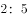
　✅
- **B**. 

- **C**. 

- **D**. 

**答案**：A

**官方解析**

方法一：设男员工有人，女员工有人。根据男、女员工的平均体重和全体员工的平均体重，有，解得，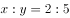。

方法二：，根据线段法，人数比与平均体重差之比成反比，有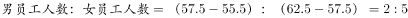。

故正确答案为A。

---

### 第 2 题　qid 2062682 · 数学运算

一条生产流水线上有甲、乙两位工人，流水线上有400个零件尚未装配。其中甲每分钟装配9个零件，乙每分钟装配7个零件。而流水线上也在不断地增加新的零件。在第50分钟结束的时候，甲、乙两人刚好把流水线上的零件装配完。则流水线上每分钟增加的零件有（    ）个。

- **A**. 8　✅
- **B**. 10
- **C**. 14
- **D**. 18

**答案**：A

**官方解析**

甲的工作效率是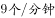，乙的工作效率是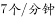，则甲乙合作的效率是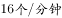。设流水线上每分钟增加的零件是个，根据牛吃草公式：，解得。

故正确答案为A。

---

### 第 3 题　qid 2062690 · 数学运算

植树节当天，某学校的两个班自发组织了一些人去植树。甲班每人植树3棵，乙班每人植树5棵，两个班共植树115棵。那么，两班植树人数之和最多为（    ）人。

- **A**. 36
- **B**. 37　✅
- **C**. 38
- **D**. 39

**答案**：B

**官方解析**

设甲班人数有人，乙班人数有人。甲班每人植3棵，乙班每人植5棵，共植115棵，则。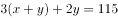，要使人数之和最多，则应使尽可能小，尽可能大。根据不定方程倍数特性，为5的倍数，最大为35，此时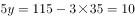，。因此。

故正确答案为B。

---

### 第 4 题　qid 2062698 · 数学运算

小黎去水果店买牛油果、火龙果，向老板问了价格后，老板的答复是“2个牛油果、3个新鲜火龙果一共32元；特价火龙果10元3个。”小黎最后买了5个牛油果和8个新鲜火龙果，花了82元，但是回家发现有2个牛油果坏了，她赶回水果店要求老板退换，老板答应了。那么，小黎可以换（    ）。

- **A**. 3个新鲜火龙果、1个牛油果
- **B**. 3个特价火龙果、1个牛油果　✅
- **C**. 2个新鲜火龙果、3个特价火龙果
- **D**. 6个新鲜火龙果

**答案**：B

**官方解析**

设牛油果单价为元，新鲜火龙果单价为元。则2个牛油果、3个新鲜火龙果一共32元；5个牛油果和8个新鲜火龙果，花了82元。列方程：

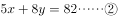

解得，。两个牛油果的价格为，可换得3个特价火龙果和1个牛油果。

故正确答案为B。

---

### 第 5 题　qid 2062704 · 数学运算

一个长方体木块恰好能切割成三个正方体木块，三个正方体木块表面积之和比原来的长方体木块的表面积增加了64平方厘米。则长方体木块的体积为（    ）立方厘米。

- **A**. 128
- **B**. 192　✅
- **C**. 256
- **D**. 512

**答案**：B

**官方解析**

长方体的木块恰好切割成三个正方体，需要切两次，多出4个正方形的面积。表面积增加了64平方厘米，得到正方体一个面的面积为平方厘米，则正方体边长为4厘米。。。

故正确答案为B。

---

### 第 6 题　qid 2062712 · 数学运算

如图所示，8块同样大小的长方形钢板拼成了一块大的长方形钢板，已知大长方形钢板周长为112厘米，那么大长方形钢板的面积是（    ）平方厘米。

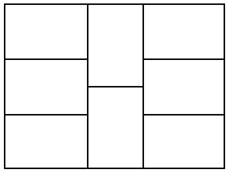

- **A**. 432
- **B**. 588
- **C**. 768　✅
- **D**. 945

**答案**：C

**官方解析**

根据图示，大长方形钢板的周长由4条长，8条宽组成，且中间两条长的长度与3条宽的长度相等，有：

解得，厘米，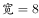厘米。因此，平方厘米。

故正确答案为C。

---

### 第 7 题　qid 2062734 · 数学运算

标有、、、、、记号的六盏灯按序排成一行。每盏灯装有开关，现有、两盏灯亮着，其余灯是灭的。某测试人员拉动灯开关，并按序拉动、、、、灯开关，再按此顺序循环拉下去。则当测试人员拉动2023次后，亮着的灯应该是（    ）。

- **A**. 

- **B**. 
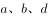

- **C**. 

- **D**. 
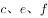
　✅

**答案**：D

**官方解析**

根据题干信息，开始前是、、、灭，、亮。6盏灯为一个循环周期，一个循环周期之后，、、、亮，、灭。两个循环周期之后，、、、灭，、亮。三个循环周期之后，、、、亮，、灭······依次递推。，即经过337个周期之后还需拉动一次。337个周期之后为、、、亮，、灭，再拉动一次之后，灯灭。则2023次之后，亮着的灯是、、。

故正确答案为D。

---

### 第 8 题　qid 2062742 · 数学运算

某市举行“新春杯”足球比赛，对16支参赛队伍进行小组赛分组抽签。抽签箱中分别装有红、黄、绿、蓝的小球各四个，抽到相同颜色小球的队伍进入同一小组。则第一支抽签队伍与第二支抽签队伍被分在同一小组的概率为（    ）。

- **A**. 二分之一
- **B**. 三分之一
- **C**. 四分之一
- **D**. 五分之一　✅

**答案**：D

**官方解析**

因为抽签箱中共有4个颜色的球各4个，则箱子中共有16个球。前两支队伍抽签的情况总数为；分在同一小组的情况时，第一支队伍有种选择，第二支队伍只能从第一支队伍选择的颜色所剩余的3个球中选1个，同一组的情况数为。第一支抽签队伍与第二支抽签队伍被分在同一小组的概率为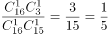。

故正确答案为D。

---

### 第 9 题　qid 2062750 · 数学运算

某餐厅要用三个炉灶做出9道菜肴，做完各道菜肴需要的时间分别是1、2、3、4、4、5、5、6、7分钟。每个炉灶在同一时间只能做一道菜肴。那么，最少经过（    ）分钟，该餐厅可以做完全部菜肴。

- **A**. 11
- **B**. 12
- **C**. 13　✅
- **D**. 14

**答案**：C

**官方解析**

要使经过的时间最少，则应使每个炉灶都尽可能的不空闲。经过时间如下表所示：

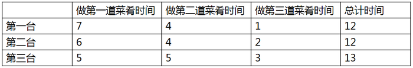

故最少经过13分钟，可做完全部菜肴。

故正确答案为C。

---

### 第 10 题　qid 2062768 · 数学运算

某部门里身高各不相同的8人一起排练合唱节目。合唱要求8人排成两排，前后人员对齐，但要求后排的每个人要比站其前面的那个人高，以不被挡住。则这8人的站位方法有（    ）种。

- **A**. 980
- **B**. 1260
- **C**. 1860
- **D**. 2520　✅

**答案**：D

**官方解析**

后排身高的每个人比其前面那个人高，则将对齐的前后两个人看作一组，共有4组。从8个人里面选择2个人作为第一组，则这两人的前后顺序就能确定，站位方法数为；第二组站位方法数为；第三组站位方法数为；剩余2人则为最后一组。则这8人的站位方法为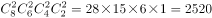种。

故正确答案为D。

---

### 第 11 题　qid 2062772 · 数学运算

办公室有两台相同型号的饮水机，但水桶中剩余的水量不同。打开一个出水阀，第一台8分钟可将水放干，第二台5分钟可将水放干。如果两台饮水机都同时打开两个出水阀，当第一台饮水机剩余的水量是第二台的2倍时，打开出水阀的时间为（    ）分钟。

- **A**. 1　✅
- **B**. 2
- **C**. 3
- **D**. 4

**答案**：A

**官方解析**

设出水阀的出水效率为1，则第一台饮水机的水量为8，第二台饮水机的水量为5。打开两个出水阀，当第一台饮水机剩余的水量是第二台的2倍，有，解得分钟。

故正确答案为A。

---

### 第 12 题　qid 2062776 · 数学运算

市总工会举行工会知识竞赛，每位选手作答25题，答对一题得3分，不答得1分，答错扣1分。某单位派出7名选手参赛，由四位记分员分别统计该单位选手的总得分，结果分别为539分、490分、469分、434分。经核查，其中有一位记分员的统计结果正确，则该单位7名选手的平均分为（    ）分。

- **A**. 77
- **B**. 70
- **C**. 67　✅
- **D**. 62

**答案**：C

**官方解析**

设一个选手答对的题量为，不答的题量为，答错的题量为。因为共有25道题，全部答对是75分，则，总分为539错误，排除A项。则有。一个选手的得分为。因为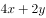为偶数，则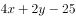一定为奇数。每个选手的成绩为奇数，奇数个奇数相加和也为奇数，则490和434错误，7名选手的总成绩为469，平均成绩为。

故正确答案为C。

---

### 第 13 题　qid 2062780 · 数学运算

“天星号”和“沧云号”两艘客船往返于甲、乙两地运送旅客。上午10点，“天星号”和“沧云号”以相同速度分别从甲、乙两地相向开出。“天星号”从甲地出发时有一个救生圈掉进水里，救生圈随水流向乙地飘去。下午14点，“天星号”与救生圈相距80千米。晚上20点，“沧云号”与救生圈首次相遇。则甲、乙两地相距（    ）千米。

- **A**. 200　✅
- **B**. 320
- **C**. 400
- **D**. 800

**答案**：A

**官方解析**

设两艘客船的船速为，水流速度为。下午14点，“天星号”与救生圈相距80千米，根据追及公式，有，得。晚上20点，“沧云号”与救生圈首次相遇，根据相遇公式，有，得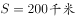。

故正确答案为A。

---

### 第 14 题　qid 2062784 · 数学运算

南北向的铁路旁有一条平行的公路，公路经过镇，有一行人与一骑车人早上同时从镇沿公路向南出发。行人的速度为，骑车人的速度为。同时，有一列火车从他们背后驶来，9点10分恰好追上行人，而且从行人身边通过用了20秒；9点18分恰好追上骑车人，从骑车人身边通过用了26秒。则二人从A镇出发时，火车离A镇还有（    ）千米。

- **A**. 15.8
- **B**. 18.6
- **C**. 20.8　✅
- **D**. 24.0

**答案**：C

**官方解析**

行人的速度为，骑车人的速度为，则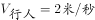，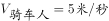。火车从行人身边通过用20秒，从骑车人身边通过用26秒。根据追及公式，有

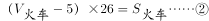

解得。设当行人和骑车人从镇出发时，火车距离镇的距离为，经过秒后追上行人。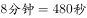。有

解得，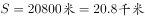。

故正确答案为C。

---

## 判断推理

### 第 1 题　qid 2062658 · 类比推理

纸：书与（    ）在内在逻辑关系上最为相似。

- **A**. 竹：筏　✅
- **B**. 雨：衣
- **C**. 叶：树
- **D**. 河：海

**答案**：A

**官方解析**

第一步：判断题干词语间逻辑关系。
纸是制作书的原材料，二者为原材料和成品的对应关系。
第二步：判断选项词语间逻辑关系。
A项：竹是制作筏的原材料，二者为原材料和成品的对应关系，与题干逻辑关系一致，当选；
B项：雨和衣之间没有明显的逻辑关系，与题干逻辑关系不一致，排除；
C项：叶是树的组成部分，二者为包容关系中的组成关系，与题干逻辑关系不一致，排除；
D项：河和海是并列关系，与题干逻辑关系不一致，排除。
故正确答案为A。

---

### 第 2 题　qid 2062662 · 类比推理

火：烹饪与（    ）在内在逻辑关系上最为相似。

- **A**. 雾：驾驶
- **B**. 水：洗涤　✅
- **C**. 风：晴天
- **D**. 磁：力量

**答案**：B

**官方解析**

第一步：判断题干词语间逻辑关系。
用火来烹饪，二者为对应关系。
第二步：判断选项词语间逻辑关系。
A项：雾不能用来驾驶，不符合题干的逻辑关系，排除；
B项：用水来洗涤，二者为对应关系，符合题干的逻辑关系，当选；
C项：风和晴天没有必然的关系，不符合题干的逻辑关系，排除；
D项：磁是物质能吸引铁、镍等金属的性质，磁是一种力量，二者为种属关系，不符合题干的逻辑关系，排除。
故正确答案为B。

---

### 第 3 题　qid 2062668 · 类比推理

油：（    ）与（    ）：车在内在逻辑关系上最为相似。

- **A**. 炒，开
- **B**. 香，快
- **C**. 锅，人　✅
- **D**. 水，马

**答案**：C

**官方解析**

逐一代入选项。
A项：油是炒菜的佐料，开车是一个动词，前后逻辑关系不一致，排除；
B项：油和香为或然属性关系，车的速度可能是快的，也为或然属性关系，但是位置反了，前后逻辑关系不一致，排除；
C项：锅是装油的载体，车是装人的载体，前后逻辑关系一致，当选；
D项：油和水均可以看作烹饪时可以用到的材料，二者为并列关系；马看作古代交通工具时，和车为并列关系，但现在更多时候马只是作为一种动物，这种情况下和车不是并列，排除。
故正确答案为C。

---

### 第 4 题　qid 2062678 · 类比推理

歌曲：（    ）与（    ）：动作在内在逻辑关系上最为相似。

- **A**. 旋律，舞蹈　✅
- **B**. 歌手，交涉
- **C**. 传唱，表现
- **D**. 优美，夸张

**答案**：A

**官方解析**

逐一代入选项。
A项：旋律是歌曲的组成部分，动作是舞蹈的组成部分，二者为包容关系中的组成关系，前后逻辑关系一致，当选；
B项：歌手歌唱歌曲，交涉和动作没有必然的关系，前后逻辑关系不一致，排除；
C项：歌曲可以用来传唱的，表现不一定是动作，前后逻辑关系不一致，排除；
D项：优美是歌曲的或然属性，夸张也是动作的或然属性，但顺序反了，前后逻辑关系不一致，排除。
故正确答案为A。

---

### 第 5 题　qid 2062686 · 类比推理

鱼缸：泳池与（    ）在内在逻辑关系上最为相似。

- **A**. 货柜：仓库
- **B**. 鲜花：花瓶
- **C**. 调料：火锅
- **D**. 鸟笼：监狱　✅

**答案**：D

**官方解析**

第一步：判断题干词语间逻辑关系。
鱼在鱼缸里游泳，人在泳池里游泳，鱼缸与泳池均是游泳的场所，二者是并列关系。
第二步：判断选项词语间逻辑关系。
A项：货柜可以放货物，仓库也可以放货物，货柜与仓库均是放货物的场所，二者是并列关系，与题干逻辑关系一致，保留；
B项：鲜花插在花瓶里，二者是场所的对应，与题干逻辑关系不一致，排除；
C项：火锅里面有调料，二者是对应关系，与题干逻辑关系不一致，排除；
D项：鸟被囚禁在鸟笼中，人被囚禁在监狱中，鸟笼与监狱均是囚禁的场所，二者是并列关系，与题干逻辑关系一致，保留。
比较A、D两项，题干第一个词是跟动物有关的场所，第二个词是跟人有关的场所，A项两个词都是跟货物有关的场所，排除；D项第一个词是跟鸟有关的场所，即跟动物有关的场所，第二个词是跟人有关的场所，与题干更为一致，当选。
故正确答案为D。

---

### 第 6 题　qid 2062696 · 类比推理

口罩：唇膏与（    ）在内在逻辑关系上最为相似。

- **A**. 
电源：电线

- **B**. 
画布 ：颜料

- **C**. 
油纸：雨伞

- **D**. 
化肥：犁头
　✅

**答案**：D

**官方解析**

第一步：判断题干词语间的逻辑关系。
“口罩”是一种用于过滤进入口鼻空气的卫生用品，“唇膏”是一种唇部化妆品，二者的作用对象存在相同之处，均可以是唇部。
第二步：判断选项词语间的逻辑关系。
A项：“电源”是将其他形式的能转换成电能的装置，“电线”是传导电能使用的载体，二者虽然均与电能相关，但是作用对象都不是电能，与题干逻辑关系不一致，排除；
B项：“画布”是指一种厚重的机织织物，用作油画或丙烯画，“颜料”是指能使物体染上颜色的物质，“颜料”可以涂在“画布”上，与题干逻辑关系不一致，排除；
C项：“油纸”是用较韧的原纸，涂上桐油或其他干性油制成的一种加工纸，“油纸”是“雨伞”的原材料的一种，同时二者不存在相同的作用对象，与题干逻辑关系不一致，排除；
D项：“化肥”是用化学方法制成的含有一种或几种农作物生长需要的营养元素的肥料，“犁头”是翻土的一种工具，二者的作用对象存在相同之处，均可以是土壤，与题干逻辑关系一致，当选。
故正确答案为D。

---

### 第 7 题　qid 2062702 · 类比推理

排量：油耗：成本与（    ）在内在逻辑关系上最为相似。

- **A**. 火候：口感：食物
- **B**. 距离：重量：邮费　✅
- **C**. 纬度：气候：生态
- **D**. 营养：新鲜：健康

**答案**：B

**官方解析**

第一步：判断题干词语间的逻辑关系。
“排量”越大，“油耗”越高，则“成本”越高。第一词、第二词均与第三词构成正相关。
第二步：判断选项词语间的逻辑关系。
A项：“火候”的把握决定了“口感”和“食物”的好坏，但“口感”和“食物”，不构成正相关，与题干逻辑关系不一致，排除；
B项：“距离”越远，“重量”越大，则“邮费”越贵，第一词、第二词均与第三词构成正相关，与题干逻辑关系一致，当选；
C项：“纬度”影响“生态”，但不能说“纬度”越高，“生态”越好，第一词与第三词不构成正相关，与题干逻辑关系不一致，排除；
D项：“营养”并非越多越“健康”，营养过剩则会危害身体，与题干逻辑关系不一致，排除。
故正确答案为B。
本题有争议，还有另外一个理解角度，题干“排量”会影响“油耗”，一般“排量”越大，“油耗”越高；而“油耗”会影响“成本”，“油耗”越高，“成本”越高，题干两词间均是前者影响后者的关系。
B项：“距离”一般不会影响“重量”，与题干逻辑关系不一致，排除；
C项：“纬度”会影响“气候”；而“气候”一般会影响“生态”，与题干逻辑关系一致，当选。
两种思路均有道理，本题出题不严谨，咱们重点学习基本关系即可，备考阶段，争议题不纠结。

---

### 第 8 题　qid 2062710 · 类比推理

脚：车胎：履带与（    ）在内在逻辑关系上最为相似。

- **A**. 罗盘：日晷：星空
- **B**. 毛笔：眼睛：手指
- **C**. 飞镖：子弹：鱼雷　✅
- **D**. 镜子：灯光：清水

**答案**：C

**官方解析**

第一步：判断题干词语间的逻辑关系。
通过脚、车胎和履带均能实现移动的功能，三者为移动功能实现对应的不同工具。
第二步：判断选项词语间的逻辑关系。
A项：罗盘用于确定方位，日晷用于计时，星空可用于确定方位，三者在功能上不尽相同，与题干逻辑关系不一致，排除；
B项：毛笔用于书写，眼睛用于感知光线，手指可用于书写但无法感知光线，三者在功能上不尽相同，与题干逻辑关系不一致，排除；
C项：通过飞镖、子弹和鱼雷均能实现射击的功能，三者为射击功能实现对应的不同工具，与题干逻辑关系一致，当选；
D项：镜子表面光滑，具有反射的功能，灯光是灯的亮光，具有照明的功能，清水具有反射的功能，三者在功能上不尽相同，与题干逻辑关系不一致，排除。
故正确答案为C。

---

### 第 9 题　qid 2062718 · 类比推理

日理万机：废寝忘食与（    ）逻辑关系上最为相似。

- **A**. 洞若观火：凿壁偷光
- **B**. 和盘托出：真相大白　✅
- **C**. 东施效颦：沉鱼落雁
- **D**. 苟且偷生：奄奄一息

**答案**：B

**官方解析**

第一步：判断题干词语间的逻辑关系。
“日理万机”指一天要处理成千上万件事务，形容当政者处理政务的繁忙，“废寝忘食”指顾不得睡觉，忘记了吃饭，形容专心努力。因“日理万机”而“废寝忘食”，“日理万机”是“废寝忘食”的原因，二者之间为因果关系。
第二步：判断选项词语间的逻辑关系。
A项：“洞若观火”指清楚得就像看火一样，形容观察事物非常清楚，“凿壁偷光”用来形容家贫而读书刻苦的人，二者之间不存在因果关系，与题干逻辑关系不一致，排除；
B项：“和盘托出”形容一个人毫无保留地将自己所知道的事情说出来，“真相大白”指真实情况完全弄明白了，因“和盘托出”而“真相大白”，“和盘托出”是“真相大白”的原因，二者之间为因果关系，与题干逻辑关系一致，当选；
C项：“东施效颦”比喻模仿别人，不但模仿不好，反而出丑，“沉鱼落雁”形容女子容貌美丽，二者之间不存在因果关系，与题干逻辑关系不一致，排除；
D项：“苟且偷生”指将就着活下去不顾将来的祸患，“奄奄一息”形容呼吸微弱，生命垂危，二者之间不存在因果关系，与题干逻辑关系不一致，排除。
故正确答案为B。

---

### 第 10 题　qid 2062726 · 类比推理

得道多助：失道寡助与（    ）在内在逻辑关系上最为相似。

- **A**. 骄兵必败：哀兵必胜　✅
- **B**. 不在其位：不谋其政
- **C**. 吃一堑：长一智
- **D**. 物以类聚：人以群分

**答案**：A

**官方解析**

第一步：判断题干词语间的逻辑关系。
“得道多助”指站在正义、仁义方面，会得到大多数人的支持帮助，“失道寡助”指违背道义、仁义，必然陷于孤立。“得道多助”与“失道寡助”之间构成反义关系。
第二步：判断选项词语间的逻辑关系。
A项：“骄兵必败”指骄傲的军队必定打败仗，“哀兵必胜”指悲愤的军队必然获得胜利，“骄兵必败”与“哀兵必胜”之间构成反义关系，与题干逻辑关系一致，当选；
B项：“不在其位”指不在那个职位上，“不谋其政”指不去考虑那个职位上的事，二者之间并非反义关系，与题干逻辑关系不一致，排除；
C项：“吃一堑”指受一次栽倒沟里的教训，受到一次挫折，“长一智”指得到一次教训，增长一分才智，二者之间并非反义关系，与题干逻辑关系不一致，排除；
D项：“物以类聚”指同类的东西聚在一起，坏人彼此臭味相投，勾结在一起，“人以群分”指人按照其品行、爱好而形成团体，因而能互相区别，好人总跟好人结成朋友，坏人总跟坏人聚在一起，二者之间为近义关系，并非反义关系，与题干逻辑关系不一致，排除。
故正确答案为A。

---

### 第 11 题　qid 2062730 · 类比推理

鞋厂工人打算举行罢工，除非老板给他们涨工资。为给工人涨工资，老板必须卖掉一部分厂房。现在，工人的工资没涨。
根据上述信息可以确定的是：

- **A**. 鞋厂老板将会蒙受更大损失
- **B**. 鞋厂工人会罢工　✅
- **C**. 鞋厂老板没有能力满足工人的涨工资要求
- **D**. 鞋厂的厂房没有被卖掉

**答案**：B

**官方解析**

第一步：翻译题干。
① 工人不打算举行罢工→老板给他们涨工资。
② 给工人涨工资→卖掉一部分厂房。
已知工人工资没涨，是对条件①的否后，
将①逆否可以推出：工人工资没有涨→工人打算举行罢工。
第二步：逐一分析选项。
A项：更大损失题干没有提及，无法推出，排除；
B项：结合已知条件，通过①逆否推理可知，工人打算罢工，可以推出，当选；
C项：鞋厂老板有没有能力给工人涨工资题干没有提及，无法推出，排除；
D项：已知条件工人的工资没涨是对条件②的否前，否前无法推出确定性结论，即无法确定厂房是否被卖掉，该项无法推出，排除。
故正确答案为B。

---

### 第 12 题　qid 2062738 · 逻辑判断

女性不都爱化妆，但男性都不爱化妆。如果上述第一个判断为真，第二个判断为假，则以下哪项据此可以确定真假？
（1）女性都爱化妆，有的男性也爱化妆
（2）有的女性爱化妆，有的男性不爱化妆
（3）女性都不爱化妆，男性都爱化妆

- **A**. 只有（1）　✅
- **B**. 只有（2）
- **C**. 只有（3）
- **D**. （1）（3）

**答案**：A

**官方解析**

第一步：分析题干信息。
“女性不都爱化妆”即“有的女性不爱化妆”，这是真判断；
“男性都不爱化妆”是假判断，则它的矛盾项“有的男性爱化妆”是真判断。
因此题干结论就是：
①有的女性不爱化妆；
②有的男性爱化妆。
第二步：逐一分析3个结论。
（1）女性都爱化妆与条件①有的女性不爱化妆相矛盾，故该说法一定为假，而根据结论②可知，有的男性也爱化妆为真，故该项可以确定真假；
（2）
有的女性爱化妆，有的男性不爱化妆，可能为真，也可能为假，根据已知结论无法确定真假；

（3）女性都不爱化妆，男性都爱化妆，可能为真，也可能为假，根据已知结论无法确定真假。
能确定真假的只有（1）。
故正确答案为A。

---

### 第 13 题　qid 2062746 · 逻辑判断

有了汽车自动驾驶系统，人们是否就可以不用再学如何开车了？恐怕还没那么简单。尽管现在的汽车在纯自动驾驶系统控制下发生意外事故的概率已经只有人工驾驶的百分之一，但A国相关部门依然否决了纯自动驾驶汽车上市的申请。
以下哪项最不可能是A国相关部门作出否决的原因？

- **A**. 纯自动驾驶状态下发生交通事故的主体责任难以认定
- **B**. 再高明的计算机系统也无法代替人进行伦理判断，而交通环境中却有可能面临是撞人还是撞车这样的选择困境
- **C**. 提高汽车驾驶技术考核要求，并加强宣传良好驾驶习惯，也能够降低交通意外事故概率　✅
- **D**. 纯自动驾驶汽车上市对传统汽车产业的冲击巨大，会影响本国汽车产业链

**答案**：C

**官方解析**

第一步：找出题干矛盾。
现在的汽车在纯自动驾驶系统控制下发生意外事故的概率已经只有人工驾驶的百分之一，但A国相关部门依然否决了纯自动驾驶汽车上市的申请。
第二步：逐一分析选项。
A项：纯自动驾驶状态下交通事故责任难以认定，说明该项技术还无法正式应用，可以解释为何相关部门否决纯自动驾驶汽车上市的申请，排除；
B项：无法代替人做伦理判断，说明纯自动驾驶还存在缺陷，可以解释为何相关部门否决纯自动驾驶汽车上市的申请，排除；
C项：该项只是说还有哪些方法能降低事故概率，与纯自动驾驶能否上市无关，不能解释，当选；
D项：纯自动驾驶汽车会影响本国汽车产业链，说明该项技术存在弊端，可以解释为何相关部门否决纯自动驾驶汽车上市的申请，排除。
本题为选非题，故正确答案为C。

---

### 第 14 题　qid 2062754 · 逻辑判断

小区居民代表说：“附近垃圾处理厂引起的污染危害了本小区居民的健康。”垃圾处理厂负责人说：“责任不在本厂。我们的研究表明，贵小区居民健康受损是由变异病菌引起的。”
下列哪一项如果成立，则能最有力削弱垃圾处理厂负责人的论断？

- **A**. 垃圾处理厂的研究没有涉及该厂排出的有害物质的危害
- **B**. 小区居民的生活方式近年来没有什么变化
- **C**. 垃圾处理厂负责人所说的变异病菌由来已久
- **D**. 垃圾处理厂引起的污染促生了变异病菌　✅

**答案**：D

**官方解析**

第一步：找出论点和论据。
论点：小区居民健康受损是由变异病菌引起的，与垃圾处理厂无关。
无明显论据。
第二步：逐一分析选项。
A项：只是表明研究没有涉及该厂排出的有害物质，但没有明确表明小区居民健康受损是否和这种有害物质有关，不明确选项，排除；
B项：小区居民的生活方式是否变化和居民健康受损原因没有直接关系，无关选项，排除；
C项：该项只能说明变异病菌很早就有，但是不是小区居民健康受损的原因不知道，不明确选项，排除；
D项：垃圾处理厂促生了变异病菌，说明该厂对小区居民健康受损负有责任，居民健康受损和该厂有关，直接质疑了负责人的观点，可以削弱，当选。
故正确答案为D。

---

### 第 15 题　qid 2062756 · 逻辑判断

甲：大家都知道“吸烟有害健康”。乙：我可不这么认为！你看林医生他们夫妻二人不是都吸烟吗？
乙作出这一结论，所蕴含的必要前提是：

- **A**. 医生比一般人更注意身体健康
- **B**. 医生比一般人更了解吸烟对身体的危害
- **C**. 不知道吸烟有害健康的人都会去吸烟
- **D**. 吸烟的人都不知道吸烟有害健康　✅

**答案**：D

**官方解析**

第一步：找出论点和论据。
乙的论点：不是所有人都知道吸烟有害健康，即有的人不知道吸烟有害健康。
乙的论据：林医生夫妻二人吸烟。
第二步：判断加强方式。
论点强调的是有的人不知道吸烟有害健康，论据强调的是有人吸烟，二者话题不一致，所以可以在话题之间搭桥。
第三步：逐一分析选项。
A项：医生是否更注意健康，与是否知道吸烟有害健康没有关系，无关选项，排除；
B项：医生更了解吸烟有害健康，而乙的论点是有的人不知道吸烟有害健康，该项无法支持，排除；
C项：该项同时提到了论点“不知道吸烟有害健康”和论据“吸烟的人”，“······都······”是前推后的句式，即从不知道吸烟有害健康搭到了吸烟的人，从论点搭到论据，方向反了，无法支持，排除；
D项：该项同时提到了论据“吸烟的人”和论点“不知道吸烟有害健康”，“······都······”是前推后的句式，从吸烟的人搭到不知道吸烟有害健康，从论据搭到论点，方向正确，加强论证，可以支持，当选。
故正确答案为D。

---

### 第 16 题　qid 2062762 · 逻辑判断

某连锁品牌酒店建在某一文化古城，入住率一直不温不火，而且入住旅客主要是该品牌酒店的会员。酒店经理决定将酒店的现代化元素改造成与古城风貌一致的古朴风格。改造完毕后，入住率没有显著提升，周边酒店的入住率却有所下降。
以下哪项如果为真，最能说明以上现象？

- **A**. 最近文化古城举办旅游月活动，吸引了大量游客，古城的管理面临巨大挑战
- **B**. 酒店外观改造后，吸引了不少新旅客，但原会员的入住率却降低了　✅
- **C**. 周边的酒店也进行了外观改造，增添了更多的古朴元素，更显古色古香
- **D**. 该酒店的经理并没有在文化古城经营酒店的经验，很多经营策略其实并未得到品牌总部的支持

**答案**：B

**官方解析**

第一步：找出题干矛盾。
某酒店改造前入住率一般，但改造后入住率没有显著提升，周边酒店的入住率反而有所下降。
第二步：逐一分析选项。
A项：只是说明游客量增加，酒店管理面临挑战，并没有提到入住率的问题，且游客增多入住率应该增加，而不是像题干中说的入住率下降。因此不能解释上述现象，排除；
B项：酒店改造后吸引了新旅客但原会员入住率降低，因此该酒店的入住率没有明显提升，而该酒店吸引了不少新旅客一定程度上减少了其他酒店的入住率，可以解释上述现象，当选； 
C项：周边的酒店也进行了外观改造，说明该古城中的所有酒店都改造了，但无法解释上述现象，排除；
D项：只提到该酒店经理缺乏经验，没有提到周边酒店的情况，因此无法解释上述现象，排除。
故正确答案为B。

---

### 第 17 题　qid 2062770 · 逻辑判断

当心脏发生“停工”时，很可能导致心源性猝死，而身边如果有同伴懂得心肺复苏术( CPR) 并迅速实施，就有抢救的机会。美国某大学查阅过去三年的人口资料，发现心脏骤停导致心源性猝死的高发街区，CPR 的实施率通常偏低。为降低猝死发生率，他们建议针对这些街区的居民推出一项 CPR 培训计划。
以下哪项如果为真，最能严重影响这一计划的实际效果？

- **A**. 心脏骤停主要发生在晚间，特别是吃晚饭的时候
- **B**. 发生心源性猝死的老年人一般都有基础疾病在先
- **C**. CPR的学习并不只是理论学习，还需要反复地练习
- **D**. CPR实施率低的社区通常是地广人稀的低密度社区　✅

**答案**：D

**官方解析**

第一步：找出论点和论据。
论点：为降低猝死发生率，他们建议针对这些街区的居民推出一项 CPR 培训计划。
论据：美国某大学查阅过去三年的人口资料，发现心脏骤停导致心源性猝死的高发街区，CPR 的实施率通常偏低。
第二步：逐一分析选项。
A项：心脏骤停发生的时间与CPR培训计划是否能够降低猝死发生率无关，无法削弱，排除；
B项：心源性猝死的老人一般有基础疾病在先，但是基础疾病是否会影响CPR培训的效果无法得知，无关，排除；
C项：强调CPR的学习不只是理论学习还需要反复练习，但题干论点中并没有明确指出该培训计划只有理论学习而不会进行反复练习，不明确选项，排除；
D项：社区低密度说明社区人少，那么在心脏骤停后很可能导致身边没有同伴及时实施CPR，从而影响了CPR的实际效果，可以削弱，当选。
故正确答案为D。

---

### 第 18 题　qid 2062774 · 逻辑判断

辛迪是非洲大草原上的一只“明星”狮子，狮子是非洲大草原的动物之王，因此辛迪是非洲大草原的动物之王。
以下哪项与上述论证方式不一样？

- **A**. 公司决定解雇市场部的全部员工，赵小姐是市场部的新员工，所以她也同样面临公司的解雇　✅
- **B**. 大家都喜欢看电视剧，《大宅门》是电视剧中的精品，自然是人人都喜欢看
- **C**. 创业者代表了社会发展的希望，张明是杰出的创业者，因此，张明代表了社会发展的希望
- **D**. 无领导小组讨论是一种常用的面试形式，公司招聘必然会用到面试，因此无领导小组讨论一定会被用在公司招聘中

**答案**：A

**官方解析**

第一步：翻译题干。
题干中“明星”狮子是一个非集合概念，是辛迪的个体属性，而第二句中的“狮子”是一个集合概念，“动物之王”是集合概念的属性，集合概念所具有的属性不被其中的某个个体所具有。而题干中由集合概念的“狮子”是动物之王，推出非集合概念的“明星”狮子辛迪是动物之王，属于偷换概念，推理错误。
第二步：逐一分析选项。
A项：“解雇市场部的全部员工”其中自然包括了市场部的新员工，这里的“全部员工”是集合概念，且员工也是赵小姐这个非集合概念的属性，因此也要被解雇，A项论证方式无误，但与题干论证方式不同，当选；
B项：“电视剧中的精品”是一个非集合概念，是《大宅门》的个体属性，而“电视剧”是一个集合概念，“大家都喜欢看”是集合概念的属性，集合概念所具有的属性不被其中的某个个体所具有。而题干中由集合概念的电视剧大家都喜欢看，推出非集合概念《大宅门》人人都喜欢看，属于偷换概念，推理错误，与题干论证方式一致，排除； 
C项：“杰出的创业者”是一个非集合概念，是“张明”的个体属性，而“创业者”是一个集合概念，代表社会发展的希望是集合概念的属性，集合概念所具有的属性不被其中的某个个体所具有。而题干中由集合概念的创业者代表了社会发展的希望，推出非集合概念张明代表了社会发展的希望，属于偷换概念，推理错误，与题干论证方式一致，排除；
D项：“常用的面试形式”是一个非集合概念，是“无领导小组讨论”的个体属性，而“面试”是一个集合概念，招聘必用是集合概念的属性，集合概念所具有的属性不被其中的某个个体所具有。而题干中由集合概念的面试是公司招聘必用，推出非集合概念的无领导小组讨论一定会被用到公司招聘中，属于偷换概念，推理错误，与题干论证方式一致，排除。
本题为选非题，故正确答案为A。

---

### 第 19 题　qid 2062778 · 逻辑判断

丹麦的研究团队发现，多饮用含咖啡因饮料的年轻人，胆固醇指标严重超标的比例明显超过那些不饮用含咖啡因饮料的年轻人。因此，研究团队认为饮用咖啡因将影响年轻人的身体健康。
以下哪项如果为真，将最有力质疑上述的结论？

- **A**. 胆固醇指标是身体是否健康的指标之一
- **B**. 常喝含咖啡因饮料的年轻人通常有暴饮暴食的饮食习惯　✅
- **C**. 饮食清淡的人更容易保持健康的胆固醇指标
- **D**. 有的年轻人胆固醇超标严重，但他们从来不饮用含咖啡因的饮料

**答案**：B

**官方解析**

第一步：找出论点和论据。
论点：饮用咖啡因将影响年轻人的身体健康。
论据：多饮用含咖啡因饮料的年轻人，胆固醇指标严重超标的比例明显超过那些不饮用含咖啡因饮料的年轻人。
第二步：逐一分析选项。
A项：说明胆固醇指标是身体健康的指标之一，在论点和论据之间搭桥，可以支持结论，排除；
B项：常喝咖啡因饮料的年轻人通常有暴饮暴食的习惯，说明不一定是咖啡因影响身体健康，也可能是暴饮暴食影响了身体健康，他因削弱，当选； 
C项：饮食清淡的人与论点中饮用咖啡因无关，不能削弱，排除；
D项：强调了不饮用咖啡因饮料的人胆固醇超标，无法说明饮用咖啡因对胆固醇的影响，属于无关选项，排除。
故正确答案为B。

---

### 第 20 题　qid 2062782 · 逻辑判断

不首先完成摄像技术这门课程，在F省就不会被聘为记者。在F省的师范学院读新闻专业的所有学生毕业前都要完成这门课程。因此该校所有新闻专业的毕业生在F省都能被聘为记者。
以上推断会受到质疑，因为该论述没有指出：

- **A**. 所有修完这门课程的人对摄像相关知识的掌握程度是一样的
- **B**. 在F省的师范学院读新闻专业的所有修完这门课程的学生都毕业了
- **C**. 修完摄像技术这门课程的学生在F省都能被聘为记者　✅
- **D**. F省的师范学院的学生中只有新闻专业的学生有资格修这门课程

**答案**：C

**官方解析**

第一步：找出论点和论据。
论点：新闻专业的毕业生→被聘为记者。
论据：被聘为记者→完成摄像技术课程；新闻专业的毕业生→完成摄像技术课程。
将论点论据翻译后，可以发现论据要想得到论点还需补充：完成摄像技术课程→被聘为记者。
第二步：逐一分析选项。
A项：完成摄像技术课程→对摄像相关知识的掌握程度一样，与新闻专业毕业生能不能都在F省被聘为记者无关，排除；
B项：完成摄像技术课程且新闻专业→毕业了，与新闻专业毕业生能不能都在F省被聘为记者无关，排除； 
C项：完成摄像技术课程→被聘为记者，在论点和论据中搭桥，可以加强，当选；
D项：有资格修这门课程与能不能被聘用无关，属于无关选项，排除。
故正确答案为C。

---

### 第 21 题　qid 2062786 · 图形推理

从所给四个选项中，选择最合适的一个填入问号处，使之呈现一定的规律性：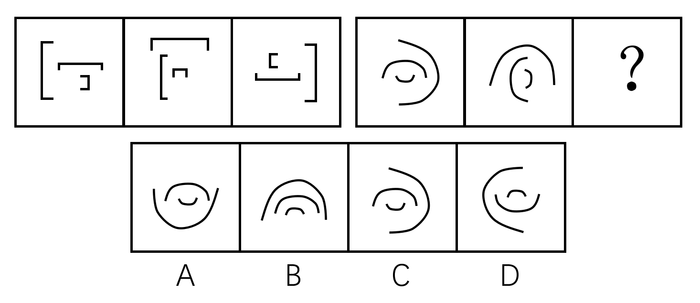

- **A**. A
- **B**. B
- **C**. C
- **D**. D　✅

**答案**：D

**官方解析**

元素组成相同，优先考虑位置规律。第一组图中，最长的图形每次顺时针旋转90度，较长的图形每次逆时针旋转90度，最短的图形每次逆时针旋转90度。第二组图中，图1到图2，最长的图形逆时针旋转90度，较长的图形逆时针旋转90度，最短的图形逆时针旋转90度，则？处也应保持此规律，得到D图形。
故正确答案为D。

---

### 第 22 题　qid 2062790 · 图形推理

从所给四个选项中，选择最合适的一个填入问号处，使之呈现一定的规律性：

- **A**. A
- **B**. B
- **C**. C
- **D**. D　✅

**答案**：D

**官方解析**

图形组成相似，图1图2中的阴影样式均在图3中出现，考虑运算规律。第一组图中，根据阴影样式位置可知，图1与图2阴影部分去同存异（此处阴影虽然线条不同，仍可继续按照阴影线条一致的情况运算）后旋转180度可得图3，则第二组图也应符合此规律。图1和图2左下角的阴影部分去同存异后旋转180度得到的空白区域应在右上角，只有D项符合。
故正确答案为D。

---

### 第 23 题　qid 2062794 · 图形推理

从所给四个选项中，选择最合适的一个填入问号处，使之呈现一定的规律性：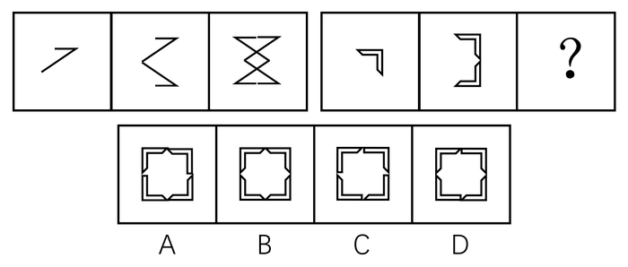

- **A**. A
- **B**. B　✅
- **C**. C
- **D**. D

**答案**：B

**官方解析**

图形组成相似，考虑样式规律。第一组图中，图2为图1上下翻转后与图1叠加形成，图3为图2左右翻转后与图2叠加形成，则第二组图也应符合此规律。图2左右翻转后再与图2叠加形成B选项的图形。
故正确答案为B。

---

### 第 24 题　qid 2062800 · 图形推理

从所给四个选项中，选择最合适的一个填入问号处，使之呈现一定的规律性：

- **A**. A　✅
- **B**. B
- **C**. C
- **D**. D

**答案**：A

**官方解析**

题干图形出现了明显的阴影部分，且阴影部分的数量分别为0、1、2、3、？，则？处图形阴影部分为4个，无法排除选项。通过题干中阴影部分的位置可知，阴影部分起始位置每次逆时针移动一格，则？处阴影部分起始位置应在右下角，为A图。
故正确答案为A。

---

### 第 25 题　qid 2062806 · 图形推理

从所给四个选项中，选择最合适的一个填入问号处，使之呈现一定的规律性：

- **A**. A　✅
- **B**. B
- **C**. C
- **D**. D

**答案**：A

**官方解析**

解法一：

题干图形轮廓都相同，但阴影部分数量没有明显规律，考虑位置规律。观察发现，题干中相邻两幅图的阴影部分的位置均不重合，B、C、D项阴影部分的位置均与图4出现重合，只有A项符合此规律。

解法二：

题干图形轮廓都相同，但阴影部分数量没有明显规律，考虑位置规律。观察题干中阴影部分发现，所有阴影部分均出现在同一条蓝线（或隔着一条蓝线的两条蓝线上，如下图所示），排除C、D两项，且阴影从第一幅图开始每次向右下列移动，移动到第三条蓝线处就会出现新的阴影，排除B项。

故正确答案为A。

---

### 第 26 题　qid 2062810 · 图形推理

从所给四个选项中，选择最合适的一个填入问号处，使之呈现一定的规律性：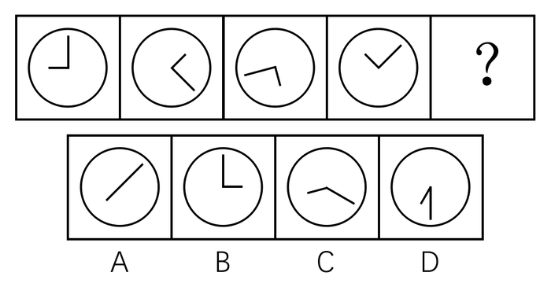

- **A**. A
- **B**. B　✅
- **C**. C
- **D**. D

**答案**：B

**官方解析**

图形组成相同，优先考虑位置规律。发现题干中图形的长短指针的夹角均保持90度，选项中仅有B项的长短指针夹角为90度。
故正确答案为B。

---

### 第 27 题　qid 2062816 · 图形推理

从所给四个选项中，选择最合适的一个填入问号处，使之呈现一定的规律性：

- **A**. A
- **B**. B
- **C**. C
- **D**. D　✅

**答案**：D

**官方解析**

图形均为一条线一笔穿过若干小黑点形成的图形，优先考虑起点与终点的位置关系，发现并无规律。考虑线与小黑点之间的关系，发现题干中所有小黑点最多与2条直线相连接，A、B、C三项中均存在与超过2条直线相连接的小黑点，排除。
故正确答案为D。

---

### 第 28 题　qid 2062820 · 图形推理

从所给四个选项中，选择最合适的一个填入问号处，使之呈现一定的规律性：

- **A**. A
- **B**. B
- **C**. C　✅
- **D**. D

**答案**：C

**官方解析**

图形组成不同，且均由2个元素组成，都存在相交部分，考虑图形间关系。题干中两个元素相交均形成了相交面，A项为相压，排除；B项不是由2个元素组成，排除；D项为相压，排除。
故正确答案为C。

---

### 第 29 题　qid 2062824 · 图形推理

从所给四个选项中，选择最合适的一个填入问号处，使之呈现一定的规律性：

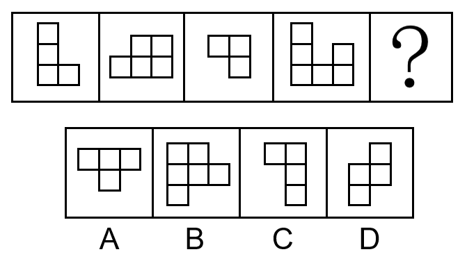

- **A**. A
- **B**. B　✅
- **C**. C
- **D**. D

**答案**：B

**官方解析**

观察题干图形，可以发现相邻的两幅图都可以在旋转后拼合成一个矩形。如下图中前三个图形所示，从左至右分别是题干中图1与图2、图2与图3、图3与图4拼合而成的矩形，选项中能与题干中图4拼合成矩形的只有B项（如下图中最后一个图形所示）。

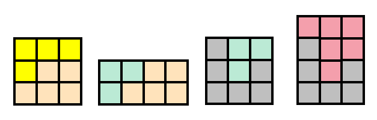

故正确答案为B。

---

### 第 30 题　qid 2062826 · 图形推理

把下面六个图形分成两类，使每一类图形都有各自共同的规律或特征，分类正确的一项是：

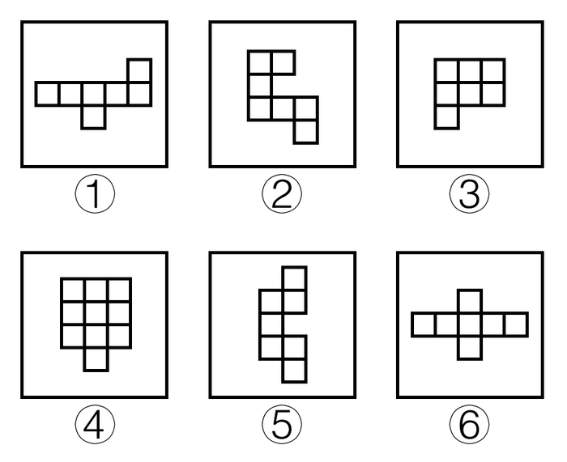

- **A**. ①②③，④⑤⑥
- **B**. ①②④，③⑤⑥
- **C**. ①④⑥，②③⑤　✅
- **D**. ①④⑤，②③⑥

**答案**：C

**官方解析**

元素组成基本相同，但无明显位置规律。观察发现，图②③⑤均能由一笔画连接所有小正方形，图①④⑥均需要两笔才能连接所有小正方形（如下图所示），故①④⑥为一组，②③⑤为一组。

故正确答案为C。

---

## 资料分析

### 材料 1

       2012年，A国取得了的经济增长速度，超过世界平均水平近1倍。2012年，A国的进出口总额为3816.5亿美元，同比增长；其中出口1900亿美元，同比降低，进口1916.5亿美元，同比增长。

       2012年，A国吸引的外国直接投资接近200亿美元，全球排名第17位，较上年上升4位。来自A国的官方投资统计机构的数据显示，2012年吸引外资前五的行业分别是采矿业、金属机械及电子业、交通通信业、化工制药业和机动车及运输设备制造业；排名前五名的国家分别是新加坡(49亿美元)、日本（25亿美元）、韩国（19亿美元）、美国（12亿美元）和毛里求斯（11亿美元）。

       2012年，B国GDP为2828亿美元，经济增长速度比上年略有降低，但依然超过。2012年，B国的进出口总额1790.1亿美元，比上年降低了；其中进口358.7亿美元，同比降低，出口1431.4亿美元，同比增长。B国的贸易顺差由上年的608.9亿美元，增长到2012年的1072.7亿美元，增长了，其中进口较上年减少272.2亿美元，占贸易顺差的。一方面，B国不断采取措施，改善国内投资环境，吸引外资进入；另一方面，B国在电力、电信、交通运输、法律法规执行力、政治局势和安全等方面存在许多不足，因此，B国的外资流入表现出波动大且增长迅速的特征。2011年，B国外资净流入为89.2亿美元，比上一年增长，比2004年增长了；在2004—2011年，最高增长率达到了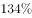，最低的增长率为，波动幅度大。

       2012年，C国的经济增长达到。该国国际贸易的增速快于国内经济的增速，进出口总额为7857.3亿美元，同比增长，其中出口3859.3亿美元，同比增长，进口3998亿美元，同比增长。

       2012年，C国的对外投资和吸引外资呈现出两种截然不同的趋势。数据显示，2012年，C国对外投资额约为260亿美元，世界排名由上年的第28位上升到2012年的第15位。2012年，C国吸引外国直接投资126.6亿美元，同比减少，为近12年来最低。从投资来源国来看，来自美国的占，日本占，加拿大占，德国占，荷兰占。

#### 第 1 题　qid 2062828 · 综合

2012年，A国机动车及运输设备制造业吸引外国直接投资最多不可能超过（    ）亿美元。

- **A**. 40　✅
- **B**. 30
- **C**. 20
- **D**. 10

**答案**：A

**官方解析**

根据“2012年，……投资最多不可能超过（    ）亿美元”，判断本题为现期计算问题。定位材料第二段，2012年，A国吸引的外国直接投资接近200亿美元，2012年吸引外资前五的行业分别是采矿业、金属机械及电子业、交通通信业、化工制药业和机动车及运输设备制造业；则机动车及运输设备制造业不可能超过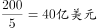。

故正确答案为A。

---

#### 第 2 题　qid 2062830 · 增长

A、B、C三个国家2012年的进出口各项指标中，（    ）的同比增长率最高。

- **A**. A国的进口额
- **B**. B国的出口额
- **C**. B国的贸易顺差额　✅
- **D**. C国的出口额

**答案**：C

**官方解析**

根据“······同比增长率最高”，判断本题为增长率比较问题。定位材料，A国的进口额同比增长，B国出口额同比增长，B国的贸易顺差额同比增长，C国出口额同比增长。因此B国的贸易顺差额同比增长率最高，C项正确。

故正确答案为C。

---

#### 第 3 题　qid 2062832 · 综合

2011年，C国吸引的外国直接投资约等于（    ）。

- **A**. 2012年A国进口增量的2倍
- **B**. 2011年B国外资净流入额
- **C**. 2012年韩国对A国直接投资的10倍　✅
- **D**. 2012年C国进出口贸易差额

**答案**：C

**官方解析**

根据“2011年，C国吸引的外国直接投资约等于”以及选项中为各项数据，判断本题为基期比较问题。定位材料，2012年，C国吸引外国直接投资126.6亿美元，同比减少。2011年C国吸引外国直接投资为亿美元。A项数据为：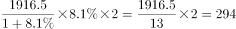亿美元；B项数据为89.2亿美元；C项数据为：亿美元；D项数据为：亿美元。C项数据最接近。

故正确答案为C。

---

#### 第 4 题　qid 2062834 · 综合

下列图形与2004年至2011年B国外资净流入状况最为相符的是（    ）。

- **A**. 
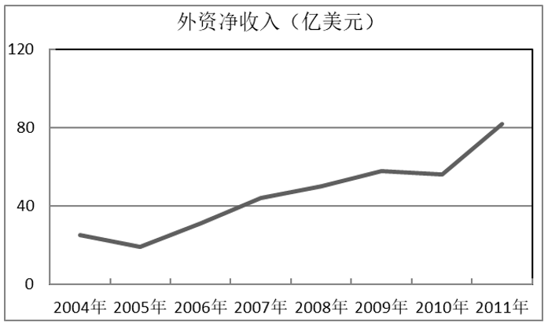

- **B**. 

　✅
- **C**. 
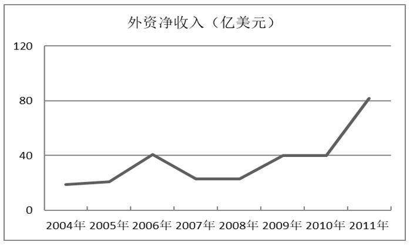

- **D**. 
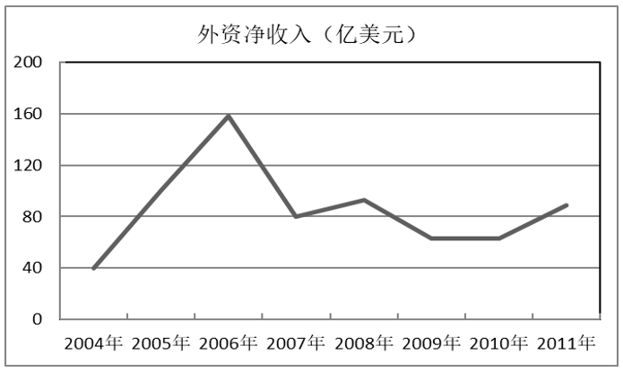

**答案**：B

**官方解析**

根据题目所求为“2004年至2011年B国外资净流入状况”，结合材料所给时间为2012年、2011年，判断本题为基期计算问题。定位材料第三段，2011年，B国外资净流入为89.2亿美元，比上一年增长，比2004年增长了。

观察选项，A、C两项，2011年数值都只是略大于80亿美元，实际值为89.2亿美元，排除A、C两项；

代入公式：，可得：2004年B国外资净流入为亿美元，观察选项，排除D项（2004年：约40亿美元）。

故正确答案为B。

备注：B项的2004年数值在图中显示要比21.2大一些，易被排除，误选C项。而2010年B国外资净流入为亿美元，C项仅约为40亿美元，错误。当选项不足够严谨时，粉笔建议做题用对比择优的思维，C项明显偏离更多，综合考虑，建议选B项。

---

#### 第 5 题　qid 2062836 · 综合

以下说法错误的是（    ）。

- **A**. 2012年，A国的进口增长速度快于经济和出口的增长速度
- **B**. 2012年，C国的经济增长速度要慢于世界经济增长速度　✅
- **C**. 2012年，日本对C国的直接投资额低于其对A国的直接投资额
- **D**. 2012年，B国贸易顺差的扩大主要是由于进口大幅下降造成的

**答案**：B

**官方解析**

A项：定位第一段材料，A国进口同比增长，出口同比降低为，经济增长速度为，进口同比增长率最高，正确；

B项：定位第一段材料和第四段，世界经济增长速度为，C国的经济增速为。C国的经济增长速度要快于世界经济增长速度，错误；

C项：定位第一段材料和最后一段材料，2012年，日本对A国投资25亿美元，对C国投资额为，正确；

D项：定位材料第三段，B国的贸易顺差由上年的608.9亿美元，增长到2012年的1072.7亿美元，增长了，其中进口较上年减少272.2亿美元，占贸易顺差的，正确。

本题为选非题，故正确答案为B。

---

### 材料 2

       2015年，H市全社会用电量1405.55亿千瓦时，比上年增长。全年各产业和生活用电情况分别为：第一产业用电量7.35亿千瓦时，比上年增长；第二产业用电量800.37亿千瓦时，比上年增长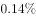；第三产业用电量412.34亿千瓦时，比上年增长；生活用电量由城镇居民用电量与乡村居民用电量构成，共计185.49亿千瓦时，比上年增长，其中，城镇居民用电量增长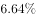，乡村居民用电量增长。

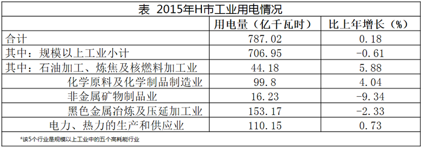

#### 第 6 题　qid 2062838 · 综合

2015年，H市五个高耗能行业用电量约占规模以上工业用电量的( )。

- **A**. 

- **B**. 

　✅
- **C**. 

- **D**. 

**答案**：B

**官方解析**

根据“2015年······占······”，判断本题为现期比重问题。定位表1，五个高耗能行业用电量分别为44.18亿千瓦时，99.8亿千瓦时，16.23亿千瓦时，153.17亿千瓦时，110.15亿千瓦时，规模以上工业用电量为706.95亿千瓦时。所求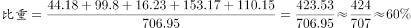，B项最接近。

故正确答案为B。

---

#### 第 7 题　qid 2062840 · 综合

2015年H市以下行业中，用电量最大的是( )。

- **A**. 黑色金属冶炼及压延加工业　✅
- **B**. 房地产业
- **C**. 公共事业及管理组织
- **D**. 电力、热力的生产和供应业

**答案**：A

**官方解析**

定位两个表格，黑色金属冶炼及压延加工业为153.17亿千瓦时，房地产业为113.47亿千瓦时，公共事业及管理组织为93.21亿千瓦时，电力、热力的生产和供应业为110.15亿千瓦时。用电量最大的是黑色金属冶炼及压延加工业。
故正确答案为A。

---

#### 第 8 题　qid 2062842 · 增长

2015 年，H市各产业和生活用电同比增量最大的是( )。

- **A**. 第一产业用电
- **B**. 第二产业用电
- **C**. 第三产业用电　✅
- **D**. 生活用电

**答案**：C

**官方解析**

根据“2015年······同比增量最大的是”，判断本题为增长量比较问题。定位文字材料，第一产业用电量7.35亿千瓦时，比上年增长；第二产业用电量800.37亿千瓦时，比上年增长；第三产业用电量412.34亿千瓦时，比上年增长；生活用电量共计185.49亿千瓦时，比上年增长。根据增长量公式，第一产业：亿千瓦时；第二产业：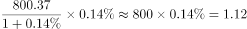亿千瓦时；第三产业：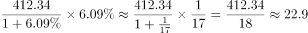亿千瓦时；生活用电：亿千瓦时。

因此第三产业用电同比增量最大。

故正确答案为C。

---

#### 第 9 题　qid 2062844 · 综合

以下数据不能从材料中得到的是：

- **A**. 2014年，城镇居民和乡村居民用电量之比
- **B**. 2014年，化学原料及化学制品制造业用电量占第二产业用电量的比例
- **C**. 2014年，第三产业用电量同比上年的增长率　✅
- **D**. 2014年，第二产业用电量与第三产业用电量的比值

**答案**：C

**官方解析**

根据选项所求数据均为2014年数据，而材料中数据为2015年，判断本题为基期计算问题。A项：定位文字材料，生活用电量比上年增长，其中，城镇居民用电量增长，乡村居民用电量增长。根据线段法，2014年，，A项可求，排除；

B项：定位文字第一段和表1数据，第二产业用电量800.37亿千瓦时，比上年增长；化学原料及化学制品制造业用电量为99.8亿千瓦时，比上年增长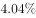。现期量和增长率都有，根据基期比重公式，B项可求，排除；

C项：定位文字材料，第三产业用电量412.34亿千瓦时，比上年增长；关于第三产业并无其他数据，C项不可求，当选；

D项：定位文字材料，第二产业用电量800.37亿千瓦时，比上年增长；第三产业用电量412.34亿千瓦时，比上年增长；根据基期公式，2014年第二产业和第三产业都可以求出，D项可求，排除。

本题为选非题，故正确答案为C。

---

#### 第 10 题　qid 2062846 · 综合

以下关于2015年H市用电情况的说法，不正确的是：

- **A**. 第一产业用电量还不到全市用电量的百分之一
- **B**. 第三产业用电量增长主要源于房地产业用电量的增长
- **C**. 房地产业和公共事业及管理组织用电量占第三产业用电量一半以上
- **D**. 规模以上工业用电量微降主要源于非金属矿物制品业用电量大幅下降　✅

**答案**：D

**官方解析**

A项：定位文字材料，2015年，H市全社会用电量1405.55亿千瓦时，第一产业用电量7.35亿千瓦时，，第一产业用电量不到全市用电量的百分之一，A项正确，排除；

B项：定位表2，第三产业中，房地产业的现期量和增长率都是最大，因此第三产业用电量增长主要源于房地产业用电量的增长，B项正确，排除；

C项：定位表2，房地产业用电量113.47亿千瓦时，公共事业及管理组织用电量93.21亿千瓦时。二者占第三产业的比重=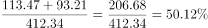，C项正确，排除；

D项：定位表1，在规模以上工业用电量中，最大的是黑色金属冶炼及压延加工业为153.17亿千瓦时，其同比下降，则减少量为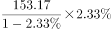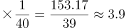亿千瓦时；非金属矿物制品业用电量为16.23亿千瓦时，同比下降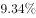，则减少量为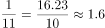亿千瓦时，显然。因此规模以上工业用电量微降并非主要源于非金属矿物制品业用电量大幅下降，D项错误，当选。

本题为选非题，故正确答案为D。

---

### 材料 3

为了衡量农民工在市民化过程中政府的公共支出，某研究中心对C市、Z市、W市、J市四个城市进行了调研测算。

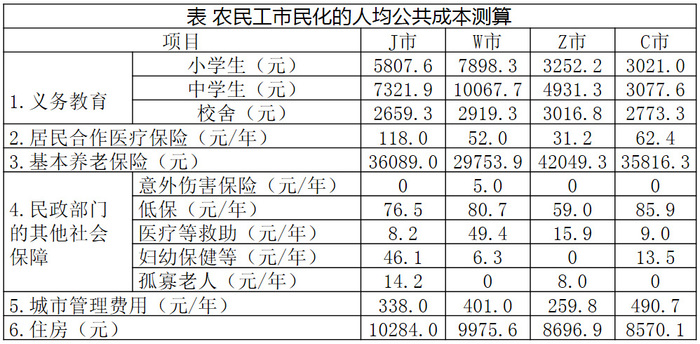

#### 第 11 题　qid 2062848 · 平均数

四个城市中，农民工市民化所需的民政部门的其他社会保障人均公共成本最高的是：

- **A**. C市
- **B**. Z市
- **C**. W市
- **D**. J市　✅

**答案**：D

**官方解析**

定位表格材料第4项，J市农民工市民化所需的民政部门的其他社会保障人均公共成本为元；Z市为元；W市为元；C市为元。因此农民工市民化所需的民政部门的其他社会保障人均公共成本最高的是J市。

故正确答案为D。

---

#### 第 12 题　qid 2062850 · 平均数

四个城市中，农民工市民化的基本养老保险人均公共成本最低的城市，其市民化的义务教育人均公共成本位列：

- **A**. 第一　✅
- **B**. 第二
- **C**. 第三
- **D**. 第四

**答案**：A

**官方解析**

根据“市民化的义务教育人均公共成本”为平均数，判断本题为现期平均数的比较。定位表格第3项，农民工市民化的基本养老保险人均公共成本最低的城市是W市，因为都是小学生、中学生、校舍3项，平均数比较直接比较3项总和即可。W市农民工市民化的义务教育人均公共成本为元；J市为元；Z市为元；C市为元。因此W市位列第一。

故正确答案为A。

---

#### 第 13 题　qid 2062852 · 平均数

农民工市民化的基本养老保险和住房两项人均公共成本最高的城市与最低的城市，相差约( )元。

- **A**. 8000
- **B**. 9000
- **C**. 10000
- **D**. 11000　✅

**答案**：D

**官方解析**

定位表格第3项和第6项，农民工市民化的基本养老保险和住房两项人均公共成本分别为：；；；。最高的城市与最低的城市之差为。D项最接近。

故正确答案为D。

---

#### 第 14 题　qid 2062854 · 平均数

如果将农民工市民化所需的九年义务教育阶段人均公共成本摊分到每一年，则Z市的该成本接近该市( )。

- **A**. 5年的市民化所需城市管理人均公共成本费用　✅
- **B**. 15年的市民化所需低保人均公共成本费用
- **C**. 10年的市民化所需居民合作医疗保险人均公共成本费用
- **D**. 30年的市民化所需医疗等救助人均公共成本费用

**答案**：A

**官方解析**

根据所求为Z市的九年义务教育人均公共成本与其他指标的比较，判断本题为现期计算问题。Z市农民工市民化所需的九年义务教育阶段每年所需人均公共成本。A项为；B项为；C项为；D项为。因此所求数据接近A项。

故正确答案为A。

---

#### 第 15 题　qid 2062856 · 综合

以下说法错误的是：

- **A**. Z市与C市农民工市民化的住房人均公共成本最为接近，而城市管理费用人均公共成本相差最多
- **B**. 仅有C市未对农民工市民化中的孤寡老人付出公共成本，却付出了妇幼保健等公共成本　✅
- **C**. W市的农民工市民化所需的居民合作医疗保险人均公共成本虽然在四个城市中位居中下，但医疗等救助人均公共成本却是最高的
- **D**. J市的农民工市民化所需居民合作医疗保险和妇幼保健两项人均公共成本是四个城市中最高的

**答案**：B

**官方解析**

A项：定位表格最后两项，农民工市民化城市管理费用人均公共成本最小的是Z市，最大的是C市，因此这二者相差最大。农民工市民化住房人均公共成本最小的是Z市和C市，。Z市与W市，相差最小的是Z市与C市，A项正确，排除；

B项：定位表格第4项，W市也未对农民工市民化中的孤寡老人付出公共成本，却付出了妇幼保健等公共成本，B项错误，当选；

C项：定位表格第2、4项，W市的农民工市民化所需居民合作医疗保险人均公共成本在四个城市中位列第三，但其医疗等救助人均公共成本为49.4元/年，是四个城市中最高的，C项正确，排除；

D项：定位表格第2、4项，J市的农民工市民化所需居民合作医疗保险人均公共成本为118元/年，妇幼保健等人均公共成本为46.1元/年，均是四个城市中最高的，D项正确，排除。

本题为选非题，故正确答案为B。

---

#### 第 16 题　qid 2062764 · 综合

某五金加工厂一周加工的五金零件的统计表破损了，如图所示，表中缺少几个数字。根据这张统计表，星期五加工的零件数比星期六（    ）。

- **A**. 多25件
- **B**. 少15件　✅
- **C**. 多5件
- **D**. 少5件

**答案**：B

**官方解析**

表格数据为一周内加工零件的统计表，设星期五为，星期六为。则有，得，利用尾数计算，可知，星期五加工71件。，则星期五加工的零件数比星期六少。

故正确答案为B。

---
