# 2016年江苏省公务员录用考试《行测》题（A类）

> 省考 · 2016 年 · 5 个模块 · 共 134 题

- [常识判断](#%E5%B8%B8%E8%AF%86%E5%88%A4%E6%96%AD) · 20 题
- [言语理解与表达](#%E8%A8%80%E8%AF%AD%E7%90%86%E8%A7%A3%E4%B8%8E%E8%A1%A8%E8%BE%BE) · 35 题
- [数量关系](#%E6%95%B0%E9%87%8F%E5%85%B3%E7%B3%BB) · 14 题
- [判断推理](#%E5%88%A4%E6%96%AD%E6%8E%A8%E7%90%86) · 45 题
- [资料分析](#%E8%B5%84%E6%96%99%E5%88%86%E6%9E%90) · 20 题

---

## 常识判断

### 第 1 题　qid 1789072 · 人文常识

党的十八届五中全会通过了《中共中央关于制定国民经济和社会发展第十三个五年规划的建议》，下列对于该建议的理解，正确的是：

- **A**. 《“十三五”规划建议》是针对“两个一百年”奋斗目标的收官阶段提出的战略蓝图
- **B**. 《“十三五”规划建议》充分论证了继续坚持我国改革开放的发展方式的必要性
- **C**. 《“十三五”规划建议》针对社会主要矛盾的新变化提出了经济社会发展的新方针
- **D**. 《“十三五”规划建议》提出并阐述了我国经济社会发展的“五大发展理念”　✅

**答案**：D

**官方解析**

A项错误：《“十三五”规划建议》是中华人民共和国国民经济和社会发展第十三个五年规划纲要，起止时间为2016年至2020年。“两个一百年”奋斗目标分别是指“在中国共产党成立一百年时全面建成小康社会”和“在新中国成立一百年时建成富强民主文明和谐的社会主义现代化国家”。“两个一百年”起止时间分别是1921年至2021年、1949年至2049年。因此，“十三五”规划是针对第一个一百年即建党一百年收官阶段提出的战略蓝图。
B项错误：《“十三五”规划建议》只是对今后的工作进行规划建议，并非一个完整论述改革开放理论的方案。
C项错误：2017年10月，习近平同志在十九大报告中明确指出，我国社会主要矛盾已经转化为人民日益增长的美好生活需要和不平衡不充分的发展之间的矛盾。而十八届五中全会召开于2015年，当时我国社会主要矛盾没有发生变化，依然是人民日益增长的物质文化需要和落后的社会生产之间的矛盾。
D项正确：《“十三五”规划建议》提出并阐述了“创新、协调、绿色、开放、共享”的五大发展理念。
故正确答案为D。
【备注】中共十五大报告首次提出“两个一百年”奋斗目标：到建党一百年时，使国民经济更加发展，各项制度更加完善；到世纪中叶建国一百年时，基本实现现代化，建成富强民主文明的社会主义国家。“到建党一百年时”“到世纪中叶建国一百年时”是一种较为模糊的表述，可理解为“100周年”（即2021年和2049年），也可理解为“第100年”（即2020年和2048年），因此，通常将这两个时间点取整近似为2020年和2050年。

---

### 第 2 题　qid 1789486 · 经济常识

2015年11月30日，国际货币基金组织宣布将人民币纳入特别提款权（SDR）货币篮子，以下说法正确的是（     ）。

- **A**. 中国以后的外汇储备都将以SDR计价
- **B**. 中国居民可直接用SDR进行海外购物
- **C**. 人民币已经获得世界货币的地位　✅
- **D**. 人民币可在世界任何地方自由兑换

**答案**：C

**官方解析**

A项：我国外汇储备的组成包括国外的货币、外国政府及外国企业的债券等，目前我国外汇储备主要是以美元计价，而非所有SDR货币，而且关于中国具体外汇的构成是国家机密，人民币也是SDR，但是我国外汇储备极少以人民币计价，错误；
B项：说法过于绝对，在海外购物的时候绝大多数情况下还是使用当地的货币，错误；
C项：国际货币基金组织的成员可用它向基金组织指定的其他会员国换取外汇，以偿付国际收支逆差或偿还基金组织的贷款，还可与黄金、自由兑换货币一样充当国际储备，因此人民币取得世界货币的地位说法是正确的；
D项：该说法过于绝对，比如在索马里，人民币就不能自由兑换，错误。
故正确答案为C。

---

### 第 3 题　qid 1789488 · 人文常识

下列关于“三严三实”专题教育的说法，正确的是（   ）

- **A**. “三严三实”专题教育是加强党的组织建设的根本途径
- **B**. “三严三实”专题教育的对象确定为全体党员干部
- **C**. “三严三实”的重要论述由习近平总书记2014年在江苏调研时首次提出
- **D**. “三严三实”专题教育是党的群众路线教育实践活动的延展和深化　✅

**答案**：D

**官方解析**

A项：“三严三实”仅仅一个专题教育，跟思想有关，跟组织建设没有关系，错误；
B项：“三严三实”专题教育的对象为县处级以上干部，错误；
C项：“三严三实”首次提出是2014年3月9日习主席在十二届全国人大二次会议安徽代表团参加审议时，关于推进作风建设的讲话中提出的，错误；
D项：“三严三实”专题教育是党的群众路线教育实践活动的延展和深化，正确。
故正确答案为D。

---

### 第 4 题　qid 1789490 · 人文常识

法国作家雨果说：“最大的决心会产生最高的智慧。”下列与这句话蕴含相似哲理的是：

- **A**. 入山问樵，入水问渔
- **B**. ​巧妇难为无米之炊
- **C**. 只要有信心，黄土变成金　✅
- **D**. 劈柴不照纹，累死劈柴人

**答案**：C

**官方解析**

题干中“最大的决心”是一种意识，“会产生最高的智慧”体现了意识能指导人们改造世界的能动性的特点。
A项：山里的情况樵夫最熟悉，水中的概况渔夫最熟悉，体现了一切从实际出发、具体问题具体分析的哲理，错误。
B项：体现的哲理是物质的第一性，错误。
C项：“信心”是一种意识，能促使人们能动地改造客观世界，体现了意识能动性的特点，正确。
D项：体现的哲理是尊重客观规律，按照规律办事，错误。
故正确答案为C。

---

### 第 5 题　qid 1789562 · 科技常识

某地方政府为推进绿色发展准备采取一系列措施，下列措施中最合理的是：

- **A**. 向辖区内钢铁厂提供能耗补贴
- **B**. 对过度包装、浪费和过度消费采取惩罚性措施
- **C**. 规定居民只能购买新能源汽车
- **D**. 向公众推出环境质量实时监控信息平台　✅

**答案**：D

**官方解析**

题干关键词是“绿色发展”，“绿色”体现为低碳、环保、可持续和可循环等特点，更多地侧重发展过程中的人与自然相协调。
A项错误：不应该向钢铁企业提供能耗补贴，而应帮助钢铁企业改进生产技术，提高资源利用效率，使用清洁能源。
B项错误：对过度包装、浪费和过度消费采取惩罚性措施不具有可执行性。
C项错误：行政干预非常明显，政府要以引导为主，而不是强制规定。虽然新能源汽车的使用会减少汽车尾气的排放，但是选项中的做法明显违背了法律的精神。
D项正确：关键词是“环境质量”，是四个选项中与环境关系最直接、最明显的，且对环境实时监控，就可以根据环境质量的变化发现存在的问题，进而采取必要的措施。
故正确答案为D。

---

### 第 6 题　qid 1789492 · 人文常识

下列诗句描写的景色按春夏秋冬顺序排列正确的是（   ）。
①稻花香里说丰年，听取蛙声一片
②棠梨叶落胭脂色，荞麦花开白雪香
③碧玉妆成一树高，万条垂下绿丝绦
④山舞银蛇，原驰蜡象，欲与天公试比高

- **A**. ①③②④
- **B**. ②①④③
- **C**. ③②①④　✅
- **D**. ④③②①

**答案**：C

**官方解析**

①“稻花香”中的“稻花”开在夏季；②“荞麦花开”一般是在阳历的8-9 月，故确定此项为夏末秋初；③“绿丝绦”用来形容柳树刚刚发出嫩芽的状态，故定位为春天；④“银蛇”“蜡象”用来形容雪后的景象，定位为冬天。
根据③春季④冬季，以及春夏秋冬季节顺序可以确定排序为③②①④。
故正确答案为C。

---

### 第 7 题　qid 1789494 · 人文常识

《茉莉花》被称为“流传到海外的第一首中国民歌”。下列关于这首民歌的说法，正确的是：

- **A**. 《茉莉花》的发源地在浙江湖州一带
- **B**. 《茉莉花》由波斯商人通过丝绸之路传到欧洲
- **C**. 最早记录《茉莉花》的西方著作是《马可波罗游记》
- **D**. 《茉莉花》因歌剧《图兰朵》将其作为主题音乐而风靡欧洲　✅

**答案**：D

**官方解析**

A项错误：《茉莉花》是中国民歌，源于南京六合民间传唱百年的《鲜花调》。
B项错误：1792年，英国国王乔治三世派遣自己的表兄马戛尔尼勋爵率使团以贺乾隆皇帝八十大寿为名出使中国，约翰·巴罗担任使团的财务总管。马戛尔尼使团访华是欧洲第一次向中国派遣正式的外交使节，虽然由于中英双方世界观不同，未能达成外交上的共识，却无意中促成了《茉莉花》与欧洲的一段奇缘。马戛尔尼使团在华逗留期间，约翰·巴罗和使团的一位德籍翻译惠特纳都深深喜欢上了中国民歌《茉莉花》，并把它带回了欧洲。
C项错误：《茉莉花》这首中国民歌在1768年（清乾隆三十三年）法国哲学家卢梭的《音乐辞典》中就有收录，而曲谱则是在英国人约翰·巴罗于1804年出版的《中国旅行记》一书中被记录下来。
D项正确：意大利作曲家吉亚卡摩·普契尼将《茉莉花》重新编曲成女声合唱，作为音乐主题用于1926年首演的歌剧《图兰朵》，《茉莉花》由此风靡欧洲。
故正确答案为D。

---

### 第 8 题　qid 1789496 · 人文常识

“一带一路”是我国当前大力推进的国家经济发展重要战略，下列关于“一带一路”战略说法正确的是：

- **A**. 2013年是“一带一路”战略全面实施的开局之年
- **B**. “一带一路”战略承载了丝绸之路沿途各国共同繁荣的梦想　✅
- **C**. 助推“一带一路”建设的加速器是边境地区的互联互通
- **D**. 推进“一带一路”建设的重要依托是边境地区的和平稳定

**答案**：B

**官方解析**

2015年是“一带一路”的开局之年，故A项错误；
“一带一路”承载了丝绸之路沿途各国共同繁荣的梦想，B项正确；
边境地区经济合作不断发展是助推“一带一路”建设的加速器，故C项错误；
边境地区互联互通是“一带一路”建设的重要依托，故D项错误。
故正确答案为B。

---

### 第 9 题　qid 1789498 · 人文常识

预测表明，2020年到2050年，我国60岁以上人口占比将从19.3上升到38.6，对此，下列说法错误的是：

- **A**. 我国家庭人口的抚养比系数逐渐减小　✅
- **B**. 我国的老龄化社会问题将日益严峻
- **C**. 推动我国经济发展的人口红利逐步消退
- **D**. 养老保险的支付压力将会越来越大

**答案**：A

**官方解析**

A项说法错误：抚养比是指在人口当中非劳动年龄人口数与劳动年龄人口数之比，当60岁以上人口增多即非劳动年龄人口增多时，抚养比系数会上升。
B项说法正确：60岁以上人口比例大幅增加，说明老龄化的问题将会日益严峻。
C项说法正确：人口红利是指一个国家的劳动年龄人口占总人口比重较大，抚养率比较低，为经济发展创造了有利的人口条件，整个国家的经济呈高储蓄、高投资和高增长的局面。当60岁以上人口比例增大时，劳动年龄人口占总人口比例减小，人口红利逐渐减少。
D项说法正确：老年人口增多，养老保险支付会随之增加，故压力会加大。
本题为选非题，故正确答案为A。

---

### 第 10 题　qid 1789500 · 经济常识

资本国际化是指资本越出一国的范围在国际间运动和增值。下列未能体现资本国际化的是（    ）。

- **A**. 某集团以数十亿美元收购国外企业
- **B**. 某公司撤出伦敦股市的资金转投芝加哥商品期货市场
- **C**. 两个国家的农产品贸易集团签署相互持股的协议
- **D**. 各国消费者通过电商购买境外的商品和劳务　✅

**答案**：D

**官方解析**

A项：“收购国外企业”，是资本在国际间运动和增值，体现了资本国际化，不符合题意，排除。
B项：“撤出伦敦股市的资金转投芝加哥”体现了资本越出一国范围在国际间运动和增值，不符合题意，排除。
C项：“两个国家的······相互持股”体现了资本国际化，不符合题意，排除。
D项：消费者购买境外的商品和劳务是正常的消费行为，不是资本的跨国运动和增值，符合题意，当选。
本题为选非题，故正确答案为D。

---

### 第 11 题　qid 1789502 · 人文常识

如果让你规划“重走长征路”的活动路线，下列不应列入活动路线的地方是（    ）。

- **A**. 江西瑞金
- **B**. 湖南岳阳　✅
- **C**. 贵州遵义
- **D**. 四川阿坝

**答案**：B

**官方解析**

本题考查毛中特。
红军长征线路为：江西瑞金—四道封锁线（湘江战役）—强渡乌江—遵义会议—四渡赤水—巧渡金沙江—强渡大渡河、飞夺泸定桥—过雪山（夹金山）—四川懋功会师（一、四方面军会师）—毛儿盖—过草地—腊子口—吴起镇（同陕北红军会师）—会宁。
由长征线路可知，经过的地点有A项的江西瑞金、C项的贵州遵义、D项的四川阿坝（夹金山位于四川阿坝）。没有经过的地方为B项的湖南岳阳。
本题为选非题，故正确答案为B。

---

### 第 12 题　qid 1789504 · 人文常识

下列对“收拾金瓯一片，分田分地真忙”诗句的理解，错误的是：

- **A**. 该诗句的创作背景是第二次国内革命战争时期
- **B**. “分田分地”的实质是确立农民个体所有的土地制度　✅
- **C**. 该诗句描述的景象发生在闽西地区
- **D**. 当时苏维埃政权的基本任务是“打土豪，分田地”

**答案**：B

**官方解析**

该诗句出自毛泽东的《清平乐·蒋桂战争》，作于1929年，全文如下：风云突变，军阀重开战。洒向人间都是怨，一枕黄粱再现。红旗越过汀江，直下龙岩上杭。收拾金瓯一片，分田分地真忙。
A项正确，该诗句创作于1929年，这一时期为国共十年对峙时期，也就是第二次国内革命战争时期。
B项错误，1929年《兴国土地法》规定：“没收一切公共土地及地主阶级的土地归兴国工农兵代表会议政府所有，分给无田地及少地的农民耕种使用。”因此，归个体所有表述错误。
C项正确，1929年，朱毛红军入闽，攻占上杭，开展土地革命，毛泽东为这次胜利所振奋，创作了该诗。
D项正确，当时苏维埃政权的基本任务是“打土豪，分田地”。
本题为选非题，故正确答案为B。

---

### 第 13 题　qid 1789506 · 科技常识

高铁列车的车窗和车门在运行过程中必须完全密闭。对此，下列解释最准确的是：

- **A**. 减少高铁列车运行的能源消耗
- **B**. 保持高铁列车车厢内部的安静
- **C**. 避免车速过快形成空气压强差　✅
- **D**. 确保高铁列车车厢内部的整洁

**答案**：C

**官方解析**

高铁列车行驶时会产生巨大的空气压强差，特别是列车进出隧道和两车交会时的巨大噪声也会乘虚而入，乘客根本无法忍受这种空气压强差，轻则使乘客耳膜产生压迫感，重则会使乘客感到头晕恶心，严重时甚至造成耳膜破裂。事实上，高铁列车上不仅窗户要固定、密闭，其车门、车厢连接处等都要尽可能地做到密闭，如此才能保证旅客有一个舒适的乘坐环境。
故正确答案为C。

---

### 第 14 题　qid 1789508 · 人文常识

发生火灾时应匍匐前进以逃生，其原因的下列说法，错误的是（    ）。

- **A**. 低处有残留的新鲜空气
- **B**. 有毒有害气体集中于高处
- **C**. 浓烟自下而上扩散　✅
- **D**. 低处视野比较清晰

**答案**：C

**官方解析**

发生火灾时，浓烟温度较高，首先充满屋顶，随着时间的推移，从屋顶向地面逐渐下移，是自上到下扩散的过程，直到充满整个房间，C项说法错误，符合题意，当选。烟雾的重力作用往往使浓烟聚集在离地面大约三十厘米的地方，因此逃生时应当尽量压低身体，这样才能保证自身安全。A、B、D三项说法正确，但不符合题意，排除。
本题为选非题，故正确答案为C。

---

### 第 15 题　qid 1789510 · 人文常识

下列诗句与描写的景点对应正确的是（    ）。

- **A**. 会当凌绝顶，一览众山小——安徽黄山
- **B**. 水光潋滟晴方好，山色空蒙雨亦奇——杭州西湖　✅
- **C**. 二十四桥明月夜，玉人何处教吹箫——北京昆明湖
- **D**. 飞流直下三千尺，疑是银河落九天——贵州黄果树瀑布

**答案**：B

**官方解析**

A项错误：出自杜甫的《望岳》，描写的是东岳泰山。
B项正确：出自苏轼的《饮湖上初晴后雨》，描写的是杭州西湖。
C项错误：出自杜牧的《寄扬州韩绰判官》，描写的是扬州二十四桥。
D项错误：出自李白的《望庐山瀑布》，描写的是江西省九江市的庐山。
故正确答案为B。

---

### 第 16 题　qid 1789512 · 地理国情

我国山脉众多，给自然与人文地理环境带来深刻影响。对此，下列说法错误的是：

- **A**. 秦岭山脉是我国南北方的重要地理分界线
- **B**. 祁连山脉融雪是河西走廊绿洲农业的主要水源
- **C**. 喜马拉雅山脉是世界上最年轻最高大的山脉
- **D**. 阴山山脉是传统上重要的农业与林业的分界　✅

**答案**：D

**官方解析**

本题考查中国山脉的有关知识。

A项正确：由于秦岭南北面的温度、气候、地形均呈现差异性变化，因而秦岭与淮河一线成了我国地理上最重要的分界线。它主要是我国南方地区与北方地区的分界线、一月份等温线、800mm等降水线量线、暖温带与亚热带分界线、湿润区与半湿润区分界线、温带季风气候与亚热带季风气候分界线等。

B项正确：河西走廊位于祁连山以东，是西北著名的粮仓，这里农业生产的水源主要是来自祁连山的冰雪融水。

C项正确：喜马拉雅山在青藏高原南侧，是一条近似东西向的弧形山系，也是世界上最高大的山系，分布在我国西藏以及巴基斯坦、印度、尼泊尔和不丹等国境内。它还是世界上最年轻的山脉，形成至今不过6500万年，并且是在60万年前才变成最高的山脉，由于亚欧板块和印度板块的挤压运动，现在仍在不断升高。

D项错误：以“东北松嫩平原西部—辽河中上游—阴山山脉—鄂尔多斯高原东缘（除河套平原）—祁连山山脉（除河西走廊）—青藏高原东缘”为分界线，此分界线以东为农区，种植水稻、小麦、玉米、大豆、高粱等作物；以西为牧区，放养牛、羊、马等牲畜。故阴山不是传统意义上的农业和林业的分界线，而是农业和牧业的分界线。

本题为选非题，故正确答案为D。

---

### 第 17 题　qid 1789514 · 人文常识

下列对司法俗语说明错误的是：

- **A**. 案结事了——司法解决的根本性
- **B**. 有告必理——司法解决的普遍性　✅
- **C**. 不告不理——司法活动的被动性
- **D**. 一事不再理——司法程序的终结性

**答案**：B

**官方解析**

A项正确，“案结事了”是指审结案件之后能真正地化解纠纷和矛盾，体现了司法解决的根本性。
B项错误，“有告必理”是指法院不再对诉讼要件进行实质审查，一律接收诉状，法院“有案不立”将被追责，任何单位、个人不得干预法院立案，体现的是司法解决的公平正义而非普遍性。
C项正确，“不告不理”是指如果没有原告的起诉，法院就不能进行审判，体现了司法活动的被动性。
D项正确，“一事不再理”体现了司法程序的终结性。
本题为选非题，故正确答案为B。

---

### 第 18 题　qid 1789516 · 人文常识

返乡大学生陈某利用互联网销售家乡的土特农产品，取得了较好的收益，为了更好地发展当地的互联网经济，他准备发起成立本县电商协会。该协会的合法登记机关应是：

- **A**. 县公安局
- **B**. 县工商局
- **C**. 县民政局　✅
- **D**. 县经信局

**答案**：C

**官方解析**

根据《社会团体登记管理条例》第六条第一款规定：“国务院民政部门和县级以上地方各级人民政府民政部门是本级人民政府的社会团体登记管理机关。”
故正确答案为C。

---

### 第 19 题　qid 1789518 · 人文常识

村民王某提出宅基地使用申请，乡政府审核后报县土地主管部门审批，获得批准。县水利主管部门巡查时发现王某的房屋建在泄洪区，便责令王某停止建设，并自行拆除已建部分。王某不服水利部门的处罚。下列关于本案的说法，正确的是：

- **A**. 法院应将乡政府列为共同被告
- **B**. 法院应将县土地主管部门列为第三人　✅
- **C**. 法院应判决县土地部门赔偿王某的损失
- **D**. 法院应告知王某先复议，不服后方可起诉

**答案**：B

**官方解析**

土地主管部门与王某受处罚的具体行政行为有利害关系，如果土地主管部门的批准行为合法，那么王某就会胜诉，被诉具体行政行为就会被撤销；如果土地主管部门批准行为违法，王某将会败诉，被诉具体行政行为就会维持，王某因受处罚所遭受的损失将应由县土地主管部门予以承担。因此，土地主管部门的审批行为是否合法，应当由土地主管部门在诉讼中进行举证或辩论，这样才能有利于查明案情，因此可以作为第三人参加诉讼。故B项正确。
故正确答案为B。

---

### 第 20 题　qid 1789520 · 法律常识

17岁的刘某在工厂打工，月收入3000元。某日，刘某外出忘关水龙头导致租住屋浸水，房东要求赔偿遭拒，遂将其诉至法院。下列关于本案的说法正确的是：

- **A**. 法院应判决刘某独立承担赔偿责任，因其是完全行为能力人　✅
- **B**. 法院应判决刘某承担主要赔偿责任，因其是限制行为能力人
- **C**. 法院应判决刘某家长承担赔偿责任，因刘某是无民事行为能力人
- **D**. 法院应判决刘某家长承担连带赔偿责任，因为刘某是部分行为能力人

**答案**：A

**官方解析**

本题考查法律常识。
《中华人民共和国民法典》第十八条第二款规定：“十六周岁以上的未成年人，以自己的劳动收入为主要生活来源的，视为完全民事行为能力人。”刘某是年龄在16周岁以上的未成年人，而且能以自己的劳动收入为主要生活来源，故应视为完全民事行为能力人，独立承担赔偿责任。
故正确答案为A。

---

## 言语理解与表达

### 材料 1

        为什么要保护自然？近年来，关于这个问题的争论实质上已经变成两种观点之间的辩论。一些人认为保护自然是为了自然本身，即自然的内在价值；另一些人则认为保护自然是为了人类自己的利益，即自然的使用价值。

        自然使用价值的支持者们认为，为了自然本身的利益而保护自然并不能有效阻止物种灭绝的趋势，自然环境的保护应当通过和产业界合作产生最大化的影响，通过让人们更直接地关注和生活紧密相关的问题（如食品和饮用水安全），进一步扩大人们对环境保护的支持；而内在价值的倡导者们则坚持认为，关于保护自然的伦理道德论据已然充分，和产业界合作会将环境保护工作出卖给环境问题的始作俑者，况且社会已经非常关注环境保护了。

        然而不幸的是，这一开始时尚且理性温和的辩论，逐渐沦为一场在大学、研究机构、环境保护组织、学术会议以至媒体中广泛进行的尖酸刻薄的个人论战。这种情况可能正在扼杀有益的言论，影响环境保护的经费筹措并使实践层面的环保工作停滞不前。

        另一个问题的存在有一点______，那就是争论由少数人主导，且几乎都是男性。这说明了一个更大的问题：性别和文化的偏见，也在不断阻碍实际的环境保护工作开展。

        环境保护时常会遇到现实世界中各种观点和价值观的挑战。为了处理和吸纳这些观点和价值观，在描绘这一领域的未来时，需要科学家和实践工作者更加包容的态度以及处理环境问题更加包容的方式。

        在对环境保护科学家的科研训练中，应当更加精确地描绘这一领域悠久的、全球的共同参与的历史进程，介绍数个世纪以来人类珍爱自然、保护自然的各种方法，还需要在会议和媒体上举办更多的论坛，让人们听到不同性别不同文化背景的环境领域科学家和实践工作者的声音。同时，要动员环保科学家及实践工作者积极参与媒体的相关活动，使得媒体报道能够反映全面真实的观点，而非少数人的一家之言。环境保护组织和科学家们应当欢迎所有的环境保护执行机构，无论是公司、政府机关，还是宗教组织、有志之士，无论有功利目的的，还是纯公益的，和衷共济地将环境保护工作推向前进。要让环境保护不再停留在学理辩论的层面，而是对工作的有效性进行精细严格的评价，从而建立起能容纳不同性别、不同文化、不同年龄和不同价值观的环境保护规范。

#### 第 1 题　qid 1789552 · 逻辑填空

填入文章中画横线处最恰当的一项是：

- **A**. 迫在眉睫
- **B**. 雪上加霜　✅
- **C**. 不寒而栗
- **D**. 不吐不快

**答案**：B

**官方解析**

结合上文“然而不幸的是”及“影响环境保护的经费筹措并使实践层面的环保工作停滞不前”可知，上文在讲争论已经使环境问题的解决遇到了难题，且由“另一个问题的存在”及后文的“这说明了一个更大的问题”可知，空格处需要填上一个表示“难上加难”之意的成语。B项“雪上加霜”常用来比喻接连遭受灾难，损害愈加严重，符合语境，当选。A项“迫在眉睫”比喻事情十分紧急，已到眼前，材料中并没有紧迫性的表述，排除；C项“不寒而栗”形容非常恐惧，与语境不符，排除；D项“不吐不快”指不说出来就不痛快，主语通常为人，不符合语境，排除。
故正确答案为B。

---

#### 第 2 题　qid 1789554 · 片段阅读

下列选项中，不属于两派论争的问题是：

- **A**. 是否可以为筹措经费而与产业界合作
- **B**. 是否应当进一步强化环保的社会关注
- **C**. 是否需要进一步加大吸引民众的力度
- **D**. 是否为改变性别失衡而鼓励女性参与　✅

**答案**：D

**官方解析**

定位原文第二段。A、B、C三项：A项对应“自然环境的保护应当通过和产业界合作产生最大化的影响”；B项对应“况且社会已经非常关注环境保护了”；C项对应“进一步扩大人们对环境保护的支持”，故A、B、C三项均属于两派争论的问题，排除。
D项：对应第四段尾句“性别和文化的偏见，也在不断阻碍实际的环境保护工作开展”，并非双方辩论的内容，而是作者发现的问题，符合题意，当选。
本题为选非题，故正确答案为D。

---

#### 第 3 题　qid 1789556 · 片段阅读

文中所说“将环境保护工作出卖给环境问题的始作俑者”，“始作俑者”指的是：

- **A**. 制造了环境问题的企业　✅
- **B**. 各类自然环境的破坏者
- **C**. 自然使用价值的支持者
- **D**. 自然内在价值的倡导者

**答案**：A

**官方解析**

定位原文第二段。“始作俑者”泛指恶劣风气的制造者，具有消极色彩。结合上下文可知，“始作俑者”是指使环境遭到破坏的主体，对应“产业界”。A项中“企业”可与“产业界”形成对应，锁定A项。
B项：“自然环境的破坏者”范围扩大，排除。
C、D两项：对应文段中的“两派”，即“自然使用价值的支持者和内在价值的倡导者”，两派都是积极努力解决环境问题的，不具有消极色彩，故C、D两项均排除。
故正确答案为A。

---

#### 第 4 题　qid 1789558 · 片段阅读

文中作者担心的最主要问题是：

- **A**. 倡导者们在保护环境的目的问题上存在分歧
- **B**. 观点不同者之间的论争逐渐演变为相互攻击
- **C**. 不正确的沟通方式影响实际的环境保护工作　✅
- **D**. 恶性争论可能会导致有创建性的观点被遮蔽

**答案**：C

**官方解析**

定位原文第三段。转折关联词“然而”强调辩论沦为尖酸刻薄的个人论战，结论词“这种情况”总结前文，强调变味的辩论会扼杀有益言论，影响环境保护的经费筹措并使实践层面的环保工作停滞不前，即作者担心的最主要问题为“个人论战会对实际的环保工作产生不好的影响”，对应C项。
A项“在保护环境的目的问题上存在分歧”、B项“论争逐渐演变为相互攻击”均属于“这种情况”之前的内容，并非作者所担心的最主要的问题，均排除；D项对应文段“可能正在扼杀有益的言论”，而文段重点为无论是否扼杀，都会影响实际工作，排除。
故正确答案为C。

---

#### 第 5 题　qid 1789560 · 片段阅读

下列选项中，属于作者为改变自然保护现状提出的对策是：

- **A**. 对公众进行科普宣传，让其了解环境保护的历史和各种工作方法
- **B**. 通过会议和媒体举办论坛，倾听来自不同性别不同文化的公众声音
- **C**. 环境保护组织和科学家们应接纳所有环境保护执行机构共同参与　✅
- **D**. ​鼓励专业人士进一步展开论争，以提升环境保护认识的理论高度

**答案**：C

**官方解析**

A项：根据“在对环境保护科学家的科研训练中，应当更加精确地描绘这一领域悠久的、全球的共同参与的历史进程，介绍数个世纪以来人类珍爱自然、保护自然的各种方法”可知，介绍保护环境的历史和方法的对象是科学家，而不是公众，排除；
B项：根据“在会议和媒体上举办更多的论坛，让人们听到不同性别不同文化背景的环境领域科学家和实践工作者的声音”可知，文段强调的是科学家和实践工作者的声音，而非“公众声音”，偷换概念，排除；
C项：根据“环境保护组织和科学家们应当欢迎所有的环境保护执行机构，无论是公司、政府机关······和衷共济地将环境保护工作推向前进”可知，该项表述正确，当选；
D项：根据“要让环境保护不再停留在学理辩论的层面”可知，作者不希望环保停留在学理辩论层面，选项中“鼓励专业人士进一步展开论争”与作者观点相悖，排除。
故正确答案为C。

---

#### 第 6 题　qid 1789522 · 片段阅读

从特定意义上说，决策的过程就是抢抓机遇，将可能性变为现实的过程。机遇从来都是公正的，机遇一旦到来，就看谁能审时度势，及早地发现它，抓住它；能否抓住它，又关键看谁具有立断立行的智慧和勇气，凡是决策，没有不存在风险的，若想等到有百分之百的把握再拍板，恐怕时机早已逝去了。
这段文字主要说明：

- **A**. 应该掌握时机果断决策以免错失机遇　✅
- **B**. 决策者的智慧和勇气是决策成败的关键
- **C**. 有了充分的把握再决策已丧失最好的时机
- **D**. 决策者主要考虑如何将可能性变为现实

**答案**：A

**官方解析**

文段首句指出决策需要抢抓机遇，之后通过分号构成的并列结构进一步说明要想抓住机遇，需要审时度势，及早地发现和把握机遇，还需要智慧和勇气，果断地抓住机遇，并通过反面论证强调果断决策的重要性。故文段强调抢抓机遇需要“审时度势”及“立断立行”，对应A项“掌握时机”“果断决策”。
B、C两项：“智慧和勇气”“有了充分的把握再决策已丧失最好的时机”均只对应分号之后的内容，表述片面，排除。
D项：文段已给出具体对策，“如何”表述不明确，排除。
故正确答案为A。

---

#### 第 7 题　qid 1789524 · 片段阅读

实际上，实地调研、田野考察，应该成为一切社会科学普遍运用的最基本的研究方法之一。遗憾的是，有些学科在迅速发展它的逻辑分析工具和数学描述语言的同时，在很大程度上抛弃了这个优秀的传统，研究者仅仅依赖那些来自统计年鉴的数据，进行逻辑推理和计量建模，而忽视了直接从真实世界获得鲜活的理论灵感和真实数据。
这段文字主要讨论“社会科学”的：

- **A**. 分析工具
- **B**. 数据处理
- **C**. 优秀传统
- **D**. 研究方法　✅

**答案**：D

**官方解析**

文段首句通过程度词“最基本”强调社会科学的“研究方法”，即“实地调研、田野考察”，接着，对这一方法的正确性进行论证。“遗憾的是”表转折，说明问题，即有些学科抛弃了这种传统方法，仅仅依赖统计数据。故文段围绕社会科学的研究方法进行论述，对应D 项。
A、B 两项：“分析工具”对应“有些学科在迅速发展它的逻辑分析工具”，“数据处理”对应“研究者仅仅依赖那些来自统计年鉴的数据，进行逻辑推理和计量建模”，均非文段强调的重点，排除。
C 项：“优秀传统”范围扩大，文段中指代词“这个”指代的是社会科学的研究方法，排除。
故正确答案为D。

---

#### 第 8 题　qid 1789526 · 语句表达

风是地球上空的传送带，它将大陆沙尘吹向海洋，又将海洋的水汽吹向大陆，沙尘和水汽相遇，便能结合为云，最终化为降水，可见沙尘不仅在土壤的分布和补充上扮演着重要的角色，而且在全球的水循环上也扮演着重要的角色。可以说，_________________。
填入划横线部分最恰当的一句是：

- **A**. 决定全球生态的平衡因子是沙尘
- **B**. 风使得全球生态达到了平衡状态
- **C**. 全球生态的平衡因子取决于风向
- **D**. 沙尘也是决定全球生态的平衡因子　✅

**答案**：D

**官方解析**

横线出现在文段结尾，且横线之前出现“可以说”，故横线处所填内容应对前文进行总结。文段先讲述了沙尘与水汽结合为云最终化为降水，随后通过“可见”总结强调沙尘在土壤分布和水循环上均扮演重要角色，即强调核心话题“沙尘”。文段末尾的“可以说”对全文进行总结概括，强调“沙尘”对全球生态的重要作用，对应D 项。
A 项：“决定”表述过于绝对，排除；
B、C 两项：重点强调的是“风”，而文段重点强调的核心话题是“沙尘”，均排除。
故正确答案为D。

---

#### 第 9 题　qid 1789528 · 片段阅读

内容产业包括三个层次：信息、知识和智慧。报业更多是生产信息，出版业主要集中生产知识和智慧，生产信息的必然先于生产知识和智慧的受到互联网冲击。其实原先不少报纸有在知识层面生产的传统，但近年来，报纸的这一特色日益褪色。如果报纸不能从知识层面生产信息，只是在海量信息层面做文章，竞争不过新媒体是自然而然的事。
这段文字重在说明：

- **A**. 报业竞争不过新媒体是毋庸置疑的事情
- **B**. 报业相比出版业更早受到互联网的冲击
- **C**. 互联网的海量信息是其取胜的关键武器
- **D**. 今天报业欲生存应多在知识层面生产信息　✅

**答案**：D

**官方解析**

文段首先交代背景，说明内容产业包括的三个层次，随后通过转折关联词“其实”指出“报纸在知识层面生产不足”这一问题，文段尾句通过反面论证提出对策，即“报纸应该从知识层面生产信息”，对应D项。
A项：“报业竞争不过新媒体”是反证部分的后果，属于假设变现实，排除。
B项：为转折前的内容，非重点，排除。
C项：“海量信息”与文段核心话题不符，文段主题词为“报业”，排除。
故正确答案为D。

---

#### 第 10 题　qid 1789530 · 片段阅读

在这位演员死后的几周内，很多关于精神疾病和抑郁症的讨论纷纷见诸报端，包括演员自杀的各种猜测也走进了人们的视野。继而，舆论开始转向了对精神疾病和治疗进展的讨论，是的，社会确实需要鼓励开展这种话题的讨论，然而，有多少讨论是聚焦抑郁症患者每天必须面对的精神困扰？似乎更多的讨论集中在精神疾病的悲剧结局上，而不是及时进行干预，似乎抑郁症患者的死亡比他们的生命更容易引起讨论，这种状况亟需改变。
下列说法不符合文意的是：

- **A**. 抑郁症患者的精神状况更值得关注
- **B**. 对抑郁症患者的精神困扰讨论不够
- **C**. 舆论应减少对精神疾病话题的讨论　✅
- **D**. 舆论过度关注精神疾病患者的自杀原因

**答案**：C

**官方解析**

A项，根据“有多少讨论是聚焦抑郁症患者每天必须面对的精神困扰？似乎更多的讨论集中在精神疾病的悲剧结局上，而不是及时进行干预，似乎抑郁症患者的死亡比他们的生命更容易引起讨论，这种状况亟需改变”可知，精神状况确实更值得关注，选项表述正确，排除；
B项，根据“有多少讨论是聚焦抑郁症患者每天必须面对的精神困扰？似乎更多的讨论集中在精神疾病的悲剧结局上，而不是及时进行干预，似乎抑郁症患者的死亡比他们的生命更容易引起讨论，这种状况亟需改变”可知，选项表述正确，排除；
C项，根据“继而，舆论开始转向了对精神疾病和治疗进展的讨论，是的，社会确实需要鼓励开展这种话题的讨论”可知，选项表述与文段相悖，当选；
D项，根据“在这位演员死后的几周内，很多关于精神疾病和抑郁症的讨论纷纷见诸报端，包括演员自杀的各种猜测也走进了人们的视野”可知，选项表述正确，排除。
本题为选非题，故正确答案为C。
【文段出处】《抑郁症的负担》

---

#### 第 11 题　qid 1789532 · 片段阅读

一张照片中的场景是这样的：夜幕降临，各种灯光开始勾勒出城市的轮廓，高低错落的楼宇林立，道路上车流的灯光划出流光溢彩的轨迹。如果时空真的能够穿越，让古人穿越到这里，他们一定不会对眼前的景色陌生，因为古人喜欢将楼阁依水依河而建，喜欢登楼观水，这道路不就是高楼峡谷中蜿蜒流淌的河流吗？
根据文意，这张照片拍摄的角度是：

- **A**. 仰视
- **B**. 俯视　✅
- **C**. 平视
- **D**. 侧视

**答案**：B

**官方解析**

根据“勾勒出城市的轮廓”“高低错落的楼宇林立”“道路不就是高楼峡谷中蜿蜒流淌的河流”可知，照片的拍摄角度为从高处向下看，故为“俯视”角度，对应B 项。
A、C、D 三项：均与从高处向下看的角度不符，排除。
故正确答案为B。

---

#### 第 12 题　qid 1789534 · 片段阅读

每天，体内的钙会从汗液、尿液等途径排出，维持钙的平衡就需要补充一些钙。对于儿童，骨骼生长需要钙的沉积，需要的钙就比排出的要多。再考虑到人体对钙的吸收效率，欧美国家推荐的标准是青少年每天1300毫克，成人每天1000毫克，老年人则是1200毫克，而婴幼儿、学龄前儿童根据年龄会低一些。
下列不符合文意的一项是（  ）

- **A**. 青少年需要更多的钙帮助骨骼生长
- **B**. 不同的人吸收钙的效率是有差别的
- **C**. 随年龄的增加钙的需求量也不断增加　✅
- **D**. 人每天会有一定的钙从身体里流失

**答案**：C

**官方解析**

A 项：根据“青少年每天1300 毫克，成人每天1000 毫克，老年人则是1200毫克”可知，青少年需要更多的钙帮助骨骼生长，符合文意，排除；
B 项：根据“考虑到人体对钙的吸收效率”可知，不同的人吸收钙的效率是有差别的，符合文意，排除；
C 项：根据“欧美国家推荐的标准是青少年每天1300 毫克，成人每天1000 毫克，老年人则是1200 毫克，而婴幼儿、学龄前儿童根据年龄会低一些”可知，钙的需求量并非随年龄的增长而增长，不符合文意，当选；
D 项：根据“每天，体内的钙会从汗液、尿液等途径排出”可知，人每天会有一定的钙从身体里面流失，符合文意，排除。
本题为选非题，故正确答案为C。

---

#### 第 13 题　qid 1789536 · 片段阅读

立法者希望通过法律文本语言向社会传递其价值立场，而要准确理解和严格地遵守法律语言背后的价值立场，就需要对法律文本语言进行解释，以一般的、抽象的形式表达出来的法条，最终需要适用于特殊的具体个案。法官需要解决的一个前提性问题就在于，该具体情形是否属于一般性规定所涵摄的范围，而回答这一问题的过程本身就是一个解释的过程。
这段文字着重强调的是：

- **A**. 法律解释的必要性　✅
- **B**. 法律文本应通俗易懂
- **C**. 法官应准确理解法条
- **D**. 法条适用个案需具体化

**答案**：A

**官方解析**

文段为“总—分”结构。首句给出观点“要准确理解和严格地遵守法律语言背后的价值立场，就需要对法律文本语言进行解释”，通过对策标志词“需要”强调“法律解释的重要性”。后文通过法官的事例进一步加强论证。故文段旨在强调“法律解释的必要性”，对应A项。B项：“通俗易懂”文段未提及，无中生有，排除。C、D两项：C项“法官”、D项“个案需具体化”均对应解释说明部分的内容，非重点，排除。 
故正确答案为A。 
【文段出处】 《论法律解释之必要性》

---

#### 第 14 题　qid 1789538 · 片段阅读

网络用语从一开始就不是交际语言，文字和语言的性质是不一样的，语言本质上是用声音符号做物质外壳的，文字则是用来记录有声语言的。世界上大多数语言并没有文字，这些语言也就不会有网络用语。文字有记录、保存语言的功能，并能远距离传送，网络主要利用文字来实现即时的远距离交流。文字有这样的优点，但是它不能取代语言。
根据文意，网络用语之所以不是交际语言是由于：

- **A**. 网络用语本质上是用文字符号记载的语言　✅
- **B**. 网络语言主要用来实现即时的远距离交流
- **C**. 文字虽能远距离传送但不能取代交际语言
- **D**. 网络即使再发达人也不可能不用交际语言

**答案**：A

**官方解析**

本题问原因，回到文段重点分析原因。文段首句说明“网络用语从一开始就不是交际语言”是因为“文字和语言的性质是不一样的”，即“语言”是“用声音符号做物质外壳的”，而“文字”是用来记录“有声语言”的，这是两者的不同之处，后文对此进行了详细说明，A 项为网络用语不是交际用语的原因。
B 项：描述的是网络语言的作用，而非两者不同的原因，排除。
C 项：对应文段最后一句话，仅为一个客观现实，并不是两者不同的原因，排除。
D 项：无中生有，文段并未讲述此意，排除。
故正确答案为A。

---

#### 第 15 题　qid 1789540 · 片段阅读

中国传统节日基本上是按天人和谐的精神设立，按时令顺序相继排列的，与大自然的节律相适应。“节”是天地时气的交合之处，是“天”“地”日月的节奏，那么也应当是“人”的节奏，它区隔出一年生活周期中的各个阶段，展现出一年生活中各个阶段的含义，犹如生命成长过程中的各个阶段，是连通自然节律与人生节律的“节点”。
下列说法与文意不符的是：

- **A**. 中国传统节日的主导观念是天人合一
- **B**. 中国传统节日的“节”有多重涵义
- **C**. 中国传统节日可以对应人生不同阶段　✅
- **D**. 中国传统节日犹如自然与人生的标记

**答案**：C

**官方解析**

A项：根据“中国传统节日基本上是按天人和谐的精神设立”可知，“天人合一”符合文意，排除。
B项：根据“‘节’是天地时气的交合之处，是‘天’‘地’日月的节奏，那么也应当是‘人’的节奏”可知，“节”有多重含义，符合文意，排除。
C项：根据“它区隔出一年生活周期中的各个阶段，展现出一年生活中各个阶段的含义，犹如生命成长过程中的各个阶段”可知，“节日”代表的是区隔一年生活不同阶段的节点，因而选项中“节日可以对应人生不同阶段”的表述不符合文意，当选。
D项：根据“犹如生命成长过程中的各个阶段，是连通自然节律与人生节律的‘节点’”可知，符合文意，排除。
本题为选非题，故正确答案为C。

---

#### 第 16 题　qid 1789542 · 片段阅读

现代神经学普遍认为决定情商的机制在人的大脑里，神经学家做了大量的实验来探索情商的神经机制。智商方面的研究发现，智商高的人解决问题的时候大脑的活动量反而低，这表明他们大脑的应用效率很高。而类似的情商研究也发现，当试图解决情感相关的问题时，情商高的人的脑电波活动量也略低一些，显示出和智商类似的机制。
下列说法与文意最相符的是：

- **A**. 情商高的人脑电波活动量比一般人低
- **B**. 脑电波活动量较高的人智商相对比较低
- **C**. 情商高的人大脑应用效率相对比较高　✅
- **D**. 智商高的人大脑机制与情商高的人相同

**答案**：C

**官方解析**

A项：根据“当试图解决情感相关的问题时，情商高的人的脑电波活动量也略低一些”可知，A项缺少前提，即“试图解决情感相关的问题时”，与文意不符，排除。
B项：根据“智商高的人解决问题的时候大脑的活动量反而低”可知，B项缺少前提，即“解决问题的时候”，与文意不符，排除。
C项：根据“智商高的人······大脑的活动量反而低······大脑的应用效率很高”及“情商······显示出和智商类似的机制”可知，该项表述与文意相符，当选。
D项：根据“显示出和智商类似的机制”可知，“相同”程度过重，与文意不符，排除。
故正确答案为C。

---

#### 第 17 题　qid 1789544 · 语句表达

①同一，是因为所有的现代人都是大约二十万年前从同一个人群繁衍下来的
②分布各地的各个所谓种族也彼此杂居、通婚
③遗传学家们早就意识到，人类的生物学特征是既同一又多样的
④因此，将人类划分为几个种族，只有社会、文化意义，没有生物学意义
⑤处于这个连续谱带两端的群体，比如东亚人、北欧人、南非人，他们的特征差异是明显的，但是中间还存在着大量的难以划分的族群
⑥因此人类身体特征的变异，并不具有明显的界限，而是一条连续的谱带
将以上6个句子重新排列语序正确的是：

- **A**. ③①②⑥⑤④　✅
- **B**. ③①⑥②④⑤
- **C**. ⑥⑤②①③④
- **D**. ⑥①②④⑤③

**答案**：A

**官方解析**

对比选项确定首句，③句引出遗传学家们的看法，⑥句“因此”开头表总结，故③⑥两句对比，⑥句不适合做首句，排除C、D两项。
继续观察文段，⑤句中出现指代词“这个”其前面应该提到“连续谱带”相关内容，对比A、B两项,⑤句前分别是④句和⑥句，⑥句提到“一条连续的谱带”，恰好是⑤句指代的内容，故⑥⑤捆绑，A项当选。④句强调的是将人类划分为种族的意义，与⑤句话题不同无法构成捆绑，B项排除。
故正确答案为A。

---

#### 第 18 题　qid 1789546 · 片段阅读

相较于传统外贸，跨境电子商务的优势非常明显。跨境电商不仅具有压缩中间环节，降低中小企业发展成本，增加就业等传统优势，还有重塑国际产业链，促进外贸方式转型，增强国际竞争力等作用，对于中国制造发展将带来极大利好。围绕跨境电商，我国正在形成一条从营销到支付、物流和金融服务的非常清晰完整的链条和支撑体系，为中小企业走出去提供了可能。
这段文字重在说明：

- **A**. 跨境电商较传统对外贸易有明显优势
- **B**. 跨境电商将为中国制造发展带来机遇　✅
- **C**. 跨境电商为我国企业走出去提供支持
- **D**. 跨境电商能有效促进外贸方式的转型

**答案**：B

**官方解析**

文段开头提出跨境电商的优势，并且进行了详细阐述，随后通过程度词“极大”强调跨境电子商务对中国制造发展有好处，并进行详细解释说明。故文段旨在强调跨境电商对中国制造发展的重要作用，对应B项。
A项：对应文段首句，属于宏观的背景介绍，非重点，排除。
C项：对应文段尾句解释说明部分，非重点，且“企业”为偷换概念，文段表述为“中小企业”，排除。
D项：“促进外贸转型”对应文段首句介绍的跨境电子商务众多优势之一，表述片面且非重点，排除。
故正确答案为B。

---

#### 第 19 题　qid 1789548 · 片段阅读

蓝藻本身没有多少危害，就怕蓝藻上浮形成水华。蓝藻形成水华时，一方面将严重抑制浮游植物利用光合作用产生氧气，另一方面也阻隔空气中的氧进入水体，导致水体中溶解氧严重不足，造成生态失衡。长期以来人们对水资源的不合理开发与利用，导致大量含有氮、磷营养元素的污染物质不断排入海洋、江河、湖泊和水库等水体，造成严重的水体富营养化状态，为蓝藻的暴发提供了得天独厚的条件。
这段话意在强调：

- **A**. 谨防蓝藻上浮形成水华阻隔氧气进入水体
- **B**. 蓝藻暴发会影响生态平衡以及水资源开发
- **C**. 治理水体污染是控制蓝藻暴发的根本措施　✅
- **D**. 适当引种蓝藻吸收氮磷元素以优化水环境

**答案**：C

**官方解析**

文段开篇介绍了蓝藻形成水华时的危害，之后论述人们对水资源的不合理利用和污染是导致蓝藻暴发的重要原因，可知文段意在强调从原因出发解决问题，故答案需选择解决问题的对策，C项中的“根本措施”即为对策类表述。
A项表述为危害中“另一方面”的内容，过于片面，排除；B项，文段表述为人们对水资源不合理的开发会导致蓝藻暴发，故属于因果倒置，排除；D项表述无中生有，文段并未提到蓝藻有优化水环境的作用，排除。
故正确答案为C。
【文段出处】《识蓝藻“庐山真面目” 探究蓝藻水华暴发之因》

---

#### 第 20 题　qid 1789550 · 片段阅读

一些科学家认为，户外活动和近视关联证据并不充分。大部分流行病学研究都是根据问卷调查估算孩子们待在室外的时间。来自加州大学伯克利分校的验光师克里斯汀·怀尔索耶表示，这种数据的可靠性有待商榷。在一项关于可穿戴光传感器的小规模实验中，她发现人们往往会错误估计自己待在户外的时间。
下列说法符合文意的是：

- **A**. 流行病学研究中问卷调查方法往往是不科学的
- **B**. 人们对自己户外活动时间的估算可能存在偏差　✅
- **C**. 户外活动时间长短和是否近视之间不存在关联
- **D**. 可穿戴光传感器实验主要用于记录户外活动时间

**答案**：B

**官方解析**

A项：根据“这种数据的可靠性有待商榷”可知，文段并未提到这种方法不科学，无中生有，排除；
B项：根据“人们往往会错误估计自己待在户外的时间”可知，“可能存在偏差”表述符合文意，当选；
C项：根据“户外活动和近视关联证据并不充分”可知，文段并未提到二者之间无关联，无中生有，排除；
D项：文段并未提到“可穿戴光传感器实验”主要应用的方面，无中生有，排除。
故正确答案为B。

---

#### 第 21 题　qid 1788572 · 逻辑填空

盯着名利干事，难免______，欲速则不达；盯着责任干事，“不闻掌声”而______，才能最终赢得掌声。
依次填入画横线处最恰当的一项是：

- **A**. 斤斤计较    心无二用
- **B**. 急公好义    心怀大局
- **C**. 患得患失    心胸开阔
- **D**. 急功近利    心无旁骛　✅

**答案**：D

**官方解析**

第一空，根据“难免”“欲速则不达”可知，横线处应体现想快速达到目的之意。D项“急功近利”指贪图眼前的成效和利益，符合文意，保留。A项“斤斤计较”指对无关紧要的事过分计较，B项“急公好义”指热心公益，见义勇为，C项“患得患失”形容对个人得失看得很重，后引申为一味担心得失，斤斤计较个人的利害，三项均无法体现出“想要快速达到目的”之意，均排除。
第二空，代入验证。根据“不闻掌声”“才能最终赢得掌声”可知，横线处应体现专心干事、不关心其他事情之意。D项“心无旁骛”是指心思没有另外的追求，形容心思集中，专心致志，符合文意，当选。
故正确答案为D。
【文段出处】人民网 《发展须守住绿色底线》

---

#### 第 22 题　qid 1788574 · 逻辑填空

当你打开书想在书中找到平静的时候，最初的几页是很难读进去的。最初的几页读完后，你就会觉得好书就像是一堵墙，把街面上的____还有喧嚣的声音阻拦在了外边。你似乎可以在____里闻到花香，听到鸟鸣，大自然仿佛又回到了你的身边。
依次填入划横线处最恰当的一项是：

- **A**. 车水马龙    白纸黑字　✅
- **B**. 纸醉金迷    字里行间
- **C**. 灯红酒绿    语言文字
- **D**. 红男绿女    字字句句

**答案**：A

**官方解析**

第一空，用于形容“街面上”的一种热闹场面。A项“车水马龙”是形容来往车马很多，连续不断的热闹情景；C项“灯红酒绿”是形容奢侈糜烂的生活，也形容都市或娱乐场所夜晚的繁华热闹的景象。二者均可用于衬托热闹场面，与文段描述环境相符，保留。B项“纸醉金迷”用来形容奢侈豪华、腐朽享乐的生活，D项“红男绿女”指穿着各种漂亮服装的青年男女，用于形容人。二者均不能用来形容热闹的场面，排除B、D两项。
第二空，A项“白纸黑字”与后文“花香、鸟鸣”等形成对比，将枯燥无味的书本文字变得生动丰富起来，当选。C项“语言文字”是语言与文字的总和，书中只对应文字，不符合语境，排除。
故正确答案为A。
【文段出处】羊城晚报 《白岩松：在书中寻找平静的内心》

---

#### 第 23 题　qid 1788576 · 逻辑填空

今天，专业的____让我们谁都无法补齐所有的____，互联网使得合作的成本越来越低，与其花精力治愈自己的____，不如花时间和精力把自己的优势发挥出来。
依次填入划横线处最恰当的一项是：

- **A**. 划分    短处    痼疾
- **B**. 细分    短板    顽疾　✅
- **C**. 细化    缺陷    弊病
- **D**. 分工    缺项    陈疾

**答案**：B

**官方解析**

本题从第二空入手，“补齐短板”为固定搭配，是指将不足的地方补上，从而达到一种平衡的状态。锁定B项。 
第一空，代入验证，我们无法补齐所有短板的原因应是专业分得太多，对“专业”进行“细分”，符合文意。 
第三空，代入验证，“治愈顽疾”搭配恰当，符合文意。
故正确答案为B。

---

#### 第 24 题　qid 1788578 · 逻辑填空

苏轼也擅长书法，他____颜真卿，但能____，与蔡襄、黄庭坚、米芾并称宋代四大家。
依次填入划横线处最恰当的一项是：

- **A**. 效法    别开生面
- **B**. 模仿    独树一帜
- **C**. 取法    不落窠臼　✅
- **D**. 仿照    匠心独运

**答案**：C

**官方解析**

第一空，根据“擅长”可知，横线处应填入感情色彩积极的词语。B项“模仿”是指个体自觉或不自觉地重复他人的行为的过程，多用于模仿他人的动作且没有任何自己的特点，D项“仿照”指按照已有的方法或式样去做，二者体现不出积极的语义，与文段感情色彩不符，故排除 B、D两项。 
第二空，转折之后表示苏轼形成了自己独特的风格，C项“不落窠臼”比喻文章或艺术等有独创性，不落俗套，符合文意，当选。A项“别开生面”比喻另外创出一种新的形式或局面，通常作为修饰语使用，一般不单独使用，且强调的是局面而非风格独特，排除。 
故正确答案为C。

---

#### 第 25 题　qid 1788588 · 逻辑填空

法律的道德化和道德的法律化是永不停歇的过程，法律规范和道德规范之间也并非________，而是互动互补、_______。
依次填入划横线处最恰当的一项是：

- **A**. 壁垒森严 浑然天成
- **B**. 格格不入 相辅相成
- **C**. 非此即彼 水乳交融
- **D**. 泾渭分明 浑然一体　✅

**答案**：D

**官方解析**

第一空，所填词语形容法律规范和道德规范二者之间的关系，C项“非此即彼”指不是这一个，就是那一个，常用于表示两者之间必取其一的选择，文段不是在法律和道德之间做出选择，故用在此处不符合文意，排除。
第二空，所填词语形容法律规范与道德规范的关系，A项“浑然天成”是形容诗文结构严密自然，用词运典毫无斧凿痕迹，亦形容人的才德完美自然，无法形容“法律规范”和“道德规范”之间的关系，排除。比较B、D两项，根据文段“法律的道德化和道德的法律化”可知，横线处表达法律规范和道德规范之间的界限逐渐模糊，融为一体之意，D项“浑然一体”是指融合成一个整体，不可分割，符合文意。且根据“并非······而是”可知，横线处需填入一组反义词，D项“泾渭分明”与“浑然一体”符合这一反义并列，当选。B项“相辅相成”是指两件事物互相配合，互相辅助，缺一不可，无法体现融为一体之意，排除。
故正确答案为D。

---

#### 第 26 题　qid 1788590 · 逻辑填空

在全面深化改革的进程中，谋事不实，蓝图再好也不过是______；创业不实，梦想再美也只是黄粱一梦；做人不实，立身之本必定是_______。 
依次填入画横线处最恰当的一项是：

- **A**. 缘木求鱼 空中楼阁
- **B**. 画饼充饥 荡然无存　✅
- **C**. 纸上谈兵 一无是处
- **D**. 闭门造车 子虚乌有

**答案**：B

**官方解析**

第一空，搭配“蓝图”即规划，表示只有蓝图没有实际，蓝图也就是个空想。B项“画饼充饥”比喻借空想安慰自己，C项“纸上谈兵”指在文字上谈用兵策略，比喻空谈不能成为现实，均符合文意，保留。A项“缘木求鱼”比喻方向、方法不对，一定达不到目的，与“蓝图”搭配不当，且文段说的是“蓝图”好，即目标没问题，排除。D项“闭门造车”比喻只凭主观办事，不管客观实际，与“空想”的文意无关，排除。
第二空，搭配“立身之本”，体现做人不够诚实，便会失去立身之本。B项“荡然无存”形容东西完全失去，一点没有留下，符合文意，当选。C项“一无是处”比喻一点儿对的地方也没有，与文意不符，排除。
故正确答案为B。

---

#### 第 27 题　qid 1788592 · 逻辑填空

传统出版社的竞争优势在于历史和传统使其在内容创新和版权拥有方面有深厚的_____，这是一个不断积累叠加的过程，不可能_____。 
依次填入划横线处最恰当的一项是：

- **A**. 资本 一步登天
- **B**. 实力 一挥而成
- **C**. 资源 一日千里
- **D**. 积淀 一蹴而就　✅

**答案**：D

**官方解析**

第一空，搭配“深厚”。A项“资本”通常表达为“雄厚的资本”，C项“资源”通常表达为“丰富的资源”，均与“深厚”搭配不当，排除A、C两项。
第二空，横线处所填词语与“一个不断积累叠加的过程”语义相反，即一下子就能办成。D项“一蹴而就”比喻事情轻而易举，一下子就成功，与语境相符，当选。B项“一挥而成”形容写字、写文章、画画快，与语境不符，排除。
故正确答案为D。
【文段出处】《出版业的衰退，是从出版社不做出版开始的》

---

#### 第 28 题　qid 1788594 · 逻辑填空

洁净是茶室的必要条件，比方说茶室里最幽暗的角落，纵使客人根本            ，主人也必须拭抹得            。可是仲夏之际，从一株百合花上无意滴落在地板上的水珠，却应任其留存，它暗示着水一般的纯净与清爽。
依次填入画横线处最恰当的一项是：

- **A**. 无暇顾及 一尘不染　✅
- **B**. 不以为然 一干二净
- **C**. 视而不见 洁白无瑕
- **D**. 熟视无睹 纤尘不染

**答案**：A

**官方解析**

第一空，根据语境，横线处所填词语强调客人可能看不到幽暗的角落，但主人仍要细心打理，打扫干净。A项“无暇顾及”比喻某人十分繁忙，没有闲暇空余的时间顾及别的事，能体现看不到的语意，符合语境，保留。B项“不以为然”指不认为是对的，表示不同意或否定，文段未体现客人认为对或错，排除；C项“视而不见”指看见了但装作看不见，D项“熟视无睹”指虽然经常看见，还跟没看见一样，二者均表示“看见了”，与文意不符，排除。 
第二空，代入验证，“一尘不染”指非常干净，符合文意，当选。 
故正确答案为A。 
【文段出处】梁文道《庭中枯叶》

---

#### 第 29 题　qid 1788596 · 逻辑填空

生命在进化过程中要经历自然选择，也就是达尔文提出的“适者生存”，病毒感染对于生命来说就是一种选择压力。在病毒面前________的个体会被淘汰掉，病毒因而成了生物进化的强大驱动力，它们____和保留下免疫力强大的个体，由此推动生命的____。
依次填入画横线处最恰当的一项是：

- **A**. 娇生惯养 挑选 净化
- **B**. 弱不禁风 筛选 演化　✅
- **C**. 节节败退 精选 进展
- **D**. 不堪一击 甄选 延续

**答案**：B

**官方解析**

第一空，根据“适者生存”可知，横线处所填词语表明抵抗力弱的个体会被淘汰。B项“弱不禁风”形容身体娇弱，连风吹都经受不起，C项“节节败退”形容接连失败退缩，D项“不堪一击”形容力量薄弱，经不起一击，均符合文意，保留。A项 “娇生惯养”指从小就被溺爱、娇养惯了，并不代表抵抗力弱，与“在病毒面前”的语境不符，排除。 
第二空代入，均符合文意。
第三空，横线处所填词语搭配“生命”，根据文段“生命在进化过程中”“生物进化的强大驱动力”可知，对应B项，“演化”指生物在不同世代之间具有差异的现象，符合文意，当选。C项“进展”与“生命”搭配不当，排除；D项“延续”表示按照原来的样子继续下去，强调未发生变化，而文段“进化”表明发生变化，与文意不符，排除。
故正确答案为B。 
【文段出处】《病毒的另一面》

---

#### 第 30 题　qid 1788598 · 逻辑填空

在战争年代，军人的职责在于保家卫国，不惧____，永远冲在第一线。在和平年代，军人的血性和担当就体现在这些见义勇为的____之中，平凡之中彰显伟大，这种为了人民生死不顾的正义感更能显出军人的____和温柔情怀。 
依次填入划横线处最恰当的一项是

- **A**. 舍生忘死 英雄气概 大义凛然
- **B**. 马革裹尸 点点滴滴 大智大勇　✅
- **C**. 粉身碎骨 一言一行 男儿本色
- **D**. 艰难险阻 一举一动 英勇无敌

**答案**：B

**官方解析**

第一空，横线处所填词语形容不怕在战场上牺牲生命。B项“马革裹尸”即用马皮把尸体裹起来，指英勇牺牲在战场，C项“粉身碎骨”比喻为了某种目的或遭到什么危险而丧失生命，二者均符合文意，保留。A项“舍生忘死”与“不惧”重复，用法错误，排除；D项“艰难险阻”指前进道路上的困难、危险和障碍，语义程度相较 B、C两项过轻，与文意不符，排除。 
第二空，横线处所填词语与“平凡之中彰显伟大”对应，形容见义勇为的行为。B项 “点点滴滴”与“这些见义勇为”对应，重在行为，保留。C项“ 一言一行”重在言行，文段未强调“言”，排除。 
第三空，代入验证，B项“大智大勇”指非凡的才智和勇气，突出军人的伟大和正义，符合语境，当选。 
故正确答案为B。                 

【文段出处】《这一声呼唤是对军人的最高奖励》

---

#### 第 31 题　qid 1788566 · 逻辑填空

每个时代都有自己的流行语，网络热词则是互联网时代最普遍的副产品，与以往不同，网络热词的更替速度令人_______，“来得快，去得更快”成为网络热词的集体________。
依次填入画横线处最恰当的一项是：

- **A**. 目不暇接    宿愿
- **B**. 不堪重负    命运
- **C**. 顾此失彼    结局
- **D**. 眼花缭乱    宿命　✅

**答案**：D

**官方解析**

第一空，搭配“令人”，且根据“来得快，去得更快”可知，横线处所填词语强调网络热词的数量多、更新速度快，令人看不过来。A项“目不暇接”指吸引人的事物很多或景物变化很快，看不过来，D项“眼花缭乱”形容眼睛看见复杂纷繁的东西而感到迷乱，均符合文意，保留。B项“不堪重负”指不能承受沉重的负担，程度过重，排除；C项“顾此失彼”表示在两件事情之间应付不过来，横线处仅强调“网络热词”一个主体，排除。 
第二空，A项“宿愿”指一向怀着的愿望，感情色彩与文段不符，且主语通常是人，不能形容“热词”，排除；D项“宿命”的“命”即“命运”，文段表明网络热词“来得快，去得更快”的“命运”，符合文意，当选。 
故正确答案为D。 
【文段出处】《“词时代”来了，社交热词记录社会变迁》

---

#### 第 32 题　qid 1788580 · 逻辑填空

在创业大潮席卷下，创业领域呈现一派______的景象。创投机构扎堆，创业项目井喷，创业者更是受到社会热烈关注，其中不少人成了_______的创业明星。在资金和各路人马______的同时，也出现了一些浮夸和造假的现象。
依次填入画横线处最恰当的一项是：

- **A**. 生机勃勃  炙手可热 抢滩　✅
- **B**. 热火朝天  万众瞩目  搏杀
- **C**. 欣欣向荣  你争我抢  杀入
- **D**. 万马奔腾  家喻户晓  争抢

**答案**：A

**官方解析**

第一空，搭配“景象”，表示创业领域发展较好之意，A、B、C、D四项均符合文意，保留。
第二空，搭配“明星”，且对应前文“受到社会热烈关注”。A项“炙手可热”指气焰盛、权势大，可表示一个人在某一领域地位很高之意，符合文意，保留；B项“万众瞩目”、D项“家喻户晓”都可表示创业明星受到社会热烈关注之意，均符合文意，保留；C项“你争我抢”指竞争激烈、互不相让，与“明星”搭配不当，排除。
第三空，搭配“资金和各路人马”，表示在创业领域抢占市场。A项 “抢滩”指在商业上抢占市场，符合文意，当选；B项“搏杀”指打斗、搏斗，与“抢滩”对比，体现不出为了抢占市场而搏斗，排除；D项“争抢”使用时要接宾语，置于此处用法不当，排除。
故正确答案为A。
【文段出处】《创业失信者何时会寸步难行》

---

#### 第 33 题　qid 1788582 · 逻辑填空

社会的和谐，是以人与人之间的爱即仁爱为______基础的，也是以执政者怀抱民本思想执政为民，惠及民生为基础的。可以说，正是传统仁爱思想和民本思想的有力_______，才确保了中华民族5000年历史的______。
依次填入划横线处最恰当的一项是：

- **A**. 思想  维护  革故鼎新
- **B**. 情感  维系  绵延不绝　✅
- **C**. 精神  维持  历久弥新
- **D**. 理论  维稳  山高水长

**答案**：B

**官方解析**

本题从第三空入手。根据“中华民族5000 年历史的······”可知，横线处所填词语强调历史一直延续，B项“绵延不绝”指连接不断，一直延续，符合文意，保留。A项“革故鼎新”指去除旧的，建立新的，强调“故”“新”两方面，C项“历久弥新”指经历长久的时间而更加鲜活，更加有活力，更显价值，这两个成语中强调的“新”均未在文段中体现，排除；D项“山高水长”指人节操高尚、影响深远，与“历史”搭配不当，排除。 
第一空，代入验证，“以仁爱为情感基础”搭配恰当，且符合文意，B项保留。 
第二空，代入验证，B项“维系”中的“系”即“联系”，与后文“中华民族5000年历史”形成对应，符合文意，当选。 
故正确答案为B。 
【成语积累】革故鼎新：指去除旧的，建立新的，多指改朝换代或重大变革等。
山高水长：像山一样高耸，如水一般长流，原比喻人的风范或声誉像高山一样永远存在，后比喻恩德深厚。
【文段出处】光明日报《中华传统美德的时代价值》

---

#### 第 34 题　qid 1788584 · 逻辑填空

大数据以量取胜，孤立的单个数据几乎没有商品价值，故而多数记录主体容易________自己的数据产权。但是一个个数据_______，便是宝藏。而大型数据集的处理使用，须借助复杂的分析算式与大功率计算机，普通人和小公司______。
依次填入画横线处最恰当的一项是：

- **A**. 忽视  集腋成裘  难以问津　✅
- **B**. 忽略  积少成多  难以为继
- **C**. 遗忘  日积月累  望而却步
- **D**. 遗弃  接踵而至  望洋兴叹

**答案**：A

**官方解析**

第一空，根据“以量取胜”“孤立的单个数据几乎没有商品价值”可知，横线处所填词语应该表示记录主体不重视、不关注数据产权。C项“遗忘”表示忘记，文段并未强调主动忘记数据产权，排除；D项“遗弃”表示抛弃，强调主观上的放弃，文段未体现主动放弃数据产权，排除。 
第二空，A项“集腋成裘”比喻积少成多，B项“积少成多”指只要不断积累，就会从少变多，二者均符合文意，保留。 
第三空，根据“须借助复杂的分析算式与大功率计算机”可知，横线处所填词语强调普通人和小公司没有条件去处理大数据。A项“难以问津”表示很难去探求途径或尝试，符合文意，当选。B项“难以为继”指之前一直在做的事情难以继续下去，文段中小公司和普通人根本没有开始做，排除。 
故正确答案为A。 
【成语积累】望洋兴叹：字面意思是在伟大的事物面前感叹自己的渺小，现多比喻做事时因力不胜任或没有条件而感到无可奈何。
望而却步：指远远望见了就吓得后退，不敢前行。
【文段出处】澎湃新闻《大数据卖的就是隐私》

---

#### 第 35 题　qid 1788586 · 逻辑填空

要解决我国食品安全有效性供给不足的问题，单纯依赖政府监管机制是不可行的。必须充分发挥而不是_______市场治理的作用，挖掘政府监管与市场治理内在______，激发政府监管与市场治理的协同优势，食品安全的政府监管才能_____。
依次填入划横线处最恰当的一项是：

- **A**. 压制  互动性  准确到位
- **B**. 抑制  互助性  有理有据
- **C**. 替代  互补性  事半功倍　✅
- **D**. 取代  互通性  水到渠成

**答案**：C

**官方解析**

本题可从第二空入手。根据“单纯依赖政府监管机制是不可行的”及“政府监管与市场治理的协同优势”可知，“政府监管”与“市场治理”二者之间是互补的。A项 “互动性”强调交流，D项“互通性”指知道彼此的消息，均与文意不符，排除。
第三空，横线处所填词语搭配“监管”，且和“协同优势”形成对应，表示协同优势产生的效果，即提高效率取得良好的效果。C项“事半功倍”指费力小，收效大，符合文意，保留。B项“有理有据”侧重强调有依据和凭据，与文意不符，排除。 
第一空，代入验证，C项“替代”和“充分发挥”语义相反，符合语境，当选。 
故正确答案为C。 
【文段出处】中国食品报《食品安全有效供给与需求失衡》

---

## 数量关系

### 第 1 题　qid 1788600 · 数学运算

，，1，5，35，(   )

- **A**. 315　✅
- **B**. 215
- **C**. 115
- **D**. 96

**答案**：A

**官方解析**

数列存在明显的倍数关系，优先考虑作商。作商后得到新数列：1，3，5，7，（9），为连续奇数列，下一项为9，则题干所求项为：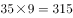。

故正确答案为A。

---

### 第 2 题　qid 1788602 · 数学运算

，，，，，(   )

- **A**. 

- **B**. 
 

- **C**. 

　✅
- **D**. 

**答案**：C

**官方解析**

分数数列前四项规律明显，分母部分作差可得：2，4，8，（16），是公比为2的等比数列，则第五项可转化为。依此，所求项分母应为。只有C项满足。

验证：将第五项转化为后，分子部分作差可得：2，4，6，8，（10），为连续偶数列，则所求项分子部分为，与选项吻合。

故正确答案为C。

---

### 第 3 题　qid 1788604 · 数学运算

4.2，5.2，8.4，17.8，44.22，(   )

- **A**. 125.62　✅
- **B**. 85.26
- **C**. 99.44
- **D**. 125.64

**答案**：A

**官方解析**

题干为小数数列，作差无规律，考虑机械划分。整数部分为：4，5，8，17，44，相邻两项作差得到新数列为1，3，9，27，是公比为3的等比数列，则新数列下一项为81，原数列整数部分为，排除B、C两项。小数部分为2，2，4，8，22，相邻两项作差得到新数列①为0，2，4，14，再次作差无规律，考虑对新数列①相邻两项作和，得到新数列②为2，6，18，是公比为3的等比数列，所以新数列②的下一项为54，新数列①的下一项为，因此小数部分的下一项为，排除D项。

故正确答案为A。

备注：本题也可以小数部分结合整数部分找规律，奇数项中，整数部分为小数部分的2倍，偶数项中整数部分为小数部分的2倍多1，故第六项应满足整数部分为小数部分的2倍多1，只有A项满足。

---

### 第 4 题　qid 1788606 · 数学运算

2，3，4，，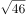，（    ）

- **A**. 
81

- **B**. 

- **C**. 

- **D**. 
9
　✅

**答案**：D

**官方解析**

将数列统一转化为根号形式，则原数列转化为：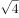，，，，，（  ）。根号内数字变化幅度较小且呈递增趋势，优先考虑作差。作差后可得：5，7，11，19，（  ）。二次作差得：2，4，8，（16），判定其是公比为2的等比数列，下一项为16。故所求项为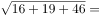。

故正确答案为D。

---

### 第 5 题　qid 1788608 · 数学运算

已知A、B两地相距600千米，甲乙两车同时从A、B两地相向而行，3小时相遇。若甲的速度是乙的1.5倍，则甲的速度是：

- **A**. 60千米/小时
- **B**. 80千米/小时
- **C**. 90千米/小时
- **D**. 120千米/小时　✅

**答案**：D

**官方解析**

方法一：设乙的速度为千米/小时，甲的速度为千米/小时，由题目可列方程：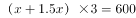，解得，则甲速度为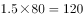千米/小时。

方法二：因甲、乙时间相同，且甲速度是乙的1.5倍，则甲的路程∶乙的路程，共5份。已知总路程为600千米，所以一份为120千米，甲的路程为360千米，所以甲的速度为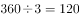千米/小时。

故正确答案为D。

---

### 第 6 题　qid 1788610 · 数学运算

某班有38名同学，一次数学测验共有两题，答对第一题的有26人，答对第二题的有24人，两题都答对的有17人，则两题都答错的人数是：

- **A**. 3
- **B**. 5　✅
- **C**. 6
- **D**. 7

**答案**：B

**官方解析**

根据两集合容斥原理公式：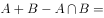 。则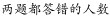，根据尾数法，两题都答错的人数尾数为5。 

故正确答案为B。 

---

### 第 7 题　qid 1788612 · 数学运算

甲、乙、丙三人共同完成一项工程，他们的工作效率之比是5：4：6。先由甲、乙两人合作6天，再由乙单独做9天，完成全部工程的，若剩下的工程由丙单独完成，则丙所需要的天数是：

- **A**. 9
- **B**. 11
- **C**. 10　✅
- **D**. 15

**答案**：C

**官方解析**

根据题目中的效率比，设甲、乙、丙的效率分别为5，4，6，由题干可得工程总量，剩余工作量，故丙所需时间天。 

故正确答案为C。 

---

### 第 8 题　qid 1788614 · 数学运算

有A、B、C三支试管，分别装有10克、20克、30克的水，现将某种盐溶液10克倒入A管均匀混合，并取出10克溶液倒入B管均匀混合，再从B管中取出10克溶液倒入C管。若这时C管中溶液的浓度为2.5%，则原盐溶液的浓度是：

- **A**. 60%　✅
- **B**. 55%
- **C**. 50%
- **D**. 45%

**答案**：A

**官方解析**

假设原盐溶液浓度为，将溶液倒入A试管中，混合之后的浓度为，同理经过B、C试管的混合之后溶液浓度为，解得。

故正确答案为A。

---

### 第 9 题　qid 1788616 · 数学运算

某志愿服务小组购买一批牛奶到一敬老院慰问老人，如果送给每位老人四盒牛奶，那么还剩28盒，如果送给每位老人5盒，那么最后一位老人又不足4盒，则该敬老院的老人人数至少是：

- **A**. 27
- **B**. 29
- **C**. 30　✅
- **D**. 33

**答案**：C

**官方解析**

假设该敬老院老人人数为 人，每人分配5盒时最后一位老人分得盒牛奶，则可得到，则，要使得值最小，应取最大值3， 则该敬老院至少有老人30人。 

故正确答案为C。

---

### 第 10 题　qid 1788618 · 数学运算

小王以每股10元的相同价格买入A和B两只股票共1000股，此后A股先跌再涨，B股先涨再跌，若此期间小王没有再买卖过这两只股票，则现在这1000股股票的市值是：

- **A**. 10250元
- **B**. 9975元　✅
- **C**. 10000元
- **D**. 9750元

**答案**：B

**官方解析**

设买入的A股票为股，则买入的B股票为股。A股票的市值元，B股票的市值元，则两只股票的市值元。

故正确答案为B。

---

### 第 11 题　qid 1788620 · 数学运算

小明、小红、小桃三人定期到某棋馆学围棋，小明每隔3天去一次，小红每隔4天去一次，小桃每隔5天去一次，若2016年2月10日三人恰好在棋馆相遇，则下次三人在棋馆相遇的日期是：

- **A**. 2016年4月8日
- **B**. 2016年4月11日
- **C**. 2016年4月9日
- **D**. 2016年4月10日　✅

**答案**：D

**官方解析**

小明每隔3天去一次，小红每隔4天去一次，小桃每隔5天去一次，则分别相当于每4、5、6天去一次，则三个人再过4、5、6的最小公倍数60天再次在棋馆相遇。2016年为闰年，二月份有29天，，则他们4月10日再次在棋馆相遇。

故正确答案为D。

---

### 第 12 题　qid 1788622 · 数学运算

下图是由三个边长分别为4、6、x的正方形所组成的图形，直线AB将它分成面积相等的两部分，则x的值是：

- **A**. 3或5
- **B**. 2或4　✅
- **C**. 1或3
- **D**. 1或6

**答案**：B

**官方解析**

如图所示，将原图补成一个长方形，则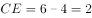，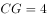，，。根据题意，，又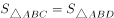，则两个补充的长方形面积相等，则有，整理得，解得。

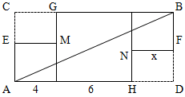

秒杀技巧：因直线AB将图形分成了面积相等的两个部分，故可将图形视为中心对称图形，此时两边两个小正方形一定全等，则，只有B项满足。

故正确答案为B。

---

### 第 13 题　qid 1788624 · 数学运算

一辆公交车从甲地开往乙地需经过三个红绿灯路口，在这三个路口遇到红灯的概率分别是0.4，0.5，0.6，则该车从甲地开往乙地遇到红灯的概率是：

- **A**. 0.12
- **B**. 0.50
- **C**. 0.88　✅
- **D**. 0.89

**答案**：C

**官方解析**

从甲地开往乙地遇到红灯的概率，即遇到至少一个红灯的概率。正面情况数较多，优先反面思考。遇到至少一个红灯的概率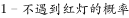。不遇到红灯的概率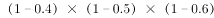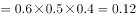，则公交车从甲地开往乙地遇到红灯的概率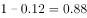。

故正确答案为C。

---

### 第 14 题　qid 1788626 · 数学运算

从1开始的自然数在正方形网格内按如图所示规律排列，第1个转弯数是2，第2个转弯数是3，第3个转弯数是5，第4个转弯数是7，第5个转弯数是10，···，则第22个转弯数是：

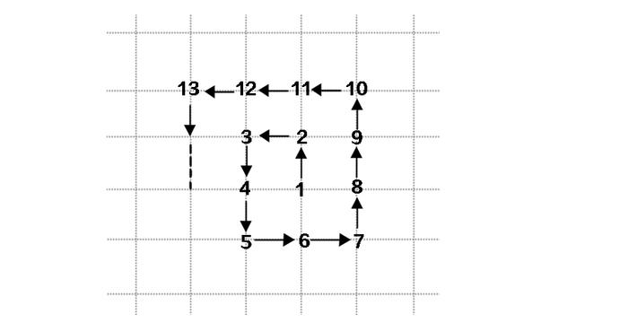

- **A**. 123
- **B**. 131
- **C**. 132
- **D**. 133　✅

**答案**：D

**官方解析**

根据题干规律，转弯的个数依次对应的转弯数分别为：

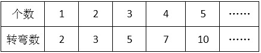

分析表格中的“转弯数”可以发现，，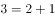，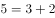，，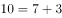，即第n个转弯数（进位取整），则第22个转弯数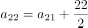。

再次分析，奇数项的转弯数又有规律：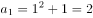，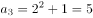，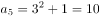，······。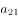为第11个奇数，则。

故第22个转弯数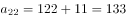。

故正确答案为D。

---

## 判断推理

### 第 1 题　qid 1788628 · 类比推理

上山：山上

- **A**. 上海：海上
- **B**. 回收：收回
- **C**. 工人：人工
- **D**. 下台：台下　✅

**答案**：D

**官方解析**

第一步：判断题干词语间逻辑关系。 
人“上山”后到达“山上”，二者是动作和地点的对应关系。 
第二步：判断选项词语间逻辑关系。 
A项：“上海”“海上”都是地点名称，二者不是动作和地点的对应关系，与题干逻辑关系不一致，排除；
B项：“回收”和“收回”为近义词，与题干逻辑关系不一致，排除；
C项：“工人”是个职业而非动作，“人工”不是地点，二者不是动作和地点的对应关系，与题干逻辑关系不一致，排除；
D项：人“下台”后到达“台下”，二者是动作和地点的对应关系，与题干逻辑关系一致，当选。 
故正确答案为D。

---

### 第 2 题　qid 1788630 · 类比推理

舞蹈：天鹅

- **A**. 歌唱：黄莺　✅
- **B**. 春燕：呢喃
- **C**. 读书：学生
- **D**. 采莲：江南

**答案**：A

**官方解析**

第一步：判断题干词语间逻辑关系。 
“舞蹈”是艺术表演，“天鹅”是动物，可以用“天鹅”的形态比喻“舞蹈”动作优雅，二者为比喻象征关系。 
第二步：判断选项词语间逻辑关系。 
A项：“歌唱”是艺术表演，“黄莺”是动物，可以用“黄莺”比喻“歌唱”声音婉转动听，二者是比喻象征关系，与题干逻辑关系一致，当选。 
B项：“呢喃”是拟声词，可直接用来形容“春燕”的鸣叫声，与题干逻辑关系不一致，排除。 
C项：“学生”与“读书”可以构成主谓宾关系，与题干逻辑关系不一致，排除。 
D项：“江南”是“采莲”这个动作可能发生的区域，二者是动作和地点的对应关系，与题干逻辑关系不一致，排除。 
故正确答案为A。

---

### 第 3 题　qid 1788632 · 类比推理

静如处子：动如脱兔

- **A**. 顺手牵羊：守株待兔
- **B**. 胆小如鼠：胆大包天　✅
- **C**. 杀鸡儆猴：惩前毖后
- **D**. 呆若木鸡：愚不可及

**答案**：B

**官方解析**

第一步：判断题干词语间逻辑关系。 
“静如处子”指像未出嫁的姑娘那样沉静，“动如脱兔”指像兔子一样迅速，二者为反义词关系。 
第二步：判断选项词语间逻辑关系。
A项：“顺手牵羊”指顺手把人家的羊牵走，原比喻趁势捉住敌人，现比喻趁机拿走别人的东西或不费力借机做某事。“守株待兔”指守着树桩等待兔子撞上树，比喻死守狭隘的经验，不知变通，也比喻心存侥幸，不通过主观努力而获得意外收获的心理。二者不是反义词关系，与题干逻辑关系不一致，排除。
B项：“胆小如鼠”指胆子非常小，“胆大包天”指胆子非常大，二者为反义词关系，与题干逻辑关系一致，当选。 
C项：“杀鸡儆猴”指杀鸡给猴子看，比喻用惩罚某个个体的办法来警告别的人。“惩前毖后”指批判以前所犯的错误，吸取教训，使以后谨慎些，不致再犯。二者不是反义词关系，与题干逻辑关系不一致，排除。 
D项：“呆若木鸡”形容一个人有些痴傻发愣的样子，或因恐惧或惊异而发愣的样子。“愚不可及”原指人为了逃避眼前不利局面而假装愚痴，以免祸患，为常人所不及，后用来形容人极端愚蠢。二者不是反义词关系，与题干逻辑关系不一致，排除。 
故正确答案为B。

---

### 第 4 题　qid 1788634 · 类比推理

冠军：亚军

- **A**. 热带：亚热带　✅
- **B**. 芝麻：亚麻
- **C**. 奥运会：亚运会
- **D**. 亚健康：健康

**答案**：A

**官方解析**

第一步：判断题干词语间逻辑关系。 
“冠军”和“亚军”是通过比赛所获得的不同头衔、名次，为并列关系，“亚军”相对“冠军”而言是次一等的奖项。 
第二步：判断选项词语间逻辑关系。 
A项：“热带”和“亚热带”都是气候地带，“亚热带”相对“热带”而言是次一等热的地带，与题干逻辑关系一致，当选。 
B项：“芝麻”和“亚麻”是两种不同的植物，二者为并列关系，但不存在等级上的差别，与题干逻辑关系不一致，排除。 
C项：“奥运会”和“亚运会”都是运动会，二者为并列关系，奥运会是全球范围的运动会，“亚运会”是亚洲范围内的运动会，二者仅在参赛范围上有区别，不存在等级上的区别，与题干逻辑关系不一致，排除。 
D项：“亚健康”和“健康”都是指身体状态，二者为并列关系，“亚健康”指次一等的“健康”状态，但两词前后顺序与题干相反，与题干逻辑关系不一致，排除。 
故正确答案为A。

---

### 第 5 题　qid 1788636 · 类比推理

茶杯：杯盖：杯底

- **A**. 树林：树梢：树根
- **B**. 文章：文件：标题
- **C**. 苹果：果核：果皮　✅
- **D**. 茶叶：春茶：秋茶

**答案**：C

**官方解析**

第一步：判断题干词语间逻辑关系。 
“杯盖”和“杯底”为并列关系，二者都是“茶杯”的组成部分，与“茶杯”为组成关系。 
第二步：判断选项词语间逻辑关系。 
A项：“树梢”和“树根”为并列关系，二者都是树木的一部分，不是“树林”的一部分，与题干逻辑关系不一致，排除。 
B项：“文件”和“标题”不是并列关系，“文件”不是“文章”的一部分，与题干逻辑关系不一致，排除。 
C项：“果核”和“果皮”为并列关系，二者都是“苹果”的一部分，与“苹果”为组成关系，与题干逻辑关系一致，当选。 
D项：“春茶”和“秋茶”为并列关系，二者都是“茶叶”，与“茶叶”为种属关系，与题干逻辑关系不一致，排除。 
故正确答案为C。

---

### 第 6 题　qid 1788638 · 类比推理

火车：轨道：行驶

- **A**. 电脑：键盘：上网
- **B**. 相机：镜头：拍照
- **C**. 飞机：机场：飞行
- **D**. 油轮：江海：航行　✅

**答案**：D

**官方解析**

第一步：判断题干词语间逻辑关系。
“火车”在“轨道”上“行驶”，三者为对应关系。
第二步：判断选项词语间逻辑关系。 
A项：用“键盘”在“电脑”上打字，而不是“上网”，与题干逻辑关系不一致，排除；
B项：“镜头”是“相机”的一部分，二者为组成关系，与题干逻辑关系不一致， 排除；
C项：“飞机”在空中“飞行”，“机场”是“飞机”停留和起飞的场地，与题干逻辑关系不一致，排除；
D项：“油轮”在“江海”中“航行”，三者为对应关系，与题干逻辑关系一致，当选。 
故正确答案为D。

---

### 第 7 题　qid 1788640 · 类比推理

驾驶  之于（    ）相当于  讲课  之于（    ）

- **A**. 司机——教师　✅
- **B**. 网络——教室
- **C**. 汽车——学生
- **D**. 麦克风——导航仪

**答案**：A

**官方解析**

逐一代入选项。
A项：“驾驶”是“司机”的工作内容，二者为职业和行为的对应关系；“讲课”是“教师”的工作内容，二者为职业和行为的对应关系。前后逻辑关系一致，当选；
B项：“驾驶”与“网络”没有明显的逻辑关系；“讲课”与“教室”为地点对应关系。前后逻辑关系不一致，排除；
C项：驾驶汽车，“驾驶”和“汽车”构成动宾关系；“讲课”与“学生”不能构成动宾关系，学生主要是听课学习。前后逻辑关系不一致，排除；
D项：“驾驶”与“麦克风”没有明显的逻辑关系；“讲课”与“导航仪”没有明显的逻辑关系。前后都没有明显的逻辑关系，排除。
故正确答案为A。

---

### 第 8 题　qid 1788642 · 类比推理

时间  之于（    ）相当于（    ）之于  密度

- **A**. 数量——质量
- **B**. 流水——磐石
- **C**. 速度——体积　✅
- **D**. 日晷——天平

**答案**：C

**官方解析**

逐一代入选项。
A项：“时间”与“数量”没有明显的逻辑关系；质量=体积×密度，“质量”与“密度”为对应关系。前后逻辑关系不一致，排除；
B项：“时间”与“流水”为象征关系，用“流水”形容“时间”过得快；“磐石”与“密度”没有逻辑关系，“磐石”形容的是坚硬，也就是硬度，不是“密度”。前后逻辑关系不一致，排除；
C项：路程=时间×速度，“时间”与“速度”为对应关系，同样路程条件下，“时间”越短，“速度”越快；质量=体积×密度，“体积”与“密度”为对应关系，同样质量条件下，“体积”越小，“密度”越大。前后逻辑关系一致，当选；
D项：“时间”与“日晷”为对应关系，“日晷”是利用日影测得时刻的一种计算“时间”的仪器；“天平”与“密度”没有关系，“天平”是衡量质量的仪器。前后逻辑关系不一致，排除。
故正确答案为C。

---

### 第 9 题　qid 1788644 · 逻辑判断

- **A**. 

- **B**. 

　✅
- **C**. 
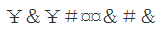

- **D**. 

**答案**：B

**官方解析**

分析题干符号间关系。
从相同符号的位置入手：位置1、3符号相同；位置2、8、9符号相同；位置4、7符号相同；位置5、6符号相同。
A、C、D三项中位置2与位置8、9符号不同，排除；只有B选项相同符号的位置和题干保持一致。
故正确答案为B。

---

### 第 10 题　qid 1788646 · 类比推理

悠悠嘻嘎嘻吱吱嘻

- **A**. 嘻嘻悠吱悠嘻吱嘎
- **B**. 悠悠嘻悠嘻嘎嘎吱
- **C**. 嘻嘻吱悠吱嘎嘎吱　✅
- **D**. 吱吱悠嘻悠嘻嘻嘎

**答案**：C

**官方解析**

第一步：分析题干汉字间关系。
从相同汉字的位置入手：位置1、2汉字相同，位置3、5、8汉字相同，位置6、7汉字相同。
第二步：判断选项汉字间关系。
A项：位置3、5、8汉字不相同，位置6、7汉字不相同，与题干不一致，排除。
B项：位置3、5、8汉字不相同，与题干不一致，排除。
C项：位置1、2汉字相同，位置3、5、8汉字相同，位置6、7汉字相同，与题干一致，当选。
D项：位置3、5、8汉字不相同，与题干不一致，排除。
故正确答案为C。

---

### 第 11 题　qid 1789584 · 图形推理

在题干中给出一套图形，其中有五个图，这五个图呈现一定的规律性。在给出的另一套图形中，有四个图，从中选出唯一的一项作为保持上边五个图规律性的第六个图。

- **A**. A　✅
- **B**. B
- **C**. C
- **D**. D

**答案**：A

**官方解析**

本题考查图形的实际意义，寻找最大共同点。题干一组图都是人在做不同的球类运动，都存在黑色小球。选项中只有A项具有黑色小球。
故正确答案为A。

---

### 第 12 题　qid 1789596 · 图形推理

在题干中给出一套图形，其中有五个图，这五个图呈现一定的规律性。在给出的另一套图形中，有四个图，从中选出唯一的一项作为保持上边五个图规律性的第六个图。

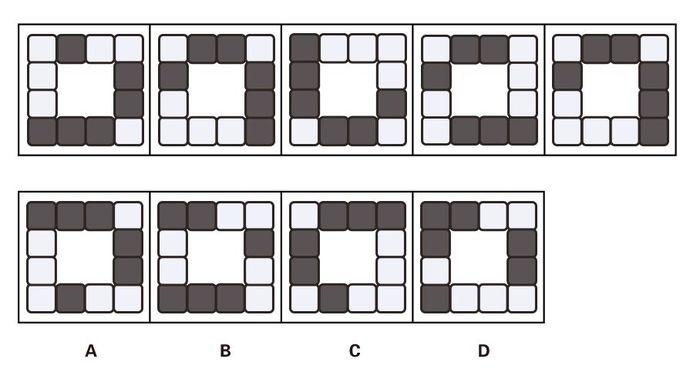

- **A**. A
- **B**. B
- **C**. C　✅
- **D**. D

**答案**：C

**官方解析**

图形元素组成相同，考虑位置规律，整体看无规律，考虑分开看，发现分别是1个黑块、2个黑块连在一起、3个黑块连在一起。继续观察发现，题干五幅图中，1个黑块2个黑块3个黑块是沿着顺时针的顺序进行排列的，选项中只有C项符合此规律。A、B、D三项中是沿着逆时针的顺序排列的。

 

故正确答案为C。

---

### 第 13 题　qid 1789598 · 图形推理

在题干中给出一套图形，其中有五个图，这五个图呈现一定的规律性。在给出的另一套图形中，有四个图，从中选出唯一的一项作为保持上边五个图规律性的第六个图。

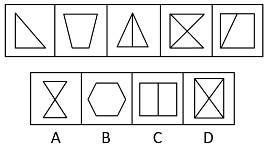

- **A**. A
- **B**. B　✅
- **C**. C
- **D**. D

**答案**：B

**官方解析**

元素组成不同且没有明显属性规律，考虑数量规律。题干出现多边形，优先数直线，直线数量分别为3、4、4、5、5，没有明显规律。再次观察发现线和线之间都有交点，考虑数交点，交点数量分别为3、4、4、5、5，由此发现每一幅图线数量和点数量均相同，只有B项符合规律。
故正确答案为B。

---

### 第 14 题　qid 1789602 · 图形推理

在题干中给出一套图形，其中有五个图，这五个图呈现一定的规律性。在给出的另一套图形中，有四个图，从中选出唯一的一项作为保持上边五个图规律性的第六个图。

- **A**. A
- **B**. B
- **C**. C　✅
- **D**. D

**答案**：C

**官方解析**

图形元素组成不同，且无明显属性规律，考虑数量规律。观察题干图形发现，图形均由1条曲线和2 条直线构成，直线组成了坐标轴，曲线形成了波峰和波谷。首先看波峰和波谷的数量，波峰数量依次为 3，3，3，3，2，波谷数量依次为 2，2，2，4，3，发现波峰、波谷的个数相差1（波峰、波谷相减结果的绝对值都是1），排除A、D两项。 再观察题干图形中波峰、波谷与坐标轴的位置关系，发现每个图形中最高的波峰均出现在竖轴的左侧，排除B项，只有C项符合。 
故正确答案为C。

---

### 第 15 题　qid 1789606 · 图形推理

选项的四个图形中，只有一个是由题干中的四个图形拼合（只能上、下、左、右平移）而成的，请把它找出来。

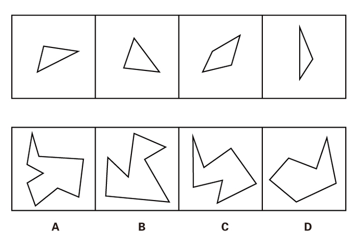

- **A**. A
- **B**. B
- **C**. C　✅
- **D**. D

**答案**：C

**官方解析**

本题考查的是平面拼合，可以采用平行等长相消的方法（找到相对面积较大的图形为基准图形，找到平行且等长的边进行拼合，拼合之后等长线条抵消）。如下图所示：

故正确答案为C。

---

### 第 16 题　qid 1789608 · 图形推理

选项的四个图形中，只有一个是由题干中的四个图形拼合（只能上、下、左、右平移）而成的，请把它找出来。

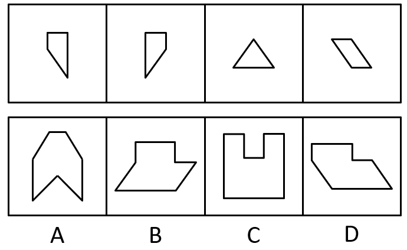

- **A**. A
- **B**. B
- **C**. C
- **D**. D　✅

**答案**：D

**官方解析**

本题考查的是平面拼合，可以采用平行等长相消的方法（找到相对面积较大的图形为基准图形，找到平行且等长的边进行拼合，拼合之后等长线条抵消）。如下图所示：

故正确答案为D。

---

### 第 17 题　qid 1789610 · 图形推理

右边四个图形中，只有一个是左侧图形的展开图，请把它找出来。

- **A**. A
- **B**. B　✅
- **C**. C
- **D**. D

**答案**：B

**官方解析**

将题干展开图标上序号，如下图所示，逐一进行分析。

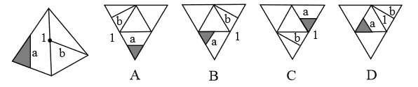

A项：选项中面a的黑三角形与面a面b的公共边（边1）相交，而题干中面a的黑三角形与边1不相交，选项展开图与题干不一致，排除；

B项：选项展开图与题干一致，当选；

C项：选项中面a的黑三角形与边1相交，而题干中面a的黑三角形与边1不相交，选项展开图与题干不一致，排除；

D项：选项面b中的线条与边1相交于边1的端点处，而题干面b中的线条与边1相交于边1的中点处，选项展开图与题干不一致，排除。

故正确答案为B。 

---

### 第 18 题　qid 1789614 · 图形推理

右边四个图形中，只有一个是左侧图形的展开图，请把它找出来。

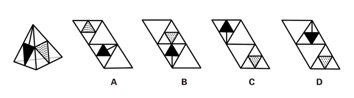

- **A**. A
- **B**. B
- **C**. C
- **D**. D　✅

**答案**：D

**官方解析**

本题考查四面体的空间重构。对平面展开图中的面进行标记，用排除法解题。

 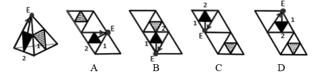

观察题干所给的立体图形，可以看到两个面，采用画边法，以黑色三角形所在面的顶点E为唯一点，顺时针画边。观察可知，立体图形中边1所对的面为灰色三角形所在面。 

A项：边1对应空白面，题干中边1对应灰三角所在的面，与题干不一致，排除。 

B项：边1对应空白面，题干中边1对应灰三角所在的面，与题干不一致，排除。 

C项：边1对应空白面，题干中边1对应灰三角所在的面，与题干不一致，排除。 

D项：与题干一致，当选。 

故正确答案为D。 

---

### 第 19 题　qid 1789616 · 图形推理

右边四个图形中，只有一个是左侧图形的展开图，请把它找出来。

- **A**. A
- **B**. B
- **C**. C
- **D**. D　✅

**答案**：D

**官方解析**

一线面中的线段与两条边有交点，如图1所示，与空白面交于边1。在立体图形与展开图中，以边1为唯一边顺时针画边。 

A项：边4对应空白面，题干中边4对应三线面，与题干不一致，排除。 

B项：边4对应空白面，题干中边4对应三线面，与题干不一致，排除。 

二线面中的线段与两条边有交点，如图2所示，与空白面交于边1。在立体图形与展开图中，以边1为唯一边顺时针画边。 

C项：边4对应空白面，题干中边4对应一线面，与题干不一致，排除。 

D项：与题干一致，当选。

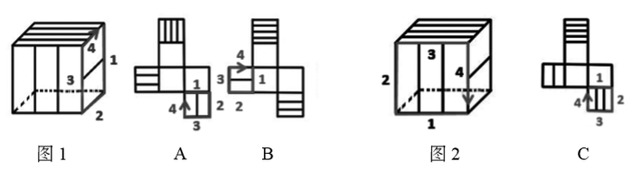

故正确答案为D。

---

### 第 20 题　qid 1789700 · 图形推理

右边四个图形中，只有一个是左侧图形的展开图，请把它找出来。

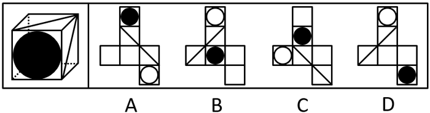

- **A**. A　✅
- **B**. B
- **C**. C
- **D**. D

**答案**：A

**官方解析**

由原图可知三个面的公共点与两条对角线并不相连。

B项：这三个面的公共点与两条对角线相连，与题干不一致，排除。

C项：面1与面2分别位于“Z”字形的两端，为相对面，不能同时出现，与题干不一致，排除。

D项：面1与面2分别位于“Z”字形的两端，为相对面，不能同时出现，与题干不一致，排除。

故正确答案为A。

---

### 第 21 题　qid 1789564 · 逻辑判断

与传统的“汗水型”经济不同，创新是一种主要依靠人类智慧的创造性劳动。由于投入多、风险大、周期长、见效慢，创新并非是每个人自觉的行动，它需要强大的动力支持。如果有人可以通过土地资源炒作暴富，或者可以借权钱交易腐败发财，那么人们创新就不会有真正的动力。
根据以上概述，可以得出以下哪项？

- **A**. 如果有人可以通过土地资源炒作暴富，就有人可以凭借权钱交易腐败发财
- **B**. 如果没有人可以凭借权钱交易腐败发财，人们创新就会有真正的动力
- **C**. 如果人们创新没有真正的动力，那么就有人可以通过土地资源炒作暴富
- **D**. ​如果人们创新具有真正的动力，那么没有人可以凭借权钱交易腐败发财　✅

**答案**：D

**官方解析**

第一步：翻译题干。

资源炒作暴富或权钱交易腐败发财创新有真正的动力。

第二步：逐一分析选项。

A项：土地资源炒作暴富权钱交易腐败发财，由土地资源炒作暴富无法推出权钱交易腐败发财，属于无中生有，排除；

B项：权钱交易腐败发财创新有真正的动力，是对题干或关系其中一个的否定，无法推出确定结论，排除；

C项：创新有真正的动力土地资源炒作暴富，是对题干逻辑关系的肯定箭头后，无法推出确定结论，排除；

D项：创新有真正的动力权钱交易腐败发财，根据逆否规则，题干可以翻译为：创新有真正的动力（土地资源炒作暴富或权钱交易腐败发财）。根据摩根定律等价为：创新有真正的动力土地资源炒作暴富且权钱交易腐败发财，可以推出，当选。

故正确答案为D。

---

### 第 22 题　qid 1789566 · 逻辑判断

某学院共有42名员工，他们或者做教学科研工作，或者做行政工作。在该学院中，教授都不担任行政工作，而30岁以下的年轻博士都在做行政工作，学院中有不少人是从海外招聘来的，他们都具有博士学位，李明是该学院最年轻的教授，他只有29岁。
根据以上陈述，可以得出以下哪项？

- **A**. 该学院从海外招聘来的博士大多是教授
- **B**. 该学院从海外招聘来的博士都不做行政工作
- **C**. 该学院教授大多是30岁以上的海外博士
- **D**. ​该学院有的教授不是从海外招聘来的　✅

**答案**：D

**官方解析**

第一步：翻译题干。

①科研或行政；

②教授行政；

③30岁以下博士行政；

④海外博士；

⑤李明29岁教授。

将②逆否和③可以递推出⑥：30岁以下且博士行政教授。

第二步：逐一分析选项。

A项：（大多）有的海外博士教授，④与“海外”“博士”相关，并未提及年龄问题，因此不能根据⑥推出海外博士是否为教授，排除。

B项：题干中和“海外”有关的只有④海外博士，没有说明年龄问题，无法推出海外招聘来的博士是否做行政工作，排除。

C项：题干中和“海外”有关的只有④海外博士，没有说明他们的年龄或职务，无法推出“教授大多是30岁以上的海外博士”，排除。

D项：已知⑤李明29岁教授，而③30岁以下博士行政，否后必否前可知，行政30岁以下或博士，29岁是对“30岁以下”的否定，或关系否一推一，可知“博士”成立，说明李明教授不是博士。④海外博士，李明不是博士，否后必否前，说明李明教授不是海外招聘的，因此“有的教授不是从海外招聘来的”表述正确，当选。

故正确答案为D。

---

### 第 23 题　qid 1789568 · 逻辑判断

经理：小张，这星期你怎么上班总是迟到？
小张：经理，不要只盯着我哟！小李有时比我到的还要晚！
以下哪项的对话方式与上述最为不同？（    ）

- **A**. 
丈夫：老婆，你有没有觉得最近你特别爱发火？

妻子：你什么意思！你有没有觉得最近你特别爱唠叨？

- **B**. 
乘客：师傅，开车时你怎么还打手机啊？

司机：你乱嚷什么！把我惹火了，一车人的安全你负责？

- **C**. 
老师：小明，你最近上课怎么老不注意听课？

学生：老师，我注意听讲了但是听不懂！听不懂我怎么听？
　✅
- **D**. 
顾客：老板，你们卖的馄饨里怎么有股怪味呢？

老板：你是何居心！你是哪家馄饨店派来的捣蛋鬼？

**答案**：C

**官方解析**

本题考查推理结构。
第一步：翻译题干推出方式。
①小张迟到，②小李有时到得更晚，把话题转移到别人身上。
第二步：逐一分析选项。
A项：①老婆爱发火，②老公更爱唠叨，把话题转移到老公身上，与题干推出方式一致，排除；
B项：①司机开车打手机，②乘客乱嚷嚷，把话题转移到乘客身上，与题干推出方式一致，排除；
C项：①小明不听讲，②小明听不懂，没有转移话题，话题还在小明身上，与题干推出方式不一致，当选；
D项：①馄饨有怪味，②别家派人来捣乱，把话题转移到顾客和别家馄饨店上，与题干推出方式一致，排除。
本题为选非题，故正确答案为C。

---

### 第 24 题　qid 1789570 · 逻辑判断

据报道，与国外相比，中国河流的抗生素浓度较高，测量浓度最高达7560纳克/升，平均也有303纳克/升，而意大利为9纳克/升，美国为120纳克/升，德国为20纳克/升。对此，有专家认为不足为虑。因为绝大多数抗生素对于致病细菌的最小抑制浓度都在10000纳克/升以上，目前中国江河和土壤中检测的抗生素浓度都小于各种抗生素对病菌的最小抑制浓度。
以下哪项是上述专家所作论断的假设？

- **A**. 抗生素浓度如果低于其对病菌的最小抑制浓度，病菌就不会产生抗药性　✅
- **B**. 很多病人就诊后，必须要使用更多的新一代抗生素才能控制感染和病情
- **C**. 细菌如果具有抗药性，因细菌感染而导致的疾病就很难用抗生素治愈
- **D**. 通过环境摄入的残留抗生素浓度高一些可能反而有利于维护人体健康

**答案**：A

**官方解析**

第一步：找出论点和论据。
论点：专家认为中国河流抗生素浓度较高的现象不足为虑。
论据：中国河流的总体抗生素浓度较高，但绝大多数抗生素对于致病细菌的最小抑制浓度都在10000纳克/升以上，目前中国江河和土壤中检测到的抗生素浓度小于各种抗生素对病菌的最小抑制浓度。
第二步：逐一分析选项。
A项：在抗生素浓度和病菌抑制浓度之间搭桥，说明抗生素浓度如果低于其对病菌的最小抑制浓度，病菌就不会产生抗药性，加强了论点，当选；
B项：很多病人就诊后的用药情况和题干无关，无关选项，无法加强，排除；
C项：细菌具有抗药性的危害和题干讨论的中国河流的抗生素浓度问题无关，无关选项，无法加强，排除；
D项：通过环境摄入的残留抗生素和题干讨论的问题无关，无关选项，无法加强，排除。
注：抗药性即多次接触抗生素后，对抗生素的敏感性下降甚至消失，致使抗生素疗效降低的现象。
故正确答案为A。

---

### 第 25 题　qid 1789572 · 逻辑判断

甲、乙、丙、丁、戊5支足球队进行小组单循环赛。比赛规定：每队胜一场得3分，平一场得1分，负一场得0分；积分前两名出线。比赛结束后发现，没有积分相同的球队，乙队胜了3场，另一场负于甲队。
根据以上信息，可得出以下哪项？

- **A**. 甲队一定出线
- **B**. 乙队一定出线　✅
- **C**. 丙队一定出线
- **D**. 戊队一定出线

**答案**：B

**官方解析**

第一步：分析题干条件。
（1）5支球队进行单循环赛，每队胜一场得3分，平一场得1分，负一场得0分；
（2）没有积分相同的球队；
（3）乙队胜了3场，另一场负于甲队。
第二步：根据题干条件进行推理。
共有5支球队，进行小组单循环赛，每个球队都要进行4场比赛，乙队胜了3场，只有一场负于甲队，那么丙、丁、戊3队每队已经分别输给乙队一场。题干最后一句说没有积分相同的球队，所以丙、丁、戊3队在剩下的比赛中不可能3场均取得胜利，因此积分必然低于乙队。由于前两名出线，那么乙队必然出线。
故正确答案为B。

---

### 第 26 题　qid 1789574 · 逻辑判断

俄国作家肖洛霍夫讲过一个故事：“一个兔子没命地狂奔，路遇狼。狼说，你跑那么急干嘛？兔子说，他们要逮住我，给我钉掌，狼说，他们要逮住钉掌的是骆驼，而不是你。兔子说，他们要是逮住我钉了掌，你看我还怎么证明自己不是骆驼。”
在这个故事中，兔子最担心的是：

- **A**. 只要是骆驼，都要被钉掌
- **B**. 即使不是骆驼，也可能会被钉掌
- **C**. 如果被钉了掌，就一定是骆驼　✅
- **D**. 如果没有被钉掌，就不会是骆驼

**答案**：C

**官方解析**

第一步：翻译题干。

兔子的话是反问句，意思是“如果他们要是逮住我钉了掌，我就不能证明自己不是骆驼”，双重否定表肯定，可以翻译为：钉掌骆驼。

第二步：逐一分析选项。

A项：翻译为“骆驼钉掌”，是对题干条件的肯后，肯后得不到确定性的结论，无法推出，排除；

B项：“即使······也······”不是逻辑关联词，一般不翻译，根据题干“钉掌骆驼”可知，不是骆驼就一定不会被钉掌，所以选项的“可能会被钉掌”无法推出，排除；

C项：翻译为“钉掌骆驼”，是对题干条件的肯前，肯前必肯后，可以推出，当选；

D项：翻译为“钉掌骆驼”，是对题干条件的否前，否前得不到确定性的结论，无法推出，排除。

故正确答案为C。

---

### 第 27 题　qid 1789576 · 逻辑判断

荷兰画家梵高在一家精神病院里创作了著名的绘画作品《星空》。这幅画作中的“漩涡”引起了人们长期的争论，许多心理学家认为，“漩涡”是梵高当时脆弱心理状态的延伸和表现。欧洲航天局近日发布了一幅根据“普朗克”卫星探测绘制的星空图，神奇的是，这幅图与《星空》有惊人的相似之处。有艺术家认为，自然的星空正是梵高创作的灵感来源。
以下各项如果为真，则除了哪项均能支持上述艺术家的观点？

- **A**. 梵高的创作灵感一般均有明显的现实来源
- **B**. 《星空》的创作年代要远早于卫星绘制星空图的年代　✅
- **C**. 梵高具有超越常人的视觉观察能力与想象能力
- **D**. 卫星绘制的星空图和《星空》的画面大体是一致的

**答案**：B

**官方解析**

第一步：找出论点和论据。
论点：自然的星空正是梵高创作的灵感来源。
论据：欧洲航天局近日发布了一幅根据“普朗克”卫星探测绘制的星空图，与《星空》有惊人的相似之处。
第二步：逐一分析选项。
A项：梵高的创作灵感一般均有明显的现实来源，说明《星空》的创作和现实有关系，补充论据支持论点，可以加强，排除；
B项：《星空》的创作年代要远早于卫星绘制星空图的年代，创作年代与梵高是否受到自然星空的影响无关，无关项，无法加强，当选；
C项：梵高具有超越常人的视觉观察能力与想象能力，《星空》的画面可能是他在现实中观测到的，补充论据支持论点，可以加强，排除；
D项：卫星绘制的星空图和《星空》的画面大体是一致的，说明梵高创作的《星空》与自然的星空相似，补充论据支持论点，可以加强，排除。
本题为选非题，故正确答案为B。

---

### 第 28 题　qid 1789578 · 逻辑判断

和谐小区里的居民具有乐于助人的良好风尚。在该小区里，凡帮助过老刘的人，老张都帮助过，一个人，只要有一人没帮助过他，老周就帮助过他。老王新搬来不久，还没有帮助过其他人。
根据以上陈述，可以得出以下哪项？

- **A**. 老周没有帮助过老张
- **B**. 老周没有帮助过老王
- **C**. 老刘与老张互相帮助过
- **D**. 老张和老周互相帮助过　✅

**答案**：D

**官方解析**

翻译题干。

①谁帮助过老刘老张就帮助过谁；

②只要有一人没帮助过他老周就帮助过他；

③老王没帮助过任何人。

③为确定已知的信息，从③入手分析。根据③可以推出老王没帮助过老刘、老张、老周，再根据②可以推出老周帮助过老张、老刘，老周帮助过老刘。根据①可以得出，老张帮助过老周。根据以上推理可知老周与老张互相帮助过。

故正确答案为D。

---

### 第 29 题　qid 1789580 · 逻辑判断

某单位工会成立职工业余兴趣活动小组，分台球、乒乓球、羽毛球、登山四个小组。已知该单位的甲、乙、丙、丁、戊、己、庚等7人每人各参加其中的两个小组，每个小组最少有其中的两人参加。最多有其中的5人参加。另外，还知道：
（1）丁与戊的参加情况完全相同；
（2）己与庚的参加情况完全相同；
（3）如果甲参加台球组，则丁也会参加台球组；
（4）只有乙和丙参加乒乓球组。
如果登山组只有己和庚参加，则可以得出以下哪项？

- **A**. 甲参加台球组，羽毛球组　✅
- **B**. 乙参加台球组，羽毛球组
- **C**. 己参加台球组，登山组
- **D**. 庚参加羽毛球组，登山组

**答案**：A

**官方解析**

题干信息较多，采用列表法解题。通过“只有乙和丙参加乒乓球组”与题干的限制条件“登山组只有己和庚参加”可知：

①甲、丁、戊没有参加乒乓球组和登山组；

②乙、丙参加了乒乓球组，但台球组或羽毛球组具体参加情况无法确定；

③己、庚参加了登山组，但台球组或羽毛球组具体参加情况无法确定。列表如下：

A项：由①与题干条件“每人各参加其中的两个小组”可知甲、丁、戊一定参加了羽毛球组和台球组，表述正确，当选；

B项：由②可知乙参加了乒乓球组，且每人参加两个小组，因此乙不能再同时参加台球组、羽毛球组，排除；

C项：由③可知己不确定是否参加台球组，排除；

D项：由“己与庚的参加情况完全相同”与条件③可知，庚不确定是否参加羽毛球组，排除。

故正确答案为A。

---

### 第 30 题　qid 1789582 · 逻辑判断

某单位工会成立职工业余兴趣活动小组，分台球、乒乓球、羽毛球、登山四个小组。已知该单位的甲、乙、丙、丁、戊、己、庚等7人每人各参加其中的两个小组，每个小组最少有其中的两人参加。最多有其中的5人参加。另外，还知道：
（1）丁与戊的参加情况完全相同；
（2）己与庚的参加情况完全相同；
（3）如果甲参加台球组，则丁也会参加台球组；
（4）只有乙和丙参加乒乓球组。
如果乙与丁都没有参加台球组，则可以得出以下哪项？

- **A**. 如果己参加台球组，则丙参加登山组
- **B**. 如果庚参加台球组，则戊参加台球组
- **C**. 如果甲参加羽毛球组，则庚参加登山组
- **D**. 如果乙参加羽毛球组，则己参加登山组　✅

**答案**：D

**官方解析**

题干信息较多，采用列表法解题。由已知条件“乙与丁都没有参加台球组”和“丁与戊的参加情况完全相同”，推出乙、丁、戊都没参加台球组；结合已知条件“如果甲参加台球组，则丁也会参加台球组”，推出甲没参加台球组，则甲、乙、丁、戊均未参加台球组。因为“每个小组最少有其中的两人参加”且“己与庚的参加情况完全相同”，则己、庚必然参加了台球组。而“只有乙和丙参加乒乓球组”，说明甲、丁、戊、己、庚均未参加乒乓球组，甲、丁、戊只能参加羽毛球组和登山组。

列表如下：

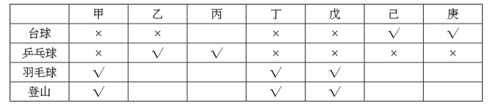

A项：丙不确定是否参加了登山组，排除；

B项：戊没有参加台球组，排除；

C项：庚不确定是否参加了登山组，排除；

D项：如果乙参加了羽毛球组，己也参加了羽毛球组，同时己和庚的情况完全相同，那么羽毛球组就有6个人，与题干矛盾，因此己不能参加羽毛球组，那么己只能参加登山组，符合题干，当选。

故正确答案为D。

---

### 第 31 题　qid 1789586 · 定义判断

逆势扩张：指企业在面临巨大压力和困难的情况下，进一步巩固和拓展市场，在竞争中抢占先机的经营行为。
下列不属于逆势扩张的是：

- **A**. 当大多数的国产品牌彩电市场份额纷纷下滑的时候，某电视厂家却连续推出了几款超级电视，市场占比高歌猛进，遥遥领先几大洋品牌
- **B**. 某汽车油箱销售公司是我国规模较大的自主品牌出口企业，近期已正式进入预先披露更新企业名单之列，向上市的目标又迈进了一步　✅
- **C**. 在人们普遍认为房地产调控政策将严重影响家居行业之际，某品牌家具高调宣布，最近在省城及周边地区又成功开设了多家专营店
- **D**. 国内零售行业近期表现欠佳，各销售企业纷纷收缩实体阵地，某民营企业今日却在省城新增了一家购物中心，另外两家不久也将开业

**答案**：B

**官方解析**

第一步：找出定义关键词。
“企业”、“面临巨大压力和困难”、“进一步巩固和拓展市场”、“在竞争中抢占先机”。
第二步：逐一分析选项。
A项：国产品牌彩电市场份额纷纷下滑符合“企业面临巨大压力和困难”，某电视厂家却连续推出几款超级电视，市场占比高歌猛进，是“进一步巩固和拓展市场”，最后遥遥领先几大洋品牌属于“在竞争中抢占先机”，符合定义，排除；
B项：某汽车油箱销售公司属于企业，近期已正式进入预先披露更新企业名单之列，向上市目标迈进一步，并没有体现题干中所提到的困难的环境，也没有体现出在竞争中抢占先机，不符合定义，当选；
C项：家居行业受到房地产调控政策影响，符合“企业面临巨大压力和困难”，某品牌家具在省城及周边地区成功开设了多家专营店体现了“进一步巩固和拓展市场”“在竞争中抢占先机”，符合定义，排除；
D项：零售行业表现不佳，符合“企业面临巨大压力和困难”，某民营企业新开购物中心属于定义中的“进一步巩固和拓展市场”“在竞争中抢占先机”，符合定义，排除。
本题为选非题，故正确答案为B。

---

### 第 32 题　qid 1789588 · 定义判断

公共信息资源：指社会公共领域中特定管理机构依法管理，面向全体社会公众提供信息服务的各种数据系统，具有公共性、广泛性、基础性和公益性等特点。
下列属于公共信息资源的是：

- **A**. 公安部门为了核查居民身份或侦破案件而研发的居民身份信息管理系统
- **B**. 银行为了审核贷款申请、开展各种金融业务而开发的客户个人诚信档案系统
- **C**. 国家气象部门建立的气象信息发布系统，如天气预报、地质灾害预警系统等　✅
- **D**. 高校教务部门为提高教学管理效率而开发的学生选课、评课、成绩管理系统

**答案**：C

**官方解析**

第一步：找出定义关键词。
“社会公共领域中特定管理机构”、“全体社会公众”、“提供信息服务”、“公共性、广泛性、基础性和公益性等”。
第二步：逐一分析选项。
A项：公安部门属于社会公共领域中的特定管理机构，居民身份信息管理系统是公安部门为了核查居民身份或者侦破案件而研发的，该系统中的信息为居民个人隐私，不能面向社会公众提供信息服务，不符合定义，排除；
B项：银行是金融服务机构，不属于社会公共领域中的特定管理机构，客户个人诚信档案系统属于客户隐私，不能面向社会公众提供信息服务，不符合定义，排除；
C项：国家气象部门属于社会公共领域中的特定管理机构，所建立的气象信息发布系统是面向全体社会公众提供天气预报等信息服务的数据系统，同时天气预报、地质灾害预警系统具有公共性、广泛性、基础性和公益性等特点，符合定义，当选；
D项：高校教务部门建立的学生选课、评课、成绩管理系统面向的服务对象并不是全体社会公众，客体不符合定义，排除。
故正确答案为C。

---

### 第 33 题　qid 1789590 · 定义判断

功利化阅读：指在有限的读书时间里，出于特殊目的，只选择阅读那些对提高自己的学习成绩、工作能力或求职更有帮助的书刊资料。
下列不属于功利化阅读的是（   ）

- **A**. 小李平时忙着上课和做家教，资格考试前三天，才一门心思复习考试课程
- **B**. 老李是业务骨干，一有时间就去资料室翻阅与自己工种相关的刊物
- **C**. 为了取得面试好成绩，小江特地去书店买了几本关于面试技巧方面的书
- **D**. 小林虽然工作繁忙，却一直迷恋科幻小说，只要有点空闲就会找一本来看　✅

**答案**：D

**官方解析**

第一步：找出定义关键词。
“有限的读书时间”、“出于特殊目的”、“只选择阅读那些对提高自己的学习成绩、工作能力或求职更有帮助的书刊资料”。
第二步：逐一分析选项。
A项：小李在资格考试前三天才挤出时间复习，符合“有限的读书时间”、出于考试的“特殊目的”，只复习考试课程符合定义中的“只选择对自己学习成绩更有帮助的书刊资料”，符合定义，排除。
B项：“一有时间”即工作之余抽时间读书体现了“有限的读书时间”，翻阅与自己工种相关的刊物体现了“只选择对提高自己工作能力更有帮助的书刊资料”，符合定义，排除。
C项：为了取得面试好成绩符合定义中的“出于特殊目的”，小江特地买了几本面试技巧方面的书属于定义中的“只选择对自己求职更有帮助的书刊资料”，符合定义，排除。
D项：工作之余阅读科幻小说不符合定义中的“只选择阅读那些对提高自己的学习成绩、工作能力或求职更有帮助的书刊资料”，而是个人爱好，不符合定义，当选。
本题为选非题，故正确答案为D。

---

### 第 34 题　qid 1789592 · 定义判断

定制旅游：指由游客和旅游服务商共同商定旅游方案，以充分满足旅游个性化要求的旅游方式。
下列不属于定制旅游的是：

- **A**. 某旅行社最近推出了欧洲十日游，沿海五市一周游等产品，提前订好酒店、机票、景点门票等，游客觉得价格合适就可以购买出行　✅
- **B**. 某在线旅游网站根据游客的个人预算、旅游目标等制订行程计划，与客户反复沟通，最终形成了客户满意的方案，并派出专人随行监管
- **C**. 某旅行社组织了一个美食旅游项目，应游客要求精心挑选几家有特色的美食店，预定好当地的个性民居，全程陪游，游客归来后都感到十分满意
- **D**. 小李同几个酷爱摄影的朋友策划了一个拍摄沙漠风光的活动计划，经过与旅行社多次讨价还价，终于成行，参与者过了一个很有意思的假期

**答案**：A

**官方解析**

第一步：找出定义关键词。 
“游客和旅游服务商共同商定旅游方案”、“充分满足旅游个性化要求”。 
第二步：逐一分析选项。 
A项：某旅行社推出的旅游产品中的旅游计划是提前制定的，不符合定义中的“游客和旅游服务商共同商定旅游方案”，不符合定义，当选。 
B项：某在线旅游网站根据游客的个人预算、旅行目标等制订详细的行程计划，与客户反复沟通体现了“游客和旅游服务商共同商定旅游方案”，最终形成客户满意的方案体现了“充分满足旅游个性化要求”，符合定义，排除。 
C项：某旅行社组织了美食旅游项目，应游客要求精心挑选了美食店，预定个性民居，体现了“游客和旅游服务商共同商定旅游方案”，游客感到十分满意，体现了“充分满足旅游个性化要求”，符合定义，排除。 
D项：拍摄沙漠风光的活动计划是小李和几个朋友共同策划的，同时也跟旅行社讨价还价，讨价还价即对价格、双方所提条件进行协商，符合“共同商定旅游方案”、“满足旅游个性化要求”，符合定义，排除。 
本题为选非题，故正确答案为A。

---

### 第 35 题　qid 1789594 · 定义判断

优势反应：指熟练程度极高、遇到某种刺激时不加思考就做出来的习惯性动作。
下列不属于优势反应的是：

- **A**. 中国人遇到多年未见的朋友时，一般都伸出右手去和对方握手
- **B**. 在街上听到有人喊自己名字，人们总会循着声音方向去寻找
- **C**. 人们无意之中伸进滚烫的开水，瞬间就会把手缩回　✅
- **D**. 小丽在家看小说时，一碰到不认识的字就会下意识地去查字典

**答案**：C

**官方解析**

第一步：找出定义关键词。
“熟练程度极高”、“遇到某种刺激”、“不加思考就做出来的习惯性动作”。
第二步：逐一分析选项。
A项：遇到了多年未见的朋友体现了“遇到某种刺激”，一般伸出右手和对方握手符合“熟练程度极高的动作”，符合定义，排除；
B项：听到有人喊自己名字体现了定义中的“遇到某种刺激”，总会循着声音方向去寻找属于“不加思考就做出来的习惯性动作”，符合定义，排除；
C项：被热水烫这件事没有多少机会让人去熟悉，也没人经常把手伸到热水里，不属于定义中的“熟练程度极高的习惯性动作”，不符合定义，当选；
D项：看到不认识的字下意识地去查字典，这正是因为遇到过这种情况且通过查字典解决了问题，符合定义中的“熟练程度极高、不加思考就做出来的习惯性动作”，符合定义，排除。
本题为选非题，故正确答案为C。

---

### 第 36 题　qid 1789600 · 定义判断

以房养老：指老人将自己的产权房抵押给金融机构，按约定条件定期领取养老金并获得相应服务的养老方式。老人去世后，金融机构可以按约定处置房产，偿付已经支出的各项费用。
下列属于以房养老的是：

- **A**. 最近，老李夫妇把卖房子的钱存进银行，一起住进了附近的老年公寓，每月的存款利息足够支付那里的各种费用
- **B**. 年逾古稀的张先生夫妇与银行签订了协议，生前，他们每月从银行领取13000元养老金；去世后，他们的产权房由银行处置　✅
- **C**. 赵某在一次车祸中落下重度残疾，他与典当行的远房侄子签了一份协议；由侄子照顾他的日常起居，自己名下的房子将来过户给侄子
- **D**. 老孙退休后卖掉市中心的大房子，买了一套二手小房住，每月的退休金加上卖房款利息，夫妻俩的日子过得很是自在惬意

**答案**：B

**官方解析**

第一步：找出定义关键词。
“将自己的产权房抵押给金融机构”、“定期领取养老金并获得相应服务的养老方式”、“老人去世后，金融机构可以按约定处置房产”。
第二步：逐一分析选项。
A项：老李夫妇是靠卖房子的存款利息支付服务费用，不符合关键词“将自己的产权房抵押给金融机构”，不符合定义，排除；
B项：张先生夫妇与银行签订的协议属于定义中的“将自己的产权房抵押给金融机构”，每月领取13000元养老金符合“按约定条件定期领取养老金”，去世后，他们的产权房由银行处置，符合“老人去世后，金融机构可以按约定处置房产”，符合定义，当选；
C项：虽然典当行属于金融机构，但赵某是与其远房侄子签订协议，不是与典当行签订协议，不符合“将自己的产权房抵押给金融机构”，不符合定义，排除；
D项：老孙卖掉大房买二手小房住并将卖房款存进银行获得利息，没有体现“将自己的产权房抵押给金融机构”，不符合定义，排除。
故正确答案为B。

---

### 第 37 题　qid 1789604 · 定义判断

自然淘汰育种法，指在良种筛选过程中，减少人为干预，尽量通过被筛选对象的自然生长确定所需良种的育种方法。
下列属于自然淘汰育种法的是：

- **A**. 
甲鱼养殖场为了选育出抗病力强的种鱼，在甲鱼接连死亡的情况下，不施加任何药物而任其发展，存活到最后的则作为种鱼
　✅
- **B**. 
锦鲤养殖户从幼鱼开始分拣最有经济价值的鱼苗，经过三次人工选鱼后，最终只有不到的幼鱼成了精品锦鲤

- **C**. 
石斛养殖户爬上人迹罕至的悬崖峭壁采集野生石斛，挑选其中的一部分作为种苗，精心培育出了多个新品种

- **D**. 
生长在同一片山坡上的某种植物，有的长势非常茂盛，有的则弱小枯黄，泾渭分明，这正是“物竞天择”的形象说明

**答案**：A

**官方解析**

第一步：找出定义关键词。
“筛选过程中”、“减少人为干预”、“自然生长”、“确定所需良种”。
第二步：逐一分析选项。
A项：甲鱼养殖场不施加任何药物，相当于没有进行人为干预，尽量通过自然生长筛选，存活到最后的抗病力强的种鱼就是所需的良种，符合定义，当选；
B项：经过三次人工选鱼，说明多次进行人为干预，不符合“减少人为干预”，不符合定义，排除；
C项：养殖户人工采集野生石斛，并从中挑选种苗，不符合定义中的“减少人为干预”和“通过······自然生长确定所需良种”，不符合定义，排除；
D项：山坡上的植物长势是自然状态，并不是良种筛选的过程，不符合定义，排除。
故正确答案为A。

---

### 第 38 题　qid 1789612 · 定义判断

隐形就业：指没有通过传统就业渠道获取固定职业，处于相关部门就业统计范围之外的工作状态。
下列不属于隐形就业的是：

- **A**. 颜某辞去工作后，一边带孩子一边经营一奶粉网店
- **B**. 某教授受多家培训学校之邀，在工作之余常去授课　✅
- **C**. 小陈离开公司后专门为电商店铺提供平台搭建和维护服务
- **D**. 酷爱写作的小王，大学毕业后成了一家报社的自由撰稿人

**答案**：B

**官方解析**

第一步：找出定义关键词。
“没有通过传统就业渠道获取固定职业”、“处于相关部门就业统计范围之外”。
第二步：逐一分析选项。
A项：开奶粉网店符合定义中的“没有通过传统就业渠道获取固定职业”，符合定义，排除；
B项：某教授的本职工作是在高校授课，不符合定义中的“没有通过传统就业渠道获取固定职业”，并且无论其是否兼职授课，该教授都会处于相关部门的就业统计范围之内，不符合定义，当选；
C项：小陈专门为电商店铺提供平台搭建和维护服务符合定义中的“没有通过传统就业渠道获取固定职业”，符合定义，排除；
D项：自由撰稿人是一种新型的自由职业，符合定义中的“没有通过传统就业渠道获取固定职业”，符合定义，排除。
本题为选非题，故正确答案为B。

---

### 第 39 题　qid 1789618 · 定义判断

众筹行为：指通过互联网发布筹款项目、实施方案、投资回报的资金募集方式，其构成要素包括有创造能力但缺乏资金的发起人，对筹资者的故事或回报感兴趣的支持者，在两者之间发挥连接作用的互联网平台等。
下列属于众筹行为的是：

- **A**. 地震发生后，市红十字会利用官网、微博、微信等多种网络平台及时发布灾情信息呼吁市民捐款捐物，帮助灾民重建家园，很快筹集到大量善款、赈灾物资
- **B**. 小涛大学毕业后回乡创业资金不足，他在网上发布了自己的创意，争取各界人士的资金援助，在网友们帮助下迅速度过了难关
- **C**. 某中学的一名学生患了白血病，学校在网上发布了募捐活动，两天之内就募捐了几万元，帖子转载后各地的善款越来越多
- **D**. 某青年艺术家为了举办个人画展，利用网络筹集了一大笔启动资金，画展圆满结束后，一一兑现了让出资人享受展品收藏待遇的承诺　✅

**答案**：D

**官方解析**

第一步：找出定义关键词。
“通过互联网发布筹款项目、实施方案、投资回报的资金募集方式”、“有创造能力但缺乏资金的发起人”、“对筹资者的故事或回报感兴趣的支持者”、“发挥连接作用的互联网平台”。
第二步：逐一分析选项。
A项：红十字会是社会救助团体，不符合定义中的“有创造能力但缺乏资金的发起人”，且呼吁市民捐款捐物是没有回报的，不符合定义，排除；
B项：小涛争取资金援助渡过难关之后，未体现是否给出资人回报，不明确，保留；
C项：为白血病学生进行募捐活动没有回报，不符合定义，排除；
D项：青年艺术家是“有创造能力但缺乏资金的发起人”，为了举办个人画展利用网络筹集启动资金，符合定义中的“通过互联网发布筹款项目”，画展结束后兑现了让出资人享受展品收藏待遇的承诺体现了“投资回报”，符合定义，保留。
对比B、D两项，D项明确说明给予出资人回报，对比择优，排除B项。
故正确答案为D。

---

### 第 40 题　qid 1789620 · 定义判断

路怒症：指机动车驾驶者在行车过程中因焦躁、愤怒情绪而产生的攻击性行为。
下列不属于路怒症的是：

- **A**. 在路口等红灯时，小张感觉汽车被碰了一下，下车一看，果然是后车刹车不及时追尾了。小张猛踢后车车轮，大声责怪其司机并且索要赔偿
- **B**. 妻子开车送老陈去上班，一辆小汽车突然窜到了面前，险些撞到他的车，老陈下车拦住那辆车，把司机痛斥一顿　✅
- **C**. 小李开了8年车，技术高超，每次被人超车，都忍不住狂踩油门飚上一把，直到反超并羞辱对方一番才罢休
- **D**. 小王正在赶路，旁边车子中飞出一个纸团突然落在他的挡风玻璃上，小王十分生气，他猛按喇叭，嘴里骂个不停

**答案**：B

**官方解析**

第一步：找出定义关键词。
“机动车驾驶者”、“行车过程中”、“因焦躁、愤怒情绪”、“产生的攻击性行为”。
第二步：逐一分析选项。
A项：小张因为后车刹车不及时追尾导致了愤怒情绪，猛踢后车车轮、大声责怪属于“攻击性行为”，符合定义，排除；
B项：妻子开车送老陈上班，妻子是机动车驾驶者，老陈是乘客，老陈不符合定义中的“机动车驾驶者”，不符合定义，当选；
C项：小李被人超车后飙车体现了“愤怒情绪”，反超并羞辱对方一番，符合定义中的“攻击性行为”，符合定义，排除；
D项：小王十分生气，猛按喇叭，嘴里骂个不停，符合定义中的“机动车驾驶者因愤怒情绪而产生的攻击性行为”，符合定义，排除。
本题为选非题，故正确答案为B。

---

### 第 41 题　qid 1789682 · 定义判断

跳板策略：指在特定条件下，为了避免因统一指挥造成的信息传递延误而跨越权力边界，直接进行横向沟通。
下列属于跳板策略的是：

- **A**. 小杰被毒蛇咬后，生命垂危，县医院立即向国家卫生部紧急求救，在卫生部直接干预下，仅两个小时就拿到了所需的特效药，小杰很快转危为安
- **B**. 一次学术会议上，某大学校长遇到了兄弟院校从未谋面的老同行，两人就一些学术热点问题进行了深入探讨，并商定联手申报国家级重大科研项目
- **C**. 一次追逃行动中，通讯系统突发故障，为防嫌疑人再次逃脱，第一小组的高组长未向指挥中心汇报就直接请求第二小组的邓组长火速救援，迅速抓获了犯罪嫌疑人　✅
- **D**. 由于路程较远，120救护车不能马上赶到车祸现场，巡警得知这一情况后主动用自己的摩托警车把伤员送进了附近的一家医院

**答案**：C

**官方解析**

第一步：找出定义关键词。 
“避免因统一指挥造成的信息传递延误”、“跨越权力边界”、“直接进行横向沟通”。 
第二步：逐一分析选项。 
A项：卫生部是医院的上级机构，县医院向国家卫生部紧急求救是纵向沟通，不符合定义中的“横向沟通”，不符合定义，排除。 
B项：他们之间是学术交流，未体现“避免因统一指挥造成的信息传递延误”，也未体现“跨越权力边界”，不符合定义，排除。 
C项：第一小组高组长没有向指挥中心汇报就直接请求救援，属于定义中的“为了避免因统一指挥造成的信息传递延误而跨越权力边界”，请求第二小组邓组长增援，二者级别相同，属于定义中的“直接进行横向沟通”，符合定义，当选。 
D项：巡警将伤员送到医院的行为未体现“避免因统一指挥造成的信息传递延误”，不符合定义，排除。 
故正确答案为C。

---

### 第 42 题　qid 1789684 · 定义判断

配套效应，指拥有某件物品后，为了追求完美效果而不断配置其他相应物品。
下列不属于配套效应的是：

- **A**. 邻居送给小李一只宠物狗，半月后，小李家阳台上狗笼子、狗饭碗、狗澡盆、狗毛衣等一应俱全，几乎变成了宠物用品展示中心
- **B**. 小孙穿着朋友赠送的一件质地精良做工考究的睡袍在书房走动，总觉得身边的一切都不协调，他很快换掉了书房中的地毯、桌椅、书柜
- **C**. 张女士在商场亲子装专柜为儿子买了一件T恤，儿子和丈夫都非常满意，于是又返回商场为丈夫和自己各买了一件　✅
- **D**. 赵总在古玩店淘到一件康熙宫廷玉器，特意为它配置了一个红木底座，还请诗友为它专门写了一首咏玉诗，放在大厅最醒目的地方

**答案**：C

**官方解析**

第一步：找到定义关键词。
关键词：目的为“追求完美效果”，方式为“拥有某件物品后不断配置其他相应物品”。
第二步：逐一分析选项。
A项：小李家买的狗笼子、狗饭碗等是发生在小李拥有一只宠物狗后，体现了“拥有某件物品后不断配置其他相应物品”，这些物品是为了追求与宠物狗配套的“完美效果”，符合定义，排除；
B项：小孙换掉地毯等物品是为了和质地精良的睡袍配套，体现了“拥有某件物品后不断配置其他相应物品”，为的是“追求完美的效果”，符合定义，排除；
C项：张女士前后购买的是T恤，并没有配置其他物品，不符合定义，当选；
D项：赵总为玉器配置了红木底座，请他人为玉器写诗等行为体现了“拥有某件物品后不断配置其他相应物品”，也是为了“追求完美效果”，符合定义，排除。
本题为选非题，故正确答案为C。

---

### 第 43 题　qid 1789686 · 定义判断

平行竞争：指各家厂商提供不同种类的产品以满足顾客同一需求而形成的竞争。
下列属于平行竞争的是：

- **A**. 冬天还没到，电器商场就摆满了各种取暖用品，空调、油汀、热电扇、电热毯应有尽有，价格有高有低，款式或经典或新潮　✅
- **B**. 为了扩大市场份额，某公司新近推出了一款平板电脑，硬盘容量有64G、128G和256G三种规格，供不同层次的消费者选择
- **C**. 只要走进地下商城，马上就会有一群人把你团团围住，卖服装的、卖玩具的、卖食品的······迫不及待地要把你控制在自己的摊位上
- **D**. 小李拿到了1万多元年终奖，准备好好奖励自己，现在正纠结于出国放假、买笔记本电脑还是黄金首饰

**答案**：A

**官方解析**

第一步：找出定义关键词。
“满足顾客同一需求”、“提供不同种类的产品”、“各家厂商”、“竞争”。
第二步：逐一分析选项。
A项：电器商场中有各种品牌，属于定义中的“各家厂商”，空调、油汀、热电扇等属于不同种类的产品，都是为满足顾客取暖的同一需求，体现出厂家间的竞争，符合定义，当选；
B项：平板电脑规格不同但都是同一家公司推出的，不存在厂家间的竞争，不符合定义，排除；
C项：服装、玩具、食品满足的是消费者的不同需求，不符合定义，排除；
D项：出国旅游、买电脑还是买黄金首饰满足的是小李的不同需求，不符合定义，排除。
故正确答案为A。

---

### 第 44 题　qid 1789688 · 定义判断

反向激励：指领导者对于工作表现欠佳的下属不仅不批评，反而适度肯定，以期取得与正向激励效果相当的评价策略。
下列属于反向激励的是：

- **A**. 小刘提前完成了经理布置的演讲稿，经理要他拿回去认真推敲，第二天小刘的修改稿得到了经理的高度肯定
- **B**. 小王因工作失误被顾客投诉，同事老王安慰她，并指导小王如何避免失误，小王经过一段时间的努力，业务能力越来越强，顾客十分满意
- **C**. 小李接受撰写市场调研报告的任务后，未能按时完成。经理称赞他调研认真，特意延期两天，小李的调研报告最终写得很出色　✅
- **D**. 在工会羽毛球循环赛中，夺冠热门小王首轮意外失手，单位领导没有批评他，反而鼓励他调整好心态，小王最终获得了冠军

**答案**：C

**官方解析**

第一步：找出定义关键词。
“领导者对工作表现欠佳的下属不批评，反而适度肯定”、“取得与正向激励效果相当的结果”。
第二步：逐一分析选项。
A项：小刘提前完成演讲稿，并不属于“工作表现欠佳”，不符合定义，排除；
B项：同事老王对小王的安慰与指导，不符合定义中的“领导者对于工作表现欠佳的下属适度肯定”，不符合定义，排除；
C项：小李没有按时完成任务，属于定义中的“工作表现欠佳”，领导没有批评反而称赞，体现了“适度肯定”，目的是让小李更好地完成任务，最后小李报告完成得很出色，体现了“取得与正向激励效果相当的结果”，符合定义，当选；
D项：小王在工会羽毛球循环赛中失手，不属于定义中的“工作表现欠佳”，不符合定义，排除。
故正确答案为C。

---

### 第 45 题　qid 1789690 · 定义判断

代际歧视：指上代人从自己的视角对新生代整体形象作出的描述性或定位性负面评价，这种评价往往不够客观、准确。
下列属于代际歧视的是：

- **A**. 年近花甲的钱总在职工大会上批评少数年轻的技术人员缺乏创新意识，不思进取，要求他们尽快改变目前的精神状态
- **B**. 80后曾被父辈斥为“叛逆的一代”，被指责为自我、叛逆和缺乏责任感，然而最近某七十高龄的作家却称80后是“懦弱的一代”，缺乏反叛精神　✅
- **C**. 孙大妈学会了使用微信，经常关注女儿的朋友圈，由于女儿经常分享一些充满正能量的短文，饭桌上她戏称女儿是“鸡汤党”
- **D**. 某啃老男整天游手好闲、惹是生非，父母恨铁不成钢欲将其赶出家门，他却指责父母这一代人自私自利，不顾子女

**答案**：B

**官方解析**

第一步：找出定义关键词。
“上代人对新生代整体形象作出的负面评价”、“不够客观、准确”。
第二步：逐一分析选项。
A项：钱总批评少数年轻技术人员不是对新生代整体形象的评价，不符合定义，排除。
B项：父辈指责“80后”为“叛逆的一代”，是从自己的视角对“80后”整体形象作出的负面评价，某七十高龄作家称“80后”为“懦弱的一代”，缺乏反叛精神，也是从自己的视角对“80后”整体形象作出的定位性负面评价，且两种评价相互冲突，体现了“不够客观、准确”，符合定义，当选。
C项：孙大妈对女儿的评价不是对新生代整体形象的评价，不符合定义，排除。
D项：啃老男对父母这一代人的评价是对上代人的评价，不是上一代对新生代的评价，不符合定义，排除。
故正确答案为B。

---

## 资料分析

### 材料 1

根据以下资料，回答116-120题

        2015年1-7月，我国机电产品出口额44359.4亿元，同比增长1.2%，占出口总额的57.2%，其中，电器及电子产品出口19373.1亿元，同比增长4.1%，机械设备出口12865.6亿元，同比下降6.6%，同期，服装出口5709.9亿元，同比下降6.4%，纺织品出口3825.5亿元，同比下降1.7%，鞋类出口1901.7亿元，同比下降1.9%，家具出口1883.7亿元，同比增长7.6%，塑料制品出口553.7万吨，出口额1293.3亿元，出口量同比增长2.9%，出口额同比增长2.3%；箱包及类似容器出口166.9万吨，出口额998.9亿元，出口量同比下降3.8%，出口额同比增长8.0%；玩具出口465.0亿元，同比增长11.0%。

        上述7大类劳动密集型出口额合计同比下降1.3%，此外，肥料出口1957.3万吨，出口额366.1亿元，出口量同比增长54.7%，出口额同比增长62.7%；钢材出口6213.2万吨，出口额2319.5亿元，出口量同比增长26.6%，出口额同比下降2.6%；汽车出口44.5万辆，出口额411.0亿元，出口量同比下降13.6%，出口额同比下降4.5%。

#### 第 1 题　qid 1789622 · 综合

2015年1-7月，我国出口总额为：

- **A**. 63534.0亿元
- **B**. 77551.4亿元　✅
- **C**. 82907.1亿元
- **D**. 95772.7亿元

**答案**：B

**官方解析**

根据“求2015年1-7月的出口总额”可判定此题为现期量的计算问题。定位材料第一段，2015年1-7月我国机电产品出口额44359.4亿元，占出口总额的57.2，故出口总额=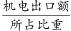=≈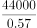，直除首位商7，只有B项满足。

故正确答案为B。

---

#### 第 2 题　qid 1789626 · 增长

2015年1-7月，我国下列商品出口额同比下降最多的是：

- **A**. 机械设备　✅
- **B**. 服装
- **C**. 钢材
- **D**. 汽车

**答案**：A

**官方解析**

因需求出四项商品出口额同比下降最多的一项，故可判定此题为增长量的比较问题。结合材料所给信息，可得四项商品在2015年1—7月的同比下降额分别为：

A项（机械设备）：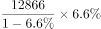亿元。

B项（服装）：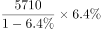亿元。

C项（钢材）：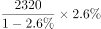亿元。

D项（汽车）：亿元。

四项中，分母部分近似相等，可根据分子部分的大小关系判定数值大小。很明显，A项12866×6.6数值最大，即下降最多。

故正确答案为A。

---

#### 第 3 题　qid 1789632 · 增长

2015年1-7月，我国下列出口商品平均价格同比上涨最多的是：

- **A**. 塑料制品
- **B**. 箱包及类似容器
- **C**. 肥料
- **D**. 汽车　✅

**答案**：D

**官方解析**

因需求出四项商品中平均价格同比上涨最多的一项，故可判定此题为平均数的增长量比较问题。可首先判断商品平均价格同比上升或下降，其次比较上升的数值。

定位材料代入平均数的增长量计算公式可得，A、B、C、D四项商品的平均价格同比增长量约为：

A项（塑料制品）：，为负值，排除。

B项（箱包及类似容器）：。

C项（肥料）：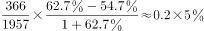。

D项（汽车）：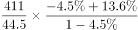。

对比可得，D项数值最大，平均价格同比上涨最多。

故正确答案为D。

---

#### 第 4 题　qid 1789636 · 综合

2015年1-7月，我国服装、纺织品、家具、鞋类、塑料制品、箱包及类似容器、玩具出口额合计为：

- **A**. 13576.1亿元
- **B**. 14087.2亿元
- **C**. 16078.0亿元　✅
- **D**. 18079.3亿元

**答案**：C

**官方解析**

根据求七项商品的出口额总和，可判定本题为现期量的和差计算问题。定位资料第一段，2015年1-7月我国服装、纺织品、鞋类、家具、塑料制品、箱包及类似容器、玩具出口额分别为5709.9亿元、3825.5亿元、1901.7亿元、1883.7亿元、1293.3亿元、998.9亿元、465.0亿元，故七项商品的出口总额=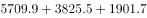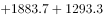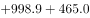（亿元），选项和条件精度相同，可以用尾数法，根据计算尾数得0，只有C项满足。

故正确答案为C。

---

#### 第 5 题　qid 1789638 · 综合

下列判断不正确的是：

- **A**. 
2014年1—7月，我国玩具出口额少于422亿元

- **B**. 
2015年1—7月，我国肥料出口量和出口额同比增长均超过50

- **C**. 
2015年1—7月，我国7大类劳动密集型产品中，多数出口额同比有所增长

- **D**. 
2015年1—7月，我国电器及电子产品和机械设备出口额同比平均增长1.3
　✅

**答案**：D

**官方解析**

通过材料逐一分析题目选项，找出判断不正确的一项。

A项：2015年1-7月玩具出口465.0亿元，同比增长11.0，则2014年1-7月出口额=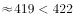，正确；

B项：2015年1-7月肥料出口量同比增长54.7，出口额同比增长62.7，均超过50，正确；

C项：在7大类劳动密集型产品中，出口额同比增长的有家具、塑料制品、箱包及类似容器和玩具4类，超过一半，正确；

D项：定位材料第一段可知，电器及电子产品出口额19373.1亿元，同比增长4.1；机械设备出口额12865.6亿元，同比下降6.6。根据混合增长率知识点，平均增长率应该介于4.1和6.6之间，且更接近4.1。而1.3与4.1的差大于1.3与6.6的差，故1.3实际上更偏向于6.6，错误。

本题为选非题，故正确答案为D。

---

### 材料 2

        为了解城镇棚户区改造情况，国家统计局社情民意调查中心2015年选取20个省（市、区）城镇棚户区的10100位居民进行了调查，调查显示，对于棚户区配套公共服务设施改造状况，受访棚户区居民中23.4%表示满意，40.2%表示基本满意，具体调查结果见下表：

#### 第 6 题　qid 1789642 · 比重

各类棚户区中，表示“满意”“基本满意”的受访居民之和占本类棚户区受访居民总数的比重最高的是：

- **A**. 国有林区（林场）　✅
- **B**. 国有垦区（农场）
- **C**. 国有工矿
- **D**. 城中村

**答案**：A

**官方解析**

由题目问“满意”“基本满意”的受访居民之和占本类棚户区受访居民总数的比重最高，判定本题为现期比重问题。各类棚户区评价均由“满意”“基本满意”“不满意”“不清楚”构成，则国有林区（林场）、国有垦区（农场）、国有工矿、城中村的“满意”“基本满意”的比重分别为、、、，则国有林区（林场）中表示“满意”“基本满意”的受访居民之和占本类棚户区受访居民总数的比重最高。 故正确答案为A。

---

#### 第 7 题　qid 1789644 · 综合

表示“满意”“基本满意”的受访棚户区居民数之和比表示“不满意”“不清楚”的居民数之和多：

- **A**. 2508
- **B**. 2617
- **C**. 2747　✅
- **D**. 3676

**答案**：C

**官方解析**

由题目已知受访居民总数为10100位居民及受访棚户区居民中表示“满意”，表示“基本满意”，判定本题为现期比重计算问题。“不满意”和“不清楚”共占比，则题目所求为。

故正确答案为C。

---

#### 第 8 题　qid 1789646 · 综合

各棚户区类型中，表示“满意”的受访居民数比表示“不满意”的多1倍及以上的棚户区类型有：

- **A**. 1个
- **B**. 2个　✅
- **C**. 3个
- **D**. 4个

**答案**：B

**官方解析**

由题目问“满意”的受访居民数与“不满意”之间的倍数关系，判定本题为现期倍数问题，定位表格，各棚户区类型中，国有垦区（农场）：＞2，其他：＞2，只有这两种类型的棚户区表示“满意”的受访居民数比表示“不满意”的多1倍及以上。

故正确答案为B。

---

#### 第 9 题　qid 1789648 · 比重

各类棚户区中，表示“不清楚”的受访居民数占本类棚户区受访居民总数的比重最多相差：

- **A**. 12.7个百分点
- **B**. 16.9个百分点
- **C**. 21.8个百分点　✅
- **D**. 29.4个百分点

**答案**：C

**官方解析**

由题目问各类型棚户区中，表示“不清楚”的受访居民数占本类棚户区受访居民总数的比重的差，且表格中已知各类型中其所占比重，故可判定本题为简单加减计算问题，由表格可知，比重最大的为29.4，最小的为7.6，故最多相差。

故正确答案为C。

---

#### 第 10 题　qid 1789650 · 综合

下列判断正确的是：

- **A**. 
各类棚户区受访居民给出的评价中，占比最少的均是“不满意”

- **B**. 
各类棚户区都有65以上的受访居民表示“满意”“基本满意”

- **C**. 
国有垦区（农场）与国有林区（林场）的受访棚户区居民之和少于5050人
　✅
- **D**. 
各类棚户区受访居民中，表示“基本满意”的人数均多于“不满意”“不清楚”的居民之和

**答案**：C

**官方解析**

A项：国有垦区（农场）和国有林区（林场）中，占比最少的是“不清楚”，并非“不满意”，错误； B项：国有工矿棚户区类型中，其表示“满意”“基本满意”受访居民所占比重为，错误； C项：线段法：国有垦区（农场）与国有林区（林场）的满意度至少为27.5，与总体满意度23.4的距离为4.1。而其他类型的满意度与23.4的距离均小于4.1。根据距离与量成反比可知，国有垦区（农场）满意度+国有林区（林场）满意度其他四种类型满意度之和，故二者之和，正确； D项：“其他”棚户区类型中，表示“基本满意”的占比36.5，表示“不满意”和“不清楚”共占比，前者小于后者，错误。 故正确答案为C。

---

### 材料 3

        2015年1—6月我国火力、水力发电量及其增长情况

#### 第 11 题　qid 1789652 · 综合

2015年1-6月我国火力发电量少于上年同期的月度个数是（    ）

- **A**. 3
- **B**. 4
- **C**. 5　✅
- **D**. 6

**答案**：C

**官方解析**

由题目问少于上年同期的月度个数，即增长率小于零的个数，可判定本题为直接找数问题，根据折线图可知，2月、3月、4月、5月、6月火力发电量同比增长率均小于零，即有5个月发电量同比减少。
故正确答案为C。

---

#### 第 12 题　qid 1789628 · 增长

2014年我国季度发电量同比增长最慢的是：

- **A**. 第一季度
- **B**. 第二季度
- **C**. 第三季度
- **D**. 第四季度　✅

**答案**：D

**官方解析**

由题目所问“同比增长最慢”是哪一季度，判定本题为一般增长率比较问题。定位表格材料，2014年4个季度的同比增长率分别为：、、、，故增长最慢的是第四季度。

故正确答案为D。

---

#### 第 13 题　qid 1789630 · 增长

2015年第二季度我国火力发电量比上年同期少：

- **A**. 232亿千瓦小时
- **B**. 240亿千瓦小时
- **C**. 340亿千瓦小时
- **D**. 365亿千瓦小时　✅

**答案**：D

**官方解析**

由题目所问“发电量比上年同期少”，可判定本题为增长量计算问题。因选项和条件精度相同，可采用尾数法。2014年第二季度我国火力发电量亿千瓦小时，由图中数据可得2015年第二季度火力发电量=亿千瓦小时。二者之差=，计算尾数得5，只有D项满足。

故正确答案为D。

---

#### 第 14 题　qid 1789634 · 增长

如果2015年7月-11月我国水力发电量的月平均增速与2015年2月-6月保持相同，则2015年11月我国水力发电量可达：

- **A**. 1390亿千瓦小时
- **B**. 1870亿千瓦小时　✅
- **C**. 2063亿千瓦小时
- **D**. 2239亿千瓦小时

**答案**：B

**官方解析**

由题干给定“月平均增速”求现期，判定为年均增长率问题，定位图中数据，假设2015年7月-11月的月均增长速度为，则565，则2015年11月我国水力发电量为=。

故正确答案为B。

---

#### 第 15 题　qid 1789640 · 综合

下列判断不正确的是：

- **A**. 
2014年有三个季度的水力发电量占发电总量的比重不超过

- **B**. 
2013年—2014年我国各季度火力发电量占发电总量的比重均超过

- **C**. 
2015年上半年我国水力与火力发电量各月同比增长的方向均相反
　✅
- **D**. 
2013年第二季度到2015年第二季度我国水力发电量有四个季度环比减少

**答案**：C

**官方解析**

A项：2014年一、二、三、四季度水力发电量占发电总量的比重分别为：、、、，即2014年一、二、四季度比重不超过，正确；

B项：2013年各个季度火力发电占总发电量的比重分别为：、、、；2014年各个季度火力发电占总发电量的比重分别为：、、、，即2013年-2014年我国各季度火力发电量占发电总，正确；

C项：2015年1月，水力和火力发电量同比增长率均大于零，二者方向相同，错误；

D项：由表格材料可知，2015年一、二季度水力发电量分别为：、，则2015年第一季度水力发电量小于2014年第四季度，共有四个季度环比减少，分别为2013年第四季度、2014年第一季度、2014年第四季度、2015年第一季度，正确。

本题为选非题，故正确答案为C。

---

### 材料 4

        2015年6月某市统计局对应届毕业生的抽样调查显示：有593名受访者打算创业，占28.6%。其中，大专生打算创业的比重比平均水平高7.0个百分点，本科生打算创业的比重比平均水平低3.9个百分点，31.4%的研究生打算创业，有34.5%的受访男生打算创业，比女生高11.2个百分点。

        在没有创业打算的受访者应届毕业生中，因缺乏启动资金，缺乏社会经验，缺乏创业方向等原因不打算创业的情况见图1，有创业打算的受访应届毕业生能承担的创业资金额度情况见图2.

#### 第 16 题　qid 1789662 · 综合

本次调查中，没有创业打算的毕业生人数约是有创业打算的毕业生人数的：

- **A**. 1.5倍
- **B**. 1.9倍
- **C**. 2.5倍　✅
- **D**. 2.8倍

**答案**：C

**官方解析**

根据题目求二者的倍数关系可判定此题为倍数计算问题。定位文字材料第一段，本次调查中，有创业打算的毕业生人数占比28.6，则没有创业打算的毕业生人数占比71.4，。

故正确答案为C。

---

#### 第 17 题　qid 1789664 · 比重

本次调查中，本科毕业生打算创业的比重比大专生低：

- **A**. 3.1个百分点
- **B**. 3.9个百分点
- **C**. 7.0个百分点
- **D**. 10.9个百分点　✅

**答案**：D

**官方解析**

根据题目求二者比重之差，可判定此题为简单加减计算问题。定位文字材料第一段可知，本科毕业生打算创业的比重为，大专生打算创业的比重为，故大专比重本科比重。

故正确答案为D。

---

#### 第 18 题　qid 1789666 · 综合

本次调查中，因缺乏启动资金而不打算创业的毕业生有：

- **A**. 349人
- **B**. 870人　✅
- **C**. 1219人
- **D**. 1480人

**答案**：B

**官方解析**

根据资料和题目，可以判定本题为现期比重问题。定位文字资料第一段，本次调查中，有创业打算的毕业生有593名，占28.6，故没有创业打算的毕业生人数。再由条形图可知，因缺乏启动资金而放弃创业的人数占到58.8，故因缺乏启动资金而放弃创业的人数，与B项最接近。

故正确答案为B。

---

#### 第 19 题　qid 1789668 · 综合

本次调查中有创业打算的毕业生能承担的创业资金额度低于10万元的人数是：

- **A**. 344　✅
- **B**. 268
- **C**. 249
- **D**. 193

**答案**：A

**官方解析**

根据材料和题目已知求相应人数，可判定此题为现期比重问题。定位饼形图可以得出，能承担创业资金额度低于10万元的毕业生所占比重。调查中共有593人打算创业。故所求人数人，与A项最接近。

故正确答案为A。

---

#### 第 20 题　qid 1789670 · 综合

关于本次调查，下列判断正确的是：

- **A**. 受访男生人数比女生少　✅
- **B**. 有25.3%的受访者因害怕风险而不打算创业
- **C**. 至少有168名受访者因更愿意在体面的单位上班而不打算创业
- **D**. 有超过1成的打算创业的毕业生能承担50万元以上的创业资金额度

**答案**：A

**官方解析**

通过材料逐一分析题目选项，找出说法正确的一项。

A项：定位文字材料第一段，的男生打算创业，比女生高11.2个百分点，则的女生打算创业。男女总共打算创业的人数占总人数的，根据线段法可知，距离之比等于人数的反比，故男女人数比例为5.3：5.9，女生人数大于男生人数，正确；

B项：根据柱形图可知，在没有创业打算的受访者中有25.3%是因为害怕风险，而并非所有的受访者，主体错误；

C项：更愿意在体面单位上班的人数，“至少”表述不当，错误；

D项：定位饼状图可知，能够承担50万以上创业资金的毕业生所占比重为，不足一成，错误。

故正确答案为A。

---
