# 2016年江苏省公务员录用考试《行测》题（B类）

> 省考 · 2016 年 · 6 个模块 · 共 133 题

- [政治理论](#%E6%94%BF%E6%B2%BB%E7%90%86%E8%AE%BA) · 2 题
- [常识判断](#%E5%B8%B8%E8%AF%86%E5%88%A4%E6%96%AD) · 18 题
- [言语理解与表达](#%E8%A8%80%E8%AF%AD%E7%90%86%E8%A7%A3%E4%B8%8E%E8%A1%A8%E8%BE%BE) · 35 题
- [数量关系](#%E6%95%B0%E9%87%8F%E5%85%B3%E7%B3%BB) · 13 题
- [判断推理](#%E5%88%A4%E6%96%AD%E6%8E%A8%E7%90%86) · 45 题
- [资料分析](#%E8%B5%84%E6%96%99%E5%88%86%E6%9E%90) · 20 题

---

## 政治理论

### 第 1 题　qid 1791506 · 新思想

2015年9月，国家主席习近平在参加庆祝联合国成立七十周年系列活动期间宣布，中国将设立“中国—联合国和平与发展基金”和“南南合作援助基金”，支持联合国工作，为世界和平与发展作出新的贡献。对此，下列理解正确的是：
①中国坚定不移地维护联合国宪章的宗旨和原则
②中国始终是维护世界和平与共同发展的坚定力量
③中国始终把维护发展中国家利益作为外交的首要任务
④中国积极推动构建以合作共赢为核心的新型国际关系

- **A**. ①③④
- **B**. ①②③
- **C**. ②③④
- **D**. ①②④　✅

**答案**：D

**官方解析**

D项符合题意：中国外交的首要任务是维护国家核心利益，故③说法错误。①②④说法正确。
故正确答案为D。

---

### 第 2 题　qid 1791698 · 马克思主义

习近平总书记在中央政治局第二十次集体学习时强调，要增强问题意识，坚持问题导向。这体现的哲学原理是：

- **A**. 矛盾具有普遍性和客观性，矛盾是事物发展的源泉和动力　✅
- **B**. 联系具有普遍性和多样性，任何事物都处在普遍联系之中
- **C**. 真理具有绝对性和相对性，绝对真理包含在相对真理之中
- **D**. 认识具有反复性和无限性，认识是一个辩证运动的过程

**答案**：A

**官方解析**

A项正确：中共中央政治局于2015年1月23日就辩证唯物主义基本原理和方法论进行第二十次集体学习。习近平总书记强调：“要学习掌握事物矛盾运动的基本原理，不断强化问题意识，积极面对和化解前进中遇到的矛盾。问题是事物矛盾的表现形式，我们强调增强问题意识、坚持问题导向，就是承认矛盾的普遍性、客观性，就是要善于把认识和化解矛盾作为打开工作局面的突破口。”增强问题意识，坚持问题导向，就是承认矛盾的普遍性和客观性；认识矛盾，进而解决矛盾，推动事物的发展，这说明矛盾是事物发展的源泉和动力。
B、C、D项错误：题干中的“问题意识”和“问题导向”没有体现选项中涉及的联系、真理和认识的基本原理。
故正确答案为A。

---

## 常识判断

### 第 1 题　qid 1789072 · 人文常识

党的十八届五中全会通过了《中共中央关于制定国民经济和社会发展第十三个五年规划的建议》，下列对于该建议的理解，正确的是：

- **A**. 《“十三五”规划建议》是针对“两个一百年”奋斗目标的收官阶段提出的战略蓝图
- **B**. 《“十三五”规划建议》充分论证了继续坚持我国改革开放的发展方式的必要性
- **C**. 《“十三五”规划建议》针对社会主要矛盾的新变化提出了经济社会发展的新方针
- **D**. 《“十三五”规划建议》提出并阐述了我国经济社会发展的“五大发展理念”　✅

**答案**：D

**官方解析**

A项错误：《“十三五”规划建议》是中华人民共和国国民经济和社会发展第十三个五年规划纲要，起止时间为2016年至2020年。“两个一百年”奋斗目标分别是指“在中国共产党成立一百年时全面建成小康社会”和“在新中国成立一百年时建成富强民主文明和谐的社会主义现代化国家”。“两个一百年”起止时间分别是1921年至2021年、1949年至2049年。因此，“十三五”规划是针对第一个一百年即建党一百年收官阶段提出的战略蓝图。
B项错误：《“十三五”规划建议》只是对今后的工作进行规划建议，并非一个完整论述改革开放理论的方案。
C项错误：2017年10月，习近平同志在十九大报告中明确指出，我国社会主要矛盾已经转化为人民日益增长的美好生活需要和不平衡不充分的发展之间的矛盾。而十八届五中全会召开于2015年，当时我国社会主要矛盾没有发生变化，依然是人民日益增长的物质文化需要和落后的社会生产之间的矛盾。
D项正确：《“十三五”规划建议》提出并阐述了“创新、协调、绿色、开放、共享”的五大发展理念。
故正确答案为D。
【备注】中共十五大报告首次提出“两个一百年”奋斗目标：到建党一百年时，使国民经济更加发展，各项制度更加完善；到世纪中叶建国一百年时，基本实现现代化，建成富强民主文明的社会主义国家。“到建党一百年时”“到世纪中叶建国一百年时”是一种较为模糊的表述，可理解为“100周年”（即2021年和2049年），也可理解为“第100年”（即2020年和2048年），因此，通常将这两个时间点取整近似为2020年和2050年。

---

### 第 2 题　qid 1791510 · 人文常识

下列选项中两组成语蕴含哲理相同的是：

- **A**. 流水不腐，户枢不蠹—人无远虑，必有近忧
- **B**. 奢靡之始，危亡之渐—千里之堤，溃于蚁穴　✅
- **C**. 生于忧患，死于安乐—城门失火，殃及池鱼
- **D**. 螳螂捕蝉，黄雀在后—尺有所短，寸有所长

**答案**：B

**官方解析**

A项错误：“流水不腐，户枢不蠹”意指常流的水不发臭，常转的门轴不遭虫蛀，比喻经常运动，生命力才能持久，才会有旺盛的活力，蕴含运动是物质的根本属性和存在方式的哲学道理。“人无远虑，必有近忧”意指没有长远的打算，那么近期的事情就会多有忧虑，蕴含矛盾是对立统一的哲理。两者蕴含的哲理不同；
B项正确：“奢靡之始，危亡之渐”意指奢靡行为开始之时，也是危亡渐渐来临之际。“千里之堤，溃于蚁穴”意指千里长的大堤，往往因蚂蚁洞穴而崩溃，比喻小事不慎将酿成大祸。两者都是说明量的积累可以引起质的变化，反映了量变与质变的关系；
C项错误：“生于忧患，死于安乐”意指忧愁患害使人谋求生存，而安逸享乐使人萎靡死亡，蕴含矛盾双方相互转化的哲学道理。“城门失火，殃及池鱼”指城门失火，大家都到护城河取水，水用完了，鱼也死了，蕴含物质世界存在着普遍联系的哲学道理。两者蕴含的哲理不同；
D项错误：“螳螂捕蝉，黄雀在后”指螳螂正要捉蝉，不知黄雀在它后面正要吃它，蕴含联系具有普遍性的哲学道理。“尺有所短，寸有所长”比喻人或事物各有其长处和短处，蕴含要坚持用两分法，全面地看问题，反对一点论的哲学道理。两者蕴含的哲理不同。
故正确答案为B。

---

### 第 3 题　qid 1791512 · 人文常识

大学毕业生王某打算在A市创业，在申办企业的过程中，恰逢该市大力推进行政审批制度改革，关于此次改革对王某申办企业的影响，下列说法错误的是：

- **A**. 王某无需提供企业注册场所的证明文件　✅
- **B**. 王某可通过线上系统随时了解申办进度
- **C**. 王某无需缴纳政府收费清单以外的费用
- **D**. 王某可领取“一照一码”的营业执照

**答案**：A

**官方解析**

A项说法错误：《中华人民共和国公司登记管理条例》第二十条第二款规定：“申请设立有限责任公司，应当向公司登记机关提交下列文件：······（八）公司住所证明；······”《中华人民共和国公司登记管理条例》第二十一条第二款规定：“申请设立股份有限公司，应当向公司登记机关提交下列文件：······（八）公司住所证明；······”因此，王某无论申办哪一种公司，都需要提供企业注册场所的证明文件。
B项说法正确：在部分试点城市已经开始推行网上企业登记，建立和实施电子执照制度。如上海市，已经可以通过该市工商行政管理局的官网进行企业登记状态查询。
C项说法正确：2015年9月财政部、国家发改委联合印发的《关于取消和暂停征收一批行政事业性收费有关问题的通知》中明确规定：“取消属于政府提供普遍公共服务或体现一般性管理职能，以及主要目的是养人、违背市场经济基本原则的不合理收费项目。坚决取缔各种乱收费。”
D项说法正确：从2015年10月1日起，我国全面实行“一照一码”登记模式，由工商、质检、税务3个部门分别核发不同证照，改为由工商部门核发加载统一社会信用代码的营业执照。因此，王某在大力推进行政审批制度改革的城市中可以领取“一照一码”的营业执照。
本题为选非题，故正确答案为A。

---

### 第 4 题　qid 1791702 · 人文常识

下列诗句与传统节日对应不正确的是：

- **A**. 总把新桃换旧符—清明节　✅
- **B**. 遍插茱萸少一人—重阳节
- **C**. 蓦然回首，那人却在灯火阑珊处—元宵节
- **D**. 两情若是久长时，又岂在朝朝暮暮—七夕节

**答案**：A

**官方解析**

A项对应错误：该句出自宋代诗人王安石的《元日》，描写的是春节除旧迎新的景象。贴桃符是春节的习俗，相当于现代的贴对联，从“新桃换旧符”可知该项对应错误；
B项对应正确：该句出自唐代诗人王维的《九月九日忆山东兄弟》，描写了诗人在重阳节对家乡亲人的思念；
C项对应正确：该句出自南宋诗人辛弃疾的《青玉案·元夕》，描写了元宵夜一对意中人在大街巧遇的场景；
D项对应正确：该句出自北宋诗人秦观的《鹊桥仙》。这是一首咏七夕的节序词，诗人借牛郎织女悲欢离合的故事来歌颂爱情。
本题为选非题，故正确答案为A。

---

### 第 5 题　qid 1789494 · 人文常识

《茉莉花》被称为“流传到海外的第一首中国民歌”。下列关于这首民歌的说法，正确的是：

- **A**. 《茉莉花》的发源地在浙江湖州一带
- **B**. 《茉莉花》由波斯商人通过丝绸之路传到欧洲
- **C**. 最早记录《茉莉花》的西方著作是《马可波罗游记》
- **D**. 《茉莉花》因歌剧《图兰朵》将其作为主题音乐而风靡欧洲　✅

**答案**：D

**官方解析**

A项错误：《茉莉花》是中国民歌，源于南京六合民间传唱百年的《鲜花调》。
B项错误：1792年，英国国王乔治三世派遣自己的表兄马戛尔尼勋爵率使团以贺乾隆皇帝八十大寿为名出使中国，约翰·巴罗担任使团的财务总管。马戛尔尼使团访华是欧洲第一次向中国派遣正式的外交使节，虽然由于中英双方世界观不同，未能达成外交上的共识，却无意中促成了《茉莉花》与欧洲的一段奇缘。马戛尔尼使团在华逗留期间，约翰·巴罗和使团的一位德籍翻译惠特纳都深深喜欢上了中国民歌《茉莉花》，并把它带回了欧洲。
C项错误：《茉莉花》这首中国民歌在1768年（清乾隆三十三年）法国哲学家卢梭的《音乐辞典》中就有收录，而曲谱则是在英国人约翰·巴罗于1804年出版的《中国旅行记》一书中被记录下来。
D项正确：意大利作曲家吉亚卡摩·普契尼将《茉莉花》重新编曲成女声合唱，作为音乐主题用于1926年首演的歌剧《图兰朵》，《茉莉花》由此风靡欧洲。
故正确答案为D。

---

### 第 6 题　qid 1791518 · 经济常识

供给侧结构性改革强调从供给、生产端入手，不断解放生产力，提升效率，促进经济发展。下列属于供给侧结构性改革举措的是：

- **A**. 物价部门开展市场检查
- **B**. 商业银行上浮贷款利率
- **C**. 发改委取消部分行政审批事项　✅
- **D**. 工商部门限制明星代言广告

**答案**：C

**官方解析**

A项错误：物价部门开展市场调查属于部门常规业务，与供给侧结构性改革措施无关；

B项错误：商业银行上浮贷款利率，会使货币供给减少，从而使投资、消费减少，最终造成总产出的减少，与供给侧结构性改革措施无关；
C项正确：2015年的中央经济工作会议强调，要推进供给侧结构性改革。习近平总书记用“加减乘除”四则运算通俗易懂地布局了供给侧结构性改革这一新举措。其中，供给侧结构性改革的“减法”，主要指政府简政放权、企业清除过剩产能、社会为企业降低成本，给企业松绑，给企业减负，激发微观经济活力。发改委取消部分行政审批事项，属于政府简政放权，给企业松绑，符合供给侧结构性改革中“减法”的要求；
D项错误：工商部门限制明星代言广告是对广告制度的规范，保护消费者的权益，与供给侧结构性改革措施无关。
解答本题时，观察选项，抓住题干“从供给、生产端入手”“解放生产力”这两个关键词，可知A、B、D三项与供给、生产端、生产力没有直接关系，排除。
故正确答案为C。

---

### 第 7 题　qid 1789498 · 人文常识

预测表明，2020年到2050年，我国60岁以上人口占比将从19.3上升到38.6，对此，下列说法错误的是：

- **A**. 我国家庭人口的抚养比系数逐渐减小　✅
- **B**. 我国的老龄化社会问题将日益严峻
- **C**. 推动我国经济发展的人口红利逐步消退
- **D**. 养老保险的支付压力将会越来越大

**答案**：A

**官方解析**

A项说法错误：抚养比是指在人口当中非劳动年龄人口数与劳动年龄人口数之比，当60岁以上人口增多即非劳动年龄人口增多时，抚养比系数会上升。
B项说法正确：60岁以上人口比例大幅增加，说明老龄化的问题将会日益严峻。
C项说法正确：人口红利是指一个国家的劳动年龄人口占总人口比重较大，抚养率比较低，为经济发展创造了有利的人口条件，整个国家的经济呈高储蓄、高投资和高增长的局面。当60岁以上人口比例增大时，劳动年龄人口占总人口比例减小，人口红利逐渐减少。
D项说法正确：老年人口增多，养老保险支付会随之增加，故压力会加大。
本题为选非题，故正确答案为A。

---

### 第 8 题　qid 1791522 · 人文常识

吸收社会资本参与公共产品和服务的供给，有助于实现资源的最佳配置，下列属于社会资本参与公共产品和服务供给的是：

- **A**. 民营企业对其厂区内的道路进行绿化
- **B**. 民政部门与企业共同出资建设养老院　✅
- **C**. 某企业出资冠名体育赛事
- **D**. 外贸企业经批准开办大型超市

**答案**：B

**官方解析**

B项正确：养老院属于公共产品和服务，民政部门与企业共同出资建设养老院是社会资本参与公共产品和服务供给。 
A、C、D三项错误：企业的投资对象都不属于公共产品和服务。 
故正确答案为B。

---

### 第 9 题　qid 1791710 · 人文常识

中国军民在抗日战争中取得过一系列重大胜利。下列不属于在抗日战争时期取得的大胜利的是：

- **A**. 平型关大捷
- **B**. 昆仑关大捷
- **C**. 镇南关大捷　✅
- **D**. 台儿庄大捷

**答案**：C

**官方解析**

本题考查毛中特。抗日战争从1931年“九一八”事变开始，至1945年8月15日结束，共历时十四年。
A项不符合题意：平型关大捷发生在1937年9月25日，共产党领导的八路军115师在平型关中歼灭日军精锐部队1000余人，缴获步枪1000余支、山炮1门，摧毁车辆100余辆，打破了日军不可战胜的神话，取得了一次伟大的胜利。因此属于抗日战争时期；
B项不符合题意：昆仑关大捷发生时间为1939年12月18日至1940年1月11日，主要地点位于广西昆仑关，是抗日战争的大型战役之一。因此属于抗日战争时期；
C项符合题意：镇南关大捷发生在1885年，是中法战争中，清军在广西镇南关（今友谊关）大败法国侵略者取得重大胜利的著名战役。因此不属于抗日战争时期；
D项不符合题意：台儿庄大捷发生在1938年，国民政府第五战区司令长官李宗仁指挥中国军队，在台儿庄消灭日军一万余人，是抗战以来取得的最大胜利。因此属于抗日战争时期。
本题为选非题，故正确答案为C。

---

### 第 10 题　qid 1791526 · 人文常识

明成祖登基后曾派郑和出使西洋以加强同海外的联系。下列关于郑和下西洋的说法，正确的是：

- **A**. 郑和七次下西洋发生于16世纪初
- **B**. 郑和下西洋最远曾抵达地中海
- **C**. 郑和下西洋比哥伦布发现美洲大陆晚
- **D**. 郑和的航线从西太平洋穿越印度洋　✅

**答案**：D

**官方解析**

A项错误：郑和于1405年至1433年间七次下西洋，也就是说郑和七次下西洋发生于十五世纪初；
B项错误：郑和七次下西洋，最远到达的是非洲东海岸和红海沿岸，而不是地中海；
C项错误：哥伦布于十五世纪末发现美洲大陆，晚于郑和下西洋；
D项正确：郑和船队从江苏省刘家港出发，穿越马六甲海峡，横渡印度洋，最远到达非洲东海岸和红海沿岸，航线从西太平洋穿越印度洋到非洲东海岸。
故正确答案为D。

---

### 第 11 题　qid 1791528 · 人文常识

二维码目前广泛应用于汉字、数学、图片、指纹、声音等信息的存储。下列关于二维码的说法，正确的是：

- **A**. 中国目前还没有制定二维码的国家标准
- **B**. “扫一扫”加关注是目前二维码应用的重要方式　✅
- **C**. 二维码在穿孔、污损引起局部损坏时就无法得到视读
- **D**. 扫描二维码可能感染病毒是因为二维码本身携带病毒

**答案**：B

**官方解析**

A项错误：随着互联网技术发展诞生的二维码，相关部门历来重视对其的管理和规范，比如2015年实施的《中华人民共和国国家标准（GB/T31022—2014）：名片二维码通用技术规范》等一系列关于二维码的国标，促进了二维码在我国的发展；

B项正确：“扫一扫”加关注就是通过二维码实现共享生活信息和进行社交娱乐，这正是当下二维码的主要应用方式；

C项错误：二维码容错能力强，具有纠错功能。这使得二维码在因穿孔、污损等引起局部损坏时，照样可以正确得到识读，损毁面积达50仍可恢复信息；

D项错误：二维码本身不会携带病毒，但很多病毒软件可以利用二维码下载。

故正确答案为B。

---

### 第 12 题　qid 1791530 · 人文常识

下列对日常生活现象的解释正确的是：

- **A**. 自行车在夏天暴晒后容易爆胎，是因为橡胶在高温下变软了
- **B**. 夏天从冰箱里取出的冷饮瓶表面有小水滴，是因为冰箱湿度大于室内
- **C**. 赤脚站在瓷砖上比站在棉被上凉爽，是因为瓷砖的温度比棉被的温度低
- **D**. 热水瓶的内胆镀银是为了减少热辐射　✅

**答案**：D

**官方解析**

A项错误：自行车在夏天暴晒后容易爆胎，是因为暴晒后车胎中的气体会膨胀，造成胎内气压增大，从而使车胎膨胀，当车胎的膨胀程度超过自身能承受的最大限度时，就会出现爆胎。这属于热胀冷缩原理。
B项错误：冷饮瓶表面的小水滴是由于气体液化形成的。冷饮瓶从冰箱取出时，瓶身的温度低于周围环境的温度，当瓶身周围空气中的水蒸气遇到较冷的瓶身时，就会液化成小水滴，附着在瓶身上。
C项错误：赤脚站在瓷砖上比站在棉被上凉爽，是因为瓷砖的导热性好，赤脚站上去后身体的热量很快被传导开，而棉被的导热性较差，会将热量聚集在触摸点周围。
D项正确：热水瓶的内胆镀银可以形成银镜反应，通过镜面反射把保温瓶内部的热辐射反射回保温瓶内部，就不会出现对外的热辐射，从而减少热量散失，达到保温效果。
故正确答案为D。

---

### 第 13 题　qid 1789512 · 地理国情

我国山脉众多，给自然与人文地理环境带来深刻影响。对此，下列说法错误的是：

- **A**. 秦岭山脉是我国南北方的重要地理分界线
- **B**. 祁连山脉融雪是河西走廊绿洲农业的主要水源
- **C**. 喜马拉雅山脉是世界上最年轻最高大的山脉
- **D**. 阴山山脉是传统上重要的农业与林业的分界　✅

**答案**：D

**官方解析**

本题考查中国山脉的有关知识。

A项正确：由于秦岭南北面的温度、气候、地形均呈现差异性变化，因而秦岭与淮河一线成了我国地理上最重要的分界线。它主要是我国南方地区与北方地区的分界线、一月份等温线、800mm等降水线量线、暖温带与亚热带分界线、湿润区与半湿润区分界线、温带季风气候与亚热带季风气候分界线等。

B项正确：河西走廊位于祁连山以东，是西北著名的粮仓，这里农业生产的水源主要是来自祁连山的冰雪融水。

C项正确：喜马拉雅山在青藏高原南侧，是一条近似东西向的弧形山系，也是世界上最高大的山系，分布在我国西藏以及巴基斯坦、印度、尼泊尔和不丹等国境内。它还是世界上最年轻的山脉，形成至今不过6500万年，并且是在60万年前才变成最高的山脉，由于亚欧板块和印度板块的挤压运动，现在仍在不断升高。

D项错误：以“东北松嫩平原西部—辽河中上游—阴山山脉—鄂尔多斯高原东缘（除河套平原）—祁连山山脉（除河西走廊）—青藏高原东缘”为分界线，此分界线以东为农区，种植水稻、小麦、玉米、大豆、高粱等作物；以西为牧区，放养牛、羊、马等牲畜。故阴山不是传统意义上的农业和林业的分界线，而是农业和牧业的分界线。

本题为选非题，故正确答案为D。

---

### 第 14 题　qid 1791534 · 科技常识

下列自然保护区与主要保护的珍稀动物对应错误的是：

- **A**. 卧龙自然保护区----大熊猫
- **B**. 扎龙自然保护区----丹顶鹤
- **C**. 喀纳斯自然保护区----金丝猴　✅
- **D**. 可可西里自然保护区----藏羚羊

**答案**：C

**官方解析**

本题考查我国珍稀动物的相关知识。
A项对应正确：卧龙自然保护区位于四川盆地西缘，主要保护西南高山林区自然生态系统及大熊猫等珍稀动物；
B项对应正确：扎龙自然保护区位于黑龙江省齐齐哈尔市东南30千米处，主要保护对象为丹顶鹤等珍禽及湿地生态系统。该保护区具有中国北方同纬度地区中保留最完整、最原始、最开阔的湿地生态系统；
C项对应错误：喀纳斯自然保护区位于新疆北部阿尔泰山南坡，主要保护对象为寒温带针阔叶混交林生态系统和自然景观。保护区内珍稀动物有盘羊、雪豹、北山羊、紫貂、石貂、马鹿、兔狲、扫雪、猞猁、雪兔、黑琴鸡、花尾棒鸡、丹顶鹤、黑颈鹤等。但该保护区内没有金丝猴，金丝猴在我国一般分布于西南山区；
D项对应正确：可可西里自然保护区位于青海省玉树藏族自治州西部，主要保护对象为藏羚羊、野牦牛、藏野驴、藏原羚等珍稀野生动物、植物及其栖息环境。
本题为选非题，故正确答案为C。

---

### 第 15 题　qid 1791536 · 法律常识

大学生李某的一项发明获省级科技竞赛一等奖，为防止该项发明被他人非法利用，李某依法申请了专利。李某的做法所体现的法的作用是：

- **A**. 指引作用　✅
- **B**. 评价作用
- **C**. 教育作用
- **D**. 强制作用

**答案**：A

**官方解析**

本题考查法理学的有关知识。 
A项正确：指引作用是指法（主要是法律规范）对本人行为起到导向、引领的作用。指引作用的对象是每个人自己的行为。李某自己申请专利的行为体现了法的指引作用。 
B项错误：评价作用是指法作为一种社会规范，具有判断、衡量他人行为是否合法或有效的作用。题干中未体现评价作用。 
C项错误：教育作用是指通过法的实施，法律规范对人们今后的行为发生直接或间接的诱导影响。题干中未体现教育作用。 
D项错误：强制作用是指法对违法犯罪者的行为具有制裁、惩罚作用。法的强制作用是法的其他作用的保证。题干中未体现强制作用。 
故正确答案为A。

---

### 第 16 题　qid 1791538 · 法律常识

某公司非法占用公路堆放建筑材料，交通主管部门对其做出了行政处罚。在作出行政处罚前，交通主管部门向该公司告知了作出处罚决定的事实、理由及依据，并告知了该公司依法享有的权利。这一做法体现的行政法基本原则是：

- **A**. 合法行政原则
- **B**. 合理行政原则
- **C**. 高效便民原则
- **D**. 程序正当原则　✅

**答案**：D

**官方解析**

本题考查行政法的有关知识。行政法的基本原则是指导和规范行政法的立法、执法以及指导规范行政行为的实施和行政争议处理的基础性法则。
A项错误：合法行政原则体现在行政机关必须遵守现行有效的法律，行政机关应当依照法律授权活动。本题没有体现这一原则；
B项错误：合理行政原则指行政决定应当具有一个有正常理智的普通人所能达到的合理与适当。本题没有体现这一原则；
C项错误：高效便民原则要求行政机关要积极履行法定职责，禁止不作为或者不完全作为；遵守法定时限，禁止超越法定时限或者不合理延迟；不得增加当事人的程序负担。本题没有体现这一原则；
D项正确：程序正当原则要求执法人员要严格遵循法定程序，依法保障行政管理相对人、利害关系人的知情权、参与权和救济权。本题中交通主管部门严格依照法律程序对违法公司进行行政处罚，并告知其依法享有的权利，完全符合程序正当原则的要求。
故正确答案为D。

---

### 第 17 题　qid 2033850 · 法律常识

赵某以要债为名驾车堵住甲公司的大门，致使甲公司车辆无法进出。辖区派出所派警察孙某前去处理。孙某以扰乱企业生产秩序为由，对赵某处以150元的罚款。下列关于该行政处罚的说法，错误的是：

- **A**. 该处罚决定书可以当场制作并交付赵某
- **B**. 该处罚决定书应按预定格式书写
- **C**. 该处罚决定书必须加盖公安机关印章　✅
- **D**. 该处罚决定书必须报公安机关备案

**答案**：C

**官方解析**

本题考查行政法。
A项，题目中给出的行为是扰乱企业生产秩序，这一行为实际上是违反治安管理的行为，根据《治安管理处罚法》规定：“违反治安管理行为事实清楚，证据确凿，处警告或者二百元以下罚款的，可以当场作出治安管理处罚决定。”因此，对孙某处以150元罚款可以适用简易程序，A项是正确的。
B、D项，根据《治安管理处罚法》第一百零一条规定：“当场作出治安管理处罚决定的，人民警察应当向违反治安管理行为人出示工作证件，并填写处罚决定书。处罚决定书应当当场交付被处罚人；有被侵害人的，并将决定书副本抄送被侵害人。 前款规定的处罚决定书，应当载明被处罚人的姓名、违法行为、处罚依据、罚款数额、时间、地点以及公安机关名称，并由经办的人民警察签名或者盖章。”当场作出治安管理处罚决定的，经办的人民警察应当在二十四小时内报所属公安机关备案。所以B项处罚决定书应按预定格式书写及D项处罚决定书必须报公安机关备案的表述正确。
C项，依据《治安管理处罚法》第一百零一条第二款规定：“由经办的人民警察签名或者盖章就可以，不是必须加盖公安机关印章。当场作出治安管理处罚决定的，经办的人民警察应当在二十四小时内报所属公安机关备案即可。”C项表述错误。
本题为选非题，故正确答案为C。

---

### 第 18 题　qid 2033854 · 法律常识

“周瑜打黄盖，一个愿打一个愿挨。”这句俗语所蕴含的法律含义是：

- **A**. 原告自认
- **B**. 受害人同意　✅
- **C**. 过错相抵
- **D**. 契约自由

**答案**：B

**官方解析**

本题考查法理学的有关知识。 
A项错误，原告自认是指当事人一方承认对方当事人所主张的不利于自己的事实主张，这可以作为真实明确地表明其真实性的陈述。题干中“周瑜打黄盖”并未体现原告自认原则。 
B项正确，受害人同意原则是侵权行为法的一项重要法律原则。从语义上讲，是指某人对某一事实或者行为作出的允许或者承认。在侵权法上，受害人同意就是受害人对其受害作出的允许或者承认。从“周瑜打黄盖”的案例进行分析，侵害人周瑜造成了实质上的违法行为，但由于黄盖对周瑜的侵害行为表示认可，根据受害人同意原则，在侵权法上侵害人周瑜可以获得免责。 
C项错误，过错相抵是指在加害人依法应承担损害赔偿责任的前提下，如果受害人对于损害事实的发生或扩大也有过错，则可以减轻加害人的赔偿责任。题干中“周瑜打黄盖”并未体现过错相抵原则。 
D项错误，契约自由是指个人之间的契约关系，应根据契约当事人的自由意思决定，而不得受到其他任何个人和组织的干涉。题干中“周瑜打黄盖”并未体现契约自由原则。 
故正确答案为B。

---

## 言语理解与表达

### 材料 1

        为什么要保护自然？近年来，关于这个问题的争论实质上已经变成两种观点之间的辩论。一些人认为保护自然是为了自然本身，即自然的内在价值；另一些人则认为保护自然是为了人类自己的利益，即自然的使用价值。

        自然使用价值的支持者们认为，为了自然本身的利益而保护自然并不能有效阻止物种灭绝的趋势，自然环境的保护应当通过和产业界合作产生最大化的影响，通过让人们更直接地关注和生活紧密相关的问题（如食品和饮用水安全），进一步扩大人们对环境保护的支持；而内在价值的倡导者们则坚持认为，关于保护自然的伦理道德论据已然充分，和产业界合作会将环境保护工作出卖给环境问题的始作俑者，况且社会已经非常关注环境保护了。

        然而不幸的是，这一开始时尚且理性温和的辩论，逐渐沦为一场在大学、研究机构、环境保护组织、学术会议以至媒体中广泛进行的尖酸刻薄的个人论战。这种情况可能正在扼杀有益的言论，影响环境保护的经费筹措并使实践层面的环保工作停滞不前。

        另一个问题的存在有一点______，那就是争论由少数人主导，且几乎都是男性。这说明了一个更大的问题：性别和文化的偏见，也在不断阻碍实际的环境保护工作开展。

        环境保护时常会遇到现实世界中各种观点和价值观的挑战。为了处理和吸纳这些观点和价值观，在描绘这一领域的未来时，需要科学家和实践工作者更加包容的态度以及处理环境问题更加包容的方式。

        在对环境保护科学家的科研训练中，应当更加精确地描绘这一领域悠久的、全球的共同参与的历史进程，介绍数个世纪以来人类珍爱自然、保护自然的各种方法，还需要在会议和媒体上举办更多的论坛，让人们听到不同性别不同文化背景的环境领域科学家和实践工作者的声音。同时，要动员环保科学家及实践工作者积极参与媒体的相关活动，使得媒体报道能够反映全面真实的观点，而非少数人的一家之言。环境保护组织和科学家们应当欢迎所有的环境保护执行机构，无论是公司、政府机关，还是宗教组织、有志之士，无论有功利目的的，还是纯公益的，和衷共济地将环境保护工作推向前进。要让环境保护不再停留在学理辩论的层面，而是对工作的有效性进行精细严格的评价，从而建立起能容纳不同性别、不同文化、不同年龄和不同价值观的环境保护规范。

#### 第 1 题　qid 1789552 · 逻辑填空

填入文章中画横线处最恰当的一项是：

- **A**. 迫在眉睫
- **B**. 雪上加霜　✅
- **C**. 不寒而栗
- **D**. 不吐不快

**答案**：B

**官方解析**

结合上文“然而不幸的是”及“影响环境保护的经费筹措并使实践层面的环保工作停滞不前”可知，上文在讲争论已经使环境问题的解决遇到了难题，且由“另一个问题的存在”及后文的“这说明了一个更大的问题”可知，空格处需要填上一个表示“难上加难”之意的成语。B项“雪上加霜”常用来比喻接连遭受灾难，损害愈加严重，符合语境，当选。A项“迫在眉睫”比喻事情十分紧急，已到眼前，材料中并没有紧迫性的表述，排除；C项“不寒而栗”形容非常恐惧，与语境不符，排除；D项“不吐不快”指不说出来就不痛快，主语通常为人，不符合语境，排除。
故正确答案为B。

---

#### 第 2 题　qid 1789554 · 片段阅读

下列选项中，不属于两派论争的问题是：

- **A**. 是否可以为筹措经费而与产业界合作
- **B**. 是否应当进一步强化环保的社会关注
- **C**. 是否需要进一步加大吸引民众的力度
- **D**. 是否为改变性别失衡而鼓励女性参与　✅

**答案**：D

**官方解析**

定位原文第二段。A、B、C三项：A项对应“自然环境的保护应当通过和产业界合作产生最大化的影响”；B项对应“况且社会已经非常关注环境保护了”；C项对应“进一步扩大人们对环境保护的支持”，故A、B、C三项均属于两派争论的问题，排除。
D项：对应第四段尾句“性别和文化的偏见，也在不断阻碍实际的环境保护工作开展”，并非双方辩论的内容，而是作者发现的问题，符合题意，当选。
本题为选非题，故正确答案为D。

---

#### 第 3 题　qid 1789556 · 片段阅读

文中所说“将环境保护工作出卖给环境问题的始作俑者”，“始作俑者”指的是：

- **A**. 制造了环境问题的企业　✅
- **B**. 各类自然环境的破坏者
- **C**. 自然使用价值的支持者
- **D**. 自然内在价值的倡导者

**答案**：A

**官方解析**

定位原文第二段。“始作俑者”泛指恶劣风气的制造者，具有消极色彩。结合上下文可知，“始作俑者”是指使环境遭到破坏的主体，对应“产业界”。A项中“企业”可与“产业界”形成对应，锁定A项。
B项：“自然环境的破坏者”范围扩大，排除。
C、D两项：对应文段中的“两派”，即“自然使用价值的支持者和内在价值的倡导者”，两派都是积极努力解决环境问题的，不具有消极色彩，故C、D两项均排除。
故正确答案为A。

---

#### 第 4 题　qid 1789558 · 片段阅读

文中作者担心的最主要问题是：

- **A**. 倡导者们在保护环境的目的问题上存在分歧
- **B**. 观点不同者之间的论争逐渐演变为相互攻击
- **C**. 不正确的沟通方式影响实际的环境保护工作　✅
- **D**. 恶性争论可能会导致有创建性的观点被遮蔽

**答案**：C

**官方解析**

定位原文第三段。转折关联词“然而”强调辩论沦为尖酸刻薄的个人论战，结论词“这种情况”总结前文，强调变味的辩论会扼杀有益言论，影响环境保护的经费筹措并使实践层面的环保工作停滞不前，即作者担心的最主要问题为“个人论战会对实际的环保工作产生不好的影响”，对应C项。
A项“在保护环境的目的问题上存在分歧”、B项“论争逐渐演变为相互攻击”均属于“这种情况”之前的内容，并非作者所担心的最主要的问题，均排除；D项对应文段“可能正在扼杀有益的言论”，而文段重点为无论是否扼杀，都会影响实际工作，排除。
故正确答案为C。

---

#### 第 5 题　qid 1789560 · 片段阅读

下列选项中，属于作者为改变自然保护现状提出的对策是：

- **A**. 对公众进行科普宣传，让其了解环境保护的历史和各种工作方法
- **B**. 通过会议和媒体举办论坛，倾听来自不同性别不同文化的公众声音
- **C**. 环境保护组织和科学家们应接纳所有环境保护执行机构共同参与　✅
- **D**. ​鼓励专业人士进一步展开论争，以提升环境保护认识的理论高度

**答案**：C

**官方解析**

A项：根据“在对环境保护科学家的科研训练中，应当更加精确地描绘这一领域悠久的、全球的共同参与的历史进程，介绍数个世纪以来人类珍爱自然、保护自然的各种方法”可知，介绍保护环境的历史和方法的对象是科学家，而不是公众，排除；
B项：根据“在会议和媒体上举办更多的论坛，让人们听到不同性别不同文化背景的环境领域科学家和实践工作者的声音”可知，文段强调的是科学家和实践工作者的声音，而非“公众声音”，偷换概念，排除；
C项：根据“环境保护组织和科学家们应当欢迎所有的环境保护执行机构，无论是公司、政府机关······和衷共济地将环境保护工作推向前进”可知，该项表述正确，当选；
D项：根据“要让环境保护不再停留在学理辩论的层面”可知，作者不希望环保停留在学理辩论层面，选项中“鼓励专业人士进一步展开论争”与作者观点相悖，排除。
故正确答案为C。

---

#### 第 6 题　qid 2033870 · 片段阅读

文化产业学作为一门新兴学科，源于对文化作为产品的生产和流通领域进行研究，是从产业角度对文化进行研究。这正是原有文化创意学科群中相对薄弱甚至相对忽略的，是仅依靠原有知识体系和研究方法难以支撑的研究领域，也是当下文化产业发展急需学科建设支撑的领域。
这段话意在说明：

- **A**. 建立文化产业学学科的必要性　✅
- **B**. 文化产业学将取代文化创意学
- **C**. 原有文化创意学科群相对薄弱
- **D**. 发展文化产业学所面临的困难

**答案**：A

**官方解析**

文段开篇介绍文化产业学科是一门源于从产业角度研究文化产品生产和流通的新兴学科。接着通过“这正是”指出文化产业学科是原有文化创意学科群中不足的领域以及当下文化产业发展所需要的领域，意在强调建立文化产业学科的必要性，对应A项。
B项，“将取代文化创意学”文段并未提及，无中生有，排除；
C项，对应文段中非重点的部分内容，偏离重点，排除；
D项，“发展文化产业学所面临的困难”文段未涉及，无中生有，排除。
故正确答案为A。

---

#### 第 7 题　qid 1791540 · 片段阅读

随着现代化的推进，传统文化与当代人的距离正在拉大，恢复传统文化，绝不是简单地盖几座仿古建筑，或穿上汉服、行几个跪拜之礼就足矣。从历史角度来看，琴棋书画，诗香茶酒，都是日常生活的重要内容，是生活美学、生命态度与生活方式构筑而成的有机整体。因此，传统文化只有与现代生活相融合才能重新焕发，其复兴才有意义。
这段文字意在强调：

- **A**. 传统文化与现代生活相融合的必要性　✅
- **B**. 传统文化与现代生活相融合的可能性
- **C**. 传统文化与现代生活相融合的途径
- **D**. 传统文化与现代生活相融合的前景

**答案**：A

**官方解析**

文段为“分—总”结构，开篇交代背景，指出传统文化与当代人的距离正在拉大的问题，接下来从历史角度进行分析，最后通过“因此”引出结论，结论中通过“只有······才······”引导必要条件关系，强调传统文化要实现与现代生活相融合，文段的重点对应A项，当选。
B项，文段强调的是“必要性”而非“可能性”，排除；
C、D两项，C项“途径”和D项“前景”为无中生有的表述，排除。
故正确答案为A。
【文段出处】 《传统文化要勇于跟当代生活接轨》

---

#### 第 8 题　qid 1789532 · 片段阅读

一张照片中的场景是这样的：夜幕降临，各种灯光开始勾勒出城市的轮廓，高低错落的楼宇林立，道路上车流的灯光划出流光溢彩的轨迹。如果时空真的能够穿越，让古人穿越到这里，他们一定不会对眼前的景色陌生，因为古人喜欢将楼阁依水依河而建，喜欢登楼观水，这道路不就是高楼峡谷中蜿蜒流淌的河流吗？
根据文意，这张照片拍摄的角度是：

- **A**. 仰视
- **B**. 俯视　✅
- **C**. 平视
- **D**. 侧视

**答案**：B

**官方解析**

根据“勾勒出城市的轮廓”“高低错落的楼宇林立”“道路不就是高楼峡谷中蜿蜒流淌的河流”可知，照片的拍摄角度为从高处向下看，故为“俯视”角度，对应B 项。
A、C、D 三项：均与从高处向下看的角度不符，排除。
故正确答案为B。

---

#### 第 9 题　qid 1791544 · 片段阅读

中国钢琴音乐经过百年的探索和积淀，已经形成蔚为大观的自身传统，其中确乎涌现出无愧于时代和民族的杰作，向世界乐坛发出中国的独特声音。但略显遗憾的是，某些出色的作品还没能得到更广泛的认可和传播，不仅公开演出率过低，而且在教学运用、批评研究、宣传出版等方面尚未得到应有的关注与重视。
这段文字接下来最可能讨论的话题是：

- **A**. 中国钢琴音乐发展的百年历史
- **B**. 中国钢琴音乐与世界音乐的关系
- **C**. 中国钢琴音乐的既有成就与影响
- **D**. 中国钢琴音乐发展中存在的问题　✅

**答案**：D

**官方解析**

文段开篇引出中国钢琴音乐发展这一话题，尾句通过转折关联词“但”强调中国钢琴音乐发展有所遗憾。下文应与文段最后谈论的核心话题一致，故接下来最有可能对中国钢琴音乐发展存在的问题进行展开论述，对应D项。
A项“百年历史”对应“中国钢琴音乐经过百年的探索和积淀”，C项“成就与影响”对应“涌现出无愧于时代······独特声音”，前文均已论述，排除。
B项，“世界音乐”偏离核心话题，文段最后指出中国钢琴音乐现存的问题，并未提及世界音乐，排除。
故正确答案为D。
【文段出处】《让钢琴说中国话》

---

#### 第 10 题　qid 36125 · 片段阅读

天然气（主要成分是甲烷）和水混合时产生的晶体物，外貌极似冰雪，点火即可燃烧，故称之为“气冰”或“固体瓦斯”。它在自然界的分布十分广泛，已探明的储量是化石能源（包括煤、石油、天然气等）的两倍。“气冰”可视为被高度压缩的天然气资源，每立方米能分解释放出160~180标准立方米的天然气。
根据文意，以下表述不正确的是：

- **A**. “气冰”的得名主要基于其外形
- **B**. “气冰”是水和天然气的混合物
- **C**. “气冰”分解释放以后才可以燃烧　✅
- **D**. “气冰”探明储量多于化石能源

**答案**：C

**官方解析**

A项，根据“天然气（主要成分是甲烷）和水混合时产生的晶体物，外貌极似冰雪，点火即可燃烧，故称之为‘气冰’或‘固体瓦斯’”可知，表述正确，排除；
B项，根据“天然气（主要成分是甲烷）和水混合时产生的晶体物，外貌极似冰雪，点火即可燃烧，故称之为‘气冰’或‘固体瓦斯’”可知，表述正确，排除；
C项，根据“天然气（主要成分是甲烷）和水混合时产生的晶体物，外貌极似冰雪，点火即可燃烧，故称之为‘气冰’或‘固体瓦斯’”可知，“气冰”无需分解释放，表述与原文不符，当选；
D项，根据“它在自然界的分布十分广泛，已探明的储量是化石能源（包括煤、石油、天然气等）的两倍。”可知，表述正确，排除。
本题为选非题，故正确答案为C。

---

#### 第 11 题　qid 1789538 · 片段阅读

网络用语从一开始就不是交际语言，文字和语言的性质是不一样的，语言本质上是用声音符号做物质外壳的，文字则是用来记录有声语言的。世界上大多数语言并没有文字，这些语言也就不会有网络用语。文字有记录、保存语言的功能，并能远距离传送，网络主要利用文字来实现即时的远距离交流。文字有这样的优点，但是它不能取代语言。
根据文意，网络用语之所以不是交际语言是由于：

- **A**. 网络用语本质上是用文字符号记载的语言　✅
- **B**. 网络语言主要用来实现即时的远距离交流
- **C**. 文字虽能远距离传送但不能取代交际语言
- **D**. 网络即使再发达人也不可能不用交际语言

**答案**：A

**官方解析**

本题问原因，回到文段重点分析原因。文段首句说明“网络用语从一开始就不是交际语言”是因为“文字和语言的性质是不一样的”，即“语言”是“用声音符号做物质外壳的”，而“文字”是用来记录“有声语言”的，这是两者的不同之处，后文对此进行了详细说明，A 项为网络用语不是交际用语的原因。
B 项：描述的是网络语言的作用，而非两者不同的原因，排除。
C 项：对应文段最后一句话，仅为一个客观现实，并不是两者不同的原因，排除。
D 项：无中生有，文段并未讲述此意，排除。
故正确答案为A。

---

#### 第 12 题　qid 1789550 · 片段阅读

一些科学家认为，户外活动和近视关联证据并不充分。大部分流行病学研究都是根据问卷调查估算孩子们待在室外的时间。来自加州大学伯克利分校的验光师克里斯汀·怀尔索耶表示，这种数据的可靠性有待商榷。在一项关于可穿戴光传感器的小规模实验中，她发现人们往往会错误估计自己待在户外的时间。
下列说法符合文意的是：

- **A**. 流行病学研究中问卷调查方法往往是不科学的
- **B**. 人们对自己户外活动时间的估算可能存在偏差　✅
- **C**. 户外活动时间长短和是否近视之间不存在关联
- **D**. 可穿戴光传感器实验主要用于记录户外活动时间

**答案**：B

**官方解析**

A项：根据“这种数据的可靠性有待商榷”可知，文段并未提到这种方法不科学，无中生有，排除；
B项：根据“人们往往会错误估计自己待在户外的时间”可知，“可能存在偏差”表述符合文意，当选；
C项：根据“户外活动和近视关联证据并不充分”可知，文段并未提到二者之间无关联，无中生有，排除；
D项：文段并未提到“可穿戴光传感器实验”主要应用的方面，无中生有，排除。
故正确答案为B。

---

#### 第 13 题　qid 1789542 · 片段阅读

现代神经学普遍认为决定情商的机制在人的大脑里，神经学家做了大量的实验来探索情商的神经机制。智商方面的研究发现，智商高的人解决问题的时候大脑的活动量反而低，这表明他们大脑的应用效率很高。而类似的情商研究也发现，当试图解决情感相关的问题时，情商高的人的脑电波活动量也略低一些，显示出和智商类似的机制。
下列说法与文意最相符的是：

- **A**. 情商高的人脑电波活动量比一般人低
- **B**. 脑电波活动量较高的人智商相对比较低
- **C**. 情商高的人大脑应用效率相对比较高　✅
- **D**. 智商高的人大脑机制与情商高的人相同

**答案**：C

**官方解析**

A项：根据“当试图解决情感相关的问题时，情商高的人的脑电波活动量也略低一些”可知，A项缺少前提，即“试图解决情感相关的问题时”，与文意不符，排除。
B项：根据“智商高的人解决问题的时候大脑的活动量反而低”可知，B项缺少前提，即“解决问题的时候”，与文意不符，排除。
C项：根据“智商高的人······大脑的活动量反而低······大脑的应用效率很高”及“情商······显示出和智商类似的机制”可知，该项表述与文意相符，当选。
D项：根据“显示出和智商类似的机制”可知，“相同”程度过重，与文意不符，排除。
故正确答案为C。

---

#### 第 14 题　qid 2033844 · 片段阅读

社会变迁导致的语言变化，通常被解释为是对社会变迁的直接反映，但是这种解释并不包含对语言变化内在机理的分析和语言变化对社会文化发展之影响的说明，而只是对变化着的语言现象的事实描述，最多是试图通过这样的描述推测语言现象本身的变化规律。
这段文字体现了作者对语言变化的现有解释：

- **A**. 基本否定
- **B**. 不能认同
- **C**. 难以接受
- **D**. 并不满足　✅

**答案**：D

**官方解析**

文段开篇引出“语言变化”的话题，接着通过转折关联词“但是”引出重点，通过“这种解释并不包含······”“而只是······最多是······”表明作者认为现有解释内容比较局限，还可更充分，故作者“对语言变化的现有解释”的态度是“并不满足”，对应D项。 
A项“基本否定”、B项“不能认同”、C项“难以接受”均程度过重，文段中未体现出否定、不认同、不接受的态度，排除。 
故正确答案为D。 
【文段出处】《论语言现象》

---

#### 第 15 题　qid 2032224 · 语句表达

俄国著名剧作家果戈理说：“当诗歌和传说都缄默的时候，只有建筑在说话。”建筑是凝固的历史、时代的缩影，一座没有老建筑的城市相当于没有灵魂。如果不对历史文化建筑好好保护，本能“说话”的历史文化建筑也会湮没在历史的尘埃里。只有保护和利用好这些老建筑，才能留住城市的历史和文化。否则，_________。
填入画横线部分最恰当的一项是：

- **A**. 一切都无所作为
- **B**. 一切都无从谈起　✅
- **C**. 一切都无计可施
- **D**. 一切都无声无息

**答案**：B

**官方解析**

文段开篇通过果戈理的句子点明建筑的重要性，之后通过正反论证强调保护历史文化建筑的重要性，即如果不对历史文化建筑好好保护，本能“说话”的历史文化建筑就会消失，那么一切就无法开口。B项“无从谈起”与“只有建筑在说话”形成准确的对应，当选。
A、C、D三项，均与前文无法形成对应，排除。
故正确答案为B。
【文段出处】《期盼历史文化建筑不再“缄默”》

---

#### 第 16 题　qid 2033856 · 片段阅读

随着银行存贷款基准利率与CPI此消彼长，负利率时代或许已经离我们不远了。对于居民来说，负利率是一把双刃剑，一方面要承受物价温和上涨的压力，但同时银行存款外的其他投资收益会有不同程度的增加。对于国家来说，目前正在进行的经济结构调整和产业转型升级需要一个低利率的政策环境（央行通过降息降准等手段降低企业融资成本），唯有如此，经济转型才会进行得更顺畅一些。
这段话重在说明：

- **A**. 负利率其实有利于经济转型
- **B**. 现阶段保持低利率对经济有利　✅
- **C**. 居民存款可能向实体经济转移
- **D**. 近期CPI估计不会快速上涨

**答案**：B

**官方解析**

文段开篇通过“随着”介绍背景，即“负利率时代或许已经离我们不远了”，接着分别从"居民"和"国家"两个角度分析负利率的影响。对于居民的影响通过转折关联词“但”强调利处更重要，即银行存款外的其他收益会增加；对于国家来说，负利率利于经济转型。全面概括提取共性，即负利率整体而言对经济有利，对应B项。
A项“经济转型”对应“对于国家来说”，C项“居民存款”对应“对于居民来说”，均表述片面，排除；
D项，“CPI”对应背景内容，非重点，排除。
故正确答案为B。
【文段出处】《年内降息降准仍存可能 负利率时代已若隐若现》

---

#### 第 17 题　qid 1791736 · 片段阅读

电影是否适合3D制作，主要取决于影片的内容，如果动作的纵深变化较多，视觉要求更高，拍成3D便很好，比如《少年派的奇幻漂流》《阿凡达》等，因为其视觉纵深的变化较多，比较适合3D特效。但一些室内电影，包括很多爱情片、文艺片，还有一些动画片，就没有必要制作成3D版本，而且如果勉强使用3D特效，反而会给观众带来不好的观影感受。
作者通过这段文字意在说明：

- **A**. 3D影片制作成了吸金噱头
- **B**. 3D影片制作可能弊大于利
- **C**. 3D影片制作其实可有可无
- **D**. 3D影片制作应当因片而异　✅

**答案**：D

**官方解析**

文段开头提到电影是否适合3D制作取决于内容，接着举《阿凡达》的例子证明视觉纵深变化多的适合3D特效。后面出现转折词“但”，转折之后是重点，强调室内电影、动画片等不适合3D制作，整个文段就是说明了电影3D制作与影片有关且因片而异，对应D项。
A项，“吸金噱头”文中没有提到，错误；B项，“弊大于利”，文中没有对比利与弊，只是说3D技术要根据影片特点确定适合与否，错误；C项，“可有可无”的表述文中没有提到，错误。
故正确答案为D。
【文段出处】《3D电影热的冷思考》

---

#### 第 18 题　qid 2033858 · 片段阅读

随着全球进入到“后抗生素时代”，微生物的耐药问题日渐严重。虽然无药可用的日子还未到来，但如果各国能认识到这一问题的紧迫性和严重性，规范抗菌药物使用，加紧筛选和研发新型抗菌药物，制定新型抗菌策略，将有助于控制微生物的耐药问题，提高人类的健康水平。
这段文字主要强调的是：

- **A**. 微生物的耐药性问题将会日渐严重
- **B**. “后抗生素时代”面临无药可用的困境
- **C**. “后抗生素时代”给各国带来健康威胁
- **D**. 解决微生物耐药性问题已迫在眉睫　✅

**答案**：D

**官方解析**

文段开篇通过“随着”介绍“后抗生素时代”的背景，提出“微生物的耐药问题日渐严重”，接下来通过转折关联词“但”提出对策，即各国需要认识到这一问题的紧迫性和严重性，才能给人类带来益处。结合选项可知，D项“迫在眉睫”对应“紧迫性和严重性”，即为中心句的同义替换，当选。
A项“日渐严重”为问题的表述，转折之前非重点，排除；
B项“困境”为问题的表述，非重点，且文段是“无药可用的日子还未到来”而非“面临”，时态错误，排除；
C项“后抗生素时代”为背景的表述，文段强调的是“微生物的耐药问题”且“威胁”为问题的表述，非重点，排除。
故正确答案为D。
【文段出处】《耐药菌的防控策略探究》

---

#### 第 19 题　qid 1789544 · 语句表达

①同一，是因为所有的现代人都是大约二十万年前从同一个人群繁衍下来的
②分布各地的各个所谓种族也彼此杂居、通婚
③遗传学家们早就意识到，人类的生物学特征是既同一又多样的
④因此，将人类划分为几个种族，只有社会、文化意义，没有生物学意义
⑤处于这个连续谱带两端的群体，比如东亚人、北欧人、南非人，他们的特征差异是明显的，但是中间还存在着大量的难以划分的族群
⑥因此人类身体特征的变异，并不具有明显的界限，而是一条连续的谱带
将以上6个句子重新排列语序正确的是：

- **A**. ③①②⑥⑤④　✅
- **B**. ③①⑥②④⑤
- **C**. ⑥⑤②①③④
- **D**. ⑥①②④⑤③

**答案**：A

**官方解析**

对比选项确定首句，③句引出遗传学家们的看法，⑥句“因此”开头表总结，故③⑥两句对比，⑥句不适合做首句，排除C、D两项。
继续观察文段，⑤句中出现指代词“这个”其前面应该提到“连续谱带”相关内容，对比A、B两项,⑤句前分别是④句和⑥句，⑥句提到“一条连续的谱带”，恰好是⑤句指代的内容，故⑥⑤捆绑，A项当选。④句强调的是将人类划分为种族的意义，与⑤句话题不同无法构成捆绑，B项排除。
故正确答案为A。

---

#### 第 20 题　qid 1789548 · 片段阅读

蓝藻本身没有多少危害，就怕蓝藻上浮形成水华。蓝藻形成水华时，一方面将严重抑制浮游植物利用光合作用产生氧气，另一方面也阻隔空气中的氧进入水体，导致水体中溶解氧严重不足，造成生态失衡。长期以来人们对水资源的不合理开发与利用，导致大量含有氮、磷营养元素的污染物质不断排入海洋、江河、湖泊和水库等水体，造成严重的水体富营养化状态，为蓝藻的暴发提供了得天独厚的条件。
这段话意在强调：

- **A**. 谨防蓝藻上浮形成水华阻隔氧气进入水体
- **B**. 蓝藻暴发会影响生态平衡以及水资源开发
- **C**. 治理水体污染是控制蓝藻暴发的根本措施　✅
- **D**. 适当引种蓝藻吸收氮磷元素以优化水环境

**答案**：C

**官方解析**

文段开篇介绍了蓝藻形成水华时的危害，之后论述人们对水资源的不合理利用和污染是导致蓝藻暴发的重要原因，可知文段意在强调从原因出发解决问题，故答案需选择解决问题的对策，C项中的“根本措施”即为对策类表述。
A项表述为危害中“另一方面”的内容，过于片面，排除；B项，文段表述为人们对水资源不合理的开发会导致蓝藻暴发，故属于因果倒置，排除；D项表述无中生有，文段并未提到蓝藻有优化水环境的作用，排除。
故正确答案为C。
【文段出处】《识蓝藻“庐山真面目” 探究蓝藻水华暴发之因》

---

#### 第 21 题　qid 1788590 · 逻辑填空

在全面深化改革的进程中，谋事不实，蓝图再好也不过是______；创业不实，梦想再美也只是黄粱一梦；做人不实，立身之本必定是_______。 
依次填入画横线处最恰当的一项是：

- **A**. 缘木求鱼 空中楼阁
- **B**. 画饼充饥 荡然无存　✅
- **C**. 纸上谈兵 一无是处
- **D**. 闭门造车 子虚乌有

**答案**：B

**官方解析**

第一空，搭配“蓝图”即规划，表示只有蓝图没有实际，蓝图也就是个空想。B项“画饼充饥”比喻借空想安慰自己，C项“纸上谈兵”指在文字上谈用兵策略，比喻空谈不能成为现实，均符合文意，保留。A项“缘木求鱼”比喻方向、方法不对，一定达不到目的，与“蓝图”搭配不当，且文段说的是“蓝图”好，即目标没问题，排除。D项“闭门造车”比喻只凭主观办事，不管客观实际，与“空想”的文意无关，排除。
第二空，搭配“立身之本”，体现做人不够诚实，便会失去立身之本。B项“荡然无存”形容东西完全失去，一点没有留下，符合文意，当选。C项“一无是处”比喻一点儿对的地方也没有，与文意不符，排除。
故正确答案为B。

---

#### 第 22 题　qid 1788572 · 逻辑填空

盯着名利干事，难免______，欲速则不达；盯着责任干事，“不闻掌声”而______，才能最终赢得掌声。
依次填入画横线处最恰当的一项是：

- **A**. 斤斤计较    心无二用
- **B**. 急公好义    心怀大局
- **C**. 患得患失    心胸开阔
- **D**. 急功近利    心无旁骛　✅

**答案**：D

**官方解析**

第一空，根据“难免”“欲速则不达”可知，横线处应体现想快速达到目的之意。D项“急功近利”指贪图眼前的成效和利益，符合文意，保留。A项“斤斤计较”指对无关紧要的事过分计较，B项“急公好义”指热心公益，见义勇为，C项“患得患失”形容对个人得失看得很重，后引申为一味担心得失，斤斤计较个人的利害，三项均无法体现出“想要快速达到目的”之意，均排除。
第二空，代入验证。根据“不闻掌声”“才能最终赢得掌声”可知，横线处应体现专心干事、不关心其他事情之意。D项“心无旁骛”是指心思没有另外的追求，形容心思集中，专心致志，符合文意，当选。
故正确答案为D。
【文段出处】人民网 《发展须守住绿色底线》

---

#### 第 23 题　qid 1791762 · 语句表达

书法是中国艺术体系中最重要的艺术形式之一。它以汉字为       ，通过具有特殊笔墨情韵的汉字形象的          ，表现艺术家的思想情感。
依次填入画横线处最恰当的一项是：

- **A**. 代表    创新
- **B**. 载体    创造　✅
- **C**. 材料    表现
- **D**. 工具    再现

**答案**：B

**官方解析**

第一空，搭配“汉字”，由文意可知，书法艺术是以汉字为传播途径的一种形式，B项“载体”指运载其他物质的物体，符合文意，保留。A项“代表”指能显示同一类事物共同特征的人或物，与文意不符，排除。C项“材料”，汉字不能用作材料，D项“工具”指工作时所需用的器具，不能说汉字是书法的工具，均与汉字搭配不当，排除。
第二空代入验证，B项“创造”指制造新的事物，能体现出对汉字形象的更新和创意，当选。
故正确答案为B。
【文段出处】《书法——艺术的中国模式》

---

#### 第 24 题　qid 2033810 · 逻辑填空

网络浏览能够满足人们对于信息的需求，却无法代替诵读经典带给我们心灵上的收获。它们只是丰富了我们的阅读_________，但不会彻底颠覆我们的阅读_______。
依次填入画横线处最恰当的一项是：

- **A**. 手段 惯例
- **B**. 技巧 观念
- **C**. 方法 风气
- **D**. 方式 习惯　✅

**答案**：D

**官方解析**

第一空，搭配“阅读”，B项“技巧”指“巧妙”的技能，网络浏览只是为阅读提供了又一种阅读的形式、途径，没有提及会增强“巧妙”的阅读技能，排除。A项“手段”、C项“方法”、D项“方式”均可与“阅读”搭配，保留。
第二空，搭配“颠覆”，A项“惯例”指没有明文规定却被大家遵循的规则，通常搭配为“按照”惯例、“打破”惯例，C项“风气”指社会上流行的风尚习俗，通常搭配为“引领”风气、“扭转”不良风气，均与“颠覆”搭配不当，排除。D项“习惯”指积久养成的生活方式，“颠覆习惯”指网络浏览改变了众人阅读的传统方式方法，符合文意，当选。
故正确答案为D。
【文段出处】《被微信撕碎的生活，它究竟是如何入侵我们的生活的？》

---

#### 第 25 题　qid 1791754 · 逻辑填空

大自然慷慨的         ，使人类得以繁衍生息，创造文明。人类理应顺应自然，但人类的历史，反倒常常是       与辜负大自然美好情意的历史。
依次填入画横线处最恰当的一项是：

- **A**. 赐予    轻慢　✅
- **B**. 分享    挥霍
- **C**. 奉献    嘲弄
- **D**. 供给    忽略

**答案**：A

**官方解析**

本题从第二空入手，搭配“情意”，由关联词“与”可知横线处所填词语与“辜负”形成并列关系，语义相近、程度一致，“辜负”指对不住他人的期望，A项“轻慢”指对人不尊重，与“辜负”可形成并列关系，保留。B项“挥霍”指任意浪费，与“情意”搭配不当，排除；C项“嘲弄”指戏弄嘲笑，与文段无法对应，排除；D项“忽略”指疏忽，程度过轻，无法与“辜负”形成并列关系，排除。
第一空代入验证，大自然慷慨的赐予，搭配恰当、符合文意，当选。
故正确答案为A。
【文段出处】《在西藏文明的源头思考未来》

---

#### 第 26 题　qid 1788566 · 逻辑填空

每个时代都有自己的流行语，网络热词则是互联网时代最普遍的副产品，与以往不同，网络热词的更替速度令人_______，“来得快，去得更快”成为网络热词的集体________。
依次填入画横线处最恰当的一项是：

- **A**. 目不暇接    宿愿
- **B**. 不堪重负    命运
- **C**. 顾此失彼    结局
- **D**. 眼花缭乱    宿命　✅

**答案**：D

**官方解析**

第一空，搭配“令人”，且根据“来得快，去得更快”可知，横线处所填词语强调网络热词的数量多、更新速度快，令人看不过来。A项“目不暇接”指吸引人的事物很多或景物变化很快，看不过来，D项“眼花缭乱”形容眼睛看见复杂纷繁的东西而感到迷乱，均符合文意，保留。B项“不堪重负”指不能承受沉重的负担，程度过重，排除；C项“顾此失彼”表示在两件事情之间应付不过来，横线处仅强调“网络热词”一个主体，排除。 
第二空，A项“宿愿”指一向怀着的愿望，感情色彩与文段不符，且主语通常是人，不能形容“热词”，排除；D项“宿命”的“命”即“命运”，文段表明网络热词“来得快，去得更快”的“命运”，符合文意，当选。 
故正确答案为D。 
【文段出处】《“词时代”来了，社交热词记录社会变迁》

---

#### 第 27 题　qid 1791748 · 逻辑填空

经典的魅力是多方面的，而其中有一点就在于，________故事淡忘了，仍会有些东西留在你心间。这种留在心间的东西，就是________的影响，就是熏陶。
依次填入画横线部分最恰当的一项是：

- **A**. 即使    潜移默化　✅
- **B**. 假使    悄无声息
- **C**. 即便    耳濡目染
- **D**. 假如    润物无声

**答案**：A

**官方解析**

第一空，文段意为就算故事淡忘了，仍会有东西留下，横线处表示的是一种让步，即“退一步说”。A项“即使”、C项“即便”均表示让步，符合文意，保留。B项“假使”、D项“假如”仅表示假设，体现不出让步，排除。
第二空，横线处应表达经典故事的影响力，且要与后文“熏陶”对应，A项“潜移默化”指不知不觉受到感染、影响而发生了变化，符合文意，当选。C项“耳濡目染”指耳朵经常听到，眼睛经常看到，从而不知不觉地受到影响，文段强调的是“留在心间”，而非经常听到和看到，排除。
故正确答案为A。
【文段出处】《有的书，写出来就老了；而有的书，永远年轻》

---

#### 第 28 题　qid 2033812 · 逻辑填空

对人类和整个地球来说，环境教育的重要性毋庸赘言，它兼具功利主义和_______色彩，同时也必须有科学、社会和_____视野。在具体内容上，环境教育将技术开发及应用等科学知识与道德实践、伦理习惯养成相结合，坚守谦逊、勇气、克制、智慧、胆识和耐力等道德规范，秉承客观公正的精神。
依次填入画横线处最恰当的一项是：

- **A**. 理性主义 全球
- **B**. 实用主义 宏观
- **C**. 自由主义 微观
- **D**. 理想主义 人文　✅

**答案**：D

**官方解析**

第一空，根据“兼具”可知，横线处所填词语与功利主义表意不同，“功利主义”指考虑事情时要将利益最大化，即利用得最彻底。A项“理性”和B项“实用”均与“功利”的含义相近，排除。
第二空，根据“和”可知，横线处所填词语应与“科学、社会”形成并列关系，C项“微观”与宏观相对，指比较细的方面，无法与之形成并列，排除；D项“人文”恰好与“科学、社会”各为三种学科领域，能形成并列关系，且下文“道德实践、伦理习惯”可与“人文”形成解释类对应，当选。
故正确答案为D。
【文段出处】《环境教育：艺术、科学与生态批评》

---

#### 第 29 题　qid 2033814 · 逻辑填空

处理入侵物种的办法必然是将其清除。可是，如果某些濒危物种已经对入侵物种产生了________，那么就面临“除则损濒危，不除则害整个生态系统”的困境，如何在这两种保护需求间_______，成为一个难题。
依次填入画横线处最恰当的一项是：

- **A**. 依托 进退维谷
- **B**. 依存 顾此失彼
- **C**. 依赖 平衡协调　✅
- **D**. 依附 博弈调整

**答案**：C

**官方解析**

本题从第二空入手，根据“除则损濒危，不除则害整个生态系统”可知，横线处应表达人们在两种保护对策之间难以权衡之意，C项“平衡协调”恰当地形容了人类去协调处理两种需求关系，解决困境的对策，保留。A项“进退维谷”指处境艰难，进退两难，B项“顾此失彼”指不能全面照顾，均无法体现难以权衡，与文意不符，排除。D项“博弈调整”指两种事物之间为了实现自我利益最大化的行为，横线处应为“人类”对两个事物进行权衡处理，搭配主体不当，排除。
第一空代入验证，C项“依赖”指依靠别人或事物而不能自立，故造成“除则损濒危，不除则害整个生态系统”的困境，符合文意，当选。
故正确答案为C。
【文段出处】《投鼠忌器：击退入侵物种面临的困境》

---

#### 第 30 题　qid 2033816 · 逻辑填空

一个经济学家，必须是一个眼界开阔的研究者，而不能只是_______自己的专业领域而对其它领域的优秀成果和方法采取封闭的拒斥态度，如果你发现现成的理论与乡村的真实_______存在着矛盾、隔阂与疏离，这实际上是一件幸运的事。这正是我们对现有理论进行反思式________的开端，同时也是理论创新的开端。
依次填入画横线处最恰当的一项是：

- **A**. 限于 情况 拷问
- **B**. 围绕 处境 探索
- **C**. 囿于 境况 梳理　✅
- **D**. 环绕 场面 质疑

**答案**：C

**官方解析**

本题从第三空入手，根据“发现现成的理论与乡村的真实状况有矛盾、隔阂与疏离，这是好事，是对现有理论反思的开端”，A项“拷问”指拷打审问，是非常严厉的问责，文段仅强调对理论重新审视、反思，程度过重，排除。B项“探索”指多方寻求答案，解决疑问，侧重于对未知事物进行了解，而文中说的是“现有理论”，与文意相悖，排除。D项“质疑”是提出疑问并希望予以解答的意思，予以解答与文段无法对应，排除。C项“梳理”可以体现对理论进行分析、回顾的过程，符合文意和语境，保留。
其他两空代入验证，“囿于”自己的专业领域就是限于自己的专业领域的意思，符合文意和语境；乡村“境况”为常见搭配。当选。
故正确答案为C。
【文段出处】《谈谈田野调查方法》

---

#### 第 31 题　qid 1788596 · 逻辑填空

生命在进化过程中要经历自然选择，也就是达尔文提出的“适者生存”，病毒感染对于生命来说就是一种选择压力。在病毒面前________的个体会被淘汰掉，病毒因而成了生物进化的强大驱动力，它们____和保留下免疫力强大的个体，由此推动生命的____。
依次填入画横线处最恰当的一项是：

- **A**. 娇生惯养 挑选 净化
- **B**. 弱不禁风 筛选 演化　✅
- **C**. 节节败退 精选 进展
- **D**. 不堪一击 甄选 延续

**答案**：B

**官方解析**

第一空，根据“适者生存”可知，横线处所填词语表明抵抗力弱的个体会被淘汰。B项“弱不禁风”形容身体娇弱，连风吹都经受不起，C项“节节败退”形容接连失败退缩，D项“不堪一击”形容力量薄弱，经不起一击，均符合文意，保留。A项 “娇生惯养”指从小就被溺爱、娇养惯了，并不代表抵抗力弱，与“在病毒面前”的语境不符，排除。 
第二空代入，均符合文意。
第三空，横线处所填词语搭配“生命”，根据文段“生命在进化过程中”“生物进化的强大驱动力”可知，对应B项，“演化”指生物在不同世代之间具有差异的现象，符合文意，当选。C项“进展”与“生命”搭配不当，排除；D项“延续”表示按照原来的样子继续下去，强调未发生变化，而文段“进化”表明发生变化，与文意不符，排除。
故正确答案为B。 
【文段出处】《病毒的另一面》

---

#### 第 32 题　qid 2033818 · 逻辑填空

天然食品中也存在少量的反式脂肪，所以零摄入________是无法做到的。不过营养专家表示，_________使用的反式脂肪是会__________退出历史舞台的，将会在食品工艺当中被淘汰、消亡。
依次填入画横线处最恰当的一项是：

- **A**. 一定 故意 有序
- **B**. 应该 人为 迅速
- **C**. 可能 主动 逐渐　✅
- **D**. 恐怕 固然 尽快

**答案**：C

**官方解析**

本题从第二空入手，由“天然食品中也存在少量的反式脂肪”可知，反式脂肪酸存在于食品中是客观事实。A项“故意”指存心、有意识地，感情色彩偏消极，与文段不符，排除；D项“固然”有的确、虽然之意，搭配不当，排除；B项“人为”指人造成的，C项“主动”指依照自己的意图行事，均符合文意，保留。
第三空，根据后文“将会在食品工艺当中被淘汰、消亡”可知，不再使用反式脂肪酸需要一个时间过程，B项“迅速”指快速，与文意不符，排除；C项“逐渐”指渐渐、逐步，符合反式脂肪酸不再使用的渐进特点，保留。
第一空代入验证，C项“可能”指也许、不肯定，符合文意，当选。
故正确答案为C。
【文段出处】《反式脂肪酸：人造反式脂肪酸的前世今生》

---

#### 第 33 题　qid 1788580 · 逻辑填空

在创业大潮席卷下，创业领域呈现一派______的景象。创投机构扎堆，创业项目井喷，创业者更是受到社会热烈关注，其中不少人成了_______的创业明星。在资金和各路人马______的同时，也出现了一些浮夸和造假的现象。
依次填入画横线处最恰当的一项是：

- **A**. 生机勃勃  炙手可热 抢滩　✅
- **B**. 热火朝天  万众瞩目  搏杀
- **C**. 欣欣向荣  你争我抢  杀入
- **D**. 万马奔腾  家喻户晓  争抢

**答案**：A

**官方解析**

第一空，搭配“景象”，表示创业领域发展较好之意，A、B、C、D四项均符合文意，保留。
第二空，搭配“明星”，且对应前文“受到社会热烈关注”。A项“炙手可热”指气焰盛、权势大，可表示一个人在某一领域地位很高之意，符合文意，保留；B项“万众瞩目”、D项“家喻户晓”都可表示创业明星受到社会热烈关注之意，均符合文意，保留；C项“你争我抢”指竞争激烈、互不相让，与“明星”搭配不当，排除。
第三空，搭配“资金和各路人马”，表示在创业领域抢占市场。A项 “抢滩”指在商业上抢占市场，符合文意，当选；B项“搏杀”指打斗、搏斗，与“抢滩”对比，体现不出为了抢占市场而搏斗，排除；D项“争抢”使用时要接宾语，置于此处用法不当，排除。
故正确答案为A。
【文段出处】《创业失信者何时会寸步难行》

---

#### 第 34 题　qid 1788584 · 逻辑填空

大数据以量取胜，孤立的单个数据几乎没有商品价值，故而多数记录主体容易________自己的数据产权。但是一个个数据_______，便是宝藏。而大型数据集的处理使用，须借助复杂的分析算式与大功率计算机，普通人和小公司______。
依次填入画横线处最恰当的一项是：

- **A**. 忽视  集腋成裘  难以问津　✅
- **B**. 忽略  积少成多  难以为继
- **C**. 遗忘  日积月累  望而却步
- **D**. 遗弃  接踵而至  望洋兴叹

**答案**：A

**官方解析**

第一空，根据“以量取胜”“孤立的单个数据几乎没有商品价值”可知，横线处所填词语应该表示记录主体不重视、不关注数据产权。C项“遗忘”表示忘记，文段并未强调主动忘记数据产权，排除；D项“遗弃”表示抛弃，强调主观上的放弃，文段未体现主动放弃数据产权，排除。 
第二空，A项“集腋成裘”比喻积少成多，B项“积少成多”指只要不断积累，就会从少变多，二者均符合文意，保留。 
第三空，根据“须借助复杂的分析算式与大功率计算机”可知，横线处所填词语强调普通人和小公司没有条件去处理大数据。A项“难以问津”表示很难去探求途径或尝试，符合文意，当选。B项“难以为继”指之前一直在做的事情难以继续下去，文段中小公司和普通人根本没有开始做，排除。 
故正确答案为A。 
【成语积累】望洋兴叹：字面意思是在伟大的事物面前感叹自己的渺小，现多比喻做事时因力不胜任或没有条件而感到无可奈何。
望而却步：指远远望见了就吓得后退，不敢前行。
【文段出处】澎湃新闻《大数据卖的就是隐私》

---

#### 第 35 题　qid 2033820 · 逻辑填空

《禹贡》虽然托名为大禹所作，其实却是战国后期人的作品。具体的证据很多，最主要的理由是《禹贡》中所记的不少地理状况都是战国时的________，有的地名和水名甚至要到战国后期才_________，如果真是大禹所作，他岂能________？
依次填入画横线处最恰当的一项是：

- **A**. 场景 存在 先知先觉
- **B**. 现象 出现 未卜先知　✅
- **C**. 景观 记载 神机妙算
- **D**. 风光 显示 言之不预

**答案**：B

**官方解析**

第一空，A项“场景”多形容戏剧、电影等艺术作品中的场面，形容地理状况不恰当，排除。
第三空，文中意在表明《禹贡》出现了战国内容，是大禹知道未来的事情吗？B项“未卜先知”是指没有占卜就能事先知道，形容有预见性，与文中意思相符，当选。C项“神机妙算”形容善于估计复杂的变化的情势，决定策略，文段并非是决定策略的语境，排除。D项“言之不预”意为没有预先说明，文中也没有强调预先说明与否的问题，排除。
故正确答案为B。
【文段出处】《昔日的天下观》

---

## 数量关系

### 第 1 题　qid 1791584 · 数学运算

，，，，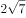，（   ）。

- **A**. 

- **B**. 

- **C**. 

　✅
- **D**. 

**答案**：C

**官方解析**

数列带有根号，将数字都还原到根号下面，得到根号下的数列为2，4，9，17，28，（    ），无明显规律，两两作差，得到的新数列为2，5，8，11，（    ），构成公差为3的等差数列，则该等差数列第五项为，故原数列第六项根号下的数字为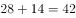。

故正确答案为C。

---

### 第 2 题　qid 1788604 · 数学运算

4.2，5.2，8.4，17.8，44.22，(   )

- **A**. 125.62　✅
- **B**. 85.26
- **C**. 99.44
- **D**. 125.64

**答案**：A

**官方解析**

题干为小数数列，作差无规律，考虑机械划分。整数部分为：4，5，8，17，44，相邻两项作差得到新数列为1，3，9，27，是公比为3的等比数列，则新数列下一项为81，原数列整数部分为，排除B、C两项。小数部分为2，2，4，8，22，相邻两项作差得到新数列①为0，2，4，14，再次作差无规律，考虑对新数列①相邻两项作和，得到新数列②为2，6，18，是公比为3的等比数列，所以新数列②的下一项为54，新数列①的下一项为，因此小数部分的下一项为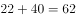，排除D项。

故正确答案为A。

备注：本题也可以小数部分结合整数部分找规律，奇数项中，整数部分为小数部分的2倍，偶数项中整数部分为小数部分的2倍多1，故第六项应满足整数部分为小数部分的2倍多1，只有A项满足。

---

### 第 3 题　qid 1791590 · 数学运算

，，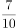，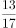，，（  ）。

- **A**. 
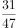

- **B**. 

- **C**. 
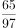

- **D**. 

　✅

**答案**：D

**官方解析**

分子数列：1、3、7、13、21、（ ），两两作差得到2、4、6、8、（ ），构成公差为2的等差数列，故第五项为，则原数列第六项的分子为； 

分母数列：2、5、10、17、26、（ ），两两作差得到3、5、7、9、（ ），构成公差为2的等差数列，故第五项为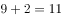，则原数列第六项的分母为；因此原数列第六项为。

故正确答案为D。

---

### 第 4 题　qid 1791592 · 数学运算

有两瓶质量均为100克且浓度相同的盐溶液，在一瓶中加入20克水，在另一瓶中加入50克浓度为的盐溶液后，他们的浓度仍然相等，则这两瓶盐溶液原来的浓度是？

- **A**. 

- **B**. 

- **C**. 

- **D**. 

　✅

**答案**：D

**官方解析**

设两瓶盐溶液原来的浓度为，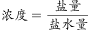，根据题意可得，，解得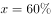。

故正确答案为D。

---

### 第 5 题　qid 1791594 · 数学运算

若买6个订书机、4个计算器和6个文件夹共需504元，买3个订书机、1个计算器和3个文件夹共需207元，则购买订书机、计算器和文件夹各5个所需的费用是？

- **A**. 465元
- **B**. 475元
- **C**. 485元
- **D**. 495元　✅

**答案**：D

**官方解析**

设订书机、计算器、文件夹的单价分别为元、元、元，根据题意可列方程组：

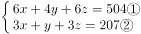 

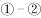得：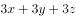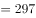，则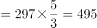。

故正确答案为D。

---

### 第 6 题　qid 1788612 · 数学运算

甲、乙、丙三人共同完成一项工程，他们的工作效率之比是5：4：6。先由甲、乙两人合作6天，再由乙单独做9天，完成全部工程的，若剩下的工程由丙单独完成，则丙所需要的天数是：

- **A**. 9
- **B**. 11
- **C**. 10　✅
- **D**. 15

**答案**：C

**官方解析**

根据题目中的效率比，设甲、乙、丙的效率分别为5，4，6，由题干可得工程总量，剩余工作量，故丙所需时间天。 

故正确答案为C。 

---

### 第 7 题　qid 1788618 · 数学运算

小王以每股10元的相同价格买入A和B两只股票共1000股，此后A股先跌再涨，B股先涨再跌，若此期间小王没有再买卖过这两只股票，则现在这1000股股票的市值是：

- **A**. 10250元
- **B**. 9975元　✅
- **C**. 10000元
- **D**. 9750元

**答案**：B

**官方解析**

设买入的A股票为股，则买入的B股票为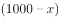股。A股票的市值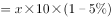元，B股票的市值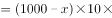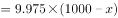元，则两只股票的市值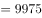元。

故正确答案为B。

---

### 第 8 题　qid 1791600 · 数学运算

A、B、C三个厂家生产同一种乒乓球，不合格率分别为、和。现将三个厂家的产品按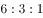的比例均匀混合后装入集装箱，从该箱中随机抽出1只乒乓球进行检测，若检测结果为不合格，则该只乒乓球是B厂生产的概率是：

- **A**. 0.3
- **B**. 0.375　✅
- **C**. 0.4
- **D**. 0.425

**答案**：B

**官方解析**

A、B、C三个厂家的产品按的比例均匀混合，设A、B、C三个厂家乒乓球数分别为600、300、100，因三者不合格率分别为、和，则不合格乒乓球总数为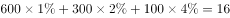，B厂不合格乒乓球数为，。

故正确答案为B。

---

### 第 9 题　qid 1791602 · 数学运算

某学校举办知识竞赛，共设50道选择题，评分标准是：答对1题得3分，答错1题扣1分，不答的题得0分。若王同学最终得95分，则他答错的选择题最多有：

- **A**. 12道
- **B**. 13道　✅
- **C**. 14道
- **D**. 15道

**答案**：B

**官方解析**

根据题意，50道选择题，若全部答对分，每答错1题少分，每不答1题少3分，最终得95分，则少了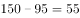分，要使答错题目最多，则55分应尽可能多分配给答错的题目，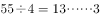，余3分即恰好有1题不答，故最多答错13题。

故正确答案为B。

---

### 第 10 题　qid 1791604 · 数学运算

甲、乙、丙三人定期到某棋馆学围棋，甲每隔3天去一次，乙每隔4天去一次，丙每隔5天去一次。若2016年2月10日三人在棋馆相遇，则下次三人在棋馆相遇的日期是：

- **A**. 2016年4月8日
- **B**. 2016年4月11日
- **C**. 2016年4月9日
- **D**. 2016年4月10日　✅

**答案**：D

**官方解析**

甲、乙、丙分别每隔3、4、5天去一次，即三人的周期分别为4、5、6天，则2016年2月10日相遇后，经历三人周期的最小公倍数即60天，三人再次相遇。2016年为闰年，2月为29天，3月为31天，，则下次三人相遇日期为2016年4月10日。

故正确答案为D。

---

### 第 11 题　qid 1791606 · 数学运算

将所有由1、2、3、4组成且没有重复数字的四位数，按从小到大的顺序排列，则排在第12位的四位数是：

- **A**. 3124
- **B**. 2341
- **C**. 2431　✅
- **D**. 3142

**答案**：C

**官方解析**

由1、2、3、4组成且没有重复数字的四位数中，千位数为1的四位数有个，千位数为2的四位数有个，则按从小到大的顺序排列，排在第12位的四位数是千位数为2的四位数中最大的数字，即2431。

故正确答案为C。

---

### 第 12 题　qid 1791608 · 数学运算

某单位举办设有A、B、C三个项目的趣味运动会，每位员工三个项目都可以报名参加。经统计，共有72名员工报名，其中参加A、B、C三个项目的人数分别为26、32、38，三个项目都参加的有4人，则仅参加一个项目的员工人数是：

- **A**. 48
- **B**. 40
- **C**. 52　✅
- **D**. 44

**答案**：C

**官方解析**

设仅参加一个项目、参加两个项目的人数分别为、，根据容斥原理三集合非标准公式，可列方程组：

解方程组得：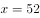，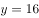。

故正确答案为C。

---

### 第 13 题　qid 1791610 · 数学运算

如图，边长为1米的正方形棋盘上有100个大小一样的小方格，点<i>O</i>为棋盘的中心，将一个直径是0.8米的圆形纸片放在该棋盘上，使其中心也位于<i>O</i>点，则该圆形纸片可以完全覆盖的小方格个数是：

- **A**. 32　✅
- **B**. 50
- **C**. 48
- **D**. 36

**答案**：A

**官方解析**

沿半径画出圆形，如图所示，阴影部分为完全覆盖。每个圆能完全覆盖的小方格为8个，整个圆能完全覆盖的小方格为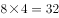个。 

故正确答案为A。

---

## 判断推理

### 材料 1

某校组建篮球队，需要从甲、乙、丙、丁、戊、己、庚、辛等8名候选者中选出5名队员，为求得球队最佳组合，选拔需满足以下条件：

（1）甲、乙、丙3人中必须选出两人；

（2）丁、戊、己3人中必须选出两人；

（3）甲与丙不能都被选上；

（4）如果丁被选上，则乙不能选上。

#### 第 1 题　qid 2035840 · 逻辑判断

如果添加前提“如果庚被选上，则辛也被选上”，则可以得出以下哪项？

- **A**. 甲和乙能被选上
- **B**. 丁和戊能被选上
- **C**. 乙和庚能被选上
- **D**. 己和辛能被选上　✅

**答案**：D

**官方解析**

分析题干的逻辑关系。

由（1）和（3）可知乙一定被选上，由（4）丁乙，否后必否前，得到乙丁，可知丁不会被选上。由条件（2）可得出戊和己一定被选上，而由条件（1）可知甲和丙里还要再选一个，总共已经有4个人，那么庚和辛必定只能选一个。由“如果庚被选上，则辛也被选上”可知，只能选辛，所以乙、戊、己、辛是一定能被选上的。

故正确答案为D。

---

#### 第 2 题　qid 2035842 · 逻辑判断

如果添加前提“如果戊被选上，则甲不能被选上”，则可以得出以下哪项？

- **A**. 甲和乙能被选上
- **B**. 乙和丙能被选上　✅
- **C**. 戊和辛能被选上
- **D**. 丁和庚能被选上

**答案**：B

**官方解析**

分析题干的逻辑关系。

由（1）和（3）可知乙一定要选上，由（4）丁乙，否后必否前，可转换为乙丁，可知丁不能被选上，由条件（2）可得出戊和己一定被选上，由“如果戊被选上，则甲不能被选上”可知甲没有被选上，由条件（1）可得甲、乙、丙3人中必须选出来两人，所以一定要选乙和丙，所以乙、丙、戊和己一定能选上。

故正确答案为B。

---

#### 第 3 题　qid 1791612 · 类比推理

行为规则：法律

- **A**. 创新发展：发展
- **B**. 社会关系：工会
- **C**. 文学体裁：小说　✅
- **D**. 人生理想：目标

**答案**：C

**官方解析**

第一步：判断题干词语间逻辑关系。
“法律”是由国家制定或认可的一种特殊的“行为规则”，二者是种属关系。
第二步：判断选项词语间逻辑关系。
A项：“创新发展”和“发展”之间是种属关系，但词语顺序与题干相反，与题干逻辑关系不一致，排除。
B项：“社会关系”是人们在共同的物质和精神活动过程中所结成的相互关系的总称，即人与人之间的一切关系；“工会”是一个组织。二者不是种属关系，与题干逻辑关系不一致，排除。
C项：“小说”是“文学体裁”的一种，与题干逻辑关系一致，当选。
D项：“人生理想”是“目标”的一种，二者是种属关系，但词语顺序与题干相反，与题干逻辑关系不一致，排除。
故正确答案为C。

---

#### 第 4 题　qid 1791614 · 类比推理

微信交流：上网

- **A**. 锻炼身体：跳舞
- **B**. 增长知识：学习　✅
- **C**. 法庭审判：实验
- **D**. 旅游度假：自驾

**答案**：B

**官方解析**

第一步：判断题干词语间逻辑关系。
“上网”是“微信交流”的必要条件。
第二步：判断选项词语间逻辑关系。
A项：“跳舞”不是“锻炼身体”的必要条件，不符合题干逻辑关系，排除；
B项：“学习”是“增长知识”的必要条件，符合题干逻辑关系，当选；
C项：“法庭审判”和“实验”没有逻辑关系，排除；
D项：“自驾”是“旅游度假”的一种方式，二者为种属关系，不符合题干逻辑关系，排除。
故正确答案为B。

---

#### 第 5 题　qid 1791616 · 类比推理

江苏：南京：北京

- **A**. 上海：海口：海南
- **B**. 武汉：湖北：河北
- **C**. 青海：辽宁：西宁
- **D**. 广东：广州：贵州　✅

**答案**：D

**官方解析**

第一步：判断题干词语间的逻辑关系。
江苏的省会是南京，第一词与第二词之间的逻辑关系为省与省会的对应；江苏与北京之间为省级行政单位的并列，第一词与第三词之间为省级行政单位的并列。
第二步：逐一分析选项。
A项：上海与海口之间不是省与其省会城市的对应，与题干逻辑关系不一致，排除；
B项：武汉是湖北的省会，第一词与第二词之间的逻辑关系为省会与省的对应，但两词顺序与题干两词顺序相反，与题干逻辑关系不一致，排除；
C项：青海与辽宁均为省级行政单位，第一词与第二词之间的逻辑关系为并列关系，与题干逻辑关系不一致，排除；
D项：广东的省会是广州，第一词与第二词之间的逻辑关系为省与省会的对应；广东与贵州为省级行政单位的并列，与题干逻辑关系一致，当选。
故正确答案为D。

---

#### 第 6 题　qid 1791618 · 类比推理

水稻：农田：农民

- **A**. 学生：老师：校园
- **B**. 羊群：牧民：草原
- **C**. 货物：网络：电商　✅
- **D**. 捕鱼：海面：渔民

**答案**：C

**官方解析**

第一步，判断题干词语间的逻辑关系。
农民在农田中种植水稻，农民种植水稻，第一词与第三词之间为主宾关系；农民在农田中，第二词与第三词之间为场所的对应。
第二步，逐一分析选项。
A项：老师在校园中，第二词与第三词之间构成场所的对应，但是顺序相反，排除；
B项：牧民在草原上，第二词与第三词之间构成场所的对应，但是顺序相反，排除；
C项：电商在网络上销售货物，电商销售货物，第一词与第三词之间为主宾关系；电商在网络上，第二词与第三词之间为场所的对应。三词逻辑关系与题干一致，当选；
D项：渔民捕鱼，第一词与第三词之间不是主宾关系，与题干逻辑关系不一致，排除。
故正确答案为C。

---

#### 第 7 题　qid 1791620 · 类比推理

规划：实施：验收

- **A**. 诉讼：审判：取证
- **B**. 销售：宣传：生产
- **C**. 投标：开标：招标
- **D**. 播种：管理：收获　✅

**答案**：D

**官方解析**

第一步：判断题干词语间逻辑关系。
规划、实施、验收三者存在正常的时间先后顺序，即规划在前，随后去实施，最后去验收。
第二步：判断选项词语间逻辑关系。
A项：取证应该在诉讼、审判之前，与题干逻辑关系不一致，排除；
B项：生产应该在销售之前，与题干逻辑关系不一致，排除；
C项：招标应该在投标之前，与题干逻辑关系不一致，排除；
D项：播种、管理、收获三者存在正常的时间先后顺序，即播种在前，随后去管理，最后去收获，与题干逻辑关系一致，当选。
故正确答案为D。

---

#### 第 8 题　qid 1791622 · 类比推理

动车：高铁：运输

- **A**. 小学：中学：教育　✅
- **B**. 手表：码表：导航
- **C**. 导弹：核弹：武器
- **D**. 楷书：黑体：书写

**答案**：A

**官方解析**

第一步：判断题干词语间逻辑关系。
动车、高铁二者是并列关系，都是交通工具，都有运输的功能，与运输是对应关系。
第二步：判断选项词语间逻辑关系。
A项：小学、中学二者是并列关系，都是学校，都有教育的功能，与教育是对应关系，与题干逻辑关系一致，当选；
B项：手表、码表二者为并列关系，都可以用来计时，但码表是用以计算里程及速度的电子产品，没有导航的功能，与题干逻辑关系不一致，排除；
C项：导弹与核弹都是武器的一种，二者与武器是种属关系，与题干逻辑关系不一致，排除；
D项：楷书和黑体之间不构成并列关系，楷体和黑体才构成并列，与题干逻辑关系不一致，排除。
故正确答案为A。

---

#### 第 9 题　qid 1791624 · 类比推理

风气 之于（  ）相当于 文献 之于 （  ）。

- **A**. 风格——图书
- **B**. 风尚——典籍　✅
- **C**. 精神——文化
- **D**. 弘扬——传承

**答案**：B

**官方解析**

逐一代入选项验证。
A项：“风气”和“风格”没有明显的逻辑关系；“文献”通常理解为图书、期刊等各种出版物的总和，故“文献”包含“图书”，二者为包容关系，前后逻辑关系不一致，排除；
B项：“风气”是指风尚习气，故“风气”包含“风尚”，二者为包容关系；“典籍”泛指古今图书，“文献”是图书、期刊等各种出版物的总和，故“文献”包含“典籍”，前后逻辑关系一致，当选；
C项：风气和精神没有明显的逻辑关系，文化和文献也没有明显的逻辑关系，前后逻辑关系不一致，排除；
D项：风气可以被弘扬，构成动宾短语；通过文献去传承是对应关系，而非动宾结构，前后逻辑关系不一致，排除。
故正确答案为B。

---

#### 第 10 题　qid 1791626 · 类比推理

医院 之于（  ）相当于 学校 之于 （  ）。

- **A**. 诊治——教学　✅
- **B**. 实验——手术
- **C**. 医生——学生
- **D**. 查房——课程

**答案**：A

**官方解析**

逐一代入选项验证。
A项：医院的主要功能是诊治，医院是地点，功能是诊治，构成地点与功能的对应关系；学校的主要功能是教学，学校是地点，教学是功能，构成地点与功能的对应关系，前后逻辑关系一致，当选；
B项：医院与实验没有明显的逻辑关系，手术与学校没有明显的逻辑关系，前后逻辑关系不一致，排除；
C项：医生在医院里工作，医生是一种职业，构成地点与职业的对应关系；学生在学校里学习，但学生不是一种职业，前后逻辑关系不一致，排除；
D项：查房是医院工作人员的一项工作，查房是动词；课程是学校教学的一项内容，课程是名词，前后逻辑关系不一致，排除。
故正确答案为A。

---

#### 第 11 题　qid 1791806 · 类比推理

嘀谔嘀谔微微滴谔

- **A**. 滴微滴微谔谔嘀微　✅
- **B**. 谔嘀谔嘀微微谔滴
- **C**. 嘀嘀谔微谔微微滴
- **D**. 嘀微嘀微嘀谔谔滴

**答案**：A

**官方解析**

第一步，分析题干汉字间逻辑关系。
位置1、3相同，位置7与1、3不同，位置2、4、8相同，位置5、6相同。
第二步，逐一分析选项。
A项：位置1、3相同，位置7与1、3不同，位置2、4、8相同，位置5、6相同，与题干一致，当选；
B项：位置7与1、3相同，排除；
C项：位置1、3不同，排除；
D项：位置2、8不同，排除。
故正确答案为A。

---

#### 第 12 题　qid 2033822 · 逻辑判断

- **A**. 

- **B**. 

　✅
- **C**. 

- **D**. 

**答案**：B

**官方解析**

第一步：分析题干字符间逻辑关系。
第一个字符和第五个字符相同，第四个字符和第七个字符相同，其他字符都不相同。
第二步：逐一分析选项。
A项：第一个字符和第五个字符相同，但第三个字符和第六个字符也相同，排除；
B项：第一个字符和第五个字符相同，第四个字符和第七个字符相同，其他字符都不相同，与题干一致，当选；
C项：第一个字符和第五个字符不同，排除；
D项：第一个字符和第五个字符及第七个字符都相同，排除。
故正确答案为B。

---

#### 第 13 题　qid 1791630 · 图形推理

每道题在上边的题干中给出一套图形，其中有五个图，这五个图呈现一定的规律性。在下边给出一套图形，其中有四个图，从中选出唯一的一项作为保持上边五个图规律性的第六个图：

- **A**. A
- **B**. B
- **C**. C
- **D**. D　✅

**答案**：D

**官方解析**

观察发现图形中的人都在进行不同的运动，A项拖地、B项在椅子上坐着、C项小孩玩球，都不是运动，排除；只有D项踢足球是运动项目，当选。
故正确答案为D。

---

#### 第 14 题　qid 1791632 · 图形推理

每道题在上边的题干中给出一套图形，其中有五个图，这五个图呈现一定的规律性。在下边给出一套图形，其中有四个图，从中选出唯一的一项作为保持上边五个图规律性的第六个图。

- **A**. A
- **B**. B　✅
- **C**. C
- **D**. D

**答案**：B

**官方解析**

元素组成不同，无属性规律，考虑数数。观察发现题干都是直线图形，考虑数直线，题干图形的直线数量为2-3-4-5-6-？，？号处应为7条直线的图形，A、B、D项都为7条直线，C项为8条直线，排除C。
再次观察图形发现，题干图形均为一笔画图形，A、D项均为两笔画图形，B项为一笔画图形，排除A、D项。
故正确答案为B。

---

#### 第 15 题　qid 1791634 · 图形推理

每道题在上边的题干中给出一套图形，其中有五个图，这五个图呈现一定的规律性。在下边给出一套图形，其中有四个图，从中选出唯一的一项作为保持上边五个图规律性的第六个图： 

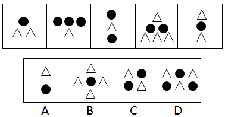

- **A**. A　✅
- **B**. B
- **C**. C
- **D**. D

**答案**：A

**官方解析**

题干元素组成相似，但无明显的样式规律。考虑数数，发现元素换算以及单个元素数目均不呈现规律。观察发现，每幅图形中的元素排布特点均为每一行的元素都是同一种。只有A选项满足此规律。
故正确答案为A。

---

#### 第 16 题　qid 1791636 · 图形推理

下边四个图形中，只有一个是由上边的四个图形拼合而成（只能通过上、下、左、右进行移动），请把它找出来：

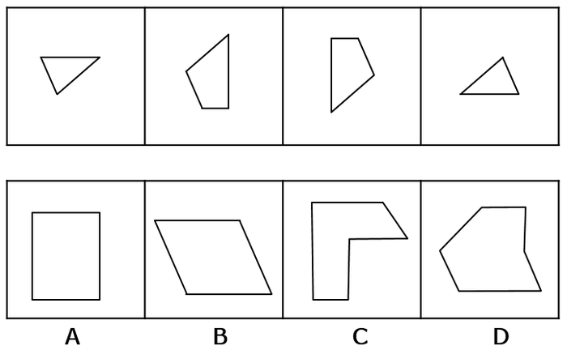

- **A**. A
- **B**. B　✅
- **C**. C
- **D**. D

**答案**：B

**官方解析**

本题考查平面拼合，可采用平行且等长相消的方法解题。消去平行且等长的线段后进行组合即可得到轮廓图，即为B选项。平行且等长相消的方法如下图所示：

故正确答案为B。

---

#### 第 17 题　qid 1791638 · 图形推理

下边四个图形中，只有一个是由上边的四个图形拼合而成（只能通过上、下、左、右进行移动），请把它找出来：

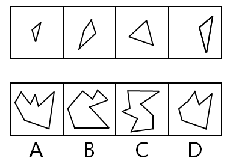

- **A**. A
- **B**. B
- **C**. C
- **D**. D　✅

**答案**：D

**官方解析**

本题考查的是平面拼合，可以采用平行等长消去的方法。消去平行等长的线段（相同颜色标注）后进行组合得到轮廓图，即为D选项。平行等长消去方法如下图所示：

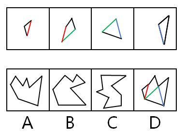

故正确答案为D。

---

#### 第 18 题　qid 1791640 · 图形推理

下边四个图形中，只有一个是由上边的四个图形拼合而成（只能通过上、下、左、右进行移动），请把它找出来：

- **A**. A
- **B**. B　✅
- **C**. C
- **D**. D

**答案**：B

**官方解析**

本题考查的是平面拼合，可以采用平行等长消去的方法。消去平行等长的线段（相同颜色标注）后进行组合得到轮廓图，即为B选项。平行等长消去方法如下图所示：

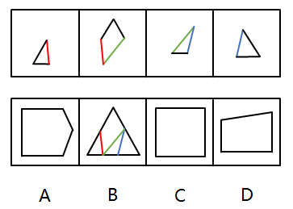

故正确答案为B。

---

#### 第 19 题　qid 1791642 · 图形推理

左边这个图形是由右边四个图形中的某一个作为外表面折叠而成，请指出它是哪一个？

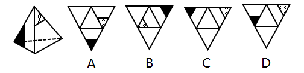

- **A**. A
- **B**. B
- **C**. C
- **D**. D　✅

**答案**：D

**官方解析**

本题属于空间重构类，逐一分析选项，将题干如图一标号。

由题干图形可知，1面和2面为相邻面，标红的线即为两个面的公共边，可以观察到，2面上的灰色三角形有条边挨着这条标红的公共边，而1面上的黑色三角形没有边与标红的公共边挨着。

A项：如图二所示，选项中，1面和2面的公共边即为标红的线条，可以发现在公共边上灰色三角形和黑色三角形都有边与公共边挨着，和题干已知图形不一致，排除；

B项：如图三所示，选项中，1面和2面的公共边即为标红的线条，可以发现在公共边上灰色三角形和黑色三角形都没有边与公共边挨着，和题干已知图形不一致，排除；

C项：如图四所示，C选项中，1面和2面的公共边即为标红的线条，可以发现在公共边上灰色三角形和黑色三角形都有边与公共边挨着，和题干已知图形不一致，排除。

故正确答案为D。

---

#### 第 20 题　qid 1791644 · 图形推理

左边这个图形是由右边四个图形中的某一个作为外表面折叠而成，请指出它是哪一个？

- **A**. A
- **B**. B
- **C**. C
- **D**. D　✅

**答案**：D

**官方解析**

本题属于空间重构类，逐一分析选项。
由题干图形可知，所给两个面公共边的中点上发出了一条直线。
A项：两个面的公共边的中点没有发出直线，和题干已知图形不一致，排除；
B项：两个面的公共边的中点没有发出直线，和题干已知图形不一致，排除；
C项：两个面的公共边的中点没有发出直线，和题干已知图形不一致，排除；
D项：两个面公共边的中点上发出了一条直线，和题干已知图形一致，当选。
故正确答案为D。

---

#### 第 21 题　qid 1791646 · 图形推理

左边这个图形是由右边四个图形中的某一个作为外表面折叠而成，请指出它是哪一个？

- **A**. A
- **B**. B
- **C**. C　✅
- **D**. D

**答案**：C

**官方解析**

对选项的面进行标号，如下图所示。

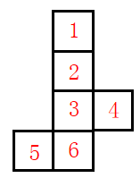

A项：选项中面2、3、4为左边所展示的面，选项中三个面的公共点仅连接了面4的对角线，但在原图中连接了面3和面4的两条对角线，排除；

B项：选项中面3、4、6为左边所展示的面，选项中三个面的公共点为面3灰色三角形的直角处，但在原图中三个面的公共点为灰色三角形的锐角处，排除；

C项：选项中面2、3、4为左边所展示的面，选项中三个面的公共点为面3和面4的对角线交点处，原图中三个面的公共点也是面3和面4的对角线交点处，公共点相同，排除不了，先保留；

D项：选项中面3、4、5为左边所展示的面，选项中面4和面5是z字型两端，为相对面，不可能同时出现，排除。

故正确答案为C。

---

#### 第 22 题　qid 1791648 · 图形推理

左边这个图形是由右边四个图形中的某一个作为外表面折叠而成，请指出它是哪一个？

- **A**. A
- **B**. B
- **C**. C
- **D**. D　✅

**答案**：D

**官方解析**

对选项的面进行标号，如下图所示。

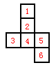

A项：选项中面4、5、6为左边所展示的面，选项中三个面的公共点发散出两条对角线，但在原图中仅发散出一条对角线，排除；

B项：选项中面2、4、5为左边所展示的面，选项中三个面的公共点没有发散出对角线，但在原图中发散出一条对角线，排除；

C项：选项中面3、4、6为左边所展示的面，选项中三个面的公共点为面4直角三角形左下的锐角处，而在原图中三个面的公共点为直角三角形的直角处，排除。

故正确答案为D。

---

#### 第 23 题　qid 1791650 · 逻辑判断

在某单位，老李非常尊重同事大张，而大张非常尊重新入职的技术员小陈。老李是单位的领导之一，职位比小陈高。
根据以上陈述，可以得出以下哪项？

- **A**. 大张的职位比老李高
- **B**. 老李的职位比大张高
- **C**. 有人尊重比自己职位低的人　✅
- **D**. 有人尊重比自己职位高的人

**答案**：C

**官方解析**

第一步：分析题干所给的信息。
老李尊重大张，大张尊重小陈，老李职位比小陈职位高。
第二步：根据题干信息逐一分析选项。
A项：题干中没有提及大张和老李的职位高低，无法推出，排除；
B项：题干中没有提及大张和老李的职位高低，无法推出，排除；
C项：“有人尊重比自己职位低的人”，假设大张比老李的职位高，那么通过老李职位比小陈职位高，大张又尊重小陈，可以推出有人尊重比自己职位低的人；假设大张没有老李的职位高，通过老李尊重大张，也可以推出有人尊重比自己职位低的人，当选；
D项：“有人尊重比自己职位高的人”，题干已知老李职位比小陈职位高，但无法得出小陈是否尊重老李，排除。
故正确答案为C。

---

#### 第 24 题　qid 1791652 · 逻辑判断

当一辆疾驰的汽车需要马上刹住时，几毫秒的反应时间是非常关键的。有时，区区几米的距离就决定着人的生死。最近有研究者利用模拟驾驶系统、眼球追踪技术等手段，让五组受试者面对动感不同的交通标志，然后测试他们做出反应的速度。结果发现，动感较强的交通标志确实能让受试者更快做出反应。由此，他们建议有关部门，应该将原有的交通警告标识牌全部置换为动感较强的标示牌，以便提高司机反应速度。
以下哪项如果为真，最能表明上述研究者的建议难以实现预期目标的是：

- **A**. 置换原有的交通警告标示牌是一项庞大、繁琐的工程，需要投入巨额成本
- **B**. 在研究者选取的五组受试者中，有的人驾龄并不长，有的人甚至还不会开车
- **C**. 当司机了解到较强动感交通警告标示牌的实际意义后，其反应速度又会降到从前的水平　✅
- **D**. 如果画面上的人看起来在跑，就容易让人联想到行人急匆匆从你车前经过的画面

**答案**：C

**官方解析**

第一步：找出论点论据。
论点：应该将原有的交通警告标识牌全部置换为动感较强的标示牌，以便提高司机反应速度。
论据：动感较强的交通标志确实能让受试者更快做出反应。
第二步：逐一分析选项。
A项：“置换原有的交通警告标示牌需要投入巨额成本”和论点中讨论的动感较强的标示牌可以提高司机的反应速度无关，无关项，排除；
B项：“有的人驾龄并不长，有的人甚至还不会开车”，这说明不同的受试者反应速度都提高了，说明该建议有效，加强选项，排除；
C项：“当司机了解到较强动感交通警告标示牌的实际意义后，其反应速度又会降到从前的水平”，说明动感交通警告牌没有起到提高反应速度的效果，削弱论据，当选；
D项：“容易联想到行人急匆匆从你车前经过的画面”和是否可以提高司机的反应速度无关，无关项，排除。
故正确答案为C。

---

#### 第 25 题　qid 1791654 · 逻辑判断

考入蓝天外国语学校的学生，一般都被认为是学霸级人物。虽然聪明、勤奋的同学未必都能成为蓝天外国语学校的学生，但是蓝天外国语学校的学生多半聪明或勤奋。
根据以上陈述，可以得出以下哪项？

- **A**. 有的聪明、勤奋的同学必然不会成为蓝天外国语学校的学生
- **B**. 有的聪明、勤奋的同学可能不会成为蓝天外国语学校的学生　✅
- **C**. 大多数蓝天外国语学校的学生既聪明又勤奋
- **D**. 有少数蓝天外国语学校的学生既聪明又勤奋

**答案**：B

**官方解析**

本题考查模态命题。题干中“虽然聪明、勤奋的同学未必都能成为蓝天外国语学校的学生”，出现了未必，未必=不必然=可能不。因此A项错误，B项正确；
题干中“蓝天外国语学校的学生多半聪明或勤奋”，聪明与勤奋之间的关联词为“或”关系，而C、D选项中聪明与勤奋之间为“且”关系，排除。
故正确答案为B。

---

#### 第 26 题　qid 1789572 · 逻辑判断

甲、乙、丙、丁、戊5支足球队进行小组单循环赛。比赛规定：每队胜一场得3分，平一场得1分，负一场得0分；积分前两名出线。比赛结束后发现，没有积分相同的球队，乙队胜了3场，另一场负于甲队。
根据以上信息，可得出以下哪项？

- **A**. 甲队一定出线
- **B**. 乙队一定出线　✅
- **C**. 丙队一定出线
- **D**. 戊队一定出线

**答案**：B

**官方解析**

第一步：分析题干条件。
（1）5支球队进行单循环赛，每队胜一场得3分，平一场得1分，负一场得0分；
（2）没有积分相同的球队；
（3）乙队胜了3场，另一场负于甲队。
第二步：根据题干条件进行推理。
共有5支球队，进行小组单循环赛，每个球队都要进行4场比赛，乙队胜了3场，只有一场负于甲队，那么丙、丁、戊3队每队已经分别输给乙队一场。题干最后一句说没有积分相同的球队，所以丙、丁、戊3队在剩下的比赛中不可能3场均取得胜利，因此积分必然低于乙队。由于前两名出线，那么乙队必然出线。
故正确答案为B。

---

#### 第 27 题　qid 1789576 · 逻辑判断

荷兰画家梵高在一家精神病院里创作了著名的绘画作品《星空》。这幅画作中的“漩涡”引起了人们长期的争论，许多心理学家认为，“漩涡”是梵高当时脆弱心理状态的延伸和表现。欧洲航天局近日发布了一幅根据“普朗克”卫星探测绘制的星空图，神奇的是，这幅图与《星空》有惊人的相似之处。有艺术家认为，自然的星空正是梵高创作的灵感来源。
以下各项如果为真，则除了哪项均能支持上述艺术家的观点？

- **A**. 梵高的创作灵感一般均有明显的现实来源
- **B**. 《星空》的创作年代要远早于卫星绘制星空图的年代　✅
- **C**. 梵高具有超越常人的视觉观察能力与想象能力
- **D**. 卫星绘制的星空图和《星空》的画面大体是一致的

**答案**：B

**官方解析**

第一步：找出论点和论据。
论点：自然的星空正是梵高创作的灵感来源。
论据：欧洲航天局近日发布了一幅根据“普朗克”卫星探测绘制的星空图，与《星空》有惊人的相似之处。
第二步：逐一分析选项。
A项：梵高的创作灵感一般均有明显的现实来源，说明《星空》的创作和现实有关系，补充论据支持论点，可以加强，排除；
B项：《星空》的创作年代要远早于卫星绘制星空图的年代，创作年代与梵高是否受到自然星空的影响无关，无关项，无法加强，当选；
C项：梵高具有超越常人的视觉观察能力与想象能力，《星空》的画面可能是他在现实中观测到的，补充论据支持论点，可以加强，排除；
D项：卫星绘制的星空图和《星空》的画面大体是一致的，说明梵高创作的《星空》与自然的星空相似，补充论据支持论点，可以加强，排除。
本题为选非题，故正确答案为B。

---

#### 第 28 题　qid 1791660 · 逻辑判断

某金融机构计划在欧洲和亚洲分别设立一个办事处，候选城市有6个，亚洲的吉隆坡、香港和首尔，欧洲的苏黎世、伦敦和法兰克福。该机构的两名工作人员就办事处的设立城市进行了如下猜测：
张经理：亚洲办事处一定会设在吉隆坡，绝不会设在首尔；
陈经理：欧洲办事处一定会设在伦敦，绝不会设在苏黎世。
事后得知，两人的猜测都只有一半是正确的。
根据以上信息，以下哪项是错误的判断？

- **A**. 亚洲办事处设在香港
- **B**. 欧洲办事处设在法兰克福
- **C**. 亚洲办事处如果不设在香港，就会设在首尔
- **D**. 欧洲办事处如果不设在伦敦，那么也不会设在法兰克福　✅

**答案**：D

**官方解析**

本题为真假推理。根据题干确定信息：两人的猜测都只有一半是正确的，对张经理和陈经理的猜测进行分析。

假设张经理前半句对，即“亚洲办事处一定会设在吉隆坡”，那么张经理后半句“绝不会设在首尔”也对，张经理前后两句话都对，与题干矛盾，所以假设错误，说明张经理的前半句是错的（即亚洲办事处不在吉隆坡），且后半句对。说明亚洲办事处只能设在香港。 

同理，假设陈经理的前半句是对的，即“欧洲办事处一定会设在伦敦”，那么陈经理后半句“绝不会设在苏黎世”也对，陈经理的前后两句话都对，与题干矛盾，所以假设错误，说明陈经理的前半句是错的（即欧洲办事处不在伦敦），后半句对。说明欧洲办事处只能设在法兰克福。 

A项：亚洲办事处设在香港正确，选非排除； 

B项：欧洲的办事处设在法兰克福正确，选非排除； 

C项：香港首尔，已知亚洲办事处设立在香港，即否定了C项前件，当前件为假时，则该命题为真，C项正确，选非排除； 

D项：伦敦法兰克福，已知欧洲办事处设立在法兰克福，即否定了D项的后件，根据逆否等价推出欧洲办事处设在伦敦，与题干推导出设在法兰克福矛盾，错误，选非当选。 

本题为选非题，故正确答案为D。

---

#### 第 29 题　qid 1791662 · 逻辑判断

一项研究选取80名13岁到25岁出现精神分裂症早期症状的年轻人作为被试对象，随机选取其中的一半人服用鱼油片剂3个月，另一半人都用安慰剂3个月。研究人员对受试者跟踪考察7年后发现，在服用鱼油片剂组中，只有的人罹患精神分裂症；而在服用安慰剂组中，罹患这种疾病的人则高达。由此，研究人员得出结论：服用鱼油片剂有助于青少年预防精神分裂症。

以下各项如果为真，则除了哪项均能质疑上述研究人员的结论？ 

- **A**. 被试对象的数量仍然偏少，且每个被试者在7年中的发展差异较大
- **B**. 被试对象的年龄跨度较大，实验开始时有人可能已是青年而非少年
- **C**. 鱼油片剂曾被尝试治疗成年精神分裂症患者，但实验发现没有效果　✅
- **D**. 被试对象服用鱼油片剂的时间较短，不足以形成稳定、明显的疗效

**答案**：C

**官方解析**

第一步：找出论点和论据。

论点：服用鱼油片剂有助于青少年预防精神分裂症。

论据：一项针对出现精神分裂症早期症状的年轻人的研究中，服用鱼油片剂组中，只有的人罹患精神分裂症，服用安慰剂组中，罹患精神分裂症的人高达。

第二步：逐一分析选项。

A项：被试对象数量偏少，被试者在7年间发展差异大，说明论据选取的研究样本不具代表性，试验设计不科学，削弱了论据，本题选不能质疑的，排除；

B项：被试年龄跨度大，有的被试者在实验开始时可能已经是青年，说明论据选取的研究样本不够科学，削弱了论据，本题选不能质疑的，排除；

C项：实验发现鱼油片剂治疗成年精神分裂症患者没有效果，与鱼油片剂是否有助于青少年预防精神分裂症无关，主题不一致，本题选不能质疑的，当选；

D项：被试服用鱼油片剂的时间短，不足以形成稳定、明显的疗效，说明论据的研究过程不够科学，削弱了论据，本题选不能质疑的，排除。

本题为选非题，故正确答案为C。

---

#### 第 30 题　qid 1791664 · 逻辑判断

学校操场有6条环形跑道，从外向内分别为1至6道，王伟、李明、刘平、张强、钱亮、孙新6人分别占据其中一道。已知：
（1） 王伟的两侧是单数跑道，张强的两侧是双数跑道；
（2） 李明与张强隔着两个跑道，钱亮在王伟与李明中间的那个跑道；
（3） 刘平在单数跑道，孙新在双数跑道；
（4） 王伟不在第二跑道；
（5） 如果张强在第三跑道，那么王伟不在第四跑道。
根据以上陈述，可以得出以下哪项？

- **A**. 在刘平和孙新之间隔着4个跑道　✅
- **B**. 在钱亮和张强之间隔着2个跑道
- **C**. 在钱亮和孙新之间隔着3个跑道
- **D**. 在刘平和王伟之间隔着1个跑道

**答案**：A

**官方解析**

六个人分别占据六个跑道中的一道，整理题干给的5个条件如下：

（1）王伟在跑道2或跑道4（跑道6只有一侧是单数跑道），张强在跑道3或跑道5（跑道1只有一侧是双数跑道）；

（2）李明与张强隔着两个跑道，钱亮在王伟与李明中间的那个跑道；

（3）刘平在单数跑道，孙新在双数跑道；

（4）王伟不在跑道2；

（5）张强在跑道3→王伟不在跑道4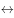王伟在跑道4→张强不在跑道3；

由条件（1）和条件（4）可知，王伟在跑道4，又由条件（5）可知，张强不在跑道3，则张强在跑道5，如图1所示：

由条件（2）李明与张强隔着两个跑道可知，李明在跑道2，钱亮在王伟与李明中间的那个跑道可知，钱亮在跑道3，如图2所示：

进而由条件（3）可知刘平在跑道1，孙新在跑道6，如图3所示：

A项：刘平和孙新之间隔着4个跑道，A项正确，当选；

B项：钱亮和张强之间隔着1个跑道，B项错误，排除；

C项：钱亮和孙新之间隔着2个跑道，C项错误，排除；

D项：刘平和王伟之间隔着2个跑道，D项错误，排除。

故正确答案为A。

---

#### 第 31 题　qid 1791842 · 定义判断

条件性承诺，指在社会活动中，一方对另一方作出附带条件的承诺。
下列属于条件性承诺的是：

- **A**. 小琴考上了重点高中，老爸奖励她到国外旅游一周
- **B**. 某公司老总答应给考核优秀员工每人每月加薪200元　✅
- **C**. 陈某对女儿说：“老妈将一如既往支持你报考研究生。”
- **D**. 小雨为自己立规，不减肥5斤，就拒绝参加朋友聚会

**答案**：B

**官方解析**

第一步：找出定义关键词。
“一方对另一方”、“附带条件的承诺”。
第二步：逐一分析选项。
A项：小琴考上了重点高中，老爸奖励国外旅游，仅仅只是局限于考上了的奖励，并不涉及考前对此有承诺，因此不符合定义，排除；
B项：老总答应加薪，这是一种承诺，而附带的条件则是要考核为优秀，因此符合定义，当选；
C项：陈某表示支持女儿报考研究生，没有体现附带条件，因此不符合定义，排除；
D项：小雨给自己减肥定规矩，只是涉及到单方面的个人，而不存在另一方，因此不符合定义，排除。
故正确答案为B。

---

#### 第 32 题　qid 1791844 · 定义判断

趋同感应：指在社会交往过程中，一方能够把握另一方的心理状态，并且能够设身处地体验对方心理。
下列属于趋同感应的是：

- **A**. 天下谁人不识君
- **B**. 天生我材必有用
- **C**. 同是天涯沦落人　✅
- **D**. 一片冰心在玉壶

**答案**：C

**官方解析**

第一步：找出定义关键词。
关键词为“把握另一方的心理状态”、“设身处地体验对方心理”。
第二步：逐一分析选项。
A项：“天下谁人不识君”指天下哪个不知道你啊，没有体现“把握另一方的心理状态”，排除；
B项：“天生我材必有用”指上天生下我一定有需要用到我的地方，没有体现“把握另一方的心理状态”，排除；
C项：“同是天涯沦落人”指同样都是沦落世间的人，体现了“把握另一方的心理状态”，体验了对方的心理，当选；
D项：“一片冰心在玉壶”指我的心就像盛在玉壶的冰那样洁白透明，没有体现“把握另一方的心理状态”，排除。
故正确答案为C。

---

#### 第 33 题　qid 1789620 · 定义判断

路怒症：指机动车驾驶者在行车过程中因焦躁、愤怒情绪而产生的攻击性行为。
下列不属于路怒症的是：

- **A**. 在路口等红灯时，小张感觉汽车被碰了一下，下车一看，果然是后车刹车不及时追尾了。小张猛踢后车车轮，大声责怪其司机并且索要赔偿
- **B**. 妻子开车送老陈去上班，一辆小汽车突然窜到了面前，险些撞到他的车，老陈下车拦住那辆车，把司机痛斥一顿　✅
- **C**. 小李开了8年车，技术高超，每次被人超车，都忍不住狂踩油门飚上一把，直到反超并羞辱对方一番才罢休
- **D**. 小王正在赶路，旁边车子中飞出一个纸团突然落在他的挡风玻璃上，小王十分生气，他猛按喇叭，嘴里骂个不停

**答案**：B

**官方解析**

第一步：找出定义关键词。
“机动车驾驶者”、“行车过程中”、“因焦躁、愤怒情绪”、“产生的攻击性行为”。
第二步：逐一分析选项。
A项：小张因为后车刹车不及时追尾导致了愤怒情绪，猛踢后车车轮、大声责怪属于“攻击性行为”，符合定义，排除；
B项：妻子开车送老陈上班，妻子是机动车驾驶者，老陈是乘客，老陈不符合定义中的“机动车驾驶者”，不符合定义，当选；
C项：小李被人超车后飙车体现了“愤怒情绪”，反超并羞辱对方一番，符合定义中的“攻击性行为”，符合定义，排除；
D项：小王十分生气，猛按喇叭，嘴里骂个不停，符合定义中的“机动车驾驶者因愤怒情绪而产生的攻击性行为”，符合定义，排除。
本题为选非题，故正确答案为B。

---

#### 第 34 题　qid 1791674 · 定义判断

有我之境：指审美过程中包含客体性的自然景物，也蕴藏审美者的主观感受。即作为观察对象的客观事物染上观察者的主观色彩。
下列最能体现有我之境的是：

- **A**. 明月松间照，清泉石上流
- **B**. 星垂平野阔，月涌大江流
- **C**. 片云天共远，永夜月同孤　✅
- **D**. 明月出天山，苍茫云海间

**答案**：C

**官方解析**

第一步：找出定义关键词。
“包含客体性的自然景物，也蕴藏审美者的主观感受”。
第二步：逐一分析选项。
A项：出自唐代诗人王维的《山居秋暝》，仅仅是在描写山间的自然景色，没有蕴藏审美者的主观感受，不符合定义，排除；
B项：出自唐代诗人杜甫的《旅夜书怀》，仅仅是在描写江边的景色，没有蕴藏审美者的主观感受，不符合定义，排除；
C项：出自唐代诗人杜甫的《江汉》，字面上写的是诗人所看到的片云孤月，实际上是用它们暗喻诗人自己。诗人把内在的感情融入外在的景物当中，感慨自己虽然四处飘零，但对国家的忠心却依然像孤月般皎洁，蕴藏审美者的主观感受，符合定义，当选；
D项：出自唐代诗人李白的《关山月》，仅仅是在描绘边塞的风光，没有蕴藏审美者的主观感受，不符合定义，排除。
故正确答案为C。

---

#### 第 35 题　qid 1789604 · 定义判断

自然淘汰育种法，指在良种筛选过程中，减少人为干预，尽量通过被筛选对象的自然生长确定所需良种的育种方法。
下列属于自然淘汰育种法的是：

- **A**. 
甲鱼养殖场为了选育出抗病力强的种鱼，在甲鱼接连死亡的情况下，不施加任何药物而任其发展，存活到最后的则作为种鱼
　✅
- **B**. 
锦鲤养殖户从幼鱼开始分拣最有经济价值的鱼苗，经过三次人工选鱼后，最终只有不到的幼鱼成了精品锦鲤

- **C**. 
石斛养殖户爬上人迹罕至的悬崖峭壁采集野生石斛，挑选其中的一部分作为种苗，精心培育出了多个新品种

- **D**. 
生长在同一片山坡上的某种植物，有的长势非常茂盛，有的则弱小枯黄，泾渭分明，这正是“物竞天择”的形象说明

**答案**：A

**官方解析**

第一步：找出定义关键词。
“筛选过程中”、“减少人为干预”、“自然生长”、“确定所需良种”。
第二步：逐一分析选项。
A项：甲鱼养殖场不施加任何药物，相当于没有进行人为干预，尽量通过自然生长筛选，存活到最后的抗病力强的种鱼就是所需的良种，符合定义，当选；
B项：经过三次人工选鱼，说明多次进行人为干预，不符合“减少人为干预”，不符合定义，排除；
C项：养殖户人工采集野生石斛，并从中挑选种苗，不符合定义中的“减少人为干预”和“通过······自然生长确定所需良种”，不符合定义，排除；
D项：山坡上的植物长势是自然状态，并不是良种筛选的过程，不符合定义，排除。
故正确答案为A。

---

#### 第 36 题　qid 1789612 · 定义判断

隐形就业：指没有通过传统就业渠道获取固定职业，处于相关部门就业统计范围之外的工作状态。
下列不属于隐形就业的是：

- **A**. 颜某辞去工作后，一边带孩子一边经营一奶粉网店
- **B**. 某教授受多家培训学校之邀，在工作之余常去授课　✅
- **C**. 小陈离开公司后专门为电商店铺提供平台搭建和维护服务
- **D**. 酷爱写作的小王，大学毕业后成了一家报社的自由撰稿人

**答案**：B

**官方解析**

第一步：找出定义关键词。
“没有通过传统就业渠道获取固定职业”、“处于相关部门就业统计范围之外”。
第二步：逐一分析选项。
A项：开奶粉网店符合定义中的“没有通过传统就业渠道获取固定职业”，符合定义，排除；
B项：某教授的本职工作是在高校授课，不符合定义中的“没有通过传统就业渠道获取固定职业”，并且无论其是否兼职授课，该教授都会处于相关部门的就业统计范围之内，不符合定义，当选；
C项：小陈专门为电商店铺提供平台搭建和维护服务符合定义中的“没有通过传统就业渠道获取固定职业”，符合定义，排除；
D项：自由撰稿人是一种新型的自由职业，符合定义中的“没有通过传统就业渠道获取固定职业”，符合定义，排除。
本题为选非题，故正确答案为B。

---

#### 第 37 题　qid 1789686 · 定义判断

平行竞争：指各家厂商提供不同种类的产品以满足顾客同一需求而形成的竞争。
下列属于平行竞争的是：

- **A**. 冬天还没到，电器商场就摆满了各种取暖用品，空调、油汀、热电扇、电热毯应有尽有，价格有高有低，款式或经典或新潮　✅
- **B**. 为了扩大市场份额，某公司新近推出了一款平板电脑，硬盘容量有64G、128G和256G三种规格，供不同层次的消费者选择
- **C**. 只要走进地下商城，马上就会有一群人把你团团围住，卖服装的、卖玩具的、卖食品的······迫不及待地要把你控制在自己的摊位上
- **D**. 小李拿到了1万多元年终奖，准备好好奖励自己，现在正纠结于出国放假、买笔记本电脑还是黄金首饰

**答案**：A

**官方解析**

第一步：找出定义关键词。
“满足顾客同一需求”、“提供不同种类的产品”、“各家厂商”、“竞争”。
第二步：逐一分析选项。
A项：电器商场中有各种品牌，属于定义中的“各家厂商”，空调、油汀、热电扇等属于不同种类的产品，都是为满足顾客取暖的同一需求，体现出厂家间的竞争，符合定义，当选；
B项：平板电脑规格不同但都是同一家公司推出的，不存在厂家间的竞争，不符合定义，排除；
C项：服装、玩具、食品满足的是消费者的不同需求，不符合定义，排除；
D项：出国旅游、买电脑还是买黄金首饰满足的是小李的不同需求，不符合定义，排除。
故正确答案为A。

---

#### 第 38 题　qid 2033748 · 定义判断

交友泡沫化指基于各种现实需要而有意扩大朋友范围或虽有交往却从未谋面的朋友泛化现象。
下列不属于交友泡沫化的是：

- **A**. 游戏爱好者的账号中都有一串不知道真名实姓的朋友
- **B**. 饭局上，即使不太熟悉的人也会以哥们、兄弟相称
- **C**. 小昊说自己微信朋友圈里有许多从未见过面的好友
- **D**. 大多数人都习惯把交情比较深的同事也称为朋友　✅

**答案**：D

**官方解析**

第一步：找出定义关键词。
“基于各种现实需要而有意扩大朋友范围或虽有交往却从未谋面的朋友泛化”。
第二步：逐一分析选项。
A项：游戏爱好者的账号中的朋友是为了共同参与游戏，属于有意扩大朋友范围，不知道真名实姓的朋友说明从未谋面，符合定义，排除； 
B项：在饭局上和不熟悉的人称兄道弟是基于某种现实需要而有意扩大朋友范围的一种手段，符合定义，排除； 
C项：微信中的好友是为了交流，属于有意扩大朋友范围，从未见过面说明从未谋面，符合定义，排除； 
D项：把交情比较深的同事称为朋友说明之前是有过谋面的，不符合定义，当选。
本题为选非题，故正确答案为D。

---

#### 第 39 题　qid 1791682 · 定义判断

新农人：指具有科学文化素质、掌握现代农业生产技能，以农业生产、经营、服务作为职业的劳动者。
下列不属于新农人的是：

- **A**. 蔡某大学毕业后，利用自己学到的新技术培育种植出了方形南瓜、彩色辣椒等，销路很好
- **B**. 回乡创业的程某，几年来致力于推广无土瓜果种植技术，圆了全村不少家庭的致富梦
- **C**. 小李高考落榜后，在政府政策扶持下，在自己家乡养起来了猪，10多年下来，已经走上了富裕路　✅
- **D**. 小朱在部队掌握了养牛技术，转业回乡后自办奶牛场，建起了一个直销网站，为客户提供周到服务

**答案**：C

**官方解析**

第一步：找到定义关键词。
“具有科学文化素质、掌握现代农业生产技能，以农业生产、经营、服务作为职业的劳动者”。
第二步：逐一分析选项。
A项：利用大学学到的新技术说明具有科学文化素质、掌握现代农业生产技能，培养方形南瓜、彩色辣椒等说明是以农业生产作为职业，符合定义，排除； 
B项：推广无土瓜果种植技术说明掌握现代农业生产技能，服务对象是全村家庭说明是以农业服务作为职业，符合定义，排除； 
C项：虽然养猪属于农业生产，但在政府政策扶持下养猪并没有体现小李掌握了现代农业生产技能，不符合定义，当选； 
D项：在部队掌握了养牛技术说明有现代农业生产技能，建立直销网站为客户提供服务说明是以农业服务作为职业，符合定义，排除。
本题为选非题，故正确答案为C。

---

#### 第 40 题　qid 1791684 · 定义判断

社会概称意识：指人们对某一社会群体所持有的比较固定的、概括而笼统的看法。
下列属于社会概称意识的是：

- **A**. 某民族认为狼都是凶残、贪婪的
- **B**. 非洲某部落视天狼星为其幸运星
- **C**. 不少年轻人认为养宠物最有爱心
- **D**. 南方人认为北方人是不怕冷的　✅

**答案**：D

**官方解析**

第一步：找到定义关键词。
“人们对某一社会群体所持有的比较固定的、概括而笼统的看法”。
第二步：逐一分析选项。
A项：狼不属于社会群体，不符合定义，排除； 
B项：天狼星不属于社会群体，不符合定义，排除； 
C项：养宠物是一种行为，不是社会群体，不符合定义，排除； 
D项：不怕冷是南方人对北方人这一社会群体持有的比较固定的、概括而笼统的看法，符合定义，当选。
故正确答案为D。

---

#### 第 41 题　qid 1789586 · 定义判断

逆势扩张：指企业在面临巨大压力和困难的情况下，进一步巩固和拓展市场，在竞争中抢占先机的经营行为。
下列不属于逆势扩张的是：

- **A**. 当大多数的国产品牌彩电市场份额纷纷下滑的时候，某电视厂家却连续推出了几款超级电视，市场占比高歌猛进，遥遥领先几大洋品牌
- **B**. 某汽车油箱销售公司是我国规模较大的自主品牌出口企业，近期已正式进入预先披露更新企业名单之列，向上市的目标又迈进了一步　✅
- **C**. 在人们普遍认为房地产调控政策将严重影响家居行业之际，某品牌家具高调宣布，最近在省城及周边地区又成功开设了多家专营店
- **D**. 国内零售行业近期表现欠佳，各销售企业纷纷收缩实体阵地，某民营企业今日却在省城新增了一家购物中心，另外两家不久也将开业

**答案**：B

**官方解析**

第一步：找出定义关键词。
“企业”、“面临巨大压力和困难”、“进一步巩固和拓展市场”、“在竞争中抢占先机”。
第二步：逐一分析选项。
A项：国产品牌彩电市场份额纷纷下滑符合“企业面临巨大压力和困难”，某电视厂家却连续推出几款超级电视，市场占比高歌猛进，是“进一步巩固和拓展市场”，最后遥遥领先几大洋品牌属于“在竞争中抢占先机”，符合定义，排除；
B项：某汽车油箱销售公司属于企业，近期已正式进入预先披露更新企业名单之列，向上市目标迈进一步，并没有体现题干中所提到的困难的环境，也没有体现出在竞争中抢占先机，不符合定义，当选；
C项：家居行业受到房地产调控政策影响，符合“企业面临巨大压力和困难”，某品牌家具在省城及周边地区成功开设了多家专营店体现了“进一步巩固和拓展市场”“在竞争中抢占先机”，符合定义，排除；
D项：零售行业表现不佳，符合“企业面临巨大压力和困难”，某民营企业新开购物中心属于定义中的“进一步巩固和拓展市场”“在竞争中抢占先机”，符合定义，排除。
本题为选非题，故正确答案为B。

---

#### 第 42 题　qid 2032242 · 定义判断

假摔式降费：指企业在外部压力之下采取的一些表面降幅很大，实际上并未惠及广大消费者的调价策略。
下列属于假摔式降费的是：

- **A**. 在“双十一”价格大战中，某知名家电企业大幅调整了多种产品的零售价格，一周内，这些产品在全城各大商场均纷纷售罄
- **B**. 某城市的几家大商场为了抢占节日市场，联手采用打折促销的手段，消费人数呈上升之势
- **C**. 为落实上级有关部门的降费要求，某运营商很快公布了夜间国际漫游降低费用的具体方案　✅
- **D**. 根据上级规定，某旅游景区在其官网上发布了不涨价承诺，游客们很快发现其中的不少景点本来就是免费景点

**答案**：C

**官方解析**

第一步：找到定义关键词。
关键词为“企业”、“降幅很大”、“实际上并未惠及广大消费者的调价策略”。
第二步：逐一分析选项。
A项：家电企业大幅调整价格后其惠及的群体是各大商场的购买者，消费者能够得到实际的好处，与题干定义关键词不符，排除；
B项：几家大商场联手打折促销，惠及的群体是“上升趋势的消费人数”，实际上惠及了大量消费者，与题干定义关键词不符，排除；
C项：降低夜间国际漫游费用，体现了定义中的关键词“降幅”，但是降价之后有没有人会在夜间使用国际漫游，或者说有没有消费者得到实际的好处是不确定的，保留；
D项：不涨价承诺并未体现“降幅”，与题干定义关键词不符，排除。
对比选项：A、B两项中的消费者都明确地获得了实际的好处，C项中的消费者有没有获得实际好处是不明确的，此时对比也只能选择C项。
故正确答案为C。

---

#### 第 43 题　qid 1789594 · 定义判断

优势反应：指熟练程度极高、遇到某种刺激时不加思考就做出来的习惯性动作。
下列不属于优势反应的是：

- **A**. 中国人遇到多年未见的朋友时，一般都伸出右手去和对方握手
- **B**. 在街上听到有人喊自己名字，人们总会循着声音方向去寻找
- **C**. 人们无意之中伸进滚烫的开水，瞬间就会把手缩回　✅
- **D**. 小丽在家看小说时，一碰到不认识的字就会下意识地去查字典

**答案**：C

**官方解析**

第一步：找出定义关键词。
“熟练程度极高”、“遇到某种刺激”、“不加思考就做出来的习惯性动作”。
第二步：逐一分析选项。
A项：遇到了多年未见的朋友体现了“遇到某种刺激”，一般伸出右手和对方握手符合“熟练程度极高的动作”，符合定义，排除；
B项：听到有人喊自己名字体现了定义中的“遇到某种刺激”，总会循着声音方向去寻找属于“不加思考就做出来的习惯性动作”，符合定义，排除；
C项：被热水烫这件事没有多少机会让人去熟悉，也没人经常把手伸到热水里，不属于定义中的“熟练程度极高的习惯性动作”，不符合定义，当选；
D项：看到不认识的字下意识地去查字典，这正是因为遇到过这种情况且通过查字典解决了问题，符合定义中的“熟练程度极高、不加思考就做出来的习惯性动作”，符合定义，排除。
本题为选非题，故正确答案为C。

---

#### 第 44 题　qid 1791852 · 定义判断

安全性思维，指经过观察后，对当前事物或事件的发展作出对自己不利的预测，并做好防备。
下列属于安全性思维的是：

- **A**. 小李从小体质虚弱，三天两头感冒，坚持了10年冬泳后，现在已经很少生病了
- **B**. 公司经营越来越难，小陈觉得肯定会裁员，悄悄到人才市场投递了几份简历　✅
- **C**. 公共汽车上来了一个驼背老人，小王怕他跌倒受伤，便把自己的座位让给了老人
- **D**. 这两天气温骤降，老张要到北方出差，妻子特意往他的行李箱里塞了几件厚衣服

**答案**：B

**官方解析**

第一步：找出定义关键词。
原因：“作出对自己不利的预测”。
结果：“做好防备”。
第二步：逐一分析选项。
A项：小李并没有对当前事物的发展作出对自己不利的预测，因此不符合定义，排除； 
B项：公司经营困难，小陈觉得会裁员是对事件发展作出了不利于自己的预测，悄悄到人才市场投简历是一种做好防备的行为，因此符合定义，当选；
C项：小王是怕驼背老人跌倒，不是对自己作不利的预测，因此不符合定义，排除；
D项：老张的妻子特意在他的行李箱里塞几件厚衣服，并不是对自己作出不利的预测，因此不符合定义，排除。
故正确答案为B。

---

#### 第 45 题　qid 2032210 · 定义判断

粉丝文化：指个人或者群体出于对某一特定对象的追捧心理，所引发的过度崇拜、过度消费、无偿付出等社会文化现象。
下列不属于粉丝文化的是：

- **A**. 某位学者在电视台成功地举办了多次讲座，从此以后，他上课的教室外边常常挤满了慕名而来请求签名、合影的学生、市民
- **B**. 为了让歌手小杨在选秀节目中脱颖而出，许多陌生的年轻人自发组织起来，天天台前幕后地拉选票、拉赞助，忙得不亦乐乎
- **C**. 小张是一家娱乐类刊物的记者，他的主要任务是报道演艺圈的动态消息。有时为了追踪一个明星，甚至连饭都顾不上吃　✅
- **D**. 小丽是《舌尖上的中国》的忠实观众，她把每一期节目都下载到自己的电脑中反复观看，经常到废寝忘食的地步

**答案**：C

**官方解析**

第一步：找出定义关键词。
“出于对某一特定对象的追捧心理”、“过度崇拜、过度消费、无偿付出等”。
第二步：逐一分析选项。
A项：慕名而来请求签名、合影的学生和市民是出于对学者的追捧心理，对学者的支持、喜爱是一种无偿付出，符合定义，排除；
B项：陌生人自发组织为歌手小杨拉选票、拉赞助是出于对小杨的追捧心理引发的无偿付出的现象，符合定义，排除；
C项：小张追踪明星是出于工作需要，并不是对明星的追捧，不符合定义，当选；
D项：小丽是《舌尖上的中国》的忠实观众，看节目废寝忘食是出于对节目的追捧心理所引发的过度崇拜的现象，符合定义，排除。
本题为选非题，故正确答案为C。

---

## 资料分析

### 材料 1

#### 第 1 题　qid 2033788 · 增长

2015年前7个月，中国对其贸易顺差同比增长最快的主要贸易伙伴是：

- **A**. 香港
- **B**. 东盟　✅
- **C**. 台湾
- **D**. 巴西

**答案**：B

**官方解析**

贸易顺差即，即表格中贸易差额大于0。2015年前7个月，中国对其实现贸易顺差的有欧盟、美国、东盟、香港、印度，对应的增长率分别为，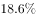，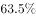，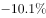，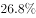。对东盟的贸易差额增长最快。

故正确答案为B。

---

#### 第 2 题　qid 2033790 · 增长

2015年前7个月，中国对其贸易逆差同比减少的主要贸易伙伴有：

- **A**. 3个
- **B**. 4个
- **C**. 5个　✅
- **D**. 6个

**答案**：C

**官方解析**

贸易逆差即，对应表格中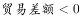，定位表格可得，中国对其实现贸易逆差的有日本、韩国、台湾、澳大利亚、巴西，其对应的增长率均小于0。因此5个贸易伙伴的贸易差额均同比减少。

故正确答案为C。

---

#### 第 3 题　qid 2033794 · 综合

2014年前7个月，中国对澳大利亚的出口额是：

- **A**. 1290.2亿元　✅
- **B**. 1341.8亿元
- **C**. 1395.5亿元
- **D**. 3648.5亿元

**答案**：A

**官方解析**

由问题所求“2014年前7个月，中国对澳大利亚的出口额是”，可判定此题为基期计算问题。定位表格可得，2015年前7个月，中国对澳大利亚的出口额为1341.8亿元，同比增长，，仅A项满足。

故正确答案为A。

---

#### 第 4 题　qid 2033796 · 增长

2015年前7个月，中国对欧盟和美国的出口额同比平均增长：

- **A**. 
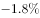

- **B**. 

- **C**. 

　✅
- **D**. 

**答案**：C

**官方解析**

由问题所求“2015年前7个月，中国对欧盟和美国的出口额同比平均增长”，选项为百分数，可判定此题为混合增长率问题。定位表格可得，2015年前7个月，中国对欧盟的出口额为12180.2亿元，同比增长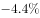，对美国的出口额为13973.8亿元，同比增长，则2014年前七个月，中国对欧盟的出口额为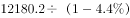亿元，中国对美国的出口额为亿元。根据混合增长率口诀“居中但不中，偏向基期较大的”，则混合增长率应略大于，排除A、B选项。C、D选项相差较小，考虑线段法，因，基期量即为分母，所以增速差与基期量成反比（因选项差距小，不能用现期量近似替代基期量计算，否则会误选D选项）。设2015年前7个月，中国对欧盟和美国的出口额同比平均增长，则根据线段法“增速差与基期量成反比”，可得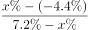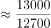，直接求解比较复杂，代入C选项成立，而D选项差距较大。

故正确答案为C。

---

#### 第 5 题　qid 2033798 · 综合

下列判断正确的是：

- **A**. 2014年前7个月，中国对日本的贸易总额比对韩国的少
- **B**. 2015年前7个月，中国对主要贸易伙伴的贸易顺差同比均有所增长
- **C**. 2015年前7个月，中国对其出口额超过5000亿元的主要贸易伙伴数是4　✅
- **D**. 2015年前7个月，中国对其进口额和出口额同比变动方向一致的主要贸易伙伴数不足一半

**答案**：C

**官方解析**

A项：定位表格可得，2015年前7个月，中国对日本的进出口额为9767.0亿元，同比增长，对韩国的进出口额为9461.7亿元，同比增长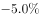，则2014年前7个月，中国对日本的进出口额为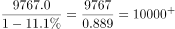，对韩国的进出口额为，故中国对日本的贸易总额比对韩国的多，错误；

B项：定位表格可得，2015年前7个月，中国对香港实现贸易顺差，但贸易差额同比下降，错误；

C项：定位表格可得，2015年前7个月，中国对其出口额超过5000亿元的主要贸易伙伴为欧盟、美国、东盟、香港，共4个，正确；

D项：定位表格可得，主要贸易伙伴共10个，2015年前7个月，中国对其进口额和出口额同比变动方向一致的主要贸易伙伴为欧盟、香港、日本、韩国、巴西，共5个，恰好占一半，错误。

故正确答案为C。

---

### 材料 2

        2014年末全国就业人员77253万人，比上年末增加276万人。其中，城镇就业人员39310万人，比上年末增加1070万人。

#### 第 6 题　qid 2032198 · 增长

2014年末全国城镇新增就业人数比2013年末增长：

- **A**. 
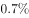

- **B**. 

　✅
- **C**. 

- **D**. 

**答案**：B

**官方解析**

由题干“比…增长”，结合选项都为百分数，可判定该题是求一般增长率问题。定位表格数据可得，2013年末全国城镇新增就业人数1310万人，2014年末全国城镇新增就业人数1322万人。，因此2014年末全国城镇新增就业人数比2013年末。

故正确答案为B。

---

#### 第 7 题　qid 2032200 · 综合

2013年末全国就业人员中从事第三产业的人数为：

- **A**. 23170万
- **B**. 24171万
- **C**. 29636万　✅
- **D**. 31365万

**答案**：C

**官方解析**

由题干“2013年…从事第三产业的人数为”，可判定该题是基期计算问题。定位文字材料和表格数据，2014年末全国就业人员77253万人，比上年末增加276万人，2013年末第三产业就业人员占比，因此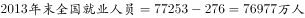，那么2013年末全国就业人员中，略大于答案C。

故正确答案为C。

---

#### 第 8 题　qid 2032202 · 比重

和2010年末相比，2014年末全国第一产业就业人员占比提高了：

- **A**. -7.2个百分点　✅
- **B**. 1.2个百分点
- **C**. 6.0个百分点
- **D**. 7.2个百分点

**答案**：A

**官方解析**

由题干“占比提高”，结合材料中已经给出了2010和2014年全国第一产业就业人员占比，可判定该题属于简单加减计算问题。定位表格数据，2010年末全国第一产业就业人员占比，2014年末全国第一产业就业人员占比，因为，所以和2010年末相比，2014年末全国第一产业就业人员占比提高了-7.2个百分点。

故正确答案为A。

---

#### 第 9 题　qid 2032204 · 比重

2011-2014年，全国城镇失业人员再就业人数占上年末全国城镇登记失业人数比重的最大值是：

- **A**. 

- **B**. 

- **C**. 

- **D**. 

　✅

**答案**：D

**官方解析**

由题干“2011—2014年···比重的最大值”，可判定该题是比值计算问题。

方法一：定位表格中数据，列表可得:

最大值为2013年的。

方法二：2011—2014年，全国城镇失业人员再就业人数占上年末全国城镇登记失业人数比分别为：2011年，2012年，2013年，2014年，可得，因此2011—2014年，全国城镇失业人员再就业人数占上年末全国城镇登记失业人数比重的最大值是2013年。

故正确答案为D。

---

#### 第 10 题　qid 2032206 · 综合

下列判断正确的是：

- **A**. 2014年末全国第二产业就业人数比上年末有所增加
- **B**. 2014年末全国城镇就业人员比上年末增加1322万人
- **C**. 2011—2014年末，全国第三产业就业人员占比逐年增加　✅
- **D**. 2011—2014年末，全国城镇登记失业率和城镇登记失业人数的变化趋势相同

**答案**：C

**官方解析**

A项：，因为2014年末国第二产业就业人数，，错误；

B项：2014年城镇就业人员39310万人，比上年末增加1070万人，不是1322万人，错误；

C项：2011—2014年末全国第三产业就业人员占比分别为，，，，占比逐年增加，正确；

D项：2011—2014年末，全国城镇登记失业率变化趋势为：减-增；城镇登记失业人数的变化趋势为：增-减-增，错误。

故正确答案为C。

---

### 材料 3

        2015年1—6月我国火力、水力发电量及其增长情况

#### 第 11 题　qid 1789652 · 综合

2015年1-6月我国火力发电量少于上年同期的月度个数是（    ）

- **A**. 3
- **B**. 4
- **C**. 5　✅
- **D**. 6

**答案**：C

**官方解析**

由题目问少于上年同期的月度个数，即增长率小于零的个数，可判定本题为直接找数问题，根据折线图可知，2月、3月、4月、5月、6月火力发电量同比增长率均小于零，即有5个月发电量同比减少。
故正确答案为C。

---

#### 第 12 题　qid 1789628 · 增长

2014年我国季度发电量同比增长最慢的是：

- **A**. 第一季度
- **B**. 第二季度
- **C**. 第三季度
- **D**. 第四季度　✅

**答案**：D

**官方解析**

由题目所问“同比增长最慢”是哪一季度，判定本题为一般增长率比较问题。定位表格材料，2014年4个季度的同比增长率分别为：、、、，故增长最慢的是第四季度。

故正确答案为D。

---

#### 第 13 题　qid 1789630 · 增长

2015年第二季度我国火力发电量比上年同期少：

- **A**. 232亿千瓦小时
- **B**. 240亿千瓦小时
- **C**. 340亿千瓦小时
- **D**. 365亿千瓦小时　✅

**答案**：D

**官方解析**

由题目所问“发电量比上年同期少”，可判定本题为增长量计算问题。因选项和条件精度相同，可采用尾数法。2014年第二季度我国火力发电量亿千瓦小时，由图中数据可得2015年第二季度火力发电量=亿千瓦小时。二者之差=，计算尾数得5，只有D项满足。

故正确答案为D。

---

#### 第 14 题　qid 1789634 · 增长

如果2015年7月-11月我国水力发电量的月平均增速与2015年2月-6月保持相同，则2015年11月我国水力发电量可达：

- **A**. 1390亿千瓦小时
- **B**. 1870亿千瓦小时　✅
- **C**. 2063亿千瓦小时
- **D**. 2239亿千瓦小时

**答案**：B

**官方解析**

由题干给定“月平均增速”求现期，判定为年均增长率问题，定位图中数据，假设2015年7月-11月的月均增长速度为，则565，则2015年11月我国水力发电量为=。

故正确答案为B。

---

#### 第 15 题　qid 1789640 · 综合

下列判断不正确的是：

- **A**. 
2014年有三个季度的水力发电量占发电总量的比重不超过

- **B**. 
2013年—2014年我国各季度火力发电量占发电总量的比重均超过

- **C**. 
2015年上半年我国水力与火力发电量各月同比增长的方向均相反
　✅
- **D**. 
2013年第二季度到2015年第二季度我国水力发电量有四个季度环比减少

**答案**：C

**官方解析**

A项：2014年一、二、三、四季度水力发电量占发电总量的比重分别为：、、、，即2014年一、二、四季度比重不超过，正确；

B项：2013年各个季度火力发电占总发电量的比重分别为：、、、；2014年各个季度火力发电占总发电量的比重分别为：、、、，即2013年-2014年我国各季度火力发电量占发电总，正确；

C项：2015年1月，水力和火力发电量同比增长率均大于零，二者方向相同，错误；

D项：由表格材料可知，2015年一、二季度水力发电量分别为：、，则2015年第一季度水力发电量小于2014年第四季度，共有四个季度环比减少，分别为2013年第四季度、2014年第一季度、2014年第四季度、2015年第一季度，正确。

本题为选非题，故正确答案为C。

---

### 材料 4

        2015年某市统计局进行了一次有关该市控制吸烟状况的调查。

        对“公共场所控烟状况改善效果”问题的调查结果显示：的受访市民表示效果明显，的表示效果一般，的表示没有效果，的表示效果很差。当对认为控烟“没有效果”“效果很差”的受访市民询问原因时，的女性受访市民认为“购买香烟过于方便”，比男性市民高出5.0个百分点；的市民认为“禁烟执法不严”（其它原因见图1），其中的老年市民选择“禁烟执法不严”，比中年、青年市民分别高出2.9和5.6个百分点。

        对“公共场所全面禁烟最有效的方法与途径”问题的调查结果显示：的受访市民表示应该“加大处罚力度”（其他调查结果见图2）。其中，的中年市民表示应该加大处罚力度，比青年和老年市民分别高出1.0和3.9个百分点。

        对“公共场所控烟条例修订及立法”问题的调查结果显示：的受访市民表示支持，的表示不支持，的表示无所谓；的女性受访市民表示支持，的男性市民表示支持。

#### 第 16 题　qid 2033800 · 综合

对该市公共场所控烟改善效果，认为“效果明显”与“效果很差”的受访市民数之比是：

- **A**. 

- **B**. 

　✅
- **C**. 

- **D**. 

**答案**：B

**官方解析**

由问题所求“…与…之比是”，可判定此题为比值计算问题。定位材料第二段可得，对“公共场所控烟状况改善效果”问题的调查结果显示：的受访市民表示效果明显，的表示效果很差。二者之比为。

故正确答案为B。

---

#### 第 17 题　qid 2033802 · 比重

当对认为控烟“没有效果”“效果很差”的市民询问原因时，中年市民选择“禁烟执法不严”的比重比青年市民：

- **A**. 低2.9个百分点
- **B**. 高2.7个百分点　✅
- **C**. 低5.6个百分点
- **D**. 高8.5个百分点

**答案**：B

**官方解析**

由问题所求“…的比重比…”，选项为百分点，可判定此题为现期比重问题。定位材料第二段可得，的老年市民选择“禁烟执法不严”，比中年、青年市民分别高出2.9和5.6个百分点。则中年市民选择“禁烟执法不严”的比重比青年市民高，即高2.7个百分点。

故正确答案为B。

---

#### 第 18 题　qid 2033804 · 综合

对于“公共场所全面禁烟最有效的方法与途径”表示“加大处罚力度”的受访市民人数比表示“扩大媒体宣传”的受访市民人数多：

- **A**. 

　✅
- **B**. 

- **C**. 

- **D**. 

**答案**：A

**官方解析**

由问题所求“······的受访市民人数比······的受访市民人数多”，选项为百分数，可判定本题为增长率问题。定位图2可得，表示“加大处罚力度”的受访市民人数占，表示“扩大媒体宣传”的受访市民人数占，则前者比后者多，仅A项满足。

故正确答案为A。

---

#### 第 19 题　qid 2033806 · 比重

本次调查中受访女性市民人数占受访总人数的比重是：

- **A**. 

- **B**. 

- **C**. 

　✅
- **D**. 

**答案**：C

**官方解析**

由问题所求“本次调查中受访女性市民人数占受访总人数的比重”，可判定此题为混合比重问题。定位文字材料第四段可得，的受访市民表示支持，的女性受访市民表示支持，的男性市民表示支持。则距离之比为，根据线段法，距离与量成反比，则，，C项最接近。

故正确答案为C。

---

#### 第 20 题　qid 2033808 · 综合

关于本次调查，下列判断不正确的是：

- **A**. 
受访市民对“公共场所控烟条例修订及立法”表示不支持的占

- **B**. 
认为控烟“没有效果”“效果很差”的受访青年市民中，选择“禁烟执法不严”的比重为

- **C**. 
认为控烟“没有效果”“效果很差”的原因是“禁烟执法不严”和“公众对吸烟危害认识不足”的受访市民合计占受访市民的比重为
　✅
- **D**. 
在认为控烟“没有效果”“效果很差”的受访市民中，认为“购买香烟过于方便”的男性的比重小于女性

**答案**：C

**官方解析**

A项：定位文字材料第四段可得，“公共场所控烟条例修订及立法”问题的调查结果显示：的受访市民表示支持，的表示不支持，正确；

B项：定位文字材料第二段可得，的老年市民选择“禁烟执法不严”，比青年市民高出5.6个百分点，，正确；

C项：定位文字材料第二段和图形材料可得，当对认为控烟“没有效果”“效果很差”的受访市民询问原因时，“禁烟执法不严”占比为，“公众对吸烟危害认识不足”占比为，合计占认为控烟“没有效果”“效果很差”的受访市民的比重为。

然而本项说法将“占认为控烟‘没有效果’‘效果很差’的受访市民的比重”偷换为“占受访市民的比重”，两个比重的分子相同但分母不同，错误；

D项：定位文字材料第二段和图形材料可得，在对认为控烟“没有效果”“效果很差”的受访市民询问原因时，分别有的女性受访市民和的男性受访市民认为“购买香烟过于方便”，合计有的受访市民认为“购买香烟过于方便”。

设认为控烟“没有效果”“效果很差”的男性和女性受访市民分别是和，则其中认为“购买香烟过于方便”的男性和女性受访市民分别是和，合计为，有，化简可得，所以，进而推出，即：在认为控烟“没有效果”“效果很差”的受访市民中，认为“购买香烟过于方便”的男性受访市民（）少于女性受访市民（），所以认为“购买香烟过于方便”的男性的比重小于女性，正确。

本题为选非题，故正确答案为C。

---
