# 2016年江苏省公务员录用考试《行测》题（C类）

> 省考 · 2016 年 · 6 个模块 · 共 128 题

- [政治理论](#%E6%94%BF%E6%B2%BB%E7%90%86%E8%AE%BA) · 1 题
- [常识判断](#%E5%B8%B8%E8%AF%86%E5%88%A4%E6%96%AD) · 19 题
- [言语理解与表达](#%E8%A8%80%E8%AF%AD%E7%90%86%E8%A7%A3%E4%B8%8E%E8%A1%A8%E8%BE%BE) · 35 题
- [数量关系](#%E6%95%B0%E9%87%8F%E5%85%B3%E7%B3%BB) · 8 题
- [判断推理](#%E5%88%A4%E6%96%AD%E6%8E%A8%E7%90%86) · 45 题
- [资料分析](#%E8%B5%84%E6%96%99%E5%88%86%E6%9E%90) · 20 题

---

## 政治理论

### 第 1 题　qid 1791698 · 马克思主义

习近平总书记在中央政治局第二十次集体学习时强调，要增强问题意识，坚持问题导向。这体现的哲学原理是：

- **A**. 矛盾具有普遍性和客观性，矛盾是事物发展的源泉和动力　✅
- **B**. 联系具有普遍性和多样性，任何事物都处在普遍联系之中
- **C**. 真理具有绝对性和相对性，绝对真理包含在相对真理之中
- **D**. 认识具有反复性和无限性，认识是一个辩证运动的过程

**答案**：A

**官方解析**

A项正确：中共中央政治局于2015年1月23日就辩证唯物主义基本原理和方法论进行第二十次集体学习。习近平总书记强调：“要学习掌握事物矛盾运动的基本原理，不断强化问题意识，积极面对和化解前进中遇到的矛盾。问题是事物矛盾的表现形式，我们强调增强问题意识、坚持问题导向，就是承认矛盾的普遍性、客观性，就是要善于把认识和化解矛盾作为打开工作局面的突破口。”增强问题意识，坚持问题导向，就是承认矛盾的普遍性和客观性；认识矛盾，进而解决矛盾，推动事物的发展，这说明矛盾是事物发展的源泉和动力。
B、C、D项错误：题干中的“问题意识”和“问题导向”没有体现选项中涉及的联系、真理和认识的基本原理。
故正确答案为A。

---

## 常识判断

### 第 1 题　qid 1789072 · 人文常识

党的十八届五中全会通过了《中共中央关于制定国民经济和社会发展第十三个五年规划的建议》，下列对于该建议的理解，正确的是：

- **A**. 《“十三五”规划建议》是针对“两个一百年”奋斗目标的收官阶段提出的战略蓝图
- **B**. 《“十三五”规划建议》充分论证了继续坚持我国改革开放的发展方式的必要性
- **C**. 《“十三五”规划建议》针对社会主要矛盾的新变化提出了经济社会发展的新方针
- **D**. 《“十三五”规划建议》提出并阐述了我国经济社会发展的“五大发展理念”　✅

**答案**：D

**官方解析**

A项错误：《“十三五”规划建议》是中华人民共和国国民经济和社会发展第十三个五年规划纲要，起止时间为2016年至2020年。“两个一百年”奋斗目标分别是指“在中国共产党成立一百年时全面建成小康社会”和“在新中国成立一百年时建成富强民主文明和谐的社会主义现代化国家”。“两个一百年”起止时间分别是1921年至2021年、1949年至2049年。因此，“十三五”规划是针对第一个一百年即建党一百年收官阶段提出的战略蓝图。
B项错误：《“十三五”规划建议》只是对今后的工作进行规划建议，并非一个完整论述改革开放理论的方案。
C项错误：2017年10月，习近平同志在十九大报告中明确指出，我国社会主要矛盾已经转化为人民日益增长的美好生活需要和不平衡不充分的发展之间的矛盾。而十八届五中全会召开于2015年，当时我国社会主要矛盾没有发生变化，依然是人民日益增长的物质文化需要和落后的社会生产之间的矛盾。
D项正确：《“十三五”规划建议》提出并阐述了“创新、协调、绿色、开放、共享”的五大发展理念。
故正确答案为D。
【备注】中共十五大报告首次提出“两个一百年”奋斗目标：到建党一百年时，使国民经济更加发展，各项制度更加完善；到世纪中叶建国一百年时，基本实现现代化，建成富强民主文明的社会主义国家。“到建党一百年时”“到世纪中叶建国一百年时”是一种较为模糊的表述，可理解为“100周年”（即2021年和2049年），也可理解为“第100年”（即2020年和2048年），因此，通常将这两个时间点取整近似为2020年和2050年。

---

### 第 2 题　qid 1791702 · 人文常识

下列诗句与传统节日对应不正确的是：

- **A**. 总把新桃换旧符—清明节　✅
- **B**. 遍插茱萸少一人—重阳节
- **C**. 蓦然回首，那人却在灯火阑珊处—元宵节
- **D**. 两情若是久长时，又岂在朝朝暮暮—七夕节

**答案**：A

**官方解析**

A项对应错误：该句出自宋代诗人王安石的《元日》，描写的是春节除旧迎新的景象。贴桃符是春节的习俗，相当于现代的贴对联，从“新桃换旧符”可知该项对应错误；
B项对应正确：该句出自唐代诗人王维的《九月九日忆山东兄弟》，描写了诗人在重阳节对家乡亲人的思念；
C项对应正确：该句出自南宋诗人辛弃疾的《青玉案·元夕》，描写了元宵夜一对意中人在大街巧遇的场景；
D项对应正确：该句出自北宋诗人秦观的《鹊桥仙》。这是一首咏七夕的节序词，诗人借牛郎织女悲欢离合的故事来歌颂爱情。
本题为选非题，故正确答案为A。

---

### 第 3 题　qid 1791518 · 经济常识

供给侧结构性改革强调从供给、生产端入手，不断解放生产力，提升效率，促进经济发展。下列属于供给侧结构性改革举措的是：

- **A**. 物价部门开展市场检查
- **B**. 商业银行上浮贷款利率
- **C**. 发改委取消部分行政审批事项　✅
- **D**. 工商部门限制明星代言广告

**答案**：C

**官方解析**

A项错误：物价部门开展市场调查属于部门常规业务，与供给侧结构性改革措施无关；

B项错误：商业银行上浮贷款利率，会使货币供给减少，从而使投资、消费减少，最终造成总产出的减少，与供给侧结构性改革措施无关；
C项正确：2015年的中央经济工作会议强调，要推进供给侧结构性改革。习近平总书记用“加减乘除”四则运算通俗易懂地布局了供给侧结构性改革这一新举措。其中，供给侧结构性改革的“减法”，主要指政府简政放权、企业清除过剩产能、社会为企业降低成本，给企业松绑，给企业减负，激发微观经济活力。发改委取消部分行政审批事项，属于政府简政放权，给企业松绑，符合供给侧结构性改革中“减法”的要求；
D项错误：工商部门限制明星代言广告是对广告制度的规范，保护消费者的权益，与供给侧结构性改革措施无关。
解答本题时，观察选项，抓住题干“从供给、生产端入手”“解放生产力”这两个关键词，可知A、B、D三项与供给、生产端、生产力没有直接关系，排除。
故正确答案为C。

---

### 第 4 题　qid 1791530 · 人文常识

下列对日常生活现象的解释正确的是：

- **A**. 自行车在夏天暴晒后容易爆胎，是因为橡胶在高温下变软了
- **B**. 夏天从冰箱里取出的冷饮瓶表面有小水滴，是因为冰箱湿度大于室内
- **C**. 赤脚站在瓷砖上比站在棉被上凉爽，是因为瓷砖的温度比棉被的温度低
- **D**. 热水瓶的内胆镀银是为了减少热辐射　✅

**答案**：D

**官方解析**

A项错误：自行车在夏天暴晒后容易爆胎，是因为暴晒后车胎中的气体会膨胀，造成胎内气压增大，从而使车胎膨胀，当车胎的膨胀程度超过自身能承受的最大限度时，就会出现爆胎。这属于热胀冷缩原理。
B项错误：冷饮瓶表面的小水滴是由于气体液化形成的。冷饮瓶从冰箱取出时，瓶身的温度低于周围环境的温度，当瓶身周围空气中的水蒸气遇到较冷的瓶身时，就会液化成小水滴，附着在瓶身上。
C项错误：赤脚站在瓷砖上比站在棉被上凉爽，是因为瓷砖的导热性好，赤脚站上去后身体的热量很快被传导开，而棉被的导热性较差，会将热量聚集在触摸点周围。
D项正确：热水瓶的内胆镀银可以形成银镜反应，通过镜面反射把保温瓶内部的热辐射反射回保温瓶内部，就不会出现对外的热辐射，从而减少热量散失，达到保温效果。
故正确答案为D。

---

### 第 5 题　qid 1789506 · 科技常识

高铁列车的车窗和车门在运行过程中必须完全密闭。对此，下列解释最准确的是：

- **A**. 减少高铁列车运行的能源消耗
- **B**. 保持高铁列车车厢内部的安静
- **C**. 避免车速过快形成空气压强差　✅
- **D**. 确保高铁列车车厢内部的整洁

**答案**：C

**官方解析**

高铁列车行驶时会产生巨大的空气压强差，特别是列车进出隧道和两车交会时的巨大噪声也会乘虚而入，乘客根本无法忍受这种空气压强差，轻则使乘客耳膜产生压迫感，重则会使乘客感到头晕恶心，严重时甚至造成耳膜破裂。事实上，高铁列车上不仅窗户要固定、密闭，其车门、车厢连接处等都要尽可能地做到密闭，如此才能保证旅客有一个舒适的乘坐环境。
故正确答案为C。

---

### 第 6 题　qid 1791696 · 人文常识

2016年一号文件聚焦加快农业现代化，对此，下列理解正确的是：

- **A**. 一号文件将促进农业的规模经营，提升农业在产业结构中的比重
- **B**. 一号文件将激发农业的科技创新，以服务业带动农业现代化的发展
- **C**. 一号文件将推动农村的产业融合，促进农民收入的持续较快增长　✅
- **D**. 一号文件将带动农村基础设施建设，依靠社会资本加快新农村建设

**答案**：C

**官方解析**

本题考查新思想。
C项正确：2016年中央一号文件《中共中央国务院关于落实发展新理念加快农业现代化实现全面小康目标的若干意见》包括六个部分，其中第三部分为“推进农村产业融合，促进农民收入持续较快增长”；
A项错误：一号文件将促进农业的规模经营，但产业结构比重需要提升的是先进制造业、现代服务业和战略性新兴产业，而不是农业；
B项错误：一号文件将推进农业供给侧结构性改革，但不是以服务业来带动农业现代化发展，而是通过加快转变农业发展方式，保持农业稳定发展和农民持续增收，有序推动农业现代化发展；
D项错误：一号文件将加快农村基础设施建设，但不是依靠社会资本加快新农村建设，而是通过把国家财政支持的基础设施建设重点放在农村，建好、管好、护好、运营好农村基础设施，实现城乡差距显著缩小。
故正确答案为C。

---

### 第 7 题　qid 1791700 · 人文常识

鲁迅先生曾说，贾府里的焦大是不会爱上林妹妹的。这句话蕴含的哲学意义是：

- **A**. 社会存在决定社会意识　✅
- **B**. 经济基础决定上层建筑
- **C**. 社会意识具有主观能动性
- **D**. 社会意识对社会存在具有反作用

**答案**：A

**官方解析**

A项正确：鲁迅先生的这句话反映了不同的人具有不同的审美观、世界观和爱情观。在《红楼梦》中，焦大是贾府里的一个老家奴，是处于当时社会最底层的劳动人民，林妹妹则是贾母的嫡亲外孙女，两人的社会阶级悬殊。以焦大的经济能力和社会地位，他无法领会林妹妹的精神世界，两人的价值观和思维方式是截然不同的。焦大的社会存在决定了他特有的价值观，即社会存在决定社会意识；
B项错误：焦大不会爱上林妹妹，不仅跟经济基础有关，还跟他的社会阶级地位有关。他处于社会底层，经济能力必然薄弱；
C、D项错误：社会意识具有能动性是指社会意识对社会存在的反作用，先进的社会意识对社会存在发展起积极的推动作用，落后的或反动的社会意识对社会存在发展起阻碍作用，与题干无关。
故正确答案为A。

---

### 第 8 题　qid 2032192 · 人文常识

某村是贫困村，县扶贫工作队调研后认为该村有种植天麻的先天优势，遂决定将推动天麻种植作为扶贫工作的重要内容。县扶贫工作队采取的下列措施中不正确的是：

- **A**. 加强宣传引导，调动村民种植天麻的积极性
- **B**. 确定种植任务，规定每户村民的种植面积　✅
- **C**. 统筹扶贫资金，做好良种引进和技术服务
- **D**. 吸引社会资本，推进天麻产品的深度加工

**答案**：B

**官方解析**

本题考查管理常识。
B项错误：县扶贫工作队定点做好扶贫工作，应当按照精准扶贫的工作要求，进一步加大资金投入、智力支持、技术服务以及信息与政策指导，着力增强贫困地区造血功能，使贫困群众更好实现自我发展、参与发展、共享发展。B项的措施是强制性规定任务，不能从根本上帮助贫困户通过自我发展来实现脱贫，与“增强贫困地区造血功能”的扶贫理念相悖。
A、C、D三项正确：这三项措施均能有效推动该村结合实际，因地制宜实现脱贫。A项“加强宣传引导”能帮助贫困村民认清本村的优势，理清发展思路；C、D两项通过借助技术服务和社会资本的投入，能帮助村民实现良性持续地发展，共享发展成果，实现集体脱贫。
本题为选非题，故正确答案为B。

---

### 第 9 题　qid 1791704 · 人文常识

为了适应全球科技创新发展的趋势，我国制定了《中国制造2025》的行动纲领，下列对《中国制造2025》理解错误的是：

- **A**. 全球制造业格局面临重大调整是制定《中国制造2025》的重要背景
- **B**. 《中国制造2025》的覆盖范围包括国民经济门类中的所有产业　✅
- **C**. 制定《中国制造2025》是为了通过“三步走”实现制造强国的战略目标
- **D**. 《中国制造2025》与美国工业物联网，德国的工业4.0都强调生产效率

**答案**：B

**官方解析**

本题考查新思想。
B项错误：《中国制造2025》规划是我国实施制造强国战略第一个十年的行动纲领，围绕实现制造强国的战略目标明确了九大任务、十大重点领域和五项重大工程，主要针对制造业，没有覆盖国民经济门类中的所有产业；
A项正确：全球制造业发展格局和我国经济发展环境发生重大变化，是我国制定《中国制造2025》的重要背景；
C项正确：制造业是国民经济的主体，是科技创新的主战场，是立国之本、兴国之器、强国之基。制定《中国制造2025》，就是为了通过“三步走”实现制造强国的战略目标；
D项正确：《中国制造2025》与美国工业物联网、德国工业4.0的本质内容是一致的，都强调提升生产效率和资源综合利用率。
本题为选非题，故正确答案为B。

---

### 第 10 题　qid 1791706 · 人文常识

在需求和供给自由作用的市场条件下，能够有效缓解天然气供给短缺的方法是：

- **A**. 提高天然气的市场销售价格　✅
- **B**. 劝告人们尽可能地节约用气
- **C**. 限制居民家庭每月用气量
- **D**. 在特定的时段实施天然气供给

**答案**：A

**官方解析**

本题考查经济常识。在需求和供给自由作用的市场条件下，一种商品的价格上涨，需求量降低，价格下降，需求量增加。
A项正确，提高天然气的市场销售价格，人们对天然气的需求量自然降低，能有效缓解天然气供给短缺，当选；
B项错误，劝告人们节约用气，没有强制性，不能有效缓解天然气供给短缺，排除；
C、D项错误，两种方法都是通过政府的行政手段限制天然气的需求和供给，违背了需求和供给自由作用的市场原则，排除。
故正确答案为A。

---

### 第 11 题　qid 1791710 · 人文常识

中国军民在抗日战争中取得过一系列重大胜利。下列不属于在抗日战争时期取得的大胜利的是：

- **A**. 平型关大捷
- **B**. 昆仑关大捷
- **C**. 镇南关大捷　✅
- **D**. 台儿庄大捷

**答案**：C

**官方解析**

本题考查毛中特。抗日战争从1931年“九一八”事变开始，至1945年8月15日结束，共历时十四年。
A项不符合题意：平型关大捷发生在1937年9月25日，共产党领导的八路军115师在平型关中歼灭日军精锐部队1000余人，缴获步枪1000余支、山炮1门，摧毁车辆100余辆，打破了日军不可战胜的神话，取得了一次伟大的胜利。因此属于抗日战争时期；
B项不符合题意：昆仑关大捷发生时间为1939年12月18日至1940年1月11日，主要地点位于广西昆仑关，是抗日战争的大型战役之一。因此属于抗日战争时期；
C项符合题意：镇南关大捷发生在1885年，是中法战争中，清军在广西镇南关（今友谊关）大败法国侵略者取得重大胜利的著名战役。因此不属于抗日战争时期；
D项不符合题意：台儿庄大捷发生在1938年，国民政府第五战区司令长官李宗仁指挥中国军队，在台儿庄消灭日军一万余人，是抗战以来取得的最大胜利。因此属于抗日战争时期。
本题为选非题，故正确答案为C。

---

### 第 12 题　qid 1791712 · 人文常识

1956年我国各地按照“双百方针”积极整理民族传统文化，通过收集、整理、编演拯救了一批剧种，其中被周恩来总理评价为“一出戏救活了一个剧种”的是：

- **A**. 昆曲《十五贯》　✅
- **B**. 黄梅戏《天仙配》
- **C**. 豫剧《穆桂英挂帅》
- **D**. 越剧《柳毅传书》

**答案**：A

**官方解析**

A项正确：1956年，浙江昆苏剧团根据传奇《双熊梦》改编的《十五贯》登台，周恩来在观看了《十五贯》的演出后说道：“你们浙江做了一件好事，一出戏救活了一个剧种。《十五贯》有丰富的人民性和相当高的艺术性。”这次抢救救活了昆曲的剧团体制和人事制度。
B、C、D三项，均不符合题意，错误。
故正确答案为A。

---

### 第 13 题　qid 1791718 · 经济常识

国际性河流是指流经两个以上国家和地区的河流，往往成为国际贸易、区域合作的重要通道，下列发源或流经我国的国际性河流中，流经国家最多的是：

- **A**. 黑龙江
- **B**. 澜沧江　✅
- **C**. 图们江
- **D**. 雅鲁藏布江

**答案**：B

**官方解析**

B项正确：澜沧江是湄公河上游在中国境内河段的名称，发源于青海省玉树藏族自治州的杂多县吉富山。澜沧江流入中南半岛后的河段称为湄公河。澜沧江-湄公河流经中国、老挝、缅甸、泰国、柬埔寨和越南六个国家，于越南胡志明市流入中国南海；
A项错误：黑龙江是亚洲大河之一，位于亚洲东北部，流经蒙古、中国、俄罗斯三个国家；
C项错误：图们江发源中朝边境长白山山脉主峰东麓，江水由南向北流经中国、朝鲜、俄罗斯三个国家，在俄朝边界处注入日本海；
D项错误：雅鲁藏布江是世界上海拔最高的大河之一，发源于西藏西南部喜马拉雅山北麓，流经中国、孟加拉国、印度三个国家。
故正确答案为B。

---

### 第 14 题　qid 1791720 · 人文常识

下列关于我国少数民族的名称、特色饮食与代表性文化对应错误的是：

- **A**. 傣族—馕—孔雀舞　✅
- **B**. 蒙古族—手抓羊肉—蒙古长调
- **C**. 朝鲜族—泡菜—《阿里郎》民谣
- **D**. 藏族—酥油茶—《格萨尔王传》长诗

**答案**：A

**官方解析**

A项错误：孔雀舞是傣族民间舞中最负盛名的传统表演性舞蹈，但傣族的传统特色饮食是酸肉、火烧鱼、腌牛头等。馕则是新疆维吾尔族、哈萨克族等民族的传统食品；
B项正确：烤羊、手抓羊肉、奶豆腐、炒米、蒙古茶、蒙古酒等是蒙古族的特色饮食；蒙古长调是蒙古牧民在长期游牧劳动中创造出来的民歌形式；
C项正确：泡菜是朝鲜族饮食的重要组成部分之一，此外还有石锅拌饭、紫菜包饭、辣白菜炒饭、冷面等；《阿里郎》民谣是著名的朝鲜族歌曲；
D项正确：藏族的民族特色饮食有酥油茶、糌粑、青稞酒、风干肉等；《格萨尔王传》长诗是藏族人民集体创作的一部伟大的英雄史诗，被誉为“东方的荷马史诗”。
本题为选非题，故正确答案为A。

---

### 第 15 题　qid 1789514 · 人文常识

下列对司法俗语说明错误的是：

- **A**. 案结事了——司法解决的根本性
- **B**. 有告必理——司法解决的普遍性　✅
- **C**. 不告不理——司法活动的被动性
- **D**. 一事不再理——司法程序的终结性

**答案**：B

**官方解析**

A项正确，“案结事了”是指审结案件之后能真正地化解纠纷和矛盾，体现了司法解决的根本性。
B项错误，“有告必理”是指法院不再对诉讼要件进行实质审查，一律接收诉状，法院“有案不立”将被追责，任何单位、个人不得干预法院立案，体现的是司法解决的公平正义而非普遍性。
C项正确，“不告不理”是指如果没有原告的起诉，法院就不能进行审判，体现了司法活动的被动性。
D项正确，“一事不再理”体现了司法程序的终结性。
本题为选非题，故正确答案为B。

---

### 第 16 题　qid 1791724 · 法律常识

某村是所在乡的人口第一大村，村民委员会经民主选举成立后通过了一系列事项，下列事项符合法律规定的是：

- **A**. 村委会采取主任负责制
- **B**. 村里财务每两年公布一次
- **C**. 村委会设置多个下属委员会　✅
- **D**. 村委会向村党支部负责并报告工作

**答案**：C

**官方解析**

C项正确：《村民委员会组织法》第七条规定：“村民委员会根据需要设人民调解、治安保卫、公共卫生与计划生育等委员会。村民委员会成员可以兼任下属委员会的成员。······”
A项错误：根据《村民委员会组织法》的规定，村民委员会由主任、副主任和委员共三至七人组成，村委会是基层群众自治组织，应当实行少数服从多数的民主决策机制和公开透明的工作原则，建立健全各种工作制度。可知，村委会不是采取主任负责制。
B项错误：《村民委员会组织法》第三十条规定：“村民委员会实行村务公开制度。······集体财务往来较多的，财务收支情况应当每月公布一次；······”
D项错误：《村民委员会组织法》第二条规定：“······村民委员会向村民会议、村民代表会议负责并报告工作。”
故正确答案为C。

---

### 第 17 题　qid 1791726 · 法律常识

张某家的梧桐树枝生长到李某家的院中，落下的树叶和树絮给李某带来一定的烦恼。双方为此发生争执，本案涉及的法律关系是：

- **A**. 人身关系
- **B**. 债权债务关系
- **C**. 相邻关系　✅
- **D**. 宅基地使用权关系

**答案**：C

**官方解析**

C项正确：相邻关系是指两个或两个以上相互毗邻的不动产的所有人或使用人，在行使不动产的所有权或使用权时，因相邻各方应当给予便利和接受限制而发生的权利义务关系。本题中，张某家的梧桐树枝生长到李某家的院中，可知张某家和李某家为相邻的不动产的使用人关系，涉及的法律关系为相邻关系，当选；
A项错误：人身关系是基于人格和身份而产生的一系列的关系总和，即自然人基于相互间的人格和身份而产生的相互关系。题干没有体现人身关系，排除；
B项错误：债权得请求他人为一定行为（作为或不作为）的民法上权利。本于权利义务相对原则，相对于债权者为债务，即必须为一定行为（作为或不作为）的民法上义务。在债权债务关系中，债权和债务都不能单独存在，否则即失去意义。题干没有体现债权债务关系，排除；
D项错误：宅基地使用权指的是农村集体经济组织的成员依法享有的在农民集体所有的土地上建造个人住宅的权利。本题没有涉及宅基地使用权的问题，排除。
故正确答案为C。

---

### 第 18 题　qid 2032208 · 人文常识

下列有关“三更半夜”中“三更”的说法，正确的是：

- **A**. 每更约等于现在的一个小时
- **B**. 古人将夜晚划分为12更
- **C**. “三更”大致是指晚上九时
- **D**. “三更”也可以叫作“三鼓”　✅

**答案**：D

**官方解析**

D项正确：古人用鼓打更报时，一更打一鼓，所以“三更”也叫作“三鼓”。
A项错误：“更”是古代夜间计时的单位，一夜分为五更，每更约等于现在的两个小时。
B项错误：古人将夜晚划分为五更。
C项错误：古人规定，逢戌时（约19时～21时）开始，叫做“起更”，也就是“一更”，二更是亥时（约21时～23时），三更是子时（约23时～次日1时），四更是丑时（约1时～3时），五更是寅时（约3时～5时）。“三更”大致是指晚上23时至凌晨1时。
故正确答案为D。

---

### 第 19 题　qid 2032212 · 法律常识

胡某承包的鱼塘被洪水冲垮，饲养的鱼游入杨某的蟹塘。胡某要求杨某返还游入蟹塘中的鱼，杨某认为鱼是自己游入的，没有义务返还。双方为此发生纠纷。经村干部调解，杨某同意补偿胡某3000元。后杨某反悔，胡某诉至法院。下列关于本案的说法，正确的是：

- **A**. 杨某蟹塘里游入胡某饲养的鱼，属于善意取得
- **B**. 胡某诉杨某的理由可以是杨某获得了不当利益　✅
- **C**. 杨某对村干部的调解反悔，违反法律的规定
- **D**. 双方在本案中均无过错，法院应依公平责任原则来处理

**答案**：B

**官方解析**

A项错误：善意取得是指无权处分他人动产的占有人，在不法将动产转让给第三人后，如果受让人在取得该动产时出于善意，并以合理价格取得，就可依法取得对该动产的所有权。本题中不涉及动产的转让和接受。
B项正确：根据《民法典》第一百二十二条：“因他人没有法律根据，取得不当利益，受损失的人有权请求其返还不当利益。”本题中，胡某承包的鱼塘被洪水冲垮，导致饲养的鱼游入杨某的蟹塘，属于由自然事件引起的不当得利关系，受损方胡某可以基于不当得利请求获益方杨某返还不当得利。
C项错误：村干部的调解不具备法律上的强制执行的效力，杨某反悔不属于违法行为。
D项错误：公平责任原则，是指在当事人双方对损害的发生均无过错，法律又无特别规定适用无过错责任，让一方当事人承担损失有违公平时，根据民法公平原则，由行为人对受害人的财产损害予以适当的补偿，当事人合理分担损失的一种责任类型。《民法典》第一千一百八十六条规定：“受害人和行为人对损害的发生都没有过错的，依照法律的规定由双方分担损失。”本题中，杨某属于不当得利的获利方，不当得利不适用公平责任原则。
故正确答案为B。

---

## 言语理解与表达

### 材料 1

①研究农村，首要的问题是理解农村社会和农民阶层的生活状态和行为特征。在这方面，农村经济研究者必须<u>        </u>和参考社会学和文化人类学的研究方法以及研究成果。

②比如，在研究中国农村金融的时候，如果不能深切了解中国农民和农村的社会生活及其结构特征，就很难了解为什么农民会选择这种金融组织形式和融资方式，而拒斥另一种金融组织形式和融资方式，就很难理解为什么有些金融机构在农村领域获得了极大的成功，而有些金融机构却负债累累乃至于倒闭。

③社会研究，包括农村研究的基本方式有：调查研究、实验研究、实地研究和文献研究等。

④调查研究的基本要素包括抽样、问卷、统计分析、相关关系等。实验研究的构成要素包括实验组、控制组、实验刺激、因果关系等。实地研究包括参与观察、研究者的角色、投入理解、扎根理论等。而文献研究则包括内容分析、现有统计分析等。

⑤这四种方法反映了不同的方法论倾向：以实验研究、调查研究和文献研究为代表的定量研究方式，比较集中地体现了实证主义方法论的倾向；而以实地研究为代表的定性研究方法，则集中体现了人文主义方法论的倾向。

⑥不同研究方式也分别被用于不同的研究目的：调查研究最常被用于描述一个大的总体的状况，以及探讨不同变量之间的相关关系；实验研究则主要被用于探索和证明两个变量之间的因果关系；实地研究则更多是在深入理解社会现实，以及在提炼和建构理论方面发挥作用；而文献研究常被用于帮助研究者去探讨那些任何其他方式在时间和空间上无法达到的社会现象和问题。

⑦可以说，不同的方法有不同的用途，应该综合运用各种方法，而不要局限于某一种方法。

⑧应该指出的是，社会研究的方法体系是一个有机的整体，方法论是居于统帅地位的指导社会科学研究的一般思想方法和哲学基础。

⑨具有实证主义方法论的社会研究者，通常采用调查研究、实验研究以及定量的文献研究的方式，以凸现研究的规范性、精确性和客观性。从建立研究假设、数据资料收集、定量分析方法的运用，直到依据结果的解释和假设的检验，其中每一个步骤都尽可能严格按照自然科学研究的方式进行。而具有人文主义方法论的学者，则更经常地采用实地研究的方式，以及定性的研究方式，以凸现研究过程的特殊性、深入性和主观性，在研究思路上更多地依赖研究者的主观体悟，方法上更多地依赖研究者的参与和对情景的分析。

#### 第 1 题　qid 2032228 · 逻辑填空

填入文中划横线处最恰当的一项是：

- **A**. 探寻
- **B**. 凭借
- **C**. 追随
- **D**. 借助　✅

**答案**：D

**官方解析**

所填入内容与“参考”并列，指查阅、利用有关资料帮助学习、研究或了解情况，且根据后文举例解释可知，必须了解社会学和文化人类学的研究方法以及研究成果，才能研究农村经济。A项“探寻”指找寻、寻求，C项“追随”指效仿前人的事迹，均与文意无关，排除；对比B、D两项，B项“凭借”指依靠、借用一定的手段，D项“借助”指凭借别人或事物的帮助以达到目的。可知“研究方法与研究成果”并非手段，故D项更符合语境，当选。
故正确答案为D。
【文段出处】《谈谈田野调查方法》

---

#### 第 2 题　qid 2032230 · 片段阅读

关于“有些金融机构在农村领域获得了极大的成功”的原因，与文意不符的一项是：

- **A**. 采用了适合当地农村的金融组织形式
- **B**. 全面满足了农民急需的农业生产融资　✅
- **C**. 理解当地农村社会的结构方式
- **D**. 懂得农民的日常社会生活方式

**答案**：B

**官方解析**

根据文章可知，如果不能深切了解中国农民和农村的社会生活及其结构特征，就很难理解为什么有些金融机构在农村领域获得了极大的成功，故可反推知原因为“深切了解中国农民和农村的社会生活及其结构特征”，C、D两项表述正确，排除。又根据“如果不能深切了解中国农民和农村的社会生活及其结构特征，就很难了解为什么农民会选择这种金融组织形式和融资方式”可知，“这种金融组织形式”与“深切了解中国农民和农村的社会生活及结构特征有关”，故A项表述正确，排除。B项“满足农民急需的农业生产融资”无中生有，当选。
本题为选非题，故正确答案为B。
【文段出处】《谈谈田野调查方法》

---

#### 第 3 题　qid 2032232 · 片段阅读

作者认为“实地研究”与其他几种研究方法的主要不同点在于：

- **A**. 更多体现了人文主义的研究倾向　✅
- **B**. 通过研究成果建立新的理论架构
- **C**. 研究过程强调研究者的亲身参与
- **D**. 更多更深入地理解当前社会现实

**答案**：A

**官方解析**

根据文章可知，第五段提到了几种研究方法的本质区别。即“实验研究、调查研究和文献研究”为定量研究方式，集中体现了实证主义方法论的倾向，而“实地研究”为定性研究方式，集中体现了人文主义方法论的倾向。并且下文详细对这两种方法论的不同从目的、用途、具体方式几个角度加以解释说明。故可知实地研究与其他研究的主要不同点为“人文主义的研究倾向”，对应选项为A，当选。
B项，为研究目的方面的不同，并非主要的不同点，排除；
C项，为研究方式的不同，并非主要不同点，排除；
D项，为研究目的方面的不同，并非主要的不同点，排除。
故正确答案为A。
【文段出处】《谈谈田野调查方法》

---

#### 第 4 题　qid 2032234 · 片段阅读

根据文意，下列对“实证主义”研究方法概括不准确的是：

- **A**. 强调研究的规范性、精确性和客观性
- **B**. 尽可能按照自然科学研究的方式进行
- **C**. 关注整个研究过程的特殊性及深入性　✅
- **D**. 通常采用调查研究、实验研究的方法

**答案**：C

**官方解析**

A项，根据“具有实证主义方法论的社会研究者，通常采用定量的研究方式，以凸现研究的规范性、精确性和客观性”可知正确，排除；
B项，根据“其中每一个步骤都尽可能严格按照自然科学研究的方式进行”可知正确，排除；
C项，根据文章可知，“关注整个研究过程的特殊性及深入性”为具有人文主义方法论的学者的研究方法，并非“实证主义”研究方法，故表述错误，当选；
D项，根据“具有实证主义方法论的社会研究者，通常采用调查研究、实验研究以及定量的文献研究的方式”可知正确，排除。
本题为选非题，故正确答案为C。
【文段出处】《谈谈田野调查方法》

---

#### 第 5 题　qid 2032236 · 片段阅读

如果把这篇文章分为三个层次，最恰当的一项是：

- **A**. ①②③/④⑤⑥⑦/⑧⑨
- **B**. ①②/③④⑤⑥⑦/⑧⑨　✅
- **C**. ①②/③④⑤⑥/⑦⑧⑨
- **D**. ①②③/④⑤⑥/⑦⑧⑨

**答案**：B

**官方解析**

整篇文章首先介绍研究农村的事例，说明要想研究农村，必须先深刻了解农村。并由此引出几种社会研究方法，详细加以解释说明其不同之处。最终文章通过“可以说”表总结，说明社会研究应该综合运用几种研究方法。故文段可以分为三层，①②段为介绍事例部分内容；③④⑤⑥⑦段为介绍具体研究方法内容；⑧⑨段为总结，提出对策，即研究社会应综合运用各种研究方法内容。对应选项为B项。
故正确答案为B。
【文段出处】《谈谈田野调查方法》

---

#### 第 6 题　qid 1791736 · 片段阅读

电影是否适合3D制作，主要取决于影片的内容，如果动作的纵深变化较多，视觉要求更高，拍成3D便很好，比如《少年派的奇幻漂流》《阿凡达》等，因为其视觉纵深的变化较多，比较适合3D特效。但一些室内电影，包括很多爱情片、文艺片，还有一些动画片，就没有必要制作成3D版本，而且如果勉强使用3D特效，反而会给观众带来不好的观影感受。
作者通过这段文字意在说明：

- **A**. 3D影片制作成了吸金噱头
- **B**. 3D影片制作可能弊大于利
- **C**. 3D影片制作其实可有可无
- **D**. 3D影片制作应当因片而异　✅

**答案**：D

**官方解析**

文段开头提到电影是否适合3D制作取决于内容，接着举《阿凡达》的例子证明视觉纵深变化多的适合3D特效。后面出现转折词“但”，转折之后是重点，强调室内电影、动画片等不适合3D制作，整个文段就是说明了电影3D制作与影片有关且因片而异，对应D项。
A项，“吸金噱头”文中没有提到，错误；B项，“弊大于利”，文中没有对比利与弊，只是说3D技术要根据影片特点确定适合与否，错误；C项，“可有可无”的表述文中没有提到，错误。
故正确答案为D。
【文段出处】《3D电影热的冷思考》

---

#### 第 7 题　qid 1789522 · 片段阅读

从特定意义上说，决策的过程就是抢抓机遇，将可能性变为现实的过程。机遇从来都是公正的，机遇一旦到来，就看谁能审时度势，及早地发现它，抓住它；能否抓住它，又关键看谁具有立断立行的智慧和勇气，凡是决策，没有不存在风险的，若想等到有百分之百的把握再拍板，恐怕时机早已逝去了。
这段文字主要说明：

- **A**. 应该掌握时机果断决策以免错失机遇　✅
- **B**. 决策者的智慧和勇气是决策成败的关键
- **C**. 有了充分的把握再决策已丧失最好的时机
- **D**. 决策者主要考虑如何将可能性变为现实

**答案**：A

**官方解析**

文段首句指出决策需要抢抓机遇，之后通过分号构成的并列结构进一步说明要想抓住机遇，需要审时度势，及早地发现和把握机遇，还需要智慧和勇气，果断地抓住机遇，并通过反面论证强调果断决策的重要性。故文段强调抢抓机遇需要“审时度势”及“立断立行”，对应A项“掌握时机”“果断决策”。
B、C两项：“智慧和勇气”“有了充分的把握再决策已丧失最好的时机”均只对应分号之后的内容，表述片面，排除。
D项：文段已给出具体对策，“如何”表述不明确，排除。
故正确答案为A。

---

#### 第 8 题　qid 2032224 · 语句表达

俄国著名剧作家果戈理说：“当诗歌和传说都缄默的时候，只有建筑在说话。”建筑是凝固的历史、时代的缩影，一座没有老建筑的城市相当于没有灵魂。如果不对历史文化建筑好好保护，本能“说话”的历史文化建筑也会湮没在历史的尘埃里。只有保护和利用好这些老建筑，才能留住城市的历史和文化。否则，_________。
填入画横线部分最恰当的一项是：

- **A**. 一切都无所作为
- **B**. 一切都无从谈起　✅
- **C**. 一切都无计可施
- **D**. 一切都无声无息

**答案**：B

**官方解析**

文段开篇通过果戈理的句子点明建筑的重要性，之后通过正反论证强调保护历史文化建筑的重要性，即如果不对历史文化建筑好好保护，本能“说话”的历史文化建筑就会消失，那么一切就无法开口。B项“无从谈起”与“只有建筑在说话”形成准确的对应，当选。
A、C、D三项，均与前文无法形成对应，排除。
故正确答案为B。
【文段出处】《期盼历史文化建筑不再“缄默”》

---

#### 第 9 题　qid 1789532 · 片段阅读

一张照片中的场景是这样的：夜幕降临，各种灯光开始勾勒出城市的轮廓，高低错落的楼宇林立，道路上车流的灯光划出流光溢彩的轨迹。如果时空真的能够穿越，让古人穿越到这里，他们一定不会对眼前的景色陌生，因为古人喜欢将楼阁依水依河而建，喜欢登楼观水，这道路不就是高楼峡谷中蜿蜒流淌的河流吗？
根据文意，这张照片拍摄的角度是：

- **A**. 仰视
- **B**. 俯视　✅
- **C**. 平视
- **D**. 侧视

**答案**：B

**官方解析**

根据“勾勒出城市的轮廓”“高低错落的楼宇林立”“道路不就是高楼峡谷中蜿蜒流淌的河流”可知，照片的拍摄角度为从高处向下看，故为“俯视”角度，对应B 项。
A、C、D 三项：均与从高处向下看的角度不符，排除。
故正确答案为B。

---

#### 第 10 题　qid 1789538 · 片段阅读

网络用语从一开始就不是交际语言，文字和语言的性质是不一样的，语言本质上是用声音符号做物质外壳的，文字则是用来记录有声语言的。世界上大多数语言并没有文字，这些语言也就不会有网络用语。文字有记录、保存语言的功能，并能远距离传送，网络主要利用文字来实现即时的远距离交流。文字有这样的优点，但是它不能取代语言。
根据文意，网络用语之所以不是交际语言是由于：

- **A**. 网络用语本质上是用文字符号记载的语言　✅
- **B**. 网络语言主要用来实现即时的远距离交流
- **C**. 文字虽能远距离传送但不能取代交际语言
- **D**. 网络即使再发达人也不可能不用交际语言

**答案**：A

**官方解析**

本题问原因，回到文段重点分析原因。文段首句说明“网络用语从一开始就不是交际语言”是因为“文字和语言的性质是不一样的”，即“语言”是“用声音符号做物质外壳的”，而“文字”是用来记录“有声语言”的，这是两者的不同之处，后文对此进行了详细说明，A 项为网络用语不是交际用语的原因。
B 项：描述的是网络语言的作用，而非两者不同的原因，排除。
C 项：对应文段最后一句话，仅为一个客观现实，并不是两者不同的原因，排除。
D 项：无中生有，文段并未讲述此意，排除。
故正确答案为A。

---

#### 第 11 题　qid 1789548 · 片段阅读

蓝藻本身没有多少危害，就怕蓝藻上浮形成水华。蓝藻形成水华时，一方面将严重抑制浮游植物利用光合作用产生氧气，另一方面也阻隔空气中的氧进入水体，导致水体中溶解氧严重不足，造成生态失衡。长期以来人们对水资源的不合理开发与利用，导致大量含有氮、磷营养元素的污染物质不断排入海洋、江河、湖泊和水库等水体，造成严重的水体富营养化状态，为蓝藻的暴发提供了得天独厚的条件。
这段话意在强调：

- **A**. 谨防蓝藻上浮形成水华阻隔氧气进入水体
- **B**. 蓝藻暴发会影响生态平衡以及水资源开发
- **C**. 治理水体污染是控制蓝藻暴发的根本措施　✅
- **D**. 适当引种蓝藻吸收氮磷元素以优化水环境

**答案**：C

**官方解析**

文段开篇介绍了蓝藻形成水华时的危害，之后论述人们对水资源的不合理利用和污染是导致蓝藻暴发的重要原因，可知文段意在强调从原因出发解决问题，故答案需选择解决问题的对策，C项中的“根本措施”即为对策类表述。
A项表述为危害中“另一方面”的内容，过于片面，排除；B项，文段表述为人们对水资源不合理的开发会导致蓝藻暴发，故属于因果倒置，排除；D项表述无中生有，文段并未提到蓝藻有优化水环境的作用，排除。
故正确答案为C。
【文段出处】《识蓝藻“庐山真面目” 探究蓝藻水华暴发之因》

---

#### 第 12 题　qid 2032226 · 片段阅读

通俗地说，暗物质就是宇宙中看不见的物质。有迹象表明，宇宙中还存在大量人们看不见的物质，它们不发出可见光或其他电磁波，用天文望远镜观测不到。但它们能产生万有引力，会对可见的物质产生作用。暗物质中的“暗”，不仅在于其“没有正常物质的光谱”，还在于“人类对其的未知”。
这段文字未涉及的是：

- **A**. 暗物质如何被发现　✅
- **B**. 暗物质的基本特点
- **C**. 关于暗物质目前所知甚少
- **D**. 暗物质大量存在于宇宙之中

**答案**：A

**官方解析**

A项：“如何”为具体的做法、对策，文段并未涉及，当选；
B项：对应“它们不发出可见光或其他电磁波，用天文望远镜观测不到。但它们能产生万有引力，会对可见的物质产生作用”，在文中有所涉及，排除；
C项：对应“暗物质中的‘暗’，不仅在于其‘没有正常物质的光谱’，还在于‘人类对其的未知’”，在文中有所涉及，排除；
D项：对应“宇宙中还存在大量人们看不见的物质”，在文中有所涉及，排除。
本题为选非题，故正确答案为 A。
【文段出处】《宇宙射线中过量正电子可能来自暗物质》

---

#### 第 13 题　qid 1791732 · 语句表达

①回顾人类法律发展史，我们也能看到法律的发展过程在很大程度上是法官不断补充完善法律规则、填补法律漏洞的过程。
②即使法律再完备也不能包罗万象，总是会给法官留下大量的解释空间。
③法律只有借助法官的解释才能实现对社会生活的有效规范。
④法典由法律语言构成，法律语言描述功能和信息载体功能十分有限，无法涵盖与描述全部的社会生活。
⑤有的立法者希望通过立法本身的高度完善去消除法律解释活动的必要性，但事实证明是徒劳的。
将以上5个句子重新排序，语序正确的一项是：

- **A**. ②①⑤④③　✅
- **B**. ①⑤④③②
- **C**. ①④⑤③②
- **D**. ②①③④⑤

**答案**：A

**官方解析**

首先根据选项对比首句，①句中出现“也”，不适合作为文段首句，排除B、C两项。观察选项可对比尾句，⑤句中提到立法者通过立法本身的完善去消除法律解释的必要性是徒劳的，可知⑤句是在分析问题，而③句中出现“只有······才”，是解决问题的对策，故③更适合作为文段尾句，排除D项。
验证A项，逻辑顺序合理。
故正确答案为A。
【文段出处】《论法律解释之必要性》

---

#### 第 14 题　qid 1791734 · 片段阅读

目前出现的一些智能快递柜，代表着未来中国快递业的发展方向——智能快递，即通过引入信息化、大数据等现代化手段，融合预测等方式，以更加便捷的智能设施（如智能快递柜）和手段来满足高密度、高成本、高人力的现代快递工作，通过建设社区的“智能快递站”为消费者服务。
以下与文意不符的是：

- **A**. 走智能快递之路，符合未来中国快递业的发展方向
- **B**. 建设社区的“智能快递站”能更便捷地为消费者服务
- **C**. 智能快递能有效满足“三高”状态的现代快递工作
- **D**. 智能快递柜的出现预示着快递服务费用更加低廉　✅

**答案**：D

**官方解析**

由首句“目前出现的一些智能快递柜，代表着未来中国快递业的发展方向——智能快递”可知A项符合文意；由最后一句可知B项与文意相符；由“以更加便捷的智能设施（如智能快递柜）和手段来满足高密度、高成本、高人力的现代快递工作”可知C项符合文意；D项“快递服务费用更加低廉”文中并没有提到，为无中生有，与文意不符。
本题为选非题，故正确答案为D。
【文段出处】《“智能快递”迎面而来》

---

#### 第 15 题　qid 1791738 · 片段阅读

膳食指南本身不是科学研究，它是政府组织专家，对过去几年中公开发表的涉及饮食与健康的科学文献进行的汇总与梳理。不同的文献研究的对象、方式和考察的健康指标不同，就可能得出不同的结论。指南的制定是把这些不同的研究进行统一的考察，然后根据证据的强弱做出“推荐”，这些推荐只是根据目前的证据所能作出的合理“判断”，而不是对该问题的“盖棺定论”。
下列说法与文段不符的是：

- **A**. 膳食指南受到当下研究成果的制约
- **B**. 膳食指南根据科学研究的发展往往会产生变动
- **C**. 膳食指南所做的推荐其实不具有参考价值　✅
- **D**. 不同的研究者有时对同一问题得出不同的结论

**答案**：C

**官方解析**

由最后一句“这些推荐只是根据目前的证据所能作出的合理‘判断’，而不是对该问题的‘盖棺定论’”可推断，膳食指南受到当下研究成果的制约，A项符合文意；由“不同的文献研究的对象、方式和考察的健康指标不同，就可能得出不同的结论”可以推出B、D两项符合文意；文中没有提到指南的推荐是否具有参考价值，C项为无中生有项，与文意不符。
本题为选非题，故正确答案为C。
【文段出处】《如何理解美国膳食指南中的“适量饮酒”》

---

#### 第 16 题　qid 1791740 · 片段阅读

提升公民科学素质是加快经济方式转变的迫切要求。一个国家的核心竞争力和强大后劲取决于包括科学素质在内的国民素质的不断提升，实施创新驱动发展战略，把经济增长方式转移到推动科技进步和提高劳动者素质上来，需要有数以亿计的高素质劳动者和数以万计的能工巧匠。没有公民科学素质的普遍提高，就难以建立起庞大的高素质劳动大军，难以将科学成果快速转化为现实的经济实力。
这段文字中主要讨论的是：

- **A**. 公民科学素质同样是核心竞争力　✅
- **B**. 时代呼唤高素质的劳动大军
- **C**. 经济发展方式转变是当务之急
- **D**. 推动科技成果转化为经济实力

**答案**：A

**官方解析**

文段首句提到提升公民科学素质的重要性，提出“公民科学素质”这一主题，接下来提到“一个国家的核心竞争力取决于包括科学素质在内的国民素质”并详细开展论述，最后一句用反证说明公民科学素质的重要性。文段的主题词是公民科学素质，只有A项与主题词一致，且“核心竞争力”体现出了重要性，当选。
B、C、D三项均不含主题词，排除。
故正确答案为A。
【文段出处】《公民科学素质也是核心竞争力》

---

#### 第 17 题　qid 1791728 · 片段阅读

联产承包责任制解放了农村的经济生产活力，从其产业结构而言，联产承包责任制所释放出的农村经济活力，并不是自产自销，而是被纳入了现代产业体系，农村经济成为现代产业体系的重要一环，专营化、职业化、金融化成为其重要特征，“农民”于农村劳动力而言更多是一种产业身份而非社会身份，村落社会的农民集体逐渐变成了“非农”。
这段文字主要强调的是：

- **A**. 联产承包责任制改变了农村劳动力的特征
- **B**. 联产承包责任制使农业步入了现代产业体系　✅
- **C**. 联产承包责任制调整了农村生产关系
- **D**. 联产承包责任制创新了农业劳动方式

**答案**：B

**官方解析**

文段首先介绍联产承包责任制解放了农村经济生产活力，之后通过“不是······而是······”强调联产承包责任制让农业被纳入现代产业体系，后文对其被纳入现代产业体系所产生的影响做了具体解释说明。故文段旨在强调“联产承包责任制使农村经济被纳入现代产业体系”， 对应 B 项。 A 项“改变了农村劳动力的特征”为解释说明部分的内容，非重点，且仅为农业被纳入现代产业体系产生的一方面影响，表述片面，排除。C项“调整了农村生产关系”、 D项“创新了农业劳动方式”文段中均未提及，无中生有，排除。 
故正确答案为B。

---

#### 第 18 题　qid 2032218 · 片段阅读

不是所有的花都适合于肥沃的土壤，沙漠就是仙人掌的乐园。人生的许多成败，不在于环境的优劣，而在于你是否选对自己的位置。
这段话的主要含义是：

- **A**. 仙人掌最适合在沙漠地区生长
- **B**. 每种花都有适合它生长的环境
- **C**. 虽身处优越的环境但未必就能成功
- **D**. 找准自己位置与获得成功密切相关　✅

**答案**：D

**官方解析**

文段以“仙人掌的故事”引出人生哲理，即找准自己的位置才能有助于成功，对应D项。
A项“仙人掌”和B项“每种花”非文段的重点，文段重点在于人生的哲理，排除；
C项“身处优越的环境”非文段的重点，文段强调的是选对自己的位置，排除。
故正确答案为D。

---

#### 第 19 题　qid 2032220 · 片段阅读

在传统单位制社区中，社区居民彼此熟悉，整个社区类似于社会学家所言的“熟人社区”。但伴随改革开放尤其是工业化、城市化的快速推进，社区尤其是商品房社区成为人们日常生活的重要社会空间，其业主多是因产权而成为邻居。与过去的单位制熟人社区相比，陌生人社区在成员构成、空间结构以及社会秩序维系机制等方面呈现出诸多不同。
这段文字接下来最可能讨论的问题是：

- **A**. 传统单位制社区的新发展
- **B**. 陌生人社区的建设治理　✅
- **C**. 商品房社区的社会空间拓展
- **D**. 熟人社区的改造与优化

**答案**：B

**官方解析**

本题为接语选择题，应通读全文，重点关注文段最后谈论的核心话题。文段首先指出传统单位制社区中“熟人社区”的具体情况，接着指出伴随改革开放尤其是工业化、城市化的快速推进，社区居民的具体情况，最后通过对比强调陌生人社区呈现出诸多不同，该句论述的核心话题为“陌生人社区”。故文段接下来应论述陌生人社区在各方面的建设情况，对应B项。
A项“传统单位制社区”、C项“商品房社区”、D项“熟人社区”均与尾句话题不一致，与上文衔接不当，排除。
故正确答案为B。
【文段出处】《重建陌生人社区认同》

---

#### 第 20 题　qid 2032222 · 片段阅读

除了品种，温度和光照也会影响到茶氨酸的分解。在关于茶的各种诗文中，优质的茶总是生长在深山幽谷。除了水源土壤的清洁，更重要的原因在于深山幽谷中光照不足，而在春天茶叶发育期间温度较低，所以茶氨酸的分解以及儿茶素的合成受到抑制。这样制得的春茶茶氨酸含量高而茶多酚含量低，也就更好喝。
根据文意，下列说法不正确的一项是：

- **A**. 受到较多光照的茶叶会使茶氨酸含量降低
- **B**. 一般产自深山幽谷的茶叶比平地上的好喝
- **C**. 抑制茶氨酸的分解后制成的茶叶味道不佳　✅
- **D**. 秋茶一般不如春茶好喝与茶树光照多有关

**答案**：C

**官方解析**

根据文段内容“所以茶氨酸的分解以及儿茶素的合成受到抑制。这样制得的春茶茶氨酸含量高而茶多酚含量低，也就更好喝”可知，C项表述和文段意思相反，不符合文意，当选。
A项，根据“更重要的原因在于深山幽谷中光照不足，而在春天茶叶发育期间温度较低，所以茶氨酸的分解以及儿茶素的合成受到抑制”可知，光照不足会抑制茶氨酸的分解，因此受到较多光照不会抑制茶氨酸的分解，即使茶氨酸含量降低，A项表述正确；
B项，文段表述“深山幽谷的茶更好喝”，且“一般”表述平和，可知B项符合文意；
D项，对应文段“春茶茶氨酸含量高更好喝”“光照会影响到茶氨酸的分解”，可知D项符合文意。
本题为选非题，故正确答案为C。
【文段出处】《茶氨酸，从树叶到工厂》

---

#### 第 21 题　qid 1788572 · 逻辑填空

盯着名利干事，难免______，欲速则不达；盯着责任干事，“不闻掌声”而______，才能最终赢得掌声。
依次填入画横线处最恰当的一项是：

- **A**. 斤斤计较    心无二用
- **B**. 急公好义    心怀大局
- **C**. 患得患失    心胸开阔
- **D**. 急功近利    心无旁骛　✅

**答案**：D

**官方解析**

第一空，根据“难免”“欲速则不达”可知，横线处应体现想快速达到目的之意。D项“急功近利”指贪图眼前的成效和利益，符合文意，保留。A项“斤斤计较”指对无关紧要的事过分计较，B项“急公好义”指热心公益，见义勇为，C项“患得患失”形容对个人得失看得很重，后引申为一味担心得失，斤斤计较个人的利害，三项均无法体现出“想要快速达到目的”之意，均排除。
第二空，代入验证。根据“不闻掌声”“才能最终赢得掌声”可知，横线处应体现专心干事、不关心其他事情之意。D项“心无旁骛”是指心思没有另外的追求，形容心思集中，专心致志，符合文意，当选。
故正确答案为D。
【文段出处】人民网 《发展须守住绿色底线》

---

#### 第 22 题　qid 1788566 · 逻辑填空

每个时代都有自己的流行语，网络热词则是互联网时代最普遍的副产品，与以往不同，网络热词的更替速度令人_______，“来得快，去得更快”成为网络热词的集体________。
依次填入画横线处最恰当的一项是：

- **A**. 目不暇接    宿愿
- **B**. 不堪重负    命运
- **C**. 顾此失彼    结局
- **D**. 眼花缭乱    宿命　✅

**答案**：D

**官方解析**

第一空，搭配“令人”，且根据“来得快，去得更快”可知，横线处所填词语强调网络热词的数量多、更新速度快，令人看不过来。A项“目不暇接”指吸引人的事物很多或景物变化很快，看不过来，D项“眼花缭乱”形容眼睛看见复杂纷繁的东西而感到迷乱，均符合文意，保留。B项“不堪重负”指不能承受沉重的负担，程度过重，排除；C项“顾此失彼”表示在两件事情之间应付不过来，横线处仅强调“网络热词”一个主体，排除。 
第二空，A项“宿愿”指一向怀着的愿望，感情色彩与文段不符，且主语通常是人，不能形容“热词”，排除；D项“宿命”的“命”即“命运”，文段表明网络热词“来得快，去得更快”的“命运”，符合文意，当选。 
故正确答案为D。 
【文段出处】《“词时代”来了，社交热词记录社会变迁》

---

#### 第 23 题　qid 1791744 · 逻辑填空

今日数以亿计的进城务工农民的交往社会化已成一个重要事实。与这一事实相            的是，中国农业生产正经历着一次深刻的变革，快速推进的城镇化大大降低了农业人口比重，人们的食物消费结构和农业生产结构的转型正在________新型农业的产生。
依次填入划横线部分最恰当的一项是：

- **A**. 符合   激励
- **B**. 验证   敦促
- **C**. 印证   鼓励
- **D**. 契合   促使　✅

**答案**：D

**官方解析**

第一空，此处意为进城务工农民交往社会化和我国社会变革趋势是统一的，因此“相符合”“相印证”“相契合”均可，而“验证”意为检验、检查，一般不与“相”一同使用，排除B项。
第二空，文段指当前社会的消费结构和转型现状会对新型农业的产生起到推进的作用，只是客观的社会形态，D项“促使”指推动某物或某事使达到目的，符合语境，当选；而A项“激励”和C项“鼓励”都有较强的主观色彩，排除。
故正确答案为D。
【文段出处】《西方经典小农理论范式的反思与重构——立足于转型中国的思考》

---

#### 第 24 题　qid 1791746 · 逻辑填空

在成文法背景下，法官没有主动创造法律的         ，但在出现法律模糊、空白等情形时，法官只能通过解释法律来发展和        立法。
依次填入划横线处最恰当的一项是（    ）。

- **A**. 责权    补充
- **B**. 权利    完成
- **C**. 权力    完善　✅
- **D**. 授权    促成

**答案**：C

**官方解析**

第一空，填入词语对应前文“法官主动创造法律”，这是在讨论一种职责范围内的指挥或支配力量，C项“权力”符合文意，保留。此处并非强调法官的责任，排除A项；文段也没有体现法官的利益，排除B项；“授权”为授予权力，此处应表达为“法官没有获得授权”，“授权”用在此处表意不当，排除D项。
第二空，代入验证，C项“完善立法”为固定搭配，且置于此处与“和”之前的“发展”构成并列，符合语境，当选。
故正确答案为C。
【文段出处】《论法律解释之必要性》

---

#### 第 25 题　qid 1791748 · 逻辑填空

经典的魅力是多方面的，而其中有一点就在于，________故事淡忘了，仍会有些东西留在你心间。这种留在心间的东西，就是________的影响，就是熏陶。
依次填入画横线部分最恰当的一项是：

- **A**. 即使    潜移默化　✅
- **B**. 假使    悄无声息
- **C**. 即便    耳濡目染
- **D**. 假如    润物无声

**答案**：A

**官方解析**

第一空，文段意为就算故事淡忘了，仍会有东西留下，横线处表示的是一种让步，即“退一步说”。A项“即使”、C项“即便”均表示让步，符合文意，保留。B项“假使”、D项“假如”仅表示假设，体现不出让步，排除。
第二空，横线处应表达经典故事的影响力，且要与后文“熏陶”对应，A项“潜移默化”指不知不觉受到感染、影响而发生了变化，符合文意，当选。C项“耳濡目染”指耳朵经常听到，眼睛经常看到，从而不知不觉地受到影响，文段强调的是“留在心间”，而非经常听到和看到，排除。
故正确答案为A。
【文段出处】《有的书，写出来就老了；而有的书，永远年轻》

---

#### 第 26 题　qid 1791750 · 逻辑填空

建设21世纪海上丝绸之路，是为了________古代海上丝绸之路特有的价值和理念，为其注入新的时代内涵，积极主动地发展与沿线国家的经济伙伴关系，对当前正在进行的各种各样的合作进行整合，使它们相互连接、相互促进，产生整体大于部分之和的________。
依次填入划横线部分最恰当的一项是：

- **A**. 挖掘    效率
- **B**. 显现    结果
- **C**. 发掘    效应　✅
- **D**. 发现    成果

**答案**：C

**官方解析**

第一空，对应后文“为其注入新的时代内涵”，可知“古代海上丝绸之路”的价值，以前就存在，并不是从未知到出现，“显现”“发现”不符合语境，排除B项和D项。
第二空，前文提出“使它们相互连接、相互促进，产生整体大于部分之和”，“效应”指一些因素和一些结果而构成的一种因果现象，符合文意。“效率”指单位时间完成的工作量，体现有效性，不符合文意，排除A项。
故正确答案为C。
【文段出处】《海权与海上丝绸之路》

---

#### 第 27 题　qid 1791752 · 逻辑填空

教育机会平等权问题，源自城市化。加强对我国教育机会平等权的保护，       已不在上不起学的问题，而在于如何配置相对缺乏的教育资源，使其更加          ，从而克服城市化带来的弊病。
依次填入划横线处最恰当的一项是（    ）。

- **A**. 重点    平均化
- **B**. 重心    平等化
- **C**. 本质    均衡化
- **D**. 关键     均等化　✅

**答案**：D

**官方解析**

第一空，根据文段表述可知，表述的是对教育机会保护“重要之处”，C项“本质”不符合文意，排除。
第二空，由文意可知，“其”指的是“教育资源”，就是要使教育资源在各地“平均公平”的分配，D项“均等”指平均、平等，表意恰当，当选。A项“平均化”与D项相比，缺少公平、平等之意，表意不如D项丰富，排除；B项“平等化”多指的是地位，不能形容教育资源，排除。
故正确答案为D。
【文段出处】《中国教育平等权的三个向度》

---

#### 第 28 题　qid 1791754 · 逻辑填空

大自然慷慨的         ，使人类得以繁衍生息，创造文明。人类理应顺应自然，但人类的历史，反倒常常是       与辜负大自然美好情意的历史。
依次填入画横线处最恰当的一项是：

- **A**. 赐予    轻慢　✅
- **B**. 分享    挥霍
- **C**. 奉献    嘲弄
- **D**. 供给    忽略

**答案**：A

**官方解析**

本题从第二空入手，搭配“情意”，由关联词“与”可知横线处所填词语与“辜负”形成并列关系，语义相近、程度一致，“辜负”指对不住他人的期望，A项“轻慢”指对人不尊重，与“辜负”可形成并列关系，保留。B项“挥霍”指任意浪费，与“情意”搭配不当，排除；C项“嘲弄”指戏弄嘲笑，与文段无法对应，排除；D项“忽略”指疏忽，程度过轻，无法与“辜负”形成并列关系，排除。
第一空代入验证，大自然慷慨的赐予，搭配恰当、符合文意，当选。
故正确答案为A。
【文段出处】《在西藏文明的源头思考未来》

---

#### 第 29 题　qid 1791756 · 逻辑填空

信息社会的显著       是社会从有形的物质创造价值转向无形的信息创造价值，整个社会对于信息资源的依赖性加强，处于社会信息化进程中的个人也       。
依次填入划横线处最恰当的一项是（    ）。

- **A**. 特点    亦步亦趋
- **B**. 特征    无处遁形
- **C**. 标准    无一例外
- **D**. 标志    概莫能外　✅

**答案**：D

**官方解析**

第一空，搭配“信息社会”，C项“标准”指衡量事物的准则，与“信息社会”及“显著”均搭配不当，排除。
第二空，根据文段表意可知，社会对信息资源的依赖性加强，个人也是如此，只有D项“概莫能外”表示在所指的范围内，一概不能除外，与文意相符，当选；A项“亦步亦趋”比喻缺乏主张，事事模仿或追随别人，与文意不符，排除；B项“无处遁形”是指没有地方可以隐藏行迹，与文意不符，排除。
故正确答案为D。

---

#### 第 30 题　qid 1791758 · 逻辑填空

金融实证研究基本上无法通过特定的实验来进行，这就决定了在研究方法上主要依靠现实数据收集和计量分析         。因此，数据采集及其分析对于金融学研究的重要性         。
依次填入划横线处最恰当的一项是（    ）。

- **A**. 方式    毫无疑问
- **B**. 方法    不证自明
- **C**. 手段    不言而喻　✅
- **D**. 做法    人所共知

**答案**：C

**官方解析**

第一空，根据“在研究方法上”可知，A、B两项中的“方式”“方法”与前文“方法”一词表意重复，排除。
第二空，根据语境可知，数据采集及其分析对金融学研究的重要性是非常明显的，C项“不言而喻”符合文意，当选。D项“人所共知”强调消息知晓的广泛性，不符合语意，排除。
故正确答案为C。

---

#### 第 31 题　qid 1791762 · 语句表达

书法是中国艺术体系中最重要的艺术形式之一。它以汉字为       ，通过具有特殊笔墨情韵的汉字形象的          ，表现艺术家的思想情感。
依次填入画横线处最恰当的一项是：

- **A**. 代表    创新
- **B**. 载体    创造　✅
- **C**. 材料    表现
- **D**. 工具    再现

**答案**：B

**官方解析**

第一空，搭配“汉字”，由文意可知，书法艺术是以汉字为传播途径的一种形式，B项“载体”指运载其他物质的物体，符合文意，保留。A项“代表”指能显示同一类事物共同特征的人或物，与文意不符，排除。C项“材料”，汉字不能用作材料，D项“工具”指工作时所需用的器具，不能说汉字是书法的工具，均与汉字搭配不当，排除。
第二空代入验证，B项“创造”指制造新的事物，能体现出对汉字形象的更新和创意，当选。
故正确答案为B。
【文段出处】《书法——艺术的中国模式》

---

#### 第 32 题　qid 1791764 · 逻辑填空

由于知识产权的保护客体主要是智力劳动成果，所以知识产权在保护金融创新方面具有        的优越性，对金融创新产品的知识产权保护主要包括商标权，著作权，专利权以及商业秘密保护等方式的综合        。
依次填入划横线处最恰当的一项是（    ）。

- **A**. 天生 采用
- **B**. 天然 应用　✅
- **C**. 无比 运用
- **D**. 无穷 利用

**答案**：B

**官方解析**

第一空，根据文意可知，知识产权由于其保护客体的特殊性，因此自然而然地具有保护金融创新的优越性。A项“天生”指天然生成，B项“天然”指自然形成的，均符合文意，保留。C项“无比”、D项“无穷”均为程度词，强调“非常”，无法与文意对应，排除。
第二空，搭配“综合”，A项“采用”侧重于采纳，B项“应用”侧重于运用，文段意在强调使用这些方式，故B项更符合文意，且“综合应用”为常见固定搭配。
故正确答案为B。
【文段出处】《保险产品的知识产权属性及其保护》

---

#### 第 33 题　qid 1791766 · 逻辑填空

“苟日新，日日新，又日新。”中华传统文化本就是亘古常新的，这是其________五千年而不曾断裂的秘诀所在。在新的时代背景下，要________传统文化，就要让传统文化更深地进入我们的生活，________为生活的一部分——这是最好的传承之道。
依次填入划横线部分最恰当的一项是：

- **A**. 延续   宣扬  转化
- **B**. 传承   传播  类化
- **C**. 历经   继承  深化
- **D**. 绵延   弘扬  内化　✅

**答案**：D

**官方解析**

第一空，根据“五千年而不曾断裂”可知，意在强调其持续时间之长，C项“历经”指经历，无法对应时间之长的语意，排除。A项“延续”、B项“传承”、D项“绵延”符合文意。
第二空，搭配“传统文化”，三项均适合。
第三空，根据“让传统文化更深地进入我们的生活”可知，所填词语要和“更深地进入”形成对应关系，D项“内化”最能体现出“深度”，语意合适，当选。A项“转化”指转变，B项“类化”指将所要解决的问题纳入到原有的同类知识结构中去，对问题加以解决，两项均无法体现“进入生活”之意，排除。
故正确答案为D。
【文段出处】《传统文化要勇于跟当代生活接轨》

---

#### 第 34 题　qid 1791768 · 逻辑填空

今年的竞赛单元依旧气氛激烈，___。这几年的纪录片有一个明显的变化，就是镜头越来越深入人物的内心，___被拍摄对象的生活情绪，传达他们的孤独、挣扎和纠结，甚至达到了剧情片的效果，就探索这个时代人们的内心而言，这些纪录片取得的成就，是电影院里放映的商业电影所____的。
依次填入划横线部分最恰当的一项是：

- **A**. 如火如荼   描写   自叹不如
- **B**. 强手如林   追踪   望尘莫及　✅
- **C**. 短兵相接   揭露   望而却步
- **D**. 刀光剑影   刻画   无法比拟

**答案**：B

**官方解析**

第一空，与“气氛激烈”对应，修饰“竞赛单元”。A项“如火如荼”指大规模的行动气势旺盛，气氛热烈，符合文意，保留；B项“强手如林”指技艺高超的人非常多，也可对应竞赛之激烈，符合文意，保留；C项“短兵相接”指近距离搏斗，比喻面对面地进行激烈的斗争，语意程度过重，不符合文意，排除；D项“刀光剑影”指环境充满了凶险的气氛，为消极含义词语，与文段感情色彩不符，且程度过重，排除。
第二空，搭配“被拍摄对象的生活情绪”，A项“描写”指用生动形象的语言，把人物或景物的状态具体地描绘出来，可知纪录片内并非用语言文字描述，而是用画面展现出来，不符合文意，排除；B项“追踪”指追索踪迹，符合纪录片的特征，当选。
第三空，代入验证，B项“望尘莫及”指追赶不上、远远落后，符合商业电影比不上纪录片的语意，正确。
故正确答案为B。
【文段出处】《今年“云之南”》

---

#### 第 35 题　qid 1791770 · 逻辑填空

劳动不仅        着我们的生活，而且        着我们的灵魂，不仅创造着社会的财富，而且        着人类的文明。
依次填入划横线部分最恰当的一项是：

- **A**. 滋养  铸造   积淀　✅
- **B**. 滋润  锻造   积攒
- **C**. 滋养  锻造   积攒
- **D**. 滋润  铸造   积淀

**答案**：A

**官方解析**

第一空，搭配“生活”，A、C两项“滋养”指养育、培养，保留；B、D两项“滋润”指使湿润，引申义为使生活舒适。可知文段意在表明，劳动使生活变得更丰富，是一种对生活的升华，而非强调让生活变得更加舒适，排除。
第二空，搭配“我们的灵魂”，A、C两项词意相近，无法区分，故从第三空入手。
第三空，搭配“人类的文明”，A项“积淀”指积累沉淀，多用于抽象事物，符合文意，当选；C项“积攒”指一点一点的聚集，与“文明”搭配不当，排除。
故正确答案为A。
【文段出处】《劳动是金色的》

---

## 数量关系

### 第 1 题　qid 1791776 · 数学运算

，，2，10，70，（  ）。

- **A**. 770　✅
- **B**. 723
- **C**. 760
- **D**. 1400

**答案**：A

**官方解析**

数列各项存在明显的倍数关系，优先考虑作商。作商后得到新数列：2、3、5、7、（），为连续质数列，下一项应为11。故。

故正确答案为A。

---

### 第 2 题　qid 1791778 · 数学运算

-12，-7，2，19，52，（  ）。

- **A**. 62
- **B**. 77
- **C**. 97
- **D**. 117　✅

**答案**：D

**官方解析**

数列无明显特征，优先考虑作差。作差后得到新数列：5、9、17、33、（）；再次作差后得：4、8、16、（），为公比是2的等比数列，故下一项为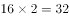。反推上一级数列括号内应为，。  故正确答案为D。

---

### 第 3 题　qid 1791780 · 数学运算

， 3， 4， 3， 6，（  ）。

- **A**. 
12
　✅
- **B**. 

- **C**. 

- **D**. 
144

**答案**：A

**官方解析**

将各项根号外数字均转化到根号内，可得：、、、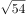、、（）。根号内数字相邻后一项与前一项作差后得：3、3、6、18、（），相邻后一项与前一项两两作商分别为：1、2、3、（4），故上一级下一项应为，。

故正确答案为A。 

---

### 第 4 题　qid 1788608 · 数学运算

已知A、B两地相距600千米，甲乙两车同时从A、B两地相向而行，3小时相遇。若甲的速度是乙的1.5倍，则甲的速度是：

- **A**. 60千米/小时
- **B**. 80千米/小时
- **C**. 90千米/小时
- **D**. 120千米/小时　✅

**答案**：D

**官方解析**

方法一：设乙的速度为千米/小时，甲的速度为千米/小时，由题目可列方程：，解得，则甲速度为千米/小时。

方法二：因甲、乙时间相同，且甲速度是乙的1.5倍，则甲的路程∶乙的路程，共5份。已知总路程为600千米，所以一份为120千米，甲的路程为360千米，所以甲的速度为千米/小时。

故正确答案为D。

---

### 第 5 题　qid 1791784 · 数学运算

某班有40名学生，一次数学测验共有两道题，答对第一题的有27人，答对第二题的有23人，两题都答对的有15人，则两题都答错的人数是（  ）。

- **A**. 3
- **B**. 5　✅
- **C**. 6
- **D**. 7

**答案**：B

**官方解析**

根据两集合容斥原理问题公式：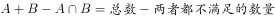，得：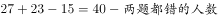，解得两题都错的人数为5。

故正确答案为B。 

---

### 第 6 题　qid 2032184 · 数学运算

某项工程由工作效率相同的甲、乙两工程队承担。若甲、乙两队合做，工期可提前5天；若两队先合做6天，余下的由甲队独做，恰好也能按工期完成，则该工程的工期是：

- **A**. 14天
- **B**. 15天
- **C**. 16天　✅
- **D**. 18天

**答案**：C

**官方解析**

赋值两个工程队的效率均为1，设该工程的工期为天，根据题意可得：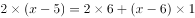，解得。

故正确答案为C。 

---

### 第 7 题　qid 1788618 · 数学运算

小王以每股10元的相同价格买入A和B两只股票共1000股，此后A股先跌再涨，B股先涨再跌，若此期间小王没有再买卖过这两只股票，则现在这1000股股票的市值是：

- **A**. 10250元
- **B**. 9975元　✅
- **C**. 10000元
- **D**. 9750元

**答案**：B

**官方解析**

设买入的A股票为股，则买入的B股票为股。A股票的市值元，B股票的市值元，则两只股票的市值元。

故正确答案为B。

---

### 第 8 题　qid 1788622 · 数学运算

下图是由三个边长分别为4、6、x的正方形所组成的图形，直线AB将它分成面积相等的两部分，则x的值是：

- **A**. 3或5
- **B**. 2或4　✅
- **C**. 1或3
- **D**. 1或6

**答案**：B

**官方解析**

如图所示，将原图补成一个长方形，则，，，。根据题意，，又，则两个补充的长方形面积相等，则有，整理得，解得。

秒杀技巧：因直线AB将图形分成了面积相等的两个部分，故可将图形视为中心对称图形，此时两边两个小正方形一定全等，则，只有B项满足。

故正确答案为B。

---

## 判断推理

### 第 1 题　qid 1791790 · 类比推理

播种：庄稼

- **A**. 烹饪：美食　✅
- **B**. 填写：表格
- **C**. 品尝：绿茶
- **D**. 复印：文章

**答案**：A

**官方解析**

第一步：分析题干词语间逻辑关系。
播种的应该是种子，而不是庄稼，种子长大成熟后才会成为庄稼，播种目的是为了收获庄稼。
第二步：逐一分析选项。
A项：烹饪的应该是食材，而不是美食，食材经过烹饪后才会成为美食，烹饪的目的是为了得到美食，与题干逻辑关系一致，当选；
B项：填写表格是动宾关系，两者之间不是目的关系，与题干逻辑关系不一致，排除；
C项：品尝绿茶是动宾关系，两者之间不是目的关系，与题干逻辑关系不一致，排除；
D项：复印文章是动宾关系，两者之间不是目的关系，与题干逻辑关系不一致，排除。
故正确答案为A。

---

### 第 2 题　qid 1791792 · 类比推理

欧元：美元

- **A**. 公斤：公顷
- **B**. 小说：散文　✅
- **C**. 公里：小时
- **D**. 阴性：阳性

**答案**：B

**官方解析**

第一步：分析题干词语的逻辑关系。
欧元和美元都是货币单位，两者是反对关系。
第二步：逐一分析选项。
A项：公斤是重量单位，公顷是面积单位，两者不是反对关系，与题干逻辑关系不一致，排除；
B项：小说和散文都是文体的一种，两者是反对关系，与题干逻辑关系一致，当选；
C项：公里是距离单位，小时是时间单位，两者不是反对关系，与题干逻辑关系不一致，排除；
D项：阴性和阳性是矛盾关系，不是反对关系，与题干逻辑关系不一致，排除。
故正确答案为B。

---

### 第 3 题　qid 1791794 · 类比推理

消除：障碍

- **A**. 交流：合作
- **B**. 解决：问题　✅
- **C**. 制度：创新
- **D**. 改革：开放

**答案**：B

**官方解析**

第一步：分析题干词语的逻辑关系。
消除障碍是动宾关系，消除是动词，障碍是名词。
第二步：逐一分析选项。
A项：交流和合作都是动词，两者不是动宾关系，与题干逻辑关系不一致，排除；
B项：解决问题是动宾关系，解决是动词，问题是名词，与题干逻辑关系一致，当选；
C项：制度被创新，制度是名词，创新是动词，顺序反了，与题干逻辑关系不一致，排除；
D项：改革和开放都是动词，两者是并列关系，与题干逻辑关系不一致，排除。
故正确答案为B。

---

### 第 4 题　qid 1791796 · 类比推理

纪念：忘却

- **A**. 创业：就业
- **B**. 传播：引导
- **C**. 挖掘：埋没　✅
- **D**. 救援：灾难

**答案**：C

**官方解析**

第一步：分析题干词语的逻辑关系。
纪念和忘却是反义词，且两者都是动词。
第二步：逐一分析选项。
A项：创业是就业的一种形式，两者不是反义词，与题干逻辑关系不一致，排除；
B项：传播和引导不是反义词，两者之间没有明显的逻辑关系，与题干逻辑关系不一致，排除；
C项：挖掘和埋没是反义词，且两者都是动词，与题干逻辑关系一致，当选；
D项：救援和灾难不是反义词，且灾难是名词，与题干逻辑关系不一致，排除。
故正确答案为C。

---

### 第 5 题　qid 1788638 · 类比推理

火车：轨道：行驶

- **A**. 电脑：键盘：上网
- **B**. 相机：镜头：拍照
- **C**. 飞机：机场：飞行
- **D**. 油轮：江海：航行　✅

**答案**：D

**官方解析**

第一步：判断题干词语间逻辑关系。
“火车”在“轨道”上“行驶”，三者为对应关系。
第二步：判断选项词语间逻辑关系。 
A项：用“键盘”在“电脑”上打字，而不是“上网”，与题干逻辑关系不一致，排除；
B项：“镜头”是“相机”的一部分，二者为组成关系，与题干逻辑关系不一致， 排除；
C项：“飞机”在空中“飞行”，“机场”是“飞机”停留和起飞的场地，与题干逻辑关系不一致，排除；
D项：“油轮”在“江海”中“航行”，三者为对应关系，与题干逻辑关系一致，当选。 
故正确答案为D。

---

### 第 6 题　qid 1791800 · 类比推理

青奥会：亚运会：运动员

- **A**. 展销会：拍卖会：文物
- **B**. 校友会：同乡会：同学
- **C**. 座谈会：听证会：专家
- **D**. 教代会：职代会：代表　✅

**答案**：D

**官方解析**

第一步：分析题干词语的逻辑关系。
青奥会和亚运会都是运动会的一种，两者是并列关系，且前两者必须要有运动员参加。
第二步：逐一分析选项。
A项：展销会是为了展示产品和技术、拓展渠道、促进销售、传播品牌而进行的一种宣传活动。拍卖会是指以公开竞价的形式，将特定物品或者财产权利转让给最高应价者的买卖方式的活动。展销会和拍卖会上不一定要有文物，与题干逻辑关系不一致，排除；
B项：同学是校友会的参与主体，而同乡会的参与主体应该是老乡，与同学无关，与题干逻辑关系不一致，排除；
C项：座谈会和听证会都是交流看法的一种形式，但是专家不是必须参加的，与题干逻辑关系不一致，排除；
D项：教代会和职代会都是代表会的一种，两者是并列关系，且都必须要有代表参加，与题干逻辑关系一致，当选。
故正确答案为D。

---

### 第 7 题　qid 1791802 · 类比推理

喜乐 之于 （    ） 相当于 （    ） 之于 美德

- **A**. 快乐——伦理
- **B**. 情绪——诚信　✅
- **C**. 后悔——丑恶
- **D**. 健康——心理

**答案**：B

**官方解析**

填空式，需要将选项一一代入题干，逐一分析。
A项：喜乐与快乐为近义词关系；伦理指的是人与人以及人与自然的关系和处理这些关系的规则，与美德没有明显的逻辑关系，排除；
B项：喜乐是一种情绪，为种属关系；诚信是一种美德，为种属关系，前后逻辑关系一致，当选；
C项：喜乐与后悔没有明显的逻辑关系；丑恶多指人的面相，与美德没有明显的逻辑关系，排除；
D项：喜乐与健康没有明显的逻辑关系；心理与美德没有明显的逻辑关系，排除。
故正确答案为B。

---

### 第 8 题　qid 2032214 · 类比推理

左右 之于 （    ） 相当于 （    ） 之于 早晚

- **A**. 高低——内外
- **B**. 多少——迟早
- **C**. 长短——大小
- **D**. 上下——快慢　✅

**答案**：D

**官方解析**

A项：“左右”表示方向或位置，“高低”表示高度或位置，二者可以看作并列关系，“内外”表示空间，而“早晚”表示时间，二者无明显逻辑关系，排除；
B项：“左右”表示方向或位置，“多少”表示数量，二者无明显逻辑关系，“迟早”表示情况或早或晚必会发生，与“早晚”属于近义关系，排除；
C项：“左右”表示方向或位置，“长短”表示长度，二者无明显逻辑关系，“大小”表示体积，“早晚”表示时间，二者无明显逻辑关系，排除；
D项：“左右”与“上下”均为表示方向或位置的概念，二者属于并列关系，“早晚”与“快慢”均为可表示时间程度的概念，二者属于并列关系，前后逻辑关系一致，当选。
故正确答案为D。

---

### 第 9 题　qid 2032216 · 逻辑判断

- **A**. 

- **B**. 

　✅
- **C**. 

- **D**. 

**答案**：B

**官方解析**

第一步，分析题干字符间逻辑关系。
优先找相同符号，位置1、3、7相同，位置2、6相同，位置4、5相同。
第二步，逐一分析选项。
A项：位置1、3、6相同，排除；
B项：位置1、3、7相同，位置2、6相同，位置4、5相同，与题干一致，当选；
C项：位置1、6、7相同，排除；
D项：位置1、3、4相同，排除。
故正确答案为B。

---

### 第 10 题　qid 1791806 · 类比推理

嘀谔嘀谔微微滴谔

- **A**. 滴微滴微谔谔嘀微　✅
- **B**. 谔嘀谔嘀微微谔滴
- **C**. 嘀嘀谔微谔微微滴
- **D**. 嘀微嘀微嘀谔谔滴

**答案**：A

**官方解析**

第一步，分析题干汉字间逻辑关系。
位置1、3相同，位置7与1、3不同，位置2、4、8相同，位置5、6相同。
第二步，逐一分析选项。
A项：位置1、3相同，位置7与1、3不同，位置2、4、8相同，位置5、6相同，与题干一致，当选；
B项：位置7与1、3相同，排除；
C项：位置1、3不同，排除；
D项：位置2、8不同，排除。
故正确答案为A。

---

### 第 11 题　qid 1791808 · 图形推理

在上边的题干中给出一套图形，其中有五个图，这五个图呈现一定的规律性。在下边给出一套图形，其中有四个图，从中选出唯一的一项作为保持上边五个图规律性的第六个图。

- **A**. A
- **B**. B　✅
- **C**. C
- **D**. D

**答案**：B

**官方解析**

题干中的图形出现多人，且出现的人物都有成人与小孩。只有B项有成人与小孩，当选；A项为一个人，C、D两项均为成人，排除。
故正确答案为B。

---

### 第 12 题　qid 1791810 · 图形推理

在上边的题干中给出一套图形，其中有五个图，这五个图呈现一定的规律性。在下边给出一套图形，其中有四个图，从中选出唯一的一项作为保持上边五个图规律的第六个图。

- **A**. A
- **B**. B
- **C**. C　✅
- **D**. D

**答案**：C

**官方解析**

观察发现，题干图形出现多个小元素，优先考虑元素的种类和数量，但无规律。继续观察发现题干共出现了两种小元素，且元素数量有增加趋势，考虑元素间的换算关系。根据基本换算公式“图1+图3=2×图2”，换算的结果为1圆=2月亮，验证即为1、2、3、4、5个月亮，下一个应该选一个6个月亮或三个圆的图形，A项8个，B项3个，C项6个，D项4个。
故正确答案为C。

---

### 第 13 题　qid 1791812 · 图形推理

每道题在上边的题干中给出一套图形，其中有五个图，这五个图呈现一定的规律性。在下边给出一套图形，其中有四个图，从中选出唯一的一项作为保持上边五个图规律性的第六个图。

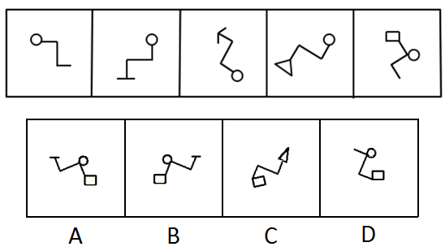

- **A**. A
- **B**. B　✅
- **C**. C
- **D**. D

**答案**：B

**官方解析**

观察发现，题干中每幅图形都有一个圆，排除C项；再次观察发现，题干图形中的直线数分别为3、4、5、6、7，那么下一幅图应该为8条直线，排除D项；题干中三条直角折线均可以通过旋转形成一个“Z”字形，排除A项。
故正确答案为B。

---

### 第 14 题　qid 1791814 · 图形推理

在上边的题干中给出一套图形，其中有五个图，这五个图呈现一定的规律性。在下边给出一套图形，其中有四个图，从中选出唯一的一项作为保持上边五个图规律性的第六个图。

- **A**. A
- **B**. B
- **C**. C
- **D**. D　✅

**答案**：D

**官方解析**

元素组成不相同不相似，优先考虑属性规律。观察发现，图一既是轴对称图形又是中心对称图形，图二中心对称图形，图三既是轴对称图形又是中心对称图形，图四既是轴对称图形又是中心对称图形，图五中心对称图形，发现题干所有图形都是中心对称图形。A、C两项均是轴对称图形，排除；B项中内部的三角形不是中心对称图形，且外侧黑点位置也分布不规则，排除；只有D项符合，当选。
故正确答案为D。

---

### 第 15 题　qid 1791816 · 图形推理

下边四个图形中，只有一个是由上边的四个图形拼合而成（只能通过上、下、左、右进行移动），请把它找出来。

- **A**. A　✅
- **B**. B
- **C**. C
- **D**. D

**答案**：A

**官方解析**

本题考查平面拼合，可采用平行且等长相消的方式解题。消去平行且等长的线段后进行组合即可得到轮廓图，即为A项。平行且等长相消的方式如下图所示：

故正确答案为A。

---

### 第 16 题　qid 1791818 · 图形推理

下边四个图形中，只有一个是由上边的四个图形拼合而成（只能通过上、下、左、右进行移动），请把它找出来。

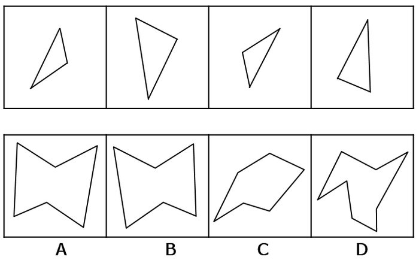

- **A**. A
- **B**. B　✅
- **C**. C
- **D**. D

**答案**：B

**官方解析**

本题考查平面拼合，可采用平行且等长相消的方法解题。消去平行且等长的线段后进行组合即可得到轮廓图，即为B选项。平行且等长相消的方法如下图所示：

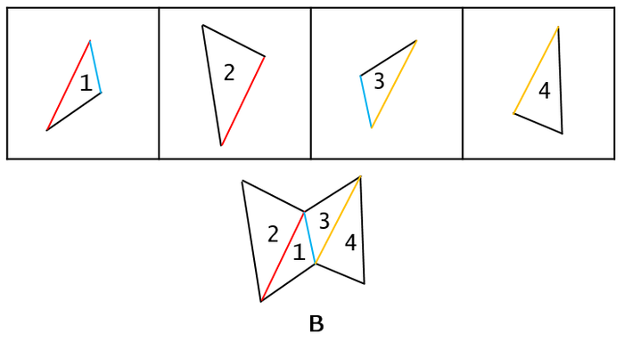

故正确答案为B。

---

### 第 17 题　qid 1791820 · 图形推理

下边四个图形中，只有一个是由上边的四个图形拼合而成（只能通过上、下、左、右进行移动），请把它找出来。

- **A**. A　✅
- **B**. B
- **C**. C
- **D**. D

**答案**：A

**官方解析**

本题考查平面拼合，可采用平行且等长相消的方法解题。消去平行且等长的线段后进行组合即可得到轮廓图，即为A选项。平行且等长相消的方法如下图所示：

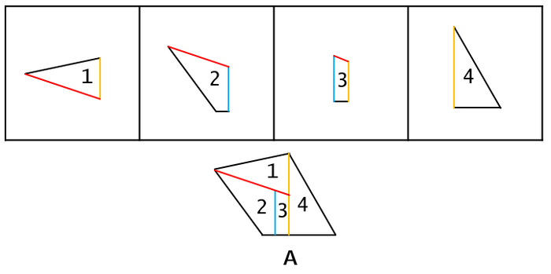

故正确答案为A。

---

### 第 18 题　qid 1791822 · 图形推理

上边这个图形是由下边四个图形中的某一个作为外表面折叠而成，请指出它是哪一个？

- **A**. A　✅
- **B**. B
- **C**. C
- **D**. D

**答案**：A

**官方解析**

本题考查四面体结构。四面体可用箭头法，公共边和公共点等方法来进行解题。

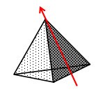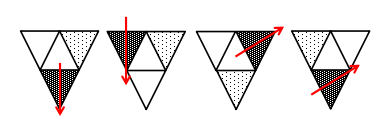

如上图所示，相同边用相同颜色进行标示。

A项：题干中所给图形箭头标示面与非箭头标示面二者相对关系正确，为正确选项，当选；

B项：题干中非箭头标示面在箭头标示面的左，而选项中非箭头标示面在箭头标示面的下，选项与题干不对应，排除；

C项：题干中非箭头标示面在箭头标示面的左，而选项中非箭头标示面在箭头标示面的右，选项与题干不对应，排除；

D项：题干中非箭头标示面在箭头标示面的左，而选项中非箭头标示面在箭头标示面的下，选项与题干不对应（D选项只是B选项旋转了方向），排除。

故正确答案为A。

---

### 第 19 题　qid 1791824 · 图形推理

上边这个图形是由下边四个图形中的某一个作为外表面折叠而成，请指出它是哪一个？

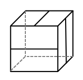

- **A**. A
- **B**. B　✅
- **C**. C
- **D**. D

**答案**：B

**官方解析**

本题考查六面体结构，主要着眼考查相对面的识别。

选项所示图形平面展开图外轮廓一致，首先考虑平面展开图中相对面的识别。

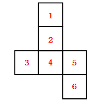

平面展开图中1面与4面为相对面，2面与6面为相对面，3面与5面为相对面。

逐一分析选项：

ACD选项中均存在相对面，立体图中的三个横线面无法在平面展开图中体现，排除ACD。

B选项中三个面中的横线互相垂直，能够折合成题干所示的立体图。

故正确答案为B。

---

### 第 20 题　qid 1791826 · 图形推理

上边这个图形是由下边四个图形中的某一个作为外表面折叠而成，请指出它是哪一个？

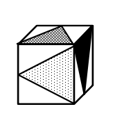

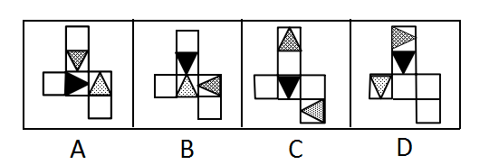

- **A**. A
- **B**. B
- **C**. C
- **D**. D　✅

**答案**：D

**官方解析**

本题考查六面体的空间重构。

题干立体图形中给出三个面，三个面存在公共点，分别在题干和选项中标记出三面的公共点，如下图E点所示：

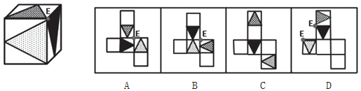

题干中点E为三面交点，且与三个不同阴影三角形的顶点重合。

A项：公共点E未与三角形顶点重合，与题干不一致，排除；

B项：公共点E未与三角形顶点重合，与题干不一致，排除；

C项：其中两个三角形面中间隔了一个空白面，为相对面，不能同时出现，与题干不一致，排除；

D项：三面的公共点E与三个不同阴影三角形的顶点重合，与题干一致，当选。

故正确答案为D。

---

### 第 21 题　qid 1791828 · 逻辑判断

小王不是摄影师，但小王所认识的人都是摄影师，而摄影师都喜欢旅行，因为只有在旅行中才能遇到最美的风景，小王的朋友小张通过旅行与小王一起认识了小李。
根据以上陈述，可以得出以下哪项？

- **A**. 小王喜欢旅行
- **B**. 小李喜欢旅行　✅
- **C**. 小王不喜欢旅行
- **D**. 小李不喜欢旅行

**答案**：B

**官方解析**

第一步：翻译题干。

①小王摄影师；②小王认识的人摄影师；③摄影师喜欢旅行；④最美的风景在旅行中遇到。

根据②③传递可得，小王认识的人摄影师喜欢旅行，即小王认识的人都是摄影师，小王认识的人都喜欢旅行；

再根据题干最后一句可得，小张是小王的朋友，小王认识小张，小王和小张都认识小李；

因此可以得出，小张和小李都是摄影师，小张和小李都喜欢旅行。

第二步：逐一分析选项。

A项：否定前件无法得出确定性结论，由可知，无法得出小王是否喜欢旅行，排除；

B项：由可知，小张和小李都喜欢旅行，当选；

C项：见A项分析，排除；

D项：小张和小李都喜欢旅行，排除。

故正确答案为B。

---

### 第 22 题　qid 1791830 · 逻辑判断

研究人员为了验证一种长寿新药的效果，用两组小白兔进行了试验。他们对无差别的两组小白兔注射了新药，然后将其中一组关在笼子中饲养，另一组放在自然环境中饲养。结果发现，自然环境中饲养的小白兔的平均寿命比笼子中饲养的小白兔延长了1/10。研究人员由此认为，轻松的环境有利于发挥新药的功能。
以下哪项最有可能是研究人员得出结论的假设？

- **A**. 关在笼子中的小白兔生活得不愉快
- **B**. 注射了新药之后的小白兔生活得更轻松
- **C**. 自然环境中饲养的小白兔生活得更轻松　✅
- **D**. 新药功能的发挥和实验对象的生活环境密切相关

**答案**：C

**官方解析**

第一步：找到论点论据。
论点：轻松的环境有利于发挥新药的功能。
论据：他们对无差别的两组小白兔注射了新药，然后将其中一组关在笼子中饲养，另一组放在自然环境中饲养。结果发现，自然环境中饲养的小白兔的平均寿命比笼子中饲养的小白兔延长了1/10。
第二步：逐一分析选项。
A项：“关在笼子中的小白兔生活得不愉快”不能得出轻松环境中的药物发挥情况如何，无关选项，排除；
B项：只是在说“注射了新药之后的小白兔生活得更轻松”，不知道小白兔生活的环境是否轻松，是否有利于新药效的发挥，无关选项，排除；
C项：“自然环境中饲养的小白兔生活得更轻松”，补充了自然环境更轻松的情况，说明生活的轻松有利于发挥药效，属搭桥项，当选；
D项：只是说“新药功能的发挥和实验对象的生活环境密切相关”，但没有说明环境对实验对象有什么样的影响，不明确选项，排除。
故正确答案为C。

---

### 第 23 题　qid 1791832 · 逻辑判断

乡间公路上发生一起车祸，肇事司机是位女性。据这位女司机介绍，当时她发现路边有一餐馆所以准备停车用餐，误将油门当刹车，汽车径直向前撞向路边车辆，连撞两车后方才停下，万幸的是车上乘客仅受轻伤。有目击者对这起车祸做出如下评论：女司机更容易出车祸。
以下哪项如果为真，最能质疑上述评论？

- **A**. 有的男司机开车时比较敏捷和果断，很少出车祸
- **B**. 有的女司机开车时比较细心和冷静，很少出车祸
- **C**. 肇事司机已有8年驾龄，技术娴熟，以前从未出过车祸
- **D**. 女司机各有不同，对肇事女司机不能轻率概括、以偏概全　✅

**答案**：D

**官方解析**

第一步：找出论点和论据。
论点：女司机更容易出车祸。
论据：乡间公路上发生一起车祸，肇事司机是位女性。
第二步：逐一分析选项。
A项：“有的男司机开车时比较敏捷和果断，很少出车祸”只是部分男司机的情况，不能说明女司机的情况，无法削弱，排除；
B项：“有的女司机开车时比较细心和冷静，很少出车祸”只是部分女司机的情况，不能说明全部女司机的情况，无法削弱，排除；
C项：“肇事司机已有8年驾龄，技术娴熟，以前从未出过车祸”不能削弱现在的车祸情况，仅肇事司机一人的情况不能说明所有女司机的情况，无法削弱，排除；
D项：“女司机各有不同，对肇事女司机不能轻率概括、以偏概全”说明目击者的评论只是针对一场车祸中一个女司机的情况，不具有代表性，不能代表整体女司机的情况，可以削弱，当选。
故正确答案为D。

---

### 第 24 题　qid 1791834 · 逻辑判断

在某公司新招聘的100名应届毕业生（不含专科）中，男性42名，女性58名；研究生的比例超过了本科生，计算机类毕业生人数多于文史类毕业生，除了计算机类和文史类专业外，还有其他专业毕业的学生。
根据以上陈述，关于上述100名大学毕业生，可以得出以下哪项？

- **A**. 计算机类研究生人数多于文史类本科生
- **B**. 女性计算机类毕业生人数多于男性文史类本科生
- **C**. 女性研究生人数多于男性本科生　✅
- **D**. 计算机类研究生人数多于男性本科生

**答案**：C

**官方解析**

分析题干已知条件可知：①；②；③。

由于新招聘的只有研究生和本科生，①可以转化为：④，即：；同理②可以转化为：⑤；

④+⑤：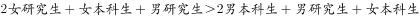；去掉相同项可知：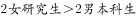，即，只有C项符合。

故正确答案为C。

---

### 第 25 题　qid 1791836 · 逻辑判断

城市是一个生命体，一座历史文化名城，她的寿命长达千百年，印证她寿命的年轮也定会有千百条。作为城市年轮的历史文化遗产是绝对不能破坏或丢弃的，破坏或丢弃城市的年轮，就是自毁城市特色。而一座城市只有保持其固有特色，才能拥有核心竞争力。
根据以上陈述，可以得出以下哪项？

- **A**. 只有保护好历史文化遗产，历史文化名城才能拥有核心竞争力　✅
- **B**. 只有拥有核心竞争力，一座城市才能保护好其历史文化遗产
- **C**. 如果保护好历史文化遗产，一座城市就能拥有其核心竞争力
- **D**. 如果历史文化遗产被破坏或丢弃，历史文化名城就会失去其生命力

**答案**：A

**官方解析**

第一步：翻译题干。

①破坏或丢弃历史文化遗产自毁城市特色；②拥有核心竞争力保持其固有特色。根据递推规则，得出：③破坏或丢弃历史文化遗产自毁城市特色核心竞争力。

第二步：逐一分析选项。

A项：拥有核心竞争力保护历史文化遗产，与题干命题③的逆否命题一致，可以推出，当选；

B项：保护历史文化遗产拥有核心竞争力，是对条件①的否前，无法推出确定结论，排除；

C项：保护历史文化遗产拥有核心竞争力，是对条件①的否前，无法推出确定结论，排除；

D项：破坏或丢弃历史文化遗产历史文化名城就会失去其生命力，“生命力”在题干中没有提到，无法推出，排除。

故正确答案为A。

---

### 第 26 题　qid 1789572 · 逻辑判断

甲、乙、丙、丁、戊5支足球队进行小组单循环赛。比赛规定：每队胜一场得3分，平一场得1分，负一场得0分；积分前两名出线。比赛结束后发现，没有积分相同的球队，乙队胜了3场，另一场负于甲队。
根据以上信息，可得出以下哪项？

- **A**. 甲队一定出线
- **B**. 乙队一定出线　✅
- **C**. 丙队一定出线
- **D**. 戊队一定出线

**答案**：B

**官方解析**

第一步：分析题干条件。
（1）5支球队进行单循环赛，每队胜一场得3分，平一场得1分，负一场得0分；
（2）没有积分相同的球队；
（3）乙队胜了3场，另一场负于甲队。
第二步：根据题干条件进行推理。
共有5支球队，进行小组单循环赛，每个球队都要进行4场比赛，乙队胜了3场，只有一场负于甲队，那么丙、丁、戊3队每队已经分别输给乙队一场。题干最后一句说没有积分相同的球队，所以丙、丁、戊3队在剩下的比赛中不可能3场均取得胜利，因此积分必然低于乙队。由于前两名出线，那么乙队必然出线。
故正确答案为B。

---

### 第 27 题　qid 1791840 · 逻辑判断

研究人员比较了过去3.3万年以来生活在欧洲的人的骨骼变化情况，发现从1万年前的中石器时代到2000年前的罗马帝国时期，人类两种腿骨的强度持续下降，但与奔跑行走无关的上臂骨强度则保持稳定。也正是在这一时期，农业开始兴起，人类逐渐向定居的生活方式转变，农业兴起导致现代人的骨骼变轻，但之后两种腿骨的强度几乎没有变化。研究人员由此得出结论，机械化和城市化对骨骼强度的影响并不明显。
以下哪项最可能是研究人员作出结论的假设？

- **A**. 在过去3.3万年间，人类的体重总体变化不大
- **B**. 从3.3万年前至1万年间，人类的生活方式没有发生重大的改变
- **C**. 机械化和城市化发生在农业兴起之后　✅
- **D**. 人的骨骼变轻会导致其骨骼强度的下降

**答案**：C

**官方解析**

第一步：找出论点和论据。
论点：机械化和城市化对骨骼强度的影响并不明显。
论据：农业开始兴起，人类逐渐向定居的生活方式转变，农业兴起导致现代人的骨骼变轻，但之后两种腿骨的强度几乎没有变化。
第二步：逐一分析选项。
A项：“人类的体重总体变化”和论点的“骨骼强度”无关，无法加强，排除；
B项：“3.3万年前至1万年间”在农业和机械化和城市化之前，与论点讨论的时间范围不一致，属于无关选项，无法加强，排除；
C项：“机械化和城市化发生在农业兴起之后”，论据说农业兴起之后两种腿骨的强度几乎没有变化，论点说机械化和城市化对骨骼强度影响并不明显，给机械化和城市化跟农业兴起之后搭了桥，可以加强，当选；
D项：论据当中强调了农业兴起的时期，骨骼变轻了，腿骨强度下降，上臂骨强度不变是同时发生的，D选项则解释了骨骼变轻与骨骼强度下降之间的关系，属于对于论据的加强，不是搭桥和必要条件，排除。
故正确答案为C。

---

### 第 28 题　qid 2032238 · 逻辑判断

食品安全标准不仅关系到食品安全，更关系到国家利益。稀土在土壤中广泛存在，也在现有的各种食物中广泛存在。目前，科学界关于稀土对人类健康影响的研究很欠缺，国际权威机构迄今为止并没有对稀土的危害性做出评估，更没有设立所谓“安全摄入标准”。近年来，我国对稻谷、玉米、小麦、茶叶等食物中的稀土限量标准做出统一标准，均为。有专家据此认为，这些标准的制定并非都是合理的。

以下哪项如果为真，最能支持上述专家的观点？

- **A**. 
目前，我国的稻谷、玉米、小麦中的稀土含量一般都低于

- **B**. 
茶叶中的稀土只有大约会进入茶水中，而一个人每天食用的茶叶量要远远小于粮食
　✅
- **C**. 
中国先于国际权威机构制定食物中稀土的“安全摄入标准”，具有一定的超前性

- **D**. 
中国是茶叶出口大国，又是世界上唯一制定了茶叶稀土限量标准的国家

**答案**：B

**官方解析**

第一步：找到论点论据。

论点：这些标准的制定并非都是合理的。

论据：近年来，我国对稻谷、玉米、小麦、茶叶等食物中的稀土限量标准做出统一标准，均为。

第二步：逐一分析选项。

A项：“我国的稻谷、玉米、小麦中的稀土含量一般都低于”说明规定达到国家标准，至于这些标准制定的合理不合理没说，无关项，排除；

B项：“茶叶中的稀土只有大约会进入茶水中，而一个人每天食用的茶叶量要远远小于粮食”和粮食对比说明茶叶的稀土进入水中的少、食用量小，采取统一限定标准不合理，举例加强，当选；

C项：“具有一定的超前性”不一定就是合理的，无法加强，排除；

D项：“中国是茶叶出口大国，又是世界上唯一制定了茶叶稀土限量标准的国家”和制定标准是否合理，无关项，排除。

故正确答案为B。

---

### 第 29 题　qid 2032240 · 类比推理

某国承办了一次国际大赛，决定将赛事分配给该国的3个城市具体筹办。现有甲、乙、丙、丁、戊、己、庚7个候选城市通过了初选。根据要求，最终负责筹办的城市还需符合以下条件：
（1）甲和乙要么都入选，要么都不入选；
（2）丙与丁至多只能有一个入选；
（3）丙和甲至少要有一个入选。
如果丁入选，那么下列哪两个城市也一定入选？

- **A**. 甲和乙　✅
- **B**. 甲和庚
- **C**. 乙和丙
- **D**. 丙和戊

**答案**：A

**官方解析**

第一步：翻译题干。
①要么（甲且乙），要么（-甲且-乙）；
②-丙或-丁；
③丙或甲。
第二步：逐一分析选项。
已知确定信息：丁入选，代入条件②可以推出：丁→-丙；将-丙代入条件③可以推出：-丙→甲；将甲代入条件①可以推出：甲且乙，得知甲、乙两个城市入选。
故正确答案为A。

---

### 第 30 题　qid 1758116 · 类比推理

某国承办了一次国际大赛，决定将赛事分配给该国的3个城市具体筹办。现有甲、乙、丙、丁、戊、己、庚7个候选城市通过了初选。根据要求，最终负责筹办的城市还需符合以下条件：
（1）甲和乙要么都入选，要么都不入选；
（2）丙与丁至多只能有一个入选；
（3）丙和甲至少要有一个入选。
如果戊入选，那么下列哪两个城市也可能同时入选？

- **A**. 甲和丙
- **B**. 甲和己
- **C**. 乙和丙
- **D**. 丙和己　✅

**答案**：D

**官方解析**

根据题干要从7个城市中入选3个，又因戊入选，故剩余的2个入选名额将会在甲、乙、丙、丁、己、庚6个城市中产生。
题干问法是可能，优先代入排除。
A项，若甲、丙同时入选，则根据（1）可知，乙也会入选，则入选的城市超过题干要求的3个，与题干信息相矛盾，排除；
B项，若甲、己同时入选，则根据（1）可知，乙也会入选，则入选的城市超过题干要求的3个，与题干信息相矛盾，排除；
C项，若乙、丙同时入选，则根据（1）可知，甲也会入选，则入选的城市超过题干要求的3个，与题干信息相矛盾，排除；
D项，若丙、己同时入选，则甲、乙都不入选，符合条件（1），且丙入选，丁不入选，符合条件（2），若丙入选，则符合条件（3），与题干信息不矛盾，是可能成立的选项，当选。
故正确答案为D。

---

### 第 31 题　qid 1791842 · 定义判断

条件性承诺，指在社会活动中，一方对另一方作出附带条件的承诺。
下列属于条件性承诺的是：

- **A**. 小琴考上了重点高中，老爸奖励她到国外旅游一周
- **B**. 某公司老总答应给考核优秀员工每人每月加薪200元　✅
- **C**. 陈某对女儿说：“老妈将一如既往支持你报考研究生。”
- **D**. 小雨为自己立规，不减肥5斤，就拒绝参加朋友聚会

**答案**：B

**官方解析**

第一步：找出定义关键词。
“一方对另一方”、“附带条件的承诺”。
第二步：逐一分析选项。
A项：小琴考上了重点高中，老爸奖励国外旅游，仅仅只是局限于考上了的奖励，并不涉及考前对此有承诺，因此不符合定义，排除；
B项：老总答应加薪，这是一种承诺，而附带的条件则是要考核为优秀，因此符合定义，当选；
C项：陈某表示支持女儿报考研究生，没有体现附带条件，因此不符合定义，排除；
D项：小雨给自己减肥定规矩，只是涉及到单方面的个人，而不存在另一方，因此不符合定义，排除。
故正确答案为B。

---

### 第 32 题　qid 1791844 · 定义判断

趋同感应：指在社会交往过程中，一方能够把握另一方的心理状态，并且能够设身处地体验对方心理。
下列属于趋同感应的是：

- **A**. 天下谁人不识君
- **B**. 天生我材必有用
- **C**. 同是天涯沦落人　✅
- **D**. 一片冰心在玉壶

**答案**：C

**官方解析**

第一步：找出定义关键词。
关键词为“把握另一方的心理状态”、“设身处地体验对方心理”。
第二步：逐一分析选项。
A项：“天下谁人不识君”指天下哪个不知道你啊，没有体现“把握另一方的心理状态”，排除；
B项：“天生我材必有用”指上天生下我一定有需要用到我的地方，没有体现“把握另一方的心理状态”，排除；
C项：“同是天涯沦落人”指同样都是沦落世间的人，体现了“把握另一方的心理状态”，体验了对方的心理，当选；
D项：“一片冰心在玉壶”指我的心就像盛在玉壶的冰那样洁白透明，没有体现“把握另一方的心理状态”，排除。
故正确答案为C。

---

### 第 33 题　qid 1791846 · 逻辑判断

职业基因：指与个人所从事工作的特点相匹配的个性特点与气质。
下列不涉及职业基因的是：

- **A**. 小李在近十年的货车驾驶工作经历中，他的机智灵敏、注意力集中等特点使他成为公司的优秀驾驶员
- **B**. 做事一向细致、认真的小张，对自己从事财务工作感到很满意
- **C**. 小马头脑灵活、善于交际，在公司销售部工作期间，其业务量多年名列前茅
- **D**. 以优异成绩毕业于知名大学的马林博士，进入其科研机构后很快成为该机构的业务骨干　✅

**答案**：D

**官方解析**

第一步，找到定义关键词。
关键词为“所从事工作的特点相匹配的个性特点与气质”。
第二步，逐一分析选项。
A项：机智灵敏、注意力集中等是小李的特点，这些特点与他从事的驾驶工作能够相匹配，符合定义，排除；
B项：细致认真是小张的特点，这些特点与他从事的财务工作能够相匹配，符合定义，排除；
C项：头脑灵活、善于交际是小马的特点，这些特点与他从事的销售工作能够相匹配，符合定义，排除；
D项：成绩优异并不能体现个性特点或气质，不符合定义，当选。
本题为选非题，故正确答案为D。

---

### 第 34 题　qid 1791848 · 定义判断

同质性群体：指经过较长时间后形成的具有某种共同的文化或性格特征的社会群体。
下列不属于同质性群体的是（    ）。

- **A**. 票友
- **B**. 同乡
- **C**. 徽商
- **D**. 旅客　✅

**答案**：D

**官方解析**

第一步：找出定义关键词。
“具有某种共同的文化或性格特征”。
第二步：逐一分析选项。
A项：“票友”是戏曲界的行话，其意是指会唱戏而不以专业演戏为生的爱好者，即对戏曲、曲艺非职业演员、乐师等的通称，符合“具有某种共同的文化或性格特征”，符合定义；
B项：“同乡”是指同一籍贯的人，符合“具有某种共同的文化或性格特征”，符合定义；
C项：“徽商”即徽州商人、新安商人，俗称"徽帮"，指徽州(府)籍商人的总称，符合“具有某种共同的文化或性格特征”，符合定义；
D项：“旅客”是指临时客住在外的人或旅行者，这群人不符合“具有某种共同的文化或性格特征”，不符合定义。
本题为选非题，故正确答案为D。

---

### 第 35 题　qid 1791850 · 定义判断

众包，指公司或机构通常由员工承担的工作任务交由非特定的社会公众完成的做法。
下列不属于众包的是：

- **A**. 某玩具公司一直鼓励和赞助用户参与公司设计工作，从机器人操纵系统到积木套装产品，都收到了比较理想的效果
- **B**. 某洗涤用品公司经常把自己的研发项目，发布在各大网站上，征集解决方案承诺一定的奖励
- **C**. 近三年来，某房地产公司将所有的电脑、网络及外设的日常维护工作，全部交给某电脑公司　✅
- **D**. 某美术馆请参观者为馆内展品撰写讲解说明，选出其中的一部分制成标签共同展出

**答案**：C

**官方解析**

第一步：找出定义关键词。
“公司或机构”、“由员工承担的工作任务交由非特定的社会公众完成”
第二步：逐一分析选项。
A项：“积木套装产品”本应是员工承担的工作任务，现在由用户参与设计完成，满足“由员工承担的工作任务交由非特定的社会公众完成”，排除；
B项：“找到解决研发项目方案”本应是“员工承担的工作任务”，现在发布在各大网站上，交由网友解决，网友是“非特定的社会公众”，满足“由员工承担的工作任务交由非特定的社会公众完成”，排除；
C项：全部交给某电脑公司，某电脑公司是“特定的社会公众”，不满足关键词“由员工承担的工作任务交由非特定的社会公众完成”，当选；
D项：“撰写讲解说明”本应是“员工承担的工作任务”，参观者是“非特定的社会公众”，满足“由员工承担的工作任务交由非特定的社会公众完成”，排除。
本题为选非题，故正确答案为C。

---

### 第 36 题　qid 2032242 · 定义判断

假摔式降费：指企业在外部压力之下采取的一些表面降幅很大，实际上并未惠及广大消费者的调价策略。
下列属于假摔式降费的是：

- **A**. 在“双十一”价格大战中，某知名家电企业大幅调整了多种产品的零售价格，一周内，这些产品在全城各大商场均纷纷售罄
- **B**. 某城市的几家大商场为了抢占节日市场，联手采用打折促销的手段，消费人数呈上升之势
- **C**. 为落实上级有关部门的降费要求，某运营商很快公布了夜间国际漫游降低费用的具体方案　✅
- **D**. 根据上级规定，某旅游景区在其官网上发布了不涨价承诺，游客们很快发现其中的不少景点本来就是免费景点

**答案**：C

**官方解析**

第一步：找到定义关键词。
关键词为“企业”、“降幅很大”、“实际上并未惠及广大消费者的调价策略”。
第二步：逐一分析选项。
A项：家电企业大幅调整价格后其惠及的群体是各大商场的购买者，消费者能够得到实际的好处，与题干定义关键词不符，排除；
B项：几家大商场联手打折促销，惠及的群体是“上升趋势的消费人数”，实际上惠及了大量消费者，与题干定义关键词不符，排除；
C项：降低夜间国际漫游费用，体现了定义中的关键词“降幅”，但是降价之后有没有人会在夜间使用国际漫游，或者说有没有消费者得到实际的好处是不确定的，保留；
D项：不涨价承诺并未体现“降幅”，与题干定义关键词不符，排除。
对比选项：A、B两项中的消费者都明确地获得了实际的好处，C项中的消费者有没有获得实际好处是不明确的，此时对比也只能选择C项。
故正确答案为C。

---

### 第 37 题　qid 1789684 · 定义判断

配套效应，指拥有某件物品后，为了追求完美效果而不断配置其他相应物品。
下列不属于配套效应的是：

- **A**. 邻居送给小李一只宠物狗，半月后，小李家阳台上狗笼子、狗饭碗、狗澡盆、狗毛衣等一应俱全，几乎变成了宠物用品展示中心
- **B**. 小孙穿着朋友赠送的一件质地精良做工考究的睡袍在书房走动，总觉得身边的一切都不协调，他很快换掉了书房中的地毯、桌椅、书柜
- **C**. 张女士在商场亲子装专柜为儿子买了一件T恤，儿子和丈夫都非常满意，于是又返回商场为丈夫和自己各买了一件　✅
- **D**. 赵总在古玩店淘到一件康熙宫廷玉器，特意为它配置了一个红木底座，还请诗友为它专门写了一首咏玉诗，放在大厅最醒目的地方

**答案**：C

**官方解析**

第一步：找到定义关键词。
关键词：目的为“追求完美效果”，方式为“拥有某件物品后不断配置其他相应物品”。
第二步：逐一分析选项。
A项：小李家买的狗笼子、狗饭碗等是发生在小李拥有一只宠物狗后，体现了“拥有某件物品后不断配置其他相应物品”，这些物品是为了追求与宠物狗配套的“完美效果”，符合定义，排除；
B项：小孙换掉地毯等物品是为了和质地精良的睡袍配套，体现了“拥有某件物品后不断配置其他相应物品”，为的是“追求完美的效果”，符合定义，排除；
C项：张女士前后购买的是T恤，并没有配置其他物品，不符合定义，当选；
D项：赵总为玉器配置了红木底座，请他人为玉器写诗等行为体现了“拥有某件物品后不断配置其他相应物品”，也是为了“追求完美效果”，符合定义，排除。
本题为选非题，故正确答案为C。

---

### 第 38 题　qid 1789588 · 定义判断

公共信息资源：指社会公共领域中特定管理机构依法管理，面向全体社会公众提供信息服务的各种数据系统，具有公共性、广泛性、基础性和公益性等特点。
下列属于公共信息资源的是：

- **A**. 公安部门为了核查居民身份或侦破案件而研发的居民身份信息管理系统
- **B**. 银行为了审核贷款申请、开展各种金融业务而开发的客户个人诚信档案系统
- **C**. 国家气象部门建立的气象信息发布系统，如天气预报、地质灾害预警系统等　✅
- **D**. 高校教务部门为提高教学管理效率而开发的学生选课、评课、成绩管理系统

**答案**：C

**官方解析**

第一步：找出定义关键词。
“社会公共领域中特定管理机构”、“全体社会公众”、“提供信息服务”、“公共性、广泛性、基础性和公益性等”。
第二步：逐一分析选项。
A项：公安部门属于社会公共领域中的特定管理机构，居民身份信息管理系统是公安部门为了核查居民身份或者侦破案件而研发的，该系统中的信息为居民个人隐私，不能面向社会公众提供信息服务，不符合定义，排除；
B项：银行是金融服务机构，不属于社会公共领域中的特定管理机构，客户个人诚信档案系统属于客户隐私，不能面向社会公众提供信息服务，不符合定义，排除；
C项：国家气象部门属于社会公共领域中的特定管理机构，所建立的气象信息发布系统是面向全体社会公众提供天气预报等信息服务的数据系统，同时天气预报、地质灾害预警系统具有公共性、广泛性、基础性和公益性等特点，符合定义，当选；
D项：高校教务部门建立的学生选课、评课、成绩管理系统面向的服务对象并不是全体社会公众，客体不符合定义，排除。
故正确答案为C。

---

### 第 39 题　qid 1789600 · 定义判断

以房养老：指老人将自己的产权房抵押给金融机构，按约定条件定期领取养老金并获得相应服务的养老方式。老人去世后，金融机构可以按约定处置房产，偿付已经支出的各项费用。
下列属于以房养老的是：

- **A**. 最近，老李夫妇把卖房子的钱存进银行，一起住进了附近的老年公寓，每月的存款利息足够支付那里的各种费用
- **B**. 年逾古稀的张先生夫妇与银行签订了协议，生前，他们每月从银行领取13000元养老金；去世后，他们的产权房由银行处置　✅
- **C**. 赵某在一次车祸中落下重度残疾，他与典当行的远房侄子签了一份协议；由侄子照顾他的日常起居，自己名下的房子将来过户给侄子
- **D**. 老孙退休后卖掉市中心的大房子，买了一套二手小房住，每月的退休金加上卖房款利息，夫妻俩的日子过得很是自在惬意

**答案**：B

**官方解析**

第一步：找出定义关键词。
“将自己的产权房抵押给金融机构”、“定期领取养老金并获得相应服务的养老方式”、“老人去世后，金融机构可以按约定处置房产”。
第二步：逐一分析选项。
A项：老李夫妇是靠卖房子的存款利息支付服务费用，不符合关键词“将自己的产权房抵押给金融机构”，不符合定义，排除；
B项：张先生夫妇与银行签订的协议属于定义中的“将自己的产权房抵押给金融机构”，每月领取13000元养老金符合“按约定条件定期领取养老金”，去世后，他们的产权房由银行处置，符合“老人去世后，金融机构可以按约定处置房产”，符合定义，当选；
C项：虽然典当行属于金融机构，但赵某是与其远房侄子签订协议，不是与典当行签订协议，不符合“将自己的产权房抵押给金融机构”，不符合定义，排除；
D项：老孙卖掉大房买二手小房住并将卖房款存进银行获得利息，没有体现“将自己的产权房抵押给金融机构”，不符合定义，排除。
故正确答案为B。

---

### 第 40 题　qid 1789604 · 定义判断

自然淘汰育种法，指在良种筛选过程中，减少人为干预，尽量通过被筛选对象的自然生长确定所需良种的育种方法。
下列属于自然淘汰育种法的是：

- **A**. 
甲鱼养殖场为了选育出抗病力强的种鱼，在甲鱼接连死亡的情况下，不施加任何药物而任其发展，存活到最后的则作为种鱼
　✅
- **B**. 
锦鲤养殖户从幼鱼开始分拣最有经济价值的鱼苗，经过三次人工选鱼后，最终只有不到的幼鱼成了精品锦鲤

- **C**. 
石斛养殖户爬上人迹罕至的悬崖峭壁采集野生石斛，挑选其中的一部分作为种苗，精心培育出了多个新品种

- **D**. 
生长在同一片山坡上的某种植物，有的长势非常茂盛，有的则弱小枯黄，泾渭分明，这正是“物竞天择”的形象说明

**答案**：A

**官方解析**

第一步：找出定义关键词。
“筛选过程中”、“减少人为干预”、“自然生长”、“确定所需良种”。
第二步：逐一分析选项。
A项：甲鱼养殖场不施加任何药物，相当于没有进行人为干预，尽量通过自然生长筛选，存活到最后的抗病力强的种鱼就是所需的良种，符合定义，当选；
B项：经过三次人工选鱼，说明多次进行人为干预，不符合“减少人为干预”，不符合定义，排除；
C项：养殖户人工采集野生石斛，并从中挑选种苗，不符合定义中的“减少人为干预”和“通过······自然生长确定所需良种”，不符合定义，排除；
D项：山坡上的植物长势是自然状态，并不是良种筛选的过程，不符合定义，排除。
故正确答案为A。

---

### 第 41 题　qid 1789620 · 定义判断

路怒症：指机动车驾驶者在行车过程中因焦躁、愤怒情绪而产生的攻击性行为。
下列不属于路怒症的是：

- **A**. 在路口等红灯时，小张感觉汽车被碰了一下，下车一看，果然是后车刹车不及时追尾了。小张猛踢后车车轮，大声责怪其司机并且索要赔偿
- **B**. 妻子开车送老陈去上班，一辆小汽车突然窜到了面前，险些撞到他的车，老陈下车拦住那辆车，把司机痛斥一顿　✅
- **C**. 小李开了8年车，技术高超，每次被人超车，都忍不住狂踩油门飚上一把，直到反超并羞辱对方一番才罢休
- **D**. 小王正在赶路，旁边车子中飞出一个纸团突然落在他的挡风玻璃上，小王十分生气，他猛按喇叭，嘴里骂个不停

**答案**：B

**官方解析**

第一步：找出定义关键词。
“机动车驾驶者”、“行车过程中”、“因焦躁、愤怒情绪”、“产生的攻击性行为”。
第二步：逐一分析选项。
A项：小张因为后车刹车不及时追尾导致了愤怒情绪，猛踢后车车轮、大声责怪属于“攻击性行为”，符合定义，排除；
B项：妻子开车送老陈上班，妻子是机动车驾驶者，老陈是乘客，老陈不符合定义中的“机动车驾驶者”，不符合定义，当选；
C项：小李被人超车后飙车体现了“愤怒情绪”，反超并羞辱对方一番，符合定义中的“攻击性行为”，符合定义，排除；
D项：小王十分生气，猛按喇叭，嘴里骂个不停，符合定义中的“机动车驾驶者因愤怒情绪而产生的攻击性行为”，符合定义，排除。
本题为选非题，故正确答案为B。

---

### 第 42 题　qid 1791852 · 定义判断

安全性思维，指经过观察后，对当前事物或事件的发展作出对自己不利的预测，并做好防备。
下列属于安全性思维的是：

- **A**. 小李从小体质虚弱，三天两头感冒，坚持了10年冬泳后，现在已经很少生病了
- **B**. 公司经营越来越难，小陈觉得肯定会裁员，悄悄到人才市场投递了几份简历　✅
- **C**. 公共汽车上来了一个驼背老人，小王怕他跌倒受伤，便把自己的座位让给了老人
- **D**. 这两天气温骤降，老张要到北方出差，妻子特意往他的行李箱里塞了几件厚衣服

**答案**：B

**官方解析**

第一步：找出定义关键词。
原因：“作出对自己不利的预测”。
结果：“做好防备”。
第二步：逐一分析选项。
A项：小李并没有对当前事物的发展作出对自己不利的预测，因此不符合定义，排除； 
B项：公司经营困难，小陈觉得会裁员是对事件发展作出了不利于自己的预测，悄悄到人才市场投简历是一种做好防备的行为，因此符合定义，当选；
C项：小王是怕驼背老人跌倒，不是对自己作不利的预测，因此不符合定义，排除；
D项：老张的妻子特意在他的行李箱里塞几件厚衣服，并不是对自己作出不利的预测，因此不符合定义，排除。
故正确答案为B。

---

### 第 43 题　qid 1789686 · 定义判断

平行竞争：指各家厂商提供不同种类的产品以满足顾客同一需求而形成的竞争。
下列属于平行竞争的是：

- **A**. 冬天还没到，电器商场就摆满了各种取暖用品，空调、油汀、热电扇、电热毯应有尽有，价格有高有低，款式或经典或新潮　✅
- **B**. 为了扩大市场份额，某公司新近推出了一款平板电脑，硬盘容量有64G、128G和256G三种规格，供不同层次的消费者选择
- **C**. 只要走进地下商城，马上就会有一群人把你团团围住，卖服装的、卖玩具的、卖食品的······迫不及待地要把你控制在自己的摊位上
- **D**. 小李拿到了1万多元年终奖，准备好好奖励自己，现在正纠结于出国放假、买笔记本电脑还是黄金首饰

**答案**：A

**官方解析**

第一步：找出定义关键词。
“满足顾客同一需求”、“提供不同种类的产品”、“各家厂商”、“竞争”。
第二步：逐一分析选项。
A项：电器商场中有各种品牌，属于定义中的“各家厂商”，空调、油汀、热电扇等属于不同种类的产品，都是为满足顾客取暖的同一需求，体现出厂家间的竞争，符合定义，当选；
B项：平板电脑规格不同但都是同一家公司推出的，不存在厂家间的竞争，不符合定义，排除；
C项：服装、玩具、食品满足的是消费者的不同需求，不符合定义，排除；
D项：出国旅游、买电脑还是买黄金首饰满足的是小李的不同需求，不符合定义，排除。
故正确答案为A。

---

### 第 44 题　qid 1789688 · 定义判断

反向激励：指领导者对于工作表现欠佳的下属不仅不批评，反而适度肯定，以期取得与正向激励效果相当的评价策略。
下列属于反向激励的是：

- **A**. 小刘提前完成了经理布置的演讲稿，经理要他拿回去认真推敲，第二天小刘的修改稿得到了经理的高度肯定
- **B**. 小王因工作失误被顾客投诉，同事老王安慰她，并指导小王如何避免失误，小王经过一段时间的努力，业务能力越来越强，顾客十分满意
- **C**. 小李接受撰写市场调研报告的任务后，未能按时完成。经理称赞他调研认真，特意延期两天，小李的调研报告最终写得很出色　✅
- **D**. 在工会羽毛球循环赛中，夺冠热门小王首轮意外失手，单位领导没有批评他，反而鼓励他调整好心态，小王最终获得了冠军

**答案**：C

**官方解析**

第一步：找出定义关键词。
“领导者对工作表现欠佳的下属不批评，反而适度肯定”、“取得与正向激励效果相当的结果”。
第二步：逐一分析选项。
A项：小刘提前完成演讲稿，并不属于“工作表现欠佳”，不符合定义，排除；
B项：同事老王对小王的安慰与指导，不符合定义中的“领导者对于工作表现欠佳的下属适度肯定”，不符合定义，排除；
C项：小李没有按时完成任务，属于定义中的“工作表现欠佳”，领导没有批评反而称赞，体现了“适度肯定”，目的是让小李更好地完成任务，最后小李报告完成得很出色，体现了“取得与正向激励效果相当的结果”，符合定义，当选；
D项：小王在工会羽毛球循环赛中失手，不属于定义中的“工作表现欠佳”，不符合定义，排除。
故正确答案为C。

---

### 第 45 题　qid 2032210 · 定义判断

粉丝文化：指个人或者群体出于对某一特定对象的追捧心理，所引发的过度崇拜、过度消费、无偿付出等社会文化现象。
下列不属于粉丝文化的是：

- **A**. 某位学者在电视台成功地举办了多次讲座，从此以后，他上课的教室外边常常挤满了慕名而来请求签名、合影的学生、市民
- **B**. 为了让歌手小杨在选秀节目中脱颖而出，许多陌生的年轻人自发组织起来，天天台前幕后地拉选票、拉赞助，忙得不亦乐乎
- **C**. 小张是一家娱乐类刊物的记者，他的主要任务是报道演艺圈的动态消息。有时为了追踪一个明星，甚至连饭都顾不上吃　✅
- **D**. 小丽是《舌尖上的中国》的忠实观众，她把每一期节目都下载到自己的电脑中反复观看，经常到废寝忘食的地步

**答案**：C

**官方解析**

第一步：找出定义关键词。
“出于对某一特定对象的追捧心理”、“过度崇拜、过度消费、无偿付出等”。
第二步：逐一分析选项。
A项：慕名而来请求签名、合影的学生和市民是出于对学者的追捧心理，对学者的支持、喜爱是一种无偿付出，符合定义，排除；
B项：陌生人自发组织为歌手小杨拉选票、拉赞助是出于对小杨的追捧心理引发的无偿付出的现象，符合定义，排除；
C项：小张追踪明星是出于工作需要，并不是对明星的追捧，不符合定义，当选；
D项：小丽是《舌尖上的中国》的忠实观众，看节目废寝忘食是出于对节目的追捧心理所引发的过度崇拜的现象，符合定义，排除。
本题为选非题，故正确答案为C。

---

## 资料分析

### 材料 1

        2015年5月，国家统计局调查队在江苏省某市开展了农村养老现状专项调研。受访老人中岁的占，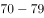岁的占，80岁及其以上的占。受访老人中有一个子女的占，有两个子女的占，无子女的占。受访老人中与配偶同住的占，与未婚子女同住的占，与某个已婚子女同住的占，在子女家轮流住的占，独居的占。的受访老人为男性。从不同住子女探望老人的频率看，的受访老人表示每天来探望，的表示每周来探望，的表示每月来探望，其余的表示子女遇事或根据要求来探望。

        调查显示，看电视（）、串门聊天（）、打牌（）、散步（）、听广播（）和读书看报（）是农村老人的主要闲暇活动。当问及“你想不想参加集体活动”时，的受访老人表示“想参加”，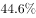的老人表示“可参加可不参加”，还有的老人表示“不想参加”。关于受访老人对当前生活状态的满意度，从年龄层看，岁、岁，80岁及其以上的老人对当前生活状态的满意度分别为、、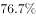；从居住状态看，与子女同住、与配偶同住、独居的老人对当前生活状态的满意度分别为、、；从与村委会互动的频率看，经常互动、偶尔互动、基本不互动的老人对当前生活状态的满意度分别为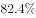、、。

#### 第 1 题　qid 1791862 · 比重

受访老人中有三个及以上子女的占比（    ）。

- **A**. 

- **B**. 

　✅
- **C**. 

- **D**. 

**答案**：B

**官方解析**

根据题干中“有三个及以上子女的占比”和文字材料第一段中“受访老人中有一个子女的占，有两个子女的占，无子女的占。”的数据可知，受访老人中有三个及以上子女的占比为：。

故正确答案为B。

---

#### 第 2 题　qid 1791864 · 综合

设与村委会经常互动、偶尔互动、基本不互动的受访老人对当前生活状态的满意度分别为a、b、c，则有（    ）。

- **A**. 

- **B**. 
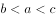

- **C**. 
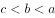
　✅
- **D**. 
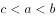

**答案**：C

**官方解析**

根据文字材料第二段中“从与村委会互动的频率看，经常互动、偶尔互动、基本不互动的老人对当前生活状态的满意度分别为、、。”可知，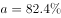，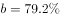，。那么，。

故正确答案为C。

---

#### 第 3 题　qid 1791866 · 比重

从不同住子女探望老人的频率看，占全体受访老人比重最大的是（    ）。

- **A**. 子女每月来探望的老人群体
- **B**. 子女每周来探望的老人群体
- **C**. 子女每天来探望的老人群体
- **D**. 子女遇事或根据要求来探望的老人群体　✅

**答案**：D

**官方解析**

根据文字材料第一段中“从不同住子女探望老人的频率看，的受访老人表示每天来探望，的表示每周来探望，的表示每月来探望，其余的表示子女遇事或根据要求来探望。”可知，子女遇事或根据要求来探望的，对比起来，此为占全体受访老人比重最大的部分。

故正确答案为D。

---

#### 第 4 题　qid 1791868 · 平均数

受访老人对当前生活状态的平均满意度为（    ）。

- **A**. 

　✅
- **B**. 

- **C**. 

- **D**. 

**答案**：A

**官方解析**

根据文字材料第一段“受访老人中6069岁的占，7079岁的占，80岁及其以上的占。”和文字材料第二段“关于受访老人对当前生活状态的满意度，从年龄层看，6069岁、7079岁、80岁及其以上的老人对当前生活状态的满意度分别为、、；”数据可以计算出受访老人对当前生活状态的平均满意度为。

故正确答案为A。

---

#### 第 5 题　qid 1791870 · 综合

下列判断正确的是（  ）。

- **A**. 
受访老人中喜欢读书看报的多于喜欢打牌的

- **B**. 
在子女家轮流住的受访老人占

- **C**. 
喜欢看电视的受访老人都不喜欢听广播

- **D**. 
受访老人中女性占
　✅

**答案**：D

**官方解析**

A项：根据文字材料第二段“调查显示，打牌（）、读书看报（）是农村老人的主要闲暇活动。”可知，读书看报（）＜打牌（），错误；

B项：根据文字材料第一段“在子女家轮流住的占”可知，错误；

C项：根据文字材料第二段“调查显示，看电视（）、串门聊天（）、打牌（）、散步（）、听广播（）和读书看报（）是农村老人的主要闲暇活动。”可知，无法判断喜欢看电视的受访老人都不喜欢听广播，错误；

D项：根据文字材料第一段“的受访老人为男性。”可知，受访老人中女性占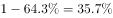，正确。

故正确答案为D。

---

### 材料 2

#### 第 6 题　qid 1791872 · 综合

2013年东部地区农民工工伤保险参保率比中部地区高（  ）。

- **A**. 12.6个百分点　✅
- **B**. 12.0个百分点
- **C**. 11.7个百分点
- **D**. 10.0个百分点

**答案**：A

**官方解析**

定位表格，2013年东部地区农民工工伤保险参保率为，中部地区农民工工伤保险参保率为，，即提高了12.6个百分点。

故正确答案为A。 

---

#### 第 7 题　qid 1791874 · 综合

2014年住宿和餐饮业的农民工医疗保险参保人数是失业保险参保人数的（  ）。

- **A**. 2倍　✅
- **B**. 1.5倍
- **C**. 0.8倍
- **D**. 0.5倍

**答案**：A

**官方解析**

根据“2014年农民工医疗保险参保人数是失业保险参保人数的”并结合选项，判定此题为现期倍数问题。定位表格，2014年住宿和餐饮业农民工医疗保险参保人数为，失业保险为，则参保人数前者是后者的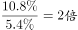。

故正确答案为A。 

---

#### 第 8 题　qid 1791876 · 增长

下列行业中，2014年农民工失业保险参保率比上年提高最少的是（  ）。

- **A**. 建筑业
- **B**. 住宿和餐饮业　✅
- **C**. 制造业
- **D**. 批发和零售业

**答案**：B

**官方解析**

定位表格，对应选项2014年农民工失业保险参保率分别提高了、、、，提高最少的为住宿和餐饮业。

故正确答案为B。 

---

#### 第 9 题　qid 1791878 · 综合

若以V工、V失、V医、V养、V生，分别表示2014年全国农民工“工伤保险”“失业保险”“医疗保险”“养老保险”“生育保险”参保率，则有（  ）。

- **A**. 
V工V失V养

- **B**. 
V医V失V养

- **C**. 
V工V生V养

- **D**. 
V工V养V生
　✅

**答案**：D

**官方解析**

根据选项为全国农民工各类保险参保率的排序，结合材料给出的是东部、中部、西部各地区农民工各类保险参保率，可判定此题为混合比重问题。观察表格，东部、中部、西部每个地区都是按照工伤、医疗、养老、失业、生育的顺序排列的，并且比重都是从大到小呈现的。三个地区各类保险的参保率混合后，其顺序还是这样从大到小排列，即2014年全国农民工各类保险的参保率从高到低排列的是工伤保险、医疗保险、养老保险、失业保险、生育保险，只有D项满足排序。
故正确答案为D。

---

#### 第 10 题　qid 1791880 · 综合

下列判断错误的是（  ）。

- **A**. 
2014年制造业农民工养老保险参保率是建筑业的5倍以上

- **B**. 
2013年交通运输、仓储和邮政业农民工失业保险参保率是

- **C**. 
2014年西部地区农民工各项保险的参保率提升幅度均大于东部地区
　✅
- **D**. 
2014年农民工住房公积金缴纳率增幅最大的行业是居民服务、修理和其他服务业

**答案**：C

**官方解析**

A项：定位表格，2014年制造业、建筑业农民工养老保险参保率分别为、，倍数为 ，正确；

B项：定位表格，2013年交通运输、仓储和邮政业农民工失业保险参保率为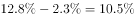，正确；

C项：定位表格，以工伤保险为例，东部、西部参保率提升幅度分别为、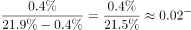，东部大于西部，错误；

D项：定位表格，2014年农民工住房公积金缴纳率除“交通运输、仓储和邮政业”“居民服务、修理和其他服务业”外，增长较少，可排除。直接比较“交通运输、仓储和邮政业”“居民服务、修理和其他服务业”，其增长率分别为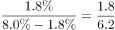、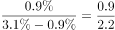，后者大于前者，正确。

本题为选非题，故正确答案为C。 

---

### 材料 3

#### 第 11 题　qid 2032186 · 平均数

2014年7月至2015年3月美国出口额月平均增量是：

- **A**. 0.8亿美元
- **B**. 0.9亿美元
- **C**. 1.8亿美元
- **D**. 2.0亿美元　✅

**答案**：D

**官方解析**

由问题所求“2014年7月至2015年3月······月平均增量”，可判定此题为年均增长量问题。这里是月份，时间换为月份。定位柱状图可得，，。2014年7月至2015年3月共9个月的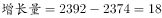，。

故正确答案为D。

---

#### 第 12 题　qid 2032188 · 综合

2014年7月至2015年3月欧元区进口额与出口额变动方向相反的月份个数有：

- **A**. 2个　✅
- **B**. 3个
- **C**. 4个
- **D**. 5个

**答案**：A

**官方解析**

 定位折线图可得，2014年7月至2015年3月欧元区进口额与出口额变动方向如下：

变动方向相反的为：2014年10月、11月，共2个月份。

故正确答案为A。

---

#### 第 13 题　qid 2032190 · 综合

2014年6月至2015年3月美国贸易顺差最大的月份是：

- **A**. 2014年12月
- **B**. 2015年1月
- **C**. 2015年2月
- **D**. 2015年3月　✅

**答案**：D

**官方解析**

贸易顺差=出口额-进口额，定位柱状图可得：

A.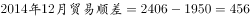；B.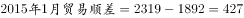；

C. 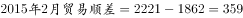；D.；

D项2015年3月的贸易顺差最大。

故正确答案为D。

---

#### 第 14 题　qid 2032194 · 增长

2014年7月至2015年3月美国与欧元区进、出口额月平均增速最快的是：

- **A**. 欧元区出口额
- **B**. 欧元区进口额　✅
- **C**. 美国出口额
- **D**. 美国进口额

**答案**：B

**官方解析**

由问题所求“2014年7月至2015年3月······月平均增速最快的是”，可判定此题为年均增长率比较问题。当时间段相同，比较月均增速时，只需比较 的大小。定位统计图可得，2014年7月至2015年3月，四选项的分别为：，，，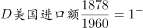，明显B项最大。

故正确答案为B。

---

#### 第 15 题　qid 2032196 · 综合

下列判断不正确的是：

- **A**. 2015年第1季度欧元区进口额环比有所增加
- **B**. 2015年1—3月美国进、出口额变动态势相同
- **C**. 2014年7月至2015年3月欧元区贸易逆差呈逐月增大的态势　✅
- **D**. 2014年6月至2015年3月美国月度最低进口额为1862亿美元

**答案**：C

**官方解析**

A项：定位折线图可得，2015年1、2、3月欧元区进口额分别为1636、1683、1711，；2014年10、11、12月欧元区进口额分别为1658、1666、1653，，因此，2015年第1季度欧元区进口额环比增加，说法正确；

B项：定位柱状图可得，2014年12月、2015年1-3月，美国各月进口额为1950、1892、1862、1878，变动态势为先降后升；各月出口额为2406、2319、2221、2392，变动态势也为先降后升，说法正确；

C项：贸易逆差=进口额-出口额，定位折线图可以发现，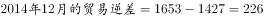,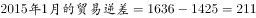，贸易逆差小于上月，说法错误；

D项：定位柱状图可得，2014年6月至2015年3月美国进口额最低的为2015年2月的1862亿美元，说法正确。

本题为选非题，故正确答案为C。

---

### 材料 4

        2014年末全国就业人员77253万人，比上年末增加276万人。其中，城镇就业人员39310万人，比上年末增加1070万人。

#### 第 16 题　qid 2032198 · 增长

2014年末全国城镇新增就业人数比2013年末增长：

- **A**. 

- **B**. 

　✅
- **C**. 

- **D**. 

**答案**：B

**官方解析**

由题干“比…增长”，结合选项都为百分数，可判定该题是求一般增长率问题。定位表格数据可得，2013年末全国城镇新增就业人数1310万人，2014年末全国城镇新增就业人数1322万人。，因此2014年末全国城镇新增就业人数比2013年末。

故正确答案为B。

---

#### 第 17 题　qid 2032200 · 综合

2013年末全国就业人员中从事第三产业的人数为：

- **A**. 23170万
- **B**. 24171万
- **C**. 29636万　✅
- **D**. 31365万

**答案**：C

**官方解析**

由题干“2013年…从事第三产业的人数为”，可判定该题是基期计算问题。定位文字材料和表格数据，2014年末全国就业人员77253万人，比上年末增加276万人，2013年末第三产业就业人员占比，因此，那么2013年末全国就业人员中，略大于答案C。

故正确答案为C。

---

#### 第 18 题　qid 2032202 · 比重

和2010年末相比，2014年末全国第一产业就业人员占比提高了：

- **A**. -7.2个百分点　✅
- **B**. 1.2个百分点
- **C**. 6.0个百分点
- **D**. 7.2个百分点

**答案**：A

**官方解析**

由题干“占比提高”，结合材料中已经给出了2010和2014年全国第一产业就业人员占比，可判定该题属于简单加减计算问题。定位表格数据，2010年末全国第一产业就业人员占比，2014年末全国第一产业就业人员占比，因为，所以和2010年末相比，2014年末全国第一产业就业人员占比提高了-7.2个百分点。

故正确答案为A。

---

#### 第 19 题　qid 2032204 · 比重

2011-2014年，全国城镇失业人员再就业人数占上年末全国城镇登记失业人数比重的最大值是：

- **A**. 

- **B**. 

- **C**. 

- **D**. 

　✅

**答案**：D

**官方解析**

由题干“2011—2014年···比重的最大值”，可判定该题是比值计算问题。

方法一：定位表格中数据，列表可得:

最大值为2013年的。

方法二：2011—2014年，全国城镇失业人员再就业人数占上年末全国城镇登记失业人数比分别为：2011年，2012年，2013年，2014年，可得，因此2011—2014年，全国城镇失业人员再就业人数占上年末全国城镇登记失业人数比重的最大值是2013年。

故正确答案为D。

---

#### 第 20 题　qid 2032206 · 综合

下列判断正确的是：

- **A**. 2014年末全国第二产业就业人数比上年末有所增加
- **B**. 2014年末全国城镇就业人员比上年末增加1322万人
- **C**. 2011—2014年末，全国第三产业就业人员占比逐年增加　✅
- **D**. 2011—2014年末，全国城镇登记失业率和城镇登记失业人数的变化趋势相同

**答案**：C

**官方解析**

A项：，因为2014年末国第二产业就业人数，，错误；

B项：2014年城镇就业人员39310万人，比上年末增加1070万人，不是1322万人，错误；

C项：2011—2014年末全国第三产业就业人员占比分别为，，，，占比逐年增加，正确；

D项：2011—2014年末，全国城镇登记失业率变化趋势为：减-增；城镇登记失业人数的变化趋势为：增-减-增，错误。

故正确答案为C。

---
