# 2016年江西省法检系统招录考试《行测》题

> 省考 · 2016 年 · 5 个模块 · 共 117 题

- [常识判断](#%E5%B8%B8%E8%AF%86%E5%88%A4%E6%96%AD) · 20 题
- [言语理解与表达](#%E8%A8%80%E8%AF%AD%E7%90%86%E8%A7%A3%E4%B8%8E%E8%A1%A8%E8%BE%BE) · 38 题
- [数量关系](#%E6%95%B0%E9%87%8F%E5%85%B3%E7%B3%BB) · 10 题
- [判断推理](#%E5%88%A4%E6%96%AD%E6%8E%A8%E7%90%86) · 34 题
- [资料分析](#%E8%B5%84%E6%96%99%E5%88%86%E6%9E%90) · 15 题

---

## 常识判断

### 第 1 题　qid 2255670 · 科技常识

在量子理论发展过程中，最早提出能量子假说的是德国物理学家：

- **A**. 爱因斯坦
- **B**. 海森堡
- **C**. 玻尔
- **D**. 普朗克　✅

**答案**：D

**官方解析**

本题考查科技常识。
A项错误，爱因斯坦是著名的犹太裔物理学家。普朗克提出能量子概念后，爱因斯坦接受了这一观点，将其运用在对光电效应的理论解释中去，提出了著名的“光电效应方程”，初步向人们展示了量子这一新工具的巨大威力，有力地证明了普朗克的“能量子”观点。
B项错误，海森堡是德国著名物理学家，其得益于爱因斯坦相对论的思路，于1925年创立了矩阵力学，并提出不确定性原理及矩阵理论。
C项错误，玻尔是丹麦物理学家。玻尔通过引入量子化条件，提出了玻尔模型来解释氢原子光谱；提出互补原理和哥本哈根诠释来解释量子力学。玻尔的理论大大扩展了量子论的影响，加速了量子论的发展。
D项正确，1900年，德国物理学家普朗克大胆地提出了能量子假设，他认为黑体在吸收能量的时候，不是连续的，而是一份一份的，即能量有最小单位，这个最小的单位被称作“能量子”。能量子概念的提出，是物理学具有划时代意义的里程碑事件，它标志着量子力学的诞生，普朗克本人也被广泛赞誉为“量子力学之父”。
故正确答案为D。

---

### 第 2 题　qid 2255672 · 科技常识

目前，宇宙大爆炸理论得到检验的最关键的证据是：

- **A**. 天体时标
- **B**. 3K微波背景辐射　✅
- **C**. 氦元素的丰度
- **D**. 超新星爆炸

**答案**：B

**官方解析**

本题考查科技常识。

A项错误，没有相关说法。

B项正确，大爆炸理论预言，现在的宇宙中应该存在着一种来自宇宙早期的均匀的、各向同性的微波背景辐射，它是宇宙早期的遗迹，频谱应该符合普朗克黑体辐射公式，温度约为3K。这一预言在1965年被射电文学家彭齐亚斯和威尔逊在宇宙观测中证实，此后亦为众多科学家进一步证实。这也成为了宇宙大爆炸理论得到检验的最关键的证据。

C项错误，大爆炸发生一秒钟以后，宇宙是由极高温的基本粒子组成的“羹汤”，这时整个宇宙处于均匀的热平衡态。随着宇宙的膨胀和降温，其中的一些粒子逐次与其余部分粒子脱耦。此时产生的核反应使中子和质子聚合在一起，形成氦核，余下的核子（没有聚合的质子）自然就形成了氢核。精确的理论计算表明，当时应有的物质质量聚合成了氦核。英国皇家格林尼治天文台对众多星系中原始星云的发射光谱进行观测的结果表明，宇宙中氦的实际丰度为。这一结果与大爆炸的理论预言极为相符。这也是证明宇宙大爆炸理论的有力证据，但不是最关键的证据。

D项错误，超新星爆炸是某些恒星在演化接近末期时经历的一种剧烈爆炸。这种爆炸都极其明亮，过程中所突发的电磁辐射经常能够照亮其所在的整个星系，并可持续几周至几个月才会逐渐衰减变为不可见。这个并不是检验宇宙大爆炸理论的证据。

故正确答案为B。

---

### 第 3 题　qid 2255673 · 科技常识

通常人到海边闻到海风的阵阵腥气，是因为海风中含有较多的：

- **A**. 二氧化硫
- **B**. 二甲基硫醚　✅
- **C**. 二氧化氮
- **D**. 二氧化碳

**答案**：B

**官方解析**

本题考查科技常识。
A项错误，二氧化硫是最常见、最简单的硫氧化物，大气主要污染物之一，具有刺激性气味。
B项正确，海洋的特殊气味来自海中细菌产生的气体，许多细菌能在浮游生物和海藻等海洋植物死亡的地方吞噬腐败物，同时产生一种名为二甲基硫醚的气体物质，这种物质具有刺鼻的气味，从而使海洋空气带有一种咸腥味。
C项错误，二氧化氮，有毒，室温下为有刺激性气味的红棕色气体。
D项错误，二氧化碳是空气中主要成分之一，是常见的温室气体，常温下是一种无色无味、不可燃的气体。
故正确答案为B。

---

### 第 4 题　qid 2255674 · 人文常识

2016年8月12日执行我国海洋科考史上第一次万米级深渊科考作业的无人潜水器被称作：

- **A**. 探索一号
- **B**. 蛟龙一号
- **C**. 蛟龙二号
- **D**. 海斗号　✅

**答案**：D

**官方解析**

本题考查科技常识。
A项错误，2016年6月22日至8月12日，我国“探索一号”科考船在马里亚纳海沟海域开展了我国海洋科技发展史上第一次综合性万米深渊科考活动。这是继“蛟龙号”七千米海试成功后我国海洋科技又一里程碑，标志着我国的深潜科考开始进入万米时代。“探索一号”是科考船的名称。
B、C项错误，没有“蛟龙一号、蛟龙二号”的说法，我国目前只有“蛟龙号”。蛟龙号载人潜水器是一艘由中国自行设计、自主集成研制的载人潜水器，也是863计划中的一个重大研究专项。2012年6月27日，蛟龙号举行7000米级海试，最大下潜深度达7062.68米，创造了国人引以为傲的“中国深度”，也是世界上同类型潜水器的最深纪录。
D项正确，“海斗”自主遥控水下机器人，也称“海斗号”。于2016年6月22日至8月12日参与“探索一号”船马里亚纳海沟科考航次，下潜深度突破万米并成功探测作业，成功获得了2条九千米级（9827和9740米）和2条万米级（10310和10767米）水柱的温盐深数据，成为我国首台下潜深度超过万米并进行科考应用的无人自主潜水器。
故正确答案为D。

---

### 第 5 题　qid 2255676 · 科技常识

牛奶之所以呈现白色是因为          所致。

- **A**. 碳化作用
- **B**. 氧化作用
- **C**. 乳化作用　✅
- **D**. 钙化作用

**答案**：C

**官方解析**

本题考查科技常识。
A项错误，碳化作用又称干馏、炭化、焦化作用，是指固体或有机物在隔绝空气条件下加热分解的反应过程或加热固体物质来制取液体或气体产物的一种方式。
B项错误，氧化作用是在生物体内或生物体外，将物质分解并释放出能量的一种过程。
C项正确，乳化作用是指乳化剂使不相容的油、水两相乳化形成相对稳定的乳状液的过程。牛奶里有水、脂肪、蛋白质等物质，其中有一些蛋白质作为乳化剂包裹在细小的脂肪球表面上，让脂肪球均匀地分散在水里，形成许多微小的脂肪球。这些微小脂肪球的光学散射作用使牛奶呈现乳白色。
D项错误，钙化作用一般指的是碳酸盐（主要是碳酸钙）类的沉积作用。
故正确答案为C。

---

### 第 6 题　qid 2255678 · 人文常识

二十四节气是以          为依据确定的。

- **A**. 太阴历
- **B**. 太阳历　✅
- **C**. 阴阳合历
- **D**. 潮汐运动规律

**答案**：B

**官方解析**

本题考查科技常识。
A项错误，太阴历一般称为阴历。阴历在天文学中主要指按月亮的月相周期来安排的历法，以月球绕行地球一周（以太阳为参照物，实际月球运行超过一周）为一月，即以朔望月作为确定历月的基础，一年为十二个历月的一种历法。
B项正确，太阳历又称为阳历，是以地球绕太阳公转的运动周期为基础而制定的历法。二十四节气是根据太阳在黄道(即地球绕太阳公转的轨道)上的位置来划分的，视太阳从春分点(黄经零度，此刻太阳垂直照射赤道)出发，每前进15度为一个节气；运行一周又回到春分点，为一回归年，合360度，因此分为24个节气。所以二十四节气是以太阳历为依据确定的。
C项错误，阴阳合历就是既要考虑月相的符合，即新月在初一，满月在十五，又要让一年的平均长度仍然为365日多一点(和公历的年长接近)的一种历法。我国的农历就属于阴阳合历。
D项错误，潮汐运动规律是指在月球和太阳引力作用下，海洋水面周期性的涨落现象。
故正确答案为B。

---

### 第 7 题　qid 2255679 · 人文常识

在古代“诸子百家”中，具有近代科学色彩的学派是：

- **A**. 儒家
- **B**. 法家
- **C**. 道家
- **D**. 墨家　✅

**答案**：D

**官方解析**

本题考查人文常识。
A项错误，儒家学派是先秦诸子中对后世影响最为广泛和深远的一个学派，由春秋末孔子首创。儒家学说以“仁”为中心，崇尚“礼乐”“仁义”，倡导“中庸”之道。政治上主张实行“仁政”“德治”，重视伦理道德教育。不具有近代科学色彩。
B项错误，法家学派是中国历史上提倡以法制为核心思想的重要学派。法家思想内容丰富，结构较为完整，包括伦理思想，社会发展思想，政治思想以及法治思想等诸多方面。不具有近代科学色彩。
C项错误，道家学派是以老庄学说为中心的学术派别，形成于先秦时期。其学说以“道”为最高哲学范畴，认为“道”是世界的最高真理，是宇宙万物的本原，是宇宙万物赖以生存的依据。不具有近代科学色彩。
D项正确，墨家学派约产生于战国时期，是一个学者和工匠相结合的学派。墨家科学思想已经具有近代科学精神，其著作《墨经》是中国古代的一部百科全书，总结了力学、光学、几何学等多种自然科学知识，最早解释了小孔成像的科学原理。
故正确答案为D。

---

### 第 8 题　qid 2255683 · 人文常识

中国古代音乐的音阶一般包括：

- **A**. 宫商角羽
- **B**. 宫商角徵
- **C**. 宫商角徵羽　✅
- **D**. 商角徵羽

**答案**：C

**官方解析**

本题考查人文常识。
中国古代音乐的理论基础是五声音阶，即“宫”“商”“角”“徵”“羽”，如用西乐的七个音阶对照一下的话，古中乐的“五音”相当于do、re、mi、sol、la。最早的“宫商角徵羽”的名称见于春秋时期，在《管子·地员篇》中，有采用数学运算方法获得“宫、商、角、徵、羽”五个音的科学办法。
故正确答案为C。

---

### 第 9 题　qid 2255685 · 科技常识

“黑天鹅事件”作为一个经济学术语，它源于：

- **A**. 生物学　✅
- **B**. 逻辑学
- **C**. 社会学
- **D**. 物理学

**答案**：A

**官方解析**

本题考查经济常识。
在发现澳大利亚的黑天鹅之前，17世纪之前的欧洲人认为天鹅都是白色的。但随着第一只黑天鹅的出现，这个不可动摇的信念崩溃了。后来人们就用“黑天鹅事件”指非常难以预测，且不寻常的事件，通常会引起市场连锁负面反应甚至颠覆。所以这个术语最初是起源于生物学。
故正确答案为A。

---

### 第 10 题　qid 2255687 · 地理国情

与江西省相邻的省市是：

- **A**. 湖北、湖南、广东、福建　✅
- **B**. 福建、湖南、安徽、上海
- **C**. 广东、浙江、广西、贵州
- **D**. 广东、福建、湖南、河南

**答案**：A

**官方解析**

本题考查地理国情。

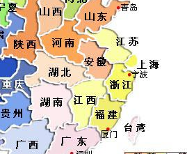

由图可知，与江西省相邻的省市为湖北省、湖南省、安徽省、浙江省、福建省、广东省。

A项正确，四个省份均与江西省相邻。

B项错误，上海市与江西省不相邻。

C项错误，广西省、贵州省与江西省不相邻。

D项错误，河南省与江西省不相邻。

故正确答案为A。

---

### 第 11 题　qid 2255688 · 人文常识

被称为“东方莎士比亚”的是：

- **A**. 关汉卿
- **B**. 柳宗元
- **C**. 汤显祖　✅
- **D**. 马致远

**答案**：C

**官方解析**

本题考查人文常识。
A项错误，关汉卿，元代杂剧作家，与马致远、郑光祖、白朴并称为“元曲四大家”。他以杂剧的成就最大，一生写了60多种，今存18种，最著名的有《窦娥冤》这部作品。
B项错误，柳宗元，字子厚，唐宋八大家之一。著作有《永州八记》等，经后人辑为三十卷，名为《柳河东集》。
C项正确，汤显祖，明代戏曲家、文学家。字义仍，号海若、若士、清远道人。作品有《牡丹亭》、《邯郸记》、《南柯记》、《紫钗记》等，其中以《牡丹亭》最著名。因为他与莎士比亚生活同一时代（莎士比亚生卒：1564年-1616年，汤显祖生卒：1550年-1616年），且两人的文学作品之多，文学成就之高都极为相似，故其被称为“东方莎士比亚”。
D项错误，马致远，字千里, 是元代著名大戏剧家、散曲家，“元曲四大家”之一。
故正确答案为C。

---

### 第 12 题　qid 2255690 · 人文常识

明朝郑和七次下西洋，遍访30多个国家与地区，最远曾到达：

- **A**. 非洲东海岸与红海海口　✅
- **B**. 非洲西海岸与红海海口
- **C**. 印度洋西海岸与波罗的海
- **D**. 阿拉伯海东海岸与红海海口

**答案**：A

**官方解析**

本题考查人文常识。
郑和率领庞大船队下西洋访问各国，首次航行始于明朝永乐三年(1405年)，末次航行结束于宣德八年(1433年)，共计七次。在七次航行中，郑和率领船队从南京出发，在江苏太仓的刘家港集结，至福建长乐太平港驻泊伺风开洋，远航西太平洋和印度洋拜访了30多个国家和地区，其中包括爪哇、苏门答腊、暹罗等地，目前已知最远到达非洲东海岸、红海。
故正确答案为A。

---

### 第 13 题　qid 2255691 · 科技常识

1945年，          在《生命是什么》一书中提出了遗传密码的概念假说。

- **A**. 薛定谔　✅
- **B**. 克里克
- **C**. 孟德尔
- **D**. 伽莫夫

**答案**：A

**官方解析**

本题考查科技常识。
A项正确，1945年，薛定谔在《生命是什么》一书中提出了遗传密码的概念假说。
B项错误，1953年，美国生物化学家沃森和英国生物物理学家克里克提出DNA双螺旋结构模型。
C项错误，孟德尔是遗传学的奠基人，被誉为近代遗传学之父。他通过豌豆实验，发现了遗传规律、分离规律及自由组合规律，提出“遗传因子”的概念。
D项错误，1954年，物理学家伽莫夫提出三联体密码的概念。
故正确答案为A。

---

### 第 14 题　qid 2255694 · 人文常识

被列宁称为“十一世纪的改革家”的是：

- **A**. 苏轼
- **B**. 王安石　✅
- **C**. 欧阳修
- **D**. 苏辙

**答案**：B

**官方解析**

本题考查人文常识。
A项错误，苏轼，字子瞻，号“东坡居士”，世称“苏东坡”。北宋著名散文家、书画家、词人、诗人，是豪放词派的代表人物。
B项正确，王安石，字介甫，号半山，被列宁誉为“中国11世纪的改革家”，面对北宋中期以来积贫积弱的现状，大胆提出“天变不足畏，祖宗不足法，人言不足恤”。王安石变法以发展生产、富国强兵、挽救宋朝政治危机为目的，以“理财”“整军”为中心，涉及政治、经济、军事、社会、文化各个方面，是中国古代史上继商鞅变法之后又一次规模巨大的社会变革运动。
C项错误，欧阳修，字永叔，号醉翁，号“六一居士”，世称“欧阳文忠公”。北宋政治家、文学家、史学家，与韩愈、柳宗元、王安石、苏洵、苏轼、苏辙、曾巩合称“唐宋八大家”。
D项错误，苏辙，字子由，唐宋八大家之一，与父苏洵、兄苏轼，合称“三苏”。
故正确答案为B。

---

### 第 15 题　qid 2255698 · 人文常识

甲教唆乙去杀丙。乙到现场后，没有找到丙，但是在乙出门时与一保安发生冲突，结果乙将该保安杀死。关于甲对保安的死是否应承担责任，下列正确的是：

- **A**. 甲应承担责任
- **B**. 甲不应承担责任　✅
- **C**. 甲应承担教唆责任
- **D**. 甲总体上不应承担责任

**答案**：B

**官方解析**

本题考查法律常识。《中华人民共和国刑法》第二十九条规定：“教唆他人犯罪的，应当按照他在共同犯罪中所起的作用处罚。教唆不满十八周岁的人犯罪的，应当从重处罚。如果被教唆的人没有犯被教唆的罪，对于教唆犯，可以从轻或者减轻处罚。”
题干中甲教唆乙去杀害丙，但因丙不在现场乙未实行犯罪，虽然乙未能实施杀害丙的行为，即乙没有犯教唆的罪，但对于教唆犯的甲也应当追究其责任；对于保安的死，是乙本身与其产生冲突，与甲无关，故甲对保安的死不承担责任。
故正确答案为B。

---

### 第 16 题　qid 2255700 · 法律常识

2015年7月1日，第十二届全国人大常委会第十五次会议表决通过了全国人大常委会关于实行宪法宣誓制度的决定。根据该决定，各级人民代表大会及县级以上各级人大常委会选举或决定任命的国家工作人员，以及各级人民政府、人民法院、人民检察院任命的国家工作人员，在就职时应当公开进行宪法宣誓。该决定规定，宣誓制度自2016年1月1日起施行。该决定将宪法宣誓誓词增改为      字。

- **A**. 60
- **B**. 65
- **C**. 75
- **D**. 70　✅

**答案**：D

**官方解析**

本题考查法律常识。2015年7月1日，第十二届全国人大常委会第十五次会议表决通过了全国人大常委会关于实行宪法宣誓制度的决定。决定规定的宪法宣誓誓词共70个字：“我宣誓：忠于中华人民共和国宪法，维护宪法权威，履行法定职责，忠于祖国、忠于人民，恪尽职守、廉洁奉公，接受人民监督，为建设富强、民主、文明、和谐的社会主义国家努力奋斗！”
故正确答案为D。

---

### 第 17 题　qid 2255703 · 人文常识

甲长期下落不明，经其配偶乙向法院申请，法院判决宣告甲死亡。其后，乙就与丁结婚，并将一6岁的儿子送给丙收养，双方办理了收养手续。实际上甲并未死亡。经甲请求法院撤销了对其死亡的宣告。甲回家后发现儿子被人收养，乙也改嫁他人，幸丁已死亡。因此，甲就要求与乙恢复婚姻关系，并以自己未同意将儿子送丙收养主张收养无效。关于甲可否与乙自动恢复婚姻关系及甲的儿子与丙间的收养行为是否无效，下列正确的是：

- **A**. 不能自动恢复婚姻关系、收养行为有效　✅
- **B**. 能自动恢复婚姻关系、收养行为无效
- **C**. 能自动恢复婚姻关系、收养行为有效
- **D**. 不能自动恢复婚姻关系、收养行为无效

**答案**：A

**官方解析**

本题考查法律常识。
根据《民法典》第五十一条规定：“被宣告死亡的人的婚姻关系，自死亡宣告之日起消除。死亡宣告被撤销的，婚姻关系自撤销死亡宣告之日起自行恢复。但是，其配偶再婚或者向婚姻登记机关书面声明不愿意恢复的除外。”乙已经再婚，故甲和乙不能自动恢复婚姻关系。
根据《民法典》第五十二条规定：“被宣告死亡的人在被宣告死亡期间，其子女被他人依法收养的，在死亡宣告被撤销后，不得以未经本人同意为由主张收养行为无效。”故甲的儿子和丙间的收养行为有效。
故正确答案为A。

---

### 第 18 题　qid 2255706 · 法律常识

根据法官、检察官纪律处分有关规定，下列正确的是：

- **A**. 张法官参与迷信活动，在社会中造成了不良影响，给予提醒劝阻，其不应受到纪律处分
- **B**. 李法官乘车时对正在实施的盗窃行为视而不见，小偷威胁失主仍不出面制止，其应受到纪律处分
- **C**. 何检察官在讯问犯罪嫌疑人时，反复提醒犯罪嫌疑人注意其聘请的律师执业不足2年，其行为未违反有关规定
- **D**. 刘检察官接访时，让采访人前往国土局信访室举报他人骗取宅基地使用权证的问题，其做法是恰当的　✅

**答案**：D

**官方解析**

本题考查法律常识。
A项错误，根据《人民法院工作人员处分条例》第一百零四条第一款规定：“参与迷信活动，造成不良影响的，给予警告、记过或者记大过处分。”故张法官应受到纪律处分。
B项错误，《人民法院工作人员处分条例》没有对此类情形作出规定。故李法官不应受到纪律处分。
C项错误，《人民法院工作人员处分条例》第三十二条规定：“违反规定为案件当事人推荐、介绍律师或者代理人，或者为律师或者其他人员介绍案件的，给予警告处分；造成不良后果的，给予记过或者记大过处分。”为了实现司法公正，检察机关不能给当事人推荐介绍律师担任辩护人或诉讼代理人，当然也不能对当事人已经委托的辩护人或代理人评头论足。
D项正确，骗取宅基地证，是民间纠纷，不是刑事案件。刘检察官从事信访接待工作，根据案件的管辖情况建议来访人到有权机关进行举报，是通过正常途径反映情况，做法得当。
故正确答案为D。

---

### 第 19 题　qid 2255709 · 法律常识

甲、乙、丙诉丁遗产继承纠纷一案，甲不服法院作出的一审判决，认为分配给丙和丁的遗产份额过多，提起上诉。关于本案二审当事人诉讼地位的确定，下列正确的是：

- **A**. 甲是上诉人，乙、丙、丁是被上诉人
- **B**. 甲是上诉人，乙为原审原告，丙、丁为被上诉人　✅
- **C**. 甲、乙、丙是上诉人，丁为被上诉人
- **D**. 甲、乙是上诉人，丙、丁是被上诉人

**答案**：B

**官方解析**

本题考查法律常识。根据《最高人民法院关于适用&lt;中华人民共和国民事诉讼法&gt;的解释》第三百一十九条规定：“必要共同诉讼人的一人或者部分人提起上诉的，按下列情形分别处理：
（一）上诉仅对与对方当事人之间权利义务分担有意见，不涉及其他共同诉讼人利益的，对方当事人为被上诉人，未上诉的同一方当事人依原审诉讼地位列明；
（二）上诉仅对共同诉讼人之间权利义务分担有意见，不涉及对方当事人利益的，未上诉的同一方当事人为被上诉人，对方当事人依原审诉讼地位列明；
（三）上诉对双方当事人之间以及共同诉讼人之间权利义务承担有意见的，未提起上诉的其他当事人均为被上诉人。”
故正确答案为B。

---

### 第 20 题　qid 2255713 · 科技常识

2016年8月16日1时40分，我国在酒泉卫星发射中心成功将世界首颗量子科学实验卫星           发射升空。这将使我国在世界上首次实现卫星和地面之间的量子通信，构建天地一体化的量子保密通信与科学实验体系。

- **A**. “庄子号”
- **B**. “墨子号”　✅
- **C**. “孔子号”
- **D**. “孟子号”

**答案**：B

**官方解析**

本题考查科技常识。2016年8月16日1时40分，我国在酒泉卫星发射中心成功将世界首颗量子科学实验卫星“墨子号”发射升空。量子通信卫星的安全性基于量子物理基本原理，单光子的不可分割性和量子态的不可复制性，保证了信息的不可窃听和不可破解，从原理上确保身份认证、传输加密以及数字签名等无条件安全。
故正确答案为B。

---

## 言语理解与表达

### 第 1 题　qid 2255872 · 逻辑填空

为了办好杭州峰会，甲方始终        开放、透明、包含的理念，广泛        各方诉求。

- **A**. 坚持  征求
- **B**. 秉持  收集
- **C**. 秉持  倾听　✅
- **D**. 坚持  听取

**答案**：C

**官方解析**

第一空，“坚持”指坚决保持住或进行下去，中性词；“秉持”指依照道理或公平的标准坚持。两者相比较，显然“秉持”更能契合文段“开放、透明、包含的理念”的语意，排除A、D两项。
第二空，修饰“各方诉求”，“诉求”指陈诉和请求。可知，横线处词语表示接受或感受各方言语或非言语信息的意思。B项，“收集”指使聚集在一起，体现不出对对方诉求的态度；C项，“倾听”除了耳朵听，还有全身心地去感受、细心、认真地听取对方陈述性请求的意思，与文意更符合，排除B项。
故正确答案为C。

---

### 第 2 题　qid 2255874 · 逻辑填空

任何一项改革都不是            ，也不可能一帆风顺。改革有风险，改革需谨慎。但这不能成为拒绝和        改革的理由。
依次填入划横线部分最恰当的一项是：

- **A**. 一蹴而就  放弃　✅
- **B**. 一日千里  抛弃
- **C**. 一步登天  摒弃
- **D**. 一路绿灯  扬弃

**答案**：A

**官方解析**

第一空，根据“也不可能一帆风顺”，“也”表并列关系，“一帆风顺”比喻非常顺利，没有任何阻碍，强调的是顺利，可知文段前句子表达的意思与之相似，B项“一日千里”比喻进展极快，强调的是事物发展迅速，与文意不符。C项，“一步登天”比喻一下子就达到很高的境界或程度，有时也用来比喻人突然得志，爬上高位，含有讽刺意味，与文意不符。故排除B、C两项。
第二空，文段“和”表并列关系，可知横线处填入词语应和“拒绝”意思相近，D项，“扬弃”指发扬旧事物中的积极因素，抛弃旧事物中的消极因素。前半段“扬”的意思无法与文段相对应，与文意不符，排除D项。
故正确答案为A。

---

### 第 3 题　qid 2255876 · 逻辑填空

遇到困难切莫一味地        ，发生交通事故千万莫        ，涉及亲戚考试一定要        。
依次填入划横线部分最恰当的一项是：

- **A**. 逃避  回避  逃逸
- **B**. 逃避  逃逸  回避　✅
- **C**. 回避  逃逸  逃避
- **D**. 回避  逃避  逃逸

**答案**：B

**官方解析**

第一空，“逃避”指逃走避开，侧重强调事情已经发生，有机体做出的某种反应；“回避”指躲避、避让，侧重强调事情即将出现时，有机体做出的某种反应。文段“遇到困难”，显然困难已经发生，只有“逃避”一词符合语境，故排除C、D两项。
第二空，修饰“发生交通事故”，A项“回避”侧重强调事情即将出现时，有机体做出的某种反应，显然，与文段语境不符，排除；B项“逃逸”指“逃跑”的意思，符合文段表达的交通事故中行为人在发生交通事故后，为逃避法律追究而逃跑的行为，保留。
第三空，代入验证，一般避开“亲戚考试”是考试前采取的行动，“回避”符合文意，当选。
故正确答案为B。

---

### 第 4 题　qid 2255878 · 逻辑填空

毫无疑问，宇宙和生命的起源和演化是全人类共同        的重大问题，同时也是高技术的创新        之一，将对基础科学        人类文明进步带来深远影响。
依次填入划横线部分最恰当的一项是：

- **A**. 关切  源泉  以及
- **B**. 关心  源泉  乃至
- **C**. 关切  源头  以及
- **D**. 关心  源头  乃至　✅

**答案**：D

**官方解析**

第一空，修饰“重大问题”。“关切”虽然指关心，但多用于对人，领导对群众，长辈对晚辈或同志之间，语意较重，文段强调的主题是“问题”，与文意不符。“关心”指留意，注意，(把人或事物)常放在心上，符合文意。故排除A、C两项。
第二空，文段表达的是“宇宙和生命的起源和演化”也是高技术的创新最初的起点的意思。“源泉”指水源，比喻事物的根源，强调事物发生的根本缘由，文段表达的是起始的意思，没有特别强调根本原因，与文意不符；“源头”指水发源处，比喻事物的本源，符合文意。故排除B项。
第三空，代入验证，“基础科学”和“人类文明进步”是两个不同层次，后者比前者程度更深。此处填入的词语应该表递进关系。“乃至”指甚至的意思，与文意相符。
故正确答案为D。

---

### 第 5 题　qid 2255880 · 逻辑填空

这种改革，目的是要改变传统的低效教学模式，从        学生的思维、提升学生综合人文素质出发，把素质教育落实到课堂中，通过高效课堂实现减负增质的育人        。
依次填入划横线部分最恰当的一项是：

- **A**. 推行  培育  目标
- **B**. 推动  培养  目的
- **C**. 推行  培养  目标　✅
- **D**. 推动  培育  目的

**答案**：C

**官方解析**

第一空，文段主要表示实行“这种改革”，“推动”指使事物前进，使工作展开，强调状态；“推行”指推广实行，强调普遍实行。“推行”更符合文意，排除B、D两项。
第二空，修饰“思维”，“培育”指培养教育，对象一般是人，与“思维”搭配不当；“培养”可以形容人，也指一定条件下，蓄养或积蓄一种精神或能力，与文意相符。故排除A项。
第三空，代入验证，与“实现”搭配，“目标”指预期目的，符合文意，C项当选。
故正确答案为C。

---

### 第 6 题　qid 2255882 · 逻辑填空

在基层扶贫中存在一种趋势，即周边什么产业“火”，      上马什么产业。这样盲目跟风，缺少差异性思维，导致种植数量上涨，产品滞销，农民         挣不到钱，      对发展产业和脱贫致富越发迷茫。
依次填入划横线部分最恰当的一项是：

- **A**. 也  不仅  还
- **B**. 就  不是  就是
- **C**. 就  不仅   还　✅
- **D**. 也  不是  就是

**答案**：C

**官方解析**

第一空，与“即周边什么产业‘火’”相搭配，“也”表并列关系，“就”依照现有情况或趁着当前的便利，显然“就”更符合文段表达的趁着周边什么产业“火”就做什么产业而形成的盲目跟风的语境。故排除A、D两项。
第二、三空，文段农民挣不到钱与农民对发展产业和脱贫致富越发迷茫是两个不同的层面，后者比前者程度加深，此处需要填入一个表示递进关系的词语，“不是······就是······”表选择关系，“不仅······还······”表递进关系。排除B项。
故正确答案为C。

---

### 第 7 题　qid 2255884 · 逻辑填空

两家企业的负责人投入巨资搞创新无一例外地遇到不同的声音        非议，        多年的坚持最终换来了成功。
依次填入划横线部分最恰当的一项是：

- **A**. 虽然  与  但是
- **B**. 尽管  与  但是
- **C**. 虽然  甚至  然而
- **D**. 尽管  乃至  然而　✅

**答案**：D

**官方解析**

第一、二空，文段提到“创新无一例外地遇到不同的声音”和“非议”，显然，后者比前者程度加深，所以填入的词语应能使前后两个句子在内容上形成递进关系。“虽然······与······” “尽管······与······”都不能表递进，“虽然······甚至······”关联词搭配不当。故排除A、B、C三项。
第三空，“然而”表示转折关系的连词，衔接后文“最终换来了成功”，正好与前文形成语意上的转折，符合文意。
故正确答案为D。

---

### 第 8 题　qid 2255886 · 逻辑填空

推进海绵城市建设，        不可简单对待，        不可盲目乐观，操之过急，        要避免政绩冲动。
依次填入划横线部分最恰当的一项是：

- **A**. 既  又  还
- **B**. 不仅  而且  尤其
- **C**. 既  也  尤其　✅
- **D**. 不仅  而且  还

**答案**：C

**官方解析**

第一、二空，文段提到“不可简单对待”和“不可盲目乐观，操之过急”，两者表意程度相似，所以填入的词语应能使前后两个句子在内容上形成并列关系。“既······又······”、“既······也······”表并列，保留；“不仅······而且······”表递进，与文意不符，排除B、D两项。
第三空，根据“不可盲目乐观，操之过急”以及“要避免政绩冲动”可知，“避免政绩冲动”是“不可盲目乐观，操之过急”的一个方面，也就是重点强调“政绩冲动”这一方面，C项“尤其”表示特别强调，可以与前文内容语义相承接，符合文意，当选。A项“还”可表达“更”或者“又”的意思，也就是“递进”和“并列”关系，但根据文意可知，横线后“要避免政绩冲动”不能与前文“不可盲目乐观，操之过急”构成程度加重或者并列的关系，排除。
故正确答案为C。
【出处】《海绵城市建设应避免误区》

---

### 第 9 题　qid 2255887 · 逻辑填空

究竟何为共享经济，学界与业界尚无准确定义。        ，几乎可以确定的是，        它将以怎样浩荡的形式来袭，在以租人APP为载体的这方小领域里，        荷尔蒙“下架”，共享的价值        真正“上线”。
依次填入划横线部分最恰当的一项是：

- **A**. 诚然  无论  只有  才能
- **B**. 然而  无论  只要  就
- **C**. 诚然  无论  只要  就
- **D**. 然而  无论  只有  才能　✅

**答案**：D

**官方解析**

第一空，横线前内容提到“尚无准确定义”，文段后内容提到“几乎可以确定”，两者语意相反，所以填入的词语应能使前后两个句子在内容上形成转折关系。“诚然”表顺承关系，“然而”表转折关系。故排除A、C两项。
第三、四空，荷尔蒙“下架”与共享的价值真正“上线”，可知两者不能同时并存，所以填入的词语应能使前后两个句子在内容上形成表示必需的条件关系。“只要······就······”表示条件非唯一；“只有······才能······”表示条件唯一，显然，“只有······才能······”符合文意。排除B项。
第二空，代入验证，根据“将以怎样浩荡的形式来袭”，可知表示不管情况怎样，所以填入的词语应表条件关系，表示条件不同而结果不变。“无论”是假设条件关系的连词，符合文意。
故正确答案为D。

---

### 第 10 题　qid 2255888 · 逻辑填空

“我胸怀坦荡，光明磊落，事情做得好会        ，做错了从来不扭扭捏捏、        ，无非认个错，赔个不是”。
依次填入划横线部分最恰当的一项是：

- **A**. 自我放纵  闻过则喜
- **B**. 飞扬跋扈  文过则喜
- **C**. 自鸣得意  文过饰非　✅
- **D**. 大鸣大放  闻过饰非

**答案**：C

**官方解析**

第一空，“飞扬跋扈”形容骄横放肆，目中无人，贬义词，与文意不符。“大鸣大放”指群众在对某些重大问题的看法上可以充分发表自己的意见，对象是形容“群众”，这里是形容自己。故排除B、D两项。
第二空，横线处与“做错了从来不扭扭捏捏”之间使用顿号，根据文意，可知两者形成并列关系，且语意相近。“闻过则喜”指听到别人批评自己的缺点或错误，表示欢迎和高兴，指虚心接受意见。“文过饰非”指用漂亮的言词掩饰自己的过失和错误。显然“文过饰非”与前文“做错了从来不扭扭捏捏”语意相承，排除A项。
故正确答案为C。

---

### 第 11 题　qid 2255889 · 逻辑填空

①从前治安环境不好，总有一伙人在这一带称王称霸，         ，光天化日，为非作歹。
②在这次点钞票的比赛中，她无可争议地         。
依次填入划横线部分最恰当的一项是：

- **A**. 独占鳌头  名列前茅
- **B**. 不可一世  独占鳌头　✅
- **C**. 独占鳌头  一枝独秀
- **D**. 一枝独秀  独占鳌头

**答案**：B

**官方解析**

①批评的是一伙人为非作歹，破坏治安，感情色彩是贬义。“独占鳌头”指科举时代中了状元，比喻占首位或第一名，属褒义词，不合文意。“一枝独秀”形容在同类事物中最为突出，最为优秀，属褒义词，不合文意。A、C、D三项排除。
验证②，在点钞比赛中“独占鳌头”，即获得第一名，符合文意。
故正确答案为B。

---

### 第 12 题　qid 2255891 · 逻辑填空

刚下过一场小雪，就迎来了新春，漫步在         的南昌街头，随处都能见到一派         的景象。
依次填入划横线部分最恰当的一项是：

- **A**. 熙熙攘攘  春意盎然　✅
- **B**. 车水马龙  不忍直视
- **C**. 熙熙攘攘  门可罗雀
- **D**. 门可罗雀  美轮美奂

**答案**：A

**官方解析**

第一空，春节是我国传统节日，全国各地的庆祝都十分隆重，文中描绘的是南昌街头，新春时节，热闹喜庆的氛围。“熙熙攘攘”形容人来人往，非常热闹拥挤。“车水马龙”形容热闹繁华的景象。“门可罗雀”形容十分冷落，宾客稀少。不符合春节的氛围，D项排除。
第二空，“春意盎然”形容春天的意味正浓。符合春节的特色。A项当选。“不忍直视”形容景象极其悲惨，不符合春节热闹的特点，B项排除。“门可罗雀”不符合春节的氛围，C项排除。
故正确答案为A。

---

### 第 13 题　qid 2255894 · 逻辑填空

只有带着中国“土”味儿的艺术，才能在世界画坛上         ，跟在别人屁股后面跑的，不管是什么千奇派、百怪派，只能说是         ，说文雅一些，是艺术教条主义。
依次填入划横线部分最恰当的一项是：

- **A**. 奇情异彩  拾人牙慧
- **B**. 大方光芒  拾人牙慧
- **C**. 大放异彩  拾人牙慧　✅
- **D**. 光芒万丈  拾人牙慧

**答案**：C

**官方解析**

第一空，文段其实呼吁画坛艺术要带有中国本土味道，而不是跟随他人。“奇情异彩”形容奇特怪异的情致和光彩。中国“土”味儿不都是奇特怪异的风格，排除A项。“大方光芒”属于错别字，没有这个词。B项排除。“大放异彩”无比的光辉灿烂,奇异的光彩或色彩，比喻突出的成就。符合文意。“光芒万丈”形容光辉灿烂，照耀到远方，感情程度太浓，D项排除。
验证第二空，“拾人牙慧”比喻拾取别人的一言半语当作自己的话，也比喻窃取别人的语言和文字。符合文意。
故正确答案为C。

---

### 第 14 题　qid 2255896 · 逻辑填空

某省农村改革的成效，现在是        了，七千四百亿斤粮食和八千万担棉花便是献给改革者的花束。这虽然是开头，却预示着改革之势        。
依次填入划横线部分最恰当的一项是：

- **A**. 一睹为快  如火如荼
- **B**. 惨不忍睹  功败垂成
- **C**. 板上钉钉  星火燎原
- **D**. 有目共睹  方兴未艾　✅

**答案**：D

**官方解析**

第一空，根据文意是赞扬某省农村改革取得可喜的成效。“一睹为快”意思是对一件东西或一件事情非常感兴趣，非常想马上看到或了解详情。通常要人作为主语，搭配使用，文中明显不符，排除A项。“惨不忍睹”形容极其悲惨，不符文中感情色彩，B项排除。“板上钉钉”比喻事情已经决定，不能改变或事情已经成了事实。“有目共睹”指非常明显，谁都看得见。
第二空，“星火燎原”常比喻新生事物开始时力量虽然很小，但有旺盛的生命力，前途无限。“方兴未艾”指事物正在发展，尚未达到止境。结合文中所提某省农村改革还是刚刚开头，还在发展，没有谈及开始时力量大小，排除C项。
故正确答案为D。

---

### 第 15 题　qid 2255897 · 逻辑填空

作为文化名人，他深感自己是盛名之下，        ，惟有        、勤勤恳恳地工作，才能不负众望。
依次填入划横线部分最恰当的一项是：

- **A**. 其实难副  竸竸业业
- **B**. 其实难符  竸竸业业
- **C**. 其实难副  兢兢业业　✅
- **D**. 其实难符  兢兢业业

**答案**：C

**官方解析**

第一空，“盛名之下，其实难副”，是一句古语，意思是指形容名气很大，但真实情况可能很难符合。排除B、D两项。
第二空，“竸”古同“竞”，没有“竸竸业业”这个词。“兢兢业业”形容做事谨慎、勤恳。与后文勤勤恳恳地工作相符，排除A项。
故正确答案为C。

---

### 第 16 题　qid 2255899 · 逻辑填空

拿破仑被废黜以后，在厄尔巴岛          ，1816年3月1日登陆，20日重返巴黎。他只带了千名士兵，所到之处，受到农民“         ”的欢迎。
依次填入划横线部分最恰当的一项是：

- **A**. 不甘沉沦  箪食瓢饮
- **B**. 不甘寂寞  箪食瓢饮
- **C**. 不甘沉沦  箪食壶浆
- **D**. 不甘寂寞  箪食壶浆　✅

**答案**：D

**官方解析**

第一空，“不甘沉沦”是指不甘心陷入(疾病、困苦、厄运等不幸境地)；“不甘寂寞”形容不甘心被冷落或急于想参与某件事情。从后文可以看出拿破仑是想参与重返巴黎的事情。“不甘寂寞”更能契合文段的语意，排除A、C两项。
第二空，“箪食瓢饮”形容读书人安于贫穷的清高生活。“箪食壶浆”形容军队受到群众热烈拥护和欢迎的情况。文中可知他带领千名士兵是一支军队，不是读书人，排除B项。
故正确答案为D。

---

### 第 17 题　qid 2255900 · 片段阅读

地处长白山南麓的吉林集安以独特的地理、气候条件被誉为“东北小江南”。在绿色发展理念引领下，这座边陲小城近年来不断激活绿色富民产业，独到的资源禀赋和深厚的历史底蕴喷涌出巨大的发展活力。
通过这段文字，作者想要告诉我们的是：

- **A**. 吉林集安这座边陲小城被誉为“东北小江南”
- **B**. 吉林集安独特的地理、气候条件适合发展绿色产业
- **C**. 吉林集安近年来为绿色富民产业兴盛，发展活力巨大　✅
- **D**. 吉林集安为我国绿色富民产业发展起到了典型示范的作用

**答案**：C

**官方解析**

文段先介绍了吉林集安的背景地位，接着阐述“在绿色发展理念引领下”发展迅速。故文段主旨是吉林集安依靠绿色产业发展迅速。对应C项。
A项，属于背景介绍，非重点，排除；
B项，文段只是说集安“独特的地理、气候条件”得到“东北小江南”美誉，没有谈及是否适合绿色产业，排除；
D项，“典型示范的作用”在文中没有提及，排除。
故正确答案为C。

---

### 第 18 题　qid 2255901 · 片段阅读

全球化时代，任何一个创新体系都不能闭门造车。只有开放，才能促进创新资源的全方位流动和有效配置。中国科技创新的发展与改革开放密切相关，走出去与引进来，对丰富创新生态起到了重要作用。未来，中国将营造更好的环境和条件，吸引海外资源，探索试行技术移民；更多参与国际规则制定，在全球科技共同体中发挥应有作用。
下列有关科技创新的话题符合文意的是：

- **A**. 全链条：从“象牙塔”到创新全链条
- **B**. 新起点：从立足眼前到兼顾长远发展
- **C**. 新空间：从局部示范到多层次推进
- **D**. 宽格局：从被动应对到主动融入世界　✅

**答案**：D

**官方解析**

文段开篇引出“全球化时代，任何一个创新体系都不能闭门造车”的背景，接下来通过“只有开放，才能促进创新资源的全方位流动和有效配置”，“中国将营造更好的环境和条件”，“更多参与国际规则制定”等观点表明中国不是闭门造车而是将从大格局出发积极主动的融入全球化中，故文段主旨对应D项。
A项，“象牙塔”无法在原文体现，偏离文段重点，排除；
B项，“新起点”文段未提及，排除；
C项，“局部示范”在文中没有提及，非重点，排除。
故正确答案为D。

---

### 第 19 题　qid 2255910 · 片段阅读

“平等”是指群体关系的双方无论地位、资源和能力有何差异，他们的法律地位和人格是平等的，任何一方都不可以居高临下、盛气凌人。而应该平等对待、相互尊重。“互信”是群体双方本着真诚的态度加强沟通，交换信息、意见和观点，多换位思考，多站在对方角度考虑问题。“友爱”是想对方之所想，急对方之所急，体谅、体贴对方，互相关心、互相帮助。“公正”是要求按照社会公认的价值标准待人接物，处理事务，没有偏私。不公则心不平，心不平则气不顺，气不顺则难和谐。“法治”是指一切行为都要纳入法制化轨道，要树立规则意识和法治意识，培养契约精神，按照政策法律办事，依法解决矛盾和纠纷。建立良好的群体关系，平等、互信是前提，友爱是关键，公正和法治是保障。
最适合做这段文字的标题是：

- **A**. 建立良好的群体关系的基本原则
- **B**. 构建现代社会和谐的群体关系　✅
- **C**. 现代社会群体关系的表现形式
- **D**. 现代社会群体关系的构建方式

**答案**：B

**官方解析**

文段先分别阐述“平等”、“互信”、“友爱”、“公正”、“法治”观点，最后总结道“建立良好的群体关系，平等、互信是前提，友爱是关键，公正和法治是保障。”表明文段旨在强调“建立良好的群体关系”，故对应B项。
A项，“建立良好的群体关系的基本原则”，文中“平等、互信是前提，友爱是关键，公正和法治是保障。”这是说明这些词之间的关系，没有涉及原则，排除；
C项，“现代社会群体关系的表现形式”文段未提及，排除；
D项，“现代社会群体关系的构建方式”在文中没有提及，排除。
故正确答案为B。
【出处】网易新闻《构建现代社会和谐群体关系》

---

### 第 20 题　qid 2255912 · 片段阅读

虽然近年来政府采购相关法规不断完善，但当前政府采购存在明显漏洞。首先，政府采购招标环节评分规则设置不合理。在目前政府采购招投标过程中，随机产生的评标专家委员会负责对标书进行评标打分，专家评分舞弊的可能性较大。其次，相关监管仍需加强。当前我国对于政府采购的监督仍然以内部监督为主，不能真正起到监督作用。再有，政府需加强预算监督。并严格落实追责问责。在当前的采购制度下，加强对预算的监督十分关键，预算编制应该更加精细化，公开的力度应该更大。相关人士还建议，政府采购应考虑成本和算经济账，着力提升政府采购的实用性和性价比。此外，促进政府采购电商化也被视为规避采购腐败较为有效的方式之一。
这段文字的主旨是：

- **A**. 分析了政府采购存在的漏洞及原因，并提出了相应的对策　✅
- **B**. 揭露了当前政府采购中的内幕，并谈了作者的看法
- **C**. 强调了在政府采购中加强监督，严格落实追责问责的重要性
- **D**. 指出了政府采购的评标环节存在明显漏洞，并谈了作者的建议

**答案**：A

**官方解析**

文段首先指出“当前政府采购存在明显漏洞”观点，接下来通过连接词“首先”“其次”“再有”具体指出在“政府采购招标环节评分规则设置”、“相关监管”“预算监督”等方面的漏洞和原因。文段最后还提出对策“政府采购应考虑成本和算经济账”“促进政府采购电商化也被视为规避采购腐败较为有效的方式之一”。故文段分析了政府采购存在的漏洞及原因，并提出了相应的对策，对应A项。
B项，文段看不出作者具体的看法，排除；
C项，“强调了在政府采购中加强监督，严格落实追责问责的重要性”过于片面，排除；
D项，“指出了政府采购的评标环节存在明显漏洞”过于片面，排除。
故正确答案为A。

---

### 第 21 题　qid 2255913 · 片段阅读

文化产业是“无言产业”，在驱动国民经济发展的同时，还能满足广大人民群众的文化需求。近年来我国文化市场的繁荣，已经带来了良好的经济效益和社会效益，下一步要加强文化自信，深耕传统文化，推动文化产业快速健康发展。有分析指出，目前我国本土主题公园很少呈现传统文化的精品项目。在今年全国两会期间，全国政协委员，某省文化厅厅长就呼吁让本土主题公园具有“中国味”。
这段文字主要讲述的是：

- **A**. 文化产业的繁荣已经带来了经济效益和社会效益
- **B**. 我国本土主题公园缺少“中国味”是没有文化自信的表现
- **C**. 弘扬传统文化有利于驱动国民经济发展和满足群众的文化需求
- **D**. 要想尽快做大做强文化业，就要加强文化自信，深耕传统文化　✅

**答案**：D

**官方解析**

文段首先指出“文化产业”带来的好处，然后分析“我国文化市场的繁荣”现状，紧接着提出对策“下一步要加强文化自信，深耕传统文化，推动文化产业快速健康发展。”最后，再用某全国政协委员的话“呼吁让本土主题公园具有‘中国味’”进一步说明加强文化自信。故文段主旨对应D项。
A项，是文化产业发展的背景现状，不是重点，排除；
B项，只是举例说明的部分，非重点，排除；
C项，是文化产业发展的好处，不是重点，排除。
故正确答案为D。

---

### 第 22 题　qid 2255914 · 片段阅读

从曙光系列，天河系列到神威系列，国产超算一步步施行逆袭，也带领一批科学家的研究迈上了快速发展的轨道。科学家们如此执着地追逐超算，归根结底，是要解决人类面临的重要问题。气象台的天气预报准确度一直在提升，这背后其实很大程度上是超算的功劳。记者采访了解到，“神威·太湖之光”系统正式运行一个多月来，国内外多个应用团队通过使用该系统，目前已经取得了60多项应用成果，涉及天气气候，航空航天，海洋环境，生物医学，船舶工程，材料等19个应用领域。有效使用超算，可在更短时间内完成重大研究，追着超算跑的意义不仅仅是赢得竞争，更重要的是把机器用好，获得更多的科学发展，终极目标是造福人类。
最适合做这段文字标题的是：

- **A**. 超算的应用领域
- **B**. 超算的广泛用途
- **C**. 超算的终极目标　✅
- **D**. 超算的科技水平

**答案**：C

**官方解析**

文段先介绍我国超算的发展“从曙光系列，天河系列到神威系列”，接着指出“科学家们如此执着地追逐超算，归根结底，是要解决人类面临的重要问题”。随后详细介绍“神威·太湖之光”的广泛应用。最后总结道“重要的是把机器用好，获得更多的科学发展，终极目标是造福人类”。表明文段旨在强调超算的终极目标，解决人类面临的重要问题，造福人类故对应C项。
A项，“超算的应用领域”，只是解释部分，过于片面，排除；
B项，“超算的广泛用途”过于片面，排除；
D项，“超算的科技水平”在文中没有提及，排除。
故正确答案为C。
【出处】新华网《那些追着超算跑的科学家》

---

### 第 23 题　qid 2255915 · 片段阅读

随着我国高等教育日益普及，高校毕业生就业出现多元化趋势，以就业为核心的单一就业评价指标已不足以反映大学生实际就业情况。一是高校中出现“慢结业群体”。90后应届毕业生往往推迟就业，会直接影响学校的初次就业率。二是高校学生就业方式多元化。如微商，电商等职业，无法用传统方式定义是就业还是没有就业。三是无就业协议但有就业事实。部分中小微企业往往要等学生毕业使用合格后才办理录用手续，这直接影响了高校初次就业率的统计指标。只能粗略反映大学生就业情况，体现不出大学生就业质量。
这段文字旨在说明：

- **A**. 当前大部分高效的就业评价指标是毕业生一次性就业率指标
- **B**. 以就业为核心的单一就业评价指标已不足以反映大学生实际就业情况　✅
- **C**. 建立科学的大学毕业生就业评价体系的时机尚未成熟
- **D**. 高校毕业生就业出现多元化趋势

**答案**：B

**官方解析**

文段首先介绍背景“随着我国高等教育日益普及，高校毕业生就业出现多元化趋势”，然后指出问题“以就业为核心的单一就业评价指标已不足以反映大学生实际就业情况”，紧接着给出三个具体理由“一是高校中出现‘慢结业群体’”，“二是高校学生就业方式多元化”，“三是无就业协议但有就业事实”。故文段主旨是指出当前就业评价指标体系的问题，对应B项。
A项，无中生有，不是重点，排除；
C项，文中没有谈及建立科学就业评价体系的时机问题，非重点，排除；
D项，是背景介绍，不是重点，排除。
故正确答案为B。
【出处】中新网《签假协议、盖假章高校就业率造假成公开“秘密”》

---

### 第 24 题　qid 2255916 · 片段阅读

潜规则得以在社会生活的一些领域风行，是“绑架效应”对社会价值观的扭曲。金钱至上，私利至上，为了金钱和私利，不惜害人，最终害己，这样的价值逻辑是文明社会所不齿和不容的。一个社会的价值追求，需要道德的弘扬，更需要法律的保障。在全面推进依法治国的今天，清除潜规则应该成为法治建设的一项任务，通过科学立法、严格执法、公正司法、全民守法，运用法治的手段铲除潜规则滋生的土壤，维护社会的公平和正义，维护民族的道德和文明。
这段文字论述的主要观点是：

- **A**. 潜规则的风行是“绑架效应”对社会价值观的扭曲
- **B**. 社会的价值追求需要道德的弘扬与法律的保障
- **C**. 金钱和私利至上导致害人害己是潜规则的极端结果
- **D**. 清除潜规则是法治的目标与任务　✅

**答案**：D

**官方解析**

文段首先介绍“潜规则”风行的原因，然后批判“这样的价值逻辑是文明社会所不齿和不容的”，最后，提出对策“清除潜规则应该成为法治建设的一项任务”。可知，文段主旨是如何清除潜规则，对应D项。
A项，只是分析潜规则风行的原因，不是解决问题的对策，排除；
B项，没有主题词“潜规则”，非重点，排除；
C项，是潜规则带来的问题，不是解决问题的对策，排除。
故正确答案为D。
【出处】新华网《透视潜规则，谨防潜规则酿成“社会病”》

---

### 第 25 题　qid 2255918 · 片段阅读

从民调看，在一些发达国家民调中领先的政党往往是比较重视本国问题的，美国总统选举中的“特朗普现象”便是佐证，这也从一个侧面说明一些西方国家正在变得更“国家化”。从心态看，近年来“全球化受害者”心态开始在一些发达国家出现。从指数看，全球连通性指数表明，全球连接的紧密程度在降低。与此同时，“逆全球化”思潮在一定范围复活。然而从地区看，各大洲之间都离不开国际大市场的互联互通；从产业看，无论是传统产业还是新兴业态，无论是“互联网+”还是工业4.0，都离不开全球产业网络；从行业看，无论是贸易还是投资，都需要利用国际金融大平台。
这段文字意在表明：

- **A**. 全球化进程出现减缓迹象
- **B**. 逆全球化思潮在一定范围复活
- **C**. 全球化趋势不会改变　✅
- **D**. 逆全球化与全球化分庭抗礼

**答案**：C

**官方解析**

文段首先引出“特朗普现象”来说明一些国家正在变得更“国家化”，并从“心态”“产业”分析，全球连接的紧密程度在降低。随后，用“然而”进行转折，并从“地区”“产业”“行业”来说明指出全球化仍然不可改变。可知，文段重点是转折后的意思，对应C项。
A项，只是转折前面的意思，排除；
B项，表达的是转折前的部分，排除；
D项，“逆全球化与全球化分庭抗礼”属于无中生有，排除。
故正确答案为C。
【出处】中国社会科学网《全球化趋势不可逆转》

---

### 第 26 题　qid 2255919 · 片段阅读

网红经济日益发酵，正成为资本市场“风口上的飞猪”。随着直播女神，直播平台的走红，消费者的视线已经从传统的明星名人迅速转移到草根网络红人身上。近期这些网络宠儿们纷纷成为资本追逐的对象，但其背后的风险也不可小觑。部分投资人担心，在被资本追逐之后，与平台，机构绑在一起的网红可能会受到资本左右和约束，而一旦与投资者发生利益分成纠纷时，网红们能否继续红下去着实难说。多数业内人士判断，网红经济这个现象或许会持续段时间，但能持续多久确实很难判断。
从这段文字可以看出，作者对网红经济的态度是：

- **A**. 喜
- **B**. 忧　✅
- **C**. 很难判断
- **D**. 喜忧参半

**答案**：B

**官方解析**

文段开篇引出“网红经济”这个话题，并进行进一步解释，然后通过转折关联词“但”指出网红经济背后的风险很大，随后指出部分投资者的担心，认为网红会受到资本的左右，是否继续红下去很难说，并进一步介绍多数业内人士的看法，认为网红经济持续多久很难判断，从文段“风险”“着实难说”“很难判断”可以看出，作者对于网红经济的态度是担忧的，并不乐观，对应B项。
A项“喜”、D项“喜”和作者态度相反，文段并没有表达好的方面，而是侧重于对网红经济的担忧，排除；C项“很难判断”没有体现出作者的态度，排除。
故正确答案为B。
【出处】中国行业研究网《网红经济现象能够持续多久?》

---

### 第 27 题　qid 2255920 · 片段阅读

做一件事，往往有利也有弊，只有利而无弊的事情几乎没有的。《淮南子·人间训》云：“众人皆知利利而病病，唯圣人知病之为利，利之为病也。”看来古人已经注意到利弊的辩证关系。这段文字中的引文，意在说明：

- **A**. 任何事情既有利也有弊
- **B**. 众人趋利而避病
- **C**. 圣人驱病而避利
- **D**. 利与病辩证统一　✅

**答案**：D

**官方解析**

文段首先引出“做一件事，往往有利也有弊”。随后，引用“众人皆知利利而病病，唯圣人知病之为利，利之为病也”，来说明利弊的辩证关系。可知，文中引文，意在说明利弊的辩证关系，对应D项。
A项，文中是说“做一件事”有利有弊，不是任何事都包含利和弊，排除；
B项，是对“众人皆知利利而病病”的翻译，排除；
C项，与原文的意思不符，排除。
故正确答案为D。

---

### 第 28 题　qid 2255921 · 片段阅读

目前很多城市的新地标，要么比高度，要么比奢华，或是一味追求前卫和怪诞，与周边的历史文脉形成尖锐的反差。由于建筑特别是地标性建筑关涉百年大计，千年大计，一旦造好，就很难改变。因而近年来有不少公认的败笔，已成为城市中极不和谐的音符，为世人所诟病，并为后人留下笑柄。
对这段文字的主旨，概括最准确的是：

- **A**. 城市的新地标近年来出现了不少公认的败笔
- **B**. 城市的新地标关涉百年大计，千年大计
- **C**. 城市的新地标不宜比高度，比奢华
- **D**. 城市的新地标应体现历史文脉，是城市的和谐音符　✅

**答案**：D

**官方解析**

文段首先指出目前很多城市的新地标与周边的历史文脉形成尖锐的反差的观点。接着解释“由于建筑特别是地标性建筑”很难改变，“不少公认的败笔，已成为城市中极不和谐的音符”，留下笑柄。可知文段主旨是，城市的新地标应与周边的历史文脉相协调，才是和谐的音符，对应D项。
A项，“城市的新地标近年来出现了不少公认的败笔”，只是文段描述城市建筑的现象，非重点，排除；
B项，“城市的新地标关涉百年大计，千年大计”，是解释说明部分，非重点，排除；
C项，“城市的新地标不宜比高度，比奢华”，过于片面，排除。
故正确答案为D。

---

### 第 29 题　qid 2255922 · 片段阅读

席勒曾经给成年人写过一篇童话：一个圆的一部分切去了，它希望自己是一个完美的圆，因此它就四处寻找它遗失的那一部分。但因为它不是一个完美的圆，所以只能慢慢滚动，由此得以沿途欣赏花草的芬芳，阳光的灿烂，并与蚯蚓娓娓而谈。有一天，它终于找到了自己遗失的部分，它高兴极了，因为它又是一个完美的圆。它又开始飞快地滚动。它在快速滚动中发现世界整个变了样，许多美好的东西都失去了，于是它又停下来，毫不犹豫地将千辛万苦找回的部分丢在路边，然后慢慢滚动着向前走去······
这段文字意在：

- **A**. 告诉人们人生是由圆满和不圆满组成的
- **B**. 告诉人们追求圆满的结局是不现实的
- **C**. 告诉人们人生有时需要接纳不完美，不圆满
- **D**. 告诉人们追求完美，圆满有时适得其反　✅

**答案**：D

**官方解析**

文段引用席勒的童话，先说一个圆为找到丢失的部分，慢慢滚动由此得以沿途欣赏很多美好的东西，然后话题开始转折，当它找到丢失的部分后，开始飞快滚动，反而丢失了许多美好的东西，于是它又丢掉找回的部分，慢慢向前。席勒的童话说明了有时候有点缺陷不一定是坏事，过分追求完美将会失去许多美好的东西，对应D项。
A项，表述不够全面，排除；
B项，表述过于绝对，排除；
C项，表述过于片面，排除。
故正确答案为D。
【出处】《接受自己的不完美!》

---

### 第 30 题　qid 2255924 · 片段阅读

城市标语，应以言简意赅，精当准确，最具感染力和理解力的语言表述，挖掘出该城市独有的精神内涵和风土特色。换言之，简洁，精辟，概括，深刻，这应是拟定一则城市标语在语言表达上最基本的特质和要求。而反观我国有些城市拟定的城市标语，却失之于冗赘，牵强，它们或在语言表达上过于藻饰，或在特色定位上过于罗致，或在品质挖掘上过于牵强，从而给人以刻意，盲目甚或浮躁不实之感。
这段文字意在强调：

- **A**. 我国的城市标语过于藻饰罗致牵强
- **B**. 我国的城市标语应反映城市的个性特色　✅
- **C**. 我国的城市标语给人以刻意，盲目甚或浮躁不实之感
- **D**. 我国的城市标语尚有很大的改进空间

**答案**：B

**官方解析**

文段首先提出“城市标语，应以言简意赅，精当准确······挖掘出该城市独有的精神内涵和风土特色”的观点，换言之，“城市标语在语言表达上最基本的特质和要求”。随后，从反面说明我国有些城市拟定标语的错误做法。故文段的主旨就是第一句话，对应B项。
A项，是反面说明的部分，非重点，排除；
C项，是反面说明的部分，非重点，排除；
D项，无中生有，文中并没有此类表述，排除。
故正确答案为B。

---

### 第 31 题　qid 2255928 · 片段阅读

由于中国低成本的生产优势，吸引了许多美国的跨国公司将生产基地转移到中国，美国也以此指责中国在“挖空美国的工业基础”。如果人民币对美元大幅度升值，一方面可以极大地削弱中国产品在美国市场的价格优势，阻止中国产品大量涌入美国，另一方面，提高美国公司投资中国的投资成本，使在中国的生产成本上升，以抑制美国公司将生产基地转移到中国。
对这段文字中“挖空美国的工业基础”理解不正确的是：

- **A**. 强调中国的生产优势对美国工业的影响之大
- **B**. 讽刺美国政府夸大其词，渲染中国威胁论　✅
- **C**. 说明许多美国跨国公司将生产基地转移到中国
- **D**. 表明中国经济的发展对美国的发展构成威胁

**答案**：B

**官方解析**

A项，对应第一句“由于中国低成本的生产优势”，吸引了许多美国的跨国公司，影响美国，符合原文，排除；
B项，全文作者并没有讽刺的用意，只是引用美国的原话，不符合原文，当选；
C项，对于第一句“许多美国的跨国公司将生产基地转移到中国”，符合原文，排除；
D项，通读文段可知中国低成本的生产优势，对美国发展构成威胁，符合原文，排除。
本题为选非题，故正确答案为B。
【出处】中国网《曾秋根:美国要求人民币升值有深层次战略考虑》

---

### 第 32 题　qid 2255931 · 语句表达

①20世界初发现的大量实验事实表明微观粒子具有波粒二象性，它们的运动不能用通常的宏观运动规律来描述。德布罗意.海森伯，薛定谔，玻尔和狄拉克等人建立和发展了量子力学的基本理论。
②因此，量子力学早期亦被称“波动力学”或“矩阵力学”。
③量子力学是现代物理学的理论基础之一。是描述微观粒子运动规律的理论。
④因此量子力学的建立大大促进了原子物理，固体物理和原子核物理等学科的发展，并标志着人们对客观规律的认识从宏观深入到了微观世界。
⑤应用这理论去解决微观粒子的问题时，得到的结果与实际符合。
⑥量子力学用波函数描述微观粒子的运动状态，以薛定谔方程确定波函数的变化规律，并用算符和矩阵方法对各物理量进行计算。
将以上6个句子重新排列，语序正确的是：

- **A**. ①③②⑥⑤④
- **B**. ③①⑤④⑥②　✅
- **C**. ①③⑤②⑥④
- **D**. ③①⑥②④⑤

**答案**：B

**官方解析**

观察选项，确定首句。①句具体介绍了量子力学基本理论建立的过程，③句通过下定义的形式，引出量子力学的话题。对比可知，应先引出量子力学的话题，再阐明量子力学建立发展的过程，故③句比①句更适合作首句，保留B、D两项，排除A、C两项。
对比B项和D项发现，B项是③①⑤，D项是③①⑥，⑤句出现代词“这理论”，与①句“建立和发展了量子力学的基本理论”这一话题紧密联系，可以捆绑在一起，而⑥句则谈论量子力学的计算方式，与①句话题联系不紧密，所以①⑤两句在一起，才能指代清楚，对应B项。
故正确答案为B。
【文段出处】《量子力学是20世纪人类在物理学领域的最重要的发明之一》

---

### 第 33 题　qid 2255932 · 语句表达

①骈文篇名，唐代王勃作。
②《滕王阁序》全称《秋日登洪府滕王阁饯别序》，一名《滕王阁诗序》。
③文中铺叙滕王阁一带形势景色和宴会盛况，抒发作者“无路请缨”的感慨。
④滕王阁在洪州（今江西南昌），为当时名胜。
⑤对仗工稳，语言流丽。
⑥相传为王勃少年时得神力相助而作，今人考证为其往交趾（今越南）探父，途经洪州时作。
将以上6个句子重新排列，语序正确的是：

- **A**. ①②③⑤④⑥
- **B**. ②①④③⑤⑥
- **C**. ②①④⑥③⑤　✅
- **D**. ①④②⑥⑤③

**答案**：C

**官方解析**

观察选项，①句和②句充当首句，①句的话题是“骈文篇名”及作者信息，而②句就是《滕王阁序》的篇名介绍，根据逻辑顺序，应该先提《滕王阁序》，再提出它是骈文篇名和相关作者，即②句比①句更适合做首句，排除A、D两项。对比B项和C项发现，③句介绍文中内容，⑥句交代王勃创作这篇文章的情形，按照逻辑顺序，应先创作文章，然后才能分析文章的内容，⑥句应该在③句前面，选择C项。
故正确答案为C。
【出处】《王勃&lt;滕王阁序&gt;诗词鉴赏》

---

### 第 34 题　qid 2255933 · 片段阅读

在今天的现实生活里，其实每个人都可以找到足够依据，来发现自己的贫困。西方发达国家就不去比，光是在中国，传媒上告诉我们，每天都有那么多人在消费“人头马”“劳力士”“皮尔·卡丹”“奔驰”、高尔夫俱乐部以及万元宴乃至十万元宴，影视中的改革家也是在豪华宾馆里一身名牌地发布格言，在这种超高消费的比照之下，什么样的工薪收入才能免除人们的贫困呢？因为自觉贫困，因为自觉贫困深重，人们当然没有理由要安心本职工作及其工薪收入，没有理由不去业余走穴，投机宰客甚至贪污腐败，也当然没有理由要把自己的敬业、道义以及守法看得那么重要。他们这样做的时候，很多人本来不算太贫困的生活也贫困了，很多人足以让一般西方人也羨慕的优裕生活条件也黯然失色了，贫困感像感冒一样到处流行。
最适合做这段文字标题的是：

- **A**. 现实贫困
- **B**. 生活优裕
- **C**. 贪腐借口
- **D**. 自觉贫困　✅

**答案**：D

**官方解析**

文段首先指出人们在现实总能找到理由发现自己贫困，接着分析在中国传媒总是宣传一些人在消费“人头马”“劳力士”等名贵品牌，“在这种超高消费的比照之下”普通的工薪就会“自觉贫困”，最后还说道正是这种自觉贫困心理，让“很多人本来不算太贫困的生活也贫困了”。表明其实很多人不是贫困，但和用名牌过着富豪生活的人相比，自我感觉贫困。对应D项。
A项，文中最后的一句话“很多人足以让一般西方人也羨慕的优裕生活条件也黯然失色”表明现实中其实很多人不贫困，不符合文意，排除；
B项，“生活优裕”只是传媒宣传的一些富人，过于片面，排除；
C项，“贪腐借口”在文中没有提及，排除。
故正确答案为D。
【出处】《韩少功&lt;第二级危机&gt;1998年2期》

---

### 第 35 题　qid 2255934 · 片段阅读

仙人掌这种无叶有节，长着刺的“常青植物”“卫士植物”，无论是生长在沙漠、悬崖这种人迹罕至之地，或是公园、路边这种人流如川之地，她都能做到坦然无忧，笑迎日出日落。无论是其形胖如山丘，或是其体瘦如孤峰，她都能安身为乐，外不劳形去减肥；无忧为福，内不思悲以滋补，很有点“莫思身外无穷事，且尽生前有限杯”的味道。
作者最想表达的是：

- **A**. 赞美仙人掌这种“常青植物”“卫士植物”的顽强生命力
- **B**. 赞美仙人掌无论生长环境恶劣与否都能坦然笑对的豁达胸襟
- **C**. 赞美仙人掌随顺自然、坦然无忧、安身为乐的生活态度　✅
- **D**. 赞美仙人掌无论是胖还是瘦都能安身为乐的洒脱气度

**答案**：C

**官方解析**

文段主要围绕仙人掌的话题展开，第一句谈了仙人掌无论在“沙漠、悬崖”还是“公园、路边”，它依然坦然无忧，笑迎日出日落。说明它不挑剔生长环境，坦然无忧的态度；第二句谈到了仙人掌无论其体形是胖还是瘦都安身为乐、无忧为福，说明它并不依外界的要求改变自己，安身为乐的态度。因此，本题选择C项。
A项，只强调生命力强，没提到它的处世态度，过于片面，排除。
B项，只谈论了第一句仙人掌不挑选生长环境和坦然的心胸，但是缺乏第二句安身为乐的内容，过于片面，排除。
D项，只谈论了第二句仙人掌安身为乐的气度，缺乏第一句它不挑剔生长环境、坦然乐观的内容，过于片面，排除。
故正确答案为C。

---

### 第 36 题　qid 2255935 · 片段阅读

喝茶，喝的是一种心境，感觉身心被净化，滤去浮躁，沉淀下来的是深思。茶是一种情调，一种欲语还休的沉默；一种欲笑还颦的忧伤；一种“千红一杯，万艳同窑”热闹后的落寞。茶是对春天记忆的收藏，在任何一季里饮茶，都可以感受到春日那慵懒的阳光。坐在一个人的房间，倒上一杯茶，看着茶叶的翻卷也常会生出好多感慨：茶要沸水以后才有浓香，人生也要历经磨练后才能坦然。
这段文字主要表达的是：

- **A**. 喝茶时的心情，滤去浮躁
- **B**. 喝茶时的心境与人生感悟　✅
- **C**. 茶是一种情调，一种欲语还休的沉默，一种热闹后的落寞
- **D**. 茶要沸水以后才有浓香，人生也要历经磨练后才能坦然

**答案**：B

**官方解析**

文段第一句谈论“喝茶，喝的是一种心境”，第二句说道“茶是一种情调”，第三句谈论“茶是对春天记忆的收藏”，第四句谈道喝茶可以感悟人生，“看着茶叶的翻卷也常会生出好多感慨：茶要沸水以后才有浓香，人生也要历经磨练后才能坦然”，可知，全文主旨是喝茶时的心境和人生感悟。故选项B正确。
A项，只谈论喝茶的心情没有讲到人生感悟，过于片面，排除；
C项，表述过于片面，非重点，排除；
D项，表述过于片面，没有谈论喝茶的心境，排除。
故正确答案为B。
【出处】搜狐网《人为什么要喝茶,为什么要喝酒,看完就懂了》

---

### 第 37 题　qid 2255936 · 片段阅读

如果从伦理的角度着眼，两极分化是一种悲剧性的社会现实。面对落入破产者行列的许多小生产者和劳动者，我们不能不寄予深切的同情。但是从生产力的角度着眼，两极分化是商品经济的价值规律发生作用后的必然结果，它发挥着约束和激励的功能，使人力资源和物质资源都趋于更合理的配置。
这段文字意在表明：

- **A**. 从不同角度看，两极分化既有消极影响，也有一定的积极意义　✅
- **B**. 从伦理角度看，两极分化是一种悲剧性的社会现实
- **C**. 从生产力角度看，两极分化使人力资源和物质资源的配置更合理
- **D**. 两极分化是商品经济的价值观规律发生作用后的必然结果

**答案**：A

**官方解析**

文段首先从“伦理的角度”指出两极分化给小生产者和劳动者带来的不利影响，随后，从“生产力的角度”指出两级分化带来的激励功能。故文段的主旨是从不同的角度看，两极分化既有利也有弊。故选项A正确。
B项，只从伦理角度谈两极分化，过于片面，排除；
C项，只从生产力角度谈两极分化，过于片面，排除；
D项，只从生产力角度谈两极分化，过于片面，排除。
故正确答案为A。

---

### 第 38 题　qid 2255937 · 片段阅读

随着生产的发展，人们的分工越来越细，科学与文学逐渐分开，形成了“科学界”、“文学界”。如今，分工更细了，研究科学的人，一辈子只限于某一学科、某一专业，以至某一专题。这样，“隔行如隔山”，常使人的视听囿于很小的天地，成为分工的奴隶。
这段文字意在强调：

- **A**. 人们的分工导致学科的分科，分工越细，分科就越专
- **B**. 越来越细的分科成为分工的奴隶，局限了人们的视听
- **C**. 学科应该分科，但研究者须视野开阔，不宜局限于狭小的天地　✅
- **D**. “科学界”与“天文界”各有自己的特色，不能混同

**答案**：C

**官方解析**

文段首先提出“随着生产的发展，人们的分工越来越细，科学与文学逐渐分开”的观点，接着说道，分工太细，让很多人只限于某一学科，眼界狭小，使人成为分工的奴隶。故文段的主旨是分工是生产发展进步的表现，但是人不应该局限于某一领域，要开拓视野。对应C项。
A项，表述过于绝对，非重点，排除；
B项，原文最后一句是说“人”成为分工的奴隶，而不是“越来越细的分科成为分工的奴隶”，偷换概念，排除；
D项，无中生有，文中并没有此类表述，排除。
故正确答案为C。

---

## 数量关系

### 第 1 题　qid 2255699 · 数学运算

某商场搞抽奖活动，只要购物就可抽取一个乒乓球，购物就可抽取两个乒乓球，以此类推。若能抽到4对相同颜色的乒乓球就有奖品。有同样大小的涂成7种颜色的乒乓球各20只混装在一个纸箱内，试问至少购物多少元，才能保证有奖品？

- **A**. 800
- **B**. 1300　✅
- **C**. 1400
- **D**. 1500

**答案**：B

**官方解析**

根据最不利原则，为了保证有奖品，则需要在7种颜色乒乓球中抽到3对相同颜色且每个颜色乒乓球各还有1个的基础上再任意抽一个，即总共需要有乒乓球，已知购物就可抽取一个乒乓球，购物就可抽取两个乒乓球，以此类推，则要抽14个乒乓球需要购物满才能保证有奖品。

故正确答案为B。

---

### 第 2 题　qid 2255705 · 数学运算

甲、乙两厂共同生产一批零件，甲、乙生产的次品率分别为，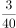。若从这批产品中任取一件，取得真品的概率是0.94，那么甲、乙生产这批零件的数量比为多少？

- **A**. 
5：3

- **B**. 
4：3

- **C**. 
5：2

- **D**. 
3：2
　✅

**答案**：D

**官方解析**

设甲生产这批零件件，乙生产件，则甲厂的次品件数为件，乙厂的次品件数为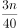，根据“从这批产品中任取一件真品的概率是0.94”可得，解得。

故正确答案为D。

---

### 第 3 题　qid 2255707 · 数学运算

某单位派出80名职工参加三个项目的比赛：篮球、乒乓球、排球。其中有8个人只能参加乒乓球比赛，有52人能参加篮球比赛，62人能参加排球比赛。那么既能参加篮球比赛又能参加排球比赛的有多少人？

- **A**. 42　✅
- **B**. 28
- **C**. 78
- **D**. 34

**答案**：A

**官方解析**

如图所示，设既能参加篮球比赛又能参加排球比赛的有人，根据容斥原理可得，能参加篮球比赛的52人中有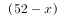人不能参加排球，能参加排球的62人中有人不能参加篮球，可得方程：，解得人，则既能参加篮球比赛又能参加排球比赛的有42人。

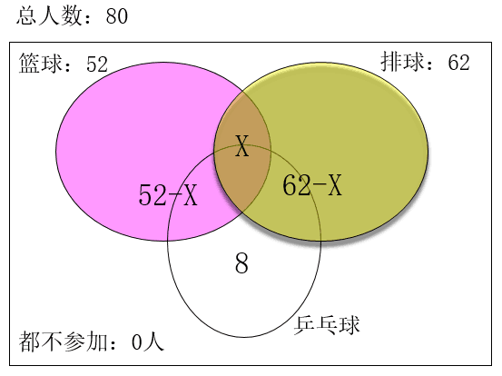

故正确答案为A。

---

### 第 4 题　qid 2255708 · 数学运算

一个正方体块放在桌子上，每一面都有一个数字，贴着桌子这面的数字为素数，位于对面的两个数不相同且和等于10。甲看到顶面和一个侧面的两个数的和为7，乙看到顶面和侧面的两个数的和为5，那么贴着桌子的这一面的数是多少？

- **A**. 7　✅
- **B**. 9
- **C**. 5
- **D**. 2

**答案**：A

**官方解析**

设贴着桌子的这面数字为，则顶面数字为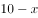。因为甲看到顶面和一个侧面的两个数和为7，所以甲看到的一个侧面数字为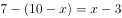；由此类推乙看到的一个侧面数字为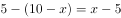，则为大于3和5的素数，排除B、C和D三项，那么贴着桌子的这一面数字为7。

故正确答案为A。

---

### 第 5 题　qid 2255711 · 数学运算

某出版社把400本教材书分别装入大、中、小三种型号的纸箱中寄出。每个大型箱能装80本，每个中型箱能装60本，每个小型箱能装35本。如果三种型号的箱子都有且每个箱子恰好装满，那么小型箱有多少个？

- **A**. 1
- **B**. 3
- **C**. 4　✅
- **D**. 6

**答案**：C

**官方解析**

设大型箱有个，中型箱有个，小型箱有个，根据题意可得：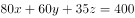，且、、都为正整数。将方程化简后得到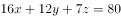，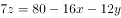，因为箱子个数一定为正整数，即一定能被4整除，因此一定是4的整数倍，结合选项只有C项满足。

故正确答案为C。

---

### 第 6 题　qid 2255714 · 数学运算

某班78位同学对参加演讲比赛的甲、乙、丙、丁四位同学进行投票，得票最多者胜出。在计票过程的某时刻，甲得20票，乙得12票，丙得26票，丁得9票，那么丙最少还要得票多少张才能确保胜出？

- **A**. 3　✅
- **B**. 5
- **C**. 6
- **D**. 7

**答案**：A

**官方解析**

方法一：整体考虑，甲对丙威胁最大，除了乙和丁的得票外，甲和丙共可以分张票，甲丙均得到28张时，丙仍然保证不了能胜出，再得到剩下的1张选票即丙得到29张选票时，确保胜出，所以还需要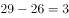张才能确保胜出。

方法二：在计票过程的某时刻，还剩下张票。丙如果要确保胜出，则考虑最差情况，剩下的11张票乙和丁一张都不得，甲优先得6张共26票与丙持平，剩下的5张票再由甲和丙分配，故丙至少要得3张票才能确保胜出。

故正确答案为A。

---

### 第 7 题　qid 2255716 · 数学运算

某处下面有四个科室，他们的职员数恰好是一个比一个多1，而四个科室的人数的乘积是840，那么职员最多的两个科室总共是多少人？

- **A**. 12
- **B**. 13　✅
- **C**. 15
- **D**. 19

**答案**：B

**官方解析**

将840分解因式可得，因为是四个连续的自然数的乘积，故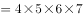，则职员最多的两个科室总共是人。

故正确答案为B。

---

### 第 8 题　qid 2255718 · 数学运算

在某招聘工作现场，某单位的A、B两岗位共有34个男生、21个女生递交个人材料。若欲竞聘A岗位的男生数与女生数的比为，欲竞聘B岗位的男生数与女生数的比为，那么欲竞聘B岗位的男生是多少个？

- **A**. 4　✅
- **B**. 3
- **C**. 30
- **D**. 31

**答案**：A

**官方解析**

方法一：假设欲竞聘A岗位的男生数与女生数分别为、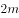，欲竞聘B岗位的男生数与女生数分别为、，则根据等量关系可得：，，解得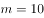，，则欲竞聘B岗位的男生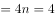个。

方法二：题干已知：欲竞聘B岗位的男生数与女生数的比为，根据倍数特性可知竞聘B岗位的男生人数为4的整数倍，结合选项只有A项满足条件。

故正确答案为A。

---

### 第 9 题　qid 2255719 · 数学运算

某市体育中考满分40分。某班得分后五名同学的平均分是30分，排名倒数第五名的同学得了35分。假如这五位同学的得分是互不相同的整数，那么排名倒数第三名的同学最少得多少分？

- **A**. 27
- **B**. 28　✅
- **C**. 29
- **D**. 30

**答案**：B

**官方解析**

得分后五名同学的总分为分，要使排名倒数第三名的同学得分最少，则其他人得分要尽可能的多且互不相同，排名倒数第五为35分，则倒数第四最多34，设倒数第三得分为，则倒数第二为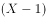，倒数第一为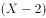。可得：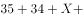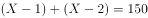，解得：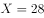。

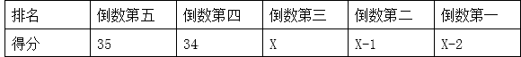

故正确答案为B。

---

### 第 10 题　qid 2255720 · 数学运算

某干洗店承接了一些业务，干洗200块窗帘。干洗好一块可得干洗费30元，但若损坏一块不仅得不到干洗费还要赔偿150元。若清洗完毕共得5280元，则损坏窗帘多少块？

- **A**. 4　✅
- **B**. 6
- **C**. 10
- **D**. 12

**答案**：A

**官方解析**

设干洗好窗帘块，损坏窗帘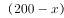块，则有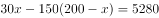，解得块，则损坏窗帘块。

故正确答案为A。

---

## 判断推理

### 第 1 题　qid 2255600 · 图形推理

从所给的四个选项中，选择最合适的一个填入问号处，使之呈现一定的规律性：

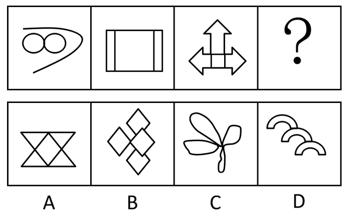

- **A**. A　✅
- **B**. B
- **C**. C
- **D**. D

**答案**：A

**官方解析**

元素组成不同，且无明显属性规律，优先考虑数量规律。观察发现，题干面数量特征明显，优先考虑数面，依次为2、3、4，则“？”处应该填入有5个面的图形。A项是5个，B项是4个，C项是4个，D项是3个，只有A项符合。
故正确答案为A。

---

### 第 2 题　qid 2255624 · 图形推理

从所给的四个选项中，选择最合适的一个填入问号处，使之呈现一定的规律性：

- **A**. A
- **B**. B
- **C**. C
- **D**. D　✅

**答案**：D

**官方解析**

观察发现，题干每幅图均由形状完全相同的三大一小元素组成，且有一个大元素为黑色，排除B、C两项；对比A、D两项发现，小元素和大元素的图形间关系不同，A项为相交，D项为相压，题干图形中，小元素和大元素均为相压，只有D项符合。

---

### 第 3 题　qid 2255629 · 图形推理

从所给的四个选项中，选择最合适的一个填入问号处，使之呈现一定的规律性：

- **A**. A
- **B**. B
- **C**. C
- **D**. D　✅

**答案**：D

**官方解析**

元素组成不同，且无明显属性规律，优先考虑数量规律。题干图形均由小元素组成，优先考虑数素。观察可知，每幅图均有4个相同的小元素，只有D项符合。
故正确答案为D。

---

### 第 4 题　qid 2255632 · 图形推理

从所给的四个选项中，选择最合适的一个填入问号处，使之呈现一定的规律性：

- **A**. A
- **B**. B　✅
- **C**. C
- **D**. D

**答案**：B

**官方解析**

元素组成不同，且无明显属性规律，优先考虑数量规律。观察发现，题干图形均由若干小元素组成，优先考虑数素。九宫格优先横行看，元素个数依次为：3、2、4；2、4、3；2、4、？，即每行均有9个小元素，则“？”处应该有3个小元素，只有B项符合。
故正确答案为B。

---

### 第 5 题　qid 2255662 · 逻辑判断

晕轮效应，也叫光环效应，是指当一个人因为其自身的一些优势或者在社会领域中取得成功后得到大多数人的认可，导致其弱点或不足被掩盖起来的一种现象。属于晕轮效应的是：

- **A**. 小王在演讲与辩论大赛中获得冠军后被选为演讲与辩论协会理事
- **B**. “一俊遮百丑”、“情人眼里出西施”　✅
- **C**. 张教授在国外知名期刊发表论文后引起学界的密切关注
- **D**. 某歌星吸毒后，其粉丝纷纷倒戈抨击他

**答案**：B

**官方解析**

第一步：找出定义关键词。
“自身的一些优势或者在社会领域中取得成功后”、“得到大多数人的认可”、“弱点或不足被掩盖起来”。
第二步：逐一分析选项。
A项：小王获得冠军后被选为理事，没有体现弱点或不足被掩盖起来，不符合定义，排除；
B项：“一俊遮百丑”的意思是一件好的事情掩盖了许多的丑陋的事；“情人眼里出西施”是比喻由于有感情，不论对方如何都觉得对方无处不美，二者均体现了弱点或不足被优势所掩盖，符合定义，当选；
C项：张教授发表论文后引起关注，没有体现弱点或不足被掩盖起来，不符合定义，排除；
D项：某歌星吸毒后遭受抨击，没有体现有优势或取得成功，也没有体现弱点或不足被掩盖起来，不符合定义，排除。
故正确答案为B。

---

### 第 6 题　qid 2255667 · 逻辑判断

知情权，是指公民有权知道他应该知道的事情，国家应该最大限度地确认和保障公民知悉，获取信息的权利。属于知情权的是：

- **A**. 小丽是其父母从小自别人家抱养的孩子，长大后要求知道其生父母　✅
- **B**. 为满足公众获取信息的权利，某记者通过隐藏拍摄的方法跟踪拍摄明星生活
- **C**. 高女士投诉某产品生产过程存在的违反食品卫生法规定的情况
- **D**. 小学生小明坚持要求父母告诉家庭的财务支出情况

**答案**：A

**官方解析**

第一步：找出定义关键词。
“公民有权知道他应该知道的事情”、“国家”、“最大限度地确认和保障公民知悉，获取信息的权利”。
第二步：逐一分析选项。
A项：小丽要求知道其生父母，属于她应该知道的事情，国家应该保障其知悉信息的权利，符合定义，当选；
B项：明星生活是个人隐私，不属于公民应该知道的事情，并且记者通过隐藏拍摄的方法跟踪拍摄，属于不受法律保障的行为，不符合定义，排除；
C项：高女士投诉某产品违规属于投诉，不属于知悉、获取信息的权利，不符合定义，排除；
D项：家庭财务支出情况，小学生小明的父母可以根据具体情况选择是否告诉他，不属于国家应该保障的知悉、获取信息的权利，不符合定义，排除。
故正确答案为A。

---

### 第 7 题　qid 2255671 · 逻辑判断

逆向思维方法，是指一个人在认识事物过程中采用的方法与通常大多数人采用的方法往往相反或截然不同。属于逆向思维方法的是：

- **A**. 小王学习成绩优异，小李也模仿小王的学习方法
- **B**. 面对素数猜想问题，张教授采取与众不同的崭新方式，最终取得了重大突破
- **C**. 小王性格古怪乖张，交往中经常与别人格格不入
- **D**. 大多数工程师在设计时采用归纳与实验方法，李工程师在设计时采用了演绎与抽象方法　✅

**答案**：D

**官方解析**

第一步：找出定义关键词。
“一个人在认识事物过程中采用的方法”、“与通常大多数人采用的方法往往相反或截然不同”。
第二步：逐一分析选项。
A项：小李模仿小王的学习方法，不符合与大多数人的方法相反或截然不同，不符合定义，排除；
B项：张教授采取与众不同的崭新方式，但是没有体现是否和大多数人的方法相反或截然不同，不符合定义，排除；
C项：讨论的是小王的性格和别人格格不入，而非在认识事物中采用的方法和大多数人不同，不符合定义，排除；
D项：大多数工程师采用归纳与实验方法，而李工程师采取的是演绎与抽象方法，体现了与通常大多数人采用的方法往往相反或截然不同，符合定义，当选。
故正确答案为D。

---

### 第 8 题　qid 2255675 · 逻辑判断

绝对无效民事行为，是指其内容违反法律禁止性规定的民事行为。包括以合法行为掩盖非法目的的民事行为：双方恶意串通，损害国家，集体或第三人利益的民事行为；内容违反公共利益，损害公共秩序的民事行为等。不属于绝对无效民事行为的是：

- **A**. 两家汽车生产商为了骗取国家新能源汽车补贴，私下交换销售信息并向国家相关部门提供虛假的汽车销售记录与数据
- **B**. 某人表面上开了一家外贸公司，实际上却在从事贩毒活动
- **C**. 张三与李四一起诱骗王五签订违反法规的合同，导致王五破产
- **D**. 某企业违反劳动法处理违规的员工　✅

**答案**：D

**官方解析**

第一步：找出定义关键词。
“内容违反法律禁止性规定的民事行为”、“以合法行为掩盖非法目的的民事行为”、“双方恶意串通，损害国家，集体或第三人利益的民事行为”、“内容违反公共利益，损害公共秩序的民事行为”。
第二步：逐一分析选项。
A项：两家汽车生产商为了骗取补贴，私下交换销售信息并提供虚假数据，属于双方恶意串通，损害国家利益的民事行为，符合定义，排除；
B项：表面上是外贸公司，实际上从事贩毒活动，属于以合法行为掩盖非法目的的民事行为，符合定义，排除；
C项：张三和李四一起诱骗王五签订违法合同，导致王五破产，属于双方恶意串通，损害第三人利益的民事行为，符合定义，排除；
D项：某企业违反劳动法处理违规的员工，不属于题干列举的三种情形之一，不符合定义，当选。
本题为选非题，故正确答案为D。

---

### 第 9 题　qid 2255681 · 逻辑判断

劳动权，是指有劳动能力的公民有从事劳动并取得相应报酬的权利，在一定意义上就是指受雇权和从事生产活动的权利。与劳动权有关的是：

- **A**. 未满18岁的小丽被父母经常要求做家务
- **B**. 小李经常在工作之余帮助自己的朋友打理酒店的生意
- **C**. 刚刚毕业的大学生小王被一家外资企业招聘为人力资源部的员工　✅
- **D**. 张华根很孝敬父母，经常帮父母做家务，有空经常陪父母聊天

**答案**：C

**官方解析**

第一步：找出定义关键词。
“有劳动能力的公民有从事劳动并取得相应报酬的权利”、“受雇权和从事生产活动的权利”。
第二步：逐一分析选项。
A项：未满18岁的小丽不一定属于有劳动能力的公民，且做家务也不符合受雇佣和从事生产活动，不符合定义，排除；
B项：小李在工作之余帮助朋友打理生意，不符合受雇佣和从事生产活动，不符合定义，排除；
C项：刚毕业的大学生小王被招聘为员工，符合有劳动能力的公民从事劳动并取得相应报酬，符合定义，当选；
D项：张华根帮助父母做家务、陪父母聊天，不符合受雇佣和从事生产活动，不符合定义，排除。
故正确答案为C。

---

### 第 10 题　qid 2255682 · 逻辑判断

贸易摩擦，是指国家之间由于在贸易活动中为了保护国内市场或争夺第三方市场产生的竞争斗争。主要表现为提高关税，互设贸易壁垒、贸易报复、反倾销、反补贴、保障措施等。属于贸易摩擦的是：

- **A**. 为防止国家信息安全受到威胁，世界各国都在加强信息安全建设
- **B**. 由于担心中国军事技术水平提升带来的威胁，欧美国家长期对中国实行武器禁运
- **C**. 欧盟与美国针对中国的光伏产业实施反倾销政策　✅
- **D**. 由于担心竞争对手的赶超，某企业对竞争对手都有一些产品实行大幅降价

**答案**：C

**官方解析**

第一步：找出定义关键词。
“国家之间”、“在贸易活动中”、“为了保护国内市场或争夺第三方市场产生的竞争斗争”。
第二步：逐一分析选项。
A项：各国加强信息安全建设，和贸易活动无关，不符合定义，排除；
B项：欧美国家对中国实行武器禁运，和贸易及市场竞争无关，不符合定义，排除；
C项：欧盟与美国针对中国的光伏产业实施反倾销政策，符合国家之间在贸易活动中为了保护国内市场产生的竞争斗争，符合定义，当选；
D项：主体是企业，而题干主体是国家，主体不符合，不符合定义，排除。
故正确答案为C。

---

### 第 11 题　qid 2255684 · 逻辑判断

微信营销，是指商家为了更好地推销自己的商品，通过微信平台和手段传播商品的信息，提高商品销售量和知名度。属于微信营销的是：

- **A**. 李某经常在微信朋友圈里面把他店里的产品照片公布出来　✅
- **B**. 李老师经常通过微信传播课件、布置作业等方式来提高教学效果
- **C**. 小王经常在朋友圈发一些自己做的美食，获得很多朋友的点赞
- **D**. 一些政府部门通过微信平台发布一些时政，提高政府部门的办事效率

**答案**：A

**官方解析**

第一步：找出定义关键词。
“商家为了更好地推销自己的商品”、“通过微信平台和手段传播商品的信息”、“提高商品销售量和知名度”。
第二步：逐一分析选项。
A项：李某在微信朋友圈公布他店里的产品照片，符合通过微信平台传播商品信息，提高商品销量和知名度，符合定义，当选；
B项：传播课件、布置作业等不属于商品，并且李老师这么做的目的是提高教学效果，不是提高销量和知名度，不符合定义，排除；
C项：小王自己做的美食不属于商品，并且小王这么做的目的不是提高销量和知名度，不符合定义，排除；
D项：时政不属于商品，并且政府部门这么做的目的是提高办事效率，不是提高销量和知名度，不符合定义，排除。
故正确答案为A。

---

### 第 12 题　qid 2255689 · 逻辑判断

红海战略，是指在已知的市场空间中进行竞争的战略，在已知的市场空间中，竞争规则已经制定，竞争激烈，利润率不断下降。蓝海战略，是指打破现有的产业边界，在一片全新的、无人竞争的市场开拓进取，其主要的是摆脱竞争，创造和获得新的需求，追求差异化和低成本，获取更高利润率。属于蓝海战略的是：

- **A**. 国内一些手机生产商通过网络营销来拓展销路
- **B**. 国产汽车为了提高销量大打价格战
- **C**. 美国特斯拉公司设计出以前从未出现过的全新电动汽车，占据了新能源汽车的制高点　✅
- **D**. 某企业通过加强市场宣传与改变销售策略提高市场占有率

**答案**：C

**官方解析**

第一步：找出定义关键词。
红海战略：“在已知的市场空间中进行竞争的战略”、“竞争规则已经制定，竞争激烈，利润率不断下降”。
蓝海战略：“打破现有的产业边界”、“在一片全新的、无人竞争的市场开拓进取”、“摆脱竞争，创造和获得新的需求”、“追求差异化和低成本”、“获取更高利润率”。
第二步：逐一分析选项。
A项：通过网络营销不符合在一片全新的、无人竞争的市场开拓进取，并没有摆脱竞争，不符合定义，排除；
B项：为了提高销量大打价格战，不符合打破现有产业边界，没有摆脱竞争，不符合定义，排除；
C项：美国特斯拉公司设计出以前从未出现过的全新电动汽车，符合打破现有的产业边界，在一片全新的、无人竞争的市场开拓进取，符合定义，当选；
D项：加强市场宣传与改变销售策略提高市场占有率，不符合打破现有产业边界，没有摆脱竞争，不符合定义，排除。
故正确答案为C。

---

### 第 13 题　qid 2255693 · 逻辑判断

代际公平，是指按照可持续发展要求，使得当代人公平地使用自然资源（包括环境）。当代人是未来世代人的资源与财富的托管者，当代人在利用自然资源的同时须要考虑后代人利用资源的机会和获取可持续资源的数量，不能以牺牲未来时代人的利益过度使用资源，以体现无论哪一代人在资源分配中都没有支配权地位的公平原则。属于代际公平的是：

- **A**. 既要金山银山，更要绿水青山　✅
- **B**. 某地为了提高GDP增长速度，不断地占用农业用地
- **C**. 某地为了均衡区域经济发展，对该地的水资源、土地资源等平均分配使用
- **D**. 某企业为了长远发展不断提高企业发展预留金

**答案**：A

**官方解析**

第一步：找出定义关键词。
“按照可持续发展要求”、“使得当代人公平地使用自然资源（包括环境）”。
第二步：逐一分析选项。
A项：既要金山银山，更要绿水青山，符合按照可持续发展要求，在发展经济的过程中更公平地使用自然资源，符合定义，当选；
B项：为了提高GDP增长速度，不断占用农业用地，不符合可持续性发展要求，不符合定义，排除；
C项：对水资源、土地资源平均分配使用，是为了均衡区域经济发展，而非为了可持续性发展，不符合定义，排除；
D项：某企业为了长远发展不断提高企业发展预留金，和自然资源的可持续性发展无关，不符合定义，排除。
故正确答案为A。

---

### 第 14 题　qid 2255724 · 逻辑判断

道德危险因素，是指保险业中投保人或者被投保及其关系人图谋保险合同上的利益而人为制造“危险”，或故意促使危险发生，或在损失后加重其后果，以觊觎合同上的利益。保险公司对因道德因素所致的损失不负赔偿责任。不属于道德危险因素的是：

- **A**. 张某为了骗取保险赔偿，故意伪造交通事故现场
- **B**. 李某驾驶不当导致汽车轻微刮伤，为了换掉汽车整个保险杠，于是加大油门撞向栏杆
- **C**. 刘某为了更早地从副总做到总裁，与人合谋把总裁黄某撞成重伤　✅
- **D**. 某企业故意把已经投了财产的厂房纵火烧毁以获得保险金

**答案**：C

**官方解析**

第一步：找出定义关键词。
“投保人或者被投保及其关系人”、“图谋保险合同上的利益”、“人为制造‘危险’，或故意促使危险发生，或在损失后加重其后果”、“以觊觎合同上的利益”。
第二步：逐一分析选项。
A项：张某为了骗取保险赔偿，故意伪造交通事故现场，属于人为制造“危险”，符合定义，排除；
B项：李某驾驶不当导致汽车轻微刮伤，加大油门撞向栏杆，属于在损失后加重其后果，符合定义，排除；
C项：刘某与人合谋把总裁黄某撞成重伤，目的是为了更早地从副总做到总裁，而非觊觎合同上的利益，不符合定义，当选；
D项：某企业故意纵火烧毁厂房，想要获得保险金，属于人为制造“危险”，符合定义，排除。
本题为选非题，故正确答案为C。

---

### 第 15 题　qid 2255725 · 类比推理

秩序：混乱：整顿

- **A**. 环境：污染：提高
- **B**. 交通：拥堵：疏导　✅
- **C**. 生活：艰苦：改变
- **D**. 困难：学习：解决

**答案**：B

**官方解析**

第一步：判断题干词语间逻辑关系。
题干可造句为：秩序混乱需要被整顿。
第二步：判断选项词语间逻辑关系。
A项：造句为：环境污染需要被提高，不通顺，与题干逻辑关系不一致，排除；
B项：造句为：交通拥堵需要被疏导，与题干逻辑关系一致，当选；
C项：造句为：生活艰苦需要被改变，不通顺，应该是主动改变，与题干逻辑关系不一致，排除；
D项：造句为：困难学习需要被解决，不通顺，与题干逻辑关系不一致，排除。
故正确答案为B。

---

### 第 16 题　qid 2255727 · 类比推理

阳光：明媚

- **A**. 作家：天才
- **B**. 科学家：聪明
- **C**. 农民：淳朴　✅
- **D**. 清晰：结构

**答案**：C

**官方解析**

第一步：判断题干词语间逻辑关系。
“明媚”多用于形容“阳光”。
第二步：判断选项词语间逻辑关系。
A项：作家和天才是交叉关系，与题干逻辑关系不一致，排除；
B项：聪明可以用来形容科学家，也可以用来形容更多的事物，范围过于广泛，与题干逻辑关系不一致，排除；
C项：淳朴多用于形容农民，与题干逻辑关系一致，当选；
D项：清晰可以用来形容结构，但两词顺序相反，与题干逻辑关系不一致，排除。
故正确答案为C。

---

### 第 17 题　qid 2255730 · 类比推理

（  ）对于 原则性 相当于 实事求是 对于（  ）

- **A**. 循规蹈矩  客观性　✅
- **B**. 按部就班  灵活性
- **C**. 抱残守缺  主观性
- **D**. 刻舟求剑  随便性

**答案**：A

**官方解析**

逐一代入选项。
A项：循规蹈矩原指遵守规矩，不轻举妄动，现多形容一举一动拘守旧框框，不敢稍有变动，形容有原则性；实事求是指从实际情况出发，不夸大，不缩小，正确地对待和处理问题，形容有客观性，前后逻辑关系一致，当选；
B项：按部就班指照章办事，依次进行，不越轨，不逾格，形容有原则性；实事求是指从实际情况出发，不夸大，不缩小，正确地对待和处理问题，与灵活性无必然联系，前后逻辑关系不一致，排除；
C项：抱残守缺是指抱着残缺陈旧的东西不放，形容思想保守，不求改进，与原则性无必然联系；实事求是指从实际情况出发，不夸大，不缩小，正确地对待和处理问题，形容不主观性，前后逻辑关系不一致，排除；
D项：刻舟求剑比喻拘泥成例，不知道跟着情势的变化而改变看法或办法，与原则性无必然联系；实事求是指从实际情况出发，不夸大，不缩小，正确地对待和处理问题，形容不随便性，前后逻辑关系不一致，排除。
故正确答案为A。

---

### 第 18 题　qid 2255733 · 类比推理

水果：桔子：维生素

- **A**. 科学：物理学：自然规律　✅
- **B**. 花卉：牡丹：欣赏
- **C**. 交通工具：汽车：出行
- **D**. 衣服：皮夹克：保暖

**答案**：A

**官方解析**

第一步：判断题干词语间逻辑关系。
桔子是水果的一种，二者为种属关系；桔子含有维生素，二者为组成关系。
第二步：判断选项词语间逻辑关系。
A项：物理学是科学的一种，二者为种属关系；物理学含有自然规律，二者为组成关系，与题干逻辑关系一致，当选；
B项：牡丹是花卉的一种，二者为种属关系；牡丹可以用来欣赏，二者为功能的对应关系，与题干逻辑关系不一致，排除；
C项：汽车是交通工具的一种，二者为种属关系；汽车可以用于出行，二者为功能的对应关系，与题干逻辑关系不一致，排除；
D项：皮夹克是衣服的一种，二者为种属关系；皮夹克可以用于保暖，二者为功能的对应关系，与题干逻辑关系不一致，排除。
故正确答案为A。

---

### 第 19 题　qid 2255735 · 类比推理

白衣天使：医生：病人

- **A**. 人民卫士：警察：罪犯　✅
- **B**. 钢铁长城：军人：军队
- **C**. 灵魂工程师：教师：学生
- **D**. 人民公仆：党员：群众

**答案**：A

**官方解析**

第一步：判断题干词语间逻辑关系。
医生是白衣天使的一种，二者为种属关系，且医生的工作对象是病人，二者为职业和工作对象的对应关系。
第二步：判断选项词语间逻辑关系。
A项：警察是人民卫士的一种，二者为种属关系，且警察的工作对象是罪犯，二者为职业和工作对象的对应关系，与题干逻辑关系一致，当选；
B项：钢铁长城指的是解放军，和军人不是种属关系，且军人是军队的组成部分，二者是组成关系，与题干逻辑关系不一致，排除；
C项：灵魂工程师指教师，二者为比喻象征义，与题干逻辑关系不一致，排除；
D项：人民公仆指为人民服务、全心全意为人民群众排忧解难的党政干部，与党员没有直接关系，与题干逻辑关系不一致，排除。
故正确答案为A。

---

### 第 20 题　qid 2255737 · 类比推理

朝三暮四：一如既往

- **A**. 一诺千金：言而有信
- **B**. 雪中送炭：锦上添花
- **C**. 颠沛流离：安居乐业　✅
- **D**. 巧夺天工：鬼斧神工

**答案**：C

**官方解析**

第一步：判断题干词语间的逻辑关系。
朝三暮四比喻办事反复无常，经常变卦；一如既往指态度或做法没有任何变化，还是像从前一样，二者为反义关系。
第二步：判断选项词语间的逻辑关系。
A项：一诺千金比喻说话算数，极有信用；言而有信指说话靠得住，有信用，二者为近义关系，与题干逻辑关系不一致，排除； 
B项：雪中送炭比喻在别人急需时给以物质上或精神上的帮助；锦上添花比喻略加修饰使美者更美，引申比喻在原有成就的基础上进一步完善，二者没有必然的逻辑关系，与题干逻辑关系不一致，排除；
C项：颠沛流离形容生活艰难，四处流浪；安居乐业指安定愉快地生活和劳动，二者为反义关系，与题干逻辑关系一致，当选；
D项：巧夺天工形容技艺十分巧妙；鬼斧神工形容艺术技巧高超，不是人力所能达到的，二者为近义关系，与题干逻辑关系不一致，排除。
故正确答案为C。

---

### 第 21 题　qid 2255739 · 类比推理

恒山：五台山：山西

- **A**. 三清山：井冈山：江西　✅
- **B**. 武夷山：武当山：湖北
- **C**. 九华山：齐云山：安徽
- **D**. 普陀山：黄山：浙江

**答案**：A

**官方解析**

第一步：判断题干词语间的逻辑关系。
恒山和五台山为并列关系，二者均在山西，三者为地理位置的对应关系。
第二步：判断选项词语间的逻辑关系。
A项：三清山和井冈山为并列关系，二者均在江西，三者为地理位置的对应关系，与题干逻辑关系一致，当选；
B项：武夷山在福建，武当山在湖北，与题干逻辑关系不一致，排除；
C项：九华山在安徽，齐云山是一个多地名，在安徽、湖南、江西等地均有，与题干逻辑关系不一致，排除；
D项：普陀山在浙江，黄山在安徽，与题干逻辑关系不一致，排除。
故正确答案为A。

---

### 第 22 题　qid 2255751 · 类比推理

（  ）对于 处分 相当于 见义勇为 对于（  ）。

- **A**. 开除  刑罚
- **B**. 撤职  刑法
- **C**. 严厉  严重
- **D**. 作弊  表扬　✅

**答案**：D

**官方解析**

逐一代入选项。
A项：开除是处分的一种，二者为种属关系，见义勇为和刑罚没有必然的逻辑关系，前后逻辑关系不一致，排除；
B项：撤职是处分的一种，二者为种属关系，见义勇为和刑法没有必然的逻辑关系，前后逻辑关系不一致，排除；
C项：严厉可以用来形容处分，见义勇为和严重没有必然的逻辑关系，前后逻辑关系不一致，排除；
D项：作弊会受到处分，见义勇为会受到表扬，二者均为对应关系，前后逻辑关系一致，当选。
故正确答案为D。

---

### 第 23 题　qid 2255754 · 类比推理

《半月谈》：《人民日报》：《暸望》：新闻媒体

- **A**. 电视直播：网络直播：网络主播：现场直播
- **B**. 篮球：足球：排球：体育用品　✅
- **C**. 地铁：高铁：动车：交通工具
- **D**. 电脑：书籍：杂志：学习资料

**答案**：B

**官方解析**

第一步：判断题干词语间的逻辑关系。
《半月谈》、《人民日报》、《暸望》三者为并列关系，均为一种新闻媒体，与第四个词为种属关系。
第二步：判断选项词语间的逻辑关系。
A项：电视直播和网络直播是一种直播形式，网络主播是一种职业，三者不是并列关系，与题干逻辑关系不一致，排除； 
B项：篮球、足球、排球三者为并列关系，均为一种体育用品，与第四个词为种属关系，与题干逻辑关系一致，当选；
C项：地铁是城市中修建的轨道交通，高铁和动车是穿梭在城市间的交通工具，三者不是并列关系，与题干逻辑关系不一致，排除；
D项：电脑、书籍和杂志三者不是并列关系，与题干逻辑关系不一致，排除。
故正确答案为B。

---

### 第 24 题　qid 2255755 · 类比推理

花蕾：花朵

- **A**. 白天：黑夜
- **B**. 胚胎：婴儿　✅
- **C**. 春天：夏天
- **D**. 鸡蛋：小鸡

**答案**：B

**官方解析**

第一步：判断题干词语间的逻辑关系。
花蕾是指即将盛开的花朵，是花朵的幼体，二者为对应关系。
第二步：判断选项词语间的逻辑关系。
A项：白天和黑夜为并列关系中的矛盾关系，与题干逻辑关系不一致，排除； 
B项：胚胎是怀孕最初两个月内的幼体，是婴儿的幼体，二者为对应关系，与题干逻辑关系一致，当选；
C项：春天和夏天为并列关系中的反对关系，与题干逻辑关系不一致，排除；
D项：鸡蛋可以孵出小鸡，与题干逻辑关系不一致，排除。
故正确答案为B。

---

### 第 25 题　qid 2255759 · 逻辑判断

四位同事对单位年底评优结果进行猜测：
甲：小王工作努力，成绩突出；
乙：小王一定可以评上优秀；
丙：小王可能不能评上优秀；
丁：如果工作努力，成绩突出就一定可以评上优秀。
结果四个人中只有一位同事判断错了，由此不能推出：

- **A**. 小王可能评上优秀
- **B**. 小王一定没有评上优秀　✅
- **C**. 小王一定评上优秀
- **D**. 小王工作努力，成绩突出

**答案**：B

**官方解析**

第一步：找矛盾。
①小王工作努力且成绩突出
②小王一定可以评上优秀
③小王可能不能评上优秀
④工作努力且成绩突出→评上优秀
条件②和③为矛盾，必有一真必有一假。已知只有一个为假的，说明条件①和④一定为真。
第二步：看其余。
已知条件①和④一定为真，根据工作努力且成绩突出→评上优秀，可知小王一定能评上优秀，因此A、C、D选项均能推出。
故正确答案为B。

---

### 第 26 题　qid 2255761 · 逻辑判断

“不忘初心，方得始终”的意思是只有一直坚持最初的理想，不断努力，才能够最后获得成功，实现目标。论断必定正确的是：

- **A**. 小李坚持理想，不断努力，但没有成功
- **B**. 小李最后实现目标，因为他一直孜孜不倦地追求自己的理想
- **C**. 小李坚持理想，不断努力，所以最后获得成功
- **D**. 小李没有成功，因为他没有坚持理想和不断努力　✅

**答案**：D

**官方解析**

第一步：翻译题干。

成功坚持理想且不断努力

第二步：逐一分析选项。

A项：翻译为坚持理想且不断努力成功，是对题干的肯后，肯后得不到必然性结论，排除；

B项：翻译为坚持理想成功，是对题干的肯后，肯后得不到必然性结论，排除；

C项：翻译为坚持理想且不断努力成功，是对题干的肯后，肯后得不到必然性结论，排除；

D项：翻译为（坚持理想且不断努力）成功，是对题干的否后，否后必否前，当选。

故正确答案为D。

---

### 第 27 题　qid 2255766 · 逻辑判断

江大中学今年的升学率有明显的提高，很多家长认为是因为该中学师资队伍水平高，因此希望自己的小孩也要进入该中学接受优质的教育。最能反驳上述家长观点的是：

- **A**. 该中学仍然实行的是以应试教育为主，素质教育在该中学没有很好地推广
- **B**. 该中学的教育方法与方式并不先进
- **C**. 该校的各类教育设施很落后
- **D**. 该中学升学率提高是因为该校入学时招收的都是成绩好、素质高的学生　✅

**答案**：D

**官方解析**

第一步：找出论点和论据。
论点：江大中学的师资队伍水平高导致升学率有明显的提高。
论据：无明显论据。
第二步：逐一分析选项。
A项：指出该校实行的是以应试教育为主，与论点讨论的升学率是否能提高无关，话题不一致，无法削弱，排除；
B项：指出教育方法与方式不先进，与论点讨论的升学率是否能提高无关，话题不一致，无法削弱，排除；
C项：指出各类教育设施很落后，与论点讨论的升学率是否能提高无关，话题不一致，无法削弱，排除； 
D项：指出升学率高是因为该校入学时招收的都是成绩好、素质高的学生，说明升学率高是因为学生本身就优秀，而不是因为师资队伍水平高，否定论点，当选。
故正确答案为D。

---

### 第 28 题　qid 2255770 · 逻辑判断

某高校就业处汪处长说：“最近，哲学专业的毕业生到其他专业岗位就业去了。这说明该专业岗位不受欢迎，所以这种专业应该限制招生人数。”最能削弱汪处长看法的是：

- **A**. 哲学专业的就业岗位本来数量就很少　✅
- **B**. 哲学专业毕业的学生本来就很少
- **C**. 哲学专业毕业的学生综合素质都很高
- **D**. 很多高校没有开设哲学专业

**答案**：A

**官方解析**

第一步：找出论点和论据。
论点：应该限制哲学专业的招生人数。
论据：哲学专业的毕业生到其他专业岗位就业去了，说明哲学专业的岗位不受欢迎。
第二步：逐一分析选项。
A项：指出哲学专业的就业岗位本来数量就很少，说明不是因为本专业的学生不喜欢这个专业的工作，而是它招聘的人数有限，不得不去尝试其他专业的工作，否定了论据，可以削弱，当选；
B项：指出哲学专业的学生很少，与论点讨论的哲学专业岗位不受欢迎，是否应该限制招生人数无关，话题不一致，无法削弱，排除；
C项：指出哲学专业毕业的学生综合素质都很高，与论点讨论的哲学专业岗位不受欢迎，是否应该限制招生人数无关，话题不一致，无法削弱，排除；
D项：指出很多高校没有开设哲学专业，与论点讨论的哲学专业岗位不受欢迎，是否应该限制招生人数无关，话题不一致，无法削弱，排除。
故正确答案为A。

---

### 第 29 题　qid 2255772 · 逻辑判断

近来有报道称，大多数自来水厂的水质由于使用的漂白物质中都含有亚硝酸类的致癌物质，因此，目前自来水厂对人体会带来严重威胁。最能质疑上述观点的是：

- **A**. 大多数自来水厂的水含亚硫酸铵的含量没有超标，不会对人体健康产生明显影响　✅
- **B**. 有些自来水厂的水亚硝酸胺的含量很低
- **C**. 自来水厂处理水质过程中不使用漂白物质是不可能的
- **D**. 自来水厂改变水处理方式可以有效降低亚硝酸胺的含量

**答案**：A

**官方解析**

第一步：找出论点和论据。
论点：目前自来水厂对人体会带来严重威胁。
论据：大多数自来水厂的水质使用的漂白物质中都含有亚硝酸类的致癌物质。
第二步：逐一分析选项。
A项：指出这些水虽然含亚硫酸铵，但不会对人体健康产生明显影响，直接否定论点，当选；
B项：指出有些自来水厂的水亚硝酸胺的含量很低，不能说明目前所有自来水厂的情况，无法削弱，排除；
C项：指出自来水厂处理水质过程中一定会使用漂白物质，与论点讨论的是否会对人体带来危害无关，无法削弱，排除； 
D项：指出可以降低亚硝酸胺的含量，与论点讨论的是否会对人体带来危害无关，无法削弱，排除。
故正确答案为A。

---

### 第 30 题　qid 2255776 · 逻辑判断

目前，大多数水果在生长阶段都会喷洒一些杀虫剂。但是，一些专家建议，我们吃水果时不应该削皮，因为大多数水果的果皮里含有一些对身体非常有益的维生素，而这些维生素在水果果肉里含量很少。最能反驳专家观点的是：

- **A**. 水果生长阶段喷洒在果皮上的杀虫剂残留物对人体几乎没有影响
- **B**. 吸收果皮上杀虫剂残留物的危害太大，超过了吸收果皮中的维生素对身体的益处　✅
- **C**. 果皮上的残留物很难被洗干净
- **D**. 果皮中的维生素不能够全部被人体吸收消化

**答案**：B

**官方解析**

第一步：找出论点和论据。
论点：我们吃水果时不应该削皮。
论据：大多数水果的果皮里含有一些对身体非常有益的维生素，而这些维生素在水果果肉里含量很少。
第二步：逐一分析选项。
A项：指出果皮上的杀虫剂残留物对人体几乎没有影响，说明果皮可以吃，加强选项，无法削弱，排除；
B项：指出果皮上杀虫剂残留物的危害超过果皮中的维生素对身体的益处，说明果皮不可以吃，直接否定论点，当选；
C项：指出果皮上的残留物很难被洗干净，但残留物对人体是否有益不明确，属于不明确选项，无法削弱，排除； 
D项：指出果皮中的维生素不能够全部被人体吸收消化，与论点讨论的吃水果是否应该削皮无关，无法削弱，排除。
故正确答案为B。

---

### 第 31 题　qid 2255778 · 逻辑判断

一种金属检测仪在检测到金属做成的考试作弊工具时会亮起红灯警示。制造商称该检测仪器可大大减少考试作弊现象。不能成为该制造商观点依赖的假设前提是：

- **A**. 大多数作弊的人都会采取金属做成的作弊工具
- **B**. 很多人考试时会采取作弊行为　✅
- **C**. 使用金属检测仪的工作人员能够正确地操作检测仪器
- **D**. 大多数考场能够配备这种金属检测仪器

**答案**：B

**官方解析**

第一步：找出论点和论据。
论点：该检测仪器可大大减少考试作弊现象。
论据：该金属检测仪在检测到金属做成的考试作弊工具时会亮起红灯警示。
第二步：逐一分析选项。
A项：如果大多数作弊的人不会采取金属做成的作弊工具，那么该仪器就不可能大大减少作弊情况，是必然条件，可以加强，排除；
B项：指出很多人考试时会采取作弊行为，与论点讨论的使用该仪器后是否能减少考试作弊现象无关，无法加强，当选；
C项：如果使用金属检测仪的工作人员不能够正确地操作检测仪器，那么该仪器就不可能大大减少作弊情况，是必然条件，可以加强，排除； 
D项：如果大多数考场不能够配备这种金属检测仪器，那么该仪器就不可能大大减少作弊情况，是必然条件，可以加强，排除。
本题为选非题，故正确答案为B。

---

### 第 32 题　qid 2255780 · 逻辑判断

现代政治学理论与实践表明，政策的制定越是能够听取民众的意见，符合民众的利益就越能够推行下去，取得良好的效果。不能支持上述观点的是：

- **A**. 群众利益无小事，水能载舟亦能覆舟
- **B**. 不充分吸取民众意见的政策在推行过程中很难得到群众的大力支持，政策执行效果就差
- **C**. 一些专业性很强的政策决定，民众并不熟悉相关领域，民众的意见往往会阻碍政策的有效推行　✅
- **D**. 凡是执行效果好的政策很少出现民众的反对意见

**答案**：C

**官方解析**

第一步：找出论点和论据。
论点：政策的制定越是能够听取民众的意见，符合民众的利益就越能够推行下去，取得良好的效果（即听取民众意见有利于政策推行）。
论据：无明显论据。 
第二步：逐一分析选项。
A项：群众利益无小事，水能载舟亦能覆舟，说明一定要符合群众的利益，可以加强，排除；
B项：不充分吸取民众的政策执行效果就差，举反例说明要听取民众的意见，可以加强，排除；
C项：说明专业性强的政策，民众意见会阻碍政策执行，直接否定了论点，无法加强，当选； 
D项：执行效果好的政策很少出现民众反对意见，通过举例的方式说明要听取民众意见，可以加强，排除。
本题为选非题，故正确答案为C。

---

### 第 33 题　qid 2255782 · 逻辑判断

一篇好的文章或者因为观点新颖深刻，或者因为论证逻辑清晰，或者因为语言表达生动感人。现在有人认为韩某的文章是一篇好的文章，但是他的文章观点并不新颖深刻。一定为假的是：

- **A**. 韩某的文章论证逻辑清晰且语言表达生动感人
- **B**. 韩某的文章论证逻辑不清晰但语言表达生动感人
- **C**. 韩某的文章论证逻辑不清晰且语言表达也不生动感人　✅
- **D**. 韩某的文章论证逻辑清晰但语言表达不生动感人

**答案**：C

**官方解析**

第一步：分析题干。
韩某的文章是一篇好的文章，但-观点新颖深刻，根据或关系“否一推一”可知，韩某的文章或者论证逻辑清晰，或者语言表达生动感人。
第二步：逐一分析选项。
A项：翻译为论证逻辑清晰且语言表达生动感人，满足或关系的其中一项，排除；
B项：翻译为-论证逻辑清晰且语言表达生动感人，满足或关系的其中一项，排除；
C项：翻译为-论证逻辑清晰且-语言表达生动感人，或关系两项均不成立，题干或关系则不成立，一定为假，当选；
D项：翻译为逻辑清晰且-语言表达生动感人，满足或关系的其中一项，排除。
本题为选非题，故正确答案为C。

---

### 第 34 题　qid 2255784 · 逻辑判断

在一次国际会议上，甲、乙、丙、丁4人相遇，他们分别掌握英语、俄语、德语、汉语四种语言中的两种，其中有3人会说英语，但没有一种语言是4人都会的，并且知道：
（1）没有人既会汉语又会俄语；
（2）甲会汉语，而乙不会，但他们可以用另一种语言交谈；
（3）丙不会德语，甲和丁交谈时，需要丙为他们做翻译；
（4）乙、丙、丁不会同一种语言。
4人分别会的两种语言是：

- **A**. 甲会英语和汉语，乙会英语和俄语，丙会英语和德语，丁会俄语和德语
- **B**. 甲会英语和德语，乙会英语和汉语，丙会英语和俄语，丁会俄语和德语
- **C**. 甲会英语和汉语，乙会英语和德语，丙会英语和俄语，丁会俄语和德语　✅
- **D**. 甲会英语和德语，乙会英语和俄语，丙会俄语和德语，丁会英语和汉语

**答案**：C

**官方解析**

题干和选项信息确定，优先考虑排除法。
根据条件（2）可知，乙不会汉语，排除B项；根据条件（3）可知，丙不会德语，排除A、D项。
故正确答案为C。

---

## 资料分析

### 材料 1

        2015年，在监测的我国338个城市中，城市空气质量达标的城市占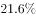，未达标的城市占。

        在监测的321个城市中，城市区域声环境质量好的城市占，较好的占，一般的占，较差的占，差的占。

        2015年末，城市污水处理厂日处理能力达到13784万立方米，比上年末增长；城市污水处理率达到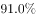。城市生活垃圾无害处理率达到，提高0.7个百分点。城市集中供热面积64.2亿平方米，增长。城市建成区绿地面积189万公顷，增长；建成区绿地率达到；人均公园绿地面积13.16平方米，增加0.08平方米。

#### 第 1 题　qid 2255785 · 平均数

2014年人均公园绿地面积多少平方米？

- **A**. 13.1
- **B**. 13.08　✅
- **C**. 13.24
- **D**. 0.08

**答案**：B

**官方解析**

由题干“2014年······多少平方米”结合材料时间为2015年，判定本题为基期计算问题。定位文字材料第三段可得，2015年，人均公园绿地面积13.16平方米，增加0.08平方米。代入公式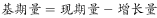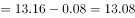平方米。

故正确答案为B。

---

#### 第 2 题　qid 2255786 · 综合

2015年，在监测的338个城市中，城市空气达标的城市约有多少个？

- **A**. 106
- **B**. 73　✅
- **C**. 132
- **D**. 8

**答案**：B

**官方解析**

由题干“2015年，在监测的338个城市中，城市空气达标的城市约有多少个”，判定本题为现期比重问题。定位文字材料第一段可得，2015年，在监测的我国338个城市中，城市空气质量达标的城市占。根据公式，可推出公式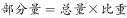个，与B项最接近。

故正确答案为B。

---

#### 第 3 题　qid 2255787 · 综合

2015年，在监测的321个城市中，城市区域声环境质量较好以上的城市有多少个？

- **A**. 13
- **B**. 220
- **C**. 233　✅
- **D**. 268

**答案**：C

**官方解析**

由题干“2015年，在监测的321个城市中，城市区域声环境质量较好以上的城市有多少个”，判定本题为现期比重问题。定位文字材料第二段可得，2015年，在监测的321个城市中，城市区域声环境质量好的城市占，较好的占。根据公式，可推出公式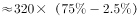个，与C项最接近。

故正确答案为C。

---

#### 第 4 题　qid 2255788 · 综合

根据上述资料，不能推出的是：

- **A**. 2015年城市污水处理厂日处理能力比2014年有所提高
- **B**. 2015城市生活垃圾无害化处理能力比2014年稍有提高
- **C**. 2014年城市集中供热面积超过60亿平方米
- **D**. 2015年在监测的321个城市中，城市区域声环境质量差的超过5个　✅

**答案**：D

**官方解析**

A项：定位文字材料第三段可得，2015年末，城市污水处理厂日处理能力比上年末增长，正确，排除；

B项：定位文字材料第三段可得，2015年末，城市生活垃圾无害处理率比2014年提高0.7个百分点，正确，排除；

C项：定位文字材料第三段可得，2015年末，城市集中供热面积64.2亿平方米，增长，2014年城市集中供热面积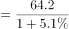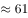超过了60，正确，排除；

D项：定位文字材料第二段可得，2015年，在监测的321个城市中，城市区域声环境质量差的占，根据公式，可推出公式，错误，当选。

本题为选非题，故正确答案为D。

---

#### 第 5 题　qid 2255789 · 增长

根据上述资料，可以推出：

①2014年城市建成区绿地率为

②2015年城市污水处理率比2014年提高0.8个百分点

③2014年城市生活垃圾无害化处理率高于

- **A**. ①
- **B**. ①②
- **C**. ②③
- **D**. ③　✅

**答案**：D

**官方解析**

①：定位文字材料第三段可得，2015年末，建成区绿地率达到，只给出现期未给出增长量，无法求出基期，无中生有，错误。

②：定位文字材料第三段可得，2015年末，城市污水处理率达到，只给出现期未给出增长量，无法求出基期，无中生有，错误。

③：定位文字材料第三段可得，2015年末，城市生活垃圾无害处理率达到，提高0.7个自分点，则2014年城市生活垃圾无害化处理率为，正确。

故正确答案为D。

---

### 材料 2

#### 第 6 题　qid 2255816 · 增长

2012-2015年，哪年相比上一年快递业务增长量最多？

- **A**. 2013
- **B**. 2012
- **C**. 2014
- **D**. 2015　✅

**答案**：D

**官方解析**

根据题干“2012-2015年，······增长量最多”，判定本题为增长量比较问题。定位柱状图，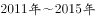快递业务量分别为36.7亿件、56.9亿件、91.9亿件、139.6亿件、206.7亿件。根据公式可得，快递业务增长量分别为亿件、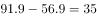亿件、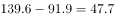亿件、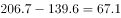亿件，增长量最多的为2015年。

故正确答案为D。

---

#### 第 7 题　qid 2255818 · 综合

2015年快递业务量约是2010年的多少倍？

- **A**. 5.6
- **B**. 5.1
- **C**. 8.3　✅
- **D**. 4.2

**答案**：C

**官方解析**

根据“2015年······约是2010年的多少倍”，判定本题为现期倍数问题。定位柱状图，2011年快递业务量为36.7亿件，2015年快递业务量为206.7亿件；定位折线图，增长率为。根据公式可得，2010年快递业务量为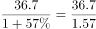，则2015年快递业务量约是2010年的倍。

故正确答案为C。

---

#### 第 8 题　qid 2255823 · 综合

下列说法正确的是：

- **A**. 
，每年的快递业务量比上年增长均超出

- **B**. 
，快递业务量的年均增长率低于
　✅
- **C**. 
，年平均快递业务量约为86.4亿件

- **D**. 
2015年的快递业务量比2011年翻了四番以上

**答案**：B

**官方解析**

A项：定位折线图可得，2015年快递业务量增长率为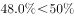，错误，排除；

B项：定位柱状图可得，2015年快递业务量为206.7亿件，2013年快递业务量为91.9亿件，代入年均增长率公式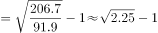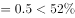，正确，当选；

C项：定位柱状图可得，快递业务量分别为36.7亿件、56.9亿件、91.9亿件、139.6亿件、206.7亿件。年平均快递业务量约为亿件，错误，排除；

D项：定位柱状图可得，2011年快递业务量为36.7亿件，2015年快递业务量为206.7亿件，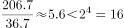，错误，排除。

故正确答案为B。

---

#### 第 9 题　qid 2255826 · 综合

2010年的快递业务量是：

- **A**. 23.4亿件　✅
- **B**. 16.7亿件
- **C**. 18.2亿件
- **D**. 28.5亿件

**答案**：A

**官方解析**

根据题干“2010年的快递业务量是”，结合材料时间为，判定本题为基期计算问题。定位柱状图，2011年快递业务量为36.7亿件，增长率为。根据公式可得，2010年快递业务量为亿件，与A项最接近。

故正确答案为A。

---

#### 第 10 题　qid 2255828 · 增长

快递业务量增长幅度最大的是：

- **A**. 2011年至2012年
- **B**. 2012年至2013年　✅
- **C**. 2013年至2014年
- **D**. 2014年至2015年

**答案**：B

**官方解析**

增长幅度即增长率，定位折线图可得，2012年～2015年快递业务增长速度分别为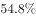、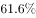、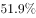、，增长幅度最大的是2013年，即2012年至2013年。

故正确答案为B。

---

### 材料 3

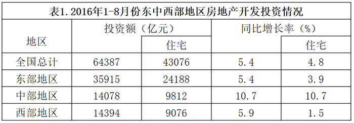

#### 第 11 题　qid 2255857 · 比重

2016年1-8月份，中西部地区房地产开发投资额占全国房地产开发投资额的比重是：

- **A**. 
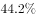
　✅
- **B**. 

- **C**. 
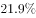

- **D**. 
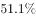

**答案**：A

**官方解析**

根据题干“2016年1-8月份······占······的比重”，可判定本题为现期比重问题。定位表1，2016年1-8月份，中部地区房地产开发投资额14078亿元，西部地区房地产开发投资额14394亿元，全国房地产开发投资额64387亿元。则所求比重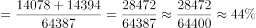。

故正确答案为A。

---

#### 第 12 题　qid 2255860 · 增长

2016年1-8月份，东中西部地区房地产开发投资同比增长最快的地区是：

- **A**. 东部地区
- **B**. 中部地区　✅
- **C**. 西部地区
- **D**. 无法判断

**答案**：B

**官方解析**

定位表1，2016年1-8月份，东部地区房地产开发投资额增长率为，中部地区房地产开发投资额增长率为，西部地区房地产开发投资额增长率为。则增长最快的地区是中部地区。

故正确答案为B。

---

#### 第 13 题　qid 2255861 · 综合

2016年1-8月份，中部地区的商品房销售额比东部地区少多少亿元？

- **A**. 14376
- **B**. 50309
- **C**. 63568
- **D**. 29419　✅

**答案**：D

**官方解析**

定位表2，2016年1-8月份，中部地区的商品房销售额为13249亿元，东部地区的商品房销售额42668亿元。则中部地区的商品房销售额比东部地区少亿元。

故正确答案为D。

---

#### 第 14 题　qid 2255863 · 平均数

2016年1-8月份，全国商品房平均每平方米售价约：

- **A**. 5300元
- **B**. 6000元
- **C**. 7600元　✅
- **D**. 8200元

**答案**：C

**官方解析**

根据题干“2016年1-8月份，全国商品房平均每平方米售价”，可判定本题为现期平均数问题。定位表2，2016年1-8月份，全国商品房销售额66623亿元，商品房销售面积87451万平方米。代入公式：元。

故正确答案为C。

---

#### 第 15 题　qid 2255865 · 综合

根据上面表格，下列说法不正确的是：

- **A**. 2016年1-8月份，东部地区是全国房地产开发投资额度最大的地区
- **B**. 2016年1-8月份，东部地区的房地产投资额占总投资额一半以上
- **C**. 2016年1-8月份，东部地区的商品房每平方米售价最高
- **D**. 2016年1-8月份，东部地区的商品房销售面积占了一半以上　✅

**答案**：D

**官方解析**

A项：定位表1，2016年1-8月份，东部地区房地产开发投资额35915亿元，中部地区房地产开发投资额14078亿元，西部地区房地产开发投资额14394亿元，则投资额最大的地区是东部地区，正确；

B项：定位表1，2016年1-8月份，东部地区房地产开发投资额35915亿元，全国房地产开发投资额64387亿元，则，正确；

C项：定位表2，2016年1-8月份，东部地区商品房销售面积为42766万平方米，销售额为42668亿元；中部地区商品房销售面积为23883万平方米，销售额为13249亿元；西部地区商品房销售面积为20802万平方米，销售额为10706亿元，根据公式，东部地区为，中部地区为，西部地区为，则商品房每平方米售价最高的地区是东部地区，正确；

D项：定位表2，2016年1-8月份，东部地区商品房销售面积为42766万平方米，全国商品房销售面积为87451万平方米，则，错误。

本题为选非题，故正确答案为D。

---
