# 2016年河南省公务员录用考试《行测》题

> 省考 · 2016 年 · 5 个模块 · 共 120 题

- [常识判断](#%E5%B8%B8%E8%AF%86%E5%88%A4%E6%96%AD) · 20 题
- [言语理解与表达](#%E8%A8%80%E8%AF%AD%E7%90%86%E8%A7%A3%E4%B8%8E%E8%A1%A8%E8%BE%BE) · 30 题
- [数量关系](#%E6%95%B0%E9%87%8F%E5%85%B3%E7%B3%BB) · 15 题
- [判断推理](#%E5%88%A4%E6%96%AD%E6%8E%A8%E7%90%86) · 35 题
- [资料分析](#%E8%B5%84%E6%96%99%E5%88%86%E6%9E%90) · 20 题

---

## 常识判断

### 第 1 题　qid 2033512 · 法律常识

甲公司因拖欠乙公司贷款被乙公司诉至法院，乙公司胜诉后甲公司拒不执行，乙公司向法院申请强制执行。甲公司知晓后将公司财产陆续转移。下列说法不正确的是：

- **A**. 甲公司的行为可能构成拒不执行判决、裁定罪
- **B**. 乙公司可向司法机关控告，或者向人民法院提起自诉　✅
- **C**. 因被执行人为甲公司，所以只能追究甲公司的刑事责任　✅
- **D**. 人民法院可通过纳入失信名单、媒体公布等手段追究甲公司责任

**答案**：BC

**官方解析**

A项正确：《刑法》第三百一十三条规定：“【拒不执行判决、裁定罪】对人民法院的判决、裁定有能力执行而拒不执行，情节严重的，处三年以下有期徒刑、拘役或者罚金；情节特别严重的，处三年以上七年以下有期徒刑，并处罚金。”甲公司行为可能构成该罪。

B项错误：《刑事诉讼法》第二百一十条规定：“自诉案件包括下列案件：（一）告诉才处理的案件；（二）被害人有证据证明的轻微刑事案件；（三）被害人有证据证明对被告人侵犯自己人身、财产权利的行为应当依法追究刑事责任，而公安机关或者人民检察院不予追究被告人刑事责任的案件。”《最高人民法院关于适用〈中华人民共和国刑事诉讼法〉的解释》第一条规定：“人民法院直接受理的自诉案件包括：（一）告诉才处理的案件：⒈侮辱、诽谤案（刑法第二百四十六条规定的，但严重危害社会秩序和国家利益的除外）；⒉暴力干涉婚姻自由案（刑法第二百五十七条第一款规定的）；⒊虐待案（刑法第二百六十条第一款规定的，但被害人没有能力告诉或者因受到强制、威吓无法告诉的除外）；⒋侵占案（刑法第二百七十条规定的）。（二）人民检察院没有提起公诉，被害人有证据证明的轻微刑事案件：⒈故意伤害案（刑法第二百三十四条第一款规定的）；⒉非法侵入住宅案（刑法第二百四十五条规定的）；⒊侵犯通信自由案（刑法第二百五十二条规定的）；⒋重婚案（刑法第二百五十八条规定的）；⒌遗弃案（刑法第二百六十一条规定的）；⒍生产、销售伪劣商品案（刑法分则第三章第一节规定的，但严重危害社会秩序和国家利益的除外）；⒎侵犯知识产权案（刑法分则第三章第七节规定的，但严重危害社会秩序和国家利益的除外）；⒏刑法分则第四章、第五章规定的，可能判处三年有期徒刑以下刑罚的案件。本项规定的案件，被害人直接向人民法院起诉的，人民法院应当依法受理。对其中证据不足，可以由公安机关受理的，或者认为对被告人可能判处三年有期徒刑以上刑罚的，应当告知被害人向公安机关报案，或者移送公安机关立案侦查。（三）被害人有证据证明对被告人侵犯自己人身、财产权利的行为应当依法追究刑事责任，且有证据证明曾经提出控告，而公安机关或者人民检察院不予追究被告人刑事责任的案件。”题中，甲公司可能构成的拒不执行判决、裁定罪不属于可以提起自诉的案件范畴。
C项错误：《刑法》第三十一条规定：“单位犯罪的，对单位判处罚金，并对其直接负责的主管人员和其他直接责任人员判处刑罚。”故该项“只能追究甲公司的刑事责任”的说法错误。
D项正确：《民事诉讼法》第二百五十五条规定：“被执行人不履行法律文书确定的义务的，人民法院可以对其采取或者通知有关单位协助采取限制出境，在征信系统记录、通过媒体公布不履行义务信息以及法律规定的其他措施。”故该项说法正确。
本题存在争议，B项、C项均错误。

---

### 第 2 题　qid 2033514 · 人文常识

中国古人留下了许多经典著作，后人不断阐发其中蕴藏的深厚思想内涵。下列学问中，不是以研究某一部经典著作为主的是：

- **A**. 龙学
- **B**. 理学　✅
- **C**. 许学
- **D**. 红学

**答案**：B

**官方解析**

B项错误，狭义的理学，专指程颢、程颐、朱熹为代表的、以理为最高范畴的学说，即程朱理学。由北宋二程（程颢、程颐）兄弟开始创立，其间经过弟子杨时，经传承到南宋朱嘉集为大成者。
A项正确，龙学是以我国最早的文学理论专著《文心雕龙》为研究对象的学问。
C项正确，许学是以东汉许慎《说文解字》为研究对象的学问。
D项正确，红学是以《红楼梦》为研究对象的学问，横跨文学、哲学、史学、经济学、心理学、中医药学等多个学科。
本题为选非题，故正确答案为B。

---

### 第 3 题　qid 2033516 · 法律常识

某县新建公路路口设置了超速违章摄像头，赵某不知情，多次超速驾车在该路段被拍照，且未收到违章通知。赵某被处罚后不服，将县公安局告上法庭。恰逢县公安局聘请了某专职律师作为法律顾问。下列做法符合我国《行政诉讼法》规定的是：

- **A**. 该律师可全权代理县公安局出庭应诉，县公安局不必再派人员出庭
- **B**. 为查明案件事实的需要，该律师可自行向赵某调取相关证据
- **C**. 该律师查阅、复制该案庭审材料必须经人民法院许可
- **D**. 若赵某和县公安局同意，则人民法院可适用简易程序审理该案　✅

**答案**：D

**官方解析**

A项错误，《行政诉讼法》第三条第三款规定：“被诉行政机关负责人应当出庭应诉。不能出庭的，应当委托行政机关相应的工作人员出庭。”
B项错误，《行政诉讼法》第三十五条规定：“在诉讼过程中，被告及其诉讼代理人不得自行向原告、第三人和证人收集证据。”
C项错误，《行政诉讼法》第三十二条规定：“代理诉讼的律师，有权按照规定查阅、复制本案有关材料，有权向有关组织和公民调查，收集与本案有关的证据。”故代理律师有权查阅、复制案件相关庭审材料，无需经人民法院许可。
D项正确，《行政诉讼法》第八十二条规定：“人民法院审理下列第一审行政案件，认为事实清楚、权利义务关系明确、争议不大的，可以适用简易程序：（一）被诉行政行为是依法当场作出的；（二）案件涉及款额二千元以下的；（三）属于政府信息公开案件的。除前款规定以外的第一审行政案件，当事人各方同意适用简易程序的，可以适用简易程序。发回重审、按照审判监督程序再审的案件不适用简易程序。”
故正确答案为D。

---

### 第 4 题　qid 2033518 · 法律常识

新《广告法》于2018年10月26日起正式施行，下列选项符合新《广告法》规定的是：

- **A**. 童星小明九周岁，代言某文具用品广告
- **B**. 某制药企业宣称其产品“药到病除，永不再犯”
- **C**. 某网站弹幕广告必须点击查看详情后才能关闭
- **D**. 某医疗机构虚假宣传情节严重，工商和卫生行政部门均对其处罚　✅

**答案**：D

**官方解析**

D项正确：《广告法》第五十八条第二款规定：“医疗机构有违法行为，情节严重的，除由工商行政管理部门依照本法处罚外，卫生行政部门可以吊销诊疗科目或者吊销医疗机构执业许可证。”
A项错误：《广告法》第三十八条第二款规定：“不得利用不满十周岁的未成年人作为广告代言人。”该项中小明九岁，违反《广告法》规定。
B项错误：《广告法》第十六条第一款规定：“医疗、药品、医疗器械广告不得含有下列内容：（一）表示功效、安全性的断言或者保证；······”该项中制药企业宣称其产品“药到病除、永不再犯”属于对功效的断言和保证，违反《广告法》规定。
C项错误：《广告法》第四十四条第二款规定：“利用互联网发布、发送广告，不得影响用户正常使用网络。在互联网页面以弹出等形式发布的广告，应当显著标明关闭标志，确保一键关闭。”该项中网站弹幕广告必须点击查看详情后才能关闭，不符合一键关闭要求，违反《广告法》规定。
故正确答案为D。
【注】《广告法》已经于2021年4月29日再次修改，此次修改内容不涉及本题所引用的法条。

---

### 第 5 题　qid 2033520 · 法律常识

关于我国《刑法》中的罚金，下列说法不正确的是：

- **A**. 王某因犯危险驾驶罪被判处拘役一个月，可以并处罚金
- **B**. 罚金数额的主要决定因素为犯罪情节
- **C**. 对未成年人犯罪应当从轻或者减轻判处罚金
- **D**. 因对部分犯罪行为可单处罚金，所以罚金为主刑的一种　✅

**答案**：D

**官方解析**

D项错误，《刑法》第三十四条规定：“附加刑的种类如下：(一)罚金；(二)剥夺政治权利；(三)没收财产。附加刑也可以独立适用。”故罚金属于附加刑而非主刑。
A项正确，根据《刑法》第三十四条规定，附加刑既可以独立适用，也可以附加适用，故该项中判王某拘役一个月，并处罚金的做法是正确的。
B项正确，《刑法》第五十二条规定：“判处罚金，应当根据犯罪情节决定罚金数额。”
C项正确，《刑法》第十七条规定：“已满十六周岁的人犯罪， 应当负刑事责任。已满十四周岁不满十六周岁的人，犯故意杀人、故意伤害致人重伤或者死亡、强奸、抢劫、贩卖毒品、放火、爆炸、投放危险物质罪的，应当负刑事责任。已满十二周岁不满十四周岁的人，犯故意杀人、故意伤害罪，致人死亡或者以特别残忍手段致人重伤造成严重残疾，情节恶劣， 经最高人民检察院核准追诉的，应当负刑事责任。对依照前三款规定追究刑事责任的不满十八周岁的人，应当从轻或者减轻处罚。”故对于未成年人犯罪应当从轻或减轻判处罚金的做法是正确的。
本题为选非题，故正确答案为D。
备注：确实不够妥当，根据《刑法》第一百三十三条之一规定，【危险驾驶罪】在道路上驾驶机动车，有下列情形之一的，处拘役，并处罚金。但是由于本题是单选题，选最优选项，D项表述罚金是主刑，明显错误。罚金是附加刑的一种。因而本题最优选项是D项。

---

### 第 6 题　qid 2033522 · 人文常识

清宫剧中出现下列情景，明显违背史实的是：

- **A**. 道光帝在圆明园批阅奏章
- **B**. 咸丰帝在避暑山庄观赏昆曲
- **C**. 光绪帝赴颐和园向慈禧太后请安
- **D**. 宣统帝在紫禁城接见琉球使臣　✅

**答案**：D

**官方解析**

本题考查人文历史。
A项正确，圆明园始建于1709年（康熙年间），焚毁于1860年（咸丰年间）。圆明园有“万园之园”之称。清朝皇室每到盛夏时节会来这里理政，故圆明园也称“夏宫”。故道光帝有可能在圆明园内批阅奏章。
B项正确，避暑山庄始建于1703年，是清代皇帝夏天避暑和处理政务的场所。咸丰皇帝正是驾崩于承德避暑山庄。而昆曲产生于元朝末期，是明朝中叶至清代中叶戏曲中影响最大的声腔剧种。因此咸丰皇帝在避暑山庄看昆曲可能发生。
C项正确，颐和园是中国清朝时期皇家园林。清漪园于1860年被英法联军焚毁后，为了让慈禧太后退居休养，于光绪十四年在其原址重建园林，命名为颐和园。因此光绪皇帝去颐和园给慈禧太后请安可能发生。
D项错误，日本于1879年派出队伍镇压琉球“藩王”，将王室强行迁移到了东京，并废除藩政改为由日本政府直辖的冲绳县，琉球王国至此正式覆亡。而宣统皇帝于1908年即位，因此宣统帝不可能接见琉球使臣。
本题为选非题，故正确答案为D。

---

### 第 7 题　qid 2033524 · 人文常识

下列关于五行思想的说法，不正确的是：

- **A**. 五行中的木，对应的方位是东方，颜色是青色
- **B**. 五行相生的顺序是木生火，火生金，金生土，土生水　✅
- **C**. 五行可以与天干搭配，与火搭配的是丙丁
- **D**. 五行思想起源很早，《尚书•洪范》篇就有相关记载

**答案**：B

**官方解析**

B项错误：五行相生的顺序是木生火，火生土，土生金，金生水，水生木。
A项正确：木对应方位为东方，与其搭配的天干为甲乙，颜色是青色。
C项正确：火对应方位为南方，与其搭配的天干为丙丁，颜色是红色。
D项正确：“五行”一词，最早出现在“《尚书·洪范》”。“五行：一曰水，二曰火，三曰木，四曰金，五曰土。”
本题为选非题，故正确答案为B。

---

### 第 8 题　qid 2033526 · 人文常识

下列关于避雷针的说法，错误的是：

- **A**. 南北朝时就已出现与避雷针工作原理相似的“避雷室”
- **B**. 避雷针和他要保护的建筑是由绝缘物质隔开的　✅
- **C**. 接闪器可用铝合金、镀锌钢、不锈钢等各种材料制成
- **D**. 我国现在已经放弃了“避雷针”这一叫法，而代之以“接闪杆”

**答案**：B

**官方解析**

B项错误：避雷针保护建筑物的方式是引雷上身，然后通过其引下线和接地装置，将雷电流引入地下，从而起到保护建筑物的作用。若将避雷针与建筑绝缘，导入避雷针内的雷电将无处释放，从而引发危险。因此避雷针必须与保护建筑联通。
A项正确：南朝盛弘之撰的《荆州记》中记载：“湖阳县，春秋寥国，樊重之邑也。重母畏雷，为母玄石室，叫避之。悉以文石为阶砌，至今犹存。”可见在南北朝时期就出现了“避雷室”。
C项正确：接闪杆与接闪带、接闪线、接闪网、用以接闪的金属屋面、金属构件等，统称为接闪器。接闪器必须用导电体作材料，由于接闪器需要暴露在空气中接受风吹日晒，因此可以选用铝合金、锌镀铜、不锈钢等抗氧化、耐腐蚀的合金材料。
D项正确：因为避雷针的工作原理不是避免房屋遭受雷击，而是接引雷电引入地下。因此在中华人民共和国国家标准GB50057-2010《建筑物防雷设计规范》中，已经放弃避雷针这一称呼，而代之以“接闪杆”这一更加贴切的叫法。
本题为选非题，故正确答案为B。
【注：本题为争议题，A项表述不严谨，南北朝时期出现的避雷室由大理石铸造，利用大理石的绝缘特性，故可以避雷。这与现代避雷针引雷上身之后将雷电导入地下的工作原理不完全相同。】

---

### 第 9 题　qid 2033528 · 人文常识

关于成语或俗语所揭示的声学、热学现象，下列表述错误的是：

- **A**. 长啸一声，山鸣谷应：声音在山谷之间发生多次反射，形成回声
- **B**. 曲高和寡：频率越大，所发声音的音调越高，能跟着唱的人越少
- **C**. 瑞雪兆丰年：雪覆盖在农作物上面，防止热传导和空气对流，起到保温作用
- **D**. 弦外之音：声音在传播过程中，会发生衍射，所以有些声音我们听不到　✅

**答案**：D

**官方解析**

本题考查科技常识。
A项正确：“长啸一声，山鸣谷应”是回声现象，声音遇到障碍物会被反射回来。具体说是声音的反射现象，声音从人口中啸出会经过多次反射，而每次反射都会有一部分进入你的耳朵，所以山反射的像是山在回应，谷反射的像是谷在回应。
B项正确：“曲高和寡”的字面意思是乐曲的音调越高，能跟着唱的人就越少。曲高指的是音乐的音调高，音调就是指声音的高低，频率是指发声体一秒钟振动的次数。音调主要由声音的频率决定，同时也与声音强度有关。对一定强度的纯音，音调随频率的升降而升降；对一定频率的纯音、低频纯音的音调随声强增加而下降，高频纯音的音调却随强度增加而上升。
C项正确：“瑞雪兆丰年”的科学道理是，对于北方来说，秋季种的冬小麦，在冬天里，如果下雪的话，雪不易融化，盖在土壤上的雪是比较松软的，雪花和雪花之间留有空隙，空隙中充满空气，空气又具有不良的热传导特性，这样就像给庄稼盖了一条棉被，外面天气再冷，下面的温度也不会降得很低，起到一种保温作用。
D项错误：“弦外之音”原指音乐的余音，比喻言外之意，即在话里间接透露，而不是明说出来的意思。用物理常识来解释就是指人的听觉频率范围之外的（如超声、次声）确实存在且我们是听不到的声音。声衍射是指声波传播过程中遇到障碍物时，部分声波会绕至障碍物背后并继续向前传播的一种现象，又称声绕射。衍射和听不到之间没有因果关系。
本题为选非题，故正确答案为D。

---

### 第 10 题　qid 2033530 · 地理国情

下列对气候与城市规划的描述错误的是：

- **A**. 街道位于与子午线成30～60度夹角处，有利于两侧建筑的采光
- **B**. 我国城市房屋在确定房屋间距时，应以夏至日的日照时间为准　✅
- **C**. 工业布局一般在该地区盛行主导风向的下风向
- **D**. 机场一般选在低云和风速较小的地方

**答案**：B

**官方解析**

B项错误：我国多数城市的住宅间距标准是以冬至日的日照为依据。我国处在北半球，冬至日时正午太阳高度达一年中的最小值，楼房的影子为一年中最长的一天。而夏至日时，太阳就在北半球，北回归线及其以北地区的太阳高度角就是最大的，影子最短。若以夏至日为准，低楼层可能大部分时间都无法接受日照，所以不会以夏至日来规定。
A项正确：街道的这种设计是为了充分利用光照资源，因为建筑物的日照条件与街道方位有关。街道的方位影响街道内建筑物的朝向，进而影响建筑物的日照条件。一般而言，朝北的房屋光照条件较差，为了保证居住区街道两侧的所有建筑物都有较好的光照条件，城镇街道宜采取南北方向与东西方向的中间方位，也就是使街道与子午线成30到60度的夹角，以使街道两侧较好地、公平地获得光照。
C项正确：工业区一般会产生污染，对城市环境造成危害，因此工业区在布局时，有大气污染的工业应该在盛行风的下风向，而且位于城市的外围。工业区选址盛行风向：严重污染大气的工厂，应该在城市主导风向的下风口地带，或者在主导风向的垂直两侧选择厂址，季风区布置在当地最小风频的风向的上风地带，工业布局在垂直于季风风向的市郊。
D项正确：机场选址，宜选少云雾和暴雨频率较少、风速较小、距城较远的地方。
本题为选非题，故正确答案为B。

---

### 第 11 题　qid 2033492 · 地理国情

关于成语与其所对应的地理知识，下列描述错误的是：

- **A**. 风雨交加——冷锋过境时的天气变化
- **B**. 春雨如油——春雨为返青农作物生长提供了水源
- **C**. 蜀犬吠日——四川盆地地势低洼，气温较高　✅
- **D**. 吴牛喘月——江淮一带夏季出现伏旱天气，炎热干燥

**答案**：C

**官方解析**

C项错误：“蜀犬吠日”原意是四川多雨，那里的狗不常见太阳，看到太阳后觉得奇怪，就要叫，后比喻少见多怪。四川盆地空气潮湿，天空多云，四周群山环绕，中间平原的水汽不易散开。因此蜀中有“蜀犬吠日”之说，这与气温高不高没关系。
A项正确：“风雨交加”是指又刮风又下雨，比喻几种灾难同时袭来。冷锋过境前天气晴朗、温度高；过境时气压在峰前急剧下降，峰后上升，气温降低，冷锋推进速度快，容易引起大风，同时伴有大雨；过境后气温回升，天气晴朗。
B项正确：“春雨如油”是指春雨贵如油，形容春雨的可贵，它为返青的农作物的生长提供了水源。
D项正确：“吴牛喘月”中的“吴牛”指产于江淮一带的水牛，吴地天气多炎暑，水牛怕热，见到月亮以为是太阳，故卧地望月而喘。后比喻因疑心而害怕，也比喻人遇事过分惧怕，而失去了判断的能力，也形容天气酷热。江淮一带的夏季受单一的副热带高气压控制，普遍出现伏旱天气，天气炎热。
本题为选非题，故正确答案为C。

---

### 第 12 题　qid 2033494 · 科技常识

下列关于工业酒精、医用酒精和食用酒精的表述，错误的是：

- **A**. 
工业酒精不可作燃料
　✅
- **B**. 
医用酒精的乙醇含量应为

- **C**. 
食用酒精应以薯类、谷类或废糖蜜等为原料

- **D**. 
医用酒精是植物原料产品，可接触人体使用

**答案**：A

**官方解析**

A项错误：工业酒精即工业上使用的酒精。工业酒精的主要成分是乙醇，属于可燃物，是实验室常用燃料，也可为工业生产提供能源，如作为汽车的燃料或与汽油组成混合燃料。
B项正确：浓度不同的医用酒精有不同的用途，用于消毒的医用酒精的乙醇含量应为75%。
C项正确：食用酒精又称发酵性蒸馏酒，主要是利用薯类、谷物类、糖类作为原料经过蒸煮、糖化、发酵等处理而得的供食品工业使用的含水酒精。
D项正确：医用酒精是植物原料产品，含酒精以外的醚、醛成分比食用酒精多，不能饮用，但可接触人体医用。
本题为选非题，故正确答案为A。
【注：本题为争议题，B项表述不够严谨。浓度不同的医用酒精有不同的用途，医用酒精的常用浓度有两种，浓度为75%的医用酒精主要用来消毒，浓度为95%的医用酒精常用来擦拭紫外线灯。但医用酒精大部分用作消毒用，故B项表述“医用酒精的乙醇含量应为75%”算正确。】

---

### 第 13 题　qid 2033496 · 科技常识

下列关于生活常识的表述，错误的是：

- **A**. 干冰是固体状态的二氧化碳，可用于人工降雨
- **B**. 红黄绿能作为信号灯的颜色，是因为这三种颜色有波长优势
- **C**. 海市蜃楼是由于特殊气象条件下大气发生剧烈的反射造成的　✅
- **D**. 烟草、面粉等有机粉尘聚焦的厂房里容易发生爆炸

**答案**：C

**官方解析**

C项错误：海市蜃楼，简称蜃景，是一种因为光的折射和全反射而形成的自然现象，是地球上物体反射的光经大气折射而形成的虚像，所以并不是反射造成的。
A项正确：干冰是固态的二氧化碳，干冰极容易挥发，升华为二氧化碳，升华吸热，使得空气中的水蒸气遇冷凝结，所以干冰可用作人工降雨中的催化剂。
B项正确：红黄绿作为交通信号灯的三种颜色，是根据光学原理来确定的。光是由七种光色组成的，其中红光波长最长，穿透介质的能力最大，最容易被人们的视觉观察到，因此用作停止信号；黄光波长仅次于红光，穿透介质的能力也很大，所以选用黄光作为过渡信号；绿光的波长也是较长的，由于它与红光和黄光易区别，对比色强，因此被用作允许通行信号。
D项正确：某些厂矿生产过程中产生的粉尘，特别是一些有机物加工中产生的粉尘，在某些特定条件下会发生爆炸燃烧事故。
本题为选非题，故正确答案为C。

---

### 第 14 题　qid 2033498 · 人文常识

关于通信，下列说法错误的是：

- **A**. 如今“通信”这一术语一般指“电信”　✅
- **B**. 电信是利用电信号来传输信息的通信方式
- **C**. 击鼓和鸣金传递作战命令也是通信手段
- **D**. 赫兹证明了电磁波的存在，开创了通信新时代

**答案**：A

**官方解析**

A项错误：通信，指人与人或人与自然之间通过某种行为或媒介进行的信息交流与传递。它不单指电信，还包括邮政通信，传递消息等概念。
B项正确：电信是指以任何电磁方式传递或接收信号，非电的物理量可以通过各种传感器转换成电信号进行信息的传递。
C项正确：通信，指人与人或人与自然之间通过某种行为或媒介进行的信息交流与传递，从广义上说，无论采用何种方法，使用何种媒质，只要将信息从一地传送到另一地，均可称为通信。击鼓鸣金即为以鼓和金为媒介传递作战信息的通信手段。
D项正确：电磁波首先由詹姆斯·麦克斯韦于1865年预测出来，而后由德国物理学家海因里希·赫兹于1887年至1888年间在实验中证实存在。电磁波被发现后，广泛应用于无线电广播及手机通讯、卫星信号、导航、遥控、定位等领域。
本题为选非题，故正确答案为A。

---

### 第 15 题　qid 2033500 · 人文常识

党员的党龄从何时开始计算：

- **A**. 支部大会通过其为预备党员之日起
- **B**. 支部大会通过其为正式党员之日起　✅
- **C**. 党的基层委员会通过其为预备党员之日起
- **D**. 党的基层委员会通过其为正式党员之日起

**答案**：B

**官方解析**

B项正确，《中国共产党章程》第七条第四款规定：“预备党员的预备期，从支部大会通过他为预备党员之日算起。党员的党龄，从预备期满转为正式党员之日算起。”
故正确答案为B。

---

### 第 16 题　qid 2033502 · 地理国情

下列哪一首诗描写的景色在今天四川省境内：

- **A**. 窗含西岭千秋雪，门泊东吴万里船　✅
- **B**. 天街小雨润如酥，草色遥看近却无
- **C**. 天门中断楚江开，碧水东流至此回
- **D**. 横看成岭侧成峰，远近高低各不同

**答案**：A

**官方解析**

A项正确：该句出自唐代诗人杜甫的《绝句》，大意是“从窗口可以看见岷山长年不化的积雪，在门外停泊着从遥远的东吴来的船只”。“西岭”指岷山，位于四川省境内。这首诗是诗人在成都浣花溪草堂闲居时写的，描写的景色在今天四川省境内。
B项错误：该句出自唐代诗人韩愈的《早春呈水部张十八员外》，描写的是长安（今西安）的早春美景。
C项错误：该句出自唐代诗人李白的《望天门山》，描写的是天门山的壮丽景象。“天门山”位于安徽省和县与芜湖市长江两岸，不符合题意。
D项错误：该句出自北宋诗人苏轼的《题西林壁》，描写的是庐山变化多姿的面貌。“庐山”位于江西省九江市，不符合题意。
故正确答案为A。

---

### 第 17 题　qid 2033504 · 人文常识

下列哪一组人物不是师生关系？

- **A**. 杨昌济与毛泽东
- **B**. 康有为与梁启超
- **C**. 陈独秀与胡适　✅
- **D**. 章太炎与鲁迅

**答案**：C

**官方解析**

C项符合题意：胡适和陈独秀两人都是北京大学的教授，因发动新文化运动而相识，成为志同道合的朋友。后因政见不同分道扬镳，但两人依旧保持着深厚的友谊。两人不是师生关系。
A项不符合题意：杨昌济是湖南长沙县人，先后留学日本、英国，主攻教育学、哲学、伦理学，1913年后回国任教于湖南省第一师范学校。毛泽东于1914年至1918年在湖南第一师范学校求学，杨昌济正是他的教员。
B项不符合题意：康有为和梁启超都是中国晚清时期重要的政治家、思想家、教育家，是资产阶级改良主义的代表人物。1890年梁启超与陈千秋结交，并通过陈千秋认识了康有为。曾以布衣上书、力倡变法的康有为在当时名声很大，梁启超对他的独到见解和大胆举动十分钦佩，以至“一见大服，遂执业为弟子”。因此两人是师生关系。
D项不符合题意：章太炎是清末民初民主革命家、思想家、著名学者。他于1906年流亡日本不久便主持《民报》，鲁迅常去报馆听他讲学。鲁迅不仅折服于他渊博的学识及和蔼可亲的长者风度，更钦敬他的革命精神，并尊其为师。在章太炎逝世后，鲁迅还专门写下了《关于太炎先生二三事》追忆其师。
本题为选非题，故正确答案为C。

---

### 第 18 题　qid 2033506 · 科技常识

下列关于医学常识的表述，错误的是：

- **A**. 发生药物过敏时，应首先多喝些温开水，便于药物排泄
- **B**. 清晨空腹时肠胃比较脆弱，不宜服用药物　✅
- **C**. 运动员受伤时，医生可用氯乙烷来给运动员镇痛和局部麻醉
- **D**. 缺乏碘元素会引发甲状腺肿大或克汀病等

**答案**：B

**官方解析**

B项错误：不同的药物有不同的服用时间，一般来说没有特殊规定的药物空腹吃效果更好，因为食物会延缓药物吸收，所以一般尽量空腹吃。但是对胃有刺激性或有胃病的人应饭后吃药，防止药物对胃产生副作用。
A项正确：药物过敏时多喝开水可以加速新陈代谢，从而加快药物及药物中过敏物质的排泄。
C项正确：氯乙烷是冷冻剂、麻醉剂，有冷冻和麻醉作用。运动员摔伤后，伤处的毛细血管扩张。而氯乙烷有吸热的作用，可以使伤处血管收缩，起到止血的作用，同时可以起到麻醉止痛的作用。
D项正确：机体缺碘会导致地方性甲状腺肿和地方性克汀病，现在统称为“碘缺乏病”。
本题为选非题，故正确答案为B。

---

### 第 19 题　qid 2033508 · 人文常识

根据《联合国海洋法公约》，下列四幅示意图中，关于三个区域位置，表示正确的是：

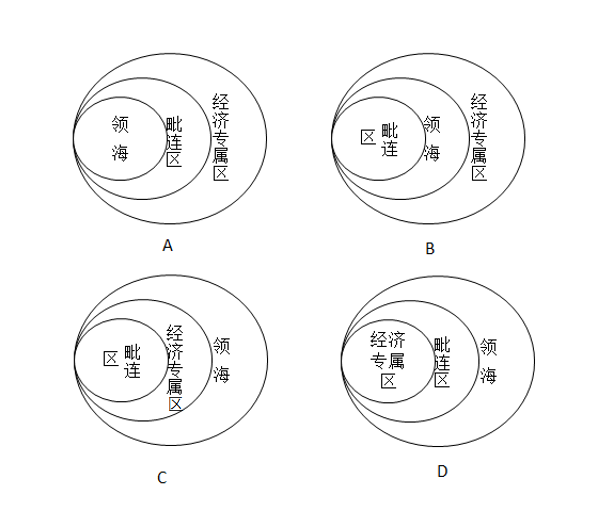

- **A**. A　✅
- **B**. B
- **C**. C
- **D**. D

**答案**：A

**官方解析**

A项正确：根据《联合国海洋法公约》的规定：领海是指沿海国的主权及于其陆地领土及其内水以外邻接的一带海域，在群岛国的情形下则及于群岛水域以外邻接的一带海域。每一国家有权确定其领海的宽度，直至从按照本公约确定的基线量起不超过十二海里的界限为止。毗连区从测算领海宽度的基线量起，不得超过二十四海里。专属经济区从测算领海宽度的基线量起，不应超过二百海里。因此，选项中从内至外应该依次为领海、毗连区、专属经济区。A项正确。
故正确答案为A。
备注：经查官网，四个选项中的“经济专属区”应当为“专属经济区”。

---

### 第 20 题　qid 2033510 · 科技常识

下列关于流行病的相关表述，错误的是：

- **A**. 疟疾是一种感染人口众多，能在短时间内广泛蔓延的传染病
- **B**. 艾滋病是由感染HIV病毒引起，这是一种能攻击人体免疫系统的病毒
- **C**. 埃博拉的致死率并不高，该病毒主要通过空气传播　✅
- **D**. 登革热主要通过蚊虫传播，是东南亚儿童死亡的重要原因之一

**答案**：C

**官方解析**

C项错误：埃博拉是由丝状病毒科的埃博拉病毒导致的严重的致命性疾病，死亡率高达。接触传播是埃博拉病毒的主要传染途径，人们通过接触（通常在屠宰、烹饪或食用时接触）被感染的动物或被感染人的体液而遭到感染。多数病例是人际传播造成的。

A项正确：疟疾是一种由寄生虫引起的威胁生命的疾病，通过受感染的雌蚊叮咬传至人类，能在短时间内广泛蔓延。根据世界卫生组织的报道，约32亿人（近全球人口的一半）面临疟疾风险。

B项正确：艾滋病是一种危害性极大的传染病，由感染艾滋病病毒（HIV病毒）引起。HIV是一种能攻击人体免疫系统的病毒。

D项正确：登革热是登革病毒经蚊媒传播引起的急性虫媒传染病，主要通过伊蚊叮咬传播，是东南亚地区儿童死亡的主要原因之一。

本题为选非题，故正确答案为C。

---

## 言语理解与表达

### 第 1 题　qid 2033438 · 逻辑填空

由于高密度地养殖，大量饵料未被摄食，残饵溶解所生成的氮、磷等营养物质使海水污染严重，海南文昌海底珊瑚礁大量枯死，底部海域几乎成了“          ”。
填入画横线部分最恰当的一项是：

- **A**. 人间地狱
- **B**. 明日黄花
- **C**. 不毛之地　✅
- **D**. 穷山恶水

**答案**：C

**官方解析**

文段横线处形容底部海域的状况，与前文的“海水污染严重”、“珊瑚礁大量枯死”对应可知，形容底部海域荒凉、贫瘠、寸草不生的C项“不毛之地”符合文意，当选。
A项“人间地狱”重在强调极度黑暗、痛苦，而非文段要体现的海底的“荒芜”，排除；B项“明日黄花”指“过时”的事物或新闻，文段没有提到新旧对比，不符合文意，排除；D项“穷山恶水”形容荒山、深水等自然条件非常恶劣、生产条件极差的地方，重在强调客观条件差，而文段中海底的情况是由于人的主观活动造成的，且“穷山恶水”一词常用以形容农村条件艰苦，常见于“穷山恶水出刁民”这种俗语搭配中，与文意不符，排除。
故正确答案为C。
【文段出处】《每个场景都触目惊心：被贪婪毁掉的中国近海》

---

### 第 2 题　qid 2033444 · 逻辑填空

明清时期的苏州为鱼米之乡，河道纵横，水网密集。市镇多依水而设，既有利于市镇与相邻四方村落的        联系，又使得每一市镇影响的范围不是很大，从而形成乡村——基层市镇——中心都市的经济社会分层结构。市镇的分布相应呈        结构。
依次填入画横线部分最恰当的一项是：

- **A**. 广泛  线性
- **B**. 密切  网状　✅
- **C**. 直接  树形
- **D**. 动态  蜂巢

**答案**：B

**官方解析**

本题的突破口在第二空，市镇“依水而设”，故市镇分布的结构模式与水分布模式一致，根据前文“河道纵横，水网密集”可知，水域是“纵横”成“水网”状，B项“网状”对应最为准确。
A项“线性”指各组成部分在时间和空间上都不重复而先后有序地排列的特性，重在不重复而有序；C项“树形”意即由根部发出多个枝杈；D项“蜂巢”为整齐的六边形。A、C、D三项均与水域的“网状”结构分布不一致，排除。
第一空，代入验证，“密切联系”为常见搭配，符合文意，当选。
故正确答案为B。
【文段出处】《差异与互动：明清时期苏州与徽州的市镇》

---

### 第 3 题　qid 2033448 · 逻辑填空

一提到“地沟油”，人们都       ，往往第一反应是地沟油是一种质量极差、极不卫生的非食用油。那么可不可以让地沟油        呢？如果放宽思路就会发现，地沟油还是有用武之地的。
依次填入画横线部分最恰当的一项是：

- **A**. 咬牙切齿  物尽其用
- **B**. 痛心疾首  点铁成金
- **C**. 深恶痛绝  变废为宝　✅
- **D**. 众口一词  脱胎换骨

**答案**：C

**官方解析**

文段第一空，“质量极差”“极不卫生”为对横线处人们对地沟油看法的具体解释，即人们对地沟油不喜欢、不待见，A项“咬牙切齿”、B项“痛心疾首”和C项“深恶痛绝”均可以表示对某人或某事的厌恶痛恨，保留。D项“众口一词”强调所有的人都说同样的话，即强调观点的“一致性”，不符合文意，排除。
第二空，横线后的句子同样起到解释说明作用，“有用武之地”体现地沟油还是有用的，全文阐述了地沟油从没用到实际有用的转折关系，C项“变废为宝”符合文意，当选。
A项“物尽其用”意为充分利用资源，不浪费，其中的“物”指代资源，无法准确地对应出大家对地沟油“质量极差”“极不卫生”的定位，相比之下，不如“变废为宝”中的“废”准确，排除；B项“点铁成金”意为通过外力使铁变成金，比喻稍加改动就能使事物变得更好，搭配主语应为施加外力的主体，而非被施加外力的“地沟油”，排除。
故正确答案为C。
【文段出处】《“善待”地沟油》

---

### 第 4 题　qid 2033452 · 逻辑填空

据统计，目前世界上约有7000种语言，其中一半左右的语言使用者不到一万人，差不多有四分之一的语言使用者在一千人以下，有的语言使用者只有个位数。语言的         在于使用，使用人口多寡是决定语言生存与发展的关键因素。上述数据表明，人类社会的语言         形势十分严峻。
依次填入画横线部分最恰当的一项是：

- **A**. 意义  发展
- **B**. 生命  衰亡　✅
- **C**. 价值  蜕化
- **D**. 功能  演变

**答案**：B

**官方解析**

文段第一空，首先列举大量数据，强调“使用人口多寡是决定语言生存与发展的关键因素”，即语言必须有人使用才能“生存与发展”。横线处应体现语言与使用之间的关系，B项“生命”意为有“生命力”，与“生存与发展”对应合适，保留。A、C两项“意义”“价值”强调语言的好处、作用，D项“功能”强调语言的用途，均不如“生命”更能体现语言必须要有人使用才有生命力、才能存活的意思，排除。
第二空，代入验证，一系列数据都在详细说明使用的人少，语言存在的数量就少，B项“衰亡”对语言少量人或没人使用后衰落甚至灭亡的形势概括准确，且与第一空“生命”形成反义对应，强调语言有人使用才有“生命”，否则就会“衰亡”，当选。
故正确答案为B。
【文段出处】蔡永良《语言失落与文化生存·北美印第安语衰亡研究》

---

### 第 5 题　qid 2033456 · 逻辑填空

对大多数人来说，糖尿病并不陌生。然而，很多人对它的了解仅仅是<u>        </u>。并非<u>         </u>，就发病率而言，糖尿病可谓疾病之王。按照2013年的数据，中国18岁以上成年人的糖尿病发病率已经高达，患者绝对人数已经过亿。

依次填入画横线部分最恰当的一项是：

- **A**. 略知一二  空穴来风
- **B**. 冰山一角  危言耸听　✅
- **C**. 道听途说  杞人忧天
- **D**. 管中窥豹  故弄玄虚

**答案**：B

**官方解析**

文段第一空，通过“然而”表示转折，转折前后语意相反，故很多人对糖尿病的了解应与“不陌生”相反，即陌生、不是完全了解，A项“略知一二”、B项“冰山一角”、D项“管中窥豹”意为只知道一点或一部分，不了解事物的全貌，符合转折关系。C项“道听途说”指路上听来的话，没有根据的传闻，不能与“不陌生”形成转折，排除。
第二空，文段指出“糖尿病可谓疾病之王”，且列举数据表明糖尿病发病率极高，即糖尿病是一种特别严重、危险的疾病，B项“危言耸听”意为故意说些夸大吓人的话，使人惊疑震动，与“疾病之王”的严重性对应，符合文意，当选。
A项“空穴来风”不能体现“疾病之王”的严重性，排除；D项“故弄玄虚”指故意耍花招，迷惑人、欺骗人，也不能体现“疾病之王”的严重性，排除。
故正确答案为B。
【文段出处】《“疾病之王”糖尿病：细数它的过去现在和未来》

---

### 第 6 题　qid 2033462 · 逻辑填空

谈论国学，其视角有广狭之分，在“固守五经”与“兼及雅俗”之间，我倾向于后者。照理说，前者_____清晰且渊源有自，容易做成“大学问”，只是因不接地气，很难茁壮成长。后者则_______，兼及精神与物质、殿堂与市井、书斋与田野，更容易为广大民众所接纳。
依次填入画横线部分最恰当的一项是：

- **A**. 脉络   无往不利
- **B**. 历史   所向披靡
- **C**. 边界   无处不在　✅
- **D**. 源头   兼容并蓄

**答案**：C

**官方解析**

文段第一空，根据与横线后“清晰”一词搭配，排除B项“历史”与D项“源头”，此二者均无法与“清晰”搭配。对比A、C两项，横线前的“前者”指代“固守五经”，意为此种类型的国学探讨的范围是明确固定的，即只认“五经”为国学，即“边界”清晰，对应C项，保留。A项“脉络”形容事情的条理或者头绪，与范围无关，排除。
第二空，代入验证，C项“无处不在”与后文“兼及精神与物质、殿堂与市井、书斋与田野”对应，体现其存在于各个方面，符合文段语境，当选。
故正确答案为C。
【文段出处】《“国学”如何“新视野”》

---

### 第 7 题　qid 2033466 · 逻辑填空

科普创作的要求委实非常高，既要有良好的文字功底，又要具备______的科学专业基础，甚至在哲学、历史、艺术等领域都要有相当______。
依次填入画横线部分最恰当的一项是：

- **A**. 系统   研究
- **B**. 全面   学识
- **C**. 完备   积累
- **D**. 扎实   造诣　✅

**答案**：D

**官方解析**

文段第一空，根据前文“要求委实非常高”且所填内容与“良好的文字功底”形成并列可知，需填入表示“‘科学专业基础’好”的词语。对应选项，只有D项“扎实”常与“基础”搭配，且能够与“良好的文字功底”对应。A项“系统”指部分之间的密切联系，B项“全面”重在广，C项“完备”重在完善，一般均不与“基础”搭配，排除。基本锁定D项。
第二空，代入验证，D项“造诣”指学问、技术达到的水平，且只有水平达到一定境界才能称之为造诣，与前文“创作的要求委实非常高”对应准确，当选。
故正确答案为D。
【文段出处】《科普图书为何引进多原创少？》

---

### 第 8 题　qid 2033470 · 逻辑填空

昆曲走向没落，在于其在大众市场中找不到一席之地而渐失群众基础。现代昆曲开始引入歌剧、交响乐等流行元素，打造通俗版昆曲，而不再______。没有一种文化可以将自己封闭起来，没有一种文化有资格_______受众群体，多一分包容，才能换来更长久的生命和更精彩的未来。
依次填入画横线部分最恰当的一项是：

- **A**. 曲高和寡   筛选　✅
- **B**. 故步自封   舍弃
- **C**. 特立独行   筛除
- **D**. 一成不变   苛求

**答案**：A

**官方解析**

文段第一空，根据文意可知，之前的昆曲状况与现在相反，故需填入与“通俗”语意相反的词语。“通俗”指易于被大众理解和接受。A项“曲高和寡”指言论或作品不通俗，能了解的人很少，与“通俗”语意相反，对应最为准确。B项“故步自封”指安于现状，不求进步，虽能与后文“没有一种文化可以将自己封闭起来”对应，但判断时应先关注横线所在语句之间的语意关系。文段只表明之前的昆曲过于小众，并未说明其是不求上进的，与“通俗”对应不当，排除。C项“特立独行”指人的志行高洁，不同流俗，与“昆曲”搭配不当，排除。 D项“一成不变”指一经形成，不再改变，与前面表否定的词“不再”合用，表示有了变化，不能与前文构成反义，排除。
第二空验证，A项“筛选”指在同类事物中去掉不需要的，留下需要的，即选取特定受众，与现在的“通俗昆曲”对应准确，当选。
故正确答案为A。
【文段出处】《传统文化止于独行盛于大众》

---

### 第 9 题　qid 2033474 · 逻辑填空

中国历史上传统手工艺的发展，是在_____地认识和了解从自然界获取的材料之物理与物性的基础上进行的。对材料物性的认识与实践是中国人的______，______运用材料的物理和物性的知识，才能使传统工艺及其产品适用于不同的社会生活需求。
依次填入画横线部分最恰当的一项是：

- **A**. 有效  发现  充分
- **B**. 深入  发明  灵活　✅
- **C**. 正确  创造  合理
- **D**. 科学  发展  准确

**答案**：B

**官方解析**

文段第一空，搭配“认识和了解”，四项均可，故从第二空入手。
第二空，搭配“对材料物性的认识与实践”，D项“发展”指事物不断前进的过程，文段并未体现“不断前进”之意，排除；A项“发现”、B项“发明”、C项“创造”均符合文意，保留。
第三空，根据后文解释“才能······适用于不同的社会生活需求”可知，此空意在强调这种知识运用范围之广。B项意为不拘泥于固有模式，善于变通的“灵活”是更为重要的前提条件，当选。而A项“充分”指充足，C项“合理”指合乎道理或事理，均可与“运用”搭配，但都不及“灵活”准确，排除。
故正确答案为B。
【文段出处】《国家层面的保护背后》

---

### 第 10 题　qid 2033478 · 逻辑填空

原产于中国的茶叶漂洋过海后，演变为日本的抹茶、英国的红茶，并且_____回到中国。面对着琳琅满目的茶叶制品，我们可以深刻地体会到一个道理：文化只有经过_____，才会更加______。
依次填入画横线部分最恰当的一项是：

- **A**. 重新  交流  丰富多彩　✅
- **B**. 大量  沉淀  博大精深
- **C**. 辗转  融合  欣欣向荣
- **D**. 间接  传播  深入人心

**答案**：A

**官方解析**

文段第一空，根据原文可知，原产于中国的茶叶到了国外之后，又回到了中国。A项“重新”指再一次，符合文意；C项“辗转”指反复不定，也可指经过很多地方，语意也可，均保留；B项“大量”指数目很多，文段并未表明回到中国的茶叶非常多，排除；D项“间接”指必须借助一个中间媒介才能产生关联，文段并未表明要通过某种媒介才能回到中国，故语意不符，排除。
第二空，搭配“文化”，根据前文的例子可知，我国的茶叶到日本发展出抹茶、到英国发展出红茶，这是对茶文化的极大丰富，A、C两项均可，不好判断，保留。
第三空，根据文意可知，我国茶叶制品最终种类变得更多，A项“丰富多彩”指内容丰富，花色繁多，符合文意，当选。C项“欣欣向荣”形容事业蓬勃发展，不能体现种类多，排除。
故正确答案为A。

---

### 第 11 题　qid 2033482 · 片段阅读

书法在中国文化中具有特殊地位。书法受到绝大部分文字使用者的喜爱，但又长期被当作一种“小道”而受到轻视。20世纪以来，书法的生存环境发生了很大的变化，特别是硬笔取代毛笔成为日常书写工具，毛笔书写便离开了日常生活，只有致力于书法的人们，才会去接受毛笔书写的训练。
这段文字主要介绍了：

- **A**. 书法在中国文化中的特殊价值
- **B**. 书法功能在当代的重大改变　✅
- **C**. 人们对书法迥然不同的态度
- **D**. 毛笔在现代生活中的地位

**答案**：B

**官方解析**

文段前面指出书法受到绝大部分文字使用者的喜爱，即是大部分人的使用工具，随后指出书法的生存环境发生很大改变，根据“硬笔取代毛笔成为日常书写工具，毛笔书写便离开了日常生活，只有致力于书法的人们，才会去接受毛笔书写的训练”可知，书法已经不是日常的书写工具，而成为书法爱好者的追求。通过前后对比可知，书法的使用功能发生改变，对应B项。
A项“特殊价值”偷换概念，文段说的是“特殊地位”，排除；C项“迥然不同的态度”无中生有，文段没有对比态度，排除；D项“毛笔”是例子，为了说明书法功能的改变，非重点，排除。
故正确答案为B。
【文段出处】《变与不变的中国书法》

---

### 第 12 题　qid 2033484 · 语句表达

①五代至北宋时期，人们用丝线或马尾线把所设计的图案编在抄纸的竹帘上
②故宫博物院藏北宋李建中《同年帖》，纸面上就有波浪纹图案
③在唐代，经过染黄黄檗、涂蜡烫平加工而成的硬黄纸，防蠹防潮，能长久保存
④因为有图案的地方抄纸时纤维层较薄，所以制出来的纸“水印”赫然
⑤造纸术是中国古代四大发明之一，其工艺技术不断推陈出新
⑥初唐写本《妙法莲花经》、王羲之《万岁通天帖》摹本，用的都是这种纸
将以上6个句子重新排列，语序正确的一项是：

- **A**. ②④⑥⑤③①
- **B**. ②③⑥⑤④①
- **C**. ⑤③⑥①④②　✅
- **D**. ⑤③⑥②①④

**答案**：C

**官方解析**

对比②和⑤，确定首句。②介绍具体文物《同年帖》，⑤指出造纸术的工艺技术不断进步，结合其他具体介绍造纸术工艺的语句可知，⑤更适合作首句提出观点，然后②作为具体例子进行解释说明，故排除A、B两项。对比C、D两项，需要判断①、②两句的先后顺序，①介绍了五代至北宋时期造纸术的工艺，②介绍运用了北宋造纸术工艺的具体文物《同年帖》，故应该先①后②，排除D项。
故正确答案为C。
【文段出处】《文房四宝：以器载道的文化内涵》

---

### 第 13 题　qid 2033486 · 片段阅读

中国古代青铜器工艺实践中，形成了较为完整的合金材料技术知识。先秦文献《考工记》记录了六类青铜器物的合金成分配比：“金有六齐：六分其金而锡居一，谓之钟鼎之齐；五分其金而锡居一，谓之斧斤之齐；四分其金而锡居一，谓之戈戟之齐；三分其金而锡居一，谓之大刃之齐；五分其金而锡居二，谓之削杀矢之齐；金锡半，谓之鉴燧之齐。”根据出土的先秦时期各类青铜器的检测报告，当时所铸造的青铜器的实际合金配比，要比文献记载更丰富，涉及的材料和技术知识，已与现代冶金学理论知识颇为接近。
这段文字主要介绍了：

- **A**. 中国古代青铜器的合金成分配比
- **B**. 先秦时期合金技术的成就　✅
- **C**. 《考工记》中合金配比技术的价值
- **D**. 青铜器检查报告与文献记载的差异

**答案**：B

**官方解析**

文段首句指出“中国古代······形成了较为完整的合金材料技术知识”，引出观点，接着通过先秦文献《考工记》具体介绍先秦时期的合金配比，进行举例论证。最后介绍先秦实际的合金配比要比文献更丰富，与现代冶金知识接近，依旧对首句进行解释说明，故文段为总分结构，强调先秦时期合金技术的先进。对应B项。
A项“合金成分配比”属于具体的解释说明，非重点，排除；C项“合金配比技术的价值”文段没有提及，无中生有，排除；D项“差异”是为了说明先秦实际取得的成就大，本身不是重点，而且反推文段应该是并列文段，与原文不符，排除。
故正确答案为B。
【文段出处】《手工艺的传统——对传统手工艺相关的知识体系的再认识》

---

### 第 14 题　qid 2033488 · 片段阅读

进入网络化时代，虽然无纸化办公呼声不绝于耳，但在不少机关事业单位，公共耗材经费仍居高不下，讲话材料人手一册、电话通知打印成纸……相比于公款旅游、公车消费、公务接待，公共耗材的高消费更容易被人忽视。不妨多考虑微信等新媒体办公手段，防止陷入纸质化办公习惯“掉不了头”。一些现代企业已经实现远程办公、“云办公”，轻装上阵，带来了巨大的效益。
这段文字意在强调：

- **A**. 互联网时代无纸化办公是大势所趋
- **B**. 现代企业的办公模式更符合时代要求
- **C**. 机关事业单位应让无纸化办公落到实处　✅
- **D**. 机关事业单位公共耗材预算需做出调整

**答案**：C

**官方解析**

文段首句通过转折词“但”指出不少机关事业单位公共耗材的高消费问题，接着指出可以考虑新媒体办公手段即无纸化办公，且通过现代企业的例子说明无纸化办公的好处，意在强调机关事业单位也要实行无纸化办公，对应C项。
A项：“大势所趋”在文段中没有体现，排除；
B项：“现代企业的办公模式”是例子，用来说明无纸化办公的好处，非重点，排除；
D项：“公共耗材预算”与文段主题词“无纸化办公”不符，排除。
故正确答案为C。
【文段出处】《无纸化办公，不妨再多些》

---

### 第 15 题　qid 2033490 · 语句表达

①海德堡大学的专家发现在动物大脑中有一个“热传感器”
②在身体发烧的时候，这种特殊的脑神经细胞中的蛋白质会释放降温信号，调节体温
③它是大脑神经细胞中的一种特殊蛋白质，被称为TRPM2蛋白质
④尽管已知大脑中被称为下丘脑的区域可能对调温起作用，但科学家们并不清楚哪些神经细胞何时起作用，以及通过何种分子信号途径来测量
⑤研究人员一直猜测是动物的大脑存在某种控温机制
⑥关于人及温血动物的体温调节机制，人们之前并不清楚
将以上6个句子重新排列，语序正确的是：

- **A**. ⑤①③②⑥④
- **B**. ①②③④⑤⑥
- **C**. ⑥④⑤①③②　✅
- **D**. ④⑥③⑤②①

**答案**：C

**官方解析**

对比选项，确定首句。首句分别是①④⑤⑥，通过分析，可以看出④和⑥都是在说对体温调节机制不清楚，⑤是对控温机制的猜测，①是研究发现，根据逻辑顺序，应该是先不清楚，然后进行猜测，最后得出结论，所以⑥④应该在⑤和①之前，排除A、B两项。观察选项，③出现指代词“它”，判断③前面是①还是⑥即可确定答案，根据③可知，它是一种蛋白质，不可能是调节机制，排除D项。
故正确答案为C。
【文段出处】《大脑神经细胞中存在“热传感器”》

---

### 第 16 题　qid 2033432 · 片段阅读

百年来，大藏经在佛教研究中发挥了无可替代的作用，近代以来所产生的佛教研究成果均少不了大藏经的贡献。大藏经所收入的是历代编藏僧人过滤后的资料。从大藏经编纂的历史而言，早期的写本，重翻译域外佛典，轻中华佛教撰著；其后的刻本，虽然收入中华佛教撰著，但随意性较强；晚期的刻本，所收禅宗语录，可称浮滥。就总体而言，大藏经的功能兼具义理与信仰，其内涵则表现出重义理、轻信仰的倾向。
这段文字主要介绍大藏经：

- **A**. 在佛教研究中的重要作用
- **B**. 在不同时期的特点
- **C**. 在资料方面存在的局限　✅
- **D**. 所收录的佛典种类

**答案**：C

**官方解析**

文段开篇由大藏经在佛教中的作用引出大藏经这一核心话题，接着介绍了大藏经在“早期的写本”“其后的刻本”“晚期的刻本”中收入的资料，尾句出现“就总体而言”，是对前文内容的总结，强调大藏经“重义理、轻信仰”，包括前文中的“随意”、“浮滥”等词语义也偏消极，体现出大藏经在资料方面存在局限，对应C项。
A项出现在文段开篇，为了引出大藏经这一核心话题，非重点，文段重在强调大藏经在资料方面的局限性，排除；B项“不同时期的特点”对应文段尾句之前的部分，非重点，排除；D项“所收录的佛典种类”，非重点，排除。
故正确答案为C。
【文段出处】《敦煌遗书：鲜活勾画中国古代佛教寺院生态》

---

### 第 17 题　qid 2033434 · 片段阅读

过去几十年中，视觉革命伴随着新的媒体形态和消费方式而到来。上世纪初，人们只能通过报纸、杂志等平面媒体了解信息。此后，显示管技术的成熟让电视机走到台前，极大地改变了人们的生活方式，1969年7月11日，数以千万的美国人守在电视机旁，收看阿姆斯特朗迈上月球的第一步。而现在，手机这种更便捷的智能终端，再次改变了人们的工作和生活，新型的直播方式，使突破时间和地域障碍的沟通成为可能。
这段文字主要介绍了：

- **A**. 新的媒体形态和消费方式产生的过程
- **B**. 视觉革命对生活和工作方式的改变　✅
- **C**. 媒体领域出现的技术突破
- **D**. 媒体形态和消费方式的关系

**答案**：B

**官方解析**

文段开篇指出视觉革命已经到来，接着按照时间顺序进行详细阐述，从上世纪初的平面媒体，到电视机的普及，再到如今手机智能终端的广泛应用，故文段重在强调视觉革命‌如何一步步改变了人们的生活和工作方式，对应B项。
A项，“产生的过程”无中生有，文段中并未详细描述其如何产生，排除；
C项，“技术突破”非重点，文中重点在于其给人们生活和工作带来的影响，排除；
D项，“关系”无中生有，在文段中并未深入探讨媒体形态与消费方式之间的关系，排除。
故正确答案为B。
【文段出处】《从2D到3D让世界触手可及》

---

### 第 18 题　qid 2033436 · 片段阅读

在中国古代，盖天、浑天之说，圭表、浑仪等器，以及天文历法之操作规则，都是为着一个实用的目的，即服务于王权，然而赋予这个致用目的以神秘、庄严、威严之感，以致人人相信其有效的，是古代深入人心的“天人合一”思想。这里的“天”是指整个自然界，在古代中国人心目中，是一个有意志、有感情、无法彻底认识、只能顺应其道、与之和睦共处的庞大而神秘的活物。
这段文字主要介绍了：

- **A**. 中国古人心目中“天”的含义
- **B**. 中国古代天学的实用目的及背后的思想　✅
- **C**. 大自然在中国古代天学中的权威地位
- **D**. 中国古代天学与近代科学的区别

**答案**：B

**官方解析**

文段开篇指出在中国古代，学说、仪器、天文历法均服务于王权，接着指出“天人合一”思想使人们相信“服务于王权”这一目的是有效的，接着对“天人合一”中“天”的含义进行解释说明，B项“实用目的及背后的思想”是对文段最为全面的概括，当选。
A项：“‘天’的含义”对应文段后半部分，即对“天”的详细解释说明，表述片面，排除；
C项：“大自然在中国古代天学中的权威地位”非重点，排除；
D项：“近代科学”无中生有，排除。
故正确答案为B。
【文段出处】《中国古代天学》

---

### 第 19 题　qid 2033440 · 片段阅读

王国维所讲的“二重证据法”，是以“地下之新材料”补正“纸上之材料”，两者互相印证。这是以他本人多年研究实践的丰硕成果为基础的，自然也难免受到他那个年代历史条件的限制。他在《古史新证》讲义中列举“纸上之材料”，从《尚书》、《诗》、《易》，一直到先秦诸子和《史记》，差不多包括了所有有关的传世典籍，而“地下之材料仅有二种”，即甲骨文字与商周金文。王国维当年只能提到这两者，因为那个时候中国的现代考古学仍处于发轫阶段。到后来李济先生论“古史重建”时，就将田野考古放到突出的位置了。
这段文字主要介绍王国维“二重证据法”：

- **A**. 形成的历史条件和基础
- **B**. 所运用的核心材料
- **C**. 在当时受到的局限　✅
- **D**. 与李济“古史重建”的区别

**答案**：C

**官方解析**

文段开篇指出观点，即王国维的“二重证据法”受到了那个年代历史条件限制，接着具体解释了局限所在，据此可知文段为观点加解释说明结构，重在强调王国维的“二重证据法”受到那个年代历史条件的限制，对应C项。
A项“形成的历史条件和基础”在文段中并未提及，排除；B项“所运用的核心材料”出现在解释说明部分，非重点，排除；D项“区别”在文段中并未提及，并且“李济的‘古史重建’”也出现在解释说明的部分，非重点，排除。
故正确答案为C。
【文段出处】《出土文献与中国古代文明》

---

### 第 20 题　qid 2033442 · 片段阅读

人类探索火星的步伐正在加快。欧洲的火星探测器ExoMars已于2016年3月14日从哈萨克斯坦的拜科努尔发射场发射，寻找火星过去或现在的生命迹象。中国也有望于2020年发射火星探测器，成为火星探索队伍中的又一支重要力量。对于这个神秘且遥远的星球，人类的求知欲已不仅停留在寻找生命迹象，而是超前到了对火星宜居环境的研究。近日，荷兰瓦赫宁根大学模拟月球和火星的土壤条件，成功进行蔬菜栽培实验，证明在外太空建立人类居住地并不是空想。
这段文字主要介绍了：

- **A**. 新技术在探索火星中的作用
- **B**. 目前进行探索火星的主要力量
- **C**. 人类探索火星的主要进展　✅
- **D**. 人类探索火星目的所发生的改变

**答案**：C

**官方解析**

文段开篇指出“人类探索火星的步伐正在加快”，接着通过并列关系说明参与火星探索的力量更多了，一个接一个开始对火星展开探索，紧接着后文说明人类对火星的探索内容不仅停留在寻找生命迹象，而是超前到了对火星宜居环境的研究，并举例说明。文段从“力量的增加”及“探索内容的超前”对首句“探索步伐加快”进行解释说明，文段为总分结构，重点强调人类火星探索的进展加快了，对应C项。
A项，“新技术”无中生有，文段并未提及，排除；
B项，“主要力量”偷换概念，文段介绍中国成为又一支重要力量，并非主要力量，且后文内容为解释说明，非重点，排除；
D项，“目的所发生的改变”对应解释说明内容，非重点，且后文解释内容为并列关系，表述片面，排除。
故正确答案为C。
【文段出处】《荷兰科学家揭秘火星种菜实验：和地球上种的几乎一样好》

---

### 第 21 题　qid 2033446 · 片段阅读

中国是个太阳能资源非常丰富的国家，的地区有可利用的太阳能资源，绿色、节能的太阳能热水器深受不同地域消费者的青睐。然而，一项对24个省市太阳能热水器使用状况的调查，却显示出不容乐观的结果，的太阳能热水器一到冬天就无法使用，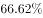的消费者希望太阳能热水器进一步改善性能，在冬天更好用。

这段文字意在表明：

- **A**. 中国的太阳能资源尚未得到充分利用
- **B**. 太阳能热水器因绿色节能而受到青睐
- **C**. 太阳能热水器的市场前景欠佳
- **D**. 太阳能热水器使用状况不容乐观　✅

**答案**：D

**官方解析**

文段开篇阐述中国太阳能资源丰富，太阳能热水器受到青睐，后文出现转折关联词“然而”，转折之后重点强调目前太阳能热水器的使用状况不容乐观。D项对应文段中心，当选。
A项：重点强调的内容为“太阳能资源”，而文段主题词为“太阳能热水器”，非文段论述重点，排除；
B项：“太阳能热水器因绿色节能而受到青睐”是文段转折之前的内容，非重点，排除；
C项：“市场前景欠佳”在文段中并未提及，无中生有，排除。
故正确答案为D。
【文段出处】《太阳能光伏如何走出冬季困局？》

---

### 第 22 题　qid 2033450 · 片段阅读

中国传统诗的历史表明，文学吟诵乃是伴随着近体律诗的成熟而成熟起来的。当最好的近体诗人出现时，真正意义上的文学吟诵才得以诞生。清人方世举《兰丛诗话》评说杜律云：“唐之创律诗也，五言犹承齐、梁格诗而整饬其音调。七言则沈、宋新裁。其体最时，其格最下，然却最难，尺幅窄而束缚紧也。能不受其画地湿薪者，惟有老杜，法度整严而又宽舒，音容郁丽而又大雅，律之全体大用，金科玉律也。”杜甫是公认的唐代最好的律诗作者，他不仅“吟”出了人间最好的律诗，同时也给后人提供了一把量尺，帮助我们从良莠不齐的诗歌遗产当中，选择出最好的诗来传承文学的吟诵。
这段文字主要说明：

- **A**. 什么是真正意义上的文学吟诵
- **B**. 如何从良莠不齐的诗歌中选出最好的诗
- **C**. 文学吟诵的发展和近体律诗有紧密关系
- **D**. 杜甫是公认的唐代最好的律诗作者　✅

**答案**：D

**官方解析**

文段开篇阐述文学吟诵伴随着近体律诗而成熟，指出最好的近体诗人出现时，真正的文学吟诵才诞生，接着用方世举的话强调杜甫的律诗是“金科玉律”，尾句点明杜甫不仅吟出了最好的律诗，还为我们提供了量尺，再次强调杜甫是最好的律诗作者。文段用“最好的”“金科玉律”“公认的”等语气加重的词语多次强调，文段的核心主体应为杜甫，D项当选。
A项文学吟诵的概念文段中并未进行讨论，排除；B项“如何从良莠不齐的诗歌中选出最好的诗”是用来衬托杜甫的伟大之处的，非文段重点，排除；C项“文学吟诵发展和近体律诗有紧密关系”出现在文段开篇，重在通过二者的关系引出杜甫在期间发挥的重要作用，故重点依然在杜甫而非文学吟诵，排除。
故正确答案为D。
【文段出处】《文学吟诵与诗人杜甫》

---

### 第 23 题　qid 2033454 · 片段阅读

在大数据时代之前，人们做出决策和构建制度，大多建立在匮乏的数据基础上。简单地说，在过去网络还不甚普及的时候，人们在做出一些决策行为和数据分析的过程中，更多的是凭借个人经验和直觉。而现在，大数据时代的来临，为人们提供了一种全新的思路，通过大量的数据分析得出的结果将更加现实和准确。但是，值得注意的是，过去，我们手头上仅有的一些数据都是相对准确的，有参考价值的，而大数据由于信息量更多更大，信息品质参差不齐，并非所有数据都有参考价值，相对过去来说，这些数据更加杂乱。
这段文字意在强调：

- **A**. 大数据使得科学研究更加便捷和准确
- **B**. 大数据时代人们的决策过程更加科学
- **C**. 不同时期数据的准确性存在着巨大差别
- **D**. 应注意信息品质对数据分析结果的影响　✅

**答案**：D

**官方解析**

文段开篇阐述在大数据时代之前，人们做出决策更多的是凭借个人经验和直觉，后文接着说大数据时代的来临使得结果更加准确，随后出现转折词“但是”，引出重点，强调过去的数据相对准确，而现在的信息品质参差不齐。由此可知，大数据时代下，要注意不同品质的信息会影响数据分析的结果，对应D项。
A项：“科学研究”在文段中并未提及，无中生有，排除；
B项：“决策过程更加科学”是转折之前的内容，非重点，排除；
C项：“不同时期数据的准确性存在着巨大差别”并非文段重点内容，文段重在通过准确性的差别提醒人们要注意不同品质的信息对数据分析结果的影响，排除。
故正确答案为D。
【文段出处】《大数据为我们的生活带来哪些改变？》

---

### 第 24 题　qid 2033458 · 语句表达

一个多世纪以来，工业领域发生了两次革命性的管理范式转换：第一次是以福特流水线为标志的单一品种大规模生产模式；第二次是以丰田精益生产为标志的多品种大批量生产模式。互联网时代，用户的碎片化需求倒逼新生产模式的出现，即从多品种大批量生产模式升级为大规模定制模式，___________________。
填入画横线部分最恰当的一项是：

- **A**. 大规模定制模式则意味着商业模式和管理范式需要创新　✅
- **B**. 传统的企业制度和管理范式将遭遇颠覆性挑战
- **C**. 大规模定制模式才是互联网时代的大势所趋
- **D**. 推进企业制度的创新是大规模定制模式的内在需求

**答案**：A

**官方解析**

横线出现在文段末尾，是对前文内容的总结。文段开篇介绍了工业领域的两次管理范式转变，接着阐述互联网时代用户的碎片化需求倒逼新生产模式出现，即大规模定制模式，由此可知，横线处需要围绕大规模定制模式和管理范式转变来展开，对应A项。
B项中“颠覆性挑战”程度过重，排除；C、D两项未提及文段另外一个非常重要的主题词：“管理范式”，排除。
故正确答案为A。
【文段出处】《推进互联网时代企业制度创新》

---

### 第 25 题　qid 2033460 · 片段阅读

实践中发现，一种植物通常只能忍耐或吸收一种或两种重金属元素，对土壤中其他浓度较高的重金属则表现出某些中毒症状，这种现象限制了植物修复技术在重金属复合污染土壤治理中的应用。而且植物是活的有机体，需要有适宜的生长条件，对土壤肥力、气候、水分、盐度、排水与灌溉系统等自然条件有一定要求，植物受病虫害袭击时会影响其修复能力。另外，植物根系一般较浅，对浅层土壤污染的修复最为有效，对深层土壤污染修复能力较差。
关于植物修复技术，这段文字没有提及：

- **A**. 可以修复的污染种类
- **B**. 影响修复效果的因素
- **C**. 适用的土壤范围
- **D**. 未来的应用前景　✅

**答案**：D

**官方解析**

A项，“可以修复的污染种类”对应文段“忍耐或吸收一种或两种重金属元素”；B项，“影响修复效果的因素”对应文段“对土壤肥力、气候······受病虫害袭击时会影响其修复能力”；C项，“适用的土壤范围”对应文段“对浅层土壤污染的修复最为有效，对深层土壤污染的修复能力较差”。A、B、C三项均有所提及，排除。D项“应用前景”在文段中并未提及，当选。
本题为选非题，故正确答案为D。
【文段出处】《植物大战重金属污染》

---

### 第 26 题　qid 2033464 · 片段阅读

为什么火焰常常会是黄颜色的?这是因为火焰在燃烧时会附带空气中的很多烟尘颗粒，它们会导致火焰不能充分燃烧。人类很早就可以控制火，但是效果一直不理想，也就是说在如何让火焰能够充分燃烧这个问题上，许多科学家一直在探索。
这段文字主要介绍了：

- **A**. 人类用火的历史
- **B**. 火焰燃烧的原理
- **C**. 火焰为什么是黄的
- **D**. 人们在利用火焰方面的难题　✅

**答案**：D

**官方解析**

文段首句提出问题“为什么火焰常常会是黄颜色的”，然后解释原因，紧接着通过转折关联词“但是”引出文段重点，指出科学家一直在探索如何让火焰能够充分燃烧的问题,即人类对火的利用还存在不足，对应D项。
A项“用火的历史”、B项“燃烧的原理”，在文段中并未提及，无中生有，排除；
C项，为转折之前的内容，非重点，排除。
故正确答案为D。

---

### 第 27 题　qid 2033468 · 片段阅读

从监控摄像机到无人机，很多城市已在公共安全领域使用人工智能技术。相关研究人员称，到2030年，人们会高度依赖“预言性监管”。机器学习技术可使电脑自主学习，该技术已在打击犯罪活动实践中起到了重要作用。同时，机器学习技术还能够极大地提高人工智能预测犯罪事件的能力，包括犯罪的时间、地点和人物等。
这段文字主要说的是：

- **A**. “预言性监管”不久之后将会成为现实
- **B**. 机器学习对打击犯罪活动的意义
- **C**. 人工智能技术对公共安全的作用　✅
- **D**. 人工智能技术是打击犯罪的新型武器

**答案**：C

**官方解析**

文段开篇指出观点，很多城市已在公共安全领域使用人工智能技术，随后指出未来人们会高度依赖“预言性监管”，接下来以机器学习技术为例，通过并列结构提出其对犯罪具有两方面的作用，一是打击犯罪，二是预测犯罪，故文段重点强调的是人工智能技术对于公共安全领域所起到的作用。A项，“‘预言性监管’不久之后将会成为现实”，文段没有提及，无中生有，排除；B项“机器学习”只是作者所列举的一种人工智能技术的例子，非重点，文段的主题词为“人工智能技术”，排除；对比C、D两项，根据“预言性监管”“预测犯罪事件”可知，文段强调的是人工智能技术对预防犯罪的作用，D项，打击犯罪是人工智能技术在公共安全领域所起到的作用之一，表述片面，且新型武器为无中生有，排除；C项对应首句内容，概括了文段的主旨，当选。
故正确答案为C。
【文段出处】《研究：人工智能可协助警察预防犯罪》

---

### 第 28 题　qid 2033472 · 语句表达

至少在过去的30年里，人们一直认为饱和脂肪才是饮食中的头号反派。在20世纪60年代，当尤德金开展关于糖对人体影响的研究时，在营养学领域中，一种新的理论正在逐渐成形。_______________。以尤德金为首的、数量不断减少的反对者认为：糖比脂肪更易引起肥胖、心脏病和糖尿病等疾病，但是在他著书时，“脂肪假说”的支持者已经控制了这一领域的制高点。
填入画横线部分最恰当的一项是：

- **A**. 这个理论认为糖是保证人体机能正常运作的必要营养成分
- **B**. 这个理论的中心思想就是低脂饮食才是健康的饮食　✅
- **C**. 这个理论倾向于糖的摄入是各种慢性疾病的主要原因
- **D**. 这个理论对当时盛行的低脂饮食观念提出了有力挑战

**答案**：B

**官方解析**

横线在文段中间，需结合上下文分析。根据横线前“尤德金开展关于糖对人体影响的研究”可知，尤德金认为影响人体健康主要因素是糖，根据横线后“以尤德金为首的、数量不断减少的反对者认为，糖比脂肪更易引起肥胖、心脏病和糖尿病等疾病”可知，新理论应该和尤德金的观点正好相反，即认为脂肪才是影响人体健康的主要因素，对应B项。
A、C两项强调“糖”对人体的影响，这是尤德金的研究范畴，与上下文无法衔接，排除；D项“对当时盛行的低脂饮食观念提出了有力挑战”正好和新理论的观点相反，与文意相悖，排除。
故正确答案为B。
【文段出处】 《沉冤难雪的脂肪：一份膳食指南和它带来的40年健康灾难》

---

### 第 29 题　qid 2033476 · 片段阅读

数十年以来，科学家认为发现外星生命的最重要信息是这颗行星与主恒星的距离。在太阳系中，金星距离太阳最近，火星距离太阳较远，液态水无法存在。地球处于合适位置，存在着液态水和各种生命形式。然而，目前最新一项研究表明，仅凭借距离很难断定该行星是否具备生命存在的条件，宜居行星还必须具备适当的内部温度。
接下来最可能说的是：

- **A**. 外星生命和行星内部适宜温度的关系
- **B**. 科学家关于行星适宜距离的最新研究
- **C**. 什么样的行星能具备适当的内部温度　✅
- **D**. 人们对行星的宜居条件存在认识误区

**答案**：C

**官方解析**

文段尾句重点强调“宜居行星还必须具备适当的内部温度”，根据话题一致原则，接下来应该围绕“内部温度”继续阐述，即接下来应该论述什么样的行星才能够具备适宜的内部温度，进而发现生命，对应C项。
A项：“外星生命和行星内部适宜温度的关系”指有了适宜的内部温度才可能有生命，尾句已经点明论述过，排除。
B、D两项：不符合，且此二者的内容均为文段已经论述过的，排除。
故正确答案为C。
【文段出处】《宜居行星必须具备适当内部温度才能孕育生命》

---

### 第 30 题　qid 2033480 · 片段阅读

对一个全球化企业来说，品牌是一个体系。纵观全球著名跨国公司的品牌，可以发现一个公司往往有众多品牌，其中既有自创的，也有收购的，甚至还有合作创建的。现在有的媒体赞扬“自主品牌”，实际上是赞扬“自创品牌”而不是“自主品牌”。有的政府部门支持“自主品牌”的政策，实际上也仅是支持企业“自创品牌”，而不鼓励其他的品牌发展途径。这既不符合企业发展规律，也不符合市场竞争规律，还容易导致一些企业弄虚作假，“秀自主，不创新”，骗取国家资金。
这段文字意在强调：

- **A**. 目前的政策难以持续支持企业品牌的发展
- **B**. 媒体和企业要纠正对自主品牌的错误认识　✅
- **C**. 媒体和企业在品牌发展中有重要作用
- **D**. 全球化企业的品牌是一个多元化体系

**答案**：B

**官方解析**

文段开篇指出品牌是一个体系，一个公司有众多的品牌，包括自创的、收购的、合作创建的，接着通过转折关联词“实际上”提出存在的问题，即媒体、政府对于“自主品牌”的认识存在误区。尾句通过指代词“这”总结前文，得出结论：不符合企业发展规律、不符合市场竞争规律、导致企业弄虚作假、骗取国家资金。对比选项优选B项。
A项“政策难以持续支持企业品牌的发展”和C项“媒体和企业……有重要作用”在文段没有根据，无中生有，排除；D项“品牌是一个多元化体系”为文段开头背景内容，非重点，排除。
故正确答案为B。
【文段出处】《走出“自主品牌”的误区》

---

## 数量关系

### 第 1 题　qid 2033292 · 数学运算

泳池进出水用的机器，往泳池里注水时，每工作30分钟，停3分钟，把泳池里的水抽空时，每工作30分钟，停5分钟，抽水的速度是注水速度的2倍。如果把泳池水抽完用了2小时50分钟，那么把泳池里注满水用的时间是多少？

- **A**. 4小时17分钟
- **B**. 5小时27分钟　✅
- **C**. 5小时36分钟
- **D**. 5小时41分钟

**答案**：B

**官方解析**

设注水的速度每分钟为1，则抽水的速度每分钟为2。

机器抽完泳池的水用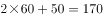分钟，完整的抽水工作周期有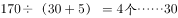分钟，实际工作时间为分钟，则泳池的蓄水量为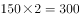。

当变成注水时，注满泳池需要工作分钟，需要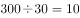个注水工作周期，理论上需要时间分钟。但最后一个工作周期，停工时间3分钟不需计算，因此实际注满水用时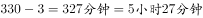。

故正确答案为B。 

---

### 第 2 题　qid 2033296 · 数学运算

给贫困学校送一批图书，如果每个学校送80本书，则多出了340本，如果每个学校送90本书，则少60本。问这批书一共有多少本？

- **A**. 3680
- **B**. 3760
- **C**. 3460
- **D**. 3540　✅

**答案**：D

**官方解析**

设共有个贫困学校，根据题意有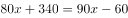，解得。所以这批图书共有本。

故正确答案为D。

---

### 第 3 题　qid 2033298 · 数学运算

某家企业行政部和市场部共有80人，后来进行人员调整，将行政部增加了6人，市场部减少了18人，这时两个部门的人数刚好相等。问行政部原来有多少人？

- **A**. 16
- **B**. 18
- **C**. 24
- **D**. 28　✅

**答案**：D

**官方解析**

设行政部原来有人，则市场部原来有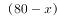人。人员调整后人数相等，则有，解得。

故正确答案为D。

---

### 第 4 题　qid 2033300 · 数学运算

甲鱼塘养了3000条鱼，将其中的投入乙鱼塘中，同时，将乙鱼塘中的鱼放到甲鱼塘中，这时两个鱼塘中鱼的数量相同，那么乙鱼塘中原来有多少条鱼？

- **A**. 1800
- **B**. 2400　✅
- **C**. 3200
- **D**. 3800

**答案**：B

**官方解析**

设乙鱼塘中原来有条鱼。当甲乙鱼塘互相投放鱼后，两个鱼塘的鱼数量相同，因此有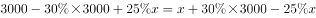，解得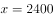。

故正确答案为B。

---

### 第 5 题　qid 2033302 · 数学运算

某商品的单位利润和进货量的大小相关，进货总额低于5万元时利润率为，低于或等于10万元时，高于5万元的部分利润率在，高于10万元时，高于10万元的部分利润率在，问当进货量在20万元时，一共有多少万元的利润？

- **A**. 1.75
- **B**. 2.25　✅
- **C**. 3.15
- **D**. 4.05

**答案**：B

**官方解析**

由题意可得，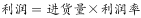。进货总额为20万元时，进货量低于5万元部分的利润为万元，进货量在5万到10万部分的利润为万元，进货量大于10万元部分的利润为万元，则总利润为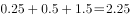万元。

故正确答案为B。

---

### 第 6 题　qid 2033290 · 数学运算

某公司组织歌舞比赛，共68人参赛。其中，参加舞蹈比赛的有12人，参加歌唱比赛的有18人，45个人什么比赛都没有参加。问其中参加歌唱比赛但不参加舞蹈比赛的有多少人？

- **A**. 9
- **B**. 11　✅
- **C**. 15
- **D**. 17

**答案**：B

**官方解析**

由容斥原理公式可得，参加舞蹈比赛的人数+参加歌唱比赛的人数-两者都参加的人数=总人数-两者都不参加的人数，代入数字：12+18-两者都参加的人数=68-45，解得两者都参加的人数=7，则参加歌唱比赛但不参加舞蹈比赛的人数=18-7=11。
故正确答案为B。

---

### 第 7 题　qid 2033294 · 数学运算

出租车以固定速度从乙地出发到甲地再回到乙地，往返需要1小时40分。这一天，小明早上8点从甲地出发步行去乙地，出租车在上午9点从乙地出发，小明中途遇到这辆出租车便坐车去乙地，并于早上10点20到达。问出租车的速度是小明步行速度的多少倍？

- **A**. 4
- **B**. 6
- **C**. 8
- **D**. 10　✅

**答案**：D

**官方解析**

方法一：假设出租车速度每分钟为1，出租车往返甲、乙两地需要1小时40分钟（100分钟），则甲乙两地距离为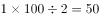。

出租车9点从乙地出发，10点20分又回到乙地，则出租车实际行驶距离为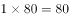，故出租车接到小明的地点距离乙地，此时离出发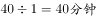，说明出租车接到小明的时间为9点40分。

小明从8点到9点40分走的路程为，走的时间是100分钟，所以小明速度为，出租车的速度为小明速度的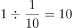倍。

方法二：车走完全程需要1小时40分钟（100分钟），则从乙到甲需要50分钟。从乙地到相遇地点折回共用了1小时20分钟（80分钟），则从乙地到相遇点需要40分钟，即9点40到达相遇点，因此对应的从相遇点到甲地需要分钟。而小明8点从甲出发，9点40到达相遇点共100分钟，因此小明与车相同距离所用的时间比为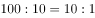，则速度比为，即10倍。

故正确答案为D。

---

### 第 8 题　qid 2033306 · 数学运算

在的队列中，先随机给一个队员戴上红绶带，再给另一个队员戴上蓝绶带，要求戴两种颜色绶带的这两位队员不在同一行也不在同一列。问有多少种戴法？

- **A**. 1048
- **B**. 1374
- **C**. 1764　✅
- **D**. 1858

**答案**：C

**官方解析**

先在队列中随机抽取一位同学给他佩戴红绶带，共有种选法。去掉该同学同行同列的同学后，还剩下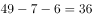人，在剩下的人中再随机抽取一人佩戴蓝绶带，共有36种选法。两次选择为分步运算，用乘法，共有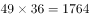种戴法。

故正确答案为C。

---

### 第 9 题　qid 2033314 · 数学运算

某农场原有300人，存储的粮食够吃80天。现调入若干人员，储存的粮食实际上只吃了60天，问实际上调入了多少人？

- **A**. 100　✅
- **B**. 200
- **C**. 300
- **D**. 400

**答案**：A

**官方解析**

方法一：假设农场每人每天消耗粮食量为1，则粮食总量为。而调入若干人员后实际只吃了60天，实际每天消耗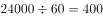，人数为，故调入的人数为。

方法二：粮食总量一定，效率和时间成反比。调入前后，天数之比为，则调入前后人数之比为。调入前人数为300，则按的比例可知调入后为400人，故调入的人数为。

故正确答案为A。

---

### 第 10 题　qid 2033318 · 数学运算

甲、乙、丙三个植树队同时各种400棵树，当甲队把400棵树全部种完时，乙队还有150棵树没种，丙队才种了220棵树。当乙队全部种完时，丙队还有多少棵树没种？

- **A**. 48　✅
- **B**. 52
- **C**. 66
- **D**. 74

**答案**：A

**官方解析**

由题意已知相同时间内，乙、丙两个工程队，完成的工程量之比为，则效率之比为。相同时间内，当乙队完成剩余150棵时，丙队完成了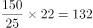棵，则丙队还剩下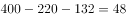棵未完成。

故正确答案为A。

---

### 第 11 题　qid 2033326 · 数学运算

某单位举行大型比赛，其中，舞台布置占总费用的，舞台布置所花费用比原来计划的少用，节约了3000元，问总预算是多少元？

- **A**. 25000
- **B**. 30000
- **C**. 40000　✅
- **D**. 45000

**答案**：C

**官方解析**

设总预算（即总费用）为元，则原计划舞台布置费用为元，实际舞台布置费用为元。根据实际舞台布置费用比原计划少可以列出方程：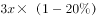，解得，则总预算为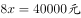。

故正确答案为C。

注：本题表述不严谨，按题目表述更容易理解为“某单位举行大型比赛，其中，（实际）舞台布置占总费用的，（实际）舞台布置所花费用比原来计划的少用，节约了3000元，问总预算是多少元”。此时设总预算为，则实际舞台布置费用为、原计划为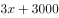，可列出方程：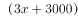，解得元，则总预算元，选项中没有该数据。

因此本题只能理解为“某单位举行大型比赛，其中，（原计划）舞台布置占总费用的，（实际）舞台布置所花费用比原来计划的少用，节约了3000元，问总预算是多少元”。

---

### 第 12 题　qid 2033346 · 数学运算

贾某在停车场停车，每个月前几个小时内收费的基础价格为5元/小时，之后按照基础价格的收费，某月贾某的停车时间为120小时，共交了545元，则按照基础价格停车的时间为多少小时？

- **A**. 8
- **B**. 10　✅
- **C**. 15
- **D**. 20

**答案**：B

**官方解析**

设按照基础价格5元收费的时间为小时，则按照基础价格5元的收费的时间为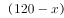小时，根据题意可列方程：，解得。

故正确答案为B。

---

### 第 13 题　qid 2033304 · 数学运算

甲租用乙的地种粮食，今年共收获3000斤粮食，包括大米，玉米和红薯。其中玉米800斤，红薯600斤，如果除租金之外，甲每年须将收获的大米的给乙作为回报，同时将红薯超过粮食总重的的部分也按照给乙作为回报，甲今年一共给乙210斤粮食，那么为多少？

- **A**. 

- **B**. 

　✅
- **C**. 

- **D**. 

**答案**：B

**官方解析**

由题意可得：大米重量斤，需要给乙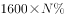斤；红薯重量600斤，其中超过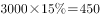斤的部分，即斤，需要给乙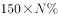斤。

共计斤，解得。

故正确答案为B。

---

### 第 14 题　qid 2033310 · 数学运算

三个学校的志愿队分别去敬老院照顾老人，A学校志愿队每隔7天去一次，B学校志愿队每隔9天去一次，C学校志愿队每隔14天去一次，三个队伍周三第一次同时去敬老院，问下次同时去敬老院是周几？

- **A**. 周三
- **B**. 周四　✅
- **C**. 周五
- **D**. 周六

**答案**：B

**官方解析**

由题意可得：A、B、C三个学校去敬老院的周期分别为8、10、15天，故下一次同时去敬老院的时间为120天（8、10、15的最小公倍数）后。因为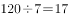个星期余1天，所以周三之后再过120天为周四。

注意：为周期。

故正确答案为B。

---

### 第 15 题　qid 2033312 · 数学运算

某人走失了一只小狗，于是开车沿路寻找，突然发现小狗沿路边往反方向走，车继续行驶30秒后，他下车去追小狗，如果他的速度比小狗快3倍比车慢，问追上小狗需要多长时间？

- **A**. 165秒
- **B**. 170秒　✅
- **C**. 180秒
- **D**. 195秒

**答案**：B

**官方解析**

由“某人的速度比车速慢”可得某人的速度是车的，“某人的速度比小狗快3倍”可得人的速度是小狗的4倍，则速度比为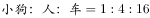，故可赋值三者速度分别为、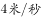、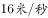。由于发现小狗后，车继续前进30秒，即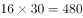米，小狗反方向前行米后，某人才调头追小狗，故追及距离为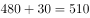米，追及速度为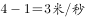，则追及时间为。

故正确答案为B。

---

## 判断推理

### 第 1 题　qid 2033308 · 图形推理

从所给的四个选项中，选择最合适的一个填入问号处，使之呈现一定的规律性：

- **A**. A
- **B**. B
- **C**. C　✅
- **D**. D

**答案**：C

**官方解析**

元素组成不同，优先考虑属性规律。第一组图前两幅图为全曲线图形，第二组图为全直线图形，因此“？”处应选择一个全曲线图形，只有C项为全曲线图形。
故正确答案为C。

---

### 第 2 题　qid 2033316 · 图形推理

从所给的四个选项中，选择最合适的一个填入问号处，使之呈现出一定的规律性：

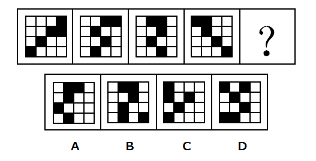

- **A**. A
- **B**. B
- **C**. C　✅
- **D**. D

**答案**：C

**官方解析**

元素组成相同，优先考虑位置规律。十六宫格，中间的四格都是两黑两白，可以将内圈（中间4个格子）和外圈（12个格子）分开看规律。首先内圈的两个小黑块都是顺（逆）时针每次移动一个格子，因此排除A、D两项。
再看外圈小黑块，最右竖排相连的两个小黑块是每次逆时针移动一个格子，最下面的小黑块是每次向右移动一个格子（循环移动），在“？”应该移动到最左面，因此可以排除B项。
故正确答案为C。

---

### 第 3 题　qid 2033322 · 图形推理

从所给的四个选项中，选择最合适的一个填入问号处，使之呈现出一定的规律性：

 

- **A**. A　✅
- **B**. B
- **C**. C
- **D**. D

**答案**：A

**官方解析**

观察图形特征，第一组图形外轮廓相同，内部颜色不同，且第三个图形内部颜色由前两个图形的颜色叠加而成。因此，第二组图形也应符合此特征。
故正确答案为A。

---

### 第 4 题　qid 2033332 · 图形推理

从所给的四个选项中，选择最合适的一个填入问号处，使之呈现出一定的规律性：

- **A**. A
- **B**. B　✅
- **C**. C
- **D**. D

**答案**：B

**官方解析**

观察图形，第一、二行，每行图形都由轮廓相同的左、中、右三个部分构成，且每行图形，均出现三个“空白条”、三个“阴影图”、两个“星图”、一个“四个圆圈图”区域，因此考虑遍历规律。
规律应用第三行中，还缺一个“空白条”、一个“星图”、一个“阴影图”区域，观察选项，只有选项B符合。
故正确选项为B。

---

### 第 5 题　qid 2033336 · 图形推理

从所给的四个选项中，选择最合适的一个填入问号处，使之呈现出一定的规律性：

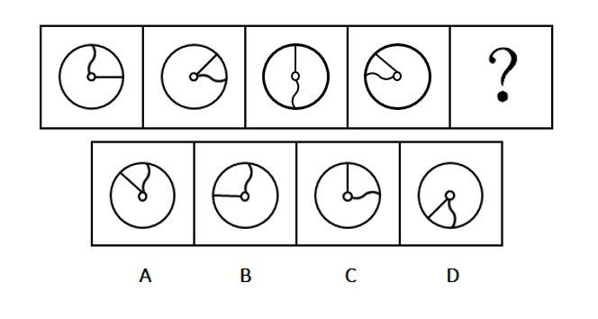

- **A**. A
- **B**. B　✅
- **C**. C
- **D**. D

**答案**：B

**官方解析**

元素组成相同，优先考虑位置规律。每幅图中直线和曲线均围绕圆中心旋转，观察曲线旋转的规律，均顺时针旋转，？处应是前一幅图顺时针旋转得到，排除C、D两项，观察直线旋转的规律，均逆时针旋转，？处应是前一幅图直线逆时针旋转得到，排除A项。

故正确答案为B。

---

### 第 6 题　qid 2033364 · 图形推理

从所给的四个选项中，选择最合适的一个填入问号处，使之呈现出一定的规律性：

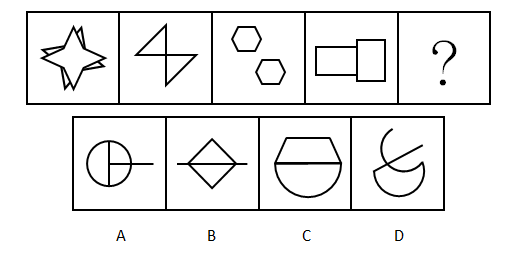

- **A**. A
- **B**. B　✅
- **C**. C
- **D**. D

**答案**：B

**官方解析**

元素组成不同，考虑属性规律和数量规律。
解法一：属性规律分为对称性、曲直性、封闭性，对称、封闭无明显规律，题干所有的图形都是直线图形，而选项A、C、D项含有曲线，故根据曲直性选择B选项。
解法二：考虑数量规律。观察发现，每幅图形都是由两个相同的元素组成，第一幅图是两个四角形，第二幅图是两个三角形，第三幅图是两个六边形，第四幅图是两个长方形，？是也应是由两个相同的元素组成，即B选项，由两个带有直线的三角形组成。
故正确答案为B。

---

### 第 7 题　qid 2033370 · 图形推理

从所给的四个选项中，选择最合适的一个填入问号处，使之呈现出一定的规律性：

- **A**. A
- **B**. B　✅
- **C**. C
- **D**. D

**答案**：B

**官方解析**

元素组成相同，考虑位置规律。

优先看第一组，第一个图形到第三个图形箭头依次逆时针旋转了，第三个图形顺时针旋转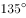得到第四个图形。

应用到第二组找规律，第一个图形到第三个图形依次逆时针旋转了，故“？”处图形应由第三个图形顺时针旋转，只有B项符合。

故正确答案为B。

---

### 第 8 题　qid 2033320 · 图形推理

从所给的四个选项中，选择最合适的一个填入问号处，使之呈现一定的规律性：

- **A**. A
- **B**. B
- **C**. C
- **D**. D　✅

**答案**：D

**官方解析**

元素组成不同，无明显属性规律，考虑数量规律。观察发现存在线条间的交叉，但点和线数量均无规律。
再看第二组第二个图形是五角星的变形图，考虑笔画数。
第一组每幅图都是六个奇点，均为三笔画图形。
第二组前两幅图都有4个奇点，均为两笔画图形，故？处应是两笔画图形。
A项2个奇点一笔画，B项2个奇点一笔画，C项0个奇点一笔画，D项4个奇点两笔画，只有D项符合。
故正确答案为D。

---

### 第 9 题　qid 2033324 · 图形推理

从所给的四个选项中，选择最合适的一个填入问号处，使之呈现一定的规律性：

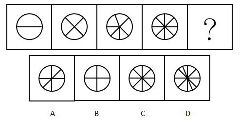

- **A**. A
- **B**. B
- **C**. C
- **D**. D　✅

**答案**：D

**官方解析**

元素组成不同，无属性规律，考虑数量规律。观察发现面居多，优先数面。依次为2、4、6、8，呈等差数列规律，问号处应该是10个面，只有D项符合。
故正确答案为D。

---

### 第 10 题　qid 2033328 · 图形推理

从所给的四个选项中，选择最合适的一个填入问号处，使之呈现一定的规律性：

- **A**. A　✅
- **B**. B
- **C**. C
- **D**. D

**答案**：A

**官方解析**

元素组成不同，无属性和数量规律，观察发现这六个扇形的元素在里层从上逆时针依次是圆形、三角形、正方形，圆形、三角形、？，所以问号处应该是正方形，排除B、D两项。六个扇形的元素在外层上方开始逆时针依次是圆形三角形、圆形正方形、圆形三角形、圆形正方形、圆形三角形、？，所以问号处应该是圆形正方形，排除C项。

故正确答案为A。

---

### 第 11 题　qid 2033376 · 定义判断

智慧城市是运用信息和通信技术整合城市运行各项关键信息，从而对包括民生、环保、公共安全、城市服务、工商业活动在内的各种需求做出智能响应，实现城市智慧式管理和运行。
根据上述定义，下列不属于智慧城市内容的是：

- **A**. 逐步实现多领域跨行业的“一卡通”网
- **B**. 网上“一站式”行政审批及其他公共服务
- **C**. 根据人工智能算法科学合理地规划城市交通网　✅
- **D**. 整合各类监控资源，建立治安综合管理平台

**答案**：C

**官方解析**

第一步：找到定义关键词。
关键词为：“运用信息和通信技术整合城市运行关键信息”、“对各种需求做出智能响应”、“实现智慧式管理和运行”。
第二步：逐一分析选项。
A项：多领域跨行业的“一卡通”是运用了信息和通信技术，对多领域内的需求做出智能响应，实现智慧城市的管理和运行，符合定义；
B项：网上的“一站式”行政审批是运用了信息和通信技术，可以对行政审批的民生需求做出智能响应，实现智慧城市的管理和运行，符合定义；
C项：人工智能算法运用了信息和通信技术，但规划合理的城市公共交通网只是对城市交通进行规划（如道路设置、增设公共汽车、有轨电车、无轨电车、地下铁道、出租汽车等各类交通工具），没有体现智能响应（如果C选项说的是根据人工智能算法，公交车能够自动识别高峰期，每天动态变化，智能调整路线等才符合题干中智能响应的要求），不符合定义；
D项：整合监控资源，建立治安管理平台是运用了信息和通信技术，可以对公共安全的需求做出智能响应，实现智慧城市的管理和运行，符合定义。
本题为选非题，故正确答案为C。

---

### 第 12 题　qid 2033386 · 定义判断

在因果关系十分复杂的科学领域，即使在基本条件相同的条件下，每做一次观察或试验，都可能得到不同的结果。这意味着，我们往往无法根据已知的有限原因精确地预测结果，每做一次预测，也都可能会出现偏差。我们将这种无法精确预测的现象，称为随机现象。
根据上述定义，下列属于随机现象的是：

- **A**. 种瓜得瓜，种豆得豆
- **B**. 郑州每年8月9日的气温　✅
- **C**. 对正常人而言，剧烈运动后会出汗
- **D**. 定量的氢气在氧气中燃烧生成定量的水

**答案**：B

**官方解析**

第一步，找到定义关键词。
关键词为“因果关系十分复杂的科学领域”、“基本条件相同”、“每做一次预测，也都可能会出现偏差”、“无法精准预测”。
第二步，逐一分析选项。
A项：种瓜或豆，一定会得到瓜或豆，不会出现预测的偏差，可以得到精准预测，不符合定义，排除；
B项：“郑州每年8月9日”符合关键词“基本条件相同”，天气预测属于科学领域，但每年同一天的天气情况会因为多种因素影响，无法精准预测出结果，每一次预测都可能出现偏差，符合关键词，符合定义，当选；
C项：在“对正常人而言”这一限定条件下，剧烈运动一定会出汗，不符合关键词“无法精准预测”，不符合定义，排除；
D项：定量的氢气和氧气通过燃烧可以分解出氢原子、氧原子，两个氢原子和一个氧原子生成一个水分子，N个水分子结合成水，是必然现象，不符合关键词“无法精准预测”，不符合定义，排除。
故正确答案为B。

---

### 第 13 题　qid 2033396 · 定义判断

案例教学法是指在教师的指导下，由学生对选定的具有代表性的典型案例，进行针对性地分析、审理和讨论，做出自己的判断和评价。
根据上述定义，下列属于案例教学法的是：

- **A**. 为讲解什么是“正当防卫”，赵老师给出真实案件，把学生分为辩方律师与控方律师进行分析、辩论　✅
- **B**. 为教授无土栽培技术，李老师以“无土栽培番茄”为例进行逐步演示，学生分组动手操作，并完成栽培过程书面报告
- **C**. 为讲解“包产到户”，张老师组织学生到小岗村进行实地考察，与当地农民座谈、讨论、分析“包产到户”的必要性
- **D**. 为传授网线制作的技巧，刘老师播放了一段事先录制好的网线制作视频，供大家观察、讨论和学习

**答案**：A

**官方解析**

第一步：找出定义关键词。
“在教师的指导下”、“学生对选定的具有代表性的典型案例”、“针对性地分析、审理和讨论”、“做出自己的判断和评价”。
第二步：逐一分析选项。
A项：赵老师为讲解“正当防卫”，给出了真实案例，体现了在教师的指导下，把学生分组进行分析、辩论，符合学生对案例进行针对性分析、审理、讨论，体现了学生的主体作用，符合定义，当选；
B项：李老师在教授中自己进行逐步演示，是老师在分析案例，学生直接动手操作，没有体现学生对案例的分析、审理和讨论，不符合定义，排除；
C项：张老师组织学生实地考察，并不是典型案例，学生也没有对案例进行针对性分析，不符合定义，排除；
D项：刘老师播放了事先录制好的网线制作视频，只是为了教授制作技巧，并不是具有代表性的典型案例，学生也没有进行针对性的讨论、分析，不符合定义，排除。
故正确答案为A。

---

### 第 14 题　qid 2033406 · 定义判断

军事侦察侧重于侦查对象是什么，现在什么状态，是一种主动获取的方式。而军事监视侧重于将会发生什么，具有一定的预警功能，是一种相对被动的方式。
根据上述定义，下列属于军事侦察行为的是：

- **A**. 某国在网络设备上开启后门搜集情报
- **B**. 某国间谍在我驻外使馆安装窃听设备
- **C**. 某国军机抵近我沿海军事基地搜集情报　✅
- **D**. 某国在我国周边地区安装大型远程雷达时刻关注我军事动向

**答案**：C

**官方解析**

第一步：找到关键词。
军事侦察：侧重于侦察对象是什么，现在什么状态，主动获取的方式；
军事监视：侧重于将会发生什么，一定预警功能，相对被动的方式。
第二步：逐一分析选项。
A项：在网络设备上开启后门搜索情报，搜集的对象、方式不明确，不符合军事侦察定义，排除；
B项：间谍安装了窃听设备，监视我驻外大使馆的情况，是侧重于大使馆将会发生什么，而不是大使馆目前发生什么，属于军事监视，排除；
C项：军机抵进我沿海军事基地搜集情报，侦察对象是我沿海军事基地，侦察方式是主动侦察，是侧重于侦察我沿海军事基地现在什么状态，符合军事侦察定义，当选；
D项：安装大型远程雷达时刻关注我军事动向，是侧重于我国将会发生什么，有一定预警功能，而不是我军目前发生什么，属于军事监视，排除。
故正确答案为C。

---

### 第 15 题　qid 2033412 · 定义判断

经验科学指偏重于经验事实的描述和明确具体的实用性科学，它旨在探究、描述、说明和预言发生在我们所生活的世界上的事件。因此，经验科学的论断必须由我们经验中的事实来检验，而且仅当它们有经验证据支持时，它们才是可以接受的。
根据上述定义，下列不属于经验科学的是：

- **A**. 逻辑学　✅
- **B**. 星座学
- **C**. 万有引力定律
- **D**. 自由落体定律

**答案**：A

**官方解析**

第一步：找到关键词。
“经验事实的描述”、“明确具体的实用性”、“必须由经验中的事实来检验”。
第二步：逐一分析选项。
A项：逻辑学是研究思维规律的学问，属于哲学范畴，是科学的学科，是基础学科，不是对“经验事实的描述”，也没有“明确具体的实用性”，更不用“经验来检验”，不符合定义；
B项：星座学是对经验事实的描述，需要通过收集大量的案例和数据，才能形成一个较为确定的理论体系，所以星座学是当有经验论据支持时，它是可以接受的，符合定义；
C项：万有引力定律是牛顿在1687年于《自然哲学的数学原理》上发表的，他发现海洋被月球重力所吸引，并且一切行星相互被重力所吸引，彗星同样被太阳的重力所吸引。故得出对经验事实的描述，一切物体，不论是什么，都被赋予了相互的引力原理。有明确具体的实用性，且任何事物均可用此定律来检验，符合定义；
D项：自由落体定律是伽利略通过反复的实验得出的，认为如果不计空气阻力，轻重物体的自由下落速度是相同的，即重力加速度的大小都是相同的。这是对经验事实的描述，有明确具体的实用性，也可以通过其他事物来检验，符合定义。
技巧：C、D项是同构选项，排除。
本题为选非题，故正确答案为A。

---

### 第 16 题　qid 2033418 · 定义判断

事业单位固定资产是指使用期限超过一年，单位价值1000元以上（其中：专用设备单位价值在1500元以上）。并在使用过程中基本保持原有物质形态的资产。单位价值虽未达到规定标准，但是耐用时间在一年以上的大批同类物资，作为固定资产管理。
根据上述定义，下列属于事业单位固定资产的是：

- **A**. 一个价值800元的移动硬盘
- **B**. 每箱价值200元的打印纸100箱
- **C**. 单套价值500元的座椅10套　✅
- **D**. 价值2000元的一批试验用试剂

**答案**：C

**官方解析**

第一步：找到定义关键词。
关键词为①“单位价值1000元以上，使用期限超过一年，并在使用过程中基本保持原有物质形态”；②“单位价值未达规定标准（价值1000元以下），耐用时间在一年以上的大批同类物资”。
符合上述关键词中一个即符合定义。
第二步：逐一分析选项。
A项：单位价值在1000元以下，不符合定义关键词①；移动硬盘耐用时间在一年以上，但是只有一个，不符合定义关键词②，排除；
B项：打印纸单位价值在1000元以下，不符合定义关键词①；同时打印纸是一次性使用，耐用时间不在一年以上，不符合定义关键词②，排除；
C项：座椅单套价值为1000元以下，不符合定义关键词①；同时座椅的耐用时间是在一年以上，符合定义关键词②，当选；
D项：单位价值在1000元以上，对比关键词①，试验用试剂不符合使用过程中基本保持原有物质状态，不符合定义，排除。
故正确答案为C。

---

### 第 17 题　qid 2033424 · 定义判断

自17世纪以来，也许是受到理性精神的鼓舞和科学进步的鼓励，人类思想长期处在逻辑形式主义和科学唯理主义的密云中。到了20世纪上半叶的逻辑实证主义那里，这种思想发展成为一种极端：只有符合逻辑的、可验证的知识才是人类的唯一选择，凡不能由逻辑与实证加以检验的知识都是空想，没有意义。
根据上述观点，下列不属于“空想”的是：

- **A**. 法学
- **B**. 几何学　✅
- **C**. 伦理学
- **D**. 政治学

**答案**：B

**官方解析**

第一步，找到定义关键词。
关键词为“不能由逻辑与实证加以检验的知识”。
第二步，逐一分析选项。
A项，法学是以法律、法律现象及其规律性为研究内容的科学，它是研究与法相关问题的专门学问，是建立在一定经验基础上发展的学科，属于空想，排除；
B项，几何学是运用基本的逻辑推理做出一系列的命题（如几何学中的公理、定理、公式、推导等），当选；
C项，伦理学是关于道德问题的理论，是研究道德的产生、发展、本质、评价、作用以及道德教育、道德修养规律的学说，是建立在一定经验基础上发展的学科，属于空想，排除；
D项，政治学是一门以研究政治行为、政治体制以及政治相关领域为主的社会科学学科，是建立在一定经验基础上发展的学科，属于空想，排除。
本题为选非题，故正确答案为B。

---

### 第 18 题　qid 2033430 · 定义判断

非战争军事行动是指在相对和平环境下，动用军事力量有组织有计划地采取战争以外的军事手段。
根据上述定义，下列属于非战争军事行动的是：

- **A**. 南苏丹武装冲突
- **B**. 2016中俄联演　✅
- **C**. 美军击毙本·拉登
- **D**. 德军打击IS组织

**答案**：B

**官方解析**

第一步：找到定义关键词。
关键词为“相对和平环境”、“动用军事力量”、“有组织有计划”、“战争以外的军事手段”。
第二步：逐一分析选项。
A项：南苏丹的武装冲突采用的是战争手段，不符合关键词“战争以外的军事手段”，不符合定义，排除；
B项：中俄联演发生在相对和平的环境，且联演是动用了两国的军事力量，属于有计划有组织的行动，且没有采取战争手段，符合定义，当选；
C项：美军击毙本·拉登动用的不是战争以外的军事手段，不符合定义，排除；
D项：德军打击IS组织动用的不是战争以外的军事手段，不符合定义，排除。
故正确答案为B。

---

### 第 19 题　qid 2033426 · 定义判断

单工通信是指发送端和接收端的身份是固定的，发送端只能发送信息，不能接收信息。接收端只能接收信息，不能发送信息，数据信号仅从一端传送到另一端，即信息流是单方向的。
根据上述定义，下列不属于单工通信的是：

- **A**. 校园广播
- **B**. 对讲机通话　✅
- **C**. 收音机收听电台
- **D**. 电视机遥控器切换频道

**答案**：B

**官方解析**

第一步：找到定义关键词。
“发送端只能发送不能接收”、“接收端只能接收不能发送”、“信息流是单方向”。
第二步：逐一分析选项。
A项：“校园广播”只能发送消息，不能接收学生们的消息，同样学生也只能接收信息，不能发送，信息流是单方向，符合题干关键词，排除；
B项：“对讲机通话”是双向交流，既可以发送信息又可以接收信息，不符合题干关键词“信息流是单方向”，当选；
C项：“收音机收听电台”只是发送消息，不能接收听众们的信息，注意这里说的是“收听电台”，并不是双向咨询的电台，信息流是单方向，符合题干关键词，排除；
D项：“电视机遥控器切换频道”的工作原理是通过红外线二极管发射出去，电视机接收之后进行解码再执行相应的动作，遥控器只是发送消息，没有接收消息，信息流是单方向，符合题干关键词，排除。
本题为选非题，故正确答案为B。

---

### 第 20 题　qid 2033422 · 定义判断

语言是一种符号系统，任何符号都包含形式和意义两方面。在语法系统里，基本符号是语素，它被定义为“最小的有意义的语言成分”，例如“我喜欢吃葡萄”里的“我”“喜”“欢”“吃”都有意义，而且都不能分割成更小的有意义的单位了，所以“葡萄”也是最小的有意义的语言成分，也是语素。
根据上述定义，下列属于语素的是：

- **A**. 琵琶　✅
- **B**. 人民
- **C**. 衣服
- **D**. 履历

**答案**：A

**官方解析**

第一步：找到定义关键词。
“最小的有意义的语言成分”、“合在一起才有意义”。
第二步：逐一分析选项。
A项：“琵”和“琶”是最小有意义的语言成分，它俩只有合在一起才有意义，符合定义，当选；
B项：“人”和“民”并不是最小有意义的语言成分，还可以再分割，而且两词不在一起，就算单独分开也是具有一定意义的，故不符合定义，排除；
C项：“衣”和“服”并不是最小有意义的语言成分，两词不在一起，就算单独分开也是具有一定意义的，故不符合定义，排除；
D项：“履”和“历”并不是最小有意义的语言成分，而且两词不在一起，就算单独分开也是具有一定意义的，故不符合定义，排除。
故正确答案为A。

---

### 第 21 题　qid 2033344 · 类比推理

鸭子：河

- **A**. 摩天轮：过山车
- **B**. 喜剧：话剧
- **C**. 飞机：飞机场　✅
- **D**. 火车：轨道

**答案**：C

**官方解析**

第一步：判断题干词语间逻辑关系。
鸭子是水禽，可在河中放养，河是鸭子活动的场所。
第二步：判断选项词语间逻辑关系。
A项：摩天轮和过山车是并列关系，都是娱乐设施，不符合题干逻辑关系，排除；
B项：戏剧按戏剧冲突的性质及效果，可分为悲剧、喜剧和正剧，按表现形式，可分为话剧、歌剧、诗剧、舞剧、戏曲等。因此有的喜剧是话剧，有的话剧是喜剧，二者是交叉关系，不符合题干逻辑关系，排除；
C项：飞机停放在飞机场，飞机场也是飞机活动的场所，与题干逻辑关系一致，保留；
D项：火车在轨道上运行，轨道也是火车活动的场所，与题干逻辑关系一致，保留；
比较C、D两项，题干鸭子可在河中活动，也可以在岸上活动，C选项的飞机可以在飞机场中，也可以在天上飞行；火车只能在轨道上运动，因此C选项更加契合题干。
故正确答案为C。

---

### 第 22 题　qid 2033348 · 类比推理

水泥：建房

- **A**. 水杯：解渴
- **B**. 船桨：船帆
- **C**. 瓢：舀水　✅
- **D**. 血：循环

**答案**：C

**官方解析**

第一步：判断题干词语间逻辑关系。
水泥可用来建房，二者是功能对应关系。
第二步：判断选项词语间逻辑关系。
A项：水杯是盛放液体的工具，不可以解渴，水杯中的水及其他饮品才能解渴，不符合题干逻辑关系，排除；
B项：船桨和船帆都是船的一部分，二者是并列关系，不符合题干逻辑关系，排除；
C项：瓢有舀水的功能，二者是功能对应关系，与题干逻辑关系一致，当选；
D项：血的功能是营养和滋润，而不是循环，不符合题干逻辑关系，排除。
故正确答案为C。

---

### 第 23 题　qid 2033350 · 类比推理

书籍：人类进步的阶梯：《进化论》

- **A**. 跑步：使人健康的方式：强壮
- **B**. 语言：心灵的桥梁：汉语　✅
- **C**. 月亮：天空中的小船：天体
- **D**. 舞蹈：流动的符号：表演

**答案**：B

**官方解析**

第一步：判断题干词语间逻辑关系。
书籍是人类进步的阶梯，用“人类进步的阶梯”比喻“书籍”，前两个词是比喻义；第一个词和第三个词，《进化论》是书籍，二者是种属关系。
第二步：判断选项词语间逻辑关系。
A项，跑步是使人健康的方式之一，但“使人健康的方式”没有比喻“跑步”，与题干逻辑关系不一致，排除；
B项，语言是心灵的桥梁，用“心灵的桥梁”比喻“语言”，是比喻义；汉语是语言的一种，是种属关系，与题干逻辑关系一致，当选；
C项，月亮是天空中的小船，用“天空中的小船”比喻“月亮”，是比喻义；但月亮是天体的一种，顺序与题干相反，与题干逻辑关系不一致，排除；
D项，舞蹈是流动的符号，用“流动的符号”比喻“舞蹈”，是比喻义；但舞蹈是表演的一种，顺序与题干相反，与题干逻辑关系不一致，排除。
故正确答案为B。

---

### 第 24 题　qid 2033356 · 类比推理

歌唱家：歌唱：歌曲

- **A**. 厨师：烹饪：食物　✅
- **B**. 学生：学习：考试
- **C**. 律师：法院：案件
- **D**. 清洁工：施肥：垃圾

**答案**：A

**官方解析**

第一步：判断题干词语间逻辑关系。
歌唱家歌唱歌曲，歌唱家是主语，歌唱是谓语，歌曲是宾语，三词构成主谓宾关系。
第二步：判断选项词语间逻辑关系。
A项：厨师烹饪食物，厨师是主语，烹饪是谓语，食物是宾语，三词构成主谓宾关系，与题干逻辑关系一致，当选；
B项：学生是主语，学习考试搭配不当，无法构成主谓宾关系，与题干逻辑关系不一致，排除；
C项：律师是主语，但法院是一个地点，与题干逻辑关系不一致，排除；
D项：清洁工清扫垃圾，而非施肥垃圾，搭配不当，与题干逻辑关系不一致，排除。
故正确答案为A。

---

### 第 25 题　qid 2033358 · 类比推理

报名：培训：结业

- **A**. 高考：招生：毕业
- **B**. 设计：产品：使用
- **C**. 驾驶：公路：旅行
- **D**. 挂号：看病：痊愈　✅

**答案**：D

**官方解析**

第一步：判断题干词语间逻辑关系。
报名、培训、结业这三个事件存在时间先后顺序的对应关系，即先报名再培训，最后结业。
第二步：判断选项词语间逻辑关系。
A项：高考、招生、毕业这三个词并不是时间先后顺序的对应关系，排除；
B项：设计和产品是动宾关系，使用产品也是动宾关系，三者都不是顺序关系，排除；
C项：在公路上驾驶，所以公路与驾驶也无时间先后顺序的对应关系，排除；
D项：挂号、看病、痊愈这三个事件存在时间先后顺序的对应关系，即先挂号再看病，最后痊愈，与题干逻辑关系一致，当选。
故正确答案为D。

---

### 第 26 题　qid 2033366 · 逻辑判断

有人说某地养石斛浇的是富含微量元素的矿泉水，似乎是说该地石斛的品质跟这种矿泉水有关。
为了验证这个结论，下列哪种实验方法最可靠？

- **A**. 选一些不同品种、等级的石斛，用富含微量元素的矿泉水浇养，然后检验比较它们的品质
- **B**. 选择品种、等级等完全相同的石斛，一半用富含微量元素的矿泉水浇养，一半用普通水浇养，然后比较它们的品质　✅
- **C**. 检验和比较用富含微量元素的矿泉水浇养和用普通水浇养的石斛的品质
- **D**. 选一种优良品种、等级高的石斛用富含微量元素的矿泉水浇养，然后与普通水浇养的普通石斛做品质比较

**答案**：B

**官方解析**

第一步：找到论点和论据。
论点：该地石斛品质与矿泉水有关。
论据：有人说某地养石斛浇的是富含微量元素的矿泉水。
第二步：逐一分析选项。
A项：选择不同品种和等级的石斛，属于样本选择不科学，即使用含有微量元素的矿泉水浇养也无法比较出石斛品质的差别，无法验证题干结论，排除；
B项：选择品种和等级相同的石斛，样本选取科学，一半用富含微量元素的矿泉水浇养，一半用普通水浇养，可以有效地比较出同一样本的不同品质，可以验证题干结论，当选；
C项：并没有提到检验的是否为同一品种的石斛，样本不一致会导致得出的结果不科学，属于不明确选项，排除；
D项：用矿泉水浇养优良品种石斛，用普通水浇养普通石斛，无法验证富含微量元素矿泉水对石斛品质是否有影响这一结论，排除。
故正确答案为B。

---

### 第 27 题　qid 2033374 · 逻辑判断

某市工商局的员工数量较五年前减少了数百人，但新办企业办证时间减少了一周。由此可以得出结论：目前该市工商局的员工工作效率较五年前有明显的提高。
以下各项如果为真，不能支持上述论证的是：

- **A**. 该工商局增加了新办企业办证的环节
- **B**. 该工商局管理力度较五年前有明显加强
- **C**. 该市新办企业数量较五年前也有大幅减少　✅
- **D**. 新办企业办证时间主要取决于人员办事的速度

**答案**：C

**官方解析**

第一步：找到论点论据。
论点：该市工商局的员工工作效率较五年前有明显的提高。
论据：该市工商局的员工数量较五年前减少了数百人，新办企业办证时间减少了一周。
第二步：逐一分析选项。
A项：增加了新办企业办证的环节，说明工作量不减反增，在人数减少的情况下，工作量变大了，但是办证时间减少了，证明工作效率确实是提高了，补充论据加强论点，属于加强选项，排除；
B项：相较五年前工商局管理力度明显加强，管理好了，则效率在一定程度上可以提高，补充论据解释论点，属于加强选项，排除；
C项：工作效率等于单位时间内的工作量，效率除了与办证时间有关之外，还与办证数量有关，C项说新办企业数量较五年前有减少，属于反面补充范围，削弱论证，属于削弱选项，当选；
D项：办证时间取决于办事的速度，时间减少了，办证速度也提升，速度提升就是效率提高了，可以加强论证，属于加强选项，排除。
本题为选非题，故正确答案为C。

---

### 第 28 题　qid 2033380 · 类比推理

已知一次英语考试甲、乙、丙、丁的成绩如下：甲、乙的成绩之和等于丁、丙的成绩之和，如果把乙和丁的成绩互换，甲和丁的成绩之和大于乙和丙的成绩之和，乙的成绩比甲、丙的成绩都高。
根据以上所知，下列哪项为真？

- **A**. 甲的成绩最高
- **B**. 乙的成绩最高
- **C**. 丙的成绩最高
- **D**. 丁的成绩最高　✅

**答案**：D

**官方解析**

根据题干条件可知： 

①，②，③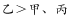； 

根据③，甲、丙的成绩不能是最高的，排除A、C两项。

由②—①推出：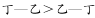（大于号两边减去相同的数大于号方向不变）。

为正数，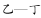为负数，即。

故正确答案为D。

---

### 第 29 题　qid 2033384 · 逻辑判断

甜品店有四种甜品：双皮奶、布丁、蛋糕和冰淇淋。B比A贵，C最便宜，双皮奶比布丁贵，蛋糕最贵，冰淇淋比D贵。
关于这四种甜点，下列说法正确的是：

- **A**. A是双皮奶，B是蛋糕，C是冰淇淋，D是布丁
- **B**. A是布丁，B是冰淇淋，C是蛋糕，D是双皮奶
- **C**. A是冰淇淋，B是蛋糕，C是布丁，D是双皮奶　✅
- **D**. A是冰淇淋，B是蛋糕，C是双皮奶，D是布丁

**答案**：C

**官方解析**

第一步：分析题干条件。
（1）B&gt;A
（2）C最便宜
（3）双皮奶&gt;布丁
（4）蛋糕最贵
（5）冰淇淋&gt;D
第二步：根据题干条件进行推理。
题干信息确定，选项信息充分，优先考虑排除法。
根据条件（2）可知其它食物的价格均比C食物贵。
根据条件（3）可知双皮奶不是最便宜的C食物，故排除D项；
根据条件（4）可知蛋糕不是最便宜的C食物，故排除B项；
根据条件（5）可知冰淇淋不是最便宜的C食物，故排除A项。
故正确答案为C。

---

### 第 30 题　qid 2033390 · 逻辑判断

三人在一起猜测晚会节目的顺序。甲说：“一班第一个出场，二班第三个出场。”乙说：“三班第一个出场，四班第四个出场。”丙说：“四班第二个出场，一班第三个出场。”结果公布后，发现他们的预测都只对了一半。
由以上可以推出，节目的正确出场顺序是：

- **A**. 四班第一，三班第二，一班第三，二班第四
- **B**. 二班第一，一班第二，三班第三，四班第四
- **C**. 三班第一，四班第二，二班第三，一班第四　✅
- **D**. 一班第一，二班第二，四班第三，三班第四

**答案**：C

**官方解析**

由题干可知每人只对了一半，是一道题干信息真假不确定的排列组合，考虑代入法，代入选项后符合每人的预测都只对了一半即为正确答案。
A项：根据选项信息可知，甲说一班第一个出场错误，二班第三个出场错误，甲全错，与题干条件每人的预测都只对了一半不符，排除；
B项：根据选项信息可知，甲说一班第一个出场错误，二班第三个出场错误，甲全错，与题干条件每人的预测都只对了一半不符，排除；
C项：根据选项信息可知，甲说一班第一个出场错误，二班第三个出场正确，甲符合；乙说三班第一个出场正确，四班第四个出场错误，乙符合；丙说四班第二个出场正确，一班第三个出场错误，丙符合，三人预测都只对了一半，满足题干条件，当选；
D项：根据选项信息可知，甲说一班第一个出场正确，二班第三个出场错误，甲符合；乙说三班第一个出场错误，四班第四个出场错误，乙全错，与题干条件每人的预测都只对了一半不符，排除。
故正确答案为C。

---

### 第 31 题　qid 2033394 · 类比推理

把红、黄、蓝、绿、紫五个小球放在五个排成一列的抽屉里，序号为A、B、C、D、E。要求:黄球放在绿球和紫球前面，蓝球不能放在B抽屉里，红球和绿球之间隔着一个抽屉。
问黄球放在哪个抽屉时，五个球的排放顺序是唯一的？

- **A**. B抽屉
- **B**. C抽屉　✅
- **C**. D抽屉
- **D**. E抽屉

**答案**：B

**官方解析**

该题需要将不同颜色的球和抽屉顺序做匹配，为排列组合题，优先用代入排除法，问黄球放在哪个抽屉时，五个球的排放顺序是唯一的，4个选项依次代入，满足要求即为正确答案。
A项，假设黄球放在B抽屉，根据题干要求，黄球在绿球和紫球的前面，红球和绿球隔一个，蓝球不在B，可以有蓝黄红紫绿、蓝黄绿紫红等排放顺序，并不唯一，排除；
B项，假设黄球放在C抽屉，根据题干要求，黄球在绿球和紫球的前面，红球和绿球隔一个，蓝球不在B，只有蓝红黄绿紫唯一的排放顺序，当选；
C项，假设黄球放在D抽屉，如果黄球放在D抽屉，题干要求黄球在绿球和紫球的前面，黄球后面只剩一个抽屉，无法同时放绿球和紫球，不满足题干要求，排除；
D项，假设黄球放在E抽屉，如果黄球放在E抽屉，与C项同理，题干要求黄球在绿球和紫球的前面，黄球后面没有抽屉，无法放绿球和紫球，不满足题干要求，排除。
故正确答案为B。

---

### 第 32 题　qid 2033398 · 逻辑判断

甲乙丙丁四个人高考前对英语成绩进行预测。当时，甲说：“我再怎么努力也考不了90分。”乙说：“不知道自己能考多少分，但是我知道丙能考90分。”丙说：“不会考到80分。”丁说：“乙不会考的比60分还低。”事实上只有一个人猜对了。
以下哪个结论不支持乙猜对了？

- **A**. 丁考得比甲好
- **B**. 乙考得不是最差的　✅
- **C**. 甲和丙考得一样高
- **D**. 丙和丁考得一样高

**答案**：B

**官方解析**

本题为真假推理题。经过老师们的一致教研，粉笔认为本题题干信息不充分，根据题干已知信息并结合选项推不出答案，而丙的话按照正常语句构成来说少了一个主语。发现题干信息均未涉及丁，而选项中反复出现丁，故认为此处丙的话可能是“丁不会考到80分”，将此条件补齐进行推理可知：
第一步：分析题干。
列出题干已知信息：
甲：甲＜90分，乙：丙≥90分，丙：丁＜80分，丁：乙≥60分。
提问方式中明确指出不支持乙猜对，那么，我们根据乙说的为真话，又只有一个人猜对，可知其余人都说假话，可以得出如下结论：甲≥90分、丙≥90分、丁≥80分、乙＜60分。
第二步：分析选项。
本题采用代入法，假设A、C、D三项为真代入题干，均与题干无冲突。代入B项，乙考的不是最差的，与上一步推出的结论乙＜60分，是四个人中成绩最差的有冲突，因此B项不能支持乙的猜测。
本题为选非题，故正确答案为B。

---

### 第 33 题　qid 2033400 · 逻辑判断

某市多年来一直存在人才外流的现象，但自从大学城搬迁到该市后，出现了名校毕业生在该市就业难的现象，因此有人认为该市就业难是大学城搬迁带来的。
以下哪项如果为真，最能支持上述结论？

- **A**. 周围其他市依旧存在人才外流现象
- **B**. 本市的企业在2年内增长了3倍　✅
- **C**. 本市大学城搬迁前也存在就业难的现象
- **D**. 本市政府出台政策鼓励学生自主创业

**答案**：B

**官方解析**

第一步：找到论点论据。
论点：该市就业难是大学城搬迁带来的。
论据：某市多年来一直存在人才外流的现象，但自从大学城搬迁到该市后，出现了名校毕业生在该市就业难的现象。
第二步：逐一分析选项。
A项：周围其他市也存在人才外流的情况，与该市是因为什么原因导致就业难是两件不同的事情，无关选项，排除；
B项：就业涉及到就业人员与企业双方面的因素，本市企业增多说明不是企业少的因素导致就业难，即就业人员增加是就业难的原因，大学城搬迁可以导致就业人数增加，补充论据，加强，当选；
C项：搬迁之前也有这种情况，说明搬迁没有导致就业难，削弱题干论点，排除；
D项：政府鼓励自主创业，但是否有成效并不确定，对毕业生的影响也无法判断，且毕业生就业的情况并未提及，无关选项，排除。
故正确答案为B。

---

### 第 34 题　qid 2033416 · 逻辑判断

小丽一大早到公司，发现自己桌子上有一束玫瑰花，同事小王经过仔细分析，认为是客户张总送的，小丽则认为不可能。但是小王说，其他的可能性都被排除了，剩下的可能性不管看起来多荒谬，都是真的。
以下哪项如果为真，最能削弱小王的说法？

- **A**. 小王不可能比小丽更了解张总
- **B**. 逻辑推理不一定能得出更多答案
- **C**. 张总是公认的浪漫的人
- **D**. 小王不可能穷尽所有的可能性　✅

**答案**：D

**官方解析**

第一步：找到论点论据。
论点：小王认为小丽的花是张总送的。
论据：其他送花的可能性都被排除了。
第二步：逐一分析选项。
A项：强调的是小王没有小丽了解张总，这与论点所说的张总是否送花给小丽之间无必然联系，排除；
B项：讨论的是逻辑推理能不能得出更多答案的问题，与论点中“小王认为小丽的花是张总送的”无关，不能削弱，排除；
C项：强调张总是浪漫的人，这还是未告知我们张总是否有送花给小丽，排除；
D项：强调小王不可能穷尽所有可能性，与题干中小王所说的已经排除了其他送花的可能性矛盾，直接削弱论据，当选。
故正确答案为D。

---

### 第 35 题　qid 2033420 · 类比推理

甲乙丙丁同住一寝室，有人问他们：“你们当中谁会的语言最多？”甲说：“我不会说英语，当乙和丙交谈时，我能用外语给他们翻译。”乙说：“我是英国人，丁不会说英语，但我俩可以毫无困难地交流。”丙说：“我和丁交流时，需要乙来帮忙翻译。”丁说：“我们四个人不能同时用一种语言交流。”
据此可以推断出四个人中谁会的语言最多？

- **A**. 甲
- **B**. 乙　✅
- **C**. 丙
- **D**. 丁

**答案**：B

**官方解析**

注：本题不严谨，考试时考场临时通知修改了题目，将“三个人”修改为“四个人”，但是修改后仍然有问题，如果进行推理需要假设非常多情况并且得不出来确定结论。此外，从命题人的出题角度看，也不会让考生在考试时进行过于复杂的假设和推理，因此，本题在考试的时候可采用以下思路快速解题：
分析题干可知，甲不会说英语，丁不会说英语，丙和丁交流的时候需要乙做翻译，说明丙不会丁的语言，故甲、丙、丁都至少有一种不会的语言。此时，如果乙会所有语言，与题干要求并不矛盾，那么可以猜测乙会的语言可能最多。
故正确答案为B。

---

## 资料分析

### 材料 1

        2015年年末全国公路总里程457.73万公里，其中技术等级公路里程404.63万公里，占公路总里程的比重比上一年提高1.0个百分点。

        各行政等级公路里程分别为：国道18.53万公里、省道32.97万公里、县道55.43万公里、乡道111.32万公里、专用公路8.17万公里，比上年末分别增加0.61万公里、0.69万公里、0.23万公里、0.81万公里和0.14万公里。

         全国高速公路里程12.35万公里，比上年末增加1.16万公里。其中，国家高速公路7.96万公里，增加0.65万公里。全国高速公路车道里程54.84万公里，增加5.28万公里。

#### 第 1 题　qid 2033368 · 增长

2012~2015年，全国公路密度同比增量最低的年份是：

- **A**. 2012
- **B**. 2013
- **C**. 2014　✅
- **D**. 2015

**答案**：C

**官方解析**

由题干“同比增量最低的年份是”，可判定该题是增长量比较问题。定位图1数据，增长量=现期量-基期量，因此全国公路密度同比增长：

2012年：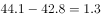；2013年：；

2014年：；2015年：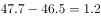。

所以2014年全国公路密度同比增量最低。

故正确答案为C。

---

#### 第 2 题　qid 2033378 · 增长

2015年全国公路总里程比2014年增长：

- **A**. 
不到
　✅
- **B**. 
~之间

- **C**. 
~之间

- **D**. 
超过

**答案**：A

**官方解析**

由题干“2015年······比2014年增长”，结合选项都为百分数，可判定本题是一般增长率计算问题。定位图1数据，2014年全国公路总里程446.4万公里，2015年全国公路总里程457.7万公里，。

故正确答案为A。

---

#### 第 3 题　qid 2033382 · 比重

2015年三级及以上技术等级公路里程占公路总里程的比重为：

- **A**. 两成以下
- **B**. 两成多　✅
- **C**. 三成多
- **D**. 四成多

**答案**：B

**官方解析**

由题干“2015年······占······比重为”，可判定本题是现期比重问题。定位文字材料第一段和表1，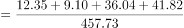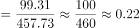，比重为两成多。

故正确答案为B。

---

#### 第 4 题　qid 2033388 · 增长

2015年各行政等级公路里程同比增量由低到高排序正确的是：

- **A**. 专用公路、县道、省道、国道、乡道
- **B**. 专用公路、县道、国道、乡道、省道
- **C**. 县道、专用公路、国道、省道、乡道
- **D**. 专用公路、县道、国道、省道、乡道　✅

**答案**：D

**官方解析**

由题干“由低到高排序正确的是”，可判定该题是排序类问题。定位文字资料第二段，可知国道、省道、县道、乡道、专用公路的同比增量分别为0.61万公里、0.69万公里、0.23万公里、0.81万公里、0.14万公里，故2015年各行政等级公路里程同比增量由低到高排序为：专用公路、县道、国道、省道、乡道。
故正确答案为D。

---

#### 第 5 题　qid 2033392 · 综合

关于2015年全国公路状况，能够从上述材料中推出的是：

- **A**. 
国家高速公路里程增加了以上

- **B**. 
全国高速公路平均车道数在5~6之间

- **C**. 
等级外公路里程占公路总里程的一成以下

- **D**. 
国道里程增速快于省道里程增速
　✅

**答案**：D

**官方解析**

A项：，错误；

B项：最后一段，全国高速公路里程12.35万公里，全国高速公路车道里程54.84万公里。每个车道的平均里程等于高速公路里程，所以平均车道数，错误；

C项：，错误；

D项：，首数商3；，首数商2，明显前者大于后者，正确。

故正确答案为D。

---

### 材料 2

        2015年全国发电量为56184亿千瓦时，其中，火力发电量为42102亿千瓦时，占全部发电量的；水力发电量为9960亿千瓦时，同比增长。 

        2015年12月份，全国重点电厂供煤11240万吨，环比增长，同比下降，耗煤11211万吨，环比增长，同比减少。

#### 第 6 题　qid 2033330 · 增长

2009~2015年，全国发电量增速最高和最低的年份，其发电量增速相差几个百分点？

- **A**. 13.81　✅
- **B**. 13.15
- **C**. 12.93
- **D**. 12.71

**答案**：A

**官方解析**

定位表格可得，2009~2015年，全国发电量增速最高年份为2010年，增速为；增速最低年份为2015年，增速为，增速差。

故正确答案为A。

---

#### 第 7 题　qid 2033334 · 综合

2009年~2015年，全社会发电量超过用电量300亿千瓦时的年份有几个？

- **A**. 6
- **B**. 5
- **C**. 4　✅
- **D**. 3

**答案**：C

**官方解析**

定位表格可得，2009~2015年每年的发电量与用电量差值分别为：

2009年：；2010年：；2011年：；

2012年：；2013年：；2014年：；

2015年：。

超过300亿千瓦时的年份有4个，分别是2009、2013、2014、2015年，共4个年份。

故正确答案为C。

---

#### 第 8 题　qid 2033338 · 增长

2013年火力发电量约比上年增长：

- **A**. 

- **B**. 

- **C**. 

　✅
- **D**. 

**答案**：C

**官方解析**

由问题所求“2013年火力发电量比上年增长”，且选项为百分数，可判定本题为增长率计算问题。定位表格可得，2013年火力发电量为42470亿千瓦时，2012年火力发电量为38928亿千瓦时，增长率，C项最接近。

故正确答案为C。

---

#### 第 9 题　qid 2033340 · 综合

2015年12月份全国重点电厂供煤量约比11月多多少亿吨？

- **A**. 0.2　✅
- **B**. 0.4
- **C**. 0.7
- **D**. 0.9

**答案**：A

**官方解析**

由问题所求“2015年12月······比11月多多少亿吨”可判定本题为增长量计算问题。定位文字材料第二段可得，2015年12月，全国重点电厂供煤量为11240万吨，环比增长。增长率介于与之间，约等于，故增长量。

故正确答案为A。

---

#### 第 10 题　qid 2033342 · 综合

根据材料，下列说法正确的是：

- **A**. “十二五”期间发电量增速高于上年水平的年份有2个
- **B**. 2012年火力发电量占全国发电量比重高于上年水平
- **C**. 2015年12月末全国重点电厂煤库存高于11月末水平　✅
- **D**. 表中全国发电量环比下降的年份，全社会用电量也环比下降

**答案**：C

**官方解析**

A项：“十二五”即2011~2015年，定位表格可得，发电量增速高于上年的只有2013年，错误；

B项：两期比重比较，只需比较部分增长率与整体增长率的大小关系。定位表格可得，2012年火力发电量为38928亿千瓦时，2011年火力发电量为38337亿千瓦时，则2012年火力发电量增长率；2012年全国发电量增长率，，因此2012年比重比2011年下降，错误；

C项：12月末库存11月末库存12月供煤量12月耗煤量，比较12月末库存与11月末库存，仅需计算12月供煤量12月耗煤量，定位文字材料第二段可得，12月供煤量12月耗煤量万吨，因此2015年12月末库存比11月末库存多，正确；

D项：定位表格可得，全国发电量环比下降的年份为2015年，2015年全社会用电量高于2014年，环比上升，错误。

故正确答案为C。

---

### 材料 3

        2015年中国电子商务市场交易规模16.4万亿元，增长。其中网络购物增长，在线旅游增长，本地生活服务O2O增长。2015年中国移动网购市场交易规模达2.1万亿元，同比增长。

#### 第 11 题　qid 2033402 · 综合

2014年网络购物交易规模在以下哪个范围内？

- **A**. 超过7万亿元
- **B**. 5~7万亿元
- **C**. 3~5万亿元
- **D**. 不到3万亿元　✅

**答案**：D

**官方解析**

根据“2014年网络购物交易规模在以下哪个范围内”可知，判断本题为基期计算问题。定位文字材料和图表，2015年中国电子商务市场交易规模16.4万亿元，2015年网络购物所占比重为，且网络购物增长，则2014年网络购物交易规模为，首数商不到3，因此低于3万亿元。

故正确答案为D。

---

#### 第 12 题　qid 2033404 · 综合

2015年中小企业B2B电子商务交易规模约是网络购物的多少倍？

- **A**. 1.1
- **B**. 1.4
- **C**. 1.9　✅
- **D**. 2.5

**答案**：C

**官方解析**

根据“2015年中小企业B2B电子商务交易规模约是网络购物的多少倍”可知，判定此题为现期比重问题。定位图表，2015年中小企业B2B电子商务交易规模占中国电子商务市场的比重为，2015年网络购物占中国电子商务市场的比重为，则前者为后者的倍。

注意：在整体量一致的前提下，各部分量之比等于比重之比。

故正确答案为C。

---

#### 第 13 题　qid 2033408 · 比重

2015年中国移动网络购物市场交易规模占网络购物比重约为：

- **A**. 

- **B**. 

- **C**. 

　✅
- **D**. 

**答案**：C

**官方解析**

根据“2015年中国移动网购市场交易规模占网络购物的比重”可知，判定此题为现期比重的计算问题。定位文字材料，2015年中国电子商务市场交易规模16.4万亿元，······2015年中国移动网购市场交易规模达2.1万亿元；定位饼状图2015年网络购物占中国电子商务市场交易规模的比重为。则2015年网络购物交易规模为万亿元，故所求比重为。

故正确答案为C。

---

#### 第 14 题　qid 2033410 · 增长

2015年在线旅游市场交易规模约增长了多少万亿元？

- **A**. 0.12　✅
- **B**. 0.22
- **C**. 0.33
- **D**. 0.43

**答案**：A

**官方解析**

根据“2015年在线旅游市场规模约增长了多少”可知，判定此题为增长量计算问题。定位文字材料和图表，2015年中国电子商务市场交易规模16.4万亿元，在线旅游所占比重为，且增长，则在线旅游市场规模增长量为，直除有效数字首位为1，只有A项满足。

故正确答案为A。

---

#### 第 15 题　qid 2033414 · 综合

能够从上述材料中推出的是：

- **A**. 2018年中国电子商务市场交易规模将超过2016年的1.5倍
- **B**. 2015年在线旅游市场交易规模增长率高于本地生活服务O2O市场　✅
- **C**. 本地生活服务O2O市场2015年交易规模增长率低于网络购物市场
- **D**. 2012~2015年电子商务市场交易规模增长率均高于网络购物市场

**答案**：B

**官方解析**

A项：定位图表，2016、2018年电子商务市场交易规模为19.7万亿元、27.3万亿元，则后者是前者的倍，错误；

B项：定位文字材料，2015年在线旅游交易市场规模增长，本地生活服务O2O交易规模增长，前者高于后者，正确；

C项：定位文字材料，本地生活服务O2O交易规模增长，网络购物市场增长，前者高于后者，错误；

D项：定位文字材料，以2015年为例，中国电子商务市场交易规模增长，网络购物市场增长，前者低于后者，错误。

故正确答案为B。

---

### 材料 4

       2015年，全国文化及相关产业增加值27235亿元，比上年增长（未扣除价格因素）。在2014年增长的基础上继续保持两位数增长，呈快速增长态势。2015年文化及相关产业增加值占GDP的比重为，比上年提高0.16个百分点。

       2015年，代表文化内容的“文化产品的生产”创造的增加值为17071亿元，而“文化相关产品的生产”创造的增加值为10165亿元；且“文化产品的生产”作为我国文化产业的主体，增速达，远高于“文化相关产品的生产”的的增速。从产品类型看，文化制造业增加值11053亿元，比上年增长，占，文化批发零售业增加值2542亿元，增长，占；文化服务业增加值13640亿元，增长，占。

       2015年文化休闲娱乐服务业和以“互联网+”为主要形式的文化信息传输服务业实现增加值分别为2044亿元和2858亿元，增速分别达和，占文化及相关产业的比重分别为和，均比上年提高0.5个百分点；广播电视电影服务业实现增加值1227亿元，占比，比上年提高0.2个百分点，文化创意和设计服务业实现增加值4953亿元，增长，占比，比上年提高0.4个百分点。

#### 第 16 题　qid 2033352 · 增长

2013年全国文化及相关产业的增加值约为多少万亿元？

- **A**. 1.8
- **B**. 2.0
- **C**. 2.2　✅
- **D**. 2.5

**答案**：C

**官方解析**

根据题干“2013年……增加值”结合材料年份可判定此题为间隔基期量问题。定位文字材料第一段“2015年，全国文化及相关产业增加值27235亿元，比上年增长（未扣除价格因素），在2014年增长的基础上…”，间隔增长率,万亿元。

故正确答案为C。

---

#### 第 17 题　qid 2033354 · 比重

2015年，“文化产品的生产”创造的增加值占全国文化及相关产业增加值的比重比“文化相关产品的生产”创造的增加值所占比重高出约：

- **A**. 

- **B**. 

　✅
- **C**. 

- **D**. 

**答案**：B

**官方解析**

根据题干“2015年……所占比重”可判定此题为现期比重问题。定位文字材料第一段“2015年，全国文化及相关产业增加值27235亿元”和文字材料第二段“2015年，‘文化产品的生产’创造的增加值为17071亿元，‘文化相关产品的生产’创造的增加值为10165亿元”可知比重差为。

故正确答案为B。

---

#### 第 18 题　qid 2033360 · 比重

2014年，文化休闲娱乐服务业和文化信息传输服务业增加值占文化及相关产业增加值的比重约为：

- **A**. 

- **B**. 

　✅
- **C**. 

- **D**. 

**答案**：B

**官方解析**

定位文字材料第三段“2015年文化休闲娱乐服务业和文化信息传输服务业增加值分别为…，占文化及相关产业的比重分别为和，均比上年提高0.5个百分点”，则2014年，文化休闲娱乐服务业和文化信息传输服务业增加值占文化及相关产业的比重约为。

故正确答案为B。

---

#### 第 19 题　qid 2033362 · 增长

下列各项中，2015年增加值增速最高的是：

- **A**. 文化制造业
- **B**. 文化服务业　✅
- **C**. 文化相关产品
- **D**. 文化产品的生产

**答案**：B

**官方解析**

定位文字材料第二段“文化制造业比上年增长”“文化服务业增长”“文化相关产品的增速”和“文化产品的生产增速达”可知，B项文化服务业增长最大。

故正确答案为B。

---

#### 第 20 题　qid 2033372 · 综合

能够从上述材料中推出的是：

- **A**. 
2014年文化及相关产业的增加值占GDP比重超过

- **B**. 
2015年文化制造业增加值占文化及相关产业的比重高于2014年

- **C**. 
2015年文化创意和设计服务业增加值占文化服务业的比重高于2014年 

- **D**. 
2015年文化服务业增加值增量高于文化制造业增量 
　✅

**答案**：D

**官方解析**

A项：根据文字材料第一段可知，，错误；

B项：根据文字材料第一段“2015年，全国文化及相关产业增加值27235亿元，比上年增长”和文字材料第二段“文化制造业比上年增长”可知，，即部分量的增长率总体量的增长率，故比重下降，错误；

C项：根据文字材料第三段“文化创意和设计服务增加值增长”和文字材料第二段“文化服务业增长”可知，，即部分量的增长率总体量的增长率，故比重下降，错误；

D项：根据文字材料第二段“文化服务业增加值13640亿元，增长”和“文化制造业增加值11053亿元，比上年增长”可知，文化服务业现期量13640亿元文化制造业11053亿元，文化服务业增长率文化制造业，大大则大，2015年文化服务业增加值增量高于文化制造业增量，正确。

故正确答案为D。

---
