# 2016年深圳市公务员录用考试《行测》题

> 省考 · 2016 年 · 5 个模块 · 共 95 题

- [常识判断](#%E5%B8%B8%E8%AF%86%E5%88%A4%E6%96%AD) · 20 题
- [言语理解与表达](#%E8%A8%80%E8%AF%AD%E7%90%86%E8%A7%A3%E4%B8%8E%E8%A1%A8%E8%BE%BE) · 30 题
- [数量关系](#%E6%95%B0%E9%87%8F%E5%85%B3%E7%B3%BB) · 10 题
- [判断推理](#%E5%88%A4%E6%96%AD%E6%8E%A8%E7%90%86) · 20 题
- [资料分析](#%E8%B5%84%E6%96%99%E5%88%86%E6%9E%90) · 15 题

---

## 常识判断

### 第 1 题　qid 1770712 · 科技常识

我国目前应对雾霾污染，改善空气质量的重要任务之一是控制PM2.5，PM2.5是（  ）。

- **A**. 在空气中（浓度）越高，质量越好
- **B**. 与较粗的大气颗粒物相比，PM 2.5粒径小、面积大、活性强，更易附带病毒、有害物质　✅
- **C**. 在大气中的滞留时间长，输送距离短
- **D**. 直径小于等于2.5纳米的细颗粒物

**答案**：B

**官方解析**

PM2.5细颗粒物指环境空气中空气动力学当量直径小于等于 2.5 微米的颗粒物。它能较长时间悬浮于空气中，其在空气中浓度越高，就代表空气污染越严重。虽然PM2.5只是地球大气成分中含量很少的组分，但它对空气质量和能见度等有重要的影响。与较粗的大气颗粒物相比，PM2.5粒径小，面积大，活性强，易附带有毒、有害物质（例如重金属、微生物等），且在大气中的停留时间长、输送距离远，因而对人体健康和大气环境质量的影响更大。
A项浓度越高空气质量越差，故表述错误。
B项表述正确。
C项表述错误，PM2.5滞留时间长，输送距离远。
D项表述错误，单位是微米而不是纳米。
故正确答案为B。

---

### 第 2 题　qid 1772188 · 人文常识

党员干部违反有关规定从事营利活动，拥有（  ）的股份或者证券、情节较轻的，给予警告或者严重警告处分。

- **A**. 股份有限公司
- **B**. 外资公司
- **C**. 债券型上市公司
- **D**. 非上市公司（企业）　✅

**答案**：D

**官方解析**

根据《中国共产党纪律处分条例》第九十四条规定：违反有关规定从事营利活动，有下列行为之一，情节较轻的，给予警告或者严重警告处分；情节较重的，给予撤销党内职务或者留党察看处分；情节严重的，给予开除党籍处分：
（一）经商办企业的；
（二）拥有非上市公司（企业）的股份或者证券的；
（三）买卖股票或者进行其他证券投资的；
（四）从事有偿中介活动的；
（五）在国（境）外注册公司或者投资入股的；
（六）有其他违反有关规定从事营利活动的。
利用职权或者职务上的影响，为本人配偶、子女及其配偶等亲属和其他特定关系人的经营活动谋取利益的，依照前款规定处理。
违反有关规定在经济实体、社会团体等单位中兼职，或者经批准兼职但获取薪酬、奖金、津贴等额外利益的，依照第一款规定处理。
故正确答案为D。

---

### 第 3 题　qid 1772190 · 人文常识

制约人民群众创造活动的首要因素是（  ）。

- **A**. 社会政治
- **B**. 社会经济　✅
- **C**. 精神文化
- **D**. 意识形态

**答案**：B

**官方解析**

题干中设问为首要因素，意味着在四个选项中要选择最基本、最直接、影响最大最深远的。根据马克思历史唯物主义的观点，人民群众是历史的主体，是历史的创造者，是历史变更的决定性力量，人民群众在创造历史的过程中会受到诸多因素的影响，其中最根本的还是生产力和生产关系、经济基础和上层建筑之间的关系。比较ABCD四个选项，最符合上述表述的是B项，经济基础决定上层建筑，比如社会经济的发展到了资本主义雇佣的时期，那势必会影响人民去改革现有的政治体制，以适应新的资本主义的经济体制。
故正确答案为B。

---

### 第 4 题　qid 1772194 · 人文常识

关于供给侧结构性改革，表述不正确的是（  ）。

- **A**. 是一种寻求经济增长新动力
- **B**. 加速消化过剩产能
- **C**. 提高劳动力质量是其路径之一
- **D**. 其核心是提高供给总量　✅

**答案**：D

**官方解析**

供给侧结构性改革，就是从提高供给质量出发，用改革的办法推进结构调整，矫正要素配置扭曲，扩大有效供给，提高供给结构对需求变化的适应性和灵活性，提高全要素生产率，更好满足广大人民群众的需要，促进经济社会持续健康发展。
 2016年1月26日下午主持召开中央财经领导小组第十二次会议上，习近平总书记强调，供给侧结构性改革的根本目的是提高社会生产力水平，落实好以人民为中心的发展思想。要在适度扩大总需求的同时，去产能、去库存、去杠杆、降成本、补短板，从生产领域加强优质供给，减少无效供给，扩大有效供给，提高供给结构适应性和灵活性，提高全要素生产率，使供给体系更好适应需求结构变化。
A、B、C三项都符合对供给侧结构改革的表述。D项表示错误，供给侧改革的核心在于提高供给产品的质量，提高劳动生产率，而非提高供给的总量，提高总量为需求侧。
本题为选非题，故正确答案为D。

---

### 第 5 题　qid 1772196 · 人文常识

并非出自《安徒生童话》的是（  ）。

- **A**. 《海的女儿》
- **B**. 《丑小鸭》
- **C**. 《拇指姑娘》
- **D**. 《灰姑娘》　✅

**答案**：D

**官方解析**

A项，《海的女儿》是安徒生的代表作之一，也被译为《人鱼公主》，讲述了一个美人鱼为了自己心爱的王子脱去鱼尾，最后化为泡沫的爱情故事。
B项，《丑小鸭》也是安徒生著名的童话故事之一，主要讲述在一堆鸭蛋中孵出来的一只天鹅成长的过程。
C项，《拇指姑娘》是世界著名童话作家安徒生的作品，讲述了一个只有大拇指大小的姑娘的历险故事。
D项，《灰姑娘》是欧洲民间流传甚广的一个童话故事，后被收入格林童话中。
本题为选非题，故正确答案为D。

---

### 第 6 题　qid 1772200 · 人文常识

身穿（  ）的深圳公务员志愿者开展志愿活动。

- **A**. “红马甲”
- **B**. “绿马甲”
- **C**. “黄马甲”
- **D**. “蓝马甲”　✅

**答案**：D

**官方解析**

深圳市义工联合会成立于1990年6月。截至目前2014年3月5日，全市注册志愿者达95万。深圳团体志愿者组织达1498个，法人志愿者组织37个。与身着“红马甲”的深圳义工相映衬，身着“蓝马甲”的深圳公务员志愿者也是我市志愿服务的一支重要力量。据了解，自深圳市开展公务员志愿服务活动以来，共组织100多次行动，参加公务员达28万多人次。
  故正确答案为D。

---

### 第 7 题　qid 1772204 · 法律常识

危害后果是危害行为给刑法所保护的法益所造成的现实侵害事实与现实危险状态，下列关于危害后果说法错误的是（  ）。

- **A**. 小李与人斗殴，将对方打成轻伤，小李事后自首，小李的行为没有造成危害后果　✅
- **B**. 某顾客携带水果刀进入火车站候车，安检时，水果刀被没收，该旅客的行为没有造成危害后果
- **C**. 刘某见邻居的汽车很少使用，便私自偷出使用，使用期间勤于保养，汽车不但没有被损坏，而且性能更胜从前，其行为造成了危害后果
- **D**. 某活禽市场老板故意不配合活禽卫生检疫检查，但未造成疫病传播，该老板的行为没有造成危害后果

**答案**：A

**官方解析**

A项打成轻伤已经造成了危害后果，有现实的侵害事实，自首不能表示该情节不存在。
B项没收的水果刀显然没有造成任何危害后果。
C项虽然车的性能比以前更好，但是私自偷出使用邻居的车辆已经构成了危害后果。
D项只是没有配合检查，而且题干表述没有造成疫情传播，更不能确定该老板的货就含有病源，故D也没有造成危害后果。
本题为选非题，故正确答案为A。

---

### 第 8 题　qid 1772208 · 经济常识

下列不属于货币政策的是（  ）。

- **A**. 央行在公开市场买进债券
- **B**. 政府支出数万亿基础设施　✅
- **C**. 央行连续降息
- **D**. 降低存款准备金率

**答案**：B

**官方解析**

本题考查经济常识。
财政政策主要是调节社会总需求，主要有财政支出和税收两个重要手段。货币政策主要是调节流通中的货币量，主要有利率、存款准备金率、再贴现率、公开市场业务。
A项正确，央行在公开市场买进债券是公开市场业务，属于扩张性货币政策。
B项错误，政府支出数万亿基础设施是财政支出的一种形式，属于扩张性财政政策。
C项正确，央行连续降息属于扩张性货币政策。
D项正确，降低存款准备金率属于扩张性货币政策。
本题为选非题，故正确答案为B。

---

### 第 9 题　qid 1772210 · 人文常识

名联“风声雨声读书声声声入耳、家事国事天下事事事关心”的作者是（  ）。

- **A**. 朱熹
- **B**. 顾炎武
- **C**. 黄宗羲
- **D**. 顾宪成　✅

**答案**：D

**官方解析**

“风声雨声读书声声声入耳、家事国事天下事事事关心”为明朝时期著名思想家顾宪成所写的一副对联，上联将读书声和风雨声融为一体，下联有齐家治国平天下的雄心壮志，连用叠字，读起来朗朗上口。至今还挂在无锡惠山听松坊的顾端文公祠门口。
故正确答案为D。

---

### 第 10 题　qid 1772212 · 人文常识

国家建立健全突发事件预警制度危害程度分为一级、二级、三级和四级，其中三级的标示颜色是（  ）。

- **A**. 蓝色
- **B**. 白色
- **C**. 红色
- **D**. 黄色　✅

**答案**：D

**官方解析**

2007年11月1日起实施的《突发事件应对法》第四十二条规定：“国家建立健全突发事件预警制度。”
可以预警的自然灾害、事故灾难和公共卫生事件的预警级别，按照突发事件发生的紧急程度、发展势态和可能造成的危害程度分为一级、二级、三级和四级，分别用红色、橙色、黄色和蓝色标示，一级为最高级别。
预警级别的划分标准由国务院或者国务院确定的部门制定。
故正确答案为D。

---

### 第 11 题　qid 1772214 · 人文常识

“互联网”模式指的是互联网+（  ）。

- **A**. 技术变革
- **B**. 传统的各行各业　✅
- **C**. 创新产业
- **D**. 现代服务业

**答案**：B

**官方解析**

通俗来说，“互联网+”就是“互联网+各个传统行业”，但这并不是简单的两者相加，而是利用信息通信技术以及互联网平台，让互联网与传统行业进行深度融合，创造新的发展生态。
故正确答案为B。

---

### 第 12 题　qid 1772216 · 人文常识

维护社会公平正义的最后一道防线是（  ）。

- **A**. 立法
- **B**. 执法
- **C**. 司法　✅
- **D**. 道德

**答案**：C

**官方解析**

习近平主席2014年7月在中央政法工作会议上指出：促进社会公平正义是政法工作的核心价值追求。从一定意义上说，公平正义是政法工作的生命线，司法机关是维护社会公平正义的最后一道防线。让群众切实感受到公平正义就在身边，要重点解决好损害群众权益的突出问题，决不允许滥用权力侵犯群众合法权益，决不允许执法犯法造成冤假错案。
由上述讲话内容可知，C项表述正确，此外从立法、执法和司法三者产生和发生效力的时间阶段来说C项也是排在最后的。
故正确答案为C。

---

### 第 13 题　qid 1772218 · 人文常识

下列关于我国计划生育政策说法错误的是（  ）。

- **A**. 计划生育于1982年被确立为我国的基本国策
- **B**. 十八届三中全会决定启动实施“单独两孩”政策
- **C**. 自2016年1月1日起，我国实施“全面两孩”政策
- **D**. “全面两孩”政策的落地，标志着计划生育政策不再列为我国的基本国策　✅

**答案**：D

**官方解析**

我国自20世纪70年代以来全面推行计划生育政策，1982年定为基本国策，2001年成为国家的法律，十八届三中全会决定启动实施“单独两孩”政策。十八届五中全会决定实施全面两孩政策。
2021年8月20日，全国人大常委会会议表决通过了关于修改人口与计划生育法的决定，正式将一对夫妻可以生育三个子女写入人口与计划生育法。从此我国提倡一对夫妇生育3个孩子的政策正式落地，成为国家正式的法律。
但是，由于中国人口基数大，每年净增人口数量仍然很大。因此，计划生育将是中国一项长期的基本国策。
本题为选非题，故正确答案为D。

---

### 第 14 题　qid 1772220 · 人文常识

下列有关公文编排的说法，不正确的是（  ）。

- **A**. 公文如需标注保密期限，其中数字用阿拉伯数字标注
- **B**. 公文如有多个附件，使用汉字大写数字标注附件顺序号　✅
- **C**. 加盖印章的公文，印章应是红色，不得出现空白印章
- **D**. 公文发文机关标志应居中排布

**答案**：B

**官方解析**

A项，公文如需标注密级和保密期限，一般用3号黑体字，顶格编排在版心左上角第二行；保密期限中的数字用阿拉伯数字标注，故A正确。
B项，公文如有附件，在正文下空一行左空二字编排“附件”二字，后标全角冒号和附件名称。如有多个附件，使用阿拉伯数字标注附件顺序号（如“附件：1. XXXXX”）；附件名称后不加标点符号。附件名称较长需回行时，应当与上一行附件名称的首字对齐，故B错误。
C项，在加盖印章的公文中，成文日期一般右空四字编排，印章用红色，不得出现空白印章，故C正确。
D项，发文机关标志使用发文机关全称或者规范化简称，居中排布，上边缘至上页边为30mm，推荐使用红色小标宋体字。联合行文时，使用主办机关标志，故D正确。
本题为选非题，故正确答案为B。

---

### 第 15 题　qid 1772222 · 人文常识

G2E是指（  ）。

- **A**. 政府间政务
- **B**. 政府与公众间
- **C**. 政府与商业机构
- **D**. 政府与其所属的工作人员　✅

**答案**：D

**官方解析**

G2E电子政务指政府(Government )与政府公务员即政府雇员(Employee)之间的电子政务，也有学者把它称之为内部效率效能（IEE）电子政务模式。
故正确答案为D。

---

### 第 16 题　qid 1772224 · 人文常识

决议适用于重大事项的决策，其适用的前提是（  ）。

- **A**. 经领导批示
- **B**. 经会议讨论通过　✅
- **C**. 确属政治经济发展重大事项
- **D**. 部门协商一致

**答案**：B

**官方解析**

《党政机关公文处理工作条例》第八条规定：决议适用于会议讨论通过的重大决策事项。
故正确答案为B。

---

### 第 17 题　qid 1772228 · 人文常识

深圳市行政执法类公务员职级的说法，不正确的是（  ）。

- **A**. 各职级不存在上下级隶属关系
- **B**. 各职级执法员均按规定实行任职条件和职数管理　✅
- **C**. 根据职位特点和管理需要，市公务员主管部门可在部分职组、职系的七级执法员之下增设助理执法员职级
- **D**. 职级划分的依据为任职条件，年功和工作业绩要求

**答案**：B

**官方解析**

《深圳市行政机关行政执法类公务员管理办法》有如下规定：
    第七条规定行政执法类公务员职务一般称为执法员，根据任职条件、年功和工作业绩要求，划分为7个职级，由高至低为：一级执法员、二级执法员、三级执法员、四级执法员、五级执法员、六级执法员、七级执法员。
　　根据职位特点和管理需要，市公务员主管部门可在行政执法类部分职组、职系的七级执法员之下增设助理执法员、见习执法员职级，也可对职级设置、职务名称进行调整。
　　行政执法类公务员各职级间不存在上下级隶属关系。
　　第八条规定一、二级执法员实行任职条件和职数管理，职数由所在主管部门统筹使用。其中，一级执法员职数不超过本部门行政执法类公务员编制总数的3.5%，二级执法员职数不超过本部门行政执法类公务员编制总数的18%，均按照“四舍五入”原则计算。对于人数较少、执法专业性较强的单位，市公务员主管部门可根据不同职级执法员的职责定位核定一、二级执法员职数。
　　三级执法员以下职级实行任职条件管理。
    本题为选非题，故正确答案为B。

---

### 第 18 题　qid 1772230 · 人文常识

公务员交流的范围不包括（  ）。

- **A**. 国有企业事业单位
- **B**. 人民团体
- **C**. 群众团体
- **D**. 集体企业　✅

**答案**：D

**官方解析**

根据《公务员法》第六十九条规定：国家实行公务员交流制度。公务员可以在公务员和参照本法管理的工作人员队伍内部交流，也可以与国有企业和不参照本法管理的事业单位中从事公务的人员交流。交流的方式包括调任、转任。
故正确答案为D。

---

### 第 19 题　qid 1772232 · 人文常识

位于深圳的亚洲第一大地下火车站是（  ）。

- **A**. 深圳北站
- **B**. 深圳站
- **C**. 深圳福田站　✅
- **D**. 深圳西站

**答案**：C

**官方解析**

广深港客运专线福田站是亚洲第一大地下火车站，位于城市中心区的益田路与深南大道的相交处。车站总建筑面积达14.7万㎡，相当于21个足球场。整个车站为三层式结构，地下一层为换乘大厅，共设旅客出入口16个；地下二层为站厅层和候车大厅，共设置进站检票口4个，候车椅1200多张，可供3000名旅客同时候车；地下三层为站台层，共设8条股道4个站台。
  故正确答案为C。

---

### 第 20 题　qid 1772234 · 人文常识

深圳市聘任制公务员，其试用期标准的（  ）执行。

- **A**. 70%
- **B**. 80%　✅
- **C**. 90%
- **D**. 100%

**答案**：B

**官方解析**

《深圳市聘任制公务员聘任合同管理办法(试行)2015》第三十二条规定聘任制公务员试用期工资按照以下规定执行：(一)实行薪级工资制度的，按照其入职薪级工资标准的80%执行；(二)未实行薪级工资制度的，按照公务员试用期工资的有关规定执行。
故正确答案为B。

---

## 言语理解与表达

### 第 1 题　qid 1770718 · 逻辑填空

这几家百货公司不仅是美国零售领域的佼佼者，其电商业务也做得（    ），然而，在中国，这种线上线下通吃的情形却不存在。中国的电子商务企业和传统零售企业之间隔着一座天堑——一个难落地，一个难上网。
填入括号内最恰当的一项是：

- **A**. 声势浩大
- **B**. 有声有色　✅
- **C**. 声势汹汹
- **D**. 绘声绘色

**答案**：B

**官方解析**

文段开头由“不仅······也”引导一个并列的句式，前边论述百货公司在零售业是佼佼者，那么说明之后在电商业也做得很好，A项“声势浩大”指的是声威和气势非常壮大，而文段并不是在论述百货公司的气势大，排除；B项“有声有色”指的是有意义，很精彩的意思，那么恰能形容百货公司在电商业做得也很精彩的状态，与“佼佼者”对应，当选；C项“声势汹汹”形容来势盛大凶猛的样子，多表贬义，而文段描述的是百货公司比较积极的状态，排除；D项“绘声绘色”形容叙述、描写得极其逼真，一般形容讲故事等，与“百货公司”搭配不当且语义不符，排除。
故正确答案为B。
【文段来源】《中国传统零售商为何撒不开“网”》

---

### 第 2 题　qid 1772226 · 逻辑填空

我国每年因为泥石流和滑坡损失达数十亿元，特别是公路和铁路附近的泥石流和滑坡。每年造成几百乃至上千人伤亡，损坏农田、铁路和公路等设施，造成严重的后果，而这一问题与路边、山坡的设备损坏有直接关系。“（  ）”，我们应该避免哪怕是很小的破坏行为，同时提倡植树种草，护路护坡，美化我们的生存空间。
下列选项哪项与空缺处语意不相符？

- **A**. 有备无患　✅
- **B**. 祸患常积于忽微
- **C**. 防微杜渐
- **D**. 千里之堤，溃于蚁穴

**答案**：A

**官方解析**

文段首先介绍了“泥石流和滑坡造成的巨大损失”，之后出现空格，空格后提到“我们应该避免哪怕是很小的破坏行为”，那么可知文段在强调“有时很细小的事情可能会造成巨大的损失”，那么对应选项，B项的“微”、C项的“微”以及D项的“蚁穴”，都体现了文段强调的细节，而只有A项的“有备无患”指的是事先有准备，就可以避免祸患，显然未提到“细节”，故可选到A项。
本题为选非题，故正确答案为A。
【文段来源】《地球日特别节目：善待地球》

---

### 第 3 题　qid 1772236 · 语句表达

依次填入下面横线上的词语，最恰当的一组是（  ）。
①  湖南省一家协会创办“笑工厂”。协会主席大兵       ，要将“笑工厂”打造成湖南的“德云社”。
②  某表演团体演出时曾一度因观众太少，收入不够支付场租而不得不靠曲协支持      难关。
③  记者的不负责还是给这位著名的运动员原本就遭人       的性格雪上加霜。

- **A**. 志得意满，度过，唾弃
- **B**. 志得意满，渡过，诟病
- **C**. 踌躇满志，渡过，诟病　✅
- **D**. 踌躇满志，度过，唾弃

**答案**：C

**官方解析**

第一个空，文中论述大兵想将“笑工厂”打造成湖南的“德云社”，那么说明这个想法并未实现，一个“将”字体现将来时，而选项A中“志得意满”指的是志向实现，心满意足，显然偷换了文段的时态，故排除A和B项，“踌躇满志”形容对自己取得的成就非常得意，指的就是大兵对要创办“笑工厂”很得意，符合语义；
第二个空，固定搭配，一般为“渡过难关”，表示从这岸到那岸，空间上跨越难关，而“度过”形容的是时间上跨度，一般搭配“日子”“季节”，故可选到C项；
第三个空，代入验证，“诟病”解释为侮辱，后引申为指责或嘲骂，符合语义。
故正确答案为C。

---

### 第 4 题　qid 1772242 · 语句表达

依次填入下面横线上的词语，最恰当的一组是（  ）。
①当春到来时，百花盛开，各自争相斗艳，一片繁荣。当夏到来时，满池荷花，蝉鸣伴奏，       。
②凶猛的网络经济       着传统媒体，差不多已经击垮了传统书店。

- **A**. 其乐融融，蚕食　✅
- **B**. 熙熙攘攘，蚕食
- **C**. 其乐融融，吞食
- **D**. 熙熙攘攘，吞食

**答案**：A

**官方解析**

第一个空，文段想形容的是热闹、欢乐的景象，对应选项，“其乐融融”形容十分欢乐、和睦，拟人式的表达了夏天一派欢乐，和谐的景象，符合文意，而“熙熙攘攘”形容人来人往，非常热闹，但是文段并未提到人来人往这一现象，故可排除B项和D项。
第二个空，“蚕食”比喻如蚕吃桑叶那样一点一点的吃掉，比喻逐步侵占；“吞食”有吞吃、吞并的含义，强调完全吃掉。根据后文“差不多”可知，并没有达到“完全吞并”的程度，故“吞食”程度过重，排除，A项“蚕食”当选。
故正确答案为A。

---

### 第 5 题　qid 1772244 · 逻辑填空

没有中国共产党的助力，没有中国共产党的加入做中国人民的       ，中国的独立和解放是不可能有的，中国工业化和农业现代化也是不可能的。填入画横线处最恰当的一项是：

- **A**. 中流砥柱　✅
- **B**. 击楫中流
- **C**. 击钟陈鼎
- **D**. 尾生抱柱

**答案**：A

**官方解析**

根据文段语境可知，空格内容强调的为中国共产党的重大作用，对应选项，A中“中流砥柱”比喻坚强独立的人能在动荡艰难的环境中起支柱作用，符合文意；B中“击楫中流”比喻立志奋发图强，只强调努力，并未体现中国共产党的重要作用，不符合文意，排除；C中“击钟陈鼎”形容贵族的豪华排场，词义不符，排除；D中“尾生抱柱”比喻坚守信约，词义不符，排除。
故正确答案为A。
【文段来源】《没有共产党就没有新中国》

---

### 第 6 题　qid 1772252 · 逻辑填空

依次填入下面横线上的词语，最恰当的一组是（    ）。
①善心、诚心和恒心——刘真茂感动、感染和        着当地几十个村庄的村民积极投入到爱林护林行列中来，形成了强大的群防群护力量。
②影视创作不接地气儿，故事就是无源之水，无法        出精彩。
③在一周时间里，习主席密集开展多边活动，广泛接触各界人士，生动        了我国是负责任的大国形象。

- **A**. 感化，诠释，演绎
- **B**. 感召，演绎，诠释　✅
- **C**. 感化，演绎，诠释
- **D**. 感召，诠释，演绎

**答案**：B

**官方解析**

第一空，根据“感动、感染和        着当地几十个村庄的村民积极投入到爱林护林行列中来”可知，横线处与“感动”“感染”并列，应体现影响、号召之意。B、D项的“感召”指感化和召唤，使人受到感动而积极响应，符合文意，保留；A、C项的“感化”指用行动影响或善意劝导，使人的思想行为向好的方面变化，此处强调号召村民投入行动，“感召”更契合，排除A、C。
第二空，根据“影视作品”和“故事就是无源之水，无法        出精彩”可知，横线处意在表达故事不能用影视的方式讲得很精彩。B项的“演绎”指铺陈、发挥，与“影视作品”的特征对应，符合文意，保留；D项的“诠释”意为说明、解释，通常指解释抽象含义，与文意不符，排除。
第三空代入验证，根据“生动        了我国是负责任的大国形象”可知，横线处意为具体地展现了我国形象。B项“诠释”符合文意且搭配恰当，当选。
故正确答案为B。

---

### 第 7 题　qid 1772254 · 语句表达

依次填入下面横线上的词语，最恰当的一组是（    ）。
①在学习、工作中，人总会碰到这样和那样的问题，碰到问题多向人请教，这样才会有进步，俗话说的好        。
②我们对秦陵开展现代意义上的考古已有四十多年，多次震惊中外考古大发现只是        ，大量珍宝还深藏地下。

- **A**. 众人拾柴火焰高，凤毛麟角
- **B**. 一个好汉三个帮，冰山一角　✅
- **C**. 众人拾柴火焰高，冰山一角
- **D**. 一个好汉三个帮，凤毛麟角

**答案**：B

**官方解析**

第一个空，“一个好汉三个帮”形容一个人的力量是有限的，需要别人的帮助，很符合文段所论述的“每个人都会出现问题，需要别人帮助”，而“众人拾柴火焰高”指的是一个人的能力是很单薄的，但是有大家的帮忙就能办得更好，需要团结，它侧重强调团结，不符合文意，故排除A、C两项；第二个空，文中论述的为“我们仅仅发现了秦陵的一小部分，大部分还深藏地下”这一内容，对应选项，“冰山一角”是指暴露出来的部分只是事物的一小部分，符合文意，而“凤毛麟角”比喻珍贵、稀少的人或事物，与文意不符，排除。
故正确答案为B。

---

### 第 8 题　qid 1772256 · 语句表达

依次填入下面横线上的词语，最恰当的一组是（    ）。
这些文学巨匠        了古典主义、现实主义、人文主义等众多派别，他们的作品很直观反映了由艺术复兴、工业革命所带来的法国文化的辉煌，也淋漓尽致地        了社会的现实状况。

- **A**. 包涵，映射
- **B**. 涵盖，映射　✅
- **C**. 包涵，折射
- **D**. 涵盖，折射

**答案**：B

**官方解析**

第一空，横线处意在指出包括众多派别，“涵盖”指包容、覆盖，侧重包涵的范围广，B、D两项符合文意，保留；“包涵”指请人原谅，通常用作客套话，不符合语境，排除A、C两项。
第二空，搭配“社会的现实状况”，且根据“也”可知，横线处所填词语与前文并列，与“直观的反映”语义相近。B项“映射”意思是映照、照射或反映，在文段中指文学作品能够直观地反映出社会现实，符合语境，当选；D项“折射”比喻把事情的表象或实质表现出来，侧重通过间接方式体现、曲折反映，并不直观，与前文“直观的反映”无法构成并列对应，且相比之下“映射”更符合文学作品的特点，排除。
故正确答案为B。

---

### 第 9 题　qid 1772258 · 逻辑填空

依次填入下面横线上的词语，最恰当的一组是（    ）。
丰子恺的漫画        有人情冷暖，        与欲爱无缘，笔下人物        年龄大小均似有淳朴童心，        排斥基于欲望的伦理，        反对过分抒情对日常生活的撕裂。

- **A**. 虽，却，无论，既，亦　✅
- **B**. 虽，却，不管，甚至，且
- **C**. 不仅，而且，不管，甚至，且
- **D**. 即使，也，不论，既，亦

**答案**：A

**官方解析**

根据文段中的“人情冷暖”与“欲爱无缘”，可知第一个空格和第二个空格之间是转折关系，应填入转折关联词，故可排除C、D两项；第三个空，“无论”和“不管”代入均可；再看文段的最后两个空，通过“排斥”与“反对”，看得出这两个句子是并列句式，故可知应填入并列关联词，即可选到A项“既······亦”，而B项的“甚至”表递进，故排除。
故正确答案为A。
【文段来源】《大师四十年祭：丰子恺的童真理想国》

---

### 第 10 题　qid 1772264 · 逻辑填空

依次填入下面横线上的词语，最恰当的一组是（    ）。
①央视优秀主持人不在少数，但是几十年如一日受到观众喜爱，尤其是受到孩子        的并不多，鞠萍姐姐算是最成功的一位。
②“9.11事件”发生后，因快速有力的反应，时任纽约市长的朱利安尼得到了市民的一致好评，其强势作风顿时        称赞。
③杨丽萍深入人迹罕至的蛮荒野岭，竭尽心力        民间最本真的歌舞精髓，与现代舞有机融合，编导出原生态舞剧《云南映象》。

- **A**. 追随 倍受 撷取
- **B**. 追捧 备受 采摘
- **C**. 追随 倍受 采摘
- **D**. 追捧 备受 撷取　✅

**答案**：D

**官方解析**

第一空，横线处通过“尤其”与前文构成递进关系，需表达出喜爱之意。“追捧”意为追求捧场，可体现出孩子们对鞠萍姐姐的喜爱之情，保留B、D两项；“追随”意为跟随，并无喜爱之意，与文意不符，排除A、C两项。
第三空，搭配“歌舞精髓”，D项“撷取”指采择精华，符合文意，保留；B项“采摘”通常搭配具体事物，如植物、花草等，搭配不当，排除。
第二空，带入验证，“备受称赞”为常见搭配，表达被大多数人称赞，与前文“得到了市民的一致好评”对应得当。
故正确答案为D。

---

### 第 11 题　qid 1772270 · 语句表达

下面选项中，没有语病的一项是（    ）。

- **A**. 菲律宾航空部门官员2月28日称，该国一小型飞机上的飞机驾驶员因心脏病发作猝死后，依靠无线电指挥成功地将飞机进行了迫降
- **B**. 二氧化碳排放增多，不仅会引发温室效应，还威胁到地球生命的源头——海洋　✅
- **C**. 他发愤苦读，用三年时间内就学完了大学所有课程
- **D**. 60年代初，在黄河源头的鄂陵湖，第一次发现了世界各地已经灭绝了的动物——黑颈鹤

**答案**：B

**官方解析**

A项驾驶员猝死后属于完成时态，驾驶员已经死亡还指挥飞机迫降，不合逻辑，排除。C项“用三年时间内”句式杂糅，应该是“用三年时间”或者“三年时间内”，排除。D项世界各地已经灭绝说明任何地区都不应该还存在黑颈鹤这一物种，而鄂陵湖属于世界各地这一范围，前后矛盾不合逻辑，排除。
故正确答案为B。

---

### 第 12 题　qid 1772272 · 语句表达

下列选项中，有语病的一项是（    ）。

- **A**. 古埃及文字和巴比伦楔形文字虽然比汉字来源可能更远，但早在纪元前就已经不再通行，而汉字延续至今仍然是正式通行的记录汉语的书写符号
- **B**. 掌柜是副凶脸孔，主顾也没有好气色，教人活泼不得，只是孔乙己到店，可以笑几声，所以至今还记得　✅
- **C**. 网络在现代教育发展中扮演着重要的角色，它使教育信息能快速传递，保证整体招生计划能顺利快速科学地前行
- **D**. CNN发出警告说：随着其他国家同龄人学习成绩与毕业率的提高，美国教育在世界上的地位正在下滑

**答案**：B

**官方解析**

B项，关联词使用错误，“只是”表达仅仅是的意思，文段想表达掌柜对其他人都很凶，只有对孔乙己的态度是不同的，应将“只是”改为“只有”，当选；
A、C、D三项均不存在语病，排除。
故正确答案为B。

---

### 第 13 题　qid 1772274 · 语句表达

下面选项中，没有语病的一项是（    ）。

- **A**. 在干净整洁的火车车厢里，响起了列车员亲切的广播，我听到一些国际花园城市，真是太美了
- **B**. 改革开放是一项长期的、艰巨的、繁重的事业，必须一代又一代人接力干下去　✅
- **C**. 统计数据显示，国庆黄金周期间，有大约超过10万人次参观了北京天安门
- **D**. 这次世界跳水锦标赛上，我国健儿在此囊括了15枚金牌中的14枚，为祖国争得了荣誉

**答案**：B

**官方解析**

A项听到一些国际花园城市，搭配不当，应为听到花园城市的介绍，排除；C项大约和超过共同修饰10万人次表意不明，应删去其中一个，排除；D项囊括指包含了一切事物，与15枚金牌中的14枚相矛盾，且“在此”体现“我国健儿在这次世界跳水锦标赛上”与前文也是有所重复，语义不符，排除；B项正确，当选。
故正确答案为B。

---

### 第 14 题　qid 1772278 · 语句表达

下列选项中，有语病的一项是（    ）。

- **A**. 男同学能够意识到塑造体形，是一件不容易的事情
- **B**. 不少初中生的素描能力甚至达不到小学毕业生应达到的水平
- **C**. 当学生了解了美是什么，就会以美的标准规范自己的行为和思想　✅
- **D**. 有的家长让孩子学习艺术，其目的在于使孩子成为特长生或多学几门生存的技能

**答案**：C

**官方解析**

C项，“当学生了解了美是什么”为时间状语，“就会以美的标准规范自己的行为和思想”缺少主语，滥用介词导致主语残缺，应把“当”删除，故有语病，当选。其他三项均无语病，排除。
本题为选非题，故正确答案为C。

---

### 第 15 题　qid 1772282 · 语句表达

下面选项中，没有语病的一项是（    ）。

- **A**. 经过仔细观察，我发现美国人称得上是爱书，但是他们的藏书观却跟我们大相径庭　✅
- **B**. 大约6岁左右的那一年，外祖父从天而降，于是凭空多出一个爱我的外祖父，宛如神迹
- **C**. 我外祖父也在大西北度过了失意的30年光阴
- **D**. 当然，这部小说已经尽力呈现出小人物在大时代的挟持之下如飘蓬般转徙

**答案**：A

**官方解析**

B项大约和左右共同修饰6岁，成分赘余，应删去其中一个，排除。C项失意的30年光阴，语序不当，应为30年失意的光阴，排除。D项呈现出小人物在大时代的挟持之下如飘蓬般转徙，缺宾语，成分残缺，应为飘蓬般转徙的命运，排除。A项正确，当选。
故正确答案为A。

---

### 第 16 题　qid 1772286 · 语句表达

下面选项中，没有语病的一项是（  ）。

- **A**. 由于古木雕版年画蕴含着丰富的内涵，雕刻手法精细严谨，所以至今已属凤毛麟角
- **B**. 在此之前的老年画，即使出处上佳，也难说升值潜力就超过不了清中晚期作品
- **C**. 近年来木版年画在京沪拍场经常出现，每张价位500元-3000元上下
- **D**. 此外，模板底本是否存在，是否能够再印，也是衡量木版年画价格的因素　✅

**答案**：D

**官方解析**

A项由于古木雕版年画蕴含着丰富的内涵，缺乏主语，语序不当，应为古木雕版年画由于蕴含着丰富的内涵，所以至今已属凤毛麟角，排除。B项关联词搭配不当，导致语义矛盾，排除。C项每张价位500元-3000元上下，搭配不当，应为500元-3000元之间，排除。D项正确，当选。
故正确答案为D。

---

### 第 17 题　qid 1772290 · 语句表达

下面选项中，没有语病的一项是（  ）。

- **A**. 刚刚过去的2015年，中国文化可谓繁花似锦，享受到了前所未有的文化盛宴
- **B**. 为了让人们关注、探讨艺术人才的培养问题，我们特意采访了一些艺术专家，请他们畅谈了看法　✅
- **C**. 中央戏剧学院院长徐晓钟指出，中央戏剧学院从建院以来，为我们国家的戏剧、电影、艺术事业培养了一大批人才
- **D**. 2015年，实体书店渐渐回暖，亚马逊这家曾经给予实体店沉重打击的网络书店宣布要开设1000家实体书店，而首家第一个书店已经开业

**答案**：B

**官方解析**

A项享受到了前所未有的文化盛宴，缺乏主语，应为人民享受到了前所未有的文化盛宴，排除；C项为我们国家的戏剧、电影、艺术事业培养了一大批人才,不合逻辑，戏剧、电影均包含在艺术事业之中，排除；D项首家第一个书店已经开业,首家和第一个表意相同，成分赘余,应删去其中一个，排除；B项正确，当选。
故正确答案为B。

---

### 第 18 题　qid 1772294 · 语句表达

下列选项中，语病与其他三项语病不同的是（  ）。

- **A**. 学校通过并研发了新的规章制度　✅
- **B**. 校党委讨论了发动全校师生开展爱国卫生运动
- **C**. 通过学习雷锋的感人事迹，使我明白了许多做人的道理
- **D**. 看到他的照片，我便想起了当年我们一起玩耍、同桌共读

**答案**：A

**官方解析**

A项“研发”多用于科学技术研究领域，与“规章制度”搭配不当，且“通过”应置于“研发”之后，语序不当。B项缺宾语，应为“讨论······开展爱国卫生运动的问题”。C项介词滥用导致缺主语，应该删去“通过”。D项缺宾语，末尾应为“同桌共读的场景”。可知B、C、D三项语病均为成分残缺，与A项不同。
本题为选非题，故正确答案为A。

---

### 第 19 题　qid 1772296 · 语句表达

将下面几个句子组成语意连贯的一段文字，排序正确的是（  ）。
(1) 也许是由于过度近视，他的眼光有时很模糊；讲话的调子有点像唱歌
(2) 他的头很小却很漂亮，乌木色的浓密卷发从头上一直披到肩上，和卷曲的胡须连成一片
(3) 他举止活跃，手势生动，具有一切南方人的特征
(4) 他习惯用手捋着自己的胡子尖，他的眼睛像切开的长缝，眯缝着，却从中射出一道墨一样的黑光

- **A**. 1-3-2-4
- **B**. 2-4-1-3　✅
- **C**. 2-1-4-3
- **D**. 1-2-4-3

**答案**：B

**官方解析**

对比选项，确定首句，（1）句描述了他的眼光和讲话语调，（2）句描述了他的头发和胡须，均适合做首句，均保留。
继续寻找其他线索。（1）句描述了他的眼光和讲话语调，（2）句描述了他的头发和胡须，（4）句介绍了他用手捋着胡子尖，并介绍他的眼睛眯缝着的状态，按照逻辑顺序可知，应先介绍他的头发和胡须，再介绍用手捋着胡子尖，且应先介绍他眼睛眯缝着的状态，再介绍近视与眼光相关问题，故应先介绍（2）句，再介绍（4）句，然后介绍（1）句，A、C、D项排除，B项当选。
故正确答案为B。
【文段出处】《福楼拜家的星期天》

---

### 第 20 题　qid 1772302 · 语句表达

下面几个句子组成语意连贯的一段文字，排序正确的一项是（  ）。
（1）   走到崎岖的境界，愈是奇趣横生，觉得在此奇绝壮绝的境界，愈能感到一种冒险的美趣
（2）   老于旅途的人，走到平坦的地方，固是高高兴兴地向前走
（3）   旅途上的征人所经过的地方
（4）   有时是坦荡平原，有时是崎岖险路
（5）   人类在历史上的生活正如旅行一样

- **A**. 5-2-1-3-4
- **B**. 5-3-4-2-1　✅
- **C**. 3-4-2-1-5
- **D**. 2-1-3-4-5

**答案**：B

**官方解析**

从选项出发，判断首句，（2）句谈平坦之处，（3）句谈旅途征人经过之处，（5）句谈人类的历史正如旅行一样，比较（5）（3）（2）可知（5）句由人类的历史生活引出旅行这一话题，更适合作首句，排除C、D两项，由(4)句可知，后文应分别介绍坦荡和崎岖，故顺序应为（4）（2）（1），排除A项。代入验证可知B项正确。
故正确答案为B。
【文段出处】《艰难的国运与雄健的国民》

---

### 第 21 题　qid 1772306 · 片段阅读

沙尘暴是一种风与沙相互作用的灾害性天气现象，它的形成与地球温室效应、厄尔尼诺现象、森林锐减、植被破坏、物种灭绝、气候异常等因素有着不可分割的关系。其中，人口膨胀导致的过度开发自然资源、过量砍伐森林、过度开垦土地是沙尘暴频发的主要原因。沙尘暴作为一种高强度风沙灾害，并不是所有有风的地方都能发生，只有那些气候干旱、植被稀疏的地区，才有可能发生沙尘暴，裸露的土地表层浮土很容易被大风暴卷起形成沙尘暴甚至强沙尘暴，沙尘暴对人畜和建筑的危害绝不亚于台风和龙卷风，近年来，我国西北乃至东北地区都有沙尘暴的出现，尤以西北地区最为厉害，目前已遭沙尘暴肆虐20多余次。
下列几种说法，与原文意思不一致的一项是（  ）。

- **A**. 沙尘暴的形成与多种自然和人为因素密不可分
- **B**. 人类的过度砍伐树木是沙尘暴发生的主要原因之一
- **C**. 沙尘暴是高强度风沙灾害，对人畜和建筑的危害已高于台风和龙卷风　✅
- **D**. 近年来，西北地区多次遭遇沙尘暴，饱受荼毒

**答案**：C

**官方解析**

由原文中的“它的形成与地球温室效应、厄尔尼诺现象、森林锐减、植被破坏、物种灭绝、气候异常等因素有着不可分割的关系”“人口膨胀导致的过度开发自然资源、过量砍伐森林、过度开垦土地是沙尘暴频发的主要原因”可知，自然因素和人为因素都是引起沙尘暴的原因，A、B选项正确。由原文最后一句可知西北地区多次遭遇沙尘暴袭击，D选项正确。原文中只是说沙尘暴的危害绝不亚于台风和龙卷风，得不出高于它们，C选项错误。
本题为选非题，故正确答案为C。
来源：《我国沙尘暴的防治与生态环境建设》

---

### 第 22 题　qid 1772308 · 语句表达

人有休息的需要，动物也有打盹的时候，很多人往往一看到动物休息就不悦，只希望动物随时给自己展现身姿、表演动作，也不管人家是否疲倦，这是将自己的快乐建筑在别人的痛苦之上的非礼行为。有人以为喂喂动物表示一下爱心总可以吧，错了！随便投喂只会给动物带来伤害。人工饲养的动物往往运动量小，进食过多或摄入高脂肪、高糖度的食物会使其身体发胖，从而影响体质和营养均衡，甚至影响正常繁殖。随意投喂，还容易传染疾病。因而，接近动物时，请文明观赏或拍照，让人与动物相互都留下美好的印象。
根据原文，不能推出的是（　）。

- **A**. 人们不应一味地强求动物随时保持充足的精力
- **B**. 人们应该懂得爱护动物，在注意膳食结构的基础上多多投喂　✅
- **C**. 人工饲养的动物要做到膳食平衡，否则有可能会影响繁殖
- **D**. 不注意卫生随意投喂动物易导致动物得病

**答案**：B

**官方解析**

A项，根据“人有休息的需要，动物也有打盹的时候······也不管人家是否疲倦，这是将自己的快乐建筑在别人的痛苦之上的非礼行为”可知，人们不能只图自己欣赏强求动物随时保持精力充足，可以推出，排除；
B项，根据“随便投喂只会给动物带来伤害。人工饲养的动物往往运动量小，进食过多或摄入高脂肪、高糖度的食物会使其身体发胖，从而影响体质和营养均衡，甚至影响正常繁殖。随意投喂，还容易传染疾病”可知，“多多投喂”与文意相悖，无法推出，当选；
C项，根据“人工饲养的动物往往运动量小，进食过多或摄入高脂肪、高糖度的食物会使其身体发胖，从而影响体质和营养均衡，甚至影响正常繁殖”可知，“要做到膳食平衡，否则有可能会影响繁殖”可以推出，排除；
D项，根据“随意投喂，还容易传染疾病”可知，对动物随意投喂会导致动物得病，可以推出，排除。
本题为选非题，故正确答案为B。
【文段出处】《保护动物，我们能做什么？》

---

### 第 23 题　qid 1772312 · 片段阅读

想一想肥沃土地的来历，你会不由得涌起一种遥接万代的感情。我们居住的这个星球在最古老时代原是一个寂寞的大石球，没有一层土壤。经过了多少亿万年，太阳风雨的力量，原始生物的尸骸，才给地球造成了一层层的土壤，每经历千年万年，土壤才增加薄薄的一层。想一想我们那土壤厚达五十米的华北黄土高原吧！那该是大自然在多长的时间里的杰作！
下列选项，对原文理解有误的一项是（  ）。

- **A**. 肥沃土地的形成历时久远，不得不让人惊叹
- **B**. 华北黄土高原的土壤达五十米真是大自然的杰作
- **C**. 凭借太阳风雨的力量再加上原始生物的尸骸，经过了多少亿万年，才给地球造成了一层层的土壤
- **D**. 我们居住的这个星球在最古老时代原是一个罕有生命迹象的寂寞的大石球　✅

**答案**：D

**官方解析**

整个文段就是围绕肥沃土地的形成开展论述的，从“涌起一种遥接万代的感情” “杰作”等词句可以感受到惊叹的情感，A选项正确；通过“经过了多少亿万年，太阳风雨的力量，原始生物的尸骸，才给地球造成了一层层的土壤，每经历千年万年，土壤才增加薄薄的一层”可知，C选项正确；薄薄一层土壤要历经万年、无数原始生物的尸骸积累，由此可推出华北黄土高原的土壤达五十米真是大自然的杰作，B选项正确；原文当中说星球是一个寂寞的大石球，没有土壤，而不是说没有生命迹象，D选项错误。
故正确答案为D。

---

### 第 24 题　qid 1772316 · 片段阅读

英国科学家研制出了一种专门清除太空垃圾的人造卫星，这就是我们所说的太空“清洁工”，它可以帮助解决太空垃圾这个令人头疼的问题，太空“清洁工”的质量只有6千克，制造和发射的全部费用不到100万美元。别看它个儿不大，本领可不小。它装有4台摄像机，用于搜索上下、左右、前后的情况。一看到太空垃圾，它就立刻靠近过去，然后紧紧抓住那个“捣蛋鬼”，接着迫使太空垃圾和自己一起减慢飞行速度，在重力的作用下降低高度，一旦进入稠密的大气层，剧烈的大气摩擦而产生的高温就会将它们一同烧毁。从地面上看，就像天空坠落的流星一样，假如垃圾的体积太大，来不及在大气中完全烧毁，“清洁工”还能控制降落时间，让它的残骸掉到沙漠或海洋中，既不再威胁空中的航天器，也不会给地上的人们带来麻烦。
上述材料理解有误的一项是（  ）。

- **A**. 这段材料的主要内容是说明太空“清洁工”的特点及其用途
- **B**. 太空“清洁工”依靠其自身设备的摄像机多方位搜索太空垃圾
- **C**. 太空“清洁工”在和太空垃圾一起烧毁的过程中还能控制下落时间
- **D**. 太空“清洁工”的质量轻成本低，因此能和太空垃圾进入稠密的大气层一同烧毁　✅

**答案**：D

**官方解析**

A项，文段围绕着太空“清洁工”展开论述，详细说明了其用途、自身特点、运行原理等情况，故A项表述正确，排除；
B项，根据文段“装有4台摄像机，用于搜索上下、左右、前后的情况”可知，B项“依靠其自身设备的摄像机多方位搜索太空垃圾”表述正确，排除；
C项，根据文段“剧烈的大气摩擦而产生的高温就会将它们一同烧毁”和“假如垃圾的体积太大，来不及在大气中完全烧毁，‘清洁工’还能控制降落时间”可知，C项“一起烧毁的过程中还能控制下落时间”表述正确，排除。
D项，“太空‘清洁工’的质量轻成本低，因此能和太空垃圾进入稠密的大气层一同烧毁”强加因果，文段提及烧毁的原因是“剧烈的大气摩擦”，而非“质量轻成本低”，当选。
本题为选非题，故正确答案为D。

---

### 第 25 题　qid 1772326 · 片段阅读

历史上有许多仁人志士在与挫折的斗争中做出了不平凡的业绩。司马迁在遭受宫刑之后，发愤著书，写出了被鲁迅誉为“史家之绝唱，无韵之离骚”的名著《史记》。音乐家贝多芬，一生遭遇的挫折是难以形容的。他十七岁失去母亲，三十二岁耳聋，接着又陷入了失恋的痛苦中。对一个音乐家来说，这打击是多么的大啊！可贝多芬不消沉、不气馁，他在一封信中写道：“我要扼住命运的咽喉，它妄想使我屈服，这绝对办不到。”他始终顽强地生活，艰难地创作，成为世界不朽的音乐家。
这段话主要支持了这样一种观点，是（  ）。

- **A**. 只有经历挫折才能成就不平凡的业绩
- **B**. 仁人志士扼住了命运的喉咙，所以成功了
- **C**. 挫折虽给人带来了痛苦，但它往往可以磨练人的意志
- **D**. 历史长河中，大批伟大人物坚持与磨难斗争并成就非凡　✅

**答案**：D

**官方解析**

文段为总分结构。首句说了观点“历史上有许多仁人志士在与挫折的斗争中做出了不平凡的业绩”，后文用司马迁和贝多芬的例子证明确实很多伟人坚持与挫折作斗争，取得了成就，对应D项；A项“只有······才”句式把经历挫折作为取得不平凡业绩的必要条件，表述过于绝对，错误；B项为例子中的内容，错误；C项着重强调的是挫折磨练人的意志，与文意不符，错误。
故正确答案为D。
【文段来源】《善待挫折》

---

### 第 26 题　qid 1772330 · 片段阅读

钛合金强度大，质量轻，耐热性能好，适用于船只、汽车、航空航天工业，被人们视为未来材料。新型波音777客机采用了约9%的钛合金材料。然而，钛合金的加工难度极大，如加工一个钛合金船用涡轮压缩机轮需要50个小时，而加工一个铝合金的同样部件仅需5个小时。德国布伦瑞克大学的科学家采用了一种专门热处理方法，将氢原子渗入材料，掺氢的钛合金相对软化。对软化的钛合金进行切削加工，加工设备所承受的机械和热负载明显降低，切削力仅需过去50%，大大降低了加工成本。加工完毕后，再经专门的热处理工序，材料的特性则回到原先状态。科学家称，该方法非常适用于大批量的钛合金铸件加工。
对这段文字的主要内容概括最为准确的是（　）。

- **A**. 钛合金被视为未来材料，但加工难度大，德国科学家采用专门热处理方法非常适用于大批量的钛合金铸件加工
- **B**. 钛合金被视为未来材料，德国科学家采用专门热处理方法降低其加工难度及成本
- **C**. 钛合金加工难度大，德国科学家采用专门热处理方法降低其加工难度
- **D**. 钛合金被视为未来材料，但加工难度极大，德国科学家采用专门热处理方法降低其加工难度及成本　✅

**答案**：D

**官方解析**

文段先介绍了钛合金的特点、用途，再用表示转折的词“然而”引出加工难度大的问题，接着又提出了布伦瑞克大学的科学家的专门热处理方法能够降低加工成本，最后一句补充说明该方法适用大批量钛合金加工。因此可知，文段的主要内容是钛合金虽然前景广泛，但加工难度极大，解决方法就是专门热处理降低成本和难度，只有D选项概括最全面。
故正确答案为D。
来源：《德科学家“软化”钛合金》

---

### 第 27 题　qid 1772336 · 片段阅读

中国美学不以认识外在美德知识为重心，而强调返归内心，由对知识的荡涤，进而体验万物，适于天地，融自我和万物为一体，从而让人获得灵魂的适意。中国美学是一种生命安顿之举。
下列表述不符合原文意思的一项是（　　）。

- **A**. 中国美学强调返归内心，不主张认识外在美　✅
- **B**. 把自我和万物融为一体是中国美学的必经之途
- **C**. 中国美学能让人获得灵魂的适意
- **D**. 中国美学是一种生命安顿之举，重视生命的体验

**答案**：A

**官方解析**

文段只是提到“中国美学不以认识外在美德知识为重心”，而非不主张认识外在美，A选项不符合文意。通过“由对知识的荡涤，进而体验万物，适于天地，融自我和万物为一体，从而让人获得灵魂的适意”可知，B、C两项符合文意，由最后一句可知，D选项符合文意。
本题为选非题，故正确答案为A。
文段来源：《中国美学十五讲》

---

### 第 28 题　qid 1772338 · 片段阅读

按照达尔文的物竞天择理论，“鸟男们”如此特殊的歌舞只有一个解释——取悦雌性。因为澳大利亚的这片丛林，是个“男多女少”的卖方市场，琴鸟姑娘每年仅产卵一枚，受荷尔蒙困扰的小伙子们竞争格外激烈。这一学说得到了科学的印证。科学家研究了从38000只日本鹌鹑身上提取的大脑样本，然后将其分别放在光线下接受时间长短不一的照射。他们发现，当春天来临时，鸟儿就开始唱歌是因为春天日照时间比冬天长，在鸟类特殊的大脑细胞与阳光的共同作用下，其体内便开始分泌荷尔蒙。它们用唱歌来吸引异性。然而，这只是众多解释之一。另一种令人信服的理论指出，鸟儿歌唱是为保卫自己的领地。
上述文段中“这只是众多解释之一”中“这”指的是（　　）。

- **A**. 用唱歌来吸引异性　✅
- **B**. “鸟男们”受到荷尔蒙困扰
- **C**. 春天日照影响鸟类行动
- **D**. 物竞天择理论

**答案**：A

**官方解析**

文段开篇提出“‘鸟男们’如此特殊的歌舞只有一个解释——取悦雌性。”，接下来出现“因为”，即对原因进行解释，可知后文的“这只是众多解释之一”中的“这”即指代文段开篇提出的“取悦雌性”这一解释，对应A项。B项“受到荷尔蒙困扰”、C项“日照影响”都是解释说明中的内容，故排除B、C两项；D项“物竞天择理论”是提出“取悦雌性”这一解释的前提，排除。
故正确答案为A。
【文段来源】《鸟儿为什么唱歌》

---

### 第 29 题　qid 1772340 · 语句表达

任侠精神之所以能够成为唐代突出的文学现象，是因为当时的社会生活为它提供了深厚的土壤。社会上盛行的任侠风气，一旦和特定时期的历史需要、社会思潮相结合，就形成强大的精神力量，从而影响了人们的生活理想和文学理想。商业资财的积累和城市规模的扩大，为任侠的活动提供了物质基础；北方游牧民族的大规模内附和迁徙，不仅给中华文化注入了新鲜的血液，而且也使其雄杰剽悍的风尚深入内地。但是，盛唐的诗人们之所以不约而同地从任侠风气中吸取诗情，其根本原因在于它提供了这个时代所需要的精神力量。它所体现出的，是一种力的美，运动的美，是构成唐诗永久魅力的奥秘之一。
任侠精神能够成为唐代突出的文学现象，其原因不包括（　　）。

- **A**. 盛行的任侠风气提供了深厚的土壤
- **B**. 商业资财的积累和城市规模的扩大提供了物质基础
- **C**. 北方游牧民族的大规模内地迁徙注入了新鲜的血液
- **D**. 任侠精神是构成唐诗永久魅力的奥秘之一　✅

**答案**：D

**官方解析**

文段用之“所以……是因为……”句式来说明任侠精神成为唐代突出文学现象的原因是由于“社会生活为它提供了深厚的土壤”“商业资财的积累和城市规模的扩大为任侠的活动提供了物质基础”“北方游牧民族的大规模内附和迁徙”，再用“但是”表示转折，强调诗人们从任侠风情中吸取诗情的原因是它提供了这个时代所需要的精神力量。可知A、B、C选项均是原因，而D选项并非是原因，而是任侠精神成为唐代突出的文学现象之后的结果，D选项错误。
本题为选非题，故正确答案为D。
来源：《唐诗的任侠精神》

---

### 第 30 题　qid 1772346 · 片段阅读

美国一家叫奥星翁的小公司30日宣布推出两款低能耗的微型超级计算机，运算速度可达每秒3000亿次，硬盘储量为9.6万亿字节，据该公司介绍，他们推出的两款微型超级计算机中，一款采用12枚低能耗“全美达”芯片，另一款则采用96枚低能耗“全美达”芯片，后者常规运算速度为每秒1500亿次，峰值运算速度达3000亿次。目前个人电脑的运算速度在每秒20亿至30亿次之间，而超级计算机的运算速度则以万亿次计算，因此奥里翁公司指出该公司的微型超级计算机可以填补中间的空缺，其销售对象主要为科研部门、设计事务所和其他需要高性能电脑的公司。
下列有关“微型超级计算机”的说法，与原文意思有差异的一项是（　　）。

- **A**. 微型超级计算机的运算速度在每秒千亿次范围内　✅
- **B**. 微型超级计算机适用于科研部门、设计事务所和其他需要高性能电脑的公司
- **C**. 微型超级计算机可以填补个人电脑和大型超级计算机运算能力中间的空缺
- **D**. 微型超级计算机具有低能耗的性能

**答案**：A

**官方解析**

A项，根据“一款采用12枚低能耗‘全美达’芯片，另一款则采用96枚低能耗‘全美达’芯片，后者常规运算速度为每秒1500亿次，峰值运算速度达3000亿次”可知，该公司推出两款微型超级计算机一款是12枚芯片的，一款是96枚芯片，96枚芯片的微型超级计算机运转速度为1500亿次，故12枚芯片的按比例应为几百亿次，故说法有误，当选；
B项，根据“其销售对象主要为科研部门、设计事务所和其他需要高性能电脑的公司”可知，表述无误，排除；
C项，根据“目前个人电脑的运算速度在20亿至30亿次之间，而超级计算机的运算速度则以万亿次计算，因此奥里翁公司指出该公司的微型超级计算机可以填补中间的空缺”可知，表述无误，排除；
D项，根据“两款低能耗的微型超级计算机”“一款采用12枚低能耗‘全美达’芯片，另一款则采用96枚低能耗‘全美达’芯片”可知，表述无误，排除。
本题为选非题，故正确答案为A。

---

## 数量关系

### 第 1 题　qid 1772332 · 数学运算

有一周长为100米的长方形花园，在花园外围沿花园建一条等宽的环路，路的面积为600平方米，则路的宽度为（  ）米。

- **A**. 3或4
- **B**. 5　✅
- **C**. 8
- **D**. 10或15

**答案**：B

**官方解析**

如图所示，设花园的长为，宽为，路的宽度为。所建环路的面积，解得。

故正确答案为B。 

---

### 第 2 题　qid 1772334 · 数学运算

甲、乙二人同时上山砍柴，甲花6小时砍了一担柴，乙砍了一段时间后觉得刀比较钝，于是下山磨了一次刀，磨刀加上山下山共花了一个小时，磨完后效率提升了，总共也花费了6个小时砍了同样一担柴，如果甲、乙二人磨刀之前的效率是相同的，则乙磨刀之前已经砍了（  ）个小时柴。

- **A**. 1
- **B**. 2
- **C**. 3　✅
- **D**. 4

**答案**：C

**官方解析**

赋值甲的效率为1，则乙磨刀前的效率为1，磨刀后的效率为1.5。设乙磨刀之前已经砍了小时柴，则根据题意可得：，解得。

故正确答案为C。

---

### 第 3 题　qid 1772342 · 数学运算

某中学高一至高三年级的学生参加某项社区服务，如果高三年级与高一年级，高三年级与高二年级参加此项活动的人数之比分别为5：3、8：5。则该中学高一至高三年级最少共有（  ）人参加该项社区服务。

- **A**. 40
- **B**. 55
- **C**. 79
- **D**. 89　✅

**答案**：D

**官方解析**

根据题干可得，三个年级的人数比应如表格所示：

故三个年级的总人数应至少为24+25+40=89人。

故正确答案为D。

备注：比例中，同时扩大或缩小相同的倍数，比例不变。

---

### 第 4 题　qid 1772344 · 数学运算

假设一片牧场的青草都是“匀速”自然生长的，该牧场3月初放养有1000只羊，30天后青草的总量变为3月初的90%，此时牧场又一次性增加了300只羊。12天后青草的总量变为3月初的80%，如果要让青草在接下来4个月内（每月按30天计算）回到3月初的总量，则这4个月间该牧场至多放（  ）只羊。

- **A**. 800
- **B**. 750
- **C**. 700　✅
- **D**. 600

**答案**：C

**官方解析**

设牧场原有草量为y，草生长的速度为x，根据牛吃草公式可得：10%y=（1000-x）×30；10%y=（1300-x）×12，解得x=800，y=60000。若在接下来4个月草量恢复到原始值，则在4月内草的生长速度应大于羊吃草的速度，再次代入牛吃草公式可得：20%×60000=（800-n）×（4×30），解得n=700。
故正确答案为C。

---

### 第 5 题　qid 1772348 · 数学运算

某停车场每天8:00—24:00开放，在9:00—12:00和18:00—20:00时，每分钟有2辆车进入，其余时间每分钟1辆车进入；10:00—16:00每分钟有一辆车离开，16:00—22:00每两分钟有3辆车离开，22:00—24:00每分钟有3辆车离开，其余时间没有车离开，则该停车场需要至少（  ）个停车位。

- **A**. 240
- **B**. 300　✅
- **C**. 360
- **D**. 420

**答案**：B

**官方解析**

停车场至少需要停车位的数量，只需满足停车场一天当中停车数量最多时刻的停车数值即可。由下表中可以观察得出，从20点之后停车量减少值大于增加值，所停车量慢慢减少，则20点时为停车量最大峰值，所停车辆=60+3×60×2+6×60+2×60×2-6×60-4×60×1.5=300。

故正确答案为B。

---

### 第 6 题　qid 1772352 · 数学运算

某商场举行促销活动，规定：一次购物不超过100元的，不给优惠；超过100元而不超过300元的，一律9折优惠；超过300元的，其中300元以内部分仍按9折优惠，超过部分按8折优惠。小王两次购物分别用90.9元和295.6元，现小李决定一次性购买小王两次购买的同样的物品，那么小李应付款（  ）。

- **A**. 368.32元
- **B**. 352.4元
- **C**. 352.4元或368.32元
- **D**. 368.32元或376.4元　✅

**答案**：D

**官方解析**

小王的两次购物分别花费90.9元与295.6元，其中90.9元部分有两种情况。
第一种：所购买的物品实际价格就是90.9元。此时若小李合买，第一次90.9元的物品应打8折，第一次所花费应=90.9×0.8=72.72元。第二次所花费情况保持不变，如此应付款72.72+295.6=368.32元。
第二种：所购买的物品实际价格超过100元，打完9折后为90.9元，则第一次购买的实际价格=90.9÷0.9=101元。此时若小李合买，第一次101元的物品应打8折，则第一次所花费=101×0.8=80.8元。第二次所花费情况保持不变，如此应付款80.8+295.6=376.4元。
故正确答案为D。

---

### 第 7 题　qid 1772192 · 数学运算

甲、乙两辆车分别从P、Q两地同时出发，相向而行。相遇时，甲车比乙车多行驶36千米，乙车所行驶的路程为甲车所行路程的4/7，则P、Q两地相距（  ）千米。

- **A**. 72
- **B**. 96
- **C**. 112
- **D**. 132　✅

**答案**：D

**官方解析**

由题意可知，在相遇时甲、乙所走的路程比=7：4，甲比乙多走3份路程对应36千米。总路程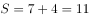份，则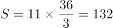千米。

故正确答案为D。

备注：因甲、乙所走的路程比=7：4，则总路程S为11份，故答案应为11的倍数，只有D项满足。

---

### 第 8 题　qid 1772198 · 数学运算

两箱同样多的蛋黄派分别分发给两队志愿者做早餐，分给甲队每人6块缺8块，分给乙队每人7块剩6块。已知甲队比乙队多6人，则一箱蛋黄派有（  ）块。

- **A**. 120
- **B**. 160　✅
- **C**. 180
- **D**. 240

**答案**：B

**官方解析**

由“分给甲队每人6块缺8块”可知，蛋黄派总量M+8应为6的倍数，由此排除ACD项，只有B项满足。
故正确答案为B。

---

### 第 9 题　qid 1772202 · 数学运算

某研究小组中一部分人在野外采集数据并实时传回实验室由另一部分人进行分析，据经验表明，在A处每人每天平均能采集到20条数据，其中40%为有效数据。在B处每人每天平均能收集到40条数据，其中25%为有效数据，实验室人员必须对每条数据逐个甄别以筛选出有效数据，实验室里的实验人员每人每天可以甄别100条数据，该研究小组共有16人，为使最终筛选出的有效数据最多，应该分别在A处、B处、实验室安排（  ）人。

- **A**. 8，4，4
- **B**. 10，3，3
- **C**. 2，10，4
- **D**. 4，8，4　✅

**答案**：D

**官方解析**

因所求信息在选项汇总均已给出，故可代入排除验证求解。如表格所示，括号内为有效数据，A项为104条；B项实验室最多甄别300条数据，分为两种情况：A处200条B处100条，此时有效数据为条、A处180条B处120条，此时有效数据为条，故B项有效数据为102~105条，最多为105条；C项实验室最多甄别400条数据，分为两种情况：A处40条B处360条，此时有效数据为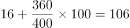条、A处0条B处400条，此时有效数据为100条，故C项有效数据为100~106条，最多为106条；D项实验室为112条。

综上可知，D项有效数据最多，为112条。

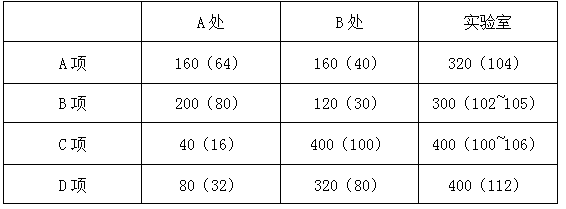

故正确答案为D。

---

### 第 10 题　qid 1772206 · 数学运算

两根同样长的木炭，燃烧完一根粗的木炭需要2小时，燃烧完一根细的木炭需要1小时。现同时点燃这两根木炭，若干分钟后将两根木炭同时熄灭，发现粗木炭的剩余长度是细木炭的剩余长度的2倍，则燃烧了（  ）分钟。

- **A**. 35
- **B**. 40　✅
- **C**. 45
- **D**. 50

**答案**：B

**官方解析**

赋值木炭的长度为，则粗木炭每分钟燃烧，细木炭每分钟燃烧。设燃烧x分钟后，粗木炭剩余长度是细木炭的2倍，则可得：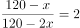，解得。

故正确答案为B。

---

## 判断推理

### 第 1 题　qid 1770714 · 类比推理

（1）提高健康素质

（2）改善人类生活质量
（3）取得基因组研究突破
（4）加入人类基因组计划
（5）完成承担的科研计划

- **A**. 4-1-2-3-5
- **B**. 5-3-4-2-1
- **C**. 4-5-3-1-2　✅
- **D**. 5-4-2-3-1

**答案**：C

**官方解析**

4与5之间比较，4是加入，5是完成，因此4在5的前面，排除B选项和D选项；1和3之间比较，先取得研究突破，后提高身体素质，因此3在1的前面，排除A选项。
故正确答案为C。

---

### 第 2 题　qid 1772240 · 类比推理

（1）得到有效控制
（2）掌握病的流行规律和特点
（3）某传染病流行
（4）开发接种疫苗
（5）大规模调研和防治实践

- **A**. 5-3-1-4-2
- **B**. 3-2-5-4-1
- **C**. 3-5-2-4-1　✅
- **D**. 5-4-3-2-1

**答案**：C

**官方解析**

3与5之间比较，先开始流行，后调研，因此排除A和D选项；2和5比较，先调研实践，后掌握规律特点，因此排除B选项。
故正确答案为C。

---

### 第 3 题　qid 1772246 · 类比推理

（1）日本人质遭斩首
（2）国际社会同声谴责
（3）民众在首相官邸外示威
（4）表态确保海内外日本人安全
（5）借机推动海外派兵

- **A**. 1-3-2-4-5　✅
- **B**. 1-4-2-3-5
- **C**. 3-4-2-5-1
- **D**. 4-5-3-2-1

**答案**：A

**官方解析**

事件起因是日本人质遭到斩首，故（1）是开始；国际社会同声谴责表明之前还有一个声音，看其他题干，（3）中民众游行示威显然是发生在国际社会同声谴责之前，故（3）在（2）的前面，据此排除可以得到正确答案为A。
故正确答案为A。

---

### 第 4 题　qid 1772248 · 类比推理

（1）夏朝灭亡
（2）商鞅变法
（3）统一六国
（4）周公吐哺
（5）卧薪尝胆

- **A**. （4）-（1）-（5）-（2）-（3）
- **B**. （4）-（1）-（2）-（3）-（5）
- **C**. （1）-（4）-（2）-（5）-（3）
- **D**. （1）-（4）-（5）-（2）-（3）　✅

**答案**：D

**官方解析**

朝代顺序匹配与排列。夏（夏朝灭亡）、西周（周公吐哺）、春秋（卧薪尝胆）、战国（商鞅变法）、秦（统一六国），根据朝代表，顺序应该是（1）-（4）-（5）-（2）-（3）。
故正确答案为D。

---

### 第 5 题　qid 1772250 · 类比推理

（1）尽职工作
（2）受到表彰
（3）支援西部
（4）大学毕业
（5）开发创新

- **A**. 4-1-3-5-2
- **B**. 3-4-5-1-2
- **C**. 4-3-1-5-2　✅
- **D**. 3-4-5-2-1

**答案**：C

**官方解析**

3与4之间比较，先大学毕业，排除B和D选项；1与3之间比较，先支援西部后尽职工作，排除A选项。
故正确答案为C。

---

### 第 6 题　qid 1772260 · 图形推理

从所给四个选项中，选择最合适的一个填入问号处，使之呈现一定的规律性：

- **A**. A
- **B**. B
- **C**. C
- **D**. D　✅

**答案**：D

**官方解析**

图形均存在一些独立的小个体，并且和正六面体的展开图相似，考虑素数量和空间重构。
观察发现，第一行图形“星”的数量分别是3、2、1，第二行前两个图形“星”的数量为1、2、？，则？处应为“星”数量是3的图形，排除B项；并且题干所有图形均能折成一面开口的正六面体，排除A项；继续观察发现，题干所有图形折成的开口六面体中，圆面均为底面，排除C项。
故正确答案为D。

---

### 第 7 题　qid 1772262 · 图形推理

从所给四个选项中，选择最合适的一个填入问号处，使之呈现一定的规律性：

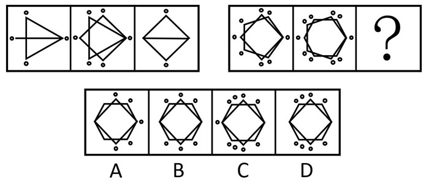

- **A**. A
- **B**. B　✅
- **C**. C
- **D**. D

**答案**：B

**官方解析**

元素组成相似，考虑样式规律，这道题优先考虑样式运算。
观察发现，左边图一和图二叠加去同存异得到图三，将规律代入第二行图，B选项满足要求。
故正确答案为B。

---

### 第 8 题　qid 1772266 · 图形推理

从所给四个选项中，选择最合适的一个填入问号处，使之呈现一定的规律性：

- **A**. A
- **B**. B　✅
- **C**. C
- **D**. D

**答案**：B

**官方解析**

元素组成凌乱，考虑数量规律，全部文字图形均存在封闭空间。
观察发现，第一组图形面的数量分别为1、2、3，成等差数列，第二组前两个图形面的数量分别为2、3，将第一行等差数列规律代入，第三个图形面的数量应该是4个，只有B满足要求。
故正确答案为B。

---

### 第 9 题　qid 1772268 · 图形推理

从所给四个选项中，选择最合适的一个填入问号处，使之呈现一定的规律性：

- **A**. A
- **B**. B
- **C**. C　✅
- **D**. D

**答案**：C

**官方解析**

元素组成相同，优先考虑位置规律。每幅图均出现了米字型外框、一条小竖线和一条小横线，外框没变，线在动，考虑小竖线和小横线的位置移动。如下图所示，从图1到图2到图3，小竖线依次顺时针移动一格，小横线依次逆时针移动一格。第二组图运用规律，小竖线依次顺时针移动一格，？处的小竖线应该移动到左下角，只有C项符合。故正确答案为C。

---

### 第 10 题　qid 1772276 · 图形推理

从所给四个选项中，选择最合适的一个填入问号处，使之呈现一定的规律性：

- **A**. A　✅
- **B**. B
- **C**. C
- **D**. D

**答案**：A

**官方解析**

元素组成相同，考虑位置规律。
观察发现，第一组图形中，两条直线将图形分割成两对两两之间面积相同的部分，将此规律代入第二组，排除C、D两项，进一步观察，各图中任一直线均在主体图形内部进行切割，而B项中的一条直线没有切割任何一个小方格，排除。
故正确答案为A。

---

### 第 11 题　qid 1772280 · 类比推理

牛奶的包装盒设计成方形，是因为方形比圆形的包装盒更节约储存牛奶所需的冷藏空间，这样一个冷藏柜中可以摆放更多的牛奶，可乐的瓶子设计成圆形是因为该形状更容易随手拿取和携带。
如果以上的观点是正确的，那么必须以下列（　　）为前提。

- **A**. 储存牛奶的冷藏空间比储存可乐的空间小
- **B**. 可乐不需要冷藏而牛奶需要
- **C**. 产品的包装设计以实用为主要目的　✅
- **D**. 人们无法接受圆形的牛奶盒和方形的可乐瓶

**答案**：C

**官方解析**

逐一分析选项：
A项，储存牛奶的冷藏空间比储存可乐的空间小，只能证明牛奶的包装盒设计成方形是正确的，但是无法证明可乐的瓶子设计成圆形，排除。
B项，可乐不需要冷藏而牛奶需要，与观点中包装盒的设计无关。不构成观点的前提条件，排除。
C项，产品的包装设计以实用为主要目的。牛奶储存，方盒是为了冷藏柜中可以摆放更多的牛奶，可乐瓶圆形是为了让人们更容易随手拿取和携带。这些都是根据实际使用时的需求而设计的。可以构成观点正确的前提，当选。
D项，人们无法接受圆形的牛奶盒和方形的可乐瓶无法证明观点的正确，因为人们还可以设计成圆柱形的牛奶盒或者圆锥形的可乐瓶，排除。
故正确答案为C。

---

### 第 12 题　qid 1772284 · 逻辑判断

“惯性思维”是由先前的活动而造成的一种对活动的特殊的心理准备状态或者倾斜性，表现为这样解决了一个问题，下次遇到类似的问题或表面看起来相同的问题，不由自主地还是沿着上次思考的方式或次序去解决。
以下选项中最不能推出的一项是（　　）。

- **A**. 在情境不变时，惯性思维有利于迅速解决问题
- **B**. 在情境不变时，惯性思维有利于新方法的产生　✅
- **C**. 惯性思维可能是束缚创造性思维的枷锁
- **D**. 惯性思维一定程度上是产生创造性思维的根源

**答案**：B

**官方解析**

日常结论题，根据题干信息逐一分析选项。
A项：根据题干可知，“下次遇到类似的问题或表面看起来相同的问题，不由自主地还是沿着上次思考的方式或次序去解决”，所以，如果情境不变，则会延用上次的思考方式或次序，即有利于迅速解决问题，可以推出，排除；
B项：根据题干可知，“下次遇到类似的问题或表面看起来相同的问题，不由自主地还是沿着上次思考的方式或次序去解决”，即情境不变时，依然会采用上次的方法，不会探索新方法，因此不利于新方法的产生，无法推出，保留；
C项：根据题干可知，“下次遇到类似的问题或表面看起来相同的问题，不由自主地还是沿着上次思考的方式或次序去解决”，思维被束缚，所以惯性思维可能是束缚创造性思维的枷锁，可以推出，排除；
D项：根据题干可知，“下次遇到类似的问题或表面看起来相同的问题，不由自主地还是沿着上次思考的方式或次序去解决”，而如果遇到的是不同的问题，或者使用原有的方式无法解决相同或相似的问题，就可能会去探索新方法，即可能需要在一定程度上产生创造性思维，选项有一定道理，保留。
对比B、D两项，B项中的提出新方法是针对相同情境的，根据题干可知，相同情境下会采用惯性思维而不会提出新方法，故B项更不能推出。
本题为选非题，故正确答案为B。

---

### 第 13 题　qid 1772288 · 逻辑判断

有苹果、草莓、香蕉、桔子四种水果，甲、乙、丙、丁四个人每人领一种，甲：“我领到了苹果”，乙：“我领到了桔子”，丙说：“甲说谎，他领到了香蕉”，丁：“我领到了草莓”。
如果只有两个人说的是真话，则一定可以推出的是（　）。

- **A**. 乙领到的是桔子
- **B**. 丁领到的是草莓
- **C**. 丙领到的不是香蕉　✅
- **D**. 甲领到的不是苹果

**答案**：C

**官方解析**

第一步：翻译题干。
甲：甲苹果。乙：乙桔子。丙：甲香蕉。丁：丁草莓。已知有两人说真话，并且甲、丙至少有一人为假。
第二步：分析题干。
若甲、丙均为假，则乙、丁均为真。则甲：非苹果，非香蕉，也不可能是桔子或草莓。与“甲、乙、丙、丁四个人每人领一种水果”不符，所以这种假设错误。则甲、丙有一假。
若甲为真，则丙为假，乙、丁一真一假。
若丙为真，则甲为假，乙、丁一真一假。
逐一假设可知。
若甲真，丙假，乙真，丁假。则甲苹果，乙桔子，丙草莓，丁香蕉。
若甲真，丙假，丁真，乙假。则甲苹果，乙香蕉，丙桔子，丁草莓。
若丙真，甲假，乙真，丁假。则甲香蕉，乙桔子，丙草莓，丁苹果。
若丙真，甲假，丁真，乙假。则甲香蕉，乙苹果，丙桔子，丁草莓。
第三步：结合假设选出答案。只有C项正确。
故正确答案为C。

---

### 第 14 题　qid 1772292 · 逻辑判断

以下（  ）前项不是后项的充分条件。

- **A**. 无规矩不成方圆　✅
- **B**. 人若犯我，我必犯人
- **C**. 人心齐，泰山移
- **D**. 招手即停

**答案**：A

**官方解析**

前项是后项充分条件，则应该翻译成AB，前推后。

逐一分析选项：

A项，翻译成规矩方圆，逆否命题为，方圆→规矩。后项是前项的充分条件，错误。

B项，翻译成人若犯我我必犯人，前推后，正确。

C项，翻译成人心齐泰山移，前推后，正确。

D项，翻译成招手停，前推后，正确。

本题为选非题，故正确答案为A。

---

### 第 15 题　qid 1772298 · 逻辑判断

煤炭采掘业发言人提出建议：为了维持国产煤炭的价格，必须限制较便宜的国外煤炭的进口，否则，我国的煤炭采掘业将难以经营，有色金属冶炼业发言人对上述建议的反应：我国有色金属冶炼业购买的煤炭75%都是国产的。如果煤炭的价格不是按国际价格支付，那么，由于成本的提高，国产的有色金属就会卖不出去，这样对国产煤炭的需求就会下跌。
以下（  ）是对有色金属冶炼业发言人的论证最恰当的评价。

- **A**. 该论证无的放矢，和煤炭采掘业发言人的建议无关
- **B**. 该论证是循环论证，它预先假设了为了评论煤炭采掘业发言人的建议而需要证明的东西
- **C**. 该论证说明煤炭采掘业发言人的建议如果实施的话将会对其自身产生负面影响　✅
- **D**. 该论证没有给出理由说明为什么上述建议的实施并不能减轻煤炭采掘业难以经营的担心

**答案**：C

**官方解析**

第一步：翻译题干。

煤炭采掘业发言人：

①维持国产煤炭的价格限制较便宜的国外煤炭进口；

②限制较便宜的国外煤炭进口我国的煤炭采掘业将难以经营；

有色金属冶炼业发言人：

③不按国际价格支付对国产煤炭的需求就会下跌。

第二步：逐一分析选项。

A项：两个行业的发言人都在谈论的是煤炭的价格，并不是无关，排除；

B项：循环论证是指用来证明论题的论据本身的真实性要依靠论题来证明的逻辑错误。如证明“鸦片能催眠”，所用的论据是“它有催眠的力量”。而“鸦片有催眠的力量”，又要借助于“它能催眠”来证明。这就是犯了循环论证的自证。通过题干的逻辑关系①②③可知，有色金属冶炼业发言人的建议并没有循环论证，排除；

C项：根据条件①②可知，煤炭采掘业发言人是在说明不维持国产煤炭的价格，也就是按国际价格支付会使我国煤炭采掘业难以经营，因此煤炭采掘业发言人的观点是想“不按国际价格支付”；而有色金属冶炼业是在说明如果不按国际价格支付，会导致国产煤炭需求下跌，即会产生负面影响，当选；

D项：有色金属冶炼业发言人说明了不按国际价格支付会使国产煤炭需求下跌，那么就给出理由说明了为什么上述建议的实施并不能减轻对煤炭采掘业难以经营的担心，排除。

故正确答案为C。

---

### 第 16 题　qid 1772300 · 逻辑判断

当前人们越来越热爱旅游，许多游客会到一些著名的城市旅游，常常有这样一种现象：在前往游览风景名胜的路上，导游小姐总会在几个工艺品加工厂前停车，劝大家去厂里参观，说产品便宜，而且买不买都没有关系，为此，一些游客常有怨言，然而此种行为仍在继续，甚至愈演愈烈。
以下最不可能成为造成上述现象原因的是：

- **A**. 虽然有的人不满意，但许多游客是愿意的，她们从厂里出来时的笑容就是证据
- **B**. 绝大多数游客经济上都是富裕的，她们只想省时间，不在意商品的价格　✅
- **C**. 有些游客来旅游的一项重要任务就是购物，若是空手回家，家里人会不高兴的
- **D**. 厂家产品直销，质量有保证，价格也确实便宜，何乐而不为

**答案**：B

**官方解析**

此题属于原因解释类题目，主要解释的现象为“旅游购物的现象愈演愈烈”。
A项：从游客的角度解释为什么这种现象持续存在，因为很多的游客还是很喜欢旅游购物的，可以解释；
B项：大多数游客想省时间而不在意商品价格，则说明工艺品加工厂产品便宜对游客没有吸引力，因此不能作为解释旅游购物持续存在的原因，当选； 
C项：游客来旅游的一项重要任务就是购物，因此从游客的角度解释为什么这种现象持续存在，可以解释；
D项：产品物美价廉，肯定是受绝大多数游客的喜爱，因此可以从游客的角度解释旅游购物持续存在的原因，可以解释。
本题为选非题，故正确答案为B。

---

### 第 17 题　qid 1772304 · 类比推理

在超市里有四个存物柜，打开柜子后发现，第一个柜子里写着：“所有的柜子里都装着购物袋”，第二个柜子里写着：“本柜子中有购物礼品”，第三个柜子里写着：“本柜子里没有食品”，第四个柜子写着：“有些柜子里没有购物袋”。
如果只有一个柜子里的描述是真实的，以下肯定为真的是（  ）。

- **A**. 所有的柜子里都是购物袋
- **B**. 所有的柜子里都没有购物袋
- **C**. 所有的柜子里都没有购物礼品
- **D**. 第三个柜子里有食品　✅

**答案**：D

**官方解析**

第一步：找突破口。
突破口为第一个柜子和第四个柜子是矛盾关系，两人的断定必有一真一假。
第二步：看其他人的话。
题干说只有一个柜子的描述为真，那么第二个柜子和第三个柜子的描述必定均为假，即第二个柜子里没有购物礼品，第三个柜子里有食品。
故正确答案为D。

---

### 第 18 题　qid 1772310 · 逻辑判断

小张对小李说：“红色象征着热情，我一看到红色就热血沸腾。”小李于是书写了红色两个字，对小张说：“你觉得热血沸腾吗？”
以下句子的逻辑表述方法与所给题干一致的是（  ）。

- **A**. 小李对小张说：“海水咸吗？要不，你去尝尝那两个字，看看有咸味不？”　✅
- **B**. 小李对小张说：“你的朋友真是个好人啊，你看，长得就非常漂亮”
- **C**. 小李对小张说：“一年四季都有花盛开，花就像美女一样，人人爱看”
- **D**. 小李对小张说：“这个人真麻烦，一点麻烦都解决不了”

**答案**：A

**官方解析**

题干中的表述方式是：小张说的红色是指实物的颜色，指的是视觉上的感受，而小李理解为是“红色”这两个字，两个人所说的含义不同，这种表述方式会使人产生误解。
分析各选项：
A项中的“海水”有两个含义，一个是指真实的海水，而另一个是指“海水”这两个字本身 ，与题干的表述方法一致，当选；
B项没有涉及同一个词的不同含义，与题干表述方法不同，排除；
C项只是运用了比喻手法，将花比作女人，并不是表述了花的两个不同含义，与题干的表述方式不同，排除；
D项虽然表述了麻烦这个词的不同含义，但是并没有涉及人体感官，这样的表述方式也不会产生误解，与题干表述方式不同，排除。
故正确答案为A。

---

### 第 19 题　qid 1772314 · 逻辑判断

三段论推理是演绎推理中的一种简单推理判断，它包含：一个一般性的原则（大前提），一个附属于前面大前提的特殊化陈述（小前提），以及由此引申出的特殊化陈述符合一般性原则的结论。
根据以上定义，下列推理过程正确的是：

- **A**. 骄兵必败，我们胜利，所以我们不是骄兵
- **B**. 勇者无畏，我无畏，所以我是勇者
- **C**. 英雄难过美人关，我是英雄，所以我难过美人关　✅
- **D**. 狭路相逢勇者胜，我们胜利，所以勇者胜

**答案**：C

**官方解析**

题干的逻辑关系可表示为：A→B，C是附属于A的小前提，则C→B。
各选项逻辑关系分别为：
A项：骄兵→必败，胜利与骄兵和必败都没有关系，因此就不能推出相应的结论。与题干逻辑关系不同，排除；
B项：勇者→无畏，我无畏是附属于B而不是A。与题干逻辑关系不同，排除；
C项：英雄→难过美人关，我是英雄是附属于A的一个小前提，因此可以推出B。与题干逻辑关系相同，当选；
D项：狭路相逢→勇者胜，我们胜利是附属于B而不是A。与题干逻辑关系不同，排除。
故正确答案为C。

---

### 第 20 题　qid 1773078 · 类比推理

一池塘边竖着一块“牌子”，“池塘水有剧毒，下水即死。否则，不承担医药费”，以下（　　）与题干犯的是同样的逻辑错误。

- **A**. 妈妈对小孩说：“我很爱你，你决定做任何事，我都会支持你，但是你必须按我说的做！”　✅
- **B**. 老师说：“这位同学的想法是否正确，我们还不好下结论，否则，对他不公平。”
- **C**. 老师要批评一批同学，也要表扬一批同学，要爱憎分明。
- **D**. 文化大革命有其正确的地方，也有其不正确的地方，我们要一分为二地评论。

**答案**：A

**官方解析**

第一步：分析题干。
“池塘有毒，下水即死”说明下水就会死，“否则，不承担医药费”是对前面一句话的否定，表示“下水不会死，可能会进医院，但是不承担医药费”，前后两句话自相矛盾。
第二步：逐一分析选项。
A项：妈妈前半句说“你决定的任何事情，我都支持你”，说明孩子想做什么都可以，但是妈妈后半句又说“你必须按我说的做”，说明孩子不是想做什么就可以做什么的，还是要听妈妈的，前后两句话自相矛盾，与题干所犯的逻辑错误相同，当选。
B项：老师前半句说“这位同学的想法是否正确，我们还不好下结论”，说明现在不能下结论，后半句说“否则，对他不公平”也是再说不能下结论，前后没有自相矛盾，与题干不一致，排除。
C项：老师说要批评一部分同学，也要表扬一部分同学，前后没有自相矛盾，与题干不一致，排除。
D项：文化大革命有正确的地方，也有不正确的地方，前后没有自相矛盾，与题干不一致，排除。
故正确答案为A。

---

## 资料分析

### 材料 1

        根据《国务院关于开展第三次全国经济普查的通知》(国发〔2012〕60号)要求，我国进行了第三次全国经济普查，这次普查的标准时点为2013年12月31日，普查时期资料为2013年年度资料，普查对象是在我国境内从事第二产业和第三产业的全部法人单位、产业活动单位和有证照个体经营户，相关调查显示，2013年末，全国共有从事第二产业和第三产业的法人单位1085.7万个，比2008年末(2008年是第二次全国经济普查年份，下同)增加375.8万个；产业活动单位1303.5万个，增加417.1万个；有证照个体经营户3279.1万个，增加405.4万个。

        从行业角度看，2013年末，在第二产业和第三产业的法人单位中，位居前三位的行业是：批发和零售业281.1万个，占25.9%；制造业225.3万个，占20.7%；公共管理社会保障和社会组织152万个，占14%。在第二产业和第三产业的有证照个体经营户中，位居前三位的行业是：批发和零售业1642.7万个，交通运输仓储和邮政业878.6万个，住宿和餐饮业240.8万个。

        从单位性质看，2013年末，在第二产业和第三产业的法人单位中，企业法人单位占75.6%，比2008年末提高了5.7个百分点；机关事业法人单位占9.6%，比2008年末下降了3.9个百分点；社会团体和其他法人占14.8%，比2008年末下降了1.8个百分点。

        从登记注册类型看，2013年末，在第二产业和第三产业企业法人单位中，内资企业法人、外商投资企业法人和港澳台商投资企业法人分别为800.6万个、10.6万个和9.7万个。在内资企业法人中，国有企业法人占全部企业法人单位的1.4%，私营企业法人占全部企业法人单位的68.3%。

#### 第 1 题　qid 1772350 · 综合

2008年末，列入上述资料所示的普查对象的数量合计为（  ）。

- **A**. 4072.1万
- **B**. 4845.8万
- **C**. 4470.0万　✅
- **D**. 5262.9万

**答案**：C

**官方解析**

定位文字材料第一段可得，“普查对象是在我国境内从事第二产业和第三产业的全部法人单位，产业活动单位和有证照个体经营户”，“2013年末，全国共有从事第二产业和第三产业的法人单位1085.7万个，比2008年末增加375.8万个，产业活动单位1303.5万个，增加417.1万个，有证照个体经营户3279.1万个，增加405.4万个”。故2008年普查对象数量合计为，计算尾数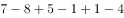，尾数为0。

故正确答案为C。

---

#### 第 2 题　qid 1772356 · 比重

2013年末，在第二产业和第三产业的有证照个体经营户中，批发和零售业、交通运输仓储和邮政业、住宿和餐饮业三者合计所占比重约为（  ）。

- **A**. 50.1%
- **B**. 26.8%
- **C**. 67.3%
- **D**. 84.2%　✅

**答案**：D

**官方解析**

根据题干所求 “2013年末······所占比重”，可判定本题为现期比重问题。定位文字材料第一、二段可得“2013年末有证照个体经营户3279.1万个”，定位文字材料第二段可得“批发和零售业1642.7万个、交通运输仓储和邮政业878.6万个、住宿和餐饮业240.8万个”。故所求比重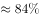，与D项最接近。

故正确答案为D。

---

#### 第 3 题　qid 1772358 · 增长

与第二次全国经济普查时相比，第三次经济普查时，下列普查对象数量增长最快的是（  ）。

- **A**. 第二产业和第三产业法人单位数
- **B**. 第二产业和第三产业有证照个体经营户数
- **C**. 第二产业和第三产业企业法人单位数　✅
- **D**. 第二产业和第三产业活动单位数

**答案**：C

**官方解析**

根据题干所求“增长最快的是”，可判定本题为一般增长率比较问题。定位材料可得各普查对象现期量与增长量，由增长率，分别代入数据可得各项增长率。

A项：定位文字材料第一段可得，2013年末，第二产业和第三产业的法人单位1085.7万个，比2008年末增加375.8万个。故所求增长率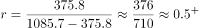；

B项：定位文字材料第一段可得，有证照个体经营户3279.1万个，增加405.4万个。故所求增长率；

C项：定位文字材料第三段可得，2013年末第二产业和第三产业的法人单位中，企业法人单位占，比2008年末提高了5.7个百分点。根据两期比重比较口诀“部分增长率高于整体增长率，比重上升”，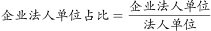,2013年末企业法人单位数占法人单位数的比重比2008年末提高了5.7个百分点，则企业法人单位数的增长率必然高于法人单位数的增长率，所求增长率；

D项：定位文字材料第一段可得，产业活动单位1303.5万个，增加417.1万个。故所求增长率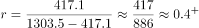。 

比较可知增长最快的是第二产业和第三产业企业法人单位数。

故正确答案为C。

---

#### 第 4 题　qid 1772360 · 综合

下列法人单位中，数量最多的是（  ）。

- **A**. 2013年末，港澳台商投资企业法人单位数
- **B**. 2013年末，外商投资企业法人单位数
- **C**. 2013年末，国有企业法人单位数
- **D**. 2008年末与2013年末间，社会团体和其他法人单位增加数　✅

**答案**：D

**官方解析**

A、B项，定位文字材料第四段可得：2013年末，港澳台商投资企业法人单位数9.7万，外商投资企业法人单位数10.6万；

C项，定位文字材料第四段可得：国有企业法人占全部企业法人单位的；定位材料第三段可得：在第二产业和第三产业的法人单位中，企业法人单位占；定位材料第一段可得：2013年末，全国共有从事第二产业和第三产业的法人单位1085.7万个，故国有企业法人单位数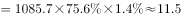万；

D项，定位材料第一、三段可得：2013年末，共有从事第二产业和第三产业的法人单位1085.7万个，比2008年末增加375.8万个，2013年末社会团体和其他法人占，比2008年末下降了1.8个百分点。故社会团体和其他法人单位增加数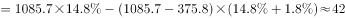万。

比较可知四类法人单位中，数量最多的为社会团体和其他法人单位增加数。

故正确答案为D。

---

#### 第 5 题　qid 1772362 · 综合

根据上述材料，下列说法错误的是（  ）。

- **A**. 2013年末，第二产业和第三产业法人单位中，批发和零售业单位数比制造业多约24.8%
- **B**. 与2008年相比，2013年第二产业和第三产业法人单位中，企业法人、机关事业法人、社会团体和其他法人单位数均有不同幅度的增长
- **C**. 2013年末，第二产业和第三产业有证照个体经营户中，批发和零售业个体经营户占据一半以上
- **D**. 2008年末至2013年末间，第二产业和第三产业法人单位数平均增长率超过10%　✅

**答案**：D

**官方解析**

A项：定位文字材料第二段数据可得，2013年末，批发和零售业单位数281.1万个，制造业225.3万个，则批发和零售业单位数多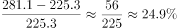，正确。

B项：若均呈现增长，则2013年各法人单位数大于2008年法人单位数，定位材料第三段数据可得，2013年与2008年比较，企业法人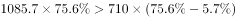 ；机关事业法人；社会团体和其他法人单位，故三者均有不同幅度的增长，正确。

C项：定位文字材料第一、二段可得，“2013年有证照个体经营户3279.1万个，批发和零售业1642.7万个”，，正确。

D项：定位文字材料第一段可得，“2013年末，法人单位1085.7万个，比2008年末增加375.8万个”，故2008年法人单位数约为710万个。根据年均增长率公式，得到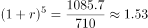，若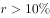，则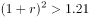，，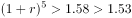，不满足，错误。

本题为选非题，故正确答案为D。

---

### 材料 2

#### 第 6 题　qid 1772364 · 平均数

2013年中部六省城镇单位就业人员平均工资的算术平均值与2001年相比，（  ）。

- **A**. 增长了32583元
- **B**. 翻了两番
- **C**. 增长了5倍以上
- **D**. 增长了4.2倍　✅

**答案**：D

**官方解析**

根据题干所求“2013年与2001年相比”，结合选项多为增长了几倍，可判定本题为一般增长率问题。定位柱状图材料中2013年数据可得，2013年六省算术平均值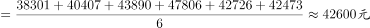；定位柱状图可得，2001年六省算术平均值。，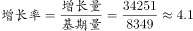，与D项最接近。

故正确答案为D。

---

#### 第 7 题　qid 1772366 · 平均数

以下省份中，2007年和2001年相比城镇单位就业人员平均工资增加值最大的是（  ）。

- **A**. 山西
- **B**. 湖北
- **C**. 安徽　✅
- **D**. 湖南

**答案**：C

**官方解析**

根据题干所求“增加值最大的是”，可判定本题为增长量比较问题。定位柱状图材料数据可得2007年与2001年各省平均工资。则增加值分别为山西：；湖北：；安徽：；湖南：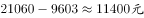，比较可知增加值最大的是安徽。

故正确答案为C。

---

#### 第 8 题　qid 1772368 · 增长

2013年和2007年相比，下列省份中，城镇单位就业人员平均工资增长率最高的省份是（  ）。

- **A**. 河南
- **B**. 安徽
- **C**. 湖北　✅
- **D**. 湖南

**答案**：C

**官方解析**

根据题干所求“增长率最高的省份是”，可判定本题为增长率比较问题。定位柱状图材料数据可得2013年与2007年各省平均工资，则可根据增长率计算公式求出各项增长率。

A项河南：2013年平均工资38301元，2007年20639元，故所求；

B项安徽：2013年平均工资47806元，2007年21699元，故所求；

C项湖北：2013年平均工资43890元，2007年19548元，故所求；

D项湖南：2013年平均工资42726元，2007年21060元，故所求

。 

比较可知C项湖北增长率最高。

故正确答案为C。

---

#### 第 9 题　qid 1772370 · 平均数

2007年中部六省城镇单位就业人员平均工资中位数为（  ）。

- **A**. 20849.5元　✅
- **B**. 20639元
- **C**. 21060元
- **D**. 20400.8元

**答案**：A

**官方解析**

定位柱状图材料中2007年数据可得，2007年中部六省城镇单位就业人员平均工资从大到小排列为：21699、21315、21060、20639、19548、18144。故所求中位数为位于中间两数的平均数，中位数。

故正确答案为A。

---

#### 第 10 题　qid 1772372 · 综合

根据上述材料，下列说法正确的是（  ）。

- **A**. 所有统计年份中，河南省单位就业人员平均工资均为中部六省最低
- **B**. 假设年均增长率不变，按照2007-2013年均增长率来计算，2015年江西省城镇单位就业人员平均工资超过6万元
- **C**. 湖南省2001-2007年城镇就业人员平均工资平均增速快于2007-2013年　✅
- **D**. 2001年，中部六省城镇单位就业人员平均工资超过8000元的省份不到50%

**答案**：C

**官方解析**

A项：定位柱状图材料中2001年数据可得，2001年河南城镇单位就业人均工资大于安徽，错误。

B项：定位柱状图材料中数据可得，2007年江西平均工资18144元，2013年42473元。根据年均增长率公式可得，，若2015年人均工资超过6万，即，则，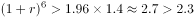，故假设不成立，即2015年时未超6万，错误。

C项：定位柱状图材料中数据可得，2001年湖南平均工资9603元，2007年21060元，2013年42726元。根据年均增长率公式，2001-2007年平均增速为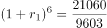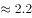，2007-2013年平均增速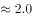，前者大于后者，即，正确。

D项：定位柱状图材料中数据可得，2001年，中部六省城镇单位就业人员平均工资超过8000元的省份有山西、湖北、湖南、江西，六省中四省满足条件，占比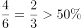，错误。

故正确答案为C。

---

### 材料 3

#### 第 11 题　qid 1772374 · 综合

根据上述数据，不能得出的结论是（  ）。

- **A**. 我国上述省（市）的水资源分布不平衡
- **B**. 我国上述省（市）的地下水资源分布不平衡
- **C**. 我国上述省（市）的江河数量分布不平衡　✅
- **D**. 我国上述省（市）的地表水资源分布不平衡

**答案**：C

**官方解析**

定位表格材料可知，没有相关涉及江河的数据，故江河数量分布不平衡不能推出。
本题为选非题，故正确答案为C。

---

#### 第 12 题　qid 1772376 · 平均数

上表中，所有直辖市的人均水资源量为（  ）。

- **A**. 无法计算
- **B**. 480立方米/人
- **C**. 550立方米/人
- **D**. 610立方米/人　✅

**答案**：D

**官方解析**

根据题干所求“人均水资源量”，可判定本题为平均数计算问题。直辖市有北京、上海、天津、重庆。定位表格材料可得各直辖市水资源总量及人均水资源量，故城市人数分别为：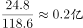、、、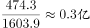。所有直辖市人均水资源量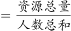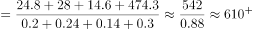立方米/人，与D项最接近。

故正确答案为D。

---

#### 第 13 题　qid 1772378 · 综合

关于上述省（市）的水资源情况，下列说法正确的是（  ）。

- **A**. 地表水资源都比地下水资源丰富
- **B**. 四川的地表水资源量与地下水资源量的差距最大
- **C**. 地表水资源量最小的省（市）为宁夏
- **D**. 西藏的地表水资源与地下水资源储量均居各省（市）之首　✅

**答案**：D

**官方解析**

A项：定位表格材料数据可得，北京市和宁夏地表水资源都没有地下水资源丰富，错误。

B项：定位表格材料数据可得，四川地表水资源量比地下水资源量的差距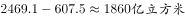，西藏地表水资源量比地下水资源量的差距，可见四川并非差距最大的，错误。

C项：定位表格材料数据可得，宁夏地表水资源量大于北京，错误。

D项：定位表格材料数据可得，西藏的地表水资源与地下水资源储量在表中对应列里均为最大值，正确。

故正确答案为D。

---

#### 第 14 题　qid 1772380 · 综合

下列四个省份中，人数最少的是（  ）。

- **A**. 云南
- **B**. 江西　✅
- **C**. 广西
- **D**. 湖北

**答案**：B

**官方解析**

根据题干所求“人数最少的是”，表格给出水资源总量与人均水资源量，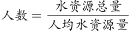，可判定本题为平均数计算比较问题。定位表格材料数据可得各省水资源总量与人均水资源量，则人数分别为：云南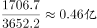、江西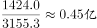、广西、湖北，故人数最少的是江西。

故正确答案为B。

---

#### 第 15 题　qid 1772382 · 平均数

根据上表数据，下列说法正确的是（  ）。
①  地表水资源量越大的省（市），水资源总量越大
②  水资源总量越大的省（市），人均资源量越大
③  人口越多的省（市），人均水资源量越小

- **A**. ①、②、③均不正确　✅
- **B**. 仅有①正确
- **C**. 仅有②、③正确
- **D**. 仅有③正确

**答案**：A

**官方解析**

①定位表格材料数据可得，天津地表水资源量大于北京，但天津的水资源总量却小于北京,错误；

②定位表格材料数据可得，上海水资源总量大于北京，但上海人均水资源量却小于北京，错误；

③定位表格材料数据可得，人口和人均水资源量并非成反比。根据，北京人数、天津人数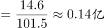。北京的人数多于天津，但北京的人均水资源量也多于天津；故①②③均错误。

故正确答案为A。

---
