# 2016年重庆市公务员录用考试《行测》题（下半年）

> 省考 · 2016 年 · 5 个模块 · 共 120 题

- [常识判断](#%E5%B8%B8%E8%AF%86%E5%88%A4%E6%96%AD) · 20 题
- [言语理解与表达](#%E8%A8%80%E8%AF%AD%E7%90%86%E8%A7%A3%E4%B8%8E%E8%A1%A8%E8%BE%BE) · 40 题
- [数量关系](#%E6%95%B0%E9%87%8F%E5%85%B3%E7%B3%BB) · 10 题
- [判断推理](#%E5%88%A4%E6%96%AD%E6%8E%A8%E7%90%86) · 30 题
- [资料分析](#%E8%B5%84%E6%96%99%E5%88%86%E6%9E%90) · 20 题

---

## 常识判断

### 第 1 题　qid 2015366 · 地理国情

下图为第二次世界大战中某著名战役的示意图，下列关于这一战役的说法<b>错误</b>的是：

- **A**. 发生于1944年6月
- **B**. 登陆部队横渡的海峡是英吉利海峡
- **C**. 是迄今为止世界上规模最大的一次海上登陆作战
- **D**. 参战双方是以英国、法国和美国为首的协约国和以德国为首的同盟国　✅

**答案**：D

**官方解析**

D项错误：图示战役为诺曼底登陆。诺曼底登陆是第二次世界大战中盟军在欧洲西线战场发起的一场大规模攻势，参战双方为英国、加拿大和美国为首的同盟国和以德国为首的轴心国。
A项正确：诺曼底登陆发生于1944年6月。
B项正确：诺曼底登陆的战役目的为横渡英吉利海峡，在法国北部夺取战略性登陆场，为开辟欧洲第二战场创造条件。
C项正确：诺曼底登陆是迄今为止世界上规模最大的一次海上登陆作战。盟军参战兵力达到288万，德军兵力达到138万。
本题为选非题，故正确答案为D。

---

### 第 2 题　qid 2024102 · 人文常识

理学家朱熹曾以山水为题材，写下大量脍炙人口的诗作，体现出“以诗人比兴之体，发圣人义理之秘”的特征。
下列选项属于“发圣人义理之秘”的是：

- **A**. 上有苍石屏，百仞耸雄观
- **B**. 水深波浪阔，浮绿春涣涣
- **C**. 浅麓下萦回，深林久丛灌
- **D**. 珍重舍瑟人，重来足幽伴　✅

**答案**：D

**官方解析**

“以诗人比兴之体，发圣人义理之秘”是宋代理学诗人真德秀提出的哲理文学观，其大意是借助诗歌这一载体来表达义理，即“托物言志”。题干四个选项的诗句均出自朱熹的诗作《行视武夷精舍作》。A、B、C三个选项均是描写武夷精舍的自然环境，属于写景，“以诗人比兴之体”类；D项诗句则是抒发了诗人对友情的重视，属于“发圣人义理之秘” 类。
故正确答案为D。

---

### 第 3 题　qid 2015430 · 人文常识

下列诗句中所蕴含的哲理不同于其他三项的是：

- **A**. 人间四月芳菲尽，山寺桃花始盛开
- **B**. 乱花渐欲迷人眼，浅草才能没马蹄　✅
- **C**. 深处种菱浅种稻，不深不浅种荷花
- **D**. 梅须逊雪三分白，雪却输梅一段香

**答案**：B

**官方解析**

本题考查哲学常识，主要涉及辩证法的相关知识。
A项：该诗句的意思是：四月的花基本凋谢了，但是山寺桃花依然盛开。因为山上和山下地势不同，温差不同，所以同一植物生长的状况也不同，体现了矛盾具有特殊性，要求我们具体问题具体分析。
B项：该诗句的意思是：眼观岸边野花，渐使游人为之着迷；路上浅浅绿草，仅能把马蹄遮盖。这两句从植物的变化写早春景象，作者通过对景色的客观描写，表达了作者流连忘返，在西湖早春风光中无比喜悦的感受，并没有体现哲学道理。
C项：该诗句的意思是：在水深的地方种上菱角，水浅的地方种植水稻，在那不深不浅的水域里种上荷花。不同的植物种在不同的地方，体现了矛盾的特殊性，要求我们做任何事情都要从实际出发，因地制宜，不能形而上学地搞一刀切，绝对化。
D项：该诗句的意思是：梅花须逊让雪花三分晶莹洁白，雪花却没有梅花的清香。梅香而不白，雪白而无香说明事物既有优点，也有不足，体现了矛盾普遍性与特殊性相结合的原理，告诉我们要用全面的观点看问题。
A、C、D项都体现了矛盾的特殊性原理。
本题为选非题，故正确答案为B。

---

### 第 4 题　qid 2015402 · 人文常识

东坡居士苏轼有可能与下列哪一名句的作者一起推杯换盏、吟诗作对：

- **A**. 在天愿作比翼鸟，在地愿为连理枝
- **B**. 长风破浪会有时，直挂云帆济沧海
- **C**. 问渠那得清如许，为有源头活水来
- **D**. 两情若是久长时，又岂在朝朝暮暮　✅

**答案**：D

**官方解析**

D项正确：本句出自北宋词人秦观的《鹊桥仙》。秦观（1049年—1100年）与苏轼（1037年—1101年）生活在同一时期，有可能一起推杯换盏、吟诗作对。
A项错误：本句出自唐代诗人白居易的《长恨歌》。白居易（772年—846年）与苏轼不是同一朝代的人物。
B项错误：本句出自唐代诗人李白的《行路难》。李白（701年—762年）与苏轼不是同一朝代的人物。
C项错误：本句出自南宋诗人朱熹的《观书有感·其一》。朱熹（1130年—1200年）与苏轼不是同一朝代的人物。
故正确答案为D。

---

### 第 5 题　qid 2015418 · 人文常识

王某最近失业了，因其有失业保险，在一定时期内，每个月可领到一笔失业救济金，所以他不用过于担心生活问题，可以继续安心找工作。而李某失业后没有失业保险，一段时间后，仍然没有找到新工作，积蓄也花光了，生活陷入困境，于是他开始小偷小摸。
上述材料中的失业保险体现了下列社会保障的哪一项功能？

- **A**. 促进经济发展
- **B**. 保持社会公平
- **C**. 维护社会稳定　✅
- **D**. 增进国民福祉

**答案**：C

**官方解析**

失业保险是指国家通过立法强制实行的，由社会集中建立基金，对因失业而暂时中断生活来源的劳动者提供物质帮助的制度。
题干通过对比有失业保险的王某和没有失业保险的李某，在失业之后对社会的无害和有害相反情形，来体现失业保险的稳定社会作用。
A项错误：题干并未涉及经济发展相关内容。
B项错误：社会公平体现的是人们之间一种平等享受生存权、发展权、产权的社会关系。题干中王某有失业保险，李某却没有，因此未体现出保持社会公平功能。
C项正确：没有失业保险的李某，失业后偷窃，损害社会治安和稳定。有失业保险的王某可安心找工作，对社会无害，对比可知，体现的即为维护社会稳定功能。
D项错误：失业保险是一种社会救济制度，目的是帮助失业者渡过难关，而非是在国民原有福祉基础上去增进。
故正确答案为C。

---

### 第 6 题　qid 2015432 · 人文常识

下列关于军事知识的说法正确的是：

- **A**. M16步枪是德国人发明的
- **B**. 美国鱼鹰运输机具备垂直升降能力　✅
- **C**. 航空母舰是世界上排水量最大的船只
- **D**. 海军航空兵是在海洋上空执行作战任务的空军兵种

**答案**：B

**官方解析**

B项正确：美国鱼鹰运输机是美国国防部“多用途垂直起降飞机研制计划”的产物，集直升机的垂直直降和固定翼飞机的高速度、大载荷、大航程等优点于一身。
A项错误：M16由美国军方主导研制，是第二次世界大战后美国换装的第二代步枪，被誉为当今世界六大名枪之一。
C项错误：世界上排水量最大的船只是诺克·耐维斯号油轮，排水量48万吨。且选项表述本身有误，船只是非集合概念，特指某一艘船；而航空母舰是集合概念，包含很多排水量存在差异的个体，用非集合概念特性判定集合概念不合逻辑。
D项错误：海军航空兵是在海洋上空执行作战任务的海军兵种，按照起降基地不同，分为岸基航空兵和舰载航空兵。
故正确答案为B。

---

### 第 7 题　qid 2015306 · 法律常识

下列4个日常生活谚语与我国现行法律法规不完全一致的是：
①法不责众②父债子还③欠债还钱④杀人偿命

- **A**. ①②③
- **B**. ①②④
- **C**. ②③④
- **D**. ①②③④　✅

**答案**：D

**官方解析**

①法不责众，与我国现行法律规定不一致。法具有“规范性、强制性、普遍性”，宪法规定“我国公民在法律面前一律平等”，法治有“违法必究”原则，刑法有“罪责刑相适应”原则，故“法应责众”，对于违法犯罪分子，并不考虑人数多寡，均应受到法律惩处。
②父债子还，与我国现行法律规定不完全一致。根据《民法典》第一千一百六十一条规定：“继承人以所得遗产实际价值为限清偿被继承人依法应当缴纳的税款和债务。超过遗产实际价值部分，继承人自愿偿还的不在此限。继承人放弃继承的，对被继承人依法应当缴纳的税款和债务可以不负清偿责任。”故对于父债，如果子女继承其父母遗产的才需要代偿，如不继承无需代偿。
③欠债还钱，与我国现行法律规定不完全一致。民法规定债务除清偿外，还有免除、混同、抵销、提存4种方式，其中混同（债权人、债务人归于同一人的事实）、免除（债权人放弃债权）均无需履行债务，即欠债不一定需要还钱。
④杀人偿命，与我国现行法律规定不完全一致。根据《刑法》第二百三十二条规定：“故意杀人的，处死刑、无期徒刑或者十年以上有期徒刑；情节较轻的，处三年以上十年以下有期徒刑。”可知，杀人存在无需“偿命”的情况。
①②③④都与现行法律规定不完全一致。
故正确答案为D。

---

### 第 8 题　qid 2015316 · 人文常识

下列关于对外开放的历史事件，按照实际先后顺序排列正确的是：
①设立经济特区
②推进“一带一路”建设
③开放沿海城市
④全面开放沿边、沿江及内陆省会城市
⑤开发开放浦东新区

- **A**. ①③④⑤②
- **B**. ①③⑤④②　✅
- **C**. ①④③⑤②
- **D**. ①⑤③④②

**答案**：B

**官方解析**

本题考查人文常识。
①1979年4月30日，邓小平首次提出要开办“出口特区”，后于1980年3月24日将“出口特区”改名为“经济特区”，并在深圳加以实施。1980年5月，中共中央和国务院决定将深圳、珠海、汕头和厦门这四个出口特区改称为经济特区。
②2013年9月和10月，中国国家主席习近平在出访中亚和东南亚国家期间，先后提出共建“丝绸之路经济带”和“21世纪海上丝绸之路”的重大倡议，得到国际社会高度关注。2016年04月23日，中国“一带一路”规划正式公布。
③沿海开放城市是中国沿海地区对外开放的、并在对外经济活动中实行经济特区的某些特殊政策的一系列港口城市。1984年，大连、秦皇岛等14个沿海城市，被国务院批准为全国首批对外开放城市。
④继1992年沿海、沿边城市相继对外开放之后，国务院于1998年8月13日又发出通知，决定进一步对外开放5个长江沿岸城市，4个边境、沿少海地区省会(首府)城市，11个内陆地区省会(首府)城市，实行沿海开放城市的政策。至此，我国全方位对外开放的新格局已初步形成。
⑤1990年，中央政府决定开放浦东，使浦东新区成为上海新兴高科技产业和现代工业基地，成为上海新的经济增长点，成为中国90年代改革开放的重点和标志。
以上历史事件的正确排序为①③⑤④②。
故正确答案为B。

---

### 第 9 题　qid 2024106 · 科技常识

通常情况下，电子政务业务分为政务信息查询、公共政务办公、政府办公自动化3个领域，其业务流程如下图所示。下列选项依次填入图中①、②、③空缺处正确的是：

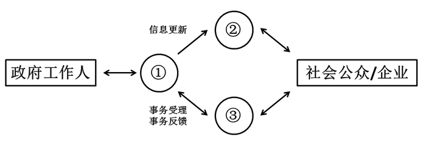

- **A**. 政务信息发布系统、政务业务办理系统、办公自动化系统
- **B**. 办公自动化系统、政务信息发布系统、政务业务办理系统　✅
- **C**. 政务业务办理系统、办公自动化系统、政务信息发布系统
- **D**. 政务业务办理系统、政务信息发布系统、办公自动化系统

**答案**：B

**官方解析**

B项正确：根据政府机构的业务形态来划分，电子政务包括政务信息查询、公共政务办公、政府办公自动化三个应用领域。政务信息查询是为社会公众和企业组织提供查询服务；公共政务办公是借助互联网实现政府机构的对外办公，办理政务相关业务；办公自动化系统是以信息化手段提高政府机构内部办公的效率。从业务流程来看，政府通过办公自动化系统，将信息更新到政务信息发布系统上，供社会公众和企业查询；政府工作人员与社会公众和企业之间，则通过政务业务办理系统建立沟通，处理相关业务。
故正确答案为B。

---

### 第 10 题　qid 2024108 · 人文常识

下列关于中国教育史的表述错误的是：

- **A**. 我国最早专门论述教育问题的著作是《学记》
- **B**. 严复的“三育论”是指“鼓民力”“开民智”“新民德”
- **C**. 《三字经》《百家姓》和《千字文》是我国古代的蒙学教材
- **D**. 蔡元培提倡“五育并举”，五育是指实利主义教育、公民道德教育、世界观教育、美感教育和劳动教育　✅

**答案**：D

**官方解析**

A项：《学记》是我国古代典章制度专著《礼记》中的一篇，写于战国晚期，是我国也是世界上最早的一篇专门论述教育和教学问题的论著，正确；
B项：严复受达尔文的进化论和斯宾塞社会学说的影响，在教育作用问题上，提出“三育论”， 主张鼓民力、开民智和新民德，正确；
C项：《三字经》《百家姓》《千字文》简称“三百千”，是我国古代影响较大且流行较广的儿童启蒙读物，正确；
D项：“五育并举”是由我国教育思想家蔡元培提出的教育思想主张，“五育”指的是“军国民教育、实利主义教育、公民道德教育、世界观教育、美感教育”，D项中的“劳动教育”不属于“五育”之一，错误。
本题为选非题，故正确答案为D。

---

### 第 11 题　qid 2015320 · 人文常识

下列关于里约热内卢奥运会的说法正确的是：
①里约热内卢是奥运史上首个举办奥运会的南美洲城市
②里约热内卢是首个举办奥运会的葡萄牙语城市
③现代奥运会开幕式最先进场的代表团是东道国代表团
④国际奥委会主席巴赫宣布里约奥运会口号：“一个新世界”
⑤里约奥运会新增高尔夫、五人制橄榄球两项赛事

- **A**. ①②④　✅
- **B**. ②③⑤
- **C**. ①③⑤
- **D**. ②③④

**答案**：A

**官方解析**

①②第31届夏季奥林匹克运动会，又称2016年里约热内卢奥运会，于2016年8月在巴西的里约热内卢举行。里约热内卢成为奥运史上首个主办奥运会的南美洲城市，同时也是首个主办奥运会的葡萄牙语城市，正确。
③北京时间8月6日早晨7点，2016里约奥运会开幕式举行，按照传统，希腊代表团将在旗手的带领下首先步入会场，东道主巴西队将作为最后一个代表团入场。故“最先进场为东道主代表团”表述错误，按照传统应该是希腊代表团第一个进场，错误。
④2016年6月14日，国际奥委会主席巴赫宣布里约奥运会口号“一个新世界”，正确。
⑤2009年10月9日，第121届国际奥林匹克委员会大会投票决定高尔夫和七人制橄榄球成为2016年里约热内卢奥运会、2020年东京奥运会的正式比赛项目。故“五人制橄榄球”表述错误，应该为“七人制橄榄球”，错误。
①②④表述正确，故正确答案为A。

---

### 第 12 题　qid 2015332 · 人文常识

我国大气，地表水环境与资源管理中实行污染物排放总量控制，这一规定体现的生态规律是：

- **A**. 物质循环转换与再生规律
- **B**. 环境资源的有效极限规律　✅
- **C**. 物质输入输出的动态平衡规律
- **D**. 相互依存与相互制约的互生规律

**答案**：B

**官方解析**

本题考查生物常识，主要考查生态规律相关知识。
题干表述污染物的排放要与大气、地表水的承受能力相对应，而不能超过承受极限，否则会造成更为严重的后果，说明环境资源的承受能力是有极限的。
B项正确：环境资源的有效极限规律，是指生态系统中作为生物赖以生存的各种环境资源，在质量、数量、空间、时间等方面，都有一定的限度，而不能无限制地供给，因此，每一个生态系统对任何外来干扰都有一定的忍耐极限，当外来干扰超过此极限时，生态系统就会被损伤、破坏甚至瓦解。这一规律要求我们要注意极限，坚持适度原则。
A项错误：物质循环转换与再生规律，是指生态系统中，植物、动物、微生物和非生物成分，借助能量的不停流动，由此形成不停顿的物质循环。未体现环境资源的承受能力。
C项错误：物质输入输出的平衡规律，是指当一个自然生态系统不受人类活动干扰时，生物与环境之间的输入与输出是相互对立的关系，对生物体进行输入时，环境必然进行输出，反之亦然。未体现环境资源的承受能力。
D项错误：相互依存与相互制约的互生规律，主要分为两类：（1）普遍的依存与制约，也称“物物相关”，是指有相同生理、生态特性的生物构成生物群落或生态系统；（2）通过“食物”而相互联系与制约的协调关系，也称“相生相克”规律，即每一种生物在食物链或食物网中，都占据一定的位置，并具有特定的作用。未体现环境资源的承受能力。
故正确答案为B。

---

### 第 13 题　qid 2015346 · 科技常识

中药材的主要来源包括动物、植物、矿物等，下列哪一选项属于动物类药材？

- **A**. 田七、阿胶
- **B**. 地龙、牛黄　✅
- **C**. 龙骨、鸡内金
- **D**. 决明子、蝉衣

**答案**：B

**官方解析**

本题考查生活常识，主要考查医药常识。
动物类药材是中医药学遗产中的重要组成部分。中医药学历来认为：动物类药材属“血肉有情之”，具有疗效确切、历史悠久等特点，而倍受重视。
A项错误，田七是五加科人参属，属于植物类药材；阿胶是以驴皮为主要原料，放阿井之水而制成，属于动物类药材。
B项正确，地龙即蚯蚓，属于动物类药材；牛黄是脊索动物门哺乳纲牛科动物牛肝脏的胆结石，属于动物类药材。
C项错误，龙骨为古代哺乳动物如象类、犀牛类、三趾马等的骨骼的化石，属于矿物类药材；鸡内金是指家鸡的砂囊内壁，属于动物类药材。
D项错误，决明子是一年生半灌木状草本，属于植物类药材；蝉衣是蝉科昆虫黑蚱羽化后的蜕壳，属于动物类药材。
故正确答案为B。

---

### 第 14 题　qid 2015350 · 科技常识

在催化剂中，能够使化学反应加快速度的称为正催化剂，使化学反应速度减慢的称为负催化剂，下列属于负催化剂的是：

- **A**. 为防止食用油脂酸化而加入的没食子酸正丙酯　✅
- **B**. 在分解氯酸钾制备氧气实验时加入的二氧化锰
- **C**. 在用锌和稀硫酸反应制备氢气时加入的硫酸铜
- **D**. 在大雪后为促使积雪融化而在马路上撒下的盐

**答案**：A

**官方解析**

本题考查化学常识，主要考查催化剂相关知识。
题干给出了负催化剂的定义，即导致化学反应速度减慢的催化剂。可将此概念代入各选项进行一一比对。
A项正确，没食子酸正丙酯的作用是减慢食用油脂酸化的速度，属于负催化剂。
B项错误，二氧化锰能加快氯酸钾的分解速度，属于正催化剂，故排除。
C项错误，硫酸铜能加快锌和稀硫酸的反应，属于正催化剂，故排除。
D项错误，促使积雪融化，在马路上撒盐属于物理现象，不是化学反应。
故正确答案为A。

---

### 第 15 题　qid 2015356 · 人文常识

变色太阳镜的镜片能在太阳光线射来之后变暗，光线减弱后变亮，这是因为：

- **A**. 镜片吸收水平偏振光线，使镜片变暗，光线减弱后，水平偏振光增强使镜片变亮
- **B**. 镜片有选择地反射部分波段的光线，使镜片变暗，光线减弱后，透射光增加使镜片变亮
- **C**. 镜片中的晶体见光分解，吸收光线使镜片变暗，光线变暗时，晶体重新形成，镜片变亮　✅
- **D**. 镜片有选择地吸收部分波段的太阳光线，使镜片变暗，光线变暗时，反射光加强，镜片变亮

**答案**：C

**官方解析**

本题考查物理常识。
变色太阳镜在阳光下光线强烈照射时，镜片颜色会渐渐变深，可以保护眼睛免受强光刺激；进入室内，光线减弱，镜片颜色渐渐变浅，保证了对景物的正常观察。
C项正确：变色太阳镜的镜片是用含氯化银微晶体的光学玻璃制作的，根据光色互变可逆反应原理，在日光和紫外线照射下可迅速变暗，完全吸收紫外线，对可见光呈中性吸收；回到暗处，能快速恢复无色透明。
A项错误：偏振光是电矢量相对于传播方向以一固定方式振动的光，偏振镜主要应用于摄影，可以改变蓝天影调和色调、模拟夜景效果、改善非金属物体表面耀斑部位的影像清晰度、质感和色彩饱和度等。
B项错误：光投射到两种介质的分界面时，一部分光线改变了传播方向，返回第一媒介质继续传播，称之为光的反射。即光学镜片都会发生光的反射，并不是变色太阳镜变暗的原理。
D项错误，有选择性地吸收部分太阳波段的光线是偏光太阳镜的原理，即我们常说的墨镜，偏光太阳镜的镜片由于金属粉末过滤装置，能在光线射入时对其进行选择，将所有有害光线都阻隔掉却不影响可视光的透过，能够很好的保护眼睛不受阳光中有害光线的伤害。
故正确答案为C。

---

### 第 16 题　qid 2015364 · 科技常识

下列古语与物理现象对应错误的是：

- **A**. 磁石召铁，或引之也——磁现象
- **B**. 马力即竭，辀（指车辕）犹能一取焉——惯性现象
- **C**. 鉴洼，景一小而易倒，一大而正，说在中之外、内——凸面镜成像　✅
- **D**. 瓶存二窍，以水实之，倒泄；闭一则水不下，盖（气）不升则水不降——大气压力现象

**答案**：C

**官方解析**

本题考查物理常识，主要考查生活中常见的物理现象对应的原理。
C项错误：战国时期的《墨子·经下》中记载：“鉴洼，景一小而易，一大而正。说在中之外、内。”意思是：凹面镜成像，一种情况是缩小而倒立，一种情况是放大而正立，这是由于物处于“中”的外、内的不同而造成的。“鉴洼”即凹面镜，“中”是指球面中心与焦点之间的区域。
A项正确：战国时期秦国的《吕氏春秋》中记载：“磁石召铁，或引之也。”意思是：磁石吸引铁器，是有一种力在吸引它。这是物理上的磁现象。
B项正确：春秋时期的《考工记》中记载：“马力既竭，辀犹能一取焉。”意思是：在马拉车时，马不走了，即马对车不施力了，车子还有前进的趋势。这是物理上的惯性现象，说明物体不受力了，却依然具有速度。
D项正确：南北朝时期的《关尹子·九药篇》中记载：“瓶存二窍，以水实之，倒泻；闭一则水不下，盖（气）不升则（水）不降。”意思是：有两个小孔的瓶子能倒出水，如果闭住一个小孔，另一个小孔外面的空气压力会比瓶里水的压力大，水就流不出来。这是物理上的大气压力现象，即虹吸原理。
本题为选非题，故正确答案为C。

---

### 第 17 题　qid 2024114 · 科技常识

据报道，一个小行星采矿公司释放了一颗试验性小行星采矿探测器，希望其深入太阳系寻找具有采矿前景的近地小行星。该探测实验第一步的中心任务是从小行星提取水分。
下列关于探测器提取水分原因的解释最合理的是：

- **A**. 太空提取的水分没有污染，有利于科学研究
- **B**. 水是生命之源，提取水分有助于寻找地外生命
- **C**. 水可以被分解为氧和氢，能为探测器提供优质燃料　✅
- **D**. 地球水资源严重污染，必须从太空获取洁净的水资源供给人类

**答案**：C

**官方解析**

C项正确：报道中的小行星采矿公司为美国一家致力于开采自然资源和开展太空探索的科技公司——“行星资源”公司。该公司在新闻发布会上表示，除了开采行星上丰富的矿产资源，还将对太空进行探索。小行星上拥有丰富的水资源，水可以被分解为氧和氢，能够为外星探测设施提供燃料，成为深入探索太空的基石。C项最能解释为何探测实验第一步的中心任务是从小行星提取水分。ABD项的解释均不恰当。
故正确答案为C。

---

### 第 18 题　qid 2015376 · 人文常识

用砂锅煮食物，食物煮好后，让砂锅离开火炉，食物将在锅内继续沸腾一段时间，这是因为：

- **A**. 
砂锅是不良导体，导热速度较慢，锅内食物温度上升较慢

- **B**. 
锅内食物吸收较多热量，温度超过，降温所需时间较长

- **C**. 
离开火炉的砂锅锅底超过，食物继续吸热，会保持沸腾状态
　✅
- **D**. 
砂锅热容量较大，离开火炉后，食物将从砂锅吸收热量，温度继续上升

**答案**：C

**官方解析**

本题考查物理常识，主要考查物体的状态变化。

C项正确：用砂锅煮食物，食物煮好后，让砂锅离开火炉，食物将在锅内继续沸腾一段时间，这是因为砂锅离开火炉时，砂锅底的温度高于，而锅内食物为，离开火炉后，锅内食物能从锅底吸收热量，继续沸腾，直到锅底的温度降为为止。

A项错误：在已经达到沸点时，温度不会继续上升，砂锅导热速度慢，因此锅内食物温度降低较慢。

B项错误：在1个标准大气压下，水的沸点是。

D项错误：砂锅离开火炉后，从锅底吸收热量，使锅内温度保持在，而无法使温度继续上升。

故正确答案为C。

---

### 第 19 题　qid 2015384 · 科技常识

下列关于生活常识的做法正确的是：

- **A**. 生病时，可用茶水送服西药
- **B**. 可用聚氯乙烯塑料包装食品
- **C**. 二氧化硫可作为食品的防腐剂和保鲜剂　✅
- **D**. 可加过量的亚硝酸钠来保持食品的鲜美

**答案**：C

**官方解析**

C项正确：二氧化硫具有杀菌作用，能抑制腐败、腐烂，可以用作食品的防腐与保鲜。按照标准规定合理使用二氧化硫不会对人体健康造成危害。
A项错误：茶水不能用来送服西药，尤其是硫酸亚铁、碳酸亚铁、铁胺等含铁剂和氢氧化铝等含铝剂的西药，遇到茶水中的茶多酚类物质与金属离子结合而沉淀，会降低或失去药效。此外，茶叶含有咖啡因，具有兴奋作用，因此服用镇静、催眠、镇咳类药物时，也不宜用茶水送服，避免药性冲突降低药效。
B项错误：聚氯乙烯塑料不能用来包装食品。聚氯乙烯塑料中的增塑剂，含有对苯二甲酸二丁酯、邻苯二甲酸二辛酯等，这些化学品都有毒性。另外，聚氯乙烯塑料制品在较高温度下，如50℃左右就会慢慢地分解出氯化氢气体，这种气体对人体有害。
D项错误：过量的亚硝酸钠会致癌。亚硝酸钠在烹调和消化过程中会和食物中的胺反应，产生致癌物质亚硝胺类化合物，因此不能用过量的亚硝酸钠来保持食物鲜美。
故正确答案为C。

---

### 第 20 题　qid 2024116 · 科技常识

根据红细胞表面有无抗原A和B可以将血液分为A、B、AB，O四种血型。A血型含有抗原A，B血型含有抗原B，AB血型含有抗原A和B，O血型不含抗原A和B。抗原A和B分别由I（A）和I（B） 基因产物负责合成。现有一对夫妇，丈夫是O血型，妻子是AB血型，他们生下的小孩可能的血型是：

- **A**. O型或A型
- **B**. O型或B型
- **C**. A型或B型　✅
- **D**. AB型或A型

**答案**：C

**官方解析**

根据题意，O血型不含抗原A和B，属于隐性性状，其基因组合为ii，AB血型含有抗原A和B，属于显性性状，其基因组合为I(A)I(B)。结合遗传三大定律，丈夫是O血型，妻子是AB血型，其子女血型可能表现为I(A)i或I(B)i，即可能为A血型或B血型，C项正确。
故正确答案为C。

---

## 言语理解与表达

### 第 1 题　qid 2015470 · 逻辑填空

随着信息时代的_________，人们对计算能力的需求不断水涨船高，然而现有基于集成电路的传统计算机却渐渐潜力耗尽，_________。科学界认为，下一代计算机将是建立在量子层面的，它将比传统的计算机数据容量更大，数据处理速度更快。
依次填入画横线部分最恰当的一项是：

- **A**. 到来  无能为力
- **B**. 深入  力不从心　✅
- **C**. 来临  回天乏术
- **D**. 开启  力有未逮

**答案**：B

**官方解析**

先看第二空，所填成语与前文中“潜力耗尽”构成对应，表现出传统计算机在信息时代下计算能力的“无力感”。C项“回天乏术”比喻局势或病情严重，已无法挽救，文段只说“渐渐潜力耗尽”，填入此处程度过重，排除；A项“无能为力”、B项“力不从心”、D项“力有未逮”均指能力做不到，符合文意，保留。
再看第一空，根据提示信息“不断水涨船高”“ 渐渐潜力耗尽”可知，信息时代早已到来，现处于不断深化阶段，对应B项“深入”正确。而A项“到来”和D项“开启”，只是表示信息时代刚刚到来，排除。
故正确答案为B。
【文段出处】《[量子力]中国科技网量子力学》

---

### 第 2 题　qid 2015456 · 逻辑填空

一项研究结果___________了在梦中各种感官体验出现的频率，结果显示视觉体验居第一，听觉体验居第二，而触觉、嗅觉和味觉体验的出现频率相当低。视觉和听觉处理与大脑的关系要密切得多，多达三分之二的大脑皮层以某种方式参与视觉。因此，视觉如此频繁地在梦中出现，___________。而嗅觉等几乎与大脑皮层无关。与其他感觉不同，嗅觉直接连接进入记忆和情感系统，这就是为什么某种气味能如此清晰地唤起某个记忆。
依次填入划横线部分最恰当的一项是：

- **A**. 考察  不足为奇　✅
- **B**. 调查  比比皆是
- **C**. 观察  不值一提
- **D**. 考查  司空见惯

**答案**：A

**官方解析**

突破口在第二空，根据空格前的语句可知，视觉与大脑皮层的关系十分密切，因此视觉在梦中频繁出现很正常。A项“不足为奇”指某种事物或现象很平常，没有什么可奇怪的，与文段语义相符。
B项“比比皆是”指到处都是，形容特别常见，D项“司空见惯”形容经常看到的事物，已经不足为奇了，语义与文段相符，但无法搭配使用。如果想用“比比皆是”应表述为“视觉如此频繁在梦中出现的情况比比皆是”；如果用“司空见惯”常见搭配为某人对某事已是司空见惯，故根据用法排除B、D两项。C项“不值一提”指不值得提起，形容事情很轻微或者不重要，与文段表达的视觉听觉经常出现，没什么可奇怪的语义不符。
第一空，代入“考察”验证，“研究结果考察了在梦中各种感官体验出现的频率”，搭配得当。
故正确答案为A。
  【文段出处】《梦中为什么没有气味：嗅觉味觉对想象不敏感》

---

### 第 3 题　qid 2015454 · 逻辑填空

新媒体的发展，尤其是自媒体的兴起，挑战着传统的新闻生产机制，在信息超载的同时，使新闻生产“去中心化”，新闻流动的把关功能____________，不实消息____________网络。弥尔顿设想的“意见的自由市场”的自净功能并未实现，很多情况下谣言往往“____________”真相。
依次填入划横线部分最恰当的一项是：

- **A**. 消减  充满  淡化
- **B**. 降低  充盈  消溶
- **C**. 消弱  充溢  消淡
- **D**. 减弱  充斥  稀释　✅

**答案**：D

**官方解析**

第一空，搭配“功能”，B项“降低”常与气温、成本等词搭配，无法与“功能”搭配使用，排除。
第二空，搭配“不实信息”，语义偏消极，A项“充满”指布满、到处都有，C项“充溢”指充满而洋溢、富足，多表示中性或褒义，与文段感情色彩不符，排除。D项“充斥”意思是到处都是，常用作贬义词，语意合适。
第三空，代入“稀释”验证，“稀释”侧重从浓到淡，文段中对于“稀释”加了双引号，可以体现文段提到的谣言和不实消息逐渐增多对真相产生了影响，使真相减少的语意。
故正确答案为D。
【文段出处】《新闻业的数据新闻转向：语境、类型与理念》

---

### 第 4 题　qid 2015482 · 逻辑填空

19世纪中叶以后，中国国内战争频发，很多古籍        海外。时至今日，究竟有多少古籍在海外存藏，还是一个未知数。而将分散在海外至少上百家图书馆的中文古籍全部统计清楚，        在一个总目录之中，难度可想而知。
依次填入划横线部分最恰当的一项是：

- **A**. 流散 囊括　✅
- **B**. 流落 涵盖
- **C**. 流失 收录
- **D**. 散佚 罗列

**答案**：A

**官方解析**

第一空，搭配“古籍”，并且后文提到古籍“分散在海外”，A项“流散”指流落分散，C项“流失”指有用的东西流散失去，D项“散佚”指散失，都可以与文段分散的语义对应，保留。B项“流落”指移动不定或漂泊外地、穷困潦倒，通常搭配人，无法搭配古籍，排除。
第二空，横线之前提到“将分散在海外至少上百家图书馆的中文古籍全部统计清楚”，横线后提到“在一个总目录之中”，可知文段想表达的意思为将分散的古籍进行汇总，A项“囊括”指全部包含在里边，符合文段语义，当选。C项“收录”指编辑采用，D项“罗列”指排列、陈列，均没有概括的意思，排除。
故正确答案为A。
【文段出处】《摸清海外中文古籍家底》

---

### 第 5 题　qid 2024122 · 逻辑填空

娱乐节目走进博物馆，为博物馆开拓了一个有声有色的广告世界，却与博物馆所要求的环境氛围_______。综艺节目的自身特性决定了其与博物馆文化存在着天然的不一致，因此当演员在文物面前_______地“秀”时，即使这档真人秀节目未曾损坏一件文物，但放任其在博物馆里_______，就已经与文物保护的要求相抵触了。
依次填入划横线部分最恰当的一项是：

- **A**. 霄壤之别   夸张   炫耀
- **B**. 扞格不通   做作   喧闹
- **C**. 大相径庭   肆意   表演
- **D**. 格格不入   放肆   喧嚣　✅

**答案**：D

**官方解析**

第一空，前文用一个“却”表示转折，表示娱乐节目的氛围与博物馆要求的环境氛围并不同，A项中“霄壤之别”可以表示出“有很大不同”的意思，但一般用法是“与······有着霄壤之别”，而不是“与······霄壤之别”，故排除；B项“扞格不通”表示“固执成见，不能变通”，多用来形容思想上的不同，一般不修饰“环境氛围”，故排除。
第三空，首先“喧嚣”表现出了演员们在博物馆内录制节目时吵闹、喧哗，与博物馆所要求的安静的环境氛围相抵触对应，而C项的“表演”体现不出这层意思。其次根据文段语境，横线应填入消极感情色彩的词语，D项“喧嚣”符合要求，而C项的“表演”为中性词。
验证D项第二空，“放肆”形容演员“秀”时的状态，符合文意，当选。
故正确答案为D。
【文段出处】《“跑男”事件博物馆最不需要的就是热闹》

---

### 第 6 题　qid 2015496 · 逻辑填空

我们不可_________，不可完全以自己的心理取代人物的心理。每个人都有自己的生存逻辑，其中包括日常生活的逻辑，还有文化心理的逻辑。逻辑是很强大的，差不多像是铁律。人们之所以这样做，而不是那样做，受到的是逻辑的_________和制约。薛宝钗和林黛玉的逻辑_________，如果让林黛玉与贾宝玉谈仕途经济，那就可笑了。
依次填入划横线部分最恰当的一项是：

- **A**. 自以为是  支配  大相径庭　✅
- **B**. 自命不凡  局限  背道而驰
- **C**. 执迷不悟  控制  截然不同
- **D**. 一意孤行  操纵  天差地别

**答案**：A

**官方解析**

第一空，根据后文解释可知，不可完全以自己的心理取代人物的心理，即不能太过自我，需填入表示此意的成语。A项“自以为是”总以为自己是对的，认为自己的观点、做法都正确，不接受别人的观点，B项“自命不凡”指自以为很了不起，不平凡，均符合文意，保留。C项“执迷不悟”一般形容坚持错误而不自觉，文中并无“自己的心理就一定是错误的”意思，用于此处程度过重，排除。D项“一意孤行”指不接受别人的劝告，顽固地按照自己的主观想法去做，文段未体现“别人的劝告”，故与文段语意不符，排除。
第二空，与“制约”构成并列，“制约”即限制约束，A项“支配”指对人或事物起引导和控制的作用、B项“局限”指限制在某个范围内，均符合要求，保留。
第三空，形容薛宝钗和林黛玉的逻辑，A项“大相径庭”意为彼此相差很远，很不一致，填入文段体现两者逻辑不同，与后文对应，符合文意，当选；B项“背道而驰”比喻行动跟既定的方向完全相反，一般不与“逻辑”搭配，并由后文内容可知，横线处需体现两者逻辑相反，“背道而驰”侧重于完全背离，程度过重且一般多指背离正确的道路，文段没有强调对错关系，与文意不符，排除。
故正确答案为A。
【文段出处】《贴近人物的心灵（创作谈）》

---

### 第 7 题　qid 2015458 · 逻辑填空

养老金制度改革已经            ，路径之一是多元化的基金补充机制；其次是建立灵活的退休机制。应尽快实现城镇职工基础养老金的全国统筹，科学制定方案        延迟退休政策，同时深入调整个人账户制度的管理模式，并进行实际的投资运营。
依次填入划横线部分最恰当的一项是：

- **A**. 刻不容缓 启动　✅
- **B**. 势在必行 推动
- **C**. 风生水起 施行
- **D**. 众望所归 开展

**答案**：A

**官方解析**

第一空，搭配“养老金制度改革”，D项“众望所归”形容某人威望很高，受到大家敬仰和信赖，搭配不当，排除。同时，文段后文提到“尽快实现”“进行实际运营”，体现养老金制度目前急需改革，C项“风生水起”形容事情做得有生气，蓬勃兴旺，没有紧急的意思，排除。A项“刻不容缓”、B项“势在必行”均表示目前形势紧迫，符合文段语境，保留。
第二空，对应横线前面内容，“统筹”“制定方案”说明目前改革还没有开展，我们要开始“启动”，A项符合文意，当选。而B项“推动”更侧重表达正在进行的某事被推了一把、加点助力，不符合文意，排除。
故正确答案为A。
【文段出处】《养老金征缴收入增幅跌至个位数》

---

### 第 8 题　qid 2015464 · 逻辑填空

用人情做出来的朋友只是暂时的，用人格吸引来的朋友才是___________的。所以，丰富自己比取悦他人更有力量。太多时候，我们的忙碌其实是___________的。我们把自己累得气喘吁吁，最终却无功而返。与其追逐远方，不如做好脚下的事。
依次填入划横线部分最恰当的一项是：

- **A**. 长久 盲目　✅
- **B**. 永恒  必须
- **C**. 确定 无奈
- **D**. 可靠  无谓

**答案**：A

**官方解析**

第一空，横线处所要填的内容，对应前文“用人情做出来的朋友只是暂时”中的“暂时”，强调时间的长短，而C项的“确定”和D项的“可靠”均不能用来修饰和强调“时间”，排除。
第二空，所要填写的内容与后文“把自己累得气喘吁吁，最终却无功而返”对应，即说明我们的忙碌其实是“盲目”的，而不是“必须”的，排除B项。
故正确答案为A。
【文段出处】《把自己变成“草原”》

---

### 第 9 题　qid 2015460 · 逻辑填空

在过去十年里，中国南部几乎每个省都发现了古人类化石，其中许多都来自可以追溯到10万年或者更多年头之前的沉积物，但是从解剖学来看，这些人类的        跟生活在今天的中国人几乎没有什么不同。
填入划横线部分最恰当的一项是：

- **A**. 外形
- **B**. 特征　✅
- **C**. 样貌
- **D**. 特质

**答案**：B

**官方解析**

根据“从解剖学来看”，可知要填入表示解剖学研究结果的词语。解剖学主要研究生命体的结构和组织，B项“特征”表示一种事物异于其他事物的特点，符合文意，且与“人类”搭配恰当，当选。D项“特质”表示内在素质，与文意无关，排除。A、C两项“外形”“样貌”只是特征的一个方面，且属于人类的表面特征，与“解剖”语意不符，排除。
故正确答案为B。
【文段出处】《现代人起源在中国？贵州重大发现震撼全球》

---

### 第 10 题　qid 2024124 · 逻辑填空

亚马逊的河流与丛林、安第斯的山脉、巴塔哥尼亚高原、潘帕斯草原，哪怕仅仅是_________这些神秘野性的地理名词，也能莫名其妙地在心中唤起某种情感，好像即将开始一趟心灵的象征之旅，旅途中“对_________的人生和不屈不挠的精神做出一番沉思”。
依次填入划横线部分最恰当的一项是：

- **A**. 想起  精彩纷呈
- **B**. 品味  变幻无常
- **C**. 吟诵  颠沛流离
- **D**. 默念  漂泊不定　✅

**答案**：D

**官方解析**

第一空，搭配“地理名词”，C项“吟诵”通常搭配诗歌等，不能与地理名词搭配，排除；根据“仅仅是”可知，文段表意程度较轻，B项“品味”指体味、回味，有细细思考之意，故表意程度较重，排除。
第二空，文段提及“心灵的象征之旅”，可知一个地理名词象征一段旅程，D项“漂泊不定”指生活不固定，东奔西走，可以对应到文段中的旅程，故D项正确，当选。A项“精彩纷呈”指美好的场面和事物纷纷在眼前呈现出来，与文段语义不符，排除。
故正确答案为D。
【文段出处】《三联生活周刊 · 拉美范儿》

---

### 第 11 题　qid 2024126 · 逻辑填空

区域是建构出来的，根据人为的目的划出的区域，已经不是原来大地中生机勃勃、复杂多样的原本的那个地方了。规定的区域是简单的对世界的某一方面的一个概括而已，切不可_______我们建构的区域，认为这就是真实的世界，是天经地义的客观真理，不容他们_______或者变化一下。
依次填入划横线部分最恰当的一项是：

- **A**. 固执  申辩
- **B**. 迷信  置喙　✅
- **C**. 痴迷  讨论
- **D**. 拘泥  质疑

**答案**：B

**官方解析**

第一空，搭配“区域”，形容人对于区域的一种态度，A项“固执”指坚持己见，一般修饰人的性格，不符合文意，排除。D项“拘泥”在使用时后要接介词“于”，不能直接接宾语，排除。
第二空，对应前文“认为这就是真实的世界，是天经地义的客观真理”，横线处应表示不容别人否定之意，且搭配“不容”，用于否定句中，B项“不容置喙”为固定搭配，指不容许插嘴，可表示不允许别人说不同的意见，符合文意，当选。C项“讨论”指探讨，交换意见，并无否定之意，排除。
故正确答案为B。
【文段出处】《地理的乐趣：建构“区域”》

---

### 第 12 题　qid 2015462 · 逻辑填空

雪的可爱处在于它覆盖大地没有差别。冬夜拥被而眠，觉寒气袭人，蜷缩不敢动，凌晨张开眼皮，窗棂窗帘隙处有强光___________，大异往日，起来推窗一看，啊！白茫茫一片银世界。竹枝松叶顶着一堆堆的白雪，杈芽老树也都镶了银边。朱门与蓬户同样的蒙受它的沾被，没有差别待遇。地面上的坑穴洼溜，冰面上的枯枝断梗，路面上的残刍败屑，全都罩在天公__________下的一件鹤氅之下。
依次填入划横线部分最恰当的一项是：

- **A**. 闪烁 撒
- **B**. 闪映 抛　✅
- **C**. 闪现 洒
- **D**. 映照 织

**答案**：B

**官方解析**

本题可从第二空入手，横线处搭配“鹤氅”，鹤氅即外套，且根据横线前“天公”及横线后“下”可知，横线处要体现出鹤氅由上到下之意，B项“抛”指投，扔，符合文意，保留。A项“撒”指散布、散落，C项“洒”指使水或其他东西分散地落下，均与“鹤氅”搭配不当，排除。D项“织”指用丝、麻、棉纱、毛线等编成布或衣物等，体现不出由上到下之意，排除。
第一空代入验证。B项“闪映”指闪烁映照，与“窗棂窗帘隙处有强光”搭配恰当，当选。
故正确答案为B。
【文段出处】梁实秋散文《雪》

---

### 第 13 题　qid 2015452 · 逻辑填空

诗歌，这一文学皇冠上最古老而璀璨的明珠，在当代社会正面临着前所未有的境况。一面是大众偏见的_________，譬如“诗歌就是分行”“写诗是无病呻吟”等论调甚嚣尘上；一面是诗歌内部的_________，学术话语与商业话语分庭抗礼，业内与大众水火不容。
依次填入划横线部分最恰当的一项是：

- **A**. 蔓延  抵触
- **B**. 流行  分歧
- **C**. 横行  分裂　✅
- **D**. 干扰  争议

**答案**：C

**官方解析**

第一空，横线后提到“论调甚嚣尘上”，说明这些“大众偏见”普遍流传，传播很广，D项“干扰”有打扰、妨碍的意思，不能体现传播很广，故排除D项；
第二空，横线后提到“分庭抗礼”“水火不容”，说明诗歌内部分成两个部分，完全不能相容，对应C项“分裂”，A项“抵触”强调有矛盾，B项“分歧”指意见不一致，“抵触”与“分歧”相对于“分裂”来说程度太轻，不能体现出完全不相容的状态，故排除A、B两项。
故正确答案为C。
  【文段出处】《中国诗歌：如何从“家乡”走向“远方”》

---

### 第 14 题　qid 2015486 · 逻辑填空

海洋酸化会影响珊瑚、贝类等钙化生物的正常生长，        它们的碳酸钙外壳，甚至对它们造成        的影响，进而破坏整个食物链。为了保护自己，这些钙化生物会长得越来越小、外壳越来越厚，这会对食用贝类养殖产业造成很大的打击。
依次填入划横线部分最恰当的一项是：

- **A**. 腐化 恶劣
- **B**. 侵蚀 严重
- **C**. 腐蚀 致命　✅
- **D**. 侵入 深远

**答案**：C

**官方解析**

第一空，“海洋酸化”对“钙化生物碳酸钙外壳”的作用，“酸化”可知为化学反应，B项“侵蚀”、C项“腐蚀”均表示由化学或化学作用使物体消耗或破坏，符合文意，保留。A项“腐化”表示有机体腐烂，与文意不符，排除；D项“侵入”表示强行进入、非法进入，无法与“酸化”反应对应，排除。
第二空，“甚至”表递进，需填入比“影响生长”语意程度更重的词语。C项“致命”指可使生命丧失，比“影响生长”程度更重，且能形成语意上的递进，当选。B项“严重”无法体现语意递进，排除。
故正确答案为C。
【文段出处】《走进北极考察：科考项目知多少》

---

### 第 15 题　qid 2015480 · 逻辑填空

研究人员表示，忆阻器被植入到人体内后，可以执行体征_________、疾病_________、伤口愈合跟踪，并能够将信息无线传送给医生或患者，以便于采取后续措施。实验证实，可降解忆阻器可读写数百次，在干燥情况下，信息可储存3个月。
依次填入划横线部分最恰当的一项是：

- **A**. 监视  预报
- **B**. 监控  预防
- **C**. 监测  预警　✅
- **D**. 监管  预测

**答案**：C

**官方解析**

第一空，所填词语搭配“体征”，能体现出忆阻器对人体征的作用。A项“监视”侧重强调看，常与“举动”搭配，排除。B项“监控”侧重于强调控制，而忆阻器并不能控制体征，故排除。D项“监管”更多的强调管理，常与“工作”等搭配。忆阻器只是一个机器，对体征也不能进行管理，故排除。C项“监测”侧重于强调对一个事物的监视和预测，测量出事物的变化，“体征”的变化是可以“监测”到的。基本锁定C项。
第二空验证，“疾病预警”可构成搭配，强调在疾病来临之前预先警示危险。
故正确答案为C。
【文段出处】《中英科学家研制出新型忆阻器植入人体可被吸收》

---

### 第 16 题　qid 2024130 · 逻辑填空

资料显示高跟鞋最初是由波斯人发明，16世纪，高跟鞋文化传入欧洲，成为当时的服装潮流，甚至连贵族也争相_____。到了大约17世纪30年代，欧洲女性开始穿高跟鞋，以带动潮流。17世纪70年代，当时的法国国王路易十四规定，只有他的宫廷人员才可穿高跟鞋。及至启蒙时代，当时的人_______，关注高跟鞋的实用性而非为潮流而穿。直到18世纪中叶，男士穿着高跟鞋被视为笨拙象征，所以不再穿着。
依次填入划横线部分最恰当的一项是：

- **A**. 效仿  洗尽铅华
- **B**. 模仿  返璞归真
- **C**. 追捧  返璞归真　✅
- **D**. 追逐  洗尽铅华

**答案**：C

**官方解析**

第一空，由“高跟鞋文化传入欧洲，成为当时的服装潮流”可知，第一空与“文化”相搭配，A项“效仿”、B项“模仿”不能与文化搭配，排除A、B两项。
第二空，文段提到“关注高跟鞋的实用性而非为潮流而穿”，侧重于高跟鞋的“实用性”，C项“返璞归真”同“返朴归真”，比喻恢复原来的自然状态，语义恰当，当选。D项“洗尽铅华”指洗掉伪装世俗的外表，文段并未提及“世俗”，排除D项。
故正确答案为C。
【文段出处】《高跟鞋背后的故事》

---

### 第 17 题　qid 2015468 · 逻辑填空

谈大学办得好不好，就看与哈佛、耶鲁的差距有多大，这已经成为一种新的“迷思”。强调东西方大学性质不同，拒绝比较，必定趋于__________；反过来，一切唯哈佛、耶鲁马首是瞻，忽略养育你的_________，这同样有问题。
依次填入划横线部分最恰当的一项是：

- **A**. 因循守旧   慈亲严师
- **B**. 夜郎自大   八水三川
- **C**. 裹足不前   高堂师长
- **D**. 固步自封   一方水土　✅

**答案**：D

**官方解析**

本题从第二空入手，文段讨论的主体是“大学”，所以需填入的内容应为一个环境或地方，A项“慈亲严师”和C项“高堂师长”均指父母和老师，强调的是“人”而非“环境”，与“大学”主体不符，排除。B项“八水三川”形容河水纵横的地理景观，与文意无关，排除。D项“一方水土养一方人”是固定搭配，比喻一定的环境造就一定的人才，符合文意，保留。
第一空，代入验证，D项“固步自封”比喻守着老一套，不求进步，符合拒绝与其他大学比较的结果，符合文意，当选。
故正确答案为D。
【文段出处】《中国大学对“世界一流”执念太深、焦虑太重》

---

### 第 18 题　qid 2015472 · 逻辑填空

英国是个小国，但却是吸引全球投资资金流第二多的国家，这不仅仅因为英国是世界第五大经济体，更因为很多投资人视英国为通往欧洲大陆的一扇大门。公投结果使得将来英国与欧洲国家的贸易关系_________，而整个退欧谈判过程将至少需要2年，在这一期间所造成各种不稳定性难以预计。因此，那些英国最大的投资国，在未来各种贸易关系并不明朗的情况下，可能会________对英投资。
依次填入划横线部分最恰当的一项是：

- **A**. 错综复杂 削减
- **B**. 盘根错节  删减
- **C**. 扑朔迷离 减少　✅
- **D**. 蛇蟠蚓结  缩减

**答案**：C

**官方解析**

第一空，对应后文“关系并不明朗”，“贸易关系”应该是模糊的、不好辨别的。A项“错综复杂”形容头绪多，情况复杂，B项“盘根错节”比喻复杂不易解决的事情，均只强调事情的复杂性，无法对应“不明朗”的语境，与文段语境不符，排除。D项“蛇蟠蚓结”比喻相互勾结，与文意无关，排除。C项“扑朔迷离”形容事情错综复杂，难以辨别清楚，符合文段语境，当选。
第二空，代入验证，“减少投资”搭配合理，C项当选。
故正确答案为C。
【文段出处】《面对退欧后“烂摊子”英国新财相发出转向信号》

---

### 第 19 题　qid 2015488 · 逻辑填空

虽然太阳黑子变弱和地球变冷表面看有着70年的重合，但没有证据表明“小冰期”是由太阳黑子无记录造成的。而实际上，与太阳活动周强弱有关的全球气温变化_________其实是很小的，根据经验，最近几次太阳活动周影响全球平均气温的变化大约只有0.1度左右。因此，千万别随便就断言太阳周期变化能直接影响地球气温的_________，以为地球马上就要进入新一轮“冰河期”了。
依次填入划横线部分最恰当的一项是：

- **A**. 范畴  突变
- **B**. 幅度  骤变　✅
- **C**. 范围  剧变
- **D**. 跨度  巨变

**答案**：B

**官方解析**

第一空，搭配“变化”。A项“范畴”更多强调人的思维对客观事物的本质概况和反映，如思想范畴、社会科学范畴等，不与“变化”搭配；D项“跨度”可以搭配“气温”，但是不能搭配“变化”。故排除A、D两项。
第二空与“以为地球马上就要进入新一轮‘冰河期’”对应，所填词语应体现出“时间变化快”。B项“骤变”意为“忽然发生变化”，符合文意。C项“剧变”强调变化剧烈，无法与后文的“马上”对应，故排除C项。
故正确答案为B。 
【文段出处】《太阳黑子消失冰河期来了？地球温度骤降》

---

### 第 20 题　qid 2015506 · 语句表达

某市交通管理局曾经推出一个创意很巧妙的公益宣传片：电视画面中，现代都市的交通变成了按照丛林法则任意穿行的“动物世界”，满是超载、不走斑马线、翻越护栏等交通乱象。这很巧妙地回答了上面的问题，如果没有汽车文明，我们的城市表面上是现代文明和高科技的产物，实则无异于丛林法则下的弱肉强食和混乱无序。
下列哪一项不是划横线部分“上面的问题”所指：

- **A**. 如果没有汽车文明的话，汽车社会将是怎样的场景
- **B**. 如何杜绝“路怒”现象以及汽车“违法变道”现象　✅
- **C**. 汽车文明滞后于汽车时代，汽车社会将是何等境况
- **D**. 汽车文明没有发育成熟，汽车社会将是怎样的场景

**答案**：B

**官方解析**

文段首先介绍了交通管理局公益宣传片所呈现出的交通乱象,接下来提出“这很巧妙地回答了上面的问题”，接着对此问题进行具体解释说明——如果没有“汽车文明”，我们的城市将出现不好的结果，即没有“汽车文明”的“汽车社会”将是一个杂乱无序的社会。因此，“上面的问题”与“汽车文明”有关，A、C、D三项均提到“汽车文明”，且都体现出汽车文明与社会存在着关系，排除；B项未提到“汽车文明”，主题不符且内容仅涉及不文明的表现，因此，B项不属于“上面的问题”，当选。
本题为选非题，故正确答案为B。
【文段出处】《汽车文明有待发育》

---

### 第 21 题　qid 2024132 · 片段阅读

20世纪50年代，有科学家发现细菌会脱落细胞壁，不再呈现特有形状，让免疫系统“失察”；一段时间以后，这些细菌会重新获得细胞壁，恢复原有形状，再次全面具备感染人体的能力。最近，有研究人员首先施用一种抗生素，突破大肠杆菌的细胞壁，让它改变形状。随后施用另一种抗生素，针对一种名为MreB的蛋白质，令细菌即使增殖，也无法恢复原有形状，不再具备感染能力，最终自然消亡。这项研究可以解释细菌抗药性成因，对细胞壁构建过程加深理解，可望促成对抗生素运用战略更好的筹划。
根据这段文字，下列说法正确的是：

- **A**. 抗生素阻止细菌重新获得新细胞
- **B**. 抗生素抑制MreB的蛋白质产生细菌
- **C**. MreB的蛋白质主导细菌细胞壁变异
- **D**. MreB的蛋白质是细菌“隐身”的关键　✅

**答案**：D

**官方解析**

细节判断题，根据文段判断选项正误。
A项，根据文段可知，抗生素使细菌增殖，但无法恢复原有形状，即已经获得新细胞，但形状不能恢复，表述错误，排除；
B项，根据“令细菌即使增殖”可知，已产生新细菌，排除；
C项，文段的表述为，细菌脱落细胞壁，故“变异”表述错误，排除；
D项，文段表明针对MreB蛋白质作用后，细菌无法恢复原有形状，即MreB蛋白质能控制细菌脱落与重获细胞壁，表述正确，当选。
故正确答案为D。
【文段出处】《美科学家揭秘细菌如何“隐身”》

---

### 第 22 题　qid 2015498 · 片段阅读

从某种意义上来说，试点导游自由执业，借助互联网技术搭建导游统一预约平台，让导游和消费者在透明机制下进行双向选择，有利于双方信息对称，从而促使市场定价趋于更加科学合理。而导游不再受旅行社盈利目标制约，可以靠自己的真正本领吃饭。这样不仅能够有效遏制旅游市场相关乱象，也有助于让导游价值回归到其所提供的服务本身上来。如此，国内旅游生态的真正改善还会远吗？
这段文字意在强调：

- **A**. 导游自由执业有利于实现导游服务价值
- **B**. 导游自由执业有利于市场定价趋于合理
- **C**. 导游自由执业有利于改善国内旅游生态　✅
- **D**. 导游自由执业有利于遏制旅游市场乱象

**答案**：C

**官方解析**

文段先叙述试点导游自由执业对市场有好处，“而”之后表明对导游自身也有好处，通过“这样”指代前文自由执业对市场、导游的两方面意义。最后通过“如此，国内旅游生态的真正改善还会远吗？”提出反问，总结前文导游自由执业的试点对于改善国内旅游生态的重要意义，对应C项。
A、B、D三项都只是自由执业意义的片面描述，故排除。
故正确答案为C。
【文段出处】《导游自由执业有利于改善国内旅游生态》

---

### 第 23 题　qid 2015490 · 片段阅读

最新研究成果认为，导致心脑血管疾病的一大因素就是高血脂，饮食的油腻程度与血脂确实有着解不开的联系，但不是必然的。血脂在人体内有一个新陈代谢的过程，各种营养素在体内是可以互相转化的。一个人如果体内合成血脂能力强的话，就算只吃素也会有高血脂，素食只对高脂血症患者有一定帮助。要想减少心脑血管疾病，在合理膳食的基础上增加身体锻炼才是最好方式，仅靠吃素帮助有限。如果不结合个体特点盲目素食，尤其是长期过度素食，对身体健康可能还会产生危害。
与这段文字意思相符的一项是：

- **A**. 只吃素食加上锻炼就能减少心脑血管疾病
- **B**. 素食习惯对高脂血症患者有百害而无一利
- **C**. 饮食的油腻程度与血脂产生没有任何联系
- **D**. 只吃素食与避免心脑血管病没有必然联系　✅

**答案**：D

**官方解析**

细节判断题，根据文段判断选项正误。A项，根据文段可知，“素食加上锻炼是最好方式”，故“就能减少”表述过于绝对，排除。B项，根据“素食只对高脂血症患者有一定帮助”，可知“有百害而无一利”表述错误，排除。C项，根据“饮食油腻程度与血脂确实有着解不开的联系”可知“没有任何联系”表述错误，排除。D项，根据“饮食油腻程度与血脂确实有着解不开的联系，但不是必然的”“仅靠吃素帮助有限”等表述可知正确。
故正确答案为D。
【文段出处】《吃肉与心脑血管病没有必然联系》

---

### 第 24 题　qid 2015512 · 片段阅读

近期网上流传一种观点，认为暴利的眼镜行业造就了的近视眼。一些网友称商家只会一味推销眼镜，其实近视后视力仍可恢复，但眼镜戴了就摘不下来了，因此能不戴眼镜尽量不要戴。这引发不少人对眼镜店唯利是图、赚取暴利的斥责，进而引起关于“越戴眼镜越近视”的讨论。然而临床研究表明，当青少年时期近视现象被诱发出来后，不管戴不戴眼镜，近视程度都会不断加深。这是因为正在成长发育的青少年，他们的眼球也在发育，因而近视的度数并不稳定。但只要准确检测出近视度数，眼镜不会成为加深度数的罪魁祸首。

这段文字意在说明：

- **A**. 佩戴近视眼镜之后仍可以恢复视力
- **B**. 佩戴眼镜与近视加深完全没有关系
- **C**. 近视加深与佩戴眼镜没有必然联系　✅
- **D**. 眼镜商家并非仅因暴利而推销眼镜

**答案**：C

**官方解析**

文段首先介绍了近期网上流传的一种观点，即能不戴眼镜就不戴。并说明这一观点引发了对眼镜店的斥责和关于“越戴眼镜越近视”的讨论。接着通过“然而”转折后强调，近视程度加深和佩戴眼镜无关，并对这一观点加以解释说明。故转折后观点为文段重点，C项是对观点句的同义替换。
A项，“佩戴近视眼镜之后仍可以恢复视力”文段中没有提到，无中生有，排除。B项“完全没有关系”表述绝对，排除。D项“眼镜商家”为转折前内容，非文段重点，排除。
故正确答案为C。
【文段出处】《夏季科学防治近视眼走出近视三大误区》

---

### 第 25 题　qid 2015500 · 片段阅读

艺术创作世界没有“安慰奖”，作品自身的水准远比空谈“磨剑”的口头功夫来得重要。更何况有些标榜的“年数”，还未必真实。所以套用一句当下的流行语：少一些磨剑，多一些真诚。当然，这绝对不是说文艺作品不需要反复打磨；恰恰相反，正是因为文艺作品需要真诚与耐心的打磨，我们才更应该对那些放卫星般的“数年磨一剑”说不，因为它将真正打磨作品的心血廉价化了——如果一个人用几个月把自己十年前想到的点子写出来就算是十年磨一剑的话，那些真正在三千多个日日夜夜里一遍遍呕心沥血、钻研雕琢的人，我们又该如何赞扬他们呢？
这段文字意在说明：

- **A**. 文艺作品不需要长时间打磨
- **B**. 标榜数年磨一剑都缺少真诚
- **C**. 作品耗时与创意起始点无关
- **D**. 作品价值无需强调创作艰辛　✅

**答案**：D

**官方解析**

文段为提出观点+解释说明结构。开篇提出观点“艺术创作世界没有‘安慰奖’，作品自身水准远比空谈‘磨剑’的口头功夫来得重要”，后文详细解释说明原因——其中“更何况”表就观点进一步解释说明原因，引导的是原因。所以，文段的重点落在提出观点部分，即作品自身的水准比嘴上说创作得多么艰辛更重要，创作艰辛并不一定能证明作品的价值，因而无需强调艰辛，对应D项。
A项一方面出自解释说明部分，非重点；另一方面，表述有误，文段说“这绝对不是说艺术作品不需要反复打磨”，双重否定表肯定，也就是说艺术作品需要反复打磨，选项语义与之相反，排除。B项一方面“都”过于绝对，文段只是说一部分说自己数年磨一剑的不真诚，而不是全部都是；另一方面出自解释说明部分，排除。C项对应破折号之后那句“如果一个人用几个月的时间把自己十年前想到的点子写出来就算十年磨一剑······”，为解释说明部分，并非文段重点，排除。
故正确答案为D。
【文段出处】《少一些“磨剑”，多一些真诚》

---

### 第 26 题　qid 2024134 · 语句表达

当我们不再为穿衣吃饭等基本需求发愁时，                        。我们不仅关注食品、安全、疾病、健康等离我们很近的东西，也开始关注那些离我们十分遥远、但又根植于内心深处的需求。它们或是短小精悍的科普故事，或是数据精准的百科知识，亦或就像中国人过春节，围观一场充满期待的科学盛宴。每一个普通人都可以从中寻找到探索的乐趣。
填入划横线部分最恰当的一句是：

- **A**. 关注内心需求将成为普遍的社会现象
- **B**. 科学将成为日常生活的重要组成部分　✅
- **C**. 科普讲座将构成节日期间的亮丽风景
- **D**. 人们将开始享受探索深层心理的乐趣

**答案**：B

**官方解析**

横线在文段的首句后半句位置，往往是起到总领全文的作用。文段提到，我们“开始关注那些离我们比较远但又根植于我们内心深处的需求”，下文又进行了解释，由“科普故事”“百科知识”“寻找探索的乐趣”可知，文段在讨论科学在生活中的表现，对应B项。A项“关注内心需求”表述不明确，排除。C项“科普讲座”概念缩小，排除。D项“深层心理”无中生有，排除。
故正确答案为B。
【文段出处】《宇宙演化写入“十三五”规划意味着什么》

---

### 第 27 题　qid 2024136 · 片段阅读

中国最早的文学作品《诗经》中就有不少有关乡愁的篇章（如《采薇》），唐诗宋词中表现乡愁主题的更是不在少数。20世纪中国现代早期的作家，如鲁迅、沈从文、废名、萧红等人，都有书写乡村记忆的作品，那里流宕着他们对乡村陷入现代困境的深切关怀。乡愁当然也是世界文学传统中的主题，荷马史诗《奥德赛》中写的就是奥德修斯历经千辛万苦，在海上漂泊10年，最终回到故土伊萨卡与家人团聚。德国浪漫主义文学兴起，怀乡是其重要的主题，并且具有了现代意义。
这段文字意在说明的是：

- **A**. 中外作家通过怀乡或乡愁作品表现他们对乡村困境的深切关怀
- **B**. 中外的作家都把怀乡或乡愁作为漫长传统中的重要主题来看待　✅
- **C**. 怀乡或乡愁是中外作家通过文学作品铭记历史的最好精神慰藉
- **D**. 中外作家通过怀乡或乡愁的作品表现人类最基本、最普遍情感

**答案**：B

**官方解析**

文段首先表明中国从古至今很多作者均有书写乡愁主题的作品，以此流露对乡村的关怀。接着表明国外怀乡和乡愁作品也是文学重要的组成部分，故文段为并列结构，表明乡愁作品是国内外文学重要的主题，对应选项为B项。
A项，“乡村困境的深切关怀 ”只能对应文段“20世纪中国现代早期的作家”，故表述片面，排除；
C项，“铭记历史”无中生有，排除；
D项，“人类最基本、最普遍的感情”无中生有，排除。
故正确答案为B。
【文段出处】《文学里的乡愁：守望中国人的精神家园》

---

### 第 28 题　qid 2015508 · 片段阅读

若公众史学归属于历史学，那么目前历史学门类的三个一级学科（中国史、世界史与考古）都无法单独包容它；更何况它还包含着文学、传播学、艺术等非历史学学科的元素。在欧美高校，公众史学要么是被作为历史学系所设立的专业学位项目，要么是由历史教育学与艺术专业合作设立的跨学科项目。由此，中国的公众史学若想拥有自己独特的学科属性，必须在这一点上有所明晰。
这段文字最合适的标题是：

- **A**. 公众史学学科性质应有所明晰
- **B**. 公众史学与历史学门类的关系
- **C**. 中国与欧美公众史学不同的归属
- **D**. 公众史学究竟是怎样的一种学科　✅

**答案**：D

**官方解析**

文段为分总结构。开篇提出问题，即公众史学归属于历史学的话，历史学的一级学科不能包容它，并且公众史学还包含其他非历史学科的元素，也就是它的学科属性不明确。中间举例分析问题。最后通过“由此”引出结论，其中“这一点”指代前文内容进行总结，所以，文段的重点是强调需要搞清楚公众史学是什么样的学科。对应D选项。
A项，主题词概念缩小，文段重点讨论的是“公众史学”这一学科，并非其性质，排除。
B项为文段提出问题部分，非重点，排除； 
C项欧美公众史学仅为举例子，非重点，排除。
故正确答案为D。
【文段出处】《公众史学学科化的坚实一步》

---

### 第 29 题　qid 2015510 · 片段阅读

字库塔，也称字库、惜字塔、焚字炉、敬字亭等等，顾名思义，是古时焚烧字纸的塔形建筑。古人认为文字神圣而崇高，写有文字的纸张不应随意丢弃，哪怕废纸也需洗净焚化。焚烧字纸时非常郑重，不但有专人，还有专门的礼仪。有些地方的村民还组织“惜字会”，除了自愿外，人们义务上街收集字纸。所有用过的经史子集，磨损残破之后，要先将其供奉在字库塔内十年八载，然后择良辰吉日行礼祭奠之后，再点火焚化。从明代开始，字库塔在中国南方出现，至清代，敬惜字纸的信仰发展至巅峰，现在遗存的字库塔也多为清代建造。
根据这段文字，可以看出作者的主要意图是：

- **A**. 肯定古人对字纸的神圣信仰
- **B**. 阐述古人惜字敬字具体仪式
- **C**. 呼吁今人勿失对字纸的敬畏
- **D**. 说明字库塔建造的历史变迁　✅

**答案**：D

**官方解析**

全文围绕“字库塔”展开，先阐述“字库塔”此物的作用及使用形式，继而表明“字库塔”从“明代出现”至“清代发展至巅峰”的发展历程，故对应选项只有D项抓住了“字库塔”这一主题词，且历史变迁在原文也有很好对应。
A、C两项“字纸”不为文段阐述重点，只是“字库塔”内焚烧的物品，且文段只是在客观叙述“字库塔”作用于历史变迁，并未出现问题，其中对“今人”的呼吁无中生有，故排除。
B项“仪式”是为说明“字库塔”的作用而描述部分，不是文段重点，排除。
故正确答案为D。
【文段出处】《字库，书写在塔上的文字信仰》

---

### 第 30 题　qid 2015494 · 语句表达

①大数据将在科学研究和社会生活等各领域“发挥不可估量的作用”
②大数据的核心就是预测
③可以说，谁掌握了大数据，谁就掌握了巨大的商业价值
④沉睡的数据将被“唤醒”
⑤未来，随着大数据的不断积累
⑥处理技术水平的逐步提高
将以上6个句子重新排列，语序正确的是：

- **A**. ③④⑤⑥②①
- **B**. ②⑤⑥④①③　✅
- **C**. ③②⑤⑥①④
- **D**. ③④②⑤⑥①

**答案**：B

**官方解析**

根据选项判断首句可能为②、③句，对比可知②提出大数据的核心是什么，即解释大数据的核心。③句描述大数据意义重大，有“商业价值”。无法判断哪句更适合作为首句。
观察句子可知，①④两句在描述大数据带来的好处，⑤⑥两句在描述大数据时代的背景情况，故应先描述背景，再说明好处，⑤⑥两句应在①④两句之前，排除A、D两项。比较B、C两项，区别在于确定③作首句还是尾句。观察发现，③在论述“商业价值”，则后文应该围绕“商业价值”展开，故②⑤两句与③句衔接不当，排除C项。
故正确答案为B。
【文段出处】《人类已进入大数据时代》

---

### 第 31 题　qid 2015516 · 片段阅读

大学生成为抑郁症高发群体，已经成为一种坚硬的现实。和一些名人一样，大多数大学生抑郁症患者都有过“人前坚强，人后沮丧”恶性循环的挣扎。擅长印象管理的他们，在台前营造出一个正常人的光辉形象，在幕后却独自承受抑郁症带来的煎熬与伤悲。走出抑郁症的阴影，离不开社会的理解与支持。美国医生特鲁多的墓碑上有一句名言：“有时是治愈，常常是安慰，总是去帮助”，对患者最大的爱往往不是治愈，而是理解和帮助。
从以上文字可以推出，作者的意图是：

- **A**. 呼吁社会正视大学生的抑郁症，并给予积极的理解与帮助　✅
- **B**. 大学生成为抑郁症高发群体，已经成为一种坚硬的现实
- **C**. 不少大学生承受着抑郁症带来的身体和精神的双重痛苦
- **D**. 医生的最大价值不是治愈疾病，而是安慰和帮助病患

**答案**：A

**官方解析**

文段首先提出问题“大学生成为抑郁症高发群体”，并介绍了具体表现，接下来通过“离不开”提出解决问题的对策，即大学生抑郁症需要“社会的理解与支持”，为文段重点，随后进行解释说明，体现了“理解与支持”对大学生抑郁症的意义。A项为文段中心的同义替换，当选。
B、C两项均为文段中提到的问题，非重点，排除；D项“医生”出现在文段最后的解释说明部分，非重点，排除。
故正确答案为A。
【文段出处】《大学生抑郁症高发 需正视而非标签化》

---

### 第 32 题　qid 2024140 · 片段阅读

向脸部肌肉注射肉毒杆菌，利用其轻微麻痹作用来减轻表情纹，使皮肤看上去更年轻，已有了不少成功的范例，但也带来另一种不易预见的后果：这种毒素引发的面部肌肉麻痹作用阻碍了本体感受的反馈，而这种反馈有助于我们理解别人的情感。“当表情微妙时，负面影响非常明显，对于非常强烈的刺激来说，尽管肯定存在表现更糟的倾向，但差别并不重大，而对于更加难以识别的‘模糊’刺激，麻痹的影响就非常严重了。”
从以上文字可以推出：

- **A**. 注射肉毒杆菌能减轻表情纹，使皮肤更年轻
- **B**. 注射肉毒杆菌在我们需要反馈强烈情感时副作用体现得最明显
- **C**. 注射肉毒杆菌等“微整形”者理解别人表情的能力变差　✅
- **D**. 注射肉毒杆菌等“微整形”者应该尽量减少作出微妙的表情

**答案**：C

**官方解析**

文段开篇提出注射肉毒杆菌可以使皮肤看上去更年轻，随后出现转折词“但”，转折之后强调注射肉毒杆菌的不利影响，即阻碍了我们理解别人的情感，后文通过“表情微妙”、出现“强烈的刺激”和“模糊刺激”三种情况进一步解释说明了注射肉毒杆菌会阻碍我们理解别人的情感，对应C项。A项“使皮肤更年轻”表述错误，文段说的是“使皮肤看上去更年轻”，排除；B项“最明显”表述错误，文段说“对于强烈的刺激，存在表现更糟的倾向，但差别并不重大”，排除；D项“减少作出微妙的表情”无中生有，排除。
故正确答案为C。
【文段出处】《“微整形”爱好者理解别人表情的能力变差》

---

### 第 33 题　qid 2024144 · 片段阅读

研究显示，2015年中国快速消费品市场的销售额增速为近5年来最低，其中方便面销售更是大幅下降，有研究者以为低收入退休人员数量上升，是快消品消费下滑的一个重要原因。不过，同一资料还显示，与健康、旅游和娱乐等相关的行业，增速都达到了两位数，其中酸奶销售额增长了。有四分之三的受访者表示愿意支付更高的价格购买被认为“健康”的食品，消费者对品质、个性化商品与服务的需求正在迅速增加，不再仅仅满足于追求物质方面的享受，而是更为追求精神方面的满足。

根据这段文字可以推断：

- **A**. 快消品消费下滑主要是因为低收入人数量上升
- **B**. 酸奶代替了方便面成为了中国消费市场的宠儿
- **C**. 方便面在人们心中“不健康”印象逐渐被接受
- **D**. 部分消费者的消费重心开始转移　✅

**答案**：D

**官方解析**

文段首先介绍了快消品消费下滑的现象及其原因，即低收入退休人员数量上升。接着通过“不过”转折强调说明，更多的消费者开始追求精神方面的满足，故文段转折后的内容为文段叙述重点，对应D项。
A项，为转折前内容，非重点，排除。
B项，“成为消费市场的宠儿”无中生有，无法推出，排除。
C项，“方便面”不是文段谈论的重要内容，偏离重点，排除。
故正确答案为D。
【文段出处】《方便面销量下降折射国内消费升级》

---

### 第 34 题　qid 2024146 · 片段阅读

外人可以干扰你的梦境意识，这是真的吗？科学家使用一项最新技术秘密地对志愿者进行训练，让志愿者大脑联想的垂直条纹与红色联系在一起，水平条纹与绿色联系在一起。最终，当志愿者看到垂直条纹时，会认为他们看到的是红色。研究报告说，这是首次实验证实了处理来自眼睛基本视觉信息的大脑皮层第一部分V1和V2区域可以形成联想学习能力，也就是说，可以将联想信息植入其他人的大脑意识，而被植入者不会意识到这一过程的发生。
根据这段文字，以下说法正确的是：

- **A**. 科学家发现了大脑具有联想学习能力的原因
- **B**. 科学家证实了人的梦境意识可能受外力干扰　✅
- **C**. 志愿者在绿色与水平条纹之间没能产生联想
- **D**. 科学家将联想信息植入“V1”和“V2”区域

**答案**：B

**官方解析**

文段表明，“可以将联想信息植入其他人的大脑意识”，这一发现解答了文段开篇的问题，即梦境意识是可以被人们干扰的，故B项表述正确。
A项：“原因”无中生有，根据文段可知，科学家只是发现了大脑可以形成“联想学习能力”，排除；
C项：表述错误，文段只是说“最终，当志愿者看到垂直条纹时，会认为他们看到的是红色”，未提及绿色与水平条纹之间能否产生联想，排除；
D项：表述错误，文段表明大脑皮层的“V1”和“V2”区域可以形成学习能力，而将信息植入大脑的哪个区域未知，排除。
故正确答案为B。
【文段出处】《科学家研究表明“盗梦空间”或将成为现实》

---

### 第 35 题　qid 2015502 · 片段阅读

随着计算机网络的快速发展，手机使用的普遍化，汉字书写由原来的毛笔与硬笔日益转变为键盘和拇指。调查显示：的人经常提笔忘字，甚至很多不难的字都忘了怎么写；的人要写字时首先想依靠的是电脑，而不是笔；的人去外面听课或者开会，最怕的就是记笔记。网络化、键盘化、拇指化，已经不仅让人们体验不到汉字书写带来的愉悦，还造成了对汉字的隔膜与疏离。提高国人对于汉字传承的认识，已是一件迫在眉睫的大事。

对这段文字概括最准确的是：

- **A**. 当下语言文字传承面临着内忧外患
- **B**. 提笔忘字成为当下国人的普遍现象
- **C**. 国人对于汉字的重视程度不容乐观
- **D**. 媒介转型加剧了人们对汉字的遗忘　✅

**答案**：D

**官方解析**

文段首先指出计算机网络的发展对汉字书写产生了影响，接着通过调查数据详细说明了这一影响，后文提到“网络化、键盘化、拇指化”造成了人们对于汉字的疏离，故文段重在强调计算机网络等发展对汉字书写产生的影响，D项为文段中心句的同义替换，当选。

A项“语言文字”概念扩大，文段仅强调“汉字”，且“外患”无中生有，排除；B项只强调普遍存在，对文段结尾危害很大、亟待解决的感情倾向没有提及，排除；C项没有体现出计算机网络等媒介发生的变化，排除。

故正确答案为D。

【文段出处】《的人经常提笔忘字汉字百年经历的四次危机》

---

### 第 36 题　qid 2015518 · 语句表达

新兴产业发展有可能催生世界经济新增长点。虽然目前在多个技术领域有望突破，如新一代信息技术、生物医药技术、新能源、新材料等，但从技术突破到产业化存在一定的时间过程。“十三五”时期，相对比较成熟的是第三次信息化浪潮将继续深入，__________。未来5-8年即我国“十三五”时期，世界总体上将处于第三次信息化浪潮的产业扩散效应之中，有可能带动世界经济最终走出低迷，并进入复苏上升期。我国在物联网、云计算等领域拥有一定的技术准备和市场优势，可以说，这是我国的一个重要的发展机遇。
填入划横线部分最恰当的一项是：

- **A**. 信息化仍然是未来世界经济发展的趋势
- **B**. 全球信息化技术会得到前所未有的发展
- **C**. 将推动新兴优势产业和新经济增长点的形成　✅
- **D**. 将有助于产业结构化的合理调整和优化整合

**答案**：C

**官方解析**

横线位于文段中间，注意与上下文的衔接。文段开篇提到“新兴产业”能带动“经济增长”，而产业化的形成需要依赖“技术”的支撑，即“技术”形成“产业”，进而“产业”带动“经济增长”，横线后着重介绍了“第三次信息化浪潮”“产业扩散”“有可能带动世界经济最终走出低迷，并进入复苏上升期”，前后文都是在讲技术促进产业发展，带来经济发展，因此中间的语句需要提到技术对“新兴产业”及“经济增长”的作用。对应C项。
A项未提及“新兴产业”，排除；B项未提及“新兴产业”和“经济增长”，排除；D项中的“产业结构化”属于无中生有，文段没有提及这一概念，排除。
故正确答案为C。
【文段出处】《改革红利将是“十三五”增长主要源泉》

---

### 第 37 题　qid 2015520 · 片段阅读

尊重和照顾女性在交通中的地位，善意无可厚非，设置“女性停车位”有导向意义，但终究还是“圈地为牢”的机械方式。诚然，男女有着身体素质、思维方式等方面的差异，但与驾驶技术并不能划等号，也没有足够的数据支撑或调查显示女司机一定比男司机事故率高或低；性别与技术没有必然联系，现实中需要“关照”的绝不仅仅是女司机，还有新司机等。在私家车数量剧增、城市停车位捉襟见肘的情况下，单独划出“女性停车位”再奢谈人性化关怀，就不能不受到各方的质疑。
对于设置“女性停车位”，文段的看法是：

- **A**. 体现了对女性的关爱，无可厚非
- **B**. 是对女性的不尊重，是性别歧视
- **C**. 理性看待，不必贴上性别的标签　✅
- **D**. 忽视了停车位供给与管理的缺失

**答案**：C

**官方解析**

文段开头提出设置“女性停车位”无可厚非，通过“但”进行转折，这终究还是“画地为牢”的机械方式，说明对设置“女性停车位”并不是完全赞同。随后进行解释说明，一方面，性别不能和驾驶技术划等号，现实中需要关照的除了“女司机”还有“新司机”，另一方面，私家车数量剧增、城市停车位紧张，单独划出“女性停车位”太奢侈。所以文段对设置“女性停车位”是偏于理性的，性别标签不应过分强调，对应选项C“理性看待，不必贴上性别的标签”。
A项“无可厚非”对应文段转折前的内容，非重点，排除；B项“对女性的不尊重”“性别歧视”文段中未提到，同时，表述程度太重，排除；D项对应文段最后一句，解释说明部分，表述不全面，排除。
故正确答案为C。
【文段出处】《女性停车位：体贴还是歧视》

---

### 第 38 题　qid 2024150 · 片段阅读

词典中对图书馆的解释是：图书馆是搜集、整理、收藏图书资料供人阅览、参考的机构，图书馆有保存人类文化遗产、开发信息资源、参与社会教育等职能。而其中，收藏书籍，供人阅览、参考，从而传播文化，应当是重点。这是为世人所共同认知的。但是，站在不同的角度，也有人对图书馆的功能提出了质疑。日本著名古书收藏家池谷伊佐夫在其《日本书店的手绘旅行》一书中写道：“被图书馆收购的古典书籍，被贴上标签后，就此收藏在箱底，不见天日，鲜有机会在一般人面前露面。图书馆可以说是书籍的黑洞。”
对图书馆是“书籍的黑洞”现象认知最准确的是：

- **A**. 针对古籍藏书珍存善本，切中图书馆的各种弊端
- **B**. 古典书籍非常珍惜，图书馆精心收藏本无可厚非
- **C**. 图书馆不仅要保存人类文化遗产，更要传播文化
- **D**. 图书馆保存的古籍藏书难以得到一般读者的阅读　✅

**答案**：D

**官方解析**

文段首先介绍了图书馆的功能，接着通过“但是”转折进行强调，很多被图书馆收购的书籍，很少有机会能在一般人面前露面。故可知“书籍的黑洞”指的是图书馆现存的问题，即很多书籍不能得到充分使用，无法被人阅读，对应D项。
A项，文段只表明了图书馆现存的一个弊端，即有些书无法被人阅读，失去了其功能，“各种弊端”无中生有，排除。
B项，未体现图书馆现存的问题，故无法对应“书籍的黑洞”，排除。
C项，属于图书馆的作用，与“书籍的黑洞”，即图书馆现存的问题无关，排除。
故正确答案为D。
【文段出处】《书籍的黑洞》

---

### 第 39 题　qid 2015474 · 逻辑填空

网友认为，国家有关部门出台新规是为了让垃圾短信问题不再__________，但治理垃圾短信的关键恐怕还是__________和执行。这一方面需要电信运营商积极作为，另一方面也要通过物质奖励等方式调动广大用户积极举报。同时，法律法规应赋予运营商拦截商业短信的义务，而非放任其__________。
依次填入画横线部分最恰当的一项是：

- **A**. 积习难改 机制 蔓延
- **B**. 积重难返   政策  扩散
- **C**. 久治不愈 决心 泛滥　✅
- **D**. 沉疴难起   态度   滋长

**答案**：C

**官方解析**

第一空，搭配“问题”，A项“积习难改”指长期形成的旧习惯很难更改，与“问题”搭配不当，排除。
第二空，根据文段“一方面需要电信运营商积极作为，另一方面也要通过物质奖励等方式调动广大用户积极举报”可知，文段强调的是要积极去做，且“关键”提示填入词语的程度应比较重，对比C项“决心”和D项“态度”。“态度”指人们的心理倾向，程度过轻，但“决心”与前文“避免垃圾短信问题”语意更相符，且其和“执行”形成顺承关系，故当选。B项“政策”指国家或者政党为了实现一定历史时期的路线和任务而制定的国家机关或者政党组织的行动准则，文段没有提及，排除。
第三空代入验证，“垃圾短信泛滥”，搭配合理。
故正确答案为C。

---

### 第 40 题　qid 2015514 · 片段阅读

以中国文人传统，艺术鉴赏从来讲究私藏和私赏，除去拜师，递藏是习得书画和精进技艺的重要途径。“雅集”就是古代文人常见的聚会形式，尤其北宋李公麟绘画、米芾题记的驸马王诜的“西园雅集”，成为后来历代画家摹绘的母题。雅集主人多为书画大家或文坛领袖，选个合意的日子，将同门好友召集到宅第花园，摆酒吟诗，谈书品画。主人手里若是没有几件值得观赏的收藏，怎能应付得来这样的场面？
这段文字主要说明了：

- **A**. 古文人画士的高雅情趣
- **B**. 雅集是书画的主要母题
- **C**. 艺术鉴赏的方法与途径
- **D**. 艺术鉴赏需要适量藏品　✅

**答案**：D

**官方解析**

开篇提出“艺术鉴赏从来讲究私藏和私赏”及“递藏”，也就是艺术鉴赏的一个必要条件是需要具备藏品，之后通过举例子“雅集”“将同门好友召集到宅第花园”等，详细论述了鉴赏的具体情况，最后通过一个问句呼应开头，再次强调主人手里需要有值得观赏的藏品才能进行艺术鉴赏。所以，文段围绕的主题即是艺术鉴赏需要有藏品。对应D选项。
A项未提及“艺术鉴赏”，排除；B项雅集为举例部分的内容，非重点，排除；C项没有提及文段中的关键信息“藏品”，文段重点是在论述藏品是艺术鉴赏的前提条件，排除。
故正确答案为D。
【文段出处】《画家的藏画：谁是谁的热爱？》

---

## 数量关系

### 第 1 题　qid 2024110 · 数学运算

一旅行团共有50位游客到某地旅游，去A景点的游客有35位，去B景点的游客有32位，去C景点的游客有27位，去A、B景点的游客有20位，去B、C景点的游客有15位，三个景点都去的游客有8位，有2位游客去完一个景点后先行离团，还有1位游客三个景点都没去。那么，50位游客中有多少位恰好去了两个景点：

- **A**. 29　✅
- **B**. 31
- **C**. 35
- **D**. 37

**答案**：A

**官方解析**

方法一：设去A、C景点的游客有位，根据容斥原理标准公式可得：

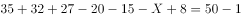，可得位；

因此恰好去了两个景点的有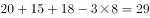位（可根据尾数法选择）。

方法二：设有位游客恰好去了两个景点，根据容斥原理非标准公式可得：

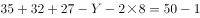（可根据尾数法选择），可得位。

故正确答案为A。

---

### 第 2 题　qid 2015444 · 数学运算

小李和小张参加七局四胜的飞镖比赛，两人水平相当，每局赢的概率都是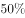。如果小李已经赢2局，小张已经赢1局，最终小李获胜的概率是？

- **A**. 

- **B**. 

- **C**. 

- **D**. 

　✅

**答案**：D

**官方解析**

根据题干两人每局赢的概率都是，则小李每局赢的概率都是。小李已经赢2局，小张已经赢1局，则还剩4局。小李要获胜，只需在剩余的四局里赢下两局即可。

分三种情况讨论：

①比赛进行5局结束，小李赢下第4、5局，概率；

②比赛进行6局结束，小李在第4、5局中赢1局，概率；

③比赛进行7局结束，小李在第4、5、6局中赢1局，概率。

小李获胜包含以上三种情况，则小李获胜的概率为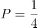。

故正确答案为D。

---

### 第 3 题　qid 2024260 · 数学运算

某市为了解决停车难问题，在如下图所示的一段长55米的路段开辟斜列式停车位，每个车位为长6米，宽2.6米的矩形，矩形的宽与路边成30度角，则在这个路段最多可划出多少个这样的停车位？

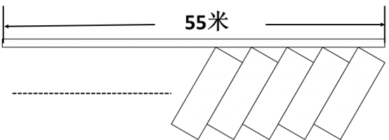

- **A**. 16
- **B**. 17　✅
- **C**. 18
- **D**. 19

**答案**：B

**官方解析**

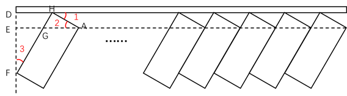

添加辅助线后进行分析，由矩形的宽与路边成角分析可知，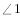、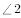、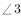为角。因为车位宽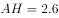米，故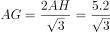米，米。因为车位长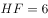米，故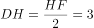米，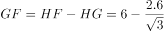 米，所以 米。所以这个路段最多可以划出的车位数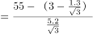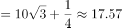个，即最多17个。

故正确答案为B。

---

### 第 4 题　qid 2015446 · 数学运算

小王夜跑后回家喝水，往300毫升的杯子中倒入200毫升热水和100毫升凉水，发现依然太烫无法喝下。于是接下来每次他都将水杯里的水倒去60毫升，加入同等体积的凉水。假设在倒水过程中，水温没有流失，运动后人适宜的饮水温度范围是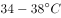，那么小王一共加了几次60毫升的凉水？

- **A**. 2
- **B**. 3
- **C**. 4　✅
- **D**. 5

**答案**：C

**官方解析**

方法一：设小王将热水和凉水混合之后的温度是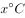，则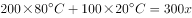，解方程得。

第一次加入60毫升凉水后：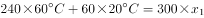，解得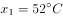；

第二次加入60毫升凉水后：，解得；

第三次加入60毫升凉水后：，解得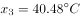；

第四次加入60毫升凉水后：，解得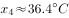；

第四次加入凉水后的温度在适宜范围内，满足题意。

方法二：

设小王将热水和凉水混合之后的温度是，根据线段法，溶液量的比与浓度差成反比，则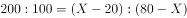，。根据题意，混合后的温度达到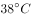即可饮用，用a,b分别表示最终杯子中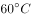热水的量与凉水的量。根据线段法，，则300毫升中的凉水量为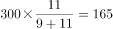毫升。

因为每次的水都是倒入60毫升后，又倒出毫升，故每次杯子中留下的水为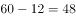毫升。假设前面倒进又倒出n次，最后又倒一次之后达到了。则，推出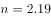，即3次。加上最后一次共需次。

故正确答案为C。

---

### 第 5 题　qid 2015412 · 数学运算

某医院门诊大楼最多容纳1500人，进出大楼有4个门，其中2个大门大小一致，2个小门大小一致，大楼安全员对4个门的通行能力进行测试，同时打开1个大门和2个小门，2分钟内可通过600人；同时打开1个大门和1个小门，3分钟内可通过720人。当紧急情况发生时，出门效率降低。根据安全标准，紧急情况下大楼所有人员需在5分钟内撤离，那么发生紧急情况下时这4个门最多能够通过多少人？

- **A**. 1440
- **B**. 1500　✅
- **C**. 1600
- **D**. 1680

**答案**：B

**官方解析**

题目问四个门在紧急情况时最多通过多少人，题干中给出了大小门通过人数与时间的关系，同时打开1个大门和1个小门，3分钟可通过720人，可表示为：，那么，1个大门和1个小门1分钟可通过的人数为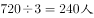。因此，2个大门和2个小门5分钟的通过人数为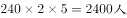。由于题目中说，紧急情况发生时，出门效率降低30%，则紧急情况下4个门5分钟的通过人数为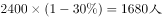。但是由于该医院最多可容纳1500人，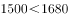，因此最多有1500人能够通过。

故正确答案为B。

---

### 第 6 题　qid 2015372 · 数学运算

游乐场的摩天轮半径为10米，匀速旋转一周需要2分钟。小浩坐在最底部的轿厢（距离地面0.1米），当摩天轮启动旋转40秒时小浩距离地面的高度是多少米？

- **A**. 11
- **B**. 12.1
- **C**. 15
- **D**. 15.1　✅

**答案**：D

**官方解析**

如图所示，摩天轮即为以O为圆心的圆，半径米。小浩坐在最底部的轿厢B处，距离地面。摩天轮匀速旋转一周需要2分钟（即120秒），故40秒时，摩天轮旋转圈，小浩由B处移动至A处，。，故而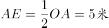。小浩距离地面高度。

故正确答案为D。

---

### 第 7 题　qid 2015386 · 数学运算

某粮油店只有一台不等臂的天平和一个5千克的砝码。顾客要买10千克大米，店员先将砝码放在左盘，大米放在右盘，平衡后称得的大米给顾客；再将砝码放在右盘，大米放在左盘，平衡后又将第二次称得的大米给顾客。请问这种称法对谁更有利？

- **A**. 顾客　✅
- **B**. 店主
- **C**. 都一样
- **D**. 不确定

**答案**：A

**官方解析**

题目没有给出天平的两臂具体比例，可采用赋值法。设天平的两臂比例是2：1，那么当左右重量比为1：2时天平即可保持平衡。则第一次店员称得大米重量为10千克，第二次店员称得大米重量为2.5千克，，故而这种称法对顾客更有利。

故正确答案为A。

---

### 第 8 题　qid 2015400 · 数学运算

足球比赛的积分规则为：胜一场积3分，平一场积1分，输一场积0分。某球队共进行了8场比赛，积10分。假设该球队最多输2场，则其最多胜：

- **A**. 1场
- **B**. 2场　✅
- **C**. 3场
- **D**. 4场

**答案**：B

**官方解析**

设该足球队胜场，平场，输场，则该队积分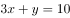。显然，x只可能取值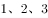。将代入方程，可得，此时输场，不满足题目最多输场条件，排除；将代入方程，可得，此时输场，满足条件。

故正确答案为B。

---

### 第 9 题　qid 2024128 · 数学运算

小张在路上匀速行走，观测到前方垂直悬挂的一条彩色灯带，其底部和顶部的仰角分别为和。他沿直线继续往前走，5秒后恰好走到灯带的正下方。若小张行走的速度为，那么这条灯带长：

- **A**. 5米
- **B**. 10米　✅
- **C**. 18米
- **D**. 36米

**答案**：B

**官方解析**

根据题意，作图如下所示，AB的长度即为我们所求的灯带的长度。

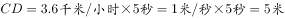；

方法一：因为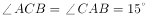，所以是等腰三角形；

可知，又因为，因此。

方法二：因为，；所以，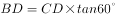；

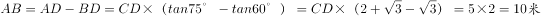。

故正确答案为B。

备注：，，

---

### 第 10 题　qid 2015434 · 数学运算

甲、乙两个圆柱体容器的底面积之比为，容器中的水深分别为10厘米和5厘米。先将甲容器中的水倒一半在乙容器中，则此时两个容器中的水深之比为：

- **A**. 

　✅
- **B**. 

- **C**. 

- **D**. 

**答案**：A

**官方解析**

圆柱体的体积公式为：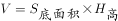。题目问最后甲乙容器水深之比也就是之比。给了甲乙容器的底面积之比，对其底面积进行赋值，令甲底面积为2，乙为3。则有：，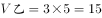。将甲容器的水倒一半在乙容器，此时，，，，因此水深之比为：。

故正确答案为A。

【技巧】最后求得是高的比例，因此不论面积为何值都会被约去，因此可直接对底面积进行赋值。

---

## 判断推理

### 第 1 题　qid 2015314 · 图形推理

把下面的六个图形分为两类，使每一类图形都有各自的共同特征或规律，分类正确的一项是：

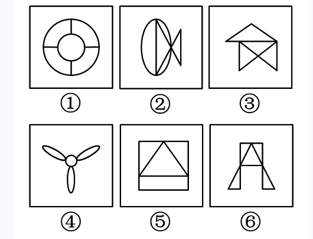

- **A**. ①③⑤，②④⑥
- **B**. ①④⑤，②③⑥
- **C**. ①②⑥，③④⑤　✅
- **D**. ①②③，④⑤⑥

**答案**：C

**官方解析**

图形组成不同，属性无规律，考虑数量类规律。每个图形均由明显的封闭空间构成，优先数面的数量。发现图①②⑥都是5个面，③④⑤都是4个面。
故正确答案为C。

---

### 第 2 题　qid 2024138 · 图形推理

把下面的六个图形分为两类，使每一类图形都有各自的共同特征或规律，分类正确的一项是：

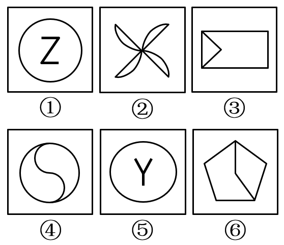

- **A**. ①④⑤ ，②③⑥
- **B**. ①③④ ，②⑤⑥
- **C**. ①③⑤ ，②④⑥
- **D**. ①②④ ，③⑤⑥　✅

**答案**：D

**官方解析**

元素组成凌乱，考虑属性规律。出现明显的中心对称提示图形，比如图①中的“Z”，图④中的“S”。观察发现，图①②④均为中心对称图形，图③⑤⑥均为轴对称图形。
故正确答案为D。

---

### 第 3 题　qid 2024142 · 图形推理

从所给四个选项中，选择最合适的一个填入问号处，使之呈现一定的规律性：

- **A**. A
- **B**. B　✅
- **C**. C
- **D**. D

**答案**：B

**官方解析**

解法一：元素组成不同，无明显属性规律，考虑数量规律。观察发现，图形出现多边形，考虑数线，线数量依次为：4、9、8、7，无规律，但是外轮廓的线条数依次为：3、4、5、6，呈递增规律，所以“？”处图形外轮廓的线条数应该为7。四个选项的外轮廓线条数分别为4、7、8、8，只有B选项符合规律。
故正确答案为B。
解法二：元素组成不同，无明显属性规律，考虑数量规律。观察发现，图形出现多边形，考虑数线，线数量依次为：4、9、8、7，无规律。同时发现，图形多次出现线条交叉的情况，考虑数点，点数量依次为：3、8、7、6，因此发现题干每幅图的线数量与点数量的差都是1。四个选项线数量与点数量的差分别为：1、2、0、4，只有A选项符合规律。
故正确答案为A。
备注：本题不严谨，但是外轮廓的线条数3、4、5、6，呈等差数列的规律，不太可能是巧合，且这个规律更加直观明确，应该是出题人精心设计过的，所以我们粉笔更倾向通过外框边数选到B项。

---

### 第 4 题　qid 2024148 · 图形推理

从所给四个选项，选择最合适的一个填入问号处，使之呈现一定的规律性：

- **A**. A
- **B**. B　✅
- **C**. C
- **D**. D

**答案**：B

**官方解析**

题干中每个图形均由两个样式不同的封闭面组成，分为上下两个部分。前一幅图形中的下部图形出现在下一幅图形中的上部。依此规律，问号处的图形上半部分应该为平行四边形，符合此规律的只有B选项。
故正确答案为B。

---

### 第 5 题　qid 2015354 · 图形推理

下图上边给定的是纸盒的外表面，下列哪一项能由它折叠而成？

- **A**. A
- **B**. B
- **C**. C
- **D**. D　✅

**答案**：D

**官方解析**

观察选项：

A项：本选项中阴影七角星的面与双箭头的面是相对面，不能在选项中同时出现，相对位置关系不匹配，排除； 

B项：本选项中火柴棍儿的头指向了箭头，而原图火柴棍儿的头指向S面，相邻位置关系不匹配，排除；

C项：由下至上将阴影七角星的箭头画出来（如下图），本选项中箭头指着箭头面，而在原图中箭头指着S面，相邻位置关系不匹配，排除；

D项：不存在错误，为正确选项。

故正确答案为D。

---

### 第 6 题　qid 2015362 · 定义判断

虚假记忆综合症是指一个人的认同和人际关系以一种创伤经历的记忆为中心，这种记忆在客观上是虚假的，但病人却对此深信不疑，它在病人内心是非常逼真的，几乎就是一种“客观现实”。
根据上述定义，下列属于虚假记忆综合症的是：

- **A**. 甲在被蛇咬过后，看见所有像蛇一样的东西，会感到恐惧
- **B**. 乙参加婚庆不由自主回忆起自己结婚时的情境并感到幸福
- **C**. 丙看到路边可怜的乞丐会勾起痛苦的回忆而产生怜悯之心
- **D**. 丁通过反复洗手来排除内心强烈的肮脏感获得心灵的平静　✅

**答案**：D

**官方解析**

第一步：找到关键词。
关键词为“以创伤经历的记忆为中心”、“记忆在客观上是虚假的”、“病人深信不疑”。
第二步：逐一分析选项。
A项：甲被蛇咬，是一种真实客观存在的创伤的经历，不符合定义关键词“记忆在客观上是虚假的”，排除；
B项：乙参加别人的婚庆想到自己结婚时的情景，乙曾经的婚礼是真实客观存在的，并且不是一种创伤的记忆，是美好的东西，不符合关键词“以创伤经历的记忆为中心”，不是虚假记忆综合症，不符合定义，排除；
C项：丙因为乞丐勾起痛苦的回忆，痛苦的回忆有可能是发生过的，并且选项中是对乞丐产生怜悯，没有体现这种记忆是非常逼真的，不符合定义，排除；
D项：丁通过反复洗手来排除内心强烈的肮脏感说明之前是发生过不好的事情，存在回忆，并且丁内心有强烈的肮脏感说明他内心的感觉非常逼真，保留。
比较A、B、C、D四项，A、B、C三项是明确不符合定义要求的，而D项可能符合，所以通过比较选D项更合适。
故正确答案为D。

---

### 第 7 题　qid 2015344 · 定义判断

社会协同治理机制是指政府出于治理需要，通过发挥其主导作用，构建制度化的沟通渠道和参与平台，在始终保护并尊重社会的主体地位以及社会自身的运作机制和规律下，加强对社会的支持培育，并与社会一起，发挥社会在自主治理、参与服务、协同管理等方面的作用，形成政府主导、社会协同、共建共享的社会治理新格局。
根据上述定义，下列属于社会协同治理的是：

- **A**. 由街道协调区工商局、城管大队等不定期开展联合执法，共同整治辖区内的经营秩序
- **B**. 市政府整合社会资源，在社区配备街道干部、民警、社工等人员，设立服务台，服务社区居民　✅
- **C**. 由县教育局、民政局、公安局等共同在行政服务大厅为企业和个人提供一站式行政审批办证服务
- **D**. 由省工商局、高级人民法院、中国人民银行某省分行共同签署协议，对失信企业实施信用联合监管

**答案**：B

**官方解析**

第一步：找到定义关键词。
关键词为：“政府”、“构建制度化的沟通渠道和参与平台”、“发挥社会自主治理、参与服务、协同管理的作用”。
第二步：逐一分析选项。
A项：工商局、城管大队联合执法，并没有出现社会参与，没有“发挥社会自主治理、参与服务、协同管理的作用”，不符合定义，排除；
B项：既有政府，又有社会参与，还设立了服务平台，满足“构建制度化的沟通渠道和参与平台”、“发挥社会自主治理、参与服务、协同管理的作用”，符合定义，当选；
C项：教育局、民政局、公安局，不涉及到社会参与，没有“发挥社会自主治理、参与服务、协同管理的作用”，不符合定义，排除；
D项：工商局、法院、银行联合监管，不涉及到“发挥社会自主治理、参与服务、协同管理的作用”，不符合定义，排除。
故正确答案为B。

---

### 第 8 题　qid 2015328 · 定义判断

行政比例原则是指行政主体实施行政行为应兼顾行政目标的实现和相对人权益的保护，如果初始行政目标可能对相对人权益造成某种不利影响，应使这种不利影响限制在尽可能小的范围和限度内，保持二者处于适度的比例。
根据上述定义，下列选项符合行政比例原则的是：

- **A**. 
王某因在商业区摆地摊，被城市管理部门以无证经营为由罚款5万元

- **B**. 
谭某在批准建设的三层楼房上加盖二层，被责令拆除加盖的二层楼房
　✅
- **C**. 
马某醉酒驾车，酒精含量为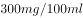，被处3个月拘役、缓刑一年

- **D**. 
张某和李某互殴，张某将李某打成轻微伤，被处罚款500元并拘留15天

**答案**：B

**官方解析**

第一步：找到关键词。
“行政主体”、“行政行为”、“兼顾行政目标的实现和相对人权益的保护”。
第二步：逐一分析选项。
A项：城市管理部门以无证经营为由对王某罚款5万元属于正当行政行为，没有体现出对王某权益的保护，不符合定义，排除；
B项：谭某在批准建设的三层楼房上加盖二层属于违法行为，但只是被责令拆除违法加盖的楼层而未涉及其他有损谭某利益的处罚，最大限度地保护了行政相对人的权益，符合行政比例原则，当选；
C项：马某醉驾被判拘役、缓刑，属于刑法范畴不属于行政法范畴，无法体现行政比例原则，排除；
D项：张某和李某互殴，被处罚500元并拘留15天属于正当行政行为，没有体现出对二人的权益保护，不符合定义，排除。
故正确答案为B。

---

### 第 9 题　qid 2015334 · 定义判断

投射测验是指采用某种方法绕过受测者的心理防御，在他们不防备的情况下探测其真实想法。在实际测验中，测试者往往会给受测者一些模糊的刺激，观察他们对这些模糊刺激做出的反应，进而得出测试结论。
根据上述定义，下列属于投射测验的是：

- **A**. 为了选拔合唱队员，音乐课上老师让每位同学唱一首歌
- **B**. 饭店老板临时外出，让顾客自行将钱放在柜台的盒子里
- **C**. 在考生面试进场前，考官故意将一些散乱的书堆在考场入口处　✅
- **D**. 老张想考察几个年轻人，下班离开前故意将钱包落在办公桌上

**答案**：C

**官方解析**

第一步：找到关键词。
“绕过受测者的心理防御”、“不防备的情况下”、“模糊刺激”。
第二步：逐一分析选项。
A项：为了选拔合唱队员，老师让每位同学唱一首歌是目的性很明确的行为，不符合定义关键词“绕过受测者的心理防御”、“不防备的情况下”、“模糊刺激”，排除；
B项：饭店老板外出时，让顾客自行将钱放在柜台的盒子里，即明确告知了顾客应该怎么做，不符合定义关键词“绕过受测者的心理防御”、“不防备的情况下”，排除；
C项：在考生面试进场前，考官故意将一些散乱的书堆在考场入口处，考生在此情况下更多是在准备考试，对于散乱的书堆是没有心理防备的，符合定义关键词“绕过受测者的心理防御”、“不防备的情况下”，同时对于考生来说是不容易注意到书堆的，属于“模糊刺激”，符合定义，保留；
D项：老张想考察几个年轻人，下班前故意将钱包落在办公桌上，符合“绕过受测者的心理防御”、“不防备的情况下”，但是落在桌上的钱包是比较容易被看见的，不属于“模糊刺激”。
比较C和D两项，C项书堆的刺激相较钱包的刺激更模糊，更不容易被察觉，因此C项比D项更好。
故正确答案为C。

---

### 第 10 题　qid 2024152 · 定义判断

纵向整合是指整个产业链上下游之间进行的整合，其主要目的是控制某种资源、保障供应，如收购上游原料供应商或拥有某种渠道，扩大销售等。横向整合是指生产和销售相同或相似产品、经营相似业务、提供相同业务的企业间的合并，其主要目的是把一些规模小的企业联合起来，组成企业集团，实现规模效益。
根据上述定义，下列属于横向整合的是：

- **A**. 
老张为保证其酒店食材供应质量，建设了一个蔬菜和渔场养殖基地

- **B**. 
因经济不景气、楼市疲软，某房地产商开始进军电子商务领域

- **C**. 
某公司为拓展业务，与某高校联合，走产学研结合的路子

- **D**. 
某著名奶制品生产商并购了一家乳品公司的股份
　✅

**答案**：D

**官方解析**

第一步：提取定义关键词。
纵向整合强调“整个产业链上下游之间整合”，从而达到“控制某种资源、保障供应”的目的；
横向整合强调“相同业务的企业间的合并”，从而达到“组成企业集团，实现规模效益”的目的。
第二步：逐一分析选项。
A项：老张建设蔬菜基地和渔场养殖基地，属于在其涉及酒店服务产业的上下游之间进行整合，从而实现“控制某种资源、保障供应”的目的，属于纵向整合，排除；
B项：从房地产转而进军电子商务，不是企业间的合并，而是企业自身的转型，不属于横向整合，排除；
C项：高校不属于企业，不符合定义主体，排除；
D项：奶制品生产商并购乳品公司，属于相同业务的企业间的合并，符合定义，当选。
故正确答案为D。

---

### 第 11 题　qid 2024154 · 定义判断

用典是指引用古籍中的故事或词句的一种修辞手法，该修辞可以丰富而含蓄地表达有关的内容和思想，也称“用事”。用典可分为明典、暗典、翻典三种。明典，令人一望即知其所用之典故；暗典是指字面上看不出用典之痕迹，须详加玩味，方能体会；翻典，即反用典故原意，使文章产生意外之效果。
根据上述定义，下列选项不属于翻典手法的是：

- **A**. 周公吐哺，天下归心　✅
- **B**. 随意春芳歇，王孙自可留
- **C**. 东风不与周郎便，铜雀春深锁二乔
- **D**. 可堪回首，佛狸祠下，一片神鸦社鼓

**答案**：A

**官方解析**

第一步：找出定义关键词。
“翻典，即反用典故原意，使文章产生意外之效果”。
第二步：逐一分析选项。
A项：“周公吐哺，天下归心”是礼贤下士之意，令人一望即知其所用之典故，属于明典，不存在反用典故，不符合定义，当选。
B项：“随意春芳歇，王孙自可留”反用了《楚辞 • 招隐士》中的末句：“王孙兮归来，山中兮不可以久留”，原意为招王孙出山入世以求仕途通达。王维反用其意，“王孙”自可不必离去，属于反用典故原意，属于翻典，排除。
C项：“东风不与周郎便，铜雀春深锁二乔”意为倘若当年东风不帮助周瑜的话，那么铜雀台就会深深地锁住东吴二乔了。此句属于反用赤壁之战中的历史典故，周瑜趁着东风进攻，最终孙刘联军以火攻大破曹军，属于反用“借东风”，反用典故原意，属于翻典，排除。
D项：“可堪回首，佛狸祠下，一片神鸦社鼓”中，“佛狸”为北魏太武帝，其建立的行宫为佛狸祠，整句话意思为到了南宋时期，当地老百姓只把佛狸祠当作供奉神祇的地方，而不知道它过去曾是一个皇帝的行宫，辛弃疾看到这个情景，不忍回首当年的烽火扬州路。此处用“佛狸”代指金主完颜亮，完颜亮曾驻扎在佛狸祠所在的瓜步山上，严督金兵抢渡长江，当年沦陷区的人民与异族统治者进行了不屈不挠的斗争，烽烟四起，但如今的中原早已风平浪静，沦陷区的人民已经安于异族的统治，竟至于对异族君主顶礼膜拜。此句属于反用历史典故，以此正告南宋统治者，收复失土，刻不容缓，排除。
本题为选非题，故正确答案为A。

---

### 第 12 题　qid 2015324 · 定义判断

职业基因是指每个人的职业方向都与自己的某种气质相匹配，这种气质是在人际交往中潜移默化而形成的一种带有强烈个人色彩的心理修养。
根据上述定义，下列现象中符合职业基因理论的是：

- **A**. 小明的父母都是教师，最终小明也选择了教师职业
- **B**. 小红从小爱看动画片，长大后成为一名动漫设计师
- **C**. 性情开朗、活泼好动的小丁应聘为某商城销售人员　✅
- **D**. 快言快语的小李毕业当了两年医生后变得慢条斯理

**答案**：C

**官方解析**

第一步，找到定义关键词。
关键词为：职业方向与在人际交往中形成的带有强烈个人色彩的气质相匹配。
第二步，逐一分析选项。
A项：小明选择当老师是因为父母是老师，而不是因为老师与自己的气质匹配，且小明的气质如何没有说明，不符合职业基因理论，排除；
B项：小红选择成为一名动漫设计师是因为兴趣爱好喜欢动画片，而不是自己的气质，且小红的气质如何没有说明，不符合职业基因理论，排除；
C项：小丁成为销售人员是因为其性情开朗、活泼好动，属于其强烈个人色彩的气质，符合职业基因理论，当选；
D项：小李当医生后从快言快语变成慢条斯理，属于职业改变性格，医生这个职业与其之前气质不符，不符合职业基因理论，排除。
故正确答案为C。

---

### 第 13 题　qid 2015338 · 定义判断

增强现实技术是一种将真实世界信息和虚拟世界信息“无缝”集成的新技术。是把原本在现实世界的一定时间空间范围很难体验到的实体信息（视觉、声音、味道、触觉等），通过电脑等科学技术，模拟仿真后再叠加，将虚拟的信息应用到真实世界，被人类感官所感知，从而达到超越现实的感官体验。
根据上述定义，下列选项不属于增强现实技术的是：

- **A**. 某海底漫游系统通过交互体验设备让用户与虚拟场景中的海洋生物互动、嬉戏
- **B**. 某游戏运用追踪器侦测用户运动，并通过头盔显示器为用户提供包含虚拟景观的视野
- **C**. 某科学家研制的智能隐形眼镜通过无线技术接收手机数据，并将手机上的图像投射到眼睛上　✅
- **D**. 某艺术家引导用户在物理空间中遵循播放器的指令行动进而成为其所设计情境的参与者

**答案**：C

**官方解析**

第一步：找到定义关键词。

关键词为：“真实世界信息和虚拟世界信息‘无缝’集成”、“电脑等科学技术”、“被人类感官所感知”、“达到超越现实的感官体验”。

第二步：逐一分析选项。

A项：交互设备是一种“电脑类的科学技术”，与海洋动物互动属于“虚拟信息被人类感官感知”，“让虚拟和现实同时存在”，符合定义，排除；

B项：追踪器和头盔是一种“电脑类的科学技术”，为用户提供包含虚拟景观的视野属于“虚拟信息被人类感官感知”，“让虚拟和现实同时存在”，符合定义，排除；

C项：通过无线技术接收的是数据，但最终投射到眼睛上的是手机图像，二者没有必然关系，并没有形成虚拟世界，不属于“让虚拟和现实同时存在”，不符合定义，当选；

D项：播放器的指令是一种“电脑类的科学技术”，观众所处的物理空间为信息空间所增强，遵循了虚拟的指令参与到虚拟场景中，属于“虚拟信息被人类感官感知”，“让虚拟和现实同时存在”，符合定义，排除。

本题为选非题，故正确答案为C。

注：有同学可能不太理解选项的含义而误选了D。经查证，在百科词条里面，A、B、D三项都是增强现实技术词条中的例子，均符合这个定义。

---

### 第 14 题　qid 2024166 · 定义判断

农业干旱是指在作物生育期内，由于土壤水分不足而造成作物体内水分亏缺，影响作物正常生长发育。水文干旱是指由于降水的长期短缺而造成某段时间内地表水或地下水收支不平衡，出现水分短缺，使江河流量、湖泊水位、水库蓄水等减少的现象。社会经济干旱是指由自然系统与人类社会经济系统中水资源供需不平衡造成的异常水分短缺现象，如果需大于供，就会发生社会经济干旱。
根据上述定义，下列选项属于社会经济干旱范畴的是：

- **A**. 一月未雨，某著名河流流域出现大规模的河床裸露现象
- **B**. 地铁建设施工队不慎挖破水管，导致几个小区停水一天
- **C**. 常年少雨致使某工业区推行按时段浮动征收水费的办法　✅
- **D**. 半月不曾下雨，某地水稻出现穗长缩短、穗粒减少现象

**答案**：C

**官方解析**

第一步，提取定义关键词句。
题干中出现三个定义，均为原因结果类句式。
农业干旱的原因是“土壤水分不足”，结果是“作物体内水分亏缺，影响作物正常生长发育”；
水文干旱的原因是“降水的长期短缺”，结果是“水分短缺，使江河流量、湖泊水位、水库蓄水等减少的现象”；
社会经济干旱的原因是“自然系统与人类社会经济系统供需不平衡”，结果是“异常水分短缺现象”。
第二步：逐一分析选项。
A项：一月未下雨，原因为“降水的长期短缺”，导致河流流域出现大规模的河床裸露现象，符合“水分短缺，使江河流量、湖泊水位、水库蓄水等减少的现象”，属于水文干旱，排除；
B项：地铁施工建设不属于三个定义中的任何一个原因，小区停水不是干旱，不符合定义，排除；
C项：自然系统为常年少雨，人类社会经济系统是工业区，是由于“自然系统与人类社会经济系统供需不平衡”而导致了异常水分短缺现象，因此进行了按时段浮动征收水费，属于社会经济干旱，当选；
D项：半月不曾下雨导致“土壤水分不足”，水稻穗长缩短、穗粒减少现象符合“作物体内水分亏缺，影响作物正常生长发育”，属于农业干旱，排除。
故正确答案为C。

---

### 第 15 题　qid 2015358 · 定义判断

卡瑞尔公式是指唯有强迫自己面对最坏的情况，在精神上先接受它以后，才会使我们处在一个可以集中精力解决问题的地位上。
根据上述定义，下列选项涉及卡瑞尔公式的是：

- **A**. 一个商人因经营不善而欠下一大笔债务，心灰意冷地来到亲戚的农庄，想在此度过余生，却在瓜农的鼓励下，最终重新崛起　✅
- **B**. A君炒股被套十分苦闷，后来想通了，学习当鸵鸟，不看股票，专心工作。几年后，他的事业取得成功
- **C**. 一个卖花老太太衣着破旧却满是喜悦，她说：“耶稣星期五被钉在十字架上死去，可三天后不就是复活节了吗？所以我总是心怀喜悦。”
- **D**. 阿Q与小D打架吃亏，心想：“我总算被儿子打了，现在这世界真不像样，儿子居然打起老子来了。”于是他心满意足，俨然胜利似的

**答案**：A

**官方解析**

第一步：找到关键词。

关键词为“面对最坏的情况”、“精神上接受”、“集中精力解决问题”。

第二步：逐一分析选项。

A项：商人欠下债务心灰意冷，想恬静的过完余生，符合“面对最坏的情况”，在瓜农的帮助下重新崛起，符合“集中精力解决问题”，是卡瑞尔公式，符合定义，当选；

B项：股票被套，鸵鸟心态，不愿意面对炒股的失败，是没有在精神上接受这样的失败，不符合关键词“精神上接受”，因此不是卡瑞尔公式，不符合定义，排除；

C项：老太太衣着破旧，虽然如此，但是她并不认为这是坏事，很积极乐观，心怀喜悦，符合关键词“精神上接受”，但是并没有涉及到解决问题，不符合“集中精力解决问题”，不符合定义，排除；

D项：阿Q是自己臆想小D是自己的儿子，通过这样来麻痹自己不去面对被打的事实，没有从精神上接受被打的事实，不符合关键词“精神上接受”，因此不是卡瑞尔公式，不符合定义，排除。

注意：C项完整的例子应该如下，老太太认为只要等待三天，一切就会恢复正常，但是这其中并没有体现出她主动集中精力解决问题，所以错误。

A项是该定义中的例子，但出现了积极解决问题的结果，更符合定义。

故正确答案为A。

---

### 第 16 题　qid 2015388 · 类比推理

健身：器械：形体

- **A**. 阅兵：坦克：广场
- **B**. 教育：书本：知识　✅
- **C**. 勘探：矿产：石油
- **D**. 导航：汽车：卫星

**答案**：B

**官方解析**

第一步：判断题干词语间逻辑关系。
器械是健身过程中使用的一种工具，健身的目的是塑造形体。
第二步：判断选项词语间逻辑关系。
A项：坦克是阅兵中使用的一种工具，但广场是阅兵对应的场所，与题干逻辑关系不符，排除；
B项：书本是教育过程中使用的一种工具，教育的目的是传授知识，与题干逻辑关系相符，当选；
C项：矿产是勘探的客体，不是勘探使用的一种工具，与题干逻辑关系不符，排除；
D项：汽车不是导航的一种工具，导航的工具应该是指南针、导航仪等，与题干逻辑关系不符，排除；
故正确答案为B。

---

### 第 17 题　qid 2015420 · 类比推理

灯塔 之于 （    ） 相当于 （    ） 之于 腐败

- **A**. 暗礁：金钱
- **B**. 船只：贪官
- **C**. 导航：预防
- **D**. 危险：监督　✅

**答案**：D

**官方解析**

逐一代入验证选项。
A项：灯塔可以指示暗礁，但金钱和腐败没有直接的逻辑关系，前后逻辑关系不一致，排除；
B项：有灯塔不代表有船只，有贪官说明一定存在腐败，前后逻辑关系不一致，排除；
C项：灯塔的一个作用是导航，但预防的作用不是腐败，前后逻辑关系不一致，排除；
D项：灯塔有助于避免危险，监督有助于避免腐败，前后逻辑关系一致，当选。
故正确答案为D。

---

### 第 18 题　qid 2015368 · 类比推理

食言而肥：有言必诺

- **A**. 有恩必报：忠君爱国
- **B**. 坐井观天：勇往直前
- **C**. 削足适履：因地制宜　✅
- **D**. 拾人牙慧：人云亦云

**答案**：C

**官方解析**

第一步：判断题干词语间逻辑关系。
食言而肥是指不按照说的去做，不遵守诺言。有言必诺是指按照承诺的去做事，两者是反义词的关系。
第二步：判断选项词语间逻辑关系。
A项：有恩必报是指收到别人的恩情一定会回报别人；忠君爱国是指忠诚于君主，爱国家，两者不是反义词，与题干逻辑关系不符，排除；
B项：坐井观天比喻眼界小，见识少；勇往直前是指勇敢地向前走，两者不是反义词，与题干逻辑关系不符，排除；
C项：削足适履比喻不合理地迁就现成条件，也可以比喻不顾具体条件，生搬硬套；因地制宜是根据各地的具体情况，制定适宜的办法。两者是反义词，与题干逻辑关系相符，正确；
D项：拾人牙慧比喻拾取别人的一言半语当作自己的话，也比喻窃取别人的语言和文字；人云亦云是人家怎么说，自己也跟着怎么说，指没有主见，只会随声附和。两者不是反义词，与题干逻辑关系不符，排除。
故正确答案为C。

---

### 第 19 题　qid 2024156 · 类比推理

无边落木：不尽长江

- **A**. 千里冰封：万里雪飘
- **B**. 映阶碧草：隔叶黄鹂　✅
- **C**. 晴川历历：芳草萋萋
- **D**. 山重水复：柳暗花明

**答案**：B

**官方解析**

第一步：判断题干词语间的逻辑关系。
无边修饰落木，不尽修饰长江。无边作为定语修饰名词落木，不尽作为定语修饰长江，定语在前，修饰的名词在后。前后两个词语出自同一诗句“无边落木萧萧下，不尽长江滚滚来”。
第二步：判断选项词语间的逻辑关系。
选项前后的两个词句均来自同一诗句。
A项：千里修饰冰封，万里修饰雪飘，与题干逻辑关系类似，保留；
B项：映阶修饰碧草，隔叶修饰黄鹂，与题干逻辑关系一致，保留；
C项：历历意为清楚可数，萋萋意为草木长得茂盛，历历修饰晴川，萋萋修饰芳草，定语在后，修饰的名词在前，与题干逻辑关系不一致，排除；
D项：重修饰山，复修饰水，暗修饰柳，明修饰花，与题干逻辑关系不一致，排除。
对比选项A和B，发现A选项中的名词对应没有B选项对应整齐，A选项中为雪飘不是飘雪，排除A选项。
故正确答案为B。

---

### 第 20 题　qid 2015374 · 类比推理

小麦：麦穗：麦粒

- **A**. 车子：车轮：轮胎　✅
- **B**. 棋类：围棋：棋子
- **C**. 学校：教室：学生
- **D**. 房子：房间：卧室

**答案**：A

**官方解析**

第一步：判断题干词语间逻辑关系。
麦粒是麦穗的一部分，二者是组成关系，麦穗是小麦的一部分，二者是组成关系。
第二步：判断选项词语间逻辑关系。
A项：轮胎是车轮的一部分，是组成关系，车轮是车子的一部分，是组成关系，与题干逻辑关系相符；
B项：棋子是围棋的一部分，是组成关系，但是围棋是一种棋类，是种属关系，与题干逻辑关系不符，排除；
C项：学生在教室学习，教室是场所，所以学生并不是教室的组成部分，与题干逻辑关系不符，排除；
D项：卧室是房间的一种，是种属关系，与题干逻辑关系不符，排除。
故正确答案为A。

---

### 第 21 题　qid 2015360 · 逻辑判断

认识到物种生存对土地与气候的要求，可以为调节人类的粮食生产、最大程度地保护物种提供依据。科学家通过调查得出结论：当雨林被砍伐变成农田后，那些需要湿润气候的鸟类趋于死亡，而那些适应干旱气候的鸟类则取而代之生存下来。
以下哪项如果为真，最能支持科学家的上述结论？

- **A**. 适应于干旱气候的鸟类更能适应未来气候的变化和未来土地使用的变化
- **B**. 农田的自然条件与干旱气候环境下鸟类栖息地的自然条件具有相似性　✅
- **C**. 在干旱地区保留原生动物栖息地很有必要，可以缓冲气候变化的影响
- **D**. 把动物栖息地转换为农田时，必须考虑该地区现在和未来的气候情况

**答案**：B

**官方解析**

第一步，寻找论点论据。
论点：当雨林被砍伐变成农田后，那些需要湿润气候的鸟类趋于死亡，而那些适应干旱气候的鸟类则取而代之生存下来。
论据：无明显论据。
对于无明显论据的题目，加强的方式多为解释或者举例。论点本身有两个关键信息：一是土地利用方式的变化（雨林变农田），二是气候变化（干旱和湿润），预计解释的可能性更大。
第二步，逐一分析选项。
A项，强调干旱气候的鸟类更能适应未来的气候和土地变化，但未来的气候与土地是否是雨林变成农田的情况不确定，为不确定选项，排除；
B项，强调农田的自然条件与干旱气候环境下的自然条件具有相似性，有利于干旱气候鸟类的生存，解释论点，加强作用，当选；
C项，强调的是如何缓冲气候变化对原生动物生存的影响，说的是一种做法，与论点强调的雨林变农田后，湿润气候和干旱气候鸟类的生存状况是无关的。一个是做法，一个是现状。排除；
D项，与C项一致，都是谈论转换为农田后的一个做法，与论点无关，排除。
故正确答案为B。

---

### 第 22 题　qid 2015370 · 逻辑判断

人类目前使用的氦气主要来自油气钻探过程中产生的副产品，总量有限，难以满足需求。首次“有意地”发现大量氦气，是最近研究人员与开采企业合作的成果。他们采用新方法在非洲东部坦桑尼亚境内发现储量约为15亿立方米的氦气，总量足够120万台医用核磁仪共振使用。这一地点处于东非大裂谷范围内，剧烈火山活动产生的热量使古老岩石中蕴含的氦释放到浅层油田中。此次开采可能成为确保未来社会氦气需求的转折点。
上述结论的成立，需要补充以下哪项作为前提？

- **A**. 可以预见的未来不会出现剧烈的火山运动
- **B**. 东非大裂谷的地质地貌在长期内不再发生变化
- **C**. 此次所用探测方法有助于在更多地方发现和开采更多氦气　✅
- **D**. 未来人类不再被动等待来自油气钻探过程中产生的副产品

**答案**：C

**官方解析**

第一步：寻找论点论据。
论点：此次开采可能成为确保未来社会氦气需求的转折点。
论据：以前的氦气是油气开采的副产品，这是首次“有意地”用新方法在非洲发现大量氦气。
第二步：逐一分析选项。
A项，出不出现火山活动与题干所强调的新方法能否成为确保未来社会氦气需求的转折点无关。题干说剧烈火山活动会产生氦气，若如选项所说未来不再有剧烈运动，氦气未来可能就没有了。但这并不会抹杀“有意地”用新方法开采所产生的意义，故该项不是前提项，排除；
B项，与A项相似，说地貌不再发生变化，意味着目前的大量氦气会存在，但是并不能对这次开采是否具有“转折点”的意义构成支持或反对。而且就算此地的地貌发生变化，现有的氦气也依然可以开采。故该项不是前提项，排除；
C项，此次所用的方法有助发现和开采更多氦气，强调了首次有意地用新方法开采的后续可行性，将论据中的方法推广到更广范围，从而保证未来社会氦气的需求。试想，如果此方法不能推广，显然也不会成为氦气需求转折点。属于前提项，当选；
D项，与题干论点无关，排除。
故正确答案为C。

---

### 第 23 题　qid 2015390 · 逻辑判断

地球上的生物之所以能够在地球表面生存，最大的防护在于地球磁场将大量的带电粒子偏转，大量有害宇宙射线被隔绝在大气层之外。近日，科学家发现南大西洋磁场开始翻转，地球磁场正被削弱。他们经过研究认为，如果地球磁场翻转，在没有磁场保护的情况下，所有生物将会灭绝。
以下哪项如果为真，最能支持上述结论？

- **A**. 
类地行星火星失去磁场后，其大气被太阳风完全摧毁，生命荡然无存

- **B**. 
目前南大西洋异常区范围在增大，轨道卫星掠过这里时经常出现问题

- **C**. 
磁场翻转时，地球生命将会暴露在无防护的地表，造成皮肤癌大爆发
　✅
- **D**. 
近200年来，随着南大西洋磁场开始翻转，地球磁场已经削弱了

**答案**：C

**官方解析**

第一步，寻找论点论据。
论点：如果地球磁场翻转，在没有磁场保护的情况下，所有生物将会灭绝。
论据：地球上的生物之所以在地表生存，最大的防护在于地球磁场将大量的带电粒子偏转，被隔在大气层之外。现发现，南大西洋磁场开始翻转，地球磁场正被削弱。
第二步，逐一分析选项。
A项，说的是类地行星火星在失去磁场后生命荡然无存，是一个类比加强项，看是否有更好的，先保留；
B项，没有提到磁场是否翻转，而且说到了经常出现问题，经常出问题不代表生物就会灭绝，无关，排除；
C项，强调的是磁场翻转后，地球生命失去防护，皮肤癌大爆发。通过补充论据，直接对论点进行了举例加强。而且力度一定强于A项的类比，故C当选；
D项，说的是一个地球磁场削弱的事实，但是否会造成生物灭绝并不知道，排除。
故正确答案为C。

---

### 第 24 题　qid 2024162 · 逻辑判断

研究人员选取16名11月大的儿童开展实验研究，其中8个来自英语单语的家庭，另外8个来自讲西班牙语、英语的双语家庭。每个儿童都会听一段长约18分钟的音频，其中既有英语发音，也有西班牙语发音。研究者借助脑磁图描技术发现，在大脑的执行区域中，双语家庭长大的儿童对语言声音的刺激的反应要比单语家庭的儿童更为强烈。这说明，双语环境很早就已开始对大脑活跃性产生影响。
以下哪项如果为真，最能支持上述结论？

- **A**. 相比而言，西班牙语对大脑的声音刺激比英语更为明显
- **B**. 双语家庭长大的孩子无须父母刻意教就能熟练掌握双语　✅
- **C**. 双语家庭儿童在11个月大时对外语声音的感知较6个月大时明显强化
- **D**. 此前人类大脑研究显示，具备双语能力的成年人大脑执行功能更为活跃

**答案**：B

**官方解析**

第一步：找到论点论据。
论点：双语环境很早就已开始对大脑活跃性产生影响。
论据：双语家庭长大的儿童对语言声音的刺激的反应要比单语家庭的儿童更为强烈。
本题的论点和论据都是在说双语环境对大脑活跃性有影响，所以论点论据话题一致，考虑通过补充论据的方式加强。
第二步：逐一分析选项。
A项：题干是在双语与单语之间进行对比，而选项是在西班牙语与英语之间进行对比，话题不一致，为无关选项，排除；
B项：强调在双语环境下孩子无需刻意教就能熟练掌握双语，证明双语环境对孩子的影响还是很重要的，补充论据，可以加强，当选；
C项：强调的是双语家庭儿童在不同时期对外语声音感知的比较，增加了一个年龄因素，说明可能是年龄不同导致的对声音的感知能力不同，不能加强，排除；
D项：题干讨论的是语言环境对儿童的影响，选项讨论的是具备双语能力对成年人大脑执行功能的影响，话题不一致，为无关选项，排除。
故正确答案为B。

---

### 第 25 题　qid 2015396 · 逻辑判断

当小张、小李、小王和小贾在公园里打棒球时，田老师家的玻璃恰好被人打破了。田老师怀疑这与他们有关，于是分别找他们询问，四人的回答如下：
小张说：“您家的玻璃不是我们打破的，和我们压根无关。”
小王说：“小李和小贾中，至少有一个肯定是无辜的。”
小李说：“我只能告诉您，打破您家玻璃的人肯定在我们之中。”
小贾说：“田老师，您千万要相信我啊，真的不是我打破的。”
如果四个人中，有两个人说的是假话，两个人说的是真话，可以推出：

- **A**. 说真话的是小张和小王
- **B**. 说真话的是小贾和小张
- **C**. 说真话的是小贾和小李
- **D**. 说真话的是小李和小王　✅

**答案**：D

**官方解析**

第一步：真假推理题，找矛盾。
小张：四人中不存在打破玻璃者；
小王：不是小李或不是小贾；
小李：四人中存在打破玻璃；
小贾：不是小贾。
第二步：分析题干。
小张和小李两个人说的矛盾了，矛盾必有一真一假。条件中“两个人说假话，两个人说真话”，即共有两真两假，那么剩下的小王和小贾中也必有一真一假。这时候，我们可以用假设法，假设小贾说的是真话，即不是小贾打破的，那小王说的也就是真话了，因为或命题有一项为真即为真，这很明显不符合题意。所以小贾说的是假话，即玻璃是小贾打破的，也间接证明了小张说了假话。综上所述：小张说了假话；小王说了真话；小李说了真话；小贾说了假话。
故正确答案为D。

---

### 第 26 题　qid 2015414 · 逻辑判断

定期运动不仅能让孩子打下健康的基础，而且成年后可能收入更高。芬兰学者在一项始于1980年、持续30年的研究中发现，相比童年很少锻炼的人，在9岁、12岁、15岁时经常参加体育锻炼的人成年以后在为期10年的时间内平均收入提高至。即使考虑个人和家庭背景等因素，这个研究也成立。但是，研究结果也显示，这种关联只针对男性群体，在女性群体中没有观察到这种关联。

如果以下哪项为真，最能支持上述结论？

- **A**. 政府应为不同经济社会背景的儿童提供参与体育活动的平等机会
- **B**. 爱运动的大学男生毕业后在工资和就业机会方面具有优势　✅
- **C**. 之前许多研究表明，成年人的体育活动与收入成正比
- **D**. 世界各地许多体育冠军退役后生计没有着落

**答案**：B

**官方解析**

第一步：找出论点论据。
论点：定期运动不仅能使男孩子打下健康的基础，而且成年后可能收入更高。
论据：芬兰学者做的一项30年的研究调查。
第二步：逐一分析选项。
A项，题干讨论的是“运动”与“收入”之间的关系，选项说应提供运动的平等机会，很显然跑题了，无关项，排除；
B项，建立了“运动”与“工资”之间的联系，搭桥项，能加强，先保留；
C项，题干的主体是“未成年的男孩”成年后收入如何，选项的主体直接就是“成年人”怎么样，主体不一致，讨论不在一个范围，排除；
D项，首先这些体育冠军是否都是从小开始体育运动的，并不明确，即使很多同学联想到实际情况，的确大部分冠军都是从小运动训练的，那也是削弱了论点，不能加强，排除。
故正确答案为B。

---

### 第 27 题　qid 2015408 · 逻辑判断

某社交平台对一款网红APP营销产品以“给用户带来骚扰，破坏用户体验”的理由进行封杀。这引起了舆论关注和讨论。
以下各项如果为真，最能削弱“给用户带来骚扰，破坏用户体验”观点的是：

- **A**. 该平台曾以同样理由屏蔽过另一款APP，以打击自己的竞争对手
- **B**. 该款APP在用户中有口皆碑，推出后下载量迅速上升至第5位
- **C**. 在该款APP被封杀的同时，与该款APP相关的应用软件也被屏蔽
- **D**. “用户体验”是相当感性的感受，该社交平台缺乏界定感受的数据　✅

**答案**：D

**官方解析**

第一步：找出论点和论据。
论点：网红APP给用户带来骚扰，破坏用户体验。
论据：无。
本题只有论点，优先考虑削弱论点。
此题的背景是当年微信封杀某网红APP，以前在朋友圈我们会经常看到某网红APP课程学习的打卡链接，今天是学习的第几天了等等，这会让其他微信用户感到反感，所以基于这样的背景，我们就可以梳理出论点讨论受到骚扰的“用户”具体是谁？应该是纯微信用户，而不是某网红APP的用户，不然也不需要微信官方出手来封杀，即本题论点完整来说应该是：网红APP给“社交平台用户”带来骚扰，破坏“社交平台用户”的体验。
第二步：逐一分析选项。
A项：社交平台以同样理由屏蔽过其他APP，不确定该理由这次用在这个网红APP上是否属实，排除；
B项：网红APP在它自己的用户中有口皆碑，即网红APP用户的体验感好，但是本题论点讨论的用户，是社交平台用户的感受，不确定那些每天看到别人在朋友圈学习打卡的社交平台用户是否也觉得体验好，选项和论点讨论的用户群体并不一致，排除；
C项：与其他相关的应用是否被屏蔽无关，只想知道屏蔽这款APP的理由是否客观真实，无关选项，排除；
D项：社交平台缺乏界定感受的数据，即社交平台根本不知道用户的具体体验，那么说“该网红APP给用户带来骚扰，破坏用户体验”是没有证据支撑的，可能性削弱，当选。
注：本题的D项很多同学会觉得这不是课上常讲的不明确选项，不是说不选嘛，这里有个思维误区，不明确选项在真题中确实很少成为正确答案，但是一定要跟其他选项比较，如果其他3个选项错的更离谱，此时不明确选项，也可以作为可能性的削弱/加强，即做题一定要灵活，没有哪种选项一定对或一定不对，比较才是王道。
故正确答案为D。

---

### 第 28 题　qid 2015428 · 逻辑判断

在一项实验中，志愿者要记住屏幕上出现的一系列单词，但其间会被时而出现的数学题打断。研究者则周期性的询问志愿者是否走神，最终通过记忆单词的数量来为志愿者“大脑运行容量”打分。结果显示，那些在出现数学题时走神的人，记住的单词反而更多，证明他们拥有更大的“大脑运行容量”。研究者认为，那些时常分神、发愣的人实际上更聪明，因为他们能够记住大量信息并加以灵活运用。
以下哪项如果为真，无法削弱该实验结论？

- **A**. 在生活中，做任何事时大脑多半时间都在走神，通常未被察觉
- **B**. 数学题改为阅读理解题，走神志愿者记住的单词数量反而更少
- **C**. 大脑运行容量还和人类智商的其他指标有关，不仅是单词数量
- **D**. 只有任务不困难时，大脑运行容量大的人才会思考无关的事情　✅

**答案**：D

**官方解析**

第一步，寻找论点论据。

论点：那些时常分神、发愣的人实际上更聪明，因为他们能够记住大量信息并加以灵活运用。
论据：那些在出现数学题时走神的人，记住的单词反而更多，证明他们拥有更大的“大脑运行容量”。
第二步，逐一分析选项。
A项，强调走神是常事，而且未被察觉，说明周期性的询问志愿者是否走神，就不会客观，可能志愿者本身也并不知道自己有没有走神。质疑了实验方法，可以削弱，排除；
B项，数学题改阅读题后，记住的单词数量会减少，说明实验方法有问题，质疑实验方法，可以削弱，排除；
C项，指出大脑运行容量还与其他指标有关，不仅取决于单词数量，说明通过单词数量来判断大脑运行容量就不科学，可以削弱，排除；
D项，任务的难度会对大脑运行容量大的人产生影响，并不能质疑这个人自身脑容量大还是小，与论点讨论的无关，无法削弱，当选。

本题为选非题，故正确答案为D。

---

### 第 29 题　qid 2015426 · 逻辑判断

大脑边缘系统驱动情绪产生，该系统在青春期期间快速发育，而前额叶皮层神经网络发育则相对较晚，主要负责提供合理判断和冲动控制。现在已经确知，前额叶皮层要到20岁左右才能完全发育成熟，而如今青春期却在不断提前，二者不匹配的时间跨度正在延长。
由此可以推出：

- **A**. 人的某些行为与年龄的冲突是大脑存在的天然缺陷所致
- **B**. 形成青少年行为特点的原因在于人体调控功能的晚发育
- **C**. 人脑的独特结构使人类可以控制冲动行为的时间跨度正在延长
- **D**. 人脑控制功能与边缘系统的失衡是青少年产生冲动行为的关键　✅

**答案**：D

**官方解析**

第一步：看提问——由此可以推出，题干无逻辑关联词，故为日常推理题。
第二步：通读题干，逐一分析选项。
A项，发生冲突只是因为青春期的起点与大脑控制功能发育的起点不匹配，后者较晚，但这是人正常的发育过程，并非缺陷，无中生有，排除；
B项，只提到了大脑控制功能发育晚一方面的情况，其实是因为控制功能发育晚和大脑边缘系统发育早，两者的发育时间差造成的，排除；
C项，延长控制冲动行为时间跨度的并非人脑的独特结构，如果是这个原因，那么成年人也应该有这个特点，而不仅仅是青春期的特点了。根据原文描述，真正起作用的应该是青春期人脑不同功能间发育的不匹配和不平衡。排除；
D项，人脑控制功能（即前额叶皮层神经网络，提供合理判断和冲动控制）与边缘系统的失衡（即发育不匹配，控制情绪）是导致青少年产生冲动行为（即在青少年有情绪时不能做出合理判断，不能控制冲动）的关键，正好是原文的同义转换，当选。
故正确答案为D。

---

### 第 30 题　qid 2024168 · 类比推理

某单位决定派选2名女性和3名男性前往省城参加培训，经过各个程序选拔，最后确定了以下候选人：林某、杨某、童某等3名女性和陈某、何某、吴某、王某、李某等5名男性，同时还规定同一部门，同一地方至多只能选派一人参加培训，已知：林某和王某来自同一部门，吴某和陈某来自同一部门，王某和李某来自同一地方。
根据上述条件，如果林某入选，以下哪位必定会入选？

- **A**. 李某　✅
- **B**. 王某
- **C**. 童某
- **D**. 陈某

**答案**：A

**官方解析**

从题干确定性信息“林某入选”入手。
从林某入手，提取与林某有关的信息，林某和王某来自同一部门，来自同一部门至多只能选派一名参加，因此王某不能参加；又因为陈某（男）和吴某（男）来自同一个部门，因此他们两人中只能去一个；又因为在5个男的中要选派3人参加培训，因此在王某（男）不参加，陈某（男）和吴某（男）只能去一个的情况下，何某（男）和李某（男）必须要参加。
故正确答案为A。

---

## 资料分析

### 材料 1

#### 第 1 题　qid 2024176 · 增长

2011-2015五年期间光缆线路总长度共增加了：

- **A**. 441万公里
- **B**. 1491万公里　✅
- **C**. 892万公里
- **D**. 8969万公里

**答案**：B

**官方解析**

根据图表及图解文字可知，2011-2015五年期间增加的光缆总长度等于2015年光缆长度减去2010年光缆长度，即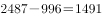万公里。

故正确答案为B。

---

#### 第 2 题　qid 2024182 · 增长

与2014年相比，2015年本地网中继光缆净增线路长度是长途光缆净增线路长度的：

- **A**. 12倍
- **B**. 23倍
- **C**. 38倍
- **D**. 54倍　✅

**答案**：D

**官方解析**

由题干“2015年······是······的”可判定该题是现期倍数问题。定位柱状图中数据可得：

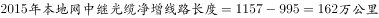；

。

因此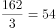倍。

故正确答案为D。

---

#### 第 3 题　qid 2024184 · 增长

2011-2015年接入网光缆线路长度同比增速超过的年份有几个：

- **A**. 2
- **B**. 3
- **C**. 4　✅
- **D**. 5

**答案**：C

**官方解析**

由“…同比增速超过…”，判断题型为一般增长率问题。

，首位商3，故；

，首位商3，故；

，首位商2，故；

，首位商1，故；

，首位商2，故。

共有4个年份增速大于。

故正确答案为C。

---

#### 第 4 题　qid 2024186 · 比重

2015年全国新建光缆中，接入网光缆线路长度所占比重为：

- **A**. 

- **B**. 

　✅
- **C**. 

- **D**. 

**答案**：B

**官方解析**

由题干“2015年…接入网光缆线路长度所占比重为”，可判定该题属于现期比重问题。定位柱状图中数据，2015年全国新建光缆为万公里；2015年新建接入光缆为万公里。，接近答案B。

故正确答案为B。

---

#### 第 5 题　qid 2024188 · 综合

关于光缆线路长度变化情况，下列说法错误的是：

- **A**. 2011-2015年线路长度增长速度最快的是接入网光缆
- **B**. 2011-2015年光缆线路总长度净增值最大的是2015年
- **C**. 2011-2015年接入网光缆线路长度净增值超过同期长途光缆
- **D**. 2011-2015年接入网光缆与本地网中继光缆线路长度差距逐年缩小　✅

**答案**：D

**官方解析**

由题干“下列说法错误的是”，可判定该题属于综合分析问题。

A项：增速比较只需比即可，则2011-2015年长途光缆，2011-2015年本地网中继光缆，2011-2015年接入网光缆，正确。

B项：定位柱状图中数据，2015年光缆线路长度净增值为万公里，其余年份均小于400万公里，正确。

C项：定位柱状图中数据，2011-2015年接入网光缆线路长度净增值为万公里，2011-2015年长途光缆线路长度净增值为万公里，，正确。

D项：定位柱状图中数据，接入网光缆与本地网中继光缆线路长度2012年差距为万公里，2013年差距为万公里，2014年差距为万公里，因此不是逐年缩小的，错误。

本题为选非题，故正确答案为D。

---

### 材料 2

        2005年全国人口抽样调查主要数据公报显示，同2000年第五次全国人口普查相比，2005年具有大学教育程度的人口增加2193万人；具有高中教育程度的人口增加974万人；具有初中教育程度的人口增加3746万人，具有小学教育程度的人口减少4485万人。

        2015年全国人口抽样调查主要数据公报显示，同2010年第六次全国人口普查相比，2015年每10万人中具有大学教育程度的人口由8930人上升为12445人；具有高中教育程度人口由14032人上升为15350人；具有初中教育水平人口由38788人下降到35633人；具有小学教育程度人口由26779人下降为24356人。

#### 第 6 题　qid 2024190 · 增长

1995-2015年受教育程度人数平均增速最快的人群是：

- **A**. 大学　✅
- **B**. 高中
- **C**. 初中
- **D**. 小学

**答案**：A

**官方解析**

根据“增速最快······”， 可知此题为一般增长率问题。根据增长率公式： ，因各教育程度现期、基期年份相同，则总数越大平均数越大，可知仅比较即可。定位表格，在各教育程度中，2015年教育程度与1995年的比值分别为：、、、，比较发现6.8最大，即1995～2015年大学教育程度的人数的平均增速最快。

故正确答案为A。

常识判断：根据政府曾出台的大学扩招政策，可推测大学人口年平均增速可能为最高。

---

#### 第 7 题　qid 2024192 · 综合

2015年初中教育程度人口相比2000年：

- **A**. 
下降了

- **B**. 
提高了
　✅
- **C**. 
下降了

- **D**. 
提高了

**答案**：B

**官方解析**

根据“2015年···比2000年提高/下降···”，判断本题为一般增长率计算问题。定位表格和第一段文字材料，2015年初中教育程度人口为48942万人，2005年初中教育程度人口为46735万人，比2000年增加3746万人。

方法一：。 。B项最接近。

方法二：2015年初中教育程度人口相比于2005年增加。所以2015年比2000年增加。。B项最接近。

故正确答案为B。

---

#### 第 8 题　qid 2024194 · 比重

2015年未接受教育的文盲、半文盲的人口比例约为：

- **A**. 

　✅
- **B**. 

- **C**. 

- **D**. 

**答案**：A

**官方解析**

根据“2015年…的人口比例为…”，判断本题为现期比重问题。定位表格材料，有各种教育程度的人口构成，因此 。，A选项最接近。

故正确答案为A。

---

#### 第 9 题　qid 2024196 · 综合

相比于2005年，2010年每10万人中具有高中教育程度的人口：

- **A**. 上升了1318人
- **B**. 减少了1051人
- **C**. 上升了2485人　✅
- **D**. 减少了2185人

**答案**：C

**官方解析**

根据选项“上升（减少）了……人”，可知此题为增长量计算问题。定位文字材料第二段，可知2010年每10万人中具有高中教育程度的人口为14032人；定位表格，可知2005年，高中教育程度人口为15083万人，总人口130628万人，因，则有，，结果与C项最接近。

故正确答案为C。

---

#### 第 10 题　qid 2024198 · 综合

能够从上述资料推出的是：

- **A**. 2015年小学教育程度人口比例高于2005年
- **B**. 2010年高中教育程度人口相比于2005年出现下降
- **C**. 小学教育程度人口在抽样年份中所占比例持续下降　✅
- **D**. 初中教育程度人口在抽样年份中所占比例高于同期其他受教育人口

**答案**：C

**官方解析**

A项： ，，2015年数据小于2005年，错误。

B项：2005年高中教育程度人口为15083万人，2010年每10万人中具有高中教育程度人口有14032人。材料中没有2010年的总人口数据，所以无法从上述材料推断，错误。

C项：1995年：，2005年：，两者相比，前者分子大分母小，故1995年数据大于2005年。2015年：，与2005年相比，2005年的分子大分母小，故2005年数据大于2015年。因此小学教育人口所占比例持续下降，正确。

D项：在1995年中，小学教育程度人口大于初中，所以1995年初中教育程度人口比例小于小学，错误。

故正确答案为C。

---

### 材料 3

        2015年保险公司原保险保费收入24282.52亿元，同比增长，比上一年高。其中，产险业务原保险保费收入7994.97亿元，同比增长；寿险业务原保险保费收入13241.52亿元，同比增长；健康险业务原保险保费收入2410.47亿元，同比增长；意外险业务原保险保费收入635.56亿元，同比增长。

        2015年保险公司赔款和给付支出8674.14亿元，同比增长。其中，产险业务赔款4194.17亿元，同比增长；寿险业务给付3565.17亿元，同比增长；健康险业务赔款和给付762.97亿元，同比增长；意外险业务赔款151.84亿元，同比增长。

        截至2015年末，保险公司资金运用余额111795.49亿元，较年初增长。其中，银行存款24349.67亿元，占比；债券38446.42亿元，占比；股票和证券投资基金16968.99亿元，占比；其他投资32030.41亿元，占比。

        截至2015年末，保险公司总资产123597.76亿元，较年初增长。其中，产险公司总资产18481.13亿元，较年初增长；寿险公司总资产99324.83亿元，较年初增长；再保险公司总资产5187.38亿元，较年初增长；资产管理公司总资产352.39亿元，较年初增长。

#### 第 11 题　qid 2024170 · 综合

2013年保险公司原保险保费收入约为：

- **A**. 20667亿元
- **B**. 18232亿元
- **C**. 19426亿元
- **D**. 17223亿元　✅

**答案**：D

**官方解析**

由“已知2015年保险公司原保险保费收入，求2013年保险公司原保险保费收入”可知，本题为间隔基期计算问题。定位材料第一段可知，2015年保险公司原保险保费收入为24282.52亿元，同比增长，比上一年高，故2014年保险公司原保险保费收入同比增长。根据间隔增长率计算公式：2015年相对2013年的增长率。故2013年保险公司原保险保费收入。

故正确答案为D。

---

#### 第 12 题　qid 2024172 · 比重

2015年，四大保险业务中，原保险保费收入占比最高值与最低值相差约：

- **A**. 

- **B**. 

- **C**. 

　✅
- **D**. 

**答案**：C

**官方解析**

由题干问“占比最高值与最低值相差”且选项为百分数可知，本题为比值计算问题。定位材料第一段可知，2015年保险公司原保险保费收入为24282.52亿元，占比最高的为寿险业务，收入为13241.52亿元，占比最低的为意外险业务，收入为635.56亿元。。

故正确答案为C。

---

#### 第 13 题　qid 2024174 · 综合

2014年寿险业务原保险保费收入比其给付金额多：

- **A**. 10902亿元
- **B**. 8174亿元　✅
- **C**. 9676亿元
- **D**. 3800亿元

**答案**：B

**官方解析**

材料为2015年，由题干问“2014年······比······多”可知，本题为基期和差问题。定位材料第一、第二段，2015年寿险业务原保险保费收入13241.52亿元，同比增长；寿险业务给付3565.17亿元，同比增长。则2014年原保险保费收入约为亿元，给付金额约为亿元，原保险保费收入比其给付金额多亿元，与B项最接近。

故正确答案为B。

---

#### 第 14 题　qid 2024178 · 比重

截至2015年末，保险公司资金运用余额占比最大的是：

- **A**. 银行存款
- **B**. 债券投资　✅
- **C**. 股票和证券投资基金
- **D**. 其他投资

**答案**：B

**官方解析**

由题干求“资金运用余额占比最大的是”可知，本题为直接找数问题。定位材料第三段可知，银行存款占比；债券占比；股票和证券投资基金占比；其他投资占比。最大，所以债券投资占比最大。

故正确答案为B。

---

#### 第 15 题　qid 2024180 · 综合

以下选项能够从资料中推出的是：

- **A**. 2015年保险公司原保险保费收入增长最快的是意外险业务
- **B**. 2015年保险公司资金运用中，股票和证券投资基金的收益最高
- **C**. 2015年保险公司原保险保费收入满足不了其赔款和给付支出需求
- **D**. 2015年年初产险公司和寿险公司总资产占保险公司总资产九成以上　✅

**答案**：D

**官方解析**

A项：判断增长最快，即增长率比较。定位材料第一段，健康险业务原保险保费收入同比增长，意外险业务原保险保费收入同比增长，意外险健康险，意外险业务不是增长最快的，故A项错误。

B项：材料中没有提及保险资金运用的收益，只有保险资金运用的余额，B项无法推出。

C项：定位材料第一段，可知2015年保险公司原保险保费收入为24282.52亿元，定位材料第二段，可知2015年保险公司赔款和给付支出8674.14亿元，收入赔款和给付支出，故C项错误。

D项：定位材料第四段，可知保险公司总资产为123597.76亿元，增长；产险和寿险公司总资产分别为18481.13亿元和99324.83亿元，分别增长和。所以2015年初产险和寿险公司资产之和占保险公司总资产的比重为，故D项正确。

故正确答案为D。

---

### 材料 4

 

#### 第 16 题　qid 2015318 · 增长

2016年第1季度，商业银行正常类贷款同比增长率约为：

- **A**. 

- **B**. 

- **C**. 

- **D**. 

　✅

**答案**：D

**官方解析**

由题干“同比增长率”可知为增长率计算问题，题中给出了2016年第1季度和2015年第1季度的数据，给出了现期和基期为一般增长率计算问题。利用求解即可。定位图表可知，2016年第一季度，正常类贷款为751471亿元，2015年第一季度，正常类贷款为669789亿元。增长率计算。

故正确答案为D。

---

#### 第 17 题　qid 2015322 · 增长

2015年第2季度至2016年第1季度，商业银行关注类贷款环比增长最快的是：

- **A**. 2016年第1季度　✅
- **B**. 2015年第4季度
- **C**. 2015年第3季度
- **D**. 2015年第2季度

**答案**：A

**官方解析**

由题干“环比增长最快的是”可知为增长率比较问题，题中给出了2015年第1季度到2016年第1季度的数据，为一般增长率比较问题。利用= 表示出增长率，进行比较即可。定位图表可知，2015年第1季度到2016年第1季度关注类贷款数据分别为：24826，26465，28130，28854，31953。则2015年第2季度到2016年第1季度增长率=分别为：=，=，=，=。

故正确答案为A。

---

#### 第 18 题　qid 2015330 · 增长

2016年第1季度，农村商业银行贷款总额环比增长约：

- **A**. 

- **B**. 

- **C**. 

　✅
- **D**. 

**答案**：C

**官方解析**

由题干“环比增长约”结合选项都为百分数，可判定该题属于一般增长率问题。定位柱状图数据，2016年第1季度，农村商业银行不良贷款2060亿元，不良贷款率；2015年第4季度农村商业银行不良贷款1862亿元，不良贷款率。则2016年第1季度，农村商业银行贷款总额为亿元； 2015年第4季度，农村商业银行贷款总额为亿元。因此2016年第1季度，农村商业银行贷款总额环比增长约为。

故正确答案为C。

---

#### 第 19 题　qid 2015336 · 综合

2015年城市商业银行全年不良贷款率约为：

- **A**. 

- **B**. 

　✅
- **C**. 

- **D**. 

**答案**：B

**官方解析**

由题干“2015年城市商业银行全年不良贷款率”可知为比重问题，结合材料中只给出2015年一、二、三、四个季度的不良贷款率，求全年不良贷款率可知本题为混合比重问题。

定位图表可知，2015年城市商业银行不良贷款率第一季度至第四季度依次为：、、、。混合之后居中，故2015年城市商业银行全年不良贷款率应在~之间，只有B项符合。

故正确答案为B。

---

#### 第 20 题　qid 2015342 · 综合

关于2015年第1季度至2016年第1季度商业银行贷款情况能从上述资料中推出的是：

- **A**. 城市商业银行不良贷款率高于农村商业银行
- **B**. 农村商业银行贷款总额高于城市商业银行
- **C**. 农村商业银行贷款总额持续增加　✅
- **D**. 城市商业银行不良贷款持续增加

**答案**：C

**官方解析**

A项：定位材料统计图，2015年第1季度至2016年第1季度城市商业银行不良贷款率始终低于农村商业银行，错误；

B项：根据贷款总额，计算可得城市商业银行2015年第1季度到2016年第1季度的贷款总额分别为：；；；；。对比C项发现，每个季度农村商业银行的贷款额均低于城市贷款额，故前者的总额也低于后者，错误；

C项：根据农村贷款总额，结合图形材料可得2015年第1季度至2016年第1季度农村商业银行贷款总额分别为：；；  ；；；每季度高于上个季度，正确；

D项：定位材料统计图，城市商业银行2015年第4季度不良贷款为1213，小于2015年第3季度不良贷款的1215，没有增加，错误；

故正确答案为C。

---
