# 2016年黑龙江省公务员录用考试《行测》题（公检法卷）

> 省考 · 2016 年 · 5 个模块 · 共 120 题

- [常识判断](#%E5%B8%B8%E8%AF%86%E5%88%A4%E6%96%AD) · 20 题
- [言语理解与表达](#%E8%A8%80%E8%AF%AD%E7%90%86%E8%A7%A3%E4%B8%8E%E8%A1%A8%E8%BE%BE) · 30 题
- [数量关系](#%E6%95%B0%E9%87%8F%E5%85%B3%E7%B3%BB) · 15 题
- [判断推理](#%E5%88%A4%E6%96%AD%E6%8E%A8%E7%90%86) · 35 题
- [资料分析](#%E8%B5%84%E6%96%99%E5%88%86%E6%9E%90) · 20 题

---

## 常识判断

### 第 1 题　qid 2391945 · 人文常识

下列哪一人物的发明成果与我国四大发明中的某一项最类似？

- **A**. 爱迪生
- **B**. 贝尔
- **C**. 诺贝尔　✅
- **D**. 瓦特

**答案**：C

**官方解析**

本题考查科技常识。我国的四大发明是指造纸术、指南针、火药、活字印刷术。
A项错误，爱迪生是美国科学家和发明家，被誉为“世界发明大王”，其发明的留声机、电影摄影机、电灯对世界有极大影响。
B项错误，贝尔是美国发明家、企业家，发明了世界上第一台可用的电话机，被世界誉为“电话之父”。
C项正确，诺贝尔是瑞典化学家、工程师、发明家、军工装备制造商和炸药的发明者，其发明的炸药与我国四大发明中的火药相类似。
D项错误，瓦特是工业革命时期重要人物，改良了蒸汽机，提高了蒸汽机的热效率和运行可靠性，极大地推动了技术进步。
故正确答案为C。

---

### 第 2 题　qid 1796124 · 法律常识

下列不属于夫妻共同财产的是：

- **A**. 婚前房屋在婚后所得的租金
- **B**. 夫妻关系存续期间，军人的复员费和自主择业费
- **C**. 赠与合同中确定只归一方的财产　✅
- **D**. 婚姻存续期间虽未实际取得，但明确可以取得的知识产权收益

**答案**：C

**官方解析**

A项正确，根据最高人民法院民一庭意见——个人所有房屋的婚后收益认定及其处理中表明：“一方个人所有的房屋婚后用于出租，其租金收入属于经营性收入，应认定为夫妻共同财产。”
B项正确，根据《最高人民法院关于适用中华人民共和国民法典婚姻家庭编的解释（一）》第七十一条规定：“人民法院审理离婚案件，涉及分割发放到军人名下的复员费、自主择业费等一次性费用的，以夫妻婚姻关系存续年限乘以年平均值，所得数额为夫妻共同财产。”
C项错误，根据《中华人民共和国民法典》第一千零六十三条规定：“下列财产为夫妻一方的个人财产：（一）一方的婚前财产；（二）一方因受到人身损害获得的赔偿或者补偿；（三）遗嘱或者赠与合同中确定只归一方的财产；（四）一方专用的生活用品；（五）其他应当归一方的财产。”
D项正确，根据《中华人民共和国民法典》第一千零六十二条规定：“夫妻在婚姻关系存续期间所得的下列财产，为夫妻的共同财产，归夫妻共同所有：······（三）知识产权的收益······”根据《最高人民法院关于适用中华人民共和国民法典婚姻家庭编的解释（一）》第二十四条规定：“民法典第一千零六十二条第一款第三项规定的‘知识产权的收益’，是指婚姻关系存续期间，实际取得或者已经明确可以取得的财产性收益。”
本题为选非题，故正确答案为C。

---

### 第 3 题　qid 1796328 · 科技常识

关于疫苗，下列说法错误的是：

- **A**. 根据费用支付方式，分政府免费提供和公民自费自愿接种两类
- **B**. 牛痘疫苗彻底消灭天花，是人类用疫苗迎战病毒的首次胜利
- **C**. 接种疫苗是预防传染病最有效、最经济的手段
- **D**. 目前乙肝疫苗是世界上使用量最大的一种疫苗　✅

**答案**：D

**官方解析**

A项正确，按照费用支付方式，中国预防接种的疫苗分为两类：第一类疫苗，是指政府免费向公民提供，公民应当依照政府的规定受种的疫苗；第二类疫苗，是指由公民自费并且自愿受种的其他疫苗。
B项正确，18世纪后，牛痘用作免疫接种以预防高传染性的天花。世界卫生组织已经宣布天花在地球上绝迹——人类彻底消灭了天花，这是疫苗战胜病毒的首度成功案例。
C项正确，接种疫苗是预防和控制传染病最经济、有效的公共卫生干预措施。
D项错误，流感疫苗在全球已经使用超过60年，目前每年使用量都以亿计，是全球使用量最大的一种疫苗。乙肝疫苗并不是世界上使用量最大的疫苗。
本题为选非题，故正确答案为D。

---

### 第 4 题　qid 1797768 · 法律常识

关于药品，下列说法错误的是：

- **A**. 大部分药品属于处方药，如注射剂、毒麻药品等
- **B**. 非处方药不需要凭执业医师处方即可自行购买和使用
- **C**. 处方药不可擅自使用、停用或增减剂量，否则可能引起严重后果
- **D**. 药品说明书用以指导医生和患者选择、使用药品，但不具法律意义　✅

**答案**：D

**官方解析**

处方药就是必须凭执业医师或执业助理医师处方才可调配、购买和使用的药品。大部分药品属于处方药，特殊药品也属于处方药：各类麻醉类药品、抗癌类药品以及精神类药品，因此A项正确；
非处方药是指为方便公众用药，在保证用药安全的前提下，经国家卫生行政部门规定或审定后，不需要医师或其它医疗专业人员开写处方即可购买的药品，一般公众凭自我判断，按照药品标签及使用说明就可自行使用，因此B项正确；
处方药必须凭执业医师或执业助理医师处方才可调配、购买和使用。不可擅自使用、停用或增减剂量，否则可能引起严重后果，因此C项正确；
药品说明书是载明药品的重要信息的法定文件，具有重要的法律意义。我国《药品管理法》第四十九条第一款规定，药品包装应当按照规定印有或者贴有标签并附有说明书，因此D项错误。
本题为选非题，故正确答案为D。

---

### 第 5 题　qid 2391946 · 人文常识

下列关于LED灯的说法不正确的是：

- **A**. 一般使用高压电源　✅
- **B**. 抗震性能好，寿命较长
- **C**. 耗能比白炽灯、节能灯都低
- **D**. 可通过调节电流的强弱来控制亮度

**答案**：A

**官方解析**

本题考查科技常识。
A项错误，C项正确，LED光源是低压微电子产品，它以质优、耐用、节能为主要特点。白光LED灯的能耗仅为白炽灯的十分之一，节能灯的四分之一，因此与白炽灯、节能灯相比，LED灯更加节能。
B项正确，LED灯抗高温、防潮防水、防漏电，寿命较长。其灯泡体积小、重量轻，并以环氧树脂封装，可承受高强度机械冲击和震动，不易破碎，且亮度衰减周期长。
D项正确，改变LED灯亮度的一种方法是可以改动流过LED的电流。通常LED管连接作业电流在20毫安左右，除了赤色LED有饱满表象外，其他LED亮度基本上与流过的电流成比例。
本题为选非题，故正确答案为A。

---

### 第 6 题　qid 2391947 · 人文常识

“一二三四五六七，万木生芽是今日。远天归雁拂云飞，近水游鱼迸冰出。”这一首诗描述的是哪一节气？

- **A**. 立春　✅
- **B**. 惊蛰
- **C**. 谷雨
- **D**. 清明

**答案**：A

**官方解析**

本题考查人文常识。
“一二三四五六七，万木生芽是今日。远天归雁拂云飞，近水游鱼迸冰出。”出自唐代诗人罗隐的《京中正月七日立春》，整首诗描写了春天到来时树木发芽，大雁从南方飞回，河里的冰块融化，鱼儿欢快地游出水面等万物复苏的景象，描写的节气是立春。因此，BCD项不符合题意。
故正确答案为A。

---

### 第 7 题　qid 2391948 · 人文常识

下列历史事件及其标志性意义对应不正确的是：

- **A**. 第一次鸦片战争：中国近代史的开端
- **B**. 《共产党宣言》的发表：马克思主义的诞生
- **C**. 《狂人日记》的发表：新文化运动的兴起　✅
- **D**. 蒸汽机的发明：第一次工业革命

**答案**：C

**官方解析**

本题考查人文常识。
A项正确，第一次鸦片战争是英国向满清走私鸦片从而引发的一场战争，由此签署了近代中国的第一个不平等条约《南京条约》，标志着中国开始沦为半殖民地半封建社会，是中国近代史的开端。
B项正确，《共产党宣言》是马克思和恩格斯为共产主义者同盟起草的纲领，是国际共产主义运动的第一个纲领性文献，标志着马克思主义的诞生。
C项错误，1915年陈独秀创办《青年杂志》（后改名为《新青年》），标志着新文化运动的兴起。《狂人日记》是鲁迅于1918年4月创作的第一个短篇白话日记体小说，是中国第一部现代白话文小说。
D项正确，蒸汽机的发明和改良，把燃料的化学能变成热能再转化为机械能，标志着人类进入“蒸汽时代”，是第一次工业革命的重要成果和标志。
本题为选非题，故正确答案为C。

---

### 第 8 题　qid 2391949 · 人文常识

“庖丁解牛”之所以能够做到事半功倍，是因为他：

- **A**. 顺应客观规律　✅
- **B**. 注重主动思考
- **C**. 能够坚持不懈
- **D**. 能够触类旁通

**答案**：A

**官方解析**

本题考查政治常识。
“庖丁解牛”出自《庄子》，比喻经过反复实践，掌握了事物的客观规律，做事得心应手，运用自如。尊重客观规律是发挥主观能动性的前提，只有认识了客观规律，按客观规律办事，才能有效地发挥主观能动性，达到事半功倍的效果。因此，BCD项不符合题意。
故正确答案为A。

---

### 第 9 题　qid 2391950 · 法律常识

2015年3月十二届全国人大三次会议对《中华人民共和国立法法》作了修改，它在我国社会主义法律体系中属于：

- **A**. 基本法律
- **B**. 基本法律以外的其他法律
- **C**. 宪法及其相关法　✅
- **D**. 基本法

**答案**：C

**官方解析**

本题考查法律常识。
我国法律体系主要由在宪法统领下的宪法及宪法相关法、民法商法、行政法、经济法、社会法、刑法、诉讼与非诉讼程序法等七个部分构成，包括法律、行政法规、地方性法规三个层次。《中华人民共和国立法法》在我国法律体系中属于宪法及其相关法。因此，ABD三项不符合题意。
故正确答案为C。

---

### 第 10 题　qid 2391988 · 法律常识

关于我国的宪法，下列说法错误的是：

- **A**. 我国公民甲说：“我国宪法规定国家公职人员实行宪法宣誓制度。”
- **B**. 外国人乙说：“中华人民共和国可以给予我要求政治避难而受到庇护的权利。”
- **C**. 我国公民丙说：“公民不仅可以通过人民代表大会行使国家权力，同时也可以依法参加国家事务的管理。”　✅
- **D**. 外国人丁说：“中华人民共和国的宪法监督机关是全国人大及其常委会。”

**答案**：C

**官方解析**

本题考查法律常识。
A项正确，《宪法》第二十七条第三款规定，“国家工作人员就职时应当依照法律规定公开进行宪法宣誓。”
B项正确，《宪法》第三十二条第二款规定，“中华人民共和国对于因为政治原因要求避难的外国人，可以给予受庇护的权利。”
C项错误，《宪法》第二条第二、三款规定：“人民行使国家权力的机关是全国人民代表大会和地方各级人民代表大会。人民依照法律规定，通过各种途径和形式，管理国家事务，管理经济和文化事业，管理社会事务。”选项中的“公民”应改为“人民”。“人民”和“公民”的区别：1.概念不同：在我国，人民是国家的主人，在我国现阶段，包括工人、农民、知识分子和其他的全体社会主义劳动者、社会主义事业的建设者、拥护社会主义的爱国者、拥护祖国统一和致力于中华民族伟大复兴的爱国者；公民是指具有某国国籍并根据该国宪法和法律规定，享有权利和义务的人。2.性质不同：人民是政治概念，公民是法律概念。3.范围不同：公民比人民范围大，公民既包括人民，也包括敌人。
D项正确，《宪法》第六十二条规定：“全国人民代表大会行使下列职权：······（二）监督宪法的实施；······”；第六十七条规定：“全国人民代表大会常务委员会行使下列职权：（一）解释宪法，监督宪法的实施；······”
本题为选非题，故正确答案为C。

---

### 第 11 题　qid 1796264 · 人文常识

下列经济学基本术语与项目内容之间对应错误的是：

- **A**. 固定成本：企业建造的厂房
- **B**. 不变资本：企业购入的原材料
- **C**. 变动成本：企业总经理的工资报酬　✅
- **D**. 机会成本：为投资股票提前支取定期存款而损失的利息

**答案**：C

**官方解析**

A项正确，固定成本又称固定费用、不变成本，是指成本总额在一定时期和一定业务量范围内，不受业务量增减变动影响，因此，属于固定成本范畴。B项正确，不变资本指资本家用于购买生产资料的那部分资本。企业购入的原材料是典型的生产资料。C项错误，变动成本与固定成本相反，变动成本是指那些成本的总发生额在相关范围内随着业务量的变动而呈线性变动的成本，主要包括直接原料和直接人工。而管理人员的工资是为维持企业提供产品和服务的经营能力而必须开支的成本，因此，属于固定成本。D项正确，机会成本是指为了得到某种东西而所要放弃另一些东西的最大价值，提前支取定期存款而损失的利息是为了投资股票而放弃掉的价值。
本题为选非题，故正确答案为C。

---

### 第 12 题　qid 1797784 · 人文常识

关于农作物，下列对应错误的是：（  ）

- **A**. 豆类、薯类——粮食作物
- **B**. 花生、向日葵——经济作物
- **C**. 西红柿、青梅——蔬菜作物　✅
- **D**. 玉米、紫云英——饲料作物

**答案**：C

**官方解析**

A项正确：粮食作物是对谷类作物（小麦，水稻，玉米）、薯类作物（包括甘薯、马铃薯等）及豆类作物（包括大豆、蚕豆、豌豆、绿豆等）的总称。
B项正确：经济作物一般指为工业，特别是指为轻工业提供原料的作物。我国纳入人工栽培的经济作物种类繁多，包括纤维作物（如棉、麻等）、油料作物（如芝麻、花生、向日葵等）、糖料作物（如甘蔗、甜菜等）、三料（饮料、香料、调料）作物、药用作物、染料作物、观赏作物、水果和其他经济作物等。
C项错误：蔬菜作物主要有萝卜、白菜、芹菜、韭菜、蒜、葱、胡萝卜、菜瓜、菊芋、刀豆、芫荽、莴笋、黄花、辣椒、黄瓜、西红柿等；果类有梨、青梅、苹果、桃、杏、核桃、李子、樱桃、草莓、沙果、红枣等品种。青梅属于果类作物。
D项正确：饲料作物如玉米、紫云英等，2015年中央1号文件明确提出：“支持青贮玉米和苜蓿等饲草料种植，开展粮改饲和种养结合模式试点。”
本题为选非题，故正确答案为C。

---

### 第 13 题　qid 1796252 · 科技常识

下列对诗词中的物理现象描述错误的是：

- **A**. 坐地日行八万里，巡天遥看一千河——地球的公转　✅
- **B**. 两岸青山相对出，孤帆一片日边来——运动的相对性
- **C**. 八月秋高风怒号，卷我屋上三重茅——空气振动发声
- **D**. 飞流直下三千尺，疑是银河落九天——势能转化为动能

**答案**：A

**官方解析**

A项错误，“坐地日行八万里”是指地球自转。地球赤道半径约6378公里，地球自转一周，人行的路程为周长值约为：。

B项正确，“两岸青山相对出”，研究的对象是“青山”，运动状态是“出”，青山是运动的，是相对于船来说的；“孤帆一片日边来”，研究的对象是“孤帆”，运动状态是“来”，船是运动的，相对于日（或两岸、青山）来说的。同一个物体，以不同的参照物，它的运动状态可能不同，这就是运动和静止的相对性。

C项正确，“八月秋高风怒号”中的风声是空气振动发出的声音。

D项正确，“飞流直下三千尺”，是因为水受到重力的作用，从高处往低处流，在此过程中势能减小，减小的势能转化为动能。

本题为选非题，故正确答案为A。

---

### 第 14 题　qid 1796332 · 经济常识

下列关于党的重要思想，按提出时间先后顺序排列正确的是：
①社会主义市场经济理论    ②“三个代表”重要思想
③社会主义本质理论           ④构建社会主义和谐社会理念

- **A**. ①②③④
- **B**. ①②④③
- **C**. ③①②④　✅
- **D**. ③②①④

**答案**：C

**官方解析**

①社会主义市场经济理论：1992年10月12日，中共十四大报告明确指出，中国经济体制改革的目标是建立社会主义市场经济体制，以利于进一步解放和发展生产力。
②“三个代表”重要思想：2000年2月，江泽民在广东考察工作，第一次提出“三个代表”要求。2002年11月，江泽民在党的十六大报告中进一步阐述了“三个代表”重要思想的时代背景、历史地位、精神实质和指导意义。党的十六大把“三个代表”重要思想同马克思列宁主义、毛泽东思想、邓小平理论一道，确立为党必须长期坚持的指导思想并写入党章。
③社会主义本质理论：1992年初，邓小平在“南方谈话”中提出：“社会主义的本质，是解放生产力，发展生产力，消灭剥削，消除两极分化，最终达到共同富裕”。
④构建社会主义和谐社会理念：2004年9月19日，党的十六届四中全会第一次明确提出，共产党作为执政党，要“坚持最广泛最充分地调动一切积极因素，不断提高构建社会主义和谐社会的能力”。这是在党的文件中第一次把和谐社会建设放到同经济建设、政治建设、文化建设并列的突出位置。
由此可知，按照提出时间从先至后顺序为③①②④。
故正确答案为C。

---

### 第 15 题　qid 1796236 · 科技常识

关于水稻，下列说法错误的是：

- **A**. 是一年生的禾本科植物
- **B**. 大多为自花授粉并结出种子
- **C**. 中国、印度、日本都是主产国
- **D**. 淀粉含量是早、中、晚品种的分类标准　✅

**答案**：D

**官方解析**

A项正确，水稻是一年生禾本科植物，禾亚科稻属。水稻所结子实即稻谷，稻谷(粒)去壳后称大米、香米、稻米。世界上近一半人口都以大米为食。
B项正确，自花授粉指一株植物的花粉，对同一个体的雌蕊进行授粉的现象。大部分水稻是自花授粉并结出种子。
C项正确，水稻的主要生长区域是中国南方、朝鲜半岛、日本、东南亚、南亚、地中海沿岸、美国东南部、中美洲、大洋洲和非洲部分地区。
D项错误，早、中、晚稻主要根据播种期和收获期而划分。以中国长江中下游地区为例，早稻一般于3月底4月初播种，7月中下旬收获；中稻一般4月初至5月底播种，9月中下旬收获；晚稻一般于6月中下旬播种，10月上中旬收获。同一地区，种完早稻可以接着种植晚稻，俗称双季稻。而中稻生育期较长，同一地区一年只能种植一次。
本题为选非题，故正确答案为D。

---

### 第 16 题　qid 1796238 · 人文常识

在生活中，下列哪一做法或现象与热胀冷缩无关：

- **A**. 夏天在架设电线时，不宜把电线绷得太紧
- **B**. 往保温瓶灌开水时，不灌满比灌满更容易保温　✅
- **C**. 把刚煮熟的鸡蛋放到冷水中浸一下，更容易剥壳
- **D**. 冬天往玻璃杯中倒开水，应先用少量开水预热杯子

**答案**：B

**官方解析**

夏天比较热，电线吸收热量，处于伸张状态；天气转凉后，电线因释放热量，会收缩。所以绷太紧容易导致收缩过量产生拉力，电线容易形变，当形变超过临界值，就会发生断裂，产生事故。A项说法与热胀冷缩有关。
空气是热的不良导体，如果水没有完全灌满，相对于水直接接触瓶盖来说，相当于多了一层保温层。B项说法与热胀冷缩无关。
大多数物质都有“热胀冷缩”的物理特性。但是，各种物质的伸缩程度又各不相同。鸡蛋是由硬的蛋壳和软的蛋白、蛋黄组成的，当温度剧烈变化时，蛋白和蛋壳的步调会不一致，形成了蛋白与蛋壳的脱离。因此，就不会连蛋壳带蛋白一起剥下来。C项说法与热胀冷缩有关。
玻璃是热的不良导体，热量在玻璃中传得很慢，杯子中倒进热水后，玻璃里面一面很快被加热，体积膨胀，但杯子外壁还没有被加热，体积不变，这样就会造成杯子破裂。D项说法与热胀冷缩有关。 
本题为选非题，故正确答案为B。

---

### 第 17 题　qid 1796170 · 科技常识

下列哪组气体对环境的负面影响最大？

- **A**. 一氧化氮、二氧化硫　✅
- **B**. 二氧化碳、水蒸气
- **C**. 氢气、稀有气体
- **D**. 甲烷、氮气

**答案**：A

**官方解析**

A项，一氧化氮是一种无色无味，难溶于水的有毒气体，在空气中易被氧化成二氧化氮，而后者有强烈腐蚀性和毒性。一氧化氮对环境有危害，对水体、土壤和大气可造成污染。二氧化硫是最常见、最简单的硫氧化物，是大气主要污染物之一。在大气中，二氧化硫会氧化而形成硫酸雾或硫酸盐气溶胶，是环境酸化的重要前驱物。二者对环境均有较大危害。
B项，二氧化碳是空气中常见的温室气体，是一种气态化合物，常温下是一种无色无味、不助燃、不可燃的气体，密度比空气大。二氧化碳对环境的负面影响主要是因为它具有保温的作用，会逐渐使地球表面温度升高，被认为是加剧温室效应的主要来源。水蒸气是水的气体形式，其对环境的负面影响在于水蒸气是一种温室气体，可能会造成温室效应。
C项，氢气在常温常压下是一种极易燃烧、无色透明、无臭无味的气体，是世界上已知的密度最小的气体，没有毒性。医学上用氢气来治疗部分疾病。其危险在于易燃易爆性，对环境没有明显负面影响。稀有气体即惰性气体，是指元素周期表上的0族元素。天然存在的稀有气体有六种，即氦（He）、氖（Ne）、氩（Ar）、氪（Kr）、氙（Xe）和具放射性的氡（Rn）。一般无毒，只有在浓度比较高时对人体产生不良影响，对环境的负面影响较小。
D项，甲烷是最简单的有机物，在自然界的分布很广，是天然气、沼气、坑气等的主要成分。甲烷对环境的负面影响主要体现在它是一种温室气体，可能会造成温室效应。氮气通常状况下是一种无色无味的气体，而且一般氮气比空气密度小。氮气的化学性质不活泼，常温下很难跟其他物质发生反应，但在高温、高能量条件下可与某些物质发生化学变化，用来制取对人类有用的新物质。氮气对环境没有明显负面影响。
综上比较，一氧化氮和二氧化硫对环境的负面影响最大。
故正确答案为A。

---

### 第 18 题　qid 1796226 · 人文常识

关于生活知识，下列说法错误的是：

- **A**. 缺碘可能会患“大脖子病”
- **B**. 吃水果有助于补充维生素
- **C**. 甲醛可以用作药品的防腐剂　✅
- **D**. 回收废电池可减少重金属污染

**答案**：C

**官方解析**

A项正确，“大脖子病”学名甲状腺肿，是碘缺乏病的主要表现之一。碘是甲状腺合成甲状腺激素的重要原料之一，碘缺乏时合成甲状腺激素不足，反馈引起垂体分泌过量的促甲状腺激素（TSH），刺激甲状腺增生肥大。
B项正确，维生素是维持人体生命活动必需的一类有机物质，也是保持人体健康的重要活性物质。
维生素具有外源性，人体自身只能合成维生素D，不能满足人体需要，大部分维生素以维生素原的形式存在于食物中，需要通过食物补充。蔬菜水果中含有多种维生素。
C项错误，甲醛有刺激性气味，对人体有害。低浓度就会使人产生不适感，长期、低浓度接触甲醛会引起头痛、头晕、乏力、感觉障碍、免疫力降低；长期接触甲醛可引发呼吸功能障碍和肝中毒性病变，表现为肝细胞损伤、肝辐射能异常等。
D项正确，电池主要含镉、锰、汞、锌等重金属，若被弃于自然环境中，重金属成份会随渗液溢出，造成地下水和土壤的污染，日积月累会严重危害人类健康。
本题为选非题，故正确答案为C。

---

### 第 19 题　qid 1796180 · 经济常识

假如某国出现比较严重的经济衰退，该国当局却不能运用货币政策进行调节。这个国家可能是：

- **A**. 德国　✅
- **B**. 美国
- **C**. 英国
- **D**. 新加坡

**答案**：A

**官方解析**

货币政策是指中央银行为实现既定的目标，运用各种工具调节货币供应量来调节市场利率，通过市场利率的变化来影响民间的资本投资，影响总需求来影响宏观经济运行的各种方针措施。
A项正确，德国属于欧元区国家，而欧洲中央银行负责制定欧盟欧元区的金融及货币政策。欧洲中央银行是超国家层面的中央银行和欧盟成员国的各国家中央银行的有机结合。因此一旦发生经济衰退，德国不能运用独立的货币政策进行调节，必须符合欧洲中央银行的整体政策要求。英国不属于欧元区国家，有自己独立的货币英镑。美国和新加坡均有自己的独立货币美元和新加坡元，三个国家都有独立的中央银行，可以使用货币政策调节本国经济。B、C、D三项不符合题意，排除。
故正确答案为A。

---

### 第 20 题　qid 1796298 · 人文常识

甲于2010年3月1日开始使用“红红太阳”牌商标，乙同年4月1日开始使用相同商标。商标局于2011年5月10日同一天收到甲、乙关于“红红太阳”商标的申请文件，但甲的文件是5月8日寄出的，乙的文件是5月5日寄出的。商标局应初步审定公告谁的申请？

- **A**. 公告甲的申请，因甲、乙虽同时申请，但甲使用在先　✅
- **B**. 同时公告，因甲、乙申请日期相同
- **C**. 公告乙的申请，因乙申请在先
- **D**. 可以由商标局自由裁定

**答案**：A

**官方解析**

《中华人民共和国商标法》第三十一条规定：“两个或者两个以上的商标注册申请人，在同一种商品或者类似商品上，以相同或者近似的商标申请注册的，初步审定并公告申请在先的商标；同一天申请的，初步审定并公告使用在先的商标，驳回其他人的申请，不予公告。”
《商标法实施条例》第十八条第一款规定：“商标注册的申请日期以商标局收到申请书件的日期为准。”题目表述的寄出时间是迷惑信息，按照相关法律的规定，商标局应先初步审定公告甲的商标申请。
故正确答案为A。

---

## 言语理解与表达

### 第 1 题　qid 1796090 · 片段阅读

汪曾祺曾说语言不是外部的东西，它是和内在的思想同时存在、不可剥离的。在他看来写小说就是写语言，语文课学的是语言，但语言不是空壳，而是要承载各种各样的思想、哲学、伦理、道德的。怎么做人，如何对待父母兄弟姐妹，如何对待朋友，如何对待民族、国家和自己的劳动等，这些在语文课里是与语言并存的。从这个意义来讲，语文教育必须吸收和继承传统文化，而诗歌无疑是传统文化的集大成者。
这段文字意在说明：

- **A**. 诗歌中包含丰富的思想、伦理和道德元素
- **B**. 脱离内在思想的语文教育是空洞无物的
- **C**. 必须重视诗歌在语文教育中的作用　✅
- **D**. 语文教育需要和思想品德教育同步进行

**答案**：C

**官方解析**

文段开篇从汪曾祺的观点入手论述了语言与思想的关系，结尾以“从这个意义来讲”指代前文，得出结论，强调“语文教育”与“诗歌”的联系，故文段为“分—总”结构。C项为文段中心句的同义替换，当选。
A项：缺少关键词“语文教育”，排除；
B项：表述不明确，且“空洞无物”是问题的表述，非重点，排除；
D项：缺少关键词“诗歌”，排除。
故正确答案为C。

---

### 第 2 题　qid 1796146 · 片段阅读

当前，对于大部分消费者来说，智能化家居产品既熟悉又陌生，很多人的概念还停留在电动窗帘或别墅防盗系统。从技术层面来说，一键控制、远程遥控、感应人体、自动开启这些电影里才出现的产品如今并非“高科技”，但由于价格昂贵等原因，智能家居并未普及。
根据这段文字，以下说法正确的是：

- **A**. 智能化已成为家居业未来的发展方向
- **B**. 目前技术上实现智能家居已无屏障　✅
- **C**. 普及智能家居必须降低生产成本
- **D**. 智能家居的概念模糊影响其普及程度

**答案**：B

**官方解析**

文段首句通过“当前”交代背景，接下来从技术层面进行论述，通过“如今并非‘高科技’”可知，目前在技术上可以实现智能家居，对应B项。
A项，文段提到“智能家居并未普及”，所以“智能化”能否作为未来的发展方向，无从得知，排除。
C项，“生产成本”无中生有，文段尾句提到的是“由于价格昂贵等原因”，“价格昂贵”和“生产成本”不是一个概念，排除。
D项，“概念模糊”与文段不符，首句是说很多人对于智能家居的概念滞后而非模糊，且尾句提到并未普及的原因是价格昂贵而非概念问题，排除。
故正确答案为B。
【文段出处】《智能家居普及不走寻常路》

---

### 第 3 题　qid 1797864 · 片段阅读

由于冰河期消失、气候转暖，中石器时代的绘画由洞窟转移到露天岩壁。随着人们狩猎工具的进步，对大自然征服力的增强，动物形象在绘画中逐渐减少并失去原始的野性，而人类活动开始成为绘画描绘的主要对象。岩画主要分布在北欧和西班牙的拉文特地区。它们以人类狩猎为主要情节，以表现人物、动物的运动和速度为特点，把运动中的形象表现成剪影效果或带状样式，以拉长的四肢和夸张的动作强调动势，表现狩猎场面中的紧张和活力。构图具有浓厚的情节性和生活气息，但忽略细节刻画，用色单纯。
根据这段文字，关于中石器时代的岩画，以下说法正确的是：

- **A**. 风格细腻而精致
- **B**. 多表现动物野性
- **C**. 再现了人类生活　✅
- **D**. 色彩鲜艳、丰富

**答案**：C

**官方解析**

文段首句指出中石器时代绘画场所的变化，根据“中石器时代的绘画由洞窟转移到露天岩壁”可知，整个文段都是围绕中石器时代的岩画展开，通过“而”指出人类活动成为中石器岩画的主要对象，之后具体阐述中石器岩画如何呈现人类活动，因此文段重点阐述中石器岩画再现了人类生活，对应C项。
A项，根据“忽略细节刻画”可知“风格细腻精致”错误，排除；
B项，根据“动物形象在绘画中逐渐减少并失去原始的野性”可知“多表现动物野性”错误，排除；
D项，根据“用色单纯”可知“丰富”错误，排除。
故正确答案为C。

【文段出处】《中石器时代的北欧岩画》

---

### 第 4 题　qid 1796080 · 逻辑填空

中国互联网发展的过程中，“鼓励原创”的版权意识与互联网的免费共享精神，一直在        中牵绊着发展。当众多网友对网络“免费午餐”津津乐道时，损害的却是创造者的创作热情以及出版业的长远发展。
填入画横线部分最恰当的一项是：

- **A**. 逆境
- **B**. 竞争
- **C**. 矛盾　✅
- **D**. 挑战

**答案**：C

**官方解析**

文段谈论“中国互联网发展的过程”“版权意识”与“免费共享精神”是如何牵绊着发展，很明显，“版权意识”具有排他性，归原创者专有，而“免费共享”重在分享，二者相互背离，显然是一对矛盾的关系。
A项“逆境”指不利的处境，无法体现二者关系，排除。
B项“竞争”是个体或群体间力图胜过或压倒对方的心理需要和行为活动，排除。
C项“矛盾”指客观事物和人类思维内部各个对立面之间互相依赖又互相排斥的关系，符合文意，当选。
D项“挑战”指激使敌方出战，也指完成某项艰难的任务，排除。
故正确答案为C。
【文段出处】网易新闻《国民数字普及但付费意愿较低》

---

### 第 5 题　qid 1796082 · 逻辑填空

人类的寿命与基因有关，体内有多个基因            着你的生命长短。研究表明，那些在恶劣环境下控制机体防御功能的基因，能够显著地改善多种生物的健康状况并且延长其寿命。了解这些基因的运作            ，或许可以帮助我们找到消除老年疾病、延长人类生命的秘诀。
依次填入画横线部分最恰当的一项是：

- **A**. 操控  规律
- **B**. 支配  原理
- **C**. 决定  机制　✅
- **D**. 主宰  流程

**答案**：C

**官方解析**

第一空，横线处搭配“长短”，体现基因对人类生命长短起到的作用。C项“决定”指某事物成为另一事物的先决条件，起主导作用，符合文意，且与“长短”搭配恰当，保留。A项“操控”指的是掌握运用或驾驭得心应手，毫无阻碍，B项“支配”是指支配主体按照给定的条件和目标，对支配客体施加影响的过程和行为，D项“主宰”指支配，统治，掌握，均无法对应文段中基因对人类生命长短所起到的作用，且均与“长短”搭配不当，排除。
第二空，代入验证，根据“了解这些基因的运作”，可知基因对于生命的作用是复杂的，C项“机制”指各要素之间的结构关系和运行方式，有机体的构造、功能及其相互关系，当选。
故正确答案为C。
【文段出处】网易科技《长寿基因挑战寿命极限》

---

### 第 6 题　qid 1796100 · 逻辑填空

宜居带是指一颗恒星周围的一定距离范围，在这一范围内水可以以液态形式存在。由于液态水被科学家认为是生命生存_________的元素，因此如果一颗行星恰好落在这一范围内，那么它就被认为有更大的________拥有生命或至少拥有生命可以生存的环境。
依次填入画横线部分最恰当的一项是：

- **A**. 缺一不可  范围
- **B**. 举足轻重  条件
- **C**. 至关重要  优势
- **D**. 必不可少  机会　✅

**答案**：D

**官方解析**

第一空，由文意可知，所填词语要表达“液态水”对于“生命生存”有非常重要的作用，B项“举足轻重”指地位极为重要、C项“至关重要”指相当地重要、D项“必不可少”指绝对需要的，均符合文意，保留。A项“缺一不可”意为少一样也不行，主语常搭配多个事物，但是文段此处主语只有“液态水”一种元素，排除。
第二空，文段意为“行星”恰好处在有液态水的范围，拥有生命的可能会更大，B项“条件”意思是事物存在、发展的影响因素；所具备或处于的状况，与题意不符，排除。C项“优势”是需要在对比中来显现的，而文段并没有与其他行星对比之意，排除。D项“机会”符合语义语境，当选。
故正确答案为D。
【文段出处】凤凰网《人类移民外太空,是梦想还是幻想?》

---

### 第 7 题　qid 1796086 · 逻辑填空

尽管古人对日食怀有恐惧感，认为日食是“天狗吃太阳”，但是鉴于太阳对于人类的重要作用，人们必须采取            的措施加以拯救，如用锣鼓和鞭炮的声音来驱赶“恶狗”。尽管现在听起来            ，不过这类故事却使观赏日食变得神秘而有趣。
依次填入画横线部分最恰当的一项是：

- **A**. 行之有效  急于求成
- **B**. 大张旗鼓  啼笑皆非
- **C**. 力所能及  匪夷所思　✅
- **D**. 恰如其分  不可理喻

**答案**：C

**官方解析**

第一空，根据后文“用锣鼓和鞭炮的声音来驱赶‘恶狗’”可知，实行该措施并没有成效。C项“力所能及”指自己的能力所能办到的，符合文意，保留。A项“行之有效”指实行起来有成效，D项“恰如其分”是指办事或说话正合分寸，均与文意相悖，排除；B项“大张旗鼓”指声势和规模很大，也比喻公开，用法通常为“大张旗鼓地做某事”，不能用来修饰“措施”，排除。
第二空，代入验证，横线处所填成语用来形容“用锣鼓和鞭炮的声音来驱赶‘恶狗’”这一行为让现代人不解。C项“匪夷所思”指事物怪异或人的言、行离奇，不是一般人按照常理所能想象的，符合文意，当选。

故正确答案为C。

【文段出处】北京晚报 《为日全食上书国务院 天文学家澄清日食“绯闻”》

---

### 第 8 题　qid 1796200 · 逻辑填空

当企业的业务都实现计算机化后，那些从事计算机业务的企业却遭遇了       。如果需要计算机化的业务流程没有增加，顾客对性能没有特别需求，他们就无法继续      自己的产品。所以，所有与计算机相关的企业，都必须为已经得到满足的顾客们，提供一个购买他们更新技术的       。
依次填入画横线部分最恰当的一项是：

- **A**. 瓶颈  销售  理由　✅
- **B**. 阻碍  生产  方法
- **C**. 困境  改进  渠道
- **D**. 障碍  推广  优惠

**答案**：A

**官方解析**

通读文段，可知企业业务都实现计算机化后，若业务流程没有增加、对性能也没有特别需要的话，从事计算机业务的企业，其产品就不能像以前一样有市场。
第二空，所填词语对应后文“购买”，让那些顾客继续购买新技术，也就是继续“销售、推广”自己的产品，而不单单是“生产、改进”。因此排除B、C两项。
第三空，从事计算机业务的企业想要让已经得到满足的顾客继续购买，仅提供“优惠”是不够的，必须让顾客有一个继续购买的“理由”，才能保证产品卖出。故排除D项。
第一空验证，从事计算机业务的企业在其他企业业务计算机化后，产品面临“业务流程没有增加、顾客对性能没有特别需求”的情况，是其遭遇的“瓶颈”，符合文意。
故正确答案为A。
【文段出处】《看穿一切事物的统计学》

---

### 第 9 题　qid 1796164 · 片段阅读

人的自尊可以划分为有条件的自尊和无条件的自尊。前者是通过达到一些预设的标准来获得的自尊，自我价值感有赖于这些标准的实现，而非自我的本真需要，比如认为拥有美貌才有价值感。有条件自尊者往往并不了解自己的需要，其衡量自尊的标准是内化得来的。如果父母的爱是有条件的，对自己欲求的行为进行奖励，对不欲求的行为进行惩罚，这就把行为标准强加给了儿童，儿童会不自觉地把这种标准当作自己的人生追求。有条件的自尊往往通过强烈的自我意识表现出来，这样的人总是通过他人的眼光来看待自己。
与这段文字的意思相符的一项是：

- **A**. 人的本真需求是有条件自尊的来源
- **B**. 父母的过分溺爱会损害孩子的自尊
- **C**. 有条件自尊者往往过于在意外界的评价　✅
- **D**. 父母给孩子制定行为标准对其成长不利

**答案**：C

**官方解析**

根据文段尾句的表述“有条件的自尊往往通过强烈的自我意识表现出来，这样的人总是通过他人的眼光来看待自己”可知，有条件的自尊者对外界的评价往往过于在意，对应C项。根据第二句内容“前者是通过达到一些预设的标准来获得的自尊······而非自我的本真需要”，可知A项错误。B项“父母的过分溺爱”在原文中没有提到，无中生有，排除。D项“对其成长不利”在文段中没有提到，作者并未对父母制定标准的效果进行评价，排除。
故正确答案为C。

---

### 第 10 题　qid 1796296 · 语句表达

诗歌的面貌并不完全取决于作者人品的高下，而是与作者的学力素养、心灵的敏感程度有更为直接的关系。换句话说，                                                               。典型的例子就是晋代的潘岳，他虽然有“拜路尘”的卑劣行径，但其《闲居赋》一文却展现了一份清雅独绝的隐逸情怀。
填入画横线部分最恰当的一项是：

- **A**. 一个品格并不高尚的人同样有可能创作出动人的诗篇　✅
- **B**. 人格是否高尚并不是决定作品质量高下的唯一要素
- **C**. 一些杰作的作者反而更擅长掩饰自己的真实品格
- **D**. “知人知面不知心”的情况在创作领域尤为常见

**答案**：A

**官方解析**

横线出现在文段中间，需结合上下文分析。前文指出诗歌面貌与作者学力素养、心灵敏感程度更直接相关，不完全取决于人品高下。后文以潘岳为例，说明他虽人品有问题却创作出了有清雅情怀的作品。故横线处应体现人品不高尚也能创作出好诗篇，对应A项。
B项，“作品质量高下”表述宽泛，未明确指向诗歌，且未突出品格不高也能创作好诗，表述不明确，排除；
C项，“掩饰自己的真实品格”文段未提及，无中生有，排除；
D项，“知人知面不知心”与文段讨论的诗歌创作和作者品格的关系不相关，与文意无关，排除。
故正确答案为A。

---

### 第 11 题　qid 1796186 · 逻辑填空

现代传媒尤其是电子传媒有着比传统纸质传媒更宽广的尺度，            更多批判的意识和更多的异端。无数专家、学者在电子传媒会客厅中针对各种社会现象接受访谈，发表意见，甚至不乏              的声音。分析之深、论证之严密、言论之犀利，传统媒体均无法                  。
依次填入画横线部分最恰当的一项是：

- **A**. 鼓励    特立独行   相提并论
- **B**. 滋生    针锋相对    同日而语
- **C**. 允许   振聋发聩   一目了然
- **D**. 容纳   惊世骇俗   望其项背　✅

**答案**：D

**官方解析**

第一空，由“更宽广的尺度”“更多批判的意识和更多的异端”可知，电子传媒与传统纸质传媒相比，对不同观点、态度更为宽容，这体现出对不同声音接纳包容的姿态。A项“鼓励”过于积极，文中没有鼓励赞赏的含义，排除；B项“滋生”指繁殖，也指引起，文段要同时搭配“批判的意识”和“异端”，“滋生”感情色彩偏消极，与“批判的意识”搭配不当，排除；C项“允许”、D项“容纳”均能体现出电子传媒对不同观点态度的宽容接纳，符合文意，保留。
第二空，要搭配“声音”，C项“振聋发聩”和D项“惊世骇俗”均可。
第三空，根据文意可知，“分析之深、论证之严密、言论之犀利”是电子传媒的优点。D项“望其项背”表示赶得上或比得上，多用于否定式，“无法望其项背”为常见固定搭配，填入横线用以强调现代传媒较于传统媒体的优势很大，当选。C项“一目了然”形容事物、事情原委很清晰，一看就知道是怎样的，与文意不符，排除。
故正确答案为D。
【文段出处】《传媒娱乐主义转向及其成因分析》

---

### 第 12 题　qid 1796126 · 片段阅读

有了社会契约，人们失去的是其自然的自由，以及他们愿意拿什么就拿什么的绝对的权利；通过社会契约，他们得到的是文明的自由以及对自己所拥有的财物的法定权。在权衡利弊的时候，如果要避免出现错误，我们必须清楚地辨明什么是自然的自由以及什么是文明的自由——自然的自由只受到个人实际力量的控制，而文明的自由却受到公众意志的限制。步入文明社会，人类获得了道德自由，仅这一点就使人类成了自身的主宰。
根据上述文字，下列说法正确的是：

- **A**. 社会契约规定了自然的自由和文明的自由各自的界限
- **B**. 社会契约强调的是有约束而非完全的自由　✅
- **C**. 人们只有服从社会契约才能获得文明的自由
- **D**. 社会契约赋予人们文明的自由、限制自然的自由

**答案**：B

**官方解析**

文段只阐述了何为自然的自由、何为文明的自由，A项，“各自的界限”未提及，且其定义也非社会契约所规定的，而是实际存在的，排除；
B项，由“有了社会契约，人们失去的是其自然的自由”“他们得到的是文明的自由······”可知，“有约束而非完全的自由”表述正确，当选；
C项，“只有······才······”的逻辑关系文段未提及，且“服从社会契约”文段也未提及，排除；
D项，“限制自然的自由”与原文“失去自然的自由”概念不一致，排除。
故正确答案为B。

---

### 第 13 题　qid 1796266 · 片段阅读

中微子是一种基本粒子，在宏观的宇宙起源及演化中扮演着极为重要的角色。由于没有质量并且不带电荷，和其他物质的相互作用极其微弱，这使得中微子的运动轨迹不会发生改变。那些来自遥远宇宙、来自黑洞边缘或者来自宇宙线发源地的中微子，可以告诉人类那些“源”在哪里，甚至可以让我们一探黑洞的究竟。
最适合做本段文字标题的是：

- **A**. 令人惊喜的存在
- **B**. 特立独行的中微子
- **C**. 中微子：宇宙的使者　✅
- **D**. 触不可及：“隐形”的中微子

**答案**：C

**官方解析**

本段文字围绕中微子进行论述，首句指出中微子在宇宙中的重要作用，随后指出中微子由于无质量无电荷的特点使其运动轨迹不变，而这稳定的运动轨迹恰恰可以让中微子告诉大家“源”在宇宙的哪里，故C项“宇宙的使者”中的“使者”一词很好地解释了中微子的作用，当选。A项没有主题词，不符合标题填入的原则，排除。B项的“特立独行”侧重特殊性，表述相较于C项而言不够准确，且没有体现出中微子的作用，排除。D项“触不可及”在原文中并未体现，与文意不符，排除。
故正确答案为C。

---

### 第 14 题　qid 1796372 · 片段阅读

海洋是陆域通过流域的自然延伸，在海洋开发活动中，海洋捕捞、海上运输、海洋矿产开发和海水养殖等生产环节是在海域和流域共同完成；而海盐业和海水利用等则完全是在陆域上完成所有生产环节。此外，现代科学技术发展在推动海洋科技进步、海洋产业发展的同时，海洋高新技术的发展以及新产品的出现，也促进了流域科技进步和相关产业的发展，海陆产品通过这种技术延伸得到互动发展。
这段文字意在说明：

- **A**. 海洋经济与流域经济空间布局的依赖性　✅
- **B**. 现代科技的发展推动了海陆经济的进步
- **C**. 海洋经济与流域经济在产业上相互交错
- **D**. 现代科技的发展促进了海陆经济的交汇

**答案**：A

**官方解析**

文段以“此外”为标志词，是典型的并列结构。“此外”前阐述了海洋开发活动中各项产业既要依靠海域、流域，也需要陆域参与；“此外”后阐述了在现代海洋高新技术推动下，不仅海洋科技得以发展，也促进流域、陆域等技术的发展。总结并列前后分句内容，可得正确答案为A项。B、D两项阐述主体为“现代科技的发展”，为并列后半部分内容，表述片面，排除；C项的“相互交错”没有体现出两者的互相依赖和促进之意，不如A项表述准确，排除。
故正确答案为A。

---

### 第 15 题　qid 1796128 · 片段阅读

沉积物基准是指特定化学物质在沉淀物中不对底栖生物或上覆水体质量产生危害的实际允许浓度，它既是对水质基准的完善，也是评价沉积物污染和生态风险的基础，是进行湖泊生态环境质量评价的基本要素。国外对沉积物基准的研究始于20世纪80年代，但还未形成完善和统一的沉积物基准体系。由于沉积物中污染物的迁移、转化、生物累积过程及界面过程的复杂性，目前仍缺乏关键的研究手段。国内已有不少科学家做了大量有益的探索，但研究仍然比较零散，还没有国家主管部门颁布湖泊沉积物基准规范。
这段文字意在说明：

- **A**. 亟需弥补现有沉积物基准体系不足
- **B**. 沉积物基准非常重要但研究未成体系　✅
- **C**. 沉积物基准为湖泊水环境重要研究内容
- **D**. 沉积物基准的相关研究已经有较多进展

**答案**：B

**官方解析**

文段首先介绍沉积物基准这一概念，并指出其对评价沉积物污染、生态风险、湖泊生态环境有重要的作用，接下来转折，从国外和国内两个角度指出目前关于沉积物基准的研究未形成体系，对应B项。
A项：“亟需”表述错误，文段没有体现出时间的紧迫性，且现在的问题是沉积物基准的研究未成体系，“弥补现有沉积物基准体系不足”是有了体系之后的对策，表述不当，排除。
C项：为转折前的表述，且为并列分句的一个方面，非重点，排除。
D项：“较多进展”对应转折前“国内已有不少科学家做了大量有益的探索”，属于转折之前内容，且与文段的倾向不符，文段重点强调的是目前沉积物基准的研究未成体系，排除。
故正确答案为B。

---

### 第 16 题　qid 1796116 · 片段阅读

马克·吐温有一次在教堂听牧师演讲，最初他觉得牧师讲得很好，使人感动，准备捐款。过了十分钟，牧师还没有讲完，他就有些不耐烦了，于是他决定只捐一些零钱。又过了十分钟，牧师还没有讲完，于是他决定一分钱也不捐。在心理学上，这种刺激过多和作用时间过久而引起心理极不耐烦或反抗的现象，被称为“超限效应”。目前旨在帮助肌萎缩侧索硬化症患者的“冰桶挑战”项目，也应警惕因过度娱乐化而产生这种效应。以秀开始，但不以秀结尾，留下慈善真精神而不仅是明星录影集，这场跨国接力才算圆满。
对这段文字概括最准确的是：

- **A**. “冰桶挑战”应避作秀之嫌　✅
- **B**. 要弱化明星在慈善中的作用
- **C**. 要把握慈善娱乐化的分寸
- **D**. 应适时预防“超限效应”

**答案**：A

**官方解析**

文段首先用马克·吐温的例子介绍“超限效应”的定义，即刺激过多和作用时间过久而引起心理极不耐烦或反抗的现象，接下来引出“冰桶挑战”项目这个话题，并通过“应”提出对策，要警惕过度娱乐化。尾句进行补充说明，“这场跨国接力”即指代“冰桶挑战”项目，强调其要留下慈善真精神而非以作秀结尾。故文段的重点强调“冰桶挑战”应警惕过度娱乐化产生的作秀行为，对应A项。
B项：“明星”非文段强调的重点，且“慈善”范围扩大，文段强调的是“冰桶挑战”，排除；
C项：“慈善娱乐化”范围扩大，文段谈论的主题词为“冰桶挑战”，排除；
D项：“适时”强调时机，而文段强调的是不要过度娱乐化而作秀，未强调要挑合适的时间，且文段重点谈论的是“冰桶挑战”，排除。
故正确答案为A。
【文段出处】《冰桶挑战：以秀开始，但不以秀结尾》

---

### 第 17 题　qid 1796094 · 片段阅读

“据理力争”不是最佳的表达方式，太用力，太急切地想说明道理，反而少了从容淡定。它反映出“力争”者的不够自信，也表明他对听众辨别事理能力的低估。
以下与作者表述的观点最接近的是：

- **A**. 有理不在声高　✅
- **B**. 公道自在人心
- **C**. 此时无声胜有声
- **D**. 针尖不必对麦芒

**答案**：A

**官方解析**

文段为“观点+解释说明”结构，首句提出观点“据理力争”不是最佳的表达方式，缺少从容淡定，后文为解释说明部分，文段首句为中心句，强调“据理力争”不是好的表达方式，不用太用力、太急切，要从容淡定些。A项“有理不在声高”指有理不用说的太大声，可对应文段“不要太用力，要从容淡定的表达”，与文段作者的观点最相近，A项当选。
B项“公道自在人心”指公正的道理自然存在于众人的心里，指群众对事情的是非曲直知道的清楚明白，首先，语句并非是一种表达方式，其次，语句可理解为公道自在人心，我们根本不用说，而文段表达的是要说，但不用说得太用力、急切，排除；
C项“此时无声胜有声”，指有时候不说话比说话更有用，文段并非强调“无声”，而是声音大小，排除；
D项“针尖不必对麦芒”比喻双方不必针锋相对，用于形容两者之间的关系，文段并无两者的语境，排除。
故正确答案为A。

---

### 第 18 题　qid 1796290 · 片段阅读

可见光通信技术的原理非常简单，光亮代表1，光灭代表0，亮灭的组合就携带了信息。不过，由于可见光的频率远远高于无线网络通信信号，其传播的直线性很强，稍有阻挡就会导致通信中断。考虑到技术发展趋势和产品实用性，可见光通信不大会替代无线网络而在家庭中得到广泛应用，但这并不是说这种技术没有实用价值。这种技术在广播式的公共通信中有着令人兴奋的应用前景。运用可见光通信技术，发光二极管信号灯可告诉司机前方直行有拥堵现象，建议右转走另外的道路。
从这段文字我们可以推出：

- **A**. 可见光通信技术的使用将使得城市真正变成智能之城
- **B**. 目前可见光通信的核心技术已有了巨大突破
- **C**. 可见光通信技术将在公共通信中大放异彩　✅
- **D**. 可见光通信技术将使得家庭网络发生翻天覆地的变化

**答案**：C

**官方解析**

文段先阐述了可见光通信技术的原理和特性，因其传播的直线性导致应用局限，后文通过“但”进行转折，强调其在公共通信中的应用前景，并进一步补充说明。故文段重在强调可见光通信技术在公共通信中有很好的应用，与C项吻合，且C项中“大放异彩”和文段中的“令人兴奋的应用前景”对应。
A、B两项：A项中的“智能之城”、B项中的“核心技术已有了巨大突破”均为无中生有，排除。
D项：可见光通信技术对“家庭网络”的影响与文意相悖，排除。
故正确答案为C。

---

### 第 19 题　qid 2391956 · 片段阅读

年年招工年年“荒”，受国内外经济新形势、省域产业步入新格局、务工群体产生新诉求等多重影响，持续多年的“用工荒”今年在浙江“如期而至”。与往年不同的是，随着新生代农民工群体的日益扩大，因诉求增多而导致的“用工荒”日渐明显。
这段文字主要讲的是：

- **A**. “用工荒”对企业发展的影响
- **B**. “用工荒”表现出的新特点
- **C**. “用工荒”产生的原因及变化　✅
- **D**. “用工荒”问题的解决途径

**答案**：C

**官方解析**

文段首先指出“用工荒”受“多重影响”而出现，之后通过“与往年不同”指出“用工荒”呈现更加明显的变化趋势，故文段重在强调“用工荒”产生的原因及变化，对应C项。
A项，“对企业发展的影响”无中生有，排除；
B项，“新特点”对应“日渐明显”，并未涉及产生的原因，表述片面，排除；
D项，“解决途径”无中生有，排除。
故正确答案为C。
【文段出处】《浙江“用工荒”显现 劳资双方互相“瞧不上”》

---

### 第 20 题　qid 2391957 · 片段阅读

有一个走钢丝的人，技术超群，他能在两幢20层高的大楼间，手持一根平衡杆，在钢丝上自由行走。成千上万的人被他令人窒息的壮举吸引。只见他走过钢丝后，让其助手骑在他肩上，准备再走一遍，观赏的人们报以热烈持久的掌声，他示意人们停止鼓掌，然后大声问：“你们相信我和我的助手能走过去吗？”“是的，我们相信！”人群狂热地大喊。他停了停，然后大声问：“谁愿意骑在我的肩上？”人群死一般寂静。
这段文字最适合的标题是：

- **A**. 自信与自负
- **B**. 相信与信任　✅
- **C**. 人之相处，贵在真心
- **D**. 艺高人胆大，胆大艺更高

**答案**：B

**官方解析**

文段首先讲到观众相信走钢丝的人和他的助手可以完成危险的动作，当被问到谁愿意配合完成危险动作时，观众却没有回应。观众相信走钢丝的人和他的助手可以完成危险动作，而内心不能产生信任感，对应B项。
A项，“自负”是指自己过高地估计自己，文段并没有体现，无中生有，排除；
C项，文段并未论及“人之相处”的内容，无中生有，排除；
D项，文段并未论述胆量与技艺之间的关系，无中生有，排除。
故正确答案为B。
【文段出处】《相信与信任的区别》

---

### 第 21 题　qid 2391958 · 语句表达

①南、北半截胡同和米市胡同一带算得上是清末宣南士人的“核心”街区
②它们彼此间的距离，十几分钟步行即可到达
③这座南海会馆所在的宣南地区，清末时聚集了许多士人
④这为在京士人拜访主考官和同乡京官提供了便利
⑤除了广东士人聚集的南海会馆，湖南会馆在今烂缦胡同101号，绍兴会馆在今南半截胡同7号，均有迹可循
⑥当时士人在京入仕之后，除非能够获得皇帝在内城赐的宅院，大都住在宣南
将以上6个句子重新排列，语序正确的是：

- **A**. ①⑥⑤②④③
- **B**. ①③⑥⑤④②
- **C**. ③⑤①②⑥④
- **D**. ③⑥④①⑤②　✅

**答案**：D

**官方解析**

首先，观察选项，判断首句。由于③句出现指代词“这”，指代词一般不作首句，故优先考虑①句作首句，验证A、B两项。因③句出现指代词，可利用指代词捆绑解题。④句和①句均未提及“南海会馆”，故④③句、①③句均衔接不当，A、B两项均不符合，排除。
此时考虑C、D两项。③句强调“宣南地区，清末时聚集了许多士人”，⑤句仅指出各类会馆，并未提及宣南地区，而⑥句中的指代词“当时”刚好对应了③句中的“清末”，“士人在京入仕之后······大都住在宣南”是对③句的解释说明，故③⑥句衔接更紧密，故可优先验证D项。
验证D项，③句首先引出“宣南地区”，并指出“清末时聚集了许多士人”，之后通过⑥④①句具体对“南宣地区”与“士人”之间的关系进行论述，最后⑤②句论述其他会馆，语义流畅完整，当选。
故正确答案为D。
【文段出处】《回到1898》

---

### 第 22 题　qid 2391959 · 片段阅读

流派的出现可以视作某艺术品种发展到高级阶段的表现，譬如京剧老生就有余派、高派、马派等，京剧旦行的梅、尚、程、荀也更为人们所熟悉。京剧演员大多会根据自身条件、喜好等，专攻某一流派，但如果对流派过于强调，反而会忽视了比流派更为基本的行当规范。在很大程度上，流派是个人风格特色，而行当是基本技巧规范，是否符合行当要求有严格的对错之分。没有行当规范就不可能有流派，不能用后者取代前者。比如唱老生言派，首先应该符合老生行当的基本要求，然后再追求法度严谨的吐字发音、起伏跌宕的运气行腔、细腻婉转的情感表达等言派特色。
这段文字意在说明：

- **A**. 流派传承应以行当规范为基础　✅
- **B**. 流派往往是某一类风格的汇聚
- **C**. 戏剧流派脱离行当就难以发展
- **D**. 京剧传承应是技巧与特色并重

**答案**：A

**官方解析**

文段首先指出“流派的出现”意味着“某艺术品种发展到高级阶段的表现”，并进行举例说明。之后通过转折关联词 “但”引出问题，即“对流派过于强调”会“忽视了比流派更为基本的行当规范”，接着进行具体分析，然后给出对策，即“没有行当规范就不可能有流派，不能用后者取代前者”，最后进行举例论证。故文段为“提出问题——分析问题——解决问题——举例论证”的行文脉络，重在强调“行当规范”更重要，对应A项。
B项，对应“流派是个人风格特色”，在对策之前，非文段重点，排除；
C项，文段强调行当要“规范”，选项仅指出行当，未指出是否符合严格要求，故表述不明确，排除；
D项，未提及核心话题“行当规范”，偏离文段中心，排除。
故正确答案为A。
【文段出处】《京剧流派传承切勿剑走偏锋》

---

### 第 23 题　qid 2391960 · 片段阅读

哲学家们长久以来都对语言和思维的关系饶有兴致，许多人相信内部语言（也可叫做内在声音、内心独白或言语思维等等）在科学的范畴之外。这一观点正在被颠覆。人们有了新的实验方法激发内部语言的出现，对之进行干扰，并得到神经成像。研究者开始了解这些内部语言是如何在大脑中形成的、具有哪些主观特质以及在人们的思维和决策过程中扮演了何种角色。
这段文字主要介绍：

- **A**. 内部语言与思维的关系
- **B**. 内部语言研究的新进展　✅
- **C**. 实验对语言研究的作用
- **D**. 内部语言神经成像过程

**答案**：B

**官方解析**

文段首先指出“许多人”的看法，即“内部语言在科学范畴之外”，之后通过“这一观点”指代前文内容，重点关注后文，后文论述的是“新的实验方法”可以让我们了解“内部语言”，对应B项。
A项，文段并没有论述“内部语言与思维”的具体关系，无中生有，排除；
C项，文段围绕“内部语言”展开论述，“语言”概念扩大，排除；
D项，文段强调“新的方法”，而非“成像过程”，非文段重点，排除。
故正确答案为B。
【文段出处】《内心的声音:自言自语的力量》

---

### 第 24 题　qid 2391961 · 片段阅读

自20世纪90年代之后，海外动画大举“入侵”中国电视荧屏，中国本土的民族动漫作品不仅数量大幅降低，在质量、影响力等方面也都大不如前。民族动漫如何在今天继续实现社会效益和经济效益，成为一道难题。首先，要让其在大众市场上有好的表现，就应找到大众审美的支撑点。其次，要让民族动漫重现辉煌，必须有品牌意识，使它具有广泛的持续传播的可能性。 
这段文字没有论及的是：

- **A**. 民族动漫作品影响力降低
- **B**. 海外动漫作品质量高　✅
- **C**. 重振民族动漫辉煌的措施
- **D**. 树立民族动漫的品牌意识

**答案**：B

**官方解析**

B项，文段只论述“海外动画大举‘入侵’中国电视荧屏”，并未提及“海外动漫作品质量”的高低，无中生有，当选。
A项，根据“中国本土的民族动漫作品······在质量、影响力等方面也都大不如前”可知，表述正确，排除；
C项，根据“首先······其次，要让民族动漫重现辉煌，必须······”可知，“措施”文段有所论述，排除；
D项，根据“要让民族动漫重现辉煌，必须有品牌意识，使它具有广泛的持续传播的可能性”可知，“品牌意识”文段有所论述，排除。
本题为选非题，故正确答案为B。
【文段出处】《民族动漫如何重现辉煌 树立品牌意识是当务之急》

---

### 第 25 题　qid 2391963 · 片段阅读

德国存在主义哲学家雅斯贝尔斯将孔子列为思想范式创造者的四大圣哲之一。在雅斯贝尔斯看来，孔子并不像一般人认为的那样，只是一个想复辟周礼的守旧派，而是一个由于对礼崩乐坏感到失望，希望建立一个新世界的革新家。他的根本思想是“借对古代的复兴以实现对人类的救济”。孔子想要借助教育在他的世界中塑造人类，通过知识寻找出路，并具有积极的人生观和与时代步伐基本合拍的政治主张。
下列哪项可以作为这段文字的标题？

- **A**. 雅斯贝尔斯眼中的孔子　✅
- **B**. 守旧与革新——孔子的抉择
- **C**. 在教育中塑造人类
- **D**. 具有两面性的孔子

**答案**：A

**官方解析**

文段首先指出“雅斯贝尔斯将孔子列为······四大圣哲之一”，之后通过“在雅斯贝尔斯看来”具体论述他对孔子的看法，指出孔子是“希望建立一个新世界的革新家”，接着后文通过“他的根本思想”“通过知识寻找出路”进行具体解释说明，故文段一直在介绍“雅斯贝尔斯”对孔子的看法，对应A项。
文段主要论述“雅斯贝尔斯”对孔子的看法，B、C、D三项均未涉及“雅斯贝尔斯”，偏离文段核心话题，排除。
故正确答案为A。

---

### 第 26 题　qid 2391965 · 片段阅读

清明祭祀，向已逝的祖先亲人送上思念与敬意，更多的是传承中华民族的孝道传统，把对逝者的怀念转化为对生者的关怀，祭奠死去的人是为了让活着的人更有尊严地活着：通过祭祀更加认识自己的人生职责和使命；通过祭礼认识每个人的位置和角色；通过祭悼来反省人生的终极归宿，来不断校正我们的人生态度和价值。
这段文字主要说明的是：

- **A**. 清明节的启示
- **B**. 应该重视清明节
- **C**. 清明祭祀的意义　✅
- **D**. 清明节对于传承文化的作用

**答案**：C

**官方解析**

文段首先引出“清明祭祀”的话题，之后通过程度词“更”强调“清明祭祀”的作用，即“传承中华民族的孝道传统，把对逝者的怀念转化为对生者的关怀，祭奠死去的人是为了让活着的人更有尊严地活着”，接着通过“：”进行具体解释说明。故文段意在强调“清明祭祀”的作用，对应C项。
A、B、D三项均论述“清明节”，概念扩大，故排除。
故正确答案为C。
【文段出处】《“清明”的昭示：清白做人 明白做事》

---

### 第 27 题　qid 1796262 · 逻辑填空

暗物质是最大的谜团之一，不过一旦天文学家接受其存在，很多其他宇宙难题便可     。例如，暗物质似乎能解释为何银河系的盘状结构边缘存在如此大的扭曲。虽然围绕银河系运行的星系会对银河系产生扰动，但如果没有暗物质的放大作用，它们微弱的引力效应对银河系也是      。
依次填入划横线部分最恰当的一项是：

- **A**. 举一反三 望尘莫及
- **B**. 迎刃而解 鞭长莫及　✅
- **C**. 拨云见日 爱莫能助
- **D**. 昭然若揭 无能为力

**答案**：B

**官方解析**

第一空，根据文意“暗物质是最大的谜团之一，不过一旦天文学家接受其存在”就可以解决很多宇宙难题。A项“举一反三”意为从一件事情类推而知道其他许多事情，没有解决难题的意思，排除。B项“迎刃而解”比喻处理事情、解决问题很顺利，搭配得当，符合文意，保留。C项“拨云见日”比喻冲破黑暗见到光明，也比喻疑团消除，心里顿时明白，不合题意，排除。D项“昭然若揭”形容真相全部暴露，一切都明明白白，不合题意，排除。
验证第二空，B项“鞭长莫及”比喻力量达不到，与“微弱的引力效应”相对应，体现暗物质的重要作用，当选。
故正确答案为B。

---

### 第 28 题　qid 1796096 · 逻辑填空

日前，被称为“法国大展”的“名馆名家名作”纪念中法建交50周年特展在国家博物馆展出。这是一次重量级的展览，10幅名作都是从法国各大国立博物馆________的精品之作，_______了法国从文艺复兴到当代的艺术精华。
依次填入画横线部分最恰当的一项是：

- **A**. 精挑细选  再现
- **B**. 沙里淘金  展现
- **C**. 百里挑一  融合
- **D**. 优中选优  浓缩　✅

**答案**：D

**官方解析**

第一空，文中“这是一次重量级的展览”“10幅名作都是从法国各大国立博物馆”的“精品之作”可知，文段体现的是从好的作品中选出更好的。D项“优中选优”符合文意，保留；A项“精挑细选”是指非常仔细地挑选，强调的是挑选的动作而非文段表达的从好的当中选出更好的意思，排除；B项“沙里淘金”比喻好东西不易得或者做事费力大而收效少，也比喻从大量的材料里选择精华，从一堆普通的东西中寻找好的东西，而文段中“法国各大国立博物馆”里一定都是精品，排除；C项“百里挑一”意思是一百个当中就挑出这一个来，形容人才出众，不可多得，也没有体现出从精品当中挑选的意思，排除。
第二空，考查的是实词的固定搭配，与“精华”搭配，代入验证D项，“浓缩精华”是常用搭配，当选。
故正确答案为D。
【文段出处】人民网《博物馆：不该被忽视的免费课堂》

---

### 第 29 题　qid 1796204 · 逻辑填空

天池经历了漫长的无名时期，后来伴随着天池传说的兴起，天池也开始       。谈到天池传说，还有一个缘由：人们面对神奇的山水之境时，总爱把神灵的光环罩在山水的头上，使山水之景与神灵之气       ，即所谓“山不在高，有仙则名”。
依次填入划横线部分最恰当的一项是：

- **A**. 声名鹊起 相得益彰　✅
- **B**. 门庭若市 相映成趣
- **C**. 脱颖而出 相濡以沫
- **D**. 广为人知 相视莫逆

**答案**：A

**官方解析**

第一空，由文段的“天池经历了漫长的无名时期”“天池传说的兴起”可知，天池开始有名气被知晓。A项“声名鹊起”意为名声突然大振，知名度迅速提高，D项“广为人知”意为流传很广，大家都知道，均符合文意，保留。B项“门庭若市”是形容来的人多非常热闹，与“名气”无关，排除。C项“脱颖而出”比喻本领全部显露出来，也指工作时通过努力超人一等，常强调与他人的对比，文中并无此意，排除。
第二空，横线处所填词语是形容山水之景与神灵之气之间的关系，后文的“山不在高，有仙则名”是对前文的解释。D项“相视莫逆”形容彼此间友谊深厚，无所违逆于心，主语为人，不能是物，且“山水之景”与“神灵之气”无所谓友谊深厚，排除。A项“相得益彰”意为两个人或两件事物互相配合，双方的能力和作用更能显示出来，能体现出山水之景与神灵之气的结合使得山水之景更为美好的意境，符合文意，当选。
故正确答案为A。
【成语积累】
相映成趣：指相互衬托着，显得很有趣味，很有意思。
相濡以沫：比喻同在困难的处境里，用微薄的力量互相帮助。
【文段出处】《古今世界的瑶池和天池》

---

### 第 30 题　qid 1796216 · 逻辑填空

《自私的基因》出版于1976年，但这本书的魅力、争议和影响力却        。有趣的是，这本书出版时学界还有反对之声，公众则高高兴兴地        了它。几十年过去，书中理论在学界越来越少争议，公众反而       般开始担忧这本书“太过极端”。
依次填入画横线部分最恰当的一项是：

- **A**. 大放异彩  接收  恍如隔世
- **B**. 历久弥新  接纳  醍醐灌顶
- **C**. 与日俱增  接受  如梦初醒　✅
- **D**. 如日中天  接手  茅塞顿开

**答案**：C

**官方解析**

第一空，搭配“魅力”“争议”和“影响力”。“魅力”是好的方面，“争议”是不好的方面，“影响力”则有好有坏，故横线处要同时搭配好和不好两个方面，需填入中性词。C项“与日俱增”指随着时间的推移而不断增长，符合文意。A项“大放异彩”比喻有着优异的表现或是突出的成就，B项“历久弥新”指经历长久的时间而更加鲜活，D项“如日中天”比喻事物正发展到十分兴盛的阶段，三者均属于褒义词，不能与“争议”搭配，排除。
第二空代入验证，“接受”可与前文“反对之声”对应。
第三空代入验证，C项“如梦初醒”准确表现出公众对这本书的态度由一开始的“高高兴兴”接受，转变为几十年之后的“担忧”，符合文意，当选。
故正确答案为C。
【文段出处】《自私基因恒久远，洗脑觅母永流传》

---

## 数量关系

### 第 1 题　qid 1796258 · 数学运算

某地居民用水价格分二级阶梯，户年用水量在0~180（含）吨的水价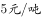；180吨以上的水价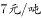。户内人口在5人以上的，每多1人，阶梯水量标准增加30吨。老张家5人，老李家6人，去年用水量都是210吨。问老李家的人均水费比老张家少多少元？

- **A**. 12
- **B**. 35
- **C**. 47　✅
- **D**. 60

**答案**：C

**官方解析**

由题意可得：老张家人均水费=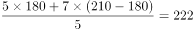元，老李家人均水费=元，则老李家人均水费比老张家少元。

故正确答案为C。

---

### 第 2 题　qid 1796212 · 数学运算

老王围着边长为50米的正六边形的草地跑步，他从某个角点出发，跑了500米之后，与出发点相距有多远？

- **A**. 
米

- **B**. 
米
　✅
- **C**. 
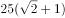米

- **D**. 
米

**答案**：B

**官方解析**

正六边形的边长为50米，则周长为300米，假设老王从A点顺时针跑，500米后应在B点，此时与出发点的距离为AB，做CD垂直于AB，是一个三个角分别为、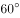、的直角三角形。在直角三角形中，30°角对应的边等于斜边的一半，则，根据勾股定理可计算得BD为米，因此边AB应为米。

故正确答案为B。

---

### 第 3 题　qid 1796222 · 数学运算

如下图，正方形ABCD边长为10厘米，一只小蚂蚁E从A点出发匀速移动，沿边AB，BC，CD前往D点。问哪个图形能反映三角形AED的面积与时间的关系？

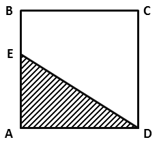

AB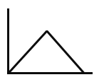

CD

- **A**. A　✅
- **B**. B
- **C**. C
- **D**. D

**答案**：A

**官方解析**

小蚂蚁从A点到B点的过程中，三角形AED的底为AD，长度不变，高AE随着小蚂蚁向上爬而增长，故三角形AED的面积随时间增长（如图1所示）；小蚂蚁从B点到C点的过程中，三角形AED的底为AD，长度不变，高为正方形的边长10cm，也不变，故三角形AED的面积不随时间变化，一直相等（如图2所示）；小蚂蚁从C点到D点的过程中，三角形AED的底为AD，长度不变，高DE随着小蚂蚁向下爬而减少，故三角形AED的面积随时间减少（如图3所示）。只有A项符合三角形AED面积随时间先增长，再不变最后减小的趋势。

故正确答案为A。

---

### 第 4 题　qid 2114548 · 数学运算

某企业原有职工110人，其中技术人员是非技术人员的10倍，今年招聘后，两类人员的人数之比未变，且现有职工中技术人员比非技术人员多153人。问今年新招非技术人员多少名？

- **A**. 7　✅
- **B**. 8
- **C**. 9
- **D**. 10

**答案**：A

**官方解析**

原有职工110人，其中技术人员是非技术人员的10倍，可知二者人数之比为，总数共为11份，每份10人，可以得到非技术人员为1份10人，技术人员为10份100人。招聘后，两类人员的人数之比未变，即新招聘的人员中，技术人员是非技术人员的10倍，可以设新招聘的非技术人员为，则技术人员为，则有，解得。

故正确答案为A。

秒杀技：尾数法。人数比是10倍，技术人员总数的尾数为0，两者相差153，则非技术人员尾数为7，原来是10，现在就是17，新招7人。

---

### 第 5 题　qid 1796254 · 数学运算

A、B两辆列车早上8点同时从甲地出发驶向乙地，途中A、B两列车分别停了10分钟和20分钟，最后A车于早上9点50分，B车于早上10点到达目的地。问两车平均速度之比为多少？

- **A**. 1：1　✅
- **B**. 3：4
- **C**. 5：6
- **D**. 9：11

**答案**：A

**官方解析**

A、B两车均为8:00出发，到达的时间分别为9：50和10：00，中途分别停了10分钟和20分钟，因为两车所用的时间均为1小时40分钟，行驶路程也相同，故二者平均速度之比为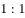。

故正确答案为A。

---

### 第 6 题　qid 1797910 · 数学运算

一环形跑道上画了100个标记点，已知相邻任意两个标记点之间的跑道距离相等。某人在环形跑道上跑了半圈，问他最多能经过几个标记点？

- **A**. 49
- **B**. 51　✅
- **C**. 50
- **D**. 100

**答案**：B

**官方解析**

一环形跑道上画了100个标记点，赋值标记点的间隔1米，根据环形植树公式，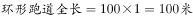。某人跑了半圈，即跑了50米，此时要经过的标记点最多，就从一个标记点出发，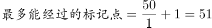。

故正确答案为B。

---

### 第 7 题　qid 2392841 · 数学运算

甲、乙两人同时沿环形跑道同向匀速散步，5分钟后他们第一次相遇，20分钟后第二次相遇，问他们多少分钟后第三次相遇？

- **A**. 45
- **B**. 40
- **C**. 35　✅
- **D**. 30

**答案**：C

**官方解析**

出发5分钟后两人第一次相遇，此时两人在同一位置，只有速度快的人多跑一圈两人才能再次相遇。由题意可知再经过分钟第二次相遇，可知每次相遇的追及距离都是1圈，都是经过15分钟，则第三次相遇是在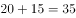分钟后。

故正确答案为C。

---

### 第 8 题　qid 2392853 · 数学运算

某年级的学生做广播体操时站成一个正方形的实心方阵，结果剩下20人。而如果站成每边多1人的正方形实心方阵，则方阵的最后一排少9人。问如果用该年级所有学生排成长方形的实心方阵，则该方阵最外边的一圈最少有多少人？

- **A**. 56　✅
- **B**. 54
- **C**. 60
- **D**. 58

**答案**：A

**官方解析**

设第一次排队组成的正方形边长为，由题意可列方程：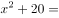，解得，则学生总数为人。想让方阵最外边的一圈人数最少，组成的长方形应长与宽尽量接近，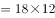，则长、宽取值分别为18、12，最外围一圈人数为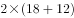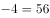人。

故正确答案为A。

---

### 第 9 题　qid 2392855 · 数学运算

张未同学期末考试五门课程的成绩两两相加，得到159、162、164、165、167、169、170、172、175、177分，共10个结果。问张未同学这五门课程的平均成绩是：

- **A**. 86分
- **B**. 85分
- **C**. 84分　✅
- **D**. 83分

**答案**：C

**官方解析**

五门成绩两两相加时，每门成绩的分数需要被分别加和四次，则五门成绩总和为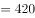分，五门课程平均分为分。

故正确答案为C。

---

### 第 10 题　qid 2392860 · 数学运算

两桶完全一样的化学试剂，分别用掉总量的和后，剩下的两桶分别重80千克和48.5千克。问桶的重量为多少千克？

- **A**. 10
- **B**. 12.5　✅
- **C**. 15
- **D**. 17.5

**答案**：B

**官方解析**

方法一：设化学试剂的重量为千克，桶的重量为千克，根据题意可得方程组：

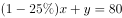  

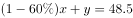  

解得，桶的重量为12.5千克。

方法二：由题意可知，两桶用掉的试剂重量差为千克，占比差为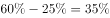，则桶内原有试剂重量为千克，可知桶的重量为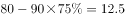千克。

故正确答案为B。

---

### 第 11 题　qid 1758854 · 数学运算

某电影公司准备在1-10月中选择两个不同的月份，在其当月的首日分别上映两部电影。为了避免档期冲突影响票房，现决定两部电影中间相隔至少3个月，则有（  ）种不同的排法。

- **A**. 21
- **B**. 28
- **C**. 42
- **D**. 56　✅

**答案**：D

**官方解析**

此题有歧义，存在两种观点，一种以上映日进行间隔，另一种观点是以上映月份进行间隔。

讲法一（以上映日进行间隔）：正向枚举。要求两部电影间隔至少3个月，两个电影不互相影响，那么第一部电影如果1月1日上映，要独自播放三个月，也就是1、2、3月都是单独播放第一部电影，4月1号就可以上第二部了。则满足要求的排法有：

当第一部电影A在1月上映时，第二部电影B只能在4、5、6、7、8、9、10月中选择，共7种排法；

当第一部电影A在2月上映时，第二部电影B只能在5、6、7、8、9、10月中选择，共6种排法；

当第一部电影A在3月上映时，第二部电影B只能在6、7、8、9、10月中选择，共5种排法；

当第一部电影A在4月上映时，第二部电影B只能在7、8、9、10月中选择，共4种排法；

当第一部电影A在5月上映时，第二部电影B只能在8、9、10月中选择，共3种排法；

当第一部电影A在6月上映时，第二部电影B只能在9、10月选择，共2种排法；

当第一部电影A在7月上映时，第二部电影B只能在10月选择，共1种排法；

共有种排法。同时第一部电影可以上映B，第二部电影上映A，故全部的排法数共有种。

故正确答案为D。

讲法二（以上映月进行间隔）：正向枚举。要求两部电影间隔至少3个月，两个电影不互相影响，那么第一部电影如果1月上映，要独自播放四个月，也就是1、2、3、4月都是单独播放第一部电影，5月1号就可以上第二部了。则满足要求的排法有：

当第一部电影A在1月上映时，第二部电影B只能在5、6、7、8、9、10月中选择，共6种排法；

当第一部电影A在2月上映时，第二部电影B只能在6、7、8、9、10月中选择，共5种排法；

当第一部电影A在3月上映时，第二部电影B只能在7、8、9、10月中选择，共4种排法；

当第一部电影A在4月上映时，第二部电影B只能在8、9、10月中选择，共3种排法；

当第一部电影A在5月上映时，第二部电影B只能在9、10月中选择，共2种排法；

当第一部电影A在6月上映时，第二部电影B只能在10月选择，共1种排法；

共有种排法。同时第一部电影可以上映B，第二部电影上映A，故全部的排法数共有种。

小粉笔认为此题应为讲法一。

---

### 第 12 题　qid 1796268 · 数学运算

A工程队的效率是B工程队的2倍，某工程交给两队共同完成需要6天。如果两队的工作效率均提高一倍，且B队中途休息了1天，问要保证工程按原来的时间完成，A队中途最多可以休息几天？

- **A**. 4　✅
- **B**. 3
- **C**. 2
- **D**. 1

**答案**：A

**官方解析**

A工程队的效率是B工程队的2倍，可以赋值A工程队效率为2，B工程队效率为1，此时工程总量为。如果两队的工作效率均提高一倍，A工程队效率即为，B工程队效率为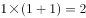。设A工程队休息t天，则有，解得。

故正确答案为A。

---

### 第 13 题　qid 1788612 · 数学运算

甲、乙、丙三人共同完成一项工程，他们的工作效率之比是5：4：6。先由甲、乙两人合作6天，再由乙单独做9天，完成全部工程的，若剩下的工程由丙单独完成，则丙所需要的天数是：

- **A**. 9
- **B**. 11
- **C**. 10　✅
- **D**. 15

**答案**：C

**官方解析**

根据题目中的效率比，设甲、乙、丙的效率分别为5，4，6，由题干可得工程总量，剩余工作量，故丙所需时间天。 

故正确答案为C。 

---

### 第 14 题　qid 1791606 · 数学运算

将所有由1、2、3、4组成且没有重复数字的四位数，按从小到大的顺序排列，则排在第12位的四位数是：

- **A**. 3124
- **B**. 2341
- **C**. 2431　✅
- **D**. 3142

**答案**：C

**官方解析**

由1、2、3、4组成且没有重复数字的四位数中，千位数为1的四位数有个，千位数为2的四位数有个，则按从小到大的顺序排列，排在第12位的四位数是千位数为2的四位数中最大的数字，即2431。

故正确答案为C。

---

### 第 15 题　qid 1772334 · 数学运算

甲、乙二人同时上山砍柴，甲花6小时砍了一担柴，乙砍了一段时间后觉得刀比较钝，于是下山磨了一次刀，磨刀加上山下山共花了一个小时，磨完后效率提升了，总共也花费了6个小时砍了同样一担柴，如果甲、乙二人磨刀之前的效率是相同的，则乙磨刀之前已经砍了（  ）个小时柴。

- **A**. 1
- **B**. 2
- **C**. 3　✅
- **D**. 4

**答案**：C

**官方解析**

赋值甲的效率为1，则乙磨刀前的效率为1，磨刀后的效率为1.5。设乙磨刀之前已经砍了小时柴，则根据题意可得：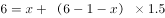，解得。

故正确答案为C。

---

## 判断推理

### 第 1 题　qid 1796284 · 逻辑判断

记者采访时的提问要具体、简洁明了，切忌空泛、笼统、不着边际。约翰·布雷迪在《采访技巧》中剖析了记者采访时向访问对象提出诸如“您感觉如何？”等问题的弊端，认为这些提问“实际上在信息获取上等于原地踏步，它使采访对象没法回答，除非用含混不清或枯燥无味的话来应付。”
由此可以推出：

- **A**. 记者采访时的提问如果具体、简洁明了，就不会给采访对象带来回答的困难
- **B**. 采访对象如果没法回答提问，说明他没有用含混不清或枯燥无味的话来应付
- **C**. 采访对象只有用含混不清或枯燥无味的话来应付，才能回答那些空泛、笼统的提问　✅
- **D**. 诸如“您感觉如何？”这样的问题，只能使采访对象抓不住问题的要点而作泛泛的或言不由衷的回答

**答案**：C

**官方解析**

第一步：翻译题干。

除非，否则不这个关联词可翻译为：后前的形式，因此，题干最后一句话翻译为：

回答了含混不清或枯燥无味。

第二步：逐一翻译选项。

A项：记者采访时的提问如果具体、简洁明了是否能给采访对象带来回答的困难，原文当中完全没有提到过，属于无中生有的选项，排除；

B项：可翻译为：没法回答没有（含混不清或枯燥无味），否前否后，与题干的翻译形式不一致，排除；

C项：可翻译为：回答含混不清或枯燥无味，与题干翻译形式一致，符合题意，当选；

D项：选项中因为采访对象抓不住要点而作泛泛的或言不由衷的回答，原文说的是采用含混不清或枯燥无味，不等同于泛泛或言不由衷，属于概念的偷换，并且这么回答的原因是什么，题干也没有提到，排除。

故正确答案为C。

---

### 第 2 题　qid 1796110 · 逻辑判断

人们在社会生活中常会面临选择，要么选择风险小，报酬低的机会；要么选择风险大，报酬高的机会。究竟是在个人决策的情况下富于冒险性，还是在群体决策的情况下富于冒险性？有研究表明，群体比个体更富有冒险精神，群体倾向于获利大但成功率小的行为。
以下哪项如果为真，最能支持上述研究结论？

- **A**. 在群体进行决策时，人们往往会比个人决策时更倾向于向某一个极端偏斜，从而背离最佳决策　✅
- **B**. 个体会将其意见与群体其他成员相互比较，因其想要被其他群体成员所接受及喜爱，所以个体往往会顺从群体的一般意见
- **C**. 在群体决策中，很可能出现以个体或子群体为主发表意见、进行决策的情况，使群体决策为个体或子群体所左右
- **D**. 群体决策有利于充分利用其成员不同的教育程度、经验和背景，他们的广泛参与有利于最高决策的科学性

**答案**：A

**官方解析**

第一步：找到论点论据。
论点：群体比个体更具有冒险精神，群体倾向于获利大但成功率小的行为。
本题没有论据。
第二步：逐一分析选项。
A选项：群体作决策时比个人更容易走极端，将群体决策和个人决策做比较，解释了群体决策与个人决策之间存在差距的原因，可能会导致群体倾向于获利大但成功率小的行为，有一定的加强作用；
B选项：说的是在群体中个体会偏向于群体的一般意见，论证的是个体在群体中是坚持自己独特意见还是屈众，跟论题不一致，所以排除；
C选项：群体决策可能会被个体或者子群体所主导，也就是说群体决策可能和个体决策是一样的，而不是比个体决策更具有冒险精神，有削弱的意思，排除；
D选项：题干中没有涉及到决策的科学性与成功率，为无关选项，排除。
B、D两项为无关选项，C项有削弱的意思，只有A项有一定的加强作用，比较而言只能选A。
故正确答案为A。

---

### 第 3 题　qid 1796108 · 逻辑判断

某市为了实施文化强市战略，在2008年、2010年先后建成了两个图书馆，2008年底共办理市民借书证7万余个，到2010年底共办理市民借书证13余万个。2011年，该市又在新区建立了第三个图书馆，于2012年初落成开放，截止2012年底，全市共计办理市民借书证20余万个，市政府由此认为，该项举措是有实效的，因为在短短的4年间，光顾图书馆的市民增加了近两倍。
以下哪项如果为真，最能削弱上述结论？

- **A**. 图书馆要不断购置新书，维护成本也很高，这会影响该市其他文化设施建设
- **B**. 该市有两所高等学校，许多在校生也办理了这3个图书馆的借书证
- **C**. 很多办理了第一个图书馆借书证的市民又办理了另外两个图书馆的借书证　✅
- **D**. 该市新区建设发展迅速，4年间很多外来人口大量涌入新区

**答案**：C

**官方解析**

第一步：找到论点论据。
论点：该项举措（建图书馆）是有实效的。
论据：在建成三个图书馆的4年内，光顾图书馆的市民增加了近两倍。
论据说的是光顾图书馆的市民多了，论点说的是举措是有实效的，根据论据可以合理推出论点，因此话题一致，削弱优先考虑削弱论点，也可以考虑削弱论据。
第二步：逐一分析选项。
A项：该项说的是图书馆的维护成本高，与论点讨论的建图书馆能否取得实效无关，话题不一致，不能削弱，排除；
B项：该项说的两所高校的学生也办理了借书证，说明建立图书馆对这两所高校的学生有帮助，有一定的实效，可以加强，不能削弱，排除；
C项：该项说的是一个市民办理三个借书证，这样就是说明看书的人并不一定在增加，只是一人办多证，削弱论据，可以削弱，当选；
D项：该项说的是4年间很多外来人口大量涌入新区，外来人口对于借书证影响不明确，为不明确选项，无法削弱，排除。
故正确答案为C。

---

### 第 4 题　qid 1796278 · 逻辑判断

近日，火星车在加勒陨坑拍摄的图像发现，火星陨坑内的远古土壤存在着类似地球土壤裂纹剖面的土壤样本，通常这样的土壤存在于南极干燥谷和智利阿塔卡马沙漠，这暗示着远古时期火星可能存在生命。
以下哪项如果为真，最能支持上述结论？

- **A**. 地球沙漠土壤中存在土块，具有多孔中空结构，硫酸盐浓度较高，这一特征在火星土壤层并不明显
- **B**. 化学物质分析显示，陨坑内土壤的化学风化过程以及粘土沉积中橄榄石矿损耗情况与地球土壤的状况较为接近
- **C**. 这些火星远古土壤样本仅表明火星早期可能曾是温暖潮湿的，那时的环境比现今更具宜居性
- **D**. 土壤裂纹剖面中的磷损耗特别引人注意，因为地球土壤也存在这种现象，这是由于微生物的活跃性所致　✅

**答案**：D

**官方解析**

第一步：找出论点和论据。
论点：远古时期火星可能存在生命。
论据：火星陨坑内的远古土壤存在着类似地球土壤裂纹剖面的土壤样本。
第二步：逐一分析选项。
A项：地球沙漠土壤与火星土壤不同，是对论据的削弱，无法加强，排除。
B项：经化学物质分析后，陨坑内土壤与地球上土壤的化学风化过程相似，与论据表意相同，是对论据的加强，保留。
C项：火星远古土壤样本情况仅表明火星早期的环境比现在宜居，但并没有明确说明当时是否存在生命，不明确选项，排除。
D项：磷在土壤裂纹剖面中有损耗，说明有微生物存在，解释了为什么看到土壤裂纹剖面就说明可能有生命，属于搭桥加强。
B、D两项都能加强，但是D项搭桥的加强力度强于重复论据的B项。
故正确答案为D。

---

### 第 5 题　qid 1796106 · 逻辑判断

干细胞遍布人体，因为拥有变成任何类型细胞的能力而令科学家们着迷，这种能力意味着它们有可能修复或者取代受损的组织。而通过激光刺激干细胞生长很有可能实现组织生长，因此研究人员认为激光技术或许将成为医学领域的一种变革工具。
以下哪项如果为真，最能支持上述结论？

- **A**. 不同波段的激光对机体组织作用的原理尚不清楚
- **B**. 已有病例表明，激光会对儿童视网膜造成损伤，影响视力
- **C**. 目前激光刺激生长法尚未在人类机体上进行试验，风险还待评估
- **D**. 用激光治疗带有牙洞的臼齿，受损的牙体组织能逐渐恢复　✅

**答案**：D

**官方解析**

第一步：找到题干论点论据。
论点：激光技术或许将成为医学领域的一种变革工具；
论据：激光刺激干细胞生长可能实现组织生长，干细胞具有可以变成任何类型细胞的能力。
第二步：逐一分析选项。
A选项，讨论的是不同波段的激光对人体的组织作用的原理不清楚，属于不明确选项，排除；
B选项，用激光对儿童视网膜影响的例子来证明激光技术会对人体有损伤，属于举例削弱，排除；
C选项，没有在人体试验，风险还待评估，属于不明确选项，排除；
D选项，用有洞的牙齿来作为例子，证明激光技术确实能够成为医学领域变革的工具，举例加强，当选。
故正确答案为D。

---

### 第 6 题　qid 1796280 · 逻辑判断

酒精本身没有明显的致癌能力。但是许多流行病学调查发现，喝酒与多种癌症的发生风险正相关——也就是说，喝酒的人群中，多种癌症的发病率升高了。
以下哪项如果为真，最能支持上述发现？

- **A**. 
酒精在体内的代谢产物乙醛可以稳定地附着在DNA分子上，导致癌变或者突变
　✅
- **B**. 
东欧地区的人广泛食用甜烈性酒，该地区的食管癌发病率很高 

- **C**. 
烟草中含有多种致癌成分，其在人体内代谢物与酒精在人体内代谢物相似

- **D**. 
有科学家估计，如果美国人都戒掉烟酒，那么的消化道癌可以避免 

**答案**：A

**官方解析**

第一步：找到题干论点论据。
论点：喝酒与多种癌症发生风险正相关。
无论据。
第二步：逐一分析选项。
A选项，说明了酒精在人体内的代谢产物是可以致癌的，解释了题干中所说“酒精无致癌能力，但是饮酒的人中患癌症的几率高”，属于解释论点加强；
B选项，以东欧的人和甜烈性酒作为例子，属于举例加强，加强力度比解释论点加强要弱。并且A选项说的是酒精和人体，是普遍性的，B选项说的是东欧的人，以及甜烈性酒，都属于个例，根据整体加强力度大于局部加强力度的原则，也可排除B项；
C选项，烟草能够致癌，其在人体内代谢物与酒精的代谢物相似，属于类比加强。但是类比只是一种可能性加强，要想证明酒精的代谢物能致癌，还是要进一步分析酒精与烟草致癌机理是否一致，其实还是需要类似A项那样的解释，故不如A项明确，排除；
D选项，如果戒掉烟酒，可避免消化道癌，但不清楚到底是烟致癌还是酒致癌，还是两者在一起能致癌，所以属于不明确选项，排除。
故正确答案为A。

---

### 第 7 题　qid 1796276 · 逻辑判断

有报道称，由于人类大量排放温室气体，过去150多年中全球气温一直在持续上升。但与1970年至1998年相比，1999年至今全球表面平均气温的上升速度明显放缓，近15年来该平均气温的上升幅度不明显，因此全球变暖并不是那么严重。
如果以下各项为真，最能削弱上述论证的是？

- **A**. 海洋和气候系统的调整过程使得海洋表层热量向深海输送
- **B**. 此现象在上世纪50~70年代曾出现过，随后又开始加速变暖　✅
- **C**. 联合国气候专家指出，空气中的二氧化碳浓度处于80万年来的最高点
- **D**. 近几年发生多起因气候变暖而产生的自然灾害

**答案**：B

**官方解析**

第一步：找到论点和论据。
论点：全球变暖并不严重。
论据：与1970年至1998年相比，1999年至今全球表面平均气温的上升速度明显放缓，近15年来该平均气温的上升幅度不明显。
第二步：逐一分析选项。
A项：海洋表层热量向深海输送，解释了地球表面温度上升为什么会减缓，补充论据，为加强项，无法削弱，排除；
B项：此现象指的是全球表面平均气温上升速度放缓的现象，这个现象曾经出现过，但随后又加速变暖，即：气温上升速度的放缓并不能得出变暖不严重，有可能之后全球变暖会更加严重，可以削弱，当选；
C项：首先专家的意见不一定符合实情，其次二氧化碳和全球变暖的关系题干中也没提到，需进一步说明才能明确，为无关项，无法削弱，排除；
D项：题干主题是全球变暖这件事儿会不会变得更严重，而D项说的是气候变暖所带来的后果是什么，二者话题并不一致，为无关项，无法削弱，排除。
故正确答案为B。

---

### 第 8 题　qid 1796286 · 逻辑判断

一个没有普通话一级甲等证书的人不可能成为一个主持人，因为主持人不能发音不标准。
上述论证还需基于以下哪一前提？

- **A**. 没有一级甲等证书的人都会发音不标准　✅
- **B**. 发音不标准的主持人可能没有一级甲等证书
- **C**. 一个发音不标准的人有可能获得一级甲等证书
- **D**. 一个发音不标准的主持人不可能成为一个受人欢迎的主持人

**答案**：A

**官方解析**

第一步：找到题干论点论据。

论点：没有一级甲等证书的人不能成为主持人，即：没有一级甲等证书不是主持人（1）。

论据：主持人不能发音不标准，即：主持人发音标准（2）。

论点说的是“一级甲等证书”和“主持人”，论据说的是“主持人”和“发音”，二者话题不一致，要想加强优先考虑搭桥，且由论据搭向论点，即“发音标准有一级甲等证书”。

第二步：逐一分析选项。

A项：没有一级甲等证书发音不标准，其等价命题为：发音标准→有一级甲等证书，最强搭桥项，当选；

B项：发音不标准的可能没有证书，既是可能性的表述，同时也不符合我们需要的条件逻辑，排除；

C项：发音不标准的可能获得证书，既是可能性的表述，同时也不符合我们需要的条件逻辑，排除；

D项：说的是发音标准与受欢迎之间的关系，排除。

故正确答案为A。

---

### 第 9 题　qid 1797820 · 逻辑判断

在某图书馆中，涉及民国时期的历史书均只存放于第二层的专业书库中，外文类的典藏书籍均只存放于第三层的珍本阅览室中，小林周末到该图书馆借了一本外文类历史书。由此可以推出小林借的书是：

- **A**. 是珍本书
- **B**. 不是珍本书
- **C**. 是涉及民国时期的典藏书籍
- **D**. 不是涉及民国时期的典藏书籍　✅

**答案**：D

**官方解析**

第一步：翻译题干。
（1）民国且历史→二层专业书库；（2）外文且典藏→三层珍本。从题干已知条件推不出任何确定结论，因此此题采用代入法。
第二步：逐一代入选项。
假设A项正确，小林借的是珍本书，对于（2）是肯后，推不出必然结论，所以是不确定项；
假设B项正确，小林借的不是珍本书，对于（2）是否后，否后必否前，—三层珍本→—外文或—典藏，题干说他借的是外文书，但是不是典藏书不知道，因此也得不出必然结论；
假设C项正确，是民国时期的典藏书籍，那么说明这本书是民国历史书，也是外文典藏书，就把翻译后的表达式的（1）（2）的前件都肯定了，肯前必肯后，得到的是小林借书既是只能在二层又是只能在三层，矛盾。因此小林借的肯定不是民国时期的典藏书籍，D项正确。
故正确答案为D。

---

### 第 10 题　qid 1797830 · 逻辑判断

国际工程一般是指那些资金由外国政府或国际组织提供，并在咨询设计、施工、设备材料采购及劳务供应等方面部分或全部实行跨国经营的工程项目。国际工程经营是国际间复杂的商业性交易活动，与国际政治、经济环境密切相关，环境和市场的变化会严重影响到有关国际工程业务的成败，有人认为，目前我国国际工程项目管理体系还未达到要求。
以下哪项如果为真，最能驳斥上述结论？

- **A**. 和其他发达国家相比我国在国际项目管理这个方面学术活动水平比较低
- **B**. 现阶段建设市场在项目整体承包方面认可水平较高，市场认可水平高
- **C**. 现阶段开展项目管理工作的部门绝大部分都具有健全的运作机制　✅
- **D**. 在工程开展方面进行管理控制的项目控制相关部门专业化程度较高

**答案**：C

**官方解析**

第一步：找出论点和论据。
论点：目前我国国际工程项目管理体系还未达到要求。
无明显论据。
第二步：逐一分析选项。
A项：论点说未达到要求，选项说的是学术活动水平较低，并不知道学术活动水平能否反映整个管理体系水平，无关项，排除；
B项：没有提及“工程项目管理体系”，无关项，排除；
C项：绝大部分开展项目管理工作的部门都有健全的运作机制，说明是达到要求的，能够削弱论点，当选；
D项：“项目控制相关部门专业化程度较高”不代表管理体系达到要求，无关项，排除。
故正确答案为C。

---

### 第 11 题　qid 2391849 · 图形推理

把下面的六个图形分为两类，使每一类图形都有各自的共同特征或规律，分类正确的一项是：

- **A**. ①④⑥，②③⑤
- **B**. ①④⑤，②③⑥
- **C**. ①③⑤，②④⑥　✅
- **D**. ①②③，④⑤⑥

**答案**：C

**官方解析**

本题图形组成元素相同，但无明显的位置移动规律，考虑图形间的相对位置。观察题干图形发现在图①③⑤中，只有小三角形在两个图形相交区域内，而在②④⑥中，小三角形和小正方形均在两个图形相交区域内，因此①③⑤为一组，②④⑥为一组。
故正确答案为C。

---

### 第 12 题　qid 1796366 · 图形推理

从所给四个选项中，选择最合适的一个填入问号处，使之呈现一定的规律性：

- **A**. A
- **B**. B　✅
- **C**. C
- **D**. D

**答案**：B

**官方解析**

图形元素组成相同，优先考虑位置规律。九宫格优先横向观察，观察第一行发现“○”绕着三角形的边逆时针每次移动一条边，第二行验证此规律成立，因此问号处的“○”应在三角形下面的那条边上，排除C、D两项。观察A、B两项发现，“○”所处的位置不同，一个在三角形外部，一个在三角形内部，因此应考虑两个元素之间的位置关系。经观察发现前两行中都有两个图形“○”位于三角形内部，一个图形“○”位于三角形外部，因此问号处的“○”应于三角形的内部，排除A项。
故正确答案为B。

---

### 第 13 题　qid 1797874 · 图形推理

从所给四个选项中，选择最合适的一个填入问号处，使之呈现一定的规律性：

- **A**. A　✅
- **B**. B
- **C**. C
- **D**. D

**答案**：A

**官方解析**

考查图形的总点数，第一横行总点数为：5、6、7，第二横行总点数为：7、8、9，第三横行总点数为9、10、11，因此排除C、D两项，而且所有图形内部都有三角形，排除B项，选择A项。
故正确答案为A。

---

### 第 14 题　qid 2391876 · 图形推理

从所给的四个选项中，选择最合适的一个填入问号处，使之呈现一定的规律性。

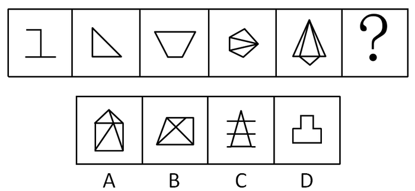

- **A**. A
- **B**. B
- **C**. C　✅
- **D**. D

**答案**：C

**官方解析**

图形组成元素不同，属性无规律，考虑数量规律。面、线数量均无规律，考虑点数量。题干图形交点依次为：2、3、4、5、6个，则“？”处应该填入有7个交点的图形。
A项：有6个交点，排除；
B项：有6个交点，排除；
C项：有7个交点，当选；
D项：有8个交点，排除。
故正确答案为C。

---

### 第 15 题　qid 2391839 · 图形推理

把下面的六个图形分为两类，使每一类图形都有各自的共同特征或规律，分类正确的一项是：

- **A**. ①②③，④⑤⑥
- **B**. ①③⑤，②④⑥
- **C**. ①②④，③⑤⑥
- **D**. ①⑤⑥，②③④　✅

**答案**：D

**官方解析**

元素组成不同，无明显属性和数量规律。观察发现，①⑤⑥三个图形中的小圆圈既分布在图形的中心，也分布在图形的外围区域，②③④三个图形中的小圆圈只分布在图形的外围区域，故①⑤⑥一组，②③④一组。
故正确答案为D。

---

### 第 16 题　qid 2391840 · 定义判断

操作性定义是指根据可观察、可测量、可判定的特征来界定概念含义的方法。
根据上述定义，下列不符合操作性定义的是：

- **A**. 饥饿是指一个人连续24小时以上没有进食的状态
- **B**. 一年是指地球绕太阳转一周所需的时间长度
- **C**. 煎是指把少量油加热，再把食物放进去使其熟透的烹饪方法　✅
- **D**. 旁观是指注视别人的活动达3分钟以上，自己并未参与其中

**答案**：C

**官方解析**

第一步，找出定义关键词。
“可观察、可测量、可判定的特征”、“界定概念含义”。
第二步，逐一分析选项。
A项：“连续24小时以上没有进食的状态”，符合“可观察、可测量、可判定的特征”，符合定义，排除；
B项：“地球绕太阳转一周所需的时间长度”，符合“可观察、可测量、可判定的特征”，符合定义，排除；
C项：“把少量油加热，再把食物放进去使其熟透”，其中的“加热”和“熟透”的概念没有具体的衡量方法，不符合“可观察、可测量、可判定的特征”，不符合定义，当选；
D项：“注视别人的活动达3分钟以上，自己并未参与其中”，符合“可观察、可测量、可判定的特征”，符合定义，排除。
本题为选非题，故正确答案为C。

---

### 第 17 题　qid 2391842 · 定义判断

志愿服务是指不以盈利为目的，基于利他动机，自愿贡献知识、体力、技能等，促进社会和谐与进步的服务活动。
根据上述定义，下列不属于志愿服务的是：

- **A**. 张老师每年春节前都组织“献爱心送温暖”活动，为孤寡老人打扫房间，送上粮油
- **B**. 某居民小区常有穿着白大褂的人为老年人免费量血压，热情推销保健品　✅
- **C**. 某地遭强台风袭击后，不少人士自行驾车帮助运送救灾物资
- **D**. 某大学韩教授经常为所在社区居民做公益专题讲座，引导居民提高生活质量

**答案**：B

**官方解析**

第一步：找出定义关键词。
 “不以盈利为目的，基于利他动机”、“自愿贡献知识、体力、技能等，促进社会和谐与进步的服务活动”。
第二步：逐一分析选项。
A项：张老师组织“献爱心送温暖”活动，“为孤寡老人打扫房间，送上粮油”，符合“不以盈利为目的，基于利他动机”、“自愿贡献知识、体力、技能等，促进社会和谐与进步的服务活动”，符合定义，排除； 
B项：“热情推销保健品”，不符合“不以盈利为目的，基于利他动机”，不符合定义，当选；
C项：“遭强台风袭击后，不少人士自行驾车帮助运送救灾物资”，符合“不以盈利为目的，基于利他动机”、“自愿贡献知识、体力、技能等，促进社会和谐与进步的服务活动”，符合定义，排除；
D项：某大学韩教授做公益专题讲座，符合“不以盈利为目的，基于利他动机”、“自愿贡献知识、体力、技能等，促进社会和谐与进步的服务活动”，符合定义，排除。
本题为选非题，故正确答案为B。

---

### 第 18 题　qid 2391843 · 定义判断

微商买卖是一种发生在亲朋好友之间的商品交易，发生于微信朋友圈中，是熟人买卖在社交网络上的一种表现形式。这种交易因为是建立在朋友的信任之上，因此，一旦遇到微商销售假货，反而熟人会蒙受损失，微商也失去了朋友的信任。
根据上述定义，下列哪项属于微商买卖？

- **A**. 张三在市中心开了一家门店，经常通过微信做商品宣传，生意很红火
- **B**. 李四因为向朋友销售假货，被工商部门罚款一千元，现在停业整顿中
- **C**. 王五微信圈里有很多好朋友，他经常向他们介绍美容产品的打折信息
- **D**. 赵六不慎遗失手机，耽误了好几笔已经谈成的微信好友的生意，损失上千元　✅

**答案**：D

**官方解析**

第一步：找出定义关键词。
“发生在亲朋好友之间的商品交易，发生于微信朋友圈中”、“熟人买卖在社交网络上的一种表现形式”、“建立在朋友的信任之上”。
第二步：逐一分析选项。
A项：“张三在市中心开了一家门店，经常通过微信做商品宣传”，张三只是通过微信宣传商品，并没有进行买卖，不符合“发生在亲朋好友之间的商品交易，发生于微信朋友圈中”，不符合定义，排除；
B项：“李四因为向朋友销售假货”，没有体现是在微信朋友圈进行交易，不符合“发生在亲朋好友之间的商品交易，发生于微信朋友圈中”，不符合定义，排除；
C项：“王五微信圈里有很多好朋友，他经常向他们介绍美容产品的打折信息”，没有体现在微信朋友圈进行交易，不符合“发生在亲朋好友之间的商品交易，发生于微信朋友圈中”，不符合定义，排除；
D项：“赵六不慎遗失手机，耽误了好几笔已经谈成的微信好友的生意，损失上千元”，符合“发生在亲朋好友之间的商品交易，发生于微信朋友圈中”、“熟人买卖在社交网络上的一种表现形式”，符合定义，当选。
故正确答案为D。

---

### 第 19 题　qid 2391844 · 定义判断

差异化战略是指为使企业产品、服务、企业形象等与竞争对手有明显的区别，以获得竞争优势为目的而采取的战略。
根据上述定义，下列属于差异化战略的是：

- **A**. 某家电企业在国内家电业独占鳌头，为绕过贸易壁垒，进一步打开国外市场，正积极开展资本和技术输出，在海外建立制造和销售基地
- **B**. 面对日益激烈的竞争环境，某跨国企业决定剥离不盈利的个人电脑业务，主攻旗下高利润率的智能计算和服务器业务
- **C**. 随着楼市调控政策的不断出台，某房产龙头企业积极调整战略，逐步形成了对旅游、餐饮、物流等行业的多元化产业布局
- **D**. 在国内手机厂商大打价格战时，某手机品牌始终秉持“只做最好的产品”这一理念，依靠技术和产品设计的优势，坚持走高端路线　✅

**答案**：D

**官方解析**

第一步：找出定义关键词。
“使企业产品、服务、企业形象等与竞争对手有明显的区别”、“以获得竞争优势为目的”。
第二步：逐一分析选项。
A项：某家电企业在海外建立制造和销售基地，不符合“使企业产品、服务、企业形象等与竞争对手有明显的区别”，不符合定义，排除；
B项：某跨国企业决定主攻旗下高利润率的智能计算和服务器业务，不符合“使企业产品、服务、企业形象等与竞争对手有明显的区别”，不符合定义，排除；
C项：某房产龙头企业积极调整战略，逐步形成了对旅游、餐饮、物流等行业的多元化产业布局，不符合“使企业产品、服务、企业形象等与竞争对手有明显的区别”，不符合定义，排除；
D项：在国内手机厂商大打价格战时，某手机品牌坚持走高端路线，符合“使企业产品、服务、企业形象等与竞争对手有明显的区别”、“以获得竞争优势为目的”，符合定义，当选。
故正确答案为D。

---

### 第 20 题　qid 1796460 · 定义判断

初级群体指的是由面对面互动所形成的、具有亲密的人际关系和浓厚的感情色彩的社会群体；次级群体指的是其成员为了某种特定的目标集合在一起，通过明确的规章制度结成正规关系的社会群体。
根据上述定义，下列涉及次级群体的是：

- **A**. 亲友团来到比赛现场为小李助威
- **B**. 小赵要到大城市上学了，山里的乡亲们都到村口为他送行
- **C**. 小王考上了研究生，公司的同事一起为他庆贺　✅
- **D**. 20年之后，小张儿时的玩伴建立了一个微信群

**答案**：C

**官方解析**

第一步：找到定义关键词。
关键词为初级群体是由“面对面互动所形成”、“具有亲密的人际关系和浓厚的感情色彩”，次级群体是为了“某种特定的目标”、“通过明确的规章制度”。
第二步：逐一分析选项。
A项：亲友团来到比赛现场为小李助威，群体为亲友团，是通过血缘关系或共同爱好结成的，而不是通过“明确的规章制度”，不符合定义，排除；
B项：小赵考上大学山里乡亲为他送行体现的是一种人际关系和感情色彩，属于初级群体，没有涉及到特定的目标和规章制度，排除；
C项：小王考上研究生，同事为他庆祝，这个群体指的是公司群体，大家的共同目标就是努力工作，把公司搞好，同时这个关系群中有严格的公司规章制度，属于次级群体，当选；
D项：小张的玩伴建立了微信群体现的是亲密的人际关系，属于初级群体，没有涉及到特定的目标和规章制度，排除。
故正确答案为C。

---

### 第 21 题　qid 2391846 · 定义判断

构形歧义是指由于语句和语法结构不确定导致所反映的命题含义不确定，可以解释成不同的命题，从而形成构形歧义。
根据上述定义，下列属于构形歧义的是：

- **A**. 他看着妈妈吃饭　✅
- **B**. 1、9为奇数，所以，1+9是奇数
- **C**. 奇迹不会发生
- **D**. 强权即公理

**答案**：A

**官方解析**

第一步：找出定义关键词。
“由于语句和语法结构不确定导致所反映的命题含义不确定，可以解释成不同的命题”。
第二步：逐一分析选项。
A项：他看着妈妈吃饭，“看着”有两层意思，一可以表示望着，二可以表示看护，符合“由于语句和语法结构不确定导致所反映的命题含义不确定，可以解释成不同的命题”，符合定义，当选； 
B项：1、9为奇数，所以，1+9是奇数，语句中没有出现歧义，不符合“由于语句和语法结构不确定导致所反映的命题含义不确定，可以解释成不同的命题”，不符合定义，排除；
C项：奇迹不会发生，语句中没有出现歧义，不符合“由于语句和语法结构不确定导致所反映的命题含义不确定，可以解释成不同的命题”，不符合定义，排除；
D项：强权即公理，语句中没有出现歧义，不符合“由于语句和语法结构不确定导致所反映的命题含义不确定，可以解释成不同的命题”，不符合定义，排除。
故正确答案为A。

---

### 第 22 题　qid 2391847 · 定义判断

二次事故是指在原有的医疗事故、煤矿安全事故、交通事故等事故的基础上，由于自然不可抗力、救援方的疏忽或当事人的错误操作引起的事故。
根据上述定义，下列不属于二次事故的是：

- **A**. 李某在高速公路上与前车追尾，他匆忙下车捡拾自己小车洒落的物品，被后方驶来的汽车撞击身亡
- **B**. 刘某突发急性阑尾炎入院，医生在阑尾切除手术结束时将一块止血棉遗留在刘某腹腔内没有取出，导致刘某再次入院
- **C**. 某市连日暴雨引发的洪水及泥石流导致25人丧生，部分房屋被毁，数千人被迫离开家园　✅
- **D**. 某煤矿井下渗水，矿工私自启动水泵抽水，拉闸时产生火花，致井内瓦斯爆炸，造成4人当场死亡

**答案**：C

**官方解析**

第一步：找出定义关键词。
“在原有的医疗事故、煤矿安全事故、交通事故等事故的基础上”、“由于自然不可抗力、救援方的疏忽或当事人的错误操作引起的事故”。
第二步：逐一分析选项。
A项：李某在高速公路上与前车追尾属于“交通事故”，匆忙下车捡拾自己小车洒落的物品，被后方驶来的汽车撞击身亡，人为原因导致了二次事故，符合“当事人的错误操作引起的事故”，符合定义，排除；
B项：刘某突发急性阑尾炎入院，医生在阑尾切除手术结束时将一块止血棉遗留在刘某腹腔内没有取出，符合“救援方的疏忽引起的事故”，符合定义，排除；
C项：某市连日暴雨引发的洪水及泥石流导致25人丧生，部分房屋被毁，数千人被迫离开家园，只有泥石流一次自然灾害，没有体现二次事故，不符合“在原有的医疗事故、煤矿安全事故、交通事故等事故的基础上，由于自然不可抗力、救援方的疏忽或当事人的错误操作引起的事故”，不符合定义，当选；
D项：某煤矿井下渗水属于“煤矿安全事故”，矿工私自启动水泵抽水，拉闸时产生火花，致井内瓦斯爆炸，造成4人当场死亡，符合“由于当事人的错误操作引起的事故”，符合定义，排除。
本题为选非题，故正确答案为C。

---

### 第 23 题　qid 1796272 · 定义判断

精益生产是通过系统结构、人员组织、运行方式和市场供求等方面的变革，最大限度地消除浪费和降低库存以及缩短生产周期，力求实现低成本准时生产的技术，其最终目的是通过流程整体优化、均衡物流、高效利用资源、消灭一切库存和浪费，达到用最少的投入向顾客提供最完美价值的目的。
根据上述定义，下列属于精益生产的是：

- **A**. 为了抢占市场，甲公司不断提高空间利用率
- **B**. 乙公司投入了大量资金以缩短其产品生产周期
- **C**. 丙公司的强大供货体系保证它能随时满足客户
- **D**. 丁公司充分发挥自身优势建立了超快的物流系统　✅

**答案**：D

**官方解析**

第一步：找到定义关键词。
题干中精益生产的方式是“通过系统结构、人员组织、运行方式和市场供求等方面的变革”，目的是“整体优化、均衡物流、高效利用资源”，达到“最少的投入向顾客提供最完美的价值”。
第二步：逐一分析选项。
A项：题干中的目的是为顾客提供最完美的价值，A项中的目的是抢占市场，不符合定义，排除；
B项：题干中的方式是通过系统结构、人员组织、运行方式和市场供求等方面，B是通过资金的调整，不符合定义，排除；
C项：只说到有强大的供货体系，但是这个供货体系是否经过各方面的变革，是否是最优化的并没有提及，该选项不够明确；
D项：充分发挥自身优势就是对公司优势资源的高效利用，建立超快物流体系符合“均衡物流，高效利用资源”，符合定义。
C、D两项比较而言，D项更加明确地体现了对优势资源的充分利用，实现了均衡物流、高效利用资源的效果。
故正确答案为D。

---

### 第 24 题　qid 1796382 · 定义判断

不规则需求是指某些物品或者服务的市场需求在不同季节，或一周不同日子，甚至一天不同时间上下波动很大的一种需求状况。
根据上述定义，下列哪项属于不规则需求？

- **A**. 早晚高峰期出租车供不应求　✅
- **B**. 某品牌牙刷分为软、硬、中三种以面向不同消费者
- **C**. 某电商店庆打折，活动当天点击量剧增
- **D**. 某博物馆引进一批梵高画作巡展，游客蜂拥而至

**答案**：A

**官方解析**

第一步：找到定义关键词。
关键词为“某些物品或者服务的市场需求”、“不同季节，或一周不同日子，甚至一天不同时间”、“上下波动很大”。
第二步：逐一分析选项。
A项：早晚高峰期出租车供不应求，即出租车服务的市场需求在一天的不同时间上下波动很大，符合定义，当选；
B项：只提到牙刷品牌对牙刷分类，并未提到消费者的反应如何，也不存在需求上下波动，不符合定义，排除；
C项：“店庆打折，活动当天点击量剧增”说明这种打折服务的市场需求很大，并未体现出需求上下波动，不符合定义，排除；
D项：“博物馆引进梵高画作后游客蜂拥而至”说明人们对欣赏梵高画作的需求很大，并未体现出需求上下波动，不符合定义，排除。
故正确答案为A。

---

### 第 25 题　qid 2114644 · 定义判断

红叶子理论认为，一个人职业的成功不在于红叶子数目的多少，而在于他是否具备一片特别硕大的红叶子，这片特别硕大的红叶子不是与生俱来的，需要根据个人优势不断努力才能获得。
根据上述定义，下列哪项能用红叶子理论解释？

- **A**. 小刘虽然偶尔迟到，但对工作尽职尽责、富有团队精神
- **B**. 小张本科学习数学专业，但是他觉得数学专业比较枯燥，所以他选择攻读经济学硕士
- **C**. 小李的销售能力和财务水平一般，但对市场特别敏感，他努力发展这方面优势，最后成了一名企业家　✅
- **D**. 小文是英语系学生，但口语不太好，她辅修了国际法方面的课程，最后成了一名出色的律师

**答案**：C

**官方解析**

第一步：找到定义关键词。
关键词为“职业的成功在于他具有一片特别硕大的红叶子”、“需要靠个人优势不断努力获得”。
第二步：逐一分析选项。
A项：小刘对工作尽职尽责，富有团队精神，没有体现出这是他的个人优势，也没体现出他在不断努力，不符合定义，排除；
B项：小张觉得数学专业枯燥选择了读经济学硕士，没有体现出他的个人优势，也没体现出个人的不断努力，不符合定义，排除；
C项：小李销售水平一般，但是对市场特别敏感，体现了他的个人优势，对市场敏感，同时他努力发展优势体现了他个人不断努力，能用红叶子理论解释，当选；
D项：小文是英语系学生，口语不好，辅修国际法方面的课程最后成为出色律师，说的是虽然有劣势，但是成功了，并没有体现出他的个人优势和特色，不符合定义，排除。
故正确答案为C。

---

### 第 26 题　qid 1796426 · 类比推理

（　）　对于　熟练　相当于　敏捷　对于　（　）

- **A**. 娴熟　灵敏　✅
- **B**. 操作　迅捷
- **C**. 熟悉　迅速
- **D**. 谙熟　灵动

**答案**：A

**官方解析**

将选项逐一代入。
A项：娴熟是指很熟练，二者为近义关系，且前者是对后者程度的加深，敏捷是指灵敏快捷，与灵敏为近义关系，且前者是对后者程度的加深，前后逻辑关系一致，当选；
B项：熟练可以形容操作，敏捷与迅捷是近义关系，前后逻辑关系不一致，排除；
C项：熟悉指了解得清楚，清楚地知道，而熟练程度要比熟悉更重一些，后比前重。敏捷是指灵敏快捷，所以敏捷程度要比迅速更重一些，这里前比后重。所以二组词顺序反了，前后逻辑关系不一致，排除；
D项：谙熟指熟悉、了解，程度要比熟练轻。敏捷是指灵敏迅速，灵动多指活泼，敏捷和灵动没有关系，前后逻辑关系不一致，排除。
故正确答案为A。

---

### 第 27 题　qid 1796412 · 类比推理

报刊：新闻

- **A**. 土地：玉米
- **B**. 法院：法律
- **C**. 出版社：书籍
- **D**. 唱片：歌曲　✅

**答案**：D

**官方解析**

第一步：分析题干词语间的逻辑关系。
报刊是利用纸张传播文字资料的一种工具，是发表、宣传新闻的一种载体；并且新闻的发表方式有很多，报刊只是其中一种。
第二步：逐一分析选项。
A选项：土地与玉米是作物和种植地之间的对应关系，与题干逻辑不符，排除；
B选项：法院是司法审判机关，不是法律的载体，与题干逻辑不符，排除；
C选项：出版社出版书籍，不是书籍刊登的载体，与题干逻辑不符，排除；
D选项：唱片是一种传播音乐、歌曲的载体，并且歌曲的发表形式有很多，唱片只是其中一种，与题干逻辑关系一致，当选。
故正确答案为D。

---

### 第 28 题　qid 2114670 · 类比推理

指鹿为马：颠倒黑白

- **A**. 师心自用：固执己见　✅
- **B**. 目无全牛：鼠目寸光
- **C**. 不以为然：不屑一顾
- **D**. 不孚众望：众望所归

**答案**：A

**官方解析**

第一步：分析题干中词语的逻辑关系。
“指鹿为马”意思是指着鹿，说是马，比喻故意颠倒黑白，混淆是非。
“颠倒黑白”意思是把黑的说成白的，白的说成黑的，比喻歪曲事实，混淆是非，指鹿为马。
二者为近义词。
第二步：逐一分析选项。
A项：“师心自用”形容自以为是，不肯接受别人的正确意见，“固执己见”是指顽固地坚持自己的意见，不肯改变，二者为近义词，符合题干逻辑关系，当选；
B项：“目无全牛”意思是眼中没有完整的牛，只有牛的筋骨结构，形容技艺已经到达非常纯熟的地步，“鼠目寸光”比喻目光短浅，缺乏远见，二者不是近义词，不符合题干逻辑关系，排除；
C项：“不以为然”意思是不认为是对的，表示不同意或否定，“不屑一顾”意思是认为不值得一看，形容极端轻视，二者不是近义词，不符合题干逻辑关系，排除；
D项：“不孚众望”意思是不能使大家信服，未符合大家的期望，“众望所归”是指某人得到大家的信赖，希望他担任某项工作或完成事情，二者不是近义词，不符合题干逻辑关系，排除。
故正确答案为A。

---

### 第 29 题　qid 2391854 · 类比推理

沙子：水泥：钢筋

- **A**. 衣柜：餐桌：家具
- **B**. 电暖气：风扇：电器
- **C**. 填空：选择：问答　✅
- **D**. 蚂蚁：蜜蜂：金属

**答案**：C

**官方解析**

第一步：判断题干词语间逻辑关系。
沙子、水泥、钢筋均为建筑材料，三者为并列关系中的反对关系。
第二步：判断选项词语间逻辑关系。
A项：衣柜和餐桌均为家具的一种，与题干逻辑关系不一致，排除；
B项：电暖气和风扇均为电器的一种，与题干逻辑关系不一致，排除；
C项：填空、选择、问答三者均为题目类型，三者为并列关系中的反对关系，与题干逻辑关系一致，当选；
D项：蚂蚁、蜜蜂、金属三者之间没有必然的逻辑关系，与题干逻辑关系不一致，排除。
故正确答案为C。

---

### 第 30 题　qid 2391857 · 类比推理

冷冻：冰箱：冷藏

- **A**. 存储：电脑：上网
- **B**. 制冷：空调：制热　✅
- **C**. 电话：手机：拍照
- **D**. 照明：电灯：取暖

**答案**：B

**官方解析**

第一步：判断题干词语间逻辑关系。
冰箱有冷冻和冷藏的功能，为物品和两种功能的对应关系，且冰箱只有这两种主要功能。
第二步：判断选项词语间逻辑关系。
A项：电脑有存储和上网的功能，但电脑的主要功能还有数据通信、资源共享等，与题干逻辑关系不一致，排除；
B项：空调有制冷和制热的功能，为物品和两种功能的对应关系，且空调只有这两种主要功能，与题干逻辑关系一致，当选；
C项：电话和手机均为通讯工具，手机是一种无线电话，二者是种属关系，手机有拍照的功能，与题干逻辑关系不一致，排除；
D项：电灯的主要功能是照明，取暖不是电灯的主要功能，与题干逻辑关系不一致，排除。
故正确答案为B。

---

### 第 31 题　qid 1796410 · 类比推理

黄连：苦涩

- **A**. 班级：团结
- **B**. 钻石：坚硬　✅
- **C**. 花朵：鲜红
- **D**. 城市：繁华

**答案**：B

**官方解析**

第一步：分析题干词语间的逻辑关系。
黄连是一种草本植物，其味入口一定是极苦，因此苦涩是黄连的一种必然属性。
第二步：逐一分析选项。
A选项：班级可能团结可能不团结，不是一种必然属性关系，与题干逻辑不符，排除；
B选项：钻石是指经过琢磨的金刚石。金刚石在天然矿物中的硬度最高，因此坚硬是钻石的必然属性，与题干逻辑关系一致，为正确答案，当选；
C选项：鲜红是花朵的属性，但花朵不一定是鲜红的，花朵的颜色可以多样，不是必然属性，与题干逻辑不符，排除；
D选项：城市不一定繁华，不是一种必然属性关系，与题干逻辑不符，排除。
故正确答案为B。

---

### 第 32 题　qid 2114688 · 类比推理

沟通：手机：金属

- **A**. 招聘：面试：简介
- **B**. 物流：运输：公路
- **C**. 卫星：科技：科学家
- **D**. 露营：帐篷：帆布　✅

**答案**：D

**官方解析**

第一步：判断题干词语间逻辑关系。
“手机”用于“沟通”，“手机”的材质是“金属”。
第二步：判断选项词语间逻辑关系。
A项： “面试”是“招聘”的一个环节，与题干逻辑关系不一致，排除。
B项： “运输”是“物流”的一个环节，与题干逻辑关系不一致，排除。
C项： “卫星”是“科技”发展的成果，与题干逻辑关系不一致，排除。
D项：“帐篷”用于“露营”，“帐篷”的材质是“帆布”，与题干逻辑关系一致，当选。
故正确答案为D。

---

### 第 33 题　qid 1796408 · 类比推理

麻雀：动物：生物链

- **A**. 豆浆：早餐：豆制品
- **B**. 开水：纸杯：便利品
- **C**. 发卡：首饰：妆扮品　✅
- **D**. 钢笔：电脑：办公品

**答案**：C

**官方解析**

第一步：分析题干词语间的逻辑关系。
题干麻雀属于动物，二者为种属关系，生物链指的是由动物、植物和微生物互相提供食物而形成的相互依存的链条关系。麻雀和动物都属于生物链的一部分。
第二步：逐一分析选项。
A项：豆浆可以作为早餐食用，但二者并非种属关系，并且早餐不是豆制品的组成部分，与题干逻辑不符，排除；
B项：开水不属于纸杯，二者不是种属关系，与题干逻辑不符，排除；
C项：发卡是首饰的一种，二者为种属关系，发卡和首饰都属于妆扮品，分别与妆扮品构成种属关系，而题干是组成关系，对应关系并不完全一致，但是相比于其他选项，种属关系和组成关系都是包容关系，所以该项更合适，当选；
D项：钢笔和电脑都属于办公品，但是钢笔和电脑之间不是种属关系，与题干逻辑不符，排除。
故正确答案为C。

---

### 第 34 题　qid 2114658 · 类比推理

水：森林：煤炭

- **A**. 雪：丰年：喜悦
- **B**. 表扬：自信：乐观
- **C**. 氮：蛋白质：智力　✅
- **D**. 闪电：雨：打伞

**答案**：C

**官方解析**

第一步：分析题干词语的逻辑关系。
水是森林存在的必要条件，森林是产生煤炭的必要条件。
第二步：逐一分析选项。
A选项：瑞雪预示着丰年，但雪不是丰年的必要条件，丰年会让人喜悦，但也不是必要条件，不符合题干逻辑关系，排除；
B选项：表扬可能会让人更有自信，自信与乐观是并列关系，不符合题干逻辑关系，排除；
C选项：氮是组成蛋白质的元素之一，没有氮，蛋白质就不存在，氮是蛋白质存在的必要条件，没有蛋白质就没有动物和人类，也不可能存在智力，蛋白质是智力存在的必要条件，符合题干逻辑关系，当选；
D选项：闪电并不是雨产生的必要条件，而是打雷的必要条件，不符合题干逻辑关系，排除。
故正确答案为C。

---

### 第 35 题　qid 2114680 · 类比推理

（  ）对于 美丽 相当于 春风满面 对于 （  ）

- **A**. 楚楚动人 愉快　✅
- **B**. 笑靥如花 兴奋
- **C**. 眉开眼笑 高兴
- **D**. 心地善良 滋润

**答案**：A

**官方解析**

A项：楚楚动人形容姿容美好，动人心神，形容人很美丽。春风满面形容人心情愉快，满脸笑容，形容人很愉快，当选；
B项：笑靥如花形容女子的笑脸像花儿一样美丽，但春风满面不形容兴奋，排除；
C项：眉开眼笑形容人高兴愉快的样子，也不形容人美丽，排除；
D项：心地善良指有道德、德行好，不形容美丽，排除。
故正确答案为A。

---

## 资料分析

### 材料 1

根据以下资料，回答下列问题。

        2015年1-3月，国有企业营业总收入103155.5亿元，同比下降。其中，中央企业收入63191.3亿元，同比下降。地方国有企业收入39964.2亿元，同比下降。

        1-3月，国有企业营业总成本100345.5亿元，同比下降，其中销售费用、管理费用和财务费用同比分别下降、增长和增长。其中，中央企业成本60216.5亿元，同比下降；地方国有企业成本40129亿元，同比下降。

        1-3月，国有企业利润总额4997.3亿元，同比下降。国有企业应交税金9383亿元，同比增长。

        3月末，国有企业资产总额1054875.4亿元，同比增长；负债总额685766.3亿元，同比增长；所有者权益合计369109.1亿元，同比增长。其中，中央企业资产总额554658.3亿元，同比增长；负债总额363304亿元，同比增长；所有者权益为191354.4亿元，同比增长。地方国有企业资产总额500217.1亿元，同比增长；负债总额322462.3亿元，同比增长；所有者权益为177754.7亿元，同比增长。

#### 第 1 题　qid 1796340 · 综合

2014年1-3月，国有企业营业总收入最接近：

- **A**. 10.5万亿元
- **B**. 11万亿元　✅
- **C**. 11.5万亿元
- **D**. 12万亿元

**答案**：B

**官方解析**

根据题干中“2014年1~3月”，可以判断本题为基期计算问题。定位文字材料第一段，2015年1~3月，国有企业营业总收入103155.5亿元，同比下降。代入基期公式：=。

故正确答案为B。

---

#### 第 2 题　qid 1796336 · 增长

2015年1-3月，在销售费用、管理费用和财务费用中，占国有企业营业总成本的比重同比上升的有几项？

- **A**. 0
- **B**. 1
- **C**. 2
- **D**. 3　✅

**答案**：D

**官方解析**

根据题干中“2015年1-3月······占国有企业营业总成本的比重”，可以判定本题为两期比重问题。只需比较部分量的增长率a和整体量的增长率b，为上升。定位文字材料第二段，销售费用的增长率（下降）、管理费用的增长率（增长）及财务费用的增长率（增长）均大于国有企业营业总成本的增长率b（下降），即比重上升；因此，比重上升的有3项。

故正确答案为D。

---

#### 第 3 题　qid 1796334 · 比重

2015年3月末，中央企业所有者权益占国有企业总体比重比上年同期约：

- **A**. 下降了0.7个百分点　✅
- **B**. 下降了1.5个百分点
- **C**. 上升了0.7个百分点
- **D**. 上升了1.5个百分点

**答案**：A

**官方解析**

根据题干中“2015年3月”“比上年同期”“占比重”，可以判定本题为两期比重问题。定位文字材料第四段，可以得到中央企业所有者权益为191354.4亿元，同比增长；国有企业所有者权益合计369109.1亿元，同比增长。代入两期比重公式，先判断上升还是下降，由可判断为下降，排除C、D两项。&lt;，故答案应小于，只有A项满足。

故正确答案为A。

---

#### 第 4 题　qid 1796338 · 综合

2015年3月末，中央企业的资产负债率（负债总额÷资产总额）约在以下哪个范围内？

- **A**. 
以下

- **B**. 
-

- **C**. 
-
　✅
- **D**. 
以上 

**答案**：C

**官方解析**

根据题干中“2015年3月末······资产负债率（）”，可以判断本题为比值计算问题。参看第四段材料，中央企业负债总额363304亿元，资产总额554658.3亿元，代入资产负债率公式：

。因此在~范围内。

故正确答案为C。

---

#### 第 5 题　qid 1796342 · 综合

能够从上述资料中推出的是：

- **A**. 2015年1-3月，中央和地方国有企业营业成本均低于同期营业收入
- **B**. 2014年1-3月，国有企业应交税金占同期营业总收入的一成以上
- **C**. 2015年3月末，国有企业资产总额同比增长不到12万亿元　✅
- **D**. 2015年3月末，地方国有企业资产负债率高于上年同期水平

**答案**：C

**官方解析**

A项，定位文字材料第一段和第二段，2015年1-3月，，成本低于收入；，成本高于收入，错误；

B项，定位文字材料第一段和第三段，2014年1~3月国有企业应交税金占同期营业总收入的比重，不足一成，错误；

C项，定位文字材料第四段，2015年3月末，国有企业资产总额同比增长量=万亿元，正确；

D项，定位文字材料第四段，地方国有企业资产负债率（）是否高于上年同期水平，需要比较负债总额的增长率a与资产总额的增长率b，而，故地方国有企业资产负债率低于上年同期水平，错误。

故正确答案为C。

---

### 材料 2

#### 第 6 题　qid 1796248 · 综合

2014年下半年全国租赁贸易进出口总额约为多少亿美元？

- **A**. 55
- **B**. 62
- **C**. 67　✅
- **D**. 74

**答案**：C

**官方解析**

根据图形可知2014年4月－2015年4月各月租赁贸易进出口总额，题干求2014年下半年进出口总额，可判定此题为简单加减计算问题。2014年下半年（7-12月），与C项最接近。

故正确答案为C。

---

#### 第 7 题　qid 1796220 · 增长

下列月份中，全国租赁贸易进出口总额环比增速最快的是：

- **A**. 2014年5月
- **B**. 2014年9月
- **C**. 2014年12月　✅
- **D**. 2015年2月

**答案**：C

**官方解析**

由题干“各月环比增速最快的是”可知，本题为一般增长率的比较问题，可直接比较的分数大小关系，分数最大则增速最快。根据图形可知各月份进出口总额，故各项环比增速分别为：。

其中B、D两项明显小于2，排除。，与相比，分子小、分母大，故A项分数较小，则C项较大。

故正确答案为C。

---

#### 第 8 题　qid 1796202 · 综合

2015年一季度全国租赁贸易进出口总额较上一季度约：

- **A**. 
增长了

- **B**. 
降低了
　✅
- **C**. 
增长了

- **D**. 
降低了

**答案**：B

**官方解析**

题干要求求出2015年一季度相比上一季度（2014年四季度）的环比增速，可判定此题为一般增长率的计算问题。定位图表可得，；。环比增速=，即降低了，与B项最为接近。

故正确答案为B。

---

#### 第 9 题　qid 1796228 · 增长

2014年5月~2015年4月间，全国租赁贸易进出口总额及同比增速均高于上月的月份有几个？

- **A**. 5
- **B**. 6　✅
- **C**. 7
- **D**. 8

**答案**：B

**官方解析**

定位图形材料，全国租赁贸易进出口总额及增长率均高于上月的有2014年5、7、9、12月和2015年2、4月，总共6个月。
故正确答案为B。

---

#### 第 10 题　qid 1796210 · 综合

能够从上述资料中推出的是：

- **A**. 2015年4月全国租赁贸易进出口额比2013年4月翻了一番
- **B**. 2015年1~4月月均全国租赁贸易进出口额超过8亿美元
- **C**. 2013年8~9月全国租赁贸易进出口额超过20亿美元　✅
- **D**. 表中全国租赁贸易进出口额同比下降的月份占总数的三分之一

**答案**：C

**官方解析**

A项：由图形材料可知2015年4月，全国租赁贸易进出口额6.94亿美元，而2014年4月全国租赁贸易进出口额3.39亿美元，同比增长，那么2015年4月全国租赁贸易进出口额是2013年4月的，而非翻一番（2倍），错误；

B项：由图形材料可知2015年1-4月，全国租赁贸易进出口总额分别为6.90、12.09、5.29、6.94亿美元，求平均可得，错误；

C项：由图形材料可知2014年8月和9月，全国租赁贸易进出口额分别为8.57、14.58亿美元，同比增长、，则2013年8—9月的全国租赁贸易进出口额为亿美元，正确；

D项：由图形材料可得，全国租赁贸易进出口额同比下降的月份为2014年4月、8月、11月及2015年3月，共4个月，而2014年4月-2015年4月共13个月，故占比不到三分之一，错误。

故正确答案为C。

---

### 材料 3

#### 第 11 题　qid 2392881 · 综合

在上述国家中，2008年陆地面积超过5亿公顷的国家中磷肥施用量低于100万吨的有：

- **A**. 0个
- **B**. 1个　✅
- **C**. 2个
- **D**. 3个

**答案**：B

**官方解析**

定位表格，可知2008年陆地面积超过5亿公顷的国家有中国、巴西、俄罗斯、美国，其中磷肥施用量低于100万吨国家的只有俄罗斯（43万吨）。
故正确答案为B。

---

#### 第 12 题　qid 2392882 · 综合

在上述国家中，2008年单位耕地面积钾肥施用量最少的国家是：

- **A**. 俄罗斯　✅
- **B**. 南非
- **C**. 英国
- **D**. 德国

**答案**：A

**官方解析**

根据问题“······2008年单位耕地面积钾肥施用量最少的国家是”，结合材料时间为2008年，可判定本题为现期平均数问题。定位表格，根据单位耕地面积钾肥施用量，可知各国2008年单位耕地面积钾肥施用量分别为：俄罗斯：吨/公顷；南非：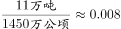吨/公顷；

英国：吨/公顷；德国：吨/公顷。则2008年单位耕地面积钾肥施用量最少的国家是俄罗斯。

故正确答案为A。

---

#### 第 13 题　qid 2392883 · 综合

在上述国家中，2008年耕地面积占陆地面积不足的国家个数是：

- **A**. 4个
- **B**. 3个
- **C**. 2个　✅
- **D**. 1个

**答案**：C

**官方解析**

根据问题“······2008年耕地面积占陆地面积不足的国家个数是”，结合材料时间为2008年，可判定本题为现期比重问题。定位表格，中国：，不符合；印度：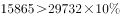，不符合；南非：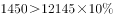，不符合；巴西：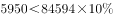，符合；俄罗斯：，符合；美国：，不符合；英国：，不符合；法国：，不符合；德国：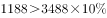，不符合；意大利：，不符合。因此2008年耕地面积占陆地面积不足的国家有巴西和俄罗斯2个。

故正确答案为C。

---

#### 第 14 题　qid 2392884 · 综合

以下国家2008年单位耕地面积氮肥施用量，由高到低排序正确的是：

- **A**. 巴西  德国  俄罗斯
- **B**. 德国  巴西  俄罗斯　✅
- **C**. 俄罗斯  德国  巴西
- **D**. 德国  俄罗斯  巴西

**答案**：B

**官方解析**

根据问题“2008年单位耕地面积氮肥施用量，由高到低排序正确的是”，可判定本题为现期平均数的排序问题。单位耕地面积氮肥施用量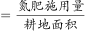，选项中的国家为巴西、俄罗斯、德国。定位表格，可知：2008年巴西单位耕地面积氮肥施用量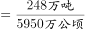；2008年俄罗斯单位耕地面积氮肥施用量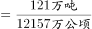；2008年德国单位耕地面积氮肥施用量。观察三个分数，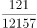的分子最小，分母最大，则分数最小，即俄罗斯单位耕地面积氮肥施用量最低，排除C、D两项。比较巴西和德国，，，故巴西德国，则由高到低排序为德国、巴西、俄罗斯。

故正确答案为B。

---

#### 第 15 题　qid 2392885 · 综合

下列判断正确的是：

- **A**. 
在上述国家中，2008年有5个国家的磷肥施用量少于钾肥的施用量
　✅
- **B**. 
2008年南非单位耕地面积磷肥施用量高于英国

- **C**. 
2008年美国氮肥、磷肥、钾肥的施用量均超过世界总施用量的

- **D**. 
在上述国家中，2008年耕地面积最少的国家也是上述三种化肥施用量最少的国家

**答案**：A

**官方解析**

A项：定位表格，发现磷肥施用量少于钾肥的施用量的国家有巴西、英国、法国、德国、意大利，共5个国家，正确；

B项：单位耕地面积磷肥施用量，定位表格，2008年南非单位耕地面积磷肥施用量为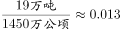吨/公顷；2008年英国单位耕地面积磷肥施用量为吨/公顷，2008年南非单位耕地面积磷肥施用量低于英国，错误；

C项：定位表格，美国的氮肥、磷肥、钾肥施用量分别为1096万吨、334万吨、327万吨，氮肥世界总施用量的为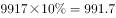万吨；磷肥世界总施用量的为；钾肥世界总施用量的为万吨。发现美国的磷肥施用量（334）未超过世界总施用量的（366.2），错误；

D项：定位表格，2008年耕地面积最少的国家为英国，三种化肥施用量最少的国家为南非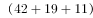，错误。

故正确答案为A。

---

### 材料 4

        2015年2月，我国快递业务量完成8.2亿件，同比增长；业务收入完成136.0亿元，同比增长。消费者对快递业务进行的申诉中，有效申诉（确定企业责任的）占总申诉量的，为消费者挽回经济损失229.8万元。

        2015年2月，全国每百万件快递业务中，有效申诉量为23.4件，对企业1的每百万件有效申诉量为75.13件，环比增长，对企业2的每百万件有效申诉量为32.56件，环比增长，对企业3的每百万件有效申诉量为31.86件，环比增长，对企业4的每百万件有效申诉量为17.81件，环比增长。

#### 第 16 题　qid 1797912 · 平均数

2015年2月，平均每笔快递业务的收入在以下哪个范围之内？

- **A**. 低于17元　✅
- **B**. 17～19元
- **C**. 19～21元
- **D**. 高于21元

**答案**：A

**官方解析**

由题干“2015年2月”判断现期，“平均每笔快递业务收入”判断平均数问题，故本题为现期平均数计算问题。定位文字材料第一段“2015年2月份，我国快递业务量完成8.2亿件，业务收入完成136.0亿元”可得。

故正确答案为A。

---

#### 第 17 题　qid 1797914 · 综合

2015年2月，消费者对快递业务的全部申诉量约为：

- **A**. 1.96万件　✅
- **B**. 2.36万件
- **C**. 1.96亿件
- **D**. 2.36亿件

**答案**：A

**官方解析**

由题干“2015年2月”判断现期，“消费者对快递业务的全部申诉量”和文字材料第一段“占全部申诉量的”判断本题为现期比重中总量的计算问题。定位文字材料第一段“2015年2月份，快递业务量完成8.2亿件”和文字材料第二段“2015年2月，全国每百万件快递业务中有效申诉量为23.4件”可得，，，略大于1.9万件，与A项最接近。

故正确答案为A。

---

#### 第 18 题　qid 1797916 · 综合

将4家企业按2015年1月每百万件快递业务丢失损毁的有效申诉量从高到低排序，正确的是：

- **A**. 企业2，企业1，企业3，企业4
- **B**. 企业1，企业2，企业3，企业4
- **C**. 企业2，企业1，企业4，企业3
- **D**. 企业1，企业2，企业4，企业3　✅

**答案**：D

**官方解析**

由题干“2015年1月由高到低排序”判断本题为环比基期比较问题，定位第一张表格可得四个企业2015年2月每百万件快递业务丢失损毁有效申诉量现期值，定位第二张表格可得四个企业的环比增速，故企业1、2、3、4的环比基期分别为、、、，可得企业1最高，企业3最低，只有D项满足。

故正确答案为D。

---

#### 第 19 题　qid 1797918 · 比重

2015年2月4家企业中，有几家企业的投递服务有效申诉量占该企业当月有效申诉量的比重高于上月水平：

- **A**. 1家
- **B**. 2家　✅
- **C**. 3家
- **D**. 4家

**答案**：B

**官方解析**

由题干“2015年2月比重高于上月水平”判断本题为环比两期比重比较问题。定位文字材料第二段可得四个企业的总有效申诉量的环比增长率分比为；定位第二个表格材料第四列可得四个企业的投递业务有效申诉量环比增长率分别为。根据两期比重比较公式可得a&gt;b比重上升，可得上述企业中只有，故有2家企业比重上升。

故正确答案为B。

---

#### 第 20 题　qid 1797920 · 综合

能够从上述材料推出的是：

- **A**. 2014年2月，全国快递业务完成量为8亿多件
- **B**. 2015年2月，全国每百万件快递业务中，非有效申诉不到1件　✅
- **C**. 2015年2月，四家企业的每百万件快递业务有效申诉量都高于全国水平
- **D**. 2015年2月，企业1的每百万快递业务延误有效申诉量超过任何企业的2倍

**答案**：B

**官方解析**

由题干“能够推出的是”判断本题为综合分析问题。

A项：定位文字材料第一段可得“2015年2月份，快递业务量完成8.2亿件，同比增长”，故2014年2月应为   ，错误；

B项：2015年2月有效申诉量为19188件，，故。根据第一段文字材料可得，故每百万件快递业务中，非有效申诉量，正确；

C项：定位文字材料第二段可得“每百万件快递业务有效申诉量”、、、、，可以看出企业4小于全国平均水平，错误；

D项：定位第一个表格材料，可得，，，错误。

故正确答案为B。

---
