# 2016年黑龙江省公务员录用考试《行测》题（县乡卷）

> 省考 · 2016 年 · 5 个模块 · 共 120 题

- [常识判断](#%E5%B8%B8%E8%AF%86%E5%88%A4%E6%96%AD) · 20 题
- [言语理解与表达](#%E8%A8%80%E8%AF%AD%E7%90%86%E8%A7%A3%E4%B8%8E%E8%A1%A8%E8%BE%BE) · 30 题
- [数量关系](#%E6%95%B0%E9%87%8F%E5%85%B3%E7%B3%BB) · 15 题
- [判断推理](#%E5%88%A4%E6%96%AD%E6%8E%A8%E7%90%86) · 35 题
- [资料分析](#%E8%B5%84%E6%96%99%E5%88%86%E6%9E%90) · 20 题

---

## 常识判断

### 第 1 题　qid 2391952 · 人文常识

下列清代官员的补服图案表示武官品级的是：

- **A**. 
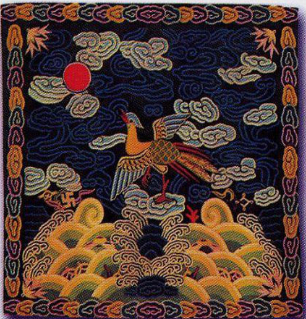

- **B**. 

　✅
- **C**. 
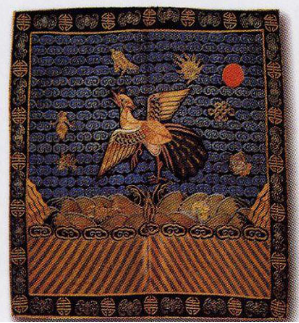

- **D**. 
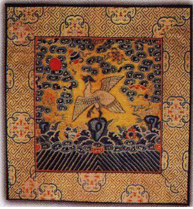

**答案**：B

**官方解析**

补服是一种饰有品级徽识的官服，或称“补袍”或“补褂”，是从明清时期开始出现的。官位品阶不同，需要用不同的“补子”，补子形状均为方形，补子以青、黑、深红等深色为底，五彩织绣，色彩非常艳丽。飞禽和走兽的图案分别是文官和武官补服上的纹样，主要用于区别官位高低。
清代对补子的规定是:一品，文鹤、武麒麟；二品，文锦鸡、武狮；三品，文孔雀、武豹；四品，文雁、武虎；五品，文白鹇、武熊；六品，文鹭鸶、武彪；七品，文鸂鶒、武犀牛；八品，文鹌鹑、武犀牛；九品，文练雀、武海马。
题干四个选项中，A、C、D项均为飞禽，仅有B项图案为走兽。
故正确答案为B。

---

### 第 2 题　qid 2391953 · 人文常识

关于中国的省份，下列说法错误的是：

- **A**. 湖南、湖北的“湖”指洞庭湖
- **B**. 山东、山西的“山”指太行山
- **C**. 河南、河北的“河”指黄河
- **D**. 广东、广西的“广”指广州　✅

**答案**：D

**官方解析**

本题考查地理国情。
A项正确，湖南、湖北的“湖”指洞庭湖。洞庭湖位于湖南和湖北交界的地方，因洞庭湖跨湘鄂两省，北连长江，南接湘、资、沅、鄧四水，自古就有“八百里洞庭”之说。湖南省位于长江中游南岸，春秋战国时属楚国，秦分二郡，汉属荆州。唐分归两道，因地居洞庭湖以南，始称湖南。因湘江纵贯省境，故简称湘，省会长沙。而湖北省位于长江中游北岸。因地处洞庭湖以北，称湖北；因西部有鄂西山地，故简称鄂，省会武汉。
B项正确，山东、山西的“山”指太行山。山西的“山”是指太行山，山西东为太行，西为吕梁。太行山是山西与河北的交界，太行山以东是河北而不是山东。山东的“山”在古时泛指太行山以东的地区，山东省名即来源于此。
C项正确，河南、河北的“河”指黄河。河南，因历史上大部分位于黄河以南，故名河南。河北，因位于黄河以北而得名。河南、河北成对出现，始于唐朝李世民时期。
D项错误，广东、广西的“广”指广信，也叫广南。广东以“广南东路”简称而得名，宋朝设置广南东路，简称广东路，清朝改为广东省，省名至今未变；广西以“广南西路”简称而得名，宋朝设置广南西路，简称广西路，清朝改为广西省，建国后改为广西壮族自治区，区名至今未变。
本题为选非题，故正确答案为D。

---

### 第 3 题　qid 2391954 · 人文常识

下列设计不符合建筑规范的是：

- **A**. 在设计电梯时配置辅助楼梯
- **B**. 卧室之间可以穿越　✅
- **C**. 厨房、卧室、起居室直接采光
- **D**. 影院平面设计成扇形

**答案**：B

**官方解析**

本题考查科技常识。
A项正确，按防火规范的要求，设计电梯时应配置辅助楼梯，供电梯发生故障时使用。布置时可将两者靠近，以便灵活使用，并有利于安全疏散。
B项错误，按住宅建筑规范的要求，卧室之间不应穿越，卧室应有直接采光、自然通风。
C项正确，按住宅建筑规范的要求，住宅应充分利用外部环境提供的日照条件，卧室、起居室(厅)、厨房应设置外窗进行直接采光。
D项正确，根据影院的规模大小、视距、音质条件等要求，可以进行如下平面设计：矩形平面、钟形平面、楔形平面、扇形平面、八角形平面、六角形平面、卵形平面和圆形平面。扇形平面的优点是容量大、平面利用率高。
本题为选非题，故正确答案为B。

---

### 第 4 题　qid 2391955 · 人文常识

下列哪一人物的发明成果与我国四大发明中的某一项最类似？

- **A**. 爱迪生
- **B**. 贝尔
- **C**. 诺贝尔　✅
- **D**. 瓦特

**答案**：C

**官方解析**

本题考查科技常识。四大发明是指中国古代对世界具有重大影响的四种发明，是中国古代劳动人民的重要创造，是指造纸术、指南针、火药及印刷术。
A项错误，爱迪生一生的发明共有两千多项，拥有专利一千多项，比较重要的有电灯、电车、电影、发电机、电动机、电话机、留声机，等等。
B项错误，贝尔的主要成就是发明了电话，并且还制造了助听器，改进了爱迪生发明的留声机。
C项正确，诺贝尔是瑞典化学家、工程师、发明家、军工装备制造商和炸药的发明者，被誉为“现代炸药之父”，是诺贝尔奖的设立者。诺贝尔发明的炸药和四大发明之一的火药类似。
D项错误，瓦特是英国著名科学家，蒸汽机的发明者。他开辟了人类利用能源的新时代，使人类进入“蒸汽时代”。后人为了纪念这位伟大的发明家，把功率的单位定为“瓦特”（简称“瓦”，符号W）。
故正确答案为C。

---

### 第 5 题　qid 2391962 · 科技常识

下列关于我国现代科技成果的说法不正确的是：

- **A**. 第一颗人造地球卫星是“东方红1号”
- **B**. 第一个南极科学考察站是中山站　✅
- **C**. 第一座实用型核电站是秦山核电站
- **D**. 第一辆汽车是产自长春的解放牌汽车

**答案**：B

**官方解析**

本题考查科技常识。
A项正确，1970年4月24日，我国自行设计、制造的第一颗人造地球卫星“东方红1号”，由“长征”一号运载火箭一次发射成功。这标志着我国成为继苏联、美国、法国和日本之后世界上第五个能独立自主研制并发射人造地球卫星的国家，这是我国航天事业发展的第一个里程碑。“从此，中国正式进入太空时代。”作为纪念，自2016年起，我国将每年4月24日设立为“中国航天日”。
B项错误，1985年2月20日，中国第一个南极科学考察实验基地中国南极长城站建成，标志着我国极地考察事业已发展到新阶段。同年3月20日，中国南极长城气象站被世界气象组织纳入全球气象台网站。中山站是中国在南极洲建立的科学考察站之一，建立于1989年2月26日，位于东南极大陆拉斯曼丘陵，是中国第二个南极考察站。
C项正确，秦山核电站是中国自行设计和建造的第一座实用型核电站，位于浙江省嘉兴市海盐县东南秦山，由上海核工程研究设计院等单位设计。
D项正确，中国第一座汽车制造厂——长春第一汽车制造厂，1953年7月15日动工兴建，1956年7月15日生产出中国第一辆解放牌汽车，从此结束了中国不能生产汽车的历史。
本题为选非题，故正确答案为B。

---

### 第 6 题　qid 2391964 · 人文常识

下列关于LED灯的说法不正确的是：

- **A**. 一般使用高压电源　✅
- **B**. 抗震性能好，寿命较长
- **C**. 耗能比白炽灯、节能灯都低
- **D**. 可通过调节电流的强弱来控制亮度

**答案**：A

**官方解析**

本题考查科技常识。

A项错误，一般来说LED的工作电压是2-3.6V，工作电流是0.02-0.03A，即LED一般使用低压电源即可。

B项正确，LED灯为固体冷光源，环氧树脂封装，抗震性能较好，灯体内没有松动的部分，不存在灯丝发光易烧、热沉积、光衰等缺点，使用寿命可达6万-10万小时。

C项正确，LED的工作电压低，采用直流驱动方式，超低功耗（单管0.03-0.06W），在相同照明效果下比传统光源节能以上，属于典型的绿色照明光源。

D项正确，LED的优势之一是可控性大，LED作为一种发光器件，可以通过调节电流的变化控制亮度，也可通过不同波长LED的配置实现色彩的变化与调节。

本题为选非题，故正确答案为A。

---

### 第 7 题　qid 2391966 · 人文常识

下列关于智齿的说法正确的是：

- **A**. 与智力的发育相关
- **B**. 通常在换牙期发育
- **C**. 一般会有六颗
- **D**. 容易引发牙冠的炎症　✅

**答案**：D

**官方解析**

本题考查科技常识。
A项错误，智齿是指人类口腔内牙槽骨上最里面的第三颗磨牙，从正中的门牙往里数刚好是第八颗牙齿。由于它萌出时间很晚，一般在16～25岁间萌出，此时人的生理、心理发育都接近成熟，有“智慧到来”的象征，因此被俗称为“智齿”。
B项错误，智齿萌出时间很晚，一般在16～25岁间萌出，智齿萌出的年龄差异较大，有的人20岁之前萌出，有人40、50岁才长或者终生不长，这都是正常现象。
C项错误，智齿生长方面，个体有很大差异，通常情况下应该有上下左右对称的4颗，有的少于4颗甚至没有，极少数人会多于4颗。
D项正确，长智齿的症状常常会由于智齿萌出不完全，牙冠的一部分被牙龈包绕，形成盲袋，食物残渣易进难出，导致冠周软组织红肿、盲袋积脓，患者会有疼痛、开口困难、发热、头疼、扁桃体肿大等症状。
故正确答案为D。

---

### 第 8 题　qid 2391967 · 科技常识

关于人体，下列表述错误的是：

- **A**. 人体含水量百分比最高的器官是胃　✅
- **B**. 人体内数目最多的细胞是红血球
- **C**. 人体结构中最坚硬的物质是牙釉质
- **D**. 人体消化吸收功能最强的部位是小肠

**答案**：A

**官方解析**

本题考查科技常识。

A项错误，水是人体内含量最多的成分，人体不同器官的水分含量差别很大，其中眼球含水量最大，高达，即人体含水量百分比最高的器官是眼球。

B项正确，红细胞也称红血球，是血液中数量最多的一种血细胞，同时也是脊椎动物体内通过血液运送氧气的最主要的媒介，同时还具有免疫功能。

C项正确，牙釉质，是牙冠外层的白色半透明的钙化程度最高的坚硬组织。牙釉质内部并不具有神经与血管，它的功用除了咬碎食物之外，也可以保护下层的牙本质，是人体中最坚硬的物质，保护着牙齿内部的牙本质和牙髓组织。

D项正确，小肠位于腹中，上端接幽门与胃相通，下端通过阑门与大肠相连，是食物消化吸收的主要场所。食物经过小肠内胰液、胆汁和小肠液的化学性消化及小肠运动的机械性消化后，基本上完成了消化过程，同时营养物质被小肠粘膜吸收。

本题为选非题，故正确答案为A。

---

### 第 9 题　qid 2391970 · 地理国情

在城市规划设计中，最为合理的一项是：

- **A**. 居民住宅区位于盛行风的上风向　✅
- **B**. 有污染的企业布局尽量分散
- **C**. 在市中心建火车站方便交通
- **D**. 存在水污染的企业靠近河流

**答案**：A

**官方解析**

本题考查地理国情。
A项正确，盛行风即常年主导风向，就是每年风频最大的方向。住宅区分布在盛行风的上方，而工业区分布在下风向，其目的是为了保护住宅区环境空气质量。
B项错误，有污染的企业布局应尽量集中分布，且远离城市中心区域，可以便于政府监管和污染处理。
C项错误，火车站一般位于城市外围，因为城市中心土地寸土寸金，一般用于发展商业。位于外围的火车站要有便捷的交通网络，以便于人们出行，与普通铁路网、高速公路网、机场相结合，形成功能合理的综合交通体系是十分必要的。
D项错误，存在水污染的企业不能临河而建，因为一旦发生污染泄露将可能严重危害水资源。对于水污染企业要配备污水处理设备和加强监督管理，确保水资源安全。
故正确答案为A。

---

### 第 10 题　qid 2391973 · 地理国情

《西游记》中唐僧师徒四人受阻于火焰山，在我国新疆也有火焰山，关于这座火焰山，下列说法错误的是：

- **A**. 古代丝绸之路穿过这里
- **B**. 位于吐鲁番盆地
- **C**. 地表岩石主要为页岩　✅
- **D**. 属大陆性干旱气候

**答案**：C

**官方解析**

本题考查地理国情。

A、B项正确，新疆火焰山，位于吐鲁番盆地的北缘，古丝绸之路北道，主要由中生代的侏罗纪、白垩纪和第三纪的赤红色砂、砾岩和泥岩组成。当地人称它为“克孜勒塔格”，意即“红山”。

C项错误，火焰山主要由赤红色砂、砾岩和泥岩组成，以红色的花岗岩反射阳光而闻名遐迩。

D项正确，火焰山是中国最热的地方，吐鲁番属典型的大陆性干旱荒漠气候。多年测得的绝对最高气温为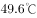（1975年7月13日），而地表温度能达到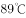，是名符其实的“中国热极”。火焰山终年不雨或雨而未觉亦不足为奇，可以算得上是“中国干极”。

本题为选非题，故正确答案为C。

---

### 第 11 题　qid 2391974 · 人文常识

“一二三四五六七，万木生芽是今日。远天归雁拂云飞，近水游鱼迸冰出。”这一首诗描述的是哪一节气？

- **A**. 立春　✅
- **B**. 惊蛰
- **C**. 谷雨
- **D**. 清明

**答案**：A

**官方解析**

本题考查人文常识。题干出自罗隐的《京中正月七日立春》，意思是：“春天来了，树木发芽，大雁从南方飞回，河里的冰融化了，鱼儿欢快地游出水面。”整首诗表现了冬去春来，万物复苏，生机勃勃的景象，描述的是二十四节气中的立春。
故正确答案为A。

---

### 第 12 题　qid 2391975 · 人文常识

在一场旨在弘扬中国传统艺术的比赛中，下列哪一项不适合作为参赛项目？

- **A**. 表演皮影戏
- **B**. 演奏长笛　✅
- **C**. 现场书写对联
- **D**. 太极剑表演

**答案**：B

**官方解析**

本题考查人文常识。
A项正确，皮影戏又称“影子戏”或“灯影戏”，是中国民间古老的传统艺术。据史书记载，皮影戏始于春秋，兴于汉朝，盛于宋代，极盛于明清，可谓历史悠久，源远流长。
B项错误，长笛起源于欧洲，初名横笛，是现代管弦乐和室内乐中主要的高音旋律乐器，属木管乐。长笛不是我国的传统乐器，不适宜作为参赛项目。
C项正确，对联，中国的传统文化之一，又称楹联或对子，是写在纸、布上或刻在竹子、木头、柱子上的对偶语句。对联对仗工整，平仄协调，是一字一音的中华语言独特的艺术形式。
D项正确，太极剑是属于太极拳门派中的剑术，具有太极拳和剑术两者的风格特点。太极剑作为太极拳系列的组成部分，在古代剑术的基础上，改造发展而成。
本题为选非题，故正确答案为B。

---

### 第 13 题　qid 2391977 · 人文常识

关于中国古代的敬语和谦称，下列归类错误的是：

- **A**. 称呼自己——老朽、鄙人
- **B**. 称呼对方——足下、公子
- **C**. 称呼自己的家人——拙荆、舍妹
- **D**. 称呼对方的家人——家父、令郎　✅

**答案**：D

**官方解析**

本题考查人文常识。
A项正确，“老朽”是谦称自己为衰老无用之人；“鄙人”则是谦称自己的见识、修养不如其他人。
B项正确，“足下”是对对方的尊称，译为“您”，是旧时交际用语中，下称上或同辈之间相称的敬词；“公子”用来尊称别人的儿子。
C项正确，“拙荆”是丈夫对妻子的一种谦称，“舍妹”用于对别人称自己家的妹妹，属于谦词。
D项错误，“家父”是对人谦称自己父亲的称呼，“令郎”是称对方儿子的敬词。
本题为选非题，故正确答案为D。

---

### 第 14 题　qid 2391979 · 人文常识

下列作者和作品对应中，不正确的是：

- **A**. 诸葛亮——《出师表》
- **B**. 李白——《饮中八仙歌》　✅
- **C**. 屈原——《天问》
- **D**. 曹植——《洛神赋》

**答案**：B

**官方解析**

本题考查人文常识。
A项正确，《出师表》是三国时期诸葛亮的作品，这篇文章以议论为主，兼用记叙和抒情。以恳切委婉的言辞劝勉后主要广开言路、严明赏罚、亲贤远佞，以此兴复汉室，还于旧都；同时也表达自己以身许国，忠贞不二的思想。
B项错误，《饮中八仙歌》是唐代诗人杜甫的作品。此诗将当时号称“酒中八仙人”的李白、贺知章、李适之、李琎、崔宗之、苏晋、张旭、焦遂八人从“饮酒”的角度联系在一起，用追叙的方式，洗炼的语言，人物速写的笔法，构成一幅栩栩如生的群像图。
C项正确，《天问》是战国时期诗人屈原创作的一首长诗。此诗从天地离分、阴阳变化、日月星辰等自然现象，一直问到神话传说乃至圣贤凶顽和治乱兴衰等历史故事，表现了作者对某些传统观念的大胆怀疑，以及追求真理的探索精神，具有浓厚的道家色彩。
D项正确，《洛神赋》是三国时期曹魏文学家曹植创作的辞赋名篇。此赋虚构了作者自己与洛神的邂逅相遇和彼此间的思慕爱恋，洛神形象美丽绝伦，人神之恋飘渺迷离，但由于人神道殊而不能结合，最后抒发了无限的悲伤怅惘之情。
本题为选非题，故正确答案为B。

---

### 第 15 题　qid 2391981 · 地理国情

关于我国各大名山，下列说法错误的是：

- **A**. 泰山是世界文化与自然双重遗产
- **B**. 峨眉山有“秀甲天下”之美誉
- **C**. 武当山属亚热带季风气候区
- **D**. 九华山是中国道教四大名山之一　✅

**答案**：D

**官方解析**

本题考查人文常识。
A项正确，世界文化与自然双重遗产，又称复合遗产，是同时具备自然遗产与文化遗产两种条件者。泰山是中国、也是世界上第一个自然与文化双重遗产。
B项正确，四川峨眉山是中国佛教四大名山之一（另三个为：山西五台山、浙江普陀山和安徽九华山）。峨眉山地势陡峭，风景秀丽，有“秀甲天下”之美誉。
C项正确，武当山，中国道教圣地，武当武术的发源地，被称为“亘古无双胜境，天下第一仙山”。属亚热带季风气候，垂直气候明显，气温随海拔高度递减。
D项错误，中国道教四大名山为：安徽齐云山、湖北武当山、四川青城山、江西龙虎山。安徽九华山是我国佛教四大名山之一。
本题为选非题，故正确答案为D。

---

### 第 16 题　qid 2391982 · 人文常识

下列历史事件及其标志性意义对应不正确的是：

- **A**. 第一次鸦片战争：中国近代史的开端
- **B**. 《共产党宣言》的发表：马克思主义的诞生
- **C**. 《狂人日记》的发表：新文化运动的兴起　✅
- **D**. 蒸汽机的发明：第一次工业革命

**答案**：C

**官方解析**

本题考查人文常识。
A项正确，第一次鸦片战争是1840年至1842年英国对中国发动的一场战争，也是中国近代史的开端。
B项正确，《共产党宣言》是马克思和恩格斯为共产主义者同盟起草的纲领，全文贯穿马克思主义的历史观，是马克思主义诞生的重要标志。
C项错误，1915年9月，陈独秀在上海创办《新青年》是新文化运动兴起的标志。内容：提倡民主，反对专制；提倡科学，反对迷信；提倡新道德，反对旧道德；提倡新文学，反对旧文学。《狂人日记》是鲁迅创作的第一个短篇白话日记体小说，也是中国第一部现代白话文小说。
D项正确，第一次工业革命是指18世纪60年代从英国发起的技术革命，是技术发展史上的一次巨大革命，它开创了以机器代替手工劳动的时代。第一次工业革命是以工作机的诞生开始的，以蒸汽机作为动力机被广泛使用为标志的。
本题为选非题，故正确答案为C。

---

### 第 17 题　qid 2391985 · 人文常识

“庖丁解牛”之所以能够做到事半功倍，是因为他：

- **A**. 顺应客观规律　✅
- **B**. 注重主动思考
- **C**. 能够坚持不懈
- **D**. 能够触类旁通

**答案**：A

**官方解析**

本题考查人文常识。
“庖丁解牛”，出自《庄子•内篇•养生主》，比喻经过反复实践，掌握了事物的客观规律，做事得心应手，运用自如。
故正确答案为A。

---

### 第 18 题　qid 2391986 · 人文常识

下列关于商品经济的说法，正确的是：

- **A**. 农业和畜牧业分离是商品经济产生的原因
- **B**. 商人的产生是形成商品经济的根本条件
- **C**. 商品经济是为交换而生产的经济形态　✅
- **D**. 商品经济社会中所有的东西都是商品

**答案**：C

**官方解析**

本题考查经济常识。
A项错误，商品经济产生和存在的一般条件有两个：一是社会分工；二是生产资料和产品属于不同的物质利益主体所有。
B项错误，生产资料和产品属于不同的所有者是形成商品经济的根本条件。
C项正确，商品经济是指直接以交换为目的经济形式，包括商品生产和商品交换。
D项错误，商品是用于交换的劳动产品。商品需要同时满足两个条件：一是劳动产品，二是用于交换。劳动产品若不用于交换就不是商品。
故正确答案为C。

---

### 第 19 题　qid 2391987 · 法律常识

2015年3月十二届全国人大三次会议对《中华人民共和国立法法》作了修改，它在我国社会主义法律体系中属于：

- **A**. 基本法律
- **B**. 基本法律以外的其他法律
- **C**. 宪法及其相关法　✅
- **D**. 基本法

**答案**：C

**官方解析**

本题考查法律常识。
我国的法律体系大体由在宪法统领下的宪法及宪法相关法、民法商法、行政法、经济法、社会法、刑法、诉讼与非诉讼程序法等七个部分构成，包括法律、行政法规、地方性法规三个层次。
A、B、D项错误，该三项的分类标准不属于我国社会主义法律体系的范畴。
C项正确，宪法是国家的根本大法。宪法相关法是与宪法配套、直接保障宪法实施的宪法性法律规范的总和，包括《全国人民代表大会组织法》、《民族区域自治法》、《香港特别行政区基本法》、《澳门特别行政区基本法》、《立法法》、《全国人民代表大会和地方各级人民代表大会选举法》、《全国人民代表大会和地方各级人民代表大会代表法》、《国旗法》、《国徽法》等。
故正确答案为C。

---

### 第 20 题　qid 2391988 · 法律常识

关于我国的宪法，下列说法错误的是：

- **A**. 我国公民甲说：“我国宪法规定国家公职人员实行宪法宣誓制度。”
- **B**. 外国人乙说：“中华人民共和国可以给予我要求政治避难而受到庇护的权利。”
- **C**. 我国公民丙说：“公民不仅可以通过人民代表大会行使国家权力，同时也可以依法参加国家事务的管理。”　✅
- **D**. 外国人丁说：“中华人民共和国的宪法监督机关是全国人大及其常委会。”

**答案**：C

**官方解析**

本题考查法律常识。
A项正确，《宪法》第二十七条第三款规定，“国家工作人员就职时应当依照法律规定公开进行宪法宣誓。”
B项正确，《宪法》第三十二条第二款规定，“中华人民共和国对于因为政治原因要求避难的外国人，可以给予受庇护的权利。”
C项错误，《宪法》第二条第二、三款规定：“人民行使国家权力的机关是全国人民代表大会和地方各级人民代表大会。人民依照法律规定，通过各种途径和形式，管理国家事务，管理经济和文化事业，管理社会事务。”选项中的“公民”应改为“人民”。“人民”和“公民”的区别：1.概念不同：在我国，人民是国家的主人，在我国现阶段，包括工人、农民、知识分子和其他的全体社会主义劳动者、社会主义事业的建设者、拥护社会主义的爱国者、拥护祖国统一和致力于中华民族伟大复兴的爱国者；公民是指具有某国国籍并根据该国宪法和法律规定，享有权利和义务的人。2.性质不同：人民是政治概念，公民是法律概念。3.范围不同：公民比人民范围大，公民既包括人民，也包括敌人。
D项正确，《宪法》第六十二条规定：“全国人民代表大会行使下列职权：······（二）监督宪法的实施；······”；第六十七条规定：“全国人民代表大会常务委员会行使下列职权：（一）解释宪法，监督宪法的实施；······”
本题为选非题，故正确答案为C。

---

## 言语理解与表达

### 第 1 题　qid 2391989 · 片段阅读

每当人们想到虚拟的事物时，总是立刻将其和与之相对应的物质实体对立起来，比如亚马逊网上书店与传统书店，维基百科与纸质的百科全书。人们认为，这些虚拟物体将会以更低的成本、更快的速度和更高的效率取代有形实物。不过，在教育领域，虚拟物体应该不会取代有形实体，而会是另一番模样。我们不应以取代传统的物质课堂为目的，而应将虚拟技术与物质实体结合起来，重构整个教育模式。
这段文字意在强调虚拟技术在教育领域应用的：

- **A**. 复杂性
- **B**. 必要性
- **C**. 特殊性　✅
- **D**. 可行性

**答案**：C

**官方解析**

文段开头指出，人们认为虚拟的事物与物质实体是对立的，并且认为虚拟的图书将会取代实体图书，接下来通过转折词“不过”引出重点，指出在教育领域，会是“另一番模样”：课堂不是被简单取代，而是与虚拟技术相结合，重构教育模式。文段意在强调虚拟物体在教育领域应用与其他领域不同，对应C项“特殊性”。
A项，“复杂性”形容事物多而杂乱；B项，“必要性”指达到一定目标所需要的条件、因素；D项，“可行性”指方案、计划等所具备的可以实施的特性。文段均未体现，排除。
故正确答案为C。
【文段出处】《可汗学院虚拟与现实结合的探索》

---

### 第 2 题　qid 2391990 · 片段阅读

在经济全球化的大背景下，受到水体富营养化以及种植业结构调整等方面的影响，外来入侵物种在我国已表现出种类多、地域范围广、蔓延速度快、危害程度重等特征。基于近十年的野外调查、标本鉴定以及文献统计，初步估计中国有860余种归化植物，其中369种被认定为入侵性植物，在全国各省（区、市）均有发现。目前，在我国已建立的1500余个自然保护区中，除少数位于远偏之地，其他或多或少都能调查到外来入侵植物，覆盖森林、农业区、水域、湿地、草原甚至城市居民区。
这段文字意在说明，我国外来入侵物种问题的：

- **A**. 严峻形势　✅
- **B**. 形成原因
- **C**. 长期影响
- **D**. 变化趋势

**答案**：A

**官方解析**

文段首句指出在经济全球化的大背景下，受多种因素影响，外来入侵物种已经呈现种类多、地域范围广、蔓延速度快、危害程度重等特征。接下来通过具体的调查统计情况，说明了物种入侵的严重程度。故文段重在强调物种入侵的严重性，对应A项。
B项，“形成原因”为背景引入部分的内容，非重点，排除；
C、D两项文段均未提及，无中生有，排除。
故正确答案为A。
【文段出处】《外来物种入侵考验生态安全》

---

### 第 3 题　qid 2391996 · 片段阅读

年年招工年年“荒”，受国内外经济新形势、省域产业步入新格局、务工群体产生新诉求等多重影响，持续多年的“用工荒”今年在浙江“如期而至”。与往年不同的是，随着新生代农民工群体的日益扩大，因诉求增多而导致的“用工荒”日渐明显。
这段文字主要讲的是：

- **A**. “用工荒”对企业发展的影响
- **B**. “用工荒”表现出的新特点
- **C**. “用工荒”产生的原因及变化　✅
- **D**. “用工荒”问题的解决途径

**答案**：C

**官方解析**

文段首句指出造成“用工荒”的原因，第二句说明了“用工荒”存在的新特点。这两句之间没有转折、因果等其他关联词，并且没有明显的侧重，故判断文段为并列文段，需全面概括文段内容，C项“原因”对应首句，“变化”对应第二句，概括全面，当选。
A项“对企业发展的影响”、D项“解决途径”文段均未提及，无中生有，排除；
B项“新特点”仅对应文段后半部分内容，表述片面，排除。
故正确答案为C。
【文段出处】《劳资双方互相瞧不上 浙江用工荒突显》

---

### 第 4 题　qid 2391999 · 片段阅读

有一个走钢丝的人，技术超群，他能在两幢20层高的大楼间，手持一根平衡杆，在钢丝上自由行走。成千上万的人被他令人窒息的壮举吸引。只见他走过钢丝后，让其助手骑在他肩上，准备再走一遍，观赏的人们报以热烈持久的掌声，他示意人们停止鼓掌，然后大声问：“你们相信我和我的助手能走过去吗？”“是的，我们相信！”人群狂热地大喊。他停了停，然后大声问：“谁愿意骑在我的肩上？”人群死一般寂静。
这段文字最适合的标题是：

- **A**. 自信与自负
- **B**. 相信与信任　✅
- **C**. 人之相处，贵在真心
- **D**. 艺高人胆大，胆大艺更高

**答案**：B

**官方解析**

文段讲了一则走钢丝的人的故事，他的技术超群，在钢丝上如履平地。观众都相信他能驮着助手走过钢丝，但是却没人敢骑到他的肩上和他一起走过。文段通过观众的表现，说明了相信和无条件的信任之间是有区别的，B项适合作文段的标题，当选。
A项，文段未提及“自负”排除；C项，观众的“相信”并非虚情假意，只是还没有上升到信任的程度，故“贵在真心”没有体现，排除；D项仅强调走钢丝的人技艺超群，只是概括了文段表面意思，没有体现深层内涵，排除。
故正确答案为B。
【文段出处】《相信与信任的区别》

---

### 第 5 题　qid 2392002 · 语句表达

叶廷芳先生虽从事德语文学研究，但对美学却一往情深。用他的话来说，与自然美相比，艺术美乃是“更大的王国”：“视觉的、听觉的、感觉的、想象的······无不牵连着我的灵犀。无论它们化身为文学、戏剧、音乐、舞蹈，还是美术、建筑、摄影，虽面貌各不相同，彼此性情却那么相近，仿佛是同一个大家族里的兄弟姐妹，其共同的‘血缘’——美学维系着彼此之间的融洽关系。”如此，             。
填入画横线部分最恰当的一句是：

- **A**. 美学高屋建瓴的意义赫然显出　✅
- **B**. 人类对美的追求是共通的
- **C**. 美学和其他学科都是相通的
- **D**. 自然美和艺术美的结合便可水到渠成

**答案**：A

**官方解析**

横线位于文段尾句，应概括前文内容。文段首句通过叶廷芳先生的话引出“美学”这一话题，接下来指出了艺术美包括的范围很广，但无论是哪种形式，都有着共同的“血缘”——美学，美学维系着各学科之间关系的融洽，起到了链接纽带的作用。尾句“如此”总结前文，需概括文段的核心话题“美学”，并突出“美学”的重要作用。A项符合文意，当选。
B、D两项均没有提到文段核心话题“美学”，排除；C项，“美学和其他学科都是相通的”只表明美学和其他学科之间有共同之处，并未体现美学的重要作用，排除。
故正确答案为A。
【文段出处】《读&lt;美学操练&gt;》

---

### 第 6 题　qid 2392005 · 语句表达

①近年来，一些医学家认为，食用麸质与众多疾病有关
②到2016年，美国无麸质食品的销售额将达到150亿美元，食用无麸质食品甚至已成为文化和身份标签
③人类食用它的历史已经超过1万年
④谷物过分精细化处理，使人们摄入的营养种类减少，但麸质增加，引发了血糖问题及慢性疾病
⑤麸质身份转变的罪魁祸首是人类基因无法适应高糖高热的现代西方饮食 
⑥谷物中的麸质大概是世界上最重要的蛋白质来源
将以上6个句子重新排列，语序正确的是：

- **A**. ①④⑥⑤③②
- **B**. ②①⑥③④⑤
- **C**. ⑤④⑥③②①
- **D**. ⑥③①②⑤④　✅

**答案**：D

**官方解析**

对比首句，①句中提到“食用麸质与众多疾病有关”，②句中提到“食用无麸质食品甚至已成为文化和身份标签”，按逻辑顺序，应先提到“食用麸质”有问题，再出现“无麸质食品”，所以①句应该排在②句之前，排除B、C项；①句为背景引入句，⑥句为引出话题句，A项、D项均可保留。
观察语句特征，③句中出现指代词“它”，A项⑤③句，“它”指的是⑤句的现代西方饮食，而③句人们食用现代西方饮食的历史不可能超过1万年，前后矛盾，A项排除；故D项⑥③句的连接符合逻辑，“它”只能指代⑥句当中的谷物，D项当选。
故正确答案为D。

---

### 第 7 题　qid 2391958 · 语句表达

①南、北半截胡同和米市胡同一带算得上是清末宣南士人的“核心”街区
②它们彼此间的距离，十几分钟步行即可到达
③这座南海会馆所在的宣南地区，清末时聚集了许多士人
④这为在京士人拜访主考官和同乡京官提供了便利
⑤除了广东士人聚集的南海会馆，湖南会馆在今烂缦胡同101号，绍兴会馆在今南半截胡同7号，均有迹可循
⑥当时士人在京入仕之后，除非能够获得皇帝在内城赐的宅院，大都住在宣南
将以上6个句子重新排列，语序正确的是：

- **A**. ①⑥⑤②④③
- **B**. ①③⑥⑤④②
- **C**. ③⑤①②⑥④
- **D**. ③⑥④①⑤②　✅

**答案**：D

**官方解析**

首先，观察选项，判断首句。由于③句出现指代词“这”，指代词一般不作首句，故优先考虑①句作首句，验证A、B两项。因③句出现指代词，可利用指代词捆绑解题。④句和①句均未提及“南海会馆”，故④③句、①③句均衔接不当，A、B两项均不符合，排除。
此时考虑C、D两项。③句强调“宣南地区，清末时聚集了许多士人”，⑤句仅指出各类会馆，并未提及宣南地区，而⑥句中的指代词“当时”刚好对应了③句中的“清末”，“士人在京入仕之后······大都住在宣南”是对③句的解释说明，故③⑥句衔接更紧密，故可优先验证D项。
验证D项，③句首先引出“宣南地区”，并指出“清末时聚集了许多士人”，之后通过⑥④①句具体对“南宣地区”与“士人”之间的关系进行论述，最后⑤②句论述其他会馆，语义流畅完整，当选。
故正确答案为D。
【文段出处】《回到1898》

---

### 第 8 题　qid 2392008 · 语句表达

①河马的皮肤看起来光滑发亮，但实际非常脆弱
②这是因为在色素分子的作用下，黏液会从最初的无色渐变为红色，继而成为棕褐色，形成“终极防护层”
③所幸河马拥有另一种皮下腺体，能分泌出具有双重功能的黏液 
④这种腺体分泌时不像出汗，倒像是在流血
⑤河马没有汗腺，不能流汗，又没有毛发的保护，所以皮肤在炙热的阳光下很快就会干裂 
以上5个句子重新排列，语序正确的是：

- **A**. ①⑤③④②　✅
- **B**. ①⑤③②④
- **C**. ⑤③②④①
- **D**. ⑤①③②④

**答案**：A

**官方解析**

对比首句，①句提出河马皮肤看着光亮实际脆弱的话题，⑤句在解释河马皮肤脆弱的原因，故①句应在⑤句之前，排除C、D两项；对比A、B两项，③②④句的顺序有差别，④句的“这种腺体”是指③句的“河马拥有另一种皮下腺体”，②句是对④句的“倒像是在流血”的解释说明，故此三句的顺序为③④②，排除B项。
故正确答案为A。

---

### 第 9 题　qid 2392009 · 片段阅读

在任何以创新驱动经济增长的国家里，政府从来都没有成为私营企业的掣肘，相反，它一直是私营企业最重要的合作伙伴，因为只有政府才能让创新企业获得更好的发展，才能让创新成为企业的唯一选项。在关系到国家战略和未来竞争力的关键领域，政府经常表现得比企业更为大胆，有时甚至堪称激进。正是政府与企业合作奠定了技术基础，才能不断出现经济结构的转变和升级。
这段文字主要说明了：

- **A**. 创新能力是企业发展的核心竞争力
- **B**. 经济结构转型能释放企业的创新力
- **C**. 企业是政府实现创新的载体
- **D**. 政府应为企业创新保驾护航　✅

**答案**：D

**官方解析**

文段开始提出政府对私营企业的重要性，接下来进行原因解释，最后通过程度词“正是”再次强调政府对于企业合作的重要性，对其同义替换，对应D项。
A项“核心竞争力”在文段中未体现，无中生有，排除；
B项“经济结构转型”属于解释说明的内容，非重点，排除；
C项“政府实现创新”在文段中没有提及，排除。
故正确答案为D。

---

### 第 10 题　qid 2392010 · 片段阅读

对于市场经济刺激而引发的物质欲望、金钱欲望，以及由此产生的利益冲突和纠纷，固然需要诚信道德规范来引导和调节，但首要的、管用的恐怕还是法律信用规范的引导和调节。在法律信用制度的强制规范下，诚实守信的道德自律约束力会越来越强，社会的外在他律会逐渐变成内在的道德自律，从而使诚信原则植根于人们的心中。
这段文字意在强调，在市场经济中：

- **A**. 自律与他律的关系
- **B**. 道德自律的重要性
- **C**. 法律信用制度的意义　✅
- **D**. 诚信原则建立的途径

**答案**：C

**官方解析**

文段首先提出在市场经济的刺激下会产生一些问题需要诚信道德规范来引导和调节，随后通过转折词“但首要的、管用的恐怕还是”引出法律信用规范的重要性。最后强调法律信用规范的引导和调节的意义。故文段转折之后意在强调法律信用制度的重要性，对应C项。
A项和B项中的“自律”“他律”，并非文段重点，文段的主题词为“法律信用规范”，排除；
D项，“诚信原则建立的途径”表述不明确，排除。
故正确答案为C。
【文段出处】《依法治“信”》

---

### 第 11 题　qid 2392011 · 片段阅读

西夏的汉族与主体民族党项族关系密切。党项族因受到汉族的强大影响，在物质生产方面，在衣、食、住、婚姻等风俗习惯方面，甚至在语言方面都在不断向汉族趋同。西夏灭亡后党项族在蒙元时期有较高的政治地位，不少人流向内地。无论是留居西北还是进入中原地区的党项族后裔，都经历了更深刻的汉化进程，在明清之际多数融入汉族。
这段文字主要说明了：

- **A**. 党项民族的汉化　✅
- **B**. 西夏的汉族与党项族的关系
- **C**. 汉族对党项族后裔的影响
- **D**. 西夏灭亡后党项族的生存状况

**答案**：A

**官方解析**

文段首先引入“西夏汉族与主体党项族关系密切”这一话题。然后论述党项族受到汉族影响被汉化，在诸多方面都有体现。随后又介绍无论是哪里的党项族后裔都经历了汉化的过程。因此文段的核心话题为“党项族”和“汉化”，对应A项。
B项为话题引入句，非重点，且没有“汉化”这个主题词，排除；
C项，文段主题词为“汉化”并非“汉族”，排除；
D项，无“汉化”主题词，排除。
故正确答案为A。
【文段出处】《西夏的汉族与党项民族的汉化》

---

### 第 12 题　qid 2392014 · 片段阅读

流派的出现可以视作某艺术品种发展到高级阶段的表现，譬如京剧老生就有余派、高派、马派等，京剧旦行的梅、尚、程、荀也更为人们所熟悉。京剧演员大多会根据自身条件、喜好等，专攻某一流派，但如果对流派过于强调，反而会忽视了比流派更为基本的行当规范。在很大程度上，流派是个人风格特色，而行当是基本技巧规范，是否符合行当要求有严格的对错之分。没有行当规范就不可能有流派，不能用后者取代前者。比如唱老生言派，首先应该符合老生行当的基本要求，然后再追求法度严谨的吐字发音、起伏跌宕的运气行腔、细腻婉转的情感表达等言派特色。
这段文字意在说明：

- **A**. 流派传承应以行当规范为基础　✅
- **B**. 流派往往是某一类风格的汇聚
- **C**. 戏剧流派脱离行当就难以发展
- **D**. 京剧传承应是技巧与特色并重

**答案**：A

**官方解析**

文段首先介绍“流派是某艺术品种发展到高级阶段的表现”，并以“譬如”解释说明。随后通过转折词“但”，强调不能对流派过于强调，行当规范更加重要，还提出“没有行当规范就不可能有流派”，“行当是基本技巧规范”，最后举例论证。故文段为分总分结构，意在强调行当规范对流派来说非常重要，对应A项。
B项，没有提及主题词“行当”，排除；
C项，表述不明确，排除；
D项，“京剧”属于举例论证的内容，非重点，排除。
故正确答案为A。
【文段出处】《京剧流派传承切勿剑走偏锋》

---

### 第 13 题　qid 2392015 · 片段阅读

哲学家们长久以来都对语言和思维的关系饶有兴致，许多人相信内部语言（也可叫做内在声音、内心独白或言语思维等等）在科学的范畴之外。这一观点正在被颠覆。人们有了新的实验方法激发内部语言的出现，对之进行干扰，并得到神经成像。研究者开始了解这些内部语言是如何在大脑中形成的、具有哪些主观特质以及在人们的思维和决策过程中扮演了何种角色。
这段文字主要介绍：

- **A**. 内部语言与思维的关系
- **B**. 内部语言研究的新进展　✅
- **C**. 实验对语言研究的作用
- **D**. 内部语言神经成像过程

**答案**：B

**官方解析**

文段首先提出，哲学家们长久以来对语言和思维有兴致，相信内部语言不属于科学范畴。接着通过“这一观点正在被颠覆”引出文段重点，人们有了新的实验方法激发内部语言的出现，对之进行干扰，并得到神经成像。最后补充说明神经成像的过程。故文段重点在“这一观点正在被颠覆”之后论述的内容，对应B项。
A项文段并未论述思维与内部语言有何关系，排除；
C项偷换概念，文段“内部语言”为主题词，并非“语言”，排除；
D项属于补充说明的内容，非重点，排除。
故正确答案为B。
【文段出处】《内心的声音：自言自语的力量》

---

### 第 14 题　qid 2392017 · 片段阅读

自20世纪90年代之后，海外动画大举“入侵”中国电视荧屏，中国本土的民族动漫作品不仅数量大幅降低，在质量、影响力等方面也都大不如前。民族动漫如何在今天继续实现社会效益和经济效益，成为一道难题。首先，要让其在大众市场上有好的表现，就应找到大众审美的支撑点。其次，要让民族动漫重现辉煌，必须有品牌意识，使它具有广泛的持续传播的可能性。
这段文字没有论及的是：

- **A**. 民族动漫作品影响力降低
- **B**. 海外动漫作品质量高　✅
- **C**. 重振民族动漫辉煌的措施
- **D**. 树立民族动漫的品牌意识

**答案**：B

**官方解析**

根据提问方式，需选择文段中未提及的一项。文段未提及海外动漫作品的质量问题，B项当选。由“中国本土的民族动漫作品不仅数量大幅降低，在质量、影响力等方面也都大不如前”可知，A项在文段中有提及，排除。由“首先······其次，要让民族动漫重现辉煌，必须有品牌意识······”可知，C、D项在文段中均有提及，排除。
本题为选非题，故正确答案为B。
【文段出处】《民族动漫如何重现辉煌 树立品牌意识是当务之急》

---

### 第 15 题　qid 2392021 · 片段阅读

德国存在主义哲学家雅斯贝尔斯将孔子列为思想范式创造者的四大圣哲之一。在雅斯贝尔斯看来，孔子并不像一般人认为的那样，只是一个想复辟周礼的守旧派，而是一个由于对礼崩乐坏感到失望，希望建立一个新世界的革新家。他的根本思想是“借对古代的复兴以实现对人类的救济”。孔子想要借助教育在他的世界中塑造人类，通过知识寻找出路，并具有积极的人生观和与时代步伐基本合拍的政治主张。
下列哪项可以作为这段文字的标题？

- **A**. 雅斯贝尔斯眼中的孔子　✅
- **B**. 守旧与革新——孔子的抉择
- **C**. 在教育中塑造人类
- **D**. 具有两面性的孔子

**答案**：A

**官方解析**

根据提问方式可知，标题填入题需匹配文段中心。文段开始提到了德国存在主义哲学家雅斯贝尔斯，随后详细论述了雅斯贝尔斯如何看待孔子，介绍他的主要思想。B、D两项只提到了孔子，无主题词“雅斯贝尔斯”，均排除。C项，“教育问题”只是孔子的观点之一，非重点，排除。
故正确答案为A。

---

### 第 16 题　qid 2392023 · 逻辑填空

很多人都说哭过之后他们感觉更舒服，这是因为哭泣能够        紧张，        情绪的平衡。
依次填入画横线部分最恰当的一项是：

- **A**. 缓冲  平复
- **B**. 延缓  修复
- **C**. 缓和  回复
- **D**. 缓解  恢复　✅

**答案**：D

**官方解析**

第一空，搭配“紧张”，D项“缓解”指剧烈、紧张的程度有所减轻，搭配紧张合适，保留。A项“缓冲”，指使冲突缓和，B项“延缓”指推迟，延期，搭配紧张不合适，C项“缓和”指（局势、气氛等）和缓，多用于缓和紧张的情绪，直接搭配紧张不合适，排除A、B、C三项。
第二空，代入验证，“恢复情绪的平衡”搭配恰当，D项当选。
故正确答案为D。

---

### 第 17 题　qid 2392025 · 逻辑填空

用饮用水国家标准衡量矿物质水，这对企业本身或许是好事，因为这        着它不需要执行一个非常严格的标准。而在矿泉水“标准门”事件之前，消费者对饮用水安全性的        没有上升到一个很高的层面，所以对企业产品而言，只要符合国家标准，就可以在市面上销售。
依次填入画横线部分最恰当的一项是：

- **A**. 意味  认知　✅
- **B**. 标志  认识
- **C**. 预示  了解
- **D**. 暗示  理解

**答案**：A

**官方解析**

第一空，由“用国家标准衡量矿物质水”、“不需要执行非常严格的标准”可知，用国家标准这件事使得企业不需要严格执行标准，A项“意味”、B项“标志”、C项“预示”都符合文意，均保留；D项“暗示”指不明白表示意思，而用含蓄的言语或示意的举动使人领会，但是文段是明确地体现出，排除；
第二空，由“只要符合国家标准，就可以在市面上销售”可知，消费者之前对饮用水的安全性认识和了解是不清楚的，A项“认知”、B项“认识”、C项“了解”意思都符合，但是根据语义丰富，认知的意思包含认识和了解，优选语义丰富的选项，A项当选。
故正确答案为A。
【文段出处】《矿物质水“除名”风波：透视多重争议背后及饮用水行业新格局》

---

### 第 18 题　qid 2392028 · 逻辑填空

一个作家要成为著名作家、伟大作家，就不能做时代的旁观者。而是要以“在场者”的姿态切入当下，展现社会        ，反映民生疾苦，讴歌人性光辉。即使写小人物，也可写出生活的幽微之处和时代的现实关照，给主人公        上时代光影，濡染上时代色彩。
依次填入画横线部分最恰当的一项是：

- **A**. 责任  描绘
- **B**. 全貌  描摹
- **C**. 现实  映射
- **D**. 变迁  投射　✅

**答案**：D

**官方解析**

这道题从第二空入手，横线搭配“光影”，且根据文意可知，即便是写“小人物”，也需要作者写出时代对小人物的影响，A项“描绘”指描画或用语言文字来描写，B项“描摹”指照着底样写和画或者用语言文字表现人或事物的形象、情状、特性等，均与“光影”搭配不当，排除；C项“映射”指照射，强调的是直接照射到物体上，是一种客观的照射，排除；D项“投射”指（光线等）射，具有主动照射的意思，根据文段语境“主动给主人公······上时代的光影 ”，“投射”搭配光影合适，所以D项更符合语境，保留。
第一空，代入验证，“展现社会变迁”搭配恰当，体现社会的变化，D项当选。
故正确答案为D。
【文段出处】《评论：作家要为时代代言》

---

### 第 19 题　qid 2392029 · 逻辑填空

传媒产业的发展史，就是一部技术发展史。所以，当互联网技术            之时，传统媒体的处境就开始变得尴尬。
填入画横线部分最恰当的一项是：

- **A**. 无孔不入
- **B**. 突飞猛进　✅
- **C**. 如日中天
- **D**. 一统天下

**答案**：B

**官方解析**

根据后文“传统媒体的处境就开始变得尴尬”可知，横线所填词语要表达互联网技术发展得特别迅速、特别好的意思，B项“突飞猛进”形容发展进步飞快，变化巨大，符合文意，当选；A项“无孔不入”比喻利用一切机会四处钻营，含贬义，与文意不符，且文段感情色彩偏积极，与文段感情色彩不符，排除；C项“如日中天”比喻事物正在最兴盛的时候，文段后面提到传统媒体的处境才开始变得尴尬，那说明互联网技术的发展不是最兴盛的时候，排除；D项“一统天下”指统一全国或者为某人或某种势力所控制的局面，与文意不符，排除。
故正确答案为B。
【文段出处】《假如没有传统媒体······》

---

### 第 20 题　qid 2392033 · 逻辑填空

近年来，国家有关部门加大了对非法盗版活动的打击力度，通过建立群众举报、定期检查等制度，有效        了非法盗版活动的势头。随着市场法律环境的日趋        ，这种广大人民群众深恶痛绝的社会丑恶现象，终究会被根除。
依次填入画横线部分最恰当的一项是：

- **A**. 制止  完美
- **B**. 遏止  完备
- **C**. 扼制  完整
- **D**. 遏制  完善　✅

**答案**：D

**官方解析**

第一空，由“随着······日趋完善”“终究会被根除”可知，对非法盗版活动的打击只是起到了控制的作用，并没有完全让其停止，C项“扼制”指控制、约束，D项“遏制”指制止，控制，均符合文意，保留；A项“制止”指强迫使停止，不允许继续，B项“遏止”指阻止，都侧重停止，与文意不符，排除。
第二空，“终究会被根除”说明法律环境是越来越好，D项“完善”能够体现法律环境慢慢变好，当选；C项“完整”指没有损坏或残缺，文段没有说法律制度不完整，而是强调法律环境变好的意思，排除。
故正确答案为D。

---

### 第 21 题　qid 2392035 · 逻辑填空

对当代中国而言，研究草原文化的意义并非仅仅为了表现文化由精细走向        ，由典雅走向质朴，而是要透过草原民俗与草原风情，        草原风貌中保存尚好的历史文化精髓以及民族的精神和灵魂。
依次填入画横线部分最恰当的一项是：

- **A**. 全面  传承
- **B**. 简单  探寻
- **C**. 粗犷  发掘　✅
- **D**. 豪放  领略

**答案**：C

**官方解析**

第一空，“由······走向······”“由······走向······”相同句式构成并列，并且由“典雅走向质朴”可知，分句内前后语义相反，因此横线所填的词语要与精细语义相反，C项“粗犷”符合文意，保留；A项“全面”、B项“简单”、D项“豪放”均不能与精细构成反义，排除。
第二空，代入验证，发掘历史文化精髓以及民族的精神和灵魂，搭配恰当，C项当选。
故正确答案为C。

---

### 第 22 题　qid 2392036 · 逻辑填空

如今音乐产业环境受到一定冲击，这使从业者十分茫然，但也毋须过分        环境。相较于过去获取音乐渠道不多、选择相对较少的情况而言，现在文化消费的选择更为多元化。就此做出“现在不会有大师”这样的判断还太        ，大师不可能只停留在过去。
依次填入画横线部分最恰当的一项是：

- **A**. 抱怨  武断　✅
- **B**. 依赖  随意
- **C**. 重视  轻率
- **D**. 苛求  主观

**答案**：A

**官方解析**

第一空，由“受到一定冲击”“从业者十分茫然”“毋须过分”可知，作者并不赞赏从业者的作为，所以对于第一空就要选择偏于贬义的词语，A项“抱怨”、D项“苛求”均符合题意，保留；B项“依赖”、C项“重视”感情色彩不符，均排除。
第二空，由“大师不可能只停留在过去”可知，作者不赞成“现在不会有大师”的判断，认为判断是不好的并且感情色彩偏消极，A项“武断”指主观轻率地判断，符合文意并且感情色彩符合，当选；D项“主观”感情色彩不符，排除。
故正确答案为A。

---

### 第 23 题　qid 2392038 · 逻辑填空

社会批评是促进社会进步的必要条件。如果一个社会消失了批评的声音，那么这个社会一定是封闭的、            的；如果一个社会容许批评的声音，那么这个社会也一定是开放的、             的。
依次填入画横线部分最恰当的一项是：

- **A**. 门可罗雀  与时俱进
- **B**. 萎靡不振  异彩纷呈
- **C**. 风雨如晦  生龙活虎
- **D**. 暮气沉沉  生机盎然　✅

**答案**：D

**官方解析**

第一空，横线处所搭配的对象是“社会”，A项“门可罗雀”形容十分冷落，宾客稀少，B项“萎靡不振”形容人的精神不振，意志消沉，均不能用来形容社会，排除；C项“风雨如晦”形容政治黑暗，社会不安，D项“暮气沉沉”指缺乏朝气，均能形容“社会”，保留。
第二空，横线处所搭配的对象仍是“社会”，C项“生龙活虎”形容活泼矫健，富有生气，不能形容社会，排除；D项“生机盎然”指充满生气和活力，与“社会”搭配恰当，当选。
故正确答案为D。
【文段出处】《一个社会不能没有批评的声音》

---

### 第 24 题　qid 2392040 · 逻辑填空

长期受工业文明熏陶的城市人群非常向往体验农村生活，渴望亲近回归自然，释放工作压力。这种回归自然的理念，正是农业文明所        的“顺应自然、天人合一”和谐思想。基于此，近年城市周边的乡村游和农家乐             。
依次填入画横线部分最恰当的一项是：

- **A**. 主张  如火如荼
- **B**. 强调  此起彼伏
- **C**. 遵循  崭露头角
- **D**. 蕴含  方兴未艾　✅

**答案**：D

**官方解析**

此题可从第二空入手，根据文意可知，横线处表达的句意为近年城市周边的乡村游和农家乐蓬勃发展。A项“如火如荼”形容气势旺盛、热烈或激烈，D项“方兴未艾”形容形势或事物正在蓬勃发展，均能体现近年城市周边的乡村旅游和农家乐蓬勃发展的意思，保留。B项“此起彼伏”形容事物发展变化不断，不能表示发展态势好，排除；C项“崭露头角”比喻突出地显露出才能和本领（多指青少年），强调本领、才能或优点较为突出，而文段强“乡村游和农家乐”发展好，与文意不符，排除；
第一空，搭配对象应是“农业文明”，A项“主张”的主语通常是人，搭配不当，排除；D项“蕴含”放入此处恰当，当选。
故正确答案为D。
【文段出处】《在工业化城镇化迅猛发展中 我们如何安放乡愁》

---

### 第 25 题　qid 2392043 · 逻辑填空

一位思想家，不管多么伟大，本质上都只属于他所生活的那个年代。这一点，古今中外            。所以，今天对孔子的某些思想予以扬弃，是一件自然而然的事，完全用不着            ，也用不着大张旗鼓地批判。
依次填入画横线部分最恰当的一项是：

- **A**. 如出一辙  断章取义
- **B**. 大同小异  喧宾夺主
- **C**. 概莫能外  大惊小怪　✅
- **D**. 一视同仁  小题大做

**答案**：C

**官方解析**

第一空，根据横线前文“本质上都只属于他所生活的那个年代”可知，古今中外，不论什么时候，这样的观点都属于这个范围之内，谁都不能例外，C项“概莫能外”指一概不能除外，指都在所指范围之内，符合文意，保留；A项“如出一辙”比喻两件事情非常相似，B项“大同小异”指大体相同，略有差异，D项“一视同仁”表示对人同样看待，不分厚薄，三项均不符合文意，排除。
第二空，代入验证，根据“是一件自然而然的事”可知，C项“大惊小怪”形容不用过分惊讶，放入文段符合语境，当选。
故正确答案为C。

---

### 第 26 题　qid 2392045 · 逻辑填空

会议强调，要牢固树立大边防观念，        和谐边疆，铸就稳固边防。要建设繁荣富裕的边防，把强边固防和兴边富民有机统一起来，互相促进、双向发展，努力        边防建设的良好氛围。
依次填入画横线部分最恰当的一项是：

- **A**. 构架  塑造
- **B**. 架构  制造
- **C**. 构建  营造　✅
- **D**. 建构  打造

**答案**：C

**官方解析**

第一空，搭配“和谐边疆”，A项“构架”意思是结构材木，指建筑，B项“架构”指间架结构，比喻事物的组织、结构或格局，均与“边疆”搭配不当，排除。
第二空，搭配“氛围”，C项“营造良好氛围”为固定搭配，D项“打造”，即制造、创造的意思，对比择优，C项“营造”更为合适，当选。
故正确答案为C。
【文段出处】《黑龙江省委常委议军会议在哈尔滨召开》

---

### 第 27 题　qid 2392046 · 逻辑填空

一切意义都寓于过程。然而，现代文明是            的文明，只求结果，藐视过程。人们手捧旅游图，肩挎照相机，            ，专找图上标明的去处，在某某峰、某某亭“咔嚓”几下，留下“到此一游”的证据，便心满意足地离去。
依次填入画横线部分最恰当的一项是：

- **A**. 缘木求鱼  走马观花
- **B**. 急功近利  按图索骥　✅
- **C**. 浮光掠影  有的放矢
- **D**. 急于求成  独辟蹊径

**答案**：B

**官方解析**

第一空，后文“只求结果，藐视过程”是对横线处的解释，横线处应表达“重视结果，轻视过程”之意，B项“急功近利”和D项“急于求成”都是指贪图眼前的成效和利益，均符合文意，保留。A项“缘木求鱼”比喻方向或办法不对，不可能达到目的，C项“浮光掠影”比喻观察不细致，学习不深入，印象不深刻，均与文意不符，排除。
第二空，根据“专找图上标明的去处”可知，此处体现出的是照着地图找去处，B项“按图索骥”意为按照线索去求得，与文段语境相符，当选；D项“独辟蹊径”比喻独创一种风格或新的方法，与文意不符，排除。
故正确答案为B。
【文段出处】《朋友，别再和我说你要去旅行了》

---

### 第 28 题　qid 2392047 · 逻辑填空

芭蕾这门艺术不仅要用肢体演绎，还需要文化的全方位        和浸染，否则        的就不只是四肢，而是整个形态和表演。
依次填入画横线部分最恰当的一项是：

- **A**. 熏陶  僵硬　✅
- **B**. 培养  笨拙
- **C**. 洗礼  死板
- **D**. 渗透  禁锢

**答案**：A

**官方解析**

第一空，根据“和”可知，所填内容与“浸染”并列，表达文化对芭蕾潜移默化的影响，B项“培养”与C项“洗礼”均与文意不符，排除。A项“熏陶”与D项“渗透”均有“潜移默化的影响”之意，且能够和“浸染”构成并列，保留。
第二空，搭配“四肢”，且此处的四肢指的是在芭蕾演绎时，而芭蕾本身的特性则是“柔软、轻灵”，故横线处应体现出芭蕾舞四肢在没有文化浸染的状态下的样子，A项“僵硬”符合文意，当选。D项“禁锢”指限制其活动，与文意不符，排除。
故正确答案为A。
【文段出处】《用脚尖追逐梦想》

---

### 第 29 题　qid 2392048 · 逻辑填空

文学并非是电影的制胜法宝，文学与电影的转换有着        的关系，一流的文学未必能改造成一流的电影。作为导演，能否抓住优秀文学的精神，并            地传神表达，决定着未来电影的基本品质。
依次填入画横线部分最恰当的一项是：

- **A**. 微妙  惟妙惟肖
- **B**. 复杂  提纲挈领　✅
- **C**. 固定  言简意赅
- **D**. 灵活  绘声绘色

**答案**：B

**官方解析**

第一空，根据“一流的文学未必能改造成一流的电影”可知，文学与电影的转换一定不是“固定”的，排除C项。
第二空，根据文段“能否抓住优秀文段的精神，并······地传神表达”可知，作为电影导演，要想电影优秀就得在改编文学作品的过程中抓住其精髓，力求“传神”，A项“惟妙惟肖”指描写或模仿得非常逼真，D项“绘声绘色”形容叙述或描写生动逼真，文段并非在表达导演追求形似或逼真，故排除A、D两项。B项“提纲挈领”比喻抓住要领，符合文意，当选。
故正确答案为B。
【文段出处】《文学并非是电影的制胜法宝》

---

### 第 30 题　qid 2392049 · 逻辑填空

在中国辽阔的土地上，不仅有着雄伟广袤的高原、            的高山、茫茫无垠的沙漠，更有巨大富饶的盆地、极目千里的平原，以及冈峦起伏的低山和丘陵。各种地形相互交错，但又            ，真是山河壮丽、            ！
依次填入画横线部分最恰当的一项是：

- **A**. 纵横绵延  井然有序  气象万千　✅
- **B**. 巍峨挺拔  一丝不乱  万里无垠
- **C**. 错落有致  有条不紊  千姿百态
- **D**. 蜿蜒起伏  星罗棋布  气势磅礴

**答案**：A

**官方解析**

第一空，搭配“高山”，C项“错落有致”形容事物的布局虽然参差不齐，但却有情趣，不能用来形容高山，搭配不当，排除；
第二空，通过横线前文“但”可知，与“各种地形相互交错”语义相反，表达地形“有秩序”，D项“星罗棋布”形容数量多，分布广，与文意不符，排除；
第三空，根据顿号可知，横线处所填内容与“山河壮丽”构成并列，表达作者对于山河的赞美，A项“气象万千”形容景象或事物壮丽而多变化，符合文意，当选；B项“万里无垠”形容地形辽阔，并非有“壮丽”之意，与文意不符，排除。
故正确答案为A。
【文段出处】《中国的地形》

---

## 数量关系

### 第 1 题　qid 1796258 · 数学运算

某地居民用水价格分二级阶梯，户年用水量在0~180（含）吨的水价；180吨以上的水价。户内人口在5人以上的，每多1人，阶梯水量标准增加30吨。老张家5人，老李家6人，去年用水量都是210吨。问老李家的人均水费比老张家少多少元？

- **A**. 12
- **B**. 35
- **C**. 47　✅
- **D**. 60

**答案**：C

**官方解析**

由题意可得：老张家人均水费=元，老李家人均水费=元，则老李家人均水费比老张家少元。

故正确答案为C。

---

### 第 2 题　qid 1796240 · 数学运算

某商店10月1日开业后，每天的营业额均以100元的速度上涨，已知该月15号这一天的营业额为5000元，问该商店10月份的总营业额为多少元？

- **A**. 163100
- **B**. 158100　✅
- **C**. 155000
- **D**. 150000

**答案**：B

**官方解析**

由“每天的营业额均以100元的速度上涨”可知，10月份每天营业额成一个公差为100的等差数列；由该月15号的营业额为5000元得知，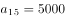，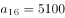。10月共31天，由等差数列求和公式可得,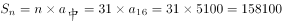元。

故正确答案为B。

---

### 第 3 题　qid 2114548 · 数学运算

某企业原有职工110人，其中技术人员是非技术人员的10倍，今年招聘后，两类人员的人数之比未变，且现有职工中技术人员比非技术人员多153人。问今年新招非技术人员多少名？

- **A**. 7　✅
- **B**. 8
- **C**. 9
- **D**. 10

**答案**：A

**官方解析**

原有职工110人，其中技术人员是非技术人员的10倍，可知二者人数之比为，总数共为11份，每份10人，可以得到非技术人员为1份10人，技术人员为10份100人。招聘后，两类人员的人数之比未变，即新招聘的人员中，技术人员是非技术人员的10倍，可以设新招聘的非技术人员为，则技术人员为，则有，解得。

故正确答案为A。

秒杀技：尾数法。人数比是10倍，技术人员总数的尾数为0，两者相差153，则非技术人员尾数为7，原来是10，现在就是17，新招7人。

---

### 第 4 题　qid 2392841 · 数学运算

甲、乙两人同时沿环形跑道同向匀速散步，5分钟后他们第一次相遇，20分钟后第二次相遇，问他们多少分钟后第三次相遇？

- **A**. 45
- **B**. 40
- **C**. 35　✅
- **D**. 30

**答案**：C

**官方解析**

出发5分钟后两人第一次相遇，此时两人在同一位置，只有速度快的人多跑一圈两人才能再次相遇。由题意可知再经过分钟第二次相遇，可知每次相遇的追及距离都是1圈，都是经过15分钟，则第三次相遇是在分钟后。

故正确答案为C。

---

### 第 5 题　qid 2392848 · 数学运算

有288人的某单位准备分两批组织工会活动，由于工作安排变动，第一批有人员须调整到第二批，此时第一批与第二批人员之比为，问原计划中第一批与第二批人数之比是多少？

- **A**. 

- **B**. 

- **C**. 

- **D**. 

　✅

**答案**：D

**官方解析**

设原计划中第一批人员有人，第二批人员有人，根据题意，在工作安排变动后，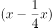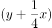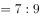，解得：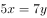，则原计划中第一批与第二批人数之比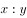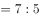。

故正确答案为D。

---

### 第 6 题　qid 2392850 · 数学运算

现有2本艺术类、3本教育类和4本医药类书籍需要并排放到同一层书架上，要求同类书籍必须放在一起。问共有多少种可能的放置方式？

- **A**. 24
- **B**. 288
- **C**. 1728　✅
- **D**. 6912

**答案**：C

**官方解析**

同类书籍必须放在一起，故可先将同类的书籍都捆绑起来，再对三大类书籍进行排序。因同类书籍中可以互相调换位置，则艺术类书籍有种排列方式，教育类书籍有种排列方式，医药类书籍有种排列方式；3大类书籍共有种排法。故一共有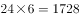种放置方式。

故正确答案为C。

---

### 第 7 题　qid 2392853 · 数学运算

某年级的学生做广播体操时站成一个正方形的实心方阵，结果剩下20人。而如果站成每边多1人的正方形实心方阵，则方阵的最后一排少9人。问如果用该年级所有学生排成长方形的实心方阵，则该方阵最外边的一圈最少有多少人？

- **A**. 56　✅
- **B**. 54
- **C**. 60
- **D**. 58

**答案**：A

**官方解析**

设第一次排队组成的正方形边长为，由题意可列方程：，解得，则学生总数为人。想让方阵最外边的一圈人数最少，组成的长方形应长与宽尽量接近，，则长、宽取值分别为18、12，最外围一圈人数为人。

故正确答案为A。

---

### 第 8 题　qid 2392855 · 数学运算

张未同学期末考试五门课程的成绩两两相加，得到159、162、164、165、167、169、170、172、175、177分，共10个结果。问张未同学这五门课程的平均成绩是：

- **A**. 86分
- **B**. 85分
- **C**. 84分　✅
- **D**. 83分

**答案**：C

**官方解析**

五门成绩两两相加时，每门成绩的分数需要被分别加和四次，则五门成绩总和为分，五门课程平均分为分。

故正确答案为C。

---

### 第 9 题　qid 2392860 · 数学运算

两桶完全一样的化学试剂，分别用掉总量的和后，剩下的两桶分别重80千克和48.5千克。问桶的重量为多少千克？

- **A**. 10
- **B**. 12.5　✅
- **C**. 15
- **D**. 17.5

**答案**：B

**官方解析**

方法一：设化学试剂的重量为千克，桶的重量为千克，根据题意可得方程组：

  

  

解得，桶的重量为12.5千克。

方法二：由题意可知，两桶用掉的试剂重量差为千克，占比差为，则桶内原有试剂重量为千克，可知桶的重量为千克。

故正确答案为B。

---

### 第 10 题　qid 1796268 · 数学运算

A工程队的效率是B工程队的2倍，某工程交给两队共同完成需要6天。如果两队的工作效率均提高一倍，且B队中途休息了1天，问要保证工程按原来的时间完成，A队中途最多可以休息几天？

- **A**. 4　✅
- **B**. 3
- **C**. 2
- **D**. 1

**答案**：A

**官方解析**

A工程队的效率是B工程队的2倍，可以赋值A工程队效率为2，B工程队效率为1，此时工程总量为。如果两队的工作效率均提高一倍，A工程队效率即为，B工程队效率为。设A工程队休息t天，则有，解得。

故正确答案为A。

---

### 第 11 题　qid 1796212 · 数学运算

老王围着边长为50米的正六边形的草地跑步，他从某个角点出发，跑了500米之后，与出发点相距有多远？

- **A**. 
米

- **B**. 
米
　✅
- **C**. 
米

- **D**. 
米

**答案**：B

**官方解析**

正六边形的边长为50米，则周长为300米，假设老王从A点顺时针跑，500米后应在B点，此时与出发点的距离为AB，做CD垂直于AB，是一个三个角分别为、、的直角三角形。在直角三角形中，30°角对应的边等于斜边的一半，则，根据勾股定理可计算得BD为米，因此边AB应为米。

故正确答案为B。

---

### 第 12 题　qid 1788612 · 数学运算

甲、乙、丙三人共同完成一项工程，他们的工作效率之比是5：4：6。先由甲、乙两人合作6天，再由乙单独做9天，完成全部工程的，若剩下的工程由丙单独完成，则丙所需要的天数是：

- **A**. 9
- **B**. 11
- **C**. 10　✅
- **D**. 15

**答案**：C

**官方解析**

根据题目中的效率比，设甲、乙、丙的效率分别为5，4，6，由题干可得工程总量，剩余工作量，故丙所需时间天。 

故正确答案为C。 

---

### 第 13 题　qid 1791610 · 数学运算

如图，边长为1米的正方形棋盘上有100个大小一样的小方格，点<i>O</i>为棋盘的中心，将一个直径是0.8米的圆形纸片放在该棋盘上，使其中心也位于<i>O</i>点，则该圆形纸片可以完全覆盖的小方格个数是：

- **A**. 32　✅
- **B**. 50
- **C**. 48
- **D**. 36

**答案**：A

**官方解析**

沿半径画出圆形，如图所示，阴影部分为完全覆盖。每个圆能完全覆盖的小方格为8个，整个圆能完全覆盖的小方格为个。 

故正确答案为A。

---

### 第 14 题　qid 1772334 · 数学运算

甲、乙二人同时上山砍柴，甲花6小时砍了一担柴，乙砍了一段时间后觉得刀比较钝，于是下山磨了一次刀，磨刀加上山下山共花了一个小时，磨完后效率提升了，总共也花费了6个小时砍了同样一担柴，如果甲、乙二人磨刀之前的效率是相同的，则乙磨刀之前已经砍了（  ）个小时柴。

- **A**. 1
- **B**. 2
- **C**. 3　✅
- **D**. 4

**答案**：C

**官方解析**

赋值甲的效率为1，则乙磨刀前的效率为1，磨刀后的效率为1.5。设乙磨刀之前已经砍了小时柴，则根据题意可得：，解得。

故正确答案为C。

---

### 第 15 题　qid 1772348 · 数学运算

某停车场每天8:00—24:00开放，在9:00—12:00和18:00—20:00时，每分钟有2辆车进入，其余时间每分钟1辆车进入；10:00—16:00每分钟有一辆车离开，16:00—22:00每两分钟有3辆车离开，22:00—24:00每分钟有3辆车离开，其余时间没有车离开，则该停车场需要至少（  ）个停车位。

- **A**. 240
- **B**. 300　✅
- **C**. 360
- **D**. 420

**答案**：B

**官方解析**

停车场至少需要停车位的数量，只需满足停车场一天当中停车数量最多时刻的停车数值即可。由下表中可以观察得出，从20点之后停车量减少值大于增加值，所停车量慢慢减少，则20点时为停车量最大峰值，所停车辆=60+3×60×2+6×60+2×60×2-6×60-4×60×1.5=300。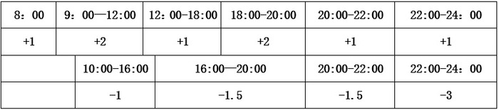

故正确答案为B。

---

## 判断推理

### 第 1 题　qid 1796278 · 逻辑判断

近日，火星车在加勒陨坑拍摄的图像发现，火星陨坑内的远古土壤存在着类似地球土壤裂纹剖面的土壤样本，通常这样的土壤存在于南极干燥谷和智利阿塔卡马沙漠，这暗示着远古时期火星可能存在生命。
以下哪项如果为真，最能支持上述结论？

- **A**. 地球沙漠土壤中存在土块，具有多孔中空结构，硫酸盐浓度较高，这一特征在火星土壤层并不明显
- **B**. 化学物质分析显示，陨坑内土壤的化学风化过程以及粘土沉积中橄榄石矿损耗情况与地球土壤的状况较为接近
- **C**. 这些火星远古土壤样本仅表明火星早期可能曾是温暖潮湿的，那时的环境比现今更具宜居性
- **D**. 土壤裂纹剖面中的磷损耗特别引人注意，因为地球土壤也存在这种现象，这是由于微生物的活跃性所致　✅

**答案**：D

**官方解析**

第一步：找出论点和论据。
论点：远古时期火星可能存在生命。
论据：火星陨坑内的远古土壤存在着类似地球土壤裂纹剖面的土壤样本。
第二步：逐一分析选项。
A项：地球沙漠土壤与火星土壤不同，是对论据的削弱，无法加强，排除。
B项：经化学物质分析后，陨坑内土壤与地球上土壤的化学风化过程相似，与论据表意相同，是对论据的加强，保留。
C项：火星远古土壤样本情况仅表明火星早期的环境比现在宜居，但并没有明确说明当时是否存在生命，不明确选项，排除。
D项：磷在土壤裂纹剖面中有损耗，说明有微生物存在，解释了为什么看到土壤裂纹剖面就说明可能有生命，属于搭桥加强。
B、D两项都能加强，但是D项搭桥的加强力度强于重复论据的B项。
故正确答案为D。

---

### 第 2 题　qid 1796280 · 逻辑判断

酒精本身没有明显的致癌能力。但是许多流行病学调查发现，喝酒与多种癌症的发生风险正相关——也就是说，喝酒的人群中，多种癌症的发病率升高了。
以下哪项如果为真，最能支持上述发现？

- **A**. 
酒精在体内的代谢产物乙醛可以稳定地附着在DNA分子上，导致癌变或者突变
　✅
- **B**. 
东欧地区的人广泛食用甜烈性酒，该地区的食管癌发病率很高 

- **C**. 
烟草中含有多种致癌成分，其在人体内代谢物与酒精在人体内代谢物相似

- **D**. 
有科学家估计，如果美国人都戒掉烟酒，那么的消化道癌可以避免 

**答案**：A

**官方解析**

第一步：找到题干论点论据。
论点：喝酒与多种癌症发生风险正相关。
无论据。
第二步：逐一分析选项。
A选项，说明了酒精在人体内的代谢产物是可以致癌的，解释了题干中所说“酒精无致癌能力，但是饮酒的人中患癌症的几率高”，属于解释论点加强；
B选项，以东欧的人和甜烈性酒作为例子，属于举例加强，加强力度比解释论点加强要弱。并且A选项说的是酒精和人体，是普遍性的，B选项说的是东欧的人，以及甜烈性酒，都属于个例，根据整体加强力度大于局部加强力度的原则，也可排除B项；
C选项，烟草能够致癌，其在人体内代谢物与酒精的代谢物相似，属于类比加强。但是类比只是一种可能性加强，要想证明酒精的代谢物能致癌，还是要进一步分析酒精与烟草致癌机理是否一致，其实还是需要类似A项那样的解释，故不如A项明确，排除；
D选项，如果戒掉烟酒，可避免消化道癌，但不清楚到底是烟致癌还是酒致癌，还是两者在一起能致癌，所以属于不明确选项，排除。
故正确答案为A。

---

### 第 3 题　qid 1796276 · 逻辑判断

有报道称，由于人类大量排放温室气体，过去150多年中全球气温一直在持续上升。但与1970年至1998年相比，1999年至今全球表面平均气温的上升速度明显放缓，近15年来该平均气温的上升幅度不明显，因此全球变暖并不是那么严重。
如果以下各项为真，最能削弱上述论证的是？

- **A**. 海洋和气候系统的调整过程使得海洋表层热量向深海输送
- **B**. 此现象在上世纪50~70年代曾出现过，随后又开始加速变暖　✅
- **C**. 联合国气候专家指出，空气中的二氧化碳浓度处于80万年来的最高点
- **D**. 近几年发生多起因气候变暖而产生的自然灾害

**答案**：B

**官方解析**

第一步：找到论点和论据。
论点：全球变暖并不严重。
论据：与1970年至1998年相比，1999年至今全球表面平均气温的上升速度明显放缓，近15年来该平均气温的上升幅度不明显。
第二步：逐一分析选项。
A项：海洋表层热量向深海输送，解释了地球表面温度上升为什么会减缓，补充论据，为加强项，无法削弱，排除；
B项：此现象指的是全球表面平均气温上升速度放缓的现象，这个现象曾经出现过，但随后又加速变暖，即：气温上升速度的放缓并不能得出变暖不严重，有可能之后全球变暖会更加严重，可以削弱，当选；
C项：首先专家的意见不一定符合实情，其次二氧化碳和全球变暖的关系题干中也没提到，需进一步说明才能明确，为无关项，无法削弱，排除；
D项：题干主题是全球变暖这件事儿会不会变得更严重，而D项说的是气候变暖所带来的后果是什么，二者话题并不一致，为无关项，无法削弱，排除。
故正确答案为B。

---

### 第 4 题　qid 1796286 · 逻辑判断

一个没有普通话一级甲等证书的人不可能成为一个主持人，因为主持人不能发音不标准。
上述论证还需基于以下哪一前提？

- **A**. 没有一级甲等证书的人都会发音不标准　✅
- **B**. 发音不标准的主持人可能没有一级甲等证书
- **C**. 一个发音不标准的人有可能获得一级甲等证书
- **D**. 一个发音不标准的主持人不可能成为一个受人欢迎的主持人

**答案**：A

**官方解析**

第一步：找到题干论点论据。

论点：没有一级甲等证书的人不能成为主持人，即：没有一级甲等证书不是主持人（1）。

论据：主持人不能发音不标准，即：主持人发音标准（2）。

论点说的是“一级甲等证书”和“主持人”，论据说的是“主持人”和“发音”，二者话题不一致，要想加强优先考虑搭桥，且由论据搭向论点，即“发音标准有一级甲等证书”。

第二步：逐一分析选项。

A项：没有一级甲等证书发音不标准，其等价命题为：发音标准→有一级甲等证书，最强搭桥项，当选；

B项：发音不标准的可能没有证书，既是可能性的表述，同时也不符合我们需要的条件逻辑，排除；

C项：发音不标准的可能获得证书，既是可能性的表述，同时也不符合我们需要的条件逻辑，排除；

D项：说的是发音标准与受欢迎之间的关系，排除。

故正确答案为A。

---

### 第 5 题　qid 2391814 · 逻辑判断

以往人们认为核反应堆暴露在自然环境下不是一个理想的做法。但在最新的研究中科学家们设计了一种漂浮在海上的反应堆，它能够经受住海啸考验，还能够在发生自然灾害时利用周围海水保护自己。因此，研究者认为将核反应堆置于海上是合理的。
以下哪项如果为真，不能支持上述结论？

- **A**. 海上的核反应堆能利用周围的海水进行冷却，避免因海啸或地震等自然灾害使冷却装置失控而引发核事故
- **B**. 一般来说，建在海洋上的漂浮式核电站不仅成本低，而且建造难度也相对较低
- **C**. 漂浮式核电站服役期满后，可被拖到特定地点进行处理，退役难度较低
- **D**. 亚洲受到的海啸威胁较高同时用电需求不断增长，因此是漂浮式核电站的最大潜在市场　✅

**答案**：D

**官方解析**

第一步：找出论点和论据。
论点：将核反应堆置于海上是合理的。
论据：漂浮在海上的反应堆，它能够经受住海啸考验，还能够在发生自然灾害时利用周围海水保护自己。
论据说的是海上的反应堆能够经受住海啸考验和利用周围海水保护自己，论点说的是将核反应堆置于海上是合理的，话题不一致，可以搭桥，即说明海上反应堆能够经受住海啸考验或利用周围海水保护自己就是合理的，也可通过举例子或解释原因等补充论据的方式加强。
第二步：逐一分析选项。
A项：说明海上的核反应堆的优点，解释了漂浮在海上的反应堆为什么能够经受住海啸考验，能够加强，排除；
B项：“建在海洋上的漂浮式核电站不仅成本低，而且建造难度也相对较低”，说明将核反应堆置于海上是合理的，能够加强，排除；
C项：“漂浮式核电站服役期满后，可被拖到特定地点进行处理，退役难度较低”，说明海上的核反应堆的优点，能够加强，排除； 
D项：该项强调的是漂浮式核电站有潜在市场，论点说的是将核反应堆置于海上是合理的，话题不一致，无法加强，当选。
本题为选非题，故正确答案为D。

---

### 第 6 题　qid 2391815 · 类比推理

在下列的正方形矩阵中，每个小方格可填入一个汉字。要求每行每列以及粗线框成的4个小正方形中均含有甲、乙、丙、丁4个汉字。根据上述条件，方格①中应填入的汉字是：

- **A**. 甲
- **B**. 乙
- **C**. 丙　✅
- **D**. 丁

**答案**：C

**官方解析**

根据题干信息逐一分析：

①每行每列均含有甲、乙、丙、丁4个汉字；

②粗线框成的4个小正方形中均含有甲、乙、丙、丁4个汉字。

如图所示，第二行已经有甲，所以②不能是甲，黄色圈中必须有甲，所以③一定是甲；第三列已经有甲和乙，所以①不能是甲和乙；第四行已经有丁，所以①也不能是丁，那么①处只能填入丙字。

故正确答案为C。

---

### 第 7 题　qid 2391817 · 逻辑判断

欧洲临床营养学杂志的一篇研究成果：啤酒肚并非后天喝大量啤酒导致，而是遗传基因所致。
以下哪项事件可以由上述结论解释？

- **A**. 某A，男，26岁，家族肥胖，运动教练，经常饮酒，但是腹部肌肉状态良好
- **B**. 某B，男，40岁，父母较瘦弱，因肝炎戒酒，但是啤酒肚依然存在
- **C**. 某C，女，30岁，办公室工作者，长期坐姿使用电脑，腹部赘肉较多
- **D**. 某D，男，22岁，家族肥胖，其酒精过敏，体重超重，有啤酒肚　✅

**答案**：D

**官方解析**

第一步：找出论点和论据。
论点：啤酒肚并非后天喝大量啤酒导致，而是遗传基因所致。
论据：无论据。
只有论点，没有论据，可以通过举例子或解释原因等补充论据的方式加强。
第二步：逐一分析选项。
A项：“腹部肌肉状态良好”，说明没有啤酒肚，无法判定啤酒肚的原因，不能解释题干结论，排除；
B项：父母瘦弱但B仍有啤酒肚，证明基因影响不大，不能解释题干结论，排除；
C项：“腹部赘肉较多”，不确定是否为啤酒肚，而且也没有提到遗传和喝酒的影响，不能解释题干结论，排除；
D项：没有喝酒但是家族肥胖，有啤酒肚，说明是遗传的影响，可以解释题干结论，当选。
故正确答案为D。

---

### 第 8 题　qid 2391819 · 逻辑判断

研究发现，妈妈在怀孕期间经常吃什么，孩子将来就会喜欢吃什么。这是因为当胎儿在母体子宫内发育时，它会认为母体摄入的所有食物成分都是安全的，并在神经系统中记住食物的味道，作为自己今后寻找食物的依据。
以上研究中不能得出下列哪一结论？

- **A**. 如果孕妇怀孕期间营养不良，孩子出生后会挑食，不喜欢吃有营养的食物　✅
- **B**. 经常吃肉食的孕妇应注意均衡饮食，从而预防孩子出生以后过于偏爱肉食
- **C**. 孕妇需要注意尽量不饮酒，如果胎儿感受到酒精的味道，以后酗酒的可能性会增大
- **D**. 孕妇要保持健康的饮食习惯，多吃健康食物，有助于孩子今后拥有健康的饮食习惯

**答案**：A

**官方解析**

日常结论题，根据题干信息逐一分析选项。
A项：题干中指出妈妈在怀孕期间饮食对孩子饮食的影响，选项中说的是“如果孕妇怀孕期间营养不良，孩子出生后会挑食，不喜欢吃有营养的食物”，无中生有，不能得出，当选；
B项：题干中指出妈妈在怀孕期间饮食对孩子饮食的影响，可以推出“经常吃肉食的孕妇应注意均衡饮食，从而预防孩子出生以后过于偏爱肉食”，排除；
C项：题干中指出妈妈在怀孕期间饮食对孩子饮食的影响，可以推出“孕妇需要注意尽量不饮酒，如果胎儿感受到酒精的味道，以后酗酒的可能性会增大”，排除；
D项：题干中指出妈妈在怀孕期间饮食对孩子饮食的影响，可以推出“孕妇要保持健康的饮食习惯”，“有助于孩子今后拥有健康的饮食习惯”，排除。
本题为选非题，故正确答案为A。

---

### 第 9 题　qid 2391821 · 逻辑判断

博物馆是一个为社会发展提供服务的非营利教育机构，但不是所有的孩子都喜欢参观博物馆，也不是所有的孩子在参观博物馆时都喜欢听讲解，但是所有喜欢听讲解的孩子都喜欢参观博物馆。
根据以上信息，可以得出以下哪项？

- **A**. 所有喜欢参观博物馆的孩子都喜欢听讲解
- **B**. 不喜欢听讲解的孩子也不喜欢参观博物馆
- **C**. 所有的孩子都不喜欢参观博物馆
- **D**. 有的孩子在参观博物馆时不喜欢听讲解　✅

**答案**：D

**官方解析**

第一步：翻译题干。

①有的孩子喜欢参观博物馆；

②有的孩子喜欢在参观博物馆时听讲解；

③喜欢听讲解的孩子喜欢参观博物馆。

第二步：逐一分析选项。

A项：喜欢参观博物馆的孩子喜欢听讲解，对条件③进行肯后，不能得到确定性的结论，无法推出，排除；

B项：喜欢听讲解的孩子喜欢参观博物馆，对条件③进行否前，不能得到确定性的结论，无法推出，排除；

C项：所有孩子喜欢参观博物馆，题干中只能得到有的孩子不喜欢参观博物院，不能得到所有孩子都不喜欢，无法推出，排除；

D项：有的孩子参观博物馆时不喜欢听讲解，根据条件②可以得到，可以推出，当选。

故正确答案为D。

---

### 第 10 题　qid 2391822 · 图形推理

从所给的四个选项中，选择最合适的一个填入问号处，使之呈现一定的规律性。

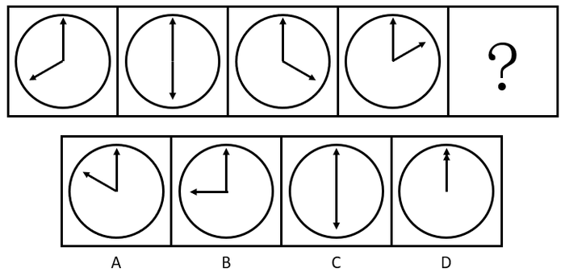

- **A**. A
- **B**. B
- **C**. C
- **D**. D　✅

**答案**：D

**官方解析**

元素组成相同，优先考虑位置规律。观察发现，图形均由一个表盘和一长一短两根针构成，长针的位置没有变化，短针每次逆时针转，只有D项符合。

故正确答案为D。

---

### 第 11 题　qid 2391826 · 图形推理

从所给的四个选项中，选择最合适的一个填入问号处，使之呈现一定的规律性。

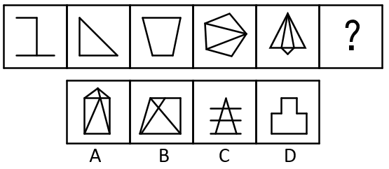

- **A**. A
- **B**. B
- **C**. C　✅
- **D**. D

**答案**：C

**官方解析**

元素组成不同，无明显属性规律，考虑数量规律。观察发现，图形交叉明显，考虑数交点，依次为2、3、4、5、6，那么“？”处填入的图形交点数量应该为7，只有C项符合。
故正确答案为C。

---

### 第 12 题　qid 2391830 · 图形推理

从所给的四个选项中，选择最合适的一个填入问号处，使之呈现一定的规律性。

- **A**. A
- **B**. B
- **C**. C
- **D**. D　✅

**答案**：D

**官方解析**

元素组成不同，无明显属性规律，考虑数量规律。观察发现，图形窟窿明显，考虑数面。第一行中面数量依次是4、6、4，没有规律，但第一列中面数量都是4，第二列中面数量都是6，第三列中前两个图形面的数量是4，那么“？”处填入的图形面数量应为4，只有D项符合。
故正确答案为D。

---

### 第 13 题　qid 2391834 · 图形推理

从所给的四个选项中，选择最合适的一个填入问号处，使之呈现一定的规律性。

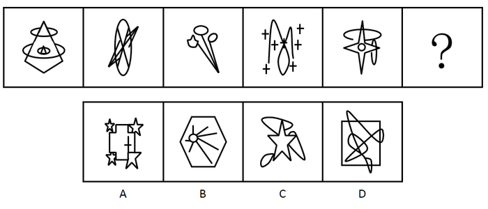

- **A**. A
- **B**. B　✅
- **C**. C
- **D**. D

**答案**：B

**官方解析**

元素组成不同，优先考虑属性规律。题干图形均由直线和曲线组成，而A项是直线图形，排除；其次考虑数量规律，观察发现，题干每幅图内部都有相同的小元素，排除C、D，B项有相同的独立直线，当选。
故正确答案为B。

---

### 第 14 题　qid 2391839 · 图形推理

把下面的六个图形分为两类，使每一类图形都有各自的共同特征或规律，分类正确的一项是：

- **A**. ①②③，④⑤⑥
- **B**. ①③⑤，②④⑥
- **C**. ①②④，③⑤⑥
- **D**. ①⑤⑥，②③④　✅

**答案**：D

**官方解析**

元素组成不同，无明显属性和数量规律。观察发现，①⑤⑥三个图形中的小圆圈既分布在图形的中心，也分布在图形的外围区域，②③④三个图形中的小圆圈只分布在图形的外围区域，故①⑤⑥一组，②③④一组。
故正确答案为D。

---

### 第 15 题　qid 2391840 · 定义判断

操作性定义是指根据可观察、可测量、可判定的特征来界定概念含义的方法。
根据上述定义，下列不符合操作性定义的是：

- **A**. 饥饿是指一个人连续24小时以上没有进食的状态
- **B**. 一年是指地球绕太阳转一周所需的时间长度
- **C**. 煎是指把少量油加热，再把食物放进去使其熟透的烹饪方法　✅
- **D**. 旁观是指注视别人的活动达3分钟以上，自己并未参与其中

**答案**：C

**官方解析**

第一步，找出定义关键词。
“可观察、可测量、可判定的特征”、“界定概念含义”。
第二步，逐一分析选项。
A项：“连续24小时以上没有进食的状态”，符合“可观察、可测量、可判定的特征”，符合定义，排除；
B项：“地球绕太阳转一周所需的时间长度”，符合“可观察、可测量、可判定的特征”，符合定义，排除；
C项：“把少量油加热，再把食物放进去使其熟透”，其中的“加热”和“熟透”的概念没有具体的衡量方法，不符合“可观察、可测量、可判定的特征”，不符合定义，当选；
D项：“注视别人的活动达3分钟以上，自己并未参与其中”，符合“可观察、可测量、可判定的特征”，符合定义，排除。
本题为选非题，故正确答案为C。

---

### 第 16 题　qid 2391841 · 定义判断

拧巴立场是指一个人的思想认识和行为方式表现出前后相忤、不一致的情形。
根据上述定义，下列不属于拧巴立场的是：

- **A**. 王老汉一向觉得医生工作辛苦、责任大，不是一个好职业，可后来孙子填报高考志愿时，老人又斩钉截铁地说：“一定要考医学院当医生！”
- **B**. 小李一向对办事情要找关系送礼深恶痛绝，当发现自己晋升职称有困难时，他首先想到的就是想办法请朋友帮忙
- **C**. 郝老师得知学生小梅的父母都是某知名高校的美术老师，觉得小梅可能有画画的天分，但当她看到小梅交来的绘画作业时，却大跌眼镜，彻底颠覆了自己的想法　✅
- **D**. 小潘对特牌车一直愤愤不平，有一次他偶然坐在里面兜了一圈，当时就觉得无比痛快和神气，过后还不时对同事谈起那时的情景

**答案**：C

**官方解析**

第一步：找出定义关键词。
“一个人的思想认识和行为方式表现出前后相忤、不一致”。
第二步：逐一分析选项。
A项：王老汉觉得医生不是一个好职业，孙子填报高考志愿时，老人要他填报医生的志愿，符合“一个人的思想认识和行为方式表现出前后相忤、不一致”，符合定义，排除； 
B项：“小李对办事情要找关系送礼深恶痛绝，当发现自己晋升职称有困难时，他首先想到的就是想办法请朋友帮忙”，符合“一个人的思想认识和行为方式表现出前后相忤、不一致”，符合定义，排除；
C项：郝老师觉得小梅可能有画画的天分，只是预想和假设，见到小梅的绘画作业后，推翻了原先的预想，不是前后思想认识不一致，不符合“一个人的思想认识和行为方式表现出前后相忤、不一致”，不符合定义，当选；
D项：“小潘对特牌车一直愤愤不平，有一次他偶然坐在里面兜了一圈，当时就觉得无比痛快和神气”，符合“一个人的思想认识和行为方式表现出前后相忤、不一致”，符合定义，排除。
本题为选非题，故正确答案为C。

---

### 第 17 题　qid 2391842 · 定义判断

志愿服务是指不以盈利为目的，基于利他动机，自愿贡献知识、体力、技能等，促进社会和谐与进步的服务活动。
根据上述定义，下列不属于志愿服务的是：

- **A**. 张老师每年春节前都组织“献爱心送温暖”活动，为孤寡老人打扫房间，送上粮油
- **B**. 某居民小区常有穿着白大褂的人为老年人免费量血压，热情推销保健品　✅
- **C**. 某地遭强台风袭击后，不少人士自行驾车帮助运送救灾物资
- **D**. 某大学韩教授经常为所在社区居民做公益专题讲座，引导居民提高生活质量

**答案**：B

**官方解析**

第一步：找出定义关键词。
 “不以盈利为目的，基于利他动机”、“自愿贡献知识、体力、技能等，促进社会和谐与进步的服务活动”。
第二步：逐一分析选项。
A项：张老师组织“献爱心送温暖”活动，“为孤寡老人打扫房间，送上粮油”，符合“不以盈利为目的，基于利他动机”、“自愿贡献知识、体力、技能等，促进社会和谐与进步的服务活动”，符合定义，排除； 
B项：“热情推销保健品”，不符合“不以盈利为目的，基于利他动机”，不符合定义，当选；
C项：“遭强台风袭击后，不少人士自行驾车帮助运送救灾物资”，符合“不以盈利为目的，基于利他动机”、“自愿贡献知识、体力、技能等，促进社会和谐与进步的服务活动”，符合定义，排除；
D项：某大学韩教授做公益专题讲座，符合“不以盈利为目的，基于利他动机”、“自愿贡献知识、体力、技能等，促进社会和谐与进步的服务活动”，符合定义，排除。
本题为选非题，故正确答案为B。

---

### 第 18 题　qid 2391843 · 定义判断

微商买卖是一种发生在亲朋好友之间的商品交易，发生于微信朋友圈中，是熟人买卖在社交网络上的一种表现形式。这种交易因为是建立在朋友的信任之上，因此，一旦遇到微商销售假货，反而熟人会蒙受损失，微商也失去了朋友的信任。
根据上述定义，下列哪项属于微商买卖？

- **A**. 张三在市中心开了一家门店，经常通过微信做商品宣传，生意很红火
- **B**. 李四因为向朋友销售假货，被工商部门罚款一千元，现在停业整顿中
- **C**. 王五微信圈里有很多好朋友，他经常向他们介绍美容产品的打折信息
- **D**. 赵六不慎遗失手机，耽误了好几笔已经谈成的微信好友的生意，损失上千元　✅

**答案**：D

**官方解析**

第一步：找出定义关键词。
“发生在亲朋好友之间的商品交易，发生于微信朋友圈中”、“熟人买卖在社交网络上的一种表现形式”、“建立在朋友的信任之上”。
第二步：逐一分析选项。
A项：“张三在市中心开了一家门店，经常通过微信做商品宣传”，张三只是通过微信宣传商品，并没有进行买卖，不符合“发生在亲朋好友之间的商品交易，发生于微信朋友圈中”，不符合定义，排除；
B项：“李四因为向朋友销售假货”，没有体现是在微信朋友圈进行交易，不符合“发生在亲朋好友之间的商品交易，发生于微信朋友圈中”，不符合定义，排除；
C项：“王五微信圈里有很多好朋友，他经常向他们介绍美容产品的打折信息”，没有体现在微信朋友圈进行交易，不符合“发生在亲朋好友之间的商品交易，发生于微信朋友圈中”，不符合定义，排除；
D项：“赵六不慎遗失手机，耽误了好几笔已经谈成的微信好友的生意，损失上千元”，符合“发生在亲朋好友之间的商品交易，发生于微信朋友圈中”、“熟人买卖在社交网络上的一种表现形式”，符合定义，当选。
故正确答案为D。

---

### 第 19 题　qid 2391844 · 定义判断

差异化战略是指为使企业产品、服务、企业形象等与竞争对手有明显的区别，以获得竞争优势为目的而采取的战略。
根据上述定义，下列属于差异化战略的是：

- **A**. 某家电企业在国内家电业独占鳌头，为绕过贸易壁垒，进一步打开国外市场，正积极开展资本和技术输出，在海外建立制造和销售基地
- **B**. 面对日益激烈的竞争环境，某跨国企业决定剥离不盈利的个人电脑业务，主攻旗下高利润率的智能计算和服务器业务
- **C**. 随着楼市调控政策的不断出台，某房产龙头企业积极调整战略，逐步形成了对旅游、餐饮、物流等行业的多元化产业布局
- **D**. 在国内手机厂商大打价格战时，某手机品牌始终秉持“只做最好的产品”这一理念，依靠技术和产品设计的优势，坚持走高端路线　✅

**答案**：D

**官方解析**

第一步：找出定义关键词。
“使企业产品、服务、企业形象等与竞争对手有明显的区别”、“以获得竞争优势为目的”。
第二步：逐一分析选项。
A项：某家电企业在海外建立制造和销售基地，不符合“使企业产品、服务、企业形象等与竞争对手有明显的区别”，不符合定义，排除；
B项：某跨国企业决定主攻旗下高利润率的智能计算和服务器业务，不符合“使企业产品、服务、企业形象等与竞争对手有明显的区别”，不符合定义，排除；
C项：某房产龙头企业积极调整战略，逐步形成了对旅游、餐饮、物流等行业的多元化产业布局，不符合“使企业产品、服务、企业形象等与竞争对手有明显的区别”，不符合定义，排除；
D项：在国内手机厂商大打价格战时，某手机品牌坚持走高端路线，符合“使企业产品、服务、企业形象等与竞争对手有明显的区别”、“以获得竞争优势为目的”，符合定义，当选。
故正确答案为D。

---

### 第 20 题　qid 2391845 · 定义判断

职场二手压力是指职场中其他人的工作情绪影响到自身的工作态度和情绪的情况。
根据上述定义，下列属于职场二手压力的是：

- **A**. 小李经常逛网络论坛吐槽，当他发现回复的网友可能是自己的某领导时，整天都惴惴不安，提心吊胆
- **B**. 王科长的同事每天一到办公室就抱怨房价太高、开销太大，久而久之王科长也觉得生活成本太高，买房压力很大
- **C**. 新来的同事名校毕业，文采很好，单位的很多材料都交给她写，看着她每天的工作热情很高，小魏感到了无形的竞争压力，情绪低落　✅
- **D**. 因单位工作太忙，马丽忘了到学校接孩子。当丈夫责备她时，马丽愧疚不已，暗下决心要以家庭为重

**答案**：C

**官方解析**

第一步：找出定义关键词。
“指职场中其他人的工作情绪影响到自身的工作态度和情绪的情况”。
第二步：逐一分析选项。
A项：小李经常逛网络论坛吐槽，他发现回复的网友可能是自己的某领导，“网络论坛”不是“职场”，不符合“职场中其他人的工作情绪影响到自身的工作态度和情绪的情况”，不符合定义，排除； 
B项：王科长的同事每天一到办公室就抱怨房价太高、开销太大，“房价太高、开销太大”不是“职场中的工作情绪”，不符合“职场中其他人的工作情绪影响到自身的工作态度和情绪的情况”，不符合定义，排除；
C项：看着新来的同事每天的工作热情很高，小魏感到了无形的竞争压力，情绪低落，“新来的同事每天的工作热情很高”符合“职场中其他人的工作情绪”，“小魏感到了无形的竞争压力，情绪低落”符合“其他人的工作情绪影响到自身的工作态度和情绪的情况”，符合定义，当选；
D项：因单位工作太忙，马丽忘了到学校接孩子，受到丈夫责备，不是职场中发生的事情，且丈夫不是同事，不符合“职场中其他人的工作情绪影响到自身的工作态度和情绪的情况”，不符合定义，排除。
故正确答案为C。

---

### 第 21 题　qid 2391846 · 定义判断

构形歧义是指由于语句和语法结构不确定导致所反映的命题含义不确定，可以解释成不同的命题，从而形成构形歧义。
根据上述定义，下列属于构形歧义的是：

- **A**. 他看着妈妈吃饭　✅
- **B**. 1、9为奇数，所以，1+9是奇数
- **C**. 奇迹不会发生
- **D**. 强权即公理

**答案**：A

**官方解析**

第一步：找出定义关键词。
“由于语句和语法结构不确定导致所反映的命题含义不确定，可以解释成不同的命题”。
第二步：逐一分析选项。
A项：他看着妈妈吃饭，“看着”有两层意思，一可以表示望着，二可以表示看护，符合“由于语句和语法结构不确定导致所反映的命题含义不确定，可以解释成不同的命题”，符合定义，当选； 
B项：1、9为奇数，所以，1+9是奇数，语句中没有出现歧义，不符合“由于语句和语法结构不确定导致所反映的命题含义不确定，可以解释成不同的命题”，不符合定义，排除；
C项：奇迹不会发生，语句中没有出现歧义，不符合“由于语句和语法结构不确定导致所反映的命题含义不确定，可以解释成不同的命题”，不符合定义，排除；
D项：强权即公理，语句中没有出现歧义，不符合“由于语句和语法结构不确定导致所反映的命题含义不确定，可以解释成不同的命题”，不符合定义，排除。
故正确答案为A。

---

### 第 22 题　qid 2391847 · 定义判断

二次事故是指在原有的医疗事故、煤矿安全事故、交通事故等事故的基础上，由于自然不可抗力、救援方的疏忽或当事人的错误操作引起的事故。
根据上述定义，下列不属于二次事故的是：

- **A**. 李某在高速公路上与前车追尾，他匆忙下车捡拾自己小车洒落的物品，被后方驶来的汽车撞击身亡
- **B**. 刘某突发急性阑尾炎入院，医生在阑尾切除手术结束时将一块止血棉遗留在刘某腹腔内没有取出，导致刘某再次入院
- **C**. 某市连日暴雨引发的洪水及泥石流导致25人丧生，部分房屋被毁，数千人被迫离开家园　✅
- **D**. 某煤矿井下渗水，矿工私自启动水泵抽水，拉闸时产生火花，致井内瓦斯爆炸，造成4人当场死亡

**答案**：C

**官方解析**

第一步：找出定义关键词。
“在原有的医疗事故、煤矿安全事故、交通事故等事故的基础上”、“由于自然不可抗力、救援方的疏忽或当事人的错误操作引起的事故”。
第二步：逐一分析选项。
A项：李某在高速公路上与前车追尾属于“交通事故”，匆忙下车捡拾自己小车洒落的物品，被后方驶来的汽车撞击身亡，人为原因导致了二次事故，符合“当事人的错误操作引起的事故”，符合定义，排除；
B项：刘某突发急性阑尾炎入院，医生在阑尾切除手术结束时将一块止血棉遗留在刘某腹腔内没有取出，符合“救援方的疏忽引起的事故”，符合定义，排除；
C项：某市连日暴雨引发的洪水及泥石流导致25人丧生，部分房屋被毁，数千人被迫离开家园，只有泥石流一次自然灾害，没有体现二次事故，不符合“在原有的医疗事故、煤矿安全事故、交通事故等事故的基础上，由于自然不可抗力、救援方的疏忽或当事人的错误操作引起的事故”，不符合定义，当选；
D项：某煤矿井下渗水属于“煤矿安全事故”，矿工私自启动水泵抽水，拉闸时产生火花，致井内瓦斯爆炸，造成4人当场死亡，符合“由于当事人的错误操作引起的事故”，符合定义，排除。
本题为选非题，故正确答案为C。

---

### 第 23 题　qid 2391848 · 定义判断

学习迁移也称训练迁移，是一种学习对另一种学习的影响。
根据上述定义，下列不属于学习迁移的是：

- **A**. 小刘在学习英语时会自然联想到汉语拼音，发音也受其影响
- **B**. 小李的父亲是著名的歌唱家，受父亲影响，他后来也成为一名歌唱家　✅
- **C**. 会骑自行车的小王很快就学会了骑摩托车
- **D**. 小张学习了物理学的光学知识，很快就能理解有关眼的解剖知识

**答案**：B

**官方解析**

第一步：找出定义关键词。
“一种学习对另一种学习的影响”。
第二步：逐一分析选项。
A项：小刘在学习英语时会自然联想到汉语拼音，发音也受其影响，汉语拼音对学习英语产生了影响，符合“一种学习对另一种学习的影响”，符合定义，排除；
B项：小李的父亲是著名的歌唱家，受父亲影响，他后来也成为一名歌唱家，小李唱歌受到的是父亲的影响，不符合“一种学习对另一种学习的影响”，不符合定义，当选；
C项：会骑自行车的小王很快就学会了骑摩托车，自行车的学习影响了摩托车的学习，符合“一种学习对另一种学习的影响”，符合定义，排除；
D项：小张学习了物理学的光学知识，很快就能理解有关眼的解剖知识，物理学的光学知识的学习影响了眼的解剖知识的学习，符合“一种学习对另一种学习的影响”，符合定义，排除。
本题为选非题，故正确答案为B。

---

### 第 24 题　qid 2391850 · 定义判断

姻亲是指男女结婚后，配偶一方和另一方的亲属之间形成的亲属关系。 
根据上述定义，下列不属于姻亲的是：

- **A**. 张明和王梅结婚后，王梅的弟弟与张明之间
- **B**. 王峰和苏洁结婚后，王峰的弟弟与苏洁的妹妹之间　✅
- **C**. 吴凯和马月结婚后，吴凯与马月的父亲母亲之间
- **D**. 赵天和刘蕾结婚后，刘蕾的二姨与赵天之间

**答案**：B

**官方解析**

第一步：找出定义关键词。
“男女结婚后”、“配偶一方和另一方的亲属之间形成的亲属关系”。
第二步：逐一分析选项。
A项：张明是王梅的配偶，王梅的弟弟与张明之间符合“配偶一方和另一方的亲属之间形成的亲属关系”，符合定义，排除； 
B项：王峰和苏洁是配偶，王峰的弟弟与苏洁的妹妹之间不符合“配偶一方和另一方的亲属之间形成的亲属关系”，不符合定义，当选；
C项：吴凯是马月的配偶，吴凯与马月的父亲母亲之间符合“配偶一方和另一方的亲属之间形成的亲属关系”，符合定义，排除；
D项：赵天是刘蕾的配偶，刘蕾的二姨与赵天之间符合“配偶一方和另一方的亲属之间形成的亲属关系”，符合定义，排除。
本题为选非题，故正确答案为B。

---

### 第 25 题　qid 2391851 · 类比推理

（    ） 对于 东南海域 相当于 罗布泊 对于（    ）

- **A**. 浙江省  北方湖泊
- **B**. 舟山岛  西部沙漠　✅
- **C**. 宁波市  西北风带
- **D**. 大渔船  北方水系

**答案**：B

**官方解析**

逐一代入选项。
A项：浙江省位于我国东海沿线，罗布泊是位于我国新疆维吾尔自治区东南部的湖泊（现水已干涸，成为沙漠），前后逻辑关系不一致，排除；
B项：舟山岛位于我国东南海域，二者为地理位置的对应关系，罗布泊是位于我国西部的沙漠，二者为地理位置的对应关系，前后逻辑关系一致，当选；
C项：宁波市和东南海域没有必然的逻辑关系，罗布泊和西北风带也没有必然的逻辑关系，前后逻辑关系不一致，排除；
D项：大渔船可以在东南海域捕鱼，但罗布泊本身就是一个地点，前后逻辑关系不一致，排除。
故正确答案为B。

---

### 第 26 题　qid 2391852 · 类比推理

实验舱 对于 （    ） 相当于 城楼 对于 （    ）

- **A**. 资源舱  海市蜃楼
- **B**. 运载火箭  砖瓦
- **C**. 天宫一号  天安门　✅
- **D**. 发射  登高望远

**答案**：C

**官方解析**

逐一代入选项。
A项：实验舱和资源舱二者为并列关系，城楼和海市蜃楼没有必然的逻辑关系，前后逻辑关系不一致，排除；
B项：实验舱和运载火箭没有必然的逻辑关系，砖瓦是建筑城楼的原材料，二者为原材料的对应关系，前后逻辑关系不一致，排除；
C项：实验舱是天宫一号的组成部分，二者为包容关系中的组成关系，城楼是天安门的组成部分，二者为包容关系中的组成关系，前后逻辑关系一致，当选；
D项：发射和实验舱没有必然的逻辑关系，登上城楼可以登高望远，二者为对应关系，前后逻辑关系不一致，排除。
故正确答案为C。

---

### 第 27 题　qid 2391854 · 类比推理

沙子：水泥：钢筋

- **A**. 衣柜：餐桌：家具
- **B**. 电暖气：风扇：电器
- **C**. 填空：选择：问答　✅
- **D**. 蚂蚁：蜜蜂：金属

**答案**：C

**官方解析**

第一步：判断题干词语间逻辑关系。
沙子、水泥、钢筋均为建筑材料，三者为并列关系中的反对关系。
第二步：判断选项词语间逻辑关系。
A项：衣柜和餐桌均为家具的一种，与题干逻辑关系不一致，排除；
B项：电暖气和风扇均为电器的一种，与题干逻辑关系不一致，排除；
C项：填空、选择、问答三者均为题目类型，三者为并列关系中的反对关系，与题干逻辑关系一致，当选；
D项：蚂蚁、蜜蜂、金属三者之间没有必然的逻辑关系，与题干逻辑关系不一致，排除。
故正确答案为C。

---

### 第 28 题　qid 2391857 · 类比推理

冷冻：冰箱：冷藏

- **A**. 存储：电脑：上网
- **B**. 制冷：空调：制热　✅
- **C**. 电话：手机：拍照
- **D**. 照明：电灯：取暖

**答案**：B

**官方解析**

第一步：判断题干词语间逻辑关系。
冰箱有冷冻和冷藏的功能，为物品和两种功能的对应关系，且冰箱只有这两种主要功能。
第二步：判断选项词语间逻辑关系。
A项：电脑有存储和上网的功能，但电脑的主要功能还有数据通信、资源共享等，与题干逻辑关系不一致，排除；
B项：空调有制冷和制热的功能，为物品和两种功能的对应关系，且空调只有这两种主要功能，与题干逻辑关系一致，当选；
C项：电话和手机均为通讯工具，手机是一种无线电话，二者是种属关系，手机有拍照的功能，与题干逻辑关系不一致，排除；
D项：电灯的主要功能是照明，取暖不是电灯的主要功能，与题干逻辑关系不一致，排除。
故正确答案为B。

---

### 第 29 题　qid 2391859 · 类比推理

熊掌：有力

- **A**. 河马：彪悍
- **B**. 鹰眼：犀利　✅
- **C**. 驼峰：耐力
- **D**. 牛：勤劳

**答案**：B

**官方解析**

第一步：判断题干词语间逻辑关系。
熊掌是熊的一个部位，有力是熊掌的特点。
第二步：判断选项词语间逻辑关系。
A项：河马本身就是一个动物，与题干逻辑关系不一致，排除；
B项：鹰眼为鹰的一个部位，犀利是鹰眼的特点，与题干逻辑关系一致，当选；
C项：驼峰是骆驼的一部位，但耐力不是驼峰的特点，与题干逻辑关系不一致，排除；
D项：牛本身就是一个动物，与题干逻辑关系不一致，排除。
故正确答案为B。

---

### 第 30 题　qid 2391861 · 类比推理

耳朵：听歌

- **A**. 四肢：格斗
- **B**. 手：按摩　✅
- **C**. 飞机：旅行
- **D**. 纸：书写

**答案**：B

**官方解析**

第一步：判断题干词语间逻辑关系。
耳朵可以用来听歌，二者为功能的对应，且耳朵是人体的器官。
第二步：判断选项词语间逻辑关系。
A项：格斗时会用到四肢协调打击对手，但格斗不是四肢的功能，与题干逻辑关系不一致，排除；
B项：手可以用来按摩，二者为功能的对应，且手是人体的器官，与题干逻辑关系一致，当选；
C项：乘坐飞机去旅行，飞机是旅行的交通工具，与题干逻辑关系不一致，排除；
D项：纸是用来被书写的，纸不具有书写功能，与题干逻辑关系不一致，排除。
故正确答案为B。

---

### 第 31 题　qid 2391863 · 类比推理

惊涛骇浪：大海

- **A**. 风和日丽：田野
- **B**. 狼奔豕突：战役
- **C**. 山崩地裂：灾害
- **D**. 电闪雷鸣：天空　✅

**答案**：D

**官方解析**

第一步：判断题干词语间逻辑关系。
惊涛骇浪的大海，二者为偏正结构。
第二步：判断选项词语间逻辑关系。
A项：风和日丽可以形容天气，不能形容田野，与题干逻辑关系不一致，排除；
B项：狼奔豕突形容成群的坏人乱冲乱撞，到处骚扰，不能形容战役，与题干逻辑关系不一致，排除；
C项：山崩地裂可以形容灾难，和灾害搭配不当，与题干逻辑关系不一致，排除；
D项：电闪雷鸣的天空，二者为偏正结构，与题干逻辑关系一致，当选。
故正确答案为D。

---

### 第 32 题　qid 2391865 · 类比推理

曹操：魏武帝

- **A**. 成吉思汗：可汗
- **B**. 诸葛亮：丞相
- **C**. 朱元璋：明太祖　✅
- **D**. 孔子：仲尼

**答案**：C

**官方解析**

第一步：判断题干词语间逻辑关系。
魏武帝就是指曹操，二者是全同关系。
第二步：判断选项词语间逻辑关系。
A项：成吉思汗特指孛儿只斤·铁木真，是对铁木真可汗的尊称，与题干逻辑关系不一致，排除；
B项：诸葛亮的职位是丞相，与题干逻辑关系不一致，排除；
C项：明太祖就是指朱元璋，二者是全同关系，与题干逻辑关系一致，保留；
D项：仲尼就是指孔子，二者是全同关系，与题干逻辑关系一致，保留。
二级辨析：魏武帝和明太祖都是后人的尊称，而仲尼是孔子的字，排除D项，C项当选。
故正确答案为C。

---

### 第 33 题　qid 2391867 · 类比推理

太平洋：大西洋

- **A**. 印度洋：印度
- **B**. 黄海：南海　✅
- **C**. 月球：卫星
- **D**. 萤火虫：昆虫

**答案**：B

**官方解析**

第一步：判断题干词语间逻辑关系。
太平洋和大西洋均为四大洋之一，二者为并列关系中的反对关系。
第二步：判断选项词语间逻辑关系。
A项：印度洋是四大洋之一，印度是一个国家，二者不是并列关系，与题干逻辑关系不一致，排除；
B项：黄海和南海均为中国的四大海之一，二者为并列关系中的反对关系，与题干逻辑关系一致，当选；
C项：月球是地球的卫星，二者为包容关系中的种属关系，与题干逻辑关系不一致，排除；
D项：萤火虫是一种昆虫，二者为包容关系中的种属关系，与题干逻辑关系不一致，排除。
故正确答案为B。

---

### 第 34 题　qid 2391869 · 类比推理

长度：厘米

- **A**. 时间：钟表
- **B**. 毫升：体积
- **C**. 质量：千克　✅
- **D**. 速度：飞快

**答案**：C

**官方解析**

第一步：判断题干词语间逻辑关系。
厘米是计量长度的单位，二者为对应关系。
第二步：判断选项词语间逻辑关系。
A项：钟表是计算时间的工具，与题干逻辑关系不一致，排除；
B项：体积的单位是立方，毫升是计量容积的单位，与题干逻辑关系不一致，排除；
C项：千克是计量质量的单位，二者为对应关系，与题干逻辑关系一致，当选；
D项：飞快可以用来形容速度，与题干逻辑关系不一致，排除。
故正确答案为C。

---

### 第 35 题　qid 1772314 · 逻辑判断

三段论推理是演绎推理中的一种简单推理判断，它包含：一个一般性的原则（大前提），一个附属于前面大前提的特殊化陈述（小前提），以及由此引申出的特殊化陈述符合一般性原则的结论。
根据以上定义，下列推理过程正确的是：

- **A**. 骄兵必败，我们胜利，所以我们不是骄兵
- **B**. 勇者无畏，我无畏，所以我是勇者
- **C**. 英雄难过美人关，我是英雄，所以我难过美人关　✅
- **D**. 狭路相逢勇者胜，我们胜利，所以勇者胜

**答案**：C

**官方解析**

题干的逻辑关系可表示为：A→B，C是附属于A的小前提，则C→B。
各选项逻辑关系分别为：
A项：骄兵→必败，胜利与骄兵和必败都没有关系，因此就不能推出相应的结论。与题干逻辑关系不同，排除；
B项：勇者→无畏，我无畏是附属于B而不是A。与题干逻辑关系不同，排除；
C项：英雄→难过美人关，我是英雄是附属于A的一个小前提，因此可以推出B。与题干逻辑关系相同，当选；
D项：狭路相逢→勇者胜，我们胜利是附属于B而不是A。与题干逻辑关系不同，排除。
故正确答案为C。

---

## 资料分析

### 材料 1

根据以下资料，回答下列问题。

        2015年1-3月，国有企业营业总收入103155.5亿元，同比下降。其中，中央企业收入63191.3亿元，同比下降。地方国有企业收入39964.2亿元，同比下降。

        1-3月，国有企业营业总成本100345.5亿元，同比下降，其中销售费用、管理费用和财务费用同比分别下降、增长和增长。其中，中央企业成本60216.5亿元，同比下降；地方国有企业成本40129亿元，同比下降。

        1-3月，国有企业利润总额4997.3亿元，同比下降。国有企业应交税金9383亿元，同比增长。

        3月末，国有企业资产总额1054875.4亿元，同比增长；负债总额685766.3亿元，同比增长；所有者权益合计369109.1亿元，同比增长。其中，中央企业资产总额554658.3亿元，同比增长；负债总额363304亿元，同比增长；所有者权益为191354.4亿元，同比增长。地方国有企业资产总额500217.1亿元，同比增长；负债总额322462.3亿元，同比增长；所有者权益为177754.7亿元，同比增长。

#### 第 1 题　qid 1796340 · 综合

2014年1-3月，国有企业营业总收入最接近：

- **A**. 10.5万亿元
- **B**. 11万亿元　✅
- **C**. 11.5万亿元
- **D**. 12万亿元

**答案**：B

**官方解析**

根据题干中“2014年1~3月”，可以判断本题为基期计算问题。定位文字材料第一段，2015年1~3月，国有企业营业总收入103155.5亿元，同比下降。代入基期公式：=。

故正确答案为B。

---

#### 第 2 题　qid 1796334 · 比重

2015年3月末，中央企业所有者权益占国有企业总体比重比上年同期约：

- **A**. 下降了0.7个百分点　✅
- **B**. 下降了1.5个百分点
- **C**. 上升了0.7个百分点
- **D**. 上升了1.5个百分点

**答案**：A

**官方解析**

根据题干中“2015年3月”“比上年同期”“占比重”，可以判定本题为两期比重问题。定位文字材料第四段，可以得到中央企业所有者权益为191354.4亿元，同比增长；国有企业所有者权益合计369109.1亿元，同比增长。代入两期比重公式，先判断上升还是下降，由可判断为下降，排除C、D两项。&lt;，故答案应小于，只有A项满足。

故正确答案为A。

---

#### 第 3 题　qid 1796338 · 综合

2015年3月末，中央企业的资产负债率（负债总额÷资产总额）约在以下哪个范围内？

- **A**. 
以下

- **B**. 
-

- **C**. 
-
　✅
- **D**. 
以上 

**答案**：C

**官方解析**

根据题干中“2015年3月末······资产负债率（）”，可以判断本题为比值计算问题。参看第四段材料，中央企业负债总额363304亿元，资产总额554658.3亿元，代入资产负债率公式：

。因此在~范围内。

故正确答案为C。

---

#### 第 4 题　qid 1796336 · 增长

2015年1-3月，在销售费用、管理费用和财务费用中，占国有企业营业总成本的比重同比上升的有几项？

- **A**. 0
- **B**. 1
- **C**. 2
- **D**. 3　✅

**答案**：D

**官方解析**

根据题干中“2015年1-3月······占国有企业营业总成本的比重”，可以判定本题为两期比重问题。只需比较部分量的增长率a和整体量的增长率b，为上升。定位文字材料第二段，销售费用的增长率（下降）、管理费用的增长率（增长）及财务费用的增长率（增长）均大于国有企业营业总成本的增长率b（下降），即比重上升；因此，比重上升的有3项。

故正确答案为D。

---

#### 第 5 题　qid 1796342 · 综合

能够从上述资料中推出的是：

- **A**. 2015年1-3月，中央和地方国有企业营业成本均低于同期营业收入
- **B**. 2014年1-3月，国有企业应交税金占同期营业总收入的一成以上
- **C**. 2015年3月末，国有企业资产总额同比增长不到12万亿元　✅
- **D**. 2015年3月末，地方国有企业资产负债率高于上年同期水平

**答案**：C

**官方解析**

A项，定位文字材料第一段和第二段，2015年1-3月，，成本低于收入；，成本高于收入，错误；

B项，定位文字材料第一段和第三段，2014年1~3月国有企业应交税金占同期营业总收入的比重，不足一成，错误；

C项，定位文字材料第四段，2015年3月末，国有企业资产总额同比增长量=万亿元，正确；

D项，定位文字材料第四段，地方国有企业资产负债率（）是否高于上年同期水平，需要比较负债总额的增长率a与资产总额的增长率b，而，故地方国有企业资产负债率低于上年同期水平，错误。

故正确答案为C。

---

### 材料 2

#### 第 6 题　qid 2392846 · 综合

表中“?”处的数值应为：

- **A**. 0.4　✅
- **B**. 1.6
- **C**. 4
- **D**. 16

**答案**：A

**官方解析**

题干所求是2014年四川的早稻总产量，，可判定本题为现期平均数问题。定位表格，可知：2014年四川早稻播种面积为0.8千公顷，单产为5000.0公斤/公顷，所求总产量单位为万吨，注意单位换算，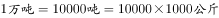，则2014年四川的早稻总产量。

故正确答案为A。

---

#### 第 7 题　qid 2392849 · 综合

2014年全国早稻播种面积约为多少千公顷？

- **A**. 4500
- **B**. 5100
- **C**. 5800　✅
- **D**. 6500

**答案**：C

**官方解析**

根据问题“2014年全国早稻播种面积约为多少千公顷”，材料时间为2014年，结合播种面积，可判断本题为现期平均数问题。定位表格，2014年全国早稻总产量为3401.0万吨，单产为5868.9公斤/公顷，注意单位换算，，则2014年全国早稻播种面积为公顷=5800千公顷。

故正确答案为C。

---

#### 第 8 题　qid 2392851 · 平均数

2014年全国早稻单位面积产量超过全国平均水平的省（自治区）有几个？

- **A**. 6
- **B**. 7
- **C**. 4
- **D**. 5　✅

**答案**：D

**官方解析**

定位表格，2014年全国早稻单产为5868.9公斤/公顷，则2014年全国早稻单位面积产量超过全国平均水平的省（自治区）有浙江（6143.7）、福建（6020.4）、江西（5880.2）、湖南（5881.5）、广西（5920.9），共有5个。
故正确答案为D。

---

#### 第 9 题　qid 2392857 · 比重

2014年早稻播种面积排名前两位的省（自治区），当年早稻产量之和占全国总产量的比重在以下哪个范围？

- **A**. 
低于

- **B**. 

　✅
- **C**. 

- **D**. 
高于

**答案**：B

**官方解析**

根据问题“2014年······的比重在以下哪个范围”，结合材料时间为2014年，可判定本题为现期比重问题。定位表格，2014年早稻播种面积排名前两位的省（自治区）为湖南、江西，对应两个省份当年的早稻产量分别为854.8万吨、820.1万吨，2014年全国早稻产量总计为3401.0万吨，那么其当年早稻产量之和占全国总产量的比重为。

故正确答案为B。

---

#### 第 10 题　qid 2392862 · 综合

能够从上述资料中推出的是：

- **A**. 2014年两广地区早稻产量高于两湖地区
- **B**. 2014年全国早稻播种面积高于上年水平
- **C**. 2014年早稻单位面积产量最高的省份，单位面积产量为最低省份的1.3倍多
- **D**. 2014年早稻总产量和播种面积排名前五的省份排名相同　✅

**答案**：D

**官方解析**

A项：定位表格，可知：2014年广东、广西早稻产量分别为523.2万吨、543.3万吨，两广地区早稻产量为万吨；2014年湖北、湖南早稻产量分别为238.7万吨、854.8万吨，两湖地区早稻产量为万吨，故两广地区早稻产量低于两湖地区，错误；

B项：表格给的是2014年全国的单产和总产量，播种面积，可以求出2014年的全国早稻播种面积，但是并没有2013年相关的数据，无法进行比较，错误；

C项：定位表格，可知2014年早稻单位面积产量最高的省份为浙江省，单产6143.7公斤/公顷；2014年早稻单位面积产量最低的省份为四川省，单产5000.0公斤/公顷，列式：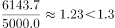，错误；

D项：定位表格，根据104题可知“?”处为0.4万吨，2014年早稻总产量排名前五的省份为湖南、江西、广西、广东、湖北，2014年播种面积排名前五的省份为湖南、江西、广西、广东、湖北。这五个省份排名相同，正确。

故正确答案为D。

---

### 材料 3

#### 第 11 题　qid 2392881 · 综合

在上述国家中，2008年陆地面积超过5亿公顷的国家中磷肥施用量低于100万吨的有：

- **A**. 0个
- **B**. 1个　✅
- **C**. 2个
- **D**. 3个

**答案**：B

**官方解析**

定位表格，可知2008年陆地面积超过5亿公顷的国家有中国、巴西、俄罗斯、美国，其中磷肥施用量低于100万吨国家的只有俄罗斯（43万吨）。
故正确答案为B。

---

#### 第 12 题　qid 2392882 · 综合

在上述国家中，2008年单位耕地面积钾肥施用量最少的国家是：

- **A**. 俄罗斯　✅
- **B**. 南非
- **C**. 英国
- **D**. 德国

**答案**：A

**官方解析**

根据问题“······2008年单位耕地面积钾肥施用量最少的国家是”，结合材料时间为2008年，可判定本题为现期平均数问题。定位表格，根据单位耕地面积钾肥施用量，可知各国2008年单位耕地面积钾肥施用量分别为：俄罗斯：吨/公顷；南非：吨/公顷；

英国：吨/公顷；德国：吨/公顷。则2008年单位耕地面积钾肥施用量最少的国家是俄罗斯。

故正确答案为A。

---

#### 第 13 题　qid 2392883 · 综合

在上述国家中，2008年耕地面积占陆地面积不足的国家个数是：

- **A**. 4个
- **B**. 3个
- **C**. 2个　✅
- **D**. 1个

**答案**：C

**官方解析**

根据问题“······2008年耕地面积占陆地面积不足的国家个数是”，结合材料时间为2008年，可判定本题为现期比重问题。定位表格，中国：，不符合；印度：，不符合；南非：，不符合；巴西：，符合；俄罗斯：，符合；美国：，不符合；英国：，不符合；法国：，不符合；德国：，不符合；意大利：，不符合。因此2008年耕地面积占陆地面积不足的国家有巴西和俄罗斯2个。

故正确答案为C。

---

#### 第 14 题　qid 2392884 · 综合

以下国家2008年单位耕地面积氮肥施用量，由高到低排序正确的是：

- **A**. 巴西  德国  俄罗斯
- **B**. 德国  巴西  俄罗斯　✅
- **C**. 俄罗斯  德国  巴西
- **D**. 德国  俄罗斯  巴西

**答案**：B

**官方解析**

根据问题“2008年单位耕地面积氮肥施用量，由高到低排序正确的是”，可判定本题为现期平均数的排序问题。单位耕地面积氮肥施用量，选项中的国家为巴西、俄罗斯、德国。定位表格，可知：2008年巴西单位耕地面积氮肥施用量；2008年俄罗斯单位耕地面积氮肥施用量；2008年德国单位耕地面积氮肥施用量。观察三个分数，的分子最小，分母最大，则分数最小，即俄罗斯单位耕地面积氮肥施用量最低，排除C、D两项。比较巴西和德国，，，故巴西德国，则由高到低排序为德国、巴西、俄罗斯。

故正确答案为B。

---

#### 第 15 题　qid 2392885 · 综合

下列判断正确的是：

- **A**. 
在上述国家中，2008年有5个国家的磷肥施用量少于钾肥的施用量
　✅
- **B**. 
2008年南非单位耕地面积磷肥施用量高于英国

- **C**. 
2008年美国氮肥、磷肥、钾肥的施用量均超过世界总施用量的

- **D**. 
在上述国家中，2008年耕地面积最少的国家也是上述三种化肥施用量最少的国家

**答案**：A

**官方解析**

A项：定位表格，发现磷肥施用量少于钾肥的施用量的国家有巴西、英国、法国、德国、意大利，共5个国家，正确；

B项：单位耕地面积磷肥施用量，定位表格，2008年南非单位耕地面积磷肥施用量为吨/公顷；2008年英国单位耕地面积磷肥施用量为吨/公顷，2008年南非单位耕地面积磷肥施用量低于英国，错误；

C项：定位表格，美国的氮肥、磷肥、钾肥施用量分别为1096万吨、334万吨、327万吨，氮肥世界总施用量的为万吨；磷肥世界总施用量的为；钾肥世界总施用量的为万吨。发现美国的磷肥施用量（334）未超过世界总施用量的（366.2），错误；

D项：定位表格，2008年耕地面积最少的国家为英国，三种化肥施用量最少的国家为南非，错误。

故正确答案为A。

---

### 材料 4

根据所给资料，回答101~105题。

#### 第 16 题　qid 1797576 · 综合

居民基本养老保险基金中的支出户资产总额比居民基本医疗保险基金中的支出户资产总额约高多少亿元？

- **A**. 62　✅
- **B**. 72
- **C**. 504
- **D**. 585

**答案**：A

**官方解析**

定位图表第四行第三列、第五列，居民基本养老保险基金中的支出户资产总额为145亿元，居民基本医疗保险基金中的支出户资产总额为83亿元，则前者比后者高亿元。

故正确答案为A。

---

#### 第 17 题　qid 1797582 · 比重

若将城镇职工基本养老保险基金中财政专户存款资产总额的10%转入协议存款，则协议存款总额占社会保险基金资产总额的比重将增加约多少个百分点？

- **A**. 2
- **B**. 5　✅
- **C**. 8
- **D**. 12

**答案**：B

**官方解析**

定位表格第三行可知，2013年城镇职工基本养老保险中的财政专户存款为24218亿元。若其转入协议存款，协议存款总额占社会保险基金资产总额所增加的比重即为城镇职工基本养老保险财政专户存款占社会保险基金资产总额的比重。故所求即为。（本题为现期比重问题，比重的分母应为社会保险基金资产总额47727亿元，而不是城镇职工基本养老保险基金资产总额29930亿元，所以错选C项是因为分母数据没有找对。）

故正确答案为B。

---

#### 第 18 题　qid 1797526 · 综合

根据基金资产总额从高到低，以下顺序正确的是：

- **A**. 失业保险    生育保险    居民基本养老保险
- **B**. 居民基本医疗保险    工伤保险    失业保险
- **C**. 失业保险    居民基本养老保险    居民基本医疗保险　✅
- **D**. 城镇职工基本医疗保险    工伤保险    居民基本养老保险

**答案**：C

**官方解析**

本题为排序类。定位表格，查找数据，代入各选项。
A项：居民基本养老保险3124亿元大于生育保险518亿元，错误。
B项：工伤保险1004亿元小于失业保险3726亿元，错误。
C项：失业保险3726亿元大于居民基本养老保险3124亿元，大于居民基本医疗保险1077亿元，正确。
D项：工伤保险1004亿元小于居民基本养老保险3124亿元，错误。
故正确答案为C。

---

#### 第 19 题　qid 1797532 · 比重

以下哪个图形能够正确反映债券投资总额中各基金的占比情况？

- **A**. 

　✅
- **B**. 

- **C**. 

- **D**. 

**答案**：A

**官方解析**

根据题干中“债券投资总额中各基金的占比情况”，可判定本题为现期比重问题。定位表格，债券投资各项分别为54亿元、26亿元、15亿元、4亿元、16亿元、1亿元，总额为116亿元，最大的模块占比为，排除C、D两项，居民基本养老保险26亿元占最大模块将近一半，城镇职工基本医疗保险和失业保险两个模块相近，占比，A项最接近。

故正确答案为A。

---

#### 第 20 题　qid 1797586 · 综合

能够从上述资料推出的是：

- **A**. 除居民养老保险基金外，其他社保基金均无协议存款投资
- **B**. 城镇职工基本医疗保险基金资产总额是居民基本医疗保险基金的8倍多
- **C**. 城镇职工基本医疗保险基金的资产项目类型数少于其他社会保险基金
- **D**. 城镇职工基本养老保险基金资产总额高于表中其他各项基金总额之和　✅

**答案**：D

**官方解析**

A项，定位表格可知，除城镇职工基本养老保险基金外，其他各项基金均无协议存款投资，错误； 

B项，定位表格可知，城镇职工基本医疗保险基金总额为8348亿元，居民基本医疗保险基金总额为1077亿元，，错误；

C项，定位表格可知，城镇职工基本医疗保险基金的资产项目数比居民基本医疗保险基金的多，错误；

D项，定位表格可知，城镇职工基本养老保险基金总额为29930亿元，总金额为47727亿元，则其他各项基金总额之和为亿元亿元，正确。

故正确答案为D。

---
