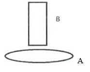
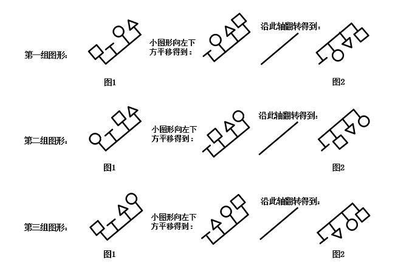
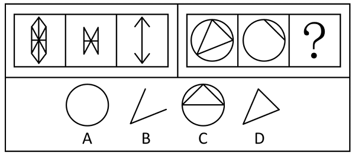
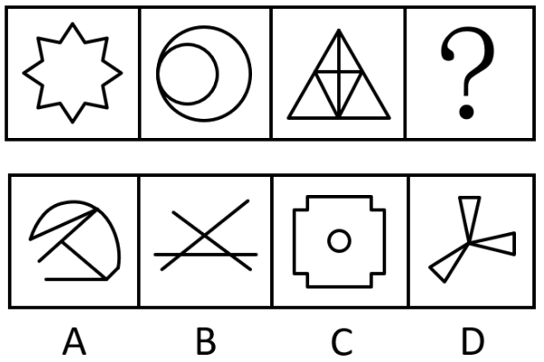
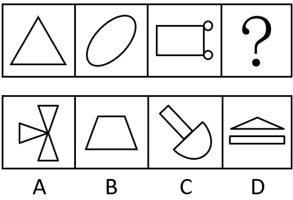
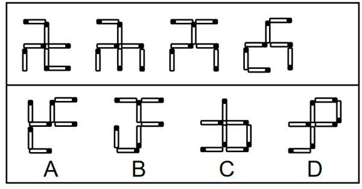
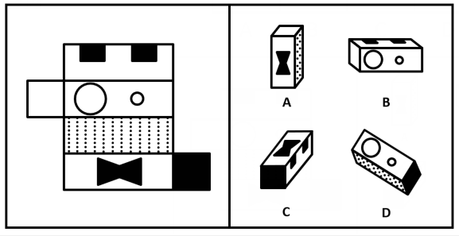
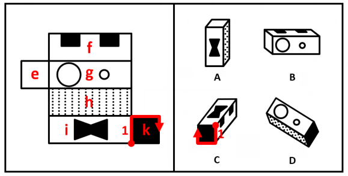

# 2017年上海市行政执法类考试《行测》试题（网友回忆版）

> 省考 · 2017 年 · 6 个模块 · 共 100 题

- [政治理论](#%E6%94%BF%E6%B2%BB%E7%90%86%E8%AE%BA) · 3 题
- [常识判断](#%E5%B8%B8%E8%AF%86%E5%88%A4%E6%96%AD) · 27 题
- [言语理解与表达](#%E8%A8%80%E8%AF%AD%E7%90%86%E8%A7%A3%E4%B8%8E%E8%A1%A8%E8%BE%BE) · 20 题
- [数量关系](#%E6%95%B0%E9%87%8F%E5%85%B3%E7%B3%BB) · 18 题
- [判断推理](#%E5%88%A4%E6%96%AD%E6%8E%A8%E7%90%86) · 30 题
- [资料分析](#%E8%B5%84%E6%96%99%E5%88%86%E6%9E%90) · 2 题

---

## 政治理论

### 材料 1

        2017年4月1日，中共中央、国务院印发通知，决定设立河北雄安新区。这是以习近平同志为核心的党中央作出的一项重大的历史性战略选择，是继深圳经济特区和上海浦东新区之后又一具有全国意义的新区，是千年大计、国家大事。

        雄安新区规划范围涉及河北省雄县、容城、安新3县及周边部分区域。地处北京、天津、保定腹地，区位优势明显、交通便捷通畅、生态环境优良、资源环境承载能力较强，现有开发程度较低，发展空间充裕，具备高起点高标准开发建设的基本条件。雄安新区规划建设以特定区域为起步区先行开发，起步区面积约100平方公里，中期发展区面积约200平方公里，远期控制区面积约2000平方公里。

        党的十八大以来，中共中央总书记、国家主席、中央军委主席习近平多次深入北京、天津、河北考察调研，多次主持召开中央政治局常委会会议、中央政治局会议，研究决定和部署实施京津冀协同发展战略。习近平明确指示，要重点打造北京非首都功能疏解集中承载地，在河北适合地段规划建设一座以新发展理念引领的现代新型城区。今年2月23日，习近平专程到河北省安新县进行实地考察。主持召开河北雄安新区规划建设工作座谈会。习近平强调，规划建设雄安新区，要在党中央领导下，坚持稳中求进工作总基调，牢固树立和贯彻落实新发展理念，适应把握引领经济发展新常态，以推进供给侧结构性改革为主线，坚持世界眼光、国际标准、中国特色、高点定位，坚持生态优先、绿色发展，坚持以人民为中心、注重保障和改善民生，坚持保护弘扬中华优秀传统文化、延续历史文脉，建设绿色生态宜居新城区、创新驱动发展引领区、协调发展示范区、开放发展先行区，努力打造贯彻落实新发展理念的创新发展示范区。

#### 第 1 题　qid 12118325 · 新思想

设立雄安新区，是以习近平同志为核心的党中央深入推进京津冀协同发展作出的一项重大决策部署，对于（    ）具有重大现实意义和历史意义。

- **A**. 集中疏解北京非首都功能　✅
- **B**. 探索人口经济密集地区优化开发新模式　✅
- **C**. 调整优化京津冀城市布局和空间结构　✅
- **D**. 培育创新驱动发展新引擎　✅

**答案**：ABCD

**官方解析**

本题考查政治常识。
A、B、C、D四项正确，2017年4月1日，新华社文章《中共中央 国务院决定设立河北雄安新区》指出，设立雄安新区，是以习近平同志为核心的党中央深入推进京津冀协同发展作出的一项重大决策部署，对于集中疏解北京非首都功能，探索人口经济密集地区优化开发新模式，调整优化京津冀城市布局和空间结构，培育创新驱动发展新引擎，具有重大现实意义和深远历史意义。
故正确答案为ABCD。

---

#### 第 2 题　qid 5701494 · 时事政治

2017年国务院政府工作报告指出，做好2017年政府工作，首先要把握好的是贯彻稳中求进工作总基调，保持战略定力。稳是大局，要着力（    ），守住金融安全、民生保障、环境保护等方面的底线，确保经济社会大局稳定。

- **A**. 稳增长　✅
- **B**. 保就业　✅
- **C**. 降房价
- **D**. 防风险　✅

**答案**：ABD

**官方解析**

本题考查政治常识。
A、B、D三项正确，C项错误，2017年国务院政府工作报告中“二、2017年工作总体部署”部分指出：“做好今年政府工作，要把握好以下几点。一是贯彻稳中求进工作总基调，保持战略定力。稳是大局，要着力稳增长、保就业、防风险，守住金融安全、民生保障、环境保护等方面的底线，确保经济社会大局稳定。在稳的前提下要勇于进取，深入推进改革，加快结构调整，敢于啃‘硬骨头’，努力在关键领域取得新进展。”
故正确答案为ABD。

---

#### 第 3 题　qid 5701528 · 时事政治

习近平在省部级主要领导干部学习贯彻十八届三中全会精神全面深化改革专题研讨班上的讲话引用了明朝刘伯温的“道有夷险，履之者知”一语。其中，“夷”字作        解。

- **A**. 削平
- **B**. 古称少数民族
- **C**. 平坦　✅
- **D**. 傲慢

**答案**：C

**官方解析**

本题考查人文常识。
C项正确，A、B、D三项错误，2014年2月17日，习近平总书记在省部级主要领导干部学习贯彻十八届三中全会精神全面深化改革专题研讨班开班式上发表重要讲话时，引用了古语“物有甘苦，尝之者识；道有夷险，履之者知”。这句话出自明代刘基的《拟连珠》，大意是说，事物是甜还是苦，尝试过的人才能辨别；道路有平坦与险阻，走过的人才知道。
故正确答案为C。

---

## 常识判断

### 材料 1

        2017年4月1日，中共中央、国务院印发通知，决定设立河北雄安新区。这是以习近平同志为核心的党中央作出的一项重大的历史性战略选择，是继深圳经济特区和上海浦东新区之后又一具有全国意义的新区，是千年大计、国家大事。

        雄安新区规划范围涉及河北省雄县、容城、安新3县及周边部分区域。地处北京、天津、保定腹地，区位优势明显、交通便捷通畅、生态环境优良、资源环境承载能力较强，现有开发程度较低，发展空间充裕，具备高起点高标准开发建设的基本条件。雄安新区规划建设以特定区域为起步区先行开发，起步区面积约100平方公里，中期发展区面积约200平方公里，远期控制区面积约2000平方公里。

        党的十八大以来，中共中央总书记、国家主席、中央军委主席习近平多次深入北京、天津、河北考察调研，多次主持召开中央政治局常委会会议、中央政治局会议，研究决定和部署实施京津冀协同发展战略。习近平明确指示，要重点打造北京非首都功能疏解集中承载地，在河北适合地段规划建设一座以新发展理念引领的现代新型城区。今年2月23日，习近平专程到河北省安新县进行实地考察。主持召开河北雄安新区规划建设工作座谈会。习近平强调，规划建设雄安新区，要在党中央领导下，坚持稳中求进工作总基调，牢固树立和贯彻落实新发展理念，适应把握引领经济发展新常态，以推进供给侧结构性改革为主线，坚持世界眼光、国际标准、中国特色、高点定位，坚持生态优先、绿色发展，坚持以人民为中心、注重保障和改善民生，坚持保护弘扬中华优秀传统文化、延续历史文脉，建设绿色生态宜居新城区、创新驱动发展引领区、协调发展示范区、开放发展先行区，努力打造贯彻落实新发展理念的创新发展示范区。

#### 第 1 题　qid 12118326 · 人文常识

雄安新区不但要承接北京疏解的非首都功能，而且是贯彻落实新发展理念的创新发展示范区。新发展理念是指（    ）。

- **A**. “更大、更强、更富、更美”
- **B**. “传承、协调、文明、开放、共享”
- **C**. “富强、民主、文明、和谐”
- **D**. “创新、协调、绿色、开放、共享”　✅

**答案**：D

**官方解析**

本题考查经济常识。
A、B、C三项错误，D项正确，2015年10月29日，党的十八届五中全会在北京召开，会议审议通过《中共中央关于制定国民经济和社会发展第十三个五年规划的建议》。全会强调，实现“十三五”时期发展目标，破解发展难题，厚植发展优势，必须牢固树立并切实贯彻创新、协调、绿色、开放、共享的发展理念。创新发展注重的是解决发展动力问题，协调发展注重的是解决发展不平衡问题，绿色发展注重的是解决人与自然和谐问题，开放发展注重的是解决发展内外联动问题，共享发展注重的是解决社会公平正义问题，强调坚持新发展理念是关系我国发展全局的一场深刻变革。
故正确答案为D。

---

#### 第 2 题　qid 12118329 · 人文常识

规划建设雄安新区要突出的重点任务之一，是要推进体制机制改革，发挥（    ）在资源配置中的决定性作用和更好发挥政府作用。

- **A**. 计划
- **B**. 信息
- **C**. 市场　✅
- **D**. 政策

**答案**：C

**官方解析**

本题考查政治常识。
A、B、D三项错误，C项正确，2017年2月23日，习近平总书记专程到河北省安新县进行实地考察，主持召开河北雄安新区规划建设工作座谈会。他指出，规划建设雄安新区要突出七个方面的重点任务：一是建设绿色智慧新城，建成国际一流、绿色、现代、智慧城市。二是打造优美生态环境，构建蓝绿交织、清新明亮、水城共融的生态城市。三是发展高端高新产业，积极吸纳和集聚创新要素资源，培育新动能。四是提供优质公共服务，建设优质公共设施，创建城市管理新样板。五是构建快捷高效交通网，打造绿色交通体系。六是推进体制机制改革，发挥市场在资源配置中的决定性作用和更好发挥政府作用，激发市场活力。七是扩大全方位对外开放，打造扩大开放新高地和对外合作新平台。
故正确答案为C。

---

### 材料 2

G省人民政府关于G省铁路发展基金设立方案的意见

省发展改革委：

        你委《关于上报G省铁路发展基金设立方案及其管理办法（修改稿）的请示》（xx（2015）×号）收悉。现批复如下：

        一、原则同意《G省铁路发展基金设立方案》。

        二、设立铁路发展基金是深化我省铁路投融资体制改革、加快铁路建设的重要举措。你委要会同有关单位加强沟通协调和指导监督，按照方案确定的任务和措施，认真落实。

        三、《G省铁路发展基金管理办法》由你委会同省财政厅另行印发。

附件：G省铁路发展基金设立方案

G省人民政府

2015年5月18日

#### 第 3 题　qid 12118344 · 人文常识

针对上面公文的版头提出的修改意见正确的是        。

- **A**. “G省人民政府”后要添加“文件”二字　✅
- **B**. 应在左上角添加公文编号
- **C**. “签发人：xxx”应删去　✅
- **D**. 发文字号中的年份应改成汉字

**答案**：AC

**官方解析**

本题考查公文写作与处理。
A项正确，根据《党政机关公文格式》“7.2.4 发文机关标志”规定：“由发文机关全称或者规范化简称加‘文件’二字组成，也可以使用发文机关全称或者规范化简称。”故“G省人民政府”后添加“文件”二字的修改意见合理。
B、D两项错误，“公文编号”即“发文字号”，根据《党政机关公文格式》“7.2.5 发文字号”规定：“编排在发文机关标志下空二行位置，居中排布。年份、发文顺序号用阿拉伯数字标注；年份应标全称，用六角括号‘〔〕’括入；发文顺序号不加‘第’字，不编虚位（即1不编为01），在阿拉伯数字后加‘号’字。”故B项中“左上角”表述有误，应为“发文机关标志下空二行位置，居中排布”；D项中“汉字”表述有误，应为“阿拉伯数字”。
C项正确，根据《党政机关公文处理工作条例》第九条第（六）项规定：“（六）签发人。上行文应当标注签发人姓名。”本公文是省政府对发改委的“批复”，属于下行文，无需标注签发人。故“签发人：xxx”应删去的修改意见合理。
故正确答案为AC。

---

#### 第 4 题　qid 12118346 · 人文常识

针对上面公文的标题和主送机关，下列提出的修改意见正确的是        。

- **A**. 标题中的“G省人民政府”应删去
- **B**. 标题中文种“意见”应改成“批复”　✅
- **C**. 主送机关应左空二格
- **D**. 主送机关一定要用全称

**答案**：B

**官方解析**

本题考查公文写作与处理。
A项错误，根据《党政机关公文处理工作条例》第九条第（七）项规定：“（七）标题。由发文机关名称、事由和文种组成。”“G省人民政府”作为发文机关，是标题的必备要素，不能删去。
B项正确，根据《党政机关公文处理工作条例》第八条第（七）（十二）项规定：“公文种类主要有：（七）意见。适用于对重要问题提出见解和处理办法······（十二）批复。适用于答复下级机关请示事项。”根据公文内容“你委《关于上报······的请示》（xx（2015）×号）收悉。现批复如下”可知，本文是针对“请示”的答复，文种应为“批复”，而非“意见”，故修改意见正确。
C项错误，根据《党政机关公文格式》“7.3.2 主送机关”规定：“编排于标题下空一行位置，居左顶格，回行时仍顶格，最后一个机关名称后标全角冒号。”故“左空二格”表述有误，应为“居左顶格”。
D项错误，根据《党政机关公文处理工作条例》第九条第（八）项规定：“（八）主送机关。公文的主要受理机关，应当使用机关全称、规范化简称或者同类型机关统称。”故“一定要用全称”表述有误，应为“全称、规范化简称或者同类型机关统称”。
故正确答案为B。

---

#### 第 5 题　qid 12118348 · 人文常识

针对上面公文的附件说明提出的修改意见正确的是        。

- **A**. 应移到正文下方空一行位置　✅
- **B**. 应写“附件如文”即可
- **C**. 应删去冒号
- **D**. 应加上书名号

**答案**：A

**官方解析**

本题考查公文写作与处理。
A项正确，B、C、D三项错误，根据《党政机关公文格式》“7.3.4 附件说明”规定：“如有附件，在正文下空一行左空二字编排‘附件’二字，后标全角冒号和附件名称。如有多个附件，使用阿拉伯数字标注附件顺序号（如‘附件：1.×××××’）；附件名称后不加标点符号。附件名称较长需回行时，应当与上一行附件名称的首字对齐。”
故正确答案为A。

---

#### 第 6 题　qid 12118349 · 人文常识

针对上面公文的落款提出的修改意见正确的是        。

- **A**. 署名中应加上“办公厅”
- **B**. 成文日期应改成“二〇一五年五月十八日”
- **C**. 成文日期右边应空两格
- **D**. 成文日期右边应空四格　✅

**答案**：D

**官方解析**

本题考查公文写作与处理。
A项错误，发文机关署名需与“发文机关标志”一致，本文发文机关是“G省人民政府”，而非“G省人民政府办公厅”，添加“办公厅”属于主体错误。
B项错误，根据《党政机关公文格式》“7.3.5.4 成文日期中的数字”规定：“用阿拉伯数字将年、月、日标全，年份应标全称，月、日不编虚位（即1不编为01）。”
C项错误，D项正确，根据《党政机关公文格式》“7.3.5.1 加盖印章的公文”规定：“成文日期一般右空四字编排，印章用红色，不得出现空白印章。”
故正确答案为D。

---

### 材料 3

        Z省M县交通警察杨某在辖区内一十字路口执勤时，发现林某骑着电瓶车逆向行驶并闯红灯。杨某将林某拦下，对其作出了罚款20元的行政处罚决定书，林某拒不缴纳罚款并欲骑车离开。正当杨某准备对林某的电瓶车实施扣留时，被林某推倒在地。杨某强行将林某控制在事发现场，并拨打了110报警电话。后来，M县公安局依据《治安管理处罚法》以“阻碍国家机关工作人员依法执行职务”为由对林某作出行政拘留10日，并处罚款500元的行政处罚。

#### 第 7 题　qid 12118339 · 人文常识

在对林某骑电瓶车逆向行驶闯红灯的行为进行行政罚款时，交通警察（    ）。

- **A**. 不能当场作出处罚决定
- **B**. 应当出示执法身份证件　✅
- **C**. 执法人员不得少于两人
- **D**. 处罚决定书应当场向林某宣告　✅

**答案**：BD

**官方解析**

本题考查法律常识。
A项错误，根据《中华人民共和国行政处罚法》第五十一条规定：“违法事实确凿并有法定依据，对公民处以二百元以下、对法人或者其他组织处以三千元以下罚款或者警告的行政处罚的，可以当场作出行政处罚决定。法律另有规定的，从其规定。”题中，交警对林某作出20元罚款的处罚，可以当场作出。
B项正确，根据《中华人民共和国行政处罚法》第五十二条第一款规定：“执法人员当场作出行政处罚决定的，应当向当事人出示执法证件，填写预定格式、编有号码的行政处罚决定书，并当场交付当事人。当事人拒绝签收的，应当在行政处罚决定书上注明。”
C项错误，根据《道路交通安全违法行为处理程序规定》第四十四条第一款规定：“适用简易程序处罚的，可以由一名交通警察作出，并应当按照下列程序实施······”第四十三条第一款规定：“对违法行为人处以警告或者二百元以下罚款的，可以适用简易程序。”题中，对林某作出罚款20元的处罚决定，交通警察杨某可以一人作出。
D项正确，根据《道路交通安全违法行为处理程序规定》第四十四条第一款规定：“适用简易程序处罚的，可以由一名交通警察作出，并应当按照下列程序实施：（一）口头告知违法行为人违法行为的基本事实、拟作出的行政处罚、依据及其依法享有的权利；（二）听取违法行为人的陈述和申辩，违法行为人提出的事实、理由或者证据成立的，应当采纳；（三）制作简易程序处罚决定书······（五）处罚决定书应当当场交付被处罚人；被处罚人拒收的，由交通警察在处罚决定书上注明，即为送达。”题中，交通警察杨某应当通过告知处罚决定的具体内容及相关权利，并当场制作、送达处罚决定书，以此程序正式向林某宣告，保障林某的知情权、参与权。
故正确答案为BD。

---

#### 第 8 题　qid 12118341 · 法律常识

林某对M县公安局的行政拘留和罚款处罚不服，可采取下列（    ）方式处理。

- **A**. 直接向Z省公安厅申请行政复议
- **B**. 直接向M县人民政府申请行政复议　✅
- **C**. 直接向M县人民法院提起行政诉讼　✅
- **D**. 先申请行政复议，对复议决定不服，再提起行政诉讼　✅

**答案**：BCD

**官方解析**

本题考查法律常识。
A项错误，B项正确，根据《中华人民共和国行政复议法》第二十四条第一款第一项规定：“县级以上地方各级人民政府管辖下列行政复议案件：（一）对本级人民政府工作部门作出的行政行为不服的。”题中，M县公安局作为行政复议的被申请人，其复议机关应为M县人民政府。
C项正确，根据《中华人民共和国行政诉讼法》第十四条规定：“基层人民法院管辖第一审行政案件。”第十八条第一款规定：“行政案件由最初作出行政行为的行政机关所在地人民法院管辖。经复议的案件，也可以由复议机关所在地人民法院管辖。”题中，M县公安局作为被告，应由M县基层人民法院管辖。
D项正确，根据《中华人民共和国行政诉讼法》第四十四条第一款规定：“对属于人民法院受案范围的行政案件，公民、法人或者其他组织可以先向行政机关申请复议，对复议决定不服的，再向人民法院提起诉讼；也可以直接向人民法院提起诉讼。”
故正确答案为BCD。

---

#### 第 9 题　qid 12118342 · 法律常识

在林某对M县公安局的行政拘留和罚款处罚决定向有关机关申请行政复议期间，对于是否停止上述行政处罚决定的执行，下列说法正确的是（    ）。

- **A**. 应当停止执行
- **B**. 不得停止执行　✅
- **C**. 林某可以申请停止执行　✅
- **D**. 复议机关可以决定停止执行　✅

**答案**：BCD

**官方解析**

本题考查法律常识。
根据《中华人民共和国行政复议法》第四十二条规定：“行政复议期间行政行为不停止执行；但是有下列情形之一的，应当停止执行：（一）被申请人认为需要停止执行；（二）行政复议机关认为需要停止执行；（三）申请人、第三人申请停止执行，行政复议机关认为其要求合理，决定停止执行；（四）法律、法规、规章规定停止执行的其他情形。”
A项错误，B项正确，行政复议期间行政行为原则上不停止执行。
C项正确，林某作为申请人，有申请停止执行的权利。
D项正确，当符合法律规定的情形时，复议机关有权决定停止执行，当不符合法律规定的条件时，行政处罚不停止执行，因此“复议机关可以决定停止执行”说法正确。
故正确答案为BCD。

---

#### 第 10 题　qid 15657390 · 人文常识

上海市第十一次党代会报告指出，办好一切事情，关键在        。必须坚决维护党中央的集中统一领导，提高地方党委总揽全局、协调各方的领导能力，发挥党组织的创造力、凝聚力、战斗力，汇聚推动改革开放和社会主义现代化建设的强大合力和不竭动力。

- **A**. 党　✅
- **B**. 法
- **C**. 改革
- **D**. 政府

**答案**：A

**官方解析**

本题考查理论与政策。
A项正确，B、C、D三项错误，《中国共产党上海市第十一次代表大会上的报告》中“一、过去五年的工作回顾”部分指出：“第五，办好一切事情，关键在党。必须坚决维护党中央的集中统一领导，提高地方党委总揽全局、协调各方的领导能力，发挥党组织的创造力、凝聚力、战斗力，汇聚推动改革开放和社会主义现代化建设的强大合力和不竭动力。”
故正确答案为A。

---

#### 第 11 题　qid 15657391 · 人文常识

“一路一带”国际合作高峰论坛于2017年5月15日在北京雁栖湖国际会议中心举行圆桌峰会。“一路一带”的核心内容是        。

- **A**. 促进基础设施建设和互联互通　✅
- **B**. 对接各国政策和发展战略，深化务实合作　✅
- **C**. 促进协调联动发展　✅
- **D**. 实现共同繁荣　✅

**答案**：ABCD

**官方解析**

本题考查理论与理论。
A、B、C、D四项正确，2017年5月15日，习近平总书记在“一带一路”国际合作高峰论坛圆桌峰会上的开幕辞中指出：“‘一带一路’建设是我在2013年提出的倡议。它的核心内容是促进基础设施建设和互联互通，对接各国政策和发展战略，深化务实合作，促进协调联动发展，实现共同繁荣。”
故正确答案为ABCD。

---

#### 第 12 题　qid 5701517 · 人文常识

当前，我们党正带领人民走在实现“两个一百年”奋斗目标，实现中华民族伟大复兴中国梦的新长征路上，老一辈革命家为之奋斗的伟大事业和美好理想正在一步步实现，这“两个一百年”指（    ）。

- **A**. 五四运动爆发100周年
- **B**. 中国共产党成立100周年　✅
- **C**. 抗战胜利100周年
- **D**. 中华人民共和国成立100周年　✅

**答案**：BD

**官方解析**

本题考查政治常识。
B、D两项正确，A、C两项错误，党的十五大报告中指出：“再经过十年的努力，到建党一百年时，使国民经济更加发展，各项制度更加完善；到21世纪中叶建国一百年时，基本实现现代化，建成富强民主文明的社会主义国家。”故“两个一百年”指中国共产党成立100周年和中华人民共和国成立100周年。
故正确答案为BD。

---

#### 第 13 题　qid 5701491 · 经济常识

国务院于2017年3月印发了《全面深化中国（上海）自由贸易试验区改革开放方案》。该方案提出要优化信息互联共享的政府服务体系，加快构建以（    ）需求为导向、大数据分析为支撑的“互联网+政务服务”体系。

- **A**. 社会
- **B**. 企业　✅
- **C**. 群众
- **D**. 地方政府

**答案**：B

**官方解析**

本题考查政治常识。
B项正确，A、C、D三项错误，《全面深化中国（上海）自由贸易试验区改革开放方案》中“四、进一步转变政府职能，打造提升政府治理能力的先行区”部分指出：“（十九）优化信息互联共享的政府服务体系。加快构建以企业需求为导向、大数据分析为支撑的‘互联网+政务服务’体系。建立央地协同、条块衔接的信息共享机制，明确部门间信息互联互通的边界规则。以数据共享为基础，再造业务流程，实现市场准入‘单窗通办’、‘全网通办’，个人事务‘全区通办’，政务服务‘全员协办’。探索建立公共信用信息和金融信用信息互补机制。探索形成市场主体信用等级标准体系，培育发展信用信息专业服务市场。”
故正确答案为B。

---

#### 第 14 题　qid 5701506 · 法律常识

下列有关行政处罚简易程序的描述，错误的是        。

- **A**. 执法人员应当向当事人出示执法证件
- **B**. 执法人员当场作出的行政处罚决定，无须报所属行政机关备案　✅
- **C**. 执行人员应填写行政处罚决定书
- **D**. 行政处罚决定书应当场交付当事人

**答案**：B

**官方解析**

本题考查法律常识。
A、C、D三项正确，根据《中华人民共和国行政处罚法》第五十二条第一款规定：“执法人员当场作出行政处罚决定的，应当向当事人出示执法证件，填写预定格式、编有号码的行政处罚决定书，并当场交付当事人。当事人拒绝签收的，应当在行政处罚决定书上注明。”因此，执法人员应当向当事人出示执法身份证件，填写行政处罚决定书，行政处罚决定书应当场交付当事人。
B项错误，根据《中华人民共和国行政处罚法》第五十二条第三款规定：“执法人员当场作出的行政处罚决定，应当报所属行政机关备案。”
本题为选非题，故正确答案为B。

---

#### 第 15 题　qid 15657392 · 法律常识

行政强制，是指行政机关为了预防或制止正在发生或可能发生的违法行为、危险状态以及不利后果，或者为了保全证据、确保案件查处工作的顺利进行而对相对人的人身、财产予以强行强制的一种具体行政行为。行政强制包括：行政强制措施和（    ）。

- **A**. 限制公民人身自由
- **B**. 查封场所、设施或者财物
- **C**. 行政强制执行　✅
- **D**. 冻结存款、汇款

**答案**：C

**官方解析**

本题考查法律常识。
C项正确，根据《中华人民共和国行政强制法》第二条第一款规定：“本法所称行政强制，包括行政强制措施和行政强制执行。”
A、B、D三项错误，根据《中华人民共和国行政强制法》第九条规定：“行政强制措施的种类：（一）限制公民人身自由；（二）查封场所、设施或者财物；（三）扣押财物；（四）冻结存款、汇款；（五）其他行政强制措施。”这三项属于行政强制措施的种类。
故正确答案为C。

---

#### 第 16 题　qid 11646581 · 法律常识

如果行政复议的被申请人违反行政复议法相关规定，收到申请书副本或者申请笔录复印件之日起10日内，向复议机关提出书面答复，并提交当场作出具体行政行为的证据、依据和其他有关材料。复议机关应        。

- **A**. 决定撤销该具体行政行为　✅
- **B**. 决定维持该具体行政行为
- **C**. 中止对具体行政行为的审查
- **D**. 驳回申请人的行政复议申请

**答案**：A

**官方解析**

本题考查法律常识。
A项正确，B、C、D三项错误，根据《中华人民共和国行政复议法》第五十三条第一款第一项规定：“行政复议机关审理下列行政复议案件，认为事实清楚、权利义务关系明确、争议不大的，可以适用简易程序：（一）被申请行政复议的行政行为是当场作出；”第五十四条第一款规定：“适用简易程序审理的行政复议案件，行政复议机构应当自受理行政复议申请之日起三日内，将行政复议申请书副本或者行政复议申请笔录复印件发送被申请人。被申请人应当自收到行政复议申请书副本或者行政复议申请笔录复印件之日起五日内，提出书面答复，并提交作出行政行为的证据、依据和其他有关材料。”第七十条规定：“被申请人不按照本法第四十八条、第五十四条的规定提出书面答复、提交作出行政行为的证据、依据和其他有关材料的，视为该行政行为没有证据、依据，行政复议机关决定撤销、部分撤销该行政行为，确认该行政行为违法、无效或者决定被申请人在一定期限内履行，但是行政行为涉及第三人合法权益，第三人提供证据的除外。”题中，被申请人当场作出具体行政行为，行政复议适用简易程序审理，被申请人违反提交书面答复的时间限制，复议机关应决定撤销该具体行政行为。
故正确答案为A。

---

#### 第 17 题　qid 5701513 · 人文常识

公务员按照职务层次分为领导职务和非领导职务两大类。下列选项中，不属于领导职务的是        。

- **A**. 乡科级正职
- **B**. 县处级正职
- **C**. 主任科员　✅
- **D**. 厅局级副职

**答案**：C

**官方解析**

本题考查法律常识。
A、B、D三项正确，根据《中华人民共和国公务员法》第十八条规定：“公务员领导职务根据宪法、有关法律和机构规格设置。领导职务层次分为：国家级正职、国家级副职、省部级正职、省部级副职、厅局级正职、厅局级副职、县处级正职、县处级副职、乡科级正职、乡科级副职。”
C项错误，根据《中华人民共和国公务员法》第十九条第一、二款规定：“公务员职级在厅局级以下设置。综合管理类公务员职级序列分为：一级巡视员、二级巡视员、一级调研员、二级调研员、三级调研员、四级调研员、一级主任科员、二级主任科员、三级主任科员、四级主任科员、一级科员、二级科员。”因此，主任科员不属于领导职务层次。
本题为选非题，故正确答案为C。

---

#### 第 18 题　qid 5701529 · 法律常识

行政行为的法律效力包括        。

- **A**. 控制力
- **B**. 确定力　✅
- **C**. 公安力
- **D**. 执行力　✅

**答案**：BD

**官方解析**

本题考查法律常识。
A、C两项错误，B、D两项正确，行政行为的效力具体包括公定力、确定力、拘束力和执行力。公定力是指行政主体在其职权范围内所为的行为，一经形成，在原则上即应推定为合法，在未经法定机关通过法定程序撤销或宣布为无效之前，任何人不得否定其效力；确定力也称为不可变更力，是指行政行为一经作出，其内容非以法律程序不得随意变更的效力；拘束力是指行政行为一经作出，其内容必须得到遵从、不得违反的效力；执行力是指行政行为一经作出，其内容必须完全地，实际地得到履行，当事人不得延误或抗拒的效力。
故正确答案为BD。

---

#### 第 19 题　qid 15657393 · 经济常识

税收是国家参与社会分配、组织财政收入和预算收入的重要手段，同时又是国家直接掌握的调节社会经济活动的杠杆。一般来说，税收在形式上具有区别于其他财政收入的特征，即        。

- **A**. 无偿性　✅
- **B**. 经常性
- **C**. 固定性　✅
- **D**. 强制性　✅

**答案**：ACD

**官方解析**

本题考查经济常识。
A、C、D三项正确，B项错误，税收具有以下特征，首先具有强制性，税收是国家以社会管理者的身份，凭借政治权力，通过颁布法律来进行强制征收的，纳税人必须依法纳税。其次具有无偿性，国家对具体纳税人征税既不需要直接偿还，也不付出任何形式的直接报酬，是一种单方面的转移，而不是等价交换。最后具有固定性，国家征税必须通过法律形式，事先规定征税的对象、额度和期限，非经法令修订，不得随意修改。
故正确答案为ACD。

---

#### 第 20 题　qid 11646582 · 法律常识

法律手段是指公共部门在公共管理领域内，依照法定职权和程序，把国家法律法规贯彻到具体的公共管理活动中，以达到有效而合理的管理目的。行政法律手段具有不同的方式，其中，行政机关及其公务员经法定程序依法对行政相对人的权利义务作单方面处分的行为属于        。

- **A**. 行政决定　✅
- **B**. 行政检查
- **C**. 行政处置
- **D**. 行政强制执行

**答案**：A

**官方解析**

本题考查法律常识。
A项正确，行政决定是指行政机关及其公务员经法定程序依法对行政相对人的权利义务作单方面处分的行为。其具有强制性和单方性，直接处分相对人权利和义务，须依法定程序进行。具体形式有行政许可、行政奖励、行政命令和行政处罚等。
B项错误，行政检查是指国家行政机关依法对相对人遵守法律法规的情况和行政机关的具体行政决定所进行的能够间接影响相对人权利和义务的检查、了解行为。
C项错误，行政处置即行政即时强制，是行政机关或法律授权组织为预防或制止违法行为、危险状态，直接对相对人的人身自由或财产实施强制限制的具体行政行为。其核心特征在于紧急处置的即时性、直接强制性和程序简化性，无需事先行政决定即可采取强制措施。
D项错误，根据《中华人民共和国行政强制法》第二条第三款规定：“行政强制执行，是指行政机关或者行政机关申请人民法院，对不履行行政决定的公民、法人或者其他组织，依法强制履行义务的行为。”
故正确答案为A。

---

#### 第 21 题　qid 5701500 · 人文常识

下列选项中，不属于行政机关的是        。

- **A**. 中国人民银行
- **B**. 国家发展与改革委员会
- **C**. 上海市消费者协会　✅
- **D**. 上海市环保局

**答案**：C

**官方解析**

本题考查法律常识。
行政机关是按照国家宪法和有关组织法的规定而设立的，代表国家依法行使行政权，组织和管理国家行政事务的国家机关，是国家权力机关的执行机关，也是国家机构的重要组成部分。我国行政机关包括以下三类：（1）中央行政机关，包括国务院、国务院各部委、国务院直属机构、国务院部委管理的国家局；（2）地方行政机关，包括地方各级人民政府、县级以上地方各级人民政府的职能部门、地方人民政府的派出机关；（3）行政机构，包括法律法规特别授权的行政机关内设机构、政府职能部门的派出机构。
A项正确，中国人民银行属于中央行政机关，是国务院下设的部委行署之一。
B项正确，国家发展与改革委员会属于中央行政机关，是国务院下设的部委行署之一。
C项错误，根据《中华人民共和国消费者权益保护法》第三十六条规定：“消费者协会和其他消费者组织是依法成立的对商品和服务进行社会监督的保护消费者合法权益的社会组织。”因此，上海市消费者协会不属于行政机关。
D项正确，上海市环保局属于地方行政机关，是县级以上地方各级人民政府的职能部门。
本题为选非题，故正确答案为C。

---

#### 第 22 题　qid 15657394 · 法律常识

公务员法明确规定了对公务员的政治纪律、工作纪律、廉政纪律、社会公德、职业道德及其他方面的法律。政治纪律是指公务员在政治方面必须遵守的行为准则。下列选项中，属于公务员的政治纪律的有        。

- **A**. 公务员不得散布有损国家声誉的言论　✅
- **B**. 公务员不得组织或参加罢工　✅
- **C**. 公务员不得参加或支持色情、吸毒、赌博、迷信等活动
- **D**. 公务员不得组织或参加旨在反对国家的集会、游行、示威等活动　✅

**答案**：ABD

**官方解析**

本题考查法律常识。
C项错误，A、B、D三项正确，根据《中华人民共和国公务员法》第五十九条第一、二、十三项规定：“公务员应当遵纪守法，不得有下列行为：（一）散布有损宪法权威、中国共产党和国家声誉的言论，组织或者参加旨在反对宪法、中国共产党领导和国家的集会、游行、示威等活动；（二）组织或者参加非法组织，组织或者参加罢工；（十三）参与或者支持色情、吸毒、赌博、迷信等活动。”政治纪律是指公务员在政治方向、政治立场、政治言论和政治行为方面应当遵守的行为规范。第一、二项属于政治纪律；第十三项属于社会公德纪律。
故正确答案为ABD。

---

#### 第 23 题　qid 5701502 · 人文常识

在现代民主国家，行政监督的外部系统的主体应该是政府以外的所有政治力量和社会力量。行政的外部监督可以分为权力制约性监督和权利监督。以下属于权力制约性监督的是        。

- **A**. 公民监督
- **B**. 司法监督　✅
- **C**. 法人监督
- **D**. 社会组织监督

**答案**：B

**官方解析**

本题考查管理常识。
A、C、D三项错误，B项正确，行政外部监督有两大类，一类是法制监督，第二类是社会监督。法制监督包括：立法监督、司法监督、监察监督、党的监督；社会监督包括：社会舆论、公民批评、公民投票、压力集团等。权力制约是国家权力的各部分之间相互监督、彼此牵制，以保障公民的权利。权利一般是指法律赋予人实现其利益的一种力量。其中法制监督的主体是有关国家机关，因此行使的是权力制约性监督，而社会监督的主体是公民、法人或其他组织，他们进行监督是法律赋予的权利，因此行使的是权利监督。
故正确答案为B。

---

#### 第 24 题　qid 5701524 · 人文常识

2016年11月30日，联合国教科文组织通过审议，批准中国申报的“二十四节气”列入联合国教科文组织人类非物质文化遗产代表作名录。“二十四节气”指导传统农业生产和日常生活，是中国传统历法体系及其相关实践活动的重要组成部分。在国际气象界，这一时间认知体系被誉为“中国第        大发明”。

- **A**. 三
- **B**. 四
- **C**. 五　✅
- **D**. 六

**答案**：C

**官方解析**

本题考查人文常识。
C项正确，A、B、D三项错误，“二十四节气”是中国人通过观察太阳周年运动，认知一年中时令、气候、物候等方面变化规律所形成的知识体系和社会实践。中国古人将太阳周年运动轨迹划分为24等份，每一等份为一个“节气”，统称“二十四节气”。具体包括：立春、雨水、惊蛰、春分、清明、谷雨、立夏、小满、芒种、夏至、小暑、大暑、立秋、处暑、白露、秋分、寒露、霜降、立冬、小雪、大雪、冬至、小寒、大寒。“二十四节气”指导传统农业生产和日常生活，是中国传统历法体系及其相关实践活动的重要组成部分。在国际气象界，这一时间认知体系被誉为“中国第五大发明”。
故正确答案为C。

---

#### 第 25 题　qid 5701509 · 科技常识

“可燃冰”的燃烧污染比煤、石油、天然气都小很多，而且储量丰富，全球储量足够人类使用1000年，因而被各国视为未来石油、天然气的替代能源。“可燃冰”的主要成分是        和水分子。

- **A**. 甲醇
- **B**. 氢气
- **C**. 干冰
- **D**. 甲烷　✅

**答案**：D

**官方解析**

本题考查科技常识。
A、B、C三项错误，D项正确，天然气水合物即可燃冰，主要由水分子和烃类气体分子（主要是甲烷）组成，是天然气与水在高压低温条件下形成的类冰状结晶物质，因其外观像冰，遇火即燃，因此被称为“可燃冰”“固体瓦斯”和“气冰”。
故正确答案为D。

---

#### 第 26 题　qid 5701519 · 科技常识

如果在国际空间站内划一根火柴，火焰会立即熄灭。其原因是        。

- **A**. 空间站内氧气不足
- **B**. 失重状态下，空气不对流　✅
- **C**. 达不到着火点
- **D**. 空间站内湿度较大

**答案**：B

**官方解析**

本题考查科技常识。
火柴燃烧需具备燃烧的三个条件：（1）具有可燃物；（2）可燃物与氧气充分接触；（3）温度达到了可燃物的着火点。
A项错误，空间站内的氧气绝大部分是空间站利用自身的制氧设备制造而成的，可以保障航天员的正常生活，因此火焰熄灭的原因不是空间站内氧气不足。
B项正确，由于太空中处于失重状态，空气不流通，火柴因周围空气中的氧气耗尽后缺乏氧气而立即熄灭。
C项错误，空间站内火柴燃烧后熄灭，因此温度已经达到了火柴的着火点。
D项错误，空间站内部温度、湿度和地面差不多。
故正确答案为B。

---

#### 第 27 题　qid 5701536 · 人文常识

下列诗句的感情格调与其他三句不同的一项是        。

- **A**. 白云回望合，青霭入看无
- **B**. 大漠孤烟直，长河落日圆　✅
- **C**. 行到水穷处，坐看云起时
- **D**. 坐看苍苔色，欲上人衣来

**答案**：B

**官方解析**

本题考查人文常识。
A项正确，“白云回望合，青霭入看无”出自唐代王维的《终南山》，意思是回望山下白云滚滚连成一片，青霭迷茫进入山中都不见。此句聚焦终南山的近景，写烟云变灭，移步换形，极富含蕴。景物或笼以青纱，或裹以冰绡，由清晰而朦胧，由朦胧而隐没，更令人回味无穷。其感情格调是轻松、自在。
B项错误，“大漠孤烟直，长河落日圆”出自唐代王维的《使至塞上》，意思是浩瀚沙漠中孤烟直上云霄，黄河边上落日浑圆。此句描写边陲大漠中壮阔雄奇的景象，境界阔大，气象雄浑，一个“孤”字写出了景物的单调，紧接一个“直”字，却又表现了它的劲拔、坚毅之美。其感情格调是孤寂、悲壮。
C项正确，“行到水穷处，坐看云起时”出自唐代王维的《终南别业》，意思是间或走到水的尽头去寻求源流，间或坐看上升的云雾千变万化。此句诗中有画，天然便是一幅山水画，即使身体在绝境中，但是心灵还可以畅游太空，自在、愉快地欣赏大自然，体会宽广深远的人生境界，体现诗人面对世事变化的乐观淡泊心境。其感情格调是轻松、自在。
D项正确，“坐看苍苔色，欲上人衣来”出自唐代王维的《书事》，意思是坐下来静观苍苔，那可爱的绿色简直要染到人的衣服上来。此句变平淡为活泼，别开生面，引人入胜。诗人漫无目的在院内走着，然后又坐下来，观看深院景致。映入眼帘的是一片绿茸茸的青苔，清新可爱，充满生机。那青苔太绿了，诗人竟然产生幻觉，觉得那青翠染湿了自己的衣服。其感情格调是轻松、自在。
本题为选非题，故正确答案为B。

---

## 言语理解与表达

### 材料 1

        “一株生长了20年的大树，仅能制成6000—8000双筷子。”关于一次性筷子种种耸人听闻的说法如今似乎已经渐成“共识”，大有“人人喊打”之势。

        但这是一个彻头彻尾的谎言。

        伴随着隆隆的电锯声，一株株的参天大树轰然倒地，一双双的一次性筷子送上餐桌······各地媒体上，笔者屡屡看到这类“公益广告”，也曾对“使用一次性筷子就等于破坏森林”的宣传深信不疑，直到后来有机会接触过业内人士，才惊觉被忽悠了好多年。

        事实上，根本不会有哪个厂家会奢侈到用一棵棵价值不菲的森林原木来制造价格低廉的一次性筷子。那些质地坚实、油脂丰富的优良木材也根本不适合制造一次性筷子。有人要问了，那制造这些一次性筷子所耗用的木材总不会是人为“变”出来的吧？恭喜你，答对了！一次性筷子的主要原料正是来自于人工种植的速生杨、桦树等质地疏松、油脂较少的经济林木和其它边角废木料，还有部分则用竹子制造。可见，使用一次性筷子不仅不会“破坏森林”，而且将拉动速生杨等经济林木的种植规模。

        速生杨等经济林木因成材快、效益高，曾是农民赖以发家的重要“法宝”。而如今，由于“反一次性筷子”的种种流言渐成气候，以及造纸行业收缩产能等因素，速生杨的市场价格惨遭“腰斩”，千万树农损失惨重，其中相当多数树农将被迫不再育苗。

        至于在生产一次性筷子的过程中要消耗一定的水和能源等说法，纯属废话。难道清洗、消毒非一次筷子或使用那些卫生餐具就不要消耗水和能源吗？到底是集中的大量熏蒸还是逐次清洗更节水、节能？保存不当或过期的一次性筷子虽有可能染上病菌，难道非一次性的筷子感染病菌甚至肝炎病毒的可能性会更小？

        事实上，一次性筷子不仅大大方便了广大就餐者，减少了感染各种病菌和肝炎病毒的危险，减少了反复清洗、消毒筷子所耗费的水、电和清洁剂、消毒剂等，而且在上游拉动了速生杨等经济林木的种植规模，而在下游其使用后的废品则是优良的造纸原料。只要善加管理，就完全可以发展成为真正意义上的绿色环保产业。

        当然，一次性筷子也有缺点：一是漂白和消毒上的管理不善，会对环境造成一定的污染，并可能对使用者的健康造成危害；二是回收利用缺乏规范，以致大量的废品没有得到充分利用且增加了垃圾量。这些问题都应当呼吁政府加强管理，如果只是简单的“禁用”不仅将摧毁整个产业，殃及千千万万的树农和工人，给用餐者造成不便，还会在破坏速生杨等经济林木产量的同时，导致对森林资源和其它资源的真正破坏和浪费。

#### 第 1 题　qid 11445947 · 片段阅读

第一段中的共识打引号是因为        。

- **A**. 特殊称谓
- **B**. 反语讽刺　✅
- **C**. 直接引用
- **D**. 突出强调

**答案**：B

**官方解析**

根据“但这是一个彻头彻尾的谎言”可知，关于一次性筷子种种耸人听闻的说法是错误的，“共识”指社会成员通过互动形成的对问题、规则或价值观的共同认知与接受状态，大多数情况下表示的是一种正确的认知，而文段中对于一次性筷子的认知是错误的，故此处对“共识”加引号，表示反语讽刺，B项当选。
A项，引号可用于具有特殊含义的词语，表示特殊的称谓，一般采用借代的修辞手法，用人物或事物的具有代表性的局部特征，去代替整个人物或事物，起着突出和强调的作用，“共识”并非特殊的称谓，排除；
C项，引号可用于行文中的引用，一般是直接引用他人的话、格言、诗句等，“共识”不属于引用内容，排除；
D项，引号可用于着重论述的对象，起着突出和强调的作用，此句旨在通过引号表示“共识”是一场谎言，存在否定和讽刺的意味，而非单纯强调“共识”，排除。
故正确答案为B。
【文段出处】人民文摘《给一次性筷子正名》

---

#### 第 2 题　qid 11445949 · 片段阅读

生产一次性筷子在经济上的主要好处是        。

- **A**. 拉动经济林木的种植规模　✅
- **B**. 提供造纸原料，降低造纸成本
- **C**. 为广大就餐者提供便利
- **D**. 促进国民健康，降低医疗开支

**答案**：A

**官方解析**

根据第四段“可见，使用一次性筷子不仅不会‘破坏森林’，而且将拉动速生杨等经济林木的种植规模”可知，生产一次性筷子在经济上的主要好处是拉动经济林木的种植规模，对应A项。
B、C、D三项，均非生产一次性筷子在经济上的主要好处，排除。
故正确答案为A。
【文段出处】人民文摘《给一次性筷子正名》

---

#### 第 3 题　qid 11445953 · 片段阅读

和普通筷子相比，一次性筷子的问题在于        。

- **A**. 生产和使用消耗了大量水和能源
- **B**. 可能感染病菌甚至肝炎病毒
- **C**. 可能造成环境污染　✅
- **D**. 破坏绿化，导致森林消失

**答案**：C

**官方解析**

根据文章最后一段“当然，一次性筷子也有缺点：一是漂白和消毒上的管理不善，会对环境造成一定的污染，并可能对使用者的健康造成危害；二是回收利用缺乏规范，以致大量的废品没有得到充分利用且增加了垃圾量”可知，一次性筷子问题在于污染环境及产生垃圾，对应C项。
A项，根据第六段“至于在生产一次性筷子的过程中要消耗一定的水和能源等说法，纯属废话。难道清洗、消毒非一次筷子或使用那些卫生餐具就不要消耗水和能源吗？到底是集中的大量熏蒸还是逐次清洗更节水、节能”以及第七段“事实上，一次性筷子······减少了反复清洗、消毒筷子所耗费的水、电和清洁剂、消毒剂等”可知，消耗水和能源并非一次性筷子的问题，排除；
B项，根据第七段“事实上，一次性筷子不仅大大方便了广大就餐者，减少了感染各种病菌和肝炎病毒的危险”可知，感染细菌或肝炎病毒并非一次性筷子的问题，排除；
D项，根据第四段“使用一次性筷子不仅不会‘破坏森林’，而且将拉动速生杨等经济林木的种植规模”可知，破坏绿化并非一次性筷子的问题，排除。
故正确答案为C。
【文段出处】人民文摘《给一次性筷子正名》

---

#### 第 4 题　qid 11445956 · 片段阅读

根据文意，文章最后一句话中所说的“导致对森林资源和其它资源的真正破坏和浪费”不包括        。

- **A**. 反复清洗筷子耗费水和清洁剂
- **B**. 消毒筷子耗费电和消毒剂
- **C**. 制造筷子耗费木材　✅
- **D**. 速生林业遭严重破坏

**答案**：C

**官方解析**

根据第七段“一次性筷子不仅大大方便了广大就餐者，减少了感染各种病菌和肝炎病毒的危险，减少了反复清洗、消毒筷子所耗费的水、电和清洁剂、消毒剂等，而且在上游拉动了速生杨等经济林木的种植规模”可知，A、B、D三项均属于禁用一次性筷子对森林资源和其他资源的破坏与浪费，排除；
C项，禁用一次性筷子会减少因制造一次性筷子而消耗的木材，不属于对森林资源和其他资源的破坏与浪费，当选。
本题为选非题，故正确答案为C。
【文段出处】人民文摘《给一次性筷子正名》

---

#### 第 5 题　qid 11445933 · 逻辑填空

青年要从现在做起，从自己做起，使社会主义核心价值观成为自己的基本理念，并            地将其推广到全社会去。
填入画横线部分最恰当的一项是：

- **A**. 名副其实
- **B**. 身体力行　✅
- **C**. 言行一致
- **D**. 率先垂范

**答案**：B

**官方解析**

“并”提示并列关系，故横线处所填成语应与前文“从自己做起”意思相近，强调亲自推广，B项“身体力行”的意思是亲自勉力实践，符合文意，当选。
A项“名副其实”指名称与实质相符，C项“言行一致”指说的和做的完全一个样，均没有体现“亲自推广”之意，语义不符，排除；D项“率先垂范”指带头给下级或晚辈做示范，文段没有“带头做示范”的含义，语义不符，排除。
故正确答案为B。
【文段出处】求是网《把青春播撒在民族复兴的征程上——学习习近平&lt;论党的青年工作&gt;》

---

#### 第 6 题　qid 11445945 · 逻辑填空

要勤于学习、敏于求知，注重把所学知识内化于心，形成自己的见解，        专攻博览，        关心国家、关心人民、关心世界，学会担当社会责任。
填入画横线部分最恰当的一项是：

- **A**. 或者 或者
- **B**. 一边 一边
- **C**. 只有 才能
- **D**. 既要 又要　✅

**答案**：D

**官方解析**

根据文意可知，“专攻博览”体现了知识学习方面的深入和广泛，“关心国家、关心人民、关心世界，学会担当社会责任”体现了个人在社会层面的责任感和关注度，这两者是个人成长和发展过程中需要兼顾的两个方面。故横线处需要体现并列且都需要做到的关系，D项“既要······又要”符合语境，当选。
A项“或者······或者”表示选择关系，意味着从两种或多种情况中选取一种。“专攻博览”与“关心国家等并学会担当社会责任”并非是只能择其一的关系，而是个人成长过程中都需要达成的目标，不符合文段逻辑关系，排除。
B项“一边······一边”通常用于描述同时进行的两个动作或状态，侧重于强调动作在同一时间发生。“专攻博览”和“关心国家等并学会担当社会责任”并非严格意义上同时进行的动作，它们强调的是在个人学习和成长过程中需要兼顾的两个方面，不符合文段逻辑关系，排除。
C项“只有······才能”表示条件关系，即只有满足前面的条件，才会产生后面的结果。“专攻博览”和“关心国家等并学会担当社会责任”并非条件与结果的逻辑，而是并列关系，不符合文段逻辑关系，排除。
故正确答案为D。
【文段出处】人民网《习近平谈担当精神》

---

#### 第 7 题　qid 11445934 · 逻辑填空

卡罗维发利是欧洲最负盛名的温泉        ，年复一年，世界各地的人们来到这里疗养，        。
依次填入画横线部分最恰当的一项是：

- **A**. 圣地 休整
- **B**. 胜地 修整
- **C**. 圣地 修整
- **D**. 胜地 休整　✅

**答案**：D

**官方解析**

第一空，根据横线前“最负盛名”以及横线后“世界各地的人们来到这里疗养”可知，卡罗维发利的温泉在全球范围内颇具名气。B、D两项“胜地”指著名的风景优美或享有盛名的地方（如旅游胜地、避暑胜地），符合语境，保留。A、C两项“圣地”多指宗教或具有重大历史意义的地方（如革命圣地），强调神圣性与象征意义，不符合文意，排除。
第二空，横线前提及“人们来到这里疗养”，强调通过休息实现状态的恢复。D项“休整”指休息整顿，多用于人体力、精神状态的恢复（如军队休整、疗养休整），符合语境，当选。B项“修整”指修理整顿，多用于具体事物（如修整房屋、道路）或队伍组织调整，不符合语境，排除。
故正确答案为D。

---

#### 第 8 题　qid 11445955 · 逻辑填空

依次填入横线处最恰当的一项是        。
（1）年轻时候最大的财富，不是你的青春，不是你的美貌，也不是你        的精力，而是你有犯错误的机会。
（2）历经上百次战斗，动过47次手术，失去双脚双手左眼，右眼视力仅0.3······他本可安享优抚，却拖着重残之躯，把穷村改造得            ，他被誉为中国“保尔”。
（3）所有靠物质支撑的幸福感，都不能持久，只有心灵的淡定宁静，继而产生的身心        ，才是幸福的真正源泉。

- **A**. 强盛 耳目一新 快悦
- **B**. 充分 气象一新 愉快
- **C**. 旺盛 面目一新 快感
- **D**. 充沛 焕然一新 愉悦　✅

**答案**：D

**官方解析**

第一空，搭配“精力”，且根据前文“年轻时候最大的财富”可知，横线处要体现出年轻时的精力状态，C项“旺盛”指情绪强烈、高涨或繁茂，生命力强，D项“充沛”指充足而旺盛，均符合文意，保留。A项“强盛”多形容国家、实力等强大兴盛，B项“充分”指充足，侧重数量足够、范围全面，均与“精力”搭配不当，排除。
第二空，根据文意可知，横线处要体现穷村改造后的状态，C项“面目一新”指样子完全改变，有了崭新的面貌，D项“焕然一新”指改变陈旧的面貌，呈现出崭新的样子，均符合文意，保留。
第三空，搭配“身心”，且根据“所有靠物质支撑的幸福感，都不能持久”与“只有心灵的淡定宁静······才是幸福的真正源泉”可知，横线处要体现出深层、持久的精神感受，D项“愉悦”指喜悦，符合文意，且与“身心”搭配恰当，当选。C项“快感”指愉快或舒服的感觉，侧重短暂、感官层面的刺激感，与文意不符，排除。
故正确答案为D。

---

#### 第 9 题　qid 11445938 · 逻辑填空

我最近写了本小说，等出版后寄给您，届时还请您        。
填入画横线部分最恰当的一项是：

- **A**. 扶正
- **B**. 改过
- **C**. 勘误
- **D**. 斧正　✅

**答案**：D

**官方解析**

根据文段可知，横线处应体现作者请对方为自己出版的小说提出意见之意，D项“斧正”为敬辞，用于请人修改自己的文章，符合文意，当选。
A项“扶正”旧时指把妾提到正室的地位，也指放正、摆正，与文意无关，排除；
B项“改过”指改正过失或错误，常用于行为道德方面而非修改文章，与文意不符，排除；
C项“勘误”指作者或编者更正书刊中编辑、排版方面的错误，文段中是作者请人修改，并非作者自己更正，与文意不符，排除。
故正确答案为D。

---

#### 第 10 题　qid 11445942 · 语句表达

下列句子中没有语病的是：

- **A**. 所谓的冬粉，就是所谓的绿豆，在经过一个磨粉的动作以后所做出来的。
- **B**. 在网络时代之前，只有掌握话语权的人才能发表自己的观点或反对领导的资本。
- **C**. “现代化”是指人类社会从工业革命以来所经历的一场涉及社会生活等诸多领域的深刻的变革过程。　✅
- **D**. 如果电视广告每天上演着奢华的生活，人们就会不由自主地膨胀消费要求。

**答案**：C

**官方解析**

A项，“所谓的”成分赘余，应删掉第二个，且主宾搭配不当，冬粉的“原料是绿豆”，但不能说冬粉“就是绿豆”。
B项，动宾搭配不当，“反对”和“资本”搭配不当，应在“反对”前加“拥有”，排除；
C项，语法正确，没有语病，当选；
D项，动宾搭配不当，“上演”和“生活”搭配不当，“生活”应搭配“展现”等词，且“膨胀”与“消费要求”搭配不当，“消费要求”应搭配“提高”等词，排除。
故正确答案为C。

---

#### 第 11 题　qid 11445946 · 片段阅读

下列句子使用了拟人修辞格的是        。

- **A**. 太阳从不担心明天的路，一下子便走到了水天相接处，依偎在一座青山的旁边。　✅
- **B**. 生活，是门高妙深奥的学问，我只是门外的拾穗者，那么，有什么辛酸苦辣的东西都赐给我吧！
- **C**. 自然，她既是哺育我们的母亲，也是与我们朝夕相处的朋友。
- **D**. 在人体最高司令部——脑及脊髓这座城堡的周围，也环绕着一条小小的河流，河中流动着脑脊液。

**答案**：A

**官方解析**

拟人修辞格是指将非人类的事物赋予人类的情感、动作或行为，使其具有人的特征。
A项，“太阳”属于不具备人的动作和情感的事物，“不担心”“走到了”和“依偎”是人才有的情感和动作，故该句将太阳拟人化，运用了拟人的修辞手法，当选；
B项，运用的是比喻的修辞手法，将“生活”比喻为“学问”，将“我”比喻为“拾穗者”，排除；
C项，运用的是比喻的修辞手法，将“自然”比喻为“母亲”和“朋友”，排除；
D项，运用的是比喻的修辞手法，将“脑及脊髓”比喻为“司令部”“城堡”，将“脑脊液”比喻为“河流”，排除。
故正确答案为A。

---

#### 第 12 题　qid 11445948 · 语句表达

下列各句中，成语书写及使用均正确的一句是        。

- **A**. 炎炎夏日，七月流火，小王在骄阳下走了不多一段路就大汗淋满了。
- **B**. 今年，我校夺得了联赛冠军。我们还要再接再励，争取明年蝉联冠军。
- **C**. 他从小就刻苦学习、勤于读书，简直到了废寝忘食的地步。　✅
- **D**. 这几年，我们城市建造了很多幢金壁辉煌的楼房建筑。

**答案**：C

**官方解析**

A项，“大汗淋满”书写错误，正确书写应该是“大汗淋漓”，排除；
B项，“再接再励”书写错误，正确书写应该是“再接再厉”，排除；
C项，“废寝忘食”指顾不得吃饭和睡觉，形容专心努力，书写及使用均正确，当选；
D项，“金壁辉煌”书写错误，正确书写应该是“金碧辉煌”，排除。
故正确答案为C。

---

#### 第 13 题　qid 11445939 · 语句表达

下列歌词中没有语病的一项是        。

- **A**. 天青色等烟雨，而我在等你。　✅
- **B**. 我看见一座座山，一座座山川，一座座山川相连。
- **C**. 你存在我深深的脑海里。
- **D**. 装作漠不关心你，不愿想起你。

**答案**：A

**官方解析**

A项，表意明确，没有语病，当选；
B项，“一座座山川”中的“山川”指的是山和河流，因此“我看见一座座山”与“一座座山川”中的“山”表意重复，应删掉其中之一，且“川”指河流，不能用“座”修饰，排除；
C项，“你存在我深深的脑海里”成分残缺，应改为“你存在于我深深的脑海里”，排除；
D项，“装作漠不关心你，不愿想起你”主语残缺，且“漠不关心”的常见用法为“对······漠不关心”，应改为“装作对你漠不关心”，排除。
本题为选非题，故正确答案为A。

---

#### 第 14 题　qid 11445944 · 语句表达

下列语句中，有歧义的一句是        。

- **A**. 他们夫妇有一个女儿，表示不要二胎。　✅
- **B**. 沃尔塔瓦河奔腾向前，最后来到布拉格，成了浩浩荡荡的巨流。
- **C**. 货币混乱给解放后的城市带来不少麻烦，因此需回收国民党政府发行的“金圆券”。
- **D**. 虽然从总体上看，我国中小学生对科学感兴趣，但他们对科学的兴趣随年级升高而逐渐降低。

**答案**：A

**官方解析**

A项，“表示不要二胎”可能是他们夫妇表示的，也可能是他们夫妇的女儿表示的，故表述存在歧义，当选。
B、C、D三项，表述均无歧义，排除。
故正确答案为A。

---

#### 第 15 题　qid 11445952 · 片段阅读

许多的事，得失成败我们不可预料，也承担不起，我们只需尽力去做，求得一份付出之后的坦然和快乐。许多的人我们捉摸不透，防不胜防，往往是我们想走近，人家却早已设起障碍，我们不必计较，我们唯一能做的是，在我们必须面对他们的时候，奉上我们的真心和宽容。许多的选择如果能让我们抓住，就有可能抵达我们的成功，但我们一次次失去机会，没有关系，那只是命运剥夺了你活得富贵的权利，却没剥夺你活得坦然的权利！
这段文字表明了一系列面对生活应有的正确态度，但其中未提及的是        。

- **A**. 做事要有预见性　✅
- **B**. 要尽心做事
- **C**. 要真心对待朋友
- **D**. 要在失去良机后依然坦然生活

**答案**：A

**官方解析**

A项，文段并未提及做事要有预见性的话题，无中生有，当选；
B项，根据“许多的事，得失成败我们不可预料，也承担不起，我们只需尽力去做，求得一份付出之后的坦然和快乐”可知，文段介绍了要尽力尽心地做事来面对生活，表述正确，排除；
C项，根据“许多的人我们捉摸不透，防不胜防······在我们必须面对他们的时候，奉上我们的真心和宽容”可知，文段介绍了生活中要真心对待朋友，表述正确，排除；
D项，根据“但我们一次次失去机会，没有关系，那只是命运剥夺了你活得富贵的权利，却没剥夺你活得坦然的权利”可知，文段介绍了在失去良机后依然可以坦然生活，表述正确，排除。
本题为选非题，故正确答案为A。
【文段出处】《坦然看生活》

---

#### 第 16 题　qid 11445958 · 片段阅读

中国三大博物馆之一的南京博物院，收藏文物42万件，但作为精华在各场馆日常展出的，不到5万件。“冰山一角”下的巨量宝藏，全部藏于“博物馆心脏”——文物库房。昨天，五批100名预约观众入库参观。这是南博建院80多年来，首次向公众展示她神秘的“内心世界”。这或许是全南京最坚固的一座“堡垒”，内部层层设卡，文物与外部一共隔了6道门。保存文物用的也是最新型、最顶尖的设备。据了解，这也是我国博物馆系统首次面向公众开放核心库房。
以上文字主要介绍了        。

- **A**. 南京博物院
- **B**. 南京博物院收藏的文物
- **C**. 南京博物院的文物库房　✅
- **D**. 南京博物院的布局

**答案**：C

**官方解析**

文段首先介绍南京博物院收藏文物很多，但是日常展出文物较少，接着说明其余巨量宝藏全部藏于南京博物院的文物库房，然后介绍昨天文物库房首次向公众开放，文物库房内部层层设卡，保存文物用的也是最新型、最顶尖的设备。故文段主要围绕南京博物院的文物库房展开论述，对应C项。
A、B、D三项，均偏离文段核心话题，排除。
故正确答案为C。
【文段出处】《南博核心库房“六扇门”打开了》

---

#### 第 17 题　qid 11445951 · 片段阅读

由江苏自主研发的这种适用于机场跑道的环氧沥青究竟有多牛呢？专家介绍说，经反复实验，国产环氧沥青在高温及零下低温下不变形。此外，这种沥青还耐腐蚀，“我们曾做实验，把环氧沥青分别浸泡在酸、碱溶液中一个多月，几乎没有变化。”这种沥青还有一个特点是有韧性，“过去我们的路面多是刚性，车开上去硬碰硬，噪音大，车轮和路面的磨损都严重，新型沥青有一定弹性，为飞机起降时提供缓冲力，飞机的轮子不易磨损。”还有一个关键点，这种材料是吸水的，可渗透雨雪导致的积水。

以下说法中，符合这段文字内容和写法的是___________。

- **A**. 文中运用了引用的修辞手法
- **B**. 文中运用了比较的说明方法　✅
- **C**. 文中介绍了环氧沥青五点优越性能
- **D**. 这段文字开头用普通的疑问句来引出下文

**答案**：B

**官方解析**

A项，“引用”是在说话或写作中引用现成的话，如诗句、格言、成语等，以表达自己思想感情的修辞手法。而文中专家的表述是对实验情况的直接陈述，属于说明过程中对客观信息的引述，并非修辞手法中的引用，该项说法错误，排除；
B项，“比较”是将两种类别相同或不同的事物、现象等加以比较来说明事物特征的说明方法。文中将过去的刚性路面与新型沥青路面对比，突出了新型环氧沥青有韧性的特点，运用了比较的说明方法，该项说法正确，当选；
C项，根据文段可知，文中介绍了环氧沥青四点优越性能，分别是“高低温下不变形”“耐腐蚀”“有韧性”“吸水”，并非五点，该项说法错误，排除；
D项，文段开头“由江苏自主研发的这种适用于机场跑道的环氧沥青究竟有多牛呢？”是设问句，后文随即通过专家介绍展开回答，而非普通疑问句（仅提问未自行回答），该项说法错误，排除。
故正确答案为B。
【文段出处】扬子晚报《能起降战斗机的高速公路铺的“超级沥青”主要由东南大学研制》

---

#### 第 18 题　qid 11445963 · 语句表达

宜家整个生产流程可被简单地分成几种生产活动，每一种生产活动中所生产的产品，在不断接近客户端的过程中，价值在不断地增长。一旦产品送抵商店里顾客的手中，产品就达到了其销售价格。比如，宜家的产品生产流程就可能是从一棵松树到一张咖啡桌的过程。如果松树在森林里的价格是50欧元，这棵树最后变成咖啡桌，价格就会大大提高。在商业分析中，这种产品价值不断增长的生产活动过程被称为价值链。
以下说法不符合文字原意的是__________。

- **A**. 价值链是指产品价值不断增长的生产活动过程
- **B**. 产品到了商店里价格就会大大提高　✅
- **C**. 产品的价值随着生产活动的流程不断增长
- **D**. 产品的生产流程就是从原材料变为成品的过程

**答案**：B

**官方解析**

A项，根据“这种产品价值不断增长的生产活动过程被称为价值链”可知，表述正确，排除；
B项，文段并未提及产品到了商店里价格就会大大提高，无中生有，且表述过于绝对，当选；
C项，根据“每一种生产活动中所生产的产品，在不断接近客户端的过程中，价值在不断地增长”可知，表述正确，排除；
D项，根据“宜家的产品生产流程就可能是从一棵松树到一张咖啡桌的过程”可知，表述正确，排除。
本题为选非题，故正确答案为B。
【文段出处】豆瓣漓江出版社书评《这架“宜家机器”，生产着各国消费者想要拥有的东西》

---

#### 第 19 题　qid 11445950 · 片段阅读

教育的目的是让学生摆脱现实的奴役，而非适应现实。今天的情形令人忧虑，一些教育者全力以赴的，正是以适应现实为目标塑造学生。从教育流水线上下来的，可能是越来越多的“精致利己主义者”。眼下，那些“目中无人”的教育，会带领我们的孩子、我们的国家通往怎样的未来？
上段话中的“精致利己主义者”是指        。

- **A**. 善于适应现实的人　✅
- **B**. 善于改造现实的人
- **C**. 目中无人的人
- **D**. 没有个性的人

**答案**：A

**官方解析**

本题为词句理解题，“精致利己主义者”位于文段中间，需结合前后文内容进行分析。文段开篇介绍教育的目的是让学生摆脱现实的奴役，接着指出但当下一些教育者以“适应现实”为目标塑造学生，随后指出这种“适应现实”的教育模式，会催生“精致利己主义者”。故“精致利己主义者”是以适应现实为目标的教育的产物，对应A项。
B项，文段强调的是“适应现实”，“改造现实”与文意相悖，排除；
C项，文段尾句提到“‘目中无人’的教育”，是对当下教育方式的批判，即“目中无人”的教育带来了“精致利己主义者”，故“目中无人”并非“精致利己主义者”的定义，排除；
D项，“没有个性”文段并未提及，无中生有，排除。
故正确答案为A。
【文段出处】人民网-人民日报《教育首先是人学》

---

#### 第 20 题　qid 11445960 · 片段阅读

人在寂寞中有三种状态。一是惶惶不安，茫无头绪，百事无心，一心逃出寂寞。二是渐渐习惯于寂寞，安下心来，有规律的生活，用读书、写作或别的事物来驱逐寂寞。三是寂寞本身成为一片诗意的土壤，一种创造的契机，诱发些关于存在生命、自我的深邃思考和体验。
根据上文，人在寂寞中有三种状态，它们的逻辑关系是        。

- **A**. 因果关系
- **B**. 层进关系　✅
- **C**. 并列关系
- **D**. 转折关系

**答案**：B

**官方解析**

本题考查对文段内部逻辑关系的分析能力。
文段描述了人在寂寞中的三种状态：第一种是惶惶不安，一心逃避；第二种是逐渐习惯，用具体事物驱逐寂寞；第三种是将寂寞转化为创造和思考的契机。这三种状态呈现出从消极应对到积极适应，再到升华利用的渐进过程，体现了层次上的递进和发展，因此属于层进关系，对应B项。
A项，“因果关系”强调事件之间存在原因与结果的逻辑关联，而文段中三种状态是阶段性演变，并非直接的因果链条，排除；
C项，“并列关系”强调处于平等地位、没有主次之分，但文段中三种状态有明显的先后顺序和层次深化，并非简单并列，排除；
D项，“转折关系”强调语义的突然转变或对立，而文段中三种状态是逐步过渡、自然发展的，并无突兀转折，排除。
故正确答案为B。
【文段出处】周国平《如何在独处中享受人生》

---

## 数量关系

### 材料 1

        有关研究表明，2013年j国普通家庭平均收入为77381元，平均税费支出32369元，家庭在衣、食、住方面的花销占总收入的36.1%。50年前，j国普通家庭的平均收入约5000元，其中56.5%用在衣、食、住上面，而税费支出只占收入的33.5%。50年来，j国普通家庭在住房上的支出共增加了1375%，衣服和食物的支出分别增加了620%和546%。这些年来，j国的消费者价格指数增长了682%。

#### 第 1 题　qid 5692301 · 数学运算

关于2013年j国普通家庭的税费支出，错误的说法是        。

- **A**. 平均税费支出为32369元
- **B**. 家庭税费支出占收入的百分比为43.8%　✅
- **C**. 家庭税费支出占收入的比重大于在衣、食、住方面的花销占收入的比重
- **D**. 家庭税费支出比家庭在衣、食、住方面的花销多4400元左右

**答案**：B

**官方解析**

A项：定位材料可得：2013年j国普通家庭平均税费支出32369元，正确；

B项：定位材料可得：2013年j国普通家庭平均收入为77381元，平均税费支出32369元。根据公式：比重，则家庭税费支出占收入的比重，并非43.8%，错误；

C项：定位材料可得：2013年j国普通家庭在衣、食、住方面的花销占总收入的36.1%；根据B项可知家庭税费支出占收入的比重约为41.8%。则家庭税费支出占收入的比重大于在衣、食、住方面的花销占收入的比重，正确；

D项：定位材料可得：2013年j国普通家庭平均收入为77381元，平均税费支出32369元，家庭在衣、食、住方面的花销占总收入的36.1%。根据公式：部分=整体×比重，则2013年j国普通家庭在衣、食、住方面的花销元，则家庭税费支出比家庭在衣、食、住方面的花销多32369-28000=4369元，即4400元左右，正确。

本题为选非题，故正确答案为B。

---

#### 第 2 题　qid 5692302 · 数学运算

50年前，j国普通家庭用在衣、食、住上面的花销为        元。

- **A**. 2825　✅
- **B**. 5000
- **C**. 1675
- **D**. 2793

**答案**：A

**官方解析**

根据题干“50年前······花销为        元”，结合材料给出50年前家庭的平均收入及衣、食、住的占比，可判定本题为现期比重问题。定位材料可得：50年前，j国普通家庭的平均收入约5000元，其中56.5%用在衣、食、住上面。根据公式：部分=整体×比重，则所求=5000×56.5%=2825元。
故正确答案为A。

---

#### 第 3 题　qid 5692303 · 数学运算

50年来，j国普通家庭的税费支出变化，正确的说法是        。

- **A**. 2013年是50年前的1832%
- **B**. 2013年是50年前的1732%
- **C**. 2013年比50年前增加了1832%　✅
- **D**. 2013年比50年前增加了1732%

**答案**：C

**官方解析**

根据题干“50年来，j国普通家庭的税费支出变化”，结合选项给出2013年与50年前相比的倍数和增速，可判定本题为一般增长率问题。定位材料可得：2013年j国普通家庭平均税费支出32369元；50年前，j国普通家庭的平均收入约5000元，税费支出只占收入的33.5%。则50年前j国普通家庭的税费支出=5000×33.5%=1675元，则2013年的税费支出是50年前的倍，即增加了19-1=18=1800%，与C项最接近。

故正确答案为C。

---

#### 第 4 题　qid 12118309 · 数学运算

50年来，j国普通家庭的收入与支出变化，错误的说法是        。

- **A**. 收入的增长幅度高于消费者价格指数的增长幅度
- **B**. 衣服和食物的支出增长幅度均低于消费者价格指数的增长幅度
- **C**. 税费的支出增长幅度低于消费者价格指数的增长幅度　✅
- **D**. 住房上的支出增长幅度高于消费者价格指数的增长幅度

**答案**：C

**官方解析**

A项：定位文字材料可知，2013年j国普通家庭平均收入为77381元，50年前，j国普通家庭的平均收入约5000元；这些年来，j国的消费者价格指数增长了682%。根据公式：增长率，则50年来，j国普通家庭的收入增长率为，由于1448%&gt;682%，故50年来，j国普通家庭收入的增长幅度高于消费者价格指数的增长幅度，正确；

B项：定位文字材料可知，50年来，j国普通家庭在衣服和食物的支出分别增加了620%和546%；这些年来，j国的消费者价格指数增长了682%。由于620%&lt;682%、546%&lt;682%，故50年来，j国普通家庭在衣服和食物的支出增长幅度均低于消费者价格指数的增长幅度，正确；

C项：定位文字材料可知，2013年j国普通家庭平均税费支出32369元，50年前，j国普通家庭的平均收入约5000元，其中税费支出只占收入的33.5%；这些年来，j国的消费者价格指数增长了682%。根据公式：部分=整体×比重，则50年前，j国普通家庭的税费支出为5000×33.5%=1675元。根据公式：增长率，则50年来，j国普通家庭的税费支出增长率为，由于1806%&gt;682%，故50年来，j国普通家庭税费的支出增长幅度高于消费者价格指数的增长幅度，错误；

D项：定位文字材料可知，50年来，j国普通家庭在住房上的支出共增加了1375%；这些年来，j国的消费者价格指数增长了682%。由于1375%&gt;682%，故50年来，j国普通家庭在住房上的支出增长幅度高于消费者价格指数的增长幅度，正确。

本题为选非题，故正确答案为C。

---

#### 第 5 题　qid 5692305 · 数学运算

以下说法中正确的是        。

- **A**. 2013年j国普通家庭在税费上的支出高于在衣、食、住上的支出，且相比50年前，此情况有所加剧
- **B**. 相比税费支出的大幅増加和消费者价格指数的增长，j国普通家庭的可支配收入在总收入中的占比呈上升趋势
- **C**. 相比50年前，2013年j国普通家庭在税费上的支出增长幅度高于在住房上的支出增长幅度　✅
- **D**. 可以推测，相比50年前，2013年j国普通家庭用于教育和养老储蓄及休闲等项目的支出占收入的百分比应有所上升

**答案**：C

**官方解析**

A项：定位材料可得：2013年j国普通家庭平均收入为77381元，平均税费支出32369元，家庭在衣、食、住方面的花销占总收入的36.1%。根据公式：部分=整体×比重，则2013年j国普通家庭在衣、食、住方面的花销元，故家庭税费支出比家庭在衣、食、住方面的花销高；定位材料可得：50年前，j国普通家庭的平均收入约5000元，其中56.5%用在衣、食、住上面，而税费支出只占收入的33.5%，即50年前j国普通家庭在衣、食、住方面的花销高于税费，并没有加剧，错误；

B项：定位材料可得：2013年j国普通家庭平均收入为77381元，平均税费支出32369元，50年前，j国普通家庭的税费支出只占收入的33.5%。则2013年j国普通家庭的税费支出占比，又因可支配收入=总收入-税费支出，则2013年可支配收入占比=1-41.8%=58.2%，50年前占比=1-33.5%=66.5%，即j国普通家庭的可支配收入在总收入中的占比呈下降趋势，错误；

C项：定位材料可得：2013年j国普通家庭平均税费支出32369元；50年前，j国普通家庭的平均收入约5000 元，税费支出只占收入的33.5%。50年来，j国普通家庭在住房上的支出共增加了1375%。则50年前j国普通家庭的税费支出=5000×33.5%=1675元。根据公式：增长率，则2013年j国普通家庭在税费上的支出增长幅度，1800%&gt;1375%，即相比50年前，2013年j国普通家庭在税费上的支出增长幅度高于在住房上的支出增长幅度，正确；

D项：材料未提及教育和养老储蓄及休闲等项目的支出，故无法推测，错误。

故正确答案为C。

---

### 材料 2

        2014年一季度，某省规模以上工业综合能源消费量3340.29万吨标准煤，同比增长5.6%，增幅较上年同期高7.4个百分点，较2013年全年的增速高2.3个百分点，回升幅度较大。39个大类行业中有32个行业综合能源消费量上升，比上年同期增加4个行业。

        2014年一季度，轻工业综合能源消费量增长5.4%，增幅同比上升3.6个百分点；重工业能源消费量同比增长5.6%，增幅同比上升8.1个百分点。

        2014年一季度，六大高耗能行业综合能源消费量为2524.26万吨标准煤，增长5.8%，增幅同比上升8.8个百分点，尤其是纳入国家监管的万家重点耗能企业综合能源消费量增长4.4%，增幅同比提升了10.4个百分点。

#### 第 6 题　qid 5692309 · 数学运算

以下第        项折线图正确的表示了2012-2014年三年第一季度六大高耗能行业综合能源消费量占该省规模以上工业综合能源消费量比重的变化趋势。

- **A**. 

- **B**. 

　✅
- **C**. 

- **D**. 

**答案**：B

**官方解析**

根据题干“······2012-2014年三年第一季度······占······比重的变化趋势”，可判定本题为两期比重问题。定位文字材料第一段可得：2014年一季度，某省规模以上工业综合能源消费量同比增长5.6%（），增幅较上年同期高7.4个百分点；定位文字材料第三段可得：2014年一季度，六大高耗能行业综合能源消费量增长5.8%（），增幅同比上升8.8个百分点。则2013年一季度，某省规模以上工业综合能源消费量同比增长5.6%-7.4%=-1.8%（），六大高耗能行业综合能源消费量同比增长5.8%-8.8%=-3.0%（）。根据公式：，则2014年一季度比2012年一季度，某省规模以上工业综合能源消费量增长（），六大高耗能行业综合能源消费量增长（）。根据两期比重比较结论“若部分增长率大于整体增长率，则比重上升，反之则下降”，比较可知：2014年一季度比2013年一季度，（5.8%）（5.6%），比重上升；2013年一季度比2012年一季度，（-3.0%）（-1.8%），比重下降；2014年一季度比2012年一季度，（2.8%）（3.8%），比重下降，只有B项符合。

故正确答案为B。

---

#### 第 7 题　qid 5692310 · 数学运算

六大高耗能行业中，2014年第一季度综合能源消费量占能源消费量10%以上的有        个。

- **A**. 2
- **B**. 3　✅
- **C**. 4
- **D**. 5

**答案**：B

**官方解析**

根据题干“······2014年第一季度······占······10%以上的有······个”，可判定本题为现期比重问题。定位表1可得2014年一季度，全部工业企业综合能源消费量以及六大高耗能行业中各个行业的综合能源消费量。则2014年全部工业企业综合能源消费量的10%为万吨标准煤，因此六大高耗能行业中，2014年第一季度综合能源消费量占能源消费量10%以上的有石油加工炼焦和核燃料加工业（346.88万吨标准煤），非金属矿物制品业（447.86万吨标准煤）以及电力、热力生产和供应业（1265.48万吨标准煤），共3个。

故正确答案为B。

---

#### 第 8 题　qid 5692312 · 数学运算

关于2014年一季度该省规模以上工业综合能源消费量的描述，能够从资料中推出的是        。

- **A**. 上年同期有36个大类行业综合能源消费量上升
- **B**. 上年全年规模以上工业综合能源消费量増速高于5%
- **C**. 电力、热力生产和供应业能耗占六大高耗能行业合计能耗比重超过40%　✅
- **D**. 纳入国家监管的万家重点耗能企业综合能源消费量占规模以上工业比重高于上年

**答案**：C

**官方解析**

A项：定位文字材料第一段可得：2014年一季度，39个大类行业中有32个行业综合能源消费量上升，比上年同期增加4个行业。则上年同期有32-4=28个大类行业综合能源消费量上升，错误；

B项：定位文字材料第一段可得：2014年一季度，某省规模以上工业综合能源消费量同比增长5.6%，较2013年全年的增速高2.3个百分点。则上年全年规模以上工业综合能源消费量増速为5.6%-2.3%=3.3%，未高于5%，错误；

C项：定位表1可得：2014年一季度，电力、热力生产和供应业综合能源消费量为1265.48万吨标准煤，六大高耗能行业合计综合能源消费量为2524.26万吨标准煤。根据公式：比重，则所求比重为，超过40%，正确；

D项：定位文字材料第一段可得：2014年一季度，某省规模以上工业综合能源消费量同比增长5.6%（b）；定位文字材料第三段可得：2014年一季度，纳入国家监管的万家重点耗能企业综合能源消费量增长4.4%（a）。根据两期比重比较结论“若部分增长率大于整体增长率，则比重上升，反之则下降”，比较可知：a（4.4%）&lt;b（5.6%），故纳入国家监管的万家重点耗能企业综合能源消费量占规模以上工业比重低于上年，错误。

故正确答案为C。

---

#### 第 9 题　qid 5692289 · 数学运算

一处水池有一大一小两根管子，池里装满水后只开大管6分钟就可以把水放完，如果同时打开，则4分钟就可以放完，如果只开小管，需要        分钟放完。

- **A**. 8
- **B**. 10
- **C**. 12　✅
- **D**. 15

**答案**：C

**官方解析**

赋值水池装满水的水量为12，则大管每分钟放水的效率为12÷6=2，大管和小管每分钟放水的效率和为12÷4=3，可得小管每分钟放水的效率为3-2=1。所以只开小管将水放完需要的时间为12÷1=12分钟。
故正确答案为C。

---

#### 第 10 题　qid 5692291 · 数学运算

一颗钻戒在商场中的标价为X元，“双11”促销阶段可以享受8.5折的优惠，商场员工可以在折后价格的基础上再享受10%的折扣，如果一名商场员工购买了这枚戒指，他需要支付的价格为        元。

- **A**. 0.75X
- **B**. 0.76X
- **C**. 0.765X　✅
- **D**. 0.775X

**答案**：C

**官方解析**

根据题意，享受8.5折优惠后，钻戒的价格为0.85X元，在折后价格的基础上再享受10%的折扣，最终价格为元。

故正确答案为C。

---

#### 第 11 题　qid 5692292 · 数学运算

甲乙丙丁四名足球运动员踢进球的概率分别为、、、，则四名足球运动员中踢进点球的可能性最大的是<u>        </u>。

- **A**. 甲
- **B**. 乙　✅
- **C**. 丙
- **D**. 丁

**答案**：B

**官方解析**

根据题意可得，四名足球运动员的进球概率分别为：， ， ，，四个分数中最大的是，即乙进球概率最大，则四名足球运动员中踢进点球的可能性最大的是乙。

故正确答案为B。

---

#### 第 12 题　qid 5692293 · 数学运算

一家火锅店共有19张桌子，一共可以坐84个客人，其中有的桌子可以坐5个人，有的可以坐4个人。则可以坐5个人的桌子可能有        张。

- **A**. 7
- **B**. 8　✅
- **C**. 9
- **D**. 10

**答案**：B

**官方解析**

设可以坐5个人的桌子有x张，可以坐4个人的桌子有（19-x）张。根据题意可得：，解得x=8，则可以坐5个人的桌子有8张。

故正确答案为B。

---

#### 第 13 题　qid 5692294 · 数学运算

在一组数列里，后一个数总是大于前一个数，紧挨着的两个数的差总是一样的数。第二和第六个数是17和77，那么第八个数是        。

- **A**. 92
- **B**. 97
- **C**. 107　✅
- **D**. 122

**答案**：C

**官方解析**

根据题意可知，这一组数列为等差数列，公差，根据等差数列通项公式：，可得：，则第八个数是107。

故正确答案为C。

---

#### 第 14 题　qid 5692295 · 数学运算

浓度为50%同一溶液，倒出，用浓度20%的同一溶液补满，重复3次后得到的溶液浓度约为<u>        </u>。

- **A**. 32.7%　✅
- **B**. 30.3%
- **C**. 27.0%
- **D**. 29.4%

**答案**：A

**官方解析**

赋值原溶液的质量为40，则第一次倒出补满后的溶质质量为：；第二次倒出补满后的溶质质量为：；第三次倒出补满后的溶质质量为：。故重复3次后得到的溶液浓度为。

故正确答案为A。

---

#### 第 15 题　qid 5692296 · 数学运算

小明买了一辆价值5万元的车的价值每年会下降20%，则这辆车在买了        年后会只值32000元。

- **A**. 1
- **B**. 2　✅
- **C**. 2.5
- **D**. 3

**答案**：B

**官方解析**

设这辆车在买了n年后会只值32000元，根据题意可列式：，解得n=2，即这辆车在买了2年后会只值32000元。

故正确答案为B。

---

#### 第 16 题　qid 4635 · 数学运算

小李买了一套房子，向银行借得个人住房贷款本金15万元，还款期限20年，采用等额本金还款法，截止上个还款期已经归还5万元本金，本月需归还本金和利息共1300元，则当前的月利率是：

- **A**. 6.45‰
- **B**. 6.75‰　✅
- **C**. 7.08‰
- **D**. 7.35‰

**答案**：B

**官方解析**

设当前月利率为，根据等额本金还款法计算，小李每月应还，小李截止上个月已归还本金5万元，还剩下本金10万元，，解得。

故正确答案为B。

---

#### 第 17 题　qid 5692299 · 数学运算

冰箱里共有50个苹果，红苹果和绿苹果各占一半，小明第一次拿走了3个红苹果和4个绿苹果，第二次又拿走了13个苹果，如果要确保他拿走的红苹果比绿苹果多的话，小明第二次最少应该拿走        个红苹果。

- **A**. 7
- **B**. 8　✅
- **C**. 9
- **D**. 10

**答案**：B

**官方解析**

根据题干条件可知，小明第一次拿走了3+4=7个苹果，第二次拿走了13个苹果，两次共拿走了7+13=20个苹果。若要求最终拿走的红苹果比绿苹果多，则拿走的红苹果数量应大于个，即最少应该拿走11个红苹果。因第一次拿走了3个红苹果，则第二次最少应该拿走11-3=8个红苹果。

故正确答案为B。

---

#### 第 18 题　qid 5692300 · 数学运算

某车间组织了400名以内的工人参加生产，如果以5人、7人或11人编一组，则有2人无法分到组，若每组不少于5人，那么应该以        人为一组才能将所有人都分入组内。

- **A**. 6
- **B**. 8
- **C**. 9　✅
- **D**. 12

**答案**：C

**官方解析**

根据题干条件，如果以5人、7人或11人编一组，则有2人无法分到组，则（总人数-2）能够被5、7、11整除，即（总人数-2）能够被385（5、7、11的最小公倍数）整除，在400以内的只有387满足。387=3×3×43=9×43，若每组不少于5人，则应该以9人为一组才能将所有人都分入组内。
故正确答案为C。

---

## 判断推理

### 第 1 题　qid 5701474 · 逻辑判断

已知大气压强会随着海拔的升高而减小。在8000m左右高空飞行时，为了避免对人体造成不良影响，飞机会启动自动增压系统对舱内加压。根据以上信息下列说法错误的是（    ）。

- **A**. 在8000米左右高空飞行的飞机机舱内的气压应该和地面保持一致　✅
- **B**. 带上飞机装有薯片的密封包装袋会向外膨胀
- **C**. 如果在高空飞机意外破裂一个孔洞，则舱内物体会被强大的吸力拉扯到舱外去
- **D**. 为了抵抗机舱内外的气压差，因此机体材料要有一定的耐压强度

**答案**：A

**官方解析**

A项：由于大气压强随着海拔的升高而减小，因此飞机飞行的高度越高，机舱内气压也会降低，一般来说，飞行高度超过7000米时，如果不采取增压措施，机舱内的乘客就会因为缺氧、低压而就会感到不适，因此飞机会启动自动增压系统对舱内加压。但是如果把舱内气压增加到与地面相同，舱内与舱外的压力差会比较大，将会增加飞机本身承受的压力，这就对机身的结构强度提出了较高的要求，从而会增加飞机的制造成本，因此增压系统只会把舱内气压增加到相当于海拔高度两三千米的气压（这个气压下，乘客一般没有什么不舒服的感觉），可见在8000米高空飞行时，机舱内的气压是小于地面气压的，错误；
B项：由A项分析可知，与在地面上相比，高空飞行时机舱内的气压小于地面上的气压，而薯片包装袋内的气压不变（大于地面上的气压），则包装袋内部的气压大于机舱内的气压，因此包装袋会出现向外膨胀的现象，正确；
C项：在高空飞行时，如果飞机意外破裂一个孔洞，由于机舱内的气压大于机舱外的气压，因此会形成一个向外的压力差，则舱内物体会被强大的压力拉扯到舱外去，正确；
D项：由A项分析可知，机舱内外的气压差越大，飞机本身结构材料所承受的压力也越大，为了抵抗机舱内外的气压差，机体材料要有一定的耐压强度，正确。
本题为选非题，故正确答案为A。

---

### 第 2 题　qid 5701493 · 类比推理

下面我们生活当中常见的液体，不属于溶液的是（    ）。

- **A**. 盐水
- **B**. 牛奶　✅
- **C**. 白糖水
- **D**. 碘酒

**答案**：B

**官方解析**

溶液是一种或几种物质分散到另一种物质中形成的均一、稳定的混合物。白糖水、碘酒、澄清石灰水、稀盐酸、盐水等均属于溶液，而牛奶属于乳浊液，没有均一、稳定性，不属于溶液，A、C、D三项均正确，B项错误。
本题为选非题，故正确答案为B。

---

### 第 3 题　qid 5701547 · 逻辑判断

我们生活的地球被一层很薄的大气层包围着，如果大气层消失，那么我们看到的太阳升起的时刻与实际存在大气层的情况相比会（    ）。

- **A**. 提前
- **B**. 延后　✅
- **C**. 不变
- **D**. 有些地区提前，有些地区延后

**答案**：B

**官方解析**

如果大气层消失，太阳光将在真空中沿直线传播，此时只有太阳上升到地平线以上时才能被观察到。而现实中地球表面上有大气层，阳光射入大气层时会发生折射现象，当太阳在地平线以下时就能通过空气折射被人们提前看到，因此当大气层消失后，我们看到的太阳升起的时刻与实际存在大气层的情况相比会延后。
故正确答案为B。

---

### 第 4 题　qid 5701487 · 逻辑判断

小丽早上起床后用电子人体秤称体重，一开始她蹲在电子秤上，随后忽然站起来，那么对电子秤示数的变化判断正确的是（    ）。

- **A**. 一直变小
- **B**. 一直变大
- **C**. 先变大后变小，最后恢复到蹲在电子秤时相同示数　✅
- **D**. 先变小后变大，最后恢复到蹲在电子秤时相同示数

**答案**：C

**官方解析**

人在用电子秤称体重时，电子秤示数的变化实际上是人对电子秤压力的变化，而人对电子秤的压力与电子秤对人的支持力是一对作用力与反作用力，其大小相等，方向相反。
小丽一开始蹲在电子秤上，小丽受到竖直向下的重力G和电子秤对其竖直向上的支持力F的作用，此时小丽处于静止状态，即受力平衡，则G=F，电子秤的示数与小丽的重力G大小相等。
在小丽站起来的过程中，小丽先做加速运动，再做减速运动，最后保持静止。当向上加速运动时，合力方向与小丽的运动方向相同，即合力向上，此时电子秤对小丽的支持力F大于小丽的重力G，则电子秤的示数变大，A、D两项均错误；当向上减速运动时，合力方向与小丽的运动方向相反，即合力向下，此时电子秤对小丽的支持力F小于小丽的重力G，则电子秤的示数变小，B项错误；当保持静止时，合力为0，即G=F，此时电子秤的示数等于小丽的重力G，即恢复到与蹲在电子秤时相同示数，C项正确。
故正确答案为C。

---

### 第 5 题　qid 5701498 · 逻辑判断

小明将一铜环A放置在水平台面上，随后将一根条形吸铁石B放在铜环中心轴正上方（如图所示），则下列说法中正确的是（    ）。

- **A**. 当B竖直向上运动时，台面对A的支持力增大
- **B**. 当B竖直向下运动时，A中一定会有逆时针方向的感应电流
- **C**. 当B竖直向下运动时，A中一定会有顺时针方向的感应电流
- **D**. 无论B由图示位置起向左平移还是向右平移，A中产生的感应电流方向相同　✅

**答案**：D

**官方解析**

电磁感应现象遵守楞次定律：感应电流具有这样的方向，即感应电流的磁场总要阻碍引起感应电流的磁通量的变化。这个规律导致的结果就是，当闭合线圈无论是靠近磁铁还是远离磁铁，磁铁对闭合线圈的作用力都会阻碍这样的相对运动，即表现为“来拒去留”。
A项：当吸铁石B竖直向上运动时，即为远离铜环A（闭合线圈），根据上述“来拒去留”的原理，吸铁石B会对铜环A产生向上的作用力，因此铜环A对台面的压力变小，台面对铜环A的支持力也变小，错误； 
B、C两项：根据楞次定律可知，当磁通量增大时，感应电流的磁场方向与原磁场方向相反，阻碍其增加，反之二者方向则相同。当吸铁石B竖直向下运动时，逐渐靠近铜环A，通过铜环A的磁通量增大，则铜环A中产生的感应电流方向与吸铁石B的磁场方向相反，但由于吸铁石B的N极与S极不确定，则吸铁石B的磁场方向也不确定，因此铜环A中产生的感应电流方向也无法确定，均错误；
D项：由题干可知，由于吸铁石B位于铜环中心轴的正上方，因此无论吸铁石B由图示位置起向左平移还是向右平移，竖直穿过铜环A的磁通量均减少，根据楞次定律可知，铜环A中感应电流的磁场均与吸铁石B的磁场方向相同，因此铜环A中产生的感应电流方向也相同，正确。
故正确答案为D。

---

### 第 6 题　qid 5690208 · 定义判断

非明确限定性问题是指问题的初始状态或目标状态以及可能的认知操作都不清楚或没有明确说明，使问题具有不确定性。
根据以上定义，以下不属于非明确限定性问题的是        。

- **A**. 面对上涨的房价，是买房还是租房？
- **B**. 怎样证明三角形的内角之和为180度？　✅
- **C**. 怎样设计进入职场后的职业生涯规划？
- **D**. 如何写好一篇关于大数据变革的文章？

**答案**：B

**官方解析**

第一步：找出定义关键词。
“问题的初始状态或目标状态以及可能的认知操作都不清楚或没有明确说明”、“问题具有不确定性”。
第二步：逐一分析选项。
A项：房价上涨后提出“买房还是租房”的问题，不明确租房或买房的目标地点等情况，使得问题不够具体和清晰，符合“问题的初始状态或目标状态以及可能的认知操作都不清楚或没有明确说明”、“问题具有不确定性”，符合定义，排除；
B项：该问题明确说明其目的是要去证明三角形内角之和是180度，使得问题较为明确和具体，不符合“问题的初始状态或目标状态以及可能的认知操作都不清楚或没有明确说明”、“问题具有不确定性”，不符合定义，当选；
C项：无法确定该问题中职业生涯规划的目标和相关的行业状况，因此该问题不够明确，符合“问题的初始状态或目标状态以及可能的认知操作都不清楚或没有明确说明”、“问题具有不确定性”，符合定义，排除；
D项：该问题没有明确说明这篇文章是关于大数据的哪些变革，符合“问题的初始状态或目标状态以及可能的认知操作都不清楚或没有明确说明”、“问题具有不确定性”，符合定义，排除。
本题为选非题，故正确答案为B。

---

### 第 7 题　qid 5690212 · 定义判断

角色知觉是指人对于自己所处的、特定的社会与组织中的地位的知觉。
根据上述定义，下列选项中属于角色知觉的是        。

- **A**. 豆豆看着镜子中的自己，感觉自己是个“小大人”
- **B**. 作为敬业度极高的演员，他不断地揣摩警察局长的人物特征
- **C**. 小明的学习成绩排名靠后，他认为自己在班级中是不被重视的一员　✅
- **D**. 怀揣航天理想的小风，时刻用航天精神要求自己

**答案**：C

**官方解析**

第一步：找出定义关键词。
“对于自己所处的、特定的社会与组织中的地位的知觉”。
第二步：逐一分析选项。
A项：豆豆感觉自己是个“小大人”，“小大人”不属于对于自己所处地位的评价，不符合“对于自己所处的、特定的社会与组织中的地位的知觉”，不符合定义，排除；
B项：该演员揣摩警察局长的人物特征，而不是对自己在特定的社会与组织中的地位的感知，不符合“对于自己所处的、特定的社会与组织中的地位的知觉”，不符合定义，排除；
C项：小明认为自己在班级中是不被重视的一员，体现了小明对于自己在班级这个特定的组织中的地位的评价，符合“对于自己所处的、特定的社会与组织中的地位的知觉”，符合定义，当选；
D项：小风为了航天理想，用航天精神要求自己，没有体现小风对于自己所处地位的感知，不符合“对于自己所处的、特定的社会与组织中的地位的知觉”，不符合定义，排除。
故正确答案为C。

---

### 第 8 题　qid 5690213 · 定义判断

利他行为是指个人出于自愿而不计较外部利益去帮助他人的行为，大致可分为亲缘利他、互惠利他和纯粹利他。“亲缘利他”即有亲缘关系的个体为自己的亲属提供帮助或作出牺牲。“互惠利他”即没有亲缘关系的个体为了回报而相互提供帮助。“纯粹利他”即利他主义者不追求任何回报而帮助他人。
根据上述定义，下列属于互惠利他行为的是        。

- **A**. 父母帮儿子付首付买新房
- **B**. 小王教美国同事烧菜以提高英语水平　✅
- **C**. 居民向地震灾区捐款
- **D**. 丈夫为患病妻子捐肾

**答案**：B

**官方解析**

第一步：找出定义关键词。
利他行为：“出于自愿而不计较外部利益”、“帮助他人”；
亲缘利他：“有亲缘关系的个体”、“为自己的亲属提供帮助或作出牺牲”；
互惠利他：“没有亲缘关系的个体”、“为了回报而相互提供帮助”；
纯粹利他：“不追求任何回报而帮助他人”。
第二步：逐一分析选项。
A项：父母帮助儿子买房，父母与其儿子具有亲缘关系，不符合“没有亲缘关系的个体”，不符合“互惠利他”的定义，排除；
B项：小王与其美国同事没有亲缘关系，符合“没有亲缘关系的个体”，且小王帮助其美国同事是为了提高自己的英语水平，符合“为了回报而相互提供帮助”，符合“互惠利他”的定义，当选；
C项：居民帮助地震灾区，没有体现居民是为了回报而帮助地震灾区，不符合“为了回报而相互提供帮助”，不符合“互惠利他”的定义，排除；
D项：丈夫帮助患病的妻子，没有体现丈夫是为了回报而帮助妻子，不符合“为了回报而相互提供帮助”，不符合“互惠利他”的定义，排除。
故正确答案为B。

---

### 第 9 题　qid 5690226 · 定义判断

顾客感知价值是指顾客所能感知到的利益与其获取产品或服务中所付出的成本进行权衡后对于产品或服务效应的整体评价。
根据上述定义，下列选项中属于顾客感知价值的是        。

- **A**. 小顾从网上订购了一台价值500元的蛋糕机
- **B**. 小彭和妈妈在广告上看到某百货公司在打折，特意乘坐了一个小时的地铁去购物，结果发现商店里由于人太多根本没法购物，认为自己坐了一个小时的车真不值
- **C**. 小燕和同学报名参加了旅行团的厦门行，旅行之初他们觉得一切都非常满意，但当听到其他团队成员价格比自己便宜许多时，就觉得自己的旅行非常不值　✅
- **D**. 小丽和朋友在对比了三家商场的优惠力度后，准备到其中一家商场去购物

**答案**：C

**官方解析**

第一步：找出定义关键词。
“顾客所能感知到的利益与其获取产品或服务中所付出的成本进行权衡”、“对于产品或服务效应的整体评价”。
第二步：逐一分析选项。
A项：小顾订购了一台蛋糕机，但并没有给出关于蛋糕机的相关评价，不符合“对于产品或服务效应的整体评价”，不符合定义，排除；
B项：小彭和妈妈特意乘坐了一个小时的地铁去购物，结果发现人太多根本没法购物，说明小彭和妈妈并没有获取百货公司的产品或服务，不符合“顾客所能感知到的利益与其获取产品或服务中所付出的成本进行权衡”，不符合定义，排除；
C项：小燕和同学参加旅行团后，起初觉得很满意，但发现其他团队成员价格比自己便宜许多时，便觉得不值，小燕结合旅行团给出的服务和自己付出的价格进行权衡后，给出了“非常不值”的评价，符合“顾客所能感知到的利益与其获取产品或服务中所付出的成本进行权衡”、“对于产品或服务效应的整体评价”，符合定义，当选；
D项：小丽和朋友在对比商场优惠力度后，准备到其中一家商场去购物，说明小丽暂时还没有获取商场的产品或服务，不符合“顾客所能感知到的利益与其获取产品或服务中所付出的成本进行权衡”，不符合定义，排除。
故正确答案为C。

---

### 第 10 题　qid 5690232 · 定义判断

职业技术族是指为了获得更好的工作机会而提高自己的专业知识，并丰富自身经历的上班族。
根据以上定义，以下属于职业技术族的是        。

- **A**. 小明运用科学的训练方法，进步很快，顺利由县游泳队进入省游泳队
- **B**. 计算机专业的蒋平喜欢摄影，在IT行业工作几年后，辞职自创一家影楼
- **C**. 高明通过国际培训师的认证，顺利转入一家外企做培训工作　✅
- **D**. 小刘在医院实习期间表现优异，毕业后留在医院工作

**答案**：C

**官方解析**

第一步：找出定义关键词。
“为了获得更好的工作机会”、“提高自己的专业知识”、“上班族”。
第二步：逐一分析选项。
A项：小明由于进步很快，顺利由县游泳队进入省游泳队，进入游泳队并不是获得工作机会，不符合“为了获得更好的工作机会”，不符合定义，排除；
B项：蒋平从IT行业辞职后自创一家影楼，蒋平属于创业者，并非上班族，不符合“上班族”，不符合定义，排除；
C项：高明通过国际培训师的认证，说明高明提高了自己的专业知识，进入外企工作，是获得了更好的工作机会，符合“为了获得更好的工作机会”、“提高自己的专业知识”、“上班族”，符合定义，当选；
D项：小刘在医院实习后便留在了医院工作，没有体现提高专业知识，不符合“提高自己的专业知识”，不符合定义，排除。
故正确答案为C。

---

### 第 11 题　qid 5690235 · 图形推理

下列选项中，符合所给图形的变化规律的是<u>        </u>。

- **A**. A
- **B**. B
- **C**. C
- **D**. D　✅

**答案**：D

**官方解析**

元素组成相同，优先考虑位置规律。第一组图形中，图1中的小图形分别向左下方平移一步，最下方的小图形直接平移到右上方，平移后得到的图形沿图示方向进行翻转得到图2；经验证第二组图形符合此规律，第三组图形应用此规律，只有D项符合。

故正确答案为D。

---

### 第 12 题　qid 5690240 · 图形推理

下列选项中，符合所给图形的变化规律的是<u>        </u>。

- **A**. A
- **B**. B　✅
- **C**. C
- **D**. D

**答案**：B

**官方解析**

元素组成相同，优先考虑位置规律。题干图形可分为内外圈，考虑内外圈分开看。位于外圈的小圆均依次逆时针平移1、3、5步，因此“？”处图形外圈的小圆应由图4外圈的小圆逆时针平移7步得到；位于内圈的小圆均依次顺时针平移1、2、3步，因此“？”处图形内圈的小圆应由图4内圈的小圆顺时针平移4步得到，只有B项符合。
故正确答案为B。

---

### 第 13 题　qid 5690243 · 图形推理

下列选项中，符合所给图形的变化规律的是<u>        </u>。

- **A**. A
- **B**. B　✅
- **C**. C
- **D**. D

**答案**：B

**官方解析**

元素组成不同，优先考虑属性规律，题干图形均为轴对称图形，但据此无法选出唯一答案，考虑数量规律。观察发现，题干图形都存在直线，考虑数直线。第一组图中，每幅图的直线数均为2，第二组图中，前两幅图的直线数也均为2，故“？”处应选择直线数为2的图形，只有B项符合。
故正确答案为B。

---

### 第 14 题　qid 5690245 · 图形推理

下列选项中，符合所给图形的变化规律的是<u>        </u>。

- **A**. A
- **B**. B　✅
- **C**. C
- **D**. D

**答案**：B

**官方解析**

元素组成相似，优先考虑样式规律。观察第一组图形发现，图三由图一和图二求异后得到。第二组图形应用此规律，将图一和图二求异后，得到的图形对应B项。
故正确答案为B。

---

### 第 15 题　qid 5690249 · 图形推理

下列选项中，符合所给图形的变化规律的是<u>        </u>。

- **A**. A
- **B**. B
- **C**. C
- **D**. D　✅

**答案**：D

**官方解析**

元素组成不同，且无明显属性规律，优先考虑数量规律。观察发现，图2为“圆相切”，优先考虑笔画数。题干图形均为一笔画图形，故“？”处图形也应为一笔画图形，只有D项符合。
故正确答案为D。

---

### 第 16 题　qid 5690253 · 图形推理

下列选项中，符合所给图形的变化规律的是<u>        </u>。

- **A**. A　✅
- **B**. B
- **C**. C
- **D**. D

**答案**：A

**官方解析**

元素组成相似，且某些元素重复出现，优先考虑样式规律中的遍历。比较相邻图形发现，图1右侧的图形出现在图2的左侧，图2右侧的图形出现在图3的左侧，因此图3右侧的图形应出现在“？”处图形的左侧，只有A项符合。
故正确答案为A。

---

### 第 17 题　qid 5690255 · 图形推理

下列选项中，符合所给图形的变化规律的是<u>        </u>。

- **A**. A
- **B**. B
- **C**. C　✅
- **D**. D

**答案**：C

**官方解析**

元素组成不同，优先考虑属性规律。题干如下图所示，每幅图中均有对称轴，且其中一条对称轴依次呈现顺时针旋转的规律，只有C项符合。

故正确答案为C。

注：该题中图形明显具有对称轴，且图2的倾斜方向与对称轴方向有关，虽然部分图形存在多条对称轴，但题干和选项的图形特征较为明显，故考虑对称轴的方向。

---

### 第 18 题　qid 5690260 · 图形推理

下列选项中，符合所给图形的变化规律的是<u>        </u>。

- **A**. A
- **B**. B
- **C**. C
- **D**. D　✅

**答案**：D

**官方解析**

元素组成相似，优先考虑样式规律。九宫格中优先横向看，第一行中，图一和图二求异得到图三；经验证，第二行也满足此规律；第三行应用此规律，图一和图二求异，只有D项符合。
故正确答案为D。

---

### 第 19 题　qid 5690263 · 图形推理

下列选项中，符合所给图形的变化规律的是<u>        </u>。

- **A**. A　✅
- **B**. B
- **C**. C
- **D**. D

**答案**：A

**官方解析**

元素组成相同，优先考虑位置规律。观察发现，题干每个图形移动一根火柴可以得到下一个图形，因此题干下一个图形应该是由图4移动一根火柴得到的，只有A项符合。
故正确答案为A。

---

### 第 20 题　qid 5690283 · 图形推理

下列选项中，由左边图形折叠而成的是<u>        </u>。

- **A**. A
- **B**. B　✅
- **C**. C
- **D**. D

**答案**：B

**官方解析**

本题考查六面体。将题干展开图标上序号，如下图，逐一进行分析。

A项：选项由面e、面h与面i组成，题干展开图中面h内部的虚线数量为12条，而选项中面h内部的虚线数量为7条，选项与题干展开图不一致，排除；

B项：选项由面e、面f与面g组成，选项与题干展开图一致，当选；

C项：选项由面f、面i与面k组成，以三个面的公共点为起点，沿面k顺时针画边，题干展开图中边1为面i和面k的公共边，而选项中边1为面f和面k的公共边，选项与题干展开图不一致，排除；

D项：选项由面g、面h与面k组成，题干展开图中面h内部的虚线数量为12条，而选项中面h内部的虚线数量为9条，选项与题干展开图不一致，排除。

故正确答案为B。

---

### 第 21 题　qid 5690288 · 逻辑判断

作为一种新的网络经营方式，微商的发展势头迅猛。承认微商的经营者地位符合“大众创业，万众创新”的政策方针精神。如果新消费者权益保护法不能面向这支庞大的卖家队伍，将是消费者权益保护工作的一种退步。
如果上述陈述属实，则下列        项推断是正确的。

- **A**. 新消费者权益保护法应该要对微商的经营行为进行监控　✅
- **B**. 微商已经取代了其他网络经营方式成为最主要的销售渠道
- **C**. “大众创业，万众创新”的政策与消费者权益保护之间存在某些矛盾
- **D**. 新消费者权益保护法的出台是消费者权益保护的退步

**答案**：A

**官方解析**

日常结论题，根据题干信息逐一分析选项。
A项：题干第三句话指出“如果新消费者权益保护法不能面向这支庞大的卖家队伍，将是消费者权益保护工作的一种退步”，即新消费者权益保护法的工作需要面向这支庞大的卖家队伍（微商），换句话说，新消费者权益保护法应该要对微商的经营行为进行监控，可以推出，当选；
B项：题干第一句话指出“作为一种新的网络经营方式，微商的发展势头迅猛”，但“发展势头迅猛”不代表“已经取代了其他网络经营方式成为最主要的销售渠道”，偷换概念，无法推出，排除；
C项：题干未提及“‘大众创业，万众创新’的政策”与“消费者权益保护”二者之间的关系，无中生有，无法推出，排除；
D项：题干第三句话指出“如果新消费者权益保护法不能面向这支庞大的卖家队伍，将是消费者权益保护工作的一种退步”，即消费者权益保护工作退步的前提是“没有针对微商做出应对工作”，而不是“新消费者权益保护法的出台”，偷换概念，无法推出，排除。
故正确答案为A。

---

### 第 22 题　qid 5690294 · 逻辑判断

近来，网络订餐平台上频频出现问题。对此，北京、上海、浙江等地出台了网络餐饮监管规定，严格审查食品经营者许可证和送餐人员健康情况。这些规定的出台将使这些地区网络订餐平台存在的问题获得有效解决。
得出上述结论需要以        项为前提。

- **A**. 只要有了监管规定，就一定能够严格执行
- **B**. 网络订餐平台作为新生事物，难免会出现一些问题
- **C**. 与传统餐饮业相比，对网络订餐平台的监管难度更大
- **D**. 网络订餐平台存在的问题主要是食品经营者许可证和送餐人员健康情况的问题　✅

**答案**：D

**官方解析**

第一步：找出论点和论据。
论点：北京、上海、浙江等地出台了网络餐饮监管规定，严格审查食品经营者许可证和送餐人员健康情况。这些规定的出台将使这些地区网络订餐平台存在的问题获得有效解决。
论据：无。
本题只有论点，没有论据，且提问为“前提”，加强优先考虑必要条件。
第二步：逐一分析选项。
A项：只要有了监管规定，就一定能够严格执行，但由于不确定网络订餐平台存在的问题具体是什么，进而无法判断严格审查食品经营者许可证和送餐人员健康情况，能否有效解决问题，无法加强，排除；
B项：网络订餐平台作为新生事物，难免会出现一些问题，没有提及出台的规定能否解决问题，为无关项，无法加强，排除；
C项：对网络订餐平台的监管难度更大，没有提及出台的规定能否解决问题，为无关项，无法加强，排除；
D项：如果该项不成立，即网络订餐平台存在的问题并不在于食品经营者许可证和送餐人员的健康情况，那么尽管出台了审查食品经营者许可证和送餐人员健康情况的规定，也是无法解决问题的，因此该项是论点成立的必要条件，可以加强，当选。
故正确答案为D。

---

### 第 23 题　qid 5690297 · 逻辑判断

蔡骏建立了“茶香江左”微信群，被陈灵拉进该群并通过该群和蔡骏建立了互信联系的人都是茶叶经销商，陈灵的一个客户黎阳通过该群和蔡骏建立了互信联系，但是陈灵的客户都不是茶叶经销商。
根据以上信息，可以得出下列        项。

- **A**. 蔡骏是茶叶经销商
- **B**. 陈灵不曾将黎阳拉进“茶香江左”微信群　✅
- **C**. 黎阳和陈灵通过“茶香江左”微信群建立了互信联系
- **D**. 陈灵通过“茶香江左”微信群和蔡骏建立了互信联系

**答案**：B

**官方解析**

第一步：分析题干条件。

（1）被陈灵拉进该群 且 通过该群和蔡骏建立了互信联系茶叶经销商；

（2）黎阳是陈灵的客户；

（3）黎阳通过该群和蔡骏建立了互信联系；

（4）陈灵的客户茶叶经销商。

第二步：根据题干条件进行推理。

根据条件（2）和条件（4）可知，黎阳不是茶叶经销商，根据条件（1）否后必否前可知，被陈灵拉进该群 或 通过该群和蔡骏建立了互信联系，再根据条件（3）可知，黎阳通过该群和蔡骏建立了互信联系，则否一推一可推出：黎阳没有被陈灵拉进该群，B项当选。A、C、D三项均无法推出，排除。

故正确答案为B。

---

### 第 24 题　qid 5690304 · 逻辑判断

大蒜的价格由三年前的每公斤3元上涨到了目前的每公斤10元，可以推断出大蒜的供应商提高了物价，因此政府有必要进行严格的价格管控来抑制不断上涨的蒜价。
如果上述论述属实，下列        项最能削弱上述结论。

- **A**. 近三年大蒜的价格涨幅远远大于其他农产品
- **B**. 政府对大蒜价格的控制可能会打击大蒜种植户的积极性
- **C**. 大蒜的价格主要是由供应商来决定的
- **D**. 由于气候反常，导致大蒜产量降低，目前市场上出现了明显的供不应求的情况　✅

**答案**：D

**官方解析**

第一步：找出论点和论据。
论点：政府有必要进行严格的价格管控来抑制不断上涨的蒜价。
论据：大蒜的价格由三年前的每公斤3元上涨到了目前的每公斤10元，可以推断出大蒜的供应商提高了物价。
本题论点说的是政府有必要管控蒜价，论据说的是供应商提高了物价，大蒜价格大幅上涨。论点和论据都在谈论“蒜价上涨”，二者话题一致，削弱优先考虑削弱论点。
第二步：逐一分析选项。
A项：该项说的是近三年大蒜的价格涨幅远远大于其他农产品，说明政府确实有必要管控蒜价，加强项，无法削弱，排除；
B项：该项说的是政府管控蒜价可能会打击种植户的积极性，是政府管控蒜价可能存在的一个消极结果，但政府管控蒜价是为了抑制蒜价上涨，无法削弱，排除；
C项：该项说的是大蒜的价格主要是由供应商来决定的，与目前大蒜价格大幅上涨，政府是否有必要管控无关，无法削弱，排除；
D项：该项说的是由于大蒜产量降低，目前市场上大蒜供不应求，说明市场供需关系影响了大蒜价格，政府没有必要管控蒜价，可以削弱，当选。
故正确答案为D。

---

### 第 25 题　qid 5690311 · 逻辑判断

国务院下发通知，卷烟批发环节从价税税率由5%提高至11%，并按0.005元/支加征从量税，这将导致烟草企业向政府缴纳更多的税费。烟草企业为了维持利润就会提高香烟的出厂价格，而香烟价格的提升可以使烟民减少购买的频次。
上述论断是建立在下列        项的基础之上的。

- **A**. 烟草企业多缴纳的税费应来自于香烟价格提升所获得的销售收入
- **B**. 烟草企业不可能减少经营支出来抵扣多支出的税费　✅
- **C**. 如果烟草企业需要支付更多的税费，那么它们就不可能继续做公益活动
- **D**. 如果烟草企业不做公益活动，香烟的销量势必会受到影响

**答案**：B

**官方解析**

第一步：找出论点和论据。
论点：烟草企业为了维持利润就会提高香烟的出厂价格，而香烟价格的提升可以使烟民减少购买的频次。
论据：卷烟批发环节从价税税率由5%提高至11%，并按0.005元/支加征从量税，这将导致烟草企业向政府缴纳更多的税费。
本题论据说的是烟草企业需要缴纳更多的税费，论点说的是烟草企业会为了维持利润提高香烟的出厂价格，进而使得烟民减少购买香烟的频次，论点和论据话题倾向性一致，且提问方式为论断的基础，考虑必要条件。
第二步：逐一分析选项。
A项：多缴的税费“应”来自于香烟提价的收入，这个“应”是应该的意思，本题讨论的不是应不应该，而是客观上“税费”和“售价”有没有必然性关系，是否税费涨，售价就必然涨，该选项表述不明确，排除；
B项：该项说的是烟草企业不可能减少经营支出来抵扣多支出的税费，如果烟草公司可以通过减少经营支出来抵消多缴纳的税费，那么就不会为了维持利润提高香烟的出厂价格，否定代入后，题干论断不成立，为必要条件，是题干论断成立的基础，当选； 
C项：该项说的是如果烟草企业需要支付更多的税费，那么就不可能继续做公益活动，讨论的是烟草企业支付税费和做公益活动之间的关系，与论点讨论的烟草企业是否会提高香烟出厂价格无关，话题不一致，不是题干论断成立的基础，排除；
D项：该项说的是烟草企业不做公益活动，会影响香烟的销量，讨论的是烟草企业做公益活动和销量的关系，与论点讨论的烟草企业是否会提高香烟出厂价格无关，不是题干论断成立的基础，排除。
故正确答案为B。

---

### 第 26 题　qid 5690313 · 类比推理

小李的所有大学同学都不是男性，通过小李而认识他所在公司的同事的都是男性。小李的一个大学同学通过小李认识了小赵。
上述文字可以推知下列        项。

- **A**. 小赵不是小李的大学同学
- **B**. 小赵不是男性
- **C**. 小赵不是小李所在公司的同事　✅
- **D**. 小赵不认识小李

**答案**：C

**官方解析**

第一步：翻译题干。

①小李的所有大学同学男性；

②通过小李认识 且 认识的是他所在公司的同事男性；

③小李的一个大学同学，通过小李认识了小赵。

第二步：根据题干条件进行推理。

从题干确定信息条件③入手，结合条件①可知，小李的这个大学同学不是男性，是对条件②的否后，否后必否前，可推出（通过小李认识 且 认识的是他所在公司的同事），即不通过小李认识或认识的不是他所在公司的同事，结合条件③可知，小李的这个大学同学通过小李认识了小赵，根据否一推一原则可知，小赵不是小李所在公司的同事，对应C项。

故正确答案为C。

---

### 第 27 题　qid 5690317 · 逻辑判断

某咖啡馆中同时出售咖啡、牛奶、果汁三种饮品。其中一种饮品盛放在白色瓷杯内，一种盛放在红色瓷杯内，还有一种盛放在玻璃杯内。现已知：
（1）果汁的售价比盛放在玻璃杯内的饮品售价高
（2）咖啡和盛放在红色瓷杯内的饮品的售价不一样高
（3）盛放在红色瓷杯内的饮品的售价比牛奶低
由此可知，下列        项说法是正确的。

- **A**. 咖啡不是盛放在玻璃杯里的
- **B**. 盛放在玻璃杯里的饮料的售价最低　✅
- **C**. 盛放在红色瓷杯里的饮品售价比盛放的白色瓷杯里的高
- **D**. 盛放在白色瓷杯里的饮品售价最低

**答案**：B

**官方解析**

第一步：分析题干条件。

（1）果汁的售价比盛放在玻璃杯内的饮品售价高；

（2）咖啡和盛放在红色瓷杯内的饮品的售价不一样高；

（3）盛放在红色瓷杯内的饮品的售价比牛奶低。

第二步：根据题干条件进行推理。

根据条件（2）和条件（3）可知，咖啡和牛奶不盛放在红色瓷杯内，因此果汁盛放在红色瓷杯内。根据条件（3）可知，果汁的售价比牛奶低，结合条件（1）可知，牛奶不盛放在玻璃杯内，因此咖啡盛放在玻璃杯内，且价格比果汁低。牛奶则盛放在白色瓷杯内，且价格比果汁高，如下表所示，只有B项正确。

故正确答案为B。

---

### 第 28 题　qid 5690320 · 类比推理

某单位经过考察，从张、王、李、赵、陈5名工作人员中选派3人前往西部某地进行挂职锻炼。选派需要考虑如下情况：
（1）张和王至多选派一人；
（2）李和赵至少要选派一人；
（3）如果不选派张，那么也不能选派赵；
（4）如果选派李，那么也要选派王。
根据以上信息，可以得出以下        项。

- **A**. 一定选派王
- **B**. 一定选派李
- **C**. 一定选派赵
- **D**. 一定选派陈　✅

**答案**：D

**官方解析**

第一步：分析题干条件。

（1）张 或 王；

（2）李 或 赵；

（3）张赵；

（4）李王；

（5）从张、王、李、赵、陈中选派3人。

第二步：根据题干条件进行推理。

题干中没有确定信息和最大信息，可考虑假设法。由于条件中涉及到的工作人员张、王、李、赵均出现了两次，则可以从其中任意一人开始假设。比如对张的选派情况进行假设，可分为“选派张”和“不选派张”两种情况。

情况一：选派张

选派张是对条件（1）中“张”的否定，根据或关系否一推一可知，不选派王；不选派王是对条件（4）的否后，根据否后必否前可知，不选派李；不选派李是对条件（2）中“李”的否定，根据或关系否一推一可知，选派赵。此时已选派张和赵，不选派王和李，再结合条件（5）需要选派3人可知，一定要选派陈。

情况二：不选派张

不选派张是对条件（3）的肯前，根据肯前必肯后可知，不选派赵；不选派赵是对条件（2）中“赵”的否定，根据或关系否一推一可知，选派李；选派李是对条件（4）的肯前，根据肯前必肯后可知，选派王。此时已选派李和王，不选派张和赵，再结合条件（5）需要选派3人可知，一定要选派陈。

综上可知，在所有情况下均需要选派陈，只有D项符合。

故正确答案为D。

---

### 第 29 题　qid 5690324 · 类比推理

某校举办演讲比赛，按六人一组进行选拔赛，一组中只有一人能够晋级。现有王芳、李勇、何东、陈璐、刘宁、谢冰六人为一组，他们对选拔赛结果进行了如下预测：
王芳：晋级的要么是我，要么是李勇。
李勇：晋级的要么是王芳，要么是何东。
何东：如果不是刘宁晋级，那就一定是谢冰晋级。
陈璐：晋级的绝对不是王芳。
他们中只有一个人的预测结果是准确的。则选拔赛晋级的人是        。

- **A**. 王芳
- **B**. 李勇
- **C**. 何东
- **D**. 陈璐　✅

**答案**：D

**官方解析**

第一步：分析题干条件。

（1）王芳：要么是王芳，要么是李勇；

（2）李勇：要么是王芳，要么是何东；

（3）何东：刘宁谢冰；

（4）陈璐：王芳。

第二步：根据题干条件进行推理。

题干信息不确定，选项信息充分，优先考虑代入法。

代入A项：晋级的人是王芳，则王芳和李勇的预测结果均准确，不符合题干条件，排除；

代入B项：晋级的人是李勇，则王芳和陈璐的预测结果均准确，不符合题干条件，排除；

代入C项：晋级的人是何东，则李勇和陈璐的预测结果均准确，不符合题干条件，排除；

代入D项：晋级的人是陈璐，则只有陈璐一个人的预测结果是准确的，符合题干条件，当选。

故正确答案为D。

---

### 第 30 题　qid 5690337 · 逻辑判断

为了减少经营亏损，m快递公司的高管开会讨论通过提高价格来减少亏损的可行性。张副总经理在会上坦言，上一轮涨价也是为了减少亏损，但是价格上涨后，很多原来使用本公司快递的顾客转而投向没有涨价的其他快递公司，直接导致本公司的快递业务量明显下降。不仅没有扭亏为盈，反而使亏损进一步加剧。因此，如果再提高快递价格，本公司的亏损恐怕还是不会减少。
张副总经理的论证是基于下列        项假设。

- **A**. 价格上涨其实并不一定导致m快递公司的业务量减少
- **B**. m快递公司这次价格拟上涨的幅度与上一轮上涨幅度是一样的
- **C**. 目前选择m快递公司的顾客可以选择不使用该公司的服务　✅
- **D**. 如果降低价格，将会吸引更多的人使用m快递公司的快递，而业务量的上升有助于减少亏损

**答案**：C

**官方解析**

第一步：找出论点和论据。
论点：如果再提高快递价格，本公司的亏损恐怕还是不会减少。
论据：上一轮涨价也是为了减少亏损，但是价格上涨后，很多原来使用本公司快递的顾客转而投向没有涨价的其他快递公司，直接导致本公司的快递业务量明显下降。不仅没有扭亏为盈，反而使亏损进一步加剧。
本题论据和论点说的均是“如果提高快递价格，公司的亏损不会减少”，二者话题一致，且提问为“假设”，优先考虑必要条件。
第二步：逐一分析选项。
A项：该项说的是价格上涨其实并不一定导致m快递公司的业务量减少，说明提高快递价格，有可能减少公司的亏损，为削弱项，无法加强，排除；
B项：该项说的是m快递公司这次价格拟上涨的幅度与上一轮上涨幅度是一样的，但并不清楚这次公司的亏损是否会减少，为不明确项，无法加强，排除；
C项：该项说的是目前选择m快递公司的顾客可以选择不使用该公司的服务，否定代入，如果选择m快递公司的顾客不可以选择不使用该公司的服务，那么提高快递价格后，公司的亏损一定会减少，即选项不成立，题干论证不成立，故该项是论证成立的必要条件，可以加强，当选；
D项：该项说的是如果降低价格，可以减少公司的亏损，但论点讨论的是如果提高价格，能否减少公司的亏损，话题不一致，无法加强，排除。
故正确答案为C。

---

## 资料分析

### 材料 1

        2014年一季度，某省规模以上工业综合能源消费量3340.29万吨标准煤，同比增长5.6%，增幅较上年同期高7.4个百分点，较2013年全年的增速高2.3个百分点，回升幅度较大。39个大类行业中有32个行业综合能源消费量上升，比上年同期增加4个行业。

        2014年一季度，轻工业综合能源消费量增长5.4%，增幅同比上升3.6个百分点；重工业能源消费量同比增长5.6%，增幅同比上升8.1个百分点。

        2014年一季度，六大高耗能行业综合能源消费量为2524.26万吨标准煤，增长5.8%，增幅同比上升8.8个百分点，尤其是纳入国家监管的万家重点耗能企业综合能源消费量增长4.4%，增幅同比提升了10.4个百分点。

#### 第 1 题　qid 12118316 · 增长

2013年一季度该省重工业综合能源消费量同比增速为        。

- **A**. -1.8%
- **B**. -2.5%　✅
- **C**. 13.0%
- **D**. 13.7%

**答案**：B

**官方解析**

根据题干“2013年一季度该省重工业综合能源消费量同比增速为”，可判定本题为一般增长率问题。定位文字材料第二段可得：2014年一季度，某省重工业能源消费量同比增长5.6%，增幅同比上升8.1个百分点。则2013年一季度该省重工业综合能源消费量同比增速为5.6%-8.1%=-2.5%。
故正确答案为B。

---

#### 第 2 题　qid 5692311 · 增长

2014年第一季度轻工业综合能源消费同比增量约是化学原料和化学制品制造业的        倍。

- **A**. 1.9
- **B**. 3.0
- **C**. 5.5　✅
- **D**. 10.7

**答案**：C

**官方解析**

根据题干“2014年第一季度······同比增量约是······的······倍”，可判定本题为现期倍数问题。定位表1可得：2014年一季度，轻工业综合能源消费量为598.44万吨标准煤，同比增长5.4%；化学原料和化学制品制造业综合能源消费量为199.10万吨标准煤，同比增长2.9%。根据公式：增长量，则2014年一季度，轻工业综合能源消费量同比增量为万吨标准煤，化学原料和化学制品制造业综合能源消费量同比增量为万吨标准煤。故所求为倍，与C项最接近。

故正确答案为C。

---
