# 2017年北京市公务员录用考试《行测》题

> 省考 · 2017 年 · 6 个模块 · 共 135 题

- [政治理论](#%E6%94%BF%E6%B2%BB%E7%90%86%E8%AE%BA) · 1 题
- [常识判断](#%E5%B8%B8%E8%AF%86%E5%88%A4%E6%96%AD) · 34 题
- [言语理解与表达](#%E8%A8%80%E8%AF%AD%E7%90%86%E8%A7%A3%E4%B8%8E%E8%A1%A8%E8%BE%BE) · 35 题
- [数量关系](#%E6%95%B0%E9%87%8F%E5%85%B3%E7%B3%BB) · 15 题
- [判断推理](#%E5%88%A4%E6%96%AD%E6%8E%A8%E7%90%86) · 30 题
- [资料分析](#%E8%B5%84%E6%96%99%E5%88%86%E6%9E%90) · 20 题

---

## 政治理论

### 第 1 题　qid 2031046 · 时事政治

纪念红军长征胜利80周年大会于2016年10月21日上午在北京人民大会堂隆重举行，国家主席习近平在会上发表重要讲话，谈到长征时引用了下列哪项古语？

- **A**. 己所不欲，勿施于人
- **B**. 国之大事，在祀与戎
- **C**. 艰难困苦，玉汝于成　✅
- **D**. 和衷共济，和合共生

**答案**：C

**官方解析**

C项正确：习近平主席在纪念红军长征胜利80周年大会上讲到：“‘艰难困苦，玉汝于成。’长征历时之长、规模之大、行程之远、环境之险恶、战斗之惨烈，在中国历史上是绝无仅有的，在世界战争史乃至人类文明史上也是极为罕见的。”该句话出自北宋哲学家张载《正蒙·乾称篇》“富贵福泽，将厚吾之生也；贫贱忧戚，庸玉汝于成也。”
A项错误：“己所不欲，勿施于人”出自《论语》中孔子的名言，意思是：如果自己都不希望被人此般对待，推己及人，自己也不要那般待人。与长征无关，习近平主席纪念红军长征胜利80周年大会讲话并未引用。
B项错误：“国之大事，在祀与戎”出自《左传》，意思是：国家的重大事情，在于祭祀和战争。与长征无关，习近平主席纪念红军长征胜利80周年大会讲话并未引用。
D项错误：“和衷共济，和合共生”出自《国语·鲁语下》，比喻同心协力，克服困难。与长征无关，习近平主席纪念红军长征胜利80周年大会讲话并未引用。
故正确答案为C。

---

## 常识判断

### 第 1 题　qid 2031048 · 人文常识

2016年2月中共中央、国务院印发了《关于进一步加强城市规划建设管理工作的若干意见》，提出了未来一段时间我国城市发展的一些具体方针与措施。其中不包括：

- **A**. 大力发展住宅小区建设　✅
- **B**. 建设地下综合管廊
- **C**. 保护历史文化风貌
- **D**. 推进海绵城市建设

**答案**：A

**官方解析**

A项错误：《关于进一步加强城市规划建设管理工作的若干意见》提出了未来一段时间我国城市发展的一些具体方针与措施，其中不包括大力发展住宅小区建设。住宅小区的建设需要根据实际情况来做出调整，并不一定要大力发展。
B、C、D项正确：《关于进一步加强城市规划建设管理工作的若干意见》从塑造城市特色风貌、完善城市公共服务、营造城市宜居环境等方面提出一些具体方针与措施。B项建设地下综合管廊属于完善城市公共服务，有利于城市地下空间的整合，保障城市运行的重要基础设施；C项保护历史文化风貌属于塑造城市特色风貌，能更好地延续历史文脉，展现城市风貌；D项推进海绵城市建设属于营造城市宜居环境，能提升水源涵养能力，缓解雨洪内涝压力，促进水资源循环利用。
本题为选非题，故正确答案为A。

---

### 第 2 题　qid 2031058 · 人文常识

有序疏解非首都功能是落实城市战略定位、治理“大城市病”、实现可持续发展的阶段性要求，符合城市转型升级的一般发展规律。下列对于北京市“十三五”期间有序疏解非首都功能措施描述正确的是：
①在全市区域内严禁发展一般性制造业和高端制造业
②在全市区域内严禁新建包括零售网点在内的商品交易市场设施
③就地淘汰一批有色金属、建材、化工、机械、印刷等污染较大、耗能耗水较高的行业
④有序退出区域性物流基地、区域性专业市场等部分第三产业

- **A**. ①②
- **B**. ②③
- **C**. ②④
- **D**. ③④　✅

**答案**：D

**官方解析**

D项正确：根据《“十三五”时期京津冀国民经济和社会发展规划》（以下简称《规划》），推进北京非首都功能疏解。实施的措施主要有：坚决退出一般性制造业特别是高消耗产业，有序退出区域性物流基地、区域性专业市场等部分第三产业，推动部分教育、医疗等社会公共服务功能疏解，有序疏解部分行政性、事业性服务机构和企业总部等。故③④正确。
A、B、C项错误：其中①高端制造业错误，②零售网点在内的商品交易市场设施错误。
故正确答案为D。

---

### 第 3 题　qid 2031062 · 人文常识

二十国集团（G20）领导人第十一次峰会于2016年9月4日至5日在我国举行，并取得圆满成功。下列关于二十国集团（G20）的说法中，不正确的是：

- **A**. 2016年G20峰会在我国浙江省杭州市举行
- **B**. 2016年G20峰会的主题是“构建创新、活力、联动、包容的世界经济”
- **C**. G20是亚太地区层级最高、领域最广、最具影响力的经济合作机制　✅
- **D**. 二十国集团领导人第一次峰会于2008年举行

**答案**：C

**官方解析**

C项错误：亚太地区层级最高、领域最广、最具影响力的经济合作机制是亚太经济合作组织（APEC）。
A项正确：2016年9月4日至5日在浙江杭州举办二十国集团领导人第十一次峰会。
B项正确：习近平主席对中国主办2016年峰会提出的“4个I”主题，即希望推动各方共同构建创新(innovative)、活力(invigorated)、联动(interconnected)、包容(inclusive)的世界经济，2016年峰会主题为“构建创新、活力、联动、包容的世界经济”。
D项正确：2008年11月，二十国集团领导人首次峰会在美国华盛顿举行。
本题为选非题，故正确答案为C。

---

### 第 4 题　qid 2031066 · 科技常识

2016年8月16日我国发射了世界首颗量子科学实验卫星，这将使我国在世界上首次实现卫星和地面之间的量子通信。这颗卫星被命名为：

- **A**. “孔子号”
- **B**. “墨子号”　✅
- **C**. “孟子号”
- **D**. “荀子号”

**答案**：B

**官方解析**

B项正确：2016年8月16日，我国在酒泉卫星发射中心成功将世界首颗量子科学实验卫星（简称“量子卫星”）“墨子号”发射升空。这颗量子卫星以我国古代伟大科学先贤墨子的名字命名为“墨子号”。
解析本题时，观察四个选项里，可发现只有墨子具有科学家的身份，墨子所著的《墨经》中就包含了丰富的关于力学、光学、几何学、工程技术知识和现代物理学、数学的基本要素。初中物理还介绍了墨经中的小孔成像的记载。灵活运用知识储备是常识要诀。
故正确答案为B。

---

### 第 5 题　qid 2031070 · 人文常识

发展为了人民、发展依靠人民、发展成果由人民共享，这是中国推进改革开放和社会主义现代化建设的根本目的。这段话体现的哲学原理是：

- **A**. 共享是社会主义核心价值观
- **B**. 发展是现代化建设的目的
- **C**. 改革是社会发展的动力
- **D**. 群众是社会历史发展的主体　✅

**答案**：D

**官方解析**

D项正确：马克思主义唯物史观指出人民群众是社会历史的主体，强调人民群众是历史的创造者，要树立群众观点和群众路线。“发展为了人民、发展依靠人民、发展成果由人民共享”符合“群众观点”的基本要求；
A项错误：选项表述不是哲学原理，且社会主义核心价值观包括：富强、民主、文明、和谐，自由、平等、公正、法治，爱国、敬业、诚信、友善，不包括“共享”；
B项错误：选项表述不是哲学原理，且现代化建设的目的是提高人民物质文化生活水平；
C项错误：选项表述本身是正确的，但题干未体现。
故正确答案为D。

---

### 第 6 题　qid 2031074 · 人文常识

我们纪念红军长征胜利80周年，就是要缅怀革命先烈不朽功勋，继承光荣的革命传统，弘扬伟大的长征精神，走好自己的长征路。这主要是因为：

- **A**. 量变能引起质变
- **B**. 意识对物质具有反作用　✅
- **C**. 外因是事物发展的基本条件
- **D**. 世界是普遍联系的

**答案**：B

**官方解析**

B项正确：长征精神，是正确反映客观事物及其发展规律的意识，能够指导我们有效的开展实践活动，促进客观事物的发展，对我们走好自己的长征路具有积极的指导意义，正体现了意识的反作用。
A项错误：题干强调的是“长征精神”这一意识，属于唯物观的内容；“量变引起质变”属于辩证法相关内容，不符合题意。
C项错误：题干强调的是“长征精神”这一意识，属于唯物观的内容；“内外因”属于辩证法相关内容，不符合题意。
D项错误：题干强调的是“长征精神”这一意识，属于唯物观的内容；“联系”属于辩证法相关内容，不符合题意。
故正确答案为B。

---

### 第 7 题　qid 2031080 · 经济常识

在任何社会中，构成社会财富的物质内容是：

- **A**. 货币
- **B**. 资本
- **C**. 使用价值　✅
- **D**. 劳动

**答案**：C

**官方解析**

马克思在《资本论·第一卷·第一章·商品的两个因素》中指出：“使用价值只是在使用或消费中得到实现。不论财富的社会形式如何，使用价值总是构成财富的物质内容。在我们所要考察社会形式中，使用价值同时又是交换价值的物质承担者”。 
故正确答案为C。

---

### 第 8 题　qid 2031084 · 经济常识

在当下社会，纸币已经出现电子形态，比如越来越多的人使用手机进行支付，整个支付过程完全见不到纸币的踪影。这说明手机支付可以代替货币的哪项职能？

- **A**. 世界货币
- **B**. 储藏手段
- **C**. 价值尺度
- **D**. 支付手段　✅

**答案**：D

**官方解析**

D项正确：货币作为独立的价值形式进行单方面运动（如清偿债务、缴纳税款、支付工资和租金等）时所执行的职能。在货币作为支付手段的情况下，由于很多商品生产者互相欠债，他们之间便结成了一个债务锁链，手机支付就是起到债务支付的作用；
A项错误：世界货币是货币在世界市场上执行一般等价物的职能，作为世界货币，必须是足值的金和银，手机支付与其无关；
B项错误：储藏手段，又称贮藏手段，必须是实在的足值的金银货币（金银铸币或金银条块）才能发挥货币贮藏手段的职能，“盛世古董乱世金”中的“乱世金”即是货币储藏手段的写照，因此手机支付与储藏手段无关；
C项错误：价值尺度是用来衡量和表现商品价值的一种职能，手机支付与其无关。
故正确答案为D

---

### 第 9 题　qid 2031088 · 经济常识

在市场经济下，当一国处于经济下降阶段时，经济上不可能出现的特征是：

- **A**. 商品价格持续上升　✅
- **B**. 居民消费需求下滑
- **C**. 投资减少，失业率上升
- **D**. 居民收入减少

**答案**：A

**官方解析**

A项错误：经济下降是指衡量经济增长的各项指标都在不断的降低，比如GDP（国内生产总值）、PPI（生产者物价指数）、CPI（居民消费价格指数）等，因此，商品价格应出现下降的状态；
B项正确：经济下降，居民消费会需求下滑；
C项正确：经济下降，相应会出现投资减少，失业率上升；
D项正确：经济下降，社会财富减少，居民相应的收入也减少。
本题为选非题，故正确答案为A。

---

### 第 10 题　qid 2031092 · 法律常识

根据《民法典》物权编，下列属于不动产的是：

- **A**. 邮轮
- **B**. 私人飞机
- **C**. 个人住宅　✅
- **D**. 房车

**答案**：C

**官方解析**

C项正确，在司法实践中，不动产和动产是根据物能否移动和移动后是否会损害物的价值为标准进行划分的。不动产指依自然性质或法律规定不可移动的物，如土地、房屋等；动产是指能够移动并且不因移动损害其价值的物，不动产以外的物可解释为动产。四个选项中，C项“个人住宅”属于不动产，A、B、D三项均属于动产。
故正确答案为C。

---

### 第 11 题　qid 2031094 · 人文常识

张家欲购买刘家的老宅，刘家一直没有同意，后张家见刘家人老势弱，迫使刘家在自己起草的房屋买卖协议上签了字。张家的行为主要违背了下列哪项民法原则？

- **A**. 自愿原则　✅
- **B**. 平等原则
- **C**. 公平原则
- **D**. 诚信原则

**答案**：A

**官方解析**

A项正确：自愿原则，就是在民事活动中当事人的意思自治，即当事人可以根据自己的判断去从事民事活动。本案中刘家一直未同意卖房，张家迫使刘家违背本意的情况下签订了房屋买卖协议，违背了自愿原则。
B项错误：平等原则，是指主体的身份平等，是指不论其自然条件和社会处境如何，其法律资格亦即权利能力一律平等。本案中刘家和张家的法律地位是平等的，因此张家未违背民法的平等原则。
C项错误：公平原则是指在民事活动中以利益均衡作为价值判断标准，在民事主体之间发生利益关系摩擦时，以权利和义务是否均衡来平衡双方的利益。本案中刘家与张家签订了卖房协议，并未谈到刘家迫使张家低于市场价格出售，未显失公平。
D项错误：诚信原则是指民事主体进行民事活动必须意图诚实、善意、行使权利不侵害他人与社会的利益，履行义务信守承诺和法律规定，最终达到所有获取民事利益的活动。本案中刘家并未出现欺骗等不诚信的行为，他只是迫使张家卖房。
故正确答案为A。

---

### 第 12 题　qid 2031096 · 法律常识

警方在一家餐馆内展开抓捕行动，由于犯罪嫌疑人暴力抵抗，餐馆部分物品在抓捕过程中被损坏，餐馆的营业秩序受到一定影响。关于餐馆的损失，下列说法中正确的是：

- **A**. 应由餐馆自行承担
- **B**. 应由实施抓捕的警察赔偿
- **C**. 应由犯罪嫌疑人赔偿
- **D**. 应由国家补偿　✅

**答案**：D

**官方解析**

D项正确：国家补偿是指国家对国家机关及其工作人员的合法行使职权行为对公民造成的损失给予的补偿。本题中，餐馆的损失是由于警方在抓捕犯罪嫌疑人造成的，属于合法行使职权行为时造成的损失，应当由国家给予补偿；
A项错误：餐馆的损失是由于警方抓捕犯罪嫌疑人造成，不应由餐馆自行承担；
B项错误：《警察法》第五十条规定：“人民警察在执行职务中，侵犯公民或者组织的合法权益造成损害的，应当依照《中华人民共和国国家赔偿法》和其他有关法律、法规的规定给予赔偿。”根据有关司法解释，这种赔偿并不是民警个人行为，而是国家行为，由其所属的公安机关承担。可知，本题中应由实施抓捕的警察所属的公安机关承担；
C项错误：犯罪嫌疑人在逃脱抓捕时损坏公民财物，属于纯粹的民事侵权行为，应当按照《侵权责任法》和《民法通则》的有关规定，受害者可与该嫌疑人商议赔偿问题，商议不成的，可以提起民事诉讼，要求赔偿。可知，餐馆的损失不一定由犯罪嫌疑人赔偿。
故正确答案为D。

---

### 第 13 题　qid 2031098 · 人文常识

“物质奖励+纪律惩罚”所依据的是现代管理理论中的什么假定？

- **A**. “机械人”
- **B**. “经济人”　✅
- **C**. “社会人”
- **D**. “复杂人”

**答案**：B

**官方解析**

B项正确：“经济人”假设是指每个人都以自身利益最大化为目标，认为人类本性懒惰，厌恶工作，唯一的激励办法就是以经济报酬来激励生产。“物质奖励+纪律惩罚”就是一种通过经济报酬的增加或减少来激励生产、避免损失的一种管理手段；
A项错误：“机械人”假设是指把人看作是进行生产作业的机械工具，认为他们只能被动地接受命令、进行作业，不具有独立思考能力和创造能力。不符合题意；
C项错误：“社会人”假设认为在社会上活动的员工不是各自孤立存在的，而是作为某一个群体的一员有所归属的“社会人”，是社会存在。人具有社会性的需求，人与人之间的关系和组织的归属感比经济报酬更能激励人的行为。不符合题意；
D项错误：“复杂人”假设包含两个方面的含义：其一，就个体而言，其需要和潜力会随着年龄的增长，知识的增加，地位的改变，环境的改变以及人与人之间关系的改变而各不相同。其二，就群体而言，人与人是有差异的。因此，无论是“经济人”、“社会人”，还是“自我实现人”的假设，虽然各有其合理性的一面，但并不适用于一切人。不符合题意。
故正确答案为B。

---

### 第 14 题　qid 2031102 · 法律常识

按照当前我国法律规定，地方各级人民政府每届任期几年？

- **A**. 三
- **B**. 四
- **C**. 五　✅
- **D**. 六

**答案**：C

**官方解析**

C项正确：根据《中华人民共和国地方各级人民代表大会和地方各级人民政府组织法》第五十八条规定：地方各级人民政府每届任期五年。
故正确答案为C。

---

### 第 15 题　qid 2031104 · 人文常识

2016年9月21日，全国推行“双随机、一公开”监管工作电视电话会议召开。会议指出，要全力推进该项工作，以科学有效地“管”促进更大力度地“放”，着力打造公平竞争的市场环境和法治化便利化营商环境，更好服务企业和群众创业兴业，为促进经济社会持续健康发展作出新贡献。“双随机、一公开”监管方式中的“双随机”是指：

- **A**. 随机确定执法检查机构，随机选派执法检查人员
- **B**. 随机确定执法检查机构，随机确定检查时间
- **C**. 随机抽取检查对象，随机选派执法检查人员　✅
- **D**. 随机抽取检查对象，随机确定检查时间

**答案**：C

**官方解析**

C项正确：9月21日，在全国推行“双随机、一公开”监管工作电视电话会议召开之际，中共中央政治局常委、国务院总理李克强作出重要批示。批示指出：全面推行“双随机、一公开”监管，随机抽取检查对象，随机选派执法检查人员，抽查情况及查处结果及时向社会公开，是深化简政放权、放管结合、优化服务改革的重要举措，是完善事中事后监管的关键环节，对于提升监管的公平性、规范性和有效性，减轻企业负担和减少权力寻租，都具有重要意义。
故正确答案为C。

---

### 第 16 题　qid 2031106 · 人文常识

“中体西用”是洋务派处理中西文化关系的一种文化模式，一种文化心态。在洋务运动时期，下列不属于“中体西用”的内容的是：

- **A**. 西方军事装备
- **B**. 西方政治制度　✅
- **C**. 西方新式学堂
- **D**. 西方科学技术

**答案**：B

**官方解析**

B项错误：“中体西用”主张在维护清王朝封建统治的基础上，不改变当前封建社会制度，采用西方造船炮、修铁路、开矿山、架电线等自然科学技术以及文化教育方面的具体办法来挽救统治危机。
A项正确：属于“中体西用”内容，洋务派在这一时期兴建了“北洋、南洋、福建”三支海军，成立江南制造总局和安庆内军械所等，增强了军事实力。
C项正确：属于“中体西用”内容，洋务派在这一时期兴建了“京师同文馆”，选派留学生出国学习。
D项正确：属于“中体西用”内容，洋务派在这一时期兴建了一批民用工业，学习西方的造船、炼铁、纺织和采矿等技术，成立汉阳铁厂、开平矿务局等企业。
本题为选非题，故正确答案为B。

---

### 第 17 题　qid 2031108 · 人文常识

下列各项所描写的人物中，与其它三项不处于同一时代的是：

- **A**. 功盖三分国，名成八阵图
- **B**. 治世之能臣，乱世之奸雄
- **C**. 千万雄兵莫敢当，单刀匹马斩颜良
- **D**. 江东子弟多才俊，卷土重来未可知　✅

**答案**：D

**官方解析**

D项错误：“江东子弟多才俊，卷土重来未可知”这句诗出自杜牧的《题乌江亭》，意思是江东子弟人才济济，若能重整旗鼓卷土杀回，楚汉相争，谁输谁赢还很难说。所描写的人物是西楚霸王项羽。
A项正确：“功盖三分国，名成八阵图”出自杜甫的《八阵图》，赞颂的是三国时期的诸葛亮。第一句是从总的方面写，说诸葛亮在确立魏蜀吴三分天下、鼎足而立局势的过程中，功绩最为卓绝。第二句是从具体的方面来写，说诸葛亮创制八阵图使他声名更加卓著。
B项正确：“治世之能臣，乱世之奸雄”是许劭对三国曹操的评价，这句话可以理解为处在治世就是能臣，处在乱世，就是奸雄。
C项正确：“千万雄兵莫敢当，单刀匹马斩颜良”是赞颂三国时期关羽的诗句，这句诗的意思是千军万马都不敢阻挡他，单枪匹马可以斩杀上将颜良。
本题为选非题，故正确答案为D。

---

### 第 18 题　qid 2031112 · 人文常识

2016年中央一号文件提出，要牢固树立和深入贯彻落实创新、协调、绿色、开放、共享的发展理念，用发展新理念破解“三农”新难题。下列选项中，体现了“农业绿色发展理念”的是：

- **A**. 落实和完善耕地占补平衡制度，坚决防止占多补少、占优补劣、占水田补旱地，严禁毁林开垦　✅
- **B**. 加快农产品批发市场升级改造，加强粮食等重要农产品仓储物流设施建设
- **C**. 大力推进“互联网+”现代农业，应用现代信息技术，推动农业全产业链改造升级
- **D**. 加大对农产品出口支持力度，巩固农产品出口传统优势，培育新的竞争优势，扩大特色和高附加值农产品出口

**答案**：A

**官方解析**

A项正确：2016中央一号文件中“加强资源保护和生态修复，推动农业绿色发展”的措施中包括：加强农业资源保护和高效利用、加快农业环境突出问题治理、加强农业生态保护和修复、实施食品安全战略。A选项中的做法体现了加强农业生态保护和修复，属于农业绿色发展的理念；
B项错误：B项的做法属于“推进农村产业融合，促进农民收入持续较快增长”中的“加强农产品流通设施和市场建设”的措施；
C项错误：C项的做法属于“持续夯实现代农业基础，提高农业质量效益和竞争力”中的 “强化现代农业科技创新推广体系建设”的措施；
D项错误：D项的做法属于“持续夯实现代农业基础，提高农业质量效益和竞争力”中的“统筹用好国际国内两个市场、两种资源”的措施。
故正确答案为A。

---

### 第 19 题　qid 2031114 · 人文常识

我国海域广阔，有四大海域，从南到北排列依次为：

- **A**. 南海、黄海、渤海、东海
- **B**. 南海、黄海、东海、渤海
- **C**. 南海、东海、黄海、渤海　✅
- **D**. 南海、东海、渤海、黄海

**答案**：C

**官方解析**

C项正确：我国位于亚洲大陆的东部，面向太平洋，拥有辽阔的海域，濒临的四大海域从南到北排列依次为南海、东海、黄海、渤海。
故正确答案为C。

---

### 第 20 题　qid 2031122 · 人文常识

下列选项中，属于儒家观点的是：

- **A**. 天下万物生于有，有生于无
- **B**. 君子喻于义，小人喻于利　✅
- **C**. 法莫如显，而术不欲见
- **D**. 天下兼相爱则治，交相恶则乱

**答案**：B

**官方解析**

本题考查的是中国古代的文学常识，主要考查我国古代著名哲学流派的思想。            
B项正确：该句出自《论语·里仁》，大意是“君子看重的是道义，小人看重的是利益” ，属于儒家观点。
A项错误：该句出自老子的《道德经》，大意是“天下的万物产生于看得见的有形质，有形质又产生于不可见的无形质”，属于道家观点。
C项错误：该句出自韩非子的《韩非子》，大意为“‘法’是为达到某种目标而订立的办法、规章之类的强制性制度，应明文公布；‘术’则是统治者控制其臣下的技巧，应当潜藏胸中，择机使用，不轻易示人”，属于法家观点。
D项错误：该句出自墨翟的《墨子·兼爱上第十四》，大意是“假使人人都彼此爱护，则天下安治；倘若人人都彼此交恶，则天下大乱”，属于墨家观点。
故正确答案为B。

---

### 第 21 题　qid 2031124 · 人文常识

燕京八绝是指具有“京作”特色的八种工艺门类，它们充分汲取了各地民间工艺的精华，又承袭了宫廷文化的精髓，是北京的艺术典范。下列关于燕京八绝的说法中，正确的是：

- **A**. 内画壶属于燕京八绝之一
- **B**. 八大工艺门类均兴起于清代，并形成了宫廷特色
- **C**. 燕京八绝都属于非物质文化遗产　✅
- **D**. 这八类工艺品均以皇家生活场景为创作内容

**答案**：C

**官方解析**

本题主要考查我国古代的文化常识，考查了我国古代著名的工艺“燕京八绝”；
A项错误：内画壶是清代末年发展起来的一种汉族特有的传统工艺品，最开始只是为了装饰鼻烟壶，后来逐渐发展成为一种独特的工艺，不属于燕京八绝之一。
B项错误：燕京八绝并不都是兴起于清代，只是在清代均开创了中华传统工艺新的高峰。像玉雕、雕漆在明代就已有；金漆镶嵌在元代就已经颇为成熟；花丝镶嵌在明代就已产生；宫毯在元代就已产生；京绣在唐代就开始兴旺；
C项正确：燕京八绝指景泰蓝、玉雕、牙雕、雕漆、金漆镶嵌、花丝镶嵌、宫毯、京绣八大工艺门类。其中，景泰蓝、牙雕和雕漆于2006年被国家列为第一批非物质文化遗产；玉雕、金漆镶嵌和花丝镶嵌于2008年入选第二批国家级非物质文化遗产；宫毯技艺于2008年被列入北京市非物质文化遗产，2010年国务院又将其列入国家级非物质文化遗产；京绣于2014年被列入第四批国家级非物质文化遗产。所以燕京八绝都属于非物质文化遗产；
D项错误：燕京八绝充分汲取了各地民间工艺的精华，并不都是以皇家生活为创作内容，各项工艺在清代均开创了中华传统工艺新的高峰，并逐渐形成了“京作”特色的宫廷艺术。
故正确答案为C。

---

### 第 22 题　qid 2031126 · 科技常识

我国地大物博，许多风景名胜和古迹分布在名山大川之中。下列关于我国风景名胜的叙述中，有错误的是：

- **A**. 九寨沟国家级自然保护区以丹霞地貌而闻名，这里赋予大熊猫、金丝猴等珍稀动物以优良的自然生态环境　✅
- **B**. 澜沧江、怒江、金沙江并流称为“三江并流”，是地质地貌类型多样性的博物馆
- **C**. 地处武陵山脉腹地的武陵源风景区由我国第一个国家森林公园——张家界国家森林公园、天子山、索溪峪、杨家界四个景区组成
- **D**. 青海西南部玉树藏族自治州境内的可可西里自然保护区，拥有野牦牛、藏羚羊、藏野驴等青藏高原上特有的野生动物

**答案**：A

**官方解析**

本题考查的是我国的地理国情，考查了考生对我国著名风景名胜的了解。
A项错误：九寨沟地处青藏高原向四川盆地过渡地带，地质背景复杂，碳酸盐分布广泛，褶皱断裂发育，新构造运动强烈，发育了大规模喀斯特作用的钙华沉积，以喀斯特地貌闻名，而非丹霞地貌。

B项正确：“三江并流”是指金沙江、澜沧江和怒江这三条发源于青藏高原的大江，“三江并流”地区是世界上蕴藏最丰富的地质地貌博物馆。
C项正确：武陵源风景区位于湖南省张家界市，属武陵山区腹地。由张家界市的张家界森林公园、慈利县的索溪峪自然保护区、桑植县的天子山自然保护区以及杨家界新景区四个景区组合而成。其中，张家界国家森林公园是中国第一个国家森林公园。
D项正确：青海可可西里国家级自然保护区位于青海省玉树藏族自治州西部，是21世纪初世界上原始生态环境保存较好的自然保护区，主要是保护藏羚羊、野牦牛、藏野驴、藏原羚等珍稀野生动物、植物及其栖息环境。
本题为选非题，故正确答案为A。
【备注】本题A项存在明显的知识性错误，应为当选项（本题为单选题）。小粉笔经教研后认为，本题C项表述存在一些缺漏，准确的表述应为：地处武陵山腹地的武陵源风景区由我国第一个国家森林公园——张家界国家森林公园、天子山、索溪峪、杨家界四个景区组成。因无法查证考场中试卷中原表述版本，小粉笔现就网友回忆版题目存在的值得商榷之处作以说明，学员掌握C项中知识点即可。

---

### 第 23 题　qid 2031130 · 人文常识

2016年9月17日是全民国防教育日，北京市五环路外区域试鸣防空警报，这是本市第四次大规模鸣响防空警报。关于防空警报，下列说法中不正确的是：

- **A**. 防空警报信号分为预先警报、空袭警报、解除警报
- **B**. 战时用于在城市受到空袭威胁时鸣响的提醒人们防空的警报
- **C**. 战时是各级政府实施人民防空指挥、组织人民疏散的基本手段
- **D**. 听到警报时在公共场所的居民，应立即回家，再次听到指令后可到临时疏散地域掩蔽　✅

**答案**：D

**官方解析**

本题考查了生活常识中的防空警报。防空警报是城市防空工程的重要组成部分，平时用于抗灾救灾和突发事故情况下的灾情预报和紧急报知。战时用于人民防空，是各级人民政府实施人民防空指挥，组织人员疏散的基本手段，是在城市受到空袭威胁时鸣响的提醒人们防空的警报。
A项正确：防空警报分为预先警报、空袭警报和解除警报这三种。预先警报：鸣响36秒，停24秒，反复3遍为一个周期，时间3分钟；空袭警报：鸣响6秒，停6秒，反复15遍为一个周期，时间3分钟；解除警报：连续鸣响一长声，时间3分钟；
B项正确：防空警报战时用于人民防空，是各级人民政府实施人民防空指挥，组织人员疏散的基本手段，是在城市受到空袭威胁时鸣响的提醒人们防空的警报；
C项正确：同B项；
D项错误：听到警报后市民应立即停止一切工作，把家中电源拉闸断电，关好煤气、熄灭火种、关好门窗，携带有效证件，生活必需品及防护器材，迅速撤离到附近地下防空避难所、人防工程、防空洞。听到解除警报指令后市民可以走出地下防空避难所、人防工程、防空洞，恢复正常工作。
本题为选非题，故正确答案为D。

---

### 第 24 题　qid 2031134 · 人文常识

北京作为世界著名古都，名胜古迹众多，其中在市二环路边坐落着一座藏传佛教皇家寺院，它是：

- **A**. 恭王府
- **B**. 雍和宫　✅
- **C**. 大钟寺
- **D**. 历代帝王庙

**答案**：B

**官方解析**

本题主要考查北京的市情，考查考生对于北京名胜古迹的了解。
A项错误：恭王府是清代规模最大的一座王府，曾经是文华殿大学士和珅、庆亲王永璘的宅邸，位于北京西城区前海西街；
B项正确：雍和宫是北京现存最大的一座藏传佛教寺院，位于北京东城区二环路边上；
C项错误：大钟寺原名觉生寺，原为皇家佛教寺庙，现为古钟博物馆，位于北京海淀区北三环路；
D项错误：历代帝王庙俗称帝王庙，是明清两代皇帝祭祀先祖的地方，位于北京西城区阜成门内大街路北。
故正确答案为B。

---

### 第 25 题　qid 2031136 · 人文常识

国务院近期印发的《北京加强全国科技创新中心建设总体方案》明确了北京加强全国科技创新中心建设的总体思路、发展目标等，并明确北京全国科技创新中心的定位是全球：

- **A**. 科技创新引领者　✅
- **B**. 高端经济增长极　✅
- **C**. 创新人才首选地　✅
- **D**. 文化创新先行区　✅

**答案**：ABCD

**官方解析**

本题考查时事政治。
2016年9月，国务院印发《北京加强全国科技创新中心建设总体方案》，提出按照“三步走”方针，不断加强北京全国科技创新中心建设，使北京成为全球科技创新引领者、高端经济增长极、创新人才首选地、文化创新先行区和生态建设示范城。
故正确答案为ABCD。

---

### 第 26 题　qid 2031138 · 经济常识

自2016年5月1日起，我国全面推开“营改增”试点，将建筑业、房地产业、金融业、生活服务业纳入试点范围。“营改增”指以前缴纳营业税的应税项目改成缴纳增值税。“营改增”改革的目的有：

- **A**. 进一步减轻企业税负　✅
- **B**. 进一步推进财税体制改革　✅
- **C**. 进一步提高地方财政收入
- **D**. 进一步促进经济结构调整　✅

**答案**：ABD

**官方解析**

本题考查的是2016年主要时政“营改增”。“营改增”是指以前缴纳营业税的应税项目改成缴纳增值税，增值税只对产品或者服务的增值部分纳税，减少了重复纳税的环节，是党中央、国务院根据经济社会发展新形势，从深化改革的总体部署出发做出的重要决策。目的是加快财税体制改革、进一步减轻企业赋税，调动各方积极性，促进服务业尤其是科技等高端服务业的发展，促进产业和消费升级、培育新动能、深化供给侧结构性改革。
A项正确：“营改增”有利于减少营业税重复征税，使市场细化和分工协作不受税制影响，确保所有行业税收只减不增，因而能进一步减轻企业税负。
B项正确：营业税将退出历史舞台，增值税制度将更加规范，这是自1994年分税制改革以来，财税体制的又一次深刻变革。
C项错误：“营改增”收入预算级次仍按原营业税级次入库，但是营业税是地方税收的主体税种，由于营改增的减税效应，必将造成地方财政收入的减少。

D项正确：“营改增”有利于完善和延伸二三产业增值税抵扣链条，促进二三产业融合发展，因而能进一步促进经济结构调整。
故正确答案为ABD。

---

### 第 27 题　qid 2031142 · 法律常识

中共十八届六中全会公报指出，各级党委应当支持和保证同级人大、政府、监察机关、司法机关等对国家机关与公职人员依法进行监督。下列对我国行政监察机关和监察工作的表述正确的有：

- **A**. 监察工作应当实行教育与惩处相结合、监督检查与制度建设相结合　✅
- **B**. 监察机关依法对国家行政机关、国家公务员以及国家行政机关任命的其他人员实施监察　✅
- **C**. 行政监察工作是国家行政管理的重要内容和必要环节，也是外部监督的重要形式
- **D**. 行政监察机关具有检查权、调查权、建议权、决定权　✅

**答案**：ABD

**官方解析**

本题考查了行政法中的《行政监察法》。《行政监察法》是为了加强监察工作，保证政令畅通，维护行政纪律，促进廉政建设，改善行政管理，提高行政效能，而制定的法律。         
A项正确：《行政监察法》第五条规定：监察工作应当实行教育与惩处相结合、监督检查与制度建设相结合。
B项正确：《行政监察法》第二条规定：监察机关是人民政府行使监察职能的机关，依照本法对国家行政机关及其公务员和国家行政机关任命的其他人员实施监察。
D项正确：行政监察机关具有检查权、调查权、建议权、决定权。（一）检查权是指监察机关对国家行政机关遵守和执行法律法规和人民政府的决定、命令中的问题进行检查的权力。（二）调查权是指监察机关依法拥有的对监察对象违反行政纪律的行为进行专门的调查核实的权力。（三）建议权是指监察机关在检查、调查的基础上，就一定的事项向被监察部门和人员或者有处理权的有关机关提出处理问题及改进工作的建议的权力。（四）决定权是指监察机关根据检查、调查的结果，就一定的事项向被监察部门和人员作出处理决定的权力。
C项错误：此题为2017年北京市公务员考试真题，当时宪法还没有进行修改，行政监察属于政府行政的内部监督。但2018年我国修改了宪法，把监察机关独立于行政机关以外，故目前监察机关属于行政外部监督。
故正确答案为ABD。

---

### 第 28 题　qid 2031144 · 法律常识

某街道工委、办事处、社区党委会同当地公安部门发动社区群众成立劝导队，劝导不文明行为，维护社区生活秩序，举报违法犯罪，将矛盾化解在源头，实现了社区环境的有效改善，劝导队的经验表明：

- **A**. 集中民智更有利于增强决策的科学性
- **B**. 群众组织是社会公共服务的主要载体
- **C**. 民主管理是公民社会参与的重要渠道　✅
- **D**. 群众自治是基层事务管理的有效途径　✅

**答案**：CD

**官方解析**

A项错误，“集中民智更有利于增强决策的科学性”此句话体现的是做决策之前，通过广泛搜集民智可以更加有利于决策的科学性，此处的“集中民智”是指下决策前的信息收集行为。题干的“劝导队”的成立更加有利于解决矛盾是因为他们的群众身份更加有利于开展工作，他们对于社区生活更加了解，民众更加熟悉，这样开展工作更加方便，劝导队并未为政府决策提供民智，没有体现决策的科学性。

B项错误，社会公共服务是指通过国家权力介入或公共资源投入，为满足公民的社会发展活动直接需要所提供的服务，是为满足公民的生存、生活、发展等社会性直接需求，如公办教育、公办医疗、公办社会福利等。劝导队的行为重点在于社会管理而非提供社会服务，无法体现群众组织是社会公共服务的主要载体这一观点。

C项正确，民主管理是群众参与下的多数人管理多数人的管理，“社区群众成立劝导队，劝导不文明行为”可以体现民主管理的特点。

D项正确，基层群众性自治组织是指在城市和农村按居民的居住地区建立起来的居民委员会和村民委员会，“发动社区群众成立劝导队，劝导不文明行为，维护社区生活秩序，举报违法犯罪，将矛盾化解在源头。”体现了群众自治组织对于基层事务管理的有效性。

故正确答案为CD。

---

### 第 29 题　qid 2031148 · 法律常识

根据《中华人民共和国公务员法》的规定，下列哪些是确定公务员级别的根据：

- **A**. 所任职务　✅
- **B**. 德才表现　✅
- **C**. 工作实绩　✅
- **D**. 资历　✅

**答案**：ABCD

**官方解析**

本题考查行政法。
根据《公务员法》第二十一条规定：“公务员的领导职务、职级应当对应相应的级别。公务员领导职务、职级与级别的对应关系，由国家规定。 根据工作需要和领导职务与职级的对应关系，公务员担任的领导职务和职级可以互相转任、兼任；符合规定资格条件的，可以晋升领导职务或者职级。公务员的级别根据所任领导职务、职级及其德才表现、工作实绩和资历确定。公务员在同一领导职务、职级上，可以按照国家规定晋升级别。 公务员的领导职务、职级与级别是确定公务员工资以及其他待遇的依据。”可知，公务员的级别根据所任领导职务、职级及其德才表现、工作实绩和资历确定。
故正确答案为ABCD。

---

### 第 30 题　qid 2031150 · 经济常识

下列属于北京市政府全体会议的组成人员的有：

- **A**. 市长　✅
- **B**. 各区区长
- **C**. 市财政局局长　✅
- **D**. 市政府秘书长　✅

**答案**：ACD

**官方解析**

本题考查的是行政法中的《地方各级人民代表大会和地方各级人民政府组织法》。《地方各级人民代表大会和地方各级人民政府组织法》第六十三条规定，县级以上的地方各级人民政府全体会议由本级人民政府全体成员组成。
《北京市人民政府工作规则》（京政发[2013]5号）第三十四条规定：“市政府全体会议由市长、副市长、市政府秘书长和市政府组成部门的主要负责人组成，由市长召集和主持。······市政府全体会议一般每年召开1至2次，根据需要可安排市政府副秘书长，有关部门、单位负责人和区县长列席会议。”可知，市长、市财政局局长、市政府秘书长均属于北京市政府全体会议的组成人员，所以A、C、D项正确。而各区区长属于区一级人民政府组成人员，非北京市政府全体会议的组成人员，但根据需要他们可以列席市政府全体会议，所以B项错误。
故正确答案为ACD。

---

### 第 31 题　qid 2031152 · 人文常识

关于启蒙运动，下列说法正确的有：

- **A**. 是发生在17、18世纪欧洲的一场思想文化解放运动　✅
- **B**. 代表人物有卢梭、但丁等
- **C**. 发源于意大利
- **D**. 为法国大革命爆发做了充分的思想准备　✅

**答案**：AD

**官方解析**

本题考查的是世界历史中的大事件——启蒙运动。
A项正确：启蒙运动指发生在17-18世纪欧洲的一场资产阶级和人民大众的反封建、反教会的思想文化运动。
B项错误：启蒙运动的代表人物有伏尔泰、卢梭、孟德斯鸠等，但丁不是启蒙运动的代表人物，而是文艺复兴的代表人物。
C项错误：启蒙运动发源于英国，而后发展到法国、德国与俄国。此外，荷兰、比利时等国也有波及。
D项正确：启蒙运动批判了封建专制主义、宗教愚昧及特权主义，宣传了自由、民主和平等的思想，为法国大革命爆发，推翻专制王朝做了充分的思想准备。
故正确答案为AD。

---

### 第 32 题　qid 2031154 · 人文常识

古语有云：“百行孝为先”。二十四孝故事在民间广泛流传，以下属于二十四孝成语故事的有：

- **A**. 鹿乳奉亲　✅
- **B**. 缘木求鱼
- **C**. 卧冰求鲤　✅
- **D**. 恣蚊饱血　✅

**答案**：ACD

**官方解析**

本题考查文学常识，主要考查我国古代二十四孝的故事。我国的二十四孝故事有：孝感动天、戏彩娱亲、鹿乳奉亲、百里负米、啮指痛心、芦衣顺母、亲尝汤药、拾葚异器、埋儿奉母、卖身葬父、刻木事亲、涌泉跃鲤、怀橘遗亲、扇枕温衾、行佣供母、闻雷泣墓、哭竹生笋、卧冰求鲤、扼虎救父、恣蚊饱血、尝粪忧心、乳姑不怠、涤亲溺器、弃官寻母。A项正确：“鹿乳奉亲” 讲述了孝子周郯子冒着生命危险，想方设法得到鹿乳来奉养亲人的故事。此为《二十四孝》的第六则故事。
B项错误：“缘木求鱼”意为爬到树上去找鱼，比喻方向或办法不对，不可能达到目的。并非《二十四孝》的故事。
C项正确：“卧冰求鲤” 讲述了晋朝王祥冬天冒着凛冽寒风为继母在冰面上捕鱼的故事，此为《二十四孝》的第十八则故事。
D项正确：“恣蚊饱血”讲述了晋朝吴猛为了让父亲不受蚊子叮咬，竟赤裸上身让蚊子吸自己血的故事。此为《二十四孝》的第二十则故事。
故正确答案为ACD。

---

### 第 33 题　qid 2031156 · 人文常识

下列选项中，属于绘画中三原色的有：

- **A**. 黄　✅
- **B**. 蓝　✅
- **C**. 绿
- **D**. 红　✅

**答案**：ABD

**官方解析**

本题考查了文化常识中的绘画常识。原色又称为基色，是指自身不能被别的色彩混合而成、但可以用来调配出绝大多数色彩的颜色。三原色分为两类，一类是色光三原色，另一类是绘画三原色。色光三原色为红、绿、蓝，绘画三原色为红、黄、蓝。
故正确答案为ABD。

---

### 第 34 题　qid 2031158 · 科技常识

孟德尔根据豌豆杂交实验的结果提出了遗传学中最基本的定律，下列对于孟德尔选用豌豆进行试验的原因表述正确的有：

- **A**. 豌豆是自花授粉植物　✅
- **B**. 豌豆豆荚成熟后籽粒自动从豆荚里脱落
- **C**. 各种豌豆品质具有可以区分的稳定的性状　✅
- **D**. 豌豆易于与其他植物嫁接，具有普适性

**答案**：AC

**官方解析**

本题考查了生物学中著名的孟德尔豌豆实验。孟德尔把一种开紫花的豌豆种和一种开白花的豌豆种结合在一起，第一次结出来的豌豆开紫花，第二次紫白相间，第三次全白。他揭示出遗传学的两个基本定律——分离定律和自由组合定律，统称为孟德尔遗传定律。
孟德尔遗传定律选择豌豆作为实验材料，主要是因为豌豆具备如下优点：①豌豆是自花传粉、闭花授粉植物，避免了外来花粉的干扰，自然状态下是纯种；②豌豆各品种间具有一些稳定的、差异较大而容易区分的性状，使实验结果既可靠又易于统计分析；③豌豆花比较大，易于做人工杂交实验；④豌豆一次能繁殖产生许多后代，容易收集到大量的数据用于分析。所以A、C项正确。
豌豆成熟之后，豆荚自己会裂开，然后将里面的种子弹射出去，这样会导致无法将种子和植株进行对应。因此，在豌豆荚完全成熟之前应人工收集对应植株的豌豆，这样便于各种类型的籽粒的准确计数，B项错误。
孟德尔的豌豆杂交实验中，不涉及嫁接内容，豌豆是否容易与其他植物嫁接与实验无关，D项错误。
故正确答案为AC。

---

## 言语理解与表达

### 材料 1

以下是略有删节的公文部分内容，阅读之后回答41—45题。

1.满足人民基本文化需求是社会主义文化建设的基本任务。必须坚持政府主导，按照<u>    </u>、<u>    </u>、<u>    </u>、<u>    </u>的要求，加强文化基础设施建设，完善公共文化服务网络，让群众广泛享有免费或优惠的基本公共文化服务。

2.构建公共文化服务体系。要以公共财政为支撑，以公益性文化单位为骨干，以全体人民为服务对象，以保障人民群众看电视、听广播、读书看报、进行公共文化鉴赏、参与公共文化活动等基本文化权益为主要内容，完善覆盖城乡、结构合理、功能健全、实用高效的公共文化服务体系。把主要公共文化产品和服务项目、公益性文化活动纳入公共财政支出预算。采取政府采购、项目补贴、定向资助、贷款贴息、税收减免等政策措施，鼓励各类文化企业参与公共文化服务。鼓励国家投资、资助或拥有版权的文化产品无偿用于公共文化服务。加强文化馆、博物馆、图书馆等公共文化服务设施和爱国主义教育示范基地建设，鼓励其他国有文化单位、教育机构等开展公益性文化活动，各类公共场所要为群众性文化活动提供便利。加强社区公共文化设施建设，把社区文化中心建设纳入城乡规划，拓展投资渠道。引导和鼓励社会力量通过兴办实体、资助项目、赞助活动、提供设施等形式参与公共文化服务。推进国家公共文化服务体系示范区的创建。制定公共文化服务指标体系和绩效考核办法。

3.<u>                 </u>。提高社会主义先进文化辐射力和影响力，必须加快构建技术先进、传输快捷、覆盖广泛的现代传播体系。要加强党报党刊、通讯社、电台电视台和重要出版社建设，进一步完善采编、发行、播发系统，加快数字化转型，扩大有效覆盖面。加强国际传播能力建设，打造国际一流媒体，提高新闻信息原创率、首发率、落地率。建立统一联动、安全可靠的国家应急广播体系。完善国家数字图书馆建设。整合有线电视网络，组建国家级广播电视网络公司。推进电信网、广电网、互联网三网融合，建设国家新媒体集成播控平台，创新业务形态，发挥各类信息网络设施的文化传播作用，实现互联互动，有序运行。

#### 第 1 题　qid 2030978 · 片段阅读

填入第1段画线部分最恰当的是：

- **A**. 先进性、必要性、普遍性、重要性
- **B**. 实用性、可行性、国际性、原创性
- **C**. 导向性、创新性、多元性、示范性
- **D**. 公益性、基本性、均等性、便利性　✅

**答案**：D

**官方解析**

根据第二段“公共文化活动”“把主要公共文化产品······纳入公共财政支出预算”“完善覆盖城乡、结构合理······的公共文化服务体系”“各类公共场所要为群众性文化活动提供便利”可知，满足人民基本文化需求的要求分别为“公益性”“基本性”“均等性”“便利性”，对应D项。其他三项均与文段内容不符，未体现上述特点，排除。
故正确答案为D。
【文段出处】《中共中央关于深化文化体制改革推动社会主义文化大发展大繁荣若干问题的决议》

---

#### 第 2 题　qid 2030980 · 片段阅读

关于公共文化服务体系，第2段中没有提及的是：

- **A**. 配套政策
- **B**. 经费来源
- **C**. 监督机制　✅
- **D**. 考核办法

**答案**：C

**官方解析**

根据文段可知，A项“配套政策”对应文段“采取政府采购、项目补贴······等政策措施”，排除；B项“经费来源”对应文段“把主要公共文化产品······纳入公共财政支出预算”，排除；D项“考核办法”对应文段“制定公共文化服务指标体系和绩效考核办法”，排除；C项“监督机制”在文段中并未涉及，当选。
本题为选非题，故正确答案为C。
【文段出处】《中共中央关于深化文化体制改革推动社会主义文化大发展大繁荣若干问题的决议》

---

#### 第 3 题　qid 2030982 · 片段阅读

根据本文，公共文化服务体系的特征不包括：

- **A**. 覆盖城乡
- **B**. 结构合理
- **C**. 服务高端　✅
- **D**. 功能健全

**答案**：C

**官方解析**

根据文段“完善覆盖城乡、结构合理、功能健全、实用高效的公共文化服务体系”可知，A、B、D三项均为公共文化服务体系的特征，排除；C项“服务高端”在文段中并未提及，当选。
本题为选非题，故正确答案为C。
【文段出处】《中共中央关于深化文化体制改革推动社会主义文化大发展大繁荣若干问题的决议》

---

#### 第 4 题　qid 2030996 · 片段阅读

填入第3段画线部分最恰当的是：

- **A**. 发展现代传播体系　✅
- **B**. 构建国家新媒体播控平台
- **C**. 实现三网互联互通
- **D**. 加快传播体系数字化转型

**答案**：A

**官方解析**

横线出现在第三段的首句，根据首句位置，说明所填语句是对第三段内容的概括。根据后文“必须加快构建······的现代传播体系”可知，文段重点阐述如何构建现代传播体系，对应A项“发展现代传播体系”。B项“构建国家新媒体播控平台”、C项“实现三网互联互通”和D项“加快传播体系数字化转型”均为构建现代传播体系的具体对策之一，表述片面，无法概括整个文段内容，排除。
故正确答案为A。
【文段出处】《中共中央关于深化文化体制改革推动社会主义文化大发展大繁荣若干问题的决议》

---

#### 第 5 题　qid 2031000 · 片段阅读

构建现代化传播体系的要求不涉及：

- **A**. 完善采编发行播发系统
- **B**. 打造国际一流媒体
- **C**. 建立国家应急广播体系
- **D**. 加速城乡文化一体化　✅

**答案**：D

**官方解析**

根据文意，A项对应文段“进一步完善采编、发行、播发系统”，排除；B项对应文段“打造国际一流媒体”，排除；C项对应文段“建立······国家应急广播体系”，排除；而D项“加速城乡文化一体化”在文段中并未提及，当选。
本题为选非题，故正确答案为D。
【文段出处】《中共中央关于深化文化体制改革推动社会主义文化大发展大繁荣若干问题的决议》

---

### 材料 2

阅读以下文字，完成46-50题。

        英国皇家证券交易所创建者托马斯·格雷欣在450多年前阐述了一种货币替代现象：在金属货币条件下，当两种实际价值不同而名义价值相同的货币同时流通时，成色和重量足值的金属货币即良币将逐渐减少，而不足值的金属货币即劣币逐渐增加，形成良币退藏、劣币充斥的现象，这被称为“格雷欣法则”，亦称“劣币驱逐良币法则”。这种现象在金属货币时代不断上演，是政府苦心防范的难题，亦可视为金属货币的流通规律，还预示着纸币对金属货币的取代趋势。

        纸币最初是金属货币的符号，规定其单位纸币的含金量。随着实体经济高速发展，贵金属的开采无法适应经济增长的速度和规模，加之金属货币在使用时有诸多不便，20世纪70年代，全球范围内各国流通的纸币最终与贵金属彻底脱钩，独立承担起货币职能。这标志着维持经济运转数千年的金属货币及同贵金属挂钩的兑现纸币最终退出历史舞台，各国乃至国际货币进入了现代信用（不兑现）纸币时代。纸币自身的成本与其代表的价值之间存在巨大差异，纸币完全是靠国家信用和经济实力发行的。纸币购买力同发行量成反比，超量发行的纸币必然受到恶性通货膨胀的制裁。因此，在现代信用纸币条件下，“格雷欣法则”发生了根本性逆转，从“劣币驱逐良币”变为“良币驱逐劣币”。

        在现代信用纸币制度下，大凡能在国际上扩张进而成为国际货币的货币都是良币，其有三大特征：一是币值的内外稳定性，即货币的保值和升值效应；二是广泛的国际流通性，即在国际贸易和国际投资中广泛使用；三是具备国际储备功能，即能够保证国家经济和币值安全。

        自20世纪80年代以来，中国进入了经济飞速增长的时期，从贫穷落后的发展中国家跃居为全球第二大经济体并开始产生辐射效应，人民币金融版图开始向周边扩张，人民币正在成为国际区域货币。需要指出的是，日元国际化的经验教训值得汲取。在现代信用纸币“良币驱逐劣币”规律的作用下，一国货币的国际化是以该国经济长期平稳增长，进而使其货币币值长期稳定为支撑的，否则，货币国际化就会是<u>            </u>，人民币若想成为多元国际货币体系中的一极，成为国际区域货币乃至国际货币，必然要始终保持良币状态，即保持币值稳定，维持汇率均衡，避免货币过度贬值和升值。既要防范货币贬值引发资本疯狂外流的货币危机，亦要防止货币高估对经济竞争力的损害。而防范开放经济条件下外部冲击的根本措施就是币值稳定，只有币值稳定，人民币才会具备国际流动性和国际储备货币的功能。

        币值稳定是依靠强大的经济实力和稳定的货币政策维持的；广泛的国际流动性和国际储备功能是依靠货币信用、货币持有的规模和功能完善的金融市场维持的。做好内功，保持自己在全球诸多现代信用纸币中的良币本色，这应该是人民币走向国际化的根基，也是人民币具有国际竞争力的根本所在。

#### 第 6 题　qid 2031026 · 片段阅读

根据本文，下列哪一现象符合“格雷欣”法则？

- **A**. 公元前3世纪，秦朝统一货币，行半两（二十四铢为一两）钱法
- **B**. 唐高祖武德四年（621年），李渊决心改革币制，废轻重不一的历史古钱，取“开辟新纪元”之意，统一铸造“开元通宝”钱
- **C**. 汉初允许民间铸币，市面上不仅有比法定钱币重量更轻的钱币流通，甚至还有掺假的伪币流通　✅
- **D**. 元朝是中国古代纸币最为兴盛的时期。大部分时期里，纸钞是唯一官方认可的货币，完全取代了铜钱在流通中的地位

**答案**：C

**官方解析**

文章第一段已经给出了“格雷欣法则”的定义即成色和重量足值的金属货币（良币）将逐渐减少，而不足值的金属货币（劣币）逐渐增加的经济规律。根据文段满足这一经济规律的条件是无论劣币还是良币都需要是金属货币且是经济活动自然产生的情况。满足两个条件的选项为C项，当选。
A选项，仅体现秦朝统一货币的行为，未体现“格雷欣法则”所包含的经济规律即“劣币驱逐良币”，排除；
B选项，阐述的是面对“劣币驱逐良币”的问题，唐高祖所采取的对策而非“格雷欣法则”的含义，排除；
D选项，“纸钞是唯一官方认可的货币”，文段阐述的是足值和不足值的金属货币直接的关系而非纸币，且应该是经济规律而非官方采取的强制措施，排除。
故正确答案为C。
【文段出处】《论“逆格雷欣法则”的现代信用纸币》

---

#### 第 7 题　qid 2031010 · 片段阅读

“格雷欣”法则发生根本性逆转的原因是：

- **A**. 各国政府加强了对货币的管制
- **B**. 纸币与贵金属的关系发生变化　✅
- **C**. 国际金融体系进行重组
- **D**. 恶性通货膨胀频繁发生

**答案**：B

**官方解析**

首先定位“‘格雷欣’法则发生根本性逆转”的位置，在结论句“因此”之后，故需要从前文找寻原因，文段开始说纸币最初是金属货币的符号，然后随着实体经济的发展，贵金属无法满足需求，纸币与贵金属脱钩，成为独立的货币，各国货币进入现代信用时代，从而格雷欣法则发生逆转，所以文段重在强调发生逆转的原因是纸币与贵金属之间的关系发生变化，对应B项。
A项“各国政府加强货币管制”无中生有，文段未提及，排除；C项“国际金融体系”偷换概念，文段阐述的是“国际货币体系”，排除；D项“恶性通货膨胀频繁发生”是现代经济纸币条件下产生的结果，而非是格雷欣法则发生逆转的原因，排除。
故正确答案为B。

---

#### 第 8 题　qid 2031014 · 片段阅读

填入第4段画线处最合适的一项是：

- **A**. 以卵击石
- **B**. 空中楼阁
- **C**. 釜底抽薪
- **D**. 昙花一现　✅

**答案**：D

**官方解析**

根据文段可知，通过“否则”进行反面论证，填入成语应与空格前“长期平稳增长”、“长期稳定”意思相反，体现出时间的短暂。D选项“昙花一现”比喻美好的事物或景象出现了一下，很快就消失，强调时间的短暂，符合文意，当选。
A选项，“以卵击石”比喻不估计自己的力量，自取灭亡，与文意不符，排除；
B选项，“空中楼阁”比喻虚幻的事物或脱离实际的空想，文段未提及是否脱离实际的空想，排除；
C选项，“釜底抽薪”是指从根本上解决问题，“货币国际化”并不是需要解决的问题，与文意不符，排除。
故正确答案为D。
【文段出处】《论“逆格雷欣法则”的现代信用纸币》

---

#### 第 9 题　qid 2031018 · 片段阅读

下列哪组最适合作为本文的关键词？

- **A**. 格雷欣法则  货币国际化  人民币　✅
- **B**. 纸币  劣币驱逐良币  现代金融制度
- **C**. 金属货币  汇率  现代信用纸币制度
- **D**. 贵金属  币值稳定  通货膨胀

**答案**：A

**官方解析**

整个文段首先介绍了“格雷欣法则”的含义并引出当下“格雷欣法则”发生了逆转，接着详细论述了现代信用纸币制度下货币国际化的价值与意义，最后联系自身即人民币走向国际化的对策和意义。所以整个文章脉络清晰，关键词分别是“格雷欣法则”、“货币国际化”、“人民币”，A选项符合。
B选项，“纸币”是后文“现代信用纸币制度”的条件，“现代金融制度”与“现代信用纸币制度”并非一回事，偷换概念，排除；
C选项，“汇率”仅是人民币国际化道路上的一个影响因素，并非文段重点，排除；
D选项，“贵金属”的出现与脱钩是引出“现代信用纸币制度”的因素，“币值稳定”是实现人民币国际化的影响因素之一，“通货膨胀”仅是“格雷欣法则”逆转的原因而已，并非重点，排除。
故正确答案为A。
【文段出处】《论“逆格雷欣法则”的现代信用纸币》

---

#### 第 10 题　qid 2031022 · 片段阅读

这篇文章主要探讨了：

- **A**. “格雷欣法则”失效的历史背景沿革
- **B**. 人民币成为国际化货币的前提和要求　✅
- **C**. 纸币独立承担货币职能所带来的风险
- **D**. 金属货币在现代金融秩序中的独特价值

**答案**：B

**官方解析**

文段通过“格雷欣法则”引出当下国际货币市场的情况与规律，重点论述面对国际货币市场，人民币如何去面对，需要采取哪些措施，故B选项提到了文章主题词“人民币”且是文段中心意思的替换，当选。
A选项，“格雷欣法则”仅是前文作为话题的引入，重点在强调面对当下国际货币市场，人民币该如何去做，非文段重点，排除；
C选项，“纸币所带来的风险”文段并未涉及，无中生有且缺少主题词“人民币”，排除；
D选项，“金属货币”仅是文章前半部分话题引入的内容，并非文段重点且缺少主题词“人民币”，排除。
故正确答案为B。
【文段出处】《论“逆格雷欣法则”的现代信用纸币》

---

### 材料 3

①两条河汇合到一起，如果河水颜色差异较大，水流交汇处就会形成一条分界线。如果这条分界线看起来非常清晰，而且又绵延很长，那就形成了“泾渭分明”这种风景。此类风景的先决条件是，相汇的两水颜色要有足够差异，通常是一黄一绿，有时也会是一深一浅。水的颜色与水体成分、水中包含物质等多方面因素有关。河水的含沙量很重要，如果江河流经黄土地区，水就容易被所含泥沙染成黄色，流经红土地区则会形成“红河”“赤水”。除了泥沙，人为污染、藻类暴发等也会使河水变成不同颜色。

②国外比较著名的“泾渭分明”出现在南美洲的亚马孙河上。流经巴西城市玛瑙斯时，亚马孙河的一大支流内格罗河汇入亚马孙河的干流，侵蚀了河道的土壤和岩石后被染成了浅黄色；内格罗河却因上游融入了太多腐烂的植物落叶，水体富含黑褐色腐殖质，整条河水都染成了可乐一般的色泽。两水交汇时形成了十几公里颜色分明的水带，非常壮观。

③两条水色不同的河交汇时都会“泾渭分明”吗？不一定。两股颜色不同的水流交汇，总有一个相互掺杂的过程，这个过程有长有短，有时水流过几米、几十米就“不分你我”了，有时“齐头并进”几公里甚至十几公里，依然能看到明显的分界线。河水的密度、温度以及酸碱度等因素会影响混合的快慢，而水量、流速以及交汇河道的角度，也会影响分界线的长短。通常情况下，两河交汇角度如果呈比较小的锐角，交汇后两道水流更易于保持各自之前的方向，几乎是“平行”流动，齐头并进，不会很快交融，于是出现绵延很长的分界线；如果以接近直角的方向交汇，水流的方向相互交叉，很快就能融合到一起，分界线也很快就模糊不清了。以上说的是两条河水量相当的情况。两河如果水量差异很大，那么水多的很快会稀释掉水少的，分界线会很短，而且不太明显。总体来说，两条河越是势均力敌、交叉的角度越小，越有可能形成“泾渭分明”的风景。河流入海口也常能看到类似景观——河流所含的泥沙，把蓝色的海水染黄了一大片。

④原版的“泾渭分明”出现在陕西西安郊外泾河与渭河的交汇处。两千多年前的《诗经》就有“泾以渭浊，湜湜其沚”的诗句，“泾渭分明”由此而来。然而此后漫长的岁月中，总有不少好事者实地考证，谁清谁浊却争议不休，甚至有人说泾河与渭河并不分明！为什么呢？原来泾河、渭河是否清浊分明，与河流汛期、河道环境变迁密切相关。渭河上游河道泥沙沉积多，河水常年浑浊。而泾河上游虽流经黄土高原，但河道深切入岩层，大多数时候泥沙少，河水清澈。但每当雨季，山洪会把大量泥沙冲刷入泾河，短时间内泾河含沙量会比渭河高得多。这时如果到泾渭交汇处，就会看到二河“同流合污”，甚至泾河比渭河更浑浊。

#### 第 11 题　qid 2030948 · 片段阅读

文章的第1段主要说明了“泾渭分明”：

- **A**. 所形成的前提条件　✅
- **B**. 对当地生态的影响
- **C**. 对水质优劣的反映
- **D**. 在地理学中的意义

**答案**：A

**官方解析**

根据第一段中“此类风景的先决条件是颜色差异”，后文展开详细的解释说明，得知文段强调的是“泾渭分明”风景形成的前提条件，A项符合文意，当选。
B项“对当地生态的影响”、C项“对水质优劣的反映”、D项“在地理学中的意义”在第一段均未提及，为无中生有选项，排除。
故正确答案为A。
【文段出处】 《“泾渭分明” 两水交汇的风景》

---

#### 第 12 题　qid 2030950 · 片段阅读

下面的句子放在文中哪个位置最合适？
很多地理、地质景观能保持百万年不变，但是“泾渭分明”的景色却常常发生变化，时大时小，时有时无，有时甚至发生反转。

- **A**. ①
- **B**. ②
- **C**. ③
- **D**. ④　✅

**答案**：D

**官方解析**

题干中文字强调“‘泾渭分明’的景观时常发生变化”。D项，④后文段主要强调由于河流汛期、河道环境变迁等因素，原版“泾渭分明”景观的发生地，泾河与渭河分明与否，也相应发生一定的变化，符合题干中文字强调内容，当选。
A项，①后文段主要讲述“泾渭分明”的先决条件是河水颜色差异；B项，②后文段主要论述国外著名的“泾渭分明”现象；C项，③后文段主要论述“泾渭分明”的形成条件包含多种因素，均与题干中强调内容不符，题干强调的是景观时常发生变化，排除。
故正确答案为D。
【文段出处】 《“泾渭分明” 两水交汇的风景》

---

#### 第 13 题　qid 2030952 · 片段阅读

内格罗河的颜色是由什么决定的？

- **A**. 河道中独特的岩石
- **B**. 河道两边的黑色土壤
- **C**. 河水携带的黑色沙石
- **D**. 河水中的植物腐殖质　✅

**答案**：D

**官方解析**

根据第二段中“内格罗河却因上游融入了太多腐烂的植物落叶，水体富含黑褐色腐殖质，整条河水都染成了可乐一般的色泽”得知，内格罗河的颜色是由“植物的腐殖质”决定的，对应D项。A项“岩石”、B项“黑色土壤”、C项“黑色沙石”均不是决定内格罗河颜色的因素，排除。
故正确答案为D。
【文段出处】《“泾渭分明” 两水交汇的风景》

---

#### 第 14 题　qid 2030954 · 片段阅读

根据本文，在其他条件都满足的情况下，下列哪种组合所形成的“泾渭分明”分界线最长？
①两河交汇呈钝角
②两河交汇呈锐角
③两河交汇呈直角
④两河交汇时水量相当
⑤两河交汇时水量悬殊

- **A**. ①⑤
- **B**. ②④　✅
- **C**. ③④
- **D**. ③⑤

**答案**：B

**官方解析**

根据第三段中“两河交汇角度如果呈比较小的锐角······于是出现绵延很长的分界线”以及“以上说的是两条河水量相当的情况”得知，在其他条件都满足的情况下，“泾渭分明”分界线最长包括两点：两河交汇呈锐角；两河水量相当。对应题干中②④，B项当选。
故正确答案为B。
【文段出处】 《“泾渭分明” 两水交汇的风景》

---

#### 第 15 题　qid 2030956 · 片段阅读

根据本文，下列说法正确的是：

- **A**. “泾渭分明”一词源于《诗经》　✅
- **B**. 渭河因形成于黄土高原而浑浊
- **C**. 渭河在汛期比泾河更浑浊
- **D**. 泾渭在古时黄河入海口处交汇

**答案**：A

**官方解析**

A项，对应文段第四段中“两千多年前的《诗经》就有‘泾以渭浊，湜湜其沚’的诗句，‘泾渭分明’由此而来”，表述正确，当选；
B项，根据文段第四段“渭河上游河道泥沙沉积多，河水常年浑浊”可知，渭河浑浊的原因并非由于其形成于黄土高原，表述错误，排除；
C项，根据文段第四段“但每当雨季······甚至泾河比渭河更浑浊”可知，汛期泾河比渭河浑浊，表述错误，排除；
D项，在古时，泾渭是否在黄河入海口处交汇，文段没有提及，无中生有，表述错误，排除。
故正确答案为A。
【文段出处】 《“泾渭分明”两水交汇的风景》

---

### 材料 4

        哈佛大学生物学家马丁·诺瓦克写道：“合作是进化过程中创造力的源泉，从细胞、多细胞生物、蚁丘、村庄到城市莫不如此。”人类在力求迎接全球新挑战的同时，必须找到新的合作方式。利他主义必须是合作的基础。

        愿意无私向他人伸出援手，提升了我们和子孙后代的生活品质。事实上，这甚至可能是生存的必要条件。我们必须敏锐地意识到这一点，并尽可能让更多人知道。

        当前，人类面临着三项重要挑战：确保所有人拥有体面的生活条件、提高生活满意度和保护我们的地球。传统的成本效益分析很难把上述要求统一到一起，因为它们分属于不同的时间框架。我们担心每年的经济状况；我们关注自己终生的幸福；而我们对环境的忧虑，则主要是为了子孙后代着想。

        但奉行利他主义原则需要进行取舍。即使自己有可能从中受益，负责任的投资者也绝不会轻率地利用客户一生攒下的积蓄进行冒险投机；一位充满爱心的公民总是先想到自己的行为会对社会造成何种影响；无私的一代会处处关爱地球，而这恰恰是为子孙后代留下一个宜居的世界。利他主义让所有人都能更好地生活。

        以这样的眼光来看待世界似乎过于理想化，毕竟，心理学、经济学和进化生物学普遍认为人类的本性同样是自私的。但过去30年的研究表明，真正的利他行为确实存在，而且可以超越亲属和社区，兼顾人类甚至是其他物种的普遍福祉。此外，利他主义者并不一定会因善举而受损；相反，在自私者为自己和他人带来痛苦的同时，利他主义者往往会间接受益于自己的善举。

        研究还表明，个人可以学会利他的行为方式。神经学家已确定了利他主义的三个组成部分，每个人都可以通过学习来最终掌握：理解并分享他人感受的同理心、希望传播快乐的慈爱心和希望减轻别人的痛苦的同情心。

        社会也可以向利他主义转化，这样的社会甚至可以比自私型社会更美好。对文化演变的研究表明，人类价值观可以以超过人类基因的速度发生变化。因此，如果要建设一个充满关爱的世界，我们必须先意识到利他主义的重要性，接着需要在人与人之间培育利他主义，并推动社会的文化变革。

#### 第 16 题　qid 2030962 · 片段阅读

文中引用马丁·诺瓦克的观点是为了强调合作的：
①普遍性  ②重要性  ③相对性  ④偶然性  ⑤阶段性

- **A**. ①②　✅
- **B**. ②③
- **C**. ③④
- **D**. ④⑤

**答案**：A

**官方解析**

根据“合作是进化过程中创造力的源泉”，可知合作很重要，对应重要性；根据“从细胞、多细胞生物、蚁丘、村庄到城市莫不如此”，可知合作涉及的领域很广，对应普遍性，所以引用马丁·诺瓦克观点是为了强调合作的重要性和普遍性，对应A项。
故正确答案为A。
【文段出处】《通往利他主义之路》

---

#### 第 17 题　qid 2030964 · 片段阅读

作者认为利他型社会：

- **A**. 违背了人类的本能
- **B**. 发展前景并不明朗
- **C**. 可以经过培育成为现实　✅
- **D**. 只能是脱离实际的空想

**答案**：C

**官方解析**

根据文段“社会也可以向利他主义转化”和“我们必须先意识到利他主义的重要性，接着需要在人与人之间培育利他主义，并推动社会的文化变革”可知，作者认为利他型社会是可以培育和构建的，对应C项。
A项“违背了人类的本能”是心理学、经济学和进化生物学的观点，并非是作者的观点，作者认为“利他主义者往往会间接受益于自己的善举”，排除；
B项“发展前景并不明朗”正好和作者观点相反，作者认为“利他型社会比自私型社会更美好”且可以进行培育，排除；
D项“是脱离实际的空想”表述错误，根据“对文化演变的研究表明，人类价值观可以以超过人类基因的速度发生变化”可知，利他型社会是可以实现的，并非只是空想，排除。
故正确答案为C。

---

#### 第 18 题　qid 2030968 · 片段阅读

最适合做本文标题的是：

- **A**. 通往利他主义之路　✅
- **B**. 利己与利他
- **C**. 自私的基因
- **D**. 让世界充满爱

**答案**：A

**官方解析**

文章开篇点明利他主义的重要性，接着指出利他主义真实存在且可以使人受益，并介绍了学会利他的行为方式，最后指出社会也可以向利他主义转化。整篇文章都是围绕“利他主义”展开，可知“利他主义”是文段的核心内容，对应A项。
B项“利己与利他”是并列关系，而文段的中心只有一个，即“利他主义”，排除；
C项“自私”仅在第五段中提到，非重点，且“自私的基因”无中生有，排除；
D项“让世界充满爱”脱离文章中心“利他主义”，表述过于笼统，排除。
故正确答案为A。

---

#### 第 19 题　qid 2030972 · 片段阅读

本文主要说明：

- **A**. 人类应对挑战的途径和方式
- **B**. 利他主义的必要性和可能性　✅
- **C**. 不同学科对人性认识的差异
- **D**. 形成价值观的社会文化基础

**答案**：B

**官方解析**

文章开篇点明利他主义的重要性，接着指出利他主义真实存在且可以使人受益，并介绍了学会利他的行为方式，最后指出社会也可以向利他主义转化。整篇文章都是围绕“利他主义”展开，介绍利他主义的重要性和实现的方式，对应B项。
其他三项均没有提到文段的核心话题“利他主义”，且A项“应对挑战的途径和方式”无中生有，C项“不同学科”仅对应文段第五段，非重点，D项“社会文化基础”无中生有，排除A、C、D三项。
故正确答案为B。

---

#### 第 20 题　qid 2030976 · 片段阅读

作者可能最不赞同以下哪一说法？

- **A**. 赠人玫瑰，手有余香
- **B**. 人同此心，心同此理
- **C**. 积善之家，必有余庆
- **D**. 人为财死，鸟为食亡　✅

**答案**：D

**官方解析**

通过对文章的分析，可知作者是支持“利他主义”的，对“利他主义”持积极态度，D项“人为财死，鸟为食亡”是典型的自私主义，与作者观点正好相反，符合作者最不赞同的说法，当选。
A项“赠人玫瑰，手有余香”强调付出和帮助，B项“人同此心，心同此理”强调同理心，C项“积善之家，必有余庆”强调积德行善，三者都是“利他主义”的表现，符合作者的态度倾向性，排除A、B和C项。
本题为选非题，故正确答案为D。

---

### 材料 5

        浮船坞是一种修造舰船的大型装备，外观就像是把一个干船坞从岸边“刨”了出来。主结构是一个巨大的凹字形船舱，两侧有水密结构的墙，前后端是可以开合的门，实际上是一种构造特殊的槽形平底船，且船底被设计得尤为坚固，以承受大型船只“躺”在上面时带来的压力。两侧的坞墙和坞底均为箱形结构，沿纵向和横向分隔为若干封闭的舱格，有的舱格为水舱，用来灌水和排水，使船坞沉浮。

        一般来说，浮船坞本身是不带动力的，如需在港口、码头间移动，则要借助于拖轮的拖和顶。但在少数场合，也需要浮船坞有一定的航行能力。因为如果在远洋进行抢修舰船、打捞沉船，运送深水船舶通过浅水的航道等，就需要浮船坞航行比较远的距离。此时，如仍然用拖轮拖带船坞，不仅速度较慢，在海况较差时航行危险度也较高，甚至会完全无法拖带航行。_____________________________。

        自航式浮船坞与半潜式运输船在技术上有一定的共通之处，区别在于前者是一种工程船舶，后者是运输船舶。与半潜式起重船相比，自航式浮船坞不仅具备打捞功能，还具备在海上紧急抢修的功能，这也是人们对它的军事意义有很多联想的主要原因。

        其实，早在2012年，中国就成功建造了第一艘自航式浮船坞。不过，那是一艘6000吨左右的浮船坞，虽具备海上航行能力，但就军事用途而言，只能修理护卫舰和轻护船。目前建成的“华船一号”自航式浮船坞体积更大、举力更大，可以修理2万吨级的民船或是6000吨级的驱逐舰（两者的长度类似）。此外，与此前的浮船坞相比，“华船一号”的适航性和自持力大幅提升，可在6级大风和2米浪高的恶劣环境中完成修理保障任务。无论是作为移动兵工厂还是保障舰艇，它都是海军舰船修理领域的重大革命，是对传统修理模式的极大补充。

        在“华船一号”试航的新闻报道中，指挥试航的专家还表示：“战时战舰受损，‘华船一号’可自航浮渡至相应海域，实现战损战舰就地‘就医’。”确实，“华船一号”的浮箱空间、沉深吃水、举力都可满足中国主战舰艇进坞修理需求，航速、续航力和自持力相比国内其他同类舰船均有大幅提升，可满足三级海况下的正常航行。

        对于海军而言，大型自航式浮船坞实现了装备维修由岸基定点保障向远海机动保障的延伸。但对于真正的远洋海军，即完全具备远洋部署、远洋作战、远洋保障能力的海军来说，“华船一号”只是迈向目标的一小步，接下来还有很多工作要做。

#### 第 21 题　qid 2030928 · 片段阅读

下列关于浮船坞的说法错误的是：

- **A**. 通常不具备航行能力
- **B**. 可以用于舰船修理
- **C**. 是岸边挖下来的干船坞　✅
- **D**. 包括坞墙和舱格等结构

**答案**：C

**官方解析**

由“一般来说，浮船坞本身是不带动力的，但在少数场合，也需要浮船坞有一定的航行能力。”可知，浮船坞通常是不具备航行能力的，A项表述正确，排除；
由“浮船坞是一种修造舰船的大型装备”可知，B项表述正确，排除；
由“两侧的坞墙和坞底均为箱形结构，沿纵向和横向分隔为若干封闭的舱格”可知，D项表述正确，排除；
由“它的外观就像是把一个干船坞从岸边‘刨’了出来”可知，C项表述错误，当选。
本题为选非题，故正确答案为C。
【文段出处】《意义非凡的巨物：国产自航式浮船坞首航》

---

#### 第 22 题　qid 2030930 · 片段阅读

最适合填入第2段画线部分的句子是：

- **A**. 这就是自航式浮船坞诞生的主因　✅
- **B**. 半潜式运输船就不这样
- **C**. 自航式浮船坞可以替代无动力浮船坞
- **D**. 还有一种半潜式运输船

**答案**：A

**官方解析**

第二段前半部分提到了浮船坞本身是不带动力的，接着用“但”表示转折，强调人们也需要浮船坞有一定的航行能力。后文用“因为”进行原因说明，即需要浮船坞航行较远距离时，拖轮拖带方式速度慢、危险度高，横线处为文段的结论句，A项中“这”表示对上文的总结，且提到了“自航式浮船坞”这一概念，与后文话题衔接恰当，正确，当选。
B、D两项不能对前文进行总结，且“半潜式运输船”不是后文论述的重点，与后文话题衔接不当，排除；C项中的“替代”无中生有，排除。
故正确答案为A。
【文段出处】《意义非凡的巨物：国产自航式浮船坞首航》

---

#### 第 23 题　qid 2030932 · 片段阅读

下列对于“华船一号”的概述正确的是：

- **A**. 是我国首艘自航式浮船坞
- **B**. 在国内居于先进水平　✅
- **C**. 建成于2012年
- **D**. 只能修理护卫舰和轻护舰

**答案**：B

**官方解析**

由“‘华船一号’自航式浮船坞体积更大、举力更大”“航速、续航力和自持力相比国内其他同类舰船均有大幅提升”可知，“华船一号”确实处于国内先进水平，B项正确，当选。
由“早在2012年，中国就成功建造了第一艘自航式浮船坞”“但就军事用途而言，只能修理护卫舰和轻护舰”可知，A、C、D三项说的都是我国第一艘自航式浮船坞，并非是“华船一号”，表述错误，排除。
故正确答案为B。
【文段出处】《意义非凡的巨物：国产自航式浮船坞首航》

---

#### 第 24 题　qid 2030934 · 片段阅读

自航式浮船坞能够在军事领域大展宏图的最主要原因是：

- **A**. 兼具打捞和紧急抢修功能　✅
- **B**. 能够在恶劣条件下行驶
- **C**. 可以迅速下潜实现隐藏
- **D**. 兼具运输和护航功能

**答案**：A

**官方解析**

由“自航式浮船坞不仅具备打捞功能，还具备在海上紧急抢修的功能，这也是人们对它的军事意义有很多联想的主要原因。”可知，自航式浮船坞能够大展宏图在于其兼具打捞和紧急抢修功能，A项正确，当选。
B项“能够在恶劣条件下行驶”只是“华船一号”的一个优势，而非自航式浮船坞能够在军事领域大展宏图的主要原因，与文意不相符，排除；
C项中的“下潜隐藏”、D项中的“护航功能”无中生有，排除。
故正确答案为A。
【文段出处】《意义非凡的巨物：国产自航式浮船坞首航》

---

#### 第 25 题　qid 2030936 · 片段阅读

本文意在说明：

- **A**. 浮船坞、自航式浮船坞与半潜式运输船在功能上各具特色
- **B**. 浮船坞是海军舰船修理领域的重大革命
- **C**. 我国已建成现代远洋海军
- **D**. 大型国产自航式浮船坞意义重大　✅

**答案**：D

**官方解析**

整个文章先讲述了浮船坞的结构及优缺点，引出自航式浮船坞这一重点话题，并阐述了自航式浮船坞对军事的意义。接着重点讲述了我国国产的第一艘自航式浮船坞——“华船一号”，详细介绍了其特点、意义。文章重点讲述的是国产自航式浮船坞的意义，D项与文章核心话题相一致，当选。
A项中“浮船坞、半潜式运输船”并非文段重点，排除；B项“浮船坞”不是文段重点，排除；C项中“现代远洋海军”根据文段最后一句话可知，并未完全建成，表述错误，排除。
故正确答案为D。
【文段出处】《意义非凡的巨物：国产自航式浮船坞首航》

---

### 材料 6

        照相术传入之初，被认为是“妖术”，能“摄取灵魂”。国人对于照相误解颇多，甚至引发了中西冲突。为此，有照相馆宣扬拍摄照片能摄去“衰运”，由此吸引了大批民众。当然，照相馆真正发展，还得依赖科技知识的传播和照相馆自身务实的探索。

        中国在照相馆开办时大都强调“中西结合”。1891年，上海致直照相馆在《申报》上将自家特色“广而告之”，表示“巧设山石树林，曲栏园庭……仙客名媛、僧道剑侠，一应俱全”。照相馆拍照理念也被中国人引进，如1930年英国摄影学者古罗斯沙关于照相馆运营的论述，其中在如何抓拍顾客最自然的表情方面，他认为摄影师要“做一个深邃的观察者”，最重要的是“要有诚恳的态度”。

        照相馆的名字最初多包含“昌”“泰”“福”等字，而且照相馆专注写实，主要拍摄肖像、个人与家庭留念照以及团体合影，因此“真”字也为商家青睐，成为晚清民国照相馆名字选用最多的汉字之一。追求馆名与中国传统意蕴的同进，这些照相馆开始追求画面的意境之美，在灯光运用、背景道具、人物姿态、表情抓拍等方面，摄影师在模仿西方摄影造型的同时，又把中国人所认同的庄重、内敛、隐逸等精神追求融入照片拍摄和制作中，从而创造出有中国特色的照相馆审美范式。

        自 20世纪20年代起，在新文化运动的影响下，照相从实用转向时尚，照相馆名也越来越有国际范儿，出现“派拉蒙”“维也纳”等馆名。社会名流尤其是明星如周璇、胡蝶等人的照片，成为都市风尚，普通百姓竞相效仿。照相馆印制大量明星、权贵肖像进行商业销售，并在大众出版物上刊登，在普及通讯摄影术的同时，其所代表的时尚品位和审美情调，也引领大众社会生活走向近现代化。

        照相馆发展的同时，人们对理想肖像的期待从未停止，事实上，中国译介出版的第一部摄影专著《脱影奇观》的广告中，就明确表示照相术可以“再造容颜”。这首先要依靠化妆，接着是“整修”，有如今天的PS，在拍完照片进行冲印的过程中，美化照片。后来，这项业务蔚为壮观，通过“PS”改头换面以至于亲娘难认。有人讽刺曰：“你瞧，这是照‘像’呢，还是照‘不像’呢？” 

        此后，时代剧变，日军侵华及国内战争给中国照相馆业带来严重破坏，20世纪50年代末“公私合营”后，传统私营照相馆正式终结。改革开放后，乃至数码技术几乎一统天下的今天，照相馆仍然存在，但其精神内核已迥然不同。

#### 第 26 题　qid 2030938 · 片段阅读

下列最符合照相馆在中国开办之初的摄影理念的是：

- **A**. 显微摄影唤真真，较胜丹青妙入神　✅
- **B**. 令恶人化为西子，而仍不失本来面目
- **C**. 论画以形似，见与儿童邻
- **D**. 羚羊挂角，无迹可求，透彻玲珑，不可凑泊

**答案**：A

**官方解析**

根据文章第三段“最初照相馆专注写实”、“因此‘真’字也为商家青睐”可知，照相馆开办之初的摄影理念为真实。且根据后文“又把中国人所认同的精神追求融入照片拍摄和制作中”可知，开办之初的照相馆也注重表现人物的精神气质。A项，“显微摄影唤真真，较胜丹青妙入神”既体现了把人物的细节真实的拍摄出来，又体现了巧妙的表现人物精神，符合文意，当选。
B项，“令恶人化为西子，而仍不失本来面目”指把相貌丑恶的人拍摄成美的，但仍能看出本人的样子。即没有真实的拍摄出相貌丑恶人的样子，与文意不符，排除；
C项，“论画以形似，见与儿童邻”为两句论画名言，指如果画画只能画得像，这跟小孩子的水平差不多，与“真实”不属于同一个概念，故不符合文意，排除；
D项，“羚羊挂角，无迹可求，透彻玲珑，不可凑泊”为论诗的名言，指像羚羊夜间以角挂树枝而眠一样，没有一点痕迹可寻。所以他们诗歌的美妙之处在于，意象明晰，浑然天成，决不是拼拼凑凑写成的。与“真实”语意相悖，故不符合文意，排除。
故正确答案为A。
【文段出处】《中国式照相馆审美：从写实到“PS”》

---

#### 第 27 题　qid 2030940 · 逻辑填空

20世纪20年代的摄影讲求：

- **A**. 实用
- **B**. 写实
- **C**. 时尚　✅
- **D**. 复古

**答案**：C

**官方解析**

根据文章第四段“自20世纪20年代起，照相从实用转向时尚”可知，20世纪20年代的摄影，追求的为时尚，对应C项，当选。
A项，“实用”为转向之前的摄影风格，排除；
B项，“写实”为前文论述的内容，即20世纪20年代以前的特点，排除；
D项，“复古”指追求旧时代的元素，与文段“走向新现代化”的文意相悖，排除。
故正确答案为C。
【文段出处】《中国式照相馆审美：从写实到“PS”》

---

#### 第 28 题　qid 2030942 · 片段阅读

下列照相馆名称按出现时间先后排列，最可能接近事实的是：
①东方红   ②美利丰   ③华昌   ④森泰   ⑤红旗  ⑥百乐门

- **A**. ①→②→③
- **B**. ③→⑥→⑤　✅
- **C**. ④→①→②
- **D**. ⑤→④→⑥

**答案**：B

**官方解析**

对比选项判断首句可能为①、③、④、⑤句。根据文章第三段可知，“照相馆的名字最初多包含‘昌’‘泰’‘福’等字”，故①“东方红”、⑤“红旗”可能不是照相馆最初的名字，排除A、D两项；又根据第四段“自20世纪20年代起，照相馆名也越来越有国际范儿”可知，C项“东方红”不符合国际范儿的名字特征，排除。
验证B项，符合文段顺序，当选。
故正确答案为B。
【文段出处】《中国式照相馆审美：从写实到“PS”》

---

#### 第 29 题　qid 2030944 · 片段阅读

根据文章，下列说法正确的是：

- **A**. “公私合营”标志着传统照相术的终结
- **B**. “整修”照片的泛滥遭到当时人的抵制
- **C**. “中西结合”是在多数照相馆开馆之初的理念　✅
- **D**. 《脱影奇观》是中国人编写的首部摄影技术专著

**答案**：C

**官方解析**

A项，根据最后一段“‘公私合营’后，传统私营照相馆正式终结”可知终结的为传统私营照相馆，“传统照相术”偷换概念，排除；
B项，根据第五段“整修业务蔚为壮观”可知，当时人多去整修了自己的照片，“遭到当时人的抵制”无中生有，排除；
C项，根据第二段“中国在照相馆开办时大都强调‘中西结合’”，可知表述正确，当选；
D项，根据第五段“中国译介出版的第一部摄影专著《脱影奇观》”可知，《脱影奇观》为国人翻译的摄影著作，并非中国人编写，故表述错误，排除。
故正确答案为C。
【文段出处】《中国式照相馆审美：从写实到“PS”》

---

#### 第 30 题　qid 2030946 · 片段阅读

通过这篇文章，可以知道：

- **A**. 一部影像史就是一部中外交往史
- **B**. 照相馆折射出中国人的精神变迁　✅
- **C**. 西方拍照理念先于照相术传入中国
- **D**. 20世纪30年代中国人已经具有肖像权意识

**答案**：B

**官方解析**

A项，“交往”指人们互相往来的过程。根据文段可知，中国摄影早期只是一直在学习西方，受西方的影响，文章并未体现西方与中国摄影间的互动，故“中外交往史”不符合文意，排除；
B项，根据文章可知，中国人最初的照相理念为专注写实，体现了国人最初注重的是诚恳、务实的态度。自20世纪20年代起，受新文化运动的影响，照相从实用转向时尚，国人的精神及品位也开始走向近现代化。此后在时代剧变改革开放之后，照相馆仍然存在，但其精神内核已迥然不同。故可知，随着照相理念的改变，国人的精神追求也发生了变化，“照相馆折射出中国人的精神变迁”表述正确，当选；
C项，根据文章可知，照相术传入之初，被认为是妖术。接着1891年，西方的拍照理念才被国人引进。故“西方拍照理念先于照相术传入中国”表述错误，排除；
D项，“肖像权”指人对自己的肖像享有再现、使用并排斥他人侵害的权利。文章并无表述，无中生有，排除。
故正确答案为B。
【文段出处】《中国式照相馆审美：从写实到“PS”》

---

#### 第 31 题　qid 2030958 · 片段阅读

世界第四大岛马达加斯加位于非洲东南部，地质史上历经数次漫长的岩浆活动，形成独特的“天然矿石博物馆”。尤其在该岛中东部的高原山区，分布着一条条伟晶岩矿脉，出产碧玺、石榴石、水晶等多种宝石。经过仔细勘探，宝石学家在这些伟晶岩矿脉中，又发现了一种全新的宝石，外表呈柔和的粉红色，晶体大而透明，杂质与裂纹极少，令人爱不释手。考察队回到美国后，宝石学家提议以热衷矿石收藏的大银行家、此次考察的赞助商约翰·摩根命名这种宝石，摩根石由此登上了珠宝界的舞台。
最适合作为这段文字标题的是：

- **A**. 五彩斑斓的宝石
- **B**. 摩根石的诞生　✅
- **C**. 神奇的马达加斯加
- **D**. 天然矿石博物馆

**答案**：B

**官方解析**

文段开篇阐述马达加斯加是“天然矿石博物馆”，接着讲述该岛分布伟晶岩矿脉，出产多种宝石，后文详细介绍了一种全新的宝石及其命名，根据尾句“摩根石由此登上了珠宝界的舞台”可知，文段重在讲述摩根石的产生，对应B项。A、C、D三项均未突出文段的主题词“摩根石”，排除。
故正确答案为B。

---

#### 第 32 题　qid 2030960 · 片段阅读

社会思潮是一面镜子，对社会思潮进行观察认识，可以帮助我们从社会的精神层面更加深入地了解当代中国社会的历史发展与变迁。中国在经济现代化的同时，也在经历一个文化现代化的过程。譬如，自由主义、民族主义和“新左派”等思潮无不突出而集中地反映了当代中国社会发展的矛盾，反映了不同阶层、不同群体在一个急剧变动的社会中的感受、经验以及他们的愿望。
这段文字意在说明：

- **A**. 社会应当包容多元思想
- **B**. 不同阶层的文化观念不同
- **C**. 社会的现代化离不开传统文化
- **D**. 研究社会思潮有助于理解社会　✅

**答案**：D

**官方解析**

文段开篇提出观点，即对社会思潮进行观察有助于从社会精神层面深入了解中国社会的历史发展与变迁。接着通过“譬如……”进行举例说明，论证社会思潮对于了解中国社会的作用和意义，对应D项。
A项，“应包容多元思想”为无中生有的表述，排除；B项“不同阶层”为举例论证中的表述，非重点，排除；C项“传统文化”文段没有涉及，为无中生有的表述，排除；且A、B、C三项均未提到文段的主题词“社会思潮”，排除。
故正确答案为D。

---

#### 第 33 题　qid 2030966 · 片段阅读

历史上全球霸主衰落的原因往往是科技领袖地位的丧失，从工业革命到电气革命的变迁使得全球霸主从英国变为美国，而目前美国仍然处于全球科技创新的前沿位置，仍然是发达国家的领头羊。尽管潜在增长率有所下降，美国经济也许难以再现20世纪80年代的“里根繁荣”和90年代的“新经济繁荣”，但仍有很强的自我调整能力，在克服金融危机冲击之后，家庭、政府和企业的资产负债表修复均取得显著进展，美国实体经济竞争力将再次显现王者底蕴。
根据这段话，作者对美国经济前景的判断是：

- **A**. 力不从心
- **B**. 任重道远
- **C**. 绝处逢生
- **D**. 东山再起　✅

**答案**：D

**官方解析**

文段开篇指出霸主的地位是由科技水平决定的，后文提到“潜在增长率有所下降，美国经济也许难以再现20世纪80年代的‘里根繁荣’和90年代的‘新经济繁荣’”，可知美国经济现今存在问题，不如从前。紧接着出现“但”表示转折，转折之后重点强调美国经济有“很强的自我调整能力”“将再次显现王者底蕴”。可知作者对于美国经济前景的判断是：虽然现今有问题存在，但是能够再次取得繁荣。D项“东山再起”符合文段语境，当选。
A、B两项：A项“力不从心”指心里想做某事，但是力量不够；B项“任重道远”比喻责任重大，要经历长期的奋斗。两项均体现不出美国经济再次取得繁荣，排除。
C项：“绝处逢生”强调在走投无路的情况下找到希望，用于形容美国经济程度过重，排除。
故正确答案为D。
【文段出处】《美国经济：日薄西山还是王者归来？》

---

#### 第 34 题　qid 2030970 · 片段阅读

反思世界文明史，从来没有一种文明或一个文明体可以长期孤立地存在和发展自身，长期单边地处于领先地位并保持发展优势。如果一种文明、一个文明体长久地比其他文明、文明体发达，它总会由于各种内外部原因导致冲突和衰落。在历史长河中，文明在总体上是以文明群、多极文明的方式存在和发展的，正如城市是以城市群的方式、人是以人群或社会的方式发展一样。在追求自身发展时，兼顾其他文明、文明体的利益，保持不同文明、文明体之间的总体均衡，日益成为追求与推进发展的自觉选择。
这段文字意在强调应意识到：

- **A**. 总体均衡是文明演进的规律　✅
- **B**. 世界文明总体呈现多样性态势
- **C**. 文明以集群方式存在和发展
- **D**. 不同文明共同发展是必然趋势

**答案**：A

**官方解析**

文段首句指出没有一种文明是可以长期孤立发展、长期处于领先地位的，接着进行反面论证。随后指出文明总体上是以文明群的方式发展的，最后一句点明文段中心：兼顾其他文明，保持总体均衡是追求和推动发展的自觉选择，对应A项。B项“多样性态势”无中生有，文段强调的是总体均衡发展，而不是种类的多样性，排除；C项“集群方式”非重点，文段通过集群方式想要说明文明不是孤立发展，而是均衡发展的，排除；D项“共同发展”偷换概念，文段说的是“总体均衡”，排除。
故正确答案为A。
【文段出处】《文明多样性：历史趋势与伦理自觉》

---

#### 第 35 题　qid 2030974 · 片段阅读

大部分拖延者都喜欢“时间是幻觉”这种概念。他们生活在主观时间和客观时间的严重冲突中，并一直在其中挣扎。当一件事或一个目标其时间设定在很远的将来，那么它就给人一种不真实的感觉，从而使这件事看上去没有它实际上那么重要。相反，一些时间很近的目标则看上去更清晰和紧迫。因此，即便现有的目标没有长期目标重要，人们往往去做即时的事情，而不做对未来很重要的事情。这被心理学家称作“未来折扣”。
根据这段话，大部分拖延者：

- **A**. 总是贪图即时享乐
- **B**. 完全没有时间观念
- **C**. 不能客观判断事情轻重　✅
- **D**. 不善于设定长远的目标

**答案**：C

**官方解析**

文段先提到拖延者喜欢“时间是幻觉”、生活在主观时间与客观时间冲突中。接着指出当时间设定远时，事件将给人一种不真实的感觉，从而拖延者感觉其不那么重要，用“相反”引出另一种情况，时间设定近的目标看上去更清晰紧迫，通过列举两种情况说明拖延者看不清事情本身的轻重。最后用“因此”表示总结，强调这会造成“人们往往去做即时的事而不做对未来很重要的事情”的结果，可知拖延者不能客观判断事情的轻重，对应C项，当选。
A项中的“贪图享乐”无中生有，排除； B项中的“完全”一词表述过于绝对，文段并未说明拖延者完全没有时间概念，排除；D项中的“不善于设定长远目标”与文意相反，排除。
故正确答案为C。
【文段出处】《拖延与时间概念》

---

## 数量关系

### 第 1 题　qid 2031054 · 数学运算

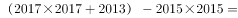

- **A**. 8064
- **B**. 10077　✅
- **C**. 4070302
- **D**. 8130527

**答案**：B

**官方解析**

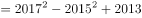

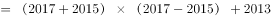

故正确答案为B。

备注：平方差公式：

---

### 第 2 题　qid 2031060 · 数学运算

小王近期正在减肥，某天他匀速健步走20分钟后，计步器显示他走了3800步，2.5千米，消耗热量150千卡。则为了达到通过健步走消耗600千卡热量的目标，他还得继续走多少步？（假设小王每走一步，消耗的热量保持不变）

- **A**. 3800
- **B**. 7600
- **C**. 11400　✅
- **D**. 15200

**答案**：C

**官方解析**

要消耗600千卡热量，已消耗150千卡，则还需消耗450千卡。已知每走一步，消耗热量不变且消耗150千卡需走3800步，所以消耗450千卡需走步。

故正确答案为C。

---

### 第 3 题　qid 2031072 · 数学运算

若将一个长为8厘米、宽为6厘米的长方形盖在一个圆上，两个图形重叠部分的面积占圆的三分之二，占长方形面积的一半。则这个圆的面积为多少平方厘米？

- **A**. 64
- **B**. 24
- **C**. 48
- **D**. 36　✅

**答案**：D

**官方解析**

设重叠部分的面积为2A，则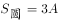，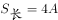。已知长方形长为8，宽为6，则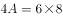，。故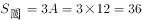。

故正确答案为D。

---

### 第 4 题　qid 2031078 · 数学运算

小张将带领三位专家到当地B单位调研，距离B单位1.44千米处设有地铁站出口。调研工作于上午9点开始，他们需提前10分钟到达B单位，则小张应通知专家最晚几点一起从地铁站出口出发，步行前往B单位？（假设小张和专家的步行速度均为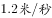）

- **A**. 8点26分
- **B**. 8点30分　✅
- **C**. 8点36分
- **D**. 8点40分

**答案**：B

**官方解析**

调研工作9点开始，需提前10分钟到达即8点50分要到达B单位。已知路程为1.44千米即1440米，速度为，所以从地铁口到B单位所需时间，所以最晚出发时间为8点30分。

故正确答案为B。

---

### 第 5 题　qid 2031086 · 数学运算

一台全自动咖啡机打八折销售，利润为进价的，如打七折出售，利润为50元。则这台咖啡机的原价是多少元？

- **A**. 250　✅
- **B**. 240
- **C**. 210
- **D**. 200

**答案**：A

**官方解析**

赋值咖啡机进价为1。根据条件“打八折销售利润为进价的”，即打八折后的售价为：。则原价为。若打七折销售，，。而实际利润为50元，根据等比放缩，。

故正确答案为A。

---

### 第 6 题　qid 2031090 · 数学运算

甲、乙和丙共同投资一个项目并约定按投资额分配收益。甲初期投资额占初期总投资额的，乙的初期投资额是丙的2倍。最终甲获得的收益比丙多2万元。则乙应得的收益为多少万元？

- **A**. 6
- **B**. 7
- **C**. 8　✅
- **D**. 9

**答案**：C

**官方解析**

设丙的投资额为，则乙的投资额为，甲占总投资额的，故乙加丙占总投资额的，则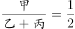，解得甲的投资额为。按照投资额分配收益，甲的投资额比丙多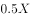，收益多2万元，乙的投资额为，所以收益为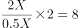万元。

故正确答案为C。

---

### 第 7 题　qid 2031100 · 数学运算

张先生比李先生大8岁，张先生的年龄是小王年龄的3倍，9年前李先生的年龄是小王年龄的4倍。则几年后张先生的年龄是小王年龄的2倍？

- **A**. 10
- **B**. 13
- **C**. 16
- **D**. 19　✅

**答案**：D

**官方解析**

根据题意，设李先生今年的年龄为，则张、李、王三人今年以及九年前的年龄可得如下：

由“9年前李先生的年龄是小王年龄的4倍”可得，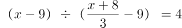，解得。则张今年岁，王今年岁。当张先生的年龄是小王年龄的2倍时，张先生与小王的年龄差就应该等于小王的年龄，即。即小王38岁时，张先生的年龄是小王年龄的2倍。小王今年19岁，38岁时为19年后。

故正确答案为D。

---

### 第 8 题　qid 2031110 · 数学运算

某工厂生产甲和乙两种产品，甲产品的日产量是乙产品的1.5倍。现工厂改进了乙产品的生产技术，在保证产量不变的前提下，其单件产品生产能耗降低了，而每日工厂生产甲和乙两种产品的总能耗降低了。则在改进后，甲、乙两种产品的单件生产能耗之比为？

- **A**. 

- **B**. 

- **C**. 

- **D**. 

　✅

**答案**：D

**官方解析**

赋值乙日产量为2，则甲的日产量为3，改进后乙单件产品能耗为4，则改进前的能耗为5，设甲单件产品生产能耗为。根据且总能耗降低可得：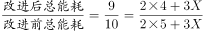，解得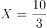，故改进后甲、乙单件能耗之比为。

故正确答案为D。

---

### 第 9 题　qid 2031116 · 数学运算

小刘早上8点整出发匀速开车从A地前往B地，预计10点整到达。但出发不到1小时后汽车就发生了故障，小刘骑折叠自行车以汽车行驶速度的前往A、B两地中点位置的维修站借来工具，并用30分钟修好了汽车，抵达B地时间为11点50分。则小刘汽车发生故障的时间是早上：

- **A**. 8点40分
- **B**. 8点45分
- **C**. 8点50分　✅
- **D**. 8点55分

**答案**：C

**官方解析**

假设小刘开车速度为4，那么从A到B共需2个小时，则AB之间路程为8。并且原定时间为2个小时，实际共用了3小时50分钟，多出来的1小时50分钟则为小刘骑车借工具并修车的时间。其中修车30分钟，因此小刘骑车从故障地点到达AB两地中间位置的时间为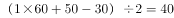分钟即小时。由于骑车速度为开车速度的，则骑车速度为1，故，因此故障前实际行驶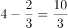，则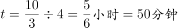，故发生故障的时间是8点50分。

故正确答案为C。

---

### 第 10 题　qid 2031118 · 数学运算

某单位从10名员工中随机选出2人参加培训，选出的2人全为女性的概率正好为。则如果选出3人参加培训，全为女性的概率在以下哪个范围内？

- **A**. 
低于

- **B**. 
到之间
　✅
- **C**. 
到之间

- **D**. 
高于

**答案**：B

**官方解析**

由于10人中随机选取两名均为女性的概率为，因此设女性共有人，则有，解得，于是10人中有6名女性，那么选出3人全为女性的概率为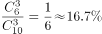。

故正确答案为B。

---

### 第 11 题　qid 2031120 · 数学运算

某企业共有职工100多人，其中，生产人员与非生产人员的人数之比为，而研发与非研发人员的人数之比为，已知生产人员不能同时担任研发人员，则该企业不在生产和研发两类岗位上的职工有多少人？

- **A**. 20
- **B**. 30
- **C**. 24
- **D**. 26　✅

**答案**：D

**官方解析**

由于生产人员与非生产人员的人数之比为，因此总人数为9的倍数，研发与非研发人员的人数之比为，因此总人数也为8的倍数。因此总人数是8和9的公倍数，因此为72的倍数。又因为总人数在之间，因此总人数为144人。那么生产人员为人，研发人员为人。生产人员不能同时担任研发人员，因此非生产与非研发人员数。

故正确答案为D。

---

### 第 12 题　qid 2031128 · 数学运算

某种鸡尾酒的酒精浓度为，由种酒、种酒和酒精浓度（）的种酒按的比例（重量比）调制成。已知种酒的酒精浓度是种酒的一半，则种酒的酒精浓度是：

- **A**. 

　✅
- **B**. 

- **C**. 

- **D**. 

**答案**：A

**官方解析**

假设鸡尾酒的溶液重量为100，则溶质的量即为20，并且、、三种酒的质量分别为20、60、20。设种酒的酒精浓度为，则为，混合后溶质的量不变，则有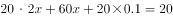，解得，于是种酒的酒精浓度为。

故正确答案为A。

---

### 第 13 题　qid 2031132 · 数学运算

某检修工作由李和王二人负责，两人如一同工作4天，剩下工作量李需要6天，或王需要3天完成。现李和王共同工作了5天，则剩下的工作李单独检修还需几天完成？

- **A**. 2
- **B**. 3　✅
- **C**. 4
- **D**. 5

**答案**：B

**官方解析**

由于剩下的工程李和王的时间比为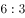即为，因此效率比为。那么设李的效率为1，王的效率为2。。现在二人合作5天后工作量还剩余，因此李单独做需要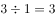天。

故正确答案为B。

---

### 第 14 题　qid 2031140 · 数学运算

用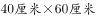的方砖铺一个房间的长方形地面，在不破坏方砖的情况下，正好需要用60块方砖。假设该长方形地面的周长的最小值为米，那么X的值在以下哪个范围内？

- **A**. 

- **B**. 
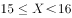
　✅
- **C**. 

- **D**. 

**答案**：B

**官方解析**

面积一定，两边长度最接近时，长方形周长最小。按照下图排列为正方形。即一边为2个60厘米、另一边为3个40厘米，一共六块组成一个边长为120厘米的正方形，如图1；九个相同的正方形按三行三列排放组成一个边长为360厘米的正方形，如图2；最终沿着边长将剩余6个，如图3排列组成一个长为400厘米、宽为360厘米的长方形。故最短周长为：。

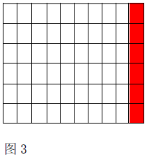

故正确答案为B。

---

### 第 15 题　qid 2031146 · 数学运算

从甲地到乙地含首尾两站共有15个公交站，在这些公交站上共有4条公交线路运行。其中，A公交车线路为第1站到第6站，B公交车线路为第3站到第10站，C公交车线路为第7站到第12站，D公交车线路为第10站到第15站。小张要从甲地到乙地，要在这些公交线路中换乘，不在两站之间步行也不往反方向乘坐，每条公交线路只坐一次，则共有多少种不同的换乘方式？

- **A**. 72
- **B**. 64
- **C**. 52
- **D**. 48　✅

**答案**：D

**官方解析**

 

由上图可以看出在第10站时、、三条公交有相同的站点-第十站，故路线可以分为从和这两类情况。

：第一步从，可以在第三、四、五、六换乘，有4种；第二步从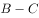，可以在第七、八、九换乘和第十站换乘这两类。第一类在第七、八、九换乘有3种，从可以在第十、十一、十二换乘，有3种；第二类在第十站换乘，从可以在第十一、十二换乘，有2种。故共有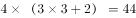种。

：第一步从，可以在第三、四、五、六换乘，有4种；第二步从，只能在第十站换乘，只有1种情况。故共有种，。

故正确答案为D。

---

## 判断推理

### 第 1 题　qid 2030988 · 图形推理

从所给的四个选项中，选择最合适的一个填入问号处，使之呈现一定的规律性：

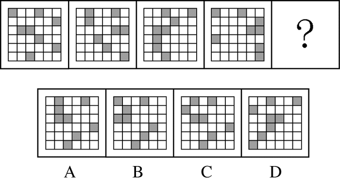

- **A**. A　✅
- **B**. B
- **C**. C
- **D**. D

**答案**：A

**官方解析**

题干所有图形均为36宫格，其中每个图形均包含8个黑块，元素组成相同，考虑位置规律。观察发现，每幅图每行黑格的数目一致，考虑黑格在同行中的位置移动。第一行黑格每次向右移动一个单位，第二行黑格每次向右移动两个单位，第三行黑格每次移动三个单位（向左向右均可），第四行黑格每次向左移动一个单位，第五行图形黑格每次向左移动两个单位，第六行图形黑格每次移动三个单位（向左向右均可）。
根据第一行移动规律排除B、C、D三项，在A选项中验证其余行的移动规律，发现均符合上述规律，当选。
故正确答案为A。

---

### 第 2 题　qid 2031008 · 图形推理

从所给的四个选项中，选择最合适的一个填入问号处，使之呈现一定的规律性：

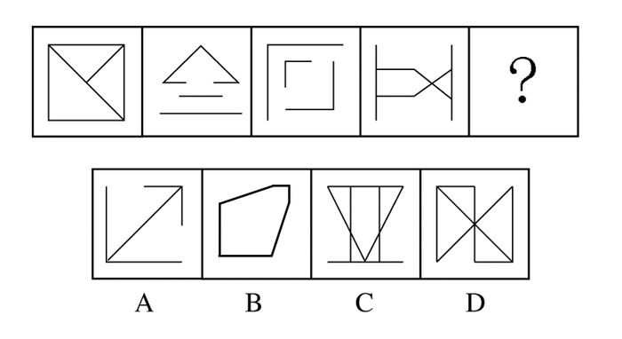

- **A**. A
- **B**. B　✅
- **C**. C
- **D**. D

**答案**：B

**官方解析**

元素组成不同，考虑属性规律和数量规律。题干中所有图形均为轴对称图形且对称轴每次逆时针旋转，据此排除C、D选项。无其他明显属性规律，考虑数量规律。题干中四幅图形均由直线组成，第二幅图和第四幅图都出现单一直线，考虑数直线，每幅图形均由6条直线组成，A、B选项中直线数量依次为5、6，据此排除A选项。

故正确答案为B。

---

### 第 3 题　qid 2031016 · 图形推理

从所给的四个选项中，选择最合适的一个填入问号处，使之呈现一定的规律性：

- **A**. A
- **B**. B
- **C**. C　✅
- **D**. D

**答案**：C

**官方解析**

元素组成不同，且无明显属性规律，考虑数量规律。每幅图形均存在多个封闭空间，优先数面。观察发现，题干中四幅图形均由5个面组成，排除D项。继续观察发现，题干中每幅图形均有一个与外框形状相同的面，A选项不存在与外框形状、比例都完全相同的面，B选项存在多个面的形状与外框形状相同，只有C项满足题干要求。

故正确答案为C。

---

### 第 4 题　qid 2031020 · 图形推理

从所给的四个选项中，选择最合适的一个填入问号处，使之呈现一定的规律性：

- **A**. A
- **B**. B　✅
- **C**. C
- **D**. D

**答案**：B

**官方解析**

元素组成不同，优先考虑属性规律。九宫格优先横向思考，观察发现，第一横行均由直线组成，第二横行均由曲线组成，第三横行给出的两幅图形中有曲线和直线，？处填入的图形也应同时包含直线和曲线，据此排除选项A、C选项。比较B、D选项的不同，发现B选项由一部分组成，D选项由两部分组成，题干中每幅图形均为一部分。
故正确答案为B。

---

### 第 5 题　qid 2031024 · 图形推理

从所给的四个选项中，选择最合适的一个填入问号处，使之呈现一定的规律性：

- **A**. A
- **B**. B　✅
- **C**. C
- **D**. D

**答案**：B

**官方解析**

本题为九宫格题目。题干中出现了明显的轴对称图形和中心对称图形，九宫格优先横向观察。观察发现，第一横行中从左至右图形的对称性分别为中心对称、 轴对称、中心对称轴对称；在第二横行验证此规律，第二横行满足相同的规律。第三横行中应用此规律，“?”处应该选择一个“中心对称轴对称”的选项，只有B项满足条件。

故正确答案为B。

---

### 第 6 题　qid 2031028 · 逻辑判断

在过去的12个月中，某市新能源电动汽车的销售量明显上升。与之相伴随的是，电视、网络等媒体对新能源电动汽车的各种报道也越来越多。于是，有电动车销售商认为，新能源电动汽车销售量的提高主要得益于日益增多的媒体报道所起的宣传作用。
以下哪项如果为真，最能削弱该电动车销售商的观点？

- **A**. 对新能源电动汽车进行报道的人中有不少是环保人士，他们喜欢宣传电动汽车
- **B**. 有些消费者因为传统汽车摇号的中签率低而购买新能源电动汽车
- **C**. 个别消费者购买新能源电动汽车，是因为能够获得政府补贴
- **D**. 看过关于新能源电动汽车报道的人，几乎都不购买该类型汽车　✅

**答案**：D

**官方解析**

第一步，找到论点和论据。
论点：新能源电动汽车销售量的提高主要得益于日益增多的媒体报道所起的宣传作用。
论据：在过去的12个月中，某市新能源电动汽车的销售量明显上升。与之相伴随的是，电视、网络等媒体对新能源电动汽车的各种报道也越来越多。
第二步，逐一分析选项。
A项：题干讨论的是因为日益增多的媒体报道，所以新能源电动汽车销量提高，与报道的人具体是哪些人，他们为什么进行报道无关，无关项，排除；
B项：题干说的是主要得益于日益增多的媒体报道，选项说有些消费者因为传统汽车摇号的中签率低而购买新能源电动汽车，说明传统汽车摇号的中签率低是新能源电动汽车销售量提高的其中一个原因，但不能否定主要原因是媒体报道，不能削弱，排除；
C项：与B类似，说明为了获得政府补贴，所以购买新能源电动汽车，那么为了获得政府补贴是新能源电动汽车销售量提高的其中一个原因，但不能否定主要原因是媒体报道，不能削弱，排除；
D项：看过关于新能源电动汽车报道的人，几乎都不购买该类型汽车，说明日益增多的媒体报道不是新能源电动汽车销量提高的主要原因，直接削弱论点，当选。
故正确答案为D。

---

### 第 7 题　qid 2031030 · 类比推理

入室抢劫者Q或者是从窗户进入房间的，或者是从屋门进入房间的。经查实，Q不是从屋门进入房间的，所以，他一定是从窗户进入房间的。
以下哪项与上述论证的结构最为相似？

- **A**. 
新近考古发掘的一幅字画要么是唐代的，要么是宋代的。经鉴定，这幅字画是唐代的，所以，它一定不是宋代的

- **B**. 
某晚午夜时分，天上最亮的星星或者是牛郎星，或者是织女星。经证实，该天天上最亮的星星不是织女星，所以，一定是牛郎星
　✅
- **C**. 
如果一个数能被8整除，它就能被4整除。某个数不能被4整除，所以，也不能被8整除

- **D**. 
小华通常上网或者是收发邮件，或者是QQ聊天，或者是打游戏。星期天下午她上网没有进行QQ聊天，所以，她一定收发邮件了

**答案**：B

**官方解析**

第一步：翻译题干。

“Q从窗户进入或从屋门进入”为一个或命题，“不是从屋门进入”即对“或”关系其中一项否定，所以“从窗户进入”，即得到肯定的另外一项。

第二步：逐一分析选项。

A项，题干是“或”关系，选项是“要么要么”，且题干是否定了“或”关系其中一项得到了肯定的另一项，选项是肯定了“要么要么”中的一项得到了否定的另一项，与题干结构不一致，排除；

B项，“天上最亮的星星是牛郎星或织女星”为一个或命题，“不是织女星”即对“或”关系其中一项否定，所以“是牛郎星”，即得到肯定的另外一项，与题干结构一致，当选；

C项，“能被8整除能被4整除”并非是或命题，“不能被4整除”即否后，“不能被8整除”即否前，与题干结构不一致，排除；

D项，小华上网收发邮件或QQ聊天或打游戏，题干的“或”关系是两组关系，满足“否一推一”，而选项是三组关系，与题干结构不一致，排除。

故正确答案为B。

---

### 第 8 题　qid 2031032 · 逻辑判断

约翰喜欢攀岩和射击运动。他的大学同学中没有一个既喜欢攀岩，又喜欢射击，但他所有的中学同学和大学同学都喜欢游泳。
若上述断定为真，以下哪项不可能为真？

- **A**. 除攀岩和射击外，约翰也喜欢游泳
- **B**. 约翰所有的同学都喜欢游泳
- **C**. 约翰喜欢的所有运动，他有一位中学同学也都喜欢
- **D**. 约翰喜欢的所有运动，他有一位大学同学也都喜欢　✅

**答案**：D

**官方解析**

第一步：翻译题干。

约翰攀岩且射击

所有约翰的大学同学 -（攀岩且射击）

所有约翰的中学同学游泳

所有约翰的大学同学游泳

第二步：逐一翻译选项。

A项，题干未提约翰是否喜欢游泳，因此约翰可能喜欢游泳，可能为真，排除；

B项，题干只说了所有约翰的中学同学和大学同学都喜欢游泳，而中学同学和大学同学是约翰所有同学的一部分，剩余的那部分同学可能喜欢游泳也可能不喜欢游泳，因此约翰所有的同学都喜欢游泳是可能为真的，排除；

C项，约翰喜欢的所有运动是攀岩和射击，而题干只提到了所有约翰的中学同学喜欢游泳，却没有提他们是否喜欢攀岩和射击，因此约翰的一位中学同学可能喜欢攀岩和射击，可能为真，排除；

D项，约翰喜欢的所有运动是攀岩和射击，而没有一位约翰的大学同学既喜欢攀岩又喜欢射击，因此约翰的一位大学同学不可能喜欢攀岩和射击，该项不可能为真，当选。

故正确答案为D。

---

### 第 9 题　qid 2031034 · 逻辑判断

某饭店宣布“新开发的排放油烟系统，虽然还未完成为期6个月的试验检验，但是至今并未发生故障，所以公司决定要安装在饭店后厨，毕竟这个系统可以更有效地解决油烟问题。”该饭店的主厨说：“我们不能使用未完成试验的排放油烟系统，6个月以后再说吧。”
以下哪项最能支持主厨的反对意见？

- **A**. 能更有效地处理油烟的新系统也可能存在新问题　✅
- **B**. 尽管新的排放油烟系统比以前的难操作，但有一些新能力
- **C**. 新的排放油烟系统保修期更长，维修方便
- **D**. 许多安全事故都是排放油烟系统造成的

**答案**：A

**官方解析**

第一步，找到论点和论据。
论点：我们不能使用未完成试验的排放油烟系统，6个月以后再说吧。
论据：无明显论据。
第二步，逐一分析选项。
A项：虽然至今未发生故障，但新系统可能存在新的问题，解释了主厨的反对意见，补充论据，可以加强，当选；
B项：题干讨论的是“能不能使用未完成试验的排放油烟系统”，选项说新的排放油烟系统有一些新能力，话题不一致，无关选项，排除；
C项：题干讨论的是“能不能使用未完成试验的排放油烟系统”，选项说的是保修期更长、维修方便说明新的排放油烟系统有很多优点，话题不一致，无关选项，排除；
D项：题干讨论的主体是新开发的排放油烟系统，与D选项讨论的主体不一致，排除。
故正确答案为A。

---

### 第 10 题　qid 2031036 · 逻辑判断

在美国，研究院的所有院士都反对人类食用转基因食品，而专门生产转基因玉米的公司，其所有领导层人员都认为转基因食品是安全的，提倡人们放心食用。一些大学教授兼任公司的领导。

假设以上陈述为真，则以下哪项一定为真？

- **A**. 
有些大学教授是美国研究院的院士

- **B**. 
有些研究院院士支持人类食用转基因食品

- **C**. 
一些大学教授支持人们食用转基因食品
　✅
- **D**. 
有些大学教授不支持人们食用转基因食品

**答案**：C

**官方解析**

第一步：翻译题干。

①研究院的院士反对人类食用转基因食品

②公司领导层赞成人类食用转基因食品

③有的大学教授公司领导层

第二步：逐一翻译选项。

A项，根据条件③、②、①的递推规则可得出，有的大学教授公司领导层赞成人类食用转基因食品研究院的院士，即“有些大学教授不是美国研究院的院士”，因此无法得出“有些大学教授是美国研究院的院士”，排除；

B项，根据题干①可知，研究院的院士反对人类食用转基因食品，已知研究院的院士只是所有研究院院士中的一部分，可知：有些研究院院士反对人类食用转基因食品，“有的反对”不能推出“有的支持”，故无法推出，排除；

C项，根据条件③、②的递推规则可得出：有的大学教授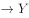公司领导层赞成人类食用转基因食品，可以得出“有的大学教授赞成人类食用转基因食品”的结论，当选；

D项，根据C项，我们已经得出“有的大学教授赞成人类食用转基因食品”的结论，“有的支持”不能推出“有的不支持”，排除。

故正确答案为C。

---

### 第 11 题　qid 2030984 · 逻辑判断

在大气层的自然状态下，自由落体会受到空气阻力的干扰。要排除这种干扰，就要创造一种真空环境。在伽利略所处的时代，人们无法用技术手段创造出真空环境。因此，伽利略只能在思维中撇开空气阻力的因素，设想真空中的落体运动，从而得出自由落体定律，推翻了亚里士多德关于落体的结论。
要使伽利略得出的自由落体定律成立，必须以下哪项为前提？

- **A**. 当时的人们都能进行同样的思维实验
- **B**. 伽利略的思维实验符合真空状态的运动规律　✅
- **C**. 伽利略在比萨斜塔通过现实实验进行了验证
- **D**. 伽利略设想了各种可能性

**答案**：B

**官方解析**

第一步，找到论点和论据。
论点：伽利略得出的自由落体定律成立。
论据：伽利略只能在思维中撇开空气阻力的因素，设想真空中的落体运动。
第二步，逐一分析选项。
A项：“都能进行同样的思维实验”不代表在这个思维下设想的理论就一定是正确的，无关项，排除；
B项：如果伽利略的思维实验不符合真空状态的运动规律，那么自由落体定律根本就不成立，补充了一个必要条件，能加强，当选；
C项：现实实验是有空气阻力的，而自由落体定律是要排除空气阻力的干扰，所以用现实实验来验证自由落体定律，这是不科学的，不能加强，排除；
D项：设想了各种可能性，那到底哪种可能性是对的呢，无从得知，无关项，排除。
故正确答案为B。

---

### 第 12 题　qid 2030986 · 逻辑判断

在一次班会上，老师问大家：“成功的心态应该是怎样的？”郑磊说：“要不断地努力奋斗，活到老学到老。”刘连说：“要保持知足的心态，肯定自己已经取得的成绩。”老师说：“你们的观点都是好的，结合起来才准确：成功的心态既要不断努力，也要知足常乐。”
根据老师的说法不能推出的是：

- **A**. 郑磊和刘连的观点都不全面
- **B**. 一个具有知足常乐心态的人，可能是具有成功心态的人
- **C**. 一个具有成功心态的人，必定是具有不断努力心态的人
- **D**. 不断努力的心态和知足常乐的心态同等重要　✅

**答案**：D

**官方解析**

第一步：翻译题干。

成功的心态不断努力且知足常乐

第二步：逐一翻译选项。

A项：老师说郑磊和刘连的观点结合起来才准确，说明郑磊和刘连的观点都不全面，能推出，排除；

B项：“具有知足常乐心态”只是对题干“不断努力且知足常乐”中一项的肯定，无法推出确定结论，只能推出可能性结论，排除；

C项：成功的心态不断努力，题干是“成功的心态不断努力且知足常乐”，肯前必肯后，能推出，排除；

D项：不断努力和知足常乐在题干中是并列的“且”关系，但两者之间的重要性是不知道的，不能推出，当选。

本题为选非题，故正确答案为D。

---

### 第 13 题　qid 2030990 · 逻辑判断

有研究调查了大学生食用泡菜、酸奶等发酵食品的情况和他们的社交焦虑症发病率，发现食用发酵食品可以显著减少社交焦虑症状的发生。可能原因在于发酵食品中含有能够促进消化吸收和改善肠道环境的益生菌，通过改善消化功能来促进情绪健康。
以下哪项如果为真，最能质疑上述研究结论？

- **A**. 社交焦虑的发病与个性、性别、年龄等也有关系
- **B**. 不少情绪健康的大学生从来不吃泡菜、酸奶等发酵食品
- **C**. 某国大学生的泡菜消费量和社交焦虑症发病率均全球第一　✅
- **D**. 不少出现考试焦虑或社交焦虑的学生都不同程度地存在腹泻症状

**答案**：C

**官方解析**

第一步：找出论点和论据。
论点：食用发酵食品可以显著减少社交焦虑症状的发生。
论据：可能原因在于发酵食品中含有能够促进消化吸收和改善肠道环境的益生菌，通过改善消化功能来促进情绪健康。
本题论据讨论发酵食品通过改善消化功能来促进情绪健康，论点讨论食用发酵食品可以显著减少社交焦虑症状，话题一致，削弱优先考虑削弱论点。
第二步：逐一分析选项。
A项：社交焦虑的发病与个性、性别、年龄等也有关系，但这和发酵食品能减少社交焦虑症状并不冲突，无法削弱，排除；
B项：不少情绪健康的大学生从来不吃发酵食品，但这和发酵食品能减少社交焦虑症状并不冲突，无法削弱，排除；
C项：某国大学生的泡菜消费量和社交焦虑症发病率均全球第一，而泡菜属于发酵食品，说明食用泡菜不能减少社交焦虑症状，直接削弱论点，可以削弱，当选；
D项：不少考试焦虑或社交焦虑的学生都存在腹泻症状，而论点讨论食用发酵食品可以显著减少社交焦虑症状，话题不一致，无关项，无法削弱，排除。
故正确答案为C。

---

### 第 14 题　qid 2030992 · 逻辑判断

几乎所有的数学家都是这样：他们能够识别正确的证明以及不正确证明的无效之处，尽管他们无法定义一个证明的准确意义。
由此，可以推知以下哪项一定为真？

- **A**. 能识别正确证明和不正确证明的人可能无法定义证明的准确意义　✅
- **B**. 有的数学家不能识别不正确证明的无效之处
- **C**. 数学家都不能定义一个证明的准确意义
- **D**. 有的数学家不识别正确的证明，但能识别不正确的证明

**答案**：A

**官方解析**

本题为日常结论，读懂题干的基础上逐一分析选项。
①几乎所有的数学家能够识别正确的证明以及不正确证明的无效之处；②几乎所有的数学家无法定义一个证明的准确意义。
A项：几乎所有的数学家能够识别正确的证明以及不正确证明，而根据②，即可得出能识别正确证明和不正确证明的人可能无法定义证明的准确意义，能够从题干中推出，当选；
B项：几乎所有的数学家都能识别不正确证明的无效之处，无法推出有的数学家不能够识别不正确证明的无效之处，排除；
C项：根据②，题干主体为几乎所有的数学家，并非所有的数学家，过于绝对，排除；
D项：题干中①几乎所有的数学家能够识别正确的证明以及不正确证明的无效之处，识别正确的证明与能识别不正确的证明之间为且关系，没有发生过否定，不能推出否定的一项，排除。
故正确答案为A。

---

### 第 15 题　qid 2030994 · 逻辑判断

雨果说：“多建一所学校，就少建一座监狱。”马克·吐温说：“你每关闭一所学校，你就必须开设一座监狱。”在他们看来，教育能够减少犯罪。有学者认为，近年来，随着教育的大规模扩大，学历程度越高，犯罪率越低。
以下哪项如果为真，最能反驳该学者的观点？

- **A**. 2015年，某高校一名本科生杀死自己的母亲，事后潜逃
- **B**. 学历越高的人，对各项法律条文规定就越了解，就越容易钻法律的空子，实施犯罪
- **C**. 近年来，大部分犯罪为经济犯罪，高学历人群的犯罪率明显高于低学历人群　✅
- **D**. 文化水平低的人，对法律了解相对较少，而且通常低学历者的生存状况较差，更容易铤而走险

**答案**：C

**官方解析**

第一步：找到论点和论据。
论点：近年来，随着教育的大规模扩大，学历程度越高，犯罪率越低。
论据：雨果说：“多建一所学校，就少建一座监狱。”马克·吐温说：“你每关闭一所学校，你就必须开设一座监狱。”在他们看来，教育能够减少犯罪。
第二步：逐一分析选项。
A项：举某高校一名本科生杀死母亲的反面个例，不能说明学历程度与犯罪率之间的关系，为无关选项，排除；
B项：说明学历高的人容易钻法律空子实施犯罪，但是是否去钻法律的空子实施犯罪，不明确，排除；
C项：经济犯罪作为最主要的犯罪形式，经济犯罪中高学历人群犯罪率高于低学历人群，直接否定论点，当选；
D项：说明学历程度低，越容易发生犯罪，但是否是真的去犯罪了，不明确，排除。
故正确答案为C。

---

### 第 16 题　qid 2030998 · 逻辑判断

苗苗是某少儿舞蹈班学生，她喜欢民族舞。对于该舞蹈班学生，她们或者喜欢拉丁舞，或者喜欢芭蕾舞；喜欢民族舞的，则不喜欢芭蕾舞。
以下哪项如果为真，可推出苗苗喜欢街舞这一结论？

- **A**. 舞蹈班有些喜欢拉丁舞的学生也喜欢街舞
- **B**. 舞蹈班学生中，喜欢拉丁舞的都喜欢街舞　✅
- **C**. 舞蹈班学生喜欢的舞蹈只局限于民族舞、拉丁舞、芭蕾舞和街舞
- **D**. 民族舞和街舞比芭蕾舞更容易学

**答案**：B

**官方解析**

翻译题干：

①苗苗喜欢民族舞

②喜欢拉丁舞或芭蕾舞

③喜欢民族舞不喜欢芭蕾舞

结合①③可以推出苗苗不喜欢芭蕾舞，再根据②否一推一，可以推出苗苗喜欢拉丁舞。要想得到苗苗喜欢街舞的结论，只需让“不喜欢芭蕾舞的喜欢街舞”成立，或者让“喜欢拉丁舞的喜欢街舞”成立即可。

故正确答案为B。

---

### 第 17 题　qid 2031002 · 逻辑判断

面对家长们对于某小学装修已两月的教室存在甲醛超标的质疑，该小学校长回应道：“所有的教室我都逐一去过，没有闻到异味，所以，甲醛不超标。”
以下哪项如果为真，最能反驳该小学校长的论证？

- **A**. 不同的人对于味道的感受不同，校长闻起来无异味并不代表事实上无异味
- **B**. 某新房装修完工三个多月后，经正规检测，甲醛依然超标
- **C**. 即使装修后无异味的房间，在装修后几月内通常都会有甲醛超标的可能
- **D**. 甲醛是一种无色无味的气体，不能通过房间的味道来判断是否甲醛超标　✅

**答案**：D

**官方解析**

第一步：找到论点论据。
论点：甲醛不超标。
论据：所有的教室我都逐一去过，没有闻到异味。
第二步：逐一分析选项。
A项：不同的人对于味道的感受不同，校长闻起来无异味并不代表事实上无异味，说明事实上可能闻到了异味，削弱论据，保留；
B项：本题题干讨论的是“某小学装修了两个月的教室”，而选项讨论的是某新房，主体不同，属于无关项，排除；
C项：指出存在超标的可能性，属于对论点的可能性削弱，保留；
D项：说明气味跟甲醛超标之间没有联系，不能通过闻气味来辨别甲醛是否超标，直接拆桥，削弱论证，保留。
比较A、C、D三项，D项直接拆桥，而A是削弱论据，C是一种可能性削弱，削弱力度不及D项。
故正确答案为D。

---

### 第 18 题　qid 2031004 · 逻辑判断

近日来，由于南方持续降雨，导致很多人工养鱼池被淹。因此，有几位养鱼专家就鲫鱼和鲤鱼的价格走势进行预测：
李强说：只有鲫鱼价格上涨，鲤鱼价格才会上涨；
孙振说：鲫鱼和鲤鱼的价格至少有一种会上涨；
王刚说：只有鲤鱼价格不上涨，鲫鱼价格才不上涨；并且如果鲤鱼价格不上涨，则鲫鱼价格不上涨。
假如事实证明三位专家的预测均为真，则以下哪项必须为真？

- **A**. 鲫鱼价格上涨，鲤鱼价格不上涨
- **B**. 鲫鱼价格不上涨，鲤鱼价格上涨
- **C**. 鲫鱼和鲤鱼的价格都上涨　✅
- **D**. 鲫鱼和鲤鱼的价格都不上涨

**答案**：C

**官方解析**

第一步：翻译题干。

李强：鲤鱼价格上涨鲫鱼价格上涨；

孙振：鲫鱼价格上涨 或 鲤鱼价格上涨；

王刚：鲫鱼价格不上涨鲤鱼价格不上涨 且 鲤鱼价格不上涨鲫鱼价格不上涨。

第二步：逐一代入选项验证。

A项，代入李强不确定，孙振正确，王刚错误，不满足三个条件均正确，排除；

B项，代入李强错误，孙振正确，王刚错误，不满足三个条件均正确，排除；

C项，代入李强正确，孙振正确，王刚正确，满足三个条件均正确，当选；

D项，代入李强正确，孙振错误，王刚正确，不满足三个条件均正确，排除。

故正确答案为C。

---

### 第 19 题　qid 2031006 · 逻辑判断

张女士特别爱美，多年来喜欢在冬天穿裙子以显示她婀娜多姿的身材。从去年冬天起，每到阴冷天，她都感觉到膝关节疼痛。后经医生诊断，她得了关节炎。于是张女士认为，阴冷天穿得少是导致关节炎的原因。
以下哪项如果为真，最能质疑张女士的观点？

- **A**. 日本一些年轻女士喜欢冬天穿裙子，却并没有因为阴冷天穿得少而患上关节炎
- **B**. 现代医学研究表明导致关节炎的根本原因是劳损、感染或创伤，阴冷天穿得少关节炎易发作　✅
- **C**. 张女士的姐姐和她生活在一个城市，多年来也喜欢在冬天穿裙子，但没得关节炎
- **D**. 阴冷天穿得多的人群中也有很多得了关节炎，而且以中老年人居多

**答案**：B

**官方解析**

第一步：找到论点论据。
论点：阴冷天穿得少是导致关节炎的原因。
论据：张女士多年来喜欢在冬天穿裙子。从去年冬天起，每到阴冷天，她都感觉到膝关节疼痛。后经医生诊断，她得了关节炎。
第二步：逐一分析选项。
A项：指出有一些日本年轻女士没有因为阴冷天穿得少而患上关节炎，属于举反例削弱，保留；
B项：指出得关节炎的根本原因是劳损、感染或创伤，阴冷天只是更容易发作，指出阴冷天只是在已经得病之后诱发关节炎发作的一个因素，而不是得关节炎的原因，否定了题干所说的阴冷天是原因，直接削弱了论点，保留；
C项：指出张女士的姐姐也喜欢在冬天穿裙子，但没得关节炎，属于举反例削弱，保留；
D项：讨论的是穿的多的人群中是否有人得关节炎，不确定穿的少是否会导致关节炎，属于不明确选项，排除。
比较A、B、C三项，A、C两项举反例的力度不如B直接削弱论点，所以选择B项。
故正确答案为B。

---

### 第 20 题　qid 2031012 · 逻辑判断

张导演在为联欢会的最后三个节目进行排序，相邻的节目不能属于同一种类。张导演要从三个小品节目、三个歌曲节目、三个舞蹈节目中进行选择。要排好最后这三个节目，还要满足如下条件：
（1）如第一个节目是小品，则第二个节目是舞蹈
（2）如第二个节目是歌曲，则第一个节目是舞蹈
（3）如第三个节目是小品或者舞蹈，则第二个节目是歌曲
请问以下哪项是节目安排的可能次序？

- **A**. 节目一：小品  节目二：舞蹈  节目三：舞蹈
- **B**. 节目一：小品  节目二：歌曲  节目三：舞蹈
- **C**. 节目一：歌曲  节目二：小品  节目三：舞蹈
- **D**. 节目一：舞蹈  节目二：小品  节目三：歌曲　✅

**答案**：D

**官方解析**

选项信息充分，故可用代入排除法求解。
A项代入（1）正确，（2）正确，（3）错误，不满足三个条件均正确，排除；
B项代入（1）错误，（2）错误，（3）正确，不满足三个条件均正确，排除；
C项代入（1）正确，（2）正确，（3）错误，不满足三个条件均正确，排除；
D项代入（1）正确，（2）正确，（3）正确，满足三个条件均正确，当选。
故正确答案为D。

---

### 第 21 题　qid 2031040 · 定义判断

内卷化效应，指的是个体长期从事一项相同的工作，并且保持在一定的层面，只是进行自我重复，没有任何变化和改观。
根据上述定义，以下符合内卷化效应的是：

- **A**. 小李大学毕业后三年换了五份工作，每次刚熟悉工作就离职，下次重新开始
- **B**. 钱老师在图书馆工作十几年，虽然经常有研究成果发表，但一直没有升职
- **C**. 老杨已在城里打工二十余年，长期在某家公司做保安，一直没有什么改变　✅
- **D**. 刘阿姨说丈夫张先生性格固执，一起过了几十年，张先生都没有什么改善

**答案**：C

**官方解析**

第一步：找到定义关键词。
“长期从事”、“相同的工作”、“没有任何变化和改观”。
第二步：逐一分析选项。
A项，“三年换了五份”工作不符合“长期从事”、“相同工作”，排除；
B项，“十几年”符合“长期从事”，但“经常有研究成果发表”不符合“没有任何变化和改观”，排除；
C项，“打工二十余年”、“长期做保安”符合“长期从事”、“相同工作”，当选；
D项，“一起过了几十年”指的是夫妻的日常生活，不符合“长期从事”、“相同工作”，排除。
故正确答案为C。

---

### 第 22 题　qid 2031042 · 定义判断

互动式教学，就是通过营造多边互动的教学环境，在教学双方平等交流探讨的过程中，达到不同观点碰撞交融，进而激发教学双方的主动性和探索性，从而提高教学效果的一种教学方式。
根据上述定义，以下属于互动式教学的是：

- **A**. 某学院通过文化讲座向外国留学生介绍儒家思想
- **B**. 王老师带领教育专业的学生进行课堂教学模拟实验
- **C**. 小王觉得自己英语不好，报名参加课外一对一辅导
- **D**. 学生和老师就某一个问题展开课堂辩论　✅

**答案**：D

**官方解析**

第一步：找到定义关键词。
“多边互动的教学环境”、“教学双方平等”、“不同观点碰撞交融”、“激发主动性”、“探索性”、“提高教学效果”。
第二步：逐一分析选项。
A项：通过讲座的方式向学生介绍儒家思想，只是一个单方面的介绍和传授，不能体现出多边互动，教学双方也不能平等交流，也无法使不同的观点碰撞交融，因此不符合定义，排除；
B项：王老师带领学生进行课堂模拟实验，“带领”一词可以看出王老师还是出于一种课堂领导者的位置，那么就无法达到教学双方平等交流探讨，因此不符合定义，排除；
C项：小王自己报名参加课外辅导，是他自己的个人行为，不属于教学方式，因此不符合定义，排除；
D项：学生和老师展开课堂辩论，辩论的双方本身是平等交流的，且辩论的形式有利于不同观点的碰撞交融，通过辩论也可以激发探索性，提高教学效果，因此符合定义，当选。
故正确答案为D。

---

### 第 23 题　qid 2031044 · 定义判断

闪光灯效应是心理学的一个术语，也称闪光灯记忆，是指个人对令人震撼的事件容易留下深刻而准确的记忆，并且记忆的准确性不随时间的推移而减弱的现象。闪光灯记忆所记之事件，多半是与个人有关的重要事件。
根据上述定义，以下属于闪光灯效应的是：

- **A**. 冯雨在心情愉快时阅读课文，对课文内容印象格外深刻
- **B**. 经历汶川地震而幸存的小王，八年之后，对当时的情景仍记忆犹新　✅
- **C**. 高阳小时候上学走过的路，在时隔40年之后返乡之时仍然准确辨认
- **D**. 失联30年的战友重新团聚，许多当年的生活琐事还历历在目

**答案**：B

**官方解析**

第一步：找到定义关键词。
“震撼的事件”、“深刻而准确的记忆”、“记忆的准确性不随时间的推移而减弱”。
第二步：逐一分析选项。
A项：课文内容不属于令人震撼的事件，且体现不出记忆的准确性不随时间推移而减弱，因此不符合定义，排除；
B项：汶川地震对于小王来说属于震撼的事件，且时间过去八年，他仍然能够对当时的情景记忆犹新，说明他记忆的准确性没有随时间的推移而减弱，因此符合定义，当选；
C项：虽然高阳对于上学时走过的路时隔40年后还能准确辨认，但是上学的路对于高阳来说只是印象深刻，不是震撼的事件，因此不符合定义，排除；
D项：生活琐事对于战友来说也不是震撼的事件，而且失联30年战友是指至少两个人，不属于个人，因此不符合定义，排除。
故正确答案为B。

---

### 第 24 题　qid 2031050 · 定义判断

概念，是反映对象本质属性的思维形式。概念的外延是指具有概念所反映的本质属性的全部对象。根据概念外延之间是否有重合的部分，可将概念间的关系区分为相容关系和不相容关系。概念间的相容关系是指两个概念外延至少有部分重合的关系。
根据上述定义，以下概念间不具有相容关系的是：

- **A**. 导体—半导体　✅
- **B**. 美国的首都—华盛顿
- **C**. 作家—中国作家
- **D**. 大学生—中共党员

**答案**：A

**官方解析**

第一步：找到定义关键词。
“两个概念的外延”、“至少有部分重合”。
第二步：逐一分析选项。
A项：导体是指电阻率很小且易于传导电流的物质。半导体指常温下导电性能介于导体与绝缘体之间的材料。导体和半导体之间外延没有重合部分，因此不符合定义，当选；
B项：美国的首都与华盛顿两者是全同关系，它们两个概念的外延全部重合，符合至少有部分重合这一定义关键词，因此符合定义，排除；
C项：中国作家是作家的一种，两者是种属关系，它们两个概念的外延有重合部分，符合至少有部分重合这一定义关键词，因此符合定义，排除；
D项：有的大学生是中共党员，有的中共党员是大学生，两者是交叉关系，它们两个概念的外延有部分是重合的，符合至少有部分重合这一定义关键词，因此符合定义，排除。
本题为选非题，故正确答案为A。

---

### 第 25 题　qid 2031052 · 定义判断

地方保护主义，是指地方政府利用其手中的行政权力，对本地企业和外地企业在经济上实行差别待遇，以维护或扩大该地方局部利益的倾向。
根据上述定义，以下情况属于地方保护主义的是：

- **A**. 南方某山区县为保护本地稀有野生动植物资源，拒绝外地游客进入山区参观
- **B**. 某地政府为保证本地品牌的市场占有率，在宣传报道中夸大外地同类产品的缺陷
- **C**. 某地为保护当地连锁超市利益，通过收取高额税费限制某跨国超市集团发展　✅
- **D**. 某市政府盲目发展本地经济，对大型化工厂的重度污染问题不理睬不治理

**答案**：C

**官方解析**

第一步：找到定义关键词。
“地方政府”、“行政权力”、“本地企业和外地企业”、“经济上的差别待遇”、“维护或扩大该地局部利益”。
第二步：逐一分析选项。
A项：只是不予许外地游客参观，不能体现出对本地企业和外地企业的差别对待，而且该区县的目的是保护稀有动植物资源，不是为了维护和扩大局部利益，因此不符合定义，排除；
B项：该地政府只是在宣传报道中夸大外地同类产品的缺陷，并没有利用手中的行政权力，也没有对本地企业和外地企业在经济上实现差别待遇，因此不符合定义，排除；
C项：通过收取高额税费限制某跨国超市集团发展可以体现当地政府利用行政权力，对本地企业和外地企业在经济上实行差别对待，目的是保护当地连锁超市的利益，因此符合定义，当选；
D项：该市政府是盲目发展经济忽视环境治理，并不能体现对本地企业和外地企业的经济差别对待，因此不符合定义，排除。
故正确答案为C。

---

### 第 26 题　qid 2031056 · 定义判断

同群效应，是指处于社会中的个体的行为不仅会受个体自身特质的影响，同时也会受周围与他具有相同或相似的地位、经历或背景的人的影响，从而改变个体单独存在时可能采取的行为。
根据上述定义，以下属于同群效应的是：

- **A**. 小江在超市看到很多人在排队购买打折的鸡蛋，她想起家里的鸡蛋快要吃完了，于是跟别人一起去排队了
- **B**. 小娜原计划大学毕业就参加工作，但宿舍同学都积极准备考研。小娜认为考研也不错，也加入了考研的行列　✅
- **C**. 小赵腿部有残疾，但他并不消沉，他用张海迪等人的事迹鼓励自己，身体残疾的人通过努力也可以为社会创造价值
- **D**. 小方认为人都应该建立家庭、生儿育女，后来她认识了一些独身主义者，认识到人有多种生活方式可以选择

**答案**：B

**官方解析**

第一步：找到定义关键词。
“个体的行为”、“不仅受自身特质的影响”、“而且受相同人的影响从而改变单独存在时的行为”。
第二步：逐一分析选项。
A项：小江跟着大家一起去买鸡蛋是因为她想起家里的鸡蛋快要吃完了，并没有体现她改变了单独存在时采取的行为，因此不符合定义，排除；
B项：小娜原本准备毕业就参加工作，但是她受到了具有相似地位和经历的宿舍同学的影响，加入了考研的行列，改变了自己最初的想法，符合改变了单独存在时采取的行为，因此符合定义，当选；
C项：小赵用张海迪等人事迹的鼓励自己努力，张海迪对小赵来说是一个精神偶像并不是小赵周围的人，同时也没有体现他改变了单独存在时采取的行为，因此不符合定义，排除；
D项：小方因为认识了一些独身主义者从而认识到有多种生活方式可以选择，这只是小方的思想认识有了变化，并不能体现对其行为的影响，因此不符合定义，排除。
故正确答案为B。

---

### 第 27 题　qid 2031064 · 定义判断

深度报道作为传统的新闻形式，指新闻工作者以社会发展现实问题为主要内容，以分析解释的科学方法进行报道，维护公众利益，引导舆论。深度报道不管如何定义，都离不开社会性和深刻性的两大关键点。
根据上述定义，以下属于深度报道的是：

- **A**. 某记者对雾霾天气进行系统调查，在媒体上发布了一个半小时的新闻报道　✅
- **B**. 某电视台晚间新闻中，对某部长到某地视察进行报道
- **C**. 多家报纸和网站针对马航MH370坠机事件的家属善后工作进行跟踪报道
- **D**. 某报纸刊出了对某市的报道，解释为什么该地值得投资

**答案**：A

**官方解析**

第一步：找出定义关键词。
“社会发展现实问题”、“分析解释的科学方法”、“维护公众利益，引导舆论”、“社会性”、“深刻性”。
第二步：逐一分析选项。
A项：雾霾问题是社会发展现实问题，系统的调查是一种分析解释的科学方法，且对雾霾进行系统调查有利于维护公众的利益，可以体现出社会性和深刻性，因此符合定义，当选；
B项：某部长到某地视察，这是一个新闻事件，并不是社会发展的现实问题，也不能体现出分析解释的科学方法，因此不符合定义，排除；
C项：马航MH370坠机事件的家属善后工作不属于社会发展现实问题，跟踪报道也体现不出分析解释的科学方法，因此不符合定义，排除；
D项：该报纸只是在解释某市为什么值得投资，并不是一个社会发展现实问题，因此不符合定义，排除。
故正确答案为A。

---

### 第 28 题　qid 2031068 · 定义判断

艺术衍生品，是艺术作品衍生而来的艺术与商品的结合体，具备一定的艺术附加值。包括经艺术家亲笔签名且限量发行的专供收藏和欣赏的书籍等，印有艺术家代表作品的文具、生活用品、服装服饰以及与艺术元素相结合的具有收藏价值的产品等。
根据上述定义，以下不属于艺术衍生品的是：

- **A**. 著名绘画大师齐白石绘画作品集
- **B**. 著名钢琴演奏家郎朗签名的CD
- **C**. 冰心先生生前写作使用的钢笔　✅
- **D**. 以徐悲鸿著名画作为图案的金银纪念币

**答案**：C

**官方解析**

第一步：找到定义关键词
“艺术作品衍生的艺术与商品的结合体”、“艺术附加值”。
第二步：逐一分析选项
A项：齐白石的绘画作品集是把作品整理好编辑后印刷装订成册出售的商品，是艺术作品衍生而来的艺术与商品的结合体，符合定义，排除；
B项：郎朗签名的CD，属于定义中艺术衍生品所包括的形式中的经艺术家亲笔签名的唱片，符合定义，排除；
C项：冰心先生写作使用的钢笔，不是艺术作品衍生而来的，不符合定义，当选；
D项：以徐悲鸿著名画作为图案的金银纪念币，属于定义中艺术衍生品所包括的形式中的与艺术元素相结合的具有收藏价值的产品，符合定义，排除。
本题为选非题，故正确答案为C。

---

### 第 29 题　qid 2031076 · 定义判断

牧童经济，是指牧童在放牧时，只管放牧不顾对草原的破坏。经济学中以此来比喻，为追求高生产量（消耗自然资源）和高消费量（商品转化为污染物），大量迅速地消耗自然资源，造成废物累积的环境污染的情况。
根据上述定义，以下属于牧童经济的是：

- **A**. 宇宙飞船中乘客的排泄物经过处理净化，变成氧气、水和盐回收，再给乘客使用
- **B**. 猪粪和部分秸秆被用作沼气池的原料，产生的沼气可供做饭、照明
- **C**. 某地投入大量资金组织村民种植苹果树，因销路不畅导致苹果成熟后落地，大量腐烂
- **D**. 某地为提高农作物产量，大量消耗水资源、化肥和农药，造成土壤、地下水的污染　✅

**答案**：D

**官方解析**

第一步：找到定义关键词。
“为了追求高生产量和高消费量”、“大量迅速地消耗自然资源”、“造成废物累积的环境污染”。
第二步：逐一分析选项。
A项：对乘客的排泄物经过处理净化再利用，是一种循环利用的行为，不能体现大量消耗自然资源造成废物累积的环境污染这一关键词，因此不符合定义，排除；
B项：猪粪和秸秆作为沼气原料用于做饭和照明，是一种废物利用的行为，不能体现大量消耗自然资源造成废物累积的环境污染这一关键词，因此不符合定义，排除；
C项：某地种植苹果因销路不畅而大量腐烂，种植苹果不能体现大量迅速地消耗自然资源，且腐烂也不算是一种环境污染，因此不符合定义，排除；
D项：为提高农产品产量大量消耗水资源，造成土壤和水污染，是一种为追求高生产量大量消耗自然资源造成环境污染的行为，因此符合定义，当选。
故正确答案为D。

---

### 第 30 题　qid 2031082 · 定义判断

有位姑娘想要学习绣花作为谋生手艺，但她买不起针线和面料，也无师可拜。她花了十年时间，免费为他人绣花，用他人提供的绣花材料，练就出色的绣花技艺，打出了名声，也积累了大量图样。十年后她以高于市场的价格为人绣花，仍然有很多顾客。有学者由此提出绣花理念，即一个人的职业生涯开始时，可以借助他人的“资源”，义务或以低于市场的价格为提供资源者工作，借此完成自己技能、关系、资金及其他资源的积累，获取职业发展的成功。
根据上述定义，以下符合绣花理论的是：

- **A**. 小江专营户外运动服装批发，他采用薄利多销策略，主动制定比同市场其他商户略低的价格，所经营店铺逐渐成为该批发市场最大的户外运动服装店
- **B**. 小齐从事过工程师、教师等多个职业，读研究生时学习了管理工程、人事管理等课程。人力资源管理工作融会了他过去学到的所有知识，他毕业后在此领域大获成功
- **C**. 小刘是人力资源专业研究生，上学期间他为多家企业免费做过策划和项目设计，毕业时，由于经验丰富，他顺利进入一家全球500强企业的人力资源部　✅
- **D**. 小李是化学专业本科生，大二时他利用学校为其安排的勤工助学机会，给多名高中生进行家教，后来以专业第一的成绩考上了化学系的研究生

**答案**：C

**官方解析**

第一步：找到定义关键词。
“职业生涯开始时”、“借助他人的‘资源’”、“义务或以低于市场的价格为提供资源者工作，借此完成自己技能、关系、资金及其他资源的积累，获取职业发展的成功”。
第二步：逐一分析选项。
A项：小江专营户外运动服装批发，不能体现借助他人的“资源”这一关键词，因此不符合定义，排除；
B项：小齐从事的工作并没体现出“义务或低于市场价格为提供资源者工作”，因此不符合定义，排除；
C项：小刘上学期间免费为企业做设计，他借助了企业的“资源”，并且免费为企业工作来积累自己的经验，使他进入了500强的企业，获得了职业发展的成功，因此符合定义，当选；
D项：小李利用学校勤工助学的机会进行家教最后考上研究生，勤工助学这个机会的提供者是学校，但小李并不是为学校工作，考且上研究生还处于求学阶段，不是职业发展的成功，因此不符合定义，排除。
故正确答案为C。

---

## 资料分析

### 材料 1

        据统计，2015年上半年全国渔业产值4152.56亿元，同比增长；渔业增加值2260.05亿元，同比增长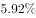，高出农林牧渔业增加值的增幅2.2个百分点。

        2015年上半年全国水产品产量2700.09万吨，同比增长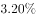，其中养殖水产品产量2114.38万吨，同比增长。

        2015年上半年全国水产品进出口总量383.08万吨，同比下降，进出口总额137.28亿美元，同比下降。

        其中，出口量189.28万吨，出口额95.81亿美元，同比分别增长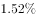和。主要出口国家和地区中，对美国、欧盟、东盟、日本、中国香港、韩国和中国台湾的出口额分别增长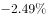、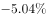、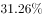、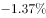、、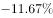和。

        进口量193.80万吨，进口额41.47亿美元，同比分别下降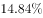和，其中鱼粉进口量、进口额同比分别下降和。

#### 第 1 题　qid 2031160 · 综合

2015年上半年，非养殖水产品产量与上年同期相比的变化最接近以下哪个数字？

- **A**. 

- **B**. 

　✅
- **C**. 

- **D**. 

**答案**：B

**官方解析**

由题干“与上年同期相比”结合选项都为百分比，且题干给了水产品和养殖水产品的量以及增长率，可判断该题是混合增长率问题。定位材料第二段，2015年上半年全国水产品产量2700.09万吨，同比增长，其中养殖水产品产量2114.38万吨，同比增长，所以，所以设非养殖水产品增长率为，则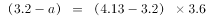，。

故正确答案为B。

---

#### 第 2 题　qid 2031162 · 增长

与上年同期相比，2015年上半年全国农林牧渔业增加值增幅为：

- **A**. 

- **B**. 
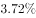
　✅
- **C**. 

- **D**. 
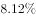

**答案**：B

**官方解析**

由题干“与上年同期相比， 2015年上半年全国农林牧渔业增加值增幅为”，结合材料第一段最后一句话，可判定该题属于简单加减计算问题。定位材料第一段，渔业增加值同比增长，高出农林牧渔业增加值的增幅2.2个百分点，可得。

故正确答案为B。

---

#### 第 3 题　qid 2031164 · 综合

2015年上半年我国水产品进出口贸易状态为：

- **A**. 逆差4亿多美元
- **B**. 顺差4亿多美元
- **C**. 逆差50多亿美元
- **D**. 顺差50多亿美元　✅

**答案**：D

**官方解析**

由题干“2015年上半年······进出口贸易状态为”，结合选项以及材料分别给出了进口额和出口额，可判定该题是简单加减计算问题。定位材料第四、五段，2015年上半年全国水产品出口额95.81亿美元，进口额41.47亿美元，因为且，所以2015年上半年我国水产品进出口贸易状态为顺差50多亿美元。

故正确答案为D。

---

#### 第 4 题　qid 2031166 · 增长

材料中所列水产品主要出口国家和地区中，2015年上半年我国对其出口额同比降幅最大的是：

- **A**. 东盟
- **B**. 韩国
- **C**. 中国香港　✅
- **D**. 日本

**答案**：C

**官方解析**

由题干“2015年上半年…同比降幅最大的是”，结合材料第四段数据都给出了，可判定该题属于直接找数问题。定位材料第四段，主要出口国家和地区中，对美国、欧盟、东盟、日本、中国香港、韩国和中国台湾的出口额分别增长、、、、、和，所以降幅最大的中国香港为。

故正确答案为C。

---

#### 第 5 题　qid 2031168 · 综合

根据上述资料，下列说法中正确的是：

- **A**. 2015年上半年平均每吨水产品的出口价格比上年同期低　✅
- **B**. 2015年上半年我国水产品进口量和进口额均高于上年同期水平
- **C**. 2015年上半年出口的水产品占全国水产品产量的一成多
- **D**. 水产品主要出口国家和地区中，2015年上半年我国对其出口额同比上升的国家（地区）有1个

**答案**：A

**官方解析**

A项：定位材料第四段，2015年上半年水产品的出口量189.28万吨，出口额95.81亿美元，同比分别增长和，，则，，，所以2015年上半年平均每吨水产品的出口价格比上年同期低，正确；

B项：定位材料最后一段，进口量193.80万吨，2015年上半年水产品的进口额41.47亿美元，同比分别下降和，均低于去年同期水平，错误；

C项：定位材料第二、四段，2015年上半年全国水产品产量2700.09万吨，2015年上半年出口的水产品189.28万吨，因为，因此2015年上半年出口的水产品占全国水产品产量不到一成，错误；

D项：定位材料第四段，2015年上半年主要出口国家和地区中，对美国、欧盟、东盟、日本、中国香港、韩国和中国台湾的出口额分别增长、、、、、和，其中有东盟和中国台湾2个国家（地区）出口额同比上升，错误。

故正确答案为A。

---

### 材料 2

        2015年全年，全国吸收外商直接投资新设立企业26575家，同比增长；实际使用外资金额7813.5亿元，同比增长。其中从“一带一路”沿线国家吸收外商直接投资新设立企业2164家，增长；实际使用外商直接投资金额526亿元，增长。

2015年全国吸收外商直接投资状况       

#### 第 6 题　qid 2031170 · 增长

2015年从“一带一路”沿线国家吸收外商直接投资新设立企业数比上年增加了多少家？

- **A**. 不到300家
- **B**. 300多家　✅
- **C**. 400多家
- **D**. 500家以上

**答案**：B

**官方解析**

根据“设立企业数比上年增加了多少家”，判定此题为增长量计算问题。定位文字材料第一段，从“一带一路”沿线国家吸收外商直接投资新设立企业2164家，增长。代入增长量计算公式：家。

故正确答案为B。

---

#### 第 7 题　qid 2031172 · 比重

如“一带一路”沿线国家在不同行业中的直接投资金额分布比例与所有外商直接投资相同，则“一带一路”沿线国家在批发和零售业约投资了多少亿元？

- **A**. 20
- **B**. 50　✅
- **C**. 160
- **D**. 740

**答案**：B

**官方解析**

根据“比例与所有外商直接投资相同”，判定此题为现期比重问题。定位表格，批发和零售业直接投资金额占总计比重为，从“一带一路”沿线国家吸收外商直接投资资金526亿元，已知比例相同，则“一带一路”沿线国家在批发和零售业约投资了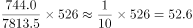亿元，与B项最为接近。

故正确答案为B。

---

#### 第 8 题　qid 2031174 · 增长

表中有几个行业在新设立企业数和直接投资金额同比增速上均快于全国总体水平？

- **A**. 4
- **B**. 3
- **C**. 2　✅
- **D**. 1

**答案**：C

**官方解析**

定位表格，新设立企业数和直接投资金额全国总体水平同比增速分别为、。表中有信息传输、计算机服务和软件业，批发和零售业两个行业同比增速均快于全国总体水平。

故正确答案为C。

---

#### 第 9 题　qid 2031176 · 平均数

下列行业中，平均每家新设立企业获得的直接投资金额最接近总体平均水平的是：

- **A**. 房地产业
- **B**. 农、林、牧、渔业
- **C**. 租赁和商务服务业
- **D**. 居民服务和其他服务业　✅

**答案**：D

**官方解析**

根据“平均每家新设立企业获得的直接投资金额”，判定此题为现期平均数问题。定位表格，总体平均水平为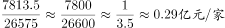，选项中各行业平均水平分别为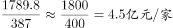、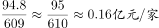、、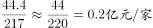，则最接近的为居民服务和其他服务业。

故正确答案为D。

---

#### 第 10 题　qid 2031178 · 综合

关于2014—2015年全国吸收外商直接投资状况，能够从上述资料中推出的是：

- **A**. 2015年全国吸收外商直接投资新设立企业比2014年多3000家
- **B**. 2014年“一带一路”沿线国家直接投资新设立企业2000多家
- **C**. 表中有3个行业直接投资金额占外商直接投资总额的一成以上
- **D**. 2014年信息传输、计算机服务和软件业外商直接投资新设立不到1000家企业　✅

**答案**：D

**官方解析**

Ａ项：定位材料第一段，全国吸收外商直接投资新设立企业26575家，同比增长，代入增长量计算公式：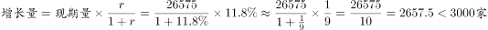，错误；

Ｂ项：定位材料第一段，从“一带一路”沿线国家吸收外商直接投资新设立企业2164家，增长，根据第一题解析,家，已知增长量为330家,则2014年“一带一路”沿线国家直接投资新设立企业为，错误；

Ｃ项：定位表格，实际使用外资金额7813.5亿元，其一成即为781.35亿元，满足条件的有制造业、房地产业两个行业，错误；

D项：定位表格，信息传输、计算机服务和软件业新设立企业数为1311家，同比增速为,则2014年信息传输、计算机服务和软件业外商直接投资新企业为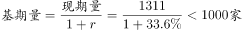，正确。

故正确答案为D。

---

### 材料 3

        2015年上半年A区完成规模以上工业总产值289.9亿元，同比下降，降幅比1-5月扩大0.7个百分点，比1-4月扩大2.2个百分点，比一季度扩大7.5个百分点。

        其中，上半年A区两大主导行业汽车制造业完成产值51.6亿元，同比增长，医药制造业完成产值17亿元，同比增长。

        上半年A区六大高耗能行业七成企业生产产值低于上年同期，上半年共完成规模以上工业总产值55.6亿元，同比下降，降幅较上年同期扩大0.1个百分点。

#### 第 11 题　qid 2031180 · 综合

2014年上半年A区规模以上工业总产值约为多少亿元？

- **A**. 387
- **B**. 320　✅
- **C**. 265
- **D**. 214

**答案**：B

**官方解析**

根据问题所求“2014年上半年A区规模以上工业总产值为多少亿元”可判定此题为基期计算问题。定位文字材料第一段可得，2015年上半年A区完成规模以上工业总产值289.9亿元，同比下降，因此，B项最接近。

故正确答案为B。

---

#### 第 12 题　qid 2031202 · 增长

2015年1-4月A区完成规模以上工业总产值同比增速约为：

- **A**. 

- **B**. 

- **C**. 
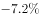
　✅
- **D**. 

**答案**：C

**官方解析**

根据问题所求“2015年1-4月A区完成规模以上工业总产值同比增速”，可判定此题为增长率计算问题。定位文字材料第一段可得，上半年同比下降，降幅比1-4月扩大2.2个百分点，因此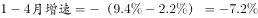。

故正确答案为C。

---

#### 第 13 题　qid 2031184 · 增长

2015年上半年，A区汽车制造业产值同比增量约是医药制造业的多少倍？

- **A**. 1.3　✅
- **B**. 6.5
- **C**. 3.0
- **D**. 0.4

**答案**：A

**官方解析**

根据问题所求“2015年上半年，A区汽车制造业产值同比增量约是医药制造业的多少倍”可判定此题为增长量倍数计算问题，定位文字材料第二段可得，亿元，，亿元，，根据公式，，，。，A项最接近。

故正确答案为A。

---

#### 第 14 题　qid 2031186 · 增长

在A区六大高耗能行业中，2015年上半年产值同比降幅快于全区规模以上工业总产值的行业有几个？

- **A**. 2
- **B**. 3　✅
- **C**. 4
- **D**. 5

**答案**：B

**官方解析**

定位文字材料第一段可得，全区规模以上工业总产值同比下降。定位表格，同比降幅快于全区的六大高耗能行业有：、、，共3个。

故正确答案为B。

---

#### 第 15 题　qid 2031188 · 综合

关于A区规模以上工业，下列说法中正确的是：

- **A**. 
2015年一季度总产值同比降速快于二季度总产值降速

- **B**. 
2015年上半年两大主导行业产值之和超过全区总产值的

- **C**. 
2014年上半年六大高耗能行业规模以上工业总产值超过50亿元
　✅
- **D**. 
2015年上半年黑色金属冶炼和压延加工业及电力、热力生产和供应业产值之和与上年同期相同

**答案**：C

**官方解析**

A项：定位文字材料第一段可得，，降幅比一季度扩大7.5个百分点，因此。根据混合增长率居中原则，二季度降速应大于，一季度降速较慢，错误；

B项：定位文字材料第二段可得，，，，定位文字材料第一段可得，，，小于，错误；

C项：定位文字材料第三段可得，，同比下降，因此2014年总产值，正确；

D项：定位表格可得，，，，。因此，2014产值之和， 错误。

故正确答案为C。

---

### 材料 4

       某机构对2000名在线旅行预订用户进行了关于经常选择的交通方式的抽样调查，结果如下：

#### 第 16 题　qid 2031192 · 综合

被调查者中，首选火车（包括高铁、动车和普通列车）出行的比首选飞机出行的多多少人？

- **A**. 不到300人
- **B**. 300～320人之间　✅
- **C**. 321～340人之间
- **D**. 多于340人

**答案**：B

**官方解析**

定位图1，最经常选择高铁、动车和普通列车的占比分别为，，，选择飞机的占比。被调查者共2000名。则。

故正确答案为B。

---

#### 第 17 题　qid 2031194 · 比重

因主要出行方式中只有飞机拥有积分奖励活动，所以出行时将积分奖励活动作为考虑因素的人，均会将飞机作为最经常选择的交通方式。则在最经常选择飞机出行的用户中，出行时考虑到积分奖励活动因素的人占比约为：

- **A**. 

　✅
- **B**. 

- **C**. 

- **D**. 

**答案**：A

**官方解析**

根据“······的占比约为”判断本题为现期比重问题。定位图2，考虑积分奖励活动占被调查者人数的，且只有飞机拥有积分奖励活动。选择飞机的人数占被调查者的。。

故正确答案为A。

---

#### 第 18 题　qid 2031196 · 综合

如果2000名被调查者均要求坐高铁或飞机从同一城市前往北京，那么从哪个城市出发时，优先选择飞机的人数在750人左右？

- **A**. 西安（高铁运行时间：4.5小时）　✅
- **B**. 太原（高铁运行时间：2.5小时）
- **C**. 广州（高铁运行时间：8小时）
- **D**. 贵阳（高铁运行时间：9小时）

**答案**：A

**官方解析**

根据“······优先选择飞机的人数在750人左右”，且材料中为比重，判断本题为现期比重问题。优先选择飞机的人数750人，且占全部被调查者的。所以优先选择高铁的占比是。定位图3，5小时以内优先选择高铁的占比（）最接近。选项中西安最符合条件。

故正确答案为A。

---

#### 第 19 题　qid 2031198 · 平均数

如调查中，所有考虑行程总耗时因素的人均最经常选择飞机或高铁出行，则在最经常选择飞机或高铁出行的人中，不考虑行程总耗时因素的人占比约为：

- **A**. 

- **B**. 

　✅
- **C**. 

- **D**. 

**答案**：B

**官方解析**

根据“······的占比约为”判断本题为现期比重问题。定位材料图1和图2，最经常选择高铁或飞机的占被调查者的比重为。考虑行程总耗时因素的人占被调查者的，因为，所有考虑行程总耗时因素的人均最经常选择飞机或高铁出行。故考虑行程总耗时因素的人占最经常选择高铁或飞机的比重为，不考虑行程总耗时因素的人占比为。B项最接近。

故正确答案为B。

---

#### 第 20 题　qid 2031200 · 综合

能够从上述资料中推出的是：

- **A**. 有不到100名调查者最经常选择汽车方式出行
- **B**. 被调查者中一定有人出行时同时考虑到总耗时和准点率因素
- **C**. 最经常选择地面交通方式出行的人中，超过六成出行时不考虑天气因素
- **D**. 绝大部分被调查者都不能接受将超过8小时的高铁行程作为首选　✅

**答案**：D

**官方解析**

A项：定位图1，最经常选择汽车的占比为。，超过100名，错误；

B项：定位图2，考虑总耗时的占比为，考虑准点率的占比为。，有可能考虑总耗时的都不考虑准点率，错误；

C项：定位图1，在选择地面交通的人中，缺少考虑天气因素的具体人数，错误；

D项：定位图3，8小时以上的行程中，将高铁作为首选的仅占，所以绝大部分被调查者都不能接受将超过8小时的高铁行程作为首选，正确。

故正确答案为D。

---
