# 2017年四川省公务员录用考试《行测》题（下半年）

> 省考 · 2017 年 · 5 个模块 · 共 100 题

- [常识判断](#%E5%B8%B8%E8%AF%86%E5%88%A4%E6%96%AD) · 10 题
- [言语理解与表达](#%E8%A8%80%E8%AF%AD%E7%90%86%E8%A7%A3%E4%B8%8E%E8%A1%A8%E8%BE%BE) · 30 题
- [数量关系](#%E6%95%B0%E9%87%8F%E5%85%B3%E7%B3%BB) · 10 题
- [判断推理](#%E5%88%A4%E6%96%AD%E6%8E%A8%E7%90%86) · 35 题
- [资料分析](#%E8%B5%84%E6%96%99%E5%88%86%E6%9E%90) · 15 题

---

## 常识判断

### 第 1 题　qid 2097120 · 法律常识

根据我国相关法律，下列属于企业不正当竞争行为的是：
①某手机生产商为提高市场占有率，采用抽奖销售模式，一等奖是价值12万元的小汽车
②某运动品牌为扩大销售规模，加大媒体广告宣传，引导消费者购买
③某企业为提高产品市场占有率，采用商业贿赂手段
④某电脑生产商为希望小学捐献100台电脑，提高了品牌的知名度，扩大了市场份额

- **A**. ①②
- **B**. ①③　✅
- **C**. ②④
- **D**. ③④

**答案**：B

**官方解析**

本题考查经济法常识，主要涉及《反不正当竞争法》的内容。
①：《反不正当竞争法》第十条规定：“经营者进行有奖销售不得存在下列情形：······（三）抽奖式的有奖销售，最高奖的金额超过五万元。”该项中有奖销售的一等奖是价值12万元的小汽车，超过了5万元，属于不正当竞争行为中的有奖销售，当选。
②：企业加大媒体广告宣传，可以使消费者更加了解和注意企业的产品，增加产品销售量，属于合法竞争行为，排除。
③：《反不正当竞争法》第七条第一款规定：“经营者不得采用财物或者其他手段贿赂下列单位或者个人，以谋取交易机会或者竞争优势：（一）交易相对方的工作人员；（二）受交易相对方委托办理相关事务的单位或者个人；（三）利用职权或者影响力影响交易的单位或者个人。”该项中，某企业采用商业贿赂手段以提高产品市场占有率，属于不正当竞争行为中的商业贿赂，当选。
④：电脑生产商为希望小学捐献电脑，通过提高品牌知名度的方式激发消费者的购买欲望，属于正常营销手段，排除。
①③为不正当竞争行为。
故正确答案为B。

---

### 第 2 题　qid 2097112 · 法律常识

下列行为符合我国法律规定的是：

- **A**. 房东黄某与吴某签了两年的租房合同，半年后黄某将房屋卖出，通知吴某限期搬出
- **B**. 公安机关为追捕被通缉的犯罪嫌疑人陈某，对其通话进行监听　✅
- **C**. 商场保安王某根据商场的规定，对涉嫌盗窃的赵某进行搜身
- **D**. 债权人李某因找不到拖欠债务的张某，便要求张某的儿子偿还债务

**答案**：B

**官方解析**

本题考查法律常识。
A项错误，我国《民法典》第七百二十五条规定：“租赁物在承租人按照租赁合同占有期限内发生所有权变动的，不影响租赁合同的效力。”故房东无权要求吴某搬出出租房。体现了“买卖不破租赁”的原理。
B项正确，《刑事诉讼法》第一百四十八条第三款规定：“追捕被通缉或者批准、决定逮捕的在逃的犯罪嫌疑人、被告人，经过批准，可以采取追捕所必需的技术侦查措施。”该项中的监听即属于技术侦查措施之一，因此，公安机关为追捕被通缉的犯罪嫌疑人陈某，可以对其通话进行监听。
C项错误，《宪法》第三十七条第三项规定：“禁止非法拘禁和以其他方法非法剥夺或者限制公民的人身自由，禁止非法搜查公民的身体。”在我国，只有公安机关或者检察机关的侦查人员，在向被搜查人出示相关证明后才能进行搜查。商场保安无权进行搜身。
D项错误，李某和张某属于债权债务，只有张某是债务人，而张某的儿子不是合同当事人（合同的相对性），不负有债务偿还的责任。
故正确答案为B。

---

### 第 3 题　qid 2097122 · 人文常识

防空识别区指的是一国基于空防需要，单方面所划定的空域。下列关于防空识别区的说法错误的是：

- **A**. 设立的目的在于为军方及早发现、识别和实施空军拦截行动提供条件
- **B**. 最初用于规范美国及其盟国之间的对空防御作战
- **C**. 通常情况下，一国防空识别区范围大于该国领空范围
- **D**. 2013年中国宣布在南海设立防空识别区　✅

**答案**：D

**官方解析**

本题考查人文常识。
A项正确，二战后，随着空中作战力量的发展，各国传统的防空体系面临较大威胁。如果还按照对方目标逼近本国领空才出动战机拦截，时间不充裕，根本无法保证成功拦截。为了军方及早发现、识别和实施空军拦截行为提供条件，防空识别区应运而生。
B项正确，防空识别区最初是第二次世界大战后美国太平洋总部制定，用于规范美国及其盟国之间的对空防御作战，此种划界只针对美国的盟国，非盟国则未划界。
C项正确，防空识别区划定了本国领空之外的公共区域（公空），是相对领空而扩大的预警空间。
D项错误，2013年11月，中国宣布在东海设立防空识别区，覆盖大部分东海海域，要求在区域内航行的航空器得向中国通报飞行计划，对不配合识别或拒不服从指令的航空器，中国武装力量“将采取防御性紧急处置措施”。
本题为选非题，故正确答案为D。

---

### 第 4 题　qid 2097128 · 人文常识

关于我国少数民族，下列说法错误的是：

- **A**. 藏文是人民币上的文字之一
- **B**. 回族是分布最广的少数民族
- **C**. 壮族是人口最多的少数民族
- **D**. 苗族主要分布在粤、闽、赣等省区　✅

**答案**：D

**官方解析**

本题考查国情社情。
A项正确，第五套人民币包括蒙文、维文、藏文、壮文等几种少数民族的文字；
B项正确，回族是回回民族的简称，其分布呈“大分散、小聚居”的格局，是我国分布最广的少数民族；
C项正确，壮族是中国人口最多的一个少数民族，主要聚居在南方，范围东起广东省连山壮族瑶族自治县，西至云南省文山壮族苗族自治州，北达贵州省黔东南苗族侗族自治州从江县，南抵北部湾；
D项错误，苗族，是一个古老的民族，散布在世界各地，主要分布于中国的黔、湘、鄂、川、滇、桂、琼等省区。
本题为选非题，故正确答案为D。

---

### 第 5 题　qid 2097208 · 人文常识

下列不属于洋务运动主要内容的是：

- **A**. 创办了近代军事、民用工业
- **B**. 创建近代海军和训练新式海军
- **C**. 颁布《资政新篇》，提倡资本主义　✅
- **D**. 兴办近代学校和派遣留学生

**答案**：C

**官方解析**

本题考查中国历史，主要涉及洋务运动内容。
A项正确，洋务派前期创办了一系列军事工业，如安庆军械所、江南制造总局等，后期创办了一系列民用工业，如湖北织布官局、汉阳铁厂等。
B项正确，洋务运动中组建了北洋海军、福建水师、南洋水师三支海军，并建立近代军事学堂，培养新式陆海军人才。
C项错误，《资政新篇》是太平天国时期洪仁玕向洪秀全提出的改革内政和建设国家的新方案，是太平天国后期的重要文献。与洋务运动无关。
D项正确，洋务运动中首次创办京师同文馆，开创了中国近代化教育的篇章，并选派留学生赴美欧学习。
本题为选非题，故正确答案为C。

---

### 第 6 题　qid 2097212 · 人文常识

下列关于哲学家的说法中，不正确的是：

- **A**. 孔子提倡“仁义”“礼乐”“德治教化”
- **B**. 孟子倡导“仁政”思想，被称为“亚圣”
- **C**. 苏格拉底、柏拉图、亚里士多德并称为“古希腊三贤”
- **D**. 卢梭的代表作之一是《理想国》　✅

**答案**：D

**官方解析**

本题考查文化常识，主要涉及中西方历史名人思想及著作等。
A项正确，孔子的政治思想核心内容是“礼”与“仁”，在治国的方略上，主张“为政以德”，这种治国方略也叫“德治”或“礼治”；
B项正确，孟子继承和发展了孔子的德治思想，发展为仁政学说，成为其政治思想的核心，被称为“亚圣”；
C项正确，“古希腊三贤”即苏格拉底、柏拉图、亚里士多德，苏格拉底是柏拉图的老师，柏拉图是亚里士多德的老师；
D项错误，卢梭的代表作有《社会契约论》、《忏悔录》、《爱弥儿》等，而《理想国》是古希腊著名哲学家柏拉图重要的对话体著作之一。
本题为选非题，故正确答案为D。

---

### 第 7 题　qid 2097254 · 人文常识

下列属于气体扩散现象的是：

- **A**. 有麝自然香，何必当风立　✅
- **B**. 火场之旁，必有风生
- **C**. 扇子有凉风，宜夏不宜冬
- **D**. 月晕而风，础润而雨

**答案**：A

**官方解析**

本题考查科技常识。气体扩散是指某种气体分子通过扩散运动而进入到其它气体里。
A项正确，题干现象是因为麝能分泌麝香，并不需要站在风口，麝香分子就可以通过扩散运动到很远地方，使人闻得见香气。故体现了气体扩散现象。
B项错误，题干现象是由于火场附近的空气受热膨胀，密度减小而上升，压强变小，周围冷空气填充，空气的流动就形成风。并未体现气体扩散现象。
C项错误，题干现象是因为夏日气温较高，扇扇子，有利于空气的流动，从而加快了人体表面汗水的蒸发，蒸发要吸热，用扇子有制冷作用，所以扇子宜夏不宜冬。并未体现气体扩散现象。
D项错误，月晕的出现，往往预示着天气要有一定的变化。月晕多预示着要刮风，月晕有时候会有缺口，缺口的方向便是刮风的方向。柱子的基石润湿了，就是要下雨的征候。比喻见到一点迹象就能知道它的发展趋向。并未体现气体扩散现象。
故正确答案为A。

---

### 第 8 题　qid 2097258 · 地理国情

关于气候，下列表述不正确的是：

- **A**. 海洋性气候温差小、湿度大，降水日数多且强度小
- **B**. 大陆性气候气温年较差或气温日较差很大
- **C**. 地中海气候夏季炎热干燥，冬季温和多雨
- **D**. 热带季风气候没有明显的旱雨两季　✅

**答案**：D

**官方解析**

本题考查地理国情。
A项正确，海洋性气候的特点是：气温年变化与日变化都很小，温差小；云雾频数多，湿度大；降水量的季节分配比较均匀，降水日数多，但强度小。
B项正确，大陆性气候最显著的特征是：气温年较差或气温日较差很大，降水少，冬冷夏热。
C项正确，地中海气候的特点是：夏季炎热干燥、冬季温和多雨。
D项错误，热带季风气候的特点是：终年高温，年平均气温在22℃以上，旱雨季明显，降水集中在雨季，且降水量大。
本题为选非题，故正确答案为D。

---

### 第 9 题　qid 2097150 · 科技常识

以下关于航天科技的说法不正确的是：

- **A**. 在全球的载人航天中，第一个进入太空的人是阿姆斯特朗　✅
- **B**. 电视节目的转播主要通过地球同步轨道静止卫星来实现
- **C**. 中国成功研制并发射的第一颗人造地球卫星是“东方红一号”
- **D**. 人造地球卫星若在轨道上运行速度过慢，会被地球引力吸引回地球

**答案**：A

**官方解析**

本题考查科技常识的有关知识。
A项错误，世界上第一个进入太空的人是前苏联的尤里·加加林，美国的尼尔·阿姆斯特朗是第一个登上月球的人。
B项正确，同步轨道静止卫星，相对于地球保持静止，主要用于陆地固定通信，如电话通信、电视节目的转播以及海上移动通信等。
C项正确，东方红一号卫星是我国于1970年4月24日成功研制并发射的第一颗人造地球卫星。我国是继苏、美、法、日之后，世界上第五个用自制火箭发射国产卫星的国家。
D项正确，人造地球卫星因为速度足够大，才能环绕地球运动。若在轨道上运行速度过慢，受地球引力的作用，会被吸引回地球。
本题为选非题，故正确答案为A。

---

### 第 10 题　qid 2097152 · 人文常识

下列关于汽油的说法不正确的是：

- **A**. 汽油标号是实际汽油抗爆性与标准汽油抗爆性的比值
- **B**. 为了保护汽车发动机，应尽量选用高标号的汽油　✅
- **C**. 汽油可以溶解油污等水无法溶解的物质，起到清洁油污的作用
- **D**. 汽油着火时应使用泡沫、干粉等灭火剂，不能用水灭火

**答案**：B

**官方解析**

本题考查生活常识。
A项正确，汽油标号是实际汽油抗爆性与标准汽油抗爆性的比值。标号越高，抗爆性能就越强。抗爆性就是指汽油在发动机中燃烧时抵抗爆震的能力,它是汽油燃烧性能的主要指标。爆震是汽油在发动机中燃烧不正常引起的；
B项错误，标准汽油是由异辛烷和正庚烷组成。并不是标号越高越好，要根据发动机压缩比合理选择汽油标号；
C项正确，根据相似相溶原理，两者都是有机物，汽油能溶解油污等水无法溶解的物质，起到清洁油污的作用；
D项正确，汽油着火适用泡沫或干粉灭火器灭火，也可用干沙灭火。千万不能用水灭火，因为汽油比水轻的多，火会在水的面上流动，扩大火势。
本题为选非题，故正确答案为B。

---

## 言语理解与表达

### 第 1 题　qid 2097070 · 逻辑填空

从亚里士多德开始，让文学艺术能够真正地还原现实，从而使人们能够在各种艺术样式中复现自己、观照自己，一直是理论家、艺术家一个永恒的梦想。没想到，这个梦想居然被电影                地实现了。

- **A**. 分毫不差
- **B**. 出人意料
- **C**. 轻而易举　✅
- **D**. 一马当先

**答案**：C

**官方解析**

根据文段“从亚里士多德开始”“一直”“永恒”可知，让文学艺术还原现实这一梦想始终没有办法实现。“居然”表示没想到，出乎意料，据此可知，横线处表达人们始终没有办法解决的问题竟然被电影很容易的就解决了，C项“轻而易举”形容事情容易做，不费力气，符合文意，当选。
A项“分毫不差”指没有一点差错，文段强调的是“容易”，并未阐述是否有差错，排除；B项“出人意料”指在人们意料之外，与“居然”语义重复，排除；D项“一马当先”形容领先，也比喻工作走在群众前面，积极带头，与文意不符，排除。
故正确答案为C。
【文段出处】《影视本性：真实的谎言》

---

### 第 2 题　qid 2097066 · 逻辑填空

除了那些家喻户晓的“国宝”，中华大地上还有不少动物正处于、或正在走向“濒危”行列。由于种种原因，它们所面临的危险还未被重视，甚至它们的名字和样子都                。

- **A**. 默默无闻
- **B**. 鲜为人知　✅
- **C**. 无人问津
- **D**. 一无所知

**答案**：B

**官方解析**

根据递进关联词“甚至”可知，横线处所填词语要比前文程度重，前文指出一些濒危动物未被重视，即大家知道，但是认为不重要，故横线处表达几乎没有人知道它们的意思，B项“鲜为人知”指很少有人知道，符合文意，当选。A项“默默无闻”指没有什么名声，侧重强调主观上不声张，而文段强调客观上不被人知道，且与“名字和样子”搭配不当，排除；C项“无人问津”指没有人来探问、尝试或购买，与文段强调的没有人知道的意思不符，排除；D项“一无所知”指什么都不知道，搭配主语通常为人，与“名字和样子”搭配不当，排除。
故正确答案为B。
【文段出处】《大话＂非著名珍稀动物＂》

---

### 第 3 题　qid 2097076 · 逻辑填空

选择，不要        一次成功，这要有赖于漫漫人生路上感性的积聚与理性的升华。感性的积聚使人聪敏，理性的升华使人睿智。这种积聚与升华到了家，那么梦想便不再是                。

- **A**. 奢望  海市蜃楼　✅
- **B**. 希望  空中楼阁
- **C**. 幻想  画饼充饥
- **D**. 期盼  镜花水月

**答案**：A

**官方解析**

第一空，根据“这要有赖于漫漫人生路上感性的积聚与理性的升华”可知，“一次成功”是非常困难、难以实现的事情，A项“奢望”指追求过高而难以实现的希望，C项“幻想”侧重强调不切实际的、不能实现的一种想象，均符合文意，保留。B项“希望”指心里想着实现某种事情，D项“期盼”指期待、盼望，均体现不出难以实现之意，排除。
第二空，根据“这种积聚与升华到了家”可知，此时梦想便不再是难以实现的事情，故横线处应体现出虚幻，空想、难以实现之意，A项“海市蜃楼”比喻虚幻的事物或不切合实际的幻想，符合文意，当选。C项“画饼充饥”比喻用空想来安慰自己，与文意不符，排除。
故正确答案为A。
【文段出处】《选择的诠释》

---

### 第 4 题　qid 2097074 · 逻辑填空

《题西林壁》《和子由渑池怀旧》是苏轼的哲理诗，其                的诗句如“不识庐山真面目，只缘身在此山中”和“人生到处知何似，应似飞鸿踏雪泥”等早已        于人们的日常生活中，成为表达思想和情感的生动话语。

- **A**. 脍炙人口  渗透　✅
- **B**. 口碑载道  渗入
- **C**. 妇孺皆知  浸润
- **D**. 家喻户晓  浸透

**答案**：A

**官方解析**

第一空，根据“苏轼的诗句早已在人们的日常生活中，成为表达思想和情感的生动话语”可知，横线处表达苏轼的诗句被人们熟知，广为传诵，A项“脍炙人口”比喻好的诗文受到人们的称赞和传诵，符合文意，保留。C项“妇孺皆知”指事物众所周知，流传得很广，D项“家喻户晓”指家家户户都知道，形容人所共知，两项用在此处尚可，保留。B项“口碑载道”形容到处都是群众称颂的声音，侧重强调口碑好，被群众赞扬，而文段强调诗文被人们熟知，排除。
第二空，根据文意可知，苏轼的诗句融入了人们的日常生活，A项“渗透”比喻一种事物逐渐进入到其他方面，用来形容诗文融入生活符合文意，当选。C项“浸润”和D项“浸透”多用来形容液体渐渐渗入，不如“渗透”合适，排除。
故正确答案为A。
【问段出处】《苏轼禅理诗的人生哲学》

---

### 第 5 题　qid 2097078 · 逻辑填空

走进书房，荷笔当锄，精神家园种满稚嫩的庄稼，也许远离丰收的季节，但心里总装着一个秋天。也有受挫后乏味地走进书房的时候，            间与书群对话，慢慢地愁肠        ，残雪消融，浮躁渐趋平静，紊乱变得有序，顷刻间阴霾一扫，心空一片晴朗亮丽。
依次填入横线部分最恰当的一项是：

- **A**. 百无聊赖  舒缓
- **B**. 万念俱灰  疏散
- **C**. 无地自容  舒展
- **D**. 心灰意冷  纾解　✅

**答案**：D

**官方解析**

第一空，横线处所填成语形容“受挫后”的心情，D项“心灰意冷”形容灰心失望，意志消沉，符合题意，保留；A项“百无聊赖”形容无聊至极，表示精神上无所寄托，空虚无聊，C项“无地自容”指没有地方可以让自己容身，形容非常羞愧，两项均不能用来形容“受挫后”的心情，排除；B项“万念俱灰”指所有的想法和打算都破灭了，形容极端灰心失望的心情，用在此处程度太重，排除。
第二空，代入验证，所填词语和“愁肠”搭配，D项“纾解”指缓解了但还需要继续，用在此处形容愁绪逐渐得到缓解，符合题意，当选。
故正确答案为D。
【文段出处】《青春励志卷首语：走进书房》

---

### 第 6 题　qid 2097094 · 逻辑填空

标志秋天到来的是枫树。“小枫一夜偷天酒，却倩孤松掩醉容”。这种                的想象现代人构思不出，即使灵光一闪，        的他们考虑更多的是枫树偷饮的是茅台酒还是威士忌。
依次填入划横线部分最恰当的一项是：

- **A**. 栩栩如生  现实
- **B**. 妙趣横生  务实　✅
- **C**. 出神入化  世故
- **D**. 风花雪月  市侩

**答案**：B

**官方解析**

第一空，横线处所填成语搭配“想象”，“小枫一夜偷天酒，却倩孤松掩醉容”意思是幼枫偷饮了上苍的仙酒，却请孤松来遮掩自己醉红的容颜。这里将枫叶变成红色想象成枫树偷喝了美酒，运用了拟人的修辞手法，是一种充满趣味的想象。B项“妙趣横生”指洋溢着美妙的意趣，与“想象”搭配恰当，符合文意，当选。A项“栩栩如生”形容文学、艺术作品等刻画人或物的形象十分生动逼真；C项“出神入化”形容技艺达到了极高超的境界；D项“风花雪月”形容堆砌辞藻而内容贫乏的诗文或男女的爱情，均与“想象”搭配不当，排除A、C、D三项。
验证第二空，根据后文“他们考虑更多的是枫叶偷饮的是茅台酒还是威士忌”可知，现代人更关注具体且实际的事物，B项“务实”意为讲究实际，不尚浮华，符合语境，当选。
故正确答案为B。
【文段出处】《剪得秋光入卷来》

---

### 第 7 题　qid 2097080 · 片段阅读

千百年来，传世的文学作品都以春风化雨、润物无声的力量，引人向上向善、奋然前行。当文学遭遇网络，网络文学                。能否        一脉相承的优良传统，抒写网络时代的崭新篇章，是网络文学发展的关键所在。

- **A**. 应运而生  延续　✅
- **B**. 铺天盖地  践行
- **C**. 水到渠成  继承
- **D**. 风起云涌  发扬

**答案**：A

**官方解析**

第一空，根据“文学遭遇网络”可知，网络文学是在文学与网络碰撞的背景下产生的新生事物，A项“应运而生”指适应时机而产生，符合文意，保留。B项“铺天盖地”形容来势猛、声势大，到处都是，D项“风起云涌”比喻新事物相继兴起，声势很盛，两者均形容声势浩大，而文段表达意思为网络文学刚刚产生，排除；C项“水到渠成”比喻时机成熟事情自然会成功，即功到自然成，而文段是在强调顺应文学与网络碰撞这一契机而产生，与文意不符，排除。
第二空代入验证，“延续优良传统”为常见搭配，A项当选。
故正确答案为A。
【文段出处】《水洪波：释放网络文学的时代气质》

---

### 第 8 题　qid 2097086 · 逻辑填空

清代思想家龚自珍说过，“灭人之国，必先去其史”。零星传播假史歪史看似小事，如果不加整顿，长此以往就会扰乱人们的思想。上世纪80年代，苏联社会就曾经出现过大量打着“反思历史”的旗号，        苏共历史的现象。比如诬蔑十月革命使俄国离开了“人类文明的正道”等，这导致全民族精神支柱坍塌，最终成为苏联            的致命原因。
依次填入画横线部分最恰当的一项是：

- **A**. 唱衰  一蹶不振
- **B**. 批判  误入歧途
- **C**. 抹黑  分崩离析　✅
- **D**. 否定  盛极而衰

**答案**：C

**官方解析**

第一空，由文段“零星传播假史歪史”“打着‘反思历史’的旗号”“诬蔑十月革命”可知，苏联出现的打着“反思历史”旗号的行为是对历史的故意歪曲，且横线处应该填入表意消极的词语，A项“唱衰”、C项“抹黑”均符合文意，保留。B项“批判”、D项“否定”并无故意歪曲之意，只是客观中性的表达，排除。
第二空，苏联社会出现的这种行为导致了全民族精神支柱的坍塌，使得苏联最终走向瓦解，C项“分崩离析”形容国家或集团分裂瓦解，符合文意，当选。A项“一蹶不振”指受到一次挫折就再也振作不起来了，并无瓦解、消亡之意，排除。
故正确答案为C。
【文段出处】《人民日报评关闭传播歪史微信号：苏联是前车之鉴》

---

### 第 9 题　qid 2097090 · 逻辑填空

在数字化多媒体时代，媒介参与的深度和广度日渐拓展，数字技术应用于文化遗产的保护已从原始的简单记录发展到对文化遗产的精准        ，运用数字输入、摄像等各种数字化技术对文化遗产进行多形式的        ，建立数字化的文化遗产档案和“非遗”博物馆等，都是当前很好的“非遗”保护方法。

- **A**. 修复  展现
- **B**. 描述  挖掘
- **C**. 定位  探索
- **D**. 复原  采集　✅

**答案**：D

**官方解析**

第一空，表示数字技术对于文化遗产的保护作用从简单记录发展到更高层次，A项“修复”与“数字技术”这一主语搭配不当，修复应为专业人士所为，排除；B项“描述”指运用各种修辞手法对事物进行形象化的表述，与“数字技术”这一主语搭配不当，且没有与“简单记录”构成递进，排除；C项“定位”指确定方位，体现不出“保护”的作用，排除；D项“复原”可以体现出数字技术还原文化遗产之意。故根据第一空基本锁定D选项。

验证第二空，对应前文的“数字输入”和“摄像”，说明这些数字化技术是用来对文化遗产的数据和信息进行收集，D项“采集”符合文意，与前文构成对应，当选。
故正确答案为D。

---

### 第 10 题　qid 2097100 · 逻辑填空

在美国，每个城市都有定义自身的独特关键词。纽约拥有文艺之都、金融中心的称号；好莱坞定义洛杉矶；说到教育名城，波士顿                ；提及美国独立精神，自然会想起费城的自由钟和独立宫；白宫、国会山，以及那古希腊建筑风格的政府大楼，则        着华盛顿政治中心的地位；若想与摩门教来场        ，那只能发生在盐湖城。

- **A**. 不言而喻  显示  约会
- **B**. 实至名归  宣告  碰撞
- **C**. 当仁不让  体现  较量
- **D**. 当之无愧  昭示  邂逅　✅

**答案**：D

**官方解析**

第一空，所填词语与“波士顿”搭配，体现波士顿的“教育名城”称号，A项“不言而喻”指不用说话就能明白，形容道理很明显，与主语“波士顿”搭配不当，排除；B项“实至名归”指的是有了真正的学识、本领或功业，自然就有声誉；D项“当之无愧”指当得起某种称号或荣誉，无须感到惭愧；C项“当仁不让”指遇到应该做的事就积极主动去做，不推让。三项均可体现“波士顿”的“教育名城”称号，保留；

第二空，所填词语体现“政府大楼”与“华盛顿政治中心地位”的关系，B项“宣告”、 C项“体现”、D项“昭示”均可。
第三空，B项“碰撞”、C项“较量”均有“竞争、比较”的语境，但文段中并无此语境，排除B、C两项；D项“邂逅”是指偶然遇到。根据文意，在盐湖城遇到“摩门教”，通常是行走间的“偶然”之遇，符合文意，当选。
故正确答案为D。
【文段出处】《奥斯汀：缘何成美国增长速度最快城市》

---

### 第 11 题　qid 2097118 · 片段阅读

门槛低、读者广泛、方便快捷，是互联网平台备受诗人青睐的重要原因，在新技术、新平台的带动下，一批“草根诗人”以及“网络诗人”有了尽情展现的平台，精致页面、真人朗读、动听配乐、专家评论，共同为读者提供立体化且直观可感的诗歌体验，每晚一首诗的推介模式，正在成为若干中国人新的夜生活，许多诗歌平台拥有几万甚至几十万的订阅量，即使大多数人都看不懂，某些时候，我们惊奇地发现，一句广告语也可能是诗，一个策划文案也可能是诗，诗已经不仅仅是精神生活的配饰。
这段文字主要介绍：

- **A**. 互联网对诗歌的影响　✅
- **B**. 诗歌平台的推介模式
- **C**. 大众对诗歌态度的变化
- **D**. 诗歌与日常生活的关系

**答案**：A

**官方解析**

文段开篇交代互联网受到诗人青睐的原因，接下来指出在互联网的带动下，诗人有了尽情展现的平台，读者有了立体可感的诗歌体验及各种诗歌平台，并指出在这种影响下诗歌不仅仅是精神生活的配饰。故文段重点强调互联网对于诗歌的重要作用，对应A项。
B项，“诗歌平台”仅为互联网对诗歌产生影响的其中一个方面，表述片面，且“推介模式”为每晚一首诗，并非文段论述重点，排除；
C项“大众”、D项“日常生活”均非文段的重点，文段强调的是互联网对诗歌的影响，排除。
故正确答案为A。
【文段出处】《现代中国人的诗歌：不做鸦片不上枪膛》

---

### 第 12 题　qid 2097106 · 片段阅读

根据人类学和考古学理论，农业可能并非人们向往的一种生活方式，而是在人口和环境之间关系逐渐失衡，供养人口的土地载能接近极限时的一种反映。环视我们的周围，可以发现日常食用的水产和肉食几乎绝大多数要依赖养殖。养殖并非是野生资源丰富的表现，恰恰相反，正是自然界里可供捕捞的资源日益减少，这才迫使人们用养殖的方法来保证这些资源的供应。
这段文字的作者认为：

- **A**. 大自然的资源已接近枯竭
- **B**. 土地无法承载人类的生活
- **C**. 人类未来生活离不开养殖业
- **D**. 农业生产是人类的无奈之选　✅

**答案**：D

**官方解析**

文段开篇指出农业可能并非人们向往的一种生活方式，而是人口与环境关系失衡以及土地载能接近极限的一种反映，即说明农业并非人们的主动选择，接下来通过“养殖”这种农业生产方式的产生进行举例论证，故文段为观点+解释说明结构，重点强调的是农业生产是人类被迫的一种无奈选择，对应D项。
A项，“自然资源已接近枯竭”表述错误，文段仅指出“自然资源日益减少”，与文意不符，排除；
B项，“土地无法承载人类的生活”表述过于绝对，且文段的主题词为“农业”而非“土地”，排除； 
C项，“养殖业”为举例论证的表述，非重点，排除。
故正确答案为D。
【文段出处】无

---

### 第 13 题　qid 2097110 · 片段阅读

学术资源是一种权益，尤其是知识产权的保护，已经成为推动和保障现代学术健康发展的基础和柱石。然而，学术资源更有一种公共属性，尤其对那些接受纳税人投资进行科学研究的研究者来说，更有必要保证自己的研究成果能够成为社会公共知识资源的一部分，保证社会能够利用这些研究成果提升国民素质，保证公众能够自由方便地利用这些科学成果。因此，在尊重知识产权和不违背版权法的前提下，增强学术资源的公共性，保障学术资源的无障碍传播，不仅是推进科学研究的基本要求，也是尊重和保障公众信息权利的体现。
这段文字意在强调：

- **A**. 知识产权保护推动了现代学术发展
- **B**. 应逐步增强学术资源获取的开放性
- **C**. 学术资源讲权益的同时更要讲公益　✅
- **D**. 学术资源拥有者应让渡出部分权益

**答案**：C

**官方解析**

文段开篇指出“学术资源是一种权益”，接下来通过转折关联词“然而”强调“学术资源更有一种公共属性”，并从“接受纳税人投资的研究者”角度论述其公共属性。文段尾句出现结论词“因此”总结前文，重点强调在尊重权益的前提下，要增强学术资源公共性、公益性。故文段的重点对应C项。
A项：对应文段首句，为转折前的内容，非重点，排除。
B项：“逐步增强”属无中生有，文段未提及，且“开放性”和文段中的“公共性”不是一个概念，排除。
D项：“让渡出部分权益”属无中生有，且文段并非重点论述学术资源拥有者的做法，排除。
故正确答案为C。

---

### 第 14 题　qid 2097124 · 片段阅读

从能源看，自煤炭时代进入石油时代后，石油成为维系文明社会不可或缺的资源，随着老油田一个个衰落、新油田的发现越来越困难，人们不禁担心，这种不可再生的化石能源势必会枯竭，但事实却不是这样。特别是近十年，科技大发展促进了勘探开发，曾经的技术瓶颈一个个被突破了，许多过去没有经济储量的地区也发现了大油田，剩余可采储量不仅没有降低，反而越来越多了。
这段文字意在说明：

- **A**. 勘探技术的发展是提高石油产量的突破口
- **B**. 对化石能源枯竭的忧虑是杞人忧天
- **C**. 科技发展使石油开采焕发新的生机　✅
- **D**. 石油可采储量近十年来呈现爆发式增长

**答案**：C

**官方解析**

文段开篇指出石油的重要性，随后交代当下存在的问题，即石油开采困难，存在枯竭的可能。后文通过转折关联词“但”指出事实不是这样，石油不会枯竭。接着用程度词“特别是”强调科技发展对开采石油的积极作用，故文段重点强调科技发展促进石油开采，对应C项。
A项，“勘探技术”仅是科技发展的一个方面，范围缩小，排除；
B项，未提及“科技发展”这一核心话题，且“杞人忧天”程度过重，排除；
D项，“爆发式增长”程度过重，文段仅表述“越来越多”，且未提及文段的核心话题“科技发展”，排除。
故正确答案为C。
【文段出处】《石油 汽油 煤油 柴油》

---

### 第 15 题　qid 2097126 · 片段阅读

近年来，对于中国南方和东南亚古代文化的综合比较研究，日益引起各国学者的注意。中国与中南半岛各国边境接壤最长的是云南省，所以各国学者注意的焦点，往往也就集中在云南一隅。从石器时代到青铜时代，云南的确有很多文化因素与东南亚的考古发现有相似之处，反映出这两个相邻的地区在古代的关系异常密切。不过我们在全面审查此种关系的来龙去脉时，却发现东南亚古文化中明显受到中国文化影响的某些因素，其发源地或表现得很集中的地区，并不是云南，而是四川。
这段文字主要说明：

- **A**. 古代四川、云南与东南亚国家关系密切
- **B**. 各国学者日益关注东南亚古文化研究
- **C**. 古代东南亚文化的发源地可能是四川　✅
- **D**. 东南亚古文化研究需要开启新的视角

**答案**：C

**官方解析**

文段首句提出近年来对中国南方和东南亚古代文化的研究吸引了各国学者的注意，随后介绍由于云南与中南半岛的接壤最长，所以学者们关注焦点也放在了云南，发现与东南亚文化的相似之处很多，而尾句通过“不过”转折引出文段重点，在审查云南与东南亚文化关系的来龙去脉时，发现四川才是古代东南亚文化的发源地或表现得很集中的地区，对应C项。
A项“云南”并非文段论述的重点，且文段论述的是古代东南亚文化，而非“国家关系”，排除；
B项对应首句背景引入的内容，非文段重点，排除；
D项“需要开启新的视角”无中生有，且没有提到“四川”这一话题，偏离中心，排除；
故正确答案为C。
【文段出处】《试谈古代四川与东南亚文明的关系》

---

### 第 16 题　qid 2097156 · 片段阅读

自美国F-117隐形战斗轰炸机首次亮相巴拿马上空后，隐形武器成为世界武器发展的一大趋势。有的军事专家曾预言，未来战争或为隐形武器唱主角的战争。中国武器装备发展也将隐形化作为第三代武器的一个重要指标，新列装的武器装备基本上皆具有隐形的功能。这些隐形武器，其光学特征可以隐形于地理背景之中，其电磁特征也可以湮没于电子信号频谱之内，使对手无法对其识别。
这段文字主要介绍：

- **A**. 未来世界武器发展的主要趋势
- **B**. 军事专家对未来战争模式的预测
- **C**. 隐形武器具备隐形性能的原因
- **D**. 中国发展隐形武器的背景及成就　✅

**答案**：D

**官方解析**

文段首句以“美国F-117”为例引出隐形武器，接着说明隐形武器是世界武器发展的趋势，介绍完背景之后，强调中国隐形武器目前的成就，新列装的武器装备均有隐形的性能，并对隐形武器的性能进行了具体解释。所以文段主要介绍了中国发展隐形武器的背景及取得的成绩，对应D项。
A项，缺少主题词“隐形武器”，且表述不明确，排除；
B项，是文段中的背景介绍，非重点，且未提到文段主题词“隐形武器”，排除；
C项，对应文段尾句解释说明部分，非重点，排除。
故正确答案为D。
【文段出处】《南方周末》

---

### 第 17 题　qid 2097158 · 语句表达

核聚变能够为全世界提供急需的清洁能源。据估计，1公斤核聚变燃料所提供的能量相当于1000万公斤化石燃料。但一直以来，核聚变实验都面临一大挑战，                。最近，美国科学家首次实现“产出超过消耗”的核聚变反应，他们借助192台世界上功率最大的激光器，对一个小氢球加热到数百万摄氏度。在随后的几纳秒时间里，小氢球发生爆炸，所释放的能量超过引发核聚变消耗的燃料。
填入划横线部分最恰当的一项是：

- **A**. 即引发核聚变所需的能量超过最后产生的能量　✅
- **B**. 即很少有国家能独立承担实验所需的巨额成本
- **C**. 即全球主要国家就核反应堆的建设方案尚未达成共识
- **D**. 即核聚变所需的燃料并不像之前设想的那样容易获取

**答案**：A

**官方解析**

横线出现在文段中间，需要结合上下文进行分析。横线上文先指出核聚变能够提供清洁能源，但是一直面临挑战，说明核聚变存在问题，横线下文指出“美国科学家实现了‘产出超出消耗’的核聚变反应”，即美国科学家解决了这一问题，所以横线处应该指出核聚变的问题所在，根据后文实验带来的结果“所释放的能量超过引发核聚变消耗的燃料”可知，问题应该是“核聚变消耗的能量超过了所释放的能量”，对应A项“引发核聚变所需的能量超过最后产生的能量”。
B项“巨额成本”、C项“核反应堆的建设方案”、D项“所需的燃料并不像之前设想的那样容易获取”均无中生有，文段讨论的是核聚变能量产出和消耗的问题，而非巨额成本、建设方案和如何获取燃料，排除。
故正确答案为A。
【文段出处】《无限能源不是梦，产出超过消耗核聚变首次实现》

---

### 第 18 题　qid 2097160 · 片段阅读

国家是用边界围起来的政治实体，是国家政权行使权力的区域，可以看作是一种政治区划。但是这种边界围起的政治区划，只是国家的形式，并不是国家的本质，真正的国家是指边界之内的国民已经形成了一种“凝聚力”，这种凝聚力可以称之为“国家意识”，就是大家都在内心深处认为我是“某国人”。没有形成这种意识的国家，本质上还不能称为一个国家，是很不稳固的。真正的大国不仅在于领土大，人口多，关键在于其国民是否已经形成了“国家意识”，产生了“国家认同”。
这段话主要谈的是：

- **A**. 国家的边界意识
- **B**. 国家的本质属性　✅
- **C**. 国家认同的作用
- **D**. 国家意识的内涵

**答案**：B

**官方解析**

文段开篇指出国家是用边界围起来的政治实体，接着通过转折关联词“但是”指出这不是国家的本质，并通过程度词“真正”强调文段重点，即国家的本质是国民形成的“凝聚力”，即“国家意识”，最后通过正反面论证进一步解释说明。所以整个文段的重点是强调国家的本质是国家意识，对应B项。
A项“国家的边界意识”在转折之前，非重点，排除；C项“国家认同的作用”无中生有，文段没有提及，排除；D项“国家意识的内涵”非重点，文段重在强调国家意识是国家的本质所在，而非介绍其内涵，排除。
故正确答案为B。
【文段出处】《何为公民的国家意识？》

---

### 第 19 题　qid 2097232 · 语句表达

和西方同行一样，中国的一些科学家和企业家也对捕捞技术和设备的不断升级感到担忧：现代的捕捞效率将超过海洋的自我更新效率，最终导致全球渔业枯竭。虽然中国的海产品出产量很大，但海产品并未主宰人们的消费。中国人吃的鱼来自湖泊、河流、水库等淡水水体，不过，关于淡水污染的一些信息，让部分人因担心传统鱼类的食品安全问题而选择海产品。因此，要减少对海洋生物的过度捕捞，<u>      </u>。

填入划横线部分最恰当的一项是：

- **A**. 转变人们的饮食观念是首要问题
- **B**. 提高海产品的食品质量势在必行
- **C**. 应先恢复消费者对淡水渔场的信任　✅
- **D**. 食品安全问题必须受到应有的重视

**答案**：C

**官方解析**

所填句子为文段尾句，是对整个文段进行总结。文段开篇指出，捕捞技术和设备的升级可能会导致全球渔业枯竭，随后介绍中国虽然海产品产量大，但人们主要食用的还是淡水鱼，而淡水受到了污染使得人们加大对海产品的食用量。所以要解决海洋捕捞问题，应该保证人们继续食用淡水鱼类，而让人们食用淡水鱼类的有效措施即是保障淡水不受到污染，保障淡水领域的食品安全，对应C项。
A项“饮食观念”概念过大，不能对应文段中的淡水产品，排除；B项与文意相悖，文段倡导减少海产品需求，排除；D项的“食品安全问题”不够具体明确，没有针对淡水领域，排除。
故正确答案为C。
【文段出处】无

---

### 第 20 题　qid 2097162 · 片段阅读

文学经典对于一个民族及其文化的繁荣昌盛至关重要。一方面，它是一个民族在历史长河中艺术性和审美化的创造，集中表现了这个民族的核心价值和道德理想，成为维系民族内部成员集体记忆的情感纽带；另一方面，也是一个民族独特的精神创造，其中呈现的美学风格和艺术魅力也成为其不同于其他民族的精神徽章和文化标志，是最易辨识的文化品牌。正是由于文学经典拥有巨大的价值主导力、文化吸引力和审美感召力，当前国际社会普遍将传承和弘扬本民族的文学经典作为构建民族价值认同、塑造国家良好形象和提升文化软实力的重大战略。
这段文字意在强调：

- **A**. 文学经典承载了一个民族的价值观和道德理想
- **B**. 文学经典的传承和弘扬应成为国家的文化战略　✅
- **C**. 文学经典对民族发展有举足轻重的作用
- **D**. 文学经典是一个民族的集体记忆

**答案**：B

**官方解析**

文段为分总结构，文段首先指出“文学经典对于一个民族及其文化的繁荣昌盛至关重要”，然后从“情感纽带”和“文化品牌”两个方面进行具体解释说明，最后通过程度词“正是”再次强调文学经典的重要性，最后得出结论国际社会将传承和弘扬本民族文学经典作为重大战略，所以文段重在强调要传承和弘扬文学经典，对应B项“文学经典的传承和弘扬应成为国家的文化战略”。
A项“承载了价值观和道德理想”对应解释说明的内容，非重点，且仅仅对应其中一个方面，表述片面，排除；C项在结论之前，非文段重点，文段的重点是传承和弘扬文学经典，排除；D项“集体记忆”对应解释说明的内容，且“文学经典是集体记忆”表述不当，文段说的是文学经典是维系集体记忆的感情纽带，排除。
故正确答案为B。
【文段出处】《文学经典教育的三重意蕴》

---

### 第 21 题　qid 2097164 · 片段阅读

无论在中国古代还是在古希腊，早在公元前若干世纪，已经有学者注意到不同地理环境对各人类群体的性情、心理和气质等所产生的不同影响。西方学术界自18世纪孟德斯鸠《论法的精神》出版以后，普遍重视社会历史发展过程中自然地理的重要作用，强调地理环境对人类文明类型和文化模式的重要影响。中国自20世纪初年节译出版《论法的精神》（译名为《万法公理》）后，学术界中以梁启超为首，广泛探讨“地理与文明之关系”，而“地理史观”也一时蔚然成风。
这段文字意在说明：

- **A**. “地理史观”的出现有其内在原因
- **B**. 学者普遍认为地理环境对文明影响深远　✅
- **C**. 孟德斯鸠影响了人们对地理环境的认识
- **D**. 应该重视自然地理对社会发展的作用

**答案**：B

**官方解析**

文段为并列层次，第一层说明“公元前”时期，古希腊和中国古代已经有学者注意到地理环境对人类文明的影响；第二层说明18世纪以来西方学术界“普遍重视”地理的作用，并强调“地理环境对人类文明”具有“重要影响”；第三层说明20世纪中国学术界已经认识到“地理与文明之关系”，尾句中的“广泛探讨”和“蔚然成风”补充说明了上述认识具有普遍性。文段通过三个并列层次共同说明从公元前到20世纪以来，各国学者认为地理环境对文明影响重大，并且这一认识具有普遍性，对应B项。
A项：“地理史观”只是对应文段尾句，表述片面，排除；
C项：“孟德斯鸠”的影响只对应了文段第二个句子的内容，表述片面，排除；
D项：无中生有，文段强调“地理与文明之关系”，而非“自然地理对社会发展的作用”，排除。
故正确答案为B。
【文段出处】《论巴蜀地理对文明起源的影响》

---

### 第 22 题　qid 2097166 · 片段阅读

千年以降，端午节始终氤氲着浓郁的历史气息、厚重的人文情怀和深刻的伦理内涵，不断渗透着丰富的精神文化，给我们以醇厚绵长的心灵滋养，给民族以生生不息的动力。也由此，越是在现代化和城市化对传统文化的冲刷下，我们越是要有延续自身文化的自觉和自信。寄托情感和文化符号的固有仪式或可以简化，浓郁的民俗表现形式或可以进化，但端午节的肃穆价值不能抹掉，你我心中的敬畏不能消退，对历史和文化的尊崇更不能抛弃。
这段文字的主旨是：

- **A**. 应重视端午节等传统节日的内在价值
- **B**. 应警惕现代化对传统文化的冲击
- **C**. 应深入发掘端午节厚重的文化内涵　✅
- **D**. 应增强延续自身文化的自觉性

**答案**：C

**官方解析**

文段首先说明“端午节”的重要意义，即“端午节”具有“浓郁”历史气息、“厚重”情怀和“深刻”内涵，即端午节具有浓厚的文化内涵。然后通过“也由此”引出结论，转折后提出观点“端午节的肃穆价值不能抹掉，你我心中的敬畏不能消退，对历史和文化的尊崇更不能抛弃”，即“对于具有浓厚的文化内涵的端午节，我们应深入发掘其浓厚的文化内涵”，对应C项。
A项:“端午节等传统节日”范围扩大，本文核心为“端午节”而非所有的“传统节日”，排除。
B项:未出现核心词“端午节”，且对策无中生有，排除。
D项:“延续自身文化的自觉性”对应转折前的内容，非重点，且未出现核心词“端午节”，排除。
故正确答案为C。
【文段出处】《让端午文化浸润人心》

---

### 第 23 题　qid 2097168 · 片段阅读

农业一旦走上正轨，仅几千年间就飞快地发展起来，农业发展的原因在于人口的快速繁殖。农业发达可以养活更多的人，农业发展又需要更多的人，二者共同推动着人类社会进步。农业的出现使得人类终于由被动地适应自然迈向了主动地改造自然，农业的进步也难以避免地伴随着生态环境的破坏。在300万年的漫长时间里，人类没有选择农业，落后而平和地生存繁衍着。在距今1万年前后，人类选择了农业，此后就再也停不下前进的脚步，文明和社会的发展与生态环境的破坏不断加剧，人类在幸福与痛苦的矛盾中不断地走向进步。
最适合做这段文字标题的是：

- **A**. 农业与环境的两难抉择
- **B**. 农业与人口的生存悖论
- **C**. 农业——幸福与痛苦的选择　✅
- **D**. 农业——人类社会进步的火种

**答案**：C

**官方解析**

文段首先指出农业发展和人口有关，然后详细阐述如何有关。接下来通过“使得”和“也”强调农业发展给人带来好坏两方面结果。然后从时间的角度进行分析：农业出现之前，人类社会“落后而平和”，农业出现后，文明和社会发展的同时伴随着环境破坏的加剧，依然强调农业出现给人类带来两方面结果，尾句再次强调，人类在“幸福与痛苦”的矛盾中不断进步。故文段为开篇引出话题，后文说明结果，重点强调农业推动社会进步，同时导致环境破坏。C项，“幸福与痛苦”分别对应了农业带来的好处与坏处，是对文段的高度概括，符合文意。
A项，“两难抉择”表示不知道选什么，文段人类已经选择了农业，表述错误，排除；B项，“农业与人口”对应开篇引出话题部分，结论前，非重点，排除；D项，只介绍了农业推动人类社会进步的好处，文段还论述农业导致环境破坏这一坏处，表述片面，排除。
故正确答案为C。
【文段出处】《河姆渡：告别野生》

---

### 第 24 题　qid 2097220 · 片段阅读

单看日渐升温的机器换人热潮，在目前劳动力供给偏紧的背景中，它对就业还未见明显的负面影响。而且，科技革命带来的产业深化、分工细化，还可能衍生出更多的就业机会。但是，那种决然否认机器换人和充分就业并不矛盾的说法未免过于乐观。在当下，从事重复性、常规性、高危性工作的员工，最有可能在人机竞争中先被淘汰出局。面对科技的更新，我们在结构改革中还不能轻易放弃有利于增加就业含量的传统制造业，还需要加快发展有利于吸纳就业人口的现代服务业。
这段文字意在强调：

- **A**. 发展传统制造业和现代服务业有利于就业
- **B**. 应该对日渐升温的机器换人热潮进行理性评估
- **C**. 科技更新可以为缓解当前的就业压力提供新思路
- **D**. 结构改革中应注意采取措施缓解机器对就业的冲击　✅

**答案**：D

**官方解析**

文段首先介绍当前的机器换人热潮对就业还没有明显的负面影响，并且可能衍生更多就业机会。通过“但是”进行转折，指出不能就此认为机器换人不会影响就业。接下来进行进一步分析，一些从事特定工作的员工可能会出局。尾句提出对策，即我们在结构改革中，不能放弃传统制造业，同时应发展现代服务业，以便增加就业机会，缓解机器换人可能导致的就业压力。D 项“采取措施缓解机器对就业的冲击”是文段中心的同义替换，当选。
A 项：为对策的意义、效果，非重点，排除；
B 项：文段重点在于对策，即结构改革中如何缓解机器换人导致的就业压力，而非如何对机器换人热潮进行评估，排除；
C 项：为转折前的内容，非重点，排除。
故正确答案为D。
【文段出处】《别轻忽了新科技风险》

---

### 第 25 题　qid 2097260 · 片段阅读

中华文化有足够的智慧与气度消化外来文化，佛教被成功消化吸收就是一个例子。在数千年的发展中，中华文化之所以能广泛吸纳各种文化养料而始终具有自身鲜明特色，就因为它对外来文化并不是简单地拿来或拒斥，而是始终保持自己的主体性，坚持以我为主、为我所用。然而，近现代以来，一些人对文化的认识存在两个显著的不平衡：一是中西文化比重的不平衡；二是人文文化和科学文化的不平衡。这种不平衡体现在教育中，就是中华文化受到的关注不够，而西方文化却占极大比重，这是有失偏颇的。
这段文字意在强调：

- **A**. 近现代对文化的认识存在误区
- **B**. 当代教育应关注中华文化因素
- **C**. 中华文化应在教育中发挥主体作用　✅
- **D**. 文化交流中应保持中华文化的主体性

**答案**：C

**官方解析**

文段首先通过“佛教被消化吸收”的例子，强调中华文化的核心优势是“保持主体性（以我为主，为我所用）”。之后通过转折关联词“然而”，指出近现代以来一些人对文化的认识存在不平衡。尾句通过“这”总结前文，指出教育中存在的问题，即对中华文化的关注不够，西方文化比重过大。结合前文内容可知，文段重点强调教育也需保持中华文化的主体性，对应C项。
A项，对应文段两个不平衡的内容，非重点，排除；
B项，文段通过前文论述重在体现中华文化保持主体性的重要性，以此为后文教育中出现的问题给出启示，选项并未体现出中华文化主体性的重要性，排除；
D项，“文化交流”非重点，文段重在强调中华文化应在教育中发挥主体作用，排除。
故正确答案为C。
【文段出处】《中华文化有智慧与气度消化外来文化，佛教就是一例》

---

### 第 26 题　qid 2097224 · 片段阅读

在中国古代，商人的社会地位始终很低，唐代就严令禁止商人做官，甚至规定从商者不可与朝贤君子比肩而立、同坐而食。到了明代，朝廷虽然认同商贾“以通有无”是社会所需，但早期在商人衣冠上依然有严苛的规定。明中后期商品经济的发展促使从商者日众，这些圈住商贾的条条框框也逐渐失去往昔的效力。尽管如此，商人在日常用度上的自由也还是有限的，“吃”成了扬州富商可供选择的为数不多的斗富机会。于是，扬州富商一掷千金，在“吃”上无所不用其极。
这段文字接下来最可能说的是：

- **A**. 扬州饮食发展的不同阶段
- **B**. 扬州人爱吃重吃的深层原因
- **C**. 商人社会地位的历史变迁
- **D**. 扬州富商奢侈的“吃文化”　✅

**答案**：D

**官方解析**

接语选择题，重点关注文段最后谈论的话题。文段开篇指出在中国古代商人的社会地位低，接着具体论述“唐代……明代……”商人社会地位的变迁，“尽管如此”承接上文，随后指出“吃”成为扬州富商的斗富机会，尾句“于是”表示总结，继续阐述“扬州富商”在“吃”方面的情况，故D项“扬州富商”、“吃文化”与文段最后谈论的话题衔接紧密，当选。
A、B两项未提及文段最后谈论的核心话题“扬州富商”，排除；C项“历史变迁”为前文已论述的内容，后文不可能再论述，排除。
故正确答案为D。
【文段出处】《盐商与淮扬味儿》

---

### 第 27 题　qid 2097226 · 片段阅读

在新媒体时代，中国需要更多依靠政府以外的力量，调动各团体和广大民众，开展各种形式的公共外交。大数据既为公共外交提供了平台，又提升了外交能力。博客、微博、微信等五彩纷呈的社交媒体丰富了外交的形式和内涵。各国历史、文化不同，发展水平各异，公共外交需要区分不同受众。大数据可以以不同群体的喜好、思维方式、价值倾向等为参照系，为公共外交提供精准导向的评估体系，以收“随风潜入夜，润物细无声”之效。
这段文字意在强调：

- **A**. 在新媒体时代国家外交的新特点
- **B**. 大数据对公共外交的支撑和推动　✅
- **C**. 社会力量对政府外交的积极影响
- **D**. 新型外交对信息技术的更高要求

**答案**：B

**官方解析**

文段开篇介绍在新媒体时代，中国需要更多依靠政府以外的力量，开展公共外交，后指出“大数据”有助于公共外交，并列举“博客、微博、微信”等例子具体分析。此外，后文又指出公共外交需要区分不同受众，“大数据”仍能满足需求发挥作用，故文段强调“大数据”对“公共外交”的重要作用，对应B项。
A项未提及主题词“大数据”，且“新特点”表述不明确，排除；C项“社会力量”对应首句“调动各团体和广大民众·······”，未体现出文段重点“大数据”，排除；D项“信息技术”包含的范围比较广，文段重点强调“大数据”，扩大概念，排除。
故正确答案为B。
【文段出处】《大数据时代的中国外交》

---

### 第 28 题　qid 2097234 · 片段阅读

新技术发展让阅读进入了更广阔的天地。这一方面给“阅读”带来许多新的体验，同时也使得新媒介下的阅读难免沾染上过度娱乐化、碎片化的弊病。这让新媒体时代阅读的厚度和深度，在某种程度上迥别于传统的纸质阅读。如何避免过度碎片化的快餐式阅读，让花费在读书上的精力和时间真正“物有所值”，同时打通传统阅读和新媒体阅读之间的文化隔膜，是摆在现代人面前的一个问题。
这段文字意在说明：

- **A**. 传统阅读与新媒体阅读存在差异
- **B**. 新媒介下怎样构建新的阅读模式
- **C**. 如何利用新技术跨越阅读鸿沟
- **D**. 新媒体时代阅读面临新的挑战　✅

**答案**：D

**官方解析**

文段首先介绍新技术发展给“阅读”带来的影响有好有坏这一情况，接下来指出现代人面临的问题，即由“同时”连接的两个方面，“如何避免过度碎片化的快餐式阅读”和如何“打通传统阅读和新媒体阅读之间的文化隔膜”，这两者即为新媒体时代下需要解决的问题，为文段重点所在，对应选项，D项中的“挑战”全面概况了这两个方面，当选。
A项，“差异”为“如何避免过度······”之前的内容，非重点，排除；B项，对应 “避免过度碎片化的快餐式阅读”，为文段中“同时”之前的内容，表述片面，排除；C项，对应 “打通传统阅读和新媒体阅读之间的文化隔膜”，为“同时”之后的内容，表述片面，排除。
故正确答案为D。
【文段出处】《阅读，让生活更丰盈》

---

### 第 29 题　qid 2097228 · 语句表达

①该卷长525厘米，宽25.5厘米，是北宋晚期张择端所画。
②当时京师风俗，清明节日要出城上坟祭扫，同时也是群众性郊游的日子。
③张择端，字正道，东武（今山东诸城）人，徽宗年间游学于京师。
④这时四郊景色正好，东郊沿汴河一带游人尤其多，“上河”成为一时风尚。
⑤《清明上河图》现藏北京故宫博物院，全卷描绘清明节日前往汴河一带游览所见到的情景，十分细致而生动。
⑥所谓“上河”，就是前往汴河游览的意思。
将以上6个句子重新排列，语序正确的是：

- **A**. ③⑤④⑥②①
- **B**. ⑤①③②④⑥　✅
- **C**. ③②⑤⑥①④
- **D**. ⑤②⑥④①③

**答案**：B

**官方解析**

首先观察选项确定首句，③⑤首句不易判断，观察可知，④句围绕“上河”这一话题阐述，⑥句在介绍“上河”的详细意思，根据“上河”这一共同信息可知，④⑥捆绑，且④在⑥前，排除C、D两项；同时，④句也出现代词“这时”，指代的是②句中“清明节日”，故②④捆绑，锁定答案为B。
故正确答案为B。
【文段出处】《再看清明上河图》

---

### 第 30 题　qid 2097230 · 语句表达

①群岛的总面积约为6.1万平方公里，和爱尔兰差不多大
②斯瓦尔巴群岛位于北大西洋和北冰洋的交界处，被公认为是北冰洋的门户，同时也是前往北极点的出发地
③斯瓦尔巴群岛中面积最大的岛名叫“斯匹茨卑尔根”，形状极不规则，边缘布满峡湾
④海水顺着峡湾倒灌进来，最长的峡湾甚至可以深入内陆上百公里
⑤这个词来自挪威语，指的是由冰川侵蚀而成的V形峡谷
⑥峡湾的一头连接内陆冰川，另一头直通大海
将以上6个句子重新排列，语序正确的是：

- **A**. ②①③⑤⑥④　✅
- **B**. ②③⑤①④⑥
- **C**. ③⑤⑥④①②
- **D**. ③①⑤②⑥④

**答案**：A

**官方解析**

首先对比选项判断首句，观察②③两句可知，②句介绍斯瓦尔巴群岛的位置，通过宏观介绍的方式引出文段谈论的话题，③句是围绕斯瓦尔巴群岛中最大的岛进行的具体阐述和介绍，故②句更适合做首句，排除C、D两项。接下来观察可知，①句谈论群岛的总面积，③句围绕“面积最大的岛”展开论述，应先介绍群岛的总面积，再论述其中具体的岛，故①在③前，且⑤句中出现代词“这个词”，指代的是③句的内容，故③⑤捆绑，排除B项。
故正确答案为A。
【文段出处】《地球之巅的孤独与自由》

---

## 数量关系

### 第 1 题　qid 2097280 · 数学运算

小王从A地开车去往B地，下图是一张道路示意图，每段路上的数字表示两地之间的距离（单位：千米）。如果汽车百公里耗油量为10升，油价6.5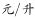，问小王从A地去往B地至少要消耗价值多少元的燃油？

- **A**. 9.5
- **B**. 10.4　✅
- **C**. 12.3
- **D**. 13.1

**答案**：B

**官方解析**

根据图示，则小王从A地至B地共六种走法:

①，路程为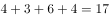公里；

②，路程为公里；

③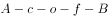，路程为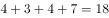公里；

④，路程为公里；

⑤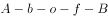，路程为公里；

⑥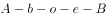，路程为公里；

要使油价最少，应选择最短的路径行驶，即第⑥种。汽车每百公里耗油10升，油价，则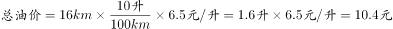。

故正确答案为B。

---

### 第 2 题　qid 2097286 · 数学运算

某交警大队的16名民警中，男性为10人，现要选4人进行夜间巡逻工作，要求男性民警不得少于2名，问有多少种选人方法？

- **A**. 1605　✅
- **B**. 1520
- **C**. 1071
- **D**. 930

**答案**：A

**官方解析**

方法一：根据题干，16名民警中，10人为男性，6人为女性。选取4人夜间巡逻，要使男性民警不得少于2人，则有三种情况：男性女性各2人；男性3名女性1名；男性4名。则选人方法为种。

方法二：男性民警不少于2人的情况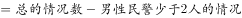。则选人方法为种。

故正确答案为A。

---

### 第 3 题　qid 2097290 · 数学运算

在一个以1为底圆半径、4为高的圆柱体内装了高度为3的液体，在保证液体不流出的前提下倾斜圆柱体，则倾斜的最大角度为（不考虑表面张力）：

- **A**. 

- **B**. 

- **C**. 
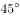
　✅
- **D**. 
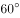

**答案**：C

**官方解析**

圆柱的高为4，液体的高度为3，则圆柱内的空白部分与液体的体积之比为1:3。倾斜之后，要使倾斜角度最大，则应使液体恰好到达圆柱的上方边沿。

如图所示，AC为水平面，因为空白部分与液体体积之比为1:3，设空白区域体积为1份，液体体积为3份。则倾斜之后AB以上部分空白部分体积与液体相等，都为1份，则AB以下部分为2份。此时AB以上部分与AB以下部分体积之比为1:1，说明A、B点恰好为圆柱体高的中点。圆柱半径为1，高为4，则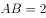，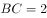，故是等腰直角三角形，，则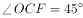，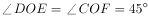。即倾斜的最大角度为。

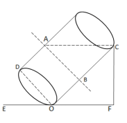

故正确答案为C。

---

### 第 4 题　qid 2097292 · 数学运算

某杂志为每篇投稿文章安排两位审稿人，若都不同意录用则弃用；若都同意则录用；若两人意见不同，则安排第三位审稿人，并根据其意见录用或弃用。如每位审稿人录用某篇文章的概率都是，则该文章最终被录用的概率是：

- **A**. 

- **B**. 
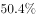

- **C**. 

- **D**. 

　✅

**答案**：D

**官方解析**

被录用的情况有两种：①两位审稿人都同意则录用；②两位审稿人意见不一致且第三位审稿人意见是录用。则概率为。

故正确答案为D。

---

### 第 5 题　qid 2097206 · 数学运算

土质房屋的墙壁底部有一个三棱柱体的孔，其纵截面ABC如下图所示。房主用一个纵截面为三角形的木楔塞住这个孔。为了塞紧孔洞，他用锤子敲击木楔，使木楔移动了4厘米（CD）且其底部EF与孔洞表面BG重合，此时孔的高度增加了3厘米（AG）。已知木楔底部EF高8厘米，问孔的纵截面积增加了多少平方厘米？

- **A**. 26　✅
- **B**. 30
- **C**. 32
- **D**. 36

**答案**：A

**官方解析**

根据题意可得，题目所求为四边形GACD的面积。木楔EFC平移到GBD的位置，已知厘米，厘米，则厘米，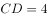厘米。

根据三角形ABC相似于三角形GBD，可得：，，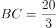厘米，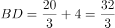厘米，原三棱柱孔的截面积平方厘米；木楔截面积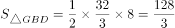平方厘米，增加的面积即四边形GACD的面积，为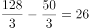平方厘米。

故正确答案为A。

---

### 第 6 题　qid 2097216 · 数学运算

一个位于O点的雷达探测半径为25千米。某日该雷达探测到一辆车沿直线驶过探测区，行驶过程中途经距离雷达20千米外的P点。如该车在雷达探测区内行驶的距离为X千米，问X的最大值和最小值相差多少千米？

- **A**. 15
- **B**. 16
- **C**. 20　✅
- **D**. 25

**答案**：C

**官方解析**

雷达探测区域为半径为25km的圆形区域，则过P点在该区域行驶的最大距离即该圆形区域的直径长度，为km；

以OP为半径画圆，过P点在探测区的最小距离，即以P点为切点，与以OP为半径画圆相切的线段，即图中AB的距离。，km，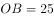km，根据勾股定理，则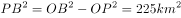，km，km。

则题目所求最大值与最小值相差km。

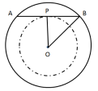

故正确答案为C。

---

### 第 7 题　qid 2097296 · 数学运算

蔬菜摊贩某日花费元购进蔬菜，上午、下午、傍晚分别按进货单价的、、卖掉占总进货价值、、的蔬菜，并将剩下未卖的蔬菜送给养殖场。如摊位成本为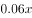，则该摊贩当日盈利为：

- **A**. 

- **B**. 
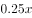
　✅
- **C**. 

- **D**. 
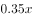

**答案**：B

**官方解析**

根据题意蔬菜成本为，售出各部分蔬菜量占比与售价对应关系如下：

，，

则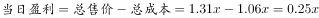。

故正确答案为B。

---

### 第 8 题　qid 2097298 · 数学运算

甲、乙两条生产线同时接到羽毛球、网球两种球拍的生产任务。已知甲要生产的球拍总数和乙相同，甲的网球拍生产任务是乙的，乙的羽毛球拍生产任务是甲的，如甲、乙工作效率相同，且单个羽毛球拍生产时间是网球拍的一半，问甲、乙完成任务用时之比为：

- **A**. 7:10　✅
- **B**. 10:7
- **C**. 13:19
- **D**. 19:13

**答案**：A

**官方解析**

设甲生产网球拍个，则乙生产网球拍个；设乙生产羽毛球拍个，则甲生产羽毛球拍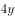个。由于甲乙两人生产球拍总数相同，因此，化简得：。赋值单个羽毛球的生产时间为1，单个网球的生产时间为2，因此甲完成任务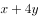：，乙完成任务：，二者用时之比为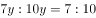。

故正确答案为A。

---

### 第 9 题　qid 2097300 · 数学运算

电梯在竖直的矿井内匀速下降。王工程师对电梯开始下降后每分钟的海拔高度数值进行记录（将开始下降后第n分钟的读数记为an，海拔高度在0以下时记为负数），发现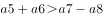，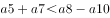，问电梯是在开始下降后的哪个时间段内降到海拔高度0以下的？

- **A**. 第6分钟之前
- **B**. 第6到第7分钟　✅
- **C**. 第7到第8分钟
- **D**. 第8分钟之后

**答案**：B

**官方解析**

设电梯最初的海拔高度为，每分钟下降1，则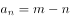，根据题意，

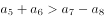······①

······②

即：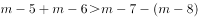······①

······②

解得：，由假设每分钟下降1，那么在第6到7分钟之间，海拔下降到0以下。

故正确答案为B。

---

### 第 10 题　qid 2097304 · 数学运算

将100名运动员编上从1-100的号码，从中选出号码尾数为3、6和9的人，剩下的人按原来的号码从小到大，重新编上从1开始的号码。小刘发现自己两次得到的号码都是7的倍数，问在第二次编号中，有多少个人的号码比小刘的大？

- **A**. 10
- **B**. 14
- **C**. 20
- **D**. 21　✅

**答案**：D

**官方解析**

1-100的号码中，去掉尾数为3、6、9的号码，剩余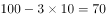人，重新编号为1-70。要满足两次号码都是7的倍数，代入选项：

A项，有10人比小刘大，则第二次编号为号，不是7的倍数，排除；

B项，有14人比小刘大，第二次编号为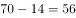号，为7的倍数，再验证第一次为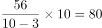号，不是7的倍数，排除；

C项，有20人比小刘大，第二次编号为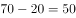号，不是7的倍数，排除；

D项，有21人比小刘大，第二次编号为号，为7的倍数，再验证第一次为号，满足两次号码都是7的倍数，当选。

故正确答案为D。

---

## 判断推理

### 第 1 题　qid 2097182 · 图形推理

从所给四个选项中，选择最合适的一个填入问号处，使之呈现一定的规律性：

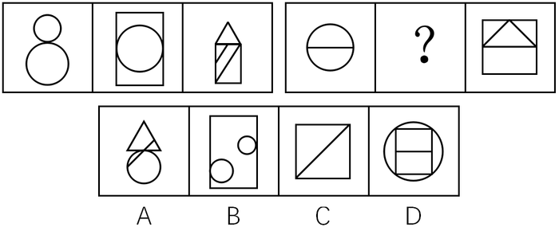

- **A**. A
- **B**. B　✅
- **C**. C
- **D**. D

**答案**：B

**官方解析**

元素组成不同，且无明显属性规律，优先考虑数量规律。观察题干第一组图形的面数量为2、3、4，第二组图形的面数量为2、？、4，因此问号处应为3个面。A项4个面，排除。B项3个面，当选。C项2个面，排除。D项6个面，排除。
故正确答案为B。

---

### 第 2 题　qid 2097184 · 图形推理

从所给四个选项中，选择最合适的一个填入问号处，使之呈现一定规律：

- **A**. A　✅
- **B**. B
- **C**. C
- **D**. D

**答案**：A

**官方解析**

元素组成相似，考虑样式规律。观察第一组图形发现，每个图中都包含有四种不同的小元素，且相同位置的小元素都一样，颜色各不相同。可知本题考查的是小元素的遍历和小元素颜色的遍历规律。依照此规律，第二组图形中六边形分别是白色和横线，则中间图中六边形应该是黑色，排除C项和D项；第二组图形中五角星分别是黑色和白色，则中间图中的五角星应该是横线，排除B项。
故正确答案为A。

---

### 第 3 题　qid 2097186 · 图形推理

把下面的六个图形分为两类，使每一类图形都有各自的共同特征或规律，分类正确的一项是：

- **A**. ①②③，④⑤⑥
- **B**. ①③④，②⑤⑥
- **C**. ①②⑤，③④⑥　✅
- **D**. ①④⑥，②③⑤

**答案**：C

**官方解析**

解法一：题干图形均有为一个图形与一条直线组成，以此条直线为切入点，经过观察可发现③④⑥图形中的一条对称轴与直线为垂直关系，而①②⑤的对称轴与该直线不垂直。
故正确答案为C。
解法二：元素组成不同，且无明显属性规律，考虑数量规律。观察发现，题干全部为直线，并且出现多边形，考虑数直线，直线数依次为4、5、9、6、5、7,无明显规律，继续观察发现，题干线条交叉明显，考虑数点，点数量依次为4、5、10、5、5、6，那么图①②⑤点数量与线数量相等，为一组，图③④⑥点数量和线数量相差1，为一组。
故正确答案为C。

---

### 第 4 题　qid 2097188 · 图形推理

把下面的六个图形分为两类，使每一类图形都有各自的共同特征或规律，分类正确的一项是：

- **A**. ①③④，②⑤⑥
- **B**. ①②⑤，③④⑥
- **C**. ①⑤⑥，②③④
- **D**. ①④⑤，②③⑥　✅

**答案**：D

**官方解析**

元素组成不同，且无明显属性规律，优先考虑数量规律。题干图形均有黑色粗线条组成，考虑部分数，观察可发现①④⑤均为四个部分组成，②③⑥均为七个部分组成。
故正确答案为D。

---

### 第 5 题　qid 2097180 · 图形推理

左边给定的是纸盒的外表面，下列哪一项能由它折叠而成？

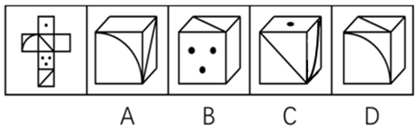

- **A**. A
- **B**. B　✅
- **C**. C
- **D**. D

**答案**：B

**官方解析**

本题为空间重构题目，用排除法解题，题干图形标号如下图。

 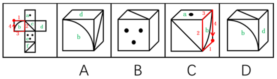

A项：面b和面d在展开图中同行中间隔一个，属于相对面，相对面不能同时出现，排除；

B项：与题干一致，当选；

C项：如上图所示，同时对题干和选项的 b面进行顺时针画边，选项的第三条边对应着a面，题干的第一条边对应着a面，选项和题干不一致，排除；

D项：面b和面d在展开图中同行中间隔一个，属于相对面，相对面不能同时出现，排除。

故正确答案为B。

---

### 第 6 题　qid 2097040 · 定义判断

异称词是指不同的社会群体、不同的地区或不同的时代对同一事物的不同称呼。
根据上述定义，下列不属于异称词的是：

- **A**. 老一辈的人仍习惯把火柴称作“洋火”
- **B**. 现在售货员很多时候会称女顾客为“美女”　✅
- **C**. 明代时人们一般把蛤蟆称为癞施或田鸡
- **D**. 四川人说的红苕其实就是河南人说的红薯

**答案**：B

**官方解析**

第一步：找出定义关键词。
“不同社会群体”、“不同地区”、“不同时代”、“对同一事物的不同称呼”。
第二步：逐一分析选项。
A项：老一辈人把火柴称为“洋火”，体现了不同的社会群体对火柴的不同称呼，符合定义，排除； 
B项：现在售货员称女顾客为“美女”，并不是不同社会群体、不同地区、不同时代对同一事物的不同称呼，不符合定义，当选；
C项：明代人们把蛤蟆称为“癞施或田鸡”，体现了不同时代对同一事物的不同称呼，符合定义，排除；
D项：四川人说的红苕就是河南人说的红薯，体现了不同地区对同一事物的不同称呼，符合定义，排除。
本题为选非题，故正确答案为B。

---

### 第 7 题　qid 2097042 · 定义判断

自然界有这样一种现象：当一株植物单独生长时，显得矮小、单调，与众多同类植物一起生长时，则根深叶茂，生机盎然。人们把类似植物界中这种相互影响、相互促进的现象，称为“共生效应”。
根据上述定义，下列最符合共生效应的是：

- **A**. 某大学一寝室，六名同学入学成绩有高有低，四年里六人每天结伴学习，最后都考上了重点大学的研究生
- **B**. 和狼生活在一起，你只能学会嗥叫；和那些优秀的人接触，你就会受到良好的影响
- **C**. 某品牌为摆脱个体经营的局限，采取连锁经营的方式扩大经营范围，销量随之大大提高　✅
- **D**. 亲小人，远贤臣，此后汉所以倾颓也

**答案**：C

**官方解析**

第一步：找出定义关键词。
“当一株植物单独生长时，显得矮小、单调，与众多同类植物一起生长时，则根深叶茂，生机盎然”、“相互影响、相互促进”。
第二步：逐一分析选项。
A项：同一寝室六名同学结伴学习，成绩有高有低，这里的成绩高低不确定是不是每位同学单独学习的状态，不确定是否符合“当一株植物单独生长时，显得矮小、单调”，不符合定义，排除；
B项：体现的是一个人分别和狼以及优秀的人生活在一起时受到的不同影响，只有单方面的影响，并没有体现相互影响和相互促进，不符合定义，排除；
C项：某品牌是通过扩大经营范围而使销量提升，符合“当一株植物单独生长时，显得矮小、单调，与众多同类植物一起生长时，则根深叶茂，生机盎然”，符合定义，当选；
D项：选项的意思是亲近小人，疏远贤臣，这是后汉所以倾覆衰败的原因，因此不能体现相互影响和相互促进，不符合定义，排除。
故正确答案为C。

---

### 第 8 题　qid 2097044 · 定义判断

霍桑效应是指由于受到额外的关注而引起努力或绩效上升的情况。
根据上述定义，下列情形属于霍桑效应的是：

- **A**. 某电气公司总裁常用“如果你想，你就可以”激励科研团队完成构想
- **B**. 初三学生小王因沉迷游戏学习成绩下滑，老师严肃批评了他，他很惭愧
- **C**. 某公司经理经常给新招的员工发邮件，鼓励员工好好工作
- **D**. 数学教师常常私下称赞几名学生聪明，数月后这几人数学成绩均有不同程度的提高　✅

**答案**：D

**官方解析**

第一步：找出定义关键词。
“受到额外的关注”、“努力或绩效上升”。 
第二步：逐一分析选项。
A项：某电气公司总裁常用“如果你想，你就可以”激励科研团队完成构想，没有体现出科研团队受到额外的关注，同时也没体现出引起科研团队努力或者绩效上升，不符合定义，排除； 
B项：小王因沉迷游戏学习成绩下滑，老师严肃批评他，批评是一种额外的关注，但小王觉得很惭愧，没有体现出引起努力或者绩效上升，不符合定义，排除；
C项：经理经常给新招的员工发邮件，鼓励员工好好工作，发邮件体现出在一定程度上受到了额外的关注，但是没有体现出员工是否由此引起努力或者绩效上升，不符合定义，排除；
D项：数学老师私下称赞几名学生聪明，体现了这几名学生受到了老师的额外关注，数月后这几个人的数学成绩均有所提高，体现了这几个人由于称赞而引起成绩上升，符合定义，当选。
故正确答案为D。

---

### 第 9 题　qid 2097046 · 定义判断

社会行为模式是指社会多数成员共同创造、认可或遵守的行为方式。人们社会交往的结果、社会行为模式一旦形成，就具有重复性、稳定性和常规性，与群体共存，并由个人的具体行为表现出来。
根据上述定义，下列不属于社会行为模式的是：

- **A**. 男耕女织
- **B**. 日出而作，日落而息
- **C**. 尊老爱幼
- **D**. 宁为玉碎，不为瓦全　✅

**答案**：D

**官方解析**

第一步：找出定义关键词。
“由社会多数成员共同创造、认可或遵守的行为方式”、“社会行为模式具有重复性、稳定性和常规性”。
第二步：逐一分析选项。
A项：男耕女织是我国古代社会家庭的自然分工方式。封建社会中的小农经济，一家一户经营，男的种田，女的织布，指全家分工劳动，符合由社会多数成员共同创造、认可、遵守的行为方式，且男耕女织在我国古代是一种稳定的分工，符合定义，排除；
B项：日出而作，日落而息描写古代劳动人民朴素的生活及赞颂太平盛世。后人用来说明农民早出晚归，过着勤朴、起居工作有规律的生活。符合由社会多数成员共同创造、认可、遵守的行为方式，且这种生活状态是一种稳定、重复和常规性的状态，符合定义，排除；
C项：尊老爱幼，其中“尊老”指的是尊敬长辈，“爱幼”即爱护晚辈；形容人的品德良好。尊老爱幼是中国的传统美德，且一直持续至今，符合由社会多数成员共同创造、认可、遵守的行为方式，且尊老爱幼在现代依然延续，具有常规性和稳定性，符合定义，排除；
D项：宁为玉碎，不为瓦全是一句成语。意思为宁做玉器被打碎，不做瓦器而保全。比喻宁愿为正义事业牺牲，不愿丧失气节，苟且偷生，出自《北齐书•元景安传》，讲的是元景皓宁愿被杀头也不愿改元姓高，后被元景安告密遭到高洋的杀害。这句成语表达的是个人的看法和想法，并不是由社会多数成员所共同创造的一种行为方式，且这种个人想法并不具备稳定性和常规性，不符合定义，当选。
本题为选非题，故正确答案为D。

---

### 第 10 题　qid 2097048 · 定义判断

无意注意是指没有预定目的，无需意志努力，不由自主地对一定事物所发生的注意。无意注意时，心理活动对一定事物的指向和集中是由一些主观和客观条件所引起的。
根据上述定义，下列不属于无意注意的是：

- **A**. 上课时学生突然被窗外飞进来的蝴蝶所吸引
- **B**. 肚子饿的小明一进房间就看见了桌上的面包
- **C**. 小红埋头完成家庭作业，不知不觉过了很久　✅
- **D**. 人们在绿油油的草地上一眼就看到了小红花

**答案**：C

**官方解析**

第一步：找出定义关键词。
“没有预定目标”、“无需意志努力”、“不由自主地发生”。
第二步：逐一分析选项。
A项：上课时学生的注意被突然飞来的蝴蝶吸引，蝴蝶不是预定目标，符合“没有预定目标”，而学生们注意到蝴蝶属于“无需意志努力”、“不由自主地发生”，符合定义，排除；
B项：小明一进房间就发现了面包，面包不是预定目标，符合“没有预定目标”，一进门就看见属于“无需意志努力”、“不由自主地发生”，符合定义，排除；
C项：小红完成家庭作业，家庭作业是一种预定的目标，不属于“没有预定目标”，并且写作业的过程需要意志努力，不符合定义，当选；
D项：人们从绿草地上一眼就看见红花，红花不是预定目标，符合“没有预定目标”，而人们一眼就看见属于“无需意志努力”、“不由自主地发生”，符合定义，排除。
本题为选非题，故正确答案为C。

---

### 第 11 题　qid 2097050 · 定义判断

裂变思维是指在思考和解决问题时，不受已知的或现成的方式、规则和范畴的约束，从一个问题的中心点向外辐射发散，进行多方向、多角度、多层次的思维活动。
根据上述定义，下列情形体现了裂变思维的是：

- **A**. 某公司研究人员设计制作了一种多功能文具盒，里面装有学生平时所用的大部分文具
- **B**. 某屠宰场将牛肉分为肥肉和瘦肉，并分为牛腩、牛腱子、牛百叶、牛舌等出售
- **C**. 沙蚕在涨潮时，从沙滩里钻出来，在海水中觅食，落潮时就钻入沙滩里，某人在落潮时模仿海水涨潮的声音，捕捉到大量沙蚕　✅
- **D**. 潮汐时间每天向后推迟48分钟，雀鲷鹭则每天推迟约50分钟到海边觅食，因此它们总是海滩上的第一批食客

**答案**：C

**官方解析**

第一步：找出定义关键词。
“思考和解决问题不受已知的或现成的方式、规则和范畴的约束”、“思维从问题中心点向外辐射发散”。
第二步：逐一分析选项。
A项：多功能的文具盒的功能依旧是装文具，不属于“思考和解决问题不受已知的或现成的方式、规则和范畴的约束”，同时这种文具盒只是装的文具多，不属于“思维从问题中心点向外辐射发散”，不符合定义，排除；
B项：屠宰场这种屠宰方式是依照市场的买卖习惯而制定，不属于“思考和解决问题不受已知的或现成的方式、规则和范畴的约束”，不符合定义，排除；
C项：某人在捕捉沙蚕时，不是根据已知的技术或者手段去进行捕捞，而是在发现了沙蚕的习性后，通过模仿海水涨潮的声音，吸引沙蚕出洞而进行捕捉，属于“思考和解决问题不受已知的或现成的方式、规则和范畴的约束”、“思维从问题中心点向外辐射发散”，符合定义，当选；
D项：思维是人所特有的认识能力，而雀鲷鹭是鸟类，主体不符合，不符合定义，排除。
故正确答案为C。

---

### 第 12 题　qid 2097052 · 定义判断

“用名以乱实”指的是任意改变约定俗成的“名”（即概念）的界说和范围，扰乱人们对“实”（即客观事物本身）的认识。
根据上述定义，下列属于“用名以乱实”的是：

- **A**. 杀盗人非杀人
- **B**. 马并非都有四条腿，你见到海马有腿吗　✅
- **C**. 没有所谓的高山和深渊，因为高原上的深渊比平原的高山还高
- **D**. 我是这个小区的，小区的绿地是公共的，当然也是我的

**答案**：B

**官方解析**

第一步：找出定义关键词。
“任意改变约定俗成的概念的界说和范围”、“扰乱人们对客观事物本身的认识”。
第二步：逐一分析选项。
A项：杀盗人不是杀人，以“名”乱“名”，没有“扰乱人们对客观事物本身的认识”，不符合定义，排除；
B项：海马虽然有“马”这个字，但不是马。选项通过将海马归为“马”类，改变了作为具体事物“马”的范围，更改人们的认知，体现了以“名”乱“实”，符合定义，当选；
C项：高原上的深渊比平原的高山还高，是用人们眼睛所看到的来改变对事物的定义，是以“实”乱“名”，不符合定义，排除；
D项：这个人是小区业主，草地也是小区的公共区域，并没有改变界说与范围，即没有改变“名”，没有“扰乱人们对客观事物本身的认识”，不符合定义，排除。
故正确答案为B。

---

### 第 13 题　qid 2097054 · 定义判断

经济学中的鳄鱼法则，来源于这样一种场景认知：假定一只鳄鱼咬住你的脚，如果你用手去试图挣脱你的脚，鳄鱼便会同时咬住你的脚与手。你愈挣扎，就被咬住得越多。所以，万一鳄鱼咬住你的脚，你唯一的办法就是牺牲一只脚。
根据上述定义，下列做法符合鳄鱼法则的是：

- **A**. 丈夫乙有严重的心理疾患，经常喝醉酒后暴打妻子甲，酒醒后又跪地认错，甲一次次原谅了乙
- **B**. 秦某报名参加一个考试的培训，发现老师上得并不好，管理也混乱，但是考虑到没有退款条约，还是坚持每天去上课
- **C**. 甲长期持有一支股票，两年翻了两番，最近走势涨跌不定，甲决定将这支股票抛售
- **D**. 高某刚刚注册了一家公司，结果由于国家政策调整，公司原定投资方向不可能盈利，高某决定将公司注销　✅

**答案**：D

**官方解析**

第一步：找出定义关键词。
“愈挣扎，就被咬住得越多”、“鳄鱼咬住你的脚，你唯一的办法就是牺牲一只脚”。
第二步：逐一分析选项。
A项：甲被丈夫乙多次家暴体现了“被咬住”，但是甲一次次原谅了乙，没有体现“牺牲一只脚”，不符合定义，排除；
B项：秦某发现参加的培训班有问题，但是因为没有退款条约坚持去上课，没有体现“牺牲一只脚”，不符合定义，排除；
C项：甲的股票最近走势涨跌不定，说明时涨时跌，不清楚最近具体的是赚是亏，而且甲之前已经在这支股票中获取较高利润，没有体现“被咬住”，不符合定义，排除；
D项：高某刚注册的公司由于国家政策调整，原投资方向不可能盈利，体现了“被咬住”，高某决定将公司注销，体现了“牺牲一只脚”，符合定义，当选。
故正确答案为D。

---

### 第 14 题　qid 2097056 · 定义判断

棘轮效应是指人的消费习惯形成之后有不可逆性，即易于向上调整，而难于向下调整。
根据上述定义，下列符合棘轮效应的是：

- **A**. 赵老板生意失败，变卖了公司资产和名下房产后，还欠银行20多万元，但为了出行方便，他没有用自己的高档汽车抵债　✅
- **B**. 李某买彩票中了500万大奖后没有告诉任何人，偷偷把钱存到银行，还和从前一样正常上班、下班，而且工作更加积极了
- **C**. 一夜暴富的老朱频繁出入高档消费场所，过着挥金如土的生活，很快就入不敷出，回到了之前的生活状态，旁人都唏嘘不已，他自己倒安之若素
- **D**. 王老汉从农村来城里带孙子，因心疼电费舍不得用空调，借口说不习惯空调吹出的冷风，让儿子买了一台和老家一样的落地电扇用来降温消暑

**答案**：A

**官方解析**

第一步：找出定义关键词。
“消费习惯有不可逆性”、“易于向上调整”、“难于向下调整”。
第二步：逐一分析选项。
A项：赵老板变卖了资产和房产后，还欠银行20多万，但是他没有将高档汽车抵押，体现了他的消费习惯难以向下调整，符合定义，当选；
B项：李某中奖后行为同以前一样，且工作积极，没有体现出其消费习惯有易于向上调整、难于向下调整的现象，不符合定义，排除；
C项：老朱由挥金如土的生活回到了暴富前的生活状态后，依然安之若素，没有体现出消费习惯有易于向上调整、难于向下调整的现象，不符合定义，排除；
D项：王老汉从农村来城里因心疼电费舍不得用空调，说明他的消费习惯没有出现易于向上调整的现象，不符合定义，排除。
故正确答案为A。

---

### 第 15 题　qid 2097058 · 定义判断

主观小量是指通过某些特殊的词语表达出来的，带有说话人认为数量小、程度低或时间短等主观色彩的现象，说话人的这种对数量、程度、时间的看法与数量、程度、时间本身的实际大小或高低没有必然联系。
根据上述定义，下列不属于主观小量的是：

- **A**. 小张对小李说：“他们三个上次都没有来参加聚会。”　✅
- **B**. 经理对员工小高说：“你工作不够努力，这个礼拜只加了两天班。”
- **C**. 母亲对读高一的儿子说：“快了，你还有两年就毕业了。”
- **D**. 校长对班主任说：“你们班怎么组织的？义务劳动才去了三十个人。”

**答案**：A

**官方解析**

第一步：找出定义关键词。
“通过某些特殊的词语表达出来的，带有说话人认为数量小、程度低或时间短等主观色彩的现象”、“说话人的这些看法与实际情况没有必然联系”。
第二步：逐一分析选项。
A项：小张说的三个人没有来参加聚会，是对实际情况的客观陈述，不带有主观色彩，也不符合“说话人的这些看法与实际情况没有必然联系”，不符合定义，当选；
B项：经理说小高不够努力，这个礼拜只加了两天班，是主观认为小高加班时间少，符合“通过某些特殊的词语表达出来的，带有说话人认为数量小、程度低或时间短等主观色彩的现象”，实际上一周加班两天，加班时间并不少，符合“说话人的这些看法与实际情况没有必然联系”，符合定义，排除；
C项：母亲认为还有两年毕业是“快了”，是主观认为两年的时间短，符合“通过某些特殊的词语表达出来的，带有说话人认为数量小、程度低或时间短等主观色彩的现象”，实际上两年的时间并不短，符合“说话人的这些看法与实际情况没有必然联系”，符合定义，排除；
D项：校长说义务劳动才去了三十个人，是主观认为参加义务劳动的人数少，符合“通过某些特殊的词语表达出来的，带有说话人认为数量小、程度低或时间短等主观色彩的现象”，实际上三十个人并不少，符合“说话人的这些看法与实际情况没有必然联系”，符合定义，排除。
本题为选非题，故正确答案为A。

---

### 第 16 题　qid 2097034 · 类比推理

酒精：白酒

- **A**. 电源：电视
- **B**. 面包：蛋糕
- **C**. 氮气：空气　✅
- **D**. 摄像头：手机

**答案**：C

**官方解析**

第一步：判断题干词语间的逻辑关系。
酒精是白酒的一部分，且白酒中一定有酒精，二者属于必然组成关系。
第二步：判断选项词语间的逻辑关系。
A项：电视只有在接通电源后才能使用，二者属于条件对应关系，与题干逻辑关系不一致，排除；
B项：面包与蛋糕属于并列关系，与题干逻辑关系不一致，排除；
C项：氮气是空气的一部分，且空气中一定有氮气，二者属于必然组成关系，与题干逻辑关系一致，当选；
D项：摄像头是手机的一部分，但并非所有的手机都有摄像头，与题干逻辑关系不一致，排除。
故正确答案为C。

---

### 第 17 题　qid 2097036 · 类比推理

花瓶：瓷器

- **A**. 电视机：电器
- **B**. 中药：植物　✅
- **C**. 画作：诗篇
- **D**. 桌子：八仙桌

**答案**：B

**官方解析**

第一步：判断题干词语间的逻辑关系。
有的花瓶是瓷器，有的瓷器是花瓶。二者属于交叉关系。
第二步：判断选项词语间的逻辑关系。
A项：电视机属于电器的一种，二者属于种属关系，与题干逻辑关系不一致，排除；
B项：有的中药是植物，有的植物是中药，二者属于交叉关系，与题干逻辑关系一致，当选；
C项：画作和诗篇属于并列关系，与题干逻辑关系不一致，排除；
D项：八仙桌属于桌子的一种，二者属于种属关系，与题干逻辑关系不一致，排除。
故正确答案为B。

---

### 第 18 题　qid 2097038 · 类比推理

跳绳：运动

- **A**. 花椒：调料　✅
- **B**. 开车：旅游
- **C**. 太阳系：银河系
- **D**. 水稻：米粉

**答案**：A

**官方解析**

第一步：判断题干词语间的逻辑关系。
跳绳属于运动的一种，二者属于种属关系。
第二步：判断选项词语间的逻辑关系。
A项：花椒是调料的一种，二者属于种属关系，与题干逻辑关系一致，当选；
B项：开车不是旅游的一种，两者不属于种属关系，与题干逻辑关系不一致，排除；
C项：太阳系是银河系的一部分，二者属于组成关系，与题干逻辑关系不一致，排除；
D项：水稻是制作米粉的原材料，二者属于材料和成品的对应关系，与题干逻辑关系不一致，排除。
故正确答案为A。

---

### 第 19 题　qid 2097064 · 类比推理

调查：发言权

- **A**. 中毒：死亡
- **B**. 批评：进步
- **C**. 损害：赔偿　✅
- **D**. 锻炼：健康

**答案**：C

**官方解析**

第一步：判断题干词语间的逻辑关系。
没有调查就没有发言权，调查是发言权的必要条件。
第二步：判断选项词语间的逻辑关系。
A项：死亡不一定是因为中毒，因此中毒不是死亡的必要条件，与题干逻辑关系不一致，排除；
B项：进步不一定是因为批评，因此批评不是进步的必要条件，与题干逻辑关系不一致，排除；
C项：赔偿一定是由于受到了损害，因此损害是赔偿的必要条件，与题干逻辑关系一致，当选；
D项：健康不一定是因为锻炼，因此锻炼不是健康的必要条件，与题干逻辑关系不一致，排除。
故正确答案为C。

---

### 第 20 题　qid 2097072 · 类比推理

钻木取火：打火机

- **A**. 滴血认亲：培养皿
- **B**. 鸿雁传书：电子邮件　✅
- **C**. 烽火狼烟：红绿灯
- **D**. 结绳记事：计算器

**答案**：B

**官方解析**

第一步：判断题干词语间的逻辑关系。
钻木取火是古代常用的取火方式，打火机是现代常用的一种取火工具，二者都具有取火的功能。
第二步：判断选项词语间的逻辑关系。
A项：滴血认亲是古代常用的一种验证血缘关系的方式，培养皿是现代实验室常用的工具，二者功能不同，与题干逻辑关系不一致，排除；
B项：鸿雁传书是古代常用的一种传递信息的方式，电子邮件是现代常用的一种传递信息的方式，二者都具有传递信息的功能，与题干逻辑关系一致，当选；
C项：烽火狼烟本是古代中国边境的士兵为了及时的传递敌人来犯的信息，常用于战争领域，红绿灯是现代用于交通的信号，二者功能不同，与题干逻辑不关系一致，排除；
D项：结绳记事是古代文字发明前，人们所使用的一种记事方法，计算器现在人们用于计算的一种工具，二者功能不同，是与题干逻辑关系不一致，排除。
故正确答案为B。

---

### 第 21 题　qid 2097082 · 类比推理

口碑：票房：电影

- **A**. 质量：价格：商品　✅
- **B**. 公平：正义：律师
- **C**. 好评：差评：服务
- **D**. 相貌：品格：性情

**答案**：A

**官方解析**

第一步：分析题干词语间逻辑关系。
口碑和票房是衡量评价电影的两种不同的方式，是评价方式的对应。
第二步：判断选项词语间逻辑关系。
A项：质量和价格是衡量评价商品的两种不同的方式，是评价方式的对应，与题干逻辑关系一致，当选；
B项：公平和正义是律师的属性，律师是为当事人提供法律服务的执业人员，与题干逻辑关系不一致，排除；
C项：好评和差评都是对服务的一种具体评价结果，而口碑和票房是评价电影的两种不同的方式，与题干逻辑关系不一致，排除；
D项：相貌指一个人的面容、长相、身材、衣着以及言谈和举止，品格指品性、性格，性情指人的性格、习性与思想情感，三者之间为并列关系，与题干逻辑关系不一致，排除。
故正确答案为A。

---

### 第 22 题　qid 2097088 · 类比推理

朝代：清代：明代

- **A**. 爬行动物：青蛙：蜥蜴
- **B**. 儒家：朱熹：王阳明
- **C**. 刑罚：有期徒刑：死刑　✅
- **D**. 首都：北京：北平

**答案**：C

**官方解析**

第一步：判断题干词语间的逻辑关系。
清代与明代都是朝代，和朝代是种属关系，并且清代与明代二者为并列关系。
第二步：判断选项词语间的逻辑关系。
A项：青蛙是两栖动物，不是爬行动物，二者不是种属关系，与题干逻辑关系不一致，排除；
B项：王阳明和朱熹是儒家学派分支的代表人物，与儒家不是种属关系，与题干逻辑关系不一致，排除；
C项：有期徒刑与死刑都是属于刑罚的一种，是种属关系，并且有期徒刑与死刑为并列关系，与题干逻辑关系一致，当选；
D项：北平是北京在历史上的一个别名，二者为全同关系，与题干逻辑关系不一致，排除。
故正确答案为C。

---

### 第 23 题　qid 2097092 · 类比推理

雾霾 对于 （    ） 相当于 害虫 对于 （    ）

- **A**. 天气  农田
- **B**. 防范  防治　✅
- **C**. 污染  作物
- **D**. 沙尘  昆虫

**答案**：B

**官方解析**

逐一代入选项。
A项：雾霾为一种灾害性天气，二者为种属关系；害虫可以生活在农田中，二者为场所的对应关系，前后逻辑关系不一致，排除；
B项：防范雾霾、防治害虫，二者为动宾关系，前后逻辑关系一致，当选；
C项：雾霾是一种污染，二者是种属关系，害虫破坏作物，二者是对应关系，前后逻辑关系不一致，排除；
D项：雾霾与沙尘都是天气状况，二者为并列关系；害虫与昆虫是交叉关系，前后逻辑关系不一致，排除。
故正确答案为B。

---

### 第 24 题　qid 2097104 · 类比推理

分析 对于 （    ） 相当于 消除 对于 （    ）

- **A**. 阐述  革除
- **B**. 差距  贫富
- **C**. 解决  创新
- **D**. 问题  弊端　✅

**答案**：D

**官方解析**

逐一代入选项。
A项：分析和阐述是并列关系；消除和革除是近义词。前后逻辑关系不一致，排除；
B项：分析差距，二者是动宾关系；贫富不能被消除，可以说消除贫富差距。前后逻辑关系不一致，排除；
C项：先分析，后解决，二者存在时间上的先后顺序；消除和创新二者在时间上没有必然的先后顺序。前后逻辑关系不一致，排除；
D项：分析问题，二者是动宾关系；消除弊端，二者也是动宾关系。前后逻辑关系一致，当选。
故正确答案为D。

---

### 第 25 题　qid 2097114 · 类比推理

时钟 对于 （    ） 相当于 （    ） 对于 导盲犬

- **A**. 时间  盲杖
- **B**. 闹钟  犬类　✅
- **C**. 制造  驯养
- **D**. 时针  盲人

**答案**：B

**官方解析**

逐一代入选项。
A项：时钟是用来显示时间的工具，二者属于对应关系；盲杖和导盲犬都是盲人的工具，二者是并列关系。前后逻辑关系不一致，排除；
B项：闹钟属于时钟的一种，二者属于种属关系；导盲犬属于犬类的一种，二者属于种属关系。前后逻辑关系一致，当选；
C项：制造时钟，二者属于动宾关系，第一个词是名词，第二个词是动词；驯养导盲犬，二者也属于动宾关系，但词语顺序相反。前后逻辑关系不一致，排除；
D项：时针是时钟的一部分，二者属于组成关系；盲人和导盲犬不是组成关系。前后逻辑关系不一致，排除。
故正确答案为B。

---

### 第 26 题　qid 2097132 · 逻辑判断

一般来说，油品质量标准由石化行业制定，环保部门并无相关油品质量监管权。因此，面对城市车流带来的大量污染物排放和空气污染加剧问题，环保部门在这方面很难真正采取有效的措施。
要得出以上论断，需要补充以下哪项作为前提？

- **A**. 油品质量提高能有效降低汽车污染物排放　✅
- **B**. 油品质量提高需要石化行业提高相应标准
- **C**. 环保部门对油品质量标准制定拥有决定权
- **D**. 当前环保部门对石化行业的监管力度较弱

**答案**：A

**官方解析**

第一步：找出论点和论据。
论点：面对城市车流带来的大量污染物排放和空气污染加剧问题，环保部门在这方面很难真正采取有效的措施。
论据：油品质量标准由石化行业制定，环保部门并无相关油品质量监管权。
第二步：逐一分析选项。
A项：油品质量提高能有效降低汽车污染物排放，将“油品质量”与“污染物排放和空气污染加剧”搭桥，使论点与论据联系更紧密，当选；
B项：油品质量提高需要石化行业提高相应标准，只是提出了一个对策，与题干结论无关，属于无关选项，排除；
C项：环保部门对油品质量标准制定拥有决定权，意味环保部门能够采取有效措施应对大量污染物排放和空气污染加剧问题，也就得不出题干结论，排除； 
D项：当前环保部门对石化行业的监管力度较弱，没有提及污染物这一关键词，属于无关选项，排除。
故正确答案为A。

---

### 第 27 题　qid 2097138 · 逻辑判断

服药能否提高一个人对于音高的识别能力？近来一项国外研究对此做出了肯定的回答，研究者将试验参与者分为两组：第一组服用了丙戊酸，第二组服用了安慰剂，所有的试验参与者均未接受过系统的音乐训练，结果发现，在识别音高测试中，第一组的正确识别率更高。研究者据此认为，通过药物治疗可以改善人们对于音高的识别能力。
以下哪项如果为真，最能质疑研究人员的上述结论？

- **A**. 第一组试验参与者比第二组的人数多
- **B**. 第一组试验参与者与第二组的平均年龄不同
- **C**. 第一组试验参与者裸耳听力测验成绩高于第二组　✅
- **D**. 第一组试验参与者中父母从事音乐工作的比例较高

**答案**：C

**官方解析**

第一步：找出论点和论据。
论点：通过药物治疗可以改善人们对于音高的识别能力。
论据：第一组服用了丙戊酸，第二组服用了安慰剂，所有的试验参与者均未接受过系统的音乐训练，结果发现，在识别的音高测试中，第一组的正确识别率更高。
第二步：逐一分析选项。
A项：第一组试验参与者比第二组的人数多，人数多少与识别率无关，无法削弱，排除；
B项：第一组试验参与者与第二组的平均年龄不同，却没有表明年龄是否会影响音高测试的识别率，属于不明确选项，无法削弱，排除；
C项：第一组试验参与者裸耳听力测验成绩高于第二组，说明音高测试识别率高的原因可能是裸耳听力成绩高导致的，他因削弱，当选； 
D项：第一组试验参与者父母从事音乐工作的比例较高，却没有明确说此原因对该试验的影响究竟如何，属于不明确选项，排除。
故正确答案为C。

---

### 第 28 题　qid 2097200 · 逻辑判断

某科学家在研究意大利古比奥地区白垩纪末期地层中的黏土层时，发现微量元素铱的含量比其他时期地层陡然增加了30~160倍，之后人们从全球多处地点取样检测都得出同样结论：白垩纪末期地层中铱元素含量异常增高的确是普遍性的。科学家据此推测，在白垩纪末期有一颗巨大的小行星撞击了地球，产生的尘埃遮天蔽日，造成地表气候环境巨变，从而导致了恐龙的灭亡。
以下哪项如果为真，最能削弱上述科学家的推测？

- **A**. 小行星一般由硅、铁类元素构成，巨大的小行星落在地球表面，即使经历漫长岁月也不可能踪迹全无
- **B**. 白垩纪末期的岩层大部分是熔岩冷却形成的火成岩，而由小行星撞击地球产生的尘埃堆积而成的沉积岩只占地表的很小一部分
- **C**. 铱元素不仅存在于地球外的天体，也存在于地壳内部
- **D**. 已发现的恐龙和恐龙蛋化石全部存在于富含铱元素的黏土层下的地层中　✅

**答案**：D

**官方解析**

第一步：找出论点和论据。
论点：在白垩纪末期有一颗巨大的小行星撞击了地球，产生的尘埃遮天蔽日，造成地表气候环境巨变，从而导致了恐龙的灭亡。
论据：白垩纪末期地层中的黏土层中铱的含量比其他时期陡然增加了30~160倍。
论据讨论的是白垩纪末期地层中的黏土层中铱的含量增加，论点讨论的是白垩纪末期有一颗巨大的小行星撞击了地球，导致了恐龙的灭亡，论点和论据话题不一致，可考虑直接削弱论点或拆桥。
第二步：逐一分析选项。
A项：因为小行星一般由硅、铁类元素构成，如果是小行星撞击会留下踪迹，但题干没有提到目前有无印记以及硅和铁的情况，无法削弱，排除；
B项：小行星撞击地球产生的尘埃堆积而成的沉积岩只占地表的很小一部分，但是占地表小不代表当时不能造成尘埃遮天蔽日，无法削弱，排除；
C项：铱元素不仅存在于地球外的天体，也存在于地壳内部，说明黏土层中铱的增加可能是由于地球内部的原因导致的，所以不能通过黏土层中铱的含量的增高，一定得到是小行星撞击了地球，切断了论点和论据之间必然性的联系，为可能性的拆桥，保留；
D项：已发现恐龙蛋和恐龙化石全部存在于富含铱元素的黏土层下，因为黏土层的形成是需要很长的时间，所以一定是恐龙先灭亡，然后才有富含铱元素的黏土层的形成，直接否定了题干中的因果关系，削弱论点，保留。
比较C、D两项，C项是可能性的拆桥，而D项为直接明确削弱论点，所以D项的削弱力度更强。
故正确答案为D。
附：此题源自百度百科“富铱堆积岩”。文章中提到了A、B、C三种情况，但是只是作为疑点提出，后面又给出了最后的研究结果，指向的是D项。原文如下：
各种有关恐龙灭绝原因的解释不下几十种，如气候变化说，植物影响说等等，但均不能自圆其说，其中小行星撞击地球的假说倍受各方关注。美国物理学家路易·阿尔瓦雷兹在研究白垩纪末期地层中的粘土层时发现，微量元素——铱的含量比其他时期岩层中陡然增多30~160倍，之后人们从全球多处地点取样测验都得出同样结论，白垩纪末期地层中铱元素含量异常增高的确是普遍性的，于是他认为在白垩纪末期有一颗直径约10公里的小行星撞击了地球, 产生的尘埃遮天蔽日，造成地表气候环境的变化导致了恐龙的消亡。但是，用小行星撞击来解释岩层中铱元素含量增加和恐龙灭绝存在许多疑点。
1、小行星一般都是由硅、 铁类元素构成，这样巨大的小行星落在地球表面即使经历漫长岁月也不可能踪迹全无，而在地球上从未发现有这样大型的陨石；
2、白垩纪末期的岩层大部分是熔岩冷却形成的火成岩 ，由尘埃堆积而成的沉积岩只占地表很小一部分。仅一颗小行星撞击扬起的尘埃能够把当时地球上绝大多数动植物埋入深达几千米的岩层中吗？
3、一颗小行星所含的铱元素就能均匀的散布以至覆盖整个地球表面吗？况且，铱元素在地外小行星上存在（含量并不高），在地球深处也同样存在，为什么只推测来自地球以外而不是来自地球内部呢？
其实，白垩纪末期地层中铱含量增多的异常情况与恐龙的灭绝的确密切相关，但通过仔细研究却可以得出另一种结论。我们知道，在地球内部进行的热核反应会不断积聚起巨大的能量，一旦地壳承受不住时，内部压力便冲破地壳突然释放形成大爆发。铱——这种主要存在于地核内的元素，在大爆发时通过熔岩喷发从地球深处带到了地壳表层，而公认的标志白垩纪结束的粘土层正是大量火山灰尘沉积形成（科学家在夏威夷克拉维亚火山喷出的气体中曾检验出微量的铱）。所以，白垩纪末期地层中铱含量普遍增多恰好证明地壳发生了普遍性剧烈喷发。
化石档案告诉我们，绝大多数恐龙的死亡时间和绝大部分恐龙蛋化石的形成年代是在白垩纪末期，已发现的恐龙和恐龙蛋化石全部保存在白垩纪与第三纪界限（K-T界）的富含铱的薄粘土层下的地层中，富铱层的下伏地层和上伏地层中生物群的面貌截然不同，恐龙在白垩纪末期以后的地层中便消失了。各种地质和化石线索表明，白垩纪末期的地球上确实发生了对恐龙生存极为不利的突然变化，这与地质学界认定的白垩纪末期大规模造山运动等一系列全球性地壳构造剧烈变动的时间正相吻合。

---

### 第 29 题　qid 2097140 · 逻辑判断

人体跟金属一样，在大自然中会逐渐“氧化”。金属氧化是诸如铁生黄锈、铜生铜绿等。人体氧化的罪魁祸首不是氧气，而是氧自由基，是一种细胞核外含不成对电子的活性基因。这种不成对的电子很容易引起化学反应，损害DNA、蛋白质和脂质等重要生物分子，进而影响细胞膜转运过程，使各组织、器官的功能受损，导致机体老化。
以下各项如果为真，不能支持上述论述的是：

- **A**. 
氧自由基有增强白细胞对细菌的吞噬和抑制细菌增殖的功能，可增强机体抗感染及免疫能力
　✅
- **B**. 
用氧自由基抑制剂2-巯基乙胺作为食物添加剂，以小鼠作为实验对象，的2-巯基乙胺可以使小鼠的平均寿命延长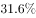

- **C**. 
天然抗氧化剂茶多酚可以有效地抑制氧自由基的作用，食用了含有茶多酚食品的果蝇，其寿命明显延长

- **D**. 
氧自由基可导致人体胶原蛋白酶和硬弹性蛋白酶释放，使皮肤中的胶原蛋白和硬弹性蛋白产生过度交联并发生降解，导致皮肤失去弹性，细胞老化，出现皱纹

**答案**：A

**官方解析**

第一步：找出论点和论据。
论点：人体氧化的罪魁祸首不是氧气，而是氧自由基，是一种细胞核外含不成对电子的活性基因。
论据：这种不成对的电子很容易引起化学反应，损害DNA、蛋白质、脂质等重要生物分子，进而影响细胞膜转运过程，使各组织、器官的功能受损，导致细胞老化。
第二步：逐一分析选项。
A项：指出氧自由基可以增强机体的抗感染能力，强调的是氧自由基对人体的好处，与氧自由基是否是导致人体氧化的罪魁祸首无关，不能加强，当选；
B项：强调使用氧自由基抑制剂后，实验鼠的平均寿命延长，说明氧自由基确实会导致机体老化，补充论据，可以加强，排除；
C项：强调食用可以抑制氧自由基作用的茶多酚后，果蝇的寿命延长，说明氧自由基会导致机体老化，补充论据，可以加强，排除；
D项：说明氧自由基会导致皮肤失去弹性，细胞老化出现皱纹，补充论据，可以加强，排除。
本题为选非题，故正确答案为A。

---

### 第 30 题　qid 2097142 · 逻辑判断

通常情况下，伤害行为的受害者会通过法律渠道表达利益诉求，但是，如果制度不公或失效，就会引发更多的社会伤害行为：不但强势者可能会进一步伤害弱势者，而且他们也可能会受到弱势者的伤害；弱势者也可能对其他弱势者造成伤害，造成“弱者对弱者的欺凌”。这样一来，整个社会就会弥漫着一股戾气，给日常生活带来严重的不安与不快。
由此可以推出：

- **A**. 只有制度不公或失效，强势者才会伤害弱势者
- **B**. 如果制度不公或失效，弱势者就会伤害强势者
- **C**. 只有制度公正且有效，才能防止引发更多的社会伤害行为　✅
- **D**. 如果制度公正且有效，就能给日常生活带来安宁与快乐

**答案**：C

**官方解析**

第一步：翻译题干。

制度不公或失效引发社会伤害行为（包括：强势者伤害弱势者，弱势者伤害强势者，弱势者伤害弱势者三种可能性情况）。

第二步：逐一分析选项。

A项：选项翻译为：强势者伤害弱势者制度不公或失效，强势者伤害弱势者是对题干条件后件一种可能性情况的肯定，无法推出确定性结论，无法推出，排除；

B项：选项翻译为：制度不公或失效弱势者就会伤害强势者，弱势者伤害强势者只是三种可能性情况中的一种，不能确保一定会发生，无法推出，排除；

C项：选项翻译为：防止引发社会伤害行为制度公正且有效，防止引发社会行为是对题干条件的否后，否后必否前，可以推出制度公正且有效，可以推出，当选；

D项：选项翻译为：制度公正且有效日常生活安宁与快乐，制度公正且有效是对题干条件的否前，无法推出确定性结论，无法推出，排除。

故正确答案为C。

---

### 第 31 题　qid 2097198 · 逻辑判断

一项大规模调查发现，与20~24岁男性生育的孩子相比，45岁以上男性生育的孩子患躁郁症的风险是前者的25倍，患注意力紊乱的风险是前者的12倍，患孤独症的风险是前者的3.5倍，有自杀行为或滥用药物的风险是前者的2.5倍。由此，研究专家得出结论，男性延迟生育对孩子的心理健康具有较大的负面作用。
以下哪项如果为真，最能支持上述专家的结论？

- **A**. 延迟生育的男性大多数心理成熟较晚
- **B**. 女性延迟生育带来的负面作用不如男性
- **C**. 与45岁以上男性相比，45岁以下男性生育的孩子患心理疾病的风险较低　✅
- **D**. 若父母年龄均超过40岁，则生育不健康孩子的风险较高

**答案**：C

**官方解析**

第一步：找出论点和论据。
论点：男性延迟生育对孩子的心理健康具有较大的负面作用。
论据：与20~24岁男性生育的孩子相比，45岁以上男性生育的孩子患躁郁症的风险是前者的25倍，患注意力紊乱的风险是前者的12倍，患孤独症的风险是前者的3.5倍，有自杀行为或滥用药物的风险是前者的2.5倍。
第二步：逐一分析选项。
A项：强调延迟生育的男性成熟较晚，与论点延迟生育男性所生的孩子的心理健康状况无关，属于无关选项，排除；
B项：指出女性延迟生育带来的负面影响不如男性，与论点男性延迟生育是否对孩子的心理健康造成较大的负面作用无关，属于无关选项，排除； 
C项： 强调与45岁以上的男性相比，45岁以下的男性生育的孩子患心理疾病的风险较低，说明延迟生育的男性所生的孩子患心理疾病的风险较高，从而证明男性延迟生育确实会对孩子的心理健康造成较大的负面作用，补充论据，可以加强论点，当选；
D项：强调父母年龄均超过40岁，生育不健康孩子的风险较高，不确定是否是男性延迟生育对孩子的心理健康造成的负面作用，并且不健康孩子到底是心理不健康还是身体不健康，也不明确，无法加强论点，排除。
故正确答案为C。

---

### 第 32 题　qid 2097146 · 逻辑判断

紫外线穿透能力强，可达真皮层，将皮肤晒黑，对皮肤伤害性很大，即便在非夏季期间，紫外线虽然强度较弱，也仍然存在，但长时间累积也容易让皮肤受伤，产生黑色素沉淀、肌肤老化松弛等问题。所以爱美的女性必须每天都涂防晒霜。
如果以下各项为真，最能削弱上述结论的是：

- **A**. 
室内距窗户半米处紫外线辐射量约是室外的，距离窗户1.5米处就衰减到室外的，因此如果足不出户就不用涂防晒霜
　✅
- **B**. 
防晒霜一般要求涂抹均匀和及时补涂，如果使用不当，即便是标称高倍数防晒的产品，也不一定能发挥出多大的防护功效

- **C**. 
紫外线在每年的4～9月强度最高，而冬天最弱

- **D**. 
大部分的阳伞都有一定的防晒保护作用，一把普通的阳伞可以遮挡的紫外线，而一把黑色的阳伞可以遮挡的紫外线

**答案**：A

**官方解析**

第一步：找论点论据。
论点：爱美的女性必须每天都涂防晒霜。
论据：紫外线穿透能力强，可达真皮层，将皮肤晒黑，对皮肤伤害性很大，即便在非夏季期间，紫外线虽然强度较弱，也仍然存在，但长时间积累也容易让皮肤受伤，产生黑色素沉淀、肌肤老化松弛等问题。
本题论点说的是女性必须涂防晒霜，论据说的是紫外线会伤害皮肤，二者话题不一致，削弱优先考虑拆桥。
第二步：逐一分析选项。
A项：说的是室内紫外线辐射量降低，足不出户就不用涂防晒霜，说明即使紫外线伤害皮肤，但也不需要每天都涂防晒霜，拆桥项，可以削弱，当选；
B项：说的是防晒霜如何涂抹效果更好，题干讨论的是要不要涂抹防晒霜，和题干讨论的话题不一致，无关项，无法削弱，排除；
C项：说的是紫外线在什么时间最强，什么时间最弱，题干讨论的是要不要涂抹防晒霜，和题干讨论的话题不一致，无关项，无法削弱，排除；
D项：说的是普通的伞和黑色的伞能能遮挡多少紫外线，题干讨论的是要不要涂抹防晒霜，和题干讨论的话题不一致，无关项，无法削弱，排除。
故正确答案为A。

---

### 第 33 题　qid 2097196 · 逻辑判断

近日，音频格式MP3的制定机构停止颁发MP3许可证。有人认为，MP3格式已被官方“杀死”，在音频文件格式中，MP3格式将被AAC格式取代，并将退出历史舞台。
如果以下各项为真，最能反驳上述观点的是：

- **A**. AAC的确有比MP3更好的音乐质量，但二者仅仅在低比特率时差别明显
- **B**. AAC格式受到专利保护，由于还需支付专利使用费限制了AAC的市场份额
- **C**. MP3格式的音乐文件在一些新出现的音乐播放器中无法被识别和播放
- **D**. MP3压缩技术的专利近期已经失效，制定机构的声明仅仅是宣告了许可证发放项目的结束　✅

**答案**：D

**官方解析**

第一步：找出论点和论据。
论点： MP3格式已被官方“杀死”，在音频文件格式中，MP3格式将被AAC格式取代，并将退出历史舞台。
论据：近日，音频格式MP3的制定机构停止颁发MP3许可证。 
第二步：逐一分析选项。
A项：AAC比MP3有更好的音乐质量，说明AAC比MP3有优势，补充论据支持论点，不能削弱，排除；
B项：专利使用费限制了AAC的市场份额，说明AAC不能一家独大，可能不能取代MP3，可能性削弱论点，保留；
C项：MP3的音乐文件在新的播放器中无法识别，说明MP3确实可能将会退出历史舞台，补充论据支持论点，不能削弱，排除；
D项：既然制定机构的声明仅仅是宣告许可证发放项目的结束，说明不能通过停止颁发MP3许可证推出MP3格式将被AAC格式取代，切断了论点和论据之间的联系，拆桥项，保留。
比较B、D两项，B项是可能性削弱，而D项是明确的拆桥，所以D项削弱力度强于B项。
故正确答案为D。

---

### 第 34 题　qid 2097154 · 逻辑判断

扬子鳄是中国特有的一种鳄鱼，主要分布在长江中下游地区，它是古老的、现存数量非常稀少的爬行动物。在扬子鳄身上，至今还可以找到恐龙类爬行动物的许多特征，常被称为“活化石”。因此，扬子鳄对于人们研究古代爬行动物的兴衰以及研究古地质学和生物的进化，都有重要意义。
以下哪项如果为真，是上述论证所需的前提？

- **A**. 扬子鳄是世界上最珍稀的爬行动物之一
- **B**. 扬子鳄生活的年代和恐龙生活的年代大抵相当
- **C**. 现存的具有恐龙类爬行动物特征的动物已经为数不多
- **D**. 研究恐龙类爬行动物的特征是研究古代爬行动物兴衰的关键　✅

**答案**：D

**官方解析**

第一步：找出论点和论据。
论点：扬子鳄对于人们研究古代爬行动物的兴衰以及研究古地质学和生物的进化，都有重要的意义。
论据：在扬子鳄身上，至今还可以找到恐龙类爬行动物的许多特征，常被称为“活化石”。
第二步：逐一分析选项。
A项：选项讨论的是扬子鳄是世界上最珍稀的爬行动物之一，和题干讨论的话题不一致，不能支持，属于无关项，排除；
B项：扬子鳄和恐龙生活的年代大抵相当，不能证明扬子鳄身上就有恐龙类爬行动物的特征，属于不明确项，不能支持论点，排除；
C项：现存的具有恐龙类爬行动物特征的动物多不多，和题干中扬子鳄对人类的研究有没有意义无关，不能支持论点，排除；  
D项：在恐龙类爬行动物的特征和研究古代爬行动物兴衰之间建立联系，属于搭桥项，当选。
故正确答案为D。

---

### 第 35 题　qid 2097222 · 逻辑判断

甲、乙和丙三人在某中学分别教语文、数学、英语、物理、化学和政治六门课程中的两门，已知：每门课程只由甲、乙、丙三人中的一人负责；数学老师和物理老师是邻居；甲是三人中年龄最小的；丙和语文老师、物理老师一起回家；语文老师比政治老师年龄要大；周末，英语老师、政治老师和甲一块打球。
由此可知，三位老师所教的课程是：

- **A**. 甲教物理和化学，乙教英语和语文，丙教数学和政治　✅
- **B**. 甲教数学和化学，乙教政治和语文，丙教物理和英语
- **C**. 甲教物理和英语，乙教化学和数学，丙教语文和政治
- **D**. 甲教英语和化学，乙教物理和语文，丙教数学和政治

**答案**：A

**官方解析**

题干信息确定，选项信息充分，可以用排除法做题。             
已知“丙和语文老师、物理老师一起回家”，即丙不教语文和物理，排除B、C两项；                                      
又知“英语老师、政治老师和甲一块打球”，即甲不教英语和政治，排除D项。                                                
故正确答案为A。

---

## 资料分析

### 材料 1

        2015年，全国规模以上纺织企业工业增加值同比增长，高于规模以上工业整体水平0.2个百分点，增速比上年同期回落0.7个百分点。其中，纺织业、服装服饰行业、化学纤维行业增加值同比分别增长、和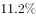。

        2015年，纺织行业规模以上企业累计实现主营业务收入70713亿元，同比增长；实现利润总额3860亿元，同比增长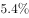；企业亏损面(亏损企业占所有企业比重)，比上年低0.1个百分点。

        2015年，我国出口纺织品、服装2912亿美元，同比下降，按出口商品类型看，纺织品出口1153亿美元，同比下降；服装出口1759亿美元，同比下降。按出口对象看，对美国出口额同比增长，对欧盟出口额同比下降，对日本出口额同比下降，对东盟出口额同比下降。

        2015年，我国纺织行业500万元以上项目固定资产投资完成额11913亿元，同比增长。其中东部地区固定资产投资完成额同比增长，中部地区固定资产投资完成额同比增长，西部地区固定资产投资完成额同比增长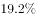。行业新开工项目数呈现增速提升势头，新开工项目16149项，同比增长。

#### 第 1 题　qid 2097096 · 增长

2015年，化学纤维行业增加值同比增速比规模以上工业增加值同比增速：

- **A**. 高4.7个百分点
- **B**. 高4.9个百分点
- **C**. 高5.1个百分点　✅
- **D**. 低1.9个百分点

**答案**：C

**官方解析**

由题目材料第一段“2015年，全国规模以上纺织企业工业增加值同比增长，高于规模以上工业整体水平0.2个百分点”“其中······化学纤维行业增加值同比增长”。可得规模以上工业增加值同比增速为；“化学纤维行业增加值同比增速”与“规模以上工业增加值同比增速”相比较：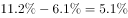，即高5.1个百分点。

故正确答案为C。

---

#### 第 2 题　qid 2097098 · 增长

2015年，纺织行业规模以上企业主营业务利润率（利润总额/主营业务收入）比上年约：

- **A**. 上升0.02个百分点　✅
- **B**. 上升0.4个百分点
- **C**. 下降0.02个百分点
- **D**. 下降0.4个百分点

**答案**：A

**官方解析**

由问题“2015年主营业务利润率（利润总额/主营业务收入）比上年约上升/下降几个百分点”，判断本题为两期比重的比较问题。定位材料第二段：“2015年，纺织行业规模以上企业累计实现主营业务收入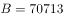亿元，同比增长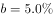，实现利润总额亿元，同比增长”。因，比值同比上升，排除C、D两项。根据两期比重公式，则，由于，故所求，A项满足。

故正确答案为A。

---

#### 第 3 题　qid 2097102 · 比重

在美国、欧盟、日本和东盟四大主要贸易伙伴中，2015年我国纺织品、服装对其出口额占当年我国纺织品、服装出口总额比重低于2014年水平的有：

- **A**. 仅东盟
- **B**. 美国和东盟
- **C**. 欧盟和日本　✅
- **D**. 欧盟、日本和东盟

**答案**：C

**官方解析**

由问题“2015年······的比重低于2014年”可得本题为两期比重比较问题，仅需比较部分增长率a与整体增长率b的大小关系，只需查找出的，即为比重低于上年同期水平的国家。定位材料第三段可知“2015年我国出口纺织品、服装”为整体，其增速；各部分包括：“对美国出口额”其增速；“对欧盟出口额”其增速；“对日本出口额”其增速；“对东盟出口额”其增速。可见增速小于整体的，只有欧盟和日本。

故正确答案为C。

---

#### 第 4 题　qid 2097108 · 综合

2014年，我国服装出口额在以下哪个范围之内？

- **A**. 低于1800亿美元
- **B**. 1800～1900亿美元之间　✅
- **C**. 1900～2000亿美元之间
- **D**. 高于2000亿美元

**答案**：B

**官方解析**

由问题“2014年，我国服装出口额的范围”，结合材料数据为2015年，可判定本题为基期计算问题。定位材料第三段“2015年，我国服装出口1759亿美元，同比下降 ”，代入公式：亿美元。

故正确答案为B。

---

#### 第 5 题　qid 2097116 · 综合

能够从上述资料中推出的是：

- **A**. 
2014年全国规模以上纺织企业工业增加值同比增长

- **B**. 
2015年全国扭亏为盈的纺织行业规模以上企业少于盈转亏的企业数量

- **C**. 
2014年全国纺织行业500万元以上项目固定资产投资完成额超过1万亿元
　✅
- **D**. 
2015年纺织行业中西部地区固定资产投资完成额同比增量高于东部地区

**答案**：C

**官方解析**

A项：根据材料第一段“2015年，全国规模以上纺织企业工业增加值同比增长，增速比上年同期回落0.7个百分点”，可得2014年，全国规模以上纺织企业工业增加值同比增长，错误；

B项：由于文中只给出了“企业亏损面，比上年低0.1个百分点”，并未给出2015年和2014年的企业总个数，因此无法推断亏损的企业个数增加还是减少，所以无法推断出扭亏为盈和盈转亏的企业个数之间是否存在少于关系，错误；

C项：根据材料第四段“2015年，我国纺织行业500万元以上项目固定资产投资完成额11913亿元，同比增长”，可得，正确；

D项：由于文中只给出东、中、西部地区固定资产完成额的增长率，未给出三者的现期值，故无法判断增长量的大小，错误。

故正确答案为C。

---

### 材料 2

        2014年末，某省公路里程172167公里，同比增长，其中，高速公路4237公里，同比增长。国家铁路正线延展里程和营业里程分别为15060公里和9351公里，分别同比增长和。地方铁路正线延展里程和营业里程分别为1805公里和1072公里，分别同比增长和。

#### 第 6 题　qid 2097272 · 综合

2013年末，该省公路里程约为多少万公里？

- **A**. 15.3
- **B**. 16.7　✅
- **C**. 17.9
- **D**. 19.4

**答案**：B

**官方解析**

由题意知，问题是“2013年该省公路里程约为多少万公里”且材料是2014年，判定此题是基期量问题。定位材料第一段“2014年末，某省公路里程为172167公里，同比增长”，可知2013年该省公路里程万，B项当选。

故正确答案为B。

---

#### 第 7 题　qid 2097274 · 综合

2013年末，该省国家铁路正线延展里程比地方铁路正线延展里程多约多少公里？

- **A**. 13377　✅
- **B**. 14902
- **C**. 15280
- **D**. 16579

**答案**：A

**官方解析**

问题是“2013年该省国家铁路延展里程比地方铁路延展里程多的多少”且材料是2014年，判定此题为基期和差问题。定位文字材料第一段“2014年末，国家铁路延展里程为15060公里，同比增长；地方铁路延展里程为1805，同比增长”，可知2013年该省国家铁路延展里程，2013年该省地方铁路延展里程，则2013年该省国家铁路正线延展里程比地方铁路正线延展里程多 公里，与A项最接近。

故正确答案为A。

---

#### 第 8 题　qid 2097276 · 增长

该省的下列各项指标中，2014年同比增速最快的是：

- **A**. 铁路货运量
- **B**. 民航货运量
- **C**. 铁路旅客周转量　✅
- **D**. 公路货物周转量

**答案**：C

**官方解析**

定位表格材料可知铁路货运量增长率为，民航货运量增长率为，铁路旅客周转量增长率为，公路货物周转量增长率为，增长最快的是铁路旅客周转量。

故正确答案为C。

---

#### 第 9 题　qid 2097278 · 平均数

2014年铁路旅客平均每人次周转距离比2013年多约多少公里？

- **A**. 15
- **B**. 25　✅
- **C**. 34
- **D**. 44

**答案**：B

**官方解析**

由题意“2014年铁路旅客平均每人周转距离比2013年约多”判定此题为平均数的增长量问题。定位表格材料：2014年铁路旅客周转量为201.9亿人公里，增长为，旅客人数为4796.5万人，增长率为8.2%，根据平均数的增长量公式：，B项当选。

故正确答案为B。

---

#### 第 10 题　qid 2097282 · 综合

关于2014年该省交通运输状况，下列说法正确的是：

- **A**. 
高速公路里程占全省公路总里程比重超过

- **B**. 
三种运输方式的客运量和货运量均高于上年

- **C**. 
公路货运量占货运总量的7成多

- **D**. 
货运总量比上年增长超过3万亿吨
　✅

**答案**：D

**官方解析**

A项：根据第一段“2014年末，某省公路里程172167公里，其中，高速公路4237公里”，可得2014年末，高速公路里程占全省公路里程的比重，小于，错误；

B项：由表格可知公路客运量2014年的增长率为，即比去年下降，选项说三种运输方式的客运量和货运量均高于上年，错误；

C项：根据表格可知，公路货运量为127000亿吨，货运总量为204000亿吨，故公路货运量占货运总量的比重，不足7成，错误；

D项：根据表格可知，2014年货运总量是204000亿吨，同比增长。，超过3万亿吨，正确。

故正确答案为D。

---

### 材料 3

        2015年2季度，J省消费者信心指数（CCI）为101.1，环比、同比分别下降4.6个、10.7个百分点。分城乡看，城镇和农村消费者信心指数分别为101.6和100.1，环比分别下降5.2、3.8个百分点。

        从体现消费者对当前形势的满意程度看，2015年2季度，J省消费者满意指数（ICC）为96.9，从满意指数的构成看，消费者对当前就业满意指数为101.2，其中城乡指数分别为99.3、104.2，环比分别下降6.1个、3.3个百分点；对当前家庭收入的满意程度看，满意指数为99.5，其中城乡家庭收入满意指数分别为100.4、98.1，环比分别下降9.6个、3.1个百分点。

        从反映消费者对未来乐观程度的预期指数看，2015年2季度，J省消费者预期指数（ICS）为103.8，在持续两个季度小幅回升后，本季度有所回落，环比、同比分别下降4.1个、12.0个百分点。

        2015年2季度，Z省城乡消费者信心指数均呈下行态势，其中，城镇消费者信心指数为111.1，较一季度下降1.4个百分点；农村消费者信心指数为108.7，较一季度下降3.4个百分点。

#### 第 11 题　qid 2097262 · 综合

2015年1季度，J省消费者满意指数构成中，数值最低的是：

- **A**. 城镇就业满意指数
- **B**. 农村就业满意指数
- **C**. 城镇家庭收入满意指数
- **D**. 农村家庭收入满意指数　✅

**答案**：D

**官方解析**

定位文字材料第二段可得，2015年2季度······消费者对当前就业满意指数为101.2，其中城乡指数分别为99.3、104.2，环比分别下降6.1个、3.3个百分点······城乡家庭收入满意指数分别为100.4、98.1，环比分别下降9.6个、3.1个点。则2015年1季度，，，，，数值最低的是农村家庭收入满意指数。

故正确答案为D。

---

#### 第 12 题　qid 2097264 · 综合

Z省2015年1季度农村消费者信心指数值是：

- **A**. 108.7
- **B**. 112.1　✅
- **C**. 112.5
- **D**. 103.9

**答案**：B

**官方解析**

定位文字材料第四段，“2015年2季度，Z省······农村消费者信心指数为108.7，较一季度下降3.4个百分点。”则Z省2015年1季度农村消费者。

故正确答案为B。

---

#### 第 13 题　qid 2097266 · 综合

设Z省2015年1、2季度消费者信心指数值为、，J省同期同一指标为、，则：

- **A**. 

- **B**. 

　✅
- **C**. 

- **D**. 

**答案**：B

**官方解析**

由文字材料第一段可得，2015年2季度，J省消费者信心指数为101.1，环比下降4.6个百分点，则1季度J省消费者信心指数为101.1+4.6=105.7。由折线图可得，2015年1、2季度Z省消费者信心指数值分别、为112.4、110.2。故四项排序由大到小应分别为。

故正确答案为B。

---

#### 第 14 题　qid 2097268 · 增长

Z省消费者满意指数下降最快的时间段是：

- **A**. 2014年2季度
- **B**. 2014年3季度
- **C**. 2015年1季度　✅
- **D**. 2015年2季度

**答案**：C

**官方解析**

由题干“消费者满意指数下降最快”可知，题目所求为指数下降最大的。定位材料折线图部分可得，选项各时间段的消费者满意指数的变化量分别为：

A项：2014年2季度，；

B项：2014年3季度，消费者满意指数上升，排除；

C项：2015年1季度，；

D项：2015年2季度，。

下降最快的为2015年1季度。

故正确答案为C。

注释：中国消费者信心指数由消费者满意指数和消费者预期指数加权平均取得。满意指数是指消费者对当前就业形势、当前家庭收入情况和购买时机的判断，预期指数是指消费者对未来6个月就业形势和家庭收入情况的预期。上述指数的取值均在“0~200”之间。“100”为“乐观”和“悲观”的临界值。当信心指数大于100，表明消费者趋于乐观；小于100，表明消费者趋于悲观。

---

#### 第 15 题　qid 2097270 · 综合

能够从上述资料中推出的是：

- **A**. 2015年2季度，J省、Z省城镇消费者信心指数环比下降的数值均大于农村消费者信心指数
- **B**. 2014年3季度至2015年2季度，J省、Z省消费者信心指数变化趋势相同
- **C**. 2015年2季度，J省、Z省消费者预期指数值相差10个百分点以上
- **D**. 2014年3季度至2015年2季度，Z省消费者信心指数最高的季度也是该指数环比增速最快的季度　✅

**答案**：D

**官方解析**

A项：定位文字材料第四段，“2015年2季度，Z省……城镇消费者信心指数为111.1，较一季度下降1.4个百分点；农村消费者信心指数为108.7，较一季度下降3.4个百分点”，城镇消费者信心指数环比下降数值小于农村，错误；

B项：材料仅提供了2015年1季度与2季度J省消费者信心指数值，2014年3季度与4季度未知，故选项说法无法得出，错误；

C项：定位文字材料第三段可得，2015年2季度，J省消费者预期指数（ICS）为103.8，定位统计图可得，2015年2季度，Z省消费者预期指数为111.8，二者相差个百分点，错误；

D项：定位统计图，比较2014年3季度至2015年2季度各季度Z省消费者信心指数的环比增速，2015年1、2季度环比降低，增速为负值，2014年3季度环比增速为，2014年4季度环比增速为，则2014年4季度环比增速最大，Z省消费者信心指数最高的季度是2014年4季度，与指数环比增速最快的是同一季度，正确。

故正确答案为D。

注释：中国消费者信心指数由消费者满意指数和消费者预期指数加权平均取得。满意指数是指消费者对当前就业形势、当前家庭收入情况和购买时机的判断，预期指数是指消费者对未来6个月就业形势和家庭收入情况的预期。上述指数的取值均在“0~200”之间。“100”为“乐观”和“悲观”的临界值。当信心指数大于100，表明消费者趋于乐观；小于100，表明消费者趋于悲观。

---
