# 2017年四川省公务员考试《行测》题（定向乡镇）

> 省考 · 2017 年 · 5 个模块 · 共 100 题

- [常识判断](#%E5%B8%B8%E8%AF%86%E5%88%A4%E6%96%AD) · 10 题
- [言语理解与表达](#%E8%A8%80%E8%AF%AD%E7%90%86%E8%A7%A3%E4%B8%8E%E8%A1%A8%E8%BE%BE) · 35 题
- [数量关系](#%E6%95%B0%E9%87%8F%E5%85%B3%E7%B3%BB) · 8 题
- [判断推理](#%E5%88%A4%E6%96%AD%E6%8E%A8%E7%90%86) · 30 题
- [资料分析](#%E8%B5%84%E6%96%99%E5%88%86%E6%9E%90) · 17 题

---

## 常识判断

### 第 1 题　qid 4767931 · 人文常识

下列关于党的基层组织或村民委员会的说法，不正确的是：

- **A**. 乡镇党的委员会和村党支部（含党支、党委）是乡镇、村各种组织和各项工作的领导核心
- **B**. 有3名以上正式党员的村，应当成立党支部，不足3名的，可与邻近村联合成立党支部
- **C**. 村民委员会成员中，可以有妇女成员，多民族村民居住的村应当有人数较少的民族的成员　✅
- **D**. 村民委员会主任、副主任和委员，由村民直接选举产生，任何组织不得撤换村民委员会成员

**答案**：C

**官方解析**

本题考查法律常识。
A项正确，根据《中华人民共和国村民委员会组织法》第四条规定：“中国共产党在农村的基层组织，按照中国共产党章程进行工作，发挥领导核心作用，领导和支持村民委员会行使职权；依照宪法和法律，支持和保障村民开展自治活动、直接行使民主权利。”
B项正确，根据《中国共产党支部工作条例（试行）》第四条第一款规定：“党支部设置一般以单位、区域为主，以单独组建为主要方式。企业、农村、机关、学校、科研院所、社区、社会组织、人民解放军和武警部队连（中）队以及其他基层单位，凡是有正式党员3人以上的，都应当成立党支部。”第五条第三款规定：“正式党员不足3人的单位，应当按照地域相邻、行业相近、规模适当、便于管理的原则，成立联合党支部。联合党支部覆盖单位一般不超过5个。”
C项错误，根据《中华人民共和国村民委员会组织法》第六条第二款规定：“村民委员会成员中，应当有妇女成员，多民族村民居住的村应当有人数较少的民族的成员。”
D项正确，根据《中华人民共和国村民委员会组织法》第十一条第一款规定：“村民委员会主任、副主任和委员，由村民直接选举产生。任何组织或者个人不得指定、委派或者撤换村民委员会成员。”
本题为选非题，故正确答案为C。

---

### 第 2 题　qid 4767933 · 科技常识

下列与工业有关的说法，不正确的是：

- **A**. 工业用电大多使用三相电压，而民用电使用单相电压
- **B**. 熟铁、生铁、铜中，含碳量最少的是熟铁，最多的是铜　✅
- **C**. 镍氢电池因内部没有重金属元素，因而比镍镉电池更环保
- **D**. 火灾危险、毒害危险、污染危险均属于化工生产的主要危险

**答案**：B

**官方解析**

本题考查科技常识。
A项正确，工业用电是指主要从事大规模生产加工行业的企业用电。工业用电大多使用三相电压，而民用电采用的是单相220VAC对居民供电。
B项错误，熟铁是指用生铁精炼而成的比较纯的铁。含碳量约在0.02%以下，又叫锻铁、纯铁。生铁是含碳量大于2%的铁碳合金，工业生铁含碳量一般在2.11%-4.3%，并含Si、Mn、S、P等元素，是用铁矿石经高炉冶炼的产品。而铜中基本不含碳，即便是含有少量碳的氧化铜中的含碳量也是微乎其微。因此，铜的含碳量最低，其次是熟铁，生铁的含碳量最高。
C项正确，镍氢电池是由氢离子和金属镍合成，电量储备比镍镉电池多30%，内部没有重金属元素。镍镉电池会污染环境，特别是镉具有剧毒，对人危害特别大。
D项正确，化工企业生产、加工、储存的化工原料、化工产品具有高度的易燃易爆性和毒性，且生产过程中产生的杂质和排放物属工业毒物，具有毒性、腐蚀性，一旦泄漏到大气或排放到江河中易造成大量人员伤亡和大气、水污染，如氯气、硫化氢、含磷的污水等等。故火灾危险、毒害危险、污染危险均属于化工生产的主要危险。
本题为选非题，故正确答案为B。

---

### 第 3 题　qid 4767937 · 人文常识

下列关于气候现象的说法，不正确的是：

- **A**. 在北半球，夏季的大气压比冬季高　✅
- **B**. 气旋常可演变成大风甚至台风、飓风
- **C**. 赤道地区由于没有地转偏向力，不会出现龙卷风
- **D**. 高气压区的天气多为晴天，低气压区多风雨天气

**答案**：A

**官方解析**

本题考查地理国情。
A项错误，气压是作用在单位面积上的大气压力，即在数值上等于单位面积上向上延伸到大气上界的垂直空气柱所受到的重力。气压的变化与天气的变化密切相关，它不仅随着高度产生变化，同时也受气温的影响。在北半球，夏季气温高，空气暖轻而上升，因此气压比较低，而冬季气温低，空气重而下降，气压高。
B项正确，气旋按生成和活动范围可分为温带气旋和热带气旋。热带气旋，是发生在热带或副热带洋面上的低压涡旋，是一种强大而深厚的热带天气系统。可见于西太平洋及其临近海域（台风）、大西洋和东北太平洋（飓风）以及印度洋和南太平洋。
C项正确，地球自转偏向力，是指地球自转而使地球表面运动物体受到与其运动方向相垂直的力。地转偏向力对航天、航空来说是一种不可忽视的力，它在极地最显著，向赤道方向逐渐减弱直到消失在赤道处。龙卷风是发生于直展云系底部和下垫面之间的直立空管状旋转气流，是一类局地尺度的剧烈天气现象。因此，赤道地区不会出现出现龙卷风。
D项正确，高气压内部为下沉气流，而低气压内部为上升气流。当空气上升时，气温会发生下降，空气无法再容纳更多的水蒸气，水蒸气就会凝结形成云。因此，当低气压到来时，就会出现阴天或是下雨的天气。相反，发生在高气压中心的是下沉气流。高空中的空气下沉，气温就会上升，空气就可以容纳更多的水蒸气在里面。因此，高气压到来时云就变得难以形成，天气多为晴天。
本题为选非题，故正确答案为A。

---

### 第 4 题　qid 4767924 · 地理国情

下列关于我国国土概况的说法，不正确的是：

- **A**. 琼州海峡呈东西向延伸
- **B**. 云贵高原是典型的石灰岩岩溶地貌
- **C**. 塔克拉玛干沙漠位于塔里木盆地内部
- **D**. 华北平原主要由长江、黄河、海河的泥沙冲积而成　✅

**答案**：D

**官方解析**

本题考查地理国情。
A项正确，琼州海峡位于广东省雷州半岛和海南省海南岛之间。西接北部湾，东邻南海北部，北起雷州半岛西端的灯楼角至南端的博赊角，南到海南岛的临高角至木栏头，由“三角一头”连线近似矩形的水域。海峡整体上呈东西走向，东西总长103.5公里。
B项正确，云贵高原分布着广泛的岩溶地貌，是喀斯特地形。它是石灰岩在高温多雨的复杂化学反应条件下，经过漫长的岁月，被水溶解和侵蚀而逐渐形成的。
C项正确，塔克拉玛干沙漠位于新疆南疆的塔里木盆地中心，是中国最大的沙漠，也是世界第十大沙漠，同时亦是世界第二大流动沙漠。
D项错误，华北平原是中国第二大平原，面积广袤，地势低平，多在海拔50米以下，是典型的冲积平原，是由于黄河、淮河、海河、滦河等所带的大量泥沙沉积所致。
本题为选非题，故正确答案为D。

---

### 第 5 题　qid 4767930 · 科技常识

下列植物与所属树种对应不正确的是：

- **A**. 云杉——针叶林
- **B**. 桂花树——灌木　✅
- **C**. 杨树——阔叶林
- **D**. 玉兰树——乔木

**答案**：B

**官方解析**

本题考查科技常识。
A项正确，云杉是一种乔木，高达45米，耐阴、耐寒、喜欢凉爽湿润的气候和肥沃深厚、排水良好的微酸性沙质土壤，生长缓慢，属浅根性树种。针叶林是以针叶树为建群种所组成的各类森林的总称，主要由云杉、冷杉、落叶松和松树等属一些耐寒树种组成。其中由落叶松组成的称为明亮针叶林，而以云杉、冷杉为建群树种的称为暗针叶林。
B项错误，桂花树又叫木樨，是木樨科、木犀属常绿乔木或灌木，最高可达18米；树皮灰褐色，小枝黄褐色，无毛；叶片革质，椭圆形、长椭圆形或椭圆状披针形。原产中国西南部，中国各地已广泛栽培。在园艺栽培上，由于花的色彩不同，有金桂、银桂、丹桂等不同名称。
C项正确，杨树属于杨柳科杨属植物，包括青杨派、白杨派、黑杨派、胡杨派、大叶杨派五大类。树干通常端直；树皮光滑或纵裂，常为灰白色。主要分布于华中、华北、西北、东北等广阔地区。阔叶林由阔叶树种组成的树林，分为冬季落叶的落叶阔叶林（又称夏绿林）和四季常绿的常绿阔叶林（又称照叶林）两类。落叶阔叶林是我国温带地区最主要的森林类型，构成群落的乔木树种多是冬季落叶的喜光阔叶树，组成我国落叶阔叶林的主要树种有：栎属、水青冈属、杨属、桦属、榆属、桤属、朴属和槭属等。
D项正确，玉兰树是木兰科、玉兰属植物，落叶乔木，高达25米，胸径1米，枝广展形成宽阔的树冠；树皮深灰色，粗糙开裂；小枝稍粗壮，灰褐色；叶纸质，倒卵形或倒卵状椭圆形；花被片9片，白色，基部常带粉红色。分布于中国江西（庐山）、浙江（天目山）、湖南（衡山）、贵州，中国各大城市园林广泛栽培。
本题为选非题，故正确答案为B。

---

### 第 6 题　qid 4767928 · 地理国情

乳畜业主要分布在北美五大湖地区、西欧、中欧、澳大利亚、新西兰，在我国主要分布在内蒙古高原和北京、上海等大城市周围。下列关于其分布原因，说法不正确的是：

- **A**. 温和多雨的气候有利于作为饲料的多汁牧草的生长
- **B**. 当地居民的饮食习惯使得市场对乳制品的需求量大
- **C**. 乳制品不耐储存且运输不便，故一般紧邻消费市场
- **D**. 人口稠密、劳动力资源丰富的地区利于规模化生产　✅

**答案**：D

**官方解析**

本题考查科技常识。
A、B、C三项正确，乳畜业是随着城市的发展而产生的一种面向城市市场的商品化、集约化、畜牧业地域类型，其生产对象是奶牛，产品主要是牛奶及其制品，如奶粉、黄油和奶酪。市场和饲料供应是影响乳畜业生产的两个重要因素。就饲料供应因素来看北美五大湖地区、西欧、中欧、澳大利亚、新西兰及我国内蒙古高原等地区的自然地理环境和气候有利于多汁牧草的生长，可以为奶牛供应丰富优质的饲料；就市场因素来看，西欧等地区城市化程度较高，经济发达，人们有饮用牛奶的习惯；另外，大城市人口稠密，需要大量的新鲜牛奶以及牛奶制品。而受新鲜牛奶保质期较短的影响，储存运输不便，乳畜业一般建在大城市周围。
D项错误，西欧、我国内蒙古高原地区并非人口稠密、劳动力资源丰富地区，因此并非人口稠密、劳动力资源丰富的地区利于规模化生产，而是机械化水平较高的地区更加有利于乳畜业的规模化生产。
本题为选非题，故正确答案为D。

---

### 第 7 题　qid 4767940 · 人文常识

下列关于世界遗产与其所属类别对应不正确的是：

- **A**. 敦煌莫高窟——世界文化遗产
- **B**. 苏州古典园林——世界自然遗产　✅
- **C**. 昆曲——人类口述和非物质文化遗产
- **D**. 峨眉山—乐山大佛——世界自然与文化双遗产

**答案**：B

**官方解析**

本题考查人文常识。
A项正确，敦煌莫高窟，俗称“千佛洞”，坐落在河西走廊西端的敦煌。它始建于前秦宣昭帝苻坚时期，后历经北朝、隋朝、唐朝、五代十国、西夏、元朝等历代的兴建，形成巨大的规模，有洞窟735个，壁画4.5万平方米、泥质彩塑2415尊，是世界上现存规模最大、内容最丰富的佛教艺术地。1961年，敦煌莫高窟被中华人民共和国国务院公布为第一批全国重点文物保护单位之一，1987年，敦煌莫高窟被列为世界文化遗产。
B项错误，苏州古典园林，亦称“苏州园林”，是位于江苏省苏州市境内的中国古典园林的总称。苏州古典园林溯源于春秋，发展于晋唐，繁荣于两宋，全盛于明清，苏州素有“园林之城”的美誉。1997年，苏州古典园林中的拙政园、留园、网师园和环秀山庄被列入世界文化遗产名录；2000年，沧浪亭、狮子林、耦园、艺圃和退思园作为苏州古典园林的扩展项目也被列为世界文化遗产。
C项正确，昆曲，原名“昆山腔”（简称“昆腔”），是中国古老的戏曲声腔、剧种，现又被称为“昆剧”。昆曲发源于14世纪中国的苏州昆山，后经魏良辅等人的改良而走向全国，自明代中叶以来独领中国剧坛近300年。昆曲在2001年被联合国教科文组织列为“人类口述和非物质文化遗产代表作”，2006年列入第一批国家级非物质文化遗产名录。
D项正确，峨眉山位于四川省西南部，四川盆地的西南边缘，是中国“四大佛教名山”之一，地势陡峭，风景秀丽，素有“峨眉天下秀”之称，峨眉山古建筑群为全国重点文物保护单位，峨眉山景区为国家重点风景名胜区、国家AAAAA级旅游景区。乐山大佛位于四川省乐山市市中区东南凌云山栖鸾峰临江峭壁。唐开元元年（公元713年）至贞元十九年（803年）完成，大佛头与山齐，脚踏大江，通高71米，肩宽24米，故又名凌云大佛，为世界最大的石佛像。二者于1996年被列入《世界文化与自然遗产名录》，是世界自然与文化双遗产。
本题为选非题，故正确答案为B。

---

### 第 8 题　qid 4767939 · 人文常识

下列与中国古代文化有关的说法，正确的是（    ）。

- **A**. “五谷”指的是稻、麦、稷、黍、粟
- **B**. 三皇五帝中的“三皇”指的是尧、舜、禹
- **C**. 旧时一夜分为五更，三更是现在的23点到1点　✅
- **D**. 三九天、三伏天分别是从冬至日和夏至日开始算

**答案**：C

**官方解析**

本题考查人文常识。
A项错误，“五谷”在古代有多种不同说法，最主要的有两种：一种指稻、黍、稷、麦、菽；另一种指麻、黍、稷、麦、菽。
B项错误，“三皇五帝”指古代传说中的帝王，说法不一，通常称伏羲、燧人、神农为三皇；或者称天皇、地皇、人皇为三皇。五帝通常指黄帝、颛顼、帝喾、唐尧、虞舜。
C项正确，古代中国民间把夜晚分成五个时间段，即一更、二更、三更、四更、五更。“一更”是指晚上七点到九点，“二更”是指晚上九点到十一点，“三更”是指晚上十一点到凌晨一点，“四更”是指凌晨一点到凌晨三点，“五更”是指凌晨三点到凌晨五点。
D项错误，三九天，是指从冬至逢壬日算起的第3个寒天，其是一年中最寒冷的一段时间。具体计算方法是，以冬至逢壬日，即每年冬至以后第一个壬日（壬日是以古代历法中的天干地支纪时的方法表示的）为起点（亦有说法从冬至算起），每“九天”算一“九”，第一个九天叫做“一九”，第二个九天叫“二九”，依此类推，一年中最冷的时段便在“三九、四九天”。三伏天，出现在小暑与处暑之间，是一年中气温最高且又潮湿、闷热的时段。“伏”表示阴气受阳气所迫藏伏地下，三伏有初伏、中伏和末伏之分。传统历书规定：“夏至三庚便数伏”，意思是说，“从夏至日”开始往后数，数到第三个“庚日”便开始入伏了。这里的“庚日”是指古代的“干支纪日法”中带有“庚”字头的那一天。
故正确答案为C。

---

### 第 9 题　qid 4767942 · 人文常识

下列成语典故与军事作战无关的是（    ）。

- **A**. 坚壁清野
- **B**. 退避三舍
- **C**. 张弛有度　✅
- **D**. 隔岸观火

**答案**：C

**官方解析**

本题考查人文常识。
A项正确，“坚壁清野”出自《三国志·魏书·荀彧传》，也说空室清野，意思是加强工事，使堡垒坚固，将野外的粮食作物和重要物资清理收藏起来，是对付强敌入侵的一种方法。与军事作战有关。
B项正确，“退避三舍”出自《左传》，春秋时，晋国同楚国在城濮（在今山东鄄城西南）作战，晋文公遵守以前的诺言，把军队撤退九十里（古代行军三十里为一舍）。后用来比喻对人让步，不与人相争。与军事作战有关。
C项错误，“张弛有度”的“张”是紧张、绷紧的意思，“弛”是放松、松懈的意思。大意是松紧有度，收放自如。与军事作战无关。
D项正确，“隔岸观火”是我国古代兵书《三十六计》中的一计，意为隔着河看失火。比喻置身事外，对别人的危难不去救助，采取袖手旁观的态度。与军事作战有关。
本题为选非题，故正确答案为C。

---

### 第 10 题　qid 4767941 · 人文常识

下列说法符合史实的是（    ）。

- **A**. 战国时期秦国、赵国等国长期受到北方游牧民族的威胁　✅
- **B**. 汉武帝曾派蒙恬、卫青、霍去病等名将抗击匈奴
- **C**. “绍兴和议”后，南宋将燕云十六州割让给金人
- **D**. 明成祖北伐瓦剌，战败被俘，史称“土木堡之变”

**答案**：A

**官方解析**

本题考查人文常识。
A项正确，战国时期，居住在中国北部的匈奴，已经进入奴隶制社会，占有今内蒙古、宁夏一带的广大草原地区。那时候，秦、赵等国与北部的少数民族接壤。中原各国忙于征战，无暇北顾，匈奴经常袭掠与其接壤的秦、赵、燕三国北部边地。秦始皇兼并六国后，为解除匈奴对秦的威胁，曾命蒙恬率30万大军北击匈奴，史称秦攻匈奴之战。
B项错误，卫青，西汉汉武帝时期名将，他首次出征是奇袭龙城，揭开汉匈战争汉朝反败为胜的序幕；曾七战七胜，收复河朔、河套地区，击破单于，为北部疆域的开拓做出重大贡献。霍去病，汉武帝时期名将、杰出的军事家，在两次河西之战中，霍去病大破匈奴，直取祁连山；在漠北之战中，霍去病封狼居胥，大捷而归。蒙恬，战国时期秦国人，秦统一六国后，蒙恬率三十万大军北击匈奴。
C项错误，绍兴十一年十一月，南宋与金于书面达成《绍兴和议》，规定两国以淮水—大散关为界。宋割让以前被岳飞收复的唐州、邓州以及商州、秦州的大半，每年向金进贡银廿五万两，绢廿五万匹。五代十国时期后晋开国皇帝石敬瑭即位后，割幽、蓟、瀛、莫、涿、檀、顺、新、妫、儒、武、云、应、寰、朔、蔚十六州以与契丹，仍许岁输帛三十万匹。此即为割让燕云十六州事件。
D项错误，“土木堡之变”即土木之变，指明朝正统十四年第四次明英宗北伐时，明军在土木堡败于瓦剌，明英宗兵败被俘的事变。“明成祖北伐”又称明成祖北征、永乐北伐，明成祖在位期间，先后五次亲征，北伐蒙古。1414年（永乐十二年），明成祖举行第二次北伐亲征，在忽兰忽失温（今蒙古国乌兰巴托东南）击败据险而守的瓦剌首领马哈木，追至土剌河，马哈木逃遁。瓦剌战败，明成祖诏告天下。
故正确答案为A。

---

## 言语理解与表达

### 第 1 题　qid 4768446 · 逻辑填空

众所周知，地球上的生态系统是经过长期进化形成的，系统中的物种经过长期演变，才形成了现在相互依赖又相互        的密切关系。一个外来物种的引入，有可能因无法适应新环境而消亡，也有可能因新的环境中没有与之        的生物而演变为凶残的入侵者。
填入划横线处最恰当的一项是：

- **A**. 排斥 匹敌
- **B**. 冲突 相当
- **C**. 限制 对抗
- **D**. 制约 抗衡　✅

**答案**：D

**官方解析**

第一空，根据横线前后可知，横线处修饰“密切关系”，应体现出系统中的物种关系接近、紧密，互相影响之意，D项“制约”指相互约束，符合文意，保留。A项“排斥”指不相容、使离开或不使进入，B项“冲突”指对立的、互不相容的力量或性质，均与“密切”相悖，排除；C项“限制”指不让超过一定界限，局限在范围内，文段并未体现“界限”之意，排除。
第二空，代入验证，D项“抗衡”指彼此相敌，不相上下，可以体现因新环境中没有可以与之相敌的物种而演变为入侵者之意，符合文意，当选。
故正确答案为D。
【文段出处】《未来哪些地区更容易遭到生物入侵？》

---

### 第 2 题　qid 4768451 · 逻辑填空

提到人工智能，很多人都会想起谷歌AlphaGo与棋手之间的“围棋人机大战”。AlphaGo在比赛中的出色表现，至今仍然让人们            ，但与此同时，“            ”的人工智能也引发了不少人的担忧：人工智能会不会像科幻电影所描述的那样取代人类呢？
填入划横线处最恰当的一项是：

- **A**. 记忆犹新 异军突起
- **B**. 惊叹不已 咄咄逼人
- **C**. 心有余悸 风起云涌
- **D**. 津津乐道 来势汹汹　✅

**答案**：D

**官方解析**

第一空，“但”表示转折，根据后文“人工智能也引发了不少人的担忧”可知，横线所填成语应与“引发担忧”意思相反，体现人们对人工智能的积极态度，B项“惊叹不已”意为满口赞赏和赞叹，D项“津津乐道”形容很有兴味地谈论，均可体现人们对人工智能的积极态度，符合文意，保留。A项“记忆犹新”意思是对接触过的人或事，还记得很清楚，就像最近才发生的一样，侧重强调印象深刻，C项“心有余悸”形容危险不安的事情虽然过去，但回想起来心里仍感到紧张、害怕，均不能体现人们的积极态度，排除。
第二空，根据后文“······引发了不少人的担忧：人工智能会不会像科幻电影所描述的那样取代人类呢”可知，人们认为人工智能有取代人类的可能性，故横线处应体现目前人工智能引发这种担忧的状态，D项“来势汹汹”形容动作或事物到来的气势很猛烈，既可体现前文AlphaGo的出色强大，也可传达出人们对其能否取代人类的担忧，当选。B项“咄咄逼人”指盛气凌人，使人惊惧，文段并未体现AlphaGo对待人类的语言和态度是逼人的，排除。
故正确答案为D。
【文段出处】《人工智能“来势汹汹” 它到底会不会取代人类？》

---

### 第 3 题　qid 4768496 · 逻辑填空

发展是时代的主题，同时也是每个时代需要面对的问题，对“什么是发展”“怎样发展”“为谁发展”等问题的回答，        着中国特色社会主义发展的历史脉络，指导着我们的实践。新时期以“五大发展”为核心的新发展理念提出，更是        着辩证思维和哲学智慧，是我们党对发展问题的新思考、新成果。
填入划横线处最恰当的一项是：

- **A**. 贯穿 彰显　✅
- **B**. 延续 闪耀
- **C**. 梳理 辉映
- **D**. 顺应 凸现

**答案**：A

**官方解析**

第一空，由“发展是时代的主题，同时也是每个时代需要面对的问题”可知，对“发展”这一系列问题的回答始终存在于中国特色社会主义发展中。A项“贯穿”指从头到尾穿过一个或一系列事物，符合文意，保留。B项“延续”指按照原来的样子继续下去，侧重强调继续、延长，C项“梳理”指对事物进行归类、分析，使之有条理，D项“顺应”指顺从，适应，均无法体现始终存在之意，排除。
第二空，代入验证。A项“彰显”指鲜明地显示，填入文段指显著地展现出辩证思维和哲学智慧，让大家都看到，符合文意，当选。
故正确答案为A。
【文段出处】《新发展理念的哲学智慧》

---

### 第 4 题　qid 4768511 · 逻辑填空

文化产业的发展规律都是类似的，电影市场的放开也会产生竞争淘汰，在一定时间内可能会出现            的现象，但尘埃落定之后，依然会完成优胜劣汰，我们不能就此            ，遏制了发展的可能，尝试和发展都是有意义和有价值的。
填入划横线处最恰当的一项是：

- **A**. 泥沙俱下 因噎废食　✅
- **B**. 鱼目混珠 半途而废
- **C**. 滥竽充数 放任自流
- **D**. 良莠不齐 作壁上观

**答案**：A

**官方解析**

第一空，横线后出现转折词“但”，转折后强调电影市场会完成优胜劣汰，故转折之前应该体现电影市场“好坏都有”。A项“泥沙俱下”比喻好坏不同的人或事物混杂在一起，D项“良莠不齐”指好的坏的事物混杂在一起，二者均符合文意，保留。B项“鱼目混珠”比喻以假乱真，以次充好，C项“滥竽充数”比喻没有真才实学的人混在内行人之中，或以次充好，二者均不能体现“好坏都有”之意，排除。
第二空，根据前文“依然会完成优胜劣汰”以及后文“遏制了发展的可能，尝试和发展······”可知，横线处应该体现“不能因为害怕淘汰就遏制发展的可能”。A项“因噎废食”比喻要做的事情由于出了点小毛病或怕出问题就索性不去干，符合文意，当选。D项“作壁上观”比喻坐观成败，不给予帮助，文段没有体现“不帮助”之意，排除。
故正确答案为A。
【文段出处】《向电影强国迈进 首部中国文化领域行业法实施》

---

### 第 5 题　qid 4768448 · 逻辑填空

书信不仅传递感情，更传承文化，同时也真实地        了时代的变迁。从流传于世的古代书信来看，举凡天气地理、风俗人情，皆可入信。在书信中，人们        时政，品赏诗文，诫训子弟，抒情言志乃至谈情说爱、讨论物价等等。所以，书信也于无形之中成了历史文化的记录者和传承者。
填入划横线处最恰当的一项是：

- **A**. 反映 谈论
- **B**. 记录 评论　✅
- **C**. 印证 讨论
- **D**. 映照 议论

**答案**：B

**官方解析**

第一空，根据“传递感情，更传承文化”“从流传于世的古代书信来看，举凡天气地理、风俗人情，皆可入信”可知，横线处应表达书信能够体现时代的变迁，A项“反映”比喻把客观事物的实质表现出来，B项“记录”指把所见所闻通过一定的手段保留下来，并作为信息传递开去，均符合文意，保留。C项“印证”指证明与事实相符，文段并未体现用书信来证明时代变迁，与文意不符，排除；D项“映照”指照射，与文意不符，排除。
第二空，横线处应与“品赏”语义相近，品赏指评品欣赏，B项“评论”指批评或议论，符合文意，当选。A项“谈论”指以谈话的方法表示对人对事的看法，相较于B项，无法与“品赏”对应，体现不出品评之意，排除。
故正确答案为B。
【文段出处】《专家谈互联网时代如何重新焕发书信的魅力》

---

### 第 6 题　qid 4768457 · 逻辑填空

在娱乐业经济大热背景之下，资本潮流蜂拥入场，一切都显得            ，然而，资本逐利性最终给行业带来的却是            式的厮杀。尽管现在看来娱乐业经济热钱涌动，却始终鲜见令人难忘的文化产品。
填入划横线处最恰当的一项是：

- **A**. 顺理成章 饮鸩止渴　✅
- **B**. 水到渠成 临渴掘井
- **C**. 顺其自然 扬汤止沸
- **D**. 合情合理 咎由自取

**答案**：A

**官方解析**

本题可从第二空入手，根据“资本逐利性······厮杀”以及“尽管现在看来娱乐业经济热钱涌动，却始终鲜见令人难忘的文化产品”可知，资本的逐利性是只顾眼前利益而不顾以后严重的后果。A项“饮鸩止渴”指只求解决目前困难而不顾严重后果，符合文意，保留。B项“临渴掘井”指平时没有准备，事到临头才想办法，C项“扬汤止沸”指办法不对头，不能从根本上解决问题，D项“咎由自取”指遭受责备、惩处或祸害是自己造成的，均不符合文意，排除。
第一空，代入验证，A项“顺理成章”指某种情况合乎情理，自然产生某种结果。在娱乐业经济大热背景下，资本潮流蜂拥入场是理所应当、自然而然的，符合文意，当选。
故正确答案为A。
【文段出处】《综艺的核心竞争力在于什么？》

---

### 第 7 题　qid 4768443 · 逻辑填空

优秀的历史题材作品应该使观众产生思想上的共鸣，通过对历史现象、问题、规律的深刻思考，提升观众的道德素质和思想水平。历史题材作品不能单纯对观众进行感官刺激，要        以“戏说”或“演义”历史题材为借口，“调侃崇高、扭曲经典、颠覆历史，        人民群众和英雄人物”的行为。
填入划横线处最恰当的一项是：

- **A**. 拒绝 诬蔑
- **B**. 杜绝 丑化　✅
- **C**. 避免 恶搞
- **D**. 阻止 抹黑

**答案**：B

**官方解析**

第一空，形容“历史题材作品”对“以‘戏说’或‘演义’历史题材为借口”的行为的态度。B项“杜绝”指制止、消灭（坏事），C项“避免”指设法不使某种情形发生，均符合文意，保留。A项“拒绝”指不答应，不接受（请求、意见或赠礼等），D项“阻止”指使不能前进，使行动停止，均常形容对于别人做法的态度，文段表达的是“历史题材作品”自身不去做某些行为，而非不答应别人或使别人不能行动，与文意不符，排除。
第二空，搭配“人民群众和英雄人物”，且由“调侃崇高、扭曲经典、颠覆历史”可知，横线处需体现刻意歪曲之意。B项“丑化”指把本来不丑的事物弄成丑的或形容成丑的，符合文意，当选。C项“恶搞”指在已有资源（如新闻图片、文艺作品）基础上进行再创作，使原来的格调和气氛大变，包含各种搞笑元素，文段并未体现“搞笑”之意，与文意不符，排除。
故正确答案为B。
【文段出处】《历史题材美术作品创作与民族文化复兴》

---

### 第 8 题　qid 4768453 · 逻辑填空

欧洲中世纪社会同样遵循固定的秩序，喜欢一切            ，不同阶层的人都有自己的标志、义务和规则，逾越自己的本分是莫大的罪过，混杂或            的事物则无一例外地不受欢迎——似鸟又似鼠的蝙蝠是邪恶的象征，而条纹衣服则专门留给罪犯穿。
填入划横线处最恰当的一项是：

- **A**. 井井有条 模棱两可　✅
- **B**. 有条不紊 善恶莫辨
- **C**. 按部就班 语焉不详
- **D**. 循规蹈矩 不置可否

**答案**：A

**官方解析**

本题可从第二空入手，搭配“事物”，根据破折号之后解释说明的内容可知，横线处所填成语应表达没有明确区分之意。A项“模棱两可”指不表示明确的态度，或没有明确的主张，与文意相符，且与“事物”搭配恰当，保留。B项“善恶莫辨”指对好的和不好的不能准确地分辨，文段并未强调分不清好坏，排除；C项“语焉不详”指虽然提到了，但说得不详细，文段并未强调不详细，排除；D项“不置可否”指不说对，也不说不对，与“事物”搭配不当，排除。
第一空，代入验证。由横线前可知，横线处所填成语应体现出有秩序、不混乱之意。A项“井井有条”形容条理分明，整齐不乱，符合文意，当选。
故正确答案为A。
【文段出处】《在交流中对抗》

---

### 第 9 题　qid 4768444 · 逻辑填空

伴随着电子商务的普及，消费者成为个人信息泄露的主要受害群体。伴随信息泄露而至的垃圾短信、骚扰电话、精准诈骗日益        着人们的隐私、财产甚至生命安全；同时，消费者个人信息泄露还容易破坏市场秩序、制约经济发展、滋长各类犯罪、破坏社会稳定，甚至        公共安全及国家安全危机。
填入划横线处最恰当的一项是：

- **A**. 危及 导致
- **B**. 威胁 引发　✅
- **C**. 影响 引起
- **D**. 危害 触发

**答案**：B

**官方解析**

第一空，搭配“隐私”“财产”“生命安全”，且是信息泄露带来的，感情色彩消极，B项“威胁”指使遭遇危险，符合文意，保留。A项“危及”指有害于、威胁到，与“着”搭配不当，排除；C项“影响”指对人或事物起到的作用，中性词，与文段感情色彩不符，排除；D项“危害”指使受破坏、损害，表结果，文段“日益······着”强调一种过程，不符合文段语境，排除。
第二空，代入验证，搭配“危机”，B项“引发”指引起、触发，搭配恰当，当选。
故正确答案为B。
【文段出处】《加强消费者个人信息保护意义重大》

---

### 第 10 题　qid 4768450 · 逻辑填空

青年人应该掌握三大财富能力：正确运用金钱的能力、处理物质欲望的能力、了解匮乏与金钱极限的能力。这三种能力背后所        出的，正是对自己负责、独立解决财富问题的能力，这对于一个人的一生来说至关重要。仔细观察那些善于创造财富、积累财富的民族，事实上从幼儿阶段就注重培养孩子与财富有关的观念，教导孩子            ，告诉孩子赚钱只有合法与否，没有贵贱之分等。
填入划横线处最恰当的一项是：

- **A**. 折射 自食其力　✅
- **B**. 暗示 自力更生
- **C**. 传递 自强不息
- **D**. 显现 自给自足

**答案**：A

**官方解析**

第一空，对应“这三种能力背后”，横线处应表达出通过外在体现出内在本质之意，A项“折射”指的是把事物的表象或实质间接反映出来，符合文意，保留。B项“暗示”指用含蓄的言语或示意的举动使人领会，C项“传递”指由一方交给另一方，辗转递送，D项“显现”指显出、露出，均无法对应外在与内在本质之间的关系，排除。
第二空，代入验证，根据“从幼儿阶段就注重培养孩子与财富有关的观念”与“告诉孩子赚钱只有合法与否，没有贵贱之分等”可知，横线处应表达出教导孩子依靠自己的能力去赚钱之意，A项“自食其力”指凭自己的劳动养活自己，符合文意，当选。
故正确答案为A。
【文段出处】《青年人不能缺少财富观教育》

---

### 第 11 题　qid 4768456 · 逻辑填空

古人言：不读诗，无以言。古诗短小精悍，字不虚设但确是言简义丰、意境深美。诗人的风格        。李白的诗奔放洒脱，杜甫的诗沉郁内敛，白居易的诗通俗流畅，王维的诗清新自然······诗的内容多样，叙事诗、写景诗、寓理诗等令人            。美好的诗句总是令人深深感叹、言已尽而意无穷，仿佛余音绕梁三日不绝于耳。
填入划横线处最恰当的一项是：

- **A**. 多样 眼花缭乱
- **B**. 不一 唏嘘不已
- **C**. 迥异 大开眼界　✅
- **D**. 独特 赏心悦目

**答案**：C

**官方解析**

第一空，横线后列举了李白、杜甫、白居易和王维的诗的特点，可知几人风格各不相同，故横线处词语应体现风格多样，A项“多样”指多种样式，B项“不一”指不一样、不相同，C项“迥异”指相差很远，均符合文意，保留。D项“独特”指特有的，特别的，文段并未强调与众不同，排除。
第二空，对应“内容多样”，C项“大开眼界”指开阔视野，增长知识，在文中指内容丰富的诗可以让人增长见识，符合语境，当选。A项“眼花缭乱”比喻事物复杂，无法辨清，令人迷乱，文段并非强调无法辨清，排除；B项“唏嘘不已”指伤心地哭泣难以自止，文段并无此意，排除。
故正确答案为C。
【文段出处】《党员干部浸染诗词的馨香》

---

### 第 12 题　qid 4768466 · 逻辑填空

在艺术创作的世界里，我们常常需要放飞想象，尝试着做一些不可能的事情，比如，“把自己和椅子一起搬起来”就是我们很熟悉的一个        。但是，我们真的不能在想象的世界里实现一次这种看上去不可能的事情吗？其实，艺术创作完全可以建立在            的想象基础上。
填入划横线处最恰当的一项是：

- **A**. 规律 异想天开
- **B**. 谬论 天马行空
- **C**. 悖论 自圆其说　✅
- **D**. 原理 合情合理

**答案**：C

**官方解析**

第一空，根据“尝试着做一些不可能的事情”和“把自己和椅子一起搬起来”可知，自己无法在搬起自己的同时搬起椅子，B项“谬论”指荒谬的言论，C项“悖论”指可以同时推导或证明两个互相矛盾的命题或理论体系，均符合文意，保留。A项“规律”指事物之间的内在的必然联系，决定着事物发展的必然趋向，D项“原理”指具有普遍意义的道理，均与文意相悖，排除。
第二空，根据转折词“其实”可知，后文应与“真的不能在想象的世界里实现一次这种看上去不可能的事情”语义相反，故横线处所填成语应体现在艺术创作领域可以实现这种不可能的事情，C项“自圆其说”指能提出理由，使自己的说法没有自相矛盾或破绽之处，符合文意，当选。B项“天马行空”比喻思想行为无拘无束，与文意不符，排除。
故正确答案为C。
【文段出处】《央美本科考题：坐在椅子上 把自己和椅子一起搬起来》

---

### 第 13 题　qid 4768460 · 逻辑填空

在今年的“世界穿山甲日”即将来临之际，食用穿山甲事件在我国网络上闹得            。穿山甲是我国重点保护野生动物。目前在我国几近灭绝，比大熊猫还要        。但是，我国食用、药用穿山甲的历史悠久，对穿山甲有巨大的市场需求，这种需求还导致穿山甲国际走私严重。要想        这种需求，除了法律，还需要我们每一个人在思想和行动上的转变。
填入划横线处最恰当的一项是：

- **A**. 沸沸扬扬 珍稀 遏制　✅
- **B**. 轰轰烈烈 宝贵 抵制
- **C**. 人声鼎沸 稀有 限制
- **D**. 不可开交 珍贵 抑制

**答案**：A

**官方解析**

第一空，横线处搭配“事件”，表达食用穿山甲这件事讨论的人非常多之意。A项“沸沸扬扬”形容人声喧扰，议论纷纷，D项“不可开交”形容没法解开或无法摆脱，均符合文意，保留。B项“轰轰烈烈”形容事业的兴旺，也形容声势浩大，气魄宏伟，感情色彩偏积极，与文段感情色彩不符，排除；C项“人声鼎沸”指人群的声音吵吵嚷嚷，就像炸开了锅，一般搭配地点，如“马路上人声鼎沸”“乡村人声鼎沸”，置于此处搭配不当，排除。
第二空，根据横线前“目前在我国几近灭绝”可知，穿山甲在我国的数量极少，A项“珍稀”意为珍贵而稀少，符合文意，保留。D项“珍贵”意为宝贵，体现不出数量少之意，与文意不符，排除。
第三空，代入验证，A项“遏制”指阻止，禁绝，制止，与“需求”搭配恰当且符合文意，当选。
故正确答案为A。
【文段出处】《你好，我是最后的穿山甲》

---

### 第 14 题　qid 4768479 · 逻辑填空

近年来，我国石墨烯行业的发展态势喜人。但在        发展的背后，石墨烯行业也面临着产业化遭遇瓶颈、专利质量有待提高、盲目炒作、虚假宣传等问题，如何        行业发展，        技术瓶颈，促进大规模产业化成为石墨烯行业亟待解决的问题。
填入划横线处最恰当的一项是：

- **A**. 飞速 限制 突破
- **B**. 蓬勃 规范 克服　✅
- **C**. 急剧 引领 冲破
- **D**. 迅猛 激进 扩大

**答案**：B

**官方解析**

本题可从第二空入手，搭配“行业发展”，且由前后文可知，横线处所填词语应表达石墨烯行业出现问题，需要对行业问题进行治理，使得行业向好发展的含义，B项“规范”指使合乎规范，置于此处可体现让行业发展更为规范，使得行业向好发展的含义，保留。A项“限制”指约束，置于此处体现不让行业发展之意，与文意相悖，排除；C项“引领”指引导、带领，置于此处体现不出治理行业问题之意，相比之下，不如B项与文段对应恰当，排除；D项“激进”指急于改革和进取，为形容词，横线处应填入动词，置于此处用法不当，排除。
第一空，代入验证，“蓬勃发展”为固定搭配，且与前文“发展态势喜人”对应，B项符合文意，保留。
第三空，代入验证，“克服技术瓶颈”可体现让行业发展更好之意，B项符合文意，当选。
故正确答案为B。
【文段出处】《国内石墨烯行业蓬勃发展背后暗藏隐忧》

---

### 第 15 题　qid 4768455 · 逻辑填空

媒体融合的应有之义，绝不仅是现有媒体形式及信息生产流程的        ，更应是对用户需求的融合、用户思维的融入。无论是信息呈现方式的创新，还是信息内容的        ，首要的关注点应是用户需求。所有的变革，都不能        用户这一中心。
填入划横线处最恰当的一项是：

- **A**. 调和 挑选 远离
- **B**. 调整 选取 背离
- **C**. 整合 筛选 偏离　✅
- **D**. 合并 选择 脱离

**答案**：C

**官方解析**

第一空，根据递进关联词“绝不仅是······，更应是······”可知，横线处应与“融合、融入”语义相近，且程度更轻一些，C项“整合”指集结不同的意见或事物，重新统合，成为新的整体，D项“合并”指结合到一起，均符合文意，保留。A项“调和”指调解使和好，或配合得适当、和谐，B项“调整”指重新调配整顿，使适应新的情况和要求，均不符合文意，排除。
第二空，横线处搭配“信息内容”，C项“筛选”指从众多对象中淘汰选择，D项“选择”指挑选、择取，均与“信息内容”搭配恰当，保留。
第三空，横线处搭配“中心”，根据文意可知，横线处应体现变革要以用户为中心，不能有偏移和动摇之意，C项“偏离”指和预定的方向或轨迹有一定的偏差，离开确定的道路和方向，与文意相符，且与“中心”搭配恰当，当选。D项“脱离”指离开、断绝，常搭配“危险、现实、组织”，与“中心”搭配不当，排除。
故正确答案为C。
【文段出处】《人民日报新媒观察：媒体融合别丢了用户思维》

---

### 第 16 题　qid 4768459 · 逻辑填空

作为综艺节目的重要元素，明星的参与本            ，但一线明星也无法保证收视率的节节攀升。文化产业的特殊性在于——生产的是“意义”，仅仅靠明星、场面的        显然无法实现文化产业的核心竞争力。事实上，一档综艺节目的火爆一定与其对意义生产层面的        能力息息相关。
填入划横线处最恰当的一项是：

- **A**. 无可厚非 堆砌 把控　✅
- **B**. 无可非议 组合 驾驭
- **C**. 不容置喙 拼凑 把持
- **D**. 毋庸置疑 嫁接 操纵

**答案**：A

**官方解析**

第一空，根据“重要元素”可知，横线处要体现出明星参与综艺节目是很正常的一件事情。A项“无可厚非”指不可过分指责、苛求，B项“无可非议”指没有什么可以批评指责的，指做得妥当，均符合文意，保留。C项“不容置喙”指不容许插嘴，D项“毋庸置疑”指事实明显或理由充分，根本就没有怀疑的余地，均侧重非常正确，没有错误，根据后文可知，仅仅依靠明星参与还是存在问题的，故C、D两项表述过于绝对，排除。
第二空，根据“仅仅”可知，横线处表达明星和场面简单的累加这层意思，且由后文“无法实现”可知，横线处需填入感情色彩消极的词语，A项“堆砌”指事物量与程度上的积累，多用于贬义，符合文意，保留。B项“组合”指由几个部分或个体结合成的整体，为中性词，与文段感情色彩不符，排除。
第三空，代入验证，A项“把控”指把握、控制，与“能力”搭配恰当且符合文意，当选。
故正确答案为A。
【文段出处】《抢占明星成综艺唯一的战场》

---

### 第 17 题　qid 4768464 · 逻辑填空

在适应新的旅游消费观念转变方面，人们的旅游经历越丰富，越不满足于            式的受累旅游方式，旅游需求已开始由“观光游”向“体验游”和“度假游”转变，旅游需求从        生活的空白和一种假日休息方式向优化生活品质和提高精神层次的新追求转变，满足这种健康、前卫和个性的消费方式，未来的旅游市场            。
填入划横线处最恰当的一项是：

- **A**. 浮光掠影 填补 乐见其成
- **B**. 走马观花 弥补 大有可为　✅
- **C**. 蜻蜓点水 补充 前程似锦
- **D**. 囫囵吞枣 补救 渐入佳境

**答案**：B

**官方解析**

第一空，根据后文“旅游需求已开始由‘观光游’向‘体验游’和‘度假游’转变”可知，横线处体现目前的旅游方式是受累的“观光旅游”，旅游过程看得比较粗略，不细致之意，A项“浮光掠影”指水面的光和掠过的影子一样，一晃就消逝，比喻观察不细致，得到的只是事物的一些表面观象，B项“走马观花”指大略地观察一下，均符合文意，保留。C项“蜻蜓点水”侧重做事肤浅不深入，D项“囫囵吞枣”比喻对事物不加分析思考，笼统地接受，均无法体现出“粗略地观光”，排除。
第二空，横线处搭配“空白”，A项“填补”指填充补充，B项“弥补”指弥合填补，均符合文意，保留。
第三空，横线处搭配“未来的旅游市场”，B项“大有可为”指很有前途，值得去做，填入文段可体现出未来的旅游市场很有发展前景，符合文意，当选。A项“乐见其成”指希望看到某事物发展下去或取得成功，主语一般为人，与“旅游市场”搭配不当，排除。
故正确答案为B。
【文段出处】《乡村旅游：助力脱贫攻坚 已经上升为国家战略》

---

### 第 18 题　qid 4768523 · 片段阅读

人民网舆情监测室数据显示，关注2017年政府工作报告的网民中，20—30岁的年轻人占比最高，“全面二孩”“住房”“南海问题”“民法总则”等成为关注和评论的焦点，从梁启超发出“少年强则国强”的呼喊，到五四运动中进步学生的担当，再到远渡重洋寻觅救国良策的早期留学生，年轻人的积极参与，见证了许多关键的时间节点，对今天的“80后”“90后”，也曾有批评之声，但他们已经证明了自己是有责任、敢担当的“汶川一代”“奥运一代”。
下列说法与文章不符的是：

- **A**. 年轻人历来是国家政治生活的重要参与者
- **B**. 年轻人参与政治生活的方式随时代在改变
- **C**. 年轻人通过自己的方式为大国小家做贡献
- **D**. 年轻人的未来追求是国家建设的重要力量　✅

**答案**：D

**官方解析**

A项，根据文段“20—30岁的年轻人占比最高······年轻人的积极参与，见证了许多关键的时间节点”可知，文段论述了不同时代的年轻人是如何积极参与国家的政治生活的，表述正确，排除；
B项，根据文段“从梁启超······到五四运动中······再到远渡重洋······”可知，文段介绍了不同时代的年轻人是如何参与到政治生活中的，有作为网民积极关注焦点问题的，有学生运动中积极参与的等等，可见不同时代的年轻人参与政治生活的方式在随时代发生变化，表述正确，排除；
C项，根据文段“从梁启超发出‘少年强则国强’的呼喊······‘汶川一代’‘奥运一代’”可知，无论是作为网民积极关注社会焦点问题，还是五四运动时救国的学生，以及现如今的“汶川一代”“奥运一代”，年轻人都在以自己的方式来为国家做贡献，表述正确，排除；
D项，文段并未提及“年轻人的未来追求”是否是国家建设的“重要力量”，无中生有，当选。
本题为选非题，故正确答案为D。
【文段出处】《数读舆情：政治参与需要年轻人的光芒》

---

### 第 19 题　qid 4768447 · 片段阅读

《中国诗词大会》唤醒了许多人对诗词的热爱，“盘活陈酿，创造珍酿”成为学者关注的话题。《中国诗词大会》目前是“盘活陈酿”，要“创造珍酿”，符合时代的创作与具备真才实学的新鲜血液二者缺一不可。就诗词而言，现代创作要顺应社会发展的潮流，要深入生活，反映时代特色，大学里对口专业的课程体系设置也要注重培养学生的创作能力，为传播传统文化的队伍输送货真价实的人才。
最适合做这段文字标题的是：

- **A**. 诗词传承不应曲高和寡
- **B**. 诗词传承不应静态记忆　✅
- **C**. 诗词创作需要开拓创新
- **D**. 诗词创作需要人才培养

**答案**：B

**官方解析**

文段首先引出《中国诗词大会》“盘活陈酿，创造珍酿”的话题，接着阐述目前的状况，即只做到了“盘活陈酿”，还需做到“创造珍酿”，后文具体介绍了“创造珍酿”的两种措施。由此可知，文段主要强调诗词传承不能仅“盘活陈酿”，而不“创造珍酿”，“盘活陈酿”只是静态的传承，需要将“盘活陈酿”与“创造珍酿”两者相结合，B项“不应静态记忆”能概括此意，当选。
A项，“曲高和寡”比喻言论或作品不通俗，能了解的人很少，文段论述的问题并非是诗词晦涩难懂，排除；
C项，“需要开拓创新”侧重强调创造新的东西，体现不出“珍酿”这层含义，且结合“创造珍酿”的两种措施可知，此处也并非侧重“开拓创新”，而是侧重强调诗词要能反映时代特色、要培养学生创作能力，使之能“传播传统文化”，排除；
D项，“人才培养”表述片面，排除。
故正确答案为B。
【文段出处】《让文化传承的薪火越烧越旺》

---

### 第 20 题　qid 4768463 · 片段阅读

在各大综艺节目厮杀之下，抢占明星成为唯一的战场。据业内人士透露，目前一线明星拍一季综艺节目的价格就是一部电视剧的价格。然而，这两年坚持看综艺节目的观众，很可能出现的状况是：记不起是哪一档节目，倒是对几个蹦蹦跳跳的明星很熟悉；然而尽管对活跃在各类综艺节目的明星们特熟悉，却始终想不起来他们演绎过什么作品。
对这段文字的主旨概括最准确的是：

- **A**. 综艺节目高价邀请明星难逃同质化现象　✅
- **B**. 大规模的综艺节目同质化导致竞争恶化
- **C**. 高片酬的综艺明星并非节目质量的保证
- **D**. 综艺节目的泛滥导致观众兴趣逐渐消退

**答案**：A

**官方解析**

文段开篇引出各大综艺节目抢占明星的现象，继而阐述了一线明星拍综艺节目价格高的现状，随后通过转折词“然而”提出观众对近两年综艺节目的困惑，即记不得节目，只记得几个明星，或是记得明星但记不得他们的作品。故文段重点在于转折之后，旨在论述综艺节目之间没有新意或特色，导致观众只记得参与节目的明星而不记得具体的节目名称，对应A项。
B、C、D三项，“同质化导致竞争恶化”、“高片酬的综艺明星”和“节目质量”的关系、“观众兴趣逐渐消退”文段均未提及，无中生有，排除。
故正确答案为A。
【文段出处】《抢占明星成综艺唯一的战场》

---

### 第 21 题　qid 4768473 · 语句表达

改革为中国电影产业激发活力、释放新动能，但改革是                    ，只有进行时没有完成时，中国电影正处在一个摸索自己独特类型的阶段。
填入划横线部分最恰当的一句是：

- **A**. 一山放过一山拦　✅
- **B**. 乘风破浪会有时
- **C**. 忽如一夜春风来
- **D**. 万水千山只等闲

**答案**：A

**官方解析**

横线出现在文段中间，需结合上下文分析，前文论述了改革给中国电影产业带来的积极作用，接着通过转折词“但”引出横线内容，后文表明“只有进行时没有完成时”，即改革是一个长期的过程，没有终点，也就是需要进行不断地改革。因此填入的语句应表示“改革要解决不断产生的新问题”。A项“一山放过一山拦”意思是一座山刚刚把你放过，另一座山又把你拦挡，比喻困难重重，符合文段语境，当选。
B项“乘风破浪会有时”意思是相信总有一天，能乘长风破万里浪，比喻对未来要乐观，C项“忽如一夜春风来”意思是像一夜之间春风忽然吹来，D项“万水千山只等闲”意思是不怕重重的艰难险阻，均与文段语境不符，排除。
故正确答案为A。
【文段出处】《重磅！独家！权威解读&lt;电影产业促进法&gt;》

---

### 第 22 题　qid 4768477 · 片段阅读

技术过滤有助于在较短时间内减缓网络谣言的蔓延，但我们还需追问的是，为什么一些人不再对事实感兴趣，而只愿追随个人感受？其实，一些网络谣言之所以能够造成较大的社会影响，是因为它们在某些方面迎合了部分网民的心理。换言之，虽然网络谣言的内容是虚假的，但它的传播反映了部分网民的心理状况，也在一定程度上反映了整个社会的心理状况。从这个意义上说，网络谣言的传播在某种程度上是社会现实问题的反映。因此，阻断网络谣言，既要靠技术手段屏蔽谣言，又要着力解决各种社会现实问题，铲除网络谣言传播的社会土壤。
下列说法与文意相符的是：

- **A**. 网络谣言的杜绝在于技术手段的成熟
- **B**. 网民心理是网络谣言产生的主要原因
- **C**. 阻断网络谣言需要铲除其传播的土壤　✅
- **D**. 网络谣言传播的实质是社会心理反映

**答案**：C

**官方解析**

A项，根据“技术过滤有助于在较短时间内减缓网络谣言的蔓延”可知，技术仅能在短时间内减缓网络谣言的蔓延，“杜绝”表述过于绝对，排除；
B项，根据“一些网络谣言······某些方面迎合了部分网民的心理”可知，“主要原因”文段并未提及，无中生有，排除；
C项，根据尾句“因此，阻断网络谣言······铲除网络谣言传播的社会土壤”可知，符合文意，当选；
D项，根据“换言之······也在一定程度上反映了整个社会的心理状况”可知，原文指出是“一定程度上”，而非“实质”，无中生有，排除。
故正确答案为C。
【文段出处】《有效应对网络谣言须双管齐下》

---

### 第 23 题　qid 4768495 · 片段阅读

2016来了，我国城镇化率已经达到57.35%，城镇常住人口79298万人，比上年末增加2182万人。在城镇化过程中，农民身份的转变是重要内容，城镇化在一定程度上也就是农民市民化的过程。农民向市民的角色转变，是失地农民面临的主要问题。在我国失地农民市民化的过程中，也面临着一些社会排斥。
根据文意，接下来最可能讲的是：

- **A**. 失地农民公共服务权利受到排斥
- **B**. 社会排斥对失地农民融入城市的制约
- **C**. 失地农民基本社会保障权利受到排斥
- **D**. 失地农民向市民转变受到的社会排斥　✅

**答案**：D

**官方解析**

本题为接语选择题。文段开篇通过数据引出了我国城镇化的话题，接着说明城镇化在一定程度上就是农民市民化的过程，并说明失地农民面临的主要问题，尾句强调失地农民市民化过程中面临着社会排斥，故后文应继续围绕失地农民市民化过程中面临的一些社会排斥展开分析，对应D项。
A、C两项，“公共服务权利”“基本社会保障权利”均与文段尾句话题不一致，无法衔接尾句，排除；
B项，尾句论述失地农民市民化过程中面临着一些社会排斥，故应先论述面临哪些社会排斥，再论述社会排斥对农民融入城市的制约，排除。
故正确答案为D。
【文段出处】《如何让失地农民真正融入城市》

---

### 第 24 题　qid 4768507 · 语句表达

据估算，目前我国农村生活垃圾每年产生量已在1.5亿吨左右，其中有一半以上未作任何处理。乡村的土壤、河湖正面临着污染危机，污水污染土地，土地污染粮食······形成恶性循环，久而久之，形成不小隐患，如果不加以遏止，将对整个生态环境造成无法挽回的损失。                    。
填入划横线部分最恰当的一句是：

- **A**. 因此，改进垃圾处理技术刻不容缓
- **B**. 因此，农村生活垃圾污染危害最大
- **C**. 因此，破解“垃圾围村”的困境，势在必行　✅
- **D**. 由此可见，农村生活垃圾污染问题极其严重

**答案**：C

**官方解析**

横线出现在文段尾句，且观察选项发现均由结论词“因此”或“由此可见”引导，故横线处所填内容是对前文的概括总结。文段开篇指出我国目前农村生活垃圾产生量庞大，并且多数垃圾未进行处理。紧接着阐述这些垃圾对乡村环境造成的危害，尾句通过反面论证，表明要及时遏止此种情况。故尾句重在阐述要及时遏止农村垃圾破坏环境的现象，对应C项。
A项，偏离文段核心话题“农村”，排除；
B、D两项，均仅表明农村生活垃圾污染环境的问题，而后文已经通过反面论证指出要及时遏止，故尾句应为对策表述，问题表述与前文衔接不当，排除。
故正确答案为C。
【文段出处】《群策群力拒绝“垃圾围村”》

---

### 第 25 题　qid 4768465 · 片段阅读

女士，这个现代社会常见的对女性的称呼源于《诗经》。周朝贵族在祭祀完宗庙后，会对主持祭祀的人说一些祝福语，诸如“君子万年”，是祝他长寿；“釐尔女士”，“釐”是送的意思，就是说送给你一个女朋友。什么是“女士”？孔颖达的解释是“女士，谓女而有士行者”，指的是女性有男性的品德、胸襟和才华，可能相当于现在说的女汉子，女绅士，这么理解的话，就是指送给你一个女汉子当老婆；再说的好理解一点，就是祝愿你拥有一个女汉子老婆。
对这段文字的主旨概括最准确的是：

- **A**. “女士”被赞扬的原因
- **B**. 女士与传统文化的渊源
- **C**. “女士”称呼的由来　✅
- **D**. 女士与女汉子的关系

**答案**：C

**官方解析**

文段开篇介绍“女士”来源于《诗经》，接下来通过周朝贵族祭祀使用诗经内容当作祝福语以及孔颖达使用诗经内容解释“女士”的含义，进行具体的解释说明，论证“女士”来源于《诗经》这一观点。故文段为总分结构，重点在于首句，即介绍“女士”的来源，对应C项。
A项，“‘女士’被赞扬”文段并未提及，无中生有，排除；
B项，“传统文化”范围扩大，文段强调的是“女士”来源于《诗经》，排除；
D项，“女汉子”对应尾句，为解释说明的内容，非重点，排除。
故正确答案为C。
【文段出处】《“女士”一词源于&lt;诗经&gt; 曾被注解为“女汉子”》

---

### 第 26 题　qid 4768472 · 片段阅读

“斋”为什么会成为古人书房最常用的字之一？何谓“斋”？东汉许慎《说文解字》释称：“斋，戒洁也。”言下之意是，斋乃清心洁净之处，包含着恭敬、寡欲，而这正是古人读书时所追求和要达到的最高之境界——清静雅致，避尘绝俗，一心向学，饱读诗书，修身养性。追求这种境界的古人，其书房一般都很简单，没有过多陈设。唐代诗人刘禹锡《陋室铭》即称：“山不在高，有仙则名。水不在深，有龙则灵。斯是陋室，惟吾德馨。”书房虽然简陋，但有琴弹，有书看，可避尘俗之扰，能免公务之累，这就足够了。所以，刘禹锡引用孔子的话说：“何陋之有？”
这段文字意在强调：

- **A**. 斋字在古代的含义
- **B**. 古代文人追求简陋的书斋生活
- **C**. 古代文人的书斋布置非常简单
- **D**. 古代文人以斋字来表达自己的境界追求　✅

**答案**：D

**官方解析**

文段开篇通过两个问题引出“斋”的话题并对其含义进行介绍。随后通过指代词“这”指代前文引出重点，即“斋”正是古人读书时所追求和要达到的最高之境界。最后通过刘禹锡的作品进行举例论证。所以文段的脉络为分总分，意在说明“斋”字正是古人读书时所追求和要达到的最高之境界，对应D项。
A项，“斋字在古代的含义”为开篇引出话题部分，非重点，排除；
B项“简陋的书斋生活”、C项“书斋布置非常简单”均为举例论证部分，非重点，排除。
故正确答案为D。
【文段出处】《古代书房为什么叫“斋”？何谓“斋”？》

---

### 第 27 题　qid 4768471 · 片段阅读

任何教育模式要产生一定效果，必须符合教学基本原则，尊重人类识记、运用知识的客观规律，这意味着即便是外观上再大相径庭的教育模式，也有彼此共通的一面。同时一个国家、民族采取的教育模式必须与经济、文化、历史传统等相适应，这就必然导致不同国家教育模式间存在差异。即便同属欧洲国家，各自采用的教学模式也不尽相同，正因为差异是普遍存在的，不同国家之间定期开展教学交流才格外有必要。多年来，通过参考西方国家采用的教学方法，国内中小学教学实践更加多元、富有活力，同样，西方国家也在积极学习、借鉴我国的教学方法。教育正是在不断交流、学习中发展的，机械地将教育模式分为中式或西式、以各种偏颇的态度对待本国教育模式，不利于教育事业的推陈出新。
对这段文字的主旨概括最准确的是：

- **A**. 中国教育的立足基础
- **B**. 中西教育无优劣之分　✅
- **C**. 中国教育的西进之路
- **D**. 西方教育的东进之路

**答案**：B

**官方解析**

文段首先指出不同的教育模式之间既存在共通的一面也存在有差异的一面，接下来以欧洲不同国家间的教学模式和中西国家间教学方法为例，说明教学模式不同的国家之间有必要相互交流学习，最后通过程度词“正是”得出结论，否定了机械地将教育模式分为中式或西式、以各种偏颇的态度对待本国教育模式的做法，故文段的重点是要正确对待中西教育，对应B项。
A项，“中国教育的立足基础”文中并未提及，无中生有，排除；
C、D两项，“中国教育的西进之路”“西方教育的东进之路”均属于结论前举例论证部分，非重点，排除。
故正确答案为B。
【文段出处】《中式教育既不该自卑也不该自嗨》

---

### 第 28 题　qid 4768475 · 片段阅读

在科学传播上，政府的长处是摸清家底、出台规划、组织推广。但在具体的科普资源开发、共享、利用等方面，更有效的往往是市场手段。随着经济社会的发展和公民科学素养的提升，科普产业蕴含着巨大的市场潜力。科普产品创意设计、科普展览、科普玩具、科普教育、科普旅游等，每一个细分领域都有可能成为风口。政府主导和市场运作结合，就应当对科普的产业化出台更有针对性的扶持政策，完善产业链和商业化运行模式，吸引、鼓励更多的个人、机构、企业进入这一领域，让科普成为一个真正有利可图、持续发展的事业。
这段文字意在强调：

- **A**. 科普的发展依赖于是否盈利
- **B**. 市场对科普具有巨大的决定作用
- **C**. 政府对科普起到重要的调控作用
- **D**. 政府和市场对科普具有同样重要的作用　✅

**答案**：D

**官方解析**

文段开篇论述了政府在科学传播上的长处和市场手段在科普资源方面的优势。接着指出科普产业蕴含着巨大的市场潜力，并进行了详细说明。尾句通过“应当”提出对策，论述了政府主导和市场运作结合的具体方式。故整个文段围绕“政府”和“市场”两个主题词，强调“政府”和“市场”在科普事业中均可以发挥作用，对应D项。
A项，“依赖于”无中生有，且缺少“政府”和“市场”这两个核心话题，排除；
B项，仅强调了“市场”对科普的作用，表述片面，且“巨大的决定作用”表述过于绝对，排除；
C项，仅强调了“政府”对科普的作用，表述片面，排除。
故正确答案为D。
【文段出处】《科普也应拉上“市场手”》

---

### 第 29 题　qid 4768505 · 片段阅读

从技术层面而言，人工智能技术的发展可以分为三个阶段：计算智能、感知智能和认知智能，目前已经融合在各种传统产业中的人工智能应用主要集中在第一个阶段——计算智能，少量应用已经开始试水第二阶段的技术，即感知智能。考虑到全面的感知智能所需的应用化技术、完善的数据、高性能芯片还有待于进一步发展，感知智能技术应用普及还需要5-10年，而认知层的技术突破和数据、计算等基础资源的提升和积累是值得期待的长期发展方向。
这段文字意在强调：

- **A**. 人工智能在医疗、教育、公共安全、交通等领域的运用具有的潜力
- **B**. 人工智能不仅仅是科学革命，更悄然地改变人们日常生活的方方面面
- **C**. 中国在人工智能领域的人才储备、研究成果等方面，也具备了较强的基础
- **D**. 在技术层面上，人工智能的应用仍具有广阔的等待开拓的未知市场　✅

**答案**：D

**官方解析**

文段开篇介绍了人工智能技术在技术层面的三个阶段。接着介绍了人工智能目前主要应用在第一个阶段，少量应用在第二个阶段。最后论述了感知智能技术应用普及还需要5-10年，而第三阶段认知智能层面也是值得期待的长期发展方向，故文段主要介绍了人工智能现有的应用以及今后的进一步发展方向，对应D项。
A项，“医疗、教育、公共安全、交通等领域”、B项“改变人们日常生活的方方面面”和C项“人才储备、研究成果等方面的基础”，文段均未提及，无中生有，排除。
故正确答案为D。
【文段出处】《中国人工智能产业链分析》

---

### 第 30 题　qid 4768514 · 片段阅读

《2017年中国网民失眠地图》在京发布，调研结果显示：80%参与者曾有失眠经历，其中上海、广州比例最高，长沙、北京、深圳紧随其后，有失眠经历的人群中入睡困难是最主要的失眠表现；超过57%调研参与者不能全面了解失眠危害，仅4.5%认为出现失眠应该马上治疗。有失眠经历的人超过57%的人还表示坚决不吃药。
下列说法与文意相符的是：

- **A**. 工作压力越大越容易导致失眠
- **B**. 一线城市的网民深陷失眠的困境
- **C**. 经历失眠困扰的网民对其危害认知度低　✅
- **D**. 大部分的失眠患者拒绝接受治疗

**答案**：C

**官方解析**

A项，“工作压力越大越容易导致失眠”文段并未提及，无中生有，排除；
B项，根据“80%参与者曾有失眠经历，其中上海、广州比例最高，长沙、北京、深圳紧随其后”可知，文段仅说一些一线城市网民的失眠比例高，并不等同于一线城市的网民都陷入失眠困境，与文意不符，排除；
C项，根据“超过57%调研参与者不能全面了解失眠危害，仅4.5%认为出现失眠应该马上治疗。有失眠经历的人超过57%的人还表示坚决不吃药”可知，经历失眠困扰的网民对失眠的危害认知度较低，表述正确，当选；
D项，根据“仅4.5%认为出现失眠应该马上治疗”可知，只是不想马上治疗而非拒绝接受治疗，根据“有失眠经历的人超过57%的人还表示坚决不吃药”可知，吃药只是治疗手段之一，不吃药也并非不去治疗，偷换概念，排除。
故正确答案为C。
【文段出处】《中国网民失眠地图发布 北上广深成为高危地带》

---

### 第 31 题　qid 4768484 · 片段阅读

大学排行榜对于大学办学具有一定的参考作用，但是，如果就盯着大学排行榜办学，会让大学办学变得越来越功利。我国内地的大学近年来在世界大学排行榜中的排名越来越高，可是，却没有转化为国际竞争力。来这些名校攻读学位的发达国家生源远远少于到英美国家大学攻读学位的生源。原因在于这都是学术研究带来的排名提高，而学术研究也主要体现在发表论文上，撰写、发表论文成为学者的首要任务，我国学者发表的论文数已经全球第一。国外一些学术期刊已经在做专门为中国学者发表论文的生意。
下列说法与文意不相符的是：

- **A**. 我国学者的论文还比较缺乏原创价值　✅
- **B**. 国内大学与世界一流大学间还有差距
- **C**. 内地大学普遍存在“唯论文论”现象
- **D**. 大学排行榜可能会指导高校办学方向

**答案**：A

**官方解析**

A项，“缺乏原创价值”文段并未提及，无中生有，当选；
B项，根据“我国内地的大学近年来在世界大学排行榜中的排名越来越高，可是······远远少于到英美国家大学攻读学位的生源”可知，我国国内的大学与世界一流大学还存在着一定差距，表述正确，排除；
C项，根据“而学术研究也主要体现在发表论文上，撰写、发表论文成为学者的首要任务，我国学者发表的论文数已经全球第一”可知，内地大学对于论文是格外注重的，表述正确，排除；
D项，根据“如果就盯着大学排行榜办学，会让大学办学变得越来越功利”可知，大学排行榜对高校办学会起到一定作用，表述正确，排除。
本题为选非题，故正确答案为A。
【文段出处】《“双一流”不能仅靠论文量化评价》

---

### 第 32 题　qid 4768518 · 片段阅读

在现实的打假维权中，消费者经常处于干着急的状态中，消费者协会则常处于相对缺位状态。2014年起，新修订的《消费者权益保护法》正式施行，其中一个亮点是，“消费者协会有职责就损害消费者合法权益的行为，支持受损害的消费者提起诉讼或者依照本法提起诉讼”。这条法律对现实中受到明确损害的消费者具有可操作性，而对那些很多消费者认为不值得诉讼的小额消费损害无能为力。
下列说法与文意不相符的是：

- **A**. 打假维权需要消费者协会的有力监管
- **B**. 消费者的自觉维权是重要的监管途径　✅
- **C**. 诉诸法律是消费者维护权益的有效途径
- **D**. 法律的完善使消费者维权具有可操作性

**答案**：B

**官方解析**

A项，根据“在现实的打假维权中······消费者协会则常处于相对缺位状态”及“消费者协会有职责就······依照本法提起诉讼”可知，表述正确，排除；
B项，文段中并未体现“消费者的自觉维权是重要的监管途径”，无中生有，当选；
C项，根据“支持受损害的消费者提起诉讼······这条法律对现实中受到明确损害的消费者具有可操作性”可知，当消费者选择提起诉讼时，法律是具有可操作性的，表述正确，排除；
D项，根据“新修订的《消费者权益保护法》正式施行······这条法律对现实中受到明确损害的消费者具有可操作性”可知，表述正确，排除。
本题为选非题，故正确答案为B。
【文段出处】《谁是最好的监管者？》

---

### 第 33 题　qid 4768494 · 语句表达

当人们说到“管教”时，他们通常的意思是“惩罚”，因为他们相信两者是一回事。父母和老师们有时会大声喊叫和说教，突然让孩子们做惩罚性的“暂停”去“想想你的所作所为”。不幸的是，无论惩罚在当时看起来多么有效，                    ，以及父母们真正希望自己的孩子学会的社会和人生技能。惩罚只会使一种很有挑战的情形恶化，让大人和孩子一头扎进权力之争中。
填入划横线部分最恰当的一句是：

- **A**. 都会引起孩子的不安感
- **B**. 都不会带来长期的学习效果　✅
- **C**. 都只会收到短期的强制效应
- **D**. 都不会得到孩子的真正的认同

**答案**：B

**官方解析**

横线在文段中间，需考虑与前后文的衔接。横线前指出通常人们理解的“管教”是“惩罚”之意，并解释其原因，接着用父母和老师对孩子的“管教”举例论证，并通过“不幸的是”指出惩罚只是短时间内有效。横线后论述“惩罚”带来的消极影响。因此横线处应体现出惩罚在长期看来是“无效”的。B项“不会带来长期的学习效果”既可承接前文“惩罚无效”，又可引出后文“以及父母们真正希望自己的孩子学会的社会和人生技能”，话题一致且衔接恰当，当选。
A项“孩子的不安感”、D项“不会得到孩子的真正的认同”均无法体现“惩罚在长期看来是无效的”，与前文衔接不当，排除；
C项，偏离文段核心话题“惩罚无效”，且与后文“以及父母们真正希望自己的孩子学会的社会和人生技能”衔接不当，排除。
故正确答案为B。
【文段出处】《3-6岁孩子的正面管教》

---

### 第 34 题　qid 4768522 · 语句表达

①我国一箭多星发射实现“天女散花”的关键，就是如何解决“星箭分离”瞬间大量卫星释放时的碰撞问题
②这就必须为每一颗卫星量身定做最佳的飞行路线和最佳分离时刻，才能真正实现多颗卫星的“各行其道”
③尤其是在火箭飞行的最后阶段，卫星如何按照预定设计程序从卫星“座舱”中顺利“出舱”且不能相互擦碰
④因此，每一颗卫星出舱瞬间如何保证火箭飞行稳定，避免卫星内部电子设备产生无线电干扰都是摆在技术人员面前的重要问题
⑤更何况，一枚火箭同时装载多颗卫星，会对火箭的结构角度和重心分布带来改变
⑥从技术角度上讲，一枚火箭发射多种不同轨道的卫星难度更高、技术更复杂
将以上6个句子重新排列，语序正确的是：

- **A**. ①②⑤⑥④③
- **B**. ①③②⑤④⑥　✅
- **C**. ⑥①⑤③②④
- **D**. ⑥③②④⑤①

**答案**：B

**官方解析**

对比选项，确定首句。①句提出问题，即一箭多星发射面临“星箭分离”时的碰撞问题。⑥句指出一枚火箭发射多种卫星的问题。首句无明显特征，不易判断。
寻找其他线索。③句出现程度词“尤其”，并具体分析卫星与火箭的分离及碰撞，①③两句话题一致，故①③捆绑，①句在前③句在后，均为提出问题，锁定B项。
验证B项，①③两句围绕一箭多星发射面临的问题展开，②句提出对策，⑤句通过“火箭的结构角度和重心分布”引出技术问题，④⑥两句继续围绕“技术”进行论述，逻辑合理，验证无误，当选。
故正确答案为B。
【文段出处】《一箭多星世界纪录“破百” 太空里的“天女散花”》

---

### 第 35 题　qid 4768565 · 语句表达

①人类睡眠和觉醒周期的调节，是由内源性昼夜节律和睡眠内稳态过程的复杂相互作用所产生的
②说到这里，就可以解释许多人在持续失眠后诱发高血压病的原因了
③研究表明，睡眠质量的好坏直接影响着人体系统的正常运转，对内环境稳态的维持至关重要
④当然，个体差异是存在的，有的人睡眠时间稍短，但睡眠质量却高
⑤而且，睡眠也是决定个体工作效率的关键因素，几乎每个人都有过失眠，次日工作效率降低的体验
⑥同时大脑内多个神经环路的协调作用、神经递质和神经调质等精确调控也起到一定的作用
将以上6个句子重新排列，语序正确的是：

- **A**. ①②③④⑤⑥
- **B**. ③⑤①②④⑥
- **C**. ①⑥③②⑤④　✅
- **D**. ③④⑥①②⑤

**答案**：C

**官方解析**

观察选项，确定首句。①句引出人类睡眠和觉醒周期的调节与内源性昼夜节律和睡眠内稳态过程有关，③句指出睡眠质量对内环境稳态的的重要性。按照行文逻辑，应先指出睡眠与内稳态的关系，再强调睡眠对内环境稳态的作用，故①句适合作首句，排除B、D两项。
寻找其他线索，⑥句出现并列标志词“同时”“也”，指出大脑内多个神经环路的精确调控起到“一定的作用”，与①句中“相互作用”话题一致，故①句在前，⑥句在后，因此①⑥两句捆绑，排除A项。
故正确答案为C。
【文段出处】《今晚，我和睡眠有个约会》

---

## 数量关系

### 第 1 题　qid 4769869 · 数学运算

某单位决定减少该季度一次性纸杯的供应量，同时将减少部分的更换为玻璃杯，该季度较上季度减少的纸杯数量是该季度纸杯数量的，两季度的纸杯供应量共计2210个，每个纸杯0.2元，每个玻璃杯1.8元，那么该季度比上季度多花了多少元钱？

- **A**. 156　✅
- **B**. 182
- **C**. 208
- **D**. 234

**答案**：A

**官方解析**

根据“该季度较上季度减少的纸杯数量是该季度纸杯数量的”，设该季度纸杯数量为7x个，则该季度较上季度减少的纸杯数量为3x个，则上季度纸杯数量为3x+7x=10x个。根据“两季度的纸杯供应量共计2210个”，可得：10x+7x=2210，解得x=130，即上季度的纸杯数量为10×130=1300个，共花费1300×0.2=260元；该季度的纸杯数量为7×130=910个，玻璃杯数量为个，共花费910×0.2+130×1.8=416元。因此，该季度比上季度多花了416-260=156元钱。

故正确答案为A。

---

### 第 2 题　qid 4769877 · 数学运算

某实验室模拟酸雨，现有浓度为30%和10%的两种盐酸溶液，实验需要将二者混合配置出浓度为16%的盐酸700克备用，那么30%的盐酸需要多少克？

- **A**. 180
- **B**. 190
- **C**. 200
- **D**. 210　✅

**答案**：D

**官方解析**

方法一：设30%的盐酸需要x克，则10%的盐酸溶液需要（700-x）克，根据题意可得：30%x+10%×（700-x）=700×16%，解得x=210，即30%的盐酸需要210克。

方法二：根据线段法，混合溶液的浓度之差与溶液质量成反比，则：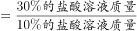，因此，30%的盐酸需要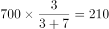克。

故正确答案为D。

---

### 第 3 题　qid 4769866 · 数学运算

年终总结大会上，选出了甲、乙、丙等共5名优秀代表发言，会前5人抽签决定演讲顺序，那么3人按“甲-乙-丙”的顺序依次发言的概率是多少？

- **A**. 

- **B**. 

- **C**. 

- **D**. 

　✅

**答案**：D

**官方解析**

总情况数为甲、乙、丙等5人全排列，有种情况。满足条件的情况为3人按“甲-乙-丙”的顺序依次发言，可先将甲、乙、丙3人捆绑，再将捆绑的整体与剩余的2人排列，相当于3个元素的全排列，即满足条件的情况数有种。故所求概率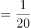。

故正确答案为D。

---

### 第 4 题　qid 4769859 · 数学运算

甲乙两人投资理财产品，两人原始资金共计100万元，甲又追加了自己原始投资资金的，同时乙减少自己原始投资资金的，现二人投资的钱一样多，那么甲的原始投资资金是多少万元？

- **A**. 28
- **B**. 36　✅
- **C**. 50
- **D**. 64

**答案**：B

**官方解析**

方法一：设甲原始投资资金为x万元，则乙原始投资资金为（100-x）万元。根据“甲又追加了自己原始投资资金的，同时乙减少自己原始投资资金的，现二人投资的钱一样多”，可列方程：，解得x=36。

方法二：利用倍数特性解题，根据“甲又追加了自己原始投资资金的”可知，甲的原始投资资金是3的倍数，据此可排除A、C、D三项，B项当选。

故正确答案为B。

---

### 第 5 题　qid 4769855 · 数学运算

处于某河流上的A、B两地相距600米，B为上游，水流速度为2.5米/分钟，乙由A到B和甲由B到A都需要40分钟，现让甲由A向B，乙由B向A，两人相向而行，到达指定的某一点后返回，则该点选在距离A大约多少米处，两人分别返回到起点时的时间大致相同？

- **A**. 240
- **B**. 247　✅
- **C**. 254
- **D**. 260

**答案**：B

**官方解析**

由题意可知，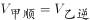米/分钟，则米/分钟，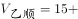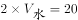米/分钟。设两人到达C点后返回，则甲由ACA的过程中，顺水和逆水的距离相等，根据等距离平均速度公式，甲往返的平均速度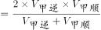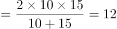米/分钟；同理，乙往返的平均速度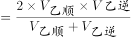米/分钟。根据两人所用时间相同，路程与速度成正比，可得：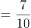，则米。因此，该点选在距离A大约247米处，两人分别返回到起点时的时间大致相同。

故正确答案为B。

---

### 第 6 题　qid 4769867 · 数学运算

某工厂周一至周六实行每天三班制（早班、中班、晚班），且每周日全体工作人员公休，每班仅需要一名操作员工作，现有五名操作员按固定顺序轮流上班，已知甲操作员2016年的国庆节（周六）当天是中班，那么下一年的元旦，甲是什么班？

- **A**. 早班
- **B**. 中班
- **C**. 晚班
- **D**. 公休　✅

**答案**：D

**官方解析**

2016年的国庆节是周六，到下一年（2017年）的元旦，还需经过10月份剩下的30天、11月份30天、12月份31天、1月份1天，共30+30+31+1=92天。一周为7天，以7天为一个周期，则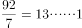，即经过了13周余1天。故下一年的元旦是周六往后推一天，即周日，此时全体工作人员公休。因此，下一年的元旦，甲公休。

故正确答案为D。

---

### 第 7 题　qid 4769860 · 数学运算

某眼镜店推出一款墨镜，该墨镜的利润为进价的25%，在“世界护眼日”当月，又推出了一款近视镜，该近视镜的利润为进价的15%，墨镜比近视镜的卖价贵142元，近视镜的进价是墨镜进价的84%，那么墨镜进价为多少元？

- **A**. 375
- **B**. 460
- **C**. 500　✅
- **D**. 625

**答案**：C

**官方解析**

方法一：设墨镜的进价为100x元，则近视镜的进价为84x元。根据公式：售价=进价×（1+利润率），则墨镜的售价，近视镜的售价。根据“墨镜比近视镜的卖价贵142元”，可得：，解得x=5，则墨镜的进价为5×100=500元。

方法二：根据题干及选项可猜测，墨镜和近视镜的进价及售价应均为整数。因“墨镜的利润为进价的25%”，即，则墨镜进价应为4的倍数；再因“近视镜的进价是墨镜进价的84%”，即，则墨镜进价应为25的倍数。因此墨镜进价同时为4与25的倍数，结合选项，只有C项满足。

故正确答案为C。

---

### 第 8 题　qid 4769863 · 数学运算

工程师设计某种新能源纯电动汽车，其单位距离理论行驶电耗和车辆自重成正比，车辆搭载的电池组重量和电池容量成正比。这种电动汽车除电池组以外的重量为1.5吨，搭载重100公斤的电池组时，满电状态可续航80千米，问这种电动汽车满电状态理论行驶距离要达到500千米的话，全车含电池组的重量在以下哪个范围内？

- **A**. 2.3吨以内
- **B**. 2.3—2.4吨之间
- **C**. 2.4—2.5吨之间　✅
- **D**. 2.5吨以上

**答案**：C

**官方解析**

当搭载重100公斤的电池组时，电动汽车的全车总重=1.5吨（1500公斤）+100公斤=1600公斤。赋值汽车单位距离单位重量的电耗为1，根据“单位距离理论行驶电耗和车辆自重成正比”，则1600公斤的汽车行驶80千米所需的电池容量=汽车总重×行驶距离×1=1600×80；根据“车辆搭载的电池组重量和电池容量成正比”，则单位重量电池的容量。设汽车满电状态续航500千米时所需的电池重量为x公斤，则电池总容量为1280x，此时全车总重=（1500+x）公斤，即续航500千米所需的电池容量=（1500+x）×500=1280x，解得，则全车总重=1500+961.5=2461.5公斤=2.4615吨，对应C项。

故正确答案为C。

---

## 判断推理

### 第 1 题　qid 4767958 · 图形推理

从所给的四个选项中，选择最合适的一个填入问号处，使之呈现一定的规律性：

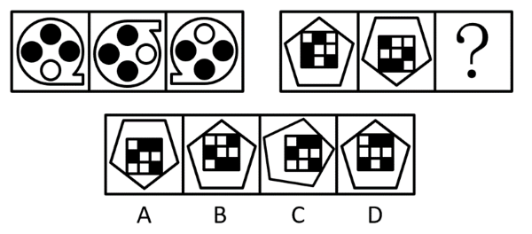

- **A**. A
- **B**. B　✅
- **C**. C
- **D**. D

**答案**：B

**官方解析**

元素组成相同，优先考虑位置规律。观察发现题干图形都由外框图形和内部元素组成，考虑内外分开看。第一组外框图形的位置变化规律为：图1上下翻转后得到图2，图2旋转后得到图3；内部元素的位置变化规律为：每个黑点每次逆时针移动一格。第二组图形应用此规律，根据外框图形规律，排除A、C两项，再考虑内部黑块沿外圈每次逆时针移动一格，只有B项符合。

故正确答案为B。

---

### 第 2 题　qid 4767960 · 图形推理

从所给的四个选项中，选择最合适的一个填入问号处，使之呈现一定的规律性：

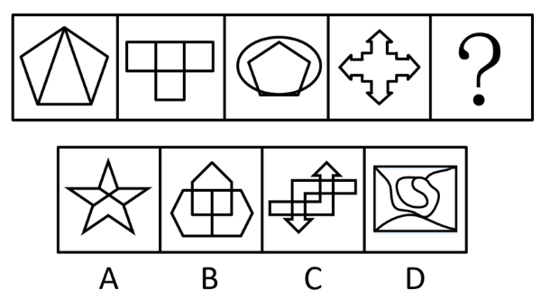

- **A**. A
- **B**. B　✅
- **C**. C
- **D**. D

**答案**：B

**官方解析**

元素组成不同，优先考虑属性规律。题干图形较规整，且出现明显的等腰元素，优先考虑对称性。题干图形均为轴对称图形，排除C、D两项。继续观察发现，图3出现相切，图4为明显的一笔画图形，考虑笔画数，题干图形均为一笔画图形，可排除A项，只有B项符合。
故正确答案为B。

---

### 第 3 题　qid 4767961 · 图形推理

从所给的四个选项中，选择最合适的一个填入问号处，使之呈现一定的规律性：

- **A**. A
- **B**. B　✅
- **C**. C
- **D**. D

**答案**：B

**官方解析**

元素组成不同，优先考虑属性规律。观察发现，题干图形出现等腰元素，考虑对称性。题干图形均为竖轴对称图形，排除A、D两项；继续观察发现，题干图形出现明显的封闭区域，考虑面数量。题干图形的面数量依次为2、3、4、5，故？处图形应该有6个面，排除C项，只有B项满足所有规律。
故正确答案为B。

---

### 第 4 题　qid 4768021 · 图形推理

把下面的六个图形分为两类，使每一类图形都有各自的共同特征或规律，分类正确的一项是：

- **A**. ①②③，④⑤⑥　✅
- **B**. ①③⑤，②④⑥
- **C**. ①④⑤，②③⑥
- **D**. ①②⑥，③④⑤

**答案**：A

**官方解析**

元素组成不同，优先考虑属性规律。观察发现，图④⑤⑥均为中心对称图形，图①②③均不是中心对称图形，即图①②③为一组，图④⑤⑥为一组。
故正确答案为A。
注：分组分类题目优先考虑两组图形分别具有各自的规律，无法分成具有各自规律的两组时，才考虑将图形分成一组具有该规律，一组不具有该规律。

---

### 第 5 题　qid 4767997 · 图形推理

把下面的六个图形分为两类，使每一类图形都有各自的共同特征或规律，分类正确的一项是：

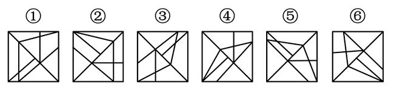

- **A**. ①②③，④⑤⑥
- **B**. ①③⑤，②④⑥　✅
- **C**. ①④⑤，②③⑥
- **D**. ①④⑥，②③⑤

**答案**：B

**官方解析**

解法一：本题为分组分类题目。元素组成不同，且无明显属性规律，考虑数量规律。观察发现，图形明显被分割，考虑面数量。图①③⑤均有10个面，图②④⑥均有9个面，即图①③⑤为一组，图②④⑥为一组。
故正确答案为B。
解法二：本题为分组分类题目。元素组成不同，且无明显属性规律，考虑数量规律。观察发现，题干图形中线条相交明显，考虑数点，整体数点无规律，而题干图形中出现明显外框，考虑数框内交点数。图①③⑤均有5个框内交点，图②④⑥均有4个框内交点，即图①③⑤为一组，图②④⑥为一组。
故正确答案为B。
解法三：本题为分组分类题目。元素组成不同，且无明显属性规律，考虑数量规律。观察发现，题干均为“框+线条”图形，可以考虑笔画数，图①③⑤为4笔画图形，图②④⑥为3笔画图形，即图①③⑤为一组，图②④⑥为一组。
故正确答案为B。
注：本题不严谨，多种考点均能对应B项，考生应重点掌握做题思路，考场上想到哪个规律就用哪个规律。

---

### 第 6 题　qid 4768005 · 图形推理

从所给的四个选项中，选择最合适的一个填入问号处，使之呈现一定的规律性：

- **A**. A
- **B**. B
- **C**. C
- **D**. D　✅

**答案**：D

**官方解析**

元素组成相似，优先考虑样式规律。第二组图形中问号在图2，故优先观察第一组图形中图1和图3是如何得到图2的。第一组图形中，图3先逆时针旋转45°后，再与图1相加得到图2。第二组图形运用此规律，图3先逆时针旋转45°后，再与图1相加得到图2，只有D项符合。

故正确答案为D。

注：本题考虑相加的特征明显，但出题不够严谨，第一组图形图2缺少部分线条，如下图红线所示，且本题再无其他规律。同学们需重点掌握这类问号在图2的加减同异题目的解题方法，优先观察图1与图3是如何得到图2的。

---

### 第 7 题　qid 4768001 · 定义判断

国家赔偿是指国家机关及其工作人员因行使职权给公民、法人以及其他组织的合法权益造成损害，依法应给予的赔偿。
根据上述定义，下列属于国家赔偿的是：

- **A**. 干警甲因公致残，获得残疾补偿金六万元
- **B**. 乙因其所有的房屋被政府征收，获得政府支付的补偿费四十万元
- **C**. 行人丙因干警丁外出旅游期间违章驾驶受伤，获各项赔偿合计五千元
- **D**. 戊因涉嫌犯罪被公安机关逮捕，后被法院判决宣告无罪，获赔偿款五万元　✅

**答案**：D

**官方解析**

第一步：找出定义关键词。
“国家机关及其工作人员”、“因行使职权”、“给公民、法人以及其他组织的合法权益造成损害”、“依法应给予的赔偿”。
第二步：逐一分析选项。
A项：干警甲因公致残，未体现“给公民、法人以及其他组织的合法权益造成损害”，不符合定义，排除；
B项：乙因其所有的房屋被征收获得四十万元是政府支付的补偿费，房屋征收是政府依照法律程序剥夺房屋及其他不动产所有权人的所有权及其使用权，同时丧失土地使用权并给予市场交易价格补偿的“行政购买行为”，不符合“给公民、法人以及其他组织的合法权益造成损害”、“依法应给予的赔偿”，不符合定义，排除；
C项：干警丁外出旅游期间因违章驾驶造成行人丙受伤，这是丁的个人违法行为，不是因行使职权而造成丙的受伤，不符合“因行使职权给公民、法人以及其他组织的合法权益造成损害”，不符合定义，排除；
D项：戊因涉嫌犯罪被公安机关逮捕，属于公安机关正常行使职权，符合“国家机关及其工作人员”、“因行使职权”，后被法院判决宣告无罪，获赔偿款五万元，符合“给公民、法人以及其他组织的合法权益造成损害”、“依法应给予的赔偿”，符合定义，当选。
故正确答案为D。

---

### 第 8 题　qid 4768004 · 定义判断

消费者主权理论又称为顾客主导型经济模式，即消费者根据自己意思和偏好到市场上购买所需商品和服务，这样消费者意思和偏好等信息就通过市场传达给了生产者，于是生产者根据消费者的消费行为所反馈回来的信息来安排生产，提供消费者所需的商品和服务。
根据上述定义，下列体现消费者主权的是：

- **A**. 智能电视因生产成本降低而降价，销量因此大增
- **B**. 某运动饮料厂家通过向市场投放广告，产品销量大增
- **C**. 随着空气污染加剧，市场上出现各种品牌的具有防霾功能的口罩
- **D**. 政府公布公务员差旅住宿价格标准，各地酒店纷纷设置与之对应的客房　✅

**答案**：D

**官方解析**

第一步：找出定义关键词。
“消费者意思和偏好等信息通过市场传达给生产者”、“生产者根据消费者的消费行为反馈回来的信息来安排生产”。
第二步：逐一分析选项。
A项：智能电视因成本的降低而降价，未体现消费者的信息传达给生产者，不符合“消费者意思和偏好等信息通过市场传达给生产者”，不符合定义，排除；
B项：厂家通过投放广告增加销量，未体现消费者的信息传达给生产者，不符合“消费者意思和偏好等信息通过市场传达给生产者”，不符合定义，排除；
C项：空气污染加剧后市场上出现了防霾口罩，商家是为了应对空气污染而生产的产品，未出现消费者，更未体现根据消费者的信息来生产，不符合“消费者意思和偏好等信息通过市场传达给生产者”、“生产者根据消费者的消费行为反馈回来的信息来安排生产”，不符合定义，排除；
D项：政府公布公务员差旅住宿价格标准，说明作为消费者的公务员关于住宿价格的相关信息已经公开，符合“消费者意思和偏好等信息通过市场传达给生产者”，各地酒店纷纷根据标准设置对应的客房，符合“生产者根据消费者的消费行为反馈回来的信息来安排生产，符合定义，当选。
故正确答案为D。

---

### 第 9 题　qid 4767983 · 定义判断

发散性思维亦称辐射思维，求异思维，它是指根据已有的信息，从不同角度不同方向上进行思考，从多方面寻求多样性答案的一种思维活动。
根据上述定义，下列属于发散性思维的是：

- **A**. 某数学老师经过层层推理，终于证明了一道同学们解不出的数学难题
- **B**. 某广告公司的设计师由“点”想到太阳、五子棋、球等，设计出不同的广告方案　✅
- **C**. 历史上苏北发生了蝗虫灾害，某官员为研究治蝗之策，搜集了自战国以来有关蝗灾的资料
- **D**. 鲁班从野草叶子上锋利的齿和蝗虫大板牙上的小齿得到启示，经过反复试验发明了锯子

**答案**：B

**官方解析**

第一步：找出定义关键词。
“根据已有的信息”、“从不同角度不同方向上进行思考”、“寻求多样性答案”。
第二步：逐一分析选项。
A项：数学老师经过层层推理来解决数学难题，是朝一个方向进行的思考，且是为了得到唯一的答案，不符合“从不同角度不同方向上进行思考”、“寻求多样性答案”，不符合定义，排除；
B项：设计师根据“点”，联想到的太阳、五子棋和球等都是不同类型的事物，且最终设计出了不同的广告方案，符合“根据已有的信息”、“从不同角度不同方向上进行思考”、“寻求多样性答案”，符合定义，当选；
C项：官员只是搜集资料，未体现出不同的思考角度或方向，不符合“从不同角度不同方向上进行思考”，不符合定义，排除；
D项：鲁班从野草叶子上的齿和蝗虫大板牙上的小齿得到启示发明了锯子，主要就是围绕着齿这一个角度进行思考的，不符合“从不同角度不同方向上进行思考”，不符合定义，排除。
故正确答案为B。

---

### 第 10 题　qid 4767984 · 定义判断

生态经济是指在生态系统承载能力范围内，运用生态经济学原理和系统工程方法改变生产和消费方式，挖掘一切可以利用的资源潜力，发展一些经济发达、生态高效的产业，建设体制合理、社会和谐的文化以及生态健康、景观适宜的环境。
根据上述定义，下列体现生态经济理念的是：

- **A**. 将受保护的历史古建筑改造为特色宾馆以吸引旅客
- **B**. 在河流上尽可能多地建设水电站以提供充足的电力
- **C**. 在贫困山区削平山体开采加工更多大理石以拉动当地经济发展
- **D**. 在自然野生动物园延长食物链，适当投放更多类动物供游客观赏　✅

**答案**：D

**官方解析**

第一步：找出定义关键词。
“在生态系统承载能力范围内”、“运用生态经济学原理和系统工程方法”、“建设体制合理、社会和谐的文化以及生态健康、景观适宜的环境”。
第二步：逐一分析选项。
A项：将受保护的历史古建筑改成特色宾馆，没有涉及生态，不符合“在生态系统承载能力范围内”、“运用生态经济学原理和系统工程方法”，不符合定义，排除；
B项：在河流上尽可能多地建设水电站，“尽可能多地”即不是合理的，建多个水电站说明没有考虑该河流流域内生态的承载能力，不符合“在生态系统承载能力范围内”、“建设体制合理、社会和谐的文化以及生态健康、景观适宜的环境”，不符合定义，排除；
C项：削平山体开采加工是对当地生态环境的破坏，通过破坏生态环境的方式来发展经济，不符合“在生态系统承载能力范围内”、“建设体制合理、社会和谐的文化以及生态健康、景观适宜的环境”，不符合定义，排除；
D项：在野生动物园内适当投放更多类动物，符合“在生态系统承载能力范围内”，延长食物链，符合“运用生态经济学原理和系统工程方法”，游客可以观赏到更多种类的动物，符合“建设体制合理、社会和谐的文化以及生态健康、景观适宜的环境”，符合定义，当选。
故正确答案为D。

---

### 第 11 题　qid 4768002 · 定义判断

激励指持续地激发人的动机和内在动力，使其心理过程始终保持在激奋的状态中，鼓励人在自己潜力范围内朝着所期望的目标采取行动的心理过程。
根据上述定义，下列属于激励的是：

- **A**. 公司承诺参赛人员若获冠军将奖励每人5万元　✅
- **B**. 小孩因说脏话骂人，父母禁止其看电视以示惩罚
- **C**. 为保持课堂纪律，教师对扮鬼脸的学生不予理睬
- **D**. 为完成订单，企业要求员工加班并给予高额报酬

**答案**：A

**官方解析**

第一步：找出定义关键词。
“激发人的动机和内在动力”、“使其保持在激奋状态中”、“鼓励人朝着期望的目标采取行动”。
第二步：逐一分析选项。
A项：公司承诺获得冠军的奖励，能够激发参赛人员的内在动力，鼓励参赛人员朝着夺冠的目标采取行动，符合“激发人的动机和内在动力”、“使其保持在激奋状态中”、“鼓励人朝着期望的目标采取行动”，符合定义，当选；
B项：父母对小孩做出禁止看电视的惩罚，并非父母对小孩的激发与鼓励，也未体现小孩追求自己期望的目标，不符合“激发人的动机和内在动力”、“使其保持在激奋状态中”、“鼓励人朝着期望的目标采取行动”，不符合定义，排除；
C项：教师对扮鬼脸的学生不予理睬，并非教师对学生的激发与鼓励，不符合“激发人的动机和内在动力”，并且教师的目的是为了保持课堂纪律，而不是为了鼓励学生追求自己期望的目标，不符合“使其保持在激奋状态中”、“鼓励人朝着期望的目标采取行动”，不符合定义，排除；
D项：企业要求员工加班并给予高额报酬，加班是公司的强制要求，不符合“激发人的动机和内在动力”，并且企业的目的是为了完成订单，而不是为了鼓励员工追求自己期望的目标，不符合“使其保持在激奋状态中”、“鼓励人朝着期望的目标采取行动”，不符合定义，排除。
故正确答案为A。

---

### 第 12 题　qid 4768008 · 定义判断

犯罪中止是指在犯罪过程中，自动放弃犯罪或者自动有效防止犯罪结果发生。
根据上述定义，下列行为属于犯罪中止的是：

- **A**. 甲偷了邻村蒋某看病的钱，后因蒋某家境贫寒，又将钱偷偷放了回去
- **B**. 乙进入罗某家中偷盗，正赶上罗某心脏病突发，乙不再偷窃将罗某送进医院　✅
- **C**. 丙在偏僻路口挟持李某意图抢劫，李某大声呼叫，被路过的巡警听到，丙仓促逃走
- **D**. 丁因老板不发工资，故放火烧老板的仓库，点燃汽油后匆忙逃跑，幸运的是一场大雨将火浇灭

**答案**：B

**官方解析**

第一步：找出定义关键词。
“在犯罪过程中”、“自动放弃犯罪或者自动有效防止犯罪结果发生”。
第二步：逐一分析选项。
A项：该项甲在偷了钱后又将钱偷偷放回去，其盗窃行为已经完成，不符合“在犯罪过程中”，不符合定义，排除；
B项：该项乙在偷窃过程中，因罗某心脏病突发而不再偷窃，符合“在犯罪过程中”、“自动放弃犯罪或者自动有效防止犯罪结果发生”，符合定义，当选；
C项：该项丙在抢劫过程中，李某的呼叫被巡警听到使丙的犯罪行为中止，不符合“自动放弃犯罪或者自动有效防止犯罪结果发生”，不符合定义，排除；
D项：该项丁放火烧仓库，但大雨将火浇灭，不符合“自动放弃犯罪或者自动有效防止犯罪结果发生”，不符合定义，排除。
故正确答案为B。

---

### 第 13 题　qid 4767988 · 定义判断

社会化是个体在特定的社会文化环境中，学习和掌握知识、技能、语言、规范、价值观等社会行为方式和人格特征，适应社会并积极作用于社会，创造新文化的过程。
根据上述定义，下列不属于社会化的是：

- **A**. 小明到学校上哲学课
- **B**. 小张拜师学做木工活
- **C**. 小王接受公司礼仪培训
- **D**. 小赵参加朋友周末聚会　✅

**答案**：D

**官方解析**

第一步：找出定义关键词。
“个体在特定的社会文化环境中，学习和掌握知识、技能、语言、规范、价值观等社会行为方式和人格特征”。
第二步：逐一分析选项。
A项：小明到学校上哲学课，是学习和掌握知识，符合“个体在特定的社会文化环境中，学习和掌握知识、技能、语言、规范、价值观等社会行为方式和人格特征”，符合定义，排除；
B项：小张拜师学做木工活，是学习和掌握技能，符合“个体在特定的社会文化环境中，学习和掌握知识、技能、语言、规范、价值观等社会行为方式和人格特征”，符合定义，排除；
C项：小王接受公司礼仪培训，是学习和掌握公司的礼仪规范，符合“个体在特定的社会文化环境中，学习和掌握知识、技能、语言、规范、价值观等社会行为方式和人格特征”，符合定义，排除；
D项：小赵参加朋友周末聚会，是和朋友相聚，不是学习行为，不符合“个体在特定的社会文化环境中，学习和掌握知识、技能、语言、规范、价值观等社会行为方式和人格特征”，不符合定义，当选。
本题为选非题，故正确答案为D。

---

### 第 14 题　qid 4767995 · 类比推理

扫帚：簸箕

- **A**. 牙刷：杯子　✅
- **B**. 镜架：镜片
- **C**. 围巾：帽子
- **D**. 锁：钥匙

**答案**：A

**官方解析**

第一步：判断题干词语间逻辑关系。
扫帚和簸箕经常配套使用来清洁房屋，二者为配套使用的对应关系，且扫帚是清洁工具，簸箕是容器。
第二步：判断选项词语间逻辑关系。
A项：牙刷和杯子经常配套使用来清洁牙齿，二者为配套使用的对应关系，且牙刷是清洁工具，杯子是容器，与题干逻辑关系一致，当选；
B项：镜架和镜片是眼镜的两个组成部分，为并列关系，题干为配套使用的两种工具，与题干逻辑关系不一致，排除；
C项：围巾和帽子都可以用来保暖，二者为并列关系，与题干逻辑关系不一致，排除；
D项：锁和钥匙经常配套使用来防盗，二者为配套使用的对应关系，但锁和钥匙均不是清洁工具，与题干逻辑关系不一致，排除。
故正确答案为A。

---

### 第 15 题　qid 4768027 · 类比推理

左边：右边

- **A**. 真话：假话
- **B**. 黑色：白色　✅
- **C**. 绝对：相对
- **D**. 浮力：压力

**答案**：B

**官方解析**

第一步：判断题干词语间逻辑关系。
左边和右边都表示方位，除此之外还有中间，二者为并列关系中的反对关系。
第二步：判断选项词语间逻辑关系。
A项：真话和假话为并列关系中的矛盾关系，与题干逻辑关系不一致，排除；
B项：黑色和白色都表示颜色，除此之外还有黄色、蓝色等，二者为并列关系中的反对关系，与题干逻辑关系一致，当选；
C项：绝对和相对为并列关系中的矛盾关系，与题干逻辑关系不一致，排除；
D项：浮力指物体浸没在流体（液体和气体）中，各表面受流体压力的差，因此浮力是一种压力差，二者为对应关系，与题干逻辑关系不一致，排除。
故正确答案为B。

---

### 第 16 题　qid 4768032 · 类比推理

见多：识广

- **A**. 上行：下效
- **B**. 异口：同声
- **C**. 高瞻：远瞩　✅
- **D**. 朝三：暮四

**答案**：C

**官方解析**

第一步：判断题干词语间逻辑关系。
“见多识广”比喻见识广，阅历深，“见多”和“识广”均有阅历深、知识广博的意思，二者为近义关系。
第二步：判断选项词语间逻辑关系。
A项：“上行下效”指上面的人怎么做，下面的人就跟着怎么干，“上行”和“下效”不是近义关系，与题干逻辑关系不一致，排除；
B项：“异口同声”指不同的人同时说出同样的话，“异口”和“同声”不是近义关系，与题干逻辑关系不一致，排除；
C项：“高瞻远瞩”指站得高，看得远，比喻目光远大，“高瞻”和“远瞩”均有站在高处往远处看的意思，二者为近义关系，与题干逻辑关系一致，当选；
D项：“朝三暮四”来源于一个典故，从前，有个玩猴子的人拿橡子喂猴子，他对猴子说，早上给三个橡子，晚上给四个，所有的猴子听了都急了。后来他又说，早上给四个，晚上给三个，所有的猴子都高兴了。“朝三暮四”原比喻使用诈术，进行欺骗，后比喻常常变卦，反复无常，“朝三”和“暮四”不是近义关系，与题干逻辑关系不一致，排除。
故正确答案为C。

---

### 第 17 题　qid 4768014 · 类比推理

小学生：大学生

- **A**. 金属：非金属
- **B**. 奇数：整数
- **C**. 少年：中年　✅
- **D**. 党员：教师

**答案**：C

**官方解析**

第一步：判断题干词语间逻辑关系。
小学生和大学生都是学生，除此之外还有中学生等，二者为并列关系中的反对关系。
第二步：判断选项词语间逻辑关系。
A项：金属和非金属为并列关系中的矛盾关系，与题干逻辑关系不一致，排除；
B项：奇数指不能被2整除的整数，二者为种属关系，与题干逻辑关系不一致，排除；
C项：少年和中年都是按照年龄段划分，除此之外还有老年等，二者为并列关系中的反对关系，与题干逻辑关系一致，当选；
D项：有的党员是教师，有的党员不是教师，有的教师是党员，有的教师不是党员，二者为交叉关系，与题干逻辑关系不一致，排除。
故正确答案为C。

---

### 第 18 题　qid 4768016 · 类比推理

能量：地震

- **A**. 吵架：矛盾
- **B**. 营养：健康
- **C**. 武力：战争
- **D**. 情绪：发怒　✅

**答案**：D

**官方解析**

第一步：判断题干词语间逻辑关系。
地震是地壳快速释放能量过程中造成的振动，地震是能量爆发的一种形式，二者为对应关系。
第二步：判断选项词语间逻辑关系。
A项：吵架是矛盾爆发的一种形式，但词语前后顺序相反，与题干逻辑关系不一致，排除；
B项：摄入营养是保持健康的必要条件，二者为条件对应关系，与题干逻辑关系不一致，排除；
C项：武力是战争中可能会用到的手段，武力是一种方式，与题干逻辑关系不一致，排除；
D项：发怒是情绪爆发的一种形式，二者为对应关系，与题干逻辑关系一致，当选。
故正确答案为D。

---

### 第 19 题　qid 4768006 · 类比推理

概念：定义

- **A**. 真理：定理　✅
- **B**. 归纳：概括
- **C**. 抽象：具象
- **D**. 目的：结果

**答案**：A

**官方解析**

第一步：判断题干词语间逻辑关系。
概念和定义都是把一类事物的共同本质特点加以概括，形成的一种表达和总结；概念的范围更广，定义的范围较小，二者为种属关系。
第二步：判断选项词语间逻辑关系。
A项：真理和定理都是对于客观事物及其规律的正确认识；真理的范围更广，定理的范围较小（指数学或逻辑学中的真命题），二者为种属关系，与题干逻辑关系一致，当选；
B项：归纳是指一种推理方法，由一系列具体的事实概括出一般原理，二者不是种属关系，与题干逻辑关系不一致，排除；
C项：抽象和具象是相对应的概念，二者不是种属关系，与题干逻辑关系不一致，排除；
D项：目的是指行为主体根据自身的需要，借助意识、观念的中介作用预先设想的行为目标和结果，结果是指事物发展的后续影响或阶段终了时的状态，二者不是种属关系，与题干逻辑关系不一致，排除。
故正确答案为A。

---

### 第 20 题　qid 4768009 · 类比推理

认真：兢兢业业

- **A**. 灰心：半途而废
- **B**. 热闹：车水马龙　✅
- **C**. 辛苦：一日千里
- **D**. 勤奋：聚精会神

**答案**：B

**官方解析**

第一步：判断题干词语间逻辑关系。
兢兢业业形容做事谨慎、勤恳、踏实，与认真是近义关系。
第二步：判断选项词语间逻辑关系。
A项：半途而废指事情没有完成就放弃了，与灰心不是近义关系，与题干逻辑关系不一致，排除；
B项：车水马龙指车像流水，马像游龙，形容车马或车辆很多，来往不绝，与热闹是近义关系，与题干逻辑关系一致，当选；
C项：一日千里形容进展极快，与辛苦不是近义关系，与题干逻辑关系不一致，排除；
D项：聚精会神指集中精神，形容注意力高度集中，与勤奋不是近义关系，与题干逻辑关系不一致，排除。
故正确答案为B。

---

### 第 21 题　qid 4768024 · 类比推理

土豆：薯片：淀粉

- **A**. 牛奶：奶粉：蛋白质　✅
- **B**. 高粱：白酒：酒精
- **C**. 棉花：毛巾：棉线
- **D**. 石油：汽油：煤油

**答案**：A

**官方解析**

第一步：判断题干词语间逻辑关系。
土豆是制作薯片的原材料，二者为原材料对应关系；淀粉是土豆的成分，二者是成分对应关系。
第二步：判断选项词语间逻辑关系。
A项：牛奶是制作奶粉的原材料，二者为原材料对应关系；蛋白质是牛奶的成分，二者是成分对应关系，与题干逻辑关系一致，当选；
B项：高粱是制作白酒的原材料，二者为原材料对应关系；酒精不是高粱的成分，与题干逻辑关系不一致，排除；
C项：棉花是制作毛巾的原材料，二者为原材料对应关系；棉花是制作棉线的原材料，棉线不是棉花的成分，与题干逻辑关系不一致，排除；
D项：石油是制作汽油的原材料，二者为原材料对应关系；煤油不是石油的成分，与题干逻辑关系不一致，排除。
故正确答案为A。

---

### 第 22 题　qid 4768029 · 类比推理

穷 对于 （    ） 相当于 独 对于 （    ）

- **A**. 富；孤
- **B**. 达；偶　✅
- **C**. 尽；众
- **D**. 韧；寡

**答案**：B

**官方解析**

逐一代入选项。
A项：穷可以指贫穷、缺乏钱财，和富构成反义关系；独和孤都可以指单独，二者为近义关系，前后逻辑关系不一致，排除；
B项：穷可以指不得志，达可以指显达，二者为反义关系；独和偶二者为反义关系，前后逻辑关系一致，当选；
C项：穷有穷尽的意思，和尽构成近义关系；独和众是反义关系，前后逻辑关系不一致，排除；
D项：穷和韧没有明显关系；独和寡是近义关系，前后逻辑关系不一致，排除。
故正确答案为B。

---

### 第 23 题　qid 4768025 · 类比推理

牙齿 对于 （    ） 相当于 （    ） 对于 花

- **A**. 食物；花蕊
- **B**. 骨骼；花萼
- **C**. 牙龈；花苞
- **D**. 口腔；花瓣　✅

**答案**：D

**官方解析**

逐一代入选项。
A项：牙齿是咀嚼食物的器官，二者为对应关系；花蕊是花的组成部分，二者为组成关系，前后逻辑关系不一致，排除；
B项：牙齿和骨骼都是人体的组成部分，二者是不同的器官，为并列关系；花萼是花的组成部分，二者为组成关系，前后逻辑关系不一致，排除；
C项：牙齿和牙龈是不同的器官，二者为并列关系；花苞有不同解释，可以指花的蓓蕾时期，此时二者为对应关系，也可以指没开时包着花骨朵的小叶片，此时二者为组成关系，前后逻辑关系不一致，排除；
D项：牙齿是口腔的组成部分，二者为组成关系；花瓣是花的组成部分，二者为组成关系，前后逻辑关系一致，当选。
故正确答案为D。

---

### 第 24 题　qid 4768028 · 逻辑判断

家庭电视收视格局正在发生巨大变化。据统计，我国去年四季度有线电视网的用户比上一季度环比减少215万户，首次出现负增长。与此同时，宽带用户总量达到2577万户，其中四季度净增近250万户。据此，有专家认为：智能电视的不断普及，正冲击传统家庭电视收视格局。
下列哪项是以上论述所需要的前提？

- **A**. 家庭电视用户包括有线电视用户和宽带用户
- **B**. 智能电视主要通过宽带实现电视内容的观看　✅
- **C**. 有线电视用户依旧是家庭电视收视市场的核心
- **D**. 电视用户份额较为稳定且流动性较强，流失与增加同时发生

**答案**：B

**官方解析**

第一步：找出论点和论据。
论点：智能电视的不断普及，正冲击传统家庭电视收视格局。
论据：据统计，我国去年四季度有线电视网的用户比上一季度环比减少215万户，首次出现负增长。与此同时，宽带用户总量达到2577万户，其中四季度净增近250万户。
论点论讨智能电视冲击传统家庭电视的收视格局；论据给出的是有线电视网的用户减少，同时宽带用户增加，二者话题不一致，加强优先考虑搭桥。
第二步：逐一分析选项。
A项：该项讨论的是家庭电视用户包括有线电视用户和宽带用户，那么宽带用户的增加无法说明智能电视是否冲击传统家庭电视的收视格局，无法加强，排除；
B项：该项讨论的是智能电视主要通过宽带实现电视内容的观看，宽带用户的增加意味着智能电视用户的增加，建立论点论据的联系，为搭桥项，可以作为前提，当选；
C项：该项讨论的是有线电视用户依旧是家庭电视收视市场的核心，无法说明传统家庭电视的收视格局是否受到智能电视的影响，为无关项，无法加强，排除；
D项：该项讨论的是电视用户整体的数量变化情况，而论点讨论的是智能电视对传统家庭电视的收视格局的影响，话题不一致，无法加强，排除。
故正确答案为B。

---

### 第 25 题　qid 4768168 · 逻辑判断

据美国有机农业部统计，截止2007年，美国有机农产品的销售总额从1990年的10亿美元增加到170亿美元，占全美国农产品总值的4%。因此有人认为，有机农产品在未来的销售前景会更广阔。
以下哪项如果为真，最能削弱上述结论？

- **A**. 各国对有机农产品的认可程度不一
- **B**. 中国在有机农业技术方面支撑不足
- **C**. 有机农产品的认证体系还不标准和完善
- **D**. 对于大部分消费者来说，有机农产品售价较高　✅

**答案**：D

**官方解析**

第一步：找出论点和论据。
论点：有机农产品在未来的销售前景会更广阔。
论据：截止2007年，美国有机农产品的销售总额从1990年的10亿美元增加到170亿美元，占全美国农产品总值的4%。
本题的论点和论据均在讨论有机农产品的发展问题，话题一致，削弱优先考虑否定论点。
第二步：逐一分析选项。
A项：指出各国对有机农产品的认可程度不一，但是并不确定其他国家的认可程度如何，是否会影响有机农产品的销售前景，属于不明确项，无法削弱，排除；
B项：指出中国在有机农业技术方面支撑不足，但是否会影响有机农产品的销售前景并不确定，属于不明确项，无法削弱，排除；
C项：指出有机农产品的认证体系还不标准和完善，但与论点有机农产品的销售前景无关，属于无关项，无法削弱，排除；
D项：指出对于大部分消费者来说，有机农产品售价较高，那么消费者可能会因为较高的价格不去购买有机农产品，对论点有机农产品的销售前景造成直接影响，否定论点，当选。
故正确答案为D。

---

### 第 26 题　qid 4768170 · 类比推理

许多勤奋的学生是成绩好的学生，但是有些不勤奋的学生也是成绩好的学生，而所有的成绩好的学生都有共同的特征：他们学习都十分专注。
据此不可能推出的是：

- **A**. 十分专注的学生都不是勤奋的　✅
- **B**. 有些勤奋的学生不是成绩好的学生
- **C**. 有些不勤奋的学生不是成绩好的学生
- **D**. 十分专注的学生不都是成绩好的学生

**答案**：A

**官方解析**

第一步：翻译题干。

①有的勤奋的学生成绩好的学生；

②有的勤奋的学生成绩好的学生；

③成绩好的学生十分专注；

条件①和条件③可以递推出：④有的勤奋的学生成绩好的学生十分专注；

条件②和条件③可以递推出：⑤有的勤奋的学生成绩好的学生十分专注。

第二步：逐一分析选项。

本题提问为“不可能推出”，因此需要选择与题干条件一定矛盾的选项。

A项：翻译为十分专注勤奋，根据“有的AB”可换位为“有的BA”，将条件④换位可知，有的十分专注勤奋，所有A都不是B和有的A是B是矛盾关系，因此一定不可能推出，当选；

B项：翻译为有的勤奋的学生成绩好的学生，根据条件①可知，有的勤奋的学生成绩好的学生，根据“1有的所有”，当有的为一部分时，有可能推出，排除；

C项：翻译为有的勤奋的学生成绩好的学生，根据条件②可知，有的勤奋的学生成绩好的学生，根据“1有的所有”，当有的为一部分时，有可能推出，排除；

D项：翻译为有的十分专注成绩好的学生，根据所有AB，可以推出有的BA，将条件③换位可知，有的十分专注成绩好的学生，根据1有的所有，当有的为一部分时，有可能推出，排除。

本题为选非题，故正确答案为A。

---

### 第 27 题　qid 4768205 · 逻辑判断

有分析表明，华北平原等地区秸秆焚烧频繁，秸秆焚烧产生大量的有害气体，遇到无风、逆温等大气扩散不利的天气，造成空气严重污染。借助区域试验，大范围秸秆焚烧可使北京地区的PM2.5含量在几个小时内飙升几倍，在焚烧秸秆高发期出现的严重污染天气中，焚烧秸秆带来的污染物对雾霾的贡献率达20%左右，因此，有专家指出焚烧秸秆是造成环境污染的罪魁祸首。
以下哪项如果为真，最能反驳上述论证？

- **A**. 焚烧秸秆是千百年来就有的，而雾霾问题近几年才出现
- **B**. 全国来看，机动车保有量较大的城市一年中雾霾天气更多
- **C**. 有数据显示，北京、上海等11省（区、市）未监测到疑似秸秆焚烧火点，但这些地区仍然是环境污染的重灾区　✅
- **D**. 焚烧秸秆虽然使得农村地区空气中烟尘等污染物的浓度急剧增加，但人们普遍认为农村的空气质量好于城市

**答案**：C

**官方解析**

第一步：找出论点和论据。
论点：焚烧秸秆是造成环境污染的罪魁祸首。
论据：华北平原等地区秸秆焚烧频繁，秸秆焚烧产生大量的有害气体，遇到无风、逆温等大气扩散不利的天气，造成空气严重污染。借助区域试验，大范围秸秆焚烧可使北京地区的PM2.5含量在几个小时内飙升几倍，在焚烧秸秆高发期出现的严重污染天气中，焚烧秸秆带来的污染物对雾霾的贡献率达20%左右。
本题的论点和论据均在讨论焚烧秸秆和空气污染之间的关系，话题一致，削弱优先考虑否定论点。
第二步：逐一分析选项。
A项：指出焚烧秸秆是千百年来就有的，而雾霾问题近几年才出现，但是无法说明近几年的雾霾问题是否与焚烧秸秆有关，属于不明确项，无法削弱，排除；
B项：指出机动车保有量较大的城市一年中雾霾天气更多，说的是机动车保有量和雾霾之间的关系，与论点讨论的焚烧秸秆无关，话题不一致，无法削弱，排除；
C项：举例指出北京、上海等11省（区、市）未监测到疑似秸秆焚烧火点，但这些地区仍然是环境污染的重灾区，那么焚烧秸秆和环境污染之间并没有必然的联系，直接否定论点，可以削弱，当选；
D项：指出人们普遍认为农村的空气质量好于城市，但是人们的认为是否和真实情况一致并不确定，属于不明确项，无法削弱，排除。
故正确答案为C。

---

### 第 28 题　qid 4768208 · 逻辑判断

平时，我们总能听到看到各种女司机开车闯祸的新闻：“温州女司机开路虎连撞3车2人”，“宁波女子倒车撞死老公，自己伸头被夹身亡”，“女司机买豪车在小区转悠炫耀，碾死邻居赔偿58万”，因此在很多人的心目中，“女司机”就是“马路杀手”的代称。
以下哪项如果为真，最能驳斥上述看法？

- **A**. 在市区发生的车祸赔付金额2000元以下的轻微交通事故中，女司机的比例并不高
- **B**. 女性较男性更心细，驾驶准备工作也细致周密，且饮酒吸烟者较少，容易把精力集中在驾车上
- **C**. 国内男女司机比例大概是7：3，在负有同等以上责任的交通事故中，女司机导致的为10%左右　✅
- **D**. 女司机在急加速、急刹车、超速方面的平均次数均低于男司机，文明驾驶程度明显好于男司机

**答案**：C

**官方解析**

第一步：找出论点和论据。
论点：在很多人的心目中，“女司机”就是“马路杀手”的代称。
论据：平时，我们总能听到看到各种女司机开车闯祸的新闻：“温州女司机开路虎连撞3车2人”，“宁波女子倒车撞死老公，自己伸头被夹身亡”，“女司机买豪车在小区转悠炫耀，碾死邻居赔偿58万”。
本题论点论据话题一致，均在说明女司机交通事故率高，削弱优先考虑否定论点。
第二步：逐一分析选项。
A项：该项指出女司机在轻微交通事故中的比例并不高，但无法得知女司机在其他交通事故中的比例，无法削弱，排除；
B项：该项指出女司机在驾车时精力更集中，但精力集中与交通事故的关系并不清楚，无法削弱，排除；
C项：该项指出国内司机中女司机占比30%，但负有同等以上责任的交通事故中，女司机仅占比10%，说明只有极少比例的交通事故是女司机造成的，可以削弱题干论点，当选；
D项：该项指出女司机在驾车时文明驾驶程度高，但文明驾驶程度高与交通事故的关系并不清楚，无法削弱，排除。
故正确答案为C。

---

### 第 29 题　qid 4768258 · 逻辑判断

某中药材店开张筹备中，有几个药柜的标签上尚未标注药名，几个进店的消费者纷纷猜测，甲说：1号柜里是贝母；乙说：2号柜里是三七而且3号柜里不是川芎；丙说：1号柜里肯定不是贝母；丁说：如果2号柜里是三七，那3号柜里就是川芎；戊说：我猜4号柜里是石斛。这时药店老板走进来笑着说：你们中有两个人说错啦。
根据上述叙述，可以推出的是：

- **A**. 1号柜里是贝母
- **B**. 2号柜里不是三七
- **C**. 3号柜里不是川芎
- **D**. 4号柜里是石斛　✅

**答案**：D

**官方解析**

第一步：找出题干矛盾关系。

（1）甲：1号柜里是贝母；

（2）乙：2号柜里是三七而且3号柜里不是川芎；

（3）丙：1号柜里肯定不是贝母；

（4）丁：2号柜里是三七3号柜里就是川芎；

（5）戊：4号柜里是石斛。

甲和丙说的话为矛盾关系，必有一真，必有一假。

乙和丁说的话为矛盾关系，必有一真，必有一假。

第二步：看其余。

根据两个人说的是假话可知，说假话的两个人必定在甲、乙、丙、丁四人中，则戊一定说的是真话，则4号柜里是石斛。

故正确答案为D。

---

### 第 30 题　qid 4768267 · 逻辑判断

据报道，2016年中国马拉松运动中死亡事件，除交通意外、人为伤害等因素外，心源性猝死在整个参赛人群的比例约为0.15/10万，而中国每年因心源性猝死的比例约为4.5/10万，所以，有人认为，马拉松运动并不是高危险运动。
以下哪项如果为真，最能反驳上述观点？

- **A**. 发生心源性猝死有多种原因
- **B**. 年轻人的心脏病发病猝死率高
- **C**. 能参加马拉松运动的大多为健康人　✅
- **D**. 足球运动员的心源性猝死率高于马拉松运动员

**答案**：C

**官方解析**

第一步：找出论点和论据。
论点：马拉松运动并不是高危险运动。
论据：2016年中国马拉松运动中死亡事件，除交通意外、人为伤害等因素外，心源性猝死在整个参赛人群的比例约为0.15/10万，而中国每年因心源性猝死的比例约为4.5/10万。
本题论点说的是马拉松不是高危险运动，论据说的是马拉松运动中心源性猝死的比例低，话题不一致，削弱优先考虑拆桥。
第二步：逐一分析选项。
A项：该项指出发生心源性猝死有多种原因，但并没有说明马拉松运动是否是高危险运动，无法削弱，排除；
B项：该项指出年轻人的心脏病发病猝死率高，但并没有说明马拉松运动是否是高危险运动，无法削弱，排除；
C项：该项指出能参加马拉松运动的大多为健康人，健康人心源性猝死的比例本来就低，不能由心源性猝死的比例低来得出马拉松运动不是高危险运动，属于拆桥项，可以削弱，当选；
D项：该项指出足球运动员的心源性猝死率高于马拉松运动员，但并没有说明马拉松运动是否是高危险运动，无法削弱，排除。
故正确答案为C。

---

## 资料分析

### 材料 1

        截至2015年12月，我国网民规模达6.88亿，全年共计新增网民3951万人。互联网普及率为50.3%，较2014年底提升了2.4个百分点。

#### 第 1 题　qid 4769883 · 综合

2015年底，我国非网民规模约为（    ）亿。

- **A**. 6.2
- **B**. 6.4
- **C**. 6.6
- **D**. 6.8　✅

**答案**：D

**官方解析**

根据题干“2015年底，我国非网民规模约为（    ）亿”，结合材料中给出了2015年底网民规模及互联网普及率，且互联网普及率，可判定本题为现期比重计算问题。定位文字材料可知：截至2015年12月，我国网民规模达6.88亿，互联网普及率为50.3%。则总规模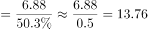亿，故2015年底，我国非网民规模约为13.76-6.88=6.88亿，与D项最接近。

故正确答案为D。

---

#### 第 2 题　qid 4769887 · 平均数

与2011年底相比，2015年底网民平均每周上网时长增加了（    ）小时。

- **A**. 4.5
- **B**. 5.5
- **C**. 6.5
- **D**. 7.5　✅

**答案**：D

**官方解析**

定位统计图可知：2011年底（2011年12月）网民平均每周上网时长为18.7小时，2015年底（2015年12月）为26.2小时。故与2011年底相比，2015年底网民平均每周上网时长增加了26.2-18.7=7.5小时。
故正确答案为D。

---

#### 第 3 题　qid 4769893 · 平均数

与半年前相比，网民平均每周上网时长增长速度最快的时间是：

- **A**. 2012年底
- **B**. 2013年底　✅
- **C**. 2014年底
- **D**. 2015年底

**答案**：B

**官方解析**

根据题干“与半年前相比······增长速度最快的时间是”，可判定本题为一般增长率比较问题。定位柱状图可得2012-2015年6月及12月网民平均每周上网时长。根据公式：增长率，则与半年前相比，各年底网民平均每周上网时长的增长速度为：2012年底，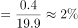；2013年底，；2014年底，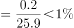；2015年底，。则与半年前相比，网民平均每周上网时长增长速度最快的时间是2013年底。

故正确答案为B。

---

#### 第 4 题　qid 4769896 · 增长

按照2012年底的同比增速测算，2010年底的网民平均每周上网时长可能为：

- **A**. 15小时
- **B**. 17小时　✅
- **C**. 19小时
- **D**. 21小时

**答案**：B

**官方解析**

根据题干“······2010年底的网民平均每周上网时长可能为”，结合材料时间为2011~2015年，可判定本题为基期计算问题。定位柱状图可得：2011年12月、2012年12月网民平均每周上网时长分别为18.7小时、20.3小时。根据公式：增长率，则2012年底的同比增速为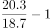；根据公式：基期量，则2010年底的网民平均每周上网时长可能为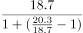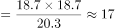小时。

故正确答案为B。

---

#### 第 5 题　qid 4769901 · 综合

不能从上述资料中推出的是：

- **A**. 2014年底，我国互联网普及率低于50%
- **B**. 2014年起，网民平均每周上网时长达到了25小时以上
- **C**. 2015年新增网民平均每周上网时长超过了20小时　✅
- **D**. 2015年底网民平均每周上网时长比上年同期增加了6分钟

**答案**：C

**官方解析**

A项：定位文字材料可得：（截至2015年12月）互联网普及率为50.3%，较2014年底提升了2.4个百分点。则2014年底互联网普及率为50.3%-2.4%=47.9%，低于50%，正确；
B项：观察柱状图发现，2014年之前网民平均每周上网时长均未超过25小时，2014年起网民平均每周上网时长均大于25小时，即达到了25小时以上，正确；
C项：材料未给出2015年新增网民的每周上网时长情况，无法推出，错误；
D项：定位柱状图可得，2014年12月与2015年12月网民平均每周上网时长分别为26.1小时、26.2小时，即2015年底比上年同期增加了26.2－26.1＝0.1小时＝6分钟，正确。
本题为选非题，故正确答案为C。

---

### 材料 2

        2010年人口普查，某省外出人口达2091.4万人，占全省人口总数约26%，其中，外出省内1040.8万人，外出省外1050.6万人，分别占外出人口总数的49.8%和50.2%。在省内外来人口中，有82.8%的人口由乡村到城镇，其中，由乡村进入大中城市、小城镇的人口分别占省内外来人口的48.8%、34%。在外出省外人口中，92.89%的人口来源于乡村、7.11%的人口来源于城镇。

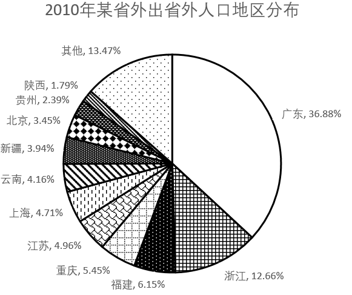

        近年来，由于东部地区劳动力、土地等基本生产要素成本上升等因素影响。该省劳务输出出现人口回流。2013年省外务工人员回流166.4万人，实现就业133.38万人，其中，第二产业46.40万人，第三产业49.44万人。2014年省外务工人员回流152.47万人，实现就业123.39万人，其中，第二产业46.45万人，第三产业48.47万人。2015年截至第三季度，省外务工人员回流135.95万人，实现就业121.27万人，其中，第二产业41.47万人，第三产业48.53万人。

#### 第 6 题　qid 4769985 · 综合

2010年，该省外出到江、浙、沪三省市中的人口总数约为（    ）万人。

- **A**. 158
- **B**. 235　✅
- **C**. 314
- **D**. 467

**答案**：B

**官方解析**

根据题干“2010年，该省外出到······的人口总数约为”，结合材料给出该省外出省外的人口数与比重的相关数据，可判定本题为现期比重问题。定位文字材料第一段可知，2010年，该省外出省外1050.6万人；定位饼状图可知，2010年，该省外出到江苏（江）、浙江（浙）、上海（沪）三省市的人口占比分别为4.96%、12.66%、4.71%。根据公式：部分量=总体量×比重，则该省外出到江、浙、沪三省市中的人口总数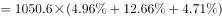万人。

故正确答案为B。

---

#### 第 7 题　qid 4769988 · 比重

2010年，该省由乡村进入省内大中城市的人口占全省人口的比重约为：

- **A**. 6%　✅
- **B**. 13%
- **C**. 19%
- **D**. 24%

**答案**：A

**官方解析**

根据题干“2010年······占······的比重约为”，可判定本题为现期比重问题。定位文字材料第一段可知，2010年，某省外出人口达2091.4万人，占全省人口总数约26%，其中，外出省内1040.8万人······由乡村进入大中城市的人口占省内外来人口的48.8%。则全省人口为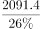万人，由乡村进入省内大中城市的人口为1040.8×48.8%万人。根据公式：比重，则所求比重为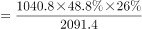，与A项最接近。

故正确答案为A。

---

#### 第 8 题　qid 4769991 · 综合

2010年该省外出到本省人数约是外出到北京市人数的（    ）倍。

- **A**. 低于10倍
- **B**. 在10—20倍之间
- **C**. 在20—30倍之间　✅
- **D**. 高于30倍

**答案**：C

**官方解析**

根据题干“2010年······是······倍”，可判定本题为现期倍数问题。定位文字材料第一段可知，2010年，某省外出省内1040.8万人，外出省外1050.6万人；定位饼状图可知，该省外出到北京市的人口占比为3.45%。则该省外出到北京市的人口为1050.6×3.45%万人，所求倍数为，在20—30倍之间。

故正确答案为C。

---

#### 第 9 题　qid 4769998 · 比重

2015年截至第三季度，该省回流的省外务工人员中，在二、三产业实现就业的人数占总体比重约为：

- **A**. 五成多
- **B**. 六成多　✅
- **C**. 七成多
- **D**. 八成多

**答案**：B

**官方解析**

根据题干“2015年截至第三季度······占总体比重约为”，可判定本题为现期比重计算问题。定位文字材料第二段可得：2015年截至第三季度，省外务工人员回流135.95万人，实现就业121.27万人，其中，第二产业41.47万人，第三产业48.53万人。根据比重，所求比重为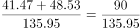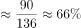，在B项范围之内。

故正确答案为B。

---

#### 第 10 题　qid 4770001 · 综合

能够从上述材料中推出的是：

- **A**. 2010年该省外出到福建的人口数是外出到贵州的人口数的三倍多
- **B**. 2010年该省有100多万人口从城镇外出到其他省份
- **C**. 2010年该省由乡村进入本省小城镇的人口多于全省外出进入广东省的人口
- **D**. 2014年回流的省外务工人员中，进入第三产业就业的比重高于上年　✅

**答案**：D

**官方解析**

A项：定位饼状图可得：2010年该省外出到福建的人口数占全部外出人口的6.15%，外出到贵州的人口数占2.39%。根据比重，整体量相同，可用比重代替部分量进行倍数计算。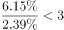，即2010年该省外出到福建的人口数不到外出到贵州的人口数的三倍，错误；

B项：定位文字材料第一段可得：2010年人口普查，某省······外出省外1050.6万人······在外出省外人口中，92.89%的人口来源于乡村、7.11%的人口来源于城镇。1050.6×7.11%＜100万人，即2010年该省从城镇外出到其他省份的人口数不到100万人，错误；

C项：定位文字材料第一段可得：2010年人口普查，某省······外出省内1040.8万人，外出省外1050.6万人······其中，由乡村进入大中城市、小城镇的人口分别占省内外来人口的48.8%、34%；定位饼状图可得：2010年该省外出到广东的人口数占全部外出人口的36.88%。根据部分=整体×比重，则2010年该省由乡村进入本省小城镇的人口为（1040.8×34%）万人，外出进入广东省的人口为（1050.6×36.88%）万人，1040.8＜1050.6，34%＜36.88%，则（1040.8×34%）＜（1050.6×36.88%），错误；

D项：定位文字材料第二段可得：2013年省外务工人员回流166.4万人，实现就业133.38万人，其中，第二产业46.40万人，第三产业49.44万人。2014年省外务工人员回流152.47万人，实现就业123.39万人，其中，第二产业46.45万人，第三产业48.47万人。根据比重，2013年回流的省外务工人员中，进入第三产业就业的比重为，2014年比重为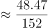，2014年回流的省外务工人员中，进入第三产业就业的比重高于上年，正确。

故正确答案为D。

---

### 材料 3

#### 第 11 题　qid 4769995 · 综合

2015年上半年多晶硅进口总金额最接近的数字是：

- **A**. 9亿美元
- **B**. 10亿美元
- **C**. 11亿美元　✅
- **D**. 12亿美元

**答案**：C

**官方解析**

定位折线图可得：2015年1-6月多晶硅进口金额分别为1.91、1.47、2.14、2.14、2.04、1.55亿美元，则2015年上半年多晶硅进口总金额为1.91+1.47+2.14+2.14+2.04+1.55=11.25亿美元，与C项最接近。
故正确答案为C。

---

#### 第 12 题　qid 4770006 · 综合

2015年下半年，多晶硅进口量和金额均高于上月的月份有（    ）个。

- **A**. 1
- **B**. 2　✅
- **C**. 3
- **D**. 4

**答案**：B

**官方解析**

定位统计图可知2015年6-12月多晶硅进口量及金额。则2015年下半年多晶硅进口量高于上月的有9月、11月、12月；多晶硅进口金额高于上月的有9月、11月。故满足的条件的有9月、11月，共2个。
故正确答案为B。

---

#### 第 13 题　qid 4770009 · 平均数

与上月相比，2015年5月的多晶硅平均进口价格约：

- **A**. 下降了6%　✅
- **B**. 下降了24%
- **C**. 上升了2%
- **D**. 上升了12%

**答案**：A

**官方解析**

根据题干“与上月相比······平均进口价格约”，结合选项为上升/下降+百分数，可判定本题为平均数的增长率问题。定位统计图可得：2015年4月多晶硅进口量及金额分别为1089.71万千克、2.14亿美元；2015年5月多晶硅进口量及金额分别为1108.50万千克、2.04亿美元。根据平均进口价格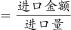，则2015年4月、5月多晶硅平均进口价格分别为：万美元/千克、万美元/千克。根据公式：增长率，则所求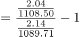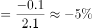，即约下降了5%，与A项最接近。

故正确答案为A。

---

#### 第 14 题　qid 4770014 · 综合

2015年二、三、四季度多晶硅进口量按从高到低排列正确的是：

- **A**. 第四季度 第三季度 第二季度
- **B**. 第二季度 第三季度 第四季度
- **C**. 第二季度 第四季度 第三季度　✅
- **D**. 第四季度 第二季度 第三季度

**答案**：C

**官方解析**

定位统计图可得2015年4-12月多晶硅进口量。则2015年第二季度多晶硅进口量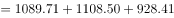万千克；第三季度多晶硅进口量万千克；第四季度多晶硅进口量万千克，则进口量从高到低的排序是第二季度、第四季度、第三季度。

故正确答案为C。

备注：通过柱状图可明显看出第二季度的三个月数量均大于第三季度、第四季度三个月的数量，可排除A、D两项，故比较第三季度和第四季度即可。

---

#### 第 15 题　qid 4770017 · 综合

能够从上述资料中推出的是：

- **A**. 2015年1月多晶硅进口价格约为200美元/千克
- **B**. 2015年多晶硅进口金额超过25亿美元
- **C**. 2015年多晶硅进口量曾连续3个月环比下降　✅
- **D**. 2015年有一半的月份多晶硅进口量高于1万吨

**答案**：C

**官方解析**

A项：定位统计图可知，2015年1月多晶硅进口金额为1.91亿美元，进口数量为930.93万千克。根据公式：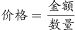，则2015年1月多晶硅进口价格为美元/千克，错误；

B项：定位统计图可知，2015年1-12月多晶硅进口金额。则2015年多晶硅进口金额为1.91+1.47+2.14+2.14+2.04+1.55+1.49+1.40+1.59+1.22+1.70+1.611.9+1.5+2.1+2.1+2.0+1.6+1.5+1.4+1.6+1.2+1.7+1.6=20.2亿美元，未超过25亿美元，错误；

C项：定位统计图可知，2015年1-12月多晶硅进口数量。则2015年1-12月多晶硅进口数量大小关系为930.93＞755.80＜1029.66＜1089.71＜1108.50＞928.41＞868.90＞856.07＜912.94＞693.95＜1002.79＜1044.43，观察发现，6月、7月、8月多晶硅进口数量连续环比下降，正确；

D项：定位统计图可知，2015年1-12月多晶硅进口数量。根据1吨=1000千克，若满足单月多晶硅进口量高于1万吨，则统计图中单月多晶硅进口数量＞1000万千克即可。查找可知3月（1029.66万千克）、4月（1089.71万千克）、5月（1108.50万千克）、11月（1002.79万千克）、12月（1044.43万千克）满足条件，共5个月，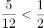，错误。

故正确答案为C。

---

#### 第 16 题　qid 4769878 · 增长

某福利机构统计购买助听器的专项捐款数额。已知每2000元可以购买1个助听器用于捐赠给听力受损儿童，统计显示2016年所得捐款共计27万元，2017年的金额比上年增长了20%，如果每年以同样的速度增加，那么直到哪一年，该福利机构累计捐赠的助听器数量将达到500个以上？

- **A**. 2017年
- **B**. 2018年
- **C**. 2019年　✅
- **D**. 2020年

**答案**：C

**官方解析**

金额=单价×数量，累计捐赠的助听器数量达到500个以上，即累计捐款金额达到2000元×500=1000000元=100万元以上。根据题意可知：2016年捐款共计27万元；此后每年捐款金额均保持20%的同比增速，则2017年累计捐款金额=27+27×（1+20%）=27+32.4=59.4万元；2018年累计捐款金额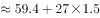万元；2019年累计捐款金额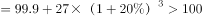万元，即累计捐赠的助听器数量达到500个以上。因此，直到2019年，该福利机构累计捐赠的助听器数量将达到500个以上。

故正确答案为C。

---

#### 第 17 题　qid 4769864 · 综合

一艘货船装载500集装箱A货物时，排水量是空载时的1.4倍，其装载400集装箱A货物和500集装箱B货物时，排水量为空载时的1.77倍，已知A货物和B货物各1集装箱共重68吨，问货船空载时的排水量为多少万吨？

- **A**. 3.0
- **B**. 3.5
- **C**. 4.0　✅
- **D**. 4.5

**答案**：C

**官方解析**

设货船空载时的排水量为1000x吨，1箱A、B货物的重量分别为a吨、b吨。根据题意可得：1000x+500a=1400x······①，1000x+400a+500b=1770x······②，a+b=68······③，联立①②两式解得：a=0.8x，b=0.9x，代入③式可得：a+b=0.8x+0.9x=68，解得x=40，故货船空载时的排水量为吨=4万吨。

故正确答案为C。

---
