# 2017年天津滨海新区公务员考试《行测》题（网友回忆版）

> 省考 · 2017 年 · 5 个模块 · 共 120 题

- [常识判断](#%E5%B8%B8%E8%AF%86%E5%88%A4%E6%96%AD) · 20 题
- [言语理解与表达](#%E8%A8%80%E8%AF%AD%E7%90%86%E8%A7%A3%E4%B8%8E%E8%A1%A8%E8%BE%BE) · 35 题
- [数量关系](#%E6%95%B0%E9%87%8F%E5%85%B3%E7%B3%BB) · 10 题
- [判断推理](#%E5%88%A4%E6%96%AD%E6%8E%A8%E7%90%86) · 35 题
- [资料分析](#%E8%B5%84%E6%96%99%E5%88%86%E6%9E%90) · 20 题

---

## 常识判断

### 第 1 题　qid 2139366 · 法律常识

行政诉讼法规定，因限制人身自由的强制措施引起的行政诉讼，由原告或被告所在地人民法院管辖。这里的原告所在地不包括：

- **A**. 被限制人身自由所在地
- **B**. 临时居住地　✅
- **C**. 户籍所在地
- **D**. 经常居住地

**答案**：B

**官方解析**

《行政诉讼法》第十九条规定：对限制人身自由的行政强制措施不服提起的诉讼，由被告所在地或者原告所在地人民法院管辖。
根据最高人民法院关于执行《中华人民共和国行政诉讼法》若干问题的解释（法释[2000]8号）第九条规定，此处的“原告所在地”，包括原告的户籍所在地、经常居住地和被限制人身自由地。
本题为选非题，故正确答案为B。

---

### 第 2 题　qid 2139368 · 经济常识

虚列出口货物数量，虚报出口货物价格，涂改、伪造出口退税凭证的行为属于：

- **A**. 偷税
- **B**. 抗税
- **C**. 欠税
- **D**. 骗税　✅

**答案**：D

**官方解析**

A项错误，《中华人民共和国税收征收管理法》第63条规定：“纳税人伪造、变造、隐匿、擅自销毁账簿、记账凭证，或者在账簿上多列支出或者不列、少列收入，或者经税务机关通知申报而拒不申报或者进行虚假的纳税申报，不缴或者少缴应纳税款的，是偷税”。偷税的前提是有应纳税行为，表现是弄虚作假，目的是变应纳税为不纳税。题干虽然表现也是弄虚作假，但目的是为了变不应退税为应退税，以骗取出口退税。因此错误。
B项错误，《中华人民共和国税收征收管理法》第67条规定：“以暴力、威胁等手段拒不缴纳税款的是抗税”。与题干描述不符。
C项错误，欠税是指纳税人、扣缴义务人超过征收法律法规规定或税务机关依照税收法律、法规规定的纳税期限，未缴或少缴税款的行为。与题干描述的“虚列”、“虚报”行为不符。
D项正确，骗税是指纳税人用假报出口等虚构事实或隐瞒真相的方法，经过公开的合法的程序，利用国家税收优惠政策，骗取减免税或者出口退税的行为。题干说的是虚报出口货物价格、伪造、涂改出口退税凭证，即骗取出口退税，故属于骗税。
故正确答案为D。

---

### 第 3 题　qid 2139370 · 人文常识

用水稀释浓硫酸时，应当选择的方式是：

- **A**. 将水慢慢倒入浓硫酸中
- **B**. 将浓硫酸慢慢倒入水中　✅
- **C**. 浓硫酸和水分层注入
- **D**. 浓硫酸和水同时注入

**答案**：B

**官方解析**

B项正确，A、C、D三项错误，由于浓硫酸具有强腐蚀性，溶于水时又释放大量的热，易使水沸腾而引起浓硫酸飞溅至皮肤和衣物上导致严重的后果，所以使用和稀释浓硫酸必须严格按要求进行：常将浓硫酸沿器壁慢慢注入水中（烧瓶用玻璃棒引流），并不断搅拌，使稀释产生的热量及时散出。
若将水倒入浓硫酸中，一方面由于水的密度远比浓硫酸的小，水将浮在浓硫酸上面而形成两个液层，浓硫酸只在两个液层接触处混溶并放出大量热，从而影响两种液体的混合；另一方面又由于硫酸的质量热容较水的低，当两者混溶时，硫酸的温度会比水的温度升高得快，因而造成强烈的局部高温，使水汽化而造成喷溅。
故正确答案为B。

---

### 第 4 题　qid 2139372 · 人文常识

我国公司制企业中最高权力机构是：

- **A**. 股东会　✅
- **B**. 董事会
- **C**. 监事会
- **D**. 经理层

**答案**：A

**官方解析**

A项正确，按照《公司法》规定我国的公司分为有限责任公司和股份有限公司。《公司法》第三十六条、第九十八条规定：“股东会是公司的权力机构”、“股东大会是公司的权力机构”，因此，股东（大）会是公司制企业中的最高权力机关，它由全体股东组成，对公司重大事项进行决策。而董事会对其负责，经理层又由董事会聘任，监事会主要对公司进行监督，级别上均不如股东会高。故A项正确。
B项错误，董事会，是由董事组成的、对内掌管公司事务、对外代表公司的经营决策机构，公司设董事会，由股东（大）会选举，股东（大）会有权选任和解除董事。
C项错误，监事会是由股东（大）会选举的监事以及由公司职工民主选举的监事组成的，对公司的业务活动进行监督和检查的法定必设和常设机构。
D项错误，公司可以设立经理，由董事会决定聘任或解聘，经理对董事会负责。
故正确答案为A。

---

### 第 5 题　qid 2139378 · 经济常识

当社会总需求大于总供给，经济增长过热时，中央银行采取紧缩性货币政策，其主要措施不包括：

- **A**. 在金融市场上购买政府债券　✅
- **B**. 提高贴现率
- **C**. 提高法定准备金
- **D**. 在金融市场上抛售政府债券

**答案**：A

**官方解析**

本题主要考查宏观调控有关政策。货币政策一般分为紧缩性货币政策和扩张性货币政策。紧缩性货币政策是指央行通过减少货币供给来降低社会总需求水平，而扩张性货币政策是通过增加货币供给来带动总需求的增长。
A项错误，中央银行在金融市场上购买政府债券，相当于将其储备的货币注入市场，增加了市场货币供应，从而使总需求增长得更加激烈，属于扩张性货币政策。
B项正确，贴现率是指商业银行办理票据贴现业务时，按一定的利率计算利息，这种利率即为贴现率。提高贴现率，票据持有者贴现（即将票据换成现金）时支付的利息会增加，贴现意愿降低，市场货币流通量减少，从而使总需求下降，属于紧缩性货币政策。
C项正确，法定准备金，即法定存款准备金，是指商业银行按照法律规定必须存在中央银行里的自身所吸收存款的一个最低限度的准备金。提高法定准备金，商业银行可用于贷款的资金减少，市场货币供给减少，从而投资需求下降，属于紧缩性货币政策。
D项正确，在金融市场上抛售政府债券，相当于从市场上收回货币，减少市场货币流通量，因此属于紧缩性货币政策。
本题为选非题，故正确答案为A。

---

### 第 6 题　qid 2139386 · 人文常识

蝉发出“知——了，知——了”鸣叫声的器官是：

- **A**. 嘴
- **B**. 鼻
- **C**. 翅膀
- **D**. 瓣膜　✅

**答案**：D

**官方解析**

本题考查生物常识。蝉，又名“知了”，蝉科昆虫的代表种类。会鸣的蝉是雄蝉，发音器在腹基部，发声器官为瓣膜。
A项错误，蝉的头部有一种坚硬的口器，形似一根细长的硬管，口渴时将其插入树干吮吸汁液，把大量的营养与水分吸入自己的身体中。因此，它的嘴只是用来获取营养，而不是发声的器官。
B项错误，蝉的鼻，只能感觉周围的气味，不能发出鸣叫的声音。
C项错误，蝉的翅膀，只是用来飞翔，不能发出鸣叫的声音。
D项正确，雄蝉的肚皮上有两个小圆片，名叫“音盖”，音盖内侧有一层透明的薄膜，称为“瓣膜”。蝉发出声音的器官就是瓣膜，蝉通过扇动翅膀，带动瓣膜振动，从而发声。而音盖则相当于扩音器一样来回收缩扩大声音，此时，雄蝉就会发出“知——了，知——了”的叫声。但雌蝉的肚皮上没有音盖和瓣膜，因此雌蝉不会叫。
故正确答案为D。

---

### 第 7 题　qid 2139390 · 人文常识

在中亚五国中，与中国接壤的是：

- **A**. 乌兹别克斯坦、哈萨克斯坦、吉尔吉斯斯坦
- **B**. 吉尔吉斯斯坦、土库曼斯坦、塔吉克斯坦
- **C**. 哈萨克斯坦、吉尔吉斯斯坦、塔吉克斯坦　✅
- **D**. 乌兹别克斯坦、土库曼斯坦、哈萨克斯坦

**答案**：C

**官方解析**

本题主要考查地理常识。
我国的陆上邻国共14个，分别是：俄罗斯、哈萨克斯坦、吉尔吉斯斯坦、塔吉克斯坦、蒙古、朝鲜、越南、老挝、缅甸、印度、不丹、尼泊尔、巴基斯坦、阿富汗。这些陆上接壤的国家中属于“中亚五国”的是：哈萨克斯坦、吉尔吉斯斯坦、塔吉克斯坦。
A项错误，乌兹别克斯坦与中国不接壤，其东端与我国的新疆距离较近。
B项错误，土库曼斯坦位于伊朗以北，东南面与阿富汗接壤，东北面与乌兹别克为邻，与中国不接壤。
C项正确，哈萨克斯坦、吉尔吉斯斯坦、塔吉克斯坦均与我国接壤，且属于“中亚五国”。
D项错误，乌兹别克斯坦、土库曼斯坦均与中国不接壤。
故正确答案为C。

---

### 第 8 题　qid 2139398 · 人文常识

尼罗河是世界第一长河流，也是世界文明的发祥地之一，它自南向北流经布隆迪、乌干达和埃及等国，最后注入：

- **A**. 大西洋
- **B**. 地中海　✅
- **C**. 印度洋
- **D**. 红海

**答案**：B

**官方解析**

本题主要考查地理常识。
尼罗河位于非洲东北部，是一条国际性的河流。发源于大湖地区的卡盖拉河，干流流经布隆迪、卢旺达、坦桑尼亚、乌干达、苏丹和埃及等国家，最后注入地中海。因此A、C、D三项错误，B项正确。
故正确答案为B。

---

### 第 9 题　qid 2139406 · 人文常识

下列文学常识中，表达错误的一项是：

- **A**. 中国古代思想流派儒家的代表人物有孔子、孟子、韩非子　✅
- **B**. 《长恨歌》是唐朝诗人白居易的著名诗作
- **C**. “一骑红尘妃子笑，无人知是荔枝来”讲述的内容与唐朝杨贵妃有关
- **D**. 初唐四杰指的是王勃、杨炯、卢照邻、骆宾王

**答案**：A

**官方解析**

本题主要考查文化常识，主要涉及中国古代文化及文学常识。
A项错误，我国儒家思想的代表人物有孔子、孟子、荀子、董仲舒、朱熹和王阳明等；韩非子是战国末期法家学派的代表人物，是法家思想的集大成者。
B项正确，《长恨歌》是唐代诗人白居易的一首长篇叙事诗，全诗叙述了唐玄宗与杨贵妃的爱情悲剧。
C项正确，“一骑红尘妃子笑，无人知是荔枝来” 出自唐代杜牧的《过华清宫绝句三首》其一。讲的是杨贵妃喜欢荔枝，唐玄宗不惜劳民伤财命人快马相运的故事。
D项正确，初唐四杰是指我国唐代初期的四位文学家，分别是王勃、杨炯、卢照邻、骆宾王。
本题为选非题，故正确答案为A。

---

### 第 10 题　qid 2139410 · 人文常识

《齐民要术》是我国杰出农学家贾思勰所著的一部综合性农学著作。下列对该书的评价，错误的一项是：

- **A**. 系统地记载了兴修水利进行农业灌溉的方法　✅
- **B**. 总结了公元6世纪以前的农业生产经验
- **C**. 涵盖了农林、畜牧、烹饪、储备等技术知识
- **D**. 主要反映的是黄河中下游地区的生产状况

**答案**：A

**官方解析**

本题主要考查文化常识，主要涉及我国古代农书的有关知识。
A项错误，《齐民要术》以农本观念为中心思想，主要介绍了重要的农业技术知识。书中并没有记载兴修水利的相关内容。
B项正确，《齐民要术》系统地总结了6世纪以前黄河中下游地区农牧业生产经验、食品的加工与贮藏、野生植物的利用等内容，是我国现存最早最完整的农书。
C项正确，《齐民要术》分篇布局，涉及农业生产、林木栽培、动物饲养、畜牧、酿造、烹饪、储备等内容，概括了“大农业”的全部，层次分明，体系完整。
D项正确，写《齐民要术》时，贾思勰不仅阅读了大量的文献，而且游历民间，向老农询问有关经验。可以说这部书真实地反映了我国黄河中下游地区的农业生产状况。
本题为选非题，故正确答案为A。

---

### 第 11 题　qid 2139416 · 人文常识

“范进中举”中范进参加的考试是：

- **A**. 殿试
- **B**. 省试
- **C**. 会试
- **D**. 乡试　✅

**答案**：D

**官方解析**

本题主要考查文化常识，主要涉及中国古代科举制度的有关知识。
《范进中举》是清代小说家吴敬梓创作的一篇讽刺小说，节选自《儒林外史》。该作品通过描写范进参加乡试中了举人一事，刻画了其为科举考试喜极而疯的形象。
A项错误，殿试是最高一级的科举考试，是由皇帝主试的考试。贡士可参加殿试，考中后赐进士。
B项错误，省试即科举中的礼部试，在唐、宋、金、元时称省试，在明、清时称会试。考试在京城举行，由尚书省的礼部主持。
C项错误，会试是每三年在京城举行的一次考试，因在春季举行，故又称春闱。各省的举人及国子监监生皆可应考，考中者称为贡士。
D项正确，乡试是在各省省城举行的科举考试，每三年举行一次，因在秋季举行，所以又称秋闱。凡本省生员、监生、贡生等均可应考乡试，考中者称之为举人。范进考中的是举人，因此他参加的考试是乡试。
故正确答案为D。

---

### 第 12 题　qid 2139374 · 人文常识

下列选项中，与作品《朝花夕拾》《子夜》《激流》三部曲、《白洋淀纪事》的作者对应正确的一项是：

- **A**. 鲁迅、茅盾、巴金、孙犁　✅
- **B**. 郭沫若、曹禺、巴金、李健吾
- **C**. 鲁迅、曹禺、茅盾、郭沫若
- **D**. 鲁迅、郭沫若、巴金、孙犁

**答案**：A

**官方解析**

本题主要考查文学常识，主要涉及我国现代作家与作品的有关知识。
《朝花夕拾》是现代文学家鲁迅的散文集，收录有《从百草园到三味书屋》、《藤野先生》等散文。
《子夜》是茅盾创作的现代长篇小说，小说以1930年半封建、半殖民地的旧上海为背景，以民族资本家吴荪甫为中心，描写了当时我国社会的各种矛盾和斗争。
《激流》三部曲，包括《家》、《春》、《秋》，是我国现代著名的小说家——巴金的代表作。
《白洋淀纪事》是现当代小说家孙犁的小说、散文集。包括有《荷花淀》、《芦花荡》等许多经典作品。
因此《朝花夕拾》《子夜》《激流》三部曲、《白洋淀纪事》分别对应的作者是鲁迅、茅盾、巴金、孙犁。
故正确答案为A。

---

### 第 13 题　qid 2139382 · 人文常识

成语“风声鹤唳”常用来形容人惊惶失措，或自相惊扰。它出自我国历史上著名的以少胜多的战役：

- **A**. 官渡之战
- **B**. 淝水之战　✅
- **C**. 夷陵之战
- **D**. 赤壁之战

**答案**：B

**官方解析**

本题考查人文常识。主要涉及中国历史上几大战役和其对应成语的相关知识点。
A项错误，官渡之战发生于东汉末年，是我国历史上著名的以少胜多的战役之一。公元200年，曹操军与袁绍军相持于官渡，在此展开决战。曹操奇袭袁军在乌巢的粮仓，继而击溃袁军主力。此战奠定了曹操统一北方的基础。“风声鹤唳”并非出自官渡之战。
B项正确，淝水之战发生于东晋时期，是我国历史上著名的以少胜多的战役之一。前秦出兵伐晋，于淝水交战，最终东晋仅以八万军力大胜八十余万前秦军，此战中那些侥幸逃脱的前秦士兵，一路上听到风声和鹤的鸣叫声，以为晋军又追来了，这就是“风声鹤唳”的典故。与淝水之战相关的典故还有“投鞭断流”和“草木皆兵”。
C项错误，夷陵之战，是三国时期蜀汉刘备对东吴发动的大规模战役。陆逊用以逸待劳的战术大败蜀军。与夷陵之战有关的典故是“火烧连营”。“风声鹤唳”并非出自夷陵之战。
D项错误，赤壁之战发生于东汉末年，是我国历史上以少胜多的战役之一。由孙权、刘备联军在赤壁一带大破曹操大军，为三国鼎立奠定了基础。“风声鹤唳”并非出自赤壁之战。
故正确答案为B。

---

### 第 14 题　qid 2139388 · 地理国情

我国第一艘航母“辽宁舰”交接入列后，顺利进行了舰载机起降飞行训练，航母平台和飞机的技术性能得到充分验证。其舰载机的起飞方式采用的是：

- **A**. 弹射起飞
- **B**. 垂直起飞
- **C**. 滑跃起飞　✅
- **D**. 短距起飞

**答案**：C

**官方解析**

本题考查科技常识。
A项错误，弹射起飞，主要是利用蒸汽弹射器推动飞机起飞，但蒸汽弹射器总体技术复杂，维护成本高。
B项错误，垂直起飞，就是飞机不需要滑跑就可以起飞。优点是结构紧凑，占用甲板空间少。但这种起飞方式会耗费大量燃料且安全性不高。
C项正确，滑跃起飞，是靠舰载机自身动力，通过一段短距离加速滑跑，进而起飞。我国辽宁舰舰载机采用的就是滑跃起飞方式。
D项错误，短距起飞，国际上没有统一的定义，顾名思义是指在较短距离跑道内起飞，这种起飞方式可以减少对跑道的依赖。
故正确答案为C。

---

### 第 15 题　qid 2139392 · 科技常识

我国地处北半球，要把航天器送上近地轨道，运载火箭要朝        方向发射，这样才能利用地球自转的部分速度，节约火箭能量。

- **A**. 西北
- **B**. 西南
- **C**. 东南　✅
- **D**. 东北

**答案**：C

**官方解析**

本题综合考查物理常识与地理常识。
由于地球自西向东自转，在向东发射时，地球自转赋予的初速度减少了火箭所应提供的速度增加量，从而节约燃料。
在地球上纬度越低、越靠近赤道，自转的线速度越大，地球自转赋予火箭的初速度越大，当发射点在赤道时初速度最大，达到465米/秒，随着发射点纬度增加初速度逐步减小。为了节约火箭能量，发射火箭应该向靠近赤道的低纬度地区发射。
我国地处北半球，所以应该向东方、南方发射。因此本题选择偏向东南方向发射。
故A、B、D三项错误，C项正确。
故正确答案为C。

---

### 第 16 题　qid 2139396 · 人文常识

北宋时期，有一次某画院以《深山藏古寺》为题叫学生作画。大多数人都把寺庙画在明处，画面构思平平。有一考生基于对画题的深刻思考，他的画中并未见深山里有什么古寺，而是画了一和尚正在往深山里挑水，如此就把一个“藏”字活脱脱地表现出来了。该故事反映的是      的重要性。

- **A**. 顺向思维
- **B**. 逆向思维　✅
- **C**. 单向思维
- **D**. 思维定势

**答案**：B

**官方解析**

本题考查生活常识。
A项错误，顺向思维就是常规的、传统的思维方法，是指人们按照传统的从上到下、从小到大、从左到右、从前到后、从低到高等常规的序列方向进行思考的方法。大多数考生采用的是顺向常规的思维方法，把寺庙画在明处，而题中的考生打破了这种思维方式。
B项正确，逆向思维是指有意识从常规思维的反方向去思考问题的思维方式。逆向思维是一种反常规、反传统的思考方法。这位考生的画中并未见深山里有什么古寺，而是画了一和尚正往深山里挑水来证明古寺隐藏在山中，与常规的思维方式相反，属于逆向思维。
C项错误，单向思维，是指从某个方面片面地观察、思考客观事物，局限于某一个维度的思维。这位考生并未局限于一个思维维度，而是从多方面思考问题。
D项错误，思维定势，也称“惯性思维”，是由先前的活动而造成的一种对活动的特殊的心理准备状态，或活动的倾向性。在环境不变的条件下，定势使人能够应用已掌握的方法迅速解决问题。而在情境发生变化时，它则会妨碍人采用新的方法。这位考生正是打破了思维定式才能将“藏”字生动的表现出来。
故正确答案为B。

---

### 第 17 题　qid 2139402 · 人文常识

书法史上被称为“天下第一行书”的字帖是：

- **A**. 米芾《蜀素帖》
- **B**. 颜真卿《祭侄稿》
- **C**. 王羲之《兰亭序》　✅
- **D**. 苏东坡《寒食帖》

**答案**：C

**官方解析**

本题考查中国书法的有关知识。
A项错误，米芾是北宋书法家，与苏轼、蔡襄、黄庭坚并列为北宋四大书法家。米芾的字受王献之影响最深，有一种俊逸疏爽之气，其代表作《蜀素帖》，现藏于台北故宫博物院，行笔飞扬恣肆、神采生动，丝毫不为格式所拘。
B项错误，颜真卿是唐代书法家，擅长行、楷，与赵孟頫、柳公权、欧阳询并称为“楷书四大家”。又与柳公权并称“颜柳”，被称为"颜筋柳骨"。《祭侄稿》是颜真卿追祭从侄颜季明的草稿。被称为“天下第二行书”。
C项正确，王羲之是东晋书法家，有“书圣”之称，与其子王献之合称为“二王”。代表作《兰亭序》，历代书家都推为“天下第一行书”，并与颜真卿的《祭侄稿》、苏轼的《寒食帖》并称天下三大行书。
D项错误，苏轼是北宋著名文学家、书法家、画家，为“唐宋八大家”之一。《寒食帖》是苏轼行书的代表作。《寒食帖》在书法史上影响很大，被称为“天下第三行书”。
故正确答案为C。

---

### 第 18 题　qid 2139606 · 人文常识

根据我国生活垃圾分类制度的规定，下列物品均为有害垃圾的是：

- **A**. 废血压计和废胶片　✅
- **B**. 餐厨垃圾和废电池
- **C**. 废塑料和废温度计
- **D**. 废玻璃和废油漆

**答案**：A

**官方解析**

本题考查生活垃圾分类制度的有关知识。根据《生活垃圾分类制度实施方案》（国办发〔2017〕26号）规定，有害垃圾主要品种包括：废电池（镉镍电池、氧化汞电池、铅蓄电池等），废荧光灯管（日光灯管、节能灯等），废温度计，废血压计，废药品及其包装物，废油漆、溶剂及其包装物，废杀虫剂、消毒剂及其包装物，废胶片及废相纸等。
A项正确，根据《生活垃圾分类制度实施方案》规定，废血压计和废胶片均为有害垃圾。
B项错误，根据《生活垃圾分类制度实施方案》规定，易腐垃圾主要品种包括相关单位食堂、宾馆、饭店等产生的餐厨垃圾，农贸市场、农产品批发市场产生的蔬菜瓜果垃圾、腐肉、肉碎骨、蛋壳、畜禽产品内脏等。因此，餐厨垃圾属于易腐垃圾。
C项错误，根据《生活垃圾分类制度实施方案》规定，可回收物主要品种包括废纸，废塑料，废金属，废包装物，废旧纺织物，废弃电器电子产品，废玻璃，废纸塑铝复合包装等。因此，废塑料属于可回收物。
D项错误，根据《生活垃圾分类制度实施方案》规定，废玻璃属于可回收物。
故正确答案为A。

---

### 第 19 题　qid 2139412 · 法律常识

根据《劳动法》规定，下列关于女职工孕期保护的说法错误的是：

- **A**. 不得安排女职工在怀孕期间从事孕妇禁忌从事的劳动
- **B**. 不得安排女职工在怀孕期间从事国家规定的第三级劳动强度的劳动
- **C**. 不得对怀孕7个月的女职工安排夜班活动
- **D**. 不得延长女职工工作时间　✅

**答案**：D

**官方解析**

本题考查《劳动法》中关于女职工孕期保护的规定。
A、B、C三项正确，《中华人民共和国劳动法》第六十一条规定：“不得安排女职工在怀孕期间从事国家规定的第三级体力劳动强度的劳动和孕期禁忌从事的活动。对怀孕七个月以上的女职工，不得安排其延长工作时间和夜班劳动。”因此ABC项符合法律规定。
D项错误，“不得安排其延长工作时间”的规定，针对的是怀孕七个月以上的女职工，而不是所有的怀孕女职工。
本题为选非题，故正确答案为D。

---

### 第 20 题　qid 2139414 · 人文常识

联合国秘书长，是联合国秘书处的长官，时常对争端的各方进行斡旋调停。联合国秘书长的一届任期为      年，可以连任。

- **A**. 4
- **B**. 5　✅
- **C**. 8
- **D**. 10

**答案**：B

**官方解析**

本题考查经济常识。根据联合国大会1946年1月24日通过的第11（I）号决议规定，秘书长的任期为五年，期满后可以连任五年。现任（第9任）联合国秘书长是葡萄牙前总理—安东尼奥·古特雷斯，任期自2017年1月1日起至2021年12月31日。
故正确答案为B。

---

## 言语理解与表达

### 第 1 题　qid 2139550 · 逻辑填空

透过中石油的外表，我们看到的是中国经济上升期所伴随的资本躁动，以及非理性的市场繁荣。中石油“市值第一”的名号应该激起高度警觉和担忧，而不是           ！
下列选项中，最适合填入横线的是：

- **A**. 不孚众望
- **B**. 额手称庆
- **C**. 弹冠相庆　✅
- **D**. 欣喜若狂

**答案**：C

**官方解析**

文段主要表达“中石油‘市值第一’”体现的是“资本躁动和非理性的市场繁荣”，故文段为批判色彩。根据“应该······，而不是······”可知，横线处所填词语与前文“高度警觉和担忧”语义相反，表达“高兴、喜悦”之意且含贬义色彩。C项，“弹冠相庆”指官场中一人当了官或升了官，同伙就互相庆贺将有官可做，含贬义，强调“出名后得意的样子”，语义合适，感情色彩契合，当选。
A项，“不孚众望”指不能使大家信服，未符合大家的期望，与文段要表达的“高兴、喜悦”之意相反，排除；B项，“额手称庆”指把手放在额上，表示感到庆幸，褒义词，与文段批判色彩不符，排除；D项，“欣喜若狂”形容高兴到了极点，与文段批判色彩不符，且语义程度太重，排除。
故正确答案为C。

【文段出处】《中石油全球市值第一的名号应警觉和担忧》

---

### 第 2 题　qid 2139560 · 逻辑填空

子曰：“邦有道，         ；邦无道，         。”许多单位为了树立自己的文明形象，频频设立“委屈奖”。似乎“委屈奖”已经成为处理各种人际矛盾的不二良方。
下列选项中，最适合填入横线的是：

- **A**. 如坐春风  如坠寒冬
- **B**. 千锤百炼  七零八落
- **C**. 花团锦簇  民不聊生
- **D**. 危言危行  危行言逊　✅

**答案**：D

**官方解析**

根据下文“许多单位为了树立自己的文明形象，频频设立‘委屈奖’。似乎‘委屈奖’成为处理各种人际矛盾的不二良方”可知，作者对“以‘委屈奖’树立单位形象、处理人际矛盾”的这种做法持批判态度。故文段主要想表达任何情况下都不应为了自己的形象做出违反操守或不恰当的行为，即“正言正行”。D项“危言危行”强调说正直的话，做正直的事，“危行言逊”强调行为正直，但说话要随和谨慎，置于文段，译为“国家有道，要正言正行；国家无道，还要正直”，即任何情况下都要做到正直，符合文意，当选。
A项“如坐春风”比喻同品德高尚且有学识的人相处并受到熏陶，文段强调的是任何情况下都要行为得当，而非“受高尚的人熏陶”，排除；B项“千锤百炼”指经历多次艰苦斗争的锻炼和考验，与“邦有道”的意思不符，排除；C项“花团锦簇”形容五彩缤纷、十分鲜艳多彩的景象，“民不聊生”指老百姓无以为生，活不下去，置于文段虽可与“邦有道、邦无道”形成对应，但与后文语义无关，不能体现出“正直”之意，排除。
故正确答案为D。
注：“邦有道，危言危行；邦无道，危行言逊”出自《论语》，译为“国家有道，要正言正行；国家无道，还要正直，但说话要随和谨慎”。
【文段出处】《为何不把“委屈奖”颁发给老百姓》

---

### 第 3 题　qid 2139564 · 逻辑填空

数学里        美        有生命力，数学家就要追求这样的美。没有美的数学就没有灵魂，没有灵魂就枉谈生命了。在杭州的一年，我每每看到西湖都会感叹他的美丽，就像是看到杭州的灵魂，而更觉得国际数学大师陈省身先生像西湖一样，        什么角度什么季节，        那么美。
下列选项中，最适合填入横线的是：

- **A**. 只要  就  哪怕  也
- **B**. 只有  才  无论  总是　✅
- **C**. 只有  才  哪怕  也
- **D**. 只要  就  无论  总是

**答案**：B

**官方解析**

前两空，根据下文“没有美的数学就没有灵魂，没有灵魂就枉谈生命”，可知“美”是“生命力”的必要条件而非充要条件，故“只有······才······”符合文意，排除A、D项；
后两空，表达西湖在任何季节、从任何角度看都很美的意思。B项“无论······总是······”表示条件或情况不同，而结果不变，符合文意，当选。C项“哪怕······也······”是让步连词，相当于“即使”，表示姑且承认某种事实，与文意不符，排除。
故正确答案为B。

【文段出处】《刘克峰：我们都属于“陈类”》

---

### 第 4 题　qid 2139568 · 逻辑填空

华尔街股市             。2000年3月以来，长达10年之久“牛”市格局的华尔街股市              ，一路下滑，10月18日，一股强劲的寒流吹袭全球股市。
下列选项中，最适合填入横线的是：

- **A**. 惊弓之鸟  风云变幻
- **B**. 杯弓蛇影  闻风而动
- **C**. 草木皆兵  千变万化
- **D**. 风声鹤唳  风云突变　✅

**答案**：D

**官方解析**

本题可从第二空入手，横线前说明华尔街股市很长一段时间是个“牛市”，横线后陈述的却是“一路下滑”，横线前后语义相反，故横线处要体现出转折的意味。D项“风云突变”比喻局势突然发生了巨大变化，用来表示股市原来很好，后来下滑，符合文意，保留。A项“风云变幻”比喻时局变化迅速，动向难以预料；B项“闻风而动”形容行动迅速；C项“千变万化”形容变化非常多，没有穷尽，三个成语均无法体现转折的含义，均排除。
第一空代入验证，“风声鹤唳”形容惊慌失措，用来形容华尔街因为“风云突变”而人心惶惶，符合文意，当选。
故正确答案为D。
【文段出处】《华尔街股市风声鹤唳》

---

### 第 5 题　qid 2139574 · 逻辑填空

桃子渐渐摘完了。但还有一只        趴在枝上不愿下来。        在立秋那天它还没有丝毫动摇的意思。         ，它在继续壮大，        长得如饭碗一般。        我们自己也有点眼馋了。是的，除了孩子以外，我们还没有尝过一只完整的果实——我们只吃过一些夜间自动落下来，在地上跌破了的桃子。
下列选项中，最适合填入横线的是：

- **A**. 仍然  即使  而且  几乎  恐怕
- **B**. 始终  即使  而且  宛然  恐怕
- **C**. 始终  甚至  相反  几乎  连　✅
- **D**. 仍然  甚至  相反  宛然  连

**答案**：C

**官方解析**

第一空，形容有一只桃子从开始摘到摘完一直挂在树上，“仍然”和“始终”都可以表示此意，难以选择。
第二空，分析上下文语义，其它桃子摘完了，有一只桃子留在树上，都“到了立秋”那只桃子还是丝毫不动，由此可知，上下文之间存在递进关系，故排除A、B两项。
第三空，横线前表达桃子到了应该摘下来的时候，后文说其“继续壮大”，前后语义相反，故“相反”，符合文意。
第四空，形容桃子长得很大，几乎像饭碗一样，C项“几乎”符合文意。D项“宛然”即仿佛、很像，与后文“如”语义重复，排除D项。
第五空代入验证，形容桃子长得很大，连我们自己看着也眼馋，符合文意。
故正确答案为C。

---

### 第 6 题　qid 2139502 · 逻辑填空

一事当前，人们总要辨真伪、明是非、判丑恶、定取舍。____，以何标准辨之、明之、判之和定之，有截然相反之两种态度。一曰以是非之心为心，二曰以____之心为心。
下列选项中，最适合填入横线的是：

- **A**. 并且  厉害
- **B**. 但是  厉害
- **C**. 但是  利害　✅
- **D**. 甚至  利害

**答案**：C

**官方解析**

第一空，横线前“一事当前，人们总要辨真伪”人们是达成共识的，横线后边“如何辨之、明之、判之和定之”大家却有着完全相反的态度，前后语义相反，横线处应该体现转折的意思，故B、C项“但是”符合文意。A项“并且”为并列关系引导词，D项“甚至”为递进关系引导词，均不符文段逻辑，排除。
第二空，横线处所填词语对应前文的“是非之心”，“是非”即对错，为相反的两个概念，故横线处所填词语也应体现出相反之意，C项“利害”指的是利益和弊端，当选。B项“厉害”形容难以应付，与文意不符，排除。
故正确答案为C。
【文段出处】《是非之心与利害之心》

---

### 第 7 题　qid 2139504 · 逻辑填空

信访投诉问题影响很大，不可小视，是最大的政治工作、思想工作和群众工作；信访投诉工作的好坏，关系着政府政党的性质、作风，也决定着_______。一个信访投诉问题处理得好，可以得到一大部分民心；处理不好，便会失去更大一部分人民群众的____和拥护。
下列选项中，最适合填入横线的是：

- **A**. 人心沉浮  相信
- **B**. 人心向背  信赖　✅
- **C**. 众望所归  信任
- **D**. 人心所向  信服

**答案**：B

**官方解析**

第一空，根据“问题处理得好可以得到民心，处理不好会失去民心”可知，横线处所填成语应表达信访问题的处理会影响民心的得失这一语义，B项“人心向背”指人民大众的拥护或反对，符合文意，当选。A项“人心沉浮”指人的心境时而积极高亢、时而消沉低落，文段侧重民心的得失，而非人心境的沉浮，排除；C项“众望所归”指得到群众的信任，D项“人心所向”指人民群众所拥护的、向往的，两项均只对应了得到民心，没有对应失去民心的论述，排除。初步判定正确答案为B。
第二空代入验证，“信赖”指相信，与“拥护”语义相近，符合文意。
故正确答案为B。
【文段出处】《中纪委,请不要辜负人民的信赖》

---

### 第 8 题　qid 2139508 · 逻辑填空

欧洲科学家历时两年____230万欧元，开发出了一种“智能安全摄像头”。这种“智能安全摄像头”能够利用电脑，以某种运算法则分析在公共场所拍下的录像画面，查找可疑____，从中发现潜在的安全威胁。
下列选项中，最适合填入横线的是：

- **A**. 耗费  行迹
- **B**. 耗资  行迹
- **C**. 耗资  形迹　✅
- **D**. 耗费  形迹

**答案**：C

**官方解析**

第一空，横线处与“230万欧元”搭配，“耗资”指耗费资财，“耗费”指消耗，包括物力、财力等，相比之下“耗资”更切合文意，排除A、D两项。
第二空，B项“行迹”指行动的踪迹，C项“形迹”指人的神色、行为流露的迹象，二者相比，“形迹”更侧重细节，文段中通过巨资开发的摄像头安全性更高，故除了可分析行为以外，还能通过分析人的神色发现潜在威胁，故“形迹”更符合文意，排除B项。 
故正确答案为C。
【文段出处】《智能摄像头在欧洲问世》

---

### 第 9 题　qid 2139512 · 逻辑填空

陕西林业厅公布了猎人周某用数码相机和胶片相机拍摄的华南虎照片。随后，照片真实性受到来自部分网友、华南虎专家和中科院专家等方面的质疑。华南虎照：真相____，努力____。
下列选项中，最适合填入横线的是：

- **A**. 不致  不只
- **B**. 不致  不止
- **C**. 不至  不只
- **D**. 不至  不止　✅

**答案**：D

**官方解析**

第一空，“不至”表示不会出现某种结果，在文中指不能查明真相，符合文意。“不致”指不会引起某种后果，后通常接不好的结果，与文段感情色彩不符，排除A、B两项。
第二空，D项“不止”指不停止，文段表达“真相不查明，努力就不停止”之意，符合文意。C项“不只”是连词，相当于“不但”、“不仅”，后面要有与之相呼应的连词。例如：这些措施不只发展了经济，还保护了环境，与文意不符，排除。
故正确答案为D。
【文段出处】《华南虎照:真相不至,努力不止》

---

### 第 10 题　qid 2139516 · 逻辑填空

中国的史学传统与古希腊_______，在理论上却_______。希腊专业的史学著述仅限当代史范畴，或至多补缀少许的能为“理解之同情”所穿透的过往史实。
下列选项中最适合填入横线的是：

- **A**. 双峰对峙  大异其趣　✅
- **B**. 隔江相望  剑走偏锋
- **C**. 二水分流  剑走偏锋
- **D**. 遥相对峙  大异其趣

**答案**：A

**官方解析**

本题可从第二空入手，根据“希腊专业的史学著述仅限当代史范畴……”可知，横线处表达中国的史学传统与古希腊在理论上是不一样的。“大异其趣”指表现得大不相同、差异很大，符合文意。“剑走偏锋”指不走常规，找一些新的、不同以往的办法来解决问题，以求出奇制胜，与文意不符，排除B、C两项。
第一空，根据转折词“却”可知，横线处表达中国的史学传统与古希腊地位相当之意，A项“双峰对峙”指两山相对耸立，不分高下，进行对抗、抗衡，符合文意。D项“遥相对峙”指距离很远，相对耸立，“遥相”不能用来形容史学传统与古希腊的地位相当，排除。
故正确答案为A。
【文段出处】《历史真的只有那么点事儿》

---

### 第 11 题　qid 2139522 · 逻辑填空

近年来，随着飞秒脉冲激光技术的发展，飞秒时间____光谱技术在化学____动力学、光合作用超快过程等研究领域得到了广泛应用。
下列选项中，依次填入横线部分最恰当的是：

- **A**. 分辩  反映
- **B**. 分辨  反应　✅
- **C**. 分辩  反应
- **D**. 分辨  反映

**答案**：B

**官方解析**

第一空，根据选项特征可知，本题考查形近音近词的辨析，A、C项“分辩”指为消除所受的指责而进行解释、说明，与“辩解”意思相同，B、D项“分辨”指把两个以上的人或事物区分开，有分析辨别的意思。对应文段语境，应表达区分辨别的语义，排除A、C两项。
第二空，横线处搭配“化学”，B项“反应”指物质受作用而引起变化的现象和过程，与“化学”搭配恰当，且为固定学科术语，D项“反映”比喻表现出客观事物的本质，通常用作动词，排除。
故正确答案为B。
【文段出处】《我国制成飞秒时间分辨近场光学系统》

---

### 第 12 题　qid 2139526 · 逻辑填空

意志力特训是训练孩子以坚强的意志，带领自己的团队，百折不挠、_______、勇敢地克服困难。
下列选项中，最适合填入横线的是：

- **A**. 坚若磐石　✅
- **B**. 固若金汤
- **C**. 坚不可摧
- **D**. 稳如泰山

**答案**：A

**官方解析**

横线处形容“意志力”，且由“顿号”可知，表达的语义应与“百折不挠”和“勇敢地克服困难”相近，“百折不挠”指无论受到多少挫折都不退缩，比喻意志坚强，品节刚毅，对应A项“坚若磐石”，形容非常坚固，不可动摇，可形容意志坚强，符合文段语境，当选。
B项“固若金汤”形容城池和阵地非常坚固，与“意志”搭配不当，排除；C项“坚不可摧”指非常坚固，虽然搭配上可以，但是不如“坚若磐石”和意志搭配的更好，排除；D项“稳如泰山”一般形容人在紧急情况下的从容态度，与文段意志坚强无关，排除。
故正确答案为A。
【文段出处】《让中国孩子成为世界商政领袖》

---

### 第 13 题　qid 2139530 · 逻辑填空

近年来，涉及权钱交易的违纪违法案件出现了一些新情况、新问题。为教育各级党员、领导干部严格自律，加大对涉及权钱交易行为的____力度，《中共中央纪委关于严格禁止利用职务上的便利____不正当利益的若干规定》日前印发。
下列选项中，最适合填入横线的是：

- **A**. 惩罚  牟取
- **B**. 惩处  牟取
- **C**. 惩处  谋取　✅
- **D**. 惩罚  谋取

**答案**：C

**官方解析**

第一空，搭配“权钱交易行为”，“惩罚”指惩戒、责罚；“惩处”指惩罚、处置、处分。对比“惩罚”和“惩处”，“惩处”包含处分之意，语义更丰富，对应文段“权钱交易行为”，“惩处”更恰当，排除A、D两项。
第二空，“谋取”和“牟取”都可以表示获取不正当利益的意思，但“谋取”更多强调设法、通过采取办法获取，对应文段“利用职务上的便利”，表述恰当，而“牟取”则无此意，排除B项。
故正确答案为C。
【文段出处】《中纪委印发规定严禁利用职务便利谋取不正当利益》

---

### 第 14 题　qid 2139534 · 逻辑填空

买书，是藏书家郑振铎几乎每天要做的一件事，流连于书市地摊上“淘旧书”，几十载不曾间断。按说该有一定经验不至于上当受骗了吧？无奈率真坦诚、_______的郑先生不善委蛇之术，每次买书遇到中意的本子，便是一连串“不得了”“好极了”的激动赞叹声，接着还大侃书的种种优点和妙处，待侃完交钱时，精明的书贩当然饶不过他了。
下列选项中，最适合填入横线的是：

- **A**. 光明正大
- **B**. 光明磊落
- **C**. 胸无城府　✅
- **D**. 高深莫测

**答案**：C

**官方解析**

所填成语与“率真坦诚”形成并列，且与“不善委蛇之术”意思相反，“委蛇之术”指对人虚情假意，敷衍应付，横线处表示待人直率真诚，没有心计，C项“胸无城府”形容待人接物坦率真诚，心口如一，与前后文意思相符，当选。
A项“光明正大”强调的是襟怀坦白，行为正派，文段没有体现出正直之意，排除；B项“光明磊落”强调的是胸怀坦白，没有私心，通常说“做人光明磊落”，不能用于“对人光明磊落”的语境，文段表示对待别人的态度，故排除；D项“高深莫测”形容使人难以理解，与文段表述的意思相反，排除。
故正确答案为C。
【文段出处】《“书痴”郑振铎》

---

### 第 15 题　qid 2139542 · 逻辑填空

美国政府未将中国列入“汇率____国黑名单”的做法是比较理智的，____鉴于中美两国经济目前如此高的相互依存度，____中国的人民币汇率出现大幅度波动，____中国经济会受损，美国经济乃至全球经济都会受到严重影响。
下列选项中，最适合填入横线的是：

- **A**. 操控  因为  而且  不但
- **B**. 操作  不仅  一旦  如果
- **C**. 操纵  因为  一旦  不但　✅
- **D**. 把持  不仅  而且  如果

**答案**：C

**官方解析**

本题从第二空入手，根据后文“鉴于中美两国经济目前如此高的相互依存度”可知，后面内容是对首句“做法比较理智”的原因解释，故第二空应填入表示原因的关联词，“因为”恰当，排除B、D两项。
第三空，根据文意，后文应表示如果“人民币汇率大幅度波动”，那么就会导致“中国经济受损”和“美国乃至全球经济受影响”，前后分句是假设关系，“一旦”表述正确，保留C项。A项“而且”表达递进关系，文段前后内容并不是递进关系，排除。
第四空，代入验证，C项“不但”与后文“乃至”形成递进，逻辑通顺，符合文意，保留。
第一空，代入验证，C项“操纵”搭配汇率没问题，符合文意，当选。
故正确答案为C。
【文段出处】《中国“操纵汇率”说不攻自破》

---

### 第 16 题　qid 2139476 · 片段阅读

成功不是衡量人生价值的最高标准，比成功更重要的是，一个人要有丰富的内在，有自己的真性情和真兴趣，有自己真正喜欢做的事。只要你有自己真正喜欢做的事，你就在任何情况下都会感到充实和踏实。那些仅仅追求外在成功的人实际上是没有真正喜欢做的事，他们真正喜欢的只是名利，一旦在名利场上受挫，内在的空虚就暴露无遗。这段文字的主旨是：

- **A**. 成功就是做好自己喜欢做的事　✅
- **B**. 人生价值的最高标准难以确定
- **C**. 追逐名利的人是得不到成功的
- **D**. 兴趣是人们得到幸福的源泉

**答案**：A

**官方解析**

文段开篇通过程度词“更”强调“有自己真正喜欢做的事”非常重要。后文通过“做自己真正喜欢做的事的人”的例证，从正面进一步论证前文作者观点，随后通过“仅仅追求外在成功的人”的例证，从反面论证作者观点，故文段旨在强调“做好自己喜欢做的事”才是成功，对应A项。
B项，“难以确定”与A项对比，表述不明确，文段强调的是“有自己真正喜欢做的事”的重要性，排除；
C项，“追逐名利的人”对应文段尾句反面论证中的内容，非重点，排除；
D项，“幸福的源泉”文段未提及，无中生有，排除。
故正确答案为A。
【文段出处】《内在的从容》

---

### 第 17 题　qid 2139478 · 片段阅读

器具之量，是一定之规，人心之量，则未可猜测。《初刻拍案惊奇》卷十五：“量大福也大，机深祸也深”。《水浒传》的作者在白衣秀士王伦被杀后，也引用了这句“古人云”，可见“量”和“福”有着相辅相成的关系。人们在庙宇里，经常瞻拜弥勒佛，而总能得到一种心胸宽阔、笑口常开的乐天感觉，主要是因为这位菩萨有一个很大的肚子，这袒露的腹部，就象征着那具有海阔天空、无垠无限的肚量。这段文字的中心是：

- **A**. 人心之量是无法计算出来的
- **B**. 中国人的迷信思想依然严重
- **C**. 弥勒佛受到人们的爱戴
- **D**. 肚量与福气关系密切　✅

**答案**：D

**官方解析**

文段开篇通过“器具之量”与“人心之量”对比，引出“量”这一话题。后文引用《初刻拍案惊奇》、《水浒传》中“量大福也大”表达作者观点，即肚量大，福气也大，两者密切相关。文段尾句通过弥勒佛腹部的例子，进一步论证前文作者的观点。故文段旨在强调肚量与福气密切相关，对应D项。
A项，“人心之量”对应文段首句引入话题部分，非重点，排除；
B项，“迷信思想”文段未涉及，且B项表述三观不正，排除；
C项，“弥勒佛”对应文段尾句例子，非重点，排除。
故正确答案为D。
【文段出处】《说量》

---

### 第 18 题　qid 2139480 · 片段阅读

“生产性保护”是在非物质文化遗产保护实践中提出的一种保护方式，使非物质文化遗产融入现代社会生活实践，目的在于使其融入民众的日常生活并在生活中持久传承。具体而言，是指在具有生产性质的实践过程中，以保持非物质文化遗产的真实性、整体性和传承性为核心，以有效传承非物质文化遗产技艺为前提，借助生产、流通、销售等手段，将非物质文化遗产及其资源转化为文化产品的保护方式。下列对于“生产性保护”的理解，错误的一项是：

- **A**. 它是在非物质文化遗产保护实践中提出的一种保护方式
- **B**. 它是以保持非物质文化遗产的真实性、整体性和传承性为核心
- **C**. 它是将非物质文化遗产及其资源转化为文化产品的一种保护方式
- **D**. 它是传统技艺的精华，应该采用“生产性保护”法　✅

**答案**：D

**官方解析**

根据“‘生产性保护’是在非物质文化遗产保护实践中提出的一种保护方式”可知，A项表述正确；
根据“······以保持非物质文化遗产的真实性、整体性和传承性为核心”可知，B项表述正确；
根据“······将非物质文化遗产及其资源转化为文化产品的保护方式”可知，C项表述正确。
D项，“传统技艺的精华”文段未提及，无中生有，错误。
本题为选非题，故正确答案为D。
【文段出处】《传统技艺是在漫长的生产实践中形成的生产技术》

---

### 第 19 题　qid 2139486 · 片段阅读

城市精神与文化，最终要落实在人的身上，人的文化素养与精神境界，直接影响着城市的品质与风貌。人与城市互为表里，相辅相成，不断提升人的文化素养与精神境界，才能够不断提升城市的精神高度与文化的海拔线。说到底，重视城市精神的建设，其实关系着城市建设的最终归宿。下列选项中，对上文理解错误的一项是：

- **A**. 城市建设的最终归宿是城市精神的建设　✅
- **B**. 城市精神与文化直接影响着城市的品质与风貌
- **C**. 城市的精神文化有赖于人的精神文化
- **D**. 人与城市是互为表里，相辅相成的

**答案**：A

**官方解析**

A项，对应文段尾句，文段表述为“重视城市精神的建设”关系着“城市建设的最终归宿”，文中并无“城市建设的最终归宿”是“城市精神的建设”的表述，偷换概念，当选。
B项，对应文段首句，与文段表述一致，排除；
C项，对应文段首句，表述正确，排除；
D项，对应文段第二句，与文段表述一致，排除。
本题为选非题，故正确答案为A。
【文段出处】《城市的本质是人精神的外化》

---

### 第 20 题　qid 2139520 · 片段阅读

近现代科学的某些成果，它们的价值并没有都直接体现为现实生产力，而基本体现在认知层面，体现在对真理的追求，对世界的合理性解释。科学的认识价值，曾经而且依然体现在对人类思想解放的推动。历史表明，人类文明的进步首先要有人类思想新的解放。近代科学所特有的注重实证、倡导理性和批判质疑精神，成了启蒙运动思想的核心要素，在推动欧洲社会告别神权迷信和封建政治，进入现代文明社会，发挥了重要的作用。下列选项中，对上文理解错误的一项是：

- **A**. 人类思想新的解放成为人类文明的进步的前提
- **B**. 启蒙运动思想的核心要素是注重实证、倡导理性和批判质疑精神
- **C**. 科学成果的价值应该都直接体现为现实生产力　✅
- **D**. 近现代科学成果的价值基本体现在认知层面，追求真理，解释世界

**答案**：C

**官方解析**

C项，对应文段首句，说明“科学成果并没有直接体现为现实生产力”，且通过后文论述可知该观点的正确性，C项表述与原文相悖，当选。
A项，与文段“历史表明”后的句子表述一致，排除；
B项，与文中“启蒙思想的核心要素”表述一致，排除；
D项，与文段第二句话表述一致，排除。
本题为选非题，故正确答案为C。
【文段出处】《全面认识科学的价值及其时代特征》

---

### 第 21 题　qid 2139528 · 片段阅读

针对网上传言“驾车用蓝牙耳机接电话要被扣分”，有交警表示此为误传。目前新交法规定了开车中不能拨打手持电话，对于使用蓝牙耳机或车载蓝牙没有明确规定，而且佩戴蓝牙设备并不能确定其是否在打电话，所以查处有一定难度。不过使用耳机接打电话，驾驶人的注意力仍然会被分散，所以并不提倡驾车时使用。下列选项中，对上文理解错误的一项是：

- **A**. 佩戴蓝牙设备无法判定驾车人是否在打电话
- **B**. 目前新交法允许开车中使用蓝牙设备拨打电话　✅
- **C**. 使用蓝牙设备会使驾驶人的注意力分散
- **D**. 驾车时打电话使用蓝牙耳机将很难被处罚

**答案**：B

**官方解析**

B项，文段表述为“对于使用蓝牙耳机或车载蓝牙没有明确规定”，且对于使用蓝牙耳机没有明确规定的原因在于“佩戴蓝牙设备并不能确定其是否在打电话”，故B项无中生有，文段没提及，当选；
A项，对应文中“佩戴蓝牙设备并不能确定其是否在打电话”，表述正确，排除；
C项，与文中“驾驶人的注意力仍然会被分散”对应，表述正确，排除；
D项，与文中“佩戴蓝牙设备并不能确定其是否在打电话，所以查处有一定难度”对应，表述正确，排除。
本题为选非题，故正确答案为B。
【文段出处】《新交规催生新生意蓝牙耳机、代扣分、车牌框卖火了》

---

### 第 22 题　qid 2139536 · 片段阅读

融电子写作、电子编辑、电子检索、阅读与电传网络于一体的电子期刊网络出版的兴起，加快了“无纸信息社会”的进程，从根本上改变了原有的期刊出版模式。在信息技术发达的国家，阅读电子出版物已成为人们日常生活的一部分。随着我国信息高速公路建设的推进，电子出版也将逐渐取代传统的期刊出版方式，以适应信息社会发展的趋势。这段话主要支持的论点是：

- **A**. 电子期刊网络出版的兴起，加快了“无纸信息社会”的进程　✅
- **B**. 阅读电子出版物将成为世界潮流
- **C**. 电子期刊网络出版的兴起对传统期刊提出了新的挑战
- **D**. 电子期刊较传统期刊更有生命力

**答案**：A

**官方解析**

文段开篇指出电子期刊网络出版的兴起加快了“无纸信息社会”的进程，接着详细介绍了在信息技术发达的国家阅读电子出版本已成为生活的一部分，随着信息高速公路建设的推进，电子出版将适应信息社会发展的趋势，故文段重在强调电子期刊网络出版的兴起加快了“无纸信息社会”的进程，对应A项。
B项“将成为世界潮流”和D项“更有生命力”无中生有，文段并未提及，排除；C项“对传统期刊提出了新的挑战”非重点，文段重在强调电子期刊网络出版加快了“无纸信息社会”的进程，排除。
故正确答案为A。

---

### 第 23 题　qid 2139540 · 片段阅读

所谓信息加工，就是将人脑与计算机进行类比，将人脑看作类似于计算机的信息加工系统。但是这种类比只是机能性质的，也就是在行为水平上的类比，而不管作为其物质构成的生物细胞和电子元件的区别。换句话说，这种类比只涉及软件而不涉及硬件。这段话中的“软件”是指：

- **A**. 物质的构成
- **B**. 信息加工系统
- **C**. 生物细胞和电子元件
- **D**. 机能性质　✅

**答案**：D

**官方解析**

根据文段“这种类比只涉及软件而不涉及硬件”可知，这种类比所用的就是软件的含义所在，结合前文“但是这种类比只是机能性质的”，可知软件指的是机能性质，对应D项。
A项“物质的构成”和C项“生物细胞和电子元件”均是硬件，而非软件，排除；
B项“信息加工系统”指的人脑，和软件无关，排除。
故正确答案为D。

---

### 第 24 题　qid 2139546 · 片段阅读

政治责任的实现，就其理想状况而言是从履行积极意义的政治责任开始的，这需要政治责任主体的责任感和自觉性。尽管我们强调评判政治责任不能以个人道德为标准，但我们并不能否认个人道德在政治责任实现问题上的作用和意义。因此，对于政治责任主体个人而言，道德规范和政治规范在个人实践中往往是相互联系、相互影响的，在同等条件下，个人道德水平较高的政治责任主体，能够更自觉地履行自己的积极意义的政治责任，也能够更主动地承担消极意义的政治责任。我们很难设想，一个道德败坏的人，能够很好地履行自己的政治责任。
这段话的中心意思是：

- **A**. 政治责任主体的责任感更有利于政治责任的实现
- **B**. 道德败坏的人也能履行好自己的政治责任
- **C**. 评判政治责任不能以个人道德为标准
- **D**. 个人道德对于政治责任的实现是必要的　✅

**答案**：D

**官方解析**

文段开篇介绍政治责任实现的理想状况，然后通过转折词“但”指出我们不能否认个人道德在政治责任实现中的作用和意义，随后通过总结词“因此”得出结论：个人道德水平较高的政治责任主体，能够更加自觉地履行积极意义的政治责任，主动承担消极意义的政治责任，并进行反面论证。故文段重在强调个人道德对于政治责任实现的作用，对应D项。
A项“政治责任主体的责任感”非重点，文段强调的是个人道德，排除；B项意思和文段语义相悖，排除；C项“不能以个人为标准”对应转折之前的内容，非重点，排除。
故正确答案为D。
【文段出处】《论服务型政府行政的伦理理念》

---

### 第 25 题　qid 2139554 · 片段阅读

信用卡是通过采用密码和签名方式来确认身份的，每年犯罪分子窃取信用卡号和密码造成的损失非常惊人。现在指纹技术成了电子商务的“金钥匙”，美国最大的银行——美洲银行最近开始为一些用户提供该项服务，一些美国的国际贸易公司也正在积极试用指纹识别软件进行交易身份确认。上述文字意在说明：

- **A**. 指纹技术的安全优势，已逐步被金融行业接受
- **B**. 信用卡社会亟待指纹识别系统
- **C**. 美国对指纹识别的利用较为充分
- **D**. 指纹技术是电子商务的“金钥匙”　✅

**答案**：D

**官方解析**

文段开篇指出信用卡现在面临的安全危机，随后提出“现在指纹技术成了电子商务的‘金钥匙’”这一观点，体现了指纹技术可以解决上述危机。尾句列举了美国银行及贸易公司的例子进一步论证了上文观点。故“指纹技术成了电子商务的‘金钥匙’”是文段的中心，对应D项。
A项，表述有误，文段只是列举了一些美国的例子，体现了“指纹技术”在美国已有所应用，但不代表“已被金融行业接受”，排除；
B项，“信用卡社会”概念扩大，文段重点论述的是“电子商务领域”，而非使用信用卡的整个社会，排除；
C项，“美国”对应例子中的内容，不是文段重点，排除。
故正确答案为D。
【文段出处】《指纹——未来的万能钥匙》

---

### 第 26 题　qid 2139552 · 片段阅读

科学界一向认为，行星本身是没有能源的，虽然在夜间我们能看到行星，但行星发光只不过是反射了太阳光的结果。然而，最近报道，木星放射出来的能量明显多于它从太阳吸收的能量。因此让人产生疑问：木星有热核能源吗？这种能源是在大气层里还是在它的内部？经过进一步的研究，人们已经探明木星大气层的成分，并得出在那里不可能产生热核能量的结论。这段话主要表明了这样一个观点，即：

- **A**. 木星发光是反射太阳光的结果
- **B**. 木星内部有可能产生热核能源　✅
- **C**. 木星不可能产生热核能源
- **D**. 木星靠外部能源散发热量

**答案**：B

**官方解析**

文段开篇指出“科学界一向认为，行星本身是没有能源的”，随后通过转折词“然而”指出“木星放射出来的能量明显多于它从太阳吸收的能量”这一现象，由此产生了“木星有热核能源吗？这种能源是在大气层里还是在它的内部？”的疑问。尾句通过“进一步研究”揭示了木星的大气层不能产生热核能量，即木星外部无法产生热源，但木星的内部是否能产生热核能源并未确定，对应B项。
A项，对应首句，是转折前的内容，非重点，排除；
C项，表述过于绝对，木星的内部是否能产生热核能源文段并未给出确定性结论，排除；
D项，“靠外部能源散发热量”与“木星大气层不可能产生热核能量”相悖，排除。
故正确答案为B。

---

### 第 27 题　qid 2139558 · 片段阅读

除夕是春节的前夜，又叫年三十。有一种传说：古时候有个凶恶的怪兽叫夕，每到岁末便出来害人。后来，人们知道夕最怕红色和声响，于是在年三十晚上，家家户户贴红春联，燃放爆竹，来驱除夕兽，以求新的一年安宁。这种习俗从此流传下来，年三十晚上便称为除夕了。这段话的主要内容是：

- **A**. 介绍除夕的来历　✅
- **B**. 介绍在年三十晚上如何驱除夕兽
- **C**. 除夕又叫年三十的原因
- **D**. 夕最怕红色和声响

**答案**：A

**官方解析**

文段开篇引出“除夕”这一话题，随后详细阐述了一则民间传说，过去人们在年三十的晚上用爆竹和红春联来驱赶怪兽“夕”，尾句进行总结，即这种习俗流传下来称为除夕，故文段重点阐述了“除夕”的由来，对应A项。
B项“夕兽”和D项“夕”，仅对应了传说中的内容，传说是在解释为何会有除夕这一叫法，故非重点，排除；
C项，逻辑错误，文段重在说明“除夕”这一叫法是如何产生的，即年三十为何叫除夕，而非除夕为何叫年三十，排除。
故正确答案为A。
【文段出处】《除夕的传说》

---

### 第 28 题　qid 2139562 · 片段阅读

我们常用“方盒子”来形容一般形状了无生趣的房子，不过这里谈的“方盒子”却一点也不无聊，因为它是悬立于空中的等边立方体，而且转了四十五度的立体角，使原本并不突出的形体，顿时鲜活起来。建筑师的创意令人赞叹不已！这幢位于鹿特丹港湾的集合住宅，兴建于“后现代主义”猖狂的20世纪80年代中期。因为房子造型新颖有趣，于是人们昵称它为“方块房子”。从此以后，这个城市又多出一个新的观光景点。这段话的主旨是：

- **A**. “方盒子”一般用来形容了无生趣的房子
- **B**. “方块房子”将是一种流行趋势
- **C**. 建筑成为人们的旅游观光场所
- **D**. 集合住宅的创意成为看点　✅

**答案**：D

**官方解析**

文段开篇指出，常用“方盒子”形容了无生趣的房子，接着通过“不过”进行转折，提出本文段论述的“方盒子”不无聊，随后用“因为”引导的句子进行了原因解释，接着详细介绍了这幢“集合住宅”即“方块房子”的情况，尾句“从此以后”引导结论，总结上文，即这个“集合住宅”成为“观光景点”，对应D项。
A项，对应“不过”转折之前的内容，非重点，排除；
B项，“流行趋势”文段未提及，无中生有，排除；
C项，“建筑”概念扩大，文段具体论述“集合住宅”即“方块房子”，排除。
故正确答案为D。
【文段出处】《奇特的建筑》

---

### 第 29 题　qid 2139566 · 片段阅读

网络诗歌写作给了诗人充分的自由。年轻诗人有可能利用网络的作用力，消解某些文学刊物的话语霸权。与公开出版的诗歌刊物相比，网络诗歌有明显的非功利色彩，意识形态色彩较为淡薄，作者写作主要是出于表现的欲望，甚至是一种纯粹的宣泄与自娱。这里充盈着一种自由的精神，从而给诗歌带来了更为独立的品格。网络为任何一个想要写诗并具备一定文学素养的人打开了一扇通向诗坛的门。下列选项中，对这段话理解正确的是：

- **A**. 网络诗人写作的目的是为了宣泄与自娱
- **B**. 公开出版的诗歌刊物有明显的功利色彩
- **C**. 网络诗歌是年轻诗人消解文学刊物的工具
- **D**. 网络诗歌充分张扬着自由精神　✅

**答案**：D

**官方解析**

D项，由文段“网络诗歌写作给了诗人充分的自由”、“这里充盈着一种自由的精神”可知，表述正确，当选。
A项，根据“作者写作主要是出于表现的欲望，甚至是一种纯粹的宣泄与自娱”可知，目的并非仅仅为“宣泄与自娱”，表述过于绝对，排除；
B项，根据“与公开出版的诗歌刊物相比，网络诗歌有明显的非功利色彩”可知，“网络诗歌有明显的非功利色彩”，并不能推出公开出版的诗歌刊物有明显功利色彩，与文意不符，排除；
C项，文段表述为“年轻诗人有可能······消解······”，表述温和，选项“是”表述过于绝对，排除。
故正确答案为D。
【文段出处】《新媒体与当代诗歌创作》

---

### 第 30 题　qid 2139570 · 片段阅读

把下列句子组成语意连贯的一段话，语序排列最恰当的一项是：
①有了静，全部构建会组合成一种古筝独奏般的淡雅清丽
②在摩肩接踵的拥挤中游古典园林是很叫人伤心的事
③中国古典园林不管依傍何种建筑流派，都要以静作为自己的韵律
④而失去了静，它内在的整体风致也就不可寻找
⑤你有幸走在这样的园林中就会觉得走进了一种境界，虚虚浮浮而又满目生气，几乎不相信自己往常曾多次来过
⑥如有一个偶然的机会，或许是大雨刚歇，游客未至，或许是时值黄昏，庭院冷落

- **A**. ③①④②⑥⑤　✅
- **B**. ⑥⑤②③①④
- **C**. ②⑥⑤③①④
- **D**. ②⑤⑥③①④

**答案**：A

**官方解析**

对比选项，判断首句，②句指出摩肩接踵不好，③论述“中国古典园林”的特点是“静”，⑥提出一种假如，分析发现⑥句没有说完，然后发现⑥⑤捆绑假设成立，所以排除D项。对比A、B、C三项发现，③①④和②⑥⑤都是捆绑的，所以可以分析二者的先后顺序，分析发现③提出“古典园林”的特点“静”，①对“静”进行正面论证，④对“静”进行反面论证，这三句均是在说园林本身的特征，而②⑥⑤表述了游园的情况，按照逻辑，应先介绍“古典园林”的特点，再讲述“游古典园林”，所以③①④应该放在②⑥⑤的前面，故锁定A项。
故正确答案为A。
【文段出处】《江南小镇》

---

### 第 31 题　qid 2139572 · 片段阅读

近年来，随着艺术类院校、专业招生规模的扩大，艺考日渐火爆。除了部分真心热爱艺术的考生，有相当一部分是因为自身文化课分数不高，转而在高中最后一个阶段突击艺术，以求借助艺考进入对文化课要求不高的本科院校。上述文字意在说明：

- **A**. 艺术类院校录取分数线不高
- **B**. 艺考考生良莠不齐
- **C**. 不是所有艺考考生都热爱艺术　✅
- **D**. 艺术类院校专业招生规模扩大的原因

**答案**：C

**官方解析**

文段开篇介绍背景，即艺术类院校扩招、艺考火爆，接着指出，艺考生中有一部分是真心热爱艺术，还有一部分是因为文化课分数不高而选择艺考，即这部分考生报考艺术院校并非是因为热爱艺术。所以，文段的中心是在强调不是所有参加艺考的考生都热爱艺术，对应C项。
A项，“录取分数线不高”是文化课分数低的考生选择艺考的原因，非文段强调的重点，排除；
B项，文段重在说明考生艺考的初衷不同，即“是否热爱艺术”，该项没有提及“热爱艺术”这一话题，故偏离文段中心，且“良莠不齐”是指好人坏人都有，混杂在一起，用在此处程度过重，排除；
D项，“招生规模扩大的原因”无中生有，文段未探讨其原因，排除。
故正确答案为C。
【文段出处】《艺术教育不能只注重艺术，更要注重文化素养的提高》

---

### 第 32 题　qid 2139482 · 片段阅读

据科学家研究，紫外线辐射将影响人体的免疫系统，增加传统病的发生，还将增加皮肤癌的发病率，诱发眼睛白内障等。地球上的动植物也受到影响。植物产量会降低，动物的不育增加，浮游生物的数量会减少等等。一些相关的危害可能还不为人所知。这段文字的主要内容是：

- **A**. 人们可以避开紫外线从而避免受到伤害
- **B**. 并不是所有关于紫外线的危害都已为人所知
- **C**. 紫外线会使得人类身体受损
- **D**. 紫外线对地球的生物带来严重危害　✅

**答案**：D

**官方解析**

文段通过科学家的研究，介绍了一系列紫外线会带来的危害，包括对人、植物、动物的危害，并指出还有一些危害不为人知。因此，全文都在围绕紫外线对生物带来的危害进行阐述，对应D项。
A项，“避开紫外线从而避免受到伤害”无中生有，文段没有关于如何避免紫外线伤害的论述，排除；
B项，“并不是所有关于紫外线的危害都已为人所知”对应文段最后一句话，但文段为并列结构，分别阐述的是紫外线的不同危害，表述片面，排除；
C项，“使得人类身体受损”仅谈及对人类的影响，未包括对其他动植物的影响，表述片面，排除。
故正确答案为D。

---

### 第 33 题　qid 2139490 · 片段阅读

高新科技成果转化为生产力，有一个客观的转化过程。从基础理论到技术科学研究，进而设计、开发、研制、出样品、样机。从中间试验或小批生产进一步到建立经济规模的生产及相应的经营管理和销售服务，使其成为具有使用价值和经济效益的社会生产力，要经过许多环节，要做大量具体的转化工作。其中，应特别注意的是必须切实解决经济规模生产的工艺问题。这段文字的主要内容是：

- **A**. 高新科技成果转化为生产力要经过许多环节和做大量具体的转化工作
- **B**. 解决经济规模生产的工艺问题是高新科技成果转化为生产力的首要任务
- **C**. 高新科技成果转化为生产力要做许多具体工作，包括解决经济规模生产的工艺问题　✅
- **D**. 解决经济规模生产的工艺问题与设计、开发等问题同等重要

**答案**：C

**官方解析**

文段开篇提出话题“高新科技成果转化为生产力”，并指出需要一个过程。接着对该过程需经过的具体环节进行论述，并指出该过程“要做大量具体的转化工作”，尾句通过“其中”指出，在这些环节和转化工作中，应特别注意“经济规模生产的工艺问题”，该句通过程度词“特别注意”、对策标志词“必须”对“经济规模生产的工艺问题”进行强调，因此对应C项。
A项，没有突出强调“经济规模生产的工艺问题”，偏离重点，排除；
B项，“······为生产力的首要任务”，首要任务即应放在第一位解决的，文段仅强调工艺问题非常重要，但并不等同于需要放在第一位解决，表述有误，排除；
D项，未提及文段核心话题“高新科技成果转化为生产力”，偏离中心，排除。
故正确答案为C。

---

### 第 34 题　qid 2139494 · 片段阅读

虽然某些防火建筑的主要部分都是由耐火材料建成，但却可通过门厅和其他通道里的易燃材料使火势蔓延以至于完全被摧毁。这些建筑甚至可能由于金属梁、柱的坍倒而遭到严重的结构破坏。
这段话主要支持了这样一种论点，即某些防火建筑：

- **A**. 拥有特殊结构的走廊和门厅
- **B**. 对建筑物内各种设施的保护不如一般建筑
- **C**. 可能会遭到火的严重破坏　✅
- **D**. 受火的损坏少于受金属支撑物坍倒的损坏

**答案**：C

**官方解析**

文段首先介绍防火建筑的主要部分是耐火材料建成，接着通过转折词“但”强调防火建筑虽自身耐火，但容易受到其他易燃材料的影响而被摧毁，随后通过“甚至”强调，防火建筑可能会由于金属梁、柱的坍塌而遭到严重破坏。故文段重点强调某些防火建筑可能会遭到严重的结构破坏，对应C项。
A项，“特殊结构”无中生有，排除；
B项，“不如一般建筑”无中生有，文段并未将防火建筑与一般建筑作比较，排除；
D项，“少于受金属支撑物坍倒的损坏”无中生有，文段并未将“受火的损坏”与“受金属支撑物坍倒损坏”程度进行对比，排除。
故正确答案为C。

---

### 第 35 题　qid 2139500 · 片段阅读

现代企业要想在激烈的竞争环境中生存和发展，就必须要有营销意识。商业广告就是一种很重要的营销渠道，它为了说服顾客购买自己的产品，经常设法用一些响亮的名字和自身独特的功用，让消费者记住自己的品牌，久而久之使消费者产生一种购买的冲动。下列选项中，对这段话理解最为准确的一项是：

- **A**. 现代企业必须要有营销意识
- **B**. 商业广告是一种很重要的营销渠道　✅
- **C**. 商业广告就是要说服顾客买东西
- **D**. 企业之间竞争的核心是商业广告

**答案**：B

**官方解析**

文段首先说明现代企业想生存发展必须有营销意识，接着通过程度词“很重要”引出对策，即“商业广告”，并详细解释了商业广告对于营销的作用。故整个文段重在强调商业广告是一种很重要的营销手段，对应B项。
A项，对应文段第一句话，非重点，排除；
C项，文段并未表明“说服顾客买东西”是商业广告的唯一作用，无中生有，且表述过于绝对，排除；
D项，“竞争的核心”无中生有，排除。
故正确答案为B。

---

## 数量关系

### 第 1 题　qid 2139418 · 数学运算

三个连续自然数的乘积是210，则其中两个自然数为：

- **A**. 4、5
- **B**. 7、8
- **C**. 8、9
- **D**. 6、7　✅

**答案**：D

**官方解析**

方法一：把210分解为质数相乘的形式，可得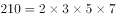，因为是三个连续的自然数的乘积，故，所以可知这三个连续的自然数是5、6、7。

方法二：选项中给出了两个自然数，选项信息充分，考虑代入排除。

A选项，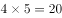，另一个数字是3或6，20与3或6的乘积不可能是210，排除；

B选项，，另一个数字是6或9，56与6和9的乘积也不可能是210，排除；

C选项，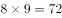，另一个数字是7或10，72与7或10的乘积不可能是210，排除；

D选项，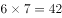，另一个数字为5或8，有，满足。

故正确答案为D。

---

### 第 2 题　qid 2139420 · 数学运算

有一个长方形的对角线为17cm，长比宽多3cm，那么这个长方形的面积为：

- **A**. 
140
　✅
- **B**. 
136

- **C**. 
132

- **D**. 
128

**答案**：A

**官方解析**

题中给出了长和宽的关系，设宽为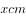，则长为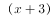，已知对角线为17cm，根据勾股定理可得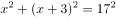，化简得：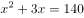，即，因此长方形的

故正确答案为A。

---

### 第 3 题　qid 2139430 · 数学运算

一份溶液，加入一定量的水后，浓度降到，再加入同样多的水后，浓度降为，该溶液未加水时浓度是：

- **A**. 

　✅
- **B**. 

- **C**. 

- **D**. 

**答案**：A

**官方解析**

题中给出的数据都是百分数，求的也是百分数，且溶质不变，故考虑赋值，赋值溶质为6。

由上表可以看出，每次加入的水量为，则未加水时的溶液（溶液1）的量为，。

故正确答案为A。

---

### 第 4 题　qid 2139432 · 数学运算

有4个不同的信箱，有5封不同的信件欲投其中，则不同的投法有：

- **A**. 5种
- **B**. 1024种　✅
- **C**. 40种
- **D**. 625种

**答案**：B

**官方解析**

因为有4个不同的信箱，所以每封信件的投递方式有4种，所以5封信不同的投法有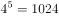种。

故正确答案为B。

---

### 第 5 题　qid 2139434 · 数学运算

单独修筑某条乡村公路，甲工程队需18天，乙工程队需24天，丙工程队需30天。现甲、乙、丙按如下顺序轮流施工：甲、乙、丙、乙、丙、甲、丙、甲、乙……每个工程队工作一天换班，直到工程完成。当工程完成时，乙工程队干了多少天？

- **A**. 8天　✅
- **B**. 11天
- **C**. 9天
- **D**. 7天

**答案**：A

**官方解析**

工程问题只给出了完工时间，故赋值时间的最小公倍数作为工作总量，即，则三个工程队的效率分别为：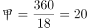，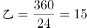，，则三天的工作量是。根据题意可知一个完整周期是9天：甲、乙、丙、乙、丙、甲、丙、甲、乙，即3个工程队轮流开工，则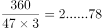，在工作2个周期后还余下工作量78，接下来甲、乙、丙工作完成工作量47，还剩，乙工作15，丙工作12，甲工作4就可以完成工程。因此乙共工作了天。

故正确答案为A。

备注：本题对于工作周期是几天还有另外一种理解，根据甲乙这个开头出现了两次推断周期是7，即周期是：甲、乙、丙、乙、丙、甲、丙，但是考虑到题干中没有给出两个确定的7天周期，且该规律不如按照甲乙丙循环开工9天一周期的规律明显，故粉笔按照周期是9给出解析。

---

### 第 6 题　qid 2139458 · 数学运算

某纸箱中原来有5个乒乓球，从纸箱中取出1个乒乓球，再放入5个乒乓球；又取出1个乒乓球，放入5个乒乓球；不断重复上述过程，到某一时刻停止，纸箱中乒乓球的总数可为：

- **A**. 2015
- **B**. 2019
- **C**. 2017　✅
- **D**. 2022

**答案**：C

**官方解析**

最初有5个乒乓球，接下来每一个过程都包含两步，即取出1个乒乓球，再放入5个乒乓球，此时乒乓球的个数可能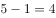个或者个，接下来再取出1个乒乓球，再放入5个乒乓球，此时乒乓球的个数可能为个或者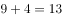个，依次类推，乒乓球的个数可能为4，9，8，13，12，17……，即奇数项为4的整数倍，偶数项减5为4的整数倍，观察选项四个选项都不是4的整数倍，只有可能是偶数项减5是4的倍数，满足条件的只有C项。

故正确答案为C。

---

### 第 7 题　qid 2139466 · 数学运算

受市场影响，某种品牌同种价位的自行车在三个商场都进行了两次提价（第二次提价的百分比是以第一次提价后的价格为基础的），A商场第一次提价，第二次提价；B商场第一次提价，第二次提价；C商场第一次提价，第二次提价；则提价最多的商场为：

- **A**. C商场
- **B**. A商场
- **C**. B商场　✅
- **D**. 无法确定

**答案**：C

**官方解析**

设在三个商场自行车提价前的价格都是，根据题意有：

A商场两次提价后的价格为，提价元；

B商场两次提价后的价格为，提价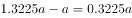元；

C商场两次提价后的价格为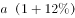，提价元；

，则提价最多的是B商场。

故正确答案为C。

---

### 第 8 题　qid 2139470 · 数学运算

有四种颜色的文件夹若干，每人可任取1～2个，如果要保证有3人取到完全一样的文件夹，则至少应该有      人去取。

- **A**. 18
- **B**. 20
- **C**. 11
- **D**. 21　✅

**答案**：D

**官方解析**

根据题意，每人可任取1-2个，若每人取一个，则有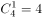种情况；若每人取2个，则有种情况。所以一共有种方式。考虑最不利情况，先让每种情况有2人选择，共有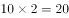人，这时再安排1人去取，就能保证有3人取到完全一样的文件夹，故题目所求为人。

故正确答案为D。

备注：根据题意，每人可任取1-2个，若每人取一个，则有种情况；若每人4种颜色选2个，得分类讨论颜色相同和不同。这样情况数种情况。总的情况数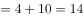种。每种情况有2人选择，共有人，再安排1人去取，就能保证有3人取到完全一样的文件夹，故题目所求为人。这样就没有正确选项了。

---

### 第 9 题　qid 2139472 · 数学运算

某商店出售A商品，若每天卖100件，则每件可获利6元。根据经验，若A商品每件涨1元钱，每天就少卖10件。为使每天获利最大化，A商品应提价：

- **A**. 6元
- **B**. 4元
- **C**. 2元　✅
- **D**. 10元

**答案**：C

**官方解析**

根据题意，假设提价元，则每件获利为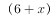元，同时每天会少卖件，则销量为。因此每天获利为，当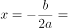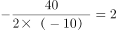，即提价2元时，每天获得的利润最大。

故正确答案为C。

---

### 第 10 题　qid 2139474 · 数学运算

在一条400米的圆形跑道上，甲乙两人同时从起点同向出发，甲速度为100米/分钟，乙速度为80米/分钟，则甲乙二人的连线第一次通过该圆形跑道的中心时，甲跑的是：

- **A**. 第10圈
- **B**. 第20圈
- **C**. 第3圈　✅
- **D**. 第5圈

**答案**：C

**官方解析**

根据题意，甲、乙连线第一次通过圆形跑道中心即甲、乙连线为圆形跑道的直径，并且甲比乙恰好多跑半圈。则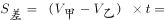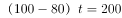米，解得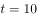分钟，此时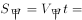米。，因此甲跑的是第3圈。

故正确答案为C。

---

## 判断推理

### 第 1 题　qid 2139586 · 图形推理

从所给四个选项中，选择最合适的一个填入问号处，使之呈现一定的规律性：

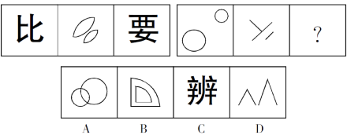

- **A**. A
- **B**. B
- **C**. C
- **D**. D　✅

**答案**：D

**官方解析**

元素组成不同，且属性无规律，考虑数量规律。观察发现，左边一组图都是2部分图形，右边一组图的前两幅图都是2部分，问号处应当填一个2部分图形，排除A、C两项；进一步观察发现，题干所有图形都是相离的图形间关系，只有D项符合。
故正确答案为D。

---

### 第 2 题　qid 2139602 · 图形推理

从所给四个选项中，选择最合适的一个填入问号处，使之呈现一定的规律性：

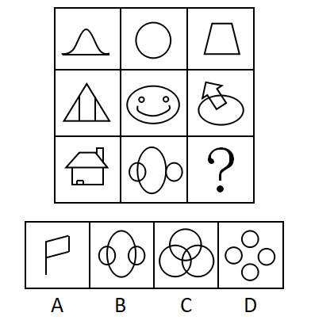

- **A**. A
- **B**. B
- **C**. C
- **D**. D　✅

**答案**：D

**官方解析**

元素组成不同，且无明显属性规律，考虑数量规律。观察发现，题干图形存在明显的封闭区域，优先考虑数面。九宫格优先看横行，第一行图形均有1个面，第二行图形均有3个面，第三行前两幅图形均有4个面，即每行图形的面数量相等，因此“？”处应为有4个面的图形。A项有1个面，B项有5个面，C项有7个面，D项有4个面，只有D项符合。
故正确答案为D。

---

### 第 3 题　qid 2139590 · 图形推理

从所给四个选项中，选择最合适的一个填入问号处，使之呈现一定的规律性：

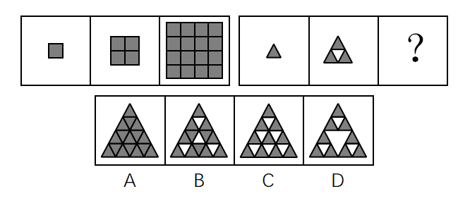

- **A**. A
- **B**. B
- **C**. C
- **D**. D　✅

**答案**：D

**官方解析**

图形元素组成不同，且无明显属性规律，考虑数量规律。观察发现，第一组图均由黑色正方形组成，且黑色正方形的个数依次为1、4、16，后一幅图中黑色正方形的个数均为前一幅图的4倍。第二组图形中，前两幅图均由黑色三角形组成，且黑色三角形的个数依次是1、3，后一幅图中黑色三角形的个数为前一幅图的3倍，依据此规律，问号处应为有9个黑色三角形的图形，A项为16个，B项为12个，C项为10个，D项为9个。
故正确答案为D。

---

### 第 4 题　qid 2139604 · 图形推理

从所给四个选项中，选择最合适的一个填入问号处，使之呈现一定的规律性：

- **A**. A
- **B**. B
- **C**. C　✅
- **D**. D

**答案**：C

**官方解析**

图形元素组成相似，相同的线条重复出现，优先考虑样式规律中的运算规律。九宫格优先看横行，第一行中图1与图2去同求异后得到图3，第二行同样满足此规律。第三行应遵循该规律，图1和图2去同求异后，相同的左斜线应去掉，不同的右斜线应保留，只有C项符合。
故正确答案为C。

---

### 第 5 题　qid 2139588 · 图形推理

从所给四个选项中，选择最合适的一个填入问号处，使之呈现一定的规律性：

- **A**. A　✅
- **B**. B
- **C**. C
- **D**. D

**答案**：A

**官方解析**

元素组成不同，且无明显属性规律，考虑数量规律。观察发现每个图形均由独立小元素组成，优先考虑数元素的种类和个数。题干图形元素种类分别为1、2、3、4、？，故？处应为元素种类为5的图形，只有A项满足规律。
故正确答案为A。

---

### 第 6 题　qid 2139592 · 定义判断

消费文化，是指在一定的历史阶段中，人们在物质生产、精神生产、社会生活以及消费活动中所表现出来的消费理念、消费方式、消费行为和消费环境的总和。根据上述定义，下列不属于消费文化的是：

- **A**. 十一黄金周假期，促进了居民参与国内外旅游的休闲消费
- **B**. 在年轻人中，他们更乐于通过网上购物的方式来购买自己需要的物品
- **C**. 中老年人，特别是老年人，喜欢在购物环境比较安静和舒适的地方进行消费
- **D**. 随着互联网发展，许多年轻人开办了自己的网店　✅

**答案**：D

**官方解析**

第一步：找出定义关键词。
 “在物质生产、精神生产、社会生活以及消费活动中”、“消费理念、消费方式、消费行为和消费环境的总和”。 
第二步：逐一分析选项。
A项，十一黄金周假期符合关键词“社会生活”，居民旅游休闲消费符合关键词“消费行为”，符合定义，排除；
B项，网购符合关键词“消费活动”，年轻人更乐于采用网上购物这种方式，符合关键词“消费理念”，符合定义，排除；
C项，老年人喜欢在安静和舒适的地方消费，符合关键词“消费活动”和“消费环境”，符合定义，排除；
D项，许多年轻人开网店，不涉及消费活动，不符合定义，当选。
本题为选非题，故正确答案为D。

---

### 第 7 题　qid 2139594 · 定义判断

卡特尔，垄断组织形式之一，是指同一生产部门的资本主义企业，以获取垄断高额利润和加强自己在竞争中的地位为目的，彼此之间签订关于销售市场、商品产量和商品价格的协议，并交换新技术的许可证等而形成的一种垄断联合。根据上述定义，下列不属于卡特尔的是：

- **A**. 
同一生产部门，各生产者签订协议，规定销售市场的区域范围

- **B**. 
同一生产部门，各生产者签订协议，规定某商品的垄断价格

- **C**. 
同一生产部门，实力较强的生产者以高于市场的价格收购实力较弱的生产者的股权
　✅
- **D**. 
同一生产部门，各生产者签订协议，规定生产和销售商品的一定数量，并要求每个参加者遵守

**答案**：C

**官方解析**

第一步：找出定义关键词。
 “同一生产部门的资本主义企业形成的垄断联合”、“签订关于销售市场、商品产量和商品价格的协议”、“交换新技术的许可证”。
第二步：逐一分析选项。
A项，签订协议规定销售市场的区域范围，符合关键词“签订关于销售市场的协议”，符合定义，排除；
B项，签订协议规定商品的垄断价格，符合关键词“签订关于商品价格的协议”，符合定义，排除；
C项，实力较强的生产者以较高的价格收购实力较弱的生产者，不符合关键词“签订关于销售市场、商品产量和商品价格的协议”，也没有体现“交换新技术的许可证”，不符合定义，当选；
D项，签订协议规定生产和销售商品的数量，符合关键词“签订关于商品产量的协议”，符合定义，排除。
本题为选非题，故正确答案为C。

---

### 第 8 题　qid 2139596 · 定义判断

知识经济，是指包括知识产权资源在内的科技进步对经济增长的贡献份额大于劳动、自然资源、资金等传统生产要素对经济增长贡献的份额。知识经济是建立在知识和经验的生产、分配和使用上的经济。根据上述定义，下列不属于知识经济的是：

- **A**. 知识对传统产业的高度渗透，全面提高传统产业的技术含量，促进产业不断升级
- **B**. 在创办公司时，可以用知识产权投资办企业
- **C**. 大学生利用所学的知识创办了一家公司　✅
- **D**. 高新技术产业的迅速发展

**答案**：C

**官方解析**

第一步：找出定义关键词。
 “知识产权资源在内的科技进步”、“对经济增长的贡献份额大于其他传统生产要素对经济增长的贡献份额”。
第二步：逐一分析选项。
A项，知识对传统行业高度渗透，促进产业升级，符合“知识产权资源在内的科技进步对经济增长的贡献份额大于其他传统生产要素对经济增长的贡献份额”，符合定义，排除；
B项，知识产权可以用于投资办企业，符合“知识产权资源在内的科技进步对经济增长的贡献份额大于其他传统生产要素对经济增长的贡献份额”，符合定义，排除；
C项，大学生利用所学知识创业，没有体现“知识产权资源在内的科技进步对经济增长的贡献份额大于其他传统生产要素对经济增长的贡献份额”，不符合定义，当选；
D项，高新技术产业以高新技术为基础，从事一种或多种高新技术及其产品的研究、开发、生产和技术服务的企业集合，符合“知识产权资源在内的科技进步对经济增长的贡献份额大于其他传统生产要素对经济增长的贡献份额”，符合定义，排除。
本题为选非题，故正确答案为C。

---

### 第 9 题　qid 2139598 · 定义判断

情感激励法，是指通过良好的情感关系，激发被管理者的积极性，从而达到提高工作效率的一种管理激励方法。根据上述定义，下列属于情感激励效果的一项是：

- **A**. 一名员工由于在大会上指责经理，被人讽刺、打击、报复，感到很无奈
- **B**. 一名员工被怀疑私自收取顾客好处费而被责令待岗反省，他很伤心
- **C**. 职工的思想和行动得到领导赞许，产生了继续坚持下去的情绪　✅
- **D**. 经理办公室决定，以后不允许职工在公司内谈论家常事

**答案**：C

**官方解析**

第一步：找出定义关键词。
“通过良好的情感关系”、“激发被管理者的积极性”。 
第二步：逐一分析选项。
A项，员工在大会上指责经理，不符合关键词“通过良好的情感关系”，之后被打击报复心情无奈，不符合关键词“激发被管理者的积极性”，不符合定义，排除；
B项，员工被怀疑私自收取顾客好处费而被责令待岗反省，不符合关键词“通过良好的情感关系”，很伤心，不符合关键词“激发被管理者的积极性”，不符合定义，排除；
C项，职工的思想和行动得到领导赞许，符合关键词“通过良好的情感关系”，职工产生了继续坚持下去的情绪，符合关键词“激发被管理者的积极性”，符合定义，当选；
D项，不允许职工在公司内谈论家常事，不涉及关键词“通过良好的情感关系”，也没有体现关键词“激发被管理者的积极性”，不符合定义，排除。
故正确答案为C。

---

### 第 10 题　qid 2139600 · 定义判断

工业产权，是指法律规定对应用于生产和流通中创造发明和显著标记等智力成果在一定期限和地区内享有的占有权。根据上述定义，下列属于工业产权的是：

- **A**. 某国有企业车间、厂房等不动产的所有权
- **B**. 某企业近期购买的国外先进流水线生产设备的所有权
- **C**. 某化工厂的高新技术研究所的产权
- **D**. 某电器生产企业对经多年打拼创下的品牌享有的权利　✅

**答案**：D

**官方解析**

第一步：找出定义关键词。
“对应用于生产和流通中”、“创造发明和显著标记等智力成果”、“在一定期限和地区内享有的占有权”。
第二步：逐一分析选项。
A项：国有企业已经拥有车间、厂房等不动产，不符合“创造发明和显著标记等智力成果”，不符合定义，排除； 
B项：国外先进流水线生产设备，不符合“创造发明和显著标记等智力成果”，不符合定义，排除； 
C项：高新技术研究所的产权，不符合“创造发明和显著标记等智力成果”，不符合定义，排除； 
D项：某电器生产企业符合“对应用于生产和流通中”，打拼创下的品牌符合“创造发明和显著标记等智力成果”、“在一定期限和地区内享有的占有权”，符合定义，当选。
故正确答案为D。

---

### 第 11 题　qid 2139446 · 定义判断

细胞内消化，是指单细胞动物摄入的食物在细胞内被各种水解酶分解的消化方式。根据上述定义，下列属于细胞内消化的是：

- **A**. 家禽类吃了食物后在胃里消化
- **B**. 生活在淡水中的草履虫吞噬枯草杆菌　✅
- **C**. 人在生病虚弱不能进食时，用打点滴的方式注射葡萄糖和氨基酸等
- **D**. 羊驼在进食后会将吃过的食物反刍后消化

**答案**：B

**官方解析**

第一步：找出定义关键词。
“单细胞动物”、“在细胞内被各种水解酶分解的消化方式”。
第二步：逐一分析选项。
A项，家禽不是单细胞动物，不符合定义，排除； 
B项，草履虫是单细胞动物，吞噬枯草杆菌符合“在细胞内被各种水解酶分解的消化方式”，符合定义，当选；
C项，人类不是单细胞动物，不符合定义，排除；
D项，羊驼不是单细胞动物，不符合定义，排除。
故正确答案为B。

---

### 第 12 题　qid 2139448 · 定义判断

现实型渐进决策，是指决策者不可能拥有人类的全部智慧和有关决策的全部信息，决策的时间、费用又有限，故决策者只能采用应付局面的办法，在“有偏袒的相互调整中”作出决策。该理论要求决策程序简化，决策实用、可行并符合利益集团的要求，力求解决现实问题。根据上述定义，下列属于现实型渐进决策的是：

- **A**. 某经贸公司李总经理决策前能全盘考虑一切公司行动，以及行动所产生的影响，选择具有最大价值的行动作为对策
- **B**. 张董事长认为在公司发展的决策中，不可能预见一切结果，只能在供选择的方案中选出一个“满意的”方案，因此往往只看方案的部分结果
- **C**. 田主任在提出部门发展决策时，很大程度上受潜意识的支配，许多决策行为常常感情用事，因而作出不明智的安排
- **D**. 李厂长强调工厂的生产不能一味扩张，要立足于工厂发展的现实，面临机遇时要当机立断，把有限的资源和时间投入到重要的环节，在以后的工作中再对生产进行不断地完善　✅

**答案**：D

**官方解析**

第一步：找出定义关键词。
“决策者不可能拥有人类的全部智慧和有关决策的全部信息，决策的时间、费用又有限”、“采取应付局面的办法”、“在有偏袒的相互调整中作出决策”、“决策实用、可行并符合利益集团的要求，力求解决现实问题”。
第二步：逐一分析选项。
A项：“全盘考虑一切”不符合关键词“决策者不可能拥有有关决策的全部信息”，不符合定义，排除； 
B项：张董事长只是在供选择的方案中选出一个“满意的”方案，但是在选择方案时并没有体现互相调整的过程，不符合定义，排除； 
C项：“受潜意识的支配”“常常感情用事”“作出不明智的安排”不符合关键词“决策实用、可行并符合利益集团的要求，力求解决现实问题”，不符合定义，排除；
D项：李厂长作为决策者，立足于工厂发展的现实进行决策体现出关键词“力求解决现实问题”，“把有限的资源和时间投入到重要的环节”，说明在重要工作和次要工作之间做出了调整，也符合关键词“在有偏袒的相互调整中作出决策”，符合定义，当选。
故正确答案为D。

---

### 第 13 题　qid 2139450 · 定义判断

前景理论，是指大多数人在面临获得的时候是风险规避的；大多数人在面临损失的时候是风险偏爱的；人们对损失比对获得更敏感的理论。根据上述定义，下列不符合前景理论的是：

- **A**. 选择甲肯定赢500元；选择乙有50%的可能赢1000元，50%的可能什么也得不到。这时大部分人会选择甲
- **B**. 采用甲方案，可以救200人；采用乙方案，有三分之一的可能救600人，三分之二的可能一个人也救不了。人们更愿意选择甲方案
- **C**. 到达同一目的地，选择熟悉的路将会迟到10小时，选择陌生的路，有三分之二的可能迟到20小时，有三分之一的可能按时到达。人们更愿意选择熟悉的路　✅
- **D**. 如果选择甲肯定会损失1000元，选择乙50%的可能损失2000元，50%的可能不会损失。人们更愿意选择乙

**答案**：C

**官方解析**

第一步：找出定义关键词。
“大多数人在面临获得的时候是风险规避的”、“面临损失的时候是风险偏爱的”、“对损失比对获得更敏感”。
第二步：逐一分析选项。
A项，选择甲一定会赢，选择乙有一半的概率什么也得不到，大部分的人会选择甲，符合“大多数人在面临获得的时候是风险规避的”，符合定义，排除；
B项，选择甲方案能救200人，选择乙方案有三分之二的概率一个人也救不了，人们更愿意选择甲方案，符合“大多数人在面临获得的时候是风险规避的”，符合定义，排除；
C项，选择熟悉路线会迟到10小时，选择陌生的路，有三分之二的可能会迟到20小时，人们更愿意选择熟悉的路线，不符合“面临损失的时候是风险偏爱的”，不符合定义，当选；
D项，选择甲肯定会损失1000元，选择乙有50%的可能损失2000元，人们更愿意选择乙，符合“面临损失的时候是风险偏爱的”，符合定义，排除。
本题为选非题，故正确答案为C。

---

### 第 14 题　qid 2139452 · 定义判断

出口补贴（出口津贴），是指一国政府为降低出口商品的价格，加强其在国外市场上的竞争能力，在出口某种商品时给予出口厂商的现金补贴或财政上的优惠待遇。根据上述定义，下列不属于出口补贴行为的是：

- **A**. 某公司生产的自行车出口享受税收优惠政策
- **B**. 某出口公司税款被减免
- **C**. 某彩电出口到非洲时降价销售　✅
- **D**. 镇政府资助某出口水产集团

**答案**：C

**官方解析**

第一步：找出定义关键词。
“政府”、“出口某种商品时给予出口厂商的现金补贴或财政上的优惠待遇”、“降低出口商品的价格，加强其在国外市场上的竞争能力”。
第二步：逐一分析选项。
A项，出口的自行车享受税收优惠政策符合关键词“出口某种商品时给予出口厂商的现金补贴或财政上的优惠待遇”，符合定义，排除；
B项，出口公司税款被减免符合关键词“出口某种商品时给予出口厂商的现金补贴或财政上的优惠待遇”，符合定义，排除；
C项，某彩电出口到非洲时降价销售不符合关键词“出口某种商品时给予出口厂商的现金补贴或财政上的优惠待遇”，不符合定义，当选；
D项，镇政府资助某出口水产集团符合关键词“出口某种商品时给予出口厂商的现金补贴或财政上的优惠待遇”，符合定义，排除。
本题为选非题，故正确答案为C。

---

### 第 15 题　qid 2139454 · 定义判断

回避，是指司法人员因与案件或案件当事人有某种特殊关系而不得办理该案件。目的是防止徇私舞弊或发生偏见，以有利于案件的公正审理。根据上述定义，下列不属于回避情况的是：

- **A**. 甲乙丙三兄弟因争夺遗产而诉至法院，法院调解后，乙、丙提出，该院刘审判员是甲的妻兄，而刘审判员与本案张审判员是朋友。乙和丙提出应让张审判员回避　✅
- **B**. 甲与乙打架，甲将乙打成重伤。负责侦查这个案件的公安干警是甲的舅舅，他一向公正无私，为人所称道。但乙的亲属还是要求甲的舅舅回避
- **C**. 甲误伤乙，诉到法院，一审判决甲有期徒刑2年，甲不服判决提出上诉，二审法院受理后，组成合议庭，合议庭的书记员是刚调来的，他在该案一审时为受害人作过证。甲向法院提出这个书记员应当回避
- **D**. 甲与乙因合同纠纷诉讼到法院，负责审理这个案件的审判员是甲的堂兄。乙方提出该审判员应当回避

**答案**：A

**官方解析**

第一步：找出定义关键词。
“司法人员与案件或案件当事人有某种特殊关系”、“不得办理该案件”、“防止徇私舞弊或发生偏见”、“有利于案件的公正审理”。
第二步：逐一分析选项。
A项：甲是案件当事人，刘审判员是甲的妻兄，审理该案的张审判员和刘审判员是朋友，但是刘审判员与案件并没有直接关系，因此张审判长与案件亲属也没有直接关系，不符合“司法人员与案件或案件当事人有某种特殊关系”，不符合定义，当选；
B项：甲是案件当事人，负责侦查案件的公安干警是甲的舅舅，符合“司法人员与案件或案件当事人有某种特殊关系”，符合定义，排除；
C项：乙是案件当事人，合议庭的书记员为该案的受害人即乙做过证，符合“司法人员与案件或案件当事人有某种特殊关系”，符合定义，排除；
D项：甲是案件当事人，审理案件的审判员是甲的堂兄，符合“司法人员与案件或案件当事人有某种特殊关系”，符合定义，排除。
本题为选非题，故正确答案为A。

---

### 第 16 题　qid 2139436 · 类比推理

川菜：素菜：热菜

- **A**. 格律诗：唐诗：五言诗　✅
- **B**. 黄金：液体：导体
- **C**. 电器：通讯工具：电话
- **D**. 鱼：水生动物：爬行动物

**答案**：A

**官方解析**

第一步：判断题干词语间的逻辑关系。
本题考查交叉关系。川菜、素菜和热菜，每两个词之间都是交叉关系。
第二步：判断选项词语间的逻辑关系。
A项，格律诗、唐诗和五言诗，每两个词之间都是交叉关系，与题干逻辑关系一致，当选；
B项，黄金是一种导体，两者是种属关系，与题干逻辑关系不一致，排除；
C项，电话是一种通讯工具，两者是种属关系，与题干逻辑关系不一致，排除；
D项，鱼是一种水生动物，两者是种属关系，与题干逻辑关系不一致，排除。
故正确答案为A。

---

### 第 17 题　qid 2139438 · 类比推理

红楼梦：曹雪芹

- **A**. 三国演义：吴承恩
- **B**. 隋唐演义：单田芳
- **C**. 西游记：罗贯中
- **D**. 水浒传：施耐庵　✅

**答案**：D

**官方解析**

第一步：判断题干词语间的逻辑关系。
本题考查的是作品和作者之间的对应关系，红楼梦的作者是曹雪芹。
第二步：判断选项词语间的逻辑关系。
A项，《三国演义》的作者是罗贯中，而不是吴承恩，与题干逻辑关系不一致，排除；
B项，《隋唐演义》的作者是褚人获，而不是单田芳，与题干逻辑关系不一致，排除；
C项，《西游记》的作者是吴承恩，而不是罗贯中，与题干逻辑关系不一致，排除；
D项，《水浒传》的作者是施耐庵，是作品和作者之间的对应关系，与题干逻辑关系一致，当选。
故正确答案为D。

---

### 第 18 题　qid 2139440 · 类比推理

多多益善：韩信：刘邦

- **A**. 卧薪尝胆：勾践：西施
- **B**. 乐不思蜀：刘禅：司马昭　✅
- **C**. 四面楚歌：张良：项羽
- **D**. 莫须有：韩世忠：秦桧

**答案**：B

**官方解析**

第一步：判断题干词语间的逻辑关系。
韩信和刘邦是“多多益善”典故中涉及的历史人物，且刘邦向韩信提问，韩信回答“多多益善”，其中刘邦是提问者，韩信是回答者。
第二步：判断选项词语间的逻辑关系。
A项，勾践是“卧薪尝胆”涉及的历史人物，但西施不是“卧薪尝胆”涉及的历史人物，与题干逻辑关系不一致，排除；
B项，刘禅和司马昭是“乐不思蜀”典故中涉及的历史人物，且司马昭是提问者，刘禅是回答者，与题干逻辑关系一致，当选；
C项，张良和项羽是“四面楚歌”典故中涉及的历史人物，但项羽不是提问者，与题干逻辑关系不一致，排除；
D项，韩世忠和秦桧是“莫须有”典故中涉及的历史人物，但韩世忠是提问者，秦桧是回答者，与题干顺序相反，与题干逻辑关系不一致，排除。
故正确答案为B。

---

### 第 19 题　qid 2139442 · 类比推理

刀：锋利：切割

- **A**. 窗玻璃：透明：挡风
- **B**. 灯：明亮：照明　✅
- **C**. 床：柔软：舒适
- **D**. 保温杯：隔热：盛水

**答案**：B

**官方解析**

第一步：判断题干词语间的逻辑关系。
本题考查对应关系。刀的属性是锋利，刀因为锋利而能切割，切割是刀的功能。
第二步：判断选项词语间的逻辑关系。
A项，窗玻璃的属性是透明，但是窗玻璃不是因为透明而能挡风，是因为透明而能视物，与题干逻辑关系不一致，排除；
B项，灯的属性是明亮，灯因为明亮而能照明，照明是灯的功能，与题干逻辑关系一致，当选；
C项，柔软和舒适都是床的属性，舒适不是床的功能，与题干逻辑关系不一致，排除；
D项，保温杯的属性是隔热，但是保温杯不是因为隔热而能盛水，是因为隔热而能保温，与题干逻辑关系不一致，排除。
故正确答案为B。

---

### 第 20 题　qid 2139444 · 类比推理

面粉：面包：烤箱

- **A**. 水彩：纸张：画笔
- **B**. 麦粒：油条：磨子
- **C**. 粮食：酒：酒壶
- **D**. 棉花：布：织布机　✅

**答案**：D

**官方解析**

第一步：判断题干词语间的逻辑关系。
本题考查对应关系。面粉是制作面包的原材料，烤箱是制作面包的工具。
第二步：判断选项词语间的逻辑关系。
A项，水彩不是制作纸张的原材料，画笔也不是制作纸张的工具，与题干逻辑关系不一致，排除；
B项，麦粒是制作油条的原材料，麦粒经过加工可产生面粉，面粉制作成油条。但是磨子不是制作油条的工具，而是制作面粉的工具，与题干逻辑关系不一致，排除；
C项，粮食是制作酒的原材料，但是酒壶不是制作酒的工具，而是装酒的工具，与题干逻辑关系不一致，排除；
D项，棉花是制作布的原材料，织布机是制作布的工具，与题干逻辑关系一致，当选。
故正确答案为D。

---

### 第 21 题　qid 2139456 · 类比推理

学者：物理学家：爱因斯坦

- **A**. 世界：亚洲：印度
- **B**. 诗歌：唐诗：格律诗
- **C**. 河流：中国河流：长江　✅
- **D**. 中国：中国城市：南京

**答案**：C

**官方解析**

第一步：判断题干词语间的逻辑关系。
本题考查包容关系。物理学家是学者，两者是种属关系；爱因斯坦是物理学家，两者也是种属关系。
第二步：判断选项词语间的逻辑关系。
A项，亚洲是组成世界的一部分，两者是组成关系，不是种属关系；印度是亚洲的一部分，两者也是组成关系，不是种属关系，与题干逻辑关系不一致，排除；
B项，唐诗是诗歌，两者是种属关系；但唐诗和格律诗是交叉关系，两者不是种属关系，与题干逻辑关系不一致，排除；
C项，中国河流是河流，两者是种属关系；长江是中国河流，两者也是种属关系，与题干逻辑关系一致，当选；
D项，南京是中国城市，两者是种属关系；但中国城市是中国的组成部分，两者是组成关系，不是种属关系，与题干逻辑关系不一致，排除。
故正确答案为C。

---

### 第 22 题　qid 2139460 · 类比推理

教师 对于（  ），相当于（  ）对于 厨房

- **A**. 课堂；厨师　✅
- **B**. 书桌；卧室
- **C**. 学生；餐厅
- **D**. 学校；顾客

**答案**：A

**官方解析**

逐一代入选项。
A项，教师在课堂教学，厨师在厨房烹饪，前后都是职业与工作地点的对应关系，逻辑关系一致，当选；
B项，教师和书桌没有明显的逻辑关系，卧室和厨房是并列关系，前后逻辑关系不一致，排除；
C项，学生是老师的教育对象，两者为对应关系，餐厅和厨房是并列关系，前后逻辑关系不一致，排除；
D项，教师在学校工作，两者为对应关系，顾客和厨房逻辑关系不明显，前后逻辑关系不一致，排除。
故正确答案为A。

---

### 第 23 题　qid 2139462 · 类比推理

冬装 对于（  ），相当于（  ）对于 被子

- **A**. 棉袄；床垫
- **B**. T恤；床单
- **C**. 棉织品；床上用品
- **D**. 服装；被套　✅

**答案**：D

**官方解析**

逐一代入选项。
A项：棉袄是一种冬装，两者为种属关系，床垫和被子都是床上用品，为并列关系，前后逻辑关系不一致，排除；
B项：和冬装同一层级的是夏装，而T恤是夏装的一种，因此冬装和T恤不是同一层级，两者不是并列关系，床单和被子都是床上用品，两者是并列关系，前后逻辑关系不一致，排除；
C项：冬装和棉织品是交叉关系，被子是一种床上用品，两者为种属关系，前后逻辑关系不一致，排除；
D项：冬装是一类服装，被套是被子的组成部分，两者都是包容关系，前后逻辑关系一致，当选。
本题出题不够严谨，D项虽然都是包容关系，但冬装和服装是种属关系，被套和被子是组成关系，考试中通常是将二者区分开来。但因为其他选项一定错误，所以只能择优选择D项。
故正确答案为D。

---

### 第 24 题　qid 2139464 · 类比推理

苏格拉底：人类

- **A**. 松树：植物
- **B**. 故宫：建筑
- **C**. 《唐诗三百首》：书籍
- **D**. 太阳：恒星　✅

**答案**：D

**官方解析**

第一步：判断题干词语间的逻辑关系。
本题考查包容关系。苏格拉底是人类，两者为种属关系。
第二步：判断选项词语间的逻辑关系。
A项，松树是植物，两者为种属关系，保留；
B项，故宫是建筑，两者为种属关系，保留；
C项，《唐诗三百首》是书籍，两者为种属关系，保留；
D项，太阳是恒星，两者为种属关系，保留。
题干和选项都是种属关系，此时需要二级辨析。苏格拉底是特指一个人。A项，松树是一类树；B项，中国有四处故宫，北京故宫、沈阳故宫、南京故宫和台北故宫，不是特指某一个建筑；C项，《唐诗三百首》是很多诗组成的诗集，有多个版本；而D项，太阳是特指一个恒星，对比选项，D项和题干逻辑更相似。
故正确答案为D。

---

### 第 25 题　qid 2139468 · 类比推理

青：青年：青草

- **A**. 禅：参禅：禅让
- **B**. 信：信念：书信　✅
- **C**. 苏：苏打：苏加诺
- **D**. 交：交往：交情

**答案**：B

**官方解析**

第一步：判断题干词语间的逻辑关系。
本题考查对应关系。青年中的青是年轻的意思，青草的青是绿色的意思，两个青意思不同，但读音相同。
第二步：判断选项词语间的逻辑关系。
A项，参禅的禅读chán，禅让的禅读shàn，两个字读音不同，与题干逻辑关系不一致，排除；
B项，信念的“信”是不怀疑，认为可靠的意思，书信的“信”是指按照习惯的格式把要说的话写出来给指定对象看的东西，两个字意思不同，读音相同，与题干逻辑关系一致，当选；
C项，苏打和苏加诺都属于外语音译过来的词语，其中的“苏”，读音相同，但都没有实际意义，与题干逻辑关系不一致，排除；
D项，交往和交情中的“交”都是结交的意思，两个词意思相同，与题干逻辑关系不一致，排除。
故正确答案为B。

---

### 第 26 题　qid 2139484 · 逻辑判断

“同票同权”体现了对农民参政权利的尊重，有利于让更多基层代表反映广大农民真实的心声、愿望，也有利于在建设社会主义新农村的过程中构建和谐城乡格局。由此可以推出：

- **A**. “同票同权”是建设和谐社会的必由之路
- **B**. “同票同权”会提高农民参政的积极性　✅
- **C**. 政府有加大对于农民参政权利的重视力度
- **D**. 农民的参政权利需要依靠有效的政策加以保障

**答案**：B

**官方解析**

日常结论题，根据题干信息逐一分析选项。
A项：题干说的是“构建和谐城乡格局”，而选项说的是“建设和谐社会”，城乡格局只是和谐社会的一部分，此处属于概念扩大；且题干说的是“同票同权”有利于构建和谐城乡格局，并不是“必由之路”，无中生有，排除；
B项：“同票同权”有利于基层群众代表反映广大农民心声，所以有利于提高农民参政的积极性，当选；
C项：题干提到的是“同票同权”的好处，并没有提到政府是否加大对农民参政的重视力度，无中生有，排除； 
D项：题干并没有提到农民的参政权利是否需要政策保障，排除。
故正确答案为B。

---

### 第 27 题　qid 2139488 · 逻辑判断

说谎话往往比说实话更难，因为说实话只要依据事实进行陈述即可，而说谎话往往想获得赞赏或注意，或为了逃避责骂，以及想表达自己的愿望等，这必须要有较强的想象力和逻辑思维能力。由此可以推出：

- **A**. 经常说谎的人比说实话的人有更强的想象力和逻辑思维能力
- **B**. 说实话的人的想象力和逻辑思维能力不及说谎的人
- **C**. 善于说谎话的人更善于说实话
- **D**. 缺乏想象力和逻辑思维能力的人不善于说谎话　✅

**答案**：D

**官方解析**

日常结论题，根据题干信息逐一分析选项。
A项：题干中提到说谎比说实话难，说谎需要有较强的想象力和逻辑思维能力，并没有把经常说谎的人与说实话的人的想象力与逻辑思维能力作比较，排除；
B项：题干中并没有把说谎的人与说实话的人的想象力与逻辑思维能力作比较，排除；
C项：说谎比说实话难，不表示善于说谎的人就更善于说实话，排除； 
D项：题干最后一句话“这必须要有较强的想象力和逻辑思维能力”可翻译为：说谎→有较强的想象力和逻辑思维能力，否定箭头后得否定箭头前，所以缺乏想象力和逻辑思维能力就不善于说谎，当选。
故正确答案为D。

---

### 第 28 题　qid 2139492 · 逻辑判断

某快递公司通过不断改进和更新工具，使得其送快递的效率大为提高，即在单位时间里，用较少的快递员送达了较多的产品。下列哪项为真，一定能支持上述结论？
Ⅰ.和去年相比，今年快递公司的年利润增加了一倍，快递员增加了10%。
Ⅱ.和去年相比，今年快递公司的年送货量增加了一倍，快递员增加了100人。
Ⅲ.和去年相比，今年快递公司的年送货量增加了一倍，快递员增加了10%。

- **A**. 只有Ⅲ　✅
- **B**. 只有Ⅰ和Ⅲ
- **C**. 只有Ⅱ
- **D**. 只有Ⅰ

**答案**：A

**官方解析**

第一步：找出论点和论据。
论点：某快递公司通过不断改进和更新工具，使得其送快递的效率大为提高，即在单位时间里，用较少的快递员送达了较多的产品。
论据：无。
第二步：逐一分析选项。
Ⅰ：题干没有涉及到利润与产品数量之间的关系，不能推出送快递的效率提高了，错误；
Ⅱ：今年比去年送货量增加了一倍，快递员增加了100人，题干没有提到去年快递员的总数，无法比较送货效率是否提高，错误；
Ⅲ：今年比去年送货量增加了一倍，快递员增加了10%，补充论据，能说明送货效率提高了，正确。
A项：只有Ⅲ能支持结论，当选；
B项：Ⅰ不能支持结论，排除；
C项：Ⅱ不能支持结论，排除；
D项：Ⅰ不能支持结论，排除。
故正确答案为A。

---

### 第 29 题　qid 2139496 · 逻辑判断

李某不会开车，所以李某坐地铁上班。得出上述结论的前提是：

- **A**. 所有坐地铁上班的人都不会开车
- **B**. 只有不坐地铁上班的人才会开车
- **C**. 所有不会开车的人都坐地铁上班　✅
- **D**. 所有会开车的人都不坐地铁上班

**答案**：C

**官方解析**

第一步：找出论点和论据。
论点：李某坐地铁上班。
论据：李某不会开车。
第二步：逐一分析选项。
A项：所有坐地铁上班的人都不会开车，是由论点推向论据，搭桥方向反了，排除；
B项：说的是会开车与不坐地铁之间的关系，与论点无关，排除；
C项：所有不会开车的人都坐地铁上班，李某不会开车，所以李某坐地铁上班，在论点与论据之间建立联系，由论据向论点搭桥，当选；
D项：说的是会开车与不坐地铁之间的关系，与论点无关，排除。
故正确答案为C。

---

### 第 30 题　qid 2139498 · 类比推理

合格的教师应该具备三个条件：第一要有责任心；第二要有丰富的知识；第三要有一定的管理水平。现有至少符合条件之一的甲、乙、丙、丁四位大学毕业生报名竞争一个教师岗位，其中一人合格，已知：
（1）甲、乙管理水平相当；
（2）乙、丙都有责任心；
（3）丙、丁并非都有责任心；
（4）四人中三个人责任心强、两人管理能力突出、一人知识丰富。
那么能够胜出的一位是：

- **A**. 丙　✅
- **B**. 丁
- **C**. 甲
- **D**. 乙

**答案**：A

**官方解析**

第一步：分析题干。

①甲、乙管理水平相当；

②乙、丙都有责任心；

③丙、丁并非都有责任心；

④四人中三个人责任心强，两个人管理能力突出、一人知识丰富；

⑤大学毕业生甲、乙、丙、丁至少符合合格教师的条件之一；

⑥只有一个人符合合格教师的全部条件。

第二步：根据题干条件进行推理。

题干涉及的人和信息较多，可列表进行推理。

由条件②乙、丙都有责任心，以及条件③丙、丁并非都有责任心，可知丁没有责任心，再结合条件④四个人中有三个人责任心强，可知甲有责任心，如下表所示（表格中的数字代表符合该条件的人数）。

再由条件④四个人中只有一个人知识丰富，以及条件⑥只有一个人符合合格教师的全部条件，可知丁没有丰富的知识，结合条件⑤丁至少符合合格教师的条件之一，可知丁有管理能力突出，如下表所示。

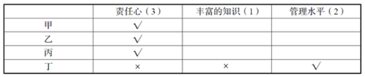

又由条件④四人中有两个人管理能力突出，以及条件①甲、乙管理水平相当，可知丙和丁管理能力相当，故丙管理能力突出，甲、乙管理能力不突出，如下表所示。

此时，只有丙既有责任心又管理能力突出，结合条件⑥只有一个人符合合格教师的全部条件可知，只能是丙符合全部三个条件，即丙胜出。

故正确答案为A。

---

### 第 31 题　qid 2139584 · 图形推理

一个纸盒子的6个面的颜色各不相同，分别是红、黄、绿、蓝、黑、白这6种颜色。如果满足：
（1）红色的对面是黑色；
（2）蓝色和白色相邻；
（3）黄色和蓝色相邻。
那么下列结论错误的是：

- **A**. 红色与蓝色相邻
- **B**. 黄色与白色相邻　✅
- **C**. 黑色与绿色相邻
- **D**. 蓝色的对面是绿色

**答案**：B

**官方解析**

根据条件（1）红色的对面是黑色，可知红色和黑色是相对面，则红色与黄色、蓝色、绿色、白色都是相邻的，而且黑色与黄色、蓝色、绿色、白色也都是相邻的，排除A、C两项；
剩余四种颜色，根据条件（2）蓝色和白色相邻，以及条件（3）黄色和蓝色相邻可知，蓝色与白色、黄色、红色和黑色相邻，因此，蓝色和绿色是相对面，白色和黄色是相对面，排除D项。
本题为选非题，故正确答案为B。

---

### 第 32 题　qid 2139576 · 逻辑判断

诚信乃立身之本。然而，当文章抄袭、高考舞弊、民族作假、官员贪污受贿等被屡屡曝光，一旦道德体系坍塌，社会将无法继续正常运转。通过查询信用记录中的信用状况，可以很大程度上缓解社会信息不对称问题，并对失信者实行心理上的威慑。由此可以推出：

- **A**. “信用身份证”具有权威的证明力和公信力
- **B**. 诚信证明并非是保证诚信的关键
- **C**. 诚信缺失，社会道德体系面临崩溃的边缘
- **D**. “信用身份证”是维护和重建社会诚信的有益尝试　✅

**答案**：D

**官方解析**

日常结论题，根据题干信息逐一分析选项。
A项：题干只是说通过查询信用记录中的信用状况，可以很大程度缓解社会信息不对称问题，对失信者实行心理上的威慑，它是否具有权威的证明力和公信力无从知晓，无中生有，排除；
B项：题干只是说查询信用记录中的信用情况可以很大程度缓解社会信息不对称问题，是解决问题的一种方式，并没提及保证诚信的关键是什么，无中生有，排除；
C项：题干说的是一些失信事件的曝光，使得一旦道德体系坍塌，社会将无法继续正常运转，没有提及是不是面临崩溃的边缘，无法推出，排除；
D项：题干指出通过查询信用记录中的信用状况，可以很大程度缓解社会信息不对称问题，对失信者实行心理上的威慑，从而可以推出能够一定程度上缓解社会的失信问题，所以“信用身份证”是维护和重建社会诚信的有益尝试，可以推出，当选。
故正确答案为D。

---

### 第 33 题　qid 2139578 · 类比推理

近年来，随着高校进一步扩招，大学毕业生也日益增多，社会劳动力市场出现了供过于求的局面，就业压力大增，部分地区高校毕业生就业率还不到一半的水平。但同时也出现了另外一种现象，大专生的就业形势普遍好于本科生。下述选项中，无助于解释上述现象的是：

- **A**. 大专生就业期望值比本科生低
- **B**. 本科生理论知识强但动手能力相对较弱
- **C**. 社会对技能型人才需求扩大
- **D**. 大专生不比本科生聪明　✅

**答案**：D

**官方解析**

第一步：找出题干矛盾。
大学毕业生日益增多，社会劳动力市场出现了供过于求的局面，就业压力大增，部分地区高校毕业生就业率还不到一半的水平。但是大专生的就业形势普遍好于本科生。
第二步：逐一分析选项。
A项：大专生就业期望值低，对工作要求低，所以找到工作的概率就大，可以解释，选非题，排除；
B项：工作更看重动手能力，本科生动手能力弱，所以就业形式没有专科生好，可以解释，选非题，排除；
C项：专科更偏重技能型人才的培养，社会对技能型人才需求扩大，所以专科生就业形式好于本科，可以解释，选非题，排除；
D项：聪明与否与是否在就业时有优势无必然联系，不能解释为什么大专生的就业形势普遍好于本科生，选非题，当选。
本题为选非题，故正确答案为D。

---

### 第 34 题　qid 2139580 · 逻辑判断

按照科学的本义，科学是理性；哲学是高度理性化的，它当然也是科学。所以，在哲学的历史上，它长期扮演了包罗万象的“科学的科学”这样的角色，直到马克思主义哲学诞生，才正确处理好科学同哲学的关系。但在古老的大学里，哲学博士才是真正的科学博士。根据这段文字，下列推断正确的是：

- **A**. 科学一直是哲学的一个分支
- **B**. 马克思主义哲学科学与哲学完全割裂了关系
- **C**. 哲学和科学都是理性的　✅
- **D**. 科学是哲学，哲学是科学

**答案**：C

**官方解析**

日常结论题，根据题干信息逐一分析选项。
A项：根据第一句“哲学是高度理性化的，它当然也是科学”，可知哲学是一种科学，科学的范围更大，所以不能说科学是哲学的分支，排除；
B项：题干只是说马克思主义哲学正确处理好科学同哲学的关系，并没有说完全割裂了哲学和科学的关系，该项属于无中生有，排除；
C项：根据第一句可知，哲学是科学，科学是理性的，所以哲学和科学都是理性的，该项推断正确，当选；
D项：根据第一句“哲学是高度理性化的，它当然也是科学”，可知哲学是科学，但根据题干无法推出科学是哲学，排除。
故正确答案为C。

---

### 第 35 题　qid 2139582 · 逻辑判断

如果李锐会英语了，那么王伟、文瑞和张敏也肯定会英语。由此可以得知：

- **A**. 如果李锐、文瑞和张敏都会英语，那么王伟也肯定会英语　✅
- **B**. 李锐如果不会英语，那么王伟、文瑞和张敏中至少有一个不会英语
- **C**. 如果张敏不会英语，那么李锐和张敏不都会英语
- **D**. 如果王伟、文瑞不会英语，那么张敏不会英语

**答案**：A

**官方解析**

第一步：翻译题干。
李锐会英语→王伟且文瑞且张敏会英语
第二步：逐一分析选项。
A项：翻译为：李锐且文瑞且张敏会英语 → 王伟会英语，根据李锐且文瑞且张敏会英语可知李锐会英语，“李锐会英语”肯定了题干翻译的箭头前，必然得到肯定的箭头后，即王伟且文瑞且张敏会英语，可知王伟肯定会英语，当选；
B项：翻译为：-李锐会英语→-王伟会英语或-文瑞会英语或-张敏会英语，“-李锐会英语”否定了题干翻译的箭头前，不能得到确定性结论，该项错误，排除；
C项：翻译为：-张敏会英语→李锐和张敏不都会英语，“李锐和张敏不都会英语”包含三种情况，1.张敏会，李锐不会；2.李锐会，张敏不会；3.李锐和张敏都不会。“-张敏会英语”否定了题干翻译箭头的后边，必然得到否定的箭头的前边，即 -李锐会英语，则可知张敏和李锐都不会说英语，该结论只是上述三种情况的一种，所以不严谨，排除；
D项：翻译为：-王伟会英语 且 –文瑞会英语 → -张敏会英语，“-王伟会英语 且 –文瑞会英语”否定了题干翻译箭头的后边，必然得到否定的箭头的前边，即 -李锐会英语，“-李锐会英语”，属于否定了题干翻译箭头的前边，得不到确定性的结论，所以不确定张敏是否会英语，排除。
故正确答案为A。

---

## 资料分析

### 材料 1

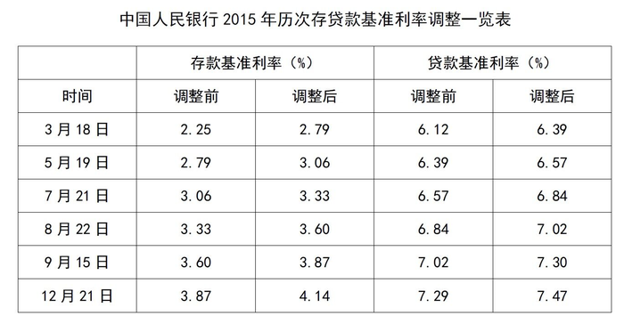

#### 第 1 题　qid 2139404 · 增长

2015年，贷款基准利率增长比率最高的月份是：

- **A**. 7月
- **B**. 9月
- **C**. 5月
- **D**. 3月　✅

**答案**：D

**官方解析**

根据题干所求“······增长比率最高······”，可判定此题为一般增长率问题。定位表格，已知贷款基准利率调整前、调整后的具体值，所以贷款基准利率，代入选项：

A项：7月，定位表格，调整后为，调整前为，所以贷款基准利率；

B项：9月，定位表格，调整后为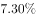，调整前为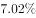，所以贷款基准利率；

C项：5月，定位表格，调整后为，调整前为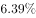，所以贷款基准利率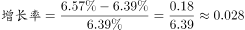；

D项：3月，定位表格，调整后为，调整前为，所以贷款基准利率。

所以D项最大。

故正确答案为D。

---

#### 第 2 题　qid 2139422 · 综合

从3月上旬到12月底，存款基准利率增涨比率是：

- **A**. 

- **B**. 

- **C**. 
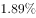

- **D**. 

　✅

**答案**：D

**官方解析**

根据题干所求“从3月上旬到12月底，存款基准利率增涨比率是”，可判定此题为一般增长率问题，所以存款基准利率增涨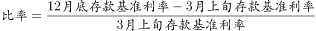。定位表格，3月上旬为3月10号前，所以应为3月18日存款基准利率调整前的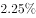；12月底为12月31日前，所以应为12月21日存款基准利率调整后的。所以存款基准利率增涨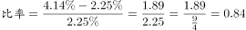。

故正确答案为D。

---

#### 第 3 题　qid 2139424 · 综合

2015年7月底，调整后的存贷款基准利率差额为：

- **A**. 
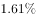

- **B**. 

- **C**. 

　✅
- **D**. 

**答案**：C

**官方解析**

根据题干所求“······调整后的存贷款基准利率差额为”，结合材料给出存贷款基准利率调整后的具体值，可判定此题为简单加减计算问题。定位表格，7月存款基准利率调整后为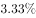，7月贷款基准利率调整后为，所以调整后的存贷款基准利率。

故正确答案为C。

---

#### 第 4 题　qid 2139426 · 综合

2015年8月底，贷款基准利率是存款基准利率的：

- **A**. 2.05倍
- **B**. 0.95倍
- **C**. 1.95倍　✅
- **D**. 1.05倍

**答案**：C

**官方解析**

根据题干所求“2015年8月底，贷款基准利率是存款基准利率的”，可判定此题为现期倍数问题。定位表格，2015年8月底存款基准利率调整后为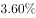，贷款基准利率调整后为，所以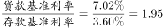。

故正确答案为C。

---

#### 第 5 题　qid 2139428 · 综合

下列关于中国人民银行2015年历次调整存贷款基准利率的目的，说法错误的是：

- **A**. 控制信贷资金过渡需求
- **B**. 引导投资合理增长
- **C**. 稳定通货膨胀预期
- **D**. 增加居民消费能力　✅

**答案**：D

**官方解析**

央行6次提高存贷款利率。
A项：信贷资金主要用于对企业和社会的贷款，以满足社会生产和商品流通的需要，而提高贷款基准利率，可以增加贷款的成本，进而可以控制信贷资金的过度需求，正确；
B项：提高贷款基准利率，贷款成本就会相应增加，企业投资也会更加谨慎，不会为了扩大生产规模而盲目贷款投资，有利于引导投资合理增长，正确；
C项：提高存款基准利率，可以吸收更多的民间资本；提高贷款基准利率，可以降低投资热情，减少货币供给。因此提高存贷款基准利率可以减少市场上的货币流通量，稳定物价，稳定通货膨胀预期，从而保持经济的持续稳定发展，正确；
D项：当存款基准利率提高时，储蓄利息就会相应增加，因此会增加居民的储蓄热情，降低居民的消费能力，错误。
本题为选非题，故正确答案为D。

---

### 材料 2

       世界煤储量在世界能源总储量中占，按目前规模可持续开采200年左右。据19世纪80年代初世界能源会议等组织的资料，世界煤资源地质储量为14.3万亿吨，其中探明储量为3.5万亿吨，约占；在总储量中硬煤占，褐煤占。按硬煤经济可采储量以美国、俄罗斯、中国最为丰富，分别占世界总量的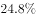、、，共占三分之二。

#### 第 6 题　qid 2139376 · 综合

在世界煤炭资源地质储量中，未探明储量占总储量的：

- **A**. 

- **B**. 
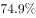

- **C**. 
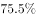
　✅
- **D**. 

**答案**：C

**官方解析**

定位材料可得，世界煤炭资源地质储量为14.3万亿吨，其中探明储量为3.5万亿吨，约占。则未探明储量占总储量的。

故正确答案为C。

---

#### 第 7 题　qid 2139380 · 比重

硬煤经济可采储量占世界总量比例最高的国家是：

- **A**. 美国　✅
- **B**. 中国
- **C**. 俄罗斯
- **D**. 都不是

**答案**：A

**官方解析**

根据题干“硬煤经济可采储量占世界总量比例最高的国家是”，结合文字材料中“按硬煤经济可采储量以美国、俄罗斯、中国最为丰富，分别占世界总量的、、”，可判定为直接找数。直接比较数据大小可知，硬煤经济可采储量占世界总量比例最高的是美国，为。

故正确答案为A。

---

#### 第 8 题　qid 2139384 · 综合

在世界煤炭总储量中，硬煤大约有：

- **A**. 9.84万亿吨
- **B**. 10.73万亿吨　✅
- **C**. 3.58万亿吨
- **D**. 14.3万亿吨

**答案**：B

**官方解析**

根据题干“在······中硬煤大约有多少”，结合材料给出世界煤炭总储量及硬煤占比，可判定本题为现期比重问题。定位材料可得，世界煤资源地质储量为14.3万亿吨，硬煤占，褐煤占。根据，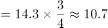万亿吨，与B项最为接近。

故正确答案为B。

---

#### 第 9 题　qid 2139394 · 综合

中国的硬煤占世界能源总储量的：

- **A**. 

- **B**. 

- **C**. 

　✅
- **D**. 

**答案**：C

**官方解析**

由题干“中国硬煤占世界能源总储量的多少”，可判定本题为现期比重计算。根据比重公式列式为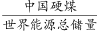，由于题目中没有给定具体数值，分别给了中国硬煤占世界硬煤总量的，世界硬煤总量占世界煤储量的，世界煤储量占世界能源总储量的，由此可得，只有C项满足。

故正确答案为C。

---

#### 第 10 题　qid 2139400 · 综合

在世界煤炭总储量中，硬煤的储量比褐煤的储量多：

- **A**. 7.15万亿吨　✅
- **B**. 3.58万亿吨
- **C**. 10.73万亿吨
- **D**. 6.78万亿吨

**答案**：A

**官方解析**

根据题干“在······中硬煤的储量比褐煤的储量多”，结合材料给出世界煤炭总储量及硬煤、褐煤占比，可判定本题为现期比重问题。定位材料可得，世界煤资源地质储量为14.3万亿吨······硬煤占，褐煤占。根据，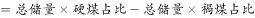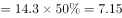万亿吨。

故正确答案为A。

---

### 材料 3

#### 第 11 题　qid 2139506 · 综合

下列代码中，每股收益最高的是：

- **A**. 000024
- **B**. 600150
- **C**. 600299
- **D**. 600694　✅

**答案**：D

**官方解析**

定位表格，各代码的每股收益分别为：A项：000024招商地产0.57元，B项：600150中国船舶0.76元，C项：600299星新材料0.40元，D项：600694大商股份0.90元，最高的是D项600694大商股份。
故正确答案为D。

---

#### 第 12 题　qid 2139510 · 综合

下列公司中，月涨跌幅最高的是：

- **A**. S哈药
- **B**. 华兰生物
- **C**. 中国船舶　✅
- **D**. 华能国际

**答案**：C

**官方解析**

定位表格，各公司月涨跌幅分别为：A项S哈药、B项华兰生物、C项中国船舶、D项华能国际，月涨跌幅最高的是C项中国船舶。

故正确答案为C。

---

#### 第 13 题　qid 2139514 · 综合

年涨幅与月涨跌幅差别最大的公司是：

- **A**. S哈药
- **B**. 华兰生物
- **C**. 中国船舶　✅
- **D**. 华能国际

**答案**：C

**官方解析**

定位表格，A项：S哈药月涨幅、年涨幅，相差；

B项：华兰生物月涨幅、年涨幅，相差；

C项：中国船舶月涨幅、年涨幅，相差；

D项：华能国际月涨幅、年涨幅，相差；

差别最大的是C项中国船舶。

故正确答案为C。

---

#### 第 14 题　qid 2139518 · 综合

栖霞建设每股收益比招商地产少：

- **A**. 0.56元
- **B**. 0.28元
- **C**. 0.17元　✅
- **D**. 0.52元

**答案**：C

**官方解析**

定位表格，栖霞建设每股收益为0.40元，招商地产为0.57元，前者比后者少元。

故正确答案为C。

---

#### 第 15 题　qid 2139524 · 综合

若有人持有1000股大商股份，那么他需要持有约_______金龙汽车的股份才能与此收益相当。

- **A**. 3500股
- **B**. 2000股
- **C**. 2900股　✅
- **D**. 3000股

**答案**：C

**官方解析**

根据题干所求“若有人持有1000股大商股份，那么他需要持有约_______金龙汽车的股份才能与此收益相当”，材料给出两公司股份的每股收益，可判定此题为平均数问题。定位表格，大商股份每股收益0.90元，金龙汽车每股0.31元。与1000股大商股份收益相当，需要持有金龙汽车股份股，C项最接近。

故正确答案为C。

---

### 材料 4

#### 第 16 题　qid 2139532 · 增长

B年全民所有制单位职工劳保福利费比A年增加了：

- **A**. 279亿元
- **B**. 669亿元
- **C**. 49亿元
- **D**. 39亿元　✅

**答案**：D

**官方解析**

由题干“B年······比A年增加了”，且选项单位为亿元，可判定本题为增长量计算问题。定位图形材料1可知，A年全民所有制单位职工劳保福利费为27.9亿元，B年为66.9亿元。根据公式，B年全民所有制单位职工劳保福利费比A年增加了亿元。

故正确答案为D。

---

#### 第 17 题　qid 2139538 · 综合

C年全民所有制单位职工医疗费为：

- **A**. 335.5亿元
- **B**. 158.4亿元
- **C**. 68.8亿元　✅
- **D**. 20.5亿元

**答案**：C

**官方解析**

根据题干所求“C年······医疗费”，结合图形材料2，可判定此题为现期比重问题。定位图形材料1，C年全民所有制单位职工劳保福利费为335.5亿元；定位图形材料2，C年医疗费所占比重为，则C年全民所有制单位职工医疗费为，与C项最接近。

故正确答案为C。

---

#### 第 18 题　qid 2139544 · 增长

全民所有制单位职工B年工资总额比A年上涨了：

- **A**. 

　✅
- **B**. 

- **C**. 

- **D**. 

**答案**：A

**官方解析**

根据题干所求“······B年比A年上涨了······”，且选项为百分数，可判定此题为一般增长率问题。定位图形材料1，A年全民所有制单位职工劳保福利费为27.9亿元，占工资总额的，故A年工资总额为；B年为66.9亿元，占工资总额的，故B年工资总额为。根据增长率计算公式，可计算出，全民所有制单位职工B年工资总额比A年上涨了。

故正确答案为A。

---

#### 第 19 题　qid 2139548 · 综合

全民所有制单位职工劳保福利费在B年用于医疗费用的支出比用于其他费用的支出多：

- **A**. 20.3亿元
- **B**. 14.25亿元
- **C**. 13.58亿元　✅
- **D**. 31.8亿元

**答案**：C

**官方解析**

根据题干所求“B年用于医疗费用的支出比用于其他费用的支出多”，结合图形材料2所给的职工劳保福利费构成，可判定此题为现期比重问题。定位图形材料1，B年全民所有制单位职工劳保福利费为66.9亿元；定位图形材料2，B年医疗费所占比重为。可得，B年用于医疗费用的支出为，用于其他费用的支出为。从而可计算出，B年用于医疗费用的支出比用于其他费用的支出多亿元。

故正确答案为C。

---

#### 第 20 题　qid 2139556 · 综合

下列说法中，错误的是：

- **A**. 
A年全民所有制单位职工劳保福利费占工资总额的

- **B**. 
C年全民所有制单位职工工资总额为1290.4亿元

- **C**. 
C年全民所有制单位职工劳保福利费中，离退休费所占比重比B年增加了19.7个百分点

- **D**. 
全民所有制单位职工B年工资总额比C年劳保福利费低
　✅

**答案**：D

**官方解析**

A项：定位图形材料1，A年全民所有制单位职工劳保福利费占工资总额的，正确；

B项：定位图形材料1，C年全民所有制单位职工工资总额为亿元，正确；

C项：定位图形材料2，C年离退休费所占比重比B年增加了，即增加了19.7个百分点，正确；

D项：定位图形材料1，B年工资总额，错误。

本题为选非题，故正确答案为D。

---
