# 2017年广东省公务员录用考试《行测》题（县级、乡镇统一卷）

> 省考 · 2017 年 · 6 个模块 · 共 100 题

- [政治理论](#%E6%94%BF%E6%B2%BB%E7%90%86%E8%AE%BA) · 1 题
- [常识判断](#%E5%B8%B8%E8%AF%86%E5%88%A4%E6%96%AD) · 24 题
- [言语理解与表达](#%E8%A8%80%E8%AF%AD%E7%90%86%E8%A7%A3%E4%B8%8E%E8%A1%A8%E8%BE%BE) · 15 题
- [数量关系](#%E6%95%B0%E9%87%8F%E5%85%B3%E7%B3%BB) · 15 题
- [判断推理](#%E5%88%A4%E6%96%AD%E6%8E%A8%E7%90%86) · 30 题
- [资料分析](#%E8%B5%84%E6%96%99%E5%88%86%E6%9E%90) · 15 题

---

## 政治理论

### 第 1 题　qid 2047692 · 新思想

2016年11月，习近平主席在出国访问发表演讲时，引用了一句古诗“相知无远近，万里尚为邻”来表明两国关系的亲密不因地理上的距离而疏远。习近平主席当时访问的国家是：

- **A**. 柬埔寨
- **B**. 哈萨克斯坦
- **C**. 秘鲁　✅
- **D**. 马来西亚

**答案**：C

**官方解析**

C项符合题意：2016年11月，国家主席习近平在秘鲁国会发表题为《同舟共济、扬帆远航，共创中拉关系美好未来》的重要演讲。在演讲中，习近平引用了古诗“相知无远近，万里尚为邻”，表明对中拉实现亲密合作的信心。且由“相知无远近，万里尚为邻”可知，此国与我国地理位置相距较远。A、D两项是东南亚国家，B项是中亚国家，距离相对较近。C项是南美洲的国家，距离较远，符合题意，当选。
故正确答案为C。

---

## 常识判断

### 第 1 题　qid 2047890 · 科技常识

在下面的电路图中，c、d是两个不同的灯泡，e、f均为安培表。当开关g闭合时（如图1），e显示读数为1.3A，f显示读数为0.9A。如果将断开的开关g与灯泡c的位置互换（如图2），则以下情况不会出现的是：

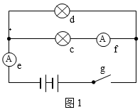

- **A**. f的读数变为0A
- **B**. e的读数变小
- **C**. c比原来亮　✅
- **D**. d比c亮

**答案**：C

**官方解析**

由图1电路到图2电路分析可知，g开关处断路，f的读数为0A，两灯泡由并联到串联，总电路电阻增大，则e的读数减小。
c灯泡在图1的分压为电源电压，而在图2中，分压小于电源电压，则比原来暗。
图1中，总电流为1.3A，f电流为0.9A，则d灯泡的电流为0.4A，并联电路的电压相同，所以d灯泡电阻大于c灯泡电阻，则在串联之后，d分压大于c分压，所以d比c亮，即A、B、D项正确，C项错误。
本题为选非题，故正确答案为C。

---

### 第 2 题　qid 2047892 · 科技常识

下列关于蔬菜大棚内氧气和二氧化碳含量变化的说法，不正确的是：

- **A**. 在无光的环境下，植物只进行呼吸作用，二氧化碳含量增加
- **B**. 在有光的环境下，植物同时进行光合作用和呼吸作用，氧气含量增加
- **C**. 光线逐渐增强时，植物的光合作用逐渐增强，氧气含量增加
- **D**. 光线逐渐减弱时，植物的光合作用和呼吸作用也逐渐减弱，氧气含量降低　✅

**答案**：D

**官方解析**

问题分析：一般情况下，随着光照强度的增加，光合作用逐渐加强；随着光照强度的减弱，光合作用逐渐减弱；光照强度与呼吸作用强弱没有直接关系。
选项分析：
A项：在无光的环境下，植物只进行呼吸作用，消耗氧气生成二氧化碳，故二氧化碳含量增加，故A项正确。
B项：在有光的环境下，植物同时进行光合作用和呼吸作用，光合作用消耗二氧化碳储存有机物并产生氧气，呼吸作用消耗氧气生成二氧化碳，但是光合作用产生氧气的速率大于呼吸作用消耗氧气的速率，所以氧气含量增加，故B项正确。
C项：光线逐渐增强时，植物的光合作用逐渐增强，光合作用产生氧气的速率大于呼吸作用消耗氧气的速率，所以氧气含量增加，故C项正确。
D项：光线逐渐减弱时，植物的光合作用逐渐减弱，呼吸作用不随光照强度而改变，所以氧气含量降低，故D项错误。
本题为选非题，故正确答案为D。
备注：此题其实是不太严谨的，例如B项，如果光照很弱，则光合可能比呼吸弱，氧气含量会下降，此处只能结合大棚种植的实际情况，将B项理解为“正常光照条件下，蔬菜正常生长”，才能判定光合强于呼吸；又如C项，光线增强到一定程度，由于二氧化碳浓度等限制因素，光合作用就不再随之增强（称为光饱和点)，此处也只能理解为“光照强度未达到饱和”，才能判定C项正确。尽管此处B项和C项都有一定的问题，但是D项错误更加明显，在考场上考生面对这样的真题，进行对比择优即可。

---

### 第 3 题　qid 2047894 · 科技常识

小王用塑料圆筒做了一个简易哨子（如图），当他从吹气口吹气的同时，将活塞慢慢往下拉，可以听到哨声：

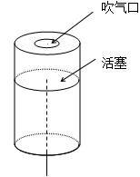

- **A**. 逐渐变小声
- **B**. 音调越来越高
- **C**. 音调越来越低　✅
- **D**. 没有变化

**答案**：C

**官方解析**

当向下推动活塞时，空气柱的长度变长，因此空气柱的振动变慢，音调越来越低，故C项正确。
故正确答案为C。

---

### 第 4 题　qid 2047896 · 科技常识

两块完全相同的平面玻璃砖相互垂直放置（如图），一束单色光从左侧水平射入左边的玻璃砖，从右边的玻璃砖射出，则出射光线相对入射光线：

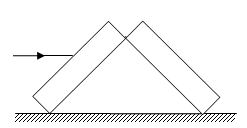

- **A**. 向上偏折
- **B**. 向下偏折
- **C**. 在同一条直线上　✅
- **D**. 平行

**答案**：C

**官方解析**

光路图如下所示：

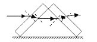

光线通过第一块玻璃砖再进入空气时发生两次折射：第一次是从空气斜射进入玻璃砖，折射光线应该靠近法线偏折，折射角小于入射角；第二次是从玻璃砖斜射进入空气，折射光线应该远离法线偏折，折射角大于入射角。由于玻璃砖上下表面平行，第二次折射的入射角等于第一次折射的折射角，所以第二次折射的折射角等于第一次折射的入射角，出射光线与入射光线相比，只是作了平移，即出射光线与入射光线平行。

同理，经过第二块玻璃砖时，第四次的折射光线，与第三次的入射光线即第二次的折射光线平行；第二次的折射光线与第与第一次的入射光线平行，因为两块完全相同的玻璃砖，折射率相同，因此经过两块玻璃砖折射后，出射光线与入射光线在同一直线上，故C项正确。

故正确答案为C。

---

### 第 5 题　qid 2047898 · 科技常识

有一家四口，包括一对夫妻和他们的两个亲生子女，四人的ABO血型各不相同。已知儿子有一次受伤时，是爸爸献的血，那么，以下信息可以确定的是：

- **A**. 爸爸的血可以献给家里所有人使用
- **B**. 妈妈的血不能献给家里所有人使用　✅
- **C**. 女儿有可能是AB型血
- **D**. 儿子只可能是A型或B型血

**答案**：B

**官方解析**

AB血型的人可以接受任何血型，O型血可以输给任何血型的人。一家四口，血型各不相同，则可知父母血型为A、B型或者AB、O型。已知儿子可以接受爸爸的血型，若父母为A或B型，则儿子为AB型，女儿为O型，则父母的血不能献给家里所有人使用；若父母为O、AB型，则子女为A或B型，爸爸是O型血，可以献给家里所有人使用，妈妈的血不能献给家里所有人使用。综上所述，B项正确。
故正确答案为B。

---

### 第 6 题　qid 2047840 · 科技常识

为节约用电，有生产商为楼道照明开发出“光控开关”和“声控开关”。“光控开关”在天黑时自动闭合，天亮时自动断开；“声控开关”在有人走动发出声音时自动闭合，无人走动时自动断开。若将这两种开关配合使用，就可以使楼道照明变得更加节能。为达到这个目的，楼道照明的电路安装简图是：

- **A**. 

- **B**. 

- **C**. 
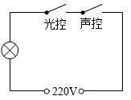
　✅
- **D**. 

**答案**：C

**官方解析**

根据题目可知，为达到节能的目的，只有当天黑且有人走动发出声音时才提供楼道照明，则可知当光控开关断开时，无论声控开关处于什么状态，电路都应处于断开的状态，即光控和声控开关是串联的关系，故C项正确。
故正确答案为C。

---

### 第 7 题　qid 2047852 · 科技常识

下图是某地市区与郊区之间的热力环流图。根据该图，为保证市区空气质量，下列说法正确的是：

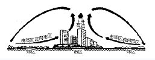

- **A**. 化工厂可以建设在郊区
- **B**. 绿化带应该建设在郊区外
- **C**. 绿化带可以建设在市区内　✅
- **D**. 化工厂应该建设在郊区与市区之间

**答案**：C

**官方解析**

由图中市区和郊区的热力环流图可知，无论化工厂建在郊区、市区或郊区与市区之间，污染物都会通过热力环流到达市区；而绿化带可以选择建在市区内，可以阻断污染物通过热力环流在郊区和市区之间扩散，还可以减少温室效应，故C项正确。
故正确答案为C。

---

### 第 8 题　qid 2047854 · 科技常识

如图所示，两物体M、N用绳子连接，绳子跨过固定在斜面顶端的滑轮（不计滑轮的质量和摩擦力），N悬于空中，M放在斜面上，均处于静止状态。当用水平向右的拉力F作用于物体M时，M、N仍静止不动，则下列说法正确的是：

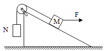

- **A**. 绳子的拉力始终不变　✅
- **B**. M受到的摩擦力方向沿斜面向上
- **C**. 物体M所受到的合外力变大
- **D**. 物体M总共受到4个力的作用

**答案**：A

**官方解析**

对N进行受力分析可知，N受到重力和绳子拉力的作用处于平衡状态，即绳子的拉力等于N的重力；对M进行受力分析可知，M一开始受到重力、拉力、支持力，可能有斜面方向的摩擦力，加上拉力F之后，M一定受到绳子的拉力、重力、拉力F这三个力的作用，仅受这三个力的作用有可能保持平衡状态，否则还可能受到沿斜面的摩擦力或斜面支持力的作用。
选项分析：
A项：绳子的拉力等于N的重力，一直保持不变，正确。
B项：M可能不受摩擦力的作用，错误。
C项：M静止不动，所受的合外力一直为零，错误。
D项：M可能只受到三个力的作用，错误。
故正确答案为A。

---

### 第 9 题　qid 2047856 · 科技常识

下图是某辆汽车的位移x随着时间t变化而变化的图像，下列说法中正确的是：

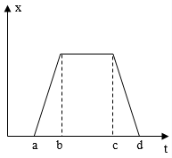

- **A**. 在a到b的时间段内，汽车的加速度不断增大
- **B**. 在b到c的时间段内，汽车做匀速运动
- **C**. 在c到d的时间段内，汽车的速度保持不变
- **D**. 在d时间点，汽车回到出发地　✅

**答案**：D

**官方解析**

A项：在a到b时间段内，汽车的位移时间图像为倾斜的直线，即汽车为匀速直线运动，加速度为零，错误。

B项：在b到c时间段内，汽车的位移为零，汽车可能静止，错误。
C项：题中未说明直线运动，如果物体做曲线运动，速度的方向就会发生变化，而速度为矢量，在方向变化的情况下，即使大小不变，也不能说速度保持不变，错误。
D项：在d点时位移为0，因此汽车回到出发地，正确。
故正确答案为D。
备注：本题客观来讲很不严谨，C、D两项其实都是正确的，位移-时间图像中，斜率的正、负分别表示速度方向为正方向、负方向（例如，若规定向右为正方向，则速度为正表示速度向右、速度为负表示速度向左），因此，严格来说，位移-时间图像中速度只有正、负两个方向可选，只能表示直线运动。
但是公务员考试行测为单选题，从出题人的设计意图来看，很可能是将C选项设计为了干扰项，认为物体如果做曲线运动，则速度的方向会改变，这样来看C选项就是错误的，因此两个答案相比，粉笔更倾向于D项为正确答案。

---

### 第 10 题　qid 2047858 · 科技常识

下列能正确反映自由落体速度随时间变化的图像是：

- **A**. 

- **B**. 

　✅
- **C**. 

- **D**. 

**答案**：B

**官方解析**

自由落体运动是初速度为零，加速度为g的匀加速直线运动，即其速度随时间变化图像是过原点的直线，故B项正确。
故正确答案为B。

---

### 第 11 题　qid 2047680 · 地理国情

“海上丝绸之路”是古代中国与外国交通贸易和文化交往的海上通道，包括东海航线和南海航线。以下城市不属于“海上丝绸之路”航线中主要港口的是：

- **A**. 广州
- **B**. 泉州
- **C**. 宁波
- **D**. 厦门　✅

**答案**：D

**官方解析**

D项符合题意：中国境内海上丝绸之路主要有广州、泉州、宁波三个主港和其他支线港组成。《汉书·地理志》中记载，秦汉时期，广州已成为海上丝绸之路的主港；唐宋时期，广州成为中国第一大港，明初、清初海禁，广州长时间处于“一口通商”局面，是世界海上交通史上唯一的2000多年长盛不衰的大港。宋末至元代时，泉州成为中国第一大港，与埃及的亚历山大港并称为“世界第一大港”，后因明清海禁而衰落，泉州是唯一被联合国教科文组织承认的海上丝绸之路起点。在东汉初年，宁波地区已与日本有交往，到了唐朝，宁波成为中国的大港之一，两宋时，靠北的外贸港先后为辽、金所占，或受战事影响，外贸大量转移到宁波。其中，广州和泉州属于南海航线，宁波属于东海航线。
本题为选非题，故正确答案为D。

---

### 第 12 题　qid 2047686 · 科技常识

角蛋白是一种控制细胞形状和稳定性的蛋白。以下对角蛋白认识错误的是：

- **A**. 人的头发、指甲主要是由角蛋白构成的
- **B**. 角蛋白是爬行动物鳞片、羽毛、爪子的主要成分
- **C**. 在人的皮肤中，角蛋白主要分布在真皮层　✅
- **D**. 角蛋白来源于外胚层分化而来的细胞，是一种硬蛋白

**答案**：C

**官方解析**

C项错误：角蛋白是硬蛋白之一，是一类具有结缔和保护功能的纤维状蛋白质，来源于外胚层分化而来的细胞。它是外胚层细胞的结构蛋白，包括毛发、指甲、羽毛等，它还是一种不能直接为畜禽所吸收利用的硬蛋白，主要存在于动物的鳞片、毛发、羽毛和蹄中。在人体的皮肤中，角蛋白主要分布在表皮层。A、B、D三项均正确。
本题为选非题，故正确答案为C。
备注：B项表述不严谨：羽毛应当为鸟类标志。

---

### 第 13 题　qid 2047688 · 科技常识

从卫星在外太空拍摄的地球照片来看，地球是一个蓝色的星球，这是因为：

- **A**. 地球上大部分地区都被水覆盖着　✅
- **B**. 天空是蓝色的，而蓝天包围着大地
- **C**. 大气分子、冰晶、水滴等和阳光的共同作用
- **D**. 太阳光穿过地球大气层产生折射

**答案**：A

**官方解析**

A项正确：因为地球大部分面积都被海水覆盖，又因为海水是蓝色的，在水深超过100米的海洋里，波长较长的光大部分都被海水吸收了，而波长较短的蓝光和紫光遇到较纯净的海水分子时就会发生强烈的散射和反射，于是人们所见到的海洋就呈现一片蔚蓝色或深蓝色。所以从在外太空拍摄的地球照片，地球是一个蓝色的星球。
故正确答案为A。

---

### 第 14 题　qid 2047696 · 地理国情

我国海洋综合科考船“海洋六号”从珠江口进入南海海域，执行大洋南极科考任务。下列关于科考船从珠江口进入南海，所受浮力情况说法正确的是：

- **A**. 由于船始终浮在水面上，所以受到的浮力不变　✅
- **B**. 由于海水的密度更大，所以船在海洋里受到的浮力更大
- **C**. 由于船排开海水的体积更小，所以在海洋里受到的浮力更小
- **D**. 由于船排开江水的体积更大，所以在江水里受到的浮力更大

**答案**：A

**官方解析**

本题考查浮力相关知识。浸在液体里的物体会受到液体竖直向上托的力，这就是浮力。物体受到的浮力等于物体下沉时排开液体的重力。当浮力等于物体自身的重力，且物体的平均密度小于液体的密度时，物体就可以漂浮在液体之上。
A项正确：科考船不论是在江水中还是在海水中，都为漂浮状态，此时浮力始终等于重力，所以船受到的浮力是不变的。
B项错误：船在漂浮状态下的浮力等于重力，与水的密度无关。
C项错误：船从江水到海水中，受到的浮力始终等于重力，不会因为排开海水的体积变小而变小。
D项错误：江水中的船所受到的浮力仍等于重力，不会因为排开江水的体积变化而变化。
故正确答案为A。

---

### 第 15 题　qid 2047674 · 人文常识

以下对人的各种感觉描述不正确的是：

- **A**. 触觉感受器大部分存在于皮肤中，指尖尤其敏感
- **B**. 人看到物体时，视网膜上会形成一幅上下颠倒的影像
- **C**. 耳朵可以帮助人体保持平衡
- **D**. 嗅觉和味觉是一起工作的，感知食物味道更多依赖味觉　✅

**答案**：D

**官方解析**

D项错误：我们的舌头其实只能分辨基础的味觉感知，如酸、甜、苦、咸这些。而对于味道的整体感知更多是依靠嗅觉系统完成的。所以人在感冒鼻塞时，往往尝不出食物的味道。
A项正确：触觉感受器是接受接触刺激，传导触觉和压觉的感受器，大量存在于皮肤当中。皮肤表面散布着触点，尤其指腹处最多，所以指尖的触觉最为敏感。
B项正确：人眼的结构相当于一个凸透镜，外界物体在视网膜上所成的像是倒立缩小的实像。因此，人看到物体时，视网膜上形成的影像实际是上下颠倒的。
C项正确：人体维持平衡主要依靠内耳的前庭部、视觉、肌肉和关节等本体感觉三个系统的相互协调来完成的。其中内耳的前庭系统最重要。
本题为选非题，故正确答案为D。

---

### 第 16 题　qid 2047676 · 科技常识

地球上的矿产资源非常丰富。关于矿产，以下认识不正确的是：

- **A**. 最坚硬的矿石是金刚石，最软的矿石是石膏　✅
- **B**. 砂岩按照砂粒直径划分为微粒、细粒、中粒、粗粒和巨粒
- **C**. 煤、石油和天然气都是化石燃料，由动植物的遗体演变而成
- **D**. 大多数矿物是在熔融的岩石或炽热的熔体冷却结晶时形成的

**答案**：A

**官方解析**

A项错误：金刚石是最硬的矿石，是已知的世界上最硬的物质。滑石是世界上最软的矿石，任何一种矿物都能在滑石上划出痕迹；
B项正确：砂岩按砂粒的直径划分为：微粒砂岩（0.125～0.0625mm）、细粒砂岩（0.25～0.125mm）、中粒砂岩（0.5～0.25mm）、粗粒砂岩（1～0.5mm）、巨粒砂岩（2～1mm）；
C项正确：化石燃料也称矿石燃料，包括的天然资源为煤炭、石油和天然气等，是由死去的有机物和植物在地下分解而形成的；
D项正确：熔融的岩石或地壳下面的岩浆熔体在上升过程中温度不断降低，当温度低于某种矿物的熔点时就会形成该矿物结晶。随着温度的持续下降，岩浆中所有的成分会形成一系列的矿物，例如形成橄榄石、辉石、角闪石与云母等多种矿物。
本题为选非题，故正确答案为A。

---

### 第 17 题　qid 2047678 · 人文常识

世界上多数国家都采用以区时为单位的标准时。关于时间，以下认识不正确的是：

- **A**. 所有时区都以格林尼治本初子午线为基础
- **B**. 国际日期变更线的西边要比东边晚一天　✅
- **C**. 许多国家在夏季人为地把时钟拨快一小时，使用夏令时间
- **D**. 全球共分为24个时区，每个时区都有自己的时间

**答案**：B

**官方解析**

A项正确，为了克服时间上的混乱，1884年在华盛顿召开的一次国际经度会议上，规定将全球划分为24个时区（东、西各12个时区）。规定英国（格林尼治天文台旧址）为中时区（零时区），向东为东1~12区，向西为西1~12区。每个时区横跨经度15度，时间正好是1小时。故所有时区都以格林尼治本初子午线为基础。
B项错误，按照规定，凡越过国际日期变更线时，日期都要发生变化：从东向西越过这条界线时，日期要加一天；从西向东越过这条界线时，日期要减去一天。即国际日期变更线的西边要比东边早一天。
C项正确，夏时制，是一种为节约能源而人为规定地方时间的制度，在这一制度实行期间所采用的统一时间称为“夏令时间”。一般在天亮早的夏季人为将时间调快一小时，可以使人早起早睡，减少照明量，以充分利用光照资源，从而节约照明用电。
D项正确，“区时系统”规定，地球上每15°经度范围作为一个时区。这样，整个地球的表面就被划分为24个时区。每一时区都按它的中央子午线来计量时间，即采用它的中央子午线的地方平时，叫做标准时。
本题为选非题，故正确答案为B。

---

### 第 18 题　qid 2047682 · 科技常识

地球上生物的种类极其丰富，从表面上看，不同的生物之间似乎并没有相同之处，但其实所有的生物都具有一些共同特征。以下不属于生物共同特征的是：

- **A**. 由单细胞构成　✅
- **B**. 需要能量才能生存
- **C**. 具有生命周期
- **D**. 新陈代谢

**答案**：A

**官方解析**

A项错误：生物组成多种多样。有单细胞生物（如衣藻等部分藻类、草履虫）、多细胞生物（如裸子植物、被子植物、哺乳动物），也有无细胞生物（如病毒）。因此，“由单细胞组成”不属于生物的共同特征。
B项正确：所有的生物都需要能量来维持生命。
C项正确：生物学上的生命周期是指生物体从出生、成长、成熟、衰退到死亡的全部过程。所有的生物都具有生命周期。
D项正确：机体与机体内环境之间的物质和能量交换以及生物体内物质和能量的自我更新过程叫做新陈代谢。新陈代谢属于生物的共同特征。
本题为选非题，故正确答案为A。

---

### 第 19 题　qid 2047684 · 科技常识

水银可用于制作体温计，其主要原因不包括：

- **A**. 水银对温度变化敏感
- **B**. 水银容易获得　✅
- **C**. 水银的熔点低，沸点高
- **D**. 水银的化学性质稳定

**答案**：B

**官方解析**

给体温计选用材料时，优先考虑的是原材料的特性。对利用液体热胀冷缩的特性来制造的体温计，一般应考虑以下因素：①液体的沸点和熔点；②性能是否稳定；③液体体积对温度变化是否敏感。

B项错误：体温计的工作物质是水银，水银体温计中含有汞。 汞在自然界以硫化汞矿石的形式大量存在，即“朱砂”，制取过程相对容易。但题目中说的水银用作体温计的主要原因，强调的是水银的物理性质和化学性质，容易获得并不是主要原因，就像CPU（中央处理器）中含有黄金，黄金容易取得，但这不是CPU发挥功能的主要原因，故B项错误。

A项正确：体温计液泡里的水银，由于受到体温的影响，产生微小的变化，水银体积的膨胀，使管内水银柱的高度发生明显的变化。体温计的下部靠近液泡处的管颈是一个很狭窄的曲颈，在测体温时，液泡内的水银，受热体积膨胀，由曲颈部分上升到管内某位置。当与体温达到热平衡时，水银柱恒定。当体温计离开人体后，外界气温较低，水银遇冷体积收缩，就在狭窄的曲颈部分断开，使已升入管内的部分水银退不回来，水银柱仍保持在与人体接触时所达到的高度。微小的变化就能使水银柱的高度发生明显变化，这说明水银对温度的变化敏感。

C项正确：水银是在常温、常压下唯一以液态存在的金属。熔点，沸点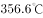，密度13.59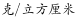，可见水银的熔点低、沸点高，这使得它在除了极端环境外的绝大多数环境条件下，都能正常使用。

D项正确：汞是银白色闪亮的重质液体，不溶于酸也不溶于碱，其化学性质稳定。

本题为选非题，故正确答案为B。

---

### 第 20 题　qid 2047706 · 人文常识

如果将豆腐冰冻一段时间再解冻，豆腐内部会出现非常多的小孔。这一变化的原因是：

- **A**. 豆腐内的水分聚集凝结成冰晶，体积增大，挤出了这些小孔　✅
- **B**. 豆腐在低温下组织纤维变硬，体积膨大，露出了空隙
- **C**. 温度骤然变化导致豆腐的组织纤维热胀冷缩，露出了空隙
- **D**. 豆腐中的某些成分在低温环境下释放出大量气体，挤出了这些小孔

**答案**：A

**官方解析**

A项符合题意：冷冻后的豆腐发生了物理变化。水有一种特性：在时，它的密度最大，体积最小；到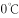以下时，水结成了冰，密度变小，体积变大，比常温时水的体积约大左右。当豆腐的温度降到以下时，里面的水分结成冰，原来的小孔便被冰撑大了，整块豆腐就被挤压成网格形状。等到冰融化成水从豆腐里跑掉以后，就留下了数不清的孔洞，使豆腐变得像泡沫塑料一样。

故正确答案为A。

---

### 第 21 题　qid 2047710 · 人文常识

人口增长模式包括原始型、传统型、现代型三种。目前，我国已基本实现了从（  ）的转变。

- **A**. 原始型向传统型
- **B**. 原始型向现代型
- **C**. 现代型向传统型
- **D**. 传统型向现代型　✅

**答案**：D

**官方解析**

D项符合题意：人口增长模式，又称人口转变模式，它反映了不同国家和地区的人口出生率、死亡率和自然增长率随社会经济条件变化而变化的规律。人口增长模式有三种类型：①原始型：高出生率，高死亡率，低自然增长率（高高低）；②传统型：高出生率，低死亡率，高自然增长率（高低高）；③现代型：低出生率，低死亡率，低自然增长率（低低低）。我国的人口模式已基本实现了从高、低、高向低、低、低的转变，即由传统型向现代型的转变。
故正确答案为D。

---

### 第 22 题　qid 2047716 · 科技常识

准备活动是指在比赛、训练和体育课正式开始前，为克服内脏器官的生理惰性，缩短进入运动状态的时间和预防运动创伤而进行的身体练习，为接下来的剧烈运动或比赛做好准备。下列不属于准备活动主要作用的是：

- **A**. 提高中枢神经系统的兴奋性
- **B**. 增加皮肤血流量以利于散热
- **C**. 提高运动时对氧气的利用率　✅
- **D**. 提高机体的代谢水平

**答案**：C

**官方解析**

C项错误：准备活动可以使肺通气量及心输出量增加，使工作肌能获得更多的氧气，而不是提高对氧气的利用率。
A项正确：准备活动可以提高中枢神经系统的兴奋性，调节不良的赛前状态，使大脑反应速度加快，参加活动的运动中枢间相互协调，可以为正式练习或比赛时生理功能迅速达到适宜程度做好准备。
B项正确：皮肤温度在调节散热中起主导作用，而皮肤温度的高低决定于皮肤血流量的大小，准备活动即为剧烈运动或赛前的热身活动，皮肤血流量增加可以使皮肤温度升高，从而利于散热。
D项正确：通过做准备活动，可使体温和肌肉温度升高，从而使酶的活性增高，使肌肉的代谢得到加强。
本题为选非题，故正确答案为C。

---

### 第 23 题　qid 2047722 · 人文常识

以下不属于导致听力下降、听力减退原因的是：

- **A**. 太多的噪音伤害了内耳中的细毛
- **B**. 经常用耳勺掏挖耳朵碰伤了耳道　✅
- **C**. 精神压力过大导致内耳供血障碍
- **D**. 戴耳机听音乐导致听觉中枢受损

**答案**：B

**官方解析**

B项错误：耳道是一条自外耳门至鼓膜的弯曲管道，碰伤耳道并不会引起听力下降、听力减退；如果洁耳过度导致破坏鼓膜，则会引起听力下降、听力减退。
A项正确：太多的噪音会导致内耳的微细血管经常处于痉挛状态，内耳供血减少，听力急剧减退。
C项正确：如果经常处于急躁，恼怒的状态中，会导致体内植物神经失去正常的调节功能，使内耳器官发生缺血，水肿或产生听觉障碍，这样容易出现听力锐减。
D项正确：听觉中枢受损容易导致中枢性耳聋。
本题为选非题，故正确答案为B。

---

### 第 24 题　qid 2047734 · 人文常识

2016年，我国推动供给侧结构性改革取得初步成效，部分行业的供求关系、政府和企业的理念行为发生积极变化。2017年是供给侧结构性改革的深化之年。下列经济行为中，不符合供给侧结构性改革精神的是：

- **A**. 推动钢铁、煤炭行业化解过剩产能
- **B**. 消化三四线城市房地产库存
- **C**. 加强减税、降费，降低各类交易成本
- **D**. 对缺乏市场竞争力的企业进行补贴　✅

**答案**：D

**官方解析**

供给侧结构性改革的根本目的是提高社会生产力水平，落实好以人民为中心的发展思想。要在适度扩大总需求的同时，去产能、去库存、去杠杆、降成本、补短板，从生产领域加强优质供给，减少无效供给，扩大有效供给，提高供给结构适应性和灵活性，提高全要素生产率，使供给体系更好适应需求结构变化。
D项错误：对缺乏市场竞争力的企业进行补贴不能从根本上提高企业的竞争力，无法增加有效供给。
A项正确：推进供给侧结构性改革的重要任务之一是积极稳妥地化解过剩产能，其目的就是将宝贵的资源要素从那些产能严重过剩的、增长空间有限的产业，如钢铁、煤炭等中释放出来，通过理顺供给端，提高有效供给，创造新的生产力。
B项正确：去库存方面，供给侧结构性改革的任务主要是解决房地产市场库存，重点是解决三、四线城市房地产库存过多问题。要坚持分类调控，因城因地施策。解决房地产市场库存，还是要提高三、四线城市的吸引力，要在提高城市教育、医疗等公共服务水平上下功夫，要在产业结构调整上下功夫，要能吸引住人，留得住人，既能就业，又很宜居，这才是真正解决房地产库存的必由之路。
C项正确：降成本方面，要在减税、降费、降低要素成本上加大工作力度。要降低各类交易成本特别是制度性交易成本，减少审批环节，降低各类中介评估费用，降低企业用能成本，降低物流成本，提高劳动力市场灵活性，推动企业眼睛向内降本增效。
本题为选非题，故正确答案为D。

---

## 言语理解与表达

### 第 1 题　qid 2047664 · 逻辑填空

党的十八大以来，中央以猛药去疴、重典治乱的        ，以刮骨疗毒、壮士断腕的        ，不断加大党风廉政建设和巡视的力度，效果显著。
依次填入画横线部分最恰当的一项是：

- **A**. 意念 底气
- **B**. 恒心 气势
- **C**. 意志 气魄
- **D**. 决心 勇气　✅

**答案**：D

**官方解析**

第一空，根据“猛药去疴、重典治乱”中的“猛”“重”可知，所填词语应体现出党和政府坚决反腐的态度。A项“意念”只是指想法、念头，无法体现坚决反腐的态度，排除。B项“恒心”强调持久不变，文段并非强调坚持的时间久，而是强调态度坚决，排除。D项“决心”表示坚定不移的意志，相比C项“意志”更能体现“猛”和“重”的程度，故D项保留。
第二空，修饰“刮骨疗毒、壮士断腕”，体现出党和政府面对腐败勇敢坚决的态度，D项“勇气”符合文意，当选。C项“气魄”比喻气势惊人，胆识过人，形容一个人有领袖气质，不符合文意，排除。
故正确答案为D。
【文段出处】《&lt;人民的名义&gt;脱颖而出的要诀何在》

---

### 第 2 题　qid 2047666 · 逻辑填空

这些亮相于世界互联网大会的中国创新成果，勾勒出未来生活的诱人        ，也        着“创新中国”的蓬勃生机。
依次填入画横线部分最恰当的一项是：

- **A**. 图景 彰显　✅
- **B**. 图画 呈现
- **C**. 画面 凸显
- **D**. 景象 显示

**答案**：A

**官方解析**

第一空，搭配“未来生活”这一抽象概念，B项“图画”仅指具体的绘画，即用线条、色彩描绘出来的形象，与“未来生活”搭配不当，排除。
第二空，根据“创新成果”“蓬勃生机”可知，应填入感情色彩积极的词语，A项“彰显”通常用于积极的语境，且和“蓬勃生机”搭配恰当，符合语境，当选。C项“凸显”、D项“显示”均为中性词，与文段语境不符，且与“蓬勃生机”搭配不及“彰显”恰当，排除。
故正确答案为A。
【文段出处】《稳重向好，增长更有含金量》

---

### 第 3 题　qid 2047668 · 逻辑填空

生活中细小的变化都可能让我们的感觉大不相同，我们要学会欣赏和赞扬，随时        身边美好的事物，因为关注美好事物有助于规避不良情绪，同时切记多与乐观豁达、愉快向上的人相处。此外，        一下日常生活节奏，也会让你的生活更有活力。
依次填入画横线部分最恰当的一项是：

- **A**. 留意 改善
- **B**. 发现 改变　✅
- **C**. 寻找 调整
- **D**. 发掘 调节

**答案**：B

**官方解析**

第一空，搭配“美好的事物”，根据后文“因为”提示，“因为关注美好事物有助于”，可知横线处应体现“关注”之意，A项“留意”与B项“发现”均有关注之意，保留，C项“寻找”和D项“发掘”侧重在“找”而非“看”，排除；
第二空，搭配“节奏”，“节奏”有快慢之分，但无好坏之别，因此排除A项“改善”，锁定B项“改变”。
故正确答案为B。
【文段出处】《人生的幸福感曲线》

---

### 第 4 题　qid 2047670 · 逻辑填空

一个人的成长成才，并不完全由其起点决定，而是看在这个过程之中个人所付出的努力。如果一味        “出生在农村，注定样样落后”，不仅是对一些客观事实选择性地无视，而且        了个人奋斗的价值。
依次填入画横线部分最恰当的一项是：

- **A**. 鼓吹 漠视
- **B**. 宣扬 肯定
- **C**. 渲染 抹杀　✅
- **D**. 鼓励 否定

**答案**：C

**官方解析**

第一空，由文意可知，“出生在农村，注定样样落后”的言论并不正确，A项“鼓吹”指吹嘘，B项“宣扬”指广泛宣传，使大家知道，C项“渲染”比喻夸大地形容，均可对应后文不好的观点，保留。D项“鼓励”指激发，勉励，后面一般接积极的内容，填入文段与后文感情色彩不符，排除。
第二空，“不仅······而且······”表示递进，横线处应填入比“无视”程度更重的词，C项“抹杀”指完全去掉、勾销，搭配恰当，符合语境，当选。A项“漠视”与前文“无视”构不成语意的加重，排除。文段提到的“出生在农村，注定样样落后”强调出身而完全否定了个人奋斗的价值，B项“肯定”与文意相悖，排除。
故正确答案为C。
【文段出处】《警惕“宿命论”正义感背后的负能量》

---

### 第 5 题　qid 2047672 · 逻辑填空

中央政令下达后，除了加大督查力度，更需要强化政策信息______，通过各种渠道让政策为民众所熟知，利用舆论和公众的监督，提高政策执行的______。
依次填入画横线部分最恰当的一项是：

- **A**. 公布 水平
- **B**. 发布 速度
- **C**. 宣传 力度
- **D**. 公开 效率　✅

**答案**：D

**官方解析**

本题可从第二空入手，根据前文“通过各种渠道让政策为民众所熟知”可知，“各种渠道”强调的是政令下达后，通过多元化的方式尽快让民众了解，故文段强调的是政策执行要迅速，B项“速度”、D项“效率”均符合文意，保留。A项“水平”、C项“力度”体现不出“迅速”的意思，且“力度”一般不与“提高”搭配，常见搭配为“加大力度”，均排除。
第一空，搭配“信息”，根据后文“让政策为民众所熟知”，可知这里表达的是让信息透明化、不隐藏的意思，D项“公开”指面向大家或更大范围的告知，不加隐蔽，符合文意，当选。B项“发布”虽也有公开、公之于众的语意，但一般不与“强化”搭配使用，排除。
故正确答案为D。
【文段出处】《关注政令不畅现象》

---

### 第 6 题　qid 2047690 · 逻辑填空

冷静观察，直面现实，正视困难，我们的双脚就能站到_______的大地上，拥有牢固的立足点，就能看到远方的地平线，找到_______的方位感。
依次填入画横线部分最恰当的一项是：

- **A**. 结实 正确
- **B**. 坚韧 精准
- **C**. 坚实 准确　✅
- **D**. 坚硬 精确

**答案**：C

**官方解析**

第一空，应与后文“牢固的立足点”相对应，且搭配“大地”。分析选项，A项“结实”形容坚固不容易损坏、强健，常用来搭配实物或身体，与“大地”无法搭配，排除；B项“坚韧”指在遭遇身体及精神困难、压力时，坚持而不放弃的忍受力，通常说“坚韧不拔的意志”，与“大地”无法搭配，排除；D项“坚硬”虽能与“大地”搭配，但其意思过于表面，仅强调硬，无法体现出一种坚定而扎实的状态，不符合文段语境，排除。C项“坚实”形容坚固、牢固和实在，符合文意，保留。
第二空，代入验证，“准确的方位感”搭配得当，C项当选。 
故正确答案为C。
【文段出处】《中国经济砥砺前行：信心就是力量》

---

### 第 7 题　qid 2047694 · 逻辑填空

结构性改革是一项长期性任务，需要_______地推进。就当前而言，则需要针对突出问题加以解决。
填入画横线部分最恰当的一项是：

- **A**. 大刀阔斧
- **B**. 持之以恒　✅
- **C**. 贯穿始终
- **D**. 一劳永逸

**答案**：B

**官方解析**

分析语境，可知该空应与“长期性任务”对应，表达“长久坚持”的含义，对应选项，B项“持之以恒”指长久坚持下去，符合文段语境，当选。
A项“大刀阔斧”形容办事果断而有魄力，文中并无此意，排除；C项“贯穿始终”指从开始到结束，自始至终，与后文“推进”搭配不当，排除；D项“一劳永逸”指辛苦一次，把事情办好，以后就不再费事了，与“长期性”语意相悖，排除。
故正确答案为B。

---

### 第 8 题　qid 2047698 · 逻辑填空

利用互联网等信息技术促进留守儿童家庭的亲子交流，不仅有很强的必要性，也具备相当的_______。长期以来，我国科技和信息工作的推进，已经为______留守儿童难题奠定了良好的软硬件基础。
依次填入画横线部分最恰当的一项是：

- **A**. 合理性 根治
- **B**. 现实性 治理
- **C**. 可行性 缓解　✅
- **D**. 针对性 解决

**答案**：C

**官方解析**

第一空，根据文段“互联网等信息技术促进”“科技和信息工作的推进”“为留守儿童奠定了良好的软硬件基础”可知，互联网等信息技术的发展为促进留守儿童家庭交流提供了条件，C项“可行性”指可以实行的可能性，符合文意，保留。A项“合理性”指合乎道理，后文并非在讨论合不合理，B项“现实性”与“可能性”互为反义词，指合乎必然的，D项“针对性”指针对某个点，均体现不出提供条件之意，排除。
第二空，代入验证，C项“缓解”指使程度减轻，填入文段语意合适且搭配恰当，当选。
故正确答案为C。
【文段出处】《用信息技术缓解“留守儿童”难题》

---

### 第 9 题　qid 2047702 · 逻辑填空

实现中华民族伟大复兴的中国梦，不是当代青年_______的额外任务，而是其_______的神圣使命。
依次填入画横线部分最恰当的一项是：

- **A**. 无足轻重 责无旁贷
- **B**. 坚辞不受 当仁不让
- **C**. 理所当然 义无反顾
- **D**. 可有可无 义不容辞　✅

**答案**：D

**官方解析**

第一空，要与后文“额外任务”搭配，可知横线处表达这一任务不是必须的，不是最重要的。B项“坚辞不受”指坚决推辞不接受，不能用来形容青年人面对中国梦的态度，排除。C项“理所当然”指按道理应当这样，与“额外任务”语意相悖，排除。A项“无足轻重”指无关紧要，并不重要，D项“可有可无”指可以有也可以没有，均符合文意，保留。
第二空，A项“责无旁贷”指自己应尽的责任，不能推卸给别人，通常不做定语，经常放在句子结尾，比如“实现祖国的繁荣和富强我们每个人都责无旁贷”，排除。D项“义不容辞”符合语境，搭配得当，当选。
故正确答案为D。

---

### 第 10 题　qid 2047708 · 逻辑填空

依次填入下列画横线部分的词语，最恰当的一项是：
①对于民众反映比较集中紧迫的事情，        不当容易引发群体性事件。
②大雾天气致使飞机无法按时起飞，        了我一天的行程。
③央行发布的史上最严新规是为了        日益猖狂的金融犯罪和网络诈骗。

- **A**. 应对 耽误 遏制　✅
- **B**. 治理 耽搁 遏止
- **C**. 操作 耽误 遏止
- **D**. 处置 耽搁 遏制

**答案**：A

**官方解析**

本题从第三空入手，搭配“金融犯罪”和“网络诈骗”，“遏制”指控制，符合文意，且后面多加宾语，用法正确，A、D两项均可，保留。“遏止”指停止，程度较重，且多用于句尾，不加宾语，排除B、C两项。
第一空，形容对“紧迫的事情”的处理，A项“应对”指采取措施、对策以应付出现的情况，符合文意。D项“处置”多指处罚、惩治，和“紧迫的事情”搭配不当，排除。
第二空，代入验证，A项“耽误”与“行程”搭配恰当，当选。B项“耽搁”过于口语化，较少作为书面语言。
故正确答案为A。

---

### 第 11 题　qid 2047728 · 片段阅读

贫困有时不仅是收入低下，还是能力匮乏。能力的根本是素质。文明也是一种素质，而且是更重要的素质。“贫困文化”的研究者早就提出，不但要关注穷人的生活状态，而且要关注他们的价值观念、生活态度和行为模式。这种“亚文化”一旦形成，就会影响他们改变贫困的状况，而且会代代相传使贫困维持下去。当年民国乡村建设运动的先驱晏阳初先生，就认定乡村建设的根本之策在于治理“愚、贫、弱、私”，以培养农民的知识力、生产力、强健力和团结力。
这段文字意在说明：

- **A**. 国民素质的提高根本在于文明的发展
- **B**. 要大力提升贫困群众的发展能力
- **C**. 个人能力发展的根本是文明素质
- **D**. 提升贫困群众的文明素质意义重大　✅

**答案**：D

**官方解析**

文段开篇提到“贫困是因为能力匮乏，而能力的根本在于素质”。随后通过递进强调“文明是更为重要的素质”。接着通过“贫困文化”研究者及晏阳初先生两个例子进一步详细说明，强调“提升文明素质的重要性”，对应D项。
A项：“国民素质”范围扩大，文段讨论的是“贫困群众的文明素质”，且“文明的发展”在原文中没有体现，排除；
B项：文段重点强调“文明素质”，“发展能力”表述不明确，排除；
C项：“个人能力”范围扩大，文段强调的是“贫困群众的能力”，排除。
故正确答案为D。
【文段出处】《从发展看民生》

---

### 第 12 题　qid 2047744 · 片段阅读

随着东部沿海地区发展转型、产业转移，中西部地区经济崛起，重庆、湖南、四川等传统劳动力输出地，正迎来返乡创业的热潮。这些创业者中，既有返乡的农民工、企业管理者，也有大学生、公司职员等，他们怀着浓浓的乡情，抓住家乡发展的大好机遇，带着资金、技术以及先进的管理理念回乡打拼。在中西部的一些地方，返乡创业的企业数量和创造的产值，已占据县域经济的半壁江山。目前，这一趋势方兴未艾，它给中西部地区的城镇化、工业化带来了强劲的动力，也改变着中国的经济版图。
对这段文字理解不准确的是：

- **A**. 中西部返乡创业主要受益于东部的发展转型　✅
- **B**. 返乡创业热潮主要出现在传统劳动力输出地
- **C**. 返乡创业成为推动中西部县域经济发展的动力
- **D**. 返乡创业已成为撬动中西部地区转型的新杠杆

**答案**：A

**官方解析**

A项，根据首句可知，中西部返乡创业是因为“东部沿海地区发展转型、产业转移，中西部地区经济崛起”，并不能得知是否主要受益于东部的发展转型，表述错误，当选；
B项，根据“重庆、湖南、四川等传统劳动力输出地，正迎来返乡创业的热潮”可知，表述正确，排除；
C项，根据“在中西部的一些地方，返乡创业的企业数量和其创造的产值，已占据县域经济的半壁江山”可知，表述正确，排除；
D项，根据最后一句“这一趋势方兴未艾，它给中西部地区的城镇化、工业化带来了强劲的动力，也改变着中国的经济版图”可知，表述正确，排除。
本题为选非题，故正确答案为A。
【文段出处】半月谈：《返乡创业推进中西部产业升级》

---

### 第 13 题　qid 2047766 · 片段阅读

科学素质是公民实现美好生活的前提，是实施创新驱动发展战略和全面建成小康社会的社会基础。目前我国公民科学素质还不能满足国家建设和社会发展的需要。研究表明，进入创新型国家行列的30多个发达国家，公民具备科学素质的比例最低都在以上，我国仅为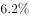。虽然我国公民科学素质提高很快，但发展不平衡，与世界发达国家的差距仍然很大，特别是我国科普方面的公共服务很不均衡，农民、城镇新居民、边远和少数民族地区群众获得服务的机会明显偏少。

这段文字意在说明：

- **A**. 我国公民科学素质还需进一步提高　✅
- **B**. 全社会应关注公民科学素质的提高
- **C**. 我国与发达国家在公民科学素质上存在差距
- **D**. 我国公民科学素质不高是一个严重的问题

**答案**：A

**官方解析**

文段开篇强调科学素质的重要性，后文指出当前我国公民科学素质存在的问题，即“不能满足国家建设和社会发展的需要”，随后通过我国与发达国家公民科学素质的比例等一系列数据对比论证前文观点，尾句通过转折关联词“但”再次强调我国公民科学素质存在的问题，包括发展不平衡、与发达国家差距大等。文段重点强调我国公民科学素质存在比例低、发展不平衡等问题，意在指出解决问题的对策，对应A项。
B项，“全社会应关注”无中生有，且“全社会应关注”并不能解决我国公民科学素质存在的问题，排除；
C、D两项，分别对应文段尾句和第二句中强调的问题，非重点，解决问题的对策更重要，均排除。
故正确答案为A。
【文段出处】《全民科学素质提升瞄准四大目标》

---

### 第 14 题　qid 2047774 · 片段阅读

文化本质上拥有让人处变不惊的力量，不仅让人们依恋传统，也鼓励人们接受新的可能。就像春节团聚，返回家乡固然是极好的方式，但春节离不开岗位，错峰返乡也依然情意浓浓。选择在第三地旅游过节，又何尝不是另一种天伦之乐？时代环境变了，文化形态也会相应改变。过去代表“年味儿”的某些形式，或许将离我们远去，但只要心在一起，就能找到新的“年味儿”取而代之，而不会留下情感或文化空缺。
这段文字的主旨是：

- **A**. 春节的重要性对于国人来说已经有所变化
- **B**. 文化的变迁是其本质主导下的正常现象　✅
- **C**. 家人团聚有很多种时间、形式可以选择
- **D**. 文化是否空缺取决于人们的心是否在一起

**答案**：B

**官方解析**

文段开篇通过递进关联词“不仅······也”强调“文化”起到的作用是多样化的，随后通过“就像”进行举例，针对如何过“春节”进行详细阐述。后文指出当前文化形态会随着时代发生变化，并通过“过年”这一事例强调只要心在一起，就不会留下情感或文化空缺，对前面观点进行加强论证，B项为文段中心句的同义替换，当选。
A项，“春节”是文段中的例子内容，非重点，且文段强调“文化形态”发生变化，非“春节的重要性”发生变化，排除；
C项，“家人团聚有很多种时间、形式可以选择”依然对应文段中举例的内容，非重点，排除；
D项，为文段最后一句转折中的内容，最后一句话是用“过年”的例子论证前文观点，例子中的转折不重要，排除。
故正确答案为B。
【文段出处】 《守住“年味儿”的根本》

---

### 第 15 题　qid 2047782 · 片段阅读

改革进入深层的利益调整和权力重构阶段，阻力越来越大。但是，再硬的骨头也要啃下来，再深的河水也要蹚过去。政府改革的核心是简政放权、转变职能。中央三令五申，实施清单制度，力度不可谓不大，但成效却难以让百姓满意。在不少地方和部门，该放的权力难以放到位，该管的环境难以管理好。那么多的“双创”行为受制于政策的悬置，那么多的企业不是战死沙场，而是倒在了行政审批的“最后一公里”。
这段文字主要说明：

- **A**. 改革越深入，遭遇的阻力越大
- **B**. 改革不可回避，阵痛在所难免
- **C**. 改革深入攻坚，已是不容迟滞　✅
- **D**. 创新发展的巨大潜能蕴藏在改革之中

**答案**：C

**官方解析**

文段首先说明改革的现状，即进入深层次的改革之后，阻力越来越大。随后通过转折词“但是”提出观点，强调阻力再大也要坚持改革。接着详细阐述了政府改革的核心是简政放权、转变职能，并指出了因为没有做到简政放权，导致“双创”受限、企业不满，对前文观点进行加强论证，即强调了在当今的环境下改革的必要性和紧迫性。观点为文段重点，对应C项。
A项，“遭遇的阻力越大”为转折之前的内容，非重点，排除；
B项，“阵痛在所难免”指的是改革必然会遭遇阻力，为问题的表述，而文段重在强调即使遭遇阻力，也要努力去做，对策更重要，故偏离文段重点，排除；
D项，“创新发展”属于“双创”中的内容，仅是文段解释说明的一部分，非文段论述重点，排除。
故正确答案为C。
【文段出处】《中国经济砥砺前行：信心就是力量》

---

## 数量关系

### 第 1 题　qid 2047704 · 数学运算

7    14    28    56    （  ）

- **A**. 110
- **B**. 112　✅
- **C**. 114
- **D**. 119

**答案**：B

**官方解析**

数列间存在明显的倍数关系，后一项为前一项的2倍，则所求项应为。

故正确答案为B。

---

### 第 2 题　qid 2047714 · 数学运算

1    7    17    31    49    （  ）

- **A**. 65
- **B**. 67
- **C**. 69
- **D**. 71　✅

**答案**：D

**官方解析**

数列无明显特征且起伏较小，优先考虑作差。作差后得到新数列为：6、10、14、18，为公差是4的等差数列，故新数列下一项为：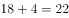，则所求项应为：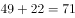。

故正确答案为D。

---

### 第 3 题　qid 2047726 · 数学运算

4    9    16    25    （  ）

- **A**. 36　✅
- **B**. 49
- **C**. 64
- **D**. 76

**答案**：A

**官方解析**

题干中各数为典型的平方数，可将原数列化为： 、 、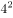、，则所求项应为。

故正确答案为A。

---

### 第 4 题　qid 2047740 · 数学运算

1    2    6    16    44    120    （  ）

- **A**. 164
- **B**. 176
- **C**. 240
- **D**. 328　✅

**答案**：D

**官方解析**

数列变化明显，作差无关系，考虑递推。，则所求项应为：。

故正确答案为D。

---

### 第 5 题　qid 2047756 · 数学运算

325    118    721    604    （  ）

- **A**. 911
- **B**. 541　✅
- **C**. 431
- **D**. 242

**答案**：B

**官方解析**

题干各项不存在明显关系，考虑数位之间的机械划分。拆分之后原数列每一项各位数字之和均为10，故所求项各位数字之和应为10，满足条件的仅有B项。
故正确答案为B。

---

### 第 6 题　qid 2047770 · 数学运算

如图所示，公园有一块四边形的草坪，由四块三角形的小草坪组成。已知四边形草坪的面积为480平方米，其中两个小三角形草坪的面积分别为70平方米和90平方米，则四块三角形小草坪中最大的一块面积为多少平方米？

- **A**. 120
- **B**. 150
- **C**. 180　✅
- **D**. 210

**答案**：C

**官方解析**

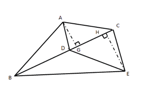

如上图所示，与有公共边，两个三角形面积之比为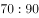。底边相同，高与面积成正比，故高之比即；同理与有公共边，高分别为与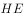，底边相同，面积与高成正比，故。

又已知平方米，则面积最大，为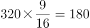平方米。

故正确答案为C。

---

### 第 7 题　qid 2047780 · 数学运算

小王到某单位办事，只有一个窗口在办理业务，小王排在第6位，第一位客户开始办理业务的时间为9:02。假如每单业务的办理时间为6分钟，而且排在小王前面的人不会提前离开。那么小王在什么时候可以开始办理业务？

- **A**. 9:32　✅
- **B**. 9:38
- **C**. 9:45
- **D**. 9:52

**答案**：A

**官方解析**

每单业务办理时间均为6分钟，判定题目中六位客户开始办理业务的时间为等差数列，公差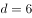分钟，小王排在第6位，与第1位相差分钟，故小王在9:32可以开始办理业务。

故正确答案为A。

---

### 第 8 题　qid 2047784 · 数学运算

现有一批零件，甲师傅单独加工需要4小时，乙师傅单独加工需要6小时。两人一起加工这批零件的需要多少个小时？

- **A**. 0.6
- **B**. 1
- **C**. 1.2　✅
- **D**. 1.5

**答案**：C

**官方解析**

赋值工程总量为4和6的最小公倍数12，甲的效率为：，乙的效率为：，一起合作加工零件的需要的时间为：小时。

故正确答案为C。

---

### 第 9 题　qid 2047786 · 数学运算

老林和小陈绕着周长为720米的小花园匀速散步，小陈比老林速度快。若两人同时从某一起点同向出发，则每隔18分钟相遇一次；若两人同时从某一起点相反方向出发，则每隔6分钟相遇一次。由此可知，小陈绕小花园散步一圈需要多少分钟？

- **A**. 6
- **B**. 9　✅
- **C**. 15
- **D**. 18

**答案**：B

**官方解析**

两人同时从同一地点同向出发，每相遇一次（从背后追及，可以理解成一种特殊的相遇，计算时使用追及公式，速度差追及时间追及路程），小陈比老林多跑一圈；两人同时从同一地点反向出发，每相遇一次，两人合走一圈。由此可得方程组：

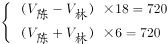

解得米/分钟，故小陈散步一圈需要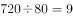分钟。

故正确答案为B。

---

### 第 10 题　qid 2047788 · 数学运算

在公司年会表演中，有甲、乙、丙、丁四个部门的员工参演。已知甲、乙两部门共有16名员工参演，乙、丙两部门共有20名员工参演，丙、丁两部门共有34名员工参演。且各部门参演人数从少到多的顺序为：。由此可知，丁部门有多少人参演？

- **A**. 16
- **B**. 20
- **C**. 23　✅
- **D**. 25

**答案**：C

**官方解析**

丙、丁两部门共有34名，且丁部门人数多于丙部门，则丁的人数大于17人，排除A项，剩余选项采用代入排除法：

若人，则人，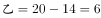人，人，，与题意不符，排除；

若人，则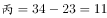人，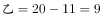人，人，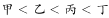，满足题意。

故正确答案为C。

---

### 第 11 题　qid 2047792 · 数学运算

现有浓度为和的盐水若干，如要配出600克浓度为的盐水，则分别需要浓度和的盐水多少克？

- **A**. 100、300
- **B**. 200、400　✅
- **C**. 300、600
- **D**. 400、800

**答案**：B

**官方解析**

方法一：混合浓度问题，采用线段法解决。

距离之比：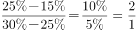，距离与量成反比，由此可以判断出所需浓度为和的两种溶液量之比为，因混合后的溶液为600克，则需浓度为的溶液克，需浓度为的溶液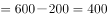克，正确答案为B。

方法二：混合后的溶液为600克，所以选项中两种溶液量加和应为600克，正确答案为B。

故正确答案为B。

---

### 第 12 题　qid 2047796 · 数学运算

某单位有107名职工为灾区捐献了物资，其中78人捐献衣物，77人捐献食品。该单位既捐献衣物，又捐献食品的职工有多少人？

- **A**. 48　✅
- **B**. 50
- **C**. 52
- **D**. 54

**答案**：A

**官方解析**

根据两集合容斥原理问题的公式：，可以得到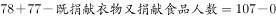。，尾数为8，只有A项符合。

故正确答案为A。

---

### 第 13 题　qid 2047798 · 数学运算

有两支蜡烛，粗细不同，长度相等，粗蜡烛燃尽需要2小时，细蜡烛燃尽需要1小时。一天晚上停电，同时点燃了这两支蜡烛，若干分钟后来电了，将两支蜡烛同时熄灭，此时，粗蜡烛的长度是细蜡烛的2倍。假如蜡油的燃烧速度（单位时间的蜡油燃量）恒定，则停电时长为多少分钟？

- **A**. 30
- **B**. 35
- **C**. 40　✅
- **D**. 45

**答案**：C

**官方解析**

蜡烛长度相等，对蜡烛长度赋值，假设蜡烛长度均为2。由题意知粗蜡烛燃尽需2小时，细蜡烛燃尽需1小时，则粗蜡烛的燃烧速度为1，细蜡烛的燃烧速度为2，假设停电时间是小时：

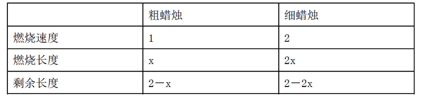

同时点燃，同时熄灭时，发现粗蜡烛的长度是细蜡烛的2倍，则

，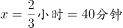。

故正确答案为C。 

---

### 第 14 题　qid 2047800 · 数学运算

单位工会组织拔河比赛，每支参赛队都由3名男职工和3名女职工组成。假设比赛时要求3名男职工的站位不能全部连在一起，则每支队伍有几种不同的站位方式？

- **A**. 432
- **B**. 504
- **C**. 576　✅
- **D**. 720

**答案**：C

**官方解析**

6人排列，考虑顺序，共有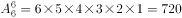种方法；

3名男职工全部连在一起，利用捆绑法有种方法；

则3名男职工不能全部连在一起的方法有：种。

故正确答案为C。

---

### 第 15 题　qid 2047802 · 数学运算

施工队给一个周长为40米的圆形花坛安装护栏。刚开始，每隔1米挖一个洞用于埋栏杆。后来发现洞的间隔太远，决定改为每隔0.8米挖一个洞。那么，至少需要再挖几个洞？

- **A**. 39
- **B**. 40　✅
- **C**. 41
- **D**. 42

**答案**：B

**官方解析**

“周长为40米的圆形花坛安装护栏”，环形植树问题，根据公式，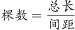。将间隔改为0.8米后，需要挖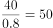个洞，两次挖洞的间距1与0.8的最小公倍数为4，因此每隔4米会有一个洞重合，则共有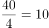个洞重合。因此改为每隔0.8米挖一个洞后，至少需要再挖个洞。

故正确答案为B。

---

## 判断推理

### 第 1 题　qid 2047724 · 图形推理

从所给四个选项中，选择最合适的一个填入问号处，使之呈现一定规律性：

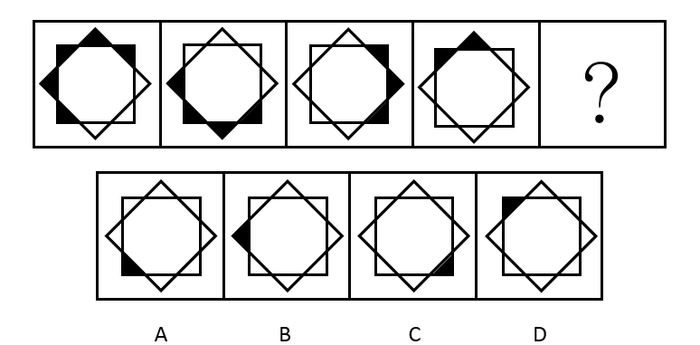

- **A**. A　✅
- **B**. B
- **C**. C
- **D**. D

**答案**：A

**官方解析**

观察图形，黑色小三角形的个数不同，分别是5、4、3、2，所以问号处应该是1个黑色小三角形，选项均有1个黑色小三角形，进一步观察，发现黑色小三角形的位置不同，所以观察位置变化，小黑块每次逆时针平移两格，并且每次减少一个。图①到图②，小黑块逆时针平移两格，去掉后面的一个黑块（黑块5），图②到图③，小黑块逆时针平移两格，去掉后面的一个黑块（黑块4），图③到图④，小黑块逆时针平移两格，去掉后面的一个黑块（黑块3），图④到图⑤应该是小黑块逆时针平移两格，去掉后面的一个黑块（黑块2），对应A项。

故正确答案为A。

---

### 第 2 题　qid 2047732 · 图形推理

从所给四个选项中，选择最合适的一个填入问号处，使之呈现一定规律性：

- **A**. A
- **B**. B　✅
- **C**. C
- **D**. D

**答案**：B

**官方解析**

观察图形，元素组成相同，考虑位置关系，时针（最短箭头）依次顺时针走1-2-3格，“？”处应走4格，排除A项；分针（短粗箭头）依次顺时针走2-3-4格，“？”处应走5格，无法排除；秒针（长细箭头）依次顺时针走3-4-5格，“？”处应走6格，排除C、D两项，对应B项。
故正确答案为B。

---

### 第 3 题　qid 2047736 · 图形推理

从所给四个选项中，选择最合适的一个填入问号处，使之呈现一定规律性：

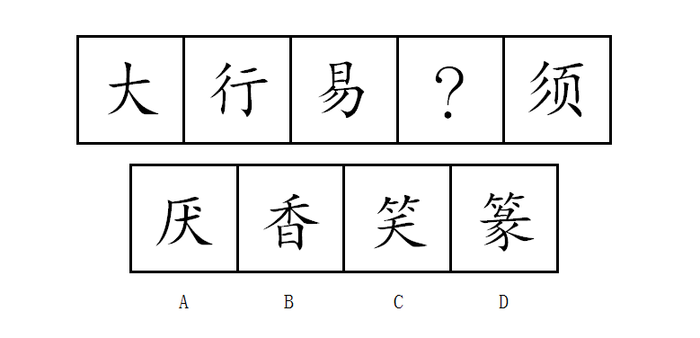

- **A**. A
- **B**. B
- **C**. C　✅
- **D**. D

**答案**：C

**官方解析**

观察图形，元素组成不同，属性无明显规律，考虑数量规律。题干的每一幅图形都出现了“丿”，“丿”的个数依次为：1、2、3、？、5，？处应为4个“丿”。A项2个、B项2个、C项4个、D项6个，只有C项符合。
故正确答案为C。

---

### 第 4 题　qid 2047742 · 图形推理

从所给四个选项中，选择最合适的一个填入问号处，使之呈现一定规律性：

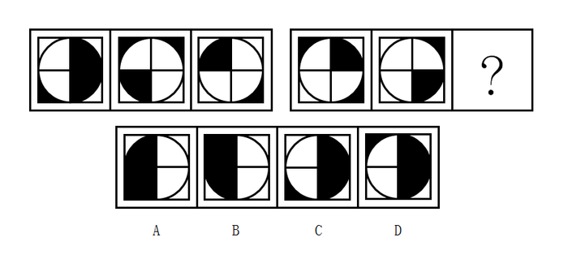

- **A**. A　✅
- **B**. B
- **C**. C
- **D**. D

**答案**：A

**官方解析**

观察图形，元素组成相似，外部轮廓相同，内部有黑有白，且黑白的个数不同，考虑黑白运算。第一组的运算公式为：、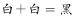、；第二组应用规律，正方形的左上角，排除B、D两项。比较A、C两项，中间的圆形阴影不同，圆形内部左上角为，排除C项，对应A项。

故正确答案为A。

---

### 第 5 题　qid 2047746 · 图形推理

从所给四个选项中，选择最合适的一个填入问号处，使之呈现一定规律性：

- **A**. A
- **B**. B
- **C**. C
- **D**. D　✅

**答案**：D

**官方解析**

观察图形，题干出现黑圆、条形圆、白圆三种元素，题干图形中的每一个条形圆只与黑圆相邻，不与白圆相邻，排除A、C项。题干图形中的每一个黑圆都与条形圆相邻，B项中有一个黑圆没有与条形圆相邻，排除B项，对应D选项。
故正确答案为D。

---

### 第 6 题　qid 2047752 · 图形推理

从所给四个选项中，选择最合适的一个填入问号处，使之呈现一定规律性：

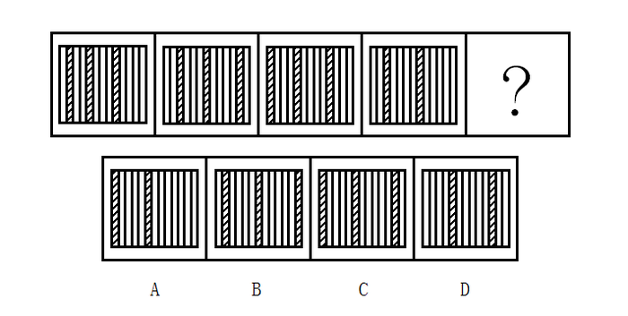

- **A**. A
- **B**. B
- **C**. C　✅
- **D**. D

**答案**：C

**官方解析**

观察图形，前三个图有三个斜线条，第四个图有两个斜线条，但是，数量、属性、样式都没有规律，所以只能考虑位置规律。如下图所示，给题干中斜线条分别编号。

a斜线条向右平移的步数分别是1、2、3、？，所以，？处a斜线条应该是在第12格，观察选项，发现只有C选项在第12格有斜线条，所以，答案是C选项。验证其他选项：

b斜线条向右平移的步数分别是2、3、4，观察四图，发现既不符合反弹的路径（应该走到第12个格子），也不符合循环的路径（应该走到第1个格子），所以应该是当超过第13个格子的平移时，斜线条就会消失，故b斜线消失；

c斜线条向右平移的步数分别是3、4，所以从第二个图到第三个图，c斜线条消失；

d斜线条是在c斜线条消失后重新补充的，d斜线条向右平移的步数分别是2、？，？处d斜线条应该是走3步，从第3格子走到第6格子，对应C选项；

同时根据C选项可知在最左侧又补充一个新的e斜线条。

故正确答案为C。

备注：这道题不同于以往的黑白块题，到顶头的位置后是循环走或反弹走，这道题斜线条到顶头的位置后就会消失，这是一个比较新颖的命题形式，希望广大考生引起注意！

---

### 第 7 题　qid 2047758 · 图形推理

从所给四个选项中，选择最合适的一个填入问号处，使之呈现一定规律性：

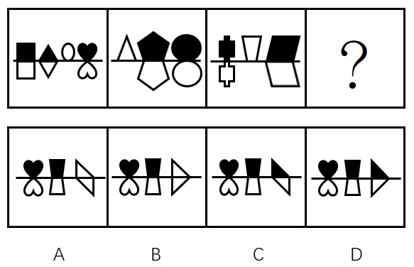

- **A**. A
- **B**. B
- **C**. C
- **D**. D　✅

**答案**：D

**官方解析**

观察图形，发现题干每一幅图，当白色图形在横线上方时，下方并没有图形，排除A、B选项，再观察发现，当黑色图形在横线上方时，下方就有一个相同形状的白色图形通过黑色图形上下翻转得到，据此排除C项。
故正确答案为D。

---

### 第 8 题　qid 2047762 · 图形推理

从所给四个选项中，选择最合适的一个填入问号处，使之呈现一定规律性：

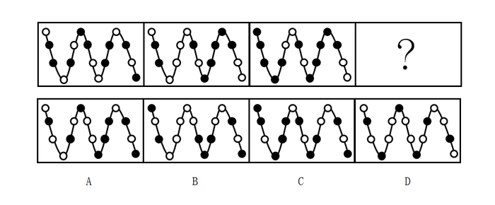

- **A**. A
- **B**. B
- **C**. C　✅
- **D**. D

**答案**：C

**官方解析**

解析1：观察图形，元素组成不同，考虑数量规律，观察小黑球的数量分别是9、8、11、？，根据乱序规律，？处应该找有10个小黑球的选项，排除A、B、D三个选项，所以答案是C选项。
进一步验证小白球，观察小白球的数量分别是7、8、5、？，根据乱序规律，？处应该找有6个小白球的选项，排除A、B、D三个选项，所以答案依然是C选项。
解析2：题干都是由小黑球、小白球及波浪线组成，整体数黑球和白球的个数，无明显规律；考虑黑球的位置移动，也无明显规律。再次观察题干图形，小黑球和小白球是以波浪线的方式连接，即必然存在波峰和波谷，观察在波峰和波谷的黑白球数目发现，第一幅图是4白2黑，第二幅图是4白2黑，第三幅图是4黑2白，即都是“4-2”分布，选项A、B、D的波峰和波谷的黑白球数目都是3白3黑，只有C选项的波峰和波谷的黑白球数目是4黑2白，满足“4-2”分布的规律。
再观察第二行，题干黑球和白球的数量均是4黑1白，C选项也符合此规律；观察第三行，第一幅图是3黑2白，第二幅图是3白2黑，第三幅图是3黑2白，呈交替出现规律，第四幅图应为3白2黑，C选项也符合此规律。
故正确答案为C。
解析3：元素组成不同，考虑数量规律。题干均由小黑球、小白球组成，且黑白球互相分割，考虑黑白球互相分割后的部分数。题干图形黑球部分数依次为：6、3、3，白球部分数依次为6、4、3；即图1、图3中黑球和白球部分数相等，图2中白球比黑球部分数多1，故问号处应选择一个白球比黑球部分数多1的选项，只有D选项符合。
故正确答案为D。
注：本题不严谨，存在多个规律，故作为参考即可。

---

### 第 9 题　qid 2047768 · 图形推理

把下面的六个图形分为两类，使每一类图形都有各自的共同特征或规律，分类正确的一项是：

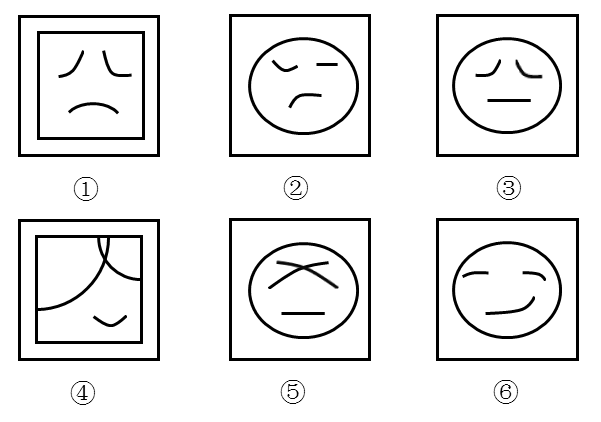

                                               

- **A**. ①④⑥，②③⑤　✅
- **B**. ①②⑤，③④⑥
- **C**. ①⑤⑥，②③④
- **D**. ①③⑤，②④⑥

**答案**：A

**官方解析**

元素组成不同，属性无明显规律，考虑数量规律。题干图形都是由一个外框和里面的3条线组成，整体数线，7、4、4、7、4、4，无法分组。仔细观察后发现，每个图形内部存在多条单一直线和单一曲线，可以考虑分开数图形内部的直线和曲线数，即图①④⑥图形内部有3条曲线，图②③⑤图形内部有2条曲线和1条直线，可以分为两组。
故正确答案为A。

---

### 第 10 题　qid 2047776 · 图形推理

把下面的6个图形分为两类，使每一类图形都有各自的共同规律，分类正确的是:

- **A**. ①④⑥，②③⑤
- **B**. ①②⑤，③④⑥　✅
- **C**. ①⑤⑥，②③④
- **D**. ①③⑤，②④⑥

**答案**：B

**官方解析**

题干都是黑白块图形，整体数黑块的个数，无明显规律。仔细观察后发现，图①②⑤黑块的拼接明显比较凌乱，而图③④⑥黑块的拼接比较整齐、紧密相连，即图①②⑤黑块与黑块之间以点相接，图③④⑥黑块与黑块之间以边相接。
故正确答案为B。

---

### 第 11 题　qid 2047860 · 类比推理

U盘：光盘

- **A**. 楼梯：电梯　✅
- **B**. 插头：插座
- **C**. 国画：毛笔
- **D**. 水杯：杯盖​

**答案**：A

**官方解析**

第一步：判断题干词语间逻辑关系。
U盘和光盘都具有存储功能，二者是并列关系。
第二步：判断选项词语间逻辑关系。
A项：楼梯和电梯都可用于建筑物等楼层之间或高度差较大时的交通联系，二者是并列关系，与题干逻辑关系一致，当选；
B项：插头和插座是配套使用的，二者是对应关系中的配套对应，与题干逻辑关系不一致，排除；
C项：画国画的时候需要用到毛笔，二者是对应关系中的工具对应，与题干逻辑关系不一致，排除；
D项：水杯和杯盖是组成关系，与题干逻辑关系不一致，排除。
故正确答案为A。

---

### 第 12 题　qid 2047862 · 类比推理

春暖：花开

- **A**. 和风：细雨
- **B**. 雨后：天晴
- **C**. 天寒：地冻　✅
- **D**. 云开：雾散​

**答案**：C

**官方解析**

第一步：判断题干词语间逻辑关系。
春暖是花开的原因，二者是对应关系中的因果对应。
第二步：判断选项词语间逻辑关系。
A项：和风和细雨都是一种天气状态，二者属于并列关系，与题干逻辑关系不一致，排除；
B项：雨后不是天晴的原因，与题干逻辑关系不一致，排除；
C项：天寒是地冻的原因，二者是对应关系中的因果对应，与题干逻辑关系一致，当选；
D项：云开和雾散都是一种天气状态，二者属于并列关系，与题干逻辑关系不一致，排除。
故正确答案为C。

---

### 第 13 题　qid 2047864 · 类比推理

投票：抽签

- **A**. 联系：沟通
- **B**. 管理：服务
- **C**. 劝说：争辩　✅
- **D**. 推荐：号召​

**答案**：C

**官方解析**

第一步：判断题干词语间逻辑关系。
投票和抽签都是选出结果的一种方式，二者是并列关系中的反对关系。
第二步：判断选项词语间逻辑关系。
A项：联系和沟通是近义词，与题干逻辑关系不一致，排除；
B项：管理是指管理主体组织并利用其各个要素，借助管理手段，完成该组织目标的过程；服务是指为他人做事，并使他人从中受益的一种有偿或无偿的活动，二者无必然逻辑关系，排除；
C项：劝说和争辩都是让人对某件事情表示同意的一种方式，二者是并列关系中的反对关系，与题干逻辑关系一致，当选；
D项：推荐是推举，介绍；号召是向人发出通知，让大家响应所发出的告示，二者无明显逻辑关系，排除。
故正确答案为C。

---

### 第 14 题　qid 2047866 · 类比推理

调研：座谈

- **A**. 转型：创新　✅
- **B**. 垄断：专营
- **C**. 发明：试验
- **D**. 秩序：通畅​

**答案**：A

**官方解析**

第一步：判断题干词语间逻辑关系。
座谈是调研的一种形式。
第二步：判断选项词语间逻辑关系。
A项：创新是转型的一种形式，与题干逻辑关系一致，当选；
B项：垄断泛指把持和独占；专营可指专门经营某一类或者某一种品牌商品（如苹果专营店、耐克专营店），不属于垄断经营，二者无必然逻辑关系，排除；
C项：发明是创造新的事物或方法；试验指已知某种事物，为了了解它的性能或者结果而进行的试用操作，因此试验不是发明的一种形式，排除；
D项：通畅的秩序是指有条理，不混乱，顺利通行；通畅是用来形容秩序，与题干逻辑关系不一致，排除。
故正确答案为A。

---

### 第 15 题　qid 2047868 · 类比推理

言论：自由

- **A**. 版权：保护
- **B**. 危机：调控
- **C**. 生产：安全　✅
- **D**. 设计：创新

**答案**：C

**官方解析**

第一步：判断题干词语间逻辑关系。
题干可以造句“言论自由”，“自由”的“言论”，是偏正结构。
第二步：判断选项词语间逻辑关系。
A项：可以造句“保护版权”，是动宾结构，与题干逻辑关系不一致，排除；
B项：“调控”指的是调节、控制，与“危机”无必然逻辑关系，与题干逻辑关系不一致，排除；
C项：可以造句“生产安全”，“安全”可以用来修饰“生产”，“安全”的“生产”，是偏正结构，与题干逻辑关系一致，保留；
D项：可以造句“设计创新”，“创新”可以用来修饰“设计”，“创新”的“设计”，是偏正结构，与题干逻辑关系一致，保留。
比较C、D两项，法律规定，言论必须是自由的，生产必须是安全的，但并未规定设计必须是创新的，相比而言，C项与题干的逻辑关系更为接近。
故正确答案为C。

---

### 第 16 题　qid 2047870 · 类比推理

水：火

- **A**. 美：丑
- **B**. 有：无
- **C**. 左：右
- **D**. 红：绿　✅

**答案**：D

**官方解析**

第一步：判断题干词语间逻辑关系。
金木水火土，水与火两者属于并列中的反对关系。
第二步：判断选项词语间逻辑关系。
A项：美与丑属于并列中的反对关系，保留；
B项：有与无属于并列中的矛盾关系，与题干逻辑关系不一致，排除；
C项：左与右属于并列中的反对关系，保留；
D项：红与绿属于并列中的反对关系，保留。
比较A、C、D三项，题干中水、火是反对关系，但不是反义关系。而A项中的美、丑，C项中的左、右都是反义关系，D项中的红、绿只是反对关系，不是反义关系，与题干逻辑关系更一致。
故正确答案为D。

---

### 第 17 题　qid 2047872 · 类比推理

净水：过滤

- **A**. 名次：竞赛
- **B**. 房屋：装修
- **C**. 苗条：节食　✅
- **D**. 环境：绿化

**答案**：C

**官方解析**

第一步：判断题干词语间逻辑关系。
过滤是获得净水的一种方式。
第二步：判断选项词语间逻辑关系。
A项：竞赛是获得名次的一种方式，与题干逻辑关系一致，保留；
B项：装修不是获得房屋的一种方式，与题干逻辑关系不一致，排除；
C项：节食是获得苗条的一种方式，与题干逻辑关系一致，保留；
D项：绿化不是获得环境的一种方式，与题干逻辑关系不一致，排除。
比较A、C两个选项与题干，过滤是通过减少杂质达到净水的效果；节食是通过减少食物摄入量达到苗条的效果，C选项更符合。
故正确答案为C。

---

### 第 18 题　qid 2047874 · 类比推理

雾霾：污染：治理

- **A**. 风扇：电器：使用　✅
- **B**. 粳米：粮食：调查
- **C**. 信息：报纸：阅读
- **D**. 报告：文件：审批

**答案**：A

**官方解析**

第一步：判断题干词语间逻辑关系。
雾霾是一种污染，二者是种属关系，治理雾霾、治理污染都是动宾结构。
第二步：判断选项词语间逻辑关系。
A项：风扇是一种电器，二者是种属关系，使用风扇、使用电器都是动宾结构，与题干逻辑关系一致，当选；
B项：粳米是一种粮食，二者是种属关系，但调查和粳米、粮食无必然联系，与题干逻辑关系不一致，排除；
C项：信息不是一种报纸，与题干逻辑关系不一致，排除；
D项：有的报告是文件，有的报告不是文件（如口头报告），二者是交叉关系，与题干逻辑关系不一致，排除。
故正确答案为A。

---

### 第 19 题　qid 2047876 · 类比推理

好感：喜欢：热爱

- **A**. 伤心：悲伤：悲哀
- **B**. 不安：紧张：焦躁　✅
- **C**. 不悦：反感：厌恶
- **D**. 高兴：愉快：喜悦

**答案**：B

**官方解析**

第一步：判断题干词语间逻辑关系。
好感是对人对事满意或喜欢的情绪；喜欢泛指喜爱，也有愉快、高兴、开心的意思；热爱多用来形容爱的程度很深。三者是近义词，并且程度逐渐加深。
第二步：判断选项词语间逻辑关系。
A项：伤心指心里非常痛苦，难过至极；悲伤是哀痛忧伤之意，伤心难过；悲哀是指伤心、难过。三者是近义词，但悲伤和悲哀的程度相同，与题干逻辑关系不一致，排除；
B项：不安指一种忐忑的心态，心里有一种不舒服的情绪；紧张指精神处于高度准备状态，思想上感到不安；焦躁是欲望受到压抑而形成的神经衰弱症的症状。三者是近义词，并且程度逐渐加深，与题干逻辑关系一致，当选；
C项：不悦指不高兴；反感是不满或反对的情绪；厌恶是一种反感的情绪，指讨厌、憎恶；不悦表示不高兴，反感与厌恶表示不满、讨厌。三者不是近义关系，与题干逻辑关系不一致，排除；
D项：高兴通常指愉快而又兴奋；愉快指欢欣快乐；喜悦指欢乐快活。三词的程度无明显变化，与题干逻辑关系不一致，排除。
故正确答案为B。

---

### 第 20 题　qid 2047878 · 类比推理

自行车：出行：环保

- **A**. 蔬菜：食品：健康　✅
- **B**. 台灯：灯泡：节能
- **C**. 手表：时间：指针
- **D**. 货车：运输：载体

**答案**：A

**官方解析**

第一步：判断题干词语间逻辑关系。
自行车是出行工具的一种。自行车是一种环保的出行方式，有利于环保。
第二步：判断选项词语间逻辑关系。
A项：蔬菜是食品的一种，蔬菜是一种健康的食品，多吃蔬菜有利于健康，与题干逻辑关系一致，当选；
B项：灯泡是台灯的一部分，二者为组成关系，与题干逻辑关系不一致，排除；
C项：手表是显示时间的工具，指针是手表的一部分，与题干逻辑关系不一致，排除；
D项：货车是运输工具的一种，货车是载体，与题干逻辑关系不一致，排除。
故正确答案为A。

---

### 第 21 题　qid 2047882 · 逻辑判断

某单位每个月都要对工作人员的工作表现进行考评。去年上半年，该单位的甲、乙、丙、丁4位员工均获得了3次月度优秀奖。已知，甲和乙有2个月同时获奖，乙和丙也有2个月同时获奖，甲和丁获奖的月份完全不同。
以下说法一定正确的是：

- **A**. 只有3个人同时获奖的月份有2个　✅
- **B**. 只有2个人同时获奖的月份有3个
- **C**. 只有1个人获奖的月份有1个
- **D**. 只有2个人同时获奖的月份少于只有1个人获奖的月份

**答案**：A

**官方解析**

根据题干条件可知：

6个月内每个人都3次获得月度优秀奖；

甲、乙有2个月同时获奖；

乙、丙有2个月同时获奖；

甲、丁获奖月份完全不同；

由于题目不涉及获奖的月份和先后顺序，因此可以假设甲获奖的月份为一、二、三月，根据，丁获奖月份则为四、五、六月。根据，乙在一、二、三月中有两次获奖，在四、五、六月中有一次获奖。根据，假如丙在一、二、三月获两次奖且与乙同时，在四、五、六月获一次奖，且与乙不同时，如表格所示：

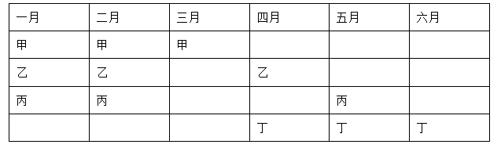

假如丙在一、二、三月获一次奖，且与乙同时，在四、五、六月获两次奖且必须有一次与乙同时，如表格所示：

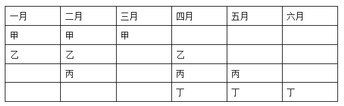

根据以上两种情况的假设，可判定，无论何种情况只有3个人同时获奖的月份有2个。

故正确答案为A。

---

### 第 22 题　qid 2047884 · 逻辑判断

现在人们常常提到大学毕业生就业难。但据统计，近年我国就业市场空缺岗位与求职人数的比率一般大于1，劳动力市场的需求大于供给。而在求职人群中，大学毕业生的文化水平较高。因此，我国大学毕业生实际上不存在就业难的问题。
以下信息如果为真，能够有效反驳上述结论的是：

- **A**. 当前经济下行压力较大，不少企业严控用工成本，已经开始裁员
- **B**. 劳动力市场最紧缺的一些岗位主要是适合高级技工的岗位　✅
- **C**. 大学毕业生愿意从事的岗位往往竞争激烈
- **D**. 一些高级技能人才的收入水平要高于大学毕业生

**答案**：B

**官方解析**

第一步：找到论点和论据。
论点：我国大学毕业生实际上不存在就业难的问题。
论据：近年我国就业市场空缺岗位与求职人数的比率一般大于1，劳动力市场的需求大于供给。而在求职人群中，大学毕业生的文化水平较高。
第二步：逐一分析选项。
A项：不少企业严控用工成本，已经开始裁员，这不能说明就业市场不再招录大学生，也不能说明大学生就业困难，与大学生的就业难易无关，属于无关选项，排除；
B项：虽然一些岗位空缺严重，但是主要缺少高级技工，不需要大学生，对大学生而言在这些领域会出现劳动力市场的需求小于供给的现象，进而出现就业难的问题，可以削弱，当选；
C项：大学毕业生愿意从事的岗位往往竞争激烈，并不能说明在实际选择职业时就一定扎堆，大学生仍然可以选择一些不愿意从事的竞争不激烈的岗位，并不能对就业难进行削弱，另外，选项表达的只是一种意愿，而实际情况是未知的，属于不明确选项，排除；
D项：一些高级技工的收入水平高于大学生，与大学生的就业难易无关，属于无关选项，排除。
故正确答案为B。

---

### 第 23 题　qid 2047886 · 逻辑判断

甲和乙都有可能受邀参加某专家论坛。现在，甲得知了以下消息：
（1）论坛主办方决定，至少邀请甲或乙中的一位。
（2）论坛主办方决定不邀请甲。
（3）论坛主办方一定会邀请甲。
（4）论坛主办方决定邀请乙。
假如上述消息中，两条为真，两条为假，则：

- **A**. 论坛主办方决定邀请甲，不邀请乙　✅
- **B**. 论坛主办方决定邀请乙，不邀请甲
- **C**. 论坛主办方决定同时邀请甲和乙
- **D**. 论坛主办方决定既不邀请甲，也不邀请乙

**答案**：A

**官方解析**

首先整理题干：（1）甲或乙；（2）– 甲；（3）甲；（4）乙。
（2）和（3）矛盾，必然一真一假，条件说两真两假，则（1）和（4）为一真一假。分析可知（4）真→（1）真，根据“一真前假，一假后真”，可知（4）为假，（1）为真。根据（4）假可知：–乙，结合（1）真可知：邀请甲。
故正确答案为A。

---

### 第 24 题　qid 2047888 · 逻辑判断

某科研机构研发了一项神经刺激技术，他们在试验中对一批滑雪选手实施了该刺激，持续数周后发现，相比未接受刺激的选手，接受刺激选手的跳跃能力和协调性分别提高了和。本国体育部门计划与该机构合作，在滑雪运动员的训练、比赛中推广使用这一技术。

以下哪项为真，最能质疑该国体育部门的计划？

- **A**. 未接受刺激的运动员通过正常训练也能提高跳跃能力和协调性
- **B**. 这项合作会增加该国体育部门的经费支出
- **C**. 该国是传统滑雪强国，滑雪成绩长期处于世界领先地位
- **D**. 这项技术会降低运动员的专注力，而专注力是能力发挥的前提　✅

**答案**：D

**官方解析**

第一步：找出论点和论据。

论点：本国体育部门计划与该机构合作，在滑雪运动员的训练、比赛中推广使用这一技术。

论据：在试验中对一批滑雪选手实施了该刺激，持续数周后发现，相比未接受刺激的选手，接受刺激选手的跳跃能力和协调性分别提高了和。

第二步：逐一分析选项。

A项：未接受刺激的运动员通过正常训练也可以提高跳跃能力和协调性，但是和接受刺激的运动员来说，到底谁提高的效果更好不知道，属于不明确选项，不能削弱，排除；

B项：增加体育部门的经费支出与该技术的刺激是否可以提高未接受刺激运动员的跳跃能力和协调性无关，论题不一致，排除；

C项：该国的滑雪成绩长期处于世界领先地位与该技术的刺激是否可以提高未接受刺激运动员的跳跃能力和协调性无关，论题不一致，排除；

D项：这项技术会降低决定运动员正常发挥的专注力，说明该技术对运动员的训练和比赛有害，削弱论点，当选。

故正确答案为D。

---

### 第 25 题　qid 2047880 · 类比推理

一名茶叶经销商在对客人介绍一种茶叶时说：“这种茶叶产自云山，而大名鼎鼎的云山茶正是产自云山，所以这就是正宗的云山茶。”
以下与该经销商介绍茶叶时的逻辑最为相似的是：

- **A**. 三班的学生都勤奋好学，小李是三班的学生，所以小李勤奋好学
- **B**. 飞驰牌汽车产自某国，刚才那辆汽车不是飞驰牌，所以肯定不是该国产的
- **C**. 所有司机都必须有驾照，小郑有驾照，所以小郑是司机　✅
- **D**. 好医生需要具备精湛的医术和高尚的医德，小陈二者兼备，所以他是好医生

**答案**：C

**官方解析**

第一步：分析题干推理形式。

题干翻译为：云山茶产自云山，

推理为：这种茶叶产自云山，因此，这种茶叶是云山茶。

推理的逻辑是“肯后推肯前”。

第二步：逐一分析选项。

A项：翻译为“三班的学生勤奋好学”，推理为“小李是三班的学生，所以小李勤奋好学”，推理的逻辑是“肯前推肯后”，与题干逻辑不同，排除；

B项：翻译为“飞驰牌汽车产自某国”，推理为“刚才那辆汽车不是飞驰牌，所以不是该国产的”，并非“肯后”，与题干逻辑不同，排除；

C项：翻译为“司机有驾照”，推理为“小郑有驾照，所以小郑是司机”，推理的逻辑是“肯后推肯前”，与题干逻辑相同，保留；

D项：翻译为“好医生具备精湛的医术和高尚的医德”，推理为“小陈二者兼备，所以他是好医生”，推理的逻辑是“肯后推肯前”，与题干逻辑相同，保留。

比较C项和D项，D项翻译的后半部分包含“精湛的医术和高尚的医德”两个内容，而题干“产自云山”和C项“有驾照”均只包含一个内容，因此C项与题干的逻辑更接近，当选。

故正确答案为C。

---

### 第 26 题　qid 2047700 · 逻辑判断

某公司招聘业务经理，小张和小李前来应聘。小张说：“如果我做了业务经理，我会积极进取，开拓新业务。”小李说：“如果我做了经理，我会优化管理，精减人员。”最终，他们其中一人当上了业务经理，并顺利实现了自己的工作主张。
由此可知，以下说法必定为真的是：

- **A**. 该公司不仅开拓了新业务，还精减了人员
- **B**. 如果该公司开拓了新业务，那么肯定是小张当上了业务经理
- **C**. 如果该公司精减了人员，那么肯定是小李当上了业务经理
- **D**. 如果该公司没有开拓新业务，就肯定精减了人员　✅

**答案**：D

**官方解析**

第一步：翻译题干。
小张做了业务经理→积极进取且开拓新业务；
小李做了业务经理→优化管理且精简人员；
已知其中只有一个人当上了业务经理并实现自己的工作主张，另外一人没有当上业务经理，但是有没有实现自己的工作主张不确定。
第二步：逐一翻译选项并判断选项是否正确。
A项：开拓新业务且精简人员，从题干已知条件可知，开拓新业务和精简人员分属于不同人的工作主张，且已知有一人实现了自己的工作主张，另外一个的主张有没有实现不确定，所以无法推出绝对表达的结论，排除；
B项：开拓新业务→小张做了业务经理，“开拓新业务”属肯后条件，无法推出绝对表达的结论，排除；
C项：精简人员→小李做了业务经理，“精简人员”属肯后条件，无法推出绝对表达的结论，排除；
D项：—开拓新业务→精简人员，由题干已知条件可知，—开拓新业务属于否后，否后必否前，由逆否规则可知“—开拓新业务→—小张做了业务经理”，既然小张没有做业务经理，显然是小李做了业务经理，肯前必肯后，由题干已知条件可知“小李做了业务经理→优化管理且精简人员”，那么该公司实现了精简人员，当选。
故正确答案为D。

---

### 第 27 题　qid 2047750 · 逻辑判断

由于按揭贷款的利率下调，人们每月还贷压力减小，因此一家机构预测某地的商品房销售量会增长，但实际上，销售量并未出现明显增长。
下列哪项如果为真，最能解释以上现象？

- **A**. 当地一直存在人口外流的现象
- **B**. 本地的商品房价格没有明显下降
- **C**. 有的开发商取消了购房优惠政策
- **D**. 因经济环境不好，当地人均收入下降　✅

**答案**：D

**官方解析**

第一步：找出需要解释的矛盾现象。
题干矛盾在于“按揭贷款的利率下调，人们每月还贷压力减小”，“但实际上，销售量并未出现明显增长”，即还贷压力减小的情况下，有多余的资金为什么不买商品房，进而导致商品房销售量未增长的问题。
第二步：逐一分析选项。
A项：当地一直存在人口外流的现象，与题干无关，不能解释题干矛盾现象，排除。
B项：本地商品房价格没有明显下降，意味着商品房的价格降幅很小或者没有变化，但是题干谈及的是还贷压力减小和商品房销售量之间不增长的矛盾，如果是商品房价格有降幅，出现的结果应该是买商品房的人多，不能解释题干矛盾现象，如果是商品房价格没有变化，那么对于购买者来说需求是没变化的，而还贷压力又变小了，该买的依然买，也应该是出现增长，也不能解释题干矛盾现象，排除。
C项：有的开发商取消购房优惠政策，取消购房优惠政策在一定程度上能够影响消费者，从而影响商品房的销售量，能够解释题干矛盾现象，保留。
D项：当地人均收入下降，意味着虽然每月还贷压力减小，但是自身的本来收入也减少了，那么还贷完剩余的钱也少，自然没有多余的钱再去购买商品房，从而商品房的销售量没有出现明显增长，能解释题干矛盾现象，保留。
C项和D项进行比较，C项强调的是部分开发商，数量是多是少并不明确，那么造成的影响也不明确，而D项明确强调了当地居民收入下降导致还完贷款后剩下的资金也减少，更能够影响商品房的销售数量。
故正确答案为D。

---

### 第 28 题　qid 2047760 · 逻辑判断

媒体A报道称：今年以来，患季节性皮肤病的人数大幅上升，这是因为城市水污染日益严重和空气质量恶化造成的。
媒体B报道称：患季节性皮肤病的人数大幅上升与城市水污染、空气质量恶化没有关系，主要是因为人们缺乏锻炼，身体素质下降造成的。
以下哪项如果为真，最能对媒体B的观点提出质疑？

- **A**. 目前7-12周岁儿童的身体素质比10年前普遍下降
- **B**. 大多数春季患皮肤病的人，在秋冬季节症状会有所好转
- **C**. 环保局承认，城市水污染和空气质量问题日益严重
- **D**. 游泳运动员患季节性皮肤病的人数逐年增多　✅

**答案**：D

**官方解析**

第一步：找到论点和论据。
论点：患季节性皮肤病的人数大幅上升的原因是人们缺乏锻炼，身体素质下降。
论据：没有明显的论据。
第二步：逐一分析选项。
A项：儿童身体素质比10年前普遍下降，与题干无关，选项只是给出了一个实际现象，但是患皮肤病的人增多和身体素质下降之间有无联系我们并不明确，无关选项，排除；
B项：大多数春季患皮肤病的人在秋冬季节症状会有所好转，与题干无关，题干观点探讨的是皮肤病人数上升的原因是不是缺乏锻炼、身体素质下降，排除；
C项：环保局承认城市水污染和空气质量问题日益严重，选项只是给出了一个实际现象，但是患皮肤病的人增多和污染问题之间有无联系我们并不明确，无关选项，排除；
D项：游泳运动员患季节性皮肤病的人数逐年增多，说明运动员这种身体素质好、锻炼强度大的群体患皮肤病的人也在增多，意味着皮肤病患者增多与身体素质和锻炼强度之间并没有必然的联系，举反例削弱论点，为正确答案，当选。
故正确答案为D。

---

### 第 29 题　qid 2047772 · 逻辑判断

某投资公司在评价一个项目时说：我们挑选投资项目，主要是看项目的技术门槛和未来市场需求量，而不是当前的业务增长率。现在新的可投资项目这么多，短期内发展很迅速但很快就被其他项目追赶上来的也不少，这显然不是我们想要的。这个项目在一年内营业额就增加了5倍，倒是很有必要怀疑它将来的状况。
以下和该投资公司评价项目的逻辑最为类似的是：

- **A**. 婚姻生活是否幸福取决于夫妻双方的和谐程度，而不是家庭收入，有些收入高的夫妻，婚姻生活反而不幸福　✅
- **B**. 通过票房评价一部电影并不靠谱，一部电影即使票房再高，观众的口碑也不一定好
- **C**. 某足球队在选拔新队员时，除了关注他们的技术水平，更看重他们的训练状态和发展潜力
- **D**. 歌手要成功，天赋和优秀的市场推广缺一不可。那些失败的歌手，要么没有天赋，要么市场推广做得不好

**答案**：A

**官方解析**

第一步：分析题干逻辑关系。
挑选项目，要看技术门槛和未来市场需求量，而不是业务增长率，举例子说明业务增长率高并不一定能推出好项目——这个项目在一年内营业额就增加了5倍，倒是很有必要怀疑它将来的状况。
题干逻辑：给出了一个指标，否定了一个指标，并且举例说明。
第二步：逐一分析选项。
A项：婚姻生活幸福，给出一个指标（夫妻双方的和谐程度），否定了一个指标（而不是家庭收入），并且举例说明（有些收入高的夫妻，婚姻生活反而不幸福），与题干中逻辑关系一致，当选；
B项，票房再高，否定了一个指标（观众的口碑也不一定好），但是并没有给出一个指标，与题干中逻辑关系不一致，排除；
C项：除了关注他们的技术水平，更看重他们的训练状态和发展潜力，给出了两个指标，说明两个指标都要关注，与题干中逻辑关系不一致，排除；
D项：天赋和优秀的市场推广缺一不可，两者缺一不可，给出了两个指标，与题干中逻辑关系不一致，排除。
故正确答案为A。

---

### 第 30 题　qid 2047778 · 逻辑判断

流感病毒的变异速度相当快，即使疫苗每年更新，也不能保证疫苗接种覆盖全部的“当季流行款”。接种流感疫苗，既不能保证百分之百不得流感，还可能导致接种人群出现低烧等副作用。因此，没有必要接种流感疫苗。
以下选项如果为真，不能有效反驳上文结论的是：

- **A**. 接种流感疫苗可以减少儿童、慢性病患者等高危人群因流感而发生严重并发症的风险
- **B**. 接种季节性流感疫苗可以降低易感人群感染流感病毒的概率
- **C**. 接种流感疫苗后只有极少数人会出现全身反应，且一两天可以缓解，比流感的症状要轻很多
- **D**. 从疾病中恢复过来的人可以获得一定的免疫力，1年内不会再次被同样的流感病毒感染　✅

**答案**：D

**官方解析**

第一步：找到论点和论据。
论点：没有必要接种流感疫苗。
论据：接种流感疫苗，不仅不能保证百分之百不得流感，还可能导致低烧等副作用。
第二步：逐一分析选项。
A项：接种流感疫苗可以减少儿童、慢性病患者等高危人群因流感而发生严重并发症的风险，说明接种流感疫苗是有好处的，是有必要的，削弱论点，排除；
B项：接种季节性流感疫苗可以降低易感人群感染流感病毒的概率，说明接种流感疫苗是有好处的，是有必要的，削弱论点，排除；
C项：接种流感疫苗只有极少数人会出现全身反应，说明出现反应的概率特别小，而且反应一两天就可以缓解，症状比流感症状轻得多，产生的副作用也较小，削弱论据，排除；
D项：从疾病中恢复过来的人，1年不会再次被同样的流感病毒感染，只能说明疾病中恢复过来的人可能1年内不需要接种某种流感疫苗，与是否需要接种其他的流感疫苗无关，属于无关选项，当选。
本题为选非题，故正确答案为D。

---

## 资料分析

### 材料 1

        2016年，某省小微服务业呈现出经营平稳面、资产规模、享受税收优惠政策范围“三扩大”的特点，主要行业实现较快增长。

        2016年，该省小微服务业样本企业实现营业收入80.1亿元，同比增长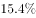，高于规模以上重点服务业企业8.2个百分点，增速比上年回落0.6个百分点。经营平稳面扩大，2016年4季度，的企业认为本企业综合经营状况良好或稳定，同比提高3.3个百分点，处于历史较高水平。

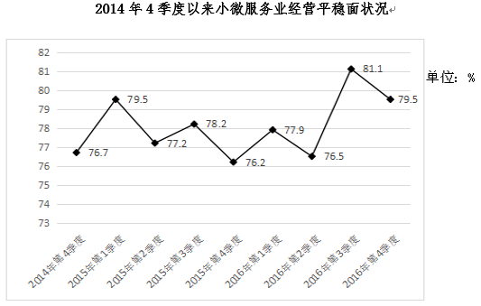

        2016年，小微服务业样本企业资产总计367亿元，同比增长，户均1643.7万元。负债合计194.8亿元，同比增长，低于资产增长速度1.2个百分点。资产负债率为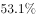，处于较为合理水平。实现利润总额4.6亿元，销售利润率为。小微服务业企业的资金和盈利水平均处于平稳状态。

        各主要行业中，水利、环境和公共设施管理业，信息传输、软件和信息技术服务业，租赁和商务服务业，房地产业的增速明显高于平均水平。

#### 第 1 题　qid 2047804 · 综合

2016年，该省小微服务业样本企业的营业收入比2015年大约多多少亿元？

- **A**. 5.3
- **B**. 10.7　✅
- **C**. 12.3
- **D**. 23.0

**答案**：B

**官方解析**

由题干“2016年······比2015年大约多······亿元”，可判定该题为增长量计算问题。定位材料第二段，2016年，该省小微服务业样本企业实现营业收入80.1亿元，同比增长，可得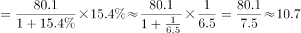亿元。

故正确答案为B。

---

#### 第 2 题　qid 2047812 · 增长

2016年，小微服务业经营平稳面同比扩大最显著的是：

- **A**. 1季度
- **B**. 2季度
- **C**. 3季度
- **D**. 4季度　✅

**答案**：D

**官方解析**

定位折线图中数据，第1季度：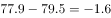个百分点；第2季度：个百分点；2016年第1季度和第2季度同比均减少，因此只比较第3季度和第4季度，第3季度扩大个百分点，第4季度扩大个百分点，所以2016年第4季度同比扩大最显著。

故正确答案为D。

---

#### 第 3 题　qid 2047826 · 平均数

2015-2016年，平均每季度大约有多少企业认为自身综合经营状况良好或稳定？

- **A**. 

- **B**. 

　✅
- **C**. 

- **D**. 

**答案**：B

**官方解析**

由题干“2015-2016年，平均每季度”，可判定该题为现期平均数问题。定位折线图中数据，平均每季度认为自身综合经营状况良好或稳定的企业大约有。

故正确答案为B。

---

#### 第 4 题　qid 2047842 · 增长

2016年，小微服务业的下列各行业，按营业收入同比变化量的大小排序正确的是：

- **A**. 
文化、体育和娱乐业卫生和社会工作科学研究和技术服务业教育
　✅
- **B**. 
文化、体育和娱乐业卫生和社会工作教育科学研究和技术服务业

- **C**. 
文化、体育和娱乐业科学研究和技术服务业卫生和社会工作教育

- **D**. 
卫生和社会工作文化、体育和娱乐业科学研究和技术服务业教育

**答案**：A

**官方解析**

定位表格中数据，文化、体育和娱乐业同比增加：亿元；卫生和社会工作同比增加：亿元；科学研究和技术服务业同比减少：亿元；教育同比增加：亿元。因此营业收入的变化量从大到小的排序为：文化、体育和娱乐业、卫生和社会工作、科学研究和技术服务业、教育。

故正确答案为A。

---

#### 第 5 题　qid 2047848 · 综合

下列说法不正确的是：

- **A**. 2016年，大多数小微服务业行业的营业收入同比有所增长
- **B**. 2015年，小微服务业样本企业的户均资产大约为1504万元　✅
- **C**. 2016年，小微服务业样本企业的户均负债大约为873万元
- **D**. 2016年，信息传输、软件和信息技术服务业的营业收入增加最多

**答案**：B

**官方解析**

A项：定位表格中数据，10个行业除了科学研究和技术服务业的营业收入同比都有所增长，正确；

B项：无法通过2016年的户均判定2015年的户均，因为户数变化没有给出，错误；

C项：定位文字材料第三段，小微服务业样本企业负债合计194.8亿元，小微服务业样本企业户数为，平均每户负债，正确；

D项：定位表格中数据，信息传输、软件和信息技术服务业的现期量和增长率均比除了水利、环境和公共设施管理业外的其它8个行业大。根据增长量比较口诀“大大则大”，则信息传输、软件和信息技术服务业增量大于其他8个行业。信息传输、软件和信息技术服务业增量，水利、环境和公共设施管理业增量，则信息传输、软件和信息技术服务业增量最大，正确。

本题为选非题，故正确答案为B。

---

### 材料 2

        2016年，广东民营经济增加值突破四万亿元。经初步核算，全年实现民营经济增加值42578.76亿元，按可比价计算，比上年同期增长，增幅高于同期GDP增幅0.3个百分点，其中第二产业增幅比同期GDP第二产业增幅高3个百分点。民营经济占GDP的比重为，比2010年提高3.9个百分点，占比逐年提高；对GDP增长的贡献率为，同比提高1.3个百分点，拉动GDP增速达4.2个百分点，民营经济的作用不断提升，是广东经济增长的主力军。

        分行业看，民营经济发展速度快于全部经济类型的行业有工业、金融业和其他服务业，其中民营工业实现增加值15898.95亿元，同比增长，比全部经济类型工业快3.3个百分点；民营经济占全部经济类型比重较大的行业有农林牧渔业、住宿餐饮业、批发零售业和房地产业，分别为、、和；民营经济对GDP贡献率较大的行业有工业、其他服务业，分别为、。

【注释】

        生产总值（GDP）：指按市场价格计算的一个地区所有常住单位在一定时期内生产活动的最终成果。从价格形态看，它是所有常住单位的增加值之和。

        增加值：总产出减去中间投入后的余额，反映一定时期内各部门、各单位生产经营活动的最终成果，也就是本部门、本单位对生产总值提供的份额。

#### 第 6 题　qid 2047712 · 增长

2016年广东民营经济第二产业实现的增加值约是第一产业的多少倍？

- **A**. 4.11
- **B**. 4.32
- **C**. 4.77　✅
- **D**. 5.17

**答案**：C

**官方解析**

根据题干所求“2016年······实现的增加值约是······的倍数”，且材料数据为2016年，可判定此题为现期倍数问题。定位第一个表格，民营经济第一产业、第二产业增加值分别为3631.01亿元、17306.17亿元，后者是前者的倍，最接近C项。

故正确答案为C。

---

#### 第 7 题　qid 2047720 · 比重

2016年广东民营经济中第三产业所占的比重相比2015年大约：

- **A**. 提高了0.1个百分点
- **B**. 降低了0.1个百分点　✅
- **C**. 提高了0.2个百分点
- **D**. 降低了0.2个百分点

**答案**：B

**官方解析**

根据题干所求“2016年······的比重相比2015年”，可判定此题为两期比重比较问题。定位文字材料第一段可得，民营经济增加值为42578.76亿元，增速为，定位第一个表格可得，第三产业增加值为21641.58亿元，增速为。根据两期比重差公式：，，因此比重下降，排除A、C，代入公式，比重差。

故正确答案为B。

---

#### 第 8 题　qid 2047738 · 增长

2015年广东民营工业实现的增加值约占当年GDP的：

- **A**. 

- **B**. 

　✅
- **C**. 

- **D**. 

**答案**：B

**官方解析**

根据题干所求“2015年······约占······”，选项为百分数，且材料数据为2016年，可判定此题为基期比重问题。定位文字材料第一段，2016年，民营经济增加值增速为，高于同期GDP增幅0.3个百分点，则GDP增速为，民营经济占GDP的比重为，则2016年GDP为亿元；定位文字材料第二段，2016年民营工业实现增加值为15898.95亿元，增速为，代入基期比重公式：，2015年比重为，略小于，最接近B项。

故正确答案为B。

---

#### 第 9 题　qid 2047748 · 综合

根据资料可知：

- **A**. 
2016年广东民营经济对GDP增长的贡献率高于其他经济类型
　✅
- **B**. 
广东民营经济占GDP的比重从2011年开始超过

- **C**. 
2016年广东的房地产市场中，国有经济占了近三分之一的份额

- **D**. 
民营经济仅在部分行业具有优势

**答案**：A

**官方解析**

A项：定位文字材料第一段，民营经济对GDP增长的贡献率为，则其他经济类型贡献率为，并且材料第一段最后一句说“民营经济的作用不断提升，是广东经济增长的主力军”再次强调了民营经济对GDP增长的贡献率最高，正确；

B项：定位文字材料第一段，民营经济占GDP比重为，比2010年提高3.9个百分点，占比逐年提高，则2010年比重为，无法判定2011年比重一定超过，错误；

C项：材料仅在第二段提及广东房地产业，没有国有经济占比相关的数据，无法判定，错误；

D项：根据材料无法判定民营经济所有行业情况，错误。

故正确答案为A。

---

#### 第 10 题　qid 2047754 · 综合

下列说法正确的是：

- **A**. 2016年珠三角地区民营经济占全省的比重相比2015年提高了超过0.5个百分点　✅
- **B**. 2016年广东各地区中，民营经济增速越慢的地区，当地民营经济占生产总值的比重也越低
- **C**. 2015年珠三角地区民营经济的增加值是广东其他各地区之和的3倍
- **D**. 2016年广东民营经济在各行业中的发展速度都是最快的

**答案**：A

**官方解析**

A项：定位表格，2016年珠三角民营经济增加值为31529.60亿元，增速为，定位文字材料第一段，全省民营经济增加值为42578.76亿元，增速为，代入两期比重差公式：，正确；

B项：定位表格，各地区民营经济增速由大到小为：珠三角粤东粤西粤北，占地区生产总值比重由大到小为：粤东粤西粤北珠三角，错误；

C项：选项所述是基期倍数，材料给的是现期值和增长率。如果直接算基期量的话计算量太大，因此我们可以先算出现期倍数，再通过增长率进行比较。

方法一：定位表格，珠三角民营经济增加值为31529.60亿元，其他地区之和为，前者是后者的；

方法二：（由于给出的文字材料和表格材料的数据有矛盾，文字材料第一段中民营经济增加值与表格中四地区增加值总和并不相等，若采用第一段民营经济增加值数据计算，结果如下。）定位文字材料第一段可得，民营经济增加值为42578.76亿元，则其他地区之和为，珠三角民营经济增加值是其他地区的。

因此我们发现现期倍数是不到三倍的，又由于珠三角的增速要快于其他三个地区的增速，所以珠三角的基期量相对其他地区更小，因此基期倍数更小，所以不到三倍，错误；

D项：定位文字材料第二段，仅给出部分行业速度快于全部经济类型，无法判定民营经济在所有行业中的速度都是最快的，错误。

故正确答案为A。

---

### 材料 3

        2016年，某省完成邮政通信业务总量6886.15亿元，同比增长，增幅比上年提高27.4个百分点。其中，完成邮政业务总量1879.99亿元，增长，增幅提高11.0个百分点；完成通信业务总量5006.16亿元，增长，增幅提高33.2个百分点。

        2016年，该省完成快递业务量76.72亿件，同比增长，占全国快递业务量的比重达到，比排名第二的Z省多16.80亿件。

        2016年，该省电话用户数为1.69亿，其中固定电话用户数为2609.7万，移动电话用户数为14349万，分别比上年减少197.4万户和203.1万户。移动电话中4G用户数为9085.30万，占移动电话用户的比重由上年的提升至。固定电话本地通话时长、长途通话时长以及移动电话通话时长同比分别减少、和，移动短信、彩信业务量分别减少和。

        2016年，该省固定互联网宽带用户数为2850.60万，宽带接入流量同比增长，其中8M及以上和20M及以上宽带接入用户占比分别为和，分别比上年提升26.2个和40.4个百分点，固定宽带用户均资费同比下降。该省移动互联网用户数达1.15亿，移动互联网接入流量同比增长，移动流量资费水平同比下降，通信资费总体水平同比下降。

#### 第 11 题　qid 2047806 · 比重

2016年该省完成的通信业务总量占邮政通信业务总量的比重相比2014年大约：

- **A**. 提高了0.6个百分点
- **B**. 降低了0.6个百分点
- **C**. 提高了1.9个百分点
- **D**. 降低了1.9个百分点　✅

**答案**：D

**官方解析**

由题干“2016年······比重相比2014年”，可判定该题为两期比重问题。定位文字材料第一段“2016年，某省完成邮政通信业务总量6886.15亿元，同比增长，增幅比上年提高27.4个百分点。其中，完成通信业务总量5006.16亿元，增长，增幅提高33.2个百分点”，则该省完成的通信业务总量2016年相比2014年的增长率，邮政通信业务总量2016年相比2014年的增长率。该省完成的通信业务总量的，邮政通信业务总量的，，比重下降，排除AC。代入两期比重公式，即降低2.1个百分点，与D最接近。

故正确答案为D。

---

#### 第 12 题　qid 2047820 · 综合

2015年该省报纸的订销完成量约是杂志的多少倍？

- **A**. 12.3　✅
- **B**. 13.9
- **C**. 15.1
- **D**. 16.7

**答案**：A

**官方解析**

由题干“2015年，······是······的多少倍”，结合材料为2016年，可判定该题为基期倍数问题。定位表格材料“报纸的订销完成量7.8亿件，增速；杂志的订销完成量5596.04万件，增速”，代入基期倍数公式，只有A项小于13.9。

故正确答案为A。

---

#### 第 13 题　qid 2047824 · 增长

2016年该省移动电话用户中4G用户数比2015年大约增加了多少万？

- **A**. 3154
- **B**. 3483　✅
- **C**. 3844
- **D**. 4239

**答案**：B

**官方解析**

题干所求为“2016年······比2015年大约增加了多少万”，可判定该题为增长量计算问题。定位文字材料第三段“2016年该省移动电话用户数为14349万，比上年减少203.1万户。移动电话中4G用户数为9085.30万，占移动电话用户的比重由上年的提升至”。则2015年移动电话用户数为，，2016年该省移动电话用户中4G用户数比2015年增加了，与B最接近。

故正确答案为B。

---

#### 第 14 题　qid 2047830 · 综合

根据资料，下列选项无法得出的是：

- **A**. 2016年该省邮政通信业务总量的增长速度约是上一年的2倍
- **B**. 2016年该省手机流量的资费水平大幅降低
- **C**. 4G正成为该省移动电话用户的主流制式
- **D**. 固定宽带运营商未采取有效降低资费水平的措施　✅

**答案**：D

**官方解析**

A项：根据文字材料第一段“2016年，某省完成邮政通信业务总量6886.15亿元，同比增长，增幅比上年提高27.4个百分点”可知，2016年该省邮政通信业务总量的增长速度为，2015年的增长速度为，，正确；

B项：根据文字材料第四段“该省移动互联网用户数达1.15亿，移动互联网接入流量同比增长，移动流量资费水平同比下降”，同比下降属于大幅降低，正确；

C项：根据文字材料第三段“2016年，移动电话中4G用户数为9085.30万，占移动电话用户的比重由上年的提升至”，所占比重超过一半，正确；

D项：根据文字材料第四段“2016年，该省固定互联网宽带用户数为2850.60万，宽带接入流量同比增长，固定宽带用户均资费同比下降”可知，固定宽带用户均资费同比下降，即固定宽带运营商采取了降低资费水平的措施，错误。

本题为选非题，故正确答案为D。

---

#### 第 15 题　qid 2047834 · 综合

根据资料可知：

- **A**. 2015年该省的快递业务量比Z省少
- **B**. 2016年该省主要邮政普遍服务项目均出现下滑
- **C**. 2016年该省8M以下宽带接入用户的占比相较于上一年减少了一半以上　✅
- **D**. 2016年该省电话通话时长和短信业务量的下降是由于移动互联网的迅速发展所致

**答案**：C

**官方解析**

A项：根据文字材料第二段“2016年，该省完成快递业务量76.72亿件，同比增长，占全国快递业务量的比重达到，比排名第二的Z省多16.80亿件”可知，仅提供2016年Z省数据，2015年数据无法得知，故无法判断2015年两省数据关系，错误；

B项：根据表格材料数据可知，函件的增长率为正，而非均出现下滑，错误；

C项：根据文字材料第四段“2016年，8M及以上和20M及以上宽带接入用户占比分别为和，分别比上年提升26.2个和40.4个百分点”可知，2016年该省8M以下宽带接入用户的占比为，2015年该省8M以下宽带接入用户占比为，2016年比2015年减少了，正确；

D项：根据文字材料第三段“固定电话本地通话时长、长途通话时长以及移动电话通话时长同比分别减少、和，移动短信、彩信业务量分别减少和”可知，2016年该省电话通话时长和短信业务量是下降，但无法看出原因，错误。

故正确答案为C。

---
