# 2017年广州市公务员录用考试《行测》题（单考区卷）

> 省考 · 2017 年 · 6 个模块 · 共 98 题

- [政治理论](#%E6%94%BF%E6%B2%BB%E7%90%86%E8%AE%BA) · 1 题
- [常识判断](#%E5%B8%B8%E8%AF%86%E5%88%A4%E6%96%AD) · 14 题
- [言语理解与表达](#%E8%A8%80%E8%AF%AD%E7%90%86%E8%A7%A3%E4%B8%8E%E8%A1%A8%E8%BE%BE) · 25 题
- [数量关系](#%E6%95%B0%E9%87%8F%E5%85%B3%E7%B3%BB) · 13 题
- [判断推理](#%E5%88%A4%E6%96%AD%E6%8E%A8%E7%90%86) · 30 题
- [资料分析](#%E8%B5%84%E6%96%99%E5%88%86%E6%9E%90) · 15 题

---

## 政治理论

### 第 1 题　qid 2045550 · 时事政治

中央政治局于2016年12月26日至27日召开民主生活会，习近平总书记主持会议并发表重要讲话。以下不符合这次会议精神的是：

- **A**. 中央政治局的同志必须自觉在思想上政治上行动上同以习近平同志为核心的党中央保持高度一致
- **B**. 要以加强和规范党内政治生活、加强党内监督为抓手，推动全面从严治党不断深化
- **C**. 对党忠诚、永不叛党，是党章对党员的最高要求　✅
- **D**. 党要赢得民心，党中央要有权威，必须廉洁

**答案**：C

**官方解析**

本题考查了时政的知识点。
A项正确，会议认为，党的十八届六中全会正式明确习近平总书记的核心地位，体现了党和人民的根本利益，对保证党和国家兴旺发达、长治久安，具有十分重大而深远的意义。中央政治局的同志必须自觉在思想上、政治上、行动上同以习近平同志为核心的党中央保持高度一致。故选项表述正确。
B项正确，会议强调，全面从严治党永远在路上。我们不能满足于已经取得的成绩，不能有松松劲、歇歇脚的心态，要以加强和规范党内政治生活、加强党内监督为抓手，推动全面从严治党不断深化，实现党内政治生态根本好转。故选项表述正确。
C项错误，习近平在会上指出，对党忠诚、永不叛党，是党章对党员的基本要求，而非最高要求。故选项表述错误。
D项正确，习近平在会上指出，党要赢得民心，党中央要有权威，必须廉洁。故选项表述正确。
本题为选非题，故正确答案为C。

---

## 常识判断

### 第 1 题　qid 2045552 · 人文常识

根据教育部要求，我国教材全面落实了“十四年抗战”的概念。“十四年抗战”是指从“九一八事变”爆发后开始的抗战，包含局部抗战和全面抗战两个阶段。“九一八事变”发生于（  ）年。

- **A**. 1928
- **B**. 1931　✅
- **C**. 1935
- **D**. 1937

**答案**：B

**官方解析**

本题考查毛中特。
九一八事变是日本在中国东北蓄意制造并发动的一场侵华战争，是日本帝国主义侵华、中国人民十四年抗战的开端，时间为1931年9月18日。
故正确答案为B。

---

### 第 2 题　qid 2045554 · 人文常识

清人黄生说：“读唐诗，一读了然，再过亦无异解。惟读杜诗，屡进屡得。”从读诗的角度说明了杜诗的博大精深。以下诗句，能反映杜诗仁爱精神的是：

- **A**. 致君尧舜上，再使风俗淳
- **B**. 日暮苍山远，天寒白屋贫
- **C**. 感时花溅泪，恨别鸟惊心　✅
- **D**. 海上生明月，天涯共此时

**答案**：C

**官方解析**

本题考查文学常识。
杜诗，清代文学家、批评家金圣叹所说的“六才子书”之一，即杜甫诗作的总称。
A项错误，“致君尧舜上，再使风俗淳”出自杜甫的《奉赠韦左丞丈二十二韵》。其大意为辅佐君王成为尧舜那样的人，再使百姓的风气好转到原始状态，这里有道家的返本归真的气象与意境。没有反映出杜诗的仁爱精神，排除。
B项错误，“日暮苍山远，天寒白屋贫”出自唐代诗人刘长卿的《逢雪宿芙蓉山主人》。不属于“杜诗”的范畴。故选项表述错误，排除。
C项正确，“感时花溅泪，恨别鸟惊心”出自杜甫的诗作《春望》。其大意为：忧心伤感见花开却流泪，别离家人鸟鸣令我心悸。这句诗表达了杜甫痛感国破家亡的苦恨，越是美好的景象，越会增添内心的伤痛，也体现了杜甫时时刻刻把天下的安危和人民的忧乐视为己任的深沉广博的仁爱精神。故选项表述正确，当选。
D项错误，“海上生明月，天涯共此时”出自唐代诗人张九龄的《望月怀古》。不属于杜诗的范畴。故选项表述错误，排除。
故正确答案为C。

---

### 第 3 题　qid 2045560 · 人文常识

古人常以梅花入诗，以此营造清高、孤傲、坚忍等意境。以下诗句描写梅花的是：

- **A**. 冲天香阵透长安，满城尽带黄金甲
- **B**. 疏影横斜水清浅，暗香浮动月黄昏　✅
- **C**. 忽如一夜春风来，千树万树梨花开
- **D**. 乱花渐欲迷人眼，浅草才能没马蹄

**答案**：B

**官方解析**

本题主要考查文学常识。需结合具体选项予以分析。
A项错误，该诗句出自唐代黄巢《不第后赋菊》，意思是“盛开的菊花璀璨夺目，阵阵香气弥漫长安，满城均沐浴在芳香的菊意中，遍地都是金黄如铠甲般的菊花”，故该诗句描写的是菊花，而不是梅花，排除。
B项正确，该诗句出自北宋林逋《山园小梅》。“众芳摇落独暄妍，占尽风情向小园。疏影横斜水清浅，暗香浮动月黄昏”。意思是“百花凋零，独有梅花迎着寒风昂然盛开，那明媚艳丽的景色把小园的风光占尽。稀疏的影儿，横斜在清浅的水中，清幽的芬芳浮动在黄昏的月光之下”，故该诗句描写的是梅花，当选。
C项错误，该诗句出自唐代岑参《白雪歌送武判官归京》。此诗是一首咏雪送人之作。诗句中的“梨花”是胡地八月的雪花，排除。
D项错误，该诗句出自唐代白居易《钱塘湖春行》，意思是“鲜花缤纷，几乎迷人眼神；野草青青，刚好遮没马蹄。”故该诗句描写的是指纷繁开放的春花，而不是描写梅花，排除。
故正确答案为B。

---

### 第 4 题　qid 2045590 · 人文常识

以下典故按照发生的时间先后顺序排列正确的是：
①指鹿为马  ②请君入瓮  ③约法三章  ④卧薪尝胆

- **A**. ④①②③
- **B**. ①④③②
- **C**. ④①③②　✅
- **D**. ①④②③

**答案**：C

**官方解析**

本题主要考查文学常识。
①指鹿为马：出自司马迁《史记·秦始皇本纪》，“（秦朝丞相）赵高欲为乱，恐群臣不听，乃先设验，持鹿献于二世（秦二世），曰：‘马也。’二世笑曰：‘丞相误邪？谓鹿为马。’问左右，左右或默，或言马以阿顺赵高。”意思是指着鹿，说是马。比喻故意颠倒黑白，混淆是非。该成语典故发生在秦朝末年。
②请君入瓮：出自宋朝司马光《资治通鉴》，比喻用某人整治别人的办法来整治他自己。该成语讲的是唐朝女皇武则天时期的故事。
③约法三章：出自汉朝司马迁《史记·高祖本纪》，“与父老约法三章耳：杀人者死；伤人及盗抵罪。”原指订立法律与人民相约遵守。后泛指订立简单的条款。该成语典故讲的是秦朝灭亡时（公元前206年）刘邦攻打秦国都城咸阳，秦王投降，与百姓约法三章：“杀人者要处死，伤人者要抵罪，盗窃者也要判罪！”父老、豪杰们都表示拥护约法三章。
④卧薪尝胆：出自《史记·越王勾践世家》，意思是睡觉睡在柴草上，吃饭睡觉前都尝一尝苦胆。形容人刻苦自励，发奋图强。公元前496年，越国国王勾践即位，吴王趁越国刚刚遭到丧事，就发兵打越国，勾践大败，后来越王勾践卧薪尝胆，大败吴国的故事。该成语典故发生在春秋时期。
因此，四个成语的正确排序为④①③②。
故正确答案为C。

---

### 第 5 题　qid 2045568 · 人文常识

吴稚晖在评论历史人物时说，有人“全靠一部《史记》”，而有人“全不在乎什么《通鉴》不《通鉴》”；又有人“有诗文集大见轻重”，而有人“有同样的诗文集，丝毫不在其人是非不加轻重”。可以推知，吴稚晖所说的“全不在乎什么《通鉴》不《通鉴》”和“有同样的诗文集丝毫不在其人是非不加轻重”分别是指：

- **A**. 司马迁，王阳明
- **B**. 司马迁，王安石
- **C**. 司马光，王阳明
- **D**. 司马光，王安石　✅

**答案**：D

**官方解析**

本题主要考查文学常识。吴稚晖曾论历史人物说，“如以司马迁、司马光为譬，一是全靠一部《史记》，一是全不在乎什么《通鉴》不《通鉴》。又以苏轼、王安石为譬，一则有诗文集大见轻重，一则有同样的诗文集，丝毫在其人是非不加轻重”。简言之，司马迁和苏轼，更多是人以文重；而司马光和王安石，则其事功足以传世，其立言方面的卓绝，便不起决定作用。因此，吴稚晖所说的“全不在乎什么《通鉴》不《通鉴》”是指司马光；“有同样的诗文集，丝毫在其人是非不加轻重”是指王安石。
因此，A、B、C项错误；D项正确。
故正确答案为D。

---

### 第 6 题　qid 2045576 · 人文常识

以下说法正确的是：

- **A**. 15世纪末，哥伦布发现了新大陆——印度，并称当地的土著居民为印第安人
- **B**. 瓦特对蒸汽机的改良，标志着工业革命开始
- **C**. 16世纪中期，西班牙战胜了拥有号称“无敌舰队”的英国，确定了海上霸主的地位
- **D**. 英国颁布的《权利法案》，标志着君主立宪制的资产阶级统治正式确立　✅

**答案**：D

**官方解析**

本题主要考查历史常识。需结合具体选项予以分析。
A项错误，15世纪末，哥伦布发现了新大陆为美洲，而不是印度。
B项错误，第一次工业革命开始于18世纪珍妮纺织机的出现；而瓦特改良蒸汽机只是标志着进入蒸汽时代，不是工业革命开始的标志。
C项错误，“无敌舰队”是西班牙16世纪后期著名的海上舰队。1588年，西班牙在同英国争夺海洋霸权的斗争中，无敌舰队几乎全军覆没。从此，西班牙海上霸主地位被英国取代。故选项表述错误。
D项正确，1689年，英国颁布《权利法案》确立了议会拥有权力高于王权的原则，标志着君主立宪制开始在英国建立，为英国资产阶级发展扫清了道路。
故正确答案为D。

---

### 第 7 题　qid 2045578 · 科技常识

植物纹样作为以表现植物为主的装饰手段，是与老百姓生活息息相关的艺术形式，是伦理、吉祥等思想道德和情感意念的载体和传播情感的媒介。以下可以表达人们向往爱情美满幸福的植物纹样是：

- **A**. 梅花瑞鸟纹
- **B**. 宝相牡丹纹
- **C**. 荷花蝴蝶纹　✅
- **D**. 团花菊花纹

**答案**：C

**官方解析**

本题主要考查文化常识。中国传统的植物纹样比较常见的有：牡丹，寓意着儒雅等意；菊花，寓意着延年益寿，举家欢乐等意；兰花，寓意人的性格或者品格高尚；竹子，象征着美好的祝愿等。中国传统的植物纹样的运用有一个很大的特点，即喜欢运用谐音字，如菊对“举”，竹对“祝”，藕对“偶”，寓意夫妻幸福。
A项错误，梅花纹的含义：梅瓣为五，民间又藉其表示五福：福、禄、寿、喜、财。梅是花中寿星，梅能于老干发新枝，又能御寒开花，故古人用以象征不老不衰。梅花纹还有吉祥的寓意。
B项错误，宝相花纹多用做辅纹来衬托主纹，从而使装饰效果更加富丽堂皇；牡丹自唐代以来被视为繁荣昌盛、美好幸福的象征。因此，宝相牡丹纹，主要寓意是繁荣昌盛、美好幸福。
C项正确，自古对荷花的评价就很高，“出淤泥而不染”说的就是荷花的纯洁和个性，蝴蝶寓意着成双成对，美满爱情。因此荷花蝴蝶纹，是表达了人们爱情美满幸福的植物纹。
D项错误，团花纹，寓意“吉祥”之意；菊花，寓意着延年益寿，举家欢乐等意。因此，团花菊花纹，寓意延年益寿，举家欢乐、吉祥之意。
故正确答案为C。

---

### 第 8 题　qid 2045584 · 法律常识

“开车不喝酒，喝酒不开车”是现在道路交通常用的标语。为保障交通安全，我国《刑法》对“酒后驾车”的相关情形也做了规定。在不考虑驾驶人年龄、行为能力等前提下，下列情形与刑法罪名对应关系正确的是：

- **A**. 在道路上，酒后驾驶机动车辆——危险驾驶罪
- **B**. 在道路上，醉酒驾驶机动车辆——危险驾驶罪　✅
- **C**. 在道路上，酒后驾驶机动车辆——交通肇事罪
- **D**. 在道路上，醉酒驾驶机动车辆——交通肇事罪

**答案**：B

**官方解析**

本题主要考查法律常识——危险驾驶罪。根据《刑法》第133条之一第1款规定，在道路上驾驶机动车，有下列情形之一的，处拘役，并处罚金：（一）追逐竞驶，情节恶劣的；（二）醉酒驾驶机动车的；（三）从事校车业务或者旅客运输，严重超过额定乘员载客，或者严重超过规定时速行驶的；（四）违反危险化学品安全管理规定运输危险化学品，危及公共安全的。
A项错误，“酒后”错误，应当是“醉酒”。
B项正确，符合危险驾驶罪的构成要件。
C项错误，交通肇事罪，是指违反道路交通管理法规，发生重大交通事故，致人重伤、死亡或者使公私财产遭受重大损失，依法被追究刑事责任的犯罪行为。酒后驾驶机动车，不一定就构成交通肇事罪。
D项错误，醉酒驾驶机动车，不一定就构成交通肇事罪。
故正确答案为B。

---

### 第 9 题　qid 2045588 · 经济常识

“洛阳纸贵”体现的经济学常识是：

- **A**. 商品价值决定商品价格
- **B**. 供求关系影响商品价格　✅
- **C**. 通货膨胀影响市场价格
- **D**. 宏观调控调节市场价格

**答案**：B

**官方解析**

本题考查经济常识。
洛阳纸贵是中国古代成语，原指西晋都城洛阳之纸，因大家争相传抄左思的作品《三都赋》，以至一时供不应求，货缺而贵。由故事内容可知是由于供求关系影响到了商品价格，与商品价值、通货膨胀和宏观调控无关，故B选项符合题意。
故正确答案为B。

---

### 第 10 题　qid 2045610 · 法律常识

下列处理保险合同纠纷案件的说法，符合我国相关法律法规的是：

- **A**. 陈女士购买了一份意外伤害保险，她收到的投保单与保险单不一致，应以保险单为准
- **B**. 王先生所在的单位为他购买了一份车辆盗损险，他的保险凭证记载的时间不同，以形成时间在前的为准
- **C**. 张先生购买了一份财产损失保险，该保险单的非格式条款和格式条款不一致，以格式条款为准
- **D**. 李女士购买了一份重大疾病保险，保险单存有手写和打印两种方式，以双方签字、盖章的手写部分的内容为准　✅

**答案**：D

**官方解析**

本题考查法律常识。主要涉及保险法的相关内容。
最高人民法院关于适用《中华人民共和国保险法》若干问题的解释（二）中第十四条规定：保险合同中记载的内容不一致的，按照下列规则认定：（一）投保单与保险单或者其他保险凭证不一致的，以投保单为准。但不一致的情形系经保险人说明并经投保人同意的，以投保人签收的保险单或者其他保险凭证载明的内容为准；（二）非格式条款与格式条款不一致的，以非格式条款为准；（三）保险凭证记载的时间不同的，以形成时间在后的为准；（四）保险凭证存在手写和打印两种方式的，以双方签字、盖章的手写部分的内容为准。
A项错误，应以投保单为准。
B项错误，应以形成时间在后的为准。
C项错误，应以非格式条款为准。
D项正确，符合第四种情形。若保险凭证存在手写和打印两种方式的话，应以双方签字、盖章的手写部分的内容为准。
故正确答案为D。

---

### 第 11 题　qid 2045614 · 人文常识

不要靠近高压带电体是安全用电常识。但是我们经常可以看到，站在高压线上的小鸟并不会发生触电事故。这是因为：

- **A**. 电线上有绝缘层
- **B**. 小鸟爪上的角质层不导电
- **C**. 小鸟能承受高压电
- **D**. 小鸟两爪间的电压很低　✅

**答案**：D

**官方解析**

本题考查物理常识。主要涉及高压触电的相关内容。
D项正确：高压触电的两种方式：高压电弧触电和跨步电压触电。而跨步电压触电的本质原因是（以人为例）：人的两只脚离高压电源的距离不同（除非只用一条腿跳），这就造成两条腿形成了较大的电压差，导致电流从一条腿流进去，从另一条腿流出来，就触电了。但是小鸟呢？它的两条腿之间的距离很小，导致两条腿之间的电压很低，此时电流就不会从鸟的一条腿流进去，从另一条腿流出来，电流只会通过电线流过去（这可以看成是短路），所以鸟就安然无恙了。
故正确答案为D。

---

### 第 12 题　qid 2045694 · 地理国情

茶马古道是位于我国西南地区的贸易通道。它从云南和四川茶叶产地出发，穿过横断山脉、跨越几大河流向西延伸，覆盖云贵高原和青藏高原，通往喜马拉雅山脉南部南亚次大陆。以下河流不流经茶马古道的是：

- **A**. 左江　✅
- **B**. 金沙江
- **C**. 怒江
- **D**. 雅砻江

**答案**：A

**官方解析**

A项符合题意：左江是西江水系上游支流郁江的最大支流，发源于越南与广西交界的枯隆山。上游在越南境内称奇穷河（又叫黎溪），于凭祥市边境平而关进入中国境内后称平而河。左江既不流经云贵高原，也不流经青藏高原，故不可能流经茶马古道。
B项不符合题意：金沙江的发源地为青海省唐古拉山主峰各拉丹冬雪山，位于青藏高原，故流经茶马古道。
C项不符合题意：怒江是中国西南地区的大河流之一，发源于青藏高原的唐古拉山南麓的吉热拍格，流经茶马古道。
D项不符合题意：雅砻江是金沙江的最大支流，是中国水能资源最富集的河流之一，发源于巴颜喀拉山（位于青藏高原）南麓，流经茶马古道。
本题为选非题，故正确答案为A。

---

### 第 13 题　qid 2045622 · 科技常识

关于物理学原理在实际生活中的运用，以下说法错误的是：

- **A**. 气压越高，沸点越低——高压锅能更快地煮好食物　✅
- **B**. 冰刀作用于冰面的压力促使冰面融化——溜冰运动员能快速在冰面移动
- **C**. 凸面镜的视野比平面镜广阔——汽车前方两侧的后视镜是凸面镜
- **D**. 冷空气下沉——空调安装在房间上方

**答案**：A

**官方解析**

A项错误：沸腾就是液体分子离开液体变成气体分子的剧烈过程，液体表面的气压越高，液体分子离开液面变成气体更加困难，离开液面必须获得更高的能量，所以需要更高的温度，即沸点会有所升高。高压锅正是运用气压越高，沸点越高这一原理使得食物在高温条件下更容易煮熟。
B、C、D三项均正确。
本题为选非题，故正确答案为A。

---

### 第 14 题　qid 2045628 · 科技常识

近期，中科院的一个研究课题组发现：用高能电子束辐射医疗废弃物，可以直接将其中抗生素残留降解为无机或有机小分子。其应用的主要原理是：电子束辐射在水体中产生的活性自由基具有某种作用能够降解抗生素。活性自由基与抗生素发生了：

- **A**. 基因突变
- **B**. 链式反应
- **C**. 聚合反应
- **D**. 氧化还原反应　✅

**答案**：D

**官方解析**

D项正确：高能电子束辐照可以直接将医疗废弃物中抗生素残留降解为无机或有机小分子，其主要机理为电子束辐照在水体中产生的活性自由基与抗生素发生了氧化还原反应；
A项错误：DNA分子中发生碱基对的替换、增添和缺失，而引起的基因结构的改变，叫做基因突变。题干课题不涉及DNA，故不可能是基因突变；
B项错误：链式反应指核物理中，核反应产物之一又引起同类核反应继续发生、并逐代延续进行下去的过程。题干课题不涉及核反应，故不可能是链式反应；
C项错误：聚合反应是由单体合成聚合物的反应过程。题干课题涉及的是将抗生素残留降解为小分子，不可能是聚合反应。
故正确答案为D。

---

## 言语理解与表达

### 第 1 题　qid 2045558 · 逻辑填空

我们在这里驻足聆听，触摸       跳动的脉搏，在与先人的凝视和对话中，铭刻人生信念的方位，增进砥砺前行的动力。
填入下列横线处的词语，最恰当的一项是：

- **A**. 社会
- **B**. 当下
- **C**. 未来
- **D**. 历史　✅

**答案**：D

**官方解析**

本题四个选项在语义上差别较大，因此重点注意选项与文段的语境对应，而后文明确指出“在与先人的凝视和对话中”，故此处“触摸······跳动的脉搏”应当体现过去，对应D项“历史”。
A项“社会”无从体现；B项“当下”体现现在；C项“未来”体现今后，均与文段内容对应有误，均排除。
故正确答案为D。
【文段出处】《“故土”是根，“圣土”是魂》

---

### 第 2 题　qid 2045562 · 逻辑填空

在养老举措、制度设计等各方面      更多“老吾老以及人之老”的同理心，是一座城市、一个社会对待老年人应有的温情与敬意。
填入下列横线处的词语，最恰当的一项是：

- **A**. 灌注　✅
- **B**. 灌溉
- **C**. 灌输
- **D**. 灌制

**答案**：A

**官方解析**

文段意在表达在养老的制度设计中，多一些“老吾老以及人之老”的同理心是我们应该做的事情。结合选项可知，只有A项“灌注”常用来指把某一感情融入某物中，用在此处语义合适，当选。
B项“灌溉”指用水浇地，C项“灌输”指传播、输送思想、知识等，D项“灌制”指录音制造，均与抽象名词“同理心”搭配不当，且与文意不符，均排除。
故正确答案为A。

---

### 第 3 题　qid 2045564 · 逻辑填空

树立法律权威，就要使法治原则       到国家与社会每一层次、每一角落，让全体公民信仰法治，对法律存有敬畏之心。
填入横线处的词语最恰当的一项是：

- **A**. 深入
- **B**. 融入
- **C**. 渗透　✅
- **D**. 扩大

**答案**：C

**官方解析**

文段意指要让法治原则在国家与社会每一个层次、每一角落都能得到全面的体现，C项“渗透”比喻一种思想或势力逐渐向多方面浸透，这一动作能够非常形象地体现出这一原则如同流水一般，慢慢遍及每一个层次和角落，用于此处最为恰当。
A项“深入”虽可搭配，但不及“渗透”能够体现“遍及”这种语义，对比之下可以排除；
B项“融入”指小的事物进入大的整体，成为整体的一部分，与后文“国家与社会的每一层次、每一角落”搭配不当，排除；
D项“扩大”侧重强调范围、领域的扩大，文段并未重点体现由小及大的关系，排除。
故正确答案为C。
【文段出处】《彰显法治的力量》

---

### 第 4 题　qid 2045566 · 逻辑填空

文化自信不是天上掉下来的，也不是仅仅在嘴上说说的，更不是虚无缥缈的“            ”。文化自信来自对民族历史的深刻了解，对国家现实的全面把握，对发展战略的正确设计，对前途目标的精准判断。
填入画横线部分最恰当的一项是：

- **A**. 画饼充饥
- **B**. 纸上谈兵
- **C**. 空中楼阁　✅
- **D**. 水中捞月

**答案**：C

**官方解析**

根据前文“虚无缥缈”可知，横线处表达文化自信不是虚幻的，C项“空中楼阁”比喻虚幻的事物或脱离实际的空想，符合文意。
A项“画饼充饥”比喻用空想来安慰自己，B项“纸上谈兵”比喻空谈理论，不能解决实际问题，D项“水中捞月”比喻去做根本做不到的事情，只能白费力气。文段中重点强调文化自信不是虚幻的，而是源自“对民族历史的了解...”，有其真实的来源，并未提及“安慰自己”、“解决实际问题”、“白费力气”，故A、B、D三项均与文意不符，均排除。
故正确答案为C。

---

### 第 5 题　qid 2045572 · 逻辑填空

中国是文明古国，礼仪教化之邦。如果有人在大庭广众之下喧哗不止，则不免让人          。
填入横线处的词语，最恰当的一项是：

- **A**. 侧目而视　✅
- **B**. 恨之入骨
- **C**. 置若罔闻
- **D**. 不以为然

**答案**：A

**官方解析**

根据文段语境可知，人们对于大庭广众之下大声喧哗的行为是一种很厌恶的态度，对应选项，A项“侧目而视”指斜着眼睛看，形容畏惧而又愤恨，符合文段语境且表意十分形象，当选。
B项“恨之入骨”形容痛恨到极点，程度过重，排除；C项“置若罔闻”指不予理睬，无法体现人们对于大声喧哗行为的愤怒态度，排除；D项“不以为然”指不认为是对的，无法形容人们的厌恶和愤怒，排除。
故正确答案为A。

---

### 第 6 题　qid 2045556 · 逻辑填空

量子力学认为真空并非“             ”，而是充斥着大量“虚”的粒子和反粒子对。它们同时产生，刹那之间又相互      。
依次填入下列横线处的词语，最恰当的一组是：

- **A**. 一无所有  淹没
- **B**. 空谷幽兰  迸发
- **C**. 熙熙攘攘  吞噬
- **D**. 空无一物  湮灭　✅

**答案**：D

**官方解析**

第一空，分析可知横线处为对“真空”的具体解释说明，且与后文“充斥着大量的粒子”形成反义并列关系。A项“一无所有”和D项“空无一物”都可以与“真空”对应且与后文语义相反，符合语境，保留；B项“空谷幽兰”比喻人品高雅，与文段语义无关，排除；C项“熙熙攘攘”形容人来人往，非常热闹拥挤，无法与“真空”形成对应，排除。
第二个空，形容粒子产生的刹那又消失，对比选项，D项“湮灭”除了指埋没、磨灭、消失以外，还可指物理上一种基本粒子和它的反粒子相遇时，两个粒子一起“消失”而转化为他种粒子的现象，符合文段语义，当选；A项“淹没”指大水漫过，比如“洪水淹没了村庄”，无法形容文段中的物理现象，排除。
故正确答案为D。

---

### 第 7 题　qid 2045570 · 逻辑填空

互联网就是看待争议、弥合争议的窗口。观点      、       、      ，莫不投射其中，像极了一件布满裂纹却又浑然天成的钧瓷。
依次填入画横线部分最恰当的一项是：

- **A**. 交流，交锋，交融　✅
- **B**. 交锋，交融，交流
- **C**. 交融，交流，交锋
- **D**. 交流，交融，交锋

**答案**：A

**官方解析**

分析文段语境可知，横线处三个词语应呈现递进的语义，“交流”指信息交换的过程，“交锋”指相互争论的过程，“交融”指融合在一起的过程，而观点应先双方相互交换，然后争论磨合，最后达到统一，结合选项，A项符合该递进关系。
故正确答案为A。

---

### 第 8 题　qid 2045574 · 逻辑填空

家庭文明建设以培养和践行社会主义核心价值观为根本，以文明家庭创建活动为载体，以注重       、注重       、注重       为着力点，唤醒广大家庭崇德向善的道义自觉。
依次填入画横线部分最恰当的一项是：

- **A**. 家风  家教  家庭
- **B**. 家庭  家风  家教
- **C**. 家庭  家教  家风　✅
- **D**. 家风  家庭  家教

**答案**：C

**官方解析**

分析文段语境可知，横线处三个词语应有一定的逻辑顺序，“家庭”指亲属之间所构成的社会生活单位，“家教”指家长对于子女进行的关于道德、礼节的教育，“家风”指一个家庭或家族的传统风尚，这三者关系应为先有家庭，再有家长对于子女进行教育，最后才会形成一个家庭的传统风尚，故对应C项，符合该逻辑关系。
A、B、D三项均不能体现出这一递进关系，均排除。
故正确答案为C。

---

### 第 9 题　qid 2045582 · 逻辑填空

“一带一路”       是产品、企业、投资走出去，服务、标准       应走出去，       要“走进去”——关键是产能、服务要走进去，走进“一带一路”沿线六十五个国家。
依次填入下列横线处的词语，最恰当的一组是：

- **A**. 既然，还，更加
- **B**. 不仅，也，而且　✅
- **C**. 如果，但，并且
- **D**. 即使，都，甚至

**答案**：B

**官方解析**

根据文意可知，第一空与第二空均在讲“走出去”，故填入虚词应表并列或递进。A项“既然······”表示前提条件，排除；C项“如果······但”表转折，排除；D项“即使······都”搭配错误，排除。B项“不仅······也”表递进，语意合适，锁定正确答案为B。
验证第三空，“走进去”比“走出去”有更高的要求，故第三空应填入表递进的虚词，B项“而且”符合语境，验证正确。
故正确答案为B。
【文段出处】《“一带一路”催生世界型国家》

---

### 第 10 题　qid 2045586 · 逻辑填空

世界发展不应单峰耸立，       不应有孤岛。经济全球化浪潮中，“每一朵浪花有它的精彩”，       彼此声浪相助，       形成滚滚发展的春潮。
依次填入下列横线处的词语，最恰当的一组是：

- **A**. 也，因为，所以
- **B**. 更，只有，才能　✅
- **C**. 却，既然，那么
- **D**. 就，无论，并且

**答案**：B

**官方解析**

第一空，“不应单峰耸立”和“不应有孤岛”语义方向一致，故横线处可填入表示并列或递进的关联词，排除C、D两项。
第二空、第三空，根据文意可知，“彼此声浪相助”为对策，是“形成滚滚发展的春潮”的前提，故B项“只有······才能”语义正确，当选。A项“因为······所以”表示因果，排除。
故正确答案为B。
【文段出处】《为全球治理贡献中国智慧》

---

### 第 11 题　qid 2045684 · 片段阅读

新常态下，“共享经济”为经济结构调整和产业结构转型提供了新的思路。在信息化时代，物流行业具有覆盖范围广、涉及面多，且物流市场运营主体小而散、运营环节多而杂的特点，尤其需要企业、物流公司等多方共享信息和资源，变革物流运行模式和组织模式，全面推行信息化和智能化，通过简约、高效、完善的平台完成资源整合。
这段文字主要说明了：

- **A**. “共享经济”模式应主要用于物流行业
- **B**. “共享经济”模式对物流行业有着重要的意义　✅
- **C**. 没有“共享经济”模式，物流行业的发展前景堪忧
- **D**. 物流行业和“共享经济”模式的紧密结合

**答案**：B

**官方解析**

文段首先交代背景，说明“共享经济”为经济结构调整和产业结构转型提供了新思路，接着引出“物流行业”这一概念，接下来在介绍了物流行业的现状后，通过“尤其需要”引出文段重点内容，说明企业、物流公司需要共享信息和资源，并表明这种共享经济模式带来的好处，对应选项为B项。
A项，“主要”从文段中无法得出，无中生有，排除；
C项，“前景堪忧”无中生有，文段并未体现物流行业在发展上出现了问题，排除；
D项，根据文段可知，“共享经济”只是提供了“新的思路”，目前并未与物流行业“紧密结合”，偷换时态，排除。
故正确答案为B。
【文段出处】《探寻物流业发展新模式》

---

### 第 12 题　qid 2045690 · 片段阅读

文化是一个国家、一个民族的灵魂。历史和现实都表明，一个抛弃了或者背叛了自己历史文化的民族，不仅不可能发展起来，而且很可能上演一幕幕历史悲剧。文化自信，是更基础、更广泛、更深厚的自信，是更基本、更深沉、更持久的力量。坚定文化自信，是事关国运兴衰、事关文化安全、事关民族精神独立性的大问题。没有文化自信，不可能写出有骨气、有个性、有神采的作品。
这段文字主要说明了：

- **A**. 文化自信的内涵
- **B**. 文化自信的重要性　✅
- **C**. 文化与国运兴衰的关系
- **D**. 优秀作品必须体现文化自信

**答案**：B

**官方解析**

文段首先指出文化对于国家和民族来说很重要，接着通过递进关联词“更”强调文化自信是深厚的自信、是持久的力量，随后指出文化自信关乎国运兴衰等大问题，尾句通过反面论证再次强调文化自信很重要。故文段重在强调文化自信的重要性，对应B项。
A项：“内涵”非重点，文段主要是通过对内涵的阐释来强调文化自信的重要性，排除。
C项：主题词错误，文段主题词为“文化自信”，并非“文化”，排除。
D项：文段并非强调“优秀作品必须体现文化自信”，而是指出“没有文化自信不可能写出好作品”，这二者的逻辑关系并不相同，且文段重在通过这一反面论证强调文化自信的重要性，排除。
故正确答案为B。

---

### 第 13 题　qid 2045698 · 片段阅读

当企业组织发展迟缓，内部产生不良问题，企业必须改变管理模式。当外部变化影响不大时，企业可以从日常管理细节小幅度调整，以适应变化；而当小幅度调整无法适应变化时，企业需要考虑管理变革。需要注意的是，适应性调整和管理变革未必百分百成功，但如果不做调整或变革，那么企业的经营必然走向失败。
关于这段文字，以下理解准确的是：

- **A**. 企业发展迟缓往往说明企业的管理出了问题
- **B**. 企业内部产生不良问题可以首先考虑做适应性调整　✅
- **C**. 企业管理调整或变革不成功会导致企业经营的失败
- **D**. 外部变化的影响是企业改变管理模式的决定性因素

**答案**：B

**官方解析**

文段首句提到“企业组织发展迟缓，内部产生不良问题时，企业必须改变管理模式”，即改变管理模式是应对企业内部问题的方式和手段，而并不能够说明是管理本身出了问题，排除A项。
由文段第二句可知，企业内部出现问题时先考虑适应性调整，适应性调整无法应对时再进行管理上的大变革，B项正确。
C项，文中提到“但如果不做调整或变革，那么企业的经营必然走向失败”，而不是“调整或变革不成功会导致失败”。偷换概念，排除。
D项“外部变化的影响是企业改变管理模式的决定性因素”表述错误，真正的决定性因素应该是企业内部的问题，排除。
故正确答案为B。

---

### 第 14 题　qid 2045704 · 片段阅读

对历史文物本身的保护固然重要，但更不可或缺的是对先人曾经走过的那段历史心存敬畏。不关注历史文物背后的文化血脉，强拆和重建，其实都是展现当代人文化强权的一种方式。从技术上讲，只要留有图纸，也许什么样的建筑都可以复建，但它身上承载的历史和文化却难以重现。文化传承和历史积淀有它自己的足迹，不是一朝一夕形成的。倘若以为靠一笔巨资投入和一堆建筑材料，就能连通历史、追续文脉，文物恐怕将沦为现代人的玩物。
这段文字主要说明了：

- **A**. 保护文物需要敬畏和尊重背后的历史文化　✅
- **B**. 所有的历史文物都不该拆掉或重建
- **C**. 历史文物是历史文化的承载体
- **D**. 对已经消失的历史文物可以通过重建来复原

**答案**：A

**官方解析**

文段开头通过转折关系提出观点，对历史文物保护中的历史文化心存敬畏十分重要。后文提出不关注历史文物的文化血脉的强拆是强权的方式、复建的建筑承载的历史和文化难以重现，都是在强调敬畏历史背后的文化的重要性；最后用“倘若”引出反面论证，只是靠投资和建筑材料，文物将沦为玩物，还是在强调观点，保护文物要敬畏历史文化，对应到A项。
B项“所有的”表述绝对，排除；
C项仅仅是现象的描述，并非文段重点，排除；
D项为解释说明部分的内容，且强调在技术层面上可以复建，文段更侧重其背后的文化血脉，并非文段重点，排除。
故正确答案为A。
【文段出处】《历史文物不能靠复制救回》

---

### 第 15 题　qid 2045708 · 片段阅读

“经济金融化”成为产生金融危机的直接原因。当货币拥有了在市场上购买一切的魔力，它就成为财富的象征，使那些重利轻义者陷入货币拜物教泥潭。无限追求货币财富自古以来都会给社会带来灾难。在经济全球化的今天，其危害更大，会迅速蔓延成为全球化危机。为此，必须重视对金融业的治理与监管。
关于这段文字，以下理解准确的是：

- **A**. 货币是财富的象征
- **B**. 货币使人陷入拜物教泥潭
- **C**. 经济全球化可能导致全球金融危机
- **D**. 追求货币财富可能会给社会带来灾难　✅

**答案**：D

**官方解析**

原文提到“当货币拥有了在市场上购买一切的魔力，它就成为财富的象征，使那些重利轻义者陷入货币拜物教泥潭”可知，货币是财富象征、使人陷入拜物教泥潭的前提是“当货币拥有了在市场上购买一切的魔力”，A、B两项表述不全面，排除。
C项，经济全球化只是背景的描述，并非是导致金融危机的原因，排除。
由“无限追求货币财富自古以来都会给社会带来灾难”可知，D项中虽无“无限”，但使用了“可能”一词表达了无法把握追求货币财富的尺度时可能会发生的状况，表述温和，语义正确，当选。
故正确答案为D。

---

### 第 16 题　qid 2045662 · 片段阅读

读书的实用理念正在消解其间最为动人、有趣的部分。然而，在这些动人、有趣而又“无用”的知识和思想里，青年人能够发现心灵缺失的所在，精神便在悠远的光泽里得到沐浴。现在大学里开设古典文学、美学理论等课程，就有这方面的用意。当知识从教条理论中走出的时候，它便会成为有温度的存在。
关于这段文字，以下理解错误的是：

- **A**. 一味追求读书的实用理念会使读书变得沉闷、无趣
- **B**. 青年人应摒弃只追求知识实用性的理念
- **C**. 古典文学、美学理论等大学课程缺乏价值　✅
- **D**. 过分追求知识的实用性，会使知识缺少温度

**答案**：C

**官方解析**

A项，根据“对读书的实用理念正在消解其间最为动人、有趣的部分”可知，一味追求读书实用理念会使读书变得沉闷、无趣，表述正确，排除；
B项，根据“在这些动人、有趣而又‘无用’的知识和思想里，青年人能够发现心灵缺失的所在，精神便在悠远的光泽里得到沐浴”可知，青年人不应只追求知识实用性，应摒弃这种理念，表述正确，排除；
C项，根据“现在大学里开设古典文学、美学理论等课程，就有这方面的用意”可知，古典文学、美学理论等大学课程是有价值的，“缺乏价值”表述与文意相悖，当选；
D项，根据“当知识从教条理论中走出的时候，它便会成为有温度的存在”，可反推过分追求知识实用性，知识会缺少温度，表述正确，排除。
本题为选非题，故正确答案为C。
【文段出处】《青年应多关注“没有用的知识”》

---

### 第 17 题　qid 2045668 · 片段阅读

巩固计算思维是每个教育阶段的重要目标。只有这样，学生的能力才能在前一个水平的基础上向上发展。计算思维有助于任何领域问题的解决。比如，把一个大问题分解为若干个小问题，通过推理设计小型实验的可行性路径，以及与他人共同设计问题的解决方案。在不同环境下采用这些策略，可以让学生明白计算思维远比计算机有用。
关于这段文字，以下理解准确的是：

- **A**. 培养计算思维是教育的重要内容　✅
- **B**. 应当减少学生对计算机的依赖
- **C**. 任何领域问题的解决都有赖于计算思维
- **D**. 可以通过分阶段的方式培养计算思维

**答案**：A

**官方解析**

本题为细节主旨化题目。文段开篇介绍“巩固计算思维是每个教育阶段的重要目标”，后文通过举例以及对“计算思维”作用意义的阐述说明其重要性。A项契合文段中心，当选。
B项：“应当减少学生对计算机的依赖”，无中生有，文段只是强调计算思维比计算机有用，未涉及减少对计算机依赖的问题，排除。
C项：根据文段“计算思维有助于任何领域问题的解决”可知，“任何领域问题的解决都有赖于”表述过于绝对，排除。
D项：文段中培养计算思维的方式有“由大化小”“小型实验”“共同设计”等，并无“分阶段的方式”，无中生有，排除。
故正确答案为A。
【文段出处】《全民学编程，从娃娃抓起：美国已经开始这么做了》

---

### 第 18 题　qid 2045674 · 片段阅读

与发达国家新的城市发展理念不同的是，中国的很多城市仍然醉心于打造“花园城市”。如果将“花园城市”理解为花团锦簇、绿树成荫，这本身并不错。问题在于，很多地方将“花园城市”理解成了低密度和宽马路，特别是在新城建设中盲目追求宽马路、大广场和大的绿化带，这就错了。
以下说法最可能符合作者观点的是：

- **A**. “花园城市”已经是一个过时的城市发展理念
- **B**. “花园城市”并不单单指花团锦簇和绿树成荫
- **C**. “花园城市”建设不应一味追求低密度和宽马路　✅
- **D**. 中国对于“花园城市”的理念存在误解

**答案**：C

**官方解析**

根据文段“问题在于，很多地方将‘花园城市’理解成了低密度和宽马路······这就错了”可知，文段重点强调的是目前中国建设“花园城市”的问题，“‘花园城市’建设不应一味追求低密度和宽马路”，C项当选。
A项“过时的”，无中生有，排除；
B项“不单单指花团锦簇和绿树成荫”无中生有，文段并未提及“花园城市”还指什么，排除；
D项“误解”表述不明确，并未说明这一误解指的是“低密度和宽马路”，排除。
故正确答案为C。
【文段出处】《活在城市，还是生活在城市？》

---

### 第 19 题　qid 2045678 · 片段阅读

现在的世界，各个装置高度互联，安全和隐私被人们高度重视，而在大脑可以互联的未来，这两个问题只会变得更加关键。精神安全研究者需要开发出高度安全的通讯协议，把脑脑通讯的风险降到最低。政策制定者也需要通过相关的法律，最大限度减少技术的滥用。脑脑通讯带来的好处能否抵过它的风险？这种技术会如何改变人类进化的轨迹？社会会因为它变得更好吗？或许现在该讨论这些问题了。
这段文字主要说明了：

- **A**. 脑脑通讯技术可能带来的负面影响应当引起重视　✅
- **B**. 安全和隐私是脑脑通讯技术中最值得关注的问题
- **C**. 社会未必会因为脑脑通讯技术的应用而变得更好
- **D**. 脑脑通讯技术是把双刃剑

**答案**：A

**官方解析**

文段首句交代背景，指出“在大脑可以互联的未来，安全和隐私更加需要重视”。随后从“精神安全研究者”和“政策制定者”两方面提出要求。文段最后通过一系列的反问句，重点强调“脑脑通讯”可能会带来很多的问题，我们需要进行讨论，需要引起重视，对应A项。
B项“最值得关注的问题”为问题的表述，而文段重点为对策，故问题表述非重点，且“最值得关注”无中生有，排除；
C项对应文段“社会会因为它变得更好吗”，仅对应文段并列结构中的一句，表述片面，排除；
D项“双刃剑”指有好有坏，而文段重点强调其风险并未强调好处，故“双刃剑”表述与文段不符，排除。
故正确答案为A。
【文段出处】《用脑电波直接交流，还要多久能实现？》

---

### 第 20 题　qid 2045682 · 片段阅读

我们每个人每天都会有意识地三思而后行。但易幻主义者认为，“思”的过程是由神经活动来完成，它可能对“行”没有任何作用，或者只是在“行”之后编造理由使自己和其他人能够理解。然而，这种机制在进化上几乎没有任何合理性。要知道，仅占体重2%的大脑消耗了体内20%的能量，巨大的进化压力绝不容许错综复杂的有意识思维占用神经系统的进程，却做着与行为无关的运算。
作者对易幻主义者的态度最可能是：

- **A**. 批判易幻主义者的观点缺乏科学依据
- **B**. 认为易幻主义者没有关注生物进化的事实
- **C**. 批评易幻主义者割裂了“思”与“行”的联系　✅
- **D**. 认为易幻主义者忽略了“思”在进化中的作用

**答案**：C

**官方解析**

文段首句提出“思”和“行”的先后关系，随后介绍了易幻主义者的观点，认为“思对行没有任何作用”，接着通过转折关联词“然而”指出“这种机制在进化上几乎没有任何合理性”，随后进行具体的解释，说明从进化的角度不允许“思”对“行”没有作用，即强调“思”对“行”有作用，否认了易幻主义者的观点，对应C项。
A项，“缺乏科学依据”表述过于笼统，不够明确具体，排除；
B项，“进化”非文段重点，且“没有关注”无中生有，文段说“这种机制在进化上几乎没有任何合理性”，排除；
D项，“忽略了‘思’······作用”表述不完整，没有提及“行”，排除。
故正确答案为C。

---

### 第 21 题　qid 2045630 · 片段阅读

将下列句子组成一段逻辑连贯、语言流畅的文字，排列顺序最合理的是：
①每一次重要变革，都会给人类生产生活带来深刻影响。
②在这一轮新的变革大潮中，我们必须积极推进互联网治理体系变革，使之更好地造福国家和人民。
③同时创造着人类生活新空间，拓展着国家治理新领域。
④当前，以互联网为代表的信息技术日新月异，引领着社会生产力新变革。
⑤纵观世界文明发展史，人类先后经历了农业革命、工业革命、信息革命。

- **A**. ⑤①④③②　✅
- **B**. ④③⑤②①
- **C**. ④③⑤①②
- **D**. ⑤④③①②

**答案**：A

**官方解析**

根据选项判断首句，④论述当前信息技术引领新变革的情况，⑤是介绍人类经历的三次革命，对比④⑤，④是对⑤“信息革命”的具体介绍，所以应该先⑤后④，排除B、C两项。对比A、D两项，判断①的位置即可，⑤提到了三次革命，而①“每一次重要变革”将其进行概括，且指出了革命的作用，根据指代词可将⑤①捆绑，排除D项。
验证A项，逻辑顺序合理。
故正确答案为A。
【文段出处】《推进互联网治理体系变革（思想纵横）》

---

### 第 22 题　qid 2045632 · 片段阅读

将下列句子组成一段逻辑连贯、语言流畅的文字，排列顺序最合理的是：
①“稳”才能继续进，更好地进。
②稳中求进不是无所作为、不敢作为，而是奋发有为、以稳促进。
③辩证地理解和把握“稳”和“进”、“稳”和“好”之间的关系，是充分发挥“稳中求进”这一经济工作方法论的关键。
④在稳的前提下要在关键领域有所进取，在把握好度的前提下行稳致远。
⑤“稳中求进”，“稳”不是目的，“稳”是条件、是手段，“进”与“好”才是目的、是方向。

- **A**. ③②①④⑤
- **B**. ②①③④⑤
- **C**. ③⑤④②①　✅
- **D**. ②④⑤③①

**答案**：C

**官方解析**

根据选项判断文段首句，②介绍稳中求进是以稳促进，③论述“稳中求进”的关键是把握三者关系，不好判断首句。观察选项，⑤是对“稳”、“进”、“好”三者关系的具体解释说明，正好承接③的话题，③⑤捆绑，且先后顺序应该是先③后⑤，锁定正确答案为C项。
验证C项，逻辑顺序合理。
故正确答案为C。
粉笔小提示：③句这种“······是······的关键”的句式，在排序题中常作为首句或尾句，此题选项中没有以③句做尾句的选项，因此可基本认定③句为首句。
【文段出处】《稳中求进以进促稳》

---

### 第 23 题　qid 2045634 · 片段阅读

将下列句子组成一段逻辑连贯、语言流畅的文字，排列顺序最合理的是：
①不敢、不愿批评的人，千般托辞，归结一点：为私心所忧、为关系所累、为利益所惑。
②利益关联错综，人际关系复杂，圆润一点，中庸一些，和和气气，皆大欢喜。
③有人说，人是社会关系的总和，谁都不是生活在真空里。
④正如习近平总书记不断强调的，“开展批评和自我批评需要勇气和党性”。
⑤殊不知，脓包不挑破，就会养痈遗患；讳疾而忌医，难免病入膏肓。

- **A**. ④①⑤③②
- **B**. ③②④⑤①
- **C**. ④③⑤①②
- **D**. ③②⑤①④　✅

**答案**：D

**官方解析**

对比选项，确定首句。③句“有人说······”为引用观点，④句“正如”表示举例说明，按照逻辑可知，应先提出观点，再进行举例说明，故③句更适合作首句，A、C两项排除，B、D两项保留。
观察选项，继续寻找其他线索。②句论述“在人际关系中要圆滑、中庸、和和气气”，⑤句通过“殊不知”进行转折，提出“脓包不挑破······”的不良后果，即圆滑、中庸的不利之处，与②句语义相反，构成转折关系，故②⑤两句捆绑，B项排除，D项当选。
故正确答案为D。
【文段出处】《不愿批评的人是为私心所扰、为关系所累》

---

### 第 24 题　qid 2045636 · 语句表达

公安执法权是典型的公权力。公权力旨在规范或恢复社会秩序，其遵循的基本原则是           。当公权力需要介入私权利或者说私权利需要救济的时候，要么是基于当事人的申请，要么是基于公共利益的考量。公权力机关必须是为了维护社会秩序和公共利益，才可对私权利进行一定范围和程度的干预。否则，极易构成对私权利的侵害。
填入画横线部分最恰当的一句是：

- **A**. 执法必严，违法必究
- **B**. 有权必有责
- **C**. 禁止干预私权利
- **D**. 法无授权不可为　✅

**答案**：D

**官方解析**

横线在文段中间，需结合上下文进行判断，可知横线处所填句子用以表达公权力的基本原则，根据后文“当公权力需要介入私权利······要······要么······”的内容可知，公权力不得随意介入，而必须得到允许，即公权力需要在法律规定的范围内介入私权利，即D项中的“授权”，当选。
C项“禁止”表述绝对化，排除；A项“违法必究”指任何公民只要是违反了法律，必须受到追究，侧重强调法律面前人人平等，B项“有权必有责”指行使权力要对所引起的法律后果负责，均与文段重点内容无关，排除。
故正确答案为D。
【文段出处】《警察执法权应有边界》

---

### 第 25 题　qid 2045638 · 语句表达

“夫礼，天之经也，地之义也，民之行也。”从宏观上说，礼是用来济世安民的，“经国家，定社稷，序人民”。从微观上说，礼是用于典礼仪式的。中国古代作为仪式的礼非常多，有吉礼、凶礼、宾礼、军礼、嘉礼这五礼之分，          。所以古人有言，经礼三百，曲礼三千，可以一言蔽之曰：毋不敬。可见，礼是通过一定的形式表达恭敬、尊敬之意。
填入画横线部分最恰当的一句是：

- **A**. 被古人看作是天经地义、人道所依的最高原则
- **B**. 但本质上都是通过祭祀神灵以求取幸福的宗教活动
- **C**. 从形式到内容都反映着一定的社会规范和道德规范
- **D**. 但所有的形式都要反映同一个理念，即恭敬　✅

**答案**：D

**官方解析**

文段开篇分别介绍“宏观上”和“微观上”礼的作用，后文通过“可见”进行总结，提出“礼是通过一定的形式表达恭敬、尊敬之意”，故横线处强调“敬”，对应D项。
A项“最高原则”文段未提及，表述绝对，排除；B项“通过祭祀神灵······”文段未提及，无中生有，排除；C项与D项比较，文段是“理念、恭敬”而非“社会规范和道德规范”，D项更契合文段。
故正确答案为D。
【文段出处】《知礼方能立》

---

## 数量关系

### 第 1 题　qid 2045652 · 数学运算

2，1，，，，，（  ）

- **A**. 

　✅
- **B**. 

- **C**. 

- **D**. 
1

**答案**：A

**官方解析**

观察数列趋势，原数列可以反约分转化为： 、  、 、  、  、 ，新数列分子都是2，分母为自然数列，故所求项分子为2，分母为7，即：。

故正确答案为A。

---

### 第 2 题　qid 2045658 · 数学运算

0，-1，1，4，9，（  ）

- **A**. 9
- **B**. 16
- **C**. 25　✅
- **D**. 32

**答案**：C

**官方解析**

数列无明显特征，考虑作差。将原数列两两作差后得到新数列-1、2、3、5，本身无规律。对这个新数列取平方得到1、4、9、25，正好与原数列的后三项1、4、9吻合，故所求项为：。

具体变化规律：,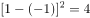, 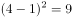, 。

故正确答案为C。

---

### 第 3 题　qid 2045686 · 数学运算

观察表中数字的变化规律，依次填入空格、中的数字是：

- **A**. 5，81
- **B**. 5，121
- **C**. 7，81
- **D**. 7，121　✅

**答案**：D

**官方解析**

通过观察，第一列，第三列，第四列。故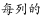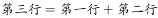，故所求：。观察第四行依次为:36、49、225恰好是6、7、15的平方，即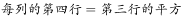。故所求：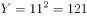。

故正确答案为D。

---

### 第 4 题　qid 2045706 · 数学运算

30个小朋友围成一圈玩传球游戏，每次球传给下一个小朋友需要1秒。当老师喊“转向”时，要改变传球方向。如果从小华开始传球，老师在游戏开始后的第16、31、49秒喊“转向”，那么在第多少秒时，球会重新回到小华手上？

- **A**. 68　✅
- **B**. 69
- **C**. 70
- **D**. 71

**答案**：A

**官方解析**

设顺时针方向为正方向，小华的位置为0号位置，顺时针依次为0号、1号、2号······29号，且开始时为正方向传球。根据题意有，在游戏开始后的第16秒，球传到16号位置，传球方向从正方向改为负方向。在第31秒，球传到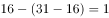号位置，传球方向从负方向转为正方向。在第49秒，球传到号位置，传球方向从正方向转为负方向。若要球重新回到小华手上（0号位置），则还需要19秒，故总时间为秒。

故正确答案为A。

---

### 第 5 题　qid 2045710 · 数学运算

某班共有46人参加了一次数学测验，其中35人做对了第一题，28人做对了第二题，有3人都做错了这两道题，那么该班有（  ）人只做对了第二题。

- **A**. 8　✅
- **B**. 11
- **C**. 15
- **D**. 18

**答案**：A

**官方解析**

根据两集合容斥原理公式：，则有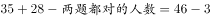，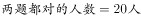，所以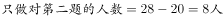。

故正确答案为A。

---

### 第 6 题　qid 2045714 · 数学运算

某车间安排了若干工人加工甲、乙两种零件，每个工人每天可加工甲零件15个，或者加工乙零件10个。某种仪器每套需配有甲零件2个和乙零件3个。已知只安排8个工人加工甲零件。要使每天加工的零件恰好配套，则该车间安排了（  ）个工人加工甲、乙两种零件。

- **A**. 18
- **B**. 21
- **C**. 23
- **D**. 26　✅

**答案**：D

**官方解析**

已知只安排8个工人加工甲零件，则每天一共可生产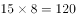个甲零件。由条件可知，仪器配套需要甲零件2个和乙零件3个，则120个甲零件配套的乙零件应有个，则需要安排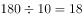个工人加工乙零件。因此该车间共安排了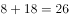个工人加工甲、乙两种零件。

故正确答案为D。

---

### 第 7 题　qid 2045716 · 数学运算

几个朋友相约游泳，男士统一戴白色泳帽，女士统一戴红色泳帽。每位男士看到的白色泳帽数量与红色泳帽数量一样多，每位女士看到的白色泳帽数量都是红色泳帽数量的倍数。女士最少有（  ）人。

- **A**. 1
- **B**. 2　✅
- **C**. 3
- **D**. 4

**答案**：B

**官方解析**

设男士有人，女士有人，倍数为。由条件“每位男士看到的白色泳帽数量与红色泳帽数量一样多”，且每位男士看到的白色泳帽数比男士人数少1，则有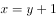；由条件“每位女士看到的白色泳帽数量都是红色泳帽数量的倍数”，且每位女士看到的红色泳帽都比女士人数少1，则有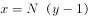。题目问最少，从最小的开始代入，若即女士只有一人，则此时女士看不到红色帽子，不符合条件，排除A项；当时，，，满足题意。

故正确答案为B。

---

### 第 8 题　qid 2045720 · 数学运算

钟老师与四名老师一起参加学校举办的教师技能大赛。这四名老师的成绩分别是78分、81分、82分、79分，而钟老师的成绩比五人的平均成绩多6分。那么，在五人中，第二名成绩比第四名多（  ）分。

- **A**. 2
- **B**. 3　✅
- **C**. 4
- **D**. 5

**答案**：B

**官方解析**

由条件“钟老师的成绩比五人的平均成绩多6分”可得，五个人最低分为78分，则平均分大于78，因此，钟老师的成绩大于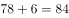分，排名第一。故82分为第二名，79分为第四名，分差为：分。

故正确答案为B。

---

### 第 9 题　qid 2045726 · 数学运算

某工业园拟为园内一个长100米、宽8米的花坛设置若干定点智能洒水装置，洒水范围是半径为5米的圆形。要保证花坛各个区域都可被灌溉，最少需要（  ）个洒水装置。

- **A**. 17　✅
- **B**. 18
- **C**. 19
- **D**. 20

**答案**：A

**官方解析**

         

如上图所示，第一个洒水装置安放在O点，其洒水范围正好覆盖长方形花坛顶点A，依据题意可得：，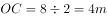，，，，则一个洒水装置能够完全覆盖一个长为6m的长方形，花坛总长100m，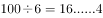，至少需要17个洒水装置。

故正确答案为A。

---

### 第 10 题　qid 2045728 · 数学运算

小陶要用小推车运送120本书到图书馆。已知大箱、中箱、小箱一次分别能装10、8、6本书，大箱、中箱、小箱各有3、4、13个。小推车一次能运送的箱数如下表。如果箱子不重复利用，小陶最少要运（  ）次，才能把所有书运送到图书馆。

- **A**. 6
- **B**. 7
- **C**. 8　✅
- **D**. 9

**答案**：C

**官方解析**

由表中条件可得每次小推车分别运送的书本量为：10本、本、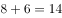本、本，如下表所示：

优先选择“序号4”运送方式，小箱共有13个，可用小推车运送，即4次，共运送书本本；再用“序号2”运送方式，中箱共有4个，可用小推车运送次，共运书本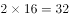本；剩余本，再用“序号1”运送2次即可。则至少运了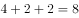次。

故正确答案为C。

---

### 第 11 题　qid 2045730 · 数学运算

某批发市场有大、小两种规格的盒装鸡蛋，每个大盒里装有23个鸡蛋，每个小盒里装有16个鸡蛋。餐厅采购员小王去该市场买了500个鸡蛋，则大盒装一共比小盒装（  ）。

- **A**. 多2盒
- **B**. 少1盒
- **C**. 少46个鸡蛋
- **D**. 多52个鸡蛋　✅

**答案**：D

**官方解析**

假设大盒装、小盒装分别有、个，根据题意可得：

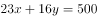，已知16、500均为4的整数倍，则能被4整除。若，为非整数，排除；若，为非整数，排除；若，，，满足，则大盒装比小盒装多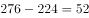个鸡蛋。

故正确答案为D。

---

### 第 12 题　qid 2045732 · 数学运算

某班级共有学生52人，从小琳、小宇、小菲、小筠、小铭五人中选出班长，全班每人限投票一张，不能弃权。结果是：小琳得票最多；小宇得票第二，比小琳少3票；小菲和小筠得票相同且并列第三；小铭只有5票，得票最少。那么，小琳当选班长的票数可能是（  ）票。

- **A**. 12
- **B**. 13
- **C**. 14
- **D**. 15　✅

**答案**：D

**官方解析**

假设小琳得票数为，小菲得票数为，则5人得票从高到低为：、、、、，则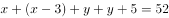，即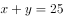。因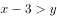，则，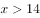，D项满足。

故正确答案为D。

---

### 第 13 题　qid 2045748 · 数学运算

有100根水管需要堆放在仓库。水管只能堆放为下图这种上少下多的形式，且堆叠层高不超过8层。在占地面积尽可能少的前提下，如果100根水管全部都堆成一堆，占地面积会比将100根水管分成每20根一堆的占地面积节省（  ）。

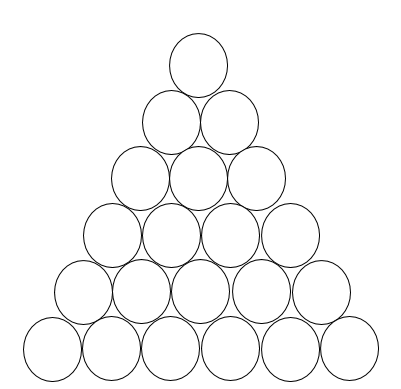

- **A**. 

- **B**. 

- **C**. 

- **D**. 

　✅

**答案**：D

**官方解析**

根据题干水管从上到下是公差为1的等差数列。水管直径和长度相同，则占地面积值之比为最底部水管根数之比。

当每20根一堆时，堆放从上到下为2根、3根、4根、5根、6根，共5堆，最底部水管根数根；

当100根一堆时，只能八层，根据等差数列求和公式：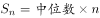，求得中位数12.5，即堆放从上到下为9根、10根、11根、12根、13根、14根、15根、16根，则最下层为16根。占地面积节省。

故正确答案为D。

---

## 判断推理

### 第 1 题　qid 2045598 · 类比推理

土地：地租 与 （  ） 在内在逻辑关系上最为相似。

- **A**. 工资：劳动
- **B**. 厂房：工人
- **C**. 资本：利润　✅
- **D**. 学历：知识

**答案**：C

**官方解析**

第一步：判断题干词语间逻辑关系。
通过土地可以获得地租，二者为对应关系。
第二步：判断选项词语间逻辑关系。
A项：通过劳动可以获得工资，但是顺序和题干相反，与题干逻辑关系不一致，排除；
B项：通过厂房不能获得工人，厂房是工人劳动的场所，与题干逻辑关系不一致，排除；
C项：通过资本可以获得利润，与题干逻辑关系一致，当选；
D项：通过学历不能获得知识，一般是通过教育可以获得知识，与题干逻辑关系不一致，排除。
故正确答案为C。

---

### 第 2 题　qid 2045602 · 类比推理

飞机：汽油 与 （  ） 在内在逻辑关系上最为相似。

- **A**. 手串：珠子
- **B**. 蔬菜：种子
- **C**. 手电筒：电池　✅
- **D**. 葡萄：健康

**答案**：C

**官方解析**

第一步：判断题干词语间逻辑关系。
汽油为飞机提供能源动力，二者为对应关系。
第二步：判断选项词语间逻辑关系。
A项：珠子是手串的组成部分，二者是组成关系，与题干逻辑关系不一致，排除；
B项：种子是种子植物的繁殖体系，对延续物种起着重要作用，种子可以用来生产蔬菜，并不是为蔬菜提供能源，与题干逻辑关系不一致，排除；
C项：电池为手电提供能源动力，与题干逻辑关系一致，当选；
D项：葡萄和健康没有必然逻辑关系，与题干逻辑关系不一致，排除。
故正确答案为C。

---

### 第 3 题　qid 2045604 · 类比推理

蜡烛：电灯 与 （  ） 在内在逻辑关系上最为相似。

- **A**. 算盘：计算机　✅
- **B**. 信鸽：电报机
- **C**. 鞭炮：火枪
- **D**. 电视：电影

**答案**：A

**官方解析**

第一步：分析题干词语间逻辑关系。
蜡烛和电灯的功能相同，都可以用来照明，且二者都是人造物。
第二步：判断选项词语间逻辑关系。
A项：算盘和计算机功能相同，都可以用来计算，且二者都是人造物，符合题干的逻辑关系，当选；
B项：信鸽和电报机都可以用来传递信息，但是信鸽是动物，不是人造物，不符合题干的逻辑关系，排除；
C项：鞭炮和火枪的功能不同，不符合题干的逻辑关系，排除；
D项：电视可以播放电影，二者的功能不同，不符合题干的逻辑关系，排除。
故正确答案为A。

---

### 第 4 题　qid 2045606 · 类比推理

弓弩：射箭 与 （  ） 在内在逻辑关系上最为相似。

- **A**. 杠铃：举重　✅
- **B**. 步枪：击剑
- **C**. 跨栏：跳远
- **D**. 泳池：跳水

**答案**：A

**官方解析**

第一步：判断题干词语间逻辑关系。
弓弩是射箭所需要的工具，二者为工具的对应。
第二步：判断选项词语间逻辑关系。
A项：杠铃是举重所需要的工具，二者为工具的对应，与题干逻辑关系一致，当选；
B项：击剑不需要步枪，与题干逻辑关系不一致，排除；
C项：跨栏和跳远都为运动项目，二者为并列关系，与题干逻辑关系不一致，排除；
D项：泳池是跳水的场所不是跳水的工具，与题干逻辑关系不一致，排除。
故正确答案为A。

---

### 第 5 题　qid 2045608 · 类比推理

公司：经理 与 （  ） 在内在逻辑关系上最为相似。

- **A**. 邮局：邮差
- **B**. 餐厅：厨师
- **C**. 火车：司机
- **D**. 大学：校长　✅

**答案**：D

**官方解析**

第一步：判断题干词语间逻辑关系。
经理在公司工作，且经理是有一定级别，是整个公司的管理者。
第二步：判断选项词语间逻辑关系。
A项：邮差在邮局工作，但不是邮局的管理者，与题干逻辑关系不一致，排除；
B项：厨师在餐厅工作，但不是餐厅的管理者，与题干逻辑关系不一致，排除；
C项：司机在火车上工作，但司机不是火车的管理者，与题干逻辑关系不一致，排除；
D项：校长在大学工作，且校长有一定级别，是整个学校的管理者，与题干逻辑关系一致，当选。
故正确答案为D。

---

### 第 6 题　qid 2045612 · 类比推理

太阳：（  ） 与 （  ）：相机 在内在逻辑关系上最为相似。

- **A**. 手表，倒影　✅
- **B**. 能源，科技
- **C**. 烛光，胶卷
- **D**. 向日葵，望远镜

**答案**：A

**官方解析**

将选项逐一代入，判断各选项前后部分的逻辑关系。
A项：太阳和手表都有周期性的特征，即太阳东升西落，手表一天走2圈；倒影和相机都遵循成像原理，倒影是光照射在平静的水面上所成的等大虚像，照相机简称相机，是一种利用光学成像原理形成影像并使用底片记录影像的设备，前后逻辑关系相似，暂且保留；
B项：太阳可以产生太阳能，太阳能是能源，但后者相机是科学技术下的一种产品，能源不是太阳的产品，前后逻辑关系不一致，排除；
C项：太阳和烛光都有照明的功能，但胶卷和相机是配套使用关系，前后逻辑关系不一致，排除；
D项：向日葵又名朝阳花，因其花常朝着太阳而得名，且向日葵的生长离不开太阳；数码相机可以连接望远镜使用，但数码相机可以离开望远镜单独使用，前后逻辑关系不一致，排除。
因为BCD都明显不对，尽管A项前后的逻辑关系并不是太严谨，但根据对比择优的思维，我们倾向于把这道题答案选给A。
故正确答案为A。

---

### 第 7 题　qid 2045616 · 类比推理

水：冻：冰 与 （  ） 在内在逻辑关系上最为相似。

- **A**. 牛：耕：田
- **B**. 纸张：书写：书籍
- **C**. 单身：结婚：已婚　✅
- **D**. 衣服：缝制：布

**答案**：C

**官方解析**

第一步，判断题干词语间的逻辑关系。
可以造句子，水冻住就变为冰。
第二步，判断选项词语间的逻辑关系。
A项：牛耕田，而不是牛耕地就变为田，与题干逻辑关系不一致，排除；
B项：纸张经过书写、装订等一系列过程变为书，而非书写了就变成书籍，与题干逻辑关系不一致，排除；
C项：单身结婚了就变为已婚，与题干逻辑关系一致，当选；
D项：布经过缝制变为衣服，但顺序反了，与题干逻辑关系不一致，排除。
故正确答案为C。

---

### 第 8 题　qid 2045620 · 类比推理

荔枝：短裤：蒲扇 与 （  ）在内在逻辑关系上最为相似。

- **A**. 腊梅：棉靴：火盆　✅
- **B**. 菊花：雾霾：梯田
- **C**. 春分：小暑：大寒
- **D**. 茶叶：桃花：石榴

**答案**：A

**官方解析**

第一步，判断题干词语间的逻辑关系。
荔枝的果期通常在夏季；短裤是夏季要穿的服饰；蒲扇是夏季要用的纳凉工具。即题干三词均与“夏季”有关。
第二步，判断选项词语间的逻辑关系。
A项：腊梅是冬季观赏主要花木；棉靴是冬季要穿的服饰；火盆是冬季要用的取暖工具。三词均与“冬季”有关，与题干逻辑关系一致，当选；
B项：菊花大多在秋季开放；雾霾高发期主要是秋冬季节，冬季最为严重；中国梯田主要分布在江南山岭地区，是以地区划分，而非季节，与题干逻辑关系不一致，排除；
C项：春分、小暑和大寒均属于二十四节气，春分是春季的第四个节气，小暑是夏季的第五个节气，大寒是冬季的最后一个节气，与题干逻辑关系不一致，排除；
D项：中国绝大部分产茶地区，茶树生长和茶叶采制是有季节性的，通常按采制时间，划分为春、夏、秋三季茶；桃花一般在春季开放；石榴果期9-10月，与题干逻辑关系不一致，排除。
故正确答案为A。

---

### 第 9 题　qid 2045624 · 类比推理

火柴：打火机：取火 与 （  ）在内在逻辑关系上最为相似。

- **A**. 煤炉：燃气灶：煮饭　✅
- **B**. 锄头：马车：耕地
- **C**. 镜子：梳子：梳妆
- **D**. 皂角：浣纱：洗衣

**答案**：A

**官方解析**

第一步，判断题干词语间的逻辑关系。
火柴和打火机的功能是取火，二者为并列关系，且均与取火是功能对应关系。
第二步，判断选项词语间的逻辑关系。
A项：煤炉和燃气灶的功能是煮饭，二者为并列关系，且均与煮饭是功能对应关系，与题干逻辑关系一致，当选；
B项：锄头的功能是耕地，但马车的功能是载人或运货，而非耕地，与题干逻辑关系不一致，排除；
C项：镜子和梳子为并列关系，且二者配套使用来辅助梳妆，与题干逻辑关系不一致，排除；
D项：皂角的皮是天然的工业洗涤产品，可以用来洗衣服，但浣纱就是指洗衣服，不是功能的对应关系，与题干逻辑关系不一致，排除。
故正确答案为A。

---

### 第 10 题　qid 2045626 · 类比推理

大同小异：大相径庭：差异 与 （  ）在内在逻辑关系上最为相似。

- **A**. 举世无双：比比皆是：人才
- **B**. 背信弃义：恪守不渝：信任
- **C**. 东施效颦：邯郸学步：模仿
- **D**. 高瞻远瞩：鼠目寸光：视野　✅

**答案**：D

**官方解析**

第一步，判断题干词语间的逻辑关系。
大同小异是指大体相同，略有差异，即差异小；大相径庭比喻相差很远，大不相同，即差异大。两者互为反义词。
第二步，判断选项词语间的逻辑关系。
A项：举世无双形容极其罕见稀有，指世界上再没有第二个这样的人或物，和人才没有必然联系；比比皆是表示到处都是，形容极其常见，和人才没有必然联系。与题干逻辑关系不一致，排除；
B项：背信弃义是指违背诺言，不讲道义，多指朋友间出卖友谊，和信任没有必然联系；恪守不渝是指严格遵守，决不改变，和信任也没有必然联系。与题干逻辑关系不一致，排除；
C项：东施效颦比喻模仿别人，不但模仿不好，反而出丑；邯郸学步比喻一味地模仿别人，不仅学不到本事，反而把原来的本事也丢了。两者为近义词，与题干逻辑关系不一致，排除；
D项：高瞻远瞩是指站得高，看得远，比喻眼光远大，即视野开阔；鼠目寸光形容目光短浅，没有远见，即视野狭窄。两者互为反义词，与题干逻辑关系一致，当选。
故正确答案为D。

---

### 第 11 题　qid 2045580 · 逻辑判断

当人们感知房价还会上涨时，会更愿意购买商品房；但当人们感知房价还会下跌时，会更不愿意购买商品房。因此，政府的鼓励性购房政策刚出台时，并不会刺激人们的购房意愿。
以下哪项最可能是上述论证所假设的？

- **A**. 政府的鼓励性购房政策往往比较滞后，不能及时反映当下的商品房价格
- **B**. 大多数人购房主要是受房价变动的影响，而不是受政府购房政策的影响
- **C**. 政府的鼓励性购房政策刚出台时，大多数人感知房价还会下跌　✅
- **D**. 大多数人在政府限制性购房政策刚出台时，都会有很强的购房意愿

**答案**：C

**官方解析**

第一步：找出论点和论据。
论点：政府的鼓励性购房政策刚出台时，并不会刺激人们的购房意愿。
论据：人们感知房价还会上涨时，更愿意买房；人们感知房价还会下跌时，更不愿意买房。
分析题干，论点是说政策和购房意愿的关系，论据是说人们的感知和购房意愿之间的关系，论点论据话题不一致，问的是论证的假设，首选搭桥或者必要条件的选项，考虑在政策和人们的感知之间搭桥。
第二步：逐一分析选项。
A项：选项是在说政府的鼓励性购房政策比较滞后不能反映当下的房价，并不明确是否会对人们购房意愿造成影响，属于无关选项，排除；
B项：选项是在说大多数人们购房主要是受房价变动的影响，和题干的意思一致，可以加强，但是既不属于搭桥，也不属于必要条件，不是论证假设，排除；
C项：选项是在说政府鼓励性购房政策刚出台时，人们感知房价还会下跌，也就会更不愿意买房。这句话等于是在政策与房价之间搭桥，加强论证，当选；
D项：选项是在说限制性购房政策出台时会怎么样，而题目讨论的是鼓励性政策出台时会怎么样，话题不一致，属于无关选项，排除。
故正确答案为C。

---

### 第 12 题　qid 2045592 · 类比推理

某饭店对配菜有如下要求：
（1）只要配豆腐，就要配肉饼；
（2）只有配鱿鱼，才要配黄瓜；
（3）红烧肉和红烧鱼不能同时都配；
（4）如果不配豆腐也不配黄瓜，那么一定要配红烧肉。
如果某次配菜里有红烧鱼，那么关于该次配菜的断定一定为真的是（  ）。
Ⅰ.配有豆腐或者肉饼
Ⅱ.配有肉饼或者鱿鱼
Ⅲ.配有鱿鱼或者黄瓜
Ⅳ.配有豆腐或者黄瓜

- **A**. Ⅰ和Ⅲ
- **B**. Ⅱ和Ⅳ　✅
- **C**. Ⅰ、Ⅱ和Ⅲ
- **D**. 只有Ⅳ

**答案**：B

**官方解析**

第一步：翻译题干。
（1）：豆腐→肉饼；
（2）：黄瓜→鱿鱼；
（3）：－（红烧肉且红烧鱼），即－红烧肉或－红烧鱼；
（4）：－豆腐且－黄瓜→红烧肉。
题目条件：有红烧鱼
第二步：分析选项。
根据（3），有红烧鱼→－红烧肉；
根据（4）－红烧肉→－（－豆腐且－黄瓜），即－红烧肉→豆腐或黄瓜，到这一步并不能确定是否必须配黄瓜或者豆腐，因此根据“或”命题的推理规则，需要假设：当不配豆腐则必配有黄瓜，根据（2）黄瓜→鱿鱼；当不配黄瓜则必配有豆腐，根据（1）豆腐→肉饼。由以上假设即得出（5）：鱿鱼或肉饼。
因此，由（5）可知，鱿鱼或肉饼从题干可以推出，Ⅱ正确；由（4）可知，不配红烧肉可以推出配豆腐或黄瓜，Ⅳ正确；Ⅰ和Ⅲ的或关系从题干无法得出。
故正确答案为B。

---

### 第 13 题　qid 2045594 · 逻辑判断

只要企业信用风险上升和有效信贷需求不足，银行就会陷入“资产荒”。
如果上述断定为真，银行没有陷入“资产荒”，那么以下哪项也一定为真？

- **A**. 企业信用风险没有上升或者有效信贷需求没有出现不足　✅
- **B**. 企业信用风险没有上升并且有效信贷需求没有出现不足
- **C**. 企业信用风险没有上升但有效信贷需求出现不足，或者企业信用风险上升但有效信贷需求没有出现不足
- **D**. 至少企业信用风险没有上升

**答案**：A

**官方解析**

第一步：翻译题干。
①企业信用风险上升且有效信贷需求不足→银行陷入“资产荒”。
题目条件：②－银行陷入“资产荒”→－（企业信用风险上升且有效信贷需求不足）→－企业信用风险上升或－有效信贷需求不足。
第二步：逐一分析选项。
A项：翻译为，－企业信用风险上升或－有效信贷需求不足，与②推出的结果一致，当选；
B项：翻译为，－企业信用风险上升且－有效信贷需求不足，与②推出的结果不一致，排除；
C项：翻译为：（－企业信用风险上升且有效信贷需求不足）或（企业信用风险上升且－有效信贷需求不足），而②的推理结果为－企业信用风险上升或－有效信贷需求不足，或关系包含了三种情况，根据②的推理结果，还有一种可能是“—企业信用风险上升且—有效信贷需求不足”，而C项只说明另外两种可以推出情况，因此C项不是一定能推出的，排除；
D项：翻译为，－企业信用风险上升，而②推出的结果为企业信用风险可能上升，也有可能不上升，并不能得出肯定结论，与②推出的结果不一致，排除。
故正确答案为A。

---

### 第 14 题　qid 2045596 · 逻辑判断

在全球范围内，所有的大城市的生活成本都比较高，上海是一座大城市，因此上海的生活成本比较高。
以下哪一项与上述论证方式不一样？

- **A**. 要进入法院工作必须通过国家司法考试，小王在法院工作，因此小王已经通过了国家司法考试
- **B**. 某高校的硕士研究生只要通过毕业论文答辩就能获得硕士学位，小张今年获得了硕士学位，因此他已通过了毕业论文答辩　✅
- **C**. 纵观世界历史，每一位杰出的国家领导人无不有着坚强的意志，华盛顿是一位杰出的国家领导人，因此他拥有着坚强的意志
- **D**. 城镇职工养老保险只要按规定缴费满15年就能在退休后按月领取养老金，李先生已按规定缴满20年的养老保险，因此他在退休后能按月领取养老金

**答案**：B

**官方解析**

第一步：翻译题干。
大城市→生活成本都比较高，上海是一座大城市→上海市的生活成本比较高，肯前推出肯后。
第二步：逐一分析选项。
A项：进入法院工作→通过国际司法考试，小王在法院工作→小王通过了国家司法考试，肯前推出肯后，与题干论证方式一致，选非题，排除；
B项：通过毕业论文答辩→获得硕士学位，小张获得硕士学位→小张通过了毕业答辩，肯后推出肯前，与题干论证方式不一致，当选；
C项：杰出的国家领导人→有坚强的意志，华盛顿是一位杰出的国家领导人→华盛顿拥有坚强的意志，肯前推出肯后，与题干论证方式一致，排除；
D项：按规定缴费满15年的养老保险→退休后按月领取养老保险金，按规定缴费满20年的养老保险→退休后按月领取养老保险金，肯前推出肯后，与题干论证方式一致，排除。
本题为选非题，故正确答案为B。

---

### 第 15 题　qid 2045600 · 逻辑判断

根据天气预报，这周只有三种天气，分别是晴天、雨天和多云天。现在已知：
（1）今天是周四，晴天；
（2）周一没有下雨；
（3）明天是多云天；
（4）明天以后要么是雨天，要么是多云天；
（5）这周有三天是晴天。
那么，以下推断错误的是（  ）。

- **A**. 为了避免被雨淋湿，这周最多只有三天需要带雨伞出门
- **B**. 如果周六和周日天气不相同，这周最多有三天是多云天
- **C**. 周二和周三天气不可能相同　✅
- **D**. 如果周二是多云天，则周一是晴天

**答案**：C

**官方解析**

由条件（1）（3）（4）可知：周四晴天，周五多云天，周六、周日非晴天。由条件（1）（5）可知：周一非雨天，周一至周三有两天是晴天。根据题干列表：

A项：根据周四晴天，周五多云天，周一至周三有两天是晴天，推出有四天一定不会下雨，所以最多三天需要带伞出门，A选项可以推出，排除；

B项：周六和周日天气不同，所以周六周日有一天是多云天。周一至周三有两天是晴天，所以另外一天可能是多云天。周五是多云天，所以这周最多有三天是多云天，B选项可以推出，排除；

C项：根据周一非雨天，周一至周三有两天是晴天，可知存在周一是多云天，周二和周三都是晴天这种可能，C项错误，当选；

D项：根据周一非雨天，周一至周三有两天是晴天，如果周二是多云天，那么周一、周三一定是晴天，D选项可以推出，排除。

本题为选非题，故正确答案为C。

---

### 第 16 题　qid 2045640 · 逻辑判断

某大湖是重要的候鸟越冬场所。近年来，该湖出现枯水期提前、枯水期持续时间延长等问题，枯水期水位过低，鱼类减少，影响了越冬的鸟类进食。有专家建议，应该在湖的入江水道处修建水闸，通过控制枯水期水位，增加湖区鱼类的生活空间，保护越冬的候鸟。
以下哪项如果为真，将最有力削弱专家的建议？

- **A**. 水闸影响了湖泊自然吞吐江河的能力，鱼类资源得不到江河的适时补充，自然繁殖会受到严重影响　✅
- **B**. 研究指出，无论丰水期还是枯水期，高水位都会导致候鸟取食困难，有可能使候鸟数量减少
- **C**. 枯水期水位下降会给受珍禽价格飙升诱惑的盗猎者打开方便之门
- **D**. 水闸阻断了江豚在该湖和江河段的洄游路线，即使在水闸上留出过闸口，由于水流速度快，江豚也很难顺利钻过去

**答案**：A

**官方解析**

第一步：找出论点和论据。
论点：应该在湖的入江水道处修建水闸，通过控制枯水期水位，增加湖区鱼类的生活空间，保护越冬的候鸟。
论据：该湖出现枯水期提前，枯水期持续时间延长等问题，枯水期水位过低，鱼类减少，影响了越冬的鸟类进食。
第二步：逐一分析选项。
A项：修建水闸会导致鱼类自然繁殖受到严重影响，使枯水期鱼类减少的情况越来越严重，不能保护越冬的候鸟，削弱论点，当选；
B项：高水位会导致候鸟取食困难，而论点中通过修建水闸来控制枯水期水位，不一定就要控制到高水位，不明确项，排除；
C项：枯水期水位下降，盗猎者增多，会捕杀更多的珍禽候鸟，所以通过修建水闸控制枯水期水位，可防止盗猎者捕杀以保护候鸟，加强论据，排除；
D项：江豚无法钻过闸口，与保护越冬的候鸟无关，无关选项，排除。
故正确答案为A。

---

### 第 17 题　qid 2045642 · 逻辑判断

为解决城市交通拥堵问题，某地政府不断拓宽和新建公路，但是这些新拓建的路面很快就被车流淹没，交通拥堵状况不但没有缓解，反而越来越严重。
以下哪项如果为真，则最无助于解释这一现象？（  ）

- **A**. 新拓建公路的最低限速比其他公路要高一些　✅
- **B**. 新拓建公路会诱使人们更多地购买和使用汽车
- **C**. 新拓建公路会导致沿线居民区和商业区增加
- **D**. 人们偏向于在新拓建的公路上行驶

**答案**：A

**官方解析**

第一步：找出题干矛盾。
此题属于现象解释类题目，需要解释的矛盾现象为某地政府为解决城市交通问题不断拓宽和新建公路，但是交通拥堵状况不但没有缓解，反而越来越严重。即拓宽和新建公路为什么不能缓解交通问题。
第二步：逐一分析选项。
A项：新拓建公路的最低限速比其他公路要高一些，指明速度的问题，到底最低限速是多少也不明确，最低限速和交通拥堵之间的关系也不明确，不能解释题干矛盾现象，为正确答案，当选；
B项：新拓建公路会诱使人们更多地购买和使用汽车，说明路增加了汽车也增加了，可能会导致交通拥堵，能解释题干矛盾现象，排除；
C项：指出新建公路使得沿线居民区和商业区增加，住的人多，人流量大，可能导致交通拥堵，能解释题干矛盾现象，排除；
D项：人们偏向于在新拓建的公路上行驶，说明新拓建公路上的车流量大，可能会导致交通拥堵，能解释题干矛盾现象，排除。
本题为选非题，故正确答案为A。

---

### 第 18 题　qid 2045644 · 逻辑判断

某人因为心理疾病尝试了几种不同的心理疗法：精神分析疗法、认知行为疗法以及沙盘游戏疗法。他说：“心理治疗过程让我非常不快乐，因此，这些疗法是无效的。”
以下哪项如果为真，将最有力质疑上述的结论？

- **A**. 几种不同心理疗法所针对的心理疾病是不同的
- **B**. 尝试多种心理疗法的人要比只尝试一种疗法的人快乐
- **C**. 同时尝试不同心理疗法能够更容易找到可以起作用的方法
- **D**. 治疗效果好的人在治疗过程中往往感觉不快乐　✅

**答案**：D

**官方解析**

第一步：找到论点论据。
论点：这些疗法是无效的。
论据：某人因为心理疾病尝试了几种不同的心理疗法，他说“心理治疗过程让我非常不快乐”。
第二步：逐一分析选项。
A项：几种不同心理疗法所针对的心理疾病是不同的，和治疗法到底有没有效果无关，排除；
B项：尝试多种心理疗法的人要比只尝试一种疗法的人快乐，对比多种和一种疗法所给人的感觉，和治疗法到底有没有效果无关，排除；
C项：同时尝试不同心理疗法能够更容易找到起作用的方法，到底心理疗法有没有起作用，从选项中无从得知，无关选项，排除；
D项：治疗效果好的人在治疗过程中往往感觉不快乐，直接拆开题干治疗不快乐与治疗无效之间的联系，说明治疗不快乐往往是有效，为正确答案，当选。
故正确答案为D。

---

### 第 19 题　qid 2045646 · 逻辑判断

烟雾中毒是室内火灾最常见的致命因素。某推销员声称，他所在公司生产的新型火灾报警器内置声音感应器，房屋建筑材料暴露于高温时会发出的独特声音，报警器能够精确探测这些声音，并在建筑材料实际着火前便发出警报，使住户能在被烟雾困住之前逃离，因此可以很好地取代传统烟雾报警器。
以下哪项如果为真，最能削弱该推销员的论述？

- **A**. 许多房屋建筑材料实际着火时发出的声音在几百米之外也可以听得见
- **B**. 许多室内火灾开始于床垫和沙发，产生大量烟雾却不发出声音　✅
- **C**. 有数据表明，烟雾报警器的使用拯救了许多生命
- **D**. 内置声音感应器的报警系统比传统烟雾报警系统的安装费用高得多

**答案**：B

**官方解析**

第一步：找到论点论据。
论点：新型火灾报警器能够很好地取代传统烟雾报警器。
论据：新型火灾报警器内置声音感应器，房屋建筑材料暴露于高温时会发出的独特声音，报警器能够精确探测这些声音，并在建筑材料实际着火前便发出警报，使住户能在被烟雾困住之前逃离。
第二步：逐一分析选项。
A项：许多房屋建筑材料实际着火时发出的声音在几百米之外也可以听得见，说明燃烧声音大，火灾报警器可以感应到声音，对题干进行了加强，排除；
B项：许多室内火灾开始于床垫和沙发，产生大量烟雾却不发出声音，说明许多火灾刚开始新型火灾报警器是无法探测到的，自然也就不能帮助住户脱困，对论据进行削弱，当选；
C项：有数据表明，烟雾报警器的使用拯救了许多生命，与题干提出的新型火灾报警器能够很好地取代传统烟雾报警器观点无关，排除；
D项：内置声音感应器的报警系统比传统烟雾报警系统的安装费用高得多，费用高不高与题干观点新型火灾报警器能够很好地取代传统烟雾报警器无关，排除。
故正确答案为B。

---

### 第 20 题　qid 2045648 · 逻辑判断

某汽车厂商宣称，其新推出的汽车已经通过了各种撞击测试，当车祸发生时，乘车人的安全可以得到充分保障。但是也有人质疑，仅通过撞击测试不足以证明汽车是安全的。
以下哪项如果为真，则不能支持这种质疑？（    ）

- **A**. 测试不能模拟驾驶员在车祸发生瞬间的应急反应
- **B**. 测试所使用的车辆未必与销售的车辆完全一致
- **C**. 测试通常是在实验室而非车祸多发路段进行　✅
- **D**. 测试用的人偶的尺寸和质量等参数无法完全模拟真实人体

**答案**：C

**官方解析**

第一步：找到论点论据。
论点：仅通过撞击测试不足以证明汽车是安全的。
论据：无明显论据。
第二步：逐一分析选项。
A项：测试不能模拟驾驶员在车祸发生瞬间的应急反应，说明模拟测试不具备真实性，那么测试出来的结果也是不真实的，能够支持质疑者的意见，排除；
B项：测试所使用的车辆未必与销售的车辆完全一致，说明车的数据不一样，模拟测试不具备真实性，那么测试出来的结果也是不真实的，能够支持质疑者的意见，排除；
C项：测试通常是在实验室而非车祸多发路段进行，不管是在实验室还是在车祸多发路段都是围绕撞击来产生研究，只要保证情景一致就可以，C项不能对测试的结果进行质疑，也不能支持质疑者的意见，为正确答案，当选；
D项：测试用的人偶的尺寸和质量等参数无法完全模拟真实人体，说明人的参数不一样，那么撞击对真实的人产生的影响是无法得知的，能够支持质疑者的意见，排除。
本题为选非题，故正确答案为C。

---

### 第 21 题　qid 2045672 · 图形推理

请选择最适合的一项填入问号处，使右边图形的变化规律与左边图形一致：

- **A**. A
- **B**. B
- **C**. C　✅
- **D**. D

**答案**：C

**官方解析**

元素组成相似，考虑样式规律。观察发现，第一组图形中，第一幅图和第二幅图去同求异得到第三幅图。第二组图形应遵循相同的规律，？处应填入第一幅图和第二幅图去同求异后的图形，即为C项。
故正确答案为C。

---

### 第 22 题　qid 2045680 · 图形推理

请选择最适合的一项填入问号处，使右边图形的变化规律与左边图形一致。（    ）

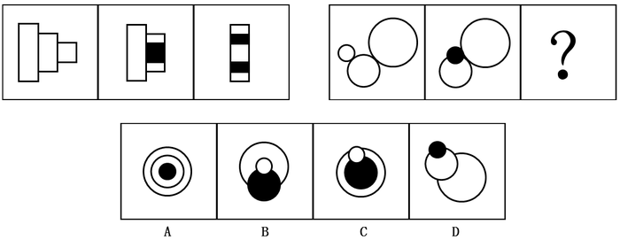

- **A**. A
- **B**. B　✅
- **C**. C
- **D**. D

**答案**：B

**官方解析**

元素组成相同，考虑位置变化。第一组中，第一幅图形的第三个矩形向左移动一段距离到第二个矩形内，且颜色由白色变成黑色，第二幅图形中第二个矩形与第三个矩形形成的整体向左移动一段距离到第一个矩形内，且颜色发生变化，白色的区域变成黑色，黑色的区域变成白色；第二组图形遵循同样的规律，第一幅图形中最小的圆沿直线向右平移一段距离，且颜色由白色变成黑色，第二幅图形中最小的圆与次小的圆形成的整体沿直线向右移动一段距离，且白色区域变成黑色，黑色区域变成白色，只有B项符合。
故正确答案为B。

---

### 第 23 题　qid 2045688 · 图形推理

请选择最适合的一项填入问号处，使之符合之前四个图形的变化规律。（    ）

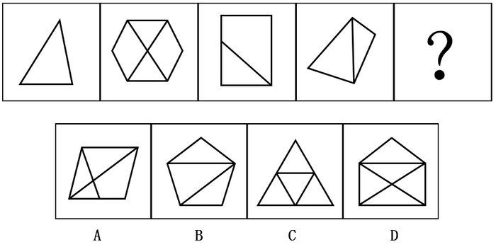

- **A**. A
- **B**. B　✅
- **C**. C
- **D**. D

**答案**：B

**官方解析**

元素组成不同，且无明显属性规律，优先考虑数量规律。图形特征较为明显，窟窿比较多，因此考虑数面，题干图形面数量依次为1、4、2、2、？，无规律，图形均为直线组成，数直线，题干图形直线数量依次为3、8、5、5、？，无规律。再观察发现，题干图形外框的直线数为3、6、4、4、？，观察数字发现，每个图形外框直线数与该图形面数量之差均为2。因此？处也应选择一个外边框线条数量和面数量差为2的选项，只有B项符合。
故正确答案为B。

---

### 第 24 题　qid 2045692 · 图形推理

请选择最适合的一项填入问号处，使之符合之前四个图形的变化规律。（    ）

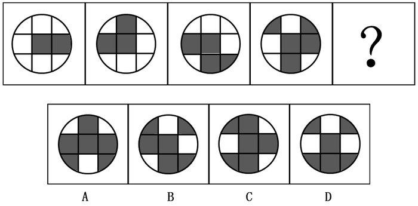

- **A**. A
- **B**. B
- **C**. C　✅
- **D**. D

**答案**：C

**官方解析**

元素组成不同，且无明显属性规律，考虑数量规律。每幅图都由黑块和白块组成，每幅图的黑块数量依次为2、3、4、5、？。？处应填入一个黑块数量为6的选项，发现无法排除选项。比较选项，发现选项的黑块分布位置不同，观察题干的黑块位置，发现第二幅图是在第一幅图逆时针旋转的基础上增加一个黑块，第三幅图是在第二幅图逆时针旋转的基础上增加一个黑块，以此类推，第四幅图是在第三幅图逆时针旋转的基础上增加一个黑块，？处应填入的图形是在第四幅图逆时针旋转（如下图）的基础上增加一个黑块，只有C项符合。

故正确答案为C。

---

### 第 25 题　qid 2045696 · 图形推理

请选择最适合的一项填入问号处，使之符合之前四个图形的变化规律。（    ）

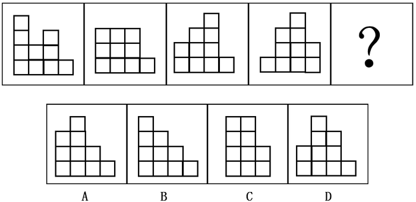

- **A**. A　✅
- **B**. B
- **C**. C
- **D**. D

**答案**：A

**官方解析**

本题是一道争议题。理由如下：
解析一：元素组成相同，都是由10个小白块组成，考虑位置规律。这十个小白块都排布为4列，排除C选项。观察发现，第二幅是在第一幅图的基础上，第一幅图第一列最上端的一个小白块移动到第二列形成的。同样，第三幅图是在第二幅图的基础上，第二幅图第一列最上端的小白块移动到第三列形成的。以此类推，第四幅图是第三幅图第一列最上端的小白块移动到第四列形成，？处应填入一个图形，是第四幅图第一列最上端的小白块移动到第五列（第一列最上端的小白块移动后第一列不存在，因此最终还是四列）形成，即为A项。
解析二：元素组成相同，都是由10个小白块组成，考虑位置规律。这十个小白块都排布为4列。观察发现，第二幅是在第一幅图的基础上，第一幅图第一列最上端的一个小白块移动到第二列形成的。同样，第三幅图是在第二幅图的基础上，第二幅图第一列最上端的小白块移动到第三列形成的。以此类推，第四幅图是第三幅图第一列最上端的小白块移动到第四列形成，？处应填入一个图形，是第四幅图第一列最上端的小白块移动到第二列形成，即为C项。

粉笔倾向于把答案给A项，虽然这两种思路都可以得出答案，但是题干都是四列白块，并且每幅图形第一列最上端的小白块依次移动到后一列，？处应填入小白块移动到第五列的位置，因此A项较C项更加严谨。

故正确答案为A。

---

### 第 26 题　qid 2045700 · 图形推理

请选择最适合的一项填入问号处，使之符合之前五个图形的变化规律：

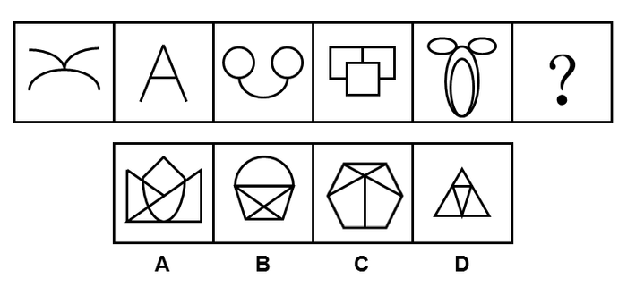

- **A**. A
- **B**. B
- **C**. C　✅
- **D**. D

**答案**：C

**官方解析**

元素组成不同，考虑属性规律和数量规律。观察题干发现，图形都比较规整，都是轴对称图形，排除A项；再观察发现，题干图形都是曲线图形、直线图形交替出现，因此？处应填入一个直线图形，排除B项；属性再无规律，考虑数量规律，题干图形特征比较明显，窟窿很多，考虑数面，依次为0、1、2、3、4、？。因此？处应填入一个面数量为5的图形，只有C项符合。
故正确答案为C。

---

### 第 27 题　qid 2045712 · 图形推理

左侧图形是由右侧图形中的（    ）项组成。

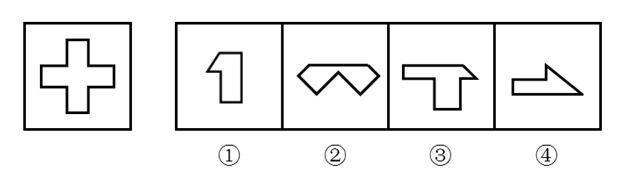

- **A**. ①②③
- **B**. ①②④
- **C**. ①③④
- **D**. ②③④　✅

**答案**：D

**官方解析**

本题考查平面拼合。原图可以由②③④构成，如图所示：

故正确答案为D。

---

### 第 28 题　qid 2045718 · 图形推理

左侧图形是由右侧图形中的（    ）项组成。

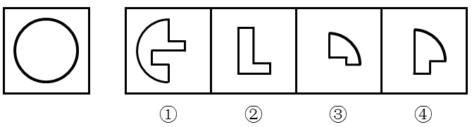

- **A**. ①②③
- **B**. ①②④
- **C**. ①③④　✅
- **D**. ②③④

**答案**：C

**官方解析**

本题考查平面拼合。左侧图形为圆形，可以由图①③④组合得到，具体拼合如下图：

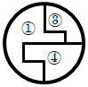

故正确答案为C。

---

### 第 29 题　qid 2045722 · 图形推理

下列选项中最适合填入图形空缺处，使整幅图形呈现一致的规律性的是（    ）。

- **A**. A　✅
- **B**. B
- **C**. C
- **D**. D

**答案**：A

**官方解析**

题干图形分为五行，观察第一行，两个黑块之间相隔一个其他元素块；第二行，两个黑块之间相隔两个其他元素块；第三行，两个黑块之间相隔三个其他元素块；第四行，两个黑块之间相隔四个其他元素块；第五行，两个黑块之间相隔五个其他元素块。根据此规律排除C、D两项。比较A、B两项，仅有第一行白圈的位置不同，观察题干图形白圈的位置，发现相邻白圈之间均分布在对角线的位置上，因此排除B项。
故正确答案为A。

---

### 第 30 题　qid 2045724 · 图形推理

下列选项中最适合填入图形空缺处，使整幅图形呈现一致的规律性的是：

- **A**. A
- **B**. B　✅
- **C**. C
- **D**. D

**答案**：B

**官方解析**

本题考查平面拼合。正确选项应该与原图形拼成一个完整的图形。在原图当中，中间圆圈的右上角要想补进去一个图形，必须得把右上角的弧形缺口给填上，观察四个选项，只有B选项的右上角有一个弧形的缺口能与之相对应。

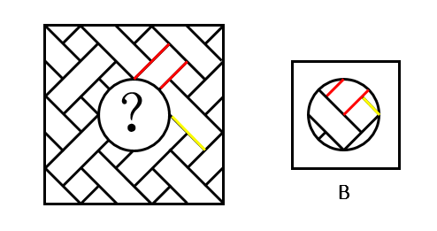

故正确答案为B。

---

## 资料分析

### 材料 1

        在我国某次调查中，受访者人数为1328人，其中男性受访者共673人，略高于女性受访者的655人。

        从年龄结构看，30-44岁的受访者居多，占；其次是45-59岁的受访者，占；20-29岁的受访者占；60-74岁的受访者占；20岁以下（不含20岁）和75岁以上的受访者占比比较低，分别是和。

        就受教育程度而言，大学本科的受访者居多，占；其次是中专和大专的受访者，分别占和；高中、初中的受访者分别占和；小学及以下的受访者占；研究生及以上的受访者较少，仅占。

        从职业来看，本次调查涵盖了各类职业人群。其中，专业技术人员占，位居首位，紧跟其后的是商业、服务人员，占；受访者中有较多的学生和离退休人员，分别占和。

        就月收入情况而言，无收入的受访者占；收入在2000元以内的受访者占；收入在2001-3000元的受访者占。的受访者收入在3001-4000元，收入在4001-6000元的受访者占；收入在6000元以上的受访者占，其比重比去年增加了4.2个百分点。

        从婚姻状况来看，的受访者已婚，的受访者未婚，离婚和丧偶的受访者分别占和。

#### 第 1 题　qid 2045766 · 综合

男性受访者约占总受访者的（  ）。

- **A**. 

- **B**. 

　✅
- **C**. 

- **D**. 

**答案**：B

**官方解析**

根据问题所求“…占…”，选项为百分数，且所求为现期，可判定此题为现期比重问题。定位材料第一段，“受访者人数为1328人，其中男性受访者共673人”，则。

故正确答案为B。

---

#### 第 2 题　qid 2045768 · 比重

20岁以上（含20岁），未婚的受访者占比约为（  ）。

- **A**. 

- **B**. 

　✅
- **C**. 

- **D**. 

**答案**：B

**官方解析**

根据问题所求“···占比约为···”，选项为百分数，且所求为现期，可判定此题为现期比重问题。定位材料第二段“20岁以下（不含20岁）”的受访者占比，定位材料第六段，“的受访者未婚”，根据常识男性法定婚龄为22岁、女性20岁，因此20岁以下（不含20岁）的应为未婚者，则20岁以上（含20岁）未婚者占比约为，最接近B项。

故正确答案为B。

注：本题对题干的理解存在歧义，第一种理解是在全部受访者中，20岁以上（含20岁）且未婚的占比，解题方法如上述解析所示；第二种是在20岁以上（含20岁）的受访者中，未婚的受访者占比，解题方式应该再追加一步。由于整篇材料和其他四个题目均为占总体受访者占比，所以粉笔推荐第一种理解和解答方式。

---

#### 第 3 题　qid 2045770 · 综合

已知去年受访者总人数为1467人，则月收入在6000元以上的受访者比今年约少了（  ）人。

- **A**. 10
- **B**. 30　✅
- **C**. 60
- **D**. 100

**答案**：B

**官方解析**

根据问题所求“……比今年约少了多少人”可判定此题为增长量计算。定位材料第五段，“收入在6000元以上的受访者占，其比重比去年增加了4.2个百分点”，则去年比重为；定位材料第一段今年“受访者人数为1328人”，则今年收入在6000元以上的受访者为，去年人数为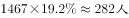，去年比今年少，最接近B项。

故正确答案为B。

---

#### 第 4 题　qid 2045772 · 比重

从受教育程度来看，（  ）的受访者人数占比最多。

- **A**. 大学本科及以上
- **B**. 高中及大专　✅
- **C**. 中专
- **D**. 初中及以下

**答案**：B

**官方解析**

定位材料第三段，A项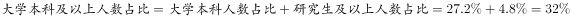，B项，C项中专人数占比为，D项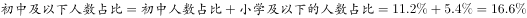，高中及大专的受访者人数占比最多。

故正确答案为B。

---

#### 第 5 题　qid 2045774 · 综合

以下关于这次调查的说法，推论正确的有（  ）。

（1）月收入在4000元以上的受访者占大部分；

（2）在所有受访者中，第三大受访群体是学生；

（3）20-44岁的受访者占了受访者总体的半壁江山；

（4）离退休人员中有的人没有收入。

- **A**. 1个　✅
- **B**. 2个
- **C**. 3个
- **D**. 4个

**答案**：A

**官方解析**

（1）定位材料第五段，月收入在4000元以上者包括收入4001-6000元、6000元以上者，占比为，占比不足总人数一半，非大部分，错误；

（2）定位材料第四段，只明确给出第一、二大受访群体，还有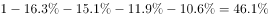受访群体数据未知，不能确定学生一定是第三大受访群体，所以无法判定，错误；

（3）定位材料第二段，30-44岁、20-29岁占比分别为、，则20-44岁占比，正确；

（4）材料没有涉及离退休人员收入的数据，无法判定，错误。

正确的只有（3）1个。

故正确答案为A。

---

### 材料 2

        2011年，全国教育经费总投入为23869.29亿元，比上年增长。2012年，全国教育经费总投入比上年增加3826.68亿元。2013年，全国教育经费总投入比上年增长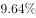，比2009年翻了一番。2014年，全国教育经费总投入32806.46亿元。2015年1-9月，全国财政教育支出累计同比增长。

        2015年，全国普通本专科院校招生人数约为737万人，其中普通本科院校招生人数389万人，比普通专科院校多41万人；在校人数约为2626万人，其中普通本科院校约1577万人，普通专科院校约1049万人；毕业人数约为1000万人，其中普通本科院校约占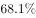，普通专科院校约占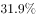。

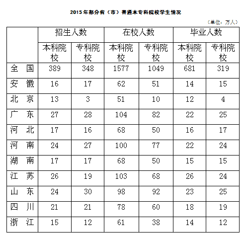

#### 第 6 题　qid 2045734 · 综合

2013年，全国教育经费总投入约为（  ）亿元。

- **A**. 28200
- **B**. 25600
- **C**. 30400　✅
- **D**. 34700

**答案**：C

**官方解析**

由题干“2013年，全国教育经费总投入约······”，结合文字材料第一段，可以算出2012年的全国教育经费总投入，且题目中直接给出了2013年全国教育经费总投入较2012年的增长率，可判定该题为现期计算问题。定位材料第一段，2011年，全国教育经费总投入为23869.29亿元；2012年，全国教育经费总投入比上年增加3826.68亿元；2013年，全国教育经费总投入比上年增长。可得2012年全国教育经费总投入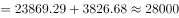亿元，2013年全国教育经费总投入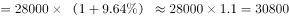亿元，选项C最接近。

故正确答案为C。

---

#### 第 7 题　qid 2045738 · 增长

2014年，全国教育经费投入增速较上年相比约（  ）。

- **A**. 下降了3.2个百分点
- **B**. 提高了3.2个百分点
- **C**. 下降了1.6个百分点　✅
- **D**. 提高了1.6个百分点

**答案**：C

**官方解析**

由题干“2014年，全国教育经费投入增速较上年相比”，结合材料2013年的增长率已经给出，可判定该题为一般增长率问题。定位文字材料第一段，2013年，全国教育经费总投入比上年增长，2014年全国教育经费总投入32806.46亿元，结合上题，2013年全国教育经费总投入约为30400亿元。可得2014年全国教育经费投入增速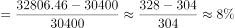，2014年全国教育经费投入增速较上年相比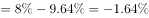，约下降了1.6个百分点。

故正确答案为C。

---

#### 第 8 题　qid 2045742 · 综合

上表所列省（市）中，2015年普通专科院校招生人数不多于该类院校毕业人数的有（  ）个。

- **A**. 3
- **B**. 4　✅
- **C**. 5
- **D**. 6

**答案**：B

**官方解析**

要满足题干所给条件的省（市），则该省（市）的第二列数据（专科招生人数）第六列数据（专科毕业生人数），通过观察，可发现北京、河北、江苏、浙江四个省（市）满足该条件，因此有4个省（市）2015年普通专科院校招生人数不多于该类院校毕业人数。

故正确答案为B。

---

#### 第 9 题　qid 2045746 · 综合

以下省份中，2015年普通本专科院校毕业人数占全国普通本专科院校毕业人数的是（  ）。

- **A**. 江苏　✅
- **B**. 四川
- **C**. 湖南
- **D**. 河北

**答案**：A

**官方解析**

由题干“2015年······占······”，可判定该题为现期比重问题，定位数据表最后两列，2015年全国本科院校毕业人数681万人，专科院校毕业人数319万人，共万人，则其为万人，2015年江苏本专科院校毕业人数万人，满足条件。

故正确答案为A。

---

#### 第 10 题　qid 2045752 · 综合

根据上述资料，以下推论准确的是（  ）。

- **A**. 2010年，全国教育经费总投入超过20000亿元
- **B**. 2015年，河南省普通本专科院校招生总人数位列全国第一
- **C**. 除北京市外，其他省（市）普通本专科院校在校总人数均超过100万
- **D**. 上表所列省（市），普通本科院校在校人数均大于该省（市）普通专科院校在校人数　✅

**答案**：D

**官方解析**

A项：定位文字材料第一段，2010年全国教育经费总投入亿元，错误；

B项：定位数据表中第二、三列，2015年河南普通本专科院校招生总人数，2015年广东普通本专科院校招生总人数2015年河南普通本专科院校招生总人数，且材料只给出部分省市的招生人数，其他省份情况未知不能判断，错误；

C项：定位数据表中第四列和第五列,浙江省本专科院校在校人数，且材料只给出部分省（市）的在校人数，其他省份情况未知不能判断，错误；

D项：定位数据表中第四列和第五列，所有省（市）需满足第四列第五列，通过比较，所有省（市）均满足该条件，正确。

故正确答案为D。

---

### 材料 3

        我国供气来源多元化，主要包括国产气和进口气两部分。国产气主要有常规天然气、页岩气和煤层气等，进口气主要有进口LNG和进口管输气。近年来，我国天然气供应量稳步增加，国产气、进口管输气、进口LNG都呈上涨趋势。国产气从2010年的989.7亿立方米增至2014年的1344.8亿立方米，增长了355.1亿立方米。进口管输气从2010年的35.5亿立方米增至2014年的313亿立方米，增长了7.82倍。

#### 第 11 题　qid 2045756 · 增长

2010—2014年，我国各类天然气供应量年均增速由高到低排列正确的是（  ）。

- **A**. 管输进口量、LNG进口量、国产气量　✅
- **B**. 国产气量、LNG进口量、管输进口量
- **C**. 国产气量、管输进口量、LNG进口量
- **D**. LNG进口量、国产气量、管输进口量

**答案**：A

**官方解析**

题干所求为年均增速的排序，可判定本题为年均增长率的比较问题。当年份差相同时，直接比较即可。定位图一可得，管输进口量的为：；LNG进口量的为：；国产气量的为：。则年均增速由高到低排序应为：管输进口量、LNG进口量、国产气量，A项满足。

故正确答案为A。

---

#### 第 12 题　qid 2045758 · 综合

2014年，全球天然气总产量约是我国各类天然气供应量的（  ）倍。

- **A**. 10
- **B**. 18　✅
- **C**. 27
- **D**. 30

**答案**：B

**官方解析**

题干所求为“2014年，全球天然气总产量是我国供应量的多少倍”，可判定本题为现期倍数计算问题。定位图二，2014年我国天然气产量为1344.8亿立方米，占全球总产量的比重为，则全球天然气总产量。定位图一，2014年我国各类天然气供应量亿立方米。2014年，全球天然气总产量约是我国各类天然气供应量的，与B项接近。 

故正确答案为B。

---

#### 第 13 题　qid 2045760 · 比重

我国进口管输气占全球天然气总产量比重最小的是（  ）年。

- **A**. 2014
- **B**. 2013
- **C**. 2012
- **D**. 2010　✅

**答案**：D

**官方解析**

题干所求为“我国进口管输气占全球天然气总产量比重最小的一年”，可判定本题为比重比较问题。

方法一：全球天然气总产量可根据图二中的数据，用我国天然气产量÷在全球总量中的占比（虚线的折线），即

2010年：；2012年：；2013年：；2014年：。

由于产量在逐年上升，占比也在逐年上升，两数相除数字变化不大。再结合图一，我国进口管输气的量（中间黑色柱子），2010年产量是35.5亿立方米远小于其他年份214、274、313亿立方米。这样可以利用分母变化慢、分子变化快，分子小、分数小的原理来判断，得出2010年比重最小。

方法二：结合图一与图二，各年份所求占比分别为：

A项：；

B项：；

C项：；

D项：。

对比选项，D项乘式两边均小于其他三项，故D项最小。

故正确答案为D。

---

#### 第 14 题　qid 2045762 · 综合

以下数据不能从材料中得到的是（  ）。

- **A**. 2011年我国管输进口量同比增速
- **B**. 2009年我国天然气产量
- **C**. 2010年全球天然气总产量同比增速　✅
- **D**. 我国2010-2014年5年间LNG平均进口量

**答案**：C

**官方解析**

A项：由图一可知2011年和2010年管输进口量，根据增长率计算公式，可求出2011年管输进口量的同比增速。

B项：由图二可知2010年我国天然气产量和同比增长率，根据基期量公式，可求出2009年我国天然气产量。

C项：由图二可以求出2010年全球天然气产量，但无法得知2009年全球天然气产量，所以无法求出2010年全球天然气产量的同比增速。

D项：由图一可知2010年—2014年各年份的LNG进口量，故可以求出5年间的平均值。

本题为选非题，故正确答案为C。

---

#### 第 15 题　qid 2045764 · 综合

以下说法错误的是（  ）。

- **A**. 2010-2014年，全球天然气总产量逐年递增
- **B**. 我国天然气产量2013年同比增长近2倍　✅
- **C**. 2010-2014年，我国天然气的供应主要依靠国产气
- **D**. 2012年，我国管输进口量反超LNG进口量

**答案**：B

**官方解析**

A项：根据图二可得，2010-2014年，全球天然气总产量分别为： 、 、 、 、。分子增长率可以看实线折线图，而分母增长率均小于分子增长率，分子变化快，看分子，分子逐步增大，故分数逐步增大，说法正确；

B项：方法一：2012年我国天然气产量1142.8亿立方米   ，2013年我国天然气产量1248.7亿立方米   ，比较两个数字，我国天然气产量2013年同比增长，并非增长2倍。

方法二：看折线图（实线），2013年我国天然气的增长率为，并非同比增长近2倍，说法错误；

C项：由图一可知，我国各类天然气中国产气量在2010-2014年均是三者之中最多的，所占比重均超过，我国天然气的供应主要靠国产气，说法正确；

D项：由图一可知，2011年管输进口量少于LNG进口量，2012年管输进口量超过LNG进口量，说法正确。

本题为选非题，故正确答案为B。

---
