# 2017年新疆兵团公务员录用考试《行测》题（网友回忆版）

> 省考 · 2017 年 · 5 个模块 · 共 107 题

- [常识判断](#%E5%B8%B8%E8%AF%86%E5%88%A4%E6%96%AD) · 20 题
- [言语理解与表达](#%E8%A8%80%E8%AF%AD%E7%90%86%E8%A7%A3%E4%B8%8E%E8%A1%A8%E8%BE%BE) · 40 题
- [数量关系](#%E6%95%B0%E9%87%8F%E5%85%B3%E7%B3%BB) · 10 题
- [判断推理](#%E5%88%A4%E6%96%AD%E6%8E%A8%E7%90%86) · 25 题
- [资料分析](#%E8%B5%84%E6%96%99%E5%88%86%E6%9E%90) · 12 题

---

## 常识判断

### 第 1 题　qid 2144695 · 人文常识

1986年9月，邓小平在会见波兰客人时说：“我们两国原来的政治体制都是从苏联模式来的。看来这个模式在苏联也不是很成功的。即使在苏联百分之百的成功，但是它能够符合中国的实际情况吗？能够符合波兰的实际情况吗？······我们现在提出政治体制改革，是根据我国的实际情况决定的。”邓小平同志上述论断主要体现的哲学道理是（    ）。

- **A**. 矛盾具有普遍性
- **B**. 矛盾具有特殊性　✅
- **C**. 内因对事物的发展起决定性作用
- **D**. 联系具有条件性

**答案**：B

**官方解析**

本题考查常识判断中的政治常识，主要考查矛盾具体问题具体分析等有关知识点，需要结合题干材料分析。
A项错误，矛盾的普遍性是指：（1）矛盾存在于一切事物中，即事事有矛盾；（2）矛盾贯穿每一事物发展过程的始终，即时时有矛盾。邓小平的上述论断并没有体现矛盾无处不在，无时不有。
B项正确，矛盾的特殊性范畴表明，矛盾及其各个方面在不同发展阶段各有特点，所以，我们观察事物，首先就要注意到矛盾的特殊性，坚持具体问题具体分析，政治体制改革是根据我国的实际情况决定，而不是一味地照搬照抄。
C项错误，内因是事物发展的根据，是第一位的原因，它是事物存在的基础，是一事物区别于他事物的内在本质。选项表述正确，但与题意无关。
D项错误，联系具有条件性，任何一个具体事物只有在一定的条件下才能产生、生存和发展，任何具体的联系无不依赖于一定的条件；随着条件的改变，事物之间以及事物内部各要素之间联系的性质和方式，也要发生变化。选项表述正确，但与题干无关。
故正确答案为B。

---

### 第 2 题　qid 2144699 · 人文常识

扶贫先扶志。弱鸟可望先飞，至贫可能先富，但能否实现“先飞”“先富”，首先要看我们头脑里有无这种意识，贫困地区完全可能依靠自身努力、政策、长处、优势在特定领域“先飞”，以弥补贫困带来的劣势。如果扶贫不扶志，扶贫的目的就难以达到，即使一度脱贫，也可能会再度返贫。“扶贫先扶志”体现的哲学道理是（    ）。

- **A**. 外因是事物变化发展的重要条件
- **B**. 内因是事物变化发展的根本原因　✅
- **C**. 发展就是前进性与曲折性的统一
- **D**. 事物的普遍联系构成事物的发展

**答案**：B

**官方解析**

本题考查常识判断中的政治常识，主要涉及内因与外因的辩证关系等有关知识点，需要结合题干材料分析。
A项错误，事物变化、发展的外在原因，即一事物和他事物的互相联系和互相影响。唯物辩证法认为外因只是事物发展、变化的条件，外因只有通过内因才能起作用。题干中强调的是内因的作用。
B项正确，内因是事物变化发展的内在根据，是事物存在的基础，是一事物区别于他事物的内在本质，是事物运动的源泉和动力，它规定着事物运动和发展的基本趋势。题干中“扶贫先扶志”体现的哲学道理就是内因是事物变化发展的根本原因。
C项错误，事物发展的总趋势是前进的，而发展的道路则是迂回曲折的。任何事物的发展都是前进性与曲折性的统一。前途是光明的，道路是曲折的，在前进中有曲折，在曲折中向前进，是一切新事物发展的途径。选项表述正确，但题干中并没有体现此原理。
D项错误，辩证法认为，事物是普遍联系的，联系构成了运动，引起了变化，推动了事物的发展，“事物的普遍联系构成事物的发展”本身没有这种提法，事物发展根本原因是其自身存在矛盾，所以正确表述应为“事物的矛盾构成事物的发展”。
故正确答案为B。

---

### 第 3 题　qid 2144701 · 人文常识

目前，我国的中心工作是全面建成小康社会。这个“全面”，既要城市繁荣，也不让农村凋敝；既要东部率先，也要西部开发、中部崛起、东北振兴；既要物质丰裕，也要精神丰富；既要金山银山，也要绿水青山。这就需要我们依据五大发展理念坚持（    ）。

- **A**. 创新发展
- **B**. 共享发展
- **C**. 可持续发展
- **D**. 协调发展　✅

**答案**：D

**官方解析**

本题考查常识判断中的时政常识，主要涉及五大发展理念等有关知识点，需要结合题干材料分析。
A项错误，坚持创新发展，必须把创新摆在国家发展全局的核心位置，不断推进理论创新、制度创新、科技创新、文化创新等各方面创新，让创新贯穿党和国家一切工作，让创新在全社会蔚然成风，与题干论述无关。
B项错误，坚持共享发展，必须坚持发展为了人民、发展依靠人民、发展成果由人民共享，作出更有效的制度安排，使全体人民在共建共享发展中有更多获得感，增强发展动力，增进人民团结，朝着共同富裕方向稳步前进，与题干论述无关。
C项错误，可持续发展能力不断增强，经济结构调整取得显著成效，人口总量得到有效控制，生态环境明显改善，资源利用率显著提高，促进人与自然的和谐，推动整个社会走上生产发展、生活富裕、生态良好的文明发展道路，与题干论述无关。
D项正确，协调发展增强发展整体性，是全面建成小康社会的决胜之举。办成一件事，需要协调；推进一项事业，需要协调；成就一番伟业，更需要协调。协调是成事成功的一大规律、一把“金钥匙”，是全面建成小康社会决战决胜的一大核心理念，要“全面”，就得协调。
故正确答案为D。

---

### 第 4 题　qid 2144704 · 人文常识

2017年是两岸同胞打破隔绝状态、开启民间交流的第30年。30年来，两岸同胞凝心聚力，推动交流合作从无到有，从小到大，不断排除各种干扰破坏，探索出一条两岸关系和平发展的道路。两岸关系和平发展的政治基础是（    ）。

- **A**. 坚持和平统一方针
- **B**. 坚持一个中国原则　✅
- **C**. 坚持对外开放基本国策
- **D**. 坚持高度自治基本原则

**答案**：B

**官方解析**

本题考查常识判断中的时政常识，主要涉及两岸关系等有关知识点，需要结合题干材料分析。
A项错误，党的十六大报告中指出，我们将继续坚持“和平统一，一国两制”的基本方针，贯彻八项主张，以最大的诚意，尽最大的努力争取和平统一的前景。和平统一是基本方针。
B项正确，2016年6月15日国务院台办发言人安峰山在例行新闻发布会上应询表示：“只有确认体现一个中国原则的政治基础，两岸关系制度化交往才能得以延续，两岸关系和平发展成果才不会得而复失，坚持一个中国原则，是两岸关系和平发展的政治基础。”
C项错误，坚持对外开放基本国策、奉行互利共赢的开放战略，是改革开放30多年来中国经济持续快速发展的成功经验，与两岸关系的政治基础关联不大。
D项错误，高度自治基本原则是“一国两制”方针的重要内容，与题干无关。
故正确答案为B。

---

### 第 5 题　qid 2144709 · 人文常识

世界名著《日出·印象》作于1872年，画面展现了一个充满雾霭的海上早晨，一轮红日冉冉东升，港口、码头、舢板在雾中时隐时现，奔放的笔触和冷暖色彩的处理，使整个画面充满宁静与朝气。该画的作者是印象派画家（  ）。

- **A**. 达·芬奇
- **B**. 米开朗基罗
- **C**. 毕加索
- **D**. 莫奈　✅

**答案**：D

**官方解析**

本题考查常识判断中的人文常识，主要涉及艺术流派及作品等有关知识点，需要结合题干材料分析。
A项错误，达·芬奇，文艺复兴时期最完美的代表，是人类历史上绝无仅有的全才，代表作品有《蒙娜丽莎》《最后的晚餐》《岩间圣母》等。
B项错误，米开朗基罗是意大利文艺复兴时期代表人物之一，与拉斐尔和达芬奇并称为文艺复兴后三杰，代表作品有《大卫》《摩西》《奴隶》《创世纪》等。
C项错误，毕加索是西方现代派（立体主义）绘画的主要代表，代表作品有《斗牛士》《格尔尼卡》《和平鸽》《梦》《亚威农少女》等。
D项正确，《日出·印象》，是法国印象派画家莫奈于1872年在勒阿弗尔港口画的一幅写生画。
故正确答案为D。

---

### 第 6 题　qid 2144713 · 人文常识

五环标志是世界范围内最为人们广泛认知的奥林匹克运动会标志，它由（    ）这5个不同颜色的奥林匹克环套接组成，象征五大洲的团结以及全世界运动员友好的精神。

- **A**. 蓝、黑、红、黄、绿　✅
- **B**. 蓝、黑、白、黄、绿
- **C**. 灰、黑、白、黄、绿
- **D**. 褐、蓝、红、黄、绿

**答案**：A

**官方解析**

本题主要考查文化常识。
五环标志，即奥林匹克标志，是由顾拜旦于1913年构思设计的，并由《奥林匹克宪章》确定的。它由5个奥林匹克环套接组成，有蓝、黄、黑、绿、红5种颜色，五环从左到右互相套接，上面是蓝、黑、红环，下面是是黄、绿环，整个造形为一个底部小的规则梯形，象征五大洲的团结以及全世界运动员友好的精神。因此，A项正确，B、C、D三项错误。
故正确答案为A。

---

### 第 7 题　qid 2144718 · 人文常识

“一带一路”倡议已为古丝绸之路赋予了时代的内涵，为亚欧区域合作注入了新的活力。下列各国中，古代陆上丝绸之路没有经过的是（    ）。

- **A**. 阿富汗
- **B**. 美国　✅
- **C**. 沙特阿拉伯
- **D**. 意大利

**答案**：B

**官方解析**

本题主要考查中国历史。陆上丝绸之路，起源于西汉（前202年—8年），汉武帝派张骞出使西域开辟的以首都长安（今西安）为起点，经甘肃、新疆，到中亚、西亚，并连接地中海各国的陆上通道，它的最初作用是运输中国古代出产的丝绸。
A项正确，阿富汗，属于西亚国家，东部与我国接壤，是我国古代陆上丝绸之路经过之地。
B项错误，美国，属于北美国家，而我国古代陆上丝绸之路位于亚欧大陆之上，未涉及到北美（美洲）国家。
C项正确，沙特阿拉伯，属于西亚国家，位于波斯湾以西，古代属于大食国，是我国古代陆上丝绸之路经过之地。
D项正确，意大利，属于欧洲国家，位于地中海北岸，传统丝绸之路以罗马为终点，而罗马现在为意大利首都。
本题为选非题，故正确答案为B。

---

### 第 8 题　qid 2144721 · 法律常识

根据行政处罚追究时效原则，违法行为自发生之日起（    ）内未被发现，不再给予行政处罚。法律另有规定的除外。违法行为有连续或者继续状态的，从行为终了之日起计算。

- **A**. 2年　✅
- **B**. 3年
- **C**. 4年
- **D**. 5年

**答案**：A

**官方解析**

本题主要考查法律常识。
《中华人民共和国行政处罚法》第三十六条规定：“违法行为在二年内未被发现的，不再给予行政处罚；涉及公民生命健康安全、金融安全且有危害后果的，上述期限延长至五年。法律另有规定的除外。前款规定的期限，从违法行为发生之日起计算；违法行为有连续或者继续状态的，从行为终了之日起计算。”据此可知，A项正确，B、C、D三项不符合题意。
故正确答案为A。

---

### 第 9 题　qid 2144727 · 法律常识

张某因邻居李某常把车停在自家门口堵住出路而对李某怀恨在心，张某有听力但不会说话，因此请自己的亲戚与李某争论，然而李某多次口出恶言，张某气急之下用砖头将李某头部砸伤，经鉴定为轻微伤。依据《治安管理处罚法》，对于张某（    ）。

- **A**. 应当不予行政处罚
- **B**. 应当给予行政处罚　✅
- **C**. 可以从轻或减轻处罚
- **D**. 应当从轻或减轻处罚

**答案**：B

**官方解析**

本题主要考查法律常识。
《中华人民共和国治安管理处罚法》第十四条规定：“盲人或者又聋又哑的人违反治安管理的，可以从轻、减轻或者不予处罚。”本案中，张某是哑人而不是聋人，其用砖头打人行为，构成轻微伤，违反了治安管理处罚法，应当给予行政处罚。因此，B项正确，A、C、D三项不符合题意。
故正确答案为B。

---

### 第 10 题　qid 2144729 · 法律常识

甲乙二人决定一同毒死丙，于是趁丙不在，由乙在门外放风，甲潜入丙房间内往丙水杯中下毒。第二天，乙发现丙并未中毒身亡，于是持刀将其杀死。上述案件中，甲属于（    ）。

- **A**. 犯罪中止
- **B**. 犯罪预备
- **C**. 犯罪未遂　✅
- **D**. 犯罪既遂

**答案**：C

**官方解析**

本题主要考查法律常识。
A项错误，《中华人民共和国刑法》第二十四条第一款规定：“在犯罪过程中，自动放弃犯罪或者自动有效地防止犯罪结果发生的，是犯罪中止。”本案中，甲未自动放弃犯罪或者自动有效地防止犯罪结果发生，不构成犯罪中止。
B项错误，《中华人民共和国刑法》第二十二条第一款规定：“为了犯罪，准备工具、制造条件的，是犯罪预备。”本案中，甲乙两人已经着手实行杀人行为（下毒），不可能再构成犯罪预备。
C项正确，《中华人民共和国刑法》第二十三条第一款规定：“已经着手实行犯罪，由于犯罪分子意志以外的原因而未得逞的，是犯罪未遂。”本案中，甲乙两人已经着手（下毒）实行犯罪，但丙并未中毒身亡（甲乙意志以外的原因），甲乙两人下毒这一行为，并未造成丙死亡的结果，构成故意杀人未遂。
D项错误，本案中，甲乙下毒杀人这一行为并未导致丙死亡，不构成犯罪既遂，而第二天乙持刀将丙杀死，乙构成故意杀人既遂。
故正确答案为C。

---

### 第 11 题　qid 2144742 · 人文常识

张某和杨某素有矛盾，某日，两人各纠集了一伙人，在一车站附近路段打架。过程中，张某的同伙彭某持钢管追打杨某的背部，并夺走杨某携带的水果刀，持刀划伤对方两人的手臂、大腿，致对方两人轻伤2级。上述案例中，张某和杨某的行为构成（  ）。

- **A**. 寻衅滋事罪
- **B**. 聚众斗殴罪　✅
- **C**. 招摇撞骗罪
- **D**. 故意杀人罪

**答案**：B

**官方解析**

本题考查法律常识。
A项错误，《中华人民共和国刑法》第二百九十三条规定：“有下列寻衅滋事行为之一，破坏社会秩序的，处五年以下有期徒刑、拘役或者管制：（一）随意殴打他人，情节恶劣的；（二）追逐、拦截、辱骂他人，情节恶劣的；（三）强拿硬要或者任意损毁、占用公私财物，情节严重的；（四）在公共场所起哄闹事，造成公共场所秩序严重混乱的。”在本题中，张某、杨某等人并没有寻衅滋事的行为。
B项正确，《中华人民共和国刑法》第二百九十二条规定：“聚众斗殴的，对首要分子和其他积极参加的，处三年以下有期徒刑、拘役或者管制；有下列情形之一的，对首要分子和其他积极参加的，处三年以上十年以下有期徒刑：（一）多次聚众斗殴的；（二）聚众斗殴人数多，规模大，社会影响恶劣的；（三）在公共场所或者交通要道聚众斗殴，造成社会秩序严重混乱的；（四）持械聚众斗殴的。”在本题中，彭某持有钢管，杨某携带水果刀，双方持械聚众斗殴，符合聚众斗殴罪的第四项。
C项错误，根据《中华人民共和国刑法》第二百七十九条规定：“冒充国家机关工作人员招摇撞骗的，处三年以下有期徒刑、拘役、管制或者剥夺政治权利；情节严重的，处三年以上十年以下有期徒刑。冒充人民警察招摇撞骗的，依照前款的规定从重处罚。”在本题中，张某等人并没有冒充国家机关工作人员招摇撞骗，因而不构成招摇撞骗罪。
D项错误，《中华人民共和国刑法》第二百三十二条规定：“故意杀人，是指故意非法剥夺他人生命的行为。”在本题中，张某、杨某等人并没有要剥夺他人生命的主观意思表示以及客观行为。
故正确答案为B。

---

### 第 12 题　qid 2144745 · 科技常识

相比普通的中性笔，使用碳素墨水钢笔书写的字迹能长期保存而不褪色，这是因为（  ）。

- **A**. 墨水中的碳还原成稳定的物质
- **B**. 墨水中的碳跟纸发生反应生成活泼的物质
- **C**. 墨水中的碳被氧化成活泼的物质
- **D**. 墨水中的碳的化学性质比较稳定　✅

**答案**：D

**官方解析**

本题考查化学常识。
A项错误，碳是一种常见的元素，它的单质可以作为还原剂去还原氧化物，而墨水中的碳作为单质碳，是不需要还原的。因此该表述错误。
B项错误，墨水中的碳单质不与纸发生反应。因此该表述错误。
C项错误，墨水中的碳在常温下化学性质稳定，不易被氧化，只有在特殊情况下，在高温中可以被氧化。因此该表述错误。
D项正确，墨水的主要成分是碳，碳在常温下化学性质很稳定，不容易与其他物质发生反应，受日光照射和空气水分接触不起变化。因此用碳素墨水书写的文字便于保存，不易褪色。
故正确答案为D。

---

### 第 13 题　qid 2144746 · 人文常识

安全色是表达安全信息的颜色。正确辨别安全色，可以使人们尽快对威胁安全和健康的物体和环境作出反应，以防止事故、危害发生。根据我国有关标准，含有“禁止、停止、消防和危险”意思的安全色是（  ）。

- **A**. 红色　✅
- **B**. 黄色
- **C**. 蓝色
- **D**. 绿色

**答案**：A

**官方解析**

本题考查生活常识，主要考查安全色在生活中的应用。安全色是包含红、蓝、黄、绿表示安全信息的颜色，经常被用于安全标志牌、交通标志牌、防护栏杆及机器上不准乱动的部位等，使人们能够对威胁安全和健康的物体和环境作出尽快的反应，以减少事故的发生。
A项正确，红色表示禁止、停止、消防和危险的意思。禁止、停止和有危险的器件设备或环境涂以红色的标记。如禁止标志、交通禁令标志、消防设备、停止按钮和停车、刹车装置的操纵把手、仪表刻度盘上的极限位置刻度、机器转动部件的裸露部分、液化石油气槽车的条带及文字，危险信号旗等。
B项错误，黄色表示注意、警告的意思。如警告标志、交通警告标志、道路交通路面标志、皮带轮及其防护罩的内壁、砂轮机罩的内壁、楼梯的第一级和最后一级的踏步前沿、防护栏杆及警告信号旗等。
C项错误，蓝色表示指令、必须遵守的规定。如指令标志、交通指示标志等。
D项错误，绿色表示通行、安全和提供信息的意思。可以通行或安全情况涂以绿色标记。如表示通行、机器启动按钮、安全信号旗等。
故正确答案为A。

---

### 第 14 题　qid 2144749 · 科技常识

在体操比赛中，我们经常能够看到运动员会在手或器械上擦一种白色粉末，这种白色粉末实际上是一种防滑的（  ），涂抹的目的是增加手掌与器械之间的摩擦力，防止从器械上脱手。

- **A**. 氧化铜
- **B**. 氧化铁
- **C**. 氢氧化钠
- **D**. 碳酸镁　✅

**答案**：D

**官方解析**

本题考查化学常识。
A项错误，氧化铜是一种铜的黑色氧化物，稍有吸湿性。氧化铜在常温下为黑色或棕黑色的结晶性粉末。
B项错误，氧化铁常温下外观为红棕色粉末。
C项错误，氢氧化钠常温下一般为片状或块状形态，易溶于水。因此不能起到吸湿作用。
D项正确，碳酸镁，人们通常称为“镁粉”，它具有很强的吸湿作用。碳酸镁的吸湿是一种吸附水的过程，它本身在常温下并不与水发生明显的化学作用。具有吸湿功能的物质很多，但并不是吸湿性越强就越好。实践证明，碳酸镁的手感最好，它吸湿功能适中，不损伤皮肤，不但有利于抓握器械，而且当运动员松手时，手与器械之间不会发生粘滞。此外，由于碳酸镁末颗粒很细，有助于填充手掌与器械之间的缝隙，使手握得更加有力。
故正确答案为D。

---

### 第 15 题　qid 2144751 · 人文常识

民谚“水上的葫芦——沉不下去”，究其原因，主要是由于（  ），故只能漂浮在水面上。

- **A**. 葫芦的体积小于水的体积
- **B**. 葫芦的质量小于水的质量
- **C**. 葫芦的密度小于水的密度　✅
- **D**. 葫芦的比热容小于水的比热容

**答案**：C

**官方解析**

本题考查物理常识。
A项错误，葫芦的体积由实际葫芦的大小决定，水的体积也与水的多少有关。二者的体积因为客观实际的不同，并没有可比性。
B项错误，质量是量度物体惯性大小的物理量，质量与体积一样，对于同一种物质而言也由于个体的差异而不同。因此，对于不同种类的葫芦和水而言，并没有可比性。
C项正确，密度是物质每单位体积内的质量。密度是物质的一种特性，它不随质量、体积的改变而改变，同种物质的密度不变。密度大的物质重，密度小的物质轻。由于葫芦的密度小于水的密度，因此葫芦较之于水，比水轻，因此葫芦漂浮在水面上。
D项错误，比热容是单位质量物质的热容量，即让单位质量物体改变单位温度时的吸收或释放的内能。比热容与吸热放热过程有关，与题干无关。
故正确答案为C。

---

### 第 16 题　qid 2144752 · 人文常识

近年来，3D立体电影的流行给人们带来了身临其境的享受。3D立体电影能产生三维立体效果，主要是利用了（  ）和会聚功能这一原理。

- **A**. 人双眼观察物体接收光源的差异
- **B**. 人双眼观察物体的辨色的差异
- **C**. 人双眼观察物体的视力的差异
- **D**. 人双眼观察物体的角度的差异　✅

**答案**：D

**官方解析**

本题考查物理常识。
人以左右眼看同样的对象，两眼所见角度不同，在视网膜上形成的像并不完全相同，这两个像经过大脑综合以后就能区分物体的前后、远近，从而产生立体视觉。
立体电影的原理即为以两台摄影机仿照人眼睛的视角同时拍摄，在放映时亦以两台放影机同步放映至同一面银幕上，使观众左眼看到从左视角拍摄的画面，右眼看到从右视角拍摄的画面，通过双眼的会聚功能，合成为立体视觉影像。因此与人眼观察事物的原理相同，3D立体电影能产生三维立体效果，主要是利用了人双眼观察物体的角度的差异和会聚功能这一原理。因此，D项正确。
故正确答案为D。

---

### 第 17 题　qid 2144754 · 地理国情

“乡愁是一湾浅浅的海峡，我在这头，大陆在那头”是余光中所写的脍炙人口的诗句。下列有关“这头”的说法，错误的是（  ）。

- **A**. 位于我国东南沿海的大陆架上
- **B**. 明朝时期郑成功曾收复此地
- **C**. 在我国古代曾被称为“瀛洲”
- **D**. 曾因《南京条约》沦为日本的殖民地　✅

**答案**：D

**官方解析**

台湾著名诗人余光中的诗《乡愁》中写道：“乡愁是一弯浅浅的海峡，我在这头，大陆在那头。”诗句中的“这头”是指台湾海峡。
A项正确，台湾位于中国大陆东南沿海的大陆架上，东临太平洋，东北邻琉球群岛，南界巴士海峡与菲律宾群岛相对，西隔台湾海峡与福建省相望。
B项正确，1661年，南明将领郑成功驱逐窃取台湾的荷兰殖民者收复宝岛台湾，结束了荷兰东印度公司在中国台湾的经营，开启了明郑政权对台湾的统治。
C项正确，台湾地区自古以来就是我国的领土，在秦朝时被称为“瀛洲”。在中国古代文献里，台湾还被称为“贷舆”、“员峤”、“岛夷”、“夷洲”、“琉球”等。
D项错误，《南京条约》割香港岛给英国。《马关条约》中，中国割让辽东半岛、台湾岛及其附属各岛屿、澎湖列岛给日本。因此台湾因《马关条约》沦为日本的殖民地而不是《南京条约》。
本题为选非题，故正确答案为D。

---

### 第 18 题　qid 2144755 · 人文常识

她是中国历史上唯一的正统女皇帝，也是即位年龄最大（67岁即位）、寿命最长（终年82岁）的皇帝之一。“她”指的是（  ）。

- **A**. 慈禧
- **B**. 吕雉
- **C**. 萧绰
- **D**. 武则天　✅

**答案**：D

**官方解析**

A项错误，慈禧（1835年11月29日—1908年11月15日）即孝钦显皇后，咸丰帝的妃嫔，同治帝的生母。晚清重要政治人物，清朝晚期的实际统治者。与题干描述不符。
B项错误，吕雉（公元前241年－公元前180年8月18日），通称吕后。吕雉是汉高祖刘邦的皇后，高祖死后，被尊为皇太后。吕雉是秦始皇统一中国，实行皇帝制度之后，第一个临朝称制的女性。吕雉没有即位，与题干描述不符。
C项错误，萧绰（953年－1009年），契丹族，辽朝政治家、军事家和改革家。982年，萧绰的丈夫辽景宗病逝后，年仅十二岁的儿子耶律隆绪继承皇位，萧绰以太后身份临朝称制，总摄国家大事。她摄政期间，辽朝进入了最为鼎盛的辉煌时期。
D项正确，武则天（624年－705年12月16日），本名珝，后改名曌。武则天是中国历史上唯一的正统的女皇帝（690年―705年在位），也是即位年龄最大（67岁即位）、寿命最长的皇帝之一（终年82岁）。故“她”指的是武则天。
故正确答案为D。

---

### 第 19 题　qid 2144756 · 人文常识

唐太宗从波澜壮阔的农民战争中认识到人民群众力量的伟大，吸取隋朝灭亡的原因，非常重视百姓的生活。他强调以民为本，常说：“民，水也；君，舟也。水能载舟，亦能覆舟。”唐太宗即位之初，便下令轻徭薄赋，让百姓休养生息。唐太宗的执政措施实质体现了（  ）思想。

- **A**. 法家的“以法治国”
- **B**. 墨家的“兼爱非攻”
- **C**. 儒家的“仁政德治”　✅
- **D**. 道家的“自然无为”

**答案**：C

**官方解析**

本题考查文化常识。由题干描述可知，唐太宗的执政措施实质体现了一种民本思想。
A项错误，法家思想的核心理念是以法治国，法家高度重视法制，把法律视为一种有利于社会统治的强制性工具，重视法制建设，成为中央集权者稳定社会动荡的主要统治手段。题干没有涉及“法”的概念。
B项错误，墨家思想主张“兼爱非攻”。兼爱就是大到国家小到人与人之间都要互相爱护、都能互相得到利益；非攻就是反对一切非正义的战争。本题主要强调的是唐太宗的“民本思想”，不涉及“兼爱非攻”的内容。
C项正确，仁政是儒家思想代表孟子从孔子的“仁学”继承发展而来。“仁政”的基本精神是对人民有深切的同情和爱心。孟子的"仁政"在政治上提倡“以民为本”；儒家的德治就是主张以道德去感化教育人。唐太宗李世民执政措施实质体现的就是儒家的“仁政德治”思想。
D项错误，道家的“自然无为”思想认为宇宙万物的存在及发展都是自然而然的，不受任何意志的支配。题干未涉及这一思想。
故正确答案为C。

---

### 第 20 题　qid 2144757 · 经济常识

中国人民银行授权中国外汇交易中心公布，2017年9月15日银行间外汇市场人民币汇率中间价为：1美元对人民币6.5423元。人民币汇率中间价持续走高，若不考虑其他因素的影响，下列说法正确的是（  ）。

- **A**. 国税局出口退税将增加
- **B**. 出口贸易型企业效益将提升
- **C**. 出国游人数会增加　✅
- **D**. 海外购交易额将下降

**答案**：C

**官方解析**

本题考查经济常识。“人民币汇率中间价持续走高”指的是人民币对美元持续升值，人民币在国际市场上购买力增强。
A项错误，出口退税即退还出口货物的国内已纳税款来平衡国内产品的税收负担。外币相对贬值，则消费我国产品的购买力下降，出口减少，出口退税也将减少。
B项错误，人民币对美元升值，意味着中国商品的价格提高了，外国企业或者个人消费者用同样的钱可以买到的中国商品减少，不利于增加我国产品在国外市场的竞争力，出口贸易型企业效益将下降。
C项正确，人民币升值，意味着人民币更“值钱”了，用同样的人民币可以买到更多的外国商品、享受到更多以外币计价的服务，因此出国游人数会增加。
D项错误，根据C项所述，人民币升值后购买力增强，海外购交易额将会上升。
故正确答案为C。

---

## 言语理解与表达

### 第 1 题　qid 2144711 · 逻辑填空

网络对儿童而言是一把“双刃剑”，一方面可以让儿童更早        现代人必备的网络知识和技能，为他们打开通往未知世界的大门；另一方面，过早触网也容易让儿童        于网络游戏等虚拟空间不能自拔，容易对儿童的正常学习和成长造成影响和干扰。
依次填入划横线部分最恰当的一项是（    ）。

- **A**. 接触 沉溺　✅
- **B**. 触摸 享受
- **C**. 了解 迷惑
- **D**. 熟练 堕落

**答案**：A

**官方解析**

第一空，横线处所填词语与“知识和技能”搭配，体现儿童较早具备应用网络的能力。A项“接触网络知识和技能”、C项“了解网络知识和技能”搭配恰当，均符合文意，保留。B项“触摸”意思是接触、抚摸，常搭配具体事物，与“知识和技能”无法搭配，D项“熟练”指熟知并做来顺手，“熟练网络技能”搭配尚可，但“熟练”与“知识”无法直接搭配，常表述为“熟练掌握网络知识”、“熟练运用网络知识”，均排除。
第二空，文意表达“过早触网”使儿童陷入网络游戏中“不能自拔”，从而影响学习和成长，横线处所填词语与“网络游戏”搭配，A项“沉溺”常形容陷入不良境地，难以自拔的状态，符合文意且与“不能自拔”对应紧密，当选。C项“迷惑”意为使人迷乱、辨不清是非，通常表述为“受迷惑”，与后文“于”搭配不当，排除。
故正确答案为A。

---

### 第 2 题　qid 2144724 · 逻辑填空

一件保留着旧家具线条和质感的桌子或是储物架或是一张床，你能        到它所代表的那个时代的美好和情怀，四四方方、敦实简朴：那是小孩子骑着三只小轮子的童车串胡同的快乐；也是夏天院子里刚洗好的白床单，在阳光里        出的洗衣皂香。
依次填入划横线部分最恰当的一项是（    ）。

- **A**. 体验 散逸
- **B**. 感受 散发　✅
- **C**. 感应 散发
- **D**. 触摸 散逸

**答案**：B

**官方解析**

第一空，文段表达人们可以从旧家具中体会到时代的情怀，横线处所填词语与“时代的美好和情怀”搭配，A项“体验”指在实践中认识事物、亲身经历，B项“感受”指体会、感想、受到感染，D项“触摸”意思是接触、抚摸，通过旧家具触摸时代的美好和情怀，语义尚可，均符合文意，保留。C项“感应”指一个事物受影响而对另一事物引起反应，其中一般不出现可见的“介质”，如“天人感应”，“心灵感应”，与文段通过“旧家具”体会“时代的美好和情怀”不符，排除。
第二空，所填词语与表示气味的“洗衣皂香”搭配，对比“散发”与“散逸”，“散发”指分散发出，释放出某种东西，“散发气味”为常见搭配，B项符合文意，当选。“散逸”指流散，散失，文段要表达的是皂香散发出来，而非皂香流散、消失，故排除A、D二项。
故正确答案为B。

---

### 第 3 题　qid 2144738 · 逻辑填空

在诗的最后一节，诗人写出了现代文明的冲击对他本人的影响。从寥寥数笔的        中，我们不难体味到诗人对现代文明的大胆        。
依次填入划横线部分最恰当的一项是（    ）。

- **A**. 描绘 捉弄
- **B**. 刻画 嘲讽
- **C**. 勾勒 嘲弄　✅
- **D**. 勾画 玩弄

**答案**：C

**官方解析**

根据文意，诗人受到了现代文明的冲击，因而通过诗歌去批判“现代文明”。第一空，所填词语表达诗人对诗歌最后一节的创作方式，A项“描绘”泛指描写、描述、描画，C项“勾勒”与D项“勾画”为同义词，本义为用线条描画出轮廓，也可引申为用简练的文笔叙述大概情况，均符合文意，保留。B项“刻画”指细致入微的描写，与前文“寥寥数笔”对应不当，排除。
第二空，所填词语与“现代文明”搭配，用以体现诗人通过创作诗歌去批判现代文明的目的。C项“嘲弄”意为嘲笑、戏弄，可体现出诗人对现代文明的讽刺、不屑，符合诗人“批判”的态度，当选。A项“捉弄”指对别人开玩笑，使人为难，常与“人”搭配，无法搭配“现代文明”，排除；D项“玩弄”指用不严肃、不尊重的态度对待人或事物，含贬义，文段并非表达诗人对“现代文明”不严肃、不尊重、而是批判“现代文明”，排除。
故正确答案为C。

---

### 第 4 题　qid 2144750 · 逻辑填空

远处云烟缭绕、植被茂密的青山，以及行走在街头身着民族服饰的不丹人，足以        城市外观上的漏洞。廷布街头的不丹女人大多身穿宽袖窄身的“旗拉”，男人不少则穿着过膝长袍“帼”，服装的布料都是织造的，用的是自然布料，且以传统自然染料染成，即使远看也有一种        。
依次填入划横线部分最恰当的一项是（    ）。

- **A**. 弥补 韵味　✅
- **B**. 补偿 风味
- **C**. 抵偿 趣味
- **D**. 填补 味道

**答案**：A

**官方解析**

第一空，横线处搭配“漏洞”，A项“弥补”指把不够的事或物充满，补满，D项“填补”指填充空白，均符合语境，保留。B项“补偿”指赔偿、抵销损耗，通常说“补偿损失”，与“漏洞”搭配不当，排除；C项“抵偿”指以价值相等的事物赔偿或补偿，“青山”“不丹人”与“城市外观上的漏洞”并非价值相等的事物，不符合语境，排除。
第二空，形容不丹人的服装，A项“韵味”指含蓄的意味或情趣风味，不丹人的服装，看起来很有韵味，符合语境，当选。D项“味道”通常指味觉所体会到的滋味，不如“韵味”更能体现不丹人服饰看起来的情趣风味，排除。
故正确答案为A。

---

### 第 5 题　qid 2144753 · 逻辑填空

目前，我国杂技院团和杂技从业者以及杂技市场之间缺乏有效的        ，杂技院团还未对市场有充分的了解，就        锁定目标，按照杂技先练技巧再拼接的传统方法把节目先排出来，这样虽然能保证杂技表演的质量，但未必是目前杂技演艺市场最为需要的。
依次填入划横线部分最恰当的一项是（    ）。

- **A**. 磨合 精准
- **B**. 磨合 盲目　✅
- **C**. 摩擦 精准
- **D**. 摩擦 盲目

**答案**：B

**官方解析**

第一空，根据“杂技院团还未对市场有充分的了解”可知，横线处所填词语表达杂技院团和杂技从业者以及杂技市场之间缺乏有效的沟通、交流。“磨合”指的是两个或两个以上事物，处于同类别，却存在差异，通过交流交往逐步形成共识，融合同化为共同体的过程，符合语境。“摩擦”通常指观点相反者之间的冲突，不符合语境，排除C、D两项。
第二空，根据“杂技院团还未对市场有充分的了解”可知，在没有充分了解的情况下锁定目标，体现出的是“盲目”，而非“精准”，排除A项。
故正确答案为B。

---

### 第 6 题　qid 2144758 · 逻辑填空

如何去        隐藏在已千变万化了的各种学说背后尚未完全遗失的经典原貌，获得真实的体温和人格图谱，从而剥离后世僵化、变异、乏味、随心所欲的解读，尤其是那些自以为智慧的肢解和        ，当是目前国学热当中应解决的重要问题。
依次填入划横线部分最恰当的一项是（    ）。

- **A**. 探求 伪造
- **B**. 搜寻 修改
- **C**. 发掘 篡改　✅
- **D**. 挖掘 窜改

**答案**：C

**官方解析**

本题可从第二空入手，横线处所填词语与“自以为智慧的肢解”意思相近，感情色彩消极，体现出的是“后世僵化、变异、乏味、随心所欲的解读”。C项“篡改”指用作伪的手段对经典、理论、政策等进行改动或曲解，可以表达对经典的曲解，符合语境，保留。A项“伪造”指编造、捏造、以假乱真，文段指的是错误的解读，而非造假，排除；B项“修改”指改动、删节或纠正修改有错误的文本，以达到提高文章质量的目的，D项“窜改”指改动，删改，通常指语言文字表面的修改，二者均为中性词，与文段感情色彩不符，排除。
第一空，代入验证，横线处搭配“经典原貌”，C项“发掘”指把埋藏的东西挖掘出来，与后文“隐藏在已千变万化了的各种学说背后的······”对应恰当，当选。
故正确答案为C。

---

### 第 7 题　qid 2144759 · 逻辑填空

《金陵小巷人物志》这本书在设计上            ，几乎没有封面，直接以装订的第一页作为封面，从封面到内页，都选用了粗糙耐用、富有生活气息的牛皮纸，整本书像是块毛坯砖，            ，“小人物”的精彩也在设计中得到了很好的体现。
依次填入划横线部分最恰当的一项是（    ）。

- **A**. 独具匠心 素面朝天
- **B**. 独具匠心 朴实无华　✅
- **C**. 突发奇想 素面朝天
- **D**. 突发奇想 朴实无华

**答案**：B

**官方解析**

第一空，用来形容书本的设计，根据“没有封面······选用牛皮纸、整本书像是块毛坯砖”可知，书本的设计特点鲜明，且根据“‘小人物’的精彩也在设计中得到了很好的体现”可知，作者对于此种设计持积极的态度。“独具匠心”意思是具有独特的巧妙心思，多指技术或艺术方面有创造性，可以用来形容本书独特的设计风格；而“突发奇想”形容突然想出一个非常奇怪的想法，该书的新颖设计并没有体现出“突然”，也不“奇怪”，故排除C、D两项。
第二空，根据“整本书像是块毛坯砖”可知，书本的设计没有任何的雕饰，又根据“‘小人物’的精彩也在设计中得到了很好的体现”可知，横线处所填词语感情色彩积极。B项“朴实无华”意为质朴实在而不浮华，语义恰当且感情色彩符合，当选。A项“素面朝天”原意是指不施脂粉而朝见皇帝，可以体现不加修饰，但为中性词，与文段感情色彩不符，排除。
故正确答案为B

---

### 第 8 题　qid 2144760 · 逻辑填空

人们曾经        的奇妙技术实际上已经在无声无息中应用到日常生活的方方面面。对于很多都市人来说，比朋友更重要的智能手机中的每一个应用，都是人工智能程序为用户            的生活规划。
依次填入划横线部分最恰当的一项是（    ）。

- **A**. 渴求 量身打造　✅
- **B**. 希望 量身打造
- **C**. 渴求 量体裁衣
- **D**. 希望 量体裁衣

**答案**：A

**官方解析**

第一空，用来形容人们对技术的追求，对比“渴求”与“希望”，“希望”是指盼望、期望，“渴求”是指迫切地要求或追求，语义程度较之“希望”更重，故“渴求”更符合人们急切追求和发展新技术的语境，排除B、D两项。
第二空，用来形容人工智能程序如何为用户提供生活规划，A项“量身打造”意思是按照身体尺寸定式制作，可以用来形容人工智能程序根据每个用户的不同需求而制定个性化的规划，符合文意，当选。C项“量体裁衣”比喻做事从实际情况出发，与文意不符，排除。
 故正确答案为A。

---

### 第 9 题　qid 2144763 · 逻辑填空

看病“货比三家”造成医疗资源的巨大浪费，客观上也进一步        了“医生荒”。究其原因，一方面是患者对自身的疾病过于担忧和焦虑。从积极的角度来看，这是现在公众更加重视自身健康的表现，值得肯定，但是            ，并不值得提倡。另一方面，则是患者对医生和医院缺乏信任，总想在不同的医院和医生之间进行反复比较和验证，一旦两个或者是多个医生给出的结论不一致，患者就更加担心和焦虑，只能去另寻高明，结果就陷入一种恶性循环。
依次填入划横线部分最恰当的一项是（    ）。

- **A**. 加剧 过犹不及　✅
- **B**. 增加 物极必反
- **C**. 加重 适可而止
- **D**. 恶化 矫枉过正

**答案**：A

**官方解析**

本题可从第二空入手，“但是”连接前后表示转折关系，横线处所填词语与“值得肯定”语义相反，表达的是“并不提倡”的原因。A项，“过犹不及”意为事情做得过头，就跟做得不够一样，都是不合适的，可以用来说明患者过度关注自身健康就会达不到关注健康的效果，符合文意，保留。B项，“物极必反”指事物发展到极端，会向相反方向转化，程度过重，文段并没有表述患者过度关注自身健康到了一种极端的地步，不符合文意，排除；C项，“适可而止”指到适当的程度就停下来，不要过头，“适可而止”是值得提倡的，与文意相悖，排除；D项，“矫枉过正”比喻纠正错误超过了应有的限度，患者关注自身的健康情况并不是错误，也没有表达过度纠正错误的意思，语义不符，排除。
第一空，代入验证，A项“加剧”表示使程度变得更为严重，局势加剧恶化，形容“医生荒”的形势更为严峻，符合文意，当选。
故正确答案为A。

---

### 第 10 题　qid 2144764 · 逻辑填空

在        着传统女性乞巧习俗、忠贞不渝爱情观和现代时尚情人节多样标签的七夕，已经愈加成为        传统文化的窗口，成为青年人眼中表达浪漫爱情的舞台。
依次填入划横线部分最恰当的一项是（    ）。

- **A**. 承继 宣扬　✅
- **B**. 发展 弘扬
- **C**. 沿袭 推广
- **D**. 跟随 宣扬

**答案**：A

**官方解析**

第一空，搭配“多样标签”，表达七夕节兼具多元文化标签之意。A项“承继”泛指把前人或他人的作风、文化、知识等接受过来，置于此处形容七夕将“传统女性乞巧习俗、忠贞不渝爱情观”等多领域的特点承继下来，符合文意，保留。B项“发展”指事物由小到大、由简单到复杂、由低级到高级的变化，D项“跟随”指随从跟在后面，均与文意不符，排除；C项“沿袭”侧重依照旧传统、旧惯例的沿用，多用于搭配旧制度、旧规矩、老套路等，与“多样标签”搭配不当，排除。
第二空，代入验证。搭配“传统文化”，A项“宣扬”指广泛传布，传扬，“宣扬传统文化”搭配得当，当选。
故正确答案为A。

---

### 第 11 题　qid 2144768 · 逻辑填空

文物保护有时与大众的想法因出发点不同而会产生分歧，比如出于保护的考虑，很多墓葬遗址能不发掘就不发掘，      知道里面可能有价值连城的文物，      文物本身蕴含的历史价值和文化价值更重要。
依次填入划横线部分最恰当的一项是（  ）。

- **A**. 因为  但
- **B**. 不但  而且
- **C**. 即使  但　✅
- **D**. 既  又

**答案**：C

**官方解析**

第一空根据前后文可知，填入的词语应表示一种假设，C项“即使”表示假设的让步，符合题意。其它三项都无法表示一种假设，均不符合题意，排除。
验证第二空，“但”表示转折，强调“文物本身蕴含的历史价值和文化价值更重要”，符合题意。
故正确答案为C。

---

### 第 12 题　qid 2144770 · 逻辑填空

制定一项公共政策时就算再            、未雨绸缪，也不能无视广大基层民众的心声，无视“公平”二字，否则只能成为            了。
依次填入划横线部分最恰当的一项是（  ）。

- **A**. 管中窥豹  众叛亲离
- **B**. 居安思危  无的放矢
- **C**. 高谈弘论  千夫所指
- **D**. 高瞻远瞩  众矢之的　✅

**答案**：D

**官方解析**

第一空，通过顿号表示并列，所填成语应与“未雨绸缪”意思相近，用来形容“制定一项公共政策”事先做好准备工作。B项“居安思危”指随时有应付意外事件的思想准备，D项“高瞻远瞩”指站得高，看得远，比喻眼光远大，两者均符合题意，保留。A项“管中窥豹”比喻只看到事物的一部分，指所见不全面或略有所得，和文段意思不相符，排除；C项“高谈弘论”指高深空洞不切实际的谈论，不符合题意，排除。
第二空，所填成语形容“无视‘公平’二字”所带来的后果，”D项“众矢之的”比喻大家攻击的对象，符合题意。B项“无的放矢”比喻说话做事没有明确目的，或不切合实际，与“成为”搭配不当，排除。
故正确答案为D。

---

### 第 13 题　qid 2144771 · 逻辑填空

近年来，随着金融改革开放步伐加快，多层次资本市场建设稳步推进，金融市场创新日趋活跃，与金融密切相关的金融信息服务出现             的发展，但金融信息质量              ，市场秩序有待健全规范。
依次填入划横线部分最恰当的一项是（    ）。

- **A**. 突飞猛进  参差不齐　✅
- **B**. 日新月异  良莠不齐
- **C**. 江河日下  泥沙俱下
- **D**. 与日俱增  鱼目混珠

**答案**：A

**官方解析**

第一空，根据“改革开放步伐加快······稳步推进······日趋活跃”可知，横线处表达金融信息服务发展速度快之意。
A项“突飞猛进”形容发形容进步和发展特别迅速，契合文段语境，保留。B项“日新月异”形容指发展或进步迅速，不断出现新事物、新气象，侧重“更新迅速”，文段侧重行业整体发展提速，并非“更新频率高”，不符合文意，排除；C项“江河日下”比喻情况一天一天的坏下去，与文段向好的语境相悖，排除；D项“与日俱增”侧重数量、规模随时间增长，无法修饰“发展”整体态势，搭配不当，排除。
第二空，代入验证。横线处搭配“金融信息质量”，A项“参差不齐”侧重水准、层级高低不一，契合行业快速发展过程中形成的水平差异，当选。
故正确答案为A。

---

### 第 14 题　qid 2144772 · 逻辑填空

全国政协工作                关注民生、保障民生、改善民生，这既是职责所在，更是党和人民的重托。        ，对于各级党委、政府和领导干部来说，关注民生是最大的政治，改善和保障民生是最大的政绩。依次填入划横线部分最恰当的一项是（  ）。

- **A**. 专心致志  然而
- **B**. 坚忍不拔  同样
- **C**. 矢志不渝  同样　✅
- **D**. 持之以恒  然而

**答案**：C

**官方解析**

本题可从第二空入手，根据文意可知，横线处所填词语强调民生是全国政协工作的重要内容，也是各级党委、政府和领导干部所要关注的内容，“同样”符合文意。“然而”表示转折，与文意不符，排除A、D两项。
第一空，根据文意可知，横线处表达全国政协会一直做好民生工作，C项“矢志不渝”指立志永远不会改变，符合文意，当选。B项“坚忍不拔”形容信念坚定、意志顽强，多用于形容对待困难的态度，文段并未提到做好民生工作会遇到困难，与文意不符，排除。
故正确答案为C。

---

### 第 15 题　qid 2144773 · 逻辑填空

保护好历史建筑，实质就是留住城市发展的      ，让人真切       到城市的“昨天”“今天”与“明天”。我们并不      有历史的城市，但很多城市确实缺少“历史感”与“厚重感”。就此看，“不拆真遗存，不建假古董”，其实不是针对具体历史建筑的保护，而是强调对历史的敬畏，对人文本位的回归。依次填入划横线部分最恰当的一项是（  ）。

- **A**. 痕迹  感受  存在
- **B**. 文脉  体认  缺乏　✅
- **C**. 线索  了解  获得
- **D**. 遗迹  领悟  缺少

**答案**：B

**官方解析**

第一空，根据文意可知，横线处所填词语强调历史建筑是城市记忆的延续，C项“线索”比喻事情可寻的头绪，与文意无关，排除。A、B、D三项均能体现出历史建筑是城市记忆的延续，符合文意。
第二空，横线处所填词语与“城市的‘昨天’‘今天’与‘明天’”搭配，D项“领悟”是指领会、感悟，侧重强调“悟”的过程，与之搭配不当，排除。
第三空，根据转折关联词“但”可知，转折前内容与后文语义相反，后文提到“缺少”，故转折前表达并不缺少之意，B项“缺乏”符合文意，当选。A项“存在”是指事物持续地占据着时间和空间，与文意无关，排除。
故正确答案为B。

---

### 第 16 题　qid 2144775 · 逻辑填空

一直以来，家庭养老是中国式养老的重要方式，极大        了社会养老风险。不过，随着计划生育和人口流动因素的影响，“四个老人、一对夫妻和一个孩子”的家庭模式，使家庭养老功能        。目前，中国式养老大致有三种方式：家庭养老、社区养老和机构养老。而机构养老除国家投资的养老院外，需求最大的是一般工薪阶层消费水平可以负担的养老院，但这类养老院            。而无论是哪种养老，背后都藏着两本账：经济账和感情账。
依次填入划横线部分最恰当的一项是（  ）。

- **A**. 承担  减弱  供过于求
- **B**. 减轻  强化  于事无补
- **C**. 舒缓  失去  事倍功半
- **D**. 缓解  弱化  供不应求　✅

**答案**：D

**官方解析**

第一空，根据“家庭养老是中国式养老的重要方式”可知，横线处所填词语表示“家庭养老”这样的方式降低了“社会养老风险”，A项“承担”指负担或担当，通常搭配人或单位，与“家庭养老”方式搭配不当，排除。
第二空，根据转折关联词“不过”可知，前后语义相反，横线处表示现在的“家庭模式”削减了“家庭养老功能”，D项“弱化”指使某种事物变弱，减轻程度，符合文意，保留。B项“强化”指增强、加强，与文意相悖，排除；C项“失去”指消失，“家庭养老功能消失”程度过重，排除。
第三空代入验证，根据转折关联词“但”以及“需求最大”可知，横线处表示“这类养老院”很少，“供不应求”指供应不能满足需求，符合文意，当选。
故正确答案为D。

---

### 第 17 题　qid 2144777 · 逻辑填空

回望一些官员的成长史，他们可以从农村子弟里脱颖而出，      不能保持赤子之心，归根结底是在权力欲前飘飘然了，忘了自己的出身和初心。要真正为人民服务，就需要把人民放在心中，      口头上用“农民的儿子”标榜自己，      如法炮制来博取同情，毫无疑问，都只是把他们自己放在心中。
依次填入划横线部分最恰当的一项是（  ）。

- **A**. 却  凡是  或是　✅
- **B**. 但  如果  就
- **C**. 却  因为  所以
- **D**. 但  即使  但是

**答案**：A

**官方解析**

本题从后两空入手，根据“都只是把他们自己放在心中”可知，第二空、第三空所在的句子为两个并列分句，故横线处所填关联词应为并列关联词，对应A项“凡是······或是”符合文意，B、C、D三项都无法表示并列关系，均不符合文意，排除。
第一空代入验证，“却不能保持赤子之心”与后文“忘了自己的出身和初心”对应，符合文意，当选。
故正确答案为A。

---

### 第 18 题　qid 2144779 · 逻辑填空

魔术是一门       的艺术，要想产生惊奇的效果，就要制造假象，将物体真实的状态      起来。一般，魔术师们总是会将各种物体藏起来，让人们对物体的状态产生错误的想象，而事实上，魔术表演还能制造出更加有趣的      ：比如，在观众的脑子里创造出一件并不存在的魔术道具。依次填入划横线部分最恰当的一项是（  ）。

- **A**. 真实  展现  幻觉
- **B**. 误导  隐藏  错觉　✅
- **C**. 错误  掩盖  想象
- **D**. 欺骗  珍藏  画面

**答案**：B

**官方解析**

第一空，横线处所填词语与“魔术”搭配，根据后文“制造假象”可知，魔术并不是真的，A项“真实”是指与事实相符，不符合文意，排除。
第二空，根据横线后“魔术师们总是会将各种物体藏起来”可知，横线处表示将“物体真实的状态”藏起来，B、C两项符合文意，D项“珍藏”指珍重地收藏或珍贵的收藏物，文段并未提到要珍重地收藏，与文意不符，排除。
第三空，根据冒号可知，横线后内容对横线处进行解释说明，故横线处所填词语表示魔术师制造出与实际事物完全不相符的事物，对应B项“错觉”，“错觉”指与实际不符的判断性的视觉误差，当选。C项“想象”指设想，横线前主体为“魔术表演”，搭配不当，排除。
故正确答案为B。

---

### 第 19 题　qid 2144780 · 逻辑填空

，之所以医疗领域出现今天的状况，也和我国的财政投入不足有关，但是医改是世界性难题，即便是发达国家也没有探索出合理的模式。所以不能              中国的医疗体系，毕竟，改革开放后的几十年医疗事业的成就是               的，尤其是近年来，我国社会保障制度的逐步扩大范围更起到了兜底的作用。依次填入划横线部分最恰当的一项是（  ）。

- **A**. 不可否认  求全责备  有目共睹　✅
- **B**. 众所周知  吹毛求疵  众目睽睽
- **C**. 不置可否  斤斤计较  熟视无睹
- **D**. 无可非议  评头品足  尽人皆知

**答案**：A

**官方解析**

第一空，根据后文“之所以医疗领域出现今天的状况，也和我国的财政投入不足有关”可知，横线处所填词语强调这是一种客观情况、客观实际，A项“不可否认”是指承认某件事情，B项“众所周知”是指大家普遍知道的，均符合文意。C项“不置可否”指不表明态度，D项“无可非议”是指没有什么可以指责的，表示言行合乎情理，均和文意无关，排除。
第二空，根据前文“即便是发达国家也没有探索出合理的模式”可知，横线处所填成语表达不用苛责苛求中国的医疗体系，A项“求全责备”对人或对人做的事情要求十全十美，毫无缺点，B项“吹毛求疵”比喻故意挑剔别人的缺点，寻找差错，均可。
第三空，根据文意，横线处所填成语表达医疗事业的成就是可以看得到的，A项“有目共睹”形容事物非常明显，符合文意，当选。B项“众目睽睽”形容大家的眼睛都注视着，文段没有“注视”的意思，与文意不符，排除。
故正确答案为A。

---

### 第 20 题　qid 2144781 · 片段阅读

在身份社会逐渐向专业社会过渡的当下，社会分工的精细化蕴含着“专业人做专业事”的价值追求。代驾作为一个新兴职业，不仅需要扎实的驾驶技能、丰富的驾驶经验，也需要从业者遵循相应的职业规范和职业伦理。只有这样，才能实现代驾与消费者的互信互惠。
这段文字意在强调（  ）。

- **A**. 社会分工精细化对当代社会的影响
- **B**. 代驾职业产生的原因
- **C**. 代驾职业需要专业化与规范化　✅
- **D**. 代驾从业者在职业规范和职业伦理上有所缺失

**答案**：C

**官方解析**

文段开篇指出社会分工精细化蕴含着“专业人做专业事”的价值追求，接着针对代驾这一新兴职业，指出其不仅需要驾驶技能，也需要职业规范和职业伦理，最后进一步论证说明强调这样做带来的意义即“实现代驾与消费者的互信互惠”，所以文段强调的是代驾既需要驾驶技能也需要规范，对应C项。
A项“社会分工精细化”为背景引入部分，非重点，文段强调的是代驾，排除；B项“产生的原因”和D项“有所缺失”无中生有，文段没有提及，排除。
故正确答案为C。

---

### 第 21 题　qid 2144678 · 片段阅读

在人类历史早期，城市普遍是沿河流或冲积平原而建立的。这样的地方有充足的水源，土壤肥沃，利农耕，河流便于运输，还可作为天然的军事防御屏障。这类城市，由早期在河流的一侧逐渐扩展至河流的两岸，由于受到河流的影响以及被河流分割，所以其形状都是不规则的几何体。世界四大文明古国都是以河流为依托发展起来的。根据这段话，下列说法正确的是（  ）。

- **A**. 在古代不存在设计得方方正正、匀匀称称的城市
- **B**. 早期的城市主要是港口城市，其经济地位远比政治地位更重要
- **C**. 不规则的几何体是人类历史早期城市的普遍形状　✅
- **D**. 世界四大文明古国沿河而建，易守难攻，因此是重要的军事要塞

**答案**：C

**官方解析**

文段开篇指出在历史早期，城市普遍是沿河流或冲积平原而建立的，并分析其优势，紧接着指出由于河流的原因，这类城市的形状都是不规则的几何体，并指出世界四大文明都是依托河流发展起来，所以文段重在强调受到河流的影响的城市早期的形状都是不规则的几何体，C项表述正确，当选。
A项“不存在”无中生有，且表述绝对，排除；B项“经济地位远比政治地位更重要”和D项“易守难攻”无中生有，文段没有提及，均排除。
故正确答案为C。
【文段出处】《广州和北京的发展差异，居然是个几何问题》

---

### 第 22 题　qid 2144684 · 片段阅读

“假疲劳”不光出现在运动时，其实人生的每一次尝试或者探索，都会遇到“假疲劳”的困扰。要完成一项任务，接手一份工作，开始时顺风顺水，进展迅速，但随着过程的推进，碰到的问题越来越多，遇到的困难越来越大，需要不断支出精力和体力，难免心生倦怠，甚至质疑自己的能力。然而，越是到了“乳酸”积累的峰值，越不应轻言放弃，面对虚假疲劳的“杯弓蛇影”畏葸不前。这段文字中的“乳酸”指的是（  ）。

- **A**. 所能汲取的新能量
- **B**. 遇到的困难与挫折　✅
- **C**. 逃避责任的借口
- **D**. 个人成就及荣誉

**答案**：B

**官方解析**

首先定位原文，“乳酸”出现在文段中间，需结合上下文进行理解。前文表述的是随着过程的推进，遇到的问题和困难越来越多，接下来通过“然而”表转折，强调越是到了“乳酸”的峰值，越不能轻言放弃。故文段的“乳酸”表示前文“遇到的困难和问题”，对应B项。
A项“新能量”和D项的“成就及荣誉”均为积极的表述，与“乳酸”的感情色彩不符，排除；C项“借口”不能体现外界的困难和问题，而是面对问题的一种消极态度，排除。
故正确答案为B。
【文段出处】《警惕人生的“假疲劳”》

---

### 第 23 题　qid 2144690 · 片段阅读

习近平总书记多次用“墩墩苗”来比喻年轻干部的成长。墩苗，正是抑制幼苗茎叶徒长、促进根系发育，让庄稼能耐得住旱涝、扛得住风雨。年轻干部坚持在基层滚出一身泥巴味、与群众建立真感情，才可能出政绩、得信任，迎来真正向上的成长。
最适合作为这段文字标题的是（  ）。

- **A**. 行动最有说服力
- **B**. “向下”与“向上”的辩证法
- **C**. 基层锻炼需坚守“初心”
- **D**. 年轻干部“向下”方能“向上”　✅

**答案**：D

**官方解析**

文段首句通过“墩墩苗”来比喻年轻干部的成长，第二句具体解释“墩苗”的作用，最后一句再次强调年轻干部需要在基层中锻炼、“墩苗”，才可能真正向上成长，故文段的重点对应D项，“向下”恰好形象体现了“墩苗”这一动作，表示到基层中锻炼，“向上”指的是出政绩、得信任，向上成长，当选。
A、B两项没有提到文段的主题词“年轻干部”，偏离中心，排除；C项“坚守‘初心’”非重点，没有体现出“向上”和“向下”的关系，排除。
故正确答案为D。
【文段出处】《“向下”方能“向上”》

---

### 第 24 题　qid 2144694 · 片段阅读

睡眠瘫痪症通常发生在刚入睡或是将醒未醒时，患者觉得自己已醒过来，可以听见周遭的声音及看到周遭的影像，但是除了眼球外全身无法动弹，连呼喊也无法发出。有的人会伴发视觉、听觉和触觉上的幻觉，感觉就像真实发生一般，个别人还会感到自己灵魂出窍。据美国《科学探索杂志》报道，睡眠瘫痪通常持续几秒钟到一分钟。多数人在这个时候会觉得恐慌，所幸这种情形多半在几分钟内会自己慢慢地或突然地恢复肢体的动作。这段文字主要谈论的是（  ）。

- **A**. 睡眠瘫痪症对健康的危害
- **B**. 如何预防睡眠瘫痪症
- **C**. 睡眠瘫痪症的成因
- **D**. 睡眠瘫痪症的症状　✅

**答案**：D

**官方解析**

文段首先说明了睡眠瘫痪症发生的时间，随后描述了该病症的一系列表现，即“听到声音、看到影像、但无法动弹、无法呼喊”，接着通过“有的人······个别人······”再次举例说明该病症的表现，最后阐述了这种病症会在几分钟内慢慢恢复。故整个文段都在描述睡眠瘫痪症发作的一系列表现，D项“症状”表述正确，当选。
A项“危害”、B项“如何预防”、C项“成因”均无中生有，文段没有提及，排除。
故正确答案为D。
【文段出处】《解密鬼压床从何而来》

---

### 第 25 题　qid 2144698 · 片段阅读

城市减灾没有终止点，恰恰是减灾驱策着一座城市不断夯实功能，深挖基础。即使在发达国家的城市，一场风暴、一场大雪、一次大雨使城市困扰或瘫痪也是不时发生的。人们交口称赞的巴黎“地下宫殿”，在近日法国遭遇的强降雨天气中，也显现出疲惫，包括巴黎在内的中央大区和大巴黎地区等19个省发生了洪水灾害。由此可见，“下水道良心”如巴黎，同样面临自身的问题，自然灾害面前，城市建设有与时俱进的课题。
给这段文字加上标题，最恰当的一项是（  ）。

- **A**. 城市发展是漫长的建设过程
- **B**. 发展仍是城市建设的一项中心工作
- **C**. 城市减灾是长久课题　✅
- **D**. 城市减灾的疑难杂症

**答案**：C

**官方解析**

文段开头介绍“城市减灾没有终点，恰恰是减灾驱策着一座城市不断夯实功能”，表明了城市减灾的重要性，之后论述发达国家面临灾害时城市瘫痪也经常发生，并举巴黎的例子进行说明，故文段的重点对应C项，“长久”对应文段的“没有终止点”和“与时俱进”，当选。
A、B两项，均未提到文段的主题词“城市减灾”，且“城市发展”文段并未涉及，排除；
D项，文段并未论述城市减灾的难点，故“疑难杂症”无中生有，排除。
故正确答案为C。
【文段出处】《城市减灾是长久课题》

---

### 第 26 题　qid 2144700 · 片段阅读

在说服他人时，如果你和颜悦色地用提问的方式代替命令，并给人以维护自尊和荣誉的机会，气氛就是友好而和谐的，说服也就容易成功；反之，在说服时不尊重他人，拿出一副盛气凌人的架势，那么说服多半是要失败的。毕竟人都是有自尊心的，就连三岁孩童也有他们的自尊心，谁都不希望自己被他人不费力地说服而受其支配。这段文字意在强调（  ）。

- **A**. 在我们的日常生活中，需要说服的对象有很多
- **B**. 在说服他人时，应设法调节谈话的气氛　✅
- **C**. 说服他人时，要学会争取同情，以弱克强
- **D**. 以刚治刚的方法在说服他人时不可取

**答案**：B

**官方解析**

文段开头论述在说服他人时，如果制造的气氛友好而和谐，那么说服就很容易成功，之后通过“反之”指出说服他人时如果盛气凌人，多半是要失败的，尾句进一步补充说明，故文段从正反两个方面强调“说服他人时的气氛很重要”，对应B项。
A项，文段并未涉及说服对象的种类，无中生有，文段并未涉及，排除；
C项，“争取同情，以弱克强”无中生有，文段并未涉及，排除；
D项，仅为“反之”之后的内容，表述片面，且“不可取”表述不明确，排除。
故正确答案为B。
【文段出处】《如何说服别人》

---

### 第 27 题　qid 2144702 · 片段阅读

互联网给报纸带来了挑战，但这并不意味着报纸要和互联网势不两立。对于一种更为有效、更吸引受众的传播技术，报纸没有理由厌弃，完全可以为自己所用。在此轮改版中,很多报纸都强调了与基于互联网技术的新媒体融合，这是一个值得关注的转变，说明报人已经意识到了在目前的传播格局中应该做出改变。这段文字意在强调报纸的改版应注重（  ）。

- **A**. 提高发行速度
- **B**. 借力新兴媒介　✅
- **C**. 寻求独特价值
- **D**. 深耕特色新闻

**答案**：B

**官方解析**

文段首句通过转折词“但”指出报纸和互联网并不矛盾，接下来进行分析，文段引出重点，提出对策，指出报纸应该与基于互联网技术的新媒体融合，故文段的重点对应B项。
A项“发行速度”、C项“独特价值”和D项“特色新闻”均为无中生有，文段没有提及，排除。
故正确答案为B。
【文段出处】《纸媒“变脸”：勇于变革才有生机》

---

### 第 28 题　qid 2144705 · 片段阅读

街道老了必然面临改造的命运，但城市文化、城市味道未必不能保存和延续下来。仔细研究那些消失的地方特色美食、知名老店，会发现它们往往不是消失于“市场的选择”。对城市来说，不能只有看得见的光鲜、摸得着的利益、便于量化的经济增长指标，更需要市井的味道、城市的记忆、百姓的情感。这段文字意在强调（  ）。

- **A**. 老街是城市文化的重要载体
- **B**. 老街的消失是市场选择的结果
- **C**. 老街改造的理由不够充分
- **D**. 老街改造不能抹掉情感记忆　✅

**答案**：D

**官方解析**

文段开篇指出老街道改造时未必不能保存城市文化、城市味道，接下来进行分析，指出“特色老店”往往不是消失于“市场的选择”，尾句提出对策，通过程度词“更”强调“城市需要市井的味道、百姓的情感等”。故文段重点强调了老街道改造需保存百姓的情感、城市味道，对应D项。
A项“文化的重要载体”，文中并未提及，排除；
B项，根据“它们往往不是消失于‘市场的选择’”可知表述有误，排除；
C项，文段重点强调了“老街道改造需保存百姓的情感、城市味道”，而非“改造老街的理由”，故偏离文段中心，排除。
故正确答案为D。
【文段出处】《城市改造莫以抹掉记忆为代价》

---

### 第 29 题　qid 2144706 · 片段阅读

大学生拥有的阅读观难以超脱于整个社会的阅读氛围与品质，但作为一个相对独立的群体，大学生的阅读习惯离不开大学教育在价值与方式上的牵引与涵养。比如，国外不少大学不仅对学生有经典阅读的要求，而且在课堂教育、考试中往往有对阅读能力的考查。相对来说，在我们的大学教育中，学生日常阅读能力与课堂学习及考试几乎是毫不相干的两个独立系统，考试前，学生突击一下考试大纲便可交差。这段话意在强调（  ）。

- **A**. 我国大学生的阅读观仍未形成
- **B**. 阅读能力培养应与考试相挂钩
- **C**. 我国大学应展现更强的阅读牵引力　✅
- **D**. 国外大学重视阅读能力的考查

**答案**：C

**官方解析**

文段开篇指出大学生阅读离不开社会阅读氛围，后利用转折词“但是”强调“大学生的阅读习惯离不开大学教育在价值与方式上的牵引与涵养”这一观点，后通过“比如”将国内与国外的例子进行对比，进一步强调我国大学应更好地引导学生阅读，故文段的重点对应C项。
A项，“阅读观仍未形成”在文段中并未提及，排除；
B项，“考试”仅是“比如”后面大学引导方式之一，表述片面，排除；
D项，“国外大学”是例子中的内容，不是文段重点，排除。
故正确答案为C。
【文段出处】《大学需提升阅读牵引力》

---

### 第 30 题　qid 2144708 · 片段阅读

孤独，是需要我们有独处的时间，做到“如我所是”，完全不需要装扮、做作，不需要戴着帽子抽根烟来装深沉。诚然，如今的青年缺少一份孤独者的精神，上课、工作、陪伴、娱乐，哪怕仅剩下的一些边边角角的时间也都被电脑和手机无情地占据，空虚和寂寞是自然而然的结果。许多看似大脑活跃的时间，却完全没有用来思考，不论忙碌还是庸碌都没有留下一些独处的时间，白驹过隙的人生又何来理想？这段话意在强调（  ）。

- **A**. 独处时间的缺乏，让青年忽略了自身的理想　✅
- **B**. 素质教育的缺乏，让青年的学习变得模式化
- **C**. 垃圾信息的过饱和，让青年不知思考为何物
- **D**. 无用时间的过饱和，让青年没有了方向感

**答案**：A

**官方解析**

文段首先指出“孤独需要独处时间”，而现在的青年却缺少孤独者的精神，原因在于无论工作、娱乐，还是一些零碎时间均被手机、电脑占用。而空闲时间全面被挤占导致青年空虚、寂寞。尾句更是通过反问句，进一步揭示了没有留下用来思考的时间会让青年的人生缺乏理想、迷失方向。故可知文段重点强调当今青年的空闲时间被大量占用，没有独处的时间会使其迷失理想，对应A项。
B项，“素质教育的缺乏”无中生有，文段没有提及，排除；
C项，“垃圾信息”非文段重点，文段强调的是缺乏独处和思考的时间，且“不知思考为何物”表述错误，文段强调的是缺乏理想，排除；
D项，“无用时间”表述错误，文段并非强调时间没有用，而是缺乏独处的时间，排除。
故正确答案为A。
【文段出处】《“无脑”信息过饱和正让一些年轻人陷入迷茫》

---

### 第 31 题　qid 2144710 · 片段阅读

青春洋溢、风华正茂之时，正是人生之路起步的关键处，这个阶段得打好基础、抓好养成。作家柳青说过：“人生的道路虽然漫长，但紧要处常常只有几步，特别是当人年轻的时候。”人生是单行道，起步错了难免绕弯路、走远路。上好人生的第一课，确立好人生的起跑线、基准线，才能让起跑成为起飞的开始。与这段话蕴含的哲理相近的是（  ）。

- **A**. 纸上得来终觉浅，绝知此事要躬行
- **B**. 千淘万漉虽辛苦，吹尽狂沙始到金
- **C**. 白日放歌须纵酒，青春作伴好还乡
- **D**. 凿井者起于三寸之坎，以就万仞之深　✅

**答案**：D

**官方解析**

文段首先介绍青春是人生之路的关键，我们需要在这个阶段打好基础，而后引用作家柳青的一句话，由“特别是”这一程度词突出强调人年轻时的重要性，尾句“上好人生的第一课才能起飞”，同样强调年轻阶段打好基础的重要性。文段从三个角度共同说明一个道理，即年轻时打好基础非常重要。D项“凿井者起于三寸之坎，以就万仞之深”指的是凿井的人从挖很浅的土坑开始，而成极深的井，强调打好基础的重要性，与文意哲理符合，当选。
A项，“纸上得来终觉浅，绝知此事要躬行”指的是从书本上得到的知识终归是浅显的，如果要想认识事物的根本或道理的本质，就得用自己亲身的实践，去探索发现。强调实践的重要性，与文意不符，排除；
B项，“千淘万漉虽辛苦，吹尽狂沙始到金”比喻清白正直的人虽然一时被小人陷害，历尽辛苦之后，他的价值还是会被发现的。与文意“打好基础无关”，排除；
C项，“白日放歌须纵酒，青春作伴好还乡”为杜甫《闻官军收河南河北》中的诗句，意为白天我要开怀痛饮，放声纵情歌唱，明媚春光和我作伴，我好启程还乡。诗句并无“打好基础”之意，排除。
故正确答案为D。
【文段出处】《扣好人生的每一粒扣子》

---

### 第 32 题　qid 2144712 · 片段阅读

诗与画，是既异质、又相通的两种艺术形式。诗是语言听觉的艺术。“宣物莫大于言”，说清楚一件事的来龙去脉、曲折道理，非一幅画能表达明白，必须辅以语言文字；画是视觉造型的艺术，“存形莫善于画”，要把一件事物作具体逼真的描述，再多的文字语言不如配以一张画照来得清晰明了。诗与画的运用，是中国画在发展过程中所形成的一个重要特点，能使艺术效果达到最大化。作者认为，为使中国画的艺术效果达到最大化，诗与画的关系应是（  ）。

- **A**. 各行其是
- **B**. 唇亡齿寒
- **C**. 和而不同
- **D**. 珠联璧合　✅

**答案**：D

**官方解析**

文段首先介绍诗与画“既异质、又相通”的关系，随后说明诗是听觉的艺术，画必须辅以文字才能说清楚事的来龙去脉。其后由“；”构成并列关系，并列之后说明画是视觉造型的艺术，文字也需要配画把事物描述的逼真，并列前后概括可知，诗与画是相辅相成，两者结合在一起，能发挥出更好的作用。尾句“诗与画的运用”再次说明两者结合才能发挥更大的作用。D项“珠联璧合”比喻杰出的人才或美好的事物结合在一起，更加的完美，符合文意，当选。
A项，“各行其是”比喻各搞一套，与文意相悖，排除；
B项，“唇亡齿寒”比喻关系密切，利害相关，文段中并无介绍诗与画利害相关的话题，排除；
C项，“和而不同”指的是和睦地相处，但不随便附和，与文意不符，排除。
故正确答案为D。
【文段出处】《珠联璧合诗与画》

---

### 第 33 题　qid 2144717 · 片段阅读

香龙血树又名巴西木，为天门冬科龙血树属下的一个种，是一种原生于非洲的开花植物，生长于海拔600-2250m的高地。巴西木株形整齐优美，叶片宽大，富有光泽，苍翠欲滴，是著名的新一代室内观叶植物。它可以中小盆点缀书房、客厅和卧室等，显得清雅别致；大中型植株布置于厅堂、会议室、办公室等处，可较长期欣赏，颇具异国情调；尤其是高低错落种植的巴西木，枝叶生长层次分明，还可给人以“步步高升”之寓意。从这段文字中无法得知的信息是（  ）。

- **A**. 香龙血树的地理分布
- **B**. 香龙血树的形态特征
- **C**. 香龙血树的观赏作用
- **D**. 香龙血树的名称来源　✅

**答案**：D

**官方解析**

A项，根据“香龙血树······是一种原生于非洲的开花植物，生长于海拔600-2250m的高地”可知，“地理分布”在文段中已论述，排除；
B项，根据“巴西木株形整齐优美，叶片宽大，富有光泽，苍翠欲滴”可知，“形态特征”在文段中已论述，排除；
C项，根据“它可以中小盆点缀书房、客厅和卧室等，显得清雅别致；大中型植株布置于厅堂、会议室、办公室等处，可较长期欣赏，颇具异国情调”可知，“观赏作用”在文段中已论述，排除；
D项，“名称来源”无中生有，文段中并未介绍“香龙血树”的名字是怎么得来的，当选。
本题为选非题，故正确答案为D。
【文段出处】《香龙血树花开》

---

### 第 34 题　qid 2144719 · 片段阅读

一则“用十几块钱的小苏打（碳酸氢钠）饿死了癌细胞”的新闻引发了争议。对此，专家指出，其实癌细胞是很难饿死的，因为其食粮——葡萄糖即便很少，癌细胞也会非常节约地利用，原因在于它有乳酸的帮助，但乳酸会分解成一个乳酸根和氢离子，因此小苏打（碳酸氢钠）的作用是，以碱基和氢离子结合，形成不稳定的碳酸，溶解在血液中，乳酸根单独不能帮助癌细胞获取葡萄糖。这时，再断了肿瘤的食粮，就可以很快杀死癌细胞。下列对“小苏打”的叙述，与原文意思相符的是（  ）。

- **A**. 小苏打分解乳酸后与氢离子结合
- **B**. 小苏打能够阻碍癌细胞获取葡萄糖　✅
- **C**. 小苏打在化疗中有杀死癌细胞的作用
- **D**. 小苏打能够阻断癌细胞的血供

**答案**：B

**官方解析**

B项，根据“因此小苏打······以碱基和氢离子结合······乳酸根单独不能帮助癌细胞获取葡萄糖”可知，小苏打确实可以使得癌细胞无法获取葡萄糖，表述正确，当选。
A项，根据“但乳酸会分解成一个乳酸根和氢离子，因此小苏打（碳酸氢钠）的作用是，以碱基和氢离子结合”可知，“小苏打分解乳酸”无中生有，排除。
C项，“小苏打在化疗中”无中生有，文段并未说明是在化疗中使用小苏打，排除。
D项，“阻断癌细胞的血供”偷换概念，文段介绍的是阻断癌细胞获取葡萄糖，而非血液，排除。
故正确答案为B。

---

### 第 35 题　qid 2144723 · 片段阅读

始建于明洪武十四年的小河口长城，由青砖修建而成，用白灰勾缝，其门窗也都雕刻着精美的花纹。如今，曾经饱经沧桑的长城砖面已经被抹成了水泥地，历史的印记已经不复存在。就一事一议而言，当地长城的修复工作似乎没有问题，不仅依法依规，还报请了上级审批通过，可就是这样一个层层“合规”的修缮工作，却把“最美野长城”一段一两公里的城墙与地面抹平，把起伏的墙垛与野性风貌用硬化路面所替代，不仅让文物保护的圈内人为之痛心，就连普通公众面对这样的修缮也难免气愤。从这段文字可知作者对修缮小河口长城做法的态度是（  ）。

- **A**. 中立
- **B**. 支持
- **C**. 批判　✅
- **D**. 讽刺

**答案**：C

**官方解析**

文段首先介绍了长城砖面被抹成了水泥地使得历史印记不复存在一事，接着阐述长城的修复工作“似乎”是依法依规、“合规”的工作，尾句作者明确表达了对此事的观点，即抹平的做法令文物保护的圈内人痛心，令普通公众气愤，可以看出作者对于修缮小河口长城的做法是持否定批判态度的，故C项“批判”符合文意，当选。
A项“中立”、B项“支持”、D项“讽刺”均与作者态度不符，排除。
故正确答案为C。
【文段出处】《“最美野长城”被“抹平”，仅仅是“不好看”？》

---

### 第 36 题　qid 2144726 · 片段阅读

“心脏性猝死”是由于心脏舒张——收缩活动突然停止而导致的意外死亡，也就是心脏骤停。在美国，心脏性猝死是国民死亡的主要原因之一。即使病人幸存下来，病情也会对其生活质量和寿命造成毁灭性的影响，不仅增加了大量的医疗费用，也给社会和家庭带来了沉重的经济负担。美国杜克大学一位医学教授表示，这十个方法是心脏性猝死预防领域的首套综合性措施，有助于改善患者的护理和预后。根据这段文字，作者接下来最可能谈论的是（  ）。

- **A**. 美国医疗界对心脏性猝死的研究成果
- **B**. 心脏性猝死为何在美国频繁发生
- **C**. 心脏性猝死产生的具体原因是什么
- **D**. 预防心脏性猝死的十项措施具体有哪些　✅

**答案**：D

**官方解析**

文段首先介绍了“心脏性猝死”的概念，随后表明心脏性猝死是美国国民死亡的主要原因之一以及对社会家庭的经济影响，尾句通过杜克大学医学教授引出心脏性猝死预防领域的十个方法，故接下来应具体介绍这十个方法是什么，对应D项。
A、B、C三项均未提到尾句强调的“十个方法”这一话题，故衔接不当，排除。
故正确答案为D。
【文段出处】《预防猝死十项措施》

---

### 第 37 题　qid 2144740 · 语句表达

。在社会生活中，每个人都有自己的正当利益。维护自己的利益，同时也维护他人的利益，谓之正义。利与义的和谐，是社会生活中的人们共同追求的价值，也自然成为应共同遵守的道德规范和行为准则。但少数人为了谋求自己的私利，损害和侵蚀多数人的利益，违反规则而得不到制止和惩处，反而变本加厉，以至形成风气，违规行为就成了潜规则。
填入划横线处最恰当的一项是（  ）。

- **A**. 潜规则实际上是一种社会契约
- **B**. 潜规则是公众利益和每个人正当权益的保障
- **C**. 潜规则制约着社会生活的正常运行
- **D**. 潜规则的本质是社会价值观被扭曲　✅

**答案**：D

**官方解析**

横线在文段首句，需结合全文进行分析。后文首先阐述维护自己和他人的利益、做到利与义的和谐，是我们应共同遵守的道德规范和行为准则，随后通过转折“但”强调少数人为了私利却损害他人利益，而这种违反规则的做法得不到惩处就会形成潜规则，将转折后的潜规则和之前的行为准则归纳总结，即潜规则本质就是一种价值观的扭曲，对应D项。
A项，“社会契约”文段未能体现，排除；
B项，文段强调“潜规则”是对他人利益的损害，故表述与文意不符，排除；
C项，“制约着社会生活的正常运行”后文未能体现，与文段所述内容无关，排除。
故正确答案为D。
【文段出处】《潜规则的本质是社会价值观被扭曲》

---

### 第 38 题　qid 2144741 · 语句表达

科学是什么？在中国科学院院士、清华大学教授张钹看来，科学就是      。“这是科学的两层含义，不轻信就是怀疑，科学是建立在怀疑和批判的基础上，要对所有的东西抱怀疑的态度，说服了我，我才能相信它”，张钹解释说，“一个人科学知识缺乏，就会容易倾向于轻信。尊重科学规律则意味着，一旦认识到它是科学的，就要尊重其科学规律”。填入横线部分最恰当的是（  ）。

- **A**. 怀疑和批判
- **B**. 不轻信和尊重科学规律　✅
- **C**. 不轻信和敢于批判
- **D**. 怀疑和尊重科学规律

**答案**：B

**官方解析**

文段开篇引出张钹教授对科学的看法，横线后是对教授看法的具体阐述，后文先对“不轻信”进行了详细的解释，接着用“尊重科学规律则意味着”引出尊重科学规律的含义，因此后文是围绕“不轻信”和“尊重科学规律”两个话题具体展开，根据话题一致原则，对应B项。
A项，“怀疑”是对“不轻信”的具体解释，非重点，且“怀疑和批判”表述片面，未提及“尊重科学规律”，排除；
C项，“敢于批判”是对“不轻信”的具体解释，非重点，且片面，未提及“尊重科学规律”，排除；
D项，表述片面，未提及“不轻信”，排除。
故正确答案为B。
【文段出处】：《科学之子张钹：什么是科学精神?》

---

### 第 39 题　qid 2144744 · 语句表达

①汉武帝一锤定音，选择“相濡以沫”的儒术，使其成为治理天下的主流文化
②从此以后的两千多年，孔孟思想作为官方话语，规范、制约着政治、经济和文化的发展
③这场关乎文化核心价值观的争论，一直延伸到西汉中期
④“相濡以沫”还是“相忘于江湖”的争论，成为先秦时期百家争鸣的核心话题
⑤这与当时社会的政治体制、经济模式是一致的
⑥在漫长的两千多年的时间里，物质与精神如此步调一致，显然包含着历史的必然性
将上面的句子组成语意连贯的语段，排序最恰当的一项是（    ）。

- **A**. ④③①②⑤⑥　✅
- **B**. ④③①⑤②⑥
- **C**. ①③②⑤⑥④
- **D**. ①③⑤②④⑥

**答案**：A

**官方解析**

观察选项，对比首句。①句指出汉武帝选择“相濡以沫”，④句引出“相濡以沫”与“相忘于江湖”的争论，按照逻辑顺序，应该先“争论”后“决定”，④句应在①句前，因此④句更适合作首句，排除C、D两项。
继续观察发现，对比A、B两项，区别在于①句后接②句还是⑤句。⑤句有指代词“这”，并说“与当时社会的政治体制、经济模式是一致的”；⑥句提到“物质与精神如此步调一致”。由此可知，⑤句中的“这”指代的是精神层面的内容。①句强调儒术成为治国工具，偏政治层面，无法与⑤句构成捆绑，排除B项；②句强调孔孟思想作为官方思想体系，属于精神价值层面，可与⑤句构成指代词捆绑，A项当选。
故正确答案为A。
【文段出处】《周山详解老庄思想的现代意义：开拓进取与顺应自然》

---

### 第 40 题　qid 2144747 · 语句表达

①首先，就饮食健康而言，种类要选当季的，烹饪时加入的调料尽量简单，别追求高盐高油的重口味
②科学研究证实，传统的花色朴素的陶瓷器，是相对健康的保鲜器皿
③其实生活中，也需要保留很多“土”法子
④这种沿袭了上千年的“土”方法，战胜了各种充满化学元素的高科技
⑤其次，就穿衣着装来说，选用的质料越自然、越朴实越好
⑥比如，为婴幼儿购买服装最好选择浅色、少印花、少图案的，艳丽的服饰往往加入了过多的染料，会成为健康的隐形“杀手”
将上述句子组成语意连贯的语段，排序最恰当的一项是（  ）。

- **A**. ①②③⑥⑤④
- **B**. ②④①⑥⑤③
- **C**. ②④③①⑤⑥　✅
- **D**. ①②④③⑥⑤

**答案**：C

**官方解析**

观察选项判断首句，①“首先”为具体展开论述某一话题的一个方面，②“科学研究证实”起到话题引入的作用，更适合做首句，排除A、D两项。
对比B、C两项，②④后分别为①或③，③句论述生活中有很多“土”法子，并且句中有关联词“也”，故前文需同样论述“土”方法，④句提到了“‘土’方法”，④③话题一致，对应C项。①句从饮食健康角度论述简单烹饪的原则，与③句对比，①句是对③句的展开说明，应在③句之后论述，排除B项。
故正确答案为C。
【文段出处】《过日子，就要“土”一点》

---

## 数量关系

### 第 1 题　qid 2144670 · 数学运算

甲乙两家公司生产同样的传感器，从2月开始甲公司每月产量不变，乙公司每月增加1倍。已知1月份两家公司共生产传感器7200件，2月份两家公司共生产传感器8600件，乙公司第一次产量超过甲公司是在（  ）月份。

- **A**. 4　✅
- **B**. 5
- **C**. 6
- **D**. 7

**答案**：A

**官方解析**

方法一：由题意设甲1月份生产的传感器为件，乙生产的是件，根据题意可知，乙公司产量每月增加1倍，即变为原来的2倍，则乙公司的产量是公比为2的等比数列，因此，，解得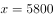，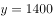。设第n个月乙公司超过甲公司，即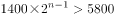，化简得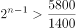，n最小为4即可满足，则乙公司第一次产量超过甲公司是在4月份。

方法二：由题意设甲1月份生产的传感器为件，乙生产的是件，根据题意可知，，，解得，。

列表可知:

则乙公司第一次产量超过甲公司是在4月份。

故正确答案为A。

---

### 第 2 题　qid 2144674 · 数学运算

已知一形状为正六边形的跑道，边长为150米，甲乙两人分别从两个相对的顶点同时出发，沿跑道相向匀速前进。两人第一次相遇时乙比甲多跑了50米，则甲乙两人跑步的速度之比是（  ）。

- **A**. 3:5
- **B**. 4:5　✅
- **C**. 5:3
- **D**. 5:4

**答案**：B

**官方解析**

由题意知正六边形相对的顶点之间有三条边，总长为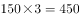米，由于两人第一次相遇时乙比甲多跑了50米，因此，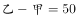，解得甲跑了200米，乙跑了250米，当时间一定时，速度和距离成正比，可知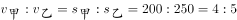。

故正确答案为B。

---

### 第 3 题　qid 2144680 · 数学运算

一个圆形的面积是54平方厘米，如果将该圆的半径变为原来的两倍，则该圆的面积变为（  ）平方厘米。

- **A**. 81
- **B**. 108
- **C**. 162
- **D**. 216　✅

**答案**：D

**官方解析**

设原来圆的半径为，则原来圆的面积，当半径变为原来的2倍即2时，现在圆的面积，是原来面积的4倍，因此该圆的面积为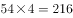平方厘米。

故正确答案为D。

---

### 第 4 题　qid 2144686 · 数学运算

某服装店进了一批短袖T恤，每件进价40元，以80元出售。但由于极端天气影响，这批T恤大批量积压。现老板打算将这批T恤打折处理，但要求利润率不低于，则最多能打（  ）折出售。

- **A**. 4
- **B**. 5
- **C**. 5.5　✅
- **D**. 6.5

**答案**：C

**官方解析**

根据，由题意利润率不低于，则售价最低为元，，即打了5.5折。

故正确答案为C。

---

### 第 5 题　qid 2144689 · 数学运算

甲、乙、丙三人，其中每两个人的年龄之和分别是55岁，58岁，63岁，那么这三个人中年龄最小的是（    ）岁。

- **A**. 25　✅
- **B**. 26
- **C**. 30
- **D**. 33

**答案**：A

**官方解析**

由题意可知三人年龄之和为岁，两个年龄大的人的年龄之和为63岁，则三人中年龄最小的是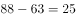岁。

故正确答案为A。

---

### 第 6 题　qid 2144668 · 数学运算

有两个烧杯各装有一些盐酸溶液，其中乙烧杯中的盐酸浓度是甲烧杯的3倍，甲烧杯中盐酸溶液的质量是乙烧杯的3倍，那么将甲、乙两烧杯溶液混合后的盐酸溶液的浓度可能为（  ）。

- **A**. 

- **B**. 

　✅
- **C**. 

- **D**. 

**答案**：B

**官方解析**

注：根据题目已知条件，最终的混合溶液浓度是一个范围值，并不能解出唯一的答案。结合考点，推测本题考查倍数特性，故本题从倍数特性的角度给出一个较为合理解析。

方法一：由甲烧杯中盐酸溶液的质量是乙烧杯的3倍，可赋值甲杯溶液质量为300，乙杯为100。又由乙烧杯中的盐酸浓度是甲烧杯的3倍，可设甲烧杯浓度为，则乙烧杯浓度为。根据浓度公式，甲、乙两烧杯溶液混合后的盐酸溶液的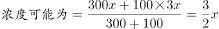，结果是3的倍数，只有B项满足。

方法二：设混合后溶液浓度为y，甲烧杯溶液浓度为x，则乙烧杯溶液浓度为3x。可画图如下：

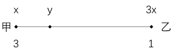

根据线段法口诀：距离与量成反比，可得，整理得，应为3的倍数，只有B项满足。

故正确答案为B。

---

### 第 7 题　qid 2144671 · 数学运算

甲企业有两台新旧程度不同的设备A和B，两台设备同时运作10小时可生产出920件零件，已知新设备A生产速度是旧设备B生产速度的1.3倍，A设备每小时能生产出（    ）件零件。

- **A**. 52　✅
- **B**. 40
- **C**. 30
- **D**. 35

**答案**：A

**官方解析**

根据“两台设备同时运作10小时可生产出920件零件”，可计算出两台设备的效率和为。又因为新设备A生产速度是旧设备B生产速度的1.3倍，可设旧设备B生产速度为，则新设备A生产速度是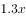，那么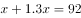，解得，因此A设备每小时能生产出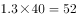件零件。

故正确答案为A。

秒杀技：新设备A生产速度是旧设备B生产速度的1.3倍，结果是1.3的倍数，只有A项符合。

---

### 第 8 题　qid 2144676 · 数学运算

某个品牌的罐装饼干中，有不同动物形状的饼干共100个，其中狮子形状的有30个，小猪形状的有40个，兔子形状的有30个。小明从罐中任意取出一把饼干，发现狮子形状的有10个，小猪形状的也有10个。此时，小明接着取出一个兔子形状饼干的概率是（  ）。

- **A**. 

- **B**. 

- **C**. 

　✅
- **D**. 

**答案**：C

**官方解析**

罐装饼干共100个，任意取出一把饼干，发现狮子形状的有10个，小猪形状的也有10个，剩下个。而兔子形状的有30个，此时，小明接着取出一个兔子形状饼干的。

故正确答案为C。

---

### 第 9 题　qid 2144682 · 数学运算

李明国庆节假期要做若干道英语试题，第一天做了这些试题的一半多一道，第二天做了剩下的一半多一道，第三天又做了剩下的一半多一道后，还剩一道试题。那么李明国庆节假期总共要做（  ）道英语试题。

- **A**. 12
- **B**. 16
- **C**. 22　✅
- **D**. 24

**答案**：C

**官方解析**

根据条件，见下表。

C项22的一半是11，第一天做了12道，剩下10道，第二天做了剩下的一半多一道，即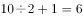，剩下4道，第三天又做了剩下的一半多一道，即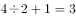，最后还剩一道试题。满足条件，正确。

故正确答案为C。

---

### 第 10 题　qid 2144687 · 数学运算

小明参加某趣味问答竞赛，一共50题，满分是100分，60分及格。答对一题得2分，答错一题扣2分。结果小明答完所有题目但是没有及格。小明最后发现，如果自己多答对2题就刚好及格。那么小明一共答错了（  ）题。

- **A**. 12　✅
- **B**. 20
- **C**. 34
- **D**. 38

**答案**：A

**官方解析**

由一共50题，可设小明答错了题，又多答对2题就刚好及格，此时答错的题为，答对的为。由“答对一题得2分，答错一题扣2分，多答对2题就刚好及格。”可得，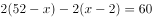，解得。因此小明一共答错了12题。

故正确答案为A。

---

## 判断推理

### 第 1 题　qid 2144664 · 图形推理

根据所给图形的既有规律，选出一个最合理的答案（    ）。

- **A**. A
- **B**. B
- **C**. C　✅
- **D**. D

**答案**：C

**官方解析**

元素组成不同，且无明显属性规律，考虑数量规律。图3、图4出现了多条单一直线，优先数直线。题干中所有图形均为5条直线构成，则？处也应为5条直线构成的图形。A项为1条直线，B项为10条直线，C项为5条直线，D项为11条直线。
故正确答案为C。

---

### 第 2 题　qid 2144665 · 图形推理

根据所给图形的既有规律，选择一个最合理的答案（    ）。

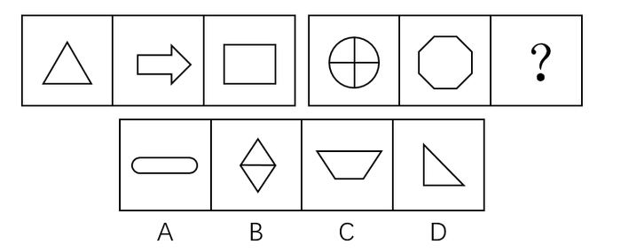

- **A**. A
- **B**. B　✅
- **C**. C
- **D**. D

**答案**：B

**官方解析**

方法一：元素组成不同，且无明显属性规律，考虑数量规律。观察题干发现，题干图形中出现多边形，优先考虑数线。第一组图形的线数量分别为3、7、4，图一线数量与图三线数量之和为图二线数量，第二组图形的线数量分别为3、8、？，则？处应为5条线组成的图形。只有B项符合。
方法二：元素组成不同，且无明显属性规律，考虑数量规律。观察题干发现，第一组图形的点数量分别为3、7、4，图一点数量与图三点数量之和为图二点数量，第二组图形的点数量分别为5、8、？，则？处应为有3个交点的图形。A项点数量为4个，B项点数量为4个，C项点数量为4个，D项点数量为3个。只有D项符合。
本题为争议题，线数量和点数量均能选出唯一答案，但本题数线特征更为明显，优先考虑数量规律，更倾向于线数量的命题特征，因此粉笔倾向于数线的规律。
故正确答案为B。

---

### 第 3 题　qid 2144666 · 图形推理

根据所给图形的既有规律，选出一个最合理的答案（    ）。

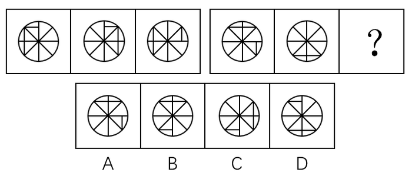

- **A**. A
- **B**. B　✅
- **C**. C
- **D**. D

**答案**：B

**官方解析**

元素组成相同，优先考虑位置规律。第一组图形中，图一最上方的小直线每次顺时针移动一格，另外两条直线每次顺时针移动四格，第二组图形中，图一最上方的两条直线每次顺时针移动四格，图一右下方小直线每次也为顺时针移动一格（注：图一右侧的小直线在图二未体现，应为与其他直线重叠），故？处也应符合此规律，只有B项符合该规律。
故正确答案为B。

---

### 第 4 题　qid 2144667 · 图形推理

根据所给图形的既有规律，选出一个最合理的答案（    ）。

- **A**. A
- **B**. B　✅
- **C**. C
- **D**. D

**答案**：B

**官方解析**

元素组成相同，优先考虑位置规律。第一组图形中，三角形每次顺时针或逆时针移动两格，圆形每次顺时针移动一格，第二组图形中，菱形每次顺时针或逆时针移动两格，月亮每次顺时针移动一格，则？处也应符合此规律，只有B项符合该规律。
故正确答案为B。

---

### 第 5 题　qid 2144669 · 图形推理

根据所给图形的既有规律，选出一个最合理的答案（    ）。

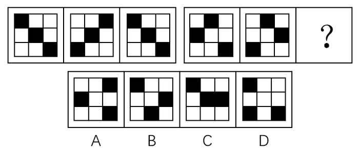

- **A**. A
- **B**. B　✅
- **C**. C
- **D**. D

**答案**：B

**官方解析**

元素组成相同，优先考虑位置规律。第一组图的图二可由图一整体旋转90度形成，也可左右翻转形成，图二到图三也是同样的规律。但根据第二组图可知，若图一到图二左右翻转而来，则选项无相应答案，因此图一到图二为整体顺时针旋转90度，？处为图二顺时针旋转90度，只有B项符合该规律。
故正确答案为B。

---

### 第 6 题　qid 2144672 · 图形推理

把下面的六个图形分为两类，使每一类图形都有各自的共同特征或规律，分类最为恰当的一项是（  ）。

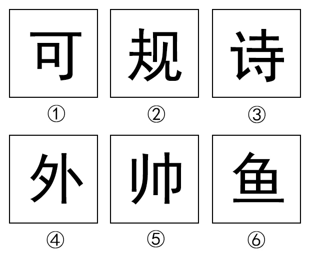

- **A**. ①②③，④⑤⑥
- **B**. ①②④，③⑤⑥
- **C**. ①③⑤，②④⑥
- **D**. ①④⑤，②③⑥　✅

**答案**：D

**官方解析**

元素组成不同，且无明显属性规律，考虑数量规律。题干图形均为汉字，考虑数汉字笔画数（此处的笔画数为汉字在语文中标准笔画数量）。观察发现，①④⑤为5笔写成，②③⑥为8笔写成，故①④⑤为一组，②③⑥为一组。
故正确答案为D。

---

### 第 7 题　qid 2144673 · 定义判断

好意实惠是指当事人之间无意设定法律上的权利义务关系，而由当事人一方基于良好的道德风尚实施的使另一方受恩惠的关系。下列不属于好意实惠关系的是（  ）。

- **A**. 甲看到行动不便的盲人乙在过马路，主动过去帮助乙通过了马路
- **B**. 丙驾驶摩托车经过丁婆婆身边，主动询问是否需要帮助，然后把丁婆婆送到了目的地而未收取费用
- **C**. 吴某在其便利店中帮人收取快递并保管三天，收取1元的手续费　✅
- **D**. 何某看到邻居张某离开家没有锁门，于是帮张某把门锁好

**答案**：C

**官方解析**

第一步：找出定义关键词。
“当事人之间无意设定法律上的权利义务关系”、“基于良好的道德风尚”、“使另一方受恩惠”。
第二步：逐一分析选项。
A项：甲没有法定的权利义务帮助盲人，基于自己的善良去主动帮助了行动不便的盲人，使得盲人受益，符合定义，排除； 
B项：丙没有法定的权利义务去帮助丁婆婆，基于道德帮助她并且未收取费用，使得丁婆婆受益，符合定义，排除；
C项：吴某帮人并非基于道德风尚并使他人受恩惠，而是借此收取手续费盈利，不符合定义，当选；
D项：何某没有法定的权利义务去帮助邻居锁门，基于道德帮助邻居锁好门，使得邻居受益，符合定义，排除。
本题为选非题，故正确答案为C。

---

### 第 8 题　qid 2144675 · 定义判断

圆雕，是指不附着在任何背景上、可以从各个角度欣赏的立体的雕塑。其手法与形式多种多样，有写实性的与装饰性的，也有具体的与抽象的，着色的与非着色的等。根据上述定义，下图所示雕塑作品中，属于圆雕的是（  ）。

- **A**. A　✅
- **B**. B
- **C**. C
- **D**. D

**答案**：A

**官方解析**

第一步：找出定义关键词。
“不附着在任何背景上”、“可以从各个角度欣赏的立体的雕塑”。
第二步：逐一分析选项。
A项：是不附着在任何背景上，可以从各个角度欣赏的立体雕塑，符合定义，当选；
B项：附着在了背景上，无法从各个角度欣赏，不符合定义，排除；
C项：附着在了背景上，无法从各个角度欣赏，不是立体雕塑，不符合定义，排除；
D项：附着在了背景上，无法从各个角度欣赏，不是立体雕塑，不符合定义，排除。
故正确答案为A。

---

### 第 9 题　qid 2144677 · 定义判断

心理暗示是人们为了某种目的，在无对抗的条件下，用含蓄的、间接的方式发出一定的信息，使他人或自己接受所示意的观点、意见，或按所示意的方式进行活动。根据上述定义，下列不属于心理暗示的是（  ）。

- **A**. 望梅止渴
- **B**. 杯弓蛇影
- **C**. 草木皆兵
- **D**. 知己知彼　✅

**答案**：D

**官方解析**

第一步：找出定义关键词。
“无对抗的条件下”、“含蓄的、间接的方式”、“使他人或自己接受所示意的观点、意见，或按所示意的方式进行活动”。
第二步：逐一分析选项。
A项：望梅止渴，讲述的是曹操为了加快行军速度，用“梅子”间接诱导士兵联想到了“酸”，从而使士兵口腔分泌大量唾液起到了暂时解渴的效果，比喻愿望无法实现，用空想安慰自己。曹操为了达到鼓励行军的目的，在无对抗的条件下，凭借梅子会使人分泌唾液这个含蓄的方式，暗示士兵继续前进，马上就可以有吃喝，符合定义，排除； 
B项：杯弓蛇影，指见到弓的影子联想到了蛇而恐慌，形容疑神疑鬼，自相惊扰。通过错觉这个含蓄、间接的方式，使自己接受自己看到的错觉，让自己感到恐惧，符合定义，排除；
C项：草木皆兵，把山上的草木也当做敌兵，形容人在惊慌时疑神疑鬼。通过错觉这个含蓄、间接的方式，使自己接受自己看到的错觉，让自己感到恐惧，符合定义，排除；
D项：知己知彼，指对敌我双方的优劣短长均能透彻的了解，是对现实的情况进行客观的分析，不存在含蓄的、间接的方式，也没有体现“使他人或自己接受所示意的观点、意见，或按所示意的方式进行活动”，不符合定义，当选。
本题为选非题，故正确答案为D。

---

### 第 10 题　qid 2144679 · 定义判断

环境影响评价指拟定开发计划或建设项目时，事前对该计划或项目将给大气、水体、土壤、生物以及由它们组成的环境系统造成什么影响，这些影响的结果又将对人类的健康和生活环境以及自然环境和经济、文化、历史环境造成什么影响所进行的调查、预测与评价，以及据此制定出防止或减少环境污染和破坏的对策与措施。根据上述定义，下列属于环境影响评价行为的是（  ）。

- **A**. 某零售公司在建新商场之前，对周围的居民进行调查以确定其购买能力
- **B**. 某市在建设垃圾处理厂之前，请专家对全市垃圾总量进行评估，以确定垃圾处理厂的规模
- **C**. 某市在建飞机场后，由于连续发生了多起飞行安全事故，邀请专家对飞机场提出改进措施
- **D**. 某市在建立污水处理厂之前，请专家对周边的河流、水文进行检测后，并提出相应的控制性建议　✅

**答案**：D

**官方解析**

第一步：找出定义关键词。
“事前对该计划或项目将给大气、水体、土壤、生物以及由它们组成的环境系统造成什么影响”、“影响的结果又将对人类的健康和生活环境以及自然环境和经济、文化、历史环境造成什么影响所进行的调查、预测与评价”、“据此制定出防止或减少环境污染和破坏的对策与措施”。
第二步：逐一分析选项。
A项：零售公司对周围的居民进行调查，是为了确定居民的购买能力，不是调查建商场对环境会造成什么影响，也不是根据调查制定减少环境污染的对策，不符合定义，排除； 
B项：某市请专家对全市的垃圾总量进行评估，是为了确定垃圾处理厂的规模，不是对建设垃圾处理厂将对环境带来什么影响做调查，也不是根据调查制定减少环境污染的对策，不符合定义，排除；
C项：发生了多起事故后邀请专家提出改进措施，并非事前的调查评估，且也不是针对环境方面的，不符合定义，排除；
D项：在建立污水处理厂之前，请专家对周围的河流、水文检测，提出了相应的控制性建议，符合题干所说的事前对环境的影响进行评估，根据评估制定防止或减少环境污染的对策，符合定义，当选。
故正确答案为D。

---

### 第 11 题　qid 2144683 · 定义判断

单位犯罪，指公司、企业、事业单位、机关、团体实施的危害社会的、依照法律规定应受惩罚的行为。根据上述定义，下列属于单位犯罪的是（  ）。

- **A**. 某医院的院长利用职务之便收受贿赂
- **B**. 某事业单位一名员工因对领导不敬，因此被降职
- **C**. 某班级的学生认为教师甲的教学能力差，因此集体向学校领导提出开除该老师的建议
- **D**. 某公司派一名员工去另一对手公司偷窃商业机密文件以用于自己公司的发展　✅

**答案**：D

**官方解析**

第一步：找出定义关键词。
“公司、企业、事业单位、机关、团体实施”、“危害社会的行为”、“依照法律规定应受惩罚的行为”。
第二步：逐一分析选项。
A项：实施受贿的是院长，是个人所为，并不是医院所为，不符合定义，排除； 
B项：员工被降职是事业单位授权所为，但他的行为并没有危害社会，也不是依照法律规定应受惩罚的行为，不符合定义，排除；
C项：因为教师教学能力差，学生集体建议学校领导开除该老师，此行为并非危害社会的行为，也并非依照法律规定应受惩罚的行为，不符合定义，排除；
D项：偷窃商业机密文件是公司指派人完成的，是公司的授意所为，且该行为是按照法律规定应受惩罚的行为，符合定义，当选。
故正确答案为D。

---

### 第 12 题　qid 2144685 · 类比推理

“邯郸学步”这则典故是指到邯郸去学走路的步法。战国时期，一个燕国人听说赵国邯郸人走姿很漂亮，便来到邯郸学习邯郸人走路。未得其能，又忘记自己的走姿，最后爬着回到了燕国。根据上述文字，下列最能够解释成语“邯郸学步”的涵义的是（  ）。

- **A**. 装模作样
- **B**. 盲目模仿　✅
- **C**. 本末倒置
- **D**. 一成不变

**答案**：B

**官方解析**

第一步：找出定义关键词。
“到邯郸去学走路的步法”、“未得其能，又忘记自己的走姿”。
第二步：逐一分析选项。
A项：装模作样，指故意做作，故作姿态，题干没有涉及，不符合定义，排除；
B项：题干体现了该燕国人一味地模仿别人，最后把原本的本事也丢了，也就是盲目模仿，符合定义，当选；
C项：本末倒置，指把主要的和次要的、本质和非本质的关系弄颠倒了，题干没有涉及，不符合定义，排除；
D项：一成不变，指一经形成，不再改变，题干没有涉及不再改变，不符合定义，排除。
故正确答案为B。

---

### 第 13 题　qid 2144688 · 逻辑判断

因工作需要，K单位安排了甲、乙、丙、丁、戊五人在10月1-5日的晚上进行值班。每人只需值一晚，且每晚只安排一人。甲说：“乙在1号值班，我在3号值班。”乙说：“丙在1号值班，丁在4号值班。”丙说：“甲在2号值班，戊在5号值班。”丁说：“丙在3号值班，乙在4号值班。”戊说：“丁在2号值班，我在3号值班。”如果每个人都只说对了一个人的值班时间，由此可以推出（  ）。

- **A**. 3号值班的是戊
- **B**. 2号值班的不是丁
- **C**. 1号值班的是丙　✅
- **D**. 4号值班的不是乙

**答案**：C

**官方解析**

第一步：分析题干。
① 甲：乙在1号值班，甲在3号值班。
② 乙：丙在1号值班，丁在4号值班。
③ 丙：甲在2号值班，戊在5号值班。
④ 丁：丙在3号值班，乙在4号值班。
⑤ 戊：丁在2号值班，戊在3号值班。
⑥ 每个人都只说对了一个人的值班时间。
第二步：根据题干条件分析选项。
假设①的前半句为真，即乙在1号值班，则甲不在3号值班；根据乙在1号值班，结合②，可知丙不在1号值班，则丁在4号值班；根据丁在4号值班，结合⑤，可知戊在3号值班；根据戊在3号值班，结合④，可知乙在4号值班，与丁在4号值班矛盾，则假设不成立，即甲的前半句为假，后半句为真，即乙不在1号值班，甲在3号值班。
根据甲在3号值班，结合⑤，可知丁在2号值班；根据甲在3号值班，结合④，可知乙在4号值班；根据乙在4号值班，结合②，可知丙在1号值班。
故正确答案为C。

---

### 第 14 题　qid 2144692 · 逻辑判断

在过去的15年中，动物学家每年都在南极帝企鹅的主要繁殖地统计它们的数量。结果发现南极帝企鹅的数量从6000只下降为1500只。由此可见，南极帝企鹅的数量在急剧下降。以下（  ）如果为真，不能支持上述结论。

- **A**. 帝企鹅的哺育工作几乎完全都在海冰上完成，上升的气温使南极海冰加速萎缩，致使帝企鹅幼仔成活率急剧下降
- **B**. 全球气候变暖使南极地区的暴风雪变成了暴风雨，小企鹅在被暴雨淋湿身体后，因体温过低而被冻死
- **C**. 由于全球温室效应持续增强，致使帝企鹅赖以生存的磷虾数目急剧减少
- **D**. 在地球的北极发现，该地区的北极熊数量有所增加　✅

**答案**：D

**官方解析**

第一步：找出论点和论据。
论点：南极帝企鹅的数量在急剧下降。
论据：南极帝企鹅的数量从6000只下降为1500只。
第二步：逐一分析选项。
A项：气温的上升导致南极帝企鹅的幼仔成活率急剧下降，从而导致了帝企鹅数量的减少，解释了南极帝企鹅数量下降的原因，补充论据加强论点，排除；
B项：全球气候变暖引发的暴风雨导致了很多小企鹅被冻死，解释了南极帝企鹅数量下降的原因，补充论据加强论点，排除；
C项：全球温室效应导致作为帝企鹅食物来源的磷虾的数量剧减，威胁了帝企鹅的生存，导致了帝企鹅数量的减少，解释了南极帝企鹅数量下降的原因，补充论据加强论点，排除； 
D项：阐述的是北极地区的北极熊数量增加，与南极帝企鹅数量的变化无关，无法加强，当选。
本题为选非题，故正确答案为D。

---

### 第 15 题　qid 2144697 · 逻辑判断

中国机器人产业联盟发布消息称，我国工业机器人销量是6.8万台，增长速度是，高于预期的。有生产商表示，工业机器人销量之所以如此高是因为东南亚国家对我国生产的工业机器人的青睐。上述结论的假设前提是（  ）。

- **A**. 东南亚市场在中国工业机器人销售市场中占较大的比重　✅
- **B**. 我国对东南亚国家实行优惠政策
- **C**. 东南亚国家生产机器人的技术没有我国精湛
- **D**. 我国工业机器人在全球市场上销量都遥遥领先

**答案**：A

**官方解析**

第一步：找出论点和论据。
论点：工业机器人销量之所以如此高是因为东南亚国家对我国生产的工业机器人的青睐。
论据：无。
第二步：逐一分析选项。
A项：假设东南亚市场在中国工业机器人销售市场中没有占较大的比重，那么无法得到机器人销量高的原因是东南亚国家的青睐，选项补充了论点的必要条件，可以加强，当选；
B项：我国对东南亚国家实行优惠政策只能说明在价格上的优惠，但是不能说明东南亚市场对我国工业机器人销量的影响情况，无法加强，排除；
C项：东南亚国家的工业机器人制造技术没有我国精湛，只能说明为什么东南亚国家喜欢买我国的工业机器人，但是不能解释为什么我国的工业机器人的销量直接受东南亚国家的影响，无法加强，排除； 
D项：阐述的是我国工业机器人在全球的销量，与我国工业机器人销量和东南亚国家市场的关系无关，无法加强，排除。
故正确答案为A。

---

### 第 16 题　qid 2144693 · 逻辑判断

在超市和农贸市场，常会看到被捆成一小捆的蔬菜。捆扎蔬菜一方面是为了方便购买，另一方面也是商家防止“精明”的大爷大妈们过分挑拣。过去捆扎蔬菜多用草绳，而近年来用五颜六色的胶带捆扎的现象越来越常见。胶带几乎没有重量，不必担心商家借此压秤。因此使用胶带捆绑蔬菜不仅美观大方，也显得更干净。以下选项中最能反驳上述论断的是（  ）。

- **A**. 使用胶带捆绑蔬菜的成本比使用草绳高
- **B**. 捆绑蔬菜用的草绳往往是不干净的，并且可能会含有虫害
- **C**. 胶带携带方便，使用简单
- **D**. 胶带中常残留有各种致癌的有毒物质，使用胶带捆绑蔬菜会使有毒物质转移到蔬菜上　✅

**答案**：D

**官方解析**

第一步：找出论点和论据。
论点：使用胶带捆绑蔬菜不仅美观大方，也显得更干净。
论据：胶带几乎没有重量，不必担心商家借此压秤。
第二步：逐一分析选项。
A项：阐述的是胶带的成本比草绳高，与胶带捆绑蔬菜是否美观干净无关，无法削弱，排除；
B项：草绳不干净，可能会有虫害，说明胶带确实比草绳干净，补充论据加强论点，无法削弱，排除；
C项：胶带容易携带，使用简单，但用于捆绑蔬菜是否美观大方并且更干净并未说明，属于无关项，无法削弱，排除； 
D项：胶带中的有毒物质会转移到蔬菜中，说明胶带捆绑蔬菜并不干净，其中有很大的危害，直接削弱论点，当选。
故正确答案为D。

---

### 第 17 题　qid 2144715 · 逻辑判断

冬天来临，网上一篇关于洗澡顺序的文章广为流传。该文称，人的血管非常脆弱，遇上高温会热胀，一不小心就会爆裂，冬天洗澡时，如果先洗头，会使血液突然聚集到头部，容易诱发脑血管疾病甚至导致脑溢血。若下列论断为真，最能削弱上述结论的是（  ）。

- **A**. 有研究机构称，人的血管是人体中最脆弱的部分
- **B**. 调查表明，有很多南方人在冬天时仍然坚持用冷水洗澡
- **C**. 据统计，日本每年冬天有1.4万人在洗热水澡时死亡
- **D**. 洗热水澡时由于体温升高、心率加快、用力过猛会引起血压变化，血压高是引发脑溢血的根本原因　✅

**答案**：D

**官方解析**

第一步：找出论点和论据。
论点：冬天洗热水澡如果先洗头，容易诱发脑血管疾病甚至导致脑溢血。
论据：人的血管非常脆弱，遇上高温会热胀，一不小心就会爆裂。
第二步：逐一分析选项。
A项：人的血管是人体中最脆弱的部分，肯定了题干论据，无法削弱，排除；
B项：阐述的是现在南方人洗冷水澡的习惯，与洗热水澡从头部先洗对脑血管疾病的影响无关，属于无关项，无法削弱，排除；
C项：日本每年冬天有1.4万人在洗热水澡时死亡，死亡原因未知，与洗澡时先洗头是否会诱发疾病无关，属于无关项，无法削弱，排除； 
D项：说明洗澡时易患心血管疾病的根本原因是血压问题而不是血管问题，直接削弱论点，当选。
故正确答案为D。

---

### 第 18 题　qid 2144722 · 逻辑判断

一些住在核电站附近的人担心，核电站的辐射会造成人体伤害。更多的人则担心，核电站一旦发生爆炸，其危害将不亚于核武器。若下列论断为真，最能消除更多的人担心的问题的是（  ）。

- **A**. 核电站使用的核燃料浓度很低，远远未达到核武器爆炸所要求的浓度，且二者的作用原理和机制不一样　✅
- **B**. 核辐射只要不超过一定的标准，就不会对人体产生危害
- **C**. 30多年前，苏联切尔诺贝利核电站曾发生过严重的爆炸事故，造成的灾难至今还难以消除
- **D**. 现代核电站的技术已经相当完善，很多发达国家都建立了不少的核电站

**答案**：A

**官方解析**

第一步：找出论点和论据。
论点：核电站一旦发生爆炸，其危害将不亚于核武器。
论据：无
第二步：逐一分析选项。
A项：核电站使用的核燃料浓度远未达到核武器爆炸所要求的浓度，说明核电站爆炸的可能性较低，二者的作用原理和机制不一样，说明即使爆炸也无法造成与核武器类似的危害，削弱论点，当选；
B项：阐述的是核辐射是否对人体有害，题干论点讨论的核电站爆炸的危害，选项与论点话题不一致，无法削弱，排除；
C项：以30多年前切尔诺贝利核电站的爆炸事故为例，说明核电站若发生爆炸，危害确实很大，加强了题干论点，无法削弱，排除； 
D项：现代的核电站技术已经相当完善，但是技术完善并不能说明一定不会发生核电站爆炸，爆炸后的危害也未涉及，无法削弱，排除。
故正确答案为A。

---

### 第 19 题　qid 2144725 · 类比推理

与“海水：澎湃”这组词逻辑关系最为相近的一项是（  ）。

- **A**. 西瓜：香甜　✅
- **B**. 道路：修建
- **C**. 策划：推广
- **D**. 平原：山林

**答案**：A

**官方解析**

第一步：判断题干词语间的逻辑关系。
澎湃是海水的属性，二者为属性的对应关系。
第二步：判断选项词语间的逻辑关系。
A项：香甜是西瓜的属性，二者为属性的对应关系，与题干逻辑关系一致，当选；
B项：修建道路，二者是动宾关系，与题干逻辑关系不一致，排除；
C项：先策划，再推广，二者为时间的先后顺序，与题干逻辑关系不一致，排除；
D项：平原是一种地貌形态，山林指的有山有林的地区，二者没有必然的联系，与题干逻辑关系不一致，排除。
故正确答案为A。

---

### 第 20 题　qid 2144728 · 类比推理

与“预习：上课：复习”这组词逻辑关系最为相近的一项是（  ）。

- **A**. 高考：考试：大学
- **B**. 调研：设计：生产　✅
- **C**. 痊愈：挂号：出院
- **D**. 笔试：面试：报名

**答案**：B

**官方解析**

第一步：判断题干词语间的逻辑关系。
先预习，再上课，最后复习，三者之间是时间先后顺序的对应关系。
第二步：判断选项词语间的逻辑关系。
A项：高考是考试的一种，二者是种属关系，大学需要考试，二者是对应关系，与题干逻辑关系不一致，排除；
B项：先调研，再设计，最后生产，三者之间是时间先后顺序的对应关系，与题干逻辑关系一致，当选；
C项：先挂号，再痊愈，最后出院，挂号和痊愈的顺序反了，与题干逻辑关系不一致，排除；
D项：先报名，再笔试，最后面试，也可能是先报名，再面试，再笔试，报名应该在笔试和面试之前，与题干逻辑关系不一致，排除。
故正确答案为B。

---

### 第 21 题　qid 2144730 · 类比推理

与“实现：远大：梦想”这组词逻辑关系最为相近的一项是（  ）。

- **A**. 完成：重要：任务　✅
- **B**. 建造：高楼：大厦
- **C**. 购买：消费：物品
- **D**. 补给：粮食：物品

**答案**：A

**官方解析**

第一步：判断题干词语间的逻辑关系。
造句子：实现远大的梦想。三者为语法关系，实现与梦想是动宾关系，远大与梦想是偏正结构。
第二步：判断选项词语间的逻辑关系。
A项：造句子，完成重要的任务，三者为语法关系，完成与任务是动宾关系，重要与任务是偏正结构，与题干逻辑关系一致，当选；
B项：造句子，建造高楼的大厦，造句子不通顺，高楼与大厦不是偏正结构，与题干逻辑关系不一致，排除；
C项：造句子，购买消费的物品，造句子不通顺，消费与物品不是偏正结构，与题干逻辑关系不一致，排除；
D项：造句子，补给粮食的物品，造句子不通顺，粮食与物品不是偏正结构，与题干逻辑关系不一致，排除。
故正确答案为A。

---

### 第 22 题　qid 2144732 · 类比推理

与“奖金：奖励：激励”这组词逻辑关系最为相近的一项是（  ）。

- **A**. 复习：考试：毕业
- **B**. 书法：音乐：艺术
- **C**. 打折：促销：竞争　✅
- **D**. 失败：成功：成长

**答案**：C

**官方解析**

第一步：判断题干词语间的逻辑关系。
奖金是奖励的一种方式，二者为种属关系；奖励的目的是激励，二者为对应关系。
第二步：判断选项词语间的逻辑关系。
A项：先复习，再考试，最后毕业，三者之间是时间的先后顺序，与题干逻辑关系不一致，排除；
B项：书法和音乐是并列关系，书法和音乐都是艺术的一种，前两词和第三词是种属关系，与题干逻辑关系不一致，排除；
C项：打折是促销的一种方式，二者为种属关系；促销的目的是竞争，二者为对应关系，与题干逻辑关系一致，当选；
D项：失败和成功是反义关系，二者都是成长过程中可能经历的过程，与题干逻辑关系不一致，排除。
故正确答案为C。

---

### 第 23 题　qid 2144735 · 类比推理

“编辑部”对于（  ）相当于（  ）对于“学校”。

- **A**. 作者  校园
- **B**. 期刊  学生
- **C**. 人事处  幼儿园
- **D**. 出版社  教务处　✅

**答案**：D

**官方解析**

逐一代入选项。
A项：编辑部是作者编辑作品的地方，二者为对应关系；学校和校园二者为全同关系，前后逻辑关系不一致，排除；
B项：编辑部编辑期刊，学生不能编辑学校，学生应在学校里读书，前后逻辑关系不一致，排除；
C项：编辑部和人事处是两个不同的工作部门，二者为并列关系；幼儿园是学校的一种，二者为种属关系，前后逻辑关系不一致，排除；
D项：编辑部是出版社的一个部门，二者为组成关系；教务处是学校的一个部门，二者为组成关系，前后逻辑关系一致，当选。
故正确答案为D。

---

### 第 24 题　qid 2144737 · 类比推理

（  ）对于“碧螺春”相当于“景德镇”对于（  ）。

- **A**. 苏州  瓷器　✅
- **B**. 宜兴  陶都
- **C**. 茶叶  白瓷
- **D**. 绿茶  锦都

**答案**：A

**官方解析**

逐一代入选项。
A项：苏州盛产碧螺春，二者为对应关系；景德镇盛产瓷器，二者为对应关系，前后逻辑关系一致，当选；
B项：宜兴盛产紫砂壶而不是碧螺春；陶都是宜兴的别称，和景德镇没有必然的联系，景德镇的别称是瓷都，前后逻辑关系不一致，排除；
C项：碧螺春是一种茶叶，二者为种属关系；白瓷是一种瓷器，景德镇出产白瓷，二者是对应关系，前后逻辑关系不一致，排除；
D项：碧螺春是绿茶的一种，二者为种属关系；锦都是成都的别称，和景德镇没有必然的联系，景德镇的别称是瓷都，前后逻辑关系不一致，排除。
故正确答案为A。

---

### 第 25 题　qid 2144743 · 类比推理

（  ）对于“折射”相当于“杯弓蛇影”对于（  ）。

- **A**. 一叶障目  透射
- **B**. 小孔成像  衍射
- **C**. 碧空如洗  散射
- **D**. 海市蜃楼  反射　✅

**答案**：D

**官方解析**

逐一代入选项。
A项：一叶障目的意思是一片叶子挡在眼前会让人看不到外面的广阔世界，是光的直射原理，不是折射；杯弓蛇影是光的反射，不是透射，前后逻辑关系不一致，排除；
B项：小孔成像是光的直射原理，不是折射；杯弓蛇影是光的反射原理，不是衍射，前后逻辑关系不一致，排除；
C项：碧空如洗指蓝色的天空像洗过一样的明净，形容天气晴朗，和折射没有必然的联系；杯弓蛇影是光的反射原理，不是散射，前后逻辑关系不一致，排除；
D项：海市蜃楼是光的折射现象；杯弓蛇影是光的反射原理，前后逻辑关系一致，当选。
故正确答案为D。

---

## 资料分析

### 材料 1

        2017年1-8月，W省完成民间固定资产投资（以下简称民间投资）10287.23亿元，同比增长，比全国民间投资增速快6.2个百分点，比上年同期快10.2个百分点，比上半年和一季度分别加快1.1个和6.0个百分点。

        1-8月，全省民间投资增速比国有经济投资增速低1.6个百分点，比1-7月差距缩小1.7个百分点，比上半年缩小4.3个百分点，比一季度缩小17.4个百分点。

        1-8月，全省民间投资占全部投资的比重为，比一季度、上半年、1-7月分别提高3.1、0.4和0.1个百分点。

        民间投资主要集中在工业和房地产业。1-8月，全省工业民间投资占全部民间投资的比重为，其中，制造业民间投资占全部民间投资的比重为；工业民间投资占全部工业投资的比重为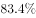，其中，制造业民间投资占全部制造业投资的比重为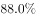。房地产开发投资是W省民间投资的第二大领域，1-8月，全省房地产开发民间投资占全部民间投资的比重为，占全部房地产开发投资的比重为。

#### 第 1 题　qid 2144714 · 综合

2016年1-8月，W省完成民间固定资产投资约为（  ）亿元。

- **A**. 9136.08　✅
- **B**. 9257.31
- **C**. 10875.22
- **D**. 11583.42

**答案**：A

**官方解析**

根据“2016年1-8月，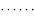亿元”判断本题为基期计算问题。定位材料第一段，2017年1-8月，W省完成民间固定资产投资10287.23亿元，同比增长。则2016年1-8月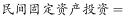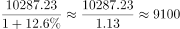亿元，与A项最接近。

故正确答案为A。

---

#### 第 2 题　qid 2144720 · 增长

2017年上半年，W省完成民间固定资产投资同比增长约（  ）个百分点。

- **A**. 2.4
- **B**. 6.0
- **C**. 6.4
- **D**. 11.5　✅

**答案**：D

**官方解析**

根据“2017年上半年，同比增长多少个百分点”判断本题为一般增长率问题。定位第一段，2017年1-8月，W省完成民间固定资产投资同比增长，比上半年加快1.1个百分点。2017年上半年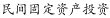。

故正确答案为D。

---

#### 第 3 题　qid 2144734 · 增长

2017年1-8月，W省国有经济投资增速为（  ）。

- **A**. 

- **B**. 

- **C**. 

- **D**. 

　✅

**答案**：D

**官方解析**

根据“2017年1-8月，增速为”判断本题为一般增长率问题。定位材料第一、二段，2017年1-8月，W省完成民间固定资产投资同比增长，全省民间投资增速比国有经济投资增速低1.6个百分点，所以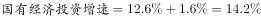。

故正确答案为D。

---

#### 第 4 题　qid 2144739 · 综合

2017年1-8月，W省完成全部投资约为（  ）亿元。

- **A**. 15037.31
- **B**. 16458.62
- **C**. 17465.59　✅
- **D**. 18037

**答案**：C

**官方解析**

根据“2017年1-8月，亿元”，且材料中有民间投资占全部投资的比重，判断本题为现期比重问题。定位材料一、三段，2017年1-8月，W省完成民间固定资产投资（以下简称民间投资）10287.23亿元。1-8月，全省民间投资占全部投资的比重为。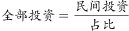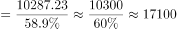亿元，与C项最接近。

故正确答案为C。

---

#### 第 5 题　qid 2144748 · 增长

根据上述资料，下列说法中正确的有（  ）个。
（1）2017年1-8月，W省制造业民间投资占全部民间投资的比重大于其占全部制造业投资的比重
（2）2017年1-8月，W省工业民间投资占全部民间投资的比重比房地产开发民间投资占全部民间投资的比重大31.7个百分点
（3）2017年以来，W省民间投资增速与国有经济投资增速的差距逐月增大

- **A**. 0
- **B**. 1　✅
- **C**. 2
- **D**. 3

**答案**：B

**官方解析**

（1）项：定位材料第四段，制造业民间投资占全部民间投资的比重为；制造业民间投资占全部制造业投资的比重为。因此制造业民间投资占全部民间投资的比重小于其占全部制造业投资的比重。错误；

（2）项：定位材料第四段，1-8月，全省工业民间投资占全部民间投资的比重为，全省房地产开发民间投资占全部民间投资的比重为。。正确；

（3）项：定位材料第二段，材料中给出的是1-8月，1-7月，上半年以及一季度数据，并没有逐月数据，因此并不能判断民间投资增速与国有经济投资增速的差距逐月变化情况。错误。

只有（2）正确。

故正确答案为B。

---

### 材料 2

        2012-2016年，S省城镇化水平快速提高。2016年末，S省常住人口3681.61万人，其中居住在城镇区域的常住人口2069.63万人，较2015年末增加53.26万人；城镇化率达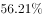，居全国第16位，比2015年提高1.18个百分点。

        与2012年相比，城镇化率提高了4.95个百分点，高于这一时期全国平均增幅0.17个百分点。与全国城镇化平均水平的差距由2012年的1.31个百分点缩小为1.14个百分点。

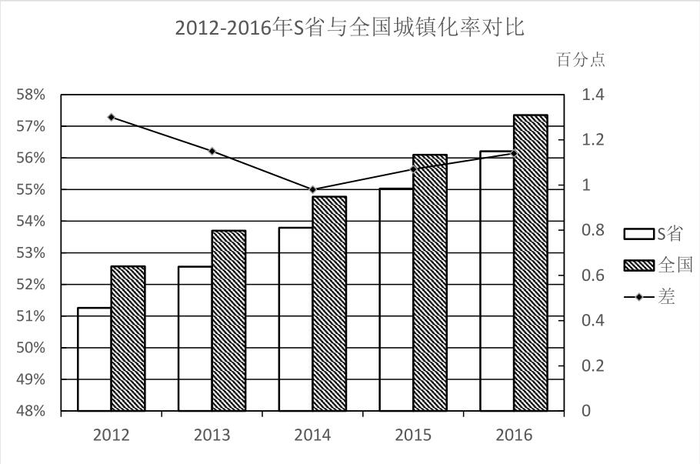

2016年，全省11个市中城镇人口超过的市由2012年的5个增加为8个。城镇化水平较低的E市、F市、G市均实现了较快的增长，年均增长率分别达到1.56、1.62和1.53个百分点，区域间城镇化水平差距进一步缩小，全省城镇化保持了较快的增长势头。

#### 第 6 题　qid 2144681 · 综合

2015年末，S省居住在城镇区域的常住人口有（  ）万人。

- **A**. 2025.36
- **B**. 2070.58
- **C**. 2034.87
- **D**. 2016.37　✅

**答案**：D

**官方解析**

定位材料第一段“2016年······城镇区域的常住人口2069.63万人，较2015年末增加53.26万人”可知2015年末S省居住在城镇区域的万人。

故正确答案为D。

---

#### 第 7 题　qid 2144691 · 综合

2012年，S省城镇化率为（  ）。

- **A**. 
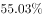

- **B**. 

　✅
- **C**. 

- **D**. 
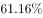

**答案**：B

**官方解析**

定位材料第一段“2016年······城镇化率达······与2012年相比，城镇化率提高了4.95个百分点”。可知2012年S省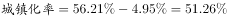。

故正确答案为B。

---

#### 第 8 题　qid 2144696 · 平均数

2012-2016年间，S省城镇化水平与全国城镇化平均水平的差距最小的是（  ）。

- **A**. 2012年
- **B**. 2013年
- **C**. 2014年　✅
- **D**. 2015年

**答案**：C

**官方解析**

定位图形材料，S省城镇化水平与全国城镇化平均水平的差距最小的是2014年。
故正确答案为C。

---

#### 第 9 题　qid 2144703 · 增长

与2012年相比，2016年S省城镇人口超过的城市数量增长了（  ）。

- **A**. 

- **B**. 

- **C**. 

　✅
- **D**. 

**答案**：C

**官方解析**

由题意“与2012年相比，2016年S省······增长了”且选项为百分数，判定此题为一般增长率问题。定位材料“2016年，全省11个市中城镇人口超过的市由2012年的5个增加为8个。”根据。

故正确答案为C。

---

#### 第 10 题　qid 2144707 · 增长

根据上述资料，下列说法中<b>错误</b>的有（  ）个。

（1）2015年，S省城镇化率为

（2）2012-2016年间，全国城镇化水平平均增幅为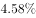

（3）2012-2016年间，S省城镇化水平较低的城市中，年均增长率最低的是E市

- **A**. 0
- **B**. 1
- **C**. 2
- **D**. 3　✅

**答案**：D

**官方解析**

（1）定位文字材料第一段“2016年······城镇化率达，比2015年提高1.18个百分点。” 2015年S省。错误；

（2）定位文字材料第一段“······与2012年相比，城镇化率提高了4.95个百分点，高于这一时期全国平均增幅0.17个百分点······”，可知全国城镇化水平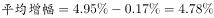，错误；

（3）定位文字材料第三段“2016年，全省11个市中城镇人口超过的市由2012年的5个增加为8个。城镇化水平较低的E市、F市、G市均实现了较快的增长，年均增长率分别达到1.56、1.62和1.53个百分点。” 年均增长率最低的是G市，错误。

则说法中错误的有3个。

故正确答案为D。

---

### 材料 3

        2017年上半年医药工业规模以上企业实现主营业务收入15314.40亿元，同比增长，增速较上年同期提高2.25个百分点。各子行业中，增长最快的是中药饮片加工，化学药品制剂、中成药、制药设备的增速低于行业平均水平。

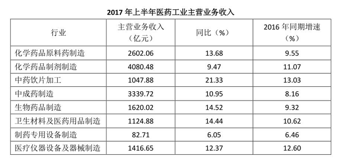

#### 第 11 题　qid 2144731 · 综合

在医药工业规模以上企业实现主营业务收入上，2017年上半年约是2015年上半年的（  ）。

- **A**. 1.13倍
- **B**. 0.13倍
- **C**. 1.24倍　✅
- **D**. 0.24倍

**答案**：C

**官方解析**

根据题干所求“······2017年······约是2015年······”，时间存在间隔，结合选项为倍数，可判定此题为间隔增长率问题。定位文字材料“2017年上半年医药工业······，同比增长，增速较上年同期提高2.25个百分点”，可知2016年上半年医药工业规模以上企业实现主营业务收入。所以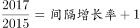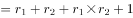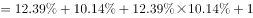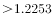，只有C满足。

故正确答案为C。

---

#### 第 12 题　qid 2144733 · 增长

2017年上半年，中成药制造的主营业务收入较上年约增加了（  ）。

- **A**. 371亿元
- **B**. 330亿元　✅
- **C**. 300亿元
- **D**. 30亿元

**答案**：B

**官方解析**

根据题干所求“······约增加了”，结合选项带单位，可判定此题为增长量计算问题。定位表格，2017年上半年，中成药制造的主营业务收入3339.72亿元，同比增长率为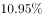，所以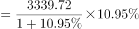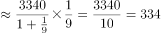，最接近B项。

故正确答案为B。

---
