# 2017年江苏省公务员录用考试《行测》题(A类)

> 省考 · 2017 年 · 6 个模块 · 共 134 题

- [政治理论](#%E6%94%BF%E6%B2%BB%E7%90%86%E8%AE%BA) · 1 题
- [常识判断](#%E5%B8%B8%E8%AF%86%E5%88%A4%E6%96%AD) · 19 题
- [言语理解与表达](#%E8%A8%80%E8%AF%AD%E7%90%86%E8%A7%A3%E4%B8%8E%E8%A1%A8%E8%BE%BE) · 35 题
- [数量关系](#%E6%95%B0%E9%87%8F%E5%85%B3%E7%B3%BB) · 14 题
- [判断推理](#%E5%88%A4%E6%96%AD%E6%8E%A8%E7%90%86) · 45 题
- [资料分析](#%E8%B5%84%E6%96%99%E5%88%86%E6%9E%90) · 20 题

---

## 政治理论

### 第 1 题　qid 2042022 · 新思想

党的十八大以来，习近平总书记在强调不断增进中国特色社会主义道路自信、理论自信、制度自信的同时，多次提到文化自信。
下列对文化自信理解正确的是：
①文化自信具有鲜明的民族特色和价值色彩
②文化自信是对自身文化传统的深刻认知和高度自觉
③文化自信是对自身文化生命力和影响力所持有的坚定信心
④文化自信是对自身文化身份与价值的充分肯定和积极践行

- **A**. ①②
- **B**. ②③④
- **C**. ①②④
- **D**. ①②③④　✅

**答案**：D

**官方解析**

D项正确：文化自信，是更基础、更广泛、更深厚的自信。党的十八大以来，习近平总书记在强调不断增进中国特色社会主义道路自信、理论自信、制度自信的同时，多次论述文化自信。所谓文化自信，就是一个民族、一个国家以及一个政党对自身文化传统的深刻认知和高度自觉，是对自身文化身份和价值的充分肯定和积极践行，是对其文化生命力和影响力所持有的坚定信心。文化自信具有鲜明的民族特色和价值色彩。
故正确答案为D。

---

## 常识判断

### 第 1 题　qid 2106138 · 人文常识

2017年1月1日，葡萄牙人安东尼奥·古特雷斯接替已经任满10年的韩国人潘基文，成为新一任的联合国秘书长。
下列关于联合国秘书长的说法错误的是：

- **A**. 联合国秘书长的每届任期为5年，可以连选连任
- **B**. 联合国秘书长的人选由各大洲轮换产生
- **C**. 联合国秘书长人选可以在五大常任理事国中产生　✅
- **D**. 联合国秘书长由安理会提名并通过大会票选后确认

**答案**：C

**官方解析**

C项错误：关于联合国秘书长，有一条不成文的规定，五大常任理事国（中国、美国、俄罗斯、法国、英国）的人员不得参加联合国秘书长的竞争。
A项正确：联合国大会1946年1月24日通过的第11号决议就秘书长的任命和待遇有较详细论述，其中规定首次担任秘书长的人任期为5年，期满时可连任5年。
B项正确：联合国秘书长的产生有一条约定俗成的规定，即秘书长人选每十年各大洲轮换一次，可以连选连任。
D项正确：根据《联合国宪章》第18条和第27条的规定，秘书长应由安理会7个理事国之可决票（自1965年安理会理事国增加到15个后，可决票数也相应改为9票），包括全体常任理事国之同意票提名，经大会以到会及投票的会员国多数表决任命之，除非大会自行决定需要三分之二多数；大会应以秘密会议方式讨论（秘书长）提名与任命问题，安理会应尽可能向大会推荐一名候选人，以避免在会上就提名问题进行辩论；无论安理会或大会投票均应采用秘密投票。
本题为选非题，故正确答案为C。

---

### 第 2 题　qid 2042406 · 人文常识

新型城市目标是建设绿色城市、智慧城市、创新城市、人文城市、紧凑城市、海绵城市，下列关于海绵城市的举措哪项为正确的：

- **A**. 提高城市开发度和包容性
- **B**. 加强城市现代信息基础设施建设
- **C**. 加强城市空间开发利用管理
- **D**. 加强城市防洪与调蓄设施建设　✅

**答案**：D

**官方解析**

海绵城市是新一代城市雨洪管理概念，是指城市在适应环境变化和应对雨水带来的自然灾害等方面具有良好的“弹性”。因此加强城市防洪与调蓄设施建设是关于海绵城市的举措，对应D项。 
故正确答案为D。

---

### 第 3 题　qid 2042030 · 人文常识

下列古文中能够体现领导者榜样效应的是：

- **A**. 止宿公署，夜则祷于天，昼则出赈饥民，终日无少怠
- **B**. 为政以德，譬如北辰，居其所而众星共之
- **C**. 其身正，不令而行；其身不正，虽令不从　✅
- **D**. 乐民之乐者，民亦乐其乐；忧民之忧者，民亦忧其忧

**答案**：C

**官方解析**

本题考查人文常识。
A 项：该句语出《元史· 列传六十二· 张养浩传》，意思是（张养浩）一直住在官府，晚上便向上天祈祷，白天就外出救济灾民，一天到晚没有丝毫的懈怠。体现领导者为国为民、鞠躬尽瘁的精神。不符合题意，排除。 
B 项：该句语出《论语 · 为政篇》，意思是（周君）以道德教化来治理政事，就会像北极星那样，自己居于一定的方位，而群星都会环绕在它的周围。体现儒家治国的基本原则是德治，而非严刑峻法。不符合题意，排除。 
C 项：该句语出《论语 · 子路篇》，意思是自身品行端正了，即使不发布命令，老百姓也会去实行；若自身品行不端正，即使发布命令，老百姓也不会服从。体现领导者以身作则，率先垂范，发挥模范带头的榜样作用。符合题意，当选。 
D 项：该句语出《孟子· 梁惠王下》，意思是执政者如果以顺应民众的快乐为快乐， 民众就会为执政者的快乐而快乐；执政者如果把民众的忧苦当作自己的忧苦，民众也会为执政者的忧苦而忧苦。体现执政者要与民众同甘苦共患难，才会受到民众的拥护和爱戴。不符合题意，排除。 
故正确答案为C。

---

### 第 4 题　qid 2042042 · 人文常识

我国先秦诸子提出了许多重要主张。
下列对应正确的是：

- **A**. 孔子——道法自然
- **B**. 墨子——兼相爱、交相利　✅
- **C**. 老子——夫子之道，忠恕而已矣
- **D**. 韩非——阴阳者，天地之道也

**答案**：B

**官方解析**

A项错误：“道法自然”出自《老子》，是老子的哲学思想，而不是孔子的主张。 
B项正确：“兼相爱，交相利”是墨子思想的核心内容，意思是爱是相互的，利也是相互的。 
C项错误：“夫子之道，忠恕而已矣”出自《论语》，忠恕之道是孔子及儒家的重要思想，而不是老子的主张。 
D项错误：“阴阳者，天地之道也”出自《黄帝内经· 素问· 阴阳应象大论篇》，指以阴阳学说指导医疗的应用和实践。韩非是法家学派的代表人物，因此“阴阳者，天地之道也”不是韩非的主张。 
故正确答案为B。

---

### 第 5 题　qid 2042044 · 法律常识

欧洲一位伟人曾说过：我的光荣不在于取得四十个战役的胜利，滑铁卢会摧毁这一切，能够永世长存的是我的民法典。
这里所说的“我的民法典”是：

- **A**. 法国民法典　✅
- **B**. 德国民法典
- **C**. 瑞士民法典
- **D**. 奥地利民法典

**答案**：A

**官方解析**

题干中的伟人是指19世纪法国伟大的军事家、政治家拿破仑，其统治时期共主持制定了举世瞩目的五大法典：民法、商法、民事诉讼法、刑法、刑事诉讼法，题干中所说到的民法典就是著名的《法国民法典》。《法国民法典》由拿破仑一手打造，其在人类立法史的雕刻时光里是一部永远吸人眼球的、堪称民法世界里程碑式的扛鼎之作。对应A项。
故正确答案为A。

---

### 第 6 题　qid 2042048 · 法律常识

下列不符合我国《居民身份证法》规定的是：

- **A**. 甲是大陆投资、定居的台商，不能申请领取居民身份证　✅
- **B**. 乙到派出所办理常住户口登记变更手续，应当出示居民身份证
- **C**. 丙遗失了居民身份证，可办理户籍证明来证明身份并乘坐火车
- **D**. 丁在码头候船遇警察查验身份时，应向警察出示居民身份证

**答案**：A

**官方解析**

A项说法错误：《中华人民共和国居民身份证法》第九条规定：“香港同胞、澳门同胞、台湾同胞迁入内地定居的，华侨回国定居的，以及外国人、无国籍人在中华人民共和国境内定居并被批准加入或者恢复中华人民共和国国籍的，在办理常住户口登记时， 应当依照本法规定申请领取居民身份证。”当选。 
B项说法正确：《中华人民共和国居民身份证法》第十四条第一款规定：“有下列情形之一的，公民应当出示居民身份证证明身份：（一）常住户口登记项目变更；（二）兵役登记；（三）婚姻登记、收养登记；（四）申请办理出境手续；（五）法律、行政法规规定需要用居民身份证证明身份的其他情形。”排除。 
C项说法正确：根据中国铁路客户服务中心网站的规定，旅客购票时或购票后、乘车前因有效身份证件未携带、丢失等原因无法出示有效证件时，可以至车站铁路公安制证口办理临时乘车身份证明。办理时，须符合下列条件之一，并携带一寸照片一张：①出具所在地公安机关的户籍证明信；②学生旅客出具所在学校的证明信；③中国人民解放军、武警部队现役军人持所在部队出具的证明信；④外籍旅客持当地使领馆出具的证明信；⑤凭其他有效证件购买车票的旅客持发证部门出具的证明信；⑥通过其他方式能够证明本人身份的。排除。 
D项说法正确：《中华人民共和国居民身份证法》第十五条第一、二款规定：“人民警察依法执行职务，遇有下列情形之一的，经出示执法证件，可以查验居民身份证：（一）对有违法犯罪嫌疑的人员，需要查明身份的；（二）依法实施现场管制时，需要查明有关人员身份的；（三）发生严重危害社会治安突发事件时，需要查明现场有关人员身份的；（四）在火车站、长途汽车站、港口、码头、机场或者在重大活动期间设区的市级人民政府规定的场所，需要查明有关人员身份的；（五）法律规定需要查明身份的其他情形。有前款所列情形之一，拒绝人民警察查验居民身份证的，依照有关法律规定，分别不同情形，采取措施予以处理。”排除。 
本题为选非题，故正确答案为A。

---

### 第 7 题　qid 2042698 · 法律常识

下列谚语与法律用语不相对应的是：

- **A**. 每一个人都不可能成为自己事务的法官——回避
- **B**. 法律只帮助警醒的人，而不帮助惫懒的人——诉讼时效
- **C**. 存疑不能认定，疑点利益归于被告——罪刑法定　✅
- **D**. 如为他人制定法律，应将同一法律应用于自身——法律面前人人平等

**答案**：C

**官方解析**

A项正确，这句话的意思是任何人作为争议案件的当事人不可以自己充当法官来裁决案件的是非对错，因为人都有偏袒自己的心理。扩大一点，人通常也会偏袒自己的亲朋故旧。因此，在一个人成为争议案件的当事人或者与当事人有密切关系、或者与案件有利害关系时，不可以充当案件的裁断者。在现代法律中，解决争议的相关法律制度中都贯彻了这一原则，主要表现为回避制度。

B项正确，诉讼时效是指民事权利受到侵害的权利人在法定的时效期间内不行使权利，当时效期间届满时，债务人获得诉讼时效抗辩权。在法律规定的诉讼时效期间内，权利人提出请求的，人民法院就强制义务人履行所承担的义务。而在法定的诉讼时效期间届满之后，权利人行使请求权的，人民法院就不再予以保护。所以在诉讼时效问题上，无论对原告还是被告，都要及时行使权力。
C项错误，无罪推定原则，又称疑点利益归于被告原则，是指在刑事诉讼中遇到事实无法查清或查清事实所需成本过高的情况，依有利于被告的原则判决，该原则是刑法通过限制国家的刑罚权从而保障行为人自由机能的体现。这一原则也可用于诉讼前提条件，如无法确信某犯罪行为是否超过追诉时效时，应当认为已经超过追诉时效而不再追诉。
D项正确，这句话出自阿奎那，指的是在制定法律时也要把自己考虑进去，在现代法律中指的是法律面前人人平等。
本题为选非题，故正确答案为C。

---

### 第 8 题　qid 2042700 · 人文常识

下列对诗句中所涉及的天气现象的说法，正确的是：

- **A**. “八月秋高风怒号，卷我屋上三重茅”反映的是台风的影响
- **B**. “黑云压城城欲摧，甲光向日金鳞开”中的“黑云”属于卷云
- **C**. “清明时节雨纷纷，路上行人欲断魂”描述了江南梅雨时节的情景
- **D**. “忽如一夜春风来，千树万树梨花开”描写的是北方的雪景　✅

**答案**：D

**官方解析**

A项错误：此句出自唐代杜甫的《茅屋为秋风所破歌》，意思是八月秋深，狂风怒号，风卷走了我屋顶上好几层茅草。从诗句可以看出时间是秋天，而此诗是作者旅居四川成都草堂期间所创。
B项错误：此句出自唐代李贺的《雁门太守行》，意思是黑云压在城上，城像快要被压垮一样，照在将士们头上的阳光如同金色的鱼鳞一样闪闪发光。这里的“黑云”指的是厚厚的乌云，代指攻城敌军的气势。而“卷云”具有丝缕状结构、柔丝般光泽，是分离散乱的云，云体通常白色无暗影。
C项错误：此句出自唐代杜牧的《清明》，意思是清明时节细雨纷纷飘洒，路上羁旅行人个个落魄断魂。诗句描写的是清明节，时间是每年公历的4月，而江南的梅雨时节是每年的6—7月。
D项正确：此句出自唐代岑参的《白雪歌送武判官归京》，意思是就像突然一场春风过夜，成千上万的梨花盛开的场景。诗句描写的是北方的雪景，以“春风”使梨花盛开来比喻“北风”使雪花飞舞。
故正确答案为D。

---

### 第 9 题　qid 2106160 · 地理国情

下列有关世界地理的说法错误的是：

- **A**. 俄罗斯横跨欧亚大陆，是世界上面积最大的内陆国家　✅
- **B**. 亚洲是世界上面积最大的洲，也是世界上人口最多的洲
- **C**. 澳大利亚大陆是最小的大陆，也是只有一个国家的大陆
- **D**. 南极洲是世界上海拔最高的洲，北冰洋是世界上最小的大洋

**答案**：A

**官方解析**

A项说法错误：俄罗斯是世界上面积最大的国家，但它并不是内陆国家，世界上面积最大的内陆国家是哈萨克斯坦，当选。

B项说法正确：世界上面积最大的洲是亚洲，总面积约4400万平方公里，占世界陆地面积的三分之一。同样，亚洲也是世界上人口最多的洲，其人口占据世界人口一半以上，排除。

C项说法正确：澳大利亚大陆是世界上6个大陆中面积最小的一个，且只有澳大利亚一个国家，排除。

D项说法正确：南极洲是世界上平均海拔最高的大洲，平均海拔约2350米。世界上最小的大洋是北冰洋，约占世界海洋总面积的，排除。

本题为选非题，故正确答案为A。

---

### 第 10 题　qid 2042702 · 人文常识

下列古诗词与所涉及的历史人物对应错误的是：

- **A**. 三十功名尘与土，八千里路云和月——岳飞
- **B**. 人生自古谁无死？留取丹心照汗青——文天祥
- **C**. 三顾频烦天下计，两朝开济老臣心——诸葛亮
- **D**. 恸哭六军俱缟素，冲冠一怒为红颜——唐玄宗　✅

**答案**：D

**官方解析**

本题考查人文历史。
A项正确，诗句出自南宋岳飞的《满江红》，主要抒发了作者想要为国家建立功业的急切心情及对金贵族掠夺者的深仇大恨；渴望统一祖国的殷切愿望及其忠于朝廷的赤诚之心。
B项正确，诗句出自宋代文天祥的《过零丁洋》，全诗以磅礴的气势、高亢的语调显示了诗人的民族气节和舍生取义的生死观。
C项正确，诗句出自唐代杜甫的《蜀相》，抒发了诗人对诸葛亮才智品德的崇敬和功业未遂的感慨。
D项错误，诗句出自清代吴伟业的《圆圆曲》，是以吴三桂、陈圆圆的离合故事为主要内容的长诗。
本题为选非题，故正确答案为D。

---

### 第 11 题　qid 2106166 · 人文常识

党在新民主主义革命时期形成了很多富有时代特色的革命精神，按照形成时间先后排序正确的是：
①延安精神
②西柏坡精神
③井冈山精神
④古田会议精神

- **A**. ①②③④
- **B**. ②③④①
- **C**. ③④①②　✅
- **D**. ④②①③

**答案**：C

**官方解析**

本题考查毛中特。
①延安精神：于1942年12月由毛泽东正式提出，但其精神内涵形成和发展时期为1935—1948年。延安精神的主要内容是：坚定正确的政治方向，解放思想、实事求是的思想路线，全心全意为人民服务的根本宗旨，自力更生、艰苦奋斗的创业精神。
②西柏坡精神：是毛泽东于1949年3月在西柏坡召开的中共七届二中全会上提出的。毛泽东提出的“两个务必”，即“务必使同志们继续地保持谦虚、谨慎、不骄、不躁的作风，务必使同志们继续地保持艰苦奋斗的作风”，是这一精神的主题。
③井冈山精神：诞生于1927年土地革命时期的井冈山根据地。其主要内涵是：坚定信念，艰苦奋斗，实事求是，敢闯新路，依靠群众，勇于胜利。
④古田会议精神：古田会议是红四军于1929年12月在福建省龙岩市上杭县古田召开的第九次党的代表大会，是中国共产党历史上的一次重要会议。会议明确规定了红军的性质；强调加强党的思想建设的重要性；确立了人民军队建设的基本原则；重申了中国共产党对红军实行绝对领导的原则。古田精神的内涵是：从思想上建党、保持党的无产阶级先锋队性质和建设党绝对领导的新型人民军队。
按照形成时间先后，正确的顺序为③④①②。
故正确答案为C。

---

### 第 12 题　qid 2106170 · 人文常识

某厂发生粉尘爆炸事故，造成人员伤亡和财产的严重损失。
下列条件的组合会引起粉尘爆炸的是：
①粉尘有可燃性且达到一定浓度
②天气持续高温
③存在火源和助燃物
④空间受限

- **A**. ②③
- **B**. ③④
- **C**. ①③④　✅
- **D**. ①②③

**答案**：C

**官方解析**

粉尘爆炸指可燃性粉尘在爆炸极限范围内，遇到热源（明火或高温），发生的火焰瞬间传播于整个混合粉尘空间的化学反应，该化学反应速度极快，同时释放大量的热，具有很强的破坏力。 
一般粉尘爆炸的必要条件：可燃性粉尘要悬浮在空气中达到一定浓度，存在充足的氧气等助燃物，有火源或剧烈震动摩擦；此外，空间受限也是加剧粉尘爆炸的危险条件，粉尘处于相对封闭的空间，会导致温度和压力增加，从而容易发生爆炸。故①③④的条件组合会引发粉尘爆炸，C项正确。 
故正确答案为C。

---

### 第 13 题　qid 2042706 · 人文常识

下列关于算盘的说法错误的是：

- **A**. 算盘是世界上最早的计算工具之一
- **B**. 算盘能够锻炼人的思维和协调能力
- **C**. 算盘采取十进制的计数法
- **D**. 算盘只能进行加减乘除四则运算　✅

**答案**：D

**官方解析**

算盘是我国古代劳动人民发明的计算工具，原型为我国春秋时期出现的算筹，演变至北宋时代，定型为算盘，具有灵便、准确、快速等优点。珠算已正式成为人类非物质文化遗产。
A项正确：联合国教科文组织曾介绍说，珠算是中国古代的重大发明，以简便的计算工具和独特的数理内涵，被誉为“世界上最古老的计算机”。
B项正确：使用算盘，除了运算方便以外，还有锻炼思维能力的作用，因为打算盘需要脑、眼、手的密切配合。通过听（看）、拨、说，可以锻炼“五觉”协调能力，是锻炼大脑的一种好方法。
C项正确：我国传统算盘为上二下五珠，上面一粒表示“5”，下面一粒表示“1”，在用算盘进行计算时采用“五升十进制”，即每一档“满5”时便用一粒上珠表示，每一档“满10”时便向前一档“进1”。
D项错误：算盘不仅可以进行加减乘除四则运算，还可以进行开乘方。（另：此项“只能”表述过于绝对，需要慎选，此题可以用排除法。）
本题为选非题，故正确答案为D。

---

### 第 14 题　qid 2042296 · 人文常识

下列现象对应的光学原理错误的是：

- **A**. 汽车后视镜扩大驾驶员视野——折射　✅
- **B**. 雨夜路灯出现一圈圈的光环——色散
- **C**. 看立体电影需戴上特殊眼镜——偏振
- **D**. 使用闪光灯拍照时出现红眼——反射

**答案**：A

**官方解析**

A项错误，汽车后视镜利用光的反射原理观察车后情况，同时利用凸面镜对光有发散作用的原理，可以扩大视野，从而更好地注意到后方车辆的情况。而光的折射是光从一种介质斜射入另一种介质时，传播方向发生改变，从而使光线在不同介质的交界处发生偏折。
B项正确，色散是指白色的复合光（如阳光），经过介质被折射，形成单色光的现象。雨天水雾笼罩着路灯，灯光发射出来，发生了色散，不同颜色的光线被分开，从而形成五颜六色的光环。 
C项正确，偏振式3D技术是利用光线有“振动方向”的原理来分解原始图像的，它先把图像分为垂直向偏振光和水平向偏振光两组画面，3D眼镜左右镜片分别采用不同偏振方向的偏光镜片，这样人的左右眼就能接收到两组画面，再经过大脑合成立体影像。 
D项正确，当人长时间地待在较黑暗的环境中，瞳孔为适应视觉需要而放大，这 时如果闪光灯的位置与人的眼睛一般高低，被拍摄者又是正面对着镜头，瞳孔与闪光灯处于同一直线上。那么，在拍摄时，当闪光灯的强光照射到眼睛时，就会直射视网膜，其红色的反射光就很有可能进入相机的拍摄视角，从而产生“红眼”。
本题为选非题，故正确答案为A。

---

### 第 15 题　qid 2042308 · 经济常识

中国加入世界贸易组织以来，价廉物美的“中国制造”走入国外亿万家庭，走向海外的中国企业贡献卓著，规模庞大的中国市场充满吸引力，数以亿计的中国游客出境旅游。
对此，下列说法错误的是：

- **A**. 中国的发展给全球经济提供巨大动力源泉
- **B**. 中国与世界各国开始共同分享发展红利
- **C**. 中国在世界经济体系中拥有绝对的话语权　✅
- **D**. 中国入世后所做贡献得到了国际社会认可

**答案**：C

**官方解析**

C项错误：全球经济治理中的制度性话语权，集中体现为一国对国际经济规则与国际经济组织的影响力。改革开放30余年来，我国与全球经济治理体系的关系大致经历了三个阶段。在第一阶段，中国经济基本上游离于全球经济之外，进出口贸易只是对国内短缺经济的补充。作为国际经济规则的旁观者，我们既谈不上发挥比较优势，融入国际经济，也谈不上参与全球经济治理。第二阶段以“入世”为标志，中国正式成为国际经济规则的遵守者。与此同时，由于加入了主要的多边国际经济组织，如国际货币基金组织、世界银行、世贸组织等，因此中国事实上逐渐步入第三阶段，即成为国际经济规则制定的参与者。从总体来看，目前中国在参与规则制定方面还是一个初学者。因此题干中表述中国在世界经济体系中拥有绝对的话语权是错误的。此选项表述过于绝对，同时A、B、D三项均符合常识，正确。
本题为选非题，故正确答案为C。

---

### 第 16 题　qid 2042804 · 人文常识

某企业最近推出的一款指甲钳，在刀口上方装了放大镜，特别适合眼花的老年人使用，卖得很红火。这个事例体现了经济学原理在日常生活中的应用。
对此，下列说法正确的是：

- **A**. 只有精准掌握需求才能推出畅销产品　✅
- **B**. 市场细分使产品的生产成本有所减少
- **C**. 带有放大镜的指甲钳是剪刀的替代品
- **D**. 装有放大镜的指甲钳改变了使用价值

**答案**：A

**官方解析**

本题主要考查经济常识。
A项正确，市场经济中，供给与需求相互影响相互制约，如果商家能够精准掌握消费者需求，生产出满足消费者偏好的产品，那么就可以占据较大的市场份额，从而形成卖方市场，使产品成为畅销产品。
B项错误，市场细分，是指按照消费者的需求，把总体市场划分成若干具有共同特征的细分市场，处于同一细分市场的消费者群体被称为目标消费群体，例如题干中的老年人消费群体。市场细分有利于选择目标市场和制定市场营销策略，有利于集中人力、物力投入目标市场等，但是因为针对每个不同的市场要有不同的产品线、不同的宣传营销方式等，市场细分会导致企业的生产成本上升。
C项错误，对于两种物品，如果一种物品价格的上升引起另一种物品需求的增加，则这两种物品被称为替代品，换言之，这两种物品具有相同或相似功能。装有放大镜的指甲钳的功能依然是修剪指甲，与剪刀的功能并不相同，所以不是剪刀的替代品。
D项错误，使用价值是能满足人们某种需要的商品的效用，如粮食能充饥，衣服能御寒。指甲钳装上放大镜，方便老年人使用，但其本质依然是指甲钳，功能是修剪指甲，使用价值并没有发生转变。
故正确答案为A。

---

### 第 17 题　qid 2042314 · 人文常识

下列古诗词中，表达作者对友人的思念之情的是：

- **A**. 上邪！我欲与君相知，长命无绝衰
- **B**. 问世间，情为何物，直教人生死相许
- **C**. 曾经沧海难为水，除却巫山不是云
- **D**. 红豆生南国，春来发几枝。愿君多采撷，此物最相思　✅

**答案**：D

**官方解析**

A项错误：该句出自汉乐府《上邪》，这是一首感情强烈、气势奔放的爱情诗。诗中女子为了表达她对情人忠贞不渝的感情，指天发誓，指地为证，要永远和情人相亲相爱。
B项错误：该句出自金元之际著名文学家元好问的《摸鱼儿·雁丘词》，这首咏物词是词人为“雁殉情而死”所感动而作的，全词紧紧围绕“情”字，以雁拟人，谱写了一曲凄恻动人的爱情悲歌。
C项错误：该句出自唐代诗人元稹的《离思五首》（其四），《离思五首》是一组悼亡绝句。诗人运用“索物以托情”的比兴手法，以精警的词句赞美了夫妻之间的恩爱，表达了诗人对亡妻韦丛忠贞不渝的爱情和刻骨的思念。
D项正确：该句出自唐代诗人王维的《相思》，这是一首借咏物而寄相思的五绝诗，此诗有的版本名为《江上赠李龟年》，可见为怀念友人之作。
故正确答案为D。

---

### 第 18 题　qid 2042324 · 人文常识

五禽戏是依据中医基础理论创编的一种传统养生健身拳法。
下列关于五禽戏的说法错误的是：

- **A**. 五禽戏的创编者是华佗
- **B**. 五禽戏对后世医学的发展有重要的影响
- **C**. 五禽戏模仿的是虎、鹿、熊、猿、鸟的动作
- **D**. 五禽戏已经获批国家级物质文化遗产项目　✅

**答案**：D

**官方解析**

A项说法正确：五禽戏是中国传统导引养生的一个重要功法，其创编者为华佗。排除。
B项说法正确：五禽戏能治病养生，强壮身体。现代医学研究也证明，作为一种医疗体操，五禽戏不仅使人体的肌肉和关节得以舒展，而且有益于提高心肺功能，改善心肌供氧量，提高心肌排血力，促进组织器官的正常发育。排除。
C项说法正确：五禽戏是通过模仿虎、鹿、熊、猿、鸟（鹤）五种动物的动作，以保健强身的一种气功功法。排除。
D项说法错误：2011年6月五禽戏被纳入第三批国家级非物质文化遗产名录。由常识亦可知，物质文化遗产为历史文物、历史建筑、人类文化遗址等有形的、有实体的文化遗产，而五禽戏显然不符合这个基本特征。当选。
本题为选非题，故正确答案为D。

---

### 第 19 题　qid 2042334 · 人文常识

在日常生活和工作中，人们遭受挫折后有时会找理由自我安慰，以降低挫折感，恢复心理平衡，这是心理防御机制中心的“合理化”方法，下列不属于采用这种方法进行心理防御的是：

- **A**. 小朱上班途中发现包裹被盗，笑着说破财免灾
- **B**. 小邢的请求被同事拒绝，认为同事肯定有自己的难处　✅
- **C**. 小范竞争上岗未能如愿，心想这个辛苦的岗位不干也罢
- **D**. 小马因工作失误受到批评，感觉领导在利用职权公报私仇

**答案**：B

**官方解析**

心理防御机制中的“合理化”是指个体无意识地用似乎合理的解释来为难以接受的情感、行为、动机辩护，以使其可以接受，以求得心理平衡。“合理化”有三种表现：酸葡萄心理、甜柠檬心理和推诿。
A项：小朱上班途中发现包裹被盗安慰自己破财免灾，跟“塞翁失马，焉知非福”异曲同工，这是典型的甜柠檬心理，即当得不到葡萄而只有柠檬时，就说柠檬是甜的，用来美化被满足的动机，属于心理防御机制中的“合理化”。不符合题意，排除；
B项：小邢对同事提出请求被同事拒绝，认为是同事有自己的难处，这是对同事的体谅和理解，不属于心理防御机制中的“合理化”。符合题意，当选；
C项：小范未能竞争到想要的岗位，就说岗位太辛苦不干也罢，即把得不到的东西说成是不好的，属于典型的“得不到葡萄说葡萄酸”的酸葡萄心理，符合题干中“找理由自我安慰，以降低挫折感”等表述，属于心理防御机制中的“合理化”。不符合题意，排除；
D项：小马因为自己的失误而受到批评，却认为是领导利用职权公报私仇。这是将自己受到批评这件事的责任推给其他人，是典型的推诿，即将个人的缺点或失败，推诿于其他理由，找人担待其过错，以降低挫败感，恢复心理平衡，属于心理防御机制中的“合理化”。不符合题意，排除。
本题为选非题，故正确答案为B。

---

## 言语理解与表达

### 材料 1

        AlphaGo（阿尔法围棋程序）总体上由两个神经网络构成，以下把它们简单称为“两个大脑”。这只是一个比喻，在对弈时，这两个大脑是这样协同工作的：第一个大脑的简单模式会判断出在当前局面下有哪些走法值得考虑。第一个大脑的复杂模式通过蒙特卡洛树来展开各种走法，即所谓的“算棋”，以判断每种走法的优劣。在这个计算过程中，第二个大脑会协助第一个大脑通过判断局面来砍掉大量不值得深入考虑的分岔树，从而大大提高计算效率。与此同时，第二个大脑通过下一步棋导致的新局面的优劣也能给出关于下一步棋的建议。最后，两个大脑的建议被平均加权，做出最终的决定。

        其实，这两个大脑的工作方式确实和人类很相似，一个<u>        </u>细部，一个<u>        </u>全局。但AlphaGo最终结合两者的方式相当简单粗暴：让两者各自评估一下每种可能的优劣，然后取一个平均数，这可绝不是人类的思维方式。

        对人类来说，这两种思考问题方式的结合要复杂得多——不仅仅在围棋中是这样。人们并不总是同时对事态做出宏观和微观的判断，而是有时情绪、心理和潜意识的应激反应。这当然是人类不完美之处，但也是人类行为丰富性的源泉。

        为什么要让人工智能去下围棋？有很多理由。但在我看来最重要的一个，是能够让我们更深入地理解智能的本质。

        神经网络和机器学习在过去十年里跃进式的发展，确实让人工智能做到许多之前只有人脑才能做到的事，但这并不意味着人工智能的思维方式接近了人类。而且吊诡的是，人工智能在计算能力上的巨大进步，反而掩盖了它在学习人类思维方式上的短板。和国际象棋中的深蓝系统相比，AlphaGo已经和人类接近了许多，深蓝仍然依赖于人类外部定义的价值函数，所以本质上只是个高效计算器。但AlphaGo的价值判断是自我习得的，这就有了人的影子，而且AlphaGo的进步依赖于海量的自我对局数目，这当然是它的长处，但也恰好说明它并未真正掌握人类的学习能力。一个人类棋手一生至多下几千局棋，就能掌握AlphaGo在几百万局棋中所训练出的判断力，这足以证明，人类学习过程中还有某种本质是暂时无法用当前的神经网络程序来刻画的。

        这当然不是说AlphaGo应该试图去复制一个人类棋手的大脑，但是AlphaGo的意义也不应该仅仅反映在它最终的棋力上。它是如何成长的？它的不同参数设置如何影响它的综合能力？如果有其他水平相当的人工智能和它反复对弈，它能否从对方身上“学到”和自我对弈不同的能力？对这些问题的研究和回答，恐怕比单纯观察它是否有朝一日能够超越人类重要得多。

#### 第 1 题　qid 2042826 · 片段阅读

下列关于AlphaGo的说法与文意不符的是：

- **A**. 两个大脑的工作方式有很大差异
- **B**. 第二个大脑主要提高计算效率　✅
- **C**. 两个大脑在工作中并不区分主次
- **D**. 最终决定综合两个大脑的计算结果

**答案**：B

**官方解析**

根据第一段“第二个大脑会协助第一个大脑通过判断局面来砍掉大量不值得深入考虑的分岔树，从而大大提高计算效率。与此同时，第二个大脑通过下一步棋导致的新局面的优劣也能给出关于下一步棋的建议”可知，“提高计算效率”只是第二个大脑一方面的作用，且此文段为并列结构，并没有对比第二个大脑不同作用哪个更重要，故B项“主要提高计算效率”与文意不符，当选。
A项：根据第一段“第一个大脑的简单模式会判断······第二个大脑会协助第一个大脑通过判断局面······”可知，“两个大脑的工作方式有很大差异”与文意相符，排除。
C项：根据第二段“让两者各自评估一下每种可能的优劣，然后取一个平均数”可知，两个大脑都很重要，文段并没有区分主次，说法与文意相符，排除。
D项：根据第一段“两个大脑的建议被平均加权，做出最终的决定”可知，说法与文意相符，排除。
本题为选非题，故正确答案为B。
【文段出处】《关于AlphaGo论文的阅读笔记》

---

#### 第 2 题　qid 2042828 · 逻辑填空

依次填入文中画横线处最恰当的一项是：

- **A**. 研究 观察
- **B**. 判断 照顾
- **C**. 斟酌 掌控
- **D**. 着眼 纵览　✅

**答案**：D

**官方解析**

第一空，根据文意可知，横线处表达的意思是从细节考虑，而非对细节做深入研究、判断，A项“研究”指钻研、探究，B项“判断”即判断好坏，均不符合文意，排除。
第二空，搭配“全局”，C项“掌控”指掌握、控制，程度过重，文段只是表达从全局出发、从全局考虑，而非要控制全局，排除；D项“纵览”指放眼观看，和“全局”搭配合理，符合文意，当选。
故正确答案为D。
【文段出处】《关于AlphaGo论文的阅读笔记》

---

#### 第 3 题　qid 2042830 · 片段阅读

文章认为“两个大脑”与人类大脑根本的不同在于：

- **A**. 人的大脑会受情绪心理等因素的干扰　✅
- **B**. 人的大脑有时会出现考虑不周的情况
- **C**. 人脑对事物的思考要比电脑复杂得多
- **D**. 人脑对大局或者细部的侧重并不等同

**答案**：A

**官方解析**

根据第三段“人们并不总是同时对事态做出宏观和微观的判断，而是有时情绪、心理和潜意识的应激反应”可知，人脑与“两个大脑”最根本的区别在于“有时情绪、心理和潜意识的应激反应”，对应A项。
B、D两项：B项“考虑不周”和D项“侧重并不等同”无中生有，均排除；
C项：“人脑对事物的思考要比电脑复杂得多”表述不明确，文段强调的是情绪、心理和潜意识等因素的作用，排除。
故正确答案为A。
【文段出处】《关于AlphaGo论文的阅读笔记》

---

#### 第 4 题　qid 2042832 · 片段阅读

作者认为，研究AlphaGo与棋手对弈的重要意义在于：

- **A**. 帮助人类理解人的大脑究竟如何进行工作
- **B**. 帮助人类了解探讨大脑思维方式的短板
- **C**. 测试人工智能的思维能否最终战胜人类大脑
- **D**. 探究人工智能可以替代人脑做哪些具体工作　✅

**答案**：D

**官方解析**

根据第四段“但在我看来最重要的一个，是能够让我们更深入地理解智能的本质”以及第六段“但是AlphaGo的意义也不应该仅仅反映在它最终的棋力上。它······它······它······”可知，作者认为研究AlphaGo与棋手对弈的重要意义在于研究人工智能对人类的作用和价值，对应D项，当选。
A、B两项：均未提到“人工智能”这一核心话题，排除；
C项：根据第六段“对这些问题的研究和回答，恐怕比单纯观察它是否有朝一日能够超越人类重要得多”可知，“战胜人类大脑”并非作者强调的重要意义，排除。
故正确答案为D。
【文段出处】《关于AlphaGo论文的阅读笔记》

---

#### 第 5 题　qid 2042834 · 片段阅读

下列最适合做文章标题的是：

- **A**. AlphaGo能战胜人脑吗
- **B**. 人工智能的未来
- **C**. AlphaGo带来的思考　✅
- **D**. 两个大脑的秘密

**答案**：C

**官方解析**

文章首段介绍了AlphaGo的工作方式，并据此探究其与人脑的工作方式的不同，以及AlphaGo与棋手对弈的意义所在，故整篇文章重点谈论的是由AlphaGo引发的一系列思考，对应C项，当选。
A项：“战胜人脑”对应第六段“对这些问题的研究和回答，恐怕比单纯观察它是否有朝一日能够超越人类重要得多”，非文段强调的重点，排除；
B项：“人工智能”扩大概念，排除；
D项：“两个大脑”指代不明确，且“秘密”无中生有，排除。
故正确答案为C。
【文段出处】《关于AlphaGo论文的阅读笔记》

---

#### 第 6 题　qid 2042246 · 片段阅读

国家机关、政党组织和其他社会成员必须按照特定的规则运行和活动，这是法治的应有之义。在当代中国，规范国家权力运行和社会成员活动的各类规则可谓浩如烟海，但国家法律体系和党内法规体系显然是最有影响力和最为重要的规则体系。十八届四中全会审议通过的《中共中央关于全面推进依法治国若干重大问题的决定》将形成“完备的法律规范体系”和“完善的党内法规体系”纳入建设中国特色社会主义法治体系，确立了全面推进依法治国的总目标。
这段文字之后作者最有可能阐述的是：

- **A**. 中国特色社会主义法治体系的建构
- **B**. 依法治国建设全面小康社会的构想
- **C**. 党内法规与国家法律的衔接和协调　✅
- **D**. 建立健全党内法规体系的对应措施

**答案**：C

**官方解析**

文段首先介绍当代中国各类规则浩如烟海的背景，接着通过转折关联词“但”引出重点内容，最重要的规则体系就是“国家法律体系”和“党内法规体系”，接下来通过举出十八届四中全会的例子进一步强调“形成完备的法律规范体系和完善的党内法规体系”的重要性。因此后文也应围绕文段引出的这两个核心概念进行阐述，C项符合题意，当选。
A、B两项，均与文段核心话题“法律规范体系”“党内法规体系”不符，且B项“建设全面小康社会”为无中生有，排除；
D项，仅提到“党内法规体系”，未涉及“法律规范体系”，表述片面，排除。
故正确答案为C。
【文段出处】《论党内法规与国家法律协调衔接》

---

#### 第 7 题　qid 2042430 · 片段阅读

在日益开放的市场经济活动中，无论是来自城市还是来自农村的市场参与者，都被抛进不断更新的陌生空间中。市场的交易主体、交易行为、交易制度和交易商品，都在日新月异地变化着。尤其是考虑到经济生活信息化和网络化，市场经济的陌生关系就呈现出更为复杂的状态。
这段文字重在说明：

- **A**. 市场经济活动中人们面对的是陌生关系　✅
- **B**. 市场经济的主要特点就是信息不断更新
- **C**. 市场经济生活变得越来越信息化网络化
- **D**. 市场经济使得人与人之间的关系复杂化

**答案**：A

**官方解析**

文段开篇指出市场参与者都处于不断更新的陌生空间中，接着通过程度词“更”强调市场经济的陌生关系越来越复杂。综合整个文段，重点在于强调市场经济下各种关系的“陌生”，故文段核心话题为“陌生关系”，对应A项。
B、C两项：B项“信息不断更新”对应文段中的“都在日新月异地变化着”，C项“信息化和网络化”对应文段中的“经济生活信息化和网络化”，均为非重点内容，且文段的核心话题为“陌生关系”，主题词错误，排除。
D项：“人与人之间的关系”范围扩大，文段主题词为“陌生关系”，排除。
故正确答案为A。
【文段出处】《中国市场交易秩序的社会基础—兼评中国社会是陌生社会还是熟悉社会》

---

#### 第 8 题　qid 2042824 · 片段阅读

文字是人类继语言之后的一大发明，如果说，语言的出现使人类实现了由动物到人的转变的话，那么文字的发明，则使人类从原始社会的低级阶段上升到文明社会的高级阶段，从而使人们的生活发生了质的飞跃。
这段文字主要强调的是：

- **A**. 人类使用的语言和文字不是同时出现的
- **B**. 文字发明前人类处于原始社会低级阶段
- **C**. 文字在人类社会发展历史上具有重要作用　✅
- **D**. 文字是人类社会处于高级阶段的显著标志

**答案**：C

**官方解析**

文段首先指出文字是人类继语言之后的一大发明，后文将语言和文字对人类的不同影响进行对比，强调文字对于人类社会的作用，即让人类上升到文明社会的高级阶段，从而使人们的生活发生了质的飞跃，对应C项。 
A项：对应文段首句，非重点，文段重在强调文字对人类社会的作用，排除；
B项：“文字发明前”无中生有，排除；
D项：“人类社会处于高级阶段”对应文段尾句结论词“从而”之前的内容，非重点，且“显著标志”无中生有，排除。 
故正确答案为C。 
【文段出处】《汉字传承与国家文化安全》

---

#### 第 9 题　qid 2042394 · 片段阅读

说到食品安全的治理，人们首先想到的是，中国依然是一个发展中国家，各个方面的制度建设不够完善。面对现实，人们自然而然将问题引向法律法规制度、政府监管体系、社会治理机制的完善。这一指向当然是正确的，政府也沿着这些方向做了许多努力。但是这类治理方案的一个问题是，“远水解不了近渴”。
作者引用“远水解不了近渴”想要表达的意思是：

- **A**. 中国短时期之内无法真正解决食品安全问题
- **B**. 相关法律及机制建设不是短时间内可以完成的　✅
- **C**. 作为发展中国家要解决食品安全问题难度极大
- **D**. 想解决食品安全问题必须做好长期工作的准备

**答案**：B

**官方解析**

定位原文，“远水解不了近渴”这一俗语出现在文段最后一句话中，需概括全文。文段开篇指出食品安全存在的问题并提出解决方案，即“完善法律法规制度、政府监管体系、社会治理机制”。后文通过指代词“这一指向、这些方向”进一步阐述前文对策， 尾句通过转折关联词“但是”强调这类治理方案“远水解不了近渴”；“这类治理方案”指代前文完善法律法规制度及相关机制这一解决方案，即说明了相关法律及机制建设并非短时间内可以完成的，对应B项。
A、C、D三项：均未涉及文段核心概念“制度、体系、机制”，且A、C两项过于消极，排除。 
故正确答案为B。 
【文段出处】《从行为法经济学看食品安全治理》

---

#### 第 10 题　qid 2042448 · 片段阅读

结核病是由结核分枝杆菌引起的慢性传染病，可侵及许多脏器，以肺部结核最为常见。世界上约有的人口感染了结核杆菌，其中有大约会发展成结核病。对于艾滋病病毒携带者、营养不良或糖尿病等免疫系统受损的人，或者烟草使用者，结核杆菌容易在体内大量复制，患病风险就会高很多。

下列说法不符合文意的是：

- **A**. 绝大多数人感染结核菌后并不发病
- **B**. 身体虚弱者患结核病的可能性较高
- **C**. 结核病可能发生在肺部或其他脏器
- **D**. 身体健康的人一般不会携带结核菌　✅

**答案**：D

**官方解析**

A项：由“世界上约有的人口感染了结核菌，其中有 会发展成结核病”可知，很多人感染结核菌后并不发病，表述与文意相符，排除。 

B项：由“对于艾滋病病毒携带者······高很多”可知，身体虚弱者患病的可能性高， 表述与文意相符，排除。 

C项：由“结核病是由结核分枝杆菌引起的慢性传染病，可侵及许多脏器，以肺部结核最为常见”可知，表述与文意相符，排除。 

D项：文段中没有提到携带结核病菌与身体是否健康的关系，无中生有，表述与文意不符，但符合题目要求，当选。 

本题为选非题，故正确答案为D。 

---

#### 第 11 题　qid 2042424 · 片段阅读

大多数桥梁是向公众开放的。尽管一些桥梁要收取通行费，但是对于绝大多数车辆来说并不禁止通行。然而，多数网络系统对公众却是不开放的。原因显而易见——这些网络系统是用来储存和处理个人通信、财务数据、医疗记录和商业秘密等敏感信息的，这些信息都跟个人和机构密切相关。
这段文字重在说明：

- **A**. 大多数桥梁向公众开放的事实依据
- **B**. 桥梁和网络在开放程度方面的差别
- **C**. 网络系统的存储功能及其基本特点
- **D**. 多数网络系统对公众关闭的合理性　✅

**答案**：D

**官方解析**

文段首先介绍了大多数桥梁的开放性，随后通过转折标志词“然而”引出文段重点，即“多数网络系统”对公众不开放。文段尾句对其不开放原因进行解释，故整个文段强调网络系统对公众不开放是合理的。D项为转折后内容的同义替换，当选。
A项：“桥梁”为转折前引入部分的内容，非重点，排除；
B项：运用反推思维，文段应为并列结构，而本文段是转折结构，重点论述“网络系统”，排除；
C项：“存储功能及其基本特点”为文段破折号之后解释说明的内容，非重点，排除。
故正确答案为D。
【文段出处】《保护网络安全比建造桥梁更困难》

---

#### 第 12 题　qid 2042278 · 片段阅读

在将中国文学作品译介给国外读者时，中国媒体与公众往往因文化焦虑及传播压力，过于强调译者对中国本土文化的熟悉知晓程度，对译者在翻译过程中未能再现文学作品中原汁原味的中国元素心存芥蒂。事实上，不同语言的文学之间具有某种审美的和人性的通约性，使得作家们能以各自的方式抵达文学的人性殿堂。
下列表述不符合文意的是：

- **A**. 媒体和公众自身的文化焦虑会影响到对译者资质的考量
- **B**. 译者对中国本土文化的了解程度并不必然影响翻译质量
- **C**. 能否保留纯正中国元素是考量翻译作品质量的关键因素　✅
- **D**. 不同语言的文学作品之间具有通约性有助于跨语种翻译

**答案**：C

**官方解析**

A项：根据“中国媒体与公众往往因文化焦虑及传播压力，过于强调译者对中国本土文化的熟悉知晓程度”可知，表述符合文意，排除。 
B项：对应文段“事实上”之后的句子，该句论述的是“不同语言的文学之间的通约性可使得译者以自己的方式将作品很好地翻译出来”可知，“译者对中国本土文化的了解程度并不必然影响翻译质量”，表述符合文意，排除。 
C项：文段并未论述考量翻译作品质量的关键因素，该项无中生有，不符合文意，当选。 
D项：根据文段“事实上”之后的内容可知，该项表述符合文意，排除。 
本题为选非题，故正确答案为C。 
【文段出处】《中国当代文学英译中的“林译”现象》

---

#### 第 13 题　qid 2042476 · 片段阅读

城市移民化潮流的背后，更是中国农村的巨大变迁。人口迁移的潮流将中国大片尚未都市化的乡村地区与移民城市的发展紧密联系在一起，从最初开始的以谋生为目标的打工赚钱，到今天迁移已经成为人们的一种生活方式，中国农村农业生产与再生产的社会关系，农业结构及其变化过程中的财产与权力关系都发生了深刻的变化。
下列说法不符合文意的是：

- **A**. 农民向城市的流动已成大趋势
- **B**. 多年的城乡二元结构已经解体　✅
- **C**. 城乡的发展息息相关休戚与共
- **D**. 移民潮引发了农村的重大变迁

**答案**：B

**官方解析**

根据题干中“不符合文意”可知，此题为选非题，大家需注意审题。
A项，对应文段“到今天迁移已经成为人们的一种生活方式”，可知城市移民化已经成为一种潮流趋势，故表述符合文意，排除；
B项，“城乡二元结构已经解体”无法从文段得知，无中生有，不符合文意，更不符合常识，当选；
C项，对应文段 “都市化的乡村地区与移民城市的发展紧密联系在一起”，故表述符合文意，排除；
D项，文段开头论述城市移民化潮流是农村的巨大变迁，最后一句也论述到该潮流使得“农业结构及其变化过程中的财产与权力关系都发生了深刻的变化”，表述符合文意，排除。
本题为选非题，故正确答案为B。

---

#### 第 14 题　qid 2042342 · 片段阅读

晨练是一种好习惯，但未必人人适合。从人的生理特点来看，早上6点左右，人体的血压开始升高，心率逐渐加快，上午10点左右达到峰值，如果有冠心病、高血压的人此时锻炼，尤其是进行剧烈运动，就有可能发生意外。清晨6点到8点，人体血小板的凝聚力明显增强，血液相对黏稠，这段时间运动可能会使心脑血管梗塞率增大。
这段文字意在强调：

- **A**. 晨练总的来说还是弊大于利
- **B**. 晨练不宜选在6至8点之间
- **C**. 晨练应尽可能避免剧烈运动
- **D**. 晨练时间和强度要因人而异　✅

**答案**：D

**官方解析**

文段首先指出未必人人适合晨练，后文通过并列结构进行多角度分述。先是提到早上6点到上午10点，患有冠心病、高血压的人进行剧烈运动有可能发生意外，即运动强度需要因人而异；后又指出清晨6点到8点这个时间段运动可能会使心脑血管梗塞率增大，即要注意运动时间。故文段强调晨练的时间和强度要因人而异，对应D项。
A项：“弊大于利”无中生有，文段并没有将晨练的利与弊进行比较，排除；
B、C两项：B 项“6点至8点之间”、C项“剧烈运动”分别对应文段分述的部分，均表述片面，排除。
故正确答案为D。
【文段出处】《体育锻炼的时间和强度》

---

#### 第 15 题　qid 2042304 · 片段阅读

2016年初，诺贝尔经济学奖得主、美国经济学家约瑟夫·斯蒂格列茨在达沃斯年会上强调，过去15年，尤其是过去7年以来，中国一直是全球经济的发动机，包括非洲和拉丁美洲等地区都受益于中国经济的增长。中国经济的快速发展导致其对自然资源的需求快速上升，很显然，这种模式不可能持续，中国必须转变增长模式，从过去注重量的增长转变到注重质的提升，降低资源消耗。
这段文字主要强调的是：

- **A**. 十几年来中国一直在带动全球经济的发展
- **B**. 快速发展的中国经济对自然资源需求增长
- **C**. 中国经济快速发展惠及了非洲和拉美地区
- **D**. 中国经济增长模式面临挑战必须加快转型　✅

**答案**：D

**官方解析**

文段首先由经济学家的话交代背景，指出中国是全球经济的发动机；后文提到中国经济发展面临的问题，即对自然资源的需求快速上升，这种模式不可能持续；最后通过“必须”提出对策，即转变增长模式，对应D项。
A、C两项：为文段开篇背景的阐述，非重点，排除。
B项：为文段中中国经济发展面临的问题的表述，非重点，排除。 
故正确答案为D。

---

#### 第 16 题　qid 2042512 · 片段阅读

虽然现代医学已经相当发达，但对导致儿童性早熟的原因却还知之甚少。因为找不到原因，也就给了人们胡乱猜想的空间。但是，科学理论和实践都显示，植物激素不会是原因。而所谓奶粉中的雌激素，也不是原因——因为，所有检测过的奶粉中的雌激素含量，比母乳中的雌激素含量还要低。而“奶粉导致婴儿性早熟”的新闻，后来已被曝出是某些奶粉企业为陷害竞争对手而编造的。
以下概括与文意不符的一项是：

- **A**. 很多关于儿童性早熟的说法并不符合事实
- **B**. 现代医学尚未对儿童性早熟原因进行研究　✅
- **C**. 母乳中含有的雌激素比很多奶粉中的还要高
- **D**. 植物激素不会导致儿童性早熟已被研究证明

**答案**：B

**官方解析**

A项：根据“因为找不到原因，也就给了人们胡乱猜想的空间”可知，有些关于儿童性早熟的说法并不准确，与文意相符，排除；
B项：根据“科学理论和实践”可知，现代医学已经进行了研究，只是并未找到真正原因而已，故选项表述与文意相悖，当选；
C项：根据“所有检测过的奶粉中的雌激素含量，比母乳中的雌激素含量还要低”可知，母乳中的雌激素比奶粉中的高，与文意相符，排除；
D项：根据“科学理论和实践都显示，植物激素不会是原因”可知，表述与文意相符，排除。
本题为选非题，故正确答案为B。
【文段出处】《让家长色变的“激素食品”》

---

#### 第 17 题　qid 2042282 · 语句表达

①西汉时期的扬雄就提出了“书为心画”，这个观念深入人心。
②明代汤显祖写的《牡丹亭》里面，柳梦梅则透过自画像上题字风格来想象杜丽娘的灵心慧性。
③元代王实甫的戏剧《西厢记》中，张君瑞曾通过书信的字迹揣摩崔莺莺的心态。
④在中国，自古以来人们普遍认为字迹就是心迹。
⑤这两个戏剧情节反映了社会大众对于字迹的普遍认识。
将以上5个句子重新排列，语序正确的是：

- **A**. ①③②⑤④
- **B**. ④①③②⑤　✅
- **C**. ④②③①⑤
- **D**. ①②③⑤④

**答案**：B

**官方解析**

观察选项，对比首句，①、④两句，④句中“在中国，自古以来”范围广、时间跨度大，并以“人们普遍认为”提出观点，为常见首句形式。而①句中提到的“西汉时期”扬雄的观念，恰好是④句中“自古以来”历史长河中的一部分，按照观点+解释说明的顺序，④句应在①句之前，排除A、D两项。
观察尾句，⑤句出现指代词“这两个戏剧情节”，可知前文要提到两部戏剧，③、②两句中《西厢记》《牡丹亭》恰好为两部著名戏剧，因此应与⑤句进行捆绑，排除C项。
故正确答案为B。
【文段出处】《书法，那一枝渡江的芦苇》

---

#### 第 18 题　qid 2042386 · 片段阅读

研究发现，人们看待互联网的方式，就像看待交换记忆系统的人类伙伴。人们把记忆分摊给“云端”，就像分摊给家人、朋友一样轻而易举。但是，互联网又跟交互记忆系统的人类伙伴不一样——云端知道得更多，而且能更快提取信息。现今几乎所有信息都能轻易通过快速的网络搜寻取得。互联网不只降低了把信息分享给人类伙伴的必要性，或许也降低了人们想把刚学到的重要事情存进自己大脑记忆库里的渴望。
这段文字意在说明：

- **A**. 互联网和我们的关系近于亲友伴侣
- **B**. 互联网正成为我们的外部记忆资源　✅
- **C**. 互联网带来了云端这样的信息大全
- **D**. 互联网使得人类不再认为记忆重要

**答案**：B

**官方解析**

文段先提出了人们看待互联网就像看待交换记忆系统的人类伙伴，后文出现转折关联词“但是”，重点强调互联网更广泛、快捷，几乎所有信息都能快速通过网络搜寻，文段尾句对前文进行总结，强调互联网既降低了信息分享的必要性，也能够帮助人们记忆重要信息，对应B项。
A项：出现在文段首句转折之前，非文段重点，排除。
C项：带来“云端”非重点，重要的是“云端”带来的影响，排除。
D项：文段意在说明互联网能够帮助人们记忆信息，成为人们的外部记忆资源，并非使人们认为记忆不重要，排除。
故正确答案为B。

---

#### 第 19 题　qid 2042400 · 片段阅读

如今一个不争的事实是，家庭医生的数量并不充足，社区人口与家庭医生的配置比例存在失衡。即便家庭医生能够为居民提供医疗服务，但囿于客观原因的羁绊和影响，也难以满足居民的心理预期。更为重要的是，从社区居民角度来说，其首要目的是获得高质量的医疗服务，那么家庭医生的质量和水平如何，则显得尤为重要。假如家庭医生不是“全科医生”，对居民各种各样的疾病缺乏全面高水平的诊疗，必然不能调动居民签约家庭医生的积极性。
根据文意，影响居民签约家庭医生最重要的因素是：

- **A**. 家庭医生的数量是否与居民需求相匹配
- **B**. 家庭医生是否能够满足居民的心理预期
- **C**. 家庭医生是否能够提供高质量的医疗服务　✅
- **D**. 家庭医生是否能够诊治居民所患所有疾病

**答案**：C

**官方解析**

文段首先指出“家庭医生的数量并不充足，社区人口与家庭医生的配置比例 存在失衡”这一事实，然后提到“难以满足居民的心理预期”，再通过程度词“更”引出文段重点内容，对于社区居民而言首要目的是获得高质量的医疗服务。后文以反证进行补充说明，缺乏高水平诊疗将影响居民签约家庭医生的积极性。故家庭医生能否提供高质量的医疗服务是影响居民签约的最重要因素，对应C项。 
A、B两项：对应程度词“更”之前的内容，并非最重要因素，排除；
D项：“诊治居民所患所有疾病”表述过于绝对，排除。 
故正确答案为C。 
【文段出处】《家庭医生多地遇冷缘于基础不牢》

---

#### 第 20 题　qid 2042522 · 片段阅读

按西方学者的界说，语言与艺术，既有共性，也有各自的特性。语言和艺术之共性在于：它们都不能够被看作是现成、给定、外在的简单再生或模仿。语言和艺术都是符号或表现，基于这一点，语言学的方法可以用来描述电影艺术，可以用来系统地研究电影艺术内部的“语法”和“句法”，可以把电影艺术的表现手段（最基本的是影像）称为“电影语言”。
这段文字着重说明的是：

- **A**. 所谓电影语言就是指电影艺术的表现方法
- **B**. 语言和艺术都是通过某些符号来表达意思
- **C**. 语言学与艺术之间存在着很多的共通之处　✅
- **D**. 电影艺术内部也存在着“语法”和“句法”

**答案**：C

**官方解析**

文段先引用西方学者的说法，提到了语言和艺术的共性，后面指出语言和艺术都是符号或表现，通过“基于这一点”总结前文。后文重点强调“语言学的方法可以用 来······表现手段······称为‘电影语言’”，进一步强调语言学与艺术之间有很多共性，对应C项。 
A项：文段是在描述语言与艺术之间的关系，“电影语言”并非文段重点，排除；
B项：“通过某些符号来表达意思”与原文中“语言和艺术都是符号或表现”不符，排除；
D项：“语法”和“句法”仅为结论中的一部分，表述片面，排除。 
故正确答案为C。 
【文段出处】《关于重新定位影视剧美学基点的一点思考》

---

#### 第 21 题　qid 2042524 · 逻辑填空

在新一轮国际秩序的重构中，国际社会对中国寄予        ，我们不仅应该自觉地        起区域乃至全球治理的责任，而且要善于提出中国方案，贡献中国智慧。
依次填入画横线处最恰当的一项是：

- **A**. 热望 担当
- **B**. 厚望 承担　✅
- **C**. 希望 承接
- **D**. 期望 担任

**答案**：B

**官方解析**

第一空，搭配国际社会对中国的态度。“寄予厚望”为常见固定搭配，B项保留。A项“热望”指热切盼望，C项“希望”指期望达到的某种目的或出现的某种情况，D项“期望”指对未来的事物或人的前途有所希望和等待，均与文意不符，排除。
第二空，代入验证。搭配“责任”，B项“承担”与“责任”搭配合理，且能体现承受之意，更能体现责任之重大，符合文意，当选。
故正确答案为B。
【文段出处】《全球化给意识形态工作带来的新任务》

---

#### 第 22 题　qid 2042068 · 逻辑填空

北京有大量历史文化保护区，它们是古都北京的文化        ，而位于北京历史城区中轴线西侧的什刹海区域，更是以宁静而优雅的环境、自然与人文的和谐              。
依次填入画横线处最恰当的一项是：

- **A**. 特色  举世闻名
- **B**. 特征  远近闻名
- **C**. 标志  著称于世　✅
- **D**. 指标  为人称道

**答案**：C

**官方解析**

第一空，“它们”指代“历史文化保护区”，搭配“保护区”。A项“特色”和B项 “特征”均指一个事物显著区别于其他事物的地方，文段并未将北京的保护区与其他保护区进行对比，均不符合文意，排除。D项“指标”指衡量目标的单位或方法，用来说明总体数量特征的概念，但“历史文化保护区”无法成为衡量北京文化数量的单位，与文意不符，排除。C项“标志”指用来表明某一事物特征的记号，一般搭配具体的事物，“保护区”为具体的事物，且能够作为古都北京的明显记号，符合文意，搭配恰当，保留。 
第二空，代入验证，C项“著称于世”指在世界上名声很大，符合文意，当选。 
故正确答案为C。 
【文段出处】《文保区监管当从规划开始》

---

#### 第 23 题　qid 2042528 · 逻辑填空

重视新生代农民工的社会诉求，            地解决他们面临的问题，对于社会的            有着十分重要的意义。
依次填入画横线处最恰当的一项是：

- **A**. 因地制宜 全面提升
- **B**. 因人而异 高速发展
- **C**. 因时制宜 持续前行
- **D**. 因势利导 长治久安　✅

**答案**：D

**官方解析**

第一空，解决的是新生代农民工面临的问题，A项“因地制宜”指根据各地的具体情况，制定适宜的办法，本题与“地点”无关，排除A项；B项“因人而异”指因人的不同而有所差异，文段中“新生代农民工”是一个整体，故不存在“因人而异”的情况，排除B项；C项“因时制宜”意为根据不同时期的情况采取适当的办法，文段中亦无不同的或特定的历史时期，故亦可排除。D项“因势利导”意为顺应事物的发展趋势，向有利的方面引导，此为解决农民工问题的一种趋势，符合文意，保留。
第二空，代入验证。文段主体为“新生代农民工”这一底层群体，故解决好他们的问题能对社会起到的最大作用应是“维稳、安定”，对应D项“长治久安”，“长治久安”使社会长期安定、稳固，符合文意，当选。
故正确答案为D。
【文段出处】《于建嵘：新生代农民工的社会诉求与社会稳定研究》

---

#### 第 24 题　qid 2042078 · 逻辑填空

媒体要做好规范和专业的科学传播并不容易。媒体既要保持代替社会对科学进行监督的职能，又有一种本能的            、代言弱势群体的道义感。作为媒体人有道义感当然是好事，但在科学问题上           因为这种正义感而被处于弱势的反主流科学一方利用。
依次填入画横线处最恰当的一项是：

- **A**. 匡扶正义  切忌　✅
- **B**. 扶危济困  谨记
- **C**. 劫富济贫  谨防
- **D**. 扶正祛邪  切莫

**答案**：A

**官方解析**

第一空，搭配“代言弱势群体的道义感”，C项“劫富济贫”指夺取富人的财产，救济穷人，不符合媒体的所作所为，排除；D项“扶正祛邪”指扶持正气，去除邪气，现用来指扶持好的事物，纠正错误倾向，文中“弱势群体”并无正邪之分，排除。A项“匡扶正义”指帮助、辅助正义，与“道义感”搭配合理，符合文意，保留；B项“扶危济困”指扶助有危难的人，救济困苦的人，与“弱势群体”搭配正确，符合文意，保留。
第二空，对比A、B两项，A项“切忌”指千万不要，B项“谨记”指把对方的话一定认真记住。根据文段可知，作者的目的并非是让读者记住这句话，而是提醒读者千万不要犯这个错误，故A项符合文意，当选。
故正确答案为A。
【文段出处】《防止科学泛政治化如何可能？》

---

#### 第 25 题　qid 2042532 · 逻辑填空

科学研究的各种方法，都有各自不同的优劣势，都有不同的        领域。研究者选择不同的研究方法，往往意味着选取了不同的研究        。
依次填入画横线处最恰当的一项是：

- **A**. 特长 结果
- **B**. 适合 方向
- **C**. 适用 思路　✅
- **D**. 使用 目的

**答案**：C

**官方解析**

第一空，横线处强调科学研究的“方法”各有优劣，在每个领域的选用也不一样，故所填词语应表达“用”的意思。C项“适用”、D项“使用”均能表达“用”的意思，符合文意，保留。A项“特长”指长处、专长，无法与“领域”搭配，排除；B项“适合”指适宜、符合，无法表达“用”的意思，排除。
第二空，根据文意可知，选择不同的研究方法即意味着研究的思路不同。C项“思路”符合文意，当选。D项“目的”与文意不符，排除。
故正确答案为C。
【文段出处】《扎根理论方法在科学研究中的运用分析》

---

#### 第 26 题　qid 2042152 · 逻辑填空

统计学家告诉我们，买一张彩票正好中大奖的概率      ──比如说，英国国家彩票的中奖概率大概就只有1400万分之一，相当于你连续投24次硬币全是正面朝上，远远低于被      的陨石砸中的可能性。
依次填入画横线处最恰当的一项是：

- **A**. 微不足道  祸从天降
- **B**. 绝无仅有  不期而至
- **C**. 不可多得  不期而遇
- **D**. 微乎其微  从天而降　✅

**答案**：D

**官方解析**

第一空，搭配“概率”，后文通过例子对横线处进行解释说明，横线处所填词语应该表达概率“小”的含义，D项“微乎其微”形容非常小，符合文意，保留。A项“微不足道”指意义、价值等小得不值得一提，侧重不重要，且和“概率”搭配不当，排除；B项“绝无仅有”形容非常稀有，侧重少，而文段侧重概率小，且置于此处程度过重，排除；C项“不可多得”形容非常稀少，很难得到，多指人才或稀有物品，强调珍贵，和“概率”搭配不当，排除。
第二空，代入验证，D项“从天而降”比喻出人意料地突然来临或出现，和“陨石”搭配合理，当选。
故正确答案为D。

---

#### 第 27 题　qid 2042536 · 逻辑填空

诗歌是地方的，又是民族的，更是世界的。每一个诗人都有自己的故乡，只有深深扎根于地方的生命血脉，不断        本民族文化和语言的营养，才能创造出来自于个人又超越个人的伟大诗篇。诗歌在推动不同区域、不同民族的文化交流和对话中发挥的重要作用            。
依次填入画横线处最恰当的一项是：

- **A**. 摄入 有口皆碑
- **B**. 汲取 有目共睹　✅
- **C**. 渗入 人所共知
- **D**. 发掘 众所周知

**答案**：B

**官方解析**

第一空，搭配“营养”，表达从民族文化和语言获得、吸收营养的意思，B项“汲取”指吸取，符合文意，且“汲取营养”为常见搭配，当选。A项“摄入”、C项“渗入”均侧重进入，而文段强调的是将营养吸取出来，与文意不符，排除；D项“发掘”指把埋藏的东西挖掘出来或把人们不容易发现的事物揭露或揭示出来，常搭配“宝藏”、“人才”等，与“营养”搭配不当，排除。
第二空，代入验证，搭配“重要作用”，B项“有目共睹”是指形容极其明显，搭配恰当，当选。
故正确答案为B。
【原文出处】《故乡和民族是诗人之根》

---

#### 第 28 题　qid 2042538 · 逻辑填空

城市人口过度聚集，对土地、水、空气等资源的需求与消耗            ，加之使用不当，浪费严重，使得城市资源            ，越来越短缺，结果是水资源和食物供应不足，清洁空气也越发稀缺。
依次填入画横线处最恰当的一项是：

- **A**. 与日俱增 供不应求　✅
- **B**. 有增无减 山穷水尽
- **C**. 旷日持久 左支右绌
- **D**. 日甚一日 危在旦夕

**答案**：A

**官方解析**

第一空，搭配“需求与消耗”，根据前文“人口过度聚集”可知，横线处所填词语应该表达资源的需求与消耗越来越多的含义，A项“与日俱增”指随着时间的推移而不断增长，B项“有增无减”指事物的量或程度只是增长、加深，而不是减少、降低，均符合文意，保留。C项“旷日持久”指耗费时日，侧重于时间长，语义不符，且与“需求与消耗”搭配不当，排除；D项“日甚一日”形容事物发展的程度越来越加深或日渐严重，语义不符，且与“需求”搭配不当，排除。
第二空，根据后文“越来越短缺”、“供应不足”、“稀缺”可知，横线处所填词语应表达资源“不足”的意思，A项“供不应求”形容某种事物的需求量很大，但供应不足的意思，符合文意，当选。B项“山穷水尽”比喻无路可走陷入绝境，程度过重，排除。
故正确答案为A。
【文段出处】《城市问题or城市病》

---

#### 第 29 题　qid 2042154 · 逻辑填空

以和为贵、__________的精神，贯穿中华民族发展的全部历史，渗透在社会生活的方方面面，使我们不同族群、不同地域的不同文化，不断相互吸取、相互融合，形成了__________、丰富多彩的中华文化。
依次填入画横线处最恰当的一项是：

- **A**. 和睦相处  无与伦比
- **B**. 谦顺礼让  不绝如缕
- **C**. 和而不同  博大精深　✅
- **D**. 守望相助  兼收并蓄

**答案**：C

**官方解析**

第一空，横线处所填词语与“以和为贵”构成并列关系，并列前后语义相近。A项“和睦相处”指彼此融洽地相处，B项“谦顺礼让”指谦让、守礼，C项“和而不同”指和睦地相处，但不随便附和，出自《论语·子路》，这三项均符合语境。D项“守望相助”指为了对付来犯的敌人或意外的灾祸，邻近各村落互相警戒、互相援助，文段没有对付敌人和灾祸、互相援助的语境，排除。
第二空，横线处所填词语与“丰富多彩”构成并列关系，“丰富多彩”形容内容丰富，A项“无与伦比”指事物非常完美，和“丰富多彩”语义不一致，且程度过重，排除；横线处搭配“中华文化”，B项“不绝如缕”形容局势危急或声音细微悠长，和“中华文化”搭配不当，排除；C项“博大精深”指广博高深，既和“丰富多彩”构成并列关系，又与“中华文化”搭配恰当，当选。
故正确答案为C。
注：此题D项中“兼收并蓄”意为把内容、性质不同的东西都吸收并保存下来，与前文内容对应构成很大迷惑。但“守望相助”的基本语义与文意不符，排除D项。因此各位考生一定要注意把握成语的基本语义，不要被时下的很多用法迷惑。
【文段出处】《中华文化的核心价值之三：和》

---

#### 第 30 题　qid 2042080 · 逻辑填空

现代白话文与文言文的区别只是语体的不同，但它们使用的象形表意的方块字，作为中华民族文化的独特创造，其中        的民族精神、民族生命是血脉        的。
依次填入画横线处最恰当的一项是：

- **A**. 蕴含  贯通　✅
- **B**. 沉积  相通
- **C**. 呈现  流通
- **D**. 体现  连通

**答案**：A

**官方解析**

第一空，搭配“民族精神、民族生命”，根据横线前的“其中”可知，民族精神、民族生命是包含在方块字之中的。A项“蕴含”指包含在内，符合文意，保留；B项“沉积”指水流、风等流体的流速减慢时所挟带的沙石、泥土等沉淀堆积起来，通常表述为“泥沙沉积”，与“民族精神、民族生命”搭配不当，排除；C项“呈现”指显出、露出，D项“体现”指某种性质或现象通过某一事物具体表现出来，均指外在的显露，与文意相悖，均排除。
第二空，代入验证，搭配“血脉”，根据文意可知，文段强调的是民族精神、民族生命是从古至今一脉相承的，故A项“贯通”更能体现出融古贯今的含义，当选。
故正确答案为A。
【文段出处】《儒家语言审美在新时期作家中的三重境界》

---

#### 第 31 题　qid 2042166 · 逻辑填空

哲学涉及我们日常生活的方方面面。它不只是艰深晦涩、让人      的玄学，不只是教人安邦定国、      的谋略，哲学更      我们的人生。
依次填入画横线处最恰当的一项是：

- **A**. 夙兴夜寐  决胜千里  关联
- **B**. 青灯黄卷  修齐治平  关系
- **C**. 呕心沥血  仕途经济  关怀
- **D**. 皓首穷经  经世致用  关乎　✅

**答案**：D

**官方解析**

本题可从第二空入手。根据“、”可知，横线处所填成语应与“安邦定国”意思相近。“安邦定国”指使国家安定巩固。D项“经世致用”是中国传统学术思想，主张学问须有益于国事治理，强调学术研究应直面社会现实并解决实际问题，符合文意，保留。A项“决胜千里”形容将帅雄才大略，指挥若定，用于作战而非治理国家，与文意不符，排除；B项“修齐治平”即修身、齐家、治国、平天下，指提高自身修为，管理好家庭，治理好国家，安抚天下百姓苍生的抱负，其完整逻辑为“修身—齐家—治国—平天下”，强调由内而外的递进过程，而文段仅聚焦于国家层面，并未涉及个人修养或家庭治理，且若使用该词，置于“安邦定国”之前更为合理，排除；C项“仕途经济”指在封建社会中，一个人通过一番奋斗取得功名，获得官职，得到较高的社会地位，实现自己的人生价值，与文意不符，排除。
验证第一空，D项“皓首穷经”指一直到年老头白之时还在深入钻研经书和古籍，填入可体现对哲学研究的深入，保留。
验证第三空，D项“关乎”指关系到、涉及、牵连，符合文意，当选。
故正确答案为D。
【文段出处】《哲学的使命就是促进人的存在》

---

#### 第 32 题　qid 2042164 · 逻辑填空

读者通过文学接触到自身存在以外的种种可能性经验，借助他者经验      了自己存在的问题，通过      他者的生活丰富了生存体验，      了自己有限生命的宽度。
依次填入画横线处最恰当的一项是：

- **A**. 探究  虚构  扩展
- **B**. 反思  想象  拓展　✅
- **C**. 察觉  窥视  扩大
- **D**. 印证  涉猎  拓宽

**答案**：B

**官方解析**

第一空，横线处所填词语与“自己存在的问题”搭配，A项“探究”指探索研究、B项“反思”指思考过去的事情，从中总结经验教训、C项“觉察”指发觉，看出来，均与“自己存在的问题”搭配得当，保留。D项“印证”即验证、证明，一般搭配为“印证想法、观点”、“印证事实”，通常不与“问题”搭配，排除。
第二空，横线搭配“读者”，体现读者通过文学如何他者的生活，并丰富了生存体验，感情色彩积极，C项“窥视”即暗中观察，为消极表述，排除；A项“虚构”强调凭空编造，读者应该是根据文章或书籍中的描述来想象他者的生活，而并非完全凭空编造，故与“读者”搭配不当，排除。
验证第三空，横线处所填词语与“宽度”搭配，对应B项“拓展”，拓展适用范围极广，可与长、宽、高、范围等相搭配，用于此处搭配得当。
故正确答案为B。

---

#### 第 33 题　qid 2042158 · 逻辑填空

多名全国人大代表提出议案，建议修订我国土地管理法，兼顾土地的资源与资产双重      ，坚持物权平等保护      ，提高      补偿标准。
依次填入画横线处最恰当的一项是：

- **A**. 特征  规定  征用
- **B**. 要素  法案  征调
- **C**. 标准  措施  征集
- **D**. 属性  原则  征收　✅

**答案**：D

**官方解析**

第一空，搭配“资源与资产”，土地资源即土地作为自然要素，土地资产即土地作为财产资源，两者均指土地自身的一些性质、本质，“标准”意为衡量的准则，不符合文意，排除C项；B项“要素”指构成事物必不可少的因素，文中并无构成之意，搭配不当，排除。
第二空，搭配“坚持”，“坚持原则”为固定搭配，“原则”意为言行所依据的准则，符合我国《物权法》为了实现“物权平等保护”的目的、准则。A项“规定”，一般搭配为“遵守规定”，故排除A项。
验证第三空，“土地征收”为固定搭配，D项当选。
故正确答案为D。
【文段出处】《土地管理法将修订 农村土地有望与国有土地同等同价入市》

---

#### 第 34 题　qid 2042552 · 逻辑填空

先生遣词造句，十分注重节奏和        ，句式参差错落，        中有统一，总是波涛起伏，曲折幽隐，因此读起来            ，既顺口又悦耳，使人不能不想起那些从小背诵的古代散文名篇。
依次填入画横线处最恰当的一项是：

- **A**. 声律 复杂 朗朗上口
- **B**. 韵味 繁复 如坐春风
- **C**. 节律 变幻 铿锵有力
- **D**. 韵律 纷繁 抑扬顿挫　✅

**答案**：D

**官方解析**

第一空，横线处所填词语和“节奏”构成并列关系，“声律”和“韵律”均可形容句式有节奏，语义相近。B项“韵味”指含蓄的意味或情趣风味；C项“节律”指季节时令或某些物体运动的规律。B、C两项均无法与“节奏”构成并列关系，排除。
第三空，根据文段中“节奏”“参差”“波涛起伏”“曲折”等词可知，强调的是一种高低起伏的特征，D项“抑扬顿挫”形容声音高低起伏，和谐而有节奏，符合语境，保留。A项“朗朗上口”指诵读诗文时的声音响亮而顺口，与“高低起伏”无关，排除。
验证第二空，“纷繁中有统一”，符合文意，D项当选。
故正确答案为D。
【文段出处】《我读季羡林散文》

---

#### 第 35 题　qid 2042542 · 逻辑填空

导演在摄影方法的运用上，      近景和特写，而采取长镜头、中远景和深焦镜头的拍摄，这种方法的运用，可说是与法国电影理论家巴赞的主张      的。它不但会使画面气势更加雄伟，同时也使表演区域的造型形象更为清晰和更具真实感，从而使影片的每个镜头都好像一幅幅中国画卷，给人们以特殊的美感并留下冷静思考的      。
依次填入画横线处最恰当的一项是：

- **A**. 舍弃 不谋而合 余地　✅
- **B**. 摒弃 一拍即合 痕迹
- **C**. 摒除 遥相呼应 余味
- **D**. 丢弃 一脉相承 轨迹

**答案**：A

**官方解析**

第一空，横线处所填与“近景和特写”搭配，D项“丢弃”往往搭配实际存在的东西，用于此处搭配不当，排除。
第三空，文段强调这样拍摄的电影能让人们有所思考，A项“余地”强调人们还有思考的空间，符合文意。B项“痕迹”强调事物留下的印痕或印迹；C项“余味”强调事物的性情未尽。B、C两项与语境不符，排除。
验证第二空，“不谋而合”意为事先没有商量，彼此的意见、行动却完全一致，用在此处强调导演和法国电影理论家巴赞的想法一致，符合文意。
故正确答案为A。
【文段出处】《侯孝贤和电影&lt;悲情城市&gt;》

---

## 数量关系

### 第 1 题　qid 2042412 · 数学运算

-1，3，-3，-3，-9，（  ）

- **A**. -9
- **B**. -4
- **C**. -14
- **D**. -45　✅

**答案**：D

**官方解析**

题干倍数关系明显，考虑作商。后项除以前项得到新数列：3，1，1， 3，新数列为公差是 2 的等差数列，故新数列的下一项应为5，所求项为。 

故正确答案为D。

---

### 第 2 题　qid 2042418 · 数学运算

4.1，4.3，12.1，12.11，132.1，（  ）

- **A**. 120.8
- **B**. 124.12
- **C**. 132.131　✅
- **D**. 132.12

**答案**：C

**官方解析**

题干出现小数，考虑机械划分。机械划分后，内部之间无规律，考虑外部规律。前一项整数部分与小数部分之积为下一项整数部分，前一项整数部分与小数部分之差为下一项小数部分。故所求项整数部分为，小数部分为，故所求项为132.131。

故正确答案为C。

---

### 第 3 题　qid 2042422 · 数学运算

，，，，，（  ）

- **A**. 

　✅
- **B**. 
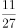

- **C**. 

- **D**. 
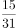

**答案**：A

**官方解析**

题干为分数数列、且变化趋势不单调，先考虑反约分，得到新数列：、、、、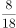，然后单独看分母和分子。分母成新数列3、4、7、11、18，由，，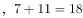可知前两项之和等于第三项，故下一项分母为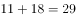。分子成新数列1、2、3、5、8，由，可知前两项之和等于第三项，故下一项分子为。故所求项为。

故正确答案为A。

---

### 第 4 题　qid 2042444 · 数学运算

1，，1，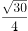，，（  ）

- **A**. 
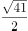
　✅
- **B**. 
3

- **C**. 

- **D**. 

**答案**：A

**官方解析**

题干为分数数列，且出现整数，先考虑反约分可得新数列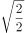、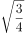、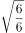、 、，然后单独看分母和分子。新数列根号里分母依次为2、4、6、8、10，故下一项根号里分母为12。单独看根号内分子部分为2、3、6、15、42，作差可得1、3、9、27为公比是3的等比数列，则下一项81，故下一项分子为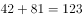。故原数列下一项为。

故正确答案为A。

---

### 第 5 题　qid 2042438 · 数学运算

甲、乙两人用相同工作时间共生产了484个零件，已知生产1个零件甲需5分钟、乙需6分钟，则甲比乙多生产的零件数是：

- **A**. 40个
- **B**. 44个　✅
- **C**. 45个
- **D**. 46个

**答案**：B

**官方解析**

方法一：已知“生产1个零件甲需5分钟、乙需6分钟”，设乙生产了个零件，则甲生产了个零件，总共生产了个零件，甲比乙多生产的零件为个，因为，则个（可根据尾数法判断尾数为4）。

方法二：已知“生产1个零件甲需5分钟、乙需6分钟”，甲乙时间之比为，效率之比即为，即甲每生产6个的同时乙生产5个，因此每合计生产11个，甲就要多生产1个，则，因此甲比乙多生产44个。

故正确答案为B。

---

### 第 6 题　qid 2042440 · 数学运算

玻璃厂委托运输公司运送400箱玻璃。双方约定：每箱运费30元，如箱中玻璃有破损，那么该箱的运费不支付且运输公司需赔偿损失60元。最终玻璃厂向运输公司共支付9750元，则此次运输中玻璃破损的箱子有：

- **A**. 25箱　✅
- **B**. 28箱
- **C**. 27箱
- **D**. 32箱

**答案**：A

**官方解析**

方法一：设此次运输中玻璃破损的箱子有x箱，则未破损的箱子有箱，根据题意可得：，可得。

方法二：没有玻璃破损的箱子则需要付元，每有一箱有玻璃破损则需要少付元，设此次运输中玻璃破损的箱子有箱，可得，可得。

故正确答案为A。

---

### 第 7 题　qid 2042450 · 数学运算

A、B两个容器装有质量相同的酒精溶液，若从A、B中各取一半溶液，混合后浓度为；若从A中取、B中取溶液，混合后浓度为。若从A中取、B中取溶液，则混合后溶液的浓度是：

- **A**. 

- **B**. 

- **C**. 

　✅
- **D**. 

**答案**：C

**官方解析**

方法一：设A、B酒精溶液的质量均为100克，A的纯酒精为a克，B的纯酒精为b克，则根据已知条件可得：

···①

···②

由①、②可得，，则。

方法二：根据线段法设A溶液浓度为a，B溶液浓度为b，可得：

···①

···②

由①、②可得，，因此若从A中取、B中取溶液，可得。

故正确答案为C。

---

### 第 8 题　qid 2042454 · 数学运算

某单位组织志愿者参加公益活动，有8名员工报名，其中2名超过50岁。现将他们分成3组，人数分别为3、3、2，要求2名超过50岁的员工不在同组，则不同分组的方案共有:

- **A**. 120种
- **B**. 150种
- **C**. 160种
- **D**. 210种　✅

**答案**：D

**官方解析**

2名超过50岁的员工不在同组，则2名50岁员工要么分在2个3人组，要么分在1个2人组1个3人组。

2名超过50岁的人分在2个3人组，有种情况；

2名超过50岁的人分在1个2人组1个3人组，有种情况；

所以不同分组的方案共有种。

故正确答案为D。

---

### 第 9 题　qid 2042456 · 数学运算

李教授受某单位邀请作一次学术报告，得劳务费1760元。按规定，一次性劳务费超过800元的部分需扣缴的税，则李教授的税前劳务费是:

- **A**. 2200元
- **B**. 2000元　✅
- **C**. 1950元
- **D**. 1900元

**答案**：B

**官方解析**

设李教授的税前劳务费是元，根据题意可得，

解得元，所以李教授的税前劳务费是2000元。

故正确答案为B。

---

### 第 10 题　qid 2042420 · 数学运算

玩具厂原来每日生产某玩具560件，用A、B两种型号的纸箱装箱，正好装满24只A型纸箱和25只B型纸箱。扩大生产规模后该玩具的日产量翻了一番，仍然用A、B两种型号的纸箱装箱，则每日需要纸箱的总数至少是：

- **A**. 70只
- **B**. 75只　✅
- **C**. 77只
- **D**. 98只

**答案**：B

**官方解析**

假设A、B型纸箱各能装下a件、b件玩具，根据题意可得：

，24a与560均能被8整除，则b能被8整除，当，，满足；当，a为非整数，排除；当，，排除，故可确定，。

要想日产量翻番后，纸箱总数少，则A型箱应尽可能多用，假设A、B型纸箱各用了、个，根据题意可得：，要使A型尽量多，则令B型为0个，则，即A型纸箱至少为75只。

故正确答案为B。

---

### 第 11 题　qid 2042428 · 数学运算

某地遭受重大自然灾害后，A公司立即组织捐款救灾。已知该公司有100名员工捐款，捐款额有300元、500元和2000元三种，捐款总额为36000元，则捐款500元的员工数是：

- **A**. 11人
- **B**. 12人
- **C**. 13人　✅
- **D**. 14人

**答案**：C

**官方解析**

设捐款300元、500元、2000元的人数分别为x、y、z，根据题意，

，化简得，根据奇偶特性，z只能是偶数且大于0，若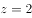，解得；若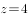，则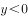，排除。

故正确答案为C。

---

### 第 12 题　qid 2042432 · 数学运算

在一次竞标中，评标小组对参加竞标的公司进行评分，满分120分。按得分排名，前5名的平均分为115分，且得分是互不相同的整数，则第三名得分至少是：

- **A**. 112分
- **B**. 113分　✅
- **C**. 115分
- **D**. 116分

**答案**：B

**官方解析**

设第三名得分为x分，要使x最少，则其他人得分应尽量多，根据题意，第一、二名得分至多为120、119，第四、五名得分至多为、，则，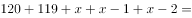，解得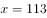。

故正确答案为B。

---

### 第 13 题　qid 2042434 · 数学运算

某市规划建设的4个小区，分别位于直角梯形ABCD的4个顶点处（如图），，。欲在CD上选一点S建幼儿园，使其与4个小区的直线距离之和为最小，则S与C的距离是：

- **A**. 3千米
- **B**. 4千米
- **C**. 6千米
- **D**. 9千米　✅

**答案**：D

**官方解析**

幼儿园S与4个小区的直线距离之和为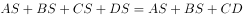，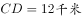，要使距离之和最小,只需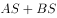最小，对应CD作A的镜像点A’，连接BA’， BA’与CD的交点即S点，此时最小，，则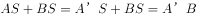，, ，，，解得。

故正确答案为D。

---

### 第 14 题　qid 2042436 · 数学运算

甲、乙两人从湖边某处同时出发，反向而行，甲每走50分钟休息10分钟，乙每走1小时休息5分钟。已知绕湖一周是21千米，甲、乙的行走速度分别为和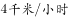，则两人从出发到第一次相遇所用的时间是:

- **A**. 2小时10分钟
- **B**. 2小时22分钟　✅
- **C**. 2小时16分钟
- **D**. 2小时28分钟

**答案**：B

**官方解析**

从同一起点绕湖反向而行，第一次相遇时甲、乙行走总路程为一周即21千米，结合选项，出发2小时10分钟时，甲休息20分钟、走110分钟， 路程为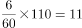千米，乙休息10分钟、走120分钟， 路程为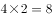千米，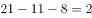千米，此后甲、乙继续行进，至相遇还需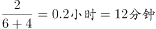，则总用时为2小时22分钟。

故正确答案为B。

---

## 判断推理

### 材料 1

黑茶、白茶、黄茶等5种茶叶装在1-5号5个盒子中，每个盒子只装1种茶叶，已知：

（1）黄茶装在2号或者4号盒子中；

（2）如果白茶装在3号盒子中，则绿茶装在5号盒子中；

（3）红茶装在1号或者2号盒子中，当且仅当黑茶装在5号盒子中。

#### 第 1 题　qid 2042788 · 类比推理

如果白茶装在3号盒子中，则黑茶装在哪个盒子中？

- **A**. 1号　✅
- **B**. 2号
- **C**. 4号
- **D**. 5号

**答案**：A

**官方解析**

第一步：翻译题干。

（1）黄茶装2号或者4号。

（2）白茶装3号绿茶装5号。

（3）红茶装在1号或者2号盒子中，当且仅当黑茶装在5号盒子中。当且仅当为充要条件，翻译为：红茶装1号或2号黑茶装5号。

第二步：分析选项。

如下表，如果白茶装3号盒子，根据条件（2），绿茶装5号。根据条件（3），黑茶不装5号，红茶不装1号和2号，所以红茶装4号。根据条件（1），黄茶装2号，所以，黑茶装1号。A项正确。

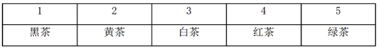

故正确答案为A。

---

#### 第 2 题　qid 2042792 · 类比推理

如果绿茶装在2号盒子中，白茶没有装在1号盒子中，则黑茶装在哪个盒子中？

- **A**. 1号　✅
- **B**. 3号
- **C**. 4号
- **D**. 5号

**答案**：A

**官方解析**

分析题干。

（1）黄茶装2号或者4号。

（2）白茶装3号绿茶装5号。

（3）红茶装在1号或者2号盒子中，当且仅当黑茶装在5号盒子中。当且仅当为充要条件，翻译为：红茶装1号或2号黑茶装5号。

如下表，如果绿茶装2号，那么根据条件（1），黄茶装4号。白茶不装1号，假如白茶装3号，那么绿茶装5号，与题干条件矛盾，所以，白茶装5号。根据条件（3），黑茶不装5号，红茶不装1号和2号，所以红茶装3号，黑茶装1号。A项正确。

故正确答案为A。

---

#### 第 3 题　qid 2042796 · 类比推理

如果黑茶装在5号盒子中，黄茶没有装在4号盒子中，则绿茶装在哪个盒子中？

- **A**. 1号
- **B**. 2号
- **C**. 3号　✅
- **D**. 4号

**答案**：C

**官方解析**

分析题干。

（1）黄茶装2号或者4号。

（2）白茶装3号绿茶装5号。

（3）红茶装在1号或者2号盒子中，当且仅当黑茶装在5号盒子中。当且仅当为充要条件，翻译为：红茶装1号或2号黑茶装5号。

如下表，如果黑茶装5号，黄茶没有装4号，根据条件（1），那么黄茶装2号。根据条件（3），红茶装1号。根据条件（2），绿茶不装5号，那么白茶不装3号，则白茶装4号，所以，绿茶装3号。C项正确。

故正确答案为C。

---

#### 第 4 题　qid 2042554 · 类比推理

文物：建筑

- **A**. 烹饪：佐料
- **B**. 故宫：楼房
- **C**. 诗人：教授　✅
- **D**. 皮鞋：布鞋

**答案**：C

**官方解析**

第一步：分析题干词语间逻辑关系。
文物和建筑是交叉关系，有的文物是建筑，有的建筑是文物。
第二步：判断选项词语间逻辑关系。
A项：烹饪需要佐料，二者为对应关系，不符合题干的逻辑关系，排除；
B项：故宫里面有楼房，二者是组成关系，不符合题干的逻辑关系，排除；
C项：有的诗人是教授，有的教授是诗人，符合题干的逻辑关系，当选；
D项：皮鞋和布鞋是并列关系，不符合题干的逻辑关系，排除。
故正确答案为C。

---

#### 第 5 题　qid 2042556 · 类比推理

园：园中园

- **A**. 楼：楼外楼
- **B**. 人：梦中人
- **C**. 月：水中月
- **D**. 画：画中画　✅

**答案**：D

**官方解析**

第一步：分析题干词语间逻辑关系。
“园”同“园中园”的园都指园子，且“园中园”是园中之园,两个“园”之间是组成关系。
第二步：判断选项词语间逻辑关系。
A项：“楼”和“楼外楼”所指楼相同，但“楼外楼”中的两个“楼”是并列关系，不是组成关系，不符合题干的逻辑关系，排除；
B项：“人”和“梦中人”所指相同，但“梦中人”只出现一个“人”，跟“园中园”的格式不对应，不符合题干的逻辑关系，排除；
C项：“月”和“水中月”所指相同，但“水中月”只出现一个“月”跟“园中园”的格式不对应,不符合题干的逻辑关系，排除；
D项：“画”和“画中画”都指画，且“画中画”是画中之画，两个“画”之间是组成关系，符合题干的逻辑关系，当选。
故正确答案为D。

---

#### 第 6 题　qid 2042558 · 类比推理

铁路：道路

- **A**. 南京：江苏
- **B**. 空调：家电　✅
- **C**. 英国：西欧
- **D**. 美国：国家

**答案**：B

**官方解析**

第一步：判断题干词语间逻辑关系。
铁路是道路，二者为种属关系，且铁路是一种统称，铁路有很多不同的路线。
第二步：判断选项词语间逻辑关系。
A 项：南京是江苏的组成部分，二者为组成关系，与题干逻辑关系不一致，排除；
B 项：空调是家电，二者为种属关系，且空调是一种统称，空调有很多不同的品牌和型号，与题干逻辑关系一致，当选；
C 项：英国是西欧的组成部分，二者为组成关系，与题干逻辑关系不一致，排除；
D 项：美国和国家是种属关系，但是美国不是统称，是特指美国这一个国家，不存在很多个美国，与题干逻辑关系不一致，排除。
故正确答案为B。

---

#### 第 7 题　qid 2042560 · 类比推理

人去：楼空

- **A**. 鸟尽：弓藏　✅
- **B**. 兽聚：鸟散
- **C**. 鸢飞：鱼跃
- **D**. 虎踞：龙盘

**答案**：A

**官方解析**

第一步：判断题干词语间逻辑关系。
人去是楼空的原因，二者是对应关系中的因果关系。同时，人去楼空是一个成语，指人已离去，楼中空空。比喻故地重游时睹物思人的感慨。
第二步：判断选项词语间逻辑关系。
A项：鸟尽是弓藏的原因，鸟尽弓藏指的是鸟没有了，弓也就藏起来不用了。比喻事情成功之后，把曾经出过力的人一脚踢开。二者是对应关系中的因果关系，与题干逻辑关系一致，当选；
B项：兽聚与鸟散是并列关系，兽聚鸟散指的是像鸟兽般时聚时散，常用来形容组织性极差，与题干逻辑关系不一致，排除；
C项：鸢飞与鱼跃是并列关系，鸢飞鱼跃指的是鹰在天空飞翔，鱼在水中腾跃，形容万物各得其所，与题干逻辑关系不一致，排除；
D项：虎踞和龙盘是并列关系，虎踞龙盘，形容地势险要,易守难攻。通常指帝都而言，亦专指南京，与题干逻辑关系不一致，排除。
故正确答案为A。

---

#### 第 8 题　qid 2042470 · 类比推理

《大学》：《中庸》：四书

- **A**. 泰山：华山：五岳　✅
- **B**. 物欲：财欲：六欲
- **C**. 朝夕：除夕：七夕
- **D**. 春风：秋雨：四季

**答案**：A

**官方解析**

第一步：分析题干词语间逻辑关系。
《大学》和《中庸》是并列关系，二者为四书的组成部分。
第二步：判断选项词语间逻辑关系。
A项：泰山和华山是并列关系，二者为五岳的组成部分，符合题干的逻辑关系，当选；
B项：六欲是中国古代区分感情的一种分类，一般指眼（见欲，贪美色奇物）、耳（听欲，贪美音赞言）、鼻（香欲，贪香味）、舌（味欲，贪美食口快）、身（触欲，贪舒适享受）、意（意欲，贪声色、名利、恩爱）。物欲和财欲不是六欲的组成部分，不符合题干的逻辑关系，排除；
C项：朝夕指的是一天中的早晚，除夕和七夕都是传统节日，不符合题干的逻辑关系，排除；
D项：春风和秋雨都是天气现象，二者不是四季的组成部分，不符合题干的逻辑关系，排除。
故正确答案为A。

---

#### 第 9 题　qid 2042140 · 类比推理

买票：乘机：抵达

- **A**. 生产：流通：消费
- **B**. 相识：相恋：结婚　✅
- **C**. 调研：调查：总结
- **D**. 申报：评审：得奖

**答案**：B

**官方解析**

第一步：判断题干词语间逻辑关系。
买票、乘机、抵达三者是逻辑关系中的对应关系，动作发出者为同一主体，并且动作有先后顺序。
第二步：判断选项词语间逻辑关系。
A项：流通的主体是商品，而生产和消费的主体是人，与题干逻辑关系不一致，排除；
B项：相识、相恋、结婚三者动作发出者为同一主体，并且三者有先后的顺序，与题干逻辑关系一致，当选；
C项：调查和总结是调研的两个环节，先调查再总结，但是与调研没有涉及到事件先后顺序，与题干逻辑关系不一致，排除；
D项：申报与得奖是同一主体，但是与评审主体不同，与题干逻辑关系不一致，排除。
故正确答案为B。

---

#### 第 10 题　qid 2042566 · 类比推理

扶贫 之于 （  ） 相当于 深化改革 之于 （  ）

- **A**. 小康社会—国家治理现代化　✅
- **B**. 和谐社会—科学发展观
- **C**. 社会动员—大国治理
- **D**. 从严治党—依法治国

**答案**：A

**官方解析**

逐一代入验证选项。
A项：扶贫是实现小康社会的方式和手段，小康社会是目标，二者是逻辑关系中的对应关系；深化改革是实现国家治理现代化的方式和手段，国家治理现代化是目标，前后逻辑关系一致，当选；
B项：扶贫是和谐社会的方式和手段，和谐社会是目标，二者是逻辑关系中的对应关系；深化改革是四个全面的内容之一，与科学发展观不是对应关系，前后逻辑关系不一致，排除；
C项：扶贫需要社会动员，社会动员是扶贫的必要条件，二者是逻辑关系中的对应关系；大国治理需要深化改革，深化改革是大国治理的必要条件，二者虽然是逻辑关系中的对应关系，但是词的顺序反了，排除；
D项：扶贫是帮助贫困地区和贫困户发展经济、促进生产、摆脱贫困的一项重要社会工作，同时也是一项国家政策，而从严治党是中国共产党治党的重要原则，是改革开放和社会主义现代化建设条件下加强党的建设的基本方针和要求，二者没有必然的逻辑关系；深化改革和依法治国是四个全面的两项内容，二者是并列关系，前后逻辑关系不一致，排除。
故正确答案为A。

---

#### 第 11 题　qid 2042568 · 类比推理

丝绸之路 之于 （  ） 相当于 万里长征 之于 （  ）

- **A**. 敦煌—遵义　✅
- **B**. 骆驼—草鞋
- **C**. 沙漠—海洋
- **D**. 贸易—解放

**答案**：A

**官方解析**

A项：敦煌是丝绸之路的一个途经地点，遵义是万里长征的一个途经地点，前后逻辑关系一致，保留；
B项：骆驼是丝绸之路的工具，草鞋是万里长征的工具，前后逻辑关系一致，保留；
C项：丝绸之路沿线经过沙漠，但是万里长征没有经过海洋，前后逻辑关系不一致，排除；
D项：丝绸之路的目的是贸易，万里长征的目的是战略转移和北上抗日，而非解放，前后逻辑关系不一致，排除。
比较A、B项，A项中，敦煌是古代丝绸之路上一个重要的标志性地点，敦煌因丝绸之路而闻名，而我们党在长征途中在遵义召开的遵义会议也是我们党一个重要的转折点，遵义也因此而著名；B项中，骆驼是丝绸之路中必不可少的工具，但是草鞋并不是万里长征中必不可少的，不是每一个红军战士都穿的草鞋，草鞋也不是必不可少的工具。这一道题结合时政热点，以及就题目本身的倾向性而言，A项更加贴近出题人的意图。
故正确答案为A。

---

#### 第 12 题　qid 2042570 · 类比推理

BD5k6kDB

- **A**. XA99ddAX
- **B**. WQ6s8fQW
- **C**. RM4j9jMR　✅
- **D**. SEe2e2ES

**答案**：C

**官方解析**

第一步：分析题干符号间关系。
从相同符号的位置入手：位置1、8的符号相同，位置2、7的符号相同，位置4、6的符号相同，并且3、5位置上的符号不同。
第二步：判断选项符号间关系。
A项：位置1、8的符号相同，位置2、7的符号相同，位置4、6的符号不相同，与题干不一致，排除；
B项：位置1、8的符号相同，位置2、7的符号相同，位置4、6的符号不相同，与题干不一致，排除；
C项：位置1、8的符号相同，位置2、7的符号相同，位置4、6的符号相同，并且位置3、5上的符号不同，与题干保持一致，当选；
D项：位置1、8的符号相同，位置2、7的符号相同，位置4、6的符号相同，位置3、5上的符号相同，与题干不一致，排除。
故正确答案为C。

---

#### 第 13 题　qid 2042572 · 逻辑判断

- **A**. 

- **B**. 
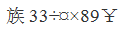

- **C**. 

- **D**. 

　✅

**答案**：D

**官方解析**

第一步：分析题干符号间关系。
从相同符号的位置入手：位置2、3的符号相同，位置7、8的符号相同，并且其他位置上的符号不相同。
第二步：判断选项符号间关系。
A项：位置2、3、5的符号相同，与题干不一致，排除；
B项：位置2、3的符号相同，位置7、8的符号不相同，与题干不一致，排除；
C项：位置2、3的符号相同，位置7、8的符号不相同，与题干不一致，排除；
D项：位置2、3的符号相同，位置7、8的符号相同，并且其他位置上的符号不相同，与题干保持一致，当选。
故正确答案为D。

---

#### 第 14 题　qid 2042146 · 图形推理

上边的题干中给出一套图形，其中有五个图，这五个图呈现一定的规律性。在下边给出一套图形，从中选出唯一的一项作为保持上边五个图规律性的第六个图。

- **A**. A
- **B**. B
- **C**. C
- **D**. D　✅

**答案**：D

**官方解析**

本题考查图形的实际意义，寻找最大共同点，题干每幅图中都只有一个站着的人，且衣服都有黑边袖子。选项中只有D项是一个人站着，而且衣服有黑边袖子。
故正确答案为D。

---

#### 第 15 题　qid 2042710 · 图形推理

上边的题干中给出一套图形，其中有五个图，这五个图呈现一定的规律性。在下边给出一套图形，从中选出唯一的一项作为保持上边五个图规律性的第六个图。

- **A**. A
- **B**. B　✅
- **C**. C
- **D**. D

**答案**：B

**官方解析**

元素组成不同，无明显属性规律，考虑数量规律。观察图形特征，窟窿较多且存在多边形，优先数面数量和线数量，但均无规律，考虑数点。每幅图中交点数量依次为：6、7、8、9、10，呈现数量递增的规律，因此应选择交点数量为11的图形，只有B项符合。
故正确答案为B。

---

#### 第 16 题　qid 2042104 · 图形推理

上边的题干中给出一套图形，其中有五个图，这五个图呈现一定的规律性。在下边给出一套图形，从中选出唯一的一项作为保持上边五个图规律性的第六个图。

- **A**. A
- **B**. B
- **C**. C　✅
- **D**. D

**答案**：C

**官方解析**

整体观察所给图形，每幅图都有4条长短不一的竖线和1条长斜线，并且每幅图的长斜线都是从最短竖线的底部连到最长竖线的顶部。分析选项，A不是最长竖线与最短竖线相连，B、D都是从最短竖线的顶部开始连，均排除，选项中只有C符合。 
故正确答案为C。

---

#### 第 17 题　qid 2042712 · 图形推理

下边的四个图形中，只有一个是由上边的四个图形拼合（只能通过上、下、左、右平移）而成的，请把它找出来。

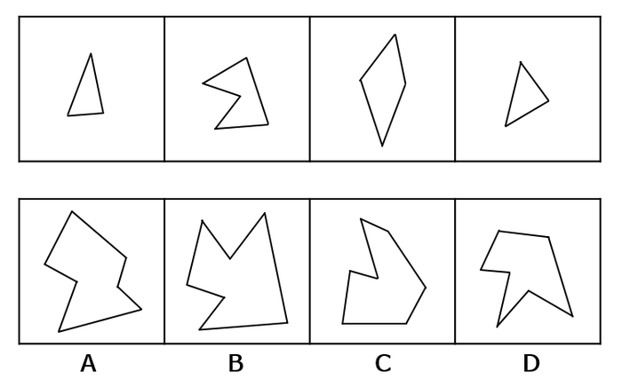

- **A**. A
- **B**. B　✅
- **C**. C
- **D**. D

**答案**：B

**官方解析**

本题为平面拼合，可以采用平行等长相消的方法（找到相对面积较大的图形作为基准图形，找到平行且等长的边进行拼合，拼合之后等长线条抵消）。

平行等长相消的方式如下图所示：

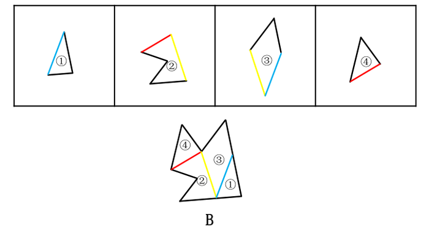

故正确答案为B。

---

#### 第 18 题　qid 2042718 · 图形推理

下边的四个图形中，只有一个是由上边的四个图形拼合（只能通过上、下、左、右平移）而成的，请把它找出来。

- **A**. A
- **B**. B
- **C**. C
- **D**. D　✅

**答案**：D

**官方解析**

本题为平面拼合，可以采用平行等长相消的方法（找到相对面积较大的图形作为基准图形，找到平行且等长的边进行拼合，拼合之后等长线条抵消）。

平行等长相消的方式如下图所示：

故正确答案为D。

---

#### 第 19 题　qid 2042722 · 图形推理

下边的四个图形中，只有一个是由上边的四个图形拼合（只能通过上、下、左、右平移）而成的，请把它找出来。

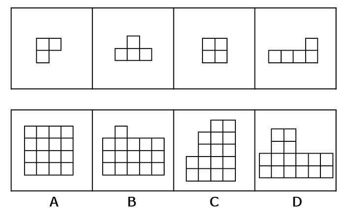

- **A**. A　✅
- **B**. B
- **C**. C
- **D**. D

**答案**：A

**官方解析**

本题为平面拼合，拼合方式如下图所示：

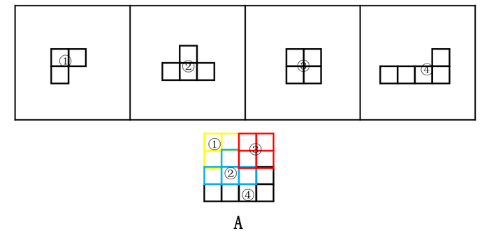

故正确答案为A。

---

#### 第 20 题　qid 2042726 · 图形推理

左边给定的是纸盒外表面的展开图，右边哪一项能由它折叠而成？请把它找出来。

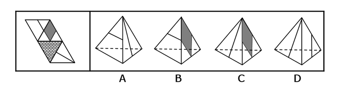

- **A**. A
- **B**. B　✅
- **C**. C
- **D**. D

**答案**：B

**官方解析**

本题考查四面体的空间重构。对平面展开图中的面进行标记，用排除法解题。

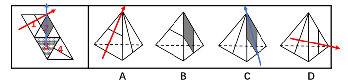

A项：如上图所示，分别对题干和选项的面1画箭头，题干箭头的右边是面2，选项箭头的右边是面4，A项错误，排除；

B项：与题干一致，为正确答案，当选；

C项：如上图所示，分别对题干和选项的面2画箭头，题干箭头的左边是面1，选项中箭头的左边是面4，C项错误，排除；

D项：如上图所示，分别对题干和选项的面1画箭头，题干箭头的下边是面3，选项箭头的下边是面4，D项错误，排除。

故正确答案为B。

---

#### 第 21 题　qid 2042728 · 图形推理

左边给定的是纸盒外表面的展开图，右边哪一项能由它折叠而成？请把它找出来。

- **A**. A　✅
- **B**. B
- **C**. C
- **D**. D

**答案**：A

**官方解析**

本题考查四面体的空间重构。对平面展开图中的面进行标记，用排除法解题。

A项：与题干一致，当选；

B项：选项中边2对应面b，题干中边1对应面b，选项与题干不一致，排除；

C项：选项中边3对应面b，题干中边1对应面b，选项与题干不一致，排除；

D项：选项中边2对应面b，题干中边1对应面b，选项与题干不一致，排除。

故正确答案为A。

---

#### 第 22 题　qid 2042730 · 图形推理

左边给定的是纸盒外表面的展开图，右边哪一项能由它折叠而成？请把它找出来。

- **A**. A
- **B**. B
- **C**. C
- **D**. D　✅

**答案**：D

**官方解析**

本题考查六面体的空间重构。将平面图中的各面进行标号，如图1所示：

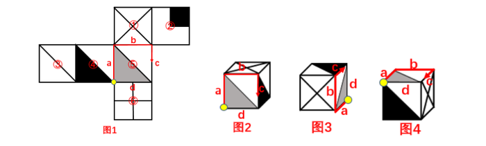

观察发现，选项正面图都是由面①、面④和面⑤组成。可以通过画边法进行解题。以面⑤黄点处为出发点，顺时针依次将各边画出，如上图。

A项：如图2所示，选项中c边对应是面④，而题干中c边对应的是面②，与题干不一致，排除；

B项：如图3所示，选项中c边对应是面④，而题干中c边对应的是面②，与题干不一致，排除；

C项：如图4所示，选项中c边对应是面①，题干中c边对应的是面②，与题干不一致，排除；

D项：与题干一致，当选。

故正确答案为D。

---

#### 第 23 题　qid 2042734 · 图形推理

左边给定的是纸盒外表面的展开图，右边哪一项能由它折叠而成？请把它找出来。

- **A**. A
- **B**. B　✅
- **C**. C
- **D**. D

**答案**：B

**官方解析**

本题考查六面体的空间重构。观察发现，选项中的立体图形都包含灰色三角形所在的面。可以通过画边法解答。以灰色三角形的直角为出发，顺时针依次标出各边，如图1所示：

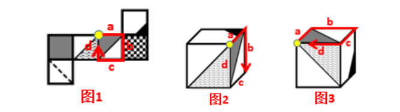

A项：题干中a边挨着黑三角形所在面的空白边，与黑三角形没有公共边，而选项中a边与黑三角形有公共边（如图2所示），排除；

C项：题干中黑三角形所在的面与虚线所在的面是相对面，而选项是相邻面，排除；

D项：题干中a边挨着黑三角所在的面（如图1所示），而选项中c边挨着黑三角所在的面（如图3所示），排除；

故正确答案为B。

---

#### 第 24 题　qid 2042138 · 逻辑判断

近日国外一项调查研究发现，肥胖与较差的社会经济地位之间存在着内在的关系，那些社会经济地位较差的人大多比较肥胖，甚至越穷越胖。研究者解释，这是因为社会经济地位较差的人更容易选择高热量低营养的快餐食品，而摄入这些食品很容易导致肥胖。
下列哪项如果为真，最能削弱研究者的上述解释？

- **A**. 高热量低营养食品的摄入虽是一些人的饮食习惯，但却容易造成营养不良
- **B**. 刚富起来的人更容易沉迷于高热量食品，而有些穷人对快餐食品只能偶尔尝鲜
- **C**. 穷人没有足够的金钱和时间去锻炼身体，富人却更有能力在身体健康上投入　✅
- **D**. 现在高热量低营养的快餐食品变得越来越廉价，而健康的低卡路里食品变得越来越昂贵

**答案**：C

**官方解析**

第一步：找到论点和论据。
论点：那些社会经济地位较差的人大多比较肥胖，甚至越穷越胖是因为社会经济地位较差的人更容易选择高热量低营养的快餐食品，而摄入这些食品很容易导致肥胖。
论据：无。
第二步：逐一分析选项。
A项：指出摄入高热量低营养的食品容易造成“一些人”营养不良，此处的“一些人”指代不明，也没有给出穷人更容易胖的原因，无关选项，排除；
B项：指出刚富起来的人更容易沉迷于高热量食品，有些穷人只能偶尔尝鲜，但题干“穷人”和“富人”两个群体比较的是普遍情况，“刚富起来的人”和“有些穷人”都代表不了“富人和穷人”群体的普遍情况，不能用部分或个例去质疑普遍情况，不能削弱，排除；
C项：指出“穷人”和“富人”这两个群体还有“锻不锻炼”这个变量，可能是因为没有钱和时间去锻炼导致穷人更胖，他因削弱，当选；
D项：指出高热量低营养的快餐食品越来越便宜，健康的低卡路里食品越来越贵，解释了穷人更容易选择高热量低营养的快餐食品的原因，补充论据加强，排除。
故正确答案为C。

---

#### 第 25 题　qid 2042778 · 逻辑判断

某市举办民间文化艺术展演活动，小李、小张、大王和老许将作为剪纸、苏绣、白局和昆曲的传承人进行现场展演，每人各展演一项，展演按序一一进行。主办方还有如下安排：
（1）老许的展演要排在剪纸和苏绣的后面；
（2）白局、昆曲展演时小李只能观看；
（3）大王的展演要排在剪纸前面；
（4）小张的展演要排在昆曲和老许展演前面。
根据上述安排，可以得出以下哪项？

- **A**. 小李展演剪纸，排在第1位
- **B**. 大王展演苏绣，排在第2位
- **C**. 小张展演昆曲，排在第3位
- **D**. 老许展演白局，排在第4位　✅

**答案**：D

**官方解析**

根据题干，由条件（1）（4）可知老许展演白局，且在剪纸、苏绣和小张的展演后面；由（2）（4）可知小李、小张、老许都不展演昆曲，所以大王展演昆曲；由条件（1）（3）（4）可知大王要排在剪纸、白局（老许）的前面，排在小张的后面，排序应该是：小张、昆曲（大王）、剪纸、白局（老许），所以小张展演苏绣，小李展演剪纸，所以正确的排序依次是：第一位苏绣（小张）、第二位昆曲（大王）、第三位剪纸（小李）、第四位白局（老许）。
故正确答案为D。

---

#### 第 26 题　qid 2042780 · 逻辑判断

人类医学的发展与进步，既得益于科学家们的辛苦钻研，也离不开实验动物做出的默默牺牲。在药物开发进入临床前，需要做大量动物实验，探究药物的药效、毒性、安全剂量等。然而，人与鼠、猪、狗、兔子等动物毕竟存在不少差别，即使正确认识了动物的生理构造及药物反应规律，也不能将认识结果轻易、盲目地移用到人的身上。
以下哪项如果为真，最能支持上述观点？

- **A**. 古希腊医学家盖伦根据自己对动物解剖的结果认为，无论是在人的静脉或是动脉中，血液都是作单程运动的，并非循环运动。这当然不符合现代科学观念
- **B**. 宋代《本草衍义》记载，有人以自然铜饲折翅的胡雁，后胡雁伤愈飞去，今人可以之治跌打扑损。食用自然铜治疗骨折，这在现代人看来是不可想象的
- **C**. 1882年，德国罗伯特·科赫利用豚鼠做实验得出结论：结核菌是结核病的病原菌，不论来自猴、牛或人均有相同症状，他因此发现而获得了诺贝尔奖
- **D**. 1957年，一种叫做沙利度胺的妊娠反应药物经过对大鼠试验后被投放市场，一段时间后发现，沙利度胺会造成人类胎儿畸形，但它不会对大鼠胎儿致畸　✅

**答案**：D

**官方解析**

第一步：找到论点和论据。
论点：即使正确认识了动物的生理构造及药物反应规律，也不能将认识结果轻易、盲目地移用到人的身上.
论据：人与鼠猪、狗、兔子等动物毕竟存在不少差别.
第二步：逐一分析选项。
A项：指出古希腊医学家盖伦把自己对动物的解剖结果移用到人身上，认为人的血液都是作单程运动的，而这一观点不符合现代科学观念，说明动物和人的生理构造不同，补充了一个新论据，保留；
B项：指出自然铜可以治疗折翅的胡雁，移用到人身上能治跌打扑损，食用能治疗骨折，说明自然铜治疗折翅胡雁的功效能移用到人身上，削弱论点，排除；
C项：指出不论猴、牛或人感染结核菌均有相同症状，所以动物感染结核菌的症状能移用到人身上，举例削弱，排除；
D项：指出沙利度胺会造成人类胎儿畸形，但不会对大鼠胎儿致畸，所以不能把沙利度胺不会对大鼠胎儿致畸的结论移用到人身上，说明在人身上用药和在动物身上用药是不同的，补充了一个新论据，保留；
对比A、D两项，题干重点讨论的主题是医学和动物实验的关系，动物实验的目的是测试药效果。A项讨论的是生理构造，虽然也符合主题的一个部分，但不是最关键的,排除，而D项通过实验充分论证了药物对人与大鼠的胚胎造成的结果不一样，更切合题意，当选。
故正确答案为D。

---

#### 第 27 题　qid 2042292 · 类比推理

老张：你在这儿摆摊设点属于占道经营！
小王：这儿是中山北路又不是中山北道，我占的什么道？
以下哪项与上述对话方式最为相似？

- **A**. 甲：你这种执法行为一点人情味都没有！    乙：我严格执法是为了保障人民群众的生命财产安全。
- **B**. 甲：你成天打游戏是在虚度年华！     乙：我只有在游戏中才觉得年华没有虚度。
- **C**. 甲：你工作时间不能抽烟！   乙：我抽烟时从不工作。　✅
- **D**. 甲：你这种说法是栽赃陷害！      乙：你这种说法是血口喷人！

**答案**：C

**官方解析**

第一步：分析题干对话方式。
题干对话中小王故意曲解老张的话中“占道经营”的“道”，实际上这里的“道”泛指道路，小王通过混淆概念达到自己强词夺理的目的。
第二步：逐一分析选项。
A项：甲乙二人的话不在一个领域内，“人情味”与“保障人民群众的生命财产安全”并无冲突，与题干无相似之处，排除；
B项：甲乙二人对于“打游戏是否虚度年华”理解不同，与题干并无相似之处，排除；
C项：乙故意将甲话中的“工作时间不能抽烟”曲解成为“抽烟的时候不能工作”，混淆概念达到其强词夺理的目的，与题干最为相似，当选；
D项：乙仅仅是在指责对方，指出对方是在冤枉自己，与题干并无相似之处，排除。
故正确答案为C。

---

#### 第 28 题　qid 2042782 · 逻辑判断

将东西两位戏剧大师的生平经历、文学造诣及身后影响作对比，是一个有趣的话题，有专家认为，将汤显祖称作“东方的莎士比亚”有很大的问题，因为无论是就人格的魅力，还是就文本美感而言，汤显祖都是不逊于莎士比亚的。
以下哪项最可能是上述专家观点所包含的假设？

- **A**. 汤显祖的人格魅力及其文本的美感均高于莎士比亚
- **B**. 汤显祖在西方的影响要大于莎士比亚在东方的影响
- **C**. 汤显祖和莎士比亚都不愿意别人用他人的名字来称呼自己
- **D**. “东方的威尼斯”是逊色于真正的威尼斯的　✅

**答案**：D

**官方解析**

第一步：找到论点和论据。
论点：将汤显祖称作“东方的莎士比亚”有很大的问题。
论据：无论是就人格的魅力，还是就文本美感而言，汤显祖都是不逊于莎士比亚。
第二步：逐一分析选项。
A项：题干问的是包含的假设，即需要补充联系或者前提。而A项指出汤显祖的人格魅力及其文本的美感均高于莎士比亚，是论据的重复表述，不能解释论点与论据间的必然联系，排除；
B项：指出汤显祖在西方的影响要大于莎士比亚在东方的影响，未提到汤显祖在东方的影响力有多大，而论点提到的是“东方的莎士比亚”，无关选项，排除；
C项：指出汤显祖和莎士比亚都不愿意别人用他人的名字来称呼自己，无关选项，排除；
D项：指出“东方的威尼斯”是逊色于真正的威尼斯的，即冠名为“东方”的人或地方都会逊色于西方，推理出“东方的莎士比亚”是逊色于真正的莎士比亚的，而汤显祖并不逊色于莎士比亚，因此将汤显祖称作“东方的莎士比亚”有很大的问题。论点与论据间搭桥，当选。
故正确答案为D。

---

#### 第 29 题　qid 2042298 · 逻辑判断

老张、老张的妹妹、老张的儿子和老张的女儿4人进行乒乓球比赛。比赛后发现，第1名与第4名的年龄相同，但第1名的孪生同胞（上述4人之一）与第4名的性别不同。
根据以上信息，可以推出第1名是：

- **A**. 老张
- **B**. 老张的女儿　✅
- **C**. 老张的妹妹
- **D**. 老张的儿子

**答案**：B

**官方解析**

根据题干信息，第1名的年龄=第4名的年龄，而第1名的孪生同胞与第4名性别不同，因此第1名的孪生同胞一定不是第4名，根据孪生同胞年龄相同，得出第1名的年龄=孪生同胞的年龄=第4名的年龄，四个人中有三个人年龄相同，由于老张不可能与自己的儿子和女儿同龄，那么这三个人只能是老张的儿子、女儿和妹妹，则孪生同胞为老张的儿子和女儿，第4名为老张的妹妹。已知第1名的孪生同胞与第4名性别不同，那么孪生同胞为老张的儿子，第1名为老张的女儿。
故正确答案为B。

---

#### 第 30 题　qid 2042784 · 逻辑判断

张某死了，法医查明是中毒身亡，张某的两个邻居甲和乙对前来调查的赵警官说了这样的话：
甲：如果张某死于谋杀，他老婆李某脱不了干系，这段时间她正和张某闹离婚；
乙：张某不是死于自杀，就是死于谋杀，不可能是意外。
赵警官听了甲和乙的话以后，作出如下两个判断：
（1）如果甲和乙说的都是对的或都是错的，那么张某就是死于意外；
（2）如果甲乙两人中有一人说的是错的，那么张某就不是死于意外。
后来，查明事实后发现，赵警官的判断都是正确的。
根据以上信息，可以得出以下哪项？

- **A**. 张某死于谋杀　✅
- **B**. 张某死于自杀
- **C**. 张某死于意外
- **D**. 李某杀了张某

**答案**：A

**官方解析**

第一步：翻译题干。

甲：谋杀→李某

乙：自杀或谋杀，意外

赵警官：

（1）（甲对且乙对）或（甲错且乙错）→意外

（2）甲、乙一对一错→意外

第二步：逐一分析选项。

由于全部已知信息均为不确定（条件关系），故依次将选项代入分析。

代入A项，假设张某死于谋杀，那么他一定不是死于意外，那么赵警官的第（1）句后件为假，则第（1）句前件必须为假，才能保证他的判断为真，所以甲、乙二人说的话必有一对一错，不可能都对或都错。此时验证甲、乙二人的话，发现乙一定为真，此时只需要保证谋杀者不是李某就可以保证甲的话为假，（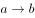的矛盾命题是a且否b，若为假，则且否为真）与题干已知条件没有矛盾，故A项当选。 

代入B项，假设张某死于自杀，即不是死于意外，同上述推论，能够得出甲、乙二人说的话必有一对一错。此时验证甲、乙二人的话，发现乙为真，甲也为真（前件后件都为假，整个命题为真），与一对一错的推论相矛盾，故B项可排除。

代入C项，假设张某死于意外，那么赵警官的第（2）句后件为假，推出第（2）句前件必须为假，才能保证他的判断是正确的，即甲、乙二人的话都对或都错。此时验证甲、乙二人的话，发现乙为假，甲为真，与二人都对或都错的推论相矛盾，故C项可排除。

代入D项，假设李某杀了张某，那么他不是死于意外，同A项推论，甲、乙二人说的话必有一对一错。此时验证甲、乙二人的话，发现乙为真，甲也为真（前件后件都为真），与一对一错的推论相矛盾，故D项可排除。

故正确答案为A。

---

#### 第 31 题　qid 2042372 · 定义判断

斜杠青年：指不满足于从事单一职业，追求拥有多重职业身份及多元生活方式的年轻人。他们在自我介绍时往往喜欢用斜杠来区分自己的不同身份，如：张三，金牌律师/企划师/专栏作家。
下列属于斜杠青年的是：

- **A**. 最近两三年，八零后导演黄某某先后出演了10多次男配角，去年在一个著名的国际电影节上斩获了最佳男配角奖　✅
- **B**. 小丁在国外获得博士学位后，任职于国内一所著名高校，因科研成就突出，被破格聘为教授，并入选省“双百”人才计划
- **C**. 某公司程序员小陈爱好广泛，性格温和，人际关系融洽，节假日常邀上三五个好友一起登山、打球、游泳
- **D**. 李总做过保安，送过快递，当过安装工，开过小杂货店，他经常自豪地向员工讲述自己30多年来丰富的职业经历

**答案**：A

**官方解析**

第一步：找到定义关键词。
“年轻人”、“不满足于从事单一职业”、“追求拥有多重职业身份及多元生活方式”。
第二步：逐一分析选项。
A项：80后导演黄某某先后出演了10多次男配角，最终获得了最佳男配角奖，体现了黄某某在同一时间所扮演的导演和演员两种不同的身份和职业，符合定义，当选；
B项：小丁在国外获得博士学位后任职于高校，后因科研成就突出被聘为教授，自始至终小丁的职业只有教师这一项，没有体现多重职业身份和多元生活方式，不符合定义，排除；
C项：小陈爱好广泛经常约朋友一起登山、打球、游泳，只是体现了不同的兴趣爱好，和职业无关，也未体现多重身份，不符合定义，排除；
D项：李总做过保安、送过快递、当过安装工、开过小杂货店，虽然这些体现了李总不满足于从事一种职业，追求多种职业身份及多元生活方式，但是这些身份和经验都是过往的经验，并不是在当下工作之外所具有的其他身份。根据相关资料可推测，“斜杠青年”所指的多重身份更偏向于某人在同一时间所具备的不同身份，D项不符合定义，排除。
故正确答案为A。

---

#### 第 32 题　qid 2042376 · 定义判断

影子工作：指消费者使已购商品变为可用物品所付出的任何劳动。
下列属于影子工作的是：

- **A**. 小孙到饭店就餐，老板告诉他，这几天大部分服务员都已经放假，顾客需要点餐，并递给他一支笔和一张菜单
- **B**. 小李的儿子快出生了，他赶紧抽时间将同事老王给的婴儿车拿出来修理一番，车子焕然一新，十分好用
- **C**. 经不住软磨硬泡，爸爸终于答应给小明买两条金鱼，小明高兴坏了，连夜在网上收集了十几页的金鱼养殖攻略
- **D**. 将拼板餐桌从商场运回家后，老冯忙乎了半天，对照安装说明，拆了装，装了拆，终于组装成功，中午就派上了用场　✅

**答案**：D

**官方解析**

第一步：找到定义关键词。
“消费者使已购商品变为可用物品所付出的任何劳动”。
第二步：逐一分析选项。
A项：小孙到饭店就餐，服务员休假只能自己点单，点单说明还没有消费，不存在已购商品，更没有体现出使已购商品变为可用物品的过程，同时点餐和变为可用物品之间没有联系，不符合定义，排除；
B项：小李将同事老王送的婴儿车拿出来修理一番，车子焕然一新，十分好用，送的婴儿车本就是一种可用物品，没有体现出使已购商品变为可用物品的过程，同时，婴儿车的购买者是老王而不是小李，不符合定义，排除；
C项：爸爸答应给小明买两条金鱼，小明搜集了十几页的养殖攻略，答应买金鱼但是还没买，没有体现出已购商品这个概念，同时金鱼也不是一种可用物品，不符合定义，排除；
D项：老冯将拼板餐桌从商场运回家，对照安装说明组装成功，中午派上用场，首先拼板餐桌是已购商品，老冯经过劳动使其变为可用物品，符合定义，当选。
故正确答案为D。

---

#### 第 33 题　qid 2042742 · 定义判断

权利暗示：指基于职务地位、业务能力、人格魅力而产生的对组织机构外部成员的影响力。
下列不属于权利暗示的是:

- **A**. 张教授是微电子领域的专家，不少企业遇到相关问题，都会向他请教解决的方法
- **B**. 五年级的小聪，电子游戏玩得特别顺溜，学校组队参加各级比赛时总请他协助指导　✅
- **C**. 退伍军人老赵处事公平，街坊邻居遇到大小纠纷，首先想到的就是请他来主持公道
- **D**. 教育局李主任长期研究教师的专业发展，亲友们却常常向他求教孩子的教育问题

**答案**：B

**官方解析**

第一步：找出定义关键词。
“基于职务地位、业务能力、人格魅力而产生的对组织机构外部成员的影响力”。
第二步：逐一分析选项。
A项：张教授是微电子领域的专家，不少企业遇到相关问题都会向他请教解决的办法，体现了张教授基于业务能力产生的对组织机构外部成员的影响，符合定义，排除；
B项：小聪电子游戏玩得顺溜，学校组队参加比赛时总请他协助指导，电子游戏玩得顺溜没有体现职务地位、业务能力和人格魅力的影响，同时小聪作为学校的学生，学校组队参加比赛协助指导是对本组织内部的影响，不能体现出对组织机构外部成员的影响，不符合定义，当选；
C项：退伍军人老赵处事公平，街坊邻居遇到大小纠纷请他来主持公道，体现了由于人格魅力而产生的对街坊邻居的影响，同时街坊邻居相对于与军人所属的军队这一组织机构来说属于组织外部成员，符合定义，排除；
D项：李主任长期研究教师的专业发展，亲友们常常向他求教孩子的教育问题，体现了由于职务地位和业务能力而产生的对他所在的组织机构以外的成员的影响力，符合定义，排除。
本题为选非题，故正确答案为B。

---

#### 第 34 题　qid 2042302 · 定义判断

随机试验：指在同一条件下会出现多种可能结果且可以重复进行的试验；试验的所有可能结果虽预先可知，但每次具体实验的结果却无法预知。
下列属于随机试验的是：

- **A**. 将一壶淡水加热到沸腾，观察其状态变化的实验
- **B**. 在狮子身上安装定位设备了解其生活习性的实验
- **C**. 为检测某辆新款汽车的安全性能所做的撞击实验
- **D**. 抛一枚硬币观察带有数字的一面朝上次数的实验　✅

**答案**：D

**官方解析**

第一步：找到定义关键词。

“在同一条件下会出现多种可能结果且可以重复进行的试验”、“试验的所有可能结果虽预先可知，但每次具体实验的结果却无法预知”。

第二步：逐一分析选项。

A项：将一壶淡水加热到沸腾，观察状态变化的实验，这种实验可重复进行，但是在同一条件下不可能出现多种结果，出现的结果只有一种，就是水加热至沸腾后，由液态变成气态，每次实验的具体结果是可以预知的，不符合定义，排除；

B项：在狮子上安装定位设备了解其生活习性的实验，同一头狮子是可以重复实验，但是狮子的情况和习性都不相同，实验的所有的结果并不都是可预知的，不符合定义，排除；

C项：为检测某辆新款汽车的安全性能所做的撞击实验，同一辆汽车的撞击实验是不可以重复进行的实验，而实验的结果是可以预知的，同时实验的结果并不具备多种可能性，排除；

D项：抛一枚硬币观察带有数字的一面朝上次数的实验，实验可以重复进行，且每次实验的结果具有两种可能性，一是带有数字的一面朝上，二是带有数字的一面朝下，其实验的所有结果是可以具体得知的，那就是带有数字的一面朝上的概率是，但是每次实验的结果带有数字的一面到底是朝上还是朝下却不可预知，符合定义，当选。

故正确答案为D。

---

#### 第 35 题　qid 2042310 · 定义判断

临时救助：指家庭或个人遭遇突发事件、意外伤害、重大疾病等变故，基本生活陷入困境时，政府有关部门提供的应急性、过渡性救助。
下列属于临时救助的是：

- **A**. 80岁的李大爷无儿无女，独自生活，社区工作人员定期到他家中探望，把每月的养老金交到他手上，还时不时地送来一些生活用品
- **B**. 老张患上了强直性脊柱炎，巨额医疗费花光了积蓄，夫妻名下的房子也变卖了，一家三口只得暂住在街道办为他们租来的小房子里　✅
- **C**. 地震发生后，社会各界积极响应市政府号召，通过多种渠道捐款捐物，很快就筹集了大批物资并分发到了灾民手中
- **D**. 老赵在几年前的一次车祸中失去了左腿，从那以后再也不能外出工作，每月数百元的低保金就成了家里主要的经济来源

**答案**：B

**官方解析**

第一步：找到定义关键词。
原因：“家庭或个人遭遇突发事件、意外伤害、重大疾病等变故”、“基本生活陷入困境”。
结果：“政府有关部门提供的应急性、过渡性救助”。
第二步：逐一分析选项。
A项：80岁的李大爷无儿无女，独自生活，社区工作人员定期探望，给予养老金，没有体现出李大爷遭遇了突发事件、意外伤害或者重大疾病等变故，不符合定义，排除；
B项：老张患上了强直性脊柱炎，体现了家庭或者个人遭遇重大疾病的变故，花光了积蓄、变卖房子体现了生活陷入困境，一家人只得暂住在街道办为他们租来的小房子里，体现了政府有关部门提供的应急性、过渡性救助，符合定义，当选；
C项：地震发生后，社会各界响应号召为灾民捐送物资，并不是政府有关部门提供的应急性、过渡性救助，不符合定义，排除；
D项：老赵因车祸失去左腿，体现了遭遇意外伤害等变故，但每月的低保金成为主要经济来源并不是应急性、过渡性的救助，低保金是一种长期的救助，不符合定义，排除。
故正确答案为B。

---

#### 第 36 题　qid 2042312 · 定义判断

渐进式退休：指员工到了法定退休年龄，用人单位根据实际工作需要对部分人员灵活确定退休时间。
下列属于渐进式退休的是：

- **A**. 马教授临近退休年龄，因为他是国内最具影响力的学者之一，对学科发展作出了重大贡献，学校决定聘任他为终身教授
- **B**. 赵先生已经到了退休年龄，但是他主持的重大攻关项目还没有结题，他所在的研究所决定聘用他继续工作，直到项目完成　✅
- **C**. 近年来，李工程师的身体状况越来越糟糕，还患上了轻度的抑郁症，无法坚持工作，公司领导经过研究，决定让他提前退休
- **D**. 某研究机构决定，从下半年开始，本单位申请提前退休的职工，初、中级职称不低于54岁，高级职称不低于58岁

**答案**：B

**官方解析**

第一步：找到定义关键词。
“员工到了法定退休年龄”、“用人单位根据实际工作需要对部分人员灵活确定退休时间”。
第二步：逐一分析选项。
A项：马教授临近退休说明还没有到法定退休年龄，不符合定义，排除；
B项：赵先生到了退休年龄，因为他主持的项目没有结题，研究所决定聘用他继续工作，体现了“用人单位根据实际工作需要对部分人员灵活确定退休时间”，符合定义，当选；
C项：李工程师提前退休说明还没有到法定退休年龄，不符合定义，排除；
D项：某机构职工申请提前退休说明还没有到法定退休年龄，不符合定义，排除。
故正确答案为B。

---

#### 第 37 题　qid 2042318 · 定义判断

订单式培养：指用人单位提出用人申请后，由劳动保障部门委托培训机构根据用工需求组织实施的明确就业岗位去向的人才培养模式。
下列属于订单式培养的是：

- **A**. 某职业技术学院调研后发现，烹饪即将成为未来数年的紧俏职业，当年就开设了烹饪专业，果不其然，毕业生很抢手，很多餐饮名店都登门签约
- **B**. 某民办托儿所急需几名保育员，主管部门接到申请后马上找到一家资深代培机构组织培训，几名合格的保育员很快到岗　✅
- **C**. 某市每年都会根据各乡镇上报的用人需求，在全省高校中聘请一批科研人员，然后分派到各地担任科技副镇长
- **D**. 某物业公司最近被多个小区选中，需要补充大批保安，为了顺利接手各个小区的安保工作，公司急招了数十名新手，正委托专业保安公司强化培养

**答案**：B

**官方解析**

第一步：找出定义关键词。
“用人单位提出用人申请后”、“劳动保障部门委托培训机构根据用工需求组织实施的明确就业岗位去向的人才培养”。
第二步：逐一分析选项。
A项：职业技术学院开设烹饪专业不是受劳动保障部门委托，而是主动开设，而且也没有体现用人单位提出申请，不符合定义，排除；
B项：托儿所提出的是保育员的用人申请，主管部门委托代培机构组织培训符合劳动保障部门委托培训机构根据需求组织人才培养，符合定义，当选；
C项：某市在高校中聘请科研人员担任科技副镇长，不属于委托培训机构根据需求组织人才培养，不符合定义，排除；
D项：物业公司委托专业保安公司强化培养新入职的保安，是用人单位进行的委托培训，而非劳动保障部门，而且也没有体现提出用人申请，不符合定义，排除。
故正确答案为B。

---

#### 第 38 题　qid 2042744 · 定义判断

短命政策：指地方政府制定的事关群众权益却无法得到社会公众认可或受到普遍反对，一出台很快就被迫终止的政策措施。
下列不属于短命政策的是：

- **A**. 某市交管部门出台“闯黄灯视为违反交规，记6分”政策，在社会上引起了强烈反响，5天后该部门举行发布会宣布“暂时不予执行”
- **B**. 某市推出购房新政：毕业未满5年的高校毕业生在市区购房实行“零首付”。因为不符合有关政策，几天后就被上级紧急叫停　✅
- **C**. 南方某城市推出在市区范围内的“禁摩令”后，大批快递员集体离职，摩的司机纷纷上访。很快，这一政策被宣布“暂缓执行”
- **D**. 北方某市交通局宣布某风景优美的县级公路设卡收费，消息传出后，舆论一片哗然。没到月底，这一收费政策就寿终正寝

**答案**：B

**官方解析**

第一步：找到定义关键词。
“地方政府制定的政策事关群众权益却无法得到社会公众认可或受到普遍反对”“一出台很快被迫终止”。
第二步：逐一分析选项。
A项：某市交管部门出台政策引起强烈反响，5天后宣布“暂时不予执行”，交管部门出台的政策事关群众权益，在社会上引起强烈反响，可能没有得到群众的认可，故被迫终止，可能符合定义，保留；
B项：某市推出的购房政策因为不符合有关政策，几天后被紧急叫停，购房政策被叫停的原因并不是无法得到社会公众认可或受到普遍反对，而是不符合有关政策，不符合定义，保留；
C项：南方某城市推出的“禁摩令”，导致大批快递员集体离职和摩的司机纷纷上访，体现了地方政府制定的政策无法得到公众的认可，最后政策被宣布“暂缓执行”，体现了政策一出台就被迫终止，符合定义，排除；
D项：北方某市交通局宣布某风景优美的县级公路设卡收费，消息传出后，舆论一片哗然，没到月底，这一收费政策就寿终正寝体现了最终政策被迫终止，符合定义，可能没有得到群众的认可，故被迫终止，可能符合题干定义，保留。
比较A、B、D三项，A、D两项可能符合定义，而B项不符合定义，故B项更符合题干要求。
本题为选非题，故正确答案为B。

---

#### 第 39 题　qid 2042746 · 定义判断

分享经济：指个人、组织或者企业借助现代化的信息交流手段，盘活闲置资源的经济活动。通过这种活动，供给方能够获得额外收益，需求方能够以更低成本获得产品和服务。
下列属于分享经济的是：

- **A**. 某小区业委会建立了一个业主微信群，业主家中如果有闲置物品，就可以拍照发到群里，供其他家庭根据需要选用。业主们对业委会的这一做法非常满意
- **B**. 每年毕业季，将要离开校园的大学生们就会在校园的各个角落摆摊设点，甩卖不打算带走的生活用品，低年级的学弟学妹们往往能从中淘到不少“宝贝”
- **C**. 某快递公司通过手机软件把用户需求推送给自由快递人，自由快递人选择就近订单，顺路把大大小小的包裹及时、准确地送到客户手中。公司投送费用大幅下降　✅
- **D**. 小钟建了网站专门发布来自各厂家的技术难题，有偿征集网友设计的解决方案，经过技术处理再行转让。厂家们虽然并未节省研发费用，却很喜欢这种方式

**答案**：C

**官方解析**

第一步：找到定义关键词。
“个人、组织或者企业借助现代化的信息交流手段，盘活闲置资源”、“供给方能够获得额外收益”、“需求方能够以更低成本获得产品和服务”。
第二步：逐一分析选项。
A项：业主通过微信群发布闲置物品信息属于“个人借助现代化的信息交流手段”，但供其他家庭根据需要选用并未体现出“供给方（业主）能够获得额外收益”，不符合定义，排除；
B项：大学生们在校园摆摊设点不属于“借助现代化的信息交流手段”，不符合定义，排除； 
C项：某快递公司通过手机软件属于“企业借助现代化的信息交流手段”，自由快递人顺路把包裹及时、准确地送到客户手中体现出“供给方（自由快递人）能够获得额外收益”，盘活了自由快递人的闲置时间，公司投送费用大幅下降体现了“需求方（公司）能够以更低成本获得服务”，符合定义，当选；
D项：未体现盘活闲置资源，同时需求方厂家并未节省研发费用说明没有降低成本，不符合定义，排除。
故正确答案为C。

---

#### 第 40 题　qid 2042346 · 定义判断

劳动碰瓷：指个别劳动者利用企业的管理漏洞，促使企业发生违法行为，进而索要双倍工资或经济补偿等经济利益。
下列属于劳动碰瓷的是：

- **A**. 林某应聘到某公司后，以种种借口未与公司签订劳动合同。三个月后，林某以公司拒绝与他订立劳动合同为由向劳动仲裁部门提出申请，要求公司赔偿未签订合同期间的双倍工资　✅
- **B**. 工作满一年后，丁女士发现公司没有为她交纳养老保险，经过多次交涉都没有得到满意的结果，她向劳动仲裁部门提出申请，要求公司为她补交养老保险
- **C**. 洪女士生下二胎后，厂里把她怀孕期间的工资扣掉了一半，并劝她辞职，洪女士最终决定告上法庭，要求厂里补足她的工资奖金，并给予赔偿
- **D**. 某公司招聘的10余名工人均未签订书面劳动合同，因为不断要求增加工资被集体辞退，几天后，他们以公司拒签劳动合同，过错在先为由申请劳动仲裁，要求同意他们回公司继续工作

**答案**：A

**官方解析**

第一步：找到定义关键词。
“个别劳动者利用企业的管理漏洞，促使企业发生违法行为”、“索要双倍工资或经济补偿等经济利益”。
第二步：逐一分析选项。
A项：林某以种种借口未与公司签订劳动合同符合利用企业的管理漏洞促使企业发生违法行为，之后申请仲裁要求赔偿双倍工资符合索要双倍工资的经济利益，符合定义，当选；
B项：公司没有为丁女士缴纳养老保险不是丁女士利用企业的管理漏洞促使企业发生违法行为，而是企业主动的违法行为，不符合定义，排除；
C项：厂方把洪女士怀孕期间的工资扣掉一半是企业主动的违法行为，不是洪女士利用企业的管理漏洞促使企业发生违法行为，不符合定义，排除；
D项：某公司与招聘的工人均未签订书面劳动合同是企业主动的违法行为，工人申请仲裁要求回公司继续工作也不是索要经济利益，不符合定义，排除。
故正确答案为A。

---

#### 第 41 题　qid 2042350 · 定义判断

评论式营销：指商家借助对商品、服务的评论引导客户消费倾向，推动产品推广和销售的营销模式。
下列属于评论式营销的是：

- **A**. 某中医药研究所举办了中药膏方的系列公益讲座，许多膏方受益者现身说法，引起了很多市民关注，药店膏方热销
- **B**. 某购物网站建立起对买家的信誉评价机制，帮助卖家筛选恶意差评的顾客并列入黑名单，很快提高了店铺的营业额
- **C**. 某饭店推出“集赞换龙虾”活动后，有近两千粉丝对它的活动规则和龙虾品质提出质疑，营业额急剧下滑
- **D**. 某知名家电企业推出了一款新产品，外包装上醒目地印着行内专家的专业评价，该产品一投放市场就很抢手　✅

**答案**：D

**官方解析**

第一步：找到定义关键词。
方式： “借助对商品、服务的评论引导客户消费倾向”。
目的：“推动产品推广和销售”。
第二步：逐一分析选项。
A项：中医药研究所并不一定是商家，公益讲座也不是为了引导顾客消费，不符合定义，排除；
B项：购物网站建立对买家的信誉评价机制是为了筛选恶意差评顾客，并没有引导客户消费倾向，不符合定义，排除；
C项：饭店推出的营销活动被粉丝质疑并没有引导客户消费倾向，营业额下滑说明也没有推动产品销售，不符合定义，排除；
D项：家电产品上印着行内专家的专业评价是借助对商品的评论引导客户消费倾向，产品一投放市场就很抢手说明推动了产品推广和销售，符合定义，当选。
故正确答案为D。

---

#### 第 42 题　qid 2042352 · 定义判断

错峰就业：指大学毕业生在求职高峰时，主动选择短时间游学、实习、创业考察或志愿服务，推迟个人就业，以寻找更合适的就业岗位。
下列属于错峰就业的是：

- **A**. 小林大学毕业时正碰上“史上最难的就业季”，他没有急着找工作，而是到多个非营利性社团、咖啡厅体验生活。半年后与两个志同道合的朋友创办了一家科技咨询公司　✅
- **B**. 小高毕业后一直没有找到合适工作，每次有人问起工作的事情，他一点也不着急，心里盘算着再过几年，自己设法开个网店，照样能够过上舒舒服服的小日子
- **C**. 虽然已被推荐保研，但考虑到家中久病的父亲和尚在读书的弟弟，小李还是到人才市场投递了简历。在等待消息的过程中，她又到老家附近的餐馆找了一份零工
- **D**. 又到毕业季，与忙着投简历的其他同学不同，小金大二时就创办了一家共享办公租赁服务公司，只等一毕业，就可以全身心地投入到公司的经营管理上

**答案**：A

**官方解析**

第一步：找到定义关键词。
“在求职高峰”、“主动选择短时间游学、实习、创业考察或志愿服务，推迟个人就业”、“寻找更合适的就业岗位”。
第二步：逐一分析选项。
A项：小林毕业时碰上“史上最难的就业季”属于在求职高峰，到非营利性社团、咖啡厅体验生活属于主动推迟个人就业，半年后与志同道合的朋友创办科技咨询公司属于寻找到更适合的工作岗位，符合定义，当选；
B项：小高毕业后没有找到合适工作后并没有选择游学、实习、创业考察、志愿服务等方式推迟就业，不符合定义，排除；
C项：小李因家庭情况投简历、打零工属于主动就业，不属于主动推迟个人就业，不符合定义，排除；
D项：小金毕业前就创办了公司，而不是毕业后，属于提前就业，不属于主动推迟个人就业，不符合定义，排除。
故正确答案为A。

---

#### 第 43 题　qid 2042354 · 定义判断

覆盖竞争：指在行业内部竞争已经十分激烈的阶段，行业外部的生产经营者强势介入该行业领域，导致业内竞争进一步加剧的现象。
下列属于覆盖竞争的是：

- **A**. 从事电子产品设计与开发的某公司进入刚刚开始兴起的无人机研制领域
- **B**. 鉴于去年各个分公司的销售业绩都实现了快速增长，公司高层经研究决定今年再成立几家分公司
- **C**. 某房地产公司在市区中心地带的大型购物广场开业后，周边五六家大型商场的客流量明显减少　✅
- **D**. 某汽车零部件销售商为了进一步满足客户需求，决定新增汽车维修保养业务

**答案**：C

**官方解析**

第一步：找到定义关键词。
“行业内部竞争已经十分激烈”、“行业外部的生产经营者强势介入”、“业内竞争进一步加剧”。
第二步：逐一分析选项。
A项：刚刚开始兴起的无人机研制领域说明行业内部竞争并不激烈，不符合定义，排除；
B项：公司鉴于去年分公司销售业绩快速增长，决定再成立分公司，并没有出现行业外部生产经营者的介入，不符合定义，排除；
C项：房地产公司介入商场行业符合“行业外部的生产经营者强势介入”，周边大型商场的客流量减少说明“业内竞争进一步加剧”，符合定义，当选；
D项：汽车零部件销售商新增汽车维修保养业务是为了进一步满足客户需求，并没有出现行业外部生产经营者的介入，不符合定义，排除；
故正确答案为C。

---

#### 第 44 题　qid 2042356 · 定义判断

新乡贤：指长期扎根农村，利用自己的知识、技术、财富为村民热心服务并作出突出贡献，在当地社会生活及民众心目中具有较高威望和影响力的乡村人士。
下列属于新乡贤的是：

- **A**. 10多年来，老李虽然一直在外经商，但他时时惦念着家乡，每年都会捐出大量资金为家乡修桥铺路，资助家乡的特困大学生完成学业，乡亲们经常千里迢迢地跑来看望他
- **B**. 小张复员后回到家乡，两三年就成了远近闻名的“养殖大王”，为了带动乡亲们共同致富，他开办了多期培训班，免费传授实用养殖技术和经验，受到了大家的称赞
- **C**. 20多年来，某市商会会长孙先生利用自己长期积累的丰富经验，为经营各种农副产品的家乡村民牵线搭桥，指导他们寻找商机，被乡亲们誉为贴心的“诸葛亮”
- **D**. 某乡村小学校长程某退休后，利用自己学生多、关系广的优势，为挖掘家乡历史文化资源、发展乡村文化旅游业积极谋划、东奔西走，被乡亲们传为佳话　✅

**答案**：D

**官方解析**

第一步：找到定义关键词。
“长期扎根农村”、“利用自己的知识、技术、财富为村民热心服务并作出突出贡献”、“具有较高威望和影响力的乡村人士”。
第二步：逐一分析选项。
A项：老李一直在外经商，并没有长期扎根农村，不符合定义，排除；
B项：小张免费传授实用养殖技术和经验属于利用自己的知识为村民热心服务，但他回乡时间只有两三年，不是长期扎根农村，不符合定义，排除； 
C项：孙先生为某市商会会长说明他没有长期扎根农村，不属于乡村人士，不符合定义，排除； 
D项：程某之前在乡村小学当校长为村民服务，退休后挖掘家乡历史文化资源为村民服务，属于长期扎根农村，具有一定的威望和影响力，符合定义，当选。
故正确答案为D。

---

#### 第 45 题　qid 2042358 · 定义判断

零优势意识：指一种危机意识和忧患意识，即能够看到自身优势的相对性，从而带着危机感把比较优势转化为竞争优势，以防止自身优势无法发挥甚至逐渐丧失。
下列属于零优势意识的是：

- **A**. 以色列是世界上自然资源最贫乏的国家之一，水和耕地资源尤为短缺，但以色列人不断创新农业技术，通过滴灌技术和光热网膜技术把沙漠变成绿洲，创造出资源节约型农业典范，甚至成为重要的农产品出口大国
- **B**. 田忌与齐王赛马，每次都输，原来马分上中下三等，进行三场比赛，无论哪一等级的马，田忌都比不过齐王。孙膑知道后指导田忌用下等马对齐王的上等马，再用上等马对中等马，用中等马对下等马，结果只输第一场，赢了后两场
- **C**. 某古城以保留众多清代建筑物闻名于世，旧城改造中，市政府吸取外地教训，避免“拆了值钱的，盖了不值钱的”，全力保护和开发旅游资源。如今，已彻底改变了过去旅游资源丰富而旅游消费水平低的态势，形成了稳固的行业优势　✅
- **D**. 某公司在制造感光材料时，需要有人长时间在暗室工作，但员工大多无法适应长时间黑暗，效率很低。针对这种情况，该公司将暗室内的工作人员全部换成盲人，极大地提高了工作效率

**答案**：C

**官方解析**

第一步：找到定义关键词。
“看到自身优势的相对性”、“带着危机感把比较优势转化为竞争优势”、“防止自身优势无法发挥甚至逐渐丧失”。
第二步：逐一分析选项。
A项：以色列是世界上自然资源最贫乏的国家之一，通过滴灌技术和光热网膜技术把沙漠变成绿洲，创造出资源节约型农业典范，并没有体现自身优势在哪里，也没有体现将比较优势转化为竞争优势，不符合定义，排除；
B项：田忌赛马，将下等马、上等马、中等马分别比齐王的上等马、中等马和下等马，结果赢了比赛，田忌的马实力弱于齐王的马，没有体现自身优势，不符合定义，排除；
C项：某古城以保留众多清代建筑物闻名于世，体现了自身优势；市政府在旧城改造中吸取教训，全力保护和开发旅游资源，改变了过去旅游资源丰富而消费水平低的态势，体现了自身优势的相对性，即旅游资源丰富但是消费水平低，而且将这种比较优势转化成了一种竞争优势，使得形成了行业优势，符合定义，当选；
D项：某公司在制造感光材料时，聘请盲人工作，没有体现自身优势的相对性，即不足之处，也没有体现将自身的比较优势转化为竞争优势，不符合定义，排除。
故正确答案为C。

---

## 资料分析

### 材料 1

        2005年我国GDP为187318.9亿元人民币，主要能源生产总量为228.9百万吨标准煤，主要能源为原煤、原油、天然气和水风核电，分别生产177.2百万吨标准煤、25.9百万吨标准煤、6.6百万吨标准煤和19.2百万吨标准煤。“十一五”“十二五”时期我国主要能源生产情况见下表。

         <b>表2006-2015年我国主要能源生产情况         单位：百万吨标准煤</b>

#### 第 1 题　qid 2042786 · 增长

2012-2015年我国主要能源生产总量年增加最少的年份是：

- **A**. 2015年　✅
- **B**. 2014年
- **C**. 2013年
- **D**. 2012年

**答案**：A

**官方解析**

根据题干所求“年增加最少的年份”可判定本题为增长量比较问题。，。代入表格数据，可得：

2015年主要能源生产总量增加量：

2014年主要能源生产总量增加量：

2013年主要能源生产总量增加量：

2012年主要能源生产总量增加量：

增长量最少的为2015年。

故正确答案为A。 

---

#### 第 2 题　qid 2042790 · 增长

自2016年起，若我国水风核电年产量均按2006-2015年平均增速增长，则2025年我国水风核电产量将为

- **A**. 84.2百万吨标准煤
- **B**. 85.8百万吨标准煤
- **C**. 132.5百万吨标准煤
- **D**. 143.6百万吨标准煤　✅

**答案**：D

**官方解析**

根据题干“按2006-2015年平均增速增长”，可判定本题为年均增长率问题。定位文字材料和表格可得，2005、2015年水风核电生产量分别为19.2、52.5百万吨标准煤；

自2016年起，按2006-2015年平均增速增长，2016-2025年与2006-2015年间隔年数相同；

则2016-2025与2006-2015年增长率相同，2025年水风核电产量为百万吨标准煤。

故正确答案为D。 

---

#### 第 3 题　qid 2042794 · 比重

2015年我国非原煤主要能源产量之和占主要能源生产总量的比重与2005年相差：

- **A**. 4.3个百分点
- **B**. 5.3个百分点　✅
- **C**. 6.3个百分点
- **D**. 7.3个百分点

**答案**：B

**官方解析**

根据题干所求“2015年……比重与2005年相差”可判定本题为两期比重问题。，代入表格数据可得：2015年比重为，代入文字材料数据可得：2005年比重为，二者约相差，最接近B项。

故正确答案为B。 

---

#### 第 4 题　qid 2042798 · 增长

2006-2015年我国原煤产量年增长率超过的年份个数有

- **A**. 0个
- **B**. 1个　✅
- **C**. 2个
- **D**. 3个

**答案**：B

**官方解析**

根据题干所求“年增长率超过的年份个数”，可判定本题为增长率问题。，代入材料数据可得：

2015年：；2014年：；2013年：；

2012年：；2011年：；

2010年：；2009年：；

2008年：；2007年：；2006年：。超过的年份为2011年。

故正确答案为B。 

---

#### 第 5 题　qid 2042806 · 综合

下列判断正确的是：

- **A**. 
2005年我国单位GDP能耗为12.38万吨标准煤/亿元人民币

- **B**. 
“十二五”时期，我国原煤产量比“十一五”时期增长超过

- **C**. 
2015年我国水风核电产量占主要能源生产总量的比重比上年有所提升
　✅
- **D**. 
2011-2015年我国原油、天然气和水风核电产量均逐年增加

**答案**：C

**官方解析**

A项：万吨标准煤亿元人民币，错误；

B项：“十二五”即2011-2015年的原煤产量为百万吨标准煤，“十一五”即2006-2010年的原煤产量为百万吨标准煤，增长率为，错误；

C项：方法一：2015年我国水风核电产量占主要能源生产总量的比重为，2014年比重为，前者较后者，分子增长多于分母，故2015年比重较高，正确；

方法二：2015年水风核电产量增量为，根据本篇资料第一题计算数据，2015年主要能源生产总量增量为0.2，故部分增速大于总量增速，该部分占总量比重上升，正确；

D项：定位表格数据可得，2011年原油生产量为28.9百万吨标准煤，少于2010年的29.0百万吨标准煤，错误。

故正确答案为C。 

---

### 材料 2

        2016年某市一次有关市民邻里关系的调查显示，在受访的951位市民中，“没有邻居”的有6位。“有邻居”的受访市民中，对邻居表示“了解”的占（“了解”分“很了解”和“部分了解”，占比分别为和），其余的表示“不了解”；对邻里关系表示“满意”的占，（“满意”分为“很满意”和“比较满意”，占比分别为和），“不满意”的占，其余不愿表态，对邻里关系感到“满意”和“不满意”的主要原因分别见图1和图2。

#### 第 6 题　qid 2042814 · 综合

受访市民中，“不了解”邻居的有？

- **A**. 275人
- **B**. 365人
- **C**. 412人
- **D**. 418人　✅

**答案**：D

**官方解析**

题干所求为“不了解”邻居的人数，结合材料所给为总量与占比，可判定本题为现期比重计算问题。定位文字材料，在受访的951位市民中，“没有邻居”的有6位，则“有邻居”的受访市民一共有位，“有邻居”的受访市民中，对邻居表示“了解”的占，其余的表示“不了解”。对邻居“不了解”的市民。则“不了解”邻居的，与D项接近。

故正确答案为D。

---

#### 第 7 题　qid 2042816 · 比重

对邻里关系感到“不满意”的受访市民中，主要原因是“视同陌路”的占比比“习惯不同”多几个百分点？

- **A**. 13.5个百分点　✅
- **B**. 15.7个百分点
- **C**. 17.5个百分点
- **D**. 18.9个百分点

**答案**：A

**官方解析**

定位饼状图材料，对邻里关系感到“不满意”的受访市民中，主要原因是“视同陌路”的所占比重为，“习惯不同”的为。则“视同陌路”所占比重比“习惯不同”的多：，即13.5个百分点。

故正确答案为A。

---

#### 第 8 题　qid 2042818 · 综合

“有邻居”的受访市民中，感到“比较满意”的人数比“很满意”的多多少人？

- **A**. 402人
- **B**. 455人　✅
- **C**. 458人
- **D**. 470人

**答案**：B

**官方解析**

题干所求为“比较满意”的人数比“很满意”的多多少人，可判定本题为现期比重比较问题。定位文字材料，在受访的951位市民中，“没有邻居”的有6位。“有邻居”的受访市民中，对邻里关系表示“满意”的占，（“满意”分为“很满意”和“比较满意”，占比分别为和），则感到“比较满意的”人数比“很满意”的多 

故正确答案为B。

---

#### 第 9 题　qid 2042820 · 综合

在感到“满意”的受访市民中，主要原因为“相互谦让，文明礼貌”的受访市民是“彼此照应，感到温暖”受访市民的多少倍？

- **A**. 1.6倍
- **B**. 1.8倍
- **C**. 2.3倍　✅
- **D**. 3.1倍

**答案**：C

**官方解析**

由“······是······的多少倍”，可判定本题为现期倍数问题。定位图1，在感到“满意”的受访市民中，主要原因为“相互谦让，文明礼貌”的受访市民所占比重为，主要原因为“彼此照应，感到温暖”的所占比重为，则前者是后者的倍。

故正确答案为C。

---

#### 第 10 题　qid 2042822 · 综合

下列判断正确的是：

- **A**. 
有531位受访市民“了解”邻居

- **B**. 
超过的受访市民因感到与邻居“缺乏信任”而对邻里关系“不满意”

- **C**. 
对邻里关系感到“很满意”的受访市民数不及“比较满意”市民数的三分之一
　✅
- **D**. 
对邻居表示“了解”的受访市民中，对邻里关系感到“很满意”的超过三分之一

**答案**：C

**官方解析**

A项：定位文字材料，在受访的951位市民中，“没有邻居”的有6位。“有邻居”的受访市民中，对邻居表示“了解”的占。则对邻居表示“了解”的名，错误；

B项：由饼状图可知，因“缺乏信任”而对邻里关系“不满意”的市民占“不满意总数”的比重为，并非占“受访市民总数”的比重，错误；

C项：定位文字材料，对邻里关系表示“满意”的占“有邻居”受访市民的，（“满意”分为“很满意”和“比较满意”，占比分别为和）。，正确；

D项：根据材料，无从得出对邻居表示“了解”与“很满意”之间的关系，错误。

故正确答案为C。

---

### 材料 3

        2015年J省S市全社会研发经费投入占地区生产总值的比重为，比2010年提高0.3个百分点。其中，规模以上工业企业研发经费投入占全社会研发经费投入的。规模以上工业企业中，建有独立研发机构的占，以上的大型企业建有独立研发机构。

        2015年末该市拥有技术企业3478家，人才总数由2010年末的146万人增加到2015年末的227万人。其中，高层次人才由2010年末的8万人增加到2015年末的18万人。每万名劳动者中研发人员由158人增加到175人。

        2015年该市发明专利拥有量的90%来自于企业，2010-2015年S市发明专利申请量、授权量占全省专利申请量、授权量的比重，以及万人发明专利拥有量情况见下表。

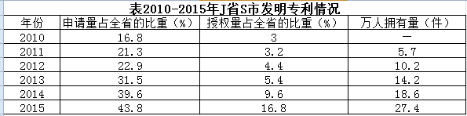

#### 第 11 题　qid 2042846 · 比重

2015年该市发明专利申请量占全省的比重比2010年提高了：

- **A**. 22.5个百分点
- **B**. 27.0个百分点　✅
- **C**. 32.1个百分点
- **D**. 40.8个百分点

**答案**：B

**官方解析**

根据问题所求“2015年······比重比2010年提高”，可判定本题为两期比重问题。定位表格可得，2015年该市发明专利申请量占全省的比重为，2010年为，，即2015年比重比2010年提高27个百分点。

故正确答案为B。

---

#### 第 12 题　qid 2042848 · 平均数

“十二五”期间（2011-2015年），该市人才总数年平均增加人数是：

- **A**. 13.6万人
- **B**. 14.2万人
- **C**. 15.6万人
- **D**. 16.2万人　✅

**答案**：D

**官方解析**

根据问题所求“年平均增加人数”，可判定本题为年均增长量计算问题。定位文字材料第二段可得“2015年末该市······人才总数由2010年末的146万人增加到2015年末的227万人”。则2011-2015年平均增加人数为。

故正确答案为D。

---

#### 第 13 题　qid 2042850 · 比重

2015年该市规模以上工业企业研发经费投入占地区生产总值的比重是：

- **A**. 

- **B**. 

- **C**. 

　✅
- **D**. 

**答案**：C

**官方解析**

根据问题所求“2015年······比重是”，可判定此题为现期比重问题。定位文字材料第一段可得，“2015年J省S市全社会研发经费投入占地区生产总值的比重为······其中，规模以上工业企业研发经费投入占全社会研发经费投入的”。2015年规模以上工业企业研发经费投入占地区生产总值的比重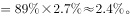

故正确答案为C。

---

#### 第 14 题　qid 2042852 · 综合

设2015年J省发明专利授权率（授权量占申请量之比）为a，则2015年S市发明专利授权率是：

- **A**. 0.38a　✅
- **B**. 0.63a
- **C**. 0.78a
- **D**. 1.05a

**答案**：A

**官方解析**

根据题干“专利授权率（授权量占申请量之比）”，结合表格数据条件为S市发明专利申请量、授权量占全省专利申请量、授权量的比重，判定本题为现期比重问题。

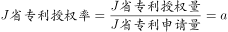，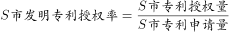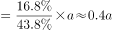，与A项最接近。

故正确答案为A。 

---

#### 第 15 题　qid 2042854 · 综合

下列判断不正确的是：

- **A**. 
2015年该市万人发明专利拥有量中有24.7件来自企业

- **B**. 
2015年，该市大型企业中，没有独立研发机构的不到

- **C**. 
“十二五”时期，该市发明专利申请量占全省的比重年增幅最大的年份是2015年
　✅
- **D**. 
“十二五”时期末，该市高层次人才数占人才总数的比重比“十一五”时期末提高了2个百分点

**答案**：C

**官方解析**

A项：定位文字材料第三段可得“2015年该市发明专利拥有量的90%来自于企业”，定位表格可得，2015年万人拥有量为27.4件，则万人发明专利拥有量中来自企业的为件，正确；

B项：定位文字材料第一段可得“以上的大型企业建有独立研发结构”，则没有独立研发机构的占比少于，正确；

C项：定位表格可得，2015年该市发明专利申请量占全省的比重为，2014年比重为，2013年比重为，则2015年增长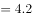个百分点，2014年增长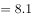个百分点，2014年比重增幅超过2015年，错误；

D项：定位文字材料第二段可得“人才总数由2010年末的146万人增加到2015年末的227万人。其中，高层次人才由2010年末的8万人增加到2015年末的18万人”，则“ 十二五” 时期末，高层次人才数占人才总数的比重比“十一五” 时期末提高，正确。

本题为选非题，故正确答案为C。 

---

### 材料 4

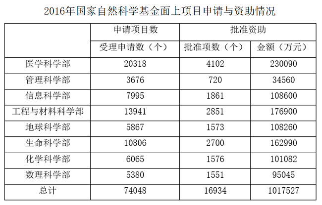

#### 第 16 题　qid 2042800 · 综合

2016年教育部隶属单位获批国家自然科学基金面上项目的总金额是：

- **A**. 451216万元　✅
- **B**. 462158万元
- **C**. 446354万元
- **D**. 446893万元

**答案**：A

**官方解析**

定位柱状图二，2016年教育部隶属单位获批国家自然科学基金面上项目的总金额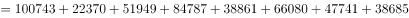，计算得尾数为6，A项满足。

故正确答案为A。

---

#### 第 17 题　qid 2042802 · 比重

2016年国家自然科学基金资助，医学科学部和生命科学部批准项数之和占比是：

- **A**. 

- **B**. 

　✅
- **C**. 

- **D**. 

**答案**：B

**官方解析**

由“2016年······之和占比”，可判定本题为现期比重计算问题。定位表格材料可得，2016年国家自然科学基金资助中，医学科学部批准项数为4102，生命科学部批准项数为2700，批准项数总和为16934。则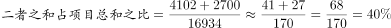，与B项最接近。

故正确答案为B。

---

#### 第 18 题　qid 2042808 · 综合

2016年国家自然科学基金面上项目资助率最高的科学部是：

- **A**. 地球科学部
- **B**. 数理科学部　✅
- **C**. 管理科学部
- **D**. 化学科学部

**答案**：B

**官方解析**

由题干“项目资助率最高······”，可判定本题为比值比较问题。定位表格材料可得，选项四个项目的资助率分别为：

A项：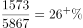；

B项：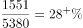；

C项：；

D项：；

项目资助率最高的为数理科学部。

故正确答案为B。

---

#### 第 19 题　qid 2042810 · 综合

在8个科学部中，教育部隶属单位2016年获批国家自然科学基金面上项目数占本科学部全部批准项目数之比超过的科学部个数是：

- **A**. 4个
- **B**. 3个
- **C**. 2个
- **D**. 1个　✅

**答案**：D

**官方解析**

由“······占······之比超过”，可判定本题为现期比重问题。在8个科学部中，教育部隶属单位获批的项目数占本科学部全部批准项目数之比超过，即。定位表格材料与柱状图一可得，只有管理科学部：，满足题干条件。

故正确答案为D。

---

#### 第 20 题　qid 2042812 · 综合

下列说法不正确的是：

- **A**. 
2016年国家自然科学基金面上项目中，信息科学部的批准资助金额占资助总金额的

- **B**. 
2016年国家自然科学基金面上项目受理申请项数较多的科学部批准项数也较多

- **C**. 
2016年教育部隶属单位获批国家自然科学基金面上项目的总项数是6531个
　✅
- **D**. 
2016年国家自然科学基金面上项目的平均资助金额是60万元

**答案**：C

**官方解析**

A项：定位表格可得，2016年国家自然科学基金面上项目中，信息科学部批准资助金额占资助总金额的比重，正确；

B项：直接查找表格可知，2016年国家自然科学基金面上项目，受理申请项数越多的科学部，批准项数也越多，正确；

C项：定位柱状图一可得，2016年教育部隶属单位获批基金面上项目总数为个，错误；

D项：定位表格，2016年国家自然科学基金面上项目的平均资助金额万元，正确。

本题为选非题，故正确答案为C。

---
