# 2017年江苏省公务员录用考试《行测》题(B类)

> 省考 · 2017 年 · 6 个模块 · 共 133 题

- [政治理论](#%E6%94%BF%E6%B2%BB%E7%90%86%E8%AE%BA) · 1 题
- [常识判断](#%E5%B8%B8%E8%AF%86%E5%88%A4%E6%96%AD) · 19 题
- [言语理解与表达](#%E8%A8%80%E8%AF%AD%E7%90%86%E8%A7%A3%E4%B8%8E%E8%A1%A8%E8%BE%BE) · 35 题
- [数量关系](#%E6%95%B0%E9%87%8F%E5%85%B3%E7%B3%BB) · 13 题
- [判断推理](#%E5%88%A4%E6%96%AD%E6%8E%A8%E7%90%86) · 45 题
- [资料分析](#%E8%B5%84%E6%96%99%E5%88%86%E6%9E%90) · 20 题

---

## 政治理论

### 第 1 题　qid 2042022 · 新思想

党的十八大以来，习近平总书记在强调不断增进中国特色社会主义道路自信、理论自信、制度自信的同时，多次提到文化自信。
下列对文化自信理解正确的是：
①文化自信具有鲜明的民族特色和价值色彩
②文化自信是对自身文化传统的深刻认知和高度自觉
③文化自信是对自身文化生命力和影响力所持有的坚定信心
④文化自信是对自身文化身份与价值的充分肯定和积极践行

- **A**. ①②
- **B**. ②③④
- **C**. ①②④
- **D**. ①②③④　✅

**答案**：D

**官方解析**

D项正确：文化自信，是更基础、更广泛、更深厚的自信。党的十八大以来，习近平总书记在强调不断增进中国特色社会主义道路自信、理论自信、制度自信的同时，多次论述文化自信。所谓文化自信，就是一个民族、一个国家以及一个政党对自身文化传统的深刻认知和高度自觉，是对自身文化身份和价值的充分肯定和积极践行，是对其文化生命力和影响力所持有的坚定信心。文化自信具有鲜明的民族特色和价值色彩。
故正确答案为D。

---

## 常识判断

### 第 1 题　qid 2106138 · 人文常识

2017年1月1日，葡萄牙人安东尼奥·古特雷斯接替已经任满10年的韩国人潘基文，成为新一任的联合国秘书长。
下列关于联合国秘书长的说法错误的是：

- **A**. 联合国秘书长的每届任期为5年，可以连选连任
- **B**. 联合国秘书长的人选由各大洲轮换产生
- **C**. 联合国秘书长人选可以在五大常任理事国中产生　✅
- **D**. 联合国秘书长由安理会提名并通过大会票选后确认

**答案**：C

**官方解析**

C项错误：关于联合国秘书长，有一条不成文的规定，五大常任理事国（中国、美国、俄罗斯、法国、英国）的人员不得参加联合国秘书长的竞争。
A项正确：联合国大会1946年1月24日通过的第11号决议就秘书长的任命和待遇有较详细论述，其中规定首次担任秘书长的人任期为5年，期满时可连任5年。
B项正确：联合国秘书长的产生有一条约定俗成的规定，即秘书长人选每十年各大洲轮换一次，可以连选连任。
D项正确：根据《联合国宪章》第18条和第27条的规定，秘书长应由安理会7个理事国之可决票（自1965年安理会理事国增加到15个后，可决票数也相应改为9票），包括全体常任理事国之同意票提名，经大会以到会及投票的会员国多数表决任命之，除非大会自行决定需要三分之二多数；大会应以秘密会议方式讨论（秘书长）提名与任命问题，安理会应尽可能向大会推荐一名候选人，以避免在会上就提名问题进行辩论；无论安理会或大会投票均应采用秘密投票。
本题为选非题，故正确答案为C。

---

### 第 2 题　qid 2042030 · 人文常识

下列古文中能够体现领导者榜样效应的是：

- **A**. 止宿公署，夜则祷于天，昼则出赈饥民，终日无少怠
- **B**. 为政以德，譬如北辰，居其所而众星共之
- **C**. 其身正，不令而行；其身不正，虽令不从　✅
- **D**. 乐民之乐者，民亦乐其乐；忧民之忧者，民亦忧其忧

**答案**：C

**官方解析**

本题考查人文常识。
A 项：该句语出《元史· 列传六十二· 张养浩传》，意思是（张养浩）一直住在官府，晚上便向上天祈祷，白天就外出救济灾民，一天到晚没有丝毫的懈怠。体现领导者为国为民、鞠躬尽瘁的精神。不符合题意，排除。 
B 项：该句语出《论语 · 为政篇》，意思是（周君）以道德教化来治理政事，就会像北极星那样，自己居于一定的方位，而群星都会环绕在它的周围。体现儒家治国的基本原则是德治，而非严刑峻法。不符合题意，排除。 
C 项：该句语出《论语 · 子路篇》，意思是自身品行端正了，即使不发布命令，老百姓也会去实行；若自身品行不端正，即使发布命令，老百姓也不会服从。体现领导者以身作则，率先垂范，发挥模范带头的榜样作用。符合题意，当选。 
D 项：该句语出《孟子· 梁惠王下》，意思是执政者如果以顺应民众的快乐为快乐， 民众就会为执政者的快乐而快乐；执政者如果把民众的忧苦当作自己的忧苦，民众也会为执政者的忧苦而忧苦。体现执政者要与民众同甘苦共患难，才会受到民众的拥护和爱戴。不符合题意，排除。 
故正确答案为C。

---

### 第 3 题　qid 2042036 · 科技常识

达尔文观察到，养猫越多的地方，羊也可以养的越多，原因在于“猫—田鼠—花蜂—三叶草—羊”之间存在着生物食物链。
这体现的哲学原理是：

- **A**. 矛盾具有普遍性和客观性，矛盾是事物发展的源泉和动力
- **B**. 联系具有普遍性和多样性，任何事物都处在普遍联系之中　✅
- **C**. 真理具有绝对性和相对性，绝对真理包含在相对真理之中
- **D**. 认识具有反复性和无限性，认识是一个辩证运动的过程

**答案**：B

**官方解析**

B项符合题意：生物食物链是指各种生物通过一系列吃与被吃的关系（捕食关系）彼此联系起来的序列，这正体现了马克思主义哲学中联系的观点。联系的观点是唯物辩证法的一个总特征，所谓联系就是事物之间以及事物内部诸要素之间的相互影响、相互制约和相互作用的关系，而“猫—田鼠—花蜂—三叶草—羊”就是一个由于生物之间的捕食关系而彼此联系起来的生物食物链。
故正确答案为B。

---

### 第 4 题　qid 2042042 · 人文常识

我国先秦诸子提出了许多重要主张。
下列对应正确的是：

- **A**. 孔子——道法自然
- **B**. 墨子——兼相爱、交相利　✅
- **C**. 老子——夫子之道，忠恕而已矣
- **D**. 韩非——阴阳者，天地之道也

**答案**：B

**官方解析**

A项错误：“道法自然”出自《老子》，是老子的哲学思想，而不是孔子的主张。 
B项正确：“兼相爱，交相利”是墨子思想的核心内容，意思是爱是相互的，利也是相互的。 
C项错误：“夫子之道，忠恕而已矣”出自《论语》，忠恕之道是孔子及儒家的重要思想，而不是老子的主张。 
D项错误：“阴阳者，天地之道也”出自《黄帝内经· 素问· 阴阳应象大论篇》，指以阴阳学说指导医疗的应用和实践。韩非是法家学派的代表人物，因此“阴阳者，天地之道也”不是韩非的主张。 
故正确答案为B。

---

### 第 5 题　qid 2042044 · 法律常识

欧洲一位伟人曾说过：我的光荣不在于取得四十个战役的胜利，滑铁卢会摧毁这一切，能够永世长存的是我的民法典。
这里所说的“我的民法典”是：

- **A**. 法国民法典　✅
- **B**. 德国民法典
- **C**. 瑞士民法典
- **D**. 奥地利民法典

**答案**：A

**官方解析**

题干中的伟人是指19世纪法国伟大的军事家、政治家拿破仑，其统治时期共主持制定了举世瞩目的五大法典：民法、商法、民事诉讼法、刑法、刑事诉讼法，题干中所说到的民法典就是著名的《法国民法典》。《法国民法典》由拿破仑一手打造，其在人类立法史的雕刻时光里是一部永远吸人眼球的、堪称民法世界里程碑式的扛鼎之作。对应A项。
故正确答案为A。

---

### 第 6 题　qid 2042048 · 法律常识

下列不符合我国《居民身份证法》规定的是：

- **A**. 甲是大陆投资、定居的台商，不能申请领取居民身份证　✅
- **B**. 乙到派出所办理常住户口登记变更手续，应当出示居民身份证
- **C**. 丙遗失了居民身份证，可办理户籍证明来证明身份并乘坐火车
- **D**. 丁在码头候船遇警察查验身份时，应向警察出示居民身份证

**答案**：A

**官方解析**

A项说法错误：《中华人民共和国居民身份证法》第九条规定：“香港同胞、澳门同胞、台湾同胞迁入内地定居的，华侨回国定居的，以及外国人、无国籍人在中华人民共和国境内定居并被批准加入或者恢复中华人民共和国国籍的，在办理常住户口登记时， 应当依照本法规定申请领取居民身份证。”当选。 
B项说法正确：《中华人民共和国居民身份证法》第十四条第一款规定：“有下列情形之一的，公民应当出示居民身份证证明身份：（一）常住户口登记项目变更；（二）兵役登记；（三）婚姻登记、收养登记；（四）申请办理出境手续；（五）法律、行政法规规定需要用居民身份证证明身份的其他情形。”排除。 
C项说法正确：根据中国铁路客户服务中心网站的规定，旅客购票时或购票后、乘车前因有效身份证件未携带、丢失等原因无法出示有效证件时，可以至车站铁路公安制证口办理临时乘车身份证明。办理时，须符合下列条件之一，并携带一寸照片一张：①出具所在地公安机关的户籍证明信；②学生旅客出具所在学校的证明信；③中国人民解放军、武警部队现役军人持所在部队出具的证明信；④外籍旅客持当地使领馆出具的证明信；⑤凭其他有效证件购买车票的旅客持发证部门出具的证明信；⑥通过其他方式能够证明本人身份的。排除。 
D项说法正确：《中华人民共和国居民身份证法》第十五条第一、二款规定：“人民警察依法执行职务，遇有下列情形之一的，经出示执法证件，可以查验居民身份证：（一）对有违法犯罪嫌疑的人员，需要查明身份的；（二）依法实施现场管制时，需要查明有关人员身份的；（三）发生严重危害社会治安突发事件时，需要查明现场有关人员身份的；（四）在火车站、长途汽车站、港口、码头、机场或者在重大活动期间设区的市级人民政府规定的场所，需要查明有关人员身份的；（五）法律规定需要查明身份的其他情形。有前款所列情形之一，拒绝人民警察查验居民身份证的，依照有关法律规定，分别不同情形，采取措施予以处理。”排除。 
本题为选非题，故正确答案为A。

---

### 第 7 题　qid 2042024 · 人文常识

机场、银行等服务窗口实行“一米线”制，要求等候服务的顾客必须与正在接受服务的顾客之间保持一米的距离。
这一制度的主要功能是：

- **A**. 维持服务秩序
- **B**. 保护顾客隐私　✅
- **C**. 提升服务质量
- **D**. 提高道德水准

**答案**：B

**官方解析**

B项符合题意：一米线，其主要功能是维护个人的隐私，兼有维护公共秩序，保持公众距离的作用。而在机场和银行等服务窗口设置一米线主要是防止顾客个人信息或储户密码等被偷看，起到保护顾客隐私的作用。
故正确答案为B。

---

### 第 8 题　qid 2042028 · 地理国情

下列诗句描写的地方都位于长江流域，按照从上游到下游排序正确的是：
①猿愁鱼踊水翻波，自古流传是汨罗
②白帝城中云出门，白帝城下雨翻盆
③昔登江上黄鹤楼，遥爱江中鹦鹉洲
④钟山如龙独西上，欲破巨浪乘长风

- **A**. ①②③④
- **B**. ②①④③
- **C**. ②①③④　✅
- **D**. ①②④③

**答案**：C

**官方解析**

长江流经的主要城市自上游至下游依次为攀枝花、重庆、宜昌、岳阳、武汉、九江、芜湖、南京、上海。
①“猿愁鱼踊水翻波，自古流传是汨罗”出自唐韩愈的《湘中》，诗中描写的汨罗江在湖南岳阳。
②“白帝城中云出门， 白帝城下雨翻盆”出自唐杜甫的《白帝》，诗中描写的白帝城位于重庆奉节县瞿塘峡口的长江北岸，奉节东白帝山上。
③“昔登江上黄鹤楼，遥爱江中鹦鹉洲”出自唐孟浩然的《鹦鹉洲送王九之江左》，诗中描写的地点位于湖北武汉。
④“钟山如龙独西上，欲破巨浪乘长风”出自明高启的《登金陵雨花台望大江》，诗中描写的地点位于今江苏南京。
故按从上游至下游排序应为②①③④。
故正确答案为C。

---

### 第 9 题　qid 2106160 · 地理国情

下列有关世界地理的说法错误的是：

- **A**. 俄罗斯横跨欧亚大陆，是世界上面积最大的内陆国家　✅
- **B**. 亚洲是世界上面积最大的洲，也是世界上人口最多的洲
- **C**. 澳大利亚大陆是最小的大陆，也是只有一个国家的大陆
- **D**. 南极洲是世界上海拔最高的洲，北冰洋是世界上最小的大洋

**答案**：A

**官方解析**

A项说法错误：俄罗斯是世界上面积最大的国家，但它并不是内陆国家，世界上面积最大的内陆国家是哈萨克斯坦，当选。

B项说法正确：世界上面积最大的洲是亚洲，总面积约4400万平方公里，占世界陆地面积的三分之一。同样，亚洲也是世界上人口最多的洲，其人口占据世界人口一半以上，排除。

C项说法正确：澳大利亚大陆是世界上6个大陆中面积最小的一个，且只有澳大利亚一个国家，排除。

D项说法正确：南极洲是世界上平均海拔最高的大洲，平均海拔约2350米。世界上最小的大洋是北冰洋，约占世界海洋总面积的，排除。

本题为选非题，故正确答案为A。

---

### 第 10 题　qid 2042034 · 人文常识

我国传统文化中某些行业有特定的别称。
下列别称指代行业错误的是：

- **A**. “杏坛”指代教育
- **B**. “梨园”指代戏曲
- **C**. “杏林”指代木匠　✅
- **D**. “调鼎”指代烹饪

**答案**：C

**官方解析**

C项错误：“杏林”是中医学界的代称，典出三国时期道医董奉。董奉医术高明，治病不取钱物，只要病愈者在山中栽种杏树若干株。春天杏子熟时，董奉便在树下建一草仓储杏。需要杏子的人，可用谷子自行交换，再将所得之谷赈济贫民，供给行旅。根据董奉的传说，后世遂以“杏林春暖”“誉满杏林”等来称颂医家的高尚品质和精良医术。
A项正确：杏坛在山东省曲阜市孔庙的大成殿前，相传此处是孔子讲学之处。宋代以前此处为大成殿，天圣二年（1024年）孔子四十五代孙孔道辅监修孔庙时，在正殿旧址“除地为坛，环植以杏，名曰杏坛”。于是，“杏坛”成为教育圣地的代名词。
B项正确：梨园是中国唐代训练乐工的机构，为唐玄宗时宫廷所设。梨园的主要职责是训练乐器演奏人员，后世遂将戏曲界称为“梨园界”或“梨园行”，戏曲演员称为“梨园弟子”。
D项正确：“调鼎”意为烹饪食物，南朝梁元帝的《金楼子·立言上》中写到“余见宰人叹曰：‘伊尹与易牙同知调鼎，而有贤不肖之殊。’”意思是我听见有官员叹息说：伊尹和易牙都知道怎样烹饪食物，但是在人品贤良方面差的太远了。后世也用来喻指宰相治理国家。
本题为选非题，故正确答案为C。

---

### 第 11 题　qid 2106166 · 人文常识

党在新民主主义革命时期形成了很多富有时代特色的革命精神，按照形成时间先后排序正确的是：
①延安精神
②西柏坡精神
③井冈山精神
④古田会议精神

- **A**. ①②③④
- **B**. ②③④①
- **C**. ③④①②　✅
- **D**. ④②①③

**答案**：C

**官方解析**

本题考查毛中特。
①延安精神：于1942年12月由毛泽东正式提出，但其精神内涵形成和发展时期为1935—1948年。延安精神的主要内容是：坚定正确的政治方向，解放思想、实事求是的思想路线，全心全意为人民服务的根本宗旨，自力更生、艰苦奋斗的创业精神。
②西柏坡精神：是毛泽东于1949年3月在西柏坡召开的中共七届二中全会上提出的。毛泽东提出的“两个务必”，即“务必使同志们继续地保持谦虚、谨慎、不骄、不躁的作风，务必使同志们继续地保持艰苦奋斗的作风”，是这一精神的主题。
③井冈山精神：诞生于1927年土地革命时期的井冈山根据地。其主要内涵是：坚定信念，艰苦奋斗，实事求是，敢闯新路，依靠群众，勇于胜利。
④古田会议精神：古田会议是红四军于1929年12月在福建省龙岩市上杭县古田召开的第九次党的代表大会，是中国共产党历史上的一次重要会议。会议明确规定了红军的性质；强调加强党的思想建设的重要性；确立了人民军队建设的基本原则；重申了中国共产党对红军实行绝对领导的原则。古田精神的内涵是：从思想上建党、保持党的无产阶级先锋队性质和建设党绝对领导的新型人民军队。
按照形成时间先后，正确的顺序为③④①②。
故正确答案为C。

---

### 第 12 题　qid 2042040 · 人文常识

鲨鱼皮泳衣能够明显提高游泳运动员的成绩，但很快被国际奥委会禁止使用，其根本原因是：

- **A**. 发展中国家运动员买不起昂贵的鲨鱼皮泳衣
- **B**. 鲨鱼皮泳衣按照白色人种的体型和特点设计
- **C**. 鲨鱼皮泳衣模糊了技术极限和体能极限差别　✅
- **D**. 鲨鱼皮泳衣污染泳池对运动员身体造成伤害

**答案**：C

**官方解析**

C项符合题意：鲨鱼皮泳衣是一种模仿鲨鱼皮肤制作的高科技泳衣。根据SPEEDO公司提供的数据显示，“鲨鱼皮”能将水中阻力降低，减少运动员的氧气消耗，使其成绩提高。虽然“鲨鱼皮”有助于选手提高成绩，却也使得游泳不再是运动员体能与技术的比拼，而成为了科技的比拼，这严重违背了游泳运动不借助外力的本质。因此国际奥委会2010年后全面禁止使用鲨鱼皮泳衣。

故正确答案为C。

---

### 第 13 题　qid 2106170 · 人文常识

某厂发生粉尘爆炸事故，造成人员伤亡和财产的严重损失。
下列条件的组合会引起粉尘爆炸的是：
①粉尘有可燃性且达到一定浓度
②天气持续高温
③存在火源和助燃物
④空间受限

- **A**. ②③
- **B**. ③④
- **C**. ①③④　✅
- **D**. ①②③

**答案**：C

**官方解析**

粉尘爆炸指可燃性粉尘在爆炸极限范围内，遇到热源（明火或高温），发生的火焰瞬间传播于整个混合粉尘空间的化学反应，该化学反应速度极快，同时释放大量的热，具有很强的破坏力。 
一般粉尘爆炸的必要条件：可燃性粉尘要悬浮在空气中达到一定浓度，存在充足的氧气等助燃物，有火源或剧烈震动摩擦；此外，空间受限也是加剧粉尘爆炸的危险条件，粉尘处于相对封闭的空间，会导致温度和压力增加，从而容易发生爆炸。故①③④的条件组合会引发粉尘爆炸，C项正确。 
故正确答案为C。

---

### 第 14 题　qid 2042296 · 人文常识

下列现象对应的光学原理错误的是：

- **A**. 汽车后视镜扩大驾驶员视野——折射　✅
- **B**. 雨夜路灯出现一圈圈的光环——色散
- **C**. 看立体电影需戴上特殊眼镜——偏振
- **D**. 使用闪光灯拍照时出现红眼——反射

**答案**：A

**官方解析**

A项错误，汽车后视镜利用光的反射原理观察车后情况，同时利用凸面镜对光有发散作用的原理，可以扩大视野，从而更好地注意到后方车辆的情况。而光的折射是光从一种介质斜射入另一种介质时，传播方向发生改变，从而使光线在不同介质的交界处发生偏折。
B项正确，色散是指白色的复合光（如阳光），经过介质被折射，形成单色光的现象。雨天水雾笼罩着路灯，灯光发射出来，发生了色散，不同颜色的光线被分开，从而形成五颜六色的光环。 
C项正确，偏振式3D技术是利用光线有“振动方向”的原理来分解原始图像的，它先把图像分为垂直向偏振光和水平向偏振光两组画面，3D眼镜左右镜片分别采用不同偏振方向的偏光镜片，这样人的左右眼就能接收到两组画面，再经过大脑合成立体影像。 
D项正确，当人长时间地待在较黑暗的环境中，瞳孔为适应视觉需要而放大，这 时如果闪光灯的位置与人的眼睛一般高低，被拍摄者又是正面对着镜头，瞳孔与闪光灯处于同一直线上。那么，在拍摄时，当闪光灯的强光照射到眼睛时，就会直射视网膜，其红色的反射光就很有可能进入相机的拍摄视角，从而产生“红眼”。
本题为选非题，故正确答案为A。

---

### 第 15 题　qid 2042300 · 人文常识

小张在某航空公司购买飞机票时发现，无论是同一航班的不同等级座位，还是不同时段的航班，机票都存在一定的差价。
对此，下列说法错误的是：

- **A**. 实行机票差价的做法符合供给侧结构性改革的精神
- **B**. 实行机票差价的做法能增加航班飞行次数　✅
- **C**. 实行机票差价的做法可满足乘客的个性化需求
- **D**. 实行机票差价的做法反映了定价机制逐步适应市场

**答案**：B

**官方解析**

B项错误：无论是不同时段的机票差价，还是同一航班不同等级座位之间的差价，都不能改变供给机票的总数量，对航班飞行次数没有影响；
A项正确：供给侧结构性改革，就是从提高供给质量出发，用改革的办法推进结构调整，提高供给结构对需求变化的适应性和灵活性。实行机票差价，有利于适应不同群体对机票的需求变化，符合供给侧结构性改革的精神；
C项正确：对不同时段的航班或同一航班的不同等级座位实行差价政策，可以让乘客根据自己的出行时间、经济条件等进行选择，可以满足乘客的个性化需求；
D项正确：在市场经济背景下，价格由市场供需关系所决定，供大于求，则价格下跌，求大于供，则价格上升。实行机票差价的做法中，不同机票的价格，也是由其需求量确定的，这种定价机制，巧妙地实现了资源的最优化配置。
本题为选非题，故正确答案为B。

---

### 第 16 题　qid 2042308 · 经济常识

中国加入世界贸易组织以来，价廉物美的“中国制造”走入国外亿万家庭，走向海外的中国企业贡献卓著，规模庞大的中国市场充满吸引力，数以亿计的中国游客出境旅游。
对此，下列说法错误的是：

- **A**. 中国的发展给全球经济提供巨大动力源泉
- **B**. 中国与世界各国开始共同分享发展红利
- **C**. 中国在世界经济体系中拥有绝对的话语权　✅
- **D**. 中国入世后所做贡献得到了国际社会认可

**答案**：C

**官方解析**

C项错误：全球经济治理中的制度性话语权，集中体现为一国对国际经济规则与国际经济组织的影响力。改革开放30余年来，我国与全球经济治理体系的关系大致经历了三个阶段。在第一阶段，中国经济基本上游离于全球经济之外，进出口贸易只是对国内短缺经济的补充。作为国际经济规则的旁观者，我们既谈不上发挥比较优势，融入国际经济，也谈不上参与全球经济治理。第二阶段以“入世”为标志，中国正式成为国际经济规则的遵守者。与此同时，由于加入了主要的多边国际经济组织，如国际货币基金组织、世界银行、世贸组织等，因此中国事实上逐渐步入第三阶段，即成为国际经济规则制定的参与者。从总体来看，目前中国在参与规则制定方面还是一个初学者。因此题干中表述中国在世界经济体系中拥有绝对的话语权是错误的。此选项表述过于绝对，同时A、B、D三项均符合常识，正确。
本题为选非题，故正确答案为C。

---

### 第 17 题　qid 2042314 · 人文常识

下列古诗词中，表达作者对友人的思念之情的是：

- **A**. 上邪！我欲与君相知，长命无绝衰
- **B**. 问世间，情为何物，直教人生死相许
- **C**. 曾经沧海难为水，除却巫山不是云
- **D**. 红豆生南国，春来发几枝。愿君多采撷，此物最相思　✅

**答案**：D

**官方解析**

A项错误：该句出自汉乐府《上邪》，这是一首感情强烈、气势奔放的爱情诗。诗中女子为了表达她对情人忠贞不渝的感情，指天发誓，指地为证，要永远和情人相亲相爱。
B项错误：该句出自金元之际著名文学家元好问的《摸鱼儿·雁丘词》，这首咏物词是词人为“雁殉情而死”所感动而作的，全词紧紧围绕“情”字，以雁拟人，谱写了一曲凄恻动人的爱情悲歌。
C项错误：该句出自唐代诗人元稹的《离思五首》（其四），《离思五首》是一组悼亡绝句。诗人运用“索物以托情”的比兴手法，以精警的词句赞美了夫妻之间的恩爱，表达了诗人对亡妻韦丛忠贞不渝的爱情和刻骨的思念。
D项正确：该句出自唐代诗人王维的《相思》，这是一首借咏物而寄相思的五绝诗，此诗有的版本名为《江上赠李龟年》，可见为怀念友人之作。
故正确答案为D。

---

### 第 18 题　qid 2042324 · 人文常识

五禽戏是依据中医基础理论创编的一种传统养生健身拳法。
下列关于五禽戏的说法错误的是：

- **A**. 五禽戏的创编者是华佗
- **B**. 五禽戏对后世医学的发展有重要的影响
- **C**. 五禽戏模仿的是虎、鹿、熊、猿、鸟的动作
- **D**. 五禽戏已经获批国家级物质文化遗产项目　✅

**答案**：D

**官方解析**

A项说法正确：五禽戏是中国传统导引养生的一个重要功法，其创编者为华佗。排除。
B项说法正确：五禽戏能治病养生，强壮身体。现代医学研究也证明，作为一种医疗体操，五禽戏不仅使人体的肌肉和关节得以舒展，而且有益于提高心肺功能，改善心肌供氧量，提高心肌排血力，促进组织器官的正常发育。排除。
C项说法正确：五禽戏是通过模仿虎、鹿、熊、猿、鸟（鹤）五种动物的动作，以保健强身的一种气功功法。排除。
D项说法错误：2011年6月五禽戏被纳入第三批国家级非物质文化遗产名录。由常识亦可知，物质文化遗产为历史文物、历史建筑、人类文化遗址等有形的、有实体的文化遗产，而五禽戏显然不符合这个基本特征。当选。
本题为选非题，故正确答案为D。

---

### 第 19 题　qid 2042334 · 人文常识

在日常生活和工作中，人们遭受挫折后有时会找理由自我安慰，以降低挫折感，恢复心理平衡，这是心理防御机制中心的“合理化”方法，下列不属于采用这种方法进行心理防御的是：

- **A**. 小朱上班途中发现包裹被盗，笑着说破财免灾
- **B**. 小邢的请求被同事拒绝，认为同事肯定有自己的难处　✅
- **C**. 小范竞争上岗未能如愿，心想这个辛苦的岗位不干也罢
- **D**. 小马因工作失误受到批评，感觉领导在利用职权公报私仇

**答案**：B

**官方解析**

心理防御机制中的“合理化”是指个体无意识地用似乎合理的解释来为难以接受的情感、行为、动机辩护，以使其可以接受，以求得心理平衡。“合理化”有三种表现：酸葡萄心理、甜柠檬心理和推诿。
A项：小朱上班途中发现包裹被盗安慰自己破财免灾，跟“塞翁失马，焉知非福”异曲同工，这是典型的甜柠檬心理，即当得不到葡萄而只有柠檬时，就说柠檬是甜的，用来美化被满足的动机，属于心理防御机制中的“合理化”。不符合题意，排除；
B项：小邢对同事提出请求被同事拒绝，认为是同事有自己的难处，这是对同事的体谅和理解，不属于心理防御机制中的“合理化”。符合题意，当选；
C项：小范未能竞争到想要的岗位，就说岗位太辛苦不干也罢，即把得不到的东西说成是不好的，属于典型的“得不到葡萄说葡萄酸”的酸葡萄心理，符合题干中“找理由自我安慰，以降低挫折感”等表述，属于心理防御机制中的“合理化”。不符合题意，排除；
D项：小马因为自己的失误而受到批评，却认为是领导利用职权公报私仇。这是将自己受到批评这件事的责任推给其他人，是典型的推诿，即将个人的缺点或失败，推诿于其他理由，找人担待其过错，以降低挫败感，恢复心理平衡，属于心理防御机制中的“合理化”。不符合题意，排除。
本题为选非题，故正确答案为B。

---

## 言语理解与表达

### 材料 1

        从大蒜、生姜，到香蕉、菠萝，在农产品价格暴跌中，农民很受伤。订单农业作为以销定产的重要手段，对稳定农产品价格、确保农民合理收益、抵御市场价格风险具有一定的作用。然而，经调查发现，订单农业在实际运行过程中却因为部分农民契约意识差、恶意违约而变得难以推行，这反过来又伤害了商户和农民。

        作为抵御农产品价格周期波动的重要机制，订单农业一度被各方寄予厚望。然而近些年的实践表明，这一理想化的风险平抑工具，远远未能发挥预想中的作用。不少农民契约意识______，动辄毁约，一次次使得一纸购销合同______。轮番上演的单方面毁约事件，不仅让相关企业蒙受了巨大损失，也让农民群体本身付出了惨痛代价。

        众所周知，农业生产天然存在着滞后性和长周期性，这决定了农民很难及时、准确地安排生产过程。也正是基于这一原因，才形成了农产品价格“周期怪圈”现象。而所谓订单农业，其核心逻辑就在于“以销定产”。倘若严格执行，这一模式将有效实现供需平衡，避免由生产不足或过剩而引发价格巨震。令人遗憾的是，现实中一些农民受眼前短利驱动，往往会选择性执行购销合同，这无异于亲手解除了“自我保护”的机制。

        现如今，订单农业所面临的困境，很大程度上还是源于“小农心理”作祟。农民群体中的很大一部分人，并不熟悉商品社会的那套契约体系和交易方式，而且对违约行为的性质和后果也缺乏完整的认知。再加上大多数的涉农购销合同，都不具备必要的担保机制和强制执行的可能。一旦农民单方面撕毁合同，企业顾忌于超高的催收成本，往往也只能听之任之。

        没有“履约保证金”作保，没有追责索赔渠道兜底，订单农业以及相关产销合同，当然没有任何约束力可言，对此已有学者提出，要加强农村征信体系建设。可是在此之前，我们最先应该做的，还是改变分散化、个性化的农业生产模式：将孤立的农业生产者，吸收进组织化的专业生产合作社中，吸收进金融惠农和科技惠农的扶持体系之内——只有让他们处于更为紧密的人际网络和利益结构之内，其才会更为重视个人诚信的价值。

        当反思订单农业所面临的尴尬遭遇，我们往往将矛头指向农民契约精神的缺失。试问，有没有一套合理的议价机制，能够保证农民可以获得一个相对实惠的合同收购价？又有没有一种动态的博弈平台，来回应农民由短期市场行情所产生的利益关切？相较于培育农民的信用意识，建立真正公平合理的市场定价和交易体制，对于发展订单农业同样至关重要。

#### 第 1 题　qid 2042466 · 逻辑填空

依次填入文章第二段画横线处最恰当的是：

- **A**. 薄弱 形同虚设　✅
- **B**. 孱弱 灰飞烟灭
- **C**. 缺乏 化为乌有
- **D**. 缺少 徒有虚名

**答案**：A

**官方解析**

第一空，搭配“意识”，B项“孱弱”指瘦小虚弱，与“意识”搭配不当，排除。
第二空，根据文意可知，横线处表达合同效力没有实现，A项“形同虚设”指形式上虽有，却不起作用，符合文意，当选。C项“化为乌有”指全部消失或完全落空，文段强调的是合同虽有，但不起作用，排除；D项“徒有虚名”是指空有名望、有名无实，多是形容人，不能形容合同，排除。
故正确答案为A。

---

#### 第 2 题　qid 2042468 · 片段阅读

关于订单农业一度被各方寄予厚望的根本原因是：

- **A**. 订单农业可使农民与商户谈判时确保收益
- **B**. 订单农业能帮助解决农业生产不可预期性
- **C**. 订单农业可使农民预先知道农产品价格
- **D**. 订单农业可使农产品供需平衡价格平稳　✅

**答案**：D

**官方解析**

根据第二段中，“作为抵御农产品价格周期波动的重要机制，订单农业一度被各方寄予厚望”，以及第三段中“倘若严格执行，这一模式将有效实现供需平衡，避免由生产不足或过剩而引发价格巨震”可知，订单农业一度被各方寄予厚望的根本原因在于其对“农产品价格”的平衡起到重要作用，对应D项。
A、B两项均未提到“农产品价格”，排除；C项中“预先知道农产品价格”无中生有，且脱离客观实际，排除。
故正确答案为D。

---

#### 第 3 题　qid 2042472 · 片段阅读

关于订单农业购销合同缺乏约束力的原因，作者特别强调的是：

- **A**. 农民不熟悉商品社会的契约的体系和交易方式
- **B**. 农民对违约的行为的性质和后果没有充分认识
- **C**. 大部分农民的合同没有保障执行的担保机制　✅
- **D**. 企业因索赔代价太高放弃追究违约行为​

**答案**：C

**官方解析**

定位文段第五段“没有‘履约保证金’作保，没有追责索赔渠道兜底，订单农业以及相关产销合同，当然没有任何约束力可言。”由此可知，作者认为合同缺乏约束力最主要的原因是缺乏制度的保障，只有C项提及了担保机制，当选。
A、B两项虽在文段当中提及，但并非作者“特别强调”的，排除。
D项为强迷惑项，会有同学误将其对应到“没有追责索赔渠道兜底”，但认真比对之后会发现，D项这种情况的出现归根结底仍在于“没有保障执行的担保机制”，即制度的不健全更为根本。
故正确答案为C。

---

#### 第 4 题　qid 2042060 · 片段阅读

下列选项文中未涉及的是：

- **A**. 应将订单农业与金融惠农科技惠农对接
- **B**. 加强相关培训提升订单农户的契约意识　✅
- **C**. 破解订单农业困局应该加强农村征信体系建设
- **D**. 改变现有农业生产模式有助于破解订单农业困局

**答案**：B

**官方解析**

根据题干中“未涉及”可知为选非题，大家需注意审题。
A项对应文段“吸收进金融惠农和科技惠农的扶持体系之内”；C项对应文段“加强农村征信体系建设”；D项对应文段“我们最先应该做的，还是改变分散化、个性化的农业生产模式”。B项“培训提升订单农户的契约意识”无中生有，当选。
本题为选非题，故正确答案为B。

---

#### 第 5 题　qid 2042062 · 片段阅读

下列最适合做文章标题的是：

- **A**. 订单农业困局伤害了谁
- **B**. 订单农业发展面临多重困难
- **C**. 订单农业困局的真相
- **D**. 如何走出订单农业困局　✅

**答案**：D

**官方解析**

文章第一段和第二段指出订单农业在执行过程中的种种问题，使其非但没有发挥出保证供需平衡价格稳定的重要作用，反倒伤害了商户和农民。
第三段和第四段分析了订单困境出现的原因，一方面，农民受眼前短利驱动及“小农心理”使其往往会选择性执行购销合同，甚至单方面撕毁合同，另一方面，更为重要的是缺乏保障执行的机制。
最后两段针对前文分析的原因给出了“加强农村征信体系建设”“建立真正公平合理的市场定价和交易体制”等一系列走出订单农业困局的对策。
整篇文章采用了“提出问题-分析问题-解决问题”的思路框架，最终的落脚点放在了“如何走出订单农业困局”上。对应D项。
A项“伤害了谁”对应文段第一段的内容；B项“多重困难”对应文段第三段的内容；C项的“真相”为分析原因的部分，均无法概括整个篇章的中心，排除。
故正确答案为D。

---

#### 第 6 题　qid 2042246 · 片段阅读

国家机关、政党组织和其他社会成员必须按照特定的规则运行和活动，这是法治的应有之义。在当代中国，规范国家权力运行和社会成员活动的各类规则可谓浩如烟海，但国家法律体系和党内法规体系显然是最有影响力和最为重要的规则体系。十八届四中全会审议通过的《中共中央关于全面推进依法治国若干重大问题的决定》将形成“完备的法律规范体系”和“完善的党内法规体系”纳入建设中国特色社会主义法治体系，确立了全面推进依法治国的总目标。
这段文字之后作者最有可能阐述的是：

- **A**. 中国特色社会主义法治体系的建构
- **B**. 依法治国建设全面小康社会的构想
- **C**. 党内法规与国家法律的衔接和协调　✅
- **D**. 建立健全党内法规体系的对应措施

**答案**：C

**官方解析**

文段首先介绍当代中国各类规则浩如烟海的背景，接着通过转折关联词“但”引出重点内容，最重要的规则体系就是“国家法律体系”和“党内法规体系”，接下来通过举出十八届四中全会的例子进一步强调“形成完备的法律规范体系和完善的党内法规体系”的重要性。因此后文也应围绕文段引出的这两个核心概念进行阐述，C项符合题意，当选。
A、B两项，均与文段核心话题“法律规范体系”“党内法规体系”不符，且B项“建设全面小康社会”为无中生有，排除；
D项，仅提到“党内法规体系”，未涉及“法律规范体系”，表述片面，排除。
故正确答案为C。
【文段出处】《论党内法规与国家法律协调衔接》

---

#### 第 7 题　qid 2042424 · 片段阅读

大多数桥梁是向公众开放的。尽管一些桥梁要收取通行费，但是对于绝大多数车辆来说并不禁止通行。然而，多数网络系统对公众却是不开放的。原因显而易见——这些网络系统是用来储存和处理个人通信、财务数据、医疗记录和商业秘密等敏感信息的，这些信息都跟个人和机构密切相关。
这段文字重在说明：

- **A**. 大多数桥梁向公众开放的事实依据
- **B**. 桥梁和网络在开放程度方面的差别
- **C**. 网络系统的存储功能及其基本特点
- **D**. 多数网络系统对公众关闭的合理性　✅

**答案**：D

**官方解析**

文段首先介绍了大多数桥梁的开放性，随后通过转折标志词“然而”引出文段重点，即“多数网络系统”对公众不开放。文段尾句对其不开放原因进行解释，故整个文段强调网络系统对公众不开放是合理的。D项为转折后内容的同义替换，当选。
A项：“桥梁”为转折前引入部分的内容，非重点，排除；
B项：运用反推思维，文段应为并列结构，而本文段是转折结构，重点论述“网络系统”，排除；
C项：“存储功能及其基本特点”为文段破折号之后解释说明的内容，非重点，排除。
故正确答案为D。
【文段出处】《保护网络安全比建造桥梁更困难》

---

#### 第 8 题　qid 2042430 · 片段阅读

在日益开放的市场经济活动中，无论是来自城市还是来自农村的市场参与者，都被抛进不断更新的陌生空间中。市场的交易主体、交易行为、交易制度和交易商品，都在日新月异地变化着。尤其是考虑到经济生活信息化和网络化，市场经济的陌生关系就呈现出更为复杂的状态。
这段文字重在说明：

- **A**. 市场经济活动中人们面对的是陌生关系　✅
- **B**. 市场经济的主要特点就是信息不断更新
- **C**. 市场经济生活变得越来越信息化网络化
- **D**. 市场经济使得人与人之间的关系复杂化

**答案**：A

**官方解析**

文段开篇指出市场参与者都处于不断更新的陌生空间中，接着通过程度词“更”强调市场经济的陌生关系越来越复杂。综合整个文段，重点在于强调市场经济下各种关系的“陌生”，故文段核心话题为“陌生关系”，对应A项。
B、C两项：B项“信息不断更新”对应文段中的“都在日新月异地变化着”，C项“信息化和网络化”对应文段中的“经济生活信息化和网络化”，均为非重点内容，且文段的核心话题为“陌生关系”，主题词错误，排除。
D项：“人与人之间的关系”范围扩大，文段主题词为“陌生关系”，排除。
故正确答案为A。
【文段出处】《中国市场交易秩序的社会基础—兼评中国社会是陌生社会还是熟悉社会》

---

#### 第 9 题　qid 2042386 · 片段阅读

研究发现，人们看待互联网的方式，就像看待交换记忆系统的人类伙伴。人们把记忆分摊给“云端”，就像分摊给家人、朋友一样轻而易举。但是，互联网又跟交互记忆系统的人类伙伴不一样——云端知道得更多，而且能更快提取信息。现今几乎所有信息都能轻易通过快速的网络搜寻取得。互联网不只降低了把信息分享给人类伙伴的必要性，或许也降低了人们想把刚学到的重要事情存进自己大脑记忆库里的渴望。
这段文字意在说明：

- **A**. 互联网和我们的关系近于亲友伴侣
- **B**. 互联网正成为我们的外部记忆资源　✅
- **C**. 互联网带来了云端这样的信息大全
- **D**. 互联网使得人类不再认为记忆重要

**答案**：B

**官方解析**

文段先提出了人们看待互联网就像看待交换记忆系统的人类伙伴，后文出现转折关联词“但是”，重点强调互联网更广泛、快捷，几乎所有信息都能快速通过网络搜寻，文段尾句对前文进行总结，强调互联网既降低了信息分享的必要性，也能够帮助人们记忆重要信息，对应B项。
A项：出现在文段首句转折之前，非文段重点，排除。
C项：带来“云端”非重点，重要的是“云端”带来的影响，排除。
D项：文段意在说明互联网能够帮助人们记忆信息，成为人们的外部记忆资源，并非使人们认为记忆不重要，排除。
故正确答案为B。

---

#### 第 10 题　qid 2042342 · 片段阅读

晨练是一种好习惯，但未必人人适合。从人的生理特点来看，早上6点左右，人体的血压开始升高，心率逐渐加快，上午10点左右达到峰值，如果有冠心病、高血压的人此时锻炼，尤其是进行剧烈运动，就有可能发生意外。清晨6点到8点，人体血小板的凝聚力明显增强，血液相对黏稠，这段时间运动可能会使心脑血管梗塞率增大。
这段文字意在强调：

- **A**. 晨练总的来说还是弊大于利
- **B**. 晨练不宜选在6至8点之间
- **C**. 晨练应尽可能避免剧烈运动
- **D**. 晨练时间和强度要因人而异　✅

**答案**：D

**官方解析**

文段首先指出未必人人适合晨练，后文通过并列结构进行多角度分述。先是提到早上6点到上午10点，患有冠心病、高血压的人进行剧烈运动有可能发生意外，即运动强度需要因人而异；后又指出清晨6点到8点这个时间段运动可能会使心脑血管梗塞率增大，即要注意运动时间。故文段强调晨练的时间和强度要因人而异，对应D项。
A项：“弊大于利”无中生有，文段并没有将晨练的利与弊进行比较，排除；
B、C两项：B 项“6点至8点之间”、C项“剧烈运动”分别对应文段分述的部分，均表述片面，排除。
故正确答案为D。
【文段出处】《体育锻炼的时间和强度》

---

#### 第 11 题　qid 2042304 · 片段阅读

2016年初，诺贝尔经济学奖得主、美国经济学家约瑟夫·斯蒂格列茨在达沃斯年会上强调，过去15年，尤其是过去7年以来，中国一直是全球经济的发动机，包括非洲和拉丁美洲等地区都受益于中国经济的增长。中国经济的快速发展导致其对自然资源的需求快速上升，很显然，这种模式不可能持续，中国必须转变增长模式，从过去注重量的增长转变到注重质的提升，降低资源消耗。
这段文字主要强调的是：

- **A**. 十几年来中国一直在带动全球经济的发展
- **B**. 快速发展的中国经济对自然资源需求增长
- **C**. 中国经济快速发展惠及了非洲和拉美地区
- **D**. 中国经济增长模式面临挑战必须加快转型　✅

**答案**：D

**官方解析**

文段首先由经济学家的话交代背景，指出中国是全球经济的发动机；后文提到中国经济发展面临的问题，即对自然资源的需求快速上升，这种模式不可能持续；最后通过“必须”提出对策，即转变增长模式，对应D项。
A、C两项：为文段开篇背景的阐述，非重点，排除。
B项：为文段中中国经济发展面临的问题的表述，非重点，排除。 
故正确答案为D。

---

#### 第 12 题　qid 2042396 · 片段阅读

劳动力总量大、成本低，曾是“中国制造”的比较优势，但随着人口结构的变化，这一优势正在不断消减。按照联合国的标准，65岁以上的人口比率超过总人口的，就被称为老龄化社会；超过，就是老龄社会。中国实际上在2001年就已经进入了老龄化社会。近年来东南沿海中小型制造企业的“用工荒”，已经凸显出这一人口结构变化带来的问题。

这段文字重在说明：

- **A**. 老龄化社会与老龄社会的标准如何确定
- **B**. 老龄化社会将使中国企业劳动力供给不足
- **C**. 中国东南沿海地区已首先步入了老龄社会
- **D**. 人口结构变化会影响“中国制造”竞争力　✅

**答案**：D

**官方解析**

文段开头提出观点，即“人口结构的变化使‘中国制造’的优势正在消减”，之后列举数据和东南沿海中小型企业的例子来论证前文观点，对应选项，D项符合文意，当选。
A、C两项未体现出老龄化社会这一人口结构变化带来何种影响，即未体现出文段的重点内容，排除；
B项，时态表述为将来式，而文段中最后一句论述“该问题已经凸显”，故该项时态表述有误，排除；
故正确答案为D。
【文段来源】《传统制造业寒冬已来临 中国制造如何突围》

---

#### 第 13 题　qid 2042278 · 片段阅读

在将中国文学作品译介给国外读者时，中国媒体与公众往往因文化焦虑及传播压力，过于强调译者对中国本土文化的熟悉知晓程度，对译者在翻译过程中未能再现文学作品中原汁原味的中国元素心存芥蒂。事实上，不同语言的文学之间具有某种审美的和人性的通约性，使得作家们能以各自的方式抵达文学的人性殿堂。
下列表述不符合文意的是：

- **A**. 媒体和公众自身的文化焦虑会影响到对译者资质的考量
- **B**. 译者对中国本土文化的了解程度并不必然影响翻译质量
- **C**. 能否保留纯正中国元素是考量翻译作品质量的关键因素　✅
- **D**. 不同语言的文学作品之间具有通约性有助于跨语种翻译

**答案**：C

**官方解析**

A项：根据“中国媒体与公众往往因文化焦虑及传播压力，过于强调译者对中国本土文化的熟悉知晓程度”可知，表述符合文意，排除。 
B项：对应文段“事实上”之后的句子，该句论述的是“不同语言的文学之间的通约性可使得译者以自己的方式将作品很好地翻译出来”可知，“译者对中国本土文化的了解程度并不必然影响翻译质量”，表述符合文意，排除。 
C项：文段并未论述考量翻译作品质量的关键因素，该项无中生有，不符合文意，当选。 
D项：根据文段“事实上”之后的内容可知，该项表述符合文意，排除。 
本题为选非题，故正确答案为C。 
【文段出处】《中国当代文学英译中的“林译”现象》

---

#### 第 14 题　qid 2042282 · 语句表达

①西汉时期的扬雄就提出了“书为心画”，这个观念深入人心。
②明代汤显祖写的《牡丹亭》里面，柳梦梅则透过自画像上题字风格来想象杜丽娘的灵心慧性。
③元代王实甫的戏剧《西厢记》中，张君瑞曾通过书信的字迹揣摩崔莺莺的心态。
④在中国，自古以来人们普遍认为字迹就是心迹。
⑤这两个戏剧情节反映了社会大众对于字迹的普遍认识。
将以上5个句子重新排列，语序正确的是：

- **A**. ①③②⑤④
- **B**. ④①③②⑤　✅
- **C**. ④②③①⑤
- **D**. ①②③⑤④

**答案**：B

**官方解析**

观察选项，对比首句，①、④两句，④句中“在中国，自古以来”范围广、时间跨度大，并以“人们普遍认为”提出观点，为常见首句形式。而①句中提到的“西汉时期”扬雄的观念，恰好是④句中“自古以来”历史长河中的一部分，按照观点+解释说明的顺序，④句应在①句之前，排除A、D两项。
观察尾句，⑤句出现指代词“这两个戏剧情节”，可知前文要提到两部戏剧，③、②两句中《西厢记》《牡丹亭》恰好为两部著名戏剧，因此应与⑤句进行捆绑，排除C项。
故正确答案为B。
【文段出处】《书法，那一枝渡江的芦苇》

---

#### 第 15 题　qid 2042476 · 片段阅读

城市移民化潮流的背后，更是中国农村的巨大变迁。人口迁移的潮流将中国大片尚未都市化的乡村地区与移民城市的发展紧密联系在一起，从最初开始的以谋生为目标的打工赚钱，到今天迁移已经成为人们的一种生活方式，中国农村农业生产与再生产的社会关系，农业结构及其变化过程中的财产与权力关系都发生了深刻的变化。
下列说法不符合文意的是：

- **A**. 农民向城市的流动已成大趋势
- **B**. 多年的城乡二元结构已经解体　✅
- **C**. 城乡的发展息息相关休戚与共
- **D**. 移民潮引发了农村的重大变迁

**答案**：B

**官方解析**

根据题干中“不符合文意”可知，此题为选非题，大家需注意审题。
A项，对应文段“到今天迁移已经成为人们的一种生活方式”，可知城市移民化已经成为一种潮流趋势，故表述符合文意，排除；
B项，“城乡二元结构已经解体”无法从文段得知，无中生有，不符合文意，更不符合常识，当选；
C项，对应文段 “都市化的乡村地区与移民城市的发展紧密联系在一起”，故表述符合文意，排除；
D项，文段开头论述城市移民化潮流是农村的巨大变迁，最后一句也论述到该潮流使得“农业结构及其变化过程中的财产与权力关系都发生了深刻的变化”，表述符合文意，排除。
本题为选非题，故正确答案为B。

---

#### 第 16 题　qid 2042384 · 片段阅读

我们知道，各种物质都有气体、液体、固体三种状态，在适当的温度和压力下，这三种状态可以互相转化。但是，如果温度超过，那么无论把压力增加到多大，水蒸气也无法变成水，如果压力足够高的话，它的密度会大大高于气体而接近水的密度。这样的状态与气体、液体、固体都不同，被称为物质的第四种状态——超临界态，而被确定为“超临界温度”。处于超临界状态的物质，就被称为“超临界流体”。

这段文字之后作者最有可能说明的是：

- **A**. 物质达到第四种状态的化学途径
- **B**. 哪些物质不会进入“超临界状态”
- **C**. “超临界流体”的性质及相关特点　✅
- **D**. “超临界温度”对物质形态的影响

**答案**：C

**官方解析**

本题为接语选择题，需通读全文，重点关注文段最后谈论的核心话题。文段前半部分一系列的介绍最后落脚点在于，处于超临界状态的物质，就被称为“超临界流体”，故后文应该围绕“超临界流体”这一核心话题展开，详细介绍其相关信息，对应C项。

A项、B项与后文要阐述的核心话题“超临界流体”不符，排除A、B两项；

D项“‘超临界温度’对物质形态的影响”为前文论述过的内容，即“如果温度超过，那么无论把压力增加到多大，水蒸气也无法变成水，如果压力足够高的话，它的密度会大大高于气体而接近水的密度，这样的状态与气体、液体、固体都不同”，排除D项。

故正确答案为C。

【文段出处】无

---

#### 第 17 题　qid 2042404 · 片段阅读

有学者认为，应该将个人数据信息作为公共物品来规制，对个人数据信息使用进行治理的主体应该是政府专门机构，因而治理的法律性质应该是公法而不是私法，治理的目的是为了公共利益和公共安全而促进个人数据信息的自由共享。这种治理方式并不影响和损害已经存在的私权，例如隐私权和其他财产权等。
这段论述中未涉及的一项是：

- **A**. 个人数据信息治理的措施程序　✅
- **B**. 个人数据信息治理的法制属性
- **C**. 个人数据信息治理的意义目的
- **D**. 个人数据信息治理的行政主体

**答案**：A

**官方解析**

根据题干中“未涉及”可知此题为选非题，大家需注意审题。
B项“法制属性”对应文段“治理的法律性质应该是公法而不是私法”。
C项“意义目的”对应文段“治理的目的是为了公共利益和公共安全而促进个人数据信息的自由共享”。
D项“行政主体”对应文段“治理的主体应该是政府专门机构”。
A项“措施程序”无中生有，当选。
本题为选非题，故正确答案为A。

---

#### 第 18 题　qid 2042322 · 片段阅读

木器和石器代表了人类历史上的两大类型材料——有机材料和无机材料。但历史的发展很不均衡，数千年中，有机材料除了木器以外，就是毛皮、秸秆这些可以从生物中直接获取的材料，没有什么大的变化。但无机材料发展出了陶器、瓷器、金属、玻璃等人造材料，除了石器之外，全是依靠人类智慧使已知物发生化学变化之后创造出的新材料。即使是游离状态的金、银、汞等，人们也都开发了一些利用化学反应进行的提纯方法。
以下概括不符合文意的是：

- **A**. 有机材料几乎都是直接取之于生物
- **B**. 石器是无机材料家族的原生态成员
- **C**. 陶瓷、金属是人类创造的无机材料
- **D**. 人造材料未来将全面取代有机材料　✅

**答案**：D

**官方解析**

根据题干中“不符合文意”可知此题为选非题，大家需注意审题。
由“有机材料除了······从生物中直接获取的材料”可知，A项与文意相符，且“几乎”一词表意温和，排除；
由“除了石器之外，全是依靠人类智慧使已知物发生化学变化之后创造出的新材料”可知，石器并非是新材料，而是属于原生态，B项与文意相符，排除；
由“无机材料发展出了陶瓷、瓷器、金属、玻璃等人造材料”可知，陶瓷和金属是人造的无机材料，C项与文意相符，排除；
D项表意错误，文段没有提到人造材料取代有机材料的说法，为无中生有选项，且“全面取代”表意过重，当选。
本题为选非题，故正确答案为D。
【文段出处】《塑料的世界—赛璐珞和电木引领材料变革》

---

#### 第 19 题　qid 2042448 · 片段阅读

结核病是由结核分枝杆菌引起的慢性传染病，可侵及许多脏器，以肺部结核最为常见。世界上约有的人口感染了结核杆菌，其中有大约会发展成结核病。对于艾滋病病毒携带者、营养不良或糖尿病等免疫系统受损的人，或者烟草使用者，结核杆菌容易在体内大量复制，患病风险就会高很多。

下列说法不符合文意的是：

- **A**. 绝大多数人感染结核菌后并不发病
- **B**. 身体虚弱者患结核病的可能性较高
- **C**. 结核病可能发生在肺部或其他脏器
- **D**. 身体健康的人一般不会携带结核菌　✅

**答案**：D

**官方解析**

A项：由“世界上约有的人口感染了结核菌，其中有 会发展成结核病”可知，很多人感染结核菌后并不发病，表述与文意相符，排除。 

B项：由“对于艾滋病病毒携带者······高很多”可知，身体虚弱者患病的可能性高， 表述与文意相符，排除。 

C项：由“结核病是由结核分枝杆菌引起的慢性传染病，可侵及许多脏器，以肺部结核最为常见”可知，表述与文意相符，排除。 

D项：文段中没有提到携带结核病菌与身体是否健康的关系，无中生有，表述与文意不符，但符合题目要求，当选。 

本题为选非题，故正确答案为D。 

---

#### 第 20 题　qid 2042394 · 片段阅读

说到食品安全的治理，人们首先想到的是，中国依然是一个发展中国家，各个方面的制度建设不够完善。面对现实，人们自然而然将问题引向法律法规制度、政府监管体系、社会治理机制的完善。这一指向当然是正确的，政府也沿着这些方向做了许多努力。但是这类治理方案的一个问题是，“远水解不了近渴”。
作者引用“远水解不了近渴”想要表达的意思是：

- **A**. 中国短时期之内无法真正解决食品安全问题
- **B**. 相关法律及机制建设不是短时间内可以完成的　✅
- **C**. 作为发展中国家要解决食品安全问题难度极大
- **D**. 想解决食品安全问题必须做好长期工作的准备

**答案**：B

**官方解析**

定位原文，“远水解不了近渴”这一俗语出现在文段最后一句话中，需概括全文。文段开篇指出食品安全存在的问题并提出解决方案，即“完善法律法规制度、政府监管体系、社会治理机制”。后文通过指代词“这一指向、这些方向”进一步阐述前文对策， 尾句通过转折关联词“但是”强调这类治理方案“远水解不了近渴”；“这类治理方案”指代前文完善法律法规制度及相关机制这一解决方案，即说明了相关法律及机制建设并非短时间内可以完成的，对应B项。
A、C、D三项：均未涉及文段核心概念“制度、体系、机制”，且A、C两项过于消极，排除。 
故正确答案为B。 
【文段出处】《从行为法经济学看食品安全治理》

---

#### 第 21 题　qid 2042068 · 逻辑填空

北京有大量历史文化保护区，它们是古都北京的文化        ，而位于北京历史城区中轴线西侧的什刹海区域，更是以宁静而优雅的环境、自然与人文的和谐              。
依次填入画横线处最恰当的一项是：

- **A**. 特色  举世闻名
- **B**. 特征  远近闻名
- **C**. 标志  著称于世　✅
- **D**. 指标  为人称道

**答案**：C

**官方解析**

第一空，“它们”指代“历史文化保护区”，搭配“保护区”。A项“特色”和B项 “特征”均指一个事物显著区别于其他事物的地方，文段并未将北京的保护区与其他保护区进行对比，均不符合文意，排除。D项“指标”指衡量目标的单位或方法，用来说明总体数量特征的概念，但“历史文化保护区”无法成为衡量北京文化数量的单位，与文意不符，排除。C项“标志”指用来表明某一事物特征的记号，一般搭配具体的事物，“保护区”为具体的事物，且能够作为古都北京的明显记号，符合文意，搭配恰当，保留。 
第二空，代入验证，C项“著称于世”指在世界上名声很大，符合文意，当选。 
故正确答案为C。 
【文段出处】《文保区监管当从规划开始》

---

#### 第 22 题　qid 2042072 · 逻辑填空

人口迁移改变了中国城乡的人口格局，以最        的方式推动了移民城市的形成，这一城市形态与传统的         城市在性质上有着本质的区别。
依次填入画横线处最恰当的一项是：

- **A**. 直接  地域　✅
- **B**. 一般  地方
- **C**. 简单  地区
- **D**. 基本  区域

**答案**：A

**官方解析**

第一空，搭配“方式”，可知人口的迁移，就是人口在城市间的流动，可以对移民城市的形成产生立竿见影的效果，故A项“直接”指不经过中间环节的，可以显著达成效果，符合文意，保留。B项“一般”指普通、寻常，C项“简单”指不复杂，D项“基本”指根本，均不符合立刻就能推动移民城市形成的语意，排除。
第二空，搭配“城市”，可知与“移民城市”对应，表意相反，“移民城市”指大多数外来人口移入而形成的城市。A项“地域”指一定的地域空间，具有一定的界限，“地域城市”构成专有名词，强调人口只生活在固定的城市中，与“移民城市”表意构成反义，当选。
故正确答案为A。
【文段出处】《从地域城市到移民城市：全国性城市社会的构建》

---

#### 第 23 题　qid 2042078 · 逻辑填空

媒体要做好规范和专业的科学传播并不容易。媒体既要保持代替社会对科学进行监督的职能，又有一种本能的            、代言弱势群体的道义感。作为媒体人有道义感当然是好事，但在科学问题上           因为这种正义感而被处于弱势的反主流科学一方利用。
依次填入画横线处最恰当的一项是：

- **A**. 匡扶正义  切忌　✅
- **B**. 扶危济困  谨记
- **C**. 劫富济贫  谨防
- **D**. 扶正祛邪  切莫

**答案**：A

**官方解析**

第一空，搭配“代言弱势群体的道义感”，C项“劫富济贫”指夺取富人的财产，救济穷人，不符合媒体的所作所为，排除；D项“扶正祛邪”指扶持正气，去除邪气，现用来指扶持好的事物，纠正错误倾向，文中“弱势群体”并无正邪之分，排除。A项“匡扶正义”指帮助、辅助正义，与“道义感”搭配合理，符合文意，保留；B项“扶危济困”指扶助有危难的人，救济困苦的人，与“弱势群体”搭配正确，符合文意，保留。
第二空，对比A、B两项，A项“切忌”指千万不要，B项“谨记”指把对方的话一定认真记住。根据文段可知，作者的目的并非是让读者记住这句话，而是提醒读者千万不要犯这个错误，故A项符合文意，当选。
故正确答案为A。
【文段出处】《防止科学泛政治化如何可能？》

---

#### 第 24 题　qid 2042080 · 逻辑填空

现代白话文与文言文的区别只是语体的不同，但它们使用的象形表意的方块字，作为中华民族文化的独特创造，其中        的民族精神、民族生命是血脉        的。
依次填入画横线处最恰当的一项是：

- **A**. 蕴含  贯通　✅
- **B**. 沉积  相通
- **C**. 呈现  流通
- **D**. 体现  连通

**答案**：A

**官方解析**

第一空，搭配“民族精神、民族生命”，根据横线前的“其中”可知，民族精神、民族生命是包含在方块字之中的。A项“蕴含”指包含在内，符合文意，保留；B项“沉积”指水流、风等流体的流速减慢时所挟带的沙石、泥土等沉淀堆积起来，通常表述为“泥沙沉积”，与“民族精神、民族生命”搭配不当，排除；C项“呈现”指显出、露出，D项“体现”指某种性质或现象通过某一事物具体表现出来，均指外在的显露，与文意相悖，均排除。
第二空，代入验证，搭配“血脉”，根据文意可知，文段强调的是民族精神、民族生命是从古至今一脉相承的，故A项“贯通”更能体现出融古贯今的含义，当选。
故正确答案为A。
【文段出处】《儒家语言审美在新时期作家中的三重境界》

---

#### 第 25 题　qid 2042148 · 逻辑填空

和西方的《荷马史诗》《圣经》一样，中国历史上早期的一些典籍获得了备受         的地位。当然，这些典籍之后无一例外地经受了历史时代的文本筛选、价值         的复杂过程。
依次填入画横线处最恰当的一项是：

- **A**. 尊崇  阐释　✅
- **B**. 膜拜  诠释
- **C**. 拥戴  注释
- **D**. 青睐  解释

**答案**：A

**官方解析**

第一空，修饰“典籍”，A项“尊崇”指尊重和推崇，可表示典籍受到人们的推崇，且“备受尊崇”为常见固定搭配，保留。C项“拥戴”指拥护推戴某人做领袖，与“典籍”搭配不当，排除；B项“膜拜”泛指表示极端恭敬或畏服的行礼方式，用在此处程度过重，且与“典籍”搭配不当，排除；D项“青睐”指喜欢或看重，“备受青睐”虽为常见搭配，但程度过轻且无法搭配后文的“地位”，排除。
第二空，搭配“价值”，A项“阐释”指阐述并解释，语义丰富，且搭配得当，当选。
故正确答案为A。
【原文出处】《中国古代文学的经典》

---

#### 第 26 题　qid 2042150 · 逻辑填空

其实，物理学家探测引力波的尝试一直      地进行着，然而因为长期没有突破，这方面的工作逐渐被边缘化，颇受      。
依次填入画横线处最恰当的一项是：

- **A**. 时有时无  冷遇
- **B**. 时断时续  冷落　✅
- **C**. 时强时弱  冷淡
- **D**. 时快时慢  冷眼

**答案**：B

**官方解析**

第一空，搭配“尝试”，指试探、试验，B项“时断时续”表示不连贯，符合语境；A项“时有时无”通常不做修饰语，无法搭配“进行着”，排除；C项“时强时弱”侧重于强弱，D项“时快时慢”侧重于快慢，“尝试”不分强弱和快慢，搭配不当，排除。
第二空，代入验证，“冷落”指冷淡地对待，“受到冷落”为常见固定搭配，且对应前文“被边缘化”，符合语境。
故正确答案为B。
【原文出处】《从引力波看媒体如何对待科学新闻》

---

#### 第 27 题　qid 2042152 · 逻辑填空

统计学家告诉我们，买一张彩票正好中大奖的概率      ──比如说，英国国家彩票的中奖概率大概就只有1400万分之一，相当于你连续投24次硬币全是正面朝上，远远低于被      的陨石砸中的可能性。
依次填入画横线处最恰当的一项是：

- **A**. 微不足道  祸从天降
- **B**. 绝无仅有  不期而至
- **C**. 不可多得  不期而遇
- **D**. 微乎其微  从天而降　✅

**答案**：D

**官方解析**

第一空，搭配“概率”，后文通过例子对横线处进行解释说明，横线处所填词语应该表达概率“小”的含义，D项“微乎其微”形容非常小，符合文意，保留。A项“微不足道”指意义、价值等小得不值得一提，侧重不重要，且和“概率”搭配不当，排除；B项“绝无仅有”形容非常稀有，侧重少，而文段侧重概率小，且置于此处程度过重，排除；C项“不可多得”形容非常稀少，很难得到，多指人才或稀有物品，强调珍贵，和“概率”搭配不当，排除。
第二空，代入验证，D项“从天而降”比喻出人意料地突然来临或出现，和“陨石”搭配合理，当选。
故正确答案为D。

---

#### 第 28 题　qid 2042154 · 逻辑填空

以和为贵、__________的精神，贯穿中华民族发展的全部历史，渗透在社会生活的方方面面，使我们不同族群、不同地域的不同文化，不断相互吸取、相互融合，形成了__________、丰富多彩的中华文化。
依次填入画横线处最恰当的一项是：

- **A**. 和睦相处  无与伦比
- **B**. 谦顺礼让  不绝如缕
- **C**. 和而不同  博大精深　✅
- **D**. 守望相助  兼收并蓄

**答案**：C

**官方解析**

第一空，横线处所填词语与“以和为贵”构成并列关系，并列前后语义相近。A项“和睦相处”指彼此融洽地相处，B项“谦顺礼让”指谦让、守礼，C项“和而不同”指和睦地相处，但不随便附和，出自《论语·子路》，这三项均符合语境。D项“守望相助”指为了对付来犯的敌人或意外的灾祸，邻近各村落互相警戒、互相援助，文段没有对付敌人和灾祸、互相援助的语境，排除。
第二空，横线处所填词语与“丰富多彩”构成并列关系，“丰富多彩”形容内容丰富，A项“无与伦比”指事物非常完美，和“丰富多彩”语义不一致，且程度过重，排除；横线处搭配“中华文化”，B项“不绝如缕”形容局势危急或声音细微悠长，和“中华文化”搭配不当，排除；C项“博大精深”指广博高深，既和“丰富多彩”构成并列关系，又与“中华文化”搭配恰当，当选。
故正确答案为C。
注：此题D项中“兼收并蓄”意为把内容、性质不同的东西都吸收并保存下来，与前文内容对应构成很大迷惑。但“守望相助”的基本语义与文意不符，排除D项。因此各位考生一定要注意把握成语的基本语义，不要被时下的很多用法迷惑。
【文段出处】《中华文化的核心价值之三：和》

---

#### 第 29 题　qid 2042156 · 逻辑填空

对大多数人来说，逻辑学是一门      的学问。但是思想史上的重大事件无一不是      人们在自己的思维和研究方法上所做的改进。
依次填入画横线处最恰当的一项是：

- **A**. 神秘  处于
- **B**. 枯燥  基于　✅
- **C**. 神奇  源于
- **D**. 繁琐  由于

**答案**：B

**官方解析**

第一空，形容“逻辑学”的特点，“但是”表转折，连接前后语义相反。后文强调思想史上重大事件都是在思维和研究方法的基础上改进的，即转折之后给予逻辑学极高的评价，语义色彩积极，故转折之前应表述消极。A、C两项“神秘、神奇”意为很奇妙、奇特，能激发人们的兴趣，与文意色彩不符，排除。
第二空，“由于”表示因果，“基于”表示根据，有“在……基础上”之意。文段表达意思为思想史上重大事件都是在思维和研究方法的基础上改进的，以强调逻辑学的重要性，故“基于”符合文意。文段并无因果关系的体现，排除D。
故正确答案为B。
【文段出处】《哲学的用处》

---

#### 第 30 题　qid 2042158 · 逻辑填空

多名全国人大代表提出议案，建议修订我国土地管理法，兼顾土地的资源与资产双重      ，坚持物权平等保护      ，提高      补偿标准。
依次填入画横线处最恰当的一项是：

- **A**. 特征  规定  征用
- **B**. 要素  法案  征调
- **C**. 标准  措施  征集
- **D**. 属性  原则  征收　✅

**答案**：D

**官方解析**

第一空，搭配“资源与资产”，土地资源即土地作为自然要素，土地资产即土地作为财产资源，两者均指土地自身的一些性质、本质，“标准”意为衡量的准则，不符合文意，排除C项；B项“要素”指构成事物必不可少的因素，文中并无构成之意，搭配不当，排除。
第二空，搭配“坚持”，“坚持原则”为固定搭配，“原则”意为言行所依据的准则，符合我国《物权法》为了实现“物权平等保护”的目的、准则。A项“规定”，一般搭配为“遵守规定”，故排除A项。
验证第三空，“土地征收”为固定搭配，D项当选。
故正确答案为D。
【文段出处】《土地管理法将修订 农村土地有望与国有土地同等同价入市》

---

#### 第 31 题　qid 2042160 · 逻辑填空

他们笔下的中国古建筑测绘图，一方面      了西方建筑学制图手法的西方古典主义美学精神，另一方面又创造性地      了中国传统工笔和白描的技巧，更好地呈现出中国古建筑独特的美感，这在世界建筑史经典著作的插图中也可谓      。
依次填入划横线处最恰当的一项是

- **A**. 秉承 融入 独树一帜　✅
- **B**. 沿袭 引进 绝无仅有
- **C**. 接受 发扬 别具一格
- **D**. 承袭 发挥 可圈可点

**答案**：A

**官方解析**

本题可从第三空入手，根据“更好地呈现出中国古建筑独特的美感”可知，横线处所填成语应体现他们笔下的中国古建筑测绘图在世界建筑史经典著作的插图中呈现独特美感，A项“独树一帜”指单独树立起一面旗帜，指自成一家，C项“别具一格”指另有一种风格，置于此处均可体现独特美感，符合文意，保留。B项“绝无仅有”指极其少有，题干强调独特而非极其少有，且程度过重，与文意不符，排除；D项“可圈可点”指表现好，值得肯定或赞扬，无法体现独特，与文意不符，排除。
第二空，根据“一方面······另一方面又创造性地”可知，横线处所填词语应体现中国古建筑测绘图是在西方古典主义美学精神的基础上创造性地加入中国传统工笔和白描的技巧，A项“融入”指融合、混合，表示中国古建筑测绘图融合了中国传统技巧，符合文意，保留。C项“发扬”指发展和提倡（优良作风、传统等），置于此处无法体现加入了中国传统技巧，与文意不符，排除。
第一空，代入验证，A项“秉承”指接受、承接，与“美学精神”搭配恰当，当选。
故正确答案为A。
【文段出处】《梁思成手绘中国古建筑测绘图欣赏》

---

#### 第 32 题　qid 2042162 · 逻辑填空

近百年来，由于过度使用照明工具而导致光污染的      ，全球很多城市已看不到银河和主要的星座，人与生物圈的夜间环境遭到日益严重的      ，天文科学观测也受到干扰，人类共同的星空资源正在逐渐“      ”。
依次填入画横线处最恰当的一项是：

- **A**. 蔓生  侵袭  消解
- **B**. 蔓延  侵蚀  消亡　✅
- **C**. 漫溢  侵吞  消弭
- **D**. 漫卷  侵入  消散

**答案**：B

**官方解析**

第一空，根据“过度使用照明工具”和“看不到银河和主要的星座”可知，光污染的范围在持续扩大。A项“蔓生”侧重生长、滋生的状态，B项“蔓延”指向四周扩展、延伸，侧重范围不断扩大，C项“漫溢”意为水满外流，也可形容光污染严重，均符合文意，保留。D项“漫卷”指随风翻卷，与污染扩散无关，排除。
第二空，根据“日益严重”可知，括号处应体现环境破坏是循序渐进的过程。B项“侵蚀”指逐步侵害、破坏，符合文意，保留。A项“侵袭”侧重突发的、攻击性的入侵，与“日益严重”体现的渐进性过程不符，排除；C项“侵吞”一般搭配财物、利益，不能用来形容环境，排除。
第三空，代入验证，B项“消亡”指消失、灭亡，与“星空资源”搭配恰当，且引号赋予其形象化的表达，表现资源逐渐消逝的过程，当选。
故正确答案为B。

---

#### 第 33 题　qid 2042164 · 逻辑填空

读者通过文学接触到自身存在以外的种种可能性经验，借助他者经验      了自己存在的问题，通过      他者的生活丰富了生存体验，      了自己有限生命的宽度。
依次填入画横线处最恰当的一项是：

- **A**. 探究  虚构  扩展
- **B**. 反思  想象  拓展　✅
- **C**. 察觉  窥视  扩大
- **D**. 印证  涉猎  拓宽

**答案**：B

**官方解析**

第一空，横线处所填词语与“自己存在的问题”搭配，A项“探究”指探索研究、B项“反思”指思考过去的事情，从中总结经验教训、C项“觉察”指发觉，看出来，均与“自己存在的问题”搭配得当，保留。D项“印证”即验证、证明，一般搭配为“印证想法、观点”、“印证事实”，通常不与“问题”搭配，排除。
第二空，横线搭配“读者”，体现读者通过文学如何他者的生活，并丰富了生存体验，感情色彩积极，C项“窥视”即暗中观察，为消极表述，排除；A项“虚构”强调凭空编造，读者应该是根据文章或书籍中的描述来想象他者的生活，而并非完全凭空编造，故与“读者”搭配不当，排除。
验证第三空，横线处所填词语与“宽度”搭配，对应B项“拓展”，拓展适用范围极广，可与长、宽、高、范围等相搭配，用于此处搭配得当。
故正确答案为B。

---

#### 第 34 题　qid 2042166 · 逻辑填空

哲学涉及我们日常生活的方方面面。它不只是艰深晦涩、让人      的玄学，不只是教人安邦定国、      的谋略，哲学更      我们的人生。
依次填入画横线处最恰当的一项是：

- **A**. 夙兴夜寐  决胜千里  关联
- **B**. 青灯黄卷  修齐治平  关系
- **C**. 呕心沥血  仕途经济  关怀
- **D**. 皓首穷经  经世致用  关乎　✅

**答案**：D

**官方解析**

本题可从第二空入手。根据“、”可知，横线处所填成语应与“安邦定国”意思相近。“安邦定国”指使国家安定巩固。D项“经世致用”是中国传统学术思想，主张学问须有益于国事治理，强调学术研究应直面社会现实并解决实际问题，符合文意，保留。A项“决胜千里”形容将帅雄才大略，指挥若定，用于作战而非治理国家，与文意不符，排除；B项“修齐治平”即修身、齐家、治国、平天下，指提高自身修为，管理好家庭，治理好国家，安抚天下百姓苍生的抱负，其完整逻辑为“修身—齐家—治国—平天下”，强调由内而外的递进过程，而文段仅聚焦于国家层面，并未涉及个人修养或家庭治理，且若使用该词，置于“安邦定国”之前更为合理，排除；C项“仕途经济”指在封建社会中，一个人通过一番奋斗取得功名，获得官职，得到较高的社会地位，实现自己的人生价值，与文意不符，排除。
验证第一空，D项“皓首穷经”指一直到年老头白之时还在深入钻研经书和古籍，填入可体现对哲学研究的深入，保留。
验证第三空，D项“关乎”指关系到、涉及、牵连，符合文意，当选。
故正确答案为D。
【文段出处】《哲学的使命就是促进人的存在》

---

#### 第 35 题　qid 2042168 · 逻辑填空

卫星与地球保持相对静止，能定点      在空间凝视目标地区，“      ”并全时段持续侦察，      地获取变化信息。
依次填入画横线处最恰当的一项是：

- **A**. 悬挂  心无旁骛  绵绵不绝
- **B**. 悬置  虎视眈眈  不离不弃
- **C**. 悬停  目不转睛  源源不断　✅
- **D**. 悬浮  全神贯注  不声不响

**答案**：C

**官方解析**

第一空，所填词语与“在空间”搭配，体现卫星与地球相对静止的状态，C项“悬停”、D项“悬浮”均符合要求，A项“悬挂”侧重挂，即借助绳子、钩子等工具使物体依附于某处，而卫星并非是要借助绳子、钩子等工具才能挂在太空中，与文意不符，排除；B项“悬置”指用以悬挂东西的装置，为汽车领域的专业名词，用在此处搭配不当，排除。
第二空，C项“目不转睛”指眼珠一动不动地盯着看；D项“全神贯注”形容注意力高度集中，均可形容思想、精神、注意力高度集中的状态。但文段中的“凝视”、“侦察”，均与眼睛相关，对比可知，C项“目不转睛”与文段表述的搭配更为恰当形象，用于形容卫星十分认真地观察着目标地区的一举一动，符合语境。
第三空代入验证，“源源不断”形容接连不断，与“全时段持续侦察”形成对应，表达获得信息的持续与丰富，符合文意。
故正确答案为C。
【文段出处】《“永不眨眼”的静轨光学侦察卫星》

---

## 数量关系

### 第 1 题　qid 2042052 · 数学运算

1，1.2，1.8，3.6，9，（  ）

- **A**. 12
- **B**. 16.2
- **C**. 25.2　✅
- **D**. 27

**答案**：C

**官方解析**

数列无明显特征，优先考虑作差。后项减前项得到新数列：0.2，0.6，1.8，5.4，（    ），是公比为3的等比数列，则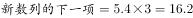。。

故正确答案为C。

---

### 第 2 题　qid 2042074 · 数学运算

，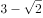，2，3，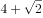，（  ）

- **A**. 

- **B**. 
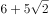

- **C**. 

　✅
- **D**. 
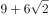

**答案**：C

**官方解析**

数列无明显特征，优先考虑作差。作差后得到新数列：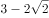，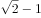，，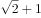，（）。作差后为公比为的等比数列，故新数列的下一项为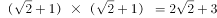，由此可得。

故正确答案为C。

---

### 第 3 题　qid 2042082 · 数学运算

，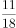，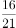，，，（  ）

- **A**. 

　✅
- **B**. 
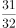

- **C**. 

- **D**. 

**答案**：A

**官方解析**

数列分子、分母呈递增趋势，优先反约分，将数列转化为单调递增。原数列可转化为：，，，，，（），分母为公差是3的等差数列，分子为公差是5的等差数列，则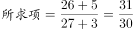。

故正确答案为A。

---

### 第 4 题　qid 2042064 · 数学运算

某公司将一款自行车3次折价销售，第二次在首次打折的基础上打相同的折扣，第三次在第二次打折的基础上降价三分之一。已知该款自行车3次打折后的价格是原价的，则首次的折扣是：

- **A**. 7.5折
- **B**. 8折
- **C**. 8.4折
- **D**. 9折　✅

**答案**：D

**官方解析**

设原价为，首次打折的折扣为，则首次打折售价为，第二次打折时售价为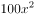，第三次打折时售价为：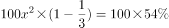，解得即打9折。

故正确答案为D。

---

### 第 5 题　qid 2042076 · 数学运算

若将一项工程的、、和依次分配给甲、乙、丙、丁四家工程队，分别需要15天、15天、30天和9天完成，则他们合作完成该项工程需要的时间是：

- **A**. 12天
- **B**. 15天　✅
- **C**. 18天
- **D**. 20天

**答案**：B

**官方解析**

赋值工程总量为180，则工作效率分别为：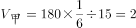、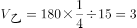、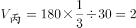、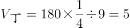。则四个工程队合作完成该项工程，需要时间：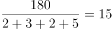天。

故正确答案为B。

---

### 第 6 题　qid 2042046 · 数学运算

一个圆盘上按顺时针方向依次排列着编号为1到7的七盏彩灯，通电后每个时刻只有三盏亮着，每盏亮6秒后熄灭，同时其顺时针方向的下一盏开始亮，如此反复。若通电时编号为1，3，5的三盏先亮，则200秒后亮着的三盏彩灯的编号是：

- **A**. 1，3，6　✅
- **B**. 1，4，6
- **C**. 2，4，7
- **D**. 2，5，7

**答案**：A

**官方解析**

编号为1，3，5的三盏彩灯先亮，每盏亮6秒后熄灭，顺时针方向下一盏开始亮，下一次是2，4，6，······，则200秒一共转换了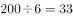次秒，即33次。圆盘上一共7盏彩灯，故转换7次为一个循环，200秒一共转换了次，即转完4个循环后，再从1，3，5顺时针转换5次，所以1号灯：，最后6号灯亮着；3号灯：，最后1号灯亮着；5号灯：，最后3号灯亮着。

故正确答案为A。

---

### 第 7 题　qid 2042050 · 数学运算

某公司管理人员、技术人员和后勤服务人员一月份的平均收入分别为6450元、8430元和4350元，收入总额分别为5.16万元、33.72万元和5.22万元。则该公司这三类人员一月份的人均收入是：

- **A**. 6410元
- **B**. 7000元
- **C**. 7350元　✅
- **D**. 7500元

**答案**：C

**官方解析**

公司管理人员数量：，技术人员数量：，后勤服务人员数量：。则这三类人员的人均收入为：。

故正确答案为C。

---

### 第 8 题　qid 2042054 · 数学运算

某一楼一户住宅楼共17层，电梯费按季交纳，分摊规则为：第一层的住户不交纳；第三层及以上的住户，每层比下一层多交纳10元。若每一季度该住宅楼某单元的电梯费共计1904元，则该单元第7层住户一季度应交纳的电梯费是：

- **A**. 72元
- **B**. 82元
- **C**. 84元
- **D**. 94元　✅

**答案**：D

**官方解析**

方法一：设第二层一季度电梯费为，则第三层电梯费为，以此类推第17层电梯费为。则一季度该栋住宅楼电梯费总和为，解得，所以第7层电梯费为。

方法二：第三层及以上，每层比下一层多10元，即“从第2层起，每层多10元”，满足等差数列定义。因为第一层住户不交纳，所以1904是第2层到第17层这个等差数列的和，一共有16层，则中间项（）的值为，而公差为10元，所以第9层为，所以第7层为。

故正确答案为D。

---

### 第 9 题　qid 2042066 · 数学运算

甲、乙、丙三个单位各派2名志愿者参加公益活动，现将这6人随机分成3组，每组2人，则每组成员均来自不同单位的概率是：

- **A**. 

- **B**. 

- **C**. 

- **D**. 

　✅

**答案**：D

**官方解析**

6个人随机分成3组，总数为种情况。每组成员来自不同的单位，正向考虑情况数较多，故反向考虑，即考虑有的成员来自相同的单位。

第一类情况：只有一组来自同一单位。先在3个单位中任选1个单位的2名成员同组，有种情况；设同一单位，则剩下的两组可能有两种情况：和；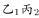和。满足的情况数为种。

第二类情况：有两组来自同一单位，而剩下一组也一定来自同一单位，即三组均来自同一单位，共1种情况。

则满足有的成员来自相同单位的概率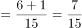，所求每组成员均来自不同单位的概率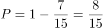。

故正确答案为D。

---

### 第 10 题　qid 2042070 · 数学运算

一艘游轮在海上匀速航行，航向保持不变。上午8时在游轮的正东方30海里处有一灯塔。上午10时30分该灯塔位于游轮的正南方40海里处，则在该时段内，游轮与灯塔距离最短的时刻是：

- **A**. 8时45分
- **B**. 8时54分　✅
- **C**. 9时15分
- **D**. 9时18分

**答案**：B

**官方解析**

如下图所示，灯塔在A点，游轮从O点出发至B点，

海里，海里，，则

海里，游轮速度为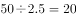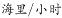，从A点引垂线垂直OB于C点，游轮在C点位置与灯塔距离最短。

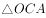相似于，则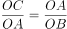，即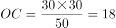海里，游轮从O点行至C点所需时间为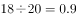小时，即54分钟，故与灯塔距离最短时刻为8时54分。

故正确答案为B。

---

### 第 11 题　qid 2042414 · 数学运算

小王去超市购物，带现金245元，其中1元6张、2元2张、5元3张、10元2张、50元2张、100元1张，选购的物品总计167元，若用现金结账且不需要找零，则不同的面值组合方式有：

- **A**. 6种
- **B**. 7种
- **C**. 8种　✅
- **D**. 9种

**答案**：C

**官方解析**

凑钱数且情况数较少，采用枚举法。总共245元，需要花费167元，因50以下的面额钱数之和为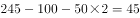元，故100元和50元面额至少需要提供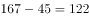元，因此必须存在100元和50元各一张。此时只需从50以下面额中枚举出17元的所有组合。情况如下：

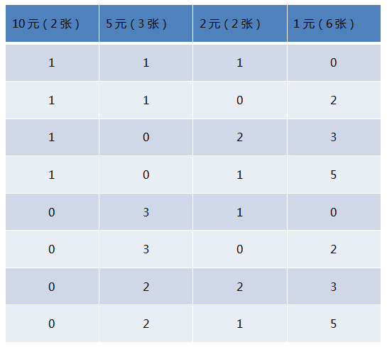

总共8种情况。

故正确答案为C。

---

### 第 12 题　qid 2042420 · 数学运算

玩具厂原来每日生产某玩具560件，用A、B两种型号的纸箱装箱，正好装满24只A型纸箱和25只B型纸箱。扩大生产规模后该玩具的日产量翻了一番，仍然用A、B两种型号的纸箱装箱，则每日需要纸箱的总数至少是：

- **A**. 70只
- **B**. 75只　✅
- **C**. 77只
- **D**. 98只

**答案**：B

**官方解析**

假设A、B型纸箱各能装下a件、b件玩具，根据题意可得：

，24a与560均能被8整除，则b能被8整除，当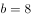，，满足；当，a为非整数，排除；当，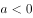，排除，故可确定，。

要想日产量翻番后，纸箱总数少，则A型箱应尽可能多用，假设A、B型纸箱各用了、个，根据题意可得：，要使A型尽量多，则令B型为0个，则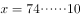，即A型纸箱至少为75只。

故正确答案为B。

---

### 第 13 题　qid 2042442 · 数学运算

如图，在梯形ABCD中，,，AC交BD于O点，过O作AB的平行线交BC于E点，连结DE交AC于F点，过F作AB的平行线交BC于G点，连结DG交AC于M点，过M作AB的平行线交BC于N点，则线段MN的长为：

- **A**. 

　✅
- **B**. 

- **C**. 
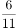

- **D**. 

**答案**：A

**官方解析**

由题意可得：AB平行CD，则，则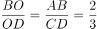，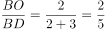；OE平行CD，则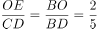，则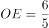；

同理，在梯形EODC中，，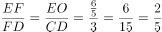，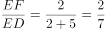，GF平行CD，则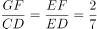，则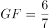；

在梯形GFDC中，，，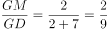，MN平行CD，则，则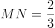。

故正确答案为A。

---

## 判断推理

### 材料 1

甲、乙、丙、丁、戊5位摄影专业大学生为参加毕业摄影大赛分赴黑龙江、西藏、云南、福建、江苏5地摄影采风。他们5人各有偏爱的摄影题材：人物、花卉、风景、野生动物、古建筑，这次采风他们相约就上述题材每人各拍一种。已知：

（1）如果甲去黑龙江，乙就去江苏； 

（2）只有丙去福建，丁才去云南； 

（3）或者乙去江苏拍古建筑，或者戊去福建拍人物； 

（4）去江苏拍古建筑的大学生临行前曾与乙、丁话别。 

#### 第 1 题　qid 2042362 · 逻辑判断

根据以上信息，可以得出以下哪项？

- **A**. 甲不去江苏
- **B**. 乙不去西藏
- **C**. 丙不去黑龙江
- **D**. 丁不去云南　✅

**答案**：D

**官方解析**

分析题干。
（1）甲去黑龙江→乙去江苏；
（2）丁去云南→丙去福建；
（3）乙去江苏拍古建筑或者戊去福建拍人物；
（4）乙、丁二人不去江苏拍古建筑。
根据条件（4）可知乙、丁二人不去江苏拍古建筑，根据条件（3）可得出戊去福建拍人物。乙不去江苏，根据条件（1）可得出甲不去黑龙江。已知戊去福建拍人物，所以丙不去福建，根据条件（2）可得出，丁不去云南，D项可以推出。
故正确答案为D。

---

#### 第 2 题　qid 2042364 · 逻辑判断

如果丙去西藏，则可以得出以下哪项？

- **A**. 甲去江苏　✅
- **B**. 乙去福建
- **C**. 丁去云南
- **D**. 戊去黑龙江

**答案**：A

**官方解析**

分析题干。

（1）甲去黑龙江乙去江苏；

（2）丁去云南丙去福建；

（3）乙去江苏拍古建筑或者戊去福建拍人物；

（4）乙、丁二人不去江苏拍古建筑。

已知丙去西藏，根据条件（3）（4）可知，戊去福建拍人物，并且乙丁不去江苏，可推出只能甲去江苏，A项正确。

故正确答案为A。

---

#### 第 3 题　qid 2042370 · 逻辑判断

如果乙去黑龙江拍风景，而去云南的只拍花卉，则可以得出以下哪项？

- **A**. 甲去云南拍花卉
- **B**. 丙去江苏拍古建筑
- **C**. 丁去西藏拍野生动物　✅
- **D**. 戊去福建拍古建筑

**答案**：C

**官方解析**

分析题干。
（1）甲去黑龙江→乙去江苏；
（2）丁去云南→丙去福建；
（3）乙去江苏拍古建筑或者戊去福建拍人物；
（4）乙、丁二人不去江苏拍古建筑。
根据条件（3）、（4）可知，戊去福建拍人物，而D项是拍古建筑，排除D项。如果乙去黑龙江拍风景，根据条件（2）丙不去福建得出丁不去云南，丁不去江苏，不去黑龙江，不去福建，那么丁只有去西藏。如果去黑龙江的拍风景，去云南的拍花卉，去江苏的拍古建筑，去福建的拍人物，那么去西藏的只能拍野生动物，C项正确。
故正确答案为C。

---

#### 第 4 题　qid 2042122 · 类比推理

汉字：符号

- **A**. 海豚：海鱼
- **B**. 大米：粮食　✅
- **C**. 高管：女性
- **D**. 法学：国学

**答案**：B

**官方解析**

第一步：分析题干词语间逻辑关系。
汉字是符号的一种，二者为包容关系中的种属关系。
第二步：判断选项词语间逻辑关系。
A项：海豚是哺乳动物，不是海鱼，不符合题干的逻辑关系，排除；
B项：大米是粮食的一种，二者为包容关系中的种属关系，符合题干的逻辑关系，当选；
C项：高管和女性为交叉关系，有的高管是女性，有的女性是高管，不符合题干的逻辑关系，排除；
D项：国学是涵盖各朝各代的各类文化学术，是相对西学而言的中国之学；法学是法律学，法学不是国学的一种，不符合题干的逻辑关系，排除。
故正确答案为B。

---

#### 第 5 题　qid 2042126 · 类比推理

西湖：太湖

- **A**. 都会：议会
- **B**. 电脑：人脑
- **C**. 男生：女生
- **D**. 加法：除法　✅

**答案**：D

**官方解析**

第一步：分析题干词语间逻辑关系。
西湖和太湖都是淡水湖泊，二者是并列关系中的反对关系。
第二步：判断选项词语间逻辑关系。
A项：都会指的是都市，议会又称国会，是资本主义国家中代表资产阶级利益的最高立法机关，二者没有关系，不符合题干的逻辑关系，排除；
B项：电脑是人脑的智慧产品，不符合题干的逻辑关系，排除；
C项：男生和女生是并列关系中的矛盾关系，不符合题干的逻辑关系，排除；
D项：加法和除法都是运算法则，运算法则还有乘法和减法，加法和除法是并列关系中的反对关系，符合题干的逻辑关系，当选。
故正确答案为D。

---

#### 第 6 题　qid 2042460 · 类比推理

生产：销售

- **A**. 收入：支出
- **B**. 起草：修改　✅
- **C**. 救灾：抗灾
- **D**. 闭幕：开幕

**答案**：B

**官方解析**

第一步：分析题干词语间逻辑关系。
生产和销售是有着时间的先后顺序的行为，先生产再销售，且生产和销售是产品流通的两个环节。
第二步：判断选项词语间逻辑关系。
A项：先收入后支出，但收入和支出可以做名词，且不是两个环节，不符合题干的逻辑关系，排除；
B项：先起草后修改，且起草和修改是撰写文件的两个环节，符合题干的逻辑关系，当选；
C项：广义的救灾包括防灾、抗灾，抗灾是救灾的一种，二者为种属关系，不符合题干的逻辑关系，排除；
D项：先开幕后闭幕，但是开幕和闭幕的顺序和题干不一致，不符合题干的逻辑关系，排除。
故正确答案为B。

---

#### 第 7 题　qid 2042464 · 类比推理

中山陵：金陵

- **A**. 城隍庙：寺庙
- **B**. 青海湖：青海　✅
- **C**. 碧云天：青天
- **D**. 钱塘江：长江

**答案**：B

**官方解析**

第一步：分析题干词语间逻辑关系。
中山陵位于金陵，金陵是南京的古称，二者为地点的对应关系。
第二步：判断选项词语间逻辑关系。
A项：城隍庙是寺庙的一种，二者为种属关系，不符合题干的逻辑关系，排除；
B项：青海湖位于青海，二者为地点的对应关系，符合题干的逻辑关系，当选；
C项：碧云天和青天均指晴天，不符合题干的逻辑关系，排除；
D项：钱塘江和长江为并列关系，都为江水，钱塘江位于浙江，不符合题干的逻辑关系，排除。
故正确答案为B。

---

#### 第 8 题　qid 2042470 · 类比推理

《大学》：《中庸》：四书

- **A**. 泰山：华山：五岳　✅
- **B**. 物欲：财欲：六欲
- **C**. 朝夕：除夕：七夕
- **D**. 春风：秋雨：四季

**答案**：A

**官方解析**

第一步：分析题干词语间逻辑关系。
《大学》和《中庸》是并列关系，二者为四书的组成部分。
第二步：判断选项词语间逻辑关系。
A项：泰山和华山是并列关系，二者为五岳的组成部分，符合题干的逻辑关系，当选；
B项：六欲是中国古代区分感情的一种分类，一般指眼（见欲，贪美色奇物）、耳（听欲，贪美音赞言）、鼻（香欲，贪香味）、舌（味欲，贪美食口快）、身（触欲，贪舒适享受）、意（意欲，贪声色、名利、恩爱）。物欲和财欲不是六欲的组成部分，不符合题干的逻辑关系，排除；
C项：朝夕指的是一天中的早晚，除夕和七夕都是传统节日，不符合题干的逻辑关系，排除；
D项：春风和秋雨都是天气现象，二者不是四季的组成部分，不符合题干的逻辑关系，排除。
故正确答案为A。

---

#### 第 9 题　qid 2042140 · 类比推理

买票：乘机：抵达

- **A**. 生产：流通：消费
- **B**. 相识：相恋：结婚　✅
- **C**. 调研：调查：总结
- **D**. 申报：评审：得奖

**答案**：B

**官方解析**

第一步：判断题干词语间逻辑关系。
买票、乘机、抵达三者是逻辑关系中的对应关系，动作发出者为同一主体，并且动作有先后顺序。
第二步：判断选项词语间逻辑关系。
A项：流通的主体是商品，而生产和消费的主体是人，与题干逻辑关系不一致，排除；
B项：相识、相恋、结婚三者动作发出者为同一主体，并且三者有先后的顺序，与题干逻辑关系一致，当选；
C项：调查和总结是调研的两个环节，先调查再总结，但是与调研没有涉及到事件先后顺序，与题干逻辑关系不一致，排除；
D项：申报与得奖是同一主体，但是与评审主体不同，与题干逻辑关系不一致，排除。
故正确答案为B。

---

#### 第 10 题　qid 2042120 · 类比推理

作家 之于 作品 相当于 （ ）之于 （ ）

- **A**. 蜜蜂------蜂蜜　✅
- **B**. 货币------货物
- **C**. 鸡蛋------母鸡
- **D**. 园丁------园林

**答案**：A

**官方解析**

第一步：判断题干词语间逻辑关系。
作品是作家的劳动成果，二者是逻辑关系中的对应关系。
第二步：判断选项词语间逻辑关系。
A项：蜂蜜是蜜蜂的劳动成果，符合题干的逻辑关系，当选；
B项：货币是用来购买货物的，货物不是货币的劳动成果，不符合题干的逻辑关系，排除；
C项：鸡蛋是母鸡的孳息，不是劳动成果，同时词顺序反了，不符合题干的逻辑关系，排除；
D项：园丁，主要指专门从事园艺的劳动者，负责栽培护理园内植物工作的人。园林不是园丁的劳动成果，不符合题干的逻辑关系，排除。
故正确答案为A。

---

#### 第 11 题　qid 2042568 · 类比推理

丝绸之路 之于 （  ） 相当于 万里长征 之于 （  ）

- **A**. 敦煌—遵义　✅
- **B**. 骆驼—草鞋
- **C**. 沙漠—海洋
- **D**. 贸易—解放

**答案**：A

**官方解析**

A项：敦煌是丝绸之路的一个途经地点，遵义是万里长征的一个途经地点，前后逻辑关系一致，保留；
B项：骆驼是丝绸之路的工具，草鞋是万里长征的工具，前后逻辑关系一致，保留；
C项：丝绸之路沿线经过沙漠，但是万里长征没有经过海洋，前后逻辑关系不一致，排除；
D项：丝绸之路的目的是贸易，万里长征的目的是战略转移和北上抗日，而非解放，前后逻辑关系不一致，排除。
比较A、B项，A项中，敦煌是古代丝绸之路上一个重要的标志性地点，敦煌因丝绸之路而闻名，而我们党在长征途中在遵义召开的遵义会议也是我们党一个重要的转折点，遵义也因此而著名；B项中，骆驼是丝绸之路中必不可少的工具，但是草鞋并不是万里长征中必不可少的，不是每一个红军战士都穿的草鞋，草鞋也不是必不可少的工具。这一道题结合时政热点，以及就题目本身的倾向性而言，A项更加贴近出题人的意图。
故正确答案为A。

---

#### 第 12 题　qid 2042132 · 类比推理

sTT889CCb655

- **A**. bCC233Qpp455
- **B**. jKK677xYY122
- **C**. uVv667YYz988
- **D**. eFF334NNm877　✅

**答案**：D

**官方解析**

第一步：分析题干符号间关系。
从相同符号的位置入手：位置2、3的符号相同；位置4、5的符号相同；7、8位置符号相同；11、12位置符号相同。
第二步：判断选项符号间关系。
A项：位置4、5的符号不相同，排除；
B项：位置4、5的符号不相同，排除；
C项：位置2、3的符号不相同，排除；
D项：相同符号的位置和题干保持一致，当选。
故正确答案为D。

---

#### 第 13 题　qid 2042514 · 逻辑判断

WTgg我28K

- **A**. 

- **B**. 

　✅
- **C**. 

- **D**. 

**答案**：B

**官方解析**

第一步：分析题干符号间关系。
从相同符号的位置入手：位置3、4的符号相同；其他位置的符号各不相同。 
第二步：判断选项符号间关系。
A项：位置3、4的符号相同，位置6、7的符号也相同，与题干不一致，排除；
B项：位置3、4的符号相同，其他位置的符号各不相同，与题干保持一致，当选；
C项：位置3、4的符号不相同，与题干不一致，排除；
D项：位置3、4的符号相同，位置6、7的符号也相同，与题干不一致，排除。
故正确答案为B。

---

#### 第 14 题　qid 2042146 · 图形推理

上边的题干中给出一套图形，其中有五个图，这五个图呈现一定的规律性。在下边给出一套图形，从中选出唯一的一项作为保持上边五个图规律性的第六个图。

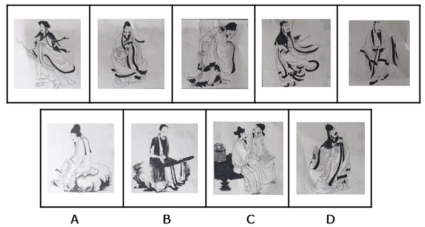

- **A**. A
- **B**. B
- **C**. C
- **D**. D　✅

**答案**：D

**官方解析**

本题考查图形的实际意义，寻找最大共同点，题干每幅图中都只有一个站着的人，且衣服都有黑边袖子。选项中只有D项是一个人站着，而且衣服有黑边袖子。
故正确答案为D。

---

#### 第 15 题　qid 2042102 · 图形推理

上边的题干中给出一套图形，其中有五个图，这五个图呈现一定的规律性。在下边给出一套图形，从中选出唯一的一项作为保持上边五个图规律性的第六个图。

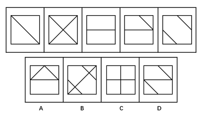

- **A**. A
- **B**. B
- **C**. C　✅
- **D**. D

**答案**：C

**官方解析**

题干为一组图形，元素组成不同且无属性规律，考虑数量规律。优先数面数量和线数量都无规律，考虑数点。每幅图中交点数量依次为：4、5、6、7、8，呈现数量递增的规律，因此应选择点数量为9的图形，只有C项符合。
故正确答案为C。

---

#### 第 16 题　qid 2042104 · 图形推理

上边的题干中给出一套图形，其中有五个图，这五个图呈现一定的规律性。在下边给出一套图形，从中选出唯一的一项作为保持上边五个图规律性的第六个图。

- **A**. A
- **B**. B
- **C**. C　✅
- **D**. D

**答案**：C

**官方解析**

整体观察所给图形，每幅图都有4条长短不一的竖线和1条长斜线，并且每幅图的长斜线都是从最短竖线的底部连到最长竖线的顶部。分析选项，A不是最长竖线与最短竖线相连，B、D都是从最短竖线的顶部开始连，均排除，选项中只有C符合。 
故正确答案为C。

---

#### 第 17 题　qid 2042108 · 图形推理

下边的四个图形中，只有一个是由上边的四个图形拼合（只能通过上、下、左、右平移）而成的，请把它找出来。

- **A**. A
- **B**. B
- **C**. C　✅
- **D**. D

**答案**：C

**官方解析**

本题为平面拼合，可以采用平行等长相消的方法（找到相对面积较大的图形作为基准图形，找到平行且等长的边进行拼合，拼合之后等长线条抵消）。

平行等长相消的方式如下图所示：

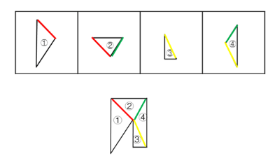

故正确答案为C。

---

#### 第 18 题　qid 2042110 · 图形推理

下边的四个图形中，只有一个是由上边的四个图形拼合（只能通过上、下、左、右平移）而成的，请把它找出来。

- **A**. A
- **B**. B
- **C**. C
- **D**. D　✅

**答案**：D

**官方解析**

本题为平面拼合，可以采用平行等长相消的方法（找到相对面积较大的图形作为基准图形，找到平行且等长的边进行拼合，拼合之后等长线条抵消）。

平行等长相消的方式如下图所示：

故正确答案为D。

---

#### 第 19 题　qid 2042112 · 图形推理

下边的四个图形中，只有一个是由上边的四个图形拼合（只能通过上、下、左、右平移）而成的，请把它找出来。

- **A**. A　✅
- **B**. B
- **C**. C
- **D**. D

**答案**：A

**官方解析**

本题为平面拼合，可以采用平行等长相消的方法（找到相对面积较大的图形作为基准图形，找到平行且等长的边进行拼合，拼合之后等长线条抵消）。

平行等长相消的方式如下图所示：

故正确答案为A。

---

#### 第 20 题　qid 2042114 · 图形推理

左边给定的是纸盒外表面的展开图，右边哪一项能由它折叠而成？请把它找出来。

- **A**. A
- **B**. B
- **C**. C　✅
- **D**. D

**答案**：C

**官方解析**

本题考查四面体的空间重构能力。对平面展开图中的面进行标记，用排除解题。

A项：如上图所示，分别对题干和选项的面1画箭头，题干箭头右边是面2，选项箭头右边是面3，A选项错误，排除；

B项：如上图所示，分别对题干和选项的面3画箭头，题干箭头下边是面4，选项中箭头下边是面2，立体图与平面图不对应，排除；

C项：如上图所示，对选项的面1画箭头，题干中箭头的右边是面2，选项中箭头的右边也是面2，无法排除，先保留；

D项：如上图所示，对选项的面1画箭头，题干中箭头的下边是面4，选项中箭头的下边是面3，立体图与平面图不对应，排除。

故正确答案为C。

---

#### 第 21 题　qid 2042116 · 图形推理

左边给定的是纸盒外表面的展开图，右边哪一项能由它折叠而成？请把它找出来。

- **A**. A
- **B**. B
- **C**. C
- **D**. D　✅

**答案**：D

**官方解析**

本题考查四面体的空间重构能力。将平面展开图中的面进行标记，用排除法解题。

A项：选项为中间是细线的两个面，即题干的面③、面④，如图1沿着面③、面④分别画两个箭头，可知两个面中小三角的顶点并不重合，所以A选项错误，排除；

B项：选项为中间是粗线的两个面，即展开图的面①、面②，如图2沿着面①、面②分别画两个箭头，可知两个面中小三角的顶点并不重合，所以B选项错误，排除；

C项：C选项左边的面有可能是面③也可能是面④，如果是面③，如图3所示，箭头下面挨着面①，且边c与边d是同一条边，该边与面①内部横线无交点，错误；同理，C选项左侧面如果是面④也错误。所以C选项错误，排除。

故正确答案为D。

---

#### 第 22 题　qid 2042118 · 图形推理

左边给定的是纸盒外表面的展开图，右边哪一项能由它折叠而成？请把它找出来。

- **A**. A
- **B**. B
- **C**. C　✅
- **D**. D

**答案**：C

**官方解析**

观察发现4个选项中均出现面c，可以考虑对它进行画边，如下图所示，在展开图中以灰色三角形的直角为起点，顺时针画边，选项同理。

A项：题干第二条边与面d相邻，选项中第二条边与面f相邻（注意面d和面f中间竖线的粗细不同），A选项错误，排除；

B项：题干第一条边与面a相邻，选项中第一条边与面f相邻，B选项错误，排除；

C项：与题干一致，为正确答案；

D项：题干第一条边与面a相邻，选项中第一条边与面f相邻，D选项错误，排除。

故正确答案为C。

---

#### 第 23 题　qid 2042128 · 图形推理

左边给定的是纸盒外表面的展开图，右边哪一项能由它折叠而成？请把它找出来。

- **A**. A　✅
- **B**. B
- **C**. C
- **D**. D

**答案**：A

**官方解析**

本题考查六面体的空间重构。将平面图中的各面进行标号，如下图：

解法一：

面②中的b点与面④中的c点重合，如上图中的红点；面①中的a点与面⑤中的d点重合，如上图中的黄点。也就是说面①、面②和面⑤中的灰色三角形有一个公共点，即图中的黄点，只有A项符合。

解法二：

首先可以排除C项。如平面图所示，至少有两个三角形的直角边是公共边，而C项没有任何两个三角形有公共边，排除；

B项：在平面图中，从两个紧挨着的灰色三角形面的直角顶点（标红点）出发，对b面顺时针画边。如下图所示：

两个紧挨着的灰色三角形面的直角顶点在B项中如上图所示（标红点）。若b面是右边的面，那么从红点出发顺时针画边，第一条边就是两三角形面的公共边，而在原图公共边是4边。那么b面只能是左边的面，从红点出发顺时针画边，3边与第三个三角形面相邻，而原图3边与小方块面相邻。故与平面图不相符，排除； 

D项：在平面图中，从单独直角三角形面的直角顶点（标红点）出发，对c面顺时针画边。如下图所示：

单独直角三角形面的直角顶点在D项中如上图所示（标红点）。3边与三角形面相邻，而原图3边与小方块面相邻，故与平面图不相符，排除。

故正确答案为A。 

---

#### 第 24 题　qid 2042138 · 逻辑判断

近日国外一项调查研究发现，肥胖与较差的社会经济地位之间存在着内在的关系，那些社会经济地位较差的人大多比较肥胖，甚至越穷越胖。研究者解释，这是因为社会经济地位较差的人更容易选择高热量低营养的快餐食品，而摄入这些食品很容易导致肥胖。
下列哪项如果为真，最能削弱研究者的上述解释？

- **A**. 高热量低营养食品的摄入虽是一些人的饮食习惯，但却容易造成营养不良
- **B**. 刚富起来的人更容易沉迷于高热量食品，而有些穷人对快餐食品只能偶尔尝鲜
- **C**. 穷人没有足够的金钱和时间去锻炼身体，富人却更有能力在身体健康上投入　✅
- **D**. 现在高热量低营养的快餐食品变得越来越廉价，而健康的低卡路里食品变得越来越昂贵

**答案**：C

**官方解析**

第一步：找到论点和论据。
论点：那些社会经济地位较差的人大多比较肥胖，甚至越穷越胖是因为社会经济地位较差的人更容易选择高热量低营养的快餐食品，而摄入这些食品很容易导致肥胖。
论据：无。
第二步：逐一分析选项。
A项：指出摄入高热量低营养的食品容易造成“一些人”营养不良，此处的“一些人”指代不明，也没有给出穷人更容易胖的原因，无关选项，排除；
B项：指出刚富起来的人更容易沉迷于高热量食品，有些穷人只能偶尔尝鲜，但题干“穷人”和“富人”两个群体比较的是普遍情况，“刚富起来的人”和“有些穷人”都代表不了“富人和穷人”群体的普遍情况，不能用部分或个例去质疑普遍情况，不能削弱，排除；
C项：指出“穷人”和“富人”这两个群体还有“锻不锻炼”这个变量，可能是因为没有钱和时间去锻炼导致穷人更胖，他因削弱，当选；
D项：指出高热量低营养的快餐食品越来越便宜，健康的低卡路里食品越来越贵，解释了穷人更容易选择高热量低营养的快餐食品的原因，补充论据加强，排除。
故正确答案为C。

---

#### 第 25 题　qid 2042144 · 类比推理

某厅级机关计划选派1人前往海外进修公共管理，最合适的人选应具有如下条件：男性；通晓1门外语；熟悉当地文化。有4位业务水平较高的处长甲、乙、丙、丁最后进入面试环节。4人中有3名男性，2人通晓1门外语，1人熟悉当地文化，每位面试者都至少符合1项条件。已知：
（1）甲、乙的外语能力相同；
（2）乙、丙的性别相同；
（3）丙、丁并非都是男性。
通过考察，只有1人符合全部条件，被成功派往海外。
根据以上信息，可以得出被派往海外进修的人是：

- **A**. 甲
- **B**. 乙
- **C**. 丙　✅
- **D**. 丁

**答案**：C

**官方解析**

根据题干甲、乙、丙、丁4人中有3名男性，由条件（2）（3）可知，甲、乙、丙是男性，丁是女性，由于被选派的是男性，排除D；根据题干只有1人符合选派条件：男性；通晓一门外语；熟悉当地文化；而只有1人熟悉当地文化，即熟悉当地文化的必须被选派，由于甲、乙、丙、丁4人至少符合一个条件，所以丁通晓一门外语，由题干2人通晓一门外语可知，剩下3人只有1人通晓一门外语；由条件（1）可知，甲、乙均不会外语，排除A、B，所以丙会外语。所以丙是唯一熟悉当地文化、通晓一门外语的男性。
故正确答案为C。

---

#### 第 26 题　qid 2042288 · 逻辑判断

某高速路段管理处决定招聘10名道路辅助管理人员，以解决正式管理人员不足的问题，但是这一建议招致某人士的反对。该人士认为，增加这10名道路辅助管理人员后，将会有更多的道路违规、违纪行为被发现，而后期处理这些问题需要占用更多的正式管理人员，这将导致本已紧张的正式管理人员更加不足。
以下哪项如果为真，最能削弱该人士的观点？

- **A**. 新招聘的道路辅助人员工作起来未必能尽心尽职
- **B**. 有许多道路违规、违纪行为问题当场就可解决，不需要拖到后期处理
- **C**. 道路辅助管理人员也可以对道路违规、违纪行为进行后期处理　✅
- **D**. 增加道路辅助管理人员将有效减少该路段道路违规、违纪行为的发生

**答案**：C

**官方解析**

第一步：找到论点论据。
论点：不应该招聘10名道路辅助管理人员来解决正式管理人员不足的问题。
论据：增加10名道路辅助管理人员后，将会有更多的道路违规、违纪行为被发现，后期处理这些问题需要占用更多的正式管理人员，这将导致本已紧张的正式管理人员更加不足。
第二步：逐一分析选项。
A项：指出新招聘的道路辅导管理人员工作未必能尽心尽职，同时也未说明一定不会尽心尽职，属于不明确选项，排除；
B项：指出许多的道路违规、违纪行为问题当场能解决，不需要拖到后期处理，但另外剩下的问题是否需要拖到后期处理并不清楚，属于不明确选项，排除；
C项：论据的理由是，发现了更多违规，后期处理需要正式管理人员。想直接削弱论据，要么就说不会发现更多违规，要么就说后期处理不需要正式管理人员。C项指出道路辅助管理人员也可以对道路违规、违纪行为进行后期处理，说明后期不需要占用正式管理人员，直接削弱论据，当选；
D项：指出增加道路辅助管理人员减少了道路违规、违纪行为的发生，而要想直接否定论据最直接的应该说的是不会发现更多违规，因此，削弱程度没有C项深。
故正确答案为C。
这道题C项和D项存在争议，相比较而言，C项是对论据的直接削弱，D项不够明确，因此粉笔倾向于选C。

---

#### 第 27 题　qid 2042292 · 类比推理

老张：你在这儿摆摊设点属于占道经营！
小王：这儿是中山北路又不是中山北道，我占的什么道？
以下哪项与上述对话方式最为相似？

- **A**. 甲：你这种执法行为一点人情味都没有！    乙：我严格执法是为了保障人民群众的生命财产安全。
- **B**. 甲：你成天打游戏是在虚度年华！     乙：我只有在游戏中才觉得年华没有虚度。
- **C**. 甲：你工作时间不能抽烟！   乙：我抽烟时从不工作。　✅
- **D**. 甲：你这种说法是栽赃陷害！      乙：你这种说法是血口喷人！

**答案**：C

**官方解析**

第一步：分析题干对话方式。
题干对话中小王故意曲解老张的话中“占道经营”的“道”，实际上这里的“道”泛指道路，小王通过混淆概念达到自己强词夺理的目的。
第二步：逐一分析选项。
A项：甲乙二人的话不在一个领域内，“人情味”与“保障人民群众的生命财产安全”并无冲突，与题干无相似之处，排除；
B项：甲乙二人对于“打游戏是否虚度年华”理解不同，与题干并无相似之处，排除；
C项：乙故意将甲话中的“工作时间不能抽烟”曲解成为“抽烟的时候不能工作”，混淆概念达到其强词夺理的目的，与题干最为相似，当选；
D项：乙仅仅是在指责对方，指出对方是在冤枉自己，与题干并无相似之处，排除。
故正确答案为C。

---

#### 第 28 题　qid 2042298 · 逻辑判断

老张、老张的妹妹、老张的儿子和老张的女儿4人进行乒乓球比赛。比赛后发现，第1名与第4名的年龄相同，但第1名的孪生同胞（上述4人之一）与第4名的性别不同。
根据以上信息，可以推出第1名是：

- **A**. 老张
- **B**. 老张的女儿　✅
- **C**. 老张的妹妹
- **D**. 老张的儿子

**答案**：B

**官方解析**

根据题干信息，第1名的年龄=第4名的年龄，而第1名的孪生同胞与第4名性别不同，因此第1名的孪生同胞一定不是第4名，根据孪生同胞年龄相同，得出第1名的年龄=孪生同胞的年龄=第4名的年龄，四个人中有三个人年龄相同，由于老张不可能与自己的儿子和女儿同龄，那么这三个人只能是老张的儿子、女儿和妹妹，则孪生同胞为老张的儿子和女儿，第4名为老张的妹妹。已知第1名的孪生同胞与第4名性别不同，那么孪生同胞为老张的儿子，第1名为老张的女儿。
故正确答案为B。

---

#### 第 29 题　qid 2042316 · 逻辑判断

近来，有科学家研究了历史上气候变化对人类社会的影响。他们发现，全球超过的国家及地区在气候寒冷时期爆发的战争次数是温暖时期的两倍；在中国过去的1000多年里，战争、大范围动乱和朝代更替大都对应着特别漫长的寒冷时期；欧洲1550年到1850年的“小冰期”与欧洲历史上发生过的猎巫事件甚至法国大革命之间都存在紧密的联系。由此，他们得出结论：气候变冷会导致社会冲突和朝代更替的发生。

以下哪项如果为真，最能质疑上述科学家的观点？

- **A**. 气候变化总在发生，社会冲突、朝代更替也总在发生，共同发生变化的东西不一定存在因果联系　✅
- **B**. 气候变暖是引发人类冲突与战争的重要原因，例如，在1981年到2002年间的温度升高期间，撒哈拉以南非洲国家内战的次数比平时有所增加
- **C**. 2003年，由于印度洋升温影响季风活动，导致苏丹达尔富尔地区降水大幅度下降，引发粮食和水资源严重短缺，继而引发武装冲突
- **D**. 气候变冷比气候变暖更可怕，气候变冷意味着农作物收成下降，粮食、能源供应紧张，人们的日常生活受到更为严重的影响

**答案**：A

**官方解析**

第一步：找到论点论据。

论点：气候变冷会导致社会冲突和朝代更替的发生。

论据：全球超过的国家及地区在气候寒冷时期爆发的战争次数是温暖时期的两倍，在中国过去的1000多年里，战争、大范围动乱和朝代更替大都对应着特别漫长的寒冷时期；欧洲1550年到1850年的“小冰期”与欧洲历史上发生过的猎巫事件甚至法国大革命之间都存在紧密的联系。

第二步：逐一分析选项。

A项：指出气候变冷和社会冲突、朝代更替之间未必有因果联系，直接削弱论点，当选；

B项：说明气候变暖和社会冲突、朝代更替之间确有关系，但无法判断气候变冷是否会引发社会冲突与朝代变更，无关选项，排除；

C项：举例说明气候变暖会导致武装冲突，无法判断气候变冷是否会引发社会冲突与朝代变更，无关选项，排除；

D项：指出气候变冷对于日常生活的危害，与社会冲突和朝代更替无关，无关选项，排除。

故正确答案为A。

---

#### 第 30 题　qid 2042344 · 逻辑判断

对于小李、小王和小苗能否考取研究生，有以下4种猜测：
（1）小李能考取；
（2）要是小王能考取，那么小苗也能考取；
（3）或是小王能考取，或者小李能考取；
（4）小王能考取。
事后证实，这4种猜测中只有一种是对的。
根据以上信息，可以得出以下哪项？

- **A**. 小李考取了
- **B**. 小苗没有考取
- **C**. 小苗考取了
- **D**. 小李没有考取　✅

**答案**：D

**官方解析**

第一步：翻译题干。
（1）小李考取；
（2）小王考取→小苗考取；
（3）小王考取或者小李考取；
（4）小王考取；
第二步：假设法
4种猜测只有一种是对的。假设条件（1）是对的，或关系中其中一项对，整个或关系就为真，因此（3）也是对的，和题干要求矛盾。该假设错误，（1）一定错。既然小李考取是一句假话，那么它的矛盾命题小李没有考取就一定是真的。
故正确答案为D。

---

#### 第 31 题　qid 2042372 · 定义判断

斜杠青年：指不满足于从事单一职业，追求拥有多重职业身份及多元生活方式的年轻人。他们在自我介绍时往往喜欢用斜杠来区分自己的不同身份，如：张三，金牌律师/企划师/专栏作家。
下列属于斜杠青年的是：

- **A**. 最近两三年，八零后导演黄某某先后出演了10多次男配角，去年在一个著名的国际电影节上斩获了最佳男配角奖　✅
- **B**. 小丁在国外获得博士学位后，任职于国内一所著名高校，因科研成就突出，被破格聘为教授，并入选省“双百”人才计划
- **C**. 某公司程序员小陈爱好广泛，性格温和，人际关系融洽，节假日常邀上三五个好友一起登山、打球、游泳
- **D**. 李总做过保安，送过快递，当过安装工，开过小杂货店，他经常自豪地向员工讲述自己30多年来丰富的职业经历

**答案**：A

**官方解析**

第一步：找到定义关键词。
“年轻人”、“不满足于从事单一职业”、“追求拥有多重职业身份及多元生活方式”。
第二步：逐一分析选项。
A项：80后导演黄某某先后出演了10多次男配角，最终获得了最佳男配角奖，体现了黄某某在同一时间所扮演的导演和演员两种不同的身份和职业，符合定义，当选；
B项：小丁在国外获得博士学位后任职于高校，后因科研成就突出被聘为教授，自始至终小丁的职业只有教师这一项，没有体现多重职业身份和多元生活方式，不符合定义，排除；
C项：小陈爱好广泛经常约朋友一起登山、打球、游泳，只是体现了不同的兴趣爱好，和职业无关，也未体现多重身份，不符合定义，排除；
D项：李总做过保安、送过快递、当过安装工、开过小杂货店，虽然这些体现了李总不满足于从事一种职业，追求多种职业身份及多元生活方式，但是这些身份和经验都是过往的经验，并不是在当下工作之外所具有的其他身份。根据相关资料可推测，“斜杠青年”所指的多重身份更偏向于某人在同一时间所具备的不同身份，D项不符合定义，排除。
故正确答案为A。

---

#### 第 32 题　qid 2042376 · 定义判断

影子工作：指消费者使已购商品变为可用物品所付出的任何劳动。
下列属于影子工作的是：

- **A**. 小孙到饭店就餐，老板告诉他，这几天大部分服务员都已经放假，顾客需要点餐，并递给他一支笔和一张菜单
- **B**. 小李的儿子快出生了，他赶紧抽时间将同事老王给的婴儿车拿出来修理一番，车子焕然一新，十分好用
- **C**. 经不住软磨硬泡，爸爸终于答应给小明买两条金鱼，小明高兴坏了，连夜在网上收集了十几页的金鱼养殖攻略
- **D**. 将拼板餐桌从商场运回家后，老冯忙乎了半天，对照安装说明，拆了装，装了拆，终于组装成功，中午就派上了用场　✅

**答案**：D

**官方解析**

第一步：找到定义关键词。
“消费者使已购商品变为可用物品所付出的任何劳动”。
第二步：逐一分析选项。
A项：小孙到饭店就餐，服务员休假只能自己点单，点单说明还没有消费，不存在已购商品，更没有体现出使已购商品变为可用物品的过程，同时点餐和变为可用物品之间没有联系，不符合定义，排除；
B项：小李将同事老王送的婴儿车拿出来修理一番，车子焕然一新，十分好用，送的婴儿车本就是一种可用物品，没有体现出使已购商品变为可用物品的过程，同时，婴儿车的购买者是老王而不是小李，不符合定义，排除；
C项：爸爸答应给小明买两条金鱼，小明搜集了十几页的养殖攻略，答应买金鱼但是还没买，没有体现出已购商品这个概念，同时金鱼也不是一种可用物品，不符合定义，排除；
D项：老冯将拼板餐桌从商场运回家，对照安装说明组装成功，中午派上用场，首先拼板餐桌是已购商品，老冯经过劳动使其变为可用物品，符合定义，当选。
故正确答案为D。

---

#### 第 33 题　qid 2042742 · 定义判断

权利暗示：指基于职务地位、业务能力、人格魅力而产生的对组织机构外部成员的影响力。
下列不属于权利暗示的是:

- **A**. 张教授是微电子领域的专家，不少企业遇到相关问题，都会向他请教解决的方法
- **B**. 五年级的小聪，电子游戏玩得特别顺溜，学校组队参加各级比赛时总请他协助指导　✅
- **C**. 退伍军人老赵处事公平，街坊邻居遇到大小纠纷，首先想到的就是请他来主持公道
- **D**. 教育局李主任长期研究教师的专业发展，亲友们却常常向他求教孩子的教育问题

**答案**：B

**官方解析**

第一步：找出定义关键词。
“基于职务地位、业务能力、人格魅力而产生的对组织机构外部成员的影响力”。
第二步：逐一分析选项。
A项：张教授是微电子领域的专家，不少企业遇到相关问题都会向他请教解决的办法，体现了张教授基于业务能力产生的对组织机构外部成员的影响，符合定义，排除；
B项：小聪电子游戏玩得顺溜，学校组队参加比赛时总请他协助指导，电子游戏玩得顺溜没有体现职务地位、业务能力和人格魅力的影响，同时小聪作为学校的学生，学校组队参加比赛协助指导是对本组织内部的影响，不能体现出对组织机构外部成员的影响，不符合定义，当选；
C项：退伍军人老赵处事公平，街坊邻居遇到大小纠纷请他来主持公道，体现了由于人格魅力而产生的对街坊邻居的影响，同时街坊邻居相对于与军人所属的军队这一组织机构来说属于组织外部成员，符合定义，排除；
D项：李主任长期研究教师的专业发展，亲友们常常向他求教孩子的教育问题，体现了由于职务地位和业务能力而产生的对他所在的组织机构以外的成员的影响力，符合定义，排除。
本题为选非题，故正确答案为B。

---

#### 第 34 题　qid 2042302 · 定义判断

随机试验：指在同一条件下会出现多种可能结果且可以重复进行的试验；试验的所有可能结果虽预先可知，但每次具体实验的结果却无法预知。
下列属于随机试验的是：

- **A**. 将一壶淡水加热到沸腾，观察其状态变化的实验
- **B**. 在狮子身上安装定位设备了解其生活习性的实验
- **C**. 为检测某辆新款汽车的安全性能所做的撞击实验
- **D**. 抛一枚硬币观察带有数字的一面朝上次数的实验　✅

**答案**：D

**官方解析**

第一步：找到定义关键词。

“在同一条件下会出现多种可能结果且可以重复进行的试验”、“试验的所有可能结果虽预先可知，但每次具体实验的结果却无法预知”。

第二步：逐一分析选项。

A项：将一壶淡水加热到沸腾，观察状态变化的实验，这种实验可重复进行，但是在同一条件下不可能出现多种结果，出现的结果只有一种，就是水加热至沸腾后，由液态变成气态，每次实验的具体结果是可以预知的，不符合定义，排除；

B项：在狮子上安装定位设备了解其生活习性的实验，同一头狮子是可以重复实验，但是狮子的情况和习性都不相同，实验的所有的结果并不都是可预知的，不符合定义，排除；

C项：为检测某辆新款汽车的安全性能所做的撞击实验，同一辆汽车的撞击实验是不可以重复进行的实验，而实验的结果是可以预知的，同时实验的结果并不具备多种可能性，排除；

D项：抛一枚硬币观察带有数字的一面朝上次数的实验，实验可以重复进行，且每次实验的结果具有两种可能性，一是带有数字的一面朝上，二是带有数字的一面朝下，其实验的所有结果是可以具体得知的，那就是带有数字的一面朝上的概率是，但是每次实验的结果带有数字的一面到底是朝上还是朝下却不可预知，符合定义，当选。

故正确答案为D。

---

#### 第 35 题　qid 2042310 · 定义判断

临时救助：指家庭或个人遭遇突发事件、意外伤害、重大疾病等变故，基本生活陷入困境时，政府有关部门提供的应急性、过渡性救助。
下列属于临时救助的是：

- **A**. 80岁的李大爷无儿无女，独自生活，社区工作人员定期到他家中探望，把每月的养老金交到他手上，还时不时地送来一些生活用品
- **B**. 老张患上了强直性脊柱炎，巨额医疗费花光了积蓄，夫妻名下的房子也变卖了，一家三口只得暂住在街道办为他们租来的小房子里　✅
- **C**. 地震发生后，社会各界积极响应市政府号召，通过多种渠道捐款捐物，很快就筹集了大批物资并分发到了灾民手中
- **D**. 老赵在几年前的一次车祸中失去了左腿，从那以后再也不能外出工作，每月数百元的低保金就成了家里主要的经济来源

**答案**：B

**官方解析**

第一步：找到定义关键词。
原因：“家庭或个人遭遇突发事件、意外伤害、重大疾病等变故”、“基本生活陷入困境”。
结果：“政府有关部门提供的应急性、过渡性救助”。
第二步：逐一分析选项。
A项：80岁的李大爷无儿无女，独自生活，社区工作人员定期探望，给予养老金，没有体现出李大爷遭遇了突发事件、意外伤害或者重大疾病等变故，不符合定义，排除；
B项：老张患上了强直性脊柱炎，体现了家庭或者个人遭遇重大疾病的变故，花光了积蓄、变卖房子体现了生活陷入困境，一家人只得暂住在街道办为他们租来的小房子里，体现了政府有关部门提供的应急性、过渡性救助，符合定义，当选；
C项：地震发生后，社会各界响应号召为灾民捐送物资，并不是政府有关部门提供的应急性、过渡性救助，不符合定义，排除；
D项：老赵因车祸失去左腿，体现了遭遇意外伤害等变故，但每月的低保金成为主要经济来源并不是应急性、过渡性的救助，低保金是一种长期的救助，不符合定义，排除。
故正确答案为B。

---

#### 第 36 题　qid 2042312 · 定义判断

渐进式退休：指员工到了法定退休年龄，用人单位根据实际工作需要对部分人员灵活确定退休时间。
下列属于渐进式退休的是：

- **A**. 马教授临近退休年龄，因为他是国内最具影响力的学者之一，对学科发展作出了重大贡献，学校决定聘任他为终身教授
- **B**. 赵先生已经到了退休年龄，但是他主持的重大攻关项目还没有结题，他所在的研究所决定聘用他继续工作，直到项目完成　✅
- **C**. 近年来，李工程师的身体状况越来越糟糕，还患上了轻度的抑郁症，无法坚持工作，公司领导经过研究，决定让他提前退休
- **D**. 某研究机构决定，从下半年开始，本单位申请提前退休的职工，初、中级职称不低于54岁，高级职称不低于58岁

**答案**：B

**官方解析**

第一步：找到定义关键词。
“员工到了法定退休年龄”、“用人单位根据实际工作需要对部分人员灵活确定退休时间”。
第二步：逐一分析选项。
A项：马教授临近退休说明还没有到法定退休年龄，不符合定义，排除；
B项：赵先生到了退休年龄，因为他主持的项目没有结题，研究所决定聘用他继续工作，体现了“用人单位根据实际工作需要对部分人员灵活确定退休时间”，符合定义，当选；
C项：李工程师提前退休说明还没有到法定退休年龄，不符合定义，排除；
D项：某机构职工申请提前退休说明还没有到法定退休年龄，不符合定义，排除。
故正确答案为B。

---

#### 第 37 题　qid 2042318 · 定义判断

订单式培养：指用人单位提出用人申请后，由劳动保障部门委托培训机构根据用工需求组织实施的明确就业岗位去向的人才培养模式。
下列属于订单式培养的是：

- **A**. 某职业技术学院调研后发现，烹饪即将成为未来数年的紧俏职业，当年就开设了烹饪专业，果不其然，毕业生很抢手，很多餐饮名店都登门签约
- **B**. 某民办托儿所急需几名保育员，主管部门接到申请后马上找到一家资深代培机构组织培训，几名合格的保育员很快到岗　✅
- **C**. 某市每年都会根据各乡镇上报的用人需求，在全省高校中聘请一批科研人员，然后分派到各地担任科技副镇长
- **D**. 某物业公司最近被多个小区选中，需要补充大批保安，为了顺利接手各个小区的安保工作，公司急招了数十名新手，正委托专业保安公司强化培养

**答案**：B

**官方解析**

第一步：找出定义关键词。
“用人单位提出用人申请后”、“劳动保障部门委托培训机构根据用工需求组织实施的明确就业岗位去向的人才培养”。
第二步：逐一分析选项。
A项：职业技术学院开设烹饪专业不是受劳动保障部门委托，而是主动开设，而且也没有体现用人单位提出申请，不符合定义，排除；
B项：托儿所提出的是保育员的用人申请，主管部门委托代培机构组织培训符合劳动保障部门委托培训机构根据需求组织人才培养，符合定义，当选；
C项：某市在高校中聘请科研人员担任科技副镇长，不属于委托培训机构根据需求组织人才培养，不符合定义，排除；
D项：物业公司委托专业保安公司强化培养新入职的保安，是用人单位进行的委托培训，而非劳动保障部门，而且也没有体现提出用人申请，不符合定义，排除。
故正确答案为B。

---

#### 第 38 题　qid 2042326 · 定义判断

创伤后成长：指一个人在经历重大的生活挫折之后发生的积极性改变。
下列属于创伤后成长的是：

- **A**. 一名车祸幸存者说，事故之后她能更主动地掌控自己的生活　✅
- **B**. 在多次丢失手机以后，小张照看自己的随身物品比以前细心多了
- **C**. 在同事突然撒手人寰后，小刘深感生命脆弱，开始坚持健身锻炼
- **D**. 赴震区考察归来后，王工程师对建筑物防震设计有了更深刻的认识

**答案**：A

**官方解析**

第一步：找到定义关键词。
“经历重大的生活挫折”、“发生的积极性改变”。
第二步：逐一分析选项。
A项：车祸幸存者说明经历了车祸的重大生活挫折，她更主动地掌控自己的生活属于积极性改变，符合定义，当选；
B项：多次丢失手机与A项的车祸比较不属于经历重大的生活挫折，不符合定义，排除；
C项：同事的去世是否算“经历重大的生活挫折”，与同事关系的亲疏远近相关，选项此处并未提及和同事的关系，因此不够明确，不如A项车祸幸存者更能体现“经历重大的生活挫折”，同事的去世不是小刘的生活挫折，不符合定义，排除；
D项：王工程师赴灾区考察不是经历生活挫折，不符合定义，排除。
故正确答案为A。

---

#### 第 39 题　qid 2042338 · 定义判断

小众经济：指面向小众人群的个性化定制模式，即采用个性化生产加工方式为用户提供独一无二的产品，实现精准服务，以满足消费者需求。
下列不属于小众经济的是：

- **A**. 某食品公司推出的特色月饼，价格虽然比传统月饼高出30%，但仍大有市场，不到一周就收到了数十万元的订单　✅
- **B**. 某知名服装集团生产的每件西装都是根据用户的量体数据专门设计，保证衣服合体，西装里面还绣着用户名字
- **C**. 某科技园将3D打印技术应用于特色食品的生产，可以按照用户要求制作带有新郎、新娘卡通形象的巧克力喜糖
- **D**. 某知名家电企业为一对外国新婚夫妇提供了唯一的采用外文标识的电冰箱，并将她们的婚纱照打印在电冰箱面板上

**答案**：A

**官方解析**

第一步：找出定义关键词。
“面向小众人群的个性化定制模式”、“采用个性化生产加工方式为用户提供独一无二的产品”、“实现精准服务”。
第二步：逐一分析选项。
A项：食品公司推出的“特色月饼” 只是与传统月饼有区别，但仍然是面向大众批量化生产的商品，并不是面向小众人群、独一无二的产品，不符合定义，当选；
B项：西装“根据用户的量体数据专门设计”“里面还绣着用户名字”符合“面向小众人群”“提供独一无二的产品”，符合定义，排除；
C项：“按照用户要求制作带有新郎、新娘卡通形象的巧克力喜糖”符合“个性化定制模式”“提供独一无二的产品”，符合定义，排除；
D项：“提供了唯一的采用外文标识的电冰箱”“将她们的婚纱照打印在电冰箱面板上”符合“面向小众人群”“提供独一无二的产品”，符合定义，排除。
本题为选非题，故正确答案为A。

---

#### 第 40 题　qid 2042346 · 定义判断

劳动碰瓷：指个别劳动者利用企业的管理漏洞，促使企业发生违法行为，进而索要双倍工资或经济补偿等经济利益。
下列属于劳动碰瓷的是：

- **A**. 林某应聘到某公司后，以种种借口未与公司签订劳动合同。三个月后，林某以公司拒绝与他订立劳动合同为由向劳动仲裁部门提出申请，要求公司赔偿未签订合同期间的双倍工资　✅
- **B**. 工作满一年后，丁女士发现公司没有为她交纳养老保险，经过多次交涉都没有得到满意的结果，她向劳动仲裁部门提出申请，要求公司为她补交养老保险
- **C**. 洪女士生下二胎后，厂里把她怀孕期间的工资扣掉了一半，并劝她辞职，洪女士最终决定告上法庭，要求厂里补足她的工资奖金，并给予赔偿
- **D**. 某公司招聘的10余名工人均未签订书面劳动合同，因为不断要求增加工资被集体辞退，几天后，他们以公司拒签劳动合同，过错在先为由申请劳动仲裁，要求同意他们回公司继续工作

**答案**：A

**官方解析**

第一步：找到定义关键词。
“个别劳动者利用企业的管理漏洞，促使企业发生违法行为”、“索要双倍工资或经济补偿等经济利益”。
第二步：逐一分析选项。
A项：林某以种种借口未与公司签订劳动合同符合利用企业的管理漏洞促使企业发生违法行为，之后申请仲裁要求赔偿双倍工资符合索要双倍工资的经济利益，符合定义，当选；
B项：公司没有为丁女士缴纳养老保险不是丁女士利用企业的管理漏洞促使企业发生违法行为，而是企业主动的违法行为，不符合定义，排除；
C项：厂方把洪女士怀孕期间的工资扣掉一半是企业主动的违法行为，不是洪女士利用企业的管理漏洞促使企业发生违法行为，不符合定义，排除；
D项：某公司与招聘的工人均未签订书面劳动合同是企业主动的违法行为，工人申请仲裁要求回公司继续工作也不是索要经济利益，不符合定义，排除。
故正确答案为A。

---

#### 第 41 题　qid 2042350 · 定义判断

评论式营销：指商家借助对商品、服务的评论引导客户消费倾向，推动产品推广和销售的营销模式。
下列属于评论式营销的是：

- **A**. 某中医药研究所举办了中药膏方的系列公益讲座，许多膏方受益者现身说法，引起了很多市民关注，药店膏方热销
- **B**. 某购物网站建立起对买家的信誉评价机制，帮助卖家筛选恶意差评的顾客并列入黑名单，很快提高了店铺的营业额
- **C**. 某饭店推出“集赞换龙虾”活动后，有近两千粉丝对它的活动规则和龙虾品质提出质疑，营业额急剧下滑
- **D**. 某知名家电企业推出了一款新产品，外包装上醒目地印着行内专家的专业评价，该产品一投放市场就很抢手　✅

**答案**：D

**官方解析**

第一步：找到定义关键词。
方式： “借助对商品、服务的评论引导客户消费倾向”。
目的：“推动产品推广和销售”。
第二步：逐一分析选项。
A项：中医药研究所并不一定是商家，公益讲座也不是为了引导顾客消费，不符合定义，排除；
B项：购物网站建立对买家的信誉评价机制是为了筛选恶意差评顾客，并没有引导客户消费倾向，不符合定义，排除；
C项：饭店推出的营销活动被粉丝质疑并没有引导客户消费倾向，营业额下滑说明也没有推动产品销售，不符合定义，排除；
D项：家电产品上印着行内专家的专业评价是借助对商品的评论引导客户消费倾向，产品一投放市场就很抢手说明推动了产品推广和销售，符合定义，当选。
故正确答案为D。

---

#### 第 42 题　qid 2042352 · 定义判断

错峰就业：指大学毕业生在求职高峰时，主动选择短时间游学、实习、创业考察或志愿服务，推迟个人就业，以寻找更合适的就业岗位。
下列属于错峰就业的是：

- **A**. 小林大学毕业时正碰上“史上最难的就业季”，他没有急着找工作，而是到多个非营利性社团、咖啡厅体验生活。半年后与两个志同道合的朋友创办了一家科技咨询公司　✅
- **B**. 小高毕业后一直没有找到合适工作，每次有人问起工作的事情，他一点也不着急，心里盘算着再过几年，自己设法开个网店，照样能够过上舒舒服服的小日子
- **C**. 虽然已被推荐保研，但考虑到家中久病的父亲和尚在读书的弟弟，小李还是到人才市场投递了简历。在等待消息的过程中，她又到老家附近的餐馆找了一份零工
- **D**. 又到毕业季，与忙着投简历的其他同学不同，小金大二时就创办了一家共享办公租赁服务公司，只等一毕业，就可以全身心地投入到公司的经营管理上

**答案**：A

**官方解析**

第一步：找到定义关键词。
“在求职高峰”、“主动选择短时间游学、实习、创业考察或志愿服务，推迟个人就业”、“寻找更合适的就业岗位”。
第二步：逐一分析选项。
A项：小林毕业时碰上“史上最难的就业季”属于在求职高峰，到非营利性社团、咖啡厅体验生活属于主动推迟个人就业，半年后与志同道合的朋友创办科技咨询公司属于寻找到更适合的工作岗位，符合定义，当选；
B项：小高毕业后没有找到合适工作后并没有选择游学、实习、创业考察、志愿服务等方式推迟就业，不符合定义，排除；
C项：小李因家庭情况投简历、打零工属于主动就业，不属于主动推迟个人就业，不符合定义，排除；
D项：小金毕业前就创办了公司，而不是毕业后，属于提前就业，不属于主动推迟个人就业，不符合定义，排除。
故正确答案为A。

---

#### 第 43 题　qid 2042354 · 定义判断

覆盖竞争：指在行业内部竞争已经十分激烈的阶段，行业外部的生产经营者强势介入该行业领域，导致业内竞争进一步加剧的现象。
下列属于覆盖竞争的是：

- **A**. 从事电子产品设计与开发的某公司进入刚刚开始兴起的无人机研制领域
- **B**. 鉴于去年各个分公司的销售业绩都实现了快速增长，公司高层经研究决定今年再成立几家分公司
- **C**. 某房地产公司在市区中心地带的大型购物广场开业后，周边五六家大型商场的客流量明显减少　✅
- **D**. 某汽车零部件销售商为了进一步满足客户需求，决定新增汽车维修保养业务

**答案**：C

**官方解析**

第一步：找到定义关键词。
“行业内部竞争已经十分激烈”、“行业外部的生产经营者强势介入”、“业内竞争进一步加剧”。
第二步：逐一分析选项。
A项：刚刚开始兴起的无人机研制领域说明行业内部竞争并不激烈，不符合定义，排除；
B项：公司鉴于去年分公司销售业绩快速增长，决定再成立分公司，并没有出现行业外部生产经营者的介入，不符合定义，排除；
C项：房地产公司介入商场行业符合“行业外部的生产经营者强势介入”，周边大型商场的客流量减少说明“业内竞争进一步加剧”，符合定义，当选；
D项：汽车零部件销售商新增汽车维修保养业务是为了进一步满足客户需求，并没有出现行业外部生产经营者的介入，不符合定义，排除；
故正确答案为C。

---

#### 第 44 题　qid 2042356 · 定义判断

新乡贤：指长期扎根农村，利用自己的知识、技术、财富为村民热心服务并作出突出贡献，在当地社会生活及民众心目中具有较高威望和影响力的乡村人士。
下列属于新乡贤的是：

- **A**. 10多年来，老李虽然一直在外经商，但他时时惦念着家乡，每年都会捐出大量资金为家乡修桥铺路，资助家乡的特困大学生完成学业，乡亲们经常千里迢迢地跑来看望他
- **B**. 小张复员后回到家乡，两三年就成了远近闻名的“养殖大王”，为了带动乡亲们共同致富，他开办了多期培训班，免费传授实用养殖技术和经验，受到了大家的称赞
- **C**. 20多年来，某市商会会长孙先生利用自己长期积累的丰富经验，为经营各种农副产品的家乡村民牵线搭桥，指导他们寻找商机，被乡亲们誉为贴心的“诸葛亮”
- **D**. 某乡村小学校长程某退休后，利用自己学生多、关系广的优势，为挖掘家乡历史文化资源、发展乡村文化旅游业积极谋划、东奔西走，被乡亲们传为佳话　✅

**答案**：D

**官方解析**

第一步：找到定义关键词。
“长期扎根农村”、“利用自己的知识、技术、财富为村民热心服务并作出突出贡献”、“具有较高威望和影响力的乡村人士”。
第二步：逐一分析选项。
A项：老李一直在外经商，并没有长期扎根农村，不符合定义，排除；
B项：小张免费传授实用养殖技术和经验属于利用自己的知识为村民热心服务，但他回乡时间只有两三年，不是长期扎根农村，不符合定义，排除； 
C项：孙先生为某市商会会长说明他没有长期扎根农村，不属于乡村人士，不符合定义，排除； 
D项：程某之前在乡村小学当校长为村民服务，退休后挖掘家乡历史文化资源为村民服务，属于长期扎根农村，具有一定的威望和影响力，符合定义，当选。
故正确答案为D。

---

#### 第 45 题　qid 2042358 · 定义判断

零优势意识：指一种危机意识和忧患意识，即能够看到自身优势的相对性，从而带着危机感把比较优势转化为竞争优势，以防止自身优势无法发挥甚至逐渐丧失。
下列属于零优势意识的是：

- **A**. 以色列是世界上自然资源最贫乏的国家之一，水和耕地资源尤为短缺，但以色列人不断创新农业技术，通过滴灌技术和光热网膜技术把沙漠变成绿洲，创造出资源节约型农业典范，甚至成为重要的农产品出口大国
- **B**. 田忌与齐王赛马，每次都输，原来马分上中下三等，进行三场比赛，无论哪一等级的马，田忌都比不过齐王。孙膑知道后指导田忌用下等马对齐王的上等马，再用上等马对中等马，用中等马对下等马，结果只输第一场，赢了后两场
- **C**. 某古城以保留众多清代建筑物闻名于世，旧城改造中，市政府吸取外地教训，避免“拆了值钱的，盖了不值钱的”，全力保护和开发旅游资源。如今，已彻底改变了过去旅游资源丰富而旅游消费水平低的态势，形成了稳固的行业优势　✅
- **D**. 某公司在制造感光材料时，需要有人长时间在暗室工作，但员工大多无法适应长时间黑暗，效率很低。针对这种情况，该公司将暗室内的工作人员全部换成盲人，极大地提高了工作效率

**答案**：C

**官方解析**

第一步：找到定义关键词。
“看到自身优势的相对性”、“带着危机感把比较优势转化为竞争优势”、“防止自身优势无法发挥甚至逐渐丧失”。
第二步：逐一分析选项。
A项：以色列是世界上自然资源最贫乏的国家之一，通过滴灌技术和光热网膜技术把沙漠变成绿洲，创造出资源节约型农业典范，并没有体现自身优势在哪里，也没有体现将比较优势转化为竞争优势，不符合定义，排除；
B项：田忌赛马，将下等马、上等马、中等马分别比齐王的上等马、中等马和下等马，结果赢了比赛，田忌的马实力弱于齐王的马，没有体现自身优势，不符合定义，排除；
C项：某古城以保留众多清代建筑物闻名于世，体现了自身优势；市政府在旧城改造中吸取教训，全力保护和开发旅游资源，改变了过去旅游资源丰富而消费水平低的态势，体现了自身优势的相对性，即旅游资源丰富但是消费水平低，而且将这种比较优势转化成了一种竞争优势，使得形成了行业优势，符合定义，当选；
D项：某公司在制造感光材料时，聘请盲人工作，没有体现自身优势的相对性，即不足之处，也没有体现将自身的比较优势转化为竞争优势，不符合定义，排除。
故正确答案为C。

---

## 资料分析

### 材料 1

        在以2015年11月1日零时为标准时点进行的全国人口抽样调查中。江苏最终样本量占全省常住人口总数的。调查显示：2015年11月1日零时江苏常住人口为7973万人。同以2010年11月1日零时为标准时点进行的第六次全国人口普查相比，增加107万人，增长。

        全省常住人口中，0~14岁人口为1064万人，占；15~64岁人口为5910万人，占；65岁及以上人口为999万人，占。同第六次全国人口普查相比，0~14岁人口的比重上升0.34个百分点，15~64岁人口的比重下降1.97个百分点，65岁及以上人口的比重上升1.64个百分点。

        全省常住人口中，大专及以上文化程度人口为1230万人，高中（含中专）文化程度人口为1356万人；初中文化程度人口为2741万人；小学文化程度人口为1744万人。

#### 第 1 题　qid 2042086 · 综合

以2015年11月1日零时为标准时点进行的人口抽样调查中，江苏最终样本量为：

- **A**. 75万人　✅
- **B**. 79万人
- **C**. 82万人
- **D**. 86万人

**答案**：A

**官方解析**

根据“2015年11月1日······人口抽样调查······样本量为”，可判定本题为现期比重问题。定位材料第一段，江苏最终样本量占全省常住人口总数的且2015年11月1日零时江苏常住人口为7973万人，则此时进行的人口抽样调查中，江苏最终样本量为：万人。

故正确答案为A。

---

#### 第 2 题　qid 2042090 · 比重

2010年第六次全国人口普查时，江苏0~14岁人口比重比65岁及以上人口：

- **A**. 少0.48个百分点
- **B**. 少2.12个百分点
- **C**. 多0.48个百分点
- **D**. 多2.12个百分点　✅

**答案**：D

**官方解析**

定位材料第二段，2015年11月1日的全国人口抽样调查中，0-14岁人口所占比重为，65岁及以上人口所占比重为，同第六次全国人口普查比，前者比重上升0.34个百分点，后者比重上升1.64个百分点，则第六次全国人口普查时，比重差为：个百分点。

故正确答案为D。

---

#### 第 3 题　qid 2042092 · 增长

两次调查的5年间，江苏常住人口中65岁及以上人口增加：

- **A**. 142万人　✅
- **B**. 107万人
- **C**. 116万人
- **D**. 99万人

**答案**：A

**官方解析**

根据题干求增长，结合选项给出单位万人，判定此题为增长量计算问题。定位文字材料第一段，2015年11月1日零时江苏常住人口为7973万人，比第六次全国人口普查增加107万人；定位文字材料第二段，2015年11月1日的调查中，65岁及以上人口人数为999万人，所占比重为，同第六次全国人口普查比，比重上升1.64个百分点，则两次调查5年间，65岁及以上人口增加：万人，A项最接近。

故正确答案为A。

---

#### 第 4 题　qid 2042098 · 综合

2015年11月1日零时江苏常住人口中，高中（含中专）及以上文化程度人口占：

- **A**. 

- **B**. 

- **C**. 

　✅
- **D**. 

- **E**. 

**答案**：C

**官方解析**

根据“2015年11月1日······高中（含中专）及以上文化程度人口占”可知，判定此题为现期比重问题。定位文字材料第一段和第三段，2015年11月1日零时江苏常住人口为7973万人，高中（含中专）及以上文化程度人口包含两部分，高中（含中专）文化程度人口为1356万人，大专及以上文化程度人口为1230万人，则高中（含中专）及以上文化程度人口占：，C项最接近。

故正确答案为C。

---

#### 第 5 题　qid 2042106 · 综合

下列说法不正确的是：

- **A**. 
两次调查的5年间，江苏常住人口年平均增加21万人

- **B**. 
两次调查的5年间，江苏常住人口中15~64岁人口下降了
　✅
- **C**. 
两次调查的5年间，江苏常住人口中65岁及以上人口的增长率高于其他年龄段

- **D**. 
2015年11月1日零时江苏常住人口中，小学文化程度以下（不含小学）人口为902万人

**答案**：B

**官方解析**

A项：定位材料第一段，两次调查的5年间，江苏常住人口增加107万人，平均增加：万人，正确；

B项：定位材料第一、二段，2015年11月1日零时江苏常住人口为7973万人，同第六次全国人口普查比增加107万人，其中15~64岁人口有5910万人，占比为，同第六次全国人口普查比重下降1.97百分点。故2010年11月1日零时江苏常住人口中15~64岁人口为：万人，下降率为：，错误；

C项：定位材料第二段，2015年11月1日零时0～14岁人口占，同第六次全国人口普查相比，比重上升0.34个百分点；15～64岁人口占，比重下降1.97个百分点；65岁及以上人口占，比重上升1.64个百分点。根据两期比重比较结论：岁和65岁及以上人口的比重上升，则增长率大于常住人口增长率；岁人口的比重下降，则增长率小于常住人口增长率，故65岁及以上人口的增长率高于15～64岁人口的增长率。

定位材料第一段，江苏常住人口增长率为，代入两期比重差公式：

岁人口：，解得；

65岁及以上人口：，解得，故65岁及以上人口的增长率最大，高于其他年龄段,正确；

D项：定位材料第一段和第三段，2015年11月1日零时江苏常住人口为7973万人，全省常住人口中，大专及以上文化程度人口为1230万人，高中（含中专）文化程度人口为1356万人；初中文化程度人口为2741万人；小学文化程度人口为1744万人。则小学文化程度以下（不含小学）人口为：万人，正确。

本题为选非题，故正确答案为B。

---

### 材料 2

#### 第 6 题　qid 2042084 · 综合

2016年第一季度，全国星级饭店餐饮收入比客房收入多：

- **A**. 4.8亿元
- **B**. 3.5亿元　✅
- **C**. 3.1亿元
- **D**. 2.6亿元

**答案**：B

**官方解析**

根据题干所求“2016年第一季度···多···”，选项带单位，可判定此题为现期计算问题。定位表格可得，2016年第一季度全国星级饭店营业收入为496.5亿元，餐饮收入占比、客房收入占比。则餐饮收入比客房收入多亿元。

故正确答案为B。

---

#### 第 7 题　qid 2042088 · 平均数

2016年第一季度，全国五星级饭店的平均营业收入是四星级饭店的：

- **A**. 1.8倍
- **B**. 2.6倍
- **C**. 3.4倍　✅
- **D**. 4.1倍

**答案**：C

**官方解析**

根据题干所求“2016年第一季度，······平均营业收入是······”，选项为倍数，可判定此题为现期倍数问题。定位表格可得，2016年第一季度，五星级饭店为816家、营业收入184.7亿元，四星级饭店为2438家、营业收入162.9亿元。，则五星级饭店的平均营业收入是四星级饭店的倍。

故正确答案为C。

---

#### 第 8 题　qid 2042094 · 比重

2016年第一季度，全国一、二星级饭店总数占星级饭店总数的比重是：

- **A**. 

　✅
- **B**. 

- **C**. 

- **D**. 

**答案**：A

**官方解析**

根据题干所求“2016年第一季度······占······的比重是”，可判定此题为现期比重问题。定位表格可得，一、二星级饭店数量分别为87家、2342家，星级饭店总数为11037家。代入公式，。

故正确答案为A。

---

#### 第 9 题　qid 2042096 · 综合

2016年第一季度，全国星级饭店中取得其他收入（除餐饮、客房收入外）最高的是：

- **A**. 二星级饭店
- **B**. 三星级饭店
- **C**. 四星级饭店　✅
- **D**. 五星级饭店

**答案**：C

**官方解析**

根据问题所求“2016年第一季度······取得其他收入（除餐饮、客房收入外）最高的是”，结合材料给出条件为总量和占比，可判定此题为现期比重问题。其他收入占比=1-餐饮收入占比-客房收入占比，其他收入=总收入×其他收入占比，代入表格数据可得，

二星级饭店其他收入：亿元；

三星级饭店其他收入：亿元；

四星级饭店其他收入：亿元；

五星级饭店其他收入：亿元。

四星级饭店最高。

故正确答案为C。

---

#### 第 10 题　qid 2042100 · 综合

下列说法正确的是：

- **A**. 
2016年第一季度，全国星级饭店餐饮总收入为248.3亿元

- **B**. 
2016年第一季度，全国三星级饭店数量占星级饭店数量的比重大于

- **C**. 
2016年第一季度，全国二星级饭店的餐饮与客房收入都低于其他星级饭店

- **D**. 
2016年第一季度，全国三星级及以下星级饭店的营业收入占全国星级饭店的比重不足三分之一
　✅

**答案**：D

**官方解析**

A项：全国星级饭店营业收入为496.5亿元，餐饮收入占比，则餐饮收入为亿元，错误；

B项：三星级饭店数量为5354家，星级饭店总数量为11037家，占比为，错误；

C项：二星级饭店营业收入为27.2亿元，餐饮收入占比，则餐饮收入为亿元，一星级饭店营业收入为0.3亿元，餐饮收入占比，则餐饮收入为亿元，二星级饭店餐饮收入较高，错误；

D项：一、二、三星级饭店营业收入分别为0.3亿元、27.2亿元、121.4亿元，全国星级饭店的总营业收入为496.5亿元，则三星级及以下星级饭店营业收入占全国星级饭店比重为，正确。

故正确答案为D。

---

### 材料 3

      某市调查总队随机抽取2000名市民开展媒体需求调查，受访市民按文化程度分为小学及以下、初中、高中/中专、大专、大学本科、研究生等六类，所占比重分别为、、、、、，调查结果见下表。

#### 第 11 题　qid 2042012 · 综合

文化程度为“高中/中专”及以下的受访市民比“大专”及以上的多：

- **A**. 148人
- **B**. 150人
- **C**. 152人　✅
- **D**. 154人

**答案**：C

**官方解析**

由题干“文化程度为······比······多”并结合材料中给出总人数及比重，求两类人数的差值，可判定该题是现期比重问题。定位文字材料数据，可得“高中/中专”及以下的受访市民所占比重，“大专”及以上的受访市民（也可以直接用总的减去“高中/中专”及以下的受访市民，即）。受访市民总共2000人，因此可得文化程度为“高中/中专”及以下的受访市民比“大专”及以上的多人（可用尾数法判断尾数为2）。

故正确答案为C。

---

#### 第 12 题　qid 2042014 · 平均数

受访市民工作日平均花费时间最少的主要媒体是：

- **A**. 电视
- **B**. 广播　✅
- **C**. 报纸/杂志
- **D**. 网络

**答案**：B

**官方解析**

定位表中数据，可以看到在每个文化程度分类中，工作日每天在主要媒体花费时间最少的都是广播，因此我们不需要通过计算即可直接判断受访市民工作日平均花费时间最少的主要媒体是广播。
故正确答案为B。

---

#### 第 13 题　qid 2042016 · 平均数

“大专”类受访市民一周（有5个工作日）内平均每天看电视的时间为：

- **A**. 1.69小时
- **B**. 1.86小时　✅
- **C**. 1.99小时
- **D**. 2.15小时

**答案**：B

**官方解析**

由题干“平均每天看电视的时间为”，可判定该题是现期平均数问题。定位数据表中数据，“大专”类受访市民工作日每天看电视1.69小时，双休/节假日每天看电视2.29小时，一周有5个工作日和2个双休/节假日，可得“大专”受访市民一周内每天看电视时间小时，与B项最接近。

故正确答案为B。

---

#### 第 14 题　qid 2042018 · 平均数

在不同文化程度的受访市民中，工作日在主要媒体平均花费时间最多的类别是：

- **A**. 小学及以下　✅
- **B**. 高中/中专
- **C**. 大专
- **D**. 大学本科

**答案**：A

**官方解析**

根据表格材料可以得，不同文化程度的受访市民工作日在主要媒体花费时间如下：

A项：；

B项：；

C项：；

D项：。

A项小学及以下花费的时间最多。

故正确答案为A。

---

#### 第 15 题　qid 2042020 · 综合

下列说法正确的是：

- **A**. 受访市民的文化程度越高，每天上网花费的时间越多
- **B**. 各类受访市民每天听广播的平均花费时间都比其他主要媒体少
- **C**. “研究生”类受访市民每天在主要媒体上平均花费时间都少于“本科”类　✅
- **D**. 文化程度高于“初中”的受访市民双休/节假日上网平均花费时间都多于看电视

**答案**：C

**官方解析**

A项：观察表中数据最后两行，“大学本科”类在工作日和双休/节假日每天上网花费的时间都比“研究生”类多，错误；
B项：观察表中数据第一行，“小学及以下”类，听广播在工作日的平均花费时间为0.54，在双休/节假日的平均花费时间为0.58，因此听广播每天的平均花费时间在0.54~0.58之间；而“小学及以下”类，看报纸/杂志在工作日和双休/节假日的平均花费时间均为0.54，因此每天看报纸/杂志的平均花费时间为0.54，所以每天听广播的平均花费时间比看报纸/杂志多，错误；
C项：观察表中数据最后两行，“研究生”类受访市民的8个数据都比“大学本科”类少，正确；
D项：观察表中数据第三行，“高中/中专”类双休/节假日看电视花费时间为2.86小时，上网花费时间为2.75小时，所以“高中/中专”类双休/节假日上网花费时间少于看电视，错误。
故正确答案为C。

---

### 材料 4

        2015年中国机场旅客吞吐量91477万人次，比上年增长，其中，国内航线完成82895万人次，增长；国际航线完成8582万人次，增长，“十二五”时期中国机场旅客吞吐量如下图。

        2015年中国机场旅客吞吐量100万人次以上的有70个，比上年增长6个，完成旅客吞吐量占全国机场旅客吞吐量的；旅客吞吐量1000万人次以上的有26个，比上年增长2个，完成旅客吞吐量占全部机场旅客吞吐量的；北京、上海和广州三大城市占全部机场旅客吞吐量的。

        2015年中国各地区机场旅客吞吐量的分布情况是：华北地区占，比上年降低0.5个百分点；东北地区占，降低0.1个百分点；华东地区占，提高0.2个百分点；中南地区占，降低0.6个百分点；西南地区占，提高0.6个百分点；西北地区占，提高0.2个百分点；新疆地区占，提高0.2个百分点。

#### 第 16 题　qid 2042320 · 综合

2015年北京、上海和广州三大城市机场旅客吞吐量是：

- **A**. 19978万人次
- **B**. 20173万人次
- **C**. 24973万人次　✅
- **D**. 27012万人次

**答案**：C

**官方解析**

由题干“2015年北京、上海和广州三大城市机场旅客吞吐量是”并结合材料中给出2015年中国机场旅客吞吐量及北京、上海和广州三大城市机场旅客吞吐量所占比重，可判定该题是现期比重问题。根据第一段材料“2015年中国机场旅客吞吐量91477万人次”，可知北京、上海和广州三大城市旅客吞吐量为，与C项最接近。

故正确答案为C。

---

#### 第 17 题　qid 2042328 · 综合

2014年，旅客吞吐量100万人次以上而不超过1000万人次的中国机场数量有：

- **A**. 38个
- **B**. 40个　✅
- **C**. 44个
- **D**. 48个

**答案**：B

**官方解析**

根据材料“2015年中国机场旅客吞吐量100万人次以上的有70个，比上年增长6个”可知2014年中国机场旅客吞吐量100万人次以上的有个；根据材料“旅客吞吐量1000万人次以上的有26个，比上年增长2个”可知14年中国机场旅客吞吐量1000万人次以上的有个；所以2014年旅客吞吐量100万人次以上而不超过1000万人次的中国机场数量有个。

故正确答案为B。

---

#### 第 18 题　qid 2042332 · 增长

若2016-2017年与2014-2015年保持相同的年平均增速，则2017年中国机场国际航线旅客吞吐量将是：

- **A**. 10075万人次
- **B**. 10389万人次
- **C**. 11608万人次　✅
- **D**. 13781万人次​

**答案**：C

**官方解析**

由题干“保持相同的年平均增速，则2017年中国机场国际航线旅客吞吐量将是”判定该题为现期计算问题。由统计图可知15年国际航线旅客吞吐量为8582，2013年国际航线旅客吞吐量为6345，设2014-2015的平均增速为，则。若2016-2017年与2014-2015年保持相同的年平均增速，则2017年国际航线旅客吞吐量，与C项最接近。

故正确答案为C。

---

#### 第 19 题　qid 2042340 · 综合

2014年中国机场旅客吞吐量位于前三位的地区依次是：

- **A**. 华北地区、中南地区、西南地区
- **B**. 中南地区、华北地区、西南地区
- **C**. 中南地区、华东地区、西南地区
- **D**. 华东地区、中南地区、华北地区　✅

**答案**：D

**官方解析**

根据选项可知第一名一定为华北地区、中南地区、华东地区其中的一个。根据材料“华北地区占，比上年降低0.5个百分点”，则14年华北地区吞吐量占比为；根据材料“中南地区占，降低0.6个百分点”，则14年中南地区吞吐量占比为；根据材料“华东地区占，提高0.2个百分点”，则14年华东地区占比为；最大为华东地区，所以可知第一名为华东地区。

故正确答案为D。

---

#### 第 20 题　qid 2042348 · 综合

下列判断正确的是：

- **A**. 
2015年中国西北地区机场旅客吞吐量不及华北地区的三分之一

- **B**. 
2015年国内航线旅客吞吐量占中国机场旅客吞吐量的比重比上年有所提高

- **C**. 
“十二五”时期后四年，中国机场国内航线旅客吞吐量年均增长量小于国际航线

- **D**. 
2015年，旅客吞吐量100万人次以上而不超过1000万人次的机场旅客吞吐量总和占中国机场旅客吞吐量的比重为
　✅

**答案**：D

**官方解析**

A项：2015年中国各地区机场旅客吞吐量的分布情况是：华北地区占，西北地区占，总量相同，直接比较比重，，错误；

B项：2015年国内航线旅客吞吐量占中国机场旅客吞吐量的比重，分子国内航线旅客吞吐量的增长率，分母中国机场旅客吞吐量的增长率为，分子增长率小于分母增长率，比重下降，错误；

C项：2015国内航线旅客吞吐量-2011国内航线旅客吞吐量，2015国际航线旅客吞吐量-2011国际航线旅客吞吐量，国际航线四年总增量小于国内航线四年总增量，故国际航线四年年均增量小于国内航线四年年均增量，错误；

D项：2015年中国机场旅客吞吐量100万人次以上而不超过1000万人次的机场旅客吞吐量总和占中国机场旅客吞吐量的比重=2015年旅客吞吐量100万人次以上比重-2015年旅客吞吐量1000万人次以上比重，正确。

故正确答案为D。

---
