# 2017年江苏省公务员录用考试《行测》题（C类）

> 省考 · 2017 年 · 6 个模块 · 共 128 题

- [政治理论](#%E6%94%BF%E6%B2%BB%E7%90%86%E8%AE%BA) · 1 题
- [常识判断](#%E5%B8%B8%E8%AF%86%E5%88%A4%E6%96%AD) · 19 题
- [言语理解与表达](#%E8%A8%80%E8%AF%AD%E7%90%86%E8%A7%A3%E4%B8%8E%E8%A1%A8%E8%BE%BE) · 35 题
- [数量关系](#%E6%95%B0%E9%87%8F%E5%85%B3%E7%B3%BB) · 13 题
- [判断推理](#%E5%88%A4%E6%96%AD%E6%8E%A8%E7%90%86) · 40 题
- [资料分析](#%E8%B5%84%E6%96%99%E5%88%86%E6%9E%90) · 20 题

---

## 政治理论

### 第 1 题　qid 2042022 · 新思想

党的十八大以来，习近平总书记在强调不断增进中国特色社会主义道路自信、理论自信、制度自信的同时，多次提到文化自信。
下列对文化自信理解正确的是：
①文化自信具有鲜明的民族特色和价值色彩
②文化自信是对自身文化传统的深刻认知和高度自觉
③文化自信是对自身文化生命力和影响力所持有的坚定信心
④文化自信是对自身文化身份与价值的充分肯定和积极践行

- **A**. ①②
- **B**. ②③④
- **C**. ①②④
- **D**. ①②③④　✅

**答案**：D

**官方解析**

D项正确：文化自信，是更基础、更广泛、更深厚的自信。党的十八大以来，习近平总书记在强调不断增进中国特色社会主义道路自信、理论自信、制度自信的同时，多次论述文化自信。所谓文化自信，就是一个民族、一个国家以及一个政党对自身文化传统的深刻认知和高度自觉，是对自身文化身份和价值的充分肯定和积极践行，是对其文化生命力和影响力所持有的坚定信心。文化自信具有鲜明的民族特色和价值色彩。
故正确答案为D。

---

## 常识判断

### 第 1 题　qid 2043614 · 人文常识

2013年以来，每年的中央一号文件都聚焦农业现代化，强调要加快发展现代农业，其根本原因是：

- **A**. 农业现代化是目前我国社会主义现代化建设的突出“短板”　✅
- **B**. 农业现代化在我国社会主义现代化建设中最重要
- **C**. 全面建成小康社会目标的实现取决于农业现代化
- **D**. 我国目前已经有了足够的财力支持农业现代化的发展

**答案**：A

**官方解析**

A项正确：从中国现代化进程来看，我国基本已形成这样一个模式，工业化已经进入中后期阶段，城镇化已经进入快速发展阶段，而且信息化与工业化和城镇化加快融合，但是，农业现代化却成了我们现代化的一个短板。因此，要全面现代化，就要求四化共同发展，面对的问题就是农业现代化短板。从整个现代化建设的整体要求来看，迫切需要加快农业现代化。
B项错误：十八大上，李克强总理提出了“新四化”，即工业化、信息化、城镇化、农业现代化，这是实现我国现代化的基本途径。工业化与信息化是发展到一定阶段的“孪生子”，其深度融合是产业升级的方向与动力；城镇化蕴含着最大的内需潜力，是现代化建设的载体；而农业现代化则是整个经济社会发展的根本基础和重要支撑。“新四化”都是社会主义现代化建设的重要部分，没有“最重要”的区分。只有“新四化”同步发展，才是真正科学的发展，才能达到全面、协调、可持续的根本要求，才能实现社会生产力的跨越式发展。
C项错误：党的十八届五中全会把农村贫困人口脱贫作为全面建成小康社会最艰巨的任务和标志性指标，小康不小康，关键看老乡，关键看贫困老乡能不能脱贫。打赢脱贫攻坚战是全面建成小康社会的底线目标。但是脱贫攻坚战不仅仅只依靠农业现代化的发展，而是要因人因地施策，因贫困原因施策，因贫困类型施策，广泛动员全社会力量参与，实现精准扶贫。
D项错误：目前，我国总体上已进入以工促农、以城带乡的发展阶段，国家的经济实力、综合国力显著增强，可以拿出更多的财力支持农业和农村发展。但这并不是强调加快农业现代化发展的根本原因，而只是加快农业现代化发展的保障。
故正确答案为A。

---

### 第 2 题　qid 2042030 · 人文常识

下列古文中能够体现领导者榜样效应的是：

- **A**. 止宿公署，夜则祷于天，昼则出赈饥民，终日无少怠
- **B**. 为政以德，譬如北辰，居其所而众星共之
- **C**. 其身正，不令而行；其身不正，虽令不从　✅
- **D**. 乐民之乐者，民亦乐其乐；忧民之忧者，民亦忧其忧

**答案**：C

**官方解析**

本题考查人文常识。
A 项：该句语出《元史· 列传六十二· 张养浩传》，意思是（张养浩）一直住在官府，晚上便向上天祈祷，白天就外出救济灾民，一天到晚没有丝毫的懈怠。体现领导者为国为民、鞠躬尽瘁的精神。不符合题意，排除。 
B 项：该句语出《论语 · 为政篇》，意思是（周君）以道德教化来治理政事，就会像北极星那样，自己居于一定的方位，而群星都会环绕在它的周围。体现儒家治国的基本原则是德治，而非严刑峻法。不符合题意，排除。 
C 项：该句语出《论语 · 子路篇》，意思是自身品行端正了，即使不发布命令，老百姓也会去实行；若自身品行不端正，即使发布命令，老百姓也不会服从。体现领导者以身作则，率先垂范，发挥模范带头的榜样作用。符合题意，当选。 
D 项：该句语出《孟子· 梁惠王下》，意思是执政者如果以顺应民众的快乐为快乐， 民众就会为执政者的快乐而快乐；执政者如果把民众的忧苦当作自己的忧苦，民众也会为执政者的忧苦而忧苦。体现执政者要与民众同甘苦共患难，才会受到民众的拥护和爱戴。不符合题意，排除。 
故正确答案为C。

---

### 第 3 题　qid 2042036 · 科技常识

达尔文观察到，养猫越多的地方，羊也可以养的越多，原因在于“猫—田鼠—花蜂—三叶草—羊”之间存在着生物食物链。
这体现的哲学原理是：

- **A**. 矛盾具有普遍性和客观性，矛盾是事物发展的源泉和动力
- **B**. 联系具有普遍性和多样性，任何事物都处在普遍联系之中　✅
- **C**. 真理具有绝对性和相对性，绝对真理包含在相对真理之中
- **D**. 认识具有反复性和无限性，认识是一个辩证运动的过程

**答案**：B

**官方解析**

B项符合题意：生物食物链是指各种生物通过一系列吃与被吃的关系（捕食关系）彼此联系起来的序列，这正体现了马克思主义哲学中联系的观点。联系的观点是唯物辩证法的一个总特征，所谓联系就是事物之间以及事物内部诸要素之间的相互影响、相互制约和相互作用的关系，而“猫—田鼠—花蜂—三叶草—羊”就是一个由于生物之间的捕食关系而彼此联系起来的生物食物链。
故正确答案为B。

---

### 第 4 题　qid 2042042 · 人文常识

我国先秦诸子提出了许多重要主张。
下列对应正确的是：

- **A**. 孔子——道法自然
- **B**. 墨子——兼相爱、交相利　✅
- **C**. 老子——夫子之道，忠恕而已矣
- **D**. 韩非——阴阳者，天地之道也

**答案**：B

**官方解析**

A项错误：“道法自然”出自《老子》，是老子的哲学思想，而不是孔子的主张。 
B项正确：“兼相爱，交相利”是墨子思想的核心内容，意思是爱是相互的，利也是相互的。 
C项错误：“夫子之道，忠恕而已矣”出自《论语》，忠恕之道是孔子及儒家的重要思想，而不是老子的主张。 
D项错误：“阴阳者，天地之道也”出自《黄帝内经· 素问· 阴阳应象大论篇》，指以阴阳学说指导医疗的应用和实践。韩非是法家学派的代表人物，因此“阴阳者，天地之道也”不是韩非的主张。 
故正确答案为B。

---

### 第 5 题　qid 2042044 · 法律常识

欧洲一位伟人曾说过：我的光荣不在于取得四十个战役的胜利，滑铁卢会摧毁这一切，能够永世长存的是我的民法典。
这里所说的“我的民法典”是：

- **A**. 法国民法典　✅
- **B**. 德国民法典
- **C**. 瑞士民法典
- **D**. 奥地利民法典

**答案**：A

**官方解析**

题干中的伟人是指19世纪法国伟大的军事家、政治家拿破仑，其统治时期共主持制定了举世瞩目的五大法典：民法、商法、民事诉讼法、刑法、刑事诉讼法，题干中所说到的民法典就是著名的《法国民法典》。《法国民法典》由拿破仑一手打造，其在人类立法史的雕刻时光里是一部永远吸人眼球的、堪称民法世界里程碑式的扛鼎之作。对应A项。
故正确答案为A。

---

### 第 6 题　qid 2042048 · 法律常识

下列不符合我国《居民身份证法》规定的是：

- **A**. 甲是大陆投资、定居的台商，不能申请领取居民身份证　✅
- **B**. 乙到派出所办理常住户口登记变更手续，应当出示居民身份证
- **C**. 丙遗失了居民身份证，可办理户籍证明来证明身份并乘坐火车
- **D**. 丁在码头候船遇警察查验身份时，应向警察出示居民身份证

**答案**：A

**官方解析**

A项说法错误：《中华人民共和国居民身份证法》第九条规定：“香港同胞、澳门同胞、台湾同胞迁入内地定居的，华侨回国定居的，以及外国人、无国籍人在中华人民共和国境内定居并被批准加入或者恢复中华人民共和国国籍的，在办理常住户口登记时， 应当依照本法规定申请领取居民身份证。”当选。 
B项说法正确：《中华人民共和国居民身份证法》第十四条第一款规定：“有下列情形之一的，公民应当出示居民身份证证明身份：（一）常住户口登记项目变更；（二）兵役登记；（三）婚姻登记、收养登记；（四）申请办理出境手续；（五）法律、行政法规规定需要用居民身份证证明身份的其他情形。”排除。 
C项说法正确：根据中国铁路客户服务中心网站的规定，旅客购票时或购票后、乘车前因有效身份证件未携带、丢失等原因无法出示有效证件时，可以至车站铁路公安制证口办理临时乘车身份证明。办理时，须符合下列条件之一，并携带一寸照片一张：①出具所在地公安机关的户籍证明信；②学生旅客出具所在学校的证明信；③中国人民解放军、武警部队现役军人持所在部队出具的证明信；④外籍旅客持当地使领馆出具的证明信；⑤凭其他有效证件购买车票的旅客持发证部门出具的证明信；⑥通过其他方式能够证明本人身份的。排除。 
D项说法正确：《中华人民共和国居民身份证法》第十五条第一、二款规定：“人民警察依法执行职务，遇有下列情形之一的，经出示执法证件，可以查验居民身份证：（一）对有违法犯罪嫌疑的人员，需要查明身份的；（二）依法实施现场管制时，需要查明有关人员身份的；（三）发生严重危害社会治安突发事件时，需要查明现场有关人员身份的；（四）在火车站、长途汽车站、港口、码头、机场或者在重大活动期间设区的市级人民政府规定的场所，需要查明有关人员身份的；（五）法律规定需要查明身份的其他情形。有前款所列情形之一，拒绝人民警察查验居民身份证的，依照有关法律规定，分别不同情形，采取措施予以处理。”排除。 
本题为选非题，故正确答案为A。

---

### 第 7 题　qid 2042024 · 人文常识

机场、银行等服务窗口实行“一米线”制，要求等候服务的顾客必须与正在接受服务的顾客之间保持一米的距离。
这一制度的主要功能是：

- **A**. 维持服务秩序
- **B**. 保护顾客隐私　✅
- **C**. 提升服务质量
- **D**. 提高道德水准

**答案**：B

**官方解析**

B项符合题意：一米线，其主要功能是维护个人的隐私，兼有维护公共秩序，保持公众距离的作用。而在机场和银行等服务窗口设置一米线主要是防止顾客个人信息或储户密码等被偷看，起到保护顾客隐私的作用。
故正确答案为B。

---

### 第 8 题　qid 2042028 · 地理国情

下列诗句描写的地方都位于长江流域，按照从上游到下游排序正确的是：
①猿愁鱼踊水翻波，自古流传是汨罗
②白帝城中云出门，白帝城下雨翻盆
③昔登江上黄鹤楼，遥爱江中鹦鹉洲
④钟山如龙独西上，欲破巨浪乘长风

- **A**. ①②③④
- **B**. ②①④③
- **C**. ②①③④　✅
- **D**. ①②④③

**答案**：C

**官方解析**

长江流经的主要城市自上游至下游依次为攀枝花、重庆、宜昌、岳阳、武汉、九江、芜湖、南京、上海。
①“猿愁鱼踊水翻波，自古流传是汨罗”出自唐韩愈的《湘中》，诗中描写的汨罗江在湖南岳阳。
②“白帝城中云出门， 白帝城下雨翻盆”出自唐杜甫的《白帝》，诗中描写的白帝城位于重庆奉节县瞿塘峡口的长江北岸，奉节东白帝山上。
③“昔登江上黄鹤楼，遥爱江中鹦鹉洲”出自唐孟浩然的《鹦鹉洲送王九之江左》，诗中描写的地点位于湖北武汉。
④“钟山如龙独西上，欲破巨浪乘长风”出自明高启的《登金陵雨花台望大江》，诗中描写的地点位于今江苏南京。
故按从上游至下游排序应为②①③④。
故正确答案为C。

---

### 第 9 题　qid 2106160 · 地理国情

下列有关世界地理的说法错误的是：

- **A**. 俄罗斯横跨欧亚大陆，是世界上面积最大的内陆国家　✅
- **B**. 亚洲是世界上面积最大的洲，也是世界上人口最多的洲
- **C**. 澳大利亚大陆是最小的大陆，也是只有一个国家的大陆
- **D**. 南极洲是世界上海拔最高的洲，北冰洋是世界上最小的大洋

**答案**：A

**官方解析**

A项说法错误：俄罗斯是世界上面积最大的国家，但它并不是内陆国家，世界上面积最大的内陆国家是哈萨克斯坦，当选。

B项说法正确：世界上面积最大的洲是亚洲，总面积约4400万平方公里，占世界陆地面积的三分之一。同样，亚洲也是世界上人口最多的洲，其人口占据世界人口一半以上，排除。

C项说法正确：澳大利亚大陆是世界上6个大陆中面积最小的一个，且只有澳大利亚一个国家，排除。

D项说法正确：南极洲是世界上平均海拔最高的大洲，平均海拔约2350米。世界上最小的大洋是北冰洋，约占世界海洋总面积的，排除。

本题为选非题，故正确答案为A。

---

### 第 10 题　qid 2043568 · 人文常识

下列成语与历史人物对应错误的是：

- **A**. 卧薪尝胆——勾践
- **B**. 退避三舍——晋文公
- **C**. 完璧归赵——蔺相如
- **D**. 纸上谈兵——沈括　✅

**答案**：D

**官方解析**

D项错误：“纸上谈兵”出自《史记•廉颇蔺相如列传》，讲的是战国时赵国名将赵奢之子赵括，年轻时学兵法，谈起兵事来父亲也难不倒他。后来他接替廉颇为赵将，在长平之战中，只知道根据兵书办事，不知道变通，结果被秦军打败。比喻空谈理论，不能解决实际问题；
A项正确：“卧薪尝胆”形容人刻苦自励，立志雪耻图强，最后果真可以苦尽甘来。这个典故出自北宋苏轼的《拟孙权答曹操书》，《史记》中记载了越王勾践“尝胆”的故事，但没有提到“卧薪”，这是苏轼发挥想象，戏说孙权“卧薪尝胆”而创作出来的成语；
B项正确：“退避三舍”出自《左传》，讲的是晋文公重耳的故事，现比喻退让和回避，避免冲突；
C项正确：“完璧归赵”的典故出自于《史记》，是发生于战国时期的历史故事。本指赵国著名政治家蔺相如将完美无瑕的和氏璧，完好地从秦国带回赵国首都邯郸（现河北省城市），比喻把原物完好地归还物品主人。
本题为选非题，故正确答案为D。

---

### 第 11 题　qid 2106166 · 人文常识

党在新民主主义革命时期形成了很多富有时代特色的革命精神，按照形成时间先后排序正确的是：
①延安精神
②西柏坡精神
③井冈山精神
④古田会议精神

- **A**. ①②③④
- **B**. ②③④①
- **C**. ③④①②　✅
- **D**. ④②①③

**答案**：C

**官方解析**

本题考查毛中特。
①延安精神：于1942年12月由毛泽东正式提出，但其精神内涵形成和发展时期为1935—1948年。延安精神的主要内容是：坚定正确的政治方向，解放思想、实事求是的思想路线，全心全意为人民服务的根本宗旨，自力更生、艰苦奋斗的创业精神。
②西柏坡精神：是毛泽东于1949年3月在西柏坡召开的中共七届二中全会上提出的。毛泽东提出的“两个务必”，即“务必使同志们继续地保持谦虚、谨慎、不骄、不躁的作风，务必使同志们继续地保持艰苦奋斗的作风”，是这一精神的主题。
③井冈山精神：诞生于1927年土地革命时期的井冈山根据地。其主要内涵是：坚定信念，艰苦奋斗，实事求是，敢闯新路，依靠群众，勇于胜利。
④古田会议精神：古田会议是红四军于1929年12月在福建省龙岩市上杭县古田召开的第九次党的代表大会，是中国共产党历史上的一次重要会议。会议明确规定了红军的性质；强调加强党的思想建设的重要性；确立了人民军队建设的基本原则；重申了中国共产党对红军实行绝对领导的原则。古田精神的内涵是：从思想上建党、保持党的无产阶级先锋队性质和建设党绝对领导的新型人民军队。
按照形成时间先后，正确的顺序为③④①②。
故正确答案为C。

---

### 第 12 题　qid 2106170 · 人文常识

某厂发生粉尘爆炸事故，造成人员伤亡和财产的严重损失。
下列条件的组合会引起粉尘爆炸的是：
①粉尘有可燃性且达到一定浓度
②天气持续高温
③存在火源和助燃物
④空间受限

- **A**. ②③
- **B**. ③④
- **C**. ①③④　✅
- **D**. ①②③

**答案**：C

**官方解析**

粉尘爆炸指可燃性粉尘在爆炸极限范围内，遇到热源（明火或高温），发生的火焰瞬间传播于整个混合粉尘空间的化学反应，该化学反应速度极快，同时释放大量的热，具有很强的破坏力。 
一般粉尘爆炸的必要条件：可燃性粉尘要悬浮在空气中达到一定浓度，存在充足的氧气等助燃物，有火源或剧烈震动摩擦；此外，空间受限也是加剧粉尘爆炸的危险条件，粉尘处于相对封闭的空间，会导致温度和压力增加，从而容易发生爆炸。故①③④的条件组合会引发粉尘爆炸，C项正确。 
故正确答案为C。

---

### 第 13 题　qid 2042706 · 人文常识

下列关于算盘的说法错误的是：

- **A**. 算盘是世界上最早的计算工具之一
- **B**. 算盘能够锻炼人的思维和协调能力
- **C**. 算盘采取十进制的计数法
- **D**. 算盘只能进行加减乘除四则运算　✅

**答案**：D

**官方解析**

算盘是我国古代劳动人民发明的计算工具，原型为我国春秋时期出现的算筹，演变至北宋时代，定型为算盘，具有灵便、准确、快速等优点。珠算已正式成为人类非物质文化遗产。
A项正确：联合国教科文组织曾介绍说，珠算是中国古代的重大发明，以简便的计算工具和独特的数理内涵，被誉为“世界上最古老的计算机”。
B项正确：使用算盘，除了运算方便以外，还有锻炼思维能力的作用，因为打算盘需要脑、眼、手的密切配合。通过听（看）、拨、说，可以锻炼“五觉”协调能力，是锻炼大脑的一种好方法。
C项正确：我国传统算盘为上二下五珠，上面一粒表示“5”，下面一粒表示“1”，在用算盘进行计算时采用“五升十进制”，即每一档“满5”时便用一粒上珠表示，每一档“满10”时便向前一档“进1”。
D项错误：算盘不仅可以进行加减乘除四则运算，还可以进行开乘方。（另：此项“只能”表述过于绝对，需要慎选，此题可以用排除法。）
本题为选非题，故正确答案为D。

---

### 第 14 题　qid 2042296 · 人文常识

下列现象对应的光学原理错误的是：

- **A**. 汽车后视镜扩大驾驶员视野——折射　✅
- **B**. 雨夜路灯出现一圈圈的光环——色散
- **C**. 看立体电影需戴上特殊眼镜——偏振
- **D**. 使用闪光灯拍照时出现红眼——反射

**答案**：A

**官方解析**

A项错误，汽车后视镜利用光的反射原理观察车后情况，同时利用凸面镜对光有发散作用的原理，可以扩大视野，从而更好地注意到后方车辆的情况。而光的折射是光从一种介质斜射入另一种介质时，传播方向发生改变，从而使光线在不同介质的交界处发生偏折。
B项正确，色散是指白色的复合光（如阳光），经过介质被折射，形成单色光的现象。雨天水雾笼罩着路灯，灯光发射出来，发生了色散，不同颜色的光线被分开，从而形成五颜六色的光环。 
C项正确，偏振式3D技术是利用光线有“振动方向”的原理来分解原始图像的，它先把图像分为垂直向偏振光和水平向偏振光两组画面，3D眼镜左右镜片分别采用不同偏振方向的偏光镜片，这样人的左右眼就能接收到两组画面，再经过大脑合成立体影像。 
D项正确，当人长时间地待在较黑暗的环境中，瞳孔为适应视觉需要而放大，这 时如果闪光灯的位置与人的眼睛一般高低，被拍摄者又是正面对着镜头，瞳孔与闪光灯处于同一直线上。那么，在拍摄时，当闪光灯的强光照射到眼睛时，就会直射视网膜，其红色的反射光就很有可能进入相机的拍摄视角，从而产生“红眼”。
本题为选非题，故正确答案为A。

---

### 第 15 题　qid 2042308 · 经济常识

中国加入世界贸易组织以来，价廉物美的“中国制造”走入国外亿万家庭，走向海外的中国企业贡献卓著，规模庞大的中国市场充满吸引力，数以亿计的中国游客出境旅游。
对此，下列说法错误的是：

- **A**. 中国的发展给全球经济提供巨大动力源泉
- **B**. 中国与世界各国开始共同分享发展红利
- **C**. 中国在世界经济体系中拥有绝对的话语权　✅
- **D**. 中国入世后所做贡献得到了国际社会认可

**答案**：C

**官方解析**

C项错误：全球经济治理中的制度性话语权，集中体现为一国对国际经济规则与国际经济组织的影响力。改革开放30余年来，我国与全球经济治理体系的关系大致经历了三个阶段。在第一阶段，中国经济基本上游离于全球经济之外，进出口贸易只是对国内短缺经济的补充。作为国际经济规则的旁观者，我们既谈不上发挥比较优势，融入国际经济，也谈不上参与全球经济治理。第二阶段以“入世”为标志，中国正式成为国际经济规则的遵守者。与此同时，由于加入了主要的多边国际经济组织，如国际货币基金组织、世界银行、世贸组织等，因此中国事实上逐渐步入第三阶段，即成为国际经济规则制定的参与者。从总体来看，目前中国在参与规则制定方面还是一个初学者。因此题干中表述中国在世界经济体系中拥有绝对的话语权是错误的。此选项表述过于绝对，同时A、B、D三项均符合常识，正确。
本题为选非题，故正确答案为C。

---

### 第 16 题　qid 2042804 · 人文常识

某企业最近推出的一款指甲钳，在刀口上方装了放大镜，特别适合眼花的老年人使用，卖得很红火。这个事例体现了经济学原理在日常生活中的应用。
对此，下列说法正确的是：

- **A**. 只有精准掌握需求才能推出畅销产品　✅
- **B**. 市场细分使产品的生产成本有所减少
- **C**. 带有放大镜的指甲钳是剪刀的替代品
- **D**. 装有放大镜的指甲钳改变了使用价值

**答案**：A

**官方解析**

本题主要考查经济常识。
A项正确，市场经济中，供给与需求相互影响相互制约，如果商家能够精准掌握消费者需求，生产出满足消费者偏好的产品，那么就可以占据较大的市场份额，从而形成卖方市场，使产品成为畅销产品。
B项错误，市场细分，是指按照消费者的需求，把总体市场划分成若干具有共同特征的细分市场，处于同一细分市场的消费者群体被称为目标消费群体，例如题干中的老年人消费群体。市场细分有利于选择目标市场和制定市场营销策略，有利于集中人力、物力投入目标市场等，但是因为针对每个不同的市场要有不同的产品线、不同的宣传营销方式等，市场细分会导致企业的生产成本上升。
C项错误，对于两种物品，如果一种物品价格的上升引起另一种物品需求的增加，则这两种物品被称为替代品，换言之，这两种物品具有相同或相似功能。装有放大镜的指甲钳的功能依然是修剪指甲，与剪刀的功能并不相同，所以不是剪刀的替代品。
D项错误，使用价值是能满足人们某种需要的商品的效用，如粮食能充饥，衣服能御寒。指甲钳装上放大镜，方便老年人使用，但其本质依然是指甲钳，功能是修剪指甲，使用价值并没有发生转变。
故正确答案为A。

---

### 第 17 题　qid 2042314 · 人文常识

下列古诗词中，表达作者对友人的思念之情的是：

- **A**. 上邪！我欲与君相知，长命无绝衰
- **B**. 问世间，情为何物，直教人生死相许
- **C**. 曾经沧海难为水，除却巫山不是云
- **D**. 红豆生南国，春来发几枝。愿君多采撷，此物最相思　✅

**答案**：D

**官方解析**

A项错误：该句出自汉乐府《上邪》，这是一首感情强烈、气势奔放的爱情诗。诗中女子为了表达她对情人忠贞不渝的感情，指天发誓，指地为证，要永远和情人相亲相爱。
B项错误：该句出自金元之际著名文学家元好问的《摸鱼儿·雁丘词》，这首咏物词是词人为“雁殉情而死”所感动而作的，全词紧紧围绕“情”字，以雁拟人，谱写了一曲凄恻动人的爱情悲歌。
C项错误：该句出自唐代诗人元稹的《离思五首》（其四），《离思五首》是一组悼亡绝句。诗人运用“索物以托情”的比兴手法，以精警的词句赞美了夫妻之间的恩爱，表达了诗人对亡妻韦丛忠贞不渝的爱情和刻骨的思念。
D项正确：该句出自唐代诗人王维的《相思》，这是一首借咏物而寄相思的五绝诗，此诗有的版本名为《江上赠李龟年》，可见为怀念友人之作。
故正确答案为D。

---

### 第 18 题　qid 2042324 · 人文常识

五禽戏是依据中医基础理论创编的一种传统养生健身拳法。
下列关于五禽戏的说法错误的是：

- **A**. 五禽戏的创编者是华佗
- **B**. 五禽戏对后世医学的发展有重要的影响
- **C**. 五禽戏模仿的是虎、鹿、熊、猿、鸟的动作
- **D**. 五禽戏已经获批国家级物质文化遗产项目　✅

**答案**：D

**官方解析**

A项说法正确：五禽戏是中国传统导引养生的一个重要功法，其创编者为华佗。排除。
B项说法正确：五禽戏能治病养生，强壮身体。现代医学研究也证明，作为一种医疗体操，五禽戏不仅使人体的肌肉和关节得以舒展，而且有益于提高心肺功能，改善心肌供氧量，提高心肌排血力，促进组织器官的正常发育。排除。
C项说法正确：五禽戏是通过模仿虎、鹿、熊、猿、鸟（鹤）五种动物的动作，以保健强身的一种气功功法。排除。
D项说法错误：2011年6月五禽戏被纳入第三批国家级非物质文化遗产名录。由常识亦可知，物质文化遗产为历史文物、历史建筑、人类文化遗址等有形的、有实体的文化遗产，而五禽戏显然不符合这个基本特征。当选。
本题为选非题，故正确答案为D。

---

### 第 19 题　qid 2042334 · 人文常识

在日常生活和工作中，人们遭受挫折后有时会找理由自我安慰，以降低挫折感，恢复心理平衡，这是心理防御机制中心的“合理化”方法，下列不属于采用这种方法进行心理防御的是：

- **A**. 小朱上班途中发现包裹被盗，笑着说破财免灾
- **B**. 小邢的请求被同事拒绝，认为同事肯定有自己的难处　✅
- **C**. 小范竞争上岗未能如愿，心想这个辛苦的岗位不干也罢
- **D**. 小马因工作失误受到批评，感觉领导在利用职权公报私仇

**答案**：B

**官方解析**

心理防御机制中的“合理化”是指个体无意识地用似乎合理的解释来为难以接受的情感、行为、动机辩护，以使其可以接受，以求得心理平衡。“合理化”有三种表现：酸葡萄心理、甜柠檬心理和推诿。
A项：小朱上班途中发现包裹被盗安慰自己破财免灾，跟“塞翁失马，焉知非福”异曲同工，这是典型的甜柠檬心理，即当得不到葡萄而只有柠檬时，就说柠檬是甜的，用来美化被满足的动机，属于心理防御机制中的“合理化”。不符合题意，排除；
B项：小邢对同事提出请求被同事拒绝，认为是同事有自己的难处，这是对同事的体谅和理解，不属于心理防御机制中的“合理化”。符合题意，当选；
C项：小范未能竞争到想要的岗位，就说岗位太辛苦不干也罢，即把得不到的东西说成是不好的，属于典型的“得不到葡萄说葡萄酸”的酸葡萄心理，符合题干中“找理由自我安慰，以降低挫折感”等表述，属于心理防御机制中的“合理化”。不符合题意，排除；
D项：小马因为自己的失误而受到批评，却认为是领导利用职权公报私仇。这是将自己受到批评这件事的责任推给其他人，是典型的推诿，即将个人的缺点或失败，推诿于其他理由，找人担待其过错，以降低挫败感，恢复心理平衡，属于心理防御机制中的“合理化”。不符合题意，排除。
本题为选非题，故正确答案为B。

---

## 言语理解与表达

### 材料 1

        从大蒜、生姜，到香蕉、菠萝，在农产品价格暴跌中，农民很受伤。订单农业作为以销定产的重要手段，对稳定农产品价格、确保农民合理收益、抵御市场价格风险具有一定的作用。然而，经调查发现，订单农业在实际运行过程中却因为部分农民契约意识差、恶意违约而变得难以推行，这反过来又伤害了商户和农民。

        作为抵御农产品价格周期波动的重要机制，订单农业一度被各方寄予厚望。然而近些年的实践表明，这一理想化的风险平抑工具，远远未能发挥预想中的作用。不少农民契约意识______，动辄毁约，一次次使得一纸购销合同______。轮番上演的单方面毁约事件，不仅让相关企业蒙受了巨大损失，也让农民群体本身付出了惨痛代价。

        众所周知，农业生产天然存在着滞后性和长周期性，这决定了农民很难及时、准确地安排生产过程。也正是基于这一原因，才形成了农产品价格“周期怪圈”现象。而所谓订单农业，其核心逻辑就在于“以销定产”。倘若严格执行，这一模式将有效实现供需平衡，避免由生产不足或过剩而引发价格巨震。令人遗憾的是，现实中一些农民受眼前短利驱动，往往会选择性执行购销合同，这无异于亲手解除了“自我保护”的机制。

        现如今，订单农业所面临的困境，很大程度上还是源于“小农心理”作祟。农民群体中的很大一部分人，并不熟悉商品社会的那套契约体系和交易方式，而且对违约行为的性质和后果也缺乏完整的认知。再加上大多数的涉农购销合同，都不具备必要的担保机制和强制执行的可能。一旦农民单方面撕毁合同，企业顾忌于超高的催收成本，往往也只能听之任之。

        没有“履约保证金”作保，没有追责索赔渠道兜底，订单农业以及相关产销合同，当然没有任何约束力可言，对此已有学者提出，要加强农村征信体系建设。可是在此之前，我们最先应该做的，还是改变分散化、个性化的农业生产模式：将孤立的农业生产者，吸收进组织化的专业生产合作社中，吸收进金融惠农和科技惠农的扶持体系之内——只有让他们处于更为紧密的人际网络和利益结构之内，其才会更为重视个人诚信的价值。

        当反思订单农业所面临的尴尬遭遇，我们往往将矛头指向农民契约精神的缺失。试问，有没有一套合理的议价机制，能够保证农民可以获得一个相对实惠的合同收购价？又有没有一种动态的博弈平台，来回应农民由短期市场行情所产生的利益关切？相较于培育农民的信用意识，建立真正公平合理的市场定价和交易体制，对于发展订单农业同样至关重要。

#### 第 1 题　qid 2042466 · 逻辑填空

依次填入文章第二段画横线处最恰当的是：

- **A**. 薄弱 形同虚设　✅
- **B**. 孱弱 灰飞烟灭
- **C**. 缺乏 化为乌有
- **D**. 缺少 徒有虚名

**答案**：A

**官方解析**

第一空，搭配“意识”，B项“孱弱”指瘦小虚弱，与“意识”搭配不当，排除。
第二空，根据文意可知，横线处表达合同效力没有实现，A项“形同虚设”指形式上虽有，却不起作用，符合文意，当选。C项“化为乌有”指全部消失或完全落空，文段强调的是合同虽有，但不起作用，排除；D项“徒有虚名”是指空有名望、有名无实，多是形容人，不能形容合同，排除。
故正确答案为A。

---

#### 第 2 题　qid 2042468 · 片段阅读

关于订单农业一度被各方寄予厚望的根本原因是：

- **A**. 订单农业可使农民与商户谈判时确保收益
- **B**. 订单农业能帮助解决农业生产不可预期性
- **C**. 订单农业可使农民预先知道农产品价格
- **D**. 订单农业可使农产品供需平衡价格平稳　✅

**答案**：D

**官方解析**

根据第二段中，“作为抵御农产品价格周期波动的重要机制，订单农业一度被各方寄予厚望”，以及第三段中“倘若严格执行，这一模式将有效实现供需平衡，避免由生产不足或过剩而引发价格巨震”可知，订单农业一度被各方寄予厚望的根本原因在于其对“农产品价格”的平衡起到重要作用，对应D项。
A、B两项均未提到“农产品价格”，排除；C项中“预先知道农产品价格”无中生有，且脱离客观实际，排除。
故正确答案为D。

---

#### 第 3 题　qid 2042472 · 片段阅读

关于订单农业购销合同缺乏约束力的原因，作者特别强调的是：

- **A**. 农民不熟悉商品社会的契约的体系和交易方式
- **B**. 农民对违约的行为的性质和后果没有充分认识
- **C**. 大部分农民的合同没有保障执行的担保机制　✅
- **D**. 企业因索赔代价太高放弃追究违约行为​

**答案**：C

**官方解析**

定位文段第五段“没有‘履约保证金’作保，没有追责索赔渠道兜底，订单农业以及相关产销合同，当然没有任何约束力可言。”由此可知，作者认为合同缺乏约束力最主要的原因是缺乏制度的保障，只有C项提及了担保机制，当选。
A、B两项虽在文段当中提及，但并非作者“特别强调”的，排除。
D项为强迷惑项，会有同学误将其对应到“没有追责索赔渠道兜底”，但认真比对之后会发现，D项这种情况的出现归根结底仍在于“没有保障执行的担保机制”，即制度的不健全更为根本。
故正确答案为C。

---

#### 第 4 题　qid 2042060 · 片段阅读

下列选项文中未涉及的是：

- **A**. 应将订单农业与金融惠农科技惠农对接
- **B**. 加强相关培训提升订单农户的契约意识　✅
- **C**. 破解订单农业困局应该加强农村征信体系建设
- **D**. 改变现有农业生产模式有助于破解订单农业困局

**答案**：B

**官方解析**

根据题干中“未涉及”可知为选非题，大家需注意审题。
A项对应文段“吸收进金融惠农和科技惠农的扶持体系之内”；C项对应文段“加强农村征信体系建设”；D项对应文段“我们最先应该做的，还是改变分散化、个性化的农业生产模式”。B项“培训提升订单农户的契约意识”无中生有，当选。
本题为选非题，故正确答案为B。

---

#### 第 5 题　qid 2042062 · 片段阅读

下列最适合做文章标题的是：

- **A**. 订单农业困局伤害了谁
- **B**. 订单农业发展面临多重困难
- **C**. 订单农业困局的真相
- **D**. 如何走出订单农业困局　✅

**答案**：D

**官方解析**

文章第一段和第二段指出订单农业在执行过程中的种种问题，使其非但没有发挥出保证供需平衡价格稳定的重要作用，反倒伤害了商户和农民。
第三段和第四段分析了订单困境出现的原因，一方面，农民受眼前短利驱动及“小农心理”使其往往会选择性执行购销合同，甚至单方面撕毁合同，另一方面，更为重要的是缺乏保障执行的机制。
最后两段针对前文分析的原因给出了“加强农村征信体系建设”“建立真正公平合理的市场定价和交易体制”等一系列走出订单农业困局的对策。
整篇文章采用了“提出问题-分析问题-解决问题”的思路框架，最终的落脚点放在了“如何走出订单农业困局”上。对应D项。
A项“伤害了谁”对应文段第一段的内容；B项“多重困难”对应文段第三段的内容；C项的“真相”为分析原因的部分，均无法概括整个篇章的中心，排除。
故正确答案为D。

---

#### 第 6 题　qid 2042246 · 片段阅读

国家机关、政党组织和其他社会成员必须按照特定的规则运行和活动，这是法治的应有之义。在当代中国，规范国家权力运行和社会成员活动的各类规则可谓浩如烟海，但国家法律体系和党内法规体系显然是最有影响力和最为重要的规则体系。十八届四中全会审议通过的《中共中央关于全面推进依法治国若干重大问题的决定》将形成“完备的法律规范体系”和“完善的党内法规体系”纳入建设中国特色社会主义法治体系，确立了全面推进依法治国的总目标。
这段文字之后作者最有可能阐述的是：

- **A**. 中国特色社会主义法治体系的建构
- **B**. 依法治国建设全面小康社会的构想
- **C**. 党内法规与国家法律的衔接和协调　✅
- **D**. 建立健全党内法规体系的对应措施

**答案**：C

**官方解析**

文段首先介绍当代中国各类规则浩如烟海的背景，接着通过转折关联词“但”引出重点内容，最重要的规则体系就是“国家法律体系”和“党内法规体系”，接下来通过举出十八届四中全会的例子进一步强调“形成完备的法律规范体系和完善的党内法规体系”的重要性。因此后文也应围绕文段引出的这两个核心概念进行阐述，C项符合题意，当选。
A、B两项，均与文段核心话题“法律规范体系”“党内法规体系”不符，且B项“建设全面小康社会”为无中生有，排除；
D项，仅提到“党内法规体系”，未涉及“法律规范体系”，表述片面，排除。
故正确答案为C。
【文段出处】《论党内法规与国家法律协调衔接》

---

#### 第 7 题　qid 2042342 · 片段阅读

晨练是一种好习惯，但未必人人适合。从人的生理特点来看，早上6点左右，人体的血压开始升高，心率逐渐加快，上午10点左右达到峰值，如果有冠心病、高血压的人此时锻炼，尤其是进行剧烈运动，就有可能发生意外。清晨6点到8点，人体血小板的凝聚力明显增强，血液相对黏稠，这段时间运动可能会使心脑血管梗塞率增大。
这段文字意在强调：

- **A**. 晨练总的来说还是弊大于利
- **B**. 晨练不宜选在6至8点之间
- **C**. 晨练应尽可能避免剧烈运动
- **D**. 晨练时间和强度要因人而异　✅

**答案**：D

**官方解析**

文段首先指出未必人人适合晨练，后文通过并列结构进行多角度分述。先是提到早上6点到上午10点，患有冠心病、高血压的人进行剧烈运动有可能发生意外，即运动强度需要因人而异；后又指出清晨6点到8点这个时间段运动可能会使心脑血管梗塞率增大，即要注意运动时间。故文段强调晨练的时间和强度要因人而异，对应D项。
A项：“弊大于利”无中生有，文段并没有将晨练的利与弊进行比较，排除；
B、C两项：B 项“6点至8点之间”、C项“剧烈运动”分别对应文段分述的部分，均表述片面，排除。
故正确答案为D。
【文段出处】《体育锻炼的时间和强度》

---

#### 第 8 题　qid 2042322 · 片段阅读

木器和石器代表了人类历史上的两大类型材料——有机材料和无机材料。但历史的发展很不均衡，数千年中，有机材料除了木器以外，就是毛皮、秸秆这些可以从生物中直接获取的材料，没有什么大的变化。但无机材料发展出了陶器、瓷器、金属、玻璃等人造材料，除了石器之外，全是依靠人类智慧使已知物发生化学变化之后创造出的新材料。即使是游离状态的金、银、汞等，人们也都开发了一些利用化学反应进行的提纯方法。
以下概括不符合文意的是：

- **A**. 有机材料几乎都是直接取之于生物
- **B**. 石器是无机材料家族的原生态成员
- **C**. 陶瓷、金属是人类创造的无机材料
- **D**. 人造材料未来将全面取代有机材料　✅

**答案**：D

**官方解析**

根据题干中“不符合文意”可知此题为选非题，大家需注意审题。
由“有机材料除了······从生物中直接获取的材料”可知，A项与文意相符，且“几乎”一词表意温和，排除；
由“除了石器之外，全是依靠人类智慧使已知物发生化学变化之后创造出的新材料”可知，石器并非是新材料，而是属于原生态，B项与文意相符，排除；
由“无机材料发展出了陶瓷、瓷器、金属、玻璃等人造材料”可知，陶瓷和金属是人造的无机材料，C项与文意相符，排除；
D项表意错误，文段没有提到人造材料取代有机材料的说法，为无中生有选项，且“全面取代”表意过重，当选。
本题为选非题，故正确答案为D。
【文段出处】《塑料的世界—赛璐珞和电木引领材料变革》

---

#### 第 9 题　qid 2043636 · 片段阅读

中国历史上的三大名锦中，蜀锦最有人气，云锦最为贵气，而宋锦尽显文人雅士之韵，有“锦绣之冠”的美名。宋锦，是指具有宋代织锦风格的锦缎，始产于南宋高宗年间，因产地主要在苏州，故又称苏州宋锦。明清以后织出的宋锦称为“仿古宋锦”或“宋式锦”，统称“宋锦”。
以下说法不符合文意的一项是：

- **A**. 宋锦更富有文人雅士的风采
- **B**. 宋锦的命名主要与年代相关
- **C**. 明清后仍有锦缎被称为“宋锦”
- **D**. 宋锦的工艺水平远高于蜀锦　✅

**答案**：D

**官方解析**

A项：根据“宋锦尽显文人雅士之韵”可知，表述正确，排除；
B项：根据“宋锦，是指具有宋代织锦风格的锦缎，始产于南宋高宗年间”可知宋锦的命名与朝代有关，符合文意，排除；
C项：根据“明清以后织出的宋锦称为‘仿古宋锦’或‘宋式锦’，统称‘宋锦’”可知，表述正确，排除；
D项：“水平远高于”无中生有，文段并没有将宋锦和蜀锦进行对比，故表述错误，当选。
本题为选非题，故正确答案为D。
【文段出处】《丝丝入扣 舒适绚丽——苏州宋锦的制造工艺》

---

#### 第 10 题　qid 2043638 · 片段阅读

如今，传统的社会就业观的坚冰在一层层融化，科学的事业发展观的阳光在一点点升温，学子们终于豁然开朗，体面和尊严不是外在的虚荣，而在于自己辛勤劳动的成就，事业腾挪的空间。如果乡村同样能够圆梦，有实现人生价值的机会，有事业发展的天地，为什么还要株守于城市的蜗居甘为“蚁族”?
这段文字意在强调：

- **A**. 乡村也是学子们大展宏图的天地　✅
- **B**. 学子们的社会就业观已经在发生改变
- **C**. 不是所有人都适合于在城市发展
- **D**. 体面尊严并非只在城市才能获得

**答案**：A

**官方解析**

文段首句指出社会就业观发生了改变，强调辛勤劳动的成就和发展空间对学子们的重要性，尾句通过反问句表明作者观点“乡村也可以成为学子们发展的天地”，对应A项。
B项对应文段首句内容，非重点，排除；
C项表述“不适合城市发展”和D项“并非只在城市”不明确，排除。
A项“乡村也是大展宏图的天地”更加直接明确，当选。
故正确答案为A。
【文段出处】《乡村是一片广阔的天地》

---

#### 第 11 题　qid 2043640 · 片段阅读

中国历史上也曾有犀牛栖息。春秋时期气候温暖湿润，长江一带分布有许多苏门答腊犀牛。那时的楚国人捕猎犀牛，用它们的皮制作犀甲。《关尹子》中有一个为后人熟知的成语“犀牛望月”，说的就是犀牛因独角挡住视线而看不到月亮。《墨子•公输》中也有这样的描述：“荆有云梦，犀兕麋鹿满之。”但到了战国以后，气候开始转冷，加上人为捕猎的因素，犀牛一再南迁，最终在中国境内不再有它们的踪迹。
以下叙述不符合文意的是：

- **A**. 犀牛曾与麋鹿同时在我国生存
- **B**. 犀牛要在温暖湿润的地方生存
- **C**. 过度捕猎是导致犀牛南迁的主要因素　✅
- **D**. 中国古人曾经因为军事用途捕猎犀牛

**答案**：C

**官方解析**

根据“荆有云梦，犀兕麋鹿满之”可知，A项“犀牛曾与麋鹿同时在我国生存”表述正确；
根据“春秋时期气候温暖湿润，长江一带分布有许多苏门答腊犀牛”以及“战国以后，气候开始转冷，犀牛一再南迁”可知，B项“犀牛要在温暖湿润的地方生存”表述正确；
根据文段“气候开始转冷，加上人为捕猎的因素”可知，捕猎只是其中一方面的原因，而非“主要因素”，故C项表述错误；
根据“楚国人捕猎犀牛，用它们的皮制作犀甲”可知，D项“曾经因为军事用途捕猎犀牛”表述正确。
本题为选非题，故正确答案为C。
【文段出处】《春秋时代，长江曾有犀牛》

---

#### 第 12 题　qid 2042396 · 片段阅读

劳动力总量大、成本低，曾是“中国制造”的比较优势，但随着人口结构的变化，这一优势正在不断消减。按照联合国的标准，65岁以上的人口比率超过总人口的，就被称为老龄化社会；超过，就是老龄社会。中国实际上在2001年就已经进入了老龄化社会。近年来东南沿海中小型制造企业的“用工荒”，已经凸显出这一人口结构变化带来的问题。

这段文字重在说明：

- **A**. 老龄化社会与老龄社会的标准如何确定
- **B**. 老龄化社会将使中国企业劳动力供给不足
- **C**. 中国东南沿海地区已首先步入了老龄社会
- **D**. 人口结构变化会影响“中国制造”竞争力　✅

**答案**：D

**官方解析**

文段开头提出观点，即“人口结构的变化使‘中国制造’的优势正在消减”，之后列举数据和东南沿海中小型企业的例子来论证前文观点，对应选项，D项符合文意，当选。
A、C两项未体现出老龄化社会这一人口结构变化带来何种影响，即未体现出文段的重点内容，排除；
B项，时态表述为将来式，而文段中最后一句论述“该问题已经凸显”，故该项时态表述有误，排除；
故正确答案为D。
【文段来源】《传统制造业寒冬已来临 中国制造如何突围》

---

#### 第 13 题　qid 2043642 · 片段阅读

海洋微生物大多是海洋的生产者，参与海洋物质生产、传递、沉降、分解和转化的过程，为海洋植物的生存提供良好的环境和资源。除此之外，多数海洋微生物具有分解有机物质的能力，能将有机物分解成氨、硝酸盐以及二氧化碳等，为海洋植物提供营养物，对海洋无机营养再生起了重要作用。海洋中具有光合作用的微生物能利用简单无机物合成有机物和氧，有利于其他生物生存。
关于海洋微生物的作用，这段文字未涉及的是：

- **A**. 参与海洋的物质循环
- **B**. 保护海洋的生态平衡
- **C**. 促使海洋的富营养化　✅
- **D**. 维护海洋的食物链

**答案**：C

**官方解析**

根据“参与海洋物质生产、传递、沉降、分解和转化的过程”可知，A项“参与海洋的物质循环”在文段已经论述；
根据“为海洋植物的生存提供良好的环境和资源”可知，B项“保护生态平衡”已经论述；
C项“富营养化”指湖泊、河流、水库等水体中氮磷等植物营养物质含量过多所引起的水质污染现象，本质是一种污染现象，不属于微生物的作用，文段没有提及；
根据“为海洋植物提供营养物，对海洋无机营养再生起了重要作用”可知，D项“维护食物链”已经论述。
本题为选非题，故正确答案为C。
【文段出处】《探秘海洋微生物》

---

#### 第 14 题　qid 2042386 · 片段阅读

研究发现，人们看待互联网的方式，就像看待交换记忆系统的人类伙伴。人们把记忆分摊给“云端”，就像分摊给家人、朋友一样轻而易举。但是，互联网又跟交互记忆系统的人类伙伴不一样——云端知道得更多，而且能更快提取信息。现今几乎所有信息都能轻易通过快速的网络搜寻取得。互联网不只降低了把信息分享给人类伙伴的必要性，或许也降低了人们想把刚学到的重要事情存进自己大脑记忆库里的渴望。
这段文字意在说明：

- **A**. 互联网和我们的关系近于亲友伴侣
- **B**. 互联网正成为我们的外部记忆资源　✅
- **C**. 互联网带来了云端这样的信息大全
- **D**. 互联网使得人类不再认为记忆重要

**答案**：B

**官方解析**

文段先提出了人们看待互联网就像看待交换记忆系统的人类伙伴，后文出现转折关联词“但是”，重点强调互联网更广泛、快捷，几乎所有信息都能快速通过网络搜寻，文段尾句对前文进行总结，强调互联网既降低了信息分享的必要性，也能够帮助人们记忆重要信息，对应B项。
A项：出现在文段首句转折之前，非文段重点，排除。
C项：带来“云端”非重点，重要的是“云端”带来的影响，排除。
D项：文段意在说明互联网能够帮助人们记忆信息，成为人们的外部记忆资源，并非使人们认为记忆不重要，排除。
故正确答案为B。

---

#### 第 15 题　qid 2043644 · 片段阅读

很多疾病的患病风险，除了自身基因以外，还有非常重要的环境因素，所以单由基因来决定疾病的风险也是不负责任的。综合这些原因，美国FDA叫停了这类疾病风险分析服务。作为个人，如何看待“风险分析”的结果是见仁见智的事情。有些人希望了解，从而提前预防，有些人觉得哪怕知道了风险也不会改变自己的生活方式。
美国FDA叫停根据基因做疾病风险分析服务的主要原因是：

- **A**. 很多疾病患病风险是由环境因素引起的
- **B**. 根据基因分析患病风险是不负责任的行为
- **C**. 某种疾病的产生并非单纯由基因决定的　✅
- **D**. 有人并不希望提前知道自己有患病风险

**答案**：C

**官方解析**

根据“除了自身基因以外，还有非常重要的环境因素，所以单由基因来决定疾病的风险也是不负责任的”可知，叫停服务的主要原因是疾病的产生并不是单由基因决定，对应C项“某种疾病的产生并非单纯由基因决定的”。
A项“很多疾病患病风险是由环境因素引起的”表述错误，文段只是说有环境因素，并没有说是由环境因素引起，且“环境因素”出现在结论之前，非重点，排除；
B项“根据基因分析患病风险是不负责任的行为”表述不明确，没有具体说明不负责任的原因，且“根据基因分析”偷换概念，文段的表述为“单由基因来决定”，排除；
D项是个人对于“分析风险”的态度，不属于原因，排除。
故正确答案为C。
【文段出处】《基因检测那些事儿之二：检测项目拾零解析》

---

#### 第 16 题　qid 2042824 · 片段阅读

文字是人类继语言之后的一大发明，如果说，语言的出现使人类实现了由动物到人的转变的话，那么文字的发明，则使人类从原始社会的低级阶段上升到文明社会的高级阶段，从而使人们的生活发生了质的飞跃。
这段文字主要强调的是：

- **A**. 人类使用的语言和文字不是同时出现的
- **B**. 文字发明前人类处于原始社会低级阶段
- **C**. 文字在人类社会发展历史上具有重要作用　✅
- **D**. 文字是人类社会处于高级阶段的显著标志

**答案**：C

**官方解析**

文段首先指出文字是人类继语言之后的一大发明，后文将语言和文字对人类的不同影响进行对比，强调文字对于人类社会的作用，即让人类上升到文明社会的高级阶段，从而使人们的生活发生了质的飞跃，对应C项。 
A项：对应文段首句，非重点，文段重在强调文字对人类社会的作用，排除；
B项：“文字发明前”无中生有，排除；
D项：“人类社会处于高级阶段”对应文段尾句结论词“从而”之前的内容，非重点，且“显著标志”无中生有，排除。 
故正确答案为C。 
【文段出处】《汉字传承与国家文化安全》

---

#### 第 17 题　qid 2043646 · 片段阅读

改革开放和市场经济扩展了农民的视野和接触空间，但经过潜移默化、世代相传而积淀的心理结构和文化传统并没有变化。大量研究表明，不仅留在农村从事农业生产劳动的农民仍然在延续着以己为中心、以亲情关系为纽带的差序格局，而且进城务工的农民工也很大程度上保持着乡村社会的行为方式和思维方式。
这段文字主要说明的是：

- **A**. 进城务工农民仍然保持着乡村社会生活方式
- **B**. 农民的乡村社会行为和思维方式很难一下子改变　✅
- **C**. 留守农民和进城农民的心理结构及文化传统是相同的
- **D**. 进城务工农民应该尽快转变行为方式和思维方式

**答案**：B

**官方解析**

文段首句通过转折关联词“但”重点强调“农民的心理结构和文化传统没有变化”。后文通过“留在农村从事农业生产劳动的农民”和“进城务工的农民工”对前文观点进行详细解释说明，强调“乡村社会的方式”没有变化。对应B项，“很难”对应文段“潜移默化、世代相传”，当选。
A、D两项，强调“进城务工农民”均对应文段解释说明中的内容，片面且非重点，且D项，“尽快转变”无中生有，均排除。
C项，文段重在强调农民的乡村特点很难改变，而非“留守农民和进城农民”的相同之处，排除。
故正确答案为B。
【文段出处】《中国市场交易秩序的社会基础》

---

#### 第 18 题　qid 2042394 · 片段阅读

说到食品安全的治理，人们首先想到的是，中国依然是一个发展中国家，各个方面的制度建设不够完善。面对现实，人们自然而然将问题引向法律法规制度、政府监管体系、社会治理机制的完善。这一指向当然是正确的，政府也沿着这些方向做了许多努力。但是这类治理方案的一个问题是，“远水解不了近渴”。
作者引用“远水解不了近渴”想要表达的意思是：

- **A**. 中国短时期之内无法真正解决食品安全问题
- **B**. 相关法律及机制建设不是短时间内可以完成的　✅
- **C**. 作为发展中国家要解决食品安全问题难度极大
- **D**. 想解决食品安全问题必须做好长期工作的准备

**答案**：B

**官方解析**

定位原文，“远水解不了近渴”这一俗语出现在文段最后一句话中，需概括全文。文段开篇指出食品安全存在的问题并提出解决方案，即“完善法律法规制度、政府监管体系、社会治理机制”。后文通过指代词“这一指向、这些方向”进一步阐述前文对策， 尾句通过转折关联词“但是”强调这类治理方案“远水解不了近渴”；“这类治理方案”指代前文完善法律法规制度及相关机制这一解决方案，即说明了相关法律及机制建设并非短时间内可以完成的，对应B项。
A、C、D三项：均未涉及文段核心概念“制度、体系、机制”，且A、C两项过于消极，排除。 
故正确答案为B。 
【文段出处】《从行为法经济学看食品安全治理》

---

#### 第 19 题　qid 2043648 · 片段阅读

现代经济学作为市场经济制度的基本理论基础，非常注重引入自然科学的研究方法分析框架来研究社会经济行为和现象，强调从假设到推理到结论的内在逻辑，强调用数学和数理模型作为基本逻辑分析工具，强调以数理统计和计量经济学为基础的实证，具有很强的应用性、实证性和自然科学性，与其他人文社会科学有很大的不同。
这段文字主要说明的是：

- **A**. 现代经济学的研究方法与其他人文社会科学有很大不同　✅
- **B**. 现代经济学是一门以实证研究为基础的社会科学
- **C**. 数学方法数理模型在研究经济问题时有重要作用
- **D**. 自然科学的很多研究方法可以用于人文社会科学研究中

**答案**：A

**官方解析**

文段首先强调现代经济学注重引入自然科学的研究办法，随后通过三个并列分句，对其进行详细的解释说明，之后引出文段重点，强调现代经济学的研究方法与其他人文社会科学相比有很大不同，对应A项。
B项为并列中一个分句的内容，表述片面，排除。
C、D两项均不包含文段的核心话题“现代经济学”，且C项“数学方法数理模型”对应并列部分解释说明的内容，非重点；D项“很多可用于人文社会科学研究”，无中生有，均排除。
故正确答案为A。
【文段出处】《现代经济学的本质》

---

#### 第 20 题　qid 2042282 · 语句表达

①西汉时期的扬雄就提出了“书为心画”，这个观念深入人心。
②明代汤显祖写的《牡丹亭》里面，柳梦梅则透过自画像上题字风格来想象杜丽娘的灵心慧性。
③元代王实甫的戏剧《西厢记》中，张君瑞曾通过书信的字迹揣摩崔莺莺的心态。
④在中国，自古以来人们普遍认为字迹就是心迹。
⑤这两个戏剧情节反映了社会大众对于字迹的普遍认识。
将以上5个句子重新排列，语序正确的是：

- **A**. ①③②⑤④
- **B**. ④①③②⑤　✅
- **C**. ④②③①⑤
- **D**. ①②③⑤④

**答案**：B

**官方解析**

观察选项，对比首句，①、④两句，④句中“在中国，自古以来”范围广、时间跨度大，并以“人们普遍认为”提出观点，为常见首句形式。而①句中提到的“西汉时期”扬雄的观念，恰好是④句中“自古以来”历史长河中的一部分，按照观点+解释说明的顺序，④句应在①句之前，排除A、D两项。
观察尾句，⑤句出现指代词“这两个戏剧情节”，可知前文要提到两部戏剧，③、②两句中《西厢记》《牡丹亭》恰好为两部著名戏剧，因此应与⑤句进行捆绑，排除C项。
故正确答案为B。
【文段出处】《书法，那一枝渡江的芦苇》

---

#### 第 21 题　qid 2042080 · 逻辑填空

现代白话文与文言文的区别只是语体的不同，但它们使用的象形表意的方块字，作为中华民族文化的独特创造，其中        的民族精神、民族生命是血脉        的。
依次填入画横线处最恰当的一项是：

- **A**. 蕴含  贯通　✅
- **B**. 沉积  相通
- **C**. 呈现  流通
- **D**. 体现  连通

**答案**：A

**官方解析**

第一空，搭配“民族精神、民族生命”，根据横线前的“其中”可知，民族精神、民族生命是包含在方块字之中的。A项“蕴含”指包含在内，符合文意，保留；B项“沉积”指水流、风等流体的流速减慢时所挟带的沙石、泥土等沉淀堆积起来，通常表述为“泥沙沉积”，与“民族精神、民族生命”搭配不当，排除；C项“呈现”指显出、露出，D项“体现”指某种性质或现象通过某一事物具体表现出来，均指外在的显露，与文意相悖，均排除。
第二空，代入验证，搭配“血脉”，根据文意可知，文段强调的是民族精神、民族生命是从古至今一脉相承的，故A项“贯通”更能体现出融古贯今的含义，当选。
故正确答案为A。
【文段出处】《儒家语言审美在新时期作家中的三重境界》

---

#### 第 22 题　qid 2043712 · 逻辑填空

很多体育运动都可以提高民族自豪感，但足球比赛的效果更为          。在赛场上，有太多国家标志的体现——赛前的国歌、队服的颜色，更不用说看台上          的球迷阵营。
依次填入画横线处最恰当的一项是：

- **A**. 明显   黑白分明
- **B**. 突出    泾渭分明　✅
- **C**. 显著   与众不同
- **D**. 明确    标新立异

**答案**：B

**官方解析**

第一空，横线处搭配“效果”。A项“明显”、B项“突出”、C项“显著”均可与“效果”搭配。D项“明确”指清晰明白，通常搭配目标、责任，与“效果”搭配不当，排除。
第二空，“更不用说”表示递进，横线处所填词语应比前文的程度更重，强调看台上的球迷阵营各不相同。B项“泾渭分明”比喻界限清楚，符合文意，当选。A项“黑白分明”比喻是非分得很清楚，也形容字迹、画面清楚，与“球迷阵营”搭配不当，排除。C项“与众不同”指跟大家不一样，文段强调的是球迷阵营各不相同，排除。
故正确答案为B。

---

#### 第 23 题　qid 2043652 · 逻辑填空

读书有两种情形，一种是看大意，         地看故事消磨时间，一种细细品味，去         寻找文章的构思，寻找文外的寓意。这就是读书的两种不同的方式和目的。不过，不管是哪一种读书方式都是一种知识的积累。
依次填入画横线处最恰当的一项是：

- **A**. 走马观花   字斟句酌
- **B**. 囫囵吞枣   字里行间　✅
- **C**. 一目十行   全神贯注
- **D**. 漫不经心   片言只语

**答案**：B

**官方解析**

第一空，横线处所填入的成语对应前文“看大意”，表示不加思考、粗略的浏览，A项“走马观花”比喻观察事物或了解情况不深入细致，B项“囫囵吞枣”指比喻对事物不加分析思考，笼统地接受，符合文意，均保留；C项“一目十行”形容看书非常快，侧重速度，文段强调的“看大意”，侧重内容，与文意不相符，排除；D项“漫不经心”比喻人做事随随便便，不放在心上，强调做事的态度随便，与文意不相符，排除。
第二空，横线中所填入的成语对应后文“寻找文章的构思，寻找文外的寓意”，B项“字里行间”指文章的某种思想感情通过全篇或全段文字透露出来，符合文意，当选；A项“字斟句酌”指写文章或说话时慎重细致，一字一句地推敲琢磨，与“寻找”搭配不当，排除。
故正确答案为B。
【文段出处】《读书与书架》

---

#### 第 24 题　qid 2042152 · 逻辑填空

统计学家告诉我们，买一张彩票正好中大奖的概率      ──比如说，英国国家彩票的中奖概率大概就只有1400万分之一，相当于你连续投24次硬币全是正面朝上，远远低于被      的陨石砸中的可能性。
依次填入画横线处最恰当的一项是：

- **A**. 微不足道  祸从天降
- **B**. 绝无仅有  不期而至
- **C**. 不可多得  不期而遇
- **D**. 微乎其微  从天而降　✅

**答案**：D

**官方解析**

第一空，搭配“概率”，后文通过例子对横线处进行解释说明，横线处所填词语应该表达概率“小”的含义，D项“微乎其微”形容非常小，符合文意，保留。A项“微不足道”指意义、价值等小得不值得一提，侧重不重要，且和“概率”搭配不当，排除；B项“绝无仅有”形容非常稀有，侧重少，而文段侧重概率小，且置于此处程度过重，排除；C项“不可多得”形容非常稀少，很难得到，多指人才或稀有物品，强调珍贵，和“概率”搭配不当，排除。
第二空，代入验证，D项“从天而降”比喻出人意料地突然来临或出现，和“陨石”搭配合理，当选。
故正确答案为D。

---

#### 第 25 题　qid 2043654 · 逻辑填空

当前，在          、积淀丰厚而又背负着沉重历史包袱的中国文学研究不断面临学科交融、学术创新的          挑战之际，建立中国文学地理学这一新兴交叉学科，具有重要的理论与实践意义。
依次填入画横线处最恰当的一项是：

- **A**. 历史悠久   严酷
- **B**. 源远流长   严峻　✅
- **C**. 年深日久   严肃
- **D**. 历久弥新   严厉

**答案**：B

**官方解析**

本题可从第二空入手，搭配“挑战”，“严峻挑战”为常见固定搭配，B项“严峻”填入文段语意合适。A项“严酷”指残酷、残忍，C项“严肃”指庄重使人敬畏、严谨而有法度，也可以形容工作态度、作风等认真严格，D项“严厉”指严肃而厉害，均不能与“挑战”相搭配，排除A、C、D三项。
第一空，代入验证，“源远流长”比喻历史悠久，根底深厚，填入文段与后文“积淀深厚”构成并列，符合文意。
故正确答案为B。
【文段出处】《中国文学地理学导论》

---

#### 第 26 题　qid 2042072 · 逻辑填空

人口迁移改变了中国城乡的人口格局，以最        的方式推动了移民城市的形成，这一城市形态与传统的         城市在性质上有着本质的区别。
依次填入画横线处最恰当的一项是：

- **A**. 直接  地域　✅
- **B**. 一般  地方
- **C**. 简单  地区
- **D**. 基本  区域

**答案**：A

**官方解析**

第一空，搭配“方式”，可知人口的迁移，就是人口在城市间的流动，可以对移民城市的形成产生立竿见影的效果，故A项“直接”指不经过中间环节的，可以显著达成效果，符合文意，保留。B项“一般”指普通、寻常，C项“简单”指不复杂，D项“基本”指根本，均不符合立刻就能推动移民城市形成的语意，排除。
第二空，搭配“城市”，可知与“移民城市”对应，表意相反，“移民城市”指大多数外来人口移入而形成的城市。A项“地域”指一定的地域空间，具有一定的界限，“地域城市”构成专有名词，强调人口只生活在固定的城市中，与“移民城市”表意构成反义，当选。
故正确答案为A。
【文段出处】《从地域城市到移民城市：全国性城市社会的构建》

---

#### 第 27 题　qid 2042154 · 逻辑填空

以和为贵、__________的精神，贯穿中华民族发展的全部历史，渗透在社会生活的方方面面，使我们不同族群、不同地域的不同文化，不断相互吸取、相互融合，形成了__________、丰富多彩的中华文化。
依次填入画横线处最恰当的一项是：

- **A**. 和睦相处  无与伦比
- **B**. 谦顺礼让  不绝如缕
- **C**. 和而不同  博大精深　✅
- **D**. 守望相助  兼收并蓄

**答案**：C

**官方解析**

第一空，横线处所填词语与“以和为贵”构成并列关系，并列前后语义相近。A项“和睦相处”指彼此融洽地相处，B项“谦顺礼让”指谦让、守礼，C项“和而不同”指和睦地相处，但不随便附和，出自《论语·子路》，这三项均符合语境。D项“守望相助”指为了对付来犯的敌人或意外的灾祸，邻近各村落互相警戒、互相援助，文段没有对付敌人和灾祸、互相援助的语境，排除。
第二空，横线处所填词语与“丰富多彩”构成并列关系，“丰富多彩”形容内容丰富，A项“无与伦比”指事物非常完美，和“丰富多彩”语义不一致，且程度过重，排除；横线处搭配“中华文化”，B项“不绝如缕”形容局势危急或声音细微悠长，和“中华文化”搭配不当，排除；C项“博大精深”指广博高深，既和“丰富多彩”构成并列关系，又与“中华文化”搭配恰当，当选。
故正确答案为C。
注：此题D项中“兼收并蓄”意为把内容、性质不同的东西都吸收并保存下来，与前文内容对应构成很大迷惑。但“守望相助”的基本语义与文意不符，排除D项。因此各位考生一定要注意把握成语的基本语义，不要被时下的很多用法迷惑。
【文段出处】《中华文化的核心价值之三：和》

---

#### 第 28 题　qid 2042068 · 逻辑填空

北京有大量历史文化保护区，它们是古都北京的文化        ，而位于北京历史城区中轴线西侧的什刹海区域，更是以宁静而优雅的环境、自然与人文的和谐              。
依次填入画横线处最恰当的一项是：

- **A**. 特色  举世闻名
- **B**. 特征  远近闻名
- **C**. 标志  著称于世　✅
- **D**. 指标  为人称道

**答案**：C

**官方解析**

第一空，“它们”指代“历史文化保护区”，搭配“保护区”。A项“特色”和B项 “特征”均指一个事物显著区别于其他事物的地方，文段并未将北京的保护区与其他保护区进行对比，均不符合文意，排除。D项“指标”指衡量目标的单位或方法，用来说明总体数量特征的概念，但“历史文化保护区”无法成为衡量北京文化数量的单位，与文意不符，排除。C项“标志”指用来表明某一事物特征的记号，一般搭配具体的事物，“保护区”为具体的事物，且能够作为古都北京的明显记号，符合文意，搭配恰当，保留。 
第二空，代入验证，C项“著称于世”指在世界上名声很大，符合文意，当选。 
故正确答案为C。 
【文段出处】《文保区监管当从规划开始》

---

#### 第 29 题　qid 2043656 · 逻辑填空

自然是神奇美妙的。自然文学的作者          在读者面前的，是含有风景、声音及心绪的多维画面。这三者相互交织，相辅相成，形成了自然文学的独特之处，也          出独特的审美情趣和美学价值。
依次填入画横线处最恰当的一项是：

- **A**. 展现 引申
- **B**. 呈现  衍生　✅
- **C**. 描摹 演化
- **D**. 描绘 发展

**答案**：B

**官方解析**

第一空，根据后文“是含有风景、声音及心绪的多维画面”可知，读者看到的是一种多维的画面，A项“展现”、B项“呈现”填入文段语意合适。C项“描摹”指透过覆在原件上的透明纸按照看得见的线条或文字临摹，D项“描绘”指描写或描画，文段中声音无法描摹或描绘，排除C、D两项。
第二空，搭配“审美情趣和美学价值”，B项“衍生”指演变而产生，填入文段形容逐渐形成了审美情趣和美学价值语意合适；A项“引申”指由原义产生新义，文段并不涉及原义及新义，排除。
故正确答案为B。
【文段出处】《自然文学的三维景观：风景、声景及心景》

---

#### 第 30 题　qid 2042158 · 逻辑填空

多名全国人大代表提出议案，建议修订我国土地管理法，兼顾土地的资源与资产双重      ，坚持物权平等保护      ，提高      补偿标准。
依次填入画横线处最恰当的一项是：

- **A**. 特征  规定  征用
- **B**. 要素  法案  征调
- **C**. 标准  措施  征集
- **D**. 属性  原则  征收　✅

**答案**：D

**官方解析**

第一空，搭配“资源与资产”，土地资源即土地作为自然要素，土地资产即土地作为财产资源，两者均指土地自身的一些性质、本质，“标准”意为衡量的准则，不符合文意，排除C项；B项“要素”指构成事物必不可少的因素，文中并无构成之意，搭配不当，排除。
第二空，搭配“坚持”，“坚持原则”为固定搭配，“原则”意为言行所依据的准则，符合我国《物权法》为了实现“物权平等保护”的目的、准则。A项“规定”，一般搭配为“遵守规定”，故排除A项。
验证第三空，“土地征收”为固定搭配，D项当选。
故正确答案为D。
【文段出处】《土地管理法将修订 农村土地有望与国有土地同等同价入市》

---

#### 第 31 题　qid 2042160 · 逻辑填空

他们笔下的中国古建筑测绘图，一方面      了西方建筑学制图手法的西方古典主义美学精神，另一方面又创造性地      了中国传统工笔和白描的技巧，更好地呈现出中国古建筑独特的美感，这在世界建筑史经典著作的插图中也可谓      。
依次填入划横线处最恰当的一项是

- **A**. 秉承 融入 独树一帜　✅
- **B**. 沿袭 引进 绝无仅有
- **C**. 接受 发扬 别具一格
- **D**. 承袭 发挥 可圈可点

**答案**：A

**官方解析**

本题可从第三空入手，根据“更好地呈现出中国古建筑独特的美感”可知，横线处所填成语应体现他们笔下的中国古建筑测绘图在世界建筑史经典著作的插图中呈现独特美感，A项“独树一帜”指单独树立起一面旗帜，指自成一家，C项“别具一格”指另有一种风格，置于此处均可体现独特美感，符合文意，保留。B项“绝无仅有”指极其少有，题干强调独特而非极其少有，且程度过重，与文意不符，排除；D项“可圈可点”指表现好，值得肯定或赞扬，无法体现独特，与文意不符，排除。
第二空，根据“一方面······另一方面又创造性地”可知，横线处所填词语应体现中国古建筑测绘图是在西方古典主义美学精神的基础上创造性地加入中国传统工笔和白描的技巧，A项“融入”指融合、混合，表示中国古建筑测绘图融合了中国传统技巧，符合文意，保留。C项“发扬”指发展和提倡（优良作风、传统等），置于此处无法体现加入了中国传统技巧，与文意不符，排除。
第一空，代入验证，A项“秉承”指接受、承接，与“美学精神”搭配恰当，当选。
故正确答案为A。
【文段出处】《梁思成手绘中国古建筑测绘图欣赏》

---

#### 第 32 题　qid 2043658 · 逻辑填空

人类成为万物之灵的主要条件是发展了语言。语言是最基本的信息_____，文字、传声技术和电脑提高了语言的_____功能，国家共同语和国际共同语扩大了语言的_____范围。
依次填入画横线处最恰当的一项是：

- **A**. 符号   交际   交换
- **B**. 手段   形象   使用
- **C**. 载体   传播   流通　✅
- **D**. 工具   互动   言说

**答案**：C

**官方解析**

第一空，根据文意可知，横线处表达语言能够传递信息，C项“载体”填入文段语意合适，指语言可以传递信息。A项“符号”指用于区分某种特征的标识， B项“手段”、D项“工具”指为某种目的采取的方法、措施，均与“信息”搭配不当，排除A、B、D三项。
后两空代入验证，“提高了传播功能”、“扩大了流通范围”，搭配恰当，符合语境。
故正确答案为C。
【文段出处】《语言生活的历史进程》

---

#### 第 33 题　qid 2043660 · 逻辑填空

文学翻译，尤其是经典文学的翻译，是特别专业的事情，需要锲而不舍的_____、旁征博引的考证和_____的付出才能做好。可惜绝大多数读者没有认识到这一点，他们当中有些人甚至对文学翻译有一种_____的傲慢与偏见。
依次填入画横线处最恰当的一项是：

- **A**. 追求   长年累月   理所当然
- **B**. 追寻   不离不弃   自以为是
- **C**. 求索   持之以恒   根深蒂固　✅
- **D**. 探求   聚精会神   前所未有

**答案**：C

**官方解析**

本题从第二空入手，搭配“付出”，A项“长年累月”指经过了很多年月，C项“持之以恒”指长久的坚持，均与“付出”搭配恰当，保留。B项“不离不弃”指永远在身边，不抛弃，不分离，D项“聚精会神”指精神高度集中，均与“付出”搭配不当，排除。
第三空，与“傲慢与偏见”搭配，C项“根深蒂固”指基础深厚，不易动摇，形容傲慢与偏见的基础牢固，填入文段语意合适。A项“理所当然”指按照道理应该是这样，强调根据道理得出结论，与“傲慢与偏见”搭配不当，排除。
第一空代入验证，“求索”填入文中搭配恰当，符合语境。
故正确答案为C。
【文段出处】《&lt;傲慢与偏见&gt;中的衣食住行》

---

#### 第 34 题　qid 2043662 · 逻辑填空

哥白尼所发动的这一场天文学革命，_____了中世纪以来的神学权威，_____起科学的理性精神，_____了一整套观察、实验与思考的方法，由此为西方近代科学的产生奠定了基础。
依次填入画横线处最恰当的一项是：

- **A**. 质疑   成立   发现
- **B**. 铲除   确立   建成
- **C**. 挑战   树立   形成　✅
- **D**. 打破   建立   发展

**答案**：C

**官方解析**

第一空，与“权威”搭配，C项“挑战”、D项“打破”与“权威”搭配恰当。根据文意可知，横线处表达天文学革命对神学权威的影响，A项“质疑”指提出疑问，文段中不仅提出疑问，而且已经发动了革命，排除；B项“铲除”指根除、彻底消灭，填入文段程度过重，且与“权威”搭配不当，排除。
第二空，搭配“理性精神”，C项“树立”、D项“建立”均搭配恰当。
第三空，根据文意可知，横线处表达产生了一整套的方法，C项“形成”指变化为某种事物或出现某种情况，侧重于从无到有的过程，填入文段语意合适。D项“发展”指事物由小到大、由简单到复杂，文段强调的是从无到有的过程，排除。
故正确答案为C。

---

#### 第 35 题　qid 2042542 · 逻辑填空

导演在摄影方法的运用上，      近景和特写，而采取长镜头、中远景和深焦镜头的拍摄，这种方法的运用，可说是与法国电影理论家巴赞的主张      的。它不但会使画面气势更加雄伟，同时也使表演区域的造型形象更为清晰和更具真实感，从而使影片的每个镜头都好像一幅幅中国画卷，给人们以特殊的美感并留下冷静思考的      。
依次填入画横线处最恰当的一项是：

- **A**. 舍弃 不谋而合 余地　✅
- **B**. 摒弃 一拍即合 痕迹
- **C**. 摒除 遥相呼应 余味
- **D**. 丢弃 一脉相承 轨迹

**答案**：A

**官方解析**

第一空，横线处所填与“近景和特写”搭配，D项“丢弃”往往搭配实际存在的东西，用于此处搭配不当，排除。
第三空，文段强调这样拍摄的电影能让人们有所思考，A项“余地”强调人们还有思考的空间，符合文意。B项“痕迹”强调事物留下的印痕或印迹；C项“余味”强调事物的性情未尽。B、C两项与语境不符，排除。
验证第二空，“不谋而合”意为事先没有商量，彼此的意见、行动却完全一致，用在此处强调导演和法国电影理论家巴赞的想法一致，符合文意。
故正确答案为A。
【文段出处】《侯孝贤和电影&lt;悲情城市&gt;》

---

## 数量关系

### 第 1 题　qid 2042458 · 数学运算

23，1，-5，5，31，（  ）

- **A**. -11
- **B**. 47
- **C**. 73　✅
- **D**. 83

**答案**：C

**官方解析**

数列无明显特征，优先考虑作差。作差后得到新数列：-22，-6，10，26，（），为公差是16的等差数列，则新数列的下一项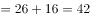。所求项。

故正确答案为C。

---

### 第 2 题　qid 2042418 · 数学运算

4.1，4.3，12.1，12.11，132.1，（  ）

- **A**. 120.8
- **B**. 124.12
- **C**. 132.131　✅
- **D**. 132.12

**答案**：C

**官方解析**

题干出现小数，考虑机械划分。机械划分后，内部之间无规律，考虑外部规律。前一项整数部分与小数部分之积为下一项整数部分，前一项整数部分与小数部分之差为下一项小数部分。故所求项整数部分为，小数部分为，故所求项为132.131。

故正确答案为C。

---

### 第 3 题　qid 2042478 · 数学运算

，-1，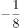，，，（  ）

- **A**. 

- **B**. 

- **C**. 

　✅
- **D**. 
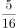

**答案**：C

**官方解析**

题干为分数数列，且出现整数，先考虑反约分可得新数列，，，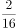，，然后单独看分子和分母。新数列分母依次为2，4，8，16，32，是公比为2的等比数列，故下一项的分母为64，再看分子-7，-4，-1，2，5是公差为3的等差数列，故下一项的分子为8，因此下一项

故正确答案为C。

---

### 第 4 题　qid 2042438 · 数学运算

甲、乙两人用相同工作时间共生产了484个零件，已知生产1个零件甲需5分钟、乙需6分钟，则甲比乙多生产的零件数是：

- **A**. 40个
- **B**. 44个　✅
- **C**. 45个
- **D**. 46个

**答案**：B

**官方解析**

方法一：已知“生产1个零件甲需5分钟、乙需6分钟”，设乙生产了个零件，则甲生产了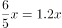个零件，总共生产了个零件，甲比乙多生产的零件为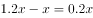个，因为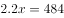，则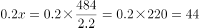个（可根据尾数法判断尾数为4）。

方法二：已知“生产1个零件甲需5分钟、乙需6分钟”，甲乙时间之比为，效率之比即为，即甲每生产6个的同时乙生产5个，因此每合计生产11个，甲就要多生产1个，则，因此甲比乙多生产44个。

故正确答案为B。

---

### 第 5 题　qid 2042500 · 数学运算

设正整数，，，满足，且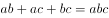，则的值是：

- **A**. 4
- **B**. 5
- **C**. 6　✅
- **D**. 9

**答案**：C

**官方解析**

方法一：观察，等式两边同除以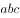，化简整理可得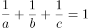。不妨令最小的数，代入方程，此时，、无解，排除；若，则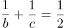，此时最小为3，代入解得。

方法二：观察，等式两边同除以，化简整理可得。代入选项A，可得，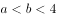，此时、无正整数解；代入选项B，可得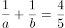，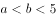，此时、仍然无正整数解；代入选项C，可得，，此时有正整数解，，满足题意。

故正确答案为C。

---

### 第 6 题　qid 2042440 · 数学运算

玻璃厂委托运输公司运送400箱玻璃。双方约定：每箱运费30元，如箱中玻璃有破损，那么该箱的运费不支付且运输公司需赔偿损失60元。最终玻璃厂向运输公司共支付9750元，则此次运输中玻璃破损的箱子有：

- **A**. 25箱　✅
- **B**. 28箱
- **C**. 27箱
- **D**. 32箱

**答案**：A

**官方解析**

方法一：设此次运输中玻璃破损的箱子有x箱，则未破损的箱子有箱，根据题意可得：，可得。

方法二：没有玻璃破损的箱子则需要付元，每有一箱有玻璃破损则需要少付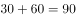元，设此次运输中玻璃破损的箱子有箱，可得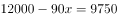，可得。

故正确答案为A。

---

### 第 7 题　qid 2042510 · 数学运算

两公司为召开联欢晚会，分别编排了3个和2个节目，要求同一公司的节目不能连续出场，则安排节目出场顺序的方案共有：

- **A**. 12种　✅
- **B**. 18种
- **C**. 24种
- **D**. 30种

**答案**：A

**官方解析**

题目要求同一公司节目不能连续出场，则同一公司节目之间必然插入另一个公司节目，第一个公司3个节目之间刚好有2个空隙插入第二个公司的2个节目。先排第一个公司，3个节目出场顺序有种情况；再将第二个公司的节目排入空隙，出场顺序有种情况；所以节目出场顺序共有方案数为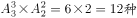情况。总共12种情况。

故正确答案为A。

---

### 第 8 题　qid 2042050 · 数学运算

某公司管理人员、技术人员和后勤服务人员一月份的平均收入分别为6450元、8430元和4350元，收入总额分别为5.16万元、33.72万元和5.22万元。则该公司这三类人员一月份的人均收入是：

- **A**. 6410元
- **B**. 7000元
- **C**. 7350元　✅
- **D**. 7500元

**答案**：C

**官方解析**

公司管理人员数量：，技术人员数量：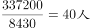，后勤服务人员数量：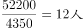。则这三类人员的人均收入为：。

故正确答案为C。

---

### 第 9 题　qid 2043664 · 数学运算

小王打靶共用了10发子弹，全部命中，都在10环、8环和5环上，总成绩为75环，则命中10环的子弹数是：

- **A**. 1发
- **B**. 2发　✅
- **C**. 3发
- **D**. 4发

**答案**：B

**官方解析**

设命中10环、8环、5环的子弹数分别为正整数、、。由子弹总数为10发，总环数为75环，可列不定方程组：

；

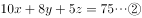；

求命中10环子弹数，由可得不定方程。、25均为5的倍数，也必然为5的倍数，只能为5，此时。

故正确答案为B。

---

### 第 10 题　qid 2042054 · 数学运算

某一楼一户住宅楼共17层，电梯费按季交纳，分摊规则为：第一层的住户不交纳；第三层及以上的住户，每层比下一层多交纳10元。若每一季度该住宅楼某单元的电梯费共计1904元，则该单元第7层住户一季度应交纳的电梯费是：

- **A**. 72元
- **B**. 82元
- **C**. 84元
- **D**. 94元　✅

**答案**：D

**官方解析**

方法一：设第二层一季度电梯费为，则第三层电梯费为，以此类推第17层电梯费为。则一季度该栋住宅楼电梯费总和为，解得，所以第7层电梯费为。

方法二：第三层及以上，每层比下一层多10元，即“从第2层起，每层多10元”，满足等差数列定义。因为第一层住户不交纳，所以1904是第2层到第17层这个等差数列的和，一共有16层，则中间项（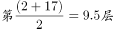）的值为，而公差为10元，所以第9层为，所以第7层为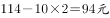。

故正确答案为D。

---

### 第 11 题　qid 2042450 · 数学运算

A、B两个容器装有质量相同的酒精溶液，若从A、B中各取一半溶液，混合后浓度为；若从A中取、B中取溶液，混合后浓度为。若从A中取、B中取溶液，则混合后溶液的浓度是：

- **A**. 

- **B**. 

- **C**. 

　✅
- **D**. 

**答案**：C

**官方解析**

方法一：设A、B酒精溶液的质量均为100克，A的纯酒精为a克，B的纯酒精为b克，则根据已知条件可得：

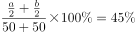···①

···②

由①、②可得，，则。

方法二：根据线段法设A溶液浓度为a，B溶液浓度为b，可得：

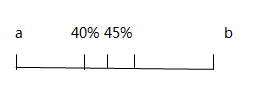

···①

···②

由①、②可得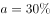，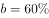，因此若从A中取、B中取溶液，可得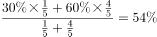。

故正确答案为C。

---

### 第 12 题　qid 2043668 · 数学运算

某单位有72名职工，为丰富业余生活，拟举办书法、乒乓球和围棋培训班，要求每个职工至少参加一个班。已知三个班报名人数分别为36、20、28，则同时报名三个班的职工数至多是：

- **A**. 6人　✅
- **B**. 12人
- **C**. 16人
- **D**. 20人

**答案**：A

**官方解析**

题中给出总数和三个班分别报名人数，根据三集合非标准公式：进行列式。“每个职工至少参加一个班”，则都不满足数为0。代入数据：，要想使报名三个班的职工数最多，则报名两个班的职工数最少为0。解得报名三个班的职工数为6人。

故正确答案为A。

---

### 第 13 题　qid 2043670 · 数学运算

小车和客车从甲地开往乙地，货车从乙地开往甲地，他们同时出发，货车与小车相遇20分钟后又遇客车。已知小车、货车和客车的速度分别为75千米/小时、60千米/小时和50千米/小时，则甲、乙两地的距离是：

- **A**. 205千米
- **B**. 203千米
- **C**. 201千米
- **D**. 198千米　✅

**答案**：D

**官方解析**

根据“他们同时出发，货车与小车相遇20分钟后又遇客车”判定本题有两个相遇过程，对于每个过程两车从两端同时出发相遇，则两车所走路程和均为总路程。设货车与小车相遇时间为，根据两次路程和相同列式：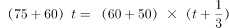，解得，则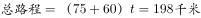。

故正确答案为D。

---

## 判断推理

### 第 1 题　qid 2043672 · 类比推理

兔：青草

- **A**. 蚕：桑叶　✅
- **B**. 狗：老鼠
- **C**. 鱼：河水
- **D**. 虫：小鸡

**答案**：A

**官方解析**

第一步：分析题干词语间逻辑关系。
青草是兔子的食物，二者为对应关系。
第二步：判断选项词语间逻辑关系。
A项：桑叶是蚕的食物，二者为对应关系，符合题干的逻辑关系，当选；
B项：老鼠不是狗的食物，不符合题干的逻辑关系，排除；
C项：河水不是鱼的食物，不符合题干的逻辑关系，排除；
D项：虫是小鸡的食物，但二者和题干位置顺序相反，不符合题干的逻辑关系，排除。
故正确答案为A。

---

### 第 2 题　qid 2042464 · 类比推理

中山陵：金陵

- **A**. 城隍庙：寺庙
- **B**. 青海湖：青海　✅
- **C**. 碧云天：青天
- **D**. 钱塘江：长江

**答案**：B

**官方解析**

第一步：分析题干词语间逻辑关系。
中山陵位于金陵，金陵是南京的古称，二者为地点的对应关系。
第二步：判断选项词语间逻辑关系。
A项：城隍庙是寺庙的一种，二者为种属关系，不符合题干的逻辑关系，排除；
B项：青海湖位于青海，二者为地点的对应关系，符合题干的逻辑关系，当选；
C项：碧云天和青天均指晴天，不符合题干的逻辑关系，排除；
D项：钱塘江和长江为并列关系，都为江水，钱塘江位于浙江，不符合题干的逻辑关系，排除。
故正确答案为B。

---

### 第 3 题　qid 2042554 · 类比推理

文物：建筑

- **A**. 烹饪：佐料
- **B**. 故宫：楼房
- **C**. 诗人：教授　✅
- **D**. 皮鞋：布鞋

**答案**：C

**官方解析**

第一步：分析题干词语间逻辑关系。
文物和建筑是交叉关系，有的文物是建筑，有的建筑是文物。
第二步：判断选项词语间逻辑关系。
A项：烹饪需要佐料，二者为对应关系，不符合题干的逻辑关系，排除；
B项：故宫里面有楼房，二者是组成关系，不符合题干的逻辑关系，排除；
C项：有的诗人是教授，有的教授是诗人，符合题干的逻辑关系，当选；
D项：皮鞋和布鞋是并列关系，不符合题干的逻辑关系，排除。
故正确答案为C。

---

### 第 4 题　qid 2043676 · 类比推理

聪明：耳聪目明

- **A**. 长安：长治久安
- **B**. 卑鄙：卑微鄙陋　✅
- **C**. 悲愤：悲痛愤怒
- **D**. 辨症：辨别症候

**答案**：B

**官方解析**

第一步：判断题干词语间逻辑关系。
耳聪目明是指听觉和视觉都很灵敏，形容头脑清醒，感觉灵敏；聪明是指智力发达，记忆和理解能力强，引申来指称一个人的智商。聪明是耳聪目明的引申义。
第二步：判断选项词语间逻辑关系。
A项：长安是地名，不是长治久安的引申义，不符合题干的逻辑关系，排除；
B项：卑微鄙陋是指地位卑微、见识鄙陋；卑鄙是指语言、品行恶劣，不道德。卑鄙是卑微鄙陋的引申义，符合题干的逻辑关系，当选；
C项：悲愤形容悲痛而又愤怒，悲愤的本义就是悲痛愤怒，不是引申义，不符合题干的逻辑关系，排除；
D项：辨症的本义是辨别症候，不是引申义，不符合题干的逻辑关系，排除。
故正确答案为B。

---

### 第 5 题　qid 2043678 · 类比推理

眼睛：鼻子：五官

- **A**. 西湖：东湖：五湖
- **B**. 五律：五绝：五言诗
- **C**. 父子：夫妇：五伦　✅
- **D**. 五音：五色：五线谱

**答案**：C

**官方解析**

第一步：分析题干词语间逻辑关系。
眼睛和鼻子是并列关系，五官是指眉、眼、耳、鼻、口，前两词和第三词构成包容关系中的组成关系。
第二步：判断选项词语间逻辑关系。
A项：西湖和东湖是并列关系，五湖指的是洞庭湖、鄱阳湖、太湖、巢湖、洪泽湖，并不包括西湖和东湖，不符合题干的逻辑关系，排除；
B项：五律是指五言律诗，五绝是指五言绝句。五律和五绝同为诗歌的范畴，二者为并列关系（律诗一般每首八句，每句五字；绝句一般每首四句，每句五字）。五言诗即每句五个字的诗体。五律和五绝同属五言诗，前两词和第三词构成包容关系中的种属关系，而不是组成关系，不符合题干的逻辑关系，排除；
C项：五伦是古代中国的五种人伦关系和言行准则。即古人所谓君臣、父子、兄弟、夫妇、朋友五种人伦关系。前两词和第三词构成包容关系中的组成关系，符合题干的逻辑关系，当选；
D项：五音是指宫、商、角、徵、羽；五色是指青、黄、赤、白、黑。五线谱是目前世界上通用的记谱法，即在5根等距离的平行横线上，标以不同时值的音符及其他记号来记载音乐的一种方法。三个词之间并无明显逻辑关系，排除。
故正确答案为C。

---

### 第 6 题　qid 2043680 · 类比推理

学生：学霸：学习

- **A**. 军人：军官：卫国　✅
- **B**. 房奴：孩奴：还贷
- **C**. 白领：金领：管理
- **D**. 女士：护士：护理

**答案**：A

**官方解析**

第一步：分析题干词语间逻辑关系。
学霸是指学习优秀的学生，学生和学霸为包容关系中的种属关系；学生的职责是学习，二者属于对应关系。
第二步：判断选项词语间逻辑关系。
A项：军官是指被授予排级以上职务或者初级以上专业技术职务，并被授予相应军衔的现役军人，军人和军官为种属关系；军人的职责是卫国，符合题干的逻辑关系，当选；
B项：房奴指房屋的奴隶；孩奴指孩子的奴隶，二者并非种属关系，不符合题干的逻辑关系，排除；
C项：白领一般是指有教育背景和工作经验的人士；金领一般是具有良好的教育背景，在某一行业有所建树的资深人士，二者为并列关系，不符合题干的逻辑关系，排除；
D项：护士并不一定是女士，也有男护士，二者为交叉关系，不符合题干的逻辑关系，排除。
故正确答案为A。

---

### 第 7 题　qid 2043682 · 类比推理

医患关系 之于 （    ） 相当于 师生关系 之于 （    ）

- **A**. 理解   原谅
- **B**. 紧张   活泼
- **C**. 信任   平等　✅
- **D**. 医闹   旷课

**答案**：C

**官方解析**

逐一代入选项。
A项：维护医患关系需要医患双方的理解，但是维护师生关系并不需要双方的原谅，前后逻辑关系不一致，排除；
B项：紧张可以用来形容医患关系，但是活泼不能用来形容师生关系，前后逻辑关系不一致，排除；
C项：维护医患关系需要信任，维护师生关系需要平等，前后逻辑关系一致，保留；
D项：医患关系紧张可能导致医闹行为，师生关系紧张可能导致旷课行为，前后逻辑关系一致，保留。
比较C、D项，这题不太严谨，根据江苏历年真题来看，考“关系与需要的基础”之间的对应更加常见，故本题择优给C项，题目出得不好，在大家的备考阶段，这道题简单了解即可，无需作为备考重点。
故正确答案为C。

---

### 第 8 题　qid 2042568 · 类比推理

丝绸之路 之于 （  ） 相当于 万里长征 之于 （  ）

- **A**. 敦煌—遵义　✅
- **B**. 骆驼—草鞋
- **C**. 沙漠—海洋
- **D**. 贸易—解放

**答案**：A

**官方解析**

A项：敦煌是丝绸之路的一个途经地点，遵义是万里长征的一个途经地点，前后逻辑关系一致，保留；
B项：骆驼是丝绸之路的工具，草鞋是万里长征的工具，前后逻辑关系一致，保留；
C项：丝绸之路沿线经过沙漠，但是万里长征没有经过海洋，前后逻辑关系不一致，排除；
D项：丝绸之路的目的是贸易，万里长征的目的是战略转移和北上抗日，而非解放，前后逻辑关系不一致，排除。
比较A、B项，A项中，敦煌是古代丝绸之路上一个重要的标志性地点，敦煌因丝绸之路而闻名，而我们党在长征途中在遵义召开的遵义会议也是我们党一个重要的转折点，遵义也因此而著名；B项中，骆驼是丝绸之路中必不可少的工具，但是草鞋并不是万里长征中必不可少的，不是每一个红军战士都穿的草鞋，草鞋也不是必不可少的工具。这一道题结合时政热点，以及就题目本身的倾向性而言，A项更加贴近出题人的意图。
故正确答案为A。

---

### 第 9 题　qid 2042716 · 逻辑判断

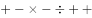

- **A**. 

- **B**. 
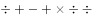
　✅
- **C**. 
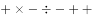

- **D**. 

**答案**：B

**官方解析**

第一步：分析题干符号间关系。
从相同符号的位置入手：位置1、6、7的符号相同；位置2、4的符号相同。并且3、5位置上的符号不同。
第二步：判断选项符号间关系。
A项：位置1、6、7的符号相同，位置2、4的符号相同，位置3、5的符号也相同，与题干不一致，排除；
B项：位置1、6、7的符号相同，位置2、4的符号相同，位置3、5的符号不相同，与题干一致，当选；
C项：位置2、4的符号不相同，与题干不一致，排除； 
D项：位置1、6、7的符号相同，位置2、4的符号相同，位置3、5的符号也相同，与题干不一致，排除。
故正确答案为B。

---

### 第 10 题　qid 2042720 · 逻辑判断

- **A**. 
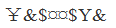

- **B**. 

- **C**. 

- **D**. 

　✅

**答案**：D

**官方解析**

第一步：分析题干符号间关系。
从相同符号的位置入手：位置1、7的符号相同；位置2、6的符号相同；位置3、4的符号相同；位置5、8的符号相同。
第二步：判断选项符号间关系。
A项：位置1、7的符号不相同，位置2、6的符号不相同，与题干不一致，排除；
B项：位置1、7的符号相同，位置2、6的符号不相同，与题干不一致，排除；
C项：位置1、7的符号不相同，与题干不一致，排除；
D项：位置1、7的符号相同；位置2、6的符号相同；位置3、4的符号相同；位置5、8的符号相同，与题干一致，当选。
故正确答案为D。

---

### 第 11 题　qid 2043616 · 图形推理

上边的题干中给出一套图形，其中有五个图，这五个图呈现一定的规律性。在下边给出一套图形，从中选出唯一的一项作为保持上边五个图规律性的第六个图。

- **A**. A
- **B**. B　✅
- **C**. C
- **D**. D

**答案**：B

**官方解析**

题干中每个图形都是一个孩童在玩耍，选项中只有B为一个孩童，其他均为多个孩童。
故正确答案为B。

---

### 第 12 题　qid 2043618 · 图形推理

上边的题干中给出一套图形，其中有五个图，这五个图呈现一定的规律性。在下边给出一套图形，从中选出唯一的一项作为保持上边五个图规律性的第六个图。

- **A**. A
- **B**. B
- **C**. C
- **D**. D　✅

**答案**：D

**官方解析**

元素组成不同，属性无明显规律，考虑数量规律。题干中每个图形都有3个面，选项A、B、C都是4个面，D是3个面。
故正确答案为D。

---

### 第 13 题　qid 2043620 · 图形推理

上边的题干中给出一套图形，其中有五个图，这五个图呈现一定的规律性。在下边给出一套图形，从中选出唯一的一项作为保持上边五个图规律性的第六个图。

- **A**. A
- **B**. B
- **C**. C　✅
- **D**. D

**答案**：C

**官方解析**

元素组成不同，但每个图形都是由两个相似的元素组成，排除B、D，题干中每个图形的两个元素都相交，排除A。
故正确答案为C。

---

### 第 14 题　qid 2043622 · 图形推理

下边的四个图形中，只有一个是由上边的四个图形拼合（只能通过上、下、左、右平移）而成的，请把它找出来。

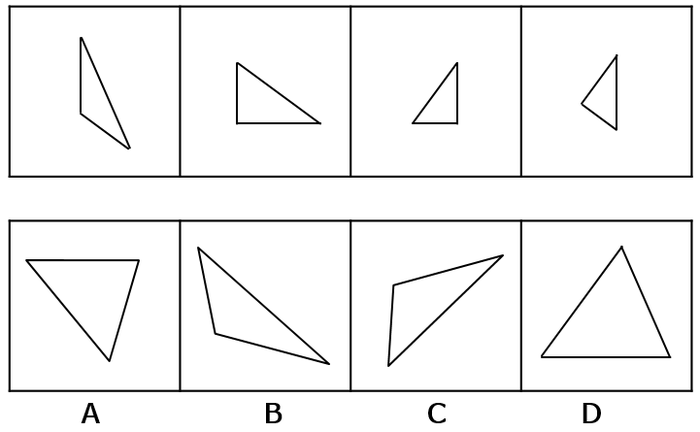

- **A**. A
- **B**. B
- **C**. C
- **D**. D　✅

**答案**：D

**官方解析**

平面拼合，找平行线做突破口，图2、图3都有直角边，且长度一致，优先拼合在一起，图1的底边加图4的底边与图2斜边平行且等长，应拼合在一起，得到D项图形，如下图所示：

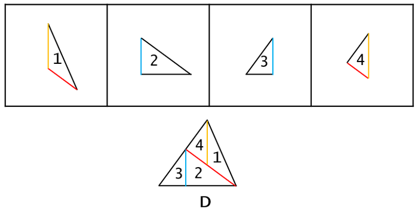

故正确答案为D。

---

### 第 15 题　qid 2043624 · 图形推理

下边的四个图形中，只有一个是由上边的四个图形拼合（只能通过上、下、左、右平移）而成的，请把它找出来。

- **A**. A
- **B**. B
- **C**. C　✅
- **D**. D

**答案**：C

**官方解析**

平面拼合，找平行线做突破口，图3底边与图2顶边平行，且长度一致，优先拼合在一起，图3、图4斜边平行，且长度一致，应拼合在一起，得到C项图形，如下图所示：

故正确答案为C。

---

### 第 16 题　qid 2043626 · 图形推理

下边的四个图形中，只有一个是由上边的四个图形拼合（只能通过上、下、左、右平移）而成的，请把它找出来。

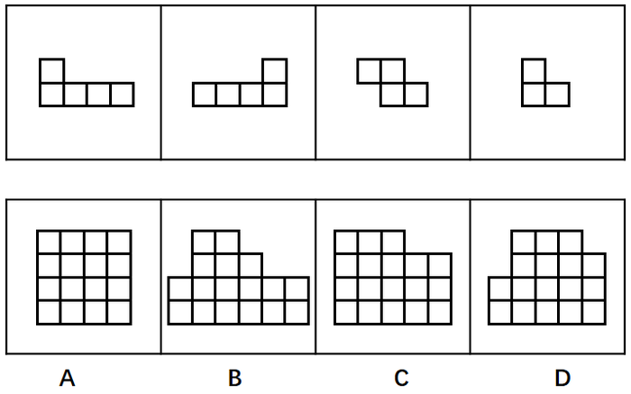

- **A**. A
- **B**. B　✅
- **C**. C
- **D**. D

**答案**：B

**官方解析**

本题为平面拼合，可以采用平行等长相消的方法（找到相对面积较大的图形作为基准图形，找到平行且等长的边进行拼合，拼合之后等长线条抵消）。

 如下图所示：

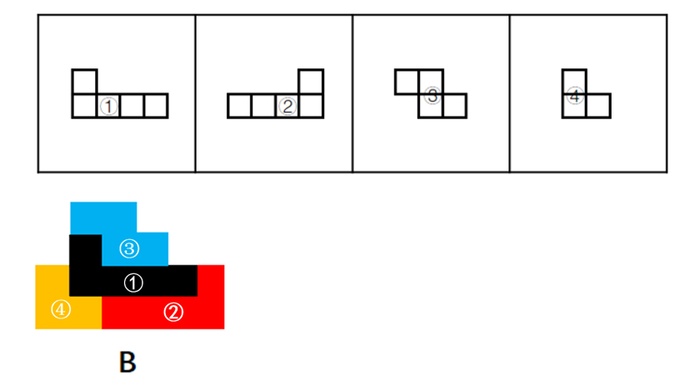

故正确答案为B。

---

### 第 17 题　qid 2043628 · 图形推理

下边的四个图形中，只有一个是由上边的四个图形拼合（只能通过上、下、左、右平移）而成的，请把它找出来。

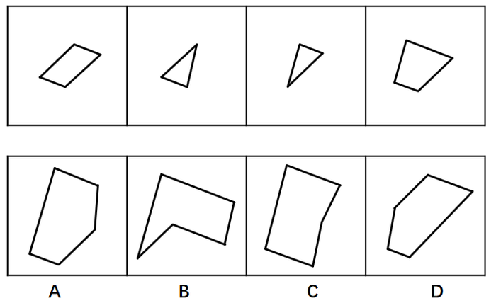

- **A**. A
- **B**. B　✅
- **C**. C
- **D**. D

**答案**：B

**官方解析**

本题为平面拼合，可以采用平行等长相消的方法（找到相对面积较大的图形作为基准图形，找到平行且等长的边进行拼合，拼合之后等长线条抵消）。

平行等长相消的方式如下图所示：

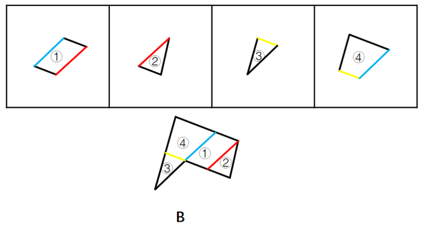

故正确答案为B。

---

### 第 18 题　qid 2043630 · 图形推理

左边给定的是纸盒外表面的展开图，右边哪一项能由它折叠而成？请把它找出来。

- **A**. A　✅
- **B**. B
- **C**. C
- **D**. D

**答案**：A

**官方解析**

本题属于四面体重构，可采用画边法排除选项。

A项：由面①和面③构成，与题干一致，当选；

B项：由面①和面④构成，如下图画边，题干边3与面③相邻，B选项边3与面①相邻，与题干不一致，排除；

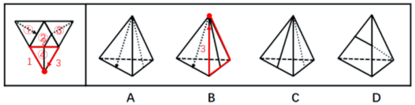

C项：由面③和面④构成，如下图画边，题干边3与面①相邻，C选项边3与面④相邻，与题干不一致，排除；

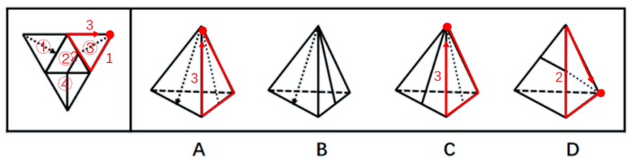

D项：由面②和面③构成，如下图画边，题干边2与面②相邻，且面②的三角形靠近边1，而D选项边2与面②相邻，且面②的三角形靠近边3，与题干不一致，排除。

故正确答案为A。

---

### 第 19 题　qid 2043632 · 图形推理

左边给定的是纸盒外表面的展开图，右边哪一项能由它折叠而成？请把它找出来。

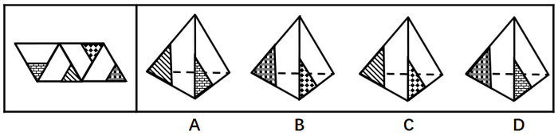

- **A**. A
- **B**. B　✅
- **C**. C
- **D**. D

**答案**：B

**官方解析**

本题属于四面体重构，可采用画边法逐一分析，排除错误选项。 

A项：由面a和面b构成，如上图所示，从面a中小黑三角形的顶点出发顺时针画边，第一条边（A项中红色箭头）挨着b面，可是展开图中从面a中小黑三角形的顶点出发顺时针画边第一条边（展开图最左侧红色箭头）挨着d面，平面图与立体图不对应，排除；

B项：由面c和面d构成，如上图所示，从面c中小黑三角形的顶点出发顺时针画边，第一条边（B项中红色箭头）挨着d面，可是展开图中从面c中小黑三角形的顶点出发顺时针画边第一条边（展开图右侧红色箭头）挨着d面，平面图与立体图对应，当选；

C项：由面c和面b构成，如上图所示，从面c中小黑三角形的顶点出发顺时针画边，第一条边（C项中红色箭头）挨着b面，可是展开图中从面c中小黑三角形的顶点出发顺时针画边第一条边（展开图右侧红色箭头）挨着d面，平面图与立体图不对应，排除；

D项：由面a和面d构成，如上图所示，从面a中小黑三角形的顶点出发顺时针画边，第一条边（A项中红色箭头）挨着d面，虽然展开图中从面a中小黑三角形的顶点出发顺时针画边第一条边（展开图最左侧红色箭头）也挨着面d，但是二者的公共边并不一致，选项D中的面a和面d的公共边为红色箭头，展开图中二者公共边为蓝色线段，二者不一致，平面图与立体图不对应，排除；

故正确答案为B。

---

### 第 20 题　qid 2043634 · 图形推理

左边给定的是纸盒外表面的展开图，右边哪一项能由它折叠而成？请把它找出来。

- **A**. A
- **B**. B　✅
- **C**. C
- **D**. D

**答案**：B

**官方解析**

本题属于六面体空间重构，在平面图中标示面，利用排除法选出正确答案。

A项：由面①、面⑤和面⑥构成，面①和面⑥为相对面，相对面必然出现且只出现其中一面，排除；

B项：由面②、面⑤和面⑥构成，三面相对位置正确，当选；

C项：由面①、面②和面③构成，平面图中①②③面为逆时针，立体图中①②③面为顺时针，平面图与立体图不对应，排除；

D项：D项无论是由面①、面②和面⑤构成或者是由面②、面⑤和面⑥构成，三面的公共点均与面①或者面⑥中的线段不存在公共点，平面图与立体图不对应，排除。

故正确答案为B。

---

### 第 21 题　qid 2043684 · 逻辑判断

茶叶是中国人喜爱的健康饮品。一般人将茶叶冲泡饮用几次之后，就将喝剩的茶叶倒掉。某专家对此指出，其实茶叶中能够溶解于水的物质是有限的，大量有营养的物质仍然保留在茶叶中，白白倒掉实在可惜，人们应该将喝剩的茶叶吃掉。
以下哪项如果为真，最能反驳该专家的观点？

- **A**. 茶叶中许多没有营养的物质也不能溶于水
- **B**. 茶叶中含有茶叶碱和微量元素，可以提神醒脑
- **C**. 一般人喝茶已成为习惯，并非为了吸收营养物质　✅
- **D**. 很多人将喝剩的茶叶留下来做茶饼，茶叶蛋等

**答案**：C

**官方解析**

该专家的话很长，最后一句“应该”引出论点：人们应该将喝剩的茶叶吃掉。
论据：茶叶中能够溶解于水的物质是有限的，大量有营养的物质仍然保留在茶叶中，白白倒掉实在可惜。
A项：茶叶中许多没有营养的物质也不能溶于水，说明剩茶中也有无营养的物质，但并不能否定营养物质的存在，不能削弱，排除。
B项：茶叶中含有茶叶碱和微量元素可以提神醒脑，说明确实有营养物质存在，但是否溶于水没有明确指出，不能削弱，排除。
C项：一般人喝茶已成为习惯，并非为了吸收营养，说明茶叶即使有营养物质也不一定要吃，拆桥削弱，当选。
D项：将喝剩的茶叶留下来做茶饼、茶叶蛋，说明有人会吃掉，但是无法表明是否应该吃。比如有人闯红灯并不意味着应该闯红灯。因此该项不明确，排除。
故正确答案为C。

---

### 第 22 题　qid 2043686 · 逻辑判断

甲、乙、丙、丁、戊5人近期均到一座大型购物美食广场打工。她们打工的商家有家用电器店、服装店、药店、馄饨店、拉面馆，每人各去一家。每人开始打工的时间各不一样，分别是去年的3月、4月、5月、6月、7月。已知：
（1）甲是厨师，她在一家小吃店顺利找到工作；
（2）乙去了服装店，但她开始打工的时间比甲晚3个月；
（3）丙与去家用电器打工的人是同乡，5人中她开始打工的时间最晚；
（4）丁比戊开始打工的时间早，她去的是药店。
根据以上信息，可以得出以下哪项？

- **A**. 3月份甲开始到馄饨店打工
- **B**. 5月份戊开始到家用电器店打工　✅
- **C**. 6月份丁开始到药店打工
- **D**. 7月份丙开始到拉面馆打工

**答案**：B

**官方解析**

分析题干：

（1）甲是厨师，在小吃店上班；

（2）乙在服装店，比甲的上班时间晚三个月；

（3）丙与去家用电器打工的人是同乡，她最晚开始打工；

（4）丁在药店，丁打工时间早于戊。

如下图，根据条件（3）可知丙在7月开始打工。根据条件（2）可知，乙比甲晚三个月，剩下3、4、5、6四个月份，那么甲在3月去小吃店上班，乙在6月去服装店上班，排除C项。根据条件（4）可知，丁去打工的时间早于戊，那么丁在4月去药店，又因为丙没有去电器城，那么戊在5月去了电器城。拉面馆和馄饨店都可以称作小吃店，所以甲和丙的上班地点无法确定，排除A、D项。

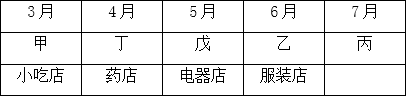

故正确答案为B。

---

### 第 23 题　qid 2042782 · 逻辑判断

将东西两位戏剧大师的生平经历、文学造诣及身后影响作对比，是一个有趣的话题，有专家认为，将汤显祖称作“东方的莎士比亚”有很大的问题，因为无论是就人格的魅力，还是就文本美感而言，汤显祖都是不逊于莎士比亚的。
以下哪项最可能是上述专家观点所包含的假设？

- **A**. 汤显祖的人格魅力及其文本的美感均高于莎士比亚
- **B**. 汤显祖在西方的影响要大于莎士比亚在东方的影响
- **C**. 汤显祖和莎士比亚都不愿意别人用他人的名字来称呼自己
- **D**. “东方的威尼斯”是逊色于真正的威尼斯的　✅

**答案**：D

**官方解析**

第一步：找到论点和论据。
论点：将汤显祖称作“东方的莎士比亚”有很大的问题。
论据：无论是就人格的魅力，还是就文本美感而言，汤显祖都是不逊于莎士比亚。
第二步：逐一分析选项。
A项：题干问的是包含的假设，即需要补充联系或者前提。而A项指出汤显祖的人格魅力及其文本的美感均高于莎士比亚，是论据的重复表述，不能解释论点与论据间的必然联系，排除；
B项：指出汤显祖在西方的影响要大于莎士比亚在东方的影响，未提到汤显祖在东方的影响力有多大，而论点提到的是“东方的莎士比亚”，无关选项，排除；
C项：指出汤显祖和莎士比亚都不愿意别人用他人的名字来称呼自己，无关选项，排除；
D项：指出“东方的威尼斯”是逊色于真正的威尼斯的，即冠名为“东方”的人或地方都会逊色于西方，推理出“东方的莎士比亚”是逊色于真正的莎士比亚的，而汤显祖并不逊色于莎士比亚，因此将汤显祖称作“东方的莎士比亚”有很大的问题。论点与论据间搭桥，当选。
故正确答案为D。

---

### 第 24 题　qid 2042344 · 逻辑判断

对于小李、小王和小苗能否考取研究生，有以下4种猜测：
（1）小李能考取；
（2）要是小王能考取，那么小苗也能考取；
（3）或是小王能考取，或者小李能考取；
（4）小王能考取。
事后证实，这4种猜测中只有一种是对的。
根据以上信息，可以得出以下哪项？

- **A**. 小李考取了
- **B**. 小苗没有考取
- **C**. 小苗考取了
- **D**. 小李没有考取　✅

**答案**：D

**官方解析**

第一步：翻译题干。
（1）小李考取；
（2）小王考取→小苗考取；
（3）小王考取或者小李考取；
（4）小王考取；
第二步：假设法
4种猜测只有一种是对的。假设条件（1）是对的，或关系中其中一项对，整个或关系就为真，因此（3）也是对的，和题干要求矛盾。该假设错误，（1）一定错。既然小李考取是一句假话，那么它的矛盾命题小李没有考取就一定是真的。
故正确答案为D。

---

### 第 25 题　qid 2042292 · 类比推理

老张：你在这儿摆摊设点属于占道经营！
小王：这儿是中山北路又不是中山北道，我占的什么道？
以下哪项与上述对话方式最为相似？

- **A**. 甲：你这种执法行为一点人情味都没有！    乙：我严格执法是为了保障人民群众的生命财产安全。
- **B**. 甲：你成天打游戏是在虚度年华！     乙：我只有在游戏中才觉得年华没有虚度。
- **C**. 甲：你工作时间不能抽烟！   乙：我抽烟时从不工作。　✅
- **D**. 甲：你这种说法是栽赃陷害！      乙：你这种说法是血口喷人！

**答案**：C

**官方解析**

第一步：分析题干对话方式。
题干对话中小王故意曲解老张的话中“占道经营”的“道”，实际上这里的“道”泛指道路，小王通过混淆概念达到自己强词夺理的目的。
第二步：逐一分析选项。
A项：甲乙二人的话不在一个领域内，“人情味”与“保障人民群众的生命财产安全”并无冲突，与题干无相似之处，排除；
B项：甲乙二人对于“打游戏是否虚度年华”理解不同，与题干并无相似之处，排除；
C项：乙故意将甲话中的“工作时间不能抽烟”曲解成为“抽烟的时候不能工作”，混淆概念达到其强词夺理的目的，与题干最为相似，当选；
D项：乙仅仅是在指责对方，指出对方是在冤枉自己，与题干并无相似之处，排除。
故正确答案为C。

---

### 第 26 题　qid 2043688 · 逻辑判断

某专家对已故诺贝尔经济学奖得主的寿命进行统计，发现他们的平均寿命是85岁，其中超过90岁的占多数，还有不少过百岁的，去世时年龄最小的也高达74岁。该专家由此认为，获得诺贝尔经济学奖能使人长寿。
以下哪项如果为真，最能削弱上述专家的观点？

- **A**. 诺贝尔经济学奖只颁给在世的学者，这一颁奖规则对已经长寿的学者极为有利　✅
- **B**. 获得诺贝尔奖能带来功成名就的巨大身心愉悦，而愉悦的身心状态可延年益寿
- **C**. 宏观经济学之父凯恩斯年仅63岁就去世了，很遗憾他没有获得诺贝尔经济学奖
- **D**. 获得诺贝尔物理学奖的学者寿命也很长，但他们都没有获得过诺贝尔经济学奖

**答案**：A

**官方解析**

第一步：找到论点论据。
论点：获得诺贝尔经济学奖能使人长寿。
论据：对已故诺贝尔经济学奖得主的寿命进行统计，发现他们的平均寿命是85岁，其中超过90岁的占多数，还有不少过百岁的，去世时年龄最小的也高达74岁。
第二步：逐一分析选项。
A项：指出并非获得诺贝尔经济学奖使人长寿，而是已经长寿的学者才极有可能获得该奖项，属于因果倒置削弱，当选；
B项：指出获得诺贝尔奖确实能够让人长寿，加强了论点，排除；
C项：与诺贝尔经济学奖能否使人长寿无关，排除；
D项：与诺贝尔经济学奖能否使人长寿无关，排除。
故正确答案为A。

---

### 第 27 题　qid 2043690 · 逻辑判断

某单位的孔、陈、孟、刘4人需要分配到甲、乙、丙、丁4个村庄开展扶贫工作，每人各去一个村庄。根据工作需要，分配满足如下条件：
（1）若孔去甲村庄，则刘去丁村庄；
（2）要么陈去乙村庄，要么孟去丙村庄，两者仅有一项成立；
（3）孟去丁村庄。
如果上述条件均得到满足，则可以得出以下哪项？

- **A**. 孔去丙村庄，刘去甲村庄　✅
- **B**. 孔去甲村庄，刘去丙村庄
- **C**. 孔去丙村庄，刘去乙村庄
- **D**. 孔去乙村庄，刘去丙村庄

**答案**：A

**官方解析**

首先翻译题干已知信息：

孔、陈、孟、刘4人分别去甲、乙、丙、丁4个村庄。

（1）孔去甲村刘去丁村；

（2）要么陈去乙村，要么孟去丙村；

（3）孟去丁村。

根据条件（3）可知孟没有去丙村，结合条件（2）可知，陈去乙村，此时可以排除C项、D项；由条件（3）的孟去丁村可知刘没有去丁村，结合条件（1），（刘去丁村）（孔去甲村），即孔不去甲村，排除B项。此4人的情况是：刘去甲村，陈去乙村，孔去丙村，孟去丁村。

故正确答案为A。

---

### 第 28 题　qid 2043714 · 逻辑判断

暑假到了，父亲、母亲、儿子、女儿一行4人驾车去旅行。小汽车前排坐两人（一人当司机），后排也坐两人。4人各有不同爱好：音乐、体育、摄影、书法，所学专业也各不相同数学、历史、逻辑、物理。已知：
（1）儿子学物理；
（2）母亲酷爱音乐；
（3）学逻辑的摄影爱好者与女儿分两排斜向而坐。
如果儿子坐在司机斜后方，则可以得出以下哪项？

- **A**. 父亲是司机
- **B**. 母亲是司机　✅
- **C**. 儿子是司机
- **D**. 女儿是司机

**答案**：B

**官方解析**

本题为组合排列题。根据题意：
儿子专业物理；母亲爱好音乐；逻辑专业爱好摄影者不是儿子、母亲、女儿，只能是父亲；所以题干信息整理如下：
（1）儿子专业是物理；
（2）母亲爱好是音乐；
（3）父亲专业是逻辑，爱好是摄影；
（4）父亲与女儿分两排斜向而坐；
如果儿子与司机斜向而坐，由上述条件（4）可知，司机只能是母亲。
故正确答案为B。

---

### 第 29 题　qid 2043692 · 类比推理

暑假到了，父亲、母亲、儿子、女儿一行4人驾车去旅行。小汽车前排坐两人（一人当司机），后排也坐两人。4人各有不同爱好：音乐、体育、摄影、书法，所学专业也各不相同数学、历史、逻辑、物理。已知：
（1）儿子学物理；
（2）母亲酷爱音乐；
（3）学逻辑的摄影爱好者与女儿分两排斜向而坐。
如果爱好摄影的人坐在前排，则以下除了哪项其他均是可能的？

- **A**. 父亲是司机
- **B**. 母亲是司机
- **C**. 儿子是司机
- **D**. 女儿是司机　✅

**答案**：D

**官方解析**

本题为组合排列题。根据题意：
儿子专业物理；母亲爱好音乐；逻辑专业爱好摄影者不是儿子、母亲、女儿，只能是父亲；所以题干信息整理如下：
（1）儿子专业是物理；
（2）母亲爱好是音乐；
（3）父亲专业是逻辑，爱好是摄影；
（4）父亲与女儿分两排斜向而坐；
爱好摄影的是父亲，父亲坐前排，根据上述条件（4）可知女儿坐后排，所以女儿一定不可能是司机。本题要求选择哪项是不可能的，而D项是一定不可能的。
故正确答案为D。

---

### 第 30 题　qid 2043716 · 逻辑判断

暑假到了，父亲、母亲、儿子、女儿一行4人驾车去旅行。小汽车前排坐两人（一人当司机），后排也坐两人。4人各有不同爱好：音乐、体育、摄影、书法，所学专业也各不相同：数学、历史、逻辑、物理。已知：
（1）儿子学物理；
（2）母亲酷爱音乐；
（3）学逻辑的摄影爱好者与女儿分两排斜向而坐。
如果学历史的人不爱好音乐，则可以得出以下哪项？

- **A**. 父亲学历史，爱好摄影
- **B**. 母亲学数学，爱好音乐　✅
- **C**. 儿子学物理，爱好体育
- **D**. 女儿学历史，爱好书法

**答案**：B

**官方解析**

第一步：整理题干条件。
（1）儿子学物理；
（2）母亲爱好音乐；
（3）学逻辑的摄影爱好者与女儿分两排斜向而坐；
（4）学历史的人不爱好音乐。
第二步：根据题干信息进行分析。
结合条件（1）（2）（3）可知，逻辑专业的摄影爱好者不是母亲、儿子、女儿，所以父亲是学逻辑的摄影爱好者。结合条件（2）（4）可知母亲不是学历史的，再结合条件（1）可知母亲不是学物理的，所以母亲是学数学的，女儿是学历史的。儿子与女儿的爱好无法得出。
故正确答案为B。

---

### 第 31 题　qid 2042372 · 定义判断

斜杠青年：指不满足于从事单一职业，追求拥有多重职业身份及多元生活方式的年轻人。他们在自我介绍时往往喜欢用斜杠来区分自己的不同身份，如：张三，金牌律师/企划师/专栏作家。
下列属于斜杠青年的是：

- **A**. 最近两三年，八零后导演黄某某先后出演了10多次男配角，去年在一个著名的国际电影节上斩获了最佳男配角奖　✅
- **B**. 小丁在国外获得博士学位后，任职于国内一所著名高校，因科研成就突出，被破格聘为教授，并入选省“双百”人才计划
- **C**. 某公司程序员小陈爱好广泛，性格温和，人际关系融洽，节假日常邀上三五个好友一起登山、打球、游泳
- **D**. 李总做过保安，送过快递，当过安装工，开过小杂货店，他经常自豪地向员工讲述自己30多年来丰富的职业经历

**答案**：A

**官方解析**

第一步：找到定义关键词。
“年轻人”、“不满足于从事单一职业”、“追求拥有多重职业身份及多元生活方式”。
第二步：逐一分析选项。
A项：80后导演黄某某先后出演了10多次男配角，最终获得了最佳男配角奖，体现了黄某某在同一时间所扮演的导演和演员两种不同的身份和职业，符合定义，当选；
B项：小丁在国外获得博士学位后任职于高校，后因科研成就突出被聘为教授，自始至终小丁的职业只有教师这一项，没有体现多重职业身份和多元生活方式，不符合定义，排除；
C项：小陈爱好广泛经常约朋友一起登山、打球、游泳，只是体现了不同的兴趣爱好，和职业无关，也未体现多重身份，不符合定义，排除；
D项：李总做过保安、送过快递、当过安装工、开过小杂货店，虽然这些体现了李总不满足于从事一种职业，追求多种职业身份及多元生活方式，但是这些身份和经验都是过往的经验，并不是在当下工作之外所具有的其他身份。根据相关资料可推测，“斜杠青年”所指的多重身份更偏向于某人在同一时间所具备的不同身份，D项不符合定义，排除。
故正确答案为A。

---

### 第 32 题　qid 2042376 · 定义判断

影子工作：指消费者使已购商品变为可用物品所付出的任何劳动。
下列属于影子工作的是：

- **A**. 小孙到饭店就餐，老板告诉他，这几天大部分服务员都已经放假，顾客需要点餐，并递给他一支笔和一张菜单
- **B**. 小李的儿子快出生了，他赶紧抽时间将同事老王给的婴儿车拿出来修理一番，车子焕然一新，十分好用
- **C**. 经不住软磨硬泡，爸爸终于答应给小明买两条金鱼，小明高兴坏了，连夜在网上收集了十几页的金鱼养殖攻略
- **D**. 将拼板餐桌从商场运回家后，老冯忙乎了半天，对照安装说明，拆了装，装了拆，终于组装成功，中午就派上了用场　✅

**答案**：D

**官方解析**

第一步：找到定义关键词。
“消费者使已购商品变为可用物品所付出的任何劳动”。
第二步：逐一分析选项。
A项：小孙到饭店就餐，服务员休假只能自己点单，点单说明还没有消费，不存在已购商品，更没有体现出使已购商品变为可用物品的过程，同时点餐和变为可用物品之间没有联系，不符合定义，排除；
B项：小李将同事老王送的婴儿车拿出来修理一番，车子焕然一新，十分好用，送的婴儿车本就是一种可用物品，没有体现出使已购商品变为可用物品的过程，同时，婴儿车的购买者是老王而不是小李，不符合定义，排除；
C项：爸爸答应给小明买两条金鱼，小明搜集了十几页的养殖攻略，答应买金鱼但是还没买，没有体现出已购商品这个概念，同时金鱼也不是一种可用物品，不符合定义，排除；
D项：老冯将拼板餐桌从商场运回家，对照安装说明组装成功，中午派上用场，首先拼板餐桌是已购商品，老冯经过劳动使其变为可用物品，符合定义，当选。
故正确答案为D。

---

### 第 33 题　qid 2043694 · 定义判断

价值自认：指人们常常高估自己行为的价值，并从中获得快乐和美感。
下列属于价值自认的是：

- **A**. 小张毕业后刚到工作单位，幸运地分到了一套单身公寓。他花了半个月把房间布置得像新房一样，每天一走进去，心里就乐开了花
- **B**. 小星在校园机器人竞赛中获得一等奖后，他的父亲老吴整天乐呵呵的，逢人就夸儿子多么多么优秀
- **C**. 谢先生的成名曲一夜走红后，很快就跨入影视圈出演了多部电视剧，虽然观众反响平平，他却一直对自己的演技充满自信　✅
- **D**. 老赵的作品获得了省书法协会二等奖，同事们纷纷前来向他表示祝贺，他暗下决心：明年一定争取拿到更高的奖项

**答案**：C

**官方解析**

第一步：找到定义关键词。
“高估自己行为的价值”、“获得快乐和美感”。
第二步：逐一分析选项。
A项：小张布置自己分到的单身公寓，没有体现高估自己行为的价值，不符合定义，排除；
B项：小星的父亲是在评估儿子小星的行为，不是评估自己的行为，也没有体现高估的情况，不符合定义，排除；
C项：谢先生跨界出演电视剧，观众反响平平，说明其演技未必很好，而他仍对自己的演技充满信心，体现了高估自己行为的价值的情形，与A、B、D项比较，C项最符合定义，当选；
D项：老赵获奖后并没有高估自己获奖这件事，而是暗下决心继续努力，不符合定义，排除。
故正确答案为C。

---

### 第 34 题　qid 2042302 · 定义判断

随机试验：指在同一条件下会出现多种可能结果且可以重复进行的试验；试验的所有可能结果虽预先可知，但每次具体实验的结果却无法预知。
下列属于随机试验的是：

- **A**. 将一壶淡水加热到沸腾，观察其状态变化的实验
- **B**. 在狮子身上安装定位设备了解其生活习性的实验
- **C**. 为检测某辆新款汽车的安全性能所做的撞击实验
- **D**. 抛一枚硬币观察带有数字的一面朝上次数的实验　✅

**答案**：D

**官方解析**

第一步：找到定义关键词。

“在同一条件下会出现多种可能结果且可以重复进行的试验”、“试验的所有可能结果虽预先可知，但每次具体实验的结果却无法预知”。

第二步：逐一分析选项。

A项：将一壶淡水加热到沸腾，观察状态变化的实验，这种实验可重复进行，但是在同一条件下不可能出现多种结果，出现的结果只有一种，就是水加热至沸腾后，由液态变成气态，每次实验的具体结果是可以预知的，不符合定义，排除；

B项：在狮子上安装定位设备了解其生活习性的实验，同一头狮子是可以重复实验，但是狮子的情况和习性都不相同，实验的所有的结果并不都是可预知的，不符合定义，排除；

C项：为检测某辆新款汽车的安全性能所做的撞击实验，同一辆汽车的撞击实验是不可以重复进行的实验，而实验的结果是可以预知的，同时实验的结果并不具备多种可能性，排除；

D项：抛一枚硬币观察带有数字的一面朝上次数的实验，实验可以重复进行，且每次实验的结果具有两种可能性，一是带有数字的一面朝上，二是带有数字的一面朝下，其实验的所有结果是可以具体得知的，那就是带有数字的一面朝上的概率是，但是每次实验的结果带有数字的一面到底是朝上还是朝下却不可预知，符合定义，当选。

故正确答案为D。

---

### 第 35 题　qid 2042310 · 定义判断

临时救助：指家庭或个人遭遇突发事件、意外伤害、重大疾病等变故，基本生活陷入困境时，政府有关部门提供的应急性、过渡性救助。
下列属于临时救助的是：

- **A**. 80岁的李大爷无儿无女，独自生活，社区工作人员定期到他家中探望，把每月的养老金交到他手上，还时不时地送来一些生活用品
- **B**. 老张患上了强直性脊柱炎，巨额医疗费花光了积蓄，夫妻名下的房子也变卖了，一家三口只得暂住在街道办为他们租来的小房子里　✅
- **C**. 地震发生后，社会各界积极响应市政府号召，通过多种渠道捐款捐物，很快就筹集了大批物资并分发到了灾民手中
- **D**. 老赵在几年前的一次车祸中失去了左腿，从那以后再也不能外出工作，每月数百元的低保金就成了家里主要的经济来源

**答案**：B

**官方解析**

第一步：找到定义关键词。
原因：“家庭或个人遭遇突发事件、意外伤害、重大疾病等变故”、“基本生活陷入困境”。
结果：“政府有关部门提供的应急性、过渡性救助”。
第二步：逐一分析选项。
A项：80岁的李大爷无儿无女，独自生活，社区工作人员定期探望，给予养老金，没有体现出李大爷遭遇了突发事件、意外伤害或者重大疾病等变故，不符合定义，排除；
B项：老张患上了强直性脊柱炎，体现了家庭或者个人遭遇重大疾病的变故，花光了积蓄、变卖房子体现了生活陷入困境，一家人只得暂住在街道办为他们租来的小房子里，体现了政府有关部门提供的应急性、过渡性救助，符合定义，当选；
C项：地震发生后，社会各界响应号召为灾民捐送物资，并不是政府有关部门提供的应急性、过渡性救助，不符合定义，排除；
D项：老赵因车祸失去左腿，体现了遭遇意外伤害等变故，但每月的低保金成为主要经济来源并不是应急性、过渡性的救助，低保金是一种长期的救助，不符合定义，排除。
故正确答案为B。

---

### 第 36 题　qid 2042312 · 定义判断

渐进式退休：指员工到了法定退休年龄，用人单位根据实际工作需要对部分人员灵活确定退休时间。
下列属于渐进式退休的是：

- **A**. 马教授临近退休年龄，因为他是国内最具影响力的学者之一，对学科发展作出了重大贡献，学校决定聘任他为终身教授
- **B**. 赵先生已经到了退休年龄，但是他主持的重大攻关项目还没有结题，他所在的研究所决定聘用他继续工作，直到项目完成　✅
- **C**. 近年来，李工程师的身体状况越来越糟糕，还患上了轻度的抑郁症，无法坚持工作，公司领导经过研究，决定让他提前退休
- **D**. 某研究机构决定，从下半年开始，本单位申请提前退休的职工，初、中级职称不低于54岁，高级职称不低于58岁

**答案**：B

**官方解析**

第一步：找到定义关键词。
“员工到了法定退休年龄”、“用人单位根据实际工作需要对部分人员灵活确定退休时间”。
第二步：逐一分析选项。
A项：马教授临近退休说明还没有到法定退休年龄，不符合定义，排除；
B项：赵先生到了退休年龄，因为他主持的项目没有结题，研究所决定聘用他继续工作，体现了“用人单位根据实际工作需要对部分人员灵活确定退休时间”，符合定义，当选；
C项：李工程师提前退休说明还没有到法定退休年龄，不符合定义，排除；
D项：某机构职工申请提前退休说明还没有到法定退休年龄，不符合定义，排除。
故正确答案为B。

---

### 第 37 题　qid 2042326 · 定义判断

创伤后成长：指一个人在经历重大的生活挫折之后发生的积极性改变。
下列属于创伤后成长的是：

- **A**. 一名车祸幸存者说，事故之后她能更主动地掌控自己的生活　✅
- **B**. 在多次丢失手机以后，小张照看自己的随身物品比以前细心多了
- **C**. 在同事突然撒手人寰后，小刘深感生命脆弱，开始坚持健身锻炼
- **D**. 赴震区考察归来后，王工程师对建筑物防震设计有了更深刻的认识

**答案**：A

**官方解析**

第一步：找到定义关键词。
“经历重大的生活挫折”、“发生的积极性改变”。
第二步：逐一分析选项。
A项：车祸幸存者说明经历了车祸的重大生活挫折，她更主动地掌控自己的生活属于积极性改变，符合定义，当选；
B项：多次丢失手机与A项的车祸比较不属于经历重大的生活挫折，不符合定义，排除；
C项：同事的去世是否算“经历重大的生活挫折”，与同事关系的亲疏远近相关，选项此处并未提及和同事的关系，因此不够明确，不如A项车祸幸存者更能体现“经历重大的生活挫折”，同事的去世不是小刘的生活挫折，不符合定义，排除；
D项：王工程师赴灾区考察不是经历生活挫折，不符合定义，排除。
故正确答案为A。

---

### 第 38 题　qid 2043698 · 定义判断

地块经济：指大量的同质化制造加工小企业集中在一个相对小的区域内，形成比较完整的产业链的区域经济发展模式。
下列不属于地块经济的是：

- **A**. 
义乌小商品闻名遐迩，是国内规模最大的小商品生产和批发基地之一。在那里，各种各样的小商品可以说应有尽有

- **B**. 
桂林一年四季都挤满了来自全国各地的游客，当地的饭店宾馆、旅游品商店、出租车公司一个个都赚得盆满钵满
　✅
- **C**. 
嵊州堪称“中国领带之乡”，每年生产领带3亿条，出口1.6亿条，在国内、国际市场分别占了、以上的份额

- **D**. 
亳州素有“药都”的美誉，每天都有无数商家从四面八方来到这里，运送药材的车队常常是一眼望不到头

**答案**：B

**官方解析**

第一步：找到定义关键词。
“大量同质化制造加工小企业集中”。
第二步：逐一分析选项。
A项：义乌是国内规模最大的小商品生产和批发基地之一，属于“大量同质化制造加工小企业集中”，符合定义，排除；
B项：当地的饭店宾馆、旅游品商店、出租车公司不符合“大量同质化制造加工小企业集中”，不符合定义主体，当选；
C项：嵊州“中国领带之乡”，属于“大量同质化制造加工小企业集中”，符合定义，排除；
D项：亳州是“药都”，属于“大量同质化制造加工小企业集中”，符合定义，排除。
本题为选非题，故正确答案为B。

---

### 第 39 题　qid 2042356 · 定义判断

新乡贤：指长期扎根农村，利用自己的知识、技术、财富为村民热心服务并作出突出贡献，在当地社会生活及民众心目中具有较高威望和影响力的乡村人士。
下列属于新乡贤的是：

- **A**. 10多年来，老李虽然一直在外经商，但他时时惦念着家乡，每年都会捐出大量资金为家乡修桥铺路，资助家乡的特困大学生完成学业，乡亲们经常千里迢迢地跑来看望他
- **B**. 小张复员后回到家乡，两三年就成了远近闻名的“养殖大王”，为了带动乡亲们共同致富，他开办了多期培训班，免费传授实用养殖技术和经验，受到了大家的称赞
- **C**. 20多年来，某市商会会长孙先生利用自己长期积累的丰富经验，为经营各种农副产品的家乡村民牵线搭桥，指导他们寻找商机，被乡亲们誉为贴心的“诸葛亮”
- **D**. 某乡村小学校长程某退休后，利用自己学生多、关系广的优势，为挖掘家乡历史文化资源、发展乡村文化旅游业积极谋划、东奔西走，被乡亲们传为佳话　✅

**答案**：D

**官方解析**

第一步：找到定义关键词。
“长期扎根农村”、“利用自己的知识、技术、财富为村民热心服务并作出突出贡献”、“具有较高威望和影响力的乡村人士”。
第二步：逐一分析选项。
A项：老李一直在外经商，并没有长期扎根农村，不符合定义，排除；
B项：小张免费传授实用养殖技术和经验属于利用自己的知识为村民热心服务，但他回乡时间只有两三年，不是长期扎根农村，不符合定义，排除； 
C项：孙先生为某市商会会长说明他没有长期扎根农村，不属于乡村人士，不符合定义，排除； 
D项：程某之前在乡村小学当校长为村民服务，退休后挖掘家乡历史文化资源为村民服务，属于长期扎根农村，具有一定的威望和影响力，符合定义，当选。
故正确答案为D。

---

### 第 40 题　qid 2043700 · 定义判断

咕咚效应：由于谣言传播而导致的集体无意识恐慌蔓延的现象，源自童话《咕咚来了》，讲述木瓜落进湖中后响起的“咕咚”声在动物中以讹传讹引发恐慌的故事。
下列属于咕咚效应的是：

- **A**. 某市去年房价暴涨，老李看到自己辛苦上班多年还不如别人买一套房一转手赚得多，担心房价继续飙涨，对自己的资产贬值感到恐慌，认为买房可以增值保值，于是忍不住加入到抢房的行列
- **B**. 英国脱欧公投结果出来后，由于担心一旦脱欧后在英国的金融机构会无法再获得欧盟的“单一护照”在伦敦设立欧洲总部的银行纷纷计划撤离，不少外资银行开始准备迁往巴黎、法兰克福、柏林等地
- **C**. 某网络大V杜撰“来自自来水的避孕药”博文，声称由于药物滥用，自来水中的避孕药含量过高，且无法通过常规的净化装置过滤，弄得人心惶惶，许多家庭担心饮水安全，纷纷抢购瓶装水　✅
- **D**. 网上疯传一则“硅油可致脱发并易致癌”的文章，披露市面上的洗发水九成含有硅油。微商小郑借机在朋友圈推销自制的天然皂角手工皂和茶籽洗发水，受到了推崇健康生活、回归自然者的追捧

**答案**：C

**官方解析**

第一步：找到定义关键词。
“谣言”、“集体无意识”、“恐慌蔓延”。
第二步：逐一分析选项。
A项：某市去年房价暴涨不属于“谣言”，老李忍不住加入到抢房的行列不符合“集体无意识”，选项主体为老李一人未体现集体，同时忍不住加入到抢房行列为下意识而为，不符合定义关键词，排除；
B项：英国脱欧公投结果出来不属于“谣言”，不符合定义关键词，排除；
C项：杜撰“来自自来水的避孕药”博文属于“谣言”，许多家庭担心饮水安全，纷纷抢购瓶装水体现了“集体无意识的恐慌蔓延”，符合定义关键词，当选；
D项：受到了推崇健康生活、回归自然者的追捧没有体现出“恐慌蔓延”，不符合定义关键词，排除。
故正确答案为C。

---

## 资料分析

### 材料 1

        在以2015年11月1日零时为标准时点进行的全国人口抽样调查中。江苏最终样本量占全省常住人口总数的。调查显示：2015年11月1日零时江苏常住人口为7973万人。同以2010年11月1日零时为标准时点进行的第六次全国人口普查相比，增加107万人，增长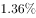。

        全省常住人口中，0~14岁人口为1064万人，占；15~64岁人口为5910万人，占；65岁及以上人口为999万人，占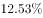。同第六次全国人口普查相比，0~14岁人口的比重上升0.34个百分点，15~64岁人口的比重下降1.97个百分点，65岁及以上人口的比重上升1.64个百分点。

        全省常住人口中，大专及以上文化程度人口为1230万人，高中（含中专）文化程度人口为1356万人；初中文化程度人口为2741万人；小学文化程度人口为1744万人。

#### 第 1 题　qid 2042086 · 综合

以2015年11月1日零时为标准时点进行的人口抽样调查中，江苏最终样本量为：

- **A**. 75万人　✅
- **B**. 79万人
- **C**. 82万人
- **D**. 86万人

**答案**：A

**官方解析**

根据“2015年11月1日······人口抽样调查······样本量为”，可判定本题为现期比重问题。定位材料第一段，江苏最终样本量占全省常住人口总数的且2015年11月1日零时江苏常住人口为7973万人，则此时进行的人口抽样调查中，江苏最终样本量为：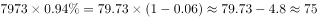万人。

故正确答案为A。

---

#### 第 2 题　qid 2042090 · 比重

2010年第六次全国人口普查时，江苏0~14岁人口比重比65岁及以上人口：

- **A**. 少0.48个百分点
- **B**. 少2.12个百分点
- **C**. 多0.48个百分点
- **D**. 多2.12个百分点　✅

**答案**：D

**官方解析**

定位材料第二段，2015年11月1日的全国人口抽样调查中，0-14岁人口所占比重为，65岁及以上人口所占比重为，同第六次全国人口普查比，前者比重上升0.34个百分点，后者比重上升1.64个百分点，则第六次全国人口普查时，比重差为：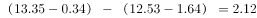个百分点。

故正确答案为D。

---

#### 第 3 题　qid 2042092 · 增长

两次调查的5年间，江苏常住人口中65岁及以上人口增加：

- **A**. 142万人　✅
- **B**. 107万人
- **C**. 116万人
- **D**. 99万人

**答案**：A

**官方解析**

根据题干求增长，结合选项给出单位万人，判定此题为增长量计算问题。定位文字材料第一段，2015年11月1日零时江苏常住人口为7973万人，比第六次全国人口普查增加107万人；定位文字材料第二段，2015年11月1日的调查中，65岁及以上人口人数为999万人，所占比重为，同第六次全国人口普查比，比重上升1.64个百分点，则两次调查5年间，65岁及以上人口增加：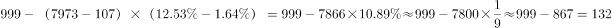万人，A项最接近。

故正确答案为A。

---

#### 第 4 题　qid 2042098 · 综合

2015年11月1日零时江苏常住人口中，高中（含中专）及以上文化程度人口占：

- **A**. 

- **B**. 

- **C**. 
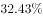
　✅
- **D**. 

- **E**. 

**答案**：C

**官方解析**

根据“2015年11月1日······高中（含中专）及以上文化程度人口占”可知，判定此题为现期比重问题。定位文字材料第一段和第三段，2015年11月1日零时江苏常住人口为7973万人，高中（含中专）及以上文化程度人口包含两部分，高中（含中专）文化程度人口为1356万人，大专及以上文化程度人口为1230万人，则高中（含中专）及以上文化程度人口占：，C项最接近。

故正确答案为C。

---

#### 第 5 题　qid 2042106 · 综合

下列说法不正确的是：

- **A**. 
两次调查的5年间，江苏常住人口年平均增加21万人

- **B**. 
两次调查的5年间，江苏常住人口中15~64岁人口下降了
　✅
- **C**. 
两次调查的5年间，江苏常住人口中65岁及以上人口的增长率高于其他年龄段

- **D**. 
2015年11月1日零时江苏常住人口中，小学文化程度以下（不含小学）人口为902万人

**答案**：B

**官方解析**

A项：定位材料第一段，两次调查的5年间，江苏常住人口增加107万人，平均增加：万人，正确；

B项：定位材料第一、二段，2015年11月1日零时江苏常住人口为7973万人，同第六次全国人口普查比增加107万人，其中15~64岁人口有5910万人，占比为，同第六次全国人口普查比重下降1.97百分点。故2010年11月1日零时江苏常住人口中15~64岁人口为：万人，下降率为：，错误；

C项：定位材料第二段，2015年11月1日零时0～14岁人口占，同第六次全国人口普查相比，比重上升0.34个百分点；15～64岁人口占，比重下降1.97个百分点；65岁及以上人口占，比重上升1.64个百分点。根据两期比重比较结论：岁和65岁及以上人口的比重上升，则增长率大于常住人口增长率；岁人口的比重下降，则增长率小于常住人口增长率，故65岁及以上人口的增长率高于15～64岁人口的增长率。

定位材料第一段，江苏常住人口增长率为，代入两期比重差公式：

岁人口：，解得；

65岁及以上人口：，解得，故65岁及以上人口的增长率最大，高于其他年龄段,正确；

D项：定位材料第一段和第三段，2015年11月1日零时江苏常住人口为7973万人，全省常住人口中，大专及以上文化程度人口为1230万人，高中（含中专）文化程度人口为1356万人；初中文化程度人口为2741万人；小学文化程度人口为1744万人。则小学文化程度以下（不含小学）人口为：万人，正确。

本题为选非题，故正确答案为B。

---

### 材料 2

注：①费用均值按当年价格计算；②次均门诊费用指门诊病人次均医药费用，人均住院费用指出院病人住院期间人均医药费用，日均住院费用指出院病人住院期间日均医药费用。

#### 第 6 题　qid 2043702 · 综合

2014年全国医院次均门诊费用按当年价格计算比2013年多：

- **A**. 13.6元　✅
- **B**. 14.5元
- **C**. 16.6元
- **D**. 18.1元

**答案**：A

**官方解析**

由题干“2014年······比2013年多”结合选项给出单位，可知本题为增长量计算问题。定位表格，2014年次均门诊费用为220.0元，按当年价格上涨，故增长量为：，A项最接近。

故正确答案为A。

---

#### 第 7 题　qid 2043704 · 平均数

2015年全国公立三级医院人均住院费用比公立二级医院多：

- **A**. 1.1倍
- **B**. 1.4倍　✅
- **C**. 1.7倍
- **D**. 2.0倍

**答案**：B

**官方解析**

由题干“2015年······比······多”结合选项给出倍数，可知本题为现期倍数问题。定位表格，2015年全国公立三级医院和公立二级医院人均住院费分别为12599.3、5358.2元，故2015年全国公立三级医院人均住院费用比公立二级医院多：倍，与B项最接近。

故正确答案为B。

---

#### 第 8 题　qid 2043706 · 增长

2014-2015年全国医院次均门诊费用，“按当年价格上涨”不同于“按可比价格上涨”的幅度，主要影响因素是：

- **A**. 就诊人数
- **B**. 统计误差
- **C**. 计算方法
- **D**. 通货膨胀　✅

**答案**：D

**官方解析**

可比价格为消除价格影响因素之后的计费方式，选项中只有D项与价格变动有关。
故正确答案为D。

---

#### 第 9 题　qid 2043708 · 平均数

2015年全国公立二级医院出院病人人均住院天数是：

- **A**. 7天
- **B**. 9天　✅
- **C**. 11天
- **D**. 13天

**答案**：B

**官方解析**

由题干“2015年······人均住院天数”，可知本题为现期平均数问题。定位表格，2015年公立二级医院人均住院费用为5358.2元，2015年公立二级医院日均住院费用为605.4元，故2015年全国公立二级医院出院病人人均住院天数为：，B项符合。

故正确答案为B。

---

#### 第 10 题　qid 2043710 · 综合

下列判断正确的是：

- **A**. 
2015年全国公立二级医院日均住院费用不足公立三级医院的一半

- **B**. 
2014-2015年全国医院次均门诊费用、人均住院费用和日均住院费用按可比价格计算年增幅均未超过

- **C**. 
2015年全国公立医院、公立三级医院、公立二级医院日均住院费用按当年价格计算增幅均低于2014年
　✅
- **D**. 
无论按当年价格还是可比价格计算，2015年全国公立三级医院次均门诊费用、人均住院费用和日均住院费用增幅均高于2014年

**答案**：C

**官方解析**

A项：2015年全国公立二级医院日均住院费和公立三级医院日均住院费分别为605.4、1024.6元，二者之比为：，超过一半，错误；

B项：观察数据表中数据，2014年全国医院日均住院费用按可比价格计算增幅为，超过，错误；

C项：观察数据表中数据，2015年全国公立医院、公立三级医院、公立二级医院日均住院费用按当年价格计算增幅都低于2014年，正确；

D项：观察数据表中数据，按当年价格计算2015年全国公立三级医院日均住院费用增幅为，低于2014年的，错误。

故正确答案为C。

---

### 材料 3

        2005年我国GDP为187318.9亿元人民币，主要能源生产总量为228.9百万吨标准煤，主要能源为原煤、原油、天然气和水风核电，分别生产177.2百万吨标准煤、25.9百万吨标准煤、6.6百万吨标准煤和19.2百万吨标准煤。“十一五”“十二五”时期我国主要能源生产情况见下表。

         <b>表2006-2015年我国主要能源生产情况         单位：百万吨标准煤</b>

#### 第 11 题　qid 2042786 · 增长

2012-2015年我国主要能源生产总量年增加最少的年份是：

- **A**. 2015年　✅
- **B**. 2014年
- **C**. 2013年
- **D**. 2012年

**答案**：A

**官方解析**

根据题干所求“年增加最少的年份”可判定本题为增长量比较问题。，。代入表格数据，可得：

2015年主要能源生产总量增加量：

2014年主要能源生产总量增加量：

2013年主要能源生产总量增加量：

2012年主要能源生产总量增加量：

增长量最少的为2015年。

故正确答案为A。 

---

#### 第 12 题　qid 2042790 · 增长

自2016年起，若我国水风核电年产量均按2006-2015年平均增速增长，则2025年我国水风核电产量将为

- **A**. 84.2百万吨标准煤
- **B**. 85.8百万吨标准煤
- **C**. 132.5百万吨标准煤
- **D**. 143.6百万吨标准煤　✅

**答案**：D

**官方解析**

根据题干“按2006-2015年平均增速增长”，可判定本题为年均增长率问题。定位文字材料和表格可得，2005、2015年水风核电生产量分别为19.2、52.5百万吨标准煤；

自2016年起，按2006-2015年平均增速增长，2016-2025年与2006-2015年间隔年数相同；

则2016-2025与2006-2015年增长率相同，2025年水风核电产量为百万吨标准煤。

故正确答案为D。 

---

#### 第 13 题　qid 2042794 · 比重

2015年我国非原煤主要能源产量之和占主要能源生产总量的比重与2005年相差：

- **A**. 4.3个百分点
- **B**. 5.3个百分点　✅
- **C**. 6.3个百分点
- **D**. 7.3个百分点

**答案**：B

**官方解析**

根据题干所求“2015年……比重与2005年相差”可判定本题为两期比重问题。，代入表格数据可得：2015年比重为，代入文字材料数据可得：2005年比重为，二者约相差，最接近B项。

故正确答案为B。 

---

#### 第 14 题　qid 2042798 · 增长

2006-2015年我国原煤产量年增长率超过的年份个数有

- **A**. 0个
- **B**. 1个　✅
- **C**. 2个
- **D**. 3个

**答案**：B

**官方解析**

根据题干所求“年增长率超过的年份个数”，可判定本题为增长率问题。，代入材料数据可得：

2015年：；2014年：；2013年：；

2012年：；2011年：；

2010年：；2009年：；

2008年：；2007年：；2006年：。超过的年份为2011年。

故正确答案为B。 

---

#### 第 15 题　qid 2042806 · 综合

下列判断正确的是：

- **A**. 
2005年我国单位GDP能耗为12.38万吨标准煤/亿元人民币

- **B**. 
“十二五”时期，我国原煤产量比“十一五”时期增长超过

- **C**. 
2015年我国水风核电产量占主要能源生产总量的比重比上年有所提升
　✅
- **D**. 
2011-2015年我国原油、天然气和水风核电产量均逐年增加

**答案**：C

**官方解析**

A项：万吨标准煤亿元人民币，错误；

B项：“十二五”即2011-2015年的原煤产量为百万吨标准煤，“十一五”即2006-2010年的原煤产量为百万吨标准煤，增长率为，错误；

C项：方法一：2015年我国水风核电产量占主要能源生产总量的比重为，2014年比重为，前者较后者，分子增长多于分母，故2015年比重较高，正确；

方法二：2015年水风核电产量增量为，根据本篇资料第一题计算数据，2015年主要能源生产总量增量为0.2，故部分增速大于总量增速，该部分占总量比重上升，正确；

D项：定位表格数据可得，2011年原油生产量为28.9百万吨标准煤，少于2010年的29.0百万吨标准煤，错误。

故正确答案为C。 

---

### 材料 4

        2016年某市一次有关市民邻里关系的调查显示，在受访的951位市民中，“没有邻居”的有6位。“有邻居”的受访市民中，对邻居表示“了解”的占（“了解”分“很了解”和“部分了解”，占比分别为和），其余的表示“不了解”；对邻里关系表示“满意”的占，（“满意”分为“很满意”和“比较满意”，占比分别为和），“不满意”的占，其余不愿表态，对邻里关系感到“满意”和“不满意”的主要原因分别见图1和图2。

#### 第 16 题　qid 2042814 · 综合

受访市民中，“不了解”邻居的有？

- **A**. 275人
- **B**. 365人
- **C**. 412人
- **D**. 418人　✅

**答案**：D

**官方解析**

题干所求为“不了解”邻居的人数，结合材料所给为总量与占比，可判定本题为现期比重计算问题。定位文字材料，在受访的951位市民中，“没有邻居”的有6位，则“有邻居”的受访市民一共有位，“有邻居”的受访市民中，对邻居表示“了解”的占，其余的表示“不了解”。对邻居“不了解”的市民。则“不了解”邻居的，与D项接近。

故正确答案为D。

---

#### 第 17 题　qid 2042816 · 比重

对邻里关系感到“不满意”的受访市民中，主要原因是“视同陌路”的占比比“习惯不同”多几个百分点？

- **A**. 13.5个百分点　✅
- **B**. 15.7个百分点
- **C**. 17.5个百分点
- **D**. 18.9个百分点

**答案**：A

**官方解析**

定位饼状图材料，对邻里关系感到“不满意”的受访市民中，主要原因是“视同陌路”的所占比重为，“习惯不同”的为。则“视同陌路”所占比重比“习惯不同”的多：，即13.5个百分点。

故正确答案为A。

---

#### 第 18 题　qid 2042818 · 综合

“有邻居”的受访市民中，感到“比较满意”的人数比“很满意”的多多少人？

- **A**. 402人
- **B**. 455人　✅
- **C**. 458人
- **D**. 470人

**答案**：B

**官方解析**

题干所求为“比较满意”的人数比“很满意”的多多少人，可判定本题为现期比重比较问题。定位文字材料，在受访的951位市民中，“没有邻居”的有6位。“有邻居”的受访市民中，对邻里关系表示“满意”的占，（“满意”分为“很满意”和“比较满意”，占比分别为和），则感到“比较满意的”人数比“很满意”的多 

故正确答案为B。

---

#### 第 19 题　qid 2042820 · 综合

在感到“满意”的受访市民中，主要原因为“相互谦让，文明礼貌”的受访市民是“彼此照应，感到温暖”受访市民的多少倍？

- **A**. 1.6倍
- **B**. 1.8倍
- **C**. 2.3倍　✅
- **D**. 3.1倍

**答案**：C

**官方解析**

由“······是······的多少倍”，可判定本题为现期倍数问题。定位图1，在感到“满意”的受访市民中，主要原因为“相互谦让，文明礼貌”的受访市民所占比重为，主要原因为“彼此照应，感到温暖”的所占比重为，则前者是后者的倍。

故正确答案为C。

---

#### 第 20 题　qid 2042822 · 综合

下列判断正确的是：

- **A**. 
有531位受访市民“了解”邻居

- **B**. 
超过的受访市民因感到与邻居“缺乏信任”而对邻里关系“不满意”

- **C**. 
对邻里关系感到“很满意”的受访市民数不及“比较满意”市民数的三分之一
　✅
- **D**. 
对邻居表示“了解”的受访市民中，对邻里关系感到“很满意”的超过三分之一

**答案**：C

**官方解析**

A项：定位文字材料，在受访的951位市民中，“没有邻居”的有6位。“有邻居”的受访市民中，对邻居表示“了解”的占。则对邻居表示“了解”的名，错误；

B项：由饼状图可知，因“缺乏信任”而对邻里关系“不满意”的市民占“不满意总数”的比重为，并非占“受访市民总数”的比重，错误；

C项：定位文字材料，对邻里关系表示“满意”的占“有邻居”受访市民的，（“满意”分为“很满意”和“比较满意”，占比分别为和）。，正确；

D项：根据材料，无从得出对邻居表示“了解”与“很满意”之间的关系，错误。

故正确答案为C。

---
