# 2017年河南省公务员录用考试《行测》题（网友回忆版）

> 省考 · 2017 年 · 5 个模块 · 共 120 题

- [常识判断](#%E5%B8%B8%E8%AF%86%E5%88%A4%E6%96%AD) · 20 题
- [言语理解与表达](#%E8%A8%80%E8%AF%AD%E7%90%86%E8%A7%A3%E4%B8%8E%E8%A1%A8%E8%BE%BE) · 30 题
- [数量关系](#%E6%95%B0%E9%87%8F%E5%85%B3%E7%B3%BB) · 15 题
- [判断推理](#%E5%88%A4%E6%96%AD%E6%8E%A8%E7%90%86) · 35 题
- [资料分析](#%E8%B5%84%E6%96%99%E5%88%86%E6%9E%90) · 20 题

---

## 常识判断

### 第 1 题　qid 2136544 · 人文常识

下列与鸟有关的说法中错误的是：

- **A**. 秃鹫被称为“草原清道夫”，喜食腐烂的尸体
- **B**. 蜂鸟主要分布在南美洲，是世界上最小的鸟类
- **C**. 鸵鸟肌肉发达，后肢粗壮有力，可以飞行　✅
- **D**. 金丝燕嘴里分泌的唾液就是燕窝

**答案**：C

**官方解析**

本题主要考查生物常识的基本内容。
A项正确，秃鹫主要以大型动物的尸体和其他腐烂动物为食，被称为“草原上的清道夫”，常在开阔而较裸露的山地和平原上空翱翔，窥视动物尸体。
B项正确，蜂鸟只有在美洲有发现，且其中多数生活在南美洲的热带雨林中。蜂鸟是世界上最小的鸟类，有的甚至比黄蜂还小。体型最大的巨蜂鸟体长也不过20厘米，体重不足20克。
C项错误，鸵鸟腿很长，十分粗壮，脚也极为强大，趾的下面有角质的肉垫，富有弹性并能隔热，适于在沙地中行走或奔跑，但是鸵鸟两翼退化，不能飞翔。
D项正确，燕窝是一种叫“金丝燕”的雀鸟，利用苔藓、海藻和柔软植物织维混合他们的羽毛和唾液胶结而成的。
本题为选非题，故正确答案为C。

---

### 第 2 题　qid 2136548 · 人文常识

关于野外生存技能，下列说法中正确的是：

- **A**. 在海岛生存时，如身体缺少盐分可饮用海水进行补充
- **B**. 可以用手表、北极星、树冠、树桩来确认方向　✅
- **C**. 次氯酸钠可以用于破损伤口的消毒
- **D**. 攀登雪山的时候不要大量饮水，否则容易造成水肿

**答案**：B

**官方解析**

本题主要考查生活常识。
A项错误，海水中含有大量盐类和多种元素，其中许多元素是人体所需要的。但海水中各种物质浓度太高，远远超过饮用水卫生标准，如果大量饮用，会导致某些元素过量进入人体，影响人体正常的生理功能，还会导致人体脱水，严重的还会引起中毒。所以不可饮用海水补充盐分。
B项正确，在野外，可以利用指针式手表对太阳的方法确认方向；夜间天气晴朗的情况下，可以利用北极星确认方向，北极星指示的方向就是北方；可以利用树冠是否浓密确认方向；也可以利用树桩的年轮疏密来确认方向。
C项错误，次氯酸钠是强氧化剂，用作漂白剂、氧化剂及水净化剂，用于造纸、纺织、轻工业等，具有漂白、杀菌、消毒的作用，用于水的净化，以及作消毒剂、纸浆漂白等，医药工业中用于制氯胺等。但是次氯酸钠具有腐蚀性，可致人体灼伤，具有致敏性，不能用于破损伤口的消毒。
D项错误，登雪山时身体不断以出汗或者呼吸的形式失去水分，因此应当保持充分的饮水以防止脱水，故选项中攀登雪山时不要大量饮水是错误的。
故正确答案为B。

---

### 第 3 题　qid 2136552 · 科技常识

关于马铃薯，下列说法中错误的是：

- **A**. 通过块茎繁殖
- **B**. 原产于南美洲
- **C**. 我国唐朝已经有种植记录　✅
- **D**. 是茄科茄属一年生草本植物

**答案**：C

**官方解析**

本题主要考查生物常识的基本内容。
A项正确，马铃薯主要利用块茎进行无性繁殖。
B项正确，马铃薯原产于南美洲安第斯山区，人工栽培历史最早可追溯到大约公元前8000年到5000年的秘鲁南部地区。
C项错误，根据我国科学家对资料的考证认为，马铃薯最早传入中国的时间是在明万历年间（1573年至1619年），明万历年间蒋一葵撰著的《长安客话》卷二《黄都杂记》中，记述北京地区种植的马铃薯称为土豆。康熙二十一年（1682年）编撰的《畿辅通志》物产部是我国记载马铃薯最早的志书，18世纪中叶马铃薯在京津地区已经广泛种植。所以“我国唐朝已经有种植记录”说法错误。
D项正确，根据《马铃薯及其近缘种的利用》在分类学上，所有马铃薯都属于茄科茄属马铃薯亚属马铃薯组。起源于拉丁美洲秘鲁和玻利维亚等国的安第斯山脉高原地区。马铃薯是马铃薯亚组中能形成地下块茎的一年生草本、多倍性作物。（文献出处：金黎平.[A].中国农业科学院·中国作物学会马铃薯专业委员会.2005年全国马铃薯产业学术年会论文集[C].）
本题为选非题，故正确答案为C。

---

### 第 4 题　qid 2136560 · 人文常识

根据下方地图，下列说法中正确的是：

- **A**. 在地图上可以看到好望角
- **B**. 陆地东侧有寒流经过
- **C**. 麦哲伦曾经到达这一地区
- **D**. 此地原住民主要是印第安人　✅

**答案**：D

**官方解析**

本题考查地理常识。图中所示为中美洲，墨西哥湾沿岸。墨西哥湾呈半圆形，海湾的东部与北部是美国，西岸与南岸是墨西哥，东南方的海上是古巴。
A项错误，好望角是非洲西南端的岬角，它位于大西洋和印度洋的汇合处，即非洲南非共和国南部。而题干中的图为中美洲，因此在地图上无法看到好望角。
B项错误，陆地东侧是墨西哥湾，墨西哥湾有着世界著名的暖流，俗称湾流。墨西哥湾暖流是大西洋重要的洋流，是世界大洋中最强大的暖流，也是最大的暖流。它起源于墨西哥湾，经过佛罗里达海峡沿着美国的东部海域与加拿大纽芬兰省向北，最后跨越北大西洋通往北极海。因此，陆地东侧有暖流经过，而非寒流。
C项错误，麦哲伦环球航行是从欧洲出发经过大西洋过麦哲伦海峡(南美洲最南端)，过太平洋，经印度洋，过好望角，最后通过大西洋回到欧洲。但图中所示地区是中美洲，因此麦哲伦并没有经过该地区。
D项正确，印第安人是对除爱斯基摩人之外的所有美洲原住民的总称。美洲土著居民中的绝大多数为印第安人，分布于美洲各国。图中所示地区为中美洲，美洲原住居民为印第安人。
故正确答案为D。

---

### 第 5 题　qid 2136564 · 经济常识

下列国家或地区与其货币发行机构对应错误的是：

- **A**. 欧元区——欧洲中央银行
- **B**. 中国香港——货币发行管理局　✅
- **C**. 新加坡——金融管理局
- **D**. 美国——美联储

**答案**：B

**官方解析**

本题考查经济常识。
A项正确，欧元由欧洲中央银行和各欧元区国家的中央银行组成的欧洲中央银行系统负责管理。总部坐落于德国法兰克福的欧洲中央银行有独立制定货币政策的权力，欧元区国家的中央银行参与欧元纸币和欧元硬币的印刷、铸造与发行，并负责欧元区支付系统的运作。
B项错误，香港的官方货币为港币。目前港元的纸币绝大部分是在香港金融管理局监管下由三家发钞银行发行的：汇丰银行、渣打银行和中国银行，另有少部分新款十元钞票，由香港金融管理局自行发行。硬币则由金融管理局负责发行。因此，港币的发行并不是由货币发行管理局发行的。
C项正确，新加坡官方货币是由新加坡金融管理局发行的新加坡元。新加坡金融管理局是新加坡的中央银行，成立于1971年，自其成立后，新加坡的金融业务由政府部门执行并专业管理。
D项正确，美国的官方货币为美元，当前美元的发行是由美国联邦储备系统控制。具体来说，美元的发行主管部门是国会，具体发行业务由联邦储备银行负责办理。
本题为选非题，故正确答案为B。

---

### 第 6 题　qid 2136524 · 人文常识

下列诗词与其反映的节日对应错误的是：

- **A**. 东风夜放花千树，更吹落、星如雨——春节　✅
- **B**. 风吹旷野纸钱飞，古墓垒垒春草绿——清明
- **C**. 叶落疏桐秋正半，花开丛桂月常圆——中秋
- **D**. 尘世难逢开口笑，菊花须插满头归——重阳

**答案**：A

**官方解析**

本题考查文学常识，需要结合选项具体分析。
A项错误，“东风夜放花千树，更吹落、星如雨”出自宋代辛弃疾的《青玉案·元夕》。该诗句的意思是东风吹开了元宵夜的火树银花，花灯灿烂，就像千树花开，从天而降的礼花，犹如星雨。该词描写的是元宵节观灯的盛况。
B项正确，“风吹旷野纸钱飞，古墓垒垒春草绿”出自唐代白居易《寒食野望吟》。该诗句的意思是风吹动空旷野外中的纸钱，纸钱飞舞，陈旧的坟墓重重叠叠，上面已经长满了绿草。该诗主要描写的是寒食节、清明节的时候人们思念亲人悲凉的心情。
C项正确，“叶落疏桐秋正半，花开丛桂月常圆”是一副描写中秋节景象的对联。对联中的“秋正半”恰好指秋天的一半，就是八月十五，也就是中秋节。
D项正确，“尘世难逢开口笑，菊花须插满头归”出自唐代杜牧的《九日齐山登高》。该诗句的意思是尘世烦扰平生难逢开口笑，菊花盛开之时要插满头而归。该诗句描写的九月九日重阳节登高的场景。
本题为选非题，故正确答案为A。

---

### 第 7 题　qid 2136528 · 法律常识

行政许可是指行政机关根据行政相对人的申请，经依法审查，准予其从事特定活动的行为。关于行政许可，下列说法中错误的是：

- **A**. 行政许可主要是指法定的行政审批
- **B**. “非行政许可审批事项”这一类型将会不复存在
- **C**. 税务机关对企业申请享受纳税减免优惠的审批属于行政许可　✅
- **D**. 行政许可不应包括市场竞争机制能够有效调节的事项

**答案**：C

**官方解析**

本题考查行政法，主要涉及行政许可的相关知识。
A项正确，根据《中华人民共和国行政许可法》第二条，本法所称行政许可，是指行政机关根据公民、法人或者其他组织的申请，经依法审查，准予其从事特定活动的行为。所以行政许可主要是指法定的行政审批。
B项正确，2015年5月14日，国务院发布《关于取消非行政许可审批事项的决定》，在前期大幅减少部门非行政许可审批事项的基础上，再取消49项非行政许可审批事项，将84项非行政许可审批事项调整为政府内部审批事项。今后不再保留“非行政许可审批”这一审批类别。所以“非行政许可审批事项”这一类型将会不复存在。
C项错误，根据国家税务总局《关于税务行政许可若干问题的公告》（2016年第11号公告）指出，税务行政许可事项有：（一）企业印制发票审批；（二）对纳税人延期缴纳税款的核准；（三）对纳税人延期申报的核准；（四）对纳税人变更纳税定额的核准；（五）增值税专用发票（增值税税控系统）最高开票限额审批；（六）对采取实际利润额预缴以外的其他企业所得税预缴方式的核定；（七）非居民企业选择由其主要机构场所汇总缴纳企业所得税的审批。“税务机关对企业申请享受纳税减免优惠的审批”不属于上述税务机关的行政许可事项。
D项正确，《国务院关于第六批取消和调整行政审批项目的决定》（国发〔2012〕52号）指出：凡公民、法人或者其他组织能够自主决定，市场竞争机制能够有效调节，行业组织或者中介机构能够自律管理的事项，政府都要退出。由此可见行政许可不应包括市场竞争机制能够有效调节的事项。

本题为选非题，故正确答案为C。

---

### 第 8 题　qid 2136532 · 人文常识

下列疾病与治疗药物对应错误的是：

- **A**. 冠心病——硝酸甘油片
- **B**. 糖尿病——胰岛素
- **C**. 佝偻病——维生素D片
- **D**. 坏血病——阿司匹林　✅

**答案**：D

**官方解析**

本题考查生活常识，主要涉及疾病与药物的相关知识。
A项正确，硝酸甘油片，适应症为用于冠心病、心绞痛的治疗及预防，也可用于降低血压或治疗充血性心力衰竭。所以硝酸甘油片可以用于治疗冠心病。
B项正确，胰岛素可增加葡萄糖的利用，能加速葡萄糖的无氧酵解和有氧氧化，促进肝糖原和肌糖原的合成和贮存，并能促进葡萄糖转变为脂肪，控制糖原分解和糖异生，因而能使血糖降低。所以胰岛素用于糖尿病患者控制血糖特别是餐后高血糖。
C项正确，佝偻病即维生素D缺乏性佝偻病，是由于婴幼儿、儿童、青少年体内维生素D不足，引起钙、磷代谢紊乱，产生的一种以骨骼病变为特征的全身、慢性、营养性疾病。所以补充维生素D可以有效治疗佝偻病。
D项错误，坏血病一般指维生素C缺乏症，这是一种急性或慢性疾病，特征为出血，类骨质及牙本质形成异常。阿司匹林是一种解热镇痛药，主要用于治感冒、发热、头痛、牙痛、关节痛、风湿病，还能抑制血小板聚集。所以坏血病应补充维生素C，而不是用阿司匹林治疗。
本题为选非题，故正确答案为D。

---

### 第 9 题　qid 2136536 · 地理国情

关于国家，下列说法中错误的是：

- **A**. 丹麦是世界上纬度最高的国家
- **B**. 俄罗斯是世界上跨经度最广的国家
- **C**. 芬兰拥有世界上最多的湖泊
- **D**. 沙特阿拉伯有世界上面积最大的沙漠　✅

**答案**：D

**官方解析**

本题考查国情社情，主要涉及各个国家的相关知识。

A项正确，丹麦王国简称丹麦，北欧五国之一，是一个君主立宪制国家，拥有两个自治领地——法罗群岛和格陵兰岛。格陵兰岛位于世界上纬度最高的国家——丹麦，面积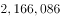平方公里，是世界第一大岛。格陵兰在地理纬度上属于高纬度，它最北端莫里斯•耶苏普角位于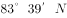，故格陵兰岛所在的丹麦是世界上纬度最高的国家。

B项正确，俄罗斯横跨个经度。地跨欧亚两大洲，是世界上面积最大，东西距离最长，跨经度最广的国家。

C项正确，芬兰，位于欧洲北部，北欧五国之一，与瑞典、挪威、俄罗斯接壤，南临芬兰湾，西濒波的尼亚湾。海岸线长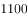公里，内陆水域面积占全国面积的，有岛屿约万个，湖泊约万个，是世界上拥有湖泊最多的国家，有“千湖之国”之称。

D项错误，世界上面积最大的沙漠是撒哈拉沙漠，横贯非洲大陆北部,东西长达公里，南北宽约公里，约占非洲总面积。撒哈拉沙漠西从大西洋沿岸开始，北到地中海，东部直抵红海，南部到苏丹热带草原。而沙特阿拉伯位于亚洲西南部的阿拉伯半岛。撒哈拉沙漠并不经过沙特阿拉伯。

本题为选非题，故正确答案为D。

---

### 第 10 题　qid 2136540 · 人文常识

关于太阳系，下列说法中正确的是：

- **A**. 太阳系位于银河系的中心
- **B**. 矮行星是围绕大行星运行的天体
- **C**. 距太阳越远的行星公转周期越长　✅
- **D**. 八大行星的自转方向相同

**答案**：C

**官方解析**

本题考查关于太阳系的自然常识。
A项错误，太阳系位于银河系内，但并不位于银河系的中心，其距离银河系中心尚有几万光年的距离。
B项错误，矮行星的体积介于行星和小行星之间，围绕恒星运转，而非大行星。大行星是指太阳系中的八大行星。
C项正确，八大行星离太阳越远，公转轨道半径越大，同时公转周期越长。
D项错误，八大行星的自转方向多数为自西向东，但是金星和天王星为自东向西。所以不能说八大行星的自转方向相同。
故正确答案为C。

---

### 第 11 题　qid 2136578 · 人文常识

下列与“三”有关的故事，哪一组不是出自同一名著？

- **A**. 三顾茅庐、桃园三结义
- **B**. 三打祝家庄、三碗不过冈
- **C**. 三探无底洞、三计乱荆州　✅
- **D**. 三打白骨精、三借芭蕉扇

**答案**：C

**官方解析**

本题考查文学常识。
A项正确，“三顾茅庐”讲述的是刘备三顾茅庐拜访诸葛亮的故事；“桃园三结义”讲述的是刘、关、张桃园三结义，约定有福同享、有难同当的故事。两个均出自《三国演义》。
B项正确，“三打祝家庄”讲述的是宋江攻打祝家庄的故事；“三碗不过冈”讲述的是武松在景阳冈上三碗不过冈酒楼喝醉后，空手打死一只吊睛白额虎的故事。两个均出自《水浒传》。
C项错误，“三探无底洞”讲述的是孙悟空为解救唐僧三次与老鼠精斗法的故事，出自《西游记》；“三计乱荆州”是《三国演义》中的故事。二者并非出自同一名著。
D项正确，“三打白骨精”讲述的是孙悟空火眼金睛识破白骨精真身，三次将其打退的故事；“三借芭蕉扇”讲述的是唐僧师徒三借芭蕉扇，扇灭火焰山的故事。这两个典故都出自《西游记》。
本题为选非题，故正确答案为C。

---

### 第 12 题　qid 2136584 · 地理国情

战国时期，所谓“山东六国”中的“山”指的是：

- **A**. 阴山
- **B**. 太行山
- **C**. 崤山　✅
- **D**. 祁连山

**答案**：C

**官方解析**

本题考查中国历史。山东六国，即相对于秦国而言，位于以崤山为分界线的崤山以东。
A项错误，阴山是中国内蒙古自治区中部山脉，在战国时期，尚未被秦国统治。秦统一后，秦始皇于公元前215年派蒙恬北击匈奴，才占领阴山。故山东六国不可能在阴山以东。
B项错误，今天的山东省指的是太行山以东，和战国时的“山东”不是同一概念，因为战国时期赵、魏、韩三国跨越太行山东、西，秦国边境尚未向东推进至太行山一线，不能混为一谈。
C项正确，战国七雄中，秦国与其他六国以崤山为界，除了秦国在崤山以西之外，其余的六国均在其东边。因此这六国又称“山东六国”。
D项错误，祁连山位于中国青海省东北部与甘肃省西部边境，战国时尚未被中原政权统治。故山东六国不可能在祁连山以东。
故正确答案为C。

---

### 第 13 题　qid 2136588 · 人文常识

关于文学作品与其主人公，下列对应正确的是：

- **A**. 《桃花扇》——崔莺莺、张君瑞
- **B**. 《西厢记》——杜丽娘、柳梦梅
- **C**. 《牡丹亭》——李香君、侯方域
- **D**. 《长生殿》——唐玄宗、杨贵妃　✅

**答案**：D

**官方解析**

本题主要考查文学常识。
A项错误，《桃花扇》作者为孔尚任，主人公为侯方域和李香君，作品通过描述他们悲欢离合的爱情故事，表现了丰富复杂的社会历史内容；而崔莺莺、张君瑞（又名张生）是《西厢记》的主人公，因此对应错误。
B项错误，《西厢记》作者王实甫，主人公为张君瑞（又名张生）和崔莺莺；而杜丽娘、柳梦梅是《牡丹亭》的主人公，因此对应错误。
C项错误，《牡丹亭》是明代汤显祖的代表作，主人公为杜丽娘、柳梦梅；而李香君、侯方域是《桃花扇》的主人公，因此对应错误。
D项正确，《长生殿》是洪昇戏曲创作的代表作，其主要描写唐玄宗与杨贵妃之间凄美的爱情故事，因此对应正确。
故正确答案为D。

---

### 第 14 题　qid 2136592 · 人文常识

下列有关条约或协议的说法中正确的是：

- **A**. 《尼布楚条约》是中国签订的第一个不平等条约
- **B**. 《马关条约》是中国被割占领土最多的条约
- **C**. 《南京条约》标志着中国完全沦为半殖民地半封建社会
- **D**. 《雅尔塔协议》的签署有损中国主权与领土的完整　✅

**答案**：D

**官方解析**

本题主要考查中国历史有关常识。
A项错误，《尼布楚条约》是清朝和俄罗斯之间经过平等协商，签定的第一个中俄边界条约，从法律上肯定了黑龙江和乌苏里江流域包括库页岛在内的广大地区都是中国的领土。中国签订的第一个不平等条约是1842年中英《南京条约》。
B项错误，中国被割占领土最多的条约是中俄《瑷珲条约》而非中日《马关条约》，《瑷珲条约》令中国失去了黑龙江以北、外兴安岭以南约60万平方千米的领土。
C项错误，《南京条约》是中国近代史上签订的第一个不平等条约，标志着中国开始沦为半殖民地半封建社会。而中国完全沦为半殖民地半封建社会的标志是《辛丑条约》的签订。
D项正确，《雅尔塔协议》虽然进一步协调了盟国的行动，加快了战胜日法西斯的步伐，但是参会的三大国苏、美、英在苏联参加对日作战和关于战后世界的安排等问题上为了维护自己国家的利益，不惜牺牲他国的权益，如背着中国政府签订秘密协定，同意苏联提出的欧洲战后结束三个月内对日作战的条件：维持外蒙古现状，保证苏联在中国东北的铁路、港口等方面拥有的特权，这种做法显然严重损害了中国的主权和领土完整。
故正确答案为D。

---

### 第 15 题　qid 2136602 · 人文常识

下列与戏剧有关的说法中错误的是：

- **A**. 《被缚的普罗米修斯》是古希腊悲剧
- **B**. 《仲夏夜之梦》是莎士比亚的喜剧
- **C**. 萨特是存在主义戏剧的代表人物
- **D**. 萧伯纳是美国剧作家　✅

**答案**：D

**官方解析**

本题主要考查文化常识。
A项正确，《被缚的普罗米修斯》是古希腊的一部悲剧作品，作者是悲剧家埃斯库罗斯。剧中通过描写普罗米修斯面对痛苦、折磨时的坚强不屈，体现他爱护人类、不屈服于暴力的光辉形象。
B项正确，《仲夏夜之梦》是英国剧作家威廉•莎士比亚创作的一部喜剧，讲述了一个发生在古希腊雅典，有情人终成眷属的爱情故事。
C项正确，萨特是20世纪法国著名的文学家、哲学家和政治评论家，法国无神论存在主义的主要代表人物，同时也是优秀的戏剧家和社会活动家，代表作品《存在与虚无》。
D项错误，萧伯纳出生于爱尔兰，后移居英国，因此并非美国人。他是现代杰出的现实主义戏剧作家，1925年因作品具有理想主义和人道主义而获诺贝尔文学奖，是世界著名的擅长幽默与讽刺的语言大师，代表作品《圣女贞德》、《伤心之家》等。
本题为选非题，故正确答案为D。

---

### 第 16 题　qid 2136612 · 人文常识

下列战事与参战的将领对应错误的是：

- **A**. 长平之战：白起、赵括
- **B**. 滑铁卢之战：拿破仑、威灵顿
- **C**. 朝鲜战争：彭德怀、麦克阿瑟
- **D**. 斯大林格勒保卫战：朱可夫、隆美尔　✅

**答案**：D

**官方解析**

本题考查历史中的重大战役与参战的将领。
A项正确，长平之战，是发生在秦、赵之间的战役。秦国名将白起率军在赵国的长平一带同赵括率领的赵国军队发生战争。最终赵国战败，秦国获胜。
B项正确，滑铁卢之战，是法国的军事统帅拿破仑率领的法军对反法盟军在比利时小镇滑铁卢进行的决战，法军惨败。英国元帅威灵顿，是反拿破仑战争中的联盟军统帅之一，以指挥滑铁卢战役闻名于世。
C项正确，朝鲜战争，原是朝鲜半岛上的朝韩之间的民族内战，后美国、苏联、中国等多个国家不同程度地卷入这场战争。彭德怀是朝鲜战争的中国将领，麦克阿瑟是朝鲜战争中的美国将领。
D项错误，斯大林格勒保卫战，是第二次世界大战中纳粹德国为争夺苏联南部城市斯大林格勒而进行的战役。苏联主席斯大林任命朱可夫为最高副统帅。隆美尔是德国陆军元帅，主要负责北非战场，并没有参与斯大林格勒保卫战。
本题为选非题，故正确答案为D。

---

### 第 17 题　qid 2136618 · 人文常识

关于大河起源，下列对应错误的是：

- **A**. 长江——唐古拉山
- **B**. 黄河——巴颜喀拉山
- **C**. 莱茵河——阿尔卑斯山
- **D**. 亚马逊河——落基山　✅

**答案**：D

**官方解析**

本题考查世界地理中的大河起源。
A项正确，长江是我国第一长河，起源于“世界屋脊”——青藏高原的唐古拉山脉各拉丹冬峰西南侧。自西向东干流流经11个省、自治区、直辖市，于崇明岛以东注入东海。
B项正确，黄河是我国第二长河，起源于我国青海省巴颜喀拉山脉。自西向东流经9个省、自治区，最后流入渤海。
C项正确，莱茵河是西欧第一大河，起源于瑞士境内的阿尔卑斯山北麓，西北流经列支敦士登、奥地利、法国、德国和荷兰，最后在鹿特丹附近注入北海。
D项错误，亚马逊河位于南美洲，是世界第二长河。最西端的发源地是位于太平洋附近的安第斯山，入口在大西洋。落基山位于北美洲。
本题为选非题，故正确答案为D。

---

### 第 18 题　qid 2136626 · 人文常识

下列机关中，无权制定地方性法规的是：

- **A**. 省级人大及其常委会
- **B**. 设区的市人大及其常委会
- **C**. 自治州人大及其常委会
- **D**. 县级人大及其常委会　✅

**答案**：D

**官方解析**

本题考查地方性法规的制定机关。
A项正确，根据《中国人民共和国立法法》第七十二条规定：“省、自治区、直辖市的人民代表大会及其常务委员会根据本行政区域的具体情况和实际需要，在不与宪法、法律、行政法规相抵触的前提下，可以制定地方性法规。”因此省级人大及其常委会有权制定地方性法规。
B项正确，根据《中国人民共和国立法法》第七十二条规定：“设区的市的人民代表大会及其常务委员会根据本市的具体情况和实际需要，在不与宪法、法律、行政法规和本省、自治区的地方性法规相抵触的前提下，可以对城乡建设与管理、环境保护、历史文化保护等方面的事项制定地方性法规，法律对设区的市制定地方性法规的事项另有规定的，从其规定。设区的市的地方性法规须报省、自治区的人民代表大会常务委员会批准后施行。”因此设区的市人大及其常委会有权制定地方性法规。
C项正确，根据《中国人民共和国立法法》第七十二条规定：“自治州的人民代表大会及其常务委员会可以依照本条第二款规定行使设区的市制定地方性法规的职权。”因此自治州人大及其常委会有权制定地方性法规。
D项错误，法律未授权县级人大及其常委会制定地方性法规的权利，因此其无权制定地方性法规。
本题为选非题，故正确答案为D。

---

### 第 19 题　qid 2136630 · 人文常识

下列关于武器装备的说法中错误的是：

- **A**. 尼米兹级航母是美军装备的核动力航空母舰
- **B**. S300导弹是俄罗斯生产的高空防空导弹
- **C**. 枭龙是我国生产的性能优良的无人机　✅
- **D**. F-22是美军装备的先进的隐身战机

**答案**：C

**官方解析**

本题主要考查科技常识中的军事常识。
A项正确，尼米兹级航母是美国综合作战能力最强的现役核动力航空母舰，也是目前世界上排水量最大、载机最多、现代化程度最高的一级核动力航空母舰。
B项正确，S300导弹系统是俄罗斯研发生产的第三代地对空导弹系统的合称，共有三种基本型号S-300P、S-300V、S-300F，并以这3种基本型号为基础衍生、改进出了诸多新型号，包括了陆、海、空军三大系列的防空导弹。S300系列防空导弹目前可适应从超低空到高空、近距离到超远程的全空域作战。
C项错误，枭龙战机（FC-1），是中国成都飞机公司与巴基斯坦航空综合企业合作研制生产的单座单发轻型多用途战机，有超视距作战能力，需要驾驶员，并非无人机。
D项正确，F-22“猛禽”战斗机是由美国洛克希德•马丁公司和波音公司联合研制的单座双发高隐身性第五代战斗机，并于21世纪初期陆续开始进入美国空军服役。
本题为选非题，故正确答案为C。

---

### 第 20 题　qid 2136634 · 人文常识

下列表述中不符合十八届五中全会精神和“十三五”规划纲要提法的是：

- **A**. 供给侧结构性改革是我国“十三五”时期经济社会发展的主线
- **B**. 创新是引领发展的第一动力
- **C**. 投资起着推动发展的基础性作用　✅
- **D**. “放、管、服”是我国当前和今后一个时期政府职能转变的主要任务

**答案**：C

**官方解析**

本题主要考查时事政治，主要涉及十八届五中全会和“十三五”规划的相关知识。
A项正确，“十三五”规划纲要指出：坚持发展是第一要务，牢固树立和贯彻落实创新、协调、绿色、开放、共享的发展理念，以提高发展质量和效益为中心，以供给侧结构性改革为主线，扩大有效供给，满足有效需求，加快形成引领经济发展新常态的体制机制和发展方式。
B项正确，“十三五”规划纲要提出：创新是引领发展的第一动力。必须把创新摆在国家发展全局的核心位置，不断推进理论创新、制度创新、科技创新、文化创新等各方面创新，让创新贯穿党和国家一切工作，让创新在全社会蔚然成风。
C项错误，“十三五”规划纲要指出：适应消费加快升级，以消费环境改善释放消费潜力，以供给改善和创新更好满足、创造消费需求，不断增强消费拉动经济的基础作用。围绕有效需求扩大有效投资，优化供给结构，提高投资效率，发挥投资对稳增长、调结构的关键作用。规划中只有“消费对拉动经济起基础作用”的表述，并未提及“投资对推动发展起基础性作用”的表述。
D项正确，“十三五”规划纲要第十四章深化行政管理体制改革指出：加快政府职能转变，持续推进简政放权、放管结合、优化服务，提高行政效能，激发市场活力和社会创造力。所以“放、管、服”是我国当前和今后一个时期政府职能转变的主要任务。
本题为选非题，故正确答案为C。

---

## 言语理解与表达

### 第 1 题　qid 2136504 · 逻辑填空

文化传统的延续，从来不是                地照搬照抄。取其精华，去其糟粕，根据时代发展做出合乎社会需求的调整，才是对文化的最好传承。

- **A**. 不假思索
- **B**. 囫囵吞枣
- **C**. 按部就班
- **D**. 一成不变　✅

**答案**：D

**官方解析**

根据后文“根据时代发展做出合乎社会需求的调整”以及横线前否定词“不是”可知，所填词语需体现出“不调整、不变化”之意，D项“一成不变”指一经形成，不再改变，符合文意，当选。
A项“不假思索”指用不着想，形容说话做事迅速，与文意无关，排除；B项“囫囵吞枣”比喻对事物不加分析思考，侧重强调不思考，文段强调的是不变，排除；C项“按部就班”指按照一定的步骤、顺序进行，也指按老规矩办事，缺乏创新精神，后文并非强调按照步骤顺序进行，与文段无法形成对应，排除。
故正确答案为D。
【文段出处】《鞭炮声里的文明思量》

---

### 第 2 题　qid 2136506 · 逻辑填空

在上海工作和生活的外国人，已不满足仅仅看灯会、逛庙会，从“                ”到“身临其境”，他们中越来越多人开始与中国朋友一起聚会，体会春节时那浓浓的年味。

- **A**. 浅尝辄止
- **B**. 走马观花
- **C**. 入境问俗
- **D**. 浮光掠影　✅

**答案**：D

**官方解析**

横线处对应“身临其境”，根据后文“他们中越来越多人开始与中国朋友一起聚会，体会春节时那浓浓的年味”可知，外国人对于中国年的理解由之前的“看灯会、逛庙会”这样肤浅的认识逐渐深入，有了更深的体会。故横线处应体现出流于表面、肤浅、不深入的意思。A项“浅尝辄止”指略微尝试一下就停下来，强调不深入钻研，通常用于做学问、搞研究，排除；C项“入境问俗”指进入别的国家，先问明有哪些禁止的事及风俗习惯，以免违犯，文段并无“外国人”寻问中国的风俗习惯之意，排除。
对比B、D两项，B项“走马观花”指粗略地观察一下，D项“浮光掠影”指像水面的光和掠过的影子一样，一晃就消逝，形容印象不深刻。根据文意可知，文段并非仅强调外国人“看灯会、逛庙会”时大致观察的动作，而更多强调的是外国人对中国年的理解不够深入、比较肤浅，故“浮光掠影”更符合文意。
故正确答案为D。
【文段出处】《从“浮光掠影”到“原汁原味”——老外享受中国年韵味》

---

### 第 3 题　qid 2136508 · 逻辑填空

市政市容委上半年就曾对全市报刊亭开展过整治，包括对破旧报亭进行维修、粉饰；重点治理亭外占道经营行为，拆除私自搭建的各类棚架等。若这类治理还止于“                ”的话，那动不动就把报亭拆除，只会是                ，制造更多问题。
依次填入画横线部分最恰当的一项是：

- **A**. 纸上谈兵  适得其反
- **B**. 公事公办  画蛇添足
- **C**. 墨守成规  事倍功半
- **D**. 就事论事  过犹不及　✅

**答案**：D

**官方解析**

第一空，横线处搭配“这类治理”行为，根据前文“对破旧报亭进行维修、粉饰”“拆除私自搭建的各类棚架”可知，这类治理已经付诸具体的行动。A项“纸上谈兵”比喻空谈理论，不能解决实际问题，侧重指没有具体行动，与文意不符，排除；根据后文“制造更多问题”可知，横线处应体现出一种不恰当的做法，B项“公事公办”指公事按公事的原则办，不讲私人情面，是一种积极正确的做法，与文段的语境不符，排除。
第二空，用来形容“动不动就把报亭拆除”之后的结果，根据前文“对报刊亭开展过整治”可知，拆除只是众多“整治”方法中的一个非常简单、粗暴、过分的方法，D项“过犹不及”指事情做得过头，就跟做得不够一样，都是不合适的，符合文意，当选。C项“事倍功半”形容做事的方法费力大，收效小，文段中明确表示“动不动就把报刊亭拆除”是一种比较单一的方法，无法体现出“事倍”，排除。
故正确答案为D。
【文段出处】《应多扶持报刊亭这个“文化载体”》

---

### 第 4 题　qid 2136510 · 逻辑填空

“慢”以从容恬淡之姿重出江湖，尽管讲慢生活的书                地巡回宣传签售，尽管人们点击浏览着说慢的文字，汽车照样抢道，行人照样闯红灯，还是一个紧张拥挤恨不得什么都要赶上趟的节奏。在大干快上、只争朝夕的社会文化氛围的                中，人们已渐次固化却甚少自知。

- **A**. 马不停蹄  潜移默化　✅
- **B**. 争先恐后  耳濡目染
- **C**. 层出不穷  日积月累
- **D**. 络绎不绝  推波助澜

**答案**：A

**官方解析**

本题可从第二空入手，根据“在大干快上、只争朝夕的社会文化氛围中，人们已渐次固化却甚少自知”可知，横线处所填成语应该体现出不知不觉受影响的意思。A项“潜移默化”指人的思想或性格不知不觉受到感染、影响而发生了变化，符合文意，保留。B项“耳濡目染”指耳朵经常听到，眼睛经常看到，不知不觉地受到影响，侧重亲眼看、亲耳听，与“氛围”搭配不当，排除；C项“日积月累”侧重积累；D项“推波助澜”比喻从旁鼓动、助长事物的声势和发展，扩大影响，均无不知不觉的意思，与文意不符，排除。
第一空，根据后文“巡回宣传签售”可知，讲慢生活的书从一个地方宣传到另一个地方。A项“马不停蹄”比喻一刻也不停留，一直前进，连续不断地做某事，符合从一个地方到另一个地方一刻不停留地签售的文意，当选。
故正确答案为A。
【文段出处】《慢和慢》

---

### 第 5 题　qid 2136512 · 逻辑填空

面对逆境，尼采从来都是一个内心无比强大的人。在他的著作中，最广为人知的莫过于《查拉图斯特拉如是说》。这本代表作在1885年出版时销量        ，但这并不能阻止他继续深入思考自己的理论，在此之后，他还是不断自费印书。直到去世之后，他的思想才被重新        和重视起来。

- **A**. 下降  审视
- **B**. 惨淡  发掘　✅
- **C**. 领先  评价
- **D**. 尚可  借鉴

**答案**：B

**官方解析**

第一空，“但”连接前后表示转折，根据“这并不能阻止他继续深入思考自己的理论”可知，横线处应该陈述的是销售情况不理想的状态，B项“惨淡”符合文意，保留。A项“下降”表示的是先有一个上升或者平稳发展的过程之后再降下来，应该表达出版一段时间之后的状态，与文段中刚刚出版时的销售情况不符，排除；C项“领先”、D项“尚可”均与文意相悖，排除。
第二空，代入验证，B项“发掘”指的是把人们不容易发现的事物揭露或揭示出来，用来说明尼采的思想在其去世之后又被人们重新认识，符合文意，当选。
故正确答案为B。
【文段出处】《发展若受限 往往是“太小气”所致》

---

### 第 6 题　qid 2136514 · 逻辑填空

在“地球村”形势下，21世纪的人类需要面对的共同问题远远超过各民族        的利益。我们不应把东方文化同西方文化        起来。

- **A**. 狭隘  对立　✅
- **B**. 各自  混淆
- **C**. 有限  统一
- **D**. 根本  联系

**答案**：A

**官方解析**

第一空，横线处搭配“各民族”，B项“各自”即各人自己，与“各民族”语义重复，排除。其它三项置于此处均可，保留。
第二空，根据文意可知，人类需要面对“共同”的问题，应更关注不同民族间共性的东西，对于东西文化亦是如此，不应将它们“对立”起来，A项符合文意，当选。C项“统一”和D项“联系”均与文意相悖，排除。
故正确答案为A。
【文段出处】《资中筠：当前我国在思想上两大危险》

---

### 第 7 题　qid 2136516 · 逻辑填空

作为一个单纯的图书设计者，设计师需要尊重书籍本身而适度地“        ”自己，即不能“过度设计”而使形式僭越了书籍内容。但是，作为一个创意表达者，设计师一旦参与了图书的创作，就使书籍成为表达自己独特创意的        ，此时设计师已不仅仅干预了图书的形式，而是直接参与了内容的创作。

- **A**. 压抑  工具
- **B**. 贬低  渠道
- **C**. 遗忘  符号
- **D**. 隐藏  媒介　✅

**答案**：D

**官方解析**

第一空，根据文意可知，横线处表达设计师不能过度设计，创意的表达要在一定范围之内。C项“遗忘”、D项“隐藏”，均符合文意，保留。A项“压抑”通常指克制情绪，文段并非强调要克制自己的情绪，而是表达创意时要有一定限度，排除；B项“贬低”指故意降低应有的评价，文段强调不能过度设计，而非要降低自己应有的评价，排除。
第二空，形容书籍对于表达创意的作用，D项“媒介”指建立双方联系的途径，符合文意，当选。C项“符号”指标志、印记，书籍是表达创意的一种途径，而不是符号，排除。
故正确答案为D。
【文段出处】《书籍设计师朱赢椿：从设计者到创作者》

---

### 第 8 题　qid 2136518 · 逻辑填空

真正的经典电影无论什么时代的人看，都不会觉得过时。而支撑其长盛不衰的“戏核”，一定是                的思想。眼下国内多数电影成了过眼云烟的“应景之作”，主要原因是习惯于用“扁、平、浅”的流水账方式向观众宣传定型定性的人和事。艺术作品如果完全失去了自身的深刻性、批判性，就等于失去了        ，化为了一缕缕容易飘散的艺术“轻烟”。

- **A**. 历久弥新  灵魂　✅
- **B**. 深入人心  本质
- **C**. 震古铄今  精髓
- **D**. 意味深长  价值

**答案**：A

**官方解析**

第一空，根据“真正的经典电影无论什么时代的人看，都不会觉得过时”可知，经典中蕴含的思想应该也是随着时间的流逝，不会过时，一直为大众所接受的。A项“历久弥新”指经历长久的时间反而更加鲜活，更加有活力，更显价值，B项“深入人心”指思想、理论、学说、主张等被大家所深刻理解并拥护，两项均能表达出思想未过时的语义，符合文意，均保留。C项“震古铄今”形容事业或功绩非常伟大，通常搭配事业、功绩，与“思想”搭配不当，排除；D项“意味深长”指的是含蓄深远，耐人寻味，文段重点强调的是不过时，并非思想耐人寻味，排除。
第二空，根据“艺术作品如果完全失去了自身的深刻性、批判性，······，化为了一缕缕容易飘散的艺术‘轻烟’”可知，深刻性、批判性是艺术作品留存下来的思想内核。A项“灵魂”指能起关键和主导作用的精神方面的核心因素，符合文意，当选。B项“本质”指事物本身所固有的根本的属性，并不存在是否丢失的情况，且“深刻性和批判性”也不是艺术作品必须具备的固有属性，排除。
故正确答案为A。
【文段出处】《“主旋律”更需尊重艺术规律》

---

### 第 9 题　qid 2136500 · 逻辑填空

在这个经济高速发展的时代，工作        着我们的业余时间。工作与家的关系，不是非得舍弃哪一方才能成全另一方，而是可以兼顾的，我们不能                ，忽略生命中最珍贵的东西，而在未来老去时空留悔恨和遗憾。

- **A**. 占据  三心二意
- **B**. 消磨  本末倒置
- **C**. 侵占  半途而废
- **D**. 蚕食  舍本逐末　✅

**答案**：D

**官方解析**

第一空，根据文意，横线处所填词语应表达工作会侵占部分业余时间之意，对应选项，A项“占据”指取得并保持，C项“侵占”指获取一些不属于自己的东西，D项“蚕食”比喻如蚕吃桑叶那样一点一点的侵蚀，均有“占有”“侵占”的意思，均符合文段语境，保留；B项“消磨”指使(意志、精力)逐渐消耗、磨灭，无法表达侵占的意思，排除。
第二空，应与“忽略生命中最珍贵的东西”相对应，对应选项，A项“三心二意”指不用心，不专一，C项“半途而废”指做事不能善始善终，均无法表达忽视最珍贵东西的语义，排除；D项“舍本逐末”比喻做事不抓住主要的问题，而专顾细枝末节，符合文段语境，当选。
故正确答案为D。
【文段出处】《亲情无价，舍本逐末的人生不值得过》

---

### 第 10 题　qid 2136502 · 逻辑填空

在利益驱动、赶稿压力下，网络写作往往                ，恣情快意，顾不得考虑艺术品质和价值导向，让                的所谓“文学”甚至文字垃圾充斥网络空间。

- **A**. 运笔如飞  粗制滥造　✅
- **B**. 妙笔如花  泥沙俱下
- **C**. 笔走龙蛇  良莠不齐
- **D**. 笔下生风  鱼龙混杂

**答案**：A

**官方解析**

第一空，对应“利益驱动、赶稿压力”“恣情快意”，表示写的速度特别快。A项“运笔如飞”形容写作的速度飞快，C项“笔走龙蛇”形容书法笔势雄健活泼，也可以体现速度飞快，D项“笔下生风”指书写的时候文思泉涌，奋笔疾书好似一阵风似的有气势，均符合文意，保留。B项“妙笔如花”强调妙，内容特别好，比喻杰出的写作才能，不能体现写作速度快，排除。
第二空，后面出现“甚至”表示递进关系，提示横线处需要满足程度前轻后重的递进逻辑，对应“文字垃圾”，指没有价值、没有作用的文字。递进之前，程度比“垃圾”轻，选项均无法体现，A项“粗制滥造”表示不讲究质量，正确，当选。C项“良莠不齐”、D项“鱼龙混杂”均体现的是两方面，既有好的，也有坏的，两部分掺杂在一起，而对应前面“顾不得考虑艺术品质和价值导向”，只能体现出不好的部分，故排除C、D两项。
故正确答案为A。
此题的命制与原文有较大出入，原文如下：
特别是在利益驱动、“催更”压力的情境下，网络写作往往是运笔如飞，恣情快意，顾不得考虑艺术品质和价值导向，失去他律又无以自律的书写，会让粗制滥造的所谓“文学”甚至文字垃圾并陈于网络空间。这时候，不仅文学创作与大众文化生产、文学与非文学的界限变得模糊，作品质量也会出现泥沙俱下、良莠并存的情形。
故我们需要按照原文的正确表述去理解。
【文段出处】《网络文学：意义指向与价值承载》

---

### 第 11 题　qid 2136702 · 片段阅读

经济学的研究对象是人的经济行为和社会的经济规律，因此对人性有什么样的假设就会产生什么样的经济学。“经济人”假设是经济学对人性的高度概括，是经济学的逻辑前提。但传统经济学对它做了教条化和绝对化的理解，仅仅研究在资源稀缺条件下静态的、孤立的个人选择。而新古典经济学的症结在于对人性的理解过于单一，没有看到人性是丰富的，并且是在历史中演进着的。因此，经济学必须实现新的转向，从研究既定制度前提下的稀缺资源的最优配置问题转向对人类的合作与冲突机制的研究。
这段文字主要说明了：

- **A**. “经济人”假设存在的问题
- **B**. 经济学研究遭遇瓶颈
- **C**. 人类的合作与冲突机制是经济学的核心问题　✅
- **D**. 对人性的错误理解是新古典经济学的症结

**答案**：C

**官方解析**

文段首先给出“经济人”假设的话题，后面通过“但”引出“传统经济学”和“新古典经济学”的问题。文段最后出现“因此”，总结全文，引导结论，强调经济学研究需要转向，转为“对人类的合作与冲突机制的研究”，对应C项表述正确，当选。
A项“‘经济人’假设”、D项“新古典经济学”为文段结论之前的表述，不是重点，排除；B项，文段只提到了“传统经济学”和“新古典经济学”出现的问题，并没有提到“经济学研究遭遇瓶颈”，且文段最后结论部分给出对策，而“遭遇瓶颈”为问题表述，排除。
故正确答案为C。
【文段出处】《“经济人”假设与经济学发展的新趋势》

---

### 第 12 题　qid 2136708 · 片段阅读

清代纪晓岚在《阅微草堂笔记》中讲了这样一则寓言故事。一个官员在阎王面前自称生时为官清廉，所到之处，只饮一杯清水，可以无愧于鬼神。阎王笑道：“设官是为了兴利除弊，如果不贪钱就是好官，那么在公堂中设一木偶，连水都不用喝，岂不更胜于你？”官员不服，辩解道：“我虽无功，但总无过。”阎王怒道：“你处处只求保全自己，该办的事不办，该断的案不断，岂不是负国负民，无功就是过啊。”
最适合做这段文字标题的是：

- **A**. 莫做“公堂木偶”　✅
- **B**. 清官与庸官
- **C**. 官员的功与过
- **D**. 纪晓岚谈为官

**答案**：A

**官方解析**

本题为标题填入题，需要把握文段的中心内容，文段为一则寓言故事，描述了一位官员与阎王的对话，阐述了一位官员只是清廉而没有作为，不如公堂上的一只木偶。文段最后通过阎王的话语点明中心，即“无功就是过”，即不能做无功的官员，这样就相当于有过。观察选项，A项莫做“公堂木偶”，能够对应文段中心，强调做官不能只求无过，“公堂木偶”指的就是文段“无功就是过”之意，并且能够吸引读者，当选。
B项，文段探讨的是做官不能“无功”，而不是“清官与庸官”的话题，排除；C项，“功与过”表述不明确，文段明确强调“无功就是过”，并且文段并没有论述什么是“功”，排除；D项，“纪晓岚谈为官”同样表述不明确，没有突出文段的中心主旨，排除。
故正确答案为A。
【文段出处】《让无为者失位》

---

### 第 13 题　qid 2136716 · 语句表达

①阅读，不仅是认识符号而已，更要懂得符号所传递的内涵
②而观画，也不只是看到五彩缤纷的调配，还应细想，画中原是有画的
③只是我们的脚步太匆忙了，常常忘记去读它，欣赏它，随意地浏览过去
④便断言生活是一味地今日因袭昨日
⑤只是公式化的衣食住行罢了
⑥每个日子，都是内容不同的一本书、风格迥异的一幅画
将以上6个句子重新排列，语序正确的一项是：

- **A**. ①②③④⑤⑥
- **B**. ⑥③④⑤①②　✅
- **C**. ①②⑥③④⑤
- **D**. ⑥①②③④⑤

**答案**：B

**官方解析**

首先对比选项，判断首句。
①引出“阅读”这一话题，通过递进关联词强调要懂得“符号所传递的内涵”，⑥引出“每个日子”这一话题，强调其是“一本书”“一幅画”。均为引出话题，无法判断首句。
观察发现，根据③中两个指代词“它”可知，“读它”中的它指代“一本书”，“欣赏它”中的“它”指代“一幅画”，指代词捆绑，顺序为⑥③，排除A、D两项。
②引出“观画”，①引出“阅读”，根据逻辑顺序，先有“一本书”“一幅画”，然后去“阅读书”“观赏画”，故⑥在①②之前，对应B项。
故正确答案为B。
【文段出处】《生活细笔》

---

### 第 14 题　qid 2136718 · 语句表达

①中国史前文化的整体格局，应该是以中原为核心，以黄河与长江流域为主体，结合周边地区文化而形成的一个有机整体
②周围地区虽然文明化进程稍迟，但各具特色，同黄河长江流域乃至中原地区的文化紧密结合在一起，构成一个超稳定的结构
③这就像一个有多层花瓣的花朵
④黄河长江流域因为自然环境优越，又紧靠中原周围，文化发展水平甚高，成为整个中华文明的主体
⑤中原文化的中心地位，既有地理位置方面的原因，也有文化传统方面的原因
⑥从夏商周、秦汉隋唐直至北宋历代的都城都在中原，中原地区处于稳定的政治中心地位
将以上6个句子重新排列，语序正确的是：

- **A**. ①③⑤⑥④②　✅
- **B**. ⑤④②③①⑥
- **C**. ⑥④②①⑤③
- **D**. ④②③①⑥⑤

**答案**：A

**官方解析**

首先对比选项，判断首句。
①给“中国史前文化的整体格局”下定义，指出其是以“中原”为核心，以“黄河与长江流域”为主体，结合“周边地区文化”的有机整体。
④指出“黄河长江流域”成为中华文明主体的原因。
⑤指出“中原文化”中心地位的原因。
⑥指出“中原地区”处于稳定的政治中心。
根据逻辑顺序，首先引出观点然后进行详细解释说明，①更适合作为首句，锁定答案为A项。
验证A项，根据①开展的逻辑先后顺序，先讲⑤⑥再讲④，当选。
故正确答案为A。
【文段出处】《解决学术问题最终要靠学术讨论》

---

### 第 15 题　qid 2136722 · 语句表达

①然而，今天的许多口述史确实出现了一些问题
②在今天的历史学中，口述史已经是一个不可或缺的部分，它对于正史的补充作用是别的史学无法替代的
③因为许多口述史失去了真实的面目，而口述史最大的价值就在于真实
④最大的问题是科学性差，可信度差，这当然就导致科研性很差
⑤口述史为什么有许多变成了演义、猎奇、故事呢
⑥第一个原因可能是为吸引眼球，另一个原因，则和许多从事口述史记录的人缺少专业的训练和素养有关
将以上6个句子重新排列，语序正确的是：

- **A**. ②⑤⑥①④③
- **B**. ⑤⑥③④②①
- **C**. ⑤③⑥②①④
- **D**. ②①④③⑤⑥　✅

**答案**：D

**官方解析**

首先对比选项，判断首句。②强调“口述史”的重要性，⑤提出问题，为什么“口述史”变成了“演义、猎奇、故事”，均可作为首句。
观察发现①中有转折关联词“然而”，转折之后强调“口述史”有问题，根据关联词捆绑，转折之前应强调“口述史”的重要性，对应②，顺序为②①，排除A项。
根据共同信息捆绑，①④均提到“问题”，排除B项。
根据⑤提出问题，即为什么“口述史”变成了“演义、猎奇、故事”，⑥点明原因，故⑤⑥捆绑，对应D项。
故正确答案为D。
【文段出处】《历史不仅是过去的事》

---

### 第 16 题　qid 2136728 · 片段阅读

几年前，美国一位参议员指责国家科学基金会把奖励颁给一项关于恋爱缘由的研究。他认为，恋爱缘由是无法科学判断的，不论发现什么缘由都不足为信，而且，他更愿意相信爱情是神秘的。作家赖斯顿也同意这位参议员的看法，但是补充说：“如果社会学家和心理学家能够得出某种结论，用来回答我们在爱情、婚姻中所遇到的问题，这笔奖金可能是联邦资金最佳的一笔投资了。”
赖斯顿的这段话意在强调：

- **A**. 研究恋爱的缘由难以得出明确结论
- **B**. 对恋爱缘由的研究或许能促进婚姻的稳固
- **C**. 美国国家科学基金会应该把奖励颁给其他研究项目
- **D**. 关于爱情和婚姻中现实问题的研究更有意义　✅

**答案**：D

**官方解析**

文段首先提出一位参议员的观点，接着，赖斯顿表示同意这位参议员的观点，并通过转折词“但”强调了赖斯顿自己的观点，即“如果可以研究怎么回答爱情婚姻中所遇到的现实问题，那么，这种研究是非常有意义的。”对应D项，当选。A项，对应转折前的观点，非文段重点，排除；B项，文段未表述“恋爱缘由”与“婚姻的稳固”的关系，无中生有，排除；C项，反推文段，文段并未涉及其他研究项目，该选项无中生有，排除。
故正确答案为D。
【文段出处】《你的爱情迷信吗》

---

### 第 17 题　qid 2136732 · 片段阅读

近年来，关于不同物理理论之间对应方面的研究取得了一些进展。有科学家认为，这些对应强烈表明，存在一种完备的统一物理理论，但是它们也暗示，也许不可能用一个单独表述来表达这个理论。相反，在不同的情形下，必须使用基本理论的不同影像。这和用地图描绘地球表面很相似，人们不能只用一张单独的地图，在不同的区域必须用不同的地图。这就变革了科学定律的统一观，但是它并没有改变最重要的一点：一组人们能够发现并理解的合理的定律制约着宇宙。
这段文字画线部分中的“它”指的是：

- **A**. 完备的统一物理理论是存在的
- **B**. 不同物理理论之间存在对应关系
- **C**. 在不同的区域必须使用不同的地图
- **D**. 统一物理理论需要用不同方式来表述　✅

**答案**：D

**官方解析**

本题考查对代词的理解，需结合上下文进行判断。横线出现在尾句，应与尾句保持话题一致，所以横线中的“它”与前文“这就变革了科学定律的统一观”的“这”指代内容相同，均是对前文进行总结得出的结论。前文先指出存在一种完备的统一物理理论，接下来通过转折词“但是”指出必须使用基本理论的不同影像，随后通过地图进行举例说明，故前文重点强调的是统一的物理理论需要运用不同的方式表达，对应D项。
A项，对应转折之前的表述，非重点，排除；
B项，对应首句背景引入的表述，非重点，排除；
C项，“地图”为文段举例论证的内容，非重点，排除。
故正确答案为D。
【文段出处】《阿凡达：圣树与物理学的大统一理论》

---

### 第 18 题　qid 2136736 · 片段阅读

公元前5世纪左右，管仲提出以法治国。此后，法律就被公认为是治理国家的工具。到唐朝，魏征做了一个形象的比喻。他说国家好像是一匹奔马，骑在马上的骑手就是皇帝，皇帝手中拿的鞭子就是法律。既然古代的法律是君主手中的鞭子，这个法律必然受到君主的影响。
这段文字主要讲的是：

- **A**. 古代法治的本质　✅
- **B**. 法律对治国的作用
- **C**. 以法治国思想的变迁
- **D**. 古代法律对君权的影响

**答案**：A

**官方解析**

文段开篇引用“管仲”以法治国的例子，接着介绍后来继续沿用“以法治国”，并引用“魏征”的例子，尾句通过指代词“这个法律”总结前文，且指代前文的“古代法律”，故文段重点强调“古代法律必然受君主影响”，即主题词为“古代法律”，对应选项A项。
B项，“法律对治国的作用”对应尾句之前的表述，非重点，且文段的主题词是“古代法律”，“法律”范围扩大，排除；
C项“思想变迁”无中生有，排除；
D项“法律对君权的影响”逻辑错误，文段说的是君主影响古代法律，排除。
故正确答案为A。
【文段出处】《张晋藩:中国传统法律文化中的警世观点》

---

### 第 19 题　qid 2136738 · 片段阅读

研究人员认为噩梦能够让我们释放出那些在我们清醒时折磨我们的压力和焦虑。他们解释说：“那些在我们清醒时令我们担忧的事情，在我们睡着之后还会继续干扰我们。无意识状态下的大脑会获取我们的抽象恐惧，通过噩梦的故事形式，将其转变成一种记忆。”这是非常有用的，因为记忆对于大脑来说更容易处理，它代表着发生在过去的某种事情，而不是围绕着我们的担忧。
这段文字意在说明噩梦：

- **A**. 代表着过去发生的某种事情
- **B**. 虽然可怕却有益精神健康　✅
- **C**. 是一种令我们担忧的故事形式
- **D**. 本质上是恐惧对记忆的扭曲

**答案**：B

**官方解析**

文段开篇指出噩梦能释放出那些在清醒时折磨自己的压力和焦虑，然后进一步解释说明，指出噩梦是有用的，所以文段是观点+解释说明的结构，强调噩梦是有好处有作用的，对应B项，当选。
A项属于解释说明的内容，非重点，排除；C项属于解释说明的内容，且“担忧的故事形式”无中生有，排除；D项“对记忆的扭曲”无中生有，文段没有提及，排除。
故正确答案为B。
【文段出处】《做噩梦是精神释放 有益身心》

---

### 第 20 题　qid 2136740 · 片段阅读

随着技术的发展，未来真实宠物将成为稀缺的“奢侈品”，机器人宠物则会进入普通家庭。那些对宠物敏感、缺少饲养空间或者对真实动物具有恐惧感的人群将受益，但是人类与机器人宠物产生的情感关系却会导致伦理置疑。如果虚拟宠物能够产生人们从真实宠物获得的效应，是否意味着人类与动物之间的情感关系能够真实映射在机器人宠物上？人们特别想知道未来人类随意丢弃机器人宠物的行为是否会由人类虐待动物的行为转变而来。
这段文字意在说明：

- **A**. 未来机器人宠物和虚拟宠物将被广泛接受
- **B**. 机器人宠物的出现对人类有利有弊
- **C**. 人类与机器人宠物产生的情感关系将产生伦理问题　✅
- **D**. 机器人宠物或将改变人们对待真实宠物的方式

**答案**：C

**官方解析**

文段首句提出随着技术的发展，机器人宠物会进入普通家庭，然后指出这对宠物敏感、缺少饲养空间等人群有益，紧接着通过转折关联词“但是”引出文段重点，人类与机器人宠物产生的情感关系却会导致伦理置疑， 并通过一个疑问句提出质疑，进一步解释说明，所以文段的重点在于人类与机器人宠物产生的情感关系会导致伦理置疑，对应C项，当选。
A项“广泛接受”对应转折之前的内容，非重点，排除；B项本身说法正确，但是文段的重点在于强调机器人宠物带来的伦理置疑，B项没有突出这一重点，排除；D项对应解释说明的内容，非重点，排除。
故正确答案为C。
【文段出处】《未来智能机器宠物将走进人们生活》

---

### 第 21 题　qid 2136742 · 片段阅读

以“克己”为出发点的传统中国道德体系，在当代中国对于开拓公共性依然具有重要的价值，这是因为传统差序格局的私人关系文化在中国根深蒂固，因而其依然是当代中国个人道德尤其是官德建设的重要要求。但是，依据费孝通的观点，以“克己”为出发点的传统儒家道德体系，是差序格局中的私人道德，并没有超越亲疏厚薄的差序特性，缺乏个人与共同体之间的公共道德要素。而要突破传统差序格局私人关系文化对于公共性开拓的束缚，最重要的还在于发展个人与共同体之间的公共道德要素。
这段文字意在强调以“克己”为出发点的传统中国道德体系：

- **A**. 以传统的差序格局为形成基础
- **B**. 是当前道德建设的主要内容
- **C**. 没有超越亲疏厚薄的差序特性
- **D**. 对于开拓公共性存在局限性　✅

**答案**：D

**官方解析**

文段开篇引出以“克己”为出发点的传统中国道德体系的重要性，随后通过“这是因为”进行解释说明。接着通过转折词“但是”引出了“克己”存在的不足，即“缺乏个人与共同体之间的公共道德要素”，尾句利用程度词“最重要的”进一步凸显“发展个人与共同体之间的公共道德要素”的重要性，故文段重点强调了“克己”在公共性方面存在的不足，对应D项。
A项，“传统差序格局”对应转折之前的表述，非重点，排除；B项，“当前道德建设的主要内容”，无中生有，文段未提及，排除；C项，“差序特性”非重点，文段谈论的核心话题是“公共性”，偏离中心，排除。
故正确答案为D。
【文段出处】《法治的基本价值在于开拓公共性》

---

### 第 22 题　qid 2136744 · 片段阅读

有学者认为中国的心性之学，不是西方传统哲学中理性的灵魂论，或近代科学中的心理学，而是具有修身济世内涵的人生价值学。流行于西方的“深度心理学”，多半是从人的本性以外的物性或兽性来理解人，反映了西方人的悲观和失望情绪；而中国心性之学是天地合德的“高度心理学”，它可以安顿人心，济焦润枯。
这段文字意在：

- **A**. 比较中西方心性研究的差异
- **B**. 阐述中国心性之学的内涵　✅
- **C**. 强调心性之学对人生的作用
- **D**. 分析中国心性之学的科学意义

**答案**：B

**官方解析**

文段开篇指出有学者认为中国的心性之学是具有修身济世内涵的人生价值学，随后通过西方和中国心性之学的对比再次强调中国心性之学的内涵，所以文段为观点+解释说明的结构，重在强调中国心性学的内涵，对应B项，当选。
A项“差异”对应解释说明的内容，非重点，排除；C项“心性之学”范围扩大，文段强调的是“中国的心性之学”，偏离中心，排除；D项，根据“修身济世内涵”“安顿人心，济焦润枯”可知，文段强调中国心性学对人的作用，“科学意义”无中生有，排除。
故正确答案为B。
【文段出处】《返本开新的诗学建构——现代新儒家文化诗学的启示》

---

### 第 23 题　qid 2136748 · 片段阅读

当史前人类到达世界的新区域时，发生了一些奇怪的事情：大型动物突然灭绝了，较小的物种却幸存下来了。大型的、生长缓慢的动物很容易成为猎物，所以被迅速猎杀直至灭绝。现在类似的情况可能正在海洋中发生。
这段文字提到史前大型动物的灭绝是为了说明：

- **A**. 大型动物更加容易受到环境变化的影响
- **B**. 当大型动物消失时，小物种幸存了下来
- **C**. 如今大型海洋动物可能面临类似的威胁　✅
- **D**. 生长缓慢的鱼类比生长快的鱼类寿命长

**答案**：C

**官方解析**

文段开篇指出史前人类面临的一些“奇怪”事情，即大型物种容易灭绝。后又解释造成这一现象的原因。接着在尾句用“类似的情况”指代上文，得出结论，指出这种情况可能正在海洋中发生，即海洋中的大型动物也有灭绝的危险，对应C项。
A项“影响”可好可坏，表述不明确，且没有提到“海洋”这一核心话题，排除；B项，对应尾句之前的内容，非重点，仅仅是对现象的描述，文段重点想指出这种现象可能正在海洋中发生，排除；D项，文段未提及生长速度会影响鱼类寿命，故无中生有，排除。
故正确答案为C。

---

### 第 24 题　qid 2136698 · 片段阅读

当人类把其自身的存在完全寄生在由社会高速发展所带来的各种“可见的”虚妄之中的时候，很难想象人们还能守住最基本的道德和良心底线，而不是跟着社会发展的“巨龙”一起越界，飞到吞噬一切良知和道德的“黑洞”之中。试图用可见性的物质财富填满“存在”这个黑洞的最大悲剧在于：“没有谁能跑赢欲望，总有一天，你填入了所有的东西，却无力地发现，那个黑洞还在。物质也许能带来短暂的一次次快乐，但绝非幸福。”最终，很多人为了填满自我存在的那个巨大深渊，不自觉地把自己整个地埋葬在物欲的巨大黑洞之中。
这段文字强调的是：

- **A**. 人的存在本质上就是一个巨大的“黑洞”
- **B**. 物质能够解决停留在虚妄之中的存在难题
- **C**. 物欲时代不存在最基本的道德和良心底线
- **D**. 人的存在应当超越“可见的”物欲性追求　✅

**答案**：D

**官方解析**

文段开篇提出问题，人类把自己的存在寄生在“可见的”虚妄之中就很难守住道德和良心的底线，随后分析问题的严重性，试图用可见性的物质财富填满“存在”的黑洞不会带来幸福，最终会将自己埋葬在物欲的黑洞之中，故文段重在强调把自身的存在寄生在“可见的”物欲上会带来危害，即人的存在应该摆脱“可见的”物欲，对应D项。
A项“人的存在本质”并非文段重点，文段重在强调人的存在要超越“可见的”物欲，排除；B项表述与文意相悖，文段指出试图用物质填满存在的“黑洞”会带来悲剧，可知物质无法解决存在难题，排除；C项“不存在”表述过于绝对，文段的表述为“很难守住道德和良心底线”，而非绝对的不存在，排除。
故正确答案为D。

---

### 第 25 题　qid 2136710 · 语句表达

对人类来说，太阳是生命之源，地球上的一切生命活动都与太阳息息相关。但是，当大量的太阳活动伴随着如日冕物质抛射、质子事件发生时，就会对人类生产生活造成危害。因此，                ，成为各国科学家孜孜不倦的追求。目前，世界上对太阳大气的观测，国外太阳望远镜最多可同时实现6波段层析成像，并且仅局限于可见光波段。在经过多年技术积累和科研攻关后，中国科学院光电技术研究所成功研制了7波段太阳层析成像系统。据悉，这是目前世界上波段最多的多波段层析成像系统。
填入画横线部分最恰当的一项是：

- **A**. 如何最大程度地避免太阳活动对人类造成的危害
- **B**. 记录不同波段的图像以了解太阳活动的演化过程
- **C**. 如何建立精确的太阳大气模型
- **D**. 加强对太阳活动产生机理的研究　✅

**答案**：D

**官方解析**

横线出现在文段中间，需注意与上下文的联系。根据横线前“因此”可知，所填内容是对前文的总结，文段首先指出太阳对人类很重要，接着通过转折关联词“但是”指出太阳活动会对人类产生危害，故充分了解太阳活动的情况，应成为科学家孜孜不倦的追求，D项衔接恰当，当选。
A项“如何避免危害”相较于D项“太阳活动产生机理”表述不明确，排除；
B项“不同波段的图像”是对横线后目前观测情况的概括，无法总结前文，排除； 
C项“建立大气模型”与前文话题“太阳活动”衔接不当，排除。 
故正确答案为D。
【文段出处】《预报太阳“天气”有望更加准确》

---

### 第 26 题　qid 2136680 · 片段阅读

语言从来不是固化的，而是随着社会的发展而变化的。任何一种语言的形成和发展，都是使用这种语言的人们在生活中的约定俗成，可以说，语言本身就是一种社会现象，是一个社会中人们的精神状态和社会心态投射而成的具象。因此，网络语言粗鄙化的现象不应当被视作孤立的语言问题来看待，粗鄙化折射出的浮躁心态、社会发展中积累的戾气等问题，恐怕比语言粗鄙化本身更值得关注。
这段文字意在强调：

- **A**. 语言是人类精神状态和社会心态的反映
- **B**. 网络语言的粗鄙化应成为社会关注的问题
- **C**. 语言研究应以语言随着时代发生的变化为重点
- **D**. 应重视网络语言粗鄙化折射出的社会问题　✅

**答案**：D

**官方解析**

文段首先指出语言是随着社会发展而变化的，随后指出语言是人们的精神状态和社会心态的反映，后文通过“因此”总结前文给出结论，强调网络语言的粗鄙化所折射出来的社会问题更值得关注，故文段重在强调应该重视网络语言粗鄙化所折射出的社会问题，对应D项。
A项为文段结论之前的内容，非重点，排除；B项“网络语言的粗鄙化”非重点，文段强调网络语言粗鄙化所折射出的社会问题更值得关注，排除；C项无中生有，文段并未提及“语言研究”的内容，排除。
故正确答案为D。
【文段出处】《治理网络恶语不可头痛医头》

---

### 第 27 题　qid 2136682 · 片段阅读

南京云锦已有1500多年的手工织造历史，在中国4700多年的丝绸织造史中，云锦的木机妆花是唯一流传至今不可被机器取代、凭人的记忆编织的传统手工织造工艺。南京云锦织造技艺存续着中国皇家织造的传统，是中国织锦技艺最高水平的代表，是元、明、清三朝的御用品。皇室、宫廷、寺庙、佛堂为云锦妆花手工织造工艺的发展提供了极大的文化空间。云锦浓缩了中国丝织工艺的历史、文化和技艺，继承和再现了中国丝织工艺的精华，是中国织锦工艺的“活化石”。
关于云锦，这段文字没有提及：

- **A**. 代表技艺
- **B**. 演变过程　✅
- **C**. 工艺水平
- **D**. 文化意义

**答案**：B

**官方解析**

根据“云锦的木机妆花是唯一流传至今不可被机器取代、凭人的记忆编织的传统手工织造工艺”可知，A项正确；根据“南京云锦织造技艺存续着······，是中国织锦技艺最高水平的代表”可知，云锦工艺水平高超，C项正确；根据“云锦浓缩了······，继承和再现了中国丝织工艺的精华，是中国织锦工艺的‘活化石’”可知，D项正确。
B项“演变过程”指的是时间较长的变化，文段并没有谈及云锦的变化过程，无中生有。
本题为选非题，故正确答案为B。
【文段出处】《南京云锦木机妆花手工织造技艺》

---

### 第 28 题　qid 2136684 · 片段阅读

“分享经济”也叫“协同消费”，是指资源所有者将自己闲置的资源拿出来，供那些需要的人有偿使用。对于传统消费理念与消费方式的改造与颠覆，是分享经济正向作用的一个重要表现。在分享经济环境中，人们不再是通过购买所有权的方式而是通过取得使用权的方式进行消费，关注的不再是自己占有多少价值而是能够获得多大的使用价值。这种节约型绿色消费理念和方式反映出的是人类文明的进步。
这段文字意在强调：

- **A**. 消费理念是影响消费方式的深层原因
- **B**. 分享经济使人的消费理念与生活方式发生改变　✅
- **C**. 分享经济开辟了充分利用资源的新渠道
- **D**. 分享经济已成为当今主流的消费方式

**答案**：B

**官方解析**

文段开篇介绍了“分享经济”的概念，随后指出分享经济的正向作用是对传统的消费理念和消费方式的改变，接着具体阐述这一改变，即传统的方式是购买所有权，而分享经济大家关注的是取得使用权，尾句“这”指代前文进行总结，强调了分享经济带来的积极作用即为消费理念和方式的改变，对应B项。
A项，文段并没有提及“消费理念”和“消费方式”之间的因果联系，属于无中生有，且文段主题词为“分享经济”，此项偏离中心，排除；
C项，对应文段首句内容，非重点，排除；
D项，“主流的消费方式”中的“主流”一词过于绝对且文段未提及，排除。
故正确答案为B。
【文段出处】《创造未来全新价值的分享经济》

---

### 第 29 题　qid 2136686 · 片段阅读

不管你是贪甜还是厌酸，对味道的感觉——酸、甜、苦、咸人皆有之，它是由食物中味的成分决定，并由我们舌头表面乳头味蕾的味细胞来感知的。人类每个味细胞膜上有两个以上的基本味（甜、酸、苦、咸）接受体，以上的味细胞能同时接受两种以上基本味的刺激，产生相应的反应。另外，味细胞对各种味的敏感程度是不同的，其顺序为苦、酸、咸、甜，因此人们对甜的耐受性大，而对苦的耐受性小。

下列说法与文意相符的是：

- **A**. 
味细胞的敏感程度因人而异

- **B**. 
“苦”是味细胞最先感知到的味道

- **C**. 
人类一般来说是耐甜怕苦的
　✅
- **D**. 
的味细胞只能接受一种基本味的刺激

**答案**：C

**官方解析**

A项，文段阐述了人类感知味道的原理，而并未阐述个体存在敏感程度上的差异，故表述无中生有，排除；

B项，根据“味细胞对各种味的敏感程度是不同的，其顺序为苦、酸、咸、甜”可知，苦是味细胞最为敏感的味道，而非感知到的先后顺序，偷换概念，排除；

C项，根据“人们对甜的耐受性大，而对苦的耐受性小”可知，表述正确，当选；

D项，根据“以上的味细胞能同时接受两种以上基本味的刺激”可知，只能接受一种基本味刺激的味细胞应在以下，故表述错误，排除。

故正确答案为C。

---

### 第 30 题　qid 2136688 · 片段阅读

大家都知道中国文化需要“走出去”，但是很少有人清楚地知道文化方面什么东西要走出去。正如商家做营销，你要推销产品，首先必须有产品。营销只是包装和策略问题，营销得当就能够逐步确立人们对产品的认同感。但无论如何，首先必须有高质量的产品。如果产品质量低下，营销做得再好也无济于事。
这段文字接下来最有可能讲述的是：

- **A**. 营销与产品的相互关系
- **B**. 如何建立文化产品的质量标准
- **C**. 目前中国文化“走出去”所面临的困境
- **D**. 中国文化“走出去”应确立的主要产品　✅

**答案**：D

**官方解析**

文段首先指出，很少有人知道中国文化什么东西应该“走出去”，接着以“营销”为例进行详细说明，指出想营销必须先有产品，且需要高质量的产品，故文段强调的是中国文化想要“走出去”应明确“走出去的具体内容”，下文最可能围绕“走出去”的“产品”展开论述，对应D项。
A项，“营销与产品”仅为文段中的例子，其目的是为了强调“走出去”的中国文化需明确“产品”，故与文段核心话题衔接不当，排除；
B项，未提及“中国”这一话题，且“质量”非重点，文段重在强调应确定“中国文化走出去的产品”，排除；
C项，“困境”无中生有，与文段衔接不当，排除。
故正确答案为D。
【文段出处】《中国的文化现状及其“走出去”困局》

---

## 数量关系

### 第 1 题　qid 2136454 · 数学运算

某篮球比赛有12支球队报名参加，比赛的第一阶段中，12支球队平均分成2个组进行单循环比赛，每组前4名进入第二阶段；第二阶段采用单场淘汰赛，直至决出冠军。问亚军参加的场次占整个赛事总场次的比重为：

- **A**. 
以下

- **B**. 

- **C**. 

- **D**. 
以上
　✅

**答案**：D

**官方解析**

。

总的场次：单循环阶段分两组，共有场；单场淘汰阶段共有8队，需要淘汰7队，每淘汰1队需要进行1场比赛，共进行7场比赛。两个阶段共37场比赛。

亚军参加的场次：单循环阶段，每组6队，亚军需要跟另外5个球队各比一场，共5场；单场淘汰阶段共有8队，需要进行3轮（8—4—2—1），亚军每轮均要参与，共参与3场。两次共参与场比赛。

则亚军参加的场次占整个赛事总场次的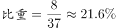，在以上。

故正确答案为D。

备注：本题主要是理解单循环比赛和淘汰赛的场次计算方法。

N支队伍进行单循环赛（任意两支队伍比赛一场）：一共比赛场；

M支队伍进行决出冠、亚军的淘汰赛：一共比赛场。

---

### 第 2 题　qid 2136456 · 数学运算

140支社区足球队参加全市社区足球淘汰赛，每一轮都要在未失败过的球队中抽签决定比赛对手，如上一轮未失败过的球队是奇数，则有一队不用比赛直接进入下一轮。问夺冠的球队至少要参加几场比赛？

- **A**. 3
- **B**. 4　✅
- **C**. 5
- **D**. 6

**答案**：B

**官方解析**

根据题意，每次参加比赛的球队数为140、70、35、18、9、5、3、2，共8场比赛。
冠军要想参加的比赛最少，则让其每逢球队数为奇数时就直接进入下一轮，即只参加球队数为偶数的比赛。
偶数有140、70、18、2这四个，共4场。
故正确答案为B。

---

### 第 3 题　qid 2136458 · 数学运算

老王和老李沿着小公园的环形小路散步，两人同时出发，当老王走到一半路程时，老李走了100米；当老王回到起点时，老李走了的路程。问环形小路总长多少米？

- **A**. 200
- **B**. 240　✅
- **C**. 250
- **D**. 300

**答案**：B

**官方解析**

依据题意，两人同时出发，在每个过程中时间一定，则速度比等于路程比。而两人速度比始终不变，则在两个运动过程中两人的路程比相同。

设环形小路全程为，则有：，解得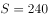米。

故正确答案为B。

---

### 第 4 题　qid 2136460 · 数学运算

甲与乙一起骑自行车从A地去B地，自行车的速度为每小时15千米。走了的路程后，乙因故骑自行车返回A地而甲下车继续步行前行。乙在到达A地后立刻原路折返，在距离B地还有的路程处追上甲。问甲步行的速度为每小时多少千米？

- **A**. 3
- **B**. 4
- **C**. 5　✅
- **D**. 6

**答案**：C

**官方解析**

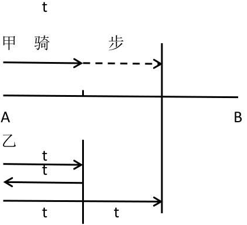

方法一：设二人从出发到骑行至的路程时所花时间为，则乙返回原点所用时间也为。又由乙追上甲时距离B地还有的路程可知，从乙开始返程的地点到乙追上甲的地点，距离也是全程的，由于乙的速度不变，所以所用时间也为。

设甲步行的速度为千米/小时，从出发点到追上点的距离分别用甲、乙的速度与时间表示，可得，解得。

方法二：甲、乙二人在全程处分开，甲步行至距离B点的路程处被乙追上，即甲步行了全程的；乙先骑行回到A处再原路折返追上甲，此时共行驶了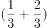个全程，即乙独自骑行了一个全程的路程。自两人分开后到甲被追上，两人时间相同，则路程之比等于速度之比，，则，而，则。

故正确答案为C。

---

### 第 5 题　qid 2136464 · 数学运算

某公司将销售部门拆分为线上和线下两个团队，拆分后线上团队的人数为线下团队的2倍，线下团队男女员工人数相同，线上团队的男员工人数占两个团队男员工总数的。则拆分前，销售部门男女员工人数之比为：

- **A**. 1:2
- **B**. 2:3
- **C**. 3:5
- **D**. 5:7　✅

**答案**：D

**官方解析**

因为线上团队的人数为线下团队的2倍，设线下团队为人，线上团队为人。由于线下团队男女员工人数相同，所以线下团队男女员工均为人。设线上团队男员工为人，由于线上团队的男员工人数占两个团队男员工总数的，可得关系式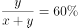，解得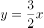。

列表如下：

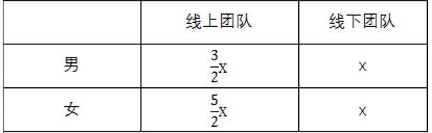

故所求，即男女总人数之比为5:7。

故正确答案为D。

---

### 第 6 题　qid 2136450 · 数学运算

某早餐店试营业主打套餐每份成本8元，售价26元。当天卖不完的主打套餐不再出售，在过去两天时间里，餐厅每天都会准备200份主打套餐，第一天剩余20份主打套餐，第二天全部卖光。问这两天该早餐店主打套餐共盈余多少元？

- **A**. 6680　✅
- **B**. 6840
- **C**. 7000
- **D**. 7160

**答案**：A

**官方解析**

每份套餐成本为8元，售价26元，则每份套餐的盈余为元；第一天售出份可以获得盈余，但剩余的20份会亏损8元，则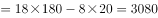元；

第二天200份套餐全部出售，全部可获得盈余为元，则两天的元。

故正确答案为A。

---

### 第 7 题　qid 2136452 · 数学运算

公司销售部门共有甲、乙、丙、丁四个销售小组，本年度甲组销售金额是该部门销售金额总数的，乙组销售金额是另外三个小组总额的，丙组销售金额比丁组销售金额多200万元，比甲组少200万元。问销售部门销售总金额是多少万元？

- **A**. 1800
- **B**. 2400
- **C**. 3000　✅
- **D**. 3600

**答案**：C

**官方解析**

方法一：根据题干条件可得，丁的销售额最少，设丁的销售额为，则，，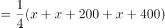。因甲的销售额是销售总额的，则，即，解得，则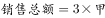万元。

方法二：因乙占另外三个小组总额的，则乙占总量的。

设销售总额为，则，，，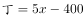。

因，则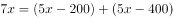，解得。万元。

注：若某人占其他人总和的，可以设其他人总和为份，某人为1份，则所有人总和为份，可推得：某人占总量的，此为固定结论。

故正确答案为C。

---

### 第 8 题　qid 2136462 · 数学运算

某单位男女员工的人数之比是15:13。按人数之比5:7:8，分为甲、乙、丙三个科室，其中甲科室男女员工的人数之比为4:3，乙科室为5:2。则丙科室男女员工人数之比为：

- **A**. 1:2
- **B**. 2:3
- **C**. 5:9　✅
- **D**. 5:8

**答案**：C

**官方解析**

此单位按男女分，分成了28份；按科室分，分成了20份。赋值本单位的人数为二者的最小公倍数140人，则男性员工为人，女性员工为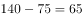人。

人，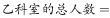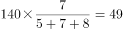人，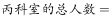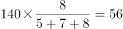人。

则甲科室的男员工有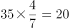人，女员工有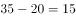人；

乙科室的男员工有人，女员工有人；

丙科室的男员工应有人，女员工有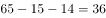人。。

故正确答案为C。

---

### 第 9 题　qid 2136466 · 数学运算

租车公司的商务车数量比小客车少16辆，某日租出商务车、小客车各16辆后，剩下的小客车数量正好是商务车的3倍。问该公司商务车和小客车数量之比为多少？

- **A**. 2:5
- **B**. 3:5　✅
- **C**. 4:7
- **D**. 5:7

**答案**：B

**官方解析**

根据题干条件，设商务车的数量为辆，则小客车的数量为辆。在各租出16辆后，剩余的小客车是商务车的3倍，则可得：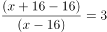，解得。即商务车有24辆，小客车有辆，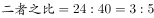。

故正确答案为B。

---

### 第 10 题　qid 2136468 · 数学运算

小张每周一到周五都要去健身房锻炼。某年小张每个季度去健身房锻炼的天数相同，问当年的国庆节是星期几？

- **A**. 星期一
- **B**. 星期五
- **C**. 星期六
- **D**. 星期日　✅

**答案**：D

**官方解析**

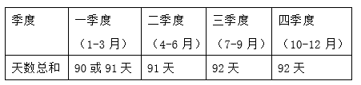

小张每个季度去健身房锻炼的天数相同，每个季度的总天数见表中。在这四个季度中，第二季度是完整的13周，期间小张去健身房的天数一定为天。所以第四季度小张去健身房的天数也应该是天，则第四季度比第二季度多出的一天一定为周六或周日，即第四季度的第一天国庆节为周六或周日。若10月1号是星期六，则9月30号是星期五，此时第三季度小张去健身房的天数是，与第二季度去健身房天数不同；假设10月1号是星期日，则9月30号是周六，此时第三季度小张去健身房的天数是，满足题意。故国庆节当天只能是星期日。

故正确答案为D。

---

### 第 11 题　qid 2136470 · 数学运算

甲、乙、丙和丁四辆载重不同的卡车运输一批货物。其中甲的载重是乙的2倍、是丙的3倍、是丁的1.5倍。如果甲和丁一起运货，各跑10次正好能运完所有货物。如果乙和丙一起运货，且乙每小时运一趟、丙每半小时运一趟，问需要多少小时才能运完所有货物？

- **A**. 14
- **B**. 14.5　✅
- **C**. 15
- **D**. 15.5

**答案**：B

**官方解析**

题目中给出甲、乙、丙、丁工作效率间的比例关系，故可对效率进行赋值。赋值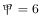，则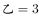，，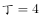。由题意“甲和丁一起运货，各跑10次正好能运完所有货物”可得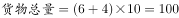。乙每小时运一趟，即每小时可运3，丙每半小时运一趟，即每小时可运，所以乙、丙合运每小时可运的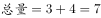,则共需时间为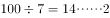，即一起运送14小时还剩下的货物量为2，剩余的2让丙运半小时即可运完所有货物，所以共14.5小时。

故正确答案为B。

---

### 第 12 题　qid 2136472 · 数学运算

一本书的正文页码数字中总计出现了87次2，问出现3的次数比6多多少次？

- **A**. 3　✅
- **B**. 4
- **C**. 6
- **D**. 10

**答案**：A

**官方解析**

从表格中可计算出2出现的次数为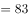次，题干为87次，还需要出现4个2，接下来230页、231页、232页共有4个2。前229页出现3的次数和6的次数同样多，故只有在最后三页（230、231、232）中3的个数比6多，共多出现了3次。

故正确答案为A。

---

### 第 13 题　qid 2136474 · 数学运算

张老师家四代同堂，且从父亲、张老师、儿子到孙子，每两代人的年龄差相同。5年前张老师父亲的年龄是儿子的3倍，8年后张老师的年龄是孙子的5倍。问今年四个人的年龄之和为：

- **A**. 168岁
- **B**. 172岁
- **C**. 176岁　✅
- **D**. 180岁

**答案**：C

**官方解析**

方法一：根据题意可假设今年父亲、张老师、儿子、孙子四人的年龄分别为：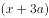、、、，可得方程组：

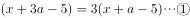

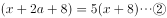

联立①②，解得，。今年四人年龄之和为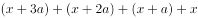岁。

方法二：假设5年前张老师儿子的年龄为，则张老师父亲年龄为，根据每两代人年龄差相同，则5年前张老师的年龄为，孙子为0岁，四人的年龄和为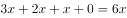，由于年龄都是整数，所以是6的倍数。今年四人的年龄和应为，代入验证只有C项减去20后是6的倍数。

故正确答案为C。

---

### 第 14 题　qid 2136476 · 数学运算

某单位有80名职工参加了义务劳动、希望工程捐款和探望敬老院三项公益活动中的至少一项。只参加一项的人数与参加超过一项的人数相同，参加所有三项公益活动的与只捐款的人数均为12人，且只探望敬老院的人比只参加义务劳动的人多16人。问探望敬老院的人最多比参加义务劳动的人多多少人？

- **A**. 28
- **B**. 32
- **C**. 36
- **D**. 44　✅

**答案**：D

**官方解析**

由题意可得：只参加一项的人数与参加超过一项（两项和三项）的人数相同，即二者各占总数的一半，不止参加一项活动的人数为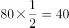人，同时已知参加三项活动的有12人，所以参加两项活动的有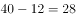人。假设只参加探望敬老院与捐款这两项活动的人数为，只参加捐款与义务劳动这两项活动的人数为，只参加探望敬老院与义务劳动这两项活动的人数为，则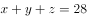。又已知只探望敬老院的人比只参加义务劳动的人多16人，则题目所求为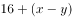，而，所以当，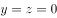时，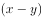取得最大值为28，则探望敬老院的人最多比参加义务劳动的人多人。

故正确答案为D。

---

### 第 15 题　qid 2136490 · 数学运算

一块三角形农田ABC（如下图所示）被DE、EF两条道路分成三块。已知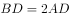，，，则三角形ADE、三角形CEF和四边形BDEF的面积之比为：

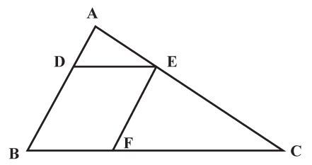

- **A**. 1:3:3
- **B**. 1:3:4
- **C**. 1:4:4　✅
- **D**. 1:4:5

**答案**：C

**官方解析**

由题意可知，D点、E点分别为AB、AC的三等分点，，，两个三角形对应边长之比为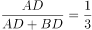，相似三角形面积之比为边长之比的平方，则，而，代入选项验证，C项满足。

故正确答案为C。

---

## 判断推理

### 第 1 题　qid 2136750 · 图形推理

从所给的四个选项中，选择最合适的一个填入问号处，使之呈现一定的规律性：

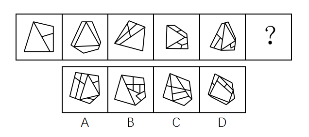

- **A**. A
- **B**. B　✅
- **C**. C
- **D**. D

**答案**：B

**官方解析**

观察图形发现，元素组成不同且图形被分隔为多个区域，优先考虑数面。题干图形面数量分别为3、4、5、6、7，呈递增规律，故？处应选择一个面数量为8的图形。观察选项发现，A项9个面，B项8个面，C项8个面，D项8个面，排除A选项。进一步观察发现，题干所有图形中，面积最大的面均为一个三角形的面，只有B选项符合。
故正确答案为B。

---

### 第 2 题　qid 2136754 · 图形推理

把下面的六个图形分为两类，使每一类图形都有各自的共同特征或规律，分类正确的一项是：

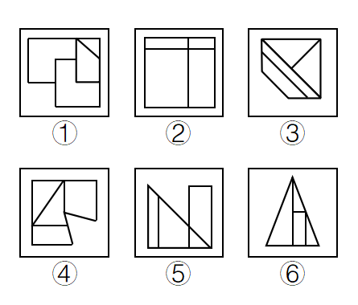

- **A**. ①②④，③⑤⑥
- **B**. ①④⑤，②③⑥
- **C**. ①③⑥，②④⑤　✅
- **D**. ①⑤⑥，②③④

**答案**：C

**官方解析**

本题为分组分类题。观察图形发现，题干中图形均被分隔为不同的封闭区域，考虑面数量。但题干图形面数量均为4个，可考虑面的特征。观察发现，题干中有的图形中存在两个完全相同的面，有的图形中几个面均不相同，即图①③⑥中均存在两个完全相同的面，图②④⑤中不存在两个完全相同的面，因此可将图形分为①③⑥一组，②④⑤一组。
故正确答案为C。

---

### 第 3 题　qid 2136758 · 图形推理

把下面的六个图形分为两类，使每一类图形都有各自的共同特征或规律，分类正确的一项是：

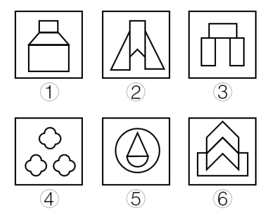

- **A**. ①②③，④⑤⑥
- **B**. ①④⑤，②③⑥
- **C**. ①③⑤，②④⑥
- **D**. ①⑤⑥，②③④　✅

**答案**：D

**官方解析**

本题为分组分类题目。观察图形发现，所有图形都为关于竖轴轴对称的图形。

解法一：画出题干中每个图形的对称轴发现，图②③④的对称轴左右两边均存在形状完全一致的小图形，图①⑤⑥的对称轴左右两边均不存在形状完全一致的小图形，因此可将图形分为①⑤⑥一组，②③④一组。

解法二：画出题干中每个图形的对称轴发现，图②③④的对称轴穿过图形的一个面，图①⑤⑥的对称轴穿过图形的三个面，因此可将图形分为①⑤⑥一组，②③④一组。

故正确答案为D。

备注：两种解法考虑的都是对称轴与图形之间的关系，且答案一致，故任一解法均可答题。

---

### 第 4 题　qid 2136764 · 图形推理

左边是给定的正方体的外表面展开图，右边哪一项能由它折叠而成？

- **A**. A
- **B**. B
- **C**. C　✅
- **D**. D

**答案**：C

**官方解析**

本题考查六面体的空间重构。如下图所示，先对题干展开图的6个面进行标号：

A项：如上图所示，同时对选项和题干展开图中面g进行画边，选项中第4条边对应的是面e中小直角三角形的直角边，而题干展开图中第4条边对应的是面e中直角梯形的长底边，选项和题干展开图不一致，排除；

B项：如上图所示，同时对选项和题干展开图中面g进行画边，选项中第2条边对应面h，而题干展开图中第2条边对应面j，选项和题干展开图不一致，排除；

C项：选项和题干展开图一致，当选；

D项：面e与面j为相对面，不能同时出现，选项和题干展开图不一致，排除。

故正确答案为C。

---

### 第 5 题　qid 2136768 · 图形推理

把下面的六个图形分为两类，使每一类图形都有各自的共同特征或规律，分类正确的一项是：

- **A**. ①③④，②⑤⑥　✅
- **B**. ①②⑤，③④⑥
- **C**. ①⑤⑥，②③④
- **D**. ①③⑥，②④⑤

**答案**：A

**官方解析**

本题为分组分类题目。图形元素组成不同，无明显属性规律，考虑数量规律。观察发现，题干出现粗线条、生活化图形，考虑部分数。题干图形中，图②⑤⑥都是一部分，而图①为5部分，图③为2部分，图④为6部分，所以图①③④都是多部分。即①③④一组，②⑤⑥一组。
故正确答案为A。
注：图形分组分类优先考虑两组图形分别呈现规律，但这道题出现粗线条、生活化图形，部分数特征明显，且无其他规律，可考虑一组为一部分、一组为多部分的规律。

---

### 第 6 题　qid 2136772 · 图形推理

左图是给定的立体图形，将其从任一面剖开，下面哪一项不可能是该立体图形的截面？

- **A**. A
- **B**. B
- **C**. C　✅
- **D**. D

**答案**：C

**官方解析**

A项：在图形前面的L形部分，竖直向下可以切出，如图1所示；

B项：在图形的一角斜着从棱切到面，可以切出，如图2所示；

C项：无法切出直角三角形；

D项：在图形的一角斜着从面切到面，可以切出，如图3所示。

本题为选非题，故正确答案为C。

---

### 第 7 题　qid 2136776 · 图形推理

从所给的四个选项中，选择最合适的一个填入问号处，使之呈现一定的规律性：

- **A**. A
- **B**. B
- **C**. C　✅
- **D**. D

**答案**：C

**官方解析**

元素组成不同，属性无明显规律，考虑数量规律。观察题干图形发现，点、线、面、素均无明显规律。再次观察，发现图1、图2出现矩形和正方形，图3圆中的直线都是垂直相交的，考虑数直角数量。题干图形中直角数分别是8、7、6、5、4，依次递减，故？处应选择有3个直角的图形。选项直角数分别为A项4个、B项1个、C项3个、D项9个，只有C项符合题干规律。
故正确答案为C。

---

### 第 8 题　qid 2136778 · 图形推理

从所给的四个选项中，选择最合适的一个填入问号处，使之呈现一定的规律性：

- **A**. A
- **B**. B
- **C**. C　✅
- **D**. D

**答案**：C

**官方解析**

元素组成不同，且无属性规律，考虑数量规律。观察题干图形发现，每个图形中均存在曲线，可优先考虑曲线数。题干图形中的曲线数依次为1、2、3、4、5，故问号处应选择有6条曲线的图形。选项曲线数分别为A项12条、B项5条、C项6条、D项10条，只有C项符合题干规律。
故正确答案为C。

---

### 第 9 题　qid 2136730 · 图形推理

从所给的四个选项中，选择最合适的一个填入问号处，使之呈现一定的规律性：

- **A**. A
- **B**. B　✅
- **C**. C
- **D**. D

**答案**：B

**官方解析**

九宫格优先横行观察，第一行都有3个球，第二行都有4个球，第三行前两幅图都有4个球，故问号处也应有四个球，排除D项；观察发现，题干所有球均分为上下两行，排除A项；比较B、C两项，发现B、C两项下边两个球之间的距离不一致，观察题干发现，九宫格第一行中，横线上下两行间隔排列，第二行，横线上下两行对齐排列，第三行前两幅图中，横线上下两行间隔排列，因此问号处选择一个横线上下两行间隔排列的，只有B选项符合。
故正确答案为B。

---

### 第 10 题　qid 2136734 · 图形推理

从所给的四个选项中，选择最合适的一个填入问号处，使之呈现一定的规律性：

- **A**. A
- **B**. B　✅
- **C**. C
- **D**. D

**答案**：B

**官方解析**

图形元素组成不同，且无属性规律，考虑数量规律。观察发现，题干中每个图形都含有4个奇点，即都是两笔画图形，故问号处应选择两笔画图形。选项中，A项和D项都是一笔画图形，C项是三笔画图形，只有B项是两笔画图形。
故正确答案为B。

---

### 第 11 题　qid 2136756 · 定义判断

暂予监外执行是指对被判处有期徒刑、拘役或无期徒刑的罪犯，在某些法定情形出现时，暂时不采取在监狱或看守所执行原判刑罚的一种变通执行方法。罪犯有下列情形之一的，可以暂予监外执行：（1）有严重疾病需要保外就医的；（2）怀孕或正在哺乳自己的婴儿的；（3）生活不能自理，适用暂予监外执行不致危害社会的。被判处无期徒刑的罪犯，只有在符合第二种情形时，才可以暂予监外执行。对适用保外就医可能有社会危险性的罪犯，或者自伤自残的罪犯，不得保外就医。
根据上述定义，下列罪犯最有可能适用暂予监外执行的是：

- **A**. 罪犯甲（女）被判处有期徒刑，丈夫死亡，父母患重病，尚有三个3-8岁的未成年子女无人照看
- **B**. 罪犯乙被判处有期徒刑，入监后对生活失去信心，自杀未果，危及生命
- **C**. 罪犯丙被判处有期徒刑，服刑期间突发疾病，肢体瘫痪，生活不能自理　✅
- **D**. 罪犯丙（女）被判处死刑，判决生效后发现其已怀孕三个月

**答案**：C

**官方解析**

第一步：找出定义关键词。
被判处有期徒刑或者拘役的罪犯：（1）有严重疾病需要保外就医的；（2）怀孕或者正在哺乳自己婴儿的妇女；(3）生活不能自理，适用暂予监外执行不致危害社会的。
被判处无期徒刑的罪犯：只有符合第二种情形的，才可以暂予监外执行。
对适用保外就医可能有社会危险性的罪犯，或者自伤自残的罪犯，不得保外就医。
第二步：逐一分析选项。
A项：罪犯甲（女）被判处有期徒刑，但是她的丈夫死亡、父母患病、子女无人照顾等这些条件不满足“（1）有严重疾病需要保外就医的；（2）怀孕或者正在哺乳自己婴儿的妇女；（3）生活不能自理，适用暂予监外执行不致危害社会的”，不符合定义，排除；
B项：罪犯乙被判处有期徒刑，入监后对生活失去信心，虽然自杀未遂并危及生命，可能需要保外就医，但是根据关键词“对适用保外就医可能有社会危险性的罪犯，或者自伤自残的罪犯，不得保外就医”，不符合定义，排除；
C项：罪犯丙被判处有期徒刑，在服刑期间患病肢体瘫痪，并且生活不能自理符合“生活不能自理，适用暂予监外执行不致危害社会的”的情形，符合定义，当选；
D项：罪犯丙（女）被判处死刑，虽然她已怀孕，但是怀孕可以监外执行的前提是被判处有期徒刑或无期徒刑，而不是死刑，因此不在暂予监外执行考虑的范畴，不符合定义，排除。
故正确答案为C。

---

### 第 12 题　qid 2136762 · 定义判断

服务型公关是指组织以提供各种实惠服务为主，通过实际行动获取社会公众的了解和好评，从而建立组织良好形象的公共关系活动。
根据上述定义，下列属于服务型公关的是：

- **A**. 某热水器厂家定期向用户发送热水器使用注意事项，每年为用户免费更换滤网　✅
- **B**. 某环保公司通过某电视节目宣布向灾区一次性提供价值5亿元人民币的救助物资
- **C**. 某酒厂在电视黄金时段投放大量广告宣传其新产品
- **D**. 某制药公司董事长就生产的某批次药品不合格一事向消费者公开道歉，并辞去相关职务

**答案**：A

**官方解析**

第一步：找出定义关键词。
“组织”、“以提供各种实惠服务为主”、“通过实际行动获取社会公众的了解和好评”、“建立组织良好形象”。
第二步：逐一分析选项。
A项：热水器厂定期给用户发送注意事项，免费换滤网，符合“以提供各种实惠服务为主”、“通过实际行动获取社会公众的了解和好评”，符合定义，当选；
B项：环保公司是通过电视节目宣布向灾区一次性提供救援物资，提供的是物资，而不是提供服务，不符合“以提供各种实惠服务为主”，不符合定义，排除；
C项：酒厂打广告的行为，只是一种营销宣传手段，不是向社会提供服务，不符合“以提供各种实惠服务为主”，不符合定义，排除；
D项：制药公司董事长是个人，不是组织，主体不符，同时他就药品质量问题公开道歉的行为，不符合“以提供各种实惠服务为主”，不符合定义，排除。
故正确答案为A。

---

### 第 13 题　qid 2136766 · 定义判断

消费痛点指消费者在使用或希望使用某商品时，认为存在特别令人不满意或令人感到麻烦的地方。
根据上述定义，下列不属于消费痛点的是：

- **A**. 江女士特别注意美容，购买了某品牌护肤品，但她发现使用起来很不方便
- **B**. 老马为了养生特地购买了海参，但他发现发制和烹煮特别耗费时间和精力
- **C**. 小林家使用的抽油烟机效果很好，但清洗太复杂，每次都需专业人员登门
- **D**. 谢女士买了一条心仪已久的裙子，但是穿上后周围的朋友都说不适合她，她感到很沮丧　✅

**答案**：D

**官方解析**

第一步：找出定义关键词。
“消费者”、“使用或希望使用某种商品时”、“令人不满意或令人感到麻烦的地方”。
第二步：逐一分析选项。
A项：消费者江女士使用护肤品时感觉很不方便，符合“令人感到麻烦”，符合定义，排除； 
B项：消费者老马在使用海参时，发现烹制和蒸煮特别耗费时间和精力，符合“令人感到麻烦”，符合定义，排除；
C项：消费者小林家使用的抽油烟机清洗太复杂，符合“令人不满意或令人感到麻烦”，符合定义，排除；
D项：消费者谢女士购买心仪的裙子后，是由于周围朋友说不适合她，她才感到沮丧，并不是对裙子感到不满意或感到麻烦，不符合定义，当选。
本题为选非题，故正确答案为D。

---

### 第 14 题　qid 2136770 · 定义判断

舌尖效应是指对于平时很熟悉的事物，人们就是一时想不起来，有一种话到口边却说不出来的感觉，在情绪紧张时尤其明显。
根据上述定义，下列属于舌尖效应的是：

- **A**. 退休不久的老孙在街上看到过去同一办公室的同事，同事热情地与他打招呼，但老孙就是想不起同事的名字　✅
- **B**. 小王去一家广告公司应聘，面对招聘人员的提问，他沉着冷静，对答如流，但当招聘人员最后问他所期望的工资待遇时，他却难以启齿
- **C**. 江先生平时聊天总能侃侃而谈，在一次相亲中他遇到一位心仪的女性，他一紧张反而变得笨嘴拙舌，不知如何与对方攀谈
- **D**. 在一次数学考试中，小张遇到一道难题，他的大脑一片空白，心里很着急，但就是不知如何回答

**答案**：A

**官方解析**

第一步：找出定义关键词。
“对于平时很熟悉的事物”、“一时想不起来”、“话到口边却说不出来”、“在情绪紧张时尤为明显”。
第二步：逐一分析选项。
A项：刚退休不久的老孙遇到同一办公室的同事，符合“对于平时很熟悉的事物”，“老孙就是想不起同事的名字”符合“一时想不起来”、“话到口边却说不出来”，符合定义，当选； 
B项：对所期望的工资待遇难以启齿的原因不是因为一时想不起来，而是因为不知道怎么回答，不符合定义，排除；
C项：江先生相亲时遇到心仪的女性，相亲对象不属于很熟悉的事物，不符合“对于平时很熟悉的事物”，不符合定义，排除；
D项：数学考试是答卷，不符合“话到口边却说不出来”，不符合定义，排除。
故正确答案为A。

---

### 第 15 题　qid 2136774 · 定义判断

所谓面源污染，是指溶解的或固体的污染物从非特定的地点，在降水（或融雪）的冲刷作用下，通过径流过程而汇入受纳水体（包括河流、湖泊、水库和海湾等），并引起水体的富营养化或其他形式的污染，是相对于点源污染而言的一种水环境污染类型。
根据上述定义，下列情形属于面源污染的是：

- **A**. 某核电站因地震发生核泄漏造成海水污染
- **B**. 酸雨造成了土壤污染和农作物大面积减产
- **C**. 农村到处散落的垃圾经降水过程污染水体　✅
- **D**. 造纸厂的工业污水不经处理由排污管排放到湖里

**答案**：C

**官方解析**

第一步：找出定义关键词。
“溶解的或固体的污染物”、“从非特定地点”、“在降水（或融雪）的冲刷作用下”、“通过径流过程而汇入受纳水体”、“水环境污染”。
第二步：逐一分析选项。
A项：某核电站属于特定地点，不符合“从非特定地点”，而且因地震发生核泄漏，不符合“在降水（或融雪）的冲刷作用下”，不符合定义，排除；
B项：酸雨造成了土壤污染和农作物减产，不符合“通过径流过程而汇入受纳水体”造成“水环境污染”，不符合定义，排除；
C项：散落的垃圾符合“溶解的或固体的污染物”，经降水过程符合“在降水（或融雪）的冲刷作用下”，污染水体符合“水环境污染”，符合定义，当选；
D项：由排污管排放，不符合“在降水（或融雪）的冲刷作用下”，不符合定义，排除。
故正确答案为C。

---

### 第 16 题　qid 2136714 · 定义判断

内生式发展，是一种主要由发展地区内部来推动和参与、充分利用发展地区自身的力量和资源、尊重自身的价值与制度、探索适合自身发展道路的发展。
根据上述定义，下列情形属于内生式发展的是：

- **A**. 新农村建设中，地方政府撤村建社区，让农民集中到社区居住
- **B**. 为推动农民致富，地方政府让农民放弃种植小麦，统一种植果树
- **C**. 农民放弃机械化的耕作模式，采用传统的人工耕作方式
- **D**. 山区农民组建藤条编织合作社，将藤编产品打入国际市场　✅

**答案**：D

**官方解析**

第一步：找出定义关键词。
“由发展地区内部来推动和参与”、“利用发展地区自身的力量和资源”、“探索适合自身发展道路的发展”。
第二步：逐一分析选项。
A项：地方政府撤村建社区，属于地方政府主动采取的措施，不符合“由发展地区内部来推动和参与”，不符合定义，排除； 
B项：地方政府让农民放弃种植小麦，属于地方政府主动采取的措施，不符合“由发展地区内部来推动和参与”，不符合定义，排除；
C项：农民放弃机械化的耕作模式，采用传统的人工耕作模式，是否符合“探索适合自身发展道路的发展”不明确，排除；
D项：山区农民组建藤条编织合作社，符合“利用发展地区自身的力量和资源”，将藤条产品打入国际市场，符合“探索适合自身发展道路的发展”，符合定义，当选。
故正确答案为D。

---

### 第 17 题　qid 2136720 · 定义判断

无卡支付指付款人借助互联网、移动互联网、无线局域网等渠道进行的，不需要通过受理设备读取物理卡片，即可向收款人转移可以接受的货币债权。
根据上述定义，下列不属于无卡支付的是：

- **A**. 小王是个网购达人，为方便购物，他开通了支付宝的“快捷支付”功能，输入卖家支付宝账号即可付款完成交易
- **B**. 某高校开通了“校园一卡通”服务，该卡既可以当门禁卡、借书证使用，也可以用它在餐厅、超市消费，方便了广大师生　✅
- **C**. 小钱是资深的游戏玩家，经常在游戏平台用网银购买大量游戏装备
- **D**. 餐馆老板老吴开通了微信支付，顾客买单时只需用手机扫描账单上的二维码，即可用微信支付相应的费用

**答案**：B

**官方解析**

第一步：找出定义关键词。
“借助互联网、移动互联网、无线局域网等渠道进行的”、“不需要通过受理设备读取物理卡片”、“向收款人转移可以接受的货币债权”。
第二步：逐一分析选项。
A项：“开通支付宝‘快捷支付’功能，输入卖家支付宝账号”符合“借助互联网、移动互联网、无线局域网等渠道”的支付方式，“即可付款完成交易”符合“向收款人转移可以接受的货币债权”，符合定义，排除；
B项：“该卡既可以当门禁卡、借书证使用，也可以用它在餐厅、超市消费”不符合“不需要通过受理设备读取物理卡片”的支付方式，不符合定义，当选；
C项：“在游戏平台用网银购买游戏装备”符合“借助互联网、移动互联网、无线局域网等渠道进行的”支付方式，符合定义，排除；
D项：“微信支付，扫描二维码即可付款”符合“借助互联网、移动互联网、无线局域网等渠道进行的”支付方式，符合定义，排除。
本题为选非题，故正确答案为B。

---

### 第 18 题　qid 2136696 · 定义判断

责任分散效应也称为旁观者效应，是指对某一事件来说，如果是单个个体被要求单独完成任务，个体责任感会增强。但如果是要求群体共同完成任务，群体中的每个个体的责任感会变弱，甚至会出现人多不负责、责任不落实的情况。这一效应常发生在事故发生后众多旁观者身上。
根据上述定义，下列情形不属于责任分散效应的是：

- **A**. 有一位口吐白沫的人倒在街上，小明看到后心想“有人会打120的”
- **B**. 邻居家的房子着火了，小吴和其他邻居从楼道逃生　✅
- **C**. 有一个小孩被车撞倒在马路中央，经过的车辆纷纷绕道而行
- **D**. 某女士在闹市区遭遇歹徒袭击，数次高呼“救命”而无人施救

**答案**：B

**官方解析**

第一步：找出定义关键词。
“单个个体被要求单独完成任务，个体责任感会增强”、“群体共同完成任务，群体中的每一个个体的责任感变弱，甚至会出现人多不负责、责任不落实的情况”、“事故发生后”。
第二步：逐一分析选项。
A项：“口吐白沫的人倒在街上”后周围人产生了帮助的责任，“小明看到后心想有人会打120，所以自己就没打”符合“群体中的每一个个体的责任感会变弱，甚至会出现人多不负责、责任不落实的情况”，符合定义，排除；
B项：“邻居家的房子着火了，小吴和其他邻居从楼道逃生”，小吴和邻居的行为不符合“群体中的每一个个体的责任感变弱，甚至会出现人多不负责、责任不落实的情况”，且小吴和其他邻居从楼道逃生是事故发生中，不符合“事故发生后”，不符合定义，当选；
C项：“小孩被车撞倒在马路中央”后周围人产生了帮助的责任，“经过的车辆纷纷绕道而行”符合“群体中的每一个个体的责任感变弱，甚至会出现人多不负责、责任不落实的情况”，符合定义，排除；
D项：“某女士在闹市区遭遇歹徒袭击”后周围人产生了帮助的责任，“数次高呼救命而无人施救”符合“群体中的每一个个体的责任感变弱，甚至会出现人多不负责、责任不落实的情况”，“某女士在闹市区遭遇歹徒袭击”是事故中还是事故后不明确，但是综合比较B、D两个选项，得出B项更不符合定义，排除。
本题为选非题，故正确答案为B。

---

### 第 19 题　qid 2136704 · 定义判断

持有损益是指资产和负债的所有者由于持有资产或负债，而被动承受价格变动对资产或负债价值影响的后果，所有者在其中并未对资产或负债采取任何加工或转换的行为。
根据上述定义，下列属于持有损益的是：

- **A**. 小文持有某种股票，因股价变化使他获得3万元的收益　✅
- **B**. 某企业的生产设备因消耗而引起资产价值减少2万元
- **C**. 某公司折价（95元）发行面值100元的债券，形成5元的价差
- **D**. 某单位原材料储备过程中因霉变损失6000元

**答案**：A

**官方解析**

第一步：找出定义关键词。
“资产和负债的所有者”、“被动承受价格变动对资产或负债价值影响的后果”、“并未对资产或负债采取任何加工或转换”。
第二步：逐一分析选项。
A项：小文是因为股价的变化而获得收益的，他并没有对资产采取任何加工或转换，符合定义，当选； 
B项：某企业是因为生产设备的消耗，而造成了资产的减少，不符合“被动承受价格变动对资产或负债价值影响的后果”，不符合定义，排除；
C项：某公司是因为折价债券，而造成的资产减少，不符合“被动承受价格变动对资产或负债价值影响的后果”，不符合定义，排除；
D项：某单位是因为储备过程中原材料霉变，而损失了资产，不符合“被动承受价格变动对资产或负债价值影响的后果”，不符合定义，排除。
故正确答案为A。

---

### 第 20 题　qid 2136706 · 定义判断

超率累进税率是指以征税对象数额的相对比率（如产值利润率、资金利润率、销售利润率、成本利润率等）划分征税级距，分别规定相应的差别税率，相对比例每超过一个级距的，对超过的部分就按高一级的税率计算征税。
根据上述定义，下列各项中按照超率累进税率征税的是：

- **A**. 
我国法律规定，土地增值额未超过扣除项目金额的部分，土地增值税税率为；超过扣除项目金额、未超过的部分，税率为
　✅
- **B**. 
我国建国初期征收工商所得税税率分为21级，所得额未满300元的税率为；所得额在万元以上的税率为

- **C**. 
我国企业所得税的税率为。符合条件的小型微利企业，按的税率征收企业所得税；国家需要重点扶持的高新技术企业，按的税率征收企业所得税

- **D**. 
我国法律规定，白酒消费税税率为，黄酒消费税税率为，啤酒消费税税率为

**答案**：A

**官方解析**

第一步：找出定义关键词。 “征税对象数额的相对比率划分征税级距”、“相对比例每超过一个级距的，对超过的部分就按高一级的税率计算征税”。 第二步：逐一分析选项。 A项：土地增值额未超过扣除项目金额的部分，按照一个税率进行征税，而超过的部分，在超过且未超过的，有更高的税率，符合“相对比例每超过一个级距的，对超过的部分就按高一级的税率计算征税”，符合定义，当选； B项：只是不同的金额，有不同的税率，但是并不符合定义中所说的超过一个级别的部分是另外一个税率，不符合定义，排除； C项：只是规定了不同对象的企业所得税是多少，不符合“征税对象数额的相对比率划分征税级距”，不符合定义，排除； D项：只是规定了不同种类的酒的不同税率，不符合“征税对象数额的相对比率划分征税级距”，不符合定义，排除。 故正确答案为A。  

---

### 第 21 题　qid 2136646 · 图形推理

正方形：立方体

- **A**. 三角形：棱形
- **B**. 直线：平面
- **C**. 圆：球　✅
- **D**. 四边形：八面体

**答案**：C

**官方解析**

第一步：判断题干词语间的逻辑关系。
正方形和立方体都可以通过边长确定形状，确定了边长那么正方形的形状就是确定的，确定了边长那么立方体的形状就是确定的。二者为对应关系。
第二步：判断选项词语间的逻辑关系。
A项：要想确定三角形的形状需要知道底边和高，棱形是多种立体图形的总称，例如：三棱锥，四棱锥，四棱柱等，无法通过某一个量确定形状。二者不能通过同一个量确定形状，与题干逻辑关系不一致，排除；
B项：直线与平面二者不能通过同一个量确定形状，与题干逻辑关系不一致，排除；
C项：圆和球都可以通过直径确定形状，确定了直径就确定了圆的形状，确定了直径就确定了球的形状。二者为对应关系，与题干逻辑关系一致，当选；
D项：四边形包含多种，通过确定某一个量不一定能确定四边形的形状。而八面体中有的是正八面体，有些不是。只有正八面体才能通过边长确定形状，而普通八面体无法通过边长确定。二者不能通过同一个量确定形状，与题干逻辑关系不一致，排除。
故正确答案为C。

---

### 第 22 题　qid 2136650 · 类比推理

无机物：化合物

- **A**. 中草药：野菜　✅
- **B**. 二氧化碳：有机盐
- **C**. 空间：时间
- **D**. 原子：电子

**答案**：A

**官方解析**

第一步：判断题干词语间的逻辑关系。
无机物是单质和无机化合物的统称。化合物分为无机化合物和有机化合物。二者之间是交叉关系。
第二步：判断选项词语间的逻辑关系。
A项：野菜是可以做蔬菜的野生植物，中草药即为中药，是中医所用的药物，以植物为最多，也包括动物和矿物。二者之间是交叉关系，与题干逻辑关系一致，当选；
B项：有机盐是有机酸、生物碱适当中和生成的盐，二氧化碳和有机盐没有必然的逻辑关系，与题干逻辑关系不一致，排除；
C项：空间是与时间相对的一种物质客观存在形式，二者之间是并列关系，与题干逻辑关系不一致，排除；
D项：原子由原子核和绕核运动的电子组成，电子是原子的组成部分，二者为组成关系，与题干逻辑关系不一致，排除。
故正确答案为A。

---

### 第 23 题　qid 2136654 · 类比推理

报销：凭据：发票

- **A**. 平衡：支出：消费
- **B**. 乘车：凭证：车票　✅
- **C**. 辩护：律师：法律
- **D**. 观赏：电影：门票

**答案**：B

**官方解析**

第一步：判断题干词语间的逻辑关系。
报销需要凭据，二者之间是对应关系，发票是一种报销凭据，二者之间是种属关系。
第二步：判断选项词语间的逻辑关系。
A项：消费是支出的一种方式，但是平衡和支出之间没有明显逻辑关系，与题干逻辑关系不一致，排除；
B项：乘车需要凭证，车票是一种乘车凭证，与题干逻辑关系一致，当选；
C项：辩护需要律师，但法律是律师使用的工具，而不是律师的一种，与题干逻辑关系不一致，排除；
D项：观赏和电影之间是动宾关系，而且门票和电影也不是种属关系，与题干逻辑关系不一致，排除。
故正确答案为B。

---

### 第 24 题　qid 2136658 · 类比推理

青岛：城市：沿海地区

- **A**. 苹果：水果：果树　✅
- **B**. 矿泉水：饮料：茶杯
- **C**. 足球：运动：草坪
- **D**. 公交车：公路：市区

**答案**：A

**官方解析**

第一步：判断题干词语间的逻辑关系。
青岛是城市，二者为种属关系，青岛是沿海地区的一部分，二者为组成关系。
第二步：判断选项词语间的逻辑关系。
A项：苹果是水果，二者为种属关系，苹果是果树的一部分，二者为组成关系，与题干逻辑关系一致，当选；
B项：矿泉水是一种饮料，茶杯是一种器皿而不是场所，与题干逻辑关系不一致，排除；
C项：足球是一种运动，二者为种属关系，在草坪上进行足球运动，二者为地点对应关系，与题干逻辑关系不一致，排除；
D项：公交车可以在市区的公路上行驶，但公交车与公路之间不是种属关系，与题干逻辑关系不一致，排除。
故正确答案为A。

---

### 第 25 题　qid 2136662 · 类比推理

民歌 对于（  ）相当于（  ）对于 航天器

- **A**. 民谣；飞机
- **B**. 民间；太空
- **C**. 舞曲；宇航员
- **D**. 歌曲；飞船　✅

**答案**：D

**官方解析**

逐一代入选项。
A项：民谣和民歌均是民间流行、赋予民族色彩的歌，二者为全同关系；飞机是一种航空器，航空器与航天器为并列关系，前后逻辑关系不一致，排除；
B项：民歌是在民间流传的歌曲，航天器是在太空飞行的一种仪器，但是前后的顺序颠倒，前后逻辑关系不一致，排除；
C项：民歌是某个民族在古代或者近代时期创作的带有自己民族风格的歌曲，舞曲是电子音乐的一种载体，指的是电子舞曲和DANCE-POP，民歌和舞曲是两种不同的音乐形式，二者之间是并列关系；宇航员可以在航天器内工作，两者是对应关系，前后逻辑关系不一致，排除；
D项：民歌是某个民族在古代或者近代时期创作的带有自己民族风格的歌曲，与歌曲是种属关系；飞船是一种一次性使用的航天器，与航天器是种属关系，前后逻辑关系一致，当选。
故正确答案为D。

---

### 第 26 题　qid 2136712 · 逻辑判断

什么才是伟大的文学作品？它必须同时具备丰满的情节，细腻的描述，能将主人公的命运置身于时代的大背景下，最终展现世世代代流淌于人类血液中的共性。
由此可以推出：

- **A**. 一部文学作品之所以伟大在于它具备丰满的情节
- **B**. 只关注个人世界的作品也能够成为伟大的文学作品
- **C**. 不能体现人类共性的作品不是伟大的文学作品　✅
- **D**. 情节丰满、描述细腻、能将主人公命运置身于时代大背景下的作品就是伟大的文学作品

**答案**：C

**官方解析**

第一步：翻译题干。

伟大的文学作品丰满的情节 且 细腻的描述 且 能将主人公的命运置于时代的大背景下 且 最终展现世世代代流淌于人类血液中的共性。

第二步：逐一分析选项。

A项：“伟大的文学作品”和“丰满的情节”是因果关系，因果关系不是推理关系，无法推出，排除；

B项：题干并未提到“只关注个人世界的作品”，属于无中生有，不能推出，排除；

C项：可翻译为“体现人类共性的作品伟大的文学作品”等价于“伟大的文学作品体现人类共性的作品”，肯前必肯后，从题干中可以推出，当选；

D项：翻译为：情节丰满、描述细腻、能将主人公命运置身于时代大背景下的作品伟大的文学作品，肯定题干箭头后面，得不到确定性的结论，排除。

故正确答案为C。

---

### 第 27 题　qid 2136690 · 逻辑判断

早期宇宙只含有最轻的元素：氢和氦。重一点的元素，如碳，只在恒星发生核反应时产生，并在恒星爆炸时散发出来，存在于随后形成的气云之中。最近发现某气云在40亿年前就含有碳，那时该处宇宙中只有年龄不超过20亿年的恒星。
由此可以推出：

- **A**. 气云中的碳此后形成了恒星的一部分
- **B**. 截至目前无一恒星与气云同样古老
- **C**. 气云中也同时含有氢和氦两种元素
- **D**. 该气云中碳的形成不超过60亿年　✅

**答案**：D

**官方解析**

日常结论题，根据题干信息逐一分析选项。
A项：题干中恒星爆炸时散发出来的碳存在于随后形成的气云之中，并没有提到气云中的碳是否变成了恒星的一部分，无中生有，排除；
B项：气云是恒星爆炸后形成，但是是否存在某一个恒星和气云是同样的年纪，我们不得而知，无中生有，排除；
C项：题干未提到气云中是否含有氢和氦两种元素，无中生有，排除； 
D项：某气云在40亿年前就含有碳，碳只在恒星发生核反应时产生，那时该处宇宙中只有年龄不超过20亿年的恒星，所以气云中碳的形成不可能超过60亿年，当选。
故正确答案为D。

---

### 第 28 题　qid 2136692 · 逻辑判断

南方地区种植棉花一般使用营养钵育苗。但是使用营养钵育苗常遇到草害问题，严重抑制棉苗生长发育。草害仅由以下两种原因之一引起：一是新选址的苗床来不及翻耕，留下的残余杂草繁殖的；二是施入了未彻底腐熟的肥料，杂草籽被带入苗床，使之快速繁殖。因此，要在棉花播种后出苗前施用除草剂，可选用拉索乳油或都尔乳油，都能有效防止杂草危害。

由此可以推出：

- **A**. 若没有杂草繁殖影响，使用棉花营养钵育苗就不会遇到草害　✅
- **B**. 在棉花出苗后施用除草剂的效果不佳
- **C**. 种植棉花时有效防止了杂草危害，说明选择了上述两种除草剂中的一种
- **D**. 使用棉花营养钵育苗的棉苗生长发育不好，说明遇到了草害问题

**答案**：A

**官方解析**

日常结论题，根据题干信息逐一分析选项。

A项：根据题干可知引起草害的原因只有两个，一个是新选址留下的残余杂草繁殖，第二个是未彻底腐熟的肥料中的杂草籽快速繁殖，综合两个原因就是杂草繁殖的影响，所以没有杂草繁殖就不会遇到草害，当选；

B项：根据题干中最后一句可知在棉花播种后出苗前施用除草剂能有效防止杂草危害，但并不意味着在其他时间段施用除草剂的效果不佳，排除；

C项：根据题干中最后一句可知“选用拉索乳油或都尔乳油有效防止杂草危害”，C项中“有效防止了杂草危害”属于肯后，肯后不确定，排除；

D项：题干中指出草害会抑制棉苗生长发育，但并不意味着发育不好是遇到了草害，也许是其他原因抑制了棉苗的生长发育，排除。

故正确答案为A。

---

### 第 29 题　qid 2136694 · 逻辑判断

某研究所的员工构成情况是：所有的工程师都是男性，并非所有工程师都是研究生，并非所有研究生都是男性。
由此可以推出：

- **A**. 有的男性不是工程师
- **B**. 有的男研究生是工程师
- **C**. 有的研究生是男性
- **D**. 有的男性不是研究生　✅

**答案**：D

**官方解析**

第一步：翻译题干。

①工程师男性；

②并非所有工程师都是研究生=有的工程师不是研究生=有的工程师研究生；

③并非所有研究生都是男性=有的研究生不是男性=有的研究生男性。

第二步：逐一分析选项。

A项：翻译为：有的男性工程师，根据条件①“工程师男性”可知“有的男性工程师”，而“有的男性是工程师”推不出“有的男性不是工程师”，无法推出，排除；

B项：翻译为：有的男研究生工程师，“男研究生”的概念在题干中没有出现，无法推出，排除；

C项：翻译为：有的研究生男性，根据条件③“有的研究生男性”推不出“有的研究生是男性”，无法推出，排除；

D项：翻译为：有的男性研究生，根据条件②可知“有的工程师研究生”，可以推出“有的研究生工程师”，再根据条件①“工程师男性”可推出“有的研究生男性”，即“有的男性研究生”，可以推出，当选。

故正确答案为D。

---

### 第 30 题　qid 2136700 · 逻辑判断

某学生考试作弊被学院监考老师发现。如果老师将此事向学校上报，这个学生会被学校开除；如果这个学生被开除，学院的年终考核会被一票否决。如果老师未将此事向学校上报，学生考试作弊现象将愈演愈烈。
由此可以推出：

- **A**. 如果学院的年终考核未被一票否决，则学生考试作弊现象将愈演愈烈　✅
- **B**. 如果学院的年终考核被一票否决，作弊现象不会愈演愈烈
- **C**. 如果该学生被开除，说明老师已将此事向学校上报
- **D**. 如果作弊现象愈演愈烈，说明该学生没有被开除

**答案**：A

**官方解析**

第一步：翻译题干。

①老师上报学生被开除年终考核被一票否决；

②老师未上报作弊愈演愈烈。

第二步：逐一分析选项。

A项翻译：年终考核未被一票否决作弊愈演愈烈，否定了①的箭头后，否定箭头后必否定箭头前，可以推出老师未上报；再根据②可得，作弊愈演愈烈，选项可以推出，当选；

B项翻译：年终考核被一票否决作弊不会愈演愈烈，肯定了①的箭头后，肯定箭头后得不到确定性的结论，排除；

C项翻译：学生被开除老师上报，肯定了①的箭头后，肯定箭头后得不到确定性的结论，排除；

D项翻译：作弊愈演愈烈学生没被开除，肯定了②的箭头后，肯定箭头后得不到确定性的结论，排除。

故正确答案为A。

---

### 第 31 题　qid 2136670 · 类比推理

四个好朋友相约在孤岛进行野外生活体验一个月，随后他们对这次活动有如下对话：
甲：我们四个都没有坚持一个月；
乙：我们四个中有人坚持了一个月；
丙：乙和丁至少有一人没有坚持一个月；
丁：我没有坚持一个月。
如果四个人中有两人说的是真话，两人说的是假话，则下列说法正确的是：

- **A**. 说真话的是甲和丁
- **B**. 说真话的是乙和丙　✅
- **C**. 说真话的是甲和丙
- **D**. 说真话的是乙和丁

**答案**：B

**官方解析**

本题属于真假推理题。
第一步：找出题干矛盾命题。
甲说的“四人都没有坚持一个月”和乙说的“四人有人坚持了一个月”是矛盾关系，已知两人说真话，两人说假话，矛盾关系必有一真一假，所以丙和丁的话必有一真一假。
假设丁说的是真话，则丙说的一定也是真话，与题干相违背，所以丁说的一定是假话。
第二步：看其余人的话。
丁说的是假话，则丁坚持了一个月，即有人坚持了一个月，所以乙和丙的话是真话。
故正确答案为B。

---

### 第 32 题　qid 2136672 · 逻辑判断

在一项关于公民阅读习惯的问卷调查中，参与调查的受访者，90后占，80后占，70后占，60后占。学历为初中及以下的受访者占，高中学历的占，大学专科学历的占，大学本科学历的占，硕士研究生占，的受访者为博士研究生。

由此可以推出受访者中必然有：

- **A**. 学历为博士的60后
- **B**. 学历为硕士的70后
- **C**. 学历为本科的80后　✅
- **D**. 学历为专科的90后

**答案**：C

**官方解析**

日常推理题，根据题干信息逐一分析选项。

题干分别从年龄的角度和学历的角度详细说明了参与调查受访者的比例。

结合选项发现本题问的是年龄和学历这两个角度的人群是否有交叉，因此可优先看每个角度占比最大的人群，即80后占，大学本科学历占。

假设80后人群和大学本科学历人群无交叉，即80后人群中没有大学本科学历的人，那么二者的占比之和应，但题干中。因此80后人群与大学本科学历人群一定有交叉，即有些80后的人有大学本科学历。

故正确答案为C。 

---

### 第 33 题　qid 2136674 · 逻辑判断

玩过暴力游戏的儿童，在与同伴相处时，更容易表现出攻击性倾向，例如与老师争执、喜欢结伙打架等。无论是同伴、教师还是家长报告，这一效应均普遍存在。
如果以下选项为真，最能削弱以上结论的是：

- **A**. 玩暴力游戏的儿童主要是男孩
- **B**. 暴力游戏可以让人们以一种安全的方式表达自己的攻击倾向
- **C**. 与同伴相处中原本爱打架的儿童更喜欢玩暴力游戏　✅
- **D**. 近年来，尽管暴力游戏售卖量增加，但现实中的儿童暴力事件却有所减少

**答案**：C

**官方解析**

第一步：找出论点和论据。
论点：玩过暴力游戏的儿童，在与同伴相处时，更容易表现出攻击性倾向。
论据：例如与老师争执、喜欢结伙打架等。无论是同伴、教师还是家长报告，这一效应均普遍存在。
第二步：逐一分析选项。
A项：该项讨论的是玩暴力游戏的儿童主要是男孩，侧重说的是玩游戏的人群特点，但不能说明玩暴力游戏的儿童是否更容易表现出攻击性倾向。属于无关项，排除；
B项：该项侧重说明暴力游戏可以让人们用安全的方式表达自己的攻击倾向，说明在游戏中人们可以表达自己。但这不能说明在与同伴相处时，玩游戏的儿童是否更容易表现出攻击性倾向。属于无关项，排除；
C项：与同伴相处中爱打架的儿童更喜欢玩暴力游戏，即与同伴相处中有攻击倾向的儿童更喜欢玩暴力游戏。而论点是玩暴力游戏的儿童更容易表现出攻击性倾向，属于因果倒置，可以削弱，当选；
D项：该项说明的是近几年暴力游戏的售卖量以及暴力事件的数量变化。但并未说明玩过暴力游戏的儿童是否有攻击性倾向，属于无关项，排除。
故正确答案为C。

---

### 第 34 题　qid 2136676 · 逻辑判断

对大多数人而言，印象中的长城雄伟壮观、绵亘蜿蜒，八达岭、居庸关、山海关、慕田峪等景区就是如此。但它们占整个长城的都不到，其余以上的长城，大多淹没在荒郊野外，保护状况堪忧。

以下哪项如果为真，最能支持上述结论？

- **A**. 处于偏远地区的古长城存在着被盗挖的现象　✅
- **B**. 好奇心和挑战欲强的探险者往往会攀爬野长城
- **C**. 保护长城的相关法律法规缺乏实施细则，难以落实
- **D**. 景区内的长城更容易受到游客破坏且得不到及时修缮

**答案**：A

**官方解析**

第一步：找出论点和论据。

论点：以上的长城，大多淹没在荒郊野外，保护状况堪忧。

论据：无明显论据。

第二步：逐一分析选项。

A项：“处于偏远地区的古长城存在着被盗挖的现象”说明偏远地区的长城保护状况堪忧，补充论据，可以加强，当选；

B项：“攀爬野长城”与长城的保护情况无关，无法加强，排除；

C项：该项只说了“保护长城的法律难以落实”，但具体的保护状况是什么样的，长城有没有被破坏不确定，无法加强，排除； 

D项：该项讨论的是景区内的长城，而论点讨论的是其余的长城，主体不一致，无法加强，排除。

故正确答案为A。

---

### 第 35 题　qid 2136678 · 逻辑判断

中国政府生物技术研发投资仅次于美国，在国际上居第二位。有专家认为，如果在推广确认安全的转基因作物生产上迟疑不决，不但会让我们在国际竞争中错失先机，也会造成庞大公共研发资金的极大浪费。
以下哪项如果为真，不能质疑专家的论述？

- **A**. 中国政府生物技术研发投资中，只有极少量被用于转基因作物研究
- **B**. 国际竞争主要取决于理论上的创新，而不是技术上的推广
- **C**. 匆忙推广不完善的研发成果可能会造成公共研发资金的更大浪费
- **D**. 许多反对推广转基因作物生产的国家在生物技术研发领域都投资甚少　✅

**答案**：D

**官方解析**

第一步：找出论点和论据。
论点：如果在推广确认安全的转基因作物生产上迟疑不决，不但会让我们在国际竞争中错失先机，也会造成庞大公共研发资金的极大浪费。
论据：无。
第二步：逐一分析选项。
A项：“只有极少量被用于转基因作物研究”说明虽然中国在生物技术研发投资位居国际第二，投资多很多，但是其中投入到转基因作物研究的钱并不多，因此不会造成庞大公共研发资金的极大浪费，可以削弱，选非题，排除；
B项：“国际竞争主要取决于理论上的创新，而不是技术上的推广”说明推广转基因作物迟疑不决，不会让我们在国际竞争中错失先机，可以削弱，选非题，排除；
C项：论点的意思是迟疑不决会浪费大量资金，应该尽快推广，而该项说明匆忙推广可能造成更大的资金浪费，不应该尽快推广，可以削弱，选非题，排除；
D项：论点讨论的是我国，而该项讨论的是反对推广转基因作物生产的国家，是否包含我国不确定。而且这些反对推广转基因作物生产的国家是否在国际竞争中错失先机、造成浪费是不知道的。该项不能削弱，选非题，当选。
本题为选非题，故正确答案为D。

---

## 资料分析

### 材料 1

      <b>  一、根据所给资料，回答101～105题。</b>

      <b>  </b>2016年S市全年用于研究与试验发展（R&amp;D）经费支出总额为1030.00亿元，占S市生产总值的比重为。

        全年受理专利申请119937件，比上年增长，其中，受理发明专利申请54339件，增长。全年专利授权量为64230件，增长，其中，发明专利授权量为20086件，增长。全年PCT国际专利受理量为1560件，比上年增长。至年末，全市有效发明专利达85049件。年内全市新认定高新技术企业2306家。年内认定高新技术成果转化项目469项，其中，电子信息、生物医药、新材料等重点领域项目占。至年末，共认定高新技术成果转化项目10969项。全年经认定登记的各类技术交易合同2.12万件，比上年下降；合同金额822.86亿元，增长。

#### 第 1 题　qid 2136614 · 增长

2013～2016年间，S市研究与试验发展经费与上年相比增速最快的年份是：

- **A**. 2013年　✅
- **B**. 2014年
- **C**. 2015年
- **D**. 2016年

**答案**：A

**官方解析**

根据题干，求“与上年相比增速最快的年份”，可知，本题为一般增长率问题。定位统计图，可得每年S市全年用于研究与试验发展（R&amp;D）经费，根据可得2013年对应增速为：；2014年对应增速为：；2015年对应增速为：；2016年对应增速为：。2013年对应增速分子最大，分母最小，故分数最大。

故正确答案为A。

---

#### 第 2 题　qid 2136622 · 综合

2015和2016年S市研究与试验发展经费总支出约占同期生产总值的：

- **A**. 

- **B**. 

- **C**. 

　✅
- **D**. 

**答案**：C

**官方解析**

根据题干“2015和2016年S市研究与试验发展经费总支出占同期生产总值的比重”，而材料已给出两年的比重，故本题为混合比重问题。定位统计图：“2015年S市研究与试验发展经费占S市生产总值的比重为，2016年S市研究与试验发展经费占S市生产总值的比重为”，根据混合比重原则“混合居中但不中，偏向于基数大的”。因此混合比重在与之间，排除A、D两项。2016年对应的基数更大，因此偏向于，C项当选。

故正确答案为C。

---

#### 第 3 题　qid 2136624 · 增长

S市下列各项指标中，2016年同比增长速度最慢的是：

- **A**. 受理发明专利申请量
- **B**. 发明专利授权量　✅
- **C**. PCT国际专利受理量
- **D**. 经认定登记的各类技术交易合同金额

**答案**：B

**官方解析**

定位文字材料第2段：“受理发明专利申请54339件，增长；发明专利授权量为20086件，增长；全年PCT国际专利受理量为1560件，比上年增长；全年经认定登记的各类技术交易合同2.12万件，合同金额822.86亿元，增长”，因此S市2016年同比增长速度最慢的是发明专利授权量。

故正确答案为B。

---

#### 第 4 题　qid 2136628 · 增长

2016年S市全年受理专利申请比2015年约增加多少万件？

- **A**. 2.0　✅
- **B**. 1.8
- **C**. 1.6
- **D**. 1.4

**答案**：A

**官方解析**

由题干“······增加······万件”，可判定本题为增长量的计算问题。定位文字材料第二段“全年受理专利申请119937件，比上年增长”，根据公式，则2016年S市全年受理专利申请比2015年的增长量为：。

故正确答案为A。

---

#### 第 5 题　qid 2136632 · 综合

根据上述资料，下列说法不正确的是：

- **A**. 2016年研究与试验发展经费支出占生产总值的比重比2012年高0.43个百分点
- **B**. 2012-2016年，年均研究与试验发展经费支出超过800亿元
- **C**. 2016年，发明专利授权量占专利授权量的三分之一以上　✅
- **D**. 2016年，平均每件经认定登记的各类技术交易合同金额不超过400万元

**答案**：C

**官方解析**

A项：定位图形材料，2016年和2012年研究与试验发展经费支出占生产总值的比重分别为、，则2016年比2012年的占比高，即高0.43个百分点，正确；

B项：定位表格柱状图，2012-2016年研究与试验发展经费支出的，正确；

C项：定位文字材料第二段“全年专利授权量为64230件，增长，其中，发明专利授权量为20086件，增长”，则发明专利授权量占专利授权量的比例为，错误；

D项：定位文字材料第二段“全年经认定登记的各类技术交易合同2.12万件，比上年下降；合同金额822.86亿元，增长”，则平均每件经认定登记的各类技术交易合同金额为，没超过400万元，正确。

本题为选非题，故正确答案为C。

---

### 材料 2

        2014年我国粮食种植面积11274万公顷，比上年增加78万公顷。棉花种植面积422万公顷，减少13万公顷。油料种植面积1408万公顷，增加6万公顷。糖料种植面积191万公顷，减少9万公顷。

        粮食再获丰收。全年粮食产量60710万吨，比上年增加516万吨，增产。其中，夏粮产量13660万吨，增产；早稻产量3401万吨，减产；秋粮产量43649万吨，增产。全年谷物产量55727万吨，比上年增产。其中，稻谷产量20643万吨，增产；小麦产量12617万吨，增产；玉米产量21567万吨，减产。

        全年棉花产量616万吨，比上年减产。油料产量3517万吨，与上年持平。糖料产量13403万吨，减产。茶叶产量209万吨，增产。

#### 第 6 题　qid 2136478 · 增长

2014年，我国粮食种植面积同比增速比油料种植面积同比增速：

- **A**. 高不到1个百分点　✅
- **B**. 高1个百分点以上
- **C**. 低不到1个百分点
- **D**. 低1个百分点以上

**答案**：A

**官方解析**

由题意“2014年，我国粮食种植面积同比增速比油料种植面积同比增速”，可判定此题为一般增长率问题，定位文字材料第一段“2014年我国粮食种植面积11274万公顷，比上年增加78万公顷······油料种植面积1408万公顷，增加6万公顷”。根本，可知2014年粮食种植面积，2014年油料种植面积，因此2014年我国粮食种植面积同比增速比油料种植面积同比增速高：，不到1个百分点。

故正确答案为A。

---

#### 第 7 题　qid 2136480 · 综合

2014年，我国粮食单位种植面积的产量约为（    ）。

- **A**. 3.9
- **B**. 4.4
- **C**. 4.9
- **D**. 5.4　✅

**答案**：D

**官方解析**

由题意“2014年，······单位种植面积的产量······”，已知，且材料时间为2014年，可判定本题为现期平均数问题。定位文字材料第一段“2014年我国粮食种植面积11274万公顷”和材料第二段“全年粮食产量60710万吨”可知2014年我国粮食。

故正确答案为D。

---

#### 第 8 题　qid 2136484 · 综合

将不同作物按2014年单位种植面积产量由高到低排序，下列正确的是：

- **A**. 棉花——油料——糖料
- **B**. 棉花——糖料——油料
- **C**. 糖料——油料——棉花　✅
- **D**. 糖料——棉花——油料

**答案**：C

**官方解析**

由题意“将不同作物按2014年单位种植面积产量由高到低排序”判定此题为现期平均数的排序问题，定位材料第一段“2014年棉花种植面积422万公顷，······油料种植面积1408万公顷，······糖料种植面积191万公顷”和材料第三段“全年棉花产量616万吨，比上年减产。油料产量3517万吨，与上年持平。糖料产量13403万吨，减产。”可知2014年我国棉花；2014年我国油料；2014年我国糖料，则2014年单位种植面积产量由高到低排序为糖料、油料、棉花。

故正确答案为C。

---

#### 第 9 题　qid 2136488 · 综合

2013年，秋粮产量约为夏粮产量的多少倍？

- **A**. 不到2倍
- **B**. 2倍多
- **C**. 3倍多　✅
- **D**. 4倍多

**答案**：C

**官方解析**

由题干“2013年……约为……多少倍”结合材料时间为2014年，可判定本题为基期倍数问题。定位材料第二段可得“夏粮产量13660万吨，增产；秋粮产量43649万吨，增产。”代入基期倍数公式：。

故正确答案为C。

---

#### 第 10 题　qid 2136492 · 综合

关于2014年我国农业生产，下列说法正确的是：

- **A**. 
稻谷、小麦和玉米产量均同比增长

- **B**. 
粮食种植面积为棉花、油料、糖料总种植面积的倍之间

- **C**. 
棉花、糖料、油料产量均高于茶叶产量
　✅
- **D**. 
糖料单位种植面积的产量同比下降

**答案**：C

**官方解析**

A项：由材料第二段可得“玉米产量21567万吨，减产”，玉米未同比增长，错误；

B项：由材料第一段可得“2014年我国粮食种植面积11274万公顷…棉花种植面积422万公顷…油料种植面积1408万公顷…糖料种植面积191万公顷”，故2014年粮食种植面积是棉花、油料、糖料总种植面积的，超过5倍，错误；

C项：由材料第三段可得“棉花产量616万吨，油料产量3517万吨，糖料产量13403万吨”均高于“茶叶产量209万吨”，正确；

D项：由材料第三段可得“糖料产量13403万吨，减产”，第一段可得“糖料种植面积191万公顷、减少9万公顷”。，分子增速，分母增速，，即，单位种植面积的产量同比增长，错误。

故正确答案为C。

---

### 材料 3

<b>      三、根据所给资料，回答111~115题。</b>

      2013年，全国共有工业企业法人单位241万个，从业人员14025.8万人，分别比2008年增长和。

      2013年，在工业企业法人单位中，采矿业8.9万个，比2008年下降；制造业225.2万个；电力、热力、燃气及水生产和供应业6.9万个，比2008年下降。在工业企业法人单位从业人员中，采矿业占，制造业占，电力、热力、燃气及水生产和供应业占。

#### 第 11 题　qid 2136482 · 综合

2008年，全国共有工业企业从业人员约为多少亿人？

- **A**. 1.0
- **B**. 1.2　✅
- **C**. 1.3
- **D**. 1.5

**答案**：B

**官方解析**

根据题干所求“2008年，全国共有工业企业从业人员约为多少亿人”，材料数据为2013年，可判定此题为基期计算问题。。定位文字材料第一段：2013年，全国共有工业企业从业人员14025.8万人，比2008年增长，故2008年全国共有工业企业从业人员数为：，。

故正确答案为B。

---

#### 第 12 题　qid 2136486 · 平均数

2013年，全国采矿业每个法人单位的平均从业人员数量约为多少人？

- **A**. 98
- **B**. 117　✅
- **C**. 134
- **D**. 168

**答案**：B

**官方解析**

根据题干所求“2013年采矿业每个法人单位的平均从业人员数量”，材料数据为2013年，可判定此题为现期平均数计算问题。定位文字材料第一段可得，2013年，全国共有工业企业从业人员14025.8万人；定位文字材料第二段可得，在工业企业法人单位中，采矿业8.9万个，在工业企业法人单位从业人员中，采矿业占。故=，最接近B项。

故正确答案为B。

---

#### 第 13 题　qid 2136494 · 平均数

将不同类型企业按2013年平均每个法人单位从业人员数量从高到低排序，下列正确的是：

- **A**. 
私营企业股份合作企业集体企业其他企业

- **B**. 
私营企业集体企业其他企业股份合作企业

- **C**. 
集体企业私营企业股份合作企业其他企业
　✅
- **D**. 
集体企业股份合作企业私营企业其他企业

**答案**：C

**官方解析**

根据题干所求“将不同类型企业按2013年平均每个法人单位从业人员数量从高到低排序”，材料数据为2013年，可判定此题为现期平均数比较问题，。根据表格材料可知，2013年平均每个法人单位的从业人员数量，私营企业：人，股份合作企业：人，集体企业：人，其他企业：人。

因此有：集体企业私营企业股份合作企业其他企业，C项满足。

故正确答案为C。

---

#### 第 14 题　qid 2136496 · 综合

2008年，全国制造业企业法人单位有约多少万个？

- **A**. 160
- **B**. 174　✅
- **C**. 186
- **D**. 200

**答案**：B

**官方解析**

根据题干所求“2008年全国制造业企业法人单位有······万个”，材料给了2013年全国共有工业企业法人单位数及增长率，采矿业法人单位数及增长率，电力、热力、燃气及水生产和供应业法人单位数及增长率，故可判断本题为基期和差问题。定位文字材料，已知：“全国共有工业企业法人单位241万个，比2008年增长”“采矿业8.9万个，比2008年下降”“电力、热力、燃气及水生产和供应业6.9万个，比2008年下降”，根据材料可得，故，B项最接近。

故正确答案为B。

---

#### 第 15 题　qid 2136498 · 综合

关于2013年全国工业企业情况，下列说法正确的是：

- **A**. 
国有企业从业人员占全国内资企业从业人员的比重不足

- **B**. 
电力、热力、燃气及水生产和供应业从业人员超过400万人
　✅
- **C**. 
港、澳、台商投资企业法人单位数量占全国工业企业法人单位的比重不足

- **D**. 
内资企业中企业法人单位个数少于6万的有7种类型

**答案**：B

**官方解析**

A项：定位表格，2013年国有企业从业人员数为478.5万人，内资企业从业人员数为11259.1万人，故国有企业从业人员数占内资企业从业人员数的，超过，错误；

B项：定位文字材料，全国从业人员14025.8万人，电力、热力、燃气及水生产和供应业占，所以 ，超过400万人，正确；

C项：定位表格，港、澳、台商投资企业法人单位数量为5.7万个，全国工业企业法人单位数量为241万个，所以港、澳、台商投资企业法人单位数量占全国工业企业法人单位的，超过，错误；

D项：定位表格，内资企业少于6万的有：国有企业（2.0万个）、集体企业（4.0万个）、股份合作企业（2.4万个）、联营企业（0.5万个）、股份有限公司（3.0万个），共有5种类型，错误。

故正确答案为B。

---

### 材料 4

       2015年，我国货物进出口总额245741亿元，比上年下降。其中，出口141255亿元，下降；进口104485亿元，下降。货物进出口差额（出口减进口）36770亿元，比上年增加13244亿元。 

#### 第 16 题　qid 2136656 · 增长

2015年，谷物及谷物粉的进口金额比上一年增加约多少亿元？

- **A**. 170
- **B**. 200　✅
- **C**. 230
- **D**. 260

**答案**：B

**官方解析**

由题干“2015年，谷物及谷物粉的进口金额比上一年增加多少亿元”可知，本题为增长量计算问题。根据“谷物及谷物粉的进口金额”定位到表格，可知2015年谷物及谷物粉的进口金额为582亿元，比上年增长，故2015年，谷物及谷物粉的进口金额比上一年增加亿元，与B项最为接近。

故正确答案为B。

---

#### 第 17 题　qid 2136660 · 比重

下列商品中，2015年进口金额占我国货物进口总额的比重高于上年的是：

- **A**. 食用植物油
- **B**. 氧化铝
- **C**. 初级形状的塑料　✅
- **D**. 未锻轧铜及铜材

**答案**：C

**官方解析**

由题干“2015年······的比重高于上年的是······”可知，本题为两期比重问题。根据“部分增长率大于总体增长率，则现期比重上升”可知，只需要看哪一类商品进口额的增长率大于进口总额增长率即可。由文字材料可知，我国货物进口总额下降；由表格可知，食用植物油进口金额的增长率为，氧化铝进口金额的增长率为，初级形状的塑料进口金额的增长率为，未锻轧铜及铜材进口金额的增长率为。只有初级形状的塑料进口金额的增长率大于总体增长率，即初级形状的塑料现期比重上升。

故正确答案为C。

---

#### 第 18 题　qid 2136664 · 比重

2015年，原油进口金额占全年进口总额的比重为：

- **A**. 

- **B**. 

　✅
- **C**. 

- **D**. 

**答案**：B

**官方解析**

由题干“2015年，原油进口金额占全年进口总额的比重”可知，本题为现期比重问题。根据“原油进口金额”定位到表格，可知2015年原油的进口金额为8333亿元；根据文字材料可知全年进口总额为104485亿元。故2015年，原油进口金额占全年进口总额的比重为，与B项最为接近。

故正确答案为B。

---

#### 第 19 题　qid 2136666 · 增长

2015年，下列商品的进口数量同比增长量最大的是：

- **A**. 大豆
- **B**. 铁矿砂及其精矿
- **C**. 原油　✅
- **D**. 纸浆

**答案**：C

**官方解析**

由题干“进口数量同比增长量最大”，可判定本题为增长量比较问题。定位表格材料，找到选项中的相关数据，A项，大豆的进口数量为8169万吨，增长率为；B项，铁矿砂及其精矿的进口数量为95272万吨，增长率为；C项，原油的进口数量为33550万吨，增长率为；D项，纸浆的进口数量为1984万吨，增长率为。根据增长量比较中“大大则大”的原则可知A项中的进口量和增长率都大于D项，因此A项的增长量大于D项，排除D项。剩下A、B、C三项之间不符合“大大则大”原则。利用增长量的计算公式进行计算后比较，

A项，万吨，

B项，万吨，

C项，万吨。则增长量最大的为原油。

故正确答案为C。

---

#### 第 20 题　qid 2136668 · 综合

关于2015年我国进出口情况，下列说法正确的是：

- **A**. 
货物进出口差额的增长率不足

- **B**. 
各类主要商品进口单价均低于上年
　✅
- **C**. 
每吨钢材的进口金额超过8000元

- **D**. 
主要商品进口数量和金额均同比下降的有6类

**答案**：B

**官方解析**

A项：定位文字材料“货物进出口差额（出口减进口）36770亿元，比上年增加13244亿元”，给了现期值和增长量，则，错误。

B项：，2015年单价与上年进行相比，则为两期平均数问题，要使单价低于上年，则需要金额增长率小于进口量的增长率。查找图表中的数据可知，各类主要商品的金额增长率都小于进口量的增长率，因此单价均低于上年，正确。

C项：，错误。

D项：同比下降即增长率为负数，定位表格数据可知进口数量和金额均同比下降的是氧化铝、煤（包括褐煤）、成品油、钢材、未煅轧铜及铜材五类，错误。

故正确答案为B。

---
