# 2017年深圳市公务员录用考试《行测》题

> 省考 · 2017 年 · 6 个模块 · 共 96 题

- [政治理论](#%E6%94%BF%E6%B2%BB%E7%90%86%E8%AE%BA) · 2 题
- [常识判断](#%E5%B8%B8%E8%AF%86%E5%88%A4%E6%96%AD) · 18 题
- [言语理解与表达](#%E8%A8%80%E8%AF%AD%E7%90%86%E8%A7%A3%E4%B8%8E%E8%A1%A8%E8%BE%BE) · 30 题
- [数量关系](#%E6%95%B0%E9%87%8F%E5%85%B3%E7%B3%BB) · 11 题
- [判断推理](#%E5%88%A4%E6%96%AD%E6%8E%A8%E7%90%86) · 20 题
- [资料分析](#%E8%B5%84%E6%96%99%E5%88%86%E6%9E%90) · 15 题

---

## 政治理论

### 第 1 题　qid 2060316 · 新思想

一个国家实行什么样的政治制度，走什么样的政治发展道路，必须与这个国家的国情和性质相适应。走中国特色社会主义政治发展道路的关键是：

- **A**. 要坚持政治体制改革优先，引领重要领域的改革发展
- **B**. 要坚持依法治国和以德治国的有机统一
- **C**. 要坚持经济体制改革与政治体制改革的协调统一
- **D**. 要坚持党的领导、人民当家作主、依法治国的有机统一　✅

**答案**：D

**官方解析**

本题考查政治常识。党的十七大报告指出：要坚持中国特色社会主义政治发展道路，坚持党的领导、人民当家作主、依法治国有机统一。习近平在首都各界纪念现行宪法公布施行30周年大会上的讲话中同样指出：坚持中国特色社会主义政治发展道路，关键是要坚持党的领导、人民当家作主、依法治国有机统一，以保证人民当家作主为根本，以增强党和国家活力、调动人民积极性为目标，扩大社会主义民主，发展社会主义政治文明。据此A、B、C项错误，D项正确。
故正确答案为D。

---

### 第 2 题　qid 2060380 · 时事政治

2017年3月5日开幕的十二届全国人大五次会议上，李克强总理在政府工作报告中提出，为使市场在资源配置中起决定性作用和更好发挥政府作用，必须深化（  ）改革。

- **A**. 简政放权、政企分离、转变职能
- **B**. 简政放权、放管结合、优化服务　✅
- **C**. 政企分离、放管结合、集成协同
- **D**. 转变职能、集成协同、优化服务

**答案**：B

**官方解析**

本题考查时政常识。2017年3月5日开幕的十二届全国人大五次会议上，李克强总理在政府工作报告中提出：使市场在资源配置中起决定性作用和更好发挥政府作用，必须深化简政放权、放管结合、优化服务改革。这是政府自身的一场深刻革命，要继续以壮士断腕的勇气，坚决披荆斩棘向前推进。据此A、C、D项错误，B项正确。
故正确答案为B。

---

## 常识判断

### 第 1 题　qid 2060314 · 人文常识

古语“夫物之不齐，物之情也。或相倍蓰，或相什百，或相千万。子比而同之，是乱天下也。（《孟子·滕文公上》）”主要体现的马克思主义哲学原理是：

- **A**. 事物运动、变化和发展原理
- **B**. 矛盾的同一性和斗争性相互关系原理
- **C**. 矛盾的普遍性原理
- **D**. 矛盾的特殊性原理　✅

**答案**：D

**官方解析**

本题考查马克思主义哲学常识，涉及唯物辩证法相关知识，需要结合题干分析。
“夫物之不齐，物之情也。或相倍蓰，或相什百，或相千万。子比而同之，是乱天下也。”齐，是指相同、相等意，如《庄子·齐物论》。这句话的意思是：“世间万物不同是客观道理，他们之间相差或一倍，或百、千、万倍。你认为他们相同，是扰乱天下自然之理的。”强调物质的差异，即矛盾特殊性，可知D项正确。
A项错误，世界是物质的，物质是运动的，整个世界就是永恒运动着的物质世界。哲学讲的“运动”是指一切事物的变化和过程，这种变化和过程是物质的根本属性，是物质的存在方式。题干未体现此哲学原理；
B项错误，同一性和斗争性是矛盾的两种基本属性。矛盾的同一性，指矛盾双方相互依存，相互贯通，在一定条件下相互转化。矛盾的斗争性，指矛盾着的对立面之间相互排斥、相互分离的趋势。题干未体现此哲学原理；
C项错误，矛盾的普遍性是指矛盾存在于一切事物中，并且贯穿于事物发展过程的始终，即矛盾无处不在，矛盾无时不有。题干强调的是万事万物各不相同，每个事物的矛盾都有不同的特点，选项与题干不相符；
D项正确，矛盾的特殊性是指具体事物所包含的矛盾及每一个矛盾的各个方面都有其特点。题干提到物品千差万别，强调每个物品各有特点，体现了矛盾的特殊性原理。
故正确答案为D。

---

### 第 2 题　qid 2060318 · 人文常识

2016年7月1日起，中国全面推开资源税改革，首先列入本次改革试点的是：

- **A**. 矿产资源税
- **B**. 水资源税　✅
- **C**. 森林资源税
- **D**. 草原资源税

**答案**：B

**官方解析**

本题考查时事政治。2016年7月1日起我国全面推进资源税改革。《关于全面推进资源税改革的通知》中提出，我国将开展水资源税改革试点工作，并率先在河北试点。采取水资源费改税方式，将地表水和地下水纳入征税范围，实行从量定额计征，对高耗水行业、超计划用水以及在地下水超采地区取用地下水，适当提高税额标准，正常生产生活用水维持原有负担水平不变。在总结试点经验基础上，财政部、国家税务总局将选择其他地区逐步扩大试点范围，条件成熟后在全国推开。据此A、C、D项错误，B项正确。
故正确答案为B。

---

### 第 3 题　qid 2060320 · 人文常识

要约，是指希望和他人订立合同的意思表示，下列属于要约的是：

- **A**. 某企业在报纸上刊登的商业广告
- **B**. 某股份有限公司发布的招股说明书
- **C**. 某商场向居民小区散发的商品价目表
- **D**. 某单位向经销商发出订购50台最新配置的某品牌电脑的订货单　✅

**答案**：D

**官方解析**

本题考查法律常识。
根据《民法典》第四百七十二条规定：“要约是希望与他人订立合同的意思表示，该意思表示应当符合下列条件：（一）内容具体确定；（二）表明经受要约人承诺，要约人即受该意思表示约束。”根据《民法典》第四百七十三条规定：“要约邀请是希望他人向自己发出要约的表示。拍卖公告、招标公告、招股说明书、债券募集办法、基金招募说明书、商业广告和宣传、寄送的价目表等为要约邀请。商业广告和宣传的内容符合要约条件的，构成要约。”据此，A、B、C项均属于要约邀请，D项属于要约。
故正确答案为D。

---

### 第 4 题　qid 2060324 · 人文常识

社会主义公平观反映的是社会主义社会经济发展的整体面貌。经济上的公平，包括机会公平、劳动公平、结果公平等形式。其中，劳动公平的本质是：

- **A**. 个人的天赋特权
- **B**. 收入分配的均等化
- **C**. 劳动者利益的差别
- **D**. 等量劳动相交换　✅

**答案**：D

**官方解析**

本题考查经济常识。
马克思、恩格斯认识到，公平的实现要依据客观的经济基础，它是不以人的主观意志为转移的历史发展过程。劳动公平不与劳动者的主观意志相联系，它是客观衡量劳动者付出的一把标尺。等量劳动交换是劳动公平最基本的要求，也是其本质体现。据此A、B、C项错误，D项正确。

故正确答案为D。

---

### 第 5 题　qid 2060332 · 人文常识

中国古代十二地支中“子丑寅卯”的“寅”指的是：

- **A**. 凌晨2点到3点
- **B**. 凌晨3点到5点　✅
- **C**. 凌晨4点到6点
- **D**. 凌晨5点到7点

**答案**：B

**官方解析**

本题考查文化常识。十二地支是子、丑、寅、卯、辰、巳、午、未、申、酉、戌、亥的总称。古人用十二地支表示时间，将一日均分为12个时段，称为十二时辰。古代表示时间的一个时辰对应现代时间的两个小时。
A项错误，丑时对应的现代时间是凌晨1点到3点，凌晨2点到3点属于丑时时间段内。
B项正确，寅时对应的现代时间是凌晨3点到5点。
C项错误，凌晨4点到6点跨越了寅时和卯时两个时间段。
D项错误，卯时对应的现代时间是凌晨5点到7点。
故正确答案为B。

---

### 第 6 题　qid 2060334 · 人文常识

政府在危机公关的过程中，需要与社会各界在冲突情况下进行沟通，政府的冲突沟通需要重视的关键问题之一是做好差异沟通。差异沟通是指：

- **A**. 政府沟通要明确服务对象，区分广大人民群众和极少数敌对分子
- **B**. 冲突沟通要根据具体情况，针对沟通群体的特征来开展良性沟通　✅
- **C**. 冲突沟通可以采取现场沟通、个别会谈、中心接待等不同的方式开展
- **D**. 政府沟通要善于与公关对象换位思考，通过不同身份立场的转换达到沟通目的

**答案**：B

**官方解析**

本题考查政府职能相关知识。政府危机公关是一种特殊类型的公共关系，是政府面对危机事件时为了维护公众利益减少危机影响而进行的传播沟通、协调关系和树立形象的活动。差异沟通就是要求政府具体问题具体分析，不能一刀切，根据不同场合、不同对象及要解决的不同问题，进行有针对性的有效的沟通，以化解危机。可知B项正确。
A项错误，明确对象，只是知道去和谁沟通。但是“对象”的特点是什么，怎么“差异化”、针对性的沟通，并不清楚，所以不属于差异沟通；
B项正确，这种针对不同群体特征开展的良性沟通体现差异沟通的要求，可以实现有效沟通，达到化解危机的目的；
C项错误，没有强调针对不同群体，不属于差异沟通；
D项错误，换位思考，是沟通双方的互相行为。差异沟通是政府单方的主动行为。二者不是同一范畴，不属于差异沟通。
故正确答案为B。

---

### 第 7 题　qid 2060336 · 人文常识

国务院监察部实施的监督活动属于行政监督中的：

- **A**. 职能监督
- **B**. 一般监督
- **C**. 主管监督
- **D**. 专门监督　✅

**答案**：D

**官方解析**

本题考查行政管理相关知识。行政监督分为国家行政机关外部监督和国家行政机关内部监督。而国家行政机关内部监督又可以分为一般监督和专门监督。
A项错误，职能监督属于一般监督的一种。指的是政府职能部门对其主管业务的监督，监督对象包括平级和下级。如财政部对河北省政府或公安部的三公经费使用的监督。
B项错误，一般监督也叫层级监督，指国家行政机关上、下级之间产生的相互监督。包括日常监督、主管监督、职能监督。
C项错误，主管监督属于一般监督的一种。指的是上级主管部门对下级相应工作部门的监督。如浙江省政府对杭州市政府的监督、浙江省公安厅对杭州市公安局的监督。
D项正确，专门监督主要包括行政监察和审计监督。前者指监察部（局）的监督，后者指审计署（局）的监督。国务院监察部实施的监督活动属于专门监督。
故正确答案为D。
备注：本题已经过时，作为曾经考查的真题，仅供参考。国务院监察部已经在机构改革中撤销，目前由国家监察委员会承担监察职能。国家监察委员会是国家机构，不属于行政机关，对于行政机关来说，属于外部监督。

---

### 第 8 题　qid 2060338 · 人文常识

下列公文成文日期，标示正确的是：

- **A**. 二〇一七年三月十五日
- **B**. 2017年3月15日　✅
- **C**. 2017年03月15日
- **D**. 二〇一七年零三月一十五日

**答案**：B

**官方解析**

本题考查公文写作常识。公文成文日期署会议通过或者发文机关负责人签发的日期。联合行文时，署最后签发机关负责人签发的日期。成文日期用阿拉伯数字书写，年份应标全称，月、日不编虚位。
A项错误，应使用阿拉伯数字书写。
B项正确，是规范的成文日期的写法。
C项错误，月份不编虚位。
D项错误，应使用阿拉伯数字书写，月份不编虚位。
故正确答案为B。

---

### 第 9 题　qid 2060340 · 经济常识

一般而言，狭义货币供应量M1是指：

- **A**. 流通中的现金量
- **B**. 流通中的存款量
- **C**. 流通中的现金量与可交易用存款量之和　✅
- **D**. 流通中的现金量与非交易用存款量之和

**答案**：C

**官方解析**

本题考查经济常识。狭义货币供应量是指流通中的现金（指单位库存现金和居民手持现金之和，其中“单位”指银行体系以外的企业、机关、团体、部队、学校等单位）加上单位在银行的可开支票进行支付的活期存款。即就是流通中的现金量和可交易用存款量之和。据此A、B、D项错误，C项正确。
故正确答案为C。

---

### 第 10 题　qid 2060354 · 人文常识

变更或撤销下级机关不适当的决定事项应适用的公文文种是：

- **A**. 决议
- **B**. 决定　✅
- **C**. 命令（令）
- **D**. 通知

**答案**：B

**官方解析**

本题考查公文相关概念中的公文种类。
A项错误，决议适用于会议讨论通过的重大决策事项。
B项正确，决定适用于对重要事项作出决策和部署、奖惩有关单位和人员、变更或者撤销下级机关不适当的决定事项。
C项错误，命令（令）适用于公布行政法规和规章、宣布施行重大强制性措施、批准授予和晋升衔级、嘉奖有关单位和人员。
D项错误，通知适用于发布、传达要求下级机关执行和有关单位周知或者执行的事项，批转、转发公文。
故正确答案为B。

---

### 第 11 题　qid 2060356 · 地理国情

位于北半球中纬度的山区，其阳坡的环境特点是：

- **A**. 温度较高，相对湿度较小　✅
- **B**. 温度较高，相对湿度较大
- **C**. 温度较低，相对湿度较小
- **D**. 温度较低，相对湿度较大

**答案**：A

**官方解析**

本题考查自然常识。北半球中纬度是指30度至60度之间的地区。在北半球，山地的南坡为阳坡，北坡为阴坡。阳坡的太阳光线与坡面的夹角比阴坡大，故阳坡吸收的太阳辐射能量比阴坡的多，气温比阴坡高。相对湿度是指空气中水汽压与饱和水汽压的比，在空气中实际水汽压不变的情况下，饱和水汽压越高，其相对湿度越低。而饱和水汽压会随着温度的升高而增加，所以阳坡的温度较高，导致饱和水汽压较高，而空气中实际水汽压不变，故相对湿度较小。据此B、C、D项错误，A项正确。
故正确答案为A。

---

### 第 12 题　qid 2060358 · 科技常识

2016年，深圳市优质高端产业加速壮大，本土世界500强企业增至5家，分别是：

- **A**. 中国平安、招商银行、华为、万科、华大基因
- **B**. 中国平安、招商银行、华为、中兴、华大基因
- **C**. 招商银行、华为、中兴、正威国际、格力
- **D**. 中国平安、招商银行、华为、万科、正威国际　✅

**答案**：D

**官方解析**

本题考查时政知识。2016年6月万科入选为世界500强，深圳本土世界500强企业增至5家。这5家分别是：中国平安、招商银行、华为、万科、正威国际。据此A、B、C项错误，D项正确。
故正确答案为D。

---

### 第 13 题　qid 2060360 · 人文常识

深圳市行政执法类公务员转任本市其他职类职务的，转任后任职时间（  ），工资按照新任职务确定。

- **A**. 自任行政执法类公务员之日起计算
- **B**. 自任行政执法类公务员见习期满之日起计算
- **C**. 重新计算　✅
- **D**. 视具体情况确定计算方式

**答案**：C

**官方解析**

本题考查行政法相关规定。根据《深圳市行政机关行政执法类公务员管理办法》第三十六条规定，行政执法类公务员转任本市其他职类职务的，应当具备本科以上学历，且在行政执法职位工作满2年（含试用期）。转任后任职时间重新计算，工资按照新任职务确定。据此A、B、D项错误，C项正确。
故正确答案为C。

---

### 第 14 题　qid 2060362 · 人文常识

2017年2月26日，第八十九届奥斯卡金像奖颁奖典礼在好莱坞举行。本届奥斯卡金像奖最佳影片是：

- **A**. 《月光男孩》　✅
- **B**. 《爱乐之城》
- **C**. 《血战钢锯岭》
- **D**. 《降临》

**答案**：A

**官方解析**

本题考查文化常识中电影的相关知识。2017年2月26日晚，第八十九届奥斯卡金像奖颁奖典礼在美国洛杉矶杜比剧院举行。反映贫民区非洲裔男孩成长题材的电影《月光男孩》赢得年度最佳影片。
A项正确，《月光男孩》获得最佳影片；
B项错误，《爱乐之城》获得最佳导演、最佳女主角、最佳摄影、最佳艺术指导、最佳原创配乐和最佳原创歌曲六项奖项；
C项错误，《血战钢锯岭》获得最佳剪辑、最佳音响效果；
D项错误，《降临》获得最佳音效剪辑。
故正确答案为A。

---

### 第 15 题　qid 2060374 · 人文常识

对于深圳市用人单位新招聘的聘任制公务员，下列情形中，除（  ）外，用人机关不得约定试用期。

- **A**. 委任制公务员转为聘任制公务员的
- **B**. 军队转业干部安置为聘任制公务员的
- **C**. 聘任制公务员转任的
- **D**. 曾任本市行政机关领导职务公务员的　✅

**答案**：D

**官方解析**

本题考查行政法的相关规定。根据《深圳市行政机关聘任制公务员管理办法》第三十条规定：对调任、转任、军队转业干部安置为聘任制公务员或委任制公务员转为聘任制公务员的，用人机关不得约定试用期。据此，A、B、C项均属于用人机关不得约定试用期的情形，D项不属于此情形。
本题为选非题，故正确答案为D。

---

### 第 16 题　qid 2060378 · 法律常识

《中华人民共和国刑法》规定，国家工作人员利用职务上的便利，侵吞、窃取、骗取或者以其他手段非法占有公共财物的，是：

- **A**. 受贿罪
- **B**. 贪污罪　✅
- **C**. 职务侵占罪
- **D**. 滥用职权罪

**答案**：B

**官方解析**

本题考查法律常识。
A项错误，根据《刑法》第三百八十五条规定，受贿罪是指国家工作人员利用职务上的便利，索取他人财物的，或者非法收受他人财物，为他人谋取利益。与题干描述不符。
B项正确，根据《刑法》第三百八十二条规定，贪污罪是指国家工作人员利用职务上的便利，侵吞、窃取、骗取或者以其他手段非法占有公共财物。与题干描述相符。
C项错误，根据《刑法》二百七十一条规定，职务侵占罪是指公司、企业或者其他单位的工作人员，利用职务上的便利，将本单位财物非法占为己有，数额较大的，处三年以下有期徒刑或者拘役，并处罚金；数额巨大的，处三年以上十年以下有期徒刑，并处罚金；数额特别巨大的，处十年以上有期徒刑或者无期徒刑，并处罚金。与题干描述不符。
D项错误，根据《刑法》第三百九十七条规定，滥用职权罪是指国家机关工作人员滥用职权，致使公共财产、国家和人民利益遭受重大损失的。与题干描述不符。
故正确答案为B。

---

### 第 17 题　qid 2060382 · 人文常识

中共中央、国务院印发《国家创新驱动发展战略纲要》，提出要把创新驱动发展作为国家的优先战略，并明确国家创新驱动发展“三步走”战略目标，下列不属于“三步走”战略目标的是：

- **A**. 到2020年进入创新型国家行列
- **B**. 到2030年跻身创新型国家前列
- **C**. 到2040年建成世界一流创新大国　✅
- **D**. 到2050年建成世界科技创新强国

**答案**：C

**官方解析**

本题考查时政常识。2016年5月，中共中央、国务院印发了《国家创新驱动发展战略纲要》（下简称《纲要》）。《纲要》中强调，科技创新是提高社会生产力和综合国力的战略支撑，必须摆在国家发展全局的核心位置。《纲要》提出三步走战略目标：第一步，到2020年进入创新型国家行列；第二步，到2030年跻身创新型国家前列；第三步，到2050年建成世界科技创新强国。据此A、B、D项属于“三步走”战略目标。C项不属于此目标。
本题为选非题，故正确答案为C。

---

### 第 18 题　qid 2060384 · 人文常识

《清明上河图》为北宋风俗画，是中国十大传世名画之一，其作者是北宋画家：

- **A**. 张择端　✅
- **B**. 黄庭坚
- **C**. 黄公望
- **D**. 吴道子

**答案**：A

**官方解析**

本题考查文化常识中的书画知识。
A项正确，《清明上河图》的作者是北宋画家张择端。清明上河图，中国十大传世名画之一，为北宋风俗画，属国宝级文物，现藏于北京故宫博物院；
B项错误，黄庭坚是北宋著名文学家、书法家。书法作品有《松风阁诗帖》、《诸上座帖》等。与北宋时期的书法家苏轼、米芾、蔡襄合称为“宋四家”；
C项错误，黄公望为元代画家，存世作品有《富春山居图》、《九峰雪霁图》、《丹崖玉树图》、《天池石壁图》等；
D项错误，吴道子，唐代著名画家，画史尊称画圣。吴道子擅佛道、神鬼、人物、山水、鸟兽、草木、楼阁等，尤精于佛道、人物，长于壁画创作。主要作品有《送子天王图》，《明皇受篆图》，《十指钟馗图》等。
故正确答案为A。

---

## 言语理解与表达

### 第 1 题　qid 2060398 · 逻辑填空

（1）十年燕园的      ，从法学学士到经济博士，李克强有着深厚的人文      和开阔的国际视野。
（2）《旧制度与大革命》探讨的是法国大革命，但社会动荡并未带来革命党预期的结果，无论是统治者还是民众，最后都被相互间的怒火所      。
依次填入画横线部分最恰当的一项是：

- **A**. 浸染  素养  吞噬
- **B**. 浸润  底蕴  吞噬　✅
- **C**. 浸染  底蕴  吞没
- **D**. 浸润  素养  吞没

**答案**：B

**官方解析**

第一空，“浸润”有逐渐渗透、熏陶的意思，侧重由少到多的积累；而“浸染”指逐渐沾染或感染，更加侧重性质发生了变化。根据“十年燕园从法学学士到经济博士”可知，李克强十年在燕园学到了很多，知识积累逐渐丰富，因此更加侧重积累的过程，“浸润”更加合适，排除A、C两项。
第二空，与“深厚的”对应，B项“底蕴”修饰“人文”时，表示内心蕴藏着才智、见识，是高度具备知识的内在修养的体现；D项“素养”修饰“人文”时，形容的是后天习得的人文科学的研究能力、人文科学知识和人文科学的精神，B项“底蕴”对于人文的把握程度重于D项“素养”，与“深厚的”对应更合适，且B项表述“深厚的人文底蕴”与后文“开阔的视野”构成对应，符合文意，保留。
第三空，B项“吞噬”代入验证，被怒火所吞噬，语义恰当，当选。
故正确答案为B。
【文段出处】《李克强：万事民为先》《旧制度与大革命》

---

### 第 2 题　qid 2060402 · 逻辑填空

（1）2013年3月19日，习近平      国家主席不久，在接受金砖国家媒体联合采访时，他提到“最大的爱好是读书”。
（2）当代美国精英与大众的严重      ，是无法通过福利政策消除的。
（3）老人的家属要求孩子家长赔偿医疗费，但双方      ，僵持着直到岁末年终。
依次填入画横线部分最恰当的一项是：

- **A**. 履新  隔阂  各执己见　✅
- **B**. 履新  暌隔  各执一词
- **C**. 履行  隔阂  各执一词
- **D**. 履行  暌隔  各执己见

**答案**：A

**官方解析**

第一空，根据文意可知，横线处强调的是新职位的就任，“履新”指就任新职，侧重状态和结果，“履行”指实行职责，故“履新”符合文意，排除C、D两项。
第二空，文段强调的是“美国精英”和“大众”思想上的不通，“隔阂”指彼此情意沟通的障碍或是情意不通，思想有距离，彼此之间有间隔，“暌隔”指分离，故“隔阂”符合文意，答案锁定A项。
第三空，代入验证，A项“各执己见”指各人都坚持自己的意见，对应后文“僵持”，符合文意，当选。
故正确答案为A。
【文段出处】《习近平：“我最大的爱好是读书”》《当代美国的“上智”与“下愚”》

---

### 第 3 题　qid 2060404 · 逻辑填空

你说想去征服高山，但是当我问你登山者应该带些什么东西时，你却答不上来。现在让我告诉你吧！如果是攀登路径不熟的高山，即使原定一日往返，除了必备的指南针，你的行囊中也应该带上一把小刀、一打绳索、一盒用塑料袋包好的火柴、一点盐巴、一块折起来不大的透明塑料布或雨衣，还有一个哨子。这些东西大多数都        为你的进路而准备的，       预备你的退路。        是登山的旅途，或在你人生的旅途上，“有退路”        寻取进路的必要条件。
依次填入画横线部分最恰当的一项是：

- **A**. 不仅  还    不管  还是
- **B**. 要么  要么  或者  都是
- **C**. 不是  就是  不管  还是
- **D**. 不是  而是  不论  都是　✅

**答案**：D

**官方解析**

从前两空入手，根据后文的“有退路”是寻取进路的必要条件，可知该文段侧重强调的是“退路”的重要性，故所填关联词应突出“退路”的重要，对比四个选项，A、C、D三项均可，B项“要么······要么······”不能够体现出“退路”的重要性，排除。
后两空，根据文意可知，此处将“登山的旅途”和“人生的旅途”并列在一起强调“有退路”的重要性，故所填词语应体现出并列关系的特点，“不论”“都是”填入此处符合文意，D项当选。
故正确答案为D。
【文段出处】《进路与退路》

---

### 第 4 题　qid 2145022 · 逻辑填空

每年一度被称为中国“经济奥斯卡”的中国经济年度人物评选活动，被认为是中国经济的      。每年颁奖晚会都      ，平时难得聚首的各大商贾名流      ，      成为中国商界最风光的大聚会。
依次填入画横线部分最恰当的一项是：

- **A**. 晴雨表  星罗棋布  粉墨登场  俨然
- **B**. 指南针  星光熠熠  粉墨登场  已然
- **C**. 指南针  星罗棋布  竞相登场  已然
- **D**. 晴雨表  星光熠熠  竞相登场  俨然　✅

**答案**：D

**官方解析**

本题可从第二空入手。横线处所填词语需修饰“颁奖晚会”，根据后文“平时难得聚首的各大商贾名流······成为中国商界最风光的大聚会”可知晚会应是非常隆重、光彩夺目的。B、D两项“星光熠熠”指星星的光辉闪闪发亮，常比喻杰出的人物或辉煌的场景，符合晚会隆重、光彩的语境，均保留。A、C两项“星罗棋布”形容数量多，分布广，像星星和棋子一样散布，多用于形容具体事物分布的状态，不能修饰晚会的场面或氛围，均排除。
第三空，根据“成为中国商界最风光的大聚会”可知，横线处应体现“各大商贾名流”出现在晚会上之意。D项“竞相登场”指争相上台或出现，能体现商贾名流们纷纷出席的盛况，符合语境，保留。B项“粉墨登场”原指演员化妆上台演戏，现多比喻坏人经过一番打扮，登上政治舞台，含贬义，而文段是对晚会的客观描述，并无贬义色彩，排除。
第一空，代入验证，根据文意可知，横线处意在表达中国经济年度人物评选活动能反映中国经济的状况。D项“晴雨表”比喻能敏锐地反映某种变化的事物，符合文意，保留。
第四空，代入验证，D项“俨然”形容很像、仿佛，填入后表示晚会“仿佛成为中国商界最风光的大聚会”，符合语境，当选。
故正确答案为D。

---

### 第 5 题　qid 2060406 · 逻辑填空

花开堪折直须折，莫待无花空折枝。少年是      ，该烂漫且烂漫；青春是      ，该绽放且绽放；      热茶趁热喝，不要等到变冷；      美酒趁兴饮，不要等到变馊；少年老成不是太好的事，少年将老年的日子过了，有什么好呢？少年可老年，老年难少年。
依次填入画横线部分最恰当的一项是：

- **A**. 美丽的  盛开的  芳香的  醇香的
- **B**. 快乐的  美丽的  醇厚的  芳香的
- **C**. 美丽的  快乐的  芳香的  醇香的
- **D**. 快乐的  美丽的  芳香的  醇厚的　✅

**答案**：D

**官方解析**

第一空，对应后文的“烂漫”，强调的是坦率自然、毫不做作，侧重体现的是性格，故“快乐的”与文意更相符，排除A、C两项。
对比第三空和第四空，第三空形容“热茶”，第四空形容“美酒”。“芳香”一般与“茶”搭配，可以体现茶的清香，“醇厚”多与“酒”搭配，故D项符合文意，当选。
故正确答案为D。
【文段出处】《格言新说：人有远虑，必有近忧》

---

### 第 6 题　qid 2060408 · 逻辑填空

（1）一张华人父亲为儿子撑伞的背影照与另一张英国父亲在雨中牵着女儿，只为自己打伞的背影照在网上被疯狂转发，两种       的做法引发很多争议。
（2）如果说民法是社会生活的百科全书，那么民法总则便是这套百科全书的前言和大纲，体现着民法的精义与原则，        着我们时代的民法精神与立法哲学。
（3）美国人比尔·波特来到中国，寻访在终南山中修行的隐士并写下《空谷幽兰》，他随之        ，成为知名汉学家和翻译家。
依次填入画横线部分最恰当的一项是：

- **A**. 南辕北辙  映射  声名鹊起
- **B**. 背道而驰  折射  声名鹊起　✅
- **C**. 背道而驰  映射  声名大噪
- **D**. 南辕北辙  折射  声名大噪

**答案**：B

**官方解析**

第一空，所填词语用来形容华人父亲和英国父亲撑伞的差别。“南辕北辙”比喻行动和目的正好相反，“背道而驰” 比喻彼此的方向和目的完全相反，文段强调的是两个主体的不同，故“背道而驰”符合文意，排除A、D两项。
再看第三空，根据文意可知，美国人比尔是由于寻访了终南山的隐士并写了《空谷幽兰》才开始有名，“声名鹊起” 指名声突然大振，知名度迅速提高，强调的是从无名到有名的过程，符合文段语境。“声名大噪”侧重体现的是由于名声高而引起人们的极大关注，与文意不符，排除C项。
第二空，代入验证，B项“折射” 多指由事情的现象反映事情的本质，用在此处符合文段语境，当选。
故正确答案为B。
【文段出处】《民法典编纂，立下法治中国新标杆》

---

### 第 7 题　qid 2060412 · 逻辑填空

（1）上帝此刻或许      了这个小生命，在马志恭被丢弃在乱石岗的第二天，一位老农意外发现了他。
（2）20世纪90年代，随着电视的普及，农村电影市场日渐      。
依次填入画横线部分最恰当的一项是：

- **A**. 垂青  萎靡
- **B**. 亲睐  萎缩
- **C**. 垂青  萎缩　✅
- **D**. 亲睐  萎靡

**答案**：C

**官方解析**

第一空，“垂青”的“垂”一般指上对下的一种喜欢、重视；而“亲睐”指用正眼相看，指喜爱或重视，一般没有上对下的语境，文中是“上帝对这个小生命”，那么此处“垂青”与文段语境更相符，排除B、D两项。
第二空，文段强调的是随着电视的普及使得农村电影市场缩小，故“萎缩”符合文意，“萎靡”指精神不振作，意志消沉，与文意不符，排除A项。
故正确答案为C。
【文段出处】《30年的坚守——襄州农村电影放映员叶学林的故事》

---

### 第 8 题　qid 2060414 · 逻辑填空

（1）我在听先生这篇讲演后二十余年，      获得机缘在茅津渡候船渡河。
（2）市长在两会特别节目《又是一年春来到》上，谈到      他乡的农民工也可成为这座城市的主人。
（3）今天要      的新机器非常先进，因为它们采用了很多先进技术。
依次填入画横线部分最恰当的一项是：

- **A**. 偶尔  做客  试验
- **B**. 偶然  作客  试验　✅
- **C**. 偶然  做客  实验
- **D**. 偶尔  作客  实验

**答案**：B

**官方解析**

第一空，根据“机缘”可知，横线处强调没有意料到，“偶尔”指的是有时候，“偶然”强调的是突然的、意想不到的，“偶然”符合文段语境，排除A、D两项。
第二空，根据后文“他乡”可知，此处强调的是远离家乡去往异地，“做客”指自己当客人去访问别人，而“作客”有寄居异地的意思，故“作客”符合文段语境，答案锁定B项。
第三空，代入验证，“实验”指为了检验某种科学理论或假设而进行某种操作或从事某种活动，而“试验”是为了察看某事的结果或某物的性能而从事某种活动。文段中是为了察看“机器人”的技术而非检验某种理论，“试验”更符合语境，B项当选。
故正确答案为B。

---

### 第 9 题　qid 2145023 · 逻辑填空

（1）作为一个企业既要      原有市场，也要不断      新市场。
（2）就像在杯子里只有      下茶叶才能使茶水有滋有味一样，你只有      经验，充实人生，才能成为有修养的人。
依次填入画横线部分最恰当的一项是：

- **A**. 开辟  开拓  沉淀  积淀
- **B**. 开拓  开辟  积淀  沉淀
- **C**. 开辟  开拓  积淀  沉淀
- **D**. 开拓  开辟  沉淀  积淀　✅

**答案**：D

**官方解析**

前两空，分别搭配“原有市场”和“新市场”，“开拓”强调的是在原有基础上开发、拓展，而“开辟”侧重于开创出新的东西，强调从无到有，故“开拓”和“原有市场”搭配，“开辟”和“新市场”搭配，排除A、C两项。
第三空，“沉淀”指把溶液中不易溶解的物质沉到溶液底层，“积淀” 用来形容一些非物质化（如精神、品质、文化等）的积累过程，故“沉淀”与“茶叶”搭配，“积淀”与“经验”搭配，排除B项。
故正确答案为D。
【文段出处】《诗两首：雨巷、再别康桥》

---

### 第 10 题　qid 2145024 · 逻辑填空

然而保队教练却镇定自若，从容叫停，对上场队员      。此时捷队队员也      ，全部退防固守篮下。不料保队发球后，一队员突然转向相反方向，向自己篮内投球，球进锣响，捷队队员见状一时      。
依次填入画横线部分最恰当的一项是：

- **A**. 循循善诱  严阵以待  呆若木鸡
- **B**. 面授机宜  厉兵秣马  呆若木鸡
- **C**. 循循善诱  厉兵秣马  目瞪口呆
- **D**. 面授机宜  严阵以待  目瞪口呆　✅

**答案**：D

**官方解析**

第一空，“循循善诱”指善于引导别人进行学习，“面授机宜”指当面指示处理事务的方针、办法等，根据文段语境，此处强调的是教练对队员的当面指导，故“面授机宜”与文意更相符，排除A、C两项。
第二空，“严阵以待”指摆好严整的阵势等待着要犯的敌人，“厉兵秣马”指准备作战或比赛，虽然二者都有做准备的意思，但是“严阵以待”更加符合文段捷队队员全部退防固守篮下等待敌人来犯的语境，排除B项。
第三空，代入验证，“目瞪口呆”形容因吃惊或害怕而发愣的样子，符合文段捷队队员吃惊的语境，D项当选。
故正确答案为D。
【文段出处】《替对方得分》

---

### 第 11 题　qid 2060400 · 语句表达

下列各句中，没有语病的一句是：

- **A**. 根据国家统计局的数据显示，中国人口已经进入了老龄化与少子化并存的新常态。
- **B**. 虽然“限外令”的松动改进了一些在华外国人的购房意愿，但分析人士认为，其对中国房地产市场的影响依然较小。
- **C**. 中国历代封建王朝十分重视教化的作用，积极大力倡导廉政，并通过多种途径传播廉政信条，力图使官吏能够自我约束、自我克制。　✅
- **D**. 大约在民国十年左右，清华学校请他作第一次的演讲，题目是《中国韵文里表现的情感》。

**答案**：C

**官方解析**

A项，应为“根据国家统计局的数据”或“国家统计局的数据显示”，故句式杂糅，存在语病，排除；
B项，“改进意愿”搭配不当，应为“提升了一些在华外国人的购房意愿”或“增加了一些在华外国人的购房意愿”，存在语病，排除；
D项，语句杂糅，或者是“大约在民国十年”，或者是“在民国十年左右”，二者不同时使用，存在语病，排除。
故正确答案为C。

---

### 第 12 题　qid 2060410 · 语句表达

下列各句中，没有语病的一句是：

- **A**. 我在工作的时候，常常想起许多同志在平凡的岗位上，他们踏踏实实地为祖国的建设增砖添瓦、无私奉献自己青春的生动事迹。
- **B**. 经过整改，这个单位的人员安排、生产计划以及科室人员的配置都达到了上级的要求。
- **C**. 我从小就喜欢读小说，有时甚至废寝忘食，但不是为了学习，而是拿它们消遣。　✅
- **D**. 科学工作者认为，目前国内具有如此独特的适于华南虎种群自然繁衍的生态环境，已经不多了。

**答案**：C

**官方解析**

A项，主语重复，应删去“他们”，存在语病，排除；
B项，“人员安排”包含“科室人员的配置”，故表意重复，存在语病，排除；
D项，句式杂糅，应删去“具有”，且语序不当，作为定语的“如此独特的”是形容词性短语，“适于华南虎种群自然繁衍的”是动词性短语。动词性短语应在形容词性短语之前，故应改为“目前国内适于华南虎种群自然繁衍的如此独特的生态环境，已经不多了”，存在语病，排除。
故正确答案为C。

---

### 第 13 题　qid 2060418 · 语句表达

对下列病句的语病分析，正确的一组是：
（1）他虽然是电子专业的高材生，但这次也没看懂电脑屏幕上那条显示错误的命令。
（2）他把动物用绳子缚在试验的架子上做各种动物的条件反射试验。

- **A**. 搭配不当、语序不当
- **B**. 语意不明、语序不当　✅
- **C**. 搭配不当、成分残缺
- **D**. 语意不明、成分残缺

**答案**：B

**官方解析**

（1）句可理解为电脑屏幕上的命令本身错误，也可理解为电脑屏幕上的命令本身正确，起到了提示出错的作用，故语意不明，排除A、C两项。
（2）句“把”字短语应紧挨动词中心语，故语序不当，应改为“用绳子把动物缚在试验的架子上”，排除D项。
故正确答案为B。

---

### 第 14 题　qid 2060420 · 语句表达

下列各句中，有语病的一句是：

- **A**. 任何国家和地区都不应成为腐败分子和腐败资金的“避风港”，不应成为他们的“避罪天堂”。
- **B**. 我们能不能培养出“四有”新人，是关系到我们党和国家前途命运的大事，也是教育战线的根本任务。　✅
- **C**. 中国人民最不能理解的是，一些罪行确凿的腐败犯罪分子可以在一些国家逍遥法外，以各种借口逃避法律惩处。
- **D**. 习近平表示，中国同国际市场密切关联，全球经济情况总体偏弱，中国不可能独善其身。

**答案**：B

**官方解析**

B项，两面对一面，搭配不当。可修改为“培养出‘四有’新人，是关系到我们党和国家前途命运的大事，也是教育战线的根本任务”，当选。
A、C、D三项，均表述正确，没有语病，排除。
故正确答案为B。

---

### 第 15 题　qid 2060422 · 语句表达

下列各句中，有语病的一句是：

- **A**. 早期的年画早已是凤毛麟角，为中外收藏者所珍爱，被誉为“可与中国明清珍本绣像插图相媲美”。　✅
- **B**. 哪怕观点看上去扭曲，只要论证的逻辑严密，回答了人们最想知道的“为什么”，便体现了书籍的意义和价值。
- **C**. 在这个电商井喷、网络购物越来越成为人们日常消费习惯的年代，我们身边似乎每天都在诞生大咖或缔造奇迹。
- **D**. 互联网给了所有人机会，它正引领着我们走在一条充满活力的生活之道上。

**答案**：A

**官方解析**

A项，缺少宾语，可修改为“被誉为可与中国明清珍本绣像插图相媲美的艺术珍品”，故存在语病，当选。
B、C、D三项，均没有语病，句意明确，排除。
故正确答案为A。

---

### 第 16 题　qid 2060426 · 语句表达

下列各句中，没有语病的一句是：

- **A**. 动脉导管未闭症的患者，是因主动脉与肺动脉之间的一个小通道出生后未能闭合的原因,造成先天性心脏畸形。
- **B**. 美国有庞大而周全的图书馆系统，在国际舞台上素以图书资讯发达著称。　✅
- **C**. 近几年来，中国医科大学一直把胃癌的早期诊断、早期发现、早期治疗以及胃癌的生物学行为作为研究方向。
- **D**. 如果我们不追问陆焉识以及更多陆焉识这样的旧知识分子的悲剧命运，那么，这个小说的意义何在？

**答案**：B

**官方解析**

A项，“是因······的原因”可拆分为“是因······”和“······的原因”，属于语句杂糅，应去掉其中之一，故存在语病，排除；
C项，应为“早期发现、早期诊断、早期治疗”，故语序不当，存在语病，排除；
D项，“追问”与“悲剧命运”搭配不当，应为“悲剧命运的根源”，存在语病，排除。
故正确答案为B。

---

### 第 17 题　qid 2060428 · 语句表达

《琵琶行》描绘了社会的动荡，世态的炎凉，寄托了诗人对不幸者命运的同情，对自身失意的感慨，积蓄在心中的块垒，都一起倾注到了诗中。
上面句子的病句类型是：

- **A**. 结构混乱
- **B**. 成分残缺　✅
- **C**. 语序不当
- **D**. 成分赘余

**答案**：B

**官方解析**

文段前半部分的主语为“《琵琶行》”，而后半部分“对自身失意的感慨，积蓄在心中的块垒，都一起倾注到了诗中”中的“自身、心中、倾注”都体现的是“诗人”的动作和情感，故后半句缺少主语，应在“对自身失意······都一起倾注到了诗中”前加“诗人”，故该文段成分残缺，对应B项。
故正确答案为B。

---

### 第 18 题　qid 2060432 · 语句表达

下列各句中，没有语病的一句是：

- **A**. 韩国政府决定成立个人信息保护机构，建立关于个人信息的国家认证资格证制度，扩大个人信息争议调停委员会的功能得以拓展。
- **B**. 在生态脆弱的沙漠地区，竟然“冒”出耗水惊人的高尔夫球场，且未办理任何审批手续，这就是新华社记者在陕西榆林发现的咄咄怪事。　✅
- **C**. 近年来，含有不洁物的饮品被消费者所举报的事件时有发生，但很少有消费者维权成功，几乎没有企业承认生产过程中存在卫生隐患。
- **D**. 当豪华邮轮“泰坦尼克号”面临灭顶之灾时，它的主人约瑟夫乘坐救生船离开，有幸成为100年前发生的这场海难中的幸存者之一。

**答案**：B

**官方解析**

A项，“扩大······功能得以拓展”句式杂糅，可改为“扩大······的功能”或“······的功能得以拓展”，存在语病，排除；
C项，“被······所”句式杂糅，可改为“被······”或“为······所”的被动句式，存在语病，排除；
D项，“有幸”与“幸存者”表意重复，可去掉“有幸”，存在语病，排除。
本题为选非题，故正确答案为B。

---

### 第 19 题　qid 2060434 · 语句表达

把下面几个句子组成语意连贯的一段文字，排序正确的一项是：
①只不过没有人把他们的戏文写下来，我们无从得知而已。
②戏台上的风流俊雅，无限缠绵，收束进岸上的楼窗，河中的船影。狭长的石板路、层出不穷的石桥、悠悠荡荡的乌篷船，他们的戏台无处不在。
③观众和角色可以互换，戏台下的观众一扭身，就融入了一个更大的戏台，变成角色，呐喊或者语丝，都是他们的唱词。
④戏台上的忠奸争斗、征战杀伐，也慢慢融入了观看者的血脉，变成遗传基因。
⑤戏台上下，不仅构成一种对话关系，更构成一种轮回关系，戏台与看客，戏文与生活，翻覆颠倒。

- **A**. ②④①⑤③
- **B**. ②①④⑤③　✅
- **C**. ④①②⑤③
- **D**. ④①②③⑤

**答案**：B

**官方解析**

对比选项，确定首句。②句阐述戏台特别的多，无处不在，④句中出现关联词后半部分“也”，不适合做首句，C、D两项排除，A、B两项保留。
继续观察选项，寻找其他线索。①句通过“只不过”进行转折，说明我们无法得知戏文，体现数量甚少，②句表明戏台无处不在，强调数量特别多，②句可与①句构成转折捆绑，A项排除，B项当选。
验证B项。②①两句通过转折强调戏文没有被记录，我们无法得知，接下来④句通过“也”表示这些内容都融入到了观看者的血脉，变成了基因，⑤③两句是对前一句“融入了观看者的血脉，变成遗传基因”的具体解释，逻辑通顺。
故正确答案为B。
【文段出处】《水乡戏台》

---

### 第 20 题　qid 2060436 · 语句表达

把下面几个句子组成语意连贯的一段文字，排序正确的一项是：
①屋子很简陋，墙上空空的，家具也很少
②那时福楼拜住在六层楼的一个单身宿舍里
③每到星期天，从中午一点到七点，他家一直都有客人来
④他的办公桌上总是散乱地铺着写满密密麻麻的字的稿纸
⑤他很讨厌用一些没有实用价值的古董来装饰屋子
⑥门铃一响，他就立刻把一块很薄的红纱毯盖到办公桌上，把桌上的稿纸、书、笔、字典等所有工作用的东西都遮了起来

- **A**. ②⑤④①③⑥
- **B**. ②⑤③⑥④①
- **C**. ②①⑤④③⑥　✅
- **D**. ②①③⑥⑤④

**答案**：C

**官方解析**

对比选项确定首句，四个选项均以②句开头，找其他线索，看首句接下来的内容。②句引出福楼拜住在六层单身宿舍这一话题，①句具体描写屋子“很简陋，墙上空空的，家具也很少”，是对居住环境的直接呈现；而⑤句“他很讨厌用一些没有实用价值的古董来装饰屋子”则是对这种简陋布置的原因说明。按照逻辑顺序，应先描述现象，再解释原因，因此①应在⑤之前，排除A、B两项。
对比C、D两项，区别在于①句后接⑤句还是③句。①句描述屋子简陋，⑤句解释屋子简陋的原因——福楼拜讨厌用无实用价值的古董装饰屋子，①⑤话题一致、因果衔接合理；③句开始讲述客人来访，话题跳转突兀，排除D项。
故正确答案为C。
【文段出处】《福楼拜家的星期天》

---

### 第 21 题　qid 2060416 · 片段阅读

我在一些卓越的评论家的著作中读到过这么一种观点，说托尔斯泰的思想精髓是源于法国的浪漫主义作家：乔治·桑、维克多·雨果。且不说认为托尔斯泰是受乔治·桑影响的这种看法之不可信，也不必去否认让·雅克·卢梭和司汤达对他的实际影响之大，反正怀疑他的伟大和魅力是源自他的思想那是很不好的。
根据语段内容，对托尔斯泰的思想分析错误的一项是：

- **A**. 其思想精髓是源于乔治·桑　✅
- **B**. 其思想受让·雅克·卢梭的影响
- **C**. 其思想受司汤达的影响
- **D**. 他的伟大和魅力是源自他本人的思想

**答案**：A

**官方解析**

A项，根据文段中“认为托尔斯泰是受乔治·桑影响的这种看法之不可信”可知，托尔斯泰的思想受乔治·桑影响的看法是不正确的，故A项与文段表述观点相反，本题为选非题，A项当选。B、C项，由“不必去否认让·雅克·卢梭和司汤达对他的实际影响之大”可知，让·雅克·卢梭和司汤达对托尔斯泰影响大，故选项表述正确，排除。
D项，由“怀疑······源自他的思想那是很不好的”可知，不应该怀疑他的伟大和魅力源自他的思想，表述正确，排除。
本题为选非题，故正确答案为A。
【文段出处】《托尔斯泰传》

---

### 第 22 题　qid 1798106 · 片段阅读

在旅游业中，如果说游客不文明行为是一种“陋习”，有碍观瞻不能不改的话，那么商家的宰客行为就是一种“顽疾”。如果不大力整治，不仅会妨碍旅游业的健康发展，还可能会“恶化”“癌变”，危及整个行业的生命。
作者最可能支持的观点是：

- **A**. 如果说游客不文明行为是一种“陋习”，那么商家的宰客行为就是一种“顽疾”
- **B**. 如果商家的宰客行为都不是一种“顽疾”，那么游客的不文明行为也算不上是一种“陋习”　✅
- **C**. 商家的宰客行为都已危及整个行业的生命了，那么游客的不文明行为也就无须改正了
- **D**. 如果商家的宰客行为已经“恶化”“癌变”了，那么大力整治也无济于事

**答案**：B

**官方解析**

第一步：翻译题干。

游客的不文明行为是一种“陋习” 且 有碍观瞻不能不改商家“宰客”行为就是一种“顽疾”；

不大力整治妨碍旅游业的健康发展 且 可能“恶化”“癌变”。

第二步：逐一分析选项。

A项：翻译为游客的不文明行为是一种“陋习”商家“宰客”行为就是一种“顽疾”，题干翻译中的前半段是一个“且”关系，只肯定其中的一个，是不能推出箭头后的内容，不能推出，排除；

B项：翻译为商家“宰客”行为不是一种“顽疾”游客的不文明行为不是一种“陋习”，根据否后推否前，可以得出：游客的不文明行为不是一种“陋习”，或者不会“有碍观瞻不能不改”，这个“或”关系为真，其中的一个可能为真，因此该项可能是作者支持的观点，当选；

C项：翻译为危及整个行业无须改正，是对的肯后，肯后无必然结论，不能推出，排除；

D项：翻译为“恶化”“癌变”大力整治无济于事，题干并没有提及“整治无济于事”的概念，不能推出，排除。

故正确答案为B。

---

### 第 23 题　qid 2060424 · 片段阅读

儒家是中国古代最有影响力的一个学派，自从汉武帝“罢黜百家，独尊儒术”以来，其学说一直统治中国思想界达两千多年，成为中国传统文化的主干。通常流行的看法是，儒家的创始者是孔子。其实，“儒”的起源是颇为扑朔迷离的。二十世纪70年代、80年代以来，许多学者对孔子是儒家创始者之说提出质疑，他们有的支持胡适在30年代提出的观点，有的则支持汉儒经师的“周代始有儒”的说法，纷纷扬扬，各抒己见。其实，早在两汉时期，以司马谈父子、刘向父子、班固为代表的汉儒经师们，根据《论语》《墨子》《周礼》等书，推测、判断出儒起源于周代的“王官”。
根据文段，以下判断不正确的一项是：

- **A**. 儒家在中国影响巨大
- **B**. 儒家的创始人是孔子　✅
- **C**. 儒家的起源很难确定
- **D**. 儒家可能起源于“王官”

**答案**：B

**官方解析**

根据文段“通常流行的看法是，儒家的创始者是孔子。其实，‘儒’的起源是颇为扑朔迷离的”的表述可知，儒家的创始人和起源都很难确定，故B项表述错误，本题为选非题，当选，而C项表述正确，排除；
由首句“儒家是中国古代最有影响力的一个学派”可知，A项“影响巨大”表述正确，排除；
根据文段最后一句话“根据《论语》《墨子》《周礼》等书，推测、判断出儒起源于周代的‘王官’”可知，D项表述正确，并且“可能”对应“推测、判断”，表述温和、恰当，排除。
本题为选非题，故正确答案为B。
【文段出处】《文化悬案·孔子并非儒家创始人吗？》

---

### 第 24 题　qid 2060430 · 片段阅读

一般博物学家常以外部环境如气候、食物等作为唯一可能引起变异的原因，从某一狭隘的意义上来说，这可以算是正确的，这点以后当再讨论到，但是如果把啄木鸟的构造，它的足、尾、嘴、舌如此巧妙地适应了捉取树皮里面的昆虫，仅仅归因于外界的条件是不合理的。
对文中两个加粗的“这”，理解正确的一项是：

- **A**. 两个“这”指代一样，都指一般博物学家的看法
- **B**. 两个“这”指代不一样，第一个“这”指代一般博物学家对变异原因的看法，第二个“这”指代实际变异的原因
- **C**. 两个“这”指代不一样，第一个“这”指代一般博物学家对变异原因的看法，第二个“这”指代“就某一狭隘的意义上来说，这可以算是正确的”　✅
- **D**. 两个“这”指代不一样，第一个“这”指代变异的原因，第二个“这”指代“以外部环境如气候、食物等作为唯一可能引起变异的原因”

**答案**：C

**官方解析**

首句提出一般博物学家分析的可能引起变异的原因，后指出“从某一狭隘的意义上来说，这可以算是正确的”，故“这”应当指代前文“一般博物学家对变异原因的看法”，且其与“可以算是正确的”对应准确。再接下来的“这”就近指代前句“从某一狭隘的意义上来说，这可以算是正确的”，则两个“这”指代的内容不一样，对应C项。
A项，“一样”表述有误，排除。
B项，第二个“这”应当是对前文内容的指代，“实际变异的原因”前文并未出现，无中生有，排除。
D项，两个“这”指代内容均表述错误，第一个“这”指代的是一般博物学家的看法，而第二个“这”指代上文的内容，即“就某一狭隘的意义上来说，这可以算是正确的”，故排除。
故正确答案为C。
【文段出处】《&lt;物种起源&gt;绪论》

---

### 第 25 题　qid 2145025 · 片段阅读

新版发票自8月1日由地税局正式启用以来，已经越来越为人们所熟悉；但很少有人知道，每张发票都包含了多项科技成果。据地税局的同志介绍，新版发票采用的数字喷码丝网工位印刷技术是目前世界上最先进的印刷技术之一，有效提高了字迹的分辨率。如将新版发票放在5倍放大镜下，可以发现票面上字迹呈点状分布，而普通技术印刷的字迹油墨结成一团。这项技术大大提高了造假的难度和成本。在每张发票上，人们都可以看到“发票号”和“密码”两项，发票号为一串8位的数字，而密码区是被覆盖的，只有刮开以后才能见到。据介绍，密码是在印制发票时随机生成的，与发票号保持着一一对应的关系，并且每张发票由哪个商家买走，在税务局的数据库里都留有记录。消费者要想知道一张发票的真伪，拨打地税局的查询电话或登录相关网站一查便知。
对这段文字中新版发票的防伪措施概括最准确的是：

- **A**. 新版的每张发票都运用多项科技成果来提高了字迹的分辨率从而进行防伪
- **B**. 新版发票采用的数字喷码丝网工位印刷技术使票面字迹呈点状分布从而提高了造假的难度和成本
- **C**. 新版发票采用的数字喷码丝网工位印刷技术提高了字迹的分辨率并设置“发票号”和“密码”一一对应来进行防伪　✅
- **D**. 新版发票是采用数字喷码丝网工位印刷技术和设置密码来进行防伪的

**答案**：C

**官方解析**

本题要求概括“新版发票的防伪措施”。文段开篇提及使用新版发票，接着介绍新版发票的一项防伪措施为使用“数字喷码丝网工位印刷技术”，“如”表示举例，具体论述该技术的防伪方法，即通过“票面上字迹呈点状分布”提高字迹的分辨率；后文又介绍通过设置“发票号”和“密码”两项进行防伪。故文段论述了新版发票的两项防伪技术，即“数字喷码丝网工位印刷技术”与“设置‘发票号’和‘密码’”，对应C项。
A项“分辨率”和B项“数字喷码丝网工位印刷技术”均只对应了“印刷技术防伪措施”，表述片面，排除。
D项，表述不完整，未提及“与发票号一一对应”，故排除。
故正确答案为C。
【文段出处】《2016届高考语文复习》

---

### 第 26 题　qid 2060438 · 片段阅读

雾是一种低能见度天气现象，雾的形成过程就是水汽达到并超过饱和状态产生凝结或凝华的过程。霾也是一种低能见度天气现象。霾现象的本质就是气溶胶污染，特别是细颗粒物（PM2.5，空气动力学直径小于2.5微米的颗粒物）污染。通常情况下，自然界能够较长时间悬浮在空气中的气溶胶，直径在10微米以下，肉眼不能分辨，因此不会引起人们的注意。而在特定的大气条件下（如微风、逆温等稳定大气状态下），如果人类活动向大气排放过多的污染物质，使空气中的气溶胶不断在某一区域聚集致使其浓度过大，产生可见的光散射作用，人们就能感觉到大气混浊、视野模糊。当其严重到一定程度，即水平能见度小于10千米时，就形成霾。因此，霾的形成需要较为稳定的大气条件和较高的气溶胶浓度。
从以上材料不能推出的是：

- **A**. 雾和霾都是低能见度天气现象，在本质上两者大体相似　✅
- **B**. 雾和霾形成的动力学过程和物理条件显著不同
- **C**. 雾是液滴，霾是气溶胶，二者的物理状态不同
- **D**. 霾离不开细微的悬浮颗粒，雾形成时空气中水汽起关键作用

**答案**：A

**官方解析**

根据文段中“雾的形成······是水汽达到并超过饱和状态产生凝结或凝华的过程”可知，雾的形成与水汽有关，由“霾现象的本质就是气溶胶污染，特别是细颗粒物污染”可知，霾是一种空气污染，故二者的本质不同，A项“本质大体相似”表述有误，无法推出，当选。
B项，根据“雾的形成过程就是······”和尾句“霾的形成需要······”可知，雾和霾的形成条件和形成过程确实非常不同，符合文意，排除。
C、D两项，根据“雾的形成过程就是水汽达到并超过······”“霾现象的本质就是气溶胶污染特别是细颗粒物······”可知，均符合文意，排除。
本题为选非题，故正确答案为A。
【文段出处】《2016届高考语文复习》

---

### 第 27 题　qid 2145026 · 片段阅读

当代中国正处于“滚石上山、爬坡过坎”的关键阶段，改革发展的任务十分繁重，前进路上的艰与险在增多。越是这样的时候，越需要党员干部奋发有为、敢于担当，提振干事创业的精气神。然而，有的人叹“官不聊生”而“为官不为”，有的人不敢担当、畏首畏尾、推三阻四，有的人习惯懒散占着位置不干事，有的人偷奸耍滑只想揽权不想担责、只想出彩不想出力。专题教育就要以问题为导向，以解决问题为路径，以领导干部的精神状态为观照，促进各级干部把心思和精力用到干事创业上，继续焕发“蛮拼精神”。
下列选项中，对文段理解不正确的一项是：

- **A**. 越是到改革开放的关键时期，我们的党员干部越要奋发图强，敢作敢为
- **B**. 针对我们党员干部中有人“为官不为”等现象，我们开展专题教育时，还可以以问题为导向，以解决问题为路径　✅
- **C**. “蛮拼精神”可以理解为“奋发有为、敢于担当，提振干事创业的精气神”
- **D**. “滚石上山、爬坡过坎”形象生动地概括了当前我国改革开放所面临的困难

**答案**：B

**官方解析**

A项，由首句可知，当代中国处于改革的关键期，且根据“越是这样的时候，越需要党员干部奋发有为、敢于担当”可知，表述正确，排除。
B项，文段“然而”后引导问题，接着提出解决问题的对策，即“专题教育就要以问题为导向，以解决问题为路径”，表示“以问题为导向，以解决问题为路径”是必须的举措，选项中“还可以”表示除此之外还有别的形式，表述与文段不符，本题为选非题，当选。
C项，文段开篇提出号召“需要党员干部奋发有为、敢于担当，提振干事创业的精气神”，尾句提出实现这一号召的对策，最终的目标为焕发“蛮拼精神”，故C项是对“蛮拼精神”的解释，表述正确，排除。
D项，由首句可知表述正确，排除。
本题为选非题，故正确答案为B。
【文段出处】《以发展成果衡量教育成效》

---

### 第 28 题　qid 2145027 · 片段阅读

在海豹和抹香鲸等深潜高手的肌肉中，肌红蛋白的含量都格外高。肌红蛋白是一种将血液中的氧吸收并储存起来的蛋白质，它为肌肉提供以后可使用的能量。因此，它们的肌肉在不需要进行呼吸的情况下还能坚持长时间的工作。此外，为了节约能量，在下潜时它们还具有降低心率的神奇本领。在美国的加利福尼亚大学，两组科研人员得出的结论颇为接近。7头小海象在陆地上的平均心跳为每分钟107次，当它们在海水中下潜时，心跳下降到每分钟39次，下降了。在它们潜水的初期，心率一般急剧降低，随着它们下潜的深度不断加大，心率随之缓慢下降，极限记录是每分钟3次。

根据上述文段，下列说法不正确的是：

- **A**. 像海豹和抹香鲸那样的深海潜水动物体内肌红蛋白的含量，明显高于一般的动物
- **B**. 肌红蛋白是一种蛋白质，它能将血液中的氧吸收并储存起来，可以让肌肉在无法呼吸的情况下还能坚持长时间的工作
- **C**. 深潜高手在下潜时具有降低心率的本领，这样可以节约能量
- **D**. 研究表明，7头小海象在海水中下潜时，心率不断缓慢下降，可以由每分钟107次下降到每分钟3次　✅

**答案**：D

**官方解析**

A项，由首句“深潜高手······都格外高”可知，“明显高于一般的动物”表述正确，排除。
B项，对应文段“肌红蛋白是······蛋白质······能量······还能坚持长时间的工作”，表述正确，排除。
C项，由文段“为了节约能量，在下潜时它们还具有降低心率的神奇本领”可知，表述正确，排除。
D项，根据尾句“在它们潜水的初期，心率一般急剧降低，随着它们下潜的深度不断加大，心率随之缓慢下降，极限记录是每分钟3次”，可知心跳由每分钟107次下降到每分钟3次，心率是先急剧降低再缓慢下降，故表述有误，当选。
本题为选非题，故正确答案为D。
【文段出处】《深海呼吸》

---

### 第 29 题　qid 2060440 · 片段阅读

一句赞美的话也许会改变一个人的一生，只可惜现实生活中我们往往过于吝啬，不肯轻易吐露自己的赞美之言，却容易在不经意间伤害别人。生活中，如果大家都能多一份爱心，在别人感到沮丧失落之时，送一句鼓励或赞美的话，让他感到阳光的温暖，让他知道在茫茫人海中他不是孤独的，一直有人在关注着他，与他同行，悲剧可能就会避免。
下面对文段内容理解正确的一项是：

- **A**. 只要大家都能多一份爱心，一句赞美的话便可以改变一个人的一生。
- **B**. 其实，避免悲剧很简单，只要送一句鼓励或赞美的话。
- **C**. 作者肯定了“一句赞美的话”的作用和意义。　✅
- **D**. 作者对生活中过于吝啬，不肯吐露自己的赞美之言的人进行了批判。

**答案**：C

**官方解析**

文段开篇提出观点“一句赞美的话也许会改变一个人的一生”，即赞美的作用很大，接着用“只可惜······”引导问题，即人们不轻易赞美他人，最后通过“如果······”论述送一句鼓励或赞美的话会带来的意义，故文段重点强调赞美的作用，对应C项。
A、B项均含有“只要”，表述绝对化，文段首句、尾句均使用“也许”“可能”等相对温和的表述，故不符合文意，排除。
D项，文段重点强调赞美的作用、意义，而非“批判”，故表述偏颇，排除。
故正确答案为C。
【文段出处】《生命需要感动，人生才会精彩》

---

### 第 30 题　qid 2060442 · 片段阅读

在美国的佛罗里达海岸，城市的灯光曾造成刚破壳而出的小海龟迷路，使一些小海龟忽然直奔错误的方向，引导小海龟踏上了死亡之途。在很多场合下，即使动物们不直接暴露于灯光之下，他们也难以摆脱光污染的伤害，城区里的灯光会通过云层反射下来，使夜空处在非自然的光亮下，科学家们称这种情形为天空赤热。最早指出天空赤热危害的是天文学家，因为这种光现象极大地妨碍了他们对星空的观测。
这段话主要支持了这样一种论点，即：

- **A**. 城市的灯光引导小海龟踏上了死亡之途
- **B**. 人造光通过云层反射下来，使夜空处在非自然的光亮下，对动物和星空观测等产生危害　✅
- **C**. 天空赤热是指城区里的灯光通过云层反射下来，使夜空处在非自然的光亮下的现象
- **D**. 最早指出天空赤热危害的是天文学家，因为这种光现象极大地妨碍了他们对星空的观测

**答案**：B

**官方解析**

文段开篇通过小乌龟的例子论述城市灯光对动物的危害，接着用“在很多场合下······”引出城市的灯光会使夜空处在非自然的光亮下，即产生天空赤热现象，天空赤热会妨碍科学家观测星空，故文段重点论述了城市灯光的两方面危害，对应B项。
A项，只论述了城市灯光对动物的影响，表述片面，且“小乌龟”仅为动物的一种，为例子，缩小概念，排除。C项为“天空赤热”的定义，文段重点讨论城市灯光的危害，不符合文意，排除。D项，只论述了城市灯光妨碍天文学家观测星空，未提及其对动物的危害，表述片面，排除。
故正确答案为B。
【文段出处】《深海呼吸》

---

## 数量关系

### 第 1 题　qid 2060542 · 数学运算

1，-3，4，1，25，（  ）

- **A**. 15
- **B**. 100
- **C**. 325
- **D**. 676　✅

**答案**：D

**官方解析**

数列变化幅度较小且变化趋势不明显，观察数列，发现4为2的平方，25为5的平方，从多次方角度入手找规律，发现：，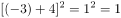，，数列规律为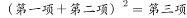，故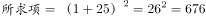。

故正确答案为D。

---

### 第 2 题　qid 2060502 · 数学运算

甲习惯在每月的1日去星光剧院观看话剧，而乙习惯在每周三到星光剧院观看话剧。甲、乙上一次同日在该剧院观看话剧是在4月1日，则在甲、乙保持原有看话剧的习惯不变的情况下，两人下一次同日在星光剧院观看话剧的日期为：

- **A**. 7月1日　✅
- **B**. 8月1日
- **C**. 9月1日
- **D**. 10月1日

**答案**：A

**官方解析**

本题要求下一次两人同天看话剧，由于选项中都为1日，则甲肯定去看话剧，问题转化为乙是否去看。判断乙是否去，只需判断间隔的时间是否能被7整除。代入A选项（因为问下一次，则应从最近日期开始代入）：间隔天数可以被7整除，满足条件。

故正确答案为A。

---

### 第 3 题　qid 2060518 · 数学运算

甲、乙、丙三个桶内都有油，如果把甲桶内的油倒入乙桶，再把乙桶内的油倒入丙桶，最后再把丙桶内的油倒入甲桶，这时各桶内的油都是12升，则甲桶内原有（  ）升油。

- **A**. 9
- **B**. 10
- **C**. 12
- **D**. 15　✅

**答案**：D

**官方解析**

本题要求甲桶原有油多少，则可直接从甲桶入手。甲桶倒出去，还剩下，又从将丙桶内的油倒入甲桶之后，甲乙两桶都为12升。则可设甲桶原有油为升，乙桶倒入丙桶后丙桶的油量为升，则 ①，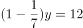  ②，联立求解可得，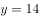。 

故正确答案为D。

---

### 第 4 题　qid 2060528 · 数学运算

甲、乙两个蔬菜基地，分别向M、P、Q三个超市提供同品种蔬菜、按约共向M超市提供蔬菜45吨，向P超市提供蔬菜75吨，向Q超市提供蔬菜40吨。其中，甲基地可供60吨，乙基地可供100吨。甲、乙两基地与三个超市的距离如下表，运费为1元/千米·吨，则总运费最少将花费（  ）元。

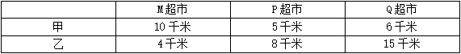

- **A**. 910
- **B**. 925
- **C**. 940
- **D**. 960　✅

**答案**：D

**官方解析**

甲乙基地供给PQ超市，甲基地都较近，但对P超市，甲近了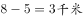，对Q超市近了，显然，甲应优先供给Q超市，其次供给P超市。即甲供给Q超市40吨，供给P超市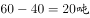，则甲运费为；乙供给P超市，供给M超市45吨，则乙运费为。总运费最少花费。

故正确答案为D。

---

### 第 5 题　qid 2145028 · 数学运算

有甲、乙两家网店销售照片墙，甲销售的相框由原木制作，定价是每套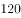元，利润为，乙销售的相框由人造板材制作，虽然定价是每套元，但每套却能盈利元，两家销售量持平。为了增加销售量，甲推出了好评返现元的活动，结果活动期间销售量是原来的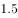倍，好评率是，而乙的销售量却因受竞争而减少了，整个活动期间两家所获利润相同，则活动期间乙的销售量与原来相比减少了：

- **A**. 

- **B**. 

- **C**. 

　✅
- **D**. 

**答案**：C

**官方解析**

由于本题求的是乙销售量下降的比率，并且已知的也是甲活动前后销售量的比率关系，故可对销售量进行赋值。假设活动前甲乙的销售量都为2套，则活动期间甲销售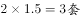，乙销售套。

活动期间，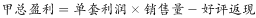，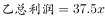，由甲乙利润相同可得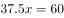，解得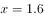。

活动前乙卖2套，活动期间乙卖1.6套，则乙销量减少了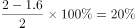。

故正确答案为C。

（备注：本题题干中甲的“利润为”，指的是定价的，而如果用成本的计算则没有答案）

---

### 第 6 题　qid 2060548 · 数学运算

每天下午4点半小李放学时，妈妈总是从家开车准时到达学校接他回家，某天学校提前1个小时放学，小李自己步行回家，途中遇到开车接他的妈妈，结果比平时提前30分钟到家，若妈妈开车的速度一直保持不变，则小李步行（  ）分钟后与妈妈相遇。

- **A**. 40
- **B**. 45　✅
- **C**. 50
- **D**. 53

**答案**：B

**官方解析**

由题干中“比平时提前30分钟到家”，则可推出妈妈比往常早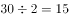分钟接到小李（因为妈妈在路程中间接到小李，妈妈少走了小李所走路程的一来一回，故应除以2），妈妈平常接小李是4点半，提前15分钟接到，即为4点15分，而小李提前一小时放学，即3点30放学，中间小李共走了45分钟。

故正确答案为B。

---

### 第 7 题　qid 2060568 · 数学运算

在某届篮球赛中，小明共打了10场球，他在第6、7、8、9场比赛中，分别得23分、14分、11分和20分，他的前9场比赛的平均得分比前5场比赛的平均得分高，若他所打的10场比赛的平均得分超过18分，则他在第10场比赛中最少要得（  ）分。

- **A**. 26
- **B**. 27
- **C**. 28
- **D**. 29　✅

**答案**：D

**官方解析**

本题要使得小明第10场比赛得分最少，则应使小明前9场比赛得分越多且10场平均分尽可能小。由题意，后4场比赛小明的平均分为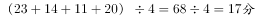，由于小明前9场比赛的平均得分比前5场比赛的平均得分高，则小明前5场平均分应小于17分，即前5场总分应小于，则其最高为84分。假设小明10场得分平均分为18分，则小明第10场得分为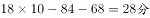，但是由于要求平均分超过18分，则小明第10场得分应大于28分，则最少为29分。

故正确答案为D。

---

### 第 8 题　qid 2060566 · 数学运算

若在某年连续的三个月中共有24天是周末，则该年的第一个周日是（  ）。

- **A**. 1月1日
- **B**. 1月2日
- **C**. 1月3日　✅
- **D**. 1月4日

**答案**：C

**官方解析**

连续三个月有24天周末，即连续三个月只能有12个完整的星期，即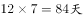，最多再加上某一周的周一至周五共5天，即总天数最多为。而连续三个月为89天的只能为2月（平年），3月，4月（，其他任意三个月的天数和都要大于89天）。因此要使得三个月中只有24个周末，则多出来的5天必然得是周一至周五，即2月1日应为星期一，1月1日与2月1日相差31天，，星期一往前推三天为星期五，因此第一个周日为1月3日。

故正确答案为C。

---

### 第 9 题　qid 2060588 · 数学运算

某地有耕地20万亩，其中用于种植粮食，其余用于种植经济作物。当地居民生活需要消耗10万亩的粮食，其余用于出售，粮食每亩年收入1000元，经济作物每亩年收入5000元。当地政府正在积极推进退耕还林政策，每亩退耕还林的耕地可享受500元年的财政补贴。不考虑其他因素，为使居民收入实现每年以上增长，且保证粮食种植面积不低于12万亩，2年内至多可以有（  ）亩耕地进行退耕还林。

- **A**. 10000
- **B**. 12666　✅
- **C**. 13333
- **D**. 15000

**答案**：B

**官方解析**

本题要求至多退耕还林多少，则应使得居民收入增长最低并且应在保证粮食种植面积的基础上最大限量的种植经济作物（经济作物年收入更多）。假设居民收入每年增长，则两年后收入为现在的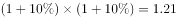倍。则假设退耕还林万亩，则粮食每万亩价格为1000万元，经济作物每万亩价格为5000万元，每万亩退耕还林享受500万元/年的财政补贴。两年后收入为，计算得到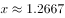万。由于居民收入每年增长要超过，则退耕还林至多为12666亩。

故正确答案为B。

---

### 第 10 题　qid 2060608 · 数学运算

公用电话亭中有两部电话，六个人排队打电话，打完即走，他们的通话时间分别为3分钟、5分钟、4分钟、13分钟、7分钟、8分钟，则大家在此公用电话亭逗留的总时间最少为（  ）分钟。

- **A**. 60
- **B**. 66　✅
- **C**. 72
- **D**. 78

**答案**：B

**官方解析**

本题要求总逗留时间，而总逗留时间=总打电话时间+总等待时间，总打电话时间为固定不变的，即为。要使得总逗留时间最短，则应让总等待时间最短，即让通话时间最短的排在最前面。则两部电话顺序可以分别为3，5，8分钟和4，7，13分钟。总等待时间为。则总逗留时间最短为。

故正确答案为B。

---

### 第 11 题　qid 2145029 · 数学运算

某著名歌唱选秀节目半决赛中，每位歌手的成绩由两部分构成，第一部分为27位大众媒体评审投票得分，以其所得支持票数占比乘以本部分总分50分得出；第二部分为360位观众投票得分，以其所得支持票数占比乘以本部分总分50分得出。得分排名前六位的歌手进入决赛。最后一位歌手甲演唱完毕，大众媒体中的19位投了支持票，而此时排在第六位的歌手乙的得分是81.8分，则甲至少要获得（  ）位观众的支持，才能战胜乙，进入决赛。

- **A**. 330
- **B**. 332
- **C**. 334
- **D**. 336　✅

**答案**：D

**官方解析**

要使得甲战胜乙，则应使甲的总得分超过乙（81.8分）。假设甲获得票即可战胜乙，即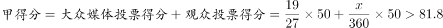，计算可得，至少为336。

故正确答案为D。

---

## 判断推理

### 第 1 题　qid 2060626 · 图形推理

从所给四个选项中，选择最合适的一个填入问号处，使之呈现一定的规律性：

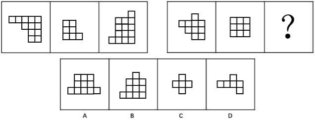

- **A**. A　✅
- **B**. B
- **C**. C
- **D**. D

**答案**：A

**官方解析**

观察题干，发现每个图形都是由若干个小方块组成，优先考虑方块的数量关系。第一组三幅图中方块的数量分别为12、7、14，第二组前两幅图形方块的数量关系为10、9，数量上不具有规律。此时，我们可以通过一种特殊规律来解题，即：考虑每幅图中的小方块是否能一笔连成。题干每幅图中的所有小方块均可以在线条不交叉的情况下，用一笔连成（如下图），而选项中只有A项符合此规律。

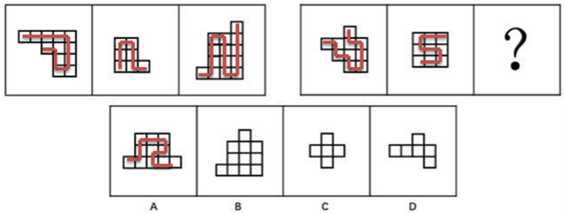

故正确答案为A。

注：此规律在广东省考、广州市考以及深圳市考中经常出现，备考这几个省市的考生一定要掌握。

---

### 第 2 题　qid 2060632 · 图形推理

从所给四个选项中，选择最合适的一个填入问号处，使之呈现一定的规律性：

- **A**. A　✅
- **B**. B
- **C**. C
- **D**. D

**答案**：A

**官方解析**

元素组成不同，没有明显的属性规律，考虑数量规律。观察发现，第二组图形和选项中出现了独立存在的多个不同小元素，考虑部分数。第一组图形中部分数为1、2、3，第二组图形中部分数为4、5、？，？处应该填入一个部分数为6的选项。选项中部分数依次为6、3、7、5，只有A选项满足规律。
故正确答案为A。

---

### 第 3 题　qid 2060634 · 图形推理

从所给四个选项中，选择最合适的一个填入问号处，使之呈现一定的规律性：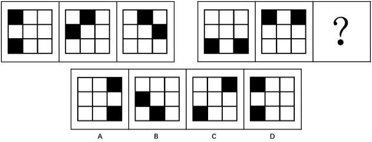

- **A**. A
- **B**. B　✅
- **C**. C
- **D**. D

**答案**：B

**官方解析**

题干中每幅图形均由2黑块和7白块组成，元素组成相同，考虑位置规律。观察第一组图形，利用临近假设法，第一组图形中第一图中的黑块顺时针移动一个单位得到第二图，第二图中的黑块顺时针移动两个单位得到第三图。

第二组图形中，第一图中的黑块顺时针移动四个单位得到第二图，？处的图形应该是第二图中的黑块顺时针移动五个单位得到第三图，即为B选项。

故正确答案为B。

注意：

①第一组图形中黑块分别移动一个单位和两个单位，第二组图形中黑块可移动四个单位和五个单位，亦可移动四个单位和八个单位，优先考虑等差规律，同时移动八个单位应该与第二组图形相同，而选项中没有该图形，说明上述解析思路与出题人思路不一致。

②第二组图形第一图中的黑块亦可逆时针移动四个单位得到第二图，在做题过程中优先应用与第一组图形相同的移动规律，即顺时针移动，而后再考虑逆时针移动规律。

补充解析：第一组图1和图2进行黑白运算后再顺时针旋转，同理，第二组图形图1和图2进行黑白运算后再顺时针旋转。

---

### 第 4 题　qid 2060640 · 图形推理

从所给四个选项中，选择最合适的一个填入问号处，使之呈现一定的规律性：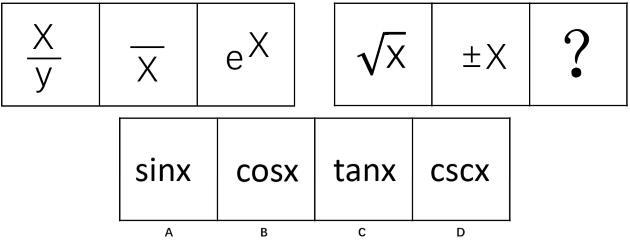

- **A**. A
- **B**. B
- **C**. C　✅
- **D**. D

**答案**：C

**官方解析**

元素组成相似，考虑样式规律。第一组图中每幅图形中都含有X和横线（注意e的中间有横线），即第一组图形是X和横线的遍历。将此规律应用到第二组图形中，每幅图形都应该含有X和横线，而选项中只有C中含有X和横线。
故正确答案为C。
另外的解法：第一组图形中空间数为0、0、1，第二组图形中空间数量也应该是0、0、1，且存在封闭空间的字母为半封闭图形，即C选项。

---

### 第 5 题　qid 2060654 · 图形推理

从所给四个选项中，选择最合适的一个填入问号处，使之呈现一定的规律性：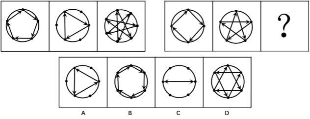

- **A**. A
- **B**. B　✅
- **C**. C
- **D**. D

**答案**：B

**官方解析**

观察题干，每幅图均由数量若干的黑点和箭头组成。首先可观察黑点数目，第一组图中黑点数目依次为5、6、7，第二组图形中黑点数目为4、5、？，？处的图形黑点数目应为6，而四个选项中黑点数目均为6。观察题干中的箭头，第一组图中任意两个箭头所环绕的时针方向均为顺时针，第二组前两图中任意两个箭头所环绕的时针方向也为顺时针，在选项中寻找任意两个箭头环绕的时针方向仅为顺时针方向的图形。
A选项箭头环绕的时针方向为逆时针，B选项箭头环绕的时针方向为顺时针，C选项不存在时针方向，D选项中箭头环绕的时针方向既存在顺时针也存在逆时针。
故正确答案为B。

---

### 第 6 题　qid 2060684 · 类比推理

（1）筹集创业基金
（2）实施公司管理
（3）拟定创业计划
（4）选定创业项目
（5）办理相关手续

- **A**. 4-1-3-2-5
- **B**. 4-1-3-5-2
- **C**. 4-3-1-5-2　✅
- **D**. 5-3-1-2-4

**答案**：C

**官方解析**

第一步：先确定逻辑关系最为明显的事件顺序。
观察题干，五个事件主要围绕“创业”的过程展开。逻辑关系的先后顺序比较明显的是事件（4），“选定创业项目”是创业过程的第一步，故事件（4）为首句，排除D项。
第二步：逐一对照选项并判断正确答案。
根据第一步得到的结果可以判断只有A、B、C三项符合。通过分析事件（1）和事件（3）可知，应该先“拟定创业计划”，然后再“筹集创业基金”，因此事件（3）应该排在事件（1）前面，排除A、B两项。
故正确答案为C。

---

### 第 7 题　qid 2060686 · 类比推理

（1）殷商的甲骨文
（2）春秋战国的木简
（3）钟鼎上的钟鼎文
（4）互联网无纸化办公
（5）东汉蔡伦改进造纸术

- **A**. （1）-（3）-（2）-（5）-（4）　✅
- **B**. （1）-（2）-（3）-（5）-（4）
- **C**. （1）-（3）-（2）-（4）-（5）
- **D**. （1）-（3）-（5）-（2）-（4）

**答案**：A

**官方解析**

第一步：先确定逻辑关系最为明显的事件顺序。
观察题干，五个事件主要围绕“文字书写进化”的过程。甲骨文是最古老的文字。最早的甲骨文随着殷亡而消逝，然后是钟鼎文（金文）起而代之。然后到了春秋时期出现了木简，接下来是东汉时期出现了造纸术，最后是现代的互联网无纸化办公。根据每个事件的历史年代，排序为：（1）-（3）-（2）-（5）-（4）。
第二步：逐一对照选项并判断正确答案。
根据上述判断，只有A选项符合题意。
故正确答案为A。

---

### 第 8 题　qid 2060690 · 类比推理

（1）狐狸濒临绝种
（2）人类的生活环境更加恶劣
（3）野兔几近灭绝
（4）草场遭到严重破坏
（5）狼的生存受到严峻挑战

- **A**. 4-1-3-2-5
- **B**. 4-1-3-5-2
- **C**. 4-3-1-5-2　✅
- **D**. 4-3-1-2-5

**答案**：C

**官方解析**

第一步：先确定逻辑关系最为明显的事件顺序。
观察题干，五个事件主要围绕“草场遭到严重破坏”后沿生物链产生的一系列后果展开。选项中事件④为首句，逻辑关系的先后顺序比较明显的是事件③和事件④，野兔的食物是草，“草场遭到严重破坏”后，首先造成的影响就是“野兔几近灭绝”，因此事件③与事件④相邻，事件③排在事件④后面，排除A、B两项。
第二步：逐一对照选项并判断正确答案。
根据第一步得到的结果可以判断只有C、D两项符合。题干五个事件中，生物构成的生物链为草—野兔—狐狸—狼—人，生物链中最高级的是人，因此事件②应该排在最后，即事件②为尾句，排除D项。
故正确答案为C。

---

### 第 9 题　qid 2060694 · 类比推理

（1）欢迎到会人员
（2）布置会议现场
（3）预定会议场地
（4）制定会议方案
（5）分发会议资料

- **A**. 4-3-2-1-5　✅
- **B**. 4-3-5-1-2
- **C**. 3-2-4-1-5
- **D**. 3-2-4-5-1

**答案**：A

**官方解析**

第一步：先确定逻辑关系最为明显的事件顺序。
观察题干，五个事件主要围绕“开会”的过程展开。选项的首句为事件（3）或事件（4），只有先“制定会议方案”，才会“预定会议场地”，因此事件（4）排在事件（3）之前，排除C、D两项。
第二步：逐一对照选项并判断正确答案。
根据第一步得到的结果可以判断只有A项和B项符合。通过分析事件（1）和事件（2）可知，应该先“布置会议现场”，然后再“欢迎到会人员”，因此事件（2）应该排在事件（1）前面，排除B项。
故正确答案为A。

---

### 第 10 题　qid 2060698 · 类比推理

（1）施肥
（2）收获
（3）保温
（4）松土
（5）播种

- **A**. （5）-（4）-（1）-（2）-（3）
- **B**. （4）-（5）-（3）-（1）-（2）　✅
- **C**. （4）-（3）-（5）-（1）-（2）
- **D**. （5）-（4）-（1）-（3）-（2）

**答案**：B

**官方解析**

观察题干，五个事件主要围绕“‘种植’的过程”。逻辑关系的先后顺序比较明显的是事件（4）和事件（5），只有先“松土”，才能“播种”，因此事件（4）排在事件（5）前面，排除A、D项，同时容易判断事件（2）“收获”应该排在最后。通过分析事件（3）和事件（5），“播种”在“保温”之前，所以事件（5）在事件（3）之前，排除C项。
故正确答案为B。

---

### 第 11 题　qid 2060674 · 类比推理

某公司新员工培训结束后，三个培训主管在讨论有多少学员不能通过培训考核，对话如下：
甲：有的学员是能通过考核的。
乙：有的学员是不能通过考核的。
丙：有一个学员不能通过考核。
如果他们三人中只有一个人说的话是真的，则：

- **A**. 所有的学员都没有通过考核
- **B**. 有一个学员没有通过考核
- **C**. 所有的学员都通过了考核　✅
- **D**. 只有一部分学员通过了考核

**答案**：C

**官方解析**

本题为真假推理题。

第一步：分析题干。
甲：“有的学员能通过考核。”
乙：“有的学员不能通过考核。”
丙：“有个学员不能通过考核。”
甲、乙二人的话构成反对关系，“有的能”和“有的不能”至少有一真，而三人中只有一人说了真话，所以剩下的丙的话一定为假，即有个学员通过了考核。所以甲的话是真的，乙的话是假的。根据乙的话“有的学员不能通过考核”这句话是假的，可以推出，所有学员都通过了考核。
第二步：分析选项。
只有C选项符合上述结论。
故正确答案为C。

---

### 第 12 题　qid 2060692 · 逻辑判断

红叶市消防大队向市公安局申请购置一辆新的消防车，以进一步增强消防大队的火灾出警及处置能力。市公安局经研究，未通过这项申请，否决理由是：消防大队所配置消防车的数量，必须和该消防大队的规模和综合能力相配套，根据该消防大队现有的消防员、其他救火设施设备的规模和综合能力，现有的消防车已能够满足使用。
（  ）是红叶市公安局关于此项决定的论证所必须假设的。

- **A**. 红叶市的火灾发生不会有较大增长
- **B**. 红叶市政府财政面临困难无力购置新的消防车
- **C**. 消防大队现有的消防车中，至少有一辆近期内不会报废　✅
- **D**. 市公安局至少在五年内不会改变编制以扩大消防大队的规模和综合能力

**答案**：C

**官方解析**

第一步：找出论点和论据。
论点：不通过红叶市消防大队购置一辆新的消防车的申请。
论据：消防大队所配置消防车的数量，必须和该消防大队的规模和综合能力相配套。根据现有的消防员和设备的规模和综合能力，现有的消防车已能够满足使用。
第二步：逐一分析选项。
A项：红叶市公安局论证的依据是现有消防员、消防设备规模是否和消防车数量是否匹配，与火灾发生情况无关，无关选项，排除；
B项：是否有资金购买，和论点是否应该通过购置新的消防车的申请没有直接关系，无关选项，排除；
C项：近期至少有一辆消防车不会报废，是目前消防车满足使用的必要条件，可以按照否定代入的方法判别（如果否定C项的说法，即所有消防车近期内都会报废，那么消防车数量和消防大队规模一定不匹配，此时论点不成立），因此该项属于必要条件，支持了论点，当选；
D项：未来五年的计划不是当前的情形，与题干所讨论的目前是否需要增加消防车无关，无关选项，排除。
故正确答案为C。

---

### 第 13 题　qid 2060700 · 类比推理

某种魔方有六面，六面全部复原时的颜色分别为红、蓝、黄、白、绿、橙。在某综艺节目现场，有此种魔方6个，每个只复原了一面，且每个魔方复原面的颜色不同。主持人将此6个魔方放入编号为1～6的6个不透明的箱子中，并打开了1号箱子，里面装的是复原面为蓝色的魔方，随后主持人请刘、赵、唐、郑、杨五位嘉宾猜其他箱子里魔方复原面的颜色。五位嘉宾分别作出了如下猜测：
刘：3号箱子中魔方复原面为橙色，4号箱子中魔方复原面为黄色。
赵：3号箱子中魔方复原面为绿色，5号箱子中魔方复原面为红色。
唐：2号箱子中魔方复原面为红色，6号箱子中魔方复原面为白色。
郑：4号箱子中魔方复原面为绿色，5号箱子中魔方复原面为白色。
杨：3号箱子中魔方复原面为黄色，6号箱子中魔方复原面为橙色。
随后主持人一一打开箱子，发现每位嘉宾都只猜对了一个箱子中魔方复原面的颜色，并且每个箱子都有一位嘉宾猜对。
由此可以推测：

- **A**. 2号箱子中魔方复原面为绿色
- **B**. 4号箱子中魔方复原面不是黄色
- **C**. 5号箱子中魔方复原面为白色　✅
- **D**. 6号箱子中魔方复原面为红色

**答案**：C

**官方解析**

第一步：分析题干信息。

为方便分析，将题干五位嘉宾的猜测整理成如下表格：

“每位嘉宾都只猜对了一个箱子中魔方复原面的颜色，并且每个箱子都有一位嘉宾猜对”由此可知：上表中每一行有一个颜色是对的、有一个颜色是错的，每一列中有一个颜色是对的，其他颜色是错的。2号箱这一列只有红色，因此这个红色就是对的，如下图：

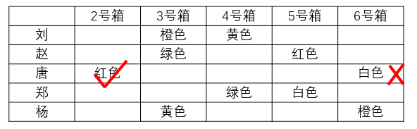

因此6号箱这一列橙色就是对的，如下图：

因此刘所在一行中，橙色是错的，黄色是对的，如下图：

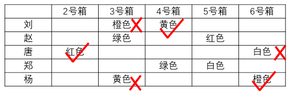

进而可以推知赵的猜测和郑的猜测，由于2号箱红色是对的，所以5号箱红色是错的，故赵所在一行绿色是对的，郑所在一行绿色是错的，白色是对的，如下图：

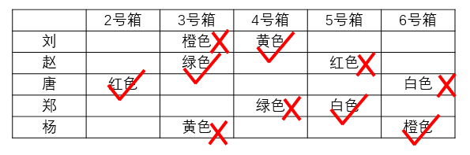

第二步：逐一分析选项

A项：2号箱子中魔方复原面为红色，该项错误，排除；

B项：4号箱子中魔方复原面为黄色，该项错误，排除；

C项：5号箱子中魔方复原面为白色，该项正确，当选；

D项：6号箱子中魔方复原面为橙色，该项错误，排除。

故正确答案为C。

---

### 第 14 题　qid 2060702 · 逻辑判断

某饰品店只有从厂家低于正常价格进货，才能以低于市场的价格销售饰品而获利；除非该饰品店的销售量很大，否则，其不能从厂家低于正常价格进货；要想有大的销售量，该饰品店就要满足消费者个人兴趣或者拥有特定款式的独家销售权。
如果上述断定为真，并且事实上该饰品店没有满足消费者的个人兴趣，则以下不可能为真的是：

- **A**. 如果该饰品店不拥有特定款式独家销售权，就不能从厂家购得低于正常价格的饰品
- **B**. 该饰品店通过满百包邮促销的方法获利
- **C**. 该饰品店虽然没有拥有特定款式独家销售权，但仍以低于市场的价格销售饰品而获利　✅
- **D**. 即使该饰品店拥有特定款式独家销售权，也不能从厂家购得低于正常价格的饰品

**答案**：C

**官方解析**

第一步：翻译题干。
① 以低于市场的价格销售饰品而获利→从厂家低于正常价格进货
② 从厂家低于正常价格进货→该饰品店的销售量很大
③ 销售量很大→满足消费者个人兴趣 或 拥有特定款式的独家销售权
将三个条件串连可知：
④ 以低于市场的价格销售饰品而获利→从厂家低于正常价格进货→该饰品店的销售量很大→满足消费者个人兴趣 或 拥有特定款式的独家销售权
已知：饰品店没有满足消费者的个人兴趣
第二步：逐一分析选项。
A项：不拥有特定款式独家销售权→不能从厂家购得低于正常价格的饰品，结合已知条件，是对条件④的逆否等价推理，可以推出，排除；
B项：通过满百包邮费促销的方式获利这一结论根据已知条件无法推知，可能为真也可能为假，不符合一定为假的要求，排除；
C项：没有拥有特定款式独家销售权且以低于市场的价格销售饰品而获利，已知信息为饰品店没有满足消费者的个人兴趣，结合该项“没有拥有特定款式独家销售权”是对条件④的否后，一定推出否前，即一定能推出“不能以低于市场的价格销售饰品而获利”，所以“没有拥有特定款式独家销售权”和“以低于市场的价格销售饰品而获利”不能同时成立，故该项一定推不出，一定为假，当选；
D项：拥有特定款式独家销售权是对条件④的肯后，只能推出可能性的结论，该项可能为真，也可能为假，不符合一定为假，排除。
故正确答案为C。

---

### 第 15 题　qid 2060704 · 逻辑判断

去年以来，互联网共享单车蓬勃发展，共享单车因其经济便宜、无桩停放、随骑随停、方便快捷深受市民的喜爱。但共享单车在发展过程中，也逐渐显露出各种问题，其中乱停放现象尤为突出，单车乱停放影响市容市貌，甚至有些单车被丢弃停放在机动车道上，严重影响了市民的出行安全，长此以往，势必会影响共享单车业态发展。对此，有人建议，应当设立共享单车专门停车点，并规范管理，要求按点取车停车，大力整治单车乱停放问题，即可促进共享单车业态发展。
如果以下选项为真，最能削弱上述建议的推理的是：

- **A**. 共享单车之所以广受欢迎，最基本的原因在于随停随骑　✅
- **B**. 即便设立专门停车点，仍会有一部分人乱停放
- **C**. 整治单车乱停放最有效的措施是有关部门加强监管和处罚
- **D**. 设立专门停车点需要一定的成本，可能会提高共享单车的使用价格

**答案**：A

**官方解析**

第一步：找出论点和论据。
论点：应当设立共享单车专门停车点，并规范管理，要求按点取车停车，大力整治单车乱停放问题，可以促进共享单车业态发展。
论据：无。
本题只有论点，没有论据，削弱优先考虑削弱论点，即证明“设立共享单车专门停车点，并规范管理，要求按点取车停车，大力整治单车乱停放问题”不能促进共享单车业态发展。
第二步：逐一分析选项。
A项：共享单车之所以广受欢迎，最基本的原因在于随停随骑，说明如果不能随停随骑，共享单车就无法广受欢迎，说明按点取车停车，整治了单车乱停放问题，并不能促进共享单车业态发展，直接削弱论点，当选；
B项：该项是在论述采取了建议的措施后可能的负面情况，即一部分会乱停放，但实际上乱停放的部分人有多少无法确定，属于不明确选项，无法削弱，排除；
C项：指出整治单车乱停放最有效的措施是监管和处罚，但不代表“设立共享单车专门停车点”不能整治单车乱停放问题，也无法证明整治了单车乱停放问题，不能促进共享单车业态发展，无法削弱，排除；
D项：设立专门停车点的成本问题和这项措施本身的作用无关，无关选项，排除。
故正确答案为A。

---

### 第 16 题　qid 2060706 · 类比推理

机会成本是指做出一个选择而放弃的其他选择的最大收益。假设：你贏得2张只能选择其中之一的旅游优惠券，其中一张优惠券是海南7日游的免费券（原价10000元，旅游期间不会产生其他费用），另一张是马尔代夫旅游的半价券（原价20000元，旅游期间不会产生其他费用）。
根据以上叙述，则选择去海南旅游的机会成本是：

- **A**. 0元
- **B**. 10000元　✅
- **C**. 20000元
- **D**. 30000元

**答案**：B

**官方解析**

机会成本关键词为“做出一个选择而放弃的其他选择的最大收益”。
选择去海南旅游即放弃了马尔代夫的旅游的最大收益，即马尔代夫旅游的半价券，原价为20000元，则半价为10000元。
故正确答案为B。

---

### 第 17 题　qid 2060708 · 类比推理

考勤主管：“你为什么迟到，不知道上班有时间规定吗？”
工作人员：“我这是第一次迟到，我以前从来没有迟到过。”
下列（  ）出现的逻辑错误与题干最为类似。

- **A**. 
甲：“今天天气真好，可以一起去游玩吗？”

乙：“今天的天气这么好，不适合游玩。”

- **B**. 
警官：“这个东西是你偷的吧？”

嫌疑人：“我发誓我没有偷过任何东西。”

- **C**. 
妈妈：“你不是喜欢吃鱼吗？为什么不多吃点？”

孩子：“我今天心情特别好，从来没有这么好过。”
　✅
- **D**. 
丙：“昨天那个人讲得太好了，不是吗？”

丁：“是的，而且那个人还很友好。”

**答案**：C

**官方解析**

第一步，分析题干逻辑错误。
考勤主管问的是为什么迟到，工作人员回答的是第几次迟到，是答非所问。
第二步，逐一分析选项。
A项：不适合游玩是对“可以一起去游玩吗”的回答，并非答非所问，与题干逻辑关系不一致，排除；
B项：没有偷过任何东西是对“这东西是你偷的吧”的回答，并非答非所问，与题干逻辑关系不一致，排除；
C项：心情好并没有回答“为什么不多吃点鱼”，是答非所问，与题干逻辑关系一致，当选；
D项：“是的”是对“那个人讲的太好了”的回答，并非答非所问，与题干逻辑关系不一致，排除。
故正确答案为C。

---

### 第 18 题　qid 2060710 · 逻辑判断

某公司近两年的业绩均呈下滑趋势。该公司拟采取裁员政策，以淘汰不合格的员工。不合格的员工一定是存在的，但是如何确定哪一位员工是不合格的却是一个需要深入思考的问题。比如，一个在同一岗位上工作超过5年的员工可能比一个刚刚转岗进入新岗位的员工的工作效率高。但是一直在原岗位工作的员工可能不如转岗后依然可以完成岗位工作的员工的综合素质强。
由此可以推出：

- **A**. 该公司为扭转业绩而实行裁员政策是不可取的
- **B**. 该公司应通过调动员工岗位来扭转业绩
- **C**. 该公司应通过员工的在岗时间来评定该员工的工作能力
- **D**. 该公司还没有找到扭转公司业绩的有效措施　✅

**答案**：D

**官方解析**

逐一分析选项。
A项：题干中只是强调如何确定哪一位员工是不合格需要深入思考，并没有否定裁员政策，排除；
B项：题干中是说拟采取裁员政策扭转业绩，没有谈及应调动员工岗位扭转业绩，无中生有，排除；
C项：题干中在岗时间长是可能比在岗时间短的工作效率高，并不一定工作能力就强，排除；
D项：公司是拟采取裁员政策来扭转公司业绩，说明还没找到扭转公司业绩的有效措施，可以推出，当选。
故正确答案为D。

---

### 第 19 题　qid 2060712 · 逻辑判断

两个小组参加汽车零部件拆装速度测试比赛。所有参赛者平均每人每天8小时可以拆装18组零部件。其中，第一小组的平均速度是每人每天8小时拆装26组零部件；第二小组的平均速度是每人每天8小时拆装14组零部件。通过测试赛，该汽车零部件的制造商认为该零部件的设计需要进一步简化。由此可见：

- **A**. 第一小组的参赛者动手能力均优于第二小组
- **B**. 第二小组的参赛人员比第一小组的参赛人员多　✅
- **C**. 所有参赛者的零部件拆装速度均不达标
- **D**. 所有参赛者的动手能力在比赛结束后都得到加强

**答案**：B

**官方解析**

逐一分析选项。

A项：题干中只是提供了两组参赛者的平均速度，并不能推出第一组的动手能力均优于第二小组，排除；

B项：通过第一组与第二组的平均速度可知，设第二组的参赛人数为x，第一组的参赛人数为y，根据题干可以列出式子，得到，人数比为，第二组人数多于第一组，可以推出，当选；

C项：题干中并没有涉及参赛者的零部件拆装速度是否达标的问题，无中生有，排除；

D项：题干中没有涉及比赛结束后的情况，无中生有，排除。

故正确答案为B。

---

### 第 20 题　qid 2060714 · 类比推理

在一场“请问谁在说谎”的游戏中，四位游戏参与者每人从一副没有大小王的扑克牌中抽取一张。
甲说：“我抽中的牌是黑桃。”
乙说：“我抽中的牌是红桃。”
丙说：“我抽中的牌不是红桃。”
丁说：“我抽中的牌是梅花。”
已知4人抽取的扑克牌花色各不相同，且只有一人说谎。
根据上述条件，下列说法正确的是：

- **A**. 甲、乙、丙、丁四人均有可能说谎
- **B**. 可以推知每个人抽取的扑克牌花色
- **C**. 丙有可能抽中方块
- **D**. 乙抽中的牌一定是红桃　✅

**答案**：D

**官方解析**

第一步：分析题干。
四人中只有一人说谎，即一人为假，且四人表述没有明显的矛盾。
第二步：逐一分析选项。
乙与丙均提到了红桃，从最大信息入手，假设乙说的话为假，那么乙抽中的不是红桃，其余三句均为真话，可知丙抽中的不是红桃，甲抽中黑桃，丁抽中梅花，那么红桃没有被抽中，与4人抽取的扑克牌花色各不相同矛盾，因此假设不成立，乙说的话一定是真话，那么乙抽中的一定是红桃。
故正确答案为D。

---

## 资料分析

### 材料 1

        2015年5月，全国医疗卫生机构诊疗人次达6.4亿人次，同比提高，环比提高。其中，医院2.6亿人次，同比提高，环比降低；基层医疗卫生机构诊疗人次为3.6亿人次，同比提高，环比降低；其他机构0.2亿人次。医院中：公立医院2.3亿人次，同比提高，环比提高；民营医院0.3亿人次，同比提高，环比提高。基层医疗卫生机构中：社区卫生服务中心（站）0.6亿人次，同比提高，环比降低；乡镇卫生院0.8亿人次，同比提高，环比降低。

        2015年1-5月，全国医疗卫生机构总诊疗人次达31.1亿人次，同比提高。其中：医院12.2亿人次，同比提高；基层医疗卫生机构18.0亿人次，同比提高；其他机构10.1亿人次。医院中：公立医院10.8亿人次，同比提高；民营医院1.3亿人次，同比提高。基层医疗卫生机构中：社区卫生服务中心（站）2.7亿人次，同比提高；乡镇卫生院4.1亿人次，同比提高；村卫生室诊疗人次8.4亿人次。

        2015年5月份，全国医疗卫生机构出院人数达1738.4万人，同比提高，环比降低。其中：医院1330.2万人，同比提高，环比降低；基层医疗卫生机构出院人数为333.4万人，同比降低，环比降低；其他机构74.8万人。医院中：公立医院1156.5万人，同比提高，环比降低；民营医院173.7万人，同比提高，环比提高。

        2015年1-5月，全国三级公立医院次均门诊费用为276.5元，与去年同期比较，按当年价格上涨，按可比价格上涨；二级公立医院次均门诊费用为182.7元，按当年价格同比上涨，按可比价格同比上涨。

        2015年1-5月，全国三级公立医院人均住院费用为12536.8元，与去年同期比较，按当年价格上涨，按可比价格上涨；二级公立医院人均住院费用为5320.6元，按当年价格同比上涨，按可比价格同比上涨。

#### 第 1 题　qid 2060616 · 比重

2015年5月，医院诊疗人次占全国医疗卫生机构诊疗人次的比重：

- **A**. 

- **B**. 
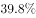

- **C**. 

　✅
- **D**. 

**答案**：C

**官方解析**

由题干“2015年5月”和“比重”判定为现期比重问题，根据材料第一段第一句“2015年5月，全国医疗卫生机构诊疗人次达6.4亿人次，其中，医院2.6亿人次”可得，所求比重。

故正确答案为C。

---

#### 第 2 题　qid 2060618 · 综合

按可比价格，2014年1-5月全国三级公立医院次均门诊费比二级公立医院门诊费用（    ）。

- **A**. 
高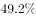

- **B**. 
高

- **C**. 
高91.5元
　✅
- **D**. 
高94.6元

**答案**：C

**官方解析**

由题干“2014年1-5月”和“比…多”判定为基期和差问题，根据材料“2015年1-5月，全国三级公立医院次均门诊费用为276.5元，按可比价格上涨；二级公立医院次均门诊费用为182.7元，按可比价格同比上涨。”可得2014年1-5月三级公立医院比二级公立医院次均门诊费用高，与C项最接近。

故正确答案为C。

---

#### 第 3 题　qid 2060620 · 增长

与上年同期相比，2015年5月增长率最高的指标是（    ）。

- **A**. 全国医疗卫生机构出院人数
- **B**. 公立医院出院人数
- **C**. 民营医院出院人数　✅
- **D**. 社区卫生服务中心（站）诊疗人次

**答案**：C

**官方解析**

根据材料可得，同比增长率分别为：全国医疗卫生机构出院人数为、公立医院出院人数为、民营医院出院人数为、社区卫生服务中心（站）诊疗人次为。

故正确答案为C。

---

#### 第 4 题　qid 2060622 · 综合

如果2015年1-5月，全国医疗卫生机构总诊疗人次达31.1亿人次，则下列说法正确的是（    ）。

- **A**. 2015年1-5月，全国医疗卫生机构诊疗人次逐月增加
- **B**. 2015年5月，全国医疗卫生机构诊疗人次环比增长主要靠基层医疗卫生机构诊疗人次增长拉动
- **C**. 2015年一季度，全国医疗卫生机构月均诊疗人次未超过6亿
- **D**. 2015年5月，公立医院诊疗人次在全国医疗卫生机构诊疗人次中占比最高　✅

**答案**：D

**官方解析**

本题属于综合分析，需结合每一个选项的描述与表格、材料中给出的具体数据判断其是否正确。

A项：材料只给出1-5月和5月的全国医疗卫生机构诊疗人次和环比，因此经过计算只能得到4月份数值，无法推断出1-3月当月数值，故无法判断是否逐月增加，该项错误;

B项：由材料“2015年5月，基层医疗卫生机构诊疗人次为3.6亿人次，环比降低”可得该项错误;

C项：由材料“2015年1-5月，全国医疗卫生机构总诊疗人次达31.1亿人次”和“2015年5月，全国医疗卫生机构诊疗人次达6.4亿人次，环比提高。”可得，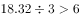，该项错误;

D项：定位文字材料第一段可知，2015年5月，医院诊疗人次为2.6亿人次（公立医院2.3亿人次和民营医院0.3亿人次）、基层医疗卫生机构诊疗人次为3.6亿人次（社区卫生服务中心（站）0.6亿人次、乡镇卫生院0.8亿人次和其他为3.6-0.6-0.8＝2.2亿人次）、其他机构诊疗人次为0.2亿人次，而2015年5月全国医疗卫生机构诊疗人次为6.4亿人次。综上所述，公立医院诊疗人次最多，则公立医院占比最高，该项正确。

故正确答案为D。

---

#### 第 5 题　qid 2060624 · 综合

根据上述材料，下列说法正确的是（  ）

- **A**. 2015年1-5月，全国二级公立医院人均住院费用增长快于三级公立医院
- **B**. 与上年同期相比，2015年5月基层医疗卫生机构诊疗人次和出院人数均有所降低
- **C**. 2015年5月，全国三级公立医院人均住院费用比二级公立医院高7216.2元
- **D**. 与上年同期相比，2015年5月基层医疗卫生机构出院人数减少了约2.4万人　✅

**答案**：D

**官方解析**

本题属于综合分析，需结合每一个选项的描述与表格、材料中给出的具体数据判断其是否正确。

A项：由材料“2015年1-5月，全国三级公立医院人均住院费用与去年同期比较，按当年价格上涨，按可比价格上涨；二级公立医院人均住院费用按当年价格同比上涨，按可比价格同比上涨。”可得二级公立医院当年价格增长率和可比价格增长率均慢于三级公立医院，该项错误。

B项：由材料“2015年5月基层医疗卫生机构诊疗人次为3.6亿人次，同比提高”可得该项错误。

C项：材料只给出1-5月人均住院费用情况，未给出5月当月情况，故该项无法推出，错误。

D项：由材料“基层医疗卫生机构出院人数为333.4万人，同比降低”可得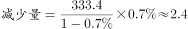万人，该项正确。

故正确答案为D。

---

### 材料 2

某总公司下属3个分公司职工意愿调查结构图

#### 第 6 题　qid 2060646 · 增长

假设甲分公司有意愿提升职务的职工有150人，那么该分公司有意愿提高薪酬的职工人数比有意愿参加培训的职工人数（  ）

- **A**. 少100人
- **B**. 少50人
- **C**. 多100人
- **D**. 多50人　✅

**答案**：D

**官方解析**

由图可得，甲分公司有意愿提升职务、提高薪酬、参加培训的职工比重分别为、、，根据有意愿提升职务的职工有150人，可得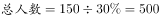人，故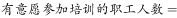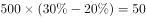人。

故正确答案为D。

---

#### 第 7 题　qid 2060652 · 增长

甲、乙、丙3个分公司中，有意愿提高薪酬的职工人数最多的是（  ）

- **A**. 甲分公司
- **B**. 乙分公司
- **C**. 丙分公司
- **D**. 无法确定　✅

**答案**：D

**官方解析**

由于材料只给出三个分公司有意愿提高薪酬职工人数的比重，并未给出三个分公司各自的总人数，故无法推断出哪个分公司有意愿提高薪酬的职工人数更多。
故正确答案为D。

---

#### 第 8 题　qid 2060672 · 综合

根据该总公司所属3个分公司职工意愿调查结构的情况，下列说法正确的是：

- **A**. 
乙分公司中有意愿提高薪酬的职工占比最高

- **B**. 
乙分公司中有意愿参加培训的职工比有意愿提升职务的职工少

- **C**. 
甲分公司中有意愿参加培训的职工比有意愿提升职务的职工少
　✅
- **D**. 
甲分公司中有意愿提高薪酬的职工人数多于有其他意愿的职工人数

**答案**：C

**官方解析**

本题属于综合分析，需结合每一个选项的描述与表格、材料中给出的具体数据判断其是否正确。

A项：定位饼图，乙分公司中有意愿提高薪酬的职工占比为25%，而有意愿提升职务的占比为35%，所以乙分公司中有意愿提高薪酬的职工占比不是最高的，该项错误。

B项：由图形可得，乙分公司中有意愿参加培训职工人数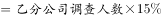、有意愿提升职务职工人数，故有意愿参加培训的职工比有意愿提升职务的职工少，该项错误。

C项：由图形可得，甲分公司中有意愿参加培训职工人数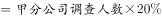、有意愿提升职务职工人数，故甲分公司中有意愿参加培训的职工比有意愿提升职务的职工少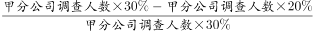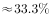，该项正确。

D项：甲分公司中有意愿提高薪酬的职工占比为，甲分公司中有其他意愿的职工占比为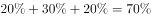。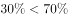，该项错误。

故正确答案为C。

---

#### 第 9 题　qid 2060678 · 比重

根据该总公司所属3个分公司职工意愿调查结构的情况，下列说法一定正确的有（  ）个。
（1）如果该总公司人数共1500人，则乙分公司有意愿改善工作环境的职工有125人。
（2）丙分公司中，有意愿提高薪酬的职工人数最多。
（3）在该总公司职工中，有意愿提高薪酬的职工在职工总人数中占比最大。

- **A**. 3
- **B**. 2
- **C**. 1　✅
- **D**. 0

**答案**：C

**官方解析**

本题属于综合分析，需结合每一个选项的描述与表格、材料中给出的具体数据判断其是否正确。
（1）只给出总公司人数，乙分公司人数未知，无法求出乙分公司中有意愿改善工作环境的职工人数，错误。
（2）由图形材料可得，丙公司中有意愿提高薪酬的职工比重最高，且丙分公司总数一定，故该项人数最多，正确。
（3）由于甲乙丙三个分公司总人数未知，故无法推算有意愿提高薪酬的职工在职工总人数中的占比情况，错误。
故正确答案为C。

---

#### 第 10 题　qid 2060682 · 比重

假设甲、乙、丙3个分公司的职工人数相同，总公司某年度计划对3个分公司中有意愿提升职务的职工进行职务提升，晋升比例为每5位有意愿的职工中提升1位，那么：

- **A**. 甲分公司获得职务提升的职工人数不一定比乙、丙的少　✅
- **B**. 乙分公司获得职务提升的职工人数不可能多于甲分公司
- **C**. 甲、乙、丙3个分公司获得职务提升的职工人数之和将超过甲分公司职工总人数
- **D**. 乙、丙分公司获得职务提升的职工人数不一定相同

**答案**：A

**官方解析**

本题属于综合分析，需结合每一个选项的描述与表格、材料中给出的具体数据判断其是否正确。

A项：设甲乙丙分公司各自的总人数为20，则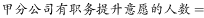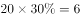，。均按照5人中提升1人的比例计算，则甲乙丙均提升1人，相等，故“不一定少”表述正确，该项正确。

B项：设甲乙分公司各自的总人数为100，则，。均按照5人中提升1人的比例计算，则甲分公司提升6人，乙提升7人，，故乙分公司获得职务提升的职工人数“不可能多于”甲分公司的表述错误，该项错误。

C项：甲乙丙三个分公司的人数均为，则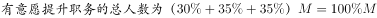，再按晋升比例每5人提升1人，则获得职务提升的职工人数一定小于，该项错误。

D项：乙丙分公司总人数相同，有意愿提升职务的比例相同，晋升比例也相同，故获得职务提升的人数一定相同，该项错误。

故正确答案为A。

---

### 材料 3

#### 第 11 题　qid 2145030 · 增长

2008年至2015年，各类工业污染治理投资中，投资额呈先下降后增长趋势的有：

- **A**. 3个
- **B**. 2个
- **C**. 1个
- **D**. 0个　✅

**答案**：D

**官方解析**

观察表格数据，2008年至2015年，各类工业污染治投资额增长趋势分别为：治理废水：降——升——降——升，治理废气：降——升——降，治理固体废弃物：升——降——升——降——升，治理噪声：降——升——降——升——降——升，治理其他：降——升——降——升——降——升，呈先下降后增长趋势的0个。
故正确答案为D。

---

#### 第 12 题　qid 2145031 · 增长

2012年至2015年，治理噪声投资额的年均增长率约为：

- **A**. 

- **B**. 

　✅
- **C**. 

- **D**. 

**答案**：B

**官方解析**

根据题干所求“2012年至2015年，治理噪声投资额的年均增长率”可判定此题为年均增长率计算。定位表格，2012年、2015年治理噪声投资额分别为11627万元、27892万元。代入公式：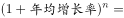（），，根据选项计算，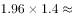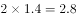，，，因此，，只有B项满足要求。

故正确答案为B。

---

#### 第 13 题　qid 2145032 · 比重

与2015年相比，2008年治理废气投资在污染治理总投资中占比：

- **A**. 
约低

- **B**. 
约高

- **C**. 
约高18个百分点

- **D**. 
约低18个百分点
　✅

**答案**：D

**官方解析**

根据题干所求“与2015年相比，2008年治理废气投资在污染治理总投资中占比”，可判定此题为两期比重比较。定位表格，2008年治理废气投资2656987万元、污染治理总投资5426404万元，2015年治理废气投资5218073万元、污染治理总投资7736822万元。2008年占比为、2015年占比为，，因此2008年占比比2015年约低18个百分点。

故正确答案为D。

---

#### 第 14 题　qid 2145033 · 综合

2008年至2015年，治理废水投资和治理废气投资差额最大的年份是：

- **A**. 2009年
- **B**. 2013年
- **C**. 2014年　✅
- **D**. 2015年

**答案**：C

**官方解析**

代入表格数据，各年份治理废水投资和治理废气投资差额分别为：2009年万元；2013年万元；2014年万元；2015年万元，差额最大的是2014年。

故正确答案为C。

---

#### 第 15 题　qid 2145034 · 综合

根据上表，下列叙述必然正确的是：

- **A**. 与2008年相比，2015年各类工业污染治理投资在总投资中占比增幅最小的是治理废水投资　✅
- **B**. 2008年至2015年，治理固体废物年均投资额约为22亿元
- **C**. 与2008年相比，2015年各类工业污染治理投资年均增长额最小的是治理噪声投资
- **D**. 2008年至2015年，工业污染中问题最为严重的一直是废气污染

**答案**：A

**官方解析**

A项：根据表格数据，与2008年相比，2015年各类工业污染治理投资在总投资中占比变化情况如下：

治理废水投资；

治理废气投资；

治理固体废物投资；

治理噪声投资；

治理其他投资；

占比增幅最小的是治理废水投资，正确；

B项：代入表格数据，2008年至2015年，治理固体废物年均投资额为，错误；

C项：年均增长量=，年份差相同，因此只需比较“现期量-基期量”大小，治理废水投资，治理废气投资，治理固体废物投资，治理噪声投资，治理其他投资，最小的是治理废水投资，错误；

D项：根据表格数据，只能得到2008年至2015年，工业污染治理投资中投资额最多的一直是治理废气污染，但治理投资额多少与污染严重程度是否必然一致无法推出，错误。

故正确答案为A。

---
