# 2017年黑龙江省公务员录用考试《行测》题（公检法卷）

> 省考 · 2017 年 · 5 个模块 · 共 120 题

- [常识判断](#%E5%B8%B8%E8%AF%86%E5%88%A4%E6%96%AD) · 20 题
- [言语理解与表达](#%E8%A8%80%E8%AF%AD%E7%90%86%E8%A7%A3%E4%B8%8E%E8%A1%A8%E8%BE%BE) · 35 题
- [数量关系](#%E6%95%B0%E9%87%8F%E5%85%B3%E7%B3%BB) · 10 题
- [判断推理](#%E5%88%A4%E6%96%AD%E6%8E%A8%E7%90%86) · 35 题
- [资料分析](#%E8%B5%84%E6%96%99%E5%88%86%E6%9E%90) · 20 题

---

## 常识判断

### 第 1 题　qid 2051024 · 法律常识

以下行为属于行政诉讼受理范围的是：

- **A**. 行政机关对其工作人员的奖惩决定
- **B**. 行政机关对其工作人员的任免决定
- **C**. 行政机关对其工作人员的离退休决定
- **D**. 行政机关吊销其工作人员参股企业的营业执照　✅

**答案**：D

**官方解析**

本题考查法律常识。
A、B两项错误，《行政诉讼法》第十三条规定：“人民法院不受理公民、法人或者其他组织对下列事项提起的诉讼：（三）行政机关对行政机关工作人员的奖惩、任免等决定。”
C项错误，行政机关对其工作人员的离退休决定属于内部行政行为，不是具体行政行为，所以不属于人民法院行政诉讼的受案范围。
D项正确，根据《行政诉讼法》第十二条规定：“人民法院受理公民、法人和其它组织对拘留、罚款、吊销许可证和执照、责令停产停业、没收财物等行政处罚不服的提起的诉讼。因此，依此若对此行政处罚提起诉讼，法院应予受理。该项中，行政机关吊销其工作人员参股企业的营业执照，属于具体行政行为，属于行政诉讼受理范围。”
故正确答案为D。

---

### 第 2 题　qid 2051026 · 法律常识

王某（14周岁），蔡某（18周岁），共同策划实施了一起入室抢劫，抢劫过程中，二人将反抗的户主杀害，下列说法正确的是：

- **A**. 蔡某不能获得指定辩护
- **B**. 王某和蔡某构成了共同犯罪　✅
- **C**. 抢劫罪和故意杀人罪数罪并罚
- **D**. 王某是未成年人，不需要承担刑事责任

**答案**：B

**官方解析**

本题考查法律常识。
A项错误：依据《刑事诉讼法》第三十四条第三款规定：犯罪嫌疑人、被告人可能被判处无期徒刑、死刑，没有委托辩护人的，人民法院、人民检察院和公安机关应当通知法律援助机构指派律师为其提供辩护。而蔡某抢劫且致人死亡的行为，依据《刑法》第二百六十三条规定可能“处无期徒刑或死刑”，则蔡某是可以获得指定辩护的；
B项正确：按照《刑法》第二十五条第一款规定：共同犯罪是指二人以上共同故意犯罪。共同犯罪成立要件必须包括：2人或2人以上；有共同故意；有共同行为。依此王某、蔡某行为构成共同犯罪；
C项错误：抢劫罪的核心就是“压制反抗，强行取财”，本题中“将反抗的户主杀害”是为了实施抢劫而“压制反抗”，所以杀人仅仅是抢劫的手段而已，所以只定抢劫罪一罪。如果是抢劫后为了灭口把人杀了，才是数罪并罚；
D项错误：按照《刑法》第十七条第二款规定：已满十四周岁不满十六周岁的人，犯故意杀人、故意伤害致人重伤或者死亡、强奸、抢劫、贩卖毒品、放火、爆炸、投放危险物质罪的，应当负刑事责任。本题中，王某14周岁，实施了抢劫行为并致人死亡，应当承担刑事责任。
故正确答案为B。

---

### 第 3 题　qid 2051034 · 人文常识

下列关于古诗名句的说法，错误的是：

- **A**. “独在异乡为异客，每逢佳节倍思亲”中的“佳节”指的是中秋　✅
- **B**. “但使龙城飞将在，不教胡马度阴山”中的“飞将”指的是李广
- **C**. “窗含西岭千秋雪，门泊东吴万里船”中的“西岭”指的是岷山
- **D**. “忽如一夜春风来，千树万树梨花开”中的“梨花”指的是雪花

**答案**：A

**官方解析**

A项错误：“佳节”指的是重阳节。语出唐·王维《九月九日忆山东兄弟》独在异乡为异客，每逢佳节倍思亲。遥知兄弟登高处，遍插茱萸少一人。九月九日是重阳节，有登高、插茱萸习俗。
B项正确：语出唐·王昌龄《出塞·其二》。唐诗用典常用汉代人物，唐诗中飞将指李广。《史记·李广列传》载：广居右北平，匈奴闻之，号曰“汉之飞将军”，避之，数岁不敢入右北平。
C项正确：西岭指的是岷山山脉中的西岭雪山。西岭雪山位于成都市大邑县境内，距成都仅95公里，属世界自然遗产、大熊猫栖息地，因唐代大诗人杜甫的千古绝句“窗含西岭千秋雪，门泊东吴万里船”而得名。
D项正确：语出唐·岑参《白雪歌送武判官归京》，以比喻的手法描写了北国突降大雪时的情形，这一片白雪皑皑、银装素裹的景象，就像是一夜春风吹来，漫山遍野的梨花盛开了，描写冬季下雪天送武判官从轮台城回京时的雪景，把白雪比作梨花。
本题为选非题，故正确答案为A。

---

### 第 4 题　qid 2051038 · 地理国情

下列关于黄河的说法不正确的是：

- **A**. 共流经我国九个省区
- **B**. 是世界上含沙量最高的河流
- **C**. 发源于青海省，最后流入黄海　✅
- **D**. 上游、中游、下游各有其独特的环境特征

**答案**：C

**官方解析**

A项正确，黄河自西向东分别流经青海、四川、甘肃、宁夏、内蒙古、陕西、山西、河南及山东9个省（自治区）；
B项正确，黄河中上游以山地为主，中下游以平原、丘陵为主。由于河流中段流经中国黄土高原地区，因此夹带了大量的泥沙，所以它也被称为世界上含沙量最多的河流；
C项错误，黄河发源于青海省青藏高原的巴颜喀拉山脉，最后流入渤海而非黄海；
D项正确，根据黄河流经地区的独特自然环境和水文情势，将其作了上、中、下游的划分。其中，上游山高坡陡，落差大，水多沙少、河水较清、流量均匀是该河段的水文特征；中游夏秋季多暴雨，沙源丰富，多水多沙，洪峰流量大，含沙量高，河道淤积与侵蚀河段交互出现，峡谷与宽谷相间；下游河道坡降小，水流平缓，加之河道宽浅散乱，泥沙淤积严重，河床逐渐升高，两岸几乎全靠大堤为屏障。
本题为选非题，故正确答案为C。

---

### 第 5 题　qid 2051040 · 人文常识

下列中国历史上的变法与其内容对应不正确的是：

- **A**. 商鞅变法——实行郡县制
- **B**. 王安石变法——颁行保甲法
- **C**. 张居正变法——推行青苗法　✅
- **D**. 戊戌变法——开办京师大学堂

**答案**：C

**官方解析**

A项正确，秦孝公任用商鞅变法，第一次变法中有“令民为什伍”，实行连坐法；重农抑商，奖励耕织；按功授爵等，几年后又实施第二次变法，主要措施有统一秦国度量衡；废分封，行县制，废除井田等。此处的废分封，行县制即为题目中所说的郡县制的源头。
B项正确，1069年，宋神宗任用王安石为参知政事，主持变法，主要措施包括：
理财方面：青苗法、募役法、农田水利法、方田均税法、市易法；
军事方面：保甲法、将兵法；
教育方面：改革科举制度、整顿太学。
C项错误，张居正改革主要推行的是一条鞭法，青苗法是王安石变法的主要内容。
D项正确，戊戌变法期间，在文化教育方面的主要措施有：开办京师大学堂、各地设立中小学堂，废除八股，改试策论，设经济特科等。
本题为选非题，故正确答案为C。

---

### 第 6 题　qid 2051042 · 人文常识

超声波技术用途非常广泛，它使用类似于声波，但某项参数大于普通声波的振动技术来工作，所以称为超声波，这个大于普通声波的参数是：

- **A**. 波长
- **B**. 振幅
- **C**. 传播速度
- **D**. 频率　✅

**答案**：D

**官方解析**

人对声音的感觉有一定频率范围，大约每秒钟振动20次到20000次范围内，即频率范围是20Hz~20000Hz，如果物体振动频率低于20Hz或高于20000Hz人耳就听不到了。
高于20000Hz的频率就叫做超声波，而低于20Hz的频率就叫做次声波。据此可知，这个大于普通声波的参数是频率。
故正确答案为D。

---

### 第 7 题　qid 2387309 · 人文常识

下列关于辛亥革命的说法，不正确的是：

- **A**. 对亚洲各国被压迫民族的解放运动产生了广泛的影响
- **B**. 沉重地打击了帝国主义在中国的统治　✅
- **C**. 建立了亚洲第一个民主共和国
- **D**. 推翻了清王朝，结束了封建君主专制制度

**答案**：B

**官方解析**

本题考查人文常识。
A项正确，辛亥革命对近代亚洲各国被压迫民族的解放运动产生了比较广泛的影响，特别是对越南、印度尼西亚等国的反对殖民主义的斗争起了推动作用，在亚洲的历史上也是一次伟大的转折。列宁把辛亥革命视为“亚洲的觉醒”。
B项错误，辛亥革命推翻了清政府，结束了封建君主专制制度。帝国主义并未直接统治中国，辛亥革命打击了帝国主义为统治中国扶植的清政府，在客观上打击了帝国主义的侵略势力。
C项正确，清政府被推翻后，孙中山于1912年元旦宣誓就职中华民国临时大总统，中华民国是亚洲第一个民主共和国。辛亥革命被中国共产党称为是中国历史上一次伟大的“资产阶级民主革命”。
D项正确，1912年2月12号清朝最后一位皇帝宣统帝被袁世凯逼迫颁布退位诏书，宣布退位，清王朝的统治结束，中国实行二千余年的封建君主专制制度也终结了。
本题为选非题，故正确答案为B。

---

### 第 8 题　qid 2387310 · 人文常识

下列关于中医的说法不正确的是：

- **A**. 中医诊脉主要是诊静脉　✅
- **B**. 阴阳五行为其理论基础
- **C**. 针灸疗法是一种中医非药物疗法
- **D**. 被称为“中国三大国粹”之一

**答案**：A

**官方解析**

本题考查人文常识。
A项错误，把脉又称为切脉，中医诊脉诊的是手腕处的桡动脉，根据脉象以了解疾病内在变化的诊断方法。
B项正确，中医蕴含着深邃的哲学智慧，它以阴阳五行作为理论基础，将人体看成是气、形、神的统一体，认为人由相互对立的阴阳二气构成，阴阳二气的动态平衡受到破坏就会发病。通过“望闻问切”四诊合参的方法，探求病因，辩证论治，根据不同病因，既有同病异治，也有异病同治，中医把人体看成一个以心为主宰，五脏为中心的统一体。
C项正确，针灸疗法即利用针刺与艾灸进行治疗，起源于新石器时代。它依据的是“虚则补之，实则泻之”的辨证原则，进针后通过补、泻、平补平泻等手法的配合运用，以取得人体本身的调节反应。针灸疗法是中医非药物疗法之一。
D项正确，中医、京剧、国画并称为“中国三大国粹”。
本题为选非题，故正确答案为A。

---

### 第 9 题　qid 2387311 · 法律常识

关于居民身份证，下列说法不符合我国相关法律规定的是：

- **A**. 遗失补办无须办理挂失和登报声明
- **B**. 港澳台同胞在大陆定居即可申领　✅
- **C**. 遗失后应向常住户口所在地派出所申报补领
- **D**. 遗失后如果被人冒用，遗失者无须承担责任

**答案**：B

**官方解析**

本题考查法律常识。
A项正确，《公安部关于对居民身份证丢失补领有关问题综合答复意见》中指出：根据《中华人民共和国居民身份证法》有关规定，公民丢失居民身份证后应当向常住户口所在地派出所申报丢失补领。公民办理丢失补领证件的行为也就告知了公安机关证件丢失的事实，不需要再办理“挂失”和登报声明，也没有相关法律规定公民丢失居民身份证后需办理“挂失”和登报声明。
B项错误，《中华人民共和国居民身份证法》第九条规定：“香港同胞、澳门同胞、台湾同胞迁入内地定居的，华侨回国定居的，以及外国人、无国籍人在中华人民共和国境内定居并被批准加入或者恢复中华人民共和国国籍的，在办理常住户口登记时，应当依照本法规定申请领取居民身份证。”港澳同胞在大陆定居后不能即时取得身份证，还要办理常住户口登记。
C项正确，《公安部关于对居民身份证丢失补领有关问题综合答复意见》中指出：根据《中华人民共和国居民身份证法》有关规定，公民丢失居民身份证后应当向常住户口所在地派出所申报丢失补领。
D项正确，《公安部关于对居民身份证丢失补领有关问题综合答复意见》中指出：居民身份证是公民的法定身份证件。公民在使用居民身份证证明身份时，各相关证件使用部门负有核对人、证一致性的义务，确认无误后方可为持证人办理相关业务。如果居民身份证丢失被他人冒用，冒用者及相关部门应承担相应的法律责任，丢失证件者无须对自己未实施的行为承担责任。
本题为选非题，故正确答案为B。

---

### 第 10 题　qid 2387313 · 人文常识

下列关于联合国的说法错误的是：

- **A**. 联合国是第二次世界大战后成立的国际组织
- **B**. 《联合国宪章》的签订标志着联合国正式成立
- **C**. 联合国总部设在美国纽约，并在世界多地设有办事处
- **D**. 联合国官方正式使用的语言为阿拉伯语、英语、法语、俄语、西班牙语　✅

**答案**：D

**官方解析**

本题考查人文常识。
A项正确，联合国是第二次世界大战后成立的国际组织，是一个由主权国家组成的国际组织。1945年6月，51个国家在美国圣弗朗西斯科签署了《联合国宪章》，同年10月24日，宪章生效，联合国正式成立。
B项正确，1945年10月24日，在美国旧金山签订的《联合国宪章》生效，标志着联合国正式成立。
C项正确，联合国总部设在美国纽约，并在世界多地设有办事处，如联合国日内瓦办事处、维也纳办事处、内罗毕办事处等。
D项错误，联合国官方正式使用的语言有6种，按英文字母顺序为阿拉伯语、汉语、英语、法语、俄语、西班牙语。6种语言同等有效，代表们发言时可以任意选用其中一种。选项中少了汉语。
本题为选非题，故正确答案为D。

---

### 第 11 题　qid 2387314 · 人文常识

下列关于我国古代作品的说法不正确的是：

- **A**. 《诗经》最初是配乐的歌词
- **B**. 《庄子》中记载了大量的中国古代神话
- **C**. 《楚辞》由战国时期楚国诗人屈原编撰而成　✅
- **D**. 《论语》大部分记言，小部分记事

**答案**：C

**官方解析**

本题考查人文常识。
A项正确，《诗经》中的诗当初都是配乐的歌词，保留着古代诗歌、音乐、舞蹈三者结合的形式。
B项正确，中国古代神话主要散见于《山海经》、《庄子》、《楚辞》、《淮南子》、《列子》、《穆天子传》等文献古籍中。
C项错误，《楚辞》经历了屈原的作品始创、屈后仿作、汉初搜集至刘向辑录等历程，成书时间应在西汉后期。《楚辞》收录了屈原、宋玉及汉代淮南小山、东方朔、王褒、刘向等人的辞赋，并不是屈原编撰的。
D项正确，《论语》是我国第一部语录体形式的著作，由孔子的后人整理成册，记录孔子及其弟子的言行，是儒家最重要的一部经典著作。《论语》大部分记言，小部分记事，只有极少数篇章称得上是比较完整的文章。
本题为选非题，故正确答案为C。

---

### 第 12 题　qid 2387315 · 人文常识

下列成语典故的出处来源于唐代的是：

- **A**. 口蜜腹剑　✅
- **B**. 指鹿为马
- **C**. 破釜沉舟
- **D**. 图穷匕见

**答案**：A

**官方解析**

本题考查人文常识。
A项正确，口蜜腹剑出自《资治通鉴·唐纪·玄宗天宝元年》：“世谓李林甫：口有蜜，腹有剑”。李林甫在唐玄宗时期连续16年任宰相之职，专权用事，玩弄“口蜜腹剑”的伎俩，以达到自己独揽政权的目的。李林甫专权的十几年中，李唐王朝政治上日益黑暗，各种矛盾尖锐，开元盛世急剧转变成了天宝末年的经济、政治危机。
B项错误，指鹿为马出自《史记·秦始皇本纪》，发生在秦朝。赵高想要谋权篡位，但担心大臣都不听从于他，于是他要事先检验一下。赵高找来了两条鹿献给秦二世，指着鹿说，这是马。秦二世笑着说：“丞相看错了吧，把鹿当成马。”之后他问左右的人，这些人或者沉默，或者说这是马来迎合赵高。
C项错误，破釜沉舟源于《史记·项羽本纪》，典故发生在秦朝。项羽和章邯在漳河发生大战之前，项羽率领全部军队渡过漳河，把船只全部弄沉，把锅碗全部砸破，把军营全部烧毁，只带上三天的干粮，以此向士卒表示一定要决死战斗，毫无退还之心。
D项错误，图穷匕见出自《战国策·燕策三》:“秦王谓轲曰：‘起，取舞阳所持图。’轲既取图奉之。发图，图穷而匕首见。”典故发生在战国末期，荆轲受命刺秦王。
故正确答案为A。

---

### 第 13 题　qid 2387331 · 人文常识

下列典籍与性质对应错误的是：

- **A**. 《文心雕龙》——文学理论著作
- **B**. 《天工开物》——科学技术著作
- **C**. 《世说新语》——笔记体小说集
- **D**. 《吴越春秋》——军事理论著作　✅

**答案**：D

**官方解析**

本题考查人文常识。
A项正确，《文心雕龙》是中国南朝文学理论家刘勰创作的一部理论系统、结构严密、论述细致的文学理论专著，是中国一部经典的文学理论著作。
B项正确，《天工开物》是世界上第一部关于农业和手工生产的综合性著作，是中国古代一部综合性的科学技术著作，有人也称它是一部百科全书式的著作，作者是明朝科学家宋应星。外国学者称它为“中国17世纪的工艺百科全书”。
C项正确，《世说新语》是由南北朝刘宋宗室临安王刘义庆组织一批文人编写的，梁代刘峻作注。《世说新语》是中国第一部笔记体小说集，内容主要是记录魏晋名士的逸闻轶事和玄言清谈，也可以说这是一部记录魏晋风流的故事集，是中国魏晋南北朝时期“笔记小说”的代表作，是我国最早的一部文言志人小说集。
D项错误，《吴越春秋》由东汉时期赵晔著作而成，为稗官杂记体之别史。它是一部有关先秦时期吴越两国历史的史学著作。承继《史记》余续，将历史学研究的对象看作“天人之际”“古今之变”，其任务是“成一家之言”，而其功用是“鉴于往事，以资来者”，并非军事理论著作。
本题为选非题，故正确答案为D。

---

### 第 14 题　qid 2387333 · 人文常识

梅与松、竹并称为“岁寒三友”，以其高洁、坚强、谦虚的品格，给人以立志奋发的激励，常被古人用来咏物言志。以下诗词哪一句描写的不是梅花？

- **A**. 无意苦争春，一任群芳妒。零落成泥碾作尘，只有香如故
- **B**. 万树寒无色，南枝独有花。香闻流水处，影落野人家
- **C**. 花飞莫遣随流水，怕有渔郎来问津　✅
- **D**. 冰雪林中着此身，不同桃李混芳尘，忽然一夜清香发，散作乾坤万里春

**答案**：C

**官方解析**

本题考查人文常识。
A项正确，诗句出自宋代陆游的《卜算子·咏梅》，诗句的意思是：梅花并不想费尽心思去争艳斗宠，对百花的妒忌与排斥毫不在乎。即使凋零了，被碾作泥土，又化作尘土了，梅花依然和往常一样散发出缕缕清香。赞美了梅花谦逊、忍让、坚贞不屈的品质。
B项正确，诗句出自明代道源的《早梅》，诗句的意思是：雪花落下，给植物披上了银装，一点颜色的都没有。在南边的树枝上有一些花，没有叶子。在小溪旁我都闻到了香味，抬头一看，只见梅花的影子映在农家的墙壁上。
C项错误，诗句出自宋代谢枋得的《庆全庵桃花》，诗句的意思是：倘若我住在桃花源里，就一定不让桃花瓣落入溪水之中，随水流出，为的是怕再有打渔人见到水中桃花，随水找到洞口进来啊！诗人发挥丰富的想象，表达对桃源的向往。描写的是桃花，而非梅花。
D项正确，诗句出自元代王冕的《白梅》，诗句的意思是：白梅生长在冰天雪地的寒冬，傲然开放，不与桃李凡花相混同。忽然在某个夜里花儿盛开，清香散发出来，竟散作了天地间的万里新春。赞美了梅花不求人夸，只愿给人间留下清香的美德，实际上是借梅自喻，表达自己的人生态度以及不向世俗献媚的高尚情操。
本题为选非题，故正确答案为C。

---

### 第 15 题　qid 2387336 · 科技常识

下列关于世界著名科学家的贡献说法不正确的是：

- **A**. 俄国化学家门捷列夫发现了元素周期表，这一发现成为化学发展史上的重要里程碑
- **B**. 古希腊的亚里士多德是一位百科全书式科学家，他对许多学科都做出了重要贡献
- **C**. 英国科学家牛顿发现了万有引力定律，使人类对物质构成的认识有了质的飞跃　✅
- **D**. 波兰天文学家哥白尼提出了“日心说”，沉重打击了教会的宇宙观

**答案**：C

**官方解析**

本题考查科技常识。
A项正确，1869年，俄国化学家门捷列夫制作出了第一张元素周期表，揭示了化学元素间的内在联系，成为化学发展史上的重要里程碑之一。
B项正确，古希腊的亚里士多德作为一位百科全书式科学家，在许多学科中写下了开创性论文，如教育学、心理学、医学、生物学等，最重要的是他把逻辑学发展成为一门科学，使之成为一切科学的工具，为近代科学创造了可借鉴的理论依据。
C项错误，1687年牛顿发现万有引力，任何物体之间都有相互吸引力，这个力的大小与各个物体的质量成正比例，而与它们之间的距离的平方成反比。万有引力定律是物体间相互作用的一条定律，并非“物质构成”。
D项正确，哥白尼，文艺复兴时期波兰数学家、天文学家，提出“日心说”，沉重地打击了教会的宇宙观，是唯物主义和唯心主义斗争的伟大胜利。 
本题为选非题，故正确答案为C。

---

### 第 16 题　qid 2387338 · 科技常识

关于常见金属，下列表述不正确的是：

- **A**. 铝极易与氧形成氧化铝，因此到了19世纪初才被英国化学家提炼出来
- **B**. 汞是常温下唯一呈液态的金属，由于在一定温度范围内体积膨胀系数均匀且不粘玻璃而被用来制作温度计
- **C**. 铜是人类最早普遍使用的金属，因为它是地壳中含量最多的金属元素　✅
- **D**. 稀土并不是稀少的土，而是金属，是镧、镨、铒等17种元素的统称

**答案**：C

**官方解析**

本题考查科技常识。

A项正确，铝太容易被氧化了，所以在自然界里铝都是以氧化铝的状态存在。因此虽然铝在自然界中含量十分丰富，人们却无法把它冶炼出来。到了19世纪，人们开始摸索出一些冶炼铝的方法。1855年，从黏土中提炼出来的铝在巴黎举办的世界博览会上展出，并引起了轰动，它被称为“德维尔的白银”。

B项正确，汞是常温常压下唯一以液态存在的金属，汞是银白色闪亮的重质液体，化学性质稳定。汞是由原子构成的，温度升高或降低，汞原子的运动速度加快或减慢，原子间的间隔变大或缩小，也就是金属汞的体积变大或缩小。在常见的物质中汞的热胀冷缩明显。由于其在一定温度范围内体积膨胀系数均匀且不粘玻璃而被用来制作温度计。

C项错误，铜是人类最早使用的金属之一，但铝才是地壳上含量最丰富的金属，占整个地壳总质量的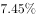，在全部元素中也仅次于氧和硅，是地壳上铁含量的1.5倍，是铜含量的近4倍。

D项正确，稀土并不是稀少的土，而是典型的金属元素，是镧、镨、铒、铈、钇等17种金属元素的统称。

本题为选非题，故正确答案为C。

---

### 第 17 题　qid 2387339 · 人文常识

下列哪组都是地跨两个大洲的国家？

- **A**. 印度尼西亚  埃及  土耳其　✅
- **B**. 墨西哥  古巴  沙特阿拉伯王国
- **C**. 俄罗斯  意大利  印度
- **D**. 巴西  美国  泰国

**答案**：A

**官方解析**

本题考查地理国情。
地跨两个大洲的国家有：俄罗斯（欧洲、亚洲）、美国（北美洲、大洋洲）、土耳其（亚洲、欧洲）、埃及（非洲、亚洲）、印度尼西亚（亚洲、大洋洲）、巴拿马（北美洲、南美洲）、哈萨克斯坦（亚洲、欧洲）、格鲁吉亚（亚洲、欧洲）、阿塞拜疆（亚洲、欧洲）、丹麦（欧洲、北美洲）、希腊（欧洲、亚洲）。
A项正确，印度尼西亚地跨亚洲和大洋洲；埃及地跨非洲和亚洲；土耳其地跨亚洲和欧洲。
B项错误，墨西哥、古巴、沙特阿拉伯王国均不属于地跨两个大洲的国家。
C项错误，俄罗斯地跨欧洲和亚洲，但意大利和印度不属于地跨两个大洲的国家。
D项错误，美国地跨北美洲和大洋洲，但巴西和泰国不属于地跨两个大洲的国家。
故正确答案为A。

---

### 第 18 题　qid 2387342 · 法律常识

下列符合法律规定的是：

- **A**. 陆某参与了为期三个月的地震救灾应急援助工作，这期间单位应给他双倍工资和福利待遇
- **B**. 黄某在微博上对李某进行辱骂，李某以侵犯名誉权为由将黄某告上法庭　✅
- **C**. 某商场进行商品促销，规定所有商品购买后概不退换
- **D**. 张某就职于某电器公司，在怀孕五个月时不幸流产，可享受不超过15天的产假

**答案**：B

**官方解析**

本题考查法律常识。
A项错误，《劳动合同法》第八十二条规定：“用人单位自用工之日起超过一个月不满一年未与劳动者订立书面劳动合同的，应当向劳动者每月支付二倍的工资。用人单位违反本法规定不与劳动者订立无固定期限劳动合同的，自应当订立无固定期限劳动合同之日起向劳动者每月支付二倍的工资。”据此可知，参与救灾应急援助工作不在法律规定应当支付二倍工资的范畴内。
B项正确，《中华人民共和国民法典》第一百一十条第一款规定：“自然人享有生命权、身体权、健康权、姓名权、肖像权、名誉权、荣誉权、隐私权、婚姻自主权等权利。”黄某在微博上对李某进行辱骂，侵犯了李某的名誉权，李某可以因此将黄某告上法庭。
C项错误，《零售商促销行为管理办法》第十八条规定：“零售商不得以促销为由拒绝退换货或者为消费者退换货设置障碍。”
D项错误，《女职工劳动保护特别规定》第七条第二款规定：“女职工怀孕未满4个月流产的，享受15天产假；怀孕满4个月流产的，享受42天产假。”张某在怀孕五个月时流产，应享受42天产假。
故正确答案为B。

---

### 第 19 题　qid 2387346 · 人文常识

下列与艺术有关的说法，错误的是：

- **A**. 米开朗基罗是意大利文艺复兴“三杰”之一
- **B**. 波兰作曲家、钢琴家肖邦被称为“乐圣”　✅
- **C**. 《向日葵》是荷兰后印象派画家梵·高的代表作
- **D**. 奥地利作曲家莫扎特的代表作有歌剧《费加罗的婚礼》

**答案**：B

**官方解析**

本题考查人文常识。
A项正确，米开朗基罗是意大利文艺复兴时期杰出的雕塑家、建筑师、画家和诗人，与达芬奇和拉斐尔并称“文艺复兴艺术三杰”，以人物“健美”著称，即使女性的身体也描画得肌肉健壮。 
B项错误，路德维希·凡·贝多芬，德国著名的音乐家，维也纳古典乐派代表人物之一。他的作品对世界音乐的发展有着非常深远的影响，因此被尊称为“乐圣”。肖邦被称为“钢琴诗人”。 
C项正确，《向日葵》是19世纪末期荷兰杰出的后印象派画家梵·高的代表作品，它是一幅静物画。梵·高曾多次描绘以向日葵为主题的静物。
D项正确，奥地利作曲家莫扎特的代表作有歌剧《费加罗的婚礼》、《唐璜》、《魔笛》等，《费加罗的婚礼》是最受欢迎的经典之作。
本题为选非题，故正确答案为B。

---

### 第 20 题　qid 2387350 · 科技常识

以下关于生物学方面的科学知识，说法不正确的是：

- **A**. 光合作用是植物和某些细菌，以及一些真核微生物，通过阳光提供的能量合成如葡萄糖等糖类的过程
- **B**. 新陈代谢是保持生物生存且为生长和繁殖提供能量的重要化学过程
- **C**. 蛋白质是细胞中起关键作用的复杂的大分子，它由数以千计的氨基酸小分子组成
- **D**. 碳水化合物是由碳原子、氮原子和氧原子构成的一类有机化合物　✅

**答案**：D

**官方解析**

本题考查科技常识。
A项正确，光合作用是植物、藻类和某些细菌，在可见光的照射下，经过光反应和碳反应，利用光合色素，将二氧化碳（或硫化氢）和水转化为有机物，并释放出氧气（或氢气）的生化过程，同时也有将光能转变为有机物中化学能的能量转化过程。藻类属于真核微生物。光合作用的产物有糖类，如葡萄糖，也可以合成蛋白质和脂类等有机物。
B项正确，生物体这种与环境不断进行的物质和能量交换的过程，在生物学上叫做新陈代谢。所有生物体都处在与环境不断进行物质交换和能量流动的状态中：生物不断从外界吸收一些物质，这些物质在体内经过一系列变化，最后成为代谢过程的最终产物一一体内已经无用的物质而排出体外。新陈代谢是维持生物体生长、繁殖、运动等生命活动过程的化学变化的总称，是保持生物生存且为生长和繁殖提供能量的重要化学过程。
C项正确，蛋白质是肌体细胞的重要组成部分，是人体组织更新和修补的主要原料。蛋白质是细胞中起关键作用的复杂的大分子，它由数以千计的氨基酸小分子组成。人体不能直接用食物蛋白来更新和修补组织，必须先经过消化，消除蛋白质的种属特异性，将复杂的大分子蛋白质转变为简单的小分子氨基酸，以便吸收后再重新合成人体自身特有的蛋白质。
D项错误，碳水化合物是由碳、氢和氧三种元素组成，由于它所含的氢氧的比例一般为二比一，和水一样，故称为碳水化合物，不包括氮原子。
本题为选非题，故正确答案为D。

---

## 言语理解与表达

### 材料 1

根据下面的材料回答问题。

①心理学领域有个术语叫作“羊群效应”，专门用来形容人类的从众心理。羊群有个习性，那就是跟着头羊走，无论前面那个大坑有多宽，只要有一头羊率先跳过去了，后面的羊便会跟着它往前跳。羊群效应一直是心理学研究的热点之一，社交网站的出现提供了一个绝佳的实验场，研究者们可以通过大数据的研究方法排除个案的影响。

②众所周知，在心理学领域单独研究某件个案是不科学的。就拿羊群效应来说，不可能把网民们对某件产品的评价单独拿出来研究，因为这件产品有可能确实质量很好。为了避免这个问题，美国麻省理工学院附属的斯隆商学院的希南·阿拉尔博士和他的同事们决定借鉴自然科学的研究方法，进行一次大规模随机对照实验。他们和一家社交网站合作，花了5个多月的时间对这家网站所有的网友评论做了一次实验。

③这是一家综合性社交网站，先由网友上传文章，再由其他网友做出评论。评论的内容是可以被打分的，要么点赞（大拇指朝上），要么给差评（大拇指朝下）。点赞的数量减去差评的数量就是每段评论的最终得分。研究人员和站方达成协议，事先为这5个月当中出现的101281篇评论进行打分。也就是说，每出现一篇评论，都立即由机器自动生成一个网友评论。当然，到底是点赞还是差评则是随机决定的，和帖子的内容无关。另外还有一定数量的评论不事先打分，作为对照组。

④结果显示，社交网站上的羊群效应还是相当明显的。研究人员一共收集到30.8515万次网友打分，发现事先被点赞的评论最终得正分的可能性比对照组高出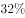，最终的得分也比平均值高了。相比之下，事先被点差评的评论则不受影响，和对照组没有区别。

⑤“如果机器给出的是负面评价，后面往往会有很多人试图进行修正，最终导致负面评价对一条评论的总得分没有影响。”阿拉尔博士评价说，“正面评价则没有这种情况，说明人们对于不符合自己意见的正面评价和负面评价的态度是不一样的，对于前者比较宽容。”

⑥牛津大学互联网学院的伯尔尼·霍根教授认同这一判断，他认为正面评价往往是一种广告，做出正面评价的人是想让更多的网友喜欢某件东西，而负面评价则是一种个人化的情绪发泄，这就是为什么一般社交网站点赞比差评多的原因所在。

⑦另外，评论的内容对于实验结果也有影响。文化、社会、政治和商业类的新闻评论容易受到羊群效应的影响，普通新闻和经济新闻则影响较小，这大概是因为前者比较主观，受个人观点影响大，容易走极端，而后者属于事实类新闻，比前者要客观得多，不太受个人因素的影响。

#### 第 1 题　qid 2051270 · 片段阅读

下列文字最适合放在文中的位置是：
值得一提的是，随机出现的点赞和差评的总数并不是一样的，因为在通常情况下，这家网站点赞的数量比差评要多。于是研究人员根据以往的情况，设定了随机点赞和差评的比例。从这个细节可以看出，研究人员对于实验材料的选取是非常细心的，尽量做到不影响网友的直观感觉。

- **A**. ②和③之间
- **B**. ③和④之间　✅
- **C**. ④和⑤之间
- **D**. ⑤和⑥之间

**答案**：B

**官方解析**

观察文段发现，③中提到了对网友上传文章评论内容的点赞及差评的数量情况，并就此作出对照试验。而需要填入的句子中出现了点赞及差评的具体实验表现，应紧随其后，接着④中给出了“结果”，这几段内容均讲述了实验的相关内容，存在共同信息，且符合逻辑顺序，衔接紧密，该段内容应该在③④之间。其他几项均不能构成话题的一致性，排除。
故正确答案为B。
【文段出处】《互联网时代的羊群效应》

---

#### 第 2 题　qid 2051272 · 片段阅读

关于“负面评价”，下列说法与原文不符的是：

- **A**. 该社交网站中的负面评价比正面评价少
- **B**. 负面评价往往带有个人的主观情绪色彩
- **C**. 人们通常并不介意负面评价是否与自己的观点相符　✅
- **D**. 网友的修正意见会最终抵消机器所给出的负面评价

**答案**：C

**官方解析**

A项，根据58题所填入的内容及⑥句中的最后一句话“社交网站的点赞比差评多”可知，表述正确，排除；
B项，根据⑥句中的论述“负面评价是一种情绪的宣泄”，可知负面评价带有主观的情绪色彩，表述正确，排除；
C项，根据⑤句可知，人们对于负面评价的态度不太宽容，想要去修正负面评价，故该项表述“不介意”与文段不符，表述错误，当选；
D项，对应⑤句，“人们会修正负面评价，最终抵消机器给出的评价”，可知该项表述正确，排除。
本题为选非题，故正确答案为C。
【文段出处】《互联网时代的羊群效应》

---

#### 第 3 题　qid 2051274 · 片段阅读

下列说法与原文不符的是：

- **A**. 正面评价往往会起到广告宣传的作用
- **B**. 事实类新闻更不易受羊群效应的影响
- **C**. 我们很难通过单独研究某件个案获得科学的结论
- **D**. 阿拉尔博士在社交网站的实验属于自然科学研究　✅

**答案**：D

**官方解析**

由第六段“他认为正面评价往往是一种广告，作出正面评价的人是想让更多的网友喜欢某件东西”可以得知，正面评价能够让更多的人喜欢，产生积极的宣传效果，对应A项表述，符合文意，排除。
由第七段“而后者属于事实类新闻，比前者要客观得多，不太受个人因素的影响”可知，事实类新闻更不易受羊群效应的影响，对应B项表述，符合文意，排除。
由第二段“在心理学领域单独研究某件个案是不科学的”可知，单独研究某件个案是不科学的，很难获得科学的结论，对应C项表述，符合文意，排除。
由第二段“阿拉尔博士和他的同事决定借鉴自然科学研究的方法”可知，阿拉尔博士只是借鉴自然科学研究的方法，并不是进行一项自然科学实验，因此D项表述偷换概念，不符合文意，当选。
本题为选非题，故正确答案为D。
【文段出处】《互联网时代的羊群效应》

---

#### 第 4 题　qid 2051278 · 片段阅读

这段文字意在说明：

- **A**. 网络消费者的从众心理
- **B**. 羊群效应在网络中的表现　✅
- **C**. 大数据在心理研究中的应用
- **D**. 社交网络中网友评价的误区

**答案**：B

**官方解析**

材料①开篇具体阐释“羊群效应”的概念，尾句强调“社交网站”是研究“羊群效应”的“绝佳的实验场”，接着材料②论述“社交网站成为绝佳试验场”的原因，材料③阐述具体的实验过程，材料④得出实验结果，即“社交网站上的‘羊群效应’还是十分明显的”，材料⑤⑥⑦对实验结果进行了具体分析，全篇材料重点强调“社交网站上的羊群效应很明显”，对应B项。
A项，由材料③“先由网友上传一篇文章，再由其他网友做出评论”可知，文段谈论的并非“消费者”，且未提及主题词“羊群效应”，排除；C项“心理研究”概念扩大，文段重点谈论的是“羊群效应”，其只是“心理研究”中的一个方面，排除；D项未提及主题词“羊群效应”，排除。
故正确答案为B。
【文段出处】《互联网时代的羊群效应》

---

#### 第 5 题　qid 2051280 · 片段阅读

实验者观察到下列四个现象，哪一现象能在最大程度上体现阿拉尔博士在文中提到的“修正”过程？

- **A**. 关于总统大选新闻的评论引发口水大战　✅
- **B**. 某知名品牌的新产品发布会的评价反响寥寥
- **C**. 关于股市走向分析的评价得到网友一致认可
- **D**. 网友对某场球赛胜负预测的评论呈“一边倒”态势

**答案**：A

**官方解析**

首先定位阿拉尔博士在文中提到的“修正”，即“如果机器给出的是负面评价，后面会有很多人试图进行修正”，所以很多人给出的评论是与事先给出的评论相反的，而不是一致。B项的“反响寥寥”不能体现出前后的评论相反，排除；C项“一致认可”和D项的“一边倒”不能体现“修正”的含义，排除；A项中的“口水战”可以体现出很多人对先前评论的反对，即“修正”，当选。
故正确答案为A。
【文段出处】《互联网时代的羊群效应》

---

#### 第 6 题　qid 2051220 · 逻辑填空

南宋诗人周紫芝在《竹坡诗话》中记载：李氏家族有一人为官廉洁，公私分明。一天，他正在烛光下办理公务，有人送来一封家书。他当即灭掉公家的蜡烛，点燃自家的蜡烛，因为在他看来，公与私之间绝对不容混淆，这在今天看来有点            ，但所折射的公与私的严格区分仍然值得深思。
填入画横线部分最恰当的一项是：

- **A**. 自命清高
- **B**. 小题大做　✅
- **C**. 沽名钓誉
- **D**. 矫枉过正

**答案**：B

**官方解析**

横线之前的“这”指代前文李氏一官员的做法，根据“在他看来，公与私之间绝对不能混淆”可知，这位官员把一根蜡烛的小事也看的非常重要，B项“小题大做”指把小事当作大事来处理，与文段对应恰当。
A项“自命清高”指自以为清高，通常主语为人，“这”指代一种做法，与“自命清高”搭配不当，排除；
C项“沽名钓誉”指用某种不正当的手段捞取名誉，文段并未体现出使用不正当的手段，排除；
D项“矫枉过正”比喻纠正错误超过了应有的限度，文段并未阐述纠正错误，排除。
故正确答案为B。
【文段出处】《莫让“私”字入公门》

---

#### 第 7 题　qid 2051230 · 逻辑填空

好的作品会对一些人的人生产生重大和深远的影响。它能让人变得更加坚强，让人生目标更加      。曾几何时，一部《钢铁是怎样炼成的》，一部《平凡的世界》，成为许多青年人精神世界的“圣经”，成为他们一生中经受      、战胜苦难的强大精神动力。
依次填入画横线部分最恰当的一项是：

- **A**. 笃定  磨难　✅
- **B**. 确定  波折
- **C**. 淡定  磨炼
- **D**. 镇定  挫折

**答案**：A

**官方解析**

第一空，搭配“目标”，A项“笃定”指确定、有把握，B项“确定”指明确肯定，均与“目标”搭配恰当，保留。C项“淡定”指冷静镇定的态度，D项“镇定”指遇到紧急情况不慌乱，均形容人处于不慌乱的状态，与“目标”搭配不当，排除。
第二空，根据相同句式“经受······战胜······”可知，横线处应与“苦难”含义相近，体现痛苦、灾难之意，A项“磨难”指在艰难困苦的逆境中遭受折磨，符合文意，当选。B项“波折”指事情进行过程中所出现的曲折变化，与“苦难”相比程度太轻，排除。
故正确答案为A。
【文段出处】人民日报《雷剧横行 好作品向何处寻？》

---

#### 第 8 题　qid 2051232 · 逻辑填空

读完一本可心的书，就如同      的河床有了清流的浸润，如同精神的荒原有了生命的      ，人的精神状态立刻有了不同，颇有点“腹有诗书气自华”的感受，而察世事、思万物也有了些深度和张力。
依次填入画横线部分最恰当的一项是：

- **A**. 干燥  萌生
- **B**. 干旱  觉醒
- **C**. 干涸  萌动　✅
- **D**. 干裂  苏醒

**答案**：C

**官方解析**

第一空，根据“清流的浸润”可知，画横线处表示河床处于缺水的状态，选项的四个词语均可形容缺少水分，但A项“干燥”多修饰“气候”，与“河床”搭配不当，排除。
第二空，根据“精神的荒原”可知，横线处表示有生命在活动，C项“萌动”表示萌生活动，与“生命”搭配恰当，契合文意，当选。B项“觉醒”指醒悟、觉悟，文段表示生命在活动而非醒悟，排除；D项“苏醒”指从昏迷或沉睡中醒过来，文段并非强调生命在此之前昏迷或沉睡，仅强调活动，排除。
故正确答案为C。
【文段出处】《阅读是开掘精神荒原的铧犁》

---

#### 第 9 题　qid 2051236 · 逻辑填空

3D电视是一种能够      实际景物的真实空间关系的新型电视，对观众而言，延伸于屏幕的景物具有             的震撼效果。
依次填入画横线部分最恰当的一项是：

- **A**. 模仿  近在咫尺
- **B**. 展示  活灵活现
- **C**. 展现  栩栩如生
- **D**. 模拟  触手可及　✅

**答案**：D

**官方解析**

第一空，搭配“真实空间关系”，B项“展示”指清楚地摆出来，明显地表现出来，C项“展现”指显现出，展示，D项“模拟”指模仿，均与“真实空间关系”搭配恰当，保留。A项“模仿”指按照现成的样子做，与“真实空间关系”搭配不当，且3D电视并非模仿“实际景物”的产物，与文意不符，排除。
第二空，根据“真实空间关系”可知，横线处所填成语形容“延伸于屏幕的景物”近在手边，D项“触手可及”指近在手边，一伸手就可以接触到，符合文意，且能体现“震撼效果”，当选。B项“活灵活现”指神情逼真，使人感到好像亲眼看到一般，C项“栩栩如生”指艺术形象非常逼真，如同活的一样，均无法对应“真实空间关系”，排除。
故正确答案为D。
【文段出处】央视网《什么是3D电视》

---

#### 第 10 题　qid 2051238 · 逻辑填空

用中国品牌讲中国故事是一种艺术，必须善讲会讲。既讲品牌成长的经历、也讲品牌_____的精神，既讲大故事、也讲小故事，既讲老故事、也讲新故事，把中国品牌的故事讲得              ，使中国品牌成为当代中国形象的闪亮名片。
依次填入画横线部分最恰当的一项是：

- **A**. 彰显  娓娓动听　✅
- **B**. 包含  绘声绘色
- **C**. 展示  栩栩如生
- **D**. 蕴含  惟妙惟肖

**答案**：A

**官方解析**

本题可从第二空入手，横线处搭配“讲得”，A项“娓娓动听”形容善于说话使人喜欢听，B项“绘声绘色”往往用来形容叙述，描写生动逼真，均与“讲得”搭配恰当，保留。C项“栩栩如生”指艺术形象非常逼真，如同活的一样，D项“惟妙惟肖”形容描写或模仿得非常逼真，均与“讲得”搭配不当，排除。
第一空，A项“彰显”往往用在积极语境，B项“包含”为中性词，根据文段“是一种艺术”“使中国品牌成为当代中国形象的闪亮名片”可知“彰显”更好，A项当选。
故正确答案为A。
【文段出处】《用中国品牌讲中国故事》

---

#### 第 11 题　qid 2051240 · 逻辑填空

一个人从小就生活在平等、尊重的环境中，长大了就会更平等地对待人和事。反之，从小就生活在              的训导或者宠物般的溺爱中，就很难养成健康的人格，容易变得       ，甚至容易走极端。
依次填入画横线部分最恰当的一项是：

- **A**. 盛气凌人  平庸
- **B**. 吹毛求疵  固执
- **C**. 唠唠叨叨  偏激
- **D**. 居高临下  偏执　✅

**答案**：D

**官方解析**

第一空，通过“反之”可知，横线处与前文的“平等、尊重”形成反义并列关系，应体现不平等、不尊重的含义，B项“吹毛求疵”比喻过度挑剔别人的缺点，C项“唠唠叨叨”指说话啰嗦，说个没完，两者均与“不平等、不尊重”无关，排除。
第二空，根据“甚至”可知，横线处所填词语应比“极端”程度稍轻，且要体现出“不健康的人格”，D项“偏执”符合文意，当选。A项“平庸”指平常人做着平凡的事，与健康的人格无关，且无法与“极端”构成递进，排除。
故正确答案为D。
【文段出处】《平等是对生命最好的馈赠》

---

#### 第 12 题　qid 2051244 · 逻辑填空

如何看待各项指标的起落调整？如何领会稳增长、调结构、促改革的辩证用意？如何贯彻稳中求进的调控指引？      中国经济的复杂问题，需要             的专业剖析，更离不开格局宏大的战略思考。
依次填入画横线部分最恰当的一项是：

- **A**. 破解 具体而微　✅
- **B**. 反观 一丝不苟
- **C**. 解读 返观内视
- **D**. 反思 条分缕析

**答案**：A

**官方解析**

本题从第二空入手，根据“需要······更离不开······”可知，对策是从两个不同的方面入手，后面强调的是“宏大”，指宏伟、巨大，所以横线处所填词语应该表示“微小”的含义，A项“具体而微”，指事物的各个组成部分大体都有了，不过形状和规模比较小些，符合文意，保留。B项“一丝不苟”指做事认真，文段强调的是“小”，而非“认真”，排除；C项“返观内视”指自我反省，和“专业剖析”搭配不当，排除；D项“条分缕析”形容分析得有条理，很细致，与“剖析”语义重复，排除。
第一空，代入验证，“破解问题”搭配恰当，且后文“需要”提出破解问题的对策，符合文意，A项当选。
故正确答案为A。
【文段出处】《打好转变发展方式硬仗》

---

#### 第 13 题　qid 2051246 · 逻辑填空

研究者称，可爱的人真诚善良，平和亲切，他们会让对方放下      ，更愿意与之交朋友，适当地在家人和朋友面前学句夸张的“可爱语”，偶尔穿一次可爱的衣服，能让人显得有童趣，但如果一味地脱离年龄，刻意装可爱，只会是              。
依次填入画横线部分最恰当的一项是：

- **A**. 骄傲 事倍功半
- **B**. 自卑 削足适履
- **C**. 成见 东施效颦
- **D**. 戒备 适得其反　✅

**答案**：D

**官方解析**

本题从第二空入手，根据“但”表转折，可知前后语义相反，前面说偶尔装可爱可让人显得童趣，带来好处，故横线后应该表达刻意装可爱带来的消极影响，D项“适得其反”指恰恰得到与预期相反的结果，符合文意，保留。
A项“事倍功半”形容做事的方法费力大，收效小，反义词是“事半功倍”，不符合文意，排除；B项“削足适履”比喻不合理地迁就现成条件或不顾具体条件，生搬硬套，语意不符，排除；C项“东施效颦”比喻模仿别人，不但模仿不好，反而出丑，文段没有提及“模仿别人”，排除。
第一空，代入验证，“放下戒备”搭配恰当，且与后文“愿意与之交朋友”形成对应，D项当选。
故正确答案为D。
【文段出处】《做一个善良可爱女人》

---

#### 第 14 题　qid 2051248 · 逻辑填空

人格魅力是什么？就是人的信仰、气质、品德、才智等汇聚而成的感召力量，管理学者称之为            的号召力，凝心聚力的吸引力，             的感染力。
依次填入画横线部分最恰当的一项是：

- **A**. 说一不二 耳濡目染
- **B**. 一言九鼎 润物无声
- **C**. 一呼百应 潜移默化　✅
- **D**. 不令而行 春风化雨

**答案**：C

**官方解析**

第一空，横线处所填词语用来形容“号召力”。C项“一呼百应”意为一人呼喊，多人响应，强调“号召力”强，契合文意，保留；D项“不令而行” 意为领导者本身的行为正当，即使不以法令约束，人们也会自然而然的效法，走上正道，放在此处用来形容领导者正面的感召力尚可，保留。A项“说一不二”指一个人说话算数，不会改变，强调“信誉”，B项“一言九鼎”指说话有分量，起决定作用，强调人的身份地位重要，均与“感召力”无关，排除。
第二空，横线处所填词语形容“感染力”，C项“潜移默化”指人的思想或性格不知不觉受到感染、影响而发生了变化，与“感染力”搭配得当，当选。D项“春风化雨”比喻良好的熏陶和教育，与大语境不符，排除。
故正确答案为C。
【文段出处】人民日报《涵养人格的魅力》

---

#### 第 15 题　qid 2051250 · 逻辑填空

生命之所以美丽，正在于它有血有肉的过程中，始终高扬着一个美丽的主题，美丽之所以        ，正在于生命的底蕴中，始终流动着人类对世界最         的良知与渴望。
依次填入画横线部分最恰当的一项是：

- **A**. 恒久 基本
- **B**. 永恒 纯粹　✅
- **C**. 迷人 坚定
- **D**. 可贵 率真

**答案**：B

**官方解析**

第一空，由“之所以······正在于······”可知，后文是对横线处的解释说明，根据“生命的底蕴中，始终流动着人类······渴望”可知，横线处体现出“长久存在”之意，A项“恒久”、B项“永恒”填入此空均可，保留。
第二空，与“良知与渴望”搭配。A项“基本”与“良知”搭配尚可，但“渴望”意为迫切地希望，与“基本”程度上不符，排除。B项“纯粹”指不掺杂质的，与“良知与渴望”搭配恰当，当选。
故正确答案为B。
【文段出处】《读者卷首语－生命与美丽》

---

#### 第 16 题　qid 2051256 · 逻辑填空

索尔仁尼琴的终极关怀，与托尔斯泰和陀思妥耶夫斯基               ，他们共同勾勒出俄罗斯文学的近现代        。在某种意义上，索氏就是两位先贤的        ：不仅同样叙写反抗黑暗和寻找光明的先知话语，而且擅长文学叙事。
依次填入画横线部分最恰当的一项是：

- **A**. 如出一辙 画卷 翻版　✅
- **B**. 一脉相承 轮廓 传人
- **C**. 异曲同工 轨迹 回响
- **D**. 不谋而合 图景 后学

**答案**：A

**官方解析**

本题可从第三空，横线处所填词语搭配“先贤”且冒号之后的内容对其进行解释说明，根据冒号后“同样”可知，索氏与先贤做法趋于一致，A项“翻版”指翻印的版本，强调两者有许多共同之处，符合文意，当选。
B项“传人”指接班人，后文未体现三人间传授与被传授的关系，仅强调时间上先后顺序，与文意不相符，排除；C项“回响”指声音一再地发出回声，常搭配“声音”，与“先贤”搭配不当，排除；D项“后学”指学问居于人后的学者、读书人，多作谦词，用以自称，与文意不符，排除。
第一、二空，代入验证，“如出一辙”比喻两件事情非常相似，对应后文“共同”，符合文意；“勾勒画卷”搭配得当，A项当选。
故正确答案为A。
【文段出处】《索尔仁尼琴的背影》

---

#### 第 17 题　qid 2387488 · 逻辑填空

相信神圣的人有所敬畏。在他的心目中，总有一些东西属于做人的        ，是        不得的。他并不是害怕受到惩罚，而是不肯丧失基本的人格。
依次填入画横线部分最恰当的一项是：

- **A**. 底线  损害
- **B**. 原则  混淆
- **C**. 根基  冒犯
- **D**. 根本  亵渎　✅

**答案**：D

**官方解析**

第一空，对应“不肯丧失基本的人格”，可知，横线处词语应体现根基之意，C项“根基”、D项“根本”均符合文意，保留；A项“底线”意为最低的限度，B项“原则”指说话或行事所依据的法则或标准，均不能体现根基的意思，排除。
第二空，对应“有所敬畏”，可知，横线处词语应与“敬畏”相反，D项“亵渎”意为轻慢，不尊敬，体现不敬畏的意思，符合文意，当选；C项“冒犯”指言语或行动没有礼貌，冲撞了对方，更多形容行动层面，与精神层面的“敬畏”不能形成相反的语义，排除。
故正确答案为D。
【文段出处】搜狐网《周国平：相信神圣的人有所敬畏》

---

#### 第 18 题　qid 2387495 · 逻辑填空

米开朗基罗曾说：我在一块巨大的大理石上看到了大卫，我要做的只是凿去多余的石头，去掉那些不该有的大理石，《大卫》就诞生了。其实，人生同样如此，只有不断        多余的部分，“幸福”的        才会慢慢显现。这多余的部分，就是过多的欲念。
依次填入画横线部分最恰当的一项是：

- **A**. 删除  前景
- **B**. 清除  画卷
- **C**. 剔除  轮廓　✅
- **D**. 消除  蓝图

**答案**：C

**官方解析**

第一空，根据“人生同样如此”，可知，作者将人生比喻成雕刻雕像的过程，横线处词语对应“凿去多余的石头”，C项“剔除”可以形象地体现“凿去”的动作，保留；而A项“删除”、B项“清除”、D项“消除”均不能体现一点点剔除的过程，排除。   
第二空，代入验证，“轮廓”在此为形象表达，生动地体现出剔除多余部分后雕塑的雏形，符合文意，当选。
故正确答案为C。
【文段出处】《人民日报人民论坛：学会“断舍离” 人生更轻盈》

---

#### 第 19 题　qid 2387497 · 逻辑填空

每个时代都有自己的精品力作，但一个            的现实是，这些年可以称之为“经典”的好作品似乎越来越少。能创作出给人以无穷精神力量，让人为其作品中的人物命运            、激动得吃不好睡不香的大家并不易寻。走进偌大的书店，虽满眼的热闹花哨，却很难找到一本真正想读的好书。
依次填入画横线部分最恰当的一项是：

- **A**. 令人沮丧  魂不守舍
- **B**. 难以回避  废寝忘食
- **C**. 不容忽视  魂牵梦绕　✅
- **D**. 每况愈下  难以释怀

**答案**：C

**官方解析**

本题可从第二空入手，由顿号连接，可知横线处词语与“激动得吃不好睡不香”含义相近，均体现经典作品很吸引人，C项“魂牵梦绕”指在做梦时都想念，形容万分想念，能够体现读者被经典作品所吸引，保留；A项“魂不守舍”形容精神恍惚、心神不定，也形容惊恐万分，不适用文中形容经典作品的积极语境，排除；B项“废寝忘食”与后文语义重复，排除；D项“难以释怀”指无法放弃，无法割舍，多指有某件事总是压在心里，放不下也忘不了，不能形容经典作品引人入胜，排除。
第一空，代入验证，“不容忽视的现实”可以体现当下问题的严重性，符合文意，当选。
故正确答案为C。
【文段出处】人民日报《“好作品”向何处寻》

---

#### 第 20 题　qid 2387498 · 逻辑填空

很多东西，明明是自己所喜所需所好，但为了干好工作、成就事业，就须        、隐忍。这未尝不是一种痛苦，但恰恰是这种忍的功夫，使我们自觉        私心杂念，不断堵塞与事业相悖的岔路。
依次填入画横线部分最恰当的一项是：

- **A**. 克制  翦除　✅
- **B**. 遏制  摒弃
- **C**. 压抑  消灭
- **D**. 抑制  克服

**答案**：A

**官方解析**

本题可从第二空入手，横线处词语搭配“私心杂念”，C项“消灭”、D项“克服”均不能与“私心杂念”搭配，排除。
第一空，由顿号连接，与“隐忍”构成近义并列，体现抑制自己的喜好之意，A项“克制”指抑制（多指情感）符合文意，当选；B项“遏制”意为用力控制、阻止，迫使停止，在此程度过重，排除。
故正确答案为A。
【文段出处】《人民日报人民论坛：越到关头越用“韧”》

---

#### 第 21 题　qid 2387501 · 逻辑填空

智能机器人在众多行业中            ，这不禁让一些人担忧，自己的工作是否迟早也要被机器人代替。对此，我们大可不必            。
依次填入画横线部分最恰当的一项是：

- **A**. 大显身手  杞人忧天　✅
- **B**. 脱颖而出  瞻前顾后
- **C**. 崭露头角  左右为难
- **D**. 一枝独秀  庸人自扰

**答案**：A

**官方解析**

本题可从第二空入手，“对此”指代的是前文的担忧，所以后文应体现出不用担忧之意，A项“杞人忧天”比喻毫无必要的忧虑和担心，符合文意，保留；D项“庸人自扰”泛指本来没有问题而自己瞎着急或自找麻烦，符合文意，保留；B项“瞻前顾后”多形容顾虑过多，犹豫不决、C项“左右为难”形容无论怎样做都有难处，均无担忧之意，与文意不符，排除。
 第一空，形容机器人在各个行业的发展现状。A项“大显身手”指充分显露自己的本领，体现如今机器人发展较好，也符合后文人民的担忧，符合文意，当选；D项“一枝独秀”形容在同类事物中最为突出，最为优秀，程度过重，排除。
故正确答案为A。
【文段出处】《机器人时代到来 你会下岗吗》

---

#### 第 22 题　qid 2387502 · 逻辑填空

对受过27年牢狱之灾的曼德拉来说，最令人震撼的或许是他对自由的        ：“当我走出囚室迈向通往自由的监狱大门时，我已经清楚，自己若不能把痛苦与怨恨留在身后，那么我其实仍在狱中。”这是他的        之语，也是他的肺腑之言。他说，是狱中生活让他学会反思与处理痛苦，拥有了战胜苦难的能力。
依次填入画横线部分最恰当的一项是：

- **A**. 领悟  感人
- **B**. 诠释  睿智　✅
- **C**. 感悟  惊人
- **D**. 解释  智慧

**答案**：B

**官方解析**

本题可从第二空入手，根据“当我走出囚室迈向通往自由的监狱大门时，我已经清楚，自己若不能把痛苦与怨恨留在身后，那么我其实仍在狱中”以及“他说，是狱中生活让他学会反思与处理痛苦，拥有了战胜苦难的能力”可知，曼德拉是一个极具智慧的人，B项“睿智”指深明通达的智识，符合文意，保留。A项“感人”指令人感动、激起感情的，C项“惊人”，指使人惊奇、震惊，曼德拉的话并未体现“感人”或“惊人”之处，均排除；D“智慧”指聪明才智，程度较轻，排除。
第一空，代入验证，根据“：”可知，横线后内容为横线处的解释说明，即曼德拉对于自由的理解，B项“诠释”指解释或对于事物的理解方式，符合文意，当选。
故正确答案为B。
【文段出处】《人民日报人民论坛：“教育是最强有力的武器”》

---

#### 第 23 题　qid 2387503 · 逻辑填空

同样是《白蛇传》，美丽善良多情的白素贞在京剧里是姓“京”，到了昆曲中便姓了“昆”，而常香玉演来则        是一位河南白娘子。同样的            ，被不同的戏曲剧种表达出来，构成了戏曲舞台            的风貌，给人以独特的艺术享受。
依次填入画横线部分最恰当的一项是：

- **A**. 俨然  酸甜苦辣  千奇百怪
- **B**. 简直  悲欢离合  姹紫嫣红
- **C**. 全然  喜怒哀乐  千姿百态　✅
- **D**. 完全  嬉笑怒骂  异彩纷呈

**答案**：C

**官方解析**

第一空，形容常香玉演出来一个地道的河南白娘子，B项“简直”表示完全如此，C项“全然”指完全地（多用于否定式）、D项“完全”指全部，全然，置于此处均可，保留；A项“俨然”意为整齐，做副词时意为很像，程度过轻，文中强调的不是相像，而是彻底就是河南白娘子，排除。
第二空，形容白素贞角色的普遍特点或经历，B项“悲欢离合”泛指生活中经历的各种境遇和由此产生的各种心情，C项“喜怒哀乐”指人随着处境的顺逆而产生的各种感情，均符合白素贞角色特点，保留。D项“嬉笑怒骂”指人借以表现各种感情的言辞（常带嘲讽、斥骂口吻），侧重情绪外放、表达尖锐，不符合白素贞角色特点，排除。
第三空，对应“被不同的戏曲剧种表达出来”，需体现舞台风貌的多样性。C项“千姿百态”形容姿态多种多样、各不相同，契合不同剧种演绎下舞台风貌各异的特点，当选。B项“姹紫嫣红”多形容花朵争艳的秀丽景色，无法形容戏曲舞台风貌，搭配不当，排除。
故正确答案为C。
【文段出处】《人民日报文艺观察：地方戏曲当警惕“泛剧种化”》

---

#### 第 24 题　qid 2051260 · 片段阅读

两千多年前，孔子在竹简上写下“君子和而不同”，这不仅成为中华文化的内在品格，也代表着中国对世界秩序的想象。不同国家、民族的思想文化各有千秋。文化的共存不是让一种文明普适化，而是要寻求大多数文明的共同点和公约数。毕竟，只有每一颗星星都发光，人类文明的星空才会更加璀璨。
这段文字主要说的是：

- **A**. 中华文化对世界的贡献
- **B**. 孔子对中华文化的影响
- **C**. 古人对世界秩序的想象
- **D**. 文化共存的实现途径　✅

**答案**：D

**官方解析**

文段开篇引用孔子的观点“君子和而不同”且通过“不仅······也”的并列结构强调其重要性，随后文段指出不同国家、民族的思想文化各有不同，而这些不同的文化需要共存，后文通过“不是······而是”的反义并列强调实现文化共存的途径为“寻求大多数文明的共同点和公约数”即“君子和而不同”，并通过“星星”的比喻进一步论证文化共存的重要意义，故文段围绕“和而不同”“文化共存”展开论述，D项包含主题词，当选。
A项，“中华文化的贡献”文段未提及，无中生有，排除；
B项“孔子对中华文化的影响”、C项“古人对世界秩序的想象”均对应文段开篇并列结构的一部分，表述片面，且非文段重点，排除。
故正确答案为D。
【文段出处】《我们为什么要“回到孔子”》

---

#### 第 25 题　qid 2051276 · 片段阅读

新兴城市或城市新区犹如一张白纸，摩天楼能凸显新城的现代化，体现出生机与繁华。但是，每个城市都有独特的格调，尤其是在老城区特别是历史文化遗迹众多的街区，摩天楼必须服从周围的环境，应不强调个性、不突出体量、不破坏景观的连续性与历史的均衡感，如上海金茂大厦的密檐式塔造型、台北101大厦的竹节造型等地域元素的使用，就是为了体现建筑与当地文化之间强有力的联系。
这段文字意在强调摩天楼建设：

- **A**. 需要符合城市的文化气质　✅
- **B**. 不能脱离城市的整体规划
- **C**. 必须立足于配套城市功能
- **D**. 不能忽视舒适性和安全性

**答案**：A

**官方解析**

文段首句引出话题“摩天楼”，接着通过转折提出文段的重点，强调“摩天楼必须服从周围的环境”，“如”后的例子对观点做了进一步解释说明，指出“建筑和当地文化要有强有力的联系”，故文段重在强调摩天楼建设与城市文化气质的协调统一，对应A项。
B项，“城市整体规划”的范围扩大，文段只强调建筑应与当地城市文化紧密联系，排除；
C项，“配套城市功能”和D项“舒适性和安全性”，文段均没有提到，无中生有，排除。
故正确答案为A。
【文段出处】《各地摩天楼拔地而起 城市发展须冷静》

---

#### 第 26 题　qid 2051208 · 片段阅读

打开微信朋友圈，能看到很多年轻父母拍照“晒娃”，看得多了，难免让人产生一种错觉，似乎有些父母把孩子“宠物化”了。事实上，不少家长对孩子的确有这种“宠物化”倾向，开心时会和孩子玩一玩逗一逗，温言细语，心情不好时就态度粗暴，拿孩子撒气，而在孩子成长过程中，当絮叨无效或“婆婆妈妈”令孩子逆反之后，一些“懒得废话”的家长就会诉诸暴力。
这段文字反映出一些年轻家长存在的主要问题是：

- **A**. 缺乏信息安全意识
- **B**. 心智显得不够成熟
- **C**. 利用孩子满足虚荣心
- **D**. 忽略孩子的心理需求　✅

**答案**：D

**官方解析**

文段先由朋友圈“晒娃”引出话题，指出似乎有些父母把孩子“宠物化”了，随后通过“事实上”引出观点，即不少家长确实有“宠物化”倾向，随后具体解释了这种倾向，即心情好时温柔互动，情绪不佳时则粗暴对待，甚至在孩子逆反时诉诸暴力。故文段强调的是这类年轻家长在养育孩子的过程中，只从自己的角度出发，将孩子视作“宠物”而非“独立个体”，没有考虑孩子的心理状况，对应D项，当选。
A项“缺乏信息安全意识”、C项“满足虚荣心”均对应文段开头的“晒娃”这一背景，非重点，排除；
B项，“心智不成熟”指想问题比较简单，做事不理性，考虑不全面，文段中“心情”好不好决定怎么对待孩子，并不能等同于“心智”，不如D项准确，排除。
故正确答案为D。
【文段出处】《年轻父母不应把孩子“宠物化”》

---

#### 第 27 题　qid 2051210 · 语句表达

一段中国的筝箫名曲，多有雨声中的幽远；一幅中国的山水古画，多有雨声中的迷蒙；一大堆中国古代的哲学，其所谓“自足”“求诸己”“尽其在我”一类的命题，作为几千年文明的意旨内核和情感基点，当然是事出有因，                        ，它们也许都来自作者们在雨声中的独处。
填入画横线部分最恰当的一项是：

- **A**. 雨声会让人心中安宁静谧
- **B**. 这是中国文化独有的意趣
- **C**. 所谓情由境生和感由事发　✅
- **D**. 就好像“小楼一夜听春雨”

**答案**：C

**官方解析**

分析文段，由两个分号可知，文段属于并列结构，首先分别指出“名曲”与雨声有关，“山水画”与雨声有关，故下文阐述的是“哲学”也与“雨声”有关。由横线之前的“事出有因”，与横线之后的“来自作者们在雨声中的独处”可知，横线上所填的句子应该表达古人的哲学观与雨之间存在着因果关系，对应C项，这里的“情”和“感”对应前文提到的哲学观，而“境”和“事”对应雨，当选。
A项：强调雨声让人内心宁静，没有体现出与哲学观之间的因果关系，排除；
B项：“中国文化”概念扩大，该句阐述的是“哲学”，排除；
D项：“小楼一夜听春雨”只涉及“雨”这一个方面，不能体现与哲学观之间的因果关系，排除。
故正确答案为C。
【文段出处】《雨读》

---

#### 第 28 题　qid 2051216 · 语句表达

①每一类型的法制本身都经历适应社会发展或不适应社会发展的动态变化
②历史地看，奴隶制法、资本主义法、社会主义法因生产力的发展前后相继地依次更迭
③这种变化或表现为由盛入衰，或表现为弃旧扬新，没有永恒不变的法
④这一阶段的法制在总体上保持旧法体系的同时，不断地“部分质变”，增生着新法的因素，这类型法的因素不断增多
⑤在法的这种动态发展过程中，特别值得注意的是，法的“部分质变”贯穿于法的发展过程中，激励法的前承后继，不断完善
⑥在一种类型的法与取而代之的另一种类型的法之间，存在着一个为时漫长的过渡阶段
将以上6个句子重新排列，语序正确的是：

- **A**. ①③②⑤⑥④
- **B**. ②①③⑥④⑤　✅
- **C**. ①②⑥④⑤③
- **D**. ②⑥①③④⑤

**答案**：B

**官方解析**

从选项入手，判断首句，对比①和②首句特征不明显，无法判断。观察可知，③中出现“这种变化”，指代①中的“动态变化”，故①③捆绑，排除C项；④中的“这一阶段”指代⑥中的“过渡阶段”，故⑥④捆绑，排除D项；观察A、B两项，尾句存在差别，对比④句和⑤句，可发现，④句提出“部分质变”这一概念，而⑤句进一步阐述需要特别注意“部分质变”，故④句应在⑤句前，排除A项。
故正确答案为B。
【文段出处】《激励法学与法制发展》

---

#### 第 29 题　qid 2051224 · 片段阅读

“选举”一词早已见诸古代文献，古人常用以描述人才选拔入仕，其含义完全不同于现代。中国古代选举制度，经历了从西汉到晚清，从察举到科举两千多年的发展，使得政治权利、经济财富和社会地位与名望、主要社会资源的分配，得以通过选拔来实现。中国社会从而由西周至春秋的“世袭社会”转变为一种“选举社会”，即从一种封闭的等级社会转变为一种流动的等级社会。宋以后，“士大夫多出草野”，统治阶级的再生产发生了转变，对个人和家族谋求上升的途径选择产生深刻影响，用“选举社会”的概念来解释从秦汉到晚清的社会结构的演变，比其他解释这一历史时期的概念，如侧重整治上层的“官僚帝国社会”的概念，更能显示中国历史文明的特色。
下列最适合做这段文字关键词的是：

- **A**. 选举 选举社会 社会结构　✅
- **B**. 选举 人才选拔 统治阶级
- **C**. 选举制度 世袭社会 选举社会
- **D**. 选举制度 社会资源分配 等级社会

**答案**：A

**官方解析**

文段首先指出“选举”在古代的含义是完全不同于现代的，接着详细说明选举在中国古代的应用范围，故“选举”应为其中一个主题词，排除C、D两项。对比A、B两项，可知B项“人才选拔”仅仅是选举的手段，而A项“选举社会”，是选举产生的结果，且文段最后用“更”强调其作用，说明其为文段重点阐述内容，排除B项。验证A项，文段后半部分重点论述了中国社会从“世袭社会”向“选举社会”的转变，即社会结构的转变，且最后说明用选举社会解释社会结构的演变，才更能显示中国历史文明的特色，可知“社会结构”为关键词之一，验证正确。
故正确答案为A。

---

#### 第 30 题　qid 2051252 · 片段阅读

据悉，第四代光源的LED灯溢出的蓝光可能对视网膜造成损害，甚至导致失明。事实上，由于大多数光源发出的白光是通过蓝光LED芯片加上黄色荧光粉混合而成的，所以蓝光能量的比例高于其他。当前，我国在光生物安全性鉴定上主要参考《灯和灯系统的光生物安全性》国家推荐性标准，其标准的限值基于成人的实验数据。如果婴幼儿长时间直视LED光源，则会伤害视网膜。
这段文字意在强调：

- **A**. LED灯对健康的潜在危害
- **B**. 制定光生物安全新标准的必要性　✅
- **C**. 有必要补充光生物安全性的实验数据
- **D**. 应督促LED灯企业严格执行国家推荐标准

**答案**：B

**官方解析**

文段首先说明，第四代LED灯溢出的蓝光可能对视网膜产生的不良影响，且指出光源中的蓝光能量较高，即提出问题。接着指出我国在光生物安全性鉴定上使用的国家推荐性标准，是不全面的。故可知文段意在通过第四代LED灯的危害性，来说明我国应改变相关标准，对应选项为B。
A项，“对健康的潜在危害”表述不具体明确，文段已说明这种危害是对视力的损伤，且是问题的表述，对策更重要，排除；
C项，“补充实验数据”表述不明确，补充实验数据的目的即是更新标准，排除；
D项，文段意在强调“标准”不合理，故对策主体错误，排除。
故正确答案为B。
【文段出处】《LED蓝光溢出危害不容忽视》

---

#### 第 31 题　qid 2387504 · 片段阅读

在网络不发达、民意表达不畅通的年代，群众向职能部门举报“问题官员”，主要是在封闭渠道内单向传递，一来速度比较慢，二来也不会给职能部门带来多大的压力。在当今网络时代，群众举报往往以在网络上公开曝光的形式出现，这不但加快了举报的速度，而且在网络上形成了“围观”效果，使职能部门面临着巨大的舆论压力，同时也促使他们在依法办案的前提下加快查处的速度。
这段文字意在说明：

- **A**. 政府应保障正规举报渠道的畅通
- **B**. 网络对群众举报产生影响　✅
- **C**. 职能部门应重视网络上的群众举报
- **D**. 舆论给职能部门造成压力

**答案**：B

**官方解析**

文段首先说明网络不发达时代，群众举报途径单一，效果不好，接着指出在网络时代，群众在网络上举报，效果显著。文段通过这组对比，重在强调网络对举报的影响，对应B项。
A项、C项均为对策项表述，文中并未重点分析问题，故该对策项表述无中生有，排除；
D项，“给职能部门造成压力”仅仅是通过网络举报的效果之一，表述片面，且未包含“网络”这一核心话题，排除。
故正确答案为B。

---

#### 第 32 题　qid 2387511 · 片段阅读

过去，我们较为关注城乡之间的差距和分化，提出了城乡统筹发展的理念。随着中国城镇化的推进，我国一些城市内部出现了较为严重的失业、贫困等现象，一种以城市内部不同居民之间的差异化为突出特征的新的“二元结构”正在逐步形成。这一现象特别值得关注，一些拉美国家就是因为没有有效地解决好产业和就业问题，出现了城市“二元结构”，导致了大量贫民窟的出现，最终落入了“中等收入陷阱”。
这段文字意在强调：

- **A**. 在我国，城乡差异化问题正在转变为城市内部的“二元结构”问题
- **B**. 统筹发展理念在解决城市内部“二元结构”问题上同样适用
- **C**. 应重视城市“二元结构”问题的出现，防止其进一步恶化　✅
- **D**. 应借鉴国外经验解决城市“二元结构”问题

**答案**：C

**官方解析**

文段首先提出我国存在“二元结构”问题，接下来通过拉美国家的实例来分析此问题的严重危害，故文段意在针对问题提出解决对策，对应C项。
A项，是问题项表述，本身非重点，排除；
B项，根据原文可知，提出统筹发展理念后仍然出现“二元结构”，选项表述与文意相反，排除；
D项，“借鉴国外经验”无中生有，文段并未提及其他国家的成功经验，排除。
故正确答案为C。
【文段出处】《把握好中国与世界的关系 才能避免“中等收入陷阱”》

---

#### 第 33 题　qid 2387512 · 片段阅读

唐玄宗时期，中央和地方各种胥吏超过35万，而有品级的内外职事官只有1.8万。与官相比，胥吏无品无权，在官的指令下承办衙门中的具体事务；与民相比，胥吏是官府的公家人，是所谓“官民枢纽”。地方州府的具体事务（如赋税、劳役、赈灾等），主要由胥吏完成，这也使得唐代尤其是唐代后期胥吏成为地方治理中一股不可忽视的力量。从行政运作的角度看，胥吏的存在是合理的，必不可少的，但他们却没有政治前途。由于仕途升迁无望，他们中的相当一部分人就千方百计利用职务之便营私敛财、中饱私囊，甚至横行于乡里、不法于州府，成为危害百姓的毒瘤。
关于唐代胥吏，下列说法与原文相符的是：

- **A**. 业绩突出者可获得品级
- **B**. 在唐玄宗时期达到最高峰
- **C**. 是政府中各项杂务的主要执行者　✅
- **D**. 政府对其职权范围没有明确的界定

**答案**：C

**官方解析**

A项，根据“胥吏无品无权”、“仕途升迁无望”可知，胥吏不会升迁获得品级，选项表述与文意相反，排除；
B项，“最高峰”原文并未提及，表述无中生有，排除；
C项，根据“地方州府的具体事务（如赋税、劳役、赈灾等），主要由胥吏完成”可知，胥吏是各项工作主要执行者，选项表述与文意一致，当选；
D项，根据“在官的指令下承办衙门中的具体事务······地方州府的具体事务（如赋税、劳役、赈灾等），主要由胥吏完成”可知，胥吏有具体职权范围，选项表述与文意相反，排除。
故正确答案为C。
【文段出处】《唐代盛世地方治理留缺憾 胥吏弄权乱政违法多》

---

#### 第 34 题　qid 2387513 · 片段阅读

一个研究团队对世界上133个国家和地区的环境子系统和经济子系统进行了分析，结果显示二者的耦合度普遍很高，其中有76个国家的耦合度超过0.9。这说明环境与经济相互影响、相互依存，具有同向协同效应。在中国，从“卖石头”到“卖风景”的故事正在多起来，不断触发人们对“青山”与“金山”关系的思考。
这段文字意在强调：

- **A**. 转变经济发展模式十分重要
- **B**. 不能走“先污染后治理”的道路
- **C**. 经济和环境的协同效应具有普遍性　✅
- **D**. 环境保护往往可以带来经济效益

**答案**：C

**官方解析**

文段首先提到研究团队的分析内容和结果，接下来用“这说明”引出结论：“环境与经济相互影响、相互依存，具有同向协同效应”，后文用中国的例子来论证观点，故文段意在强调经济和环境具有协同效应，对应C项。
A项，“转变经济发展模式”、B项，“‘先污染后治理’的道路”文段均未提及，表述无中生有，排除；
D项，“经济效益”非文段论述重点，排除。
故正确答案为C。
【文段出处】《人民日报人民论坛：不负“青山”，方得“金山”》

---

#### 第 35 题　qid 2387515 · 语句表达

①诗比别类文学较纯粹，较精微
②不爱好诗而爱好小说、戏剧的人们大半在小说和戏剧中只能见到最粗浅的一部分，就是故事
③一个人不喜欢诗，何以文学趣味就低下呢
④如果对于诗没有兴趣，对于小说、戏剧、散文等等的佳妙也终不免有些隔膜
⑤因为一切纯文学都要有诗的特质
⑥一部好小说或是一部好戏都要当作一首诗看
将以上6个句子重新排列，语序正确的是：

- **A**. ③⑤④②⑥①
- **B**. ①④③⑤②⑥
- **C**. ①④②③⑤⑥
- **D**. ③⑤⑥①④②　✅

**答案**：D

**官方解析**

对比选项，判断首句，③句提出问题，可以作首句，①句具体分析诗的精妙之处，不适合做首句，排除B、C两项。
对比A项、D项，重点观察⑤句后承接④句还是⑥句，⑤句提到文学有诗的特质，二者有共同点；⑥句提及文学可以当作诗来看，也是围绕文学与诗的共同点来论述，两句围绕共同话题，形成捆绑，故⑤⑥句相连，对应D项。
故正确答案为D。
【文段出处】朱光潜《谈读诗与趣味的培养》

---

## 数量关系

### 第 1 题　qid 2051100 · 数学运算

下图为以AC、AD和AF为直径画成的三个圆形，已知AB、BC、CD、DE和EF之间的距离彼此相等，问小圆、弯月以及弯月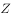三部分的面积之比为：

- **A**. 4：5：16　✅
- **B**. 4：5：14
- **C**. 4：7：12
- **D**. 4：3：10

**答案**：A

**官方解析**

假设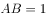，由题意得，，即小圆、大圆、大圆的半径分别为1、1.5、2.5。根据圆的面积公式，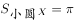，，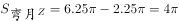，则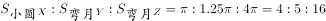。

故正确答案为A。

---

### 第 2 题　qid 2051234 · 数学运算

甲乙两队举行智力抢答比赛，两队平均得分为92分，其中甲队平均得分为88分，乙队平均得分为94分，则甲乙两队人数之和可能是:

- **A**. 20
- **B**. 21　✅
- **C**. 23
- **D**. 25

**答案**：B

**官方解析**

方法一：设甲队有x人，乙队有y人，根据题意可列方程：92（x+y）=88x+94y，化简可得：2x=y。则甲乙两队人数之和=x+y=x+2x=3x，总人数为3的倍数，只有B项符合。

方法二：由题干中“平均分”可知，本题为平均数问题。根据线段法距离与量成反比，甲队和乙队平均得分的距离之比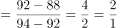，由于平均得分的距离与人数成反比，则甲队和乙队的人数之比为1:2，总人数为3的倍数，观察选项，只有B选项符合。

故正确答案为B。

---

### 第 3 题　qid 2051342 · 数学运算

甲车从A地，乙车从B地同时出发匀速相向行驶，第一次相遇距离A地100千米。两车继续前进到达对方起点后立即以原速度返回，在距离A地80千米的位置第二次相遇。则AB两地相距多少千米?

- **A**. 170
- **B**. 180
- **C**. 190　✅
- **D**. 200

**答案**：C

**官方解析**

方法一：两人第一次相遇共走了一个AB全程，第二次相遇共走了三个AB全程，两次相遇总路程之比为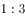，因为速度和不变，所以两次相遇时间之比为。甲的速度不变，两次时间之比为，则路程之比也为。甲第一次相遇时的路程为100，设AB全程为，则甲第二次相遇时的路程为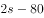，则，解方程得千米。

方法二：根据单岸型相遇公式，两地相距的总路程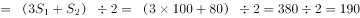千米。

故正确答案为C。

---

### 第 4 题　qid 2050428 · 数学运算

有一根9节的竹子，其任意节与相邻节的长度成等差数列，上面4节的长度共3尺，下面3节的长度共4尺，则从上到下第6节的长度为多少尺？

- **A**. 
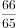

- **B**. 

- **C**. 
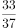

- **D**. 
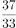
　✅

**答案**：D

**官方解析**

假设从上到下9节长度分别为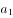、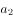、、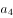、、、、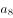、，呈现等差数列，假设公差为，下面3节长度为4尺即：，上面4节的长度共3尺，，由公式：，可得方程组：

······①

······②

解得尺，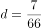尺, 尺，则从上到下第6节的长度为尺。

故正确答案为D。

---

### 第 5 题　qid 2050430 · 数学运算

电子计时器一天显示的时间是从00：00到23：59，每一时刻都由四个数字组成，问一天中显示的四个数字之和为24的时刻一共会出现多少次？

- **A**. 24
- **B**. 12
- **C**. 1　✅
- **D**. 0

**答案**：C

**官方解析**

假设电子计时器显示时间为 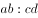，考虑四个数字之和，根据常识，只能取0、1、2；为0~9；为0~5；为0~9。当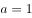，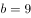时，取得最大值为10；当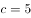，时，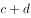取得最大值为14，即只有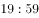时刻四个数字之和为24。即一天中显示的四个数字之和为24的时刻一共会出现1次。

故正确答案为C。

备注：注意题干表述为“四个数字之和为24”，类似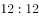等并不满足四个数字之和为24，它的四个数字之和为。

---

### 第 6 题　qid 2050434 · 数学运算

有一个六位数，既能被13整除又能被7整除。已知前三位上的数字是等差数列，三个数字之和为21。个位数与十位数所组成的数字能被11整除。个位数与十万位数上的数字之和为13，与千位数上的数字之和为17，请问百位数上的数字为：

- **A**. 1
- **B**. 2
- **C**. 3
- **D**. 4　✅

**答案**：D

**官方解析**

假设这6位数为，根据题意可得：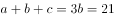，，与组成的数字能被11整除，即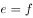，，，得到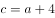，则前三位公差为2，，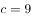，，得到六位数为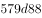，考虑选项代入验证：只有当时，579488既能被13整除又能被7整除。

故正确答案为D。

---

### 第 7 题　qid 2387406 · 数学运算

从一个棱长为20厘米的正方体零件某一表面中央向内部挖出一个棱长为5厘米的正方体。该零件的表面积增加的百分比在以下哪个范围之内？

- **A**. 
超过

- **B**. 
到之间
　✅
- **C**. 
到之间

- **D**. 
不到

**答案**：B

**官方解析**

原正方体表面积为平方厘米，挖出小正方体后，增加的表面积为4个边长为5厘米的正方形面积之和，为平方厘米。，可知表面积增加的百分比范围在到之间。

故正确答案为B。

---

### 第 8 题　qid 2387422 · 数学运算

某公司销售A、B两种商品，其中A为新产品，进货价是B商品的2倍。两类商品的定价都是进货价的，但是B商品在实际销售中按定价的七折出售。问A商品的销量占总销量的比重至少应为多少，才能保证销售收入不低于进货成本？

- **A**. 

- **B**. 

- **C**. 

- **D**. 

　✅

**答案**：D

**官方解析**

赋值A、B进货价分别为200、100，则A售价为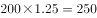，B售价为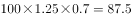。设A销量为，B销量为，由题意可列式：，化简得，则，即A商品销量占总销量比重不低于。

故正确答案为D。

---

### 第 9 题　qid 2387435 · 数学运算

有一块圆形花圃，花匠计划在圆形花圃中用花盆摆设图案进行装饰。现在花匠在圆形上设七个等分点，构思以这些点中的三个顶点连成一个等腰三角形，并在三角形内摆放花盆。问共有多少种不同的构图方案？

- **A**. 21　✅
- **B**. 28
- **C**. 35
- **D**. 42

**答案**：A

**官方解析**

七个等分点中任取一点做顶点，可构成3个等腰三角形，则7个点共可构成个等腰三角形，即有21种构图方案。

故正确答案为A。

---

### 第 10 题　qid 2387450 · 数学运算

某车间有甲、乙、丙三人，其工作效率比为。甲单独加工A类产品需要50小时，丙单独加工B类产品需要18小时。现由甲负责加工B类产品，乙负责加工A类产品，丙先帮助甲加工B类产品若干天后转去帮助乙加工A类产品。如要求加工A、B两类产品，且同时开工、同时完工，则丙帮甲工作的时间与丙帮乙工作的时间之比为：

- **A**. 

- **B**. 

　✅
- **C**. 

- **D**. 
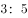

**答案**：B

**官方解析**

赋值甲乙丙效率分别为3、4、5，则A类产品总量为，B类产品总量为。因为同时开工同时完工，则完成两类产品的时间为小时。20小时甲完成B产品的工作量为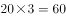，因此丙帮助甲的时间为小时，丙帮助乙的时间为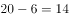小时，因此时间之比为。

故正确答案为B。

---

## 判断推理

### 材料 1

某次学术会议，主席台（只有一排）需要安排赵、钱、孙、李、周、吴、郑和王8位嘉宾就坐。按照自左至右的顺序，座位安排有下列要求：

（1）赵或者钱安排在最左边；

（2）郑不要安排在最右边；

（3）孙安排在李的左边，他们中间隔一位嘉宾；

（4）周安排在吴的左边，他们中间隔两位嘉宾；

（5）王安排在李和吴的右边。

#### 第 1 题　qid 2050462 · 逻辑判断

以下哪项是可能的？

- **A**. 赵第一，郑第八
- **B**. 钱第五，王第八　✅
- **C**. 李第三，吴第七
- **D**. 周第二，孙第三

**答案**：B

**官方解析**

确定题干关键信息，从左至右单排一到八。
（1）赵或钱最左（第一）；
（2）郑非最右（非第八）；
（3）孙X李（X代表中间的间隔）；
（4）周XX吴；
（5）王在李和吴的右边。
题干问选项的可能性，尝试逐一代入。
A项：郑第八与条件（2）矛盾，排除；
B项：钱第五，根据条件（1）否一推一可知赵第一，王第八，此时的顺序为赵XXX钱XX王，无明显矛盾，暂且搁置；
C项：如果李在第三位，根据条件（3）则孙在第一位，与条件（1）矛盾，排除；
D项：如果周第二，则根据条件（4），第五位为吴；同时孙第三，根据条件（3），则第五位为李，吴和李不可能都在第五，矛盾，排除。
故正确答案为B。

---

#### 第 2 题　qid 2050464 · 逻辑判断

孙的座位不可能是以下哪项？

- **A**. 第三
- **B**. 第四
- **C**. 第五
- **D**. 第六　✅

**答案**：D

**官方解析**

题干只有条件（3）提到了孙，已知“孙X李”，因此李的位置决定了孙的位置，需要再去找与李相关的条件，又知条件（5）提到了李，王在李和吴的右边，由此可知，李不能在最右侧的第八号位，即孙不能在第六号位。
本题为选非题，故正确答案为D。

---

#### 第 3 题　qid 2050466 · 逻辑判断

以下哪项一定是正确的？

- **A**. 吴不可能排在前四　✅
- **B**. 郑不可能排在前二
- **C**. 李不可能排在前四
- **D**. 周不可能排在前二

**答案**：A

**官方解析**

选项中存在多种条件，可尝试依次代入选项进行解题。
A项：找和吴相关的信息，根据（4）可知，吴不可能在前三，因此假设吴在第四，则根据条件（4）周XX吴，可知周在第一，周在第一与题干条件（1）赵或钱最左（第一）矛盾，因此吴不可能在前四，当选；
B项：根据（1）可知，郑不可能在第一，因此假设郑在第二，则存在第一到第八分别是：赵郑周钱孙吴李王、钱郑周赵孙吴李王、钱郑孙周李赵吴王、赵郑孙周李钱吴王四种情况，因此B选项存在多种可能，排除；
C项：找和李相关的信息，根据（1）、（3）可知，李不可能在前三，假设李在第四，则存在第一到第八分别是：赵孙周李钱吴郑王等多种可能，C选项也存在多种可能，排除；
D项：根据（1）可知，周不可能在第一，因此假设周在第二，则存在第一到第八分别是：赵周钱孙吴李郑王等多种可能，D选项也存在多种可能，排除。
故正确答案为A。

---

#### 第 4 题　qid 2387372 · 逻辑判断

如果郑安排在李的左边，并且李尽可能往左边安排，则李的位置是以下哪项？

- **A**. 第六
- **B**. 第五　✅
- **C**. 第四
- **D**. 第三

**答案**：B

**官方解析**

第一步：分析题干。
已知第一位为赵或钱，又根据（3）、（4）可知，位置应为孙X李、周XX吴，而由（5）得知，王安排在李和吴的右边，如果孙X李、周XX吴不交叉，那么一共会至少占用9个位置，不符合题意，故孙X李、周XX吴有交叉。即孙周李X吴或者周X孙吴李。
又因为郑安排在李的左边，要想使李尽可能往左边安排，则按照孙周李X吴排列，此时郑在第二位时，李在尽可能的左边，即（赵/钱）郑孙周李（钱/赵）吴王。
第二步：分析选项。
由以上分析可知，李尽可能往左边安排，在第五位。
故正确答案为B。

---

#### 第 5 题　qid 2051108 · 图形推理

从所给的四个选项中选择最合适的一个填入问号处，使之呈现一定的规律：

- **A**. A
- **B**. B
- **C**. C
- **D**. D　✅

**答案**：D

**官方解析**

元素组成基本相同，优先考虑位置规律。每幅图形中箭头的方向依次逆时针旋转，排除B、C两项；继续观察发现，题干图形的外框出现全曲线和全直线图形，考虑曲直性，题干图形外框的曲直性分别是全曲、全直、全曲、全直、全曲，故？处应该选择外框是全直线的图形，排除A项。

故正确答案为D。

---

#### 第 6 题　qid 2051110 · 图形推理

从所给的四个选项中选择最合适的一个填入问号处，使之呈现一定的规律：

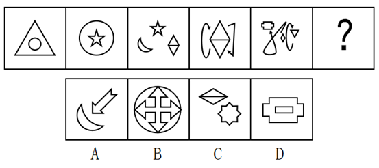

- **A**. A
- **B**. B
- **C**. C
- **D**. D　✅

**答案**：D

**官方解析**

元素组成不同，且无明显属性规律，优先考虑数量规律。题干每幅图形都有多个独立的小元素，数元素的个数和种类均无规律，考虑每幅图之间的元素差异，通过观察发现相邻图形间均含有一个相同的元素，因此？处也应该与前一幅图有一个相同元素，据此排除A、B、C选项。
故正确答案为D。

---

#### 第 7 题　qid 2051112 · 图形推理

从所给的四个选项中选择最合适的一个填入问号处，使之呈现一定的规律：

- **A**. A
- **B**. B　✅
- **C**. C
- **D**. D

**答案**：B

**官方解析**

思路一：题干已知图形窟窿和线较多，先考虑数面，无明显规律，再考虑数线，图形均由10条直线组成，且选项也都是由10条直线组成，无法排除。无思路时，可以通过相邻比较的思维找规律，对比图1和图2，发现只有一条直线位置发生变化，图2到图3、图3到图4、图4到图5同理，也只有一条直线位置发生变化，故?处也应该与前一幅图只有一条直线位置发生变化，排除A、C、D。
故正确答案为B。
思路二：题干已知图形都有4个奇点，均为两笔画图形，选项中只有D项是两笔画。
故正确答案为D。

注：这道题不严谨，有争议，通过两笔画选到D项，这个思路没有问题，但是我们通过观察题干的出题形式以及图案排布，推测出题人可能更想考查的是相邻图形变动一条直线这个规律。
所以我们粉笔给出的倾向性答案是B项。

---

#### 第 8 题　qid 2051116 · 图形推理

从所给的四个选项中选择最合适的一个填入问号处，使之呈现一定的规律：

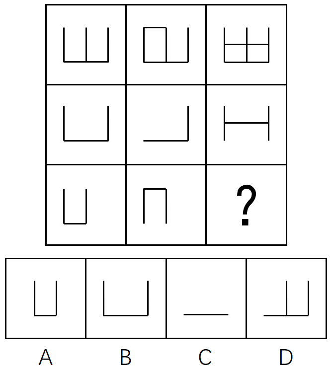

- **A**. A
- **B**. B
- **C**. C
- **D**. D　✅

**答案**：D

**官方解析**

元素组成相似，考虑样式规律，图形间有相似的线条，优先考虑样式规律中的加减同异。九宫格优先按行看，并没有发现规律，再考虑按列看，通过观察发现，每一列图2与图3相加得到图1，故第三列图3还缺中间一条竖线和一条长横线，包括这两条线的只有D项。
故正确答案为D。

---

#### 第 9 题　qid 2051170 · 图形推理

左边给定的是纸盒的外表面，下列能由它折叠而成的是：

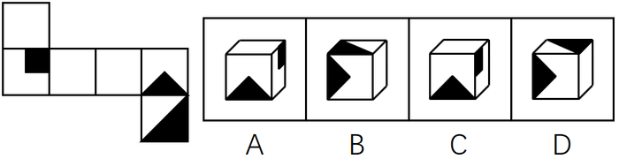

- **A**. A　✅
- **B**. B
- **C**. C
- **D**. D

**答案**：A

**官方解析**

本题考查六面体的空间重构。

逐一分析选项。 

A项：与题干一致，当选；

B项：题干展开图中面e黑色三角形的底边挨着面f（上图题干中蓝色线条），而选项中挨着面f的边不是面e黑色三角形的底边（上图选项B中蓝色线条）排除；

C项：如上图所示，以面b黑正方形所在的点为起点开始顺时针画边，题干展开图中第四条边与面a相邻，而选项中第四条边与面e相邻，排除；

D项：题干展开图中面f在面e的下面，而选项中面f在面e的侧面，排除。

故正确答案为A。

---

#### 第 10 题　qid 2051164 · 定义判断

供给侧改革就是从提高供给质量出发，用改革的办法推进结构调整，矫正要素配置扭曲，扩大有效供给，提高供给结构对需求变化的适应性和灵活性，提高全要素（劳动、土地、资本、创新）生产率，更好地满足广大人民群众的需求，促进经济社会持续健康发展。
根据上述定义，下列不符合供给侧改革要求的是：

- **A**. 减免企业税负，提高企业盈利
- **B**. 增大政府投资，建设各种基础设施　✅
- **C**. 推进产学研相结合，为企业提供技术支撑
- **D**. 改革户籍制，促进劳动力跨地区、跨部门流动

**答案**：B

**官方解析**

第一步，找出定义关键词。
“提高全要素（劳动、土地、资本、创新）生产率”。
第二步，逐一分析选项。
A项：减免企业税负，提高企业盈利体现了“资本”，符合定义，排除；
B项：增大政府投资属于投资，没有体现“劳动、土地、资本、创新”，投资是需求侧改革不是供给侧改革，不符合定义，当选；
C项：推进产学研结合体现了“创新”，符合定义，排除；
D项：改革户籍制，促进劳动力跨地区体现了“劳动”，符合定义，排除。
本题为选非题，故正确答案为B。

---

#### 第 11 题　qid 2051172 · 定义判断

感情管理是指管理者通过自身的形象、行为、情感来调动职工积极性的一种管理办法。
根据以上定义，下列不属于感情管理的是：

- **A**. 车间主任从来不回避脏活累活，总是带头干
- **B**. 尽管李经理喜欢抽烟，但他从来不在员工面前抽　✅
- **C**. 每逢节假日，公司领导都会给员工发放节日慰问品
- **D**. 部门经理与员工一起聊天、吃饭，让大家畅所欲言

**答案**：B

**官方解析**

第一步，找出定义关键词。
“通过自身的形象、行为、情感”“调动职工积极性”。
第二步，逐一分析选项。
A项：“车间主任带头干”体现了通过自己的行为来调动职工的积极性，符合定义，排除；
B项：“李经理喜欢抽烟但不在员工面前抽”是他的行为，但不抽烟无法调动职工积极性，不符合定义，当选；
C项：“公司领导发放节日慰问品”是通过管理者的行为调动员工的积极性，符合定义，排除；
D项：“部门经理和员工一起聊天、吃饭”体现了通过自身的行为以及情感调动职工积极性，符合定义，排除。
本题为选非题，故正确答案为B。

---

#### 第 12 题　qid 2051180 · 定义判断

正强化又称“阳性强化”，是指个体做出某种行为或反应，随后或同时得到某种奖励，从而使行为或反应强度、概率或速度增加的过程。也可以说，正强化是通过增加一个喜欢的刺激以提高事件发生的概率。
根据以上定义，下列属于正强化的是：

- **A**. 小明觉得电视上的宇航员叔叔很酷，下决心好好学习，长大了也要上太空
- **B**. 老师激励学生好好复习考试，承诺数学95分以上的同学可以不做假期作业
- **C**. 某中学规定上课玩手机的同学，手机一律没收，规定执行后，几乎没人敢玩手机了
- **D**. 父亲为了鼓励儿子努力学习，承诺儿子如果他能考进全班前三名，就带他出国旅游　✅

**答案**：D

**官方解析**

第一步，找出定义关键词。
“增加一个喜欢的刺激”、“提高事件发生的概率”。
第二步，逐一分析选项。
A项：小明觉得电视上的宇航员很酷并未体现“增加一个喜欢的刺激”，而是小明自己下决心，不符合定义，排除；
B项：老师承诺数学95分以上的同学可以不做假期作业并不是“增加一个喜欢的刺激”，而是减少一个不喜欢的事情，不符合定义，排除；
C项：上课玩手机没收手机是减少一个喜欢的事情，不符合定义，排除；
D项：父亲承诺儿子如果能考进全班前三名，就带他出国玩符合“增加一个喜欢的刺激”和目的，符合定义，当选。
故正确答案为D。

---

#### 第 13 题　qid 2051182 · 定义判断

“城乡污染转移”是指在经济发展过程中，组织或个人将造成环境污染的设备、工艺、技术、产品以及其他有形或无形的污染物质，由城市转移至农村的行为，“城乡污染转移”已经成为农村环境形势日益严峻的主要原因之一。
根据以上定义，下列不属于“城乡污染转移”的是：

- **A**. 某市水泥厂每年有10万吨未经处理的工业废水流经附近乡村的河流
- **B**. 某镇的耕地接受城区搬迁过来的工厂产生的重金属残渣
- **C**. 为打造绿色文明城市形象，某市将重污染的钢铁厂迁至附近乡镇
- **D**. 某市为保证城区用水修建水库，致使下游许多村庄农田灌溉用水不足　✅

**答案**：D

**官方解析**

第一步：找到定义关键词。
“将造成环境污染的设备、工艺、技术、产品以及其他有形无形的污染物质”、“由城市转移至农村”。
第二步：逐一分析选项。
A项：工业废水属于“有形污染物质”，市水泥厂将其排放至乡村河流是“将污染物由城市转移至农村的行为”，符合定义，排除；
B项：城区的工厂产生的重金属残渣属于“有形污染物质”，将工厂由城区搬至乡镇是“将制造污染物的设备由城市转移至农村的行为”，符合定义，排除；
C项：重污染钢铁厂会产生“有形无形的污染物质”，将重污染钢铁厂迁至乡镇是“将制造污染物的设备由城市转移至农村的行为”，符合定义，排除；
D项：城区修建水库只是导致下游村庄农田灌溉用水不足，并没有产生污染环境的污染物，不符合定义，当选。
本题为选非题，故正确答案为D。

---

#### 第 14 题　qid 2051188 · 定义判断

C2C是指消费者（consumer）与消费者（consumer）之间以信息网络技术为手段，以商品交换为中心的商务活动。
根据上述定义，下列活动属于C2C的是：

- **A**. 某小区推出“旧物置换”服务，业主可将家中不用的物品放到门卫室，与其他业主置换
- **B**. 大学生小李以2000元的价格在网上拍卖了自己的旧笔记本电脑，没想到买家居然是自己的同班同学小方　✅
- **C**. 每到毕业季，学校广场上的跳蚤市场都异常火爆，“甩卖”的学长学姐和“淘宝”的学弟学妹都各取所需，满载而归
- **D**. 小梅逛街时在某品牌服装专卖店相中了一款风衣，便记下了衣服吊牌上的信息，回来后从该品牌的官方网站上买了一件，省了不少钱

**答案**：B

**官方解析**

第一步：找出定义关键词。
“消费者与消费者之间”、“以信息网络技术为手段”、“以商品交换为中心”、“商务活动”。
第二步：逐一分析选项。
A项：“放到门卫室”，不符合“以信息网络技术为手段”，不符合定义，排除；
B项：小李在网上拍卖旧笔记本电脑运用了“信息网络技术手段”，是以“商品交换为中心”的商务活动，且小李和小方都是“消费者”，符合定义，当选；
C项：学校广场的“跳蚤市场”没有运用“信息网络技术手段”，不符合定义，排除；
D项：某品牌官方网站不属于“消费者”，因此不是“消费者与消费者”之间的商务活动，不符合定义，排除。
故正确答案为B。

---

#### 第 15 题　qid 2051192 · 定义判断

正向思维，是指大脑在处理问题时沿着习惯性、常规性的方向展开思维，并在一定范围内按照有一定顺序的、可预测的、程式化的方向进行思考。
根据上述定义，下列没有运用到正向思维的是：

- **A**. 王侯将相宁有种乎　✅
- **B**. 种瓜得瓜，种豆得豆
- **C**. 朝霞不出门，晚霞行千里
- **D**. 冬天来了，春天还会远吗

**答案**：A

**官方解析**

第一步：找出定义关键词。
“沿着习惯性、常规性的方向展开思维”、“按照有一定顺序的、可预测的、程式化的方向进行思考”。
第二步：逐一分析选项。
A项：“王侯将相宁有种乎”意思是那些称王侯拜将相的人，难道就比我们高贵吗？通过反问的语气来否认常规性观点（那些称王侯拜将相的人不一定比我们高贵），是一句非常带有反抗精神的话语，并没有按照习惯性的方向展开思维，不符合定义，当选；
B项：“种瓜得瓜，种豆得豆”是“种什么得什么”的常规性思维，是按照“可预测”的方向进行思考，符合定义，排除；
C项：“朝霞不出门，晚霞行千里”的意思是朝霞在东，表明阴雨天气在向我们进袭，所以就不应该出门。晚霞在西，表示最近几天里天气晴朗，可以出远门。这是古人根据长期的生活规律总结得来的，是按照“可预测”的方向进行思考，符合定义，排除；
D项：冬天结束了就是春天，“冬天来了，春天还会远吗”是按照“有一定顺序的方向”进行思考，符合定义，排除。
本题为选非题，故正确答案为A。

---

#### 第 16 题　qid 2387358 · 定义判断

反串是指中国传统戏曲中演员演出与自身本工行当不同的戏的情形。
根据上述定义，下列属于反串的是：

- **A**. “魔音王子”石头同时用男声和女声表演对唱歌曲《纤夫的爱》
- **B**. 《星光大道》中李玉刚男扮女装演唱《新贵妃醉酒》
- **C**. 成龙在电影《双龙会》中同时分演玩命和马友两个角色
- **D**. 旦行演员梅兰芳在《辕门射戟》一剧中演生角吕布　✅

**答案**：D

**官方解析**

第一步：找出定义关键词。
“中国传统戏曲”、“演员演出与自身本工行当不同的戏的情形”。
第二步：逐一分析选项。
A项：《纤夫的爱》不符合“中国传统戏曲”，不符合定义，排除； 
B项：《新贵妃醉酒》不符合“中国传统戏曲”，不符合定义，排除；
C项：电影《双龙会》不符合“中国传统戏曲”，成龙同时分演玩命和马友两个角色也不符合“演员演出与自身本工行当不同的戏的情形”，不符合定义，排除；
D项：《辕门射戟》符合“中国传统戏曲”，旦行演员演生角吕布符合“演员演出与自身本工行当不同的戏的情形”，符合定义，当选。
故正确答案为D。

---

#### 第 17 题　qid 2387359 · 定义判断

具有上位心理的人因处在比别人高的层次而有某种优势感，具有下位心理的人因处在比别人低的层次而有某种自卑感，这种情况被称为位差效应。
根据上述定义，下列情形属于位差效应的是：

- **A**. 小明考试作弊被发现，在老师面前羞愧得抬不起头
- **B**. 小赵每次向领导汇报工作时都提心吊胆，以致言不由衷　✅
- **C**. 某公司老总喜欢“听喜不听忧”，公司里“报喜”的人多被提拔
- **D**. 连长命令士兵在大雨中跑十圈，不跑完不准吃饭

**答案**：B

**官方解析**

第一步：找出定义关键词。
“上位心理的人因处在比别人高的层次而有某种优势感”、“下位心理的人因处在比别人低的层次而有某种自卑感”。
第二步：逐一分析选项。
A项：小明考试作弊是犯了错误，而不是因此层次比别人低，不符合“因处在比别人低的层次而有某种自卑感”，不符合定义，排除； 
B项：小赵比领导层次低，导致汇报工作提心吊胆，言不由衷，符合“下位心理的人因处在比别人低的层次而有某种自卑感”，符合定义，当选；
C项：强调迎合老总的喜好，没有体现出优势感，不符合“上位心理的人因处在比别人高的层次而有某种优势感”，不符合定义，排除；
D项：连长命令士兵雨中跑步是属于命令，不符合“上位心理的人因处在比别人高的层次而有某种优势感”，不符合定义，排除。
故正确答案为B。

---

#### 第 18 题　qid 2387364 · 定义判断

“休眠效果”是指由信息源可信性带来的说服效果并不是一成不变的。学者霍夫兰等人发现，随着时间的推移，高可信度信源的说服效果会出现衰减，而低可信度信源的说服效果则有上升的趋势。低可信度信源发出的可靠信息，由于信源可信性的负影响，其内容本身的说服力不能得以马上发挥，处于一种“睡眠”状态，经过一段时间，可信性的负影响减弱或消失以后，其效果才能充分表现出来。
下列最符合上述研究结论的是：

- **A**. 虚假的消息即使通过权威报刊发布也不能获得很强的说服力
- **B**. 不实的报道经过多重传播后也会有不少人相信
- **C**. 真实的消息不论其发布渠道是哪种，最终都会被信任　✅
- **D**. 权威报刊发布的消息具有更好的可靠性

**答案**：C

**官方解析**

日常结论题，根据题干信息逐一分析选项。
A项：题干中没有涉及“虚假的消息”的说服力，无中生有，排除；
B项：题干中没有涉及“不实的报道”的信任力，无中生有，排除；
C项：题干中指出低可信度信源发出的可靠信息，经过一段时间，可信性的负影响减弱或消失以后，其效果才能充分表现出来。说明真实的消息最终会被信任，可以推出，当选；
D项：题干中没有涉及“权威报刊”的发布消息可靠性，无中生有，排除。
故正确答案为C。

---

#### 第 19 题　qid 2387365 · 定义判断

牵连犯是指以实施某一犯罪为目的，但其方法行为或结果行为又触犯其他罪名的情况。
根据上述定义，下列不属于牵连犯的是：

- **A**. 甲趁小王不在，潜入他家行窃，窃得财物后遇小王返回，甲遂杀小王灭口　✅
- **B**. 乙为骗取保险金，给妻子投了巨额人身保险，后将妻子杀害
- **C**. 丙私刻一枚公章，用盖了公章的授权书骗取小张的信任，签订合同，共骗得3万元
- **D**. 丁为了谋害小李，通过非法渠道购买了枪支弹药，随后依计划杀死了小李

**答案**：A

**官方解析**

第一步：找出定义关键词。
“以实施某一犯罪为目的”、“其方法行为或结果行为又触犯其他罪名”。
第二步：逐一分析选项。
A项：甲以入室行窃为目的实施行窃，后因遇到小王实施杀人，虽然触犯两个罪名，但此过程中目的并不唯一，原本的目的是盗窃财务，并不是他杀人的目的，不符合“以实施某一犯罪为目的”，不符合定义，当选； 
B项：乙以骗取保险金为目的，后将妻子杀害，又触犯了杀人罪，符合定义，排除；
C项：丙以骗钱为目的，私刻公章以及实施诈骗，触犯了两个罪名，符合定义，排除；
D项：丁以谋害小李为目的，非法购买枪支弹药，触犯了两个罪名，符合定义，排除。
本题为选非题，故正确答案为A。

---

#### 第 20 题　qid 2050404 · 类比推理

猪：猪肝

- **A**. 鱼：鱼鳔　✅
- **B**. 马：马蹄
- **C**. 虫：虫草
- **D**. 虾：虾须

**答案**：A

**官方解析**

第一步：判断题干词语间逻辑关系。
猪肝是猪的内脏，二者是组成关系。
第二步：判断选项词语间逻辑关系。
A项：鱼鳔是鱼的内脏，二者是组成关系，与题干逻辑关系一致，当选；
B项：马蹄是马的组成部分，但不是马的内脏，与题干逻辑关系不一致，排除；
C项：虫草是冬虫夏草的子实体与僵虫菌核（幼虫尸体）构成的复合体，虫是虫草的原材料，与题干逻辑关系不一致，排除；
D项：虾须是虾的组成部分，但不是虾的内脏，与题干逻辑关系不一致，排除。
故正确答案为A。

---

#### 第 21 题　qid 2051142 · 类比推理

处之泰然：镇定

- **A**. 大义凛然：壮烈
- **B**. 虚怀若谷：谦虚　✅
- **C**. 杳如黄鹤：消失
- **D**. 似水流年：时间

**答案**：B

**官方解析**

第一步：判断题干词语间逻辑关系。
“处之泰然”是指对待发生的紧急情况或困难，安然自得，毫不在乎，表示很“镇定”，二者为近义词关系。
第二步：判断选项词语间逻辑关系。
A项：“大义凛然”常用来描写勇士受屈时或烈士遇难前的英勇气概，是形容英勇无畏，而不是形容“壮烈”，与题干逻辑关系不一致，排除。
B项：“虚怀若谷”意指胸怀像山谷那样深而且宽广，形容十分谦虚。与“谦虚”是近义词关系，与题干逻辑关系一致，当选。
C项：“杳如黄鹤”原指传说中仙人骑着黄鹤飞去，从此不再回来，现比喻无影无踪或下落不明，即是指没有消息。“消失”是指事物渐渐减少以至没有，事物不复存在。二者不是近义词关系，与题干逻辑关系不一致，排除。
D项：“似水流年”形容时间一去不复返、青春易逝。与“时间”不是近义词关系，与题干逻辑关系不一致，排除。
故正确答案为B。

---

#### 第 22 题　qid 2051144 · 类比推理

梅：孤傲：品质

- **A**. 火：热情：性格　✅
- **B**. 月饼：团圆：食品
- **C**. 鸽子：和平：象征
- **D**. 红灯：禁行：信息

**答案**：A

**官方解析**

第一步：判断题干词语间逻辑关系。
孤傲是一种品质，梅象征着孤傲的品质。
第二步：判断选项词语间逻辑关系。
A项：热情是一种性格，火象征着热情的性格，与题干逻辑关系一致，当选；
B项：月饼象征团圆，但团圆不是一种食品，与题干逻辑关系不一致，排除；
C项：鸽子象征和平，但和平不是一种象征，与题干逻辑关系不一致，排除；
D项：禁行是一种命令信息，但红灯的作用是禁止人们通行，与题干逻辑关系不一致，排除。
故正确答案为A。

---

#### 第 23 题　qid 2051162 · 类比推理

水对于（  ）相当于（  ）对于光合作用

- **A**. 生命 二氧化碳　✅
- **B**. 水蒸气 阳光
- **C**. 空气 氧气
- **D**. 灌溉 土壤

**答案**：A

**官方解析**

将选项逐一代入，判断前后两组词语的逻辑关系。
A项：水是生命的必要条件，二氧化碳是光合作用的必要条件，前后逻辑关系一致，当选；
B项：水达到沸点时，水就变成水蒸气，水蒸气是水的一种气态形式，两者是同一物质，光照是光合作用的必要条件，而阳光不是必要条件，前后逻辑关系不一致，排除；
C项：空气和水都是生物生存的必要条件，二者为并列关系，光合作用可以产生氧气，前后逻辑关系不一致，排除；
D项：水可以用来灌溉，土壤和光合作用没有必然的逻辑关系，前后逻辑关系不一致，排除。
故正确答案为A。

---

#### 第 24 题　qid 2051186 · 类比推理

（  ） 对于 针灸 相当于 理财 对于 （  ）

- **A**. 中药  消费
- **B**. 中医  银行
- **C**. 治疗  储蓄　✅
- **D**. 推拿  利息

**答案**：C

**官方解析**

逐一代入验证选项。
A项：针灸是中医治疗疾病的方法，中药是中医治疗时使用的药材，两者无必然联系，理财与消费是对钱的不同使用方式，前后逻辑关系不一致，排除；
B项：针灸是中医治疗疾病的方法，理财是银行的一种业务，都是对应关系，但词语位置摆放顺序不一致，排除；
C项：针灸是一种治疗方式，储蓄是一种理财方式，前后逻辑关系一致，当选；
D项：推拿与针灸并列，理财可以获得利息，前者是并列关系，后者是对应关系，前后逻辑关系不一致，排除。
故正确答案为C。

---

#### 第 25 题　qid 2051190 · 类比推理

（  ） 对于 规划 相当于 鸿沟 对于 （  ）

- **A**. 城市  协调
- **B**. 计划  河流
- **C**. 成功  隔阂
- **D**. 蓝图  界限　✅

**答案**：D

**官方解析**

逐一代入验证选项。
A项：城市规划是偏正结构。协调和鸿沟，二者没有明显逻辑关系。前后逻辑关系不一致，排除；
B项：计划与规划是近义词，鸿沟是一条古运河，比喻事物间明显的界限。前后逻辑关系不一致，排除；
C项：成功可以形容规划。隔阂指情意不相通，彼此思想有距离，鸿沟比喻事物间明显的界限，鸿沟比隔阂的程度更重。前后逻辑关系不一致，排除；
D项：用蓝图来比喻规划，用鸿沟来比喻界限。前后逻辑关系一致，当选。
故正确答案为D。

---

#### 第 26 题　qid 2050406 · 类比推理

（  ）  对于 宋朝  相对于  （  ）  对于  汉朝

- **A**. 岳飞  陈胜
- **B**. 金人  匈奴人　✅
- **C**. 词  《汉书》
- **D**. 印刷术  万里长城

**答案**：B

**官方解析**

逐一代入选项。
A项：岳飞是宋朝人，陈胜是秦朝人而非汉朝人，前后逻辑关系不一致，排除；
B项：金人是宋朝的外患，匈奴人是汉朝的外患，前后逻辑关系一致，当选；
C项：词兴盛于宋朝；《汉书》是主要记载汉朝史事的史书。词是一类文体，《汉书》是具体的著作，前后逻辑关系不一致，排除；
D项：印刷术开始于隋唐时期的雕版印刷，北宋毕昇发明活字印刷术；“万里长城”这个称号首次出现在秦朝，与汉朝无必然联系，前后逻辑关系不一致，排除。
故正确答案为B。

---

#### 第 27 题　qid 2387366 · 类比推理

尊敬：爱护

- **A**. 照顾：体贴
- **B**. 奉献：关心
- **C**. 照料：搭理
- **D**. 赡养：培养　✅

**答案**：D

**官方解析**

第一步：判断题干词语间逻辑关系。
尊敬一般是针对长辈、老人，爱护一般是针对晚辈、小孩。
第二步：判断选项词语间逻辑关系。
A项：照顾和体贴可以针对所有人，与题干逻辑关系不一致，排除；
B项：奉献和关心可以针对所有人，与题干逻辑关系不一致，排除；
C项：照料和搭理可以针对所有人，与题干逻辑关系不一致，排除；
D项：赡养一般是针对长辈、老人，培养一般是针对晚辈、小孩，与题干逻辑关系一致，当选。
故正确答案为D。

---

#### 第 28 题　qid 2387370 · 类比推理

刻舟求剑：拔苗助长

- **A**. 望梅止渴：守株待兔　✅
- **B**. 闻鸡起舞：缘木求鱼
- **C**. 宾至如归：闭门造车
- **D**. 掩耳盗铃：南辕北辙

**答案**：A

**官方解析**

第一步：判断题干词语间逻辑关系。

刻舟求剑一般比喻死守教条，固执不变通的人；拔苗助长比喻急于求成，反而坏了事。二者之间没有明显的近反义关系，考虑构词结构，刻舟求剑和拔苗助长都是“方式目的”的结构。

第二步：判断选项词语间逻辑关系。

A项：望梅止渴比喻愿望无法实现，用空想安慰自己；守株待兔比喻妄想不劳而获，或死守狭隘的经验，不知变通。二者也都是“方式目的”的结构，与题干逻辑关系一致，当选；

B项：闻鸡起舞比喻有志报国的人即时奋起；缘木求鱼比喻方向或办法不对，不可能达到目的。不能说闻鸡的目的是起舞，所以该成语不是“方式目的”的结构，与题干逻辑关系不一致，排除；

C项：宾至如归形容客人到这里就像回到自己家里一样；闭门造车比喻固步自封，不与外界交流，关起门来搞建设，求发展。宾至如归不是“方式目的”的结构，与题干逻辑关系不一致，排除；

D项：掩耳盗铃指把耳朵捂住偷铃铛，以为自己听不见别人也会听不见，比喻自己欺骗自己；南辕北辙意思是心想往南而车子却向北行，比喻行动和目的相抵触。掩耳盗铃是“方式目的”的结构，但南辕北辙不是“方式目的”的结构，与题干逻辑关系不一致，排除。

故正确答案为A。

注：本题确实有争议，有同学可能看的是感情色彩，题干两个成语均为贬义，只有D项两个成语也是贬义，但是我们粉笔通过对历年真题的教研发现，在近几年很多真题中，一般出现这种寓言故事类的成语，考查构词结构更多，尤其是“刻舟求剑”这个词，至少3次作为“方式目的”的结构进行考查，所以本题粉笔还是更倾向通过“方式目的”选择A项，不严谨的题不作为备考重点，广大考生学习重要考点即可。

---

#### 第 29 题　qid 2387371 · 类比推理

风趣：英俊：善良

- **A**. 电脑：手机：冰箱
- **B**. 雾霾：沙尘：阳光
- **C**. 美观：便宜：耐用　✅
- **D**. 平坦：宽广：高大

**答案**：C

**官方解析**

第一步：判断题干词语间逻辑关系。
风趣、英俊、善良均为形容词，主要是用来夸赞的褒义词。
第二步：判断选项词语间逻辑关系。
A项：电脑、手机、冰箱均为名词，属于家用电器，与题干逻辑关系不一致，排除；
B项：雾霾、沙尘、阳光均为名词，为自然界的一个事物，与题干逻辑关系不一致，排除；
C项：美观、便宜、耐用均为形容词，主要是用来夸赞的褒义词，与题干逻辑关系一致，当选；
D项：平坦、宽广、高大均为形容词，但是平坦是中性词，与题干逻辑关系不一致，排除。
故正确答案为C。

---

#### 第 30 题　qid 2051198 · 逻辑判断

2015年5月4日，财政部、国家税务总局发文，烟草消费税由提高至，并加征从量税，有专家认为，“税价联动”会使香烟价格随着税率的提高而提高，购买香烟的人会因此减少，从控烟角度说，这无疑是件好事。

以下哪项如果为真，最能削弱上述结论：

- **A**. 
烟草产量不会受到售价的影响

- **B**. 
收入水平的提高使人们对香烟的价格不太敏感
　✅
- **C**. 
世界上大多数国家的烟草消费税税率低于

- **D**. 
一些发达国家出现过提高烟草消费税后私烟泛滥的现象

**答案**：B

**官方解析**

第一步：找出论点论据。
论点：“税价联动”会使香烟价格随着税率的提高而提高，购买香烟的人会减少，从控烟角度说是好事。
论据：无。
第二步：逐一分析选项。
A项：烟草产量不会受到售价的影响，没有提及购买香烟人数减少的问题，属于无关选项，排除；
B项：收入水平的提高使人们对香烟价格不太敏感，说明价格不是购买香烟人考虑的因素，直接削弱论点，当选；
C项：世界上大多数国家的烟草消费税问题并不能说明我国购买香烟人数会减少，与论点无关，属于无关选项，排除；
D项：私烟泛滥和购买香烟的人数之间没有必然联系，无关选项，排除。
故正确答案为B。

---

#### 第 31 题　qid 2051202 · 逻辑判断

研究人员对中风幸存者进行分组实验，他们让一组中风幸存者在研究人员的监督下进行为期3个月的户外健步走的锻炼。另一组不进行运动，而是接受治疗性按摩，实验结束后，研究人员发现在持续6分钟的测试中，步行组的人比按摩组的人走得更远，能比后者多走17.6%，研究者认为，身体适度受损的中风幸存者仅通过简单廉价的运动就能获得更有效的效果。
下列哪一项如果为真，最能削弱上述论证：

- **A**. 步行组的平均年龄为72岁，按摩组的平均年龄为65岁
- **B**. 与按摩组相比，体质的改善使得步行组中风幸存者生活质量更高
- **C**. 步行组中风幸存者还服用了相关治疗药物，按摩组停服了相关药物　✅
- **D**. 研究证明，对身体严重受损的中风幸存者来说，接受按摩的效果更佳

**答案**：C

**官方解析**

第一步：找出论点和论据。
论点：身体适度受损的中风幸存者仅通过简单廉价的运动就能获得更有效的效果。
论据：对中风幸存者分组实验，步行组比按摩组走得更远。
第二步：逐一分析选项。
A项：补充条件说明步行者平均年龄比按摩组年龄高，还能走得更远，补充论据，排除；
B项：体质的改善使得步行组生活质量更高，论点讨论是简单运动是否会获得更有效的效果，讨论话题不一致，不能削弱，排除；
C项：步行组服用了药物，按摩组未服用，说明实验情况不一样，还有是否服用药物在影响实验结果，属于他因削弱，当选；
D项：论点强调的是身体适度受损的人，而选项强调的是身体严重受损的人，与题干讨论的主体不一致，属于无关选项，排除。
故正确答案为C。

---

#### 第 32 题　qid 2051206 · 逻辑判断

某景区举办萤火虫展，每天都会吸引大批游客来观赏，数日后，该景区萤火虫的数量急剧下降。景区负责人认为是游客的不文明行为破坏了萤火虫的生存环境。
以下哪项如果为真，能够支持景区负责人的观点：

- **A**. 萤火虫对生态环境的要求很高
- **B**. 游客不文明的行为在其他景区也存在
- **C**. 在规范游客行为后萤火虫灭亡数量急剧下降　✅
- **D**. 和萤火虫同类的昆虫数量受游客行为影响不大

**答案**：C

**官方解析**

第一步：找出论点论据。
论点：游客的不文明行为破坏了萤火虫的生存环境。
论据：某景区举办萤火虫展，大批游客观赏数日后，萤火虫的数量急剧下降。
第二步：逐一分析选项。
A项：萤火虫对生态环境要求高，但游客不文明行为是否破坏了其生存环境并不清楚，属于无关选项，排除；
B项：游客不文明的行为在其他景区也存在，不能说明该景区的游客不文明行为破坏了生存环境，属于无关选项，排除；
C项：规范游客行为后萤火虫灭亡数量急剧下降，说明就是游客不文明行为导致萤火虫灭亡，补充论据，可以加强，当选；
D项：其他同类的昆虫数量与萤火虫的无关，主体不一致，属于无关选项，排除。
故正确答案为C。

---

#### 第 33 题　qid 2387373 · 逻辑判断

近日，某品牌楼盘开展优惠推广活动，销售情况明显变好，业内人士认为，该品牌楼盘的销量增长，得益于这一优惠推广活动。
以下哪项如果为真，最能削弱上述论证？

- **A**. 这一时期其他楼盘的销量均有不同幅度的增长
- **B**. 该品牌楼盘开展的这一优惠活动并不比其他品牌的力度大
- **C**. 购买该品牌楼盘的人，很少在乎这一优惠活动　✅
- **D**. 没有购买该品牌楼盘的人，也没有关注这一优惠活动

**答案**：C

**官方解析**

第一步：找出论点和论据。
论点：该品牌楼盘的销量增长，得益于这一优惠推广活动。
论据：近日，某品牌楼盘开展优惠推广活动，销售情况明显变好。
本题的论点是强调楼盘销量增长是与优惠推广活动有关，可以直接否定论点，说明楼盘销量增长与优惠推广活动无关。
第二步：逐一分析选项。
A项：其他楼盘的销量与论点无关，属于无关选项，无法削弱，排除；
B项：该楼盘的优惠活动是否比其他品牌大，与优惠活动能否影响该品牌的销售量无关，属于无关选项，无法削弱，排除；
C项：购买者很少在乎这一优惠活动，说明优惠活动与销售量关系不大，直接削弱了论点，可以削弱，当选；
D项：没有购买该品牌楼盘的人与论点无关，属于无关选项，无法削弱，排除。
故正确答案为C。

---

#### 第 34 题　qid 2387377 · 逻辑判断

有报道称，已婚者一般比独身者寿命长，所以独身的压力一定对健康有损耗。
以下哪项如果为真，最能支持上述论证？

- **A**. 独身者寿命短于同龄已婚者
- **B**. 独身者会比已婚者的压力更大　✅
- **C**. 已婚者寿命不尽相同
- **D**. 人的寿命受多种因素影响

**答案**：B

**官方解析**

第一步：找出论点和论据。
论点：所以独身的压力一定对健康有损耗。
论据：已婚者一般比独身者寿命长。
本题的论点说的是独身的压力一定对健康有损耗，论据说的是已婚者一般比独身者寿命长，分别在论述独身和独身的压力，要想支持论证，可以考虑在二者之间搭桥，说明独身确实存在压力。
第二步：逐一分析选项。
A项：只是说独身者寿命短于同龄已婚者，与论据阐述的事实一致，但是并不能说明是因为独身者压力大对健康的损耗，无法支持，排除；
B项：强调独身者比已婚者的压力更大，说明独身会带来更多的压力，在论点和论据之间搭桥，可以支持，当选；
C项：强调的是已婚者的寿命，与论点无关，属于无关选项，排除；
D项：强调人的寿命受多种因素的影响，与论点无关，属于无关选项，排除。
故正确答案为B。

---

#### 第 35 题　qid 2387381 · 逻辑判断

业余的生态生物学家具有纯朴的科学力量：细致地观察了自然世界，他们的观察成果可以为专业生态生物学家所利用。例如东英格兰诺福克郡的马沙姆家族记录家族土地上的动植物生长周期长达211年之久。
以下哪项如果为真，能够削弱上述观点？

- **A**. 业余生态生物学家记录方法带来的偏差可通过专业的统计方法消除
- **B**. 业余生态生物学家往往关注“叶子何时变黄”这类比较主观的问题　✅
- **C**. 观察最重要的是如何细致并系统地进行
- **D**. 自然世界的丰富与奥妙需要更多的眼睛去发现

**答案**：B

**官方解析**

第一步：找出论点和论据。
论点：业余的生态生物学家具有纯朴的科学力量：细致地观察了自然世界，他们的观察成果可以为专业生态生物学家所利用。
论据：东英格兰诺福克郡的马沙姆家族记录家族土地上的动植物生长周期长达211年之久。
本题的论点是强调业余的生态生物学家的观察成果可以为专业的生态生物学家所利用，要想削弱论点，需要说明业余生态生物学家的观察的弊端。
第二步：逐一分析选项。
A项：强调业余生态生物学家的记录方法带来的偏差可以消除，说明可以为专业生态生物学家利用，可以支持论点，排除；
B项：强调业余生态生物学家关注的都是主观问题，主观性较大，那么其观察结果并不一定能为专业生态生物学家利用，可以削弱论点，当选；
C项：强调观察需要细致系统地进行，与论点无关，属于无关选项，排除；
D项：强调自然界需要用眼睛发现，与论点无关，属于无关选项，排除。
故正确答案为B。

---

## 资料分析

### 材料 1

        2014年，某市全年实现社会消费品零售总额261.38亿元，比上年增长。按经营地统计，城镇消费品零售总额为178.6亿元，比上年增长，乡村消费品零售总额82.78亿元，比上年增长。按消费形态统计，批发业增长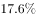，零售业增长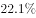。

        全年消费价格总水平比上年增长。其中家庭设备用品及维修服务类累计下降；食品类、烟酒类、衣着类、医疗保健及个人用品类、交通与通信类、娱乐教育文化用品及服务类、居住类累计分别上升、、、、、、。

#### 第 1 题　qid 2051166 · 综合

2013年，该市城镇消费品零售总额约为多少亿元？

- **A**. 120.5
- **B**. 157.4　✅
- **C**. 178.6
- **D**. 206.5

**答案**：B

**官方解析**

由题干“2013年……总额约为……亿元”，而且材料给出的时间为2014年，可判定此题为基期计算问题。定位文字第一段，可知2014年城镇消费品零售总额为178.6亿元，增长率为，代入基期计算公式，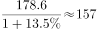亿元，与B项最接近。

故正确答案为B。

---

#### 第 2 题　qid 2051168 · 综合

与2009年相比，2014年该市社会消费品零售总额增量最接近多少亿元？

- **A**. 130
- **B**. 140
- **C**. 150　✅
- **D**. 160

**答案**：C

**官方解析**

由题干“与2009年相比，2014年……增量最接近”，可判定此题为增长量计算问题。定位图表可得，2010年社会消费品零售总额为131.34亿元，增长率为，2014年社会消费品零售总额为261.38亿元。代入基期计算公式计算2009年数据，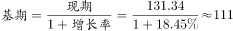亿元，则2014年比2009年的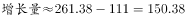亿元，与C项最接近。

故正确答案为C。

---

#### 第 3 题　qid 2051184 · 增长

能准确反映2011-2014年间该市社会消费品零售总额同比增量的变化趋势的折线图是：

- **A**. 
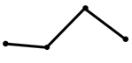
　✅
- **B**. 
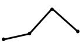

- **C**. 

- **D**. 

**答案**：A

**官方解析**

由题干“同比增量的变化趋势”，可判定此题为增长量比较问题。定位图表，可得2010-2014年历年零售总额数据，根据增长量公式：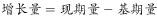，可得：

；

；

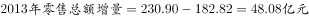；

。

观察数据可知，2013年（第三年）增量最高，2014年比2011和2012年都高，排除C、D项；2011和2012年很接近，但2011年要比2012年高，所以排除B项。

故正确答案为A。

---

#### 第 4 题　qid 2051194 · 增长

把不同的消费类型按该市2014年消费价格水平上涨幅度从高到低排列，以下正确的是：

- **A**. 居住类、衣着类、食品类、家庭设备用品及维修服务类
- **B**. 衣着类、居住类、家庭设备用品及维修服务类、食品类
- **C**. 居住类、衣着类、家庭设备用品及维修服务类、食品类
- **D**. 衣着类、居住类、食品类、家庭设备用品及维修服务类　✅

**答案**：D

**官方解析**

由题干“上涨幅度从高到低排列”，而且在材料中可以直接找出对应的上涨幅度数据，可判定此题为简单计算中的排序类题目。定位第二段文字材料，衣着类（）、居住类（）、食品类（）、家庭设备用品及维修服务类（)，D项的排序符合从高到低的要求。

故正确答案为D。

---

#### 第 5 题　qid 2051204 · 综合

关于该市社会消费品零售状况，能够从上述资料推出的是：

- **A**. 
2014年批发业销售额占社会消费品零售总额比重低于上年水平

- **B**. 
2010到2014年间，社会消费品零售总额增速慢于的年份有4个

- **C**. 
2013到2014年社会消费品零售总额之和高于前3年之和
　✅
- **D**. 
2014年烟酒类消费品价格增速快于居民消费总水平增速

**答案**：C

**官方解析**

A项，定位文字材料第一段，可知批发业销售额增长率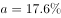，社会消费品零售总额增长率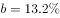，根据两期比重差公式，因为，故比重上升，2014年比重高于上年水平，错误；

B项，定位图表，根据折线图和数据标签可知，2010年-2014年，只有2010、2012、2014这3年的增长率慢于，错误；

C项，定位图表，2013年和2014年的总额之和为亿元，前三年之和为亿元，，正确；

D项，定位文字材料第二段，可知2014年烟酒类消费品价格增速为，而居民消费总水平增速为，前者慢于后者，错误。

故正确答案为C。

---

### 材料 2

        2014年，上海市全年实现金融业增加值3268.43亿元，比上年增长。

        全年新增各类金融单位96家。其中，货币金融服务单位37家；资本市场服务单位40家。至年末，全市各类金融单位达到1336家。其中，货币金融服务单位601家；资本市场服务单位292家；保险业单位363家。

        至年末，全市中外资金融机构本外币各项存款余额73882.45亿元，比年初增加4612.96亿元；贷款余额47915.81亿元，比年初增加3424.23亿元。

        全年通过上海证券市场股票筹资3962.59亿元，比上年增长；发行公司债2955.2亿元，比上年下降。至年末，上海证券市场上市证券3758只，比上年增加972只，其中股票1039只，增加42只。

        全年金融市场（包括外汇市场）交易总额达到786.66万亿元，比上年增长。上海证券交易所各类有价证券总成交金额128.15万亿元，增长。其中，股票成交金额37.72万亿元，增长。上海期货交易所总成交金额126.47万亿元，增长。中国金融期货交易所总成交金额164.02万亿元，增长。银行间市场总成交金额361.51万亿元，增长。上海黄金交易所总成交金额6.51万亿元，增长。

#### 第 6 题　qid 2051122 · 综合

2014年，上海市全年新增货币金融服务单位在当年新增的各类金融单位中占（  ）。

- **A**. 两成多
- **B**. 三成多　✅
- **C**. 四成多
- **D**. 五成多

**答案**：B

**官方解析**

由题干“2014年······在······中占”，结合材料所给年份是2014年，可判定该题是现期比重问题。定位文字材料第二段，“2014全年新增各类金融单位96家。其中，货币金融服务单位37家”，可得所求比重（三成多）。

故正确答案为B。

---

#### 第 7 题　qid 2051126 · 综合

2014年间，上海市中外资金融机构本外币存贷款差（  ）。

- **A**. 增加了1千多亿元　✅
- **B**. 增加了2万多亿元
- **C**. 减少了1千多亿元
- **D**. 减少了2万多亿元

**答案**：A

**官方解析**

题目所求“2014年间······存贷款差增加了或者减少了······”，即2014年和2013年的存贷款之差。假设14年存贷款之差为，且14年存款增量为，贷款增量为，则13年存贷款之差为，则2014年和2013年的存贷款之差为，即增长量之差。定位文字材料第三段，“2014年末，全市中外资金融机构本外币各项存款余额比年初增加4612.96亿元；贷款余额比年初增加3424.23亿元”，所以2014年间上海市中外资金融机构本外币存贷款差亿元，即增加了1千多亿元。

故正确答案为A。

---

#### 第 8 题　qid 2051132 · 增长

2014年上海市股票成交金额比2013年增加约（  ）万亿元。

- **A**. 10
- **B**. 12
- **C**. 15　✅
- **D**. 18

**答案**：C

**官方解析**

由题干“2014年······比2013年增加······万亿元”，可判定该题为增长量计算问题。定位文字材料最后一段，“2014年股票成交金额37.72万亿元，增长”，所以2014年上海市股票成交金额比2013年的增长量，与C项最接近。

故正确答案为C。

---

#### 第 9 题　qid 2051136 · 增长

以下金融市场中，2014年成交金额同比增量最高的是（  ）。

- **A**. 上海证券交易所　✅
- **B**. 中国金融期货交易所
- **C**. 上海黄金交易所
- **D**. 上海期货交易所

**答案**：A

**官方解析**

由题干“2014年······同比增量最高的是······”，可判定该题是增长量比较问题。定位文字材料最后一段，“上海证券交易所各类有价证券总成交金额128.15万亿元，增长”“上海期货交易所总成交金额126.47万亿元，增长”“中国金融期货交易所总成交金额164.02万亿元，增长”“上海黄金交易所总成交金额6.51万亿元，增长”，可得2014年上海证券交易所成交金额同比增量万亿元；2014年中国金融期货交易所成交金额同比增量万亿元；2014年上海黄金交易所成交金额同比增量万亿元；2014年上海期货交易所总成交金额同比增量万亿元，所以2014年上海证券交易所成交金额同比增量最高。

故正确答案为A。

---

#### 第 10 题　qid 2051140 · 综合

能够从上述资料中推出的是（  ）。

- **A**. 2013年全年，上海市实现金融业增加值3000多亿元
- **B**. 2013年上海市证券交易所各类有价证券总成交额中，股票成交金额占比高于2014年
- **C**. 2014年末，上海市资本市场服务单位数量不到货币金融服务单位数量的一半　✅
- **D**. 2014年间，上海市银行间市场月均成交金额超过31万亿元

**答案**：C

**官方解析**

A项：定位文字材料第一段，“2014年，上海市全年实现金融业增加值3268.43亿元，比上年增长”，所以2013年上海市实现金融业增加值，错误；

B项：定位文字材料最后一段，上海证券交易所各类有价证券总成交金额增长，股票成交金额增长，则比重上升，故2014年股票成交金额占比2013年股票成交金额占比，错误；

C项：定位文字材料第二段，货币金融服务单位601家，资本市场服务单位292家，，所以2014年末上海市资本市场服务单位数量不到货币金融服务单位数量的一半，正确；

D项：定位文字材料最后一段，2014年间上海市银行间市场月均成交金额万亿元，所以2014年间上海市银行间市场月均成交金额低于31万亿元，错误。

故正确答案为C。

---

### 材料 3

        2012年全年货物进出口总额38668亿美元，比上年增长。其中，出口20489亿美元，增长；进口18178亿美元，增长。

#### 第 11 题　qid 2051124 · 比重

表中2012年进口数量最高的商品，其当年进口额占全国进口总额的比重为（  ）。

- **A**. 

- **B**. 

　✅
- **C**. 

- **D**. 

**答案**：B

**官方解析**

由题干“2012年······占······比重”，可知本题为现期比重问题。定位表格材料可知，2012年进口数量最高的商品为铁矿砂及其精矿（74355万吨）。定位文字和表格材料可知，2012年全年货物进口总额为18178亿美元，铁矿砂及其精矿的进口金额为956亿美元，故所求比重为：。

故正确答案为B。

---

#### 第 12 题　qid 2051128 · 增长

2012年我国主要商品的进口数量和金额都比去年增长的有（  ）种。

- **A**. 5
- **B**. 6
- **C**. 7　✅
- **D**. 8

**答案**：C

**官方解析**

数值比去年增长，即增长率大于0，定位表格材料可知，2012年我国进口数量和金额的增长率都大于0的有：谷物及谷物粉、大豆、食用植物油、氧化铝、煤（包括褐煤）、原油、未锻造的铜及铜材，共7种。
故正确答案为C。

---

#### 第 13 题　qid 2051130 · 综合

2012年间我国的贸易顺逆差关系与上年不同的国家或者地区是（    ）。

- **A**. 东盟　✅
- **B**. 日本
- **C**. 美国
- **D**. 欧盟

**答案**：A

**官方解析**

由题干“2012年间我国的贸易顺逆差关系与上年不同”可知本题为基期和差问题。定位表格材料，贸易顺逆差关系与上年不同，即为一年是顺差、一年是逆差。逐项验证答案：

东盟：2012年出口额和进口额分别为2043、1958，出口额进口额，为贸易顺差；

2011年出口额和进口额分别为、，出口额进口额，为贸易逆差，故东盟两年的贸易顺逆差关系不同。A项满足题意，无需验证剩余选项。

故正确答案为A。

---

#### 第 14 题　qid 2051134 · 综合

表中2012年对华进出口贸易额最高的国家或者地区，其贸易额是表中2012年对华贸易额最低的国家或地区的（    ）倍。

- **A**. 5.5
- **B**. 7.3
- **C**. 8.2　✅
- **D**. 12.8

**答案**：C

**官方解析**

由题干“2012年······是······倍”，可知本题为现期倍数问题。定位表格材料可知，进出口贸易额最高的地区是欧盟：亿美元，进出口贸易额最低的国家是印度：亿美元，故所求倍数为：倍。

故正确答案为C。

---

#### 第 15 题　qid 2051138 · 综合

能够从上述资料推出的是（    ）。

- **A**. 2012年我国全年货物进出口顺差额低于上年水平
- **B**. 2011年我国煤（包括褐煤）进口量高于原油进口量
- **C**. 2012年日本对华货物贸易额高于上年水平
- **D**. 2012年我国进口钢材的平均每吨价格超过1000美元　✅

**答案**：D

**官方解析**

A项：2012年我国全年货物进出口顺差额为亿美元；2011年我国全年货物进出口顺差额为亿美元，，则2012年我国全年货物进出口顺差额高于上年水平，错误；

B项：2011年我国煤（包括褐煤）进口数量为万吨；2011年我国原油进口数量为万吨，则2011年我国煤（包括褐煤）进口数量低于原油进口数量，错误；

C项：2012年日本对华货物贸易额进口额出口额亿美元；2011年日本对华货物贸易额进口额出口额亿美元，，则2012年日本对华货物贸易额低于上年水平，错误；

D项：2012年我国进口钢材的平均每吨价格，正确。

故正确答案为D。

---

### 材料 4

        某年度某机构关于中国宠物主人消费行为及倾向调查回收的10680份有效问卷显示：女性养宠者占，宠物主人为“80-90后”占。将宠物定义为“孩子”“亲人”“朋友”和“宠物”的分别为、、和。的人月开销在100元以内，的人开销在101至500元之间，而花费在501至1000元之间的达到，月消费1000元以上的人群达到。在购买物品方面，购买宠物食物的人数达到有效问卷总人数的，其次为药品、保健品，以及日用品、玩具、服饰五项，均接近。宠物主人外出时，四成“委托亲朋照顾”，三成“一起带走”，委托寄养还不到。在训练方面，的宠物处于自主训练或放任生长的状态，但近一半人希望爱宠得到专业训练。在购买渠道方面，的被访问者选择综合电商平台，选择线下综合商店或专卖店者为，选择宠物类垂直电商平台的占，但其复购率更高。值得注意的是，目前宠物主人对购物类O2O服务有选择意向的不足。

#### 第 16 题　qid 2051084 · 比重

问卷中，男性养宠者占养宠人群的比重为：

- **A**. 

- **B**. 

- **C**. 

　✅
- **D**. 

**答案**：C

**官方解析**

根据问题中“男性养宠者占养宠人群的比重”可判定此题为现期比重问题。定位文字材料首句，“女性养宠者占”，则男性养宠物者占比为。

故正确答案为C。

---

#### 第 17 题　qid 2051086 · 综合

问卷中对宠物没有花费的人数约为：

- **A**. 38
- **B**. 36
- **C**. 34
- **D**. 32　✅

**答案**：D

**官方解析**

由题干“问卷中对宠物没有花费的人数约为”，而且材料中给出不同开销人员占比及问卷总人数，问没有花费的人数，可判定此题为现期比重问题。定位材料中“的人月开销在100元以内，的人……”，可知有消费的人占比为，则没有花费的人数占比为，所以，没有花费的人数总人数没有花费的人数占比人。

故正确答案为D。

---

#### 第 18 题　qid 2051088 · 综合

问卷中，选择综合电商平台和选择购物类O2O服务的消费者人数之比为：

- **A**. 
小于

- **B**. 
大于

- **C**. 
小于

- **D**. 
大于
　✅

**答案**：D

**官方解析**

由题干“……和……人数之比”，可知本题为比值计算问题。定位文字材料“的被访问者选择综合电商平台……对购物类O2O服务有选择意向的不足”，则两者之比为：，分母不足，分母变小，分数值变大，故两者之比大于。

故正确答案为D。

---

#### 第 19 题　qid 2051090 · 综合

问卷中，在药品、保健品，以及日用品、玩具、服饰方面有花销的总人次最可能有：

- **A**. 6408
- **B**. 9612
- **C**. 16020
- **D**. 32040　✅

**答案**：D

**官方解析**

由题干“······方面有花销的总人次······”，定位材料“回收的10680份有效问卷”“购买宠物食物的人数达到有效问卷总人数的，其次为药品、保健品，以及日用品、玩具、服饰五项，均接近”，可知本题为现期比重问题。，故药品、保健品、日用品、玩具、服饰这五项部分量的总和。

故正确答案为D。

---

#### 第 20 题　qid 2051092 · 综合

根据问卷，下列判断错误的是：

- **A**. 
只有的宠物接受过训练，专业训练消费潜力巨大
　✅
- **B**. 
绝大部分宠物主人对宠物的定义超越了宠物本身

- **C**. 
月均消费在101-1000元的是宠物消费的主流

- **D**. 
购物类O2O服务的市场还有待培育

**答案**：A

**官方解析**

逐项分析如下：

A项：定位文字材料后半段，“在训练方面，的宠物处于自主训练或放任生长的状态”，则自主训练的宠物占比小于，但自主训练和专业训练都属于训练，所以接受过训练的宠物占比小于，有可能超过，故A项说法“只有的宠物接受过训练”与其不符，错误；

B项：定位材料前半段，对宠物的定义超越宠物本身，定义为“孩子”“亲人”“朋友”的比重分别占到、、，合计占比超过，可以认定为“绝大部分宠物主人”，正确；

C项：定位材料前半段，101至500元和501至1000元的消费人群占比分别为和，合计占比超过，可以认定为“主流”，正确；

D项：定位材料最后一句，对购物类O2O服务有选择意向的不足，说明有超过的人暂时没有选择意向，符合“市场有待培育”，正确。

本题为选非题，故正确答案为A。

---
