# 2018年上海市公务员录用考试《行测》题（A类）（网友回忆版）

> 省考 · 2018 年 · 6 个模块 · 共 135 题

- [政治理论](#%E6%94%BF%E6%B2%BB%E7%90%86%E8%AE%BA) · 7 题
- [常识判断](#%E5%B8%B8%E8%AF%86%E5%88%A4%E6%96%AD) · 38 题
- [言语理解与表达](#%E8%A8%80%E8%AF%AD%E7%90%86%E8%A7%A3%E4%B8%8E%E8%A1%A8%E8%BE%BE) · 25 题
- [数量关系](#%E6%95%B0%E9%87%8F%E5%85%B3%E7%B3%BB) · 28 题
- [判断推理](#%E5%88%A4%E6%96%AD%E6%8E%A8%E7%90%86) · 35 题
- [资料分析](#%E8%B5%84%E6%96%99%E5%88%86%E6%9E%90) · 2 题

---

## 政治理论

### 材料 1

        党的十八大以来，习近平主席在国际国内多个重要场合提出构建人类命运共同体，并对其丰富内涵和实践路径作了深入阐述。人类命运共同体理念明确回答了世界向何处去、崛起的中国向何处去、新形势下中国怎样办外交等重大命题，是当代中国外交理论的重大创新成果之一，也是马克思主义中国化的最新成果之一。人类命运共同体理念超越了西方主流国际关系理论，蕴含着重大理论意义和实践价值，必将有力促进人类和平与发展的崇高事业。任何重大理论创新都不是无源之水、无本之木，往往都是在继承前人思想精髓的基础上，结合新的现实条件和具体实践发展起来的。人类命运共同体理念是在继承马克思主义与中华传统文化思想精髓的基础上形成的理论创新成果。 

        一个科学的理论体系往往有其核心范畴，用以统摄理论体系中的相关概念，保证理论体系概念间的自洽和逻辑上的贯通。人类命运共同体可以说是中国特色大国外交理论体系的核心范畴，它引领着党的十八大以来我国外交的新理念新思想新战略。

        一部人类思想发展史，也是一部思想超越史。没有思想上的不断超越，人类社会就无法不断前进。人类命运共同体理念在多个方面体现出对近代以来西方主流国际关系理论的超越。正因为这些超越，人类命运共同体理念已经得到国际学术界的肯定，被认为是一种新的秩序观、价值观乃至新的哲学。当前，国际社会对人类命运共同体理念的认可度不断提升。

        2017年2月，联合国社会发展委员会第五十五届会议在其通过的“非洲发展新伙伴关系的社会层面”决议中，明确写入“构建人类命运共同体”的愿景。这是联合国决议首次写入人类命运共同体理念，体现了广大成员国对这一理念的支持。联合国秘书长表示，联合国“践行多边主义的目的，就是要建立人类命运共同体”。

#### 第 1 题　qid 2137216 · 新思想

中国共产党是为中国人民谋幸福的政党，也是为人类进步事业而奋斗的政党。我们呼吁，各国人民同心协力，构建人类命运共同体，建设        、开放包容、清洁美丽的世界。

- **A**. 持久和平　✅
- **B**. 普遍安全　✅
- **C**. 民主自由
- **D**. 共同繁荣　✅

**答案**：ABD

**官方解析**

本题考查时事政治，主要涉及人类命运共同体等的有关知识点。
十九大报告中，习近平指出，我们呼吁，各国人民同心协力，构建人类命运共同体，建设持久和平、普遍安全、共同繁荣、开放包容、清洁美丽的世界。
故正确答案为ABD。
【文段出处】《人类命运共同体理念引领人类文明进步方向》

---

### 材料 2

材料一：党的十九大报告指出，改革开放之初，我们党发出了走自己的路、建设中国特色社会主义的伟大号召。从那时以来，我们党团结带领全国各族人民不懈奋斗，推动我国经济实力、科技实力、国防实力、综合国力进入世界前列，推动我国国际地位实现前所未有的提升，党的面貌、国家的面貌、人民的面貌、军队的面貌、中华民族的面貌发生了前所未有的变化，中华民族正以崭新姿态屹立于世界的东方。经过长期努力，中国特色社会主义进入了新时代，这是我国发展新的历史方位。 

材料二：“中国特色社会主义进入了新时代”，这是党的十九大对我国发展新的历史方位的科学判断，也是贯穿党的十九大报告的一条主线。在新时代坚持和发展中国特色社会主义，就要深刻认识新时代的重大意义和丰富内涵，就要深刻认识新时代我国社会主要矛盾的历史性变化，从而牢牢把握我们党在新时代的历史使命，更好进行伟大斗争、建设伟大工程、推进伟大事业、实现伟大梦想，在新时代中国特色社会主义的伟大实践中，以党的坚强领导和顽强奋斗，激励全体中华儿女不断奋进，凝聚起同心共筑中国梦的磅礴力量。

#### 第 2 题　qid 2137224 · 新思想

中国特色社会主义进入新时代，不仅意味着近代以来久经磨难的中华民族迎来了从站起来、富起来到强起来的伟大飞跃，迎来了实现中华民族伟大复兴的光明前景；还意味着        。

- **A**. 科学社会主义在二十一世纪的中国焕发出强大的生机活力，在世界上高高举起了中国特色社会主义伟大旗帜　✅
- **B**. 我国经济社会发展水平总体显著提高，实现了把中国建设成为一个富强民主文明的现代化国家的奋斗目标
- **C**. 中国已经全面建成小康社会，进而进入全面建设社会主义现代化强国的新时期
- **D**. 中国特色社会主义道路、理论、制度、文化不断发展，拓展了发展中国家走向现代化的途径，给世界上那些既希望加快发展又希望保持自身独立性的国家和民族提供了全新选择，为解决人类问题贡献了中国智慧和中国方案　✅

**答案**：AD

**官方解析**

本题考查时事政治，主要考查十九大报告的有关内容。
十九大报告指出：经过长期努力，中国特色社会主义进入了新时代，这是我国发展新的历史方位。中国特色社会主义进入新时代，意味着近代以来久经磨难的中华民族迎来了从站起来、富起来到强起来的伟大飞跃，迎来了实现中华民族伟大复兴的光明前景；意味着科学社会主义在二十一世纪的中国焕发出强大生机活力，在世界上高高举起了中国特色社会主义伟大旗帜；意味着中国特色社会主义道路、理论、制度、文化不断发展，拓展了发展中国家走向现代化的途径，给世界上那些既希望加快发展又希望保持自身独立性的国家和民族提供了全新选择，为解决人类问题贡献了中国智慧和中国方案。
故正确答案为AD。

---

#### 第 3 题　qid 2137226 · 新思想

十九大报告提出，中国特色社会主义进入新时代。必须认识到，我国社会主要矛盾的变化是关系全局的历史性变化，对党和国家工作提出了许多新要求，这种变化        。

- **A**. 没有改变我们对我国社会主义所处历史阶段的判断　✅
- **B**. 改变了我国处于并将长期处于社会主义初级阶段的基本国情
- **C**. 没有改变我国是世界最大发展中国家的国际地位　✅
- **D**. 改变了我国是世界最大发展中国家的国际地位

**答案**：AC

**官方解析**

本题考查时事政治，主要考查十九大报告的有关内容。
十九大报告指出：经过长期努力，中国特色社会主义进入了新时代，我国社会主要矛盾已经转化为人民日益增长的美好生活需要和不平衡不充分的发展之间的矛盾。“习近平总书记强调指出“必须认识到，我国社会主要矛盾的变化是关系全局的历史性变化，对党和国家工作提出了许多新要求”；必须认识到，我国社会主要矛盾的变化，没有改变我们对我国社会主义所处历史阶段的判断，我国仍处于并将长期处于社会主义初级阶段的基本国情没有变，我国是世界最大发展中国家的国际地位没有变。全党要牢牢把握社会主义初级阶段这个基本国情，牢牢立足社会主义初级阶段这个最大实际，牢牢坚持党的基本路线这个党和国家的生命线、人民的幸福线。
故正确答案为AC。

---

#### 第 4 题　qid 2395240 · 时事政治

2017年7月30日，庆祝中国人民解放军建军90周年阅兵在朱日和联合训练基地隆重举行。中共中央总书记、国家主席、中央军委主席习近平检阅部队并发表重要讲话。习近平号召全军将士要坚定不移坚持（    ）这个唯一的根本的标准，聚焦备战打仗，锻造召之即来，来之能战，战之必胜的精兵劲旅。

- **A**. 军队现代化
- **B**. 战斗力　✅
- **C**. 科技强军
- **D**. 响应力

**答案**：B

**官方解析**

本题考查政治常识。
2017年7月30日，中共中央总书记、国家主席、中央军委主席习近平在朱日和检阅部队并发表重要讲话。习近平在讲话中要求全军将士要坚定不移坚持战斗力这个唯一的根本的标准，聚焦备战打仗，锻造召之即来、来之能战，战之必胜的精兵劲旅。他同时也坚信，我们的英雄军队有信心、有能力打败一切来犯之敌。习近平在中国共产党第十九次全国代表大会上作报告时强调：军队是要准备打仗的，一切工作都必须坚持战斗力标准，向能打仗、打胜仗聚焦。
故正确答案为B。

---

#### 第 5 题　qid 2137542 · 新思想

中国共产党自成立以来，就非常重视民族问题。1949年《中国人民政治协商会议共同纲领》明确规定对少数民族地区实行民族区域自治制度。关于民族区域自治制度，下列说法不正确的是        。

- **A**. 民族区域自治制度是我国的基本政治制度之一，是一种新型的民主政治制度
- **B**. 在国家的统一领导下，各少数民族聚居的地方实行区域自治，设立自治机关，行使自治权
- **C**. 民族自治地方的人民代表大会有权依照当地民族的政治、经济、文化的特点，制定自治条例和单行条例
- **D**. 我国现有的民族自治区，最早成立的是新疆维吾尔自治区　✅

**答案**：D

**官方解析**

A项正确，民族区域自治制度是我国的基本政治制度之一，是一种新型的民主政治制度，是建设中国特色社会主义政治的重要内容。
B项正确，民族区域自治制度，是指在国家统一领导下，各少数民族聚居的地方实行区域自治，设立自治机关，行使自治权的制度。
C项正确，民族自治地方的人民代表大会有权依照当地的政治、经济和文化的特点，制定自治条例和单行条例。自治条例规定有关本地方实行民族区域自治的基本问题；单行条例规定有关本地实行民族区域自治的某一方面的具体事项。
D项错误，早在新中国成立以前，1947年5月1日，在党的领导下建立了我国第一个省级的内蒙古自治区，为以后在其他民族地区实行民族区域自治指明了方向，积累了宝贵的经验。新疆维吾尔自治区成立的时间是1955年10月1日，是第二个成立的自治区，与题意不符。
本题为选非题，故正确答案为D。

---

#### 第 6 题　qid 2395243 · 时事政治

2017年7月，国务院印发《新一代人工智能发展规划》，《规划》指出，要深入学习贯彻习近平总书记系列重要讲话精神和治国理政新理念新思想新战略，以提升新一代人工智能（    ）为主攻方向，构建开放协同的人工智能科技创新体系。

- **A**. 提高社会服务能力
- **B**. 促进经济发展能力
- **C**. 科技创新能力　✅
- **D**. 维护国家安全能力

**答案**：C

**官方解析**

本题考查政治常识。
《新一代人工智能发展规划》提出以提升新一代人工智能科技创新能力为主攻方向，以加快人工智能与经济社会国防深度融合为主线，按照“构建一个体系、把握双重属性、坚持三位一体、强化四大支撑”进行总体布局，确定了建立开放协同的人工智能科技创新体系、培育高端高效的智能经济、建设安全便捷的智能社会、强化人工智能对国家安全的支撑、构建泛在安全高效的智能化基础设施体系、实施新一代人工智能重大科技项目等六方面的重点任务。
故正确答案为C。

---

#### 第 7 题　qid 2137176 · 新思想

党的十九大报告指出，过去的五年里，我国创新驱动发展战略大力实施，创新型国家建设成果丰硕，天宫、蛟龙、天眼、悟空、墨子、大飞机等重大科技成果相继问世。
下列重大科技成果，不属于2017年问世的是：

- **A**. 我国自主研发的水下机器人“探索号”在南海北部开展首次试验性应用
- **B**. “悟空”探测卫星首次测量到超高能宇宙射线前所未有的剧烈波动
- **C**. 我国科学家成功实现世界首次洲际量子保密通信
- **D**. 世界最大单口径射电望远镜建成启用　✅

**答案**：D

**官方解析**

本题主要考查科技常识，需结合具体选项予以分析。
A项正确，2017年7月24日，我国自主研发的自治式水下机器人“探索号”，在南海北部开展首次试验性应用。
B项正确，2017年11月30日，国际权威学术期刊《自然》在线发表了中国首颗暗物质探测卫星“悟空”的首批成果：发现太空中的反常电子信号。根据“悟空”积累的观测数据，科学家们发现在1.4万亿电子伏特（TeV）的超高能谱段（超高能宇宙射线）突然出现剧烈波动。
C项正确，2017年9月29日，世界首条量子保密通信干线——“京沪干线”正式开通，我国科学家成功与奥地利实现了世界首次洲际量子保密通信，这标志着我国已构建出天地一体化广域量子通信网络雏形。
D项错误，2016年9月25日，世界最大单口径射电望远镜——500米口径球面射电望远镜（简称FAST）在贵州平塘县克度镇喀斯特洼坑中建成启用。
本题为选非题，故正确答案为D。

---

## 常识判断

### 材料 1

        党的十八大以来，习近平主席在国际国内多个重要场合提出构建人类命运共同体，并对其丰富内涵和实践路径作了深入阐述。人类命运共同体理念明确回答了世界向何处去、崛起的中国向何处去、新形势下中国怎样办外交等重大命题，是当代中国外交理论的重大创新成果之一，也是马克思主义中国化的最新成果之一。人类命运共同体理念超越了西方主流国际关系理论，蕴含着重大理论意义和实践价值，必将有力促进人类和平与发展的崇高事业。任何重大理论创新都不是无源之水、无本之木，往往都是在继承前人思想精髓的基础上，结合新的现实条件和具体实践发展起来的。人类命运共同体理念是在继承马克思主义与中华传统文化思想精髓的基础上形成的理论创新成果。 

        一个科学的理论体系往往有其核心范畴，用以统摄理论体系中的相关概念，保证理论体系概念间的自洽和逻辑上的贯通。人类命运共同体可以说是中国特色大国外交理论体系的核心范畴，它引领着党的十八大以来我国外交的新理念新思想新战略。

        一部人类思想发展史，也是一部思想超越史。没有思想上的不断超越，人类社会就无法不断前进。人类命运共同体理念在多个方面体现出对近代以来西方主流国际关系理论的超越。正因为这些超越，人类命运共同体理念已经得到国际学术界的肯定，被认为是一种新的秩序观、价值观乃至新的哲学。当前，国际社会对人类命运共同体理念的认可度不断提升。

        2017年2月，联合国社会发展委员会第五十五届会议在其通过的“非洲发展新伙伴关系的社会层面”决议中，明确写入“构建人类命运共同体”的愿景。这是联合国决议首次写入人类命运共同体理念，体现了广大成员国对这一理念的支持。联合国秘书长表示，联合国“践行多边主义的目的，就是要建立人类命运共同体”。

#### 第 1 题　qid 2137208 · 人文常识

人类命运共同体理念继承和发展了马克思、恩格斯的共同体思想。马克思、恩格斯曾把无产阶级为之奋斗的共产主义社会确立为        。

- **A**. “无产者联合体”
- **B**. “自由人联合体”　✅
- **C**. “无产阶级共同体”
- **D**. “世界公民联合体”

**答案**：B

**官方解析**

本题考查政治常识。
人类命运共同体理念是在继承马克思主义与中华传统文化思想精髓的基础上所形成的理论创新成果。马克思、恩格斯明确提出并系统阐释了共同体思想。他们把作为无产阶级奋斗目标的共产主义社会确立为“自由人联合体”。在这种共同体中，个人是“世界历史性的、经验上普遍的个人”，是自由而全面发展并因此具有丰富个性的“自由人”。马克思、恩格斯的共同体思想，为人类命运共同体理念奠定了坚实的理论基础。
故正确答案为B。

---

#### 第 2 题　qid 2137212 · 人文常识

人类命运共同体理念汲取了中华传统文化中        的思想精髓，将攸关中国前途命运的中国梦与攸关世界各国前途命运的世界梦紧密连接在一起，让世界各国共享中国经验，让中国发展成为世界的机遇。

- **A**. “天下观”　✅
- **B**. “中庸观”
- **C**. “博弈论”
- **D**. “辩证法”

**答案**：A

**官方解析**

以习近平同志为核心的党中央面对国际形势的深刻变化和各国人民的共同愿望，提出构建人类命运共同体，有力推动了中国特色大国外交理论的新发展。汲取了中华传统文化中“天下观”与“和文化”的思想精髓。中华传统文化中的“天下观”源远流长，无内无外、天下一家是其核心原则，协和万邦、世界大同是其终极目标。这种“天下观”与和而不同、和为贵等“和文化”有机结合，构成了中国人处理与外部世界关系的基本准则。人类命运共同体理念汲取了中华传统文化中“天下观”与“和文化”的思想精髓，将攸关中国前途命运的中国梦与攸关世界各国前途命运的世界梦紧密连接在一起，让世界各国共享中国经验，让中国发展成为世界的机遇。
故正确答案为A。
【文段出处】《人类命运共同体理念引领人类文明进步方向》

---

#### 第 3 题　qid 2137214 · 人文常识

纵观人类历史不难发现，如果一种关于未来世界的设想不具有和平属性，而是内含诱发冲突乃至战争的因素，那它必将被历史淘汰。人类命运共同体作为一种具有鲜明和平属性的理念，要求        。

- **A**. 具有不同历史文化传统的国家最终实行同样的社会制度
- **B**. 各个国家和地区通过和平方式即非暴力的合作方式建立和积累互信　✅
- **C**. 反对霸权主义和强权政治　✅
- **D**. 处于不同发展水平的国家和地区实现共同富裕

**答案**：BC

**官方解析**

本题考查时事政治。
纵观人类历史不难发现，如果一种关于未来世界的设想不具有和平属性，而是内含诱发冲突乃至战争的因素，那它必将被历史淘汰。只有以维护和平为目的，具有鲜明和平属性，这样的愿景才可能产生广泛影响力，并切实推动人类社会发展进步。人类命运共同体就是这样一种具有鲜明和平属性的理念。人类命运共同体理念承认世界的差异性和多样性，并在此基础上追求世界的统一性，体现的是一种和而不同的价值追求与殊途同归的理性判断。具体来说，人类命运共同体意味着具有不同历史文化传统、实行不同社会制度、处于不同发展水平的国家和地区，在彼此信任的基础上，在涉及生存和发展等根本问题上要做到同舟共济、守望相助、荣辱与共。这就要求各个国家和地区之间通过和平方式即非暴力的合作方式建立和积累互信，反对霸权主义和强权政治。
故正确答案为BC。
【文段出处】《人类命运共同体理念引领人类文明进步方向》

---

### 材料 2

材料一：党的十九大报告指出，改革开放之初，我们党发出了走自己的路、建设中国特色社会主义的伟大号召。从那时以来，我们党团结带领全国各族人民不懈奋斗，推动我国经济实力、科技实力、国防实力、综合国力进入世界前列，推动我国国际地位实现前所未有的提升，党的面貌、国家的面貌、人民的面貌、军队的面貌、中华民族的面貌发生了前所未有的变化，中华民族正以崭新姿态屹立于世界的东方。经过长期努力，中国特色社会主义进入了新时代，这是我国发展新的历史方位。 

材料二：“中国特色社会主义进入了新时代”，这是党的十九大对我国发展新的历史方位的科学判断，也是贯穿党的十九大报告的一条主线。在新时代坚持和发展中国特色社会主义，就要深刻认识新时代的重大意义和丰富内涵，就要深刻认识新时代我国社会主要矛盾的历史性变化，从而牢牢把握我们党在新时代的历史使命，更好进行伟大斗争、建设伟大工程、推进伟大事业、实现伟大梦想，在新时代中国特色社会主义的伟大实践中，以党的坚强领导和顽强奋斗，激励全体中华儿女不断奋进，凝聚起同心共筑中国梦的磅礴力量。

#### 第 4 题　qid 2137230 · 人文常识

进入新时代，我国社会主要矛盾的变化不仅是巨大的，也是极为深刻的，要求我们在继续推动发展的基础上，着力解决好发展不平衡不充分的问题，        。

- **A**. 大力提升发展质量和效益　✅
- **B**. 带领全国人民告别贫困、跨越温饱
- **C**. 更好满足人民在经济、政治、文化、社会、生态等方面日益增长的需要　✅
- **D**. 更好推动人的全面发展、社会全面进步　✅

**答案**：ACD

**官方解析**

本题考查政治常识，主要考查十九大报告的有关内容。
十九大报告指出：中国特色社会主义进入新时代，我国社会主要矛盾已经转化为人民日益增长的美好生活需要和不平衡不充分的发展之间的矛盾······必须认识到，我国社会主要矛盾的变化是关系全局的历史性变化，对党和国家工作提出了许多新要求。我们要在继续推动发展的基础上，着力解决好发展不平衡不充分的问题，大力提升发展质量和效益，更好满足人民在经济、政治、文化、社会、生态等方面日益增长的需要，更好推动人的全面发展、社会全面进步。
故正确答案为ACD。

---

#### 第 5 题　qid 2137232 · 人文常识

进入新时代，实现伟大梦想，必须进行伟大斗争，建设伟大工程，伟大斗争、伟大工程、伟大事业、伟大梦想，紧密联系、相互贯通、相互作用，其中起决定性作用的是        。

- **A**. 坚持社会主义制度的伟大斗争
- **B**. 党的建设新的伟大工程　✅
- **C**. 中国特色社会主义的伟大事业
- **D**. 中华民族走向复兴的伟大梦想

**答案**：B

**官方解析**

本题考查时事政治，主要考查十九大报告的有关内容。
十九大报告中指出：中华民族伟大复兴，绝不是轻轻松松、敲锣打鼓就能实现的。全党必须准备付出更为艰巨、更为艰苦的努力。实现伟大梦想，必须进行伟大斗争，必须建设伟大工程，必须推进伟大事业。伟大斗争，伟大工程，伟大事业，伟大梦想，紧密联系、相互贯通、相互作用，其中起决定性作用的是党的建设新的伟大工程。推进伟大工程，要结合伟大斗争、伟大事业、伟大梦想的实践来进行，确保党在世界形势深刻变化的历史进程中始终走在时代前列，在应对国内外各种风险和考验的历史进程中始终成为全国人民的主心骨，在坚持和发展中国特色社会主义的历史进程中始终成为坚强领导核心。
故正确答案为B。

---

### 材料 3

        王某等12户居民系D市H区众望苑住宅小区15号楼的住户，该15号楼与一垃圾压缩站相距约30米。该垃圾压缩站是众望苑小区所在的H区Y镇政府新建的垃圾处理项目，专为处理众望苑及周边几个小区的生活垃圾而建的。垃圾压缩站在筹建过程中，Y镇政府向H区环保局提交了《建设项目环境影响申报（登记）表》申请环境行政许可，并根据该局有关须委托有资质的环评单位编制环境影响报告表的意见，委托D市环境科学研究所编制相关报告表，其后送至该局进行审批，H区环保局作出了《关于对D市H区众望苑垃圾压缩站建设项目环境影响报告表的审批意见》（以下简称《审批意见》），同意在众望苑小区15号北侧地块建设垃圾压缩站项目，并对该项目在运营过程中产生的废水、异味的处理、场界噪声对邻近环境质量的影响及各类固体废物处置等提出了具体要求。 王某等12户居民认为，垃圾压缩站投入运营后所产生的污水、废物、噪声、臭味等污染会对其生活造成重大影响，该项目的许可与其有重大利益关系，H区环保局在未征询其意见的情况下即作出《审批意见》，侵犯了其合法权益，故要求H区环保局撤销该《审批意见》。

#### 第 6 题　qid 2395253 · 人文常识

H区环保局作出《审批意见》，同意新建众望苑小区垃圾压缩站项目的行为是：

- **A**. 依申请行政行为　✅
- **B**. 具体行政行为　✅
- **C**. 授益行政行为　✅
- **D**. 行政授权行为

**答案**：ABC

**官方解析**

本题考查法律常识。
《行政许可法》第二条规定：“行政许可，是指行政机关根据公民、法人或者其他组织的申请，经依法审查，准予其从事特定活动的行为。”行政许可的特征为：是依法申请的行政行为；是具体行政行为；是授益性行政行为；是外部行政行为。
本题H区环保局根据Y镇政府申请作出的《审批意见》的行为，属于行政许可，具有以上特征。
A项正确，行政许可是依法申请行政行为，只能依公民、法人或者其他组织的申请而发生。本题由Y镇政府提出申请以后，H区环保局才能做出《审批意见》。
B项正确，行政行为以其对象是否特定为标准，分为抽象行政行为和具体行政行为。具体行政行为是指行政主体针对特定行政管理对象实施的行为。行政许可、行政处罚等是典型的具体行政行为。
C项正确，授益性行政行为，是指授予行政相对人以一定权利或利益，或者免除其义务的行为。本题H区环保局同意Y镇政府建设垃圾压缩站项目，对行政相对人来说是授益性行政行为。
D项错误，行政授权，指行政组织内部上级机关把某些权力授予下级行政机关或职能机构，以便下级能够在上级的监督下自主的行动和处理行政事务。H区环保局与Y镇政府不是上下级关系，故不是行政授权行为。
故正确答案为ABC。

---

#### 第 7 题　qid 2395254 · 法律常识

如果H区环保局在受理Y镇政府提交的环境行政许可申请材料后，认为该行政许可与15号楼王某等12户居民有重大利益关系，则应当：

- **A**. 告知Y镇政府享有要求听证的权利　✅
- **B**. 告知Y镇政府享有陈述和申辩的权利　✅
- **C**. 告知王某等12户居民享有要求听证的权利　✅
- **D**. 告知王某等12户居民享有陈述和申辩的权利　✅

**答案**：ABCD

**官方解析**

本题考查法律常识。
AB项正确，《行政许可法》第四十七条规定：“行政许可直接涉及申请人与他人之间重大利益关系的，行政机关在作出行政许可决定前，应当告知申请人、利害关系人享有要求听证的权利；申请人、利害关系人在被告知听证权利之日起五日内提出听证申请的，行政机关应当在二十日内组织听证。”Y镇政府属于“申请人”，享有要求听证的权利，也有陈述和申辩的权利。
CD项正确，《行政许可法》第三十六条规定：“行政机关对行政许可申请进行审查时，发现行政许可事项直接关系他人重大利益的，应当告知该利害关系人。申请人、利害关系人有权进行陈述和申辩。行政机关应当听取申请人、利害关系人的意见。”“王某等12户居民”属于“利害关系人”，享有要求听证的权利，也享有陈述和申辩的权利。
故正确答案为ABCD。

---

#### 第 8 题　qid 2395255 · 法律常识

有下列（    ）情形的，H区环保局可以依据职权撤销《审批意见》这一行政许可。

- **A**. H区环保局相关工作人员滥用职权作出准予行政许可决定　✅
- **B**. H区环保局违反法定程序作出准予行政许可决定　✅
- **C**. Y镇政府不符合获得该行政许可的法定条件　✅
- **D**. H区环保局相关工作人员玩忽职守作出准予行政许可决定　✅

**答案**：ABCD

**官方解析**

本题考查法律常识。
《行政许可法》第六十九条：“有下列情形之一的，作出行政许可决定的行政机关或者其上级行政机关，根据利害关系人的请求或者依据职权，可以撤销行政许可：（一）行政机关工作人员滥用职权、玩忽职守作出准予行政许可决定的；（二）超越法定职权作出准予行政许可决定的；（三）违反法定程序作出准予行政许可决定的；（四）对不具备申请资格或者不符合法定条件的申请人准予行政许可的；（五）依法可以撤销行政许可的其他情形。”
故正确答案为ABCD。

---

#### 第 9 题　qid 2395256 · 法律常识

如果H区环保局拒绝撤销《审批意见》，王某等12户居民可以采取的维护自身权益的措施是：

- **A**. 向D市人民政府申请行政复议
- **B**. 向D市环保局申请行政复议
- **C**. 向D市中级人民法院提起行政诉讼
- **D**. 向H区人民法院提起行政诉讼　✅

**答案**：D

**官方解析**

本题考查法律常识。
本题中，作出具体行政行为的行政机关是H区环保局，“王某等12户居民”对行政行为不服，可以采取行政复议或行政诉讼的方式来维护自己的权利。
A、B两项错误，《行政复议法》第二十四条第一款第一项规定：“县级以上地方各级人民政府管辖下列行政复议案件：（一）对本级人民政府工作部门作出的行政行为不服的；”复议机关应是H区环保局的本级人民政府，即H区人民政府，非D市人民政府；不可以向H区环保局的上一级主管部门申请行政复议。
C项错误，行政诉讼应由最初作出行政行为的行政机关所在地人民法院管辖，即H区人民法院，经复议后仍不服的，也可以由复议机关所在地人民法院管辖。一方面题干并未指出当事人已经进行了行政复议，另一方面题干也没有说明此案是“重大、复杂的案件”等符合中级人民法院一审审理的条件。
D项正确，《行政诉讼法》第十八条规定：“行政案件由最初作出行政行为的行政机关所在地人民法院管辖。经复议的案件，也可以由复议机关所在地人民法院管辖。”行政诉讼应由最初作出行政行为的行政机关所在地人民法院管辖，即H区人民法院。
故正确答案为D。

---

### 材料 4

        城市综合管理体制是探索治理“城市病”的一种尝试。某市A区于2016年建立了“区级指挥、部门共治、街道统筹”三级响应的城市综合管理体系，并创新管理格局。区级层面，组建社会治理综合执法委员会，作为全区城市管理工作的领导机构。专业部门层面，建立区委城市综合管理工作委员会（以下简称区委城管工委）和区城市综合管理委员会（以下简称区城管委）合署办公。区委城管工委作为区委派出机构，负责城管系统的思想、组织、作风建设等相关工作。区城管委是区政府工作部门，负责统筹协调、督促落实本区城市环境建设、环境秩序整治工作，负责本区市政基础设施、市政公用事业、市容环境卫生、交通水务等行业管理工作。在街道层面，各街道成立社会治理综合执法指挥中心。成员单位由城管、公安、食药、安监、环保、工商、交通、消防等常驻单位和住建委、文委、司法、规划、国土、质监、国税、地税、卫生和人口计生等派驻单位构成。日常运作中，在不改变各部门职能、职责、权限的基础上，统筹行政审批、应急处置等任务；常驻单位抽调业务骨干，驻街开展综合执法，否则不得列入处级后备干部；挂牌部门与街道建立联络员制度。实施“区考核块、块考核条”，考核结果与单位绩效和被考核人选拔任用挂钩。加强与驻区单位的联络，搭建议事协商机制，通过社情恳谈会、楼委会、社区工作者、专职协管员、志愿者等加强社会参与。

#### 第 10 题　qid 2395257 · 人文常识

依据上述材料，实施城市综合管理体制改革的意义在于：

- **A**. 社会力量参与解决了“城市病”问题　✅
- **B**. 街道综合协调能力得到较大加强　✅
- **C**. 部门之间各自为战，相互掣肘的情况得以减少　✅
- **D**. 多部门联合执法成为常态　✅

**答案**：ABCD

**官方解析**

本题考查管理常识。
A项正确，“社区工作者、专职协管员、志愿者······”体现的社会力量参与解决“城市病”问题，社会力量参与是推进城市综合管理体制改革不可或缺的一环。
B项正确，街道社会治理综合执法指挥中心由众多职能部门组成，由街道统筹安排，大大提高了街道的综合协调能力和工作效率。
C项正确，建立“区级指挥、部门共治、街道统筹”三级响应的城市综合管理体系，创新了管理格局，增强了领导能力，提高了工作效率，使以前部门之间“各自为战、相互掣肘”的情况得以减少。
D项正确，城市综合管理涉及多个部门，联合执法有利于提高工作效率，实施城市综合管理体制改革促进了多部门联合执法成为常态。
故正确答案为ABCD。

---

#### 第 11 题　qid 2395258 · 人文常识

材料中提到，区级层面组建社会治理综合执法委员会，作为全区城市管理工作的领导机构。
下列关于区社会治理综合执法委员会的说法正确的是：

- **A**. 决定全区城市管理工作的重大议题和事项　✅
- **B**. 统筹全区的城市管理和社会治理的工作　✅
- **C**. 具体推进政府、市场与社会主体之间的良性互动
- **D**. 发挥高位指挥、高位组织、高位协调的作用　✅

**答案**：ABD

**官方解析**

本题考查管理常识。领导机构是整个行政管理机构中对重大行政问题进行决策和在行政执行中从事指挥、监督等活动的机构。
A项正确，社会治理综合执法委员会，作为城市管理工作的领导机构，具有决策权，表述正确。
B项正确，统筹全区的城市管理和社会治理的工作，体现的是社会治理综合执法委员会，作为城市管理工作的领导机构，发挥的统率作用。
C项错误，“具体推进”是职能部门的作用，非领导机构。
D项正确，社会治理综合执法委员会，作为城市管理工作的领导机构，行使决策、组织、控制等职能，发挥高位指挥、高位组织、高位协调的作用。
故正确答案为ABD。

---

#### 第 12 题　qid 2395259 · 人文常识

材料中提到，专业部门层面建立区委城管工委和区城管委合署办公。
这说明：

- **A**. 加强城市管理，要发挥党建统领作用　✅
- **B**. 区城管委负责全区城管系统的思想、组织、作风建设等相关工作
- **C**. 落实城市综合管理体制改革，要处理好党委和政府的关系　✅
- **D**. 市政公用事业和市容环境卫生由区委城管工委负责统筹协调

**答案**：AC

**官方解析**

本题考查管理常识。
A项正确，区委城管工委作为区委派出机构，负责城管系统的思想、组织、作风建设等相关工作，体现了党建在城市管理中的统领作用。
B项错误，“思想、组织、作风建设”等属于党建方面的工作是区委城管工委的职能，非区城管委。
C项正确，区委城管工委代表着党委，区城管委代表着政府，二者合署办公，体现了落实城市综合管理体制改革，要处理好党委和政府的关系。
D项错误，“市政公用事业和市容环境卫生”属于区政府部门的职能，即区城管委的职能，非区委城管工委。
故正确答案为AC。

---

#### 第 13 题　qid 2395260 · 人文常识

材料中提到，各街道成立社会治理综合执法指挥中心。成员单位由城管、公安、食药、安监、环保、工商、交通、消防等常驻单位和住建委、文委、司法、规划、国土、质监、国税、地税、卫生和人口计生等派驻单位构成。
上述做法：

- **A**. 扩充了街道的职责范围和执法权限
- **B**. 为提升街道城市管理问题的能力提供了保障　✅
- **C**. 缓解了法治部门化和执法碎片化的现象　✅
- **D**. 加强了城市基层治理中的跨部门资源整合与协同　✅

**答案**：BCD

**官方解析**

本题考查管理常识。
A项错误，用词不当，街道的职责范围和执法权限由法律法规确定，不能“扩充”，且文中也已表明“日常运作中，在不改变各部门职能、职责、权限的基础上，统筹行政审批、应急处置等任务”。
B项正确，联合执法将街道办原来层级分明的“直线职能制”管理结构调整为“矩阵式结构”，方便了沟通协调，为提升街道城市管理问题的能力提供了保障。
C项正确，联合执法整合了部门力量、加强了沟通协调，缓解了法治部门化和执法碎片化的现象。
D项正确，联合执法由诸多职能部门组成，加强了城市基层治理中的跨部门资源整合与协同。
故正确答案为BCD。

---

### 材料 5

#### 第 14 题　qid 2137314 · 人文常识

上面公文标题不规范，下列修正正确的是        。

- **A**. XX市新闻出版局关于开展第三届全国“书香之家”推荐活动的通知
- **B**. XX市新闻出版局转发国家新闻出版广电总局关于开展第三届全国“书香之家”推荐活动的通知
- **C**. XX市新闻出版局转发《关于开展第三届全国“书香之家”推荐活动的通知》的通知　✅
- **D**. XX市新闻出版局转发《关于开展第三届全国“书香之家”推荐活动的通知》

**答案**：C

**官方解析**

本题考查公文标题的写法。
公文标题由发文机关名称、事由和文种组成，介词“关于”连接发文机关名称和事由，助词“的”连接事由和文种。通知是法定公文的一种，可用于批转、转发公文，该公文是一份转发性公文，应该用通知文种。为避免标题中出现“关于······关于”，若转发的公文标题中含有“关于”，则在“转发”之前不得再加介词“关于”。
A项错误，虽然该选项标题包含发文机关名称、事由和文种，但事由不恰当。市级的新闻出版局开展“全国推荐活动”不合逻辑，且从正文内容看，“开展第三届全国‘书香之家’推荐活动”是国家新闻出版广电总局的通知事由，排除。
B项错误，转发其他公文，原公文标题应加书名号。另外，加书名号后该标题缺乏文种“通知”，排除。
  C项正确，该标题包含发文机关名称（XX市新闻出版局）、事由（转发《关于开展第三届全国“书香之家”推荐活动的通知》）和文种（通知），当选。
D项错误，该标题缺少文种“通知”，排除。
故正确答案为C。

---

#### 第 15 题　qid 2137318 · 人文常识

下列关于公文主送机关的修改意见，不正确的是        。

- **A**. “本市”二字删去
- **B**. 向左顶格
- **C**. 要写全称　✅
- **D**. 括号删去　✅

**答案**：CD

**官方解析**

本题考查公文主送机关的写法。
主送机关是指对公文负有办理和答复责任的机关，应当使用机关全称、规范化简称或者同类型机关统称，应当居左顶格写，最后一个机关名称后标全角冒号。
A项正确，该通知是将总局的文件向下级机关转发，主送机关应当是“XX市新闻出版局”的下级机关，无需加“本市”二字，排除。
B项正确，公文主送机关应居左顶格写，材料中主送机关缩进两个字符，应向左顶格，排除。
C项错误，主送机关可使用机关全称、规范化简称或者同类型机关统称，当选。
D项错误，我国的行政机关名称复杂多样，主送机关中的文化局、文广局均为县区一级的新闻出版与广播电视的主管部门，只是机关名不同，要用“（）”加以区分，因此统写为“各区文化（广）局”无误，无需删除，当选。
本题为选非题，故正确答案为CD。

---

#### 第 16 题　qid 2137320 · 人文常识

下列关于公文正文的修改意见，表述正确的是        。

- **A**. “新广出函〔2017〕175号”应改为“（新广出函（2017）175号）”
- **B**. 正文第二段中，申报表和汇总表的表格名称应使用书名号　✅
- **C**. 正文第三、第四两段位置颠倒了，应交换位置
- **D**. 正文末句中“二十八”应使用阿拉伯数字　✅

**答案**：BD

**官方解析**

本题考查公文写作及公文格式有关内容。
A项错误，发文字号由发文机关代字、年份代码和发文顺序号组成。年份代码使用四位阿拉伯数字标识的公历年份，用六角括号“〔〕”括入；发文顺序号不编虚位，即1不编为01，不加“第”等虚字。材料中年份代码用六角括号“〔〕”正确，不应改为圆括号。
B项正确，正文引用其他文件应加书名号，第二段中的“第三届‘全国书香’之家申报表”和 “第三届全国‘书香之家’推荐候选家庭汇总表”都属于表格文件名称，需要用书名号括入，当选。
C项错误，根据行文内容的逻辑，应该是区级机关先推荐，然后市级机关评审，评审后再上报，因此无需调整。
D项正确，依据《国家标准：出版物上数字用法》（GB/T 15835—2011）规定：“（在表达计量或编号所需用到的数字个数不多的情况下，）如果要突出简洁醒目的表达效果，应使用阿拉伯数字；如果要突出庄重典雅的表达效果，应使用汉字数字。”此篇公文中的数字是为了突出简洁醒目即“向总局推荐28个家庭”，应使用阿拉伯数字，当选。
故正确答案为BD。

---

#### 第 17 题　qid 2137324 · 人文常识

上面公文需补充的内容有        。

- **A**. 附件应补充转发的通知名称　✅
- **B**. 附件应补充第三届“书香之家”申报表
- **C**. 各区推荐家庭申报材料纸质版份数　✅
- **D**. 出版管理处地址、邮编、电子邮箱地址、联系人姓名、电话号码、传真　✅

**答案**：ACD

**官方解析**

本题考查公文写作的相关内容。
A项正确，本题揣测出题人意图是想出成正确项，其所谓的“附件”应为“附件说明”（《党政机关公文处理工作条例》第九条第（十）项规定：“附件说明是公文附件的顺序号和名称”），只是出题人未严谨表达出。本文是转发类公文，且附加了其它附件，因此“附件说明”处应该补充通知名称。虽然表述不严谨，但是揣测出题意图，将此项定为正确项，各位考生要知道该项表达不严谨。
B项错误，正文第二段中提到“第三届全国‘书香之家’申报表”和“第三届全国‘书香之家’推荐候选家庭总汇表”的电子版可在总局网站（www.sapprft.gov.cn）新闻资讯-通知公示栏下载，所以无需在附件中补充，排除。
C项正确，正文中申报材料应明确份数，比如一式两份、一式三份，而材料中未提及，需要补充，当选。
D项正确，正文中提及纸质材料需要报送，所以需要补充“出版管理处地址、邮编、联系人姓名、电话号码、传真”；电子材料需要发送到邮箱，所以需要补充“电子邮箱地址”，当选。
故正确答案为ACD。

---

#### 第 18 题　qid 2137538 · 人文常识

上海市第十一次党代会报告指出，要大力实施创新驱动战略，加快科技创新中心建设，将以全球视野、国际标准推进             综合性国家科学中心建设。

- **A**. 张江　✅
- **B**. 紫竹
- **C**. 杨浦
- **D**. 漕河泾

**答案**：A

**官方解析**

中国共产党上海市第十一次代表大会报告指出，要大力实施创新驱动发展战略，加快科技创新中心建设，把握科技进步大方向、产业革命大趋势、集聚人才大举措，在推进科技创新、实施创新驱动发展战略方面走在全国前头、走到世界前列，加快向具有全球影响力的科技创新中心进军，以全球视野、国际标准推进张江综合性国家科学中心建设。
故正确答案为A。

---

#### 第 19 题　qid 2395241 · 人文常识

2017年3月底，党中央国务院批准了上海自贸试验区全面深化改革开放方案，建设上海自贸试验区是党中央国务院在新形势下全面深化改革和扩大开放的重大战略决策。
上海自贸试验区将进入新一轮建设，到2020年的目标已经明确，核心是要：

- **A**. 坚持技术创新，加快构建创新型经济新体制
- **B**. 坚持制度创新，加快构建开放型经济新体制　✅
- **C**. 积极引进外资，加快推进经济结构转型升级
- **D**. 积极引进技术，加快推进国有企业国际化水平

**答案**：B

**官方解析**

本题考查政治常识。
在2017年7月25日下午举行的上海市第十四届人大常委会第三十九次会议（扩大）上，上海市委副书记、市长应勇表示，上海自贸试验区将进入新一轮建设，到2020年的目标已经明确，核心是要坚持制度创新，加快构建开放型经济新体制；关键是要与国际投资和贸易通行规则相衔接，加快健全投资管理、贸易监管、金融服务、政府管理“四个体系”；最终是要瞄准国际最高标准、最好水平的自贸试验区，率先形成法治化、国际化、便利化的营商环境和公平、统一、高效的市场环境。
故正确答案为B。

---

#### 第 20 题　qid 2395242 · 人文常识

“欲知平直，则必准绳；欲知方圆，则必规矩。”纪律严明是全党统一意志、统一行动、步调一致的重要保障，是党内政治生活的重要内容。在党的纪律中，（    ）是最根本、最重要的纪律。

- **A**. 政治纪律　✅
- **B**. 工作纪律
- **C**. 组织纪律
- **D**. 廉洁纪律

**答案**：A

**官方解析**

本题考查政治。
党的纪律，包含了对党员政治、组织、廉洁、工作、生活和处理党群关系等各方面的要求，主要包括政治纪律、组织纪律、廉洁纪律、群众纪律、工作纪律、生活纪律。
A项正确，《关于新形势下党内政治生活的若干准则》中规定：“政治纪律是党最根本、最重要的纪律，遵守党的政治纪律是遵守党的全部纪律的基础。”把纪律挺在前面，首先要把政治纪律挺在前面，政治纪律是维护党的团结统一的根本保证。
B项错误，工作纪律是党的各级组织和全体党员在党的各项具体工作中必须遵守的行为规则，是党的各项工作正常开展的重要保证。
C项错误，组织纪律是规范和处理党的各级组织之间、党组织与党员之间以及党员与党员之间关系的行为规则，是维护党的集中统一、保持党的战斗力的基本条件。要把“四个服从”作为最基本的纪律，督促党员干部强化组织意识，严格遵守组织制度和程序，严格执行民主集中制和请示报告制度，严格按组织原则和组织程序办事自觉接受组织安排和纪律约束。
D项错误，廉洁纪律是党组织和党员在从事公务活动或者其他与行使职权有关的活动中应当遵守的廉洁用权的行为规则，是干部清正、政府清廉、政治清明的重要保障。腐败是党长期执政面临的最大威胁。要严肃查处权权交易、权钱交易和权色交易行为，超标准、超范围接待以及收受礼品、礼金、消费卡等行为，永葆共产党人清正廉洁政治本色。
故正确答案为A。

---

#### 第 21 题　qid 2395244 · 法律常识

某县住房和城乡规划建设局主管的垃圾处理场未通过环保验收而运行多年，污染了环境，环保部门多次责令其改正均无果。根据2017年6月修订后的《中华人民共和国行政诉讼法》和《中华人民共和国民事诉讼法》，该县（    ）可依法向人民法院提起公益诉讼。

- **A**. 民政局
- **B**. 检察院　✅
- **C**. 国土资源局
- **D**. 司法局

**答案**：B

**官方解析**

本题考查法律常识。
根据《行政诉讼法》第二十五条第四款规定：“人民检察院在履行职责中发现生态环境和资源保护、食品药品安全、国有财产保护、国有土地使用权出让等领域负有监督管理职责的行政机关违法行使职权或者不作为，致使国家利益或者社会公共利益受到侵害的，应当向行政机关提出检察建议，督促其依法履行职责。行政机关不依法履行职责的，人民检察院依法向人民法院提起诉讼。”题干中的情形符合上述法条规定，检察院有权提起公益诉讼。
故正确答案为B。

---

#### 第 22 题　qid 2137554 · 法律常识

《中华人民共和国国歌法》于2017年10月1日起施行。该法是为了维护国歌的尊严，规范国歌的奏唱、播放和使用，增强公民的国家观念，弘扬爱国主义精神，培育和践行社会主义核心价值观，根据宪法所制定。根据该法，下列表述不正确的是         。

- **A**. 在公共场合侮辱国歌的，由公安机关依法追究刑事责任　✅
- **B**. 国歌不得作为公共场所的背景音乐使用
- **C**. 中华人民共和国国歌是中华人民共和国的象征和标志
- **D**. 县级以上各级人民政府及其有关部门在各自职责范围内，对国歌的奏唱、播放和使用进行监督管理

**答案**：A

**官方解析**

A项错误，《中华人民共和国国歌法》第十五条规定，在公共场合，故意篡改国歌歌词、曲谱，以歪曲、贬损方式奏唱国歌，或者以其他方式侮辱国歌的，由公安机关处以警告或者十五日以下拘留；构成犯罪的，依法追究刑事责任。因此根据法条规定，在公共场合侮辱国歌只有构成犯罪时才会被追究刑事责任。
B项正确，《中华人民共和国国歌法》第八条规定，国歌不得用于或者变相用于商标、商业广告，不得在私人丧事活动等不适宜的场合使用，不得作为公共场所的背景音乐等。
C项正确，《中华人民共和国国歌法》第三条规定，中华人民共和国国歌是中华人民共和国的象征和标志。一切公民和组织都应当尊重国歌，维护国歌的尊严。
D项正确，《中华人民共和国国歌法》第十四条规定，县级以上各级人民政府及其有关部门在各自职责范围内，对国歌的奏唱、播放和使用进行监督管理。
本题为选非题，故正确答案为A。

---

#### 第 23 题　qid 2137540 · 人文常识

2017年5月，国务院办公厅印发《政府网站发展指引》，对政府网站管理体制、内容功能、发展方向、集约化建设等提出明确要求和标准规范。根据《指引》，下列关于政府网站建设的说法，不正确的是        。

- **A**. 县级以上各级人民政府及其部门原则上一个单位最多开设一个网站
- **B**. 政府网站要使用以“.gov.cn”为后缀的英文域名和符合要求的中文域名，不得使用其他后缀的英文域名
- **C**. 政府网站分为政府门户网站和部门网站
- **D**. 乡镇、街道必须开设政府门户网站提供政务服务　✅

**答案**：D

**官方解析**

本题考查时政。
A项，根据《政府网站发展指引》第三部分第（一）条的规定，县级以上各级人民政府及其部门原则上一个单位最多开设一个网站，正确。
B项，根据《政府网站发展指引》第三部分第（一）条第4款的规定，政府网站要使用以.gov.cn为后缀的英文域名和符合要求的中文域名，不得使用其他后缀的英文域名，正确。
C项，根据《政府网站发展指引》第三部分第（一）条的规定，政府网站分为政府门户网站和部门网站，正确。
D项，根据《政府网站发展指引》第三部分第（一）条第1款的规定，乡镇、街道原则上不开设政府门户网站，通过上级政府门户网站开展政务公开，提供政务服务。已有的乡镇、街道网站要尽快将内容整合至上级政府门户网站。确有特殊需求的乡镇、街道，参照政府门户网站开设流程提出申请获批后，可保留或开设网站，错误。
本题为选非题，故正确答案为D。

---

#### 第 24 题　qid 2395245 · 人文常识

2017年，中组部、人社部、国家工商总局、国家公务员局联合印发《关于规范公务员辞去公职后从业行为的意见》。《意见》要求，公务员申请辞去公职时应当（    ），签署承诺书，对遵守从业限制规定、保守国家秘密和工作秘密等事项作出承诺。

- **A**. 如实报告从业去向　✅
- **B**. 如实报告财产状况
- **C**. 如实报告辞职理由
- **D**. 接受离职财产审计

**答案**：A

**官方解析**

本题考查法律常识。
《关于规范公务员辞去公职后从业行为的意见》第四条规定：“公务员申请辞去公职时应当如实报告从业去向，签署承诺书，对遵守从业限制规定、保守国家秘密和工作秘密，以及在从业限制期限内主动报告从业变动情况等作出承诺。”
故正确答案为A。

---

#### 第 25 题　qid 2137524 · 法律常识

在行政主体制度中，下列关于法律法规授权组织的说法不正确的是        。

- **A**. 该组织应当是国家机关以外的组织
- **B**. 基于授权，该组织具有了国家机关资格　✅
- **C**. 该组织能独立行使法律法规授予的特定行政职权
- **D**. 该组织对行使法律法规授权的行为独立承担责任

**答案**：B

**官方解析**

本题考查法律常识，主要涉及行政法中法律法规授权组织的相关知识点。
A项正确，法律、法规授权组织是指根据法律法规的规定，可以以自己的名义从事行政管理活动、参加行政复议和行政诉讼并承担相应法律责任的非国家机关组织。
B项错误，基于授权，法律、法规授权组织可以行使特定的行政职权，但并不意味着其获得了国家机关资格。　
C项正确，法律、法规授权组织行使的是特定行政职权，而不是一般行政职权。一般行政职权是指行政机关根据宪法、各种组织法而获得的行政职权，特定行政职权是指单行法律、法规基于处理特定行政事务的需要而规定的行政职权。
D项正确，法律、法规授权的组织可以以自己名义行使法律法规授权的行为，并由其本身对外承担法律责任。
本题为选非题，故正确答案为B。

---

#### 第 26 题　qid 2137520 · 法律常识

在中国古代法律传统中，关于“礼”与“法”在社会治理中的关系，下列说法正确的是        。

- **A**. 礼法结合，礼主法辅，法为礼的重要实施手段　✅
- **B**. 礼法结合，法主礼辅，礼为法的实施提供道德基础
- **C**. 礼法并重，两种社会规范分别从不同方面调整社会关系
- **D**. 礼法并重，将所有法律规范道德化，将所有道德规范法律化

**答案**：A

**官方解析**

本题主要考查“礼”与“法”的关系。
“礼治”和“法治”在我国的发展大致经历了以下几个阶段：
1．夏商西周的“礼治”时代：法作为礼治体系的一个组成部分而存在。礼治体系最大程度地发挥了教化的作用，而法与刑的锋芒被深藏，在不失威严的情况下副作用得到有效控制。
2．春秋战国至秦的“法治”时代：礼法分离，独任法治。儒法两家之争，以法家的胜利告终，原本附于礼治的法获得了独立的发展时机，但法家之“法”泛指制度，偏重刑罚。
3．西汉的礼法融合时期：汉儒通过对秦政反省认为过分摒弃“礼”和“德教”，独任严刑峻法是秦灭亡的主要原因。于是汉儒开始了在不排斥“法”独立存在的前提下，重振“礼乐”，建构“礼法结合”的新的传统法体系。
4．隋唐时期，法观念定型：礼主法辅，礼在法中，法外有礼。
自汉时起的礼法融合，经魏晋南北朝的发展，定型于隋唐。中国正统的法观念的核心理念是“德主刑辅”、“礼法结合”、“王霸并用”，三者合言之便是“礼主法辅”式的结合。在礼法融合的思想指导下，中国传统法向着儒家化、伦理化、道德化发展。董仲舒的“《春秋》决狱”、西汉后期兴起的以经注律、魏晋南北朝时的引经入律等，为形成“一准乎礼”的《唐律》打下了深厚基础。我们从《唐律》的注释“疏议”中可以体会到，《唐律》的每一条款的设置都能找到礼的依据。礼与律真正达到水乳交融的地步。
经过长时间的发展，我国古代关于“礼”与“法”在社会治理中的关系确定为：礼法结合，礼主法辅。
故正确答案为A。

---

#### 第 27 题　qid 2137162 · 法律常识

行政监督内容的广泛性决定了监督标准的多维性。《公务员法》中对国家公务员义务和行为规范的规定，可作为行政监督的              。

- **A**. 宪法标准
- **B**. 权利标准
- **C**. 纪律标准　✅
- **D**. 公共政策标准

**答案**：C

**官方解析**

本题主要考查行政监督的标准。
《公务员法》是一部规范公务员行为的法律，是我国第一部干部人事管理的综合性法律。
A项错误，宪法是国家的根本大法，靠国家强制力保证实施，所调整的对象非常广泛，涉及国家和社会生活各方面最基本的社会关系，而《公务员法》仅是对国家公务员的要求，不属于行政监督的宪法标准。
B项错误，《公务员法》中对国家公务员义务和行为规范的规定，是对公务员所需履行的义务的规定，不属于行政监督的权利标准。
C项正确，《公务员法》第五十九条，对国家公务员所要承担的义务和必须履行的行为规范做出了明确规定。该法条明确了公务员必须遵守的十八条纪律，故可作为行政监督的纪律标准。
D项错误，公共政策是公共权力机关经由政治过程所选择和制定的，为解决公共问题、达成公共目标、以实现公共利益的方案。而《公务员法》只是对国家公务员的要求标准，不属于行政监督的公共政策的行为标准。
故正确答案为C。

---

#### 第 28 题　qid 2395246 · 法律常识

预算执行是预算计划付诸实施的过程。根据《中华人民共和国预算法》的规定，各级预算由本级政府组织执行，具体工作由本级政府财政部门负责。
预算执行的主要环节不包括：

- **A**. 收入执行
- **B**. 支出资金拨付
- **C**. 预算调整　✅
- **D**. 预算划转

**答案**：C

**官方解析**

本题考查法律常识。
A项正确，《预算法》第六章“预算执行”第五十五条规定：“预算收入征收部门和单位，必须依照法律、行政法规的规定，及时、足额征收应征的预算收入。不得违反法律、行政法规规定，多征、提前征收或者减征、免征、缓征应征的预算收入，不得截留、占用或者挪用预算收入。各级政府不得向预算收入征收部门和单位下达收入指标。”预算收入属于预算执行的环节。
B项正确，《预算法》第六章“预算执行”第五十七条规定：“各级政府财政部门必须依照法律、行政法规和国务院财政部门的规定，及时、足额地拨付预算支出资金，加强对预算支出的管理和监督。”预算拨付属于预算执行的环节。
C项错误，《预算法》第七章“预算调整”第六十七条规定：“经全国人民代表大会批准的中央预算和经地方各级人民代表大会批准的地方各级预算，在执行中出现下列情况之一的，应当进行预算调整：（一）需要增加或者减少预算总支出的；（二）需要调入预算稳定调节基金的；（三）需要调减预算安排的重点支出数额的；（四）需要增加举借债务数额的。”因此，预算调整不属于预算执行的内容。
D项正确，预算划转是指根据某地或某部门、企事业单位行政隶属关系的改变，将其预算由原预算级次转入另一预算级次。预算划转是预算执行过程中进行调整的措施之一。
本题为选非题，故正确答案为C。

---

#### 第 29 题　qid 2137516 · 人文常识

人口政策与公共利益息息相关，因此政府会运用公共权力，依据人口发展规律制定符合国情的人口政策，用政策手段调控人口的增减，并通过相应的职能机构推行实施。人口政策可以归于政府职能中的        。

- **A**. 政治职能
- **B**. 经济职能
- **C**. 文化职能
- **D**. 社会职能　✅

**答案**：D

**官方解析**

本题主要考查政府职能。政府职能是指公共行政管理机关在经济、社会发展中所应承担的职责和所应发挥的作用，体现着公共行政活动的基本内容和方向。政治职能、经济职能、文化职能、社会职能均属于政府的基本职能。
A项错误，政治职能是指政府为维护国家统治阶级的利益，对外保护国家安全，对内维持社会秩序的职能。题干没有涉及到政府发挥国防、安保、外交等方面的职能。
B项错误，经济职能是指政府为国家经济的发展，对社会经济生活进行管理的职能。主要包括①宏观调控职能；②社会管理职能；③市场监管职能；④公共服务的职能。题干中的人口政策没有涉及到经济方面的内容。
C项错误，文化职能是指政府为满足人民日益增长的文化生活需要，依法对文化事业所实施的管理。主要包括和科、教、文、卫、体相关的政府职能。题干没有涉及到文化方面的内容。
D项正确，社会职能是指除政治、经济、文化职能以外政府必须承担的其他职能。主要包括：①调节社会分配和组织社会保障的职能；②保护生态环境和自然资源的职能；③促进社会化服务体系建立的职能；④提高人口质量，实行计划生育的职能。题干中政府运用公共权力，制定符合国情的人口政策，属于政府的社会职能。
故正确答案为D。

---

#### 第 30 题　qid 2395247 · 人文常识

政策评估方法是政府评估主体在进行政策评估过程中采取的所有方法的总称，通常可以分为定性评估方法和定量评估方法两种。
下列选项中，属于定量评估方法的是：

- **A**. 深度访谈法
- **B**. 内容分析法
- **C**. 成本-收益评估法　✅
- **D**. 参与观察法

**答案**：C

**官方解析**

本题考查管理学。定量评估是指依据统计数据，建立数学模型，并用数学模型计算出分析对象的各项指标及其数值来评估分析的一种方法。定性评估方法是指依靠印象、专家意见、新观点、新学说的运用、民意等来对事物进行特征描述和材料分析。
A项错误，深度访谈法是一种无结构的、直接的、个人的访问，在访问过程中，一个掌握高级技巧的调查员深入地访谈一个被调查者，以揭示对某一问题的潜在动机、信念、态度和感情。该方法是定性分析法。
B项错误，内容分析法是对传播内容所含信息量及其变化的分析，即由表征的有意义的词句推断出准确意义的过程，用于传播学领域，是一种对文献内容作客观、系统和尚未定量分析的方法。内容分析法是定性分析法。
C项正确，成本-收益评估法是指以货币单位为基础对投入与产出进行估算和衡量的方法。需要计算分析出成本收益的各项指标及数值，是定量分析法。
D项错误，参与观察法就是研究者深入到所研究对象的生活背景中，在实际参与研究对象日常社会生活的过程中所进行的观察。参与观察法是定性分析法。
故正确答案为C。

---

#### 第 31 题　qid 2395248 · 人文常识

某军用车辆采用的蜂窝式轮胎，这是一种镂空的汽车轮胎结构，不用充气也不怕钉子。
下列关于蜂窝式轮胎的表述，错误的是：

- **A**. 该轮胎能适应各种复杂地形，防止车辆因为轮胎漏气而瘫痪
- **B**. 采用蜂窝式结构既可增加轮胎强度，又可减轻轮胎重量
- **C**. 和完全实心的轮胎相比，该轮胎的减震性能相对较差　✅
- **D**. 和充气轮胎相比，该轮胎行驶过程中受到地面的阻力更大

**答案**：C

**官方解析**

本题考查科技常识。
A项正确，蜂窝式轮胎的优点是不用打气，不怕扎胎，免维护，能适应各种复杂地形，防止车辆因为轮胎漏气而瘫痪。
B项正确，相比实心轮胎而言，蜂窝式轮胎因其蜂窝形状，轮胎重量得到减轻。
C项错误，蜂窝式轮胎是一种镂空的汽车轮胎结构，遇到坑坑洼洼的路轮胎就会发生形变，可以降低震动，减震性是增强的。
D项正确，和充气轮胎相比，由于蜂窝式轮胎强度更大，受到地面的阻力更大。
本题为选非题，故正确答案为C。

---

#### 第 32 题　qid 2395249 · 人文常识

地球大气层是在地球引力作用下，大量气体聚集在地球周围，形成数千公里的大气层。
下列关于地球大气层的说法，正确的是：

- **A**. 对流层在大气层的最低层，紧靠地球表面　✅
- **B**. 云、雨、雪等复杂现象主要发生在平流层
- **C**. 国际航班的巡航高度一般位于对流层
- **D**. 中间层臭氧含量较高，氮、氧含量较低

**答案**：A

**官方解析**

本题考查科技常识。
A项正确，对流层在大气层的最低层，紧靠地球表面，其厚度大约为10至20千米。
B项错误，对流层气温随高度的增加而递减，空气对流运动显著，天气现象复杂多变，故云、雨、雪等复杂现象主要发生在对流层。
C项错误，飞机一般飞在平流层，平流层受力稳定，能见度高。
D项错误，中间层是指自平流层顶到85千米之间的大气层。该层内因臭氧含量低，同时，能被氮、氧等直接吸收的太阳短波辐射已经大部分被上层大气所吸收，所以温度垂直递减率很大，对流运动强盛。
故正确答案为A。

---

#### 第 33 题　qid 2395250 · 科技常识

净水壶滤芯净水的过程通常是自来水经过漏斗存水，在重力的作用下水慢慢流经滤芯，依次接触到纱网、活性炭、软化树脂、麦饭石和负离子球等。
下列关于滤芯净水的表述，正确的是：

- **A**. 纱网可以释放出对身体有益的微量元素，增强水的活性
- **B**. 活性炭可以把水中的大分子物质隔离
- **C**. 软化树脂可以把水中多余的钙镁离子置换掉　✅
- **D**. 麦饭石可以把水中异色异味的颗粒物质吸附掉

**答案**：C

**官方解析**

本题考查科技常识。
净水壶滤芯净水原理为：自来水经过漏斗存水，在自然重力的作用下，水慢慢从滤芯中流出，在流出的过程中，水与滤芯中的纱网先接触，把水中的大分子物质隔离；然后经过活性炭，把水中的异色异味颗粒物质吸附掉；再经过软化树脂，把水中的多余的钙镁离子置换掉；再经过麦饭石，释放出对身体有益的微量元素，增强水的活性。再经过活化球将大分子团水转化成小分子团水；再经过负离子球将水转化成弱碱性水，提升水的渗透力和溶解性。
A项错误，水与滤芯中的纱网先接触，把水中的大分子物质隔离。
B项错误，活性炭是把水中的异色异味颗粒物质吸附掉。
C项正确，软化树脂是把水中的多余的钙镁离子置换掉。
D项错误，麦饭石释放出对身体有益的微量元素增强水的活性。
故正确答案为C。

---

#### 第 34 题　qid 2137184 · 人文常识

氯乙烷在常温常压下是气体，平时储存在压强较高的金属罐中。医护人员在对突然受伤的运动员实施急救时，常常会对着受伤部位喷氯乙烷雾状药剂，使受伤部位迅速降温并冷冻，神经被麻痹，疼痛感得以缓解。下列关于氯乙烷的说法正确的是        。

- **A**. 氯乙烷的沸点比水高
- **B**. 从气体变成液体过程中，氯乙烷会吸收大量的热量
- **C**. 在金属罐中，氯乙烷一般处于液体状态　✅
- **D**. 氯乙烷能使神经麻痹的原因是它含有使神经麻醉的药物成分

**答案**：C

**官方解析**

本题考查氯乙烷的特性。氯乙烷在常温常压下为无色气体，具有类似醚样的气味，常用作聚丙烯的催化剂，也用作冷冻剂、麻醉剂、杀虫剂等。

A项错误，氯乙烷的沸点只有，比水的沸点低，排除。

B项错误，物质由气态转变为液态的过程，是液化的过程，液化过程要放热。因此氯乙烷从气体变成液体过程中，会放出热量。

C项正确，氯乙烷在常温常压下是气体，但它通常以液体形式被储存在压强较高的金属罐中。低温高压下，气体通常可以被液化，液化后安全性高、运输和储存方便。

D项错误，由液体变成气体的氯乙烷从受伤部位的皮肤上吸收了大量热量，皮肤温度瞬间大幅降低，使皮肤肌肉及浅表神经受冷冻麻木，于是疼痛感就被迅速缓解了，而非含有使神经麻醉的药物成分。

故正确答案为C。

---

#### 第 35 题　qid 2137178 · 人文常识

自古以来，工匠精神就是“中国气质”之一，中国自古就是一个具有创新传统和工匠精神的国度。明代就有了世界上第一部关于农业和手工业生产的综合性著作，被外国学者称为“中国17世纪的工艺百科全书”。这部著作就是        。

- **A**. 沈括《梦溪笔谈》
- **B**. 贾思勰《齐民要术》
- **C**. 郦道元《水经注》
- **D**. 宋应星《天工开物》　✅

**答案**：D

**官方解析**

本题考查人文常识。
《天工开物》作者是明朝科学家宋应星，是世界上第一部关于农业和手工业生产的综合性著作，是中国古代一部综合性的科学技术著作，被英国科学家李约瑟称为“中国17世纪的工艺百科全书”。作者在书中强调人类要和自然相协调、人力要与自然力相配合。是中国科技史料中保留最为丰富的一部，它更多地着眼于手工业，反映了中国明代末年出现资本主义萌芽时期的生产力状况。
A项错误，《梦溪笔谈》由北宋科学家、政治家沈括撰写，是一部涉及古代中国自然科学、工艺技术及社会历史现象的综合性笔记体著作。该书在国际亦受重视，被英国科学史家李约瑟评价为“中国科学史上的里程碑”。
B项错误，《齐民要术》由北魏时期杰出农学家贾思勰所著，是我国现存最早的一部完整的农书。该书被誉为“中国古代农业百科全书”。
C项错误，《水经注》作者为北魏时期郦道元，我国古代地理名著，该书详细记载了一千多条大小河流及有关的历史遗迹、人物掌故、神话传说等，是我国古代最全面、最系统的综合性地理著作。该书还记录了不少碑刻墨迹和渔歌民谣，文笔绚烂，语言清丽，具有较高的文学价值。
D项正确，《天工开物》作者宋应星，初刊于1637年（明崇祯十年），被英国科学家李约瑟称为“中国17世纪的工艺百科全书”。
故正确答案为D。

---

#### 第 36 题　qid 2395251 · 人文常识

中国是一个文明古国，历史上出现过不少具有相当规模的城市，尤其是历代的国都。
下列古都中，建都朝代最多、时间最长的是：

- **A**. 北京
- **B**. 西安　✅
- **C**. 开封
- **D**. 南京

**答案**：B

**官方解析**

本题考查人文常识。
A项错误，北京是中国四大古都（西安、洛阳、南京、北京）之一，有着3000余年的建城史和905余年的建都史。先后有春秋时期的燕国、金朝、元朝、明朝、清朝五个王朝在此建都，也是目前中国的首都。
B项正确，西安（古长安），先后有西周、秦、西汉、新莽、东汉、西晋、前赵、前秦、后秦、西魏、北周、隋、唐13个王朝在此建都，是我国历史上建都朝代最多、时间最长的古都，也是中华文明和中华民族重要发祥地，古代陆上丝绸之路的起点。
C项错误，开封，自建城至今已有2700多年的历史。战国时期的魏国，五代时期的后梁、后晋、后汉、后周以及北宋和金七个王朝曾先后建国都于开封，故称“七朝都会”。
D项错误，南京是著名的“六朝古都”，即三国的孙吴、东晋、南北朝时期的南朝（宋、齐、梁、陈）。
故正确答案为B。

---

#### 第 37 题　qid 2395252 · 人文常识

古诗常描写东风为春天的使者，下列诗句中，（    ）的“东风”不是指春天。

- **A**. 等闲识得东风面，万紫千红总是春
- **B**. 东风不与周郎便，铜雀春深锁二乔　✅
- **C**. 儿童散学归来早，忙趁东风放纸鸢
- **D**. 子规夜半犹啼血，不信东风唤不回

**答案**：B

**官方解析**

本题考查人文常识。中国古诗词中“东风”一般指春风或者代指春天，表达春天的温馨、欢欣，显示作者喜悦的心情。与此相对应“西风”一般指秋风。有时候“东风”也有特殊含义，如“孔明借东风”的典故将“东风”引申为时机。
A项正确，该句诗出自朱熹的《春日》。“东风”指的是春天。“等闲识得东风面”意思是谁都可以看出春天的面貌。
B项错误，该句诗出自唐杜牧的《赤壁》。这里涉及到历史上著名的赤壁之战，“东风”原指东面吹来的风，引申为时机。
C项正确，该句诗出自高鼎的《村居》。“忙趁东风放纸鸢”意思是赶紧趁着春风放风筝，“东风”即春风。
D项正确，该句诗出自王令的《送春》。“不信东风唤不回”意思是不相信春天是唤不回来的。“东风”指春天。
本题为选非题，故正确答案为B。

---

#### 第 38 题　qid 2137194 · 人文常识

人与人之间最小的差距是智商，最大的差距是坚持。“踏破铁鞋无觅处，得来全不费功夫”①，说的是成功的偶然性。然而，这种“不费功夫”的偶然，却建立在“吾将上下而求索”②“众里寻他千百度”③“为伊消得人憔悴”④之上，是千辛万苦付出后的某种必然。世间事，除了岁月，没有“不费功夫”就得来的好事。对上述语段引用内容的出处说明错误的是        。

- **A**. ①明·冯梦龙《警世通言》
- **B**. ②战国·屈原《离骚》
- **C**. ③宋·辛弃疾《青玉案·元夕》
- **D**. ④宋·李清照《声声慢·寻寻觅觅》　✅

**答案**：D

**官方解析**

本题考查文学常识。
A项正确，出自明代冯梦龙《警世通言·金令史美婢酬秀童》“金满将大门闭了，两个促膝细谈。正是：踏破铁鞋无觅处，得来全不费工夫”；
B项正确，出自屈原《离骚》“路漫漫其修远兮，吾将上下而求索”；
C项正确，出自南宋辛弃疾《青玉案·元夕》“众里寻他千百度，蓦然回首，那人却在，灯火阑珊处”；
D项错误，出自北宋柳永的《蝶恋花》“衣带渐宽终不悔，为伊消得人憔悴”。 
本题为选非题，故正确答案为D。

---

## 言语理解与表达

### 材料 1

阅读下面的文章，回答下列四题。

        兵有长短，敌我一也。敢问：“吾之所长，吾出而用之，彼将不与吾校；吾之所短，吾蔽而置之，彼将强与吾角，奈何？”曰：“吾之所短，吾抗而暴之，使之疑而却；吾之所长，吾阴而养之，使之狎而堕其中。此用长短之术也。”

        善用兵者，使之无所顾，有所恃。无所顾，则知死之不足惜；有所恃，则知不至于必败。尺箠当猛虎，奋呼而操击；徒手遇蜥蜴，变色而却步，人之情也。知此者，可以将矣。袒裼而案剑，则乌获不敢逼；冠胄衣甲，据兵而寝，则童子弯弓杀之矣。故善用兵者以形固。夫能以形固，则力有馀矣。

#### 第 1 题　qid 2137358 · 片段阅读

“善用兵者，使之无所顾，有所恃。”这句话的意思是      。

- **A**. 善于用兵的人，要使他自己无所顾忌，但有所依靠
- **B**. 善于用兵的人，要使士兵无所顾忌，但有所依靠　✅
- **C**. 善于用兵之道，在于无所顾忌，有所畏惧
- **D**. 善于用兵之道，使他无所顾忌，有所畏惧

**答案**：B

**官方解析**

“者”意为“······的人”，“善用兵者”意为“善于用兵的人”，“之”在文言文中可做第三人称代词，指代前文的“士兵”，“顾”意为“顾忌”，“使之无所顾”意为使士兵无所顾忌，“恃”意为“依靠”，“有所恃”意为“有所依靠”，B项符合，当选。
故正确答案为B。
【文段出处】《心术》

---

#### 第 2 题　qid 2137364 · 片段阅读

下列“之”的用法与其它三项不同的是      。

- **A**. 使之疑而却　✅
- **B**. 吾之所长
- **C**. 此用长短之术也
- **D**. 人之情也

**答案**：A

**官方解析**

A项“使之疑而却”对应第一段“吾之所短，吾抗而暴之，使之疑而却”，意思是我方的短处，我故意显露出来，使敌人心生疑虑而退却，此处“之”指代“敌人”，为“代词”用法；
B项“吾之所长”对应第一段“吾之所长，吾阴而养之”，意思是我方的长处，我暗中隐蔽起来，此处“之”即“的”的意思，为“助词”用法；
C项“此用长短之术也”对应第一段，意思是这就是灵活运用自己的长处和短处的方法。此处“之”即“的”的意思，为“助词”用法；
D项“人之情也”对应第二段“徒手遇蜥蜴，变色而却步，人之情也”意思是空着手遇上了蜥蜴，也会吓得面容变色连连后退，这是人之常情。此处“之”即 “的”的意思，为“助词”用法。
B、C、D三项的“之”均为“助词”用法，表达“的”的意思，只有A项为代词用法。
本题为选非题，故正确答案为A。
【文段出处】《心术》

---

#### 第 3 题　qid 2137366 · 片段阅读

上文第一段的主要内容是      。

- **A**. 论证扬长避短的重要性
- **B**. 如何灵活利用长处和短处　✅
- **C**. 说明长处、短处可以相互转化
- **D**. 传授把短处转化为长处的方法

**答案**：B

**官方解析**

第一段首先提出了问题，“吾之所长，吾出而用之，彼将不与吾校；吾之所短，吾蔽而置之，彼将强与吾角，奈何”，意思为我方的长处，我拿出来运用，敌人却不与我较量；我方的短处，我隐蔽起来，敌人却竭力与我对抗，怎么办呢？之后给出了回答，“吾之所短，吾抗而暴之，使之疑而却；吾之所长，吾阴而养之，使之狎而堕其中。此用长短之术也”，意思为我方的短处，我故意显露出来，使敌人心生疑虑而退却；我方的长处，我暗中隐蔽起来，使敌人轻漫而陷入圈套。这就是灵活运用自己的长处和短处的方法，故文段重在说明长处和短处经过灵活使用，可以起到更好的效果。对应B项。
A项“扬长避短”指发挥长处，规避缺点，文段论述的是将长处和短处的处置方法对调，以迷惑敌人，故与文意不符，排除；
C项“相互转化”意思是让长处变成短处，短处变为长处，文段强调的是将短处显露，将长处隐蔽，无相互转化的含义，偷换概念，排除；
D项“短处转化为长处”为C项“互相转化”的一部分，与文意不符，排除。
故正确答案为B。
【文段出处】《心术》

---

#### 第 4 题　qid 2137368 · 片段阅读

上文第二段的主要内容是说明      。

- **A**. 用兵要随机应变
- **B**. 用兵要体恤士兵
- **C**. 用兵要时刻警惕毫不松懈
- **D**. 用兵要利用各种有利条件　✅

**答案**：D

**官方解析**

第二段首先提出了“善用兵者，使之无所顾，有所恃”，即善于用兵的人，要使士兵无所顾忌，但有所依靠，随后进行了具体解释，通过“知此者，可以将矣”指出，知道这个道理就可以带兵了，尾句通过“故”引出重点，即“善用兵者以形固。夫能以形固，则力有馀矣”，意思为“善于用兵打仗的人，利用各种条件来巩固自己，能够利用各种条件来巩固自己，那就威力无穷了”，故文段强调善用各种有利条件能有效带兵作战，对应D项。
A项“随机应变”指根据情况，灵活应对，第二段并没有提及灵活应对之意，无中生有，排除；
B项“体恤”指为他人着想，对他人进行帮助，与文段“善用兵者，使之无所顾，有所恃”是指要使士兵无所顾忌，但有所依靠，意思相近，为利用各种有利条件的一个方面，表述片面，排除；
C项“时刻警惕无所松懈”指不能松懈，与文段“冠胄衣甲，据兵而寝，则童子弯弓杀之矣”是指头戴着盔，身穿铠甲，靠着武器而睡觉，那小童也敢弯弓射杀了，意思相近，亦为片面的表述，排除。
故正确答案为D。
【文段出处】《心术》

---

### 材料 2

        一声巨响、凄厉的尖叫······被吓得呆若木鸡，一动不动的体验，你有吗？再次听到类似声音，即使时隔多年，恐惧也会被重新勾起。大脑是如何存储恐惧记忆的？

        动物对于恐惧的记忆，一部分是先天的，比如老鼠闻到猫的气味就会害怕，另一部分则是习得的，与巴甫洛夫著名的条件反射实验差不多，当一种声音与恐惧联系在一起，只要再次听到这种声音，动物就会重新陷入惊恐之中。 

        很多恐惧记忆的形成，与大脑中附着在海马末端的杏仁核息息相关。这是一个产生、识别和调节情绪，并控制学习和记忆的脑部组织。原先，科学家认为，小鼠听觉恐惧的信息会从大脑的听觉感觉区流向杏仁核的侧杏仁核，再通往下游直接控制运动的区域，由此产生恐惧反应，而从杏仁核回到感觉皮层的投射，只有在猕猴等灵长类动物中存在。可是上海有位年轻的女研究员最近在浏览小鼠大脑连接图谱时突然发现，小鼠听觉皮层也有来自侧杏仁核的投射，于是她就和另一位女博士一起“追踪”了下去。

        这一追，收获巨大。她们研究发现，从侧杏仁核投射回大脑初级听觉皮层的这个神经回路一旦被抑制，小鼠就不那么害怕原先非常恐惧的声音。这说明，假如我们可以在人脑中找到对应的通路，那么我们就可能通过调节这个通路，减轻焦虑症和创伤后应激障碍等疾病。这一基础研究的发现，将为未来脑疾病的治疗提供新的线索，“目前药物治疗脑疾病效果并不理想，而生理、物理刺激和干预，可能取得更好的效果。”

        不过，更有意义的是，这两位年轻的女科学家发现了成年大脑存储恐惧记忆的模式——这是科学家从来没发现过的。  

        与电脑有一个像集中存储数据的硬盘不同，大脑是将信息存储在以突触为基本单元的神经网络中。突触是神经元之间的连接点，大脑中有数以千亿计的神经元，每个神经元都与上千个同伴相连接，它们之间传递信号，就是通过突触完成的。而突触会不断变化，形态、数目以及连接方式，都会随着学习和记忆改变。通过荧光标记，她们发现，侧杏仁核-听皮层的突触在经过恐惧训练后，明显增多了。通过观察发现，以上新形成的突触都遵循“部分新增”的规律。也就是说，这些新突触往往由旧有突触“改造”而来，这种形成新突触的方法，不仅可以节省空间、细胞能量，还可节省“建材”——结构蛋白的数量。她们在所有与学习有关或无关的突触变化中，都看到了这个现象，所以这可能是成年动物大脑中突触形成的普遍规律。目前，这项极具价值的研究通过脑科学卓越中心的合作机制，已有北京的人工智能科学家基于这一发现，开始研发新的人工智能存储网络。

#### 第 5 题　qid 2395198 · 片段阅读

下列说法不符合原文意思的是：

- **A**. 附着在海马末端的杏仁核是一个生产、识别和调节情绪，并控制学习和记忆的脑部组织，具有传递恐惧信息的作用
- **B**. 老鼠闻到猫的气味就会害怕，说明动物对于恐惧的记忆是先天的　✅
- **C**. 当一种声音让人产生恐惧，再次听到这种声音，就会重新陷入惊恐，这种现象可以用巴甫洛夫的条件反射学说来解释
- **D**. 在听觉恐惧记忆中起重要作用的侧杏仁-听觉皮层投射通路，不仅仅在猕猴等灵长类动物中存在

**答案**：B

**官方解析**

A项，根据“ 很多恐惧记忆的形成，与大脑中附着在海马末端的杏仁核息息相关。这是一个产生、识别和调节情绪，并控制学习和记忆的脑部组织。······会从大脑的听觉感觉区流向杏仁核的侧杏仁核，再通往下游直接控制运动的区域，由此产生恐惧反应”可知，表述正确，排除。
B项，根据“动物对于恐惧的记忆，一部分是先天的，比如老鼠闻到猫的气味就会害怕，另一部分则是习得的”可知，“老鼠闻到猫的气味就会害怕”仅能说明一部分动物对于恐惧的记忆是先天的，并非所有动物，故概念扩大，表述有误，当选。
C项，根据“与巴甫洛夫著名的条件反射实验差不多，当一种声音与恐惧联系在一起，只要再次听到这种声音，动物就会重新陷入惊恐之中”可知，表述正确，排除。
D项，根据“原先，科学家认为，······只有在猕猴等灵长类动物中存在。可是上海有位年轻的女研究员最近在浏览小鼠大脑连接图谱时突然发现，小鼠听觉皮层也有来自侧杏仁核的投射”可知，表述正确，排除。
本题为选非题，故正确答案为B。

---

#### 第 6 题　qid 2395199 · 片段阅读

下列选项中，适合做上文标题的是：

- **A**. 大脑是如何存储恐惧记忆的
- **B**. 研究恐惧记忆存储规律，为脑疾病治疗提供新线索
- **C**. 科学家的新发现——大脑存储恐惧记忆的重要神经通路
- **D**. 科学家发现成年大脑记忆存储基本规律　✅

**答案**：D

**官方解析**

文段开篇引出话题“是否有吓得呆若木鸡，一动不动的体验”，并指出时隔多年恐惧仍会被重新勾起，接着从动物的角度对前文现象进行解释，并阐释很多恐惧记忆的形成，与大脑中的杏仁核有关。后文通过转折词“可是”指出女研究员的发现，即“假如在人脑中找到对应的通路，并通过调节通路，可减轻焦虑症和创伤后应激障碍等疾病”，后文再次通过转折词“不过”及程度词“更”强调“女科学家发现了成年大脑存储恐惧记忆的模式”，接着通过“所以”总结前文，指出“女科学家发现成年动物大脑中突触形成的普遍规律”，尾句进一步对此发现进行补充说明。故文段重点强调“女科学家发现成年动物大脑中突触形成的普遍规律”，对应D项。
A项属于开篇引出话题的部分，出现在结论前，非重点，排除。
B项属于中间部分，出现在结论前，且“为脑疾病治疗提供新线索”的是“假如可以在人脑中找到对应的通路并调节，可减轻焦虑症和创伤后应激障碍等疾病”这一基础研究，而非“研究恐惧记忆存储规律”，表述错误，排除。
C项对应中间部分，出现在结论前，非重点，排除。
故正确答案为D。

---

#### 第 7 题　qid 2395200 · 片段阅读

下列对两位年轻的女科学家的研究成果解说错误的是：

- **A**. 虽然突触会不断变化，但其形态、数目以及连接方式，都不会随着学习和记忆改变　✅
- **B**. 侧杏仁核-听觉皮层的突触在经过恐怖训练后明显增多
- **C**. 新突触往往由旧有突触“改造”而来，这不仅可以节约空间、细胞能量，还可以节省结构蛋白的数量
- **D**. 新突触连接主要通过在已存在的突触上添加新的突触结构的方式形成，提示了成年动物大脑皮层中新突触形成的普遍规律

**答案**：A

**官方解析**

A项对应文段“突触会不断变化，形态、数目以及连接方式，都会随着学习和记忆改变”可知，“都不会随着学习和记忆改变”与文意相悖，当选。

B项对应文段“侧杏仁核-听皮层的突触在经过恐惧训练后，明显增多了”，选项正确，排除。

C项对应文段“新突触往往由旧有突触‘改造’而来，这种形成新突触的方法，不仅可以节省空间、细胞能量，还可节省‘建材’——结构蛋白的数量”，选项正确，排除。

D项对应文段“以上新形成的突触都遵循‘部分新增’的规律。也就是说，这些新突触往往由旧有突触‘改造’而来······都看到了这个现象，所以这可能是成年动物大脑中突触形成的普遍规律”，选项正确，排除。

本题为选非题，故正确答案为A。

---

#### 第 8 题　qid 2395201 · 片段阅读

根据上下文，下列推断不正确的是：

- **A**. 可以通过切除杏仁核减少恐惧，从而减轻焦虑症　✅
- **B**. 脑疾病的治疗中，对“侧杏仁核-听觉皮层”这个神经回路进行生理、物理刺激和干预，可能比药物治疗效果更好
- **C**. 与恐惧记忆相关的杏仁核-皮层突触特异性变化的研究成果对条件恐惧学习的神经环路研究是重要的补充
- **D**. 成年动物大脑皮层中新增突触形成基本规律的发现将有助于人工智能存储网络的研发

**答案**：A

**官方解析**

A项对应文段“假如我们可以在人脑中找到对应的通路，那么我们就可能通过调节这个通路，减轻焦虑症和创伤后应激障碍等疾病”可知，“切除杏仁核减少恐惧”与文意不符，当选。
B项对应文段“目前药物治疗脑疾病效果并不理想，而生理、物理刺激和干预，可能取得更好的效果”，选项正确，排除。
C项对应文段“从侧杏仁核投射回大脑初级听觉皮层的这个神经回路一旦被抑制······这一基础研究的发现，将为未来脑疾病的治疗提供新的线索”，选项正确，排除。
D项对应文段“这项极具价值的研究通过脑科学卓越中心的合作机制，已有北京的人工智能科学家基于这一发现，开始研发新的人工智能存储网络”可知，选项正确，排除。
本题为选非题，故正确答案为A。

---

#### 第 9 题　qid 2395191 · 逻辑填空

这深居太华山中的云湖，千百年来仰望着苍翠古木，        着竹林风语，延挹着涓涓溪流，融天地日月于怀中。见证着山河沧桑，        着这方古老的土地。于万物生长的节奏中，感知着大地的冷暖，虚怀若谷地默默        着历史岁月。
依次填入画横线部分最恰当的一项是：

- **A**. 聆听  守望  沉潜
- **B**. 倾听  守护  沉潜
- **C**. 聆听  守望  沉淀　✅
- **D**. 倾听  守护  沉淀

**答案**：C

**官方解析**

第一空，由前文“仰望”可知，此处有“尊敬”之意。“聆听”指集中精力、认真地听，带有尊敬色彩；“倾听”指细心地听取，多指上对下，故“聆听”符合文段语境，排除B、D两项。
第二空，A、C两项均为“守望”，无法判断。
第三空，搭配“历史岁月”，根据文意可知可知，此处表达经历的时间较长。A项“沉潜”指沉没，潜在水中，或指人的性格深沉柔弱，不符合文意，排除；C项“沉淀”指积累，经历较长时间，符合文意，当选。
故正确答案为C。
【文段出处】《禅静的云湖》

---

#### 第 10 题　qid 2137238 · 语句表达

“当真相还在穿鞋，谣言已环游世界。”在当今这个信息传播高度发达的时代，这句名言可谓      。科学类流言往往是披着科学外衣的伪科学，内容中常出现很多专业用语，或引用国外科学期刊内容，看似引经据典，其实      。科学类流言经常会被反复传播，即使已被科学界和传统媒体辟谣，很多人仍然抱着“宁可信其有”的心态，客观上存在“      ”的效应。
依次填入画横线成语最合适的一项是：

- **A**. 一语中的，偷梁换柱，众口铄金
- **B**. 一言蔽之，故弄玄虚，以讹传讹
- **C**. 一语成谶，移花接木，三人成虎　✅
- **D**. 一针见血，信口开河，风声鹤唳

**答案**：C

**官方解析**

本题可从第三空入手，根据“很多人抱着宁可信其有的心态”可知，人们对已经辟过的谣言仍然持一种相信的态度，C项“三人成虎”比喻说的人多了，就能使人们把谣言当作事实，符合文意。A项“众口铄金”比喻舆论影响的强大，与“谣言”这一语境不符，排除；B项“以讹传讹”指把本来就不正确或不符合实际情况的话又不正确地传出去，与文段“人们宁可信其有”的心态不符，故排除；D项“风声鹤唳”形容惊慌失措，自相惊扰，与文意无关，排除。
第一空代入验证，所填词语用以评价“前人的名言”与当下“信息时代”谣言传播特点的关系，C项“一语成谶” 指将要应验的预言、预兆，一般指一些"凶"事，不吉利的预言，语义合适。
第二空代入验证，C项“移花接木”比喻暗中用手段更换人或事物来欺骗别人，置于文段体现“伪科学常引经据典欺骗人”的特点，语义合适，可选。
故正确答案为C。

---

#### 第 11 题　qid 2137240 · 逻辑填空

依次将下列源自珠算口诀的熟语分别填入句中横线处，正确的一项是      。
①三下五除二
②三七二十一
③一退六二五
④二一添作五
（1）杭州“御街联盟”演练，      拿下俩“歹徒”。
（2）工作中一有问题，领导问是谁干的，小张、小马就      ，说“不是我，我当时在哪儿哪儿干什么来着，我不知道”。
（3）有些家长看见宝宝出现抗拒或哭泣的行为，不管      ，都会先哄宝宝安静下来。
（4）“不错不错，悟道师弟做事讲究，日后有了什么好东西，咱们就      。”孙猴子很是高兴地拍了拍悟道的肩膀道。

- **A**. ①③②④　✅
- **B**. ①②③④
- **C**. ②①④③
- **D**. ②①③④

**答案**：A

**官方解析**

第一空，形容“演练”中快速、高效地将“歹徒”拿下。①“三下五除二”形容做事干脆利索，符合文意。
第二空，形容领导问责时，大家互相推脱。③“一退六二五”指的是推诿、推卸，符合文意。
第三空，根据横线后边的“都会先哄宝宝安静下来”可知横线处意为当孩子哭泣时，家长什么都不管不顾，先哄孩子。②“不管三七二十一”指不顾一切，不问是非情由，符合文意。
第四空，根据横线前“悟道师弟做事讲究”可知孙猴子对悟道师弟比较认可，“日后有了好东西”自然是与之平分。④“二一添作五”比喻双方平分，符合文意。
故正确答案为A。
【文段出处】《杭州“御街联盟”演练 三下五除二 拿下俩“歹徒”》《上幼儿园，宝宝不再哭闹全攻略》

---

#### 第 12 题　qid 2395192 · 逻辑填空

求木之长者，必        其根本；欲流之远者，必        其泉源；思国之安者，必        其德义。
依次填入画横线部分最恰当的一项是：

- **A**. 积  浚  固
- **B**. 固  积  浚
- **C**. 固  浚  积　✅
- **D**. 浚  积  固

**答案**：C

**官方解析**

第一空，根据文意可知，此处意为要想树木生长得高大茂盛，必须先稳固它的根部，即“固”，A项“积”侧重“积累”，D项“浚”指“疏通”，均不符合文意，排除。
第二空，意为要想水流连绵不绝，源远流长，经久不息，就必须要疏通、加深它的源头，即“浚”，指“疏通”，B项“积”不符合文意，排除。
第三空，代入验证，意为要想使国家安定，江山永固，就必须对广大人民群众积聚道德和仁义，让他们安乐生活，即“积”，指“积累”，符合文意，C项当选。
故正确答案为C。
【文段出处】《开创中澳关系更加精彩新篇章》

---

#### 第 13 题　qid 2137246 · 逻辑填空

依次填入下列横线处的字，正确的一组是      。
（1）这一来，耳根反倒清      多了。
（2）外滩见证了上海人民的战斗      程。
（3）为了避免造成误解，我要再一次      明。
（4）出了问题，要认真检查，不要埋怨，更不要推      。

- **A**. 静，里，声，脱
- **B**. 净，历，申，脱　✅
- **C**. 静，历，声，托
- **D**. 净，里，申，托

**答案**：B

**官方解析**

第一空，“清静”指安静不嘈杂，通常搭配“环境”，与“耳根”搭配不当，“清净”指没有事物打扰，“耳根清净”为固定搭配，排除A、C两项。
第二空、第三空不易判断。
第四空，“推托”指借故拒绝，与“责任”搭配不当，排除D项。“推脱”指推卸、不肯承担，“推脱责任”为固定搭配，符合语境，B项当选。
故正确答案为B。

---

#### 第 14 题　qid 2137258 · 片段阅读

下列语句排列顺序最恰当的一项是      。
①那就是在政治主体之间确立起透明、包容、规则、合作的观念，并内化为政治主体的行为准则。
②理解和认识政治生态的内涵并不是最终的目的，也不是进行文字的游戏，而是为了达到这样的目标：判断一个政治生态的优劣，并据此而探寻修复、优化政治生态的对策。
③至于如何修复恶化的政治生态，如何进一步优化政治生态，则需要根据具体的诊断来进行。
④但是，有一点需要明确，政治生态是系统性的，因而在对其进行修复或优化时，切不可陷入“头痛医头，脚痛医脚”的误区。
⑤那么，判断一个政治生态优劣与否的标准是什么？
⑥符合这些要求的政治生态，就可以称得上是优良的政治生态。

- **A**. ③①②④⑤⑥
- **B**. ②⑤①③⑥④
- **C**. ⑤①⑥③④②
- **D**. ②⑤①⑥③④　✅

**答案**：D

**官方解析**

首先对比选项判断首句，②句论述理解和认识政治生态的真正目标，即“判断一个政治生态的优劣，并据此而探寻修复，优化政治生态的对策”，③句和⑤句分别围绕“如何进一步优化政治生态”以及“判断一个政治生态优劣的标准”进行详细的展开，故③句和⑤句分别是对②句的解释说明，故不适合作首句，排除A、C两项。
⑥句出现指代词“这些要求”，故可判断⑥句前是①句还是③句。①句论述政治主体之间的行为准则，即“行为要求”，③句论述的是如何修复恶化的政治生态，故①⑥两句捆绑，排除B项。
故正确答案为D。
【文段出处】《深刻理解“政治生态”的丰富内涵》

---

#### 第 15 题　qid 2395193 · 片段阅读

下列句子表述有问题的一项是：

- **A**. 
科学家发现人类皮肤细胞中有一种关键代谢酶线粒体复合物的活性，会随着衰老而显著下降，该发现有望帮助人们开发能抵消该酶活性下降的抗衰老方法和美容产品
　✅
- **B**. 
开车的时候，前方除了刺眼的阳光，还有路面的反光.前车后风挡的反光、两侧建筑玻璃墙的反光等，如果没有墨镜的遮挡，很容易造成眼疲劳

- **C**. 
提起古城你会想到什么？是小桥流水，还是城墙砖瓦，抑或是酒吧、咖啡馆、杂货铺

- **D**. 
当人类成为地球的主宰并演化发展到今天，除了人与人之间的竞争，地球上已经没有任何其他生物能与人竞争了

**答案**：A

**官方解析**

A项，“发现······活性”搭配不当，应改为：发现人类皮肤细胞中有一种关键代谢酶线粒体复合物，具有活性。“开发···方法和美容产品”，搭配不当，方法一般与“改进”、“采用”等搭配，当选。B项、C项和D项均符合语法且语义明确。

本题为选非题，故正确答案为A。

---

#### 第 16 题　qid 2137274 · 片段阅读

下列句子有歧义的是      。

- **A**. 河南是中华文明开始的地方，是中华民族的心灵故乡。
- **B**. 无论做什么，记得为自己而做，那就毫无怨言。
- **C**. 医改涉及面广、复杂程度高，是一项系统工程。
- **D**. 规范中成药命名应该通盘考虑，避免造成社会误解。　✅

**答案**：D

**官方解析**

D项，“规范中成药命名应该通盘考虑，避免造成社会误解。”这句表述不明，有歧义。第一种理解，“社会对中成药品的名字、名称造成误解”；第二种理解，“对‘规范命名’这种措施造成误解”，该句有歧义，当选。A、B、C三项均无歧义，表示明确，排除。
故正确答案为D。
【文段出处】《豫见中国，老家河南》《流金岁月》《让基层医疗脉络更通畅》《规范中成药品命名应避免误伤》

---

#### 第 17 题　qid 2137270 · 逻辑填空

下列划线成语中，使用不当的一项是      。
回想以前埋首伏案于伦敦、巴黎的图书馆中摸索敦煌残卷，以及匹马孤征、风尘仆仆于惊沙大漠之间，深夜秉烛夜游，独自欣赏六朝以及唐人的壁画，那种“擿埴索涂”“空山寂历”的情形，真是恍如隔世！

- **A**. 匹马孤征
- **B**. 风尘仆仆
- **C**. 秉烛夜游　✅
- **D**. 恍如隔世

**答案**：C

**官方解析**

C项“秉烛夜游”指手拿着蜡烛在夜间游行，包含了“深夜”之意，故“深夜秉烛夜游”存在语意重复问题，使用不当，当选。
A项“匹马孤征”强调独自踏上征程、B项“风尘仆仆”含有辛苦之意，形容旅途奔波，劳累忙碌。A、B两项均可形容行走于“大漠之间”的状态，排除；
D项“恍如隔世”指一种因人事或景物发生很大变化而引发的感触，文段“回想以前······的情形”，体现的是一种感慨和感触，使用正确，排除。
故正确答案为C。
【文段出处】《唐代长安与西域文明》

---

#### 第 18 题　qid 2395194 · 片段阅读

“中夜四五叹，常为大国忧”，下列语句与其表达的情感不一致的一项是：

- **A**. 常思奋不顾身，而殉国家之急
- **B**. 落日卢沟桥上柳，送人几度出京华　✅
- **C**. 苟利国家生死以，岂因祸福避趋之
- **D**. 位卑未敢忘忧国，事定犹须待阖棺

**答案**：B

**官方解析**

“中夜四五叹，常为大国忧”意为半夜都睡不着觉，叹息无数次，为国家的前途和命运担忧，本句表达了作者对国家安危的忧患意识。
B项“落日卢沟桥上柳，送人几度出京华”出自赵秉文描写卢沟景色的诗句。原并无明显感情色彩，现多用作纪念7.7卢沟桥事变，提醒国人勿忘国耻，铭记英烈，与文段语句情感差异较大，当选。
A项“常思奋不顾身，而殉国家之急”出自《报任安书》，意为能够为了国家发奋向前，甚至不顾自己的生命。C项“苟利国家生死以，岂因祸福避趋之”出自林则徐《赴戍登程口占示家人》，意为如果对国家有利，我将不顾生死，不会因为有灾祸就躲避。D项“位卑未敢忘忧国，事定犹须待阖棺”出自陆游《病起书怀》，意为虽然职位低微却从未敢忘记忧虑国事，对于实现统一，只有死后才能盖棺定论。三者均表达了作者忧国忧民，心系社稷，不计个人得失的崇高爱国主义精神，与文段语句情感较为贴切，排除。
本题为选非题，故正确答案为B。

---

#### 第 19 题　qid 2137282 · 逻辑填空

这个学术搜索系统以数以十亿计的海量元数据为基础，利用数据仓储、资源整合、知识挖掘、数据分析、文献计量学模型等相关技术，较好地解决了复杂异构数据库群的集成集合，实现高效、精准、统一的学术资源搜索，进而通过分面聚类、引文分析、知识关联分析等实现高价值学术文献发现、纵横结合的深度知识挖掘、可视化的全方位知识关联。
这段广告的语言风格是      。

- **A**. 准确细致　✅
- **B**. 浑厚雄壮
- **C**. 诘屈聱牙
- **D**. 华美绚丽

**答案**：A

**官方解析**

根据“以······为基础”“利用······等相关技术”“解决了······”“实现······”“进而通过······实现······”可知，文段大量使用专业术语，对系统的技术、功能、效果做了客观、精确、条理清晰的说明，A项“准确细致”符合文意，当选。
B项“浑厚雄壮”通常用于形容气势恢宏、情感激昂的文风，而本文语调客观冷静，与文段语言风格不符，排除；
C项“诘屈聱牙”指语言艰涩拗口，文段虽有专业术语，但整体不存在艰涩难懂之词，表述错误，排除；
D项“华美绚丽”强调辞藻华丽、富于文采，而本文重在传递技术信息，语言平实、不事修饰，表述错误，排除。
故正确答案为A。
【文段出处】《超星发现、读秀学术搜索、百链云图书馆》

---

#### 第 20 题　qid 2137304 · 语句表达

，画家以手中笔墨，抒发胸中逸气，作品倾注着作者的思想和精神。中国画是通过形象、意象、兴象而达到移情言志的目的。绝似物象的绘画、绝不似物象的绘画都不是真正的艺术，唯有有感而发的介于“似与不似之间”的意象、兴象作品才为上乘之作。如果偏离了以情感为基础的意象、兴象理念的表述，中国画就失去了生命。中国画需要自我心灵与山水灵性的结合，才能有抒情诗般的意境。
填入横线处最恰当的一句是      。

- **A**. 中国画重视意象
- **B**. 意象是绘画的生命
- **C**. 中国画不单纯描绘自然
- **D**. 中国画注重一己情感的表达　✅

**答案**：D

**官方解析**

横线出现在文段首句，需结合后文内容分析。后文首先指出作品倾注着作者的思想和精神，中国画通过形象、意象、兴象以达到移情言志的目的，紧接着指出唯有有感而发的“似与不似之间”的意象、兴象作品才为上乘之作，共同强调情感对于中国画的重要性，然后通过正反面论证再次强调中国画离不开情感的表达，对应D项。
A项和B项的“意象”扩大概念，文段强调的是有感而发的意象，以情感为基础的意象，均排除；C项“不单纯描写自然”表述不明确，没有指出中国画注重情感的表达，排除。
故正确答案为D。
【文段出处】《浅谈中国画中的焦墨技法》

---

#### 第 21 题　qid 2395195 · 片段阅读

当前城乡二元体制仍然存在，不过，现在的城乡二元体制中，限制农民进城的体制机制障碍大都已清除或正在清除。而限制城市资本下乡的制度仍然大多保留，比如不允许城市居民到农村买农村宅基地。之所以要限制城市资本下乡，是因为土地包括宅基地是农民的最后退路与基本保障。基本保障是不应该允许进行交易的。基本保障的交易对城市居民来讲，也许只是多了一个节假日到农村看星星的休闲去处，失去了土地的农民却可能在进城失败后无路可走。
根据上文，作者认为当前中国的城乡二元体制：

- **A**. 不鼓励农民进城
- **B**. 限制了农民进城
- **C**. 从某种意义上说是保护农民的体制　✅
- **D**. 限制城市资本下乡影响城乡一体化进程

**答案**：C

**官方解析**

文段首先提出城乡二元体制仍然存在，然后通过转折强调“限制城市资本下乡的制度仍然大多保留”，并解释此举的原因，即“土地包括宅基地是农民的最后退路与基本保障”，故此举一定程度上是为了保护农民，对应C项。
A项、B项与文意相悖，排除；
D项，“影响城乡一体化进程”原文并未提及，无中生有，排除。
故正确答案为C。
【文段出处】《中国现在是“倒丁字型社会结构”吗》

---

#### 第 22 题　qid 2395196 · 片段阅读

日本长野县从1970年至2010年气温上升了，青森县从1975年至2010年气温上升了。在这段气温升高的时期，两地“富士”苹果的酸性成分含量平均减少，糖分含量则平均增加了。南京农业大学葡萄种植专家研究发现，在光热条件不同的地区种植的同一种葡萄，不仅口感不同，颜色也不同。比如红提，它种在新疆是黑色的，但同样的品种拿到南京种植就是粉红色的，甜味也有所不同。不同年份的法国葡萄酒价格会相差悬殊，原因就是不同年份的雨热条件不同，葡萄口感不同，酿出的酒的口味也不同。

上文主要说明了：

- **A**. 随着全球气温变暖，很多水果都出现了甜度增加的趋势
- **B**. 气温上升影响水果的甜度和色泽　✅
- **C**. 同一种水果品种在不同的地方种植，口味会发生变化
- **D**. 同一种水果品种在不同的地方种植，颜色会发生变化

**答案**：B

**官方解析**

文段首先介绍了长野县、青森县两地气温上升，苹果糖分含量上升的现象，之后专家指出在光热条件不同的地区种植的同一种葡萄，口感、颜色均不同，并通过新疆葡萄、法国葡萄酒举例论证，故文段通过“苹果”“葡萄”两种不同水果指出光热条件改变会影响水果的甜度和色泽，对应B项。 
A、C、D三项，仅仅提及甜度或色泽的其中一方面，表述片面，且都是具体现象，而非揭示现象原因的结论，均排除。
故正确答案为B。
【文段出处】《气候变暖使苹果变得更甜》

---

#### 第 23 题　qid 2137288 · 片段阅读

我们惊叹于威尼斯舟船往来的水上风貌、赣州古城地下排水设施“福寿沟”的巧夺天工。这些集聚功能性与艺术性，并能够绵延千载的城市风貌，究竟是如何实现的？其实并不复杂，只是在城市的规划思路中，深深地镌刻了“人”的考量：如何让人的生活得到最大便利，如何照顾人的物质情感需求。只有将“以人为本”的理念高高置于规划思路的核心位置，既指向柴米油盐的丰沛，也承载弦歌礼乐的厚重，城市才会呈现出既快节奏又带温度的面貌。
下列选项与上文作者表达的意思不相符的是      。

- **A**. 如何让城市呈现出既快节奏又带温度的面貌，关键在“人”
- **B**. 要重新审视城市的基础功能，深刻思索城市的文化内涵　✅
- **C**. 城市不仅要满足人的生存需要，还要满足精神需求与文化享受
- **D**. 城市设计是技术，更是文化与艺术

**答案**：B

**官方解析**

A项，根据“只有将‘以人为本’的理念高高置于规划思路的核心位置······城市才会呈现出既快节奏又带温度的面貌”可知，表述正确，排除；
B项，文段未提及“重新审视城市基础功能”及“思索城市的文化内涵”，无中生有，当选；
C项，根据“既指向柴米油盐的丰沛，也承载弦歌礼乐的厚重，城市才会呈现出既快节奏又带温度的面貌”可知，“柴米油盐”对应“生存需要”，“弦歌礼乐”对应“精神需求与文化享受”，表述正确，排除；
D项，根据“我们惊叹于威尼斯舟船往来的水上风貌、赣州古城地下排水设施‘福寿沟’的巧夺天工。这些集聚功能性与艺术性”可知，表述正确，排除。
本题为选非题，故正确答案为B。

---

#### 第 24 题　qid 2137300 · 片段阅读

“物必先腐也，而后虫生之”，意味着事物的毁灭往往酿生于自身，物自败，尔后生机失，物不腐，虫何生？事物兴衰存亡，内因是决定性因素。由此推及人事，古代哲人尤其强调求仁在己，祸福在我。孟子曰：“夫人必自侮，然后人侮之；家必自毁，然后人毁之；国必自伐，而后人伐之。”《太甲》曰：“天作孽，犹可违，自作孽，不可活。”
上文作者意在强调      。

- **A**. 人是自己命运的主宰　✅
- **B**. 事物的发展自有其渐进的过程和内在的必然逻辑
- **C**. 人不能自暴自弃
- **D**. 人要不断自我省视、自我激励与自我进取

**答案**：A

**官方解析**

文段开篇指出事物的毁灭往往酿生于自身，事物兴衰存亡，内因是决定性因素，强调内因对于事物的重要性，紧接着推及人事，指出求仁在己，祸福在我，并引用孟子和《太甲》的话论证说明。故文段重在强调自身的决定性作用，对应A项。
B项，“有其渐进的过程”无中生有，文段没有提及，排除；
C、D两项虽为对策，但是均体现不出自身的决定性作用，偏离文段中心，排除。
故正确答案为A。
【文段出处】《光明日报：物必先腐，而后虫生》

---

#### 第 25 题　qid 2395197 · 片段阅读

剧本，剧本，一剧之本。而剧本质量的高低直接决定于编剧的水平和创作态度。在目前的文艺创作生态中，相较于导演、演员，编剧处于相对弱势地位。这某种程度上打击了编剧创作的积极性，不利于其创造性的发挥。另外，也有一些编剧缺乏严谨求实、追求卓越的职业精神，自甘沦为“剪刀糨糊手”，东拼西凑，胡编乱造，扰乱了文艺创作环境，拉低了文艺作品的品位。 
上文是一篇文章的编者按，由此推测，编者选登的文章主要谈论的是：

- **A**. 编剧的职业精神　✅
- **B**. 剧本的重要性
- **C**. 文艺创作的生态环境
- **D**. 编剧地位的提高

**答案**：A

**官方解析**

文段第一句引出剧本这个话题，第二句话告诉我们编剧对剧本影响很大。后文介绍了编剧的外在困境，利用并列关联词“另外”引出，一些编剧的内在问题，即不求上进。故文段重点围绕“编剧”展开，指出“编剧”这一职业目前遇到的诸多问题，故后文应围绕“编剧”谈论如何破解这些问题。A项，对应编剧职业的内外交困，职业精神可以是解决问题的方法，符合文意，当选。
B项、C项均未提及“编剧”这一主题词，排除；
D项，“地位提高”只能对应“另外”之前的内容，表述片面，排除。
故正确答案为A。
【文段出处】《耐住寂寞扎根生活担当责任》

---

## 数量关系

### 材料 1

（一）根据下列资料，回答76-80题。

注：前十大出口国和进口国均按2016年数据排列。

#### 第 1 题　qid 2137404 · 数学运算

2015年，华东地区与马来西亚贸易额约占当年华东地区与“一带一路”沿线国家贸易额的      。

- **A**. 

　✅
- **B**. 

- **C**. 

- **D**. 

**答案**：A

**官方解析**

问题问的是2015年，······占······的比重，而2015年的数据可以从材料得出，故本题是现期比重问题。由表格可得2015年华东地区与“一带一路”沿线国家贸易额3675.2亿美元，由图1得2015年华东对马来西亚出口额为153.5亿美元，由图2得2015年华东自马来西亚进口额为252.5亿美元，故所求为。

故正确答案为A。

---

#### 第 2 题　qid 2137408 · 数学运算

2016年对华东地区出口额排名前5名的“一带一路”沿线国家中，有      个国家同年在华东地区进口额也排名“一带一路”沿线国家前5名。

- **A**. 1
- **B**. 2
- **C**. 3　✅
- **D**. 4

**答案**：C

**官方解析**

对华东地区出口额排名前5名的“一带一路”沿线国家即华东地区自“一带一路”沿线国家进口额排名前五的国家，分别为：马来西亚、泰国、新加坡、印度尼西亚、越南；在华东地区进口额排名“一带一路”沿线国家前5名即华东地区对“一带一路”沿线国家出口额排名前五的国家，分别为：印度、越南、俄罗斯、泰国、新加坡，综合可见泰国、新加坡、越南3个国家满足条件。
故正确答案为C。

---

#### 第 3 题　qid 2137410 · 数学运算

2016年对华东地区出口额排名前10名的“一带一路”沿线国家，当年对华东地区出口额比2015年      。

- **A**. 增加了不到20亿美元
- **B**. 增加了超过20亿美元
- **C**. 下降了不到20亿美元
- **D**. 下降了超过20亿美元　✅

**答案**：D

**官方解析**

由题意：2016年比2015年增加（下降）多少亿元，可判定本题为增长量计算问题。对华东地区出口的“一带一路”沿线国家即华东地区自“一带一路”沿线进口的国家，所以要定位图2，图中给出了2016年和2015年的数据。故亿美元，即下降了49亿美元，与D项符合。

故正确答案为D。

---

#### 第 4 题　qid 2137414 · 数学运算

如华东地区对俄罗斯每年贸易的增长额维持2016年的数值，则华东地区对俄罗斯贸易额将在      突破400亿美元。

- **A**. 2020年
- **B**. 2021年　✅
- **C**. 2022年
- **D**. 2023年

**答案**：B

**官方解析**

根据题干“如······增长额维持······数值，则······将在······年突破·······”，可判定本题为现期追赶问题。定位图1可得：2015年、2016年华东地区对俄罗斯的出口额分别是145.4、167.5亿美元，故2016年出口额的增长量为亿美元；定位图2可得：2015年、2016年华东地区自俄罗斯的进口额分别是68.6、82.4亿美元，故2016年进口额的增长量为亿美元；故2016年华东地区对俄罗斯每年贸易的增长额为亿美元。2016年华东地区对俄罗斯的贸易总额为亿美元，要想达到400亿美元，则总的增长量为亿美元，需要经过年，向上取整，即至少经过5年才能突破400亿美元。2016年再过5年，即2021年。

故正确答案为B。

---

#### 第 5 题　qid 2137418 · 数学运算

能够从上述资料中推出的是      。

- **A**. 2013年，“一带一路”沿线国家与华东地区日均贸易额超过10亿美元
- **B**. 2016年，俄罗斯与华东地区贸易额占“一带一路”沿线国家与华东地区贸易额比重高于上年　✅
- **C**. 2016年，华东地区对新加坡贸易顺差高于上年水平
- **D**. 2016年，新加坡与华东地区贸易额占“一带一路”沿线国家与华东地区贸易额比重比菲律宾高5个百分点以上

**答案**：B

**官方解析**

A项：定位表格，2013年，“一带一路”沿线国家与华东地区贸易额为3644.1亿美元，2013年全年共365天，所以日均贸易额为亿美元，错误；

B项：定位表格，2015年、2016年“一带一路”沿线国家与华东地区贸易额分别为3675.2亿美元、3616.2亿美元；由图1可得，2015年、2016年华东对俄罗斯出口额分别是145.4亿美元、167.5亿美元；由图2可得，2015年、2016年华东自俄罗斯进口额分别是68.6亿美元、82.4亿美元，所以=，2016年比重==，16年比重高于15年，正确；

C项：，定位图1，2015年、2016年华东对新加坡出口额分别是190.9、163.0亿美元，定位图2，2015年、2016年华东自新加坡进口额分别是137.3、119.9亿美元，所以亿美元，亿美元，2016年顺差2015年顺差，错误；

D项：定位图1，2016年华东对新加坡、菲律宾出口额分别是163.0亿美元、98.7亿美元，定位图2，2016年华东自新加坡、菲律宾进口额分别是119.9亿美元、67.3亿美元，定位表格，2016年“一带一路”沿线国家与华东地区贸易额为3616.2亿美元，所以2016年新加坡所占比重比菲律宾高，即高3.2个百分点，不到5个百分点，错误。

故正确答案为B。

---

### 材料 2

 

#### 第 6 题　qid 2395230 · 数学运算

2012-2016年，我国单银幕总票房平均每年较上年增长约：

- **A**. 

- **B**. 

　✅
- **C**. 

- **D**. 

**答案**：B

**官方解析**

由题干“平均每年较上年增长”，结合选项为百分数，可判定本题为年均增长率计算问题。定位表格材料，2016年总票房为457.1亿元，2012年总票房为170.7亿元。代入公式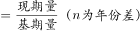，则有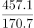。

若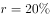，则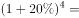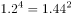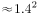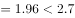。

若，则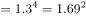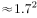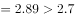。

因此可得：，结合选项只有B项满足。

故正确答案为B。

---

#### 第 7 题　qid 2395231 · 数学运算

如每块银幕每天平均上映5场电影，则2016年平均每场电影观众人数约为：

- **A**. 12
- **B**. 18　✅
- **C**. 27
- **D**. 41

**答案**：B

**官方解析**

由题干“2016年平均每场电影观众人数约为”，结合表格数据有2016年，可判定本题为现期平均数问题。平均每场电影观众人数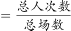，定位表格材料，2016年观众观影人次数为13.7亿，影院屏幕数为41179块，结合题干条件每块银幕每天平均上映5场电影，则全年的总场数为亿场，代入公式平均每场电影观众人数人，与B项最接近。

故正确答案为B。

---

#### 第 8 题　qid 2395232 · 数学运算

2016年我国平均电影票价比上一年约：

- **A**. 提高了2.9元
- **B**. 提高了1.6元
- **C**. 下降了1.6元　✅
- **D**. 下降了2.9元

**答案**：C

**官方解析**

根据题干“2016年我国平均电影票价比上一年约”，结合选项为提高/下降单位，可判定本题为平均数的增长量问题。定位表格材料可得：2016年总票房为457.1亿元，观影人次为13.7亿人次；2015年总票房为440.7亿元，观影人次为12.6亿人次。故所求2016年平均电影票价2015年平均电影票价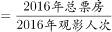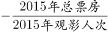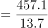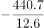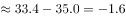，即下降了1.6元。

故正确答案为C。

---

#### 第 9 题　qid 2395233 · 数学运算

2013-2016年，我国平均每家影院拥有的银幕数最少的是：

- **A**. 2013年　✅
- **B**. 2014年
- **C**. 2015年
- **D**. 2016年

**答案**：A

**官方解析**

根据“······平均每家影院拥有的银幕数最少”，可判定本题为现期平均数问题。定位表格第五、六行，结合公式：平均每家影院拥有的银幕数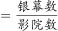，则选项年份所求平均数如下：

2013年：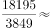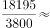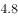块/家；

2014年：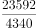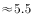块/家；

2015年：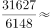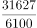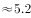块/家；

2016年：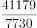块/家。

则2013年我国平均每家影院拥有的银幕数最少。

故正确答案为A。

---

#### 第 10 题　qid 2395234 · 数学运算

下列选项中，与资料不符的是：

- **A**. 2012-2014年农村院线票房占全国票房的比重逐年降低
- **B**. 2016年电影观影人次较2013年增加了一倍以上
- **C**. 2015年我国影院银幕数同比增量高于2014年水平
- **D**. 2016年我国平均每家影院的观影人次同比上升　✅

**答案**：D

**官方解析**

A项：定位表格第二、三行，农村院线票房占全国票房的比重。2012-2014年农村院线票房所占比重分别为：2012年：；2013年：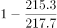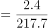；2014年：，比重逐年降低，正确；

B项：定位表格第四行，2016年观影人次为13.7亿，2013年观影人次为6.2亿。2016年观影人次比2013年增加的倍数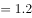，即增加了一倍多，正确；

C项：定位表格第六行，，则2015年我国影院银幕数同比增量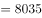块；2014年同比增量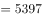块，2015年的同比增量高于2014年，正确；

D项：定位表格第四、五行，平均每家影院的观影人次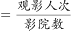，则2016年平均每家影院的观影人次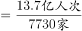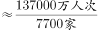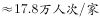；2015年平均每家影院的观影人次，2016年我国平均每家影院的观影人次同比下降，错误。

本题为选非题，故正确答案为D。

---

### 材料 3

        2017年8月，国内汽车产销分别完成209.3万辆和218.6万辆，产销量分别比上月增长和，同比分别增长和。当月新能源汽车产销分别完成7.2万辆和6.8万辆，同比分别增长和。

#### 第 11 题　qid 2395235 · 数学运算

2017年8月国内生产的汽车中，有（    ）是新能源汽车。

- **A**. 
不到

- **B**. 

　✅
- **C**. 

- **D**. 
超过

**答案**：B

**官方解析**

根据“2017年8月国内生产的汽车中，有（  ）是新能源汽车”，结合选项为百分数，且材料时间为2017年8月，判断本题为现期比重问题。定位文字资料，2017年8月，国内汽车产量为209.3万辆，当月新能源汽车产量为7.2万辆，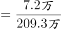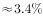，在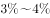之间。

故正确答案为B。

---

#### 第 12 题　qid 2395236 · 数学运算

2017年7月国内汽车销量比2016年8月约：

- **A**. 
低
　✅
- **B**. 
低

- **C**. 
高

- **D**. 
高

**答案**：A

**官方解析**

由题干“2017年7月······比2016年8月”且选项为百分数，可判定本题为一般增长率问题。定位文字材料可知，国内汽车销量为218.6万辆，比上月增长，同比增长。所以2017年7月国内汽车销量为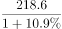万辆，2016年8月国内汽车销量为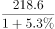万辆。根据公式，2017年7月国内汽车销量比2016年8月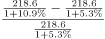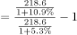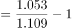，即低。

故正确答案为A。

---

#### 第 13 题　qid 2395238 · 数学运算

如按照公式“”计算，则2017年8月月末国内新能源汽车库存量比上年12月月末增加了（    ）万辆。

- **A**. 1.0
- **B**. 1.5
- **C**. 2.0
- **D**. 2.5　✅

**答案**：D

**官方解析**

根据题干“2017年8月······比上年12月······增加了（    ）万辆。”，可判定本题为增长量计算问题。定位图形材料第二行、第三行数据，根据公式：“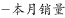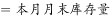”可得：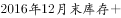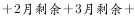，则2017年8月末库存比2016年12月末增加的就是1-8月产销量之差的和，所求数值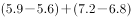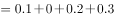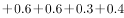万辆，D项当选。

故正确答案为D。

---

#### 第 14 题　qid 2395223 · 数学运算

根据图中数字规律，问号处应填：

- **A**. 6
- **B**. 8
- **C**. 10　✅
- **D**. 12

**答案**：C

**官方解析**

观察数列，第一列和第三列均偏大，第二列略小，即考虑第一列数和第三列数作差后与第二列数的关系。第一行：；第三行：。所以每行规律为：，故，解得。

故正确答案为C。

---

#### 第 15 题　qid 2395224 · 数学运算

，，，，，（    ）

- **A**. 

- **B**. 

- **C**. 

　✅
- **D**. 

**答案**：C

**官方解析**

数列全为分数，判定为分数数列。观察分子分母，增减规律不统一，考虑反约分。将原数列转化为：，，，，，（    ）。分子为：2，4，6，8，10，（    ），是公差为2的等差数列，即所求项分子为；分母为：5，21，45，77，117，（    ），无明显特征，作差后新数列为：16，24，32，40，（    ），是公差为8的等差数列，新数列所求项，推出分母原数列所求项。故原数列所求项为。

故正确答案为C。

---

#### 第 16 题　qid 2137342 · 数学运算

根据下图数字之间的规律，问号处应填<u>        </u>。

- **A**. 22
- **B**. 41
- **C**. 61　✅
- **D**. 71

**答案**：C

**官方解析**

题干出现图形，凑大数。数字差距较大，考虑乘积。由已知4=1×2+2，9=2×3+3，19=3×5+4，33=4×7+5，可推出所求项？=5×11+6=61。
故正确答案为C。

---

#### 第 17 题　qid 2137372 · 数学运算

按此规律，第7行的数字和为<u>        </u>。

- **A**. 155
- **B**. 165
- **C**. 175　✅
- **D**. 185

**答案**：C

**官方解析**

方法一：观察图形可以看出，第1、3、5行的数字分别是（1），（3，5，7），（9，11，13，15，17），正好是奇数数列的连续项且分别有1、3、5个数。按此规律，第7行的数字应为19开头的7个连续奇数，即19、21、23、25、27、29、31这7个数字，它们的数字和为19+21+23+25+27+29+31=175。
方法二：观察图形可看出，第n行有n个数，且这些数构成等差数列。所以第7行的7个数构成等差数列，其和为7的倍数，选项中只有175满足7的倍数。
故正确答案为C。

---

#### 第 18 题　qid 2137396 · 数学运算

-1，1，0，2，4，12，

- **A**. 30
- **B**. 31
- **C**. 32　✅
- **D**. 33

**答案**：C

**官方解析**

数列变化明显，作差无规律，考虑递推。第三项=（第一项+第二项）×2，则所求项应为（4+12）×2=32。
故正确答案为C。

---

#### 第 19 题　qid 2395225 · 数学运算

老李每天早晨9点准时出门散步锻炼身体。他以3千米每小时的速度步行6千米，其中每走20分钟休息5分钟。那么老李锻炼到（    ）回家。

- **A**. 11点20分
- **B**. 11点25分　✅
- **C**. 11点30分
- **D**. 11点45分

**答案**：B

**官方解析**

已知老李速度为3千米每小时，20分钟=小时，即每走20分钟走1千米路。根据“每走20分钟休息5分钟”，可得老李每走1千米，加上休息共需要25分钟。

路程全长6千米，老李前5千米每走1千米需要休息一次，最后1千米直接走到终点，不需要休息。故所需时间为，所以老李早上出发，到家。

故正确答案为B。

---

#### 第 20 题　qid 2137278 · 数学运算

某马路宽8米，为方便行人过马路，要刷一条4米宽的人行横道线。已知横道线每间隔45厘米刷一条宽也为45厘米的白线，白漆每升可以刷6平方米，则刷这条横道线至少需要      桶一升装的白漆。

- **A**. 2
- **B**. 3　✅
- **C**. 4
- **D**. 5

**答案**：B

**官方解析**

每隔45厘米刷一条宽为45厘米的白线，可知周期为45+45=90厘米。马路宽8米=800厘米，800÷90=8······80。为保证白漆最少，则剩余80厘米应先间隔45厘米再刷80-45=35厘米的白线。此时刷白漆的总面积为0.45×4×8+0.35×4=15.8平方米。白漆每升刷6平方米，则需要一升装白漆的桶数为桶，不少于2.63桶，即至少3桶。

故正确答案为B。

---

#### 第 21 题　qid 2137290 · 数学运算

根据预报，洪水将于2小时后袭击村庄。现武警调用2辆卡车帮助村民转移到高地，第一次转移后发现从村庄到高地需要30分钟，回程需要10分钟，2辆卡车需要再走4个来回才能转移完毕，则必须至少再调用      辆卡车才能在洪水到达前将村民全部转移。

- **A**. 1
- **B**. 2　✅
- **C**. 3
- **D**. 4

**答案**：B

**官方解析**

总时间为，一个来回所需时间为分钟，所以还剩余分钟来转移村民。

从村庄到高地，每辆卡车运两趟最少需要，因此剩余时间最多可让每辆卡车运两趟。剩下的村民需要2辆卡车运四趟，则需要4辆卡车运两趟，即在原来的基础上再增加辆。

故正确答案为B。

---

#### 第 22 题　qid 2395227 · 数学运算

如右图所示，向高度为H的水瓶中注水，注满为止，下列反映注水量V与水深h的函数关系正确的是：

- **A**. A
- **B**. B
- **C**. C
- **D**. D　✅

**答案**：D

**官方解析**

根据题目所示容器，从底部到顶部，截面积由大变小再到大，则随着水面高度均匀增加时，单位时间内注水量应由多变少再变多，即对应V-h的函数图形中部应较为平缓，D项满足。
故正确答案为D。

---

#### 第 23 题　qid 2395228 · 数学运算

航空公司规定旅客免费携带行李箱的长、宽、高之和不超过115厘米，某厂家生产符合该规定的行李箱，已知行李箱的高为20厘米，长与宽之比为，则该行李箱长度的最大值是（    ）厘米。

- **A**. 50
- **B**. 55　✅
- **C**. 60
- **D**. 65

**答案**：B

**官方解析**

根据题意，假设该行李箱长度为，宽度为，则，厘米，长度的最大值为厘米。

故正确答案为B。

---

#### 第 24 题　qid 2395229 · 数学运算

某品牌家用血糖仪说明书上表示，该血糖仪测量误差在以内属于正常情况。老王用该血糖仪测空腹血糖为5.2，但是医院测量数据为4.5，假设该血糖仪的误差一直保持同一数值，那么老王用该血糖仪测餐后血糖为8.7，则其实际餐后血糖最接近：

- **A**. 7.2
- **B**. 7.5　✅
- **C**. 7.8
- **D**. 8.0

**答案**：B

**官方解析**

根据题意，血糖仪的误差值保持不变，则每次血糖仪测量值与实际值之比保持不变。假设实际餐后血糖为，则，，B项满足。

故正确答案为B。

---

#### 第 25 题　qid 2137298 · 数学运算

游乐园的摩天轮有60个舱，20分钟转一圈，小王进了摩天轮舱之后5分钟，小李也进了摩天轮舱，则再经过      分钟，小王和小李到达同一高度。

- **A**. 2.5
- **B**. 7.5　✅
- **C**. 12.5
- **D**. 17.5

**答案**：B

**官方解析**

60个舱，20分钟转一圈，则每分钟转个舱。小李在小王5分钟之后进去，则两者相差个舱。当两人等距分布在最高点的两侧，即两人都离最高点7.5个舱位时，小王和小李在同一高度。最高点离小李进去的点有个舱位，因此需要再转个舱，则时间为分钟。

故正确答案为B。

---

#### 第 26 题　qid 2137260 · 数学运算

6支队伍进行单循环的足球比赛，比赛结束后，战绩如下：

则F队的战绩为<u>      </u>。

- **A**. 0胜5负
- **B**. 1胜4负　✅
- **C**. 2胜3负
- **D**. 3胜2负

**答案**：B

**官方解析**

题干为单循环赛问题，单循环赛每两个队之间比赛一场，一共15场比赛，每场比赛有一方胜利，则一共有15个胜场。

可得，，即F队一共胜了1场。 

同理，15场比赛有15个负场。

可得，，即F队一共负了4场。

综上，F队一共胜了1场，负了4场。

故正确答案为B。

---

#### 第 27 题　qid 2137310 · 数学运算

某建筑工程队工人要用铁丝捆扎塑料管，有四种规格的铁丝可供使用。1.6米长的能捆10根，1.2米长的能捆8根，0.8米长的能捆6根，0.4米长的能捆4根。要捆扎好24根塑料管，工人至少要使用      米铁丝。

- **A**. 2.0
- **B**. 2.4　✅
- **C**. 2.8
- **D**. 3.2

**答案**：B

**官方解析**

要使用的铁丝少，对比四种规格铁丝的单位成本，即每捆一根塑料管需要的铁丝长度。

1.6米长的能捆10根，则捆一根塑料管需要米铁丝；

1.2米长的能捆8根，则捆一根塑料管需要米铁丝；

0.8米长的能捆6根，则捆一根塑料管需要米铁丝；

0.4米的能捆4根，则捆一根塑料管需要米铁丝。

规格为0.4米的铁丝最优，所以优先选择它来捆绑塑料管，0.4米能捆4根，则捆24根需要2.4米。

故正确答案为B。

---

#### 第 28 题　qid 2137272 · 数学运算

大小两个玻璃瓶装着芝麻，如果将小瓶子里的芝麻全部倒入大瓶子，大瓶子还可以装45克；如果将大瓶子里的芝麻倒入小瓶子，大瓶子里还剩下455克。已知大瓶子的容积是小瓶子的2倍，则大瓶子最多可装芝麻      克。

- **A**. 1000　✅
- **B**. 850
- **C**. 750
- **D**. 500

**答案**：A

**官方解析**

根据题干条件可得，大瓶子的容积是小瓶子的2倍，设小瓶子最多装克芝麻，则大瓶子最多装克芝麻。

第一次芝麻全部倒入大瓶子，大瓶子还可以装45克，可得：

第二次芝麻全部倒入小瓶子，大瓶子还剩下455克，可得：

综上可得： 

，则大瓶子最多装克

故正确答案为A。

---

## 判断推理

### 第 1 题　qid 2395202 · 类比推理

左下图是某人站在力传感器上做下蹲、起跳动作的示意图，点P是他的重心位置。右下图是根据力传感器采集到的数据做出的力-时间图像。两图中各点均对应，其中有几个点在左下图中没有画出。重力加速度取。

根据图像分析可知：

- **A**. 此人受到的重力为750N
- **B**. b点是此人下蹲至最低点的位置
- **C**. 此人在c点的速度最大
- **D**. 此人在d点的加速度最大　✅

**答案**：D

**官方解析**

人站在力传感器上做下蹲、起跳动作，一开始在a点处于静止状态，此时人对传感器压力F大小等于人所受重力G，故此人所受重力，A项错误；

在下蹲过程中，从a到b点，人对传感器压力F小于人所受重力G，故传感器对人的支持力N小于人所受重力G，人向下加速下蹲，由于b点后一小段部分支持力N仍小于人所受重力G，因而继续加速下蹲，故b点不是下蹲至最低点的位置，B项错误；

在c点前后附近，支持力N大于人所受重力G，故此时人具有向上的加速度，与下蹲方向相反，因而减速下蹲，c点前后速度逐渐减少，C项错误；

，在d点时，最大，此时加速度a也最大，D项正确。

故正确答案为D。

---

### 第 2 题　qid 2395203 · 逻辑判断

如图所示，小董在一口与地面垂直的竖井旁边装了一只探照灯，灯光照射的方向与水平的夹角为，为了使灯光垂直照射向竖井的底部，小董在井上方又放置了一块镜子，那么，该镜子的反射面与水平面的夹角为：

- **A**. 

- **B**. 

- **C**. 

- **D**. 

　✅

**答案**：D

**官方解析**

如图所示，画出竖直的反射光线，根据光的反射定律，入射角和反射角相等，法线（虚线）和镜子垂直，则镜面与水平方向成，

故正确答案为D。

---

### 第 3 题　qid 2395204 · 逻辑判断

下列A、B、C、D四个模拟电路中，电键闭合与否和灯泡亮暗对应关系表述错误的是：

- **A**. A图中即使电键都不闭合，灯泡也会亮
- **B**. B图中只要有一个电键闭合，灯泡就不会亮
- **C**. C图中只有当所有电键都闭合，灯泡才不会亮
- **D**. D图中只有所有电键都闭合，灯泡才会亮　✅

**答案**：D

**官方解析**

A图，即使电键都不闭合，灯泡依然与电阻、电源连接形成闭合回路，灯泡会亮，A项正确；
B图，只要有一个电键闭合，灯泡即被短路，此时无电流通过灯泡，灯泡不亮，B项正确；
C图，只有所有电键都闭合，灯泡才会被短路，此时无电流通过灯泡，灯泡不亮，若有一个电键不闭合，则电路中无短路部分，灯泡依然正常发亮，C项正确；
D图，所有开关均闭合也无法形成短路。灯泡与电源均连接在闭合回路中，灯泡均发亮，D项错误。
本题为选非题，故正确答案为D。

---

### 第 4 题　qid 2137374 · 逻辑判断

如图所示，木板AB放置在水平地面上，一铅块位于木块上，抓住木板A点，使其以B点为支点向上抬起直至与地面垂直，那么铅块所受的摩擦力f的变化情况为<u>      </u>。

- **A**. 铅块滑动前后，f均随木板倾角的增大而减小
- **B**. 铅块滑动前，f随木板倾角的增大而减小；铅块滑动后，f随木板倾角的增大而增大
- **C**. 铅块滑动前，f随木板倾角的增大而增大；铅块滑动后，f随木板倾角的增大而减小　✅
- **D**. 铅块滑动前后，f均随木板倾角的增大而增大

**答案**：C

**官方解析**

当木板在水平地面时，没有摩擦力；

随着木板抬起至铅块滑动前，铅块受的是静摩擦力。如图所示，根据受力分析可知，静摩擦力。随着木板抬起，木块倾角变大，变大，则静摩擦力f变大，据此可以排除A、B两项；

铅块开始滑动后，所受摩擦力变为动摩擦力，动摩擦力。随着木块倾角α变大，变小，则动摩擦力变小，直至与地面垂直时，动摩擦力变为0，据此可排除D项，C项正确。

故正确答案为C。

---

### 第 5 题　qid 2395205 · 逻辑判断

一辆列车从长沙开往天津，当列车经过弯道时做匀速圆周运动，假设铁路的内轨和外轨高度一样，那么下列说法正确的是：

- **A**. 列车通过弯道向心力的来源是外轨的水平弹力，所以外轨容易磨损　✅
- **B**. 列车通过弯道向心力的来源是外轨的水平弹力，所以内轨容易磨损
- **C**. 列车通过弯道向心力的来源是列车的重力，所以内外轨道均不磨损
- **D**. 列车通过弯道向心力的来源是列车的重力，所以内外轨道均磨损，且磨损程度一致

**答案**：A

**官方解析**

列车在经过弯道时，做匀速圆周运动，此时水平方向受到的合力提供向心力，由于内轨和外轨高度一样，向心力只有可能来自外轨指向圆心的水平弹力，因而外轨容易磨损。
故正确答案为A。

---

### 第 6 题　qid 2137406 · 类比推理

如图所示，在水平台面上放置有一光滑斜面，倾角为α，在斜面上某处放了一根垂直于纸面的直导线，在导线中通有垂直纸面向里的电流，图中a点在导线正下方，b点与导线的连线与斜面垂直，c点在a点左侧，d点在b点右侧。现欲使导线静止在斜面上，下列措施可行的是<u>      </u>。

- **A**. 在a处放置一电流方向垂直纸面向里的直导线
- **B**. 在b处放置一电流方向垂直纸面向里的直导线
- **C**. 在c处放置一电流方向垂直纸面向里的直导线
- **D**. 在d处放置一电流方向垂直纸面向里的直导线　✅

**答案**：D

**官方解析**

根据右手定则和左手定则，在a、b、c、d四处放置电流方向垂直纸面向里的直导线，两根导线会在电流产生的磁场影响下，相互吸引。

若在a、b、c处放置导线，则斜面上导线在斜面方向不受向上的力，不可能静止，故ABC三项错误；

若在d处放置导线，则斜面上导线受磁场对导线向d的力，存在斜面方向向上的分力，可能静止，D项正确。

故正确答案为D。

---

### 第 7 题　qid 2137398 · 逻辑判断

毕业季来临之际，摄影师用单反相机给某毕业班的同学们拍完合照，随后要用同一台相机给每个学生拍单人照片，那么这时他应该      。

- **A**. 把相机离人近一些，同时镜头后缩
- **B**. 把相机离人近一些，同时镜头前伸　✅
- **C**. 把相机离人远一些，同时镜头后缩
- **D**. 把相机离人远一些，同时镜头前伸

**答案**：B

**官方解析**

本题考查光学相关知识。

从班级合照转向单人照，则拍照视野由大变小，根据常识，相机要离人近一些，排除C、D两项。同时对于镜头而言，照单人照，则使人在底片中尽量大，如图所示，应该是镜头前伸，A项排除，B项当选。

故本题答案为B。

---

### 第 8 题　qid 2137382 · 逻辑判断

蜻蜓点水后在平静的水面上会出现波纹。下面四张图是蜻蜓点水时的俯视照片，照片反映了蜻蜓连续三次点水后某瞬间的水面波纹。不考虑蜻蜓每次点水所用的时间，则下列描述与对应图片相符的是<u>       </u>。

- **A**. A图中蜻蜓向右飞行，且飞行速度和水波的传播速度相等　✅
- **B**. B图中蜻蜓向右飞行，且飞行速度比水波的传播速度慢
- **C**. C图中蜻蜓向左飞行，且飞行速度和水波的传播速度相等
- **D**. D图中蜻蜓向左飞行，且飞行速度比水波的传播速度快

**答案**：A

**官方解析**

水波在水面传播速度相等，所以水波圆圈越小，代表水波产生越晚。观察 ABD三项，水波自左向右大小依次变小，说明水波自左到右依次产生，蜻蜓应向右飞，而C项水波圆心在同一点，说明蜻蜓原地点水。故排除C、D两项。
若蜻蜓飞行速度和水波传播速度相等，则新点水时，刚好在旧水波圆圈上点水。随后扩散时，新产生的水波圆圈应与旧水波圆圈相切，A项正确。
若蜻蜓飞行速度比水波传播速度慢，则新点水时，在旧水波圆圈内点水。随后扩散时，新产生的水波圆圈应与旧水波圆圈无交点，B项错误。
故正确答案为A。

---

### 第 9 题　qid 2137394 · 类比推理

如图所示，一皮球从粗糙的曲线形坡面的a点开始无初速度地向下滚动，由于摩擦力作用，皮球滚到b点后开始折返到c点，已知a、b两点的高差为h1，b、c两点的高差为h2，那么<u>      </u>。

- **A**. h1=h2
- **B**. h1＜h2
- **C**. h1＞h2　✅
- **D**. h1、h2大小关系不确定

**答案**：C

**官方解析**

根据题干描述的运动过程，可将本题分成两个过程，两个过程遵循能量守恒定律。

过程一，从a点开始，到b点结束，为a、b高度差。

皮球在a点的所有能量是它的重力势能（）

=mg①

运动到b点的所有能量是它的重力势能（）

=mg②

因为&gt;，所以mg&gt;mg，&gt;，所以从a到b能量减少，减少的能量即为皮球从a运动到b摩擦力所做的功（），所以

=mg-mg=mg（-）③

过程二，从b点开始，到c点结束，为b、c高度差。

同理，如过程一，皮球从b点到c点能量减少，减少的能量即为皮球从b运动到c摩擦力所做的功，所以

④

故，比较和大小，即可理解为比较③和④的大小，此处可简单理解为：因为过程一比过程二多走了ac这段路，所以过程一摩擦力所做的功比较大，所以

⑤

将③④代入⑤可得：

mg&gt;mg，&gt;，C项正确。

故正确答案为C。

---

### 第 10 题　qid 2137392 · 类比推理

某司机驾车在如下图所示的路面上前行，已知AB段为下凹路段，BC段是上凸路段，当汽车依次经过M、N、O、P（M为最低点，P为最高点）四点时对路面的压力分别为FM、FN、FO、FP，汽车重力为G，前进过程中速率保持不变，那么下列关系式一定成立的是<u>       </u>。

- **A**. FM≥G
- **B**. FN＞G
- **C**. FO＜G　✅
- **D**. FP＞G

**答案**：C

**官方解析**

本题考查向心力的相关知识

本题小车在弧形路面行走，故在受力分析时一定要考虑指向圆心的向心力。

A项，如果车在M点，则车受向下的重力以及向上的支持力，两者合力提供向心力。由于小车速率保持不变的运动，向心力不为0，则支持力FM必须大于重力从而提供向心力，即FM＞G，取不到相等的情况，错误。

B项，在N点，汽车受重力，斜向上指向圆心的支持力FN，将重力分解，沿着支持力反方向Gsinθ和与之垂直的斜向下方向Gcosθ（由于汽车匀速，Gcosθ与摩擦力平衡在此不作考虑）。FN与Gsinθ的合力提供向心力，FN＞Gsinθ，但由于向心力未知，FN与G的大小关系未知，错误。

C项，同理，汽车在O点时，重力分力Gsinθ与FO提供向心力，此情况圆心在斜面下方，故Gsinθ＞FO，则G＞FO，正确。

D项，汽车在P点，由重力G和支持力FP提供向心力，则G＞FP，错误。

故正确答案为C。

备注：各选项的受力分析图如图所示：

---

### 第 11 题　qid 2137182 · 逻辑判断

水平台面上放置一装有某种液体的容器，将A、B、C三个重量一样的块体放入容器中，当该三个块体稳定后，发现A漂浮在液面上，B悬浮在液体中，而C则沉到容器底部，那么下列说法中正确的是      。

- **A**. 
如果三个块体都是空心的，则它们的体积可能相等

- **B**. 
如果三个块体的材料相同，则A、B一定是空心的
　✅
- **C**. 
如果三个块体都是空心的，则它们所受浮力的大小关系为

- **D**. 
如果三个块体都是实心的，则它们密度的大小关系为

**答案**：B

**官方解析**

逐项分析：

A、C两项：A、B、C三个块体重量一样，即，根据A、B、C三个块体稳定后分别处于漂浮、悬浮、沉底状态可知，、、；故。若三个块体的体积相同，则根据浮力公式可知，三个块体的浮力大小关系为，与题干相矛盾，则三个块体的体积不可能相等，均错误；

B项：三个块体材料相同，而C是沉到容器底部的，说明其平均密度大于液体密度，而A是漂浮，则说明A的平均密度小于液体密度，B物体悬浮，则说明B的平均密度等于液体密度。由此可知A、B物体的平均密度小于C物体，材料相同、重量相同的情况下，A、B一定是空心的，正确；

D项：都是实心的情况下，根据沉浮状态可以判定，错误。

故正确答案为B。

---

### 第 12 题　qid 2395206 · 图形推理

左边给定的是正方体的外表面展开图，下面哪一项不能由它折叠而成？

- **A**. A
- **B**. B　✅
- **C**. C
- **D**. D

**答案**：B

**官方解析**

题干中看上去是由5个正方形的面和2个长方形的面构成，其实整个图形的最左侧的灰色面与最右侧的灰色面在折合之后是相邻的，正好组成了一个灰色的正方形。

对题干中六个面进行标号，见下图：

B项的三个面都是灰色的，也就是说这三个面分别为①、②和③，而①、②是相对面，不可能同时被看到，因此可知B项一定不是左侧展开图的折合图。

本题为选非题，故正确答案为B。

---

### 第 13 题　qid 2395207 · 图形推理

从所给的四个选项中，选择最合适的一个填入问号处，使之呈现一定的规律性。

- **A**. A
- **B**. B
- **C**. C　✅
- **D**. D

**答案**：C

**官方解析**

元素组成相似，且相同线条重复出现，优先考虑样式规律中的加减同异。题干已知了两组图，问号设在了第三组图的最后一个位置，可知通过第一组图找规律，第二组图验证规律，第三组图应用规律。通过观察第一组图形可知，前两个图形的线条相加后得到第三个图形，第二组图也符合这个规律，因此应用至第三组图，只有C项符合。
故正确答案为C。

---

### 第 14 题　qid 2395208 · 图形推理

从所给的四个选项中，选择最合适的一个填入问号处，使之呈现一定的规律性。

- **A**. A
- **B**. B
- **C**. C
- **D**. D　✅

**答案**：D

**官方解析**

元素组成相似，且每个图都由黑色区域和白色区域构成，黑色数量不同，优先考虑黑白运算。通过第一组图可以得知：、、、，将此规律运用于第二组，只有D项符合。

故正确答案为D。

---

### 第 15 题　qid 2395209 · 图形推理

从所给的四个选项中，选择最合适的一个填入问号处，使之呈现一定的规律性。

- **A**. A
- **B**. B
- **C**. C　✅
- **D**. D

**答案**：C

**官方解析**

元素组成不同，优先考虑属性规律。观察发现，题干图形均为轴对称图形，并且每幅图的对称轴画出来发现，对称轴每次顺时针旋转，排除D、B两项。题干中每幅图形内部都只由一种小元素构成，A项内部由两种小元素构成，C项内部由一种小元素构成，排除A项。

故正确答案为C。

---

### 第 16 题　qid 2395210 · 图形推理

从所给的四个选项中，选择最合适的一个填入问号处，使之呈现一定的规律性。

- **A**. A
- **B**. B
- **C**. C　✅
- **D**. D

**答案**：C

**官方解析**

本题为金字塔类题目，自下向上找规律，即下层相邻的两幅图之间进行运算得到上面的一幅图。

每幅图都由横向的三个区域构成，每个区域存在三种可能性：×、和。通过对应区域的运算可知：×+=，+=×，+=，+=×，+×=，+×=，+=。将从上往下数第二行两幅图形对应区域进行运算，最左侧区域：+=×，排除A、B两项；中间区域：+=，排除D项。

故正确答案为C。

---

### 第 17 题　qid 2395211 · 图形推理

从所给的四个选项中，选择最合适的一个填入问号处，使之呈现一定的规律性。

- **A**. A
- **B**. B　✅
- **C**. C
- **D**. D

**答案**：B

**官方解析**

第一组图，每个图都有1个白色图形，1个黑三角，并且二者在不同区域中。不同的是正方形所划分出来的区域为4、3、2，逐步减少。第二组图应用规律，第一个图划分了6个区域、第二个图划分了5个区域、第三个图应该划分为4个区域，只有B项符合。
故正确答案为B。

---

### 第 18 题　qid 2395212 · 图形推理

从所给的四个选项中，选择最合适的一个填入问号处，使之呈现一定的规律性。

- **A**. A
- **B**. B
- **C**. C
- **D**. D　✅

**答案**：D

**官方解析**

元素组成相似，且相同线条重复出现，考虑样式规律中的加减同异。第一组的第2个图顺时针旋转后与第1个图形求异运算得到第3个图形。第二组图应用规律，只有D项符合。

故正确答案为D。

---

### 第 19 题　qid 2395213 · 图形推理

从所给的四个选项中，选择最合适的一个填入问号处，使之呈现一定的规律性。

- **A**. A
- **B**. B
- **C**. C　✅
- **D**. D

**答案**：C

**官方解析**

元素组成不同，优先考虑属性规律，观察发现，题干出现等腰三角形及其变形，优先考虑对称性。图一一条对称轴，图二两条对称轴，图三三条对称轴，故？处应选择一个四条对称轴的图形，只有C项符合。
故正确答案为C。

---

### 第 20 题　qid 2395214 · 图形推理

从所给的四个选项中，选择最合适的一个填入问号处，使之呈现一定的规律性。

- **A**. A
- **B**. B
- **C**. C
- **D**. D　✅

**答案**：D

**官方解析**

元素组成相同，优先考虑位置规律，观察发现，后一幅图在前一幅图的基础上逆时针旋转90度，故？处应该选择将图一逆时针旋转90度得到的图形，只有D项符合。
故正确答案为D。

---

### 第 21 题　qid 2395215 · 图形推理

从所给的四个选项中，选择最合适的一个填入问号处，使之呈现一定的规律性。

- **A**. A
- **B**. B　✅
- **C**. C
- **D**. D

**答案**：B

**官方解析**

观察第一组图形发现，图1到图2，正方形以左下角为基点缩小，三角形不变；图2到图3，正方形以左下角为基点继续缩小，三角形不变。第二组也应遵循此规律，从图1到图2外框正方形以左下角为基点缩小，中间的正方形不变；从图2到？处，左边的正方形继续以左下角为基点缩小，中间的正方形不变，只有B项符合。
故正确答案为B。

---

### 第 22 题　qid 2395216 · 图形推理

如图所示，由图1折叠成图2，再折叠成图3，然后剪去图4的阴影三角部分，现将其完全展开后得到的图形是：

- **A**. A
- **B**. B
- **C**. C
- **D**. D　✅

**答案**：D

**官方解析**

观察题干发现，从图1到图3折叠两次，且剪去一三角形得到图4，现想知将其完全展开后的图形形状，只需将折叠部分依次展开即可，如下图所示：

故正确答案为D。

---

### 第 23 题　qid 2395217 · 图形推理

从所给的四个选项中，选择最合适的一个填入问号处，使之呈现一定的规律性。

- **A**. A
- **B**. B
- **C**. C
- **D**. D　✅

**答案**：D

**官方解析**

元素组成不同，且无明显属性规律，考虑数量规律。观察发现，图三在图一的基础上增加了一个小箭头，减少了一个小黑点，图四在图二的基础上增加了一个小箭头，减少了一个小黑点，因此？应在图三的基础上增加一个小箭头，减少一个小黑点，只有D项符合。
故正确答案为D。

---

### 第 24 题　qid 2137242 · 逻辑判断

领导干部如果没有底线思维，就不能做到严格自律。而只有不忘初心，才能始终保持底线思维。也只有始终坚守理想信念，才能不忘初心。
根据以上信息，可以得出下列      项。

- **A**. 如果领导干部不能做到严格自律，就会丧失底线思维
- **B**. 领导干部只有不忘初心，才能做到严格自律　✅
- **C**. 领导干部只要始终坚守理想信念，就能做到严格自律
- **D**. 领导干部只要不忘初心，就可以做到严格自律

**答案**：B

**官方解析**

第一步：翻译题干。
①领导干部没有底线思维→不能严格自律
②保持底线思维→不忘初心
③不忘初心→坚守理想信念
将①逆否和②③可以递推出：严格自律→底线思维→不忘初心→坚守理想信念
第二步：逐一分析选项。
A项翻译：领导干部不能严格自律→丧失底线思维，肯定条件①的后件无法得到肯定性结论，排除；
B项翻译：严格自律→不忘初心，通过将①逆否和②③可以递推出，当选；
C项翻译：坚守理想信念→严格自律，通过将①逆否和②③可以递推出严格自律→坚守理想信念，肯定后件无法得出肯定性结论，排除；
D项翻译：不忘初心→严格自律，通过将①逆否和②③可以递推出严格自律→不忘初心，肯定后件无法得出肯定性结论，排除。
故正确答案为B。

---

### 第 25 题　qid 2395218 · 类比推理

近两年，长江刀鱼的市场售价出现了明显回升。这是因为近两年刀鱼捕捞量只有二三十年前的几十分之一，和五年前相比也有不小的差距。
以上表述是以下列（    ）项为前提假设的。

- **A**. 每年三月下旬是刀鱼价格的巅峰期
- **B**. 刀鱼有“长江第一鲜”的美誉
- **C**. 长江刀鱼的捕捞作业受潮汛影响较大
- **D**. 刀鱼的人工养殖难题依然没有解决　✅

**答案**：D

**官方解析**

第一步：找出论点和论据。
论点：近两年，长江刀鱼的市场售价出现了明显回升。
论据：近两年刀鱼捕捞量只有二三十年前的几十分之一，和五年前相比也有不小的差距。
论点讨论的是长江刀鱼与售价的关系，论据讨论的是长江刀鱼与捕捞量之间的关系，论点论据话题不一致，提问又是“前提假设”，优先考虑搭桥，其次考虑必要条件。
第二步：逐一分析选项。
A项：每年三月下旬是否是刀鱼价格的巅峰期，与刀鱼近两年与之前的价格相比是否有明显回升无关，不是前提假设，排除；
B项：刀鱼有“长江第一鲜”的美誉，与刀鱼的价格无关，不是前提假设，排除；
C项：长江刀鱼的捕捞作业受潮汛影响较大，没说近两年潮汛情况，所以不确定捕捞作业受到什么样的影响，也未涉及刀鱼价格，不是前提假设，排除；
D项：如果刀鱼的人工养殖难题解决了，那么人工养殖的刀鱼就会进入市场，即使近两年捕捞量比之前少，也推不出价格就会回升，该项是论证成立的必要条件，是前提假设，当选。
故正确答案为D。

---

### 第 26 题　qid 2395219 · 逻辑判断

调查显示，因互联网金融模式的普适性和创新性，大众使用互联网金融理财业务的意愿率已超过。这意味着，手握大量闲置资金的人们不再将传统银行作为资金存储、增值的唯一去向，银行内大量的低成本资金由此发生大搬家，而这正是传统银行业面临挑战的重要原因。

以下选项如果为真，最能支持上文观点的是：

- **A**. 互联网金融的资金安全风险问题比传统银行业要突出
- **B**. 以往人们的闲置资金主要集中到了传统银行中　✅
- **C**. 除了传统银行和互联网金融，人们很难找到闲置资金存储、增值的其他去向
- **D**. 传统银行业的服务水平相对优于互联网金融

**答案**：B

**官方解析**

第一步：找出论点和论据。

论点：大众不再将传统银行作为闲置资金的唯一去向，资本大搬家，导致传统银行面临挑战。

论据：大众使用互联网金融理财业务的意愿率已超过。

第二步：逐一分析选项。

A项：该项指出互联网金融有安全问题，与是否导致了传统银行面临挑战无关，不能加强，排除；

B项：该项指出以往人们的闲置资金主要集中到了传统银行中，现在有集中到了互联网金融，说明闲置资金的确出现了搬家，确实会导致传统银行面临挑战，可以加强，当选；

C项：人们很难找到闲置资金存储、增值的其他去向，不代表钱主要存在了银行，除去还剩的大众是否把钱继续放在传统银行并不清楚，也就无法说明互联网金融导致了传统银行面临挑战，不能加强，排除；

D项：该项指出传统银行比互联网金融好的方面，与互联网金融是否导致了传统银行面临挑战无关，不能加强，排除。

故正确答案为B。

---

### 第 27 题　qid 2137308 · 逻辑判断

X市的有线电视付费频道的用户数量比Y市要多，因此X市的市民比Y市市民更加了解国际时事。
下列各项如果为真，除了      项外，都将削弱上述论证。

- **A**. X市有线电视付费频道的月租费要低于Y市的同类频道　✅
- **B**. 调查显示，X市市民平均看电视的时间要比Y市市民少
- **C**. X市有线电视付费频道播放的都是娱乐类节目
- **D**. 大多数Y市市民在X市工作，通常只是在周末才回到Y市

**答案**：A

**官方解析**

第一步：找出论点和论据。
论点：X市的市民比Y市市民更加了解国际时事。
论据：X市的有线电视付费频道的用户数量比Y市要多。
第二步：逐一分析选项。
A项，月租低一定程度上可以解释为什么X市有线电视付费频道的用户数量多，但是没有体现谁更了解国际时事，无关选项，无法削弱，本题为选非题，当选；
B项，X市市民平均看电视的时间少，说明虽然X市有线电视付费频道的用户数量多，但是不一定谁看的电视多，不一定谁更加了解国际时事，可以削弱，排除；
C项，X市有线电视付费频道播放的都是娱乐类节目，说明无法用有线电视付费频道的用户数量来判断谁更加了解国际时事，可以削弱，排除；
D项，大多数Y市市民在X市工作，在周末回到Y市，说明虽然X市的有线电视付费频道的用户数量多，但是也有可能是Y市的人在付费使用，所以无法得出X市的市民比Y市市民更加了解国际时事，可以削弱，排除。
本题为选非题，故正确答案为A。

---

### 第 28 题　qid 2137286 · 逻辑判断

一直以来，科学家都在追寻一个问题的答案，那就是：究竟是什么给了地球足够的氧气，使其能孕育出动物和人类。地球大气中出现氧气是在距今24亿年前。约4.7亿年前，苔藓类地被植物在地球上迅速蔓延，直到4亿年前，地球大气中氧气含量才达到今天的水平。因此，有科学家认为，地球氧气大增源自苔藓类地被植物。
下列      项如果为真，最能支持上述科学家的观点。

- **A**. 地球上最早出现的陆生植物出人意料地多产，它们大大提升了地球大气中的氧气含量
- **B**. 通过电脑模拟可以估算得出：在约4.45亿年前，地球上的地衣和苔藓所产生的氧气占总氧气量的30%
- **C**. 苔藓类地被植物的蔓延增加了沉积岩中的有机碳含量，而这导致空气中的氧气含量也随着增加　✅
- **D**. 氧气含量的增加使得地球上演化出包括人类在内的大型、可移动的智慧生物成为可能

**答案**：C

**官方解析**

第一步：找出论点和论据。
论点：地球氧气大增源自苔藓类地被植物。
论据：地球大气中出现氧气是在距今24亿年前。约4.7亿年前，苔藓类地被植物在地球上迅速蔓延，直到4亿年前，地球大气中氧气含量才达到今天的水平。
论点和论据都在讨论“地球氧气大增”和“苔藓类地被植物蔓延”之间的关系，论点和论据话题一致，加强优先考虑解释或举例。
第二步：逐一分析选项。
A项：说的是陆生植物导致大气中的氧气含量增加，苔藓类地被植物是陆生植物的一种，无法确定苔藓类植物是否与氧气含量大增有关，属于不明确选项，排除；
B项：在约4.45亿年前，地球上的地衣和苔藓所产生的氧气占总氧气量的30%，选项只是在说4.45亿年前的氧气含量占比，无法确定后来的氧气大增是否来源于苔藓植物，属于不明确选项，排除；
C项：说明苔藓类地被植物的蔓延增加了沉积岩中的有机碳含量，从而导致空气中的氧气含量也随着增加，是对论点的解释，当选；
D项：讨论的是氧气增加的结果，而题干讨论的是氧气增加的原因，两者讨论话题不一致，属于无关选项，排除。
故正确答案为C。

---

### 第 29 题　qid 2395220 · 逻辑判断

作为中国传统的经典艺术形式，书法相当独特。事实上，在现当代中国文化遭遇东西文化碰撞的情况下，涉及传统文化领域的表述面临两类尴尬：满足于传统的经验式表述，很难融入现当代语境，仿佛以文言文应对现代社会之沟通；借助西方美学、艺术理论解读传统书法，又近于隔靴搔痒，颇似传统心态解读西方文明，如同借助风水观审视修建铁路，铺设电网。 
如果上述言论为真，那么可以推出下列（    ）项。

- **A**. 传统经验式表述很难在现当代语境中广泛传播书法之美　✅
- **B**. 借助西方艺术理论无法解读书法
- **C**. 借助西方美学解读传统书法是用传统心态解读西方文明的表现
- **D**. 书法十分独特，因此其他传统文化领域的表述并没有遭遇和书法类似的尴尬

**答案**：A

**官方解析**

日常结论题，根据题干信息逐一分析选项。
A项：根据“涉及传统文化领域的表述面临两类尴尬：满足于传统的经验式表述，很难融入现当代语境，仿佛以文言文应对现代社会之沟通”，可以推出“传统经验式表述很难在现当代语境中广泛传播书法之美”，当选；
B项：题干只是说借助西方理论解读书法近于隔靴搔痒，也就是说很难解读，而不是无法解读，该项不能推出，排除；
C项：题干说的是借助西方美学解读传统书法颇似用传统心态解读西方文明，说的是两者相似，而不是前者是后者的表现，该项不能推出，排除；
D项：根据“涉及传统文化领域的表述面临两类尴尬”可知，该种尴尬并非只针对书法，其他传统文化也可能存在类似的尴尬，该项不能推出，排除。
故正确答案为A。

---

### 第 30 题　qid 2137322 · 类比推理

H市在公共场所中的每一块绿地都配备了垃圾桶。这些垃圾桶或者标有“可回收垃圾”或者标有“不可回收垃圾”。
如果上述陈述为真，则下列        项一定为真。
ⅠH市配备的垃圾桶上有的标有“可回收垃圾”
Ⅱ如果H市有一块绿地没有配备垃圾桶，那么该绿地不属于公共场所
Ⅲ如果H市有块绿地配备了标有“不可回收垃圾”的垃圾桶，那么它属于公共场所

- **A**. 只有Ⅰ
- **B**. 只有Ⅱ　✅
- **C**. 只有Ⅲ
- **D**. Ⅰ和Ⅱ

**答案**：B

**官方解析**

第一步：翻译题干。
①公共场所中的绿地→垃圾桶。
②垃圾桶→标有“可回收垃圾” 或 标有“不可回收垃圾”。
第二步：逐一分析陈述。
Ⅰ.H市配备的垃圾桶上有的标有“可回收垃圾”。翻译后即：有的垃圾桶→标有“可回收垃圾”。肯定了命题②的箭头前，肯定箭头前必肯定箭头后。但“标有‘可回收垃圾’”不等同于“标有‘可回收垃圾’ 或 标有‘不可回收垃圾’”。因为即使没有“标有‘可回收垃圾’的垃圾桶”，有“标有‘不可回收垃圾’的垃圾桶”也符合命题②的箭头后的或关系，因此该陈述不是一定为真；
Ⅱ.如果H市有一块绿地没有配备垃圾桶，那么该绿地不属于公共场所。翻译后即：-垃圾桶→-公共场所。否定了命题①的箭头后，否定箭头后必否定箭头前，该陈述一定为真；
Ⅲ.如果H市有块绿地配备了标有“不可回收垃圾”的垃圾桶，那么它属于公共场所。翻译后即：标有“不可回收垃圾”→公共场所。肯定了命题②的箭头后，肯定箭头后得不到确定性的结论，该陈述不是一定为真。
综上所述，只有陈述Ⅱ一定为真。
故正确答案为B。

---

### 第 31 题　qid 2137302 · 类比推理

江海之所以能为百谷王者，以其善下之，故能为百谷王。是以圣人欲上民，必以言下之；欲先民，必以身后之。
下列（    ）项与以上论证方法最为相似。

- **A**. 名不正，则言不顺；言不顺，则事不成。事不成，则礼乐不兴；礼乐不兴，则刑罚不中；刑罚不中，则民无所措手足。故君子名之必可言也，言之必可行也
- **B**. 春风朝煦，萧艾蒙其温；秋霜宵坠，芝蕙被其凉。是以威以齐物为肃，德以普济为弘　✅
- **C**. 木受绳则直，金就砺则利，君子博学而日参省乎己，则知明而行无过矣
- **D**. 假舆马者，非利足也，而致千里；假舟楫者，非能水也，而绝江河。君子性非异也，善假于物也

**答案**：B

**官方解析**

第一步：分析题干论证结构。
题干意为“江海之所以能成为百川百谷之王，是因为江海能够自处于谦下的位置，而河川自然流向大海，江海自然能够成为百谷之王。因此，统治者想要凌驾于黎民百姓之上，必须在言辞上处于谦恭的地位；想要先于百姓，更要在实际上处于他们的后方”。是从“江海”这一自然的特殊现象到“统治者”这类人的一般性结论的归纳推理。
第二步：逐一分析选项。
A项：意为“名分不正，说起话来就不顺当合理；说话不顺当合理，事情就办不成；事情办不成，礼乐也就不能兴盛；礼乐不能兴盛，刑罚的执行就不会得当；刑罚不得当，百姓就不知怎么办好。所以君子一定要定下一个名分，必须能够说得明白，说出来一定能够行得通”。并不涉及由自然推及人类，与题干论证结构不一致，排除；
B项：意为“春风在早晨吹拂，萧、艾都受到它的温暖；秋霜在晚上降落，芝、蕙都受到它的寒凉。所以明君施威、济德，只有对所有臣民一视同仁，才是肃严、弘大的”。是从“春风朝拂”“秋霜夜降”这一自然的特殊现象到“统治者”这类人的一般性结论的归纳推理，与题干逻辑关系一致，当选；
C项：意为“木材用墨线量过，再经辅具加工就能取直，刀剑等金属制品在磨刀石上磨过就能变得锋利，君子广泛地学习，而且每天多次对自己检查反省，那么他就会聪明机智，而行为就不会有过错了”。并不涉及由自然推及人类，与题干论证结构不一致，排除；
D项：意为“凭借车马的人，并不是他擅长走路，却能到达千里远；凭借船桨的人，并不是他擅长游泳，却能横渡大江大河。君子的资质秉性跟一般人没有不同，只是君子善于借助外物罢了。”并不涉及由自然推及人类，与题干论证结构不一致，排除。
故正确答案为B。

---

### 第 32 题　qid 2395221 · 逻辑判断

某单位工会关于寒假期间的工作有如下安排：Ⅰ.如果李副主席在本市过年，那么他就要负责迎新春宣传活动。Ⅱ.如果张副主席在本市过年，那么他就要负责微信平台的维护。Ⅲ.如果王主席在外地过年，那么李副主席或张副主席就只能在本市过年。Ⅳ.只有负责迎新春宣传活动或者微信平台的维护，王主席才在本市过年。Ⅴ.迎新春宣传活动和微信平台维护都只需要一名副主席负责。
根据上述工作安排，则下列（    ）项为真。

- **A**. 王主席在外地过年，不参与寒假期间的工作　✅
- **B**. 张副主席在本市过年，负责微信平台的维护
- **C**. 李副主席在本市过年，负责迎新春宣传活动
- **D**. 张副主席在本市过年，负责迎新春宣传活动

**答案**：A

**官方解析**

第一步：翻译题干。

Ⅰ.李副主席在本市过年李副主席负责迎新春宣传活动

Ⅱ.张副主席在本市过年张副主席负责微信平台的维护

Ⅲ.王主席在外地过年李副主席或张副主席在本市过年

Ⅳ.王主席在本市过年王主席负责迎新春宣传活动或者微信平台的维护

Ⅴ.迎新春宣传活动和微信平台维护都只需要一名副主席负责

根据Ⅴ可知，王主席不负责迎新宣传活动也不负责微信平台的维护，属于对Ⅳ的否后，根据否后必否前可知，王主席在外地过年，属于对Ⅲ的肯前，根据肯前推肯后可知，李副主席或张副主席在本市过年。

第二步：逐一分析选项。

A项：王主席在外地过年，不参与寒假期间工作，可以推出，当选；

B项：根据题干只能推出李副主席或张副主席在本市过年，不能确定张副主席是否在本市过年，无法推出，排除；

C项：根据题干只能推出李副主席或张副主席在本市过年，不能确定李副主席是否在本市过年，无法推出，排除；

D项：根据题干只能推出李副主席或张副主席在本市过年，不能确定张副主席是否在本市过年，无法推出，排除。

故正确答案为A。

---

### 第 33 题　qid 2137330 · 逻辑判断

某单位打算邀请五位专家在6月下旬参加一个项目论证会。某日，工作人员致电五位专家以确定会议日期。
专家甲说：“我有两天不行，因为我每周一都要参加本单位的例会。”
专家乙说：“我6月27号以后要出国访问。”
专家丙说：“我下周四之前都在外地开会。”
专家丁说：“我下周五、六、日都要参加其他会议。”
专家戊说：“最好在下半周举行，一般上半周都没有时间。”
根据上述信息，可以召开项目论证会的时间是        。

- **A**. 6月21日
- **B**. 6月22日
- **C**. 6月23日
- **D**. 6月24日　✅

**答案**：D

**官方解析**

6月一共有30天，那下旬一共10天，即21-30日。根据甲的话可知，10天中会有两个周一，任意连续的7天必然有且只有一个周一，可知24-30号必然有且只有一个周一，则21-23日必然存在周一，有三种情况，如下图：

由题干可知，专家丙说：“我下周四之前都在外地开会。”，专家丙是针对下旬的论证会邀请所作答，也就意味着专家所说的下周四一定是下旬里。而三种情况中，都只有一个周四包含在下旬中，所以唯一的周四就是专家丙所说的“下周四”。

在直接推理比较复杂，可以采用代入排除法。

A项，三种情况下，21日都在下周四之前，丙不能参加，所以不能是21日，排除；

B项，三种情况下，22日都在下周四之前，丙不能参加，所以不能是22日，排除；

C项，三种情况下，23日都在下周四之前，丙不能参加，所以不能是23日，排除；

D项，第一种情况下，24日是周四，每个人都可以参加，当选。

故正确答案为D。

---

### 第 34 题　qid 2137316 · 逻辑判断

去年全年，某地区因驾驶员酒驾导致的交通事故数量是因驾驶员疲劳驾驶导致的交通事故数量的2倍。因此，在禁止疲劳驾驶方面的宣传工作要比禁止酒驾的宣传工作做得更好。
下列（    ）项问题的答案最能对上述结论做出评价。

- **A**. 交通事故的数量是否与交通安全方面的宣传工作有直接关系？　✅
- **B**. 在下一个年度中，因疲劳驾驶而导致的交通事故数量是否会增加？
- **C**. 是不是所有疲劳驾驶的驾驶员都会出交通事故？
- **D**. 如果加大禁止酒驾的宣传力度，能在多大程度上降低酒驾导致的交通事故数量？

**答案**：A

**官方解析**

第一步：找出论点和论据。
论据：去年全年，某地区因驾驶员酒驾导致的交通事故数量是因驾驶员疲劳驾驶导致的交通事故数量的2倍。
论点：在禁止疲劳驾驶方面的宣传工作要比禁止酒驾的宣传工作做得更好。
第二步：逐一分析选项。
A项：该项讨论的是论点和论据的话题是否有直接的关系，而论点和论据是否有关系决定着题干结论是否成立，因此该项可以对题干的结论做出评价，当选；
B项：”下一个年度的交通事故数量“题干未提，无关项，排除；
C项：题干仅仅是比较了因酒驾导致交通事故的数量及因疲劳驾驶导致交通事故的数量，并未提及所有疲劳驾驶的驾驶员是否会发生交通事故，无关项，排除；
D项：加大禁止酒驾的宣传力度能在多大程度上降低酒驾导致的交通事故数量，仅讨论了禁止酒驾的问题，而题干是禁止酒驾和禁止疲劳驾驶二者之间的比较，无关项，排除。
故正确答案为A。

---

### 第 35 题　qid 2395261 · 类比推理

某个航班上，大多数中年乘客都购买了航空意外险，而该航空公司的金卡及以上会员均购买了航空延误险，所有购买了航空意外险的乘客都没有购买航空延误险。
如果上述论述为真，下列（    ）项关于该航班乘客的论述必定为真。
Ⅰ.有中年乘客没有购买航空延误险。
Ⅱ.该航空公司的金卡及以上会员都没有购买航空意外险。
Ⅲ.有中年乘客购买了航空延误险。

- **A**. Ⅱ
- **B**. Ⅱ和Ⅲ
- **C**. Ⅰ、Ⅱ和Ⅲ
- **D**. Ⅰ和Ⅱ　✅

**答案**：D

**官方解析**

第一步：翻译题干。

①大多数中年乘客购买了航空意外险

②金卡及以上会员购买了航空延误险

③购买了航空意外险-购买航空延误险

根据①③可知，大多数中年乘客购买了航空意外险-购买航空延误险，可以推出有的中年乘客没有购买航空延误险，Ⅰ必定为真；

根据②③可知，金卡及以上会员购买了航空延误险-购买了航空意外险，即金卡及以上会员都没有购买航空意外险，Ⅱ必定为真；

根据①③可知，大多数中年乘客购买了航空意外险-购买航空延误险，即大多数中年乘客没有购买了航空延误险，但无法推出有的中年乘客一定购买了航空延误险，Ⅲ不必然为真；

只有Ⅰ和Ⅱ必然为真。

故正确答案为D。

---

## 资料分析

### 材料 1

        2017年8月，国内汽车产销分别完成209.3万辆和218.6万辆，产销量分别比上月增长和，同比分别增长和。当月新能源汽车产销分别完成7.2万辆和6.8万辆，同比分别增长和。

#### 第 1 题　qid 2395237 · 增长

2017年1-8月，有（    ）个月新能源汽车产量同比增长率高于销量同比增长率。

- **A**. 3
- **B**. 4　✅
- **C**. 5
- **D**. 6

**答案**：B

**官方解析**

由题干可知本题是找新能源汽车产量同比增长率高于销量同比增长率的月份数，可判定本题为直接找数问题。定位图形材料，新能源汽车产量同比增长率高于销量同比增长率的有1、4、5、6月，总共4个月。
故正确答案为B。

---

#### 第 2 题　qid 2395239 · 增长

下列结论中，能够从上述资料中推出的有（    ）个。
①2017年8月新能源汽车销量占汽车销量比重同比上升
②2017年第二季度新能源汽车产量是第一季度的3倍多 
③2016年8月新能源汽车销量高于6月水平 
④2017年1-8月新能源汽车累计产量和累计销量在同一个月内超过10万辆

- **A**. 1
- **B**. 2　✅
- **C**. 3
- **D**. 4

**答案**：B

**官方解析**

①：定位文字和表格材料可得，2017年8月新能源汽车销量同比增速为，2017年8月国内汽车销量同比增速为。根据两期比重结论，，比重上升，正确；

②：定位表格材料可得，2017年1-8月每月的新能源汽车产量，第一季度总产量万辆，第二季度产量万辆，2017年第二季度新能源汽车产量是第一季度的，错误；

③：定位表格材料可知，2017年8月新能源汽车销量6.8万辆，同比增速为，2017年6月新能源汽车销量5.9万辆，同比增速为,。根据公式：，可得2016年8月新能源汽车销量万辆，2016年6月新能源汽车销量万辆，2016年8月新能源汽车销量低于6月水平，错误；

④：定位表格材料可知，2017年1-8月每月的新能源汽车产量和销量，通过计算，前五个月的累计产量，前五个月的累计销量，则累计产量和累计销量均在5月内超过10万辆，正确。

故正确答案为B。

---
