# 2018年上海市公务员录用考试《行测》题（B类）（网友回忆版）

> 省考 · 2018 年 · 5 个模块 · 共 135 题

- [政治理论](#%E6%94%BF%E6%B2%BB%E7%90%86%E8%AE%BA) · 6 题
- [常识判断](#%E5%B8%B8%E8%AF%86%E5%88%A4%E6%96%AD) · 39 题
- [言语理解与表达](#%E8%A8%80%E8%AF%AD%E7%90%86%E8%A7%A3%E4%B8%8E%E8%A1%A8%E8%BE%BE) · 25 题
- [数量关系](#%E6%95%B0%E9%87%8F%E5%85%B3%E7%B3%BB) · 30 题
- [判断推理](#%E5%88%A4%E6%96%AD%E6%8E%A8%E7%90%86) · 35 题

---

## 政治理论

### 材料 1

        党的十八大以来，习近平主席在国际国内多个重要场合提出构建人类命运共同体，并对其丰富内涵和实践路径作了深入阐述。人类命运共同体理念明确回答了世界向何处去、崛起的中国向何处去、新形势下中国怎样办外交等重大命题，是当代中国外交理论的重大创新成果之一，也是马克思主义中国化的最新成果之一。人类命运共同体理念超越了西方主流国际关系理论，蕴含着重大理论意义和实践价值，必将有力促进人类和平与发展的崇高事业。任何重大理论创新都不是无源之水、无本之木，往往都是在继承前人思想精髓的基础上，结合新的现实条件和具体实践发展起来的。人类命运共同体理念是在继承马克思主义与中华传统文化思想精髓的基础上形成的理论创新成果。 

        一个科学的理论体系往往有其核心范畴，用以统摄理论体系中的相关概念，保证理论体系概念间的自洽和逻辑上的贯通。人类命运共同体可以说是中国特色大国外交理论体系的核心范畴，它引领着党的十八大以来我国外交的新理念新思想新战略。

        一部人类思想发展史，也是一部思想超越史。没有思想上的不断超越，人类社会就无法不断前进。人类命运共同体理念在多个方面体现出对近代以来西方主流国际关系理论的超越。正因为这些超越，人类命运共同体理念已经得到国际学术界的肯定，被认为是一种新的秩序观、价值观乃至新的哲学。当前，国际社会对人类命运共同体理念的认可度不断提升。

        2017年2月，联合国社会发展委员会第五十五届会议在其通过的“非洲发展新伙伴关系的社会层面”决议中，明确写入“构建人类命运共同体”的愿景。这是联合国决议首次写入人类命运共同体理念，体现了广大成员国对这一理念的支持。联合国秘书长表示，联合国“践行多边主义的目的，就是要建立人类命运共同体”。

#### 第 1 题　qid 2137216 · 新思想

中国共产党是为中国人民谋幸福的政党，也是为人类进步事业而奋斗的政党。我们呼吁，各国人民同心协力，构建人类命运共同体，建设        、开放包容、清洁美丽的世界。

- **A**. 持久和平　✅
- **B**. 普遍安全　✅
- **C**. 民主自由
- **D**. 共同繁荣　✅

**答案**：ABD

**官方解析**

本题考查时事政治，主要涉及人类命运共同体等的有关知识点。
十九大报告中，习近平指出，我们呼吁，各国人民同心协力，构建人类命运共同体，建设持久和平、普遍安全、共同繁荣、开放包容、清洁美丽的世界。
故正确答案为ABD。
【文段出处】《人类命运共同体理念引领人类文明进步方向》

---

### 材料 2

材料一：党的十九大报告指出，改革开放之初，我们党发出了走自己的路、建设中国特色社会主义的伟大号召。从那时以来，我们党团结带领全国各族人民不懈奋斗，推动我国经济实力、科技实力、国防实力、综合国力进入世界前列，推动我国国际地位实现前所未有的提升，党的面貌、国家的面貌、人民的面貌、军队的面貌、中华民族的面貌发生了前所未有的变化，中华民族正以崭新姿态屹立于世界的东方。经过长期努力，中国特色社会主义进入了新时代，这是我国发展新的历史方位。 

材料二：“中国特色社会主义进入了新时代”，这是党的十九大对我国发展新的历史方位的科学判断，也是贯穿党的十九大报告的一条主线。在新时代坚持和发展中国特色社会主义，就要深刻认识新时代的重大意义和丰富内涵，就要深刻认识新时代我国社会主要矛盾的历史性变化，从而牢牢把握我们党在新时代的历史使命，更好进行伟大斗争、建设伟大工程、推进伟大事业、实现伟大梦想，在新时代中国特色社会主义的伟大实践中，以党的坚强领导和顽强奋斗，激励全体中华儿女不断奋进，凝聚起同心共筑中国梦的磅礴力量。

#### 第 2 题　qid 2137224 · 新思想

中国特色社会主义进入新时代，不仅意味着近代以来久经磨难的中华民族迎来了从站起来、富起来到强起来的伟大飞跃，迎来了实现中华民族伟大复兴的光明前景；还意味着        。

- **A**. 科学社会主义在二十一世纪的中国焕发出强大的生机活力，在世界上高高举起了中国特色社会主义伟大旗帜　✅
- **B**. 我国经济社会发展水平总体显著提高，实现了把中国建设成为一个富强民主文明的现代化国家的奋斗目标
- **C**. 中国已经全面建成小康社会，进而进入全面建设社会主义现代化强国的新时期
- **D**. 中国特色社会主义道路、理论、制度、文化不断发展，拓展了发展中国家走向现代化的途径，给世界上那些既希望加快发展又希望保持自身独立性的国家和民族提供了全新选择，为解决人类问题贡献了中国智慧和中国方案　✅

**答案**：AD

**官方解析**

本题考查时事政治，主要考查十九大报告的有关内容。
十九大报告指出：经过长期努力，中国特色社会主义进入了新时代，这是我国发展新的历史方位。中国特色社会主义进入新时代，意味着近代以来久经磨难的中华民族迎来了从站起来、富起来到强起来的伟大飞跃，迎来了实现中华民族伟大复兴的光明前景；意味着科学社会主义在二十一世纪的中国焕发出强大生机活力，在世界上高高举起了中国特色社会主义伟大旗帜；意味着中国特色社会主义道路、理论、制度、文化不断发展，拓展了发展中国家走向现代化的途径，给世界上那些既希望加快发展又希望保持自身独立性的国家和民族提供了全新选择，为解决人类问题贡献了中国智慧和中国方案。
故正确答案为AD。

---

#### 第 3 题　qid 2137226 · 新思想

十九大报告提出，中国特色社会主义进入新时代。必须认识到，我国社会主要矛盾的变化是关系全局的历史性变化，对党和国家工作提出了许多新要求，这种变化        。

- **A**. 没有改变我们对我国社会主义所处历史阶段的判断　✅
- **B**. 改变了我国处于并将长期处于社会主义初级阶段的基本国情
- **C**. 没有改变我国是世界最大发展中国家的国际地位　✅
- **D**. 改变了我国是世界最大发展中国家的国际地位

**答案**：AC

**官方解析**

本题考查时事政治，主要考查十九大报告的有关内容。
十九大报告指出：经过长期努力，中国特色社会主义进入了新时代，我国社会主要矛盾已经转化为人民日益增长的美好生活需要和不平衡不充分的发展之间的矛盾。“习近平总书记强调指出“必须认识到，我国社会主要矛盾的变化是关系全局的历史性变化，对党和国家工作提出了许多新要求”；必须认识到，我国社会主要矛盾的变化，没有改变我们对我国社会主义所处历史阶段的判断，我国仍处于并将长期处于社会主义初级阶段的基本国情没有变，我国是世界最大发展中国家的国际地位没有变。全党要牢牢把握社会主义初级阶段这个基本国情，牢牢立足社会主义初级阶段这个最大实际，牢牢坚持党的基本路线这个党和国家的生命线、人民的幸福线。
故正确答案为AC。

---

#### 第 4 题　qid 2137542 · 新思想

中国共产党自成立以来，就非常重视民族问题。1949年《中国人民政治协商会议共同纲领》明确规定对少数民族地区实行民族区域自治制度。关于民族区域自治制度，下列说法不正确的是        。

- **A**. 民族区域自治制度是我国的基本政治制度之一，是一种新型的民主政治制度
- **B**. 在国家的统一领导下，各少数民族聚居的地方实行区域自治，设立自治机关，行使自治权
- **C**. 民族自治地方的人民代表大会有权依照当地民族的政治、经济、文化的特点，制定自治条例和单行条例
- **D**. 我国现有的民族自治区，最早成立的是新疆维吾尔自治区　✅

**答案**：D

**官方解析**

A项正确，民族区域自治制度是我国的基本政治制度之一，是一种新型的民主政治制度，是建设中国特色社会主义政治的重要内容。
B项正确，民族区域自治制度，是指在国家统一领导下，各少数民族聚居的地方实行区域自治，设立自治机关，行使自治权的制度。
C项正确，民族自治地方的人民代表大会有权依照当地的政治、经济和文化的特点，制定自治条例和单行条例。自治条例规定有关本地方实行民族区域自治的基本问题；单行条例规定有关本地实行民族区域自治的某一方面的具体事项。
D项错误，早在新中国成立以前，1947年5月1日，在党的领导下建立了我国第一个省级的内蒙古自治区，为以后在其他民族地区实行民族区域自治指明了方向，积累了宝贵的经验。新疆维吾尔自治区成立的时间是1955年10月1日，是第二个成立的自治区，与题意不符。
本题为选非题，故正确答案为D。

---

#### 第 5 题　qid 2137170 · 新思想

习近平总书记指出，党对军队的绝对领导是我军的军魂和命根子，永远不能变，永远不能丢。党对军队绝对领导的根本原则和制度，发端于南昌起义，奠基于三湾改编，定型于                 。

- **A**. 八七会议
- **B**. 古田会议　✅
- **C**. 遵义会议
- **D**. 毛儿盖会议

**答案**：B

**官方解析**

本题主要考查政治常识。古田会议，是1929年12月28日至29日在福建省龙岩市上杭县古田召开的第九次党的代表大会，会议决议批判了主张军事领导政治，把军队凌驾于党的领导之上的错误思想，明确地规定了政治工作在军队中的地位和作用，阐明了坚持党对军队的绝对领导，是人民军队建设的根本原则。
A项错误，八七会议，于1927年8月7日召开，会议批判和纠正了陈独秀右倾机会主义错误，确定了土地革命和武装斗争的总方针，决定发动秋收起义，毛泽东出席了这次会议，并提出了著名的“枪杆子里出政权”的论断。
B项正确，党对军队的绝对领导的根本原则和制度完成于（定型于）古田会议。
C项错误，遵义会议，于1935年1月召开，会议结束了王明“左”倾机会主义路线在党中央的统治，确立了以毛泽东为代表的新的中央正确领导。
D项错误，毛儿盖会议，于1935年8月在四川毛儿盖召开，会议对张国焘的分裂路线进行了坚决斗争，挫败了分裂红军的企图。
故正确答案为B。

---

#### 第 6 题　qid 2137176 · 新思想

党的十九大报告指出，过去的五年里，我国创新驱动发展战略大力实施，创新型国家建设成果丰硕，天宫、蛟龙、天眼、悟空、墨子、大飞机等重大科技成果相继问世。
下列重大科技成果，不属于2017年问世的是：

- **A**. 我国自主研发的水下机器人“探索号”在南海北部开展首次试验性应用
- **B**. “悟空”探测卫星首次测量到超高能宇宙射线前所未有的剧烈波动
- **C**. 我国科学家成功实现世界首次洲际量子保密通信
- **D**. 世界最大单口径射电望远镜建成启用　✅

**答案**：D

**官方解析**

本题主要考查科技常识，需结合具体选项予以分析。
A项正确，2017年7月24日，我国自主研发的自治式水下机器人“探索号”，在南海北部开展首次试验性应用。
B项正确，2017年11月30日，国际权威学术期刊《自然》在线发表了中国首颗暗物质探测卫星“悟空”的首批成果：发现太空中的反常电子信号。根据“悟空”积累的观测数据，科学家们发现在1.4万亿电子伏特（TeV）的超高能谱段（超高能宇宙射线）突然出现剧烈波动。
C项正确，2017年9月29日，世界首条量子保密通信干线——“京沪干线”正式开通，我国科学家成功与奥地利实现了世界首次洲际量子保密通信，这标志着我国已构建出天地一体化广域量子通信网络雏形。
D项错误，2016年9月25日，世界最大单口径射电望远镜——500米口径球面射电望远镜（简称FAST）在贵州平塘县克度镇喀斯特洼坑中建成启用。
本题为选非题，故正确答案为D。

---

## 常识判断

### 材料 1

        党的十八大以来，习近平主席在国际国内多个重要场合提出构建人类命运共同体，并对其丰富内涵和实践路径作了深入阐述。人类命运共同体理念明确回答了世界向何处去、崛起的中国向何处去、新形势下中国怎样办外交等重大命题，是当代中国外交理论的重大创新成果之一，也是马克思主义中国化的最新成果之一。人类命运共同体理念超越了西方主流国际关系理论，蕴含着重大理论意义和实践价值，必将有力促进人类和平与发展的崇高事业。任何重大理论创新都不是无源之水、无本之木，往往都是在继承前人思想精髓的基础上，结合新的现实条件和具体实践发展起来的。人类命运共同体理念是在继承马克思主义与中华传统文化思想精髓的基础上形成的理论创新成果。 

        一个科学的理论体系往往有其核心范畴，用以统摄理论体系中的相关概念，保证理论体系概念间的自洽和逻辑上的贯通。人类命运共同体可以说是中国特色大国外交理论体系的核心范畴，它引领着党的十八大以来我国外交的新理念新思想新战略。

        一部人类思想发展史，也是一部思想超越史。没有思想上的不断超越，人类社会就无法不断前进。人类命运共同体理念在多个方面体现出对近代以来西方主流国际关系理论的超越。正因为这些超越，人类命运共同体理念已经得到国际学术界的肯定，被认为是一种新的秩序观、价值观乃至新的哲学。当前，国际社会对人类命运共同体理念的认可度不断提升。

        2017年2月，联合国社会发展委员会第五十五届会议在其通过的“非洲发展新伙伴关系的社会层面”决议中，明确写入“构建人类命运共同体”的愿景。这是联合国决议首次写入人类命运共同体理念，体现了广大成员国对这一理念的支持。联合国秘书长表示，联合国“践行多边主义的目的，就是要建立人类命运共同体”。

#### 第 1 题　qid 2137208 · 人文常识

人类命运共同体理念继承和发展了马克思、恩格斯的共同体思想。马克思、恩格斯曾把无产阶级为之奋斗的共产主义社会确立为        。

- **A**. “无产者联合体”
- **B**. “自由人联合体”　✅
- **C**. “无产阶级共同体”
- **D**. “世界公民联合体”

**答案**：B

**官方解析**

本题考查政治常识。
人类命运共同体理念是在继承马克思主义与中华传统文化思想精髓的基础上所形成的理论创新成果。马克思、恩格斯明确提出并系统阐释了共同体思想。他们把作为无产阶级奋斗目标的共产主义社会确立为“自由人联合体”。在这种共同体中，个人是“世界历史性的、经验上普遍的个人”，是自由而全面发展并因此具有丰富个性的“自由人”。马克思、恩格斯的共同体思想，为人类命运共同体理念奠定了坚实的理论基础。
故正确答案为B。

---

#### 第 2 题　qid 2137212 · 人文常识

人类命运共同体理念汲取了中华传统文化中        的思想精髓，将攸关中国前途命运的中国梦与攸关世界各国前途命运的世界梦紧密连接在一起，让世界各国共享中国经验，让中国发展成为世界的机遇。

- **A**. “天下观”　✅
- **B**. “中庸观”
- **C**. “博弈论”
- **D**. “辩证法”

**答案**：A

**官方解析**

以习近平同志为核心的党中央面对国际形势的深刻变化和各国人民的共同愿望，提出构建人类命运共同体，有力推动了中国特色大国外交理论的新发展。汲取了中华传统文化中“天下观”与“和文化”的思想精髓。中华传统文化中的“天下观”源远流长，无内无外、天下一家是其核心原则，协和万邦、世界大同是其终极目标。这种“天下观”与和而不同、和为贵等“和文化”有机结合，构成了中国人处理与外部世界关系的基本准则。人类命运共同体理念汲取了中华传统文化中“天下观”与“和文化”的思想精髓，将攸关中国前途命运的中国梦与攸关世界各国前途命运的世界梦紧密连接在一起，让世界各国共享中国经验，让中国发展成为世界的机遇。
故正确答案为A。
【文段出处】《人类命运共同体理念引领人类文明进步方向》

---

#### 第 3 题　qid 2137214 · 人文常识

纵观人类历史不难发现，如果一种关于未来世界的设想不具有和平属性，而是内含诱发冲突乃至战争的因素，那它必将被历史淘汰。人类命运共同体作为一种具有鲜明和平属性的理念，要求        。

- **A**. 具有不同历史文化传统的国家最终实行同样的社会制度
- **B**. 各个国家和地区通过和平方式即非暴力的合作方式建立和积累互信　✅
- **C**. 反对霸权主义和强权政治　✅
- **D**. 处于不同发展水平的国家和地区实现共同富裕

**答案**：BC

**官方解析**

本题考查时事政治。
纵观人类历史不难发现，如果一种关于未来世界的设想不具有和平属性，而是内含诱发冲突乃至战争的因素，那它必将被历史淘汰。只有以维护和平为目的，具有鲜明和平属性，这样的愿景才可能产生广泛影响力，并切实推动人类社会发展进步。人类命运共同体就是这样一种具有鲜明和平属性的理念。人类命运共同体理念承认世界的差异性和多样性，并在此基础上追求世界的统一性，体现的是一种和而不同的价值追求与殊途同归的理性判断。具体来说，人类命运共同体意味着具有不同历史文化传统、实行不同社会制度、处于不同发展水平的国家和地区，在彼此信任的基础上，在涉及生存和发展等根本问题上要做到同舟共济、守望相助、荣辱与共。这就要求各个国家和地区之间通过和平方式即非暴力的合作方式建立和积累互信，反对霸权主义和强权政治。
故正确答案为BC。
【文段出处】《人类命运共同体理念引领人类文明进步方向》

---

### 材料 2

材料一：党的十九大报告指出，改革开放之初，我们党发出了走自己的路、建设中国特色社会主义的伟大号召。从那时以来，我们党团结带领全国各族人民不懈奋斗，推动我国经济实力、科技实力、国防实力、综合国力进入世界前列，推动我国国际地位实现前所未有的提升，党的面貌、国家的面貌、人民的面貌、军队的面貌、中华民族的面貌发生了前所未有的变化，中华民族正以崭新姿态屹立于世界的东方。经过长期努力，中国特色社会主义进入了新时代，这是我国发展新的历史方位。 

材料二：“中国特色社会主义进入了新时代”，这是党的十九大对我国发展新的历史方位的科学判断，也是贯穿党的十九大报告的一条主线。在新时代坚持和发展中国特色社会主义，就要深刻认识新时代的重大意义和丰富内涵，就要深刻认识新时代我国社会主要矛盾的历史性变化，从而牢牢把握我们党在新时代的历史使命，更好进行伟大斗争、建设伟大工程、推进伟大事业、实现伟大梦想，在新时代中国特色社会主义的伟大实践中，以党的坚强领导和顽强奋斗，激励全体中华儿女不断奋进，凝聚起同心共筑中国梦的磅礴力量。

#### 第 4 题　qid 2137230 · 人文常识

进入新时代，我国社会主要矛盾的变化不仅是巨大的，也是极为深刻的，要求我们在继续推动发展的基础上，着力解决好发展不平衡不充分的问题，        。

- **A**. 大力提升发展质量和效益　✅
- **B**. 带领全国人民告别贫困、跨越温饱
- **C**. 更好满足人民在经济、政治、文化、社会、生态等方面日益增长的需要　✅
- **D**. 更好推动人的全面发展、社会全面进步　✅

**答案**：ACD

**官方解析**

本题考查政治常识，主要考查十九大报告的有关内容。
十九大报告指出：中国特色社会主义进入新时代，我国社会主要矛盾已经转化为人民日益增长的美好生活需要和不平衡不充分的发展之间的矛盾······必须认识到，我国社会主要矛盾的变化是关系全局的历史性变化，对党和国家工作提出了许多新要求。我们要在继续推动发展的基础上，着力解决好发展不平衡不充分的问题，大力提升发展质量和效益，更好满足人民在经济、政治、文化、社会、生态等方面日益增长的需要，更好推动人的全面发展、社会全面进步。
故正确答案为ACD。

---

#### 第 5 题　qid 2137232 · 人文常识

进入新时代，实现伟大梦想，必须进行伟大斗争，建设伟大工程，伟大斗争、伟大工程、伟大事业、伟大梦想，紧密联系、相互贯通、相互作用，其中起决定性作用的是        。

- **A**. 坚持社会主义制度的伟大斗争
- **B**. 党的建设新的伟大工程　✅
- **C**. 中国特色社会主义的伟大事业
- **D**. 中华民族走向复兴的伟大梦想

**答案**：B

**官方解析**

本题考查时事政治，主要考查十九大报告的有关内容。
十九大报告中指出：中华民族伟大复兴，绝不是轻轻松松、敲锣打鼓就能实现的。全党必须准备付出更为艰巨、更为艰苦的努力。实现伟大梦想，必须进行伟大斗争，必须建设伟大工程，必须推进伟大事业。伟大斗争，伟大工程，伟大事业，伟大梦想，紧密联系、相互贯通、相互作用，其中起决定性作用的是党的建设新的伟大工程。推进伟大工程，要结合伟大斗争、伟大事业、伟大梦想的实践来进行，确保党在世界形势深刻变化的历史进程中始终走在时代前列，在应对国内外各种风险和考验的历史进程中始终成为全国人民的主心骨，在坚持和发展中国特色社会主义的历史进程中始终成为坚强领导核心。
故正确答案为B。

---

### 材料 3

        根据《中华人民共和国人民调解法》，人民调解是指人民调解委员会通过说服、疏导等方法，促使当事人在平等协商基础上自愿达成调解协议，解决民间纠纷的活动。开展行业性、专业性人民调解工作，是新时期人民调解工作的创新发展，是人民调解制度的丰富和完善。

        自2011年国务院颁布《国有土地上房屋征收与补偿条例》，旧区改造工作开始适用房屋征收新政。新政以政府实施、公众参与、补偿透明、程序规范等特点加之有效的技术手段，有效遏制了拆迁旧政中存在的前紧后松、暗箱操作、暴力强拆等问题，公正、公开、公平的制度得到了较为广泛的社会认可，旧区改造速度得以加快，居民满意度得以提升。为积极应对近年来房屋征收矛盾多发、频发的现状，为推动人民调解工作优势向矛盾纠纷积聚领域进一步延伸，A市各区逐步在房屋征收实践中引入人民调解工作，并不断完善。

        在A市的房屋征收实践中，近年来产生的房屋征收民间纠纷主要有三类：一是家庭内部矛盾，包括房产确权、补偿款分割、补偿方式不一致、财产分割后的履行保障纠纷，以及连带产生的老年人赡养、未成年人抚养、无民事行为能力人抚养等纠纷；二是被征收房屋房东与租客之间的租赁纠纷，主要涉及用以经营的店铺或门面房；三是对一些建筑物、附属物、混合物的认定引起的邻里纠纷。其中第一、第二类纠纷属于人民调解的可调范围，第三种需由专业部门依据事实认定，实践中第一类纠纷占绝大多数。

        例如，B区在旧区改造任务最繁重的S街道和J街道，采取由街道办事处牵头，在房屋征收基地设立由分管综合司法工作的街道党工委副书记任组长的人民调解组，街道司法所全体成员、街道人民调解委员会的人民调解员、居委调解干部、律师、民警、退休法官等任组员，在征收基地区域设立专门的接待场所，回答居民的法律咨询、受理调解申请并开展具体的调解工作。户籍在J街道72街坊某号的王某，因诈骗罪被判刑13年，已服刑8年。由于该户目前由其前妻姚某承租，王某非常担心其安置权益被忽略，出狱后无家可归，故向司法所帮教人员提出希望通过征收补偿得到一套住房。司法所立即联系征收事务所了解情况。之后，司法所会同调解工作室，牵头征收事务所和居委会，主动与姚某接触，开展矛盾化解工作。通过数次与姚某的沟通，及进监做王某的工作，双方终于就调解方案达成一致。姚某将价值59万的安置房登记在王某名下，并表示给予王某适当的装修费。王某的旧改权益，在多方努力下得到了维护，他出狱后的生活也获得了保障。

#### 第 6 题　qid 2137254 · 法律常识

2011年国务院颁布《国有土地上房屋征收与补偿条例》取代原《城市房屋拆迁管理条例》，这从政策过程的角度来看，属于        。

- **A**. 政策分解
- **B**. 政策修订
- **C**. 政策更替　✅
- **D**. 政策终结

**答案**：C

**官方解析**

A项错误，政策分解指的是将旧政策的内容按照一定的原则分解成几个部分，每个部分各自形成一项新政策。政策分解一般发生在旧政策内容庞杂、目标众多而影响政策效果时，对其加以适当分解，以利于问题的解决。本题中并未涉及政策分解，排除。
B项错误，政策修订是指法定机关对政策进行全面的修改，是整体的修改。本题中并未涉及政策的修订，排除。
C项正确，政策更替即原先的政策不能解决某一问题，或者社会环境发生了变化，再沿用旧政策已经不能解决新条件下的这一问题，因此用新的政策来替代。如本材料中，我国原先实行的《城市房屋拆迁管理条例》已不能解决旧区改造工作存在的前紧后松、暗箱操作、暴力强拆的问题，于是，通过新的《国有土地上房屋征收与补偿条例》来替代原先的政策，从而解决新问题，得到社会认可，当选。
D项错误，政策终结是指公共政策的决策者通过对政策进行审慎的评估后，采取必要的措施，以终止那些错误的、过时的、多余的或无效的政策的一种行为。本题中并未涉及政策终结，排除。
故正确答案为C。

---

#### 第 7 题　qid 2137256 · 人文常识

下列有关人民调解的说法，正确的是        。

- **A**. 人民调解属于司法调解和行政调解的范畴
- **B**. 人民调解尊重当事人的权利　✅
- **C**. 人民调解采用一定的强制手段
- **D**. 人民调解的内容包含了家庭内部矛盾和租赁纠纷　✅

**答案**：BD

**官方解析**

A项错误，人民调解是指人民调解委员会通过说服、疏导等方法，促使当事人在平等协商基础上自愿达成调解协议，解决民间纠纷的活动。司法调解是人民法院组织和主持的调解，行政调解是行政机关组织和主持的调解。人民调解不属于司法调解和行政调解的范畴。
B项正确、C项错误，根据《人民调解法》第三条规定：“人民调解委员会调解民间纠纷，应当遵循下列原则：（一）在当事人自愿、平等的基础上进行调解；（二）不违背法律、法规和国家政策；（三）尊重当事人的权利，不得因调解而阻止当事人依法通过仲裁、行政、司法等途径维护自己的权利。”
D项正确，《人民调解工作若干规定》第二十条规定：“人民调解委员会调解的民间纠纷，包括发生在公民与公民之间、公民与法人和其他社会组织之间涉及民事权利义务争议的各种纠纷。”家庭内部纠纷和租赁纠纷均属于涉及民事权利义务争议的各种纠纷，属于人民调解的内容。
故正确答案为BD。

---

#### 第 8 题　qid 2137264 · 法律常识

材料中J街道72街坊某号王某的案例，主要体现了房屋征收人民调解制度中的       原则。

- **A**. 以法律服务帮助居民自行化解纠纷　✅
- **B**. 均衡利益助推搬迁　✅
- **C**. 以信息化手段助力和解
- **D**. 保障特殊群体权益　✅

**答案**：ABD

**官方解析**

A项正确，材料中，J街道72街坊某号的王某是服刑人员，向司法所提出希望通过征收补偿得到一套住房，最后，在多方共同努力下，王某与前妻就调解方案达成一致，当选。
B项正确，材料中通过多方共同努力，王某与前妻就调解方案达成一致，姚某将价值59万的安置房登记在王某名下，并表示给予王某适当的装修费。正是均衡各方利益的体现，有助于搬迁工作的开展，当选。
C项错误，以信息化手段助力和解即通过远程视频的形式，简便、快速地为当事人完成调解，材料中并未体现出用信息化手段去调解，排除。
D项正确，王某是服刑人员，属于特殊群体，司法所会同调解工作室，牵头征收事务所和居委会，在多方努力下王某的旧政权益得到了维护，他出狱后的生活也获得了保障，此即保障了特殊群体权益，当选。
故正确答案为ABD。

---

#### 第 9 题　qid 2137268 · 人文常识

A市在房屋征收实践中引入人民调解工作的价值体现在        。

- **A**. 基础价值：化解征收纠纷，加快征收推进　✅
- **B**. 稳定价值：推进平安建设，构建和谐社会　✅
- **C**. 治理价值：强化基层建设，提升治理能力　✅
- **D**. 效益价值：降低解纷成本，提高司法效率　✅

**答案**：ABCD

**官方解析**

A项正确，人民调解是一项具有中国特色的社会主义法律制度，在维护社会和谐稳定方面发挥了重要作用，被国际社会誉为“东方经验”。在房屋征收实践中引入人民调解工作，目的就在于通过解决居民的法律问题，化解征收纠纷，加快推进征收工作，当选。 B项正确，党的十八大以来，最高人民法院、司法部深入实施《人民调解法》，不断推进人民调解工作创新，人民调解工作达到一个新水平。仅2016年，就调解各类矛盾纠纷900万件，调解成功率达以上。A市在房屋征收实践中引入人民调解工作，有效排查化解了大量矛盾纠纷，为维护社会和谐稳定作出了重要贡献，当选。

C项正确，人民调解委员会是维护人民群众根本利益、反映社情民意、改进群众工作、密切党群干群关系的重要组织，是健全预警防范体系建设的重要内容。基层人民调解委员会具有扎根基层，深入群众，便民、利民、不收费的特点和优势，能最大限度地把各种矛盾纠纷化解在基层，解决在萌芽状态，是完善社会治理体系、促进社会治理能力现代化建设的基础工程，当选。

D项正确，A市在房屋征收实践中引入人民调解工作，切实增强人民调解的公信力，提高了司法效率，节约了司法资源，也为纠纷当事人减少不必要的诉讼成本，当选。

故正确答案为ABCD。

---

### 材料 4

        S省X市质量技术监督局（以下简称“质监局”）接G省乙公司X市经销部举报称，X市甲公司有600余箱假冒其所生产的“乙牌”瓷砖，质监局当天下午派执法人员到甲公司进行执法检查，发现甲公司正在加工处理“乙牌”瓷砖。经现场陪同人员乙公司X市经销部销售经理王某初步鉴定，该批瓷砖在包装上与乙公司产品存在差异，应为假冒。质监局执法人员根据检查情况，以甲公司该批瓷砖涉嫌存在“质量问题”为由，依据《中华人民共和国产品质量法》相关规定，当场对该批瓷砖进行了扣押，并现场向甲公司送达了《质量技术监督扣押决定书》。后经调查，甲公司的“乙牌”瓷砖确系真品，系甲公司直接从乙公司购买，而乙公司X市经销部系“乙牌”瓷砖在S省唯一总代理，该经销部未曾向甲公司销售过“乙牌”瓷砖，其在未做认真调查的情况下认为甲公司的“乙牌”瓷砖为假冒，故而报案。质监局根据后来查实的事实证据，做出了《质量技术监督解除扣押决定书》。 

#### 第 10 题　qid 2137280 · 法律常识

X市质监局查封甲公司600余箱“乙牌”瓷砖的行为属于        。

- **A**. 行政强制行为　✅
- **B**. 行政强制措施　✅
- **C**. 行政处罚
- **D**. 行政监督检查

**答案**：AB

**官方解析**

本题考查行政法相关知识，结合选项具体分析。
A项正确，行政强制行为属于具体行政行为，包括行政强制措施和行政强制执行。题目中的扣押行为属于行政强制措施，因此也属于行政强制行为。
B项正确，《中华人民共和国行政强制法》第九条规定：“行政强制措施的种类：（一）限制公民人身自由；（二）查封场所、设施或者财物；（三）扣押财物；（四）冻结存款、汇款；（五）其他行政强制措施”。X市质监局扣押甲公司的货物属于其中之一。
C项错误，《行政处罚法》第九条规定：“行政处罚的种类：（一）警告、通报批评；（二）罚款、没收违法所得、没收非法财物；（三）暂扣许可证件、降低资质等级、吊销许可证件；（四）限制开展生产经营活动、责令停产停业、责令关闭、限制从业；（五）行政拘留；（六）法律、行政法规规定的其他行政处罚。”
D项错误，行政监督检查，是指行政机关或法定授权的组织依法对管理相对人遵守法律、法规和规章的情况进行督促检查。检查的具体内容主要是公民、法人或其他组织是否依法正当行使权利和履行义务。X市质监局扣押甲公司的货物不属于行政监督检查。
故正确答案为AB。

---

#### 第 11 题　qid 2137284 · 人文常识

X市质监局查封甲公司的“乙牌”瓷砖时，应当        。

- **A**. 由两名以上行政执法人员实施　✅
- **B**. 告知甲公司依法享有的权利　✅
- **C**. 听取甲公司的陈述和申辩　✅
- **D**. 制作现场笔录　✅

**答案**：ABCD

**官方解析**

本题考查行政法相关知识。
《中华人民共和国行政强制法》第十八条规定：“行政机关实施行政强制措施应当遵守下列规定：（一）实施前须向行政机关负责人报告并经批准；（二）由两名以上行政执法人员实施；（三）出示执法身份证件；（四）通知当事人到场；（五）当场告知当事人采取行政强制措施的理由、依据以及当事人依法享有的权利、救济途径；（六）听取当事人的陈述和申辩；（七）制作现场笔录······”。
根据法条，四项均属于行政机关实施行政强制措施应当遵守的规定之一。
故正确答案为ABCD。

---

#### 第 12 题　qid 2137292 · 人文常识

行政机关采取扣押财产的措施后，有下列        情形的，应当及时作出解除查封决定。

- **A**. 当事人没有违法行为　✅
- **B**. 查封的财物与违法行为有关
- **C**. 查封、扣押期限届满　✅
- **D**. 当事人提供了财产担保

**答案**：AC

**官方解析**

本题考查行政法相关知识。
根据《中华人民共和国行政强制法》第二十八条规定：“有下列情形之一的，行政机关应当及时作出解除查封、扣押决定：（一）当事人没有违法行为；（二）查封、扣押的场所、设施或者财物与违法行为无关；（三）行政机关对违法行为已经作出处理决定，不再需要查封、扣押；（四）查封、扣押期限已经届满；（五）其他不再需要采取查封、扣押措施的情形。”
A项正确，符合规定（一）。
B项错误，“查封、扣押的场所、设施或者财物与违法行为无关”而非“有关”。
C项正确，符合规定（四）。
D项错误，不符合上述规定的任何情形。
故正确答案为AC。

---

#### 第 13 题　qid 2137296 · 法律常识

如果甲公司认为X市质监局扣押其财产的行为违法，给其造成了经济损失，要提起行政赔偿诉讼，被告应当是        。

- **A**. X市质监局　✅
- **B**. 乙公司X市经销部
- **C**. 乙公司X市经销部销售经理王某
- **D**. X市质监局和乙公司X市经销部

**答案**：A

**官方解析**

本题考查行政法相关知识，结合选项具体分析。
首先，承担赔偿义务的是作出行政行为的机关。根据《中华人民共和国国家赔偿法》第七条规定：“行政机关及其工作人员行使行政职权侵犯公民、法人和其他组织的合法权益造成损害的，该行政机关为赔偿义务机关。”
其次，行政诉讼中被告应为行政机关。根据《中华人民共和国行政诉讼法》第二十六条规定：“公民、法人或者其他组织直接向人民法院提起诉讼的，作出行政行为的行政机关是被告。”
X市质监局扣押甲公司的货物这一行政行为的作出主体是“X市质监局”，赔偿义务机关也为“X市质监局”，如果甲公司认为X市质监局的行为违法并对其造成损失，提起行政赔偿诉讼，被告应当是“X市质监局”。
故正确答案为A。

---

### 材料 5

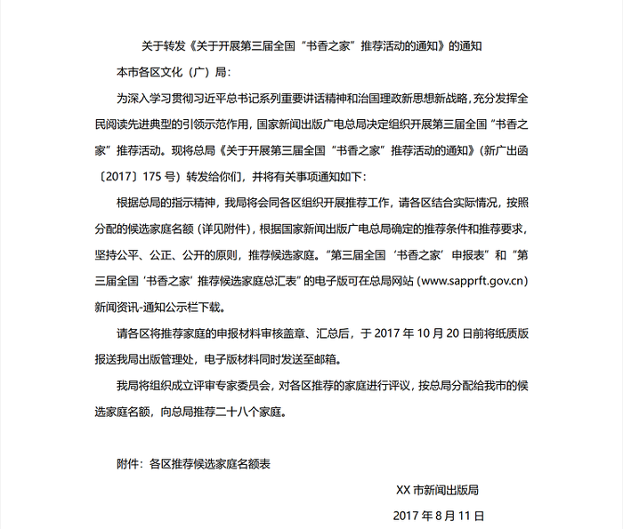

#### 第 14 题　qid 2137314 · 人文常识

上面公文标题不规范，下列修正正确的是        。

- **A**. XX市新闻出版局关于开展第三届全国“书香之家”推荐活动的通知
- **B**. XX市新闻出版局转发国家新闻出版广电总局关于开展第三届全国“书香之家”推荐活动的通知
- **C**. XX市新闻出版局转发《关于开展第三届全国“书香之家”推荐活动的通知》的通知　✅
- **D**. XX市新闻出版局转发《关于开展第三届全国“书香之家”推荐活动的通知》

**答案**：C

**官方解析**

本题考查公文标题的写法。
公文标题由发文机关名称、事由和文种组成，介词“关于”连接发文机关名称和事由，助词“的”连接事由和文种。通知是法定公文的一种，可用于批转、转发公文，该公文是一份转发性公文，应该用通知文种。为避免标题中出现“关于······关于”，若转发的公文标题中含有“关于”，则在“转发”之前不得再加介词“关于”。
A项错误，虽然该选项标题包含发文机关名称、事由和文种，但事由不恰当。市级的新闻出版局开展“全国推荐活动”不合逻辑，且从正文内容看，“开展第三届全国‘书香之家’推荐活动”是国家新闻出版广电总局的通知事由，排除。
B项错误，转发其他公文，原公文标题应加书名号。另外，加书名号后该标题缺乏文种“通知”，排除。
  C项正确，该标题包含发文机关名称（XX市新闻出版局）、事由（转发《关于开展第三届全国“书香之家”推荐活动的通知》）和文种（通知），当选。
D项错误，该标题缺少文种“通知”，排除。
故正确答案为C。

---

#### 第 15 题　qid 2137318 · 人文常识

下列关于公文主送机关的修改意见，不正确的是        。

- **A**. “本市”二字删去
- **B**. 向左顶格
- **C**. 要写全称　✅
- **D**. 括号删去　✅

**答案**：CD

**官方解析**

本题考查公文主送机关的写法。
主送机关是指对公文负有办理和答复责任的机关，应当使用机关全称、规范化简称或者同类型机关统称，应当居左顶格写，最后一个机关名称后标全角冒号。
A项正确，该通知是将总局的文件向下级机关转发，主送机关应当是“XX市新闻出版局”的下级机关，无需加“本市”二字，排除。
B项正确，公文主送机关应居左顶格写，材料中主送机关缩进两个字符，应向左顶格，排除。
C项错误，主送机关可使用机关全称、规范化简称或者同类型机关统称，当选。
D项错误，我国的行政机关名称复杂多样，主送机关中的文化局、文广局均为县区一级的新闻出版与广播电视的主管部门，只是机关名不同，要用“（）”加以区分，因此统写为“各区文化（广）局”无误，无需删除，当选。
本题为选非题，故正确答案为CD。

---

#### 第 16 题　qid 2137320 · 人文常识

下列关于公文正文的修改意见，表述正确的是        。

- **A**. “新广出函〔2017〕175号”应改为“（新广出函（2017）175号）”
- **B**. 正文第二段中，申报表和汇总表的表格名称应使用书名号　✅
- **C**. 正文第三、第四两段位置颠倒了，应交换位置
- **D**. 正文末句中“二十八”应使用阿拉伯数字　✅

**答案**：BD

**官方解析**

本题考查公文写作及公文格式有关内容。
A项错误，发文字号由发文机关代字、年份代码和发文顺序号组成。年份代码使用四位阿拉伯数字标识的公历年份，用六角括号“〔〕”括入；发文顺序号不编虚位，即1不编为01，不加“第”等虚字。材料中年份代码用六角括号“〔〕”正确，不应改为圆括号。
B项正确，正文引用其他文件应加书名号，第二段中的“第三届‘全国书香’之家申报表”和 “第三届全国‘书香之家’推荐候选家庭汇总表”都属于表格文件名称，需要用书名号括入，当选。
C项错误，根据行文内容的逻辑，应该是区级机关先推荐，然后市级机关评审，评审后再上报，因此无需调整。
D项正确，依据《国家标准：出版物上数字用法》（GB/T 15835—2011）规定：“（在表达计量或编号所需用到的数字个数不多的情况下，）如果要突出简洁醒目的表达效果，应使用阿拉伯数字；如果要突出庄重典雅的表达效果，应使用汉字数字。”此篇公文中的数字是为了突出简洁醒目即“向总局推荐28个家庭”，应使用阿拉伯数字，当选。
故正确答案为BD。

---

#### 第 17 题　qid 2137324 · 人文常识

上面公文需补充的内容有        。

- **A**. 附件应补充转发的通知名称　✅
- **B**. 附件应补充第三届“书香之家”申报表
- **C**. 各区推荐家庭申报材料纸质版份数　✅
- **D**. 出版管理处地址、邮编、电子邮箱地址、联系人姓名、电话号码、传真　✅

**答案**：ACD

**官方解析**

本题考查公文写作的相关内容。
A项正确，本题揣测出题人意图是想出成正确项，其所谓的“附件”应为“附件说明”（《党政机关公文处理工作条例》第九条第（十）项规定：“附件说明是公文附件的顺序号和名称”），只是出题人未严谨表达出。本文是转发类公文，且附加了其它附件，因此“附件说明”处应该补充通知名称。虽然表述不严谨，但是揣测出题意图，将此项定为正确项，各位考生要知道该项表达不严谨。
B项错误，正文第二段中提到“第三届全国‘书香之家’申报表”和“第三届全国‘书香之家’推荐候选家庭总汇表”的电子版可在总局网站（www.sapprft.gov.cn）新闻资讯-通知公示栏下载，所以无需在附件中补充，排除。
C项正确，正文中申报材料应明确份数，比如一式两份、一式三份，而材料中未提及，需要补充，当选。
D项正确，正文中提及纸质材料需要报送，所以需要补充“出版管理处地址、邮编、联系人姓名、电话号码、传真”；电子材料需要发送到邮箱，所以需要补充“电子邮箱地址”，当选。
故正确答案为ACD。

---

#### 第 18 题　qid 2137526 · 人文常识

中共中央办公厅于2017年3月印发了《关于推进“两学一做”学习教育常态化制度化的意见》，意见指出要把              作为查找和解决问题的重要途径，注意听取群众的意见和反馈，抓早抓小、防微杜渐。

- **A**. 批评与自我批评
- **B**. 党的组织生活　✅
- **C**. 自我反思
- **D**. 巡视工作

**答案**：B

**官方解析**

《关于推进“两学一做”学习教育常态化制度化的意见》指出，要把党的组织生活作为查找和解决问题的重要途径，注意听取群众的意见和反映，抓早抓小、防微杜渐。鲜明阐述了党的组织生活在党内政治生活中的基础性地位和作用，为严肃党内政治生活，推进党内生活科学化，明确了重要抓手，指明了努力方向。
故正确答案为B。

---

#### 第 19 题　qid 2137534 · 经济常识

上海自贸试验区将进入新一轮建设，到2020年的目标已经明确，关键是要与国际投资和贸易通行规则相衔接，加快健全                ；最终是要瞄准国际最高标准、最好水平的自贸试验区，率先形成法治化、国际化、便利化的营商环境和公平、统一、高效的市场环境。

- **A**. 投资管理、贸易监管“两个体系”
- **B**. 投资管理、贸易监管、金融服务“三个体系”
- **C**. 投资管理、贸易监管、金融服务、政府管理“四个体系”　✅
- **D**. 投资管理、贸易监管、金融服务、政府管理、社会治理“五个体系”

**答案**：C

**官方解析**

在2017年7月25日下午举行的上海市第十四届人大常委会第三十九次会议（扩大）上，上海市委副书记、市长应勇表示，上海自贸试验区将进入新一轮建设，到2020年的目标已经明确，核心是要坚持制度创新，加快构建开放型经济新体制；关键是要与国际投资和贸易通行规则相衔接，加快健全投资管理、贸易监管、金融服务、政府管理“四个体系”；最终是要瞄准国际最高标准、最好水平的自贸试验区，率先形成法治化、国际化、便利化的营商环境和公平、统一、高效的市场环境。
故正确答案为C。

---

#### 第 20 题　qid 2137538 · 人文常识

上海市第十一次党代会报告指出，要大力实施创新驱动战略，加快科技创新中心建设，将以全球视野、国际标准推进             综合性国家科学中心建设。

- **A**. 张江　✅
- **B**. 紫竹
- **C**. 杨浦
- **D**. 漕河泾

**答案**：A

**官方解析**

中国共产党上海市第十一次代表大会报告指出，要大力实施创新驱动发展战略，加快科技创新中心建设，把握科技进步大方向、产业革命大趋势、集聚人才大举措，在推进科技创新、实施创新驱动发展战略方面走在全国前头、走到世界前列，加快向具有全球影响力的科技创新中心进军，以全球视野、国际标准推进张江综合性国家科学中心建设。
故正确答案为A。

---

#### 第 21 题　qid 2137554 · 法律常识

《中华人民共和国国歌法》于2017年10月1日起施行。该法是为了维护国歌的尊严，规范国歌的奏唱、播放和使用，增强公民的国家观念，弘扬爱国主义精神，培育和践行社会主义核心价值观，根据宪法所制定。根据该法，下列表述不正确的是         。

- **A**. 在公共场合侮辱国歌的，由公安机关依法追究刑事责任　✅
- **B**. 国歌不得作为公共场所的背景音乐使用
- **C**. 中华人民共和国国歌是中华人民共和国的象征和标志
- **D**. 县级以上各级人民政府及其有关部门在各自职责范围内，对国歌的奏唱、播放和使用进行监督管理

**答案**：A

**官方解析**

A项错误，《中华人民共和国国歌法》第十五条规定，在公共场合，故意篡改国歌歌词、曲谱，以歪曲、贬损方式奏唱国歌，或者以其他方式侮辱国歌的，由公安机关处以警告或者十五日以下拘留；构成犯罪的，依法追究刑事责任。因此根据法条规定，在公共场合侮辱国歌只有构成犯罪时才会被追究刑事责任。
B项正确，《中华人民共和国国歌法》第八条规定，国歌不得用于或者变相用于商标、商业广告，不得在私人丧事活动等不适宜的场合使用，不得作为公共场所的背景音乐等。
C项正确，《中华人民共和国国歌法》第三条规定，中华人民共和国国歌是中华人民共和国的象征和标志。一切公民和组织都应当尊重国歌，维护国歌的尊严。
D项正确，《中华人民共和国国歌法》第十四条规定，县级以上各级人民政府及其有关部门在各自职责范围内，对国歌的奏唱、播放和使用进行监督管理。
本题为选非题，故正确答案为A。

---

#### 第 22 题　qid 2137548 · 人文常识

国务院总理李克强2017年5月17日主持召开国务院常务会议，部署以试点示范推进《中国制造2025》深入实施。会议指出，下一步要深化供给侧结构性改革，以市场为导向，以企业为主体，强化创新驱动和政策激励，把        作为主攻方向，加快建设制造强国。

- **A**. 绿色化和服务型升级
- **B**. 发展智能制造　✅
- **C**. 关键核心技术升级
- **D**. 改造传统产业

**答案**：B

**官方解析**

本题考查时政常识。国务院总理李克强2017年5月17日主持召开国务院常务会议，部署以试点示范推进《中国制造2025》深入实施，促进制造业转型升级。会议指出，下一步深入实施《中国制造2025》，要深化供给侧结构性改革，以市场为导向，以企业为主体，强化创新驱动和政策激励，把发展智能制造作为主攻方向，与“互联网+”和大众创业、万众创新紧密结合，打造勇于改革创新、成果不断涌现、具有引领作用的“示范方阵”，促进整个制造业向智能化、绿色化和服务型升级，加快建设制造强国。故A、C、D三项错误，B项正确。
故正确答案为B。

---

#### 第 23 题　qid 2137546 · 人文常识

根据中共中央组织部等四部门于2017年印发的《关于规范公务员辞去公职后从业行为的意见》，即便原先不是各级机关中领导班子成员，且非担任县处级以上职务的公务员，其辞去公职后2年内，也不得接受与原工作业务直接相关的企业、中介机构或其他        的聘任。

- **A**. 事业单位
- **B**. 科研单位
- **C**. 营利性组织　✅
- **D**. 公益性组织

**答案**：C

**官方解析**

本题考查时政和行政管理常识。
《关于规范公务员辞去公职后从业行为的意见》中第二条规定：“各级机关中原系领导班子成员的公务员以及其他担任县处级以上职务的公务员，辞去公职后3年内，不得接受原任职务管辖地区和业务范围内的企业、中介机构或其他营利性组织的聘任，个人不得从事与原任职务管辖业务直接相关的营利性活动；其他公务员辞去公职后2年内，不得接受与原工作业务直接相关的企业、中介机构或其他营利性组织的聘任，个人不得从事与原工作业务直接相关的营利性活动。”
故正确答案为C。

---

#### 第 24 题　qid 2137540 · 人文常识

2017年5月，国务院办公厅印发《政府网站发展指引》，对政府网站管理体制、内容功能、发展方向、集约化建设等提出明确要求和标准规范。根据《指引》，下列关于政府网站建设的说法，不正确的是        。

- **A**. 县级以上各级人民政府及其部门原则上一个单位最多开设一个网站
- **B**. 政府网站要使用以“.gov.cn”为后缀的英文域名和符合要求的中文域名，不得使用其他后缀的英文域名
- **C**. 政府网站分为政府门户网站和部门网站
- **D**. 乡镇、街道必须开设政府门户网站提供政务服务　✅

**答案**：D

**官方解析**

本题考查时政。
A项，根据《政府网站发展指引》第三部分第（一）条的规定，县级以上各级人民政府及其部门原则上一个单位最多开设一个网站，正确。
B项，根据《政府网站发展指引》第三部分第（一）条第4款的规定，政府网站要使用以.gov.cn为后缀的英文域名和符合要求的中文域名，不得使用其他后缀的英文域名，正确。
C项，根据《政府网站发展指引》第三部分第（一）条的规定，政府网站分为政府门户网站和部门网站，正确。
D项，根据《政府网站发展指引》第三部分第（一）条第1款的规定，乡镇、街道原则上不开设政府门户网站，通过上级政府门户网站开展政务公开，提供政务服务。已有的乡镇、街道网站要尽快将内容整合至上级政府门户网站。确有特殊需求的乡镇、街道，参照政府门户网站开设流程提出申请获批后，可保留或开设网站，错误。
本题为选非题，故正确答案为D。

---

#### 第 25 题　qid 2137530 · 法律常识

诉讼程序的启动总是以具体案件的发生为前提，不论是刑事诉讼、民事诉讼还是行政诉讼，都通常必须由诉讼参与人的诉讼行为来启动，这说明诉讼活动具有        。

- **A**. 主动性
- **B**. 被动性　✅
- **C**. 独立性
- **D**. 权威性

**答案**：B

**官方解析**

本题考查法律常识，主要涉及法律适用特点等相关知识点。
A项错误，主动性是执法的特征，被动性是司法的特征。主动性要求执法机关应当积极主动地去执行法律，而不一定需要行政相对人的请求和同意。因此诉讼活动并不具备主动性，错误。
B项正确，司法过程的启动总是以具体案件的发生为前提，在大多数案件中，司法活动必须由当事人的诉讼行为来启动。这种消极性和被动性是由法院作为中立的第三者的地位所决定的，裁判者只能是中立的第三者。这种消极性和被动性在诉讼上主要体现为，诉讼的启动权在当事人，当事人没有行使诉讼权，提起诉讼时，法院不能主动开始诉讼程序；当事人没有提出的请求和主张，法院不能主动进行审查和判断，正确。
C项错误，独立性体现在人民法院依法独立行使审判权，人民检察院依法独立行使检察权，不受行政机关、社会团体和公民个人的非法干涉，与题干无关，错误。
D项错误，权威性体现在国家机关尤其是司法机关的活动是以国家名义进行的，司法裁决一旦发生法律效力，任何组织和个人都必须执行，不得擅自修改和违抗，与题干无关，错误。
故正确答案为B。

---

#### 第 26 题　qid 2137524 · 法律常识

在行政主体制度中，下列关于法律法规授权组织的说法不正确的是        。

- **A**. 该组织应当是国家机关以外的组织
- **B**. 基于授权，该组织具有了国家机关资格　✅
- **C**. 该组织能独立行使法律法规授予的特定行政职权
- **D**. 该组织对行使法律法规授权的行为独立承担责任

**答案**：B

**官方解析**

本题考查法律常识，主要涉及行政法中法律法规授权组织的相关知识点。
A项正确，法律、法规授权组织是指根据法律法规的规定，可以以自己的名义从事行政管理活动、参加行政复议和行政诉讼并承担相应法律责任的非国家机关组织。
B项错误，基于授权，法律、法规授权组织可以行使特定的行政职权，但并不意味着其获得了国家机关资格。　
C项正确，法律、法规授权组织行使的是特定行政职权，而不是一般行政职权。一般行政职权是指行政机关根据宪法、各种组织法而获得的行政职权，特定行政职权是指单行法律、法规基于处理特定行政事务的需要而规定的行政职权。
D项正确，法律、法规授权的组织可以以自己名义行使法律法规授权的行为，并由其本身对外承担法律责任。
本题为选非题，故正确答案为B。

---

#### 第 27 题　qid 2137520 · 法律常识

在中国古代法律传统中，关于“礼”与“法”在社会治理中的关系，下列说法正确的是        。

- **A**. 礼法结合，礼主法辅，法为礼的重要实施手段　✅
- **B**. 礼法结合，法主礼辅，礼为法的实施提供道德基础
- **C**. 礼法并重，两种社会规范分别从不同方面调整社会关系
- **D**. 礼法并重，将所有法律规范道德化，将所有道德规范法律化

**答案**：A

**官方解析**

本题主要考查“礼”与“法”的关系。
“礼治”和“法治”在我国的发展大致经历了以下几个阶段：
1．夏商西周的“礼治”时代：法作为礼治体系的一个组成部分而存在。礼治体系最大程度地发挥了教化的作用，而法与刑的锋芒被深藏，在不失威严的情况下副作用得到有效控制。
2．春秋战国至秦的“法治”时代：礼法分离，独任法治。儒法两家之争，以法家的胜利告终，原本附于礼治的法获得了独立的发展时机，但法家之“法”泛指制度，偏重刑罚。
3．西汉的礼法融合时期：汉儒通过对秦政反省认为过分摒弃“礼”和“德教”，独任严刑峻法是秦灭亡的主要原因。于是汉儒开始了在不排斥“法”独立存在的前提下，重振“礼乐”，建构“礼法结合”的新的传统法体系。
4．隋唐时期，法观念定型：礼主法辅，礼在法中，法外有礼。
自汉时起的礼法融合，经魏晋南北朝的发展，定型于隋唐。中国正统的法观念的核心理念是“德主刑辅”、“礼法结合”、“王霸并用”，三者合言之便是“礼主法辅”式的结合。在礼法融合的思想指导下，中国传统法向着儒家化、伦理化、道德化发展。董仲舒的“《春秋》决狱”、西汉后期兴起的以经注律、魏晋南北朝时的引经入律等，为形成“一准乎礼”的《唐律》打下了深厚基础。我们从《唐律》的注释“疏议”中可以体会到，《唐律》的每一条款的设置都能找到礼的依据。礼与律真正达到水乳交融的地步。
经过长时间的发展，我国古代关于“礼”与“法”在社会治理中的关系确定为：礼法结合，礼主法辅。
故正确答案为A。

---

#### 第 28 题　qid 2137516 · 人文常识

人口政策与公共利益息息相关，因此政府会运用公共权力，依据人口发展规律制定符合国情的人口政策，用政策手段调控人口的增减，并通过相应的职能机构推行实施。人口政策可以归于政府职能中的        。

- **A**. 政治职能
- **B**. 经济职能
- **C**. 文化职能
- **D**. 社会职能　✅

**答案**：D

**官方解析**

本题主要考查政府职能。政府职能是指公共行政管理机关在经济、社会发展中所应承担的职责和所应发挥的作用，体现着公共行政活动的基本内容和方向。政治职能、经济职能、文化职能、社会职能均属于政府的基本职能。
A项错误，政治职能是指政府为维护国家统治阶级的利益，对外保护国家安全，对内维持社会秩序的职能。题干没有涉及到政府发挥国防、安保、外交等方面的职能。
B项错误，经济职能是指政府为国家经济的发展，对社会经济生活进行管理的职能。主要包括①宏观调控职能；②社会管理职能；③市场监管职能；④公共服务的职能。题干中的人口政策没有涉及到经济方面的内容。
C项错误，文化职能是指政府为满足人民日益增长的文化生活需要，依法对文化事业所实施的管理。主要包括和科、教、文、卫、体相关的政府职能。题干没有涉及到文化方面的内容。
D项正确，社会职能是指除政治、经济、文化职能以外政府必须承担的其他职能。主要包括：①调节社会分配和组织社会保障的职能；②保护生态环境和自然资源的职能；③促进社会化服务体系建立的职能；④提高人口质量，实行计划生育的职能。题干中政府运用公共权力，制定符合国情的人口政策，属于政府的社会职能。
故正确答案为D。

---

#### 第 29 题　qid 2137162 · 法律常识

行政监督内容的广泛性决定了监督标准的多维性。《公务员法》中对国家公务员义务和行为规范的规定，可作为行政监督的              。

- **A**. 宪法标准
- **B**. 权利标准
- **C**. 纪律标准　✅
- **D**. 公共政策标准

**答案**：C

**官方解析**

本题主要考查行政监督的标准。
《公务员法》是一部规范公务员行为的法律，是我国第一部干部人事管理的综合性法律。
A项错误，宪法是国家的根本大法，靠国家强制力保证实施，所调整的对象非常广泛，涉及国家和社会生活各方面最基本的社会关系，而《公务员法》仅是对国家公务员的要求，不属于行政监督的宪法标准。
B项错误，《公务员法》中对国家公务员义务和行为规范的规定，是对公务员所需履行的义务的规定，不属于行政监督的权利标准。
C项正确，《公务员法》第五十九条，对国家公务员所要承担的义务和必须履行的行为规范做出了明确规定。该法条明确了公务员必须遵守的十八条纪律，故可作为行政监督的纪律标准。
D项错误，公共政策是公共权力机关经由政治过程所选择和制定的，为解决公共问题、达成公共目标、以实现公共利益的方案。而《公务员法》只是对国家公务员的要求标准，不属于行政监督的公共政策的行为标准。
故正确答案为C。

---

#### 第 30 题　qid 2137164 · 经济常识

公共财政指的是仅为市场经济提供公共服务的政府分配行为，它是国家财政的一种具体存在形态，即与市场经济相适应的财政类型。下列选项中，不属于公共财政的基本特征的是                 。

- **A**. 以弥补政府失效为行为准则　✅
- **B**. 为市场活动提供同质的服务
- **C**. 非市场营利性
- **D**. 法治性

**答案**：A

**官方解析**

本题主要考查公共财政的基本特征。公共财政是指国家集中一部分社会资源，用于为市场提供公共物品和服务，满足社会公共需要的分配活动或经济行为。
A项错误，公共财政的基本特征是为了弥补市场失灵，而非政府失效。在市场经济条件下，市场在资源配置中起决定性作用，但也存在市场自身无法解决或解决得不好的公共问题，而这些问题属于社会公共领域的事项，需要公共财政介入解决。
B项正确，公共财政政策要一视同仁。市场经济的本质特征之一就是公平竞争，体现在财政上就是必须实行一视同仁的财政政策，为社会成员和市场主体提供平等的财政条件。
C项正确，公共财政具有非营利性的特征。公共财政只能以满足社会公共需要为己任，追求公益目标，一般不直接从事市场活动和追逐利润。公共财政的收入，是为满足社会公共需要而筹措资金；公共财政的支出，是以满足社会公共需要和追求社会公共利益为宗旨，不能以赢利为目标。
D项正确，公共财政要把公共管理的原则贯穿于财政工作的始终，以法制为基础，管理要规范和透明。市场经济是法治经济。一方面，政府的财政活动必须在法律法规的约束规范下进行；另一方面，通过法律法规形式，依靠法律法规的强制保障手段，社会公众得以真正决定、约束、规范和监督政府的财政活动，确保其符合公众的根本利益。所以公共财政具有法治性。
本题为选非题，故正确答案为A。

---

#### 第 31 题　qid 2137166 · 人文常识

政策监控是贯穿政策过程始终的一个基本环节，是政策监督和政策控制的合成。监控目的在于保证制定出尽可能完善的政策方案，并保证政策方案得到有效的贯彻实施，及时发现和纠正政策偏差。政策监控的作用一般不包括                。

- **A**. 形成政策方案　✅
- **B**. 保证政策合法化
- **C**. 实现政策调整与完善
- **D**. 促使政策终结

**答案**：A

**官方解析**

本题主要考查政策监控的作用。政策监控是政策过程的一个基本环节，它贯穿于政策过程的始终，制约或影响着其他各个环节，有重要的作用。
政策监控的作用包括四个方面：
第一，保证政策的合法化，它包括政策的形式合法化和内容合法化两个方面；
第二，保证政策得到贯彻和执行；
第三，实现政策的调整和完整；
第四，促使政策终结，通过监控那些错误的，过时的，无效的或多余的政策，及时向有关方面提出报告，或提交合理的建议，促进政策最终实现。
故政策监控的作用不包括A选项形成政策方案，从题干表述来看，监控在于使得形成的方案本身更加完善，而不是形成该项方案。
本题为选非题，故正确答案为A。

---

#### 第 32 题　qid 2137172 · 人文常识

飞机轮胎是飞机上安全性与可靠性要求都很高的重要部件。例如要求轮胎的爆破压力高于额定内压4倍以上。飞机的安全起飞和降落都必须依靠飞机轮胎的各种独特的功能。下列关于飞机轮胎的说法，正确的是                。

- **A**. 制造飞机轮胎的橡胶材料要能耐高温和低温，且要有很低的生热性　✅
- **B**. 为了防止爆胎，飞机轮胎用的是实心轮胎
- **C**. 为了防止静电积累，飞机轮胎用的是绝缘橡胶
- **D**. 飞机轮胎承受的落地冲击力约等于飞机的重力

**答案**：A

**官方解析**

本题主要考查科技常识。飞机轮胎，又称航空轮胎，是指用于航空飞行器械上的充气轮胎。这种轮胎具备的特性主要有：（1）具有高抗冲击强度和很低生热性；（2）用于制造航空轮胎的橡胶材料必须确保在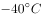以下和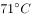以上的苛刻条件下，经24h后性能符合规定指标；（3）轮胎的爆破压力高于额定内压4倍以上；（4）飞机起飞和降落时轮胎产生的静电荷要能均匀传至地面。

A项正确，因为在起飞和降落时与地面摩擦产生大量热量，会使轮胎温度变高，飞机在高空飞行时气温又很低，这就要求飞机轮胎既要耐高温，又要耐低温，且要求轮胎具有很低的生热性。

B项错误，飞机轮胎属于充气轮胎，即飞机轮胎是空心的，它行驶舒适，重量轻，操控性比实心胎好，飞机在降落时还可以起到吸收地面震动，起到减震的功能。

C项错误，飞机起飞和降落时，轮胎会产生静电荷，为使静电能均匀传至地面，飞机轮胎一般为导电橡胶。

D项错误，飞机轮胎必须具有高抗冲击强度，其承受的落地冲击力大于飞机的重力。

故正确答案为A。

---

#### 第 33 题　qid 2137178 · 人文常识

自古以来，工匠精神就是“中国气质”之一，中国自古就是一个具有创新传统和工匠精神的国度。明代就有了世界上第一部关于农业和手工业生产的综合性著作，被外国学者称为“中国17世纪的工艺百科全书”。这部著作就是        。

- **A**. 沈括《梦溪笔谈》
- **B**. 贾思勰《齐民要术》
- **C**. 郦道元《水经注》
- **D**. 宋应星《天工开物》　✅

**答案**：D

**官方解析**

本题考查人文常识。
《天工开物》作者是明朝科学家宋应星，是世界上第一部关于农业和手工业生产的综合性著作，是中国古代一部综合性的科学技术著作，被英国科学家李约瑟称为“中国17世纪的工艺百科全书”。作者在书中强调人类要和自然相协调、人力要与自然力相配合。是中国科技史料中保留最为丰富的一部，它更多地着眼于手工业，反映了中国明代末年出现资本主义萌芽时期的生产力状况。
A项错误，《梦溪笔谈》由北宋科学家、政治家沈括撰写，是一部涉及古代中国自然科学、工艺技术及社会历史现象的综合性笔记体著作。该书在国际亦受重视，被英国科学史家李约瑟评价为“中国科学史上的里程碑”。
B项错误，《齐民要术》由北魏时期杰出农学家贾思勰所著，是我国现存最早的一部完整的农书。该书被誉为“中国古代农业百科全书”。
C项错误，《水经注》作者为北魏时期郦道元，我国古代地理名著，该书详细记载了一千多条大小河流及有关的历史遗迹、人物掌故、神话传说等，是我国古代最全面、最系统的综合性地理著作。该书还记录了不少碑刻墨迹和渔歌民谣，文笔绚烂，语言清丽，具有较高的文学价值。
D项正确，《天工开物》作者宋应星，初刊于1637年（明崇祯十年），被英国科学家李约瑟称为“中国17世纪的工艺百科全书”。
故正确答案为D。

---

#### 第 34 题　qid 2137180 · 人文常识

公元前770年，周平王将都城东迁，史称“东周”，分为“春秋”“战国”两个时期。春秋时期，100多个诸侯国林立，互相争夺，胜者称为霸主。
下列成语的出处中涉及春秋时期诸侯国争霸的是（    ）。

- **A**. 否极泰来
- **B**. 问鼎之心　✅
- **C**. 草木皆兵
- **D**. 纸上谈兵

**答案**：B

**官方解析**

本题主要考查文学常识。需结合具体选项予以分析。
A项错误，依据《古汉语成语典故词典》，否极泰来词源《周易·否》：“否之匪人，不利君子贞，大往小来。”又《周易·泰》：“泰，小往大来，吉亨。”词义：情况从极坏的方面转为好的方面。《吴越春秋·勾践入吴外传》：“时过于期，否终则泰。”又用以说明事物发展变化周而复始。究其本源为《周易》，且《吴越春秋》非正史，被认为是杂史或小说，只是引用《周易》，故不当选。
B项正确，问鼎之心（问鼎中原、问鼎轻重），语本《左传·宣公三年》：“楚子伐陆浑之戎，遂至于雒，观兵于周疆。定王使王孙满劳楚子，楚子问鼎之大小、轻重焉。对曰：‘在德不在鼎······周德虽衰，天命未改，鼎之轻重，未可问也。’”“楚子”即春秋五霸之一楚庄王，与春秋争霸有关。后世多有引用，比喻篡夺政权的野心。
C项错误，草木皆兵，出处《晋书·苻坚载记》，意思是把山上的草木都当做敌兵，形容人在惊慌时疑神疑鬼，讲述了东晋时前秦苻坚与晋国大将谢石、谢玄开战的故事。《晋书》记载的事件晚于春秋时期。
D项错误，纸上谈兵，出自《史记·廉颇蔺相如列传》，讲述了战国时赵国名将赵奢之子赵括，年轻时学兵法，谈起兵事来父亲也难不倒他，后来他接替廉颇为赵将，在长平之战中，只知道根据兵书打仗，不知道变通，结果被秦军大败。纸上谈兵指在纸面上谈论打仗。此事发生于战国晚期，不是春秋时期。
故正确答案为B。

---

#### 第 35 题　qid 2137184 · 人文常识

氯乙烷在常温常压下是气体，平时储存在压强较高的金属罐中。医护人员在对突然受伤的运动员实施急救时，常常会对着受伤部位喷氯乙烷雾状药剂，使受伤部位迅速降温并冷冻，神经被麻痹，疼痛感得以缓解。下列关于氯乙烷的说法正确的是        。

- **A**. 氯乙烷的沸点比水高
- **B**. 从气体变成液体过程中，氯乙烷会吸收大量的热量
- **C**. 在金属罐中，氯乙烷一般处于液体状态　✅
- **D**. 氯乙烷能使神经麻痹的原因是它含有使神经麻醉的药物成分

**答案**：C

**官方解析**

本题考查氯乙烷的特性。氯乙烷在常温常压下为无色气体，具有类似醚样的气味，常用作聚丙烯的催化剂，也用作冷冻剂、麻醉剂、杀虫剂等。

A项错误，氯乙烷的沸点只有，比水的沸点低，排除。

B项错误，物质由气态转变为液态的过程，是液化的过程，液化过程要放热。因此氯乙烷从气体变成液体过程中，会放出热量。

C项正确，氯乙烷在常温常压下是气体，但它通常以液体形式被储存在压强较高的金属罐中。低温高压下，气体通常可以被液化，液化后安全性高、运输和储存方便。

D项错误，由液体变成气体的氯乙烷从受伤部位的皮肤上吸收了大量热量，皮肤温度瞬间大幅降低，使皮肤肌肉及浅表神经受冷冻麻木，于是疼痛感就被迅速缓解了，而非含有使神经麻醉的药物成分。

故正确答案为C。

---

#### 第 36 题　qid 2137188 · 人文常识

单向玻璃的“秘密”就在于玻璃面上涂有很薄的银膜或铝膜。强光照在镜子的银膜上大部分都反射了，而从另一面过来的暗光太弱，被反射的强光所“遮挡”，以至于人们看不见另一面。下列关于单向玻璃描述正确的是        。

- **A**. 为了达到单向观察的目的，单向玻璃利用特殊的涂层破坏了光路的可逆性
- **B**. 单向玻璃正面为玻璃镜面，安装时应把正面朝向监控室
- **C**. 被监控室光线越亮越强，玻璃的单向透视效果越明显　✅
- **D**. 监控室内要保证一定的亮度，否则不能有效观察被监控室内的情况

**答案**：C

**官方解析**

单向玻璃也叫单向透视透镜。其一面叫作玻璃镜面（正面），该面涂有一层薄薄的反光涂层，反光能力很强，能反射大部分的光，站在此面的人，只能看到玻璃上的一个反射的影像，与普通镜子没有什么区别，使用时玻璃镜面应朝向迎光面或较亮的地方；另一面（反面）相当于普通的透光玻璃，玻璃镜面虽能反射大部分光，但是还是会有一部分光线穿透玻璃到达另一面，在单向玻璃反面的人就可以通过玻璃观察到对面的人，使用时反面应朝向暗室。
A项错误，光路的可逆性是指光能以一条路径从A出发到达一个终点B，那么必然能从这个终点B以完全反向的同一路径到达A点。光路的可逆性不可改变，单向玻璃无法改变。
B项错误，正面为玻璃镜面，即站在此面的人看着像普通镜子的一面，所以安装时应把正面朝向被监控室（即：所要观察的空间，如犯罪嫌疑人所在空间）；而把反面朝向监控室所在位置。
C项正确，被监控室的灯光强度应保证足够亮度，被监控室光线越亮、越强，玻璃的单向透视效果越明显。
D项错误，为使玻璃的单向透视性能达到最佳状态，监控室内原则上不安装天花顶灯，不允许有其他发光灯源存在。监控室旁边若有窗户，必须安装不透光的窗帘，如宾馆酒店使用的密封窗帘。若监控室内一定要使用灯光，建议使用点状灯光，如书写台灯等（灯罩不透光），以缩小灯照范围。
故正确答案为C。

---

#### 第 37 题　qid 2137192 · 科技常识

湿地、海洋、森林并称为全球三大生态系统。其中，湿地拥有“地球之肾”的美誉，这是因为湿地        。

- **A**. 具有维系二氧化碳和氧气的平衡，净化空气和环境的作用
- **B**. 具有降解污染物、净化水质、维持自然生态健康平衡的作用　✅
- **C**. 对调节全球的热量分布有重要意义
- **D**. 是水生动物、两栖动物、鸟类和其他野生生物的重要栖息地

**答案**：B

**官方解析**

本题考查地理国情。
湿地像天然的过滤器，它有助于减缓水流的速度，当含有毒物（农药、生活污水和工业排放物）和杂质的流水经过湿地时，流速减慢有利于毒物和杂质的沉淀和排除。一些湿地植物能有效地吸收水中的有毒物质，净化水质。沼泽湿地能够分解、净化环境物，起到“排毒”、“解毒”的功能，因此被人们喻为“地球之肾”。假如没有了湿地，好比一个人被割去了肾脏。
故正确答案为B。

---

#### 第 38 题　qid 2137194 · 人文常识

人与人之间最小的差距是智商，最大的差距是坚持。“踏破铁鞋无觅处，得来全不费功夫”①，说的是成功的偶然性。然而，这种“不费功夫”的偶然，却建立在“吾将上下而求索”②“众里寻他千百度”③“为伊消得人憔悴”④之上，是千辛万苦付出后的某种必然。世间事，除了岁月，没有“不费功夫”就得来的好事。对上述语段引用内容的出处说明错误的是        。

- **A**. ①明·冯梦龙《警世通言》
- **B**. ②战国·屈原《离骚》
- **C**. ③宋·辛弃疾《青玉案·元夕》
- **D**. ④宋·李清照《声声慢·寻寻觅觅》　✅

**答案**：D

**官方解析**

本题考查文学常识。
A项正确，出自明代冯梦龙《警世通言·金令史美婢酬秀童》“金满将大门闭了，两个促膝细谈。正是：踏破铁鞋无觅处，得来全不费工夫”；
B项正确，出自屈原《离骚》“路漫漫其修远兮，吾将上下而求索”；
C项正确，出自南宋辛弃疾《青玉案·元夕》“众里寻他千百度，蓦然回首，那人却在，灯火阑珊处”；
D项错误，出自北宋柳永的《蝶恋花》“衣带渐宽终不悔，为伊消得人憔悴”。 
本题为选非题，故正确答案为D。

---

#### 第 39 题　qid 2137198 · 人文常识

月亮在我国古代诗文中有许多美称。下列选项中，不含“月亮”美称的是        。

- **A**. 著意登楼瞻玉兔，何人张幕遮银阙
- **B**. 玉轮轧露湿团光，鸾佩相逢桂香陌
- **C**. 直须日观三更后，首送金乌上碧空　✅
- **D**. 但愿人长久，千里共婵娟

**答案**：C

**官方解析**

本题主要考查文学常识。
A项正确，“著意登楼瞻玉兔，何人张幕遮银阙”出自辛弃疾的《满江红·中秋》，“玉兔”又称月兔，中国神话中月亮上有玉兔捣药，因此以“玉兔”象征明净的月亮，是“月亮”的美称之一。
B项正确，“玉轮轧露湿团光，鸾佩相逢桂香陌”出自李贺的《梦天》。“玉轮轧露湿团光”，玉轮是汉语词语，意为月的别名，是“月亮”的美称之一。
C项错误，“直须日观三更后，首送金乌上碧空”出自韩偓的《晓日》，描述的是日出时红日喷薄而出，霞光万道的壮美景象。“金乌”是一种古代神话中的神鸟，为“太阳”的别称，而不是“月亮”的美称。
D项正确，“但愿人长久，千里共婵娟”出自苏轼的《水调歌头·明月几时有》， “婵娟”可指明月，是“月亮”的美称之一。
本题为选非题，故正确答案为C。

---

## 言语理解与表达

### 材料 1

阅读下面的文章，回答下列五题。

        长久以来，人们都把脂肪当作健康的“大敌”，尤其是饱和脂肪被认为是诱发心血管疾病的高风险因素。世界卫生组织的指南是，脂肪的摄入应该占每天总能量摄入的30%以下，饱和脂肪酸的摄入应该在10%以下。

        而最近《柳叶刀》杂志上发表的一项大型研究似乎“颠覆”了这一观念。这是一项具有前瞻性的大型研究。研究者从世界5大洲的18个国家，选择了高、中、低不同收入水平的地区，共招募了超过13.5万名志愿者，通过统计他们的饮食习惯来计算营养组成，并在此后的多年（5.3~9.3年）中，追踪他们的死亡以及心血管疾病发病情况。

        基于对这些数据的分析，研究者在《柳叶刀》杂志上发表了两篇论文。

        一篇论文是关于蔬菜、水果和豆类的影响，其结论没有新鲜的地方，大致就是每天总共4份左右（375~500克）这三类食物对健康好处明显，进一步增加摄入量带来的好处不大。

        而另一篇论文则是关于脂肪和碳水化合物对心血管健康以及死亡率的影响，结果是，脂肪摄入量和种类，跟心血管疾病的发生率以及死亡风险都不相关；与脂肪摄入量最低的那一组相比，摄入量最高的那一组整体死亡率、中风以及心血管疾病之外的死亡风险还要低一些。而碳水化合物的影响则相反，碳水化合物摄入量高的那一组比最低的那一组总体死亡率高28%，而对心血管疾病发生率和导致的死亡率则没有影响。

        在发表这两篇论文的同时，《柳叶刀》杂志还发表了一篇评论，认为这项研究“挑战了健康饮食的定义，但关键问题并没有解决”。在这篇评论中，作者认为这项研究的价值在于，补充了中低收入地区饮食与健康的流行病学调查数据，加深了“饮食与健康”这个问题的复杂性。但是，评论作者并没有赞同研究者的结论，而是指出了以下三点：

        第一，在这项研究中，饱和脂肪和单不饱和脂肪的主要来源是动物食品（肉和奶制品）。除了脂肪外，这些食品也是锌、铁、维生素K、维生素B12等微量成分的良好来源。而在脂肪摄入量低（从而导致碳水化合物摄入量高）的人群中，这些营养成分的摄入可能是不足的。所以，“脂肪降低死亡率”这个调查结果，还有一种可能的解释就是“富含脂肪的这些食物营养密度高，解决了这些食物摄入量低的人群某些微量营养成分的缺乏的问题”。

        第二，在这两篇论文中，一篇的结论是“碳水化合物摄入量高增加了死亡率”，另一篇的结论是“蔬菜、水果、豆类摄入量高降低了死亡率”。但是，蔬菜、水果和豆类，都富含碳水化合物。也就是说，不同种类的碳水化合物对于健康的影响需要分开讨论，比如添加糖、精制碳水化合物和粗粮。

        第三，混杂因素会影响到结果，尤其是人们的健康意识。比如在欧美发达地区，人们有更好的健康意识，从而可能有更多对健康有益的生活方式与行为习惯，比如遵守医嘱、合理的睡眠时间、控制饮酒、食用“推荐的食物”等。而在低收入和中等收入地区，人们接受的健康生活指导会少一些。所以，评论作者认为，人们的健康意识，可能是这项研究中的一个非常重要的混杂因素。

#### 第 1 题　qid 2137344 · 片段阅读

而最近《柳叶刀》杂志上发表的一项大型研究似乎“颠覆”了这一观念。这句话中用了“似乎”一词，并且给“颠覆”加上引号，其主要作用是      。

- **A**. 增强文章的幽默趣味性
- **B**. 为后文观点埋下伏笔　✅
- **C**. 使表达更加严谨周密
- **D**. 表达对该研究的讽刺态度

**答案**：B

**官方解析**

“似乎”可以表达一种不确定性，“颠覆”加双引号可以使感情色彩发生变化，通过后文的表述，可知作者对于该项研究是持否定态度的，也就是说作者并不认为它颠覆了这一观点，所以“似乎”一词和双引号的用法其实对于后文内容是有提示作用的，可以表达作者不大认同的感情倾向，对应B项“伏笔”，指上文看似无关紧要的事或者物，对下文将要出现的人物或事件预先作的某种提示或暗示。
A项“幽默趣味性”无中生有，文段并未体现出趣味性和幽默性，排除；C项“严谨周密”本身说法正确，但是体现不出作者的感情倾向，排除；D项“讽刺态度”程度太重，虽然作者不认同这项研究，但是不至于讽刺，排除。
故正确答案为B。
【文段出处】《脂肪越多越健康？你知道&lt;柳叶刀&gt;上的那项研究有多少槽点么》

---

#### 第 2 题　qid 2137348 · 片段阅读

上文第二段列举了研究数据，是为了论证      。

- **A**. 本研究的可靠性　✅
- **B**. 本研究的前瞻性
- **C**. 本研究的长效性
- **D**. 本研究的全面性

**答案**：A

**官方解析**

文段先指出最近《柳叶刀》杂志上发表的一项大型研究“颠覆”了过往的观念，是一项前瞻性的大型研究。然后通过该项研究涉及地域广阔、参与者众多，研究追踪时间长等多方面数据，体现了对该前瞻性研究调查的谨慎态度，所以列举数据是为了论证“本研究的可靠性”，对应A项。
B项，“研究的前瞻性”体现在对过关观念“人们都把脂肪当作健康的‘大敌’，尤其是饱和脂肪被认为是心血管疾病的高风险因素”的颠覆，后文数据与“前瞻性”无关，而是为了保障这一前瞻观点的可靠性，排除；C项“长效性”和D项“全面性”分别对应文段“此后的多年中”和“5大洲的18个国家”，均表述片面，排除。
故正确答案为A。
【文段出处】《脂肪越多越健康？你知道&lt;柳叶刀&gt;上的那项研究有多少槽点么》

---

#### 第 3 题　qid 2137350 · 片段阅读

《柳叶刀》杂志发表的两篇论文，其研究结果不包括      。

- **A**. 蔬菜、水果和豆类摄入越多好处越大　✅
- **B**. 脂肪摄入量跟心血管疾病的发生率无关
- **C**. 脂肪摄入量跟死亡风险无关
- **D**. 碳水化合物摄入量高增加了死亡率

**答案**：A

**官方解析**

A项“蔬菜、水果和豆类摄入越多好处越大”对应第四段“这三类食物对健康好处明显，进一步增加摄入量带来的好处不大”可知并非摄入越多越好，不符合文意，当选。
B项“脂肪摄入量跟心血管疾病的发生率无关”、C项“脂肪摄入量跟死亡风险无关”对应第五段“脂肪摄入量和种类，跟心血管疾病的发生率以及死亡风险都不相关”，均符合文意，排除。
D项“碳水化合物摄入量高增加了死亡率”对应第五段尾句“碳水化合物的影响则相反，碳水化合物摄入量高的那一组比最低的那一组，总体死亡率高28%······没有影响”，可知“碳水化合物”会增加死亡率，符合文意，排除。
本题为选非题，故正确答案为A。
【文段出处】《脂肪越多越健康？你知道&lt;柳叶刀&gt;上的那项研究有多少槽点么》

---

#### 第 4 题　qid 2137352 · 片段阅读

上文的主要写作目的是      。

- **A**. 介绍传统观念和一项颠覆性的研究成果
- **B**. 介绍一项颠覆性的研究成果以及对其的质疑意见　✅
- **C**. 揭示科学研究的严谨态度
- **D**. 说明人类健康问题的复杂性

**答案**：B

**官方解析**

文章第一段指出长期以来人们都把脂肪当做健康的“大敌”，第二至四段指出《柳叶刀》上的研究颠覆了这个传统观念，并详细介绍了这一研究，第五至九段介绍了人们对于上述研究的质疑，故文段重在介绍一项颠覆性的研究成果以及质疑意见，对应B项。
A项仅对应文章前四段的内容，表述片面，排除；C项“严谨态度”、D项“健康问题的复杂性”均不是文段重点内容，文段重在通过《柳叶刀》中的研究，介绍了一个新成果以及人们对其的质疑，排除。
故正确答案为B。
【文段出处】《脂肪越多越健康？你知道&lt;柳叶刀&gt;上的那项研究有多少槽点么》

---

#### 第 5 题　qid 2137356 · 片段阅读

下列      项是评论作者不同意论文研究结论的理由。

- **A**. 蔬菜、水果和豆类降低死亡率的研究过程不可靠
- **B**. 蔬菜、水果和豆类含有碳水化合物的种类不同　✅
- **C**. 动物食品更富有营养，所以延长了人的寿命
- **D**. 人们的健康意识远比饮食习惯更有决定性作用

**答案**：B

**官方解析**

根据文章第8段“蔬菜、水果和豆类，都富含碳水化合物，也就是说，不同种类的碳水化合物对于健康的影响需要分开讨论”可知，B项是评论作者质疑研究结论的理由，当选。
A项“研究过程不可靠”无中生有，文段并没有提及，排除；C项“动物食品更富有营养”表述过于宽泛，文段意为动物食品含有“锌、铁、维生素K、维生素B12等微量成分”，排除；D项“更有决定作用”表述与文段不符，文段仅提到健康意识可能会影响到结果，而不是健康意识更有决定作用，排除。
故正确答案为B。
【文段出处】《脂肪越多越健康？你知道&lt;柳叶刀&gt;上的那项研究有多少槽点么》

---

### 材料 2

阅读下面的文章，回答下列四题。

        兵有长短，敌我一也。敢问：“吾之所长，吾出而用之，彼将不与吾校；吾之所短，吾蔽而置之，彼将强与吾角，奈何？”曰：“吾之所短，吾抗而暴之，使之疑而却；吾之所长，吾阴而养之，使之狎而堕其中。此用长短之术也。”

        善用兵者，使之无所顾，有所恃。无所顾，则知死之不足惜；有所恃，则知不至于必败。尺箠当猛虎，奋呼而操击；徒手遇蜥蜴，变色而却步，人之情也。知此者，可以将矣。袒裼而案剑，则乌获不敢逼；冠胄衣甲，据兵而寝，则童子弯弓杀之矣。故善用兵者以形固。夫能以形固，则力有馀矣。

#### 第 6 题　qid 2137358 · 片段阅读

“善用兵者，使之无所顾，有所恃。”这句话的意思是      。

- **A**. 善于用兵的人，要使他自己无所顾忌，但有所依靠
- **B**. 善于用兵的人，要使士兵无所顾忌，但有所依靠　✅
- **C**. 善于用兵之道，在于无所顾忌，有所畏惧
- **D**. 善于用兵之道，使他无所顾忌，有所畏惧

**答案**：B

**官方解析**

“者”意为“······的人”，“善用兵者”意为“善于用兵的人”，“之”在文言文中可做第三人称代词，指代前文的“士兵”，“顾”意为“顾忌”，“使之无所顾”意为使士兵无所顾忌，“恃”意为“依靠”，“有所恃”意为“有所依靠”，B项符合，当选。
故正确答案为B。
【文段出处】《心术》

---

#### 第 7 题　qid 2137364 · 片段阅读

下列“之”的用法与其它三项不同的是      。

- **A**. 使之疑而却　✅
- **B**. 吾之所长
- **C**. 此用长短之术也
- **D**. 人之情也

**答案**：A

**官方解析**

A项“使之疑而却”对应第一段“吾之所短，吾抗而暴之，使之疑而却”，意思是我方的短处，我故意显露出来，使敌人心生疑虑而退却，此处“之”指代“敌人”，为“代词”用法；
B项“吾之所长”对应第一段“吾之所长，吾阴而养之”，意思是我方的长处，我暗中隐蔽起来，此处“之”即“的”的意思，为“助词”用法；
C项“此用长短之术也”对应第一段，意思是这就是灵活运用自己的长处和短处的方法。此处“之”即“的”的意思，为“助词”用法；
D项“人之情也”对应第二段“徒手遇蜥蜴，变色而却步，人之情也”意思是空着手遇上了蜥蜴，也会吓得面容变色连连后退，这是人之常情。此处“之”即 “的”的意思，为“助词”用法。
B、C、D三项的“之”均为“助词”用法，表达“的”的意思，只有A项为代词用法。
本题为选非题，故正确答案为A。
【文段出处】《心术》

---

#### 第 8 题　qid 2137366 · 片段阅读

上文第一段的主要内容是      。

- **A**. 论证扬长避短的重要性
- **B**. 如何灵活利用长处和短处　✅
- **C**. 说明长处、短处可以相互转化
- **D**. 传授把短处转化为长处的方法

**答案**：B

**官方解析**

第一段首先提出了问题，“吾之所长，吾出而用之，彼将不与吾校；吾之所短，吾蔽而置之，彼将强与吾角，奈何”，意思为我方的长处，我拿出来运用，敌人却不与我较量；我方的短处，我隐蔽起来，敌人却竭力与我对抗，怎么办呢？之后给出了回答，“吾之所短，吾抗而暴之，使之疑而却；吾之所长，吾阴而养之，使之狎而堕其中。此用长短之术也”，意思为我方的短处，我故意显露出来，使敌人心生疑虑而退却；我方的长处，我暗中隐蔽起来，使敌人轻漫而陷入圈套。这就是灵活运用自己的长处和短处的方法，故文段重在说明长处和短处经过灵活使用，可以起到更好的效果。对应B项。
A项“扬长避短”指发挥长处，规避缺点，文段论述的是将长处和短处的处置方法对调，以迷惑敌人，故与文意不符，排除；
C项“相互转化”意思是让长处变成短处，短处变为长处，文段强调的是将短处显露，将长处隐蔽，无相互转化的含义，偷换概念，排除；
D项“短处转化为长处”为C项“互相转化”的一部分，与文意不符，排除。
故正确答案为B。
【文段出处】《心术》

---

#### 第 9 题　qid 2137368 · 片段阅读

上文第二段的主要内容是说明      。

- **A**. 用兵要随机应变
- **B**. 用兵要体恤士兵
- **C**. 用兵要时刻警惕毫不松懈
- **D**. 用兵要利用各种有利条件　✅

**答案**：D

**官方解析**

第二段首先提出了“善用兵者，使之无所顾，有所恃”，即善于用兵的人，要使士兵无所顾忌，但有所依靠，随后进行了具体解释，通过“知此者，可以将矣”指出，知道这个道理就可以带兵了，尾句通过“故”引出重点，即“善用兵者以形固。夫能以形固，则力有馀矣”，意思为“善于用兵打仗的人，利用各种条件来巩固自己，能够利用各种条件来巩固自己，那就威力无穷了”，故文段强调善用各种有利条件能有效带兵作战，对应D项。
A项“随机应变”指根据情况，灵活应对，第二段并没有提及灵活应对之意，无中生有，排除；
B项“体恤”指为他人着想，对他人进行帮助，与文段“善用兵者，使之无所顾，有所恃”是指要使士兵无所顾忌，但有所依靠，意思相近，为利用各种有利条件的一个方面，表述片面，排除；
C项“时刻警惕无所松懈”指不能松懈，与文段“冠胄衣甲，据兵而寝，则童子弯弓杀之矣”是指头戴着盔，身穿铠甲，靠着武器而睡觉，那小童也敢弯弓射杀了，意思相近，亦为片面的表述，排除。
故正确答案为D。
【文段出处】《心术》

---

#### 第 10 题　qid 2137234 · 逻辑填空

广大海外华文文学作家      异域，      中华故土，创作出大量脍炙人口的名篇佳作，在慰藉游子乡愁、温润侨胞心灵的同时，      着中华民族的精魂，      着中华文化的基因，丰富着世界多元文化的色彩，也培育着中国人民与世界人民的友谊之花。

- **A**. 根植，守望，传承，赓续　✅
- **B**. 根植，守护，继承，延续
- **C**. 扎根，守望，延续，传承
- **D**. 扎根，守卫，赓续，继承

**答案**：A

**官方解析**

第一空，两个词语都含有“生根固定”的意思，填入均符合句意，较难排除，可从第二空入手。
第二空，“守护”侧重于保护，“守卫”侧重于捍卫，“守望”侧重于瞭望。此处句意为海外华文文学作家虽然身在国外，却对故乡充满眷恋，“守望”更能体现出这层意思，更符合语境，且“守望故土”亦为习惯搭配，排除B、D两项。
第三空，“传承”指传授和继承；“延续”指照原来的样子继续下去，延长下去。此处说的是中华民族的精魂在海外得以继承，对比两个词语，选“传承”更恰当，排除C项。
验证第四空，“赓续”指继续，用来表达基因的延续也恰当。
故正确答案为A。

---

#### 第 11 题　qid 2137238 · 语句表达

“当真相还在穿鞋，谣言已环游世界。”在当今这个信息传播高度发达的时代，这句名言可谓      。科学类流言往往是披着科学外衣的伪科学，内容中常出现很多专业用语，或引用国外科学期刊内容，看似引经据典，其实      。科学类流言经常会被反复传播，即使已被科学界和传统媒体辟谣，很多人仍然抱着“宁可信其有”的心态，客观上存在“      ”的效应。
依次填入画横线成语最合适的一项是：

- **A**. 一语中的，偷梁换柱，众口铄金
- **B**. 一言蔽之，故弄玄虚，以讹传讹
- **C**. 一语成谶，移花接木，三人成虎　✅
- **D**. 一针见血，信口开河，风声鹤唳

**答案**：C

**官方解析**

本题可从第三空入手，根据“很多人抱着宁可信其有的心态”可知，人们对已经辟过的谣言仍然持一种相信的态度，C项“三人成虎”比喻说的人多了，就能使人们把谣言当作事实，符合文意。A项“众口铄金”比喻舆论影响的强大，与“谣言”这一语境不符，排除；B项“以讹传讹”指把本来就不正确或不符合实际情况的话又不正确地传出去，与文段“人们宁可信其有”的心态不符，故排除；D项“风声鹤唳”形容惊慌失措，自相惊扰，与文意无关，排除。
第一空代入验证，所填词语用以评价“前人的名言”与当下“信息时代”谣言传播特点的关系，C项“一语成谶” 指将要应验的预言、预兆，一般指一些"凶"事，不吉利的预言，语义合适。
第二空代入验证，C项“移花接木”比喻暗中用手段更换人或事物来欺骗别人，置于文段体现“伪科学常引经据典欺骗人”的特点，语义合适，可选。
故正确答案为C。

---

#### 第 12 题　qid 2137240 · 逻辑填空

依次将下列源自珠算口诀的熟语分别填入句中横线处，正确的一项是      。
①三下五除二
②三七二十一
③一退六二五
④二一添作五
（1）杭州“御街联盟”演练，      拿下俩“歹徒”。
（2）工作中一有问题，领导问是谁干的，小张、小马就      ，说“不是我，我当时在哪儿哪儿干什么来着，我不知道”。
（3）有些家长看见宝宝出现抗拒或哭泣的行为，不管      ，都会先哄宝宝安静下来。
（4）“不错不错，悟道师弟做事讲究，日后有了什么好东西，咱们就      。”孙猴子很是高兴地拍了拍悟道的肩膀道。

- **A**. ①③②④　✅
- **B**. ①②③④
- **C**. ②①④③
- **D**. ②①③④

**答案**：A

**官方解析**

第一空，形容“演练”中快速、高效地将“歹徒”拿下。①“三下五除二”形容做事干脆利索，符合文意。
第二空，形容领导问责时，大家互相推脱。③“一退六二五”指的是推诿、推卸，符合文意。
第三空，根据横线后边的“都会先哄宝宝安静下来”可知横线处意为当孩子哭泣时，家长什么都不管不顾，先哄孩子。②“不管三七二十一”指不顾一切，不问是非情由，符合文意。
第四空，根据横线前“悟道师弟做事讲究”可知孙猴子对悟道师弟比较认可，“日后有了好东西”自然是与之平分。④“二一添作五”比喻双方平分，符合文意。
故正确答案为A。
【文段出处】《杭州“御街联盟”演练 三下五除二 拿下俩“歹徒”》《上幼儿园，宝宝不再哭闹全攻略》

---

#### 第 13 题　qid 2137244 · 逻辑填空

子曰：“天下国家可      也，爵禄可      也，白刃可      也，中庸不可      也。”

- **A**. 蹈，能，均，辞
- **B**. 均，辞，能，蹈
- **C**. 辞，蹈，均，能
- **D**. 均，辞，蹈，能　✅

**答案**：D

**官方解析**

第一空，搭配“天下国家”，B、D两项“均”指治理、平定，搭配“天下国家”符合文意，保留；C项“辞”指辞掉、放弃，搭配“天下国家”可以，暂时保留；A项“蹈”指踩、踏，搭配“天下国家”不符合古人皇权至上的思想，排除。
第二空，搭配“爵禄”，意为爵位、俸禄，B、D两项“辞”搭配“爵禄”符合文意，保留；C项“蹈”同样不符合古人皇权至上的思想，排除。
第三空，搭配“白刃”，意为闪光的刀，D项“蹈”搭配“白刃”意为可以在刀上踩踏，符合文意，保留；B项“能”意为做到，与“白刃”搭配不当，排除。
验证第四空，“中庸”意为不偏不倚、折中调和的处世态度，“中庸不可能也”表示中庸是不容易做到的，符合文意。
整句话意为：孔子说：“天下国家是可以治理的，官爵俸禄是可以辞让的，锋利的刀刃是可以践踏而过的，但中庸却是不容易做到的。”
故正确答案为D。
【文段出处】《中庸》

---

#### 第 14 题　qid 2137246 · 逻辑填空

依次填入下列横线处的字，正确的一组是      。
（1）这一来，耳根反倒清      多了。
（2）外滩见证了上海人民的战斗      程。
（3）为了避免造成误解，我要再一次      明。
（4）出了问题，要认真检查，不要埋怨，更不要推      。

- **A**. 静，里，声，脱
- **B**. 净，历，申，脱　✅
- **C**. 静，历，声，托
- **D**. 净，里，申，托

**答案**：B

**官方解析**

第一空，“清静”指安静不嘈杂，通常搭配“环境”，与“耳根”搭配不当，“清净”指没有事物打扰，“耳根清净”为固定搭配，排除A、C两项。
第二空、第三空不易判断。
第四空，“推托”指借故拒绝，与“责任”搭配不当，排除D项。“推脱”指推卸、不肯承担，“推脱责任”为固定搭配，符合语境，B项当选。
故正确答案为B。

---

#### 第 15 题　qid 2137248 · 片段阅读

下列句子表达有问题的是      。

- **A**. 旅行是一种学习，它给你用一双婴儿的眼睛去看世界，去看不同的社会，让你变得更宽容。　✅
- **B**. 随着智能机器变得越来越自动化，我们更应该担心人为错误导致的危险结果，而不是超级人工智能的出现。
- **C**. 在信息传播过程中，真相有时变得不重要了，重要的是情感和观点。
- **D**. 据世界卫生组织统计，到2020年，抑郁症将成为仅次于心脏病的第二大疾病。

**答案**：A

**官方解析**

A项，搭配不当，“给”字使用错误，应将“给”修改为“让”，即“它让你用一双婴儿的眼睛去看世界”，当选；
B、C、D三项，均表述正确，没有语病，排除。
故正确答案为A。

---

#### 第 16 题　qid 2137258 · 片段阅读

下列语句排列顺序最恰当的一项是      。
①那就是在政治主体之间确立起透明、包容、规则、合作的观念，并内化为政治主体的行为准则。
②理解和认识政治生态的内涵并不是最终的目的，也不是进行文字的游戏，而是为了达到这样的目标：判断一个政治生态的优劣，并据此而探寻修复、优化政治生态的对策。
③至于如何修复恶化的政治生态，如何进一步优化政治生态，则需要根据具体的诊断来进行。
④但是，有一点需要明确，政治生态是系统性的，因而在对其进行修复或优化时，切不可陷入“头痛医头，脚痛医脚”的误区。
⑤那么，判断一个政治生态优劣与否的标准是什么？
⑥符合这些要求的政治生态，就可以称得上是优良的政治生态。

- **A**. ③①②④⑤⑥
- **B**. ②⑤①③⑥④
- **C**. ⑤①⑥③④②
- **D**. ②⑤①⑥③④　✅

**答案**：D

**官方解析**

首先对比选项判断首句，②句论述理解和认识政治生态的真正目标，即“判断一个政治生态的优劣，并据此而探寻修复，优化政治生态的对策”，③句和⑤句分别围绕“如何进一步优化政治生态”以及“判断一个政治生态优劣的标准”进行详细的展开，故③句和⑤句分别是对②句的解释说明，故不适合作首句，排除A、C两项。
⑥句出现指代词“这些要求”，故可判断⑥句前是①句还是③句。①句论述政治主体之间的行为准则，即“行为要求”，③句论述的是如何修复恶化的政治生态，故①⑥两句捆绑，排除B项。
故正确答案为D。
【文段出处】《深刻理解“政治生态”的丰富内涵》

---

#### 第 17 题　qid 2137266 · 语句表达

下列句子中，结构与其他三句不同的一句是      。

- **A**. 物类之起，必有所始
- **B**. 荣辱之来，必象其德
- **C**. 肉腐出虫，鱼枯生蠹　✅
- **D**. 怠慢忘身，祸灾乃作

**答案**：C

**官方解析**

A句“物类之起，必有所始”解释为事物的出现必然会有它的开端，B句“荣辱之来，必象其德”解释为一个人的荣、辱、福、祸与其思想品德的优劣是紧密相关的，D项“怠慢忘身，祸灾乃作”是指懈怠疏忽忘记了做人准则就会招祸，这三项均为前后两句构成因果结构；C项“肉腐出虫，鱼枯生蠹”是指肉腐烂了就会生蛆，鱼干枯了也会生虫，单句中构成因果结构，而两个单句之间构成并列关系。故C项结构与其他三句不同。
故正确答案为C。

---

#### 第 18 题　qid 2137270 · 逻辑填空

下列划线成语中，使用不当的一项是      。
回想以前埋首伏案于伦敦、巴黎的图书馆中摸索敦煌残卷，以及匹马孤征、风尘仆仆于惊沙大漠之间，深夜秉烛夜游，独自欣赏六朝以及唐人的壁画，那种“擿埴索涂”“空山寂历”的情形，真是恍如隔世！

- **A**. 匹马孤征
- **B**. 风尘仆仆
- **C**. 秉烛夜游　✅
- **D**. 恍如隔世

**答案**：C

**官方解析**

C项“秉烛夜游”指手拿着蜡烛在夜间游行，包含了“深夜”之意，故“深夜秉烛夜游”存在语意重复问题，使用不当，当选。
A项“匹马孤征”强调独自踏上征程、B项“风尘仆仆”含有辛苦之意，形容旅途奔波，劳累忙碌。A、B两项均可形容行走于“大漠之间”的状态，排除；
D项“恍如隔世”指一种因人事或景物发生很大变化而引发的感触，文段“回想以前······的情形”，体现的是一种感慨和感触，使用正确，排除。
故正确答案为C。
【文段出处】《唐代长安与西域文明》

---

#### 第 19 题　qid 2137274 · 片段阅读

下列句子有歧义的是      。

- **A**. 河南是中华文明开始的地方，是中华民族的心灵故乡。
- **B**. 无论做什么，记得为自己而做，那就毫无怨言。
- **C**. 医改涉及面广、复杂程度高，是一项系统工程。
- **D**. 规范中成药命名应该通盘考虑，避免造成社会误解。　✅

**答案**：D

**官方解析**

D项，“规范中成药命名应该通盘考虑，避免造成社会误解。”这句表述不明，有歧义。第一种理解，“社会对中成药品的名字、名称造成误解”；第二种理解，“对‘规范命名’这种措施造成误解”，该句有歧义，当选。A、B、C三项均无歧义，表示明确，排除。
故正确答案为D。
【文段出处】《豫见中国，老家河南》《流金岁月》《让基层医疗脉络更通畅》《规范中成药品命名应避免误伤》

---

#### 第 20 题　qid 2137276 · 片段阅读

枣的食用，已有七八千年的历史。河南新郑裴李岗、浙江余姚河姆渡等多处新石器时代遗址中，皆出土了野生枣核。迟至汉代，人们已经将枣制成果脯食用。在马王堆汉墓中，不仅出土了许多枣核和保存完整的枣果，而且在竹简上还有“枣脯一笥”的字样。《太平御览》中还记载了关于枣的一桩趣事，东晋权臣王敦到巨富石崇家做客，在如厕时见到一箱干枣，就都吃光了，惹得侍婢嘲笑，原来，这枣是用来塞鼻孔的。
这段文字最后引用了一则故事，其作用是      。

- **A**. 增添一则古人将枣制成干果的文献材料，也增强文章可读性
- **B**. 嘲讽王敦将塞鼻孔的干枣用来吃，为读者增添笑料
- **C**. 证明枣的食用在中国已有七八千年的历史　✅
- **D**. 从侧面反映东晋豪门生活奢靡无度

**答案**：C

**官方解析**

文段首先提出观点，“枣的食用，已有七八千年的历史”。后文为举例说明，分别列举了“新石器时代遗址”“汉代枣制果脯”“马王堆汉墓”“《太平御览》中的一桩趣事”，故文段为总分结构。最后的一则故事为例子中的内容，加强论证首句观点，即证明枣的食用已有七八千年的历史，对应C项。A、B、D三项均不是文段首句观点，属于无中生有，排除。
故正确答案为C。

---

#### 第 21 题　qid 2137282 · 逻辑填空

这个学术搜索系统以数以十亿计的海量元数据为基础，利用数据仓储、资源整合、知识挖掘、数据分析、文献计量学模型等相关技术，较好地解决了复杂异构数据库群的集成集合，实现高效、精准、统一的学术资源搜索，进而通过分面聚类、引文分析、知识关联分析等实现高价值学术文献发现、纵横结合的深度知识挖掘、可视化的全方位知识关联。
这段广告的语言风格是      。

- **A**. 准确细致　✅
- **B**. 浑厚雄壮
- **C**. 诘屈聱牙
- **D**. 华美绚丽

**答案**：A

**官方解析**

根据“以······为基础”“利用······等相关技术”“解决了······”“实现······”“进而通过······实现······”可知，文段大量使用专业术语，对系统的技术、功能、效果做了客观、精确、条理清晰的说明，A项“准确细致”符合文意，当选。
B项“浑厚雄壮”通常用于形容气势恢宏、情感激昂的文风，而本文语调客观冷静，与文段语言风格不符，排除；
C项“诘屈聱牙”指语言艰涩拗口，文段虽有专业术语，但整体不存在艰涩难懂之词，表述错误，排除；
D项“华美绚丽”强调辞藻华丽、富于文采，而本文重在传递技术信息，语言平实、不事修饰，表述错误，排除。
故正确答案为A。
【文段出处】《超星发现、读秀学术搜索、百链云图书馆》

---

#### 第 22 题　qid 2137288 · 片段阅读

我们惊叹于威尼斯舟船往来的水上风貌、赣州古城地下排水设施“福寿沟”的巧夺天工。这些集聚功能性与艺术性，并能够绵延千载的城市风貌，究竟是如何实现的？其实并不复杂，只是在城市的规划思路中，深深地镌刻了“人”的考量：如何让人的生活得到最大便利，如何照顾人的物质情感需求。只有将“以人为本”的理念高高置于规划思路的核心位置，既指向柴米油盐的丰沛，也承载弦歌礼乐的厚重，城市才会呈现出既快节奏又带温度的面貌。
下列选项与上文作者表达的意思不相符的是      。

- **A**. 如何让城市呈现出既快节奏又带温度的面貌，关键在“人”
- **B**. 要重新审视城市的基础功能，深刻思索城市的文化内涵　✅
- **C**. 城市不仅要满足人的生存需要，还要满足精神需求与文化享受
- **D**. 城市设计是技术，更是文化与艺术

**答案**：B

**官方解析**

A项，根据“只有将‘以人为本’的理念高高置于规划思路的核心位置······城市才会呈现出既快节奏又带温度的面貌”可知，表述正确，排除；
B项，文段未提及“重新审视城市基础功能”及“思索城市的文化内涵”，无中生有，当选；
C项，根据“既指向柴米油盐的丰沛，也承载弦歌礼乐的厚重，城市才会呈现出既快节奏又带温度的面貌”可知，“柴米油盐”对应“生存需要”，“弦歌礼乐”对应“精神需求与文化享受”，表述正确，排除；
D项，根据“我们惊叹于威尼斯舟船往来的水上风貌、赣州古城地下排水设施‘福寿沟’的巧夺天工。这些集聚功能性与艺术性”可知，表述正确，排除。
本题为选非题，故正确答案为B。

---

#### 第 23 题　qid 2137294 · 片段阅读

在研究者列举的典型的后真相案例中，人们并不公然否认“事实”的存在，也不否认援用事实证据的必要性，甚至频繁地使用“数据资料”作为依据来“论证”自己的主张，因此在表面上似乎仍然“重视事实”。但另一方面，人们在公共讨论中往往被自己的情感因素和个人信念所主导，当事实真相与自己的观点发生冲突时，很少有人致力于质疑、反思、修改和调整自己既有的观点，而有越来越多的人倾向于在现有的数据资料中做片面的选择取舍，通过“改造事实”甚至“操纵证据”来达成自己喜好的结论。
根据上文，不能推出的是      。

- **A**. 后真相与“事实胜于雄辩”的原则渐行渐远
- **B**. 后真相始终遵从“结论服从于事实”　✅
- **C**. 后真相并不完全否认事实或彻底无视事实
- **D**. 后真相转变为“让事实证据服从于既定的结论”

**答案**：B

**官方解析**

根据“当事实真相与自己的观点发生冲突时······有越来越多的人倾向于在现有的数据资料中做片面的选择取舍，通过‘改造事实’甚至‘操纵证据’来达成自己喜好的结论。”可知A、D两项表述正确；
根据“······人们并不公然否认‘事实’的存在”可知，C项表述正确；
B项“结论服从于事实”与文段的观点相悖，表述错误。
本题为选非题，故正确答案为B。
【文段出处】《刘擎：共享视角的瓦解与后真相政治的困境》

---

#### 第 24 题　qid 2137300 · 片段阅读

“物必先腐也，而后虫生之”，意味着事物的毁灭往往酿生于自身，物自败，尔后生机失，物不腐，虫何生？事物兴衰存亡，内因是决定性因素。由此推及人事，古代哲人尤其强调求仁在己，祸福在我。孟子曰：“夫人必自侮，然后人侮之；家必自毁，然后人毁之；国必自伐，而后人伐之。”《太甲》曰：“天作孽，犹可违，自作孽，不可活。”
上文作者意在强调      。

- **A**. 人是自己命运的主宰　✅
- **B**. 事物的发展自有其渐进的过程和内在的必然逻辑
- **C**. 人不能自暴自弃
- **D**. 人要不断自我省视、自我激励与自我进取

**答案**：A

**官方解析**

文段开篇指出事物的毁灭往往酿生于自身，事物兴衰存亡，内因是决定性因素，强调内因对于事物的重要性，紧接着推及人事，指出求仁在己，祸福在我，并引用孟子和《太甲》的话论证说明。故文段重在强调自身的决定性作用，对应A项。
B项，“有其渐进的过程”无中生有，文段没有提及，排除；
C、D两项虽为对策，但是均体现不出自身的决定性作用，偏离文段中心，排除。
故正确答案为A。
【文段出处】《光明日报：物必先腐，而后虫生》

---

#### 第 25 题　qid 2137304 · 语句表达

，画家以手中笔墨，抒发胸中逸气，作品倾注着作者的思想和精神。中国画是通过形象、意象、兴象而达到移情言志的目的。绝似物象的绘画、绝不似物象的绘画都不是真正的艺术，唯有有感而发的介于“似与不似之间”的意象、兴象作品才为上乘之作。如果偏离了以情感为基础的意象、兴象理念的表述，中国画就失去了生命。中国画需要自我心灵与山水灵性的结合，才能有抒情诗般的意境。
填入横线处最恰当的一句是      。

- **A**. 中国画重视意象
- **B**. 意象是绘画的生命
- **C**. 中国画不单纯描绘自然
- **D**. 中国画注重一己情感的表达　✅

**答案**：D

**官方解析**

横线出现在文段首句，需结合后文内容分析。后文首先指出作品倾注着作者的思想和精神，中国画通过形象、意象、兴象以达到移情言志的目的，紧接着指出唯有有感而发的“似与不似之间”的意象、兴象作品才为上乘之作，共同强调情感对于中国画的重要性，然后通过正反面论证再次强调中国画离不开情感的表达，对应D项。
A项和B项的“意象”扩大概念，文段强调的是有感而发的意象，以情感为基础的意象，均排除；C项“不单纯描写自然”表述不明确，没有指出中国画注重情感的表达，排除。
故正确答案为D。
【文段出处】《浅谈中国画中的焦墨技法》

---

## 数量关系

### 材料 1

（一）根据下列资料，回答76-80题。

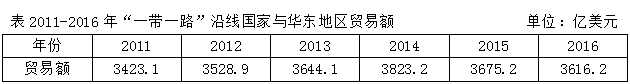

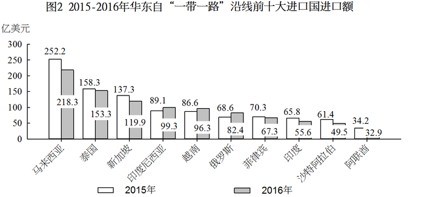

注：前十大出口国和进口国均按2016年数据排列。

#### 第 1 题　qid 2137404 · 数学运算

2015年，华东地区与马来西亚贸易额约占当年华东地区与“一带一路”沿线国家贸易额的      。

- **A**. 

　✅
- **B**. 

- **C**. 

- **D**. 

**答案**：A

**官方解析**

问题问的是2015年，······占······的比重，而2015年的数据可以从材料得出，故本题是现期比重问题。由表格可得2015年华东地区与“一带一路”沿线国家贸易额3675.2亿美元，由图1得2015年华东对马来西亚出口额为153.5亿美元，由图2得2015年华东自马来西亚进口额为252.5亿美元，故所求为。

故正确答案为A。

---

#### 第 2 题　qid 2137408 · 数学运算

2016年对华东地区出口额排名前5名的“一带一路”沿线国家中，有      个国家同年在华东地区进口额也排名“一带一路”沿线国家前5名。

- **A**. 1
- **B**. 2
- **C**. 3　✅
- **D**. 4

**答案**：C

**官方解析**

对华东地区出口额排名前5名的“一带一路”沿线国家即华东地区自“一带一路”沿线国家进口额排名前五的国家，分别为：马来西亚、泰国、新加坡、印度尼西亚、越南；在华东地区进口额排名“一带一路”沿线国家前5名即华东地区对“一带一路”沿线国家出口额排名前五的国家，分别为：印度、越南、俄罗斯、泰国、新加坡，综合可见泰国、新加坡、越南3个国家满足条件。
故正确答案为C。

---

#### 第 3 题　qid 2137410 · 数学运算

2016年对华东地区出口额排名前10名的“一带一路”沿线国家，当年对华东地区出口额比2015年      。

- **A**. 增加了不到20亿美元
- **B**. 增加了超过20亿美元
- **C**. 下降了不到20亿美元
- **D**. 下降了超过20亿美元　✅

**答案**：D

**官方解析**

由题意：2016年比2015年增加（下降）多少亿元，可判定本题为增长量计算问题。对华东地区出口的“一带一路”沿线国家即华东地区自“一带一路”沿线进口的国家，所以要定位图2，图中给出了2016年和2015年的数据。故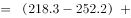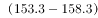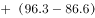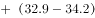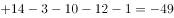亿美元，即下降了49亿美元，与D项符合。

故正确答案为D。

---

#### 第 4 题　qid 2137414 · 数学运算

如华东地区对俄罗斯每年贸易的增长额维持2016年的数值，则华东地区对俄罗斯贸易额将在      突破400亿美元。

- **A**. 2020年
- **B**. 2021年　✅
- **C**. 2022年
- **D**. 2023年

**答案**：B

**官方解析**

根据题干“如······增长额维持······数值，则······将在······年突破·······”，可判定本题为现期追赶问题。定位图1可得：2015年、2016年华东地区对俄罗斯的出口额分别是145.4、167.5亿美元，故2016年出口额的增长量为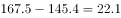亿美元；定位图2可得：2015年、2016年华东地区自俄罗斯的进口额分别是68.6、82.4亿美元，故2016年进口额的增长量为亿美元；故2016年华东地区对俄罗斯每年贸易的增长额为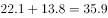亿美元。2016年华东地区对俄罗斯的贸易总额为亿美元，要想达到400亿美元，则总的增长量为亿美元，需要经过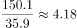年，向上取整，即至少经过5年才能突破400亿美元。2016年再过5年，即2021年。

故正确答案为B。

---

#### 第 5 题　qid 2137418 · 数学运算

能够从上述资料中推出的是      。

- **A**. 2013年，“一带一路”沿线国家与华东地区日均贸易额超过10亿美元
- **B**. 2016年，俄罗斯与华东地区贸易额占“一带一路”沿线国家与华东地区贸易额比重高于上年　✅
- **C**. 2016年，华东地区对新加坡贸易顺差高于上年水平
- **D**. 2016年，新加坡与华东地区贸易额占“一带一路”沿线国家与华东地区贸易额比重比菲律宾高5个百分点以上

**答案**：B

**官方解析**

A项：定位表格，2013年，“一带一路”沿线国家与华东地区贸易额为3644.1亿美元，2013年全年共365天，所以日均贸易额为亿美元，错误；

B项：定位表格，2015年、2016年“一带一路”沿线国家与华东地区贸易额分别为3675.2亿美元、3616.2亿美元；由图1可得，2015年、2016年华东对俄罗斯出口额分别是145.4亿美元、167.5亿美元；由图2可得，2015年、2016年华东自俄罗斯进口额分别是68.6亿美元、82.4亿美元，所以=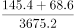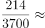，2016年比重==，16年比重高于15年，正确；

C项：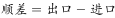，定位图1，2015年、2016年华东对新加坡出口额分别是190.9、163.0亿美元，定位图2，2015年、2016年华东自新加坡进口额分别是137.3、119.9亿美元，所以亿美元，亿美元，2016年顺差2015年顺差，错误；

D项：定位图1，2016年华东对新加坡、菲律宾出口额分别是163.0亿美元、98.7亿美元，定位图2，2016年华东自新加坡、菲律宾进口额分别是119.9亿美元、67.3亿美元，定位表格，2016年“一带一路”沿线国家与华东地区贸易额为3616.2亿美元，所以2016年新加坡所占比重比菲律宾高，即高3.2个百分点，不到5个百分点，错误。

故正确答案为B。

---

### 材料 2

（二）根据下列资料，回答81—85题。

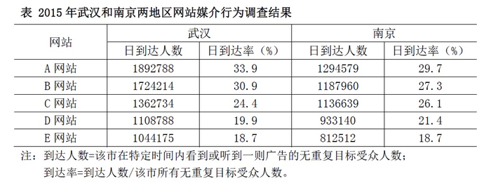

#### 第 6 题　qid 2137442 · 数学运算

假设E网站2014-2015年在全国各地区均实现了日到达人数的增长，则2014年武汉和南京两地区的日到达人数之和最接近 <u>     </u>。

- **A**. 167万
- **B**. 172万
- **C**. 177万　✅
- **D**. 182万

**答案**：C

**官方解析**

根据题干所求“2014年······日到达人数······”，结合材料时间为2015年，可判定此题为基期计算问题。定位表格，2015年E网站武汉、南京日到达人数分别为1044175人和812512人；定位题干“假设E网站2014-2015年在全国各地区均实现了日到达人数的增长”，可知E网站于南京、武汉日到达人数的增长率均为，所以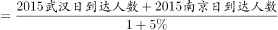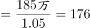万，最接近C选项。

故正确答案为C。

---

#### 第 7 题　qid 2137446 · 数学运算

2015年5个网站在南京地区的无重复目标受众人数均为      。

- **A**. 300多万
- **B**. 400多万　✅
- **C**. 500多万
- **D**. 600多万

**答案**：B

**官方解析**

根据题干所求“···无重复目标受众人数均为”，结合材料“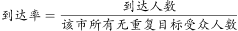”，可知：，结合表格，到达人数和到达率已知，可判定此题为现期比重问题。求南京地区的无重复目标受众人数，所以定位表格一组方便计算得数据即可，A网站南京日到达人数为1294579人，日到达率为，所以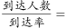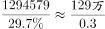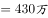，与B项符合。

---

#### 第 8 题　qid 2137458 · 数学运算

如D网站2015年内任意一天在武汉市的到达率均相同，则在2015年内（1月4日以后）任选一名武汉目标受众，其在过去3天内在D网站上看到或听到一则特定广告的概率约为      。

- **A**. 

- **B**. 

　✅
- **C**. 

- **D**. 

**答案**：B

**官方解析**

根据题干所求“······特定广告的概率约为”，可知本题为应用数学运算中的概率知识解决的简单计算问题。

根据材料：“；。”

可知：任选一名武汉目标受众，1天内在D网站上看到或听到一则特定广告的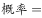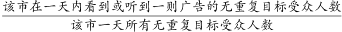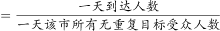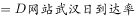，所以任选一名武汉目标受众，1天内在D网站上看到或听到一则特定广告的概率为，反之没看到或听到的概率为（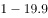）。则任选一名武汉目标受众在过去3天内在D网站上看到或听到一则特定广告的，接近B选项。

（备注：三天内听到一则特定广告的概率，若理解成三天内<b>恰好只听到</b>一则广告，则没有正确答案；故只能理解为三天内<b>至少听到</b>一则广告的概率）

故正确答案为B。

---

#### 第 9 题　qid 2137468 · 数学运算

如A网站2018年在武汉地区的无重复目标受众人数较2015年增加，日到达率较2015年增加5个百分点，则其2018年在武汉的日到达人数将比2015年高约<u>      </u>。

- **A**. 50万　✅
- **B**. 80万
- **C**. 110万
- **D**. 140万

**答案**：A

**官方解析**

根据题干所求“······2018年在武汉的日到达人数······”，结合材料“”，可判定此题为现期比重问题，所以，因此分别求出2018日到达率和2018无重复目标人数即可求出2018武汉日到达人数。

根据材料“”，所以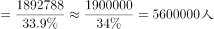，即560万人。

根据题干“A网站2018年在武汉地区的无重复目标受众人数较2015年增加”，所以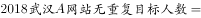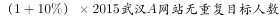。

根据题干，2018年武汉A网站日到达率较2015年增加5个百分点，所以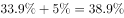。

故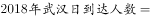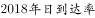

。

所求2018年日到达人数比2015年高的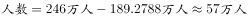，与A项最接近。

故正确答案为A。

---

#### 第 10 题　qid 2137472 · 数学运算

将不同网站按2015年在武汉和南京两地日到达人数之差从低到高排列，以下正确的是      。

- **A**. 
C网站A网站D网站

- **B**. 
D网站B网站E网站

- **C**. 
C网站D网站A网站

- **D**. 
D网站E网站A网站
　✅

**答案**：D

**官方解析**

根据题干所求“······武汉和南京两地日到达人数之差从低到高排列······”，结合选项，可判定此题为排序类问题。

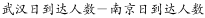

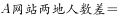；

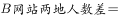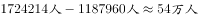；

；

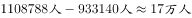；

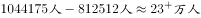；

观察四个选项，都包含D网站，而D网站人数差最少，应排在最低的位置，所以A、C两项错误，排除。B项中，B网站人数差E网站人数差，B项错误，排除。

故正确答案为D。

---

### 材料 3

        2017年上半年，S市出口手机1.9亿台，比去年同期减少；价值513.1亿元人民币，下降。6月份当月出口3217.5万台，减少；价值86亿元，下降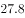。 

        上半年，S市以一般贸易方式出口手机1.8亿台，减少；以加工贸易方式出口699.9万台，减少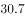；以海关特殊监管方式出口手机245.2万台，减少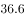。

        上半年，S市民营企业出口手机1.6亿台，减少；外商投资企业出口2043.9万台，减少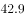；同期，国有企业出口1859.3万台，减少。

        上半年，S市对香港地区出口手机1.5亿台，减少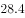；对印度、美国、阿联酋分别出口1151万台、978.2万台和511.3万台，增加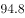、和。此外，对东盟、欧盟分别出口251.2万台、210.4万台，减少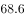、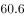。

        上半年，S市出口GSM数字式手机8910.5万台，减少；出口含4G手机在内的其他手机7480.6万台，减少；出口CDMA数字式手机307.3万台，减少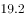。

#### 第 11 题　qid 2137496 · 数学运算

2017年上半年，S市平均每台出口手机的价值比去年同期约      。

- **A**. 
上升0.8

- **B**. 
上升1.3

- **C**. 
下降0.8

- **D**. 
下降1.3
　✅

**答案**：D

**官方解析**

由题干“平均每台出口手机的价值比去年同期约”，选项里面给的是上升或下降的百分数，可判定本题为平均数增长率计算问题。平均每台出口手机的，根据平均数代入数据，定位材料第一段，a为价值的增长率是，b为出口台数的增长率是，，即下降，D项正确。

故正确答案为D。

---

#### 第 12 题　qid 2137500 · 数学运算

2016年上半年，S市以加工贸易方式出口手机数量约是以海关特殊监管方式出口的    倍。

- **A**. 2.1
- **B**. 2.6　✅
- **C**. 2.9
- **D**. 3.5

**答案**：B

**官方解析**

由题干“2016年上半年，S市以加工贸易方式出口手机数量约是以海关特殊监管方式出口的多少倍”，根据给定材料2017年上半年的数据，可判定本题为基期倍数计算问题。根据基期代入数据，定位材料第二段，A为2017年上半年S市以加工贸易方式出口手机数量699.9万台，a为其增长率；B为以海关特殊监管方式出口手机数量245.2万台，b为其增长率。，最接近的为B项。

故正确答案为B。

---

#### 第 13 题　qid 2137506 · 数学运算

将不同出口目的地按2016年上半年自S市进口手机台数从多到少排列，正确的是      。

- **A**. 
东盟美国印度
　✅
- **B**. 
印度美国东盟

- **C**. 
印度东盟美国

- **D**. 
美国东盟印度

**答案**：A

**官方解析**

由题干“2016年上半年自S市进口手机台数从多到少排列”，材料给的是2017年上半年的数据，可判定本题为基期比较问题。根据代入数据，”各地区自S市进口手机“这个题干设问是一个陷阱，各地区自S市进口手机台数即为S市对各地区的出口数量，因此定位材料第四段，找到选项中美国、东盟、印度的相关数据，可以得到2016年上半年：印度为，美国为，东盟为，由此可得东盟美国印度，A项符合。

故正确答案为A。

---

#### 第 14 题　qid 2137510 · 数学运算

2017年上半年，S市出口GSM数字式手机占同期手机出口总量的比重，约比出口含4G手机在内的其他手机占同期手机出口总量比重高      个百分点。

- **A**. 1.9
- **B**. 3.8
- **C**. 7.5　✅
- **D**. 13.6

**答案**：C

**官方解析**

由题干“2017年上半年，S市出口GSM数字式手机占同期手机出口总量的比重，约比出口含4G手机在内的其他手机占同期手机出口总量比重高多少个百分点”，可判定本题为现期比重差值计算。

，定位材料第五段，。

故正确答案为C。

---

#### 第 15 题　qid 2137512 · 数学运算

能够从上述资料中推出的是      。

- **A**. 2017年6月份，S市手机出口量低于1-5月的平均值
- **B**. 2016年上半年，S市民营企业出口手机超过2亿台　✅
- **C**. 2017年上半年，S市出口手机中，超过八成出口到香港地区
- **D**. 2016年上半年，S市月均出口CDMA数字式手机不到60万台

**答案**：B

**官方解析**

A项：根据材料第一段可知，，故6月出口量3217.5万台高于1-5月的平均值，错误。

B项：根据材料第三段可知，，正确。

C项：根据材料第四段可知出口到香港的手机占出口总量的比重为，没有超过八成，错误。

D项：根据材料第五段可知，，则月均出口量约为，错误。

故正确答案为B。

---

#### 第 16 题　qid 2137342 · 数学运算

根据下图数字之间的规律，问号处应填<u>        </u>。

- **A**. 22
- **B**. 41
- **C**. 61　✅
- **D**. 71

**答案**：C

**官方解析**

题干出现图形，凑大数。数字差距较大，考虑乘积。由已知4=1×2+2，9=2×3+3，19=3×5+4，33=4×7+5，可推出所求项？=5×11+6=61。
故正确答案为C。

---

#### 第 17 题　qid 2137370 · 数学运算

1，2，，，，<u>        </u>。

- **A**. 

- **B**. 

- **C**. 

　✅
- **D**. 

**答案**：C

**官方解析**

题干为分数数列，且变化趋势不单调，先考虑反约分，无规律。观察数字特征，（第一项+第二项）×第三项=1，即每一项与前两项之和互为倒数，则所求项应为。

故正确答案为C。

---

#### 第 18 题　qid 2137372 · 数学运算

按此规律，第7行的数字和为<u>        </u>。

- **A**. 155
- **B**. 165
- **C**. 175　✅
- **D**. 185

**答案**：C

**官方解析**

方法一：观察图形可以看出，第1、3、5行的数字分别是（1），（3，5，7），（9，11，13，15，17），正好是奇数数列的连续项且分别有1、3、5个数。按此规律，第7行的数字应为19开头的7个连续奇数，即19、21、23、25、27、29、31这7个数字，它们的数字和为19+21+23+25+27+29+31=175。
方法二：观察图形可看出，第n行有n个数，且这些数构成等差数列。所以第7行的7个数构成等差数列，其和为7的倍数，选项中只有175满足7的倍数。
故正确答案为C。

---

#### 第 19 题　qid 2137390 · 数学运算

根据下表数字之间的规律，问号处应填<u>        </u>。

- **A**. 32
- **B**. 43
- **C**. 48　✅
- **D**. 56

**答案**：C

**官方解析**

题干为三行四列表格，考虑凑大数。数字差距较大，考虑乘积。由已知30=3×8+6，43=7×5+8，？=6×7+6=48。
故正确答案为C。

---

#### 第 20 题　qid 2137396 · 数学运算

-1，1，0，2，4，12，

- **A**. 30
- **B**. 31
- **C**. 32　✅
- **D**. 33

**答案**：C

**官方解析**

数列变化明显，作差无规律，考虑递推。第三项=（第一项+第二项）×2，则所求项应为（4+12）×2=32。
故正确答案为C。

---

#### 第 21 题　qid 2137402 · 数学运算

小瑗和爸爸一起包饺子，爸爸包的饺子是小瑗的两倍。爸爸的饺子放在四个盘子里，小瑗的饺子放在两个盘子里。六个盘子中的饺子数依次为15、19、20、21、22、23。那么小瑗的饺子在      。

- **A**. 第2盘与第4盘　✅
- **B**. 第3盘与第4盘
- **C**. 第2盘与第3盘
- **D**. 第1盘与第6盘

**答案**：A

**官方解析**

根据题干条件可得，爸爸的饺子数是小瑗的两倍，设小瑗饺子数x，则爸爸饺子数2x，可得：
总数=x+2x=3x=15+19+20+21+22+23=120，解得x=40。
六个盘子中只有19+21=40可以凑出小瑗的饺子数，所以小瑗的饺子放在第二盘和第四盘。
故正确答案为A。

---

#### 第 22 题　qid 2137412 · 数学运算

现有甲、乙、丙三种货物，若购买甲1件、乙3件、丙7件共需200元；若购买甲2件、乙5件、丙11件共需350元。则购买甲、乙、丙各1件共需      元。

- **A**. 50
- **B**. 100　✅
- **C**. 150
- **D**. 200

**答案**：B

**官方解析**

根据题干条件，假设甲、乙、丙的价格依次是x、y、z元，则根据题意可列方程组：

方法一：可得：

可得：

元

方法二：钱数x、y、z不一定为整数，所以本题属于非限定性不定方程。可以采用赋零法，赋丙的价格为0，即z=0。原方程组转化为

解得：，。可得：

元

故正确答案为B。

---

#### 第 23 题　qid 2137428 · 数学运算

非高峰时段，地铁每8分钟一班，在车站停靠1分钟，则乘客到达站台2分钟内能乘上地铁的概率为      。

- **A**. 

- **B**. 

- **C**. 

　✅
- **D**. 

**答案**：C

**官方解析**

地铁8分钟一趟，则以每8分钟为一个周期进行考虑。

最早在地铁到来前2分钟到达地铁站，则2分钟内地铁到达时可乘车；

最晚在地铁到达后1分钟内到达地铁站，也可以赶上本趟地铁。

前后一共3分钟的时间可以乘坐地铁。

综上所述：每8分钟内有3分钟可以坐上车，坐上车的概率为。

故正确答案为C。

---

#### 第 24 题　qid 2137260 · 数学运算

6支队伍进行单循环的足球比赛，比赛结束后，战绩如下：

则F队的战绩为<u>      </u>。

- **A**. 0胜5负
- **B**. 1胜4负　✅
- **C**. 2胜3负
- **D**. 3胜2负

**答案**：B

**官方解析**

题干为单循环赛问题，单循环赛每两个队之间比赛一场，一共15场比赛，每场比赛有一方胜利，则一共有15个胜场。

可得，，即F队一共胜了1场。 

同理，15场比赛有15个负场。

可得，，即F队一共负了4场。

综上，F队一共胜了1场，负了4场。

故正确答案为B。

---

#### 第 25 题　qid 2137272 · 数学运算

大小两个玻璃瓶装着芝麻，如果将小瓶子里的芝麻全部倒入大瓶子，大瓶子还可以装45克；如果将大瓶子里的芝麻倒入小瓶子，大瓶子里还剩下455克。已知大瓶子的容积是小瓶子的2倍，则大瓶子最多可装芝麻      克。

- **A**. 1000　✅
- **B**. 850
- **C**. 750
- **D**. 500

**答案**：A

**官方解析**

根据题干条件可得，大瓶子的容积是小瓶子的2倍，设小瓶子最多装克芝麻，则大瓶子最多装克芝麻。

第一次芝麻全部倒入大瓶子，大瓶子还可以装45克，可得：

第二次芝麻全部倒入小瓶子，大瓶子还剩下455克，可得：

综上可得： 

，则大瓶子最多装克

故正确答案为A。

---

#### 第 26 题　qid 2137278 · 数学运算

某马路宽8米，为方便行人过马路，要刷一条4米宽的人行横道线。已知横道线每间隔45厘米刷一条宽也为45厘米的白线，白漆每升可以刷6平方米，则刷这条横道线至少需要      桶一升装的白漆。

- **A**. 2
- **B**. 3　✅
- **C**. 4
- **D**. 5

**答案**：B

**官方解析**

每隔45厘米刷一条宽为45厘米的白线，可知周期为45+45=90厘米。马路宽8米=800厘米，800÷90=8······80。为保证白漆最少，则剩余80厘米应先间隔45厘米再刷80-45=35厘米的白线。此时刷白漆的总面积为0.45×4×8+0.35×4=15.8平方米。白漆每升刷6平方米，则需要一升装白漆的桶数为桶，不少于2.63桶，即至少3桶。

故正确答案为B。

---

#### 第 27 题　qid 2137290 · 数学运算

根据预报，洪水将于2小时后袭击村庄。现武警调用2辆卡车帮助村民转移到高地，第一次转移后发现从村庄到高地需要30分钟，回程需要10分钟，2辆卡车需要再走4个来回才能转移完毕，则必须至少再调用      辆卡车才能在洪水到达前将村民全部转移。

- **A**. 1
- **B**. 2　✅
- **C**. 3
- **D**. 4

**答案**：B

**官方解析**

总时间为，一个来回所需时间为分钟，所以还剩余分钟来转移村民。

从村庄到高地，每辆卡车运两趟最少需要，因此剩余时间最多可让每辆卡车运两趟。剩下的村民需要2辆卡车运四趟，则需要4辆卡车运两趟，即在原来的基础上再增加辆。

故正确答案为B。

---

#### 第 28 题　qid 2137298 · 数学运算

游乐园的摩天轮有60个舱，20分钟转一圈，小王进了摩天轮舱之后5分钟，小李也进了摩天轮舱，则再经过      分钟，小王和小李到达同一高度。

- **A**. 2.5
- **B**. 7.5　✅
- **C**. 12.5
- **D**. 17.5

**答案**：B

**官方解析**

60个舱，20分钟转一圈，则每分钟转个舱。小李在小王5分钟之后进去，则两者相差个舱。当两人等距分布在最高点的两侧，即两人都离最高点7.5个舱位时，小王和小李在同一高度。最高点离小李进去的点有个舱位，因此需要再转个舱，则时间为分钟。

故正确答案为B。

---

#### 第 29 题　qid 2137306 · 数学运算

如图，两个同心圆构成的圆环被均匀地分割成7份，连同中间的小圆共8个区域。若要给这8个区域着色，至少需要<u>      </u>种颜色，才能使相邻区域颜色不同。

- **A**. 3
- **B**. 4　✅
- **C**. 5
- **D**. 6

**答案**：B

**官方解析**

要求相邻区域颜色不同，优先涂相邻面最多的区域，即中间的圆。为了使得所用颜色最少，则其他7个区域涂色如下：

由上图可知，至少需要4种颜色。

---

#### 第 30 题　qid 2137310 · 数学运算

某建筑工程队工人要用铁丝捆扎塑料管，有四种规格的铁丝可供使用。1.6米长的能捆10根，1.2米长的能捆8根，0.8米长的能捆6根，0.4米长的能捆4根。要捆扎好24根塑料管，工人至少要使用      米铁丝。

- **A**. 2.0
- **B**. 2.4　✅
- **C**. 2.8
- **D**. 3.2

**答案**：B

**官方解析**

要使用的铁丝少，对比四种规格铁丝的单位成本，即每捆一根塑料管需要的铁丝长度。

1.6米长的能捆10根，则捆一根塑料管需要米铁丝；

1.2米长的能捆8根，则捆一根塑料管需要米铁丝；

0.8米长的能捆6根，则捆一根塑料管需要米铁丝；

0.4米的能捆4根，则捆一根塑料管需要米铁丝。

规格为0.4米的铁丝最优，所以优先选择它来捆绑塑料管，0.4米能捆4根，则捆24根需要2.4米。

故正确答案为B。

---

## 判断推理

### 第 1 题　qid 2137374 · 逻辑判断

如图所示，木板AB放置在水平地面上，一铅块位于木块上，抓住木板A点，使其以B点为支点向上抬起直至与地面垂直，那么铅块所受的摩擦力f的变化情况为<u>      </u>。

- **A**. 铅块滑动前后，f均随木板倾角的增大而减小
- **B**. 铅块滑动前，f随木板倾角的增大而减小；铅块滑动后，f随木板倾角的增大而增大
- **C**. 铅块滑动前，f随木板倾角的增大而增大；铅块滑动后，f随木板倾角的增大而减小　✅
- **D**. 铅块滑动前后，f均随木板倾角的增大而增大

**答案**：C

**官方解析**

当木板在水平地面时，没有摩擦力；

随着木板抬起至铅块滑动前，铅块受的是静摩擦力。如图所示，根据受力分析可知，静摩擦力。随着木板抬起，木块倾角变大，变大，则静摩擦力f变大，据此可以排除A、B两项；

铅块开始滑动后，所受摩擦力变为动摩擦力，动摩擦力。随着木块倾角α变大，变小，则动摩擦力变小，直至与地面垂直时，动摩擦力变为0，据此可排除D项，C项正确。

故正确答案为C。

---

### 第 2 题　qid 2137378 · 类比推理

如图所示，太阳光与水平地面成50°角入射，利用平面镜反射的原理可使太阳光沿井照亮下水道，则下列关于平面镜放置正确的是<u>      </u>。

- **A**. 与竖直方向成50°
- **B**. 与水平方向成50°
- **C**. 与水平方向成70°　✅
- **D**. 与水平方向成25°

**答案**：C

**官方解析**

如图所示，法线（虚线）和镜子垂直，入射角和反射角相等，则镜面与水平方向成，ABD三项错误，C项正确。

故正确答案为C。

---

### 第 3 题　qid 2137382 · 逻辑判断

蜻蜓点水后在平静的水面上会出现波纹。下面四张图是蜻蜓点水时的俯视照片，照片反映了蜻蜓连续三次点水后某瞬间的水面波纹。不考虑蜻蜓每次点水所用的时间，则下列描述与对应图片相符的是<u>       </u>。

- **A**. A图中蜻蜓向右飞行，且飞行速度和水波的传播速度相等　✅
- **B**. B图中蜻蜓向右飞行，且飞行速度比水波的传播速度慢
- **C**. C图中蜻蜓向左飞行，且飞行速度和水波的传播速度相等
- **D**. D图中蜻蜓向左飞行，且飞行速度比水波的传播速度快

**答案**：A

**官方解析**

水波在水面传播速度相等，所以水波圆圈越小，代表水波产生越晚。观察 ABD三项，水波自左向右大小依次变小，说明水波自左到右依次产生，蜻蜓应向右飞，而C项水波圆心在同一点，说明蜻蜓原地点水。故排除C、D两项。
若蜻蜓飞行速度和水波传播速度相等，则新点水时，刚好在旧水波圆圈上点水。随后扩散时，新产生的水波圆圈应与旧水波圆圈相切，A项正确。
若蜻蜓飞行速度比水波传播速度慢，则新点水时，在旧水波圆圈内点水。随后扩散时，新产生的水波圆圈应与旧水波圆圈无交点，B项错误。
故正确答案为A。

---

### 第 4 题　qid 2137384 · 类比推理

武警战士小东在野外实战训练时，需要从离地3米的窗台跳下，当他两脚着地的瞬间，膝盖马上弯曲，使身体的重心又下降了0.5米，从而缓冲地面对身体的作用力，那么该作用力估计为      。

- **A**. 自身所受重力的4倍
- **B**. 自身所受重力的6倍
- **C**. 自身所受重力的7倍　✅
- **D**. 自身所受重力的10倍

**答案**：C

**官方解析**

武警战士小东从离地3米的窗台跳下，当他两脚着地的瞬间，膝盖马上弯曲，使身体的重心又下降了0.5米，重心下降的距离h=3+0.5=3.5米。假设人从接触地面开始地面对身体的作用力恒为F，可知作用力F的作用距离s=0.5米。从开始起跳到最终站稳的过程中，由动能定理: 合外力做的功等于物体动能的变化量，可知，因为小东开始起跳时，速度等于零，最终落地停稳时，速度也等于零，所以，即，，所以该作用力F估计为自身重力的7倍。

故正确答案为C。

---

### 第 5 题　qid 2137392 · 类比推理

某司机驾车在如下图所示的路面上前行，已知AB段为下凹路段，BC段是上凸路段，当汽车依次经过M、N、O、P（M为最低点，P为最高点）四点时对路面的压力分别为FM、FN、FO、FP，汽车重力为G，前进过程中速率保持不变，那么下列关系式一定成立的是<u>       </u>。

- **A**. FM≥G
- **B**. FN＞G
- **C**. FO＜G　✅
- **D**. FP＞G

**答案**：C

**官方解析**

本题考查向心力的相关知识

本题小车在弧形路面行走，故在受力分析时一定要考虑指向圆心的向心力。

A项，如果车在M点，则车受向下的重力以及向上的支持力，两者合力提供向心力。由于小车速率保持不变的运动，向心力不为0，则支持力FM必须大于重力从而提供向心力，即FM＞G，取不到相等的情况，错误。

B项，在N点，汽车受重力，斜向上指向圆心的支持力FN，将重力分解，沿着支持力反方向Gsinθ和与之垂直的斜向下方向Gcosθ（由于汽车匀速，Gcosθ与摩擦力平衡在此不作考虑）。FN与Gsinθ的合力提供向心力，FN＞Gsinθ，但由于向心力未知，FN与G的大小关系未知，错误。

C项，同理，汽车在O点时，重力分力Gsinθ与FO提供向心力，此情况圆心在斜面下方，故Gsinθ＞FO，则G＞FO，正确。

D项，汽车在P点，由重力G和支持力FP提供向心力，则G＞FP，错误。

故正确答案为C。

备注：各选项的受力分析图如图所示：

---

### 第 6 题　qid 2137394 · 类比推理

如图所示，一皮球从粗糙的曲线形坡面的a点开始无初速度地向下滚动，由于摩擦力作用，皮球滚到b点后开始折返到c点，已知a、b两点的高差为h1，b、c两点的高差为h2，那么<u>      </u>。

- **A**. h1=h2
- **B**. h1＜h2
- **C**. h1＞h2　✅
- **D**. h1、h2大小关系不确定

**答案**：C

**官方解析**

根据题干描述的运动过程，可将本题分成两个过程，两个过程遵循能量守恒定律。

过程一，从a点开始，到b点结束，为a、b高度差。

皮球在a点的所有能量是它的重力势能（）

=mg①

运动到b点的所有能量是它的重力势能（）

=mg②

因为&gt;，所以mg&gt;mg，&gt;，所以从a到b能量减少，减少的能量即为皮球从a运动到b摩擦力所做的功（），所以

=mg-mg=mg（-）③

过程二，从b点开始，到c点结束，为b、c高度差。

同理，如过程一，皮球从b点到c点能量减少，减少的能量即为皮球从b运动到c摩擦力所做的功，所以

④

故，比较和大小，即可理解为比较③和④的大小，此处可简单理解为：因为过程一比过程二多走了ac这段路，所以过程一摩擦力所做的功比较大，所以

⑤

将③④代入⑤可得：

mg&gt;mg，&gt;，C项正确。

故正确答案为C。

---

### 第 7 题　qid 2137398 · 逻辑判断

毕业季来临之际，摄影师用单反相机给某毕业班的同学们拍完合照，随后要用同一台相机给每个学生拍单人照片，那么这时他应该      。

- **A**. 把相机离人近一些，同时镜头后缩
- **B**. 把相机离人近一些，同时镜头前伸　✅
- **C**. 把相机离人远一些，同时镜头后缩
- **D**. 把相机离人远一些，同时镜头前伸

**答案**：B

**官方解析**

本题考查光学相关知识。

从班级合照转向单人照，则拍照视野由大变小，根据常识，相机要离人近一些，排除C、D两项。同时对于镜头而言，照单人照，则使人在底片中尽量大，如图所示，应该是镜头前伸，A项排除，B项当选。

故本题答案为B。

---

### 第 8 题　qid 2137406 · 类比推理

如图所示，在水平台面上放置有一光滑斜面，倾角为α，在斜面上某处放了一根垂直于纸面的直导线，在导线中通有垂直纸面向里的电流，图中a点在导线正下方，b点与导线的连线与斜面垂直，c点在a点左侧，d点在b点右侧。现欲使导线静止在斜面上，下列措施可行的是<u>      </u>。

- **A**. 在a处放置一电流方向垂直纸面向里的直导线
- **B**. 在b处放置一电流方向垂直纸面向里的直导线
- **C**. 在c处放置一电流方向垂直纸面向里的直导线
- **D**. 在d处放置一电流方向垂直纸面向里的直导线　✅

**答案**：D

**官方解析**

根据右手定则和左手定则，在a、b、c、d四处放置电流方向垂直纸面向里的直导线，两根导线会在电流产生的磁场影响下，相互吸引。

若在a、b、c处放置导线，则斜面上导线在斜面方向不受向上的力，不可能静止，故ABC三项错误；

若在d处放置导线，则斜面上导线受磁场对导线向d的力，存在斜面方向向上的分力，可能静止，D项正确。

故正确答案为D。

---

### 第 9 题　qid 2137416 · 类比推理

三盏灯泡L1（110V、100W）、L2（110V、40W）和L3（110V、25W），电源所能提供的电压为220V，在图示的四个电路中，能通过调节变阻器R使电路中各灯泡均能够正常发光且最省电的一种电路是<u>      </u>。

- **A**. A
- **B**. B
- **C**. C　✅
- **D**. D

**答案**：C

**官方解析**

假使三盏灯泡均正常发光，则三盏灯泡耗电量固定，若想电路最省电，则需滑动变阻器R耗电最小。根据，电压相等时，电流越小，滑动变阻器R耗电越小。正常发光时，通过三盏灯泡的电流分别表示为 、、和。

对于A，三盏灯泡并联，若正常发光，三盏灯泡两端电压均为110V，滑动变阻器两端电压为110V。干路电流，即通过滑动变阻器电流。

对于B，和滑动变阻器R并联，若正常发光，灯泡两端电压为110V。干路电流，即通过灯泡的电流，而由于P=UI，三个灯泡额定电压相等，额定功率最小，所以正常工作时，电流最小，故等式不可能成立，B电路图无法让三盏灯都正常发光。

对于C，、和滑动变阻器R并联，若正常发光，三盏灯泡两端电压均为110V，滑动变阻器两端电压为110V。干路电流，即通过灯泡的电流，可得。

对于D，电路相当于和滑动变阻器R、和分别并联后再串联，若正常发光，三盏灯泡两端电压均为110V，滑动变阻器R两端电压为110V。干路电流，可得。

A、C、D三个电路图中，滑动变阻器R两端电压均为110V，C中最小，滑动变阻器消耗功率最小，电路总耗电最小，A、D两项错误，C项正确。

故正确答案为C。

---

### 第 10 题　qid 2137168 · 类比推理

我们知道地球带的是负电荷，如果在赤道上方有一竖直的避雷针，当有带正电荷的乌云经过避雷针上方时开始放电，那么地磁场对避雷针的作用力方向为      。

- **A**. 正东　✅
- **B**. 正南
- **C**. 正西
- **D**. 正北

**答案**：A

**官方解析**

题干要求判断地磁场对避雷针的作用力方向，则要使用左手定则来判断受力方向。当乌云经过避雷针上方开始放电时会产生电流，电流方向由正电荷流向负电荷，也就是指向地心；而地磁场的方向是由地理南极指向地理北极。使用左手定则，让磁感线穿入手心，四指指向电流方向，那么大拇指的方向就是受力方向，由图中可知，大拇指所指方向为正东，所以地磁场对避雷针的作用力方向为正东。

故正确答案为A。

---

### 第 11 题　qid 2137182 · 逻辑判断

水平台面上放置一装有某种液体的容器，将A、B、C三个重量一样的块体放入容器中，当该三个块体稳定后，发现A漂浮在液面上，B悬浮在液体中，而C则沉到容器底部，那么下列说法中正确的是      。

- **A**. 
如果三个块体都是空心的，则它们的体积可能相等

- **B**. 
如果三个块体的材料相同，则A、B一定是空心的
　✅
- **C**. 
如果三个块体都是空心的，则它们所受浮力的大小关系为

- **D**. 
如果三个块体都是实心的，则它们密度的大小关系为

**答案**：B

**官方解析**

逐项分析：

A、C两项：A、B、C三个块体重量一样，即，根据A、B、C三个块体稳定后分别处于漂浮、悬浮、沉底状态可知，、、；故。若三个块体的体积相同，则根据浮力公式可知，三个块体的浮力大小关系为，与题干相矛盾，则三个块体的体积不可能相等，均错误；

B项：三个块体材料相同，而C是沉到容器底部的，说明其平均密度大于液体密度，而A是漂浮，则说明A的平均密度小于液体密度，B物体悬浮，则说明B的平均密度等于液体密度。由此可知A、B物体的平均密度小于C物体，材料相同、重量相同的情况下，A、B一定是空心的，正确；

D项：都是实心的情况下，根据沉浮状态可以判定，错误。

故正确答案为B。

---

### 第 12 题　qid 2137186 · 图形推理

下列选项中，符合所给图形的变化规律的是<u>      </u>。

- **A**. A
- **B**. B
- **C**. C
- **D**. D　✅

**答案**：D

**官方解析**

元素组成相同，考虑位置规律。观察发现图3到图4，整体图形逆时针旋转90°，根据此规律从图1到？处，整体图形也逆时针旋转了90°，对应D项。验证D项，图形整体旋转90°后刚好走到图3的位置。
故正确答案为D。

---

### 第 13 题　qid 2137196 · 图形推理

下列选项中，符合所给图形的变化规律的是（    ）。

- **A**. A
- **B**. B　✅
- **C**. C
- **D**. D

**答案**：B

**官方解析**

观察第一组图形发现，图1到图2，正方形缩小到左边，三角形不变；图2到图3，正方形继续缩小到左边，三角形不变。第二组也应遵循此规律，从图1到图2外框正方形缩小到左边，中间的正方形不变；从图2到？处，左边的正方形继续缩小到左边，中间的正方形不变，对应B项。A项左边的正方形没有继续缩小，排除。C项左边的正方形缩小到了右边，排除。D项左边的正方形缩小到了中间，排除。
故正确答案为B。

---

### 第 14 题　qid 2137200 · 图形推理

下列选项中，符合所给图形的变化规律的是<u>      </u>。

- **A**. A
- **B**. B
- **C**. C　✅
- **D**. D

**答案**：C

**官方解析**

元素组成相同，考虑位置关系。题干为金字塔型，考了紧邻形成三角形图形之间的关系，观察发现，从下往上数第一层左边两个图形内部相同位置的小图形叠加的规律：和叠加后变为第二层左边图形的，和叠加后变为第二层左边图形的，和叠加后变为第二层左边图形的，第一层中间两个图内部图形按照和叠加变为，和叠加后变为，和叠加后变为，从而组成第二层中间图的内部三个小图，第一层右边两个图形的内部小图也是按照和叠加后变为，和叠加后变为，和叠加后变为的规律最后形成了第二行最右侧的图形。照此规律，第二层的左边相邻两个图形内部小图相互叠加则变为第三层的左边图形，第二层右边相邻两图形内部小图相互叠加则变为第三层右边的图形，叠加规律为：和叠加后变为，和叠加后变为，和叠加变为，和叠加后变为，以此类推，第三层的两个图形内部小图相同位置进行叠加后变为顶层的图形，叠加规律为：和叠加后变为的，和叠加后变为，和叠加后变为，只有C项符合。

故正确答案为C.

---

### 第 15 题　qid 2137202 · 图形推理

如下图所示，由图1折叠成图2，再折叠成图3，然后剪去图4的阴影三角部分，现将其完全展开后得到的图形是<u>      </u>。

- **A**. A
- **B**. B
- **C**. C
- **D**. D　✅

**答案**：D

**官方解析**

观察题干发现，从图1到图3折叠两次，且剪去一三角形得到图4，现想知将其完全展开后的图形形状，只需将折叠部分依次展开即可，如下图所示： 

故正确答案为D。

---

### 第 16 题　qid 2137204 · 图形推理

下列选项中，符合所给图形的变化规律的是<u>      </u>。

- **A**. A
- **B**. B
- **C**. C
- **D**. D　✅

**答案**：D

**官方解析**

元素组成相同，考虑位置规律。观察发现，题干图形均可分为内圈、外圈两部分，内圈可分为4格，包括小白球和两条短线，依次整体旋转（或上下翻转），则问号处两个小白球应该出现在下方，两条短线出现在上方，据此排除A、C两项；外圈可分为4格，包括两条短线，依次顺时针旋转，则问号处两根小短线应分别出现在右上方和右下方，对应D项。

故正确答案为D。

---

### 第 17 题　qid 2137206 · 图形推理

下列选项中，符合所给图形的变化规律的是<u>      </u>。

- **A**. A
- **B**. B
- **C**. C　✅
- **D**. D

**答案**：C

**官方解析**

元素组成不同，优先考虑属性规律。观察发现，题干图形都是轴对称图形，且对称轴数量分别为1、2、3、？，故？处应为轴对称图形且有4个对称轴。A项有无数个对称轴，B项有3个对称轴，C项有4个对称轴，D项有1个对称轴。
故正确答案为C。

---

### 第 18 题　qid 2137210 · 图形推理

下列选项中，符合所给图形的变化规律的是<u>      </u>。

- **A**. A
- **B**. B
- **C**. C
- **D**. D　✅

**答案**：D

**官方解析**

元素组成相似，图形间有相同线条重复出现，考虑加减同异。首先观察第一组图，将图2顺时针旋转90度后，和图1求异后得到图3；第二组图运用规律，图2顺时针旋转90度后，和图1求异，应得到的是D项。
故正确答案为D。

---

### 第 19 题　qid 2137218 · 图形推理

下列选项中，由所给图形叠加而成的图形是<u>      </u>。

- **A**. A
- **B**. B
- **C**. C　✅
- **D**. D

**答案**：C

**官方解析**

本题考查图形相加，题干前三幅图相加得到第四幅图。观察选项发现，相加后的图形主要有4个小矩形组成，可对比选项差异，回到题干去验证。观察选项发现，右下角的小矩形有差异，A、D两项里面为空白，而B、C两项里面有条竖线。回到题干，图3右下角有条竖线，故排除A、D两项。继续对比B、C两项发现右上角的矩形有差异，B项右上角矩形内有条小竖线，C项右上角矩形内没有小竖线，回到题干，3幅图的右上角均没有小竖线，排除B项。如下图所示，只有C项符合。

 

故正确答案为C。

---

### 第 20 题　qid 2137220 · 图形推理

下列选项中，符合所给图形的变化规律的是<u>      </u>。

- **A**. A
- **B**. B
- **C**. C
- **D**. D　✅

**答案**：D

**官方解析**

解法一：观察发现，每幅图形都由一些小元素组成，考虑数元素。元素的数量依次为4、5、6、？，问号处应该为7个元素，排除A、B两项；对比C、D两项，元素种类相同，区别是相同元素的数量不同，进一步观察题干发现，圆的数量依次为1、2、3、？，问号处应该为4个圆，排除C项。
故正确答案为D。
解法二：观察发现，每幅图形都由一些小元素组成，考虑数元素。题干中所有图形都是由2种元素构成。A选项3种元素，B选项2种元素，C选项3种元素，D选项3种元素。
故正确答案为B。
粉笔更倾向于D选项为正确答案。理由是，在一些题目中图形的方向不同，可以看作不同种类的图形，而且因为元素种类的规律比较简单，如果想单纯考虑元素种类的话，没必要把图形的数量规律画的如此明显，因此粉笔更倾向于答案为D选项。
此题为争议题，任何一种解法都规律严谨，各位考生不要纠结。

---

### 第 21 题　qid 2137222 · 图形推理

下列选项中，符合所给图形的变化规律的是<u>      </u>。

- **A**. A　✅
- **B**. B
- **C**. C
- **D**. D

**答案**：A

**官方解析**

元素组成相同，优先考虑位置规律。每个图形都是由4个长方形组成的，在图一中，从左到右依次给长方形编号为1、2、3、4，图一到图二1号长方形向右平移两步，图二到图三2号长方形向右平移两步，图三到图四应该是3号长方形向右平移两步，只有A项符合。
故正确答案为A。

---

### 第 22 题　qid 2137228 · 图形推理

下列选项中，根据图1和图2的关系，与图3对应的图形是<u>      </u>。

- **A**. A
- **B**. B
- **C**. C　✅
- **D**. D

**答案**：C

**官方解析**

元素组成基本相同，优先考虑位置规律。第一组图找规律，观察图1和图2，梯形和三角形的位置进行互换，×和+的位置进行互换，圆的位置不变，外框都是正方形；第二组图用规律，图3中三角形和圆的位置进行互换，#和*的位置进行互换，外框是梯形，所以对应选项C。
故正确答案为C。

---

### 第 23 题　qid 2137236 · 图形推理

左边给定的平面图折叠后的立体图形是<u>      </u>。

- **A**. A　✅
- **B**. B
- **C**. C
- **D**. D

**答案**：A

**官方解析**

将题干展开图标上序号（题干中四个小三角形移动拼成一个完整的面i），如下图所示，逐一进行分析。

A项：选项由面i、面h与面k或面i、面e与面f构成，选项与题干展开图一致，当选；

B项：选项由面g、面i与一个空白面构成，题干展开图中面g与面i是相对面，不能同时出现，选项与题干展开图不一致，排除；

C项：选项由面g、面i与一个空白面构成，题干展开图中面g与面i是相对面，不能同时出现，选项与题干展开图不一致，排除；

D项：选项由面e、面f、面k与面h中的三个面构成，题干展开图中面e与面k是相对面，面f与面h是相对面，不能同时出现，无法满足同时出现三个面的情况，选项与题干展开图不一致，排除。

故正确答案为A。

---

### 第 24 题　qid 2137242 · 逻辑判断

领导干部如果没有底线思维，就不能做到严格自律。而只有不忘初心，才能始终保持底线思维。也只有始终坚守理想信念，才能不忘初心。
根据以上信息，可以得出下列      项。

- **A**. 如果领导干部不能做到严格自律，就会丧失底线思维
- **B**. 领导干部只有不忘初心，才能做到严格自律　✅
- **C**. 领导干部只要始终坚守理想信念，就能做到严格自律
- **D**. 领导干部只要不忘初心，就可以做到严格自律

**答案**：B

**官方解析**

第一步：翻译题干。
①领导干部没有底线思维→不能严格自律
②保持底线思维→不忘初心
③不忘初心→坚守理想信念
将①逆否和②③可以递推出：严格自律→底线思维→不忘初心→坚守理想信念
第二步：逐一分析选项。
A项翻译：领导干部不能严格自律→丧失底线思维，肯定条件①的后件无法得到肯定性结论，排除；
B项翻译：严格自律→不忘初心，通过将①逆否和②③可以递推出，当选；
C项翻译：坚守理想信念→严格自律，通过将①逆否和②③可以递推出严格自律→坚守理想信念，肯定后件无法得出肯定性结论，排除；
D项翻译：不忘初心→严格自律，通过将①逆否和②③可以递推出严格自律→不忘初心，肯定后件无法得出肯定性结论，排除。
故正确答案为B。

---

### 第 25 题　qid 2137250 · 逻辑判断

专业教育的主要目的是帮助大学生尽可能全面地掌握各自专业领域的基础知识，而通识教育的目的则重在帮助大学生获得生活的意义和价值。因此有专家指出，相较于专业教育，通识教育对个人未来生活的影响更大。
下列      项如果为真，最能支持该专家的断言。

- **A**. 价值问题关乎人的幸福和尊严，值得在通识教育中予以探究和思考
- **B**. 当今我国大学开设的专业教育类课程要远远多于通识教育类课程
- **C**. 一个人如果没有专业知识，可能还能活下去；倘若没有价值追求，就将只是一具没有灵魂的躯壳　✅
- **D**. 没有专业知识，人很难应对未来生活的挑战；而不正确的价值追求，则会误导人的生活

**答案**：C

**官方解析**

第一步：找出论点和论据。
论点：相较于专业教育，通识教育对个人未来生活的影响更大。
论据：专业教育的主要目的是帮助大学生尽可能全面地掌握各自专业领域的基础知识，而通识教育的目的则重在帮助大学生获得生活的意义和价值。
第二步：逐一分析选项。
A项：指出通识教育中应探究和讨论价值问题，但没有涉及到专业教育的情况，无法进行比较，无法加强，排除；
B项：指出大学开设的专业课程数量比通识课程多，只是数量的比较，无法判断这两种课程对人未来生活的影响哪个更大，无法加强，排除；
C项：指出没有专业知识可能活下去，但是没有价值追求就失去了灵魂，显然失去了灵魂更加严重，而价值追求对应通识教育，因此通识教育对个人未来生活的影响更大，补充论据，当选；
D项：没有专业知识难以应对未来生活的挑战，不正确的价值追求误导人的生活，说明两者对个人未来生活的影响都很大，但没有明确比较两者谁的影响更大，无法加强，排除。
故正确答案为C。

---

### 第 26 题　qid 2137262 · 逻辑判断

未取得教师资格证书的大学毕业生不能被某地区的学校录用为教师。该地区的师范大学历史系的所有学生在毕业前都必须取得教师资格证书。因此，任何一位该大学历史系的毕业生都可以在该地区被录用为教师。
下列      项如果为真，能够使上述论证得以成立。

- **A**. 每一个取得教师资格证书的人的教学水平都是相同的
- **B**. 取得教师资格证书是大学毕业生在该地区被录用为教师的唯一条件　✅
- **C**. 该地区师范大学历史系取得教师资格证书的所有学生都能毕业
- **D**. 想知道自己是否胜任教师这一职业的唯一方法就是去参加教师资格证书考试

**答案**：B

**官方解析**

第一步：找出论点和论据。
论点：任何一位该大学历史系的毕业生都可以在该地区被录用为教师。
论据：未取得教师资格证书的大学毕业生不能被某地区的学校录用为教师。该地区的师范大学历史系的所有学生在毕业前都必须取得教师资格证书。
第二步：逐一分析选项。
A项：讨论的是取得教师资格证书的人的教学水平是否一致，而题干讨论的是历史系毕业生能不能在该地区被录用为教师的问题，两者讨论的话题不一致，排除；
B项：说明取得教师资格证是被录用的唯一条件，而根据题干已知该大学历史系的毕业生都取得了教师资格证，建立了该大学历史系的毕业生和在该地区被录用为教师之间的联系，所以该大学历史系的毕业生都可以被录用，加强了题干的论证，当选；
C项：讨论的是该大学历史系有教师资格证的学生是否能毕业，而题干所讨论的是该大学的历史系学生毕业之后能不能当老师的问题，两者话题不一致，排除； 
D项：讨论的是能否胜任这个职业的事情，而题干所说的是能否被学校录用的问题，两者讨论话题不一致，排除。
故正确答案为B。

---

### 第 27 题　qid 2137286 · 逻辑判断

一直以来，科学家都在追寻一个问题的答案，那就是：究竟是什么给了地球足够的氧气，使其能孕育出动物和人类。地球大气中出现氧气是在距今24亿年前。约4.7亿年前，苔藓类地被植物在地球上迅速蔓延，直到4亿年前，地球大气中氧气含量才达到今天的水平。因此，有科学家认为，地球氧气大增源自苔藓类地被植物。
下列      项如果为真，最能支持上述科学家的观点。

- **A**. 地球上最早出现的陆生植物出人意料地多产，它们大大提升了地球大气中的氧气含量
- **B**. 通过电脑模拟可以估算得出：在约4.45亿年前，地球上的地衣和苔藓所产生的氧气占总氧气量的30%
- **C**. 苔藓类地被植物的蔓延增加了沉积岩中的有机碳含量，而这导致空气中的氧气含量也随着增加　✅
- **D**. 氧气含量的增加使得地球上演化出包括人类在内的大型、可移动的智慧生物成为可能

**答案**：C

**官方解析**

第一步：找出论点和论据。
论点：地球氧气大增源自苔藓类地被植物。
论据：地球大气中出现氧气是在距今24亿年前。约4.7亿年前，苔藓类地被植物在地球上迅速蔓延，直到4亿年前，地球大气中氧气含量才达到今天的水平。
论点和论据都在讨论“地球氧气大增”和“苔藓类地被植物蔓延”之间的关系，论点和论据话题一致，加强优先考虑解释或举例。
第二步：逐一分析选项。
A项：说的是陆生植物导致大气中的氧气含量增加，苔藓类地被植物是陆生植物的一种，无法确定苔藓类植物是否与氧气含量大增有关，属于不明确选项，排除；
B项：在约4.45亿年前，地球上的地衣和苔藓所产生的氧气占总氧气量的30%，选项只是在说4.45亿年前的氧气含量占比，无法确定后来的氧气大增是否来源于苔藓植物，属于不明确选项，排除；
C项：说明苔藓类地被植物的蔓延增加了沉积岩中的有机碳含量，从而导致空气中的氧气含量也随着增加，是对论点的解释，当选；
D项：讨论的是氧气增加的结果，而题干讨论的是氧气增加的原因，两者讨论话题不一致，属于无关选项，排除。
故正确答案为C。

---

### 第 28 题　qid 2137302 · 类比推理

江海之所以能为百谷王者，以其善下之，故能为百谷王。是以圣人欲上民，必以言下之；欲先民，必以身后之。
下列（    ）项与以上论证方法最为相似。

- **A**. 名不正，则言不顺；言不顺，则事不成。事不成，则礼乐不兴；礼乐不兴，则刑罚不中；刑罚不中，则民无所措手足。故君子名之必可言也，言之必可行也
- **B**. 春风朝煦，萧艾蒙其温；秋霜宵坠，芝蕙被其凉。是以威以齐物为肃，德以普济为弘　✅
- **C**. 木受绳则直，金就砺则利，君子博学而日参省乎己，则知明而行无过矣
- **D**. 假舆马者，非利足也，而致千里；假舟楫者，非能水也，而绝江河。君子性非异也，善假于物也

**答案**：B

**官方解析**

第一步：分析题干论证结构。
题干意为“江海之所以能成为百川百谷之王，是因为江海能够自处于谦下的位置，而河川自然流向大海，江海自然能够成为百谷之王。因此，统治者想要凌驾于黎民百姓之上，必须在言辞上处于谦恭的地位；想要先于百姓，更要在实际上处于他们的后方”。是从“江海”这一自然的特殊现象到“统治者”这类人的一般性结论的归纳推理。
第二步：逐一分析选项。
A项：意为“名分不正，说起话来就不顺当合理；说话不顺当合理，事情就办不成；事情办不成，礼乐也就不能兴盛；礼乐不能兴盛，刑罚的执行就不会得当；刑罚不得当，百姓就不知怎么办好。所以君子一定要定下一个名分，必须能够说得明白，说出来一定能够行得通”。并不涉及由自然推及人类，与题干论证结构不一致，排除；
B项：意为“春风在早晨吹拂，萧、艾都受到它的温暖；秋霜在晚上降落，芝、蕙都受到它的寒凉。所以明君施威、济德，只有对所有臣民一视同仁，才是肃严、弘大的”。是从“春风朝拂”“秋霜夜降”这一自然的特殊现象到“统治者”这类人的一般性结论的归纳推理，与题干逻辑关系一致，当选；
C项：意为“木材用墨线量过，再经辅具加工就能取直，刀剑等金属制品在磨刀石上磨过就能变得锋利，君子广泛地学习，而且每天多次对自己检查反省，那么他就会聪明机智，而行为就不会有过错了”。并不涉及由自然推及人类，与题干论证结构不一致，排除；
D项：意为“凭借车马的人，并不是他擅长走路，却能到达千里远；凭借船桨的人，并不是他擅长游泳，却能横渡大江大河。君子的资质秉性跟一般人没有不同，只是君子善于借助外物罢了。”并不涉及由自然推及人类，与题干论证结构不一致，排除。
故正确答案为B。

---

### 第 29 题　qid 2137308 · 逻辑判断

X市的有线电视付费频道的用户数量比Y市要多，因此X市的市民比Y市市民更加了解国际时事。
下列各项如果为真，除了      项外，都将削弱上述论证。

- **A**. X市有线电视付费频道的月租费要低于Y市的同类频道　✅
- **B**. 调查显示，X市市民平均看电视的时间要比Y市市民少
- **C**. X市有线电视付费频道播放的都是娱乐类节目
- **D**. 大多数Y市市民在X市工作，通常只是在周末才回到Y市

**答案**：A

**官方解析**

第一步：找出论点和论据。
论点：X市的市民比Y市市民更加了解国际时事。
论据：X市的有线电视付费频道的用户数量比Y市要多。
第二步：逐一分析选项。
A项，月租低一定程度上可以解释为什么X市有线电视付费频道的用户数量多，但是没有体现谁更了解国际时事，无关选项，无法削弱，本题为选非题，当选；
B项，X市市民平均看电视的时间少，说明虽然X市有线电视付费频道的用户数量多，但是不一定谁看的电视多，不一定谁更加了解国际时事，可以削弱，排除；
C项，X市有线电视付费频道播放的都是娱乐类节目，说明无法用有线电视付费频道的用户数量来判断谁更加了解国际时事，可以削弱，排除；
D项，大多数Y市市民在X市工作，在周末回到Y市，说明虽然X市的有线电视付费频道的用户数量多，但是也有可能是Y市的人在付费使用，所以无法得出X市的市民比Y市市民更加了解国际时事，可以削弱，排除。
本题为选非题，故正确答案为A。

---

### 第 30 题　qid 2137316 · 逻辑判断

去年全年，某地区因驾驶员酒驾导致的交通事故数量是因驾驶员疲劳驾驶导致的交通事故数量的2倍。因此，在禁止疲劳驾驶方面的宣传工作要比禁止酒驾的宣传工作做得更好。
下列（    ）项问题的答案最能对上述结论做出评价。

- **A**. 交通事故的数量是否与交通安全方面的宣传工作有直接关系？　✅
- **B**. 在下一个年度中，因疲劳驾驶而导致的交通事故数量是否会增加？
- **C**. 是不是所有疲劳驾驶的驾驶员都会出交通事故？
- **D**. 如果加大禁止酒驾的宣传力度，能在多大程度上降低酒驾导致的交通事故数量？

**答案**：A

**官方解析**

第一步：找出论点和论据。
论据：去年全年，某地区因驾驶员酒驾导致的交通事故数量是因驾驶员疲劳驾驶导致的交通事故数量的2倍。
论点：在禁止疲劳驾驶方面的宣传工作要比禁止酒驾的宣传工作做得更好。
第二步：逐一分析选项。
A项：该项讨论的是论点和论据的话题是否有直接的关系，而论点和论据是否有关系决定着题干结论是否成立，因此该项可以对题干的结论做出评价，当选；
B项：”下一个年度的交通事故数量“题干未提，无关项，排除；
C项：题干仅仅是比较了因酒驾导致交通事故的数量及因疲劳驾驶导致交通事故的数量，并未提及所有疲劳驾驶的驾驶员是否会发生交通事故，无关项，排除；
D项：加大禁止酒驾的宣传力度能在多大程度上降低酒驾导致的交通事故数量，仅讨论了禁止酒驾的问题，而题干是禁止酒驾和禁止疲劳驾驶二者之间的比较，无关项，排除。
故正确答案为A。

---

### 第 31 题　qid 2137322 · 类比推理

H市在公共场所中的每一块绿地都配备了垃圾桶。这些垃圾桶或者标有“可回收垃圾”或者标有“不可回收垃圾”。
如果上述陈述为真，则下列        项一定为真。
ⅠH市配备的垃圾桶上有的标有“可回收垃圾”
Ⅱ如果H市有一块绿地没有配备垃圾桶，那么该绿地不属于公共场所
Ⅲ如果H市有块绿地配备了标有“不可回收垃圾”的垃圾桶，那么它属于公共场所

- **A**. 只有Ⅰ
- **B**. 只有Ⅱ　✅
- **C**. 只有Ⅲ
- **D**. Ⅰ和Ⅱ

**答案**：B

**官方解析**

第一步：翻译题干。
①公共场所中的绿地→垃圾桶。
②垃圾桶→标有“可回收垃圾” 或 标有“不可回收垃圾”。
第二步：逐一分析陈述。
Ⅰ.H市配备的垃圾桶上有的标有“可回收垃圾”。翻译后即：有的垃圾桶→标有“可回收垃圾”。肯定了命题②的箭头前，肯定箭头前必肯定箭头后。但“标有‘可回收垃圾’”不等同于“标有‘可回收垃圾’ 或 标有‘不可回收垃圾’”。因为即使没有“标有‘可回收垃圾’的垃圾桶”，有“标有‘不可回收垃圾’的垃圾桶”也符合命题②的箭头后的或关系，因此该陈述不是一定为真；
Ⅱ.如果H市有一块绿地没有配备垃圾桶，那么该绿地不属于公共场所。翻译后即：-垃圾桶→-公共场所。否定了命题①的箭头后，否定箭头后必否定箭头前，该陈述一定为真；
Ⅲ.如果H市有块绿地配备了标有“不可回收垃圾”的垃圾桶，那么它属于公共场所。翻译后即：标有“不可回收垃圾”→公共场所。肯定了命题②的箭头后，肯定箭头后得不到确定性的结论，该陈述不是一定为真。
综上所述，只有陈述Ⅱ一定为真。
故正确答案为B。

---

### 第 32 题　qid 2137326 · 逻辑判断

校学术委员会开会讨论新一轮的重点学科建设规划。王教授主张：既要重点建设教育科学，也要建设自然地理学；赵教授提出：只有重点建设计算机信息工程，才能建设自然地理学；李教授认为：如果要重点建设教育科学和自然地理学，那么也要建设计算机信息工程。经过充分讨论，在上述三位教授的意见中，学术委员会最后只采纳了其中一位的意见。
根据以上陈述，下列        项符合学术委员会的决定。

- **A**. 重点建设计算机信息工程和自然地理学，但是不建设教育科学
- **B**. 重点建设教育科学和计算机信息工程，但是不建设自然地理学
- **C**. 重点建设计算机信息工程，但是不建设教育科学和自然地理学
- **D**. 重点建设自然地理学和教育科学，但是不建设计算机信息工程　✅

**答案**：D

**官方解析**

第一步：分析题干条件。

王教授：教育科学 且 自然地理学；

赵教授：自然地理学计算机信息工程；

李教授：（教育科学 且 自然地理学）计算机信息工程。

第二步：看其余，根据题干推理。

题干中只采纳一个人的建议，说明只有一真。分析条件（2）（3）可知，两个都涉及到推出关系，且后半部分相同，如果（2）成立，那么（3）一定成立，又题干条件只有一真，所以（2）一定错，即（2）的矛盾“重点建设自然地理学且不建设计算机信息工程”一定对，排除A、B、C三项。

故正确答案为D。

注：本题问的是下列哪项符合学术委员会的决定，也可以考虑代入选项进行验证。

代入A项，王教授的意见为假，赵教授和李教授的意见为真，不满足只采纳了一个人的意见，排除；

代入B项，王教授的意见为假，赵教授和李教授的意见为真，不满足只采纳了一个人的意见，排除；

代入C项，王教授的意见为假，赵教授和李教授的意见为真，不满足只采纳了一个人的意见，排除；

代入D项，王教授的意见为真，赵教授和李教授的意见为假，满足只采纳了一个人的意见，当选。

故正确答案为D。

---

### 第 33 题　qid 2137330 · 逻辑判断

某单位打算邀请五位专家在6月下旬参加一个项目论证会。某日，工作人员致电五位专家以确定会议日期。
专家甲说：“我有两天不行，因为我每周一都要参加本单位的例会。”
专家乙说：“我6月27号以后要出国访问。”
专家丙说：“我下周四之前都在外地开会。”
专家丁说：“我下周五、六、日都要参加其他会议。”
专家戊说：“最好在下半周举行，一般上半周都没有时间。”
根据上述信息，可以召开项目论证会的时间是        。

- **A**. 6月21日
- **B**. 6月22日
- **C**. 6月23日
- **D**. 6月24日　✅

**答案**：D

**官方解析**

6月一共有30天，那下旬一共10天，即21-30日。根据甲的话可知，10天中会有两个周一，任意连续的7天必然有且只有一个周一，可知24-30号必然有且只有一个周一，则21-23日必然存在周一，有三种情况，如下图：

由题干可知，专家丙说：“我下周四之前都在外地开会。”，专家丙是针对下旬的论证会邀请所作答，也就意味着专家所说的下周四一定是下旬里。而三种情况中，都只有一个周四包含在下旬中，所以唯一的周四就是专家丙所说的“下周四”。

在直接推理比较复杂，可以采用代入排除法。

A项，三种情况下，21日都在下周四之前，丙不能参加，所以不能是21日，排除；

B项，三种情况下，22日都在下周四之前，丙不能参加，所以不能是22日，排除；

C项，三种情况下，23日都在下周四之前，丙不能参加，所以不能是23日，排除；

D项，第一种情况下，24日是周四，每个人都可以参加，当选。

故正确答案为D。

---

### 第 34 题　qid 2137332 · 类比推理

五名幼儿园的小朋友围坐成一圈玩游戏。已知：小红不坐在小兰旁边；小白坐在小敏旁边；小兰坐在小杉旁边。
如果上述陈述属实，可以确定的是下列        项。
I小红坐在小杉和小敏的中间
II小兰坐在小杉和小白的中间
III小白坐在小杉的旁边
IV小敏坐在小白和小兰的中间

- **A**. II和IV都不是真的
- **B**. I和II是真的　✅
- **C**. II和III都是真的
- **D**. II和III都不是真的

**答案**：B

**官方解析**

第一步：分析题干。
由“小红不坐在小兰旁边；小白坐在小敏旁边；小兰坐在小杉旁边”可知，这五名幼儿园小朋友的顺序，有可能是两种情况，第一种是：按照小白、小敏、小红、小杉、小兰的顺序围成一圈；第二种是：按照小敏、小白、小红、小杉、小兰的顺序围成一圈。
第二步：逐一分析选项。
I、II和IV中的“中间”是指在两个人中间的任何一个位置都是可以的，并不一定是要直接挨着，因为如果把“中间”理解成是直接挨着的话，那根据分析，可以得到I、II和IV是可能是正确的，而III一定是错误的，但是没有这样的选项。所以，对于“中间”的理解只能是在两个人中间的任何一个位置都是可以的，并不一定是要直接挨着的。所以，I、II和IV确定是真的，而III确定是错的。
故正确答案为B。

---

### 第 35 题　qid 2137338 · 逻辑判断

在现代音乐制作领域中，音乐创作被弃之一旁，取而代之的是音乐工业，它如同其他工业领域一样，强调的是标准化和一致性，因而流行音乐最典型的特征包括朗朗上口的曲调、副歌以及标准化节奏（一节四拍）。
下列        项最适合作为上文论述的结论。

- **A**. 现代流行音乐的典型特征是由音乐工业的要求决定的　✅
- **B**. 音乐工业对标准化和一致性的要求与其他工业没有区别
- **C**. 音乐创作在现代已经完全消失了
- **D**. 流行音乐应该具备的典型特征包括朗朗上口的曲调、副歌以及标准化节奏（一节四拍）

**答案**：A

**官方解析**

日常结论题，根据题干信息逐一分析选项。
A项：因为音乐创作被弃之一旁，取而代之的是音乐工业，而流行音乐最典型的特征包括朗朗上口的曲调、副歌以及标准化节奏（一节四拍），所以可得到A项的结论，当选；
B项：由题干我们只能知道，音乐工业同其他工业领域一样，强调的是标准化和一致性，但是我们并不知道音乐工业的要求和其它工业的要求有没有区别，排除；
C项：音乐创作被弃之一旁，并不能说明它已经完全消失了，表述太绝对，排除；
D项：朗朗上口的曲调、副歌以及标准化节奏（一节四拍）只是流行音乐的典型特征，但是文段并没有表达流行音乐“应该”具有这些特征，不能作为结论，排除。
故正确答案为A。

---
