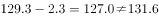
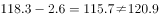
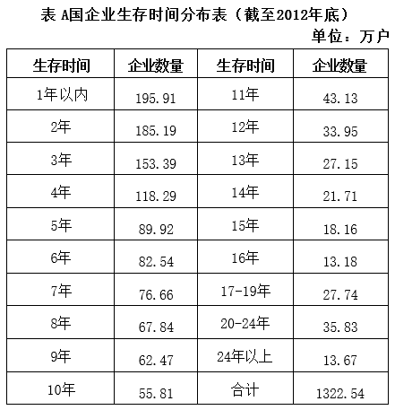
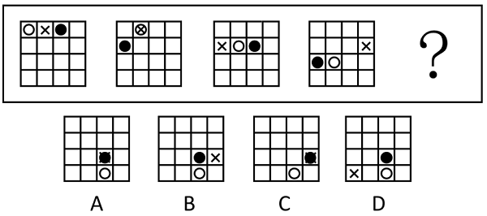
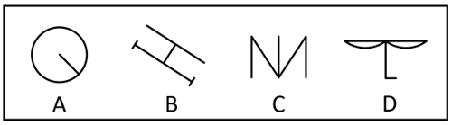
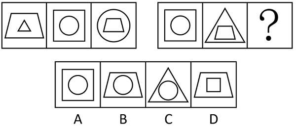

# 2018年上海市行政执法类考试《行测》试题（网友回忆版）

> 省考 · 2018 年 · 5 个模块 · 共 99 题

- [政治理论](#%E6%94%BF%E6%B2%BB%E7%90%86%E8%AE%BA) · 9 题
- [常识判断](#%E5%B8%B8%E8%AF%86%E5%88%A4%E6%96%AD) · 26 题
- [言语理解与表达](#%E8%A8%80%E8%AF%AD%E7%90%86%E8%A7%A3%E4%B8%8E%E8%A1%A8%E8%BE%BE) · 20 题
- [数量关系](#%E6%95%B0%E9%87%8F%E5%85%B3%E7%B3%BB) · 20 题
- [判断推理](#%E5%88%A4%E6%96%AD%E6%8E%A8%E7%90%86) · 24 题

---

## 政治理论

### 材料 1

阅读下列材料，回答96—100题。

        党的十九大报告指出，十八大以来，国内外形势变化和我国各项事业发展都给我们提出了一个重大时代课题，这就是必须从理论和实践结合上系统回答新时代坚持和发展什么样的中国特色社会主义的总目标、总任务、总体布局、战略布局和发展方向、发展方式、发展动力、战略步骤、外部条件、政治保证等基本问题，并且要根据新的实践对经济、政治、法治、科技、文化、教育、民生、民族、宗教、社会、生态文明、国家安全、国防和军队、“一国两制”和祖国统一、统一战线、外交、党的建设等各方面作出理论分析和政策指导，以利于更好坚持和发展中国特色社会主义。

        围绕这个重大时代课题，我们党坚持以马克思列宁主义、毛泽东思想、邓小平理论、“三个代表”重要思想、科学发展观为指导，坚持解放思想、实事求是、与时俱进、求真务实，坚持辩证唯物主义和历史唯物主义，紧密结合新的时代条件和实践要求，以全新的视野深化对共产党执政规律、社会主义建设规律、人类社会发展规律的认识，进行艰辛理论探索，取得重大理论创新成果，形成了新时代中国特色社会主义思想。

#### 第 1 题　qid 5687850 · 新思想

新时代中国特色社会主义思想，明确坚持和发展中国特色社会主义，在全面建成小康社会的基础上分两步走，在本世纪中叶建成富强、民主、文明、        的社会主义现代化强国。

- **A**. 健康
- **B**. 和谐　✅
- **C**. 美丽　✅
- **D**. 自信

**答案**：BC

**官方解析**

本题考查政治常识。
A、D两项错误，B、C两项正确，2017年10月18日，中国共产党第十九次全国代表大会在北京人民大会堂隆重开幕。习近平代表第十八届中央委员会向大会作题为《决胜全面建成小康社会 夺取新时代中国特色社会主义伟大胜利》的报告。报告“四、决胜全面建成小康社会，开启全面建设社会主义现代化国家新征程”指出，第二个阶段，从二〇三五年到本世纪中叶，在基本实现现代化的基础上，再奋斗十五年，把我国建成富强民主文明和谐美丽的社会主义现代化强国。
故正确答案为BC。

---

#### 第 2 题　qid 5687855 · 新思想

新时代中国特色社会主义思想，明确中国特色社会主义事业总体布局是”五位一体”、战略布局是“四个全面”，强调坚定道路自信、理论自信、        。

- **A**. 制度自信　✅
- **B**. 科技自信
- **C**. 文化自信　✅
- **D**. 能力自信

**答案**：AC

**官方解析**

本题考查政治常识。
A、C两项正确，B、D两项错误，2017年10月18日，中国共产党第十九次全国代表大会在北京人民大会堂隆重开幕。习近平代表第十八届中央委员会向大会作题为《决胜全面建成小康社会 夺取新时代中国特色社会主义伟大胜利》的报告。报告“三、新时代中国特色社会主义思想和基本方略”指出，明确坚持和发展中国特色社会主义的总任务；明确新时代我国社会主要矛盾；明确中国特色社会主义事业总体布局是”五位一体”、战略布局是“四个全面”，强调坚定道路自信、理论自信、制度自信、文化自信······
故正确答案为AC。

---

#### 第 3 题　qid 5687862 · 新思想

新时代中国特色社会主义思想，明确中国特色大国外交要推动构建新型国际关系，推动        。

- **A**. 建设大同世界
- **B**. 建设“一带一路”
- **C**. 构建人类命运共同体　✅
- **D**. 实现世界永久和平

**答案**：C

**官方解析**

本题考查政治常识。
C项正确，A、B、D三项错误，党的十九大报告中“三、新时代中国特色社会主义思想和基本方略”指出：“新时代中国特色社会主义思想，明确坚持和发展中国特色社会主义，总任务是实现社会主义现代化和中华民族伟大复兴，在全面建成小康社会的基础上，分两步走在本世纪中叶建成富强民主文明和谐美丽的社会主义现代化强国······明确中国特色大国外交要推动构建新型国际关系，推动构建人类命运共同体；明确中国特色社会主义最本质的特征是中国共产党领导，中国特色社会主义制度的最大优势是中国共产党领导，党是最高政治领导力量，提出新时代党的建设总要求，突出政治建设在党的建设中的重要地位。”
故正确答案为C。

---

#### 第 4 题　qid 5687864 · 新思想

十九大报告指出了新时代坚持和发展中国特色社会主义的十四条基本方略。其中第一条，就是坚持党对一切工作的领导。对此，下列认识正确的是        。

- **A**. 中国特色社会主义最本质的特征是中国共产党领导的改革开放
- **B**. 中国特色社会主义制度的最大优势是中国共产党领导
- **C**. 党政军民学，东西南北中，党是领导一切的　✅
- **D**. 必须增强政治意识、大局意识、核心意识、看齐意识，自觉维护党中央权威和集中统一领导　✅

**答案**：CD

**官方解析**

本题考查政治常识。
A、B两项错误，党的十九大报告中“三、新时代中国特色社会主义思想和基本方略”指出：“明确中国特色社会主义最本质的特征是中国共产党领导，中国特色社会主义制度的最大优势是中国共产党领导，党是最高政治领导力量，提出新时代党的建设总要求，突出政治建设在党的建设中的重要地位。”A项本身表述错误，B项表述正确，但是属于“八个明确”部分的内容。
C、D两项正确，党的十九大报告中“三、新时代中国特色社会主义思想和基本方略”指出：“（一）坚持党对一切工作的领导。党政军民学，东西南北中，党是领导一切的。必须增强政治意识、大局意识、核心意识、看齐意识，自觉维护党中央权威和集中统一领导，自觉在思想上政治上行动上同党中央保持高度一致，完善坚持党的领导的体制机制，坚持稳中求进工作总基调，统筹推进‘五位一体’总体布局，协调推进‘四个全面’战略布局，提高党把方向、谋大局、定政策、促改革的能力和定力，确保党始终总揽全局、协调各方。”
故正确答案为CD。

---

#### 第 5 题　qid 5687874 · 毛中特

新时代中国特色社会主义思想，是对马克思列宁主义、毛泽东思想、邓小平理论、“三个代表"重要思想、科学发展观的继承和发展。        。

- **A**. 是马克思主义中国化的最新成果　✅
- **B**. 是科学社会主义的最高目标
- **C**. 是党和人民智慧的结晶　✅
- **D**. 是中国特色社会主义理论体系的重要内容　✅

**答案**：ACD

**官方解析**

本题考查政治常识。
A、C、D三项正确，B项错误，党的十九大报告指出，新时代中国特色社会主义思想，是对马克思列宁主义、毛泽东思想、邓小平理论、“三个代表”重要思想、科学发展观的继承和发展，是马克思主义中国化最新成果，是党和人民实践经验和集体智慧的结晶，是中国特色社会主义理论体系的重要组成部分，是全党全国人民为实现中华民族伟大复兴而奋斗的行动指南，必须长期坚持并不断发展。建立共产主义，实现人的自由全面发展，是科学社会主义的最高价值目标。
故正确答案为ACD。

---

#### 第 6 题　qid 5687818 · 新思想

十九大报告指出，不忘初心，方得始终。中国共产党人的初心和使命就是        。这个初心和使命是激励中国共产党人不断前进的根本动力。

- **A**. 夺取中国特色社会主义伟大胜利
- **B**. 为中国人民谋幸福，为中华民族谋复兴　✅
- **C**. 决胜全面小康社会
- **D**. 推进党的建设的伟大工程

**答案**：B

**官方解析**

本题考查政治常识。
B项正确，A、C、D三项错误，党的十九大报告指出：“不忘初心，方得始终。中国共产党人的初心和使命，就是为中国人民谋幸福，为中华民族谋复兴。这个初心和使命是激励中国共产党人不断前进的根本动力。全党同志一定要永远与人民同呼吸、共命运、心连心，永远把人民对美好生活的向往作为奋斗目标，以永不懈怠的精神状态和一往无前的奋斗姿态，继续朝着实现中华民族伟大复兴的宏伟目标奋勇前进。”
故正确答案为B。

---

#### 第 7 题　qid 5687810 · 新思想

2018年7月23日，习近平对吉林长春长生生物疫苗案件作出重要指示，强调要立即调查事实真相，一查到底，严肃问责，依法从严处理。始终把人民群众的身体健康放在首位，坚决守住        。

- **A**. 道德底线
- **B**. 法律底线
- **C**. 诚信底线
- **D**. 安全底线　✅

**答案**：D

**官方解析**

本题考查政治常识。
D项正确，A、B、C三项错误，2018年7月23日，正在国外访问的中共中央总书记、国家主席、中央军委主席习近平对吉林长春长生生物疫苗案件作出重要指示指出，长春长生生物科技有限责任公司违法违规生产疫苗行为，性质恶劣，令人触目惊心。有关地方和部门要高度重视，立即调查事实真相，一查到底，严肃问责，依法从严处理。要及时公布调查进展，切实回应群众关切。习近平强调，确保药品安全是各级党委和政府义不容辞之责，要始终把人民群众的身体健康放在首位，以猛药去疴、刮骨疗毒的决心，完善我国疫苗管理体制，坚决守住安全底线，全力保障群众切身利益和社会安全稳定大局。
故正确答案为D。

---

#### 第 8 题　qid 5687832 · 时事政治

2018年《政府工作报告》指出，实施创新驱动发展战略，优化创新生态，形成多主体协同、全方位推进的创新局面。推进全面创新改革试验，支持北京、        建设科技创新中心，新设14个国家自主创新示范区，带动形成一批区域创新高地。

- **A**. 上海　✅
- **B**. 杭州
- **C**. 天津
- **D**. 深圳

**答案**：A

**官方解析**

本题考查政治常识。
A项正确，B、C、D三项错误，2018年《政府工作报告》在“一、过去五年工作回顾”部分的“（三）坚持创新引领发展，着力激发社会创造力，整体创新能力和效率显著提高”中指出：“实施创新驱动发展战略，优化创新生态，形成多主体协同、全方位推进的创新局面。扩大科研机构和高校科研自主权，改进科研项目和经费管理，深化科技成果权益管理改革。推进全面创新改革试验，支持北京、上海建设科技创新中心，新设14个国家自主创新示范区，带动形成一批区域创新高地。以企业为主体加强技术创新体系建设，涌现一批具有国际竞争力的创新型企业和新型研发机构······”
故正确答案为A。

---

#### 第 9 题　qid 5687843 · 时事政治

2018年4月24日，上海市委、市政府召开全力打响“四大品牌”推进大会。根据习近平总书记提出的当好“改革开放排头兵，创新发展先行者”的要求，上海市委、市政府提出要全力打响        四大品牌，确保新时代要有新作为。

- **A**. 上海服务、上海航运、上海智造、上海购物
- **B**. 上海服务、上海制造、上海购物、上海文化　✅
- **C**. 上海金融、上海智造、上海服务、上海文化
- **D**. 上海购物、上海制造、上海文化、上海旅游

**答案**：B

**官方解析**

本题考查政治常识。
B项正确，A、C、D三项错误，《中共上海市委上海市人民政府关于全力打响上海“四大品牌”率先推动高质量发展的若干意见》指出：“全力打响‘上海服务’‘上海制造’‘上海购物’‘上海文化’四大品牌，是上海更好落实和服务国家战略、加快建设现代化经济体系的重要载体，是推动高质量发展、创造高品质生活的重要举措，也是上海当好新时代全国改革开放排头兵、创新发展先行者的重要行动。”
故正确答案为B。

---

## 常识判断

### 第 1 题　qid 5687853 · 法律常识

2018年3月17日，十三届全国人大一次会议第五次全体会议结束后，举行了隆重的宪法宣誓仪式。这是自宪法宣誓制度实施以来，首次        的宪法宣誓活动。

- **A**. 公开举行
- **B**. 面向全国各族人民
- **C**. 现场直播
- **D**. 在全国人民代表大会上举行　✅

**答案**：D

**官方解析**

本题考查政治常识。
A、B、C三项错误，D项正确，2018年3月11日，第十三届全国人民代表大会审议通过的宪法修正案，在宪法第二十七条中增加一款，规定：“国家工作人员就职时应当依照法律规定公开进行宪法宣誓”。2018年3月17日，十三届全国人大一次会议第五次全体会议结束后，举行了隆重的宪法宣誓仪式。这是自宪法宣誓制度施行以来，首次在全国人民代表大会上举行的宪法宣誓活动。
故正确答案为D。

---

### 第 2 题　qid 5687807 · 人文常识

党的十九届三中全会审议通过的《中共中央关于深化党和国家机构改革的决定》指出        是深化党和国家机构改革的首要任务。

- **A**. 破除体制机制弊端
- **B**. 加强党对各领域各方面工作领导　✅
- **C**. 依法管理机构和编制
- **D**. 完善权力运行制约和监督机制

**答案**：B

**官方解析**

本题考查政治常识。
B项正确，A、C、D三项错误，《中共中央关于深化党和国家机构改革的决定》中“三、完善坚持党的全面领导的制度”部分指出：“党政军民学，东西南北中，党是领导一切的。加强党对各领域各方面工作领导，是深化党和国家机构改革的首要任务。要优化党的组织机构，确保党的领导全覆盖，确保党的领导更加坚强有力。”
故正确答案为B。

---

### 第 3 题　qid 5687819 · 人文常识

2018年5月4日，纪念马克思诞辰200周年大会在京召开，会议指出马克思主义始终是我们党和国家的指导思想，是我们认识世界、把握规律、追求真理、改造世界的        。

- **A**. 唯一理论来源
- **B**. 放之四海而皆准的理论
- **C**. 强大思想武器　✅
- **D**. 拿来即用的理论

**答案**：C

**官方解析**

本题考查政治常识。
C项正确，A、B、D三项错误，2018年5月4日，纪念马克思诞辰200周年大会在北京人民大会堂隆重举行，习近平总书记在会上发表重要讲话强调，我们纪念马克思，是为了向人类历史上最伟大的思想家致敬，也是为了宣示我们对马克思主义科学真理的坚定信念。马克思主义始终是我们党和国家的指导思想，是我们认识世界、把握规律、追求真理、改造世界的强大思想武器。新时代，中国共产党人仍然要学习马克思，学习和实践马克思主义，高扬马克思主义伟大旗帜，不断从中汲取科学智慧和理论力量，更有定力、更有自信、更有智慧地坚持和发展新时代中国特色社会主义，让马克思、恩格斯设想的人类社会美好前景不断在中国大地上生动展现出来。
故正确答案为C。

---

### 第 4 题　qid 5687827 · 人文常识

2018年5月全国生态环境保护大会在北京召开，会议强调        是构建高质量现代化经济体系的必然要求，是解决污染问题的根本之策。

- **A**. 节约资源
- **B**. 依法治国
- **C**. 党的领导
- **D**. 绿色发展　✅

**答案**：D

**官方解析**

本题考查政治常识。
D项正确，A、B、C三项错误，全国生态环境保护大会于2018年5月18日至19日在北京召开。中共中央总书记、国家主席、中央军委主席习近平出席会议并发表重要讲话。习近平指出，要全面推动绿色发展。绿色发展是构建高质量现代化经济体系的必然要求，是解决污染问题的根本之策。重点是调整经济结构和能源结构，优化国土空间开发布局，调整区域流域产业布局，培育壮大节能环保产业、清洁生产产业、清洁能源产业，推进资源全面节约和循环利用，实现生产系统和生活系统循环链接，倡导简约适度、绿色低碳的生活方式，反对奢侈浪费和不合理消费。
故正确答案为D。

---

### 第 5 题　qid 5687841 · 人文常识

建设现代化经济体系，必须把发展经济的着力点放在        上，把提高供给体系质量作为主攻方向，显著增强我国经济质量优势。

- **A**. 实体经济　✅
- **B**. 共享经济
- **C**. 互联网经济
- **D**. 工业经济

**答案**：A

**官方解析**

本题考查政治常识。
A项正确，B、C、D三项错误，党的十九大报告指出：“建设现代化经济体系，必须把发展经济的着力点放在实体经济上，把提高供给体系质量作为主攻方向，显著增强我国经济质量优势。加快建设制造强国，加快发展先进制造业，推动互联网、大数据、人工智能和实体经济深度融合，在中高端消费、创新引领、绿色低碳、共享经济、现代供应链、人力资本服务等领域培育新增长点、形成新动能······”
故正确答案为A。

---

### 第 6 题　qid 5687860 · 法律常识

根据我国宪法规定，我国公民享有广泛的基本权利和自由，下列选项中，不属于我国公民基本权利或自由的是        。

- **A**. 人格尊严不受侵犯
- **B**. 结社自由
- **C**. 罢工自由　✅
- **D**. 受教育权

**答案**：C

**官方解析**

本题考查法律常识。
A项正确，根据《中华人民共和国宪法》第三十八条规定：“中华人民共和国公民的人格尊严不受侵犯。禁止用任何方法对公民进行侮辱、诽谤和诬告陷害。”
B项正确，C项错误，根据《中华人民共和国宪法》第三十五条规定：“中华人民共和国公民有言论、出版、集会、结社、游行、示威的自由。”因此，罢工自由不属于我国公民基本权利或自由。
D项正确，根据《中华人民共和国宪法》第四十六条第一款规定：“中华人民共和国公民有受教育的权利和义务。”
本题为选非题，故正确答案为C。

---

### 第 7 题　qid 5687826 · 法律常识

根据《立法法》规定，全国人大常委会对法律规定的具体含义进行解释，其所作的法律解释的效力        。

- **A**. 高于被解释的法律的效力
- **B**. 与被解释的法律具有同等效力　✅
- **C**. 低于被解释的法律的效力
- **D**. 由具体审判案件的法官加以确定

**答案**：B

**官方解析**

本题考查法律常识。
A、C、D三项错误，B项正确，根据《立法法》第五十三条规定：“全国人民代表大会常务委员会的法律解释同法律具有同等效力。”
故正确答案为B。

---

### 第 8 题　qid 5687848 · 法律常识

我国《公务员法》规定的新录用公务员试用期与《劳动合同法》规定的劳动者试用期不同，新录用的公务员试用期为        。

- **A**. 3个月
- **B**. 6个月
- **C**. 9个月
- **D**. 1年　✅

**答案**：D

**官方解析**

本题考查法律常识。
D项正确，A、B、C三项错误，根据《公务员法》第三十四条规定：“新录用的公务员试用期为一年。试用期满合格的，予以任职；不合格的，取消录用。”
故正确答案为D。

---

### 第 9 题　qid 5687814 · 法律常识

在行政许可的实施程序中，能够最直接的保障申请人、利害关系人的陈述权、申辩权制度的是        。

- **A**. 告知制度
- **B**. 信息公开制度
- **C**. 听证制度　✅
- **D**. 说明理由制度

**答案**：C

**官方解析**

本题考查法律常识。
C项正确，A、B、D三项错误，根据《中华人民共和国行政许可法》第四十七条第一款规定：“行政许可直接涉及申请人与他人之间重大利益关系的，行政机关在作出行政许可决定前，应当告知申请人、利害关系人享有要求听证的权利；申请人、利害关系人在被告知听证权利之日起五日内提出听证申请的，行政机关应当在二十日内组织听证。”第四十八条规定：“听证按照下列程序进行：······（四）举行听证时，审查该行政许可申请的工作人员应当提供审查意见的证据、理由，申请人、利害关系人可以提出证据，并进行申辩和质证；······”可知，行政许可的实施程序中，申请人、利害关系人通过听证均可提出证据，并进行申辩和质证，能最直接的表达己方观点，保障其陈述权、申辩权。
故正确答案为C。

---

### 第 10 题　qid 5687833 · 法律常识

甲企业在诉市场监督管理局行政处罚案件中，涉及商业秘密。该案        。

- **A**. 公开审理
- **B**. 不公开审理
- **C**. 甲企业申请不公开审理的，可以不公开审理　✅
- **D**. 甲企业不申请公开审理的，也不得公开审理

**答案**：C

**官方解析**

本题考查法律常识。
C项正确，A、B、D三项错误，根据《中华人民共和国行政诉讼法》第五十四条规定：“人民法院公开审理行政案件，但涉及国家秘密、个人隐私和法律另有规定的除外。涉及商业秘密的案件，当事人申请不公开审理的，可以不公开审理。”
故正确答案为C。

---

### 第 11 题　qid 5687811 · 人文常识

政策执行是指将政策方案付诸实践，以下不属于公共政策的执行过程的是        。

- **A**. 政策宣传
- **B**. 政策细化
- **C**. 政策评估　✅
- **D**. 政策监督　✅

**答案**：CD

**官方解析**

本题考查管理常识。
一般认为，公共政策过程主要包括政策制定、政策执行、政策评估、政策终结、政策监督五个方面。
A、B两项正确，政策执行是指在政策制定完成之后，将政策由理论变为现实的过程。其形成过程主要包括以下六点：①设置政策执行机构；②政策执行资源配置；③政策宣传；④政策分解（政策细化）；⑤政策试验；⑥政策实施。
C项错误，一般认为，政策评估是指依据一定的标准、程序和方法，对公共政策的效率、效益和价值进行测量、评价的过程，它主旨在于获取公共政策实行的相关信息，以作为据顶政策维持、调整、终结、创新的依据。
D项错误，政策监督是指监督主体依照法定的权限和程序对公共政策运行过程进行监察和督促，以衡量并纠正公共政策偏差，实现公共政策目标。其具备主体广泛性、客体特定性、法制性三个特点。
本题为选非题，故正确答案为CD。

---

### 第 12 题　qid 5687816 · 人文常识

行政执行是国家意志的具体实施，要求个人必须服从组织，下级必须服从上级，局部必须服从全局，地方必须服从中央。其中以保证行动统一和约束规范为导向的行政执行原则是        。

- **A**. 法治原则　✅
- **B**. 主体原则
- **C**. 准确原则
- **D**. 灵活原则

**答案**：A

**官方解析**

本题考查管理常识。
A项正确，法治原则是指行政执行是国家意志的具体实施，国家公务员应当借助法律的权威性和法定职权的强制力推动行政执行。行政执行中个人必须服从组织，下级必须服从上级，局部必须服从全局，地方必须服从中央，以保证执行的效果和行动的统一。
B项错误，主体原则是指国家公务员在行政执行中居于主体地位，应以主人翁的姿态来承担执行任务，并充分发挥积极性和创造性，保证决策目标的顺利实现。
C项错误，准确原则是指国家公务员必须吃透党和国家的政策法规精神，准确把握工作要求和行为规范，以对国家和人民高度负责的精神，按照法定程序保质保量、不折不扣地完成执行任务。
D项错误，灵活原则是指在坚持决策总目标方向一致的前提下，因地制宜、因时制宜、随机应变、灵活地处置各种情况和具体事务。既防止机械执行，又防止扩大执行，搞变相的“上有政策，下有对策”。
故正确答案为A。

---

### 第 13 题　qid 5687829 · 人文常识

我国改革开放后的农村政策调动了农民发展农业生产的积极性，使他们走上脱贫致富的道路，这主要体现了公共政策的        。

- **A**. 调控功能
- **B**. 分配功能
- **C**. 引导功能　✅
- **D**. 管制功能

**答案**：C

**官方解析**

本题考查管理常识。
A项错误，调控功能是指政府运用政策手段对社会生活中出现的利益冲突进行调节与控制，主要体现在调控社会各种利益关系特别是物质利益关系方面。题干没有体现。
B项错误，分配功能，即对社会公共利益进行分配，是公共政策的本质特征。每一项具体政策都会涉及“把利益分配给谁”的问题，如收入分配政策、社会保障政策等都涉及利益的分配。题干没有体现。
C项正确，引导功能是指公共政策作为规范公众行为的社会准则，其对公众行为具有重要的引导作用，包括行为的引导和观念的引导，它告诉人们应以什么为标准，应该做哪些事和不该做哪些事。公共政策的引导功能具有两种作用方式，一是直接引导，二是间接引导。题干中我国改革开放后的农村政策直接调动了农民发展农业生产的积极性，引导他们走上脱贫致富的道路，体现了公共政策的直接引导。
D项错误，管制功能是指为避免影响社会良性运行的不利因素出现，公共政策就要发挥对目标群体的约束和管制功能。这种功能往往通过政策的有关条文规定明确地加以表现，通常采取积极性管制和消极性管制这两种途径达到这一目标。题干没有体现。
故正确答案为C。

---

### 第 14 题　qid 5687846 · 人文常识

行政组织的管理层通过层级体系将信息向下级传递的过程属于        。

- **A**. 上行沟通
- **B**. 下行沟通　✅
- **C**. 平行沟通
- **D**. 双向沟通

**答案**：B

**官方解析**

本题考查管理常识。
A项错误，上行沟通指自下而上的沟通，也就是下级向上级反映意见和情况，又称为反馈。
B项正确，下行沟通指自上而下的沟通，也就是上级向其下级传递信息，因而又称传递。
C项错误，平行沟通指横向的沟通，也就是同级部门或同事之间的沟通。
D项错误，双向沟通指有反馈的信息传递，是发送者和接受者相互之间进行信息交流的沟通。
故正确答案为B。

---

### 第 15 题　qid 5687825 · 人文常识

在社会主义国家，        是社会主义国家对行政权力制约和监督的特殊组成部分。

- **A**. 立法监督
- **B**. 司法监督
- **C**. 检察监督
- **D**. 执政党的监督　✅

**答案**：D

**官方解析**

本题考查管理常识。
A项错误，立法监督，也叫国家权力机关的监督，是国家权力机关对行政机关所实施的监督。在西方国家，是指议会对政府的施政、财政、人事及其它法定事项的监督。在中国是指各级人民代表大会及其常委会对政府工作的监督。
B项错误，司法监督即国家司法机关的监督，是指国家司法机关通过司法程序和司法手段对国家行政机关及其工作人员的行政行为所实施的监督。西方国家的司法监督主要有司法审查、行政诉讼和行政裁判等方式。在中国，司法监督是指检察机关和审判机关对公共行政的监督，主要是针对国家行政机关及其国家公务员的违法行为所进行的侦查、审判等活动。
C项错误，检察监督即检察机关的行政监督，主要有两种方式，一是检察机关对国家行政机关及其国家公务员的直接监督；二是通过对行政诉讼的监督，间接地规范行政权。
D项正确，政党对国家行政机关的监督是由国家的政治制度决定的。在西方国家主要是在野党对执政党组织的政府的监督。中国实行的是中国共产党领导的多党合作和政治协商制度，其中中国共产党作为执政党，是整个国家的领导力量，它的监督处于核心地位，也是社会主义国家对行政权力制约和监督的特殊组成部分。
故正确答案为D。

---

### 第 16 题　qid 5687831 · 法律常识

下列有关公文管理的说法，不符合《党政机关公文处理工作条例》规定的是        。

- **A**. 公文被废止的，视为自废止之日起失效
- **B**. 机关撤销时，需要归档的公文经整理后按照有关规定移交档案管理部门
- **C**. 涉密公文应当按照收文机关的要求和有关规定进行清退或者销毁　✅
- **D**. 机关合并时，全部公文应当随之合并管理

**答案**：C

**官方解析**

本题考查公文写作与处理。
A项正确，《党政机关公文处理工作条例》中的“第七章 公文管理”部分第三十三条指出：“公文的撤销和废止，由发文机关、上级机关或者权力机关根据职权范围和有关法律法规决定。公文被撤销的，视为自始无效；公文被废止的，视为自废止之日起失效。”
B、D两项正确，《党政机关公文处理工作条例》中的“第七章 公文管理”部分第三十六条指出：“机关合并时，全部公文应当随之合并管理；机关撤销时，需要归档的公文经整理后按照有关规定移交档案管理部门。工作人员离岗离职时，所在机关应当督促其将暂存、借用的公文按照有关规定移交、清退。”
C项错误，《党政机关公文处理工作条例》中的“第七章 公文管理”部分第三十四条指出：“涉密公文应当按照发文机关的要求和有关规定进行清退或者销毁。”故选项中“按照收文机关的要求和有关规定进行清退或者销毁”说法错误。
本题为选非题，故正确答案为C。

---

### 第 17 题　qid 5687840 · 人文常识

在下列生活中常备的一些外用药品中，没有消毒作用的是        。

- **A**. 双氧水
- **B**. 碘伏
- **C**. 生理盐水　✅
- **D**. 医用酒精

**答案**：C

**官方解析**

本题考查科技常识。

A项正确，过氧化氢是一种无机化合物，化学式为。纯过氧化氢是淡蓝色的黏稠液体，可以任意比例与水混溶，是一种强氧化剂，其水溶液俗称双氧水，为无色透明液体。双氧水适用于医用伤口消毒、环境消毒和食品消毒。

B项正确，碘伏是单质碘与聚乙烯吡咯烷酮的不定型结合物。聚乙烯吡咯烷酮可溶解分散9%-12%的碘，此时呈现紫黑色液体。但医用碘伏通常浓度较低（1%或以下），呈现浅棕色。碘伏具有广谱杀菌作用，可杀灭细菌繁殖体、真菌、原虫和部分病毒。

C项错误，生理盐水是0.9%的氯化钠溶液，没有任何的杀菌、灭菌、消毒的功能，通常用于冲洗切口，比如污染、感染的切口，用生理盐水进行冲洗，将脓液、坏死物冲洗干净；可以用作溶媒，部分药物不能直接输注，需要用生理盐水进行配置，配成溶液后才能输注，比如抗生素等；也可以用来补液，人体如果不能进食，可以用生理盐水进行补液。

D项正确，医用酒精的主要成分是乙醇，75%的酒精可以用于消毒，因为酒精分子具有很强的渗透力，能穿过细菌表面的膜，进入细菌内部，使构成细菌生命基础的蛋白质凝固，将细菌杀死。

本题为选非题，故正确答案为C。

---

### 第 18 题　qid 5687845 · 科技常识

北斗行动计划的核心成果——国家北斗精准服务网已为三百多座城市的多种行业应用提供了北斗精准服务，下列有关北斗系统的说法不正确的是        。

- **A**. 北斗系统即中国北斗卫星导航系统，是中国自行研制的全球卫星导航系统
- **B**. 北斗系统目前还不是全球最大的卫星导航系统
- **C**. 北斗系统目前已经具备了覆盖全球的定位、导航、授时以及短报文通信服务能力　✅
- **D**. 北斗系统目前已经获得了国际海事组织的正式认可

**答案**：C

**官方解析**

本题考查科技常识。
A项正确，北斗系统指中国北斗卫星导航系统，简称BDS，是中国自行研制的全球卫星导航系统，也是继GPS、GLONASS之后的第三个成熟的卫星导航系统。北斗卫星导航系统和美国GPS、俄罗斯GLONASS、欧盟GALILEO，是联合国卫星导航委员会已认定的供应商。
B项正确，GPS是世界上第一个建立并用于导航定位的全球系统，也是目前全球最大的卫星导航系统；GLONASS经历快速复苏后已成为全球第二大卫星导航系统；GALILEO是第一个完全民用的卫星导航系统；BDS是目前世界上最年轻的卫星导航系统。
C项错误，北斗系统计划分为三步走，第三步，建设北斗三号系统。2009年，启动北斗三号系统建设；2018年年底，完成19颗卫星发射组网，完成基本系统建设，向全球提供服务；2020年年底前，完成30颗卫星发射组网，全面建成北斗三号系统。北斗三号系统继承北斗有源服务和无源服务两种技术体制，能够为全球用户提供基本导航（定位、测速、授时）、全球短报文通信、国际搜救服务，中国及周边地区用户还可享有区域短报文通信、星基增强、精密单点定位等服务。因此2018年北斗系统还不具备选项所说的全部功能。
D项正确，2014年，在11月17日至21日的会议上，联合国负责制定国际海运标准的国际海事组织海上安全委员会，正式将中国的北斗系统纳入全球无线电导航系统。这意味着继美国的GPS和俄罗斯的“格洛纳斯”后，中国的导航系统已成为第三个被联合国认可的海上卫星导航系统。
本题为选非题，故正确答案为C。

---

### 第 19 题　qid 5687822 · 科技常识

超纯水是指纯度极高的水，这种水除子水分子外，几乎没有什么杂质，更没有细菌、病毒等有机物。下列关于超纯水的表述不正确的是        。

- **A**. 超纯水导电性能很差
- **B**. 超纯水常常用于工业，不适合长期在生活中用来饮用
- **C**. 集成电路工业中，超纯水可用于半导体原材料的清洗
- **D**. 超纯水和矿泉水成分基本相同　✅

**答案**：D

**官方解析**

本题考查科技常识。

A项正确，超纯水即将水中的导电介质几乎完全去除，又将水中不离解的胶体物质、气体及有机物均去除至很低程度的水。超纯水中的导电介质几乎全部去除，因此电导率极低，接近极限值（），导电性能很差。

B、C两项正确，超纯水可以应用于电子、电力、电镀、照明电器、实验室、食品、造纸、日化、建材、造漆、蓄电池、化验、生物、制药、石油、化工、钢铁、玻璃等领域及集成电路工业中用于半导体原材料和所用器皿的清洗、光刻掩模版的制备和硅片氧化用的水汽源等。超纯水不适合饮用主要有以下几个原因：1.几乎没有任何溶解性矿物质和微量元素，饮用过多的超纯水可能导致人体缺乏必需的矿物质和微量元素。2.通常具有中性或接近中性的pH值，这可能导致对人体的胃酸平衡产生影响。3.缺乏溶解性物质和微量元素，其口感通常被认为平淡无味。4.具有高度的渗透性，当饮用超纯水时，它可能迅速吸收周围环境中的溶质，包括金属离子、有机物和细菌等。5.具有极低的离子浓度，因此在体内会表现出“低渗透性”。

D项错误，矿泉水是从地下深处自然涌出的或者是经人工揭露的、未受污染的地下矿水，含有一定量的矿物盐、微量元素或二氧化碳气体，因此超纯水和矿泉水的成分不同，矿泉水的成分更为复杂。

本题为选非题，故正确答案为D。

---

### 第 20 题　qid 5687834 · 科技常识

电子体温计由温度传感器、液晶显示器、纽扣电池、蜂鸣器、专用集成电路及其他电子元器件组成，能快速准确的测量人体体温。与传统的水银玻璃体温计相比，下列选项中，不属于电子体温计的优点的是        。

- **A**. 读数方便，避免读数误差
- **B**. 长期使用稳定性高　✅
- **C**. 不含水银，对人体及周围环境无害
- **D**. 有记忆功能和蜂鸣提示

**答案**：B

**官方解析**

本题考查科技常识。

A、C、D三项正确，B项错误，电子体温计能快速准确地测量人体体温，与传统的水银玻璃体温计相比，具有读数方便，测量时间短，测量精度高，误差一般不超过，携带方便，能记忆并有蜂鸣提示等优点，尤其是电子体温计不含水银，对人体及周围环境无害，特别适合于家庭、医院等场合使用。缺点是测量稳定性相对于水银玻璃体温计稍差。

本题为选非题，故正确答案为B。

---

### 第 21 题　qid 5687823 · 人文常识

随着城市化进程加快，噪声成为污染环境的一大公害。它不但会对听力造成损伤，还会通过听觉器官作用于人体        系统以致影响到全身各个器官。

- **A**. 呼吸
- **B**. 血液循环
- **C**. 中枢神经　✅
- **D**. 心血管

**答案**：C

**官方解析**

本题考查科技常识。
A、B、D三项错误，C项正确，噪声对人体最直接的危害是听力损伤，此外噪声通过听觉器官作用于大脑中枢神经系统，以致影响到全身各个器官，故噪声除对人的听力造成损伤外，还会给人体其它系统带来危害。由于噪声的作用，会产生头痛、脑胀、耳鸣、失眠、全身疲乏无力以及记忆力减退等神经衰弱症状。
故正确答案为C。

---

### 第 22 题　qid 5687830 · 人文常识

下列诗句后接的一句含有“雪”字的是        。

- **A**. 忽如一夜春风来
- **B**. 北风卷地白草折　✅
- **C**. 人生若只如初见
- **D**. 万里悲秋常作客

**答案**：B

**官方解析**

本题考查人文常识。
A项错误，“忽如一夜春风来”出自唐代岑参的《白雪歌送武判官归京》，下一句是“千树万树梨花开”，不含有“雪”字。
B项正确，“北风卷地白草折”出自唐代岑参的《白雪歌送武判官归京》，下一句是“胡天八月即飞雪”，含有“雪”字。
C项错误，“人生若只如初见”出自清代纳兰性德的《木兰花·拟古决绝词柬友》，下一句是“何事秋风悲画扇”，不含有“雪”字。
D项错误，“万里悲秋常作客”出自唐代杜甫的《登高》，下一句是“百年多病独登台”，不含有“雪”字。
故正确答案为B。

---

### 第 23 题　qid 5687828 · 人文常识

上海是中国的历史文化名城之一，早在唐天宝十年（公元751年）就设华亭县。古华亭的所在地即现今的        。

- **A**. 青浦区
- **B**. 松江区　✅
- **C**. 嘉定区
- **D**. 奉贤区

**答案**：B

**官方解析**

本题考查人文常识。
B项正确，A、C、D三项错误，唐天宝十年（公元751年），置华亭县，这是上海地区第一个独立县级行政建置，主体在今上海市松江区。元至元十四年（公元1277年）升为华亭府，次年改为松江府，至清代辖有华亭、上海、青浦、娄、奉贤、金山、南汇等7县和川沙厅。
故正确答案为B。

---

### 第 24 题　qid 5687838 · 人文常识

“独在异乡为异客，每逢佳节倍思亲”诗中的“佳节”是指我国传统节日中的        。

- **A**. 春节
- **B**. 重阳　✅
- **C**. 端午
- **D**. 冬至

**答案**：B

**官方解析**

本题考查人文常识。
B项正确，A、C、D三项错误，“独在异乡为异客，每逢佳节倍思亲”出自唐代王维的《九月九日忆山东兄弟》，意思是独自远离家乡难免总有一点凄凉，每到重阳佳节倍加思念远方的亲人。
故正确答案为B。

---

### 第 25 题　qid 5687857 · 人文常识

牧野之战是影响中国历史的一次重要战役，下列有关牧野之战的表述正确的是        。

- **A**. 奠定武王灭商建立周朝的基础　✅
- **B**. 启动秦王朝的覆灭
- **C**. 曹操称霸中原的开端
- **D**. 唐王朝从此由盛转衰

**答案**：A

**官方解析**

本题考查人文常识。
A项正确，牧野之战是周武王联军与商朝军队在牧野进行的决战。由于帝辛先征西北的黎，后平东南夷，虽取得胜利，但穷兵黩武，加剧了社会和阶级矛盾，最后兵败自焚，商朝灭亡。牧野之战奠定武王灭商建立周朝的基础，终止了六百年的商王朝，确立了西周王朝的统治，为西周时期礼乐文明的全面兴盛开辟了道路。
B项错误，启动秦王朝覆灭的战役是巨鹿之战。该战是秦末大起义中项羽率领数万楚军（后期各诸侯义军也参战）同秦名将章邯、王离所率四十万秦军主力在巨鹿进行的一场重大决战性战役，也是中国历史上著名的以少胜多的战役之一。战役中，项羽破釜沉舟，带动诸侯义军一起最终全歼王离军，并于八个月后迫使另二十万章邯秦军投降。从此项羽确立了在各路义军中的领导地位。经此一战，加之刘邦西路大军攻破武关、蓝田，秦朝主力尽丧，加速覆亡。
C项错误，曹操称霸中原的开端是官渡之战。该战是东汉末年“三大战役”之一，也是中国历史上著名的以弱胜强的战役之一。建安五年（公元200年），曹操军与袁绍军相持于官渡（今河南中牟东北），在此展开战略决战。曹操奇袭袁军在乌巢的粮仓，继而击溃袁军主力。此战奠定了曹操统一中国北方的基础。
D项错误，安史之乱是中国唐代玄宗末年至代宗初年（755年12月16日至763年2月17日）由唐朝将领安禄山与史思明背叛唐朝后发动的战争，是同唐朝争夺统治权的内战，为唐由盛而衰的转折点。
故正确答案为A。

---

### 第 26 题　qid 5687871 · 人文常识

中国古代监察制度起源甚早。下列不属于我国古代监察机构的是        。

- **A**. 御史府
- **B**. 刺史
- **C**. 军机处　✅
- **D**. 锦衣卫

**答案**：C

**官方解析**

本题考查人文常识。
A项正确，御史，是中国古代执掌监察官员的一种泛称。先秦时期，天子、诸侯、大夫、邑宰下属皆置“史”，是负责记录的史官。约自秦朝开始，御史专门作为监察性质的官职，负责监察朝廷官吏，一直延续到清朝。汉代御史的官署称御史府，又称御史台、兰台、兰台寺、御史大夫寺。
B项正确，刺史，又称刺使，古代官名。“刺”是检核问事的意思，即监察之职。“史”为“御史”之意。
C项错误，军机处是清朝官署名，也称“军机房”“总理处”。是清朝时期的中枢权力机关，于雍正七年（1729年）因用兵西北而设立。
D项正确，锦衣卫是明朝的军政搜集情报机构，前身为明太祖朱元璋设立的“拱卫司”，后改称“亲军都尉府”，统辖仪鸾司，掌管皇帝仪仗和侍卫。洪武十五年（1382年），裁撤亲军都尉府与仪鸾司，改置锦衣卫。作为皇帝侍卫的军事机构，锦衣卫主要职能为“掌直驾侍卫、巡查缉捕”，从事侦察、逮捕、审问等活动，可监察百官。
本题为选非题，故正确答案为C。

---

## 言语理解与表达

### 材料 1

        不少论著都已用“主题”这个概念来代替过去习用的“主题思想”了。但一些论者依然认为，一部作品、一篇文章，总得表现出一个“思想”。有论者简言之曰：“主题是作者对文章中提出并加以解决的问题的评价。”写作活动的目的都说成是为了表现一个“思想”、一种“评价”的观点，是千千万万人日常从事的活动，撇开其活动成果难以登“作品”或“文章”之堂者。这些天天“生产”出来的千千万万鸿篇短章，其内容和形式是何等纷繁复杂啊！即以文学创作而论，仅仅描绘一种情景，抒发一种情绪，表露一种情趣，宣泄一种感觉，却并不曲折地或直白地宣传某种观点、说明某种看法的篇什，千百年来真可谓汗牛充栋。20世纪的后几十年中，不少人力图阐明古典山水诗中的什么思想，或阐明当代朦胧诗中的什么观点，但结果不是徒劳无益就是主观臆测。在我看来，在这类篇什中，活跃着的是作者的审美意识、感情波涛，而不是理性的“思索”、理念的“评价”。因此，其中并不存在一些教科书上所说的那种“主题”或“主题思想”——或者说，我们应该改变对“主题”或“主题思想”这一概念的理解。

#### 第 1 题　qid 11445954 · 片段阅读

这段文字的作者持有下列        观点。

- **A**. 一部作品、一篇文章，总得表现出一个“思想”、一种“评价”
- **B**. 主题是作者文章中所提出并加以解决的问题的评价
- **C**. 一些文学作品并不曲折地或直白地宣传某种观点、说明某种看法　✅
- **D**. 应该以“主题”来代替“主题思想”这一概念

**答案**：C

**官方解析**

文章开篇指出不少论著已用“主题”概念代替“主题思想”，接着以转折词“但”引出部分论者的看法，即他们认为写作活动的目的皆在于表现某个“思想”、某种“评价”。随后作者举出反例，即大量文学创作（诸如仅作情景描绘、情绪抒发、情趣表露或感觉宣泄的作品），并不“曲折地或直白地宣传某种观点、说明某种看法”。而后以“在我看来”提出作者观点，对前文论者的看法进行反驳，许多文学创作活跃的是作者的审美意识，并非在宣传某种观点或说明某种看法。尾句以“因此”总结，强调部分文学作品并不存在“主题”或“主题思想”，主张我们应转变对“主题”或“主题思想”概念的理解。故文章重在强调作者认为一些文学作品确实不宣传某种观点或说明某种看法，对应C项。
A项“一部作品、一篇文章，总得表现出一个‘思想’、一种‘评价’”，B项“主题是作者文章中所提出并加以解决的问题的评价”均为一些论者的观点，并非作者本人的观点，排除；
D项，本篇文章开头提及“不少论著都已用‘主题’代替‘主题思想’”，但作者最终强调的是“我们应该改变对‘主题’或‘主题思想’这一概念的理解”，并非主张用“主题”代替“主题思想”，排除。
故正确答案为C。

---

#### 第 2 题　qid 11445957 · 片段阅读

“其活动成果难以登‘作品’或‘文章’之堂者”一句中所说的作品、文章指的是        。

- **A**. 诗词
- **B**. 日常应用文
- **C**. 杂文　✅
- **D**. 政论

**答案**：C

**官方解析**

本题为词句理解题。题干的“作品”“文章”出现在文章中间，需结合前后文进行理解，前文介绍一部作品、一篇文章，需表现出一个“思想”，表达“思想”是千千万万人日常从事的活动，后文介绍鸿篇短章仅描绘一种情景，抒发一种情绪等，并不能表现出“思想”，人们也无法阐明古典山水诗、当代朦胧诗的“思想”，故“作品”“文章”应指代人们日常撰写的有“思想”的作品，C项“杂文”泛指传统诗文之外的多样化文体，以短小犀利、论辩与形象结合为核心特征，常运用幽默讽刺反映社会现实，符合“人们日常撰写的有‘思想’的作品”的特点，当选。
A项，文章介绍了古典山水诗、当代朦胧诗的“思想”无法被阐明，不符合“有‘思想’”的特点，故“诗词”并非“作品”或“文章”所指代的内容，排除；
B项，“日常应用文”的核心功能是传递实用信息，其内容多为事务性陈述，如条据、海报、启事、条例、合同等，并无“思想”的承载，排除；
D项，“政论”指针对当时政治问题发表的评论，话题范围缩小，文章介绍的是“千千万万人日常从事的活动”，排除。
故正确答案为C。

---

#### 第 3 题　qid 11445961 · 片段阅读

这段文字运用的写作手法有        。

- **A**. 引用、夸张
- **B**. 引用、排比　✅
- **C**. 对比、排比
- **D**. 引用、讽刺

**答案**：B

**官方解析**

B项“引用”指为了增强文章的说服力和感染力而引用别人的现成话语或民间熟语的写作手法，文章中“有论者简言之曰：‘主题是作者对文章中提出并加以解决的问题的评价。’” 运用了引用的写作手法，“排比”指把三个或三个以上结构和长度均类似、语气一致、意义相关或相同的词句排列起来的写作手法，文章中“描绘一种情景，抒发一种情绪，表露一种情趣，宣泄一种感觉”运用了排比的写作手法，当选；
A项“夸张”指故意夸大或缩小客观事物，以突出特征，加深印象的写作手法，C项“对比”是指把两个相反、相对的事物或同一事物相反、相对的两个方面放在一起，用比较的方法加以描述或说明的写作手法，D项“讽刺”指用比喻、夸张等手法对人或事进行揭露、批评或嘲笑的写作手法，文段均未涉及，故排除A、C、D三项。
故正确答案为B。

---

#### 第 4 题　qid 5676276 · 逻辑填空

中国现在处于城市转化高峰，农村到城市的移徙对城市增长的促成因素比其他发展中国家大得多，官方        现在每年有1800万人从农村地区移徙到城市，据        ，在未来10年的时间内，中国约8.7亿人将成为城市人口。这种变迁的规模和速度是前所未有的，可        的是随之而来的各种环境和社会问题。

- **A**. 统计 预测 预见　✅
- **B**. 预见 预测 统计
- **C**. 统计 预见 预测
- **D**. 预见 统计 预测

**答案**：A

**官方解析**

第一空，根据“现在每年有1800万人从农村地区移徙到城市”可知，这一数据是目前的客观现实，A、C两项“统计”指大量数据的收集、分析、解释和表述，符合文意，均保留。B、D两项“预见”指根据科学规律预先料到事物的变化结果，与文意不符，均排除。
第二空，根据“在未来10年的时间内，中国约8.7亿人将成为城市人口”可知，横线处词语体现的是对未来中国城市人口数据的推断，A项“预测”指预先测定或推测，符合文意，保留。C项“预见”指根据科学规律预先料到事物的变化结果，与文段语境不符，排除。
第三空，代入验证，根据“这种变迁的规模和速度是前所未有的”可知，各种环境和社会问题随之而来的可能性很大，A项“预见”指根据科学规律预先料到事物的变化结果，符合文意，当选。
故正确答案为A。

---

#### 第 5 题　qid 5676280 · 逻辑填空

人做错一件事不可怕，可怕的是一错再错、            。

- **A**. 十恶不赦
- **B**. 屡教不改　✅
- **C**. 恶贯满盈
- **D**. 胡作非为

**答案**：B

**官方解析**

根据顿号可知，横线处成语与“一错再错”构成同义并列，语义相近，表达做事情时犯了错，下次再遇到类似情况还犯同样的错误之意，B项“屡教不改”指多次教育，仍不改正，能够体现出下次还犯错之意，当选。A项“十恶不赦”指罪大恶极，不可饶恕，C项“恶贯满盈”指作恶极多，已到末日，D项“胡作非为”指不顾法纪或舆论，任意行动，均与文意不符，排除。
故正确答案为B。

---

#### 第 6 题　qid 5676239 · 逻辑填空

这些年，我已逐渐学会接受，接受意外，接受变节，接受误解，接受努力了却得不到回报，接受世界的残忍和人性的残缺。但这不代表我妥协，我还会努力，去爱，去为遥不可及的一切付出心血。因为，我还相信        ，相信奇迹。

- **A**. 虔诚
- **B**. 正义
- **C**. 梦想　✅
- **D**. 公正

**答案**：C

**官方解析**

横线处与“相信奇迹”并列，且前文指出我接受了世界的残忍，仍愿意为“遥不可及的一切”而努力，故横线处应体现我是有追求、有目标的。C项“梦想”是对未来的一种期望，心中努力想要实现的目标，符合文意，当选。
A项“虔诚”指恭敬而有诚意的态度，常用于描述恭敬的态度，文段并没有强调态度是恭敬的，与文意不符，排除；B项“正义”指公正的、正当的道理，D项“公正”指公平正直，文段强调有目标、有追求，并未强调“公平”，均与文意不符，排除。
故正确答案为C。
【文段出处】网站语文迷-段落

---

#### 第 7 题　qid 5676245 · 逻辑填空

依次填入下列划线处的关联词，与句意最贴切的一组是        。
(1)有一些鸟，特别是喜鹊，喜欢把巢筑在通讯基站上和高压塔上，这给都市带来赏心悦目的风景，        同时又给通讯发射和供电安全带来了隐患。
(2)我们应先普遍了解情况，        重点征求意见，这样我们提高服务质量才有充分的依据。
(3)小林报考医学院的意向依然不变，尽管当前医患矛盾十分突出，        医生的待遇也并不是很好。
(4)经过多年的摸索，终于找到了这种类型流感的病因，        为彻底战胜这种流感创造了条件。

- **A**. 然而  进而  从而  而且
- **B**. 而且  进而  然而  从而
- **C**. 然而  从而  进而  而且
- **D**. 然而  进而  而且  从而　✅

**答案**：D

**官方解析**

第一空，根据横线前“这给都市带来赏心悦目的风景”和横线后“又给通讯发射和供电安全带来了隐患”可知，横线前后语义相反，横线处词语应体现转折关系，A、C、D三项“然而”可体现转折关系，均保留。B项“而且”为并列关系关联词，与前后逻辑关系不符，排除。
第二空，根据横线前“普遍了解情况”和横线后“重点征求意见”可知，横线前后形成语义上的递进，A、D两项“进而”可体现出程度上的加重，符合文意，均保留。C项“从而”为因果关系关联词，无法体现出前后程度上的加重，排除。
第三空，根据横线前“医患矛盾十分突出”和横线后“医生的待遇也并不是很好”可知，横线前后形成语义上的并列，D项“而且”表示并列关系，符合前后逻辑关系，保留。A项“从而”为因果关系关联词，与前后逻辑关系不符，排除。
第四空，代入验证，根据横线前“找到了这种类型流感的病因”和横线后“为彻底战胜这种流感创造了条件”可知，横线前后形成语义上的因果关系，D项“从而”为因果关系关联词，符合文意，当选。
故正确答案为D。

---

#### 第 8 题　qid 5676238 · 逻辑填空

的人往往给人一种不慕名利的虚假印象，但其实在他的外表之下，是颓废的心态，什么都不想，什么都不去做。即使有再强的能力，终生也将一事无成。更可怕的是他却自认为很聪明，什么都知道，什么也都能看透，因而看不起别人。

- **A**. 愚蠢
- **B**. 精明
- **C**. 虚伪
- **D**. 消极　✅

**答案**：D

**官方解析**

根据“······其实在他的外表之下，是颓废的心态，什么都不想，什么都不去做”可知，横线处词语应体现这个人是颓废的、意志消沉的。D项“消极”指不求进取的、消沉的，符合文意，当选。
A项“愚蠢”指蠢笨、不聪明，无法体现这个人是颓废的、意志消沉的，与文意不符，排除；
B项“精明”指精细明察，机警聪明，与文意不符，排除；
C项“虚伪”指不真实、不实在，无法体现这个人是颓废的、意志消沉的，与文意不符，排除。
故正确答案为D。
【文段出处】《让你在职场中失败的十五种性格》

---

#### 第 9 题　qid 5676242 · 片段阅读

下列语句表达上有错误的是        。

- **A**. 今年1-4月份我国外贸增势乏力，持续低速增长，但贸易平衡状况不断改善
- **B**. 方便面在中国被“妖魔化”太久了，严重误导了消费者，是需要还原方便面行业清白之声的时候了
- **C**. 池池非常不幸，他先天智障再逢父母双亡，现在孤身流浪异乡，希望大家伸出援手救助他　✅
- **D**. 我们支持父母亲自抚养并且教育自己的孩子，政府也应积极创造这样的条件

**答案**：C

**官方解析**

C项，“伸出援手”与“救助”表意重复，当选。
A、B、D三项均表意明确，没有语病，排除。
故正确答案为C。

---

#### 第 10 题　qid 5676246 · 片段阅读

下列歇后语使用了谐音手法的是        。

- **A**. 高音喇叭上高山——想得远　✅
- **B**. 七窍通了六窍——一窍不通
- **C**. 花心萝卜充人参——冒牌货
- **D**. 王母娘娘开蟠桃会——聚精会神

**答案**：A

**官方解析**

A项，“高音喇叭上高山”即“响得远”，与“想得远”谐音，使用了谐音手法，当选；
B项，由“七窍通了六窍”可知，还有一窍未通，即“一窍不通”，为推理式歇后语，未使用谐音手法，排除；
C项，“花心萝卜充人参”为比喻式歇后语，萝卜冒充人参，即“冒牌货”，未使用谐音手法，排除；
D项，“王母娘娘开蟠桃会”为故事式歇后语，蟠桃会时“妖精”和“神仙”齐聚一堂，即“聚精会神”，未使用谐音手法，排除。
故正确答案为A。

---

#### 第 11 题　qid 5676241 · 语句表达

下列语句中使用成语正确的是        。

- **A**. 他的文章受到许多读者的喜欢，所以他连篇累牍地写下去
- **B**. 为确保将罪犯一网打尽，数百名警察倾巢出动
- **C**. 这一庞大复杂的管理体系，是在他们一代又一代惨淡经营后形成的　✅
- **D**. 为了应付高考，教师越教越细，其结果是肢解了课文，长此以往，学生目无全牛

**答案**：C

**官方解析**

A项，“连篇累牍”形容篇幅过多，文辞冗长，感情色彩偏消极，与“受到许多读者的喜欢”感情色彩不符，该成语使用错误，排除；
B项，“倾巢出动”比喻敌人出动全部兵力进行侵扰，多含贬义，与“警察”这一对象搭配不当，该成语使用错误，排除；
C项，“惨淡经营”指费尽心思辛辛苦苦地经营筹划，后指在困难的境况中艰苦地从事某种事业，能够体现该庞大复杂的管理体系是经过一代又一代的辛苦付出而形成的，符合题意，该成语使用正确，当选；
D项，“目无全牛”比喻技术熟练到了得心应手的境地，感情色彩偏积极，而“肢解了课文”带来的后果是学习内容零散，故与语句感情色彩不符，该成语使用错误，排除。
故正确答案为C。

---

#### 第 12 题　qid 5676266 · 片段阅读

鲁人身善织屦，妻善织缟，而欲徙于越。或谓之曰：“子必穷矣。”鲁人曰：“何也?”曰：“屦为履之也，而越人跣行，缟为冠之也，而越人被发，以子之所长，游于不用之国，欲使无穷，其可得乎？”以下译文不正确的是        。

- **A**. 鲁人身善织屦——有个鲁国人本人善于编织麻鞋
- **B**. 而欲徙于越——却打算徒步到越国去　✅
- **C**. 而越人跣行——然而越国人是光脚走路的
- **D**. 以子之所长——凭你的拿手的本事

**答案**：B

**官方解析**

A项，“善”意为善于，“屦”意为用葛麻等物做成的鞋子，故“鲁人身善织屦”意为有个鲁国人本人善于编织麻鞋，译文正确，排除；
B项，“徙”意为迁徙，故“而欲徙于越”意为却打算迁徙到越国去，而非却打算徒步到越国去，译文错误，当选；
C项，“跣行”意为光着脚走路，故“而越人跣行”意为然而越国人是光脚走路的，译文正确，排除；
D项，“以”意为凭借、依靠、用，故“以子之所长”意为凭你的拿手的本事，译文正确，排除。
本题为选非题，故正确答案为B。
【文段出处】《韩非子·说林上》

---

#### 第 13 题　qid 5676272 · 片段阅读

没有歧义的是        。

- **A**. 谁都看不上
- **B**. 照片放大了一点
- **C**. 吃多少就吃多少
- **D**. 我明天坐飞机回家　✅

**答案**：D

**官方解析**

A项，既可以理解为“这个人看不上别人”，也可以理解为“大家都看不上这个人”，存在歧义，排除；
B项，既可以理解为“原来照片小，现在放大之后的尺寸达到了要求”，也可以理解为“照片放得过大，不符合要求”，存在歧义，排除；
C项，既可以将“多少”理解为一个名词，表示数量的大小，句子意思为“能吃多少就吃多少”，也可以把“多”理解为副词，修饰“少”，句子意思为“尽可能地少吃”，存在歧义，排除；
D项，句意明确，没有歧义，当选。
故正确答案为D。

---

#### 第 14 题　qid 5676273 · 片段阅读

亚洲项目协作与信任措施会议上海峰会上，亚信成员国实现了扩容，卡塔尔和孟加拉国加入亚信机制。但值得注意的是，目前乌克兰危机、南海争议、钓鱼岛争端、叙利亚危机、恐怖主义、网络安全等亚洲安全热点问题，所涉及到的一些重要国家还不是亚信的成员国，比如，日本还只是亚信的观察员国，而非正式的成员国。东盟的绝大多数国家也不是亚信的成员国，这就势必会影响亚信致力于实现亚洲安全的权威性。
这段文字要阐明的观点是        。

- **A**. 亚信机制权威性需要进一步提升
- **B**. 亚信需要明确自身定位
- **C**. 亚信机制的代表性需要进一步扩大　✅
- **D**. 亚信机制的有效性需要进一步增强

**答案**：C

**官方解析**

文段开篇引出亚信机制的话题，并说明亚信机制多了两个新成员国，接着通过转折指出，目前很多亚洲安全热点问题所涉及到的一些重要国家还不是亚信成员国，之后通过“比如”举了日本和东盟绝大多数国家的例子，提出这会影响亚信的权威性。故文段转折之后是重点，意在强调目前亚信机制的成员国范围不够广，即亚信机制的代表性还不够，C项为针对问题的对策，当选。

A项，“权威性”对应尾句部分，属于分析问题产生的危害，非重点，排除；
B项“自身定位”、D项“有效性”文段均未提及，无中生有，排除。
故正确答案为C。
【文段出处】《上海峰会成加强亚信机制建设契机》

---

#### 第 15 题　qid 5676286 · 片段阅读

家世背景就像一对翅膀，装在老虎身上是会飞的老虎，人人敬畏，装在蟑螂身上变成会飞的蟑螂，让人讨厌。
这段话的意思是        。

- **A**. 自身强大才能有效发挥外部条件的作用　✅
- **B**. 龙生龙凤生凤，老鼠的儿子会打洞
- **C**. 贵族不是一代人能养成的
- **D**. 对别人有用的东西对你不一定有用

**答案**：A

**官方解析**

文段是说因为老虎和蟑螂所体现的自身能力不一样，所以同样的一对翅膀分别装在这两者身上体现出的作用也不一样，因此文段的意思是家世背景这个“翅膀”只是外部条件，而自身的强大才是重点，对应A项。
B项，意思是一个人的成长，受到他所在家庭的影响特别大，突出了家世背景的重要性，与文意相悖，排除；
C项，意思是要养成贵族需要家族中多代人共同努力维持，突出了家世背景的重要性，与文意相悖，排除；
D项，无法体现自身强大的重要性，排除。
故正确答案为A。

---

#### 第 16 题　qid 5676270 · 片段阅读

治疗类风湿关节炎的目的不仅仅是控制疾病症状，更重要的是阻止炎症对关节造成的结构性损害，最大程度地提高患者的生活质量。类风湿关节炎的治疗强调早期、个体化、联合用药。传统药物主要包括非甾体类抗炎药、皮质类固醇激素和传统改善病情的抗风湿药物。近些年兴起的生物制剂具有革命性意义，不亚于当初青霉素的发明，能迅速起效，有效缓解疾病的症状。
根据这段文字下列说法不正确的是        。

- **A**. 治疗类风湿关节炎，控制疾病症状，阻止炎症对关节造成结构性损害是可能的
- **B**. 治疗类风湿关节炎的重要目的是最大程度地提高患者的生活质量
- **C**. 治疗类风湿关节炎可使用三类传统药物
- **D**. 用青霉素治疗类风湿关节炎能迅速起效，有效缓解疾病的症状　✅

**答案**：D

**官方解析**

A项，根据“治疗类风湿关节炎的目的不仅仅是控制疾病症状，更重要的是阻止炎症对关节造成的结构性损害”“类风湿关节炎的治疗······”以及“近些年兴起的生物制剂······有效缓解疾病的症状”可知，表述正确，排除；
B项，根据“治疗类风湿关节炎的目的······最大程度地提高患者的生活质量”可知，“最大程度地提高患者的生活质量”是重要目的，表述正确，排除；
C项，根据“传统药物主要包括非甾体类抗炎药、皮质类固醇激素和传统改善病情的抗风湿药物”可知，“可使用三类传统药物”表述正确，排除；
D项，根据“近些年兴起的生物制剂具有革命性意义，不亚于当初青霉素的发明······”可知，文段仅强调生物制剂的革命性意义不亚于青霉素的发明，并未提及青霉素对类风湿关节炎的治疗效果，无中生有，当选。
本题为选非题，故正确答案为D。

---

#### 第 17 题　qid 5676278 · 片段阅读

早年读过的书大多记不住，但请你相信潜在的影响。苏澈曾说：“早岁读书无甚解，晚年省事有奇功。”翻译成现代口语，大致意思是：早年读书似乎没有深刻理解的地方，在晚年审查事物时却发挥了奇特的功效。这便是记忆的沉潜。
这段话的主要观点是        。

- **A**. 读书最重要
- **B**. 读书要趁早
- **C**. 读书对人有潜移默化的作用　✅
- **D**. 好读书不求甚解

**答案**：C

**官方解析**

文段开篇指出早年读过的书大多记不住，紧接着通过转折词“但”指出读书对人有潜在的影响，接下来列举苏澈的话进行论证，故文段重在强调读书对人有潜在的影响，对应C项。
A项，“最重要”文段并未提及，无中生有，排除；
B项，“读书要趁早”文段并未提及，无中生有，排除；
D项，“不求甚解”对应解释说明的内容，非重点，排除。
故正确答案为C。
【文段出处】《&lt;青年人的阅读&gt;余秋雨》

---

#### 第 18 题　qid 5676283 · 片段阅读

中国人历来是有讲脸面的传统的，孩提时才智出众有脸面，年轻时金榜题名有脸面，到老了衣锦还乡有脸面；活在世上时，光宗耀祖有脸面，仙逝入土后，流芳后世有脸面。脸面似乎与我们须臾不能分离。
这段话主要表达的意思是        。

- **A**. 什么是脸面
- **B**. 脸面表现在哪些地方
- **C**. 中国人有讲脸面的传统　✅
- **D**. 脸面与我们须臾不能分离

**答案**：C

**官方解析**

文段开篇提出中国人有讲脸面的传统的话题，接着进行并列分述，尾句再次指出中国人看中脸面，故文段为总分结构，强调中国人有讲脸面的传统，对应C项。
A项，“什么是脸面”文段未提及，无中生有，排除；
B项，“脸面表现在哪些地方”对应文段解释说明部分，非重点，排除；
D项，“不能分离”表述过于绝对，且对应文段分述句的内容，非重点，排除。
故正确答案为C。
【文段出处】浦东时报《闲话脸面》

---

#### 第 19 题　qid 11445943 · 片段阅读

生产效率的极大提升让人类摆脱了物质匮乏，但也带来新的矛盾。整个20世纪世界经济的主流都是在解决消费增速慢于生产增速的困扰，如果说人类在20世纪前的数千年，首要解决的经济问题是生产效率，那么20世纪以后，人类要解决的主要经济矛盾就变成了如何扩大需求，或者说如何提高消费效率。
这段话主要讨论的是        。

- **A**. 生产效率的极大提升让人类摆脱物质匮乏
- **B**. 生产效率的提升带来新的矛盾
- **C**. 20世纪前，生产效率是首要解决的经济问题
- **D**. 20世纪后，主要经济矛盾是如何提高消费效率　✅

**答案**：D

**官方解析**

文段开篇指出生产效率提升带来新矛盾，接着具体说明20世纪世界经济的主流是解决消费增速慢于生产增速的困扰，然后对比20世纪前和20世纪后人类要解决的主要经济问题，强调20世纪后主要经济矛盾是如何扩大需求或提高消费效率。故文段重点讨论的是20世纪后主要经济矛盾是如何提高消费效率，对应D项。
A项，“生产效率的极大提升让人类摆脱物质匮乏”对应转折前的内容，非重点，排除；
B项，“生产效率的提升带来新的矛盾”表述不明确，文段明确提出新的矛盾是如何提高消费效率，排除；
C项，“20世纪前，生产效率是首要解决的经济问题”对应分述句内容，非重点，排除。
故正确答案为D。
【文段出处】《人民日报各抒己见：蚂蚁会不会吃掉大象》

---

#### 第 20 题　qid 11445965 · 片段阅读

春水泛滥，这是春天的另一种更快的速度。它积蓄在一口池塘里，不知怎么就贮存了那么大的力量，几天就将池塘里的水涨得满满的，春心迷荡；它明净而飞快地奔泻在溪流里，急溜溜的，像是要赶赴春天的一场宴会。如果它奔流在大江里，那速度就快得有些凶猛的意味了。后来连它自己也控制不住，它奔腾，它咆哮，它一泻千里，势不可挡，最后它自己也被这种速度吓坏了，于是哭天喊地，泛滥成灾——江河里的水是经常缺乏节制的东西。
这段话的风格是        。

- **A**. 活泼生动　✅
- **B**. 明白晓畅
- **C**. 雄浑豪放
- **D**. 婉约含蓄

**答案**：A

**官方解析**

文段描述春水时，运用“春心迷荡”“赶赴春天的一场宴会”“哭天喊地”等拟人手法，将春水赋予人的情态与动作；用“急溜溜的”“奔腾”“咆哮”“哭天喊地”等词语，生动刻画春水从池塘到江河的不同动态，语言鲜活且画面感极强。故文段整体风格贴合“活泼生动”，即语言富有画面感，语气鲜活灵动，能让描述对象更形象可感，对应A项。
B项，“明白晓畅”侧重语言直白朴素，无复杂修辞或隐晦表达，仅清晰传递信息，风格偏向平实，与文段风格不符，排除；
C项，“雄浑豪放”侧重意境壮阔、气势磅礴，多描绘宏大场景（如山河、历史），语言厚重有力，与文段风格不符，排除；
D项，“婉约含蓄”侧重情感或内容不直接表露，语气委婉，常含深层意蕴，风格细腻内敛，与文段风格不符，排除。
故正确答案为A。
【文段出处】中国新闻网《&lt;中华文摘&gt;文章：春天的速度》

---

## 数量关系

### 材料 1

        2017年一季度工业企业景气指数为128.0，比上年四季度高3.7点。其中，反映工业企业当前景气状态的即期工业企业景气指数为122.5，比上年四季度低6.1点；反映工业企业未来景气预判的预期工业企业景气指数为131.6，比上年四季度高10.2点。2017年一季度，工业企业家信心指数为124.3，比上年四季度高3.3点。

        从企业盈利水平看，76.3%的工业企业表示2017年一季度盈利状况处于“正常水平”或“好于正常水平”，比上年四季度下降2.7个百分点，但比上年同期高2.1个百分点。

        从企业库存情况看，86.4%的工业企业表示2017年一季度企业库存处于“正常水平”，比上年四季度上升0.5个百分点；5.3%的企业“低于正常水平”，比上年四季度下降0.5个百分点；8.3%的企业“高于正常水平”，与上年四季度持平。

        从企业订货情况看，81.2%的工业企业表示2017年一季度订货处于“正常水平”或“高于正常水平”，比上年四季度下降1.2个百分点，但比上年同期高2.5个百分点。

        分行业看，2017年一季度工业企业景气指数由高到低排列依次是电力、热力、燃气及水生产和供应业，制造业和采矿业，企业景气指数分别为135.5、130.1和89.8。其中，制造业中景气度较高的行业由高到低排列依次是：医药，烟草，汽车，酒、饮料和精制茶，食品制造，电气机械和器材制造，仪器仪表制造，专用设备制造，木材加工，计算机、通信和其他电子设备制造，通用设备制造，家具制造，金属制品，印刷和记录媒介复制，橡胶和塑料制品，农副食品加工，文教、工美、体育和娱乐用品制造等17个行业，景气指数在130以上；景气度相对较低的行业按景气指数由低到高排列依次是石油加工，钢铁和废弃资源利用等3个行业，景气指数在110以下；其他行业景气指数均在110-130之间。

        分企业规模看，大、中、小型工业企业景气指数分别为132.5、129.4和121.0，分别比上年四季度下降0.6、上升3.5和上升5.3点。

        分地区看，东、中、西部地区的工业企业景气指数分别为129.9、129.3和118.3，分别比上年四季度上升4.4、2.3和2.6点。

#### 第 1 题　qid 5676443 · 数学运算

与2016年四季度相比，2017年一季度各项指数的增长量由高到低排序正确的是        。

- **A**. 工业企业景气指数>即期工业企业景气指数>预期工业企业景气指数>工业企业家信心指数
- **B**. 预期工业企业景气指数>工业企业景气指数>工业企业家信心指数>即期工业企业景气指数　✅
- **C**. 工业企业景气指数>预期工业企业景气指数>工业企业家信心指数>即期工业企业景气指数
- **D**. 工业企业家信心指数>工业企业景气指数>预期工业企业景气指数>即期工业企业景气指数

**答案**：B

**官方解析**

定位文字材料第一段可得，2017年一季度工业企业景气指数比上年四季度高3.7点，即期工业企业景气指数比上年四季度低6.1点，预期工业企业景气指数比上年四季度高10.2点，工业企业家信心指数比上年四季度高3.3点。则与2016年四季度相比，2017年一季度各项指数的增长量由高到低排序为：预期工业企业景气指数（10.2）＞工业企业景气指数（3.7）＞工业企业家信心指数（3.3）＞即期工业企业景气指数（-6.1）。
故正确答案为B。

---

#### 第 2 题　qid 12118333 · 数学运算

以下关于2016年四季度的情况，说法错误的是        。

- **A**. 79%的工业企业表示该季度盈利状况处于“正常水平”或“好于正常水平”
- **B**. 85.9%的工业企业表示该季度企业库存处于“正常水平”
- **C**. 5.8%的工业企业表示该季度企业库存“低于正常水平”
- **D**. 80%的工业企业表示该季度订货处于“正常水平”或“高于正常水平”　✅

**答案**：D

**官方解析**

A项：定位文字材料第二段可得，从企业盈利水平看，76.3%的工业企业表示2017年一季度盈利状况处于“正常水平”或"好于正常水平”，比上年四季度下降2.7个百分点。76.3%+2.7%=79%，则2016年四季度，79%的工业企业表示该季度盈利状况处于“正常水平”或“好于正常水平”，正确；
B项：定位文字材料第三段可得，从企业库存情况看，86.4%的工业企业表示2017年一季度企业库存处于“正常水平”，比上年四季度上升0.5个百分点。86.4%-0.5%=85.9%，则2016年四季度，85.9%的工业企业表示该季度企业库存处于“正常水平”，正确；
C项；定位文字材料第三段可得，从企业库存情况看······2017年一季度······5.3%的企业“低于正常水平”，比上年四季度下降0.5个百分点。5.3%+0.5%=5.8%，则2016年四季度，5.8%的工业企业表示该季度企业库存“低于正常水平”，正确；
D项：定位文字材料第四段可得，从企业订货情况看，81.2%的工业企业表示2017年一季度订货处于“正常水平”或“高于正常水平”，比上年四季度下降1.2个百分点。81.2%+1.2%=82.4%，则2016年四季度，82.4%的工业企业表示该季度订货处于“正常水平”或“高于正常水平”，而非80%，错误。
本题为选非题，故正确答案为D。

---

#### 第 3 题　qid 5676448 · 数学运算

关于2017年一季度制造业的行业景气指数，由高到低排序正确的是        。

- **A**. 汽车>专用设备制造>金属制品>废弃资源利用　✅
- **B**. 烟草>木材加工>仪器仪表制造>家具制造
- **C**. 农副食品加工>石油加工>钢铁>废弃资源利用
- **D**. 通用设备制造>橡胶和塑料制品>石油加工>农副食品加工

**答案**：A

**官方解析**

定位文字材料第五段可得，2017年一季度，制造业中景气度较高的行业由高到低排列依次是：医药，烟草，汽车······仪器仪表制造，专用设备制造，木材加工······通用设备制造，家具制造，金属制品······橡胶和塑料制品，农副食品加工；景气度相对较低的行业按景气指数由低到高排列依次是石油加工，钢铁和废弃资源利用等3个行业。故按照由高到低的排序:
A项：汽车＞专用设备制造＞金属制品＞废弃资源利用，正确；
B项：木材加工＜仪器仪表制造，错误；
C项：石油加工＜钢铁＜废弃资源利用，错误；
D项：石油加工＜农副食品加工，错误。
故正确答案为A。

---

#### 第 4 题　qid 5676456 · 数学运算

根据该材料分析，以下说法正确的是        。

- **A**. 2016年四季度中型工业企业景气指数为132.9
- **B**. 2016年四季度小型工业企业景气指数为115.7　✅
- **C**. 2016年四季度中部地区工业企业景气指数为131.6
- **D**. 2016年四季度西部地区工业企业景气指数为120.9

**答案**：B

**官方解析**

A项：定位文字材料第六段可得，2017年一季度，中型工业企业景气指数为129.4，比上年四季度上升3.5点。故2016年四季度中型工业企业景气指数为，错误；

B项：定位文字材料第六段可得，2017年一季度，小型工业企业景气指数为121.0，比上年四季度上升5.3点。故2016年四季度小型工业企业景气指数为121.0-5.3=115.7，正确；

C项：定位文字材料第七段可得，2017年一季度，中部地区的工业企业景气指数为129.3，比上年四季度上升2.3点。故2016年四季度中部地区工业企业景气指数为，错误；

D项：定位文字材料第七段可得，2017年一季度，西部地区的工业企业景气指数为118.3，比上年四季度上升2.6点。故2016年四季度西部地区工业企业景气指数为，错误。

故正确答案为B。

---

#### 第 5 题　qid 12118336 · 数学运算

根据该材料分析，以下说法正确的是        。

- **A**. 2017年一季度制造业的行业景气指数中，景气指数在130以下的行业个数小于130以上的行业个数
- **B**. 2016年一季度74.2%的工业企业表示该季度盈利状况处于“正常水平”或“好于正常水平”　✅
- **C**. 2016年一季度83.7%的工业企业表示该季度订货状况处于“正常水平”或“高于正常水平”
- **D**. 综合地区与规模来看，2017年一季度东部地区的中型工业企业的景气状况最好

**答案**：B

**官方解析**

A项：定位文字材料第五段可知2017年一季度制造业景气指数在130以上的有17个行业，在110以下的有3个行业，其他行业景气指数均在110-130之间。其他行业数量未知，故无法比较景气指数在130以下和130以上的行业个数的大小关系，错误；
B项：定位文字材料第二段可知，从企业盈利水平看，76.3%的工业企业表示2017年一季度盈利状况处于“正常水平”或"好于正常水平"，比上年四季度下降2.7个百分点，但比上年同期高2.1个百分点。故2016年一季度盈利状况处于“正常水平”或“好于正常水平”的工业企业占比为76.3%-2.1%=74.2%，正确；
C项：定位文字材料第四段可知，从企业订货情况看，81.2%的工业企业表示2017年一季度订货处于“正常水平”或“高于正常水平”，比上年四季度下降1.2个百分点，但比上年同期高2.5个百分点。故2016年一季度订货状况处于“正常水平”或“高于正常水平”的工业企业占比为81.2%-2.5%=78.7%，错误；
D项：文字材料第六、七段分别给出了2017年一季度中型工业企业景气指数以及东部地区工业企业景气指数，无法得出东部地区中型工业企业景气指数大小情况，错误。
故正确答案为B。

---

### 材料 2

        截至2012年底，A国实有企业1322.54万户。其中，生存时间为0-4年的企业652.78万户，约占企业总量的49.4%；5-10年的435.24万户；约占企业总量的32.9%；10年以上的234.52万户，约占企业总量的17.7%。

#### 第 6 题　qid 5676473 · 数学运算

截至2012年底，A国企业中生存时间在2年以内（含2年）的企业约占企业总数的        。

- **A**. 15%
- **B**. 22%
- **C**. 29%　✅
- **D**. 36%

**答案**：C

**官方解析**

根据题干“截至2012年底，······占······”，结合选项为百分数，可以判定本题为现期比重问题。定位统计表可得：截至2012年底，生存时间为1年以内的企业有195.91万户，生存时间为2年的企业有185.19万户，A国共有1322.54万户企业。根据公式：比重，可得所求比重。

故正确答案为C。

---

#### 第 7 题　qid 5676476 · 数学运算

截至2012年底，A国企业中生存时间在10年以下的企业约是生存时间在10年以上的企业的        倍。

- **A**. 3.2
- **B**. 3.6
- **C**. 4.6　✅
- **D**. 5.2

**答案**：C

**官方解析**

根据题干“截至2012年底，······是······倍”，结合材料时间为2012年，可以判定本题为现期倍数问题。

方法一：定位文字材料可得：截至2012年底，A国实有企业1322.54万户······10年以上的234.52万户。则所求倍数，与C项最为接近。

方法二：定位文字材料可得：截至2012年底，10年以上的234.52万户，约占企业总量的17.7%。则所求倍数。

故正确答案为C。

---

#### 第 8 题　qid 12118343 · 数学运算

2008-2012年之间，A国企业死亡率变化趋势最符合以下        项表述。

- **A**. 持续下降　✅
- **B**. 持续上升
- **C**. 先升后降
- **D**. 先降后升

**答案**：A

**官方解析**

定位统计图可得：2008-2012年各年A国企业死亡率分别为9.3%、8.4%、7.8%、7.2%、6.1%。则2008-2012年之间，A国企业死亡率变化趋势最符合的表述是持续下降。
故正确答案为A。

---

#### 第 9 题　qid 5676479 · 数学运算

2010年初A国存续企业数量约比上年初增加了        万户。

- **A**. 71　✅
- **B**. 52
- **C**. 33
- **D**. 14

**答案**：A

**官方解析**

根据题干“2010年初······增加了······万户”，可判定本题为增长量计算问题。定位统计图可得：2009年和2010年A国注吊销企业数分别为78.08万户、78.07万户；企业死亡率分别为8.4%、7.8%。根据公式：整体，可得2009年初A国存续企业数量万户，2010年初存续企业数量万户，则所求增长量=现期量-基期量=1001-929=72万户，与A项最接近。

故正确答案为A。

注：企业死亡率

---

#### 第 10 题　qid 5676484 · 数学运算

能够从上述资料中推出的是        。

- **A**. 截至2012年底，A国生存时间6年以内的企业数量不到一半
- **B**. 2009-2012年，注吊销企业数量同比上升的年份多于下降的年份
- **C**. 成立时间在1989年之前的企业占实有企业总数的1%以上　✅
- **D**. 与2008年相比，2012年注吊销企业的数量下降了20%以上

**答案**：C

**官方解析**

A项：定位文字材料可得，截至2012年底，A国实有企业1322.54万户。其中，生存时间为0-4年的企业······约占企业总量的49.4%。定位表格材料可得，A国生存时间为5年的企业数量为89.92万户。则A国生存时间6年以内的企业数量所占比重，超过一半，错误；

B项：定位图形材料可得2008-2012年注吊销企业数量，比较可知，同比上升的年份为2011年，同比下降的年份为2009年、2010年、2012年，共3年，即2009-2012年，注吊销企业数量同比上升的年份少于下降的年份，错误；

C项：定位表格材料可得，截至2012年底，A国生存时间在24年以上的企业数量为13.67万户，实有企业总数为1322.54万户。成立时间在1989年之前，至少2012-1989=23年前成立，即生存时间在23年以上，而生存时间在24年以上的企业占比，则生存时间在23年以上的企业占比一定大于1%，正确；

D项：定位图形材料可得，2008年、2012年注吊销企业的数量分别为85.53万户、73.50万户。则所求增长率，即下降约14%，不到20%，错误。

故正确答案为C。

---

#### 第 11 题　qid 5676405 · 数学运算

小明要读完一本若干页的书，已经读了3天，还剩182页，他决定再花2天把它全部读完。假如后面2天每天平均读的页数比前面3天每天读的页数少31页，则这本书共有        页。

- **A**. 548　✅
- **B**. 457
- **C**. 426
- **D**. 366

**答案**：A

**官方解析**

根据题意可知，小明后面2天每天平均读的页数为页，则前面3天每天读的页数为91+31=122页，这本书共有122×3+182=548页。

故正确答案为A。

---

#### 第 12 题　qid 5676409 · 数学运算

某工厂计划当月生产机器380台，其中甲车间的生产量占25%，而乙车间的生产量比甲车间多20%，则乙车间的生产量为        台。

- **A**. 114　✅
- **B**. 95
- **C**. 133
- **D**. 209

**答案**：A

**官方解析**

根据题意可知，甲车间的生产量=380×25%=95台，则乙车间的生产量=95×（1+20%）=114台。
故正确答案为A。

---

#### 第 13 题　qid 5676417 · 数学运算

甲时钟每天走快2分钟，乙时钟每天走慢3分钟，星期一正午12点，两时钟都准确，则当两时钟相差20分钟时，是在        。

- **A**. 星期二上午11点
- **B**. 星期三下午6点
- **C**. 星期四下午9点
- **D**. 星期五中午12点　✅

**答案**：D

**官方解析**

根据甲时钟每天走快2分钟，乙时钟每天走慢3分钟，可得甲时钟每天比乙时钟多走2+3=5分钟。又根据两时钟相差20分钟，可得甲时钟比乙时钟多走20分钟，则从星期一正午12点，经过了天，两时钟相差20分钟，即是在星期五中午12点。

故正确答案为D。

---

#### 第 14 题　qid 5676420 · 数学运算

如果王先生家的门牌号K能够同时被2、3和15整除，则        也一定能被这三个数整除。

- **A**. K+5
- **B**. K+15
- **C**. K+20
- **D**. K+30　✅

**答案**：D

**官方解析**

由于王先生家的门牌号K能够同时被2、3和15整除，则K为2、3和15的最小公倍数30的倍数，设K所加数字为x，根据K+x也能被这三个数整除，结合倍数特性可知x也为30的倍数，只有D项满足。
故正确答案为D。

---

#### 第 15 题　qid 5676423 · 数学运算

电信公司推出了两种长途话费套餐，套餐A打长途的费用是前20分钟3元，20分钟以后每分钟0.2元。套餐B打长途的费用是每分钟0.18元。假如一个电话持续了t分钟，t是一个大于20的正整数，用套餐A和套餐B打这个电话是一样的费用，则t是        分钟。

- **A**. 30
- **B**. 40
- **C**. 50　✅
- **D**. 60

**答案**：C

**官方解析**

根据题意，用套餐A打该电话的费用为3+（t-20）×0.2=0.2t-1元，用套餐B的费用为0.18t元，则有0.2t-1=0.18t，解得t=50。
故正确答案为C。

---

#### 第 16 题　qid 5676427 · 数学运算

共有5分和2分的硬币80枚，合计2元3角2分，则其中有5分硬币        枚。

- **A**. 20
- **B**. 24　✅
- **C**. 28
- **D**. 60

**答案**：B

**官方解析**

设5分硬币有x枚，则2分硬币有80-x枚。根据题意，2元3角2分=2×100+3×10+2=232分，则有，解得x=24。

故正确答案为B。

---

#### 第 17 题　qid 5676428 · 数学运算

某工程队有10人，筑路工程需30天完成，做了6天后，要求提前8天完成，那么需要增加        人。

- **A**. 4
- **B**. 5　✅
- **C**. 6
- **D**. 7

**答案**：B

**官方解析**

根据题意，赋值每名工人的工作效率为1，则工程总量为10×1×30=300。设需要增加x人，根据工作过程可列式：10×1×6+（10+x）×1×（30-6-8）=300，解得x=5。
故正确答案为B。

---

#### 第 18 题　qid 5676429 · 数学运算

有两台不同型号的收割机共同收割麦子，已知甲收割机比乙收割机一天能多收割20亩，且甲收割机收割600亩麦子与乙收割机收割500亩麦子所用的天数相同，则甲、乙两台收割机每天分别能收割麦子        亩。

- **A**. 100、80
- **B**. 105、85
- **C**. 120、100　✅
- **D**. 125、105

**答案**：C

**官方解析**

根据时间相同，总量与效率成正比，可知甲、乙两台收割机的效率比为600：500=6：5。
方法一：设甲、乙两台收割机每天收割6x、5x亩麦子，6x-5x=20，解得x=20，即甲、乙两台收割机每天分别能收割6×20=120亩、5×20=100亩麦子。
方法二：观察选项，只有C项120：100=6：5，排除A、B、D三项。
故正确答案为C。

---

#### 第 19 题　qid 5676431 · 数学运算

一家管道疏通公司共有4名有经验的水管工和4名实习生，现有一大楼需要3名水管工去疏通管道，如果由1名有经验的水管工和2名实习生组成疏通小组，则组成方式共有        种。

- **A**. 6
- **B**. 10
- **C**. 12
- **D**. 24　✅

**答案**：D

**官方解析**

先从4名有经验的水管工中选1人，有种情况；从4名实习生中选2人，有种情况，则疏通小组的组成方式共有4×6=24种情况。

故正确答案为D。

---

#### 第 20 题　qid 5676432 · 数学运算

某人从家走到公司，走了24分钟时接到电话，随后加快速度，提高了20%，到公司时，他发现共走了48分钟。那么他从家走出一半路程花了        分钟。

- **A**. 20
- **B**. 22
- **C**. 26　✅
- **D**. 30

**答案**：C

**官方解析**

赋值该人加速前速度为5，则加速后速度为5×（1+20%）=6。加速前、后的路程分别为5×24=120、6×（48-24）=144，总路程的一半，即他从家走出一半路程为加速前行走的路程120和加速后再走的路程132-120=12，则走一半路程花费时间为分钟。

故正确答案为C。

---

## 判断推理

### 第 1 题　qid 5676939 · 定义判断

一体化是指企业用产品、技术，市场优势，根据企业控制程度和物资流动方向，不断地向深度和广度发展的战略。纵向一体化是指生产或经营相互衔接、紧密联系的企业之间实现一体化；水平一体化是处于相同产业、生产同类产品或工艺相近的企业实现联合。
根据上述定义，下列不属于纵向一体化战略的是        。

- **A**. 某空调生产厂商先后兼并了几家其他空调生产企业　✅
- **B**. 某钢铁生产企业拥有了自己的矿山和炼焦设施
- **C**. 某服装生产商与零售企业组成新公司，专攻服装的海外市场
- **D**. 某汽车企业收购了一家为其供应特种零件的生产商

**答案**：A

**官方解析**

第一步：找出定义关键词。
一体化：“企业用产品、技术，市场优势，根据企业控制程度和物资流动方向，不断地向深度和广度发展的战略”；
纵向一体化：“生产或经营相互衔接、紧密联系的企业之间实现一体化”；
水平一体化：“处于相同产业、生产同类产品或工艺相近的企业实现联合”。
第二步：逐一分析选项。
A项：该空调生产厂商和其他空调生产企业属于生产同类产品的企业，该空调生产厂商兼并了其他空调生产企业，符合“处于相同产业、生产同类产品或工艺相近的企业实现联合”，符合“水平一体化”定义，不符合“纵向一体化”定义，当选；
B项：采矿、炼焦是钢铁生产的重要环节，因此钢铁生产企业与矿山、炼焦工业的生产经营紧密联系，钢铁生产企业拥有自己的矿山和炼焦设施，符合“生产或经营相互衔接、紧密联系的企业之间实现一体化”，符合“纵向一体化”定义，排除；
C项：服装生产商要依靠零售企业进行产品的销售，二者的生产经营紧密联系，服装生产商与零售企业组成新公司，符合“生产或经营相互衔接、紧密联系的企业之间实现一体化”，符合“纵向一体化”定义，排除；
D项：零件的生产商需要向汽车企业供应零部件，二者的生产经营紧密联系，汽车企业收购了为其供应特种零件的生产商，符合“生产或经营相互衔接、紧密联系的企业之间实现一体化”，符合“纵向一体化”定义，排除。
本题为选非题，故正确答案为A。

---

### 第 2 题　qid 5676941 · 定义判断

不相关多元化是企业通过收购、兼并其他行业的业务，或者在其他行业投资，把业务扩展到其他行业中，新产品、新业务与企业的现有业务、技术、市场毫无关系。
根据上述定义，下列不涉及不相关多元化的是        。

- **A**. 某家电连锁企业进军生物制药领域
- **B**. 某咖啡店不仅销售咖啡，也提供包括茶、冰激凌、点心等在内的其他产品　✅
- **C**. 房地产市场红火时，许多与房地产行业毫无关联的企业都纷纷拓展地产业务
- **D**. 某集团先后进军汽车制造、金融、投资贸易等领域

**答案**：B

**官方解析**

第一步：找出定义关键词。
“把业务扩展到其他行业中”、“新产品、新业务与企业的现有业务、技术、市场毫无关系”。
第二步：逐一分析选项。
A项：某家电连锁企业进军生物制药领域，其中家电与生物制药属于不同行业，符合“把业务扩展到其他行业中”、“新产品、新业务与企业的现有业务、技术、市场毫无关系”，符合定义，排除；
B项：某咖啡店不仅销售咖啡，也提供包括茶、冰激凌、点心等在内的其他产品，其中咖啡、茶、冰激凌、点心等都属于餐饮行业，不符合“把业务扩展到其他行业中”、“新产品、新业务与企业的现有业务、技术、市场毫无关系”，不符合定义，当选；
C项：许多与房地产行业毫无关联的企业都纷纷拓展地产业务，符合“把业务扩展到其他行业中”、“新产品、新业务与企业的现有业务、技术、市场毫无关系”，符合定义，排除；
D项：某集团先后进军汽车制造、金融、投资贸易等领域，符合“把业务扩展到其他行业中”，符合定义，排除。
本题为选非题，故正确答案为B。

---

### 第 3 题　qid 5676942 · 定义判断

观察学习是通过观察学习对象的行为、动作以及它们所引起的结果，获取信息，而后由学习主体的大脑进行加工、辨析、内化，再将习得的行为在自己的动作、行为、观念中反映出来的一种学习方法。
根据上述定义，下列不涉及观察学习的是        。

- **A**. 儿童通过模仿成人的行为来学习本领
- **B**. 1万小时的锤炼是任何人从平凡变成超凡的必要条件　✅
- **C**. 领导应该以身作则，为下属树立好榜样
- **D**. 昔孟母，择邻处；子不学，断机抒

**答案**：B

**官方解析**

第一步：找出定义关键词。
“通过观察学习对象获取信息”、“由学习主体的大脑进行学习，再将习得的行为在自己的动作、行为、观念中反映出来”。
第二步：逐一分析选项。
A项：该项中儿童模仿成人的行为，符合“通过观察学习对象获取信息”，来学习本领，符合“由学习主体的大脑进行学习，再将习得的行为在自己的动作、行为、观念中反映出来”，符合定义，排除； 
B项：该项中仅说明如何从平凡变成超凡，没有体现观察学习对象，不符合“通过观察学习对象获取信息”、“由学习主体的大脑进行学习，再将习得的行为在自己的动作、行为、观念中反映出来”，不符合定义，当选；
C项：该项中下属可以通过学习领导的榜样行为进行自我提高，符合“通过观察学习对象获取信息”、“由学习主体的大脑进行学习，再将习得的行为在自己的动作、行为、观念中反映出来”，符合定义，排除；
D项：该项中孟母之所以要“择邻处”是因为她担心孟子模仿邻居那些不好的行为，因此要选择合适的邻居，符合“通过观察学习对象获取信息”、“由学习主体的大脑进行学习，再将习得的行为在自己的动作、行为、观念中反映出来”，符合定义，排除。
本题为选非题，故正确答案为B。

---

### 第 4 题　qid 5676947 · 定义判断

表现性目标是指学生在从事某种活动后所获得的结果。它关注的是学生在活动中表现出来的某种程度上的首创性反应形式，而不是事先规定的结果。它是为学生提供了活动的领域，至于结果则是开放的。
根据上述定义，下列不属于表现性目标的是        。

- **A**. 考察与欣赏《老人与海》的重要意义
- **B**. 通过使用铁丝与木头发展三维形式
- **C**. 背诵《唐诗三百首》全文　✅
- **D**. 探讨《红楼梦》的文学价值

**答案**：C

**官方解析**

第一步：找出定义关键词。
“为学生提供了活动的领域”、“结果是开放的”。
第二步：逐一分析选项。
A项：该项中考察与欣赏《老人与海》的重要意义，说明学生需要表达出自己的想法，而每个人的想法是不同的，符合“为学生提供了活动的领域”、“结果是开放的”，符合定义，排除；
B项：该项中通过使用铁丝与木头发展三维形式，说明学生需要自己尝试，结果也是可以不一样的，符合“为学生提供了活动的领域”、“结果是开放的”，符合定义，排除；
C项：该项中背诵《唐诗三百首》全文，说明结果是背诵具体的文章，不符合“结果是开放的”，不符合定义，当选；
D项：该项中探讨《红楼梦》的文学价值，说明探讨的文学价值的结果不是唯一的，符合“为学生提供了活动的领域”、“结果是开放的”，符合定义，排除。
本题为选非题，故正确答案为C。

---

### 第 5 题　qid 5676958 · 定义判断

货币的时间价值是指货币经过一定时间的投资和再投资所增加的价值，也称为资金的时间价值。货币的时间价值不产生于生产与制造领域，而产生于社会资金的流通领域。
根据上述定义，下列不涉及货币的时间价值的是        。

- **A**. 将100元存入银行，一年后加上利息可以获得103元
- **B**. 不值钱的原材料经过艺术家一年多的精心制作后成为艺术品，卖出了数十万元的天价　✅
- **C**. 1992年5月20日上证指数为617.28点，2002年5月20日为1541.53点，十年间的上证股票投资平均收益率约为9.58%
- **D**. 房价暴涨期间，老王一年前买的房产价值翻了一番

**答案**：B

**官方解析**

第一步：找出定义关键词。
“货币经过一定时间的投资和再投资所增加的价值”、“不产生于生产与制造领域”、“产生于社会资金的流通领域”。
第二步：逐一分析选项。
A项：将100元存入银行，一年后获得的利息收益，属于投资所增加的价值，符合“货币经过一定时间的投资和再投资所增加的价值”，符合定义，排除；
B项：艺术家将原材料制作成艺术品，属于生产制造，不符合“货币经过一定时间的投资和再投资所增加的价值”、“不产生于生产与制造领域”、“产生于社会资金的流通领域”，不符合定义，当选； 
C项：1992年5月20日到2002年5月20日投资股票所获得的收益，属于投资所增加的价值，符合“货币经过一定时间的投资和再投资所增加的价值”，符合定义，排除；
D项：老王一年前买的房产价值翻了一番所获得的收益，属于投资所增加的价值，符合“货币经过一定时间的投资和再投资所增加的价值”，符合定义，排除。
本题为选非题，故正确答案为B。

---

### 第 6 题　qid 19889493 · 图形推理

符合所给图形规律的一项是<u>        </u>。

- **A**. A
- **B**. B　✅
- **C**. C
- **D**. D

**答案**：B

**官方解析**

元素组成不同，且无明显属性规律，考虑数量规律。观察发现，题干图形均出现明显封闭区域，考虑面数量。题干图形面数量依次为8、7、6、？，故？处图形的面数量应为5，只有B项符合。
故正确答案为B。

---

### 第 7 题　qid 19889497 · 图形推理

符合所给图形规律的一项是<u>        </u>。

- **A**. A
- **B**. B
- **C**. C
- **D**. D　✅

**答案**：D

**官方解析**

元素组成相似，且相同线条重复出现，优先考虑样式规律中的加减同异。本题为金字塔类题目，要自下向上找规律，即下层相邻的两幅图之间进行运算得到上面的一幅图。观察发现，第三行的图1和图2求异后可得第二行的图1，第三行的图2和图3求异后可得第二行的图2，则问号处也应遵循此规律，即第二行的两个图形求异后得到问号处图形，只有D项符合。
故正确答案为D。

---

### 第 8 题　qid 5676977 · 图形推理

符合所给图形规律的一项是<u>        </u>。

- **A**. A
- **B**. B　✅
- **C**. C
- **D**. D

**答案**：B

**官方解析**

图形元素组成相同，优先考虑位置规律。观察发现，题干图形中的黑球依次从左向右平移2格（到底后移至下一行），故？处图形中的黑球应位于第三行第三格，排除C项。继续观察发现，从左向右的运动轨迹看，白球和叉号相隔的距离依次为-1、0、1、2（如下图所示），故？处图形中的白球和叉号相隔的距离应为3，只有B项符合。

故正确答案为B。

---

### 第 9 题　qid 5676972 · 图形推理

符合所给图形规律的一项是<u>        </u>。

- **A**. A
- **B**. B
- **C**. C
- **D**. D　✅

**答案**：D

**官方解析**

元素组成相同，考虑位置规律。第一组图中，图1到图3黑点沿顺时针（或逆时针）方向每次移动4格，图1到图2黑块沿逆时针方向移动2格，图2到图3黑块沿逆时针方向移动3格。第二组图运用此规律，图1到图3黑点沿顺时针（或逆时针）方向每次移动4格，图1到图2黑块沿逆时针方向移动2格，图2到图3黑块沿逆时针方向移动3格，只有D项符合。
故正确答案为D。

---

### 第 10 题　qid 19889498 · 图形推理

下列四个图形中与众不同的是<u>        </u>。

- **A**. A
- **B**. B
- **C**. C
- **D**. D　✅

**答案**：D

**官方解析**

解法一：图形元素组成不同，优先考虑属性规律。观察发现，A、B、C三项均为轴对称图形，D项不是轴对称图形。
本题为选非题，故正确答案为D。
解法二：图形元素组成不同，线条数量明显，考虑线数量。观察发现，B、C、D三项的线条数均为5，A项线条数为2。
本题为选非题，故正确答案为A。
由于当元素组成不同时，优先考虑属性规律，且本题对称特征明显，故优先考虑对称性；同时，在历年线数量题目中，将直线与曲线合并数的题目并不多，因此综合本题目特征，粉笔倾向选择D项为正确答案。

---

### 第 11 题　qid 5676965 · 图形推理

符合所给图形规律的一项是<u>        </u>。

- **A**. A
- **B**. B
- **C**. C　✅
- **D**. D

**答案**：C

**官方解析**

元素组成不同，优先考虑属性规律。观察发现，题干图形从左至右为全封闭图形和全开放图形交替出现，故？处应为全封闭图形，只有C项符合。
故正确答案为C。

---

### 第 12 题　qid 5676967 · 图形推理

符合所给图形规律的一项是<u>        </u>。

- **A**. A
- **B**. B
- **C**. C　✅
- **D**. D

**答案**：C

**官方解析**

元素组成相似，优先考虑样式规律。题干每组图形轮廓和分割区域相同，且黑块数量没有规律，考虑黑白运算。第一组图形的运算规则为：白+黑=白，黑+白=白，白+白=黑，黑+黑=黑；第二组图形运用此规律，只有C项符合。
故正确答案为C。

---

### 第 13 题　qid 5676968 · 图形推理

符合所给图形规律的一项是<u>        </u>。

- **A**. A
- **B**. B
- **C**. C
- **D**. D　✅

**答案**：D

**官方解析**

元素组成相似，优先考虑样式规律。题干图形均有外框和内部图形，且相同元素重复出现，考虑遍历。第一组图形中图一的外框成为图三的内部图形，图二的内部图形成为图三的外框；第二组图形运用此规律，故？处图形的内部图形应为图一的外框，？处图形的外框应为图二的内部图形，只有D项符合。
故正确答案为D。

---

### 第 14 题　qid 5676970 · 图形推理

如下图所示，由图1折叠成图2，再折叠成图3，然后剪去图4的阴影三角部分，现将该纸完全展开后得到的图形是<u>        </u>。

- **A**. A
- **B**. B
- **C**. C
- **D**. D　✅

**答案**：D

**官方解析**

观察题干发现，从图1到图3折叠两次，且剪去一个三角形得到图4，现要得到其完全展开后的图形形状，只需将折叠部分依次展开即可，如下图所示：

故正确答案为D。

---

### 第 15 题　qid 5676985 · 逻辑判断

安全生产事关人民福祉，事关经济社会发展大局。只有完善制度、强化责任、加强管理、严格监管，才能确保人民生命财产安全。为此，必须落实责任追究，对生产经营单位、生产经营单位主要负责人和监管人员的行政责任等加大处罚力度。
根据上述信息，可以得到下列        项。

- **A**. 如果要落实责任追究，就必须完善制度、强化责任、加强管理、严格监督
- **B**. 如果不落实责任追究，就不能确保人民的生命财产安全　✅
- **C**. 完善制度、强化责任、加强管理、严格监管，是做好安全生产工作的重要目标
- **D**. 对生产经营单位、生产经营单位主要负责人和监管人员的行政责任等加大处罚力度，能够确保人民的生命财产安全

**答案**：B

**官方解析**

第一步：翻译题干。

①确保人民生命财产安全完善制度、强化责任、加强管理、严格监管；

②完善制度、强化责任、加强管理、严格监管落实责任追究 且 加大处罚力度；

①和②串联可以得到③：确保人民生命财产安全完善制度、强化责任、加强管理、严格监管落实责任追究 且 加大处罚力度。

第二步：逐一分析选项。

A项：该项翻译为“落实责任追究完善制度、强化责任、加强管理、严格监管”，肯定了③最后“且”关系中的一项，得不到确定性结论，无法推出，排除；

B项：该项翻译为“落实责任追究确保人民生命财产安全”，否定了③最后“且”关系中的一项，即否定了整个“且”关系，是对③的否后，否后必否前，可以推出，当选；

C项：该项说完善制度、强化责任、加强管理、严格监管，是做好安全生产工作的重要目标，但题干并没有提到这两者之间的关系，无中生有，无法推出，排除；

D项：该项翻译为“加大处罚力度确保人民生命财产安全”，肯定了③最后“且”关系中的一项，得不到确定性结论，无法推出，排除。

故正确答案为B。

---

### 第 16 题　qid 5676987 · 逻辑判断

博物学家在宏观层面关注自然、利用自然，与自然和谐相处。博物学家的专业门槛并不高，普通人都可以像博物学家一样生活。所以，普通人也可能成为一名博物学家。但是，普通人却不能像数学家一样的生活。
下列        项如果为真，最能支持上述论证。

- **A**. 数学家不关注自然
- **B**. 数学家不能像普通人那样生活
- **C**. 数学家需要有比博物学家更多的专业知识　✅
- **D**. 如果能像博物学家一样生活，就有可能成为一名博物学家

**答案**：C

**官方解析**

第一步：找出论点和论据。
论点：普通人不能像数学家一样的生活。
论据：博物学家的专业门槛并不高，普通人都可以像博物学家一样生活。所以，普通人也可能成为一名博物学家。
第二步：逐一分析选项。
A项：该项说的是数学家不关注自然，而论点讨论的是普通人能否像数学家一样的生活，话题不一致，无法加强，排除；
B项：该项说的是数学家不能像普通人那样生活，据此无法判断普通人能否像数学家一样的生活，无法加强，排除；
C项：根据论据可知，对于专业门槛不高的博物学家，普通人就可以像他们一样生活，而该项表明数学家需要有比博物学家更多的专业知识，说明数学家的专业门槛较高，可以得出普通人不能像数学家一样的生活，可以加强，当选；
D项：该项说的是如果能像博物学家一样生活，就有可能成为一名博物学家，而论点讨论的是普通人能否像数学家一样的生活，话题不一致，无法加强，排除。
故正确答案为C。

---

### 第 17 题　qid 5676992 · 逻辑判断

如果所有的小一班学生都来自闵行区，并且王鹏是小一班学生，那么王鹏也是来自闵行区。根据上述论断，如果要推出“有的小一班学生不是来自闵行区”的结论，需要以下列        项为前提。

- **A**. 王鹏不是来自闵行区，并且王鹏是小一班学生　✅
- **B**. 王鹏不是来自闵行区，并且所有的小一班学生都来自闵行区
- **C**. 王鹏不是来自闵行区，并且王鹏不是小一班学生
- **D**. 王鹏来自闵行区，并且王鹏不是小一班学生

**答案**：A

**官方解析**

第一步：翻译题干。

论据：所有的小一班学生都来自闵行区 且 王鹏是小一班学生王鹏也是来自闵行区；

结论：有的小一班学生不是来自闵行区。

第二步：根据题干信息进行推导。

论据“所有的小一班学生都来自闵行区 且 王鹏是小一班学生王鹏也是来自闵行区”是个假言命题，前件“所有的小一班学生都来自闵行区 且 王鹏是小一班学生”是一个联言命题，后件为“王鹏也是来自闵行区”；

结论“有的小一班学生不是来自闵行区”是对论据前件中支命题“所有的小一班学生都来自闵行区”的否定。

要否定前件中的一个支命题，首先要否定前件，根据逆否规则，否后件可以推出否前件，可知要否定“所有的小一班学生都来自闵行区”，得先否定“王鹏也是来自闵行区”，即保证“王鹏来自闵行区”。

根据逆否规则，“王鹏来自闵行区（所有的小一班学生都来自闵行区 且 王鹏是小一班学生）”，根据摩根规则，“（所有的小一班学生都来自闵行区 且 王鹏是小一班学生）”等价于“所有的小一班学生都来自闵行区 或 王鹏是小一班学生”，即“或者有些小一班学生不来自闵行区，或者王鹏不是小一班学生”，要得到“有的小一班学生不是来自闵行区”，需要否定另一个支命题“王鹏不是小一班学生”，即保证“王鹏是小一班学生”。

综上分析，要得到“有的小一班学生不是来自闵行区”这一结论，需要添加的前提条件是“王鹏不是来自闵行区，并且王鹏是小一班学生”，对应A项。

故正确答案为A。

---

### 第 18 题　qid 5676994 · 逻辑判断

尽管学习计算机可以帮助了解世界、适应社会的飞速发展，但网络游戏却使青少年荒废青春，沉迷于网络世界，与现实出现脱节，甚至出现人格分裂的现象。所以有专家得出结论，把业余时间都花在网络游戏上的青少年比其他小孩更不容易适应社会。
上述结论是建立在下列        项假设基础之上的。

- **A**. 不玩游戏的青少年，可以花更多的时间在户外运动及与人交流上　✅
- **B**. 优秀的游戏玩家可以获得社会较高的关注度和经济收入
- **C**. 玩网络游戏能提高青少年的专注力和自信，但不一定能提高其智力
- **D**. 青少年在玩网络游戏时，能结交很多志同道合的朋友

**答案**：A

**官方解析**

第一步：找出论点和论据。
论点：把业余时间都花在网络游戏上的青少年比其他小孩更不容易适应社会。
论据：尽管学习计算机可以帮助了解世界、适应社会的飞速发展，但网络游戏却使青少年荒废青春，沉迷于网络世界，与现实出现脱节，甚至出现人格分裂的现象。
本题论点和论据均在讨论沉迷网络游戏的青少年会与现实脱节、比其他小孩更不容易适应社会，论点和论据话题一致，且提问方式为“假设”，加强优先考虑必要条件。
第二步：逐一分析选项。
A项：该项指出不玩游戏的青少年可以花更多的时间在户外运动及与人交流上，如果该项不成立，则不玩游戏的青少年也不会花更多时间与人交流，那么不玩网络游戏的青少年就不会比玩网络游戏的青少年更容易适应社会，该项不成立时论点也不成立，为论点成立的必要条件，可以加强，当选；
B项：该项指出优秀的游戏玩家可以获得社会较高的关注度和经济收入，而论点在讨论沉迷网络游戏的青少年是否更不容易适应社会，话题不一致，无法加强，排除；
C项：该项指出玩网络游戏能提高青少年的专注力和自信，但不一定能提高其智力，而论点在讨论沉迷网络游戏的青少年是否更不容易适应社会，话题不一致，无法加强，排除；
D项：该项指出青少年在玩网络游戏时，能结交很多志同道合的朋友，即青少年玩网络游戏也会与人交流，可能不会与现实脱节或不容易适应社会，有一定的削弱力度，无法加强，排除。
故正确答案为A。

---

### 第 19 题　qid 5676997 · 逻辑判断

小微企业每年创造的就业机会远远多于大中型企业。因此，从降低失业率的角度来看，各级政府应该采取各种措施鼓励创办小微企业，而不是只想着做大做强大中型企业。
下列        项如果为真，最能削弱上述论证。

- **A**. 相当一部分尚未就业的人有能力创办小微企业
- **B**. 小微企业员工对工作的满意度普遍高出大中型企业的员工
- **C**. 有相当比例的小微企业在创办几年后由于经营不善而倒闭　✅
- **D**. 政府在鼓励创办小微企业方面的支出远远低于对大中型企业的投入

**答案**：C

**官方解析**

第一步：找出论点和论据。
论点：从降低失业率的角度来看，各级政府应该采取各种措施鼓励创办小微企业，而不是只想着做大做强大中型企业。
论据：小微企业每年创造的就业机会远远多于大中型企业。
论点和论据讨论的都是小微企业可以创造就业机会、降低失业率的问题，话题一致，削弱优先考虑削弱论点。
第二步：逐一分析选项。
A项：相当一部分尚未就业的人有能力创办小微企业，讨论的是创办小微企业的问题，而论点讨论的是小微企业能否创造就业机会、降低失业率，话题不一致，无法削弱，排除；
B项：小微企业员工对工作的满意度普遍高出大中型企业的员工，讨论的是小微企业员工的工作满意度，而论点讨论的是小微企业能否创造就业机会、降低失业率，话题不一致，无法削弱，排除；
C项：有相当比例的小微企业在创办几年后由于经营不善而倒闭，说明多数小微企业的员工在几年后仍会失业，说明小微企业不能从根本上解决就业问题、降低失业率，那么政府就无法通过鼓励创办小微企业来降低失业率，削弱论点，当选；
D项：政府在鼓励创办小微企业方面的支出远远低于对大中型企业的投入，讨论的是政府在鼓励创办小微企业方面的支出较少，据此无法判断小微企业能否创造就业机会、降低失业率，无法削弱，排除。
故正确答案为C。

---

### 第 20 题　qid 5677000 · 逻辑判断

在卫星导航领域，我国已广泛使用了美国开发的全球定位系统（GPS），同时也建设了自己北斗卫星导航系统（BDS）。在包括卫星导航系统在内的诸多高科技领域，我们并不排除与国外的合作，但是核心技术都应该拥有自主知识产权。卫星导航系统的建设涉及许多核心技术，如果一味引进国外技术而不去发展拥有自主知识产权的技术，我国的卫星导航系统建设必将受制于人。
如果上述说法为真，下列        项一定为真。

- **A**. 如果发展了拥有自主知识产权的技术，我国的卫星导航系统建设就不会受制于人
- **B**. 我国卫星导航系统建设所涉及的核心技术应该拥有自主知识产权　✅
- **C**. 我国的卫星导航系统建设绝对不能与国外合作
- **D**. 只要不是一味引进国外技术，我国的卫星导航系统建设就不会受制于人

**答案**：B

**官方解析**

日常结论题，根据题干信息逐一分析选项。

A项：题干中最后一句话翻译为“一味引进国外技术 且 发展拥有自主知识产权的技术我国的卫星导航系统建设必将受制于人”。该项翻译为“发展拥有自主知识产权的技术我国的卫星导航系统建设受制于人”。选项是对题干最后一句的否前，但否前得不到确定性的结论，无法推出，排除；

B项：题干中第二句话指出“在包括卫星导航系统在内的诸多高科技领域，我们并不排除与国外的合作，但是核心技术都应该拥有自主知识产权”，说明我国卫星导航系统建设所涉及的核心技术应该拥有自主知识产权，可以推出，当选；

C项：题干中第二句话指出“在包括卫星导航系统在内的诸多高科技领域，我们并不排除与国外的合作”，因此选项中的“绝对不能与国外合作”说法不正确，无法推出，排除；

D项：题干中最后一句话翻译为“一味引进国外技术 且 发展拥有自主知识产权的技术我国的卫星导航系统建设必将受制于人”。该项翻译为“一味引进国外技术我国的卫星导航系统建设受制于人”。选项是对题干最后一句的否前，但否前得不到确定性的结论，无法推出，排除。

故正确答案为B。

---

### 第 21 题　qid 5677009 · 逻辑判断

当今的全球化是由技术，特别是通讯技术推动的，这种技术使国界除了无法阻挡金融资本的流动之外，也无力阻挡思想、文化的渗透。虽然金融全球化可能仅仅影响到为数有限的国家里的少数精英，但是思想和信息的全球化触及了世界最偏远地方的村庄甚至靠狩猎采集为生的部落。
下列        项最适合作为上文论述的结论。

- **A**. 金融全球化的影响范围超过了思想和信息的全球化
- **B**. 金融全球化和思想、信息全球化的影响人群是不同的
- **C**. 通讯技术推动的全球化产生了比金融全球化更广泛的影响　✅
- **D**. 当今世界的全球化完全是由通讯技术，而非金融资本推动的

**答案**：C

**官方解析**

日常结论题，根据题干信息逐一分析选项。
A项：由题干最后一句话我们知道思想和信息的全球化影响的范围比金融全球化更广，该项表述错误，不能作为结论，排除；
B项：由题干最后一句话我们知道思想和信息的全球化影响的范围比金融全球化更广，并没有提及影响人群的区别，该项偷换概念，不能作为结论，排除；
C项：由题干第一句话我们知道由通讯技术推动的全球化，除了无法阻挡金融资本的流动之外，也无力阻挡思想、文化的渗透，且由题干最后一句话我们知道思想和信息的全球化影响的范围比金融全球化更广，所以可得到该项的结论，当选；
D项：由题干第一句话我们知道当今的全球化是由技术，特别是通讯技术推动的，但是不是“完全”由通讯技术推动并不清楚，该项表述太过绝对，不能作为结论，排除。
故正确答案为C。

---

### 第 22 题　qid 19889504 · 逻辑判断

近年来，旅游过程中出现的安全问题时有发生，并受到媒体和社会公众的广泛关注。由于成年人个人安全的第一责任人是自己，所以在外出旅游时，提高游客自身的安全意识是最为重要的。
下列        项最能加强文中的观点。

- **A**. 近年来旅游中的主要安全事故都是由于游客自身造成的　✅
- **B**. 当游客出现旅游安全事故时，旅行社也负有不可推卸的责任
- **C**. 未成年的游客出现安全问题时，第一责任人应是其监护人
- **D**. 游客在外出旅游之前，应该先学习相关的安全知识

**答案**：A

**官方解析**

第一步：找出论点和论据。
论点：在外出旅游时，提高游客自身的安全意识是最为重要的。
论据：成年人个人安全的第一责任人是自己。
结合题干背景，本题论点和论据均在讨论在外出旅游时，提高游客自身的安全意识是减少旅游过程中安全问题发生的关键。话题一致，加强考虑补充论据。
第二步：逐一分析选项。
A项：该项指出近年来旅游中的主要安全事故都是由于游客自身造成的，即补充说明游客提高自身的安全意识的重要性，补充论据，可以加强，当选；
B项：该项指出当游客出现旅游安全事故时，旅行社也负有不可推卸的责任，讨论的是旅游安全事故“发生后”的责任归属，与提高游客自身的安全意识能否减少旅游过程中安全问题的发生无关，话题不一致，为无关项，无法加强，排除；
C项：该项指出未成年的游客出现安全问题时，第一责任人应是其监护人，讨论的是“未成年人”旅游安全问题的责任归属，而论点讨论的是“成年人”是个人安全的第一责任人，在外出旅游时，要提高自身的安全意识，话题不一致，为无关项，无法加强，排除；
D项：该项指出游客在外出旅游之前，应该先学习相关的安全知识，此选项为对策建议类选项，游客是否学习了安全知识，以及提高安全意识后，能否减少旅游过程中安全问题的发生均不明确，为不明确项，无法加强，排除。
故正确答案为A。

---

### 第 23 题　qid 5677013 · 逻辑判断

小马、小薛、小曲和小周是上海某建筑公司技术处的四名员工，有次在参加工会活动时四人聚在一起聊天，小马说：我们技术处的员工都是党员；小薛说：小周就不是党员；小曲说：我们技术处有人不是党员；小周说：小薛也不是党员。
已知四个人中只有一个人说的是假话，那么下列说法中肯定为真的是        项。

- **A**. 小马说的是假话，小薛不是党员　✅
- **B**. 小薛说的是假话，小曲不是党员
- **C**. 小曲说的是假话，小马不是党员
- **D**. 小周说的是假话，小周不是党员

**答案**：A

**官方解析**

第一步：找出题干矛盾命题。
（1）小马：技术处的员工都是党员；
（2）小薛：小周不是党员；
（3）小曲：技术处有人不是党员；
（4）小周：小薛不是党员。
分析题干条件，（1）与（3）为矛盾关系，必有一真一假。
第二步：根据题干条件进行推理。
根据题干条件可知，四个人中只有一个人说的是假话，故（2）和（4）为真，小周不是党员，小薛也不是党员，那么（1）为假，（3）为真，所以小马说的是假话，对应A项。
故正确答案为A。

---

### 第 24 题　qid 5677015 · 类比推理

办公室拟将甲、乙、丙、丁4项工作分配给张、黄、李、赵四人去完成，每项工作只能由一人完成，每人也只能完成其中的一项工作。已知：
（1）如果张或者李完成甲工作，那么赵完成乙或者丁工作；
（2）如果黄完成甲或者丙工作，那么李完成丁工作。
如果李完成乙工作，那么完成甲、丙两项工作的分别是        。

- **A**. 赵和张　✅
- **B**. 黄和赵
- **C**. 张和黄
- **D**. 黄和张

**答案**：A

**官方解析**

第一步：翻译题干。

（1）每项工作只能由张、黄、李、赵其中一人完成；

（2）每人也只能完成甲、乙、丙、丁其中的一项工作；

（3）张 或 李，甲赵，乙 或 丁；

（4）黄，甲 或 丙李，丁；

（5）李，乙。

第二步：根据题干条件进行推理。

从题干确定信息（5）入手可知李不完成丁工作，是对条件（4）的否后，否后必否前，可得出黄不完成甲和丙工作，排除B、C、D三项；结合条件（1）（2）（5）可知，黄完成丁工作，由此可知赵不完成乙和丁工作，是对条件（3）的否后，否后必否前，可得出张和李均不完成甲工作，因此赵完成甲工作，剩余张完成丙工作，A项当选。

故正确答案为A。

---
