# 2018年北京市公务员录用考试《行测》题（网友回忆版）

> 省考 · 2018 年 · 6 个模块 · 共 135 题

- [政治理论](#%E6%94%BF%E6%B2%BB%E7%90%86%E8%AE%BA) · 4 题
- [常识判断](#%E5%B8%B8%E8%AF%86%E5%88%A4%E6%96%AD) · 31 题
- [言语理解与表达](#%E8%A8%80%E8%AF%AD%E7%90%86%E8%A7%A3%E4%B8%8E%E8%A1%A8%E8%BE%BE) · 35 题
- [数量关系](#%E6%95%B0%E9%87%8F%E5%85%B3%E7%B3%BB) · 15 题
- [判断推理](#%E5%88%A4%E6%96%AD%E6%8E%A8%E7%90%86) · 30 题
- [资料分析](#%E8%B5%84%E6%96%99%E5%88%86%E6%9E%90) · 20 题

---

## 政治理论

### 第 1 题　qid 2137052 · 时事政治

2017年10月18日至24日，中国共产党第十九次全国代表大会隆重举行。大会指出，经过长期努力，中国特色社会主义进入了        ，这是我国发展新的历史方位。

- **A**. 稳定期
- **B**. 新时代　✅
- **C**. 深水区
- **D**. 攻坚期

**答案**：B

**官方解析**

本题考查中国共产党第十九次全国代表大会报告的有关内容。
B项正确，A、C、D三项错误，习近平同志在十九大报告中指出：经过长期努力，中国特色社会主义进入了新时代，这是我国发展新的历史方位。
中国特色社会主义进入新时代，意味着近代以来久经磨难的中华民族迎来了从站起来、富起来到强起来的伟大飞跃，迎来了实现中华民族伟大复兴的光明前景；意味着科学社会主义在二十一世纪的中国焕发出强大生机活力，在世界上高高举起了中国特色社会主义伟大旗帜；意味着中国特色社会主义道路、理论、制度、文化不断发展，拓展了发展中国家走向现代化的途径，给世界上那些既希望加快发展又希望保持自身独立性的国家和民族提供了全新选择，为解决人类问题贡献了中国智慧和中国方案。
故正确答案为B。

---

### 第 2 题　qid 2137056 · 时事政治

中国共产党北京市第十二次代表大会于2017年6月19日至23日召开。大会指出，过去五年来，首都城市发展深刻转型，实现了从      到      的重大转变。

- **A**. 聚集资源求增长      疏解功能谋发展　✅
- **B**. 粗放扩张型             节约紧凑型
- **C**. 内涵式增长              外延式增长
- **D**. 以经济增长为中心   以文化发展为中心

**答案**：A

**官方解析**

本题考查中国共产党北京市第十二次代表大会的报告内容。
中共北京市第十二次党代会报告指出：“城市发展深刻转型。充分认识首都城市战略定位，把握‘舍’与‘得’的辩证关系，制定实施严格的新增产业禁限目录，有力开展疏解整治促提升专项行动······大城市病得到积极治理，全市常住人口增量和增速持续下降，城六区常住人口出现拐点，实现了从聚集资源求增长到疏解功能谋发展的重大转变”。
故正确答案为A。

---

### 第 3 题　qid 2137060 · 时事政治

2017年8月1日，庆祝中国人民解放军建军90周年大会在人民大会堂隆重举行。90年前的1927年8月1日，      拉开了中国共产党武装反抗国民党反动派的大幕，宣告中国诞生了中国共产党领导的新型人民军队。

- **A**. 广州起义
- **B**. 南昌起义　✅
- **C**. 秋收起义
- **D**. 平江起义

**答案**：B

**官方解析**

本题考查毛中特。
A项错误，广州起义是指1927年12月11日中国共产党在广州领导工人、农民和革命士兵举行的反抗国民党反动派的武装起义，是中国共产党和中国人民继南昌起义、秋收起义之后对国民党反动派的一次英勇反击。
B项正确，南昌起义又称八一起义，是指1927年8月1日由中国共产党在江西南昌发起的针对国民党反动派的武装起义。南昌起义打响了武装反抗国民党反动派的第一枪，拉开了中国共产党独立领导武装斗争和创建革命军队的序幕。8月1日也称为建军节。
C项错误，秋收起义是指1927年9月9日毛泽东在湖南东部和江西西部领导的工农革命军举行的一次武装起义。在起义遭到严重挫折后，及时从进攻大城市转到向农村进军。是继南昌起义之后，中国共产党领导的一次著名的武装起义。
D项错误，平江起义是指1928年7月22日彭德怀、滕代远率第一团在湖南平江举行的反对国民党的武装起义，是继南昌起义，秋收起义和广州起义的又一著名起义。
故正确答案为B。

---

### 第 4 题　qid 2136904 · 马克思主义

习近平主席在2017年新年贺词中提到“天上不会掉馅饼，努力奋斗才能梦想成真”，“大家撸起袖子加油干，我们就一定能够走好我们这一代人的长征路”。下列语句与习主席上述讲话内容蕴含哲理相一致的有

- **A**. 临渊羡鱼，不如退而结网　✅
- **B**. 行百里者半九十
- **C**. 山重水复疑无路，柳暗花明又一村
- **D**. 道虽迩不行不至，事虽小不为不成　✅

**答案**：AD

**官方解析**

本题考查马克思主义哲学。
“天上不会掉馅饼，努力奋斗才能梦想成真”和“大家撸起袖子加油干，我们就一定能够走好我们这一代人的长征路”都强调要努力拼搏，注重实干，才能实现目标。
A项正确，“临渊羡鱼，不如退而结网”语出《淮南子》，是指站在水边想得到鱼，不如回家去结网。比喻只有愿望而没有措施，对事情毫无好处。强调了实干的重要性。
B项错误，“行百里者半九十”出自刘向的《战国策•秦策五•谓秦王》，意为：“一百里的路程，走到九十里也只能算是才开始一半而已。”比喻做事愈接近成功愈困难，越要坚持到最后。与题干所含哲理不同。
C项错误，“山重水复疑无路，柳暗花明又一村”出自陆游的《游山西村》，这句话是说事物的发展是前进性与曲折性的统一，前途是光明的,道路是曲折的。与题干所含哲理不同。
D项正确，“道虽迩不行不至，事虽小不为不成”出自《荀子•修身》，意为：“路程即使很近，但不走就不能到达；事情即使很小，但不做就不能成功。”语句也表达了实干的重要性。
故正确答案为AD。

---

## 常识判断

### 第 1 题　qid 2137054 · 人文常识

“一带一路”国际合作高峰论坛于2017年5月14日至15日在我国举办，并取得圆满成功。下列关于“一带一路”国际合作高峰论坛的说法中，不正确的是：

- **A**. 本次论坛由开幕式、圆桌峰会、高级别会议三部分组成
- **B**. 本次论坛主题是“加强国际合作，共建‘一带一路’，实现共赢发展”
- **C**. 本次论坛是至今我国首次举办的“一带一路”建设框架内层级最高、规模最大的国际会议
- **D**. 本次论坛重点关注发达国家的多边合作与发展　✅

**答案**：D

**官方解析**

本题考查“一带一路”国际合作高峰论坛的相关常识。
A项正确，“一带一路”国际合作高峰论坛，于2017年5月14日至15日在中国北京举行，论坛主要活动包括开幕式、领导人圆桌峰会和高级别会议三部分，其中高级别会议采用“1+6”模式，即一场高级别全体会议和六场平行主题会议。
B项正确，“一带一路”国际合作高峰论坛的主题是“加强国际合作，共建‘一带一路’，实现共赢发展”。
C项正确，“一带一路”国际合作高峰论坛是“一带一路”提出3年多来最高规格的论坛活动，是2017年中国重要的主场外交活动。本次论坛是至今我国首次举办的“一带一路”建设框架内层级最高、规模最大的国际会议。包括29位外国元首和政府首脑在内的来自130多个国家和70多个国际组织约1500名代表出席此次高峰论坛。
D项错误，“一带一路”国际合作高峰论坛是作为发展中大国的中国发起的新的多边合作平台，将会更关注发展中国家议题，逐步改变国际秩序由发达国家主导而忽视发展中国家利益的局面。 “一带一路”国际合作高峰论坛作为一个新的多边平台，把广大中小发展中国家带到了国际舞台中央，将更进一步提升发展中国家在国际秩序中的地位。
本题为选非题，故正确答案为D。

---

### 第 2 题　qid 2137058 · 人文常识

2017年9月27日，中共中央、国务院对《北京城市总体规划（2016年-2035年）》作出批复。下列有关《北京城市总体规划（2016年-2035年）》的表述中，正确的是：

- **A**. 这是北京首次编制城市总体规划
- **B**. 由规划的指导思想与原则、近中远期具体任务和实施步骤3个章节组成
- **C**. 提出落实首都城市战略定位，明确发展目标、规模和空间布局　✅
- **D**. 该规划首次提出“宜居城市”概念

**答案**：C

**官方解析**

本题考查《北京城市总体规划（2016年-2035年）》的相关常识。
A项错误，北京历史上有过7次《城市总体规划》的大调整。第一次城市总体规划是在1953年。最近的一次围绕“建设一个什么样的首都，怎样建设首都”这一重大问题，谋划首都未来可持续发展的新蓝图，北京市编制了新一版城市总体规划，即《北京城市总体规划（2016年-2035年）》。
B项错误，《北京城市总体规划（2016年-2035年）》内容共有8个章节而不是3个。
C项正确，总体规划在第一章标题就是“落实首都城市战略定位，明确发展目标、规模和空间布局”。规划指出，北京的战略定位是：全国政治中心、文化中心、国际交往中心、科技创新中心。发展目标是建设国际一流的和谐宜居之都。同时确定了北京的人口、城乡建设用地规模以及空间布局。
D项错误，2005年国务院批复的《北京城市总体规划》中首次出现“宜居城市”概念。
故正确答案为C。

---

### 第 3 题　qid 2136928 · 人文常识

“清明前后，种瓜点豆”，“朝霞不出门，晚霞行千里”。这些古老的谚语是我国先民通过观察时令、天气等方面的特征与生活、生产之间的联系而形成的知识体系，至今对人们的生产和生活还有重要影响。这说明：
①实践活动是人们获得对具体事物认识的来源
②意识对人们改造客观世界活动起指导作用
③意识的主动创造性使得人能认识和发展规律
④人们能够根据事物固有联系建立新的联系

- **A**. ①②　✅
- **B**. ②③
- **C**. ①③
- **D**. ②④

**答案**：A

**官方解析**

本题主要考查哲学有关知识。古老的谚语是我国先民通过具体的生产实践，在经过认真的观察之后归纳总结的规律。
①正确，“清明前后，种瓜点豆”，“朝霞不出门，晚霞行千里”。这些谚语是我国先民通过观察时令、天气等实践活动从而得出的认识。体现了实践活动是人们获得对具体事物认识的来源。
②正确，先民通过观察时令、天气等特征形成了一套知识体系，至今对人民的生产和生活还有重要影响。知识体系属于意识的范畴，通过这种意识可以指导今天的生产和生活，故体现了意识对人们改造客观世界活动起指导作用。
③错误，意识的主动创造性是指,我们在认识客观事物时会主动创造出一些现实不能直接感觉到的认识，比如人们会追溯过去，推测未来。其实就是创造性思维和创新意识的体现。题干中人们对生产生活过程中的联系和特征的把握没有体现意识的主动创造性。
④错误，人们能够根据固有联系建立新的联系，选项本身表述没有问题，但是题干中并没有涉及到。
故正确答案为A。

---

### 第 4 题　qid 2136934 · 法律常识

下列各项政府行为中，属于经济手段的是：

- **A**. 制定食品安全法规
- **B**. 关闭污染严重的企业
- **C**. 中央银行提高存款准备金率　✅
- **D**. 质监部门对制假企业处以罚款

**答案**：C

**官方解析**

本题主要考查宏观调控中的经济手段。国家宏观调控的主要手段分为：经济手段、行政手段和法律手段。
经济手段是指政府在自觉依据和运用价值规律的基础上借助于经济杠杆的调节作用，对国民经济进行宏观调控。主要表现为财政政策和货币政策。
法律手段是指政府依靠法制力量，通过经济立法和司法，运用经济法规来调节经济关系和经济活动，以达到宏观调控目标的一种手段。
行政手段是指国家通过行政机构，采取带强制性的行政命令、指示、规定等措施，来调节和管理经济的手段。
A项错误，制定食品安全法规是通过法律手段保证食品安全，保障公众身体健康和生命，属于法律手段。
B项错误，关闭污染严重的企业属于通过行政强制力来进行调控，属于行政手段。
C项正确，存款准备金率是央行货币政策的三大法宝之一，提高存款准备金率有利于缓解通货膨胀，属于经济手段。
D项错误，质监部门对制假企业处以罚款是通过行政强制力对制假售假、不正当竞争等行为进行的处罚，属于行政手段。
故正确答案为C。

---

### 第 5 题　qid 2136936 · 人文常识

下列科学家中，其研究领域与美国“曼哈顿工程”所涉领域相同的是：

- **A**. 华罗庚
- **B**. 邓稼先　✅
- **C**. 李四光
- **D**. 竺可桢

**答案**：B

**官方解析**

本题主要考查科学家与其从事领域的对应。“曼哈顿工程”是指美国在1942年6月开始实施利用核裂变反应来研制原子弹的计划。
A项错误，华罗庚，我国著名数学家，中国科学院院士，是中国解析数论、矩阵几何学、自守函数论与多元复变函数论等多方面研究的创始人和开拓者，其并不涉及核物理的研究。
B项正确，邓稼先，我国著名核物理学家，中国科学院院士，是中国核武器研制工作的开拓者和奠基者，为中国核武器、原子武器的研发做出了重要贡献。其研究领域和美国的“曼哈顿工程”所涉及的内容相同。
C项错误，李四光原名李仲揆，我国著名地质学家、教育家和社会活动家，是中国地质力学的创立者，中国现代地球科学和地质工作的主要领导人和奠基人之一，其并不涉及核物理的研究。
D项错误，竺可桢，我国近代著名气象学家、地理学家、教育家。中国科学院院士，中国近代地理学和气象学的奠基者，其并不涉及核物理的研究。
故正确答案为B。

---

### 第 6 题　qid 2136938 · 法律常识

下列关于行政许可的表述中，错误的是：

- **A**. 实施行政许可，应当遵循便民的原则，提高办事效率，提供优质服务
- **B**. 公民、法人或者其他组织依法取得的行政许可受法律保护，行政机关不得擅自改变已经生效的行政许可
- **C**. 行政许可的实施和结果，除涉及国家秘密的外，应当公开　✅
- **D**. 公民、法人或者其他组织对行政机关实施行政许可，享有陈述权、申辩权

**答案**：C

**官方解析**

本题主要考查行政许可法有关内容。
A项正确，《中华人民共和国行政许可法》第六条规定：实施行政许可，应当遵循便民的原则，提高办事效率，提供优质服务。
B项正确，《中华人民共和国行政许可法》第八条规定：公民、法人或者其他组织依法取得的行政许可受法律保护，行政机关不得擅自改变已经生效的行政许可。
C项错误，《中华人民共和国行政许可法》第五条第二款规定：行政许可的实施和结果，除涉及国家秘密、商业秘密或者个人隐私外，应当公开。选项中只提到国家秘密，说法不准确，表述错误。
D项正确，《中华人民共和国行政许可法》第七条规定：公民、法人或者其他组织对行政机关实施行政许可，享有陈述权、申辩权，有权依法申请行政复议或者提起行政诉讼，其合法权益因行政机关违法实施行政许可受到损害的，有权依法要求赔偿。
本题为选非题，故正确答案为C。

---

### 第 7 题　qid 2136940 · 法律常识

根据我国刑法，下列说法中正确的是：

- **A**. 外国公民甲，在其本国抢劫并杀害了一名中国籍游客，因该行为发生在外国，故不受我国法律约束
- **B**. 外国公民乙，在中国境内因持有大量大麻被警方抓获，因其本国法律承认持有大麻行为合法，故其行为不受我国法律约束
- **C**. 我国公民丙，在某外国工作期间杀害两名当地华裔，因该行为发生在外国，故不受我国法律约束
- **D**. 我国国家工作人员丁，在外派某国工作期间泄露国家秘密，其行为受我国法律约束　✅

**答案**：D

**官方解析**

本题主要考查刑法的管辖原则。
A项错误，《中华人民共和国刑法》第8条规定：外国人在中华人民共和国领域外对中华人民共和国国家或者公民犯罪，而按本法规定的最低刑为三年以上有期徒刑的，可以适用本法，但是按照犯罪地的法律不受处罚的除外。外国公民甲在其本国抢劫并杀害中国公民，即对我国公民犯罪，根据《中华人民共和国刑法》抢劫并杀人满足最低刑为三年以上有期徒刑，抢劫并杀人按照犯罪地的法律也应受处罚，依据保护管辖，故受我国法律约束。
B项错误，《中华人民共和国刑法》第6条第1款规定：凡在中华人民共和国领域内犯罪的，除法律有特别规定的以外，都适用本法。外国公民乙在中国境内因持有大量大麻被警方抓获，依据属地管辖，受我国法律约束。
C项错误，《中华人民共和国刑法》第7条第1款规定：中华人民共和国公民在中华人民共和国领域外犯本法规定之罪的，适用本法，但是按本法规定的最高刑为三年以下有期徒刑的，可以不予追究。我国公民丙在外国工作期间杀害两名当地华裔，犯有故意杀人罪，法定最低刑为三年以上有期徒刑，依据属人管辖，受我国法律约束。
D项正确，《中华人民共和国刑法》第7条第2款规定：中华人民共和国国家工作人员和军人在中华人民共和国领域外犯本法规定之罪的，适用本法。国家工作人员丁，在外派某国工作期间泄露国家秘密，构成犯罪，依据属人管辖，应受我国法律约束。
故正确答案为D。

---

### 第 8 题　qid 2136868 · 法律常识

根据《中华人民共和国公务员法》，下列说法中正确的是：

- **A**. 新录用的公务员，试用期为六个月
- **B**. 公务员解除降级、撤职处分的，不视为恢复原级别、原职务　✅
- **C**. 公务员在挂职锻炼期间，人事关系转到挂职的单位
- **D**. 曾被开除公职的人员，可以被再次录用为公务员

**答案**：B

**官方解析**

本题考查行政法。
A项错误，根据《公务员法》第三十四条规定：“新录用的公务员试用期为一年。试用期满合格的，予以任职；不合格的，取消录用。”
B项正确，根据《公务员法》第六十五条第二款规定：“解除处分后，晋升工资档次、级别和职务、职级不再受原处分的影响。但是，解除降级、撤职处分的，不视为恢复原级别、原职务、原职级。”
C项错误，根据《公务员法》第七十二条的规定：“根据工作需要，机关可以采取挂职方式选派公务员承担重大工程、重大项目、重点任务或者其他专项工作。 公务员在挂职期间，不改变与原机关的人事关系。”
D项错误，根据《公务员法》第二十六条的规定：“下列人员不得录用为公务员：（一）因犯罪受过刑事处罚的；（二）被开除中国共产党党籍的；（三）被开除公职的；（四）被依法列为失信联合惩戒对象的；（五）有法律规定不得录用为公务员的其他情形的。”
故正确答案为B。

---

### 第 9 题　qid 2136876 · 人文常识

人民法院审理民事案件时，会将举证、质证过程安排在：

- **A**. 庭审准备阶段
- **B**. 法庭辩论阶段
- **C**. 法庭调查阶段　✅
- **D**. 法庭合议阶段

**答案**：C

**官方解析**

本题主要考查民事诉讼法的主要内容。
A项错误，庭审准备是开庭审理的最初阶段，是衔接审理前准备与开庭审理的一个阶段，庭审准备主要完成两项工作：（1）告知当事人及其他诉讼参与人出庭日期；（2）发布开庭审理公告。
B项错误，法庭辩论，是指在审判人员的主持下，当事人及其诉讼代理人就法庭调查的事实、证据，阐明自己的意见，反驳对方的主张，相互进行辩论的诉讼活动。
C项正确，法庭调查，是指审判人员在法庭上对案件事实、证据进行全面审查、核实的诉讼活动。法庭调查是庭审的重要环节，是对案件进行实体审理的重要阶段。通过双方当事人对案件事实的陈述、举证、质证，人民法院审查、核实、认证，为查清案件事实和正确适用法律提供客观依据。所以举证、质证过程安排在法庭调查阶段。
D项错误，法庭合议，法庭辩论终结后，当事人不愿调解或调解未能达成协议的，合议庭应当对案件及时进行评议。合议庭应当就案件事实的认定、是非责任的划分、适用的法律及处理结果进行评议。
故正确答案为C。

---

### 第 10 题　qid 2136862 · 人文常识

在我国，国家权力机关指的是：

- **A**. 人民检察院
- **B**. 人民政府
- **C**. 人民法院
- **D**. 人民代表大会　✅

**答案**：D

**官方解析**

本题主要考查宪法中的国家机关的主要内容。
A项错误，根据《中华人民共和国宪法》第一百三十四条规定：“中华人民共和国人民检察院是国家的法律监督机关。”
B项错误，根据《中华人民共和国宪法》第八十五条规定：“中华人民共和国国务院，即中央人民政府，是最高国家权力机关的执行机关，是最高国家行政机关。所以人民政府是行政机关。”
C项错误，根据《中华人民共和国宪法》第一百二十三条规定：“中华人民共和国人民法院是国家的审判机关。”
D项正确，根据《中华人民共和国宪法》第五十七条规定：“中华人民共和国全国人民代表大会是最高国家权力机关。它的常设机关是全国人民代表大会常务委员会。”
故正确答案为D。

---

### 第 11 题　qid 2136864 · 人文常识

甲作为某政府部门的领导，具有自身明显的领导风格。在管理下属时注重正式组织结构和规章制度的作用，在决策时也重视让下属参与决策过程。甲的领导类型是：

- **A**. 民主型　✅
- **B**. 放任型
- **C**. 独断型
- **D**. 保守型

**答案**：A

**官方解析**

本题主要考查行政管理中的领导管理类型。
A项正确，民主型领导，是指领导者发动下属讨论，共同商量，集思广益，然后决策，要求上下融洽，合作一致地工作。甲领导在决策时重视下属参与决策的过程，实现了民主决策，属于民主型领导。
B项错误，放任型领导是放手不管，下属愿意怎样做就怎样做，完全自由。甲领导注重组织机构和规章制度的作用，同时进行民主决策，并非是放任下属不管随意做事的风格，因此不是放任型领导。
C项错误，独断型领导是由领导个人决定一切，布置下属执行。这种领导要求下属绝对服从，并认为决策是自己一个人的事情。而甲决策时注重下属参与，不是独断型领导。
D项错误，保守型领导是指较为谨慎做出决策和很少改变的领导方式，其行事过程中安全至上，避免与人产生互动，致力于日复一日、年复一年地重复做同样的事。甲领导过程中具有自身鲜明的领导风格，注重下属参与决策，故不是保守型领导。
故正确答案为A。

---

### 第 12 题　qid 2136866 · 人文常识

戚继光是明朝著名将领，以下业绩中，不属于他的是

- **A**. 组建新军
- **B**. 修筑长城
- **C**. 新疆平叛　✅
- **D**. 抗击倭寇

**答案**：C

**官方解析**

本题主要考查历史人物的主要业绩。
A项正确，戚继光到浙江赴任后，发现卫所的将士作战能力一般，于是戚继光招募了三千人，在戚继光的指导训练下，将其练成一支精锐的部队，后称“戚家军”。
B项正确，戚继光担任蓟镇总兵，开始整修、加固山海关至居庸关一线的长城，以防范北方游牧民族的侵扰。
C项错误，戚继光并未参与到新疆平叛之中，他在北方抗击蒙古部族内犯十余年，保卫了北部疆域的安全，促进了蒙汉民族的和平发展。新疆平叛多指清代左宗棠平阿古柏，收复新疆。
D项正确，戚继光在东南沿海抗击倭寇十余年，扫平了多年为虐沿海的倭患，确保了沿海人民的生命财产安全。
本题为选非题，故正确答案为C。

---

### 第 13 题　qid 2136872 · 人文常识

下图描述了我国历史上一次以少胜多的著名战役，它是：

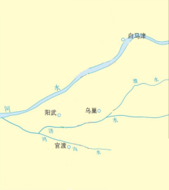

- **A**. 牧野之战
- **B**. 官渡之战　✅
- **C**. 赤壁之战
- **D**. 巨鹿之战

**答案**：B

**官方解析**

本题考查人文常识，主要涉及中国古代历史上的几个著名的战役。由图可得，该战役发生于公元200年，交战双方是曹操（三、四万人）与袁绍（十万人）。
A项错误，“牧野之战”是“武王伐纣”过程中的一场战役。商朝末年，西方属国的国君周武王，带领一些小国、部落，向商都进攻，史称“武王伐纣”。公元前1046年，双方在商都郊外牧野展开激战，商纣王最终兵败自焚，商朝灭亡。
B项正确，“官渡之战”发生于200年，曹操与袁绍为争夺对黄河中下游的统治权，在官渡决战。结果曹操以少胜多，打败袁绍，为统一北方打下了基础。
C项错误，“赤壁之战”是奠定三国鼎立基础的以少胜多、以弱胜强的著名战役。公元208年，孙权、刘备联军以五万兵力在长江赤壁一带大破曹操二十多万大军。
D项错误，“巨鹿之战”是项羽率领数万楚军，同秦名将章邯、王离所率四十万秦军主力在巨鹿进行的一场重大决战性战役。
故正确答案为B。

---

### 第 14 题　qid 2136878 · 人文常识

下列节气中，与“遥知兄弟登高处，遍插茱萸少一人”描写的时间最接近的是

- **A**. 谷雨
- **B**. 冬至
- **C**. 清明
- **D**. 霜降　✅

**答案**：D

**官方解析**

本题考查地理常识。“遥知兄弟登高处，遍插茱萸少一人”出自唐代王维的《九月九日忆山东兄弟》。农历的九月九日是重阳节，一般要插茱萸，登高望远。
A项错误，谷雨是二十四节气中的第六个节气，也是春季最后一个节气，时间在每年公历的4月19日-4月21日。
B项错误，冬至是二十四节气中的第二十二个节气，时间在每年公历的12月21日-12月23日。
C项错误，清明是二十四节气中的第五个节气，也是中华民族的一个传统节日，时间在每年公历的4月4日-4月6日，是祭祖和扫墓的日子。
D项正确，霜降是二十四节气中的第十八个节气，也是秋季的最后一个节气，时间在每年公历的10月22日-10月24日。
因此，在本题中，与重阳节（农历九月九日、公历约10月前后）时间最接近的就是霜降。
故正确答案为D。

---

### 第 15 题　qid 2136884 · 人文常识

如果能够穿越到秦朝，最可能看到的事情是

- **A**. 士兵使用铁制武器　✅
- **B**. 客栈里邻座在吃玉米
- **C**. 妇女边聊天边剪纸
- **D**. 学者收藏雕版印制的“四书五经”

**答案**：A

**官方解析**

本题考查历史常识，需要结合选项具体分析。
A项正确，我国铁器的使用，最早上溯到西周晚期，春秋战国的时候，铁制品使用范围扩大。秦朝在此时期之后，因此在秦朝有可能看到“士兵使用铁制武器”。
B项错误，原产美洲的玉米在明代才引进中国。秦朝早于明代，因此在秦朝无法看到“客栈里邻座在吃玉米”。
C项错误，妇女边聊天边剪纸说明纸在当时已经非常普遍了，公元105年，东汉蔡伦改进了造纸术，人称“蔡侯纸”，这种纸原料易得，造价低廉，是书写材料的一次伟大革命，从此之后纸才进入普通大众的生活。秦朝早于汉代，因此在秦朝无法看到“妇女边聊天边剪纸”。
D项错误，雕版印刷术发明于隋唐时期，并在此期间盛行。秦朝早于隋唐，因此在秦朝无法看到“雕版印制的‘四书五经’”。
故正确答案为A。

---

### 第 16 题　qid 2136890 · 人文常识

关于经史子集，下列对应错误的是

- **A**. 经——儒家经典著作
- **B**. 史——各类史书
- **C**. 子——孔孟经典著作　✅
- **D**. 集——诗文词总集和专集等

**答案**：C

**官方解析**

本题考查文化常识。“经史子集”是我国古代对经典图书的分类法。根据《隋书•经籍志》所最终确定下来的四部具体划分如下：
（1）经，经书，指儒家经典著作，包括易、书、诗、礼、春秋、孝经、五经总义、四书、乐、小学等。
（2）史，即记载历史兴衰治乱和各种人物以及制度沿革等的史书，包括正史类、编年类、纪事本末类、杂史类、别史类、诏令奏议类、传记类、史钞类、载记类、时令类、地理类、职官类、政书类、目录类、史评类等。
（3）子，指先秦诸子百家及其学说著作，包括儒家类、兵家类、法家类、农家类、医家类、天文算法类、术数类、艺术类、谱录类、杂家类、类书类、小说家类、释家类、道家类等。
（4）集，即文集，集部收录诗文词总集和专集等，包括楚辞、别集、总集、诗文评、词曲等。
A项正确，经是指儒家经典著作。
B项正确，史是指各类史书。
C项错误，子是指先秦诸子百家及其学说著作，而非孔孟经典著作。
D项正确，集部收录诗文词总集和专集等。
本题为选非题，故正确答案为C。

---

### 第 17 题　qid 2136900 · 地理国情

下列诗句中涉及的地名，在地理位置上从北向南排列正确的是：
①洛阳亲友如相问，一片冰心在玉壶
②劝君更尽一杯酒，西出阳关无故人
③日啖荔枝三百颗，不辞长作岭南人
④烟笼寒水月笼沙，夜泊秦淮近酒家

- **A**. ①③②④
- **B**. ②①④③　✅
- **C**. ①②④③
- **D**. ②④③①

**答案**：B

**官方解析**

本题考查地理常识。需要结合题干具体分析。
①诗句中所涉及到的地名为“洛阳”，洛阳位于河南省西北部，大约位于北纬34°32&#39;—34°45&#39;。

②诗句中所涉及到的地名为“阳关”。阳关是中国古代陆路对外交通咽喉之地，位于甘肃省西北部，大约位于北纬39°53′—41°35′左右。
③诗句中所涉及到的地名为“岭南”。岭南，是五岭以南的简称，指中国南岭（五岭）之南的地区。而南岭大约位于北纬24°00′—26°30′左右，因此诗中描述的地点应该在该范围以南。
④诗句中所涉及到的地名是“秦淮”，也即秦淮河，秦淮河大部分在南京，大约位于北纬31°14″—32°37″左右。
因此，按其地理位置从北至南，依次为阳关、洛阳、秦淮、岭南。因此正确的排列顺序②①④③。
故正确答案为B。

---

### 第 18 题　qid 2136908 · 人文常识

被我国军迷亲切称为“胖妞”的运-20在庆祝中国人民解放军建军90周年阅兵中首次亮相。以下有关运-20的说法中，错误的是：

- **A**. 是中国自主研发的新一代重型军用运输机
- **B**. 是一种200吨级大型、多用途运输机
- **C**. 是世界上最大的运输机　✅
- **D**. 已正式加入我国空军空运部队序列

**答案**：C

**官方解析**

本题考查科技理论与成就，主要涉及有关运-20的相关知识。
A项正确，运-20是我国自主研发的新一代重型军用运输机，于2013年1月26日首飞成功。
B项正确，运-20是大型、多用途运输机，最大起飞重量可达200多吨，可在复杂气象条件下，执行各种物资和人员的长距离航空运输任务。

C项错误，世界上最大的运输机是安-225运输机，起飞重量可达640吨，是由前苏联安东诺夫设计局研制的超大型军用运输机，现归乌克兰所有。
D项正确，2016年7月6日，空军运-20飞机授装接装仪式举行，中国自主发展的运-20飞机正式列装空军航空兵部队，标志着空军战略投送能力迈出关键性一步，也标志着我国大型飞机设计制造能力取得突破性进展。

本题为选非题，故正确答案为C。

---

### 第 19 题　qid 2137122 · 人文常识

在交响乐队使用的乐器中，属于木管乐器的是

- **A**. 长号
- **B**. 圆号
- **C**. 双簧管　✅
- **D**. 木琴

**答案**：C

**官方解析**

本题考查文化常识，主要涉及乐器的相关知识。
木管乐器的得名是由于它们起初都是木制的。木管乐器属于管乐器，通过由演奏者吹气，让空气在管中震动而发出声音。在管乐团里，常见的木管乐器主要有长笛，单簧管，双簧管及低音管等。
A项错误，长号属于铜管乐器的一种。音色高傲，辉煌，声音嘹亮而富有威力，弱奏时又温柔委婉。
B项错误，圆号属于铜管乐器的一种。其音色非常丰富，被称为“交响乐队乐器之王”。
C项正确，双簧管属于木管类乐器。由哨子，管体和音键组成，管体是用经过特殊处理的硬木制成，音色柔和软丽。
D项错误，木琴不属于管乐器，它属于打击乐器。演奏时以两个木制小槌在音条上敲击，发出声音，音质强烈刺耳，具有非凡的穿透力。
故正确答案为C。

---

### 第 20 题　qid 2136918 · 科技常识

下列属于20世纪人类科技成就的是
①电话的发明
②发电机的问世
③世界上第一架飞机试飞成功
④电报的发明
⑤因特网的发明
⑥卫星的发明

- **A**. ①②③
- **B**. ①③⑥
- **C**. ④⑤⑥
- **D**. ③⑤⑥　✅

**答案**：D

**官方解析**

本题考查科技常识，主要涉及20世纪人类的科技成就。
①电话是由美国发明家贝尔于1876年发明。因此电话属于19世纪人类的科技成就。
②1866德国人西门子制成发电机，到70年代实际可用的发电机问世，人类社会进入电气时代。因此发电机属于19世纪人类的科技成就。
③1903年，美国的莱特兄弟造出了世界上第一架飞机并试飞成功。因此该项属于20世纪人类的科技成就。
④19世纪90年代意大利人马可尼试验无线电报获得成功，为信息的迅速传播提供了方便。因此电报属于19世纪人类的科技成就。
⑤因特网，前身是美国国防部于1969年建立的阿帕网，1983年，正式将TCP/IP协议作为网络标准，之后全世界不断有新的网络按照这个标准加入因特网。因此因特网属于20世纪人类的科技成就。
⑥1957年10月4日，苏联成功发射了世界上第一颗人造地球卫星。因此卫星属于20世纪人类的科技成就。
所以属于20世纪人类科技成就的是③⑤⑥。
故正确答案为D。

---

### 第 21 题　qid 2136870 · 科技常识

十八大以来，我国大力实施创新驱动发展战略，创新型国家建设成果丰硕，下列有关重大科技成果中，名称与研发项目对应有误的是：

- **A**. “天宫一号”——空间实验室
- **B**. “悟空号”——量子科学实验卫星　✅
- **C**. “蛟龙号”——载人潜水器
- **D**. “中国天眼”——射电望远镜

**答案**：B

**官方解析**

本题考查科技理论与成就，主要涉及我国研发项目的相关知识。
A项正确，空间实验室是一种可重复使用和多用途的载人航天科学实验空间站。“天宫一号”是我国首个空间实验室，于2011年9月29日在酒泉卫星发射中心发射升空。
B项错误，“悟空号”是暗物质粒子探测卫星，于2015年12月17日在酒泉卫星发射中心发射升空。我国研制的量子科学实验卫星是“墨子号”，于2016年8月16日在酒泉卫星发射中心发射升空，因此对应错误。
C项正确，载人潜水器是具有水下观察和作业能力的潜水装置。“蛟龙号”是由我国自行设计、自主集成研制的载人潜水器。
D项正确，500米口径球面射电望远镜，简称FAST，位于贵州省黔南布依族苗族自治州平塘县大窝凼，被誉为“中国天眼”，于2016年9月落成。“中国天眼”是具有我国自主知识产权、世界最大单口径的射电望远镜。
本题为选非题，故正确答案为B。

---

### 第 22 题　qid 2136880 · 地理国情

大运河北京段在北京城市发展中扮演了重要角色，见证了城市的沧桑巨变，承载了宝贵的文化记忆。下列有关中国大运河的说法中，不正确的是：

- **A**. 大运河已经申遗成功，成为世界文化遗产
- **B**. 大运河北京段横跨昌平、海淀、西城、东城、朝阳、通州、大兴七个区　✅
- **C**. 大运河是中国古代南北交通的大动脉
- **D**. 大运河是世界上开凿较早、水道最长的水利工程

**答案**：B

**官方解析**

本题考查文化常识，主要涉及大运河的相关知识。
A项正确，2014年6月22日，经联合国教科文组织第38届世界遗产委员会会议审议通过，中国大运河项目入选《世界遗产名录》，成为世界文化遗产。
B项错误，大运河北京段涉及昌平、海淀、西城、东城、朝阳、通州六个区，并不包括大兴区。
C项正确，大运河包括隋唐大运河、京杭大运河和浙东大运河三部分，全长2700公里。沟通了我国海河、黄河、淮河、长江、钱塘江南北五大水系，是我国古代南北交通的大动脉。
D项正确，中国大运河是世界上开凿时间最早、流程最长的人工运河。
本题为选非题，故正确答案为B。

---

### 第 23 题　qid 2136886 · 人文常识

建设国际一流的和谐宜居之都，是党中央对首都发展提出的新要求、寄予的新期望，也是北京这座城市新的历史使命。建设国际一流的和谐宜居之都的具体任务有

- **A**. 努力把北京建设成为人民幸福、社会和谐的首善之区　✅
- **B**. 努力把北京建设成为弘扬中华文明与引领时代潮流的文化名城　✅
- **C**. 努力把北京建设成为拥有优质政务保障能力和国际交往环境的大国首都　✅
- **D**. 努力把北京建设成为全球创新网络的中坚力量和引领世界创新的新引擎　✅

**答案**：ABCD

**官方解析**

本题考查时政。
北京市第十二次党代会报告明确提出：建设国际一流的和谐宜居之都，是以习近平同志为核心的党中央，统揽发展全局、把握时代潮流，对首都发展提出的新要求、寄予的新期望，也是北京这座伟大城市新的历史使命，更是全市人民热切期盼的美好明天。建设国际一流和谐宜居之都的具体任务包括：要坚定不移朝着建设国际一流的和谐宜居之都这个目标阔步前进，努力把北京建设成为拥有优质政务保障能力和国际交往环境的大国首都，弘扬中华文明与引领时代潮流的文化名城，全球创新网络的中坚力量和引领世界创新的新引擎，人民幸福、社会和谐的首善之区，天蓝水清、森林环绕的生态城市，世界超大城市可持续发展的典范。这是和实现“两个一百年”奋斗目标、中华民族伟大复兴中国梦相衔接的发展愿景。
故正确答案为ABCD。

---

### 第 24 题　qid 2136892 · 人文常识

2017年7月29日，中国地质调查局组织实施的我国首次海域可燃冰试采圆满结束，此次试采创造了产气时长和总量的世界纪录。关于可燃冰及此次试采，下列说法错误的有

- **A**. 此次开采地位于南海
- **B**. 可燃冰的主要成分是石油和水　✅
- **C**. 除了海域，可燃冰还分布在大陆永久冻土区等地区
- **D**. 可燃冰在我国已经用于大规模工业应用　✅

**答案**：BD

**官方解析**

本题考查科技常识。
A项正确，本次开采的地点位于中国南海神狐可燃冰试采区，此次任务也是半潜式钻井平台“蓝鲸Ⅰ号”执行的首项工作任务。
B项错误，可燃冰是天然气与水在高压低温条件下形成的类冰状结晶物质，其主要成分为甲烷与水，而非石油。
C项正确，可燃冰主要分布于深海沉积物和陆域永久冻土中。
D项错误，中国在海域连续稳定试开采可燃冰成功，尚属世界首次，可燃冰开采技术也处于起步阶段，离大规模工业应用还有很长的路要走。
本题为选非题，故正确答案为BD。

---

### 第 25 题　qid 2136910 · 人文常识

下列关于政府和市场的说法，正确的有

- **A**. 政府主要负责提供公共服务　✅
- **B**. 政府主要弥补市场失灵　✅
- **C**. 政府失灵的地方，就是市场发挥作用的地方
- **D**. 就业问题主要靠政府来解决

**答案**：AB

**官方解析**

本题考查经济常识。
A项正确，公共服务指发展教育、科技、文化、卫生、体育等公共事业，也指为社会公众参与社会经济、政治、文化活动等提供保障。提供公共服务是政府重要职能之一。
B项正确，市场失灵指通过市场来配置资源，不能达到资源的最优配置；要应对市场失灵，需要通过看得见的手来矫正，即政府调节市场机制，弥补市场缺陷，纠正市场失灵。
C项错误，政府失灵，指政府为弥补市场失灵而对经济、社会生活进行干预的过程中，由于政府行为自身的局限性和其他客观因素的制约而产生的新的缺陷，进而无法使社会资源配置效率达到最佳的情况。比如政府运行效率低下、政府干预过度、公共产品供应不足以及权力寻租等问题，都属于政府失灵的具体表现。政府失灵问题，由于其牵涉面广、问题的产生原因复杂多样，所以难以通过市场发挥作用加以解决。针对政府失灵的问题，我们可以通过推进政府职能转变、对政府行为实行有效的制约和监督机制、引入竞争机制、完善法律法规等措施加以应对。
D项错误，我国人口总量和劳动力总量大，劳动力市场不健全，就业信息不畅通，劳动力素质参差不齐等都是导致就业压力、就业难题的原因；要想解决这些问题，不能仅仅依靠政府出力，劳动者自身也要提高劳动素质、树立正确的择业观念，全社会更要共同营造有利于创业就业的氛围，所以选项说法片面。
故正确答案为AB。

---

### 第 26 题　qid 2136916 · 经济常识

下列说法正确的有

- **A**. 在我国，中央和地方各级政府财政预算由本级人大常委会批准
- **B**. 一般情况下，财政收入的主要来源是税收　✅
- **C**. 目前我国地方政府不得以任何方式举借债务
- **D**. 财政补贴属于转移性支出　✅

**答案**：BD

**官方解析**

本题考查经济常识。
A项错误，《中华人民共和国预算法》第四十三条规定：“中央预算由全国人民代表大会审查和批准；地方各级预算由本级人民代表大会审查和批准。”
B项正确，税收是政府为实现其职能的需要，凭借其政治权力并按照特定的标准，强制、无偿地取得财政收入的一种形式，它是现代国家财政收入最重要的收入形式和最主要的收入来源。
C项错误，《中华人民共和国预算法》第三十五条规定：“经国务院批准的省、自治区、直辖市的预算中必需的建设投资的部分资金，可以在国务院确定的限额内，通过发行地方政府债券举借债务的方式筹措。”故地方政府在上述情形下是可以举借债务的。
D项正确，转移性支出，指政府无偿向居民和企业、事业以及其他单位供给财政资金。转移性支出主要由社会保障支出和财政补贴构成。
故正确答案为BD。

---

### 第 27 题　qid 2136922 · 法律常识

十二届全国人大常委会第二十五次会议表决通过的《中华人民共和国环境保护税法》规定，在我国领域和我国管辖的其他海域，直接向环境排放应税污染物的企业事业单位和其他生产经营者为环境保护税的纳税人，应当缴纳环境保护税。该法所称应税污染物，是指该法所附《环境保护税税目税额表》、《应税污染物和当量值表》规定的

- **A**. 大气污染物　✅
- **B**. 水污染物　✅
- **C**. 固体废物　✅
- **D**. 噪声　✅

**答案**：ABCD

**官方解析**

本题主要考查法律常识，主要涉及《中华人民共和国环境保护税法》的有关知识。
《中华人民共和国环境保护税法》第三条规定：“本法所称应税污染物，是指本法所附《环境保护税税目税额表》、《应税污染物和当量值表》规定的大气污染物、水污染物、固体废物和噪声”。可知ABCD项均属于应税污染物。
故正确答案为ABCD。

---

### 第 28 题　qid 2136924 · 地理国情

我国有许多著名的江河湖泊，下列说法中错误的有

- **A**. 鄱阳湖是长江流域最大的湖泊
- **B**. 黑龙江是松花江最大的支流　✅
- **C**. 珠江主要是由西江、北江、东江三江组成的
- **D**. 由于含沙量高，黄河自始至终都是黄色的　✅

**答案**：BD

**官方解析**

本题考查地理常识，主要涉及我国江河湖海的有关知识。
A项正确，鄱阳湖地处江西省的北部，长江中下游南岸，是中国第一大淡水湖，也是中国第二大湖。中国最大的湖泊是青海湖，属于咸水湖，位于青海省内，不在长江流域范围内，所以A项说法正确。
B项错误，松花江是黑龙江在中国境内的最大支流，黑龙江是中国四大河流之一。故B项错误。
C项正确，珠江是我国第二大河流，是中国境内第三长河流。根据水利部珠江委员会公布的信息：珠江流域由西江、北江、东江及珠江三角洲诸河等水系所组成，西江、北江、东江汇入珠江三角洲后，经虎门等八大口门注入南海，形成“三江汇流，八口出海”的水系特点。因此表述无误。
D项错误，并不是所有的黄河水都是黄色的。黄河上游部分河段水质较好较清澈，黄河水浑浊变黄主要体现在中下游河段，特别是中游流经黄土高原地区时，由于黄土高原土质疏松、植被稀少，夏季暴雨冲刷地表土壤进入黄河，使其含沙量大增，由此所致。
本题为选非题，故正确答案为BD。

---

### 第 29 题　qid 2136926 · 人文常识

关于“罢黜百家，独尊儒术”，下列说法正确的有

- **A**. 发生在汉武帝时期　✅
- **B**. 此处的“百家”包括“士、农、工、商”等行业
- **C**. 此处的“儒术”指糅合了阴阳家、道家的儒学　✅
- **D**. 董仲舒是这一思想的倡议者　✅

**答案**：ACD

**官方解析**

本题考查文化常识，主要涉及儒家思想的有关知识。
A项正确。“罢黜百家，独尊儒术”是西汉武帝实行的封建思想统治政策，也是儒学在中国文化中居于统治地位的标志。
B项错误。汉武帝所罢黜的“百家”指儒家以外的诸子百家，主要有墨家、道家和法家，其次有阴阳家、杂家、名家、纵横家、兵家、小说家等等。“士、农、工、商”最早由春秋时期管仲提出，这一政策的要点是，把国民分成军士、农民、工匠、商贾四个阶层，按各自专业聚居在固定的地区。
C项正确。董仲舒是汉代“新儒学”的代表人物。董仲舒少时研习《春秋》，景帝时为博士，讲授《公羊春秋》。他以《公羊春秋》为依据，吸收法家、道家、阴阳家思想，建立了新的儒学思想体系，改思想成为汉代的官方统治思想。
D项正确。“罢黜百家，独尊儒术”是董仲舒于元光元年（公元前134年）提出，它维护了封建统治秩序，神化了专制王权，因而受到中国古代封建统治者推崇，成为两千多年来中国传统文化的正统和主流思想。
故正确答案为ACD。

---

### 第 30 题　qid 2136930 · 科技常识

下列关于人体消化系统及消化过程的叙述，正确的有

- **A**. 小肠是吸收食物营养的主要部位　✅
- **B**. 消化过程包括机械性消化和化学性消化　✅
- **C**. 消化系统分为消化管和消化腺两大部分　✅
- **D**. 消化系统的主要功能是消化食物、吸收营养和排出食物残渣　✅

**答案**：ABCD

**官方解析**

本题考查生物常识，主要涉及人体生理的有关知识。
A项正确。小肠位于腹中，上端接幽门与胃相通，下端通过阑门与大肠相连，是食物消化吸收的主要器官。小肠是最长的消化道，内有肠液、胰液和胆汁等多种消化液；小肠内壁有小肠绒毛，增大了消化和吸收的面积；同时，小肠绒毛内有毛细血管和毛细淋巴管，有利于营养物质的吸收。
B项正确。食物经过口腔的咀嚼，牙齿的磨碎，舌的搅拌、吞咽，胃肠肌肉的活动，将大块的食物变成碎小的，使消化液充分与食物混合，这种消化过程叫机械性消化，或物理性消化。由消化腺所分泌的多种消化液，将复杂的各种营养物质分解为肠壁可以吸收的简单的化合物，然后这些分解后的营养物质被小肠（主要是空肠）吸收进入体内，进入血液和淋巴液，这种消化过程叫化学性消化。机械性消化和化学性消化两功能同时进行，共同完成消化过程。
C项正确。消化系统由消化管和消化腺两大部分组成。消化管包括口腔、咽、食管、胃、小肠（十二指肠、空肠、回肠）和大肠（盲肠、结肠、直肠、肛管）等部分。消化腺有小消化腺和大消化腺两种。小消化腺散布在消化管各部的管壁内，大消化腺有三对唾液腺（腮腺、下颌下腺、舌下腺）、肝和胰。
D项正确。消化系统的基本功能是消化从外界摄取的食物和吸收各种营养物质，提供机体新陈代谢所需的物质和能量，并将未被消化和吸收的食物残渣经肛门送出体外。消化系统除具有消化和吸收功能外，还有内分泌功能和免疫功能。
故正确答案为ABCD。

---

### 第 31 题　qid 2136932 · 人文常识

北京历史悠久，它作为城市的历史可以追溯到3000年前。下列选项中，属于历史上北京曾经用过的名称的有

- **A**. 幽州　✅
- **B**. 蓟城　✅
- **C**. 北平　✅
- **D**. 燕京　✅

**答案**：ABCD

**官方解析**

本题主要考查地理常识，主要涉及北京市的别称。
北京市，是中华人民共和国的首都，是一座有着三千余年建城历史、八百六十余年建都史的历史文化名城。秦汉以来，北京地区一直是中国北方的军事和商业重镇，名称有蓟城、燕都、燕京、大都、北平、京师、顺天府等等。
A项正确，幽州是远古时代的九州之一。幽州之名，最早见于《尚书·舜典》：“燕曰幽州。”两汉、魏、晋、唐代都曾设置过幽州，所治均在今天的北京一带。
B项正确，“蓟”是春秋战国时燕国的都城，即今北京。根据一系列考古发现，专家们推测蓟城应在发现陶井最密集的今北京城西南部宣武门至和平门一带。
C项正确，北伐战争后，中国的首都迁到南京，北京被改名为北平特别市；1949年9月27日中国人民政治协商会议第一届全体会议通过《关于中华人民共和国国都、纪年、国歌、国旗的决议》，将北平更名为北京。
D项正确，唐代，史思明自称应天皇帝，国号大燕，建元顺天，改范阳为燕京，这是今北京称燕京之始。后来北京的正式命名虽屡有变动，而燕京这个名称却广泛被使用。近百年来，“燕京”是北京最常用的一个别称。
故正确答案为ABCD。

---

## 言语理解与表达

### 材料 1

①开发区建设是我国改革开放的成功实践，对（甲）体制改革、（乙）投资环境、（丙）产业集聚、（丁）开放型经济发挥了不可替代的作用，开发区已成为推动我国工业化、城镇化快速发展和对外开放的重要平台。当前，全球经济和产业格局正在发生深刻变化，我国经济发展进入新常态，面对新形势，必须进一步发挥开发区作为改革开放排头兵的作用，形成新的集聚效应和增长动力，引领经济结构优化调整和发展方式转变。为深入贯彻落实《中共中央 国务院关于构建开放型经济新体制的若干意见》，经国务院同意，现提出以下意见。

②全面贯彻党的十八大和十八届三中、四中、五中、六中全会精神，（Ⅰ）深入贯彻习近平总书记系列重要讲话精神和治国理政新理念新思想新战略，认真落实党中央、国务院决策部署，（Ⅱ）牢固树立创新、协调、绿色、开放、共享的发展理念，加强对各类开发区的统筹规划，加快开发区转型升级，促进开发区体制机制创新，完善开发区管理制度和政策体系，（Ⅲ）进一步增强开发区功能优势，（Ⅳ）把各类开发区建设成为新型工业化发展的引领区、高水平营商环境的示范区、大众创业万众创新的集聚区、开放型经济和体制创新的先行区，推进供给侧结构性改革，形成经济增长的新动力。

③坚持改革创新。强化开发区精简高效的管理特色，创新开发区运营模式，以改革创新激发新时期开发区发展的动力和活力。坚持规划引领。完善开发区空间布局和数量规模，形成布局合理、错位发展、功能协调的全国开发区发展格局，切实提高经济发展质量和效益。坚持集聚集约。完善公共设施和服务体系，引导工业项目向开发区集中，促进产业集聚、资源集约、绿色发展，切实发挥开发区规模经济效应。坚持发展导向。构建促进开发区发展的长效机制，以规范促发展，正确把握发展和规范的关系，不断探索开发区发展新路径、新经验。

#### 第 1 题　qid 2136994 · 逻辑填空

依次填入材料①中甲、乙、丙、丁四处，最恰当的一组词语是：

- **A**. 促进  改善  引导  发展　✅
- **B**. 引导  发展  改善  促进
- **C**. 引导  改善  促进  发展
- **D**. 促进  发展  引导  改善

**答案**：A

**官方解析**

先看第二空，搭配“环境”，“改善”与“环境”搭配恰当，指的是让环境变得更好，“发展”与“环境”搭配不当，排除B、D两项。
再看第三空，与“产业集聚”搭配，根据后文“必须进一步发挥开发区作为改革开放排头兵的作用，形成新的集聚效应和增长动力”可知，此处表示开发区建设形成了新的产业集聚效应，对比A、C两项，A项“引导”指带领，使跟随，可以与“新的集聚效应”形成对应，符合语境，保留；C项“促进”是在产业集聚已经存在的基础上进一步推动，不能指“新的集聚效应”，排除。
验证第一、四空，A项“促进体制改革”，“发展开放型经济”均符合搭配，当选。
故正确答案为A。
【文段出处】《国务院办公厅关于促进开发区改革和创新发展的若干意见》

---

#### 第 2 题　qid 2137000 · 片段阅读

“紧紧围绕统筹推进‘五位一体’总体布局和协调推进‘四个全面’战略布局，”该句放入文中材料②中哪一处最合适？

- **A**. Ⅰ
- **B**. Ⅱ　✅
- **C**. Ⅲ
- **D**. Ⅳ

**答案**：B

**官方解析**

给定语句为“紧紧围绕统筹推进‘五位一体’总体布局和协调推进‘四个全面’战略布局”，即重点讨论总体布局、战略布局的话题。接下来分析四个空缺位置前后的文段，发现II之前指出要“深入贯彻······新思想新战略，认真落实······决策部署”，先有思想、再有决策部署。而“五位一体”、“四个全面”即为决策部署的具体表现。II之后内容全部围绕“开发区”建设展开，表述更加具体，是对战略部署的具体解释说明，故该句应位于II处，B项当选。
I之前论述的是“贯彻精神”，之后论述的是“贯彻······新思想新战略”，故与“战略布局”联系不够紧密，A项排除；III、IV前后都详细阐述了如何进行“开发区”的建设，与给定语句话题不一致，C、D两项均排除。
故正确答案为B。
【文段出处】《国务院办公厅关于促进开发区改革和创新发展的若干意见》

---

#### 第 3 题　qid 2137002 · 片段阅读

材料③主要谈的是开发区建设的：

- **A**. 基本原则　✅
- **B**. 发展目标
- **C**. 经验教训
- **D**. 实施步骤

**答案**：A

**官方解析**

定位第三段。文段分四部分，包括“坚持改革创新”、“坚持规划引领”、“坚持集聚集约”、“坚持发展导向”，并对每个方面进行了具体阐述。这四个方面属于开发区建设需要坚持的原则，A项当选。
B项“发展目标”、C项“经验教训”、D项“实施步骤”均为无中生有的表述，第三段没有涉及，排除。
故正确答案为A。
【文段出处】《国务院办公厅关于促进开发区改革和创新发展的若干意见》

---

#### 第 4 题　qid 2137010 · 片段阅读

根据材料，开发区在改革开放中的角色最接近于：

- **A**. 螺丝钉
- **B**. 桥头堡
- **C**. 火车头　✅
- **D**. 发动机

**答案**：C

**官方解析**

根据第一段所述，“必须进一步发挥开发区作为改革开放排头兵的作用”，可知开发区相当于“排头兵”，指动作要领最规范的战士，喻指带头的人或最优秀者，C项“火车头”与之意思相近，当选。
A项“螺丝钉”比喻平凡而不可缺少的人或物，“开发区”在改革开放中的角色并不平凡，排除；B项“桥头堡”指为扼守和保护重要桥梁、渡口，在其附近地区构筑的碉堡、地堡或阵地，“开发区”的作用并非扼守和保护，排除；D项“发动机”指把热能、电能等变为机械能的机器，用来带动其他机械工作，“开发区”的作用并非提供动力，排除。
故正确答案为C。
【文段出处】《国务院办公厅关于促进开发区改革和创新发展的若干意见》

---

#### 第 5 题　qid 2137014 · 片段阅读

下列选项中，发文字号符合公文格式标准的是：

- **A**. 〔2017〕国办发7号
- **B**. 国办发[2017]第7号
- **C**. 国办发〔2017〕7号　✅
- **D**. （2017）国办发第7号

**答案**：C

**官方解析**

发文字号应当包括机关代字、年份、序号，格式为“发文机关代字+年份+序号”。年份、序号用阿拉伯数码标识；年份应标全称，用六角括号“〔〕”括入；序号不编虚位（即1不编为001），不加“第”字，对应选项为C；A项编写顺序有误，B、D两项中存在“第”字，且B项非六角括号，排除。
故正确答案为C。
【文段出处】《国务院办公厅关于促进开发区改革和创新发展的若干意见》

---

### 材料 2

        数字图像修复技术中的文物虚拟修复技术就是对一些文物数字图像中所缺失、损坏的部分，应用现有的图像信息，根据一定的修复原则进行还原修复的技术。其主要目的是使修复后的数字图像无限接近原视图。

        在文物保护领域中，受到很多历史因素或其他客观因素的影响，出土的文物和存放时间长的文图表面会有很多的缺失破损情况，如裂缝、咬色、生锈、霉变等，这使得文物信息大量缺失，对文物欣赏及研究有很大影响。在以往的文物修复过程中，一般是修复工作者通过对文物补色、刷洗等方法进行简单修复；即使在当今的文物修复中，依然主要由具有想象力的修复专家在文物本体上进行处理。这种处理一旦形成便很难更改，稍有大意，存留下来的文明将不复存在，因此风险性极高。同时，不同的文物专家通常对文物修复会有不同的主张，分歧意见难以统一。

        为更好地解决<u><b>上述问题</b></u>，可以利用计算机虚拟修复技术，对需要修复的文物及数字图像进行仔细评估，充分运用统计学理论及微积分方程建立预测模型，再用图像已知区域信息对缺失区域进行评估，这样便可更好地对数字图像进行虚拟修复，更加方便快速地提出修复方案，大大缩短文物修复的工作周期，有效预防手工修复过程中对文物的二次伤害，同时避免人工修复中主观因素的影响，最大限度地修复文物的缺失信息，使文物重现原貌。

        在文物虚拟修复实验中，对任何情况的信息缺失的修复，均需遵循文物保护“修复如初”的基本原则。如现存于西安碑林博物馆中唐昭陵六骏中的“清骓”石雕，就采用了基于变分PDE的修复模型进行了原型修复，对图像中的裂痕进行了严密合理的计算估计，并根据所得周围像素的数值对裂隙处的像素进行了填算，从而在一定程度上填补了缝隙中缺失的相关信息，使修复效果较为连续自然。

        另外，在文物修复过程中，如果通过已知信息不能对文物缺失部分进行判断，并且查阅不到相关资料证明其缺失情况，则不能按照人的主观意愿对文物进行修复。在文物虚拟修复时，一定要给计算机发出相应指令，对图像进行对照分析，标记出图像中可以进行虚拟修复的位置，对不能判断的部分则不能进行标记，否则计算机就会进行错误的修复。

#### 第 6 题　qid 2136942 · 片段阅读

第3段中所说的“上述问题”包括：
①修复专家短缺
②传统修复方法风险大
③修复专家各执己见
④修复工作要求专家经验丰富
⑤要求文物有较好的修复基础

- **A**. ①②
- **B**. ②③　✅
- **C**. ③④
- **D**. ④⑤

**答案**：B

**官方解析**

由“上述问题”可知指代的内容为上文，根据上文具体阐述文物修复遇到的问题，故“上述问题”可总结为两点，即一方面利用传统方法修复文物风险性极高，一旦形成便很难更改，另一方面不同的文物专家通常对文物修复有不同的主张，分歧意见难以统一，对应选项为B。①、④和⑤文段并未涉及，无中生有，故A项中的①无中生有，C项中的④无中生有，D项中的④⑤均为无中生有，均排除。
故正确答案为B。
【文段出处】《数字图像修复技术在文物保护中的应用》

---

#### 第 7 题　qid 2136944 · 片段阅读

“清骓”石雕的例子，意在说明数字图像修复技术：

- **A**. 具有独特优势
- **B**. 可能存在的问题
- **C**. 应遵循的原则　✅
- **D**. 如何填补缺失信息

**答案**：C

**官方解析**

根据文章第四段，该文段为总分结构，开头提出观点“对任何情况的信息缺失的修复，均需遵循文物保护‘修复如初’的基本原则”，之后通过“清骓”石雕的例子论证说明，故可知该例子论证的观点为“任何修复方式都要遵循修复原则”，对应C项。
A、B两项，文段并未涉及，无中生有，排除；
D项，为例子本身，并非例子所说明的内容，排除。
故正确答案为C。
【文段出处】《数字图像修复技术在文物保护中的应用》

---

#### 第 8 题　qid 2136946 · 片段阅读

根据文意，可以推知：

- **A**. 数字虚拟技术有助于避免文物在出土时受损
- **B**. 计算机无法自动识别出文物无法修复的部分　✅
- **C**. 只有具有鉴赏和研究价值的出土文物值得修复
- **D**. 数字图像修复技术已在文物中占主导地位

**答案**：B

**官方解析**

根据提问方式可知该题为细节判断。
A项，根据文章第一自然段可知，数字虚拟技术是对文物已损坏的部分进行修复的，使其修复后的图像无限接近于原图，而并非是“避免文物在出土时受损”，表述错误，排除。
B项，根据文章最后一段最后一句话可知，在文物修复时，需要人给计算机发出指令，对可以修复的部分进行标记，而对无法修复的部分，计算机则不能判断从而不能进行标记，故“计算机无法自动识别出文物无法修复的部分”表述正确，当选；
C项，文段并没有论述什么标准的文物值得修复，无中生有，排除；
D项，根据文段第二段“即使在当今的文物修复中，依然主要由具有想象力的修复专家在文物本体上进行处理”，而并非是“数字图像修复技术占主导地位”，表述错误，排除。
故正确答案为B。
【文段出处】《数字图像修复技术在文物保护中的应用》

---

#### 第 9 题　qid 2136950 · 片段阅读

下列选项中，最适合作为本文关键词的是：

- **A**. 数字图像  修复技术  文物保护　✅
- **B**. 出土文物  文物修复  人工智能
- **C**. 数字技术  虚拟修复  文物鉴赏
- **D**. 文物保护  考古研究  技术革命

**答案**：A

**官方解析**

“关键词”即为文段的核心话题。文段第一段引出话题，说明文物虚拟修复技术是为了还原数字图像的修复技术，目的是使其无限接近原图。第二段论述了文物保护领域中的现状与出现的难题。后三段强调虚拟修复技术能够解决文物保护中的一些问题以及虚拟修复技术的优势特点。故文段就是谈论在文物保护领域，虚拟修复技术对修复数字图像起到的重要作用，关键词即为，文物保护、修复技术、数字图像。对应选项，只有A项正确。
B项“出土文物”“人工智能”范围扩大，文段针对的是“数字图像”和“虚拟修复技术”展开论述，排除；
C项“数字技术”范围扩大，“文物鉴赏”不是文章重点，排除；
D项“考古研究”“技术革命”均无中生有，排除。
故正确答案为A。
【文段出处】《数字图像修复技术在文物保护中的应用》

---

#### 第 10 题　qid 2136952 · 片段阅读

本文主要强调了：

- **A**. 传统文物修复技术已经没落
- **B**. 我国文物保护的现状不容乐观
- **C**. 数字图像修复技术在文物保护领域大有作为　✅
- **D**. 计算机虚拟技术在文物保护领域不可替代

**答案**：C

**官方解析**

文章首句引出论述的主题词，即“数字图像修复技术”，后文围绕这个核心话题进行展开论述，在文物保护领域，虚拟修复技术对文物数字图像修复具有一系列优势以及重要意义。把握文章主题词，对应C项正确，当选。
A项“传统文物修复技术已经没落”表述错误，文段阐述的是“即使在当今的文物修复中，依然主要由具有想象力的修复专家在文物本体上进行处理”，即传统文物修复技术依然占主导地位，排除；
B项未出现“数字图像修复技术”主题词且“我国文物保护的现状不容乐观”无中生有，排除；
D项未出现“数字图像修复技术”主题词且文段涉及的是“计算机虚拟修复技术”，而“计算机虚拟技术”概念扩大，排除。
故正确答案为C。
【文段出处】《数字图像修复技术在文物保护中的应用》

---

### 材料 3

        格陵兰年平均气温在以下，最低可达，冰雪覆盖面积占整个岛屿的，这么寒冷的一个地方，实在与它绿意盎然的名字不相符（“格陵兰”意为“绿色土地”）。随着气候变暖，格陵兰的冰川逐渐融化，冰融水沿着冰川裂隙向下流动，形成深坑，就像一口口锅，称为冰川锅穴。这些锅穴大小不一，大的可达10米宽，上百米深，一直延伸到冰川底部，甚至形成冰川洞，可能导致整个冰川崩塌。

        格陵兰无疑是地球变暖的“前线”。冰川对气候变化非常敏感，格陵兰可以作为地球上的一个气候指示器。北极的冰川储存着气候的信息，通过冰芯我们可以测定冰川的年龄及其形成过程，还可以得到相应历史年代的气温和降水资料。冰雪中含有三种不同的氧同位素，因此，如果在格陵兰的冰帽上打钻，测量冰芯中的每个冰层的氧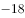比例，就可以得知格陵兰每一年夏季和冬季的气温变化。

        “从现有的可靠测量来看，格陵兰岛正快速消融。”丹麦自然历史博物馆研究员安德斯·波克这么认为。2011年，他在哥本哈根北极研究所的档案中找到一些老旧飞行日志，其中有关于北极附近冰川的观察记录。几乎同一时间，丹麦国家调查局在清理地下室时发现一批旧图片，这些图片是极地探险家克努兹·拉斯穆森1933年到格陵兰进行第七次极地探险的记录。波克和同事将图像数字化，并用软件对比格陵兰岛东南部海岸线，查看其中的不同之处。波克说，20世纪30年代冰川融化得比现在快，20世纪中叶出现了一个短暂的冷却期，这期间形成了新的冰层，但在2000年又开始加速融化。

        “20世纪90年代，格陵兰岛的冰川差不多能达到平衡状态（即降雪和融化、冰裂相等），但现在的总质量亏损超过3000亿吨/年。如果按照每人一年使用4万升水来计算，这是地球上人们一年的用水量。按现在的趋势看，这个数字还在上升。”波克认为，“从最新研究来看，海洋在冰川的消融中起着关键作用，暖流一经过已经破裂的冰川，大面积的融化就会发生，这和气温升高共同导致冰川融化。”

        格陵兰气候变化几乎决定着当地以捕猎为生的土著的去留。岛上主要的陆地哺乳动物有北极熊、麝牛、驯鹿、北极狐、雪兔、貂和旅鼠，附近水域中主要有海豹和鲸，它们过去是岛上因纽特人的主要食物来源。到了20世纪初期，海水温度上升使海豹几乎在格陵兰南部绝迹，后来气候转冷，大群海豹才又现身。而现在，因为浮冰融化，依赖浮冰捕食海豹的标志性动物——北极熊的生存也出现危机。

#### 第 11 题　qid 2136986 · 片段阅读

下列判断与文意相符的是

- **A**. 格陵兰岛的实际情况与其名称含义不符　✅
- **B**. 20世纪以来格陵兰冰川一直在加速消融
- **C**. 20多年前格陵兰冰川远未达到平衡状态
- **D**. 冰川锅穴的存在是冰川崩溃的根本原因

**答案**：A

**官方解析**

根据文章第一段，“格陵兰年平均气温在以下，最低可达，冰雪覆盖面积占整个岛屿的，这么寒冷的一个地方，实在与它绿意盎然的名字不相符（‘格陵兰’意为‘绿色土地’）”可知，A项表述正确，当选。

根据第三段，“波克说······但在2000年又开始加速融化”可知，应为21世纪加速融化，B项表述错误，排除；

根据第四段“20世纪90年代，格陵兰岛的冰川差不多能达到平衡状态”可知，C项“远未达到”表述错误，排除；

根据第一段“······称为冰川锅穴。这些锅穴······可能导致整个冰川崩塌”可知，D项“根本原因”表述过于绝对且无中生有，排除。

故正确答案为A。

【文段出处】《格陵兰：消融中的孤单岛屿》

---

#### 第 12 题　qid 2137004 · 片段阅读

关于“格陵兰作为气候指示器”，下列说法正确的是：

- **A**. 
测量格陵兰冰川可预测未来气候变化趋势

- **B**. 
格陵兰的冰帽中储存着最详尽的气候资料

- **C**. 
测量每个冰层的氧比例可分析气候变化
　✅
- **D**. 
观察冰川中的融洞可以获得丰富的降水资料

**答案**：C

**官方解析**

根据提问方式，可定位原文第二段。

根据“······测量冰芯中的每个冰层的氧比例，就可以得知格陵兰每一年夏季和冬季的气温变化”可知，C项表述正确，当选。

根据“通过冰芯我们可以测定冰川的年龄及其形成过程，还可以得到相应历史年代的气温和降水资料”可知，A项“未来气候变化”表述错误，排除；

根据“如果在格陵兰的冰帽上打钻······就可以得知格陵兰每一年夏季和冬季的气温变化”可知，“最详尽”表述过于绝对，排除；

D项“融洞”文段未提及，为无中生有选项，排除。

故正确答案为C。

【文段出处】《格陵兰：消融中的孤单岛屿》

---

#### 第 13 题　qid 2137012 · 片段阅读

根据文意，文章接下来最可能要呈现的是：

- **A**. 如何阻止冰川日益消融的趋势
- **B**. 极地环境下动物们的生存状况　✅
- **C**. 分析全球变暖的最主要原因
- **D**. 因纽特人的起源和生活方式

**答案**：B

**官方解析**

本题为接语选择题。篇章前三自然段围绕“格陵兰的冰川逐渐融化”展开，第四段说明格陵兰岛冰川消融的现状以及原因；篇章尾段指出格陵兰冰川融化对动物的影响，尾句指出“而现在，因为浮冰融化，依赖浮冰捕食海豹的标志性动物——北极熊的生存也出现危机”，故下文应具体介绍极地动物们生存情况，对应B项。
A项“冰川消融”、C项“全球变暖”、D项“因纽特人”均与“极地动物”话题不一致，排除。
故正确答案为B。

---

#### 第 14 题　qid 2137016 · 片段阅读

关于安德斯·波克，下列说法正确的是：

- **A**. 认为洋流是冰川消融的关键因素　✅
- **B**. 实地考察过格陵兰东南部海岸线
- **C**. 进行过七次极地探险
- **D**. 在地下室发现了一些飞行日志

**答案**：A

**官方解析**

A项，根据第四段最后一句可知，表述正确，当选。B项，根据第三段“波克和同事将图像数字化，并用软件对比格陵兰岛东南部海岸线”可知，波克并未进行实地考察，表述错误，排除；C项，根据第三段“这些图片是极地探险家克努兹·拉斯穆森1933年到格陵兰进行第七次极地探险的记录”可知，进行过七次极地探险的是“克努兹”而不是波克，表述错误，排除；D项，根据第三段“他在哥本哈根北极研究所的档案中找到一些老旧飞行日志”可知，文段并非提到地下室，表述错误，排除。
故正确答案为A。
【文段出处】《格陵兰：消融中的孤单岛屿》

---

#### 第 15 题　qid 2137020 · 片段阅读

下列最适合作为文章标题的是：

- **A**. 格陵兰气候变迁史
- **B**. 极地生态环境管窥
- **C**. 正在消融的格陵兰　✅
- **D**. 正逐渐变暖的地球

**答案**：C

**官方解析**

篇章第一段介绍了格陵兰的自然情况，并提出“格陵兰的冰川逐渐融化”这一观点；第二段说明格陵兰的特点是其可以作为地球上的一个气候指示器；第三段通过“波克”的观点，再次强调“格陵兰岛正快速消融”；第四段说明格陵兰岛的冰川消融的现状以及原因；篇章尾段说明格陵兰冰川融化对人和其他生物的影响。五个自然段均以“格陵兰”为关键词语，全篇围绕“格陵兰冰川逐渐融化”展开论述。C项既体现了“格陵兰”这一说明对象，又表达出“消融”这一特点，作为文章标题最恰当。A项“气候变迁”表述不明确，文段强调的是“正在消融”，排除。B项“极地生态”、D项“地球”均范围扩大，文段谈论的主题词为“格陵兰”，均排除。
故正确答案为C。
【文段出处】《格陵兰：消融中的孤单岛屿》

---

### 材料 4

        历史的变局，往往隐藏于一些被史书一笔带过的细节中。

        弓箭是人类最早发明的工具之一，它利用竹、木、牛角和兽筋的弹性，将箭矢投射到远处，以杀伤野兽和敌人。但只有经过多年严格训练才能百步穿杨，洞穿重甲则需要过人的臂力。中国人在春秋时开始大规模使用弩。弩利用机械，将拉弦和射击分解为各自独立的动作，于是使用者可以脚踏弩臂上弦，以腰力补充臂力的不足，之后精确瞄准。这种武器的广泛使用，使得秦汉两朝的农耕民族军队可以击败长于骑射的匈奴，迫使他们西迁，改变了欧洲历史；也使宋代在缺乏骑兵的劣势中，与北方游牧民族抗衡数百年，发展出辉煌的文明。

         <u>      </u><u>          </u><u>    </u>。在史前时代，独木舟和木筏就已经帮助人类迁徙到大洋洲。在那之后，船使河流和海洋成为人类运输的快速通道。一辆八匹马拉的马车可以装载四吨货物。而八个人驾驶的船可以运二百吨货。船运给河流和海洋的沿岸带来了繁荣，人在水运的枢纽处聚集，形成城市，而城市甚至王朝也因此依赖于航运。中国南方的粮食通过河流只能运到开封，北宋不得不在这个危险的地域定都，最后付出惨重代价；南宋的泉州因为海运贸易而繁荣发达，也恰恰是泉州的失陷，让蒙古人获得了南宋的船队，南宋失去最后的抵抗机会；在元明清三个南北统一的朝代，又是航运使得南方粮食源源不断供应北方的都城，保持中央对地方的控制。

        与弩的发明一样，中国的造船和航海技术曾经领先世界，但最终在西方的技术大跃进时代走向衰落。在公元2世纪就能造出十丈楼船的民族，到18世纪只能建造被西方人嘲笑的小船。技术衰落无疑是文明衰落最明显的表征。让中国人一直感到不甘甚至悲愤的一个问题是，为什么中国在历史上曾经有过辉煌的创造，却最终输掉了竞争？美国学者贾雷德·戴蒙德给出了他的见解：“因为欧洲是如此吵闹不已打来打去的一盘散沙。”欧洲的吵闹，让轻视技术发展的国家不断被打败、淘汰；而追求步调一致的中国呢？乾隆十二年，清廷下了一条禁令，禁止福建的工匠建造一种“桅高篷大，利于走风”的新船，因为它速度太快，不利于水师稽查管理。船运维持了中国的大一统，也恰恰是大一统，使得中国的船运和国运走向衰败。

#### 第 16 题　qid 2136960 · 片段阅读

弓箭和弩的根本区别在于：

- **A**. 主要的使用场合
- **B**. 原材料的主要来源
- **C**. 射程的远近
- **D**. 是否利用机械　✅

**答案**：D

**官方解析**

定位第二段，“弓箭”的原理是“利用竹、木、牛角和兽筋的弹性”，而“弩”的原理是“利用机械”，因此，弓箭和弩的根本区别在于原理上的区别，即是否利用机械，对应D项。A项“主要的使用场合”、B项“原材料的主要来源”、C项“射程的远近”均非两者的根本区别，均排除。
故正确答案为D。
【文段出处】《小细节里的大变局》

---

#### 第 17 题　qid 2136962 · 片段阅读

根据本文，作者强调北宋选开封为首都主要因为当时该地：

- **A**. 气候温暖宜人
- **B**. 经济基础雄厚
- **C**. 方便获得粮食补给　✅
- **D**. 是海运贸易的起点

**答案**：C

**官方解析**

根据第三段“南方的粮食通过河流只能运到开封，北宋不得不在这个危险的地域定都”可知，北宋选择开封为首都是因为南方的粮食可以通过河流运到这里，对应C项。
A项“气候温暖宜人”、B项“经济基础雄厚”无中生有，文段没有提及，两者均排除；D项虽然提到海运，但是“起点”无中生有，文段没有提及，排除。
故正确答案为C。
【文段出处】《小细节里的大变局》

---

#### 第 18 题　qid 2136966 · 语句表达

填入第3段画横线部分最恰当的一句是：

- **A**. 古代世界航运也曾有过漫长而又辉煌的历史
- **B**. 船对历史的影响，也远远超出一般人的想象　✅
- **C**. 与弓相比，船对于中国历史的影响显而易见
- **D**. 如果没有船，中国历史可能不是现在的样子

**答案**：B

**官方解析**

横线出现在文段首句，需要对后文内容进行总结概括。文段指出“在史前时代，独木舟和木筏帮助人类迁徙到大洋洲”，在那之后，船使河流和海洋成为人类运输的快速通道，通过时间的对比，强调船的重要性，随后指出航运给河流和海洋的沿岸带来了繁荣，而城市甚至王朝也因此依赖于航运，并以北宋、南宋、元明清为例进行进一步解释说明，所以文段强调的是船的重要性，强调其给历史带来的影响，对应B项。
A项“古代世界航运”和C项“与弓相比”无中生有，文段没有提及，均排除；D项与后文内容不衔接，如果选择D项，后文应该论述没有船时中国的样子，排除。
故正确答案为B。
【文段出处】《小细节里的大变局》

---

#### 第 19 题　qid 2136968 · 片段阅读

贾雷德·戴蒙德认为，18世纪中国航海技术落后的原因是当时：

- **A**. 中国海洋运输不占有统治地位
- **B**. 中国闭关锁国排斥他国技术
- **C**. 中国人缺乏冒险与探索的精神
- **D**. 中国的大一统导致缺乏竞争　✅

**答案**：D

**官方解析**

根据第四段“美国学者贾雷德·戴蒙德给出了他的见解：‘因为欧洲是如此吵闹不已打来打去的一盘散沙’”“欧洲的吵闹，让轻视技术发展的国家不断被打败、淘汰”和“船运维持了中国的大一统，也恰恰是大一统，使得中国的船运和国运走向衰败”可知，在学者贾雷德·戴蒙德看来，中国技术衰败是因为大一统，故而不像欧洲那样吵闹不已从而淘汰轻视技术的国家，对应D项。
A项“不占有统治地位”、B项“排斥他国技术”和C项“缺乏冒险与探索的精神”无中生有，文段没有提及，均排除。
故正确答案为D。
【文段出处】《小细节里的大变局》

---

#### 第 20 题　qid 2136972 · 片段阅读

最适合作为本文标题的是：

- **A**. 小细节里的大变局　✅
- **B**. 中国历史的是与非
- **C**. 冷兵器时代的对决
- **D**. 被重写的世界历史

**答案**：A

**官方解析**

文段开篇指出历史的变局往往隐藏于细节中，然后分别从“弓箭”“弩”“船”三个角度，阐述它们对历史格局带来的影响，所以整篇文段是总分结构，重在强调细节会对历史变局产生的影响，对应A项。
B项“是与非”无中生有，且若反推文段应该是并列结构，排除；C项“对决”对应解释说明的内容，非重点，文段重在以兵器、船只为代表的细节对于中国历史变局的影响，排除；D项“被重写”无中生有，且没有体现出“细节”对变局的影响，排除。
故正确答案为A。
【文段出处】《小细节里的大变局》

---

### 材料 5

        我们生活在一个复杂的世界，因此不得不努力将其简化。我们把周围的人归类为朋友或敌人，将他们的动机分成善意或恶意，并将事件的复杂根源归结为直接的原因。这些捷径帮助我们游弋于社会存在的复杂性之中，协助我们对自己和他人的行为后果进行预测，从而促进决策。但这种“思维模型”是一种简化策略，必然会出错。我们可以借助这种策略应对日常的挑战，但是由于它遗漏了很多细节，当我们处于已有的经验分类和解释都不太适用的环境时，简化策略就会<u>              </u>。

        然而，没有这些捷径，我们将会迷失或者瘫痪。我们既缺乏心智能力，也没有足够的知识去破译所有社会存在中因果关系的完整网络，所以我们的日常行为和反应必须基于不完整的、偶尔误导性的思维模型。

        社会科学所能提供的最好“产品”实际上和这种思维模型也没有多大差别。社会科学家（特别是经济学家）使用简单的概念框架（即他们口中的“模型”）来分析世界，其优势在于能展现清晰的因果链条，从而使一个特定的预测可以明确构建在一个特定的假设之上。好的社会科学，会把我们未经检验的直觉转化成一个满是箭头的“地图”，有时候它会让我们看到，当那些直觉延伸到其逻辑结论时，结果可能出人意表。

        全国通用型的理论框架，比如经济学家喜欢使用的阿罗-德布鲁（Arrow-Debreu）一般均衡模型，是如此宏观而包罗万象，以致根本无法用于任何现实世界的解释或者预测。通常来说，有用的社会科学模型都是不含变量的简化模型。它们舍弃了许多细节而聚焦在某一特定背景下最为关联的方面，应用经济学家的数学模型就是最典型的例子。不管是否以固定模式存在，社会科学家就是靠把某项事件不断简化来谋生的。

        不过，虽然简化对于解释一项事务来说必不可少，但它也可能会是一个陷阱。你很可能会固守一个模型，却未能意识到变化了的情境需要另一个完全不同的模型。

#### 第 21 题　qid 2136948 · 片段阅读

文章第1段意在说明：

- **A**. 人应该不断更新模型来认识复杂的世界
- **B**. 人对于复杂世界的解释通常是模型化的
- **C**. 思维如何帮助我们获得最优的生存策略
- **D**. 人为什么总是会在复杂的世界中犯错误　✅

**答案**：D

**官方解析**

文段开篇指出人们在复杂的世界里，必须要简化应对，后举出“朋友”和“敌人”的例子阐述了简化处理的好处。后通过转折词“但”指出这种思维方式也必然会出错。后文进行具体原因解释。故文段重点强调了简化思维会使人们在复杂的世界里犯错，对应D项，D项既体现结论，又通过“为什么”概括原因，故表述最为全面，当选。
A项，“不断更新”无中生有，排除；B项，没有体现出文段的结论“必然会出错”，与D项相比偏离文段的重点，且表述不全面，排除；C项“思维的帮助”对应转折之前的内容，非重点，且“最优的生存策略”表述过于绝对，排除。
故正确答案为D。
【文段出处】《世界为什么需要更多的狐狸学者》

---

#### 第 22 题　qid 2136954 · 片段阅读

文章第1段画线部分应填入的词语是：

- **A**. 相得益彰
- **B**. 事半功倍
- **C**. 适得其反　✅
- **D**. 爱莫能助

**答案**：C

**官方解析**

根据转折词“但”可知，前后语义相反。前文指出简化策略可以有助于人们应对日常的挑战，那么横线处应体现出简化策略会产生相反的作用。C项“适得其反”指恰恰得到与预期相反的结果，符合语境，当选。
A项“相得益彰”指两个人或两件事物互相配合，双方的能力和作用更能显示出来，B项“事半功倍”指只用一半的功夫，而收到加倍的功效，均表示效果好，与文意相悖，排除；D项“爱莫能助”形容心里非常愿意帮助，但限于力量或条件的限制却没有办法做到，一般主语为人，与“简化策略”搭配不当，排除。
故正确答案为C。
【文段出处】《世界为什么需要更多的狐狸学者》

---

#### 第 23 题　qid 2136956 · 片段阅读

根据文意，“思维模型”会出错不是因为：

- **A**. 以千差万别的个人经验为基础
- **B**. 所应对的情境是复杂多变的
- **C**. 舍弃了一些细节和变量
- **D**. 据以得出的结论简单而直接　✅

**答案**：D

**官方解析**

A项，根据第一段“我们处于已有的经验分类和解释都不太适用的环境时”可知，思维模型以个人经验为基础，表述正确，排除；B项，根据第一段“我们生活在一个复杂的世界”“事件的复杂根源”“社会存在的复杂性”可知，情境是复杂多变的，表述正确，排除；C项，根据第一段“它遗漏了很多细节”可知，思维模型舍弃了一些细节，表述正确，排除；D项“结论简单而直接”仅是思维模型的特征，并非出错的原因，表述错误，当选。
本题为选非题，故正确答案为D。
【文段出处】《世界为什么需要更多的狐狸学者》

---

#### 第 24 题　qid 2136958 · 片段阅读

关于社会科学家的“思维模型”，下列描述正确的是：

- **A**. 因全面复杂而具有充分的解释力
- **B**. 出于专业建构，不会出现愚蠢的错误
- **C**. 具有前瞻性，不依赖人的直觉判断
- **D**. 与一般人的思维模型一样依据简化策略　✅

**答案**：D

**官方解析**

D项，根据第三段“社会科学所能提供的最好‘产品’实际上和这种思维模型也没有多大差别”以及第四段“社会科学家就是靠把某项事件不断简化来谋生的”可知，表述正确，当选。A项，根据第四段“如此宏观而包罗万象，以致根本无法用于任何现实世界的解释或者预测”可知，“具有充分的解释力”表述错误，排除；B项，根据最后一段“虽然简化对于解释一项事务来说必不可少，但它也可能会是一个陷阱”“你很可能会固守一个模型，却未能意识到变化了的情境需要另一个完全不同的模型”可知，“不会出现愚蠢的错误”表述错误，排除；C项，根据第三段“会把我们未经检验的直觉转化成一个满是箭头的‘地图’”可知，“不依赖人的直觉判断”表述错误，排除。
故正确答案为D。
【文段出处】《世界为什么需要更多的狐狸学者》

---

#### 第 25 题　qid 2136964 · 片段阅读

下列成语中，最能反映本文所谈“思维模型”运用中局限性的是：

- **A**. 纸上谈兵　✅
- **B**. 揠苗助长
- **C**. 掩耳盗铃
- **D**. 因噎废食

**答案**：A

**官方解析**

根据文章可知，“思维模型”是一种简化模型，我们容易掉入陷阱，故文章中“思维模型”的局限是追求简化的特征，而不能帮我们解决生活中的所有问题，A项“纸上谈兵”指空谈理论不联系实际情况，不能解决实际问题，符合文意，当选。
B项“揠苗助长”比喻不管事物的发展规律，强求速成，反而把事情弄糟，文段并未提及违背事物的发展规律，排除；C项“掩耳盗铃”指以为自己听不见别人也会听不见，自己欺骗自己，文章中提到没有意识到会陷入另一个陷阱，并非是自己欺骗自己，排除；D项“因噎废食”比喻做事由于出了点小毛病或怕出问题就索性不去干，与文意无关，文段并未提及害怕出问题就不去做，排除。
故正确答案为A。
【文段出处】《世界为什么需要更多的狐狸学者》

---

### 材料 6

        从发展经济学的视角观察，发达地区与落后地区之间、占有稀缺资源的先富人群与普罗大众之间，在相当一个时期内，出现经济上的两极分化，这是现代化过程中一种自然客观现象。经济上发达地区越来越发达，落后地区、底层阶层则越来越贫穷，这在经济学上称为“极化效应”。当国民经济发展到一定阶段时，通过国家税收调节，通过一系列再分配的制度变革，并在经济发展的自然逻辑作用下，如投资由沿海与城市等发展中心地区向中西部边缘地区弥散扩展，经济发展的成果将越来越多地从中心向边缘延伸，这就是所谓的“涓滴效应”。

        著名的美国发展经济学家赫希曼认为，经济发展总是不平衡的，他提出了“极化—涓滴效应”学说，来解释经济发展从发达地区向不发达地区的延伸过程。出于解释上的方便，他把经济相对发达区域简称为“北方”，欠发达区域简称为“南方”。他认为，由于北方即先进地区的经济增长对劳动力需求上升，特别是对技术性劳动力的需求增加较快，同时，北方的劳动力收入水平高于南方。这样，就导致南方即后进地区的劳动力，在就业机会和高收入的诱导下向北方迁移，从而削弱了南方的经济发展能力，导致其经济发展恶化。

        在发展的前期阶段，北方的增长对南方会产生不利影响，形成北方强者越来越强，南方弱者越来越弱的现象，赫希曼称之为“极化效应”。随着时间推移，北方吸收南方劳动力的同时，在一定程度上可以缓解南方的就业压力，有利于南方解决失业问题。在互补情况下，北方向南方购买商品、增加投资，会给南方带来发展的机会，刺激南方的经济增长。特别是，北方的先进技术、管理方式、思想观念、价值观念和行为方式等经济和社会方面的进步因素向南方的涓滴，将对南方的经济和社会进步产生多方面的推动作用。

        在区域经济发展中，涓滴效应最终战胜极化效应。从长期来看，北方的发展本身将会带动南方的经济增长。而且，国家要实现政治稳定，经济发展平衡是至关重要的条件，这就促使政府将更积极地加强北方对南方的涓滴效应。在政府的积极参与下，南方的经济发展会进一步获得动力，同时，南方的发展也会反过来促进北方的经济继续增长。北方与南方可以获得双赢的现代化成果。

#### 第 26 题　qid 2136976 · 片段阅读

关于极化效应，下列说法正确的是：

- **A**. 将会进一步引起社会资源分配不公的现象
- **B**. 在经济发展的现代化过程中是难以避免的　✅
- **C**. 其产生的根本原因是稀缺资源的分配不均
- **D**. 一旦发生将严重制约发达地区经济的发展

**答案**：B

**官方解析**

根据第一段“从发展经济学的视角观察，发达地区与落后地区之间、占有稀缺资源的先富人群与普罗大众之间，在相当一个时期内，出现经济上的两极分化，这是现代化过程中一种自然客观现象”可知，极化效应是现代化过程中的一种自然客观现象，B项“现代化过程中是难以避免的”表述正确，当选。

A项，“资源分配”无中生有，文段仅提到资源的占有，并未提及“分配”，排除；
C项，根据第一段“这是现代化过程中一种自然客观现象”可知，“极化效应”是自然发生，并未提及“稀缺资源的分配不均”是其发生的根本原因，无中生有，排除；
D项，根据第一段“经济上发达地区越来越发达”可知，“严重制约”与文段意思相悖，排除。
故正确答案为B。
【文段出处】《沉默大多数的改革共识》

---

#### 第 27 题　qid 2136982 · 片段阅读

根据文章内容，“涓滴效应”的出现主要依赖：

- **A**. 政府资金的支持
- **B**. 劳动力素质的提高
- **C**. 市场的优胜劣汰
- **D**. 国家的财政政策　✅

**答案**：D

**官方解析**

根据第一段“通过国家税收调节，通过一系列再分配的制度变革，并在经济发展的自然逻辑作用下，······这就是所谓的‘涓滴效应’”可知，“涓滴效应”依赖国家的税收制度、再分配制度变革，对应D项，当选。
A项，“政府资金的支持”意为政府直接投入资金，根据文意可知，“涓滴效应”是通过政府的政策引导经济发展的方向，并不是直接投入资金，表述错误，排除；
B项，“劳动力素质的提高”文段并未提及，无中生有，排除；
C项，第一段提到，“在经济发展的自然逻辑作用下”，但并不等同于“市场优胜劣汰”，表述有误，排除。
故正确答案为D。
【文段出处】《沉默大多数的改革共识》

---

#### 第 28 题　qid 2136990 · 片段阅读

美国发展经济学家赫希曼将其所说的“南方地区”的经济恶化归因于：

- **A**. 劳动力流失　✅
- **B**. 劳动岗位缺乏
- **C**. 工资收入水平低
- **D**. 社会保障水平低

**答案**：A

**官方解析**

对应第二段，根据“由于北方······对劳动力需求上升······就导致南方即后进地区的劳动力，在就业机会和高收入的诱导下向北方迁移，从而削弱了南方的经济发展能力，导致其经济发展恶化”可知，南方地区经济恶化的主要原因是劳动力从南方向北方迁移，对应A项。
B、C两项，第二段中提到“劳动力在就业机会和高收入的诱导下向北方迁移”，“劳动岗位缺乏”“工资收入水平低”分别对应其中之一，表述片面，且造成南方经济恶化的根本原因是劳动力的北迁，均排除；
D项，“社会保障”文段没有提及，无中生有，排除。
故正确答案为A。
【文段出处】《沉默大多数的改革共识》

---

#### 第 29 题　qid 2136996 · 片段阅读

第3段意在说明：

- **A**. 涓滴效应的发展阶段
- **B**. 极化效应的不利影响
- **C**. 涓滴效应的实现过程　✅
- **D**. 涓滴效应与极化效应的异同

**答案**：C

**官方解析**

根据篇章第3段可知，文段首先介绍了极化效应，即在发展的前期，北方会越来越强，南方会越来越弱，接着通过阐述北方可以缓解南方就业压力、可以给南方带来发展机会等，说明随着时间的推移，北方会对南方产生经济促进作用，即详细阐述了涓滴效应是如何产生的，对应C项。
A项，“发展阶段”非重点，文段重在阐述随着时间推移，涓滴效应是如何发挥作用的，排除；
B项，“极化效应的不利影响”属于发展前期的内容，文段重在强调经济发展一段时间以后，涓滴效应发挥出作用，故非文段论述重点，排除；
D项，文段只是详细阐述了两种效应本身，并未对这两种效应进行比较，故“异同”无中生有，排除。
故正确答案为C。
【文段出处】《沉默大多数的改革共识》

---

#### 第 30 题　qid 2137008 · 片段阅读

赫希曼的“极化—涓滴效应”致力于解释：

- **A**. 经济发展平衡化的过程　✅
- **B**. 政府在经济发展中的职能
- **C**. 区域经济发展的必然阶段
- **D**. 劳动力区域间流动的动力

**答案**：A

**官方解析**

根据第二段“著名的美国发展经济学家赫希曼认为，经济发展总是不平衡的，他提出了‘极化—涓滴效应’学说，来解释经济发展从发达地区向不发达地区的延伸过程”可知，“极化—涓滴效应”致力于解释经济发展从发达地区向不发达地区的延伸过程，即随着发展，经济最终在两个地区间逐步趋于平衡的过程，对应A项。
B项，根据篇章最后一段可知，为达到经济发展平衡的条件，政府会更积极的加强涓滴效应，最终实现南北方双赢，故“政府”对“极化—涓滴效应”起推动作用，而非其解释的内容，排除；
C项，“必然阶段”表述过于绝对，且“阶段”即为经济发展从不平衡到趋向平衡的过程，不如A项表述明确，排除；
D项，“劳动力在区域间流动”出现在第二段，为南方经济发展恶化的原因，即为“极化效应”，故未涉及“涓滴效应”，排除。
故正确答案为A。
【文段出处】《沉默大多数的改革共识》

---

#### 第 31 题　qid 2137022 · 片段阅读

设计高度约为1007米的王国塔将于2018年落成，该塔将成为世界最高建筑。事实上，王国塔最初的设计高度是1500米，自降近500米的原因是什么呢？主因就是风。工程师威廉·勒迈苏尔指出，当地面上人们感觉清风拂面时，500米高处其实已是狂风呼啸。1978年，纽约刚刚立起278.9米高的花旗集团中心大楼，正出自勒迈苏尔之手。一位建筑系学生向他提了一个问题：楼这么高，有没有可能被风吹倒呢？勒迈苏尔惊出一身冷汗，突然意识到，自己在设计时只考虑了垂直风向，45度风向的影响被抛之脑后！工作人员只得在半夜偷偷加班，焊上了防风支撑板，并且将这个秘密保守了20年。
这段文字意在说明

- **A**. 建筑高度受制于风　✅
- **B**. 勒迈苏尔的无心之过
- **C**. 世界最高建筑将超一千米
- **D**. 花旗集团中心大楼的独特之处

**答案**：A

**官方解析**

文段开篇以“未来世界最高建筑王国塔”为例，并通过“事实上”转折提出，王国塔由于“风”的原因，设计高度由1500米降至1007米，并引用工程师“威廉·勒迈苏尔”的表述解释“风”如何影响“建筑高度”；接下来，又以“纽约花旗集团中心大楼”为例，介绍了设计“高楼”只考虑“垂直风向，忽略45度风向影响”的补救过程。故文段通过两个案例，共同强调“风”对建筑物高度的影响，对应A项。
B项“无心之过”表述不明确，文段强调的是“风”对建筑物高度的影响，排除；
C项“世界最高建筑”仅对应文段第一个案例，D项“花旗集团中心大楼”仅对应文段第二个案例，均表述片面，排除。
故正确答案为A。
【文段出处】《为何人们不造1500m高楼》

---

#### 第 32 题　qid 2137024 · 片段阅读

为了生存，植物必须对周边“视觉”环境的动态了如指掌。为此它们需要知道光的方向、强度、持续时间和颜色。毫无疑问，植物可以察觉人类可见的和不可见的电磁波。我们只能感知波长范围较窄的一段电磁波，植物却能感知到波长更短或更长的电磁波。不过，尽管植物能“看”到的光谱的波长范围要比我们能看到的宽广得多，它们却“看”不到图像。植物没有神经系统，不能把光信号转化为图像，但是能够转化成调控生长的种种指示。植物没有眼睛，正如我们没有叶子。但是植物和我们都能察觉到光。
下列说法与文意相符的是

- **A**. 植物能看到人类可见或不可见的图像
- **B**. 植物通过把调控生长的指示转化为光信号来感知环境
- **C**. 植物利用神经系统感知波长
- **D**. 植物和人类一样有“视觉”　✅

**答案**：D

**官方解析**

D项，通过加引号“视觉”，与文段尾句“我们和植物都能察觉到光”相契合，与文意相符，为正确选项，当选。
A项，根据文段“尽管植物能‘看’到······，它们却‘看’不到图像”可知，“植物能看见图像”表述错误，排除；
B项，根据文段“植物没有神经系统，不能把光信号转化为图像，但是能够转化成调控生长的种种指示”可知，植物能把光信号转化成调控生长的种种指示，故“把调控生长指示转化为光信号”属逻辑颠倒，排除；
C项，根据“植物没有神经系统”可知，“植物利用神经系统感知波长”表述错误，排除。
故正确答案为D。
【文段出处】《植物知道生命的答案》

---

#### 第 33 题　qid 2137026 · 片段阅读

“士”是古代“四民”之首，但是不同时期指称范围并不一致。在周朝的经典著作中，“士”是用来描述效力于“王”的贵族。“士”最广为接受的定义是“有官职的人”，公元前6世纪之前，官员都是贵族出身。由于出身没落贵族、仕途坎坷、以教育为职业的孔子就是“士”，这个词的意义逐渐延伸到包括文人在内，指称“知识贵族”，而不再只强调贵族出身。到了清代，“士”被宽泛地用于描述地方精英的领袖人物，他们受过教育，拥有财富和影响力，却未必是拥有官位的“绅”。
这段文字意在说明

- **A**. “士”所指称范围的演变过程　✅
- **B**. “士”在古代社会中的崇高地位
- **C**. 孔子对“士”这个词含义的影响
- **D**. 作为“士”的贵族阶层的衰落趋势

**答案**：A

**官方解析**

文段开篇通过下定义的方式引出“士”这一话题，紧接着通过转折关联词“但”提出观点，即“‘士’在不同时期所指称范围并不一致”。接下来按历史时间顺序依次介绍“士”指称的演变：先介绍“周朝”时期，“士”指称“贵族”；又介绍“孔子时期”，“士”的指称范围逐渐延伸到包括文人在内的“知识贵族”；最后介绍“清代”，“士”指称“地方精英的领袖人物”。故A项“‘士’的指称演变过程”可概括全文，契合观点，当选。
B项主要围绕“士”进行论述，而文段主要围绕“‘士’的指称范围”论述，故属于概念扩大，排除；
C项“孔子”仅为证明“‘士’指称延伸至包括‘知识贵族’”这一演变的例子，非重点，排除；
D项，文段仅体现了“士”的指称范围随着时间的变化，而“贵族阶层的衰落趋势”却无从体现，属于无中生有，排除。
故正确答案为A。

---

#### 第 34 题　qid 2137028 · 片段阅读

最近几年，人们对近代物理学的兴趣不断增长，对“新”物理学的报道不断涌现。现在许多人都知道有数亿的星系，每一个星系又含有数亿的星体。我们知道世界可以通过亚核粒子来理解，其中的多数只存活几亿分之一秒。是的，近代物理的世界真是千奇百怪。带有希腊字母名称的粒子随着量子的音乐狂舞，毫不遵守经典物理的决定论。但最终读者会带着失望的心情走开，虽然这些事实确实很新奇，但它们也确实枯燥烦人。
作者接下来最有可能会

- **A**. 强调科学工作的艰难
- **B**. 介绍一部生动的科普著作　✅
- **C**. 澄清读者对物理学的误解
- **D**. 展示新奇的物理成果

**答案**：B

**官方解析**

本题为接语选择题，故需在阅读整个文段内容的基础上重点关注尾句。文段前半部分介绍了人们对近代物理学的兴趣增长，通过近代物理学人们获取了一些新的认识，尾句通过转折关联词“但”，引出“读者”与“物理学事实”之间的关系，即因为“事实枯燥无味”所以读者走开了，故接下来最可能讲的便是如何提升物理学事实的趣味性以便让读者喜欢，对应B项“介绍一部生动的科普著作”。
A项陈述的话题为“科学工作”，而文段尾句的话题为“读者、科学事实”，话题不一致，排除。C项“读者对物理学的误解”文段中并没有提及，“确实枯燥烦人”并非一种误解，与前文无法衔接，排除。D项“新奇的物理成果”对应文段首句中的“对‘新’物理学的报道不断涌现”，为前文已经论述过的内容，排除。
故正确答案为B。
【文段出处】《可怕的对称—现代物理学中美的探索》

---

#### 第 35 题　qid 2137030 · 片段阅读

文化时尚总是从一种文明传到另一种文明，一种文明中的革新常被其他文明所采纳。然而，它们往往只是一些缺乏重要文化后果的技术或昙花一现的时尚，并不会改变文明接受者的基本文化。西方世界曾经出现渴慕来自中国或印度文化的各种物品的热潮；而在19世纪的中国和印度，来自西方的通俗文化和消费品流行起来，似乎代表着西方文明的胜利。然而，这种“流行”恰恰使西方文化变得无足轻重。西方文明的本质是“大宪章”而不是“巨无霸”，非西方人可能接受后者，但这对于他们接受前者来说没有任何意义。
对这段文字的观点概括最准确的是：

- **A**. 人们常出于猎奇心理而接受来自异域的东西
- **B**. 不同文化之间很难实现本质上的交流与影响
- **C**. 西方和非西方世界在文明的本质上存在差异
- **D**. 时尚的传播不会根本改变接受者的基本文化　✅

**答案**：D

**官方解析**

文段开篇介绍了文化时尚会在不同文明中传递，第二句话通过转折关联词“然而”强调这些文化时尚的传递并不会改变文明接受者的基本文化。后文通过西方世界以及中国和印度的例子进一步证明时尚的传递并没有改变彼此的基本文化。故文段的中心句为第二句，强调时尚的传递不会改变文明接受者的基本文化，对应D项。
A项，“猎奇心理”在文段中并未提及，属于无中生有，排除。
B项，“很难实现本质上的交流与影响”对应的是文段的尾句，属于举例论证的非重点内容，排除。
C项，“在文明的本质上存在差异”对应的是文段的尾句，属于举例论证内容，非重点，排除。
故正确答案为D。
【文段出处】图书《文明的冲突》

---

## 数量关系

### 第 1 题　qid 2137108 · 数学运算

老张购买学习和生活用品捐赠给山区贫困小学生。3个笔盒、2个皮球和4个杯子一共89元，4个笔盒、3个皮球和6个杯子一共127元。则一个笔盒多少元？

- **A**. 10
- **B**. 11
- **C**. 12
- **D**. 13　✅

**答案**：D

**官方解析**

设笔盒、皮球、杯子的价格分别为元、元和元，可得方程组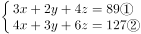，题目要求笔盒的价格，保留，可得：元。

故正确答案为D。

---

### 第 2 题　qid 2137112 · 数学运算

甲、乙、丙、丁四人赛跑。已知乙比丙快3分钟，丁比甲快6分钟，丙比丁慢1分钟。那么最快和最慢的相差几分钟？

- **A**. 6
- **B**. 7
- **C**. 8　✅
- **D**. 9

**答案**：C

**官方解析**

根据题意，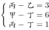，设乙的用时为分钟，则丙为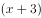分钟，丁为分钟，甲为分钟，故最快的是乙，最慢的是甲，两者相差分钟。

故正确答案为C。

---

### 第 3 题　qid 2137116 · 数学运算

有一种电子铃，每到整点就响一次铃，每走9分钟亮一次灯。正午12点时，它既亮灯又响铃。它下一次既响铃又亮灯是下午几点钟？

- **A**. 1点钟
- **B**. 2点钟
- **C**. 3点钟　✅
- **D**. 4点钟

**答案**：C

**官方解析**

每到整点就响一次铃，说明响铃的周期是60分钟；每走9分钟亮一次灯，说明亮灯的周期是9分钟。根据题意，求下次既响铃又亮灯的时间，实则求响铃和亮灯周期的最小公倍数，两者最小公倍数为180，则下次既响铃又亮灯是在12点再过180分钟后，即下午3点钟。
故正确答案为C。

---

### 第 4 题　qid 2137118 · 数学运算

小马从A地到B地自驾游，如果驾驶原来的燃油汽车所需油费为108元，驾驶新购买的纯电动汽车所需电费为27元。已知每行驶1千米，原来的燃油汽车所需的油费比新购买的纯电动汽车所需的电费多0.54元，从A地到B地的路程是多少千米？

- **A**. 100
- **B**. 150　✅
- **C**. 180
- **D**. 200

**答案**：B

**官方解析**

走完全程驾驶原来的燃油汽车比新购买的电动汽车多花元，每千米多花0.54元，故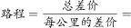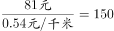千米。

故正确答案为B。

---

### 第 5 题　qid 2137120 · 数学运算

本题图中，左边的图形每个小圆的面积为，那么右边图形中阴影部分面积为：

- **A**. 
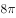

- **B**. 
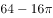
　✅
- **C**. 

- **D**. 
20

**答案**：B

**官方解析**

左图中，每个小圆的面积为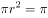，则，故正方形的边长为，则。

右图中，大圆的半径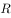为正方形边长的一半，即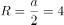，则大圆的面积为。

所以右图阴影部分的面积为正方形面积减去大圆面积，即。

故正确答案为B。

---

### 第 6 题　qid 2137062 · 数学运算

一家电影院的电影票收费标准为50元/次，若购买会员年卡，可享受如下优惠：

若小李一年内在该电影院观影次数介于10-20次之间，则对于他来说最省钱的方式为：

- **A**. 购买A类会员年卡
- **B**. 不购买会员年卡
- **C**. 购买C类会员年卡
- **D**. 购买B类会员年卡　✅

**答案**：D

**官方解析**

方法一：由于观影次数介于10-20次之间，考虑极端情况，当观影次数问题为11次时：

不购买会员年卡所花钱数为元；

购买A类会员年卡所花钱数为元；

购买B类会员年卡所花钱数为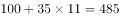元；

购买C类会员年卡所花钱数为元，此时购买B类会员卡最省钱；

当观影次数为19次时：

不购买会员年卡所花钱数为元；

购买A类会员年卡所花钱数为元；

购买B类会员年卡所花钱数为元；

购买C类会员年卡所花钱数为元，此时也是购买B类会员卡最省钱。

综合两个极端情况，当观影次数介于10-20次之间时候选择B类会员卡最省钱。

故正确答案为D。

方法二：每种购票方式两两比较如下：

A与B比较时，B类办卡费用比A类多花50元，但是每张电影票多节省5元，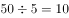张。即当购买10张电影票时，A、B花钱一样多，超过10张时，B类更省钱；

B与C比较时，C类办卡费用比B类多花100元，但是每张电影票节省5元，张。即当购买20张电影票时，B、C花钱一样多，超过20张时，C类才会更省钱，所以20张以下时，B类更省钱；

B与不购买会员卡比较时，办卡花费100元，会员卡每张电影票节省元，。即购票超过6.67张时，B类更省钱，所以当购票在10-20张之间时，购买B类会员卡更优惠。

综上，在观影次数介于10-20次时，购买B类会员卡相比其他三种方式都更省钱。

备注：10-20之间不包括端点，即10和20。

故正确答案为D。

---

### 第 7 题　qid 2137064 · 数学运算

张某和李某在同一家公司工作，其2017年的月薪都是10000元。已知张某和李某加入公司第一年的月薪都是4000元，张某每年的月薪都比上一年上涨元，而李某每年的月薪都比上一年上涨元。则张某在公司最少工作了几年？

- **A**. 6　✅
- **B**. 5
- **C**. 4
- **D**. 3

**答案**：A

**官方解析**

设张某在公司工作了年，由题干条件可得，年后（即2017年）张某的。

同理，设李某在单位工作了年，则年后（即2017年）李某的。

梳理可得：；。

结合选项，问的是最少，从小到大代入可得：

D项：当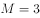时，可得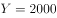。代入②式，解得不为整，排除；

C项：当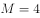时，可得。代入②式，解得不为整，排除；

B项：当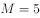时，可得。代入②式，解得不为整，排除；

A项：当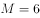时，可得。代入②式，解得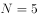，当选。

即张某在公司至少工作了6年。

故正确答案为A。

---

### 第 8 题　qid 2137068 · 数学运算

甲、乙两人生产零件，甲的任务量是乙的2倍，甲每天生产200个零件，乙每天生产150个零件，甲完成任务的时间比乙多2天，则甲、乙任务量总共为多少个零件？

- **A**. 1200
- **B**. 1800　✅
- **C**. 2400
- **D**. 3600

**答案**：B

**官方解析**

设乙完成任务的时间为天，则甲为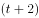天。则甲的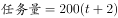个，乙的个。因甲的任务量是乙的2倍，则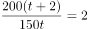，解得天。则乙的个，甲的个。二者个。

故正确答案为B。

---

### 第 9 题　qid 2137078 · 数学运算

某水果批发商从果农那里以10元/公斤的价格购买了一批芒果，运送到某地区售出。在长途运输过程中有的芒果磕碰受损和另外的芒果过度成熟，因此无法卖出，其余部分以25元/公斤的价格售出后，如果不计运输等其他费用，这批芒果赚得利润为12000元。则该批发商从果农那里购买了多少公斤芒果？

- **A**. 480
- **B**. 800
- **C**. 960　✅
- **D**. 1000

**答案**：C

**官方解析**

设批发商购买了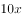公斤芒果，因的芒果因故无法出售，故只售出了的芒果，即只售出了公斤芒果。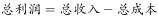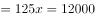，解得公斤，则批发商购买了公斤芒果。

故正确答案为C。

---

### 第 10 题　qid 2137080 · 数学运算

某单位有甲和乙两个人数相同的处室，甲处室党员人数是群众人数的1.5倍，而两个处室党员总人数与群众总人数正好相同。现从甲处室调走10名党员后，甲处室和乙处室党员占各自处室现有职工的比例相同。则两个处室最初共有多少人？

- **A**. 48
- **B**. 60　✅
- **C**. 72
- **D**. 90

**答案**：B

**官方解析**

方法一：设甲处室党员为人，则群众为人，所以甲处室总共有人。已知甲、乙两处室人数相同，所以乙处室人数也是人。由“两个处室党员总人数和群众总人数正好相同”可知，乙处室党员人数为，群众人数为。甲处室调走10名党员后，两处室党员占各自处室现有职工的比例相同，即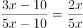，解得，所以两处室最初共有人。

方法二：由“甲处室党员人数是群众人数的1.5倍”可得，甲处室。因为两处室人数相等，且党员和群众的总人数也相等，所以乙处室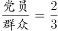。因此两处室的总人数一定是的倍数，排除A、C选项；代入B选项，，则甲处室人数为30人，即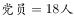，。调走10名党员后，甲处室党员人数占本处室总人数的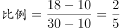，乙处室党员占本处室总人数的比例为，两处室党员占各自处室现有职工的比例相同，满足题意。

故正确答案为B。

---

### 第 11 题　qid 2137092 · 数学运算

军事演习的模拟战场上有3个要点，B点在A点正北方3千米处，C点在A点正东方4千米处。现某部队保持与B、C两点相同的距离穿过战场，其在行进过程中，与A点之间最短的距离为多少千米？

- **A**. 0.5
- **B**. 0.6
- **C**. 0.7　✅
- **D**. 0.875

**答案**：C

**官方解析**

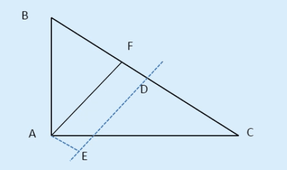

DE为BC的垂直平分线，则DE上任一点到B、C的距离均相等。在直角△ABC中，AB=3，AC=4，根据勾股定理可得BC=5，BD=CD=2.5。从A点向DE作垂线并与之相交于E点，则AE即为点A到DE最短的距离。从A点向BC作垂线并与之相交于F点，则AF//DE，且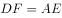。由于，且，因此，则有，即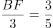，可得。因此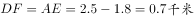。

故正确答案为C。

---

### 第 12 题　qid 2137094 · 数学运算

工业原料A因供不应求，每吨的价格上涨了，导致使用A原料的产品每件生产成本较最初上涨了120元。此时企业改进生产工艺，每件产品可少使用A原料1公斤，此时每件产品的生产成本只较最初上涨40元。则改进生产工艺之前，每件产品使用多少公斤A原料？

- **A**. 12
- **B**. 9　✅
- **C**. 7.5
- **D**. 6

**答案**：B

**官方解析**

设使用原料A的产品每件原来成本是元，则价格上涨后是元；改进工艺前每件产品使用原料A为公斤，则改进工艺后每件产品使用原料A为公斤。

由题意“使用A原料的产品每件生产成本较最初上涨了120元”，可得：

“改进工艺后每件产品少使用A原料1公斤，成本只上涨40元”，可得：

联立方程①②解得。

故正确答案为B。

---

### 第 13 题　qid 2137096 · 数学运算

5名职工在办公室里的分机号码都是2位数字，且他们分机号码最后一位的5个数字相加为32，最大的数比最小的大7且各不相同。如将每个人的分机号码个位和十位颠倒形成新的分机号，则5个人新分机号码的5个2位数字之和最大为：

- **A**. 365　✅
- **B**. 395
- **C**. 482
- **D**. 495

**答案**：A

**官方解析**

根据题意，原来的分机号最后一位的5个数字相加为32，则分机号颠倒后，所有十位上的数字和就是32。为了使得新分机号码的5个两位数字的和最大，则新分机号的个位数都取最大值9。因此题目所求为。

故正确答案为A。

---

### 第 14 题　qid 2137100 · 数学运算

甲和乙走完AB两地之间的距离分别需要120分钟和分钟。某日甲从A地出发前往B地，1小时后乙从B地出发前往A地，两人到达目的地后都立刻折返。如甲和乙前两次遇见都是迎面相遇，问的取值范围为（    ）。

- **A**. 

- **B**. 

　✅
- **C**. 

- **D**. 

**答案**：B

**官方解析**

根据题干，甲、乙第一次遇见一定是迎面相遇，而第二次迎面相遇可以发生在AB间任意一点，那么极限情况一定是在A、B两个端点。

若是在A点发生第二次相遇（如下图1），此时甲走完2个全程，用时120×2=240分钟，乙晚出发1小时，并走完1个全程（x分钟），则240=60+x，解得x=180分钟。

若是在B点发生第二次相遇（如下图2），此时甲走完1个全程，用时120分钟，乙晚出发1小时，并走完2个全程（2x分钟），则120=60+2x，解得x=30分钟。

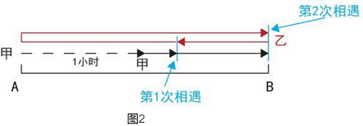

因要求两次都是迎面相遇，故取值范围为30&lt;x&lt;180。

故正确答案为B。

---

### 第 15 题　qid 2137104 · 数学运算

某工厂的产品有7家代理商，如果以满意度最高为7分，满意度最低为1分，7家代理商对工厂的满意度正好是1分到7分的不同整数值。如从中任意选择3家代理商进行调查，其对工厂满意度的平均值与所有代理商满意度平均值相差小于1的概率为

- **A**. 

- **B**. 

- **C**. 

- **D**. 

　✅

**答案**：D

**官方解析**

根据题意，共有7家代理商，从中任取3家，总的情况数为。7家代理商满意度平均值为分，要使从中任取3家代理商对工厂满意度的平均值与所有代理商满意度平均值相差小于1分，则被抽出的3家代理商对工厂满意度的平均值应大于3分，小于5分，即其总分应大于9分，小于15分。

正向考虑，情况较多，从反面进行枚举，即被抽出的3家代理商对工厂满意度总分小于等于9分或大于等于15分。小于等于9分的情况有（1,2,3）、（1,2,4）、（1,2,5）、（1,2,6）、（1,3,4）、（1,3,5），（2,3,4），共7种；大于等于15分的情况有（2,6,7）、（3,5,7）、（3,6,7）、（4,5,6）、（4,5,7）、（4,6,7）、（5,6,7），共7种。则满足题意的情况数为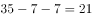种，所求概率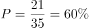。

故正确答案为D。

---

## 判断推理

### 第 1 题　qid 2136974 · 图形推理

请从四个选项中选出最恰当的一项填在问号处，使图形呈现一定的规律性：

- **A**. A　✅
- **B**. B
- **C**. C
- **D**. D

**答案**：A

**官方解析**

观察图形发现，元素组成不同，且无属性规律，考虑数量规律。观察发现，题干图形中出现明显一笔画成的图形和有端点的图形，考虑笔画数。进一步观察发现，题干中各图均为一笔画图形，而选项中A项为一笔画图形、B项和C项为两笔画图形、D项为三笔画图形。
故正确答案为A。

---

### 第 2 题　qid 2136980 · 图形推理

请从四个选项中选出最恰当的一项填在问号处，使图形呈现一定的规律性：

- **A**. A
- **B**. B
- **C**. C
- **D**. D　✅

**答案**：D

**官方解析**

观察图形发现，元素组成不同，优先考虑属性规律。观察发现，题干图形均为轴对称图形，并且对称轴只有一条。选项中，A项图形有2条对称轴，B项图形不是轴对称图形，C项图形有1条对称轴，D项图形有1条对称轴，排除A项和B项。进一步观察题干图形发现，题干中每个图形的对称轴都与题干图形中的一条线重合，而C项图形的对称轴并不与图形中某一条线重合。
故正确答案为D。

---

### 第 3 题　qid 2136984 · 图形推理

请从四个选项中选出最恰当的一项填在问号处，使图形呈现一定的规律性：

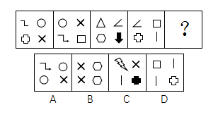

- **A**. A
- **B**. B
- **C**. C　✅
- **D**. D

**答案**：C

**官方解析**

观察图形发现，元素组成不同，且无属性规律，考虑数量规律。题干中每个图形都是由多个独立小元素构成，可考虑小元素的数量或者种类规律。观察发现，题干中每个图形均由4种不同的小元素构成。观察选项发现，A项和D项由3种小元素构成，B项由2种小元素构成，只有C项由4种小元素构成。
故正确答案为C。

---

### 第 4 题　qid 2136992 · 图形推理

此题包含两套图形和可供选择的4个图形。这两套图形具有某种相似性，也存在某种差异。要求你从四个选项中选择最适合取代问号的一个。正确的答案应不仅使两套图形表现出最大的相似性，而且使第二套图形也表现出自己的特征。

- **A**. A
- **B**. B
- **C**. C
- **D**. D　✅

**答案**：D

**官方解析**

观察图形发现，元素组成不同，考虑属性规律。观察发现，题干中第一组图形均为轴对称图形，并且对称轴只有一条。画出每个图的对称轴发现，每个图的对称轴沿逆时针方向每次旋转45度；第二组前两个图形也都是轴对称图形，且每个图的对称轴沿逆时针方向每次旋转45度，故问号处图形对称轴方向应该竖直向下，排除B项和C项。进一步观察题干图形，每个图均由直线组成，考虑数直线数，第一组图形直线数量分别为2、3、4，第二组图形直线数量分别为2、3，故问号处图形直线数应为4。选项中，A项直线数为3，D项直线数为4条。
故正确答案为D。

---

### 第 5 题　qid 2136998 · 图形推理

此题包含两套图形和可供选择的4个图形。这两套图形具有某种相似性，也存在某种差异。要求你从四个选项中选择最适合取代问号的一个。正确的答案应不仅使两套图形表现出最大的相似性，而且使第二套图形也表现出自己的特征。

- **A**. A
- **B**. B
- **C**. C　✅
- **D**. D

**答案**：C

**官方解析**

元素组成不同，且无属性规律，考虑数量规律。观察发现，图形均由直线和曲线构成，且曲线和直线都有交点，考虑数曲直交点。第一组图曲直交点数分别为2、3、4,第二组图曲直交点数分别为2、3，故问号处图形的曲直交点数应为4。选项中，A项为6个曲直交点，B项为5个曲直交点，C项为4个曲直交点，D项为5个曲直交点。
故正确答案为C。

---

### 第 6 题　qid 2137044 · 逻辑判断

某国总统竞选活动中，候选人G在X州获得5万多张选票，在Y州获得3万余张选票。据此，约翰先生认为，G在X州有更高的支持率。
以下哪项如果为真，能够反驳约翰先生的观点？

- **A**. 候选人G到X州做过宣传演讲，但未曾去过Y州
- **B**. 候选人G是基督徒，X州比Y州的基督徒多得多
- **C**. X州支持候选人G的女性多于Y州
- **D**. Y州的人口仅有X州人口的一半　✅

**答案**：D

**官方解析**

第一步：找出论点和论据。

论点：G在X州有更高的支持率。

论据：某国总统竞选活动中，候选人G在X州获得5万多张选票，在Y州获得3万余张选票。

第二步：逐一分析选项。

A项：候选人G在X州做过宣传演讲，但没有去过Y州，宣传演讲是否能获得更高的支持率，不明确，排除；

B项：X州的基督教徒比Y州多，与候选人G获得的支持率无关，无法削弱，排除；

C项：X州支持候选人G的女性多于Y州，但题干未提到X州支持候选人G的男性是否多于Y州，且不明确两个州总人口是多少，得不出支持率的高低，排除；

D项：支持率等于得票数除以人口总数，Y州的人口仅有X州人口的一半。如果Y州人口数为，则G在X州的支持率为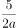，G在Y州的支持率为，所以G在Y州的支持率更高，可以削弱，当选。

故正确答案为D。

---

### 第 7 题　qid 2137048 · 逻辑判断

近几年，智能手机已成为手机市场上的主要销售产品，功能手机（非智能手机）的销售量则大幅度降低。某手机生产商预测：“智能手机很快将完全取代功能手机。”
以下哪项如果为真，能够对该手机生产商的预言构成反驳？

- **A**. 智能手机除具备通话、发短信等功能外，上网也方便，深受消费者喜爱
- **B**. 很多老年人只会使用功能手机，手机是他们生活中必不可少的通讯工具　✅
- **C**. 由于购买非智能手机的人越来越少，无生产商愿意再生产非智能手机
- **D**. 智能手机为工作和娱乐提供诸多便利，越来越多的人选择购买智能手机

**答案**：B

**官方解析**

第一步：找出论点和论据。
论点：智能手机很快将完全取代功能手机。
论据：近几年，智能手机已成为手机市场上的主要销售产品，功能手机（非智能手机）的销售量则大幅度降低。
第二步：逐一分析选项。
A项：智能手机深受消费者喜爱，不表示智能手机就将完全取代功能手机，无关项，排除；
B项：功能手机对于老人的生活必不可少，所以智能手机不可能完全取代功能手机，削弱论点，当选；
C项：没有生产商愿意再生产非智能手机，说明最后功能性手机可能会消失，加强论点，排除；
D项：越来越多的人选择购买智能手机，说明可能逐渐会没人购买功能性手机，加强论点，排除。
故正确答案为B。

---

### 第 8 题　qid 2137038 · 逻辑判断

高栓患有假性近视。为了使其视力恢复到正常状态，李大夫要求高栓停止打网络游戏。
为使李大夫的要求具有说服力，必须假设以下哪项？

- **A**. 假性近视患者打网络游戏，将严重影响其视力恢复到正常状态　✅
- **B**. 打网络游戏是引起假性近视的主要原因
- **C**. 李大夫经验丰富，他治愈了90%以上前来就诊的假性近视患者
- **D**. 假性近视如果不及时缓解将导致真性近视

**答案**：A

**官方解析**

第一步：找出论点和论据。
论点：李大夫要求高栓停止打网络游戏。
论据：高栓患有假性近视，想要恢复到正常状态。
第二步：逐一分析选项。
A项：说明假性近视患者打网络游戏会影响视力的恢复，即在网络游戏和恢复视力之间进行搭桥，当选；
B项：说明打网络游戏是引起假性近视的原因，但是并不意味着不打游戏就能使视力恢复到正常情况，排除；
C项：只说到李大夫经验丰富，治愈率高，但是并没有说明网络游戏和恢复视力之间的关系，不是必须的假设，排除； 
D项：只说到假性近视不及时治疗所带来的后果，但是并没有说明网络游戏和恢复视力之间的关系，属于无关选项，排除。
故正确答案为A。

---

### 第 9 题　qid 2137042 · 逻辑判断

酒类广告常会告诉人们，少喝一点酒没事，控制好饮酒量可能还对心脏有好处。
以下哪项如果为真，最能削弱上述结论？

- **A**. 每个人的最佳饮酒量不同，要依据个人年龄、性别和叶酸摄入量等因素决定
- **B**. 对于那些高密度脂蛋白低、有健康的饮食和大量运动的人来说，饮酒可能有益
- **C**. 调查显示80%的酒类广告都承认过度美化和夸大饮酒的益处　✅
- **D**. 红葡萄酒中白藜芦醇和抗氧化剂等有益成分的含量有限

**答案**：C

**官方解析**

第一步：找出论点和论据。
论点：酒类广告宣称少喝一点酒没事，控制好饮酒量可能还对心脏有好处。
论据：无。
第二步：逐一分析选项。
A项：说明每个人的最佳饮酒量由一些因素决定，但没有说明喝酒是好还是不好，无法削弱，排除；
B项：说明对于一部分人而言饮酒可能有益，加强了题干的论点，排除；
C项：说明大部分的酒类广告承认了自己的广告内容有夸大和美化之嫌，即对酒类广告的内容进行了削弱，当选； 
D项：只说到红葡萄酒中的有益成分含量有限，并不能说明喝酒好还是不好，无法削弱，排除。
故正确答案为C。

---

### 第 10 题　qid 2137050 · 类比推理

L城有四位著名的雕刻家张明、杨刚、李强和刘庆，该城近20年来所有的名人雕像都出自他们中某一人之手。他们四人都有一个习惯：即完工后在作品不显眼处刻字留言。已知张明和杨刚的留言总是真的，李强和刘庆的留言总是假的。现发现L城去年雕刻完成的一尊名人像，据上面的留言可确定此像为李强所雕，那么该留言内容应为：

- **A**. 此像非张明所雕
- **B**. 此像非杨刚所雕
- **C**. 此像为李强所雕
- **D**. 此像为刘庆所雕　✅

**答案**：D

**官方解析**

本题属于真假推理题。
第一步：分析题干。
张明和杨刚的留言总是真的，李强和刘庆的留言总是假的。
第二步：逐一分析选项。
A项：如果“此像非张明所雕”为该雕像上的留言内容，已知雕像是李强所雕，则留言内容符合实情，而已知李强的留言总是假的，因此选项与题干矛盾，排除；
B项：如果“此像非杨刚所雕”为该雕像上的留言内容，已知雕像是李强所雕，则留言内容符合实情，而已知李强的留言总是假的，因此选项与题干矛盾，排除；
C项：如果“此像为李强所雕”为该雕像上的留言内容，已知雕像是李强所雕，则留言内容符合实情，而已知李强的留言总是假的，因此选项与题干矛盾，排除；
D项：如果“此像为刘庆所雕”为该雕像上的留言内容，已知雕像是李强所雕，则留言内容不符合实情，而已知李强的留言总是假的，因此选项符合题干矛盾，当选。
故正确答案为D。

---

### 第 11 题　qid 2137098 · 逻辑判断

据介绍，北半球人口相对密集，燃烧化石燃料等人类活动不断推高碳排放量，因此北半球大气中的二氧化碳浓度在2013年已达到400PPM这一标杆水平。相对来说，南半球人类活动较少，而南极洲更是人烟稀少，但即便如此，2017年6月南极洲的二氧化碳浓度也达到了400PPM这一标杆值。
根据以上信息，下列推论正确的是：

- **A**. 人类活动对地球的影响已经深入到极地　✅
- **B**. 二氧化碳浓度升高对南极洲地貌有深远影响
- **C**. 南极洲二氧化碳浓度不会再降到400PPM以下
- **D**. 北极的二氧化碳浓度在4、5年前就远超南极

**答案**：A

**官方解析**

日常推理题，根据题干信息逐一分析选项。
A项：南极洲人烟稀少但二氧化碳浓度仍达到了400PPM这一标杆值，说明人类活动对地球的影响已经深入到极地，可以推出，当选；
B项：题干只是提到南极洲二氧化碳浓度达到了400PPM这一标杆值，并没有提到达到这个数值以后的具体影响，对南极洲地貌是否有深远影响不得而知，无中生有，排除；
C项：题干只是说南极洲二氧化碳浓度达到了400PPM这一标杆值，没有提到以后会不会再降下去，无中生有，排除；
D项：题干说的是北半球在2013年二氧化碳浓度达到了400PPM这一标杆值，而南极洲在2017年才达到这个值，但通过北半球的平均情况无法得出北极是否远超于南极，选项叙述程度比较重，且偷换概念，排除。
故正确答案为A。

---

### 第 12 题　qid 2137102 · 逻辑判断

某调查发现，患抑郁症的人平均每天使用手机的时间达122分钟以上，而没有患抑郁症的人平均每天使用手机的时间为59分钟。有人提出，玩手机可能会影响情绪，使用手机的时间越多，抑郁的可能性越大。
以下哪项如果为真，不能支持以上结论？

- **A**. 长时间玩手机，尤其是睡前玩手机，可能会造成睡眠时间的不足，而导致情绪容易出问题
- **B**. 长时间玩手机，会接触海量数据，这些数据不能及时处理，易造成情绪低迷、烦躁和疲劳，增加抑郁风险
- **C**. 人把过多时间和精力放在手机上，必然和现实中的人接触减少，逃避面对现实是抑郁的特征之一　✅
- **D**. 长期玩手机的人，通常把大部分时间用在上网和打游戏，而不是和朋友聊天，缺少人际支持是抑郁的风险因素

**答案**：C

**官方解析**

第一步：找出论点和论据。
论点：玩手机可能会影响情绪，使用手机的时间越多，抑郁的可能性越大。
论据：某调查发现，患抑郁症的人平均每天使用手机的时间达122分钟以上，而没有患抑郁症的人平均每天使用手机的时间为59分钟。
第二步：逐一分析选项。
A项：指出长时间玩手机会导致情绪出问题，说明玩手机会影响情绪，可以加强，排除；
B项：长时间玩手机会有海量数据不能及时处理，容易造成情绪低迷、烦躁和疲劳等，因此增加抑郁风险。该项是在解释原因说明为什么玩手机时间越多，抑郁的可能性越大，可以加强，排除；
C项：强调逃避面对现实是抑郁的特征之一，而题干论点讨论的是患抑郁症的原因，话题不一致，无法加强，当选；
D项：长期玩手机的人很少有时间和朋友聊天，和朋友聊天时间少即缺少人际支持，这是抑郁的风险因素。该项说明玩手机时间越多，抑郁的可能性越大，可以加强，排除。
本题是选非题，故正确答案为C。

---

### 第 13 题　qid 2137106 · 逻辑判断

共享单车作为一种新鲜事物，近来发展迅速。在城市的大街小巷，几乎到处可见共享单车的影子。共享单车构成城市一道新的亮丽风景线，也为人们的出行提供了方便。但是，有一些市民对整个自行车生产行业表示担忧，他们认为：共享单车的出现和大量投入使用，使得很多计划购买自行车的个人不再购买。因此，整个自行车行业的生产和销售量随之减少。
以下哪项如果为真，最能削弱这些市民的结论？

- **A**. 不同品牌的自行车生产商将面临更激烈的市场竞争，有些厂家与共享单车运营公司合作，会生产和销售更多的自行车
- **B**. 共享单车也存在很多的问题，比如，存在安全隐患，在有需求时不能及时找到，有一些民众仍愿意购买专属自己的自行车
- **C**. 共享单车由共享单车所属公司委托自行车生产商生产，共享单车的数量远远超过了因个人需求而产生的购买量　✅
- **D**. 共享单车的使用需要网上申请账号，使用时需要进行微信扫码，很多中年人不会上网，因此他们更愿意自己购买自行车

**答案**：C

**官方解析**

第一步：找出论点和论据。
论点：整个自行车行业的生产和销售量随之减少。
论据：共享单车的出现和大量投入使用，使得很多计划购买自行车的个人不再购买。
第二步：逐一分析选项。
A项：该项只能说明有些厂家与共享单车运营公司合作，会生产和销售更多的自行车。但是自行车行业整体的生产和销售量会不会减少，不明确，排除；
B项：该项只能说明有一些民众仍愿意购买专属自己的自行车，但只是一些民众而不是全部的民众愿意这样做。这不能说明自行车行业整体的生产和销售量会不会减少，不明确，排除；
C项：共享单车的数量远远超过了因个人需求而产生的购买量，说明因为共享单车的出现，自行车的整体需求量更多了，整个自行车行业的生产和销售量并未减少，直接削弱题干论点，当选；
D项：该项说明很多中年人更愿意自己购买自行车，而中年人只是整个人群的一部分，其他人是否更愿意自己购买自行车不明确。因此该项不能说明自行车行业整体的生产和销售量会不会减少，不明确，排除。
故正确答案为C。

---

### 第 14 题　qid 2137110 · 逻辑判断

从1995年起，印度某地每年有数百名贫困儿童患上一种急性大脑疾病。患儿常在清晨出现癫痫症状，许多儿童很快死亡。这种情况通常发生于每年5月-7月。该地区盛产荔枝，5月-7月恰好是荔枝成熟的时间，因此有人怀疑这种疾病可能与荔枝有关。研究发现，所有荔枝中都含有亚甲环丙基甘氨酸和次甘氨酸，没熟的荔枝中这两种物质含量更高。研究者认为，这些患者属于次甘氨酸和亚甲环丙基甘氨酸中毒，疾病爆发确实与大量食用荔枝有关。
以下哪项如果为真，最能支持以上结论？

- **A**. 所有患儿的尿样本中均检测出了亚甲环丙基甘氨酸和次甘氨酸
- **B**. 居民根据官方建议限制了儿童每日吃荔枝数量，两年后患病人数大幅降低　✅
- **C**. 相比没有出现症状的儿童，生病儿童患病前吃过荔枝的可能性更高
- **D**. 相比没有出现症状的儿童，生病儿童更有可能吃下生的或者腐烂的荔枝

**答案**：B

**官方解析**

第一步：找出论点和论据。
论点：这些患者属于次甘氨酸和亚甲环丙基甘氨酸中毒，疾病爆发确实与大量食用荔枝有关。
论据：从1995年起，印度某地每年有数百名贫困儿童患上一种急性大脑疾病。患儿常在清晨出现癫痫症状，许多儿童很快死亡。这种情况通常发生于每年5月-7月。该地区盛产荔枝，5月-7月恰好是荔枝成熟的时间，因此有人怀疑这种疾病可能与荔枝有关。研究发现，所有荔枝中都含有亚甲环丙基甘氨酸和次甘氨酸，没熟的荔枝中这两种物质含量更高。
第二步：逐一分析选项。
A项：检测出亚甲环丙基甘氨酸和次甘氨酸，不代表一定是吃了荔枝，无关项，不能加强，排除；
B项：该项表明吃荔枝的量少，患病人数就低，通过对比的方式说明患病与大量吃荔枝有关系，可以加强，当选；
C项：论点强调的是患病与大量吃荔枝有关，该项强调吃荔枝的可能性高，不代表吃的量大，无法加强，排除； 
D项：论点强调的是患病与大量吃荔枝有关，该项强调吃生的或者腐烂的荔枝的可能性高，不代表吃的量大，无法加强，排除。
故正确答案为B。

---

### 第 15 题　qid 2137114 · 逻辑判断

大众通常认为，早期的音乐训练能增强个体的乐声和语音处理能力。但有些心理学家对此表示怀疑。研究人员调查了出生于1959年到1985年之间的1211对同卵双胞胎和1358对异卵双胞胎，记录他们的音乐练习时间，评估他们的音乐能力。他们发现，练习更长时间并不能表现出更出色的音乐能力，比如一对基因相同的同卵双胞胎的音乐练习时间相差20228小时，但他们的音乐能力完全相同。这些研究者认为，如果没有正确的基因，即使练习2万小时也没有意义，音乐能力是由基因决定的。
以下哪项如果为真，最能驳斥研究者的结论？

- **A**. 音乐能力评估采用手指模拟快节奏音乐的方式，而手指的灵活性受遗传影响
- **B**. 具有遗传上优越的听觉技能的个体可能自我选择成为音乐家，练习时间更长
- **C**. 同卵双胞胎之间通常有“心灵感应”，影响了个体在音乐能力测试中的表现　✅
- **D**. 音乐能力差的个体会低估自己的练习时间，以便维持心理平衡

**答案**：C

**官方解析**

第一步：找出论点和论据。
论点：音乐能力是由基因决定的。
论据：研究人员调查了出生于1959年到1985年之间的1211对同卵双胞胎和1358对异卵双胞胎，记录他们的音乐练习时间，评估他们的音乐能力。他们发现，练习更长时间并不能表现出更出色的音乐能力，比如一对基因相同的同卵双胞胎的音乐练习时间相差20228小时，但他们的音乐能力完全相同。
第二步：逐一分析选项。
A项：该项说明音乐能力与遗传有关，即与基因有关，有一定的加强作用，不能削弱，排除；
B项：该项强调的是具有遗传上优越的听觉技能的个体练习时间更长，那练习对音乐能力是否有影响不确定，不能削弱，排除；
C项：“心灵感应”，影响了个体在音乐能力测试中的表现，说明“心灵感应”影响了调查的结果，属于他因削弱，当选； 
D项：音乐能力差的个体会低估自己的练习时间，意思是本来练习的多，但感觉练习的少，感觉练的少跟实际练了多少无关，不能削弱，排除。
故正确答案为C。

---

### 第 16 题　qid 2137032 · 类比推理

H企业的招聘小组工作期限为两年，每一年都由五人组成。这五人中，有三人来自五位高管约翰、琼斯、玛丽、安妮和亚当，有两人来自三位高级工程师艾伦、麦迪和彼得。每年，该小组中有一名成员当组长。第一年当组长的成员第二年必须退出该小组。此外，该小组还要满足如下要求：
(1)琼斯、艾伦不能在同一年成为小组成员；
(2)每一年，安妮和艾伦中有且只有一位参加。
艾伦在第一年担任了该小组组长，则下列选项中，第二年一定参加该小组的是：

- **A**. 琼斯、安妮
- **B**. 琼斯、彼得
- **C**. 安妮、麦迪　✅
- **D**. 亚当、彼得

**答案**：C

**官方解析**

题干条件中提到次数最多的就是“艾伦”，可以以它为突破口。
根据条件“艾伦在第一年担任了该小组组长”以及“第一年当组长的成员第二年必须退出该小组”，可推出艾伦第二年不可能是小组成员；
根据条件（2）“每一年，安妮和艾伦中有且只有一位参加”，结合上述结论艾伦第二年没参加可知：第二年安妮一定参加该小组，锁定A、C两项；
又根据条件“有两人来自三位高级工程师艾伦、麦迪和彼得”，结合上述结论艾伦第二年没参加可知：第二年剩余两名高级工程师麦迪和彼得一定参加该小组；
提问是第二年一定参加该小组的是哪项，根据刚才推导出的结论：“安妮、麦迪和彼得第二年一定参加该小组”，可知C选项中两人符合条件。
选项A、B中的琼斯无法判定是否一定参加该小组，因为第二年艾伦不参加该小组，在条件（1）中琼斯第二年无论其是否参加该小组，该条件都可满足，故无法判定，排除；选项D中的亚当也无法判定是否一定参加该小组，排除。
故正确答案为C。

---

### 第 17 题　qid 2137034 · 逻辑判断

一项研究发现，生活贫困能够导致人们的某种基因发生变化，这种基因能够增强负责应对恐慌的大脑区域活动，比如杏仁核的活动增加会导致患上抑郁症的风险增加。同时，较低的社会经济状况与低水平的血清素之间也存在关联，进而增加抑郁症的患病风险。研究员还发现，这种基因变化也会传递给后代。
根据上述研究，可以得知：

- **A**. 生活贫困会通过影响生理而对精神健康产生作用　✅
- **B**. 社会经济地位较高的人群患抑郁症的风险较低
- **C**. 穷困阶层因基因的变化而使得贫穷和疾病多代延续
- **D**. 杏仁核活动增强的同时，血清素水平降低

**答案**：A

**官方解析**

本题为日常结论题。
A项：题干提及“较低的社会经济状况与低水平的血清素之间存在关联，进而增加抑郁症的患病风险”，可以推出生活贫困会通过影响生理而对精神健康产生作用，符合文意，当选；
B项：题干只谈及了社会经济较低的人患抑郁症的情况，并未提到社会经济较高的人，无中生有，排除；
C项：题干说的是社会经济较低的人的基因变化会传递给后代，而非基因变化导致贫穷和疾病这个结果传递给后代，偷换概念，排除；
D项：题干并未提及杏仁核和血清素之间的联系，无中生有，排除。
故正确答案为A。

---

### 第 18 题　qid 2137036 · 逻辑判断

一条鳄鱼抢走了一个小孩，它对孩子的母亲说：“我会不会吃掉你的小孩？答对了，孩子还给你；答错了，我就吃了他。”孩子母亲说：“你会吃了他吧。”母亲的回答让鳄鱼陷入了一种选择困境，这就是所谓的“鳄鱼悖论”。
根据上述情景，以下哪一项描述有相似的困境或悖论？

- **A**. 裁缝说：“世上没有我做不出来的衣服。”公主说：“世上没有让我满意的衣服。”国王最后说：“你们都说的不对。”
- **B**. 小偷去保险箱偷珠宝，发现箱子有两个按钮，只有触动其中一个才能打开箱子。绿色按钮下面写着“按我，打不开”，红色按钮下面写着“不按我，能打开”。　✅
- **C**. 狐狸抓到一只鸡，对鸡说：“如果我现在心情好，就放你走；心情不好，就吃掉你。你说我心情好还是不好？猜对了就放你走。”鸡赶紧说：“你的心情很好。”
- **D**. 家里花瓶打碎了，肯定是大宝或小宝干的。妈妈问是谁打的。大宝说：“是小宝打的。”小宝说：“不是大宝打的。”原来他们都在说谎。

**答案**：B

**官方解析**

第一步：分析题干。
鳄鱼陷入一个悖论当中，无论鳄鱼怎样做，都无法兑现自己的许诺。因为鳄鱼的诺言有两项内容：
①如果妈妈猜对，我就释放小孩；
②如果妈妈猜错，我就吃掉小孩。
在妈妈表达了猜测之后，鳄鱼的行为只有两种选择，而这两种选择都与鳄鱼原先的诺言相违背。
鳄鱼的第一种选择，把小孩吃掉。这种选择的结果证明那位妈妈的猜测是正确的，按照鳄鱼原先的许诺①，此时鳄鱼应该把小孩归还，但是鳄鱼的选择却把小孩吃掉了，所以鳄鱼违背了自己的诺言。
鳄鱼的第二种选择，把小孩放掉。这种选择的结果证明那位妈妈的猜测是错误的，按照鳄鱼原先的许诺②，此时鳄鱼应该把小孩吃掉啊！但是鳄鱼的选择却把小孩释放了，所以鳄鱼还是违背了自己的诺言。
第二步：逐一分析选项。
A项：如果裁缝和公主说的都不对，即应该是“世界上有裁缝做不出来的衣服”和“世界上有让公主满意的衣服”，“有做不出的衣服”和“有满意的衣服”不矛盾，与题干不相似，排除；
B项：红色按钮说“不按我，能打开”，即“按绿色，能打开”，已知触动其中一个才能打开箱子，但是现在“按绿色，打不开”和“按绿色，能打开”同时存在，不可能按绿色既能打开又打不开，所以前后构成矛盾，与题干相似，当选；
C项：如果鸡回答正确，就不会被吃掉；如果鸡回答错误，即狐狸心情不好，那么鸡就会被吃掉，是狐狸的承诺并不矛盾，与题干不相似，排除；
D项：如果大宝和小宝都在说谎，即应该是“不是小宝打的”和“是大宝打的”， 因为已知肯定是大宝或小宝干的，所以两句话最后的结果都是“大宝干的”，没有矛盾的地方，与题干不相似，排除。
故正确答案为B。

---

### 第 19 题　qid 2137040 · 逻辑判断

抹香鲸是体型最大的齿鲸。由于潜水能力极强，抹香鲸也是潜水最深、潜水时间最长的哺乳动物。只有在有大量乌贼存活且不结冰的海域，才会有抹香鲸存活。阿拉弗拉海域没有抹香鲸。
根据以上断定，可得出以下哪项结论？
I.阿拉弗拉海域或者没有大量乌贼存活，或者是结冰的海域
II.只有在不结冰的海域里，乌贼才能存活
III.阿拉弗拉海域没有齿鲸

- **A**. 
仅I

- **B**. 
仅II

- **C**. 
仅III

- **D**. 
I，II和III都得不出
　✅

**答案**：D

**官方解析**

第一步：翻译题干。

有抹香鲸海域有大量乌贼存活且不结冰。

第二步：逐一分析结论。

I，阿拉弗拉海域没有抹香鲸，是对题干翻译的否前，否定箭头前得不到确定性结论，所以推不出该结论，排除A项；

II，翻译为：乌贼存活不结冰的海域，题干中两者是且关系，不是推出关系，所以推不出该结论，排除B项；

III，根据题干信息只能推出阿拉弗拉海域没有抹香鲸这种最大的齿鲸，至于是否有其他的齿鲸，不确定，所以推不出该结论，排除C项。

故正确答案为D。

---

### 第 20 题　qid 2137046 · 逻辑判断

有些参加语言学暑期高级讲习班的学生获得过青年语言学奖。所有中文专业的三年级硕士生都参加了语言学暑期高级讲习班。所有中文专业的一年级硕士生都没有参加语言学暑期高级讲习班。
如果以上陈述为真，可以推出：

- **A**. 有些获得过青年语言学奖的学生是中文专业的三年级硕士生
- **B**. 有些中文专业的三年级硕士生获得过青年语言学奖
- **C**. 有些获得过青年语言学奖的学生不是中文专业的一年级硕士生　✅
- **D**. 有些中文专业的一年级硕士生获得过青年语言学奖

**答案**：C

**官方解析**

第一步：翻译题干。

①有些参加语言学暑期高级讲习班的学生获得过青年语言学奖；

可换位为：②有些获得过青年语言学奖参加了语言学暑期高级讲习班。

③中文专业的三年级硕士生参加了语言学暑期高级讲习班。

④中文专业的一年级硕士生参加语言学暑期高级讲习班；

根据逆否等价可得：⑤参加语言学暑期高级讲习班中文专业的一年级硕士生。

第二步：逐一分析选项。

A项，根据②可知“有些获得过青年语言学奖参加了语言学暑期高级讲习班”，但是“参加了语言学暑期高级讲习班”是对翻译③的箭头后的肯定，肯定箭头后得不到确定性结论，该项不能推出，排除；

B项，根据③可知中文专业的三年级硕士生参加了语言学暑期高级讲习班，但中文专业的三年级硕士生是否属于翻译①中的“有些参加语言学暑期高级讲习班的学生”不确定，所以推不出中文专业的三年级硕士生中有些获得过青年语言学奖，该项不能推出，排除；

C项，根据传递规则，由②和⑤可得，有些获得过青年语言学奖参加了语言学暑期高级讲习班中文专业的一年级硕士生，即“有些获得过青年语言学奖的学生不是中文专业的一年级硕士生”，该项可以推出，当选；

D项，根据传递规则，由②和⑤可得，有些获得过青年语言学奖参加了语言学暑期高级讲习班中文专业的一年级硕士生，即有些获得过青年语言学奖的学生不是中文专业的一年级硕士生，“有的是”无法推出“有的不是”，所以无法得到结论“有些获得过青年语言学奖的学生是中文专业的一年级硕士生”，更无法推出“有些中文专业的一年级硕士生获得过青年语言学奖”，该项不能推出，排除。

故正确答案为C。

---

### 第 21 题　qid 2137066 · 定义判断

微商，一般是指以个人为单位的、利用web3.0时代所衍生的载体渠道，将传统方式与互联网结合，不存在区域限制，且可移动地实现销售渠道新突破的小型个体行为。
根据上述定义，以下属于微商的是：

- **A**. 某大型化妆品公司在微信账号上销售商品，吸引了一大批消费者
- **B**. 某眼镜店通过大力宣传吸引了许多年轻消费者进店购买
- **C**. 李某开的饭店为周边居民提供电话预定上门送外卖的服务
- **D**. 张某在市中心的服装店生意不错，他在微信上卖出的更多　✅

**答案**：D

**官方解析**

第一步：找出定义关键词。
 “以个人为单位”、“小型个体行为”、“利用web3.0时代所衍生的载体渠道，将传统与互联网结合”。
第二步：逐一分析选项。
A项：大型化妆品公司，不符合“以个人为单位”和“小型个体行为”，主体不符合，不符合定义，排除；
B项：眼镜店不符合“以个人为单位”，主体不符合，同时，做法不符合“利用web3.0时代所衍生的载体渠道，将传统与互联网结合”，不符合定义，排除；
C项：李某提供的是电话订餐和上门送外卖的服务，不符合“利用web3.0时代所衍生的载体渠道，将传统与互联网结合”，不符合定义，排除；
D项：张某的服装店符合“以个人为单位”和“小型个体行为”，利用微信符合“利用web3.0时代所衍生的载体渠道，将传统方式与互联网结合”，符合定义，当选。
故正确答案为D。

---

### 第 22 题　qid 2137070 · 定义判断

组织学习，是指组织为了实现发展目标、提高核心竞争力而围绕信息或知识技能所采取的各种行动，是组织不断努力改变或重新设计自身以适应持续变化的环境的过程。
根据上述定义，以下属于组织学习的是：

- **A**. 我国某大型国企派人学习科技课程　✅
- **B**. 李明为了晋升去参加周末管理课程
- **C**. 某外企工作团队节假日去三亚度假
- **D**. 某集团组织新进员工开展户外拓展

**答案**：A

**官方解析**

第一步：找出定义关键词。
“组织”、“为了实现发展目标，提高核心竞争力”、“围绕信息或知识技能所采取的各种行动”。
第二步：逐一分析选项。
A项：某大型国企符合“组织”，派人学习科技课程符合“围绕信息或知识技能所采取的各种行动”，符合定义，当选；
B项：李明是个人，不符合“组织”，主体不符合，不符合定义，排除；
C项：工作团队，不符合“组织”，同时，度假不符合学习，不符合定义，排除；
D项：某集团，符合“组织”，但是开展户外拓展，不符合“为了实现发展目标，提高核心竞争力”和“围绕信息或知识技能所采取的各种行为”，不符合定义，排除。
故正确答案为A。

---

### 第 23 题　qid 2137072 · 定义判断

赤潮，又称“红潮”。赤潮是海洋中一种或多种微小浮游植物、原生动物或细菌，在一定的环境条件下突发性迅速增殖或聚集，引起一定海域范围在一段时间内变色的自然生态现象。赤潮是一种海洋生物灾害。通常水体颜色因赤潮生物的数量、种类而呈红、黄、绿和褐色等。
根据上述定义，以下最有可能属于赤潮现象的是：

- **A**. 我国长江中游多次发生水体变蓝现象
- **B**. 位于尼泊尔博克拉市区的贝格纳斯湖湖水曾变红
- **C**. 日本濑户内海、有明海等水域频繁发生水体变红　✅
- **D**. 美国密西西比河部分水域发生洪灾，水中含大量泥沙

**答案**：C

**官方解析**

第一步：找出定义关键词。
“是海洋中一种或多种微小浮游植物、原生动物或细菌，在一定的环境条件下突发性迅速增殖或聚集”、“引起一定海域范围在一段时间内变色的自然生态现象”。
第二步：逐一分析选项。
A项：“长江中游水体变蓝”长江不是海洋，不符合定义，排除； 
B项：贝格纳斯湖是湖泊不是海洋，不符合定义，排除；
C项：日本濑户内海、有明海等均符合“海洋中”这一关键词，且水体变红符合“引起一定海域范围在一段时间内变色”，符合定义，当选；
D项：密西西比河是河流，而非“海洋”，且“水中含大量泥沙”不符合“引起一定海域范围在一段时间内变色”，不符合定义，排除。
故正确答案为C。

---

### 第 24 题　qid 2137074 · 定义判断

网络小说，是指由作者创作并首次在网络上发表，并以连载模式形成的小说。和传统小说相比，网络小说偏重于娱乐性和读者阅读时的体验。
根据上述定义，以下属于网络小说的是：

- **A**. 小张将自己考研的坎坷经历写成文章发表在网上，很多考研的学生看过之后很受感动，转发次数上百万
- **B**. 小黄根据姥姥讲的民间故事，写了长篇灵异小说发表在网站上，每日更新，小说完结后出版社主动与小黄联系，打算出版　✅
- **C**. 小金根据《西游记》绘制长篇连环画，每天在网上连载发表，受到很多网友的追捧
- **D**. 小姜将生活中的不文明现象写成一篇微小说发表在网上，电视台编导与他联系，想把他的小说拍摄成文明宣传片

**答案**：B

**官方解析**

第一步：找出定义关键词。
“由作者创作并首次在网络上发表”、“并以连载模式形成的小说”、“偏重于娱乐性和读者阅读时的体验”。
第二步：逐一分析选项。
A项：将考研经历写成文章发表，不符合“连载”这一关键词，不符合定义，排除； 
B项：将姥姥讲的故事写成长篇小说符合“由作者创作并首次在网络上发表”，每日更新符合“并以连载模式形成的小说”，灵异小说符合“偏重于娱乐性和读者阅读时的体验”，符合定义，当选；
C项：“连环画”不是小说，不符合定义，排除；
D项：“将不文明现象写成一篇微小说”不符合“并以连载模式形成的小说”，不符合定义，排除。
故正确答案为B。

---

### 第 25 题　qid 2137076 · 定义判断

《科学技术期刊管理办法》对科技期刊的定义为：具有固定刊名、刊期、年卷或年月顺序编号、印刷成册、以报道科学技术为主要内容的连续出版物。这一定义限定了科技期刊的刊载内容、外观和出版方式。
根据上述定义，以下属于科技期刊的是：

- **A**. 《中国首届砂石生产技术交流会论文集》
- **B**. 《青年文摘》
- **C**. 《哈尔滨工程大学学报》　✅
- **D**. 《汽车新型光源科技研讨会会议纪要》

**答案**：C

**官方解析**

第一步：找出定义关键词。
“具有固定刊名、刊期、年卷或年月顺序编号”、“印刷成册”、“以报道科学技术为主要内容”、“连续出版物”。
第二步：逐一分析选项。
A项：《中国首届砂石生产技术交流会论文集》是该届交流会论文的合集，不符合“连续出版物”，不符合定义，排除； 
B项：《青年文摘》是面向全国、以青少年为核心读者群的文摘类综合刊物，不符合“以报道科学技术为主要内容”，不符合定义，排除；
C项：《哈尔滨工程大学学报》是由工业和信息化部主管，哈尔滨工程大学主办的国内外公开发行的理工科综合性学术期刊，符合定义，当选；
D项：《汽车新型光源科技研讨会会议纪要》是记载和传达该研讨会会议情况和议定事项的法定公文，不符合“连续出版物”，不符合定义，排除。
故正确答案为C。

---

### 第 26 题　qid 2137082 · 定义判断

电信诈骗，是指犯罪分子通过电话、网络和短信方式，发布虚假信息，设置骗局，对受害人实施远程、非接触式诈骗，诱使受害人给犯罪分子打款或转账，进行非法侵占他人财物的犯罪行为。
根据上述定义，以下不属于电信诈骗的是：

- **A**. 王某在网上发起新房团购，承诺一千元定金可抵五万元房款，顾客缴纳定金之后才发现该楼盘已售罄，王某也消失了
- **B**. 李某盗用正在出差的张先生的微信头像，冒充张先生给张太太发微信说遇到事故，骗走两万元
- **C**. 张某谎称自己患上不治之症，伪造诊断书、编造假故事放在网上，通过众筹募集到三万元医药费
- **D**. 李老太太打电话找保洁，家政公司派来的保洁员王某忽悠李老太太从王某丈夫的店里购买了数千元保健品　✅

**答案**：D

**官方解析**

第一步：找出定义关键词。
“通过电话、网络和短信方式”、“发布虚假信息，设置骗局”、“诱使受害人给犯罪分子打款或转账”、“非法侵占他人财物”。
第二步：逐一分析选项。
A项：王某在网上发起新房团购，符合“通过电话、网络和短信方式”，顾客缴纳定金之后才发现该楼盘已售罄，王某也消失了，符合“非法侵占他人财物”，符合定义，排除； 
B项：李某盗用微信头像冒充张先生发微信说遇到事故，符合“发布虚假信息，设置骗局”，最终骗走两万元，符合“非法侵占他人财物”，符合定义，排除；
C项：张某伪造诊断书、编造假故事放在网上，符合“发布虚假信息，设置骗局”，通过众筹募集到三万元医药费，符合“非法侵占他人财物”，符合定义，排除；
D项：家政公司派来的保洁员王某忽悠李老太太，不符合“通过电话、网络和短信方式”，不符合定义，当选。
本题为选非题，故正确答案为D。

---

### 第 27 题　qid 2137084 · 定义判断

幸存者偏差，又称为“生存者偏差”或“存活者偏差”，是一种常见的逻辑谬误，指的是只能看到经过某种筛选而产生的结果，而没有意识到筛选的过程，因此忽略了被筛选掉的关键信息。
根据上述定义，以下不符合幸存者偏差的是：

- **A**. 某位互联网大亨是从大学退学创业成功的，很多人感叹，上大学没什么用，大学退学的人成功了，自己当老板，那么多大学毕业的人，还在给老板打工
- **B**. 二战期间，军方专家根据从战斗中返航的飞机机翼和机尾位置中弹最多的特点，认为应该强化油箱和驾驶员舱位的装甲防护，才能降低被炮火击落的几率　✅
- **C**. 在国际钢琴大赛中荣获金奖的女孩说，她有今天的成绩，是由于父母从小严厉管教，逼她坚持弹琴。欣欣的妈妈想：只要坚持让欣欣每天练琴，她将来也会成为钢琴家
- **D**. 王先生坚信“喝葡萄酒的人长寿”，因为他调查了身边很多长寿的老人，发现其中很多人经常饮用葡萄酒

**答案**：B

**官方解析**

第一步：找出定义关键词。
原因：只能看到经过某种筛选而产生的结果，没有意识到筛选的过程
结果：忽略了被筛选掉的关键信息
第二步：逐一分析选项。
A项：通过一个互联网大亨退学创业成功就得出上大学没有用的结论，忽略了上大学也成功创业的人，符合“只能看到经过某种筛选而产生的结果，没有意识到筛选的过程”，符合定义，排除；
B项：专家通过分析战斗中返航的飞机机翼和机尾位置中弹最多的特点得出应该强化油箱和驾驶员舱位的装甲防护，恰恰是通过分析得到机翼和机尾位置不是致命伤，因此应该强化油箱和驾驶员舱位的装甲防护，是将未能飞回来的飞机也考虑在内了，进行了一个全面的分析，不符合“只能看到经过某种筛选而产生的结果，没有意识到筛选的过程”，不符合定义，当选；
C项：妈妈通过国际获奖女孩的例子就得到只要坚持练琴就会成为钢琴家，而忽略了坚持练琴也没有成为钢琴家的人，符合“只能看到经过某种筛选而产生的结果，没有意识到筛选的过程”，符合定义，排除；
D项：通过调查很多长寿的老人得到了喝葡萄酒的人会长寿，但是却忽略了喝葡萄酒已经去世的那部分人，符合“只能看到经过某种筛选而产生的结果，没有意识到筛选的过程”，符合定义，排除。
本题为选非题，故正确答案为B。

---

### 第 28 题　qid 2137086 · 定义判断

沉锚效应，指的是人们在对某人某事做出判断时，易受第一印象或第一信息支配，就像沉入海底的锚一样把人们的思想固定在某处。
根据上述定义，以下不符合沉锚效应的是：

- **A**. 小高在面试时西装革履，侃侃而谈，不卑不亢，主管对他很满意。但在实习期，主管发现小高做事虎头蛇尾，对他很失望，最终没有录取他　✅
- **B**. 小刘开了一家饰品店，他有意将饰品价格标注得略高于可接受的价格，然后主动给顾客打折，顾客认为这家店的饰品都很实惠
- **C**. 张老师第一次上课时内容充实，言语幽默，学生对他评价很好，第二次上课时张老师讲课单调乏味，学生觉得张老师今天状态不好，影响了发挥
- **D**. 一家皮具制造商只在机场和高端百货商店建立专卖店，且有意与世界名牌店比邻，虽然其商品比其他同类国产商品价格略高，但近年来销量一直保持增长趋势

**答案**：A

**官方解析**

第一步：找出定义关键词。
“人们在对某人某事做出判断时，易受第一印象或第一信息支配”、“把思想固定在某处”。
第二步：逐一分析选项。
A项：主管在面试时对小高很满意，但实习期间对他很失望，不符合“人们在对某人某事做出判断时，易受第一印象或第一信息支配”，不符合定义，当选；
B项：小刘主动给顾客打折，顾客就认为这家店的饰品都很便宜，符合“人们在对某人某事做出判断时，易受第一印象或第一信息支配”，符合定义，排除；
C项：张老师第一次上课，学生对他评价很好，第二次上课单调乏味，学生认为张老师状态不好，影响发挥，符合“人们在对某人某事做出判断时，易受第一印象或第一信息支配”，符合定义，排除；
D项：皮具制造商只在机场和高端百货商店建立专卖店，且有意与世界名牌比邻，近年来销量一直增长，符合“人们在对某人某事做出判断时，易受第一印象或第一信息支配”，符合定义，排除。
本题为选非题，故正确答案为A。

---

### 第 29 题　qid 2137088 · 定义判断

环境移民，是指人类生存的自然环境和人居环境受到突发或渐进式的不利影响而产生的各种人口迁移行为，包括自愿的、非自愿的，事后被迫的、预先计划的，暂时的、永久性的，个体和家庭自发的、政府主导的移民类型。
根据上述定义，以下不属于环境移民的是：

- **A**. 切尔诺贝利核污染区域居民集体撤离家园
- **B**. 为了保护三江源地区而限制放牧后的生态移民
- **C**. 安史之乱时期中原人民大量南迁
- **D**. 元朝定都大都之后大量牧民南迁　✅

**答案**：D

**官方解析**

第一步：找出定义关键词。
“自然环境和人居环境受到突发或渐进式的不利影响而产生的各种人口迁移行为”。
第二步：逐一分析选项。
A项：切尔诺贝利核污染是一件发生在前苏联统治下乌克兰境内切尔诺贝利核电站的核子反应堆事故，会对人类居住的自然环境和居住环境造成破坏性影响，符合因自然环境和人居环境的不利影响而移民，符合定义，排除； 
B项：保护三江源而限制放牧，符合人居环境受到不利影响而移民，符合定义，排除； 
C项：安史之乱由唐朝将领安禄山与史思明背叛唐朝后发动的战争，因唐朝内战而移民，符合人居环境受到不利影响而移民，符合定义，排除；
D项：因为重新定都而移民，不符合因自然环境和人居环境受到不利影响而移民，不符合定义，当选。
本题为选非题，故正确答案为D。

---

### 第 30 题　qid 2137090 · 定义判断

即发侵权，是指侵权活动开始之前，权利人有证据证明某行为很快就会构成对自己知识产权的侵犯，或该行为的正常延续必然构成侵权行为，权利人可依法予以起诉。
根据上述定义，以下事例可以以即发侵权进行起诉的是：

- **A**. 知名乐队黑眼豆豆新出的专辑“夜空”正在大卖，同时，另一个知名度不高且取名为黑米果果的乐队也正抓紧制作名为“星空”的专辑
- **B**. 小雪人形状的雪糕深受孩子们喜爱，最近市面上又出现一种形状非常相似的山寨小雪人雪糕
- **C**. 小张是某软件开发公司的研发部经理，掌握该公司某项专利产品的核心技术，后来小张被另一公司高薪挖走，正在开发类似的产品　✅
- **D**. 小小读书郎的电子产品上市之后深受好评，另一家公司也紧跟着研发小小状元人机互动学习机

**答案**：C

**官方解析**

第一步：找出定义关键词。
“侵权活动开始之前”、“有证据证明某行为很快就会构成对自己知识产权的侵犯，或该行为的正常延续必然构成侵权行为”。
第二步：逐一分析选项。
A项：另一个知名度不高且取名为黑米果果的乐队也正抓紧制作名为“星空”的专辑，对之前黑眼豆豆乐队的专辑“夜空”是否侵权，是没有证据证明的，不符合“有证据证明某行为很快就会构成对自己知识产权的侵犯”，不符合定义，排除； 
B项：市面上已经出现了一种形状非常相似的山寨小雪人雪糕，这是侵权行为已经发生了，不符合“侵权活动开始之前”，不符合定义，排除；
C项：小张被另一个公司高薪挖走，正在开发类似的产品，符合“有证据证明某行为很快就会构成对自己知识产权的侵犯，或该行为的正常延续必然构成侵权行为”，符合定义，当选；
D项：另一家公司也紧跟着研发小小状元人机互动学习机，对小小读书郎的电子产品是否侵权是没有证据证明的，不符合“有证据证明某行为很快就会构成对自己知识产权的侵犯”，不符合定义，排除。
故正确答案为C。

---

## 资料分析

### 材料 1

<b>一、根据下列统计资料回答问题</b>

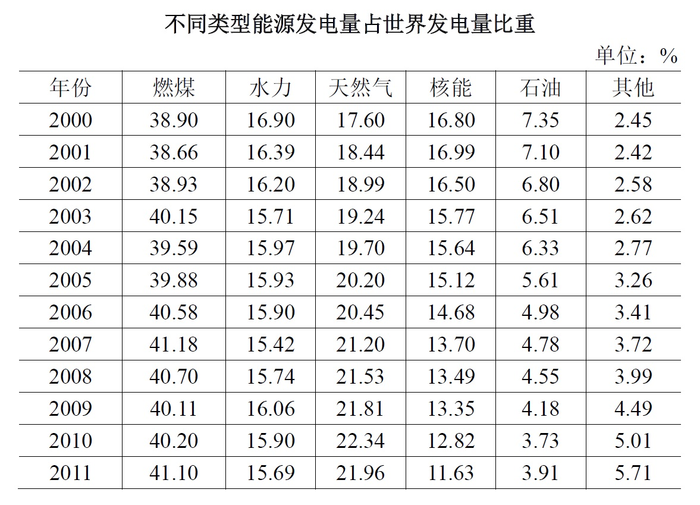

#### 第 1 题　qid 2136970 · 增长

2001～2011年间，有      年世界发电量较上年增长1万亿千瓦时以上。

- **A**. 1　✅
- **B**. 2
- **C**. 3
- **D**. 4

**答案**：A

**官方解析**

根据题干“…增长1万亿千瓦时以上…”，可判定本题为增长量计算问题。定位折线图，可得每年世界发电量；根据，可得，仅有，因此只有一年世界发电量较上年增长1万亿千瓦时以上，A项符合。

故正确答案为A。

---

#### 第 2 题　qid 2136978 · 比重

2000～2011年间，燃煤发电量占世界发电量比重最高的年份，天然气发电量占世界发电量的比重在2000～2011年间排第     名。

- **A**. 3
- **B**. 4
- **C**. 5　✅
- **D**. 6

**答案**：C

**官方解析**

定位统计表，可得，2000～2011年间，燃煤发电量占世界发电量比重最高为，对应年份为2007年；当年天然气发电量占世界发电量的比重为，在2000～2011年间排第5名，C项符合。

故正确答案为C。

---

#### 第 3 题　qid 2136988 · 综合

2009年世界水力发电量约比核能发电量高      万亿千瓦时。

- **A**. 0.5　✅
- **B**. 1.2
- **C**. 2.8
- **D**. 5.5

**答案**：A

**官方解析**

根据题干“2009年世界水力发电量约比核能发电量高…”，材料给出2009年世界发电量，水力以及核能发电量分别占世界发电量的比重，判定本题为现期比重问题。定位统计图：“2009年世界发电量为20.16万亿千瓦时”；定位统计表：“2009年水力发电量占世界发电量的比重为，核能发电量占世界发电量的比重为”，代入可得，2009年世界水力发电量约比核能发电量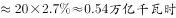，与A项最为接近。

故正确答案为A。

---

#### 第 4 题　qid 2137006 · 综合

三峡大坝2010年完成发电量843.70亿千瓦时，约占世界水力发电量的：

- **A**. 

- **B**. 

　✅
- **C**. 

- **D**. 

**答案**：B

**官方解析**

由题干“三峡大坝2010年完成发电量······占世界水力发电量······”，可判定本题为现期比重问题。定位折线图，2010年世界总的发电量为21.47万亿千瓦时。定位表格材料，2010年水力发电量占世界发电量的比重为。若三峡大坝2010年完成发电量843.70亿千瓦时，约占世界水力发电量的比重为。

故正确答案为B。

---

#### 第 5 题　qid 2137018 · 综合

能够从上述资料中推出的是：

- **A**. 
2000～2005年，每年燃煤发电量都超过天然气发电量的2倍

- **B**. 
2005年世界发电量较2004年增长了以上

- **C**. 
2011年其他发电量是2000年其他发电量的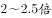之间

- **D**. 
2000～2010年间，石油发电量占世界发电量比重逐年下降
　✅

**答案**：D

**官方解析**

A项：定位折线图，2005年世界发电量为18.27万亿千瓦时。定位表格材料，2005年燃煤发电量占世界发电量的比重为，天然气发电量占世界发电量的比重为。则2005年燃煤发电量为天然气发电量的倍数为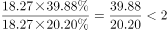，错误；

B项：定位折线图，2004年世界发电量为17.50万亿千瓦时，2005年世界发电量为18.27万亿千瓦时。则2005年世界发电量较2004年增长率为，错误；

C项：定位折线图，2000、2011年世界发电量分别为15.42万亿千瓦时、 22.16万亿千瓦时。定位表格材料，2000、2011年其他发电量占世界发电量的比重分别为、，则2011年其他发电量与2000年其他发电量的倍数关系为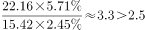，错误；

D项：定位表格材料倒数第二列，2000-2010年石油发电量占世界发电量的比重逐年下降（本题比较范围不包括2011年），正确。

故正确答案为D。

---

### 材料 2

<b>二、根据下列统计资料回答问题</b>

       2015年1～11月，北京市20个文化创意产业功能区实现收入7019.8亿元，同比增长，高于全市文化创意产业收入平均增速1.2个百分点，占全市文化创意产业收入的比重为。其中文化科技融合示范功能区实现收入3772.5亿元，同比增长，占20个功能区总收入的；文化金融融合功能区实现收入436.5亿元，同比增长，占20个功能区总收入的。

       传媒影视板块中，CBD-定福庄国际传媒产业走廊功能区、新媒体产业功能区、影视产业功能区分别增长、和，三个功能区收入合计占20个功能区总收入的；文化休闲板块中，北京老字号品牌文化推广功能区、主题公园功能区分别增长和1.5倍，两个功能区收入合计占20个功能区总收入的。

        2015年1～11月，规模以上互联网信息服务行业实现收入856.5亿元，同比增长，高于全市文化创意产业平均增速15.2个百分点；数字内容服务和其他互联网服务行业分别实现收入17.8亿元和6.3亿元，同比分别增长和；全市重点互联网出版单位实现收入373.2亿元，同比增长。

#### 第 6 题　qid 2136874 · 综合

2015年1～11月，北京全市文化创意产业收入在以下哪个范围内？

- **A**. 
低于1万亿元

- **B**. 
在万亿元之间
　✅
- **C**. 
在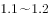万亿元之间

- **D**. 
高于1.2万亿元

**答案**：B

**官方解析**

由题干“2015年1～11月，北京全市文化创意产业收入在以下哪个范围内”结合材料给出2015年北京市20个文化创意产业功能区实现收入及其占全市文化创意产业收入的比重，可判定此题为现期比重问题。定位材料第一段“2015年1～11月，北京市20个文化创意产业功能区实现收入7019.8亿元······占全市文化创意产业收入的比重为。”故2015年1～11月，北京全市文化创意产业，。

故正确答案为B。

---

#### 第 7 题　qid 2136888 · 比重

2015年1～11月，文化科技融合示范功能区实现收入占全市文化创意产业收入的比重约比文化金融融合功能区高多少个百分点？

- **A**. 69
- **B**. 48
- **C**. 33　✅
- **D**. 25

**答案**：C

**官方解析**

由题干“2015年1～11月，······占······的比重约比······高多少个百分点”且材料为2015年，判定此题为现期比重问题，定位材料第一段“2015年1～11月，北京市20个文化创意产业功能区······占全市文化创意产业收入的比重为。其中文化科技融合示范功能区，······占20个功能区总收入的；文化金融融合功能区······占20个功能区总收入的。”可知2015年1～11月，文化科技融合示范功能区实现收入占全市文化创意产业收入的比重比文化金融融合功能区高：，即高了33个百分点。

故正确答案为C。

---

#### 第 8 题　qid 2136894 · 增长

按照各功能区2015年1～11月的收入增速从高到低的顺序，以下选项中排序正确的是（  ）

- **A**. CBD-定福庄国际传媒产业走廊功能区、新媒体产业功能区、影视产业功能区
- **B**. 北京老字号品牌文化推广功能区、主题公园功能区、新媒体产业功能区
- **C**. 主题公园功能区、北京老字号品牌文化推广功能区、影视产业功能区
- **D**. 新媒体产业功能区、影视产业功能区、北京老字号品牌文化推广功能区　✅

**答案**：D

**官方解析**

定位材料第二段“传媒影视板块中，CBD-定福庄国际传媒产业走廊功能区、新媒体产业功能区、影视产业功能区分别增长、和，······；文化休闲板块中，北京老字号品牌文化推广功能区、主题公园功能区分别增长和1.5倍，”可知CBD-定福庄国际传媒产业走廊功能区收入增速为；新媒体产业功能区收入增速为；影视产业功能区收入增速为；北京老字号品牌文化推广功能区收入增速为；主题公园功能区收入增速为1.5倍即。选项中符合从高到低排序的只有D项。

故正确答案为D。

---

#### 第 9 题　qid 2136898 · 增长

2015年1～11月，规模以上互联网信息服务行业月均同比约增收多少亿元？

- **A**. 13
- **B**. 14　✅
- **C**. 20
- **D**. 30

**答案**：B

**官方解析**

由题目问“2015年1～11月，······月均同比约增收多少亿元”判定本题为现期平均数的增长量计算问题。定位材料第三段“2015年1～11月，规模以上互联网信息服务行业实现收入856.5亿元，同比增长”，2015年1～11月的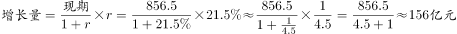，则1～11月的月均。

故正确答案为B。

---

#### 第 10 题　qid 2136914 · 综合

关于2015年1～11月北京市文化创意产业收入，能够从上述资料中推出的是：

- **A**. 
20个文化创意产业功能区之外的文化创意产业收入增速为

- **B**. 
北京老字号品牌文化推广功能区、主题公园功能区总收入为300多亿元

- **C**. 
上年同期文化科技融合示范功能区收入占20个功能区比重低于
　✅
- **D**. 
其他互联网服务行业同比收入增量多于数字内容服务行业

**答案**：C

**官方解析**

A项：由材料第一段“20个文化创意产业功能区实现收入同比增长，高于全市文化创意产业收入平均增速1.2个百分点，占全市文化创意产业收入的比重为”可得全市文化创意产业收入，20个文化创意产业功能区之外的文化创意产业。根据“混合增长率居中且偏向基期值较大的”结论可得，，且，，错误；

B项：由材料第一段可得“北京市20个文化创意产业功能区实现收入7019.8亿元”，由材料第二段可得“北京老字号品牌文化推广功能区、主题公园功能区收入合计占20个功能区总收入的”则，错误；

C项：由材料第一段可得“20个文化创意产业功能区实现收入同比增长，······文化科技融合示范功能区实现收入3772.5亿元，同比增长，占20个功能区总收入的”，根据两期比重公式，比重分子增长率，比重上升，故上年同期比重小于今年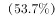，正确；

D项：由材料第三段可得“数字内容服务和其他互联网服务行业分别实现收入17.8亿元和6.3亿元，同比分别增长和”，数字内容服务增量：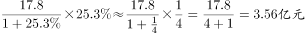，其他互联网服务业增量：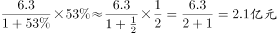，数字内容服务增量更大，错误。

故正确答案为C。

---

### 材料 3

<b>三、根据下列统计资料回答问题 </b>

      2016年，某市全年实现工业增加值3884.9亿元，比上年增长。其中，规模以上工业增加值增长。在规模以上工业中，国有控股企业增加值增长；股份合作企业、外商及港澳台企业增加值分别增长和；高技术制造业、现代制造业、战略性新兴产业增加值分别增长、和。规模以上工业实现销售产值17447.3亿元，增长。其中，内销产值16500.4亿元，增长；出口交货值946.9亿元，下降。

       规模以上工业企业实现利润1549.3亿元，比上年下降。重点行业中，电力、热力生产和供应业实现利润490.1亿元，下降；汽车制造业实现利润367.8亿元，增长；医药制造业实现利润150.7亿元，增长；计算机、通信和其他电子设备制造业实现利润84.8亿元，增长；专用设备制造业实现利润73.9亿元，增长。

#### 第 11 题　qid 2136882 · 综合

2015年该市规模以上专用设备制造业约实现利润多少亿元？

- **A**. 22
- **B**. 33
- **C**. 43　✅
- **D**. 55

**答案**：C

**官方解析**

根据题干所求“2015年该市规模以上专用设备制造业约实现利润”，材料数据为2016年，可判定此题为基期计算问题。定位文字材料第二段，2016年，“专用设备制造业实现利润73.9亿元，增长”。代入公式：。

故正确答案为C。

---

#### 第 12 题　qid 2136896 · 比重

2016年该市规模以上医药制造业利润占规模以上工业企业利润的比重，比其增加值占规模以上工业增加值的比重约：

- **A**. 高不到2个百分点　✅
- **B**. 高2个百分点以上
- **C**. 低不到2个百分点
- **D**. 低2个百分点以上

**答案**：A

**官方解析**

根据题干所求“2016年······占······的比重，比······占······的比重约”，选项为百分点变化，材料数据为2016年，可判定此题为现期比重比较问题。定位文字材料第二段，“规模以上工业企业实现利润1549.3亿元······医药制造业实现利润150.7亿元”，则医药制造业利润占规模以上工业企业利润的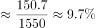，定位表格可得，其增加值占规模以上工业增加值的比重为。所以医药制造业利润占规模以上工业企业利润的比重，比其增加值占规模以上工业增加值的比重约高，即高不到2个百分点。

故正确答案为A。

---

#### 第 13 题　qid 2136902 · 比重

在该市规模以上工业重点监测行业中，有几个行业2016年增加值占规模以上工业增加值的比重高于上年水平？

- **A**. 2
- **B**. 3　✅
- **C**. 4
- **D**. 5

**答案**：B

**官方解析**

根据题干所求“有几个行业2016年······占······的比重高于上年水平”，可判定此题为两期比重比较问题。根据两期比重结论，当时，可判定比重上升。定位表格可得，2016年规模以上工业增加值增速，行业增加值增速的有：医药制造业（）、非金属矿物制品业（）、汽车制造业（），共3个行业。

故正确答案为B。

---

#### 第 14 题　qid 2136906 · 增长

该市以下4个产业中，哪个产业2016年增加值增量最高？

- **A**. 医药制造业
- **B**. 非金属矿物制品业
- **C**. 汽车制造业　✅
- **D**. 电力、热力生产和供应业

**答案**：C

**官方解析**

由题干“哪个产业2016年增加值增量最高”，可判定本题为增长量比较问题。定位材料，表格中给了各个产业的增速和其占规模以上工业增加值的比重，故可结合各产业的比重判断其规模以上工业增加值。总量相同，产业所占比重越大，则其工业增加值也就越大。在四个选项中，汽车制造业增加值所占的比重最大，因此可知汽车制造业的工业增加值最大，且由于汽车制造业增加值增速也最大，根据增长量比较中“大大则大”的原则，可知汽车制造业的增加值增量最高。

故正确答案为C。

---

#### 第 15 题　qid 2136920 · 综合

能够从上述资料中推出的是：

- **A**. 
2016年该市规模以下工业增加值增速快于规模以上工业增加值增速

- **B**. 
2016年该市规模以上工业出口交货值占销售产值的比重超过
　✅
- **C**. 
2015年该市电力、热力生产和供应业实现利润450多亿元

- **D**. 
2015年该市通用设备制造业增加值不低于专用设备制造业增加值

**答案**：B

**官方解析**

A项：根据文字材料可知该市工业增加值的增速为，而规模以上工业增加值增速为。该市工业分成规模以上工业和规模以下工业两个部分，因此该市工业增加值的增速是由规模以上工业增加值的增速和规模以下工业增加值的增速混合得到，根据混合增速居中，可知规模以下工业增加值的增速应小于，因此2016年规模以下工业增加值增速慢于规模以上工业增加值增速，A项错误；

B项：根据文字材料可知2016年规模以上工业实现销售产值17447.3亿元，出口交货值946.9亿元，比重为，B项正确；

C项：根据文字材料可知2016年电力、热力生产和供应业实现利润490.1亿元，下降，则，C项错误；

D项：根据表格材料可知2016年通用设备制造业增加值和专用设备制造业增加值所占的比重均为，故二者2016年的增加值相等。，，由于二者2016年增加值即现期量相同，所以2015年通用设备制造业增加值小于2015年专用设备制造业增加值，D项错误。

故正确答案为B。

---

### 材料 4

       2016年B市有农村低保户数28925户，低保人数为46779人；全年累计支出农村低保资金38402.0万元。农村五保供养人数4474人，其中：集中五保供养人数1711人，分散供养人数2763人；全年累计支出农村五保供养资金5668.7万元，比上年增加支出596.3万元。

       2016年B市有城市低保户数48802户，低保人数为81882人；全年累计支出城市低保资金80215.8万元。

#### 第 16 题　qid 2136850 · 平均数

2015年B市为每位农村五保人员平均支出的五保供养金约为：

- **A**. 0.8万元
- **B**. 1.1万元　✅
- **C**. 1.3万元
- **D**. 2.1万元

**答案**：B

**官方解析**

文字材料中给的是2016年的数据，而题干为“2015年B市为每位农村五保人员平均支出的五保供养金为······”，可知本题为基期平均数问题。根据“农村五保供养金”定位文字材料第一段 “全年累计支出农村五保供养资金5668.7万元，比上年增加支出596.3万元”，可知2015年B市支出农村五保供养金为万元；由表格可知2015年B市农村五保人数为4451人，则2015年B市为每位农村五保人员平均支出的五保供养金约为万元。

故正确答案为B。

---

#### 第 17 题　qid 2136854 · 综合

2007～2016年期间，B市城市低保人数和农村低保人数相差最大的年份是：

- **A**. 2007年　✅
- **B**. 2009年
- **C**. 2013年
- **D**. 2016年

**答案**：A

**官方解析**

根据题干“B市城市低保人数和农村低保人数相差最大的年份”可知，本题为简单加减计算问题。定位到表格，可得2007年、2009年、2013年、2016年B市城市低保人数和农村低保人数分别相差、、、，故2007年B市城市低保人数和农村低保人数相差最大。

故正确答案为A。

---

#### 第 18 题　qid 2136856 · 增长

2008～2016年，农村低保人数和五保人数均比上年有所下降的有：

- **A**. 7年
- **B**. 6年
- **C**. 5年
- **D**. 4年　✅

**答案**：D

**官方解析**

根据题干“2008～2016年农村低保人数和五保人数均比上年有所下降的”可知，本题在图表中直接找到对应的数比较大小即可。定位到表格可知，农村低保人数和五保人数均比上年有所下降的为2010年、2011年、2012年、2013年，共4年。
故正确答案为D。

---

#### 第 19 题　qid 2136858 · 增长

以下折线图反映的是哪个时间段B市城市和农村低保总人数同比下降量的变化趋势？

- **A**. 2010～2013年
- **B**. 2011～2014年　✅
- **C**. 2012～2015年
- **D**. 2013～2016年

**答案**：B

**官方解析**

根据题干所求“······同比下降量的变化趋势”，可判定此题为增长量相关问题；通过题干中所给折线图可以读取第1年-第4年的下降量的大概数值，所以可以通过计算每个选项中第1年-第4年下降量的数值来排除选项，属于增长量计算问题。

通过折线图可知，第1年的同比下降量在20000-30000人之间，先通过第1年的下降量来排除选项。定位表格中的数据可知：

A项，2010～2013年，第1年为2010年，城市和农村低保总人数同比下降量约为人；

B项，2011～2014年，第1年为2011年，城市和农村低保总人数同比下降量约为人；

C项，2012～2015年，第1年为2012年，城市和农村低保总人数同比下降量约为人；

D项，2013～2016年，第1年为2013年，城市和农村低保总人数同比下降量约为人。

A、C、D三项中第1年的下降量均不在20000-30000人之间，和折线图不符，均排除。

故正确答案为B。

---

#### 第 20 题　qid 2136860 · 综合

能够从上述资料中推出的是：

- **A**. 2016年农村分散五保供养人数比集中五保供养人数多一倍
- **B**. 2007～2016年城市低保人数呈逐年下降趋势
- **C**. 2016年农村低保人数比上年减少了一成以上
- **D**. 2007～2016年间城市低保户数最多的年份是2009年　✅

**答案**：D

**官方解析**

A项：定位文字材料第一段：“集中五保供养人数1711人，分散供养人数2763人”，所以分散五保供养人数比集中五保供养人数多，即不足一倍，错误；

B项：定位表格，2008年城市低保人数为145075人，2009年城市低保人数为147142人，所以2008-2009年人数上升，并不是逐年下降，错误；

C项：定位表格，2016年农村低保人数为46779人，2015年农村低保人数为48850人，所以，首位商不到1，所以减少不足一成，错误；

D项：定位表格，城市低保户数2009年为74609户，其余年份均低于74609户，所以2009年城市低保户数最多，正确。

故正确答案为D。

---
