# 2018年四川省公务员录用考试《行测》题（下半年）（网友回忆版）

> 省考 · 2018 年 · 6 个模块 · 共 100 题

- [政治理论](#%E6%94%BF%E6%B2%BB%E7%90%86%E8%AE%BA) · 2 题
- [常识判断](#%E5%B8%B8%E8%AF%86%E5%88%A4%E6%96%AD) · 13 题
- [言语理解与表达](#%E8%A8%80%E8%AF%AD%E7%90%86%E8%A7%A3%E4%B8%8E%E8%A1%A8%E8%BE%BE) · 30 题
- [数量关系](#%E6%95%B0%E9%87%8F%E5%85%B3%E7%B3%BB) · 10 题
- [判断推理](#%E5%88%A4%E6%96%AD%E6%8E%A8%E7%90%86) · 30 题
- [资料分析](#%E8%B5%84%E6%96%99%E5%88%86%E6%9E%90) · 15 题

---

## 政治理论

### 第 1 题　qid 2280934 · 新思想

中国共产党第十九次全国代表大会的报告中指出，我国社会主要矛盾已经转化，这主要是基于以下哪一判断？

- **A**. 我国社会生产力水平总体上显著提高，但人民对于经济文化迅速发展的需要同经济文化不能满足人民需要的状况之间的矛盾仍是我国社会主要矛盾
- **B**. 目前我国经济社会发展不平衡不充分的问题更加突出，已成为满足人民日益增长的美好生活需要的主要制约因素　✅
- **C**. 我国社会生产能力在很多方面进入世界前列，再提我国是世界最大发展中国家，已经不符合实际了
- **D**. 我国稳定解决了十几亿人的温饱问题，总体上实现小康，不久将全面建成小康社会，已经成功跨越了所处的社会主义初级阶段

**答案**：B

**官方解析**

本题考查政治常识。
党的十九大报告指出：中国特色社会主义进入新时代，我国社会主要矛盾已经转化为人民日益增长的美好生活需要和不平衡不充分的发展之间的矛盾。
A项错误，中共八大指出：我们国内的主要矛盾，已经是人民对于建立先进的工业国的要求同落后的农业国的现实之间的矛盾，已经是人民对于经济文化迅速发展的需要同当前经济文化不能满足人民需要的状况之间的矛盾。
B项正确，十九大报告中指出：我国社会生产力水平总体上显著提高，社会生产能力在很多方面进入世界前列，更加突出的问题是发展不平衡不充分，这已经成为满足人民日益增长的美好生活需要的主要制约因素。这是判断我国社会主要矛盾已经转化的基础。
C项错误，十九大报告中指出：必须认识到，我国社会主要矛盾的变化，没有改变我们对我国社会主义所处历史阶段的判断，我国仍处于并将长期处于社会主义初级阶段的基本国情没有变，我国是世界最大发展中国家的国际地位没有变。
D项错误，十九大报告中指出：必须认识到，我国社会主要矛盾的变化，没有改变我们对我国社会主义所处历史阶段的判断，我国仍处于并将长期处于社会主义初级阶段的基本国情没有变，我国是世界最大发展中国家的国际地位没有变。可见，“我国仍处于并将长期处于社会主义初级阶段”，故“已经成功跨越了所处的社会主义初级阶段”表述错误。
故正确答案为B。

---

### 第 2 题　qid 2280942 · 新思想

下列有关说法，与《中国共产党章程》不相符的是：

- **A**. 党的最高领导机关，是党的全国代表大会和它所产生的中央委员会
- **B**. 对党员的纪律处分中，留党察看最长不超过两年
- **C**. 单位有正式党员五人以上方可成立党的基层组织　✅
- **D**. 共青团的地方各级组织受同级党的委员会领导，同时受共青团上级组织领导

**答案**：C

**官方解析**

本题考查政治常识。
A项正确，《中国共产党章程》第十条第三项规定：党的最高领导机关，是党的全国代表大会和它所产生的中央委员会。党的地方各级领导机关，是党的地方各级代表大会和它们所产生的委员会。党的各级委员会向同级的代表大会负责并报告工作。
B项正确，《中国共产党章程》第四十一条第二款规定：留党察看最长不超过两年。党员在留党察看期间没有表决权、选举权和被选举权。党员经过留党察看，确已改正错误的，应当恢复其党员的权利；坚持错误不改的，应当开除党籍。
C项错误，《中国共产党章程》第三十条第一款规定：企业、农村、机关、学校、科研院所、街道社区、社会组织、人民解放军连队和其他基层单位，凡是有正式党员三人以上的，都应当成立党的基层组织。故选项中“五人以上”表述错误。
D项正确，《中国共产党章程》第五十一条规定：中国共产主义青年团是中国共产党领导的先进青年的群团组织，是广大青年在实践中学习中国特色社会主义和共产主义的学校，是党的助手和后备军。共青团中央委员会受党中央委员会领导。共青团的地方各级组织受同级党的委员会领导，同时受共青团上级组织领导。
本题为选非题，故正确答案为C。
注：2022年10月份更新党章内容如下：第三十条　企业、农村、机关、学校、医院、科研院所、街道社区、社会组织、人民解放军连队和其他基层单位，凡是有正式党员三人以上的，都应当成立党的基层组织。

---

## 常识判断

### 第 1 题　qid 2280939 · 人文常识

下列有关村民委员会的说法，不正确的是：

- **A**. 选举实行无记名投票、公开计票的方法，选举结果应当当场公布
- **B**. 每届任期五年，届满应当及时举行换届选举，村民委员会成员可以连选连任　✅
- **C**. 成员中，应当有妇女成员，多民族村民居住的村应当有人数较少的民族的成员
- **D**. 罢免村民委员会成员，须有登记参加选举的村民过半数投票，并须经投票的村民过半数通过

**答案**：B

**官方解析**

本题考查法律常识。
A项正确，《村民委员会组织法》第十五条第三款规定：选举实行无记名投票、公开计票的方法，选举结果应当当场公布。选举时，应当设立秘密写票处。
B项错误，《村民委员会组织法》第十一条第二款规定：村民委员会每届任期三年，届满应当及时举行换届选举。村民委员会成员可以连选连任。因考试时间为2018年下半年，考题答案沿用《中华人民共和国村民委员会组织法(2010修订)》，故解析参照此内容，每届任期五年表述错误。根据最新的村民委员会组织法，村民委员会每届任期五年。
C项正确，《村民委员会组织法》第六条第二款规定：村民委员会成员中，应当有妇女成员，多民族村民居住的村应当有人数较少的民族的成员。
D项正确，《村民委员会组织法》第十六条第二款规定：罢免村民委员会成员，须有登记参加选举的村民过半数投票，并须经投票的村民过半数通过。
本题为选非题，故正确答案为B。
【说明】根据最新的村民委员会组织法，村民委员会每届任期五年。

---

### 第 2 题　qid 2280944 · 法律常识

根据2018年3月20日十三届全国人大一次会议通过的《中华人民共和国监察法》，下列说法错误的是：

- **A**. 行贿受贿一起查
- **B**. 以“留置”取代“两规”
- **C**. 确立了监察委员会依法独立行使监察权
- **D**. 监察委员会对违法的公职人员依法调查并作出政纪处分决定　✅

**答案**：D

**官方解析**

本题考查法律常识。
A项正确，根据《监察法》第二十二条规定：“被调查人涉嫌贪污贿赂、失职渎职等严重职务违法或者职务犯罪，监察机关已经掌握其部分违法犯罪事实及证据，仍有重要问题需要进一步调查，并有下列情形之一的，经监察机关依法审批，可以将其留置在特定场所：（一）涉及案情重大、复杂的；（二）可能逃跑、自杀的；（三）可能串供或者伪造、隐匿、毁灭证据的；（四）可能有其他妨碍调查行为的。对涉嫌行贿犯罪或者共同职务犯罪的涉案人员，监察机关可以依照前款规定采取留置措施。留置场所的设置、管理依照国家有关规定执行。”由此可见，监察机关对行贿和受贿的行为均可以进行调查。
B项正确，“两规”是《中国共产党纪律检查机关案件检查工作条例》第28条关于“调查措施”中的第三项，即“要求有关人员在规定的时间、地点就案件所涉及的问题作出说明”。习近平总书记在十九大报告中提出：“制定国家监察法，依法赋予监察委员会职责权限和调查手段，用留置取代‘两规’措施”。在《监察法》中，对留置的审批程序、适用对象、使用条件、措施采取的时限等都做出了严格的规定，甚至对调查过程的安全、医疗保障等也做出了相应的规定，这对于进一步推进反腐败工作规范化、法治化具有重大意义。
C项正确，根据《监察法》第四条规定：“监察委员会依照法律规定独立行使监察权，不受行政机关、社会团体和个人的干涉。”所以，监察委员会依法独立行使监察权。
D项错误，根据《监察法》第十一条第三项规定：“监察委员会对违法的公职人员依法作出政务处分决定；对履行职责不力、失职失责的领导人员进行问责；对涉嫌职务犯罪的，将调查结果移送人民检察院依法审查、提起公诉；向监察对象所在单位提出监察建议。”因此，监察委员会对违法的公职人员作出的是政务处分决定而非政纪处分决定。
本题为选非题，故正确答案为D。

---

### 第 3 题　qid 2280946 · 人文常识

关于经济学中的成本，下列说法不正确的是：

- **A**. 工资属于显性成本
- **B**. 办公室租金属于固定成本
- **C**. 企业管理费用属于可变成本　✅
- **D**. 固定设备折旧费属于隐性成本

**答案**：C

**官方解析**

本题考查经济常识。
A项正确，显性成本是指厂商在生产要素市场上购买或租用他人所需要的生产要素的实际支出，例如支付的生产费用、工资费用等，所以工资属于显性成本。
B项正确，固定成本是指成本总额在一定时期和一定业务量范围内，不受业务量增减变动影响而能保持不变的成本。例如房屋租金，所以办公室租金属于固定成本。
C项错误，可变成本是指成本中随着产量的变动而产生变化的成本项目，主要指原材料、燃料等。企业管理费用不是生产要素，不会随着产量的变动而产生变化，因此不属于可变成本。
D项正确，隐性成本指的是厂商自己所拥有的且被用于自己企业生产过程中的那些生产要素的报酬，如机械设备的折旧费，因此固定设备折旧费属于隐性成本。
本题为选非题，故正确答案为C。

---

### 第 4 题　qid 2280947 · 法律常识

下列情形适用我国《劳动争议调解仲裁法》的是：

- **A**. 公司员工张某经常加班，就加班工资与公司发生争议　✅
- **B**. 大学生王某暑假到某公司勤工俭学，就加班费与公司发生争议
- **C**. 赵某雇佣护工照顾瘫痪在床的父亲，双方就报酬问题发生争议
- **D**. 员工李某持有所在公司的股份，年终就分红问题与公司发生争议

**答案**：A

**官方解析**

本题考查法律常识。《劳动争议调解仲裁法》第一条规定：“为了公正及时解决劳动争议，保护当事人合法权益，促进劳动关系和谐稳定，制定本法。”《劳动争议调解仲裁法》第二条的规定：“中华人民共和国境内的用人单位与劳动者发生的下列劳动争议，适用本法：（一）因确认劳动关系发生的争议；（二）因订立、履行、变更、解除和终止劳动合同发生的争议；（三）因除名、辞退和辞职、离职发生的争议；（四）因工作时间、休息休假、社会保险、福利、培训以及劳动保护发生的争议；（五）因劳动报酬、工伤医疗费、经济补偿或者赔偿金等发生的争议；（六）法律、法规规定的其他劳动争议。”
A项正确，张某是该公司的员工，与公司之间有劳动关系，其和公司之间发生的因加班工资报酬问题所产生的争议可以适用《劳动争议调解仲裁法》。
B项错误，王某是尚未毕业的大学生，其与公司之间并未建立劳动关系，因此王某和公司之间因加班费产生的争议并非《劳动争议调解仲裁法》调整的劳动争议，不能适用《劳动争议调解仲裁法》。
C项错误，赵某和护工之间属于雇佣关系，而非劳动关系，护工与赵某之间的纠纷不属于《劳动争议调解仲裁法》的适用范围，不能适用《劳动争议调解仲裁法》。
D项错误，年终分红问题不属于《劳动争议调解仲裁法》第二条所规定的劳动争议范围，不能适用《劳动争议调解仲裁法》。
故正确答案为 A。

---

### 第 5 题　qid 2280948 · 人文常识

下列遗嘱有效的是：

- **A**. 甲委托其妻到公证处办理的公证遗嘱
- **B**. 乙口述遗嘱，由其孙子记录，乙签字认可
- **C**. 丙写下遗嘱将其财产全部留给照顾其多年的保姆，但未签名
- **D**. 丁遭遇车祸，临死前，立下口头遗嘱，由两名交警在场证明　✅

**答案**：D

**官方解析**

本题主要考查法律常识。
A项错误，公证遗嘱是依公证方式而设立的遗嘱，是证据力较强的一种遗嘱形式。根据《中华人民共和国民法典》第一千一百三十九条的规定：“公证遗嘱由遗嘱人经公证机构办理。”故办理公证遗嘱须由遗嘱人亲自到公证机关办理，公证人员对遗嘱的真实性、合法性进行审査，在确认其有效性后，由公证员出具《遗嘱公证书》。所以，A项中甲委托其妻到公证处办理的公证遗嘱无效。
B项错误，根据《中华人民共和国民法典》第一千三百三十五条的规定：“代书遗嘱应当有两个以上见证人在场见证，由其中一人代书，并由遗嘱人、代书人和其他见证人签名，注明年、月、日。”所以，B项中乙口述遗嘱，由其孙子记录，由于现场没有第三人在场见证，乙签字认可的遗嘱无效。
C项错误，根据《中华人民共和国民法典》第一千一百三十四条的规定：“自书遗嘱由遗嘱人亲笔书写，签名，注明年、月、日。”所以C项中丙未签名的遗嘱无效。
D项正确，根据《中华人民共和国民法典》第一千一百三十八条的规定：“遗嘱人在危急情况下，可以立口头遗嘱。口头遗嘱应当有两个以上见证人在场见证。危急情况消除后，遗嘱人能够以书面或者录音录像形式立遗嘱的，所立的口头遗嘱无效。”根据《中华人民共和国民法典》第一千一百四十条的规定：“下列人员不能作为遗嘱见证人：(一)无行为能力人、限制行为能力人以及其他不具有见证能力的人；(二)继承人、受遗赠人；(三)与继承人、受遗赠人有利害关系的人。”丁遭遇车祸属于危急情况，临死前立下口头遗嘱，由两名符合要求的遗嘱见证人在场证明，这种情况属于有效的口头遗嘱。
故正确答案为D。

---

### 第 6 题　qid 2280949 · 人文常识

《三十六计》是体现我国古代卓越军事思想的一部兵书，下列不属于《三十六计》的是：

- **A**. 反戈一击　✅
- **B**. 声东击西
- **C**. 暗度陈仓
- **D**. 调虎离山

**答案**：A

**官方解析**

本题主要考查人文常识。《三十六计》或称“三十六策”，是指中国古代三十六个兵法策略，语源于南北朝，成书于明清。它是根据我国古代卓越的军事思想和丰富的斗争经验总结而成的兵书，是中华民族悠久非物质文化遗产之一。
A项错误，“反戈一击”比喻掉转头来反对自己原来所属的或拥护的一方，不属于“三十六计”。其出自《尚书·武成》：“前徙倒戈，攻于后以北。”明代罗贯中《三国演义》第十七回写道：“吾与杨将军反戈击之。但看火起为号，温侯以兵相应可也。” 
B项正确，“声东击西”属于“三十六计”中的“胜战计”，指造成要攻打东边的声势，实际上却攻打西边，是使敌人产生错觉的一种出奇制胜战术，它以假动作欺敌，掩护主力在第一时间击其要害。
C项正确，“暗度陈仓”属于“三十六计”中的“敌战计”，指将真实的意图隐藏在表面的行动背后，用明显的行动迷惑对方，使敌人产生错觉，并忽略自己的真实意图，使之处于被动，受制于人。
D项正确，“调虎离山”属于“三十六计”中的“攻战计”，指如果敌方占据了有利的地势，并且兵力众多，这时我方应把敌人引出坚固的据点，或者把敌人引入对我方有利的地区，才可以取胜。
本题为选非题，故正确答案为A。

---

### 第 7 题　qid 2280950 · 地理国情

关于我国省会城市，下列说法正确的是：

- **A**. 昆明是我国海拔最高的省会城市
- **B**. 乌鲁木齐位于准噶尔盆地的南缘　✅
- **C**. 武汉的水运很发达是因为淮河流经该城市
- **D**. 杭州日出时间早于太原是由于其纬度更低

**答案**：B

**官方解析**

A项错误，拉萨是西藏自治区的首府，位于西藏高原的中部、喜马拉雅山脉北侧，地势由东向西倾斜，是西藏的政治、经济、文化和科教中心，也是藏传佛教圣地，有“日光城”之美称，海拔3650米。而昆明位于云南省中部，是云南省的省会，是我国面向东南亚、南亚乃至中东、南欧、非洲的前沿和门户，具有“东连黔桂通沿海，北经川渝进中原，南下越老达泰柬，西接缅甸连印巴”的独特区位优势。市域地处云贵高原，总体地势北部高，南部低，由北向南呈阶梯状逐渐降低。昆明市中心海拔约1891m，大部分地区海拔在1500～2800m之间。
B项正确，乌鲁木齐市，简称乌市，位于新疆维吾尔自治区中部，天山中段北麓、准噶尔盆地南缘，西部和东部与昌吉回族自治州接壤，南部与巴音郭楞蒙古自治州相邻，东南部与吐鲁番地区交界，是新疆维吾尔自治区首府，是全疆政治、经济、文化、科技的中心。
C项错误，武汉是湖北省的省会城市，位于长江、汉水的交汇处。自古以来，长江就是我国东西运输的大动脉，有“黄金水道”之称。而淮河位于中国东部，介于长江与黄河之间，发源于河南省南阳市桐柏县西部的桐柏山主峰太白顶西北侧河谷，干流流经河南、安徽、江苏三省，不流经武汉。
D项错误，地球自西向东自转，所以越靠东，越早看到日出。杭州位于我国东部沿海，因此看到日出要早。经度表示东西位置，而纬度表示南北位置，因此杭州日出时间早于太原是因为其经度靠东，与纬度无关。
故正确答案为B。

---

### 第 8 题　qid 2280952 · 人文常识

下列与汽车有关的说法不正确的是：

- **A**. 汽车雾灯一般使用黄光
- **B**. 汽车后视镜呈凹面形状　✅
- **C**. 汽车头灯里的反射镜是凹面镜
- **D**. 夜间开远光灯会造成对向司机目眩

**答案**：B

**官方解析**

本题考查科技常识。

A项正确，汽车车灯主要起照明、警示作用，光传播中越不容易被散射、传播距离越远，其照明和警示效果越好。可见光光波越长，越不容易被散射。黄色光波长仅次于红、橙光，具有较强的穿透作用。同时人们对红光的敏感程度不如对黄光和绿光的敏感程度，而绿光常用作信号灯，因此用黄光做汽车的雾灯。

B项错误，汽车后视镜呈凸面形状，它对光线有发散作用，能扩大视野，也称作广角镜，除汽车后视镜外，凸面镜还安装在转弯、路口处。

C项正确，凹面镜有聚光作用，将灯泡置于凹面镜焦点位置，焦点光源发出的光线以不同角度射向镜面，经反射会聚为平行光，光束穿过灯罩照亮前方。

D项正确，夜晚开车时，由于光线较弱，人眼会尽量放大瞳孔让更多光线进来，但是遇到对向远光灯照来，导致进光量很多，会产生眩光的效应，使驾驶员无法看清前方事物。

本题为选非题，故正确答案为B。

---

### 第 9 题　qid 2280953 · 地理国情

关于地下水，下列说法不正确的是：

- **A**. 地下水能在岩石孔隙中自由流动
- **B**. 沙漠地区的地下水资源严重匮乏　✅
- **C**. 地下水的无机盐含量比地表水更高
- **D**. 敦煌月牙泉是地下水溢出地表形成的

**答案**：B

**官方解析**

本题考查地理国情。
A项正确，地下水按物理力学性质不同，可分为结合水、毛管水和重力水，其中重力水指在重力或其它水动力作用下在岩石空隙中自由流动的水。狭义的地下水则指重力水，在国家标准《水文地质术语》（GB/T 14157-93）中，地下水是指埋藏在地表以下各种形式的重力水。
B项错误，沙漠地下通常有丰厚的疏松砂层，处于盆地较低地势的聚水位置。砂粒间有较大的孔隙以便贮存水，沙漠地下大范围的砂质沉积体，就像巨大的贮水容器一样。地表干砂层则好像这水库的盖子似的，阻挡着太阳的照晒，使地下水免遭蒸发。正是由于这个原因，许多沙漠具有丰富的地下水，而不是严重匮乏，选项表述错误。
C项正确，地下水长期与岩石、土壤接触，溶解了大量的无机盐，因此一般地下水相对来说硬度偏高，属硬水；而雨水、河水、湖水等地表水由于无机盐含量较少，硬度较低。
D项正确，敦煌盆地区域地下水位普遍较高，在此条件下，西北部平原区地下水通过地下径流进入泉域后，在地形较低的洼地溢出地表，即形成了月牙泉。
本题为选非题，故正确答案为B。

---

### 第 10 题　qid 2280954 · 人文常识

下列关于酒精的说法不正确的是：

- **A**. 小麦的秸秆可以制取酒精
- **B**. 酒精失火时应立刻用水扑灭　✅
- **C**. 酒精是很好的有机溶剂，可用于去除油污
- **D**. 酒精消毒无法达到杀死细菌芽孢的灭菌标准

**答案**：B

**官方解析**

本题考查科技常识。

A项正确，小麦等农作物秸秆主要是由木质素粘合包裹着纤维素、半纤维素组成的结构化的整体。小麦的秸秆制取酒精的原理就是将聚合体纤维素、半纤维素与结构复杂的木质素分离，然后将其分解成可发酵性糖,再将混合的戊糖和己糖转化为酒精。

B项错误，酒精在水中可以以任意比例互溶，形成不同浓度的酒精溶液，然而酒精溶液仍然可以燃烧，且用水灭火还会使酒精流动甚至飞溅，扩大着火范围。酒精失火宜用覆盖法或干粉灭火器灭火。

C项正确，当溶质在溶解时，极性分子易溶于极性溶剂，非极性分子易溶于非极性溶剂，这便是相似相溶原理。油、酒精等有机溶剂多是非极性的，所以可以用酒精溶解油污达到去污的目的。

D项正确，酒精是一种常用的消毒剂，但它只具备中效消毒能力，研究表明，酒精不能杀死细菌芽孢，也不能杀死某些病毒（如：乙肝病毒）。

本题为选非题，故正确答案为B。

---

### 第 11 题　qid 2280955 · 人文常识

关于我国五大战区，下列说法错误的是：

- **A**. 西部战区的司令部驻兰州　✅
- **B**. 五大战区在2016年正式成立
- **C**. 山西所属武装力量归中部战区领导指挥
- **D**. 以军委管总、战区主战、军种主建为战略格局

**答案**：A

**官方解析**

本题考查政治常识。
A项错误，中国人民解放军西部战区，是从军委管总、战区主战、军种主建的总原则出发，根据中国安全环境和军队担负的使命任务确定的，为正大军区级，归中央军委建制领导。其司令部驻成都，陆军机关驻兰州。
B项正确，2016年2月1日上午10时，中国人民解放军战区成立大会在北京八一大楼隆重举行。中共中央总书记、国家主席、中央军委主席习近平向东部战区、南部战区、西部战区、北部战区、中部战区授予军旗并发布五大战区正式成立。
C项正确，中部战区下辖领导和指挥北京、天津、河北、河南、山西、陕西、湖北7个省市的所属武装力量，司令部驻北京。
D项正确，习近平总书记在战区成立大会上指出：“各战区要牢记使命，坚决贯彻党在新形势下的强军目标，坚决贯彻新形势下军事战略方针，坚决贯彻军委管总、战区主战、军种主建的总原则，建设绝对忠诚、善谋打仗、指挥高效、敢打必胜的联合作战指挥机构。” 即构建了“军委管总、战区主战、军种主建”的战略格局。
本题为选非题，故正确答案为A。

---

### 第 12 题　qid 2280956 · 人文常识

下列成语反映的历史事件按时间先后排序正确的是：
①一字千金
②三顾茅庐
③四面楚歌
④黄袍加身

- **A**. ①③②④　✅
- **B**. ①③④②
- **C**. ②③④①
- **D**. ①④③②

**答案**：A

**官方解析**

本题考查人文常识。
①一字千金：战国末年，秦相国吕不韦秉政，有家僮万人、食客三千。他命门客各著其所闻，汇集为《吕氏春秋》一书。书成，吕不韦令公布于咸阳城门，同时悬千金于其上，声称有能增删一字者，赏千金。“一字千金”由此而来。
②三顾茅庐：东汉末年，天下大乱，曹操坐拥朝廷，孙权拥兵东吴，汉宗室豫州牧刘备听徐庶和司马徽说诸葛亮很有学识，又有才能，就和关羽、张飞带着礼物到隆中卧龙岗去请诸葛亮出来帮助他替国家做事，去了三次才请到诸葛亮。后来就用“三顾茅庐”比喻真心诚意，一再邀请。
③四面楚歌：楚汉争霸后期，项羽被刘邦重重包围，夜里听到周围汉营里的士兵都唱的是楚人的歌，心里丧失了斗志，并最终在乌江畔自刎而死。后来就用“四面楚歌”比喻陷入四面受敌、孤立无援的境地。
④黄袍加身：五代后周时，赵匡胤在陈桥兵变，部下诸将给他披上黄袍，拥立为天子。后比喻发动政变获得成功。
正确排序为①③②④。
故正确答案为A。

---

### 第 13 题　qid 2280958 · 人文常识

下列诗词与风景名胜对应不正确的是：

- **A**. 气蒸云梦泽，波撼岳阳城——洞庭湖
- **B**. 百万空弦嗟往事，一鞭冷月踏居庸——长城
- **C**. 十二巫山见九峰，船头彩翠满秋空——三峡
- **D**. 最爱湖东行不足，绿杨阴里白沙堤——太湖　✅

**答案**：D

**官方解析**

本题考查人文常识。
A项正确，诗句出自唐代孟浩然的《望洞庭湖赠张丞相》，该诗描写了洞庭湖壮丽的景象和磅礴的气势，借此抒发自己的政治热情和希望。
B项正确，诗句出自晚清时期社会改革家康有为写的诗篇《登万里长城》中的其二。该诗赞美长城的雄伟壮丽，抒发作者的壮志豪情。后吊古伤今，兼带议论，表达对国家衰败，民族危亡的关切，激励自己献身祖国，振兴中华。
C项正确，诗句出自南宋陆游的《三峡歌》，这首诗将三峡两岸的幽深秀丽，千姿百态，俊秀美景刻画得生动万分，惟妙惟肖，向我们真实地展现了巫山云雨的奇妙景观。
D项错误，诗句出自唐代白居易的《钱塘湖春行》，该诗描写的是西湖早春的美丽景色，而不是太湖。
本题为选非题，故正确答案为D。

---

## 言语理解与表达

### 第 1 题　qid 2280979 · 逻辑填空

传承红色基因，重要性不言而喻；但如何传承，同样不容忽视。怎样深入挖掘红色传统，生动展示红色基因，让普通人也能感受到力量，让红色基因      ，这恐怕是一个不可回避的重大课题。
填入画横线部分最恰当的一项是：

- **A**. 代代相传　✅
- **B**. 发扬光大
- **C**. 深入人心
- **D**. 根深蒂固

**答案**：A

**官方解析**

首句“但”表示转折，强调如何传承红色基因的话题，接着“怎样深入挖掘······生动展示”引出挖掘红色传统带来的效果，后文通过“让······让······”引导的并列句式，强调以前文的方式传承红色基因的目的以及想要达到的目标，并列句式前后语义相近，故横线处也表示“让普通人也能感受到力量”的含义。
A项“代代相传”指一代接一代地相继传下去，符合语境，当选；
B项“发扬光大”指使好的作风、传统等得到广泛发展和提高，根据文段首句完整句可知，文段主题为“传承”，且论述的是“基因”，不符合文意，排除；
C项“深入人心”指理论、学说、政策等为人们深切了解和信服，无“传承”之意，排除；
D项“根深蒂固”比喻基础深厚，不容易动摇，强调“深入”“稳固”，与传播方式的“深入挖掘”可对应，但体现不出“让普通人也能感受到力量”的含义，不符合文意，排除。
故正确答案为A。
【文段出处】《在文艺中激荡红色血脉》

---

### 第 2 题　qid 2280984 · 逻辑填空

网约车平台，理应承担管理和风险连带责任，并对造成的各类事故和损害优先承担赔付责任。这样才能让平台有从严管理的高度自觉，而不能以自己是第三方为借口      。

- **A**. 独善其身
- **B**. 袖手旁观
- **C**. 逃之夭夭
- **D**. 置身事外　✅

**答案**：D

**官方解析**

前文论述网约车平台理应承担管理和风险的连带责任，承担事故赔付责任，后文“而不能”引导反义并列，前后语义相反，故横线处表示网约车不承担连带责任和事故赔付责任，D项“置身事外”指把自己放在事情之外，毫不关心，符合文意，当选。
C项“逃之夭夭”表示逃跑，文段论述网约车不能逃避责任，而非逃跑，不符合文意，排除。
B项“袖手旁观”的“观”指观看，文段未体现出“观”的含义，排除。
A项“独善其身”原指独自修养身心，保持个人的节操；后指只顾自己，不管他人的个人主义处事哲学，多修饰人，与“网约车”搭配不当，排除。
故正确答案为D。
【文段出处】《租车注册顺风车如何通过不能成疑》

---

### 第 3 题　qid 2280988 · 逻辑填空

在进化心理学理论中，人类的情绪可以指引和      我们的行为，从而更好地适应周围的环境。早在远古时代，原始人处于      的环境中，就会产生防卫反应，比如，当有野兽进入自己的领域时，便开始不安和愤怒，并试图用凶狠的表情和咆哮吓走侵入者。

- **A**. 调控  危险　✅
- **B**. 改善  不利
- **C**. 影响  动荡
- **D**. 支配  陌生

**答案**：A

**官方解析**

第一空，填入横线词语与“指引”意思相同，强调人类的情绪可以控制影响行为。A项“调控”指调节控制，符合文意，保留；C项“影响”指以间接或无形的方式改变，符合文意，保留；D项“支配”指对人或事物起引导和控制的作用，符合文意，保留。B项“改善”指把事情或动作往好的方向调整或修正，文段并未体现往好的方面调整，与文意不符，排除。
第二空，根据后文“比如，当有野兽进入自己的领域时······”可知，横线处词语应体现原始人处于“危险”的环境，A项“危险”符合文意，当选。C项“动荡”比喻情况或局势不安定，D项“陌生”指不熟悉的，均不能体现野兽进入自己领域时的危险情况，排除。
故正确答案为A。
【文段出处】《存在即合理，愤怒仅仅是一种讨厌的情绪吗？》

---

### 第 4 题　qid 2280992 · 逻辑填空

接受服务后支付小费是很多国家和地区服务业约定俗成的传统。在实施小费制的国家，小费是服务人员正常收入的一部分，游客自然也要            ，为服务支付一定费用。支付小费凸显了服务的        ，也刺激服务人员进一步提高服务的水平。
依次填入画横线部分最恰当的一项是：

- **A**. 随机应变  品质
- **B**. 心甘情愿  理念
- **C**. 入乡随俗  价值　✅
- **D**. 顺势而为  宗旨

**答案**：C

**官方解析**

第一空，根据“接受服务后支付小费是很多国家和地区服务业约定俗成的传统”可知，游客在实施小费制的国家，自然也要顺从当地的习俗，C项“入乡随俗”指到一个地方，就顺从当地的习俗，符合文意，保留。A项“随机应变”指随着情况的变化灵活机动地应付，与文意缺少对应，排除；B项“心甘情愿”形容完全处于自愿，与文意缺少对应，排除；D项“顺势而为”指做事要顺应潮流，与文意缺少对应，排除。
第二空，代入验证，C项“价值”与“凸显了服务的价值”可以搭配，符合文意，当选。
故正确答案为C。
【文段出处】《边检收取小费？游客要拿出说“No”的勇气》

---

### 第 5 题　qid 2280998 · 逻辑填空

我们应该      “动物的大脑越大越聪明”这一观念。从19世纪的颅相学到21世纪的大脑扫描科学都认为，大脑的体积决定了认知能力。但有许多事实与此不符。有人出生时只有2/3的脑组织，但成年后并无认知      。随着年龄增长，人的认知水平在提高，大脑体积却会缩小。对认知表现来说，重要的不是大脑的硬件，而是“软件”。
依次填入画横线部分最恰当的一项是：

- **A**. 质疑  差异
- **B**. 抛弃  缺陷　✅
- **C**. 修正  障碍
- **D**. 排除  问题

**答案**：B

**官方解析**

第一空，“但”表转折，根据转折后“有许多事实与此不符”可知，前文的“动物大脑越大越聪明”这一观念是不正确的，所以应当把错误的观点扔掉不要。A项“质疑”指提出疑问，后文已经说明这一观点是不正确的，而不是需要对这一观点提出疑问，排除。B项“抛弃”指扔掉不要、丢弃，符合文意，保留。C项“修正”指修改使正确，文段并未体现应当将这一观点修改变成正确的，正确的观点是什么并未提出，与文意不符，排除。D项“排除”指消除、除掉，一般搭配的是问题，如“排除障碍”，与文意不符，排除。
第二空，验证B项“缺陷”，“但”表转折，转折前说明“有人出生时只有2/3的脑组织”，转折后应当说明认知没有问题，“并无认知缺陷”搭配恰当，可以与前后文对应，符合文意，当选。
故正确答案为B。
【文段出处】《那些阻碍科学进步的概念》

---

### 第 6 题　qid 2281000 · 逻辑填空

互联网海量的视听内容使观众的注意力成了稀缺资源。很多观众不再自主选择节目，而是根据网络评论      。所以，节目要主动走到观众中去，了解观众所需，主动      自己，进而让观众变成自己的“推销员”。

- **A**. 按图索骥  推荐　✅
- **B**. 人云亦云  介绍
- **C**. 披沙拣金  包装
- **D**. 短中取长  评价

**答案**：A

**官方解析**

第一空，由“很多观众不再自主选择节目”可知，文段强调观众根据网络评论来选择节目，A项“按图索骥”比喻按照线索去寻求，符合文意，保留。B项“人云亦云”指没有主见，只会随声附和，带有消极意味，与文段感情色彩不符，排除；C项“披沙拣金”指拨开沙子来挑选金子，比喻从大量的东西中选取精华，文中并未指出观众选取的节目是“精华”，与文意不符，排除；D项“短中取长”指于一般中选择比较好的，文中并未将节目区分为“一般”和“好的”，与文意无关，排除。
第二空，代入验证，由“让观众变成自己的推销员”可知，横线处所填词语表达“推销、推荐”之意，A项对应得当，当选。
故正确答案为A。
【文段出处】《成风化人润物无声 融媒体时代优质文化节目应传之有道》

---

### 第 7 题　qid 2281005 · 逻辑填空

看待好事、喜事，中国文化有一种“一则以喜、一则以惧”的辩证态度。“喜”是欣慰、“惧”是敬畏。面对“世遗后时代”，我们同样要保有一种对遗产的敬畏感和对遗产保护的      感。可以看到，近些年来一些国家和地区出现了过度开发世界遗产项目的现象，有的地方把世界遗产视为摇钱树，进行      式的开发，以致一些项目“申遗”成功之时，就成了遗产遭殃之日。

- **A**. 责任  地无遗利
- **B**. 忧患  杀鸡取卵　✅
- **C**. 认同  竭泽而渔
- **D**. 紧迫  物尽其用

**答案**：B

**官方解析**

本题可从第二空入手，由“过度开发世界遗产项目”“一些项目申遗成功之时，就成了遗产遭殃之日”可知，横线处所填成语强调有些地方只为了眼前利益而不顾遗产的未来。A项“地无遗利”形容地上的自然资源充分得到利用，与文段感情色彩不符，排除；B项“杀鸡取卵”比喻贪图眼前的好处而不顾长远利益，符合文意，保留；C项“竭泽而渔”指只图眼前利益，不作长远打算，符合文意，保留；D项“物尽其用”指充分利用资源，含褒义，与文段感情色彩不符，排除。
第一空，B项“忧患”强调了对遗产保护的担忧，C项“认同”只是强调对遗产保护的认可、同意，由文中“有些项目申遗成功就遭殃”可知，只对遗产保护认同是不够的，还应该保持忧患意识，B项当选。
故正确答案为B。
【文段出处】《申遗成功不是句号：直面现实 促进世界遗产融入日常生活》

---

### 第 8 题　qid 2281008 · 逻辑填空

近年来，昆明市立足传统产业，利用文化资源禀赋优势，实施“文化+”战略，在文化产业发展中融合更多元素，不断催生产业      。戴上VR眼镜，“昆明”瞬间变得          ，移步换景，山水风光，民族风情······在昆明国家广告产业园里，通过虚拟现实技术，人们足不出户，就可以游遍昆明的自然人文景观。

- **A**. 嬗变  栩栩如生
- **B**. 重生  近在咫尺
- **C**. 蝶变  触手可及　✅
- **D**. 升级  一目了然

**答案**：C

**官方解析**

第一空，分析文意可知，横线处所填词语用以形容“文化+”战略的实施对于文化产业带来的积极影响，A项“嬗变”指蜕变、更替，或彻底改变，C项“蝶变”一般指在蛰伏中向更好或更完美的方面蜕变，D项产业“升级”指产品附加值提高的生产要素改进，结构改变、生产效率与产品质量提高，均可形容文化产业发展得越来越好，符合文意，保留；B项“重生”表示再生、复活，死而复生，置于此处程度过重，排除。
第二空，横线处所填成语形容用VR眼镜来看“昆明”，C项“触手可及”指一伸手就可以接触到，形容距离极近，戴上VR眼镜，昆明的自然人文景观就像在眼前一样，符合文意，当选；A项“栩栩如生”形容画作、雕塑中的艺术形象等生动逼真，就像活的一样，置于此处与“昆明的自然人文景观”搭配不当，排除；D项“一目了然”形容事物、事情原委很清晰，一看就知道是怎么回事，与文意无关，排除。
故正确答案为C。
【文段出处】《昆明“文化+”催生产业蝶变》

---

### 第 9 题　qid 2281012 · 片段阅读

诗意在心头徘徊，明月在天空升腾。“举头望明月，低头思故乡”。在举头和低头之间，我们看到了千古诗仙李太白人在他乡遥望故土的那份渴望和期盼，这      的流光，却能让诗人的缠绵思绪在千万里的时空中      而不觉遥远。

- **A**. 蹉跎  穿梭
- **B**. 斑驳  蔓延
- **C**. 短暂  延伸　✅
- **D**. 瞬间  凝结

**答案**：C

**官方解析**

第一空，横线处所填词语与“流光”搭配，即如流水般逝去的时光，C项“短暂”指时间短，搭配得当且符合文意，保留；D项“瞬间”形容刹那间，一眨眼的功夫，形容时间流逝迅速，符合文意，保留；A项“蹉跎”指虚度光阴，任由时光流逝却毫无作为，可以用来形容人做事毫无斗志，浪费时间，文段并未表达浪费时间，毫无作为的含义，与文意不符，排除；B项“斑驳”指一种颜色中杂有别种颜色，与“流光”搭配不当，排除。
第二空，横线处所填词语与“千万里的时光、不觉遥远”对应，C项“延伸”指延长伸展，置于此处表达诗人的思绪在千万里的时光中延长伸展，符合文意，当选；D项“凝结”指集聚，指气体因为压力增加或温度降低变成液体，或液体遇冷变成固体，多用于形容物理变化，也表示心血的集聚，用在此处无法与文段构成对应，排除。
故正确答案为C。
【文段出处】《诗如明月在心头》

---

### 第 10 题　qid 2281014 · 逻辑填空

各国机场常用声效装置、风筝或稻草人驱鸟，但这些手段用上一段时间后即被鸟群      而无效。加拿大埃德蒙顿国际机场决定引进机器猎鹰驱鸟。这款机器猎鹰外形接近真猎鹰，能够扇动翅膀飞行，它利用了鸟类害怕捕食者的心理，或能            地解决问题。

- **A**. 识破  一劳永逸　✅
- **B**. 破解  行之有效
- **C**. 察觉  轻而易举
- **D**. 洞穿  顺理成章

**答案**：A

**官方解析**

第一空，横线处词语形容鸟群看穿稻草人等不是真人，从而不能被有效驱赶。A项“识破”指看穿别人的秘密或事物的真相，C项“察觉”指发觉，看出来，D项“洞穿”指看穿、看透，均与鸟群发现稻草人并不危险的文意相符，保留。B项“破解”指揭破、解开，多用来指破译密码等，一般搭配专业人士，与“鸟群”搭配不当，排除。
第二空，横线处成语形容加拿大机场利用鸟类害怕捕食者的心理，用猎鹰机器驱鸟，可能最终解决机场驱鸟的问题，A项“一劳永逸”指辛苦一次把事情办好，以后就不再费事了，与最终解决机场驱鸟的问题对应，符合文意，当选。C项“轻而易举”形容事情容易做，不费力气，文段并未表达驱鸟简单容易的文意，与文意不符，排除；D项“顺理成章”比喻随着某种情况的发展而自然产生的结果，文段并非强调“随着情况发展而自然产生”，与文意不符，排除。
故正确答案为A。

---

### 第 11 题　qid 2280994 · 片段阅读

文化始终处于动态的演进过程中，抱残守缺只会让文化隔绝于世。抢救式、标本式的保护当然在特殊情况下必要，但是也可能吃力不讨好，至少无法实现传播的初衷。戏曲文化要重新在民间流行起来，一方面要放下架子，不计较阳春白雪还是下里巴人，以观众喜爱为艺术创作的追求；另一方面要谋求艺术形式的融合与创新。在历史上，传统戏曲可谓是当时的流行音乐，为什么现在不能借鉴当代流行音乐的特长，使其在更多人的播放列表里流行起来？
这段文字主要论述的是：

- **A**. 戏曲文化传播不仅要引进来，更要走出去
- **B**. 保护发展戏曲文化应兼容并包、勇于创新　✅
- **C**. 文化是一个不断发展变化的动态演进过程
- **D**. 过度保护反而易使戏曲文化发展陷入困境

**答案**：B

**官方解析**

文段开篇提到文化一直动态演进，抱残守缺会让文化隔绝于世。接着又提到抢救式、标本式的保护无法实现文化传播的初衷。随后通过“一方面······另一方面······”的并列结构指出戏曲文化重新在民间流行起来的对策，“放下架子，不计较阳春白雪还是下里巴人”体现要包容，“谋求艺术形式的融合与创新”体现要创新。最后用反问句进一步论证传统戏曲可以借鉴当代流行音乐发展壮大。故文段重点强调的是保护发展戏曲文化的对策，即包容和创新，对应B项。
A项错误，“走出去”属无中生有，文段并未提及，排除；
C项错误，对应首句的内容，非重点，文段强调的是保护发展戏曲文化的措施，该选项偏离主题，故排除；
D项错误，“过度保护反而易使戏曲文化发展陷入困境”文段并未提及，无中生有，排除。
故正确答案为B。
【文段出处】《传统戏曲更需关注“小众”》

---

### 第 12 题　qid 2281001 · 片段阅读

在语言文字的规范问题上，早期的规范观是“匡正”，认为语言使用必须遵循一定的标准，凡是与标准不符的就是错误的，是需要消灭的不正确的语言现象。此后，“匡正观”逐渐发展为“追认观”，既注意语言的变动性，不轻言“不规范”；又注意语言的稳定性，不轻易地把一些尚未定型、尚未被社会公认以及一些显然不健康的东西采纳进来。如今，“动态”规范观越来越趋于普遍认同，这要求我们在“规范”和“规则”、“硬规范”和“软规范”、“显性规范”和“隐性规范”等诸多二元对立因素上有区别地、有针对性地对待语言现象。
这段文字主要介绍了：

- **A**. 对待语言文字的正确态度
- **B**. 语言文字规范观的发展过程　✅
- **C**. 语言规范工作应注意的问题
- **D**. 辩证看待语言现象的必要性

**答案**：B

**官方解析**

文段首先提出在语言文字的规范问题上，早期的规范观是“匡正”，即语言使用必须遵循一定的标准，消灭不正确的语言现象；接着指出“此后”的情况，即“匡正观”逐渐发展为“追认观”，后面又指出现如今的情况，“动态”规范观趋于普遍认同，人们要在诸多二元对立因素上有区别地、有针对性地对待语言现象。文段介绍了对待语言文字规范问题在早期、此后、如今三个不同阶段的观点态度，即语言文字规范观的发展过程，对应B项。
A项，“正确态度”无中生有，文中只是介绍了不同时期语言文字的规范观，没有提及正确与否，排除；
C项，文段强调的是不同时期的“规范观”，而非“应注意的问题”，且“语言规范”与“语言文字规范”相比范围扩大，排除；
D项，“辩证看待语言现象的必要性”偏离文段的中心，文段强调的是不同时期语言文字的规范观，排除。
故正确答案为B。
【文段出处】《语言文字的标杆如何立起来——新闻语言文字失范现象面面观》

---

### 第 13 题　qid 2281006 · 片段阅读

大当量精确制导武器的出现为阵地工程防护带来了新的挑战。比如，美军新研制成功的巨型钻地弹可穿透数十米厚的混凝土防护层或岩石层，被称为“地堡克星”。即便是运用智能遮弹技术将其击爆于防护层表面，其巨大的爆炸能量也足以将地下工程重创或摧毁。在此威胁下，面对防护材料和防护结构难以实现突破性进展的现实“瓶颈”，战场目标一旦被发现就意味着被摧毁。而依托信息手段的近程拦截防护技术为防御大当量钻地弹药打击开辟了一条新的途径。
这段话主要说的是：

- **A**. 阵地工程防护面临全新挑战
- **B**. 智能遮弹技术是军事防御的发展趋势
- **C**. 近程拦截为军事防御工程带来新希望　✅
- **D**. 大当量精确制导武器目前还无法防御

**答案**：C

**官方解析**

文段开篇介绍背景，指出大当量精确制导武器的出现为阵地工程防护带来了新的挑战，接下来举例说明当下阵地防护存在的问题，尾句引出解决问题的对策，即近程拦截防护技术为防御大当量钻地弹药打击开辟了一条新的途径，故文段为提出问题——解决问题的结构，文末的对策为文段的重点，对应C项。
A项，“面临全新挑战”为开篇介绍的背景，非重点，排除；
B项，“智能遮弹技术”为举例说明部分的内容，非重点，排除；
D项，为阵地防护面临的问题，非重点，排除。
故正确答案为C。
【文段出处】《阵地工程防护：打造作战安全岛》

---

### 第 14 题　qid 2281009 · 片段阅读

数据显示，2017年我国集成电路进口额达2601亿美元，出口仅为669亿美元。为实现集成电路产业自主可控，必须攻克核心技术和关键设备欠缺的难关，尤其是产业链中的设计环节。无锡作为曾经的国家微电子产业南方基地，2017年集成电路设计业产值仅为79.2亿元，占总产值比例不足，而最合理的结构应该是设计、制造、封装测试等产业分别占比、和。如果把设计、制造、封测比作写书、印书和订书，书的质量关键还靠写书，但是整个行业都缺“写书人”。

这段文字意在强调：

- **A**. 我国集成电路产业对外依赖状况严重
- **B**. 我国集成电路产业结构存在失衡现象
- **C**. 设计人才匮乏制约我国集成电路产业发展　✅
- **D**. 实现我国集成电路产业自主可控势在必行

**答案**：C

**官方解析**

文段开篇列举数据，接下来指出为实现集成电路产业自主可控，必须攻克核心技术和关键设备欠缺的难关，之后通过程度词“尤其”强调“设计环节”的重要性，紧接着又通过举例说明整个集成行业面临很严重的设计问题，尾句把“设计”比作“写书”，指出书的质量关键还靠写书，并通过转折强调了整个行业最短缺的是“写书人”，即“设计人才”。故文段强调的重点为设计人才缺乏限制了我国集成电路产业发展，对应C项。
A项错误，其是首句举例部分的内容，不是文段主要内容，也没点出主题“设计人才”，排除。
B项错误，没有提及文段主题“设计人才”，且为文段中间举例部分内容，非重点，排除。
D项错误，“实现我国集成电路产业自主可控”是我国希望实现的目标，文段重点强调的是“设计人才”缺乏对于实现这一目标的限制，非文段的重点，排除。
故正确答案为C。
【文段出处】《人才缺失成集成电路发展之殇》

---

### 第 15 题　qid 2281017 · 片段阅读

在极早期宇宙，有一段高速膨胀的时期，暴胀是由一种被称作暴胀子场的势能推动的。在很短的时间内，宇宙突然胀大到可以包容今天人类所看到的以及更多无法看到但存在的一切的尺度。空间的弯曲被抹平了，暴胀子场中的量子涨落也从亚原子尺度被放大到天体物理尺度。暴胀子的衰变产生了大爆炸的热，而其中的那些量子涨落则导致了物质的不均匀性，为宇宙中的各种物质结构的形成提供了种子。
这段文字意在说明：

- **A**. 宇宙的产生与形成　✅
- **B**. 量子的涨落与膨胀
- **C**. 物质多样性的起源
- **D**. 暴胀子衰变的过程

**答案**：A

**官方解析**

文段开篇指出极早期的宇宙存在一段高速膨胀的时期，引出宇宙的暴胀，之后论述了暴胀的过程，尾句进一步指出暴胀子衰变之后为宇宙中各种物质结构的形成提供了种子，故文段论述的是暴胀导致了宇宙的产生与形成，即宇宙是如何产生与形成的，对应A项。
B项错误，“量子的涨落与膨胀”仅为宇宙形成过程中的一个方面，表述片面，排除；
C项错误，“物质多样性的起源”非重点，文段谈论的是宇宙的形成过程，该项未提及“宇宙”这一核心话题，排除；
D项错误，“暴胀子衰变的过程”非重点，该项未提及宇宙的形成这一结论，排除。
故正确答案为A。

---

### 第 16 题　qid 2281019 · 片段阅读

高阶人工智能带来福祉还是挑战，是许多文学、电影作品不断探讨的主题。近年来大众传播对人工智能的关注，无形中也加重了人们对“人机关系”的焦虑。例如，人工智能用人脸识别技术与深度学习能力挑战人类记忆高手，“阿尔法狗”攻占人类智力游戏的高地······尤其是一些以“人机对战”为噱头的综艺节目，通过混淆人工智能的概念，人为渲染了一种人机之间紧张的对立气氛，既无必要，也缺乏科学性。事实上，现在所有人工智能仍属于在“图灵测试”概念下界定的“智能”，无论是根据神经网络算法的翻译程序，还是基于量子计算理论的各种模型，在未来很长时间内都将是从属于人类的工具。
这段文字意在强调：

- **A**. 人工智能的发展水平很难超越人类
- **B**. 应理性看待人类与人工智能的关系　✅
- **C**. 媒体在宣传人工智能时应客观科学
- **D**. 人工智能的发展应与科普宣传同步

**答案**：B

**官方解析**

文段前两句先通过背景铺垫说明人们对“人机关系”很焦虑，紧接着列举了一系列人工智能高速发展的例子，并指出人为渲染一种人机之间紧张的对立气氛，既无必要，也缺乏科学性。尾句通过“事实上”表转折，引出文段重点，强调人工智能在未来很长时间内都将是从属于人类的工具。换句话说，人们对“人机关系”焦虑是没有必要的，应当理性看待“人机关系”，对应B项。
A项，文段讨论的核心话题是“人类与人工智能的关系”而非“人工智能的发展水平”，偏离核心话题，排除；
C项和D项，文段讨论的核心话题是“人类与人工智能的关系”而非单纯地讨论“人工智能”，偏离核心话题，均排除。
故正确答案为B。
【文段出处】《人工智能，以法律和伦理为界》

---

### 第 17 题　qid 2281021 · 片段阅读

蔡元培曾在国内传递学术自由思想并为公众所知，他认为各家学说与其相对应的学科在没有被淘汰的情况下，应允许它们各自发展，即所谓兼容并包，也由此开中国大学风气之先。不过，学科的存续需要人、财、物等物质条件的支撑。各种学科都有存在的必要和价值。在资源有限的情况下，什么学科应该得到更多支持或应予优先支持，同一学科领域内哪些学者应该得到支持，这些都是管理者需要考量的重要问题。这时，他们就需要学术评价这样一把尺子。
这段文字意在说明：

- **A**. 学术评价的存在有现实意义　✅
- **B**. 物质条件是学术自由的前提
- **C**. 兼容并包不等于绝对的学术自由
- **D**. 学科发展应考虑现实的物质条件

**答案**：A

**官方解析**

文段首先提出蔡元培学术自由的观点，然后通过转折说明物质条件的支撑是各学科存续发展、兼容并包的基础，继而提出问题“什么学科应该得到更多支持或应予优先支持”，最后提出解决问题的办法，即在资源有限的情况下，管理者应该通过“学术评价”这一把尺子，来对资源进行有效分配。A项是对尾句的同义替换，当选。
B项，“物质条件”非文段中心，通过学术评价的方式进行物质资源的分配才是文段的中心，排除。
C项，关于学术自由是否是绝对自由的问题，文段没有阐述，排除。
D项，缺少主题词“学术评价”，应当通过学术评价的方式来考虑物质条件的分配，从而进一步考虑学科发展，排除。
故正确答案为A。
【文段出处】《当前学术评价为何各方都不满意》

---

### 第 18 题　qid 2281023 · 片段阅读

在物联网中，传感网的建设要求电子标签预先被嵌入任何与人息息相关的物品中。可是，人们在观念上似乎还不能接受自己周围的物品甚至自己都时刻处于被监控的状态，这直接导致嵌入标签会使个人的隐私受到侵犯。因此，如何确保标签物的拥有者个人隐私不受侵犯便成为射频识别技术乃至物联网推广的关键问题。而且，一旦政府在这方面和国外的大型企业合作，如何确保企业商业秘密、国家机密等不会泄露也至关重要。
这段文字意在说明：

- **A**. 应建立物联网电子标签的技术规范
- **B**. 应充分重视物联网的信息安全问题　✅
- **C**. 应对物联网的国际合作进行必要监管
- **D**. 应尽快完善与物联网相关的法律法规

**答案**：B

**官方解析**

文段开头介绍传感网的建设要求，并通过转折词“可是”指出了这一过程中存在的问题，即“个人的隐私受到侵犯”。接下来通过“因此”引导结论，从“保护个人隐私”和“确保企业秘密、国家机密”两个方面指出了保护私密信息的重要性，B项是对文段中心句的概括，当选。
A项，“电子标签”，对应文段首句，结论前内容，非重点，排除；
C项，“国际合作”无中生有，且需要监管的对象是“信息安全”而非“国际合作”，排除；
D项是对策表述，反推文段应为“物联网法律法规不够完善”，与文段不符，排除。
故正确答案为B。
【文段出处】《浅析我国物联网发展中存在的问题与解决办法》

---

### 第 19 题　qid 2281024 · 片段阅读

作为卫星互联网计划的重要组成部分，美国太空探索技术公司将首批2枚试验卫星发射升空，标志着该公司卫星互联网计划的正式启动。据悉，该公司计划发射超过1.2万颗卫星组成太空“星链”，向全球用户提供高速互联网接入服务。卫星互联网好比把WiFi搬到了太空中，只要在信号覆盖范围之内，人和装备都可通过卫星直接实现互联网接入，进而搭建起“全球无线网络”。作为未来信息技术与航天技术融合发展的新兴领域，卫星互联网将赋予传统武器装备“万物互联”时代的战场新角色。争夺“太空WiFi”的控制权，势必成为未来大国博弈的战略制高点。
这段文字意在说明：

- **A**. 太空“星链”将为全球用户提供新型服务
- **B**. 传统武器装备“互不干扰”时代已经结束
- **C**. 卫星互联网控制权将成为大国争夺的焦点　✅
- **D**. “太空WiFi”将突破现有互联网技术的限制

**答案**：C

**官方解析**

文段首先介绍美国太空探索技术公司发射卫星的情况，之后对该公司“卫星互联网”计划做了介绍，尾句对前文提到的现象作出总结——“争夺‘太空WiFi’的控制权，势必成为未来大国博弈的战略制高点”，C项为中心句的同义转述，当选。
A、D两项是对该公司“卫星互联网”计划的介绍，属于结论前的内容，非重点，排除。
B项，文段论述对象为“卫星互联网”，选项“传统武器装备”偏离文段核心话题，排除。
故正确答案为C。
【文段出处】军事文摘:《“太空WiFi”就要来了》

---

### 第 20 题　qid 2281026 · 片段阅读

在摄影中，大气灰雾就像一枚滤镜，降低了场景远处部分的反差，提亮了影调。多雾的景象会看起来更为深远，就是因为强烈的空间透视。在拍摄时远摄更能展现空间透视，这是由于相机与主体间有更少不受灰雾影响的物体。而用通道混合方法将影像转为黑白的时候，调整蓝色通道也可以达到这个效果。明暗的变化表现了空气灰雾效果，给人一种纵深感，在强烈的逆光下，效果最强烈，从而产生一种虚实结合的神秘张力。
这段文字意在说明，在摄影中：

- **A**. 利用灰雾可制造空间透视
- **B**. 加强空间透视的方法和技巧　✅
- **C**. 光线变化对虚实效果的影响
- **D**. 通道混合法可制造出灰雾效果

**答案**：B

**官方解析**

文段首句介绍了“灰雾”的作用，第二、三句论述了“灰雾”和“空间透视”的关系，即通过“灰雾”可以制造“空间透视”的效果。第四句“而用通道混合方法······也可以达到这个效果”，“这个效果”指代前文“空间透视”的效果，即“用通道混合方法”也可以制造“空间透视”的效果，尾句为解释说明。故整个文段为并列结构，分别从两个方面论述了加强空间透视的方法和技巧，对应B项。
A项“利用灰雾可制造空间透视”和D项“通道混合法可制造出灰雾效果”分别对应并列的其中一个分句，表述片面，排除；
C项，“虚实效果”对应文段尾句，属于解释说明的内容，非重点，排除。
故正确答案为B。
【文段出处】《摄影构图与设计》

---

### 第 21 题　qid 2280963 · 片段阅读

我国关于云的正式文字记载最早可追溯到甲骨文。战国时期的《吕氏春秋·应同》将云分为四类：山云、水云、旱云、雨云。秦汉时期民间还记录了各种不同的云图。至于更为细致的划分和命名，古人依照的也是云彩外观、位置、颜色及其动态特征。例如《史记》中记载的“庆云”是指彩色、象征祥瑞的云；《升庵全集》中的“犁头云”指的是台风前移动迅速的云片；《西京杂记》中“矞云”是指绚丽的高积云。我国自古是农业大国，看云识天气有着重要意义，古代的这些云彩命名更多是为农事生产生活服务的。
这段文字主要介绍的是：

- **A**. 古代中国对云的命名　✅
- **B**. 古代中国记载云的文献史
- **C**. 看云识天气对古代农业生产的意义
- **D**. 古人对云这种天气现象的认识过程

**答案**：A

**官方解析**

文段首句引出云的话题，接着指出对云的“划分和命名”是依照“云彩的外观、位置、颜色及动态特征”，并举出《史记》、《升庵全集》、《西京杂记》例子具体解释说明，最后指出古代的“云彩命名”更多是基于对农事生产生活的服务，所以整个文段讨论的核心话题都是“云的命名”，对应A项。
B项错误，“文献史”是解释说明的内容，非重点，排除。
C项错误，没有提及文段的主题词“云的命名”，偏离中心，排除。
D项错误，“认识过程”无中生有，排除。
故正确答案为A。
【文段出处】《看了那么多，还有你不解的云?》

---

### 第 22 题　qid 2280964 · 片段阅读

独角兽企业在上市融资、基金发行等方面持续获得支持。应该说，独角兽标签得到青睐很正常，因为作为一种价值衡量方式，它让资本市场更容易找准靶向，同类型企业也有了参照的榜样。不过在一些人眼里，似乎只有独角兽企业才是科技创新前沿的代名词，优质资源不断向独角兽企业集中，推动其不断做大。不乏诞生时间很短的独角兽企业，融资额便攀上常规发展企业难以企及的高峰。在这种背景下，有的独角兽企业借政策和资本东风不断“招兵买马”。然而，没有与体量一同迅速壮大的，是其核心竞争力、管理水平、经营效益。
这段文字意在强调：

- **A**. 盲目推崇独角兽企业的现象屡见不鲜
- **B**. 应客观理性地评判独角兽企业的价值　✅
- **C**. 独角兽标签有利于企业吸引优质资源
- **D**. 标签化的刻板印象会影响资本的选择

**答案**：B

**官方解析**

文段首先指出独角兽受到多方面的支持，是因为其具有诸多的优点；接着“不过”转折，指出一些人认为独角兽企业才是科技创新前沿的代名词，很多优质的资源涌向独角兽企业，推动其壮大，包括时间很短的独角兽企业；紧接着指出在这种背景下，独角兽企业不断“招兵买马”；最后“然而”转折，指出独角兽企业体量壮大的同时“竞争力、管理水平、经济效益”并未壮大，也就是说不能只是推动其壮大，也要看到其他的方面，要客观理性地看待，对应答案B项。
A项，“盲目推崇的现象屡见不鲜”属转折之前的内容，非重点，排除。
C项，“吸引优质资源”在转折之前，非重点，排除。
D项，缺少主题词“独角兽企业”，且“刻板印象”在文段中没有谈论，排除。
故本题正确答案为B。
【文段出处】《勿溺爱“巨婴”式独角兽企业 》

---

### 第 23 题　qid 2280965 · 片段阅读

学习是神经系统接受外界信息后产生行为变化的过程，信息在神经系统里编码、维持和提取的过程叫做记忆。对于知识，信息的记忆称为陈述性记忆，这种记忆最关键的部位是海马脑区和新皮层脑区。海马脑区对短期记忆转化为长期记忆非常关键，新皮层脑区则掌管长时记忆的储存。截至目前，科学上尚未证明某种食物或药物可以明确提升普通人的学习记忆力。但海马脑区的神经可塑性非常高，想要保持很好的记忆和认知功能状态而不退化，就要多锻炼海马脑区。运动、社交等都是有效的锻炼方式，它们可以通过调节内分泌等多种机制促进神经可塑性，改善记忆力。
这段文字意在说明：

- **A**. 海马脑区的神经系统非常复杂
- **B**. 加强海马脑区的锻炼可改善记忆力　✅
- **C**. 海马脑区和新皮层脑区与记忆密切相关
- **D**. 希望通过药物提升记忆力没有科学依据

**答案**：B

**官方解析**

文段首先给出“记忆”的概念，之后说明“海马脑区”及“新皮层脑区”对记忆的重要性，最后通过转折关联词“但”及对策引导词“要”强调“多锻炼海马脑区”可以“改善记忆力”，对应B项。
A项，“神经系统非常复杂”从文段中无从得知，无中生有，排除。
C项，为“截至目前”之前的内容，属于铺垫内容，排除。
D项，对应转折之前的内容，是目前的一种现状的描述，排除。
故本题正确答案为B。
【文段出处】《配料丰富口香糖 难说嚼出好记性》

---

### 第 24 题　qid 2280967 · 片段阅读

近年来聚合型平台的兴起，给媒体数字化转型带来了明显挑战。各类社交媒体平台、搜索平台正越来越多地掌控着媒体消费的出口，成为数字广告业务的最大赢家。这些聚合型平台掌握用户习惯，收割流量，但无需为内容制作负担成本，只靠轻松的“内容搬运”，就能坐拥广告收入的大头，被认为是媒体历史上最大的套利行为。在这种情况下，媒体数字化转型不能只靠“凑热闹”，而是要回归质量，面对聚合型平台带来的压力，转型中的媒体只有避免提供同质化的内容，树立多出力作的精品意识，才能在同免费内容的竞争中保持优势。
这段文字意在说明：

- **A**. 媒体数字化转型要立足于质量　✅
- **B**. 聚合型平台改变了传媒格局
- **C**. 聚合型平台的成功模式难以复制
- **D**. 媒体消费出口是互联时代的竞争热点

**答案**：A

**官方解析**

文段首先指出“聚合型平台的兴起”给“媒体数字化”带来挑战，“各类社交媒体平台、搜索平台成为最大赢家”，之后通过转折关联词“但”指出“聚合型平台”存在“无需为内容制作负担成本”“内容搬运”“最大的套利行为”等问题，最后通过对策引导词“要”给出对策，强调“媒体数字化转型”需要“回归质量”，对应A项。
B项，文段只表示带来的挑战，格局是不是已经改变没有阐述，非文段重点，排除。
C项，“成功模式难以复制”从文段中无从得知，无中生有，且偏离了“媒体数字化”这一主题，排除。
D项，“媒体消费出口”对应对策之前的内容，且不是文段的主要内容，排除。
故本题正确答案为A。
【文段出处】《媒体数字化转型要回归质量》

---

### 第 25 题　qid 2280969 · 片段阅读

符合现代审美的青瓷作品，不一定要像传统审美那样讲究对称、完美、圆润，很多都是表达一种山水、自然的空间，需要偏向于雕塑的、异型的造型。这种异型其实不容易塑造，因为拉一个圆罐很容易，但是把圆罐变成另一种形状就复杂很多。同时，还需要研究泥料的特性，借助于雕塑语言，融入自己的情感，形成独立的形式语言。另外，在烧制过程中，釉在高温中的流动也是一种自然的美感，能产生富有生命感的层次。中国历史上确实留下了太多经典的作品，但是作为艺术家，我们不能一直重复过去、重复别人、重复自己。
这段文字意在说明：

- **A**. 创新是青瓷创作的动力之源
- **B**. 每个时代都有各自的艺术审美标准
- **C**. 青瓷创作要敢于打破传统审美的束缚　✅
- **D**. 现代审美为青瓷创作注入新的艺术生命

**答案**：C

**官方解析**

文段首先指出符合现代审美的青瓷作品不一定要和传统一样讲究对称、完美、圆润，而需要偏向于异型的造型，之后通过“因为······同时······另外······”引导三方面原因进行解释说明，最后通过转折关联词“但”给出对策，“作为艺术家，我们不能一直重复过去、重复别人、重复自己”，即现代的青瓷作品要敢于创新，即打破传统审美的束缚，对应C项。
A项，“创新是······动力之源”，程度过重，文段只是说青瓷创作要创新，并未强调创新是青瓷创作的动力之源，属无中生有，排除。
B项，缺少核心话题“青瓷创作”，偏离文段中心，且文段没有提到每个时代的标准，排除。
D项，文段重在强调青瓷创作要敢于创新，并非强调“现代审美”对“青瓷创作”的作用，排除。
故本题正确答案为C。
【文段出处】《品青瓷之美 感宋金文化》

---

### 第 26 题　qid 2280973 · 片段阅读

北欧国家充分发挥市场机制的自发调节作用，将经济激励的诱因嵌入垃圾减量政策中，除了垃圾能化带来的能源费收入外，家庭缴纳的清运回收费也是维持垃圾处理体系有序运转的经费来源。在北欧，垃圾费的收取严格遵循“谁污染谁付费”原则。北欧居民需要付费购买回收清运公司的服务，这些服务包括向家庭提供垃圾桶以及提供上门清运的次数。显然，分类后产生的垃圾要远远少于未经分类的废弃物总量，垃圾分类越彻底，所需要支付的清运费也越低。
这段文字意在说明：

- **A**. 实施行政政策离不开市场机制的调节
- **B**. 缔造社会文明习惯往往始于政策引导
- **C**. 垃圾分类对社会发展存在多方面的裨益
- **D**. 利用市场化手段能有效推进垃圾分类政策　✅

**答案**：D

**官方解析**

文段开篇介绍北欧国家在垃圾减量政策中发挥了市场机制的调节作用，并具体解释如何发挥市场机制的调节作用，紧接着具体说明北欧国家如何收取垃圾费。最后通过“显然”得出结论：即垃圾分类后垃圾变少，分类越彻底支付的费用也越低，由此可知，为了减少费用人们会积极进行垃圾分类，故文段重在说明发挥市场机制对垃圾分类政策能起到积极作用，对应D项。
A项错误，“实施行政政策”表述不明确，文段围绕垃圾分类的话题展开，排除；
B项错误，“社会文明习惯”无中生有，文段未提及，排除；
C项错误，“垃圾分类对社会发展存在多方面的裨益”非重点，文段重在论述市场机制对垃圾分类政策的积极意义，而非介绍垃圾分类对社会发展的作用，排除。
故正确答案为D。
【文段出处】《北欧如何冲出“垃圾围城”》

---

### 第 27 题　qid 2280978 · 片段阅读

随着军事制造技术的发展，加强军事伦理规范的研究，推动法律条约的制定，以限制相关技术、工具、材料的扩散和获取十分必要。在这方面，国际社会已经做出的许多努力，诸如《防止核扩散条约》《禁止化学武器公约》《禁止生物武器公约》《欧洲常规武装力量条约》等，在规范武器使用方面发挥了重要作用。然而，这些条约限制的对象往往专注于国家，随着一些颠覆性技术越来越广泛地运用于军事领域，小团体甚至个人生产军事装备的空间将越来越大。他们不仅能生产军事装备的组件，而且能生产大型军事装备的主体，甚至整个终端产品本身。
这段文字意在说明：

- **A**. 需进一步扩大法律在军事领域的覆盖面　✅
- **B**. 在发展军事技术的同时应不断增强道德规范
- **C**. 应严格控制颠覆性技术在军事领域中的应用
- **D**. 新形势下推动军事伦理规范研究迫在眉睫

**答案**：A

**官方解析**

文段首句提出随着军事制造技术的发展，加强军事伦理规范的研究，推动法律条约的制定十分必要，紧接着说明在此方面，国际社会目前已经做出了努力，并举例论证，后文通过转折关联词“然而”指出，这些条约限制的往往是国家，而随着一些颠覆性技术的广泛运用，小团体甚至个人生产军事装备的空间将越来越大，但面对这些小团体、个人，条约却限制不到，故转折后为引出问题，文段重在强调面对这些小团体、个人，法律条约也应该覆盖到，即需要扩大法律在军事领域的覆盖面，对应A项。
B项，“发展军事技术”为背景内容，非重点，且文段重在强调法律条约的范围应该扩大，排除。
C项，原文介绍了其危害，但该句没有提到文段主题，非重点，排除。
D项，选项重在强调“军事伦理规范研究”的重要性，但文段转折之后重在说明法律条约对部分主体起不到限制作用，应扩大法律条约的约束范围，D项偏离核心话题，排除。
故正确答案为A。
【文段出处】《增材制造技术与军事伦理问题》

---

### 第 28 题　qid 2280983 · 片段阅读

据《2015中国网络文学版权保护白皮书》披露，网络文学盗版的进化速度十分惊人。近年来，专业化盗版网络文学站点由大站转向小站、由在线转向下载、由电脑端转向手机端等，变得更为分散、隐蔽。面对花样不断翻新的盗版，在强调相关法律法规顶层制度设计、加大盗版惩戒力度之外，必须提高治理盗版的技术能力。从这个角度来说，大数据对于网络文学产业的核心作用，就是保驾护航：建立正版版权的大数据中心和全网监测系统，用大数据布下天罗地网，形成一个网络数字空间的“天眼”，使得分散、隐蔽的盗版侵权行为无处遁逃。
这段文字意在说明：

- **A**. 治理网络文学盗版可用“大数据治疗法”　✅
- **B**. 大数据可助推网络文学产业的发展
- **C**. 网络文学盗版对文化产业损害严重
- **D**. 治理网络文学盗版需要多管齐下

**答案**：A

**官方解析**

文段开篇提出网络文学盗版的发展速度快的问题，紧接着指出专业化盗版网络文学站点的转变及其特点，而后通过“必须”提出对策，指出面对花样越来越多的盗版问题，要提高治理盗版的技术能力。后文通过指代词“这个角度”进行总结，指出在提高治理能力中大数据能够保驾护航，即大数据能够帮助治理网络文学盗版的问题。后文具体展开论述大数据如何保驾护航，即对前文进行解释说明，故文段重点强调面对网络文学的盗版问题要发挥大数据的作用，对应A项。
B项，“网络文学产业的发展”非文段重点，文段重点围绕网络文学的盗版问题展开，排除；
C项，“损害严重”属于问题类表述，文段重点说明解决问题的对策，非重点，排除；
D项，未提及文段核心话题“大数据”，且“多管齐下”无中生有，文段只论述了“大数据”一种方案，排除。
故正确答案为A。
【文段出处】中国新闻出版网——艾瑞咨询发布《中国网络文学版权保护白皮书》

---

### 第 29 题　qid 2280993 · 语句表达

①因此，在实体书店不断遭遇寒流的今天，越来越多的书店开始尝试24小时经营
②若在经营图书之余尝试引入新的业态，或开发相应文化产品不失为一个生存之道
③书店是一个文化场所，是重要的文化设施和文明载体
④如果书店想要单纯靠图书经营生存，将难以为继
⑤这更像是一种公益行为，肩负着为阅读“燃灯”的重任，要将阅读的精神传下去
⑥随着网络时代的到来，受众注意力转移、选择购书的渠道增多，是实体书店生存面临的共性问题
将上述6个句子重新排列，语序正确的是：

- **A**. ⑥③①④⑤②
- **B**. ⑥④①②⑤③
- **C**. ③④②①⑤⑥
- **D**. ③⑥④②①⑤　✅

**答案**：D

**官方解析**

对比选项，确定首句，③句“书店是······”介绍了书店的概念，引出书店的话题。⑥句指出实体书店所面临的共性问题，根据逻辑顺序可知，应先引出书店的话题，再论述其所面临的问题，故③句更适合作为首句，排除A、B两项。C、D两项中③句后为④句、⑥句，④句介绍如果书店要单纯靠图书经营将难以为继，⑥句引出实体书店的问题，根据逻辑顺序可知，应该先介绍书店面临的问题，才可分析如果只靠图书经营，难以为继，故⑥句应在④句之前，由此排除C项。
故正确答案为D。
【文段出处】《人民网——24小时书店：以文化情怀为阅读“燃灯”》

---

### 第 30 题　qid 2281007 · 语句表达

人因自然而生，人不能脱离自然而存在，人与自然的辩证关系构成了人类发展的永恒主题。然而审视人类文明历程，因为资源粗放利用、自然过度开发、污染疏于治理导致生态环境衰退，继而引发文明危机的教训极为深刻。无论是荒漠化导致古代埃及、古代巴比伦两大文明陨灭，还是西方国家工业化进程中发生的“世界八大公害事件”，无不说明      的深刻道理。
填入画横线部分最恰当的一项是：

- **A**. 取之思尽，用之思绝
- **B**. 保护生态环境就是保护生产力
- **C**. 生态兴则文明兴，生态衰则文明衰　✅
- **D**. 生态文明建设功在当代、利在千秋

**答案**：C

**官方解析**

横线出现在文段结尾，是对前文内容的总结。文段开篇提出人与自然的关系，即两者是辩证存在的。转折后指出人类文明因为不合理利用资源导致生态环境破坏，因此引发了文明的危机。后文用“古埃及、古巴比伦以及世界八大公害事件”进行举例，论证转折之后提出的观点，即如果生态环境遭到破坏，就会引发文明危机，对应C项。
A项，意为“拿东西的时候要想到终会拿完，当用的时候要考虑它终会用完”，偏离文段话题“生态和文明”，且文段也并没有论述“取尽”“用绝”，无中生有，排除；
B项，“生产力”无中生有，文段并未论述，排除；
D项，意为“在今天建设生态文明，所产生的利益将惠及万代”，文段重在论述生态和文明之间的关系，并非“建设生态文明”，且“功在当代、利在千秋”无中生有，文段并未论述，排除。
故本题正确答案为C。
【文段出处】《人民网——为什么说生态兴则文明兴》

---

## 数量关系

### 第 1 题　qid 2280974 · 数学运算

甲车间的生产效率是乙车间的1.5倍，分别生产1200件相同的产品，甲车间所需时间比乙车间少10天。问甲、乙两个车间合作生产3000件相同的产品需要多少天？

- **A**. 20
- **B**. 25
- **C**. 30　✅
- **D**. 35

**答案**：C

**官方解析**

甲车间的生产效率是乙车间的1.5倍。设甲车间工作效率为，乙车间工作效率为，已知“分别生产1200件相同的产品，甲车间所需时间比乙车间少10天”，则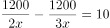，解得。甲车间每天生产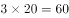件，乙车间每天生产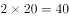件。甲、乙两个车间合作生产3000件相同的产品需要天数为：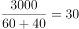天。

故正确答案为C。

---

### 第 2 题　qid 2280976 · 数学运算

某企业采购A类、B类和C类设备各若干台，21台设备共用48万元。已知A、B、C类设备的单价分别为1.2万元、2万元和2.4万元。问该企业最多可能采购了多少台C类设备？

- **A**. 16
- **B**. 17　✅
- **C**. 18
- **D**. 19

**答案**：B

**官方解析**

设该企业采购A类、B类和C类设备数量分别为、、。已知“21台设备共用48万元”，则······①，······②。联立两式，可得：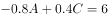，化简得：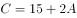。由于设备购买数量一定是不为零的整数，根据奇偶特性，一定是奇数，排除A、C两项。若要C类设备最多，代入D项可得：，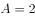，此时不符合题意，排除。

故正确答案为B。

---

### 第 3 题　qid 2280982 · 数学运算

某档案馆将从001开始编号的档案按顺序放入不同的文件箱，每份档案编号唯一且每个文件箱所装档案数量相同。已知185号档案位于第3箱，406号档案位于第5箱。问每箱装有的档案份数有多少种可能性？

- **A**. 1种
- **B**. 2～5种之间
- **C**. 6～10种之间
- **D**. 超过10种　✅

**答案**：D

**官方解析**

每份档案编号唯一且每个文件箱所装档案数量相同，按顺序放入，每箱档案数一定为整数。因此若要185号档案在第3箱，则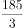≤每箱档案数≤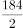，即61.7≤每箱档案数≤92。若要406号档案在第5箱，则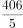≤每箱档案数≤，即81.2≤每箱档案数≤101.25。由于两个条件都要满足，因此取两者交集，即81.2≤每箱档案数≤92，故从82到92的整数均满足要求，总共有11种情况，超过10种。

故正确答案为D。

---

### 第 4 题　qid 2280986 · 数学运算

某试验田为长20米、宽1米的长条形地块，将其分割为3个宽为1米、长为6米的长方形地块，以及2个边长为1米的正方形地块，种植A、B、C三种药材。每种药材至少种一个小地块，相邻地块种植不同药材。A、B、C三种药材每平方米的产量分别为1.2公斤、0.9公斤、2.5公斤，该试验田最多可产出多少公斤药材？

- **A**. 27.6
- **B**. 37.8
- **C**. 39.0
- **D**. 47.1　✅

**答案**：D

**官方解析**

想让试验田种出的药材尽可能多，则应让面积大的地块种植产量高的C药材，因相邻地块种植不同药材，则各地块分布可如下图所示：

由图可知，A、B、C的面积分别为1平方米、1平方米、18平方米。

则总产量为公斤。

故正确答案为D。

---

### 第 5 题　qid 2280990 · 数学运算

甲工程队与乙工程队的效率之比为4：5，一项工程由甲工程队先单独做6天，再由乙工程队单独做8天，最后由甲、乙两个工程队合作4天刚好完成，如果这项工程由甲工程队或乙工程队单独完成，则甲工程队所需天数比乙工程队所需天数多多少天？

- **A**. 3
- **B**. 4
- **C**. 5　✅
- **D**. 6

**答案**：C

**官方解析**

赋值甲、乙效率分别为4、5，则工程总量为。甲单独完成所需天数比乙多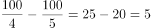天。

故正确答案为C。

---

### 第 6 题　qid 2281010 · 数学运算

甲、乙、丙三个农户种植龙稻、徽稻两种水稻，已知乙和丙水稻总产量是甲的，且龙稻产量分别占甲、乙、丙水稻总产量的、和，乙和丙的龙稻产量之和等于甲龙稻产量，则甲、乙、丙水稻产量比为：

- **A**. 5：3：1
- **B**. 10：7：1
- **C**. 15：11：1
- **D**. 20：15：1　✅

**答案**：D

**官方解析**

方法一：由题意可列式为：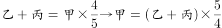①，②。将①式代入②式可得，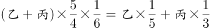，化简为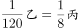，即，观察选项只有D满足。

方法二：由题意可知，甲总产量为5、6的倍数，赋值甲总产量为30，则①，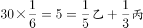②，联立①②解得，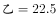，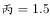。则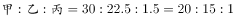。

故正确答案为D。

---

### 第 7 题　qid 2281013 · 数学运算

企业今年从全国6所知名大学招聘了500名应届生，从其中任意2所大学招聘的应届生数量均不相同。其中从A大学招聘的应届生数量最少且正好为B大学的一半。从B大学招聘的应届生数量为6所大学中最多的。则该企业今年从A大学至少招聘了多少名应届生？

- **A**. 48
- **B**. 47　✅
- **C**. 46
- **D**. 45

**答案**：B

**官方解析**

由题意可知，A大学招聘数量最少且为B大学的一半，B大学数量最多，即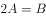。因任意2所大学招聘的应届生数量均不相同，若让A大学招聘数量尽量少，则其他学校数量要尽量多。设A学校招聘数量为名，则从B大学最多招聘名，可将各学校招聘数量列表如下：

可列式为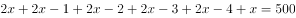，解得，问最少需向上取整，则A大学至少招聘47名。

故正确答案为B。

---

### 第 8 题　qid 2281015 · 数学运算

某场学术论坛有6家企业作报告，其中A企业和B企业要求在相邻的时间内作报告，C企业作报告的时间必须在D企业之后、在E企业之前，F企业要求不能第一个，也不能最后一个作报告。如满足所有企业的要求，则报告的先后次序共有多少种不同的安排方式？

- **A**. 12
- **B**. 24　✅
- **C**. 72
- **D**. 144

**答案**：B

**官方解析**

根据题意，按照先后次序，D、C、E三者相对顺序仅此1种；A、B要求相邻，利用捆绑法有种，再插入D、C、E形成的空中，有种方法；F不是第一个，也不是最后一个，只能插入AB、D、C、E之间的3个空中，有种方法；分步用乘法，因此不同安排方式共1×2×4×3=24种。

故正确答案为B。

---

### 第 9 题　qid 2281018 · 数学运算

甲和丙的年龄和是乙的2倍，今年甲的年龄是丙的3倍，9年后甲的年龄是丙的2.4倍，则多少年后丙的年龄是乙的？

- **A**. 7　✅
- **B**. 9
- **C**. 12
- **D**. 14

**答案**：A

**官方解析**

设今年丙的年龄为，则甲的年龄为，乙的年龄为。根据题意有：，解得：。设n年后丙的年龄是乙的，则有，解得n=7。

故正确答案为A。

---

### 第 10 题　qid 2281022 · 数学运算

在美化城市活动中，某街道工作人员想借助如图所示的直角墙角，用28米长的篱笆围成一个矩形花园ABCD，篱笆只围AB、BC两边。图中的P为一棵直径为1米的树，其与墙CD、AD的最短距离分别是14米和5米，若要将这棵树围在花园内，则花园的最大面积为多少平方米？

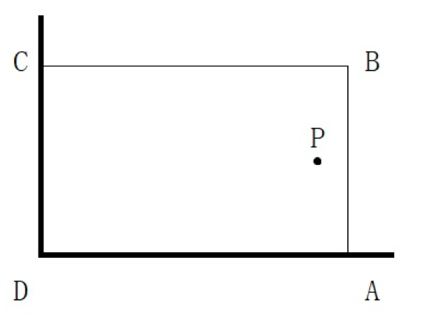

- **A**. 187
- **B**. 192
- **C**. 195　✅
- **D**. 196

**答案**：C

**官方解析**

树的直径为1米，与墙CD、AD的最短距离分别是14米和5米，则BC≥14+1=15，AB≥5+1=6。根据题意，BC+AB=28，故长方形ABCD周长一定，要使其面积最大，则其形状尽量接近正方形，因此BC=15，AB=28-15=13。此时ABCD面积最大，为15×13=195平方米。

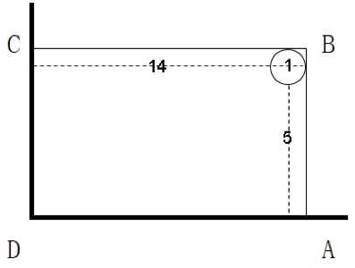

故正确答案为C。

---

## 判断推理

### 第 1 题　qid 2280966 · 图形推理

从所给的选项中，选择最合适的一个填入问号处，使之呈现一定的规律性：

- **A**. A
- **B**. B
- **C**. C　✅
- **D**. D

**答案**：C

**官方解析**

图形元素组成不同，无明显属性规律，考虑数量规律。观察发现，题干图形“窟窿”比较多，优先考虑数面，数量依次是3、4、5、6、？，则问号处应选一个含有7个面的选项。A项5个面，B项8个面，C项7个面，D项11个面，只有C项符合。
 故正确答案为C。

---

### 第 2 题　qid 2280971 · 图形推理

从所给的选项中，选择最合适的一个填入问号处，使之呈现一定的规律性：

- **A**. A
- **B**. B
- **C**. C　✅
- **D**. D

**答案**：C

**官方解析**

图形元素组成不同，无明显属性规律，考虑数量规律。观察发现图⑤是“日”字变形图，为笔画数特征图，故考虑数笔画。题干均为一笔画图形，故问号处也选择一个一笔画图形。观察选项：
A项的奇点数是4，为两笔画图形；
B项的奇点数是4，为两笔画图形；
C项的奇点数是2，为一笔画图形；
D项的奇点数是4，为两笔画图形。
故正确答案为C。

---

### 第 3 题　qid 2280977 · 图形推理

从所给的选项中，选择最合适的一个填入问号处，使之呈现一定的规律性：

- **A**. A
- **B**. B
- **C**. C　✅
- **D**. D

**答案**：C

**官方解析**

图形元素组成相同，优先考虑位置规律。观察发现，1号小黑块每次沿着十六宫格的外圈顺时针移动3格，2号小黑块每次沿着十六宫格的外圈顺时针移动1格，3号小黑块每次沿着十六宫格的内圈顺时针移动1格，如图所示：

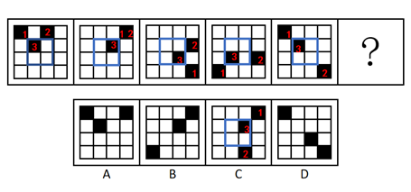

应用此规律，从图五到问号处，1号小黑块移动到第一行最后一格，2号小黑块移动到第四行第三格，3号小黑块移动到第二行第三格，只有C项符合。

故正确答案为C。

---

### 第 4 题　qid 2280987 · 图形推理

从所给的选项中，选择最合适的一个填入问号处，使之呈现一定的规律性：

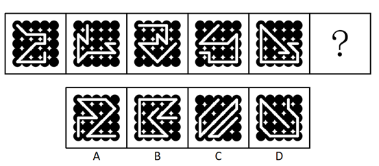

- **A**. A　✅
- **B**. B
- **C**. C
- **D**. D

**答案**：A

**官方解析**

图形元素组成不同，且无明显属性规律，考虑数量规律，观察发现，每幅图都有线穿过小黑球，考虑线穿过小黑球的数量，从图一到图五线穿过小黑球的数量分别为12、13、14、15、16，因此问号处应选择一个线条穿过17个小黑球的图形，只有A项符合。
故正确答案为A。

---

### 第 5 题　qid 2280997 · 图形推理

从所给的选项中，选择最合适的一个填入问号处，使之呈现一定的规律性：

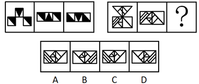

- **A**. A
- **B**. B
- **C**. C
- **D**. D　✅

**答案**：D

**官方解析**

图形元素组成相同，优先考虑位置规律。观察发现，第一组图中，图一的第二格向下翻转并与原来的第一格、第三格叠加后得到图二，图二再整体旋转得到图三；第二组图应用此规律，但第二组图没有三格，而是四个格子，观察前两幅图发现，图一的上面两个格子向下翻转与原来的下面两个格子叠加后得到图二，图二再整体旋转得到问号处图形，只有D项符合。

故正确答案为D。

---

### 第 6 题　qid 2281003 · 图形推理

左边为给定的纸盒外表面，右边哪一项能由它折叠而成？

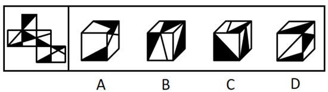

- **A**. A
- **B**. B　✅
- **C**. C
- **D**. D

**答案**：B

**官方解析**

将原展开图标上序号如下图，逐一进行分析。

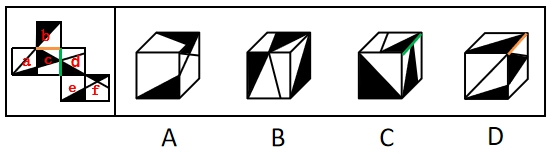

A项错误，选项中出现2个相同的黑三角面，而展开图中6个面各不相同，选项与题干不一致，排除；

B项正确，由面b、面c和面d构成，选项与题干一致，当选；

C项错误，由面b、面c和面d构成，选项中面c和面d的公共边挨着面d中黑色三角形较长的直角边（如图中绿线所示），而展开图中二者的公共边挨着面d中黑色三角形较短的直角边（如图中绿线所示），选项与题干不一致，排除；

D项错误，由面a、面b和面c构成，选项中面b和面c的公共边挨着面b的黑色三角形（如图中黄线所示），而展开图中二者的公共边挨着面b的白色三角形（如图中黄线所示），选项与题干不一致，排除。

故正确答案为B。

---

### 第 7 题　qid 2281011 · 图形推理

下图为给定的多面体，下面哪项多面体能与该多面体拼接成实心的长方体？

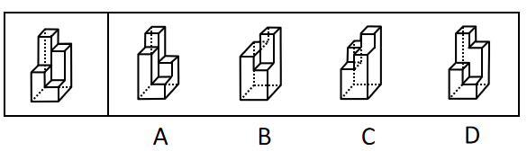

- **A**. A　✅
- **B**. B
- **C**. C
- **D**. D

**答案**：A

**官方解析**

本题考查立体拼合。根据凹凸一致原则，A项可以和给定的多面体拼成长方体。具体组合方式如下图所示：

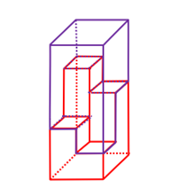

故正确答案为A。

---

### 第 8 题　qid 2281020 · 定义判断

反应性相倚是指在沟通过程中，沟通双方都以对方的行为作为自己行为的依据，做出相应的反应，而并不按照原来的计划进行沟通。
根据上述定义，下列属于反应性相倚的是：

- **A**. 小何计划出国读博，申请几所学校都收到了录取通知，他反复研究，并征求导师的意见，做出了最终决定
- **B**. 方某通过房产中介看中了黄某的房子，与黄某沟通后发现其房屋的产权证尚未取得，于是方某决定推迟购买
- **C**. 小李报名参加演讲比赛，初赛晋级后进入复赛，但复赛时间和小李的外语考试冲突，于是小李改变计划，选择退赛
- **D**. 某公司计划推行新考核制度，各部门负责人希望按部门情况分别拟定，后公司决定先保留原制度，针对个别情况逐步调整，各部门表示同意　✅

**答案**：D

**官方解析**

第一步：找出定义关键词。
“沟通过程中，沟通双方都以对方的行为作为自己的依据，做出相应的反应”“并不按照原来的计划进行沟通”。
第二步：逐一分析选项。
A项：小何收到几所学校的录取通知书，反复研究并征求导师的意见后做出最终决定，小何与学校之间未进行沟通，小何与导师之间的沟通没有体现出彼此以对方的行为依据做出反应，不符合“沟通过程中，沟通双方都以对方的行为作为自己的依据，做出相应的反应”，不符合定义，排除； 
B项：方某通过与黄某进行沟通后做出了推迟购买的决定，但是黄某没有做出相应的反应，不符合“沟通过程中，沟通双方都以对方的行为作为自己的依据，做出相应的反应”，不符合定义，排除；
C项：小李因为复赛时间与外语考试冲突，选择退赛，未体现出沟通，不符合“沟通过程中，沟通双方都以对方的行为作为自己的依据，做出相应的反应”，不符合定义，排除；
D项：某公司计划推行新考核制度，各部门负责人与公司沟通后，公司针对各部门负责人的行为（希望按照部门情况分别拟定）做出了保留原制度，但针对个别情况会逐步调整的反应，各部门负责人针对公司决定也表示同意。符合“沟通过程中，沟通双方都以对方的行为作为自己的依据，做出相应的反应”，且沟通双方都有调整，“并不按照原来的计划进行沟通”，符合定义，当选。
故正确答案为D。

---

### 第 9 题　qid 2281025 · 定义判断

法条竞合犯是指一个犯罪行为同时触犯数个具有包容关系的刑法条文，依法只适用其中一条定罪量刑的情况。
根据上述定义，下列属于法条竞合犯的是：

- **A**. 王某醉酒驾驶致伤三人
- **B**. 张某拦路抢劫致人死亡
- **C**. 李某生产销售价值百万的假药　✅
- **D**. 周某组织多人制造假币

**答案**：C

**官方解析**

第一步：找出定义关键词。
“一个犯罪行为”、“同时触犯数个具有包容关系的刑法条文”、“依法只适用其中一条定罪量刑”。
第二步：逐一分析选项。
A项：王某醉酒驾驶触犯了“危险驾驶罪”，伤人触犯了“交通肇事罪”，两者并不具有包容关系，不符合关键词“同时触犯数个具有包容关系的刑法条文”，不符合定义，排除； 
B项：拦路抢劫致人死亡属于“抢劫罪”，是抢劫罪的从重处罚情节，不符合关键词“同时触犯数个具有包容关系的刑法条文”，不符合定义，排除；
C项：李某的行为犯了“生产、销售假药罪”和“生产销售伪劣产品罪”，符合关键词“同时触犯数个具有包容关系的刑法条文”，符合定义，当选；
D项：周某制造假币只是犯了“伪造货币罪”，不符合关键词“同时触犯数个具有包容关系的刑法条文”，不符合定义，排除。
故正确答案为C。

---

### 第 10 题　qid 2281027 · 定义判断

营业外收入是指企业确认与企业生产经营活动没有直接关系的各种收入。这一收入实际上是一种纯收入，不是由企业经营资金耗费所产生的，不需要企业付出代价，不需要与有关费用进行配比。换言之，除企业营业执照中规定的主营业务以及附属的其他业务之外的所有收入都视为营业外收入。
根据上述定义，下列关于营业外收入的说法哪项不正确？

- **A**. 某旅游景区服务公司获得的门票收入属于营业外收入　✅
- **B**. 某高分子材料公司从当地政府获得的高新技术企业的政策补贴属于营业外收入
- **C**. 甲乙两公司是合作企业，后乙公司违反国家有关行政管理法规，按照规定支付给甲公司一定数量的罚款，该罚款属于甲公司的营业外收入
- **D**. 甲公司购入一批环保设备，5年后将这些设备进行报废处理并获得相应的报废款，这一款项扣除资产账面价值、清理费用、处置相关税费后的净收益属于营业外收入

**答案**：A

**官方解析**

第一步：找出定义关键词。
“除企业营业执照中规定的主营业务以及附属的其他业务之外的所有收入”。
第二步：逐一分析选项。
A项：旅游景区售卖门票，就是景区的主营业务收入，不属于“除企业营业执照中规定的主营业务以及附属的其他业务之外的所有收入”，不符合定义，当选； 
B项：高分子材料公司获得的政策补贴，与业务活动无关，属于“除企业营业执照中规定的主营业务以及附属的其他业务之外的所有收入”，符合定义，排除；
C项：由于乙公司违反法规支付给甲公司的罚款，与甲公司的业务活动无关，属于“除企业营业执照中规定的主营业务以及附属的其他业务之外的所有收入”，符合定义，排除；
D项：甲公司的设备报废处理获得报废款，与甲公司的业务活动无关，属于“除企业营业执照中规定的主营业务以及附属的其他业务之外的所有收入”，符合定义，排除。
本题为选非题，故正确答案为A。

---

### 第 11 题　qid 2281030 · 定义判断

股权众筹是指创新创业者或小微企业通过股权众筹融资中介机构互联网平台（互联网网站或其他类似的电子媒介）公开募集股本的活动。
根据上述定义，下列属于股权众筹活动的是：

- **A**. 
做生意的杨某以1.5亿元入股邻居的创业项目，创立了一个网购平台

- **B**. 
某公司在地方股权交易市场挂牌后，宣布公司定向发行原始股，融资2亿元

- **C**. 
孔某通过自己制作的网站宣传推广某项目，成功吸引40余人投资，融资200余万元

- **D**. 
赵某通过熟人介绍在某网络创投平台出资20万元，获得创业企业的股权，成为该企业的股东
　✅

**答案**：D

**官方解析**

第一步：找出定义关键词。

“创新创业者或小微企业”、“通过股权众筹融资中介机构互联网平台（互联网网站或其他类似的电子媒介）公开募集股本的活动 ”。
第二步：逐一分析选项。
A项，杨某以1.5亿元入股邻居的创业项目，创立了一个网购平台，没有通过互联网公开募集股本，不符合“通过股权众筹融资中介机构互联网平台（互联网网站或其他类似的电子媒介）公开募集股本的活动”，不符合定义，排除； 
B项，某公司在地方股权交易市场挂牌后定向发行原始股，地方股权交易市场并不是股权众筹融资中介机构互联网平台，不符合“通过股权众筹融资中介机构互联网平台（互联网网站或其他类似的电子媒介）公开募集股本的活动”，不符合定义，排除；
C项，孔某通过自己制作的网站宣传推广某项目，成功吸引40余人投资，融资200余万元，孔某只是通过网站去宣传项目而没有进行众筹，不符合“通过股权众筹融资中介机构互联网平台（互联网网站或其他类似的电子媒介）公开募集股本的活动”，不符合定义，排除；
D项，赵某通过熟人介绍在某网络创投平台出资20万元，说明赵某投资的企业通过创投网络平台募集到了赵某的资金，符合“通过股权众筹融资中介机构互联网平台（互联网网站或其他类似的电子媒介）公开募集股本的活动”，符合定义，当选。
故正确答案为D。

---

### 第 12 题　qid 2281031 · 定义判断

一般来说，关于世界的表述有两种类型。第一种是实证表述，只是如实做出关于世界是什么样子的表述。第二种是规范表述，做出的是关于世界应该是什么样子的表述，通常含有价值判断，即做出好坏或应该与否的判断。
根据上述定义，下列判断正确的是：

- **A**. “提高汇率会减少通货膨胀是错误的”是实证表述
- **B**. “政府立法禁止在公共场合吸烟是正确的”是实证表述
- **C**. “汽油税的分担对于驾驶员来说太不公平了”是规范表述　✅
- **D**. “如果政府提高酒税，酒厂的利益就会减少”是规范表述

**答案**：C

**官方解析**

第一步：找出定义关键词。
实证表述：“如实做出关于世界是什么样子的表述”。
规范表述：“做出的是关于世界应该是什么样子的表述”、“含有价值判断，即做出好坏或应该与否的判断”。
第二步：逐一分析选项。
A项：“是错误的”是一种价值判断，符合“规范表述”的定义，不符合“实证表述”定义，排除；
B项：“是正确的”是一种价值判断，符合“规范表述”的定义，不符合“实证表述”定义，排除；
C项：“太不公平了”是一种价值判断，符合“做出的是关于世界应该是什么样子的表述”，符合“规范表述”的定义，当选；
D项：“如果······就······”是一种如实的表述，符合“实证表述”的定义，不符合“规范表述”定义，排除。
故正确答案为C。

---

### 第 13 题　qid 2281032 · 定义判断

无偿合同是指当事人一方只享有合同权利而不偿付任何代价的合同。换言之，该合同中的一方当事人向对方给予某种利益，而对方取得该利益时无需支付任何代价。
根据上述定义，下列选项不属于无偿合同的是：

- **A**. 
老王膝下无儿女，他将自己名下的一套房产赠予一直照顾自己的侄子，并与对方签订了赠予合同

- **B**. 
何某邀请李某来自己的公司任职，并与李某签订合同，承诺如果李某在公司工作满5年，将获得公司的股份
　✅
- **C**. 
黎某要出国学习半年，不愿将装修一新的住宅对外出租，遂与好友王某协商一致，将其住宅交与王某代为看管

- **D**. 
黄某将自己的车借给同事郑某使用，并与郑某签订协议，约定借给其使用一年，不需缴纳使用费，但要如期归还

**答案**：B

**官方解析**

第一步：找出定义关键词。

“一方当事人向对方给予某种利益”“对方取得该利益时无需支付任何代价”。

第二步：逐一分析选项。

A项：老王与侄子签订赠予房产的合同，侄子不需要支付任何代价就得到了老王的一套房产，符合关键词“一方当事人向对方给予某种利益”“对方取得该利益时无需支付任何代价”，符合定义，排除；

B项：何某与李某签订任职合同，李某需要付出工作满5年的代价，才能获得何某公司的股份，不符合“对方取得该利益时无需支付任何代价”，不符合定义，当选；

C项：黎某与王某协商一致，王某代为看管黎某的住宅半年，且黎某没有付出什么代价，符合“一方当事人向对方给予某种利益”、“对方取得该利益时无需支付任何代价”，符合定义，排除；

D项：黄某与郑某签订协议，郑某不需要付出什么代价，就可以免费使用黄某的车一年，符合关键词“一方当事人向对方给予某种利益”、“对方取得该利益时无需支付任何代价”，符合定义，排除。

本题为选非题，故正确答案为B。

---

### 第 14 题　qid 2281033 · 定义判断

诉诸无知是指以对某个命题的无知为根据，从而断言该命题是真或者是假的一种谬误。其公式是：因为尚未证明A假，所以A是真的；或者因为尚未证明A真，所以A是假的。
根据上述定义，下列论证中犯了诉诸无知错误的是：

- **A**. 既然圣经上说上帝是存在的，那么你就不能说上帝是不存在的
- **B**. 既然现在没有充分的证据证明甲是有罪的，那么甲就可能是无罪的
- **C**. 既然当时的绝大多数人都相信托勒密的地心说，那么托勒密的地心说就是正确的
- **D**. 既然古代典籍未提到元明时期该地附近有寺院，那么就说明当时该地附近没有寺院　✅

**答案**：D

**官方解析**

第一步：找出定义关键词。
“尚未证明A假，所以A是真的”“尚未证明A真，所以A是假的”。
第二步：逐一分析选项。
A项，圣经说上帝是存在的，说明有证据表明上帝是存在的，那么上帝存在，不符合“尚未证明A假，所以A是真的”，也不符合“尚未证明A真，所以A是假的”，不符合定义，排除；
B项，现在没有充分的证据证明甲有罪，符合“尚未证明A真”，那么甲就可能是无罪的，这只是一种可能性，不符合 “所以A是假的”，不符合定义，排除；
C项，绝大多数人相信托勒密的地心说，那么地心说正确，但是人们相信有地心说并不代表有证据证明地心说是存在的，不符合“尚未证明A假，所以A是真的”，也不符合“尚未证明A真，所以A是假的”，不符合定义，排除；
D项，古代典籍未提到元明时期该地附近有寺院，符合“尚未证明A真”，那么当时该地附近就没有寺院，符合“所以A是假的”，符合定义，当选。
故正确答案为D。

---

### 第 15 题　qid 2281034 · 定义判断

波丽安娜效应根据小说《少女波丽安娜》中的人物提出，是指通常情况下，人们会对别人给予他们的正面描述表示认同。巴纳姆效应是指绝大多数人都会很容易地相信一个笼统的、一般性的人格描述特别适合自己。
根据上述定义，下列选项中没有反映上述效应的是：

- **A**. 小王在面试的环节中表现非常好，事后面试官告诉他，认为他有很强的沟通协调能力和解决问题的能力，他觉得自己确实是这样
- **B**. 某明星近来人气很高，虽然有一些负面新闻，但在粉丝看来，他是亲切而率真的，他自己也在微博上澄清了事实，希望获得大家的支持　✅
- **C**. 小明在网上看到了有关星座性格分析的内容，他觉得里面的描述比如“适应能力很好，在生活中充满了活力，在社交圈举止得当”这些内容非常符合自己
- **D**. 实验者给一批被试者做了人格调查，后拿出两份结果让其判断。事实上，一份是被试者个人填写的结果，另一份是这批被试者的回答平均起来的结果，被试者大都认为后者更准确地表达了自己的人格特征

**答案**：B

**官方解析**

第一步：找出定义关键词。
波丽安娜效应：“人们会对别人给予他们的正面描述表示认同”。
巴纳姆效应：“绝大多数人都会很容易地相信一个笼统的、一般性的人格描述特别适合自己”。
第二步：逐一分析选项。
A项：面试官认为小王有很强的沟通能力和解决问题的能力，是对小王的正面描述，并且小王也认为自己确实如此，符合“人们会对别人给予他们的正面描述表示认同”，符合波丽安娜效应，排除；
B项：某明星有一些负面新闻，该明星在微博上澄清事实，不符合“对正面描述表示认同”，不符合波丽安娜效应，粉丝认为他是亲切率真的，但是未体现出该明星表示认同，不符合“绝大多数人都会很容易地相信一个笼统的、一般性的人格描述特别适合自己”，不符合巴纳姆效应，当选；
C项：星座性格分析中的内容“适应能力很好，在生活中充满了活力，在社交圈举止得当”，符合“笼统的、一般性的人格描述”，小明认为这些描述很符合自己，符合“绝大多数人都会很容易地相信一个笼统的、一般性的人格描述特别适合自己”，符合巴纳姆效应，排除；
D项：被试者大都认为被试者回答的平均结果更准确地表达了自己的人格特征，符合“绝大多数人都会很容易地相信一个笼统的、一般性的人格描述特别适合自己”，符合巴纳姆效应，排除。
本题为选非题，故正确答案为B。

---

### 第 16 题　qid 2281035 · 定义判断

心理学家马斯洛将人的需求像阶梯一样从低到高按层次分为五种，分别是：生理需求、安全需求、爱和归属需求、尊重需求和自我实现需求。其中，尊重需求属于较高层次的需求，表现为希望获得成就、名声、地位、晋升机会或获得他人对自己的认可与尊重等。
根据上述定义，下列行为中最能体现尊重需求的是：

- **A**. 小王在工作之余和关系好的同事一起打羽毛球
- **B**. 小张为了能养家糊口每天拼命地努力工作赚钱
- **C**. 小李为自己和家人都购买了人身意外伤害保险
- **D**. 小刘对自己被评为年度优秀员工感到非常开心　✅

**答案**：D

**官方解析**

第一步：找出定义关键词。
“希望获得成就、名声、地位、晋升机会或获得他人对自己的认可与尊重等”。
第二步：逐一分析选项。
A项：小王与同事一起打羽毛球，没有体现他“希望获得成就、名声、地位、晋升机会或获得他人对自己的认可与尊重”，不符合定义，排除；
B项：小张努力工作赚钱是为了养家糊口，不符合“希望获得成就、名声、地位、晋升机会或获得他人对自己的认可与尊重”，不符合定义，排除；
C项：小李购买人身意外伤害保险是为了自己和家人在风险来临时有所保障，不符合“希望获得成就、名声、地位、晋升机会或获得他人对自己的认可与尊重”，不符合定义，排除；
D项：小刘感到开心是因为自己被评为年度优秀员工，这项荣誉是小刘工作取得的成就，也是对小刘工作的认可，符合“希望获得成就、名声、地位、晋升机会或获得他人对自己的认可与尊重”，符合定义，当选。
故正确答案为D。

---

### 第 17 题　qid 2281037 · 定义判断

瑕疵担保责任是指依法律规定，在交易活动中当事人一方移转财产（或权利）给另一方时，应担保该财产（或权利）无瑕疵，若移转的财产（或权利）有瑕疵，则应向对方当事人承担相应的责任。
根据上述定义，下列选项中乙公司不需要承担瑕疵担保责任的是：

- **A**. 甲公司从乙公司购买了四台不锈钢水箱，后一台水箱发生爆裂，经鉴定水箱钢板厚度偏薄，焊接质量较差，与国家标准要求不符
- **B**. 甲公司与乙公司签订协议，甲支付50万元获得乙公司旗下6个专利产品，后甲在使用过程中发现其中一个产品版权属于丙公司所有
- **C**. 甲公司与乙公司签订《股权转让协议》，约定甲公司将名下的股权全额转让给乙公司，协议签订不久，乙公司资金发生问题，申请破产　✅
- **D**. 甲公司租赁乙公司的厂房开办化工厂，后房屋漏雨，甲公司安排工人杨某到屋顶更换石棉瓦，结果杨某在更换过程中因房屋大梁突然断裂从高处坠落受伤

**答案**：C

**官方解析**

第一步：找出定义关键词。
“在交易活动中当事人一方移转财产（或权利）给另一方时”“应担保该财产（或权利）无瑕疵”“若移转的财产（或权利）有瑕疵，则应向对方当事人承担相应的责任”。
第二步：逐一分析选项。
A项，甲公司从乙公司购买了四台不锈钢水箱，符合“在交易活动中当事人一方移转财产（或权利）给另一方时”，后一台水箱发生爆裂，经鉴定水箱钢板厚度偏薄，焊接质量较差，符合“若移转的财产（或权利）有瑕疵”，所以乙公司需要承担瑕疵担保责任，符合定义，排除；
B项，甲公司与乙公司签订协议，甲支付50万元获得乙公司旗下6个专利产品，符合“在交易活动中当事人一方移转财产（或权利）给另一方时”，发现其中一个产品版权属于丙公司所有，说明乙公司转让的专利产品有瑕疵，符合“若移转的财产（或权利）有瑕疵”, 所以乙公司需要承担瑕疵担保责任，符合定义，排除；
C项，甲公司与乙公司签订《股权转让协议》，约定甲公司将名下的股权全额转让给乙公司，符合“在交易活动中当事人一方移转财产（或权利）给另一方时”，但是此次转让股权是甲公司把股权转让给乙公司，而此时该承担瑕疵担保责任的应该是甲公司，而不是乙公司，所以乙公司不需要承担瑕疵担保责任，不符合定义，当选；
D项，甲公司租赁乙公司的厂房开办化工厂，符合“在交易活动中当事人一方移转财产（或权利）给另一方时”，后房屋漏雨，并且杨某在更换过程中因房屋大梁突然断裂从高处坠落受伤，说明该厂房存在瑕疵，符合“若移转的财产（或权利）有瑕疵”，所以乙公司需要承担瑕疵担保责任，符合定义，排除。
本题为选非题，故正确答案为C。

---

### 第 18 题　qid 2281038 · 类比推理

平邮：快递

- **A**. 经济舱：头等舱
- **B**. 普快列车：高铁　✅
- **C**. 短信：微信
- **D**. 信件：传真

**答案**：B

**官方解析**

第一步：判断题干词语间逻辑关系。
平邮和快递都是邮递业务，二者是并列关系，且平邮的速度比快递的速度慢。
第二步：判断选项词语间逻辑关系。
A项：经济舱和头等舱是并列关系，但速度相同，与题干逻辑关系不一致，排除；
B项：普快列车和高铁都是火车，二者是并列关系，且普快列车的速度比高铁慢，与题干逻辑关系一致，当选；
C项：短信和微信都是通讯的方式，是并列关系，但是速度相同，与题干逻辑关系不一致，排除；
D项：信件指书信和递送的文件、印刷品，传真可做动词也可做名词，做名词的时候指的是传送信息的方式，二者不是并列关系，与题干逻辑关系不一致，排除。
故正确答案为B。

---

### 第 19 题　qid 2281039 · 类比推理

孑孓：蚊子

- **A**. 树苗：杨树
- **B**. 羊羔：绵羊
- **C**. 蝌蚪：青蛙　✅
- **D**. 麦种：小麦

**答案**：C

**官方解析**

第一步：判断题干词语间逻辑关系。
孑孓指蚊子的幼虫，前者是同一生物的幼年时期，后者是成年时期，且孑孓需待在水中直至长成蚊子。孑孓经过变态发育成为蚊子，二者是对应关系。
第二步：判断选项词语间逻辑关系。
A项，树苗是树的幼苗的统称，不仅仅是杨树的幼苗，且树苗生长不属于变态发育，与题干逻辑关系不一致，排除；
B项，羊羔是羊的幼仔的统称，不仅仅是绵羊的幼仔，且羊羔成长不属于变态发育，与题干逻辑关系不一致，排除；
C项，蝌蚪经过变态发育成为青蛙，且蝌蚪需待在水中直至长成青蛙，二者是对应关系，与题干逻辑关系一致，当选；
D项，麦种是小麦的种子，并不是小麦的幼年的不同称呼，且麦种生长不属于变态发育，与题干逻辑关系不一致，排除。
故正确答案为C。

---

### 第 20 题　qid 2281040 · 类比推理

序幕：尾声

- **A**. 散文：戏剧　✅
- **B**. 方言：粤语
- **C**. 元音：辅音
- **D**. 进士：状元

**答案**：A

**官方解析**

第一步：判断题干词语间逻辑关系。
序幕指的是某些多幕剧置于第一幕之前的一场戏，尾声指的是最后一部份，两者是并列关系中的反对关系。
第二步：判断选项词语间逻辑关系。
A项，散文、戏剧、诗歌和小说是四大文学体裁，文学上的戏剧概念是指为戏剧表演所创作的脚本，即剧本，因此散文和戏剧是并列关系中的反对关系，与题干逻辑关系一致，当选；
B项，粤语是方言的一种，二者是种属关系，与题干逻辑关系不一致，排除；
C项，元音是音素的一种，与辅音相对。英语国际音标共48个音素，其中元音音素20个，辅音音素28个。因此二者是并列关系中的矛盾关系，与题干逻辑关系不一致，排除；
D项，状元是进士中的第一名，二者为种属关系，与题干逻辑关系不一致，排除。
故正确答案为A。

---

### 第 21 题　qid 2280968 · 类比推理

红酒：咖啡：饮品

- **A**. 熊猫：刺绣：中国
- **B**. 勺子：铲子：金属
- **C**. 邮票：信封：邮寄
- **D**. 板栗：核桃：干果　✅

**答案**：D

**官方解析**

第一步：判断题干词语间逻辑关系。
红酒和咖啡是并列关系，二者均是饮品，与饮品为种属关系。
第二步：判断选项词语间逻辑关系。
A项，熊猫和刺绣是并列关系，二者均原产于中国，前两词与中国为物品与原产地的对应关系，与题干逻辑关系不一致，排除；
B项，勺子和铲子是并列关系，二者可能是金属的，前两词与金属是成品和原材料的对应关系，与题干逻辑关系不一致，排除；
C项，邮票和信封是配套使用关系，且二者都可以用来邮寄，前两词与邮寄是功能的对应关系，与题干逻辑关系不一致，排除；
D项，板栗和核桃是并列关系，二者均是干果，前两词与干果为种属关系，与题干逻辑关系一致，当选。
故正确答案为D。

---

### 第 22 题　qid 2280970 · 类比推理

（  ）对于 小说 相当于 琴弦 对于（  ）

- **A**. 写实  音乐
- **B**. 浪漫  乐器
- **C**. 情节  竖琴　✅
- **D**. 诗歌  吉他

**答案**：C

**官方解析**

逐一代入选项。
A项：小说的内容可以是写实的，二者是属性对应关系；琴弦是一些乐器的组成部分，乐器可以演奏出音乐，二者不是属性对应关系。前后逻辑关系不一致，排除；
B项：小说可以是浪漫的，二者是属性对应关系；琴弦是一些乐器的组成部分，二者是组成关系。前后逻辑关系不一致，排除；
C项：情节是小说的组成部分，二者是组成关系；琴弦是竖琴的组成部分，二者是组成关系。前后逻辑关系一致，当选；
D项：诗歌和小说是并列关系；琴弦是吉他的组成部分，二者是组成关系。前后逻辑关系不一致，排除。
故正确答案为C。

---

### 第 23 题　qid 2280975 · 逻辑判断

某公司举行优秀员工评选活动，在最后一轮评选中有甲、乙、丙、丁四名员工入围。甲认为乙会当选，乙认为丙会当选，丙和丁都认为自己不能当选。评选结果公布后发现，上述四种猜测只有一种是错误的。
由此可以推出，一定当选的是：

- **A**. 甲
- **B**. 乙　✅
- **C**. 丙
- **D**. 丁

**答案**：B

**官方解析**

第一步：找关系。

甲：乙当选

乙：丙当选

丙：丙当选

丁：丁当选

乙和丙说的话互为矛盾关系，必有一真一假，而根据四个猜测中只有一个是假的，那么唯一的一假在乙、丙当中，而甲、丁说的话一定为真。

第二步：看其余。

根据甲猜测为真可知，一定当选的是乙。

故正确答案为B。

---

### 第 24 题　qid 2280980 · 逻辑判断

一项调查发现，在牛奶人均消费量大的地区，癌症的发病率较高；而牛奶人均消费量少的地区，癌症发病率极低。有人据此得出结论：饮用牛奶会使癌症的发病率上升。
以下哪项如果为真，最能质疑上述结论？

- **A**. 癌症发病率高的地区，其他疾病的发病率相对较低
- **B**. 牛奶含钙量高，吸收好，而且睡前喝牛奶有助于睡眠
- **C**. 调查中牛奶人均消费量大的地区，人口总数也相对较大
- **D**. 牛奶人均消费量大的地区居民寿命较长，且罹患癌症的主要是中老年人　✅

**答案**：D

**官方解析**

第一步：找出论点和论据。
论点：饮用牛奶会使癌症的发病率上升。
论据：在牛奶人均消费量大的地区，癌症的发病率较高；而牛奶人均消费量少的地区，癌症发病率极低。
论点论据都在讨论“饮用牛奶”与“癌症发病率”的关系，二者话题一致，且论点存在因果关系，削弱优先考虑因果倒置或他因削弱。
第二步：逐一分析选项。
A项：指出癌症发病率高的地区，其他疾病的发病率相对较低，题干只关注癌症的发病率，与其他疾病的发病率无关，属于无关项，不能削弱，排除；
B项：指出牛奶含钙量高，吸收好，睡前喝牛奶有助于睡眠，但并没有指出饮用牛奶和癌症的发病率之间的关系，属于无关项，不能削弱，排除；
C项：指出在牛奶人均消费量大的地区，人口总数也相对较大，但没有指出癌症发病率的问题，属于无关选项，不能削弱，排除；
D项：指出牛奶人均消费量大的地区居民寿命较长，而且罹患癌症主要是中老年人，而年纪大也有可能使得癌症的发病率上升，属于他因削弱，当选。
故正确答案为D。

---

### 第 25 题　qid 2280985 · 逻辑判断

为了解对学校食堂的满意度，某大学进行了一项“我最满意的食堂”评比活动。通过让学生对食堂的饭菜质量、价格、服务态度、卫生状况等10项指标进行评分来反映其对食堂的满意度，学生给每个评分指标赋以1到10分的某一个分值，然后计算出10项评分指标的平均得分，从而得出学生对食堂的满意度。
实施这一项评比活动需要假设的前提是：
Ⅰ.对饭菜质量、服务态度等指标的评价可以用数字来表达
Ⅱ.上述10项指标对学生来说同等重要
Ⅲ.该大学的每个学生都参与了这次评比活动

- **A**. 仅Ⅰ
- **B**. 仅Ⅱ
- **C**. 仅Ⅰ和Ⅱ　✅
- **D**. Ⅰ、Ⅱ和Ⅲ

**答案**：C

**官方解析**

第一步：找出论点和论据。
论点：通过让学生对食堂的饭菜质量、价格、服务态度、卫生状况等10项指标进行评分，计算出10项评分指标的平均得分，从而得出学生对食堂的满意度。
论据：无。
第二步：逐一分析选项。
Ⅰ：对饭菜质量、服务态度等指标的评价可以用数字来表达，是使得评价可以量化的前提条件，若指标评价不能用数字表达，那么题干论点提到的通过指标的平均得分得到学生对食堂的满意度就无法实现，该项是评比活动需要假设的前提。
Ⅱ：10项指标同等重要，这使得学生的评判可以公平公正进行，若10项指标不是同等重要，那么通过评价指标的平均分得到对食堂的评价就不科学，也无意义，该项是评比活动需要假设的前提。
Ⅲ：参加评比活动的学生人数和评比最后得到的结果无必然联系，不是该评比活动需要假设的前提。
实施这一项评比活动需要假设的前提是Ⅰ和Ⅱ。
故正确答案为C。

---

### 第 26 题　qid 2280989 · 逻辑判断

毛囊干细胞是在毛囊中长期生活的细胞，终身为我们产生毛发。毛囊干细胞从血液中吸收葡萄糖，经过代谢，葡萄糖变为丙酮酸。这些丙酮酸一部分被细胞运输进线粒体，在线粒体中，丙酮酸进一步的代谢能够为细胞提供能量，另一部分丙酮酸将在细胞内进行后续的变化，产生新的代谢产物——乳酸。乳酸可以激活毛囊干细胞，使毛发生长得更快速。据此，有研究人员认为，通过药物提高乳酸的含量可以治疗脱发。
以下哪项如果为真，最能支持上述结论？

- **A**. 葡萄糖的代谢功能是生命体自我修复的重要方式
- **B**. 通过药物提供的乳酸能够直接作用于毛囊干细胞　✅
- **C**. 人为增加乳酸的含量不会对毛囊干细胞产生其他影响
- **D**. 减少丙酮酸进入线粒体，可以使毛囊干细胞产生更多乳酸

**答案**：B

**官方解析**

第一步：找出论点和论据。
论点：通过药物提高乳酸的含量可以治疗脱发。
论据：毛囊干细胞从血液中吸收葡萄糖，经过代谢后葡萄糖产生的丙酮酸将在细胞内进行后续的变化，产生乳酸，乳酸可以激活毛囊干细胞，使毛发生长得更快速。
第二步：逐一分析选项。
A项，论点说的是通过药物提高乳酸的含量可以治疗脱发，该项说的是葡萄糖的代谢功能是生命体自我修复的重要方式，话题不一致，无法加强，排除；
B项，通过药物提供的乳酸能够直接作用于毛囊干细胞，是论点成立的前提，能够加强，当选；
C项，论点说的是通过药物提高乳酸的含量可以治疗脱发，该项说的是是否会对毛囊干细胞产生其他影响，其他影响与论点的脱发无关，话题不一致，无法加强，排除；
D项，论点说的是通过药物提高乳酸的含量可以治疗脱发，该项说的是减少丙酮酸可以产生更多乳酸，话题不一致，无法加强，排除。
故正确答案为B。

---

### 第 27 题　qid 2280991 · 逻辑判断

某处室管理人员都具有博士学位，大部分川籍工作人员都不超过30周岁，少部分川籍工作人员无博士学位。
根据以上陈述，可以得出以下哪项？

- **A**. 有些管理人员超过30周岁
- **B**. 有些管理人员不超过30周岁
- **C**. 有些川籍工作人员是管理人员
- **D**. 有些川籍工作人员不是管理人员　✅

**答案**：D

**官方解析**

第一步：翻译题干。

①管理人员博士学位；

②有的川籍工作人员超过30岁；

③有的川籍工作人员博士学位；

将①逆否和③可以递推出：④有的川籍工作人员博士学位管理人员。

第二步：逐一分析选项。

A项翻译为：“有的管理人员超过30岁”，题干中未涉及管理人员的年龄，无法推出，排除；

B项翻译为：“有的管理人员超过30岁”，题干中未涉及管理人员的年龄，无法推出，排除；

C项翻译为：“有的川籍工作人员管理人员”，题干条件④为“有的川籍工作人员管理人员”，由“有的A不是B”无法推出“有的A是B”，排除；

D项翻译为：“有的川籍工作人员管理人员”，与条件④一致，可以推出，当选。

故正确答案为D。

---

### 第 28 题　qid 2280995 · 逻辑判断

医生告诫人们，抽烟喝酒有害健康。但又有学者从统计学角度发现，一些根据习俗从不抽烟不喝酒的民族，平均寿命要比经常抽烟喝酒的民族短5～10岁。因此学者推测，抽烟喝酒虽然可能损伤肺和肝的功能，但不一定会影响人的寿命。
以下哪项如果为真，最能质疑上述观点？

- **A**. 抽烟和喝酒的时候能让大脑获得欣快感，排解压力，感到愉悦
- **B**. 那些根据习俗而杜绝烟酒的民族其饮食也相对单一，并且热量极高
- **C**. 抽烟喝酒是肺癌和肝癌的重要原因，而这两种疾病位于疾病死亡谱的前两位　✅
- **D**. 烟酒可以刺激大脑分泌多巴胺，让人体各器官进入放松状态，促进身体修复

**答案**：C

**官方解析**

第一步：找出论点和论据。
论点：抽烟喝酒虽然可能损伤肺和肝的功能，但不一定会影响人的寿命。
论据：一些根据习俗从不抽烟不喝酒的民族，平均寿命要比经常抽烟喝酒的民族短5~10岁。
第二步：逐一分析选项。
A项：该项说的是抽烟喝酒对大脑有影响，而题干讨论的是抽烟喝酒是否影响寿命，话题不一致，无法削弱，排除；
B项：指出论据中对比研究的两组对象除了是否抽烟喝酒之外，还有饮食结构这一变量会影响实验结果，说明论据中的研究不科学不合理，削弱论据，保留；
C项：指出抽烟喝酒会造成肺癌和肝癌，而且这两种疾病死亡率最高，显然会影响人的寿命，直接否定了论点，保留； 
D项：该项说的是烟酒有利于促进身体修复，而题干讨论的是抽烟喝酒是否影响寿命，话题不一致，无法削弱，排除。
比较B、C两项，直接否定论点的削弱力度强于削弱论据，排除B项。
故正确答案为C。

---

### 第 29 题　qid 2280999 · 类比推理

猫的粪便中含有弓形虫，养猫的人可能会感染上“弓形虫病”。这种病症状跟流感很像，但对少数免疫力低下的人如孕妇，也会有致命的危险。有统计显示，许多养宠物的英国人和美国人患有弓形虫病。弓形虫病还可能通过影响多巴胺的分泌，诱发抑郁和焦虑；患弓形虫病，也可能加剧精神分裂症和双向情感障碍的症状。
根据上述描述，以下推论正确的是：

- **A**. 猫本身并不会患弓形虫病
- **B**. 不养猫的人不会患上弓形虫病
- **C**. 孕妇养猫会导致胎儿的发育畸形
- **D**. 猫便处理不当会威胁养猫人的身心健康　✅

**答案**：D

**官方解析**

日常结论题，根据题干信息逐一分析选项。
A项：根据第一句话可知，猫的粪便中含有弓形虫，没有明确说明猫本身是否患有弓形虫病，无法推出，排除；
B项：题干中说养猫的人可能会感染上“弓形虫病”，但没有明确说明不养猫的人不会患上此病，无法推出，排除；
C项：题干中指出对少数免疫力低下的孕妇有致命危险，但并未涉及孕妇养猫会导致胎儿发育畸形，无法推出，排除；
D项：根据题干可知，猫的粪便中含有弓形虫，养猫的人可能会感染上“弓形虫病”，而此病可能诱发抑郁和焦虑，也可能加剧精神分裂症和双向情感障碍的症状，说明如果猫便处理不当会威胁养猫人的身心健康，可以推出，当选。
故正确答案为D。

---

### 第 30 题　qid 2281004 · 逻辑判断

科学家重建地球地质历史上的大气成分面临的难题之一就是——缺少可用样品。近年来，不少人开始关注琥珀，他们认为相比其他有机材料，琥珀在长久的地质年代内，所保存的化学和同位素信息几乎不会改变，因此可以用于揭示不同年代的全球大气成分。
以下哪项如果为真，最能质疑上述结论？

- **A**. 由于琥珀内部常保留着生物的形体，故能反映当时生态环境与生物的关系
- **B**. 琥珀主要诞生于约四千万至六千万年前的始新世纪，其他年份并没有形成琥珀　✅
- **C**. 琥珀是由松柏科植物的树脂经压力和热力作用形成，由于时间漫长，数量极少
- **D**. 琥珀的硬度较低，如果因搬运、储存不当而造成损害，会影响同位素检测的准确性

**答案**：B

**官方解析**

第一步：找出论点和论据。
论点：琥珀可以用于揭示不同年代的全球大气成分。
论据：相比其他有机材料，琥珀在长久的地质年代内，所保存的化学和同位素信息几乎不会改变。
第二步：逐一分析选项。
A项：琥珀内部常保留着生物的形体，故能反映当时生态环境与生物的关系，反映当时生态环境与生物的关系并不一定能揭示不同年代的全球大气成分，话题不一致，无法削弱，排除；
B项：琥珀主要诞生于约四千万至六千万年前的始新世纪，其他年份并没有形成琥珀，因此琥珀无法揭示不同年代的全球大气成分，直接削弱了论点，当选；
C项：琥珀是由松柏科植物的树脂经压力和热力作用形成，由于时间漫长，数量极少，数量的多少与是否可以用于揭示不同年代的全球大气成分无关，无法削弱，排除； 
D项：琥珀的硬度较低，如果因搬运、储存不当而造成损害，会影响同位素检测的准确性，只是一种假设情况，而琥珀是否能揭示不同年代的全球大气成分并不明确，无法削弱，排除。
故正确答案为B。

---

## 资料分析

### 材料 1

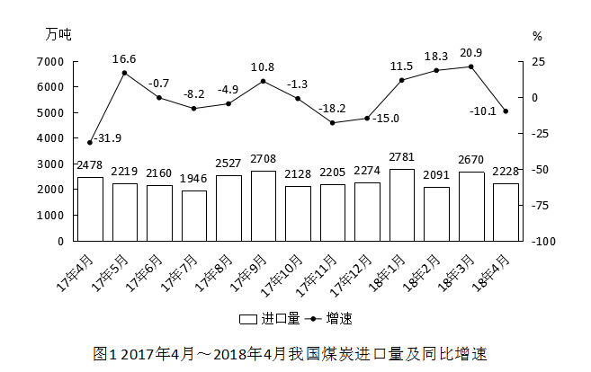 

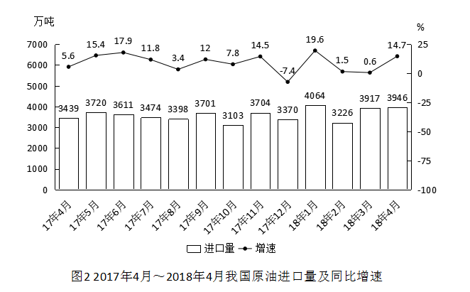

#### 第 1 题　qid 2280935 · 增长

2017年下半年煤炭进口量同比增速最高的月份，当月煤炭进口量比上月约：

- **A**. 
下降

- **B**. 
下降

- **C**. 
上升
　✅
- **D**. 
上升

**答案**：C

**官方解析**

由题干“当月煤炭进口量比上月约”，结合选项为上升/下降+%，可判定本题为一般增长率问题。定位图1，2017年下半年（7-12月）煤炭进口量同比增速最高的月份是2017年9月份，对应增长率为，进口量为2708万吨，上个月即2017年8月，进口量为2527万吨，故当月进口量比上月增长了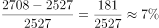。

故正确答案为C。

---

#### 第 2 题　qid 2280937 · 平均数

2017年下半年，我国平均每月进口原油：

- **A**. 不到3300万吨
- **B**. 在3300～3400万吨之间
- **C**. 在3400～3500万吨之间　✅
- **D**. 超过3500万吨

**答案**：C

**官方解析**

方法一：由题干“2017下半年，我国平均每月进口原油……”，可判定本题为现期平均数问题。定位图2，2017年下半年我国原油进口量即2017年7月～12月的原油进口量分别为3474、3398、3701、3103、3704、3370万吨，平均每月进口原油量=万吨，在3400～3500万吨之间。

方法二：削峰填谷，定位图2，2017年下半年我国原油进口量即2017年7月～12月的原油进口量分别为3474、3398、3701、3103、3704、3370万吨，以3400为基准，分别作差为74、-2、301、-297、304、-30，，平均数万吨，在3400～3500万吨之间。

故正确答案为C。

---

#### 第 3 题　qid 2280938 · 平均数

2017年9月和10月，我国原油进口金额分别为136亿美元和121.4亿美元，10月平均每吨原油的进口价格较9月：

- **A**. 上升了不到50美元　✅
- **B**. 上升了50美元以上
- **C**. 下降了不到50美元
- **D**. 下降了50美元以上

**答案**：A

**官方解析**

由题干“10月平均每吨原油的进口价格较9月”，结合选项为上升/下降+单位，可判定本题为平均数的增长量问题。定位图2可知，2017年9月和10月，我国原油进口量分别为3701万吨和3103万吨；由题干可知，2017年9月和10月，我国原油进口金额分别为136亿美元和121.4亿美元。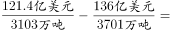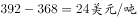，则2017年10月平均每吨原油进口价格较9月上升了不到50美元。

故正确答案为A。

---

#### 第 4 题　qid 2280940 · 增长

2017年4月～2018年4月间，原油进口量同比增速超过煤炭进口量同比增速的月份有多少个？

- **A**. 3
- **B**. 5
- **C**. 8
- **D**. 10　✅

**答案**：D

**官方解析**

定位统计图1、统计图2进行比较可知，原油进口量同比增速超过煤炭进口量同比增速的月份有：2017年4月、6月、7月、8月、9月、10月、11月、12月，2018年1月、4月，共计10个月份。
故正确答案为D。

---

#### 第 5 题　qid 2280941 · 综合

能够从上述资料中推出的是：

- **A**. 2017年4月，我国原油进口量低于上月水平　✅
- **B**. 2017年4季度，我国煤炭进口量高于上季度水平
- **C**. 2018年1月，我国原油进口量同比增长700万吨以上
- **D**. 2017年2～4季度我国煤炭进口量最高的月份，进口量同比增速也最高

**答案**：A

**官方解析**

A项：定位统计图2可知，2018年3月我国原油进口量为3917万吨，同比增速为，根据，2017年3月我国原油进口量为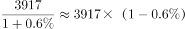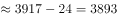万吨。2017年4月原油进口量为3439万吨，低于上月水平，正确；

B项：定位统计图1可知，2017年3季度（7-9月）煤炭进口量为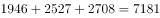万吨，2017年4季度（10-12月）煤炭进口量为万吨，则4季度低于上季度水平，错误；

C项：定位统计图2可知，2018年1月原油进口量4064万吨，同比增速，根据，2018年1月原油进口量同比增量为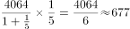万吨，错误；

D项：定位统计图1可知，2017年2～4季度（4-12月）煤炭进口量最高的月份为2017年9月，而同比增速最高的月份是2017年5月，错误。

故正确答案为A。

---

### 材料 2

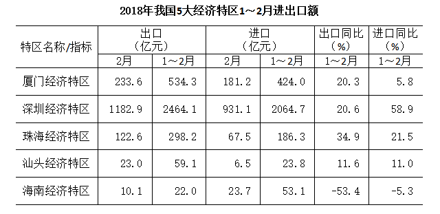

#### 第 6 题　qid 2280930 · 增长

2018年1～2月出口额同比增速最快的两个经济特区，同期进口额之比约为：

- **A**. 1:4
- **B**. 1:7
- **C**. 1:11　✅
- **D**. 1:17

**答案**：C

**官方解析**

根据题干“2018年1～2月······之比”，结合材料给出2018年1～2月的数值，可判定本题为比值计算问题。定位表格材料可知，2018年1～2月出口额同比增速最快的两个经济特区为珠海经济特区和深圳经济特区，它们同期进口额分别为186.3亿元和2064.7亿元，两者之比约为。

故正确答案为C。

---

#### 第 7 题　qid 2280931 · 比重

已知2018年1～2月全国进出口总额为45158亿元。则同期5大经济特区进出口总额占全国进出口总额的比重约为：

- **A**. 

- **B**. 

　✅
- **C**. 

- **D**. 

**答案**：B

**官方解析**

由题干“2018年1～2月······比重约为”，可判定本题为现期比重问题。定位图表可得5大经济特区进口额和出口额，对其求和：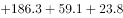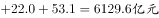。代入公式，可得：5大经济特区进出口总额占全国进出口总额的比重，最接近B选项。

故正确答案为B。

---

#### 第 8 题　qid 2280933 · 增长

将各经济特区按2018年1～2月进口额同比增量从低到高排序，以下正确的是：

- **A**. 汕头经济特区<深圳经济特区<厦门经济特区
- **B**. 珠海经济特区<汕头经济特区<深圳经济特区
- **C**. 厦门经济特区<珠海经济特区<深圳经济特区　✅
- **D**. 海南经济特区<厦门经济特区<汕头经济特区

**答案**：C

**官方解析**

根据题干“······同比增量从低到高排序······”，可判定本题为增长量比较问题。定位表格可知选项中5大经济特区2018年1～2月进口额以及同比增速。

根据增长量比较大小的结论“大大则大，一大一小百化分”：

深圳经济特区的进口额和同比增速都是5大经济特区中最大的，则深圳经济特区进口额同比增量是最大的，A中深圳排第二，排除A选项；

珠海经济特区的进口额和同比增速都比汕头经济特区要大，则珠海经济特区进口额同比增量大于汕头经济特区，排除B选项；

厦门经济特区进口额为424.0亿元，同比增速，珠海经济特区进口额为186.3亿元，同比增速。代入公式增长量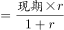，厦门经济特区的同比增量为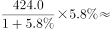亿元，珠海经济特区的同比增量为亿元，则厦门经济特区&lt;珠海经济特区，C选项正确；

汕头经济特区的进口额为23.8亿元，同比增速，则汕头经济特区进口额增量为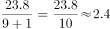亿元，则汕头经济特区&lt;厦门经济特区，排除D选项。

故正确答案为C。

---

#### 第 9 题　qid 2280936 · 增长

2018年2月，表中进口额环比下降速度最快的经济特区是：

- **A**. 汕头经济特区　✅
- **B**. 珠海经济特区
- **C**. 厦门经济特区
- **D**. 海南经济特区

**答案**：A

**官方解析**

根据题干“2018年2月···环比下降速度最快···”判定本题为一般增长率问题。定位表格材料可得，2018年1～2月，汕头经济特区、珠海经济特区、厦门经济特区、海南经济特区的进口额分别为23.8亿元、186.3亿元、424.0亿元、53.1亿元；2018年2月，汕头经济特区、珠海经济特区、厦门经济特区、海南经济特区的进口额分别为6.5亿元、67.5亿元、181.2亿元、23.7亿元。代入公式: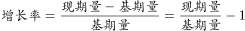可得：

汕头经济特区环比增长率；

珠海经济特区环比增长率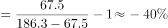；

厦门经济特区环比增长率；

海南经济特区环比增长率。

则汕头经济特区环比增长率下降速度最快。

故正确答案为A。

---

#### 第 10 题　qid 2280943 · 综合

能够从上述资料中推出的是：

- **A**. 
2017年1～2月，海南经济特区出口额高于汕头经济特区

- **B**. 
2018年1～2月，深圳经济特区进出口额同比增速高于

- **C**. 
2018年1～2月，进出口额之差高于100亿元的经济特区有且仅有2个

- **D**. 
2018年1～2月，珠海经济特区出口额占5大经济特区比重高于上年同期
　✅

**答案**：D

**官方解析**

A项：定位表格材料可得，2018年1～2月，海南经济特区出口额为22亿元，增长率为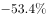，汕头经济特区出口额为59.1亿元，增长率为，根据公式:可得，2017年1～2月，海南经济特区出口额为亿元，汕头经济特区出口额为，所以2017年1～2月，海南经济特区出口额低于汕头经济特区，错误。

B项：定位表格材料可得，2018年1～2月，深圳经济特区进口额为2064.7亿元，增长率为，出口额为2464.1亿元，增长率为，根据混合增长率居中不正中，偏向基期量大的可得，出口额基期量＞进口额基期量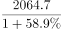，增长率位于与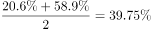之间，则混合增长率低于，错误。

C项：定位表格材料可得，2018年1～2月，厦门经济特区进出口额差值为亿元、深圳经济特区进出口额差值为亿元、珠海经济特区进出口额差值为亿元、汕头经济特区进出口额差值为亿元、海南经济特区进出口额差值为亿元，则进出口额之差高于100亿元的经济特区有3个，错误。

D项：定位表格材料可得，2018年1～2月，厦门经济特区、深圳经济特区、珠海经济特区、汕头经济特区、海南经济特区出口额增长率分别为、、、、，根据混合增长率居中原则，5大经济特区混合增长率位于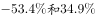之间，根据两期比重比较原则，当珠海经济特区出口额增长率＞5大经济特区混合增长率b（和之间）时，珠海经济特区出口额比重高于上年同期，正确。

故正确答案为D。

---

### 材料 3

        2018年3月，国内手机市场出货量3018.5万部，同比下降，2018年1～3月，国内手机市场出货量8737.0万部，同比下降。3月，国内上市新机型80款，同比下降，2018年1～3月，上市新机型206款，同比下降。

        2018年3月，国内4G手机出货量2808.5万部，同比下降，其中4G全网通手机占比；4G上市新机型67款，同比下降，其中4G全网通手机占比。1～3月，4G手机出货量8195.6万部，同比下降，其中4G全网通手机占比；4G上市新机型156款，同比下降，其中4G全网通手机占比。

        2018年3月，国产品牌手机出货量2699.5万部，同比下降；上市新机型78款，同比下降。1～3月，国产品牌手机出货量7586.4万部，同比下降；上市新机型190款，同比下降。

        2018年3月，智能手机出货量为2808.3万部，同比下降。1～3月，智能手机出货量为8187.0万部，同比下降。3月，上市智能手机新机型68款，同比下降，其中支持安卓操作系统的手机67款。2018年1～3月，上市智能手机新机型158款，同比下降,其中支持安卓操作系统的手机152款。

#### 第 11 题　qid 2280972 · 综合

2017年1～3月，国内手机市场手机月均出货量：

- **A**. 低于0.3亿部
- **B**. 在0.3～0.36亿部之间
- **C**. 在0.36～0.42亿部之间　✅
- **D**. 高于0.42亿部

**答案**：C

**官方解析**

由题干“2017年1~3月······月均出货量”，结合材料时间为2018年，判定本题为基期平均数问题。定位材料第一段可得“2018年1～3月，国内手机市场出货量8737.0万部，同比下降”。代入公式：， 2017年1～3月，国内手机市场出货量，则2017年1～3月，国内手机市场手机月均出货量为亿部。

故正确答案为C。

---

#### 第 12 题　qid 2280981 · 综合

2018年1～2月上市4G非全网通手机新机型多少款？

- **A**. 19　✅
- **B**. 27
- **C**. 38
- **D**. 46

**答案**：A

**官方解析**

由材料第二段“2018年3月，国内4G上市新机型67款，其中4G全网通手机占比。1～3月，4G上市新机型156款，其中4G全网通手机占比”，结合；非全网通手机新机型，判断本题为现期比重问题。代入公式：。2018年1～2月上市4G非全网通手机新机型有款。

故正确答案为A。

---

#### 第 13 题　qid 2280996 · 增长

2018年1～2月，国产品牌手机出货量同比约下降了：

- **A**. 

- **B**. 

- **C**. 

　✅
- **D**. 

**答案**：C

**官方解析**

由文字材料第三段“2018年3月，国产品牌手机出货量2699.5万部，同比下降。1～3月，国产品牌手机出货量7586.4万部，同比下降”，，故2018年1~3月国产品牌手机出货量增长率为2018年1~2月和3月的混合增长率，判定本题为混合增长率问题。根据混合增长率问题结论，混合居中不正中，可得：，排除D项；根据混合增长率偏向基期量较大的一方，可得：，解得：，排除A、B两项。

故正确答案为C。

---

#### 第 14 题　qid 2281002 · 比重

在①国内4G手机出货量、②国产品牌手机出货量、③智能手机出货量中，2018年1～3月出货量占全国手机出货量比重高于上年水平的有几类？

- **A**. 0　✅
- **B**. 1
- **C**. 2
- **D**. 3

**答案**：A

**官方解析**

根据题干“2018年······占······比重高于上年水平······”，可以判定本题为两期比重问题。由两期比重比较结论可知，部分占整体比重高于上年即为部分增长率大于总体增长率。定位文字材料可得2018年1~3月，国内手机市场出货量、国内4G手机出货量、国产品牌手机出货量、智能手机出货量分别同比增长、、，，可得国内4G手机出货量、国产品牌手机出货量、智能手机出货量同比增长率均低于国内手机市场出货量同比增长率（），故国内4G手机出货量、国产品牌手机出货量、智能手机出货量所占比重均低于上年水平。

故正确答案为A。

---

#### 第 15 题　qid 2281016 · 平均数

以下信息中，能够从上述资料中推出的有几条？

①2017年3月，国内手机市场上市新机型100多款

②2018年3月，智能手机出货量高于1～3月平均水平

③2018年3月，4G全网通手机出货量是4G非全网通手机的16倍多

④2018年1～3月上市的智能手机新机型中，以上不支持安卓操作系统

- **A**. 1
- **B**. 2　✅
- **C**. 3
- **D**. 4

**答案**：B

**官方解析**

①：定位文字材料第一段，“3月，国内上市新机型80款，同比下降”，代入基期计算公式：可得2017年3月，国内手机市场上市新机型，正确；

②：定位文字材料第四段，“2018年3月，智能手机出货量为2808.3万部，1~3月，智能手机出货量为8187.0万部”，则2018年1~3月智能手机平均每月出货量，正确；

③：定位文字材料第二段，“2018年3月，国内4G手机出货量2808.5万部，其中4G全网通手机占比”，可得国内4G非全网通手机占国内4G手机出货量比重为，则4G全网通手机出货量是4G非全网通手机的倍，错误；

④：定位文字材料第四段，“2018年1~3月，上市智能手机新机型158款，其中支持安卓操作系统的手机152款”，代入公式：可得，不支持安卓操作系统的智能手机新机型占上市智能手机新机型的比重为，错误。

正确的为①②，共2个。

故正确答案为B。

---
