# 2018年广东省公务员录用考试《行测》题（县级、乡镇统一卷）（网友回忆版）

> 省考 · 2018 年 · 6 个模块 · 共 100 题

- [政治理论](#%E6%94%BF%E6%B2%BB%E7%90%86%E8%AE%BA) · 4 题
- [常识判断](#%E5%B8%B8%E8%AF%86%E5%88%A4%E6%96%AD) · 21 题
- [言语理解与表达](#%E8%A8%80%E8%AF%AD%E7%90%86%E8%A7%A3%E4%B8%8E%E8%A1%A8%E8%BE%BE) · 15 题
- [数量关系](#%E6%95%B0%E9%87%8F%E5%85%B3%E7%B3%BB) · 15 题
- [判断推理](#%E5%88%A4%E6%96%AD%E6%8E%A8%E7%90%86) · 30 题
- [资料分析](#%E8%B5%84%E6%96%99%E5%88%86%E6%9E%90) · 15 题

---

## 政治理论

### 第 1 题　qid 2185056 · 新思想

（  ）是近代以来中华民族最伟大的梦想。实现伟大梦想，必须推进中国特色社会主义伟大事业。

- **A**. 建设社会主义现代化强国
- **B**. 实现中华民族伟大复兴　✅
- **C**. 世界和平与发展
- **D**. 实现共产主义

**答案**：B

**官方解析**

本题考查政治常识。党的十九大报告中提到：“实现中华民族伟大复兴是近代以来中华民族最伟大的梦想。中国共产党一经成立，就把实现共产主义作为党的最高理想和最终目标······实现伟大梦想，必须推进伟大事业。中国特色社会主义是改革开放以来党的全部理论和实践的主题。”故B项正确，A、C、D三项错误。
故正确答案为B。

---

### 第 2 题　qid 2185057 · 马克思主义

党的十九大报告指出：“中国特色社会主义进入新时代。”这一论断体现的哲学原理是（  ）。

- **A**. 事物是质变与量变的统一　✅
- **B**. “两点论”与“重点论”的统一
- **C**. 矛盾是社会发展的动力
- **D**. 事物是普遍联系的

**答案**：A

**官方解析**

本题考查马克思主义哲学的相关内容。
A项正确，事物是质变与量变的统一，量变是质变的必要准备，质变是量变的必然结果。我国经过长期努力，尤其是改革开放以来的量变积累，才使得中国特色社会主义发生质变，引起国内主要矛盾的变化，从而进入新时代，体现了质变与量变的统一，故A项正确。
B项错误，“两点论”与“重点论”的统一，坚持两点论，反对一点论；坚持重点论，反对均衡论。题干未体现，故排除。
C项错误，矛盾是指事物之间或事物内部各要素之间的对立统一的关系，它对于事物的发展起推动作用，也是事物发展的动力和源泉。题干未体现，故排除。
D项错误，联系是普遍的，世界上一切事物都与周围事物有着这样或那样的联系，世界是一个普遍联系的有机整体。题干未体现，故排除。
故正确答案为A。

---

### 第 3 题　qid 2185070 · 新思想

2018年3月11日第十三届全国人民代表大会第一次会议通过《中华人民共和国宪法修正案》，确立了（  ）是中国特色社会主义最本质的特征。

- **A**. 人民当家作主
- **B**. 中国共产党领导　✅
- **C**. 解放和发展社会生产力
- **D**. 我国仍处于并将长期处于社会主义初级阶段

**答案**：B

**官方解析**

本题主要考查法律常识。
2018年3月11日第十三届全国人民代表大会第一次会议通过的《中华人民共和国宪法修正案》第三十六条规定：宪法第一条第二款“社会主义制度是中华人民共和国的根本制度。”后增写一句，内容为“中国共产党领导是中国特色社会主义最本质的特征。”因此，A、C、D三项不符合题意。
故正确答案为B。

---

### 第 4 题　qid 2185032 · 新思想

党的十九大报告提出“开启全面建设社会主义现代化国家新征程”。下列关于“社会主义现代化”表述不准确的是（  ）。

- **A**. 把我国建成富强民主文明和谐的社会主义现代化强国　✅
- **B**. “三步走”目标是我国社会主义现代化建设的战略安排
- **C**. 从十九大到二十大，是“两个一百年”奋斗目标的历史交汇期
- **D**. 实现社会主义现代化是新时代坚持和发展中国特色社会主义的总任务之一

**答案**：A

**官方解析**

本题考查时事政治，主要涉及党的十九大的相关知识。
A项错误，党的十九大报告中指出：“在全面建成小康社会的基础上，分两步走在本世纪中叶建成富强民主文明和谐美丽的社会主义现代化强国。”该项中未出现“美丽”一词，故表述不准确。
B项正确，党的十九大报告中指出：“改革开放之后，我们党对我国社会主义现代化建设作出战略安排，提出‘三步走’战略目标。”
C项正确，党的十九大报告指出：“从十九大到二十大，是‘两个一百年’奋斗目标的历史交汇期。我们既要全面建成小康社会、实现第一个百年奋斗目标，又要乘势而上开启全面建设社会主义现代化国家新征程，向第二个百年奋斗目标进军。”
D项正确，党的十九大报告中指出：“新时代中国特色社会主义思想，明确坚持和发展中国特色社会主义，总任务是实现社会主义现代化和中华民族伟大复兴。”因此，实现社会主义现代化是新时代坚持和发展中国特色社会主义的总任务之一。
本题为选非题，故正确答案为A。

---

## 常识判断

### 第 1 题　qid 2185142 · 科技常识

如图所示，质量为m的物体A在水平力F的作用下，恰好沿竖直墙壁匀速下滑，当水平力增大为2F时，物体A逐渐减速，最后保持静止。则静止时物体A所受摩擦力的大小（  ）。

- **A**. 为原来的2倍
- **B**. 小于F　✅
- **C**. 大于mg
- **D**. 等于2F

**答案**：B

**官方解析**

物体A匀速下滑时，A受力平衡，A竖直方向所受力为向下的重力和向上的动摩擦力，两个力大小相等方向相反，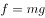；水平方向受向右的水平力和向左的墙壁支持力，两个力大小相等方向相反，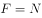。根据动摩擦力计算公式，一般，故。

物体A静止时，A同样受力平衡，A竖直方向所受力为向下的重力和向上的静摩擦力，两个力同样大小相等方向相反，。故，

根据之前推导出的，，所以。

故正确答案为B。

---

### 第 2 题　qid 2185144 · 科技常识

一颗种子在地下生根发芽，最终破土而出，长成一株小树苗。在这个过程中，其有机物总量（  ）。

- **A**. 逐渐增加
- **B**. 先增加后减少
- **C**. 先减少后增加　✅
- **D**. 先保持不变，后逐渐增加

**答案**：C

**官方解析**

种子在萌发过程中从外界获得氧气，消耗自身有机物，进行呼吸作用，释放能量；当破土而出生根发芽时，通过产生的叶绿素进行光合作用，积累有机物，因此在整个过程中有机物的含量先减少后增加。
故正确答案为C。

---

### 第 3 题　qid 2185146 · 科技常识

现在，人们常利用碘化银实现人工降雨。通过高炮将含有碘化银的炮弹打入云雾厚度比较大的高空中，碘化银因为炮弹的爆炸在高空扩散，促使降雨产生（如图所示）。下列说法正确的是（  ）。

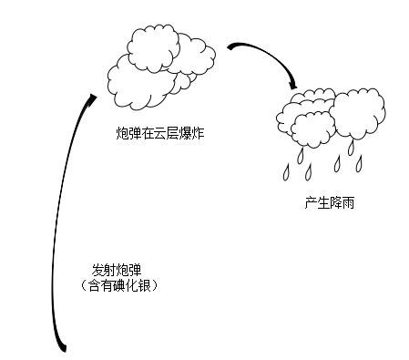

- **A**. 利用碘化银人工降雨需要选择炎热的天气才能实现
- **B**. 银是重金属，利用碘化银人工降雨会对环境造成极大破坏
- **C**. 碘化银在高空形成极细的粒子，云中的水分在其周围凝聚，形成降雨　✅
- **D**. 碘化银作为催化剂，让高空中固态的水液化，实现人工降雨

**答案**：C

**官方解析**

碘化银在人工降雨中所起的作用在气象学上称作冷云催化。碘化银只要受热后就会在空气中形成极多极细（只有头发直径的百分之一到千分之一）的碘化银粒子。1g碘化银可以形成几十万亿个微粒。这些微粒会随气流运动进入云中，在冷云中产生几万亿到上百亿个冰晶。冰晶融化后形成雨滴，实现降雨。碘化银作用的范围很大，所以单位面积中的残留量会很少，且在天然环境中银容易形成不溶于水的化合物，对环境的影响也大大减小。
故正确答案为C。

---

### 第 4 题　qid 2185149 · 科技常识

用手推车将两箱货物A和B拉到仓库存储，途中要经过一段斜坡（如图所示）。已知货物A和B的质量均为m，斜坡的坡度为推车匀速经过斜坡时，货物A和B均处于静止状态，则受力情况正确的是（  ）。

- **A**. 货物B所受的合外力方向沿斜面向上
- **B**. 货物B对货物A的作用力大小为0.5mg
- **C**. 货物A所受的摩擦力比货物B所受的摩擦力大
- **D**. 手推车对货物A的支持力等于对货物B的支持力　✅

**答案**：D

**官方解析**

A项错误，由于货物B处于静止状态，故所受的合外力为0，那么方向不可能沿斜面向上。
B、C两项错误，通过受力分析可知，物体A与B受到的摩擦力均可与重力沿斜面向下的分力的大小相等，由于A与B质量相同，且在同一斜坡上，故二者的重力沿斜面向下的分力也大小相等，所以物体A与B受到的摩擦力大小相等，此时A与B之间无相互作用力。
D项正确，通过受力分析可知，物体A与B受到的支持力与重力沿垂直于斜面方向的分力的大小相等，由于A与B质量相同，且在同一斜坡上，故二者的重力沿垂直于斜面方向的分力的大小相等，所以物体A与B受到的支持力相等。
故正确答案为D。

---

### 第 5 题　qid 2185150 · 科技常识

下图是两种不同导体（、）的伏安特性曲线，则以下选项无法确定的是（  ）。

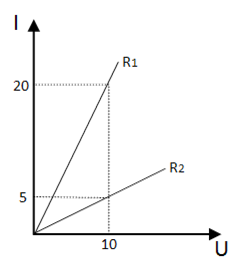

- **A**. 
、的电阻之比为1：4

- **B**. 
、的额定功率相同
　✅
- **C**. 
并联在电路中时，、电流比为4：1

- **D**. 
串联在电路中时，、电压比为1：4

**答案**：B

**官方解析**

A项，根据欧姆定律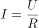得，结合图像可知，，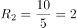，则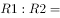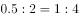，可推出。

B项，额定功率是指用电器正常工作时的功率。它的值为用电器的额定电压乘以额定电流，本题中未告知额定电压和额定电流，故无法推出。

C项，在并联电路中，电压（U）相同，因此I与R成反比，则，可推出。

D项，在串联电路中，电流（I）相同，因此U与R成正比，则，可推出。

本题为选非题，故正确答案为B。

---

### 第 6 题　qid 2185094 · 科技常识

地表某相对独立的生态系统，其主要物种及数量如图所示，则下列说法必然正确的是（  ）。

- **A**. 物种A是该生态系统生产者
- **B**. 物种B是该生态系统的初级消费者
- **C**. 该生态系统的能量流动是从A到E
- **D**. 该生态系统的最终能量来源是太阳能　✅

**答案**：D

**官方解析**

A项错误，图表中给出五个主要物种及其数量的分布，这些物种包含了分解者、生产者以及各类消费者。其中，分解者包含细菌这样的微生物，其个体数量远超过生产者、各类消费者，因此在生态系统中一定是分解者数量最多，可以确定A是分解者，不是生产者；
B项错误，生产者和消费者的数量要根据具体的生态系统来确定。例如，某生态系统中，一颗或几颗大树养活很多动物，这时消费者的数量要多于生产者的数量；又如，在一个草原生态系统中，草的数量要远多于牛、羊、兔子等消费者，这时生产者的数量要多于消费者的数量。由于题干没有给出具体的生态系统类型，故无法判断物种B是否为初级消费者；
C项错误，生态系统中，能量从生产者流向消费者，由于无法确定B、C、D、E属于生产者还是消费者，因此也无法确定能量流动方向；
D项正确，地表生态系统的能量归根结底是来源于植物的光合作用，也就是来自太阳能。
故正确答案为D。

---

### 第 7 题　qid 2185099 · 科技常识

用如图所示的杠杆提升物体。从B点垂直向下用力，在将物体匀速提升到一定高度的过程中，用力的大小将（  ）。

- **A**. 保持不变　✅
- **B**. 逐渐变小
- **C**. 逐渐变大
- **D**. 先变大，后变小

**答案**：A

**官方解析**

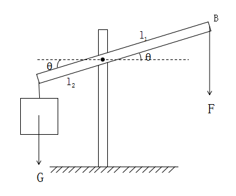

如图所示，杠杆夹角为，支点到杠杆两端的距离为，。由于匀速提升，根据杠杆平衡条件，，故。，不变，G不变因此F不变。故正确答案为A。

---

### 第 8 题　qid 2185104 · 科技常识

在检查视力时，检查者通常从面前的平面镜中看身后的视力表（如图所示）。下列说法正确的是（  ）。

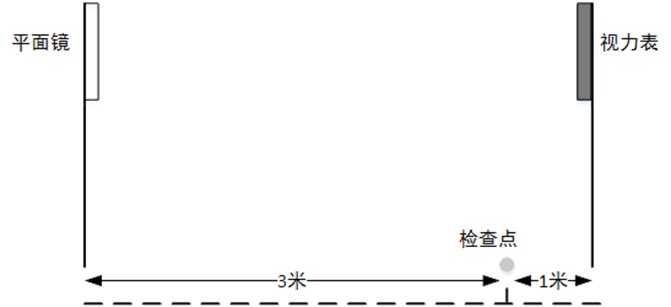

- **A**. 视力表在平面镜中的像与检查点相距7米　✅
- **B**. 平面镜中的像略小于视力表本身
- **C**. 平面镜中的像与视力表上下颠倒
- **D**. 平面镜中的成像是真像

**答案**：A

**官方解析**

平面镜成像，物体到平面镜距离与所成的虚像到平面镜距离相等，所成像为大小相等，左右相反的虚像。由大小相等排除B项；由左右相反而非上下颠倒排除C项；由虚像排除D项；视力表距离平面镜4米，平面镜中的像距离平面镜也为4米，故平面镜中的像与检查点相距米，A项正确。

故正确答案为A。

---

### 第 9 题　qid 2185108 · 科技常识

以下关于惯性的分析，正确的是（  ）。

- **A**. 滚动的足球受地面摩擦，滚动速度逐渐减慢，惯性也随之减小
- **B**. 月球绕地球转动，其惯性与地球对它的引力相关
- **C**. 自由落体在下落过程中速度增大，惯性也增加
- **D**. 桌面上静止不动的乒乓球也有惯性　✅

**答案**：D

**官方解析**

惯性是物体抵抗其运动状态被改变的性质。物体的惯性可以用其质量来衡量，质量越大，惯性越大，所以惯性只与质量有关。A项，惯性与质量有关，与速度无关，错误；B项，月球的惯性与自身质量有关，与地球对它的引力无关，错误；C项，下落的物体质量不变，故惯性不变，错误；D项，任何物体都有惯性，正确。
故正确答案为D。

---

### 第 10 题　qid 2185112 · 科技常识

现有三个同样的玻璃瓶，分别装有空气、氧气和氢气。以下能将三瓶气体区分开来的是（  ）。

- **A**. 观察气体的颜色
- **B**. 倒入澄清石灰水
- **C**. 插入燃着的木条　✅
- **D**. 闻气体的气味

**答案**：C

**官方解析**

三瓶气体均无色无味，不能通过颜色和气味区分，故A、D两项错误；三瓶气体加入澄清石灰水后均无明显现象，故B错误；插入燃着的木条，若小木条继续燃烧且火焰无变化，则该气体为空气；若小木条燃烧更旺，则该气体为氧气；若气体被点燃且形成淡蓝色火焰，则该气体为氢气。
故正确答案为C。

---

### 第 11 题　qid 2185053 · 人文常识

我国提出“创新、协调、绿色、开放、共享”五大发展理念。下列措施体现五大发展理念的是（  ）。
①建设粤港澳大湾区
②强化知识产权创造与保护
③“一带一路”建设
④降低农村学生辍学率
⑤淘汰黄标车和老旧车
⑥精准扶贫

- **A**. ①③⑤
- **B**. ②④⑤⑥
- **C**. ②③④⑤⑥
- **D**. ①②③④⑤⑥　✅

**答案**：D

**官方解析**

本题考查政治常识。
①建设粤港澳大湾区主要体现了五大发展理念中“协调”的理念，建设粤港澳大湾区能够实现各地协调发展。
②强化知识产权创造与保护主要体现了五大发展理念中“创新”的理念。强化知识产权创造与保护，制定保护原创的相关制度，就是为创新提供制度保障，鼓励人们积极创新。
③“一带一路”建设主要体现了五大发展理念中“开放”的理念。“一带一路”建设将充分依靠中国和有关国家之间的双多边机制，深化与中亚、南亚、西亚等国家交流合作。“一带一路”建设是开放发展理念的重要体现。
④降低农村学生辍学率主要体现了五大发展理念中“共享”的理念。降低农村学生辍学率，就是要发展公平而有质量的教育，促进教育资源在农村和城市地区的均衡发展。
⑤淘汰黄标车和老旧车主要体现了五大发展理念中“绿色”的理念。黄标车、老旧车是指污染排放量大、浓度高、排放稳定性差的车辆，淘汰这些车辆可以改善环境，实现绿色发展。
⑥精准扶贫主要体现了五大发展理念中“共享”的理念。打好脱贫攻坚战，就是要让贫困群众也能共享社会发展的成果。
故正确答案为D。

---

### 第 12 题　qid 2185061 · 科技常识

“简政放权、放管结合、优化服务”改革简称“放管服”改革。
下列措施不属于“放管服”改革的是（    ）。
①建设政府服务大数据
②降低制度性交易成本
③减少小微企业碳排放
④职责相近的党政机关合署办公
⑤推出市场准入负面清单
⑥发展电子商务

- **A**. ①⑤
- **B**. ③⑥　✅
- **C**. ①③⑤⑥
- **D**. ②③④⑤

**答案**：B

**官方解析**

本题主要考查管理常识。“放”中央政府下放行政权，减少没有法律依据和法律授权的行政权；理清多个部门重复管理的行政权。“管”政府部门要创新和加强监管职能，利用新技术新体制加强监管体制创新。“服”转变政府职能减少政府对市场进行干预，将市场的事推向市场来决定，减少对市场主体过多的行政审批等行为，降低市场主体的市场运行的行政成本，促进市场主体的活力和创新能力。
①建设政府服务大数据，是政府利用新技术加强监管的创新，它有利于更好地服务市场主体，属于“放管服”改革措施；
②降低制度性交易成本，是降低企业在运转过程中由于执行政府制定的一系列规章制度所付出的成本，属于“放管服”改革措施；
③减少小微企业碳排放，是对企业环保方面的要求，不属于“放管服”改革措施内容；
④十九大报告中提出：“转变政府职能，深化简政放权，创新监管方式，增强政府公信力和执行力，建设人民满意的服务型政府。赋予省级及以下政府更多自主权。在省市县对职能相近的党政机关探索合并设立或合署办公。”因此，“职责相近的党政机关合署办公”属于“放管服”改革措施；
⑤根据《国务院关于实行市场准入负面清单制度的意见》规定：“通过实行市场准入负面清单制度，赋予市场主体更多的主动权，有利于落实市场主体自主权和激发市场活力”、“通过实行市场准入负面清单制度，明确政府发挥作用的职责边界，有利于进一步深化行政审批制度改革，大幅收缩政府审批范围、创新政府监管方式，促进投资贸易便利化，不断提高行政管理的效率和效能，有利于促进政府运用法治思维和法治方式加强市场监管，推进市场监管制度化、规范化、程序化，从根本上促进政府职能转变。”因此，“推出市场准入负面清单”属于“放管服”改革措施；
⑥发展电子商务是发展以信息网络技术为手段，以商品交换为中心的商务活动，而且未体现“政府”这一主体，不属于“放管服”改革措施内容。
因此，①②④⑤属于“放管服”改革措施，③⑥不属于“放管服”改革措施。
本题为选非题，故正确答案为B。

---

### 第 13 题　qid 2185033 · 人文常识

我国经济已由高速增长阶段转向高质量发展阶段，正处在攻关期。下列不属于攻关期三大特征的是（  ）。

- **A**. 转变发展方式
- **B**. 优化经济结构
- **C**. 转换增长动力
- **D**. 优化营商环境　✅

**答案**：D

**官方解析**

本题考查时政常识，主要涉及十九大报告的相关知识。
十九大报告指出，我国经济已由高速增长阶段转向高质量发展阶段，正处在转变发展方式、优化经济结构、转换增长动力的攻关期，建设现代化经济体系是跨越关口的迫切要求和我国发展的战略目标。
可知A、B、C三项正确，D项错误。
本题为选非题，故正确答案为D。

---

### 第 14 题　qid 2185035 · 法律常识

行政行为应依法实施，遵守法定权限、法定条件、法定要求和法定程序。行政法规、行政规章和行政规定均不得与法律相抵触，不得规定依法只能由法律规定的事项。这是行政程序法的（  ）。

- **A**. 正当程序原则
- **B**. 依法行政原则　✅
- **C**. 公开原则
- **D**. 参与原则

**答案**：B

**官方解析**

本题考查法律常识，主要涉及行政法的基本原则。
A项错误，正当程序原则是当代行政法的主要原则之一。它包括以下几个原则：第一，行政公开原则，是指除涉及国家秘密和依法受到保护的商业秘密、个人隐私外，行政机关实施行政管理应当公开，以实现公民的知情权。第二，公众参与原则，是指行政机关做出重要规定或者决定，应当听取公民、法人和其他组织的意见，特别是作出对公民、法人和其他组织不利的决定，要听取他们的陈述和申辩。第三，回避原则，行政机关工作人员履行职责，与行政管理相对人存在利害关系时，应当回避。题干表述与程序正当无关，A不应选。
B项正确，依法行政原则是行政法的首要原则，它的要求包括两个方面：第一，行政机关必须遵守现行有效的法律。这一方面的基本要求是：行政机关实施行政管理，应当依照法律、法规、规章的规定进行，禁止行政机关违反现行有效的立法性规定。第二，行政机关应当依照法律授权活动。这一方面的基本要求是：没有法律、法规、规章的规定，行政机关不得作出影响公民、法人或者其他组织合法权益或者增加公民、法人和其他组织义务的决定。
C、D项错误，公开原则和参与原则属于程序正当原则的要求，与题干表述无关，不应选。
故正确答案为B。

---

### 第 15 题　qid 2185036 · 人文常识

水力发电是直接利用水的动能作为原动力，驱动发电机工作的发电方式。以下属于其优点的是（  ）。
①发电设施工程建设投资少、周期短、发电效率高。
②发电过程中不会产生污染环境的大量废气和废渣。
③水用作发电后，还可用于其他用途。

- **A**. ①②③
- **B**. 仅有①和②
- **C**. 仅有②和③　✅
- **D**. 仅有③

**答案**：C

**官方解析**

本题考查科技常识，主要涉及水力发电的相关知识。
①水力发电，需要人工修筑能集中水流落差和调节流量的水工建筑物，如大坝、引水管涵等。因此工程投资大、建设周期长，但水力发电效率高，机组启动快。
②水力发电不使用燃料，因此不会产生污染环境的废气和废渣。
③水力发电对水本身没有污染，因此发电的水也可以用于灌溉和水产养殖等其他用途。
可知①表述错误，②③表述正确。
故正确答案为C。

---

### 第 16 题　qid 2185037 · 人文常识

沉管隧道就是将若干个预制段分别浮运到海面(河面)现场，并逐个沉放在已疏浚好的基槽内，以此修建的水下隧道。以下隧道采用了外海环境沉管隧道技术的是（  ）。

- **A**. 广州珠江隧道
- **B**. 深圳地铁隧道
- **C**. 贵广高铁隧道
- **D**. 港珠澳大桥隧道　✅

**答案**：D

**官方解析**

本题考查我国主要隧道的施工方法。
A项错误，广州珠江隧道全长1238.5米，其中全长475米的河中段隧道是我国大陆首次采用沉管法设计施工的大型水下隧道，但是并非题干所描述的外海环境。
B项错误，深圳地铁在深圳市内及近郊，不穿越大的江河湖海，无须大型水下隧道，不具备沉管施工条件。
C项错误，贵广高铁地处西南复杂艰险山区，峡高谷深，施工难度极高。这条全长856公里的铁路，有二分之一穿行于地下，但无穿越漂河流湖泊的隧道，因此不具备沉管施工条件。
D项正确，港珠澳大桥全程55公里，是世界上最长的跨海大桥，其中一条6.7公里的海底隧道，采用了沉管隧道技术，实现桥梁与隧道的转换，这也是我国第一次在外海环境下建沉管隧道。
故正确答案为D。

---

### 第 17 题　qid 2185034 · 科技常识

许多食物在超过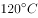的温度下烘焙煎炸烤时，食物中的碳水化合物和蛋白质在高温烹制过程中，很容易产生丙烯酰胺，这种物质对人类健康有潜在危害。为避免摄入过多丙烯酰胺，以下食物最应减少食用的是（  ）。

- **A**. 热茶
- **B**. 馒头
- **C**. 炒白菜
- **D**. 炸鸡　✅

**答案**：D

**官方解析**

本题考查化学常识。

丙烯酰胺本身是一种有毒的化合物，主要是损伤细胞内遗传物质，并具有一定的致癌性，国际癌症机构将其列为2A级致癌物，从而引起食品行业的广泛关注。通过对食品的调查发现，淀粉类食物在经过烘烤、煎炸等高温烹调才会产生丙烯酰胺。根据目前各国提供的数据，富含丙烯酰胺的食品主要有炸薯条、炸薯片、爆玉米花、蛋糕、炸鸡等等。

A项错误，茶叶中含有较多的有机酸、茶多酚等碳水化合物及少量蛋白质，但热茶的温度一般不超过，故饮用热茶不会摄入过多丙烯酰胺。

B项错误，馒头主要成分是淀粉等糖类，属碳水化合物，但在标准大气压下制蒸馒头时水蒸汽温度为左右，故食用馒头不会摄入过多丙烯酰胺。

C项错误，白菜主要成分是碳水化合物和蛋白质，炒白菜时用低温油（一般为-）快炒即可，故食用炒白菜不会摄入过多丙烯酰胺。

D项正确，鸡肉中含有大量蛋白质，且炸鸡时要用高温油（-）炸制5分钟左右，易产生丙烯酰胺，食用过多可能造成丙烯酰胺摄入过量，因此应当减少食用。

故正确答案为D。

---

### 第 18 题　qid 2185038 · 人文常识

海又称为“大海”，是指与“大洋”相连接的大面积咸水区域，即大洋的边缘部分。以下不属于海的是（  ）。

- **A**. 死海　✅
- **B**. 红海
- **C**. 地中海
- **D**. 亚丁湾

**答案**：A

**官方解析**

本题考查地理常识。
A项错误，死海不是海，而是一个内陆盐湖。死海位于约旦和巴勒斯坦交界，是世界上最低的湖泊，水中盐分极高，浮力极大，高浓度盐分的水中没有生物存活，甚至连死海沿岸的陆地上也很少有生物，因此被称为死海；
B项正确，红海位于非洲东北部与阿拉伯半岛之间，呈现狭长型。其西北面通过苏伊士运河与地中海相连，南面通过曼德海峡与亚丁湾相连，是世界重要的石油运输通道；
C项正确，地中海位于欧洲、非洲和亚洲大陆之间，是世界最大的陆间海，其西部通过直布罗陀海峡与大西洋相接，东部通过土耳其海峡（达达尼尔海峡和博斯普鲁斯海峡、马尔马拉海）和黑海相连。地中海是世界上最古老的海，历史比大西洋还要古老。地中海沿岸还是古代文明的发祥地之一；
D项正确，亚丁湾是印度洋西北方的海湾，位于也门和索马里之间，以也门的海港亚丁为名，海湾东连阿拉伯海，西经曼德海峡与红海相连。
本题为选非题，故正确答案为A。

---

### 第 19 题　qid 2185040 · 科技常识

手指表皮上突起的纹线，被称为指纹。指纹人人皆有，它是遗传与环境共同作用产生的。下列关于指纹的说法有误的是（  ）。

- **A**. 指纹可以用于身份识别
- **B**. 人的指纹一般终身不变
- **C**. 同卵双胞胎的指纹是相同的　✅
- **D**. 只要不伤及真皮层，手指伤愈后仍能长出同样的指纹

**答案**：C

**官方解析**

本题考查生活常识。指纹是人类手指末端指腹上由凹凸的皮肤所形成的纹路，是在人类进化过程式中自然形成的。
A项正确，人的指纹由遗传与环境共同作用，指纹人人皆有，却各不相同，由于指纹重复率极小，大约为150亿分之一，故其称为“人体身份证”，可用于身份识别。
B项正确，指纹的形成主要受遗传和环境因素影响，人的指纹原则上来说是终身不变的。当儿童长大成人，指纹也只是放大增粗，其纹形、纹数等特征则保持不变。
C项错误，尽管同卵双胞胎在指纹上有高度的相似性，但由于发育开始指尖细胞的微环境中的微小差异会被细胞分化过程放大，最终导致两人的指纹完全相同的概率极低，所以同卵双胞胎的指纹并不完全相同。
D项正确，真皮位于表皮下层，表皮和真皮交界处凹凸不平，错综复杂。这些凹凸类似“模子”，最终形成了指纹纹形。只要不伤及手指的内部真皮层，伤愈后仍能长出同样的指纹。
本题为选非题，故正确答案为C。

---

### 第 20 题　qid 2185041 · 人文常识

在阴雨天，由于空气潮湿，衣物容易发霉。下列措施不能防止房间里衣物发霉的是（  ）。

- **A**. 打开室内暖气设备
- **B**. 在潮湿天气适当打开门窗通风透气　✅
- **C**. 开启室内空调抽湿功能或抽风装置
- **D**. 将石灰用布或麻袋包装起来，放在房间的角落

**答案**：B

**官方解析**

本题考查生活常识。潮湿、通风条件差的密闭环境有利于霉菌繁殖和毒素的产生。
A项正确，室内暖气设备可以提高室内的温度，防止水汽凝结，从而减轻室内湿度，可以防止房间里的衣物发霉。
B项错误，在潮湿的天气如果打开门窗通风透气，会让室外湿气进入室内，导致室内空气更为潮湿，从而让衣物受潮发霉。
C项正确，空调抽湿功能或抽风装置的作用是将室内潮湿的空气排出室外，从而达到降低室内相对湿度的目的，所以开启室内空调抽湿功能或抽风装置可以有效地去除室内的湿气，防止衣物发霉。
D项正确，石灰是吸附剂，1公斤生石灰能吸附空气中大约0.3公斤水分，所以把石灰用布或麻袋包起来，放在房间的角落，可以吸收空气中的水分，保持室内干燥，从而防止房间内衣物发霉。
本题为选非题，故正确答案为B。

---

### 第 21 题　qid 2185043 · 科技常识

“春困”是人体随着自然气候的变化而发生的生理反应。为克服“春困”，下列做法不合适的是（  ）。

- **A**. 多吃黄绿色蔬菜
- **B**. 保持室内空气流通
- **C**. 尽可能多做剧烈运动　✅
- **D**. 养成早睡早起的习惯

**答案**：C

**官方解析**

本题考查生活常识。“春困”指气候日渐转暖，人会感到困倦、疲乏、头昏欲睡，“春困”是春季普遍存在的一种正常的暂时性生理现象，是人体对季节转换而自然做出的调节反应。
A项正确，春季人体的新陈代谢旺盛，饮食应清淡，适当地春补。油腻食品可使人产生疲惫无力、情绪低落的症状，这将加重“春困”现象。食用黄绿色蔬菜，如胡萝卜、菠菜等，能够为人体提供维生素A、维生素C等人体必备维生素，一方面可以增强人体免疫力，另外一方面对恢复精力、消除“春困”有很好的效果。 
B项正确，长时间室内空气不流通，容易造成室内氧气不足，导致大脑缺氧而引起困倦。所以春季气温回升时保持空气流通，有利于保证大脑供氧，缓解“春困”。
C项错误，虽然春天多锻炼能够缓解疲劳，克服“春困”，但是这种运动并非是“剧烈”的运动。由于刚刚经历过冬季，人们缺乏锻炼，过于剧烈的运动反而会对身体造成不必要的伤害，同时剧烈运动时，人体通过无氧呼吸提供运动所需能量，肌肉供氧不足，产生乳酸等代谢产物，容易造成身体疲惫、肌肉酸痛，让人困倦，因此春季运动，适度适量即可。
D项正确，充足的睡眠能为人体提供能量，调节气血，缓解白天的困倦感，有效缓解“春困”，另外春日里尽量不要熬夜，以免诱发和加重“春困”。
本题为选非题，故正确答案为C。

---

## 言语理解与表达

### 第 1 题　qid 2185051 · 逻辑填空

宪法是治国安邦的总（  ），是党和人民意志的集中（  ），在我们党治国理政活动中具有十分重要的地位和作用。

- **A**. 规范  呈现
- **B**. 章法  展现
- **C**. 章程  体现　✅
- **D**. 标准  表现

**答案**：C

**官方解析**

第一空，横线处所填词语形容“宪法”，由重点提示词语“总”可知，需体现其在“治国安邦”中的根本性地位和作用，C项“章程”，指组织、社团经特定的程序制定的关于组织规程和办事规则的规范性文书，是一种根本性的规章制度，符合文意，当选。A项“规范”指明文规定或约定俗成的标准，如道德规范、技术规范等，常用于具体、专业的领域，与文意不符，排除；B项“章法”多指诗文布局谋篇的法则，与“治国安邦”对应不当，排除；D项“标准”是为了在一定的范围内获得最佳秩序，经协商一致制定并由公认机构批准，共同使用的和重复使用的一种规范性文件，与“总”无法对应，排除。
第二空，代入验证，“宪法······是党和人民意志的集中体现”，语义恰当，当选。
故正确答案为C。
【文段出处】《新华网评：宪法是治国安邦的总章程》

---

### 第 2 题　qid 2185054 · 逻辑填空

党的十八大以来，中国人民的创造精神前所未有地（  ）出来，推动我国（  ）向前发展，大踏步走在世界前列。

- **A**. 迸发  日新月异　✅
- **B**. 激发  气象万千
- **C**. 涌现  千变万化
- **D**. 呈现  一日千里

**答案**：A

**官方解析**

第一空，所填词语与“创造精神”搭配，根据“前所未有”可知，需填入程度较重的词。A项“迸发”形容力量一下子爆发出来，侧重强调内部力量的爆发，符合文意，保留；B项“激发”指激之使奋起，置于文段应表述为“创造精神前所未有地被激发出来”，无法与“创造精神”直接搭配，排除；C项“涌现”指在同一时期大量、突然地出现，通常搭配为“英雄事迹涌现”“先进人物涌现”，与“创造精神”无法搭配，排除；D项“呈现”指显出、露出，呈现出中国人民的创造精神，搭配得当，保留。
第二空，D项用法不当，如果用，应该是我国的发展一日千里，而不是推动一日千里向前发展，排除；A项“推动我国日新月异向前发展”，与下文“大踏步走在世界前列”构成对应，表达我国发展的速度之快，语义得当，当选。
故正确答案为A。
【文段出处】《伟大创造精神的“三个维度”》

---

### 第 3 题　qid 2185059 · 逻辑填空

在新时代，我们要大力提升发展质量和效益，坚持质量第一、（  ）质量变革、（  ）质量优势、建设质量强国、（  ）高质量发展。

- **A**. 发动  增强  追求
- **B**. 提倡  增加  达到
- **C**. 推动  增强  实现　✅
- **D**. 倡导  增加  完成

**答案**：C

**官方解析**

第一空，所填词语与“质量变革”搭配，由后文“建设质量强国”可知，质量变革应当落到实处，而不是停留在提议、建议上。A项“发动”指使开始、C项“推动”指使工作展开，两项均符合文意，保留。B项“提倡”指倡导、建议，D项“倡导”指提议、引导，B、D两项均体现不出落到实处的语义，与文意不符，排除。
第二空，A、C两项“增强”质量优势，搭配得当，符合文意，保留。
第三空，顿号连接前后表示并列关系，且呈现出语义上的递进，“建设质量强国”的最终目标是让“高质量发展”成为现实。C项“实现”指使目标成为现实，符合文意，当选。A项“追求”指努力地求索，“追求高质量发展”与“建设质量强国”无法呈现语义上的递进关系，排除。
故正确答案为C。
【文段出处】《质量强则国家强》

---

### 第 4 题　qid 2185063 · 逻辑填空

经过五年的不懈努力，群众反映强烈的突出问题得到有效（  ），不正之风得以扭转，可以说作风建设改变了中国，在全面从严治党历史进程中写下了（  ）的一笔。

- **A**. 遏制  铿锵有力
- **B**. 遏止  入木三分
- **C**. 遏止  掷地有声
- **D**. 遏制  浓墨重彩　✅

**答案**：D

**官方解析**

突破口在第二空，文段语义是作风建设在党的历史上写下了重要的一笔，所以第二空成语不仅要体现重要，还要能跟“写下了”进行搭配，D项“浓墨重彩”指用浓重的墨汁和颜色来描绘，形容着力描写，符合文意，且和“写下了”搭配恰当，保留；A项“铿锵有力”形容声音响亮而有节奏，置于此处搭配不当，排除；B项“入木三分”是指书法笔力刚劲有力，或对事物见解深刻、透彻，文中无深刻之意，排除；C项“掷地有声”指语言铿锵有力，跟“写下了”搭配不当，排除。
第一空，代入验证，突出问题得到有效遏制，符合文意，D项当选。
故正确答案为D。
【文段出处】《习近平批示后，中纪委再揭“四风”15个新表现》

---

### 第 5 题　qid 2185067 · 逻辑填空

总理在两会上所作的政府工作报告是一个（  ）民心、（  ）民意、体现民情的报告，也是一个增强信心、鼓舞士气、催人奋进的报告。

- **A**. 代表  反应
- **B**. 表现  反映
- **C**. 表现  反应
- **D**. 代表  反映　✅

**答案**：D

**官方解析**

第一空，A、D两项“代表”指代替执行任务、行使权利；B、C两项“表现”指表示出来，显现出来，故意显露。根据文意，总理是代表人民作报告的，而非故意显露，故“代表”更符合总理的身份，排除B、C两项。
第二空，A项“反应”一般指因为事件所引发的回应，通常做名词，D项“反映”比喻把客观事物的实质表现出来，通常做动词。根据文意，横线处需要填入动词，表达“政府工作报告可以体现出民意”之意，排除A项。
故正确答案为D。
【文段出处】《为了人民重托——记政府工作报告起草》

---

### 第 6 题　qid 2185045 · 逻辑填空

开展国土绿化行动，既要注重数量，更要注重质量，坚持科学绿化、规划引导、（  ），走科学、生态、节俭的绿化发展之路，久久为功，善做善成，不断（  ）森林面积，不断（  ）森林质量，不断提升生态系统质量和稳定性。

- **A**. 因地制宜  扩大  提高　✅
- **B**. 因势利导  加大  增强
- **C**. 因地制宜  扩充  强化
- **D**. 因势利导  增加  改善

**答案**：A

**官方解析**

第一空，根据文意，横线处所填成语与“科学绿化、规划引导”形成并列关系，分别对应了三方面内容，语义不能重复。A、C两项“因地制宜”指根据各地的具体情况，制定适宜的办法，符合语境，保留。B、D两项“因势利导”指顺着事情发展的趋势，向有利于实现目的的方向加以引导，与“规划引导”意思重复，均排除。
第二空，搭配“面积”，C项“扩充”一般搭配内容等，不与“面积”搭配，排除。
第三空，搭配“质量”，A项“提高质量”为固定搭配，当选。C项“强化”与“质量”搭配不当，也可排除。
故正确答案为A。
【文段出处】《国土绿化要注重数量更要注重质量》

---

### 第 7 题　qid 2185046 · 逻辑填空

在当代中国，维护社会公平正义，就是要在现代化进程中逐步建立起以权利公平、机会公平、规则公平为主要内容的社会公平保障体系，（  ）公平的社会环境，让公平正义的阳光（  ）每一个国民，使每个社会成员都能享有平等的权利，有实现个人理想的机会，有表达利益（  ）的合法途径。

- **A**. 打造  映照  诉求
- **B**. 营造  普照  诉求　✅
- **C**. 创造  照射  要求
- **D**. 制造  照耀  要求

**答案**：B

**官方解析**

第一空，搭配“环境”，四个选项均可，暂不排除。
第二空，搭配“阳光”，四个选项虽然搭配均可，但B项，“阳光普照”为常见搭配，且更能体现出普惠性，与“每一个国民”“每个社会成员”形成对应关系，更为符合文意，保留。
第三空，代入验证，“利益诉求”为常见固定搭配，当选。
故正确答案为B。
【文段出处】《社会主义是当代中国实现现代化的成功之路》

---

### 第 8 题　qid 2185048 · 逻辑填空

历代仁人志士所处的历史时代不同，但都以自己的行为作出了这样的诠释：“忠”就是（  ），在国家和民族危难之时大义凛然，挺身而出；“忠”就是（  ），在是非曲直面前旗帜鲜明，刚直不阿；“忠”就是（  ），在各种诱惑面前心有定力，不为所动。

- **A**. 担当  正直  坚持
- **B**. 勇敢  刚正  坚守
- **C**. 担当  刚正  坚守　✅
- **D**. 勇敢  正直  坚持

**答案**：C

**官方解析**

第一空，根据文意可知，横线处所填词语对应后文“在国家和民族危难之时大义凛然，挺身而出”，A、C两项“担当”指承担，担负任务、责任等，与“国家和民族危难”语境契合，符合文意，保留；B、D两项“勇敢”是指有勇气和胆量，较“担当”而言，不足以体现出在国家和民族危难之时大义凛然的英雄气概，排除。
第二空，根据文意可知，横线处所填词语应概括后文“在是非曲直面前旗帜鲜明、刚直不阿”的意思，C项“刚正”是指刚强、坚毅、正直，语义比A项“正直”更丰富，且与文段中的“刚直不阿”对应恰当，排除A项。
第三空，代入验证，C项“坚守”与“心有定力、不为所动”对应恰当，当选。
故正确答案为C。
【文段出处】《立政德应当成为领导干部的自觉追求》

---

### 第 9 题　qid 2185049 · 逻辑填空

中国发展到今天，我们（  ）不需要对西方文明持仰视与全盘肯定的态度，（  ）对传统文化回归的呼唤也必须建立在科学理性的基础上，（  ）不能落入对“己”过于自信与对“他”全然排斥的窠臼。

- **A**. 肯定  但  也
- **B**. 固然  但  而　✅
- **C**. 虽然  而  却
- **D**. 即使  而  又

**答案**：B

**官方解析**

本题可从前两空入手，根据文段信息“不需要对西方文明持仰视”和“对传统文化回归的呼唤也必须建立在科学理性的基础上”可知，二者之间形成对比，所填关联词语表转折关系。B项“固然······但······”表示转折关系，符合文段的逻辑，保留。A项“肯定”与“但”搭配不当，C项“虽然”与“而”搭配不当，均排除；D项“即使”与“而”搭配不当，且不表示转折关系，排除。
第三空，代入验证，“传统文化回归的呼唤也必须建立在科学理性的基础上”与“不能落入对‘己’过于自信与对‘他’全然排斥的窠臼”语义相反，B项“而”用在此处逻辑恰当，当选。
故正确答案为B。

---

### 第 10 题　qid 2185050 · 逻辑填空

（  ）的中华民族发展史是中国人民书写的，（  ）的中华文明是中国人民创造的，（  ）的中华民族精神是中国人民培育的，中华民族迎来了从站起来、富起来到强起来的伟大飞跃是中国人民奋斗出来的。

- **A**. 波澜壮阔  博大精深  历久弥新　✅
- **B**. 恢弘壮丽  源远流长  同舟共济
- **C**. 气势磅礴  奔流不息  与时俱进
- **D**. 延绵不断  厚积薄发  奋发有为

**答案**：A

**官方解析**

本题可从第二空入手，横线处所填成语用来形容“中华文明”，A项“博大精深”形容思想和学识广博高深，B项“源远流长”比喻历史悠久，均可搭配，保留；C项“奔流不息”指水不停地流，有时还用于形容某种精神或力量延续不断，但此处强调的是文明而非力量，且搭配不当，排除；D项“厚积薄发”形容只有准备充分才能办好事情，与文段语境不相符，排除。
第三空，横线处所填成语用来形容“中华民族精神”，A项“历久弥新”指经历长久的时间而更加鲜活，更加有活力，更显价值，根据后文“中华民族迎来了从站起来、富起来到强起来的伟大飞跃是中国人民奋斗出来的”可知，中华民族经过长时间的艰苦奋斗变得更加有活力，从而实现了伟大飞跃，故与文意相符，当选；B项“同舟共济”比喻团结互助，同心协力，战胜困难，文段并未体现团结互助的语义，故与文意不符，排除。
第一空，代入验证，A项“波澜壮阔”体现了一种气势雄伟、规模宏大的景象，可以用来形容中国几千年的历史，且与后文“从站起来、富起来到强起来”对应恰当，符合文意，当选。
故正确答案为A。
【文段出处】《人民是历史的创造者 人民是真正的英雄》

---

### 第 11 题　qid 2185060 · 语句表达

改革开放使我国走向繁荣富强，经济实力、科技实力、国防实力、综合国力快速提升。改革开放之所以能给我国带来翻天覆地的变化，一个重要原因是                                      ，主要体现为我们既坚持以经济建设为中心、把发展作为第一要务，又主动为发展营造安全环境。前者以改革开放解放和发展生产力，提高资源配置效率和发展水平；后者改变了我们处理自身与外部关系的方式，主动改善和发展与其他国家的关系，积极缓解外部安全威胁。
填入划线部分的句子，最恰当的是（  ）。

- **A**. 它推动了经济快速发展和综合国力的提高
- **B**. 它得到了人民群众的衷心拥护和支持
- **C**. 它优化了政策制度体系和施政方式
- **D**. 它带来了重大的理念和战略转变　✅

**答案**：D

**官方解析**

文段首先阐述了改革开放使我国各方实力得到了快速提升，接下来分析原因，后文通过“主要体现为”对此原因进行具体解释，根据“坚持以经济建设为中心、把发展作为第一要务”“改变了我们处理自身与外部关系的方式”可知，这是重大的理念和战略转变，对应D项。
A项，“推动了······的提高”不是原因，而是改革开放的成果，排除；
B项，“它得到了人民群众的衷心拥护和支持”，后文并未提及“人民群众”，排除；
C项，“它优化了政策制度体系和施政方式”，后文并未提及政策制度体系的优化，排除。
故正确答案为D。
【文段出处】《人民日报大家手笔：统筹发展和安全》

---

### 第 12 题　qid 2185065 · 片段阅读

习近平总书记强调，“调查研究是我们党的传家宝，是做好各项工作的基本功”，同时要求“要拜人民为师，向人民学习，放下架子、扑下身子，接地气、通下情，‘身入’更要‘心至’”。当前，面对新目标新形势，党员干部要甘当群众的“学生”。党员干部只有“扑下身子”，才能了解群众需要什么、盼望什么，群众才会愿意、敢于讲真话、说实情、谈想法。如此，调查研究才能抓住老百姓最急最忧最怨的问题，准确掌握真实情况，避免“走马观花”“蜻蜓点水”。
这段文字主要讲了（  ）。

- **A**. 调查研究是各项工作的基础
- **B**. 调查研究要讲究方式方法
- **C**. 调查研究的意义及方法　✅
- **D**. 如何了解群众真实情况

**答案**：C

**官方解析**

文段首先以习近平总书记的话引入“调查研究”的话题，并说明调查研究是传家宝、基本功，阐明“调查研究”的意义。接着文段以“同时”表并列，阐述调查研究的方式方法，即要拜人民为师，要扑下身子接地气等，后文对调查研究的方式方法进行详细的展开论述。故可知文段为并列结构，陈述调查研究的意义和方式方法两个方面，对应C项。
A项，“调查研究是各项工作的基础”属于并列中意义部分的内容，表述片面，排除；
B项，“要讲究方式方法”仅为并列中方式方法部分的内容，表述片面，排除；
D项，表述不明确，缺少主题词“调查研究”，且为并列中方式方法部分的内容，表述片面，排除。
故正确答案为C。
【文段出处】《习近平讲话》

---

### 第 13 题　qid 2185072 · 片段阅读

乡村振兴根本上是要实现农村经济增收和农民收入提高，其前提是提高劳动生产率水平。由于农业行业天然具有较大风险的特征，因而需要政府引导更多资本、有效分散风险的金融制度安排和其匹配，通过产融结合完善农业产业链；通过农业供给侧结构性改革推进农业产业升级，将劳动力、土地、资本等生产要素更多投入到附加值高的绿色优质安全和特色农产品上，提高农产品的质量，满足人民对高品质农产品的需求。
以下最能概括这段文字主要内容的是（  ）。

- **A**. 乡村振兴的体制机制创新　✅
- **B**. 乡村振兴的本质和基础
- **C**. 乡村振兴战略的实践
- **D**. 乡村振兴战略的改革

**答案**：A

**官方解析**

文段首先引出“乡村振兴”的话题，指出其目的和前提。接下来通过“由于”分析问题，之后通过“因而”引出对策，一方面需要政府进行金融制度的安排，另一方面需要通过农业供给侧结构性改革推进产业升级，故对两方面的对策进行概括，均是强调在体制机制上进行创新，对应A项。
B项，“本质和基础”对应首句的内容，为引出话题的表述，非文段重点，排除；
C项，“实践”范围扩大，不如A项“体制机制创新”具体明确，且“实践”是已经进行的状态，而文段的表述为“需要政府······”是尚未实施的状态，时态与文段不符，排除；
D项，“乡村振兴战略的改革”仅对应对策的一个方面 “农业供给侧结构性改革”，无法概括“金融制度的安排”，表述片面，排除。
故正确答案为A。
【文段出处】《我国乡村振兴战略的实施路径》

---

### 第 14 题　qid 2185075 · 片段阅读

网络已经渗透到生活的方方面面，语言文字正在从精英创造时代进入大众智慧时代。近日，语言文字规范类刊物《咬文嚼字》杂志社发布“2017年度十大流行语”，“不忘初心”“砥砺奋进”“流量”“尬”“怼”等入选。近年来，年度十大流行语的网络特色日益明显，2017年有超过一半的入选流行语来自于网络或由网络赋予了新的涵义。
对这段文字理解准确的是（  ）。

- **A**. 网络语言的流行说明大众对语言文字发展的重要影响　✅
- **B**. 网络流行语逐渐成为大众语言文字的主要组成部分
- **C**. 年度十大流行语征集范围主要以互联网用户为主
- **D**. 精英创造的语言文字正逐渐从网络使用中减少

**答案**：A

**官方解析**

文段首句指出语言文字正在从精英创造时代进入大众智慧时代，后文列举网络流行语的例子进行解释说明，故文段意在通过网络语言的流行强调大众对于语言文字的发展产生重要的影响，A项表述正确，当选。
B项“大众语言文字的主要组成部分”文段未提及，无中生有，排除；
C项“征集范围”文段并未提及，无中生有，排除；
D项“精英创造的语言文字正逐渐从网络使用中减少”文段并未提及，且“精英创造的语言文字”非文段谈论的核心话题，排除。
故正确答案为A。

---

### 第 15 题　qid 2185078 · 片段阅读

任何技术的价值观，说到底还是人的价值观。技术中立不代表对技术的使用是无害的，失去道德与法律的约束，就会有碰触底线的危险。一方面，对于商业组织来说，即使其抱有保护个人数据的使命感，然而一旦出现商业利益的冲突，仅靠自律是否足够？另一方面，政府组织也会在各类公共服务中采集大量个人数据，这部分个人数据的敏感程度往往较高，如果缺乏一套完善的制度监管体系严防其被滥用、盗用，那么也将使公民的个人信息被暴露在较大风险之中。
这段文字意在说明（  ）。

- **A**. 商业组织的自律有助于保护个人数据
- **B**. 人的价值观决定了技术使用的利弊
- **C**. 技术中立给个人数据带来风险
- **D**. 个人数据的收集需要监管　✅

**答案**：D

**官方解析**

文段首先指出技术的价值观是人的价值观，然后通过反面提对策强调技术不能失去道德和法律的约束，否则就会触碰底线。接下来分别从商业组织和政府组织两个方面进行举例说明。强调个人数据的收集需要监管，对应D项。
A项，“商业组织”对应并列的一个方面内容，表述片面，且“自律有助于”和文中的“仅靠自律是否足够”话题不一致，排除；B项，“人的价值观”对应文段首句，为话题引入的部分，非重点，排除；C项，“带来风险”，属于问题表述，非重点，排除。
故正确答案为D。
【文段出处】《人民日报谈“大数据杀熟”：技术中立不代表无害》

---

## 数量关系

### 第 1 题　qid 2185088 · 数学运算

31  29  28  26  25  23  （  ）

- **A**. 22　✅
- **B**. 24
- **C**. 35
- **D**. 38

**答案**：A

**官方解析**

方法一：数列项数较多，考虑多重数列。抽取奇数项可得新数列为：31，28，25，（）；偶数项为：29，26，23；观察可得二者均为公差为-3的等差数列，故题目所求项为。

方法二：数列数字依次递减，变化不大，优先考虑作差。前项减后项得到新数列为：2、1、2、1、2，新数列以（2、1）为一个循环，则题目所求项应为：。

故正确答案为A。

---

### 第 2 题　qid 2185089 · 数学运算

3  5  17  39  71  （  ）

- **A**. 107
- **B**. 113　✅
- **C**. 121
- **D**. 135

**答案**：B

**官方解析**

数列无明显特征，且数字依次递增，变化不大，优先考虑作差。后项减前项得到新数列为：2、12、22、32，判定其为公差是10的等差数列，故新数列下一项为，则所求项应为：。

故正确答案为B。

---

### 第 3 题　qid 2185090 · 数学运算

0.5  3  8  18  38  （  ）

- **A**. 75
- **B**. 78　✅
- **C**. 82
- **D**. 85

**答案**：B

**官方解析**

方法一：数列无明显特征，且数字依次递增，变化不大，优先考虑作差。后项减前项得到新数列为：2.5、5、10、20，为公比为2的等比数列，故新数列下一项为：，则所求项应为：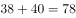。

方法二：观察数字，前项和后项有接近两倍关系，发现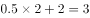，，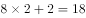，，则所求项应为：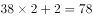。

故正确答案为B。

---

### 第 4 题　qid 2185093 · 数学运算

1  2  5  26  （  ）

- **A**. 377
- **B**. 477
- **C**. 577
- **D**. 677　✅

**答案**：D

**官方解析**

数列依次递增，且出现幂次数附近的数字，考虑幂次数。观察发现，题干数列分别为：、、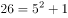，可得：后一项为前一项的平方加1，则所求项应为：。

故正确答案为D。

---

### 第 5 题　qid 2185101 · 数学运算

14  28  56  112  （  ）

- **A**. 155
- **B**. 186
- **C**. 224　✅
- **D**. 320

**答案**：C

**官方解析**

观察数推前后项存在明显的倍数关系，考虑作商。发现均为2，则所求项应为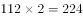。

故正确答案为C。

---

### 第 6 题　qid 2185111 · 数学运算

工厂的两个车间共同组装6300辆自行车。如果先由一号车间组装8天，再由二号车间组装3天，刚好可以完成任务；如果先由二号车间组装6天，再由一号车间组装6天，也刚好可以完成任务。则一号车间每天比二号车间多组装（  ）辆自行车。

- **A**. 210　✅
- **B**. 180
- **C**. 150
- **D**. 130

**答案**：A

**官方解析**

方法一：设一号车间每天组装x辆自行车，二号车间每天组装y辆自行车，根据题意可得：

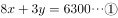

，联立解得，，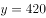；则一号车间每天比二号车间多组装自行车辆。

方法二：设一号车间每天组装x辆自行车，二号车间每天组装y辆自行车，根据题意可得：

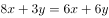，，一号车间与二号车间效率之比为3:2，两个车间每天共加工自行车辆，一号车间每天比二号车间多组装自行车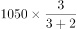辆。

故正确答案为A。

---

### 第 7 题　qid 2185114 · 数学运算

一列货运火车和一列客运火车同向匀速行驶，货车的速度为72千米/时，客车的速度为108千米/时。已知货车的长度是客车的1.5倍，两列火车由车尾平齐到车头平齐共用了20秒，则客运火车长（  ）米。

- **A**. 160
- **B**. 240
- **C**. 400　✅
- **D**. 600

**答案**：C

**官方解析**

设客运车长度为x，则货运车长度为1.5x，两列火车由车尾平齐到车头平齐，客车比货车多行驶的长度为，两车速度差为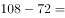。用时20秒，则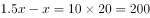米，解方程得米，客运车长为400米。

故正确答案为C。

---

### 第 8 题　qid 2185128 · 数学运算

某市服务行业举行业务技能大赛，其中东区参赛人数占总人数的，西区参赛人数占总人数的，南区参赛人数占总人数的，其余的是北区的参赛人员。结果东区参赛人数的获奖，西区参赛人数的获奖，南区参赛人数的获奖。已知参赛总人数超过100人，不到200人，则参赛总人数为（  ）。

- **A**. 120
- **B**. 140
- **C**. 160
- **D**. 180　✅

**答案**：D

**官方解析**

假设参赛总人数为x，则南区参赛人数为，南区获奖人数为，因人数须为正整数，则x应为36的整数倍，代入选项，只有D项满足。

故正确答案为D。

---

### 第 9 题　qid 2185133 · 数学运算

一个箱子的底部由5块正方形纸板ABCDE和1块长方形纸板F拼接而成（如图所示），已知A、B两块纸板的面积比是1:16，假设A纸板的边长为2厘米，则该箱子底部的面积为（    ）平方厘米。

- **A**. 200
- **B**. 320
- **C**. 360　✅
- **D**. 420

**答案**：C

**官方解析**

方法一：根据题意及给定图形，判定箱子底部为长方形。已知A、B均为正方形，面积之比为1:16，则边长之比为1:4，A的边长为2cm，则B的边长为8cm，E的边长为cm，C与D的边长为cm，则箱子底部长方形的长为cm，宽为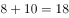cm，面积为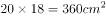。

方法二：已知A、B均为正方形，面积之比为1:16，则边长之比为1:4，A的边长为2cm，则B的边长为8cm，E的边长为cm，则箱子底部长方形的宽为cm，面积应能被18整除，结合选项，只有C项满足。

故正确答案为C。

---

### 第 10 题　qid 2185138 · 数学运算

工厂要对一台已经拆成6个部件的机器进行清洗，并重新组装。清洗6个部件的时间分别为10分钟、15分钟、21分钟、8分钟、5分钟、26分钟，重新组装需要15分钟。假设清洗每一个部件或重新组装时都需要甲乙两人合作才能完成，报酬标准为每人每小时150元（不足一小时按一小时计），则工厂需要支付给甲乙两人共（    ）元。

- **A**. 300
- **B**. 600　✅
- **C**. 900
- **D**. 1200

**答案**：B

**官方解析**

甲、乙清洗部件及重新组装共用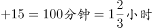，因为报酬标准为每人每小时150元且不足1小时按一小时计，花费小时计为2小时，则工厂需支付给甲乙两人共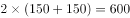元。

故正确答案为B。

---

### 第 11 题　qid 2185069 · 数学运算

有一条长100厘米的纸带，从一端开始，先涂一段红色，长度为4厘米；再涂一段白色，长度为4厘米。按此规律重复操作，直到颜色涂满整条纸带。则涂红色的部分共有（    ）段。

- **A**. 10
- **B**. 13　✅
- **C**. 15
- **D**. 25

**答案**：B

**官方解析**

总长度为100厘米，每4厘米涂一段，共涂了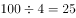段，按照“红色，白色，红色，白色······”规律涂色，则涂红色的部分共有13段。

故正确答案为B。

---

### 第 12 题　qid 2185077 · 数学运算

某软件公司对旗下甲、乙、丙、丁四款手机软件进行使用情况调查，在接受调查的1000人中，有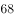的人使用过甲软件，有的人使用过乙软件，有的人使用过丙软件，有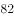的人使用过丁软件。那么，在这1000人中，使用过全部四款手机软件的至少有（    ）人。

- **A**. 120　✅
- **B**. 250
- **C**. 380
- **D**. 430

**答案**：A

**官方解析**

要求使用过全部四款手机软件的尽可能少，则应让没使用过全部四款手机软件的人最多。根据题意，没有使用过甲软件的人有，没有使用过乙软件的人有，没有使用过丙软件的人有，没有使用过丁软件的人有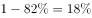。当没有使用过任意一种软件的人均不重复时，没使用过全部四款手机软件的人最多。此时没有使用过全部四款手机软件的人为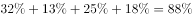，则使用过全部四款手机软件的人至少有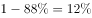，即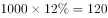人。

故正确答案为A。

---

### 第 13 题　qid 2185080 · 数学运算

某公园有一个周长为1千米的长方形花坛，计划在其周围每隔100米放置一个垃圾桶。现已将所需垃圾桶全部放在其中一个放置点（如图所示），接下来要用手推车将垃圾桶运到每一个放置点。假如该手推车每次最多能运3个垃圾桶，则将垃圾桶运到最后一个放置点时手推车行程最少为（    ）米。

- **A**. 1600
- **B**. 1800　✅
- **C**. 1900
- **D**. 2200

**答案**：B

**官方解析**

周长1千米，每隔100米放一个垃圾桶，则总共有垃圾桶：个。现在需要从其中一个放置点把垃圾桶运到每一个放置点，则一共需要运送9个垃圾桶，手推车一次能运3个垃圾桶，需要分3次运送。要让手推车行程最少，即每一次都选择最短路线。第一次：顺时针运送三个，按序摆放在沿途放置点，再空车回到起点，手推车行程：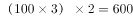米。第二次：逆时针运送三个，按序摆放在沿途放置点，再空车回到起点，手推车行程：米。第三次：选择任意一个方向，按序摆放在剩余的放置点，无需返程，手推车行程：米。手推车行程最少为：米。

故正确答案为B。

---

### 第 14 题　qid 2185082 · 数学运算

某条道路一侧共有20盏路灯。为了节约用电，计划只打开其中的10盏。但为了不影响行路安全，要求相邻的两盏路灯中至少有一盏是打开的，则共有（    ）种开灯方案。

- **A**. 2
- **B**. 6
- **C**. 11　✅
- **D**. 13

**答案**：C

**官方解析**

要求相邻的两盏路灯中至少有一盏是打开的，即相邻的路灯不能同时熄灭。则可以先让其中10盏路灯先亮，然后在10盏亮着的路灯之间进行插空，每个空插1盏熄灭的路灯。10盏路灯共有11个空，选择其中10个空插入不亮的路灯，方案数量为种。

故正确答案为C。

---

### 第 15 题　qid 2185084 · 数学运算

一项足球比赛共有8支队伍参加，每两支队伍之间需要踢两场比赛，获胜得3分，打平得1分，落败不得分。在该项足球比赛中，获得第一名的队伍积分最多可能比第二名多（    ）分。

- **A**. 40
- **B**. 30　✅
- **C**. 20
- **D**. 10

**答案**：B

**官方解析**

要让获得第一名的队伍积分尽可能多，那么第一名需要全胜，8支队伍两两比赛，第一名需要和其他7支队伍各进行两场比赛，那么一共进行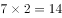场比赛，获胜得3分，第一名共积分分。若要让第一名和第二名分差尽量大，那么要让第二名积分尽量低，当其他七支队伍全部同分并列第二时积分最低。此时所有队伍都只输2场给第一名，其他12场比赛全部打平，积分为分。所以，获得第一名的队伍积分最多可能比第二名多：分。

故正确答案为B。

---

## 判断推理

### 第 1 题　qid 2185062 · 图形推理

从所给的四个选项中，选择最合适的一个填在问号处，使之呈现一定的规律性：

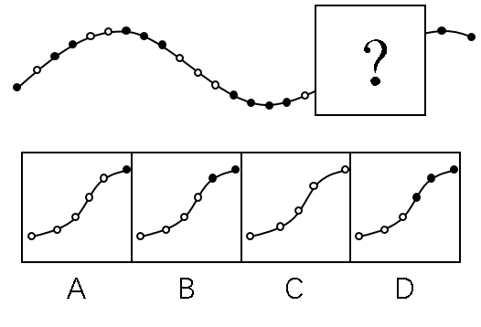

- **A**. A
- **B**. B
- **C**. C
- **D**. D　✅

**答案**：D

**官方解析**

元素组成不同，且属性无规律，优先考虑数量规律。观察发现，题干中的白圈和黑圈依次呈交错递增规律，黑圈数量依次为：1、2、3、4；白圈数量依次为：1、2、3，？前已有1个白圈，？后已有两个黑圈，因此？处白圈应为3个，黑圈应为3个，只有D项符合。
故正确答案为D。

---

### 第 2 题　qid 2185066 · 图形推理

从所给的四个选项中，选择最合适的一个填在问号处，使之呈现一定的规律性：

- **A**. A　✅
- **B**. B
- **C**. C
- **D**. D

**答案**：A

**官方解析**

元素组成相同，考虑位置规律。观察发现，题干均由两个相同的图形构成，且红色图形依次逆时针旋转，蓝色图形依次顺时针旋转，如下图所示，只有A项符合。

故正确答案为A。

---

### 第 3 题　qid 2185073 · 图形推理

从所给的四个选项中，选择最合适的一个填在问号处，使之呈现一定的规律性：

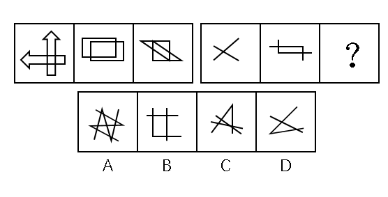

- **A**. A　✅
- **B**. B
- **C**. C
- **D**. D

**答案**：A

**官方解析**

元素组成不同，属性、数量无规律，考虑特殊规律。第一组图形，图1是两个箭头相交，图2是两个长方形相交，图3是两个三角形相交，即每一幅图形都是两个相同的小图形相交得到的；第二组图应用此种规律，图1是两条直线相交，图2是两条“L”型的线条相交，？处也应为两个相同的小图形相交。A项是两个Z字相交，B项是一个直角和两条直线相交，C项是一个锐角和两条直线相交，D项是一个锐角和一条直线相交，只有A项符合。
故正确答案为A。

---

### 第 4 题　qid 2185074 · 图形推理

从所给的四个选项中，选择最合适的一个填在问号处，使之呈现一定的规律性：

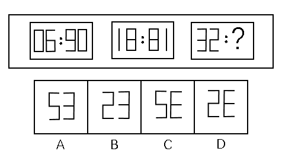

- **A**. A
- **B**. B
- **C**. C
- **D**. D　✅

**答案**：D

**官方解析**

观察图形，三组图各自内部元素组成相同，考虑位置规律。图1中冒号左边图形旋转得到冒号右边图形，图2中图形满足此规律，图3应用此规律，则“？”处图形应该是冒号左边图形旋转得到的，只有D项符合。

故正确答案为D。

---

### 第 5 题　qid 2185076 · 图形推理

从所给的四个选项中，选择最合适的一个填在问号处，使之呈现一定的规律性：

- **A**. A
- **B**. B　✅
- **C**. C
- **D**. D

**答案**：B

**官方解析**

元素组成相同，每个图形都由四个小方块和四条弧线构成，优先考虑位置规律。第一个图形到第二个图形，右上角弧线顺时针旋转，第二个图形到第三个图形，右下角弧线顺时针旋转，第三个图形到第四个图形，左下角弧线顺时针旋转，故第四个图形到?处图形，应是左上角弧线顺时针旋转，只有B项符合。

故正确答案为B。

---

### 第 6 题　qid 2185022 · 图形推理

从所给的四个选项中，选择最合适的一个填在问号处，使之呈现一定的规律性：

- **A**. A
- **B**. B
- **C**. C
- **D**. D　✅

**答案**：D

**官方解析**

观察图形，每个图形都由不同数量的黑块和白块组成，优先考虑数量规律，黑块数量分别是3，10，8，10，数量无规律。再整体观察图形，图形中白块被黑块分成了不同的部分，则可考虑白块被黑块分开的部分数。白块部分数分别是1，2，3，4，故？处白块应被黑块分成5部分。观察选项，A项4部分，B项3部分，C项1部分，D项5部分，D项符合。
故正确答案为D。

---

### 第 7 题　qid 2185081 · 图形推理

从所给的四个选项中，选择最合适的一个填在问号处，使之呈现一定的规律性：

- **A**. A
- **B**. B
- **C**. C　✅
- **D**. D

**答案**：C

**官方解析**

观察题干图形，都是由两个几何图形相交而成，则可考虑图形间关系，观察相交部分。观察可知题干图形相交部分的形状依次为三角形、四边形、五边形、六边形，故？处两个图形的相交部分应该为七边形，A选项相交部分为六边形，B选项相交部分为四边形，C选项相交部分为七边形，D选项相交部分不符合多边形特点。
故正确答案为C。

---

### 第 8 题　qid 2185083 · 图形推理

从所给的四个选项中，选择最合适的一个填在问号处，使之呈现一定的规律性：

- **A**. A
- **B**. B
- **C**. C　✅
- **D**. D

**答案**：C

**官方解析**

第一种方法：观察题干图形，第一个和第三个图形对称规律明显，都是轴对称图形，而第二个和第四个图形不是轴对称图形，故此题第一、第三、第五个图形都应该为轴对称图形，观察选项，只有C选项为轴对称图形。
第二种方法：观察题干图形，第二个图和第四个图形位置关系明显，第二个图沿着纵轴翻转可得到第四个图形。观察选项，发现C选项与题干第一个图形位置关系明显，题干第一个图沿横轴翻转可得到C选项，即以第三个图形为中心，第二个图形和第四个图形是有关纵轴对称的两个图形，第一个图形和第五个图形是有关横轴对称的两个图形。无论是上述哪种方法，本题都是C项符合。
第三种方法：观察题干图形，相邻比较发现题干相邻两幅图之间都有2个白球的位置相同，因此问号处的图形也应和图四之间有两个白球的位置相同，只有D项符合。
本题为争议题，选择哪个答案都是合理的。

---

### 第 9 题　qid 2185027 · 图形推理

从所给的四个选项中，选择最合适的一个填在问号处，使之呈现一定的规律性：

- **A**. A　✅
- **B**. B
- **C**. C
- **D**. D

**答案**：A

**官方解析**

元素组成不同，考虑数量规律。图形均有线条交叉，优先考虑数点。观察发现每个图形的交点个数均为7，所以？处交点个数也为7，只有选项A交点个数为7，其余交点个数均为6。
故正确答案为A。

---

### 第 10 题　qid 2185028 · 图形推理

从所给的四个选项中，选择最合适的一个填在问号处，使之呈现一定的规律性：

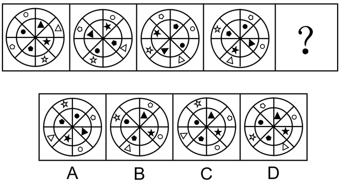

- **A**. A
- **B**. B
- **C**. C　✅
- **D**. D

**答案**：C

**官方解析**

元素组成相同，考虑位置规律。每个图形分为内圈和外圈两部分。先看内圈，有四个不同的元素，挑一个观察，内圈的黑色五角星沿内圆每次逆时针移动2格，由第四幅图到？处，黑色五角星也应逆时针移动2格，排除A项。B、C、D内部其他元素位置相同，考虑外圈位置变化。外圈的白色五角星每次顺时针移动1格，由第四幅图到？处，白色五角星也应顺时针移动1格，排除B、D两项。
故正确答案为C。

---

### 第 11 题　qid 2185105 · 类比推理

畅通：拥堵

- **A**. 结实：松散
- **B**. 详尽：简略　✅
- **C**. 踏实：忧虑
- **D**. 男性：女性

**答案**：B

**官方解析**

第一步：判断题干词语间的逻辑关系。
“畅通”是指道路畅行、可以顺利通过，“拥堵”是指道路狭窄造成拥挤，二者为反义关系。
第二步：判断选项词语间的逻辑关系。
A项：“结实”是指强健牢固，“松散”是指排列不紧密，二者不是反义关系，与题干逻辑关系不一致，排除；
B项：“详尽”是指内容全面、无遗漏，“简略”是指内容简单、不详细，二者为反义关系，与题干逻辑关系一致，当选；
C项：“踏实”是指切实、不浮躁，“忧虑”是指思虑、忧愁、担心，二者不是反义关系，与题干逻辑关系不一致，排除；
D项：“男性”和“女性”属于并列关系中的矛盾关系，与题干逻辑关系不一致，排除。
故正确答案为B。

---

### 第 12 题　qid 2185106 · 类比推理

法律：遵守

- **A**. 政策：推动
- **B**. 资源：利用　✅
- **C**. 经济：发达
- **D**. 环境：整洁

**答案**：B

**官方解析**

第一步：判断题干词语间的逻辑关系。
遵守法律，“法律”属于名词，“遵守”属于动词，构成动宾关系。
第二步：判断选项词语间的逻辑关系。
A项：推动政策（落实/执行），虽然“政策”属于名词，“推动”属于动词，但二者搭配意思表达不完整，不能构成动宾关系，与题干逻辑关系不一致，排除；
B项：利用资源，“资源”属于名词，“利用”属于动词，构成动宾关系，与题干逻辑关系一致，当选；
C项：“发达”是形容词，“经济”属于名词，二者不能构成动宾关系，与题干逻辑关系不一致，排除；
D项：“整洁”是形容词，“环境”属于名词，二者不能构成动宾关系，与题干逻辑关系不一致，排除。
故正确答案为B。

---

### 第 13 题　qid 2185110 · 类比推理

创新：发展

- **A**. 批评：进步
- **B**. 辞旧：迎新
- **C**. 竞赛：夺冠
- **D**. 学习：提高　✅

**答案**：D

**官方解析**

第一步：判断选项词语间逻辑关系。
创新可能带来发展，“创新”是“发展”的条件之一，二者属于对应关系。
第二步：判断选项词语间的逻辑关系。
A项：批评可能带来进步，“批评”是“进步”的条件之一，二者属于对应关系，与题干逻辑关系一致，保留；
B项：“辞旧”和“迎新”属于并列关系，与题干逻辑关系不一致，排除；
C项：竞赛是一个事件，“竞赛”不是“夺冠”的条件，与题干逻辑关系不一致，排除；
D项：学习可能带来提高，“学习”是“提高”的条件之一，二者属于对应关系，与题干逻辑关系一致，保留。
比较A、D项，题干“创新”和“发展”的主体是一致的，A项“批评”和“进步”的主体不一致，D项“学习”和“提高”主体是一致的，所以D项优于A项。
故正确答案为D。

---

### 第 14 题　qid 2185115 · 类比推理

钢笔：墨水

- **A**. 牙刷：牙膏　✅
- **B**. 手机：电脑
- **C**. 词典：报纸
- **D**. 壁画：台灯

**答案**：A

**官方解析**

第一步：判断题干词语间逻辑关系。
钢笔需要和墨水在一起配套使用，二者为配套使用的关系。
第二步：判断选项词语间逻辑关系。
A项：牙刷和牙膏在一起配套使用，二者为配套使用的关系，与题干逻辑关系一致，当选；
B项：手机和电脑均为电子产品，二者为并列关系，与题干逻辑关系不一致，排除；
C项：词典和报纸均为出版物，二者为并列关系，与题干逻辑关系不一致，排除；
D项：壁画和台灯没有必然的逻辑关系，与题干逻辑关系不一致，排除。
故正确答案为A。

---

### 第 15 题　qid 2185120 · 类比推理

降价：促销

- **A**. 编程：语言
- **B**. 复习：考试
- **C**. 实验：研究　✅
- **D**. 实践：真理

**答案**：C

**官方解析**

第一步：判断题干词语间逻辑关系。
降价是一种促销的方式，二者为方式对应关系。
第二步：判断选项词语间逻辑关系。
A项：编程是编写程序的中文简称，就是让计算机代为解决某个问题，对某个计算体系规定一定的运算方式，和语言没有必然的逻辑关系，与题干逻辑关系不一致，排除；
B项：复习不是考试的一种方式，而是为考试做准备，与题干逻辑关系不一致，排除；
C项：实验是一种研究的方式，二者为方式对应关系，与题干逻辑关系一致，当选；
D项：实践是检验真理的标准，二者不是方式对应关系，与题干逻辑关系不一致，排除。
故正确答案为C。

---

### 第 16 题　qid 2185023 · 类比推理

节能：环保

- **A**. 贪污：腐败　✅
- **B**. 文明：文化
- **C**. 秋天：节气
- **D**. 运动：休闲

**答案**：A

**官方解析**

第一步：判断题干词语间逻辑关系。
节能是一种环保，二者为包容关系中的种属关系。
第二步：判断选项词语间逻辑关系。
A项：贪污是一种腐败，二者为包容关系中的种属关系，与题干逻辑关系一致，当选；
B项：文明是文化的内在价值，文化是文明的外在表现形式，二者为对应关系，与题干逻辑关系不一致，排除；
C项：秋天是一种季节，而不是一种节气，二者为反向种属关系，与题干逻辑关系不一致，排除；
D项：运动是一种休闲的方式，二者为方式对应关系，与题干逻辑关系不一致，排除。
故正确答案为A。

---

### 第 17 题　qid 2185025 · 类比推理

摄影：绘画

- **A**. 复印：扫描
- **B**. 书法：刺绣　✅
- **C**. 雕刻：打磨
- **D**. 歌唱：弹奏

**答案**：B

**官方解析**

第一步：判断题干词语间逻辑关系。

摄影和绘画是两种不同的艺术表现形式，二者是并列关系，且绘画既可以作为名词，又可以作为动宾短语。
第二步：判断选项词语间逻辑关系。
A项：复印和扫描是两种处理文件的不同方式，二者是并列关系，但二者并非艺术表现形式，与题干逻辑关系不一致，排除；
B项：书法和刺绣是中国民间传统工艺，是两种不同的艺术表现形式，二者是并列关系，且刺绣既可以作为名词，又可以作为动宾短语，与题干逻辑关系一致，当选；
C项：雕刻和打磨是两道不同的工序，二者是并列关系，但打磨是动词，与题干逻辑关系不一致，排除；
D项：歌唱和弹奏是两种不同的艺术表现形式，二者是并列关系，但二者是动词，与题干逻辑关系不一致，排除。
故正确答案为B。

---

### 第 18 题　qid 2185029 · 类比推理

木头：家具

- **A**. 纤维：水管
- **B**. 纸张：报纸
- **C**. 棉花：衣服　✅
- **D**. 金属：电缆

**答案**：C

**官方解析**

第一步：判断题干词语间逻辑关系。
木头是家具的原材料，二者是对应关系。
第二步：判断选项词语间逻辑关系。
A项：纤维是水管的原材料，与题干逻辑关系一致，保留；
B项：纸张是报纸的原材料，但是报纸本身也是纸张，二者还是种属关系，与题干逻辑关系不一致，排除；
C项：棉花是衣服的原材料，与题干逻辑关系一致，保留；
D项：金属是电缆的原材料，与题干逻辑关系一致，保留。
比较题干和A、C、D三项，题干木头是天然材料，且木头并不是家具的必需材料，家具也有铝材或者石材的，A项制作水管的纤维是人工材料，排除；C项棉花是天然材料，棉花也不是衣服的必需材料，衣服可以是其他材质，例如蚕丝、化纤等等；D项金属是制作电缆必不可少的材料。C项更优。
故正确答案为C。

---

### 第 19 题　qid 2185030 · 类比推理

机器：出厂：检测

- **A**. 商品：出口：试用
- **B**. 技工：经验：实践
- **C**. 白炽灯：照明：通电　✅
- **D**. 大学生：毕业：实习

**答案**：C

**官方解析**

第一步：判断题干词语间逻辑关系。
机器需要先检测后出厂，且检测是出厂前的必要环节，二者是对应关系。
第二步：判断选项词语间逻辑关系。
A项：商品需要先试用后出口，但试用不是出口前的必要环节，与题干逻辑关系不一致，排除；
B项：技工通过实践积累经验，二者为方式对应关系，与题干逻辑关系不一致，排除；
C项：白炽灯需要先通电后照明，且通电是照明前的必要环节，与题干逻辑关系一致，当选；
D项：大学生需要先实习后毕业，但实习不是毕业前的必要环节，与题干逻辑关系不一致，排除。
故正确答案为C。

---

### 第 20 题　qid 2185031 · 类比推理

索然无味：味同嚼蜡

- **A**. 走投无路：山穷水尽　✅
- **B**. 抛砖引玉：抛头露面
- **C**. 目光如炬：鼠目寸光
- **D**. 一无所得：一箭双雕

**答案**：A

**官方解析**

第一步：判断题干词语间逻辑关系。
索然无味形容呆板枯燥，一点意味或者趣味都没有；味同嚼蜡指像吃蜡一样，没有一点儿味，形容语言或文章枯燥无味，二者是近义关系。
第二步：判断选项词语间逻辑关系。
A项：走投无路比喻陷入绝境，没有出路；山穷水尽是指山和水都到了尽头，比喻无路可走，二者是近义关系，与题干逻辑关系一致，当选；
B项：抛砖引玉比喻用自己不成熟的意见或作品引出别人更好的意见或好作品；抛头露面指公开露面，二者没有明显逻辑关系，与题干逻辑关系不一致，排除；
C项：目光如炬形容愤怒地注视着，也形容见识远大；鼠目寸光比喻目光短浅、缺乏远见，二者是反义关系，与题干逻辑关系不一致，排除；
D项：一无所得形容毫无收获；一箭双雕比喻做一件事达到两个目的，二者没有明显逻辑关系，与题干逻辑关系不一致，排除。
故正确答案为A。

---

### 第 21 题　qid 2185085 · 逻辑判断

某市举行春季音乐节系列活动，其中一项活动首次邀请了某知名交响乐团前来该市演出，该市交响乐爱好者对此十分期待。考虑到该乐团的影响力，主办方预计为期两天的交响乐团演出将“一票难求”。但开始售票后发现，实际情况并非如此。
以下哪项为真，最能解释这一情况？

- **A**. 音乐节的其他活动吸引了许多观众
- **B**. 交响乐未能被该市大部分群众所接受
- **C**. 音乐节活动期间该市一直为阴雨天气
- **D**. 此次交响乐团演出门票价格过高　✅

**答案**：D

**官方解析**

第一步：找出题干矛盾。
该市交响乐爱好者十分期待某知名交响乐团前来演出，预计交响乐团演出将“一票难求”，但开始售票后发现实际情况并非如此。
第二步：逐一分析选项。
A项：音乐节的其他活动吸引了许多观众，可能会影响交响乐团演出门票的销售，可以解释题干的矛盾，保留；
B项：交响乐未能被该市大部分群众所接受，说明该市喜欢交响乐的人少，但是题干已明确指出“交响乐爱好者”对此十分期待，与不接受交响乐的群众占比无关，排除；
C项：阴雨天气可能会对交响乐的售票有一定的影响，可以解释题干的矛盾，保留；
D项：演出门票价格过高在一定程度上会影响到门票的销售，可以解释题干的矛盾，保留。
比较A、C、D三项，D项从交响乐团演出自身的角度解释了原因；
A项中的音乐节其他活动吸引了许多观众，但是题干中说该市交响乐爱好者对交响乐团的演出十分期待，所以其他活动对于交响乐团演出门票的销售影响并不明确，排除；
C项中的阴雨天气只是可能对售票情况产生一定的影响，但是题干并没有明确的说明交响乐的爱好者会因为阴雨天气而放弃看演出，不明确项，排除；
D项是从交响乐团演出自身的角度出发，门票价格过高这一因素会影响到门票销量，一部分交响乐爱好者自然会因为门票价格过高而放弃观看演出，因此相比之下，D项解释力度更强，当选。
故正确答案为D。

---

### 第 22 题　qid 2185086 · 逻辑判断

对多个省份的调查研究发现，对于外向者而言，花大量时间用于网络社交并不会影响与他人面对面交流的意愿，而内向者即使不进行网络社交也不会变成社交达人。因此，有研究者认为，网络社交会妨碍传统社交的担忧是毫无必要的。
以下哪项为真，最有助于支持上述结论？

- **A**. 有许多花费大量时间在网络社交上的人不愿意与他人面对面交流
- **B**. 无论采用哪种方式，大多数人参与社会活动的总时间是相对固定的
- **C**. 在网络社交的帮助下，许多人在传统社交中的能力和自信得到了提升　✅
- **D**. 该研究由某大学开展，而在该校学生中，网络社交并不是主要的社交方式

**答案**：C

**官方解析**

第一步：找出论点和论据。
论点：网络社交会妨碍传统社交的担忧是毫无必要的。
论据：对于外向者而言，花大量时间用于网络社交并不会影响与他人面对面交流的意愿，而内向者即使不进行网络社交也不会变成社交达人。
第二步：逐一分析选项。
A项：花费大量时间进行网络社交的人不愿与他人面对面交流，说明网络社交妨碍了传统社交，削弱论点，排除；
B项：大多数人参与社交活动的总时间是相对固定的，即参与网络社交与传统社交的总时间相对固定，那么网络社交时间多了，传统社交时间就会变少，有一定削弱力度，排除；
C项：网络社交有助于许多人在传统社交中提升能力和自信，所以网络社交不仅没有妨碍传统社交，反而有利于传统社交，补充论据，当选； 
D项：该校学生中网络社交不是主要的社交方式，未提到网络社交与传统社交间的关系，无关选项，排除。
故正确答案为C。

---

### 第 23 题　qid 2185092 · 逻辑判断

近年来，某公司生产的汽车发生了几起严重的交通事故，有人认为这是因为该汽车在设计上存在缺陷导致的。对此，该公司坚决否认设计上存在缺陷，理由是根据这几起交通事故的分析报告，发生事故时，司机都存在酒后驾驶或疲劳驾驶的情况。
以下哪项为真，最不能支持该公司的观点？

- **A**. 该公司一直宣称自己的产品安全性能良好　✅
- **B**. 该公司所依据的交通事故分析报告真实可靠
- **C**. 喝酒和疲劳都会严重影响司机驾驶时的判断力
- **D**. 经过对事故车辆的检测，并没有发现存在设计缺陷

**答案**：A

**官方解析**

第一步：找出论点和论据。
论点：该公司汽车设计上不存在缺陷。
论据：根据这几起交通事故的分析报告，发生事故时，司机都存在酒后驾驶或疲劳驾驶的情况。
第二步：逐一分析选项。
A项：公司一直宣称自己产品安全性能良好，但是无法判断设计是否存在缺陷，属于无关选项，无法加强，当选；
B项：该报告真实可靠是得出论点的必要条件，补充论据，可以加强，排除；
C项：喝酒和疲劳驾驶会影响驾驶人的判断力，解释了造成交通事故的原因不是设计问题而是酒驾，补充论据，可以加强，排除； 
D项：对事故车辆检测之后发现没有设计缺陷，补充论据，可以加强，排除。
本题为选非题，故正确答案为A。

---

### 第 24 题　qid 2185097 · 类比推理

某围棋队有选手会在比赛时喝茶，他们或者喝红茶，或者喝绿茶。
如果以上描述为真，下列哪项一定是真的？
I．该围棋队一名在比赛时不喝红茶的选手，一定喝绿茶。
II．该围棋队没有选手比赛时喝黑茶。
III．该围棋队有的选手比赛时不喝茶。

- **A**. 只有II　✅
- **B**. 只有III
- **C**. I和II
- **D**. II和III

**答案**：A

**官方解析**

第一步：翻译题干。
①该围棋队有的选手在比赛时喝茶；
②喝红茶或者喝绿茶。
第二步：逐一分析选项。
Ⅰ：根据①可知，该围棋队有的选手在比赛时喝茶，但是无法确定该围棋队每一个人在比赛时都喝茶，所以该围棋队某一个人是否喝茶不明确，是否喝茶都不确定，因此无法确定真假。
Ⅱ：根据②可知，该队选手如果喝茶，即在红茶与绿茶之间，没有人喝黑茶，可以推出，该项一定为真。
Ⅲ：根据①可知，有的选手喝茶不能推出有的选手不喝茶，无法推出绝对化结论，因此无法确定真假。
故正确答案为A。

---

### 第 25 题　qid 2185087 · 逻辑判断

某市高新区离老城区较远，且公交车班次很少。高新区企业的员工大部分居住在老城区，他们经常会因为无法按时坐上公交车而迟到。为此，公交车公司大量增加了高新区与老城区之间的公交车班次，以满足这些员工的乘车需求。但是经过一段时间的观察，情况并没有得到改善，这些员工依然经常迟到。
以下哪项为真，最能解释上述现象？

- **A**. 高新区的许多企业都调整了上班时间
- **B**. 部分原来开车上班的高新区企业员工改为乘坐公交车
- **C**. 由于道路狭窄，公交车班次大量增加后经常出现长时间塞车　✅
- **D**. 许多原本乘坐公交车上班的高新区企业员工改为开车或乘坐出租车

**答案**：C

**官方解析**

第一步：找出题干矛盾。
高新区企业的员工经常因为无法坐上公交车而迟到，大量增加公交车班次后，这些员工依然经常迟到。
第二步：逐一分析选项。
A项：无论怎么调整时间，公交车班次增加应该可以缓解迟到现象，所以无法解释公交车班次增加后员工依然迟到的矛盾，排除；
B项：部分原本开车上班的高新区企业员工改为乘坐公交车，增加了一些乘坐公交车的人，但是只是乘坐公交车人数的增加无法解释公交车班次增加后员工依然迟到的矛盾，排除；
C项：由于道路狭窄，公交班次大量增加后经常出现长时间塞车，塞车会导致员工迟到，很好地解释了公交车班次增加后员工依然迟到的矛盾，当选；
D项：原本乘坐公交车上班的高新区企业员工改为开车或乘坐出租车，开车或出租车是否会对迟到产生影响并不清楚，无法解释公交车班次增加后员工依然迟到的矛盾，排除。
故正确答案为C。

---

### 第 26 题　qid 2185100 · 逻辑判断

有研究小组调查显示，在封闭环境中入睡的人更容易频繁醒来，而且自我感觉睡眠质量不佳。因此，有人认为，就寝时关闭门窗将会降低睡眠质量。
以下哪项为真，最能削弱上述结论？

- **A**. 研究小组调查的对象大多是年轻人
- **B**. 睡眠质量差的人更喜欢关闭门窗睡觉　✅
- **C**. 门窗紧闭会影响室内空气质量，从而影响睡眠
- **D**. 由于安全、保暖等原因，夜间开窗并不适合所有房间

**答案**：B

**官方解析**

第一步：找出论点和论据。
论点：就寝时关闭门窗将会降低睡眠质量。
论据：在封闭环境中入睡的人更容易频繁醒来，而且自我感觉睡眠质量不佳。
第二步：逐一分析选项。
A项：研究小组调查的对象大多是年轻人，论点讨论的是就寝时关闭门窗将会不会降低睡眠质量，与调查的人群年龄无关，无关选项，排除；
B项：睡眠质量差的人更喜欢关闭门窗睡觉，题干是关闭门窗睡觉会降低睡眠质量，选项和题干论点因果顺序相反，属于因果倒置，可以削弱，当选；
C项：门窗紧闭会影响室内空气质量，从而影响睡眠，证明门窗紧闭的确会降低睡眠质量，属于加强项，排除；
D项：没有提到睡眠质量，与题干论点讨论话题无关，排除。
故正确答案为B。

---

### 第 27 题　qid 2185103 · 逻辑判断

外界环境中的阳光辐射、空气污染等都会使人体产生更多活性氧自由基。体内活性氧自由基正是人类衰老的根源，而抗氧化剂可以有效清除体内多余的自由基。
如果以上描述为真，下列哪项一定是正确的？

- **A**. 清除体内多余的自由基，要么避免阳光辐射和空气污染，要么摄入抗氧化剂
- **B**. 人的衰老速度可能由环境决定，也可能受抗氧化剂的影响　✅
- **C**. 严重的空气污染会影响人的衰老速度和抗氧化剂的效果
- **D**. 抗氧化剂能够有效延长人的寿命

**答案**：B

**官方解析**

日常结论题，根据题干信息逐一分析选项。
A项：题干没有提到要清除多余自由基，要么避免阳光辐射和空气污染，要么摄入抗氧化剂，清除多余自由基可能有其他的方法，也可能同时采用两者，无法推出要么要么这种只能二选一的关系，排除； 
B项：题干说到阳光辐射、空气污染等环境因素会使人体产生更多活性氧自由基，抗氧化剂可以有效清除多余自由基，而活性氧自由基是人类衰老的根源，所以二者可以影响人的衰老速度，可以推出，当选； 
C项：题干只说空气污染会使人产生更多活性氧自由基，可能会影响衰老速度，但是并未涉及它会影响抗氧化剂效果，无法推出，排除； 
D项：题干只说抗氧化剂可以有效清除多余自由基，可能会延缓衰老速度，但不同于选项中的延长寿命，无法推出，排除。
故正确答案为B。

---

### 第 28 题　qid 2185107 · 逻辑判断

近期，某公司推出了一款空调，其耗电量比市面上所有其他同类产品都要低。因此，该公司管理层认为，这款空调的销量将会超过市面上所有其他同类产品。
以下哪项为真，最能质疑该公司管理层的判断？

- **A**. 该公司的品牌知名度低于其他同类企业
- **B**. 该款空调的售后服务质量比不上其他同类产品
- **C**. 该款空调的使用寿命低于同类产品的平均水平
- **D**. 耗电量并不是大部分消费者在选购空调时的主要关注点　✅

**答案**：D

**官方解析**

第一步：找出论点和论据。
论点：这款空调的销量将会超过市面上所有其他同类产品。
论据：某公司推出了一款空调，其耗电量比市面上所有其他同类产品都要低。
第二步：逐一分析选项。
A项：该公司品牌知名度低，无法判断其对空调销量的影响，与题干无关，无法削弱，排除；
B项：该空调售后服务质量不太好，无法判断其对空调销量的影响，与题干无关，无法削弱，排除；
C项：该空调使用寿命相对低，无法判断其对空调销量的影响，与题干无关，无法削弱，排除； 
D项：耗电量不是选购空调的主要关注点，说明无法由论据中的空调耗电量低得到论点所说的空调销量高，对论点论据进行拆桥，可以削弱，当选。
故正确答案为D。

---

### 第 29 题　qid 2185116 · 定义判断

单位接到一项工作任务，领导决定从张、王、李、林、沈、赵6人中选出3人组成工作小组。工作组应符合以下3个条件：
①张、林两人中至少需要一人入选。
②王、李两人中至多能有一人入选。
③如果沈、赵两人同时入选，则王不能入选。
以下工作人员组成不符合条件的是：

- **A**. 沈、李、赵　✅
- **B**. 李、张、林
- **C**. 赵、张、王
- **D**. 沈、王、林

**答案**：A

**官方解析**

①张或林 

②王或李

③沈且赵王

本题题干条件确定，考虑排除法，根据题干信息可知，A项不符合条件①。B、C、D项均符合题干条件。

本题为选非题，故正确答案为A。 

---

### 第 30 题　qid 2185118 · 逻辑判断

某市实体零售店的数量由2013年的3800家，增加到了2017年的4500家。但这几年来，该市实体零售店的销售额在整个零售业中所占的比例并没有增加，反而有所下降。
以下哪项为真，最不能解释上述现象？

- **A**. 这几年来该市实体零售店的整体销售额显著下降
- **B**. 这几年来该市非实体零售店的整体销售额迅速增加
- **C**. 这几年来该市零售业的整体销售额有了大幅度的提升
- **D**. 这几年来该市非实体零售店数量的增长速度快于实体零售店　✅

**答案**：D

**官方解析**

第一步：找出题干矛盾。

该市实体零售店的数量增加，但是销售额在整个零售业中所占的比例反而下降。

第二步：逐一分析选项。

A项：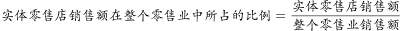。该市实体零售店的整体销售额下降，可以解释实体零售销售额在整个零售业中所占的比例下降，可以解释，排除；

B项：。非实体零售店的整体销售额迅速增加，可能会使非实体零售的销售额占整体的比例增加，也就意味着实体零售店的销售额占整体销售额的比例可能会下降，可以解释，排除；

C项：。现在整体的销售额是增加的，那么可以说明实体店销售额所占的比例是下降的，可以解释，排除；

D项：该市非实体零售店的数量增加的比实体店快，店铺数量的增加并不能说明销售额是增加还是降低，更不能说明实体销售额占整体销售额的比例是否下降，不能解释，当选。

本题为选非题，故正确答案为D。

---

## 资料分析

### 材料 1

        A市坚持发挥科技创新的引领作用，强化企业的创新主体地位，研发投入不断增加，研发人员快速增长，创新能力持续增强，锂电池等新兴产业尤为突出。

        五年来，企业创新意愿不断提升，研发投入快速增长。2016年，该市有研究与试验发展（R&amp;D）活动的单位172家，比2012年增加26家，R&amp;D经费内部支出19.55亿元，比2012年增加11.65亿元，增长，年均增长率为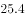；R&amp;D经费内部支出与地区生产总值之比为，比2012年提高0.5个百分点。规模以上工业企业研发投入大幅提高，2016年该市规模以上工业企业R&amp;D经费内部支出19.14亿元，比2012年增加11.52亿元，增长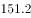，年均增长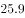。全年技术改造经费支出10.74亿元，比2012年增长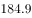；引进境外技术经费支出1.61亿元，增长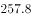；引进境外技术的消化吸收经费支出0.54亿元，增长。

        该市在增加科技投入的同时，研发人才引进和培养力度持续加大。2016年全市R&amp;D人员合计6924人，比2012年增长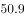，年均增长，其中研究人员3268人，占R&amp;D人员的，比2012年提高18.8个百分点。全市R&amp;D人员中，本科及以上学历人员4007人，占全部R&amp;D人员比重的，比2012年提高24个百分点；其中研究生及以上学历1216人，占全部R&amp;D人员比重的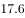，比2012年提高9.1个百分点。

        2016年，该市加大力度发展新兴科技产业，全市锂电池等制造行业R&amp;D经费内部支出12.63亿元，比2012年增长17.5倍，年均增长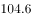。R&amp;D人员2851人，比2012年增长，年均增长。新产品产值达241.06亿元，比2012年增加219.37亿元，增长10.1倍。

#### 第 1 题　qid 2185109 · 综合

2012年，该市的下列各项经费支出最多的是（  ）。

- **A**. 
规模以上工业企业经费
　✅
- **B**. 
全年技术改造经费

- **C**. 
 引进境外技术经费

- **D**. 
引进境外技术的消化吸收经费

**答案**：A

**官方解析**

根据题干“2012年，······支出最多的是”，结合材料为2016年，可判定本题为基期比较问题。定位文字材料第二段，根据公式：，可得各选项2012年的经费支出分别为：A项：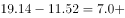；B项：；C项：；D项：。

对比可得，2012年经费支出最多的为A项。

故正确答案为A。

---

#### 第 2 题　qid 2185113 · 综合

2016年，该市生产总值比2012年约多（  ）亿元。

- **A**. 350
- **B**. 430
- **C**. 500　✅
- **D**. 660

**答案**：C

**官方解析**

根据题干“2016年，······比2012年约多多少亿元”，可判定本题为增长量计算问题。定位文字材料第二段，“2016年，R＆D经费内部支出19.55亿元，比2012年增加11.65亿元。R＆D经费内部支出与地区生产总值之比为，比2012年提高0.5个百分点”。根据公式：，可得2016年该市生产总值比2012年约多：，对应C项。

故正确答案为C。

---

#### 第 3 题　qid 2185117 · 平均数

2012年，该市平均每家研究与试验发展（R&D）活动单位的R&D经费内部支出约为（  ）亿元。

- **A**. 0.023
- **B**. 0.054　✅
- **C**. 0.163
- **D**. 0.242

**答案**：B

**官方解析**

根据题干“2012年，该市平均每家······”，结合材料数据为2016年，可判定本题为基期平均数计算问题。定位文字材料第二段“2016年，该市有研究与试验发展（R＆D）活动的单位172家，比2012年增加26家。经费内部支出19.55亿元，比2012年增加11.65亿元。”则可得2012年平均每家R＆D活动单位的经费内部支出为：亿，与B项最接近。

故正确答案为B。

---

#### 第 4 题　qid 2185119 · 综合

2016年，该市R&D人员中，本科学历的人数为（  ）。

- **A**. 1216
- **B**. 1517
- **C**. 2791　✅
- **D**. 4007

**答案**：C

**官方解析**

。定位文字材料第三段，“全市R＆D人员中，本科及以上学历人员4007人，研究生及以上学历1216人”，则人。

故正确答案为C。

---

#### 第 5 题　qid 2185122 · 综合

根据材料，下列说法不正确的是（  ）。

- **A**. 
2013-2016年，经费内部支出增加最多的是2015年
　✅
- **B**. 
2012-2016年，经费内部年均支出约12.8亿元

- **C**. 
2016年，该市新兴科技产业的发展较2012年有较大提高

- **D**. 
2016年，该市人员学历水平较2012年有所提高

**答案**：A

**官方解析**

A项：定位柱状图，R＆D经费内部支出2015年增加：亿元，2016年增加：亿元。2015年增加并非最多，错误；

B项：定位柱状图，2012-2016年R＆D经费内部年均支出亿元，正确；

C项：根据文字材料最后一段可得，2016年该市大力发展新兴科技产业，R＆D经费内部支出、人员数、新产品产值均取得长足发展，比2012年有较大提高，正确；

D项：根据文字材料第三段可得，2016年该市R＆D人员本科及以上、研究生及以上学历人员比2012年均有所增加，学历水平有所提升，正确。

本题为选非题，故正确答案为A。

---

### 材料 2

根据下列资料，回答91～95题：

        2017年第四季度，人力资源部门对东、中、西三大区域共95个城市的公共就业服务机构市场供求信息进行了统计分析，部分数据如下：

        总体而言，用人单位通过公共就业服务机构招聘各类人员约433.7万人，进入市场的求职者约354.2万人，岗位空缺与求职人数的比率约为1.22，比去年同期上升0.09，市场需求略大于供给。

        与去年同期相比，需求人数增加15.6万人，求职人数减少17.3万人。与上季度相比，需求人数和求职人数分别减少了58.9万人和73.2万人，各下降了和。

        分区域看，东、中、西部市场岗位空缺与求职人数的比率分别为1.22、1.18、1.29，市场需求均略大于供给。

#### 第 6 题　qid 2185129 · 综合

2017年，第四季度岗位空缺与求职人数比率较第三季度上升了（  ）。

- **A**. 0.03
- **B**. 0.06　✅
- **C**. 0.09
- **D**. 0.12

**答案**：B

**官方解析**

定位折线图可得，；。故上升了。

故正确答案为B。

---

#### 第 7 题　qid 2185132 · 平均数

2015—2017年，各季度的岗位空缺与求职人数比率的平均值约为（  ）。

- **A**. 1.07
- **B**. 1.09
- **C**. 1.11　✅
- **D**. 1.13

**答案**：C

**官方解析**

根据问题问“2015—2017年，各季度······的平均值”，可判定该题为现期平均数问题。定位折线图，根据“削峰填谷”可定基准线为1.00，则2015年第一季度—2017年第四季度分别相差：0.12、0.06、0.09、0.10、0.07、0.05、0.10、0.13、0.13、0.11、0.16、0.22，相加可得：1.34。

故2015—2017年，各季度的岗位空缺与求职人数比率的平均值为。

故正确答案为C。

---

#### 第 8 题　qid 2185135 · 增长

2017年第四季度求职人数比2016年第四季度下降了约（  ）。

- **A**. 

　✅
- **B**. 

- **C**. 

- **D**. 

**答案**：A

**官方解析**

【方法一】根据问题“下降”结合选项都是百分数，可判定题型为一般增长率。定位文字材料第二段和第三段可得：2017年第四季度，进入市场的求职者约为354.2万人，与去年同期相比，求职人数减少17.3万人。，与A项最接近。

【方法二】根据问题“下降”结合选项百分数，及材料给了2017年第四季度的东部、中部、西部各地区求职人数的同比增长率，求2017年第四季度求职人数增长率，可判定题型为混合增长率。

定位表格图形可得，2017年第四季度东部、中部、西部的求职人数增长率分别为、、。根据“混合增长率居中但不正中”可知，2017年第四季度求职人数的同比增长率在之间，只有A项符合。 

故正确答案为A。

---

#### 第 9 题　qid 2185136 · 综合

2015—2017年，人力资源市场供给最能满足市场需求的是（  ）。

- **A**. 2015年第三季度
- **B**. 2016年第二季度　✅
- **C**. 2017年第一季度
- **D**. 2017年第四季度

**答案**：B

**官方解析**

定位折线趋势图，是2015年第一季度至2017年第四季度岗位空缺与求职人数比率变化趋势，即。人力资源供给最能满足市场需求的是比率最小的。直接读数2015年三季度比率是1.09，2016年二季度是1.05，2017年一季度是1.13，2017年四季度是1.22，比较可知最小的是1.05。

故正确答案为B。

---

#### 第 10 题　qid 2185139 · 综合

根据材料，下列说法正确的是（  ）。

- **A**. 2015年第一季度以来，东、中、西三大区域市场需求长期大于供给　✅
- **B**. 2016年第二季度以来，岗位空缺与求职人数比率总体呈“W”型变化趋势
- **C**. 2017年第三季度东、中、西三大区域人才市场中，西部市场岗位空缺与求职人数的比率最大
- **D**. 2016年第四季度，中部市场岗位空缺与求职人数的比率约为1.25

**答案**：A

**官方解析**

A项，由折线趋势图可知，2015年第一季度至2017年第四季度岗位空缺与求职人数比率都大于1，即，说明2015年第一季度以来，市场需求长期大于供给。正确；

B项，由折线趋势图可知，2016年第二季度以来，岗位空缺与求职人数比率呈“N”型变化趋势。错误；

C项，折线图是整体岗位空缺与求职人数比率变化趋势，表格材料是2017年第四季度的同比变化情况，故无法得出2017年第三季度西部市场岗位空缺与求职人数比率，因此无法比较。错误；

D项，由最后一段文字材料可知，2017年第四季度，中部市场岗位空缺与求职人数的比率为1.18。由表格材料可知，2017年第四季度与去年同期相比，中部市场用人需求，即岗位空缺的增长量是0.5万人，而求职人数的增长量为-0.4万人，所以2017年第四季度的中部市场岗位空缺与求职人数的比率大于2016年同期，可知，2016年第四季度中部市场岗位空缺与求职人数的比率。错误。

故正确答案为A。

---

### 材料 3

<b>根据下列资料，回答</b><b>96</b><b>～</b><b>100</b><b>题：</b>

        近年来，广东全省医疗卫生资源总量继续增加，医疗服务能力不断增强。截止2016年底，全省医疗卫生机构4.91万个，医疗卫生机构拥有床位46.5万张，其中：医院37.2万张，卫生院5.7万张。医疗卫生机构卫生技术人员66.8万人，其中：执业（助理）医师24.4万人，注册护士28.4万人，医护比1：1.16。

#### 第 11 题　qid 2185039 · 增长

2010—2016年，全省医疗卫生机构数同比上一年增长率最高的是（  ）年。

- **A**. 2012
- **B**. 2013　✅
- **C**. 2014
- **D**. 2016

**答案**：B

**官方解析**

根据题干“2010-2016年···同比上一年增长率最高的是···年”，可判定本题为增长率比较问题。定位图一可得，2009-2016年每年全省医疗卫生机构数，根据增长率，求出选项各年增长率进行比较即可。

A.2012年：定位图一可得，2011年全省医疗卫生机构数4.59万个，2012年为4.66万个，则增长率；

B.2013年：定位图一可得，2012年全省医疗卫生机构数4.66万个，2013年为4.79万个，则增长率；

C.2014年：定位图一可得，2013年全省医疗卫生机构数4.79万个，2014年为4.81万个，则增长率；

D.2016年：定位图一可得，2015年全省医疗卫生机构数4.84万个，2016年为4.91万个，则增长率。

比较可知同比增长率最高的为2013年。

故正确答案为B。

---

#### 第 12 题　qid 2185042 · 平均数

2013—2016年，全省医疗卫生机构平均每年较上一年增加执业（助理）医师约（  ）万人。

- **A**. 0.9
- **B**. 1.1　✅
- **C**. 1.7
- **D**. 2.1

**答案**：B

**官方解析**

根据题干“2013-2016年…平均每年较上一年增加…约（）万人”，结合材料时间，可判定本题为年均增长量计算问题，且根据“较上一年”可知，2013-2016年中的每一年都需要和上一年相比较，所以2013年需与2012年比较，则本题基期为2012年。定位图三可得，2012年全省医疗卫生机构执业（助理）医师数为19.9万人，2016年为24.4万人。根据年均增长量可得，2013-2016年全省医疗卫生机构平均每年增加执业（助理）医师万人。

故正确答案为B。

---

#### 第 13 题　qid 2185044 · 平均数

2016年全省医疗卫生机构的平均床位数约是2012年的（  ）倍。

- **A**. 1.2　✅
- **B**. 1.5
- **C**. 2
- **D**. 2.3

**答案**：A

**官方解析**

根据题干“2016年······的平均床位数约是2012年的多少倍”，结合材料时间，可判定本题为现期倍数问题。定位图一可得，2012年全省医疗卫生机构数4.66万个，2016年为4.91万个。定位图二可得，2012年全省医疗卫生机构床位数为35.5万张，2016年为46.5万张。，可得2016年平均床位数为张，2012年为张，则2016年是2012年的倍，与A项最接近。

故正确答案为A。

---

#### 第 14 题　qid 2185047 · 比重

2012—2016年，全省医疗卫生机构卫生技术人员中注册护士所占比率最高的一年比例约为（  ）。

- **A**. 

- **B**. 

- **C**. 

　✅
- **D**. 

**答案**：C

**官方解析**

由题干“2012-2016年，······所占比率最高的一年”，可判定此题为现期比重比较问题。定位图3中2012-2016年的数据，根据现期比重公式可得，

2012年注册护士所占比率；

2013年注册护士所占比率；

2014年注册护士所占比率；

2015年注册护士所占比率；

2016年注册护士所占比率。

比较可得，2012-2016年，全省医疗卫生机构卫生技术人员中注册护士所占比率最高的一年是2016年，其比例约为，与C项最接近。

故正确答案为C。

---

#### 第 15 题　qid 2185055 · 综合

根据材料，下列说法正确的是（  ）。

- **A**. 
2016年全省医疗卫生机构数量是2009年的1.5倍

- **B**. 
2012—2016年，医院床位数占全省医疗卫生机构床位数的比例均低于

- **C**. 
2009—2016年，全省医疗卫生机构的平均卫生技术人员数均大于10

- **D**. 
2012—2016年，全省医疗卫生机构中注册护士与执业（助理）医师人数相差最大的是2016年
　✅

**答案**：D

**官方解析**

A项：定位统计图1中2009年全省医疗卫生机构数量为4.43万个，2016年为4.91万个，可得2016年全省医疗卫生机构数量是2009年的倍，错误；

B项：定位统计图2中2012-2016年数据，可得

2012年医院床位数占全省医疗卫生机构床位数的比例；

2013年医院床位数占全省医疗卫生机构床位数的比例；

2014年医院床位数占全省医疗卫生机构床位数的比例；

2015年医院床位数占全省医疗卫生机构床位数的比例；

2016年医院床位数占全省医疗卫生机构床位数的比例。

由于2016年比例为，不满足2012-2016年医院床位数占全省医疗卫生机构床位数的比例均低于，错误；

C项：统计图3中没有提供2009-2011年卫生技术人员数量，故无法判断，错误；

D项：定位统计图3，2012年-2016年注册护士与执业（助理）医师人数相差分别为：2012年相差万人、2013年相差万人、2014年相差万人、2015年相差万人、2016年相差万人。比较可知，2012-2016年，全省医疗卫生机构中注册护士与执业（助理）医师人数相差最大的是2016年，正确。

故正确答案为D。

---
