# 2018年广州市公务员录用考试 《行测》题（3月24日网友回忆版）

> 省考 · 2018 年 · 6 个模块 · 共 97 题

- [政治理论](#%E6%94%BF%E6%B2%BB%E7%90%86%E8%AE%BA) · 2 题
- [常识判断](#%E5%B8%B8%E8%AF%86%E5%88%A4%E6%96%AD) · 13 题
- [言语理解与表达](#%E8%A8%80%E8%AF%AD%E7%90%86%E8%A7%A3%E4%B8%8E%E8%A1%A8%E8%BE%BE) · 25 题
- [数量关系](#%E6%95%B0%E9%87%8F%E5%85%B3%E7%B3%BB) · 12 题
- [判断推理](#%E5%88%A4%E6%96%AD%E6%8E%A8%E7%90%86) · 30 题
- [资料分析](#%E8%B5%84%E6%96%99%E5%88%86%E6%9E%90) · 15 题

---

## 政治理论

### 第 1 题　qid 2172087 · 时事政治

我国2018年政府工作报告指出，目前我国经济增长实现了由主要依靠投资、出口拉动转向依靠（  ）协同拉动。

- **A**. 投资、出口、进口
- **B**. 消费、进口、出口
- **C**. 投资、消费、进口
- **D**. 消费、投资、出口　✅

**答案**：D

**官方解析**

本题考查时事政治内容。
我国2018年政府工作报告中指出，中国经济增长实现由主要依靠投资、出口拉动转向依靠消费、投资、出口协同拉动，消费对经济拉动作用不断增强。D项正确。
A、B、C三项均不符合。
故正确答案为D。

---

### 第 2 题　qid 2172092 · 马克思主义

党的十九大提出“新时代我国社会主要矛盾是人民日益增长的美好生活需要和不平衡不充分的发展之间的矛盾”，这一论断所蕴含的哲学原理是（  ）。

- **A**. “两点论”与“重点论”的统一　✅
- **B**. 事物发展是质变和量变的统一
- **C**. 矛盾是事物发展的根本动力
- **D**. 事物是普遍联系的

**答案**：A

**官方解析**

本题考查马克思主义哲学的相关内容。    
A项正确，“两点论”和“重点论”的统一这条方法论对应的哲学原理是事物的主次矛盾和矛盾的主次方面辩证关系原理。题干中提到的我国主要矛盾，只有一个，所以对应的原理为矛盾的主次方面辩证关系原理。其中“两点论”体现在，我们既要看到我国新时代生产力快速发展和人民生活水平显著提高的一面，又要看到我国新时代发展不平衡不充分的一面；而“重点论”体现在我们要更加重视该矛盾的主要方面，也就是目前社会不平衡不充分的发展这一个方面。所以还要加快发展优化结构注重公平。
B项错误，量变和质变的辩证关系，量变是质变的必要准备，质变是量变的必然结果。事物的发展是质变和量变的统一，但题干未体现此哲理。
C项错误，矛盾对于事物的发展起推动作用，矛盾是事物发展的动力和源泉。题干虽然体现了矛盾，但并没有体现矛盾对于社会发展的推动作用。题干未体现此哲理。
D项错误，联系的普遍性是指世界上的一切事物都处在普遍联系之中，其中没有任何一个事物孤立地存在，整个世界就是一个普遍联系的统一整体。题干未体现此哲理。
故正确答案为A。

---

## 常识判断

### 第 1 题　qid 2172102 · 人文常识

以下诗句反映的不是边塞生活的是（  ）。

- **A**. 更吹羌笛关山月，无那金闺万里愁。
- **B**. 撩乱边愁听不尽，高高秋月照长城。
- **C**. 北风卷地白草折，胡天八月即飞雪。
- **D**. 云横秦岭家何在，雪拥蓝关马不前。　✅

**答案**：D

**官方解析**

本题考查文学常识。
A项正确，“更吹羌笛关山月，无那金闺万里愁”选自王昌龄的《从军行》，是指此时又传来一阵幽怨的羌笛声，吹奏的是《关山月》的调子，无奈这笛声更增添了对万里之外妻子的相思之情。表达的是战士在边塞作战，遥想闺中人的无限忧愁。
B项正确，“撩乱边愁听不尽，高高秋月照长城”选自王昌龄的《从军行》，是指缭乱的边关愁绪无数倾诉，总也听不完，只有那秋月高高在上照耀着长城，此景亘古不变。表达的是离家从军到边关的思乡之情。
C项正确，“北风卷地白草折，胡天八月即飞雪”选自岑参的《白雪歌送武判官归京》，这首诗是岑参边塞诗的代表作，作于他第二次出塞阶段。诗句的意思是，北风席卷大地把白草吹折，胡地天气八月就纷扬落雪。
D项错误，“云横秦岭家何在，雪拥蓝关马不前”选自韩愈的《左迁至蓝关示侄孙湘》，是作者在被贬途中创作的一首诗，是指云彩横出于南山，我的家在哪里？在白雪厚积的蓝田关外，马也停住脚步，并非反映边塞生活。
本题为选非题，故正确答案为D。

---

### 第 2 题　qid 2172107 · 人文常识

改革开放以来，国内不少水果产量和品质都有了较大提升，而精深加工却发展不够快，至今仍以鲜食为主，有些地方出现“丰产歉收”、果农“挥泪砍树”现象。而“砍树莫如酿酒”，发展果酒产业的思路说明了要推进的改革是（  ）。

- **A**. 市场营销体系改革
- **B**. 供给侧结构性改革　✅
- **C**. 要素价格市场化改革
- **D**. 现代流通体系改革

**答案**：B

**官方解析**

本题考查当今中国社会主义市场经济的改革。
A项错误，市场营销主要是指营销人员针对市场开展经营活动、销售行为的过程。营销体系改革注重在销售中将品牌提升，提升客户的满意度，将销售动作标准化、流程化等。而题干中的问题是精深加工不足，需要发展果酒产业，主要问题不在于销售。
B项正确，供给侧结构性改革即“供给侧+结构性+改革”。其含义是：用改革的办法推进结构调整，减少无效和低端供给，扩大有效和中高端供给，增强供给结构对需求变化的适应性和灵活性，提高全要素生产率，使供给体系更好适应需求结构变化。水果是未加工农产品，属于低端供给，果酒属于中高端供给，发展果酒产业即供给侧结构性改革。
C项错误，要素价格市场化改革即减少政府对市场要素价格的干预，近年来，我国油、气、煤等改革不断推进，政府定价范围大幅缩减，以“准许成本+合理收益”为核心的科学定价制度初步建立。题干中发展果酒产业，并没有体现这一改革。
D项错误，现代流通体系改革即建设高质量现代流通体系，需要在消费端、供给端和流通环节做出全面升级。需要大力发展更加开放、高效、智能、绿色的高质量现代流通体系。题干中发展果酒产业，主要问题不在于流通。
故正确答案为B。

---

### 第 3 题　qid 2172122 · 法律常识

按照我国现行《社会救助暂行办法》，国家建立健全自然灾害救助制度，对（  ）受到自然灾害严重影响的人员，提供生活救助。

- **A**. 基本生活　✅
- **B**. 日常生活
- **C**. 工作生活
- **D**. 家庭生活

**答案**：A

**官方解析**

本题考查法律常识。
《社会救助暂行办法》第二十条规定：“国家建立健全自然灾害救助制度，对基本生活受到自然灾害严重影响的人员，提供生活救助。”A项正确，符合法律条文的规定。B、C、D三项均错误，不符合法律条文的表述。
故正确答案为A。

---

### 第 4 题　qid 2172124 · 法律常识

以下情形，不违反《中华人民共和国公务员法》规定的任职回避情形的是（  ）。

- **A**. 甲乙为夫妻，在同一机关工作，甲担任领导职务，乙在组织部门任普通科员
- **B**. 甲乙为表兄妹，在同一机关工作，甲担任领导职务，乙是甲的下级由甲直接领导
- **C**. 甲乙为兄妹，在同一机关工作，甲在组织部门担任部长，乙在行政部门担任普通科员　✅
- **D**. 甲乙为父子，在同一机关工作，两人都在人事部门任普通科员

**答案**：C

**官方解析**

本题考查行政法。
根据《公务员法》第七十四条规定：“公务员之间有夫妻关系、直系血亲关系、三代以内旁系血亲关系以及近姻亲关系的，不得在同一机关双方直接隶属于同一领导人员的职位或者有直接上下级领导关系的职位工作，也不得在其中一方担任领导职务的机关从事组织、人事、纪检、监察、审计和财务工作。 公务员不得在其配偶、子女及其配偶经营的企业、营利性组织的行业监管或者主管部门担任领导成员。 因地域或者工作性质特殊，需要变通执行任职回避的，由省级以上公务员主管部门规定。”
A项错误，甲乙为夫妻，而且在同一机关，甲是领导，乙是组织部门科员，根据规定，有夫妻关系的，不得在其中一方担任领导职务的机关从事组织、人事、纪检、监察、审计和财务工作。该项违反了任职回避的规定。
B项错误，甲乙为表兄妹，属于三代以内旁系血亲，甲担任领导职务，乙是甲的下级由甲直接领导，二者具有直接上下级的领导关系。该项违反了任职回避的规定。
C项正确，甲乙为兄妹，属于三代以内旁系血亲，甲在组织部门担任部长，乙在行政部门担任普通科员，不违反《中华人民共和国公务员法》第七十四条关于任职回避的规定。
D项错误，甲乙为父子，属于直系血亲关系，在同一机关的人事部门任普通科员，直接隶属于同一领导，该项违反了任职回避的规定。
故正确答案为C。

---

### 第 5 题　qid 2172127 · 人文常识

农历“正月”读作“征月”，很可能是始于（  ）。

- **A**. 康熙年间
- **B**. 汉武帝时期
- **C**. 秦始皇时期　✅
- **D**. 春秋时期

**答案**：C

**官方解析**

本题考查中国历史中“正月”读音的来历。
传说古代先王在农历一月决定一年的政事，所以农历一月叫“政月”。到了秦朝时，因皇帝秦始皇名为嬴政，为避皇帝名讳，强令将“政月”改为“正月”，并将“正”的读音变为“征”，沿袭至今。所以A、B、D项错误。
故正确答案为C。

---

### 第 6 题　qid 2172135 · 人文常识

火星轨道在地球轨道的外圈，与地内行星相比，从地球上能观测到火星的时间和位置变化范围很大。古人有“火星冲日”的说法，在“火星冲日”这天，火星最亮，在夜空停留的时间也最久。“火星冲日”最可能发生在下图（  ）位置。

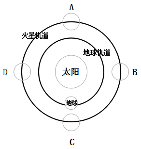

- **A**. A
- **B**. B
- **C**. C　✅
- **D**. D

**答案**：C

**官方解析**

本题考查地理常识中“火星冲日”时火星、地球和太阳三者之间的位置。
地球在火星和太阳之间时就发生火星冲日。当火星与太阳视黄经相差180度时，称为火星冲日。这时，火星和太阳分别位于地球的两边，太阳刚一落山，火星就从东方升起，而等到太阳从东方升起时，火星才在西方落下，因此整夜都可观测火星。一般来说，冲日时，火星离地球较近，它的亮度也是一年当中最亮的。故A、B、D三项错误。
故正确答案为C。

---

### 第 7 题　qid 2172138 · 科技常识

随着科技发展，微生物在我们的生活中发挥越来越大的作用。以下不属于微生物应用事例的是（  ）。

- **A**. 用青霉素治疗疾病
- **B**. 注射减毒疫苗
- **C**. 利用木质纤维素水解发酵生产生物燃料
- **D**. 在伊蚊身上植入编码了疟原虫抗体的基因　✅

**答案**：D

**官方解析**

本题考查微生物应用的生物常识。微生物包括细菌、病毒、真菌以及一些小型的原生生物、显微藻类等在内的一大类生物群体。
A项正确，弗莱明从青霉菌抑制其它细菌的生长中发现了青霉素，用青霉素治疗疾病属于微生物应用事例。
B项正确，减毒疫苗，是将病原微生物的毒力降低，使其能够诱发理想的免疫应答而不产生临床症状。“注射减毒疫苗”类似于轻度人工自然感染，疫苗进入人体后可以引发机体免疫反应，且有一定繁殖能力，起到获得长期或终生保护的作用。
C项正确，木质纤维素是天然可再生木材经过化学处理、机械法加工得到的有机絮状纤维物质。木质纤维素可在水解后被微生物发酵生产燃料乙醇。
D项错误，在伊蚊身上植入编码了疟原虫抗体的基因，属于基因的应用，而不属于微生物的应用事例。
本题为选非题，故正确答案为D。

---

### 第 8 题　qid 2172142 · 人文常识

当前我国国企国资改革扎实推进，（  ）改革基本完成，兼并重组、压减层级、提质增效取得积极进展。

- **A**. 公司制　✅
- **B**. 股份制
- **C**. 混合所有制
- **D**. 股权制

**答案**：A

**官方解析**

本题考查时政知识。
2018年政府工作报告中指出，坚持全面深化改革，着力破除体制机制弊端，发展动力不断增强。国资国企改革扎实推进，公司制改革基本完成，兼并重组、压减层级、提质增效取得积极进展。
故正确答案为A。

---

### 第 9 题　qid 2172146 · 科技常识

克隆属于无性生殖。如果人们将黑色兔子的乳腺细胞核移植到白色兔子的去核卵细胞中，形成重组细胞，再经过一系列培育，克隆出一只兔子。那么，这只克隆兔子的毛色是（  ）。

- **A**. 白色
- **B**. 黑色　✅
- **C**. 黑白相间
- **D**. 灰色

**答案**：B

**官方解析**

本题考查与克隆相关的生物常识。克隆是指生物体通过体细胞进行的无性繁殖，以及由无性繁殖形成的基因型完全相同的后代个体组成的种群。
细胞核是遗传物质的载体，白色兔子卵细胞，被剔除细胞核，再从黑色兔子乳腺细胞中取出细胞核，移植到白色兔子去核卵细胞内，胚胎发育时必然是黑色兔子的遗传性状得到表达，所以，克隆出的兔子毛色是黑色的。
故正确答案为B。

---

### 第 10 题　qid 2172150 · 人文常识

为建立生态文明绩效考评和责任追究制度，我国已推行（  ），开展省级以下环保机构垂直管理制度改革试点。

- **A**. 河长制、江长制
- **B**. 江长制、湾长制
- **C**. 河长制、湖长制　✅
- **D**. 湖长制、湾长制

**答案**：C

**官方解析**

本题考查时政知识。
2018年政府工作报告中指出，完善主体功能区制度，建立生态文明绩效考评和责任追究制度，推行河长制、湖长制，开展省级以下环保机构垂直管理制度改革试点。
故正确答案为C。

---

### 第 11 题　qid 2172152 · 人文常识

以下国家没有热带雨林的是（  ）。

- **A**. 加拿大　✅
- **B**. 印度尼西亚
- **C**. 刚果民主共和国
- **D**. 巴西

**答案**：A

**官方解析**

热带雨林是地球上一种常见于赤道附近热带地区的森林生态系统，主要分布于东南亚、澳大利亚北部、南美洲亚马孙河流域、非洲刚果河流域、中美洲和众多太平洋岛屿。
A项错误，加拿大位于北美洲最北部，属于高纬度地区，不可能有热带雨林。
B项正确，印度尼西亚是东南亚国家，其位于苏门答腊省的苏门答腊热带雨林是世界自然遗产。
C项正确，刚果民主共和国是非洲中部的一个国家，在刚果河流域内，拥有世界第二大的刚果雨林，它的面积仅次于南美洲亚马孙热带雨林。
D项正确，巴西位于南美洲东南部，亚马孙热带雨林横贯其中，它是全球最大及物种最多的热带雨林。
本题为选非题，故正确答案为A。

---

### 第 12 题　qid 2172155 · 人文常识

“赋”“比”“兴”是《诗经》中的三种基本表现手法。其中“兴”有感发兴起之意，是因某一事物之触发而引出所欲叙写之事物的一种表达方法。下列不属于“兴”手法的诗句是（  ）。

- **A**. 苕之华，芸其黄矣。心之忧矣，维其伤矣。
- **B**. 硕鼠硕鼠，无食我黍！三岁贯女，莫我肯顾。　✅
- **C**. 关关雎鸠，在河之洲。窈窕淑女，君子好逑。
- **D**. 桃之夭夭，灼灼其华。之子于归，宜其室家。

**答案**：B

**官方解析**

本题考查文学常识。
A项正确，该句的意思是“凌霄花开放，颜色是深黄。心里正忧愁呀，更有多悲伤”，作者因看到凌霄花开放，充满生机，而联想到自身却身处荒年，人们在饥饿中挣扎，难有活路，为此心里忧伤不已。符合“兴”的表述。
B项错误，该句的意思是“大田鼠呀大田鼠，不许吃我种的黍！多年辛勤伺候你，你却对我不照顾”，这两句都在叙述同一个事物，并非因一事物而谈及另一事物。不符合“兴”的表述。
C项正确，该句的意思是“关关和鸣的雎鸠，相伴在河中的小洲。那美丽贤淑的女子，是君子的好配偶”，作者看到雎鸠彼此相伴，由此想到美丽女子。符合“兴”的表述。
D项正确，该句的意思是“翠绿繁茂的桃树啊，花儿开得红灿灿。这个姑娘嫁过门啊，定使家庭和顺又美满”，作者看到桃花盛开，联想到姑娘嫁人。符合“兴”的表述。
本题为选非题，故正确答案为B。

---

### 第 13 题　qid 2172158 · 科技常识

具有社会行为的动物大多具有以下特征：①群体内部往往形成一定组织；②组织成员之间有明确的分工；③群体内有一定的等级。下列属于动物社会行为的是（  ）。

- **A**. 母猩猩哺育幼猩猩
- **B**. 乌贼遇敌喷出墨汁
- **C**. 蜂王依靠工蜂喂养　✅
- **D**. 狗为吃骨头而争斗

**答案**：C

**官方解析**

本题考查生物常识。
A项错误，母猩猩哺育幼猩猩属于亲子关系，其本身还不能视为社会行为，而应当视为动物的繁殖行为。繁殖行为是与动物繁殖后代有关的行为，主要包括识别、占有繁殖空间、求偶、交配、孵卵、哺育等。
B项错误，乌贼遇敌喷出墨汁属于动物的防御行为，防御行为是指动物为对付外来侵略、保卫自身的生存、或者对本族群中其他个体发出警戒而发生的任何一种能减少来自其他动物伤害的行为。
C项正确，蜂群被视为典型的具有社会行为的群体，并非因为它是个血缘集团，而是因为内部有明显的分工和组织。“蜂王依靠工蜂喂养”体现了群体成员之间的明确的等级和分工，符合上述特征。
D项错误，狗为吃骨头而争斗属于动物的攻击行为，攻击行为是指在动物界中，同种动物个体之间常常由于争夺食物、配偶，抢占巢区、领域而发生相互攻击或战斗。
故正确答案为C。

---

## 言语理解与表达

### 第 1 题　qid 2172121 · 语句表达

填入下列横线处的词语，最恰当的是（  ）。
慎众，慎的是        。群体心理学认为，个体的行为容易受群体的意识、情绪和选择影响。正如《乌合之众》一书所说，“群体中的个人，不过是众多沙粒的一颗，可以被风吹到无论什么地方”。所以，当身处群体中时，要格外注意自己的言行，不为“生态”所染、不为“氛围”所乱、不为“情绪”所感。

- **A**. “出众”
- **B**. “众怒”
- **C**. “从众”　✅
- **D**. “众说”

**答案**：C

**官方解析**

阅读后文完整的语句可知，作者意在强调 “个人身处群体时，要注意自己的言行，不要被群体所染、所乱、所感”，即个人需慎重的是“受群体影响”，“从众”，指人受到外界人群行为的影响，C项当选。
A项“出众”指超过众人，常形容人的才华、模样、能力等，与文意“受影响”无关，排除；
B项，“众怒”指众人的愤怒，与个人受群体影响无关，排除；
D项，“众说”指多种多样的说法，文段重在表达不受“群体”多种因素的影响，而非仅强调受 “说法、观点”的影响，与文意不符，排除。
故正确答案为C。
【文段出处】《既要慎独，也要慎众》

---

### 第 2 题　qid 2172141 · 逻辑填空

填入下列横线处的词语，最恰当的是（  ）。
文化遗产不可复制，也不能再造，不管是申遗还是入选之后，        应该始终放在第一位。只有这样，文化遗产才能更好造福于民、传之子孙。

- **A**. 开发
- **B**. 保护　✅
- **C**. 重建
- **D**. 研究

**答案**：B

**官方解析**

根据“文化遗产不可复制、也不能再造”可知，文化遗产需要保持原本的面貌不变，只有“保护”符合文意，故B项当选。
A项“开发”指对新资源、新领域的开拓和利用，与前文“不可再造”说法矛盾，故排除；
C项“重建”与前文“不能再造”语义相悖，故排除；
D项“研究”，通常在“保护”好的前提下才能“研究”，无法放在“第一位”，故排除。
故正确答案为B。
【文段出处】《申遗成功是文化保护新起点》

---

### 第 3 题　qid 2172153 · 语句表达

依次填入下列横线处的词语，最恰当的一组是（  ）。
“多”与“少”，两者之间绝不仅仅是数量上的对立存在，而恰恰是“量变”与“质变”之间的一个        。一味追求多，或一味追求少，都有可能把事物引向        的另一面。因而，在看待“多”与“少”上，也要有辩证的观点。

- **A**. 独立状态，意料之外
- **B**. 中间过程，无法控制
- **C**. 相对状态，难以接受
- **D**. 演变过程，截然相反　✅

**答案**：D

**官方解析**

第一空，“不仅仅是……而恰恰是”构成反义并列，前后含义相反，前文提及“对立”，故横线处应表示“不对立”， A项“独立状态”、C项“相对状态”都与“对立”含义相近，而非相反，不符合文意，均排除。
第二空，由“一味……一味……”可知，横线处表示若把握不好多和少的度，可能会由“量变”引起“质变”，即“质”会有所不同甚至相反，D项“截然相反”表示相反，符合文意，当选。B项“无法控制”，文段未提及“控制”的话题，不符合文意，排除。
故正确答案为D。
【文段出处】《更少就是》

---

### 第 4 题　qid 2172162 · 语句表达

依次填入下列横线处的词语，最恰当的一组是（  ）。
中国梦传递        的家国天下情怀，唤醒内心深处的命运共同体意识，凝聚振兴中华的探索与奋斗，成为亿万人民认同的最大公约数，激发中华民族强烈的        和豪迈的进取心。

- **A**. 喷薄而出，幸福感
- **B**. 富丽堂皇，获得感
- **C**. 美轮美奂，认同感
- **D**. 绵延已久，归属感　✅

**答案**：D

**官方解析**

第一空，修饰“家国天下情怀”，A项“喷薄而出”、D项“绵延已久”均可修饰“家国天下情怀”，符合文意，保留。B项“富丽堂皇”指华丽、盛大，常形容房屋宏伟豪华或诗文词藻华丽，修饰“家国天下情怀”不当，排除。C项“美轮美奂”指高大、众多，常形容房屋等建筑高大华丽，与“家国天下情怀”搭配不当，排除。
第二空，“唤醒……凝聚……激发”引导相同句式，构成并列，由“探索与奋斗”对应“进取心”，可知横线处对应“命运共同体意识”，A项“幸福感”与“命运共同体意识”含义不同，无法构成对应，排除。D项“归属感”，文中指人们都属于中华民族的一员，命运捆绑在一起，与“共同体”含义相近，对应恰当，当选。
故正确答案为D。
【文段出处】《以“历史意识”激荡复兴伟业》

---

### 第 5 题　qid 2172175 · 逻辑填空

依次填入下列横线处的词语，最恰当的一组是（  ）。
每一位党员干部，都要有        的态度，鼓起        的勇气，拿出        的担当。

- **A**. 不容过，不讳过，不诿过　✅
- **B**. 不诿过，不讳过，不容过
- **C**. 不讳过，不诿过，不容过
- **D**. 不诿过，不容过，不讳过

**答案**：A

**官方解析**

横线处的词语需要分别与“态度”、“勇气”、“担当”搭配，“不容过”指不容许过错的存在，侧重表示严格要求自己的态度，与“态度”搭配恰当；“不讳过”指承担过错不忌讳，形容面对过错时的勇气，与“勇气”搭配恰当；“不诿过”指出现过错不推诿，与“担当”搭配恰当，锁定A项。
故正确答案为A。
【文段出处】《一些违纪党员干部“虚心接受、坚决不改”》

---

### 第 6 题　qid 2172178 · 语句表达

依次填入下列横线处的词语，最恰当的一组是（  ）。
不可否认，相比以往，现在的信息来源更加芜杂，信息质量也是        。也正因此，人们更需要权威而不        、专业而又通俗易懂的“官方回应”。这类信息一旦供给不足，就会让那些        、偏激，甚至虚假、错误的信息占据了舆论市场。

- **A**. 蒸蒸日上，旁敲侧击，武断
- **B**. 泥沙俱下，装腔作势，片面　✅
- **C**. 良莠不齐，指手画脚，怪异
- **D**. 恒河沙数，张冠李戴，决绝

**答案**：B

**官方解析**

第一空，搭配“信息质量”，根据“芜杂”可知横线处表示信息质量参差不齐，好坏都有，B项“泥沙俱下”、C项“良莠不齐”均指好的坏的混杂在一起，符合文意。A项“蒸蒸日上”指事业一天天向上发展，与“信息质量”搭配不当，且感情色彩偏积极，与文段不符，排除；D项“恒河沙数”形容数量很多，与“信息质量”搭配不当，排除。
第二空，由并列后的“专业”和“通俗易懂”的相反关系可知，横线处表达“官方回应”虽然权威但却不依仗权威故意吓唬人之意，B项“装腔作势”指拿腔拿调，故意做作想引人注意或吓唬人，符合文意；C项“指手画脚”形容说话时放肆或得意忘形，无法与“权威”构成对应，排除。
第三空，代入“片面”验证，“片面”指不全面，形容一些不好的信息，语义恰当。
故正确答案为B。
【文段出处】《充分交流减少“信息逆差”》

---

### 第 7 题　qid 2172180 · 语句表达

依次填入下列横线处的词语，最恰当的一组是（  ）。
《史记》中记载：“子产治郑，        ；子贱治单父，        ；西门豹治邺，      。”子产靠的是亲力亲为，明察秋毫；子贱注重教化百姓，选贤任能；而西门豹则以水利富民，以重典治乱。

- **A**. 民不敢欺，民不能欺，民不忍欺
- **B**. 民不能欺，民不忍欺，民不敢欺　✅
- **C**. 民不忍欺，民不敢欺，民不能欺
- **D**. 民不忍欺，民不能欺，民不敢欺

**答案**：B

**官方解析**

本题可从第三空入手，文段第一句引用了《史记》中的原文，第二句对其进行解释，故可根据人名进行一一对应。第三空对应“而西门豹则以水利富民，以重典治乱”，意思是说西门豹依据法典来治理国家，树立权威，老百姓不敢欺骗他，所以填“民不敢欺”合适。排除A、C两项。
再看第一空，对应“子产靠的是亲力亲为，明察秋毫”，意思是说子产足够智慧，观察细微，能够敏锐地辨别是非，老百姓是不能欺骗他的，所以用“民不能欺”。排除D项。
第二空代入验证，第二空对应 “子贱注重教化百姓，选贤任能”，意思是说子贱非常重视选用当地的“贤人”，完全是儒家“德治”理论的实践，他在管理方式上注重感化百姓，所以填“民不忍欺”合适。
故正确答案为B。
【文段出处】《“古今菏才”—— 鸣琴而治的宓子贱》

---

### 第 8 题　qid 2172183 · 逻辑填空

依次填入下列横线处的词语，最恰当的一组是（  ）。
习近平讲述马克思写《资本论》的故事，以此重申这样一个道理：高尚的气节是每一个成大事业者应有的品质。        面对怎样的艰难险阻，        坚定信念、坚守气节，        一定能战胜困难、取得成功。

- **A**. 即使，也要，就
- **B**. 无论，只要，就　✅
- **C**. 一旦，只要，也
- **D**. 如果，但是，也

**答案**：B

**官方解析**

通过分析句意可知，“坚定信念、坚守气节”是“一定能战胜困难、取得成功”的条件，所以要选择表示条件关系的关联词，四个选项中只有B项“只要……就”符合句意，故排除A、C、D三项。
第一空代入验证，“无论”意为不论，不管，表示在任何条件下结果都一样，可与“怎样的艰难险阻”对应，填入“无论”符合句意。
故正确答案为B。
【文段出处】《习近平讲故事》

---

### 第 9 题　qid 2172129 · 逻辑填空

依次填入下列横线处的词语，最恰当的一组是（  ）。
一个劳模，朴素的事迹本来是很让人感动的，平凡______能触动和抵达人心，______一旦拔高到不食人间烟火的地步，______让读者产生强烈的抵触情绪，让人觉得很假，______会连累到劳模和典型受到批评和抵制，实际上是“黑”了好人。

- **A**. 可能，然而，反而，因为
- **B**. 必然，甚至，无论是，还是
- **C**. 本就，然而，就会，甚至　✅
- **D**. 当然，进而，可能，也可能

**答案**：C

**官方解析**

从第四空入手，前面“让读者产生强烈的抵触情绪，让人觉得很假”与后面的“受到批评和抵制”呈递进关系，只有C项“甚至”符合，锁定C项。A项“因为”为因果关系，B项“还是”为选择关系，D项“也可能”为并列关系，均与文意不符，排除。
验证前三空，第一空，对应前文“朴素的事迹本来是很让人感动的”，与之成并列关系，“平凡本就能触动和抵达人心”，正确；第二空，后文的“一旦拔高到不食人间烟火的地步”与前文“朴素”、“平凡”意思相反，转折关系“然而”正确；第三空，“让读者产生强烈的抵触情绪”为前文“一旦拔高到不食人间烟火的地步”带来的结果，“就会”表述正确。
故正确答案为C。
【文段出处】《警惕那些明褒实贬的“高级黑”》

---

### 第 10 题　qid 2172143 · 逻辑填空

依次填入下列横线处的词语，最恰当的一组是（  ）。
“露凝千片玉，菊散一丛金。”      菊花被视为傲寒的标识，农历九月      被称为菊月，      还有一种花，往往被文人们忽视，那便是棉花。“寒露时节尾花收。露寒不收棉，霜降莫怨天。”在农人的眼中，棉花      是秋季的“尾花”。

- **A**. 尽管，又，因而，也
- **B**. 即使，却，可是，就
- **C**. 因为，并，所以，正
- **D**. 虽然，也，但是，才　✅

**答案**：D

**官方解析**

从第三空入手，前文“菊花被视为傲寒的标识”与后文“还有一种花，往往被文人们忽视”呈转折关系，B项“可是”、D项“但是”符合文意，保留；A项“因而”和C项“所以”表示总结，排除。
再看第二空，前后两句“菊花被视为傲寒的标识”和“九月被称为菊月”语义形成并列，“也”正确，锁定D项；B项“却”表转折，与文意不符，排除。
验证第一、四两空，“虽然菊花被视为傲寒的标识……但是还有一种花，往往被文人们忽视，那便是棉花……棉花才是秋季的‘尾花’”，符合逻辑，D项当选。
故正确答案为D。
【文段出处】《寒露：虽惭老圃秋容淡  且看黄花晚节香》

---

### 第 11 题　qid 2172149 · 片段阅读

近年来，广州经济正经历一次深刻转型。此前，广州作为全球重要的商贸中心，更多是汇聚全球的货物流、人流。而广州现在对枢纽型网络城市的打造，则旨在汇聚更重要的资金和智力（技术）要素，以形成一个全球性的高端要素配置枢纽。同时广州的产业结构也加速优化。在原有汽车、日化等优势产业的基础上，代表未来产业方向的“两端”产业——“终端产业”和“高端产业”正被引入广州，并实现集群化发展，从而补上了这座城市长期存在的产业短板。
最适合做这段文字标题的是（  ）。

- **A**. 广州顺应全球产业大势的自我变革　✅
- **B**. 广州产业体系的未来发展趋势
- **C**. 广州未来经济体系建设
- **D**. 广州未来经济发展战略部署

**答案**：A

**官方解析**

文段开篇指出广州经济正在转型，接下来通过“此前”和“现在”的对比重点强调现在进行的转型做法，随后通过“同时”构成的并列结构，分别指出目前广州为了形成全球性的高端要素配置枢纽，一方面汇聚资金和智力要素，另一方面加速优化产业结构，故文段旨在强调广州目前正在进行的自我变革，对应A项。
B项“未来发展趋势”，C项“未来经济体系建设”，D项“未来经济发展战略部署”均阐述广州未来的发展状况，与文段时态不符，均排除。
故正确答案为A。
【文段出处】《“世界的广州”迎面走来》

---

### 第 12 题　qid 2172157 · 片段阅读

法律的实施效果很大程度上是由民众和执法者对待违法行为的态度决定的。禁止燃放烟花爆竹的规定与中国人“逢年过节喜庆应该放鞭炮”的社会习俗是不一致的。在大多数中国人心目中，燃放烟花爆竹是“辞旧迎新”，是“热热闹闹过新年”的重要标志。甚至在很多人的意识中，会有“如果不放鞭炮，怎么能算过年？”这样的意识。所以许多人看到别人违反法规放鞭炮、点烟花，不仅不鄙视他，而且还会觉得挺高兴，乐观其成，无形中减弱了执行的惩罚效果。
下列论断最符合上文观点的是（  ）。

- **A**. 在法律和社会习俗不一致时法律的实施效果不会太好　✅
- **B**. 法律实施效果的好坏完全由法律本身所决定
- **C**. 凡是违反社会习惯的法律法规都应当被废除
- **D**. 法律法规在制定时应当征求民众和执法者意见

**答案**：A

**官方解析**

文段开篇指出民众和执法者的态度决定了法律的实施效果。后文通过“禁止燃放烟花爆竹的规定”进一步强调法律和我们的社会习俗，即“逢年过节喜庆应该放鞭炮”不一致时，法律的实施效果就不太好。故文段重在强调法律和社会习俗不一致时法律的实施效果不会太好，A项与作者观点最为匹配，当选。
B项“完全由法律本身所决定”偏离文段重点且表述过于绝对，排除；C项“凡是······都”表述过于绝对且“废除法律法规”表述无中生有，排除；D项“法律法规制定”，文段中未提及，无中生有，排除。
故正确答案为A。
【文段出处】《张维迎：法律与社会规范》

---

### 第 13 题　qid 2172161 · 片段阅读

在古罗马时代，为了确保法官审理案件的公正性，法官往往并不主动搜集或调查证据，而只是在案件审判过程中，通过当事人双方所提交的证据来确定案件事实。在案件审理之前，法官对案件事实往往一无所知，这有利于避免法官就案件事实形成不合理的前见，避免先入为主作出评判。
关于这段文字，以下理解准确的是（  ）。

- **A**. 公正性是法官审理案件的首要因素
- **B**. 先入为主会对法官的公正裁判带来严重影响　✅
- **C**. 不讲程序正义，无法保证结果正义的实现
- **D**. 法官对案件事实一无所知，有利于公正裁判

**答案**：B

**官方解析**

B项，根据“在案件审理之前，法官对案件事实往往一无所知，这有利于避免法官就案件事实形成不合理的前见，避免先入为主作出评判”可知，先入为主会对法官的公正裁判带来影响，表述正确，当选。
A项，“首要因素”在文段中并未提及，属于无中生有，排除；
C项，“程序正义”在文中并未提及，属于无中生有，排除；
D项，“法官对案件事实一无所知，有利于公正裁判”缺少前提条件“在案件审理之前”，故排除。
故正确答案为B。
【文段出处】《为什么正义女神要戴着眼罩？》

---

### 第 14 题　qid 2172165 · 片段阅读

平心而论，自古至今闲逸都是一种奢侈品，它取决于两个一般人最难以企及的前提：物质上丰裕或者至少能够自给自足的生存自由，时间上有足够的闲余甚至或许要靠没事找事来打发时光的自由。以此二者为前提，再辅以特定的精神需求，无论这种需求是来自虔敬如宗教意义上的感召，还是纯属内在的好奇，抑或是为了迎合时尚以示高贵、体面与教养，至少在被称之为“科学崛起”或“科学革命”的十七世纪，科学还只是极少数人方能够消费得起的“瓷器活”。
下列说法与原文相符的是（  ）。

- **A**. 闲逸和精神需求的要求使得科学难在特定年代普及　✅
- **B**. 时间上的闲余可以迎合时尚以示高贵、体面与教养
- **C**. 在十七世纪，只有富有的人才能从事科学相关工作
- **D**. 精神需求必然来源于宗教的感召或者是心灵的好奇

**答案**：A

**官方解析**

A项，文段先指出“闲逸”的两个前提是物质和时间有足够的自由，再加上“精神需求”可以使得“科学”成为十七世纪“极少数人方能够消费得起的‘瓷器活’”，故“闲逸和精神需求的要求使得科学难在特定年代普及”，符合文意，当选。
B项，“时间上的闲余”对应“时间上有足够的闲余甚至或许要靠没事找事来打发时光的自由”，是“闲逸”的前提之一，文中并未指出它可以迎合“时尚以示高贵、体面与教养”，故属于无中生有，排除；
C项，根据文意可知，从事科研的一个前提是物质上富裕或生活上至少自给自足，而“富裕”仅属于“闲逸”的前提之一，故表述片面，排除；
D项，根据“精神需求，无论这种需求是来自虔敬如宗教意义上的感召，还是纯属内在的好奇，抑或是为了迎合时尚以示高贵、体面与教养”可知，精神需要的来源有三个方面，选项中缺少“为了迎合时尚以示高贵、体面与教养”，故表述片面，排除。
故正确答案为A。
【文段出处】《闲逸与仓皇的学问》

---

### 第 15 题　qid 2172168 · 片段阅读

多少干部，倒在类似“大节”“小节”的认识误区中，以为“干部出点小问题是难免的，但只要干事业就‘大节不亏’”。从来没有不起眼的蚁穴，只有守不住的长堤，丢了“清政”，何以“有为”？这两者没有“大”“小”之分，都是党员干部须臾不可丢失的“大节”。
下列哪个词语，最符合这段文字所表达的意思？（  ）

- **A**. 惩前毖后
- **B**. 积微成著
- **C**. 正本清源
- **D**. 积羽沉舟　✅

**答案**：D

**官方解析**

文段开头提出问题，即“很多干部对‘大小节’的认识存在误区”，后文通过“从来没有不起眼的蚁穴”强调小问题对于党员干部来说也是非常重要的，故文段重在强调党员干部须臾小节也不可丢，千里之堤溃于蚁穴。对应选项，D项“积羽沉舟”比喻小小的坏事积累起来就会造成严重的后果，符合文段中心，当选。
A项“惩前毖后”指批判以前所犯的错误，吸取教训，使以后谨慎些，不致再犯，文段并未涉及“惩前”和“毖后”两方面，排除；
B项“积微成著” 指微小的事物，经过积累，变得显著，为中性词，表达不出小问题会造成严重后果的语义，故不如“积羽沉舟”语义更加合适，排除；
C项“正本清源”比喻从根源上加以整顿清理，与文段语义无关，排除。
故正确答案为D。
【文段出处】《在“严管”中彰显“厚爱” ——以好经验开创全面从严治党新局面》

---

### 第 16 题　qid 2172171 · 片段阅读

对于脑性瘫痪的婴儿来说，爬行是件很困难的事。这些孩子的大脑受到损伤，对肌肉的控制力较差，所以往往无法在地上爬行。相应地，与运动技能和空间定位相关的神经连接的发育也会由此停滞，这将导致患者日后遇到更多与运动有关的问题。有研究团队开发出了一种旨在助力婴儿爬行的新设备，在机器的帮助下，疑似脑性瘫痪婴儿的相应神经得到锻炼，从而能够更早学习爬行，爬得也更远。
这段文字旨在说明（  ）。

- **A**. 脑性瘫痪婴儿爬行很困难
- **B**. 早期干预可以改善运动控制
- **C**. 新设备可帮助脑瘫婴儿学习爬行　✅
- **D**. 大脑受损的婴儿对肌肉的控制力很差

**答案**：C

**官方解析**

文段开头提出问题“对于脑性瘫痪的婴儿来说，爬行是件很困难的事”，之后具体分析爬行困难的原因，即大脑损伤，与运动相关的神经发育停滞，尾句提出解决问题的对策，即“研究出了新设备可以帮助脑瘫婴儿学习爬行”，故文段为“提出问题—分析问题—解决问题”的结构，最后的对策为文段的重点，C项当选。
A项，为文段中问题的表达，非重点，排除；B项，“早期干预”文段中并未出现，无中生有，且没有提及“婴儿”这一核心话题，排除；D项，为分析问题部分的内容表述，非重点，排除。
故正确答案为C。
【文段出处】《机器人帮脑瘫婴儿学习爬行》

---

### 第 17 题　qid 2172126 · 片段阅读

新技术往往会以其特有的未知性、前瞻性，冲撞我们的心理认知舒适区。人们害怕大数据的发展，会使自己在未来被控制或被替代，这样的担心不能说是多余。据统计，欧盟目前90%的工作都需要人们具备某种数字技能，而65%的欧盟新入学儿童长大后将从事目前尚不存在的职业。不过这一尚处于青少年时期的“新技术”，如人类本身一样，是复杂的多面体，因此观察也需要更丰富、多元的角度。
关于这段文字，以下理解准确的是（  ）。

- **A**. 不具备某种数字技能，很难在欧盟开展工作　✅
- **B**. 65%的欧盟新入学儿童长大后面临失业的风险
- **C**. 新技术的发展往往弊大于利
- **D**. 大数据的发展会控制人类本身

**答案**：A

**官方解析**

A项，根据文段“欧盟目前的工作都需要人们具备某种数字技能”可知，A项表述正确，当选；

B项，根据文段“的欧盟新入学儿童长大后将从事目前尚不存在的职业”可知，文段表达的是因为新技术的发展未来会出现一些新职业，而非儿童会面临失业，排除；

C项，“弊大于利”无中生有，文段没有进行对比，排除；

D项，根据文段“不过这一尚处于青少年时期的‘新技术’，如人类本身一样，是复杂的多面体，因此观察也需要更丰富、多元的角度”可知，新技术未来怎样还不确定，D项表述绝对，排除。

故正确答案为A。

【文段出处】《大数据也可以有温度》

---

### 第 18 题　qid 2172130 · 片段阅读

就世界范围而言，在成熟的市场，大企业都是通过不断创新来赢得更多利润的。只有在不够成熟的市场，才有空间通过其他手段来获得高额利润。在一个信息日益对称的时代，畸形的高利润是不正常的，利用消费心理不成熟等因素获得高额利润的企业将不再受欢迎。随着国内市场和消费者的更加成熟和理性，企业的未来一定会为消费者提供更好的更多样的产品。
下列不符合作者观点的是（  ）。

- **A**. 未来企业可以通过不断创新来获得更多利润
- **B**. 未来企业只有通过更多花样营销才能获得高额利润　✅
- **C**. 能够为消费者提供更好更丰富产品的企业才能在未来崛起
- **D**. 市场成熟度影响了企业获得高额利润的可能性

**答案**：B

**官方解析**

A项，根据文段“就世界范围而言，在成熟的市场，大企业都是通过不断创新来赢得更多利润的”可知，A项表述正确；
B项，根据文段“随着国内市场和消费者的更加成熟和理性，企业的未来一定会为消费者提供更好的更多样的产品”可知，文段强调的是提供多样的产品，而非花样营销，表述错误；
C项，根据文段“随着国内市场和消费者的更加成熟和理性，企业的未来一定会为消费者提供更好的更多样的产品”可知，C项表述正确；
D项，根据文段“在成熟的市场，大企业都是通过不断创新来赢得更多利润的。只有在不够成熟的市场，才有空间通过其他手段来获得高额利润”可知，D项表述正确。
本题为选非题，故正确答案为B。

---

### 第 19 题　qid 2172134 · 片段阅读

肉食悖论指的是，一些人喜欢吃肉，但不能联想到提供肉的动物死去的场景。研究者发现，人们通过一种被称为“语言伪装”的方法，让有感觉的生灵与潜在的食物来源之间的关联变得更模糊，以此来消除这种认知失调。例如，我们提到肉时不直接说动物的名称，英语里把猪肉叫做pork，牛肉叫做beef，或者叫培根什么的。而18世纪的日本，由于当时的幕府禁止人们吃兽肉，偷吃肉的人以植物名称代指肉类，把马肉称为樱肉，把鹿肉称为红叶，把野猪肉称为牡丹。
这段文字主要说明（  ）。

- **A**. “语言伪装”是人类自欺欺人的表现
- **B**. 日本人对植物的热爱超过动物
- **C**. 文化因素是消解肉食悖论的关键
- **D**. “语言伪装”有助于克服认知失调　✅

**答案**：D

**官方解析**

文段开篇介绍肉食悖论的概念，人们存在喜欢吃肉但是不能联想动物死去场景的问题，随后通过“研究者发现”提出解决“肉食悖论”的方法，即利用“语言伪装”的方式，让动物和食物的来源关系变得模糊，从而达到消除认知失调的目的，后文通过“例如”举英语、日本等例子来验证前文观点，故文段主要说明的是“语言伪装”有助于解决认知失调的问题，对应D项。
A项，“自欺欺人”无中生有，排除；
B项，“日本人”的做法出现在文段尾句，属于举例论证部分，非文段重点，排除；
C项，“文化因素”概念扩大，文段介绍的是“语言伪装”，排除。
故正确答案为D。
【文段出处】《动物这么可爱，你为什么还要吃它们？》

---

### 第 20 题　qid 2172147 · 片段阅读

“新零售”虽然已经成为当下最火热的概念，但究竟何为新零售其实并没有一个准确的定义。专业的说法是“人、货、场在互联网和大数据下的重构”，通俗地理解大概就是线上和线下结合，然后辅之以人工智能、大数据、云计算等技术手段，对传统零售业的生产销售等环节实现全方位的升级改造。
以下说法可以从原文推出的是（  ）。

- **A**. 人工智能等新技术的出现是实现新零售的必要条件
- **B**. 新零售能够弥补传统零售业线下销售渠道单一的不足　✅
- **C**. 新零售大量运用高科技，能够有效降低传统人力成本
- **D**. 传统电商的增长瓶颈是推动新零售落地的动力

**答案**：B

**官方解析**

A项，根据“辅之以人工智能、大数据、云计算等技术手段”可知，“人工智能等新技术的出现”只是实现新零售的辅助而不是必要条件，无法从原文推出，排除；
B项，根据“对传统零售业的生产销售等环节实现全方位的升级改造”以及“线上和线下结合”，可以推出新零售通过线上线下融合，能够弥补传统零售业线下销售渠道单一的不足，当选；
C项“人力成本”、D项“传统电商的增长瓶颈”文段均未提到，无中生有，无法从原文推出，排除。
故正确答案为B。

---

### 第 21 题　qid 2172156 · 语句表达

将下列句子组成一段逻辑连贯、语言流畅的文字，排列顺序最合理的是（  ）。
①但是，当你一旦走入生活就不一样了，那里面有精彩的故事、鲜活的人物和传神的细节。
②特别是艺术的形式与美感，只能从人类的生活本身去发现、提炼与获得。
③有一位诗人形容作家坐在屋里挖空心思写不出东西的窘态是“把手指甲都绞出了水来”。
④深入地去体察自然，才能胸有万壑，下笔有神。
⑤艺术虽然高于生活，但归根结底源于生活，源于客观实际。

- **A**. ②①⑤③④
- **B**. ③②①⑤④
- **C**. ④③②①⑤
- **D**. ⑤②④③①　✅

**答案**：D

**官方解析**

对比选项，确定首句。②句出现程度词“特别是”，表示递进强调，一般不适合作为首句，排除A项。③句、④句、⑤句均可作为首句。
继续寻找其他线索，①句出现转折词“但是”，可观察①句前是②句还是③句。①句强调走入生活后，会有很多精彩的故事，带有明显的积极意味，而转折前后语义相反，故前文应为消极色彩，表示在没进入生活之前，很难获得精彩的故事，③句中诗人的话语正符合此意，故③①捆绑，锁定D项。②句强调艺术要从生活中获得，无法与①句构成转折关系，排除B、C两项。
故正确答案为D。
【文段出处】《“深挖井”方能“饮甘泉”》

---

### 第 22 题　qid 2172159 · 语句表达

将下列句子组成一段逻辑连贯、语言流畅的文字，排列顺序最合理的是（  ）。
①但要真正落实“地方各级人民政府应当对本行政区域的环境质量负责”，光“亮相”是不够的，还得“亮剑”。
②从某种意义上说，这种“亮相”也为这些环保落后城市提供了一个“奋发向上”的契机。
③督促政府守法的手段，最常见的就是把那些环保不力的城市放到聚光灯下“亮相”。
④“亮相”并不是一种“法律责任”，但通过舆论的压力，可以起到很好的震慑效果。
⑤只有把追责的板子直接打到党政领导干部的身上，他们才会有更充分的压力和动力“真重视、真抓”环保工作。

- **A**. ③④②①⑤　✅
- **B**. ④③①⑤②
- **C**. ③②①④⑤
- **D**. ④②③⑤①

**答案**：A

**官方解析**

观察选项，对比首句，③句“最常见的就是……‘亮相’”，引出“亮相”这一话题，④句“‘亮相’并不是……”，是对“亮相”的具体论述，按照逻辑的顺序，应当先引出话题，再进行具体论述，故③更适合作首句，排除B、D两项。对比A、C项，发现②句与④句均论述“亮相”，都可在③句后，不好判断顺序。通读五个句子，可知②③④句均论述“亮相”，而①句提出“亮剑”，根据话题一致可捆绑②③④，锁定A项。
故正确答案为A。
【文段出处】《抓环保要“亮相”更要“亮剑”》

---

### 第 23 题　qid 2172160 · 语句表达

将下列句子组成一段逻辑连贯、语言流畅的文字，排列顺序最合理的是（  ）。
①简单的答案是，如果信息是完全的，平等和效率是可以分开的。
②读者可能会问：什么时候平等和效率可以分开呢？
③在社会当中，平等与效率的关系是人们经常讨论的一个问题。
④也就是说，在完全信息的条件下，社会既可以实现最大效率，同时又可以达到合意的平等。
⑤平等和效率之所以搅合在一起，有的时候为了效率会损害平等，而为了平等就会损失效率，就是信息不完全造成的。

- **A**. ②①③④⑤
- **B**. ③①②⑤④
- **C**. ③②①④⑤　✅
- **D**. ②①④③⑤

**答案**：C

**官方解析**

对比选项，确定首句。②句具体阐述了有关平等与效率关系的问题内容，③句引出平等与效率的话题，并指出人们经常讨论平等与效率的关系，对比可知，应先引出话题，再围绕话题进行具体论述，③句更适合作为首句，A、D两项排除，B、C两项保留。
继续观察选项，寻找其他线索。①句对平等和效率在何种情况下可以分开给出了答案，②句具体阐述了有关平等与效率关系的问题，对比可知，应先提出问题，再说明答案，②句应在①句之前，B项排除，C项当选。
故正确答案为C。

---

### 第 24 题　qid 2172163 · 语句表达

近代以来，中华民族遭受的苦难之重、付出的牺牲之大，在世界历史上都是罕见的，可谓“         ”。改革开放以来，我们不断艰辛探索，终于找到了实现中华民族伟大复兴的正确道路，正是“           ”。而现在，我们比历史上任何时期都更接近中华民族伟大复兴的目标，比历史上任何时期都更有信心、有能力实现这个目标，一定是“           ”。
依次填入划横线部分最恰当的是（  ）。

- **A**. 雄关漫道真如铁，人间正道是沧桑，长风破浪会有时　✅
- **B**. 人间正道是沧桑，雄关漫道真如铁，长风破浪会有时
- **C**. 长风破浪会有时，人间正道是沧桑，雄关漫道真如铁
- **D**. 长风破浪会有时，雄关漫道真如铁，人间正道是沧桑

**答案**：A

**官方解析**

第一空，横线处所填内容用来总结中华民族曾遭受过的巨大的苦难，“雄关漫道真如铁”可体现出道路艰险且长、难以跨越之意，符合文意；第二空，用来总结我国已找到了实现复兴的正确道路，“人间正道是沧桑”中的“正道”可对应“正确道路”，且能体现出中华民族找到这一道路的不易，符合文意；第三空，用来总结畅想我国实现伟大复兴的美好未来，“长风破浪会有时”指尽管前路障碍重重，但仍将会有一天会乘长风破万里浪，符合文意。

故正确答案为A。
【文段出处】《高中语文试题》

---

### 第 25 题　qid 2172170 · 语句表达

善念如花，善举似果。善念之花常开，善举之果却不易结。心怀善念，是有善端，这就像是水之源、火之星，正是善的基础。然而，如果徒有善念而不为，也不过停留在“想”的层面，既不能给陷入困境的人以帮助，也不能给社会风气注入正能量，最终难免水源枯竭、火星熄灭。就此而言，         。
填入划横线部分最恰当的一句是（  ）。

- **A**. 善念和善行是相辅相成、彼此促进的
- **B**. 善念对善行起到了驱动和引导作用
- **C**. 善行比善念更重要，行动比观念更重要　✅
- **D**. 只有落实到善行的善念才是真正的善念

**答案**：C

**官方解析**

横线位于文段尾句，横线前“就此而言”表示总结，可知需填入对上文进行概括总结的句子。文段首先表明善念容易有，但是真正付出行动的善举不容易有，接着文段通过转折关系强调，如果只有善念却不行动，不付出善举的话，便不会产生帮助他人、提供正能量等好的效果。可知文段意在表明，有了善念还不够，切实的付出行动更加重要，这样才能达到帮助他人等的目的。C项，转折之后强调“善念”只是停留在想的层面，不能产生实际影响，要想落实还得靠“善举”，所以“行动比观念重要”，当选。
A项，文段仅体现了善念需要善行，未体现善念与善行相互存在影响，故“相辅相成、彼此促进”表述无中生有，排除；
B项，“驱动和引导作用”表述无中生有，无法总结上文，排除；
D项，在解释“什么是真正的善念”，落脚点还是在“善念”上，而文段突出的是“善举”的重要性，排除。
故正确答案为C。
【文段出处】《善念如花，善举似果》

---

## 数量关系

### 第 1 题　qid 2172076 · 数学运算

2，3，-1，4，-5，（    ）

- **A**. -8
- **B**. -9
- **C**. 8
- **D**. 9　✅

**答案**：D

**官方解析**

数列无明显特征，作差无规律，考虑递推。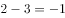，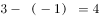，，故规律为：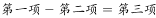。所求项为：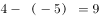。

故正确答案为D。

---

### 第 2 题　qid 2172081 · 数学运算

1，，2，，，（    ）

- **A**. 

- **B**. 

- **C**. 

- **D**. 

　✅

**答案**：D

**官方解析**

题干虽为分数列，但反约分后无任何规律，同时作差也无规律，考虑作积查找规律。前项乘以后项得到：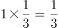，，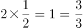，，是公差为的等差数列。因此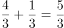，解得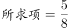。

故正确答案为D。

---

### 第 3 题　qid 2172083 · 数学运算

某单位计划为95名员工每人购买一本政策法规小册子，该小册子的售价为6元。书店对购买100本及以上者给予9折优惠。该单位可与其他单位拼团购买，如果该单位想完成这一任务，则最少需要花费（    ）元。

- **A**. 570
- **B**. 540
- **C**. 513　✅
- **D**. 500

**答案**：C

**官方解析**

根据题意，该单位有两种购买方式：

方案一：以原价购买95本，则需要花费元；

方案二：与其他单位拼团购买，且拼团成功，则需要花费元。

则该单位最少需要花费513元。

故正确答案为C。

---

### 第 4 题　qid 2172085 · 数学运算

水果店里有相同数量的苹果和梨，现要把这些苹果和梨放入若干个水果篮中。已知每个水果篮放6个苹果和4个梨，最后还剩下2个苹果和18个梨，那么一共包装了（  ）个水果篮。

- **A**. 2
- **B**. 4
- **C**. 6
- **D**. 8　✅

**答案**：D

**官方解析**

设一共包装了个水果篮，根据题意可得：，解得，即一共包装了8个水果篮。

故正确答案为D。

---

### 第 5 题　qid 2172088 · 数学运算

某条道路进行灯光增亮工程，原来间隔35米的路灯一共有21盏，现要将路灯的间隔缩短为25米，那么有（    ）盏路灯无需移动。

- **A**. 2
- **B**. 3
- **C**. 4
- **D**. 5　✅

**答案**：D

**官方解析**

由题干可知，在缩短间隔之前，道路安装了21盏路灯，间隔35米，则道路总长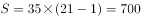米。前后两个间隔35米和25米的最小公倍数为175米，说明无需移动的路灯除了第一座外，其余路灯距离起点的距离应为175米的倍数，分别为：175、350、525、700，再加上起点的第一座，共计5盏。

故正确答案为D。

---

### 第 6 题　qid 2172090 · 数学运算

一个车间需要生产模具256个，每小时生产32个可按时完成，但是生产期间机器发生了故障，修理了1.5个小时，后来只能加派人手使得每小时生产的模具提高到48个，这样恰好按时完成任务。机器在生产了（    ）个零件后发生了故障。

- **A**. 112　✅
- **B**. 108
- **C**. 96
- **D**. 72

**答案**：A

**官方解析**

根据题意可得，生产模具原计划所需时间小时。设机器在发生故障前生产了小时，则可得：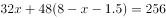，解得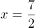。故发生故障前共生产了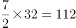个。

故正确答案为A。

---

### 第 7 题　qid 2172093 · 数学运算

快递员小张在A、B、C三个小区送快递，已知小张走三条线路A→B→C、B→C→A和C→A→B所花的时间分别为15分钟、17分钟和18分钟。那么距离最近的两个小区之间的路程要花（    ）分钟。

- **A**. 7　✅
- **B**. 8
- **C**. 9
- **D**. 10

**答案**：A

**官方解析**

方法一：假设快递员在三个小区之间运动的时间分别为、、，根据题意有，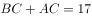，，解得，，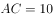。则距离最近的两个小区是B和C，所花时间为7分钟。

方法二：快递员走的三条路线最短耗时15分钟，说明AB与BC的平均时间是7.5分钟，而距离最近的两个小区之间的耗时应低于平均时间7.5分钟，选项中只有A项低于7.5分钟。

故正确答案为A。

---

### 第 8 题　qid 2172095 · 数学运算

某人用一笔钱买入两年期年化利率为的银行理财产品M，两年后连本带息再追加10万元又买入年化利率为的银行理财产品N，又一年后全部收益为3.09万元，那么这个人第一次买入了（    ）万元的银行理财产品M。

- **A**. 10
- **B**. 15　✅
- **C**. 20
- **D**. 30

**答案**：B

**官方解析**

，设第一次买入银行理财产品M的金额为，则两年后收益为；买入银行理财产品N的金额为万元，一年后收益为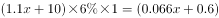万元；两次买入的全部收益为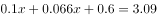万元，解得万元，故第一次买入了15万元的银行理财产品M。

故正确答案为B。

---

### 第 9 题　qid 2172097 · 数学运算

某电影院根据放映时间将电影票分为A档、B档和C档，票价分别为30元、50元和80元。某天有5200名观众购票观影，电影院售票收入25.5万元。已知售出的A档电影票是C档电影票的2倍，则当天售出B档电影票（    ）张。

- **A**. 500
- **B**. 1000
- **C**. 3700　✅
- **D**. 4600

**答案**：C

**官方解析**

根据“售出的A档电影票是C档电影票的2倍”设A档电影票张，C档电影票张，则B档电影票为张，即张。由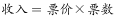，且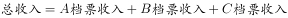，则，解得，则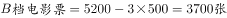。

故正确答案为C。

---

### 第 10 题　qid 2172098 · 数学运算

某部门开展年终评选工作，需从11名员工中评选出一名优秀员工和两名积极员工，且优秀员工与积极员工不能为同一人，则可能会出现的评选结果共有（    ）种。

- **A**. 495　✅
- **B**. 990
- **C**. 1210
- **D**. 1980

**答案**：A

**官方解析**

根据题意，从11名员工中选出1名优秀员工，有种；因优秀员工与积极员工不能为同一人，因此，再从剩下的10人中选出2名积极员工，有种；则可能出现的评选结果共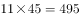种。

故正确答案为A。

---

### 第 11 题　qid 2172118 · 数学运算

印刷厂印刷了一批共1080本字典，用大、小两种箱子进行分装。已知每个大箱子比小箱子多装15本，且8个小箱子的容量等于3个大箱子的容量。如果只用大箱子进行分装，则至少需要（    ）个大箱子。

- **A**. 40
- **B**. 45　✅
- **C**. 50
- **D**. 55

**答案**：B

**官方解析**

设每个大箱子所装字典数量为，则每个小箱子所装数量为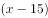。根据题意，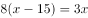，解得。共1080本字典，只用大箱子进行分装，至少需要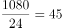个。

故正确答案为B。

---

### 第 12 题　qid 2172120 · 数学运算

如图所示，市政部门在一块周长为260米的长方形草地旁边铺设宽为10米的L形道路。已知铺好道路后，道路和草地面积之和为草地面积的1.5倍，则草地的面积为（    ）平方米。

- **A**. 4200
- **B**. 4000
- **C**. 3000
- **D**. 2800　✅

**答案**：D

**官方解析**

已知长方形草地周长为260，设草地长为，则宽为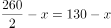，则道路面积为平方米。又已知道路和草地面积之和为草地面积的1.5倍，设草地面积为，则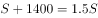，解得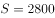平方米。

故正确答案为D。

---

## 判断推理

### 第 1 题　qid 2172078 · 逻辑判断

头发：理发剪 与（  ）在内在逻辑关系上最为相似。

- **A**. 指甲：指甲钳　✅
- **B**. 橡皮：橡皮擦
- **C**. 铅笔：铅笔盒
- **D**. 蜜糖：蜜糖罐

**答案**：A

**官方解析**

第一步：判断题干词语间逻辑关系。
理发剪是修剪头发的工具，两者为对应关系。
第二步：判断选项词语间逻辑关系。
A项：指甲钳是修剪指甲的工具，两者为对应关系。与题干逻辑关系一致，当选；
B项：橡皮与橡皮擦是全同关系，与题干逻辑关系不一致，排除；
C项：铅笔盒是用来装铅笔的盒子，不是修剪铅笔的工具，与题干逻辑关系不一致，排除；
D项：蜜糖罐是盛放蜜糖的罐子，不是修剪蜜糖的工具，与题干逻辑关系不一致，排除。
故正确答案为A。

---

### 第 2 题　qid 2172079 · 逻辑判断

招标：中标 与（  ）在内在逻辑关系上最为相似。

- **A**. 宣传：推广
- **B**. 请示：批复　✅
- **C**. 抽象：具体
- **D**. 支出：收入

**答案**：B

**官方解析**

第一步：判断题干词语间逻辑关系。
先招标后中标，二者有时间先后顺序，且招标与中标不是同一主体。
第二步：判断选项词语间逻辑关系。
A项：推广和宣传无明显先后顺序，与题干逻辑关系不一致，排除；
B项：先请示后批复，请示与批复不是同一主体，与题干逻辑关系一致，当选；
C项：具体和抽象是反义关系，无先后顺序，与题干逻辑关系不一致，排除；
D项：先收入后支出，时间顺序与题干相反，与题干逻辑关系不一致，排除。
故正确答案为B。

---

### 第 3 题　qid 2172080 · 逻辑判断

司机：乘客 与（  ）在内在逻辑关系上最为相似。

- **A**. 教师：家长
- **B**. 医生：病人　✅
- **C**. 编剧：演员
- **D**. 警察：小偷

**答案**：B

**官方解析**

第一步：判断题干词语间逻辑关系。
司机为乘客服务，提供服务人和被服务人的对应，两者为对应关系。
第二步：判断选项词语间逻辑关系。
A项：教师对学生服务，不是家长，与题干逻辑关系不一致，排除；
B项：医生对病人服务，提供服务人和被服务人的对应，与题干逻辑关系一致，当选；
C项：编剧编写剧本，演员根据剧本进行表演，与题干逻辑关系不一致，排除；
D项：警察不是对小偷服务，与题干逻辑关系不一致，排除。
故正确答案为B。

---

### 第 4 题　qid 2172082 · 逻辑判断

树叶：季节 与（  ）在内在逻辑关系上最为相似。

- **A**. 灰尘：历史
- **B**. 口才：道理
- **C**. 皮肤：年龄　✅
- **D**. 运气：成绩

**答案**：C

**官方解析**

第一步：判断题干词语间逻辑关系。
树叶随着季节的交替会发生相应的变化，两者为对应关系。
第二步：判断选项词语间逻辑关系。
A项：灰尘不会随着历史变化。与题干逻辑关系不一致，排除；
B项：口才不会随着道理变化。与题干逻辑关系不一致，排除；
C项：皮肤会随着年龄的增长产生相应的变化。与题干逻辑关系一致，当选；
D项：运气不会随着成绩变化。与题干逻辑关系不一致，排除。
故正确答案为C。

---

### 第 5 题　qid 2172084 · 逻辑判断

电热毯：（  ）与（  ）：信鸽 在内在逻辑关系上最为相似。

- **A**. 风扇，诗人
- **B**. 毛衣，织女
- **C**. 棉被，农民
- **D**. 暖炉，邮差　✅

**答案**：D

**官方解析**

逐一代入选项。
A项：电热毯与风扇都是电器，两者是并列关系，诗人与信鸽无明显关系。前后逻辑关系不一致，排除；
B项：电热毯与毛衣都具有取暖功能，织女与信鸽无明显关系。前后逻辑关系不一致，排除；
C项：电热毯和棉被都具有取暖功能，农民与信鸽无明显关系。前后逻辑关系不一致，排除；
D项：电热毯与暖炉都具有取暖功能，邮差与信鸽都具有通信功能。前后逻辑关系一致，当选。
故正确答案为D。

---

### 第 6 题　qid 2172086 · 逻辑判断

银行：（  ）与（  ）：拖拉机 在内在逻辑关系上最为相似。

- **A**. 叫号机，农民
- **B**. 点钞机，农场　✅
- **C**. 取款机，农业
- **D**. 电视机，农田

**答案**：B

**官方解析**

逐一代入选项。
A项：在银行里使用叫号机，是使用场所与使用工具的对应，农民使用拖拉机，是人与使用工具的对应，前后逻辑关系不一致，排除； 
B项：在银行使用点钞机，是使用场所与使用工具的对应，在农场使用拖拉机，是使用场所与使用工具的对应，前后逻辑关系一致，当选；
C项：在银行使用取款机，是使用场所与使用工具的对应，农业是一种产业，与拖拉机没有明显的逻辑关系，前后逻辑关系不一致，排除；
D项：银行与电视机二者无必然逻辑关系，在农田上使用拖拉机，前后逻辑关系不一致，排除。
故正确答案为B。

---

### 第 7 题　qid 2172091 · 逻辑判断

重量：公斤：天平 与（  ）在内在逻辑关系上最为相似。

- **A**. 容量：千克：杯子
- **B**. 长度：厘米：尺子　✅
- **C**. 温度：平方：被子
- **D**. 体积：大小：柜子

**答案**：B

**官方解析**

第一步：判断题干词语间的逻辑关系。 
天平可以称物品的重量，公斤是一种重量单位。
第二步：判断选项词语间的逻辑关系。
A项：杯子可以测量液体的容量，千克是质量单位，不是容量单位，与题干逻辑关系不一致，排除；
B项：尺子可以测量物品的长度，厘米是一种长度单位，与题干逻辑关系一致，当选； 
C项：被子可以用来保持温暖，不能测量温度，平方是一种运算，与温度没有明显的逻辑关系，与题干逻辑关系不一致，排除；
D项：可以用体积来表示柜子的大小，与题干逻辑关系不一致，排除。
故正确答案为B。

---

### 第 8 题　qid 2172094 · 逻辑判断

购票：乘车：到达 与（  ）在内在逻辑关系上最为相似。

- **A**. 报名：参赛：领奖　✅
- **B**. 下单：付款：送达
- **C**. 排队：用餐：点餐
- **D**. 毕业：就业：失业

**答案**：A

**官方解析**

第一步：判断题干词语间的逻辑关系。
先购票，再乘车，最后到达，三者存在时间的先后顺序，且三者可以是同一主体。
第二步：判断选项词语间的逻辑关系。
A项：先报名，再参赛，最后领奖，三者存在时间的先后顺序，且三者可以是同一主体，与题干逻辑关系一致，当选；
B项：先下单，再付款，最后送达，三者存在时间的先后顺序，但是付款与送达不是同一主体，与题干逻辑关系不一致，排除； 
C项：先排队，再点餐，最后用餐，点餐与用餐的先后顺序与题干相反，与题干逻辑关系不一致，排除；
D项：毕业与就业没有明显的先后顺序，与题干逻辑关系不一致，排除。
故正确答案为A。

---

### 第 9 题　qid 2172096 · 逻辑判断

设计：张贴：海报 与（  ）在内在逻辑关系上最为相似。

- **A**. 购置：发放：清单
- **B**. 粘贴：复制：段落
- **C**. 订阅：推广：报纸
- **D**. 制定：执行：方案　✅

**答案**：D

**官方解析**

第一步：判断题干词语间的逻辑关系。
先设计海报，再张贴海报，二者存在时间的先后顺序，且设计海报、张贴海报均为动宾关系。
第二步：判断选项词语间的逻辑关系。
A项：根据清单去购置，二者不构成动宾关系，与题干逻辑关系不一致，排除；
B项：先复制段落，再粘贴段落，二者的时间顺序与题干相反，与题干逻辑关系不一致，排除；
C项：先推广报纸，再订阅报纸，二者的时间顺序与题干相反，与题干逻辑关系不一致，排除；
D项：先制定方案，再执行方案，二者存在时间的先后顺序，且制定方案、执行方案均为动宾关系，与题干逻辑关系一致，当选。
故正确答案为D。

---

### 第 10 题　qid 2172099 · 逻辑判断

稻谷：粮食：种植 与（    ）在内在逻辑关系上最为相似。

- **A**. 钢笔：文具：绘画
- **B**. 水果：西瓜：切割
- **C**. 人才：资源：培养　✅
- **D**. 煤炭：石油：挖掘

**答案**：C

**官方解析**

第一步：判断题干词语间的逻辑关系。
稻谷是一种粮食，二者是种属关系，种植稻谷构成动宾关系。
第二步：判断选项词语间的逻辑关系。
A项：钢笔是一种文具，二者是种属关系，钢笔可以用来绘画，与题干逻辑关系不一致，排除； 
B项：西瓜是一种水果，二者是种属关系，但是前后顺序与题干相反，排除； 
C项：人才是一种资源，二者是种属关系，培养人才构成动宾短语，与题干逻辑关系一致，当选；
D项：煤炭和石油是并列关系，与题干逻辑关系不一致，排除。
故正确答案为C。

---

### 第 11 题　qid 2172104 · 逻辑判断

随着某市常住人口的增加，运动场地的人均面积正在逐渐减少。近期的一项研究指出，近几年来，该市居民的身体素质在逐步下降。据此，有专家认为，运动场地的缺乏，导致了居民运动量不足，因此居民身体素质逐年下降。
以下哪项如果为真，最能削弱上述结论？

- **A**. 该市大部分免费的运动场所常年冷清　✅
- **B**. 居民运动年消费总额持续上升
- **C**. 该市居民常规运动的种类正在增多
- **D**. 能坚持运动的居民数量逐年下降

**答案**：A

**官方解析**

第一步：找出论点和论据。
论点：运动场地的缺乏，导致了居民运动量不足，因此居民身体素质逐年下降。
论据：某市运动场地的人均面积正在逐渐减少，该市居民的身体素质在逐步下降。
第二步：逐一分析选项。
A项：指出该市大部分免费的运动场所常年冷清，直接否定了论点中的运动场地缺乏导致居民运动量不足，削弱论点，当选；
B项：居民的消费总额上升和运动场地面积与身体素质之间的关系无关，属于无关选项，排除；
C项：居民的常规运动种类和运动场地面积与身体素质之间的关系无关，属于无关选项，排除； 
D项：指出能坚持运动的居民数量下降，也会导致居民的运动量不足，在运动场地缺失的基础上，提出另外一个原因，也会导致运动量不足，属于他因削弱，比A项的削弱论点力度弱，排除。
故正确答案为A。

---

### 第 12 题　qid 2172106 · 逻辑判断

格陵兰岛的冰架以疯狂的速度退却，阿拉斯加和挪威的冰川融化明显，安第斯山脉冰川陆续消失，巴塔哥尼亚的冰川处于危险之中，阿尔卑斯山脉最高的山峰惨不忍睹，就连珠穆朗玛峰和南极洲的冰川都出现了衰退的迹象······以上现象说明：全球冰川在气候变暖的影响下纷纷凋零。但是近年来冰川学家研究发现一个不同寻常的现象，喀喇昆仑山脉的冰川并未融化，数据显示，这些冰川甚至在增厚，每年增加11厘米。
上述断定最能支持以下哪项结论？

- **A**. 全球气候事实上并未变暖
- **B**. 气候变暖不是影响冰川融化的唯一原因　✅
- **C**. 气候变暖不会影响冰川的增加或减少
- **D**. 气候变暖对冰川的影响小于对其他生态的影响

**答案**：B

**官方解析**

本题提问方式特殊，问文段支持以下哪个结论，即题干是论据，正确选项为论点。
第一步：题干分析。
文段前半部分的结论是“全球冰川在气候变暖的影响下纷纷凋零”，即气候变暖让冰川融化。后面一个转折，说也有冰川没有融化。
第二步：逐一分析选项。
A项：若文段要得出“全球气候事实上并未变暖”的结论，则题干中应该有气温变化的例子，但文段中并没有体现，排除；
B项：文段末尾用一个转折，举出反例来推翻了气候变暖会让冰川融化，说明气候变暖不是冰川消融的唯一原因，可以推出，当选；
C项：结论是“气候变暖不会影响冰川的增加或减少”，而题干中明显有例子说明冰川在减少，题干是C项的反例，肯定得不出C项的结论，排除；
D项：若文段要得出“气候变暖对冰川的影响小于对其他生态的影响”的结论，则题干中应该有气候变暖对其他生态影响的例子，才能作比较，但题干中并未提及，排除。
故正确答案为B。

---

### 第 13 题　qid 2172111 · 逻辑判断

下面是某冬日我国北方某些城市的天气情况：（1）有些城市有降雪；（2）有些城市没有降雪；（3）北京和邯郸没有降雪。
如果三个断定中只有一个为真，那么以下选项中哪个断定一定为真？

- **A**. 北京有降雪，但邯郸没有
- **B**. 所有这些城市都有降雪　✅
- **C**. 所有这些城市都没有降雪
- **D**. 以上各选项都不一定为真

**答案**：B

**官方解析**

第一步：找关系。
（1）有些城市有降雪；
（2）有些城市没有降雪；
（3）北京和邯郸没有降雪。
条件（1）和（2）为两个“有的”，必有一真，而根据三个断定中只有一个为真可知唯一的一真在条件（1）和（2）中，那么条件（3）一定为假。
第二步：看其余。
根据条件（3）为假，即真话为北京或邯郸有降雪，可推知有的城市有降雪，条件（1）为真，那么条件（2）有些城市没有降雪为假，真话为所有城市都有降雪。
故正确答案为B。

---

### 第 14 题　qid 2172113 · 逻辑判断

去年，某镇把甲、乙、丙三个大学生村官分别分配到和丰村、团结村、杨梅村工作。人们开始并不知道他们当中究竟谁分配到哪个村工作，只是作了如下三种猜测：
①甲分配到和丰村工作，乙分配到团结村工作；
②甲分配到团结村工作，丙分配到和丰村工作；
③甲分配到杨梅村工作，乙分配到和丰村工作。
后来证实，三种猜测都是只猜中了一半。由此可以推出（  ）。

- **A**. 甲分配到和丰村工作，乙分配到团结村工作，丙分配到杨梅村工作
- **B**. 甲分配到团结村工作，乙分配到和丰村工作，丙分配到杨梅村工作
- **C**. 甲分配到杨梅村工作，乙分配到和丰村工作，丙分配到团结村工作
- **D**. 甲分配到杨梅村工作，乙分配到团结村工作，丙分配到和丰村工作　✅

**答案**：D

**官方解析**

本题选项信息较多，采用代入法。
将A项代入，条件①全对，排除；
将B项代入，条件①全错，排除；
将C项代入，条件①全错，排除；
将D项代入，条件①②③均对一半，当选。
故正确答案为D。

---

### 第 15 题　qid 2172117 · 逻辑判断

国土资源部、住房和城乡建设部联合印发《利用集体建设用地建设租赁住房试点方案》，正式允许城中村、城郊村、城边村集体建设用地建设租赁住房，引起各方关注。有观点认为，集体建设用地建设租赁住房入市后，将使大量有购房意愿和购房能力的人去租房，进而平抑房价。
以下哪项如果为真，将最能质疑上述观点？

- **A**. 集体建设用地建设租赁住房试点会导致商品房建设用地供应量减少
- **B**. 允许集体建设用地建设租赁住房会使农民农业生产收入受损，试点方案的推进会受到阻碍
- **C**. 该试点方案的出台赋予了城中村、城郊村、城边村的出租房合法地位
- **D**. 该试点方案出台前就有大量集体建设用地偷偷入市，租房市场需求已经得到满足　✅

**答案**：D

**官方解析**

第一步：找出论点和论据。
论点：集体建设用地建设租赁住房入市后，将使大量有购房意愿和购房能力的人去租房，进而平抑房价。
论据：无明显论据。
第二步：逐一分析选项。
A项：商品房建设用地的供应量减少到底会带来什么结果是不确定的，不明确选项，无法削弱，排除；
B项：论点讨论的是租赁住房入市后对房价的影响，而选项论述的是方案推行时面临的困难，属于无关选项，排除；
C项：给予出租房合法地位会使更多的人愿意租房，可以支持论点，排除；
D项：指出租房市场的需求已经得到了满足，即不会有很多人选择租房，因此不会平抑房价，直接削弱了论点，当选。
故正确答案为D。

---

### 第 16 题　qid 2172089 · 逻辑判断

某大学教授认为，我国住房公积金制度自实行以来，只有一些有购房能力的缴存职工享受到了低息购房贷款，而对于那些收入较低且无购房能力的工薪阶层并没有起到住房保障作用。所以，住房公积金制度是一种“劫贫济富”的制度，国家应该取消住房公积金制度。
以下哪项如果为真，将最能削弱该教授的观点？

- **A**. 住房公积金制度是国家建立的一项强制性住房保障制度
- **B**. 企业缴存部分的公积金对个人来说是一项额外收入　✅
- **C**. 民营企业的缴存职工因收入不高而没有购房能力
- **D**. 外地务工人员一般不愿意在工作地买房

**答案**：B

**官方解析**

第一步：找出论点和论据。
论点：住房公积金制度是一种“劫贫济富”的制度，国家应该取消住房公积金制度。
论据：只有一些有购房能力的缴存职工享受到了低息购房贷款，而对于那些收入较低且无购房能力的工薪阶层并没有起到住房保障作用。
第二步：逐一分析选项。
A项：只是说公积金是国家建立的一项制度，而论点讨论的是国家是否应该取消公积金制度，二者讨论的话题不一致，属于无关项，无法削弱，排除；
B项：企业缴存部分的公积金对个人而言是额外收入，也就意味着无论贫富这部分钱都是个人收入，证明住房公积金制度没有“劫贫济富”，削弱论点，当选；
C项：指出民营企业缴存职工确实因为收入低而无购房能力，进而就无法使用公积金贷款，加强论据，排除；
D项：指出外地务工人员不愿意在工作地买房，而论点讨论的是国家是否应该取消公积金制度，二者讨论的话题不一致，属于无关项，无法削弱，排除。
故正确答案为B。

---

### 第 17 题　qid 2172100 · 逻辑判断

由于我国大城市的房价和物价过高，导致生活成本明显高于中小城市，尤其是对于小城镇来讲，大城市的生活成本是小城镇的数倍。这样一来，势必限制了农村人口向大城市流入。因此，我国仅仅依靠发展大城市来实现城市化，是一条难以为继的艰难之路。
以下哪项是上述论证所隐含的前提？

- **A**. 大城市吸纳农村人口的能力没有上限
- **B**. 所有城镇都得到充分发展才能被称为城市化
- **C**. 大城市对农村人口的吸引力远远大于中小城市
- **D**. 要实现城市化，需要让城市充分吸纳农村人口　✅

**答案**：D

**官方解析**

第一步：找出论点和论据。
论点：我国仅仅依靠发展大城市来实现城市化，是一条难以为继的艰难之路。
论据：由于我国大城市的房价和物价过高，导致生活成本明显高于中小城市，尤其是对于小城镇来讲，大城市的生活成本是小城镇的数倍。这样一来，势必限制了农村人口向大城市流入。
第二步：逐一分析选项。
A项：只是在说大城市吸纳农村人口的能力，而论点讨论的是能否依靠发展大城市来实现城市化，二者讨论的话题不一致，属于无关项，无法加强，排除；
B项：只是在说什么才是城市化，而论点讨论的是能否依靠发展大城市来实现城市化，二者讨论的话题不一致，属于无关项，无法加强，排除；
C项：指出大城市对农村人口吸引力大，那仅发展大城市是否能实现城市化不得而知，无法加强，排除；
D项：指出城市化离不开城市吸纳农村人口，即在论点与论据之间搭桥，意味着限制了农村人口进入大城市就会造成城市化的发展受阻，加强论证，当选。
故正确答案为D。

---

### 第 18 题　qid 2172109 · 逻辑判断

企业管理学认为，人力资源管理部门在现代企业管理过程中有着十分重要的作用，但调研发现，该部门并未全程参与公司发展规划的决策，而且公司聘请的高级经理都是由CEO决定。所以，人力资源管理部门更多的时候只是起到支持和辅助的作用。
以下哪项如果为真，将最能削弱上述论证？

- **A**. 人力资源管理部有权雇佣中层管理人员
- **B**. 个别大型公司，人力资源管理部经理有权参加公司最高决策会议
- **C**. 人才是公司发展的核心要素，而人力资源管理部门能为公司吸引并留住人才　✅
- **D**. 世界500强企业中，人力资源管理部门都是从有一线工作经验的员工中选调人员

**答案**：C

**官方解析**

第一步：找出论点和论据。
论点：人力资源管理部门更多的时候只是起到支持和辅助的作用。
论据：人力资源管理部门并未全程参与公司发展规划的决策，而且公司聘请的高级经理都是由CEO决定。
第二步：逐一分析选项。
A项：指出人力资源部门有权雇佣中层管理人员，但是否有资格雇佣管理高层，是否只起到了支持和辅助的作用，不得而知，属于不明确项，无法削弱，排除；
B项：通过列举个别大型公司说明人力资源部门有机会全程参与公司发展规划的决策，削弱论据，保留； 
C项：既然人才是公司的核心，人力资源部门可以吸引并留住人才，说明人力资源部门非常重要，不再是辅助作用，直接削弱论点，保留；
D项：只是说人力资源部门的员工都有一线工作经验，但是论点讨论的是该部门是否只是起到支持和辅助的作用，二者讨论的话题不一致，属于无关项，无法削弱，排除。
综上，B项和C项都有削弱力度，但是C项削弱论点的力度强于B项削弱论据，故择优选C项。
故正确答案为C。
注：此题和2013年国考第111题题干类似，但是选项有很大区别，因为那道题的B选项没有说到人才是核心，所以人力资源管理部门能留住人才，这是否是辅助作用，不明确，所以2013年国考第111题择优选的是C项的削弱论据。

---

### 第 19 题　qid 2172115 · 逻辑判断

据统计，美国大约有2000万人受螨虫过敏之扰。某大学的研究结果表明，相对于其他物种，美国东部和西海岸是螨虫的乐土，而西部内陆则是螨虫的地狱。因为螨虫只能生活在潮湿环境下。对此，专家建议，“如果你对螨虫过敏，住在美国和加拿大的干燥和高海拔地区，绝对是个不错的选择”。
以下哪项如果为真，最能有效支持上述专家建议？

- **A**. 住在美国西部内陆地区的对螨虫过敏人士数量要比居住在美国东部的多得多
- **B**. 从潮湿地区搬到干旱地区的床垫、毯子和家具也会滋生螨虫
- **C**. 很多对螨虫过敏的人士都表示他们在美国西部内陆出差期间过敏症状减轻了　✅
- **D**. 通过用防过敏罩子包裹床垫和毯子，每周更换床单，能有效抑制螨虫

**答案**：C

**官方解析**

第一步：找出论点和论据。
论点：如果你对螨虫过敏，住在美国和加拿大的干燥和高海拔地区，绝对是个不错的选择。
论据：某大学的研究结果表明，相对于其他物种，美国东部和西海岸是螨虫的乐土，而西部内陆则是螨虫的地狱。因为螨虫只能生活在潮湿环境下。
第二步：逐一分析选项。
A项：题干论点讨论的是螨虫过敏之后住哪儿更好，选项讨论的是住在哪儿的人对螨虫过敏多，讨论话题不一致，无关项，排除；
B项：指出潮湿地区搬到干旱地区的家具等用品会滋生螨虫，因此搬到干燥和高海拔地区可能也无法避免螨虫侵扰，无法支持，排除；
C项：通过列举螨虫过敏的人士在美国西部内陆出差期间过敏症状减轻的例子，来说明该地区确实可以抑制螨虫过敏，属于补充论据，可以加强，当选； 
D项：指出通过用防过敏罩子包裹床垫和毯子以及每周更换床单等方式能有效抑制螨虫，但是论点讨论的是干燥和高海拔地区能否避免螨虫过敏，二者讨论的话题不一致，属于无关项，无法加强，排除。
故正确答案为C。

---

### 第 20 题　qid 2172119 · 逻辑判断

在某次电子产品促销会中，某款电子产品特别受消费者欢迎。促销会负责人总结经验时说，看来只有投入了大量广告费用做宣传的电子产品才有好的市场接受度。
以下哪项如果为真，最能质疑负责人的论述？

- **A**. 某款电子产品的外观设计增加了更多科技元素，尽管没有做广告宣传，仍然受到市场欢迎　✅
- **B**. 最关注电子产品的广告群体是青年人，而参加此次促销会的消费者恰好青年人多
- **C**. 某款电子产品投入了大量广告费用做宣传，但由于其价格过高，并不受市场欢迎
- **D**. 某些电子产品投入了大量广告费用做宣传，但是实际上并不具备所宣传的部分功能

**答案**：A

**官方解析**

第一步：找出论点和论据。
论点：只有投入了大量广告费用做宣传的电子产品才有好的市场接受度。
论据：无。
第二步：逐一分析选项。
A项：指出某电子产品有好的市场接受度但是没有做广告宣传，直接削弱论点，当选；
B项：指出某次电子产品促销会中，恰巧最关注电子产品广告的青年人居多，才使得某款电子产品特别受欢迎，但是广告费用投入起到的效果是多少，不得而知，属于不明确项，排除；
C项：指出某电子产品不受市场欢迎的原因是因为价格高，但题干论点讨论的是电子产品受欢迎的原因是什么，无法削弱，排除； 
D项：只是说某些电子产品投入了大量广告费用做宣传，但是没有提及是否有良好的市场接受度，属于无关项，无法削弱，排除。
故正确答案为A。

---

### 第 21 题　qid 2172125 · 逻辑判断

请选择最适合的一项填入问号处，使右边图形的变化规律与左边图形一致。

- **A**. A
- **B**. B
- **C**. C　✅
- **D**. D

**答案**：C

**官方解析**

图形元素组成相同，优先考虑位置规律。观察发现，第一组图中，图1左边的图形保持不变、右边的图形向上翻转得到图2，图2左边的图形保持不变、右边的图形继续向上翻转后向左平移，与左边的图形拼接为图3。第二组图形应用此规律，图1左边的黑色三角形保持不变、右边的白色三角形向上翻转得到图2，图2左边的黑色三角形保持不变、右边的白色三角形继续向上翻转后向左平移，得到的图形对应C项。
故正确答案为C。

---

### 第 22 题　qid 2172128 · 逻辑判断

请选择最适合的一项填入问号处，使右边图形的变化规律与左边图形一致。

- **A**. A
- **B**. B
- **C**. C
- **D**. D　✅

**答案**：D

**官方解析**

图形元素组成相似，优先考虑样式规律。观察发现，第一组图中，图1上方的图形向下翻转后，与下方图形相加得到图2，图2左侧的图形向右翻转后，与右侧图形相加得到图3。第二组图形应用此规律，图1上方的图形向下翻转后，与下方图形相加得到图2，图2左侧的图形向右翻转后，与右侧图形相加，得到的图形左下角应有一段空白线段，对角线依然保留，对应D项。
故正确答案为D。

---

### 第 23 题　qid 2172131 · 逻辑判断

请选择最适合的一项填入问号处，使右边图形的变化规律与左边图形一致。

- **A**. A
- **B**. B
- **C**. C　✅
- **D**. D

**答案**：C

**官方解析**

图形元素组成相似，优先考虑样式规律。观察发现，第一组图中，图1-图2=图3。第二组图形应用此规律，图1-图2=？处图形，可得对应图形C项如下图：

故正确答案为C。

---

### 第 24 题　qid 2172133 · 逻辑判断

请选择最适合的一项填入问号处，使之符合之前四个图形的变化规律。

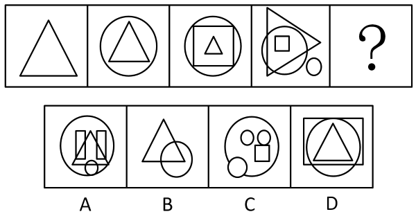

- **A**. A　✅
- **B**. B
- **C**. C
- **D**. D

**答案**：A

**官方解析**

图形元素组成不同，且无明显属性规律，考虑数量规律。观察发现，题干图形出现了若干元素，考虑数素。题干图形中元素的个数分别为：1、2、3、4，故？处应为5个元素，排除B、D两项。再次观察图形发现，题干每个图形中均包含1个三角形，只有A项符合。
故正确答案为A。

---

### 第 25 题　qid 2172137 · 逻辑判断

请选择最适合的一项填入问号处，使之符合之前四个图形的变化规律。

- **A**. A
- **B**. B
- **C**. C
- **D**. D　✅

**答案**：D

**官方解析**

图形元素组成不同，且无明显属性规律，考虑数量规律。观察发现，题干图形均为封闭区域被分割，优先考虑数面。观察发现，题干图形面的数量均为4，排除B项。再次观察发现，题干图形的面的形状均为三角形，故？处图形的面也应均为三角形，只有D项符合。
故正确答案为D。

---

### 第 26 题　qid 2172140 · 逻辑判断

请选择最适合的一项填入问号处，使之符合整个图形的变化规律。（  ）

- **A**. A
- **B**. B　✅
- **C**. C
- **D**. D

**答案**：B

**官方解析**

题干每个图形中都出现了小箭头，且箭头指向不同，考虑箭头的位置规律。九宫格图形优先按横行来看，第一行中，上方箭头均保持不动，下方箭头每次顺时针旋转90度；第二行中，下方箭头均保持不动，上方箭头每次顺时针旋转90度；第三行中，图1到图2，上方箭头均保持不动，下方箭头顺时针旋转了90度，因此，？处也应延续此规律，对应得到图形B项。
故正确答案为B。

---

### 第 27 题　qid 2172145 · 逻辑判断

请选择最适合的一项填入问号处，使之符合整个图形的变化规律。（  ）

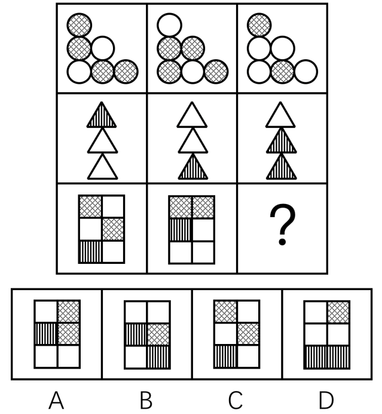

- **A**. A
- **B**. B　✅
- **C**. C
- **D**. D

**答案**：B

**官方解析**

图形元素组成相似，考虑样式规律。九宫格图形优先按横行来看，观察发现，每一行的三个图形轮廓相同、内部颜色不同，考虑黑白运算。第一行中，，，；第二行中，，，；第三行也应该符合此规律，运算可得B项。

故正确答案为B。

---

### 第 28 题　qid 2172148 · 逻辑判断

把下面的六个图形分为两类，使每一类图形都有各自的共同特征或规律，分类正确的一项是（  ）。

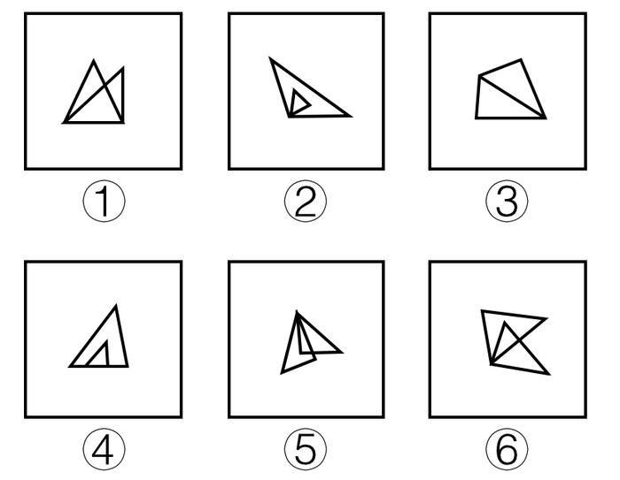

- **A**. ①④⑥，②③⑤
- **B**. ①③④，②⑤⑥　✅
- **C**. ①②⑤，③④⑥
- **D**. ①②③，④⑤⑥

**答案**：B

**官方解析**

图形均由两个三角形构成，考虑三角形之间的关系。观察发现，图①③④中的两个三角形均有一条线重合，图②⑤⑥中的两个三角形均有一个顶点重合，故①③④为一组，②⑤⑥为一组。
故正确答案为B。

---

### 第 29 题　qid 2172151 · 逻辑判断

把下面的六个图形分为两类，使每一类图形都有各自的共同特征或规律，分类正确的一项是（  ）。

- **A**. ①④⑥，②③⑤
- **B**. ①②③，④⑤⑥
- **C**. ①③⑤，②④⑥　✅
- **D**. ①③④，②⑤⑥

**答案**：C

**官方解析**

图形元素组成不同，优先考虑属性规律。图①③⑤都不是轴对称图形，图②④⑥都是轴对称图形，故图①③⑤为一组，图②④⑥为一组。
故正确答案为C。

---

### 第 30 题　qid 2172154 · 逻辑判断

左边给定的是纸盒的外表面，右边哪一项能由它折叠而成？（  ）

- **A**. A　✅
- **B**. B
- **C**. C
- **D**. D

**答案**：A

**官方解析**

先对题干展开图的各面进行编号，如下图所示。

A项：由面3、面4和面6组成，与题干展开图一致，当选；

B项：由面2、面3和面5或面6组成，在题干展开图中，其三个面的公共点为A点或B点，其中A点面5中为黑色三角形直角点、B点为面6中白色三角形的直角点，而在选项中，三个面的公共点既不是黑色三角形的直角点，又不是白色三角形的直角点，选项与题干展开图不一致，排除；

C项：由面1、面4和面5或面6组成，在题干展开图中，其三个面的公共点为C点或D点，其中只有在选项三个面分别为面1、面4和面6的时候，D点会与面1中的对角线相交，但此时D点也应与面6中黑三角形的直角点重合，但选项中三个面的公共点并不与黑三角形的直角点重合，选项与题干展开图不一致，排除；

D项：由面3、面5和面6组成 ，其中面5与面6互为相对面，不能同时出现，选项与题干展开图不一致，排除。

故正确答案为A。

---

## 资料分析

### 材料 1

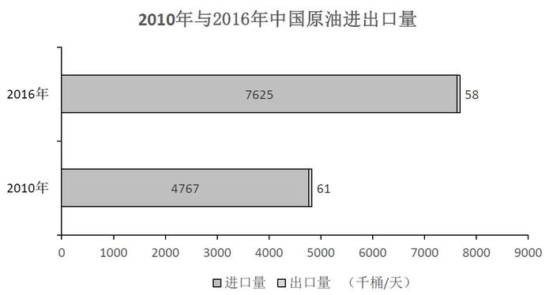

#### 第 1 题　qid 2172101 · 比重

与2010年相比，2016年原油进口量和出口量占世界比重变化最大的地区分别是（  ）。

- **A**. 北美和中东
- **B**. 北美和非洲
- **C**. 亚太地区和中东
- **D**. 亚太地区和非洲　✅

**答案**：D

**官方解析**

，代入表格数据，各地区原油进口量占世界比重变化分别为：北美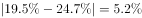，亚太地区，，排除A项、B项；各地区原油出口量占世界比重变化分别为：中东，非洲，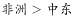，排除C项。

故正确答案为D。

---

#### 第 2 题　qid 2172105 · 比重

按照原油出口量占世界比重由高到低排位，2016年排位与2010年完全相同的地区有（  ）个。

- **A**. 0
- **B**. 1
- **C**. 2　✅
- **D**. 3

**答案**：C

**官方解析**

定位表格可得，2010年与2016年各地区按照原油出口量占世界比重由高到低排位情况如下：

排名完全相同的地区有：中东、拉丁美洲，共2个。

故正确答案为C。

---

#### 第 3 题　qid 2172164 · 增长

2016年中国原油进出口总量约比2010年增长了（  ）。

- **A**. 

- **B**. 

- **C**. 

　✅
- **D**. 

**答案**：C

**官方解析**

根据题干“2016年……约比2010年增长”，结合选项为百分数，可判定此题为一般增长率计算问题。，代入统计图数据可得，2016年中国原油进出口千桶，2010年进出口千桶；代入公式：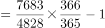。

故正确答案为C。

---

#### 第 4 题　qid 2172166 · 比重

2016年中国原油进口量占世界比重约比2010年上升了（  ）个百分点。

- **A**. 4.2
- **B**. 4.9
- **C**. 5.9　✅
- **D**. 7.3

**答案**：C

**官方解析**

根据题干“2016年…比重约比2010年上升…百分点”可判定此题为两期比重的计算问题。定位表格可得，2016年世界原油进口量为，2010年为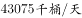；定位统计图可得，2016年中国原油进口量为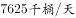，2010年为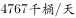。，则2016年中国原油进口量占世界比重比2010年上升，即2016年比重约比2010年上升5.9个百分点。

故正确答案为C。

---

#### 第 5 题　qid 2172182 · 比重

以下说法中正确的是（  ）。

①2016年中东地区原油出口量比2010年增长超过了；

②2016年中国原油出口量占进出口总量的比重高于2010年；

③与2010年相比，2016年东欧和西欧两个地区的原油进口量都有所下降。

- **A**. ①和③　✅
- **B**. ①和②
- **C**. ②和③
- **D**. 仅有③

**答案**：A

**官方解析**

①定位表格，2016年中东地区原油出口量为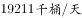，2010年为，代入公式：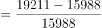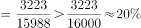，2016年出口量比2010年增长超过，正确；

②，代入统计图数据，2016年中国原油出口量占进出口总量的，2010年前者分母大且分子小因而数值较小，故2016年比重低于2010年，错误；

③定位表格，2016年东欧原油进口量，与2010年的相比，进口量下降，2016年西欧原油进口量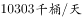，与2010年的相比，进口量下降，正确。

说法正确的为①、③。

故正确答案为A。

---

### 材料 2

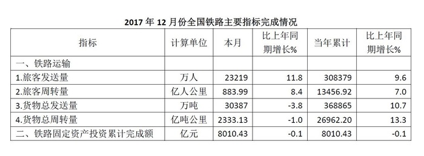

#### 第 6 题　qid 2172132 · 综合

2017年10-12月份全国铁路共完成旅客发送（  ）万人。

- **A**. 2905.93
- **B**. 73543　✅
- **C**. 308379
- **D**. 855996

**答案**：B

**官方解析**

定位表格材料1、2、3的首行数据可得“2017年10、11、12月全国铁路完成旅客发送量依次为27621万人、22703万人和23219万人”，则2017年10-12月份全国铁路共完成旅客发送万人，与B项最接近。（本题也可根据个位数字的和为3，直接排除A、C、D三项）

故正确答案为B。

---

#### 第 7 题　qid 2172136 · 综合

2016年1-9月份全国铁路货物总发送量累计约为（  ）万吨。

- **A**. 215129
- **B**. 234836
- **C**. 240381　✅
- **D**. 275506

**答案**：C

**官方解析**

由题干“2016年1-9月，全国铁路货物总发送量······”，结合表格材料1分别给出“2017年10月，全国铁路货物总发送量32199万吨，同比增速；2017年1-10月累计307705万吨，同比增速”，根据“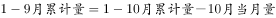”，判定本题为基期和差问题。代入公式：，2016年1-9月份全国铁路货物总发送量累计约为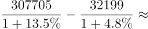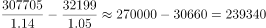万吨，与C项最接近。

故正确答案为C。

---

#### 第 8 题　qid 2172139 · 综合

2017年10-12月份全国铁路旅客发送量和货物总发送量的图示应为（  ）。

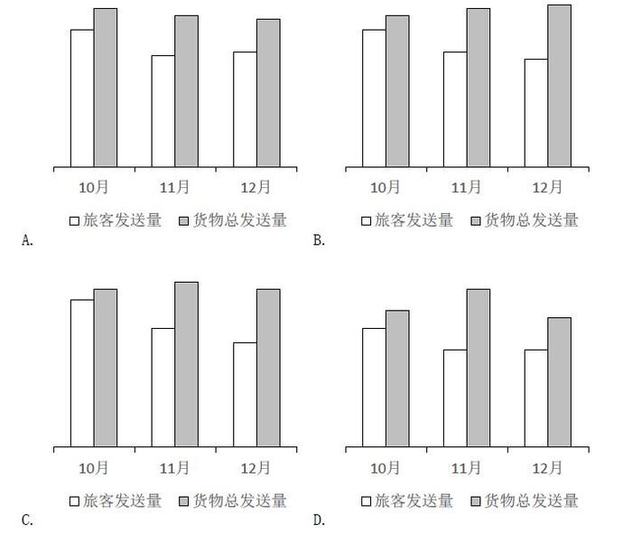

- **A**. A　✅
- **B**. B
- **C**. C
- **D**. D

**答案**：A

**官方解析**

由材料可得“2017年10月、11月和12月，全国旅客发送量分别为27621万人、22703万人和23219万人”，则旅客发送量，排除B、C两项；根据“2017年10月、11月和12月，全国货物总发送量分别为32199万吨、30774万吨和30387万吨”，则货物总发送量月，排除D项。

故正确答案为A。

---

#### 第 9 题　qid 2172144 · 综合

2016年全国铁路货物总周转量当年累计完成约（  ）亿吨公里。

- **A**. 8018
- **B**. 21435
- **C**. 23797　✅
- **D**. 333211

**答案**：C

**官方解析**

由题干“2016年······约为多少亿吨公里”，结合材料时间为“2017年”，判定本题为基期计算问题。定位表格材料3可得“2017年12月，全国铁路货物总周转量当年累计完成26962.20亿吨公里，同比增长”，代入公式：，可得：2016年全国铁路货物总周转量当年累计完成约亿吨公里，与C项最接近。

故正确答案为C。

---

#### 第 10 题　qid 2172123 · 综合

以下说法正确的是（  ）。

- **A**. 2017年10-12月份全国铁路旅客周转量合计超过3000亿人公里
- **B**. 2017年铁路固定资产投资当年累计完成额高于2016年
- **C**. 2017年10-12月份全国铁路货物总周转量呈现上升趋势
- **D**. 2016年全国铁路旅客发送量当年累计超过280000万人　✅

**答案**：D

**官方解析**

A项：定位表格材料1、2、3的第二行数据，2017年10-12月份全国铁路旅客周转量亿人公里，错误；

B项：定位表格材料3，“2017年铁路固定资产投资当年累计完成额同比增长”，由于，可得2017年铁路固定资产投资当年累计完成额低于2016年，错误；

C项：定位表格材料1、3，2017年10月份全国铁路货物亿吨公里；12月份全国铁路货物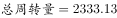亿吨公里，10月12月，呈现下降趋势，错误；

D项：定位表格材料3，“2017年全国铁路旅客发送量为308379万人，同比增长”，代入公式：，可得2016年全国铁路旅客万人，正确。

故正确答案为D。

---

### 材料 3

        截至2017年末，全国农村贫困人口从2012年末的9899万人减少至3046万人，比上年末减少1289万人；贫困发生率从2012年的下降至，比上年末下降1.4个百分点。

        分三大区域看，2017年东、中、西部地区农村贫困人口全面减少。东部地区农村贫困人口300万人，比上年减少190万人；中部地区农村贫困人口1112万人，比上年减少482万人；西部地区农村贫困人口1634万人，比上年减少617万人。

        分省看，2017年各省农村贫困发生率普遍下降至以下。其中，农村贫困发生率降至及以下的省份有17个，包括北京、天津、河北、内蒙古、辽宁、吉林、黑龙江、上海、江苏、浙江、安徽、福建、江西、山东、湖北、广东、重庆。

        全国农村贫困监测调查显示，2017年，贫困地区农村居民人均可支配收入9377元，比上年增加894元。

        2017年贫困地区农村居民收入增速快于上年。其主要特点：一是粮食丰收，贫困地区农村居民出售农产品数量增加，粮食、肉羊等部分大宗农产品市场价格回升。农民家庭一产经营净收入人均2826元，增长，增速比上年提高0.5个百分点。二是随着产业扶贫、旅游扶贫、电商扶贫等深入推进，贫困地区二三产业加快发展，一二三产业融合发展取得可喜进展。农民家庭二三产业经营净收入人均897元，增长，增速比上年提高6.5个百分点。

        2017年贫困地区农村居民分项收入增速全面快于全国农村居民。贫困地区农村居民人均工资性收入3210元，比上年增长，增速比全国农村平均水平高2.3个百分点；人均经营净收入3723元，增长，增速比全国农村平均水平高0.9个百分点；人均财产净收入119元，增长，增速比全国农村平均水平高0.5个百分点；人均转移净收入2325元，增长，增速比全国农村平均水平高3.0个百分点。

#### 第 11 题　qid 2172068 · 增长

2017年全国农村居民分项收入增速最高的是（  ）。

- **A**. 人均工资性收入
- **B**. 人均经营净收入
- **C**. 人均财产净收入
- **D**. 人均转移净收入　✅

**答案**：D

**官方解析**

定位文字材料最后一段可得：2017年贫困地区农村居民人均工资性收入比上年增长，增速比全国农村平均水平高2.3个百分点；人均经营净收入增长，增速比全国农村平均水平高0.9个百分点；人均财产净收入增长，增速比全国农村平均水平高0.5个百分点；人均转移净收入增长，增速比全国农村平均水平高3.0个百分点。可得2017年全国农村居民分项收入中，人均工资性收入增长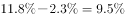、人均经营净收入增长、人均财产净收入增长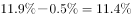、人均转移净收入增长，收入增速最高的是人均转移净收入。

故正确答案为D。

---

#### 第 12 题　qid 2172071 · 比重

2016年，西部地区农村贫困人口占全国农村贫困人口的比重为（  ）。

- **A**. 

- **B**. 

- **C**. 

　✅
- **D**. 

**答案**：C

**官方解析**

由题干“2016年，…占…的比重为”，结合材料时间“2017年”，判定本题为基期比重计算问题。定位文字材料第一段可得“截至2017年末，全国农村贫困人口从2012年末的9899万人减少至3046万人，比上年末减少1289万人”，则2016年全国农村贫困人口为万人；定位第二段可得“2017年，西部地区农村贫困人口1634万人，比上年减少617万人”，则2016年西部地区农村贫困人口为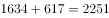万人。代入公式：，则2016年，西部地区农村贫困人口占全国农村贫困人口的比重为，与C项最接近。

故正确答案为C。

---

#### 第 13 题　qid 2172073 · 综合

以下省份，2017年农村贫困发生率全部在及以下的是（  ）。

- **A**. 吉林、安徽、海南
- **B**. 黑龙江、江西、贵州
- **C**. 内蒙古、湖北、河北　✅
- **D**. 湖北、辽宁、宁夏

**答案**：C

**官方解析**

定位文字材料第三段可得“2017年，农村贫困发生率降至及以下的省份有17个，包括北京、天津、河北、内蒙古、辽宁、吉林、黑龙江、上海、江苏、浙江、安徽、福建、江西、山东、湖北、广东、重庆。”只有C项（内蒙古、湖北、河北）均在以上范围内。

故正确答案为C。

---

#### 第 14 题　qid 2172074 · 平均数

2016年贫困地区农民家庭一二三产业经营净收入人均（  ）元。

- **A**. 3483　✅
- **B**. 3608
- **C**. 3723
- **D**. 8483

**答案**：A

**官方解析**

方法一：

由题干“2016年······一二三产业经营净收入······”，结合文字材料第五段“2017年，贫困地区农民家庭一产经营净收入人均2826元，增长，······农民家庭二三产业经营净收入人均897元，增长”，根据“一二三产业=一产业+二三产业”，判定本题为基期和差计算问题。代入公式：，可得2016年贫困地区农民家庭一二三产业经营净收入人均为元。与A项最接近。

方法二：

由题干“2016年······一二三产业经营净收入······”，结合文字材料最后一段“2017年贫困地区······人均经营净收入3723元，增长6.9%”，判定本题为基期计算问题。代入公式：，可得2016年贫困地区人均经营净收入为元。

故正确答案为A。

---

#### 第 15 题　qid 2172077 · 平均数

以下说法中错误的是（  ）。

①2012年末全国农村贫困人口约为2017年末的3.8倍；

②2017年东、中部地区农村贫困人口之和占全国农村贫困人口的；

③2016年贫困地区农村居民人均经营净收入占人均可支配收入的比重超过。

- **A**. ①和②
- **B**. ①和③　✅
- **C**. ②和③
- **D**. 仅有③

**答案**：B

**官方解析**

①定位文字材料第一段“截至2017年末，全国农村贫困人口从2012年末的9899万人减少至3046万人”，可得2012年末全国农村贫困人口约为2017年末的倍，错误；

②定位文字材料第一段可得“截至2017年末，全国农村贫困人口为3046万人”，第二段可得“分三大区域看，2017年东部地区农村贫困人口300万人；中部地区农村贫困人口1112万人”，代入公式：，故2017年东、中部地区农村贫困人口之和占全国农村贫困人口的，正确；

③定位文字材料第四段可得“2017年，贫困地区农村居民人均可支配收入9377元，比上年增加894元”，代入公式：，则2016年，贫困地区农村居民人均可支配收入为元。定位最后一段可得“2017年，贫困地区农村居民人均经营净收入3723元，增长”，代入公式：，则2016年，贫困地区农村居民人均经营净收入为元。2016年贫困地区农村居民人均经营净收入占人均可支配收入的比重约为，错误。

说法错误的为①和③。

故正确答案为B。

---
