# 2018年广州市公务员录用考试 《行测》题（3月25日网友回忆版）

> 省考 · 2018 年 · 6 个模块 · 共 95 题

- [政治理论](#%E6%94%BF%E6%B2%BB%E7%90%86%E8%AE%BA) · 2 题
- [常识判断](#%E5%B8%B8%E8%AF%86%E5%88%A4%E6%96%AD) · 13 题
- [言语理解与表达](#%E8%A8%80%E8%AF%AD%E7%90%86%E8%A7%A3%E4%B8%8E%E8%A1%A8%E8%BE%BE) · 25 题
- [数量关系](#%E6%95%B0%E9%87%8F%E5%85%B3%E7%B3%BB) · 10 题
- [判断推理](#%E5%88%A4%E6%96%AD%E6%8E%A8%E7%90%86) · 30 题
- [资料分析](#%E8%B5%84%E6%96%99%E5%88%86%E6%9E%90) · 15 题

---

## 政治理论

### 第 1 题　qid 2172824 · 新思想

习近平善于用典，常常古为今用、推陈出新，不断激活优秀传统文化，赋予其鲜活的当代价值与意义。以下习近平曾引用的古文典故和其所适用的内容，对应错误的一项是（  ）。

- **A**. 宰相必起于州部，猛将必发于卒伍——谈干部的培养选拔
- **B**. 取法于上，仅得为中，取法于中，故为其下——谈工作、道德标准
- **C**. 万物并育而不相害，道并行而不相悖——谈家国情怀　✅
- **D**. 穷则变，变则通，通则久——谈改革创新的重要性

**答案**：C

**官方解析**

本题考查文化常识。
A项正确，“宰相必起于州部，猛将必发于卒伍”出自《韩非子·显学》，意思是宰相都是从基层州部中锻炼上来的，而猛将都是从军队卒伍中摔打出来的。习近平引用此名言是为了阐述干部的培养选拔必须从基层做起，故正确。
B项正确，“取法于上，仅得为中，取法于中，故为其下”出自《帝范·崇文第十二》，意思是以上等作为准则来效法，只能得到中等的效果；以中等作为准则来效法，因此只能得到下等的效果。习近平引用此名言是为了强调目标贯彻中的递减效应，启示我们在制定战略时、为人修身时一定要放宽视野，向高标准看齐，这样才能实现预期目标，故正确。
C项错误，“万物并育而不相害，道并行而不相悖。”出自于《礼记·中庸》，意思是万物共同在一起生长而不互相残害，道在一起施行而不相违背。习近平引用此名言是为了阐述要尊重文明多样性，倡导交流互鉴，注重汲取不同国家、不同民族创造的优秀文明成果，不能唯我独尊、贬低其他文明和民族，故错误。
D项正确，“穷则变，变则通，通则久”出自《周易·系辞下》，意思是天地间没有不变的事情，一切事情随时变，随地变。习近平引用此名言是为了阐述在发展过程中，应善于打破不合时宜的老规矩，灵活变通，才能寻找到发展的新出路，即突出改革创新的重要性，故正确。
本题为选非题，故正确答案为C。

---

### 第 2 题　qid 2172825 · 时事政治

中国共产党第十九次全国代表大会于2017年10月在北京胜利召开。下列哪个论断，不是党的十九大首次提出来的？（  ）

- **A**. 习近平新时代中国特色社会主义思想
- **B**. 树立文化自信　✅
- **C**. 中国特色社会主义进入了新时代
- **D**. 建成富强民主文明和谐美丽的社会主义现代化强国

**答案**：B

**官方解析**

本题考查政治常识，主要考查十九大的相关知识点。
A项正确，习近平主席在十九大首次提出：新时代中国特色社会主义思想，是对马克思列宁主义、毛泽东思想、邓小平理论、“三个代表”重要思想、科学发展观的继承和发展，是马克思主义中国化最新成果，是党和人民实践经验和集体智慧的结晶，是中国特色社会主义理论体系的重要组成部分，是全党全国人民为实现中华民族伟大复兴而奋斗的行动指南，必须长期坚持并不断发展。
B项错误，2016年习近平总书记在“七一”重要讲话中指出：“坚持不忘初心、继续前进，就要坚持中国特色社会主义道路自信、理论自信、制度自信、文化自信，坚持党的基本路线不动摇，不断把中国特色社会主义伟大事业推向前进。”将“文化自信”与前三个“自信”并列，扩展成为“四个自信”，并非十九大首次提出。
C项正确，习近平主席在十九大首次提出：中国特色社会主义进入新时代，社会主要矛盾已经转化为人民日益增长的美好生活需要和不平衡不充分的发展之间的矛盾。
D项正确，习近平主席在十九大首次提出：综合分析国际国内形势和中国发展条件，从2020年到本世纪中叶可以分两个阶段来安排。第一个阶段，从2020到2035年，在全面建成小康社会的基础上，再奋斗十五年，基本实现社会主义现代化。第二个阶段，从2035年到本世纪中叶，在基本实现现代化的基础上，再奋斗十五年，把中国建成富强民主文明和谐美丽的社会主义现代化强国。
本题为选非题，故正确答案为B。

---

## 常识判断

### 第 1 题　qid 2172826 · 法律常识

以下情形，向人民法院提起行政诉讼，法院不予受理的是（  ）。

- **A**. 对行政拘留、暂扣或者吊销许可证和执照、责令停产停业、没收违法所得、没收非法财物、罚款、警告等行政处罚不服的
- **B**. 对限制人身自由或者对财产的查封、扣押、冻结等行政强制措施和行政强制执行不服的
- **C**. 认为行政机关侵犯其自主权或者农村土地承包经营权、农村土地经营权的
- **D**. 行政机关对其工作人员的奖惩、任免等决定，工作人员认为不合理，要求撤销的　✅

**答案**：D

**官方解析**

本题考查法律常识，主要考查行政诉讼的相关知识考点。
A项人民法院需受理，《行政诉讼法》第十二条第一款规定：“人民法院受理公民、法人或者其他组织提起的下列诉讼：(一)对行政拘留、暂扣或者吊销许可证和执照、责令停产停业、没收违法所得、没收非法财物、罚款、警告等行政处罚不服的；······”故人民法院需受理。
B项人民法院需受理，《行政诉讼法》第十二条第一款规定：“人民法院受理公民、法人或者其他组织提起的下列诉讼：······(二)对限制人身自由或者对财产的查封、扣押、冻结等行政强制措施和行政强制执行不服的；······”故人民法院需受理。
C项人民法院需受理，《行政诉讼法》第十二条第一款规定：“人民法院受理公民、法人或者其他组织提起的下列诉讼：······(七)认为行政机关侵犯其经营自主权或者农村土地承包经营权、农村土地经营权的；······”故人民法院需受理。
D项人民法院不予受理，《行政诉讼法》第十三条规定：“人民法院不受理公民、法人或者其他组织对下列事项提起的诉讼：······(三)行政机关对行政机关工作人员的奖惩、任免等决定；······”故法院不予受理。
本题为选非题，故正确答案为D。

---

### 第 2 题　qid 2172827 · 经济常识

根据2018年政府预算报告和预算草案，2017年全国一般公共预算收入扭转了2012年以来增速放缓态势。2018年，我国一般公共预算收入将超过18万亿元，支出接近21万亿元，赤字规模与去年持平，赤字率比2017年预算降低0.4个百分点。
以下对这组数字的理解，有误的一项是（  ）。

- **A**. 全国一般公共预算收入扭转增速放缓态势，印证了我国经济发展不仅总量扩大，而且质量和效益提升
- **B**. 调低赤字率，主要是我国经济稳中向好、财政增收有基础，也为宏观调控留下更多政策空间
- **C**. 赤字总规模并未减小，彰显积极财政政策更加聚力增效的新特点，更侧重在减费降税扩投资方面发力　✅
- **D**. 当前财政状况出现好转，各级政府仍要坚持过紧日子，执守简朴、力戒浮华，严控一般性支出，把宝贵的资金更多用于为发展增添后劲、为民生雪中送炭

**答案**：C

**官方解析**

本题考查时政常识。
A项正确，2018年政府预算报告指出：“2017年全国一般公共预算收入扭转了2012年以来增速放缓态势。主要是供给侧结构性改革深入推进，经济发展的质量和效益提升，税源相应增加。”这印证了我国经济发展不仅出现了总量的扩大，也实现了质量和效益的提升。
B项正确，2018年政府工作报告指出：“调低赤字率，主要是我国经济稳中向好、财政增收有基础，也为宏观调控留下更多政策空间。”
C项错误，赤字率降低释放进一步防控经济风险信号，同时赤字总规模并未减少，彰显积极财政政策更加聚力增效的新特点，更侧重在结构性方面发力。不是更加侧重在减税降费扩投资方面发力。
D项正确，2018年政府工作报告指出：“当前财政状况出现好转，各级政府仍要坚持过紧日子，执守简朴、力戒浮华，严控一般性支出，把宝贵的资金更多用于为发展增添后劲、为民生雪中送炭。”
本题为选非题，故正确答案为C。

---

### 第 3 题　qid 2172828 · 法律常识

根据《中华人民共和国妇女权益保障法》，实行男女平等是国家的基本国策。国家采取必要措施，逐步完善保障妇女权益的各项制度，消除对妇女一切形式的歧视。对此，下列说法错误的是（  ）。

- **A**. 禁止歧视、虐待、遗弃、残害妇女
- **B**. 妇女在政治的、经济的、文化的、社会的和家庭的生活等各方面享有同男子平等的权利
- **C**. 国家采取有效措施，适当减轻妇女履行法律规定义务的责任　✅
- **D**. 国家保护妇女依法享有的特殊权益

**答案**：C

**官方解析**

本题考查法律常识，主要涉及《中华人民共和国妇女权益保障法》的相关内容。
A项正确，《妇女权益保障法》第二条第四款规定：“禁止歧视、虐待、遗弃、残害妇女。”
B项正确，《妇女权益保障法》第二条第一款规定：“妇女在政治的、经济的、文化的、社会的和家庭的生活等各方面享有同男子平等的权利。”
C项错误，《妇女权益保障法》第二条第二款规定：“实行男女平等是国家的基本国策。国家采取必要措施，逐步完善保障妇女权益的各项制度，消除对妇女一切形式的歧视。”并不是适当减轻妇女履行法定义务的责任，在履行法定义务的责任时男女平等。
D项正确，《妇女权益保障法》第二条第三款规定：“国家保护妇女依法享有的特殊权益。”
本题为选非题，故正确答案为C。

---

### 第 4 题　qid 2172829 · 人文常识

“逝者如斯夫，不舍昼夜”“时乎时乎不再来”是古代哲人在启示我们：时间非常宝贵，要珍惜时间的每一分每一秒。这反映出时间具有（  ）的特点。

- **A**. 连续性
- **B**. 间隔性
- **C**. 一维性　✅
- **D**. 反复性

**答案**：C

**官方解析**

本题考查哲学常识。马克思主义哲学认为，时间是指物质运动的持续性和顺序性。时间具有一维性、不可逆性。“逝者如斯夫，不舍昼夜”意思是时间就像流水一样，一去不复返；“时乎时乎不再来”是指时间失去了就不会再回来，这两句话都反映了时间一去不复返的特点，即时间的一维性。
故正确答案为C。

---

### 第 5 题　qid 2172830 · 人文常识

古人常把对联镌刻在门扉上。“惟楚有才，于斯为盛”这一副名联最有可能出现在（  ）的正门上。

- **A**. 岳麓书院　✅
- **B**. 清华大学
- **C**. 扬州贡院
- **D**. 杜甫草堂

**答案**：A

**官方解析**

本题主要考查文化常识。
上联“惟楚有才”，出自《左传》“虽楚有材，晋实用之。”即楚材晋用的典故，楚国的人才为晋国所用，比喻本国的人才外流到别的国家工作。下联“于斯为盛”，出自《论语·泰伯》“唐虞之际，于斯为盛。”本意是孔子盛赞周武王时期人才鼎盛局面。
清朝嘉庆年间，袁明曜任岳麓书院山长。门人请他撰题大门联，袁明曜以“惟楚有材”为上联让大家来对，大家正沉思未就，门生张中阶至，有人告以门联之事后，张中阶即应声对说：“于斯为盛”。众人皆赞好，师生合撰的这一联，就这样成了岳麓书院的大门联。这就是这副名联的由来。
因此，B、C、D三项不符合题意。
故正确答案为A。

---

### 第 6 题　qid 2172831 · 人文常识

中国有位诗人，被辛弃疾用“千载后，百篇存。更无一字不清真。”来形容。以下属于这位诗人作品的是（  ）。

- **A**. 衣带渐宽终不悔，为伊消得人憔悴。
- **B**. 采菊东篱下，悠然见南山。　✅
- **C**. 少年不识愁滋味，爱上层楼；爱上层楼，为赋新词强说愁。
- **D**. 风声雨声读书声，声声入耳；家事国事天下事，事事关心。

**答案**：B

**官方解析**

本题主要考查文学常识。
题干中的诗句出自宋代辛弃疾的《鹧鸪天 读渊明诗不能去手，戏作小词以送》，其中“渊明”指的是陶渊明。而且，根据辛弃疾的形容，该诗人距南宋有千年之久，且文章以“清真”即清新纯真的风格闻名，可以确定该诗人是东晋末至南朝宋初期，中国第一位田园诗人——陶渊明。
A项错误，该诗句出自北宋词人柳永的《蝶恋花》，意思是：我日渐消瘦也不觉得懊悔，为了你我情愿一身憔悴。
B项正确，该诗句出自陶渊明的《饮酒（其五）》，意思是：在东篱之下采摘菊花，悠然间，那远处的南山映入眼帘。该诗表达了作者厌倦官场腐败，决心归隐田园，超脱世俗的追求的思想感情。
C项错误，该诗句出自南宋时期辛弃疾的《丑奴儿》，意思是：在我年轻的时候，一点也不知道忧愁是怎样的滋味；只是一味地想爬上高楼，爬得越高越好；并且想模仿那些文人墨客，原本毫无忧愁，却偏偏为了作些新诗新词，而强说自己忧愁。
D项错误，此联为明东林党领袖顾宪成所撰，上联将读书声和风雨声融为一体，既有诗意，又有深意；下联有齐家治国平天下的雄心壮志。后来人们用以提倡“读书不忘救国”。
故正确答案为B。

---

### 第 7 题　qid 2172832 · 科技常识

海参生活在海底，以吃海中小生物为生。一旦进入夏季，海参就需要夏眠，这很可能是因为（  ）。

- **A**. 海水温度偏高，海参不耐热
- **B**. 海参要为繁殖储备能量
- **C**. 海参用夏眠来应对饥饿　✅
- **D**. 海参为了逃避天敌

**答案**：C

**官方解析**

本题主要考查生物常识。
海参，是生活在海边至8000米的海洋棘皮动物，以海底藻类和浮游生物为食。入夏以后，上层海水由于太阳光强烈照射的结果，温度比较高。这时，海底的小生物都浮到海面，而海参却对温度很敏感，当水温超过20度时，就会向更深的海底迁移。由于在新的地方缺少食物，没有东西可吃的海参，只好进入夏眠状态，这是海参为适应环境而养成的习惯。
A项错误，本题问的是海参“夏眠”的原因，海参生活在海底，当夏季到来时，海底的小生物都浮到海面，海参缺少食物，为了适应环境，所以进行夏眠，故海参夏眠的原因不是因为不耐热。
B项错误，“储备能量”应当是“多进食”，而不是夏眠。
C项正确，海参迫于夏季食物中断，只好进入夏眠，“应对饥饿”是海参夏眠的主要原因。
D项错误，逃避天敌不是海参夏眠的原因。
故正确答案为C。

---

### 第 8 题　qid 2172833 · 人文常识

我国经济已由高速增长阶段转向（  ），正处在转变发展方式、优化经济结构、转换增长动力的攻关期。

- **A**. 中速增长阶段
- **B**. 高速发展阶段
- **C**. 高质量增长阶段
- **D**. 高质量发展阶段　✅

**答案**：D

**官方解析**

本题主要考查时政。习近平总书记在党的十九大报告中明确指出：“我国经济已由高速增长阶段转向高质量发展阶段，正处在转变发展方式、优化经济结构、转换增长动力的攻关期，建设现代化经济体系是跨越关口的迫切要求和我国发展的战略目标。”
高质量发展阶段的核心要求就是要把提高供给体系质量作为主攻方向，彻底改变过去主要靠要素投入、规模扩张，忽视质量效益的粗放式增长，通过提高质量和效益实现经济的良性循环和竞争力提升。
故正确答案为D。

---

### 第 9 题　qid 2172834 · 科技常识

某些基因突变有可能给生物体带来繁殖优势，保证基因携带者的后代能够更好地适应某种环境，因而这类突变得以广泛传播。某科学研究团队发现，某个哺乳动物族群与这类动物的其它族群相比，存在一个基因突变，该突变具有调节血液中血红蛋白增长的作用。血红蛋白过低会导致缺氧，过高会导致血液粘稠度升高，进而引发血栓等血液循环问题。那么这一哺乳动物族群的祖先很可能是生活在（  ）地区。

- **A**. 高海拔　✅
- **B**. 海边
- **C**. 寒带
- **D**. 热带

**答案**：A

**官方解析**

本题主要考查生物常识。基因突变是指基因在结构上发生碱基对组成或排列顺序的改变，即基因组DNA分子发生的突然的、可遗传的变异现象。
处于高海拔地区的高度时，哺乳动物会因氧气量的减少，导致心跳加快、心率加速、血液中血红蛋白的比例降低。而题干中提到的哺乳动物族群突变的基因中，具有调节血液中血红蛋白增长的作用，说明其祖先在长期适应高海拔地区的生活中发生了基因的突变，这一基因的出现有利于补偿身体的缺氧情况，平衡血液循环系统，保证其后代能够更好地适应高海拔的环境。A项与缺氧有关，B、C、D三项与缺氧无关。
故正确答案为A。

---

### 第 10 题　qid 2172835 · 地理国情

在二十四节气起源的黄河流域，雷声一般开始出现在3月末甚至更晚。可见，雷声开始出现的时候是（  ）。

- **A**. 立春
- **B**. 雨水
- **C**. 惊蛰
- **D**. 春分　✅

**答案**：D

**官方解析**

本题主要考查二十四节气的有关知识。注：本题不严谨。按照时间来说是春分,选D；按照雷声开始出现是惊蛰，选C。无论选C、选D，均可以，题库最终从时间角度出发，倾向性答案为D，本题属于争议题，掌握正确知识点即可。
A项错误，立春是二十四节气中的第一个节气，到达的时间点为公历每年2月3或4日，即农历正月初一前后，代表春季的开始。题干中雷声开始出现在3月末，因此并不是立春这一节气。
B项错误，雨水是二十四节气之中的第二个节气，到达的时间点为公历每年2月18-20日，即农历每年正月十五前后，其代表降雨开始，雨量渐增。题干中雷声开始出现在3月末，因此并不是雨水这一节气。
C项错误，惊蛰，古称“启蛰”，是二十四节气中的第三个节气，也是干支历卯月的起始，其到达的时间点为公历每年3月5或6日，天气回暖，春雷始鸣。题干中提到黄河流域的雷声开始出现在3月末甚至更晚，而惊蛰在三月初，因此并不是惊蛰这一节气。
D项正确，春分是春季九十天的中分点，到达的时间点为公历每年3月20-21日，即农历二月初五前后，这一天太阳直射地球赤道，昼夜平分。题干中雷声开始出现在3月末，与春分节气的时间点吻合。
故正确答案为D。

---

### 第 11 题　qid 2172836 · 科技常识

我国古代在医药科技方面取得了累累硕果，出现了不少重要的医学或科学名著。下列名著按成书年代排序，正确的是（  ）。

- **A**. 《黄帝内经》《齐民要术》《本草纲目》《梦溪笔谈》
- **B**. 《本草纲目》《梦溪笔谈》《黄帝内经》《齐民要术》
- **C**. 《梦溪笔谈》《本草纲目》《齐民要术》《黄帝内经》
- **D**. 《黄帝内经》《齐民要术》《梦溪笔谈》《本草纲目》　✅

**答案**：D

**官方解析**

本题考查科技常识。
《黄帝内经》创作年代是先秦至汉，成书于汉代；《齐民要术》成书于南北朝时期北魏末年；《梦溪笔谈》成书于北宋时期；《本草纲目》成书于明代。
因此排序应为：《黄帝内经》《齐民要术》《梦溪笔谈》《本草纲目》。D项按成书年代排序，完全正确。
故正确答案为D。

---

### 第 12 题　qid 2172837 · 科技常识

“它是以植物和山石为基本材料表现自然景观的艺术品，是自然美与艺术美的有机结合。它能在咫尺空间集中体现山川神貌和园林艺术之美，被人们称为‘立体的画’和‘无声的诗’”。这种艺术品是（  ）。

- **A**. 园林
- **B**. 盆景　✅
- **C**. 石雕
- **D**. 刺绣

**答案**：B

**官方解析**

本题考查人文常识。
A项错误，园林是通过改造地形（或进一步筑山、叠石、理水）、种植树木花草、营造建筑和布置园路等途径创作而成的美的自然环境和游憩境域，故不符合题意。
B项正确，盆景以植物和山石作为基本原材料，将山川神貌和园林艺术相结合并集中体现了二者之美。它既有传统审美的古雅，又有新意的淡雅，被人誉为“立体的画，无声的诗”，符合题意。 
C项错误，石雕是指用各种可雕、可刻的石头，创造出具有一定空间的可视、可触的艺术形象，借以反映社会生活、表达艺术家的审美感受、审美情感、审美理想的艺术，故不符合题意。
D项错误，刺绣是针线在织物上绣制的各种装饰图案的总称，是一种生活和艺术装饰，故不符合题意。
故正确答案为B。

---

### 第 13 题　qid 2172838 · 人文常识

如果地球和地面上的所有东西在一瞬间停止自转，但大气层还是保持原来的速度，那么以下说法错误的是（  ）。

- **A**. 赤道上将刮起超音速狂风
- **B**. 月亮盈亏现象依然存在
- **C**. 大陆上的空气温度会在瞬间急剧升高
- **D**. 地球上将再看不到日出日落　✅

**答案**：D

**官方解析**

本题考查自然常识。

A项正确，当地球突然停止了转动，而大气依然保持原来的速度，即赤道自转线速度约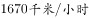在运行。所以赤道上将在一瞬间感受到一股超音速狂风。

B项正确，月亮盈亏与月球公转有关，与地球自转现象无关，故正确。

C项正确，当地球突然停止了运动，而大气依然保持原来的速度运动，由此形成的狂风会转化成热浪，因此，大陆上的空气温度会在瞬间急剧升高。

D项错误，地球停止自转之后，仍会绕着太阳公转，所以平常的昼夜交替将拉长至一年，地球上仍会看到日出日落。

本题为选非题，故正确答案为D。

---

## 言语理解与表达

### 第 1 题　qid 2172781 · 逻辑填空

填入下列横线处的词语，最恰当的是（  ）。
从十九大到二十大，是“两个一百年”奋斗目标的历史交汇期。我们既要全面建成小康社会、实现第一个百年奋斗目标，又要                开启全面建设社会主义现代化国家新征程，向第二个百年奋斗目标进军。

- **A**. 迎难而上
- **B**. 乘势而上　✅
- **C**. 一鼓作气
- **D**. 中流击水

**答案**：B

**官方解析**

由文意可知，“第一个百年目标”已经完成、“第二个百年目标”即将开启，即在一定基础上，向更高目标迈进， B项“乘势而上”，形容事情做到一定阶段时，趁着良好的势头向更高的层次发展，符合文意，当选；
A项“迎难而上”指遇到困难克服、不退缩，“困难”之意与“第一个目标已经完成”相悖，排除；
C项“一鼓作气”比喻趁劲头大的时候鼓起干劲，一口气把工作做完，第二个奋斗目标是百年目标，而非一口气就能完成的，排除；
D项“中流击水”比喻立志奋发图强，体现不出趁着良好的势头向前发展的含义，排除。
故正确答案为B。
【文段出处】《崭新的历史从这里出发》

---

### 第 2 题　qid 2172782 · 逻辑填空

填入下列横线处的词语，最恰当的是（  ）。
如果把各项改革任务比作一个个盘子，那么领导干部就要学会“转盘子”，实现任务之间的        协调，才能同时转动多个盘子，下好改革一盘棋。

- **A**. 沟通
- **B**. 统一
- **C**. 整合
- **D**. 耦合　✅

**答案**：D

**官方解析**

【解析】
分析文意可知，“转动多个盘子”，即强调“实现任务之间的配合得当”。D项“耦合”，指两个或两个以上的事物之间通过各种相互作用而彼此影响以至联合起来，强调“相互配合”，符合文意，当选。 
A项“沟通”的主体常为“人”或“群体”、“组织”，与“任务”搭配不当，排除；
B项“统一”指合为整体，分歧归于一致，文段强调的不是将任务“合为整体”，而是要“转动”起来，强调任务之间“有效配合”，故与文意不符，排除；  
C项，“整合”指通过整顿、协调重新组合，“重新组合”之意文段无从体现，排除。 
故正确答案为D。
【文段出处】《改革得会“转盘子”》

---

### 第 3 题　qid 2172783 · 逻辑填空

填入下列横线处的词语，最恰当的是（  ）。
对不同季节的雨，古人的态度                ，于是才有春雨如恩诏、夏雨如赦书、秋雨如挽歌的说法。

- **A**. 迥然不同　✅
- **B**. 毫无二致
- **C**. 大相径庭
- **D**. 模棱两可

**答案**：A

**官方解析**

根据后文“春雨如恩诏、夏雨如赦书、秋雨如挽歌”可知，古人对不同季节的雨的态度是完全不同的，A项“迥然不同”形容很明显不一样，一点也不相同，符合文意，当选；
B项“毫无二致”表示完全一样，丝毫没有差别，与文意表述相悖，排除；
C项“大相径庭”侧重强调相差很远，大不相同，强调的是有差别，文段强调的是完全不同，“大相径庭”与“迥然不同”相比程度较轻，与文段不符，排除；
D项“模棱两可”指态度或主张不明确，文段强调的是态度不同而非不明确，与文意不符，排除。
故正确答案为A。
【文段出处】《过了谷雨便是夏 切莫辜负好年华》

---

### 第 4 题　qid 2172784 · 语句表达

依次填入下列横线处的词语，最恰当的一组是（  ）。
新，还往往伴随着快。新业态的成长有时快到                、机会宝贵到稍纵即逝，好像逼着经营者不得不“多干快上”。但从另一个角度看，新业态往往又更敏感、更脆弱、不确定性更大，更加容不得                、“蒙眼狂奔”。

- **A**. 一日千里，急功近利　✅
- **B**. 突飞猛进，好大喜功
- **C**. 日新月异，浮光掠影
- **D**. 应接不暇，好高骛远

**答案**：A

**官方解析**

第一空，根据“快”“机会宝贵到稍纵即逝”可知，横线处词语应当表示快的意思。A项“一日千里”指马跑得很快，一天能跑一千里，比喻进展极快；B项“突飞猛进”形容进步和发展特别迅速，均符合文意，保留；C项“日新月异”指每天都在更新变化，侧重强调不断出现新事物新气象，与文意不符，排除；D项“应接不暇”原形容景物繁多，目不暇接，后形容来人太多或事物繁杂，应付不过来，与文意不符，排除。
第二空，根据“更敏感、更脆弱、不确定性更大”“蒙眼狂奔”可知，新业态发展不能过快、过急。A项“急功近利”表示急于求成，贪图眼前的成效和利益，符合文意，且与“蒙眼狂奔”对应得当，当选；B项“好大喜功”表示不管条件是否许可，一心想做大事立大功，多用以形容浮夸的作风，与文意不符，排除。
故正确答案为A。
【文段出处】《业态更新 道理不变》

---

### 第 5 题　qid 2172788 · 语句表达

依次填入下列横线处的词语，最恰当的一组是（  ）。
新媒体时代有新媒体时代的传播特点，从这些特点出发，对一些文章标题进行                ，以适应网络舆论场的传播，这样的做法不可                。但有些“标题党”为吸引眼球，故意制作带有误导性、煽动性的标题，扭曲了原意，误导了读者，滋生了不必要的价值冲突。

- **A**. 精雕细琢，一语道破
- **B**. 全盘否定，一成不变
- **C**. 适度改造，一概否定　✅
- **D**. 改头换面，一笑了之

**答案**：C

**官方解析**

第一空，阐述对文章标题的做法，根据后文“但”可知，横线处应与后文语义相反。转折后的叙述中，“标题党”对文章标题进行大幅度的改造，产生不好的影响，故横线处应表达对标题进行适度的加工，A项“精雕细琢”、C项“适度改造”、D项“改头换面”用在此处均可，保留。B项“全盘否定”与文意不符，文段并非强调全部否定标题，而是指对标题进行适度加工，用在此处程度过重，排除。
第二空，根据文意可知，横线处应表达这种做法不能一味地否定，C项“一概否定”符合文意，当选。A项“一语道破”指一句话就说穿，文段并非强调这种做法不能一句话就说穿，而是强调不能对这种做法一味地否定，故与文意不符，排除。D项“一笑了之”指不予重视，不符合语境，排除。
故正确答案为C。
【文段出处】《假如丰子恺遭遇今日“标题党”》

---

### 第 6 题　qid 2172789 · 逻辑填空

在需要逐级请示、层层审批的制度下，我们已然习惯了对权威的        ，对经验的        ，对实证研究的        ，如何能够培育出自由创新的文化？

依次填入横线处的词语，最恰当的一组是（  ）。

- **A**. 顺从，相信，轻视
- **B**. 服从，相信，藐视
- **C**. 顺从，轻信，藐视
- **D**. 服从，轻信，轻视　✅

**答案**：D

**官方解析**

第一空，搭配“权威”，“服从”指屈服于别人的意志或权力，与“权威”搭配恰当。“顺从”指接受他人的请求，不违抗，与“权威”搭配不当，排除A、C两项。
第二空，搭配“经验”，根据反问句可知，横线处感情色彩偏消极，D项“轻信”指轻率地相信，符合文意，保留。B项“相信”指不怀疑，感情色彩与文段不符，排除。
第三空，代入“轻视”验证，“轻视”指小看，与“实证研究”搭配恰当且语义合适，D项当选。
故正确答案为D。
【文段出处】《万众创新，政府革新要先行》

---

### 第 7 题　qid 2172790 · 逻辑填空

依次填入下列横线处的词语，最恰当的一组是（  ）。
中国社会正进入环境敏感期，面对环保权益冲突，公民与政府之间实现良性互动，需要公民依法理性表达诉求，更需要政府建立透明的决策机制、畅通的沟通渠道。        的辟谣，不如         的公开；        的处置，不如        的倾听。

- **A**. 事前，事后，临时，常态
- **B**. 事后，事前，临时，常态　✅
- **C**. 事前，事后，常态，临时
- **D**. 事后，事前，常态，临时

**答案**：B

**官方解析**

第一空，和“辟谣”搭配，“辟谣”指的是谣言发生后驳斥谣言，所以搭配“事后”合适，排除A、C两项。
第二空，和“公开”搭配，“事前公开”符合句意。
第三空和第四空，通过前文的“畅通的沟通渠道”可知，政府倾听公民的诉求很重要，而常态化的倾听能够保证渠道的畅通，所以第四空填入“常态”合适，排除D项。第三空，和“处置”搭配，临时的处置并非长久之计，代入符合语境，B项当选。
故正确答案为B。
【文段出处】人民日报微博《你好 明天》

---

### 第 8 题　qid 2172791 · 逻辑填空

依次填入下列横线处的词语，最恰当的一组是（  ）。
党的十八大以来，城乡一体化发展的“进度条”在加速。        农民收入水平        农村城镇化水平，    有明显提高，乡村正积蓄着变革的伟力。党的十九大提出“城乡融合”的新方向，    为乡村振兴的“质变”吹响了有力号角。

- **A**. 不管，抑或，也，还
- **B**. 不论，遑论，就，也
- **C**. 由于，或者，都，又
- **D**. 无论，还是，都，更　✅

**答案**：D

**官方解析**

先看前两空，通过分析句意可知，“农民收入水平”以及“农村城镇化水平”是并列关系，故应填入表示并列关系的关联词，A、B、D项均可。C项“由于”表因果关系，且与“或者”搭配不当，应排除。
第三空，文中表示两者均有“明显提高”，所以第三空填入“都”合适，排除A、B两项。
验证第四空，分析句意，“乡村正积蓄着变革的伟力”和“乡村振兴的‘质变’”之间构成了递进关系，因此填入“更”合适。
故正确答案为D。
【文段出处】人民日报《融合发展，重塑城乡关系》

---

### 第 9 题　qid 2172792 · 逻辑填空

依次填入下列横线处的词语，最恰当的一组是（  ）。
大国博弈，正从陆地走向海洋。正如“两弹一星”赋予中国大国地位一样，        具备与海权相匹配的实力，        穿越东海南海的激流暗礁，不欺人的中国才能不被人欺。这            穷兵黩武，        自卫反击。

- **A**. 只能，才会，不仅是，更是
- **B**. 不仅，而且，不仅是，更是
- **C**. 因为，所以，不是，而是
- **D**. 只有，才能，不是，而是　✅

**答案**：D

**官方解析**

从第三、四空入手，“穷兵黩武”指竭尽所有的兵力，任意发动侵略战争，与后文“自卫反击”构成反义并列，“不是······而是”属于反义并列，保留C、D两项。A、B两项“不仅是······更是”表示递进关系，与文段意思不符，排除。
前两空，“具备与海权相匹配的实力”是“穿越东海南海的激流海礁”、“不被人欺”的必要条件，“只有······才能”符合，锁定D项。C项“因为······所以”为因果关系，与文段意思不符，排除。
故正确答案为D。
【文段出处】《中国航母诞生记：仅仅是开始》

---

### 第 10 题　qid 2172793 · 逻辑填空

依次填入下列横线处的词语，最恰当的一组是（  ）。
党内生活的新常态也好，组织纪律的新要求也好，        最终在每个党员干部心理认同的轨迹上运行，        行之久远，        反腐败与改作风的风暴之后，一切陈规陋习、不良作风都会卷土重来。

- **A**. 既然，那么，不然
- **B**. 如果，那么，况且
- **C**. 不但，而且，否则
- **D**. 只有，才能，否则　✅

**答案**：D

**官方解析**

第一、二空，“新常态和新要求在党员干部心理轨迹运行”，是“行之久远”的必要条件，只有D项“只有······才能”符合，锁定D项。A项“既然······那么”，B项“如果······那么”，C项“不但······而且”均与文段意思不符，排除。
验证第三空，“一切陋习、不良作风卷土重来”与前文“行之久远”为反面并列，“否则”正确，当选。
故正确答案为D。
【文段出处】《领导干部在党性修养上应有“响鼓不用重槌敲”的自觉性》

---

### 第 11 题　qid 2172794 · 片段阅读

从积极层面上看，过度消费是人们物质生活水平提高，消费能力提升的一种表征。与此同时，人们的消费观念也在不断升级，这在客观上也导致了商品更新换代速度的增快，以及浪费现象的突出。但更根本的原因是，消费社会的语境通过赋予商品和消费新的内涵，始终在不断怂恿着人们的消费行为。
以下最适合作为上文标题的是（  ）。

- **A**. 过度消费其实无法控制
- **B**. 转变观念，减少过度消费
- **C**. 是什么催生了过度消费　✅
- **D**. 被符号绑架的过度消费

**答案**：C

**官方解析**

文段开篇通过“与此同时”构成并列结构，分别从积极和消极的两个层面分析导致“过度消费”的原因，文段尾句通过转折关联词“但”、程度词“更根本”指出“过度消费”的根本原因，即“消费社会的语境通过赋予商品和消费新的内涵”。故文段旨在强调导致“过度消费”的原因，对应C项。
A项“无法控制”、B项“减少过度消费”、D项“被符号绑架”均无中生有，排除。
故正确答案为C。
【文段出处】《“买买买”：我们时代的“造节运动”》

---

### 第 12 题　qid 2172795 · 片段阅读

当群体成员凝聚力很高时，群体成员倾向于让自己的观点与群体保持一致，而其他有争议、有创意甚至更客观合理的观点则会遭到忽视或压制。这可能会导致群体作出不合理甚至很糟糕的决策。类似的现象有可能出现在网络民意表达过程中。人们更可能被吸引到与自身意见一致的论坛中，并在其中不断加深自己原有的观点。这样就有可能产生群体迷思，形成不正确的却为大多数人所拥护的占优势的意见，出现不同意见者“被代表”和把持言论的情况。
这段文字给政府管理的启示是（  ）。

- **A**. 网络舆论未必能够代表网民的真实想法，政府征求民意时应对此有所甄别　✅
- **B**. 网络民意表达存在虚假性，不适合作为政府征求民意的渠道
- **C**. 网络空间匿名性造成网络民意容易被操控，政府应加强对网络空间的管控
- **D**. 政府在通过网络征求民意时，应当少说多听，允许不同意见乃至质疑的声音存在

**答案**：A

**官方解析**

文段开篇指出，当群体成员凝聚力很高时，有创意甚至更客观合理的观点则会遭到忽视或压制，这种情况可能会导致群体作出不合理甚至很糟糕的决策。随后指出在网络民意表达过程中也存在类似问题，尾句通过“这样”对前文进行总结，引出结论，即大多数人所拥护的占优势的意见未必正确，网络民意并不能代表所有人的观点。故文段旨在强调网络民意并非均是合理、正确的，政府在管理过程中应注意区分辨别，对应A项。
B项，“网络民意表达不适合作为政府征求民意的渠道”表述过于绝对，排除；
C项，“网络空间匿名”文段未提及，无中生有，排除；
D项，“少说多听”文段未提及，且文段强调的是网络民意未必正确，而非强调政府不允许不同意见的存在，故偏离文段的中心，排除。
故正确答案为A。

---

### 第 13 题　qid 2172796 · 片段阅读

当前，我国考试招生制度改革正全面展开，希望通过高考改革撬动基础教育阶段的改革，鼓励中学将育人方向从“单纯育分”调整为“全面育人”，从追求学科成绩转向促进学生成长。同时，通过综合素质评价鼓励中学个性化教育，引导学生自我认知、找到自己的兴趣特长和个性所在。反过来讲，如果中考加分项目继续扩张，不仅可能影响这一阶段的教育改革质量，还可能会对冲掉高考改革的成果。
这段文字认为，从我国教育改革的现实逻辑看，（  ）。

- **A**. 对中考加分实行瘦身改革是教育改革的大势所趋　✅
- **B**. 考试加分政策改革是体现高考改革效果的必要前提
- **C**. 为彰显教育化人、育人本质，必须全面取消中考加分
- **D**. 中考加分项目应顺应教育规律，进一步推动教育公平

**答案**：A

**官方解析**

文段开篇通过“同时”引导的并列关系指出当前教育改革的发展现状，即教育改革正在从“单纯育分”转变为“全面育人”，并鼓励学生培育个人特长。尾句从反面提出对策，即为了教育改革的持续发展应当抑制“中考加分”，对应A项。
B项，“考试加分”概念扩大，文段谈论的核心是“中考加分”，且“必要前提”在文段中并未提及，属于无中生有，排除；C项，根据尾句可知，“中考加分项目继续扩张”会带来不利影响，应当抑制其发展，“全面取消中考加分”表述过于绝对，排除；D项，“教育公平”文段并未提及，属于无中生有，排除。
故正确答案为A。
【文段出处】《中考少加分，教育更纯粹》

---

### 第 14 题　qid 2172797 · 片段阅读

地图本来是状物的，它不该有人，也不能有人，地图里要是出了人，就不是地图，而是图画了。这句话在严格意义上应该是定理，但碰到某些旅游图怕是要拐弯了——旅游中往往是既有风物又有人物存在的。这就像泰山、兵马俑旅游图中一定要说到秦始皇，十三陵旅游图中一定要说到历代明皇，颐和园旅游图中一定会说到慈禧太后一样。因为，在那个环境中许多景致的产生由人的活动为起点，更因为人的活动而增添其审美价值。
这段文字的作者认为（  ）。

- **A**. 有人物的地图不是真正的地图
- **B**. 有人物的地图更能增添地图的审美价值
- **C**. 旅游图必须有标志风物与人物　✅
- **D**. 旅游图也是一种地图

**答案**：C

**官方解析**

文段先引出“地图不能有人物”这一观点。后利用转折词“但”指出“旅游图”往往既有风物又有人物，并列举“泰山”、“十三陵”、“颐和园”等例子，表明旅游图离不开人物。尾句通过“因为”进一步阐释了旅游图中应当有人物。故文段重点在转折词“但”之后，即旅游图中应包含风物与人物，对应C项。
A项，文段的主题词是“旅游图”而非“地图”，且“不是真正的地图”出现在转折词“但”之前，不是文段重点，排除；B项，“地图”主题词错误，且“审美价值”是尾句原因解释的部分，非重点，排除；D项，缺失“人物”这一核心内容，偏离文段中心，排除。
故正确答案为C。
【文段出处】《摘自&lt;地图的发现&gt;地图的故事》

---

### 第 15 题　qid 2172798 · 片段阅读

在当下，公共性成了博物馆、美术馆最重要的性质之一，一场大展能产生踏破门槛、万人空巷的盛况。这是现代人与艺术品发生关系最便捷的方式。而如果今天还有人延续流觞曲水、观画赋诗并广而告之以此为炫耀，难免被时人斥为“太装”，最终落下附庸风雅的笑谈。
这段文字意在强调（  ）。

- **A**. 审美方式需要与时俱进　✅
- **B**. 历史越往后发展，艺术品越具有公共性
- **C**. 强装古雅欣赏艺术不是现代人应该表现的行为
- **D**. 中国人艺术修为在不断进化

**答案**：A

**官方解析**

文段开头提到“公共性成了当下博物馆、美术馆最重要的性质之一”，之后由“这”进行总结，指出“去公共场所是现代人欣赏艺术品最便捷的方式”。尾句由“而”转折指出，如果今天还用古代“雅集”式的方式去欣赏艺术品，则会被斥为“太装”。故可知文段通过前后对比，强调“欣赏艺术品的方式应与时俱进”，对应A项。
B项，“艺术品的公共性”本身非重点，文段重点强调的是人们欣赏艺术品的方式、途径，排除；C项，“不是现代人应该表现的行为”表述不明确，排除；D项，“中国人的艺术修为”文段并未提及，属于无中生有，且“进化”表述不准确，文段并未说明古代人的艺术修为不如现代人，排除。
故正确答案为A。
【文段出处】《什么都说“看不懂”，中国人的艺术修为退化到什么程度了？》

---

### 第 16 题　qid 2172799 · 片段阅读

阅读场景的变化，引发了一场知识领域的大变革：传统的知识载体——书籍上的图钉被网络撬开了，知识信息漂浮了起来，成为碎片化的存在。网络放大了这些信息碎片，进而改变了人们的阅读心态。换句话说，面对海量信息，人们的信息焦虑症也更严重，时间不够用了，注意力也不够用了，读过的信息像手中的沙子一样，记不住，留不下。海量信息缺乏装订工具和装订方式，正是被很多人称为“阅读危机”的根本所在。
关于这段文字，以下理解准确的是（  ）。

- **A**. “阅读危机”的产生是因为海量信息
- **B**. 读者的阅读心态随着阅读场景的变化而发生改变　✅
- **C**. 传统阅读比网络阅读更能吸引读者的注意力
- **D**. 全新的装订方式能够解决“阅读危机”

**答案**：B

**官方解析**

B项，对应文段“阅读场景的变化······进而改变了人们的阅读心态”，表述正确，当选。
A项，对应文段尾句“海量信息缺乏装订工具和装订方式，正是‘阅读危机’的根本所在”，“海量信息”表述错误，排除；
C项，文段并未将传统阅读与网络阅读谁更能吸引读者注意力进行比较，属于无中生有，排除；
D项，“‘阅读危机’的产生是由于海量信息缺乏装订工具和装订方式”，“全新的装订方式”表述片面，排除。
故正确答案为B。
【文段出处】《网络时代，阅读可以更精彩》

---

### 第 17 题　qid 2172800 · 片段阅读

今天，正风反腐之下，有些干部感叹不舒服、不自由了。在一定意义上说，这种心理与其对自由的观念看法密不可分。诚如马克思所言，法典是人民自由的圣经。然而道理容易明白，但在潜意识和直观感受中，有人还是把自由视为不受限制、没有约束，或者少受限制、鲜有约束。问题是，无所限制的自由必然是扭曲的，也是不真实的，只能存留于想象之中。谁要真是如此任性地看待自由，无所顾忌、不知敬畏，谁就终将付出惨重代价。
这段文字主要说明（  ）。

- **A**. 自律是前提和保障，自由是目的和依归
- **B**. 构建在自律基座上的自由，才是真正的自由
- **C**. 自由快乐之人，必是敬畏法度之人　✅
- **D**. 不能恪守自律，就会导致身心双重的不自由

**答案**：C

**官方解析**

文段首先由“有些干部不舒服的心理”引出对自由的看法，而后指出“法典是人民自由的圣经”，接着通过转折词“但”指出“有人认为自由是不受限制的、没有约束的”，随后引出问题，指出“无所限制的自由必然是扭曲的”，尾句说明如果如此看待自由终将付出惨重代价，文段为提出问题-分析问题的结构，重在说明自由是需要限制的，限制也即外在的因素：法律法规，对应C项。
A、B、D三项中所述“自律”无中生有，文段阐述的是限制与自由的关系，排除。
故正确答案为C。
【文段出处】《杨学博：自律的，才是自由的》

---

### 第 18 题　qid 2172801 · 片段阅读

中国要想在21世纪里有较大的作为，就绝不应该仅仅在国际竞争和互动的一般技巧上下功夫，更重要的是及时认清世界政治特征演变和发展大势，从而激发出更大的战略智慧，敏锐洞察未来世界可能的走势，及时消除自身存在的不适合未来发展的种种弊端，维护国家的安全和利益，谋求社会的全面发展。换言之，国际战略的使命不是也不可能是为世界设计某种自以为是的结局。
这段文字意在强调（  ）。

- **A**. 中国的国际战略应该认清世界政治特征演变和发展大势
- **B**. 中国的国际战略应该消除不适合未来发展的种种弊端
- **C**. 中国的国际战略应当维护国家安全和利益谋求全面发展
- **D**. 中国的国际战略应该适应世界政治特征演变和发展大势　✅

**答案**：D

**官方解析**

文段首先通过程度词“更重要的是”强调中国要想有较大的作为需要“及时认清世界政治特征演变和发展大势”，之后通过相同句式的并列说明，还需要“及时消除自身存在的不适合未来发展的种种弊端”，也就是说中国需要改变自己不足之处，顺应世界发展大势，尾句通过“换言之”对前文进行总结，说明国际战略不能为世界设计结局，即国际战略应该根据世界的变化进行改变和调整，对应D项“适应世界政治特征演变和发展大势”。
A项，“认清”非重点，文段通过两个“及时”构成并列关系，“认清”为一方面，且文段并非简单强调认识和看清，而是要改变自己去适应世界，排除；
B项，“消除不适合未来发展的种种弊端”为并列的一方面，表述片面，且文段论述的核心话题为“中国”与“世界”的关系，排除；
C项，“维护国家安全和利益谋求全面发展”为中国需要顺应世界改变的目的，非重点，排除。
故正确答案为D。
【文段出处】《&lt;大国崛起&gt;：适应世界政治特征的演变》

---

### 第 19 题　qid 2172802 · 片段阅读

目前，我国蓝领岗位中依旧还有大量的瓦工、钢筋工、锅炉工、油漆工等工种，而受专业“学科化”等影响，在我国中等职业教育专业目录中仅能找到相关的、且都带有浓厚“学科”色彩的专业名称，而这些专业名称很难让学生将未来相应的就业岗位与上述蓝领岗位对应起来，造成真正进入上述蓝领岗位的毕业生“大打折扣”。
这段文字意在指出（  ）。

- **A**. 我国中等职业教育的专业目录需要根据实际岗位需求调整　✅
- **B**. 我国中等职业教育的专业教育无法培养学生进入蓝领岗位
- **C**. 瓦工、钢筋工、锅炉工等岗位不是传统意义上的蓝领工种
- **D**. 专业名称设置与实际教育内容脱节导致中职学生就业困难

**答案**：A

**官方解析**

文段开篇引出我国蓝领岗位中工种的客观情况，而后引出因受“学科化”等影响，我国中等职业教育目录存在的相关问题，最后介绍，这些问题会产生“难让学生将未来相应的就业岗位与上述蓝领岗位对应起来”及“毕业生‘大打折扣’”的后果，文段为问题表述，故意在说明我国中等职业教育的专业目录应与就业岗位相匹配，即根据实际岗位需求做调整，对应A项。
B项，“无法培养学生进入蓝领岗位”表述过于绝对，尾句介绍的是“大打折扣”，排除；
C项，根据文段首句“我国蓝领岗位中依旧还有大量的瓦工、钢筋工、锅炉工、油漆工等工种”可知，选项内容与文意相悖，排除；
D项，偷换概念，文段强调的是“专业名称设置”与“就业岗位”难对应，而非“与实际教育内容脱节”，排除。
故正确答案为A。
【文段出处】《我国中等职业教育发展状况和转型探究》

---

### 第 20 题　qid 2172803 · 片段阅读

当前，互联网技术发展迅猛，技术进步的同时，也在不断制造新的安全漏洞。仅靠政府的力量维护信息安全，经常力有不逮。当今互联网安全的前沿技术，大多掌握在企业手中，需要更多调动社会力量，发挥企业和市场的作用。通过市场激励机制，也可以调动被称为“白帽子”的网络安全志愿者主动发现报告网络安全漏洞。
这段文字意在说明（  ）。

- **A**. 是否善于保护公民个人信息，不仅折射国家理念，更涉及国家利益
- **B**. 应当通过市场激励方式，调动社会力量参与保障网络信息安全　✅
- **C**. 如何保护个人信息安全，不仅是一个技术命题，更是一个制度命题
- **D**. 调动社会力量参与保障网络信息安全，可以达到事半功倍的效果

**答案**：B

**官方解析**

文段开篇提出问题，互联网技术的发展制造了安全漏洞，而仅靠政府的力量是不够的，后文通过“需要”及“通过”引出对策，即“充分调动社会力量，以市场激励机制的方式鼓励社会的参与保护网络信息安全”，文段为提出问题+解决问题的结构，重点强调解决问题的对策，对应B项。
A项“保护公民个人信息”“国家理念”“国家利益”、C项“制度命题”、D项“事半功倍的效果”文段均未体现，无中生有，排除。
故正确答案为B。
【文段出处】《维护个人信息安全靠技术更靠制度》

---

### 第 21 题　qid 2172804 · 逻辑填空

将下列句子组成一段逻辑连贯、语言流畅的文字，排列顺序最合理的是（  ）。
①只有通过构建新型国际关系，坚持和平发展、互利共赢，各国才能避免冲突、务实合作，实现共同利益最大化，最终建成“共同体”。
②西方主流观点认为，世界是竞争性、冲突性、二元对立的，国际政治是零和游戏；各国只考虑自己的利益，必然是各自为政，以邻为壑。
③如果被这种想法支配，那就还是赤裸裸的权利政治，就永远实现不了人类命运共同体。
④“构建新型国际关系”和“构建人类命运共同体”是路径和目标的关系。

- **A**. ④①③②
- **B**. ②④①③
- **C**. ④②③①　✅
- **D**. ②①③④

**答案**：C

**官方解析**

观察选项，对比首句。④句客观陈述“构建新型国际关系”和“构建人类命运共同体”两者的关系，②句阐述“西方主流观点”的内容，二者无明显首句特征，不好辨析。浏览四个句子，发现③句开篇出现指代词“这种想法”，说明前面应为某种想法，由“赤裸裸的权利政治”“永远实现不了人类命运共同体”可知该想法为消极色彩，其他三句中，只有②句“竞争性、冲突性、对立、各自为政、以邻为壑”为消极色彩，故③句前应为②句，②③两句捆绑，锁定C项。
故正确答案为C。
【文段出处】《中国强起来过程中，外交如何作为？》

---

### 第 22 题　qid 2172805 · 语句表达

将下列句子组成一段逻辑连贯、语言流畅的文字，排列顺序最合理的是（  ）。
①于是，弘扬古老的节气，不是从古籍中摘录关于节气物候的词句，而是需要能下苦功夫，耐得住寂寞，完成前人没有完成的节令物候的本土化描述。
②随着疆土的扩展，人们早已发现气候并无通例。
③立春一候，在东北，距离“东风解冻”尚远。立冬一候，在海南，只能在冰箱体会节气所说的“水始冰”。
④古老的物候，似乎更具有史学意义和文化价值，于今天无法承担物候坐标的职能。
⑤各地的物候完全无法以同一标尺进行“一刀切”的表述。

- **A**. ⑤③②①④
- **B**. ③⑤②④①
- **C**. ②③⑤④①　✅
- **D**. ④②③①⑤

**答案**：C

**官方解析**

对比选项，确定首句。②句通过“随着”引导背景，③句提及各地的物候情况，④句阐述“古老的物候”，⑤句论述各地物候无法用同一标尺表述，对比可知，②句为背景引入，更适合作首句，故初步锁定C项。
验证C项，②句提及气候无通例，③⑤两句具体解释②句的内容，④句提及古老的物候在今天无法承担物候坐标的职能，①句通过“于是”表示总结，并以“需要”引导对策，指出不能从古籍中摘录关于节气物候的词句，而要下功夫完成前人没有完成的节令物候的本土化描述，适合做尾句。整体逻辑恰当，A、B、D项排除，C项当选。
故正确答案为C。

---

### 第 23 题　qid 2172806 · 语句表达

将下列句子组成一段逻辑连贯、语言流畅的文字，排列顺序最合理的是（    ）。
①经济结构优化、创新能力提升、区域发展协调、生态环境改善、人民获得感增强等，都是高质量发展时期的新追求。
②把好脉、选对路、巧施策，我国经济在实现高质量发展上就能不断取得新成效。
③推动高质量发展，应更好兼顾社会效益。
④制定宏观政策不仅要善于算好经济账，更要算好生态账、民生账、社会账，看看是否有利于美好生活需要的实现。
⑤与过去高速度发展单纯追求经济增长不同，高质量发展是一个“多目标、多任务”的系统工程。

- **A**. ①④②⑤③
- **B**. ③⑤①④②　✅
- **C**. ④⑤②③①
- **D**. ⑤③②④①

**答案**：B

**官方解析**

观察选项，对比首句，①句阐述了高质量发展时期的新追求，③句针对高质量发展提出了对策，④句阐述了制定宏观政策的对策，⑤句指出高质量发展是系统工程，故4句话均可能作为首句，无法排除。
继续观察发现，⑤句提到了高质量发展的目标多、任务多，①句提到了高质量发展的众多追求，即具体目标有哪些，故①句为对⑤句的解释说明，①⑤两句捆绑，且顺序为⑤①，排除A、C、D三项，锁定B项。
故正确答案为B。
【文段出处】《用经济杠杆增添高质量发展动力》

---

### 第 24 题　qid 2172807 · 语句表达

如果社会机制健全，社会弱势群体能够通过合法的制度化途径来表达自己的利益并均衡社会利益，那么社会冲突的频率、强度和烈度将大为降低。但在社会的转型加速期，由于某些结构性的原因，社会中的弱势群体最终通过社会冲突的方式来捍卫自身的权益。结果是，                    。
填入划横线部分最恰当的一句是（    ）。

- **A**. 弱势群体利益表达的话语权缺失
- **B**. 转型加速期成为社会冲突的多发时期　✅
- **C**. 弱势群体社会组织化程度低，谈判能力受限
- **D**. 强势群体操控媒介、干扰公共政策加剧了社会冲突

**答案**：B

**官方解析**

横线出现在结尾，需要结合前文内容分析。文段首先指出如果社会弱势群体能通过合法制度化途径捍卫自己利益，那么社会冲突的频率、强度等将大为降低，接着通过转折词“但”引出重点，强调在社会的转型加速时期，社会中的弱势群体通过冲突的方式来捍卫自身权益，故文段结尾的结果应该总结前文的重点，即在转型加速期社会冲突可能会频繁发生，对应B项。
A项，上文并未提及“话语权”相关内容，无中生有，排除；
C项，“社会组织化程度”、“谈判能力”文段并未提及，无中生有，排除；
D项，文段并未明确论述“强势群体”相关内容，且转折后重点论述“弱势群体”相关内容，无中生有，排除。
故正确答案为B。

---

### 第 25 题　qid 2172808 · 语句表达

随着国家综合实力的不断增强，国家在“三农”领域的政策由过去的“只取不予”完全变成了“只予不取”，对广大农民而言，这是一个伟大的转折。在“只予不取”的视野下，                    。措施得当，“四两拨千斤”，花少钱也能办大事；措施欠妥，花再多钱也有可能把好事办坏。
填入划横线部分最恰当的一句是（    ）。

- **A**. 农村治理必须突出基层群众的自主性、自治性
- **B**. 有必要对农村实际情况进行全面了解
- **C**. 农村治理依然存在讲求什么样的方式方法的问题　✅
- **D**. 只有符合农村实际，符合农民意愿，才能有所成效

**答案**：C

**官方解析**

横线设置在文段中间，需注意与上下文之间的衔接。根据文段可知，横线之前首先指出“三农”政策的转向，横线之后则强调措施合理与否，会带来的好处与影响，故可知需填入“只予不取”背景下，措施本身是否合理、得当的表述，C项“讲求什么样的方式方法”符合文意，衔接恰当，当选。
A项，“必须突出基层群众的自主性、自治性”并非对措施本身进行判断的表述，且不符合“只予不取”，即不向农民索取的语境，排除；B项，为措施的内容，而非对措施本身进行判断的表述，故衔接不当，排除；D项，为措施的具体内容，而非对措施本身进行判断的表述，且仅体现了好的措施的内容，故衔接不当，排除。
故正确答案为C。
【文段出处】《“只予不取”视野下，农村该如何治理？》

---

## 数量关系

### 第 1 题　qid 2172814 · 数学运算

甲、乙、丙三个小朋友中任意两人身高的平均数加上另一个小朋友的身高，分别为258cm，238cm，230cm，则这三个小朋友的平均身高是（    ）cm。

- **A**. 118
- **B**. 120
- **C**. 121　✅
- **D**. 122

**答案**：C

**官方解析**

设甲、乙、丙的身高分别为x、y、z，根据题意可知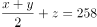，，，将三个方程相加可得，，则这三个小朋友的平均身高为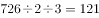cm。

故正确答案为C。

---

### 第 2 题　qid 2172815 · 数学运算

篮子里有苹果和梨两种水果若干个，将这些水果分发给13个人，每人最少拿一个，最多拿两个不同的水果。已知有9个人拿到了苹果，有8个人拿到了梨，最后全部分完。那么，有（    ）人只拿到了苹果。

- **A**. 4
- **B**. 5　✅
- **C**. 6
- **D**. 7

**答案**：B

**官方解析**

本题可以把拿苹果和拿梨子的人看成两个集合，根据两集合容斥原理公式：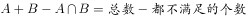，而题目中每人至少拿一个，说明没有都不拿的。所以有，计算可得“拿了两个水果”的人有4人，所以只拿了苹果的人有人。

故正确答案为B。

---

### 第 3 题　qid 2172816 · 数学运算

A、B、C、D四个小朋友进行分组跳绳比赛，结果A与B两个小朋友比C与D两个小朋友多跳20个。又已知A比B少跳9个，C比D多跳15个。那么，跳得最多的小朋友比最少的多（    ）个。

- **A**. 19
- **B**. 20
- **C**. 21
- **D**. 22　✅

**答案**：D

**官方解析**

设A、B、C、D四个小朋友分别跳了A、B、C、D个。根据题意可知：，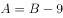，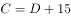。将后面两个式子代入第一个式子，可得：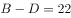，则可知B和D之间相差22个，因题干问最多和最少之间的差距，而B和D相差的22已经是选项中最大的，排除A、B、C三项，D项当选。

故正确答案为D。

---

### 第 4 题　qid 2172817 · 数学运算

现有左右相邻规模一样的两个水池，左边水池的水位比右边的高36cm。用抽水机从左边的水池抽水注入右边的水池，每分钟能使右边的水池水位升高3cm，那么（  ）分钟后两个水池的水位一样高。

- **A**. 12
- **B**. 9
- **C**. 6　✅
- **D**. 3

**答案**：C

**官方解析**

因为两个水池规模一样，且从左边水池抽的水全部注入右边水池，则右边水池水位上升的速度应该等于左边水池水位下降的速度，所以左边水池水位下降速度为每分钟3cm。

原来两个水池水位差为36cm，每分钟左边下降3cm、右边上升3cm，相差6cm，故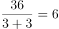分钟后水位差为0，即水位一样高。

故正确答案为C。

---

### 第 5 题　qid 2172818 · 数学运算

公司安排甲、乙、丙三人从周一开始上班，已知甲每上班一天休一天，乙每上班两天休一天，丙每上班三天休一天，那么三人第三次同时休息是星期（  ）。

- **A**. 日
- **B**. 一　✅
- **C**. 二
- **D**. 三

**答案**：B

**官方解析**

由题干条件可知，甲每2天休息一天，乙每3天休息一天，丙每4天休息一天。甲乙丙同时休息的周期应该是2、3、4的最小公倍数，每12天休息一天。第三次同时休息时，应为第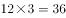天。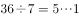，说明第36天即经过五个完整周后的第一天，应为周一。

故正确答案为B。

---

### 第 6 题　qid 2172819 · 数学运算

办公室需要复印一批文件，使用甲复印机单独印需要20分钟，使用甲乙两台复印机一起印需要12分钟，已知甲复印机每分钟比乙复印机多印6份文件，则这批文件一共有（  ）份。

- **A**. 216
- **B**. 240
- **C**. 360　✅
- **D**. 600

**答案**：C

**官方解析**

设甲复印机每分钟所印文件份数为x，则乙复印机为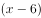，根据题意，这批文件总份数为，解得份，则这批文件共有份。

故正确答案为C。

---

### 第 7 题　qid 2172820 · 数学运算

文体用品店有一批数量为35支的羽毛球拍，进货价为每支130元。在进货价基础上提高销售，并实行消费返现制度，顾客购买羽毛球拍每满100元即减5元。假如规定每名顾客最多只能买3支球拍，则销售这批球拍至少可赚（  ）元。

- **A**. 650　✅
- **B**. 675
- **C**. 735
- **D**. 900

**答案**：A

**官方解析**

根据题意，售价为每支元，要使这批球拍所赚利润最少，那么每支球拍的利润应尽量少。每满100元即减5元，且每人最多只能买3支，分析如下：

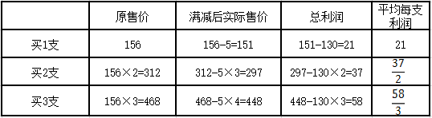

每人买2支时，平均每支利润最少，因此应该让买2支的人数尽量多。共35支球拍，，此时销售情况为：17人每人买2支，另有1人买1支或者16人每人买2只，另有1人买3支。但这两种情况总利润相同，因此此时总利润至少为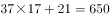元。

故正确答案为A。

---

### 第 8 题　qid 2172821 · 数学运算

某单位计划在户外举办讲座，计划使用72米的隔离带围成一个长方形作为活动场所，其中一边不封闭（即成形），缺口面向讲坛。能围成的场所面积最大是（  ）平方米。

- **A**. 324
- **B**. 648　✅
- **C**. 972
- **D**. 1296

**答案**：B

**官方解析**

设隔离带围成的场所宽为x米，则长为米，则场所面积为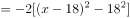。因此，当时，场所面积最大，为648平方米。

故正确答案为B。

---

### 第 9 题　qid 2172822 · 数学运算

投资公司计划对甲乙两个创业项目进行投资，若甲项目投资额减少，乙项目投资额增加，则总投资额将减少8万元；若甲项目投资额增加，乙项目投资额减少，则总投资额将增加19万元。那么，原计划的总投资额是（  ）万元。

- **A**. 350
- **B**. 370　✅
- **C**. 420
- **D**. 450

**答案**：B

**官方解析**

设原计划甲、乙两项目投资额分别是x、y，根据题意，可列方程组：

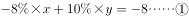

解得：，，则原计划总投资额是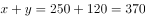万元。

故正确答案为B。

---

### 第 10 题　qid 2172823 · 数学运算

用全部156个边长为1的小正方形，最多可以拼成（  ）种形状不同的长方形。

- **A**. 5
- **B**. 6　✅
- **C**. 7
- **D**. 8

**答案**：B

**官方解析**

156个边长为1的小正方形拼成长方形，则长方形面积为156，即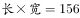。需拼成形状不同的长方形，可将156因式分解为：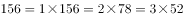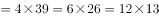，有6种因式分解的方式，故最多可组成6种形状不同的长方形。

故正确答案为B。

---

## 判断推理

### 第 1 题　qid 2172839 · 逻辑判断

治标：治本 与（  ）在内在逻辑关系上最为相似。

- **A**. 量变：质变　✅
- **B**. 道德：法律
- **C**. 承诺：合同
- **D**. 外貌：修养

**答案**：A

**官方解析**

第一步：判断题干词语间逻辑关系。
治标和治本是并列关系，治本比治标的程度重。
第二步：判断选项词语间逻辑关系。
A项：量变和质变是并列关系，质变比量变的程度重，与题干逻辑关系一致，当选；
B项：道德和法律是并列关系，但二者不存在程度上的轻重，与题干逻辑关系不一致，排除；
C项：合同必然会有相关的承诺，二者为必然对应关系，与题干逻辑关系不一致，排除；
D项：外貌和修养是并列关系，但二者不存在程度上的轻重，与题干逻辑关系不一致，排除。
故正确答案为A。

---

### 第 2 题　qid 2172840 · 逻辑判断

大步流星：寸步难行 与（  ）在内在逻辑关系上最为相似。

- **A**. 大公无私：公而忘私
- **B**. 大刀阔斧：雷厉风行
- **C**. 动荡不安：放荡不羁
- **D**. 江河日下：蒸蒸日上　✅

**答案**：D

**官方解析**

第一步：判断题干词语间逻辑关系。
大步流星，形容步子跨得大，走得快；寸步难行，形容走路困难，也比喻处境艰难。前者形容走的比较顺，后者形容走的不顺，二者为反义关系。
第二步：判断选项词语间逻辑关系。
A项：大公无私，指办事公正，没有私心，现多指从集体利益出发，毫无个人打算；公而忘私，指为了公事而不考虑私事，为了集体利益而不考虑个人得失，二者为近义关系，与题干逻辑关系不一致，排除。
B项：大刀阔斧，比喻办事果断而有魄力；雷厉风行，形容办事声势猛烈，行动迅速；二者都可以用来形容做事不拖泥带水，为近义关系，与题干逻辑关系不一致，排除。
C项：动荡不安，形容局势不稳定，不平静；放荡不羁，指放纵任性，不加检点，不受约束。前者形容局势不稳定，后者形容行为放纵任性，二者没有必然的关系，与题干逻辑关系不一致，排除。
D项：江河日下，比喻情况一天天地坏下去；蒸蒸日上，形容事业一天天向上发展，二者是反义关系，与题干逻辑关系一致，当选。
故正确答案为D。

---

### 第 3 题　qid 2172841 · 逻辑判断

记者：（  ）与（  ）：剪裁 在内在逻辑关系上最为相似。

- **A**. 采访，裁缝　✅
- **B**. 记录，园丁
- **C**. 新闻，衣服
- **D**. 摄像，模特

**答案**：A

**官方解析**

逐一代入选项。
A项：记者采访，裁缝剪裁，二者均为主谓关系，前后逻辑关系一致，当选；
B项：记者的主要工作是采访新闻和写通讯报道，可以说记者记录采访所了解的事实；园丁的主要工作是负责栽培护理园内植物，可以说园丁修剪植物，与剪裁没有必然的关系，前后逻辑关系不一致，排除；
C项：记者报道新闻，二者为主宾关系；剪裁衣服，二者为动宾关系，前后逻辑关系不一致，排除；
D项：记者的主要工作是采访报道，与摄像没有必然的关系；模特的主要工作是T台走秀，与剪裁没有必然的关系，前后逻辑关系不一致，排除。
故正确答案为A。

---

### 第 4 题　qid 2172842 · 逻辑判断

招商：（  ）与（  ）：自评 在内在逻辑关系上最为相似。

- **A**. 战略，得分
- **B**. 资金，对象
- **C**. 优势，问卷
- **D**. 创业，调查　✅

**答案**：D

**官方解析**

逐一代入选项。
A项：招商是企业发展的一种战略；自评指自我评价，与得分没有必然的关系，前后逻辑关系不一致，排除；
B项：招商是获取资金的一种方式；自评与对象没有必然的关系，前后逻辑关系不一致，排除；
C项：通过招商可以获得发展优势；通过问卷可以获得他人的评价，与自评没有必然的关系，前后逻辑关系不一致，排除；
D项：招商是通过广告、展览等方式吸引商家（投资、经营），是借助外部力量来获得发展，创业是通过自己的努力开创建立基业、事业，即招商对应的是外部，创业对应的是自身；调查是通过外部来了解，自评是通过自身来了解，前后逻辑关系一致，当选。
故正确答案为D。

---

### 第 5 题　qid 2172843 · 逻辑判断

拐弯抹角：（  ）与（  ）：富有 在内在逻辑关系上最为相似。

- **A**. 直接，家徒四壁　✅
- **B**. 委婉，穷困潦倒
- **C**. 直白，家财万贯
- **D**. 清楚，富可敌国

**答案**：A

**官方解析**

逐一代入选项。
A项：拐弯抹角，比喻说话绕弯，不直截了当，与直接是反义关系；家徒四壁，形容十分贫困，一无所有，与富有是反义关系，前后逻辑关系一致，当选；
B项：拐弯抹角与委婉是近义关系；穷困潦倒与富有是反义关系，前后逻辑关系不一致，排除； 
C项：拐弯抹角与直白是反义关系；家财万贯与富有是近义关系，前后逻辑关系不一致，排除；
D项：拐弯抹角和清楚没有必然的关系；富可敌国与富有是近义关系，前后逻辑关系不一致，排除。
故正确答案为A。

---

### 第 6 题　qid 2172844 · 逻辑判断

听证会：（  ）与（  ）：职工 在内在逻辑关系上最为相似。

- **A**. 证人，运动会
- **B**. 专家，职代会　✅
- **C**. 领导，展览会
- **D**. 居民，家长会

**答案**：B

**官方解析**

逐一代入选项。
A项：证人与听证会无必然联系，职工可能参加运动会，前后逻辑关系不一致，排除；
B项：专家参加听证会，职工参加职代会，前后逻辑关系一致，当选；
C项：领导与听证会无必然联系，展览会与职工无必然联系，前后逻辑关系不一致，排除；
D项：居民可能参与听证会，职工与家长会没有必然联系，前后逻辑关系不一致，排除。
故正确答案为B。

---

### 第 7 题　qid 2172845 · 逻辑判断

人民币：美元：兑换 与（  ）在内在逻辑关系上最为相似。

- **A**. 现金：支票：货币
- **B**. 写作：绘画：文字
- **C**. 诗词：音乐：旋律
- **D**. 中文：英文：翻译　✅

**答案**：D

**官方解析**

第一步：判断题干词语间逻辑关系。
人民币与美元是并列关系，两者之间可以进行兑换。
第二步：判断选项词语间逻辑关系。
A项：现金和支票是并列关系，都是货币的一种，与题干逻辑关系不一致，排除；
B项：写作与绘画是并列关系，文字是写作的载体，与题干逻辑关系不一致，排除；
C项：诗词与音乐没有必然的逻辑关系，旋律是音乐的组成部分，与题干逻辑关系不一致，排除；
D项：中文与英文是并列关系，两者之间可以进行翻译，与题干逻辑关系一致，当选。
故正确答案为D。

---

### 第 8 题　qid 2172846 · 逻辑判断

豆：黄豆：四季豆 与（  ）在内在逻辑关系上最为相似。

- **A**. 瓜：西瓜：佛手瓜　✅
- **B**. 果：糖果：罗汉果
- **C**. 茶：奶茶：乌龙茶
- **D**. 油：酱油：绵羊油

**答案**：A

**官方解析**

第一步：判断题干词语间逻辑关系。
黄豆和四季豆是并列关系，二者都是豆的一种，与豆是种属关系。
第二步：判断选项词语间逻辑关系。
A项：西瓜和佛手瓜是并列关系，二者都是瓜的一种，与瓜是种属关系，与题干逻辑关系一致，当选；
B项：糖果与罗汉果不是并列关系，与题干逻辑关系不一致，排除；
C项：乌龙茶是茶的一种，但茶是奶茶的原材料，二者不是种属关系，与题干逻辑关系不一致，排除；
D项：酱油并不是油类，“酱油”的主要原料为大豆，在晒制发酵酿制后成为酱汁；绵羊油是从天然羊毛中精炼出来的油脂（油和脂肪的统称），与油不是种属关系，与题干逻辑关系不一致，排除。
故正确答案为A。

---

### 第 9 题　qid 2172847 · 逻辑判断

医生：检查：诊断病情 与（  ）在内在逻辑关系上最为相似。

- **A**. 警察：警局：逮捕犯人
- **B**. 厨师：烹饪：品尝美食
- **C**. 演员：表演：吹拉弹唱
- **D**. 教师：讲课：传授知识　✅

**答案**：D

**官方解析**

第一步：判断题干词语间逻辑关系。
医生通过检查诊断病情，医生是动作的发出者，检查是方式，诊断病情是目的。
第二步：判断选项词语间逻辑关系。
A项：警察不能通过警局逮捕犯人，警局不是方式，警察是通过刑侦技术逮捕犯人，与题干逻辑关系不一致，排除；
B项：厨师不能通过烹饪品尝美食，而是让客人品尝美食，与题干逻辑关系不一致，排除；
C项：演员不能通过表演吹拉弹唱，吹拉弹唱不是目的，与题干逻辑关系不一致，排除；
D项：教师通过讲课传授知识，教师是动作的发出者，讲课是方式，传授知识是目的，与题干逻辑关系一致，当选。
故正确答案为D。

---

### 第 10 题　qid 2172848 · 逻辑判断

营业税：增值税：减免 与（  ）在内在逻辑关系上最为相似。

- **A**. 笔试：面试：选拔
- **B**. 燃油车：电动车：环保
- **C**. 土楼：木屋：搭建　✅
- **D**. 平信：快递：降价

**答案**：C

**官方解析**

第一步：判断题干词语间逻辑关系。
营业税和增值税是我国两大税种，二者是并列关系，减免营业税、减免增值税都是动宾结构。
第二步：判断选项词语间逻辑关系。
A项：笔试与面试是并列关系，但笔试、面试是选拔的方式，而不是动宾结构，与题干逻辑关系不一致，排除；
B项：燃油车与电动车是并列关系，但燃油车、电动车与环保不是动宾结构，与题干逻辑关系不一致，排除；
C项：土楼与木屋是并列关系，搭建土楼、搭建木屋都是动宾结构，与题干逻辑关系一致，当选；
D项：平信、快递都是邮寄的方式，二者是并列关系，但平信、快递是可能会降价，与降价是对应关系，与题干逻辑关系不一致，排除。
故正确答案为C。

---

### 第 11 题　qid 2172849 · 逻辑判断

某科研单位招聘研究人员，要求被录取人员必须具备生物学专业背景，并且得到两名同行专家的推荐。
以下哪项为真，说明录取没有遵守招聘要求？（  ）
（1）杜林被录取，但只有一名同行专家推荐；
（2）李力被录取，但他所学专业为文学；
（3）张娜生物学专业毕业，且有两名同行专家推荐，但是没有被录取。

- **A**. （1）和（2）　✅
- **B**. （2）和（3）
- **C**. （1）和（3）
- **D**. 以上都不是

**答案**：A

**官方解析**

第一步：翻译题干。
录取→生物学专业且两名专家推荐
第二步：逐一分析选项。
如果（1）为真，即被录取且只有一名专家推荐，与题干必须两名同行专家推荐矛盾，说明没有遵守招聘要求；如果（2）为真，即被录取且专业不是生物学专业，与题干必须生物学专业矛盾，说明没有遵守招聘要求；如果（3）为真，生物学专业且两名同行推荐属于肯定题干的后件，不能得到确定性的结论，即张娜可能被录取也可能不被录取，结果是张娜没有录取，遵守了招聘要求。
故正确答案为A。

---

### 第 12 题　qid 2172850 · 逻辑判断

世界级钢琴演奏家每天练习弹钢琴不少于八个小时，除非是元旦、星期天或者当天有重大的演出项目。
如果以上论述为真，以下哪个人不可能是世界级钢琴演奏家？（  ）

- **A**. 某钢琴演奏家在某个星期的星期一、星期四、星期五和星期天都没有练习弹钢琴
- **B**. 某钢琴演奏家连续三个月没有练习弹钢琴
- **C**. 某钢琴演奏家几乎每天练习跑马拉松四个小时
- **D**. 某钢琴演奏家连续三天每天练习弹钢琴七个小时，并且没有演出项目　✅

**答案**：D

**官方解析**

第一步：翻译题干。

根据题干可知“世界级钢琴家”的条件是：“除非元旦、星期天或当天有重大演出项目，否则每天练习弹钢琴不少于八小时。”

“除非······否则不”可翻译为：每天练习弹钢琴少于八小时元旦、星期天或当天有重大演出项目。

第二步：逐一分析选项。

A项：不确定星期一、星期四和星期五是否有大型演出项目，无法推出，排除；

B项：某钢琴演奏家连续三个月没有练习弹钢琴，无法确定这三个月内是否每天都有大型演出项目，无法推出，排除；

C项：练习马拉松与练习钢琴无关，无法推出，排除；

D项：这三天都没有演出，那么总有一天不是元旦、星期天，但是钢琴家这三天每天练习弹钢琴都少于八小时，因此不可能是世界级钢琴家，可以推出，当选。

本题为选非题，故正确答案为D。

---

### 第 13 题　qid 2172851 · 逻辑判断

某厅决定在厅机关选派援疆干部，并成立了由党委办、人事处、就业处组成的援疆干部推荐小组，还初定了赵某、李某、周某三个推荐人选。党委办、人事处、就业处三个部门分别提出了各自的推荐意见：
党委办：赵某、李某中只能去一个。
人事处：如果不选派赵某，就不选派周某。
就业处：只有不选派李某或赵某，才选派周某。
以下方案能同时满足三个部门意见的是（  ）

- **A**. 选派周某，不选派赵某和李某
- **B**. 选派李某和赵某，不选派周某
- **C**. 选派赵某，不选派李某和周某　✅
- **D**. 选派李某和周某，不选派赵某

**答案**：C

**官方解析**

第一步：翻译题干。
党委办：要么赵，要么李
人事处：-赵→-周
就业处：周→-李或-赵
第二步：逐一分析选项。
A项：选派周，不选派赵某，不满足人事处的意见，排除；
B项：选派李某和赵某，不满足党委办的意见，排除；
C项：可以同时满足三个部门的意见，当选；
D项：将人事处的意见进行逆否，可以推出：周→赵，因此选派周某不选派赵某，不满足人事处的意见，排除。
故正确答案为C。

---

### 第 14 题　qid 2172852 · 逻辑判断

所有优秀的物理学家都具有良好的数学运用能力，张杰没有良好的数学运用能力，所以张杰不是优秀的物理学家。
下述推理中与上述推理在结构形式上最为相似的是（  ）。

- **A**. H公司今年招聘的人才都具有良好的专业背景和综合素质，小刘具有良好的专业背景和综合素质，所以小刘是今年H公司招聘的人才
- **B**. 所有年满七十周岁的人都可以领到老年人生活补贴，王老师今年七十五周岁，他可以领到老年人生活补贴
- **C**. 所有条件适宜的环境都能使企鹅蛋孵化，但T岛上企鹅蛋没有孵化，所以T岛的环境不是适宜的　✅
- **D**. 所有被顶尖高校录取的学生都是聪明的学生，李可没有被顶尖高校录取，所以李可不是聪明的学生

**答案**：C

**官方解析**

第一步：翻译题干。
物理学家→具有良好数学运用能力；张杰没有良好的数学运用能力→不是优秀的物理学家，推理形式为否后推否前。
第二步：逐一分析选项。
A项：H招聘的人才→具有良好的专业背景和综合素质，小刘具有良好的专业背景和综合素质→H招聘的人才，推理形式为肯后推肯前，与题干不同，排除；
B项：年满七十周岁→领老年人生活补贴，王老师七十五周岁→领老年人生活补贴，推理形式为肯前推肯后，与题干不同，排除；
C项：条件适宜的环境→使企鹅蛋孵化，T岛企鹅蛋没有孵化→T岛条件不适宜，推理形式为否后推否前，与题干相同，当选；
D项：被顶尖学校录取→聪明的学生，李可没有被顶尖学校录取→不是聪明的学生，推理形式为否前推否后，与题干不同，排除。
故正确答案为C。

---

### 第 15 题　qid 2172853 · 逻辑判断

在全球化背景下，跨国公司的利润转移问题越来越成为各国政府关注的焦点。如果这一问题得不到解决，将加剧大资本与劳动之间收入分配的不平等。除非各国能够制定统一的公司所得税率，或者形成跨国界税收治理新规则，否则，这将是难解之题。
如果以上陈述为真，则以下哪项陈述必然为真？（  ）

- **A**. 各国制定统一的公司所得税率，或者形成跨国界税收治理新规则，就可以解决跨国公司的利润转移问题
- **B**. 如果跨国公司的利润转移问题得到解决，就能消除大资本与劳动之间收入分配的不平等
- **C**. 如果各国不制定统一的公司所得税率，或者不形成跨国界税收治理新规则，大资本与劳动之间收入分配的不平等将会进一步加剧　✅
- **D**. 如果各国不制定统一的公司所得税率，那么形成跨国界税收治理新规则也无法解决跨国公司的利润转移问题

**答案**：C

**官方解析**

第一步：翻译题干。
① —利润转移解决→—收入分配平等
② 利润转移解决→制定统一公司所得税率 或 跨国界税收治理新规则
将①逆否和②可以递推出：③收入分配平等→利润转移解决→制定统一公司所得税率 或 跨国界税收治理新规则
第二步：逐一分析选项。
A项：翻译为制定统一公司所得税率 或 跨国界税收治理新规则→利润转移解决，肯定②的后件，肯后得不到确定性的结论，无法推出，排除；
B项：翻译为利润转移解决→收入分配平等，否定①的前件，否前得不到确定性的结论，无法推出，排除；
C项：翻译为收入分配平等→制定统一公司所得税率 且 跨国界税收治理新规则，与③推出的结果不一致，无法推出，排除；
D项：翻译为，—制定统一公司所得税率 且 跨国界税收治理新规则→—利润转移解决，肯定②的后件，肯后得不到确定性结论，无法推出，排除。
注：本题经过粉笔教研，四个选项均无法推出，属于一道错题，没有正确答案。

---

### 第 16 题　qid 2172854 · 逻辑判断

只有具有良好的逻辑思维能力并且具有物理学专业背景的人，才能胜任这个岗位。
如果上述判断为真，以下哪项不可能为真？（  ）

- **A**. 物理学专业博士小赵胜任了这个岗位
- **B**. 从未学习过物理学知识的小李，胜任了这个岗位　✅
- **C**. 小刘具有物理学专业背景，但他不能胜任这个岗位
- **D**. 小孙不能胜任这个岗位，但他的逻辑思维能力是大家公认的

**答案**：B

**官方解析**

第一步：翻译题干。

胜任岗位  逻辑思维 且 物理学专业

第二步：逐一分析选项。

A项：已知小赵是物理学专业博士，但是没有给出小赵的逻辑思维能力情况，因此他能否胜任这个职位也不清楚，所以该项可能为真，排除；

B项：已知小李他从未学过物理学知识，无论此时他的逻辑思维能力情况如何，都是对题干后半部分的否定，依据规则否后必否前，故一定得出小李不能胜任这个岗位，但是B项说小李胜任了这个岗位，显然与题干信息相矛盾，不可能为真，当选；

C项：已知小刘具有物理学专业背景，但是没有给出小刘的逻辑思维能力情况，因此他能否胜任这个职位也不清楚，所以该项可能为真，排除；

D项：已知小孙不能胜任这个岗位，根据题干条件可知，否前得不到确定性的结论，那么他可能具有很强的逻辑思维能力，该项可能为真，排除。

故正确答案为B。

---

### 第 17 题　qid 2172855 · 逻辑判断

一项研究发现，二氧化硅是一种植物容易吸收的硅元素形态，通过使用二氧化硅改善土壤，植物可沉淀出称为“植结石”的小颗粒。颗粒中含有的硅元素可减缓昆虫的发育，颗粒的石头质地还能磨损昆虫口器，从而降低植物的虫害程度。由此，有关研究人员建议，可以在那些农作物经常受昆虫侵害的地区土壤中加入这类硅元素。
以下哪项如果为真，最能反驳上述建议？（  ）

- **A**. 各地区昆虫的耐药性及药物作用的敏感性都相同
- **B**. 受昆虫侵害严重的地区，土壤中普遍缺乏硅元素
- **C**. 农作物中的硅元素会对食用者的身体发育产生影响　✅
- **D**. 富含硅元素的农作物的口感比普通农作物更好

**答案**：C

**官方解析**

第一步：找出论点和论据。
论点：可以在那些农作物经常受昆虫侵害的地区土壤中加入这类硅元素。
论据：二氧化硅是一种植物容易吸收的硅元素形态，通过使用二氧化硅改善土壤，植物可沉淀出称为“植结石”的小颗粒。颗粒中含有的硅元素可减缓昆虫的发育，颗粒的石头质地还能磨损昆虫口器，从而降低植物的虫害程度。
第二步：逐一分析选项。
A项：说明各地区昆虫的情况都相同，也就是说在土壤中加入这类硅元素可以起到降低虫害的作用，这种做法可以大范围推广和普及，是论点成立的前提条件，为加强项，无法削弱，排除；
B项：指出缺乏硅元素的土壤中昆虫侵害严重，举例说明硅元素和降低虫害之间是有联系的，属于加强项，无法削弱，排除；
C项：指出该类硅元素会对食用者的身体发育产生影响，即在土壤中加入硅元素会造成危害，这种方式不可行，直接削弱论点，当选； 
D项：指出富含硅元素的农作物口感好，而论点讨论的是富含硅元素的农作物可以降低植物的虫害程度，二者讨论的话题不一致，属于无关选项，无法削弱，排除。
故正确答案为C。

---

### 第 18 题　qid 2172856 · 逻辑判断

每周饮酒2-10次是适量饮酒。有调查发现，每周饮酒2-10次的男士，比每周饮酒少于2次的男士患心脏病的概率要低。因此，适量饮酒可降低男士患心脏病的风险。
以下哪项为真，最不能削弱该论证？（  ）

- **A**. 适量饮酒的女士比每周饮酒少于2次的女士患肝炎的概率更高　✅
- **B**. 适量饮酒的男士更注意加强身体锻炼
- **C**. 适量饮酒的男士普遍比每周饮酒少于2次的男士要年轻
- **D**. 男士们都认为，身体良好的情况下可以适当增加饮酒量

**答案**：A

**官方解析**

第一步：找出论点和论据。
论点：适量饮酒可降低男士患心脏病的风险。
论据：调查发现，每周饮酒2-10次的男士，比每周饮酒少于2次的男士患心脏病的概率要低。
第二步：逐一分析选项。
A项：说的是适量饮酒和每周饮酒少于2次的女士患肝炎的概率问题，与题干所说的饮酒对于男士患心脏病的概率问题无关，不能削弱，当选；
B项：提出另外一个因素即适量饮酒的男士更注意加强身体锻炼，可能是这个因素导致降低了适量饮酒的男士患心脏病的风险，属于他因削弱，可以削弱，排除；
C项：提出另外一个因素即年龄因素，可能是年龄因素导致降低了适量饮酒的男士患心脏病的风险，属于他因削弱，可以削弱，排除； 
D项：说的是男士在身体好的情况下会适当增加喝酒量，而不是喝酒导致患病风险低，属于因果倒置，可以削弱，排除。
本题为选非题，故正确答案为A。

---

### 第 19 题　qid 2172857 · 逻辑判断

有教育专家提出，如果采取按照年龄、学历水平和职称等级将教师平均分配到所有学校的办法来配置教育资源，实现教育公平，就能较好解决目前因上重点学校竞争激烈而引起的社会问题。
以下哪项如果为真，将最能削弱该教育专家的观点？

- **A**. 很多重点学校老师表示支持
- **B**. 绝大多数学生和家长表示反对
- **C**. 一些重点学校老师要求到物价低的郊区学校工作
- **D**. 普通学校的硬件设施建设比起重点学校存在明显差距　✅

**答案**：D

**官方解析**

第一步：找出论点和论据。
论点：如果采取按照年龄、学历水平和职称等级将教师平均分配到所有学校的办法来配置教育资源，实现教育公平，就能较好解决目前因上重点学校竞争激烈而引起的社会问题。
论据：无。
本题只有论点，没有论据，削弱优先考虑削弱论点。
第二步：逐一分析选项。
A项：该项指出很多重点学校老师表示支持，仅为主观态度表达，但不确定最终是否能解决问题，不明确选项，不能削弱，排除；
B项：该项指出绝大多数学生和家长表示反对，仅为主观态度表达，不确定最终是否能解决问题，不明确选项，不能削弱，排除；
C项：该项指出有重点学校老师要求去物价低的郊区学校工作，与平均分配教师后是否能实现教育公平、解决问题无关，话题不一致，不能削弱，排除；
D项：该项指出普通学校的硬件设施与重点学校存在差距，说明即使将老师均等分配，硬件差距还是会导致重点学校依然具备竞争优势，故还是实现不了教育公平，也解决不了因重点学校竞争激烈而引起的社会问题，直接削弱论点，可以削弱，当选。
故正确答案为D。

---

### 第 20 题　qid 2172858 · 逻辑判断

某调查小组对Y地区吸烟青少年群体调查发现，吸烟青少年来自二手烟家庭，父母至少有一人为吸烟者。因此，该地区二手烟家庭如果能大幅减少，新的吸烟青少年数量将显著减少。

以下哪项如果为真，最能支持上述论证？

- **A**. 成年人的戒烟方法和青少年的戒烟方法是不同的
- **B**. 吸烟青少年可以通过积极的干预而戒烟
- **C**. 成年人和青少年学会吸烟的方式是相同的
- **D**. Y地区成长于二手烟家庭的青少年吸烟的比例比其他家庭高　✅

**答案**：D

**官方解析**

第一步：找出论点和论据。
论点：该地区二手烟家庭如果能大幅减少，新的吸烟青少年数量将显著减少。
论据：调查小组对Y地区吸烟青少年群体调查发现，75%吸烟青少年来自二手烟家庭，父母至少有一人为吸烟者。
第二步：逐一分析选项。
A项：说的是成年人和青少年的戒烟方法不同，讨论的是戒烟的问题，而题干所说的群体是新的吸烟青少年即开始抽烟的青少年，主体不一致，不能加强，排除；
B项：指出吸烟青少年可以通过积极的干预戒烟，和题干所说的话题不一致，不能加强，排除；
C项：指出成年人和青少年学会吸烟的方式相同，不能说明二手烟家庭如果减少能使新的吸烟青少年数量减少，不能加强，排除； 
D项：说明Y地区二手烟家庭的青少年吸烟的比例比其他家庭高，即二手烟家庭对青少年吸烟是有影响的，可以加强，当选。
故正确答案为D。

---

### 第 21 题　qid 2172859 · 逻辑判断

请选择最适合的一项填入问号处，使右边图形的变化规律与左边图形一致。

- **A**. A
- **B**. B
- **C**. C　✅
- **D**. D

**答案**：C

**官方解析**

元素组成相似，考虑样式规律，经观察，第一组图形中：第二个图形经过顺时针旋转后，与第一个图形进行去同存异运算可得第三个图形。根据此规律，第二组图形中，先将第二个图形顺时针旋转再与第一幅图形进行去同存异，可得C项。

故正确答案为C。

---

### 第 22 题　qid 2172860 · 逻辑判断

请选择最适合的一项填入问号处，使右边图形的变化规律与左边图形一致。

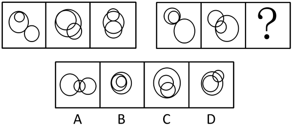

- **A**. A　✅
- **B**. B
- **C**. C
- **D**. D

**答案**：A

**官方解析**

元素组成不同，且每幅图均由三个圆组成，考虑图形间关系。观察发现，第一组图形中：第一个图形有两个圆是内切，有两个圆是外切，第二个图形中有两个圆是内切，第三个图形中有两个圆是外切。第二组图形也应遵循此规律，第一个图形有两个圆是内切，有两个圆是外切，第二个图形中有两个圆是内切，故？处应选择有两个圆是外切的图形，只有A项符合。
故正确答案为A。

---

### 第 23 题　qid 2172861 · 逻辑判断

请选择最适合的一项填入问号处，使右边图形的变化规律与左边图形一致。

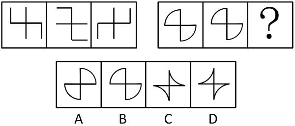

- **A**. A　✅
- **B**. B
- **C**. C
- **D**. D

**答案**：A

**官方解析**

元素组成相同，优先考虑位置规律。第一组图形中，第二个图形是由第一个图形经过顺时针旋转以后，再左右翻转得来，第三个图形是由第一个图形左右翻转得来。第二组图形运用此规律，第二个图形是由第一个图形经过顺时针旋转以后，再左右翻转得来，第三个图形是由第一个图形左右翻转得来，故只有A项符合此规律。

故正确答案为A。

---

### 第 24 题　qid 2172862 · 逻辑判断

请选择最适合的一项填入问号处，使之符合之前四个图形的变化规律。

- **A**. A
- **B**. B
- **C**. C
- **D**. D　✅

**答案**：D

**官方解析**

元素组成不同，且无属性规律，考虑数量规律，每幅图形都是由一个圆与内部线条组成，观察发现每个图形内部线条与圆的交点的个数都是4，同理？处也应为4，A项内部线条与圆的交点为1个，B项内部线条与圆的交点为3个，C项内部线条与圆的交点为2个，D项内部线条与圆的交点为4个。
故正确答案为D。

---

### 第 25 题　qid 2172863 · 逻辑判断

请选择最适合的一项填入问号处，使之符合之前四个图形的变化规律。

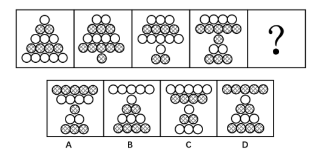

- **A**. A
- **B**. B　✅
- **C**. C
- **D**. D

**答案**：B

**官方解析**

元素组成相同，优先考虑位置规律，每幅图形都有5行小圆且每行图形的颜色相同，观察发现，每幅图形均是将前一个图形中最顶端的一行圆平移到该图形的最底端，且颜色与原来相反，故？处是由第四幅图形最顶端的4个白圆，平移到？处的最底端，颜色变成黑色，排除A、C两项，观察B、D两项，不同之处在于顶端的颜色不同，观察发现，相同个数的圆所在行均与上一幅图形的颜色相反，故？处顶端有5个圆，应与第四个图形中5个圆的颜色不同，所以这5个圆应为白色。
故正确答案为B。

---

### 第 26 题　qid 2172864 · 逻辑判断

请选择最适合的一项填入问号处，使之符合整个图形的变化规律。

- **A**. A
- **B**. B　✅
- **C**. C
- **D**. D

**答案**：B

**官方解析**

解析一：图形元素组成相似，优先考虑样式规律。观察发现图形第二列旋转180度之后与第一列相加，相加后重叠部分变黑，得到的图形经过左右翻转即可得到第三列图形。经验证，第二行符合规律，故？处选择一个将第二列旋转180度后与第一列相加，相加后重叠部分变黑后再左右翻转的图形，只有B项符合。

故正确答案为B。

解析二：只出现黑圆和白圆两种元素，可以考虑元素的换算。如果将1个黑圆换算成2个白圆，则第一行和第二行均满足白圆数量：，第三行应用此规律，排除D项；观察发现第三列白圆数量均大于黑圆数量，排除A、B两项。 

故正确答案为C。

本题粉笔倾向于解析一，样式和位置的复合考法。如果命题人想考查元素数量的换算，圆的位置可以随便摆放，没必要所有图形中的圆的位置都摆放的特别有规律，而圆摆放有规律使每一行很多圆的位置是重合的，更符合元素组成相似的特征，所以从图形特征来看，考查样式和位置复合的概率更高。 

---

### 第 27 题　qid 2172865 · 逻辑判断

请选择最适合的一项填入问号处，使之符合整个图形的变化规律。

- **A**. A　✅
- **B**. B
- **C**. C
- **D**. D

**答案**：A

**官方解析**

图形元素组成不同，无明显属性规律，考虑数量规律。第一行中，图一有两个相同的锐角，图二有两个相同的直角，图三有两个相同的钝角；第二行经验证规律一致，所以第三行也应符合此规律，即图一有两个相同的锐角，图二有两个相同的直角，故？处应有两个相同的钝角，但发现此时无正确答案。观察发现，题干中每幅图都有两个相同的角，此时只有A项有两个相同的直角，B、C、D三项均无两个相同的角，因此选择A项。本题只需要考虑每幅图均有两个相同的角，不需要考虑角的大小。
故正确答案为A。

---

### 第 28 题　qid 2172866 · 逻辑判断

把下面的六个图形分为两类，使每一类图形都有各自的共同特征或规律，分类正确的一项是（    ）。

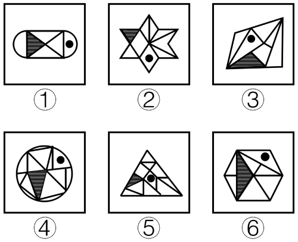

- **A**. ①③⑥，②④⑤
- **B**. ①③⑤，②④⑥
- **C**. ①②④，③⑤⑥　✅
- **D**. ①②③，④⑤⑥

**答案**：C

**官方解析**

本题考查功能元素，每幅图均有一个小黑圆和阴影三角形。考虑小黑圆与阴影三角形之间的关系，①②④中小黑圆所在的面与阴影三角形没有公共边/点，③⑤⑥中小黑圆所在的面与阴影三角形有公共边/点，所以①②④为一组，③⑤⑥为另一组。
故正确答案为C。

---

### 第 29 题　qid 2172867 · 逻辑判断

把下面的六个图形分为两类，使每一类图形都有各自的共同特征或规律，分类正确的一项是（  ）。

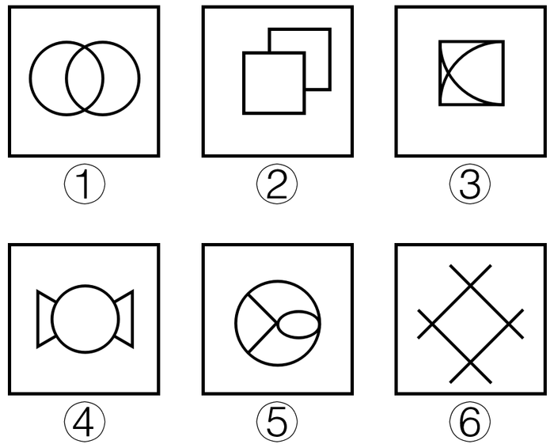

- **A**. ①②③，④⑤⑥
- **B**. ①②⑤，③④⑥
- **C**. ①③⑤，②④⑥
- **D**. ①④⑥，②③⑤　✅

**答案**：D

**官方解析**

图形元素组成不同，考虑属性规律。观察发现，题干图形均为轴对称图形，考虑对称性，图①④⑥既是轴对称图形又是中心对称图形，图②③⑤仅为轴对称图形，所以图①④⑥为一组，图②③⑤为一组。
故正确选项为D。

---

### 第 30 题　qid 2172868 · 逻辑判断

下图左边给定的是纸盒的外表面，右边哪一项能由它折叠而成？

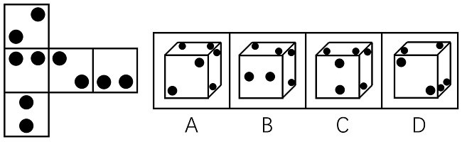

- **A**. A　✅
- **B**. B
- **C**. C
- **D**. D

**答案**：A

**官方解析**

本题展开图只有五个面，空间重构后形成一个未封顶的立方体。如下图所示：将左边展开图各个面分别编号为，1、2、3、4、5。

A项：选项与展开图一致，当选；

B项：正面为面5，所以其顶面应当为面3（面5和面1为相对面，不可能同时出现），此时右面为面2或者面4。若右面为面2，则B项是由2、3、5这三个面组成。展开图中，这三个面的公共点没有经过面3中的小黑点，而选项中这三个面的公共点经过了面3中的小黑点，选项与展开图不一致；若右面为面4，则B项是由3、4、5这三个面组成。此时，展开图和选项中，面3和面4公共边两侧的小黑点的位置不一致，选项与展开图不一致，排除；

C项：正面为面5，顶面的黑点与面5比较近，所以顶面为面4，右面为面3（面5和面1为相对面，不可能同时出现）。此时，展开图和选项中，面3和面4公共边两侧的小黑点的位置不一致，选项与展开图不一致，排除；

D项：由面1、面3和另外一个面组成，展开图中，面1与面3不存在挨在一起的黑点，选项中面1黑点与面3黑点之间有一个是挨着的，选项与展开图不一致，排除。

故正确答案为A。

---

## 资料分析

### 材料 1

        某行政区从“服务态度”“办事效率”“政务公开”三个方面评价下属的6个街道办事处（简称为街道办）的综合服务效能水平，并调查了群众对各个街道办的满意度。这6个街道办分别为天坊街道办、云仙街道办、和风街道办、景秀街道办、东河街道办、南田街道办。每个方面评价分数采用百分制。评价结果如下图：

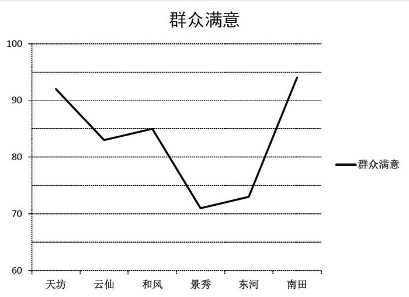

#### 第 1 题　qid 2172869 · 综合

“服务态度”“办事效率”“政务公开”分数依次由高到低排序的街道办是（  ）。

- **A**. 天坊
- **B**. 景秀
- **C**. 云仙　✅
- **D**. 南田

**答案**：C

**官方解析**

定位统计图1，各街道办三项指标分数由高到低排序分别为：A项天坊：办事效率服务态度政务公开；B项景秀：政务公开服务态度办事效率；C项云仙：服务态度办事效率政务公开；D项南田：办事效率政务公开服务态度。符合要求的为C项云仙。

故正确答案为C。

---

#### 第 2 题　qid 2172870 · 平均数

该行政区六个街道办的群众满意度平均分约为（  ）。

- **A**. 89
- **B**. 83　✅
- **C**. 75
- **D**. 70

**答案**：B

**官方解析**

根据题干“平均分”，可判定此题为现期平均数计算问题。定位统计图2可得，六个街道办群众满意度评价得分别为：约92分、约83分、85分、约71分、约73分、约94分，分。

故正确答案为B。

---

#### 第 3 题　qid 2172871 · 综合

如果要选择一个指标代替群众满意度得分，则最适合的指标是（  ）。

- **A**. 服务态度
- **B**. 办事效率　✅
- **C**. 政务公开
- **D**. 三项分数的均值

**答案**：B

**官方解析**

定位统计图1、2，将第二个图中的群众满意度折线图与第一个图中的三个指标对应的折线图分别进行比对，发现办事效率指标折线图与群众满意度相似度最高，且分数最接近，因此B项办事效率指标最适合代替。
故正确答案为B。

---

#### 第 4 题　qid 2172872 · 综合

如果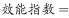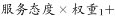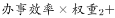，其中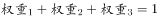。而天坊的效能指数为84。那么以下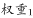、、的数字依次排列最可能的是（  ）。

- **A**. 0.3，0.4，0.3　✅
- **B**. 0.3，0.5，0.2
- **C**. 0.2，0.3，0.5
- **D**. 0.1，0.2，0.7

**答案**：A

**官方解析**

定位统计图1，天坊的服务态度分数约为84、办事效率约为94、政务公开为70。按照各选项权重计算，天坊的效能指数为：

A项：；

B项：；

C项：；

D项：。

与天坊的实际效能指数84最接近的是A项。

故正确答案为A。

---

#### 第 5 题　qid 2172873 · 综合

以下说法错误的是（  ）。

- **A**. 街道办的“群众满意”分数从高到低排序分别是南田、天坊、和风、云仙、东河、景秀
- **B**. 在“政务公开”中分数并列第一的街道办是东河和景秀
- **C**. 南田街道办在“服务态度”和“政务公开”取得的分数相同
- **D**. 云仙街道办三个效能分数均比和风街道办的要高　✅

**答案**：D

**官方解析**

A项：定位统计图2，“群众满意”分数从高到低排序为：南田天坊和风云仙东河景秀，正确；

B项：定位统计图1，“政务公开”中，景秀与东河分数相同，且高于其他4个街道办，为并列第一，正确；

C项：定位统计图1，南田街道办“服务态度”和“政务公开”的数据点重合，即分数相同，正确；

D项：定位统计图1，云仙、和风的办事效率得分均为85分，二者得分相同，错误。

本题为选非题，故正确答案为D。

---

### 材料 2

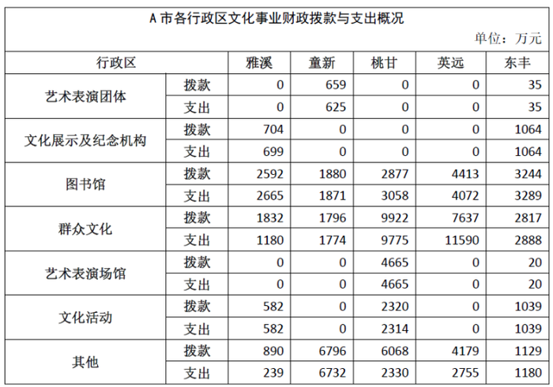

#### 第 6 题　qid 2172874 · 综合

A市文化事业财政资金使用最为全面的行政区是（  ）。

- **A**. 雅溪
- **B**. 童新
- **C**. 桃甘
- **D**. 东丰　✅

**答案**：D

**官方解析**

由表格材料可得，A市各行政区文化事业财政拨款与支出中，只有东丰区各项支出均大于零，因此，A市文化事业财政资金使用最为全面的行政区是东丰区。
故正确答案为D。

---

#### 第 7 题　qid 2172875 · 综合

A市文化事业财政资金拨款最少的行政区是（  ）。

- **A**. 雅溪　✅
- **B**. 童新
- **C**. 英远
- **D**. 东丰

**答案**：A

**官方解析**

由表格材料可得，A市各行政区文化事业财政资金拨款分别为：万元；万元；万元；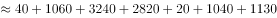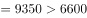万元。故A市文化事业财政资金拨款最少的行政区是雅溪区。

故正确答案为A。

---

#### 第 8 题　qid 2172876 · 比重

以下A市各行政区的某项文化事业财政资金，支出额占拨款额的比重最低的是（  ）。

- **A**. 雅溪区——群众文化　✅
- **B**. 童新区——图书馆
- **C**. 英远区——群众文化
- **D**. 东丰区——文化活动

**答案**：A

**官方解析**

由题干“······占······的比重最低”，判定本题为现期比重比较问题。由公式：。定位材料可得“雅溪区群众文化财政资金支出额为1180万元、拨款额为1832万元”，占比为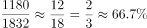；“童新区图书馆财政资金支出额为1871万元、拨款额为1880万元”，占比为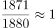；“英远区群众文化财政资金支出额为11590万元、拨款额为7637万元”，占比为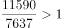；“东丰区文化活动财政资金支出额为1039万元、拨款额为1039万元”，占比为。可得：支出额占拨款额的比重最低的是雅溪区—群众文化。

故正确答案为A。

---

#### 第 9 题　qid 2172877 · 综合

下图最符合A市所有行政区各项文化事业财政支出总额情况的是（  ）。

- **A**. 

- **B**. 
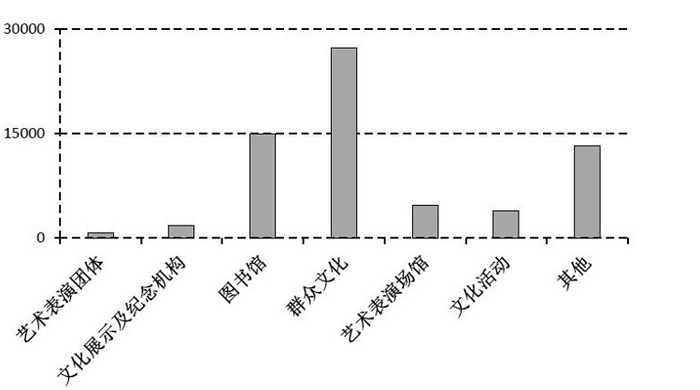
　✅
- **C**. 

- **D**. 
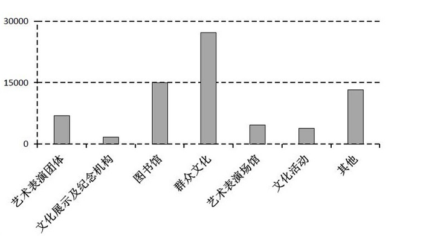

**答案**：B

**官方解析**

由表格材料可得：A市所有行政区各项文化事业财政支出额中，群众文化万元，与30000万元比较接近，排除A项；其他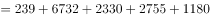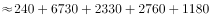万元，排除C项；艺术表演团体（万元）小于文化展示及纪念机构（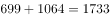万元），排除D项。

故正确答案为B。

---

#### 第 10 题　qid 2172878 · 综合

以下说法正确的是（  ）。

- **A**. 各行政区的文化事业财政支出总额均比拨款总额要低
- **B**. 有些行政区并未在群众文化上支出财政资金
- **C**. 并未出现拨款金额与支出金额相等的情况
- **D**. 各行政区在图书馆上均有财政投入　✅

**答案**：D

**官方解析**

A项：由表格材料可得，英远区文化事业财政支出总额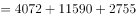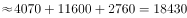万元，拨款总额万元，支出总额高于拨款总额，错误；

B项：由表格材料可得，所有行政区在群众文化上财政支出金额均大于0，即所有行政区在系项目上均有支出财政资金，错误；

C项：由表格材料可得，东丰区艺术表演团体财政拨款金额与支出金额相等，均为35万元，错误；

D项：由表格材料可得，各行政区在图书馆上财政支出金额均大于0，即各行政区在图书馆上均有财政投入，正确。

故正确答案为D。

---

### 材料 3

        我国2017年粮食种植面积为11222万公顷，比上年减少81万公顷。其中，小麦种植面积2399万公顷，减少20万公顷；稻谷种植面积3018万公顷，减少0.2万公顷；玉米种植面积3545万公顷，减少132万公顷。棉花种植面积323万公顷，减少12万公顷。油料种植面积1420万公顷，增加7万公顷。糖料种植面积168万公顷，减少1万公顷。

        2017年粮食产量61791万吨，比上年增加166万吨，增产。其中，夏粮产量14031万吨，增产；早稻产量3174万吨，减产；秋粮产量44585万吨，增产。全年谷物产量56455万吨，比上年减产。其中，稻谷产量20856万吨，增产；小麦产量12977万吨，增产；玉米产量21589万吨，减产。全年棉花产量549万吨，比上年增产。油料产量3732万吨，增产。糖料产量12556万吨，增产。茶叶产量255万吨，增产。

#### 第 11 题　qid 2172879 · 综合

2017年，我国小麦、稻谷、玉米、棉花四种农作物中，种植面积减少速度最快的是（  ）。

- **A**. 小麦
- **B**. 稻谷
- **C**. 玉米　✅
- **D**. 棉花

**答案**：C

**官方解析**

由题干“减少速度最快的是”，可判定本题为一般增长率比较问题。定位文字材料第一段可得“我国2017年小麦种植面积2399万公顷，减少20万公顷；稻谷种植面积3018万公顷，减少0.2万公顷；玉米种植面积3545万公顷，减少132万公顷；棉花种植面积323万公顷，减少12万公顷”，代入公式：，可得四种农作物种植面积减少速度分别为：小麦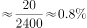；稻谷；玉米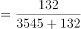；棉花。由于玉米和棉花的减少速度非常接近，故需要精确计算。可得种植面积减少速度最快的是玉米。

故正确答案为C。

---

#### 第 12 题　qid 2172880 · 综合

2017年，我国棉花的产量比2016年约增产了（  ）万吨。

- **A**. 7
- **B**. 19　✅
- **C**. 31
- **D**. 48

**答案**：B

**官方解析**

由题干“…约增产了多少万吨”，可判定本题为增长量计算问题。定位文字材料第二段可得“2017年，我国棉花产量为549万吨，比上年增产”，代入公式：，可得：2017年，我国棉花的产量比2016年约增产了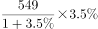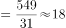万吨，与B项最接近。

故正确答案为B。

---

#### 第 13 题　qid 2172881 · 增长

相较于上一年，2015年全国粮食产量的增长率约是2014年的（  ）倍。

- **A**. 3　✅
- **B**. 5
- **C**. 7
- **D**. 9

**答案**：A

**官方解析**

由题干“…约是…的多少倍”，可判定本题为现期倍数计算问题。定位柱形图可得“2015年全国粮食产量为62144万吨、2014年为60703万吨、2013年为60194万吨”，代入公式：，则2015年全国粮食产量同比增长率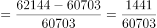；2014年同比增长率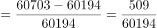。因此，相较于上一年，2015年全国粮食产量的增长率约是2014年的倍，与A项最接近。

故正确答案为A。

---

#### 第 14 题　qid 2172882 · 增长

三种谷物中，2017年产量比上年增加最多的谷物，其种植面积约占全国粮食种植面积的（  ）。

- **A**. 

- **B**. 

- **C**. 

　✅
- **D**. 

**答案**：C

**官方解析**

由题干“…约占…的百分之几”，可判定本题为现期比重计算问题。定位文字材料第二段可得“2017年，三种谷物中：稻谷产量20856万吨，增产；小麦产量12977万吨，增产；玉米产量21589万吨，减产”，由于玉米为减产，排除；稻谷和小麦产量增长率一致，稻谷现期量大于小麦现期量，根据，可以判定三种谷物中，稻谷增产最多。

定位文字材料第一段“2017年我国粮食种植面积为11222万公顷，其中稻谷种植面积3018万公顷”，代入公式：，可得2017年产量比上年增长最多的谷物稻谷，其种植面积约占全国粮食种植面积的。

故正确答案为C。

---

#### 第 15 题　qid 2172883 · 综合

以下说法正确的是（  ）。

- **A**. 2017年，我国各种粮食产量均有所增长
- **B**. 2017年，小麦，稻谷，玉米的产量总和为谷物的总产量
- **C**. 2017年，小麦，稻谷，玉米这三种谷物中单位面积产量最高的是稻谷　✅
- **D**. 2017年，油料的产量增长率等于其种植面积增长率的3倍

**答案**：C

**官方解析**

A项：定位文字材料第二段可得“2017年，玉米产量为21589万吨，减产”，并非各种粮食产量均增长，错误；

B项：定位文字材料第二段可得“2017年，谷物产量为56455万吨。其中：稻谷产量为20856万吨；小麦产量为12977万吨；玉米产量为21589万吨”，稻谷、小麦和玉米产量之和，错误；

C项：定位文字材料第一段可得“2017年，小麦种植面积为2399万公顷；稻谷种植面积为3018万公顷；玉米种植面积为3545万公顷”；定位文字材料第二段可得“2017年，小麦产量为12977万吨；稻谷产量为20856万吨；玉米产量为21589万吨”。由于，因此2017年三种谷物单位面积产量分别为：小麦吨/公顷；稻谷吨/公顷；玉米吨/公顷，稻谷最高，正确；

D项：定位文字材料第二段可得“2017年油料产量增产”；定位文字材料第一段可得“2017年，油料种植面积1420万公顷，增加7万公顷”。代入公式：，2017年，油料种植面积增长率。2017年，油料产量增长率等于其种植面积增长率的倍，错误。

故正确答案为C。

---
